# AMR Analysis Report for LB02_RV_QG_A2_S16

# Organism Classifications:

## Aeromonas salmonicida
**Strain Statistics:**
- Total genome length: 120.4 kbp
- Total scaffolds: 4470
- Scaffolds with AMR genes: 284
- Total genes annotated: 168
- Total AMR genes: 288
- Unique AMR genes: 137
- Distinct AMR mechanisms: 8
- Distinct AMR families: 45
- Distinct drug classes: 31

**Circos Plot:**

### Acinetobacter baumannii AbaF
- **Mechanism**: antibiotic efflux
- **Drug Classes**: phosphonic acid antibiotic
- **AMR Family**: major facilitator superfamily (MFS) antibiotic efflux pump
- **Locations**:
  - gnl|SPADES|FDOHBCDP_12137_1 : position 2-427

### AxyY
- **Mechanism**: antibiotic efflux
- **Drug Classes**: macrolide antibiotic; fluoroquinolone antibiotic; aminoglycoside antibiotic; cephalosporin
- **AMR Family**: resistance-nodulation-cell division (RND) antibiotic efflux pump
- **Locations**:
  - gnl|SPADES|FDOHBCDP_16813_1 : position 129-332

### Clostridium sporogenes cplR (found in 2 locations)
- **Mechanism**: antibiotic target protection
- **Drug Classes**: lincosamide antibiotic; pleuromutilin antibiotic
- **AMR Family**: Miscellaneous ABC-F subfamily ATP-binding cassette ribosomal protection proteins
- **Locations**:
  - gnl|SPADES|FDOHBCDP_19868_1 : position 3-290
  - gnl|SPADES|FDOHBCDP_9411_2 : position 76-522

### Corynebacterium striatum tetA (found in 2 locations)
- **Mechanism**: antibiotic efflux
- **Drug Classes**: penam; tetracycline antibiotic
- **AMR Family**: major facilitator superfamily (MFS) antibiotic efflux pump
- **Locations**:
  - gnl|SPADES|FDOHBCDP_24247_1 : position 2-259
  - gnl|SPADES|FDOHBCDP_28836_1 : position 3-233

### Escherichia coli UhpT with mutation conferring resistance to fosfomycin
- **Mechanism**: antibiotic target alteration
- **Drug Classes**: phosphonic acid antibiotic
- **AMR Family**: antibiotic-resistant UhpT
- **Locations**:
  - gnl|SPADES|FDOHBCDP_10715_1 : position 3-470

### Escherichia coli cyaA with mutation conferring resistance to fosfomycin
- **Mechanism**: antibiotic target alteration
- **Drug Classes**: phosphonic acid antibiotic
- **AMR Family**: antibiotic-resistant cya adenylate cyclase
- **Locations**:
  - gnl|SPADES|FDOHBCDP_9058_1 : position 2-538

### Escherichia coli parE conferring resistance to fluoroquinolones
- **Mechanism**: antibiotic target alteration
- **Drug Classes**: fluoroquinolone antibiotic
- **AMR Family**: fluoroquinolone resistant parE
- **Locations**:
  - gnl|SPADES|FDOHBCDP_5811_2 : position 360-806

### Escherichia coli soxS with mutation conferring antibiotic resistance
- **Mechanism**: antibiotic target alteration; antibiotic efflux; reduced permeability to antibiotic
- **Drug Classes**: fluoroquinolone antibiotic; monobactam; carbapenem; cephalosporin; glycylcycline; cephamycin; penam; tetracycline antibiotic; rifamycin antibiotic; phenicol antibiotic; penem; disinfecting agents and antiseptics
- **AMR Family**: ATP-binding cassette (ABC) antibiotic efflux pump; major facilitator superfamily (MFS) antibiotic efflux pump; resistance-nodulation-cell division (RND) antibiotic efflux pump; General Bacterial Porin with reduced permeability to beta-lactams
- **Locations**:
  - gnl|SPADES|FDOHBCDP_11535_2 : position 232-444

### H-NS
- **Mechanism**: antibiotic efflux
- **Drug Classes**: macrolide antibiotic; fluoroquinolone antibiotic; cephalosporin; cephamycin; penam; tetracycline antibiotic
- **AMR Family**: major facilitator superfamily (MFS) antibiotic efflux pump; resistance-nodulation-cell division (RND) antibiotic efflux pump
- **Locations**:
  - gnl|SPADES|FDOHBCDP_7636_1 : position 2-253

### Helicobacter pylori pbp1 mutants conferring resistance to amoxicillin
- **Mechanism**: antibiotic target alteration
- **Drug Classes**: cephalosporin; cephamycin; penam
- **AMR Family**: Penicillin-binding protein mutations conferring resistance to beta-lactam antibiotics
- **Locations**:
  - gnl|SPADES|FDOHBCDP_30851_1 : position 2-223

### Klebsiella pneumoniae OmpK37 (found in 2 locations)
- **Mechanism**: reduced permeability to antibiotic
- **Drug Classes**: monobactam; carbapenem; cephalosporin; cephamycin; penam; penem
- **AMR Family**: General Bacterial Porin with reduced permeability to beta-lactams
- **Locations**:
  - gnl|SPADES|FDOHBCDP_28074_1 : position 3-236
  - gnl|SPADES|FDOHBCDP_7227_2 : position 243-650

### LlmA 23S ribosomal RNA methyltransferase
- **Mechanism**: antibiotic target alteration
- **Drug Classes**: lincosamide antibiotic
- **AMR Family**: Llm 23S ribosomal RNA methyltransferase
- **Locations**:
  - gnl|SPADES|FDOHBCDP_18048_1 : position 3-314

### LpsA
- **Mechanism**: reduced permeability to antibiotic
- **Drug Classes**: peptide antibiotic
- **AMR Family**: Intrinsic peptide antibiotic resistant Lps
- **Locations**:
  - gnl|SPADES|FDOHBCDP_13414_1 : position 3-395

### LptD (found in 3 locations)
- **Mechanism**: antibiotic efflux
- **Drug Classes**: carbapenem; peptide antibiotic; aminocoumarin antibiotic; rifamycin antibiotic
- **AMR Family**: ATP-binding cassette (ABC) antibiotic efflux pump
- **Locations**:
  - gnl|SPADES|FDOHBCDP_15205_1 : position 3-323
  - gnl|SPADES|FDOHBCDP_23579_1 : position 2-262
  - gnl|SPADES|FDOHBCDP_4968_1 : position 3-947

### MCR-3.37
- **Mechanism**: antibiotic target alteration
- **Drug Classes**: peptide antibiotic
- **AMR Family**: MCR phosphoethanolamine transferase
- **Locations**:
  - gnl|SPADES|FDOHBCDP_8508_1 : position 1-567

### MCR-7.1 (found in 3 locations)
- **Mechanism**: antibiotic target alteration
- **Drug Classes**: peptide antibiotic
- **AMR Family**: MCR phosphoethanolamine transferase
- **Locations**:
  - gnl|SPADES|FDOHBCDP_26922_1 : position 2-244
  - gnl|SPADES|FDOHBCDP_27052_1 : position 3-233
  - gnl|SPADES|FDOHBCDP_28639_1 : position 2-235

### MexF
- **Mechanism**: antibiotic efflux
- **Drug Classes**: fluoroquinolone antibiotic; diaminopyrimidine antibiotic; phenicol antibiotic
- **AMR Family**: resistance-nodulation-cell division (RND) antibiotic efflux pump
- **Locations**:
  - gnl|SPADES|FDOHBCDP_14340_1 : position 1-375

### MexH
- **Mechanism**: antibiotic efflux
- **Drug Classes**: fluoroquinolone antibiotic; tetracycline antibiotic; disinfecting agents and antiseptics
- **AMR Family**: resistance-nodulation-cell division (RND) antibiotic efflux pump
- **Locations**:
  - gnl|SPADES|FDOHBCDP_9202_1 : position 1-312

### MexI (found in 2 locations)
- **Mechanism**: antibiotic efflux
- **Drug Classes**: fluoroquinolone antibiotic; tetracycline antibiotic; disinfecting agents and antiseptics
- **AMR Family**: resistance-nodulation-cell division (RND) antibiotic efflux pump
- **Locations**:
  - gnl|SPADES|FDOHBCDP_15524_1 : position 1-351
  - gnl|SPADES|FDOHBCDP_29997_1 : position 3-227

### MexK
- **Mechanism**: antibiotic efflux
- **Drug Classes**: macrolide antibiotic; tetracycline antibiotic; disinfecting agents and antiseptics
- **AMR Family**: resistance-nodulation-cell division (RND) antibiotic efflux pump
- **Locations**:
  - gnl|SPADES|FDOHBCDP_17903_1 : position 1-315

### MexS
- **Mechanism**: antibiotic efflux
- **Drug Classes**: fluoroquinolone antibiotic; diaminopyrimidine antibiotic; phenicol antibiotic
- **AMR Family**: resistance-nodulation-cell division (RND) antibiotic efflux pump
- **Locations**:
  - gnl|SPADES|FDOHBCDP_8744_1 : position 1-555

### MexT (found in 3 locations)
- **Mechanism**: antibiotic efflux
- **Drug Classes**: fluoroquinolone antibiotic; diaminopyrimidine antibiotic; phenicol antibiotic
- **AMR Family**: resistance-nodulation-cell division (RND) antibiotic efflux pump
- **Locations**:
  - gnl|SPADES|FDOHBCDP_10592_1 : position 3-476
  - gnl|SPADES|FDOHBCDP_15307_1 : position 1-357
  - gnl|SPADES|FDOHBCDP_16777_1 : position 2-331

### MexV (found in 2 locations)
- **Mechanism**: antibiotic efflux
- **Drug Classes**: macrolide antibiotic; fluoroquinolone antibiotic; tetracycline antibiotic; phenicol antibiotic; disinfecting agents and antiseptics
- **AMR Family**: resistance-nodulation-cell division (RND) antibiotic efflux pump
- **Locations**:
  - gnl|SPADES|FDOHBCDP_25230_1 : position 2-253
  - gnl|SPADES|FDOHBCDP_9320_1 : position 291-524

### MexW (found in 4 locations)
- **Mechanism**: antibiotic efflux
- **Drug Classes**: macrolide antibiotic; fluoroquinolone antibiotic; tetracycline antibiotic; phenicol antibiotic; disinfecting agents and antiseptics
- **AMR Family**: resistance-nodulation-cell division (RND) antibiotic efflux pump
- **Locations**:
  - gnl|SPADES|FDOHBCDP_20361_1 : position 2-286
  - gnl|SPADES|FDOHBCDP_21079_1 : position 3-278
  - gnl|SPADES|FDOHBCDP_27525_1 : position 2-241
  - gnl|SPADES|FDOHBCDP_28413_1 : position 2-235

### MuxA
- **Mechanism**: antibiotic efflux
- **Drug Classes**: macrolide antibiotic; monobactam; tetracycline antibiotic; aminocoumarin antibiotic
- **AMR Family**: resistance-nodulation-cell division (RND) antibiotic efflux pump
- **Locations**:
  - gnl|SPADES|FDOHBCDP_28746_1 : position 1-174

### MuxB
- **Mechanism**: antibiotic efflux
- **Drug Classes**: macrolide antibiotic; monobactam; tetracycline antibiotic; aminocoumarin antibiotic
- **AMR Family**: resistance-nodulation-cell division (RND) antibiotic efflux pump
- **Locations**:
  - gnl|SPADES|FDOHBCDP_14663_1 : position 2-367

### MuxC
- **Mechanism**: antibiotic efflux
- **Drug Classes**: macrolide antibiotic; monobactam; tetracycline antibiotic; aminocoumarin antibiotic
- **AMR Family**: resistance-nodulation-cell division (RND) antibiotic efflux pump
- **Locations**:
  - gnl|SPADES|FDOHBCDP_30563_1 : position 3-224

### Mycobacterium tuberculosis intrinsic murA conferring resistance to fosfomycin
- **Mechanism**: antibiotic target alteration
- **Drug Classes**: phosphonic acid antibiotic
- **AMR Family**: antibiotic-resistant murA transferase
- **Locations**:
  - gnl|SPADES|FDOHBCDP_8144_2 : position 119-586

### Mycobacterium tuberculosis katG mutations conferring resistance to isoniazid
- **Mechanism**: antibiotic target alteration
- **Drug Classes**: isoniazid-like antibiotic
- **AMR Family**: isoniazid resistant katG
- **Locations**:
  - gnl|SPADES|FDOHBCDP_13613_1 : position 2-388

### NmcR (found in 6 locations)
- **Mechanism**: antibiotic inactivation
- **Drug Classes**: carbapenem; cephalosporin; cephamycin; penam
- **AMR Family**: NmcA beta-lactamase
- **Locations**:
  - gnl|SPADES|FDOHBCDP_12007_1 : position 136-429
  - gnl|SPADES|FDOHBCDP_12604_1 : position 1-414
  - gnl|SPADES|FDOHBCDP_18881_1 : position 3-302
  - gnl|SPADES|FDOHBCDP_23412_1 : position 107-265
  - gnl|SPADES|FDOHBCDP_3447_1 : position 356-1225
  - gnl|SPADES|FDOHBCDP_9858_2 : position 157-504

### OXA-780
- **Mechanism**: antibiotic inactivation
- **Drug Classes**: penam
- **AMR Family**: OXA beta-lactamase
- **Locations**:
  - gnl|SPADES|FDOHBCDP_9155_2 : position 434-532

### OmpA (found in 4 locations)
- **Mechanism**: reduced permeability to antibiotic
- **Drug Classes**: peptide antibiotic
- **AMR Family**: General Bacterial Porin with reduced permeability to peptide antibiotics
- **Locations**:
  - gnl|SPADES|FDOHBCDP_11341_1 : position 130-450
  - gnl|SPADES|FDOHBCDP_16699_1 : position 2-334
  - gnl|SPADES|FDOHBCDP_16718_1 : position 1-255
  - gnl|SPADES|FDOHBCDP_21977_1 : position 1-273

### OpmH
- **Mechanism**: antibiotic efflux
- **Drug Classes**: disinfecting agents and antiseptics
- **AMR Family**: resistance-nodulation-cell division (RND) antibiotic efflux pump
- **Locations**:
  - gnl|SPADES|FDOHBCDP_13957_1 : position 3-383

### OprM
- **Mechanism**: antibiotic efflux
- **Drug Classes**: macrolide antibiotic; fluoroquinolone antibiotic; monobactam; aminoglycoside antibiotic; carbapenem; cephalosporin; cephamycin; penam; tetracycline antibiotic; peptide antibiotic; aminocoumarin antibiotic; diaminopyrimidine antibiotic; sulfonamide antibiotic; phenicol antibiotic; penem; disinfecting agents and antiseptics
- **AMR Family**: resistance-nodulation-cell division (RND) antibiotic efflux pump
- **Locations**:
  - gnl|SPADES|FDOHBCDP_17476_1 : position 2-322

### POM-1
- **Mechanism**: antibiotic inactivation
- **Drug Classes**: carbapenem
- **AMR Family**: POM beta-lactamase
- **Locations**:
  - gnl|SPADES|FDOHBCDP_22555_1 : position 2-268

### ParR (found in 5 locations)
- **Mechanism**: antibiotic efflux; reduced permeability to antibiotic
- **Drug Classes**: macrolide antibiotic; fluoroquinolone antibiotic; monobactam; aminoglycoside antibiotic; carbapenem; cephalosporin; cephamycin; penam; tetracycline antibiotic; phenicol antibiotic; penem; disinfecting agents and antiseptics
- **AMR Family**: resistance-nodulation-cell division (RND) antibiotic efflux pump; Outer Membrane Porin (Opr)
- **Locations**:
  - gnl|SPADES|FDOHBCDP_10896_1 : position 1-327
  - gnl|SPADES|FDOHBCDP_11105_1 : position 2-358
  - gnl|SPADES|FDOHBCDP_12005_1 : position 1-408
  - gnl|SPADES|FDOHBCDP_19164_1 : position 1-300
  - gnl|SPADES|FDOHBCDP_4515_1 : position 2-511

### ParS
- **Mechanism**: antibiotic efflux; reduced permeability to antibiotic
- **Drug Classes**: macrolide antibiotic; fluoroquinolone antibiotic; monobactam; aminoglycoside antibiotic; carbapenem; cephalosporin; cephamycin; penam; tetracycline antibiotic; phenicol antibiotic; penem; disinfecting agents and antiseptics
- **AMR Family**: resistance-nodulation-cell division (RND) antibiotic efflux pump; Outer Membrane Porin (Opr)
- **Locations**:
  - gnl|SPADES|FDOHBCDP_4515_2 : position 550-1056

### PmpM (found in 2 locations)
- **Mechanism**: antibiotic efflux
- **Drug Classes**: fluoroquinolone antibiotic; aminoglycoside antibiotic; disinfecting agents and antiseptics
- **AMR Family**: multidrug and toxic compound extrusion (MATE) transporter
- **Locations**:
  - gnl|SPADES|FDOHBCDP_11767_2 : position 333-437
  - gnl|SPADES|FDOHBCDP_18505_1 : position 1-309

### PmrF
- **Mechanism**: antibiotic target alteration
- **Drug Classes**: peptide antibiotic
- **AMR Family**: pmr phosphoethanolamine transferase
- **Locations**:
  - gnl|SPADES|FDOHBCDP_20829_1 : position 2-280

### RanA (found in 6 locations)
- **Mechanism**: antibiotic efflux
- **Drug Classes**: aminoglycoside antibiotic
- **AMR Family**: ATP-binding cassette (ABC) antibiotic efflux pump
- **Locations**:
  - gnl|SPADES|FDOHBCDP_15032_1 : position 50-361
  - gnl|SPADES|FDOHBCDP_16103_1 : position 3-344
  - gnl|SPADES|FDOHBCDP_33448_1 : position 3-206
  - gnl|SPADES|FDOHBCDP_6640_1 : position 1-705
  - gnl|SPADES|FDOHBCDP_7989_2 : position 259-597
  - gnl|SPADES|FDOHBCDP_9480_1 : position 3-518

### RanB
- **Mechanism**: antibiotic efflux
- **Drug Classes**: aminoglycoside antibiotic
- **AMR Family**: ATP-binding cassette (ABC) antibiotic efflux pump
- **Locations**:
  - gnl|SPADES|FDOHBCDP_32938_1 : position 3-209

### RlmA(II)
- **Mechanism**: antibiotic target alteration
- **Drug Classes**: macrolide antibiotic; lincosamide antibiotic
- **AMR Family**: non-erm 23S ribosomal RNA methyltransferase (G748)
- **Locations**:
  - gnl|SPADES|FDOHBCDP_18141_1 : position 2-313

### Shigella flexneri acrA
- **Mechanism**: antibiotic efflux
- **Drug Classes**: fluoroquinolone antibiotic; cephalosporin; glycylcycline; penam; tetracycline antibiotic; rifamycin antibiotic; phenicol antibiotic; disinfecting agents and antiseptics
- **AMR Family**: resistance-nodulation-cell division (RND) antibiotic efflux pump
- **Locations**:
  - gnl|SPADES|FDOHBCDP_12464_1 : position 1-414

### Staphylococcus aureus fusA with mutation conferring resistance to fusidic acid
- **Mechanism**: antibiotic target alteration
- **Drug Classes**: fusidane antibiotic
- **AMR Family**: antibiotic resistant fusA
- **Locations**:
  - gnl|SPADES|FDOHBCDP_13489_1 : position 3-392

### Staphylococcus aureus murA with mutation conferring resistance to fosfomycin
- **Mechanism**: antibiotic target alteration
- **Drug Classes**: phosphonic acid antibiotic
- **AMR Family**: antibiotic-resistant murA transferase
- **Locations**:
  - gnl|SPADES|FDOHBCDP_15850_1 : position 3-347

### Streptomyces venezuelae rox
- **Mechanism**: antibiotic inactivation
- **Drug Classes**: rifamycin antibiotic
- **AMR Family**: rifampin monooxygenase
- **Locations**:
  - gnl|SPADES|FDOHBCDP_24218_1 : position 1-258

### TaeA
- **Mechanism**: antibiotic efflux
- **Drug Classes**: pleuromutilin antibiotic
- **AMR Family**: ATP-binding cassette (ABC) antibiotic efflux pump
- **Locations**:
  - gnl|SPADES|FDOHBCDP_15643_1 : position 1-213

### TolC (found in 3 locations)
- **Mechanism**: antibiotic efflux
- **Drug Classes**: macrolide antibiotic; fluoroquinolone antibiotic; aminoglycoside antibiotic; carbapenem; cephalosporin; glycylcycline; cephamycin; penam; tetracycline antibiotic; peptide antibiotic; aminocoumarin antibiotic; rifamycin antibiotic; phenicol antibiotic; penem; disinfecting agents and antiseptics
- **AMR Family**: ATP-binding cassette (ABC) antibiotic efflux pump; major facilitator superfamily (MFS) antibiotic efflux pump; resistance-nodulation-cell division (RND) antibiotic efflux pump
- **Locations**:
  - gnl|SPADES|FDOHBCDP_14829_1 : position 2-364
  - gnl|SPADES|FDOHBCDP_27161_1 : position 2-241
  - gnl|SPADES|FDOHBCDP_5900_1 : position 1-177

### TriA
- **Mechanism**: antibiotic efflux
- **Drug Classes**: disinfecting agents and antiseptics
- **AMR Family**: resistance-nodulation-cell division (RND) antibiotic efflux pump
- **Locations**:
  - gnl|SPADES|FDOHBCDP_24559_1 : position 2-256

### TxR (found in 8 locations)
- **Mechanism**: antibiotic efflux
- **Drug Classes**: tetracycline antibiotic
- **AMR Family**: ATP-binding cassette (ABC) antibiotic efflux pump
- **Locations**:
  - gnl|SPADES|FDOHBCDP_14031_1 : position 1-381
  - gnl|SPADES|FDOHBCDP_19833_1 : position 2-292
  - gnl|SPADES|FDOHBCDP_23833_1 : position 3-260
  - gnl|SPADES|FDOHBCDP_24929_1 : position 2-256
  - gnl|SPADES|FDOHBCDP_28855_1 : position 1-234
  - gnl|SPADES|FDOHBCDP_6042_1 : position 1-774
  - gnl|SPADES|FDOHBCDP_7300_1 : position 1-279
  - gnl|SPADES|FDOHBCDP_8448_1 : position 1-570

### YajC
- **Mechanism**: antibiotic efflux
- **Drug Classes**: fluoroquinolone antibiotic; cephalosporin; glycylcycline; penam; tetracycline antibiotic; oxazolidinone antibiotic; glycopeptide antibiotic; rifamycin antibiotic; phenicol antibiotic; disinfecting agents and antiseptics
- **AMR Family**: resistance-nodulation-cell division (RND) antibiotic efflux pump
- **Locations**:
  - gnl|SPADES|FDOHBCDP_7199_2 : position 467-652

### YojI (found in 2 locations)
- **Mechanism**: antibiotic efflux
- **Drug Classes**: peptide antibiotic
- **AMR Family**: ATP-binding cassette (ABC) antibiotic efflux pump
- **Locations**:
  - gnl|SPADES|FDOHBCDP_10082_1 : position 36-494
  - gnl|SPADES|FDOHBCDP_22844_1 : position 3-266

### abeM
- **Mechanism**: antibiotic efflux
- **Drug Classes**: fluoroquinolone antibiotic; disinfecting agents and antiseptics
- **AMR Family**: multidrug and toxic compound extrusion (MATE) transporter
- **Locations**:
  - gnl|SPADES|FDOHBCDP_9669_1 : position 43-510

### acrB (found in 2 locations)
- **Mechanism**: antibiotic efflux
- **Drug Classes**: fluoroquinolone antibiotic; cephalosporin; glycylcycline; penam; tetracycline antibiotic; rifamycin antibiotic; phenicol antibiotic; disinfecting agents and antiseptics
- **AMR Family**: resistance-nodulation-cell division (RND) antibiotic efflux pump
- **Locations**:
  - gnl|SPADES|FDOHBCDP_14767_1 : position 14-367
  - gnl|SPADES|FDOHBCDP_15938_1 : position 3-347

### adeK
- **Mechanism**: antibiotic efflux
- **Drug Classes**: macrolide antibiotic; fluoroquinolone antibiotic; lincosamide antibiotic; carbapenem; cephalosporin; tetracycline antibiotic; rifamycin antibiotic; diaminopyrimidine antibiotic; phenicol antibiotic; penem
- **AMR Family**: resistance-nodulation-cell division (RND) antibiotic efflux pump
- **Locations**:
  - gnl|SPADES|FDOHBCDP_20714_1 : position 2-283

### adeL (found in 12 locations)
- **Mechanism**: antibiotic efflux
- **Drug Classes**: fluoroquinolone antibiotic; tetracycline antibiotic
- **AMR Family**: resistance-nodulation-cell division (RND) antibiotic efflux pump
- **Locations**:
  - gnl|SPADES|FDOHBCDP_11730_1 : position 1-189
  - gnl|SPADES|FDOHBCDP_12726_1 : position 3-410
  - gnl|SPADES|FDOHBCDP_15034_1 : position 1-288
  - gnl|SPADES|FDOHBCDP_15331_1 : position 1-357
  - gnl|SPADES|FDOHBCDP_25355_1 : position 1-252
  - gnl|SPADES|FDOHBCDP_27742_1 : position 2-238
  - gnl|SPADES|FDOHBCDP_28573_1 : position 1-234
  - gnl|SPADES|FDOHBCDP_32805_1 : position 2-211
  - gnl|SPADES|FDOHBCDP_32884_1 : position 2-211
  - gnl|SPADES|FDOHBCDP_5610_1 : position 1-495
  - gnl|SPADES|FDOHBCDP_6077_2 : position 330-770
  - gnl|SPADES|FDOHBCDP_8300_1 : position 2-577

### adeR
- **Mechanism**: antibiotic efflux
- **Drug Classes**: glycylcycline; tetracycline antibiotic
- **AMR Family**: resistance-nodulation-cell division (RND) antibiotic efflux pump
- **Locations**:
  - gnl|SPADES|FDOHBCDP_7300_2 : position 276-644

### adeS
- **Mechanism**: antibiotic efflux
- **Drug Classes**: glycylcycline; tetracycline antibiotic
- **AMR Family**: resistance-nodulation-cell division (RND) antibiotic efflux pump
- **Locations**:
  - gnl|SPADES|FDOHBCDP_24453_1 : position 1-258

### almE (found in 2 locations)
- **Mechanism**: antibiotic target alteration
- **Drug Classes**: peptide antibiotic
- **AMR Family**: polymyxin resistance operon; alm glycyltransferase
- **Locations**:
  - gnl|SPADES|FDOHBCDP_16459_1 : position 2-337
  - gnl|SPADES|FDOHBCDP_9759_1 : position 22-507

### arlR
- **Mechanism**: antibiotic efflux
- **Drug Classes**: fluoroquinolone antibiotic; disinfecting agents and antiseptics
- **AMR Family**: major facilitator superfamily (MFS) antibiotic efflux pump
- **Locations**:
  - gnl|SPADES|FDOHBCDP_6969_2 : position 502-672

### arlS
- **Mechanism**: antibiotic efflux
- **Drug Classes**: fluoroquinolone antibiotic; disinfecting agents and antiseptics
- **AMR Family**: major facilitator superfamily (MFS) antibiotic efflux pump
- **Locations**:
  - gnl|SPADES|FDOHBCDP_30035_1 : position 3-227

### arnA
- **Mechanism**: antibiotic target alteration
- **Drug Classes**: peptide antibiotic
- **AMR Family**: pmr phosphoethanolamine transferase
- **Locations**:
  - gnl|SPADES|FDOHBCDP_18114_1 : position 3-314

### baeR (found in 2 locations)
- **Mechanism**: antibiotic efflux
- **Drug Classes**: aminoglycoside antibiotic; aminocoumarin antibiotic
- **AMR Family**: resistance-nodulation-cell division (RND) antibiotic efflux pump
- **Locations**:
  - gnl|SPADES|FDOHBCDP_10178_1 : position 2-445
  - gnl|SPADES|FDOHBCDP_22275_1 : position 55-270

### baeS
- **Mechanism**: antibiotic efflux
- **Drug Classes**: aminoglycoside antibiotic; aminocoumarin antibiotic
- **AMR Family**: resistance-nodulation-cell division (RND) antibiotic efflux pump
- **Locations**:
  - gnl|SPADES|FDOHBCDP_3786_1 : position 3-743

### basS (found in 3 locations)
- **Mechanism**: antibiotic target alteration; antibiotic efflux
- **Drug Classes**: peptide antibiotic
- **AMR Family**: pmr phosphoethanolamine transferase
- **Locations**:
  - gnl|SPADES|FDOHBCDP_10103_2 : position 130-495
  - gnl|SPADES|FDOHBCDP_16259_1 : position 1-339
  - gnl|SPADES|FDOHBCDP_9155_1 : position 1-378

### bcr-1 (found in 4 locations)
- **Mechanism**: antibiotic efflux
- **Drug Classes**: bicyclomycin-like antibiotic
- **AMR Family**: major facilitator superfamily (MFS) antibiotic efflux pump
- **Locations**:
  - gnl|SPADES|FDOHBCDP_17008_1 : position 2-328
  - gnl|SPADES|FDOHBCDP_17803_1 : position 2-316
  - gnl|SPADES|FDOHBCDP_29366_1 : position 16-231
  - gnl|SPADES|FDOHBCDP_5892_1 : position 1-795

### bcrA (found in 3 locations)
- **Mechanism**: antibiotic efflux
- **Drug Classes**: peptide antibiotic
- **AMR Family**: ATP-binding cassette (ABC) antibiotic efflux pump
- **Locations**:
  - gnl|SPADES|FDOHBCDP_10146_1 : position 1-492
  - gnl|SPADES|FDOHBCDP_28766_1 : position 3-233
  - gnl|SPADES|FDOHBCDP_6265_1 : position 1-513

### bcrC
- **Mechanism**: antibiotic target alteration
- **Drug Classes**: peptide antibiotic
- **AMR Family**: undecaprenyl pyrophosphate related proteins
- **Locations**:
  - gnl|SPADES|FDOHBCDP_8672_2 : position 220-558

### catB9
- **Mechanism**: antibiotic inactivation
- **Drug Classes**: phenicol antibiotic
- **AMR Family**: chloramphenicol acetyltransferase (CAT)
- **Locations**:
  - gnl|SPADES|FDOHBCDP_10818_1 : position 311-469

### clbB
- **Mechanism**: antibiotic target alteration
- **Drug Classes**: lincosamide antibiotic; streptogramin antibiotic; streptogramin A antibiotic; oxazolidinone antibiotic; phenicol antibiotic; pleuromutilin antibiotic
- **AMR Family**: Cfr 23S ribosomal RNA methyltransferase
- **Locations**:
  - gnl|SPADES|FDOHBCDP_25464_1 : position 3-251

### cmeB (found in 2 locations)
- **Mechanism**: antibiotic efflux
- **Drug Classes**: macrolide antibiotic; fluoroquinolone antibiotic; cephalosporin; fusidane antibiotic
- **AMR Family**: resistance-nodulation-cell division (RND) antibiotic efflux pump
- **Locations**:
  - gnl|SPADES|FDOHBCDP_21625_1 : position 1-276
  - gnl|SPADES|FDOHBCDP_25526_1 : position 2-250

### cphA3
- **Mechanism**: antibiotic inactivation
- **Drug Classes**: carbapenem
- **AMR Family**: CphA beta-lactamase
- **Locations**:
  - gnl|SPADES|FDOHBCDP_13314_1 : position 228-395

### cphA5
- **Mechanism**: antibiotic inactivation
- **Drug Classes**: carbapenem
- **AMR Family**: CphA beta-lactamase
- **Locations**:
  - gnl|SPADES|FDOHBCDP_14010_1 : position 2-382

### cprR
- **Mechanism**: antibiotic target alteration; antibiotic efflux
- **Drug Classes**: peptide antibiotic
- **AMR Family**: pmr phosphoethanolamine transferase
- **Locations**:
  - gnl|SPADES|FDOHBCDP_14775_1 : position 2-367

### cprS (found in 2 locations)
- **Mechanism**: antibiotic target alteration; antibiotic efflux
- **Drug Classes**: peptide antibiotic
- **AMR Family**: pmr phosphoethanolamine transferase
- **Locations**:
  - gnl|SPADES|FDOHBCDP_12354_1 : position 1-420
  - gnl|SPADES|FDOHBCDP_32876_1 : position 19-210

### cpxA (found in 5 locations)
- **Mechanism**: antibiotic efflux
- **Drug Classes**: aminoglycoside antibiotic; aminocoumarin antibiotic
- **AMR Family**: resistance-nodulation-cell division (RND) antibiotic efflux pump
- **Locations**:
  - gnl|SPADES|FDOHBCDP_10165_1 : position 151-492
  - gnl|SPADES|FDOHBCDP_12114_1 : position 1-300
  - gnl|SPADES|FDOHBCDP_28183_1 : position 3-236
  - gnl|SPADES|FDOHBCDP_5059_1 : position 1-930
  - gnl|SPADES|FDOHBCDP_8143_1 : position 1-354

### efrA
- **Mechanism**: antibiotic efflux
- **Drug Classes**: macrolide antibiotic; fluoroquinolone antibiotic; rifamycin antibiotic
- **AMR Family**: ATP-binding cassette (ABC) antibiotic efflux pump
- **Locations**:
  - gnl|SPADES|FDOHBCDP_8259_1 : position 3-578

### efrB (found in 2 locations)
- **Mechanism**: antibiotic efflux
- **Drug Classes**: macrolide antibiotic; fluoroquinolone antibiotic; rifamycin antibiotic
- **AMR Family**: ATP-binding cassette (ABC) antibiotic efflux pump
- **Locations**:
  - gnl|SPADES|FDOHBCDP_12950_1 : position 2-403
  - gnl|SPADES|FDOHBCDP_15158_1 : position 3-359

### emrB
- **Mechanism**: antibiotic efflux
- **Drug Classes**: fluoroquinolone antibiotic
- **AMR Family**: major facilitator superfamily (MFS) antibiotic efflux pump
- **Locations**:
  - gnl|SPADES|FDOHBCDP_6621_1 : position 3-707

### emrY
- **Mechanism**: antibiotic efflux
- **Drug Classes**: tetracycline antibiotic
- **AMR Family**: major facilitator superfamily (MFS) antibiotic efflux pump
- **Locations**:
  - gnl|SPADES|FDOHBCDP_10621_1 : position 3-476

### evgA (found in 5 locations)
- **Mechanism**: antibiotic efflux
- **Drug Classes**: macrolide antibiotic; fluoroquinolone antibiotic; penam; tetracycline antibiotic
- **AMR Family**: major facilitator superfamily (MFS) antibiotic efflux pump; resistance-nodulation-cell division (RND) antibiotic efflux pump
- **Locations**:
  - gnl|SPADES|FDOHBCDP_11060_1 : position 3-326
  - gnl|SPADES|FDOHBCDP_18518_1 : position 3-308
  - gnl|SPADES|FDOHBCDP_5117_2 : position 397-921
  - gnl|SPADES|FDOHBCDP_7299_1 : position 1-279
  - gnl|SPADES|FDOHBCDP_9329_1 : position 3-263

### evgS (found in 21 locations)
- **Mechanism**: antibiotic efflux
- **Drug Classes**: macrolide antibiotic; fluoroquinolone antibiotic; penam; tetracycline antibiotic
- **AMR Family**: major facilitator superfamily (MFS) antibiotic efflux pump; resistance-nodulation-cell division (RND) antibiotic efflux pump
- **Locations**:
  - gnl|SPADES|FDOHBCDP_11665_1 : position 1-441
  - gnl|SPADES|FDOHBCDP_11821_1 : position 2-436
  - gnl|SPADES|FDOHBCDP_12178_1 : position 1-426
  - gnl|SPADES|FDOHBCDP_13399_1 : position 2-394
  - gnl|SPADES|FDOHBCDP_14531_1 : position 2-370
  - gnl|SPADES|FDOHBCDP_16941_1 : position 3-329
  - gnl|SPADES|FDOHBCDP_17171_1 : position 3-326
  - gnl|SPADES|FDOHBCDP_17805_1 : position 1-318
  - gnl|SPADES|FDOHBCDP_19969_1 : position 2-289
  - gnl|SPADES|FDOHBCDP_21775_1 : position 2-274
  - gnl|SPADES|FDOHBCDP_22233_1 : position 2-271
  - gnl|SPADES|FDOHBCDP_22419_1 : position 2-271
  - gnl|SPADES|FDOHBCDP_24193_1 : position 3-260
  - gnl|SPADES|FDOHBCDP_25351_1 : position 2-253
  - gnl|SPADES|FDOHBCDP_30533_1 : position 3-224
  - gnl|SPADES|FDOHBCDP_32020_1 : position 2-214
  - gnl|SPADES|FDOHBCDP_4627_1 : position 2-667
  - gnl|SPADES|FDOHBCDP_6597_1 : position 3-707
  - gnl|SPADES|FDOHBCDP_7354_1 : position 2-640
  - gnl|SPADES|FDOHBCDP_7639_1 : position 2-472
  - gnl|SPADES|FDOHBCDP_7840_1 : position 1-606

### farA
- **Mechanism**: antibiotic efflux
- **Drug Classes**: antibacterial free fatty acids
- **AMR Family**: major facilitator superfamily (MFS) antibiotic efflux pump
- **Locations**:
  - gnl|SPADES|FDOHBCDP_11523_1 : position 1-438

### golS (found in 4 locations)
- **Mechanism**: antibiotic efflux
- **Drug Classes**: monobactam; carbapenem; cephalosporin; cephamycin; penam; phenicol antibiotic; penem
- **AMR Family**: resistance-nodulation-cell division (RND) antibiotic efflux pump
- **Locations**:
  - gnl|SPADES|FDOHBCDP_14665_1 : position 2-367
  - gnl|SPADES|FDOHBCDP_21479_2 : position 140-277
  - gnl|SPADES|FDOHBCDP_6180_1 : position 2-136
  - gnl|SPADES|FDOHBCDP_9207_1 : position 33-443

### hp1181
- **Mechanism**: antibiotic efflux
- **Drug Classes**: fluoroquinolone antibiotic; tetracycline antibiotic; nitroimidazole antibiotic
- **AMR Family**: major facilitator superfamily (MFS) antibiotic efflux pump
- **Locations**:
  - gnl|SPADES|FDOHBCDP_9563_1 : position 86-514

### kdpE (found in 3 locations)
- **Mechanism**: antibiotic efflux
- **Drug Classes**: aminoglycoside antibiotic
- **AMR Family**: kdpDE
- **Locations**:
  - gnl|SPADES|FDOHBCDP_26808_1 : position 2-244
  - gnl|SPADES|FDOHBCDP_7309_1 : position 2-550
  - gnl|SPADES|FDOHBCDP_9874_1 : position 46-501

### leuO (found in 3 locations)
- **Mechanism**: antibiotic efflux
- **Drug Classes**: nucleoside antibiotic; disinfecting agents and antiseptics
- **AMR Family**: major facilitator superfamily (MFS) antibiotic efflux pump
- **Locations**:
  - gnl|SPADES|FDOHBCDP_10468_1 : position 2-481
  - gnl|SPADES|FDOHBCDP_5007_1 : position 1-213
  - gnl|SPADES|FDOHBCDP_5422_1 : position 2-559

### lmrC
- **Mechanism**: antibiotic target protection
- **Drug Classes**: lincosamide antibiotic
- **AMR Family**: Miscellaneous ABC-F subfamily ATP-binding cassette ribosomal protection proteins
- **Locations**:
  - gnl|SPADES|FDOHBCDP_25207_1 : position 2-157

### lmrD
- **Mechanism**: antibiotic efflux
- **Drug Classes**: lincosamide antibiotic
- **AMR Family**: ATP-binding cassette (ABC) antibiotic efflux pump
- **Locations**:
  - gnl|SPADES|FDOHBCDP_28427_1 : position 1-234

### macA (found in 2 locations)
- **Mechanism**: antibiotic efflux
- **Drug Classes**: macrolide antibiotic
- **AMR Family**: ATP-binding cassette (ABC) antibiotic efflux pump
- **Locations**:
  - gnl|SPADES|FDOHBCDP_13134_1 : position 1-399
  - gnl|SPADES|FDOHBCDP_22847_1 : position 1-267

### macB (found in 24 locations)
- **Mechanism**: antibiotic efflux
- **Drug Classes**: macrolide antibiotic
- **AMR Family**: ATP-binding cassette (ABC) antibiotic efflux pump
- **Locations**:
  - gnl|SPADES|FDOHBCDP_10663_1 : position 2-472
  - gnl|SPADES|FDOHBCDP_11637_1 : position 2-406
  - gnl|SPADES|FDOHBCDP_12928_1 : position 3-404
  - gnl|SPADES|FDOHBCDP_17176_1 : position 3-326
  - gnl|SPADES|FDOHBCDP_17838_1 : position 3-317
  - gnl|SPADES|FDOHBCDP_18082_1 : position 1-312
  - gnl|SPADES|FDOHBCDP_18480_2 : position 102-308
  - gnl|SPADES|FDOHBCDP_20499_1 : position 1-285
  - gnl|SPADES|FDOHBCDP_21735_1 : position 1-273
  - gnl|SPADES|FDOHBCDP_21917_1 : position 2-274
  - gnl|SPADES|FDOHBCDP_24383_1 : position 3-257
  - gnl|SPADES|FDOHBCDP_25145_1 : position 3-254
  - gnl|SPADES|FDOHBCDP_29126_1 : position 2-232
  - gnl|SPADES|FDOHBCDP_31648_1 : position 1-216
  - gnl|SPADES|FDOHBCDP_33054_1 : position 1-210
  - gnl|SPADES|FDOHBCDP_5019_1 : position 2-322
  - gnl|SPADES|FDOHBCDP_7376_1 : position 3-173
  - gnl|SPADES|FDOHBCDP_7825_1 : position 2-607
  - gnl|SPADES|FDOHBCDP_8441_1 : position 2-571
  - gnl|SPADES|FDOHBCDP_9402_1 : position 3-440
  - gnl|SPADES|FDOHBCDP_9524_1 : position 1-447
  - gnl|SPADES|FDOHBCDP_9831_1 : position 2-298
  - gnl|SPADES|FDOHBCDP_9864_1 : position 3-278
  - gnl|SPADES|FDOHBCDP_9878_1 : position 3-503

### mdtH (found in 2 locations)
- **Mechanism**: antibiotic efflux
- **Drug Classes**: fluoroquinolone antibiotic
- **AMR Family**: major facilitator superfamily (MFS) antibiotic efflux pump
- **Locations**:
  - gnl|SPADES|FDOHBCDP_17674_1 : position 3-320
  - gnl|SPADES|FDOHBCDP_27186_1 : position 1-243

### mdtN
- **Mechanism**: antibiotic efflux
- **Drug Classes**: nucleoside antibiotic; disinfecting agents and antiseptics
- **AMR Family**: major facilitator superfamily (MFS) antibiotic efflux pump
- **Locations**:
  - gnl|SPADES|FDOHBCDP_17477_1 : position 1-321

### mexN
- **Mechanism**: antibiotic efflux
- **Drug Classes**: phenicol antibiotic
- **AMR Family**: resistance-nodulation-cell division (RND) antibiotic efflux pump
- **Locations**:
  - gnl|SPADES|FDOHBCDP_24356_1 : position 2-259

### mexQ
- **Mechanism**: antibiotic efflux
- **Drug Classes**: macrolide antibiotic; carbapenem; tetracycline antibiotic; diaminopyrimidine antibiotic; phenicol antibiotic; disinfecting agents and antiseptics
- **AMR Family**: resistance-nodulation-cell division (RND) antibiotic efflux pump
- **Locations**:
  - gnl|SPADES|FDOHBCDP_29233_1 : position 1-231

### mexY
- **Mechanism**: antibiotic efflux
- **Drug Classes**: macrolide antibiotic; fluoroquinolone antibiotic; aminoglycoside antibiotic; carbapenem; cephalosporin; cephamycin; penam; tetracycline antibiotic; phenicol antibiotic; disinfecting agents and antiseptics
- **AMR Family**: resistance-nodulation-cell division (RND) antibiotic efflux pump
- **Locations**:
  - gnl|SPADES|FDOHBCDP_26601_1 : position 2-244

### mgrA
- **Mechanism**: antibiotic efflux
- **Drug Classes**: fluoroquinolone antibiotic; cephalosporin; penam; tetracycline antibiotic; peptide antibiotic; disinfecting agents and antiseptics
- **AMR Family**: ATP-binding cassette (ABC) antibiotic efflux pump; major facilitator superfamily (MFS) antibiotic efflux pump
- **Locations**:
  - gnl|SPADES|FDOHBCDP_12476_1 : position 1-369

### msbA (found in 4 locations)
- **Mechanism**: antibiotic efflux
- **Drug Classes**: nitroimidazole antibiotic
- **AMR Family**: ATP-binding cassette (ABC) antibiotic efflux pump
- **Locations**:
  - gnl|SPADES|FDOHBCDP_12996_1 : position 86-403
  - gnl|SPADES|FDOHBCDP_13524_1 : position 2-391
  - gnl|SPADES|FDOHBCDP_6265_2 : position 548-745
  - gnl|SPADES|FDOHBCDP_6846_1 : position 3-683

### msr(G)
- **Mechanism**: antibiotic target protection
- **Drug Classes**: macrolide antibiotic; streptogramin antibiotic
- **AMR Family**: msr-type ABC-F protein
- **Locations**:
  - gnl|SPADES|FDOHBCDP_19563_1 : position 2-295

### msrF (found in 2 locations)
- **Mechanism**: antibiotic target protection
- **Drug Classes**: macrolide antibiotic; streptogramin antibiotic
- **AMR Family**: msr-type ABC-F protein
- **Locations**:
  - gnl|SPADES|FDOHBCDP_23361_1 : position 2-166
  - gnl|SPADES|FDOHBCDP_29668_1 : position 3-227

### novA (found in 3 locations)
- **Mechanism**: antibiotic efflux
- **Drug Classes**: aminocoumarin antibiotic
- **AMR Family**: ATP-binding cassette (ABC) antibiotic efflux pump
- **Locations**:
  - gnl|SPADES|FDOHBCDP_13498_1 : position 3-392
  - gnl|SPADES|FDOHBCDP_23999_1 : position 1-261
  - gnl|SPADES|FDOHBCDP_5497_2 : position 498-854

### oleB
- **Mechanism**: antibiotic target protection
- **Drug Classes**: macrolide antibiotic
- **AMR Family**: Miscellaneous ABC-F subfamily ATP-binding cassette ribosomal protection proteins
- **Locations**:
  - gnl|SPADES|FDOHBCDP_16914_1 : position 1-330

### oleC
- **Mechanism**: antibiotic efflux
- **Drug Classes**: macrolide antibiotic
- **AMR Family**: ATP-binding cassette (ABC) antibiotic efflux pump
- **Locations**:
  - gnl|SPADES|FDOHBCDP_6446_1 : position 2-724

### optrA (found in 4 locations)
- **Mechanism**: antibiotic target protection
- **Drug Classes**: oxazolidinone antibiotic; phenicol antibiotic
- **AMR Family**: Miscellaneous ABC-F subfamily ATP-binding cassette ribosomal protection proteins
- **Locations**:
  - gnl|SPADES|FDOHBCDP_11367_2 : position 128-451
  - gnl|SPADES|FDOHBCDP_13688_1 : position 2-388
  - gnl|SPADES|FDOHBCDP_20508_1 : position 2-283
  - gnl|SPADES|FDOHBCDP_24896_1 : position 1-255

### patA (found in 2 locations)
- **Mechanism**: antibiotic efflux
- **Drug Classes**: fluoroquinolone antibiotic
- **AMR Family**: ATP-binding cassette (ABC) antibiotic efflux pump
- **Locations**:
  - gnl|SPADES|FDOHBCDP_17635_1 : position 26-235
  - gnl|SPADES|FDOHBCDP_8478_1 : position 2-556

### patB
- **Mechanism**: antibiotic efflux
- **Drug Classes**: fluoroquinolone antibiotic
- **AMR Family**: ATP-binding cassette (ABC) antibiotic efflux pump
- **Locations**:
  - gnl|SPADES|FDOHBCDP_19801_1 : position 2-292

### ramA
- **Mechanism**: antibiotic efflux; reduced permeability to antibiotic
- **Drug Classes**: fluoroquinolone antibiotic; monobactam; carbapenem; cephalosporin; glycylcycline; cephamycin; penam; tetracycline antibiotic; rifamycin antibiotic; phenicol antibiotic; penem; disinfecting agents and antiseptics
- **AMR Family**: resistance-nodulation-cell division (RND) antibiotic efflux pump; General Bacterial Porin with reduced permeability to beta-lactams
- **Locations**:
  - gnl|SPADES|FDOHBCDP_19617_1 : position 34-294

### rosB (found in 2 locations)
- **Mechanism**: antibiotic efflux
- **Drug Classes**: peptide antibiotic
- **AMR Family**: major facilitator superfamily (MFS) antibiotic efflux pump
- **Locations**:
  - gnl|SPADES|FDOHBCDP_4969_1 : position 3-947
  - gnl|SPADES|FDOHBCDP_5279_1 : position 2-127

### sdiA
- **Mechanism**: antibiotic efflux
- **Drug Classes**: fluoroquinolone antibiotic; cephalosporin; glycylcycline; penam; tetracycline antibiotic; rifamycin antibiotic; phenicol antibiotic; disinfecting agents and antiseptics
- **AMR Family**: resistance-nodulation-cell division (RND) antibiotic efflux pump
- **Locations**:
  - gnl|SPADES|FDOHBCDP_22785_1 : position 3-191

### smeS (found in 2 locations)
- **Mechanism**: antibiotic efflux
- **Drug Classes**: aminoglycoside antibiotic; cephalosporin; cephamycin; penam
- **AMR Family**: resistance-nodulation-cell division (RND) antibiotic efflux pump
- **Locations**:
  - gnl|SPADES|FDOHBCDP_16341_1 : position 1-339
  - gnl|SPADES|FDOHBCDP_3638_2 : position 753-1403

### sta
- **Mechanism**: antibiotic inactivation
- **Drug Classes**: nucleoside antibiotic
- **AMR Family**: streptothricin acetyltransferase (SAT)
- **Locations**:
  - gnl|SPADES|FDOHBCDP_25921_1 : position 2-250

### tet(30)
- **Mechanism**: antibiotic efflux
- **Drug Classes**: tetracycline antibiotic
- **AMR Family**: major facilitator superfamily (MFS) antibiotic efflux pump
- **Locations**:
  - gnl|SPADES|FDOHBCDP_20769_1 : position 2-280

### tet(35) (found in 2 locations)
- **Mechanism**: antibiotic efflux
- **Drug Classes**: tetracycline antibiotic
- **AMR Family**: ATP-binding cassette (ABC) antibiotic efflux pump
- **Locations**:
  - gnl|SPADES|FDOHBCDP_5076_1 : position 1-891
  - gnl|SPADES|FDOHBCDP_8534_1 : position 3-566

### tet(36)
- **Mechanism**: antibiotic target protection
- **Drug Classes**: tetracycline antibiotic
- **AMR Family**: tetracycline-resistant ribosomal protection protein
- **Locations**:
  - gnl|SPADES|FDOHBCDP_25082_1 : position 3-254

### tet(E)
- **Mechanism**: antibiotic efflux
- **Drug Classes**: tetracycline antibiotic
- **AMR Family**: major facilitator superfamily (MFS) antibiotic efflux pump
- **Locations**:
  - gnl|SPADES|FDOHBCDP_15320_1 : position 1-357

### tet(L)
- **Mechanism**: antibiotic efflux
- **Drug Classes**: tetracycline antibiotic
- **AMR Family**: major facilitator superfamily (MFS) antibiotic efflux pump
- **Locations**:
  - gnl|SPADES|FDOHBCDP_17679_1 : position 1-318

### tet(S)
- **Mechanism**: antibiotic target protection
- **Drug Classes**: tetracycline antibiotic
- **AMR Family**: tetracycline-resistant ribosomal protection protein
- **Locations**:
  - gnl|SPADES|FDOHBCDP_26208_1 : position 2-247

### tetA(58) (found in 3 locations)
- **Mechanism**: antibiotic efflux
- **Drug Classes**: tetracycline antibiotic
- **AMR Family**: major facilitator superfamily (MFS) antibiotic efflux pump
- **Locations**:
  - gnl|SPADES|FDOHBCDP_12769_1 : position 2-247
  - gnl|SPADES|FDOHBCDP_33599_1 : position 3-206
  - gnl|SPADES|FDOHBCDP_9936_1 : position 2-145

### tetA(60)
- **Mechanism**: antibiotic efflux
- **Drug Classes**: tetracycline antibiotic
- **AMR Family**: ATP-binding cassette (ABC) antibiotic efflux pump
- **Locations**:
  - gnl|SPADES|FDOHBCDP_29441_1 : position 1-138

### tetB(46) (found in 5 locations)
- **Mechanism**: antibiotic efflux
- **Drug Classes**: tetracycline antibiotic
- **AMR Family**: ATP-binding cassette (ABC) antibiotic efflux pump
- **Locations**:
  - gnl|SPADES|FDOHBCDP_11977_1 : position 1-141
  - gnl|SPADES|FDOHBCDP_16478_1 : position 3-338
  - gnl|SPADES|FDOHBCDP_22290_2 : position 132-272
  - gnl|SPADES|FDOHBCDP_29952_1 : position 3-227
  - gnl|SPADES|FDOHBCDP_7187_1 : position 3-653

### tetB(60) (found in 3 locations)
- **Mechanism**: antibiotic efflux
- **Drug Classes**: tetracycline antibiotic
- **AMR Family**: ATP-binding cassette (ABC) antibiotic efflux pump
- **Locations**:
  - gnl|SPADES|FDOHBCDP_19545_1 : position 3-293
  - gnl|SPADES|FDOHBCDP_20836_1 : position 2-280
  - gnl|SPADES|FDOHBCDP_22317_1 : position 2-271

### tlrC (found in 3 locations)
- **Mechanism**: antibiotic target protection
- **Drug Classes**: macrolide antibiotic; lincosamide antibiotic
- **AMR Family**: Miscellaneous ABC-F subfamily ATP-binding cassette ribosomal protection proteins
- **Locations**:
  - gnl|SPADES|FDOHBCDP_18894_1 : position 1-303
  - gnl|SPADES|FDOHBCDP_20670_1 : position 2-142
  - gnl|SPADES|FDOHBCDP_7434_1 : position 2-442

### vanH gene in vanB cluster
- **Mechanism**: antibiotic target alteration
- **Drug Classes**: glycopeptide antibiotic
- **AMR Family**: vanH; glycopeptide resistance gene cluster
- **Locations**:
  - gnl|SPADES|FDOHBCDP_22528_1 : position 1-270

### vanH gene in vanO cluster
- **Mechanism**: antibiotic target alteration
- **Drug Classes**: glycopeptide antibiotic
- **AMR Family**: vanH; glycopeptide resistance gene cluster
- **Locations**:
  - gnl|SPADES|FDOHBCDP_20033_1 : position 3-287

### vanH gene in vanP cluster (found in 2 locations)
- **Mechanism**: antibiotic target alteration
- **Drug Classes**: glycopeptide antibiotic
- **AMR Family**: vanH; glycopeptide resistance gene cluster
- **Locations**:
  - gnl|SPADES|FDOHBCDP_18969_1 : position 3-302
  - gnl|SPADES|FDOHBCDP_22691_1 : position 2-268

### vanR gene in vanB cluster
- **Mechanism**: antibiotic target alteration
- **Drug Classes**: glycopeptide antibiotic
- **AMR Family**: glycopeptide resistance gene cluster; vanR
- **Locations**:
  - gnl|SPADES|FDOHBCDP_17534_2 : position 105-320

### vanR gene in vanD cluster
- **Mechanism**: antibiotic target alteration
- **Drug Classes**: glycopeptide antibiotic
- **AMR Family**: glycopeptide resistance gene cluster; vanR
- **Locations**:
  - gnl|SPADES|FDOHBCDP_21629_1 : position 3-182

### vanR gene in vanF cluster
- **Mechanism**: antibiotic target alteration
- **Drug Classes**: glycopeptide antibiotic
- **AMR Family**: glycopeptide resistance gene cluster; vanR
- **Locations**:
  - gnl|SPADES|FDOHBCDP_6324_1 : position 3-203

### vanR gene in vanL cluster
- **Mechanism**: antibiotic target alteration
- **Drug Classes**: glycopeptide antibiotic
- **AMR Family**: glycopeptide resistance gene cluster; vanR
- **Locations**:
  - gnl|SPADES|FDOHBCDP_27867_1 : position 15-239

### vanR gene in vanM cluster (found in 2 locations)
- **Mechanism**: antibiotic target alteration
- **Drug Classes**: glycopeptide antibiotic
- **AMR Family**: glycopeptide resistance gene cluster; vanR
- **Locations**:
  - gnl|SPADES|FDOHBCDP_17724_1 : position 3-317
  - gnl|SPADES|FDOHBCDP_3976_2 : position 290-1252

### vanR gene in vanO cluster
- **Mechanism**: antibiotic target alteration
- **Drug Classes**: glycopeptide antibiotic
- **AMR Family**: glycopeptide resistance gene cluster; vanR
- **Locations**:
  - gnl|SPADES|FDOHBCDP_18334_1 : position 159-311

### vanS gene in vanC cluster
- **Mechanism**: antibiotic target alteration
- **Drug Classes**: glycopeptide antibiotic
- **AMR Family**: vanS; glycopeptide resistance gene cluster
- **Locations**:
  - gnl|SPADES|FDOHBCDP_15441_2 : position 105-353

### vanS gene in vanN cluster
- **Mechanism**: antibiotic target alteration
- **Drug Classes**: glycopeptide antibiotic
- **AMR Family**: vanS; glycopeptide resistance gene cluster
- **Locations**:
  - gnl|SPADES|FDOHBCDP_32821_1 : position 2-211

### vanT gene in vanG cluster
- **Mechanism**: antibiotic target alteration
- **Drug Classes**: glycopeptide antibiotic
- **AMR Family**: glycopeptide resistance gene cluster; vanT
- **Locations**:
  - gnl|SPADES|FDOHBCDP_7264_1 : position 3-209

### vanXY gene in vanL cluster
- **Mechanism**: antibiotic target alteration
- **Drug Classes**: glycopeptide antibiotic
- **AMR Family**: glycopeptide resistance gene cluster; vanXY
- **Locations**:
  - gnl|SPADES|FDOHBCDP_14220_1 : position 3-377

### vatF
- **Mechanism**: antibiotic inactivation
- **Drug Classes**: streptogramin antibiotic; streptogramin A antibiotic
- **AMR Family**: streptogramin vat acetyltransferase
- **Locations**:
  - gnl|SPADES|FDOHBCDP_7721_1 : position 130-615

### vgaD
- **Mechanism**: antibiotic target protection
- **Drug Classes**: streptogramin antibiotic; streptogramin A antibiotic; pleuromutilin antibiotic
- **AMR Family**: vga-type ABC-F protein
- **Locations**:
  - gnl|SPADES|FDOHBCDP_29706_1 : position 3-227

## Aeromonas salmonicida subsp. masoucida
**Strain Statistics:**
- Total genome length: 2.7 kbp
- Total scaffolds: 91
- Scaffolds with AMR genes: 6
- Total genes annotated: 2
- Total AMR genes: 6
- Unique AMR genes: 6
- Distinct AMR mechanisms: 2
- Distinct AMR families: 6
- Distinct drug classes: 9

**Circos Plot:**

### NmcR
- **Mechanism**: antibiotic inactivation
- **Drug Classes**: carbapenem; cephalosporin; cephamycin; penam
- **AMR Family**: NmcA beta-lactamase
- **Locations**:
  - gnl|SPADES|FDOHBCDP_18196_1 : position 3-311

### cdeA
- **Mechanism**: antibiotic efflux
- **Drug Classes**: fluoroquinolone antibiotic; disinfecting agents and antiseptics
- **AMR Family**: multidrug and toxic compound extrusion (MATE) transporter
- **Locations**:
  - gnl|SPADES|FDOHBCDP_21359_1 : position 3-278

### iri
- **Mechanism**: antibiotic inactivation
- **Drug Classes**: rifamycin antibiotic
- **AMR Family**: rifampin monooxygenase
- **Locations**:
  - gnl|SPADES|FDOHBCDP_13749_1 : position 2-385

### kdpE
- **Mechanism**: antibiotic efflux
- **Drug Classes**: aminoglycoside antibiotic
- **AMR Family**: kdpDE
- **Locations**:
  - gnl|SPADES|FDOHBCDP_9268_1 : position 3-527

### macB
- **Mechanism**: antibiotic efflux
- **Drug Classes**: macrolide antibiotic
- **AMR Family**: ATP-binding cassette (ABC) antibiotic efflux pump
- **Locations**:
  - gnl|SPADES|FDOHBCDP_20288_1 : position 3-287

### smeR
- **Mechanism**: antibiotic efflux
- **Drug Classes**: aminoglycoside antibiotic; cephalosporin; cephamycin; penam
- **AMR Family**: resistance-nodulation-cell division (RND) antibiotic efflux pump
- **Locations**:
  - gnl|SPADES|FDOHBCDP_5460_1 : position 2-859

## Aeromonas salmonicida subsp. pectinolytica 34mel
**Strain Statistics:**
- Total genome length: 12.0 kbp
- Total scaffolds: 216
- Scaffolds with AMR genes: 19
- Total genes annotated: 26
- Total AMR genes: 19
- Unique AMR genes: 17
- Distinct AMR mechanisms: 5
- Distinct AMR families: 8
- Distinct drug classes: 17

**Circos Plot:**

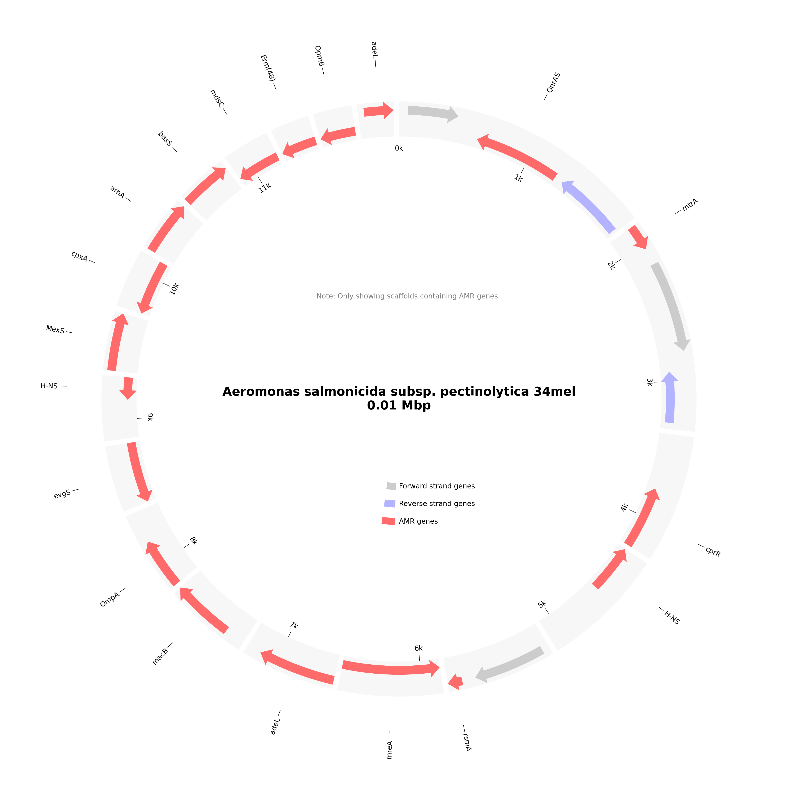

### Erm(48)
- **Mechanism**: antibiotic target alteration
- **Drug Classes**: macrolide antibiotic; lincosamide antibiotic; streptogramin antibiotic; streptogramin B antibiotic
- **AMR Family**: Erm 23S ribosomal RNA methyltransferase
- **Locations**:
  - gnl|SPADES|FDOHBCDP_22387_1 : position 1-270

### H-NS (found in 2 locations)
- **Mechanism**: antibiotic efflux
- **Drug Classes**: macrolide antibiotic; fluoroquinolone antibiotic; cephalosporin; cephamycin; penam; tetracycline antibiotic
- **AMR Family**: major facilitator superfamily (MFS) antibiotic efflux pump; resistance-nodulation-cell division (RND) antibiotic efflux pump
- **Locations**:
  - gnl|SPADES|FDOHBCDP_11303_2 : position 285-452
  - gnl|SPADES|FDOHBCDP_5483_1 : position 2-361

### MexS
- **Mechanism**: antibiotic efflux
- **Drug Classes**: fluoroquinolone antibiotic; diaminopyrimidine antibiotic; phenicol antibiotic
- **AMR Family**: resistance-nodulation-cell division (RND) antibiotic efflux pump
- **Locations**:
  - gnl|SPADES|FDOHBCDP_12608_1 : position 2-412

### OmpA
- **Mechanism**: reduced permeability to antibiotic
- **Drug Classes**: peptide antibiotic
- **AMR Family**: General Bacterial Porin with reduced permeability to peptide antibiotics
- **Locations**:
  - gnl|SPADES|FDOHBCDP_8226_1 : position 1-360

### OpmB
- **Mechanism**: antibiotic efflux
- **Drug Classes**: macrolide antibiotic; monobactam; tetracycline antibiotic; aminocoumarin antibiotic
- **AMR Family**: resistance-nodulation-cell division (RND) antibiotic efflux pump
- **Locations**:
  - gnl|SPADES|FDOHBCDP_22916_1 : position 1-267

### QnrAS
- **Mechanism**: antibiotic target protection
- **Drug Classes**: fluoroquinolone antibiotic
- **AMR Family**: quinolone resistance protein (qnr)
- **Locations**:
  - gnl|SPADES|FDOHBCDP_3022_2 : position 591-1241

### adeL (found in 2 locations)
- **Mechanism**: antibiotic efflux
- **Drug Classes**: fluoroquinolone antibiotic; tetracycline antibiotic
- **AMR Family**: resistance-nodulation-cell division (RND) antibiotic efflux pump
- **Locations**:
  - gnl|SPADES|FDOHBCDP_24834_1 : position 45-254
  - gnl|SPADES|FDOHBCDP_7164_1 : position 2-553

### arnA
- **Mechanism**: antibiotic target alteration
- **Drug Classes**: peptide antibiotic
- **AMR Family**: pmr phosphoethanolamine transferase
- **Locations**:
  - gnl|SPADES|FDOHBCDP_13700_1 : position 1-387

### basS
- **Mechanism**: antibiotic target alteration; antibiotic efflux
- **Drug Classes**: peptide antibiotic
- **AMR Family**: pmr phosphoethanolamine transferase
- **Locations**:
  - gnl|SPADES|FDOHBCDP_14937_1 : position 3-362

### cprR
- **Mechanism**: antibiotic target alteration; antibiotic efflux
- **Drug Classes**: peptide antibiotic
- **AMR Family**: pmr phosphoethanolamine transferase
- **Locations**:
  - gnl|SPADES|FDOHBCDP_5290_2 : position 420-890

### cpxA
- **Mechanism**: antibiotic efflux
- **Drug Classes**: aminoglycoside antibiotic; aminocoumarin antibiotic
- **AMR Family**: resistance-nodulation-cell division (RND) antibiotic efflux pump
- **Locations**:
  - gnl|SPADES|FDOHBCDP_12759_1 : position 2-409

### evgS
- **Mechanism**: antibiotic efflux
- **Drug Classes**: macrolide antibiotic; fluoroquinolone antibiotic; penam; tetracycline antibiotic
- **AMR Family**: major facilitator superfamily (MFS) antibiotic efflux pump; resistance-nodulation-cell division (RND) antibiotic efflux pump
- **Locations**:
  - gnl|SPADES|FDOHBCDP_11097_1 : position 2-460

### macB
- **Mechanism**: antibiotic efflux
- **Drug Classes**: macrolide antibiotic
- **AMR Family**: ATP-binding cassette (ABC) antibiotic efflux pump
- **Locations**:
  - gnl|SPADES|FDOHBCDP_8124_2 : position 145-588

### mdsC
- **Mechanism**: antibiotic efflux
- **Drug Classes**: monobactam; carbapenem; cephalosporin; cephamycin; penam; phenicol antibiotic; penem
- **AMR Family**: resistance-nodulation-cell division (RND) antibiotic efflux pump
- **Locations**:
  - gnl|SPADES|FDOHBCDP_17069_1 : position 1-327

### mreA
- **Mechanism**: antibiotic efflux
- **Drug Classes**: macrolide antibiotic
- **AMR Family**: major facilitator superfamily (MFS) antibiotic efflux pump
- **Locations**:
  - gnl|SPADES|FDOHBCDP_6386_1 : position 3-731

### mtrA
- **Mechanism**: antibiotic efflux
- **Drug Classes**: macrolide antibiotic; penam
- **AMR Family**: resistance-nodulation-cell division (RND) antibiotic efflux pump
- **Locations**:
  - gnl|SPADES|FDOHBCDP_3445_1 : position 2-187

### rsmA
- **Mechanism**: antibiotic efflux
- **Drug Classes**: fluoroquinolone antibiotic; diaminopyrimidine antibiotic; phenicol antibiotic
- **AMR Family**: resistance-nodulation-cell division (RND) antibiotic efflux pump
- **Locations**:
  - gnl|SPADES|FDOHBCDP_6152_2 : position 656-760

## Buttiauxella agrestis
**Strain Statistics:**
- Total genome length: 6.5 kbp
- Total scaffolds: 293
- Scaffolds with AMR genes: 20
- Total genes annotated: 10
- Total AMR genes: 20
- Unique AMR genes: 18
- Distinct AMR mechanisms: 4
- Distinct AMR families: 8
- Distinct drug classes: 20

**Circos Plot:**

### Acinetobacter baumannii AbaQ
- **Mechanism**: antibiotic efflux
- **Drug Classes**: fluoroquinolone antibiotic
- **AMR Family**: major facilitator superfamily (MFS) antibiotic efflux pump
- **Locations**:
  - gnl|SPADES|FDOHBCDP_25848_1 : position 2-250

### Corynebacterium striatum tetA
- **Mechanism**: antibiotic efflux
- **Drug Classes**: penam; tetracycline antibiotic
- **AMR Family**: major facilitator superfamily (MFS) antibiotic efflux pump
- **Locations**:
  - gnl|SPADES|FDOHBCDP_26810_1 : position 1-243

### Enterobacter cloacae acrA
- **Mechanism**: antibiotic efflux
- **Drug Classes**: fluoroquinolone antibiotic; cephalosporin; glycylcycline; penam; tetracycline antibiotic; rifamycin antibiotic; phenicol antibiotic; disinfecting agents and antiseptics
- **AMR Family**: resistance-nodulation-cell division (RND) antibiotic efflux pump
- **Locations**:
  - gnl|SPADES|FDOHBCDP_20072_1 : position 2-289

### LptD
- **Mechanism**: antibiotic efflux
- **Drug Classes**: carbapenem; peptide antibiotic; aminocoumarin antibiotic; rifamycin antibiotic
- **AMR Family**: ATP-binding cassette (ABC) antibiotic efflux pump
- **Locations**:
  - gnl|SPADES|FDOHBCDP_22334_1 : position 2-271

### NmcR
- **Mechanism**: antibiotic inactivation
- **Drug Classes**: carbapenem; cephalosporin; cephamycin; penam
- **AMR Family**: NmcA beta-lactamase
- **Locations**:
  - gnl|SPADES|FDOHBCDP_11257_1 : position 2-331

### OmpA
- **Mechanism**: reduced permeability to antibiotic
- **Drug Classes**: peptide antibiotic
- **AMR Family**: General Bacterial Porin with reduced permeability to peptide antibiotics
- **Locations**:
  - gnl|SPADES|FDOHBCDP_22699_1 : position 1-267

### Pseudomonas aeruginosa CpxR
- **Mechanism**: antibiotic efflux
- **Drug Classes**: macrolide antibiotic; fluoroquinolone antibiotic; monobactam; aminoglycoside antibiotic; carbapenem; cephalosporin; cephamycin; penam; tetracycline antibiotic; peptide antibiotic; aminocoumarin antibiotic; diaminopyrimidine antibiotic; sulfonamide antibiotic; phenicol antibiotic; penem
- **AMR Family**: resistance-nodulation-cell division (RND) antibiotic efflux pump
- **Locations**:
  - gnl|SPADES|FDOHBCDP_25981_1 : position 2-235

### TaeA
- **Mechanism**: antibiotic efflux
- **Drug Classes**: pleuromutilin antibiotic
- **AMR Family**: ATP-binding cassette (ABC) antibiotic efflux pump
- **Locations**:
  - gnl|SPADES|FDOHBCDP_21164_1 : position 3-278

### TolC
- **Mechanism**: antibiotic efflux
- **Drug Classes**: macrolide antibiotic; fluoroquinolone antibiotic; aminoglycoside antibiotic; carbapenem; cephalosporin; glycylcycline; cephamycin; penam; tetracycline antibiotic; peptide antibiotic; aminocoumarin antibiotic; rifamycin antibiotic; phenicol antibiotic; penem; disinfecting agents and antiseptics
- **AMR Family**: ATP-binding cassette (ABC) antibiotic efflux pump; major facilitator superfamily (MFS) antibiotic efflux pump; resistance-nodulation-cell division (RND) antibiotic efflux pump
- **Locations**:
  - gnl|SPADES|FDOHBCDP_12450_1 : position 2-418

### adeL (found in 2 locations)
- **Mechanism**: antibiotic efflux
- **Drug Classes**: fluoroquinolone antibiotic; tetracycline antibiotic
- **AMR Family**: resistance-nodulation-cell division (RND) antibiotic efflux pump
- **Locations**:
  - gnl|SPADES|FDOHBCDP_12595_1 : position 3-386
  - gnl|SPADES|FDOHBCDP_15225_1 : position 75-359

### arlR
- **Mechanism**: antibiotic efflux
- **Drug Classes**: fluoroquinolone antibiotic; disinfecting agents and antiseptics
- **AMR Family**: major facilitator superfamily (MFS) antibiotic efflux pump
- **Locations**:
  - gnl|SPADES|FDOHBCDP_33065_1 : position 57-209

### baeS
- **Mechanism**: antibiotic efflux
- **Drug Classes**: aminoglycoside antibiotic; aminocoumarin antibiotic
- **AMR Family**: resistance-nodulation-cell division (RND) antibiotic efflux pump
- **Locations**:
  - gnl|SPADES|FDOHBCDP_16563_1 : position 3-335

### bcrA (found in 2 locations)
- **Mechanism**: antibiotic efflux
- **Drug Classes**: peptide antibiotic
- **AMR Family**: ATP-binding cassette (ABC) antibiotic efflux pump
- **Locations**:
  - gnl|SPADES|FDOHBCDP_15125_1 : position 3-338
  - gnl|SPADES|FDOHBCDP_9365_1 : position 2-523

### macB
- **Mechanism**: antibiotic efflux
- **Drug Classes**: macrolide antibiotic
- **AMR Family**: ATP-binding cassette (ABC) antibiotic efflux pump
- **Locations**:
  - gnl|SPADES|FDOHBCDP_18099_1 : position 2-313

### mreA
- **Mechanism**: antibiotic efflux
- **Drug Classes**: macrolide antibiotic
- **AMR Family**: major facilitator superfamily (MFS) antibiotic efflux pump
- **Locations**:
  - gnl|SPADES|FDOHBCDP_12696_1 : position 138-410

### putative nickel/cobalt transporter
- **Mechanism**: antibiotic efflux
- **Drug Classes**: fluoroquinolone antibiotic; aminoglycoside antibiotic; isoniazid-like antibiotic
- **AMR Family**: metal transporters with antibiotic efflux
- **Locations**:
  - gnl|SPADES|FDOHBCDP_27833_1 : position 3-239

### ramA
- **Mechanism**: antibiotic efflux; reduced permeability to antibiotic
- **Drug Classes**: fluoroquinolone antibiotic; monobactam; carbapenem; cephalosporin; glycylcycline; cephamycin; penam; tetracycline antibiotic; rifamycin antibiotic; phenicol antibiotic; penem; disinfecting agents and antiseptics
- **AMR Family**: resistance-nodulation-cell division (RND) antibiotic efflux pump; General Bacterial Porin with reduced permeability to beta-lactams
- **Locations**:
  - gnl|SPADES|FDOHBCDP_18453_1 : position 2-307

### rosA
- **Mechanism**: antibiotic efflux
- **Drug Classes**: peptide antibiotic
- **AMR Family**: major facilitator superfamily (MFS) antibiotic efflux pump
- **Locations**:
  - gnl|SPADES|FDOHBCDP_17667_1 : position 182-319

## Carnobacterium divergens
**Strain Statistics:**
- Total genome length: 47.4 kbp
- Total scaffolds: 2079
- Scaffolds with AMR genes: 125
- Total genes annotated: 30
- Total AMR genes: 128
- Unique AMR genes: 80
- Distinct AMR mechanisms: 7
- Distinct AMR families: 37
- Distinct drug classes: 27

**Circos Plot:**

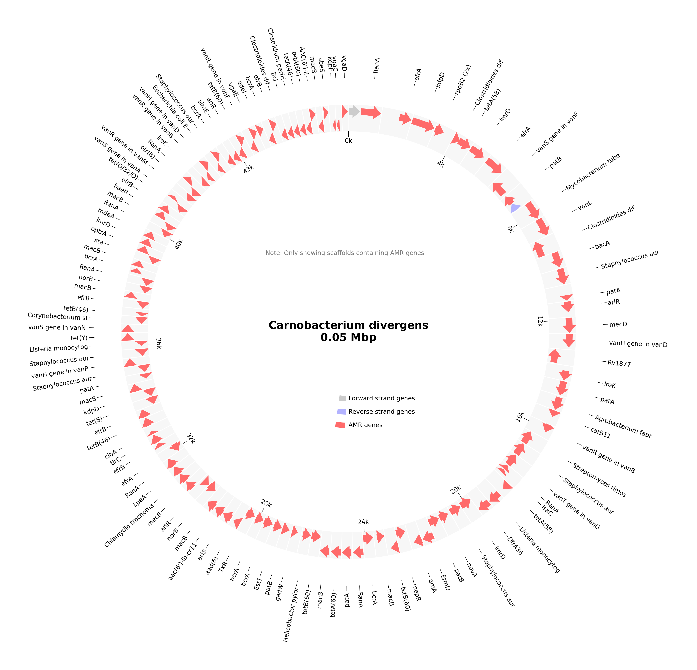

### AAC(6')-Ii
- **Mechanism**: antibiotic inactivation
- **Drug Classes**: aminoglycoside antibiotic
- **AMR Family**: AAC(6')
- **Locations**:
  - gnl|SPADES|FDOHBCDP_32619_1 : position 1-213

### Agrobacterium fabrum chloramphenicol acetyltransferase
- **Mechanism**: antibiotic inactivation
- **Drug Classes**: phenicol antibiotic
- **AMR Family**: chloramphenicol acetyltransferase (CAT)
- **Locations**:
  - gnl|SPADES|FDOHBCDP_9203_1 : position 46-531

### BcI
- **Mechanism**: antibiotic inactivation
- **Drug Classes**: cephalosporin; penem
- **AMR Family**: class A Bacillus cereus Bc beta-lactamase
- **Locations**:
  - gnl|SPADES|FDOHBCDP_30411_1 : position 3-224

### Chlamydia trachomatis intrinsic murA conferring resistance to fosfomycin
- **Mechanism**: antibiotic target alteration
- **Drug Classes**: phosphonic acid antibiotic
- **AMR Family**: antibiotic-resistant murA transferase
- **Locations**:
  - gnl|SPADES|FDOHBCDP_17244_1 : position 1-327

### Clostridioides difficile cplR
- **Mechanism**: antibiotic target protection
- **Drug Classes**: lincosamide antibiotic; streptogramin antibiotic; streptogramin A antibiotic; nucleoside antibiotic
- **AMR Family**: Miscellaneous ABC-F subfamily ATP-binding cassette ribosomal protection proteins
- **Locations**:
  - gnl|SPADES|FDOHBCDP_6503_1 : position 3-278

### Clostridioides difficile gyrA conferring resistance to fluoroquinolones (found in 2 locations)
- **Mechanism**: antibiotic target alteration
- **Drug Classes**: fluoroquinolone antibiotic
- **AMR Family**: fluoroquinolone resistant gyrA
- **Locations**:
  - gnl|SPADES|FDOHBCDP_30191_1 : position 3-224
  - gnl|SPADES|FDOHBCDP_7554_1 : position 2-625

### Clostridium perfringes cplR
- **Mechanism**: antibiotic target protection
- **Drug Classes**: lincosamide antibiotic; streptogramin antibiotic; streptogramin A antibiotic; pleuromutilin antibiotic
- **AMR Family**: Miscellaneous ABC-F subfamily ATP-binding cassette ribosomal protection proteins
- **Locations**:
  - gnl|SPADES|FDOHBCDP_30926_1 : position 2-220

### Corynebacterium striatum tetA
- **Mechanism**: antibiotic efflux
- **Drug Classes**: penam; tetracycline antibiotic
- **AMR Family**: major facilitator superfamily (MFS) antibiotic efflux pump
- **Locations**:
  - gnl|SPADES|FDOHBCDP_21515_1 : position 2-277

### DfrA36
- **Mechanism**: antibiotic target replacement
- **Drug Classes**: diaminopyrimidine antibiotic
- **AMR Family**: trimethoprim resistant dihydrofolate reductase dfr
- **Locations**:
  - gnl|SPADES|FDOHBCDP_11134_1 : position 3-458

### ErmD
- **Mechanism**: antibiotic target alteration
- **Drug Classes**: macrolide antibiotic; lincosamide antibiotic; streptogramin antibiotic; streptogramin A antibiotic; streptogramin B antibiotic
- **AMR Family**: Erm 23S ribosomal RNA methyltransferase
- **Locations**:
  - gnl|SPADES|FDOHBCDP_12247_1 : position 3-422

### Escherichia coli EF-Tu mutants conferring resistance to Pulvomycin
- **Mechanism**: antibiotic target alteration
- **Drug Classes**: elfamycin antibiotic
- **AMR Family**: elfamycin resistant EF-Tu
- **Locations**:
  - gnl|SPADES|FDOHBCDP_27976_1 : position 44-238

### EstT
- **Mechanism**: antibiotic inactivation
- **Drug Classes**: macrolide antibiotic
- **AMR Family**: macrolide esterase
- **Locations**:
  - gnl|SPADES|FDOHBCDP_15229_1 : position 1-321

### Helicobacter pylori rdxA mutation conferring resistance to metronidazole
- **Mechanism**: antibiotic target alteration
- **Drug Classes**: nitroimidazole antibiotic
- **AMR Family**: Antibiotic resistant Helicobacter pylori nitroreductase
- **Locations**:
  - gnl|SPADES|FDOHBCDP_14881_1 : position 2-319

### IreK (found in 2 locations)
- **Mechanism**: reduced permeability to antibiotic
- **Drug Classes**: cephalosporin
- **AMR Family**: Serine/threonine kinases
- **Locations**:
  - gnl|SPADES|FDOHBCDP_26815_1 : position 1-243
  - gnl|SPADES|FDOHBCDP_8933_2 : position 179-544

### Listeria monocytogenes mprF (found in 2 locations)
- **Mechanism**: antibiotic target alteration
- **Drug Classes**: peptide antibiotic
- **AMR Family**: defensin resistant mprF
- **Locations**:
  - gnl|SPADES|FDOHBCDP_10946_1 : position 2-463
  - gnl|SPADES|FDOHBCDP_20386_1 : position 93-284

### LpeA
- **Mechanism**: antibiotic efflux
- **Drug Classes**: macrolide antibiotic
- **AMR Family**: resistance-nodulation-cell division (RND) antibiotic efflux pump
- **Locations**:
  - gnl|SPADES|FDOHBCDP_17236_1 : position 3-323

### Mycobacterium tuberculosis intrinsic murA conferring resistance to fosfomycin
- **Mechanism**: antibiotic target alteration
- **Drug Classes**: phosphonic acid antibiotic
- **AMR Family**: antibiotic-resistant murA transferase
- **Locations**:
  - gnl|SPADES|FDOHBCDP_6821_1 : position 1-687

### RanA (found in 7 locations)
- **Mechanism**: antibiotic efflux
- **Drug Classes**: aminoglycoside antibiotic
- **AMR Family**: ATP-binding cassette (ABC) antibiotic efflux pump
- **Locations**:
  - gnl|SPADES|FDOHBCDP_10664_1 : position 2-199
  - gnl|SPADES|FDOHBCDP_13642_1 : position 2-388
  - gnl|SPADES|FDOHBCDP_17397_1 : position 1-324
  - gnl|SPADES|FDOHBCDP_22584_1 : position 2-268
  - gnl|SPADES|FDOHBCDP_24439_1 : position 3-257
  - gnl|SPADES|FDOHBCDP_26712_1 : position 1-222
  - gnl|SPADES|FDOHBCDP_4076_2 : position 460-1203

### Rv1877
- **Mechanism**: antibiotic efflux
- **Drug Classes**: fluoroquinolone antibiotic
- **AMR Family**: major facilitator superfamily (MFS) antibiotic efflux pump
- **Locations**:
  - gnl|SPADES|FDOHBCDP_8602_1 : position 2-532

### Staphylococcus aureus LmrS
- **Mechanism**: antibiotic efflux
- **Drug Classes**: macrolide antibiotic; aminoglycoside antibiotic; oxazolidinone antibiotic; diaminopyrimidine antibiotic; phenicol antibiotic
- **AMR Family**: major facilitator superfamily (MFS) antibiotic efflux pump
- **Locations**:
  - gnl|SPADES|FDOHBCDP_27897_1 : position 1-237

### Staphylococcus aureus mupA conferring resistance to mupirocin (found in 3 locations)
- **Mechanism**: antibiotic target alteration
- **Drug Classes**: mupirocin-like antibiotic
- **AMR Family**: antibiotic-resistant isoleucyl-tRNA synthetase (ileS)
- **Locations**:
  - gnl|SPADES|FDOHBCDP_20154_1 : position 2-286
  - gnl|SPADES|FDOHBCDP_20263_1 : position 2-286
  - gnl|SPADES|FDOHBCDP_9732_1 : position 1-507

### Staphylococcus aureus mupB conferring resistance to mupirocin
- **Mechanism**: antibiotic target alteration
- **Drug Classes**: mupirocin-like antibiotic
- **AMR Family**: antibiotic-resistant isoleucyl-tRNA synthetase (ileS)
- **Locations**:
  - gnl|SPADES|FDOHBCDP_11357_1 : position 3-449

### Staphylococcus aureus rpoB mutants conferring resistance to rifampicin
- **Mechanism**: antibiotic target alteration; antibiotic target replacement
- **Drug Classes**: rifamycin antibiotic
- **AMR Family**: rifamycin-resistant beta-subunit of RNA polymerase (rpoB)
- **Locations**:
  - gnl|SPADES|FDOHBCDP_8020_1 : position 3-593

### Streptomyces rimosus otr(A)
- **Mechanism**: antibiotic target protection
- **Drug Classes**: tetracycline antibiotic
- **AMR Family**: tetracycline-resistant ribosomal protection protein
- **Locations**:
  - gnl|SPADES|FDOHBCDP_9588_1 : position 2-514

### TxR
- **Mechanism**: antibiotic efflux
- **Drug Classes**: tetracycline antibiotic
- **AMR Family**: ATP-binding cassette (ABC) antibiotic efflux pump
- **Locations**:
  - gnl|SPADES|FDOHBCDP_15943_1 : position 1-345

### aac(6')-Ib-cr11
- **Mechanism**: antibiotic inactivation
- **Drug Classes**: fluoroquinolone antibiotic; aminoglycoside antibiotic
- **AMR Family**: AAC(6'); AAC(6')-Ib-cr
- **Locations**:
  - gnl|SPADES|FDOHBCDP_16680_1 : position 3-335

### aad(6)
- **Mechanism**: antibiotic inactivation
- **Drug Classes**: aminoglycoside antibiotic
- **AMR Family**: ANT(6)
- **Locations**:
  - gnl|SPADES|FDOHBCDP_15998_1 : position 2-268

### abeS
- **Mechanism**: antibiotic efflux
- **Drug Classes**: macrolide antibiotic; aminocoumarin antibiotic
- **AMR Family**: small multidrug resistance (SMR) antibiotic efflux pump
- **Locations**:
  - gnl|SPADES|FDOHBCDP_33358_1 : position 32-208

### adeI
- **Mechanism**: antibiotic efflux
- **Drug Classes**: macrolide antibiotic; fluoroquinolone antibiotic; lincosamide antibiotic; carbapenem; cephalosporin; tetracycline antibiotic; rifamycin antibiotic; diaminopyrimidine antibiotic; phenicol antibiotic; penem
- **AMR Family**: resistance-nodulation-cell division (RND) antibiotic efflux pump
- **Locations**:
  - gnl|SPADES|FDOHBCDP_29110_1 : position 1-231

### almE
- **Mechanism**: antibiotic target alteration
- **Drug Classes**: peptide antibiotic
- **AMR Family**: polymyxin resistance operon; alm glycyltransferase
- **Locations**:
  - gnl|SPADES|FDOHBCDP_28007_1 : position 2-238

### arlR (found in 3 locations)
- **Mechanism**: antibiotic efflux
- **Drug Classes**: fluoroquinolone antibiotic; disinfecting agents and antiseptics
- **AMR Family**: major facilitator superfamily (MFS) antibiotic efflux pump
- **Locations**:
  - gnl|SPADES|FDOHBCDP_17084_1 : position 2-259
  - gnl|SPADES|FDOHBCDP_28444_1 : position 3-236
  - gnl|SPADES|FDOHBCDP_8459_1 : position 3-398

### arlS
- **Mechanism**: antibiotic efflux
- **Drug Classes**: fluoroquinolone antibiotic; disinfecting agents and antiseptics
- **AMR Family**: major facilitator superfamily (MFS) antibiotic efflux pump
- **Locations**:
  - gnl|SPADES|FDOHBCDP_16162_1 : position 2-343

### arnA
- **Mechanism**: antibiotic target alteration
- **Drug Classes**: peptide antibiotic
- **AMR Family**: pmr phosphoethanolamine transferase
- **Locations**:
  - gnl|SPADES|FDOHBCDP_12260_1 : position 3-305

### bacA
- **Mechanism**: antibiotic target alteration
- **Drug Classes**: peptide antibiotic
- **AMR Family**: undecaprenyl pyrophosphate related proteins
- **Locations**:
  - gnl|SPADES|FDOHBCDP_7925_1 : position 3-575

### baeR
- **Mechanism**: antibiotic efflux
- **Drug Classes**: aminoglycoside antibiotic; aminocoumarin antibiotic
- **AMR Family**: resistance-nodulation-cell division (RND) antibiotic efflux pump
- **Locations**:
  - gnl|SPADES|FDOHBCDP_26061_1 : position 1-249

### bcrA (found in 6 locations)
- **Mechanism**: antibiotic efflux
- **Drug Classes**: peptide antibiotic
- **AMR Family**: ATP-binding cassette (ABC) antibiotic efflux pump
- **Locations**:
  - gnl|SPADES|FDOHBCDP_13351_1 : position 3-395
  - gnl|SPADES|FDOHBCDP_15371_1 : position 1-354
  - gnl|SPADES|FDOHBCDP_15767_1 : position 3-311
  - gnl|SPADES|FDOHBCDP_22755_1 : position 88-267
  - gnl|SPADES|FDOHBCDP_28103_1 : position 2-238
  - gnl|SPADES|FDOHBCDP_29299_1 : position 2-229

### catB11
- **Mechanism**: antibiotic inactivation
- **Drug Classes**: phenicol antibiotic
- **AMR Family**: chloramphenicol acetyltransferase (CAT)
- **Locations**:
  - gnl|SPADES|FDOHBCDP_9242_1 : position 1-252

### clbA
- **Mechanism**: antibiotic target alteration
- **Drug Classes**: lincosamide antibiotic; streptogramin antibiotic; streptogramin A antibiotic; oxazolidinone antibiotic; phenicol antibiotic; pleuromutilin antibiotic
- **AMR Family**: Cfr 23S ribosomal RNA methyltransferase
- **Locations**:
  - gnl|SPADES|FDOHBCDP_17912_1 : position 1-126

### efrA (found in 3 locations)
- **Mechanism**: antibiotic efflux
- **Drug Classes**: macrolide antibiotic; fluoroquinolone antibiotic; rifamycin antibiotic
- **AMR Family**: ATP-binding cassette (ABC) antibiotic efflux pump
- **Locations**:
  - gnl|SPADES|FDOHBCDP_17518_1 : position 3-323
  - gnl|SPADES|FDOHBCDP_4361_2 : position 654-1109
  - gnl|SPADES|FDOHBCDP_6611_1 : position 1-708

### efrB (found in 5 locations)
- **Mechanism**: antibiotic efflux
- **Drug Classes**: macrolide antibiotic; fluoroquinolone antibiotic; rifamycin antibiotic
- **AMR Family**: ATP-binding cassette (ABC) antibiotic efflux pump
- **Locations**:
  - gnl|SPADES|FDOHBCDP_17761_2 : position 159-317
  - gnl|SPADES|FDOHBCDP_18599_1 : position 2-307
  - gnl|SPADES|FDOHBCDP_21931_1 : position 3-272
  - gnl|SPADES|FDOHBCDP_25911_1 : position 2-250
  - gnl|SPADES|FDOHBCDP_30044_1 : position 3-227

### gadW
- **Mechanism**: antibiotic efflux
- **Drug Classes**: macrolide antibiotic; fluoroquinolone antibiotic; penam
- **AMR Family**: resistance-nodulation-cell division (RND) antibiotic efflux pump
- **Locations**:
  - gnl|SPADES|FDOHBCDP_14913_1 : position 138-362

### kdpD (found in 2 locations)
- **Mechanism**: antibiotic efflux
- **Drug Classes**: aminoglycoside antibiotic
- **AMR Family**: kdpDE
- **Locations**:
  - gnl|SPADES|FDOHBCDP_19247_1 : position 1-297
  - gnl|SPADES|FDOHBCDP_5394_1 : position 3-869

### kdpE
- **Mechanism**: antibiotic efflux
- **Drug Classes**: aminoglycoside antibiotic
- **AMR Family**: kdpDE
- **Locations**:
  - gnl|SPADES|FDOHBCDP_33465_1 : position 90-206

### lmrD (found in 3 locations)
- **Mechanism**: antibiotic efflux
- **Drug Classes**: lincosamide antibiotic
- **AMR Family**: ATP-binding cassette (ABC) antibiotic efflux pump
- **Locations**:
  - gnl|SPADES|FDOHBCDP_11237_1 : position 2-454
  - gnl|SPADES|FDOHBCDP_24390_1 : position 2-259
  - gnl|SPADES|FDOHBCDP_6604_1 : position 2-580

### lsaC
- **Mechanism**: antibiotic target protection
- **Drug Classes**: lincosamide antibiotic; streptogramin antibiotic; pleuromutilin antibiotic
- **AMR Family**: lsa-type ABC-F protein
- **Locations**:
  - gnl|SPADES|FDOHBCDP_10664_2 : position 208-363

### macB (found in 8 locations)
- **Mechanism**: antibiotic efflux
- **Drug Classes**: macrolide antibiotic
- **AMR Family**: ATP-binding cassette (ABC) antibiotic efflux pump
- **Locations**:
  - gnl|SPADES|FDOHBCDP_12793_1 : position 2-298
  - gnl|SPADES|FDOHBCDP_14432_1 : position 43-372
  - gnl|SPADES|FDOHBCDP_17007_1 : position 2-328
  - gnl|SPADES|FDOHBCDP_19736_1 : position 1-291
  - gnl|SPADES|FDOHBCDP_22229_1 : position 46-270
  - gnl|SPADES|FDOHBCDP_23577_1 : position 33-263
  - gnl|SPADES|FDOHBCDP_25612_1 : position 1-252
  - gnl|SPADES|FDOHBCDP_33369_1 : position 1-207

### mdeA
- **Mechanism**: antibiotic efflux
- **Drug Classes**: fluoroquinolone antibiotic; aminoglycoside antibiotic; penam; tetracycline antibiotic; disinfecting agents and antiseptics
- **AMR Family**: major facilitator superfamily (MFS) antibiotic efflux pump
- **Locations**:
  - gnl|SPADES|FDOHBCDP_24308_1 : position 2-259

### mecB
- **Mechanism**: antibiotic target replacement
- **Drug Classes**: penam
- **AMR Family**: methicillin resistant PBP2
- **Locations**:
  - gnl|SPADES|FDOHBCDP_17054_1 : position 2-328

### mecD
- **Mechanism**: antibiotic target replacement
- **Drug Classes**: penam
- **AMR Family**: methicillin resistant PBP2
- **Locations**:
  - gnl|SPADES|FDOHBCDP_8473_1 : position 1-567

### mepR
- **Mechanism**: antibiotic efflux
- **Drug Classes**: glycylcycline; tetracycline antibiotic
- **AMR Family**: multidrug and toxic compound extrusion (MATE) transporter
- **Locations**:
  - gnl|SPADES|FDOHBCDP_12492_1 : position 44-415

### norB (found in 2 locations)
- **Mechanism**: antibiotic efflux
- **Drug Classes**: fluoroquinolone antibiotic
- **AMR Family**: major facilitator superfamily (MFS) antibiotic efflux pump
- **Locations**:
  - gnl|SPADES|FDOHBCDP_17010_1 : position 1-330
  - gnl|SPADES|FDOHBCDP_22406_1 : position 3-269

### novA
- **Mechanism**: antibiotic efflux
- **Drug Classes**: aminocoumarin antibiotic
- **AMR Family**: ATP-binding cassette (ABC) antibiotic efflux pump
- **Locations**:
  - gnl|SPADES|FDOHBCDP_11521_2 : position 80-445

### optrA
- **Mechanism**: antibiotic target protection
- **Drug Classes**: oxazolidinone antibiotic; phenicol antibiotic
- **AMR Family**: Miscellaneous ABC-F subfamily ATP-binding cassette ribosomal protection proteins
- **Locations**:
  - gnl|SPADES|FDOHBCDP_24239_1 : position 1-258

### otr(B)
- **Mechanism**: antibiotic efflux
- **Drug Classes**: tetracycline antibiotic
- **AMR Family**: major facilitator superfamily (MFS) antibiotic efflux pump
- **Locations**:
  - gnl|SPADES|FDOHBCDP_26691_1 : position 2-244

### patA (found in 4 locations)
- **Mechanism**: antibiotic efflux
- **Drug Classes**: fluoroquinolone antibiotic
- **AMR Family**: ATP-binding cassette (ABC) antibiotic efflux pump
- **Locations**:
  - gnl|SPADES|FDOHBCDP_14318_1 : position 28-375
  - gnl|SPADES|FDOHBCDP_19900_2 : position 61-264
  - gnl|SPADES|FDOHBCDP_8224_1 : position 377-583
  - gnl|SPADES|FDOHBCDP_9049_1 : position 1-537

### patB (found in 3 locations)
- **Mechanism**: antibiotic efflux
- **Drug Classes**: fluoroquinolone antibiotic
- **AMR Family**: ATP-binding cassette (ABC) antibiotic efflux pump
- **Locations**:
  - gnl|SPADES|FDOHBCDP_11924_1 : position 2-433
  - gnl|SPADES|FDOHBCDP_15022_1 : position 74-361
  - gnl|SPADES|FDOHBCDP_6794_1 : position 1-372

### rpoB2 (found in 2 locations)
- **Mechanism**: antibiotic target alteration; antibiotic target replacement
- **Drug Classes**: rifamycin antibiotic
- **AMR Family**: rifamycin-resistant beta-subunit of RNA polymerase (rpoB)
- **Locations**:
  - gnl|SPADES|FDOHBCDP_6491_1 : position 1-345
  - gnl|SPADES|FDOHBCDP_6491_2 : position 311-718

### sta
- **Mechanism**: antibiotic inactivation
- **Drug Classes**: nucleoside antibiotic
- **AMR Family**: streptothricin acetyltransferase (SAT)
- **Locations**:
  - gnl|SPADES|FDOHBCDP_24074_1 : position 2-259

### tet(O/32/O)
- **Mechanism**: antibiotic target protection
- **Drug Classes**: tetracycline antibiotic
- **AMR Family**: tetracycline-resistant ribosomal protection protein
- **Locations**:
  - gnl|SPADES|FDOHBCDP_25940_1 : position 1-249

### tet(S)
- **Mechanism**: antibiotic target protection
- **Drug Classes**: tetracycline antibiotic
- **AMR Family**: tetracycline-resistant ribosomal protection protein
- **Locations**:
  - gnl|SPADES|FDOHBCDP_18754_1 : position 3-305

### tet(Y)
- **Mechanism**: antibiotic efflux
- **Drug Classes**: tetracycline antibiotic
- **AMR Family**: major facilitator superfamily (MFS) antibiotic efflux pump
- **Locations**:
  - gnl|SPADES|FDOHBCDP_20608_1 : position 2-283

### tetA(46)
- **Mechanism**: antibiotic efflux
- **Drug Classes**: tetracycline antibiotic
- **AMR Family**: ATP-binding cassette (ABC) antibiotic efflux pump
- **Locations**:
  - gnl|SPADES|FDOHBCDP_31783_1 : position 3-218

### tetA(58) (found in 2 locations)
- **Mechanism**: antibiotic efflux
- **Drug Classes**: tetracycline antibiotic
- **AMR Family**: major facilitator superfamily (MFS) antibiotic efflux pump
- **Locations**:
  - gnl|SPADES|FDOHBCDP_10751_1 : position 2-280
  - gnl|SPADES|FDOHBCDP_6503_2 : position 226-717

### tetA(60) (found in 2 locations)
- **Mechanism**: antibiotic efflux
- **Drug Classes**: tetracycline antibiotic
- **AMR Family**: ATP-binding cassette (ABC) antibiotic efflux pump
- **Locations**:
  - gnl|SPADES|FDOHBCDP_14415_1 : position 1-372
  - gnl|SPADES|FDOHBCDP_32166_1 : position 2-214

### tetB(46) (found in 2 locations)
- **Mechanism**: antibiotic efflux
- **Drug Classes**: tetracycline antibiotic
- **AMR Family**: ATP-binding cassette (ABC) antibiotic efflux pump
- **Locations**:
  - gnl|SPADES|FDOHBCDP_17879_1 : position 3-317
  - gnl|SPADES|FDOHBCDP_21734_1 : position 1-153

### tetB(60) (found in 3 locations)
- **Mechanism**: antibiotic efflux
- **Drug Classes**: tetracycline antibiotic
- **AMR Family**: ATP-binding cassette (ABC) antibiotic efflux pump
- **Locations**:
  - gnl|SPADES|FDOHBCDP_12736_1 : position 1-279
  - gnl|SPADES|FDOHBCDP_14632_1 : position 2-370
  - gnl|SPADES|FDOHBCDP_28464_1 : position 3-236

### tlrC
- **Mechanism**: antibiotic target protection
- **Drug Classes**: macrolide antibiotic; lincosamide antibiotic
- **AMR Family**: Miscellaneous ABC-F subfamily ATP-binding cassette ribosomal protection proteins
- **Locations**:
  - gnl|SPADES|FDOHBCDP_17898_1 : position 1-315

### vanH gene in vanD cluster (found in 2 locations)
- **Mechanism**: antibiotic target alteration
- **Drug Classes**: glycopeptide antibiotic
- **AMR Family**: vanH; glycopeptide resistance gene cluster
- **Locations**:
  - gnl|SPADES|FDOHBCDP_27687_1 : position 1-240
  - gnl|SPADES|FDOHBCDP_8578_1 : position 3-491

### vanH gene in vanP cluster
- **Mechanism**: antibiotic target alteration
- **Drug Classes**: glycopeptide antibiotic
- **AMR Family**: vanH; glycopeptide resistance gene cluster
- **Locations**:
  - gnl|SPADES|FDOHBCDP_20243_1 : position 2-286

### vanL
- **Mechanism**: antibiotic target alteration
- **Drug Classes**: glycopeptide antibiotic
- **AMR Family**: glycopeptide resistance gene cluster; Van ligase
- **Locations**:
  - gnl|SPADES|FDOHBCDP_6938_1 : position 1-675

### vanR gene in vanB cluster (found in 2 locations)
- **Mechanism**: antibiotic target alteration
- **Drug Classes**: glycopeptide antibiotic
- **AMR Family**: glycopeptide resistance gene cluster; vanR
- **Locations**:
  - gnl|SPADES|FDOHBCDP_26874_1 : position 53-244
  - gnl|SPADES|FDOHBCDP_9579_1 : position 3-314

### vanR gene in vanF cluster
- **Mechanism**: antibiotic target alteration
- **Drug Classes**: glycopeptide antibiotic
- **AMR Family**: glycopeptide resistance gene cluster; vanR
- **Locations**:
  - gnl|SPADES|FDOHBCDP_29019_1 : position 1-231

### vanR gene in vanM cluster
- **Mechanism**: antibiotic target alteration
- **Drug Classes**: glycopeptide antibiotic
- **AMR Family**: glycopeptide resistance gene cluster; vanR
- **Locations**:
  - gnl|SPADES|FDOHBCDP_26046_1 : position 1-249

### vanS gene in vanA cluster
- **Mechanism**: antibiotic target alteration
- **Drug Classes**: glycopeptide antibiotic
- **AMR Family**: vanS; glycopeptide resistance gene cluster
- **Locations**:
  - gnl|SPADES|FDOHBCDP_26000_1 : position 1-135

### vanS gene in vanF cluster
- **Mechanism**: antibiotic target alteration
- **Drug Classes**: glycopeptide antibiotic
- **AMR Family**: vanS; glycopeptide resistance gene cluster
- **Locations**:
  - gnl|SPADES|FDOHBCDP_6729_1 : position 1-612

### vanS gene in vanN cluster
- **Mechanism**: antibiotic target alteration
- **Drug Classes**: glycopeptide antibiotic
- **AMR Family**: vanS; glycopeptide resistance gene cluster
- **Locations**:
  - gnl|SPADES|FDOHBCDP_20877_1 : position 3-281

### vanT gene in vanG cluster
- **Mechanism**: antibiotic target alteration
- **Drug Classes**: glycopeptide antibiotic
- **AMR Family**: glycopeptide resistance gene cluster; vanT
- **Locations**:
  - gnl|SPADES|FDOHBCDP_10298_1 : position 1-486

### vgaC
- **Mechanism**: antibiotic target protection
- **Drug Classes**: lincosamide antibiotic; streptogramin antibiotic; streptogramin A antibiotic; pleuromutilin antibiotic
- **AMR Family**: vga-type ABC-F protein
- **Locations**:
  - gnl|SPADES|FDOHBCDP_33659_1 : position 2-121

### vgaD
- **Mechanism**: antibiotic target protection
- **Drug Classes**: streptogramin antibiotic; streptogramin A antibiotic; pleuromutilin antibiotic
- **AMR Family**: vga-type ABC-F protein
- **Locations**:
  - gnl|SPADES|FDOHBCDP_33685_1 : position 1-207

### vgaE
- **Mechanism**: antibiotic target protection
- **Drug Classes**: lincosamide antibiotic; streptogramin antibiotic; streptogramin A antibiotic; pleuromutilin antibiotic
- **AMR Family**: vga-type ABC-F protein
- **Locations**:
  - gnl|SPADES|FDOHBCDP_29139_1 : position 1-231

## Carnobacterium maltaromaticum
**Strain Statistics:**
- Total genome length: 235.7 kbp
- Total scaffolds: 4123
- Scaffolds with AMR genes: 338
- Total genes annotated: 304
- Total AMR genes: 348
- Unique AMR genes: 146
- Distinct AMR mechanisms: 10
- Distinct AMR families: 64
- Distinct drug classes: 34

**Circos Plot:**

### AAC(3)-IIIa
- **Mechanism**: antibiotic inactivation
- **Drug Classes**: aminoglycoside antibiotic
- **AMR Family**: AAC(3)
- **Locations**:
  - gnl|SPADES|FDOHBCDP_5985_2 : position 255-779

### AAC(3)-IXa
- **Mechanism**: antibiotic inactivation
- **Drug Classes**: aminoglycoside antibiotic
- **AMR Family**: AAC(3)
- **Locations**:
  - gnl|SPADES|FDOHBCDP_15089_1 : position 126-359

### AAC(3)-Ic
- **Mechanism**: antibiotic inactivation
- **Drug Classes**: aminoglycoside antibiotic
- **AMR Family**: AAC(3)
- **Locations**:
  - gnl|SPADES|FDOHBCDP_5242_1 : position 349-843

### AAC(6')-Ir
- **Mechanism**: antibiotic inactivation
- **Drug Classes**: aminoglycoside antibiotic
- **AMR Family**: AAC(6')
- **Locations**:
  - gnl|SPADES|FDOHBCDP_3498_3 : position 774-1379

### ANT(6)-Ib
- **Mechanism**: antibiotic inactivation
- **Drug Classes**: aminoglycoside antibiotic
- **AMR Family**: ANT(6)
- **Locations**:
  - gnl|SPADES|FDOHBCDP_7673_1 : position 128-619

### BcI (found in 2 locations)
- **Mechanism**: antibiotic inactivation
- **Drug Classes**: cephalosporin; penem
- **AMR Family**: class A Bacillus cereus Bc beta-lactamase
- **Locations**:
  - gnl|SPADES|FDOHBCDP_17135_1 : position 2-328
  - gnl|SPADES|FDOHBCDP_4561_2 : position 837-1043

### Chlamydia trachomatis intrinsic murA conferring resistance to fosfomycin
- **Mechanism**: antibiotic target alteration
- **Drug Classes**: phosphonic acid antibiotic
- **AMR Family**: antibiotic-resistant murA transferase
- **Locations**:
  - gnl|SPADES|FDOHBCDP_28760_1 : position 2-232

### Clostridioides difficile gyrA conferring resistance to fluoroquinolones (found in 3 locations)
- **Mechanism**: antibiotic target alteration
- **Drug Classes**: fluoroquinolone antibiotic
- **AMR Family**: fluoroquinolone resistant gyrA
- **Locations**:
  - gnl|SPADES|FDOHBCDP_13741_1 : position 3-386
  - gnl|SPADES|FDOHBCDP_2665_1 : position 2-610
  - gnl|SPADES|FDOHBCDP_6413_2 : position 373-729

### Clostridioides difficile gyrB conferring resistance to fluoroquinolones (found in 2 locations)
- **Mechanism**: antibiotic target alteration
- **Drug Classes**: fluoroquinolone antibiotic
- **AMR Family**: fluoroquinolone resistant gyrB
- **Locations**:
  - gnl|SPADES|FDOHBCDP_2665_2 : position 760-2250
  - gnl|SPADES|FDOHBCDP_31634_1 : position 1-216

### Clostridium sporogenes cplR
- **Mechanism**: antibiotic target protection
- **Drug Classes**: lincosamide antibiotic; pleuromutilin antibiotic
- **AMR Family**: Miscellaneous ABC-F subfamily ATP-binding cassette ribosomal protection proteins
- **Locations**:
  - gnl|SPADES|FDOHBCDP_27350_1 : position 3-242

### Corynebacterium striatum tetA
- **Mechanism**: antibiotic efflux
- **Drug Classes**: penam; tetracycline antibiotic
- **AMR Family**: major facilitator superfamily (MFS) antibiotic efflux pump
- **Locations**:
  - gnl|SPADES|FDOHBCDP_7728_3 : position 512-613

### Enterococcus faecalis cls with mutation conferring resistance to daptomycin
- **Mechanism**: antibiotic target alteration
- **Drug Classes**: peptide antibiotic
- **AMR Family**: daptomycin resistant cls
- **Locations**:
  - gnl|SPADES|FDOHBCDP_9549_1 : position 2-514

### Erm(48)
- **Mechanism**: antibiotic target alteration
- **Drug Classes**: macrolide antibiotic; lincosamide antibiotic; streptogramin antibiotic; streptogramin B antibiotic
- **AMR Family**: Erm 23S ribosomal RNA methyltransferase
- **Locations**:
  - gnl|SPADES|FDOHBCDP_4045_1 : position 814-1218

### ErmR
- **Mechanism**: antibiotic target alteration
- **Drug Classes**: macrolide antibiotic; lincosamide antibiotic; streptogramin antibiotic; streptogramin A antibiotic; streptogramin B antibiotic
- **AMR Family**: Erm 23S ribosomal RNA methyltransferase
- **Locations**:
  - gnl|SPADES|FDOHBCDP_3345_1 : position 1-408

### Escherichia coli EF-Tu mutants conferring resistance to kirromycin (found in 2 locations)
- **Mechanism**: antibiotic target alteration
- **Drug Classes**: elfamycin antibiotic
- **AMR Family**: elfamycin resistant EF-Tu
- **Locations**:
  - gnl|SPADES|FDOHBCDP_14803_1 : position 2-364
  - gnl|SPADES|FDOHBCDP_4154_1 : position 1-1044

### Escherichia coli fabI mutations conferring resistance to isoniazid and triclosan
- **Mechanism**: antibiotic target alteration
- **Drug Classes**: disinfecting agents and antiseptics; isoniazid-like antibiotic
- **AMR Family**: antibiotic resistant fabI
- **Locations**:
  - gnl|SPADES|FDOHBCDP_9518_1 : position 70-516

### Escherichia coli gyrA conferring resistance to fluoroquinolones
- **Mechanism**: antibiotic target alteration
- **Drug Classes**: fluoroquinolone antibiotic
- **AMR Family**: fluoroquinolone resistant gyrA
- **Locations**:
  - gnl|SPADES|FDOHBCDP_9649_1 : position 3-335

### Escherichia coli soxS with mutation conferring antibiotic resistance (found in 2 locations)
- **Mechanism**: antibiotic target alteration; antibiotic efflux; reduced permeability to antibiotic
- **Drug Classes**: fluoroquinolone antibiotic; monobactam; carbapenem; cephalosporin; glycylcycline; cephamycin; penam; tetracycline antibiotic; rifamycin antibiotic; phenicol antibiotic; penem; disinfecting agents and antiseptics
- **AMR Family**: ATP-binding cassette (ABC) antibiotic efflux pump; major facilitator superfamily (MFS) antibiotic efflux pump; resistance-nodulation-cell division (RND) antibiotic efflux pump; General Bacterial Porin with reduced permeability to beta-lactams
- **Locations**:
  - gnl|SPADES|FDOHBCDP_10676_1 : position 2-472
  - gnl|SPADES|FDOHBCDP_5493_1 : position 496-780

### EstT
- **Mechanism**: antibiotic inactivation
- **Drug Classes**: macrolide antibiotic
- **AMR Family**: macrolide esterase
- **Locations**:
  - gnl|SPADES|FDOHBCDP_3280_3 : position 716-1549

### FusF
- **Mechanism**: antibiotic target protection
- **Drug Classes**: fusidane antibiotic
- **AMR Family**: Target protecting FusB-type protein conferring resistance to Fusidic acid
- **Locations**:
  - gnl|SPADES|FDOHBCDP_11385_1 : position 3-449

### GOB-18
- **Mechanism**: antibiotic inactivation
- **Drug Classes**: carbapenem; cephalosporin; penam
- **AMR Family**: GOB beta-lactamase
- **Locations**:
  - gnl|SPADES|FDOHBCDP_6186_1 : position 2-562

### Helicobacter pylori frxA mutation conferring resistance to metronidazole
- **Mechanism**: antibiotic target alteration
- **Drug Classes**: nitroimidazole antibiotic
- **AMR Family**: Antibiotic resistant Helicobacter pylori nitroreductase
- **Locations**:
  - gnl|SPADES|FDOHBCDP_3103_1 : position 2-304

### Helicobacter pylori pbp1 mutants conferring resistance to amoxicillin (found in 3 locations)
- **Mechanism**: antibiotic target alteration
- **Drug Classes**: cephalosporin; cephamycin; penam
- **AMR Family**: Penicillin-binding protein mutations conferring resistance to beta-lactam antibiotics
- **Locations**:
  - gnl|SPADES|FDOHBCDP_4615_1 : position 1-1029
  - gnl|SPADES|FDOHBCDP_4971_1 : position 2-946
  - gnl|SPADES|FDOHBCDP_5234_1 : position 2-898

### IreK (found in 3 locations)
- **Mechanism**: reduced permeability to antibiotic
- **Drug Classes**: cephalosporin
- **AMR Family**: Serine/threonine kinases
- **Locations**:
  - gnl|SPADES|FDOHBCDP_14889_1 : position 3-365
  - gnl|SPADES|FDOHBCDP_20697_1 : position 3-281
  - gnl|SPADES|FDOHBCDP_5472_1 : position 2-562

### Listeria monocytogenes mprF (found in 2 locations)
- **Mechanism**: antibiotic target alteration
- **Drug Classes**: peptide antibiotic
- **AMR Family**: defensin resistant mprF
- **Locations**:
  - gnl|SPADES|FDOHBCDP_11153_1 : position 1-456
  - gnl|SPADES|FDOHBCDP_31097_1 : position 2-220

### MexL
- **Mechanism**: antibiotic efflux
- **Drug Classes**: macrolide antibiotic; tetracycline antibiotic; disinfecting agents and antiseptics
- **AMR Family**: resistance-nodulation-cell division (RND) antibiotic efflux pump
- **Locations**:
  - gnl|SPADES|FDOHBCDP_26527_1 : position 35-247

### MexS
- **Mechanism**: antibiotic efflux
- **Drug Classes**: fluoroquinolone antibiotic; diaminopyrimidine antibiotic; phenicol antibiotic
- **AMR Family**: resistance-nodulation-cell division (RND) antibiotic efflux pump
- **Locations**:
  - gnl|SPADES|FDOHBCDP_6184_1 : position 2-511

### Mycobacterium tuberculosis pncA mutations conferring resistance to pyrazinamide
- **Mechanism**: antibiotic target alteration
- **Drug Classes**: pyrazine antibiotic
- **AMR Family**: Pyrazinamide resistant pncA
- **Locations**:
  - gnl|SPADES|FDOHBCDP_2364_1 : position 2-355

### Mycolicibacterium smegmatis ndh with mutation conferring resistance to isoniazid
- **Mechanism**: antibiotic target alteration
- **Drug Classes**: isoniazid-like antibiotic
- **AMR Family**: antibiotic resistant ndh
- **Locations**:
  - gnl|SPADES|FDOHBCDP_7791_1 : position 323-610

### NmcR
- **Mechanism**: antibiotic inactivation
- **Drug Classes**: carbapenem; cephalosporin; cephamycin; penam
- **AMR Family**: NmcA beta-lactamase
- **Locations**:
  - gnl|SPADES|FDOHBCDP_12534_1 : position 92-415

### PAM-2
- **Mechanism**: antibiotic inactivation
- **Drug Classes**: carbapenem; cephalosporin
- **AMR Family**: PAM beta-lactamase
- **Locations**:
  - gnl|SPADES|FDOHBCDP_7370_1 : position 1-438

### ParR
- **Mechanism**: antibiotic efflux; reduced permeability to antibiotic
- **Drug Classes**: macrolide antibiotic; fluoroquinolone antibiotic; monobactam; aminoglycoside antibiotic; carbapenem; cephalosporin; cephamycin; penam; tetracycline antibiotic; phenicol antibiotic; penem; disinfecting agents and antiseptics
- **AMR Family**: resistance-nodulation-cell division (RND) antibiotic efflux pump; Outer Membrane Porin (Opr)
- **Locations**:
  - gnl|SPADES|FDOHBCDP_19369_1 : position 3-140

### PmrF (found in 2 locations)
- **Mechanism**: antibiotic target alteration
- **Drug Classes**: peptide antibiotic
- **AMR Family**: pmr phosphoethanolamine transferase
- **Locations**:
  - gnl|SPADES|FDOHBCDP_7159_1 : position 2-511
  - gnl|SPADES|FDOHBCDP_7184_1 : position 151-654

### Pseudomonas aeruginosa soxR
- **Mechanism**: antibiotic target alteration; antibiotic efflux
- **Drug Classes**: fluoroquinolone antibiotic; cephalosporin; glycylcycline; penam; tetracycline antibiotic; rifamycin antibiotic; phenicol antibiotic; disinfecting agents and antiseptics
- **AMR Family**: ATP-binding cassette (ABC) antibiotic efflux pump; major facilitator superfamily (MFS) antibiotic efflux pump; resistance-nodulation-cell division (RND) antibiotic efflux pump
- **Locations**:
  - gnl|SPADES|FDOHBCDP_5227_1 : position 20-457

### QnrS5
- **Mechanism**: antibiotic target protection
- **Drug Classes**: fluoroquinolone antibiotic
- **AMR Family**: quinolone resistance protein (qnr)
- **Locations**:
  - gnl|SPADES|FDOHBCDP_7384_1 : position 233-637

### RanA (found in 19 locations)
- **Mechanism**: antibiotic efflux
- **Drug Classes**: aminoglycoside antibiotic
- **AMR Family**: ATP-binding cassette (ABC) antibiotic efflux pump
- **Locations**:
  - gnl|SPADES|FDOHBCDP_12160_1 : position 3-425
  - gnl|SPADES|FDOHBCDP_13371_1 : position 1-393
  - gnl|SPADES|FDOHBCDP_14034_1 : position 3-380
  - gnl|SPADES|FDOHBCDP_14321_2 : position 111-374
  - gnl|SPADES|FDOHBCDP_19558_1 : position 1-294
  - gnl|SPADES|FDOHBCDP_20733_1 : position 3-281
  - gnl|SPADES|FDOHBCDP_2128_5 : position 2069-2722
  - gnl|SPADES|FDOHBCDP_32170_1 : position 1-213
  - gnl|SPADES|FDOHBCDP_3363_2 : position 690-1421
  - gnl|SPADES|FDOHBCDP_4448_1 : position 1-249
  - gnl|SPADES|FDOHBCDP_4483_2 : position 351-1067
  - gnl|SPADES|FDOHBCDP_4856_2 : position 513-971
  - gnl|SPADES|FDOHBCDP_5444_2 : position 506-862
  - gnl|SPADES|FDOHBCDP_6351_1 : position 1-735
  - gnl|SPADES|FDOHBCDP_6434_1 : position 248-724
  - gnl|SPADES|FDOHBCDP_6706_1 : position 1-636
  - gnl|SPADES|FDOHBCDP_7353_1 : position 3-281
  - gnl|SPADES|FDOHBCDP_7790_1 : position 3-611
  - gnl|SPADES|FDOHBCDP_9940_1 : position 1-501

### RlmA(II)
- **Mechanism**: antibiotic target alteration
- **Drug Classes**: macrolide antibiotic; lincosamide antibiotic
- **AMR Family**: non-erm 23S ribosomal RNA methyltransferase (G748)
- **Locations**:
  - gnl|SPADES|FDOHBCDP_4606_1 : position 1-708

### SatA
- **Mechanism**: antibiotic inactivation
- **Drug Classes**: nucleoside antibiotic
- **AMR Family**: streptothricin acetyltransferase (SAT)
- **Locations**:
  - gnl|SPADES|FDOHBCDP_5718_2 : position 193-645

### Staphylococcus aureus LmrS (found in 3 locations)
- **Mechanism**: antibiotic efflux
- **Drug Classes**: macrolide antibiotic; aminoglycoside antibiotic; oxazolidinone antibiotic; diaminopyrimidine antibiotic; phenicol antibiotic
- **AMR Family**: major facilitator superfamily (MFS) antibiotic efflux pump
- **Locations**:
  - gnl|SPADES|FDOHBCDP_10437_1 : position 2-481
  - gnl|SPADES|FDOHBCDP_16575_1 : position 3-335
  - gnl|SPADES|FDOHBCDP_18471_1 : position 3-308

### Staphylococcus aureus fusA with mutation conferring resistance to fusidic acid (found in 2 locations)
- **Mechanism**: antibiotic target alteration
- **Drug Classes**: fusidane antibiotic
- **AMR Family**: antibiotic resistant fusA
- **Locations**:
  - gnl|SPADES|FDOHBCDP_2968_1 : position 1-681
  - gnl|SPADES|FDOHBCDP_3792_1 : position 419-1330

### Staphylococcus aureus mupA conferring resistance to mupirocin (found in 5 locations)
- **Mechanism**: antibiotic target alteration
- **Drug Classes**: mupirocin-like antibiotic
- **AMR Family**: antibiotic-resistant isoleucyl-tRNA synthetase (ileS)
- **Locations**:
  - gnl|SPADES|FDOHBCDP_10104_1 : position 3-494
  - gnl|SPADES|FDOHBCDP_18450_1 : position 2-307
  - gnl|SPADES|FDOHBCDP_2833_1 : position 3-353
  - gnl|SPADES|FDOHBCDP_3796_1 : position 3-1328
  - gnl|SPADES|FDOHBCDP_6415_1 : position 215-727

### Staphylococcus aureus mupB conferring resistance to mupirocin (found in 2 locations)
- **Mechanism**: antibiotic target alteration
- **Drug Classes**: mupirocin-like antibiotic
- **AMR Family**: antibiotic-resistant isoleucyl-tRNA synthetase (ileS)
- **Locations**:
  - gnl|SPADES|FDOHBCDP_26067_1 : position 1-249
  - gnl|SPADES|FDOHBCDP_4409_1 : position 2-1093

### Staphylococcus aureus murA with mutation conferring resistance to fosfomycin
- **Mechanism**: antibiotic target alteration
- **Drug Classes**: phosphonic acid antibiotic
- **AMR Family**: antibiotic-resistant murA transferase
- **Locations**:
  - gnl|SPADES|FDOHBCDP_7238_1 : position 3-647

### Staphylococcus aureus rpoB mutants conferring resistance to rifampicin
- **Mechanism**: antibiotic target alteration; antibiotic target replacement
- **Drug Classes**: rifamycin antibiotic
- **AMR Family**: rifamycin-resistant beta-subunit of RNA polymerase (rpoB)
- **Locations**:
  - gnl|SPADES|FDOHBCDP_4899_1 : position 2-961

### Streptococcus pneumoniae PBP2b conferring resistance to amoxicillin
- **Mechanism**: antibiotic target alteration
- **Drug Classes**: cephalosporin; cephamycin; penam
- **AMR Family**: Penicillin-binding protein mutations conferring resistance to beta-lactam antibiotics
- **Locations**:
  - gnl|SPADES|FDOHBCDP_22126_1 : position 1-273

### Streptococcus pneumoniae PBP2x conferring resistance to amoxicillin
- **Mechanism**: antibiotic target alteration
- **Drug Classes**: cephalosporin; cephamycin; penam
- **AMR Family**: Penicillin-binding protein mutations conferring resistance to beta-lactam antibiotics
- **Locations**:
  - gnl|SPADES|FDOHBCDP_1716_6 : position 3318-4082

### Streptomyces rimosus otr(A) (found in 2 locations)
- **Mechanism**: antibiotic target protection
- **Drug Classes**: tetracycline antibiotic
- **AMR Family**: tetracycline-resistant ribosomal protection protein
- **Locations**:
  - gnl|SPADES|FDOHBCDP_30725_1 : position 2-223
  - gnl|SPADES|FDOHBCDP_3783_1 : position 1-1272

### TaeA (found in 5 locations)
- **Mechanism**: antibiotic efflux
- **Drug Classes**: pleuromutilin antibiotic
- **AMR Family**: ATP-binding cassette (ABC) antibiotic efflux pump
- **Locations**:
  - gnl|SPADES|FDOHBCDP_10752_1 : position 154-471
  - gnl|SPADES|FDOHBCDP_14758_1 : position 1-366
  - gnl|SPADES|FDOHBCDP_17878_1 : position 2-316
  - gnl|SPADES|FDOHBCDP_26893_1 : position 3-242
  - gnl|SPADES|FDOHBCDP_33461_1 : position 1-207

### TxR (found in 4 locations)
- **Mechanism**: antibiotic efflux
- **Drug Classes**: tetracycline antibiotic
- **AMR Family**: ATP-binding cassette (ABC) antibiotic efflux pump
- **Locations**:
  - gnl|SPADES|FDOHBCDP_15484_1 : position 2-352
  - gnl|SPADES|FDOHBCDP_2766_2 : position 1107-2120
  - gnl|SPADES|FDOHBCDP_4837_1 : position 2-973
  - gnl|SPADES|FDOHBCDP_5757_2 : position 478-813

### VatI
- **Mechanism**: antibiotic inactivation
- **Drug Classes**: streptogramin antibiotic; streptogramin A antibiotic
- **AMR Family**: streptogramin vat acetyltransferase
- **Locations**:
  - gnl|SPADES|FDOHBCDP_8190_1 : position 1-471

### YajC
- **Mechanism**: antibiotic efflux
- **Drug Classes**: fluoroquinolone antibiotic; cephalosporin; glycylcycline; penam; tetracycline antibiotic; oxazolidinone antibiotic; glycopeptide antibiotic; rifamycin antibiotic; phenicol antibiotic; disinfecting agents and antiseptics
- **AMR Family**: resistance-nodulation-cell division (RND) antibiotic efflux pump
- **Locations**:
  - gnl|SPADES|FDOHBCDP_6754_1 : position 1-333

### YojI
- **Mechanism**: antibiotic efflux
- **Drug Classes**: peptide antibiotic
- **AMR Family**: ATP-binding cassette (ABC) antibiotic efflux pump
- **Locations**:
  - gnl|SPADES|FDOHBCDP_7058_1 : position 107-652

### adeL
- **Mechanism**: antibiotic efflux
- **Drug Classes**: fluoroquinolone antibiotic; tetracycline antibiotic
- **AMR Family**: resistance-nodulation-cell division (RND) antibiotic efflux pump
- **Locations**:
  - gnl|SPADES|FDOHBCDP_13804_1 : position 1-384

### almE
- **Mechanism**: antibiotic target alteration
- **Drug Classes**: peptide antibiotic
- **AMR Family**: polymyxin resistance operon; alm glycyltransferase
- **Locations**:
  - gnl|SPADES|FDOHBCDP_24367_1 : position 3-257

### arlR (found in 9 locations)
- **Mechanism**: antibiotic efflux
- **Drug Classes**: fluoroquinolone antibiotic; disinfecting agents and antiseptics
- **AMR Family**: major facilitator superfamily (MFS) antibiotic efflux pump
- **Locations**:
  - gnl|SPADES|FDOHBCDP_13491_1 : position 2-391
  - gnl|SPADES|FDOHBCDP_14874_1 : position 153-365
  - gnl|SPADES|FDOHBCDP_16254_1 : position 75-341
  - gnl|SPADES|FDOHBCDP_22056_1 : position 2-271
  - gnl|SPADES|FDOHBCDP_23169_2 : position 35-265
  - gnl|SPADES|FDOHBCDP_23621_1 : position 2-262
  - gnl|SPADES|FDOHBCDP_3724_1 : position 3-383
  - gnl|SPADES|FDOHBCDP_5530_1 : position 2-322
  - gnl|SPADES|FDOHBCDP_7243_1 : position 2-316

### arlS (found in 6 locations)
- **Mechanism**: antibiotic efflux
- **Drug Classes**: fluoroquinolone antibiotic; disinfecting agents and antiseptics
- **AMR Family**: major facilitator superfamily (MFS) antibiotic efflux pump
- **Locations**:
  - gnl|SPADES|FDOHBCDP_13284_1 : position 2-397
  - gnl|SPADES|FDOHBCDP_19814_1 : position 2-292
  - gnl|SPADES|FDOHBCDP_24828_1 : position 3-254
  - gnl|SPADES|FDOHBCDP_28062_1 : position 3-236
  - gnl|SPADES|FDOHBCDP_30720_1 : position 2-223
  - gnl|SPADES|FDOHBCDP_4868_2 : position 377-967

### arnA
- **Mechanism**: antibiotic target alteration
- **Drug Classes**: peptide antibiotic
- **AMR Family**: pmr phosphoethanolamine transferase
- **Locations**:
  - gnl|SPADES|FDOHBCDP_11439_1 : position 3-446

### arr-1
- **Mechanism**: antibiotic inactivation
- **Drug Classes**: rifamycin antibiotic
- **AMR Family**: rifampin ADP-ribosyltransferase (Arr)
- **Locations**:
  - gnl|SPADES|FDOHBCDP_4370_1 : position 93-506

### bacA (found in 2 locations)
- **Mechanism**: antibiotic target alteration
- **Drug Classes**: peptide antibiotic
- **AMR Family**: undecaprenyl pyrophosphate related proteins
- **Locations**:
  - gnl|SPADES|FDOHBCDP_18846_1 : position 89-304
  - gnl|SPADES|FDOHBCDP_5317_2 : position 285-881

### baeR (found in 2 locations)
- **Mechanism**: antibiotic efflux
- **Drug Classes**: aminoglycoside antibiotic; aminocoumarin antibiotic
- **AMR Family**: resistance-nodulation-cell division (RND) antibiotic efflux pump
- **Locations**:
  - gnl|SPADES|FDOHBCDP_4718_2 : position 417-890
  - gnl|SPADES|FDOHBCDP_5936_1 : position 3-512

### baeS (found in 6 locations)
- **Mechanism**: antibiotic efflux
- **Drug Classes**: aminoglycoside antibiotic; aminocoumarin antibiotic
- **AMR Family**: resistance-nodulation-cell division (RND) antibiotic efflux pump
- **Locations**:
  - gnl|SPADES|FDOHBCDP_10512_1 : position 1-477
  - gnl|SPADES|FDOHBCDP_20853_1 : position 2-280
  - gnl|SPADES|FDOHBCDP_21972_1 : position 1-273
  - gnl|SPADES|FDOHBCDP_3208_2 : position 496-1683
  - gnl|SPADES|FDOHBCDP_4873_2 : position 72-968
  - gnl|SPADES|FDOHBCDP_9575_1 : position 2-514

### bcr-1 (found in 2 locations)
- **Mechanism**: antibiotic efflux
- **Drug Classes**: bicyclomycin-like antibiotic
- **AMR Family**: major facilitator superfamily (MFS) antibiotic efflux pump
- **Locations**:
  - gnl|SPADES|FDOHBCDP_3609_2 : position 83-1330
  - gnl|SPADES|FDOHBCDP_6660_1 : position 2-424

### bcrA (found in 12 locations)
- **Mechanism**: antibiotic efflux
- **Drug Classes**: peptide antibiotic
- **AMR Family**: ATP-binding cassette (ABC) antibiotic efflux pump
- **Locations**:
  - gnl|SPADES|FDOHBCDP_10520_1 : position 45-479
  - gnl|SPADES|FDOHBCDP_11019_1 : position 185-460
  - gnl|SPADES|FDOHBCDP_13161_1 : position 138-398
  - gnl|SPADES|FDOHBCDP_19562_1 : position 1-294
  - gnl|SPADES|FDOHBCDP_26355_1 : position 3-248
  - gnl|SPADES|FDOHBCDP_29083_1 : position 3-230
  - gnl|SPADES|FDOHBCDP_3778_1 : position 2-436
  - gnl|SPADES|FDOHBCDP_4288_1 : position 539-1132
  - gnl|SPADES|FDOHBCDP_4942_1 : position 334-951
  - gnl|SPADES|FDOHBCDP_5197_1 : position 2-484
  - gnl|SPADES|FDOHBCDP_5735_1 : position 1-195
  - gnl|SPADES|FDOHBCDP_8533_2 : position 209-565

### bcrC
- **Mechanism**: antibiotic target alteration
- **Drug Classes**: peptide antibiotic
- **AMR Family**: undecaprenyl pyrophosphate related proteins
- **Locations**:
  - gnl|SPADES|FDOHBCDP_16572_1 : position 3-335

### blt
- **Mechanism**: antibiotic efflux
- **Drug Classes**: fluoroquinolone antibiotic; disinfecting agents and antiseptics
- **AMR Family**: major facilitator superfamily (MFS) antibiotic efflux pump
- **Locations**:
  - gnl|SPADES|FDOHBCDP_2534_3 : position 1777-2427

### catB9
- **Mechanism**: antibiotic inactivation
- **Drug Classes**: phenicol antibiotic
- **AMR Family**: chloramphenicol acetyltransferase (CAT)
- **Locations**:
  - gnl|SPADES|FDOHBCDP_10652_1 : position 3-473

### cfrA
- **Mechanism**: antibiotic target alteration
- **Drug Classes**: lincosamide antibiotic; streptogramin antibiotic; streptogramin A antibiotic; oxazolidinone antibiotic; phenicol antibiotic; pleuromutilin antibiotic
- **AMR Family**: Cfr 23S ribosomal RNA methyltransferase
- **Locations**:
  - gnl|SPADES|FDOHBCDP_17960_1 : position 11-316

### cfrE
- **Mechanism**: antibiotic target alteration
- **Drug Classes**: lincosamide antibiotic; streptogramin antibiotic; oxazolidinone antibiotic; phenicol antibiotic; pleuromutilin antibiotic
- **AMR Family**: Cfr 23S ribosomal RNA methyltransferase
- **Locations**:
  - gnl|SPADES|FDOHBCDP_8358_1 : position 1-573

### cmlA9
- **Mechanism**: antibiotic efflux
- **Drug Classes**: phenicol antibiotic
- **AMR Family**: major facilitator superfamily (MFS) antibiotic efflux pump
- **Locations**:
  - gnl|SPADES|FDOHBCDP_7687_1 : position 3-617

### dfrE (found in 2 locations)
- **Mechanism**: antibiotic target replacement
- **Drug Classes**: diaminopyrimidine antibiotic
- **AMR Family**: trimethoprim resistant dihydrofolate reductase dfr
- **Locations**:
  - gnl|SPADES|FDOHBCDP_31466_1 : position 3-218
  - gnl|SPADES|FDOHBCDP_7411_2 : position 357-635

### efmA (found in 2 locations)
- **Mechanism**: antibiotic efflux
- **Drug Classes**: macrolide antibiotic; fluoroquinolone antibiotic
- **AMR Family**: major facilitator superfamily (MFS) antibiotic efflux pump
- **Locations**:
  - gnl|SPADES|FDOHBCDP_12711_1 : position 2-232
  - gnl|SPADES|FDOHBCDP_6083_1 : position 1-768

### efrA (found in 10 locations)
- **Mechanism**: antibiotic efflux
- **Drug Classes**: macrolide antibiotic; fluoroquinolone antibiotic; rifamycin antibiotic
- **AMR Family**: ATP-binding cassette (ABC) antibiotic efflux pump
- **Locations**:
  - gnl|SPADES|FDOHBCDP_10134_1 : position 2-325
  - gnl|SPADES|FDOHBCDP_27797_1 : position 3-239
  - gnl|SPADES|FDOHBCDP_30877_1 : position 2-220
  - gnl|SPADES|FDOHBCDP_3158_2 : position 640-1731
  - gnl|SPADES|FDOHBCDP_4266_1 : position 2-247
  - gnl|SPADES|FDOHBCDP_4684_2 : position 580-1011
  - gnl|SPADES|FDOHBCDP_5933_2 : position 220-789
  - gnl|SPADES|FDOHBCDP_7944_1 : position 2-394
  - gnl|SPADES|FDOHBCDP_7944_2 : position 400-600
  - gnl|SPADES|FDOHBCDP_9404_1 : position 320-520

### efrB (found in 7 locations)
- **Mechanism**: antibiotic efflux
- **Drug Classes**: macrolide antibiotic; fluoroquinolone antibiotic; rifamycin antibiotic
- **AMR Family**: ATP-binding cassette (ABC) antibiotic efflux pump
- **Locations**:
  - gnl|SPADES|FDOHBCDP_10340_1 : position 1-486
  - gnl|SPADES|FDOHBCDP_11322_1 : position 3-452
  - gnl|SPADES|FDOHBCDP_13096_1 : position 2-250
  - gnl|SPADES|FDOHBCDP_28710_1 : position 1-234
  - gnl|SPADES|FDOHBCDP_4770_1 : position 4-990
  - gnl|SPADES|FDOHBCDP_7882_1 : position 3-605
  - gnl|SPADES|FDOHBCDP_9673_1 : position 3-509

### evgA (found in 2 locations)
- **Mechanism**: antibiotic efflux
- **Drug Classes**: macrolide antibiotic; fluoroquinolone antibiotic; penam; tetracycline antibiotic
- **AMR Family**: major facilitator superfamily (MFS) antibiotic efflux pump; resistance-nodulation-cell division (RND) antibiotic efflux pump
- **Locations**:
  - gnl|SPADES|FDOHBCDP_10281_1 : position 2-487
  - gnl|SPADES|FDOHBCDP_15335_1 : position 2-280

### evgS (found in 3 locations)
- **Mechanism**: antibiotic efflux
- **Drug Classes**: macrolide antibiotic; fluoroquinolone antibiotic; penam; tetracycline antibiotic
- **AMR Family**: major facilitator superfamily (MFS) antibiotic efflux pump; resistance-nodulation-cell division (RND) antibiotic efflux pump
- **Locations**:
  - gnl|SPADES|FDOHBCDP_11309_1 : position 2-451
  - gnl|SPADES|FDOHBCDP_5655_1 : position 153-830
  - gnl|SPADES|FDOHBCDP_6302_2 : position 282-740

### gadX
- **Mechanism**: antibiotic efflux
- **Drug Classes**: macrolide antibiotic; fluoroquinolone antibiotic; penam
- **AMR Family**: resistance-nodulation-cell division (RND) antibiotic efflux pump
- **Locations**:
  - gnl|SPADES|FDOHBCDP_4380_2 : position 332-1102

### golS (found in 5 locations)
- **Mechanism**: antibiotic efflux
- **Drug Classes**: monobactam; carbapenem; cephalosporin; cephamycin; penam; phenicol antibiotic; penem
- **AMR Family**: resistance-nodulation-cell division (RND) antibiotic efflux pump
- **Locations**:
  - gnl|SPADES|FDOHBCDP_22284_1 : position 2-115
  - gnl|SPADES|FDOHBCDP_2939_2 : position 1608-1931
  - gnl|SPADES|FDOHBCDP_31644_1 : position 2-217
  - gnl|SPADES|FDOHBCDP_6831_1 : position 3-494
  - gnl|SPADES|FDOHBCDP_7004_1 : position 203-595

### kdpD (found in 3 locations)
- **Mechanism**: antibiotic efflux
- **Drug Classes**: aminoglycoside antibiotic
- **AMR Family**: kdpDE
- **Locations**:
  - gnl|SPADES|FDOHBCDP_12017_1 : position 1-429
  - gnl|SPADES|FDOHBCDP_16712_1 : position 1-333
  - gnl|SPADES|FDOHBCDP_5041_1 : position 71-934

### kdpE (found in 3 locations)
- **Mechanism**: antibiotic efflux
- **Drug Classes**: aminoglycoside antibiotic
- **AMR Family**: kdpDE
- **Locations**:
  - gnl|SPADES|FDOHBCDP_29311_1 : position 112-231
  - gnl|SPADES|FDOHBCDP_5747_2 : position 565-816
  - gnl|SPADES|FDOHBCDP_8049_1 : position 3-572

### leuO
- **Mechanism**: antibiotic efflux
- **Drug Classes**: nucleoside antibiotic; disinfecting agents and antiseptics
- **AMR Family**: major facilitator superfamily (MFS) antibiotic efflux pump
- **Locations**:
  - gnl|SPADES|FDOHBCDP_30513_1 : position 2-223

### lmrB (found in 3 locations)
- **Mechanism**: antibiotic efflux
- **Drug Classes**: lincosamide antibiotic; nucleoside antibiotic
- **AMR Family**: ATP-binding cassette (ABC) antibiotic efflux pump
- **Locations**:
  - gnl|SPADES|FDOHBCDP_14203_1 : position 1-378
  - gnl|SPADES|FDOHBCDP_17003_1 : position 78-329
  - gnl|SPADES|FDOHBCDP_3061_3 : position 1012-1818

### lmrC (found in 2 locations)
- **Mechanism**: antibiotic target protection
- **Drug Classes**: lincosamide antibiotic
- **AMR Family**: Miscellaneous ABC-F subfamily ATP-binding cassette ribosomal protection proteins
- **Locations**:
  - gnl|SPADES|FDOHBCDP_20505_1 : position 3-284
  - gnl|SPADES|FDOHBCDP_26417_1 : position 3-245

### lmrD (found in 6 locations)
- **Mechanism**: antibiotic efflux
- **Drug Classes**: lincosamide antibiotic
- **AMR Family**: ATP-binding cassette (ABC) antibiotic efflux pump
- **Locations**:
  - gnl|SPADES|FDOHBCDP_10692_1 : position 1-471
  - gnl|SPADES|FDOHBCDP_11895_1 : position 3-191
  - gnl|SPADES|FDOHBCDP_14946_1 : position 19-363
  - gnl|SPADES|FDOHBCDP_17254_1 : position 173-325
  - gnl|SPADES|FDOHBCDP_4812_3 : position 798-980
  - gnl|SPADES|FDOHBCDP_7935_1 : position 3-602

### lsaC (found in 2 locations)
- **Mechanism**: antibiotic target protection
- **Drug Classes**: lincosamide antibiotic; streptogramin antibiotic; pleuromutilin antibiotic
- **AMR Family**: lsa-type ABC-F protein
- **Locations**:
  - gnl|SPADES|FDOHBCDP_13941_1 : position 3-245
  - gnl|SPADES|FDOHBCDP_20885_1 : position 3-281

### macB (found in 32 locations)
- **Mechanism**: antibiotic efflux
- **Drug Classes**: macrolide antibiotic
- **AMR Family**: ATP-binding cassette (ABC) antibiotic efflux pump
- **Locations**:
  - gnl|SPADES|FDOHBCDP_10249_1 : position 2-112
  - gnl|SPADES|FDOHBCDP_11220_1 : position 3-455
  - gnl|SPADES|FDOHBCDP_11435_1 : position 1-228
  - gnl|SPADES|FDOHBCDP_11800_1 : position 37-435
  - gnl|SPADES|FDOHBCDP_12029_2 : position 93-428
  - gnl|SPADES|FDOHBCDP_13459_1 : position 1-387
  - gnl|SPADES|FDOHBCDP_14844_1 : position 1-363
  - gnl|SPADES|FDOHBCDP_15435_1 : position 2-274
  - gnl|SPADES|FDOHBCDP_15533_2 : position 189-353
  - gnl|SPADES|FDOHBCDP_16405_1 : position 1-339
  - gnl|SPADES|FDOHBCDP_17283_1 : position 1-324
  - gnl|SPADES|FDOHBCDP_20424_1 : position 1-285
  - gnl|SPADES|FDOHBCDP_22881_1 : position 3-266
  - gnl|SPADES|FDOHBCDP_2578_2 : position 743-2368
  - gnl|SPADES|FDOHBCDP_26496_1 : position 2-247
  - gnl|SPADES|FDOHBCDP_2655_1 : position 1-1017
  - gnl|SPADES|FDOHBCDP_29052_1 : position 3-230
  - gnl|SPADES|FDOHBCDP_33312_1 : position 1-207
  - gnl|SPADES|FDOHBCDP_3539_2 : position 699-1463
  - gnl|SPADES|FDOHBCDP_3836_2 : position 394-1311
  - gnl|SPADES|FDOHBCDP_4639_3 : position 628-1023
  - gnl|SPADES|FDOHBCDP_5033_1 : position 3-671
  - gnl|SPADES|FDOHBCDP_5316_1 : position 2-880
  - gnl|SPADES|FDOHBCDP_5379_1 : position 2-514
  - gnl|SPADES|FDOHBCDP_5404_1 : position 3-545
  - gnl|SPADES|FDOHBCDP_6436_1 : position 3-275
  - gnl|SPADES|FDOHBCDP_6958_1 : position 27-674
  - gnl|SPADES|FDOHBCDP_8800_1 : position 3-470
  - gnl|SPADES|FDOHBCDP_8816_1 : position 3-551
  - gnl|SPADES|FDOHBCDP_9206_1 : position 1-531
  - gnl|SPADES|FDOHBCDP_9573_1 : position 3-515
  - gnl|SPADES|FDOHBCDP_9835_1 : position 2-502

### mdeA
- **Mechanism**: antibiotic efflux
- **Drug Classes**: fluoroquinolone antibiotic; aminoglycoside antibiotic; penam; tetracycline antibiotic; disinfecting agents and antiseptics
- **AMR Family**: major facilitator superfamily (MFS) antibiotic efflux pump
- **Locations**:
  - gnl|SPADES|FDOHBCDP_15385_1 : position 1-354

### mdtG (found in 2 locations)
- **Mechanism**: antibiotic efflux
- **Drug Classes**: phosphonic acid antibiotic
- **AMR Family**: major facilitator superfamily (MFS) antibiotic efflux pump
- **Locations**:
  - gnl|SPADES|FDOHBCDP_15470_1 : position 3-353
  - gnl|SPADES|FDOHBCDP_2521_1 : position 1-465

### mecC
- **Mechanism**: antibiotic target replacement
- **Drug Classes**: penam
- **AMR Family**: methicillin resistant PBP2
- **Locations**:
  - gnl|SPADES|FDOHBCDP_10782_1 : position 1-468

### mecD
- **Mechanism**: antibiotic target replacement
- **Drug Classes**: penam
- **AMR Family**: methicillin resistant PBP2
- **Locations**:
  - gnl|SPADES|FDOHBCDP_3505_2 : position 270-1481

### mepR
- **Mechanism**: antibiotic efflux
- **Drug Classes**: glycylcycline; tetracycline antibiotic
- **AMR Family**: multidrug and toxic compound extrusion (MATE) transporter
- **Locations**:
  - gnl|SPADES|FDOHBCDP_3061_2 : position 516-1031

### mphO
- **Mechanism**: antibiotic inactivation
- **Drug Classes**: macrolide antibiotic
- **AMR Family**: macrolide phosphotransferase (MPH)
- **Locations**:
  - gnl|SPADES|FDOHBCDP_5091_1 : position 3-401

### mreA
- **Mechanism**: antibiotic efflux
- **Drug Classes**: macrolide antibiotic
- **AMR Family**: major facilitator superfamily (MFS) antibiotic efflux pump
- **Locations**:
  - gnl|SPADES|FDOHBCDP_5725_2 : position 109-819

### msbA (found in 2 locations)
- **Mechanism**: antibiotic efflux
- **Drug Classes**: nitroimidazole antibiotic
- **AMR Family**: ATP-binding cassette (ABC) antibiotic efflux pump
- **Locations**:
  - gnl|SPADES|FDOHBCDP_14040_1 : position 2-286
  - gnl|SPADES|FDOHBCDP_4014_2 : position 931-1233

### msr(I)
- **Mechanism**: antibiotic target protection
- **Drug Classes**: macrolide antibiotic; streptogramin antibiotic; phosphonic acid antibiotic
- **AMR Family**: msr-type ABC-F protein
- **Locations**:
  - gnl|SPADES|FDOHBCDP_12039_1 : position 3-428

### msrH
- **Mechanism**: antibiotic target protection
- **Drug Classes**: macrolide antibiotic; streptogramin antibiotic
- **AMR Family**: msr-type ABC-F protein
- **Locations**:
  - gnl|SPADES|FDOHBCDP_7331_1 : position 2-409

### nalD
- **Mechanism**: antibiotic efflux
- **Drug Classes**: macrolide antibiotic; fluoroquinolone antibiotic; monobactam; carbapenem; cephalosporin; cephamycin; penam; tetracycline antibiotic; peptide antibiotic; aminocoumarin antibiotic; diaminopyrimidine antibiotic; sulfonamide antibiotic; phenicol antibiotic; penem
- **AMR Family**: resistance-nodulation-cell division (RND) antibiotic efflux pump
- **Locations**:
  - gnl|SPADES|FDOHBCDP_5371_2 : position 393-872

### novA (found in 4 locations)
- **Mechanism**: antibiotic efflux
- **Drug Classes**: aminocoumarin antibiotic
- **AMR Family**: ATP-binding cassette (ABC) antibiotic efflux pump
- **Locations**:
  - gnl|SPADES|FDOHBCDP_10077_1 : position 1-198
  - gnl|SPADES|FDOHBCDP_10112_1 : position 3-494
  - gnl|SPADES|FDOHBCDP_5518_1 : position 1-849
  - gnl|SPADES|FDOHBCDP_8055_1 : position 2-322

### oleB
- **Mechanism**: antibiotic target protection
- **Drug Classes**: macrolide antibiotic
- **AMR Family**: Miscellaneous ABC-F subfamily ATP-binding cassette ribosomal protection proteins
- **Locations**:
  - gnl|SPADES|FDOHBCDP_4758_1 : position 3-371

### optrA (found in 7 locations)
- **Mechanism**: antibiotic target protection
- **Drug Classes**: oxazolidinone antibiotic; phenicol antibiotic
- **AMR Family**: Miscellaneous ABC-F subfamily ATP-binding cassette ribosomal protection proteins
- **Locations**:
  - gnl|SPADES|FDOHBCDP_11846_1 : position 2-433
  - gnl|SPADES|FDOHBCDP_14617_1 : position 1-369
  - gnl|SPADES|FDOHBCDP_25233_1 : position 1-252
  - gnl|SPADES|FDOHBCDP_26621_1 : position 1-246
  - gnl|SPADES|FDOHBCDP_4271_2 : position 366-731
  - gnl|SPADES|FDOHBCDP_4271_3 : position 707-1138
  - gnl|SPADES|FDOHBCDP_4776_1 : position 1-633

### otr(B)
- **Mechanism**: antibiotic efflux
- **Drug Classes**: tetracycline antibiotic
- **AMR Family**: major facilitator superfamily (MFS) antibiotic efflux pump
- **Locations**:
  - gnl|SPADES|FDOHBCDP_14307_1 : position 1-375

### patA (found in 6 locations)
- **Mechanism**: antibiotic efflux
- **Drug Classes**: fluoroquinolone antibiotic
- **AMR Family**: ATP-binding cassette (ABC) antibiotic efflux pump
- **Locations**:
  - gnl|SPADES|FDOHBCDP_10618_1 : position 1-474
  - gnl|SPADES|FDOHBCDP_11895_2 : position 191-433
  - gnl|SPADES|FDOHBCDP_27717_1 : position 2-238
  - gnl|SPADES|FDOHBCDP_4544_2 : position 748-1050
  - gnl|SPADES|FDOHBCDP_5158_1 : position 1-336
  - gnl|SPADES|FDOHBCDP_5401_1 : position 3-869

### patB (found in 5 locations)
- **Mechanism**: antibiotic efflux
- **Drug Classes**: fluoroquinolone antibiotic
- **AMR Family**: ATP-binding cassette (ABC) antibiotic efflux pump
- **Locations**:
  - gnl|SPADES|FDOHBCDP_15711_1 : position 3-350
  - gnl|SPADES|FDOHBCDP_33277_1 : position 1-207
  - gnl|SPADES|FDOHBCDP_3778_2 : position 448-1212
  - gnl|SPADES|FDOHBCDP_8846_1 : position 3-398
  - gnl|SPADES|FDOHBCDP_9100_1 : position 2-535

### poxtA (found in 3 locations)
- **Mechanism**: antibiotic target protection
- **Drug Classes**: tetracycline antibiotic; oxazolidinone antibiotic; phenicol antibiotic
- **AMR Family**: Miscellaneous ABC-F subfamily ATP-binding cassette ribosomal protection proteins
- **Locations**:
  - gnl|SPADES|FDOHBCDP_10293_1 : position 3-488
  - gnl|SPADES|FDOHBCDP_11401_1 : position 3-449
  - gnl|SPADES|FDOHBCDP_14878_1 : position 2-364

### ramA
- **Mechanism**: antibiotic efflux; reduced permeability to antibiotic
- **Drug Classes**: fluoroquinolone antibiotic; monobactam; carbapenem; cephalosporin; glycylcycline; cephamycin; penam; tetracycline antibiotic; rifamycin antibiotic; phenicol antibiotic; penem; disinfecting agents and antiseptics
- **AMR Family**: resistance-nodulation-cell division (RND) antibiotic efflux pump; General Bacterial Porin with reduced permeability to beta-lactams
- **Locations**:
  - gnl|SPADES|FDOHBCDP_5994_1 : position 2-727

### rosB
- **Mechanism**: antibiotic efflux
- **Drug Classes**: peptide antibiotic
- **AMR Family**: major facilitator superfamily (MFS) antibiotic efflux pump
- **Locations**:
  - gnl|SPADES|FDOHBCDP_2965_2 : position 831-1901

### rphB
- **Mechanism**: antibiotic inactivation
- **Drug Classes**: rifamycin antibiotic
- **AMR Family**: rifampin phosphotransferase
- **Locations**:
  - gnl|SPADES|FDOHBCDP_7503_1 : position 1-630

### rpoB2 (found in 5 locations)
- **Mechanism**: antibiotic target alteration; antibiotic target replacement
- **Drug Classes**: rifamycin antibiotic
- **AMR Family**: rifamycin-resistant beta-subunit of RNA polymerase (rpoB)
- **Locations**:
  - gnl|SPADES|FDOHBCDP_24991_1 : position 2-253
  - gnl|SPADES|FDOHBCDP_3013_1 : position 2-280
  - gnl|SPADES|FDOHBCDP_4687_3 : position 858-1010
  - gnl|SPADES|FDOHBCDP_4910_1 : position 3-956
  - gnl|SPADES|FDOHBCDP_7933_1 : position 1-600

### salC
- **Mechanism**: antibiotic target protection
- **Drug Classes**: lincosamide antibiotic; streptogramin antibiotic; streptogramin A antibiotic; pleuromutilin antibiotic
- **AMR Family**: sal-type ABC-F protein
- **Locations**:
  - gnl|SPADES|FDOHBCDP_7117_1 : position 2-658

### smeR
- **Mechanism**: antibiotic efflux
- **Drug Classes**: aminoglycoside antibiotic; cephalosporin; cephamycin; penam
- **AMR Family**: resistance-nodulation-cell division (RND) antibiotic efflux pump
- **Locations**:
  - gnl|SPADES|FDOHBCDP_18562_1 : position 1-306

### sta (found in 2 locations)
- **Mechanism**: antibiotic inactivation
- **Drug Classes**: nucleoside antibiotic
- **AMR Family**: streptothricin acetyltransferase (SAT)
- **Locations**:
  - gnl|SPADES|FDOHBCDP_27446_1 : position 2-241
  - gnl|SPADES|FDOHBCDP_6204_2 : position 402-752

### tcr3
- **Mechanism**: antibiotic efflux
- **Drug Classes**: tetracycline antibiotic
- **AMR Family**: major facilitator superfamily (MFS) antibiotic efflux pump
- **Locations**:
  - gnl|SPADES|FDOHBCDP_4242_2 : position 705-1148

### tet(35)
- **Mechanism**: antibiotic efflux
- **Drug Classes**: tetracycline antibiotic
- **AMR Family**: ATP-binding cassette (ABC) antibiotic efflux pump
- **Locations**:
  - gnl|SPADES|FDOHBCDP_28011_1 : position 3-236

### tet(42) (found in 2 locations)
- **Mechanism**: antibiotic efflux
- **Drug Classes**: tetracycline antibiotic
- **AMR Family**: major facilitator superfamily (MFS) antibiotic efflux pump
- **Locations**:
  - gnl|SPADES|FDOHBCDP_3611_1 : position 1-417
  - gnl|SPADES|FDOHBCDP_6405_2 : position 286-729

### tet(L)
- **Mechanism**: antibiotic efflux
- **Drug Classes**: tetracycline antibiotic
- **AMR Family**: major facilitator superfamily (MFS) antibiotic efflux pump
- **Locations**:
  - gnl|SPADES|FDOHBCDP_12103_1 : position 1-426

### tet(O/W/32/O)
- **Mechanism**: antibiotic target protection
- **Drug Classes**: tetracycline antibiotic
- **AMR Family**: tetracycline-resistant ribosomal protection protein
- **Locations**:
  - gnl|SPADES|FDOHBCDP_14081_1 : position 2-379

### tet(S)
- **Mechanism**: antibiotic target protection
- **Drug Classes**: tetracycline antibiotic
- **AMR Family**: tetracycline-resistant ribosomal protection protein
- **Locations**:
  - gnl|SPADES|FDOHBCDP_15852_1 : position 3-347

### tet(T) (found in 3 locations)
- **Mechanism**: antibiotic target protection
- **Drug Classes**: tetracycline antibiotic
- **AMR Family**: tetracycline-resistant ribosomal protection protein
- **Locations**:
  - gnl|SPADES|FDOHBCDP_26227_1 : position 3-248
  - gnl|SPADES|FDOHBCDP_3764_1 : position 1-1086
  - gnl|SPADES|FDOHBCDP_9616_1 : position 189-512

### tetA(46) (found in 2 locations)
- **Mechanism**: antibiotic efflux
- **Drug Classes**: tetracycline antibiotic
- **AMR Family**: ATP-binding cassette (ABC) antibiotic efflux pump
- **Locations**:
  - gnl|SPADES|FDOHBCDP_18170_1 : position 3-311
  - gnl|SPADES|FDOHBCDP_6957_1 : position 3-641

### tetA(58) (found in 8 locations)
- **Mechanism**: antibiotic efflux
- **Drug Classes**: tetracycline antibiotic
- **AMR Family**: major facilitator superfamily (MFS) antibiotic efflux pump
- **Locations**:
  - gnl|SPADES|FDOHBCDP_10654_1 : position 3-473
  - gnl|SPADES|FDOHBCDP_19258_1 : position 2-298
  - gnl|SPADES|FDOHBCDP_28799_1 : position 3-233
  - gnl|SPADES|FDOHBCDP_3615_1 : position 357-1274
  - gnl|SPADES|FDOHBCDP_4310_2 : position 781-1125
  - gnl|SPADES|FDOHBCDP_5400_1 : position 3-608
  - gnl|SPADES|FDOHBCDP_7018_1 : position 1-276
  - gnl|SPADES|FDOHBCDP_9721_1 : position 1-258

### tetA(60)
- **Mechanism**: antibiotic efflux
- **Drug Classes**: tetracycline antibiotic
- **AMR Family**: ATP-binding cassette (ABC) antibiotic efflux pump
- **Locations**:
  - gnl|SPADES|FDOHBCDP_14850_1 : position 4-363

### tetB(60) (found in 6 locations)
- **Mechanism**: antibiotic efflux
- **Drug Classes**: tetracycline antibiotic
- **AMR Family**: ATP-binding cassette (ABC) antibiotic efflux pump
- **Locations**:
  - gnl|SPADES|FDOHBCDP_11560_1 : position 3-443
  - gnl|SPADES|FDOHBCDP_11605_1 : position 3-443
  - gnl|SPADES|FDOHBCDP_19826_1 : position 1-267
  - gnl|SPADES|FDOHBCDP_27673_1 : position 2-238
  - gnl|SPADES|FDOHBCDP_28895_1 : position 2-232
  - gnl|SPADES|FDOHBCDP_31085_1 : position 1-219

### tsnR (found in 2 locations)
- **Mechanism**: antibiotic target alteration
- **Drug Classes**: peptide antibiotic
- **AMR Family**: non-erm 23S ribosomal RNA methyltransferase (A1067)
- **Locations**:
  - gnl|SPADES|FDOHBCDP_18257_1 : position 88-312
  - gnl|SPADES|FDOHBCDP_2760_2 : position 633-1508

### tva(A)
- **Mechanism**: antibiotic target protection
- **Drug Classes**: pleuromutilin antibiotic
- **AMR Family**: Miscellaneous ABC-F subfamily ATP-binding cassette ribosomal protection proteins
- **Locations**:
  - gnl|SPADES|FDOHBCDP_28469_1 : position 2-235

### vanG
- **Mechanism**: antibiotic target alteration
- **Drug Classes**: glycopeptide antibiotic
- **AMR Family**: glycopeptide resistance gene cluster; Van ligase
- **Locations**:
  - gnl|SPADES|FDOHBCDP_19106_1 : position 2-301

### vanH gene in vanD cluster
- **Mechanism**: antibiotic target alteration
- **Drug Classes**: glycopeptide antibiotic
- **AMR Family**: vanH; glycopeptide resistance gene cluster
- **Locations**:
  - gnl|SPADES|FDOHBCDP_5908_2 : position 173-793

### vanH gene in vanO cluster
- **Mechanism**: antibiotic target alteration
- **Drug Classes**: glycopeptide antibiotic
- **AMR Family**: vanH; glycopeptide resistance gene cluster
- **Locations**:
  - gnl|SPADES|FDOHBCDP_4605_1 : position 3-1031

### vanI
- **Mechanism**: antibiotic target alteration
- **Drug Classes**: glycopeptide antibiotic
- **AMR Family**: glycopeptide resistance gene cluster; Van ligase
- **Locations**:
  - gnl|SPADES|FDOHBCDP_3559_1 : position 3-764

### vanL (found in 3 locations)
- **Mechanism**: antibiotic target alteration
- **Drug Classes**: glycopeptide antibiotic
- **AMR Family**: glycopeptide resistance gene cluster; Van ligase
- **Locations**:
  - gnl|SPADES|FDOHBCDP_29332_1 : position 2-229
  - gnl|SPADES|FDOHBCDP_32548_1 : position 1-213
  - gnl|SPADES|FDOHBCDP_33600_1 : position 2-205

### vanR gene in vanB cluster (found in 3 locations)
- **Mechanism**: antibiotic target alteration
- **Drug Classes**: glycopeptide antibiotic
- **AMR Family**: glycopeptide resistance gene cluster; vanR
- **Locations**:
  - gnl|SPADES|FDOHBCDP_16704_1 : position 3-332
  - gnl|SPADES|FDOHBCDP_31819_1 : position 1-147
  - gnl|SPADES|FDOHBCDP_3268_2 : position 1344-1634

### vanR gene in vanE cluster
- **Mechanism**: antibiotic target alteration
- **Drug Classes**: glycopeptide antibiotic
- **AMR Family**: glycopeptide resistance gene cluster; vanR
- **Locations**:
  - gnl|SPADES|FDOHBCDP_24319_1 : position 2-259

### vanR gene in vanI cluster (found in 3 locations)
- **Mechanism**: antibiotic target alteration
- **Drug Classes**: glycopeptide antibiotic
- **AMR Family**: glycopeptide resistance gene cluster; vanR
- **Locations**:
  - gnl|SPADES|FDOHBCDP_20646_1 : position 2-283
  - gnl|SPADES|FDOHBCDP_5776_2 : position 188-811
  - gnl|SPADES|FDOHBCDP_7909_1 : position 3-476

### vanR gene in vanM cluster (found in 5 locations)
- **Mechanism**: antibiotic target alteration
- **Drug Classes**: glycopeptide antibiotic
- **AMR Family**: glycopeptide resistance gene cluster; vanR
- **Locations**:
  - gnl|SPADES|FDOHBCDP_16772_1 : position 3-332
  - gnl|SPADES|FDOHBCDP_17682_1 : position 2-319
  - gnl|SPADES|FDOHBCDP_3208_1 : position 1-489
  - gnl|SPADES|FDOHBCDP_4742_2 : position 585-995
  - gnl|SPADES|FDOHBCDP_8274_1 : position 3-536

### vanS gene in vanB cluster (found in 2 locations)
- **Mechanism**: antibiotic target alteration
- **Drug Classes**: glycopeptide antibiotic
- **AMR Family**: vanS; glycopeptide resistance gene cluster
- **Locations**:
  - gnl|SPADES|FDOHBCDP_3268_1 : position 1-1347
  - gnl|SPADES|FDOHBCDP_6961_1 : position 3-674

### vanS gene in vanG cluster
- **Mechanism**: antibiotic target alteration
- **Drug Classes**: glycopeptide antibiotic
- **AMR Family**: vanS; glycopeptide resistance gene cluster
- **Locations**:
  - gnl|SPADES|FDOHBCDP_3724_2 : position 487-1362

### vanS gene in vanL cluster
- **Mechanism**: antibiotic target alteration
- **Drug Classes**: glycopeptide antibiotic
- **AMR Family**: vanS; glycopeptide resistance gene cluster
- **Locations**:
  - gnl|SPADES|FDOHBCDP_3071_1 : position 1-165

### vanS gene in vanN cluster
- **Mechanism**: antibiotic target alteration
- **Drug Classes**: glycopeptide antibiotic
- **AMR Family**: vanS; glycopeptide resistance gene cluster
- **Locations**:
  - gnl|SPADES|FDOHBCDP_16768_1 : position 2-184

### vanT gene in vanC cluster
- **Mechanism**: antibiotic target alteration
- **Drug Classes**: glycopeptide antibiotic
- **AMR Family**: glycopeptide resistance gene cluster; vanT
- **Locations**:
  - gnl|SPADES|FDOHBCDP_9197_1 : position 3-530

### vanT gene in vanG cluster
- **Mechanism**: antibiotic target alteration
- **Drug Classes**: glycopeptide antibiotic
- **AMR Family**: glycopeptide resistance gene cluster; vanT
- **Locations**:
  - gnl|SPADES|FDOHBCDP_3961_3 : position 879-1259

### vanY gene in vanG cluster
- **Mechanism**: antibiotic target alteration
- **Drug Classes**: glycopeptide antibiotic
- **AMR Family**: vanY; glycopeptide resistance gene cluster
- **Locations**:
  - gnl|SPADES|FDOHBCDP_3015_2: position 909-1682

### vanZ gene in vanF cluster
- **Mechanism**: antibiotic target alteration
- **Drug Classes**: glycopeptide antibiotic
- **AMR Family**: vanZ; glycopeptide resistance gene cluster
- **Locations**:
  - gnl|SPADES|FDOHBCDP_2521_2 : position 569-1219

### vatB (found in 2 locations)
- **Mechanism**: antibiotic inactivation
- **Drug Classes**: streptogramin antibiotic; streptogramin A antibiotic
- **AMR Family**: streptogramin vat acetyltransferase
- **Locations**:
  - gnl|SPADES|FDOHBCDP_3069_2 : position 1425-1808
  - gnl|SPADES|FDOHBCDP_8382_3 : position 452-571

### vga(E) Staphylococcus cohnii
- **Mechanism**: antibiotic target protection
- **Drug Classes**: lincosamide antibiotic; streptogramin antibiotic; streptogramin A antibiotic; pleuromutilin antibiotic
- **AMR Family**: vga-type ABC-F protein
- **Locations**:
  - gnl|SPADES|FDOHBCDP_28945_1 : position 73-231

### vgaC
- **Mechanism**: antibiotic target protection
- **Drug Classes**: lincosamide antibiotic; streptogramin antibiotic; streptogramin A antibiotic; pleuromutilin antibiotic
- **AMR Family**: vga-type ABC-F protein
- **Locations**:
  - gnl|SPADES|FDOHBCDP_7242_1 : position 2-367

### vgaD
- **Mechanism**: antibiotic target protection
- **Drug Classes**: streptogramin antibiotic; streptogramin A antibiotic; pleuromutilin antibiotic
- **AMR Family**: vga-type ABC-F protein
- **Locations**:
  - gnl|SPADES|FDOHBCDP_33382_1 : position 1-186

### ykkC
- **Mechanism**: antibiotic efflux
- **Drug Classes**: aminoglycoside antibiotic; tetracycline antibiotic; phenicol antibiotic
- **AMR Family**: small multidrug resistance (SMR) antibiotic efflux pump
- **Locations**:
  - gnl|SPADES|FDOHBCDP_8944_1 : position 192-515

### ykkD
- **Mechanism**: antibiotic efflux
- **Drug Classes**: aminoglycoside antibiotic; tetracycline antibiotic; phenicol antibiotic
- **AMR Family**: small multidrug resistance (SMR) antibiotic efflux pump
- **Locations**:
  - gnl|SPADES|FDOHBCDP_16214_1 : position 82-342

## Carnobacterium maltaromaticum LMA28
**Strain Statistics:**
- Total genome length: 9.9 kbp
- Total scaffolds: 304
- Scaffolds with AMR genes: 12
- Total genes annotated: 14
- Total AMR genes: 12
- Unique AMR genes: 11
- Distinct AMR mechanisms: 4
- Distinct AMR families: 9
- Distinct drug classes: 18

**Circos Plot:**

### AAC(6')-Ia (found in 2 locations)
- **Mechanism**: antibiotic inactivation
- **Drug Classes**: aminoglycoside antibiotic
- **AMR Family**: AAC(6')
- **Locations**:
  - gnl|SPADES|FDOHBCDP_3947_2 : position 930-1265
  - gnl|SPADES|FDOHBCDP_9392_1 : position 226-522

### Borreliella burgdorferi murA with mutation conferring resistance to fosfomycin
- **Mechanism**: antibiotic target alteration
- **Drug Classes**: phosphonic acid antibiotic
- **AMR Family**: antibiotic-resistant murA transferase
- **Locations**:
  - gnl|SPADES|FDOHBCDP_3509_1 : position 2-373

### Corynebacterium striatum tetA
- **Mechanism**: antibiotic efflux
- **Drug Classes**: penam; tetracycline antibiotic
- **AMR Family**: major facilitator superfamily (MFS) antibiotic efflux pump
- **Locations**:
  - gnl|SPADES|FDOHBCDP_28346_1 : position 2-235

### EVM-1
- **Mechanism**: antibiotic inactivation
- **Drug Classes**: carbapenem
- **AMR Family**: EVM beta-lactamase
- **Locations**:
  - gnl|SPADES|FDOHBCDP_17155_1 : position 2-328

### MexS
- **Mechanism**: antibiotic efflux
- **Drug Classes**: fluoroquinolone antibiotic; diaminopyrimidine antibiotic; phenicol antibiotic
- **AMR Family**: resistance-nodulation-cell division (RND) antibiotic efflux pump
- **Locations**:
  - gnl|SPADES|FDOHBCDP_8889_1 : position 2-547

### adeN
- **Mechanism**: antibiotic efflux
- **Drug Classes**: macrolide antibiotic; fluoroquinolone antibiotic; lincosamide antibiotic; carbapenem; cephalosporin; tetracycline antibiotic; rifamycin antibiotic; diaminopyrimidine antibiotic; phenicol antibiotic; penem
- **AMR Family**: resistance-nodulation-cell division (RND) antibiotic efflux pump
- **Locations**:
  - gnl|SPADES|FDOHBCDP_7417_1 : position 3-569

### bcrA
- **Mechanism**: antibiotic efflux
- **Drug Classes**: peptide antibiotic
- **AMR Family**: ATP-binding cassette (ABC) antibiotic efflux pump
- **Locations**:
  - gnl|SPADES|FDOHBCDP_6487_1 : position 1-477

### cfrA
- **Mechanism**: antibiotic target alteration
- **Drug Classes**: lincosamide antibiotic; streptogramin antibiotic; streptogramin A antibiotic; oxazolidinone antibiotic; phenicol antibiotic; pleuromutilin antibiotic
- **AMR Family**: Cfr 23S ribosomal RNA methyltransferase
- **Locations**:
  - gnl|SPADES|FDOHBCDP_10483_1 : position 1-189

### lsaC
- **Mechanism**: antibiotic target protection
- **Drug Classes**: lincosamide antibiotic; streptogramin antibiotic; pleuromutilin antibiotic
- **AMR Family**: lsa-type ABC-F protein
- **Locations**:
  - gnl|SPADES|FDOHBCDP_8296_1 : position 3-572

### mtrA
- **Mechanism**: antibiotic efflux
- **Drug Classes**: macrolide antibiotic; penam
- **AMR Family**: resistance-nodulation-cell division (RND) antibiotic efflux pump
- **Locations**:
  - gnl|SPADES|FDOHBCDP_2436_3 : position 1462-2289

### vgaD
- **Mechanism**: antibiotic target protection
- **Drug Classes**: streptogramin antibiotic; streptogramin A antibiotic; pleuromutilin antibiotic
- **AMR Family**: vga-type ABC-F protein
- **Locations**:
  - gnl|SPADES|FDOHBCDP_8990_1 : position 2-541

## Citrobacter
**Strain Statistics:**
- Total genome length: 0.3 kbp
- Total scaffolds: 26
- Scaffolds with AMR genes: 1
- Total genes annotated: 0
- Total AMR genes: 1
- Unique AMR genes: 1
- Distinct AMR mechanisms: 1
- Distinct AMR families: 1
- Distinct drug classes: 1

**Circos Plot:**

### macB
- **Mechanism**: antibiotic efflux
- **Drug Classes**: macrolide antibiotic
- **AMR Family**: ATP-binding cassette (ABC) antibiotic efflux pump
- **Locations**:
  - gnl|SPADES|FDOHBCDP_16504_1 : position 2-319

## Citrobacter amalonaticus Y19
**Strain Statistics:**
- Total genome length: 0.4 kbp
- Total scaffolds: 1
- Scaffolds with AMR genes: 1
- Total genes annotated: 0
- Total AMR genes: 1
- Unique AMR genes: 1
- Distinct AMR mechanisms: 1
- Distinct AMR families: 1
- Distinct drug classes: 2

**Circos Plot:**

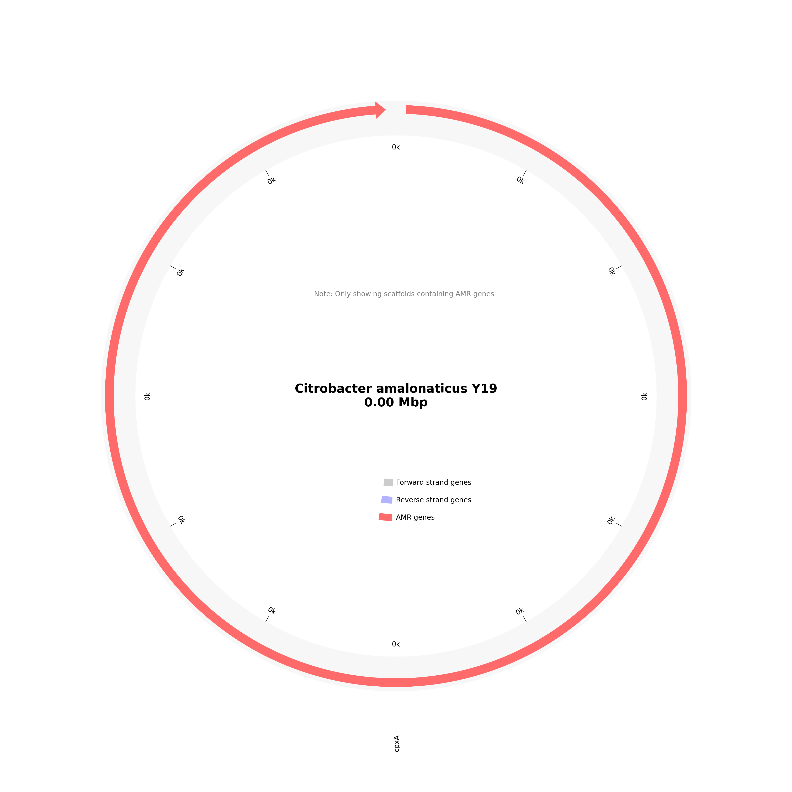

### cpxA
- **Mechanism**: antibiotic efflux
- **Drug Classes**: aminoglycoside antibiotic; aminocoumarin antibiotic
- **AMR Family**: resistance-nodulation-cell division (RND) antibiotic efflux pump
- **Locations**:
  - gnl|SPADES|FDOHBCDP_15647_1 : position 2-349

## Citrobacter arsenatis
**Strain Statistics:**
- Total genome length: 0.2 kbp
- Total scaffolds: 3
- Scaffolds with AMR genes: 1
- Total genes annotated: 0
- Total AMR genes: 1
- Unique AMR genes: 1
- Distinct AMR mechanisms: 1
- Distinct AMR families: 1
- Distinct drug classes: 2

**Circos Plot:**

### tlrC
- **Mechanism**: antibiotic target protection
- **Drug Classes**: macrolide antibiotic; lincosamide antibiotic
- **AMR Family**: Miscellaneous ABC-F subfamily ATP-binding cassette ribosomal protection proteins
- **Locations**:
  - gnl|SPADES|FDOHBCDP_26771_1 : position 3-245

## Citrobacter farmeri
**Strain Statistics:**
- Total genome length: 0.2 kbp
- Total scaffolds: 1
- Scaffolds with AMR genes: 1
- Total genes annotated: 0
- Total AMR genes: 1
- Unique AMR genes: 1
- Distinct AMR mechanisms: 1
- Distinct AMR families: 1
- Distinct drug classes: 1

**Circos Plot:**

### bcrA
- **Mechanism**: antibiotic efflux
- **Drug Classes**: peptide antibiotic
- **AMR Family**: ATP-binding cassette (ABC) antibiotic efflux pump
- **Locations**:
  - gnl|SPADES|FDOHBCDP_31018_1 : position 2-220

## Citrobacter freundii
**Strain Statistics:**
- Total genome length: 2.8 kbp
- Total scaffolds: 81
- Scaffolds with AMR genes: 1
- Total genes annotated: 4
- Total AMR genes: 1
- Unique AMR genes: 1
- Distinct AMR mechanisms: 1
- Distinct AMR families: 1
- Distinct drug classes: 1

**Circos Plot:**

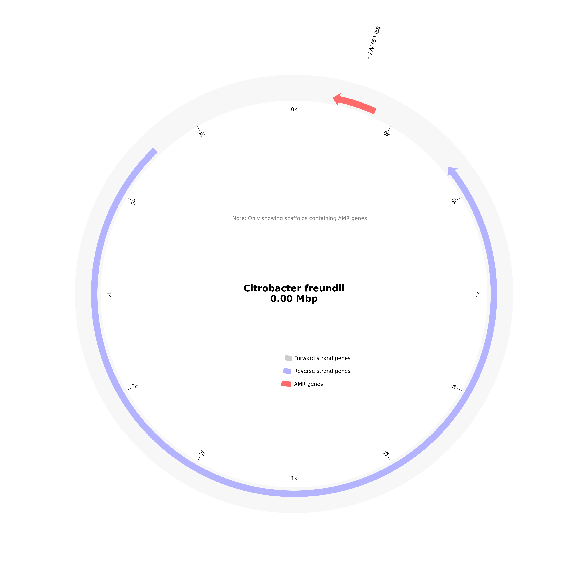

### AAC(6')-Ib8
- **Mechanism**: antibiotic inactivation
- **Drug Classes**: aminoglycoside antibiotic
- **AMR Family**: AAC(6')
- **Locations**:
  - gnl|SPADES|FDOHBCDP_2301_1 : position 87-188

## Citrobacter sp. 21OH12SH02A-Citro
**Strain Statistics:**
- Total genome length: 25.0 kbp
- Total scaffolds: 1
- Scaffolds with AMR genes: 1
- Total genes annotated: 56
- Total AMR genes: 3
- Unique AMR genes: 3
- Distinct AMR mechanisms: 1
- Distinct AMR families: 2
- Distinct drug classes: 6

**Circos Plot:**

### H-NS
- **Mechanism**: antibiotic efflux
- **Drug Classes**: macrolide antibiotic; fluoroquinolone antibiotic; cephalosporin; cephamycin; penam; tetracycline antibiotic
- **AMR Family**: major facilitator superfamily (MFS) antibiotic efflux pump; resistance-nodulation-cell division (RND) antibiotic efflux pump
- **Locations**:
  - gnl|SPADES|FDOHBCDP_285_5 : position 4420-4812

### evgS
- **Mechanism**: antibiotic efflux
- **Drug Classes**: macrolide antibiotic; fluoroquinolone antibiotic; penam; tetracycline antibiotic
- **AMR Family**: major facilitator superfamily (MFS) antibiotic efflux pump; resistance-nodulation-cell division (RND) antibiotic efflux pump
- **Locations**:
  - gnl|SPADES|FDOHBCDP_285_27 : position 21477-23195

### tetA(60)
- **Mechanism**: antibiotic efflux
- **Drug Classes**: tetracycline antibiotic
- **AMR Family**: ATP-binding cassette (ABC) antibiotic efflux pump
- **Locations**:
  - gnl|SPADES|FDOHBCDP_285_11 : position 8449-9498

## Clostridium novyi NT
**Strain Statistics:**
- Total genome length: 5.4 kbp
- Total scaffolds: 450
- Scaffolds with AMR genes: 16
- Total genes annotated: 2
- Total AMR genes: 16
- Unique AMR genes: 15
- Distinct AMR mechanisms: 3
- Distinct AMR families: 10
- Distinct drug classes: 18

**Circos Plot:**

### AcrF
- **Mechanism**: antibiotic efflux
- **Drug Classes**: fluoroquinolone antibiotic; cephalosporin; cephamycin; penam
- **AMR Family**: resistance-nodulation-cell division (RND) antibiotic efflux pump
- **Locations**:
  - gnl|SPADES|FDOHBCDP_22274_1 : position 2-271

### Bifidobacterium bifidum ileS conferring resistance to mupirocin
- **Mechanism**: antibiotic target alteration
- **Drug Classes**: mupirocin-like antibiotic
- **AMR Family**: antibiotic-resistant isoleucyl-tRNA synthetase (ileS)
- **Locations**:
  - gnl|SPADES|FDOHBCDP_25978_1 : position 2-250

### Clostridium perfringens mprF
- **Mechanism**: antibiotic target alteration
- **Drug Classes**: peptide antibiotic
- **AMR Family**: defensin resistant mprF
- **Locations**:
  - gnl|SPADES|FDOHBCDP_12232_1 : position 1-375

### HelR
- **Mechanism**: antibiotic target protection
- **Drug Classes**: rifamycin antibiotic
- **AMR Family**: helicase-like RNA polymerase protection protein
- **Locations**:
  - gnl|SPADES|FDOHBCDP_11479_2 : position 205-447

### MdtK
- **Mechanism**: antibiotic efflux
- **Drug Classes**: fluoroquinolone antibiotic
- **AMR Family**: multidrug and toxic compound extrusion (MATE) transporter
- **Locations**:
  - gnl|SPADES|FDOHBCDP_14789_1 : position 2-367

### RanA
- **Mechanism**: antibiotic efflux
- **Drug Classes**: aminoglycoside antibiotic
- **AMR Family**: ATP-binding cassette (ABC) antibiotic efflux pump
- **Locations**:
  - gnl|SPADES|FDOHBCDP_6529_1 : position 87-707

### TxR
- **Mechanism**: antibiotic efflux
- **Drug Classes**: tetracycline antibiotic
- **AMR Family**: ATP-binding cassette (ABC) antibiotic efflux pump
- **Locations**:
  - gnl|SPADES|FDOHBCDP_31008_1 : position 3-221

### arlS (found in 2 locations)
- **Mechanism**: antibiotic efflux
- **Drug Classes**: fluoroquinolone antibiotic; disinfecting agents and antiseptics
- **AMR Family**: major facilitator superfamily (MFS) antibiotic efflux pump
- **Locations**:
  - gnl|SPADES|FDOHBCDP_18703_1 : position 3-305
  - gnl|SPADES|FDOHBCDP_22318_1 : position 3-272

### cdeA
- **Mechanism**: antibiotic efflux
- **Drug Classes**: fluoroquinolone antibiotic; disinfecting agents and antiseptics
- **AMR Family**: multidrug and toxic compound extrusion (MATE) transporter
- **Locations**:
  - gnl|SPADES|FDOHBCDP_18270_1 : position 1-312

### efrA
- **Mechanism**: antibiotic efflux
- **Drug Classes**: macrolide antibiotic; fluoroquinolone antibiotic; rifamycin antibiotic
- **AMR Family**: ATP-binding cassette (ABC) antibiotic efflux pump
- **Locations**:
  - gnl|SPADES|FDOHBCDP_27974_1 : position 1-237

### macB
- **Mechanism**: antibiotic efflux
- **Drug Classes**: macrolide antibiotic
- **AMR Family**: ATP-binding cassette (ABC) antibiotic efflux pump
- **Locations**:
  - gnl|SPADES|FDOHBCDP_27407_1 : position 1-240

### srmB
- **Mechanism**: antibiotic target protection
- **Drug Classes**: macrolide antibiotic
- **AMR Family**: Miscellaneous ABC-F subfamily ATP-binding cassette ribosomal protection proteins
- **Locations**:
  - gnl|SPADES|FDOHBCDP_20301_1 : position 2-286

### vanR gene in vanG cluster
- **Mechanism**: antibiotic target alteration
- **Drug Classes**: glycopeptide antibiotic
- **AMR Family**: glycopeptide resistance gene cluster; vanR
- **Locations**:
  - gnl|SPADES|FDOHBCDP_12746_1 : position 130-408

### vanT gene in vanG cluster
- **Mechanism**: antibiotic target alteration
- **Drug Classes**: glycopeptide antibiotic
- **AMR Family**: glycopeptide resistance gene cluster; vanT
- **Locations**:
  - gnl|SPADES|FDOHBCDP_28175_1 : position 3-236

### vmlR
- **Mechanism**: antibiotic target protection
- **Drug Classes**: lincosamide antibiotic; streptogramin antibiotic; streptogramin A antibiotic; streptogramin B antibiotic; nucleoside antibiotic; pleuromutilin antibiotic
- **AMR Family**: Miscellaneous ABC-F subfamily ATP-binding cassette ribosomal protection proteins
- **Locations**:
  - gnl|SPADES|FDOHBCDP_15180_1 : position 1-207

## Enterobacter hormaechei
**Strain Statistics:**
- Total genome length: 1510.4 kbp
- Total scaffolds: 62
- Scaffolds with AMR genes: 30
- Total genes annotated: 2883
- Total AMR genes: 151
- Unique AMR genes: 94
- Distinct AMR mechanisms: 8
- Distinct AMR families: 46
- Distinct drug classes: 35

**Circos Plot:**

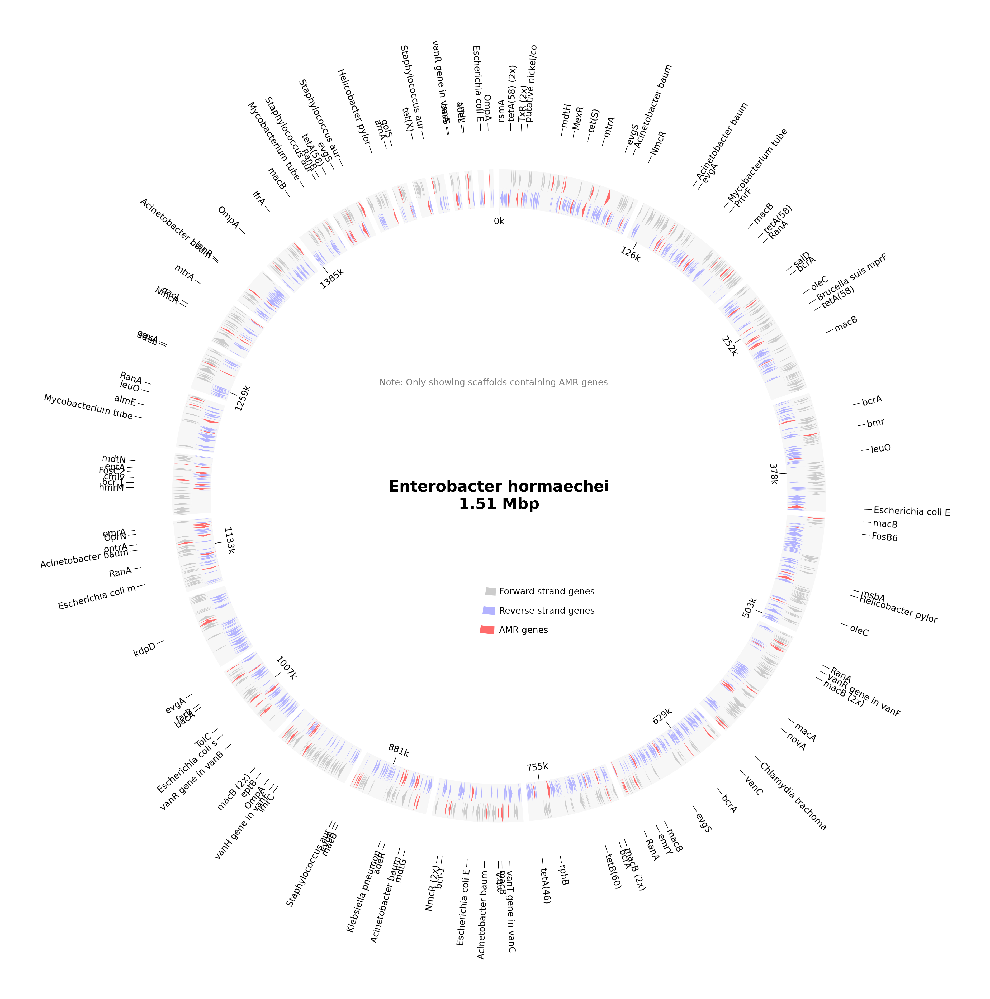

### AAC(6')-Isa
- **Mechanism**: antibiotic inactivation
- **Drug Classes**: aminoglycoside antibiotic
- **AMR Family**: AAC(6')
- **Locations**:
  - gnl|SPADES|FDOHBCDP_52_24 : position 31589-32122

### ACC-3
- **Mechanism**: antibiotic inactivation
- **Drug Classes**: monobactam; cephalosporin; penam
- **AMR Family**: ACC beta-lactamase
- **Locations**:
  - gnl|SPADES|FDOHBCDP_107_11 : position 13801-15096

### ACT-20
- **Mechanism**: antibiotic inactivation
- **Drug Classes**: carbapenem; cephalosporin; cephamycin; penam
- **AMR Family**: ACT beta-lactamase
- **Locations**:
  - gnl|SPADES|FDOHBCDP_194_13: position 13597-14844

### Acinetobacter baumannii AbaF (found in 3 locations)
- **Mechanism**: antibiotic efflux
- **Drug Classes**: phosphonic acid antibiotic
- **AMR Family**: major facilitator superfamily (MFS) antibiotic efflux pump
- **Locations**:
  - gnl|SPADES|FDOHBCDP_107_10 : position 12239-13540
  - gnl|SPADES|FDOHBCDP_220_15 : position 12983-14257
  - gnl|SPADES|FDOHBCDP_52_18 : position 25981-27303

### Acinetobacter baumannii AbaQ (found in 4 locations)
- **Mechanism**: antibiotic efflux
- **Drug Classes**: fluoroquinolone antibiotic
- **AMR Family**: major facilitator superfamily (MFS) antibiotic efflux pump
- **Locations**:
  - gnl|SPADES|FDOHBCDP_108_45 : position 44893-46173
  - gnl|SPADES|FDOHBCDP_120_43 : position 38737-40038
  - gnl|SPADES|FDOHBCDP_41_94 : position 97545-98900
  - gnl|SPADES|FDOHBCDP_95_26 : position 29363-30682

### Brucella suis mprF
- **Mechanism**: antibiotic target alteration
- **Drug Classes**: peptide antibiotic
- **AMR Family**: defensin resistant mprF
- **Locations**:
  - gnl|SPADES|FDOHBCDP_57_41 : position 39517-40479

### Chlamydia trachomatis intrinsic murA conferring resistance to fosfomycin
- **Mechanism**: antibiotic target alteration
- **Drug Classes**: phosphonic acid antibiotic
- **AMR Family**: antibiotic-resistant murA transferase
- **Locations**:
  - gnl|SPADES|FDOHBCDP_65_80 : position 90490-91773

### Clostridioides difficile gyrB conferring resistance to fluoroquinolones
- **Mechanism**: antibiotic target alteration
- **Drug Classes**: fluoroquinolone antibiotic
- **AMR Family**: fluoroquinolone resistant gyrB
- **Locations**:
  - gnl|SPADES|FDOHBCDP_111_24 : position 26071-27963

### Enterococcus faecium cls conferring resistance to daptomycin
- **Mechanism**: antibiotic target alteration
- **Drug Classes**: peptide antibiotic
- **AMR Family**: daptomycin resistant cls
- **Locations**:
  - gnl|SPADES|FDOHBCDP_57_42 : position 40479-41717

### Escherichia coli EF-Tu mutants conferring resistance to Pulvomycin
- **Mechanism**: antibiotic target alteration
- **Drug Classes**: elfamycin antibiotic
- **AMR Family**: elfamycin resistant EF-Tu
- **Locations**:
  - gnl|SPADES|FDOHBCDP_1522_7 : position 3565-4662

### Escherichia coli EF-Tu mutants conferring resistance to kirromycin (found in 2 locations)
- **Mechanism**: antibiotic target alteration
- **Drug Classes**: elfamycin antibiotic
- **AMR Family**: elfamycin resistant EF-Tu
- **Locations**:
  - gnl|SPADES|FDOHBCDP_58_89 : position 92180-94867
  - gnl|SPADES|FDOHBCDP_95_36 : position 41619-43457

### Escherichia coli mdfA
- **Mechanism**: antibiotic efflux
- **Drug Classes**: tetracycline antibiotic; phenicol antibiotic; disinfecting agents and antiseptics
- **AMR Family**: major facilitator superfamily (MFS) antibiotic efflux pump
- **Locations**:
  - gnl|SPADES|FDOHBCDP_120_21 : position 13420-14652

### Escherichia coli soxS with mutation conferring antibiotic resistance
- **Mechanism**: antibiotic target alteration; antibiotic efflux; reduced permeability to antibiotic
- **Drug Classes**: fluoroquinolone antibiotic; monobactam; carbapenem; cephalosporin; glycylcycline; cephamycin; penam; tetracycline antibiotic; rifamycin antibiotic; phenicol antibiotic; penem; disinfecting agents and antiseptics
- **AMR Family**: ATP-binding cassette (ABC) antibiotic efflux pump; major facilitator superfamily (MFS) antibiotic efflux pump; resistance-nodulation-cell division (RND) antibiotic efflux pump; General Bacterial Porin with reduced permeability to beta-lactams
- **Locations**:
  - gnl|SPADES|FDOHBCDP_111_23 : position 25133-25969

### FosB6
- **Mechanism**: antibiotic inactivation
- **Drug Classes**: phosphonic acid antibiotic
- **AMR Family**: fosfomycin thiol transferase
- **Locations**:
  - gnl|SPADES|FDOHBCDP_60_14 : position 10213-10602

### FosC2
- **Mechanism**: antibiotic inactivation
- **Drug Classes**: phosphonic acid antibiotic
- **AMR Family**: fosC phosphotransferase family
- **Locations**:
  - gnl|SPADES|FDOHBCDP_133_29 : position 32421-32828

### Helicobacter pylori pbp1 mutants conferring resistance to amoxicillin
- **Mechanism**: antibiotic target alteration
- **Drug Classes**: cephalosporin; cephamycin; penam
- **AMR Family**: Penicillin-binding protein mutations conferring resistance to beta-lactam antibiotics
- **Locations**:
  - gnl|SPADES|FDOHBCDP_60_51 : position 53847-56372

### Helicobacter pylori rpoB mutation conferring resistance to rifampicin
- **Mechanism**: antibiotic target alteration; antibiotic target replacement
- **Drug Classes**: fluoroquinolone antibiotic; rifamycin antibiotic
- **AMR Family**: rifamycin-resistant beta-subunit of RNA polymerase (rpoB)
- **Locations**:
  - gnl|SPADES|FDOHBCDP_396_19 : position 16704-18095

### Klebsiella pneumoniae KpnH
- **Mechanism**: antibiotic efflux
- **Drug Classes**: macrolide antibiotic; fluoroquinolone antibiotic; aminoglycoside antibiotic; carbapenem; cephalosporin; penam; peptide antibiotic; penem
- **AMR Family**: major facilitator superfamily (MFS) antibiotic efflux pump
- **Locations**:
  - gnl|SPADES|FDOHBCDP_120_53 : position 51481-53052

### Klebsiella pneumoniae OmpK37
- **Mechanism**: reduced permeability to antibiotic
- **Drug Classes**: monobactam; carbapenem; cephalosporin; cephamycin; penam; penem
- **AMR Family**: General Bacterial Porin with reduced permeability to beta-lactams
- **Locations**:
  - gnl|SPADES|FDOHBCDP_107_20 : position 27091-28257

### MexR
- **Mechanism**: antibiotic target alteration; antibiotic efflux
- **Drug Classes**: macrolide antibiotic; fluoroquinolone antibiotic; monobactam; carbapenem; cephalosporin; cephamycin; penam; tetracycline antibiotic; peptide antibiotic; aminocoumarin antibiotic; diaminopyrimidine antibiotic; sulfonamide antibiotic; phenicol antibiotic; penem
- **AMR Family**: resistance-nodulation-cell division (RND) antibiotic efflux pump
- **Locations**:
  - gnl|SPADES|FDOHBCDP_41_55 : position 53174-53581

### Mycobacterium tuberculosis kasA mutant conferring resistance to isoniazid
- **Mechanism**: antibiotic target alteration
- **Drug Classes**: isoniazid-like antibiotic
- **AMR Family**: antibiotic resistant kasA
- **Locations**:
  - gnl|SPADES|FDOHBCDP_52_45 : position 52994-54160

### Mycobacterium tuberculosis pncA mutations conferring resistance to pyrazinamide
- **Mechanism**: antibiotic target alteration
- **Drug Classes**: pyrazine antibiotic
- **AMR Family**: Pyrazinamide resistant pncA
- **Locations**:
  - gnl|SPADES|FDOHBCDP_261_24 : position 24522-25163

### Mycobacterium tuberculosis rpsA mutations conferring resistance to pyrazinamide
- **Mechanism**: antibiotic target alteration
- **Drug Classes**: pyrazine antibiotic
- **AMR Family**: pyrazinamide resistant rpsA
- **Locations**:
  - gnl|SPADES|FDOHBCDP_65_82 : position 92754-93866

### Mycobacterium tuberculosis thyA with mutation conferring resistance to para-aminosalicylic acid
- **Mechanism**: antibiotic target alteration
- **Drug Classes**: salicylic acid antibiotic
- **AMR Family**: aminosalicylate resistant thymidylate synthase
- **Locations**:
  - gnl|SPADES|FDOHBCDP_149_11 : position 16657-17451

### NmcR (found in 5 locations)
- **Mechanism**: antibiotic inactivation
- **Drug Classes**: carbapenem; cephalosporin; cephamycin; penam
- **AMR Family**: NmcA beta-lactamase
- **Locations**:
  - gnl|SPADES|FDOHBCDP_194_12 : position 12691-13566
  - gnl|SPADES|FDOHBCDP_41_107 : position 110033-110950
  - gnl|SPADES|FDOHBCDP_67_88 : position 90958-91884
  - gnl|SPADES|FDOHBCDP_95_53 : position 63477-64367
  - gnl|SPADES|FDOHBCDP_95_61 : position 73263-74084

### OmpA (found in 3 locations)
- **Mechanism**: reduced permeability to antibiotic
- **Drug Classes**: peptide antibiotic
- **AMR Family**: General Bacterial Porin with reduced permeability to peptide antibiotics
- **Locations**:
  - gnl|SPADES|FDOHBCDP_108_49 : position 49258-49920
  - gnl|SPADES|FDOHBCDP_1963_1 : position 2-418
  - gnl|SPADES|FDOHBCDP_230_7 : position 5372-5983

### OprN
- **Mechanism**: antibiotic efflux
- **Drug Classes**: fluoroquinolone antibiotic; diaminopyrimidine antibiotic; phenicol antibiotic
- **AMR Family**: resistance-nodulation-cell division (RND) antibiotic efflux pump
- **Locations**:
  - gnl|SPADES|FDOHBCDP_120_52 : position 49958-51481

### PmrF
- **Mechanism**: antibiotic target alteration
- **Drug Classes**: peptide antibiotic
- **AMR Family**: pmr phosphoethanolamine transferase
- **Locations**:
  - gnl|SPADES|FDOHBCDP_52_50 : position 58055-59746

### RanA (found in 6 locations)
- **Mechanism**: antibiotic efflux
- **Drug Classes**: aminoglycoside antibiotic
- **AMR Family**: ATP-binding cassette (ABC) antibiotic efflux pump
- **Locations**:
  - gnl|SPADES|FDOHBCDP_120_33 : position 25722-27593
  - gnl|SPADES|FDOHBCDP_149_33 : position 41640-42767
  - gnl|SPADES|FDOHBCDP_278_9 : position 5833-6645
  - gnl|SPADES|FDOHBCDP_52_85 : position 90836-91906
  - gnl|SPADES|FDOHBCDP_65_10 : position 8800-9933
  - gnl|SPADES|FDOHBCDP_67_85 : position 88730-89605

### RanB
- **Mechanism**: antibiotic efflux
- **Drug Classes**: aminoglycoside antibiotic
- **AMR Family**: ATP-binding cassette (ABC) antibiotic efflux pump
- **Locations**:
  - gnl|SPADES|FDOHBCDP_278_8 : position 5043-5825

### Staphylococcus aureus mupA conferring resistance to mupirocin
- **Mechanism**: antibiotic target alteration
- **Drug Classes**: mupirocin-like antibiotic
- **AMR Family**: antibiotic-resistant isoleucyl-tRNA synthetase (ileS)
- **Locations**:
  - gnl|SPADES|FDOHBCDP_656_1 : position 3-980

### Staphylococcus aureus mupB conferring resistance to mupirocin
- **Mechanism**: antibiotic target alteration
- **Drug Classes**: mupirocin-like antibiotic
- **AMR Family**: antibiotic-resistant isoleucyl-tRNA synthetase (ileS)
- **Locations**:
  - gnl|SPADES|FDOHBCDP_278_28 : position 23382-25310

### Staphylococcus aureus murA with mutation conferring resistance to fosfomycin
- **Mechanism**: antibiotic target alteration
- **Drug Classes**: phosphonic acid antibiotic
- **AMR Family**: antibiotic-resistant murA transferase
- **Locations**:
  - gnl|SPADES|FDOHBCDP_278_3 : position 1852-3111

### Staphylococcus aureus pgsA mutations conferring resistance to daptomycin
- **Mechanism**: antibiotic target alteration
- **Drug Classes**: peptide antibiotic
- **AMR Family**: daptomycin resistant pgsA
- **Locations**:
  - gnl|SPADES|FDOHBCDP_107_62 : position 64890-65438

### TolC
- **Mechanism**: antibiotic efflux
- **Drug Classes**: macrolide antibiotic; fluoroquinolone antibiotic; aminoglycoside antibiotic; carbapenem; cephalosporin; glycylcycline; cephamycin; penam; tetracycline antibiotic; peptide antibiotic; aminocoumarin antibiotic; rifamycin antibiotic; phenicol antibiotic; penem; disinfecting agents and antiseptics
- **AMR Family**: ATP-binding cassette (ABC) antibiotic efflux pump; major facilitator superfamily (MFS) antibiotic efflux pump; resistance-nodulation-cell division (RND) antibiotic efflux pump
- **Locations**:
  - gnl|SPADES|FDOHBCDP_111_29 : position 30683-32161

### TxR (found in 2 locations)
- **Mechanism**: antibiotic efflux
- **Drug Classes**: tetracycline antibiotic
- **AMR Family**: ATP-binding cassette (ABC) antibiotic efflux pump
- **Locations**:
  - gnl|SPADES|FDOHBCDP_41_18 : position 15050-16564
  - gnl|SPADES|FDOHBCDP_41_42 : position 39259-41331

### adeL (found in 5 locations)
- **Mechanism**: antibiotic efflux
- **Drug Classes**: fluoroquinolone antibiotic; tetracycline antibiotic
- **AMR Family**: resistance-nodulation-cell division (RND) antibiotic efflux pump
- **Locations**:
  - gnl|SPADES|FDOHBCDP_107_8 : position 10570-11472
  - gnl|SPADES|FDOHBCDP_1156_2 : position 1042-1947
  - gnl|SPADES|FDOHBCDP_174_20 : position 22196-23122
  - gnl|SPADES|FDOHBCDP_41_56 : position 53578-54465
  - gnl|SPADES|FDOHBCDP_52_20 : position 28640-29521

### adeR
- **Mechanism**: antibiotic efflux
- **Drug Classes**: glycylcycline; tetracycline antibiotic
- **AMR Family**: resistance-nodulation-cell division (RND) antibiotic efflux pump
- **Locations**:
  - gnl|SPADES|FDOHBCDP_107_17 : position 23687-24406

### almE
- **Mechanism**: antibiotic target alteration
- **Drug Classes**: peptide antibiotic
- **AMR Family**: polymyxin resistance operon; alm glycyltransferase
- **Locations**:
  - gnl|SPADES|FDOHBCDP_149_19 : position 25526-27685

### arnA
- **Mechanism**: antibiotic target alteration
- **Drug Classes**: peptide antibiotic
- **AMR Family**: pmr phosphoethanolamine transferase
- **Locations**:
  - gnl|SPADES|FDOHBCDP_544_9 : position 5204-6151

### bacA
- **Mechanism**: antibiotic target alteration
- **Drug Classes**: peptide antibiotic
- **AMR Family**: undecaprenyl pyrophosphate related proteins
- **Locations**:
  - gnl|SPADES|FDOHBCDP_111_45 : position 50393-51214

### basS (found in 2 locations)
- **Mechanism**: antibiotic target alteration; antibiotic efflux
- **Drug Classes**: peptide antibiotic
- **AMR Family**: pmr phosphoethanolamine transferase
- **Locations**:
  - gnl|SPADES|FDOHBCDP_111_15 : position 17087-18436
  - gnl|SPADES|FDOHBCDP_929_4 : position 2393-3436

### bcr-1 (found in 2 locations)
- **Mechanism**: antibiotic efflux
- **Drug Classes**: bicyclomycin-like antibiotic
- **AMR Family**: major facilitator superfamily (MFS) antibiotic efflux pump
- **Locations**:
  - gnl|SPADES|FDOHBCDP_133_20 : position 24419-25618
  - gnl|SPADES|FDOHBCDP_95_50 : position 59951-61291

### bcrA (found in 4 locations)
- **Mechanism**: antibiotic efflux
- **Drug Classes**: peptide antibiotic
- **AMR Family**: ATP-binding cassette (ABC) antibiotic efflux pump
- **Locations**:
  - gnl|SPADES|FDOHBCDP_57_16 : position 14723-15781
  - gnl|SPADES|FDOHBCDP_58_19 : position 17180-18667
  - gnl|SPADES|FDOHBCDP_67_26 : position 27776-28531
  - gnl|SPADES|FDOHBCDP_93_14 : position 10868-11890

### bmr
- **Mechanism**: antibiotic efflux
- **Drug Classes**: fluoroquinolone antibiotic; nucleoside antibiotic; phenicol antibiotic; disinfecting agents and antiseptics
- **AMR Family**: major facilitator superfamily (MFS) antibiotic efflux pump
- **Locations**:
  - gnl|SPADES|FDOHBCDP_58_31 : position 32724-34022

### cmlv (found in 2 locations)
- **Mechanism**: antibiotic inactivation
- **Drug Classes**: phenicol antibiotic
- **AMR Family**: chloramphenicol phosphotransferase
- **Locations**:
  - gnl|SPADES|FDOHBCDP_1156_3 : position 2051-3226
  - gnl|SPADES|FDOHBCDP_133_24 : position 28234-29400

### emrA
- **Mechanism**: antibiotic efflux
- **Drug Classes**: fluoroquinolone antibiotic
- **AMR Family**: major facilitator superfamily (MFS) antibiotic efflux pump
- **Locations**:
  - gnl|SPADES|FDOHBCDP_120_54 : position 53049-54143

### emrR
- **Mechanism**: antibiotic efflux
- **Drug Classes**: fluoroquinolone antibiotic
- **AMR Family**: major facilitator superfamily (MFS) antibiotic efflux pump
- **Locations**:
  - gnl|SPADES|FDOHBCDP_133_39 : position 41582-42016

### emrY (found in 2 locations)
- **Mechanism**: antibiotic efflux
- **Drug Classes**: tetracycline antibiotic
- **AMR Family**: major facilitator superfamily (MFS) antibiotic efflux pump
- **Locations**:
  - gnl|SPADES|FDOHBCDP_41_57 : position 54575-55777
  - gnl|SPADES|FDOHBCDP_67_75 : position 78888-80306

### eptA
- **Mechanism**: antibiotic target alteration
- **Drug Classes**: peptide antibiotic
- **AMR Family**: pmr phosphoethanolamine transferase
- **Locations**:
  - gnl|SPADES|FDOHBCDP_133_32 : position 34720-36345

### eptB
- **Mechanism**: antibiotic target alteration
- **Drug Classes**: peptide antibiotic
- **AMR Family**: pmr phosphoethanolamine transferase
- **Locations**:
  - gnl|SPADES|FDOHBCDP_108_55 : position 55764-57458

### evgA (found in 3 locations)
- **Mechanism**: antibiotic efflux
- **Drug Classes**: macrolide antibiotic; fluoroquinolone antibiotic; penam; tetracycline antibiotic
- **AMR Family**: major facilitator superfamily (MFS) antibiotic efflux pump; resistance-nodulation-cell division (RND) antibiotic efflux pump
- **Locations**:
  - gnl|SPADES|FDOHBCDP_107_60 : position 62348-63004
  - gnl|SPADES|FDOHBCDP_111_58 : position 61979-62659
  - gnl|SPADES|FDOHBCDP_52_22 : position 30592-31194

### evgS (found in 4 locations)
- **Mechanism**: antibiotic efflux
- **Drug Classes**: macrolide antibiotic; fluoroquinolone antibiotic; penam; tetracycline antibiotic
- **AMR Family**: major facilitator superfamily (MFS) antibiotic efflux pump; resistance-nodulation-cell division (RND) antibiotic efflux pump
- **Locations**:
  - gnl|SPADES|FDOHBCDP_107_18 : position 24403-26019
  - gnl|SPADES|FDOHBCDP_278_23 : position 16440-18773
  - gnl|SPADES|FDOHBCDP_41_90 : position 90819-93578
  - gnl|SPADES|FDOHBCDP_67_48 : position 49520-49909

### farA
- **Mechanism**: antibiotic efflux
- **Drug Classes**: antibacterial free fatty acids
- **AMR Family**: major facilitator superfamily (MFS) antibiotic efflux pump
- **Locations**:
  - gnl|SPADES|FDOHBCDP_57_48 : position 46952-47947

### farB
- **Mechanism**: antibiotic efflux
- **Drug Classes**: antibacterial free fatty acids
- **AMR Family**: major facilitator superfamily (MFS) antibiotic efflux pump
- **Locations**:
  - gnl|SPADES|FDOHBCDP_111_48 : position 52503-53969

### golS
- **Mechanism**: antibiotic efflux
- **Drug Classes**: monobactam; carbapenem; cephalosporin; cephamycin; penam; phenicol antibiotic; penem
- **AMR Family**: resistance-nodulation-cell division (RND) antibiotic efflux pump
- **Locations**:
  - gnl|SPADES|FDOHBCDP_544_14 : position 9722-10147

### hmrM
- **Mechanism**: antibiotic efflux
- **Drug Classes**: fluoroquinolone antibiotic; disinfecting agents and antiseptics
- **AMR Family**: multidrug and toxic compound extrusion (MATE) transporter
- **Locations**:
  - gnl|SPADES|FDOHBCDP_133_17 : position 20700-22073

### kdpD
- **Mechanism**: antibiotic efflux
- **Drug Classes**: aminoglycoside antibiotic
- **AMR Family**: kdpDE
- **Locations**:
  - gnl|SPADES|FDOHBCDP_115_32 : position 36169-38856

### kdpE
- **Mechanism**: antibiotic efflux
- **Drug Classes**: aminoglycoside antibiotic
- **AMR Family**: kdpDE
- **Locations**:
  - gnl|SPADES|FDOHBCDP_115_33 : position 38853-39530

### leuO (found in 2 locations)
- **Mechanism**: antibiotic efflux
- **Drug Classes**: nucleoside antibiotic; disinfecting agents and antiseptics
- **AMR Family**: major facilitator superfamily (MFS) antibiotic efflux pump
- **Locations**:
  - gnl|SPADES|FDOHBCDP_149_27 : position 36055-36981
  - gnl|SPADES|FDOHBCDP_58_50 : position 50840-51760

### lfrA
- **Mechanism**: antibiotic efflux
- **Drug Classes**: fluoroquinolone antibiotic
- **AMR Family**: major facilitator superfamily (MFS) antibiotic efflux pump
- **Locations**:
  - gnl|SPADES|FDOHBCDP_230_33 : position 28763-30178

### lmrC
- **Mechanism**: antibiotic target protection
- **Drug Classes**: lincosamide antibiotic
- **AMR Family**: Miscellaneous ABC-F subfamily ATP-binding cassette ribosomal protection proteins
- **Locations**:
  - gnl|SPADES|FDOHBCDP_108_39 : position 40390-42009

### macA
- **Mechanism**: antibiotic efflux
- **Drug Classes**: macrolide antibiotic
- **AMR Family**: ATP-binding cassette (ABC) antibiotic efflux pump
- **Locations**:
  - gnl|SPADES|FDOHBCDP_65_53 : position 54407-55522

### macB (found in 13 locations)
- **Mechanism**: antibiotic efflux
- **Drug Classes**: macrolide antibiotic
- **AMR Family**: ATP-binding cassette (ABC) antibiotic efflux pump
- **Locations**:
  - gnl|SPADES|FDOHBCDP_107_57 : position 59896-60648
  - gnl|SPADES|FDOHBCDP_108_59 : position 61959-62942
  - gnl|SPADES|FDOHBCDP_108_60 : position 62939-63952
  - gnl|SPADES|FDOHBCDP_261_12 : position 12256-12876
  - gnl|SPADES|FDOHBCDP_52_71 : position 76031-76702
  - gnl|SPADES|FDOHBCDP_57_63 : position 63903-64625
  - gnl|SPADES|FDOHBCDP_60_2 : position 877-1908
  - gnl|SPADES|FDOHBCDP_65_21 : position 18850-19578
  - gnl|SPADES|FDOHBCDP_65_54 : position 55519-57459
  - gnl|SPADES|FDOHBCDP_67_69 : position 72211-73725
  - gnl|SPADES|FDOHBCDP_93_67 : position 63671-64450
  - gnl|SPADES|FDOHBCDP_93_8 : position 6841-7656
  - gnl|SPADES|FDOHBCDP_95_14 : position 16816-18357

### mdtG
- **Mechanism**: antibiotic efflux
- **Drug Classes**: phosphonic acid antibiotic
- **AMR Family**: major facilitator superfamily (MFS) antibiotic efflux pump
- **Locations**:
  - gnl|SPADES|FDOHBCDP_107_6 : position 8303-9502

### mdtH
- **Mechanism**: antibiotic efflux
- **Drug Classes**: fluoroquinolone antibiotic
- **AMR Family**: major facilitator superfamily (MFS) antibiotic efflux pump
- **Locations**:
  - gnl|SPADES|FDOHBCDP_41_46 : position 44293-45513

### mdtN
- **Mechanism**: antibiotic efflux
- **Drug Classes**: nucleoside antibiotic; disinfecting agents and antiseptics
- **AMR Family**: major facilitator superfamily (MFS) antibiotic efflux pump
- **Locations**:
  - gnl|SPADES|FDOHBCDP_133_37 : position 40289-41155

### msbA (found in 2 locations)
- **Mechanism**: antibiotic efflux
- **Drug Classes**: nitroimidazole antibiotic
- **AMR Family**: ATP-binding cassette (ABC) antibiotic efflux pump
- **Locations**:
  - gnl|SPADES|FDOHBCDP_60_48 : position 50552-51454
  - gnl|SPADES|FDOHBCDP_65_62 : position 64620-66386

### mtrA (found in 3 locations)
- **Mechanism**: antibiotic efflux
- **Drug Classes**: macrolide antibiotic; penam
- **AMR Family**: resistance-nodulation-cell division (RND) antibiotic efflux pump
- **Locations**:
  - gnl|SPADES|FDOHBCDP_194_35 : position 32279-33124
  - gnl|SPADES|FDOHBCDP_41_77 : position 73957-76311
  - gnl|SPADES|FDOHBCDP_95_16 : position 19550-20728

### norB
- **Mechanism**: antibiotic efflux
- **Drug Classes**: fluoroquinolone antibiotic
- **AMR Family**: major facilitator superfamily (MFS) antibiotic efflux pump
- **Locations**:
  - gnl|SPADES|FDOHBCDP_41_79 : position 77680-79077

### novA
- **Mechanism**: antibiotic efflux
- **Drug Classes**: aminocoumarin antibiotic
- **AMR Family**: ATP-binding cassette (ABC) antibiotic efflux pump
- **Locations**:
  - gnl|SPADES|FDOHBCDP_65_61 : position 62899-64620

### oleC (found in 3 locations)
- **Mechanism**: antibiotic efflux
- **Drug Classes**: macrolide antibiotic
- **AMR Family**: ATP-binding cassette (ABC) antibiotic efflux pump
- **Locations**:
  - gnl|SPADES|FDOHBCDP_52_81 : position 86721-87434
  - gnl|SPADES|FDOHBCDP_57_31 : position 31127-31849
  - gnl|SPADES|FDOHBCDP_60_73 : position 75862-76788

### optrA
- **Mechanism**: antibiotic target protection
- **Drug Classes**: oxazolidinone antibiotic; phenicol antibiotic
- **AMR Family**: Miscellaneous ABC-F subfamily ATP-binding cassette ribosomal protection proteins
- **Locations**:
  - gnl|SPADES|FDOHBCDP_120_45 : position 42511-44106

### oqxA
- **Mechanism**: antibiotic efflux
- **Drug Classes**: fluoroquinolone antibiotic; glycylcycline; tetracycline antibiotic; diaminopyrimidine antibiotic; nitrofuran antibiotic
- **AMR Family**: resistance-nodulation-cell division (RND) antibiotic efflux pump
- **Locations**:
  - gnl|SPADES|FDOHBCDP_174_22 : position 23513-24445

### putative nickel/cobalt transporter
- **Mechanism**: antibiotic efflux
- **Drug Classes**: fluoroquinolone antibiotic; aminoglycoside antibiotic; isoniazid-like antibiotic
- **AMR Family**: metal transporters with antibiotic efflux
- **Locations**:
  - gnl|SPADES|FDOHBCDP_41_21 : position 19457-20479

### qacL
- **Mechanism**: antibiotic efflux
- **Drug Classes**: disinfecting agents and antiseptics
- **AMR Family**: small multidrug resistance (SMR) antibiotic efflux pump
- **Locations**:
  - gnl|SPADES|FDOHBCDP_194_15 : position 15530-15847

### rphB
- **Mechanism**: antibiotic inactivation
- **Drug Classes**: rifamycin antibiotic
- **AMR Family**: rifampin phosphotransferase
- **Locations**:
  - gnl|SPADES|FDOHBCDP_93_60 : position 53604-55982

### rsmA
- **Mechanism**: antibiotic efflux
- **Drug Classes**: fluoroquinolone antibiotic; diaminopyrimidine antibiotic; phenicol antibiotic
- **AMR Family**: resistance-nodulation-cell division (RND) antibiotic efflux pump
- **Locations**:
  - gnl|SPADES|FDOHBCDP_41_1: position 590-775

### salD
- **Mechanism**: antibiotic target protection
- **Drug Classes**: lincosamide antibiotic; streptogramin antibiotic; streptogramin A antibiotic; pleuromutilin antibiotic
- **AMR Family**: sal-type ABC-F protein
- **Locations**:
  - gnl|SPADES|FDOHBCDP_57_11 : position 10471-11943

### sdiA
- **Mechanism**: antibiotic efflux
- **Drug Classes**: fluoroquinolone antibiotic; cephalosporin; glycylcycline; penam; tetracycline antibiotic; rifamycin antibiotic; phenicol antibiotic; disinfecting agents and antiseptics
- **AMR Family**: resistance-nodulation-cell division (RND) antibiotic efflux pump
- **Locations**:
  - gnl|SPADES|FDOHBCDP_107_58 : position 60803-61594

### tet(S)
- **Mechanism**: antibiotic target protection
- **Drug Classes**: tetracycline antibiotic
- **AMR Family**: tetracycline-resistant ribosomal protection protein
- **Locations**:
  - gnl|SPADES|FDOHBCDP_41_69 : position 63496-64920

### tet(X)
- **Mechanism**: antibiotic inactivation
- **Drug Classes**: glycylcycline; tetracycline antibiotic
- **AMR Family**: tetracycline inactivation enzyme
- **Locations**:
  - gnl|SPADES|FDOHBCDP_617_9 : position 7787-9205

### tetA(46)
- **Mechanism**: antibiotic efflux
- **Drug Classes**: tetracycline antibiotic
- **AMR Family**: ATP-binding cassette (ABC) antibiotic efflux pump
- **Locations**:
  - gnl|SPADES|FDOHBCDP_93_71 : position 67495-68250

### tetA(58) (found in 5 locations)
- **Mechanism**: antibiotic efflux
- **Drug Classes**: tetracycline antibiotic
- **AMR Family**: major facilitator superfamily (MFS) antibiotic efflux pump
- **Locations**:
  - gnl|SPADES|FDOHBCDP_278_15 : position 10533-11258
  - gnl|SPADES|FDOHBCDP_41_45 : position 43516-44277
  - gnl|SPADES|FDOHBCDP_41_8 : position 7871-8524
  - gnl|SPADES|FDOHBCDP_52_80 : position 85955-86719
  - gnl|SPADES|FDOHBCDP_57_47 : position 45220-46959

### tetA(60)
- **Mechanism**: antibiotic efflux
- **Drug Classes**: tetracycline antibiotic
- **AMR Family**: ATP-binding cassette (ABC) antibiotic efflux pump
- **Locations**:
  - gnl|SPADES|FDOHBCDP_67_86 : position 89614-90318

### tetB(60)
- **Mechanism**: antibiotic efflux
- **Drug Classes**: tetracycline antibiotic
- **AMR Family**: ATP-binding cassette (ABC) antibiotic efflux pump
- **Locations**:
  - gnl|SPADES|FDOHBCDP_93_23 : position 21232-21978

### tsnR
- **Mechanism**: antibiotic target alteration
- **Drug Classes**: peptide antibiotic
- **AMR Family**: non-erm 23S ribosomal RNA methyltransferase (A1067)
- **Locations**:
  - gnl|SPADES|FDOHBCDP_220_16 : position 14349-15080

### vanC
- **Mechanism**: antibiotic target alteration
- **Drug Classes**: glycopeptide antibiotic
- **AMR Family**: glycopeptide resistance gene cluster; Van ligase
- **Locations**:
  - gnl|SPADES|FDOHBCDP_67_9 : position 6578-7756

### vanH gene in vanF cluster
- **Mechanism**: antibiotic target alteration
- **Drug Classes**: glycopeptide antibiotic
- **AMR Family**: vanH; glycopeptide resistance gene cluster
- **Locations**:
  - gnl|SPADES|FDOHBCDP_108_44 : position 43891-44865

### vanR gene in vanA cluster
- **Mechanism**: antibiotic target alteration
- **Drug Classes**: glycopeptide antibiotic
- **AMR Family**: glycopeptide resistance gene cluster; vanR
- **Locations**:
  - gnl|SPADES|FDOHBCDP_929_5 : position 3433-4095

### vanR gene in vanB cluster
- **Mechanism**: antibiotic target alteration
- **Drug Classes**: glycopeptide antibiotic
- **AMR Family**: glycopeptide resistance gene cluster; vanR
- **Locations**:
  - gnl|SPADES|FDOHBCDP_111_14 : position 16431-17090

### vanR gene in vanF cluster (found in 2 locations)
- **Mechanism**: antibiotic target alteration
- **Drug Classes**: glycopeptide antibiotic
- **AMR Family**: glycopeptide resistance gene cluster; vanR
- **Locations**:
  - gnl|SPADES|FDOHBCDP_65_15 : position 13568-14275
  - gnl|SPADES|FDOHBCDP_67_49 : position 49927-50976

### vanS gene in vanM cluster
- **Mechanism**: antibiotic target alteration
- **Drug Classes**: glycopeptide antibiotic
- **AMR Family**: vanS; glycopeptide resistance gene cluster
- **Locations**:
  - gnl|SPADES|FDOHBCDP_65_16 : position 14259-15728

### vanT gene in vanC cluster
- **Mechanism**: antibiotic target alteration
- **Drug Classes**: glycopeptide antibiotic
- **AMR Family**: glycopeptide resistance gene cluster; vanT
- **Locations**:
  - gnl|SPADES|FDOHBCDP_95_10 : position 11495-12490

## Enterobacter hormaechei subsp. steigerwaltii
**Strain Statistics:**
- Total genome length: 22.3 kbp
- Total scaffolds: 1
- Scaffolds with AMR genes: 1
- Total genes annotated: 44
- Total AMR genes: 1
- Unique AMR genes: 1
- Distinct AMR mechanisms: 1
- Distinct AMR families: 1
- Distinct drug classes: 12

**Circos Plot:**

### Escherichia coli soxS with mutation conferring antibiotic resistance
- **Mechanism**: antibiotic target alteration; antibiotic efflux; reduced permeability to antibiotic
- **Drug Classes**: fluoroquinolone antibiotic; monobactam; carbapenem; cephalosporin; glycylcycline; cephamycin; penam; tetracycline antibiotic; rifamycin antibiotic; phenicol antibiotic; penem; disinfecting agents and antiseptics
- **AMR Family**: ATP-binding cassette (ABC) antibiotic efflux pump; major facilitator superfamily (MFS) antibiotic efflux pump; resistance-nodulation-cell division (RND) antibiotic efflux pump; General Bacterial Porin with reduced permeability to beta-lactams
- **Locations**:
  - gnl|SPADES|FDOHBCDP_319_18 : position 16595-17413

## Enterobacter hormaechei subsp. xiangfangensis
**Strain Statistics:**
- Total genome length: 3060.3 kbp
- Total scaffolds: 28
- Scaffolds with AMR genes: 24
- Total genes annotated: 5822
- Total AMR genes: 336
- Unique AMR genes: 169
- Distinct AMR mechanisms: 10
- Distinct AMR families: 64
- Distinct drug classes: 36

**Circos Plot:**

### AAC(3)-Ic
- **Mechanism**: antibiotic inactivation
- **Drug Classes**: aminoglycoside antibiotic
- **AMR Family**: AAC(3)
- **Locations**:
  - gnl|SPADES|FDOHBCDP_77_56 : position 66727-67152

### AAC(6')-I-43
- **Mechanism**: antibiotic inactivation
- **Drug Classes**: aminoglycoside antibiotic
- **AMR Family**: AAC(6')
- **Locations**:
  - gnl|SPADES|FDOHBCDP_7_84 : position 100700-101185

### AAC(6')-Isa
- **Mechanism**: antibiotic inactivation
- **Drug Classes**: aminoglycoside antibiotic
- **AMR Family**: AAC(6')
- **Locations**:
  - gnl|SPADES|FDOHBCDP_6_183 : position 207194-207733

### Acinetobacter baumannii AbaF (found in 5 locations)
- **Mechanism**: antibiotic efflux
- **Drug Classes**: phosphonic acid antibiotic
- **AMR Family**: major facilitator superfamily (MFS) antibiotic efflux pump
- **Locations**:
  - gnl|SPADES|FDOHBCDP_25_84 : position 99245-100567
  - gnl|SPADES|FDOHBCDP_28_2 : position 1062-2369
  - gnl|SPADES|FDOHBCDP_399_11 : position 13166-14482
  - gnl|SPADES|FDOHBCDP_56_2 : position 1220-2722
  - gnl|SPADES|FDOHBCDP_6_86 : position 89185-90564

### Acinetobacter baumannii AbaQ (found in 3 locations)
- **Mechanism**: antibiotic efflux
- **Drug Classes**: fluoroquinolone antibiotic
- **AMR Family**: major facilitator superfamily (MFS) antibiotic efflux pump
- **Locations**:
  - gnl|SPADES|FDOHBCDP_18_12 : position 12789-14081
  - gnl|SPADES|FDOHBCDP_19_131 : position 150981-152324
  - gnl|SPADES|FDOHBCDP_48_34 : position 32526-33857

### Acinetobacter baumannii AmvA
- **Mechanism**: antibiotic efflux
- **Drug Classes**: macrolide antibiotic; disinfecting agents and antiseptics
- **AMR Family**: major facilitator superfamily (MFS) antibiotic efflux pump
- **Locations**:
  - gnl|SPADES|FDOHBCDP_43_106 : position 108081-109571

### AcrE
- **Mechanism**: antibiotic efflux
- **Drug Classes**: fluoroquinolone antibiotic; cephalosporin; cephamycin; penam
- **AMR Family**: resistance-nodulation-cell division (RND) antibiotic efflux pump
- **Locations**:
  - gnl|SPADES|FDOHBCDP_773_3 : position 3993-5132

### AcrS
- **Mechanism**: antibiotic efflux
- **Drug Classes**: fluoroquinolone antibiotic; cephalosporin; glycylcycline; cephamycin; penam; tetracycline antibiotic; rifamycin antibiotic; phenicol antibiotic; disinfecting agents and antiseptics
- **AMR Family**: resistance-nodulation-cell division (RND) antibiotic efflux pump
- **Locations**:
  - gnl|SPADES|FDOHBCDP_773_4 : position 5531-6178

### Agrobacterium fabrum chloramphenicol acetyltransferase (found in 2 locations)
- **Mechanism**: antibiotic inactivation
- **Drug Classes**: phenicol antibiotic
- **AMR Family**: chloramphenicol acetyltransferase (CAT)
- **Locations**:
  - gnl|SPADES|FDOHBCDP_5_197 : position 210970-211521
  - gnl|SPADES|FDOHBCDP_7_43 : position 46492-47040

### Bifidobacterium bifidum ileS conferring resistance to mupirocin
- **Mechanism**: antibiotic target alteration
- **Drug Classes**: mupirocin-like antibiotic
- **AMR Family**: antibiotic-resistant isoleucyl-tRNA synthetase (ileS)
- **Locations**:
  - gnl|SPADES|FDOHBCDP_5_16 : position 14565-17147

### CRP (found in 2 locations)
- **Mechanism**: antibiotic efflux
- **Drug Classes**: macrolide antibiotic; fluoroquinolone antibiotic; penam
- **AMR Family**: resistance-nodulation-cell division (RND) antibiotic efflux pump
- **Locations**:
  - gnl|SPADES|FDOHBCDP_6_32 : position 35525-36277
  - gnl|SPADES|FDOHBCDP_74_27: position 20583-21215

### Clostridioides difficile gyrA conferring resistance to fluoroquinolones
- **Mechanism**: antibiotic target alteration
- **Drug Classes**: fluoroquinolone antibiotic
- **AMR Family**: fluoroquinolone resistant gyrA
- **Locations**:
  - gnl|SPADES|FDOHBCDP_7_161 : position 191108-193744

### Clostridioides difficile gyrB conferring resistance to fluoroquinolones
- **Mechanism**: antibiotic target alteration
- **Drug Classes**: fluoroquinolone antibiotic
- **AMR Family**: fluoroquinolone resistant gyrB
- **Locations**:
  - gnl|SPADES|FDOHBCDP_18_4 : position 3580-5991

### CrcB
- **Mechanism**: antibiotic efflux
- **Drug Classes**: aminoglycoside antibiotic
- **AMR Family**: multidrug and toxic compound extrusion (MATE) transporter
- **Locations**:
  - gnl|SPADES|FDOHBCDP_5_32 : position 30787-31170

### DHA-17
- **Mechanism**: antibiotic inactivation
- **Drug Classes**: cephalosporin; cephamycin
- **AMR Family**: DHA beta-lactamase
- **Locations**:
  - gnl|SPADES|FDOHBCDP_5_292 : position 308968-310128

### Enterobacter cloacae acrA
- **Mechanism**: antibiotic efflux
- **Drug Classes**: fluoroquinolone antibiotic; cephalosporin; glycylcycline; penam; tetracycline antibiotic; rifamycin antibiotic; phenicol antibiotic; disinfecting agents and antiseptics
- **AMR Family**: resistance-nodulation-cell division (RND) antibiotic efflux pump
- **Locations**:
  - gnl|SPADES|FDOHBCDP_18_56 : position 57593-58714

### Enterococcus faecalis cls with mutation conferring resistance to daptomycin
- **Mechanism**: antibiotic target alteration
- **Drug Classes**: peptide antibiotic
- **AMR Family**: daptomycin resistant cls
- **Locations**:
  - gnl|SPADES|FDOHBCDP_54_79 : position 78505-79965

### Erm(34)
- **Mechanism**: antibiotic target alteration
- **Drug Classes**: macrolide antibiotic; lincosamide antibiotic; streptogramin antibiotic; streptogramin A antibiotic; streptogramin B antibiotic
- **AMR Family**: Erm 23S ribosomal RNA methyltransferase
- **Locations**:
  - gnl|SPADES|FDOHBCDP_25_61 : position 71755-72576

### Escherichia coli AcrAB-TolC with AcrR mutation conferring resistance to ciprofloxacin, tetracycline, and ceftazidime (found in 3 locations)
- **Mechanism**: antibiotic target alteration; antibiotic efflux
- **Drug Classes**: fluoroquinolone antibiotic; cephalosporin; glycylcycline; penam; tetracycline antibiotic; rifamycin antibiotic; phenicol antibiotic; disinfecting agents and antiseptics
- **AMR Family**: resistance-nodulation-cell division (RND) antibiotic efflux pump
- **Locations**:
  - gnl|SPADES|FDOHBCDP_18_59 : position 60033-60680
  - gnl|SPADES|FDOHBCDP_54_30 : position 30981-31571
  - gnl|SPADES|FDOHBCDP_5_192 : position 204473-205126

### Escherichia coli AcrAB-TolC with MarR mutations conferring resistance to ciprofloxacin and tetracycline
- **Mechanism**: antibiotic target alteration; antibiotic efflux
- **Drug Classes**: fluoroquinolone antibiotic; cephalosporin; glycylcycline; penam; tetracycline antibiotic; rifamycin antibiotic; phenicol antibiotic; disinfecting agents and antiseptics
- **AMR Family**: resistance-nodulation-cell division (RND) antibiotic efflux pump
- **Locations**:
  - gnl|SPADES|FDOHBCDP_6_210: position 233057-233491

### Escherichia coli UhpT with mutation conferring resistance to fosfomycin
- **Mechanism**: antibiotic target alteration
- **Drug Classes**: phosphonic acid antibiotic
- **AMR Family**: antibiotic-resistant UhpT
- **Locations**:
  - gnl|SPADES|FDOHBCDP_18_39 : position 38387-39778

### Escherichia coli fabI mutations conferring resistance to isoniazid and triclosan
- **Mechanism**: antibiotic target alteration
- **Drug Classes**: disinfecting agents and antiseptics; isoniazid-like antibiotic
- **AMR Family**: antibiotic resistant fabI
- **Locations**:
  - gnl|SPADES|FDOHBCDP_71_15 : position 15120-15869

### Escherichia coli soxR with mutation conferring antibiotic resistance
- **Mechanism**: antibiotic target alteration; antibiotic efflux
- **Drug Classes**: fluoroquinolone antibiotic; cephalosporin; glycylcycline; penam; tetracycline antibiotic; rifamycin antibiotic; phenicol antibiotic; disinfecting agents and antiseptics
- **AMR Family**: ATP-binding cassette (ABC) antibiotic efflux pump; major facilitator superfamily (MFS) antibiotic efflux pump; resistance-nodulation-cell division (RND) antibiotic efflux pump
- **Locations**:
  - gnl|SPADES|FDOHBCDP_56_46 : position 45725-46183

### Escherichia coli soxS with mutation conferring antibiotic resistance (found in 12 locations)
- **Mechanism**: antibiotic target alteration; antibiotic efflux; reduced permeability to antibiotic
- **Drug Classes**: fluoroquinolone antibiotic; monobactam; carbapenem; cephalosporin; glycylcycline; cephamycin; penam; tetracycline antibiotic; rifamycin antibiotic; phenicol antibiotic; penem; disinfecting agents and antiseptics
- **AMR Family**: ATP-binding cassette (ABC) antibiotic efflux pump; major facilitator superfamily (MFS) antibiotic efflux pump; resistance-nodulation-cell division (RND) antibiotic efflux pump; General Bacterial Porin with reduced permeability to beta-lactams
- **Locations**:
  - gnl|SPADES|FDOHBCDP_18_83 : position 84454-85440
  - gnl|SPADES|FDOHBCDP_25_50 : position 54588-55433
  - gnl|SPADES|FDOHBCDP_25_97 : position 113254-114123
  - gnl|SPADES|FDOHBCDP_39_53 : position 56843-57691
  - gnl|SPADES|FDOHBCDP_39_95 : position 102586-103434
  - gnl|SPADES|FDOHBCDP_48_6 : position 3889-4692
  - gnl|SPADES|FDOHBCDP_54_32 : position 32153-32974
  - gnl|SPADES|FDOHBCDP_56_47 : position 46282-46608
  - gnl|SPADES|FDOHBCDP_5_47 : position 47897-48751
  - gnl|SPADES|FDOHBCDP_6_191 : position 215265-216137
  - gnl|SPADES|FDOHBCDP_6_94 : position 97985-98788
  - gnl|SPADES|FDOHBCDP_71_79 : position 80146-81045

### EstT (found in 2 locations)
- **Mechanism**: antibiotic inactivation
- **Drug Classes**: macrolide antibiotic
- **AMR Family**: macrolide esterase
- **Locations**:
  - gnl|SPADES|FDOHBCDP_19_89 : position 105511-106332
  - gnl|SPADES|FDOHBCDP_6_104 : position 106718-107554

### FosA2
- **Mechanism**: antibiotic inactivation
- **Drug Classes**: phosphonic acid antibiotic
- **AMR Family**: fosfomycin thiol transferase
- **Locations**:
  - gnl|SPADES|FDOHBCDP_19_83: position 97848-98273

### GOB-46
- **Mechanism**: antibiotic inactivation
- **Drug Classes**: carbapenem; cephalosporin; penam
- **AMR Family**: GOB beta-lactamase
- **Locations**:
  - gnl|SPADES|FDOHBCDP_6_247 : position 271731-272708

### H-NS (found in 2 locations)
- **Mechanism**: antibiotic efflux
- **Drug Classes**: macrolide antibiotic; fluoroquinolone antibiotic; cephalosporin; cephamycin; penam; tetracycline antibiotic
- **AMR Family**: major facilitator superfamily (MFS) antibiotic efflux pump; resistance-nodulation-cell division (RND) antibiotic efflux pump
- **Locations**:
  - gnl|SPADES|FDOHBCDP_48_22 : position 20968-21372
  - gnl|SPADES|FDOHBCDP_54_90: position 92637-93050

### Haemophilus influenzae PBP3 conferring resistance to beta-lactam antibiotics
- **Mechanism**: antibiotic target alteration
- **Drug Classes**: cephalosporin; cephamycin; penam
- **AMR Family**: Penicillin-binding protein mutations conferring resistance to beta-lactam antibiotics
- **Locations**:
  - gnl|SPADES|FDOHBCDP_25_31 : position 32197-33963

### Helicobacter pylori pbp1 mutants conferring resistance to amoxicillin
- **Mechanism**: antibiotic target alteration
- **Drug Classes**: cephalosporin; cephamycin; penam
- **AMR Family**: Penicillin-binding protein mutations conferring resistance to beta-lactam antibiotics
- **Locations**:
  - gnl|SPADES|FDOHBCDP_28_127 : position 119775-122102

### Helicobacter pylori pbp2 mutants conferring resistance to amoxicillin
- **Mechanism**: antibiotic target alteration
- **Drug Classes**: cephalosporin; cephamycin; penam
- **AMR Family**: Penicillin-binding protein mutations conferring resistance to beta-lactam antibiotics
- **Locations**:
  - gnl|SPADES|FDOHBCDP_5_22 : position 20506-22407

### Helicobacter pylori rdxA mutation conferring resistance to metronidazole
- **Mechanism**: antibiotic target alteration
- **Drug Classes**: nitroimidazole antibiotic
- **AMR Family**: Antibiotic resistant Helicobacter pylori nitroreductase
- **Locations**:
  - gnl|SPADES|FDOHBCDP_5_129 : position 134317-134970

### IreK
- **Mechanism**: reduced permeability to antibiotic
- **Drug Classes**: cephalosporin
- **AMR Family**: Serine/threonine kinases
- **Locations**:
  - gnl|SPADES|FDOHBCDP_19_97 : position 112118-117703

### Klebsiella pneumoniae KpnE
- **Mechanism**: antibiotic efflux
- **Drug Classes**: macrolide antibiotic; aminoglycoside antibiotic; cephalosporin; tetracycline antibiotic; peptide antibiotic; rifamycin antibiotic; disinfecting agents and antiseptics
- **AMR Family**: small multidrug resistance (SMR) antibiotic efflux pump
- **Locations**:
  - gnl|SPADES|FDOHBCDP_6_56: position 62137-62499

### Klebsiella pneumoniae KpnF
- **Mechanism**: antibiotic efflux
- **Drug Classes**: macrolide antibiotic; aminoglycoside antibiotic; cephalosporin; tetracycline antibiotic; peptide antibiotic; rifamycin antibiotic; disinfecting agents and antiseptics
- **AMR Family**: small multidrug resistance (SMR) antibiotic efflux pump
- **Locations**:
  - gnl|SPADES|FDOHBCDP_6_57: position 62486-62815

### Klebsiella pneumoniae KpnG
- **Mechanism**: antibiotic efflux
- **Drug Classes**: macrolide antibiotic; fluoroquinolone antibiotic; aminoglycoside antibiotic; carbapenem; cephalosporin; penam; peptide antibiotic; penem
- **AMR Family**: major facilitator superfamily (MFS) antibiotic efflux pump
- **Locations**:
  - gnl|SPADES|FDOHBCDP_48_9 : position 8065-9237

### Klebsiella pneumoniae OmpK37 (found in 5 locations)
- **Mechanism**: reduced permeability to antibiotic
- **Drug Classes**: monobactam; carbapenem; cephalosporin; cephamycin; penam; penem
- **AMR Family**: General Bacterial Porin with reduced permeability to beta-lactams
- **Locations**:
  - gnl|SPADES|FDOHBCDP_26_19 : position 22044-23102
  - gnl|SPADES|FDOHBCDP_43_107 : position 109617-110690
  - gnl|SPADES|FDOHBCDP_43_51 : position 49359-50486
  - gnl|SPADES|FDOHBCDP_7_157 : position 182837-183931
  - gnl|SPADES|FDOHBCDP_96_3 : position 2837-3889

### LlmA 23S ribosomal RNA methyltransferase
- **Mechanism**: antibiotic target alteration
- **Drug Classes**: lincosamide antibiotic
- **AMR Family**: Llm 23S ribosomal RNA methyltransferase
- **Locations**:
  - gnl|SPADES|FDOHBCDP_26_50 : position 57687-58862

### LpsB
- **Mechanism**: reduced permeability to antibiotic
- **Drug Classes**: peptide antibiotic
- **AMR Family**: Intrinsic peptide antibiotic resistant Lps
- **Locations**:
  - gnl|SPADES|FDOHBCDP_7_24 : position 24509-25546

### LptD
- **Mechanism**: antibiotic efflux
- **Drug Classes**: carbapenem; peptide antibiotic; aminocoumarin antibiotic; rifamycin antibiotic
- **AMR Family**: ATP-binding cassette (ABC) antibiotic efflux pump
- **Locations**:
  - gnl|SPADES|FDOHBCDP_25_58 : position 67081-69432

### MSI-1
- **Mechanism**: antibiotic inactivation
- **Drug Classes**: carbapenem
- **AMR Family**: MSI beta-lactamase
- **Locations**:
  - gnl|SPADES|FDOHBCDP_96_52 : position 71229-71987

### MdtK
- **Mechanism**: antibiotic efflux
- **Drug Classes**: fluoroquinolone antibiotic
- **AMR Family**: multidrug and toxic compound extrusion (MATE) transporter
- **Locations**:
  - gnl|SPADES|FDOHBCDP_399_13 : position 16328-17746

### MdtQ
- **Mechanism**: reduced permeability to antibiotic
- **Drug Classes**: monobactam; carbapenem; cephalosporin; cephamycin; penam; penem
- **AMR Family**: Outer Membrane Porin (Opr)
- **Locations**:
  - gnl|SPADES|FDOHBCDP_7_103 : position 120862-122280

### MexF
- **Mechanism**: antibiotic efflux
- **Drug Classes**: fluoroquinolone antibiotic; diaminopyrimidine antibiotic; phenicol antibiotic
- **AMR Family**: resistance-nodulation-cell division (RND) antibiotic efflux pump
- **Locations**:
  - gnl|SPADES|FDOHBCDP_5_118 : position 119867-123022

### MexK
- **Mechanism**: antibiotic efflux
- **Drug Classes**: macrolide antibiotic; tetracycline antibiotic; disinfecting agents and antiseptics
- **AMR Family**: resistance-nodulation-cell division (RND) antibiotic efflux pump
- **Locations**:
  - gnl|SPADES|FDOHBCDP_399_8 : position 8319-11375

### MexL
- **Mechanism**: antibiotic efflux
- **Drug Classes**: macrolide antibiotic; tetracycline antibiotic; disinfecting agents and antiseptics
- **AMR Family**: resistance-nodulation-cell division (RND) antibiotic efflux pump
- **Locations**:
  - gnl|SPADES|FDOHBCDP_18_57 : position 58862-59431

### MexR
- **Mechanism**: antibiotic target alteration; antibiotic efflux
- **Drug Classes**: macrolide antibiotic; fluoroquinolone antibiotic; monobactam; carbapenem; cephalosporin; cephamycin; penam; tetracycline antibiotic; peptide antibiotic; aminocoumarin antibiotic; diaminopyrimidine antibiotic; sulfonamide antibiotic; phenicol antibiotic; penem
- **AMR Family**: resistance-nodulation-cell division (RND) antibiotic efflux pump
- **Locations**:
  - gnl|SPADES|FDOHBCDP_19_138 : position 158273-158713

### MexS (found in 4 locations)
- **Mechanism**: antibiotic efflux
- **Drug Classes**: fluoroquinolone antibiotic; diaminopyrimidine antibiotic; phenicol antibiotic
- **AMR Family**: resistance-nodulation-cell division (RND) antibiotic efflux pump
- **Locations**:
  - gnl|SPADES|FDOHBCDP_18_6 : position 7074-8099
  - gnl|SPADES|FDOHBCDP_43_74 : position 74356-75390
  - gnl|SPADES|FDOHBCDP_56_59 : position 59965-60948
  - gnl|SPADES|FDOHBCDP_6_85 : position 88092-89111

### MexT (found in 4 locations)
- **Mechanism**: antibiotic efflux
- **Drug Classes**: fluoroquinolone antibiotic; diaminopyrimidine antibiotic; phenicol antibiotic
- **AMR Family**: resistance-nodulation-cell division (RND) antibiotic efflux pump
- **Locations**:
  - gnl|SPADES|FDOHBCDP_18_41 : position 40932-41834
  - gnl|SPADES|FDOHBCDP_399_2 : position 1197-2114
  - gnl|SPADES|FDOHBCDP_431_11 : position 9645-10616
  - gnl|SPADES|FDOHBCDP_6_236 : position 257676-258605

### MexV
- **Mechanism**: antibiotic efflux
- **Drug Classes**: macrolide antibiotic; fluoroquinolone antibiotic; tetracycline antibiotic; phenicol antibiotic; disinfecting agents and antiseptics
- **AMR Family**: resistance-nodulation-cell division (RND) antibiotic efflux pump
- **Locations**:
  - gnl|SPADES|FDOHBCDP_5_36 : position 35640-36839

### Mycobacterium tuberculosis gidB mutation conferring resistance to streptomycin
- **Mechanism**: antibiotic target alteration
- **Drug Classes**: aminoglycoside antibiotic
- **AMR Family**: antibiotic resistant gidB
- **Locations**:
  - gnl|SPADES|FDOHBCDP_195_15 : position 15596-16219

### Mycobacterium tuberculosis katG mutations conferring resistance to isoniazid
- **Mechanism**: antibiotic target alteration
- **Drug Classes**: isoniazid-like antibiotic
- **AMR Family**: isoniazid resistant katG
- **Locations**:
  - gnl|SPADES|FDOHBCDP_39_86 : position 90763-92943

### Mycobacterium tuberculosis ndh with mutation conferring resistance to isoniazid
- **Mechanism**: antibiotic target alteration
- **Drug Classes**: isoniazid-like antibiotic
- **AMR Family**: antibiotic resistant ndh
- **Locations**:
  - gnl|SPADES|FDOHBCDP_38_25 : position 23885-25189

### Mycobacterium tuberculosis pncA mutations conferring resistance to pyrazinamide
- **Mechanism**: antibiotic target alteration
- **Drug Classes**: pyrazine antibiotic
- **AMR Family**: Pyrazinamide resistant pncA
- **Locations**:
  - gnl|SPADES|FDOHBCDP_26_74 : position 77510-78199

### Mycolicibacterium smegmatis ndh with mutation conferring resistance to isoniazid
- **Mechanism**: antibiotic target alteration
- **Drug Classes**: isoniazid-like antibiotic
- **AMR Family**: antibiotic resistant ndh
- **Locations**:
  - gnl|SPADES|FDOHBCDP_6_283 : position 309095-310297

### Neisseria gonorrhoeae PBP2 conferring resistance to beta-lactam antibiotics
- **Mechanism**: antibiotic target alteration
- **Drug Classes**: cephalosporin; cephamycin; penam
- **AMR Family**: Penicillin-binding protein mutations conferring resistance to beta-lactam antibiotics
- **Locations**:
  - gnl|SPADES|FDOHBCDP_13_90 : position 66070-67815

### Neisseria gonorrhoeae pilQ gene conferring resistance to beta-lactam
- **Mechanism**: antibiotic target alteration
- **Drug Classes**: cephalosporin; cephamycin; penam
- **AMR Family**: Penicillin-binding protein mutations conferring resistance to beta-lactam antibiotics
- **Locations**:
  - gnl|SPADES|FDOHBCDP_74_46 : position 39708-40946

### NmcR (found in 9 locations)
- **Mechanism**: antibiotic inactivation
- **Drug Classes**: carbapenem; cephalosporin; cephamycin; penam
- **AMR Family**: NmcA beta-lactamase
- **Locations**:
  - gnl|SPADES|FDOHBCDP_176_6 : position 4717-5610
  - gnl|SPADES|FDOHBCDP_399_1 : position 150-1100
  - gnl|SPADES|FDOHBCDP_48_33 : position 31390-32310
  - gnl|SPADES|FDOHBCDP_54_50 : position 51678-52652
  - gnl|SPADES|FDOHBCDP_5_109 : position 113136-114017
  - gnl|SPADES|FDOHBCDP_6_215 : position 237450-238328
  - gnl|SPADES|FDOHBCDP_6_249 : position 273610-274494
  - gnl|SPADES|FDOHBCDP_6_62 : position 67309-68214
  - gnl|SPADES|FDOHBCDP_7_201 : position 238332-239246

### OmpA (found in 4 locations)
- **Mechanism**: reduced permeability to antibiotic
- **Drug Classes**: peptide antibiotic
- **AMR Family**: General Bacterial Porin with reduced permeability to peptide antibiotics
- **Locations**:
  - gnl|SPADES|FDOHBCDP_13_132 : position 112070-113308
  - gnl|SPADES|FDOHBCDP_26_40 : position 47913-48965
  - gnl|SPADES|FDOHBCDP_48_69 : position 62721-63206
  - gnl|SPADES|FDOHBCDP_96_47 : position 54455-55396

### OprM
- **Mechanism**: antibiotic efflux
- **Drug Classes**: macrolide antibiotic; fluoroquinolone antibiotic; monobactam; aminoglycoside antibiotic; carbapenem; cephalosporin; cephamycin; penam; tetracycline antibiotic; peptide antibiotic; aminocoumarin antibiotic; diaminopyrimidine antibiotic; sulfonamide antibiotic; phenicol antibiotic; penem; disinfecting agents and antiseptics
- **AMR Family**: resistance-nodulation-cell division (RND) antibiotic efflux pump
- **Locations**:
  - gnl|SPADES|FDOHBCDP_6_152 : position 155597-156976

### OprN
- **Mechanism**: antibiotic efflux
- **Drug Classes**: fluoroquinolone antibiotic; diaminopyrimidine antibiotic; phenicol antibiotic
- **AMR Family**: resistance-nodulation-cell division (RND) antibiotic efflux pump
- **Locations**:
  - gnl|SPADES|FDOHBCDP_96_25 : position 27031-28776

### PEDO-2
- **Mechanism**: antibiotic inactivation
- **Drug Classes**: carbapenem
- **AMR Family**: subclass B3 PEDO beta-lactamase
- **Locations**:
  - gnl|SPADES|FDOHBCDP_26_17 : position 19967-20614

### PNGM-1
- **Mechanism**: antibiotic inactivation
- **Drug Classes**: carbapenem; cephalosporin; penam
- **AMR Family**: PNGM beta-lactamase
- **Locations**:
  - gnl|SPADES|FDOHBCDP_7_186 : position 220613-221530

### ParR (found in 4 locations)
- **Mechanism**: antibiotic efflux; reduced permeability to antibiotic
- **Drug Classes**: macrolide antibiotic; fluoroquinolone antibiotic; monobactam; aminoglycoside antibiotic; carbapenem; cephalosporin; cephamycin; penam; tetracycline antibiotic; phenicol antibiotic; penem; disinfecting agents and antiseptics
- **AMR Family**: resistance-nodulation-cell division (RND) antibiotic efflux pump; Outer Membrane Porin (Opr)
- **Locations**:
  - gnl|SPADES|FDOHBCDP_18_70 : position 71203-72015
  - gnl|SPADES|FDOHBCDP_56_30 : position 28897-29628
  - gnl|SPADES|FDOHBCDP_6_23 : position 25261-26016
  - gnl|SPADES|FDOHBCDP_74_59 : position 56132-56851

### ParS (found in 2 locations)
- **Mechanism**: antibiotic efflux; reduced permeability to antibiotic
- **Drug Classes**: macrolide antibiotic; fluoroquinolone antibiotic; monobactam; aminoglycoside antibiotic; carbapenem; cephalosporin; cephamycin; penam; tetracycline antibiotic; phenicol antibiotic; penem; disinfecting agents and antiseptics
- **AMR Family**: resistance-nodulation-cell division (RND) antibiotic efflux pump; Outer Membrane Porin (Opr)
- **Locations**:
  - gnl|SPADES|FDOHBCDP_6_21 : position 22826-24124
  - gnl|SPADES|FDOHBCDP_71_57 : position 54563-56347

### PmrF
- **Mechanism**: antibiotic target alteration
- **Drug Classes**: peptide antibiotic
- **AMR Family**: pmr phosphoethanolamine transferase
- **Locations**:
  - gnl|SPADES|FDOHBCDP_71_64 : position 66295-67626

### Pseudomonas aeruginosa CpxR (found in 2 locations)
- **Mechanism**: antibiotic efflux
- **Drug Classes**: macrolide antibiotic; fluoroquinolone antibiotic; monobactam; aminoglycoside antibiotic; carbapenem; cephalosporin; cephamycin; penam; tetracycline antibiotic; peptide antibiotic; aminocoumarin antibiotic; diaminopyrimidine antibiotic; sulfonamide antibiotic; phenicol antibiotic; penem
- **AMR Family**: resistance-nodulation-cell division (RND) antibiotic efflux pump
- **Locations**:
  - gnl|SPADES|FDOHBCDP_39_58 : position 61799-62497
  - gnl|SPADES|FDOHBCDP_6_227 : position 249661-250401

### Pseudomonas aeruginosa ampR with mutation conferring resistance to aztreonam (found in 2 locations)
- **Mechanism**: antibiotic target alteration; antibiotic inactivation
- **Drug Classes**: monobactam; carbapenem; cephalosporin
- **AMR Family**: PDC beta-lactamase; ampR transcriptional regulator with mutation conferring resistance to monobactam antibiotics
- **Locations**:
  - gnl|SPADES|FDOHBCDP_18_25 : position 26367-27293
  - gnl|SPADES|FDOHBCDP_6_179 : position 202293-203135

### RanA (found in 9 locations)
- **Mechanism**: antibiotic efflux
- **Drug Classes**: aminoglycoside antibiotic
- **AMR Family**: ATP-binding cassette (ABC) antibiotic efflux pump
- **Locations**:
  - gnl|SPADES|FDOHBCDP_38_40 : position 40864-41949
  - gnl|SPADES|FDOHBCDP_48_14 : position 13648-14850
  - gnl|SPADES|FDOHBCDP_54_29 : position 30178-30984
  - gnl|SPADES|FDOHBCDP_54_82 : position 81242-82246
  - gnl|SPADES|FDOHBCDP_54_83 : position 82243-83256
  - gnl|SPADES|FDOHBCDP_56_16 : position 15578-16333
  - gnl|SPADES|FDOHBCDP_5_104 : position 108382-109086
  - gnl|SPADES|FDOHBCDP_7_139 : position 162510-164099
  - gnl|SPADES|FDOHBCDP_7_223 : position 259786-260562

### Rv1877 (found in 2 locations)
- **Mechanism**: antibiotic efflux
- **Drug Classes**: fluoroquinolone antibiotic
- **AMR Family**: major facilitator superfamily (MFS) antibiotic efflux pump
- **Locations**:
  - gnl|SPADES|FDOHBCDP_18_60 : position 60774-62258
  - gnl|SPADES|FDOHBCDP_71_23 : position 24639-26036

### SAT-3
- **Mechanism**: antibiotic inactivation
- **Drug Classes**: nucleoside antibiotic
- **AMR Family**: streptothricin acetyltransferase (SAT)
- **Locations**:
  - gnl|SPADES|FDOHBCDP_6_245 : position 270100-270627

### Shigella flexneri acrA
- **Mechanism**: antibiotic efflux
- **Drug Classes**: fluoroquinolone antibiotic; cephalosporin; glycylcycline; penam; tetracycline antibiotic; rifamycin antibiotic; phenicol antibiotic; disinfecting agents and antiseptics
- **AMR Family**: resistance-nodulation-cell division (RND) antibiotic efflux pump
- **Locations**:
  - gnl|SPADES|FDOHBCDP_5_193: position 205268-206461

### Staphylococcus aureus GlpT with mutation conferring resistance to fosfomycin
- **Mechanism**: antibiotic target alteration
- **Drug Classes**: phosphonic acid antibiotic
- **AMR Family**: antibiotic-resistant GlpT
- **Locations**:
  - gnl|SPADES|FDOHBCDP_7_167 : position 199834-201186

### Staphylococcus aureus fusA with mutation conferring resistance to fusidic acid (found in 2 locations)
- **Mechanism**: antibiotic target alteration
- **Drug Classes**: fusidane antibiotic
- **AMR Family**: antibiotic resistant fusA
- **Locations**:
  - gnl|SPADES|FDOHBCDP_25_125 : position 139913-141502
  - gnl|SPADES|FDOHBCDP_43_95 : position 94385-96487

### Staphylococcus aureus mupA conferring resistance to mupirocin
- **Mechanism**: antibiotic target alteration
- **Drug Classes**: mupirocin-like antibiotic
- **AMR Family**: antibiotic-resistant isoleucyl-tRNA synthetase (ileS)
- **Locations**:
  - gnl|SPADES|FDOHBCDP_25_75 : position 88514-91330

### Streptomyces rimosus otr(A)
- **Mechanism**: antibiotic target protection
- **Drug Classes**: tetracycline antibiotic
- **AMR Family**: tetracycline-resistant ribosomal protection protein
- **Locations**:
  - gnl|SPADES|FDOHBCDP_39_15 : position 15700-17523

### Streptomyces venezuelae rox (found in 3 locations)
- **Mechanism**: antibiotic inactivation
- **Drug Classes**: rifamycin antibiotic
- **AMR Family**: rifampin monooxygenase
- **Locations**:
  - gnl|SPADES|FDOHBCDP_176_13 : position 11262-12440
  - gnl|SPADES|FDOHBCDP_176_14 : position 12453-13655
  - gnl|SPADES|FDOHBCDP_5_1 : position 462-1637

### TaeA (found in 2 locations)
- **Mechanism**: antibiotic efflux
- **Drug Classes**: pleuromutilin antibiotic
- **AMR Family**: ATP-binding cassette (ABC) antibiotic efflux pump
- **Locations**:
  - gnl|SPADES|FDOHBCDP_25_102 : position 117874-119541
  - gnl|SPADES|FDOHBCDP_26_32 : position 38985-40892

### TolC
- **Mechanism**: antibiotic efflux
- **Drug Classes**: macrolide antibiotic; fluoroquinolone antibiotic; aminoglycoside antibiotic; carbapenem; cephalosporin; glycylcycline; cephamycin; penam; tetracycline antibiotic; peptide antibiotic; aminocoumarin antibiotic; rifamycin antibiotic; phenicol antibiotic; penem; disinfecting agents and antiseptics
- **AMR Family**: ATP-binding cassette (ABC) antibiotic efflux pump; major facilitator superfamily (MFS) antibiotic efflux pump; resistance-nodulation-cell division (RND) antibiotic efflux pump
- **Locations**:
  - gnl|SPADES|FDOHBCDP_6_160 : position 165595-166932

### TriB
- **Mechanism**: antibiotic efflux
- **Drug Classes**: disinfecting agents and antiseptics
- **AMR Family**: resistance-nodulation-cell division (RND) antibiotic efflux pump
- **Locations**:
  - gnl|SPADES|FDOHBCDP_399_7 : position 7234-8319

### TxR (found in 4 locations)
- **Mechanism**: antibiotic efflux
- **Drug Classes**: tetracycline antibiotic
- **AMR Family**: ATP-binding cassette (ABC) antibiotic efflux pump
- **Locations**:
  - gnl|SPADES|FDOHBCDP_28_100 : position 90796-92133
  - gnl|SPADES|FDOHBCDP_39_12 : position 11273-12685
  - gnl|SPADES|FDOHBCDP_54_24 : position 24639-25616
  - gnl|SPADES|FDOHBCDP_54_5 : position 4745-6286

### Vibrio cholerae varG
- **Mechanism**: antibiotic inactivation
- **Drug Classes**: carbapenem
- **AMR Family**: Subclass B1 Vibrio cholerae varG beta-lactamase
- **Locations**:
  - gnl|SPADES|FDOHBCDP_6_113 : position 116414-118387

### YajC
- **Mechanism**: antibiotic efflux
- **Drug Classes**: fluoroquinolone antibiotic; cephalosporin; glycylcycline; penam; tetracycline antibiotic; oxazolidinone antibiotic; glycopeptide antibiotic; rifamycin antibiotic; phenicol antibiotic; disinfecting agents and antiseptics
- **AMR Family**: resistance-nodulation-cell division (RND) antibiotic efflux pump
- **Locations**:
  - gnl|SPADES|FDOHBCDP_5_260 : position 274475-274807

### YojI (found in 2 locations)
- **Mechanism**: antibiotic efflux
- **Drug Classes**: peptide antibiotic
- **AMR Family**: ATP-binding cassette (ABC) antibiotic efflux pump
- **Locations**:
  - gnl|SPADES|FDOHBCDP_39_47 : position 49332-50834
  - gnl|SPADES|FDOHBCDP_7_153 : position 178166-179809

### acrB (found in 2 locations)
- **Mechanism**: antibiotic efflux
- **Drug Classes**: fluoroquinolone antibiotic; cephalosporin; glycylcycline; penam; tetracycline antibiotic; rifamycin antibiotic; phenicol antibiotic; disinfecting agents and antiseptics
- **AMR Family**: resistance-nodulation-cell division (RND) antibiotic efflux pump
- **Locations**:
  - gnl|SPADES|FDOHBCDP_18_55 : position 54483-57593
  - gnl|SPADES|FDOHBCDP_5_194 : position 206484-209630

### adeF (found in 3 locations)
- **Mechanism**: antibiotic efflux
- **Drug Classes**: fluoroquinolone antibiotic; tetracycline antibiotic
- **AMR Family**: resistance-nodulation-cell division (RND) antibiotic efflux pump
- **Locations**:
  - gnl|SPADES|FDOHBCDP_773_2: position 868-3981
  - gnl|SPADES|FDOHBCDP_77_10: position 8604-11756
  - gnl|SPADES|FDOHBCDP_77_46: position 50156-53269

### adeL (found in 19 locations)
- **Mechanism**: antibiotic efflux
- **Drug Classes**: fluoroquinolone antibiotic; tetracycline antibiotic
- **AMR Family**: resistance-nodulation-cell division (RND) antibiotic efflux pump
- **Locations**:
  - gnl|SPADES|FDOHBCDP_18_5 : position 6025-6960
  - gnl|SPADES|FDOHBCDP_19_109 : position 128361-129263
  - gnl|SPADES|FDOHBCDP_25_103 : position 119633-120532
  - gnl|SPADES|FDOHBCDP_26_139 : position 138872-139810
  - gnl|SPADES|FDOHBCDP_26_89 : position 95466-96371
  - gnl|SPADES|FDOHBCDP_39_101 : position 111272-112189
  - gnl|SPADES|FDOHBCDP_43_35 : position 31470-32441
  - gnl|SPADES|FDOHBCDP_43_45 : position 46111-46995
  - gnl|SPADES|FDOHBCDP_48_26 : position 22525-23454
  - gnl|SPADES|FDOHBCDP_48_40 : position 38002-38889
  - gnl|SPADES|FDOHBCDP_56_42 : position 40359-41240
  - gnl|SPADES|FDOHBCDP_6_145 : position 146343-147275
  - gnl|SPADES|FDOHBCDP_6_272 : position 298788-299693
  - gnl|SPADES|FDOHBCDP_6_274 : position 300215-301102
  - gnl|SPADES|FDOHBCDP_6_37 : position 41488-42393
  - gnl|SPADES|FDOHBCDP_77_18 : position 18308-19198
  - gnl|SPADES|FDOHBCDP_77_75 : position 84466-85407
  - gnl|SPADES|FDOHBCDP_7_121 : position 141719-142585
  - gnl|SPADES|FDOHBCDP_7_7 : position 6972-7901

### almE (found in 3 locations)
- **Mechanism**: antibiotic target alteration
- **Drug Classes**: peptide antibiotic
- **AMR Family**: polymyxin resistance operon; alm glycyltransferase
- **Locations**:
  - gnl|SPADES|FDOHBCDP_13_107 : position 84228-85946
  - gnl|SPADES|FDOHBCDP_5_78 : position 76453-78063
  - gnl|SPADES|FDOHBCDP_5_85 : position 84678-88535

### apmA
- **Mechanism**: antibiotic inactivation
- **Drug Classes**: aminoglycoside antibiotic
- **AMR Family**: AAC(2')
- **Locations**:
  - gnl|SPADES|FDOHBCDP_7_27 : position 27664-28233

### arlR (found in 2 locations)
- **Mechanism**: antibiotic efflux
- **Drug Classes**: fluoroquinolone antibiotic; disinfecting agents and antiseptics
- **AMR Family**: major facilitator superfamily (MFS) antibiotic efflux pump
- **Locations**:
  - gnl|SPADES|FDOHBCDP_77_13 : position 13858-14535
  - gnl|SPADES|FDOHBCDP_7_174 : position 208853-209527

### arlS
- **Mechanism**: antibiotic efflux
- **Drug Classes**: fluoroquinolone antibiotic; disinfecting agents and antiseptics
- **AMR Family**: major facilitator superfamily (MFS) antibiotic efflux pump
- **Locations**:
  - gnl|SPADES|FDOHBCDP_71_52 : position 48865-50502

### arnA (found in 2 locations)
- **Mechanism**: antibiotic target alteration
- **Drug Classes**: peptide antibiotic
- **AMR Family**: pmr phosphoethanolamine transferase
- **Locations**:
  - gnl|SPADES|FDOHBCDP_77_22 : position 25809-26450
  - gnl|SPADES|FDOHBCDP_7_18 : position 17368-18372

### baeR (found in 3 locations)
- **Mechanism**: antibiotic efflux
- **Drug Classes**: aminoglycoside antibiotic; aminocoumarin antibiotic
- **AMR Family**: resistance-nodulation-cell division (RND) antibiotic efflux pump
- **Locations**:
  - gnl|SPADES|FDOHBCDP_5_271 : position 289092-289781
  - gnl|SPADES|FDOHBCDP_7_260 : position 299971-300702
  - gnl|SPADES|FDOHBCDP_7_64: position 77468-78190

### baeS (found in 2 locations)
- **Mechanism**: antibiotic efflux
- **Drug Classes**: aminoglycoside antibiotic; aminocoumarin antibiotic
- **AMR Family**: resistance-nodulation-cell division (RND) antibiotic efflux pump
- **Locations**:
  - gnl|SPADES|FDOHBCDP_28_98 : position 88614-90050
  - gnl|SPADES|FDOHBCDP_7_63: position 76068-77471

### basS (found in 2 locations)
- **Mechanism**: antibiotic target alteration; antibiotic efflux
- **Drug Classes**: peptide antibiotic
- **AMR Family**: pmr phosphoethanolamine transferase
- **Locations**:
  - gnl|SPADES|FDOHBCDP_77_12 : position 12470-13858
  - gnl|SPADES|FDOHBCDP_7_173 : position 207457-208866

### bcr-1 (found in 4 locations)
- **Mechanism**: antibiotic efflux
- **Drug Classes**: bicyclomycin-like antibiotic
- **AMR Family**: major facilitator superfamily (MFS) antibiotic efflux pump
- **Locations**:
  - gnl|SPADES|FDOHBCDP_18_27 : position 28369-29553
  - gnl|SPADES|FDOHBCDP_18_53 : position 51912-53069
  - gnl|SPADES|FDOHBCDP_431_12 : position 10585-11760
  - gnl|SPADES|FDOHBCDP_7_141 : position 164724-165923

### bcrA (found in 4 locations)
- **Mechanism**: antibiotic efflux
- **Drug Classes**: peptide antibiotic
- **AMR Family**: ATP-binding cassette (ABC) antibiotic efflux pump
- **Locations**:
  - gnl|SPADES|FDOHBCDP_6_203 : position 227816-228613
  - gnl|SPADES|FDOHBCDP_6_204 : position 228623-229321
  - gnl|SPADES|FDOHBCDP_6_66 : position 71732-72880
  - gnl|SPADES|FDOHBCDP_7_112 : position 129638-131158

### catA4
- **Mechanism**: antibiotic inactivation
- **Drug Classes**: phenicol antibiotic
- **AMR Family**: chloramphenicol acetyltransferase (CAT)
- **Locations**:
  - gnl|SPADES|FDOHBCDP_6_72 : position 77208-77885

### chrB
- **Mechanism**: antibiotic target alteration
- **Drug Classes**: macrolide antibiotic; lincosamide antibiotic
- **AMR Family**: non-erm 23S ribosomal RNA methyltransferase (G748)
- **Locations**:
  - gnl|SPADES|FDOHBCDP_13_91 : position 67855-68670

### clbB
- **Mechanism**: antibiotic target alteration
- **Drug Classes**: lincosamide antibiotic; streptogramin antibiotic; streptogramin A antibiotic; oxazolidinone antibiotic; phenicol antibiotic; pleuromutilin antibiotic
- **AMR Family**: Cfr 23S ribosomal RNA methyltransferase
- **Locations**:
  - gnl|SPADES|FDOHBCDP_28_133 : position 127546-128712

### cmlB
- **Mechanism**: antibiotic efflux
- **Drug Classes**: phenicol antibiotic
- **AMR Family**: major facilitator superfamily (MFS) antibiotic efflux pump
- **Locations**:
  - gnl|SPADES|FDOHBCDP_6_61 : position 65934-67187

### cmlv (found in 3 locations)
- **Mechanism**: antibiotic inactivation
- **Drug Classes**: phenicol antibiotic
- **AMR Family**: chloramphenicol phosphotransferase
- **Locations**:
  - gnl|SPADES|FDOHBCDP_18_44 : position 43077-44267
  - gnl|SPADES|FDOHBCDP_6_212 : position 234457-235653
  - gnl|SPADES|FDOHBCDP_6_284 : position 310337-311512

### cmx
- **Mechanism**: antibiotic efflux
- **Drug Classes**: phenicol antibiotic
- **AMR Family**: major facilitator superfamily (MFS) antibiotic efflux pump
- **Locations**:
  - gnl|SPADES|FDOHBCDP_48_11 : position 10213-11397

### cprR
- **Mechanism**: antibiotic target alteration; antibiotic efflux
- **Drug Classes**: peptide antibiotic
- **AMR Family**: pmr phosphoethanolamine transferase
- **Locations**:
  - gnl|SPADES|FDOHBCDP_7_88 : position 105182-105901

### cpxA (found in 4 locations)
- **Mechanism**: antibiotic efflux
- **Drug Classes**: aminoglycoside antibiotic; aminocoumarin antibiotic
- **AMR Family**: resistance-nodulation-cell division (RND) antibiotic efflux pump
- **Locations**:
  - gnl|SPADES|FDOHBCDP_39_13 : position 12697-13746
  - gnl|SPADES|FDOHBCDP_39_57 : position 60429-61802
  - gnl|SPADES|FDOHBCDP_6_228 : position 250398-251693
  - gnl|SPADES|FDOHBCDP_74_58 : position 54789-56135

### dfrA3
- **Mechanism**: antibiotic target replacement
- **Drug Classes**: diaminopyrimidine antibiotic
- **AMR Family**: trimethoprim resistant dihydrofolate reductase dfr
- **Locations**:
  - gnl|SPADES|FDOHBCDP_25_64 : position 73850-74329

### efrA
- **Mechanism**: antibiotic efflux
- **Drug Classes**: macrolide antibiotic; fluoroquinolone antibiotic; rifamycin antibiotic
- **AMR Family**: ATP-binding cassette (ABC) antibiotic efflux pump
- **Locations**:
  - gnl|SPADES|FDOHBCDP_96_23 : position 23431-25680

### emrB (found in 2 locations)
- **Mechanism**: antibiotic efflux
- **Drug Classes**: fluoroquinolone antibiotic
- **AMR Family**: major facilitator superfamily (MFS) antibiotic efflux pump
- **Locations**:
  - gnl|SPADES|FDOHBCDP_48_8: position 6501-8048
  - gnl|SPADES|FDOHBCDP_71_11 : position 10848-12104

### emrK
- **Mechanism**: antibiotic efflux
- **Drug Classes**: tetracycline antibiotic
- **AMR Family**: major facilitator superfamily (MFS) antibiotic efflux pump
- **Locations**:
  - gnl|SPADES|FDOHBCDP_43_29 : position 24286-25152

### emrR
- **Mechanism**: antibiotic efflux
- **Drug Classes**: fluoroquinolone antibiotic
- **AMR Family**: major facilitator superfamily (MFS) antibiotic efflux pump
- **Locations**:
  - gnl|SPADES|FDOHBCDP_48_10: position 9368-9898

### emrY (found in 4 locations)
- **Mechanism**: antibiotic efflux
- **Drug Classes**: tetracycline antibiotic
- **AMR Family**: major facilitator superfamily (MFS) antibiotic efflux pump
- **Locations**:
  - gnl|SPADES|FDOHBCDP_195_30 : position 31812-33245
  - gnl|SPADES|FDOHBCDP_6_154 : position 158078-159730
  - gnl|SPADES|FDOHBCDP_6_237 : position 258735-260123
  - gnl|SPADES|FDOHBCDP_7_62 : position 74656-76071

### evgA (found in 6 locations)
- **Mechanism**: antibiotic efflux
- **Drug Classes**: macrolide antibiotic; fluoroquinolone antibiotic; penam; tetracycline antibiotic
- **AMR Family**: major facilitator superfamily (MFS) antibiotic efflux pump; resistance-nodulation-cell division (RND) antibiotic efflux pump
- **Locations**:
  - gnl|SPADES|FDOHBCDP_13_214 : position 197393-198043
  - gnl|SPADES|FDOHBCDP_18_36 : position 34856-35449
  - gnl|SPADES|FDOHBCDP_19_98 : position 117707-118324
  - gnl|SPADES|FDOHBCDP_26_97 : position 101474-102124
  - gnl|SPADES|FDOHBCDP_5_144 : position 153075-153707
  - gnl|SPADES|FDOHBCDP_71_58 : position 56344-56976

### evgS (found in 3 locations)
- **Mechanism**: antibiotic efflux
- **Drug Classes**: macrolide antibiotic; fluoroquinolone antibiotic; penam; tetracycline antibiotic
- **AMR Family**: major facilitator superfamily (MFS) antibiotic efflux pump; resistance-nodulation-cell division (RND) antibiotic efflux pump
- **Locations**:
  - gnl|SPADES|FDOHBCDP_19_96 : position 111728-112108
  - gnl|SPADES|FDOHBCDP_56_23 : position 20345-22624
  - gnl|SPADES|FDOHBCDP_7_160 : position 188126-190972

### facT
- **Mechanism**: antibiotic efflux
- **Drug Classes**: elfamycin antibiotic
- **AMR Family**: major facilitator superfamily (MFS) antibiotic efflux pump
- **Locations**:
  - gnl|SPADES|FDOHBCDP_5_132 : position 136545-137981

### farA
- **Mechanism**: antibiotic efflux
- **Drug Classes**: antibacterial free fatty acids
- **AMR Family**: major facilitator superfamily (MFS) antibiotic efflux pump
- **Locations**:
  - gnl|SPADES|FDOHBCDP_6_153 : position 156973-158055

### gadX (found in 2 locations)
- **Mechanism**: antibiotic efflux
- **Drug Classes**: macrolide antibiotic; fluoroquinolone antibiotic; penam
- **AMR Family**: resistance-nodulation-cell division (RND) antibiotic efflux pump
- **Locations**:
  - gnl|SPADES|FDOHBCDP_19_103 : position 121300-122253
  - gnl|SPADES|FDOHBCDP_38_63 : position 60929-61720

### golS (found in 2 locations)
- **Mechanism**: antibiotic efflux
- **Drug Classes**: monobactam; carbapenem; cephalosporin; cephamycin; penam; phenicol antibiotic; penem
- **AMR Family**: resistance-nodulation-cell division (RND) antibiotic efflux pump
- **Locations**:
  - gnl|SPADES|FDOHBCDP_13_190 : position 168735-169793
  - gnl|SPADES|FDOHBCDP_5_173 : position 181175-181585

### hp1181
- **Mechanism**: antibiotic efflux
- **Drug Classes**: fluoroquinolone antibiotic; tetracycline antibiotic; nitroimidazole antibiotic
- **AMR Family**: major facilitator superfamily (MFS) antibiotic efflux pump
- **Locations**:
  - gnl|SPADES|FDOHBCDP_5_240 : position 255490-256851

### kdpE
- **Mechanism**: antibiotic efflux
- **Drug Classes**: aminoglycoside antibiotic
- **AMR Family**: kdpDE
- **Locations**:
  - gnl|SPADES|FDOHBCDP_38_45 : position 46243-46914

### leuO (found in 5 locations)
- **Mechanism**: antibiotic efflux
- **Drug Classes**: nucleoside antibiotic; disinfecting agents and antiseptics
- **AMR Family**: major facilitator superfamily (MFS) antibiotic efflux pump
- **Locations**:
  - gnl|SPADES|FDOHBCDP_25_38: position 40113-41057
  - gnl|SPADES|FDOHBCDP_5_28 : position 27395-28348
  - gnl|SPADES|FDOHBCDP_5_54 : position 55185-56105
  - gnl|SPADES|FDOHBCDP_6_248 : position 272710-273570
  - gnl|SPADES|FDOHBCDP_74_14 : position 9417-10349

### lmrD
- **Mechanism**: antibiotic efflux
- **Drug Classes**: lincosamide antibiotic
- **AMR Family**: ATP-binding cassette (ABC) antibiotic efflux pump
- **Locations**:
  - gnl|SPADES|FDOHBCDP_18_79 : position 79460-81556

### macB (found in 21 locations)
- **Mechanism**: antibiotic efflux
- **Drug Classes**: macrolide antibiotic
- **AMR Family**: ATP-binding cassette (ABC) antibiotic efflux pump
- **Locations**:
  - gnl|SPADES|FDOHBCDP_13_210 : position 188537-189325
  - gnl|SPADES|FDOHBCDP_195_25 : position 26419-27924
  - gnl|SPADES|FDOHBCDP_25_48 : position 52522-53223
  - gnl|SPADES|FDOHBCDP_26_23 : position 29450-30220
  - gnl|SPADES|FDOHBCDP_38_33 : position 34422-35123
  - gnl|SPADES|FDOHBCDP_43_88 : position 89288-90061
  - gnl|SPADES|FDOHBCDP_54_10 : position 11024-12106
  - gnl|SPADES|FDOHBCDP_54_28 : position 29184-30176
  - gnl|SPADES|FDOHBCDP_56_17 : position 16343-17023
  - gnl|SPADES|FDOHBCDP_56_24 : position 22807-24321
  - gnl|SPADES|FDOHBCDP_56_52 : position 51409-54231
  - gnl|SPADES|FDOHBCDP_56_74 : position 74673-75782
  - gnl|SPADES|FDOHBCDP_56_8 : position 9239-10027
  - gnl|SPADES|FDOHBCDP_5_10 : position 10238-10963
  - gnl|SPADES|FDOHBCDP_5_103 : position 107559-108395
  - gnl|SPADES|FDOHBCDP_5_164 : position 174173-174859
  - gnl|SPADES|FDOHBCDP_5_299 : position 318641-319408
  - gnl|SPADES|FDOHBCDP_5_84 : position 83789-84589
  - gnl|SPADES|FDOHBCDP_5_92 : position 94810-95616
  - gnl|SPADES|FDOHBCDP_77_63 : position 72106-73200
  - gnl|SPADES|FDOHBCDP_96_32 : position 34927-35634

### marA (found in 3 locations)
- **Mechanism**: antibiotic efflux; reduced permeability to antibiotic
- **Drug Classes**: fluoroquinolone antibiotic; monobactam; carbapenem; cephalosporin; glycylcycline; cephamycin; penam; tetracycline antibiotic; rifamycin antibiotic; phenicol antibiotic; penem; disinfecting agents and antiseptics
- **AMR Family**: resistance-nodulation-cell division (RND) antibiotic efflux pump; General Bacterial Porin with reduced permeability to beta-lactams
- **Locations**:
  - gnl|SPADES|FDOHBCDP_13_128 : position 107830-108810
  - gnl|SPADES|FDOHBCDP_6_209: position 232656-233036
  - gnl|SPADES|FDOHBCDP_77_8 : position 6712-7065

### mdtA (found in 2 locations)
- **Mechanism**: antibiotic efflux
- **Drug Classes**: aminocoumarin antibiotic
- **AMR Family**: resistance-nodulation-cell division (RND) antibiotic efflux pump
- **Locations**:
  - gnl|SPADES|FDOHBCDP_5_119 : position 123032-124096
  - gnl|SPADES|FDOHBCDP_7_59 : position 67253-68455

### mdtB
- **Mechanism**: antibiotic efflux
- **Drug Classes**: aminocoumarin antibiotic
- **AMR Family**: resistance-nodulation-cell division (RND) antibiotic efflux pump
- **Locations**:
  - gnl|SPADES|FDOHBCDP_7_60 : position 68455-71577

### mdtC
- **Mechanism**: antibiotic efflux
- **Drug Classes**: aminocoumarin antibiotic
- **AMR Family**: resistance-nodulation-cell division (RND) antibiotic efflux pump
- **Locations**:
  - gnl|SPADES|FDOHBCDP_7_61 : position 71578-74655

### mdtG (found in 2 locations)
- **Mechanism**: antibiotic efflux
- **Drug Classes**: phosphonic acid antibiotic
- **AMR Family**: major facilitator superfamily (MFS) antibiotic efflux pump
- **Locations**:
  - gnl|SPADES|FDOHBCDP_26_108 : position 111583-112818
  - gnl|SPADES|FDOHBCDP_5_285 : position 302240-303598

### mdtH
- **Mechanism**: antibiotic efflux
- **Drug Classes**: fluoroquinolone antibiotic
- **AMR Family**: major facilitator superfamily (MFS) antibiotic efflux pump
- **Locations**:
  - gnl|SPADES|FDOHBCDP_26_119 : position 120644-121852

### mdtN (found in 2 locations)
- **Mechanism**: antibiotic efflux
- **Drug Classes**: nucleoside antibiotic; disinfecting agents and antiseptics
- **AMR Family**: major facilitator superfamily (MFS) antibiotic efflux pump
- **Locations**:
  - gnl|SPADES|FDOHBCDP_18_81 : position 82309-83559
  - gnl|SPADES|FDOHBCDP_19_115 : position 132856-133920

### mepA
- **Mechanism**: antibiotic efflux
- **Drug Classes**: glycylcycline; tetracycline antibiotic
- **AMR Family**: multidrug and toxic compound extrusion (MATE) transporter
- **Locations**:
  - gnl|SPADES|FDOHBCDP_56_66 : position 65564-66901

### mgrA
- **Mechanism**: antibiotic efflux
- **Drug Classes**: fluoroquinolone antibiotic; cephalosporin; penam; tetracycline antibiotic; peptide antibiotic; disinfecting agents and antiseptics
- **AMR Family**: ATP-binding cassette (ABC) antibiotic efflux pump; major facilitator superfamily (MFS) antibiotic efflux pump
- **Locations**:
  - gnl|SPADES|FDOHBCDP_19_146 : position 166110-166550

### mreA
- **Mechanism**: antibiotic efflux
- **Drug Classes**: macrolide antibiotic
- **AMR Family**: major facilitator superfamily (MFS) antibiotic efflux pump
- **Locations**:
  - gnl|SPADES|FDOHBCDP_25_76 : position 91376-92302

### msbA (found in 4 locations)
- **Mechanism**: antibiotic efflux
- **Drug Classes**: nitroimidazole antibiotic
- **AMR Family**: ATP-binding cassette (ABC) antibiotic efflux pump
- **Locations**:
  - gnl|SPADES|FDOHBCDP_26_4: position 3099-4847
  - gnl|SPADES|FDOHBCDP_431_5 : position 4298-5071
  - gnl|SPADES|FDOHBCDP_5_68 : position 67443-68945
  - gnl|SPADES|FDOHBCDP_7_93 : position 109417-110367

### mtrA (found in 6 locations)
- **Mechanism**: antibiotic efflux
- **Drug Classes**: macrolide antibiotic; penam
- **AMR Family**: resistance-nodulation-cell division (RND) antibiotic efflux pump
- **Locations**:
  - gnl|SPADES|FDOHBCDP_18_100 : position 99286-100275
  - gnl|SPADES|FDOHBCDP_19_130 : position 150039-150971
  - gnl|SPADES|FDOHBCDP_19_9 : position 8564-9388
  - gnl|SPADES|FDOHBCDP_39_52 : position 55933-56769
  - gnl|SPADES|FDOHBCDP_43_26 : position 21983-22945
  - gnl|SPADES|FDOHBCDP_6_110 : position 112568-113476

### nalC (found in 2 locations)
- **Mechanism**: antibiotic efflux
- **Drug Classes**: macrolide antibiotic; fluoroquinolone antibiotic; monobactam; carbapenem; cephalosporin; cephamycin; penam; tetracycline antibiotic; peptide antibiotic; aminocoumarin antibiotic; diaminopyrimidine antibiotic; sulfonamide antibiotic; phenicol antibiotic; penem
- **AMR Family**: resistance-nodulation-cell division (RND) antibiotic efflux pump
- **Locations**:
  - gnl|SPADES|FDOHBCDP_26_76 : position 79536-80174
  - gnl|SPADES|FDOHBCDP_38_27 : position 25982-26617

### novA
- **Mechanism**: antibiotic efflux
- **Drug Classes**: aminocoumarin antibiotic
- **AMR Family**: ATP-binding cassette (ABC) antibiotic efflux pump
- **Locations**:
  - gnl|SPADES|FDOHBCDP_6_162 : position 185283-187448

### oleC
- **Mechanism**: antibiotic efflux
- **Drug Classes**: macrolide antibiotic
- **AMR Family**: ATP-binding cassette (ABC) antibiotic efflux pump
- **Locations**:
  - gnl|SPADES|FDOHBCDP_26_55 : position 62518-63279

### optrA
- **Mechanism**: antibiotic target protection
- **Drug Classes**: oxazolidinone antibiotic; phenicol antibiotic
- **AMR Family**: Miscellaneous ABC-F subfamily ATP-binding cassette ribosomal protection proteins
- **Locations**:
  - gnl|SPADES|FDOHBCDP_74_13 : position 7497-9401

### oqxA
- **Mechanism**: antibiotic efflux
- **Drug Classes**: fluoroquinolone antibiotic; glycylcycline; tetracycline antibiotic; diaminopyrimidine antibiotic; nitrofuran antibiotic
- **AMR Family**: resistance-nodulation-cell division (RND) antibiotic efflux pump
- **Locations**:
  - gnl|SPADES|FDOHBCDP_77_9: position 7404-8579

### oqxB
- **Mechanism**: antibiotic efflux
- **Drug Classes**: fluoroquinolone antibiotic; glycylcycline; tetracycline antibiotic; diaminopyrimidine antibiotic; nitrofuran antibiotic
- **AMR Family**: resistance-nodulation-cell division (RND) antibiotic efflux pump
- **Locations**:
  - gnl|SPADES|FDOHBCDP_5_35 : position 32527-35643

### patA
- **Mechanism**: antibiotic efflux
- **Drug Classes**: fluoroquinolone antibiotic
- **AMR Family**: ATP-binding cassette (ABC) antibiotic efflux pump
- **Locations**:
  - gnl|SPADES|FDOHBCDP_5_169 : position 177992-178705

### ramA (found in 2 locations)
- **Mechanism**: antibiotic efflux; reduced permeability to antibiotic
- **Drug Classes**: fluoroquinolone antibiotic; monobactam; carbapenem; cephalosporin; glycylcycline; cephamycin; penam; tetracycline antibiotic; rifamycin antibiotic; phenicol antibiotic; penem; disinfecting agents and antiseptics
- **AMR Family**: resistance-nodulation-cell division (RND) antibiotic efflux pump; General Bacterial Porin with reduced permeability to beta-lactams
- **Locations**:
  - gnl|SPADES|FDOHBCDP_43_31 : position 27256-27591
  - gnl|SPADES|FDOHBCDP_5_125 : position 131531-131920

### rosA
- **Mechanism**: antibiotic efflux
- **Drug Classes**: peptide antibiotic
- **AMR Family**: major facilitator superfamily (MFS) antibiotic efflux pump
- **Locations**:
  - gnl|SPADES|FDOHBCDP_5_178 : position 187653-188873

### rosB (found in 3 locations)
- **Mechanism**: antibiotic efflux
- **Drug Classes**: peptide antibiotic
- **AMR Family**: major facilitator superfamily (MFS) antibiotic efflux pump
- **Locations**:
  - gnl|SPADES|FDOHBCDP_25_65 : position 74444-76309
  - gnl|SPADES|FDOHBCDP_5_179 : position 189106-190782
  - gnl|SPADES|FDOHBCDP_74_11 : position 5008-6813

### smeC
- **Mechanism**: antibiotic efflux
- **Drug Classes**: aminoglycoside antibiotic; cephalosporin; cephamycin; penam
- **AMR Family**: resistance-nodulation-cell division (RND) antibiotic efflux pump
- **Locations**:
  - gnl|SPADES|FDOHBCDP_18_54 : position 53119-54483

### smeR
- **Mechanism**: antibiotic efflux
- **Drug Classes**: aminoglycoside antibiotic; cephalosporin; cephamycin; penam
- **AMR Family**: resistance-nodulation-cell division (RND) antibiotic efflux pump
- **Locations**:
  - gnl|SPADES|FDOHBCDP_54_92 : position 94358-95371

### smeS (found in 2 locations)
- **Mechanism**: antibiotic efflux
- **Drug Classes**: aminoglycoside antibiotic; cephalosporin; cephamycin; penam
- **AMR Family**: resistance-nodulation-cell division (RND) antibiotic efflux pump
- **Locations**:
  - gnl|SPADES|FDOHBCDP_38_44 : position 44779-46242
  - gnl|SPADES|FDOHBCDP_5_270 : position 287775-289070

### sta (found in 2 locations)
- **Mechanism**: antibiotic inactivation
- **Drug Classes**: nucleoside antibiotic
- **AMR Family**: streptothricin acetyltransferase (SAT)
- **Locations**:
  - gnl|SPADES|FDOHBCDP_25_127 : position 142292-142735
  - gnl|SPADES|FDOHBCDP_43_72 : position 73047-73565

### tap
- **Mechanism**: antibiotic efflux
- **Drug Classes**: tetracycline antibiotic
- **AMR Family**: major facilitator superfamily (MFS) antibiotic efflux pump
- **Locations**:
  - gnl|SPADES|FDOHBCDP_19_90 : position 106363-107982

### tcr3
- **Mechanism**: antibiotic efflux
- **Drug Classes**: tetracycline antibiotic
- **AMR Family**: major facilitator superfamily (MFS) antibiotic efflux pump
- **Locations**:
  - gnl|SPADES|FDOHBCDP_13_85 : position 61506-62879

### tet(A)
- **Mechanism**: antibiotic efflux
- **Drug Classes**: tetracycline antibiotic
- **AMR Family**: major facilitator superfamily (MFS) antibiotic efflux pump
- **Locations**:
  - gnl|SPADES|FDOHBCDP_39_42 : position 44504-45781

### tetA(46)
- **Mechanism**: antibiotic efflux
- **Drug Classes**: tetracycline antibiotic
- **AMR Family**: ATP-binding cassette (ABC) antibiotic efflux pump
- **Locations**:
  - gnl|SPADES|FDOHBCDP_6_270 : position 296979-297905

### tetA(58) (found in 2 locations)
- **Mechanism**: antibiotic efflux
- **Drug Classes**: tetracycline antibiotic
- **AMR Family**: major facilitator superfamily (MFS) antibiotic efflux pump
- **Locations**:
  - gnl|SPADES|FDOHBCDP_19_24 : position 25981-27483
  - gnl|SPADES|FDOHBCDP_6_269 : position 296000-296986

### tetA(60)
- **Mechanism**: antibiotic efflux
- **Drug Classes**: tetracycline antibiotic
- **AMR Family**: ATP-binding cassette (ABC) antibiotic efflux pump
- **Locations**:
  - gnl|SPADES|FDOHBCDP_5_216 : position 229763-231517

### tetB(60)
- **Mechanism**: antibiotic efflux
- **Drug Classes**: tetracycline antibiotic
- **AMR Family**: ATP-binding cassette (ABC) antibiotic efflux pump
- **Locations**:
  - gnl|SPADES|FDOHBCDP_5_215 : position 227989-229770

### tetB(P)
- **Mechanism**: antibiotic target protection
- **Drug Classes**: tetracycline antibiotic
- **AMR Family**: tetracycline-resistant ribosomal protection protein
- **Locations**:
  - gnl|SPADES|FDOHBCDP_28_83 : position 71224-73029

### tsnR (found in 2 locations)
- **Mechanism**: antibiotic target alteration
- **Drug Classes**: peptide antibiotic
- **AMR Family**: non-erm 23S ribosomal RNA methyltransferase (A1067)
- **Locations**:
  - gnl|SPADES|FDOHBCDP_18_114 : position 117449-118105
  - gnl|SPADES|FDOHBCDP_28_8 : position 8293-9378

### ugd
- **Mechanism**: antibiotic target alteration
- **Drug Classes**: peptide antibiotic
- **AMR Family**: pmr phosphoethanolamine transferase
- **Locations**:
  - gnl|SPADES|FDOHBCDP_7_19 : position 18421-19587

### vanG (found in 2 locations)
- **Mechanism**: antibiotic target alteration
- **Drug Classes**: glycopeptide antibiotic
- **AMR Family**: glycopeptide resistance gene cluster; Van ligase
- **Locations**:
  - gnl|SPADES|FDOHBCDP_25_23 : position 22220-23140
  - gnl|SPADES|FDOHBCDP_5_287: position 304412-305509

### vanH gene in vanA cluster
- **Mechanism**: antibiotic target alteration
- **Drug Classes**: glycopeptide antibiotic
- **AMR Family**: vanH; glycopeptide resistance gene cluster
- **Locations**:
  - gnl|SPADES|FDOHBCDP_26_90 : position 96820-97758

### vanH gene in vanB cluster (found in 2 locations)
- **Mechanism**: antibiotic target alteration
- **Drug Classes**: glycopeptide antibiotic
- **AMR Family**: vanH; glycopeptide resistance gene cluster
- **Locations**:
  - gnl|SPADES|FDOHBCDP_176_8 : position 6664-7896
  - gnl|SPADES|FDOHBCDP_7_237 : position 272743-273879

### vanH gene in vanD cluster
- **Mechanism**: antibiotic target alteration
- **Drug Classes**: glycopeptide antibiotic
- **AMR Family**: vanH; glycopeptide resistance gene cluster
- **Locations**:
  - gnl|SPADES|FDOHBCDP_6_106 : position 108215-109204

### vanR gene in vanE cluster
- **Mechanism**: antibiotic target alteration
- **Drug Classes**: glycopeptide antibiotic
- **AMR Family**: glycopeptide resistance gene cluster; vanR
- **Locations**:
  - gnl|SPADES|FDOHBCDP_25_95 : position 111803-112519

### vanR gene in vanM cluster
- **Mechanism**: antibiotic target alteration
- **Drug Classes**: glycopeptide antibiotic
- **AMR Family**: glycopeptide resistance gene cluster; vanR
- **Locations**:
  - gnl|SPADES|FDOHBCDP_7_187 : position 221595-222599

### vanT gene in vanC cluster
- **Mechanism**: antibiotic target alteration
- **Drug Classes**: glycopeptide antibiotic
- **AMR Family**: glycopeptide resistance gene cluster; vanT
- **Locations**:
  - gnl|SPADES|FDOHBCDP_13_120 : position 97096-98166

### vanT gene in vanE cluster
- **Mechanism**: antibiotic target alteration
- **Drug Classes**: glycopeptide antibiotic
- **AMR Family**: glycopeptide resistance gene cluster; vanT
- **Locations**:
  - gnl|SPADES|FDOHBCDP_56_57 : position 57396-58475

### vanX gene in vanM cluster
- **Mechanism**: antibiotic target alteration
- **Drug Classes**: glycopeptide antibiotic
- **AMR Family**: vanX; glycopeptide resistance gene cluster
- **Locations**:
  - gnl|SPADES|FDOHBCDP_6_265 : position 291944-292516

### vatB
- **Mechanism**: antibiotic inactivation
- **Drug Classes**: streptogramin antibiotic; streptogramin A antibiotic
- **AMR Family**: streptogramin vat acetyltransferase
- **Locations**:
  - gnl|SPADES|FDOHBCDP_18_163 : position 165776-166597

### vmlR
- **Mechanism**: antibiotic target protection
- **Drug Classes**: lincosamide antibiotic; streptogramin antibiotic; streptogramin A antibiotic; streptogramin B antibiotic; nucleoside antibiotic; pleuromutilin antibiotic
- **AMR Family**: Miscellaneous ABC-F subfamily ATP-binding cassette ribosomal protection proteins
- **Locations**:
  - gnl|SPADES|FDOHBCDP_6_280 : position 305490-307199

## Escherichia coli
**Strain Statistics:**
- Total genome length: 2243.0 kbp
- Total scaffolds: 961
- Scaffolds with AMR genes: 124
- Total genes annotated: 4099
- Total AMR genes: 270
- Unique AMR genes: 149
- Distinct AMR mechanisms: 9
- Distinct AMR families: 57
- Distinct drug classes: 35

**Circos Plot:**

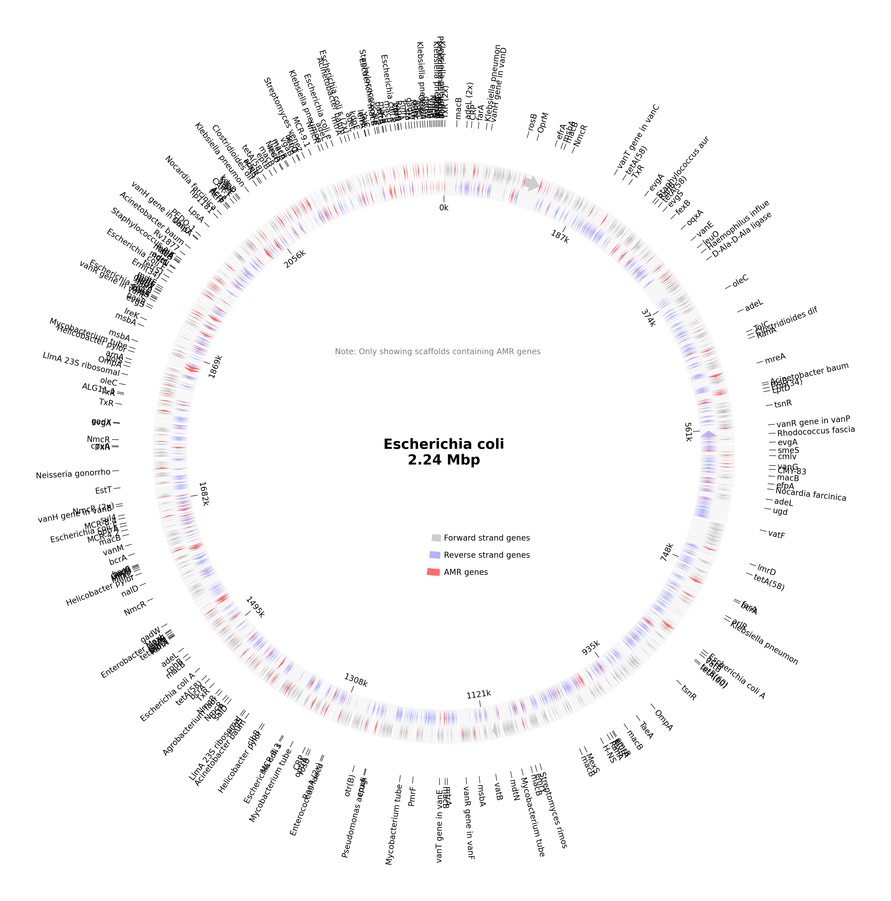

### ALG11-1
- **Mechanism**: antibiotic inactivation
- **Drug Classes**: carbapenem
- **AMR Family**: ALG11 beta-lactamase
- **Locations**:
  - gnl|SPADES|FDOHBCDP_482_12 : position 9845-11284

### Acinetobacter baumannii AbaF
- **Mechanism**: antibiotic efflux
- **Drug Classes**: phosphonic acid antibiotic
- **AMR Family**: major facilitator superfamily (MFS) antibiotic efflux pump
- **Locations**:
  - gnl|SPADES|FDOHBCDP_717_3 : position 3035-4351

### Acinetobacter baumannii AbaQ (found in 3 locations)
- **Mechanism**: antibiotic efflux
- **Drug Classes**: fluoroquinolone antibiotic
- **AMR Family**: major facilitator superfamily (MFS) antibiotic efflux pump
- **Locations**:
  - gnl|SPADES|FDOHBCDP_114_44 : position 48621-49952
  - gnl|SPADES|FDOHBCDP_1324_2 : position 2620-3921
  - gnl|SPADES|FDOHBCDP_290_10 : position 9844-11196

### AcrE
- **Mechanism**: antibiotic efflux
- **Drug Classes**: fluoroquinolone antibiotic; cephalosporin; cephamycin; penam
- **AMR Family**: resistance-nodulation-cell division (RND) antibiotic efflux pump
- **Locations**:
  - gnl|SPADES|FDOHBCDP_778_4: position 4680-5837

### AcrF
- **Mechanism**: antibiotic efflux
- **Drug Classes**: fluoroquinolone antibiotic; cephalosporin; cephamycin; penam
- **AMR Family**: resistance-nodulation-cell division (RND) antibiotic efflux pump
- **Locations**:
  - gnl|SPADES|FDOHBCDP_778_3: position 1564-4668

### AcrS
- **Mechanism**: antibiotic efflux
- **Drug Classes**: fluoroquinolone antibiotic; cephalosporin; glycylcycline; cephamycin; penam; tetracycline antibiotic; rifamycin antibiotic; phenicol antibiotic; disinfecting agents and antiseptics
- **AMR Family**: resistance-nodulation-cell division (RND) antibiotic efflux pump
- **Locations**:
  - gnl|SPADES|FDOHBCDP_778_5: position 6236-6898

### Agrobacterium fabrum chloramphenicol acetyltransferase
- **Mechanism**: antibiotic inactivation
- **Drug Classes**: phenicol antibiotic
- **AMR Family**: chloramphenicol acetyltransferase (CAT)
- **Locations**:
  - gnl|SPADES|FDOHBCDP_298_2 : position 152-772

### CAR-1
- **Mechanism**: antibiotic inactivation
- **Drug Classes**: carbapenem
- **AMR Family**: CAR beta-lactamase
- **Locations**:
  - gnl|SPADES|FDOHBCDP_806_4 : position 2536-3291

### CMY-83
- **Mechanism**: antibiotic inactivation
- **Drug Classes**: cephamycin
- **AMR Family**: CMY beta-lactamase
- **Locations**:
  - gnl|SPADES|FDOHBCDP_124_29 : position 29668-30825

### CRP (found in 2 locations)
- **Mechanism**: antibiotic efflux
- **Drug Classes**: macrolide antibiotic; fluoroquinolone antibiotic; penam
- **AMR Family**: resistance-nodulation-cell division (RND) antibiotic efflux pump
- **Locations**:
  - gnl|SPADES|FDOHBCDP_277_19: position 12294-12926
  - gnl|SPADES|FDOHBCDP_66_33 : position 32092-32844

### Clostridioides difficile gyrA conferring resistance to fluoroquinolones
- **Mechanism**: antibiotic target alteration
- **Drug Classes**: fluoroquinolone antibiotic
- **AMR Family**: fluoroquinolone resistant gyrA
- **Locations**:
  - gnl|SPADES|FDOHBCDP_839_5 : position 6207-8294

### Clostridioides difficile gyrB conferring resistance to fluoroquinolones
- **Mechanism**: antibiotic target alteration
- **Drug Classes**: fluoroquinolone antibiotic
- **AMR Family**: fluoroquinolone resistant gyrB
- **Locations**:
  - gnl|SPADES|FDOHBCDP_112_47 : position 54224-56116

### D-Ala-D-Ala ligase
- **Mechanism**: antibiotic target alteration
- **Drug Classes**: glycopeptide antibiotic
- **AMR Family**: Van ligase
- **Locations**:
  - gnl|SPADES|FDOHBCDP_103_20 : position 23117-24037

### Enterobacter cloacae acrA
- **Mechanism**: antibiotic efflux
- **Drug Classes**: fluoroquinolone antibiotic; cephalosporin; glycylcycline; penam; tetracycline antibiotic; rifamycin antibiotic; phenicol antibiotic; disinfecting agents and antiseptics
- **AMR Family**: resistance-nodulation-cell division (RND) antibiotic efflux pump
- **Locations**:
  - gnl|SPADES|FDOHBCDP_309_16 : position 18877-19998

### Enterococcus faecalis cls with mutation conferring resistance to daptomycin
- **Mechanism**: antibiotic target alteration
- **Drug Classes**: peptide antibiotic
- **AMR Family**: daptomycin resistant cls
- **Locations**:
  - gnl|SPADES|FDOHBCDP_269_18 : position 16080-17540

### Erm(34) (found in 2 locations)
- **Mechanism**: antibiotic target alteration
- **Drug Classes**: macrolide antibiotic; lincosamide antibiotic; streptogramin antibiotic; streptogramin A antibiotic; streptogramin B antibiotic
- **AMR Family**: Erm 23S ribosomal RNA methyltransferase
- **Locations**:
  - gnl|SPADES|FDOHBCDP_114_52 : position 55126-55947
  - gnl|SPADES|FDOHBCDP_633_3 : position 2382-3008

### Escherichia coli AcrAB-TolC with AcrR mutation conferring resistance to ciprofloxacin, tetracycline, and ceftazidime (found in 2 locations)
- **Mechanism**: antibiotic target alteration; antibiotic efflux
- **Drug Classes**: fluoroquinolone antibiotic; cephalosporin; glycylcycline; penam; tetracycline antibiotic; rifamycin antibiotic; phenicol antibiotic; disinfecting agents and antiseptics
- **AMR Family**: resistance-nodulation-cell division (RND) antibiotic efflux pump
- **Locations**:
  - gnl|SPADES|FDOHBCDP_162_12: position 11534-12181
  - gnl|SPADES|FDOHBCDP_304_13 : position 12578-13234

### Escherichia coli EF-Tu mutants conferring resistance to Pulvomycin
- **Mechanism**: antibiotic target alteration
- **Drug Classes**: elfamycin antibiotic
- **AMR Family**: elfamycin resistant EF-Tu
- **Locations**:
  - gnl|SPADES|FDOHBCDP_1836_1 : position 19-1203

### Escherichia coli EF-Tu mutants conferring resistance to kirromycin (found in 2 locations)
- **Mechanism**: antibiotic target alteration
- **Drug Classes**: elfamycin antibiotic
- **AMR Family**: elfamycin resistant EF-Tu
- **Locations**:
  - gnl|SPADES|FDOHBCDP_365_1 : position 3-2324
  - gnl|SPADES|FDOHBCDP_648_3 : position 1983-3827

### Escherichia coli acrA
- **Mechanism**: antibiotic efflux
- **Drug Classes**: fluoroquinolone antibiotic; cephalosporin; glycylcycline; penam; tetracycline antibiotic; rifamycin antibiotic; phenicol antibiotic; disinfecting agents and antiseptics
- **AMR Family**: resistance-nodulation-cell division (RND) antibiotic efflux pump
- **Locations**:
  - gnl|SPADES|FDOHBCDP_162_13: position 12323-13516

### Escherichia coli emrE (found in 2 locations)
- **Mechanism**: antibiotic efflux
- **Drug Classes**: macrolide antibiotic
- **AMR Family**: small multidrug resistance (SMR) antibiotic efflux pump
- **Locations**:
  - gnl|SPADES|FDOHBCDP_1319_2: position 238-570
  - gnl|SPADES|FDOHBCDP_2135_4: position 2492-2824

### Escherichia coli soxS with mutation conferring antibiotic resistance (found in 4 locations)
- **Mechanism**: antibiotic target alteration; antibiotic efflux; reduced permeability to antibiotic
- **Drug Classes**: fluoroquinolone antibiotic; monobactam; carbapenem; cephalosporin; glycylcycline; cephamycin; penam; tetracycline antibiotic; rifamycin antibiotic; phenicol antibiotic; penem; disinfecting agents and antiseptics
- **AMR Family**: ATP-binding cassette (ABC) antibiotic efflux pump; major facilitator superfamily (MFS) antibiotic efflux pump; resistance-nodulation-cell division (RND) antibiotic efflux pump; General Bacterial Porin with reduced permeability to beta-lactams
- **Locations**:
  - gnl|SPADES|FDOHBCDP_1383_2 : position 351-1289
  - gnl|SPADES|FDOHBCDP_1383_3 : position 1273-2109
  - gnl|SPADES|FDOHBCDP_283_13 : position 14499-15350
  - gnl|SPADES|FDOHBCDP_616_6 : position 4996-5865

### EstT
- **Mechanism**: antibiotic inactivation
- **Drug Classes**: macrolide antibiotic
- **AMR Family**: macrolide esterase
- **Locations**:
  - gnl|SPADES|FDOHBCDP_404_3 : position 2404-3168

### H-NS (found in 2 locations)
- **Mechanism**: antibiotic efflux
- **Drug Classes**: macrolide antibiotic; fluoroquinolone antibiotic; cephalosporin; cephamycin; penam; tetracycline antibiotic
- **AMR Family**: major facilitator superfamily (MFS) antibiotic efflux pump; resistance-nodulation-cell division (RND) antibiotic efflux pump
- **Locations**:
  - gnl|SPADES|FDOHBCDP_192_23 : position 21744-22148
  - gnl|SPADES|FDOHBCDP_872_3: position 2474-2887

### Haemophilus influenzae PBP3 conferring resistance to beta-lactam antibiotics
- **Mechanism**: antibiotic target alteration
- **Drug Classes**: cephalosporin; cephamycin; penam
- **AMR Family**: Penicillin-binding protein mutations conferring resistance to beta-lactam antibiotics
- **Locations**:
  - gnl|SPADES|FDOHBCDP_103_12 : position 12297-14063

### Helicobacter pylori pbp1 mutants conferring resistance to amoxicillin
- **Mechanism**: antibiotic target alteration
- **Drug Classes**: cephalosporin; cephamycin; penam
- **AMR Family**: Penicillin-binding protein mutations conferring resistance to beta-lactam antibiotics
- **Locations**:
  - gnl|SPADES|FDOHBCDP_284_12 : position 13694-16006

### Helicobacter pylori rdxA mutation conferring resistance to metronidazole
- **Mechanism**: antibiotic target alteration
- **Drug Classes**: nitroimidazole antibiotic
- **AMR Family**: Antibiotic resistant Helicobacter pylori nitroreductase
- **Locations**:
  - gnl|SPADES|FDOHBCDP_361_5 : position 2397-3050

### Helicobacter pylori rpoB mutation conferring resistance to rifampicin
- **Mechanism**: antibiotic target alteration; antibiotic target replacement
- **Drug Classes**: fluoroquinolone antibiotic; rifamycin antibiotic
- **AMR Family**: rifamycin-resistant beta-subunit of RNA polymerase (rpoB)
- **Locations**:
  - gnl|SPADES|FDOHBCDP_558_1 : position 53-4276

### IreK
- **Mechanism**: reduced permeability to antibiotic
- **Drug Classes**: cephalosporin
- **AMR Family**: Serine/threonine kinases
- **Locations**:
  - gnl|SPADES|FDOHBCDP_581_3 : position 1721-3190

### Klebsiella pneumoniae KpnH
- **Mechanism**: antibiotic efflux
- **Drug Classes**: macrolide antibiotic; fluoroquinolone antibiotic; aminoglycoside antibiotic; carbapenem; cephalosporin; penam; peptide antibiotic; penem
- **AMR Family**: major facilitator superfamily (MFS) antibiotic efflux pump
- **Locations**:
  - gnl|SPADES|FDOHBCDP_66_41 : position 41080-42591

### Klebsiella pneumoniae OmpK37 (found in 7 locations)
- **Mechanism**: reduced permeability to antibiotic
- **Drug Classes**: monobactam; carbapenem; cephalosporin; cephamycin; penam; penem
- **AMR Family**: General Bacterial Porin with reduced permeability to beta-lactams
- **Locations**:
  - gnl|SPADES|FDOHBCDP_1226_2 : position 1644-2084
  - gnl|SPADES|FDOHBCDP_148_11 : position 12615-13673
  - gnl|SPADES|FDOHBCDP_23510_1 : position 2-262
  - gnl|SPADES|FDOHBCDP_3492_1 : position 2-1180
  - gnl|SPADES|FDOHBCDP_66_49 : position 49506-50639
  - gnl|SPADES|FDOHBCDP_836_6 : position 4463-5518
  - gnl|SPADES|FDOHBCDP_8884_1 : position 23-547

### LlmA 23S ribosomal RNA methyltransferase (found in 2 locations)
- **Mechanism**: antibiotic target alteration
- **Drug Classes**: lincosamide antibiotic
- **AMR Family**: Llm 23S ribosomal RNA methyltransferase
- **Locations**:
  - gnl|SPADES|FDOHBCDP_290_14 : position 16952-18253
  - gnl|SPADES|FDOHBCDP_539_4 : position 1721-2896

### LpsA
- **Mechanism**: reduced permeability to antibiotic
- **Drug Classes**: peptide antibiotic
- **AMR Family**: Intrinsic peptide antibiotic resistant Lps
- **Locations**:
  - gnl|SPADES|FDOHBCDP_741_6 : position 4065-4838

### LptD
- **Mechanism**: antibiotic efflux
- **Drug Classes**: carbapenem; peptide antibiotic; aminocoumarin antibiotic; rifamycin antibiotic
- **AMR Family**: ATP-binding cassette (ABC) antibiotic efflux pump
- **Locations**:
  - gnl|SPADES|FDOHBCDP_114_55 : position 58272-60626

### MCR-4.2
- **Mechanism**: antibiotic target alteration
- **Drug Classes**: peptide antibiotic
- **AMR Family**: MCR phosphoethanolamine transferase
- **Locations**:
  - gnl|SPADES|FDOHBCDP_364_14 : position 13115-14698

### MCR-8.3
- **Mechanism**: antibiotic target alteration
- **Drug Classes**: peptide antibiotic
- **AMR Family**: MCR phosphoethanolamine transferase
- **Locations**:
  - gnl|SPADES|FDOHBCDP_283_14 : position 15499-17232

### MCR-8.4
- **Mechanism**: antibiotic target alteration
- **Drug Classes**: peptide antibiotic
- **AMR Family**: MCR phosphoethanolamine transferase
- **Locations**:
  - gnl|SPADES|FDOHBCDP_365_5 : position 6298-7818

### MCR-9.1
- **Mechanism**: antibiotic target alteration
- **Drug Classes**: peptide antibiotic
- **AMR Family**: MCR phosphoethanolamine transferase
- **Locations**:
  - gnl|SPADES|FDOHBCDP_1160_1 : position 206-1879

### MdtK
- **Mechanism**: antibiotic efflux
- **Drug Classes**: fluoroquinolone antibiotic
- **AMR Family**: multidrug and toxic compound extrusion (MATE) transporter
- **Locations**:
  - gnl|SPADES|FDOHBCDP_3047_1 : position 3-1643

### MexL
- **Mechanism**: antibiotic efflux
- **Drug Classes**: macrolide antibiotic; tetracycline antibiotic; disinfecting agents and antiseptics
- **AMR Family**: resistance-nodulation-cell division (RND) antibiotic efflux pump
- **Locations**:
  - gnl|SPADES|FDOHBCDP_309_17 : position 20147-20713

### MexS
- **Mechanism**: antibiotic efflux
- **Drug Classes**: fluoroquinolone antibiotic; diaminopyrimidine antibiotic; phenicol antibiotic
- **AMR Family**: resistance-nodulation-cell division (RND) antibiotic efflux pump
- **Locations**:
  - gnl|SPADES|FDOHBCDP_207_6 : position 6822-7859

### MexT
- **Mechanism**: antibiotic efflux
- **Drug Classes**: fluoroquinolone antibiotic; diaminopyrimidine antibiotic; phenicol antibiotic
- **AMR Family**: resistance-nodulation-cell division (RND) antibiotic efflux pump
- **Locations**:
  - gnl|SPADES|FDOHBCDP_8858_1 : position 2-547

### MexV
- **Mechanism**: antibiotic efflux
- **Drug Classes**: macrolide antibiotic; fluoroquinolone antibiotic; tetracycline antibiotic; phenicol antibiotic; disinfecting agents and antiseptics
- **AMR Family**: resistance-nodulation-cell division (RND) antibiotic efflux pump
- **Locations**:
  - gnl|SPADES|FDOHBCDP_361_9 : position 9106-10329

### MuxC
- **Mechanism**: antibiotic efflux
- **Drug Classes**: macrolide antibiotic; monobactam; tetracycline antibiotic; aminocoumarin antibiotic
- **AMR Family**: resistance-nodulation-cell division (RND) antibiotic efflux pump
- **Locations**:
  - gnl|SPADES|FDOHBCDP_361_8 : position 5951-9094

### Mycobacterium tuberculosis gidB mutation conferring resistance to streptomycin
- **Mechanism**: antibiotic target alteration
- **Drug Classes**: aminoglycoside antibiotic
- **AMR Family**: antibiotic resistant gidB
- **Locations**:
  - gnl|SPADES|FDOHBCDP_235_16 : position 17817-18440

### Mycobacterium tuberculosis inhA mutations conferring resistance to isoniazid
- **Mechanism**: antibiotic target alteration
- **Drug Classes**: isoniazid-like antibiotic
- **AMR Family**: isoniazid resistant inhA
- **Locations**:
  - gnl|SPADES|FDOHBCDP_256_13 : position 10073-10957

### Mycobacterium tuberculosis katG mutations conferring resistance to isoniazid
- **Mechanism**: antibiotic target alteration
- **Drug Classes**: isoniazid-like antibiotic
- **AMR Family**: isoniazid resistant katG
- **Locations**:
  - gnl|SPADES|FDOHBCDP_283_2 : position 811-2991

### Mycobacterium tuberculosis rpoB mutations conferring resistance to rifampicin
- **Mechanism**: antibiotic target alteration; antibiotic target replacement
- **Drug Classes**: rifamycin antibiotic
- **AMR Family**: rifamycin-resistant beta-subunit of RNA polymerase (rpoB)
- **Locations**:
  - gnl|SPADES|FDOHBCDP_558_2 : position 4353-8381

### Neisseria gonorrhoeae pilQ gene conferring resistance to beta-lactam
- **Mechanism**: antibiotic target alteration
- **Drug Classes**: cephalosporin; cephamycin; penam
- **AMR Family**: Penicillin-binding protein mutations conferring resistance to beta-lactam antibiotics
- **Locations**:
  - gnl|SPADES|FDOHBCDP_424_5 : position 2978-4930

### NmcR (found in 10 locations)
- **Mechanism**: antibiotic inactivation
- **Drug Classes**: carbapenem; cephalosporin; cephamycin; penam
- **AMR Family**: NmcA beta-lactamase
- **Locations**:
  - gnl|SPADES|FDOHBCDP_1184_5 : position 4870-5760
  - gnl|SPADES|FDOHBCDP_296_20 : position 17843-18796
  - gnl|SPADES|FDOHBCDP_298_6 : position 3317-4216
  - gnl|SPADES|FDOHBCDP_338_17 : position 14324-15298
  - gnl|SPADES|FDOHBCDP_401_3 : position 2762-3655
  - gnl|SPADES|FDOHBCDP_401_8 : position 9286-10182
  - gnl|SPADES|FDOHBCDP_455_6 : position 4736-5662
  - gnl|SPADES|FDOHBCDP_6479_1 : position 156-719
  - gnl|SPADES|FDOHBCDP_78_35 : position 59734-60660
  - gnl|SPADES|FDOHBCDP_939_6 : position 6450-7400

### Nocardia farcinica rox (found in 2 locations)
- **Mechanism**: antibiotic inactivation
- **Drug Classes**: rifamycin antibiotic
- **AMR Family**: rifampin monooxygenase
- **Locations**:
  - gnl|SPADES|FDOHBCDP_124_51 : position 52550-54214
  - gnl|SPADES|FDOHBCDP_754_5 : position 2998-4200

### OmpA (found in 4 locations)
- **Mechanism**: reduced permeability to antibiotic
- **Drug Classes**: peptide antibiotic
- **AMR Family**: General Bacterial Porin with reduced permeability to peptide antibiotics
- **Locations**:
  - gnl|SPADES|FDOHBCDP_183_24 : position 22512-22994
  - gnl|SPADES|FDOHBCDP_3236_2 : position 1020-1541
  - gnl|SPADES|FDOHBCDP_539_14 : position 11622-12638
  - gnl|SPADES|FDOHBCDP_718_6 : position 5577-6236

### OprM (found in 3 locations)
- **Mechanism**: antibiotic efflux
- **Drug Classes**: macrolide antibiotic; fluoroquinolone antibiotic; monobactam; aminoglycoside antibiotic; carbapenem; cephalosporin; cephamycin; penam; tetracycline antibiotic; peptide antibiotic; aminocoumarin antibiotic; diaminopyrimidine antibiotic; sulfonamide antibiotic; phenicol antibiotic; penem; disinfecting agents and antiseptics
- **AMR Family**: resistance-nodulation-cell division (RND) antibiotic efflux pump
- **Locations**:
  - gnl|SPADES|FDOHBCDP_309_14 : position 14393-15766
  - gnl|SPADES|FDOHBCDP_361_11 : position 10701-12083
  - gnl|SPADES|FDOHBCDP_78_12 : position 15572-16927

### PEDO-1
- **Mechanism**: antibiotic inactivation
- **Drug Classes**: carbapenem
- **AMR Family**: subclass B3 PEDO beta-lactamase
- **Locations**:
  - gnl|SPADES|FDOHBCDP_735_1 : position 104-751

### PmrF (found in 2 locations)
- **Mechanism**: antibiotic target alteration
- **Drug Classes**: peptide antibiotic
- **AMR Family**: pmr phosphoethanolamine transferase
- **Locations**:
  - gnl|SPADES|FDOHBCDP_2335_3 : position 1554-2537
  - gnl|SPADES|FDOHBCDP_248_27 : position 25002-25922

### Pseudomonas aeruginosa CpxR (found in 2 locations)
- **Mechanism**: antibiotic efflux
- **Drug Classes**: macrolide antibiotic; fluoroquinolone antibiotic; monobactam; aminoglycoside antibiotic; carbapenem; cephalosporin; cephamycin; penam; tetracycline antibiotic; peptide antibiotic; aminocoumarin antibiotic; diaminopyrimidine antibiotic; sulfonamide antibiotic; phenicol antibiotic; penem
- **AMR Family**: resistance-nodulation-cell division (RND) antibiotic efflux pump
- **Locations**:
  - gnl|SPADES|FDOHBCDP_12758_1 : position 2-409
  - gnl|SPADES|FDOHBCDP_262_24 : position 21756-22454

### RanA (found in 7 locations)
- **Mechanism**: antibiotic efflux
- **Drug Classes**: aminoglycoside antibiotic
- **AMR Family**: ATP-binding cassette (ABC) antibiotic efflux pump
- **Locations**:
  - gnl|SPADES|FDOHBCDP_112_49 : position 58695-59504
  - gnl|SPADES|FDOHBCDP_192_13 : position 12349-13551
  - gnl|SPADES|FDOHBCDP_2210_2 : position 395-1399
  - gnl|SPADES|FDOHBCDP_269_20 : position 17957-18961
  - gnl|SPADES|FDOHBCDP_269_21 : position 18958-19971
  - gnl|SPADES|FDOHBCDP_309_11 : position 11371-12363
  - gnl|SPADES|FDOHBCDP_98_9 : position 5855-6664

### RanB
- **Mechanism**: antibiotic efflux
- **Drug Classes**: aminoglycoside antibiotic
- **AMR Family**: ATP-binding cassette (ABC) antibiotic efflux pump
- **Locations**:
  - gnl|SPADES|FDOHBCDP_98_8 : position 5065-5847

### Rhodococcus fascians cmr
- **Mechanism**: antibiotic efflux
- **Drug Classes**: phenicol antibiotic
- **AMR Family**: major facilitator superfamily (MFS) antibiotic efflux pump
- **Locations**:
  - gnl|SPADES|FDOHBCDP_121_34 : position 45465-46697

### Rv1877
- **Mechanism**: antibiotic efflux
- **Drug Classes**: fluoroquinolone antibiotic
- **AMR Family**: major facilitator superfamily (MFS) antibiotic efflux pump
- **Locations**:
  - gnl|SPADES|FDOHBCDP_686_4 : position 4537-5931

### Staphylococcus aureus fusA with mutation conferring resistance to fusidic acid
- **Mechanism**: antibiotic target alteration
- **Drug Classes**: fusidane antibiotic
- **AMR Family**: antibiotic resistant fusA
- **Locations**:
  - gnl|SPADES|FDOHBCDP_1836_2 : position 1274-3388

### Staphylococcus aureus mupA conferring resistance to mupirocin
- **Mechanism**: antibiotic target alteration
- **Drug Classes**: mupirocin-like antibiotic
- **AMR Family**: antibiotic-resistant isoleucyl-tRNA synthetase (ileS)
- **Locations**:
  - gnl|SPADES|FDOHBCDP_114_24 : position 25219-28035

### Staphylococcus aureus murA with mutation conferring resistance to fosfomycin
- **Mechanism**: antibiotic target alteration
- **Drug Classes**: phosphonic acid antibiotic
- **AMR Family**: antibiotic-resistant murA transferase
- **Locations**:
  - gnl|SPADES|FDOHBCDP_98_3 : position 1834-3093

### Staphylococcus aureus pgsA mutations conferring resistance to daptomycin
- **Mechanism**: antibiotic target alteration
- **Drug Classes**: peptide antibiotic
- **AMR Family**: daptomycin resistant pgsA
- **Locations**:
  - gnl|SPADES|FDOHBCDP_682_12 : position 9424-9972

### Streptomyces rimosus otr(A)
- **Mechanism**: antibiotic target protection
- **Drug Classes**: tetracycline antibiotic
- **AMR Family**: tetracycline-resistant ribosomal protection protein
- **Locations**:
  - gnl|SPADES|FDOHBCDP_217_27 : position 28247-30070

### Streptomyces venezuelae rox
- **Mechanism**: antibiotic inactivation
- **Drug Classes**: rifamycin antibiotic
- **AMR Family**: rifampin monooxygenase
- **Locations**:
  - gnl|SPADES|FDOHBCDP_1034_2 : position 208-1383

### TaeA (found in 2 locations)
- **Mechanism**: antibiotic efflux
- **Drug Classes**: pleuromutilin antibiotic
- **AMR Family**: ATP-binding cassette (ABC) antibiotic efflux pump
- **Locations**:
  - gnl|SPADES|FDOHBCDP_189_8 : position 7089-8996
  - gnl|SPADES|FDOHBCDP_616_11 : position 9634-11043

### TolC
- **Mechanism**: antibiotic efflux
- **Drug Classes**: macrolide antibiotic; fluoroquinolone antibiotic; aminoglycoside antibiotic; carbapenem; cephalosporin; glycylcycline; cephamycin; penam; tetracycline antibiotic; peptide antibiotic; aminocoumarin antibiotic; rifamycin antibiotic; phenicol antibiotic; penem; disinfecting agents and antiseptics
- **AMR Family**: ATP-binding cassette (ABC) antibiotic efflux pump; major facilitator superfamily (MFS) antibiotic efflux pump; resistance-nodulation-cell division (RND) antibiotic efflux pump
- **Locations**:
  - gnl|SPADES|FDOHBCDP_112_42: position 50024-51505

### TxR (found in 7 locations)
- **Mechanism**: antibiotic efflux
- **Drug Classes**: tetracycline antibiotic
- **AMR Family**: ATP-binding cassette (ABC) antibiotic efflux pump
- **Locations**:
  - gnl|SPADES|FDOHBCDP_298_13 : position 12779-14365
  - gnl|SPADES|FDOHBCDP_453_14 : position 12976-14385
  - gnl|SPADES|FDOHBCDP_465_17 : position 12567-14645
  - gnl|SPADES|FDOHBCDP_482_11 : position 8144-9658
  - gnl|SPADES|FDOHBCDP_66_2 : position 690-1667
  - gnl|SPADES|FDOHBCDP_66_22 : position 20572-22113
  - gnl|SPADES|FDOHBCDP_83_47 : position 49533-51452

### YajC
- **Mechanism**: antibiotic efflux
- **Drug Classes**: fluoroquinolone antibiotic; cephalosporin; glycylcycline; penam; tetracycline antibiotic; oxazolidinone antibiotic; glycopeptide antibiotic; rifamycin antibiotic; phenicol antibiotic; disinfecting agents and antiseptics
- **AMR Family**: resistance-nodulation-cell division (RND) antibiotic efflux pump
- **Locations**:
  - gnl|SPADES|FDOHBCDP_1648_2 : position 1014-1346

### acrB (found in 2 locations)
- **Mechanism**: antibiotic efflux
- **Drug Classes**: fluoroquinolone antibiotic; cephalosporin; glycylcycline; penam; tetracycline antibiotic; rifamycin antibiotic; phenicol antibiotic; disinfecting agents and antiseptics
- **AMR Family**: resistance-nodulation-cell division (RND) antibiotic efflux pump
- **Locations**:
  - gnl|SPADES|FDOHBCDP_162_14: position 13539-16688
  - gnl|SPADES|FDOHBCDP_309_15 : position 15770-18877

### adeL (found in 12 locations)
- **Mechanism**: antibiotic efflux
- **Drug Classes**: fluoroquinolone antibiotic; tetracycline antibiotic
- **AMR Family**: resistance-nodulation-cell division (RND) antibiotic efflux pump
- **Locations**:
  - gnl|SPADES|FDOHBCDP_112_20 : position 24900-25832
  - gnl|SPADES|FDOHBCDP_1312_1 : position 213-1130
  - gnl|SPADES|FDOHBCDP_134_12 : position 8365-9315
  - gnl|SPADES|FDOHBCDP_1583_2 : position 820-1752
  - gnl|SPADES|FDOHBCDP_308_19 : position 17756-18682
  - gnl|SPADES|FDOHBCDP_3186_1 : position 243-1124
  - gnl|SPADES|FDOHBCDP_3223_2 : position 804-1670
  - gnl|SPADES|FDOHBCDP_648_9 : position 8731-9705
  - gnl|SPADES|FDOHBCDP_66_28 : position 26508-27407
  - gnl|SPADES|FDOHBCDP_66_38 : position 38059-38967
  - gnl|SPADES|FDOHBCDP_806_8 : position 6657-7571
  - gnl|SPADES|FDOHBCDP_98_51 : position 49234-50163

### adeR
- **Mechanism**: antibiotic efflux
- **Drug Classes**: glycylcycline; tetracycline antibiotic
- **AMR Family**: resistance-nodulation-cell division (RND) antibiotic efflux pump
- **Locations**:
  - gnl|SPADES|FDOHBCDP_872_5 : position 4141-5154

### arlR (found in 2 locations)
- **Mechanism**: antibiotic efflux
- **Drug Classes**: fluoroquinolone antibiotic; disinfecting agents and antiseptics
- **AMR Family**: major facilitator superfamily (MFS) antibiotic efflux pump
- **Locations**:
  - gnl|SPADES|FDOHBCDP_148_7 : position 8925-9707
  - gnl|SPADES|FDOHBCDP_361_12 : position 12240-12923

### arnA
- **Mechanism**: antibiotic target alteration
- **Drug Classes**: peptide antibiotic
- **AMR Family**: pmr phosphoethanolamine transferase
- **Locations**:
  - gnl|SPADES|FDOHBCDP_542_10 : position 6376-7323

### baeR (found in 2 locations)
- **Mechanism**: antibiotic efflux
- **Drug Classes**: aminoglycoside antibiotic; aminocoumarin antibiotic
- **AMR Family**: resistance-nodulation-cell division (RND) antibiotic efflux pump
- **Locations**:
  - gnl|SPADES|FDOHBCDP_124_6 : position 8236-8925
  - gnl|SPADES|FDOHBCDP_582_6 : position 6406-7098

### basS (found in 4 locations)
- **Mechanism**: antibiotic target alteration; antibiotic efflux
- **Drug Classes**: peptide antibiotic
- **AMR Family**: pmr phosphoethanolamine transferase
- **Locations**:
  - gnl|SPADES|FDOHBCDP_148_8 : position 9707-11065
  - gnl|SPADES|FDOHBCDP_2164_4 : position 1688-3025
  - gnl|SPADES|FDOHBCDP_361_13 : position 12913-14361
  - gnl|SPADES|FDOHBCDP_616_3 : position 2186-3610

### bcr-1 (found in 2 locations)
- **Mechanism**: antibiotic efflux
- **Drug Classes**: bicyclomycin-like antibiotic
- **AMR Family**: major facilitator superfamily (MFS) antibiotic efflux pump
- **Locations**:
  - gnl|SPADES|FDOHBCDP_309_13 : position 13221-14384
  - gnl|SPADES|FDOHBCDP_987_5 : position 2731-3906

### bcrA (found in 4 locations)
- **Mechanism**: antibiotic efflux
- **Drug Classes**: peptide antibiotic
- **AMR Family**: ATP-binding cassette (ABC) antibiotic efflux pump
- **Locations**:
  - gnl|SPADES|FDOHBCDP_144_32 : position 34940-37675
  - gnl|SPADES|FDOHBCDP_296_17 : position 14775-15833
  - gnl|SPADES|FDOHBCDP_298_21 : position 20345-21829
  - gnl|SPADES|FDOHBCDP_362_8 : position 5348-6103

### clbB
- **Mechanism**: antibiotic target alteration
- **Drug Classes**: lincosamide antibiotic; streptogramin antibiotic; streptogramin A antibiotic; oxazolidinone antibiotic; phenicol antibiotic; pleuromutilin antibiotic
- **AMR Family**: Cfr 23S ribosomal RNA methyltransferase
- **Locations**:
  - gnl|SPADES|FDOHBCDP_284_14 : position 16736-17890

### cmlv
- **Mechanism**: antibiotic inactivation
- **Drug Classes**: phenicol antibiotic
- **AMR Family**: chloramphenicol phosphotransferase
- **Locations**:
  - gnl|SPADES|FDOHBCDP_124_9 : position 13499-14767

### cprR
- **Mechanism**: antibiotic target alteration; antibiotic efflux
- **Drug Classes**: peptide antibiotic
- **AMR Family**: pmr phosphoethanolamine transferase
- **Locations**:
  - gnl|SPADES|FDOHBCDP_2164_3 : position 1032-1691

### cpxA (found in 2 locations)
- **Mechanism**: antibiotic efflux
- **Drug Classes**: aminoglycoside antibiotic; aminocoumarin antibiotic
- **AMR Family**: resistance-nodulation-cell division (RND) antibiotic efflux pump
- **Locations**:
  - gnl|SPADES|FDOHBCDP_262_25: position 22451-23824
  - gnl|SPADES|FDOHBCDP_453_15 : position 14397-15446

### dfrA3
- **Mechanism**: antibiotic target replacement
- **Drug Classes**: diaminopyrimidine antibiotic
- **AMR Family**: trimethoprim resistant dihydrofolate reductase dfr
- **Locations**:
  - gnl|SPADES|FDOHBCDP_114_47 : position 52526-53116

### efpA
- **Mechanism**: antibiotic efflux
- **Drug Classes**: rifamycin antibiotic; isoniazid-like antibiotic
- **AMR Family**: major facilitator superfamily (MFS) antibiotic efflux pump
- **Locations**:
  - gnl|SPADES|FDOHBCDP_124_45 : position 46553-47764

### efrA (found in 2 locations)
- **Mechanism**: antibiotic efflux
- **Drug Classes**: macrolide antibiotic; fluoroquinolone antibiotic; rifamycin antibiotic
- **AMR Family**: ATP-binding cassette (ABC) antibiotic efflux pump
- **Locations**:
  - gnl|SPADES|FDOHBCDP_1620_4 : position 1969-2646
  - gnl|SPADES|FDOHBCDP_78_14 : position 37688-39850

### efrB
- **Mechanism**: antibiotic efflux
- **Drug Classes**: macrolide antibiotic; fluoroquinolone antibiotic; rifamycin antibiotic
- **AMR Family**: ATP-binding cassette (ABC) antibiotic efflux pump
- **Locations**:
  - gnl|SPADES|FDOHBCDP_1898_4 : position 1948-3621

### emrA
- **Mechanism**: antibiotic efflux
- **Drug Classes**: fluoroquinolone antibiotic
- **AMR Family**: major facilitator superfamily (MFS) antibiotic efflux pump
- **Locations**:
  - gnl|SPADES|FDOHBCDP_192_6: position 5344-6516

### emrB
- **Mechanism**: antibiotic efflux
- **Drug Classes**: fluoroquinolone antibiotic
- **AMR Family**: major facilitator superfamily (MFS) antibiotic efflux pump
- **Locations**:
  - gnl|SPADES|FDOHBCDP_192_5: position 3789-5327

### emrR
- **Mechanism**: antibiotic efflux
- **Drug Classes**: fluoroquinolone antibiotic
- **AMR Family**: major facilitator superfamily (MFS) antibiotic efflux pump
- **Locations**:
  - gnl|SPADES|FDOHBCDP_192_7: position 6643-7173

### emrY
- **Mechanism**: antibiotic efflux
- **Drug Classes**: tetracycline antibiotic
- **AMR Family**: major facilitator superfamily (MFS) antibiotic efflux pump
- **Locations**:
  - gnl|SPADES|FDOHBCDP_235_2 : position 885-2312

### eptB
- **Mechanism**: antibiotic target alteration
- **Drug Classes**: peptide antibiotic
- **AMR Family**: pmr phosphoethanolamine transferase
- **Locations**:
  - gnl|SPADES|FDOHBCDP_931_1 : position 384-2075

### evgA (found in 4 locations)
- **Mechanism**: antibiotic efflux
- **Drug Classes**: macrolide antibiotic; fluoroquinolone antibiotic; penam; tetracycline antibiotic
- **AMR Family**: major facilitator superfamily (MFS) antibiotic efflux pump; resistance-nodulation-cell division (RND) antibiotic efflux pump
- **Locations**:
  - gnl|SPADES|FDOHBCDP_121_43 : position 56079-56669
  - gnl|SPADES|FDOHBCDP_462_8 : position 7143-7775
  - gnl|SPADES|FDOHBCDP_682_10 : position 6882-7538
  - gnl|SPADES|FDOHBCDP_83_70 : position 73189-73839

### evgS (found in 4 locations)
- **Mechanism**: antibiotic efflux
- **Drug Classes**: macrolide antibiotic; fluoroquinolone antibiotic; penam; tetracycline antibiotic
- **AMR Family**: major facilitator superfamily (MFS) antibiotic efflux pump; resistance-nodulation-cell division (RND) antibiotic efflux pump
- **Locations**:
  - gnl|SPADES|FDOHBCDP_245_24 : position 23883-24272
  - gnl|SPADES|FDOHBCDP_290_13 : position 14139-16895
  - gnl|SPADES|FDOHBCDP_582_4 : position 2578-5277
  - gnl|SPADES|FDOHBCDP_98_24 : position 17288-19624

### farA (found in 2 locations)
- **Mechanism**: antibiotic efflux
- **Drug Classes**: antibacterial free fatty acids
- **AMR Family**: major facilitator superfamily (MFS) antibiotic efflux pump
- **Locations**:
  - gnl|SPADES|FDOHBCDP_144_31 : position 33876-34943
  - gnl|SPADES|FDOHBCDP_66_40 : position 40052-41080

### fexB (found in 2 locations)
- **Mechanism**: antibiotic efflux
- **Drug Classes**: phenicol antibiotic
- **AMR Family**: major facilitator superfamily (MFS) antibiotic efflux pump
- **Locations**:
  - gnl|SPADES|FDOHBCDP_192_10 : position 8486-9634
  - gnl|SPADES|FDOHBCDP_98_32 : position 30641-32131

### gadW (found in 4 locations)
- **Mechanism**: antibiotic efflux
- **Drug Classes**: macrolide antibiotic; fluoroquinolone antibiotic; penam
- **AMR Family**: resistance-nodulation-cell division (RND) antibiotic efflux pump
- **Locations**:
  - gnl|SPADES|FDOHBCDP_2809_1 : position 273-1016
  - gnl|SPADES|FDOHBCDP_324_7 : position 3771-4358
  - gnl|SPADES|FDOHBCDP_3865_1 : position 718-1302
  - gnl|SPADES|FDOHBCDP_621_2 : position 1624-2352

### gadX (found in 2 locations)
- **Mechanism**: antibiotic efflux
- **Drug Classes**: macrolide antibiotic; fluoroquinolone antibiotic; penam
- **AMR Family**: resistance-nodulation-cell division (RND) antibiotic efflux pump
- **Locations**:
  - gnl|SPADES|FDOHBCDP_462_9 : position 8140-8541
  - gnl|SPADES|FDOHBCDP_621_1: position 431-1255

### golS (found in 2 locations)
- **Mechanism**: antibiotic efflux
- **Drug Classes**: monobactam; carbapenem; cephalosporin; cephamycin; penam; phenicol antibiotic; penem
- **AMR Family**: resistance-nodulation-cell division (RND) antibiotic efflux pump
- **Locations**:
  - gnl|SPADES|FDOHBCDP_542_5 : position 2407-2832
  - gnl|SPADES|FDOHBCDP_78_16 : position 41019-41426

### hp1181
- **Mechanism**: antibiotic efflux
- **Drug Classes**: fluoroquinolone antibiotic; tetracycline antibiotic; nitroimidazole antibiotic
- **AMR Family**: major facilitator superfamily (MFS) antibiotic efflux pump
- **Locations**:
  - gnl|SPADES|FDOHBCDP_747_9 : position 7896-9227

### kdpD
- **Mechanism**: antibiotic efflux
- **Drug Classes**: aminoglycoside antibiotic
- **AMR Family**: kdpDE
- **Locations**:
  - gnl|SPADES|FDOHBCDP_826_2 : position 620-3304

### kdpE (found in 3 locations)
- **Mechanism**: antibiotic efflux
- **Drug Classes**: aminoglycoside antibiotic
- **AMR Family**: kdpDE
- **Locations**:
  - gnl|SPADES|FDOHBCDP_1593_1 : position 3-110
  - gnl|SPADES|FDOHBCDP_4869_2 : position 859-966
  - gnl|SPADES|FDOHBCDP_826_1: position 3-623

### leuO (found in 3 locations)
- **Mechanism**: antibiotic efflux
- **Drug Classes**: nucleoside antibiotic; disinfecting agents and antiseptics
- **AMR Family**: major facilitator superfamily (MFS) antibiotic efflux pump
- **Locations**:
  - gnl|SPADES|FDOHBCDP_103_5: position 5252-6196
  - gnl|SPADES|FDOHBCDP_939_5 : position 5431-6348
  - gnl|SPADES|FDOHBCDP_987_4 : position 1797-2756

### lmrC
- **Mechanism**: antibiotic target protection
- **Drug Classes**: lincosamide antibiotic
- **AMR Family**: Miscellaneous ABC-F subfamily ATP-binding cassette ribosomal protection proteins
- **Locations**:
  - gnl|SPADES|FDOHBCDP_1620_5 : position 2640-3317

### lmrD
- **Mechanism**: antibiotic efflux
- **Drug Classes**: lincosamide antibiotic
- **AMR Family**: ATP-binding cassette (ABC) antibiotic efflux pump
- **Locations**:
  - gnl|SPADES|FDOHBCDP_141_37 : position 35956-38145

### macA
- **Mechanism**: antibiotic efflux
- **Drug Classes**: macrolide antibiotic
- **AMR Family**: ATP-binding cassette (ABC) antibiotic efflux pump
- **Locations**:
  - gnl|SPADES|FDOHBCDP_963_4 : position 3790-4905

### macB (found in 16 locations)
- **Mechanism**: antibiotic efflux
- **Drug Classes**: macrolide antibiotic
- **AMR Family**: ATP-binding cassette (ABC) antibiotic efflux pump
- **Locations**:
  - gnl|SPADES|FDOHBCDP_124_35 : position 37695-38462
  - gnl|SPADES|FDOHBCDP_1805_5 : position 2791-3549
  - gnl|SPADES|FDOHBCDP_189_24 : position 25072-25839
  - gnl|SPADES|FDOHBCDP_2027_2 : position 458-1186
  - gnl|SPADES|FDOHBCDP_207_14 : position 13056-14069
  - gnl|SPADES|FDOHBCDP_2104_3 : position 1239-2270
  - gnl|SPADES|FDOHBCDP_235_7 : position 6214-7719
  - gnl|SPADES|FDOHBCDP_247_18 : position 17052-18593
  - gnl|SPADES|FDOHBCDP_308_6 : position 4744-5841
  - gnl|SPADES|FDOHBCDP_364_8 : position 7842-8564
  - gnl|SPADES|FDOHBCDP_66_17 : position 14578-15660
  - gnl|SPADES|FDOHBCDP_682_7 : position 4427-5179
  - gnl|SPADES|FDOHBCDP_78_28 : position 49368-50054
  - gnl|SPADES|FDOHBCDP_8343_1 : position 2-574
  - gnl|SPADES|FDOHBCDP_931_5 : position 6895-7533
  - gnl|SPADES|FDOHBCDP_963_5 : position 4902-6848

### mdtE
- **Mechanism**: antibiotic efflux
- **Drug Classes**: macrolide antibiotic; fluoroquinolone antibiotic; penam
- **AMR Family**: resistance-nodulation-cell division (RND) antibiotic efflux pump
- **Locations**:
  - gnl|SPADES|FDOHBCDP_621_5: position 5853-7010

### mdtF
- **Mechanism**: antibiotic efflux
- **Drug Classes**: macrolide antibiotic; fluoroquinolone antibiotic; penam
- **AMR Family**: resistance-nodulation-cell division (RND) antibiotic efflux pump
- **Locations**:
  - gnl|SPADES|FDOHBCDP_621_4: position 2715-5828

### mdtN (found in 2 locations)
- **Mechanism**: antibiotic efflux
- **Drug Classes**: nucleoside antibiotic; disinfecting agents and antiseptics
- **AMR Family**: major facilitator superfamily (MFS) antibiotic efflux pump
- **Locations**:
  - gnl|SPADES|FDOHBCDP_244_1 : position 3-1043
  - gnl|SPADES|FDOHBCDP_648_8 : position 7598-8734

### mgrA
- **Mechanism**: antibiotic efflux
- **Drug Classes**: fluoroquinolone antibiotic; cephalosporin; penam; tetracycline antibiotic; peptide antibiotic; disinfecting agents and antiseptics
- **AMR Family**: ATP-binding cassette (ABC) antibiotic efflux pump; major facilitator superfamily (MFS) antibiotic efflux pump
- **Locations**:
  - gnl|SPADES|FDOHBCDP_9813_1 : position 3-377

### mreA
- **Mechanism**: antibiotic efflux
- **Drug Classes**: macrolide antibiotic
- **AMR Family**: major facilitator superfamily (MFS) antibiotic efflux pump
- **Locations**:
  - gnl|SPADES|FDOHBCDP_114_23 : position 24235-25176

### msbA (found in 4 locations)
- **Mechanism**: antibiotic efflux
- **Drug Classes**: nitroimidazole antibiotic
- **AMR Family**: ATP-binding cassette (ABC) antibiotic efflux pump
- **Locations**:
  - gnl|SPADES|FDOHBCDP_245_9 : position 7027-8541
  - gnl|SPADES|FDOHBCDP_561_3 : position 1343-2116
  - gnl|SPADES|FDOHBCDP_577_9: position 6693-8441
  - gnl|SPADES|FDOHBCDP_78_23 : position 45554-46231

### mtrA (found in 2 locations)
- **Mechanism**: antibiotic efflux
- **Drug Classes**: macrolide antibiotic; penam
- **AMR Family**: resistance-nodulation-cell division (RND) antibiotic efflux pump
- **Locations**:
  - gnl|SPADES|FDOHBCDP_1321_5 : position 4281-5135
  - gnl|SPADES|FDOHBCDP_247_16 : position 14637-15815

### nalD
- **Mechanism**: antibiotic efflux
- **Drug Classes**: macrolide antibiotic; fluoroquinolone antibiotic; monobactam; carbapenem; cephalosporin; cephamycin; penam; tetracycline antibiotic; peptide antibiotic; aminocoumarin antibiotic; diaminopyrimidine antibiotic; sulfonamide antibiotic; phenicol antibiotic; penem
- **AMR Family**: resistance-nodulation-cell division (RND) antibiotic efflux pump
- **Locations**:
  - gnl|SPADES|FDOHBCDP_343_16 : position 11684-12322

### oleC (found in 2 locations)
- **Mechanism**: antibiotic efflux
- **Drug Classes**: macrolide antibiotic
- **AMR Family**: ATP-binding cassette (ABC) antibiotic efflux pump
- **Locations**:
  - gnl|SPADES|FDOHBCDP_103_52 : position 63676-64602
  - gnl|SPADES|FDOHBCDP_531_5 : position 3949-5163

### optrA (found in 2 locations)
- **Mechanism**: antibiotic target protection
- **Drug Classes**: oxazolidinone antibiotic; phenicol antibiotic
- **AMR Family**: Miscellaneous ABC-F subfamily ATP-binding cassette ribosomal protection proteins
- **Locations**:
  - gnl|SPADES|FDOHBCDP_277_14 : position 7463-9376
  - gnl|SPADES|FDOHBCDP_364_19 : position 18063-19649

### oqxA
- **Mechanism**: antibiotic efflux
- **Drug Classes**: fluoroquinolone antibiotic; glycylcycline; tetracycline antibiotic; diaminopyrimidine antibiotic; nitrofuran antibiotic
- **AMR Family**: resistance-nodulation-cell division (RND) antibiotic efflux pump
- **Locations**:
  - gnl|SPADES|FDOHBCDP_98_49 : position 47908-48840

### otr(B)
- **Mechanism**: antibiotic efflux
- **Drug Classes**: tetracycline antibiotic
- **AMR Family**: major facilitator superfamily (MFS) antibiotic efflux pump
- **Locations**:
  - gnl|SPADES|FDOHBCDP_265_5 : position 6885-8222

### poxtA
- **Mechanism**: antibiotic target protection
- **Drug Classes**: tetracycline antibiotic; oxazolidinone antibiotic; phenicol antibiotic
- **AMR Family**: Miscellaneous ABC-F subfamily ATP-binding cassette ribosomal protection proteins
- **Locations**:
  - gnl|SPADES|FDOHBCDP_1898_3 : position 1634-1933

### rosA
- **Mechanism**: antibiotic efflux
- **Drug Classes**: peptide antibiotic
- **AMR Family**: major facilitator superfamily (MFS) antibiotic efflux pump
- **Locations**:
  - gnl|SPADES|FDOHBCDP_78_5 : position 5468-6688

### rosB (found in 3 locations)
- **Mechanism**: antibiotic efflux
- **Drug Classes**: peptide antibiotic
- **AMR Family**: major facilitator superfamily (MFS) antibiotic efflux pump
- **Locations**:
  - gnl|SPADES|FDOHBCDP_114_46 : position 50583-52445
  - gnl|SPADES|FDOHBCDP_277_11 : position 4977-6782
  - gnl|SPADES|FDOHBCDP_78_4 : position 3554-5230

### rphB
- **Mechanism**: antibiotic inactivation
- **Drug Classes**: rifamycin antibiotic
- **AMR Family**: rifampin phosphotransferase
- **Locations**:
  - gnl|SPADES|FDOHBCDP_308_11 : position 8806-10533

### salD
- **Mechanism**: antibiotic target protection
- **Drug Classes**: lincosamide antibiotic; streptogramin antibiotic; streptogramin A antibiotic; pleuromutilin antibiotic
- **AMR Family**: sal-type ABC-F protein
- **Locations**:
  - gnl|SPADES|FDOHBCDP_296_12 : position 10538-12010

### sdiA
- **Mechanism**: antibiotic efflux
- **Drug Classes**: fluoroquinolone antibiotic; cephalosporin; glycylcycline; penam; tetracycline antibiotic; rifamycin antibiotic; phenicol antibiotic; disinfecting agents and antiseptics
- **AMR Family**: resistance-nodulation-cell division (RND) antibiotic efflux pump
- **Locations**:
  - gnl|SPADES|FDOHBCDP_682_8 : position 5409-6131

### smeR
- **Mechanism**: antibiotic efflux
- **Drug Classes**: aminoglycoside antibiotic; cephalosporin; cephamycin; penam
- **AMR Family**: resistance-nodulation-cell division (RND) antibiotic efflux pump
- **Locations**:
  - gnl|SPADES|FDOHBCDP_616_4 : position 3610-4299

### smeS
- **Mechanism**: antibiotic efflux
- **Drug Classes**: aminoglycoside antibiotic; cephalosporin; cephamycin; penam
- **AMR Family**: resistance-nodulation-cell division (RND) antibiotic efflux pump
- **Locations**:
  - gnl|SPADES|FDOHBCDP_124_5 : position 6883-8178

### sta (found in 2 locations)
- **Mechanism**: antibiotic inactivation
- **Drug Classes**: nucleoside antibiotic
- **AMR Family**: streptothricin acetyltransferase (SAT)
- **Locations**:
  - gnl|SPADES|FDOHBCDP_207_7 : position 8040-8558
  - gnl|SPADES|FDOHBCDP_2354_3 : position 1444-1890

### sul4
- **Mechanism**: antibiotic target replacement
- **Drug Classes**: sulfonamide antibiotic
- **AMR Family**: sulfonamide resistant sul
- **Locations**:
  - gnl|SPADES|FDOHBCDP_365_8 : position 10376-11224

### tet(S)
- **Mechanism**: antibiotic target protection
- **Drug Classes**: tetracycline antibiotic
- **AMR Family**: tetracycline-resistant ribosomal protection protein
- **Locations**:
  - gnl|SPADES|FDOHBCDP_633_11 : position 7481-8908

### tetA(58) (found in 5 locations)
- **Mechanism**: antibiotic efflux
- **Drug Classes**: tetracycline antibiotic
- **AMR Family**: major facilitator superfamily (MFS) antibiotic efflux pump
- **Locations**:
  - gnl|SPADES|FDOHBCDP_144_2 : position 162-932
  - gnl|SPADES|FDOHBCDP_304_2 : position 576-1343
  - gnl|SPADES|FDOHBCDP_83_40 : position 41052-41810
  - gnl|SPADES|FDOHBCDP_912_2 : position 1330-2157
  - gnl|SPADES|FDOHBCDP_98_15 : position 10543-11268

### tetA(60)
- **Mechanism**: antibiotic efflux
- **Drug Classes**: tetracycline antibiotic
- **AMR Family**: ATP-binding cassette (ABC) antibiotic efflux pump
- **Locations**:
  - gnl|SPADES|FDOHBCDP_162_27 : position 27103-28875

### tetB(60) (found in 2 locations)
- **Mechanism**: antibiotic efflux
- **Drug Classes**: tetracycline antibiotic
- **AMR Family**: ATP-binding cassette (ABC) antibiotic efflux pump
- **Locations**:
  - gnl|SPADES|FDOHBCDP_162_26 : position 25329-27110
  - gnl|SPADES|FDOHBCDP_309_12 : position 12365-13171

### tsnR (found in 2 locations)
- **Mechanism**: antibiotic target alteration
- **Drug Classes**: peptide antibiotic
- **AMR Family**: non-erm 23S ribosomal RNA methyltransferase (A1067)
- **Locations**:
  - gnl|SPADES|FDOHBCDP_121_14 : position 12741-13430
  - gnl|SPADES|FDOHBCDP_180_26 : position 17958-18689

### ugd (found in 2 locations)
- **Mechanism**: antibiotic target alteration
- **Drug Classes**: peptide antibiotic
- **AMR Family**: pmr phosphoethanolamine transferase
- **Locations**:
  - gnl|SPADES|FDOHBCDP_134_23 : position 19041-20207
  - gnl|SPADES|FDOHBCDP_5911_1 : position 2-607

### vanE
- **Mechanism**: antibiotic target alteration
- **Drug Classes**: glycopeptide antibiotic
- **AMR Family**: glycopeptide resistance gene cluster; Van ligase
- **Locations**:
  - gnl|SPADES|FDOHBCDP_98_62 : position 65351-66700

### vanG
- **Mechanism**: antibiotic target alteration
- **Drug Classes**: glycopeptide antibiotic
- **AMR Family**: glycopeptide resistance gene cluster; Van ligase
- **Locations**:
  - gnl|SPADES|FDOHBCDP_124_23: position 25033-26127

### vanH gene in vanB cluster
- **Mechanism**: antibiotic target alteration
- **Drug Classes**: glycopeptide antibiotic
- **AMR Family**: vanH; glycopeptide resistance gene cluster
- **Locations**:
  - gnl|SPADES|FDOHBCDP_401_1 : position 232-1464

### vanH gene in vanD cluster
- **Mechanism**: antibiotic target alteration
- **Drug Classes**: glycopeptide antibiotic
- **AMR Family**: vanH; glycopeptide resistance gene cluster
- **Locations**:
  - gnl|SPADES|FDOHBCDP_66_54 : position 55754-56743

### vanH gene in vanO cluster
- **Mechanism**: antibiotic target alteration
- **Drug Classes**: glycopeptide antibiotic
- **AMR Family**: vanH; glycopeptide resistance gene cluster
- **Locations**:
  - gnl|SPADES|FDOHBCDP_718_7 : position 6340-7314

### vanM
- **Mechanism**: antibiotic target alteration
- **Drug Classes**: glycopeptide antibiotic
- **AMR Family**: glycopeptide resistance gene cluster; Van ligase
- **Locations**:
  - gnl|SPADES|FDOHBCDP_362_18 : position 16706-17884

### vanR gene in vanE cluster
- **Mechanism**: antibiotic target alteration
- **Drug Classes**: glycopeptide antibiotic
- **AMR Family**: glycopeptide resistance gene cluster; vanR
- **Locations**:
  - gnl|SPADES|FDOHBCDP_616_1 : position 3-716

### vanR gene in vanF cluster
- **Mechanism**: antibiotic target alteration
- **Drug Classes**: glycopeptide antibiotic
- **AMR Family**: glycopeptide resistance gene cluster; vanR
- **Locations**:
  - gnl|SPADES|FDOHBCDP_245_23 : position 22819-23868

### vanR gene in vanP cluster
- **Mechanism**: antibiotic target alteration
- **Drug Classes**: glycopeptide antibiotic
- **AMR Family**: glycopeptide resistance gene cluster; vanR
- **Locations**:
  - gnl|SPADES|FDOHBCDP_121_32 : position 34995-36701

### vanT gene in vanC cluster
- **Mechanism**: antibiotic target alteration
- **Drug Classes**: glycopeptide antibiotic
- **AMR Family**: glycopeptide resistance gene cluster; vanT
- **Locations**:
  - gnl|SPADES|FDOHBCDP_83_29 : position 29363-30433

### vanT gene in vanE cluster
- **Mechanism**: antibiotic target alteration
- **Drug Classes**: glycopeptide antibiotic
- **AMR Family**: glycopeptide resistance gene cluster; vanT
- **Locations**:
  - gnl|SPADES|FDOHBCDP_247_24 : position 23911-24906

### vatB (found in 2 locations)
- **Mechanism**: antibiotic inactivation
- **Drug Classes**: streptogramin antibiotic; streptogramin A antibiotic
- **AMR Family**: streptogramin vat acetyltransferase
- **Locations**:
  - gnl|SPADES|FDOHBCDP_162_17 : position 18024-18575
  - gnl|SPADES|FDOHBCDP_244_15 : position 17938-18759

### vatF
- **Mechanism**: antibiotic inactivation
- **Drug Classes**: streptogramin antibiotic; streptogramin A antibiotic
- **AMR Family**: streptogramin vat acetyltransferase
- **Locations**:
  - gnl|SPADES|FDOHBCDP_134_46 : position 45392-45940

### vgaB
- **Mechanism**: antibiotic target protection
- **Drug Classes**: streptogramin antibiotic; streptogramin A antibiotic; pleuromutilin antibiotic
- **AMR Family**: vga-type ABC-F protein
- **Locations**:
  - gnl|SPADES|FDOHBCDP_973_5 : position 5331-6314

## Escherichia coli 042
**Strain Statistics:**
- Total genome length: 300.3 kbp
- Total scaffolds: 8
- Scaffolds with AMR genes: 5
- Total genes annotated: 554
- Total AMR genes: 29
- Unique AMR genes: 23
- Distinct AMR mechanisms: 6
- Distinct AMR families: 13
- Distinct drug classes: 19

**Circos Plot:**

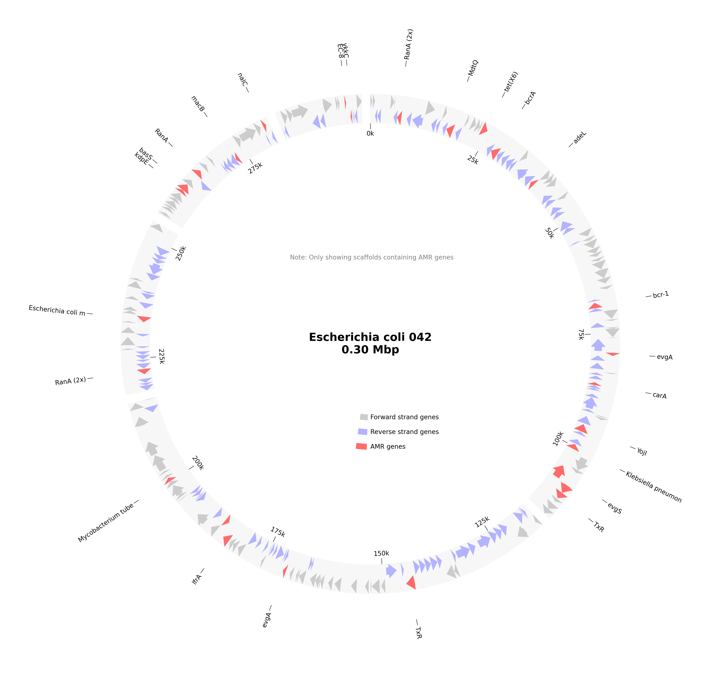

### EC-8
- **Mechanism**: antibiotic inactivation
- **Drug Classes**: cephalosporin
- **AMR Family**: EC beta-lactamase
- **Locations**:
  - gnl|SPADES|FDOHBCDP_406_11 : position 14142-14435

### Escherichia coli mdfA
- **Mechanism**: antibiotic efflux
- **Drug Classes**: tetracycline antibiotic; phenicol antibiotic; disinfecting agents and antiseptics
- **AMR Family**: major facilitator superfamily (MFS) antibiotic efflux pump
- **Locations**:
  - gnl|SPADES|FDOHBCDP_179_19: position 14861-16093

### Klebsiella pneumoniae OmpK37
- **Mechanism**: reduced permeability to antibiotic
- **Drug Classes**: monobactam; carbapenem; cephalosporin; cephamycin; penam; penem
- **AMR Family**: General Bacterial Porin with reduced permeability to beta-lactams
- **Locations**:
  - gnl|SPADES|FDOHBCDP_42_95 : position 99611-100717

### MdtQ
- **Mechanism**: reduced permeability to antibiotic
- **Drug Classes**: monobactam; carbapenem; cephalosporin; cephamycin; penam; penem
- **AMR Family**: Outer Membrane Porin (Opr)
- **Locations**:
  - gnl|SPADES|FDOHBCDP_42_18 : position 16690-18126

### Mycobacterium tuberculosis thyA with mutation conferring resistance to para-aminosalicylic acid
- **Mechanism**: antibiotic target alteration
- **Drug Classes**: salicylic acid antibiotic
- **AMR Family**: aminosalicylate resistant thymidylate synthase
- **Locations**:
  - gnl|SPADES|FDOHBCDP_50_80 : position 85139-85933

### RanA (found in 5 locations)
- **Mechanism**: antibiotic efflux
- **Drug Classes**: aminoglycoside antibiotic
- **AMR Family**: ATP-binding cassette (ABC) antibiotic efflux pump
- **Locations**:
  - gnl|SPADES|FDOHBCDP_179_34 : position 31329-33200
  - gnl|SPADES|FDOHBCDP_179_6 : position 3642-4775
  - gnl|SPADES|FDOHBCDP_240_13 : position 10874-12010
  - gnl|SPADES|FDOHBCDP_42_60 : position 66053-67642
  - gnl|SPADES|FDOHBCDP_42_9 : position 5754-6680

### TxR (found in 2 locations)
- **Mechanism**: antibiotic efflux
- **Drug Classes**: tetracycline antibiotic
- **AMR Family**: ATP-binding cassette (ABC) antibiotic efflux pump
- **Locations**:
  - gnl|SPADES|FDOHBCDP_42_100 : position 109720-111105
  - gnl|SPADES|FDOHBCDP_50_22 : position 28420-30198

### YojI
- **Mechanism**: antibiotic efflux
- **Drug Classes**: peptide antibiotic
- **AMR Family**: ATP-binding cassette (ABC) antibiotic efflux pump
- **Locations**:
  - gnl|SPADES|FDOHBCDP_42_91: position 94937-96580

### adeL
- **Mechanism**: antibiotic efflux
- **Drug Classes**: fluoroquinolone antibiotic; tetracycline antibiotic
- **AMR Family**: resistance-nodulation-cell division (RND) antibiotic efflux pump
- **Locations**:
  - gnl|SPADES|FDOHBCDP_42_36 : position 38388-39269

### basS
- **Mechanism**: antibiotic target alteration; antibiotic efflux
- **Drug Classes**: peptide antibiotic
- **AMR Family**: pmr phosphoethanolamine transferase
- **Locations**:
  - gnl|SPADES|FDOHBCDP_240_10 : position 6692-8152

### bcr-1
- **Mechanism**: antibiotic efflux
- **Drug Classes**: bicyclomycin-like antibiotic
- **AMR Family**: major facilitator superfamily (MFS) antibiotic efflux pump
- **Locations**:
  - gnl|SPADES|FDOHBCDP_42_62 : position 68323-69513

### bcrA
- **Mechanism**: antibiotic efflux
- **Drug Classes**: peptide antibiotic
- **AMR Family**: ATP-binding cassette (ABC) antibiotic efflux pump
- **Locations**:
  - gnl|SPADES|FDOHBCDP_42_28 : position 27433-28953

### carA
- **Mechanism**: antibiotic target protection
- **Drug Classes**: macrolide antibiotic
- **AMR Family**: Miscellaneous ABC-F subfamily ATP-binding cassette ribosomal protection proteins
- **Locations**:
  - gnl|SPADES|FDOHBCDP_42_80 : position 85555-86172

### evgA (found in 2 locations)
- **Mechanism**: antibiotic efflux
- **Drug Classes**: macrolide antibiotic; fluoroquinolone antibiotic; penam; tetracycline antibiotic
- **AMR Family**: major facilitator superfamily (MFS) antibiotic efflux pump; resistance-nodulation-cell division (RND) antibiotic efflux pump
- **Locations**:
  - gnl|SPADES|FDOHBCDP_42_71 : position 79055-79702
  - gnl|SPADES|FDOHBCDP_50_49 : position 54959-55591

### evgS
- **Mechanism**: antibiotic efflux
- **Drug Classes**: macrolide antibiotic; fluoroquinolone antibiotic; penam; tetracycline antibiotic
- **AMR Family**: major facilitator superfamily (MFS) antibiotic efflux pump; resistance-nodulation-cell division (RND) antibiotic efflux pump
- **Locations**:
  - gnl|SPADES|FDOHBCDP_42_98 : position 104881-107730

### kdpD
- **Mechanism**: antibiotic efflux
- **Drug Classes**: aminoglycoside antibiotic
- **AMR Family**: kdpDE
- **Locations**:
  - gnl|SPADES|FDOHBCDP_42_99 : position 107897-109723

### kdpE
- **Mechanism**: antibiotic efflux
- **Drug Classes**: aminoglycoside antibiotic
- **AMR Family**: kdpDE
- **Locations**:
  - gnl|SPADES|FDOHBCDP_240_9 : position 6021-6692

### leuO
- **Mechanism**: antibiotic efflux
- **Drug Classes**: nucleoside antibiotic; disinfecting agents and antiseptics
- **AMR Family**: major facilitator superfamily (MFS) antibiotic efflux pump
- **Locations**:
  - gnl|SPADES|FDOHBCDP_50_67 : position 70337-71272

### lfrA
- **Mechanism**: antibiotic efflux
- **Drug Classes**: fluoroquinolone antibiotic
- **AMR Family**: major facilitator superfamily (MFS) antibiotic efflux pump
- **Locations**:
  - gnl|SPADES|FDOHBCDP_50_65 : position 68111-69529

### macB
- **Mechanism**: antibiotic efflux
- **Drug Classes**: macrolide antibiotic
- **AMR Family**: ATP-binding cassette (ABC) antibiotic efflux pump
- **Locations**:
  - gnl|SPADES|FDOHBCDP_240_23 : position 19145-19846

### nalC
- **Mechanism**: antibiotic efflux
- **Drug Classes**: macrolide antibiotic; fluoroquinolone antibiotic; monobactam; carbapenem; cephalosporin; cephamycin; penam; tetracycline antibiotic; peptide antibiotic; aminocoumarin antibiotic; diaminopyrimidine antibiotic; sulfonamide antibiotic; phenicol antibiotic; penem
- **AMR Family**: resistance-nodulation-cell division (RND) antibiotic efflux pump
- **Locations**:
  - gnl|SPADES|FDOHBCDP_240_29 : position 27634-28266

### tet(X6)
- **Mechanism**: antibiotic inactivation
- **Drug Classes**: tetracycline antibiotic
- **AMR Family**: tetracycline inactivation enzyme
- **Locations**:
  - gnl|SPADES|FDOHBCDP_42_25 : position 23526-24764

### ykkC
- **Mechanism**: antibiotic efflux
- **Drug Classes**: aminoglycoside antibiotic; tetracycline antibiotic; phenicol antibiotic
- **AMR Family**: small multidrug resistance (SMR) antibiotic efflux pump
- **Locations**:
  - gnl|SPADES|FDOHBCDP_406_13 : position 15054-15371

## Escherichia coli 1303
**Strain Statistics:**
- Total genome length: 69.7 kbp
- Total scaffolds: 2
- Scaffolds with AMR genes: 1
- Total genes annotated: 132
- Total AMR genes: 11
- Unique AMR genes: 10
- Distinct AMR mechanisms: 3
- Distinct AMR families: 8
- Distinct drug classes: 18

**Circos Plot:**

### Bifidobacterium bifidum ileS conferring resistance to mupirocin
- **Mechanism**: antibiotic target alteration
- **Drug Classes**: mupirocin-like antibiotic
- **AMR Family**: antibiotic-resistant isoleucyl-tRNA synthetase (ileS)
- **Locations**:
  - gnl|SPADES|FDOHBCDP_100_8 : position 5770-8352

### CrcB
- **Mechanism**: antibiotic efflux
- **Drug Classes**: aminoglycoside antibiotic
- **AMR Family**: multidrug and toxic compound extrusion (MATE) transporter
- **Locations**:
  - gnl|SPADES|FDOHBCDP_100_25 : position 22622-23005

### Helicobacter pylori pbp2 mutants conferring resistance to amoxicillin
- **Mechanism**: antibiotic target alteration
- **Drug Classes**: cephalosporin; cephamycin; penam
- **AMR Family**: Penicillin-binding protein mutations conferring resistance to beta-lactam antibiotics
- **Locations**:
  - gnl|SPADES|FDOHBCDP_100_15 : position 12336-14237

### ParS
- **Mechanism**: antibiotic efflux; reduced permeability to antibiotic
- **Drug Classes**: macrolide antibiotic; fluoroquinolone antibiotic; monobactam; aminoglycoside antibiotic; carbapenem; cephalosporin; cephamycin; penam; tetracycline antibiotic; phenicol antibiotic; penem; disinfecting agents and antiseptics
- **AMR Family**: resistance-nodulation-cell division (RND) antibiotic efflux pump; Outer Membrane Porin (Opr)
- **Locations**:
  - gnl|SPADES|FDOHBCDP_100_30 : position 26669-28327

### Pseudomonas aeruginosa CpxR
- **Mechanism**: antibiotic efflux
- **Drug Classes**: macrolide antibiotic; fluoroquinolone antibiotic; monobactam; aminoglycoside antibiotic; carbapenem; cephalosporin; cephamycin; penam; tetracycline antibiotic; peptide antibiotic; aminocoumarin antibiotic; diaminopyrimidine antibiotic; sulfonamide antibiotic; phenicol antibiotic; penem
- **AMR Family**: resistance-nodulation-cell division (RND) antibiotic efflux pump
- **Locations**:
  - gnl|SPADES|FDOHBCDP_100_29 : position 26020-26700

### almE
- **Mechanism**: antibiotic target alteration
- **Drug Classes**: peptide antibiotic
- **AMR Family**: polymyxin resistance operon; alm glycyltransferase
- **Locations**:
  - gnl|SPADES|FDOHBCDP_100_63 : position 60889-64356

### leuO (found in 2 locations)
- **Mechanism**: antibiotic efflux
- **Drug Classes**: nucleoside antibiotic; disinfecting agents and antiseptics
- **AMR Family**: major facilitator superfamily (MFS) antibiotic efflux pump
- **Locations**:
  - gnl|SPADES|FDOHBCDP_100_21 : position 19177-20130
  - gnl|SPADES|FDOHBCDP_100_45 : position 41536-42438

### macB
- **Mechanism**: antibiotic efflux
- **Drug Classes**: macrolide antibiotic
- **AMR Family**: ATP-binding cassette (ABC) antibiotic efflux pump
- **Locations**:
  - gnl|SPADES|FDOHBCDP_100_5 : position 3230-3955

### mef(E)
- **Mechanism**: antibiotic efflux
- **Drug Classes**: macrolide antibiotic
- **AMR Family**: major facilitator superfamily (MFS) antibiotic efflux pump
- **Locations**:
  - gnl|SPADES|FDOHBCDP_100_58 : position 55377-56627

### oleC
- **Mechanism**: antibiotic efflux
- **Drug Classes**: macrolide antibiotic
- **AMR Family**: ATP-binding cassette (ABC) antibiotic efflux pump
- **Locations**:
  - gnl|SPADES|FDOHBCDP_100_61 : position 58728-59543

## Escherichia coli 55989
**Strain Statistics:**
- Total genome length: 18.8 kbp
- Total scaffolds: 1
- Scaffolds with AMR genes: 1
- Total genes annotated: 48
- Total AMR genes: 1
- Unique AMR genes: 1
- Distinct AMR mechanisms: 1
- Distinct AMR families: 1
- Distinct drug classes: 6

**Circos Plot:**

### Klebsiella pneumoniae OmpK37
- **Mechanism**: reduced permeability to antibiotic
- **Drug Classes**: monobactam; carbapenem; cephalosporin; cephamycin; penam; penem
- **AMR Family**: General Bacterial Porin with reduced permeability to beta-lactams
- **Locations**:
  - gnl|SPADES|FDOHBCDP_382_22 : position 16573-17670

## Escherichia coli O10:H32
**Strain Statistics:**
- Total genome length: 32.9 kbp
- Total scaffolds: 1
- Scaffolds with AMR genes: 1
- Total genes annotated: 44
- Total AMR genes: 2
- Unique AMR genes: 2
- Distinct AMR mechanisms: 1
- Distinct AMR families: 2
- Distinct drug classes: 3

**Circos Plot:**

### Acinetobacter baumannii AbaF
- **Mechanism**: antibiotic efflux
- **Drug Classes**: phosphonic acid antibiotic
- **AMR Family**: major facilitator superfamily (MFS) antibiotic efflux pump
- **Locations**:
  - gnl|SPADES|FDOHBCDP_209_17 : position 24176-25498

### adeL
- **Mechanism**: antibiotic efflux
- **Drug Classes**: fluoroquinolone antibiotic; tetracycline antibiotic
- **AMR Family**: resistance-nodulation-cell division (RND) antibiotic efflux pump
- **Locations**:
  - gnl|SPADES|FDOHBCDP_209_19 : position 26952-27851

## Escherichia coli O121
**Strain Statistics:**
- Total genome length: 137.3 kbp
- Total scaffolds: 2
- Scaffolds with AMR genes: 2
- Total genes annotated: 254
- Total AMR genes: 16
- Unique AMR genes: 14
- Distinct AMR mechanisms: 5
- Distinct AMR families: 10
- Distinct drug classes: 16

**Circos Plot:**

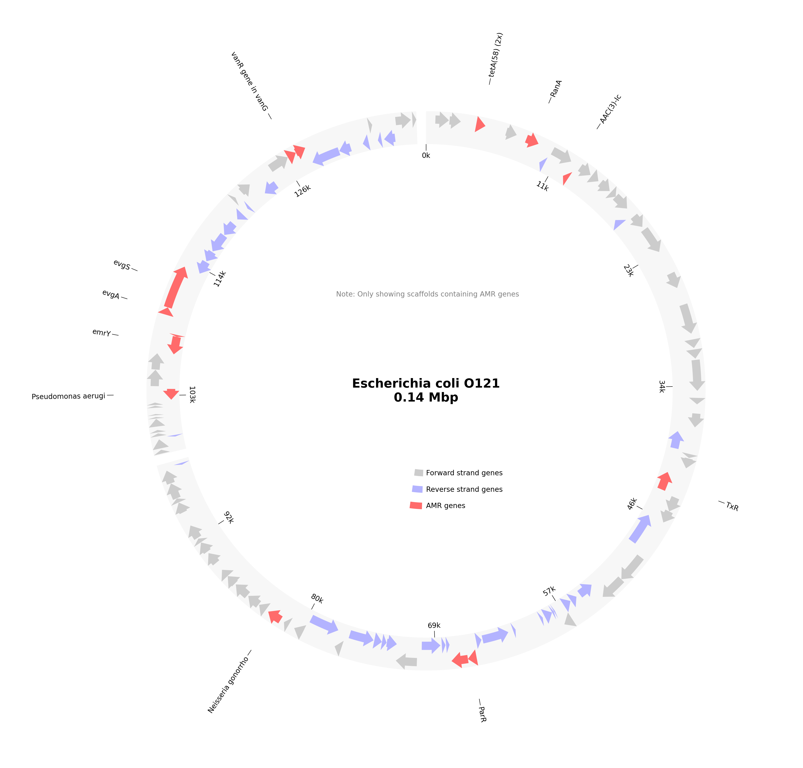

### AAC(3)-Ic
- **Mechanism**: antibiotic inactivation
- **Drug Classes**: aminoglycoside antibiotic
- **AMR Family**: AAC(3)
- **Locations**:
  - gnl|SPADES|FDOHBCDP_55_13 : position 12541-13029

### Neisseria gonorrhoeae pilQ gene conferring resistance to beta-lactam
- **Mechanism**: antibiotic target alteration
- **Drug Classes**: cephalosporin; cephamycin; penam
- **AMR Family**: Penicillin-binding protein mutations conferring resistance to beta-lactam antibiotics
- **Locations**:
  - gnl|SPADES|FDOHBCDP_55_71 : position 81953-83161

### ParR
- **Mechanism**: antibiotic efflux; reduced permeability to antibiotic
- **Drug Classes**: macrolide antibiotic; fluoroquinolone antibiotic; monobactam; aminoglycoside antibiotic; carbapenem; cephalosporin; cephamycin; penam; tetracycline antibiotic; phenicol antibiotic; penem; disinfecting agents and antiseptics
- **AMR Family**: resistance-nodulation-cell division (RND) antibiotic efflux pump; Outer Membrane Porin (Opr)
- **Locations**:
  - gnl|SPADES|FDOHBCDP_55_55 : position 65295-66014

### Pseudomonas aeruginosa ampR with mutation conferring resistance to aztreonam
- **Mechanism**: antibiotic target alteration; antibiotic inactivation
- **Drug Classes**: monobactam; carbapenem; cephalosporin
- **AMR Family**: PDC beta-lactamase; ampR transcriptional regulator with mutation conferring resistance to monobactam antibiotics
- **Locations**:
  - gnl|SPADES|FDOHBCDP_163_13 : position 4453-5388

### RanA
- **Mechanism**: antibiotic efflux
- **Drug Classes**: aminoglycoside antibiotic
- **AMR Family**: ATP-binding cassette (ABC) antibiotic efflux pump
- **Locations**:
  - gnl|SPADES|FDOHBCDP_55_9 : position 8381-9451

### TxR
- **Mechanism**: antibiotic efflux
- **Drug Classes**: tetracycline antibiotic
- **AMR Family**: ATP-binding cassette (ABC) antibiotic efflux pump
- **Locations**:
  - gnl|SPADES|FDOHBCDP_55_37 : position 41879-43477

### cpxA
- **Mechanism**: antibiotic efflux
- **Drug Classes**: aminoglycoside antibiotic; aminocoumarin antibiotic
- **AMR Family**: resistance-nodulation-cell division (RND) antibiotic efflux pump
- **Locations**:
  - gnl|SPADES|FDOHBCDP_55_56 : position 66011-67363

### emrK (found in 2 locations)
- **Mechanism**: antibiotic efflux
- **Drug Classes**: tetracycline antibiotic
- **AMR Family**: major facilitator superfamily (MFS) antibiotic efflux pump
- **Locations**:
  - gnl|SPADES|FDOHBCDP_163_17 : position 9935-10099
  - gnl|SPADES|FDOHBCDP_163_18 : position 10096-11097

### emrY
- **Mechanism**: antibiotic efflux
- **Drug Classes**: tetracycline antibiotic
- **AMR Family**: major facilitator superfamily (MFS) antibiotic efflux pump
- **Locations**:
  - gnl|SPADES|FDOHBCDP_163_16: position 8397-9935

### evgA
- **Mechanism**: antibiotic efflux
- **Drug Classes**: macrolide antibiotic; fluoroquinolone antibiotic; penam; tetracycline antibiotic
- **AMR Family**: major facilitator superfamily (MFS) antibiotic efflux pump; resistance-nodulation-cell division (RND) antibiotic efflux pump
- **Locations**:
  - gnl|SPADES|FDOHBCDP_163_19: position 11513-12127

### evgS
- **Mechanism**: antibiotic efflux
- **Drug Classes**: macrolide antibiotic; fluoroquinolone antibiotic; penam; tetracycline antibiotic
- **AMR Family**: major facilitator superfamily (MFS) antibiotic efflux pump; resistance-nodulation-cell division (RND) antibiotic efflux pump
- **Locations**:
  - gnl|SPADES|FDOHBCDP_163_20: position 12132-15725

### ramA
- **Mechanism**: antibiotic efflux; reduced permeability to antibiotic
- **Drug Classes**: fluoroquinolone antibiotic; monobactam; carbapenem; cephalosporin; glycylcycline; cephamycin; penam; tetracycline antibiotic; rifamycin antibiotic; phenicol antibiotic; penem; disinfecting agents and antiseptics
- **AMR Family**: resistance-nodulation-cell division (RND) antibiotic efflux pump; General Bacterial Porin with reduced permeability to beta-lactams
- **Locations**:
  - gnl|SPADES|FDOHBCDP_163_32 : position 28885-29742

### tetA(58) (found in 2 locations)
- **Mechanism**: antibiotic efflux
- **Drug Classes**: tetracycline antibiotic
- **AMR Family**: major facilitator superfamily (MFS) antibiotic efflux pump
- **Locations**:
  - gnl|SPADES|FDOHBCDP_55_5 : position 4119-4886
  - gnl|SPADES|FDOHBCDP_55_6 : position 4888-5601

### vanR gene in vanG cluster
- **Mechanism**: antibiotic target alteration
- **Drug Classes**: glycopeptide antibiotic
- **AMR Family**: glycopeptide resistance gene cluster; vanR
- **Locations**:
  - gnl|SPADES|FDOHBCDP_163_31 : position 28138-28872

## Escherichia coli O157
**Strain Statistics:**
- Total genome length: 38.1 kbp
- Total scaffolds: 2
- Scaffolds with AMR genes: 1
- Total genes annotated: 70
- Total AMR genes: 4
- Unique AMR genes: 4
- Distinct AMR mechanisms: 2
- Distinct AMR families: 3
- Distinct drug classes: 3

**Circos Plot:**

### Acinetobacter baumannii AbaQ
- **Mechanism**: antibiotic efflux
- **Drug Classes**: fluoroquinolone antibiotic
- **AMR Family**: major facilitator superfamily (MFS) antibiotic efflux pump
- **Locations**:
  - gnl|SPADES|FDOHBCDP_166_17 : position 19132-20424

### Clostridioides difficile gyrB conferring resistance to fluoroquinolones
- **Mechanism**: antibiotic target alteration
- **Drug Classes**: fluoroquinolone antibiotic
- **AMR Family**: fluoroquinolone resistant gyrB
- **Locations**:
  - gnl|SPADES|FDOHBCDP_166_9 : position 10745-13159

### MCR-3.22
- **Mechanism**: antibiotic target alteration
- **Drug Classes**: peptide antibiotic
- **AMR Family**: MCR phosphoethanolamine transferase
- **Locations**:
  - gnl|SPADES|FDOHBCDP_166_30 : position 33276-34769

### bcr-1
- **Mechanism**: antibiotic efflux
- **Drug Classes**: bicyclomycin-like antibiotic
- **AMR Family**: major facilitator superfamily (MFS) antibiotic efflux pump
- **Locations**:
  - gnl|SPADES|FDOHBCDP_166_35 : position 36575-37759

## Escherichia coli O157:H7
**Strain Statistics:**
- Total genome length: 265.5 kbp
- Total scaffolds: 6
- Scaffolds with AMR genes: 5
- Total genes annotated: 491
- Total AMR genes: 14
- Unique AMR genes: 13
- Distinct AMR mechanisms: 3
- Distinct AMR families: 9
- Distinct drug classes: 13

**Circos Plot:**

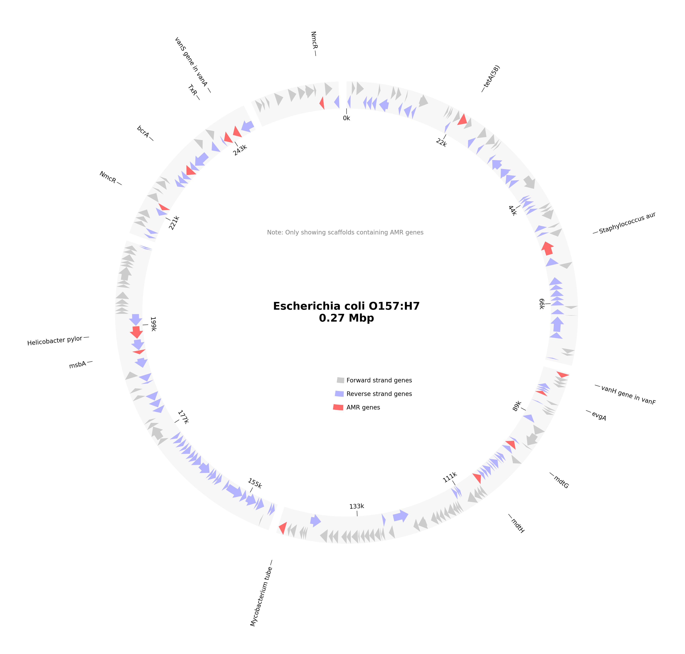

### Helicobacter pylori pbp1 mutants conferring resistance to amoxicillin
- **Mechanism**: antibiotic target alteration
- **Drug Classes**: cephalosporin; cephamycin; penam
- **AMR Family**: Penicillin-binding protein mutations conferring resistance to beta-lactam antibiotics
- **Locations**:
  - gnl|SPADES|FDOHBCDP_105_44 : position 47919-50477

### Mycobacterium tuberculosis ndh with mutation conferring resistance to isoniazid
- **Mechanism**: antibiotic target alteration
- **Drug Classes**: isoniazid-like antibiotic
- **AMR Family**: antibiotic resistant ndh
- **Locations**:
  - gnl|SPADES|FDOHBCDP_99_75 : position 68720-70024

### NmcR (found in 2 locations)
- **Mechanism**: antibiotic inactivation
- **Drug Classes**: carbapenem; cephalosporin; cephamycin; penam
- **AMR Family**: NmcA beta-lactamase
- **Locations**:
  - gnl|SPADES|FDOHBCDP_208_8 : position 6747-7637
  - gnl|SPADES|FDOHBCDP_417_13 : position 12858-13763

### Staphylococcus aureus mupB conferring resistance to mupirocin
- **Mechanism**: antibiotic target alteration
- **Drug Classes**: mupirocin-like antibiotic
- **AMR Family**: antibiotic-resistant isoleucyl-tRNA synthetase (ileS)
- **Locations**:
  - gnl|SPADES|FDOHBCDP_88_50 : position 53328-56183

### TxR
- **Mechanism**: antibiotic efflux
- **Drug Classes**: tetracycline antibiotic
- **AMR Family**: ATP-binding cassette (ABC) antibiotic efflux pump
- **Locations**:
  - gnl|SPADES|FDOHBCDP_208_25 : position 26076-27410

### bcrA
- **Mechanism**: antibiotic efflux
- **Drug Classes**: peptide antibiotic
- **AMR Family**: ATP-binding cassette (ABC) antibiotic efflux pump
- **Locations**:
  - gnl|SPADES|FDOHBCDP_208_18 : position 15591-17102

### evgA
- **Mechanism**: antibiotic efflux
- **Drug Classes**: macrolide antibiotic; fluoroquinolone antibiotic; penam; tetracycline antibiotic
- **AMR Family**: major facilitator superfamily (MFS) antibiotic efflux pump; resistance-nodulation-cell division (RND) antibiotic efflux pump
- **Locations**:
  - gnl|SPADES|FDOHBCDP_99_8 : position 4942-5592

### mdtG
- **Mechanism**: antibiotic efflux
- **Drug Classes**: phosphonic acid antibiotic
- **AMR Family**: major facilitator superfamily (MFS) antibiotic efflux pump
- **Locations**:
  - gnl|SPADES|FDOHBCDP_99_20: position 16815-18041

### mdtH
- **Mechanism**: antibiotic efflux
- **Drug Classes**: fluoroquinolone antibiotic
- **AMR Family**: major facilitator superfamily (MFS) antibiotic efflux pump
- **Locations**:
  - gnl|SPADES|FDOHBCDP_99_32: position 26671-27879

### msbA
- **Mechanism**: antibiotic efflux
- **Drug Classes**: nitroimidazole antibiotic
- **AMR Family**: ATP-binding cassette (ABC) antibiotic efflux pump
- **Locations**:
  - gnl|SPADES|FDOHBCDP_105_42 : position 44662-45459

### tetA(58)
- **Mechanism**: antibiotic efflux
- **Drug Classes**: tetracycline antibiotic
- **AMR Family**: major facilitator superfamily (MFS) antibiotic efflux pump
- **Locations**:
  - gnl|SPADES|FDOHBCDP_88_22 : position 23126-24628

### vanH gene in vanF cluster
- **Mechanism**: antibiotic target alteration
- **Drug Classes**: glycopeptide antibiotic
- **AMR Family**: vanH; glycopeptide resistance gene cluster
- **Locations**:
  - gnl|SPADES|FDOHBCDP_99_1 : position 281-1219

### vanS gene in vanA cluster
- **Mechanism**: antibiotic target alteration
- **Drug Classes**: glycopeptide antibiotic
- **AMR Family**: vanS; glycopeptide resistance gene cluster
- **Locations**:
  - gnl|SPADES|FDOHBCDP_208_27 : position 28278-29660

## Escherichia coli O157:H7 str. EDL933
**Strain Statistics:**
- Total genome length: 183.1 kbp
- Total scaffolds: 5
- Scaffolds with AMR genes: 3
- Total genes annotated: 356
- Total AMR genes: 12
- Unique AMR genes: 11
- Distinct AMR mechanisms: 4
- Distinct AMR families: 9
- Distinct drug classes: 18

**Circos Plot:**

### Escherichia coli soxS with mutation conferring antibiotic resistance
- **Mechanism**: antibiotic target alteration; antibiotic efflux; reduced permeability to antibiotic
- **Drug Classes**: fluoroquinolone antibiotic; monobactam; carbapenem; cephalosporin; glycylcycline; cephamycin; penam; tetracycline antibiotic; rifamycin antibiotic; phenicol antibiotic; penem; disinfecting agents and antiseptics
- **AMR Family**: ATP-binding cassette (ABC) antibiotic efflux pump; major facilitator superfamily (MFS) antibiotic efflux pump; resistance-nodulation-cell division (RND) antibiotic efflux pump; General Bacterial Porin with reduced permeability to beta-lactams
- **Locations**:
  - gnl|SPADES|FDOHBCDP_46_19 : position 19473-20312

### Mycobacterium tuberculosis pncA mutations conferring resistance to pyrazinamide
- **Mechanism**: antibiotic target alteration
- **Drug Classes**: pyrazine antibiotic
- **AMR Family**: Pyrazinamide resistant pncA
- **Locations**:
  - gnl|SPADES|FDOHBCDP_46_51 : position 51539-52180

### NmcR
- **Mechanism**: antibiotic inactivation
- **Drug Classes**: carbapenem; cephalosporin; cephamycin; penam
- **AMR Family**: NmcA beta-lactamase
- **Locations**:
  - gnl|SPADES|FDOHBCDP_153_37 : position 36961-37899

### adeL
- **Mechanism**: antibiotic efflux
- **Drug Classes**: fluoroquinolone antibiotic; tetracycline antibiotic
- **AMR Family**: resistance-nodulation-cell division (RND) antibiotic efflux pump
- **Locations**:
  - gnl|SPADES|FDOHBCDP_46_73 : position 71528-72451

### almE
- **Mechanism**: antibiotic target alteration
- **Drug Classes**: peptide antibiotic
- **AMR Family**: polymyxin resistance operon; alm glycyltransferase
- **Locations**:
  - gnl|SPADES|FDOHBCDP_46_79 : position 78921-80672

### chrB
- **Mechanism**: antibiotic target alteration
- **Drug Classes**: macrolide antibiotic; lincosamide antibiotic
- **AMR Family**: non-erm 23S ribosomal RNA methyltransferase (G748)
- **Locations**:
  - gnl|SPADES|FDOHBCDP_46_97 : position 97108-97917

### leuO
- **Mechanism**: antibiotic efflux
- **Drug Classes**: nucleoside antibiotic; disinfecting agents and antiseptics
- **AMR Family**: major facilitator superfamily (MFS) antibiotic efflux pump
- **Locations**:
  - gnl|SPADES|FDOHBCDP_206_24 : position 21696-22634

### macB (found in 2 locations)
- **Mechanism**: antibiotic efflux
- **Drug Classes**: macrolide antibiotic
- **AMR Family**: ATP-binding cassette (ABC) antibiotic efflux pump
- **Locations**:
  - gnl|SPADES|FDOHBCDP_153_20 : position 19095-19868
  - gnl|SPADES|FDOHBCDP_46_40 : position 39615-40268

### norB
- **Mechanism**: antibiotic efflux
- **Drug Classes**: fluoroquinolone antibiotic
- **AMR Family**: major facilitator superfamily (MFS) antibiotic efflux pump
- **Locations**:
  - gnl|SPADES|FDOHBCDP_153_4 : position 3496-4674

### tcr3
- **Mechanism**: antibiotic efflux
- **Drug Classes**: tetracycline antibiotic
- **AMR Family**: major facilitator superfamily (MFS) antibiotic efflux pump
- **Locations**:
  - gnl|SPADES|FDOHBCDP_46_102 : position 101133-102506

### vanH gene in vanB cluster
- **Mechanism**: antibiotic target alteration
- **Drug Classes**: glycopeptide antibiotic
- **AMR Family**: vanH; glycopeptide resistance gene cluster
- **Locations**:
  - gnl|SPADES|FDOHBCDP_153_6 : position 5765-6901

## Escherichia coli O158:H23
**Strain Statistics:**
- Total genome length: 751.1 kbp
- Total scaffolds: 16
- Scaffolds with AMR genes: 15
- Total genes annotated: 1369
- Total AMR genes: 82
- Unique AMR genes: 62
- Distinct AMR mechanisms: 8
- Distinct AMR families: 25
- Distinct drug classes: 27

**Circos Plot:**

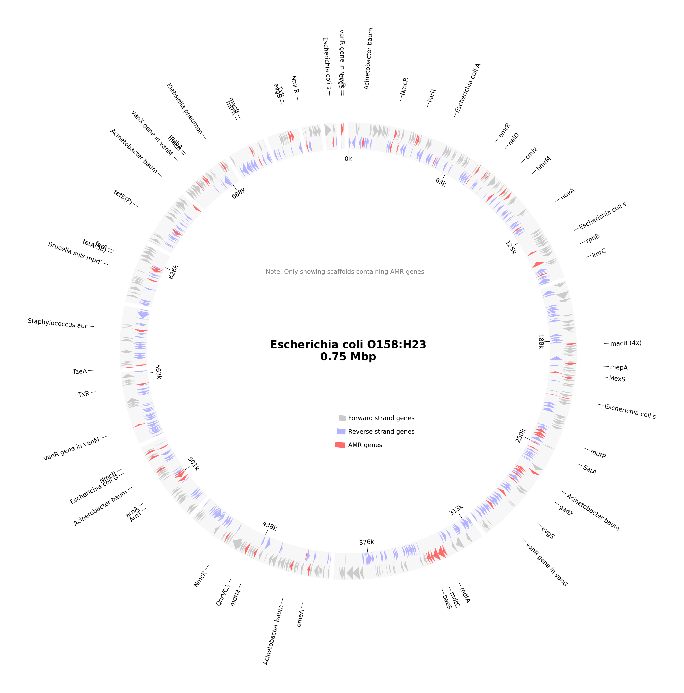

### Acinetobacter baumannii AbaF (found in 3 locations)
- **Mechanism**: antibiotic efflux
- **Drug Classes**: phosphonic acid antibiotic
- **AMR Family**: major facilitator superfamily (MFS) antibiotic efflux pump
- **Locations**:
  - gnl|SPADES|FDOHBCDP_21_8 : position 7868-9235
  - gnl|SPADES|FDOHBCDP_222_31 : position 30219-31517
  - gnl|SPADES|FDOHBCDP_22_100 : position 110417-111919

### Acinetobacter baumannii AbaQ (found in 2 locations)
- **Mechanism**: antibiotic efflux
- **Drug Classes**: fluoroquinolone antibiotic
- **AMR Family**: major facilitator superfamily (MFS) antibiotic efflux pump
- **Locations**:
  - gnl|SPADES|FDOHBCDP_145_29 : position 29091-30380
  - gnl|SPADES|FDOHBCDP_80_22 : position 21253-22629

### ArnT
- **Mechanism**: antibiotic target alteration
- **Drug Classes**: peptide antibiotic
- **AMR Family**: pmr phosphoethanolamine transferase
- **Locations**:
  - gnl|SPADES|FDOHBCDP_145_18: position 16683-18335

### Brucella suis mprF
- **Mechanism**: antibiotic target alteration
- **Drug Classes**: peptide antibiotic
- **AMR Family**: defensin resistant mprF
- **Locations**:
  - gnl|SPADES|FDOHBCDP_204_17 : position 15297-16253

### Escherichia coli AcrAB-TolC with AcrR mutation conferring resistance to ciprofloxacin, tetracycline, and ceftazidime
- **Mechanism**: antibiotic target alteration; antibiotic efflux
- **Drug Classes**: fluoroquinolone antibiotic; cephalosporin; glycylcycline; penam; tetracycline antibiotic; rifamycin antibiotic; phenicol antibiotic; disinfecting agents and antiseptics
- **AMR Family**: resistance-nodulation-cell division (RND) antibiotic efflux pump
- **Locations**:
  - gnl|SPADES|FDOHBCDP_21_48 : position 52752-53330

### Escherichia coli GlpT with mutation conferring resistance to fosfomycin
- **Mechanism**: antibiotic target alteration
- **Drug Classes**: phosphonic acid antibiotic
- **AMR Family**: antibiotic-resistant GlpT
- **Locations**:
  - gnl|SPADES|FDOHBCDP_145_36 : position 37000-38358

### Escherichia coli soxR with mutation conferring antibiotic resistance
- **Mechanism**: antibiotic target alteration; antibiotic efflux
- **Drug Classes**: fluoroquinolone antibiotic; cephalosporin; glycylcycline; penam; tetracycline antibiotic; rifamycin antibiotic; phenicol antibiotic; disinfecting agents and antiseptics
- **AMR Family**: ATP-binding cassette (ABC) antibiotic efflux pump; major facilitator superfamily (MFS) antibiotic efflux pump; resistance-nodulation-cell division (RND) antibiotic efflux pump
- **Locations**:
  - gnl|SPADES|FDOHBCDP_22_57: position 65184-65648

### Escherichia coli soxS with mutation conferring antibiotic resistance (found in 3 locations)
- **Mechanism**: antibiotic target alteration; antibiotic efflux; reduced permeability to antibiotic
- **Drug Classes**: fluoroquinolone antibiotic; monobactam; carbapenem; cephalosporin; glycylcycline; cephamycin; penam; tetracycline antibiotic; rifamycin antibiotic; phenicol antibiotic; penem; disinfecting agents and antiseptics
- **AMR Family**: ATP-binding cassette (ABC) antibiotic efflux pump; major facilitator superfamily (MFS) antibiotic efflux pump; resistance-nodulation-cell division (RND) antibiotic efflux pump; General Bacterial Porin with reduced permeability to beta-lactams
- **Locations**:
  - gnl|SPADES|FDOHBCDP_1046_2 : position 3754-4611
  - gnl|SPADES|FDOHBCDP_21_129 : position 134336-135247
  - gnl|SPADES|FDOHBCDP_22_56: position 64775-65098

### FosC2
- **Mechanism**: antibiotic inactivation
- **Drug Classes**: phosphonic acid antibiotic
- **AMR Family**: fosC phosphotransferase family
- **Locations**:
  - gnl|SPADES|FDOHBCDP_21_83 : position 83785-84192

### Klebsiella pneumoniae KpnE
- **Mechanism**: antibiotic efflux
- **Drug Classes**: macrolide antibiotic; aminoglycoside antibiotic; cephalosporin; tetracycline antibiotic; peptide antibiotic; rifamycin antibiotic; disinfecting agents and antiseptics
- **AMR Family**: small multidrug resistance (SMR) antibiotic efflux pump
- **Locations**:
  - gnl|SPADES|FDOHBCDP_21_30: position 29687-30052

### Klebsiella pneumoniae KpnF
- **Mechanism**: antibiotic efflux
- **Drug Classes**: macrolide antibiotic; aminoglycoside antibiotic; cephalosporin; tetracycline antibiotic; peptide antibiotic; rifamycin antibiotic; disinfecting agents and antiseptics
- **AMR Family**: small multidrug resistance (SMR) antibiotic efflux pump
- **Locations**:
  - gnl|SPADES|FDOHBCDP_21_29: position 29371-29700

### Klebsiella pneumoniae OmpK37
- **Mechanism**: reduced permeability to antibiotic
- **Drug Classes**: monobactam; carbapenem; cephalosporin; cephamycin; penam; penem
- **AMR Family**: General Bacterial Porin with reduced permeability to beta-lactams
- **Locations**:
  - gnl|SPADES|FDOHBCDP_252_24 : position 24810-25910

### MexR
- **Mechanism**: antibiotic target alteration; antibiotic efflux
- **Drug Classes**: macrolide antibiotic; fluoroquinolone antibiotic; monobactam; carbapenem; cephalosporin; cephamycin; penam; tetracycline antibiotic; peptide antibiotic; aminocoumarin antibiotic; diaminopyrimidine antibiotic; sulfonamide antibiotic; phenicol antibiotic; penem
- **AMR Family**: resistance-nodulation-cell division (RND) antibiotic efflux pump
- **Locations**:
  - gnl|SPADES|FDOHBCDP_80_15 : position 14597-15043

### MexS
- **Mechanism**: antibiotic efflux
- **Drug Classes**: fluoroquinolone antibiotic; diaminopyrimidine antibiotic; phenicol antibiotic
- **AMR Family**: resistance-nodulation-cell division (RND) antibiotic efflux pump
- **Locations**:
  - gnl|SPADES|FDOHBCDP_22_44 : position 50943-51926

### NmcR (found in 5 locations)
- **Mechanism**: antibiotic inactivation
- **Drug Classes**: carbapenem; cephalosporin; cephamycin; penam
- **AMR Family**: NmcA beta-lactamase
- **Locations**:
  - gnl|SPADES|FDOHBCDP_145_38 : position 39459-40358
  - gnl|SPADES|FDOHBCDP_193_2 : position 466-1353
  - gnl|SPADES|FDOHBCDP_21_25 : position 25251-26144
  - gnl|SPADES|FDOHBCDP_685_1 : position 353-1192
  - gnl|SPADES|FDOHBCDP_80_53 : position 61373-62284

### ParR
- **Mechanism**: antibiotic efflux; reduced permeability to antibiotic
- **Drug Classes**: macrolide antibiotic; fluoroquinolone antibiotic; monobactam; aminoglycoside antibiotic; carbapenem; cephalosporin; cephamycin; penam; tetracycline antibiotic; phenicol antibiotic; penem; disinfecting agents and antiseptics
- **AMR Family**: resistance-nodulation-cell division (RND) antibiotic efflux pump; Outer Membrane Porin (Opr)
- **Locations**:
  - gnl|SPADES|FDOHBCDP_21_38 : position 38710-39429

### ParS
- **Mechanism**: antibiotic efflux; reduced permeability to antibiotic
- **Drug Classes**: macrolide antibiotic; fluoroquinolone antibiotic; monobactam; aminoglycoside antibiotic; carbapenem; cephalosporin; cephamycin; penam; tetracycline antibiotic; phenicol antibiotic; penem; disinfecting agents and antiseptics
- **AMR Family**: resistance-nodulation-cell division (RND) antibiotic efflux pump; Outer Membrane Porin (Opr)
- **Locations**:
  - gnl|SPADES|FDOHBCDP_21_39 : position 39433-40734

### PmrF
- **Mechanism**: antibiotic target alteration
- **Drug Classes**: peptide antibiotic
- **AMR Family**: pmr phosphoethanolamine transferase
- **Locations**:
  - gnl|SPADES|FDOHBCDP_145_21: position 21204-22172

### QnrVC3
- **Mechanism**: antibiotic target protection
- **Drug Classes**: fluoroquinolone antibiotic
- **AMR Family**: quinolone resistance protein (qnr)
- **Locations**:
  - gnl|SPADES|FDOHBCDP_80_44 : position 48150-49829

### SatA
- **Mechanism**: antibiotic inactivation
- **Drug Classes**: nucleoside antibiotic
- **AMR Family**: streptothricin acetyltransferase (SAT)
- **Locations**:
  - gnl|SPADES|FDOHBCDP_22_83 : position 95504-95938

### Staphylococcus aureus fusA with mutation conferring resistance to fusidic acid
- **Mechanism**: antibiotic target alteration
- **Drug Classes**: fusidane antibiotic
- **AMR Family**: antibiotic resistant fusA
- **Locations**:
  - gnl|SPADES|FDOHBCDP_193_23 : position 20649-22235

### TaeA
- **Mechanism**: antibiotic efflux
- **Drug Classes**: pleuromutilin antibiotic
- **AMR Family**: ATP-binding cassette (ABC) antibiotic efflux pump
- **Locations**:
  - gnl|SPADES|FDOHBCDP_193_1 : position 3-311

### TxR (found in 2 locations)
- **Mechanism**: antibiotic efflux
- **Drug Classes**: tetracycline antibiotic
- **AMR Family**: ATP-binding cassette (ABC) antibiotic efflux pump
- **Locations**:
  - gnl|SPADES|FDOHBCDP_160_37 : position 31665-32651
  - gnl|SPADES|FDOHBCDP_408_16 : position 12977-14302

### arlR
- **Mechanism**: antibiotic efflux
- **Drug Classes**: fluoroquinolone antibiotic; disinfecting agents and antiseptics
- **AMR Family**: major facilitator superfamily (MFS) antibiotic efflux pump
- **Locations**:
  - gnl|SPADES|FDOHBCDP_22_103 : position 113197-113865

### arnA
- **Mechanism**: antibiotic target alteration
- **Drug Classes**: peptide antibiotic
- **AMR Family**: pmr phosphoethanolamine transferase
- **Locations**:
  - gnl|SPADES|FDOHBCDP_145_20 : position 19222-21204

### baeR
- **Mechanism**: antibiotic efflux
- **Drug Classes**: aminoglycoside antibiotic; aminocoumarin antibiotic
- **AMR Family**: resistance-nodulation-cell division (RND) antibiotic efflux pump
- **Locations**:
  - gnl|SPADES|FDOHBCDP_75_22: position 32178-32900

### baeS
- **Mechanism**: antibiotic efflux
- **Drug Classes**: aminoglycoside antibiotic; aminocoumarin antibiotic
- **AMR Family**: resistance-nodulation-cell division (RND) antibiotic efflux pump
- **Locations**:
  - gnl|SPADES|FDOHBCDP_75_21 : position 30778-32181

### basS
- **Mechanism**: antibiotic target alteration; antibiotic efflux
- **Drug Classes**: peptide antibiotic
- **AMR Family**: pmr phosphoethanolamine transferase
- **Locations**:
  - gnl|SPADES|FDOHBCDP_22_102 : position 112096-113196

### bcr-1
- **Mechanism**: antibiotic efflux
- **Drug Classes**: bicyclomycin-like antibiotic
- **AMR Family**: major facilitator superfamily (MFS) antibiotic efflux pump
- **Locations**:
  - gnl|SPADES|FDOHBCDP_21_94 : position 96011-97222

### bmr
- **Mechanism**: antibiotic efflux
- **Drug Classes**: fluoroquinolone antibiotic; nucleoside antibiotic; phenicol antibiotic; disinfecting agents and antiseptics
- **AMR Family**: major facilitator superfamily (MFS) antibiotic efflux pump
- **Locations**:
  - gnl|SPADES|FDOHBCDP_145_39 : position 40510-41700

### cmlA8
- **Mechanism**: antibiotic efflux
- **Drug Classes**: phenicol antibiotic
- **AMR Family**: major facilitator superfamily (MFS) antibiotic efflux pump
- **Locations**:
  - gnl|SPADES|FDOHBCDP_21_26 : position 26251-27504

### cmlv
- **Mechanism**: antibiotic inactivation
- **Drug Classes**: phenicol antibiotic
- **AMR Family**: chloramphenicol phosphotransferase
- **Locations**:
  - gnl|SPADES|FDOHBCDP_21_90 : position 92221-93390

### emeA
- **Mechanism**: antibiotic efflux
- **Drug Classes**: disinfecting agents and antiseptics
- **AMR Family**: multidrug and toxic compound extrusion (MATE) transporter
- **Locations**:
  - gnl|SPADES|FDOHBCDP_80_13 : position 11404-12765

### emrR
- **Mechanism**: antibiotic efflux
- **Drug Classes**: fluoroquinolone antibiotic
- **AMR Family**: major facilitator superfamily (MFS) antibiotic efflux pump
- **Locations**:
  - gnl|SPADES|FDOHBCDP_21_74 : position 76338-76772

### emrY
- **Mechanism**: antibiotic efflux
- **Drug Classes**: tetracycline antibiotic
- **AMR Family**: major facilitator superfamily (MFS) antibiotic efflux pump
- **Locations**:
  - gnl|SPADES|FDOHBCDP_75_20 : position 29366-30781

### eptA
- **Mechanism**: antibiotic target alteration
- **Drug Classes**: peptide antibiotic
- **AMR Family**: pmr phosphoethanolamine transferase
- **Locations**:
  - gnl|SPADES|FDOHBCDP_22_104: position 113862-115505

### evgS (found in 3 locations)
- **Mechanism**: antibiotic efflux
- **Drug Classes**: macrolide antibiotic; fluoroquinolone antibiotic; penam; tetracycline antibiotic
- **AMR Family**: major facilitator superfamily (MFS) antibiotic efflux pump; resistance-nodulation-cell division (RND) antibiotic efflux pump
- **Locations**:
  - gnl|SPADES|FDOHBCDP_22_115 : position 129958-131589
  - gnl|SPADES|FDOHBCDP_2768_1 : position 265-1641
  - gnl|SPADES|FDOHBCDP_408_15 : position 11592-12980

### farA
- **Mechanism**: antibiotic efflux
- **Drug Classes**: antibacterial free fatty acids
- **AMR Family**: major facilitator superfamily (MFS) antibiotic efflux pump
- **Locations**:
  - gnl|SPADES|FDOHBCDP_204_24 : position 22729-23724

### gadX
- **Mechanism**: antibiotic efflux
- **Drug Classes**: macrolide antibiotic; fluoroquinolone antibiotic; penam
- **AMR Family**: resistance-nodulation-cell division (RND) antibiotic efflux pump
- **Locations**:
  - gnl|SPADES|FDOHBCDP_22_106 : position 117083-117844

### hmrM
- **Mechanism**: antibiotic efflux
- **Drug Classes**: fluoroquinolone antibiotic; disinfecting agents and antiseptics
- **AMR Family**: multidrug and toxic compound extrusion (MATE) transporter
- **Locations**:
  - gnl|SPADES|FDOHBCDP_21_97 : position 99557-100930

### lmrC
- **Mechanism**: antibiotic target protection
- **Drug Classes**: lincosamide antibiotic
- **AMR Family**: Miscellaneous ABC-F subfamily ATP-binding cassette ribosomal protection proteins
- **Locations**:
  - gnl|SPADES|FDOHBCDP_21_142 : position 148755-149504

### macB (found in 6 locations)
- **Mechanism**: antibiotic efflux
- **Drug Classes**: macrolide antibiotic
- **AMR Family**: ATP-binding cassette (ABC) antibiotic efflux pump
- **Locations**:
  - gnl|SPADES|FDOHBCDP_22_29 : position 34511-35626
  - gnl|SPADES|FDOHBCDP_22_52 : position 58763-61585
  - gnl|SPADES|FDOHBCDP_22_86 : position 97615-98295
  - gnl|SPADES|FDOHBCDP_22_95 : position 104789-105577
  - gnl|SPADES|FDOHBCDP_252_9 : position 11704-12690
  - gnl|SPADES|FDOHBCDP_336_11 : position 14056-14754

### mdtA
- **Mechanism**: antibiotic efflux
- **Drug Classes**: aminocoumarin antibiotic
- **AMR Family**: resistance-nodulation-cell division (RND) antibiotic efflux pump
- **Locations**:
  - gnl|SPADES|FDOHBCDP_75_17: position 21924-23165

### mdtB
- **Mechanism**: antibiotic efflux
- **Drug Classes**: aminocoumarin antibiotic
- **AMR Family**: resistance-nodulation-cell division (RND) antibiotic efflux pump
- **Locations**:
  - gnl|SPADES|FDOHBCDP_75_18: position 23165-26287

### mdtC
- **Mechanism**: antibiotic efflux
- **Drug Classes**: aminocoumarin antibiotic
- **AMR Family**: resistance-nodulation-cell division (RND) antibiotic efflux pump
- **Locations**:
  - gnl|SPADES|FDOHBCDP_75_19: position 26288-29365

### mdtM
- **Mechanism**: antibiotic efflux
- **Drug Classes**: fluoroquinolone antibiotic; lincosamide antibiotic; nucleoside antibiotic; phenicol antibiotic; disinfecting agents and antiseptics
- **AMR Family**: major facilitator superfamily (MFS) antibiotic efflux pump
- **Locations**:
  - gnl|SPADES|FDOHBCDP_80_39: position 42978-44210

### mdtN (found in 2 locations)
- **Mechanism**: antibiotic efflux
- **Drug Classes**: nucleoside antibiotic; disinfecting agents and antiseptics
- **AMR Family**: major facilitator superfamily (MFS) antibiotic efflux pump
- **Locations**:
  - gnl|SPADES|FDOHBCDP_21_76 : position 77212-78069
  - gnl|SPADES|FDOHBCDP_22_77: position 90229-91260

### mdtO
- **Mechanism**: antibiotic efflux
- **Drug Classes**: nucleoside antibiotic; disinfecting agents and antiseptics
- **AMR Family**: major facilitator superfamily (MFS) antibiotic efflux pump
- **Locations**:
  - gnl|SPADES|FDOHBCDP_22_76: position 88178-90229

### mdtP
- **Mechanism**: antibiotic efflux
- **Drug Classes**: nucleoside antibiotic; disinfecting agents and antiseptics
- **AMR Family**: major facilitator superfamily (MFS) antibiotic efflux pump
- **Locations**:
  - gnl|SPADES|FDOHBCDP_22_75: position 86715-88181

### mepA
- **Mechanism**: antibiotic efflux
- **Drug Classes**: glycylcycline; tetracycline antibiotic
- **AMR Family**: multidrug and toxic compound extrusion (MATE) transporter
- **Locations**:
  - gnl|SPADES|FDOHBCDP_22_38 : position 45521-46846

### msbA
- **Mechanism**: antibiotic efflux
- **Drug Classes**: nitroimidazole antibiotic
- **AMR Family**: ATP-binding cassette (ABC) antibiotic efflux pump
- **Locations**:
  - gnl|SPADES|FDOHBCDP_252_10 : position 12683-13609

### mtrA (found in 2 locations)
- **Mechanism**: antibiotic efflux
- **Drug Classes**: macrolide antibiotic; penam
- **AMR Family**: resistance-nodulation-cell division (RND) antibiotic efflux pump
- **Locations**:
  - gnl|SPADES|FDOHBCDP_22_108 : position 120646-121554
  - gnl|SPADES|FDOHBCDP_336_9 : position 12214-13092

### nalD
- **Mechanism**: antibiotic efflux
- **Drug Classes**: macrolide antibiotic; fluoroquinolone antibiotic; monobactam; carbapenem; cephalosporin; cephamycin; penam; tetracycline antibiotic; peptide antibiotic; aminocoumarin antibiotic; diaminopyrimidine antibiotic; sulfonamide antibiotic; phenicol antibiotic; penem
- **AMR Family**: resistance-nodulation-cell division (RND) antibiotic efflux pump
- **Locations**:
  - gnl|SPADES|FDOHBCDP_21_81 : position 81971-82570

### novA
- **Mechanism**: antibiotic efflux
- **Drug Classes**: aminocoumarin antibiotic
- **AMR Family**: ATP-binding cassette (ABC) antibiotic efflux pump
- **Locations**:
  - gnl|SPADES|FDOHBCDP_21_114 : position 117709-118455

### rphB
- **Mechanism**: antibiotic inactivation
- **Drug Classes**: rifamycin antibiotic
- **AMR Family**: rifampin phosphotransferase
- **Locations**:
  - gnl|SPADES|FDOHBCDP_21_135 : position 140680-143058

### tetA(58) (found in 2 locations)
- **Mechanism**: antibiotic efflux
- **Drug Classes**: tetracycline antibiotic
- **AMR Family**: major facilitator superfamily (MFS) antibiotic efflux pump
- **Locations**:
  - gnl|SPADES|FDOHBCDP_204_23 : position 21000-22736
  - gnl|SPADES|FDOHBCDP_22_87 : position 98406-99164

### tetB(P)
- **Mechanism**: antibiotic target protection
- **Drug Classes**: tetracycline antibiotic
- **AMR Family**: tetracycline-resistant ribosomal protection protein
- **Locations**:
  - gnl|SPADES|FDOHBCDP_222_13 : position 11118-12917

### vanR gene in vanB cluster
- **Mechanism**: antibiotic target alteration
- **Drug Classes**: glycopeptide antibiotic
- **AMR Family**: glycopeptide resistance gene cluster; vanR
- **Locations**:
  - gnl|SPADES|FDOHBCDP_2768_2 : position 1638-2117

### vanR gene in vanG cluster
- **Mechanism**: antibiotic target alteration
- **Drug Classes**: glycopeptide antibiotic
- **AMR Family**: glycopeptide resistance gene cluster; vanR
- **Locations**:
  - gnl|SPADES|FDOHBCDP_22_124 : position 140326-141864

### vanR gene in vanM cluster
- **Mechanism**: antibiotic target alteration
- **Drug Classes**: glycopeptide antibiotic
- **AMR Family**: glycopeptide resistance gene cluster; vanR
- **Locations**:
  - gnl|SPADES|FDOHBCDP_160_12 : position 9384-10226

### vanT gene in vanG cluster
- **Mechanism**: antibiotic target alteration
- **Drug Classes**: glycopeptide antibiotic
- **AMR Family**: glycopeptide resistance gene cluster; vanT
- **Locations**:
  - gnl|SPADES|FDOHBCDP_22_46 : position 53477-54556

### vanX gene in vanM cluster
- **Mechanism**: antibiotic target alteration
- **Drug Classes**: glycopeptide antibiotic
- **AMR Family**: vanX; glycopeptide resistance gene cluster
- **Locations**:
  - gnl|SPADES|FDOHBCDP_252_5 : position 7645-8226

## Escherichia coli O15:H12
**Strain Statistics:**
- Total genome length: 14.6 kbp
- Total scaffolds: 1
- Scaffolds with AMR genes: 1
- Total genes annotated: 11
- Total AMR genes: 1
- Unique AMR genes: 1
- Distinct AMR mechanisms: 1
- Distinct AMR families: 1
- Distinct drug classes: 12

**Circos Plot:**

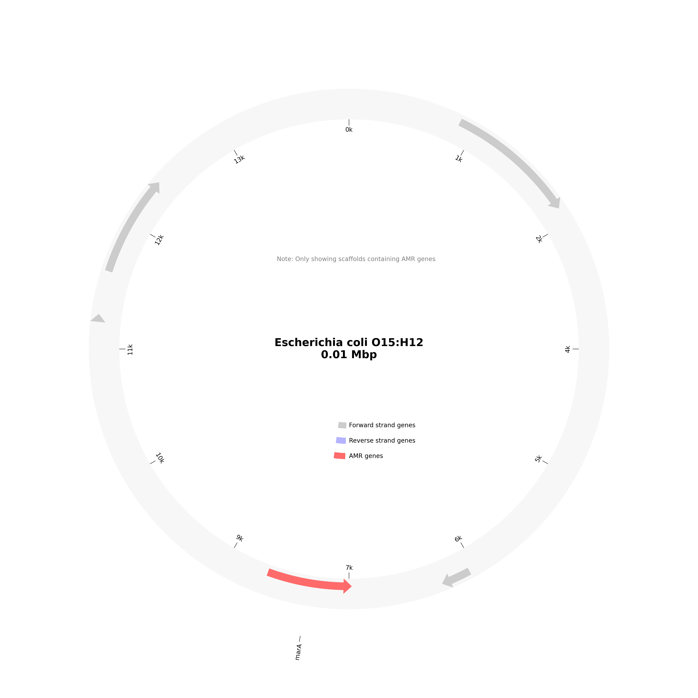

### marA
- **Mechanism**: antibiotic efflux; reduced permeability to antibiotic
- **Drug Classes**: fluoroquinolone antibiotic; monobactam; carbapenem; cephalosporin; glycylcycline; cephamycin; penam; tetracycline antibiotic; rifamycin antibiotic; phenicol antibiotic; penem; disinfecting agents and antiseptics
- **AMR Family**: resistance-nodulation-cell division (RND) antibiotic efflux pump; General Bacterial Porin with reduced permeability to beta-lactams
- **Locations**:
  - gnl|SPADES|FDOHBCDP_481_4 : position 7264-8100

## Escherichia coli O18:H1
**Strain Statistics:**
- Total genome length: 35.4 kbp
- Total scaffolds: 1
- Scaffolds with AMR genes: 1
- Total genes annotated: 63
- Total AMR genes: 2
- Unique AMR genes: 2
- Distinct AMR mechanisms: 2
- Distinct AMR families: 2
- Distinct drug classes: 2

**Circos Plot:**

### bcrA
- **Mechanism**: antibiotic efflux
- **Drug Classes**: peptide antibiotic
- **AMR Family**: ATP-binding cassette (ABC) antibiotic efflux pump
- **Locations**:
  - gnl|SPADES|FDOHBCDP_182_13 : position 12140-12808

### catB2
- **Mechanism**: antibiotic inactivation
- **Drug Classes**: phenicol antibiotic
- **AMR Family**: chloramphenicol acetyltransferase (CAT)
- **Locations**:
  - gnl|SPADES|FDOHBCDP_182_16 : position 16220-16849

## Escherichia coli O78:H4
**Strain Statistics:**
- Total genome length: 107.5 kbp
- Total scaffolds: 1
- Scaffolds with AMR genes: 1
- Total genes annotated: 192
- Total AMR genes: 4
- Unique AMR genes: 4
- Distinct AMR mechanisms: 2
- Distinct AMR families: 4
- Distinct drug classes: 2

**Circos Plot:**

### AAC(6')-If
- **Mechanism**: antibiotic inactivation
- **Drug Classes**: aminoglycoside antibiotic
- **AMR Family**: AAC(6')
- **Locations**:
  - gnl|SPADES|FDOHBCDP_47_4 : position 1980-2405

### TxR
- **Mechanism**: antibiotic efflux
- **Drug Classes**: tetracycline antibiotic
- **AMR Family**: ATP-binding cassette (ABC) antibiotic efflux pump
- **Locations**:
  - gnl|SPADES|FDOHBCDP_47_70 : position 68012-70024

### acrD
- **Mechanism**: antibiotic efflux
- **Drug Classes**: aminoglycoside antibiotic
- **AMR Family**: resistance-nodulation-cell division (RND) antibiotic efflux pump
- **Locations**:
  - gnl|SPADES|FDOHBCDP_47_47: position 43587-46700

### tet(X6)
- **Mechanism**: antibiotic inactivation
- **Drug Classes**: tetracycline antibiotic
- **AMR Family**: tetracycline inactivation enzyme
- **Locations**:
  - gnl|SPADES|FDOHBCDP_47_45 : position 39538-41517

## Escherichia coli O83:H1 str. NRG 857C
**Strain Statistics:**
- Total genome length: 55.1 kbp
- Total scaffolds: 1
- Scaffolds with AMR genes: 1
- Total genes annotated: 142
- Total AMR genes: 2
- Unique AMR genes: 2
- Distinct AMR mechanisms: 2
- Distinct AMR families: 2
- Distinct drug classes: 4

**Circos Plot:**

### PmrF
- **Mechanism**: antibiotic target alteration
- **Drug Classes**: peptide antibiotic
- **AMR Family**: pmr phosphoethanolamine transferase
- **Locations**:
  - gnl|SPADES|FDOHBCDP_125_28 : position 22829-23749

### gadW
- **Mechanism**: antibiotic efflux
- **Drug Classes**: macrolide antibiotic; fluoroquinolone antibiotic; penam
- **AMR Family**: resistance-nodulation-cell division (RND) antibiotic efflux pump
- **Locations**:
  - gnl|SPADES|FDOHBCDP_125_2 : position 1090-2004

## Escherichia coli O84:H7
**Strain Statistics:**
- Total genome length: 34.0 kbp
- Total scaffolds: 1
- Scaffolds with AMR genes: 1
- Total genes annotated: 62
- Total AMR genes: 4
- Unique AMR genes: 2
- Distinct AMR mechanisms: 1
- Distinct AMR families: 2
- Distinct drug classes: 3

**Circos Plot:**

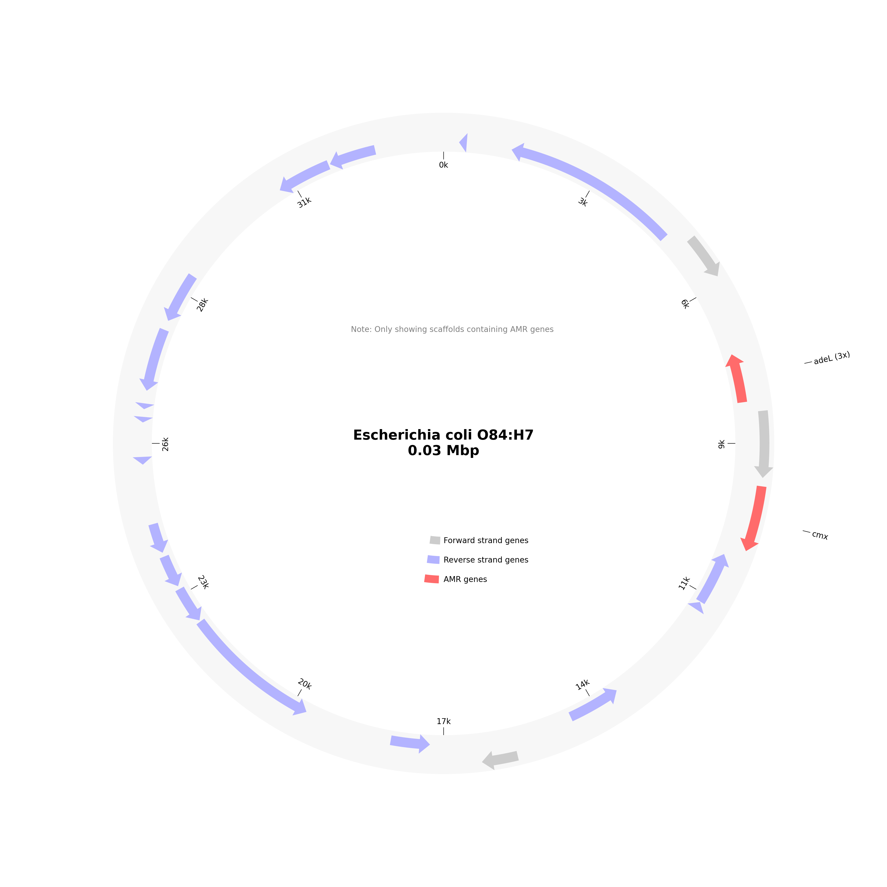

### adeL (found in 3 locations)
- **Mechanism**: antibiotic efflux
- **Drug Classes**: fluoroquinolone antibiotic; tetracycline antibiotic
- **AMR Family**: resistance-nodulation-cell division (RND) antibiotic efflux pump
- **Locations**:
  - gnl|SPADES|FDOHBCDP_197_27 : position 28849-29775
  - gnl|SPADES|FDOHBCDP_197_28 : position 29975-30868
  - gnl|SPADES|FDOHBCDP_197_6 : position 6879-7763

### cmx
- **Mechanism**: antibiotic efflux
- **Drug Classes**: phenicol antibiotic
- **AMR Family**: major facilitator superfamily (MFS) antibiotic efflux pump
- **Locations**:
  - gnl|SPADES|FDOHBCDP_197_8 : position 9228-10355

## Escherichia coli O8:H28
**Strain Statistics:**
- Total genome length: 21.0 kbp
- Total scaffolds: 1
- Scaffolds with AMR genes: 1
- Total genes annotated: 44
- Total AMR genes: 4
- Unique AMR genes: 4
- Distinct AMR mechanisms: 1
- Distinct AMR families: 2
- Distinct drug classes: 4

**Circos Plot:**

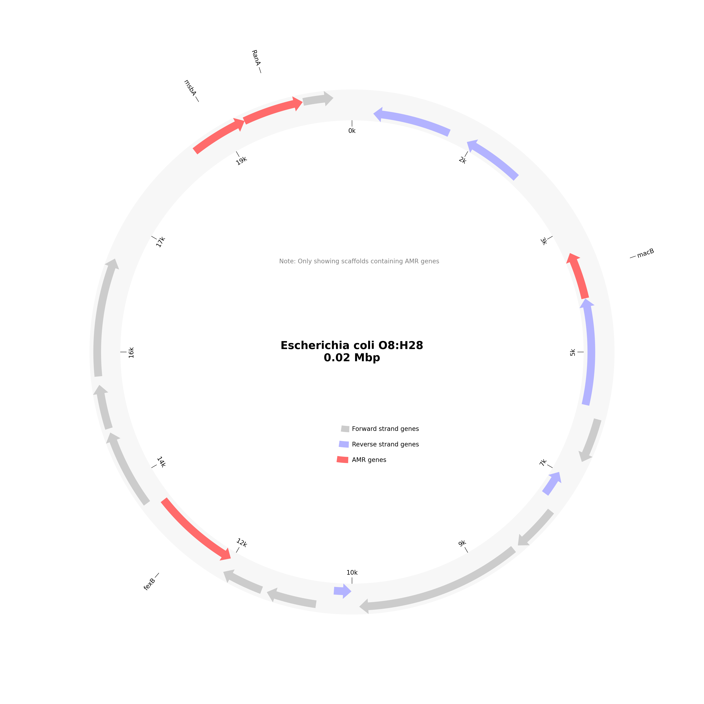

### RanA
- **Mechanism**: antibiotic efflux
- **Drug Classes**: aminoglycoside antibiotic
- **AMR Family**: ATP-binding cassette (ABC) antibiotic efflux pump
- **Locations**:
  - gnl|SPADES|FDOHBCDP_340_22 : position 19521-20327

### fexB
- **Mechanism**: antibiotic efflux
- **Drug Classes**: phenicol antibiotic
- **AMR Family**: major facilitator superfamily (MFS) antibiotic efflux pump
- **Locations**:
  - gnl|SPADES|FDOHBCDP_340_15 : position 12261-13511

### macB
- **Mechanism**: antibiotic efflux
- **Drug Classes**: macrolide antibiotic
- **AMR Family**: ATP-binding cassette (ABC) antibiotic efflux pump
- **Locations**:
  - gnl|SPADES|FDOHBCDP_340_5 : position 3821-4489

### msbA
- **Mechanism**: antibiotic efflux
- **Drug Classes**: nitroimidazole antibiotic
- **AMR Family**: ATP-binding cassette (ABC) antibiotic efflux pump
- **Locations**:
  - gnl|SPADES|FDOHBCDP_340_21 : position 18760-19524

## Escherichia coli O99:H6
**Strain Statistics:**
- Total genome length: 104.8 kbp
- Total scaffolds: 2
- Scaffolds with AMR genes: 2
- Total genes annotated: 166
- Total AMR genes: 11
- Unique AMR genes: 11
- Distinct AMR mechanisms: 5
- Distinct AMR families: 6
- Distinct drug classes: 17

**Circos Plot:**

### Escherichia coli AcrAB-TolC with MarR mutations conferring resistance to ciprofloxacin and tetracycline
- **Mechanism**: antibiotic target alteration; antibiotic efflux
- **Drug Classes**: fluoroquinolone antibiotic; cephalosporin; glycylcycline; penam; tetracycline antibiotic; rifamycin antibiotic; phenicol antibiotic; disinfecting agents and antiseptics
- **AMR Family**: resistance-nodulation-cell division (RND) antibiotic efflux pump
- **Locations**:
  - gnl|SPADES|FDOHBCDP_101_47: position 58968-59402

### Mycobacterium tuberculosis rpsA mutations conferring resistance to pyrazinamide
- **Mechanism**: antibiotic target alteration
- **Drug Classes**: pyrazine antibiotic
- **AMR Family**: pyrazinamide resistant rpsA
- **Locations**:
  - gnl|SPADES|FDOHBCDP_178_26 : position 34802-35953

### NmcR
- **Mechanism**: antibiotic inactivation
- **Drug Classes**: carbapenem; cephalosporin; cephamycin; penam
- **AMR Family**: NmcA beta-lactamase
- **Locations**:
  - gnl|SPADES|FDOHBCDP_101_43 : position 54652-55527

### adeL
- **Mechanism**: antibiotic efflux
- **Drug Classes**: fluoroquinolone antibiotic; tetracycline antibiotic
- **AMR Family**: resistance-nodulation-cell division (RND) antibiotic efflux pump
- **Locations**:
  - gnl|SPADES|FDOHBCDP_101_23 : position 28938-29837

### bcrA
- **Mechanism**: antibiotic efflux
- **Drug Classes**: peptide antibiotic
- **AMR Family**: ATP-binding cassette (ABC) antibiotic efflux pump
- **Locations**:
  - gnl|SPADES|FDOHBCDP_101_30 : position 40851-42386

### cmlv
- **Mechanism**: antibiotic inactivation
- **Drug Classes**: phenicol antibiotic
- **AMR Family**: chloramphenicol phosphotransferase
- **Locations**:
  - gnl|SPADES|FDOHBCDP_101_45 : position 56876-58066

### gadW
- **Mechanism**: antibiotic efflux
- **Drug Classes**: macrolide antibiotic; fluoroquinolone antibiotic; penam
- **AMR Family**: resistance-nodulation-cell division (RND) antibiotic efflux pump
- **Locations**:
  - gnl|SPADES|FDOHBCDP_101_7 : position 11080-11841

### lmrD
- **Mechanism**: antibiotic efflux
- **Drug Classes**: lincosamide antibiotic
- **AMR Family**: ATP-binding cassette (ABC) antibiotic efflux pump
- **Locations**:
  - gnl|SPADES|FDOHBCDP_178_4 : position 3279-5045

### marA
- **Mechanism**: antibiotic efflux; reduced permeability to antibiotic
- **Drug Classes**: fluoroquinolone antibiotic; monobactam; carbapenem; cephalosporin; glycylcycline; cephamycin; penam; tetracycline antibiotic; rifamycin antibiotic; phenicol antibiotic; penem; disinfecting agents and antiseptics
- **AMR Family**: resistance-nodulation-cell division (RND) antibiotic efflux pump; General Bacterial Porin with reduced permeability to beta-lactams
- **Locations**:
  - gnl|SPADES|FDOHBCDP_101_48: position 59423-59806

### msbA
- **Mechanism**: antibiotic efflux
- **Drug Classes**: nitroimidazole antibiotic
- **AMR Family**: ATP-binding cassette (ABC) antibiotic efflux pump
- **Locations**:
  - gnl|SPADES|FDOHBCDP_178_3 : position 1557-3278

### tetB(46)
- **Mechanism**: antibiotic efflux
- **Drug Classes**: tetracycline antibiotic
- **AMR Family**: ATP-binding cassette (ABC) antibiotic efflux pump
- **Locations**:
  - gnl|SPADES|FDOHBCDP_101_4 : position 5811-7496

## Escherichia coli UM146
**Strain Statistics:**
- Total genome length: 41.1 kbp
- Total scaffolds: 1
- Scaffolds with AMR genes: 1
- Total genes annotated: 82
- Total AMR genes: 2
- Unique AMR genes: 2
- Distinct AMR mechanisms: 2
- Distinct AMR families: 2
- Distinct drug classes: 4

**Circos Plot:**

### ErmW
- **Mechanism**: antibiotic target alteration
- **Drug Classes**: macrolide antibiotic; lincosamide antibiotic; streptogramin antibiotic
- **AMR Family**: Erm 23S ribosomal RNA methyltransferase
- **Locations**:
  - gnl|SPADES|FDOHBCDP_158_22 : position 25726-26313

### tet(35)
- **Mechanism**: antibiotic efflux
- **Drug Classes**: tetracycline antibiotic
- **AMR Family**: ATP-binding cassette (ABC) antibiotic efflux pump
- **Locations**:
  - gnl|SPADES|FDOHBCDP_158_29 : position 31641-33059

## Ewingella americana
**Strain Statistics:**
- Total genome length: 1808.0 kbp
- Total scaffolds: 1568
- Scaffolds with AMR genes: 410
- Total genes annotated: 3629
- Total AMR genes: 573
- Unique AMR genes: 219
- Distinct AMR mechanisms: 12
- Distinct AMR families: 76
- Distinct drug classes: 37

**Circos Plot:**

### Acinetobacter baumannii AbaF (found in 9 locations)
- **Mechanism**: antibiotic efflux
- **Drug Classes**: phosphonic acid antibiotic
- **AMR Family**: major facilitator superfamily (MFS) antibiotic efflux pump
- **Locations**:
  - gnl|SPADES|FDOHBCDP_1345_3 : position 1741-3087
  - gnl|SPADES|FDOHBCDP_1661_1 : position 3-986
  - gnl|SPADES|FDOHBCDP_1803_1 : position 2-1042
  - gnl|SPADES|FDOHBCDP_3020_1 : position 2-997
  - gnl|SPADES|FDOHBCDP_3028_2 : position 256-1758
  - gnl|SPADES|FDOHBCDP_460_10 : position 8718-9398
  - gnl|SPADES|FDOHBCDP_460_9 : position 8044-8322
  - gnl|SPADES|FDOHBCDP_739_6 : position 3497-4828
  - gnl|SPADES|FDOHBCDP_791_5 : position 3754-4992

### Acinetobacter baumannii AbaQ (found in 7 locations)
- **Mechanism**: antibiotic efflux
- **Drug Classes**: fluoroquinolone antibiotic
- **AMR Family**: major facilitator superfamily (MFS) antibiotic efflux pump
- **Locations**:
  - gnl|SPADES|FDOHBCDP_1045_3 : position 1739-3055
  - gnl|SPADES|FDOHBCDP_1093_1 : position 2-1051
  - gnl|SPADES|FDOHBCDP_1563_4 : position 2315-3511
  - gnl|SPADES|FDOHBCDP_1634_1 : position 3-254
  - gnl|SPADES|FDOHBCDP_2101_1 : position 2-1225
  - gnl|SPADES|FDOHBCDP_299_14 : position 12909-14249
  - gnl|SPADES|FDOHBCDP_731_8 : position 6906-8261

### ArnT
- **Mechanism**: antibiotic target alteration
- **Drug Classes**: peptide antibiotic
- **AMR Family**: pmr phosphoethanolamine transferase
- **Locations**:
  - gnl|SPADES|FDOHBCDP_1203_5: position 2784-4454

### Bifidobacterium adolescentis rpoB mutants conferring resistance to rifampicin (found in 3 locations)
- **Mechanism**: antibiotic target alteration; antibiotic target replacement
- **Drug Classes**: rifamycin antibiotic
- **AMR Family**: rifamycin-resistant beta-subunit of RNA polymerase (rpoB)
- **Locations**:
  - gnl|SPADES|FDOHBCDP_26068_1 : position 3-248
  - gnl|SPADES|FDOHBCDP_2986_1 : position 3-1727
  - gnl|SPADES|FDOHBCDP_4185_1 : position 1-1164

### CAR-1 (found in 2 locations)
- **Mechanism**: antibiotic inactivation
- **Drug Classes**: carbapenem
- **AMR Family**: CAR beta-lactamase
- **Locations**:
  - gnl|SPADES|FDOHBCDP_1012_8 : position 5265-5990
  - gnl|SPADES|FDOHBCDP_1270_4 : position 2678-3433

### CRP (found in 3 locations)
- **Mechanism**: antibiotic efflux
- **Drug Classes**: macrolide antibiotic; fluoroquinolone antibiotic; penam
- **AMR Family**: resistance-nodulation-cell division (RND) antibiotic efflux pump
- **Locations**:
  - gnl|SPADES|FDOHBCDP_1563_1 : position 1-441
  - gnl|SPADES|FDOHBCDP_22307_1 : position 72-272
  - gnl|SPADES|FDOHBCDP_2474_2 : position 458-1213

### CfiA11
- **Mechanism**: antibiotic inactivation
- **Drug Classes**: carbapenem
- **AMR Family**: CfiA beta-lactamase
- **Locations**:
  - gnl|SPADES|FDOHBCDP_569_7 : position 4571-5422

### Clostridioides difficile gyrA conferring resistance to fluoroquinolones
- **Mechanism**: antibiotic target alteration
- **Drug Classes**: fluoroquinolone antibiotic
- **AMR Family**: fluoroquinolone resistant gyrA
- **Locations**:
  - gnl|SPADES|FDOHBCDP_2582_2 : position 734-2362

### Clostridioides difficile gyrB conferring resistance to fluoroquinolones (found in 2 locations)
- **Mechanism**: antibiotic target alteration
- **Drug Classes**: fluoroquinolone antibiotic
- **AMR Family**: fluoroquinolone resistant gyrB
- **Locations**:
  - gnl|SPADES|FDOHBCDP_2002_1 : position 3-2369
  - gnl|SPADES|FDOHBCDP_576_4 : position 3373-5289

### Clostridium sporogenes cplR
- **Mechanism**: antibiotic target protection
- **Drug Classes**: lincosamide antibiotic; pleuromutilin antibiotic
- **AMR Family**: Miscellaneous ABC-F subfamily ATP-binding cassette ribosomal protection proteins
- **Locations**:
  - gnl|SPADES|FDOHBCDP_20453_1 : position 2-283

### CrcB
- **Mechanism**: antibiotic efflux
- **Drug Classes**: aminoglycoside antibiotic
- **AMR Family**: multidrug and toxic compound extrusion (MATE) transporter
- **Locations**:
  - gnl|SPADES|FDOHBCDP_2342_2 : position 588-971

### Enterobacter cloacae acrA (found in 2 locations)
- **Mechanism**: antibiotic efflux
- **Drug Classes**: fluoroquinolone antibiotic; cephalosporin; glycylcycline; penam; tetracycline antibiotic; rifamycin antibiotic; phenicol antibiotic; disinfecting agents and antiseptics
- **AMR Family**: resistance-nodulation-cell division (RND) antibiotic efflux pump
- **Locations**:
  - gnl|SPADES|FDOHBCDP_1731_1 : position 2-181
  - gnl|SPADES|FDOHBCDP_2304_1 : position 1-885

### Enterococcus faecalis cls with mutation conferring resistance to daptomycin
- **Mechanism**: antibiotic target alteration
- **Drug Classes**: peptide antibiotic
- **AMR Family**: daptomycin resistant cls
- **Locations**:
  - gnl|SPADES|FDOHBCDP_3087_3 : position 1003-1785

### ErmX
- **Mechanism**: antibiotic target alteration
- **Drug Classes**: macrolide antibiotic; lincosamide antibiotic; streptogramin antibiotic; streptogramin A antibiotic; streptogramin B antibiotic
- **AMR Family**: Erm 23S ribosomal RNA methyltransferase
- **Locations**:
  - gnl|SPADES|FDOHBCDP_1064_6 : position 6158-6643

### Escherichia coli AcrAB-TolC with AcrR mutation conferring resistance to ciprofloxacin, tetracycline, and ceftazidime (found in 2 locations)
- **Mechanism**: antibiotic target alteration; antibiotic efflux
- **Drug Classes**: fluoroquinolone antibiotic; cephalosporin; glycylcycline; penam; tetracycline antibiotic; rifamycin antibiotic; phenicol antibiotic; disinfecting agents and antiseptics
- **AMR Family**: resistance-nodulation-cell division (RND) antibiotic efflux pump
- **Locations**:
  - gnl|SPADES|FDOHBCDP_1417_1 : position 3-302
  - gnl|SPADES|FDOHBCDP_228_15 : position 14397-15002

### Escherichia coli cyaA with mutation conferring resistance to fosfomycin
- **Mechanism**: antibiotic target alteration
- **Drug Classes**: phosphonic acid antibiotic
- **AMR Family**: antibiotic-resistant cya adenylate cyclase
- **Locations**:
  - gnl|SPADES|FDOHBCDP_1176_5 : position 4120-6009

### Escherichia coli fabI mutations conferring resistance to isoniazid and triclosan (found in 2 locations)
- **Mechanism**: antibiotic target alteration
- **Drug Classes**: disinfecting agents and antiseptics; isoniazid-like antibiotic
- **AMR Family**: antibiotic resistant fabI
- **Locations**:
  - gnl|SPADES|FDOHBCDP_1198_5 : position 4736-5482
  - gnl|SPADES|FDOHBCDP_762_7 : position 5476-6252

### Escherichia coli mdfA (found in 2 locations)
- **Mechanism**: antibiotic efflux
- **Drug Classes**: tetracycline antibiotic; phenicol antibiotic; disinfecting agents and antiseptics
- **AMR Family**: major facilitator superfamily (MFS) antibiotic efflux pump
- **Locations**:
  - gnl|SPADES|FDOHBCDP_1906_3 : position 2419-3600
  - gnl|SPADES|FDOHBCDP_743_2 : position 198-1436

### Escherichia coli soxS with mutation conferring antibiotic resistance (found in 4 locations)
- **Mechanism**: antibiotic target alteration; antibiotic efflux; reduced permeability to antibiotic
- **Drug Classes**: fluoroquinolone antibiotic; monobactam; carbapenem; cephalosporin; glycylcycline; cephamycin; penam; tetracycline antibiotic; rifamycin antibiotic; phenicol antibiotic; penem; disinfecting agents and antiseptics
- **AMR Family**: ATP-binding cassette (ABC) antibiotic efflux pump; major facilitator superfamily (MFS) antibiotic efflux pump; resistance-nodulation-cell division (RND) antibiotic efflux pump; General Bacterial Porin with reduced permeability to beta-lactams
- **Locations**:
  - gnl|SPADES|FDOHBCDP_1066_2 : position 615-1451
  - gnl|SPADES|FDOHBCDP_1212_6 : position 4319-5185
  - gnl|SPADES|FDOHBCDP_3352_2 : position 459-818
  - gnl|SPADES|FDOHBCDP_858_7 : position 5610-6437

### EstT (found in 2 locations)
- **Mechanism**: antibiotic inactivation
- **Drug Classes**: macrolide antibiotic
- **AMR Family**: macrolide esterase
- **Locations**:
  - gnl|SPADES|FDOHBCDP_2183_3 : position 2067-3002
  - gnl|SPADES|FDOHBCDP_618_6 : position 3302-4141

### FosA8
- **Mechanism**: antibiotic inactivation
- **Drug Classes**: phosphonic acid antibiotic
- **AMR Family**: fosfomycin thiol transferase
- **Locations**:
  - gnl|SPADES|FDOHBCDP_1240_2: position 574-984

### FosM2
- **Mechanism**: antibiotic inactivation
- **Drug Classes**: phosphonic acid antibiotic
- **AMR Family**: fosfomycin thiol transferase
- **Locations**:
  - gnl|SPADES|FDOHBCDP_1031_3 : position 1544-1951

### H-NS
- **Mechanism**: antibiotic efflux
- **Drug Classes**: macrolide antibiotic; fluoroquinolone antibiotic; cephalosporin; cephamycin; penam; tetracycline antibiotic
- **AMR Family**: major facilitator superfamily (MFS) antibiotic efflux pump; resistance-nodulation-cell division (RND) antibiotic efflux pump
- **Locations**:
  - gnl|SPADES|FDOHBCDP_1795_1 : position 237-644

### Haemophilus influenzae PBP3 conferring resistance to beta-lactam antibiotics (found in 2 locations)
- **Mechanism**: antibiotic target alteration
- **Drug Classes**: cephalosporin; cephamycin; penam
- **AMR Family**: Penicillin-binding protein mutations conferring resistance to beta-lactam antibiotics
- **Locations**:
  - gnl|SPADES|FDOHBCDP_1580_1 : position 1-1593
  - gnl|SPADES|FDOHBCDP_3584_1 : position 2-1255

### Helicobacter pylori pbp1 mutants conferring resistance to amoxicillin
- **Mechanism**: antibiotic target alteration
- **Drug Classes**: cephalosporin; cephamycin; penam
- **AMR Family**: Penicillin-binding protein mutations conferring resistance to beta-lactam antibiotics
- **Locations**:
  - gnl|SPADES|FDOHBCDP_554_1 : position 1-1968

### Helicobacter pylori pbp2 mutants conferring resistance to amoxicillin
- **Mechanism**: antibiotic target alteration
- **Drug Classes**: cephalosporin; cephamycin; penam
- **AMR Family**: Penicillin-binding protein mutations conferring resistance to beta-lactam antibiotics
- **Locations**:
  - gnl|SPADES|FDOHBCDP_1154_5 : position 2282-4186

### Helicobacter pylori rpoB mutation conferring resistance to rifampicin
- **Mechanism**: antibiotic target alteration; antibiotic target replacement
- **Drug Classes**: fluoroquinolone antibiotic; rifamycin antibiotic
- **AMR Family**: rifamycin-resistant beta-subunit of RNA polymerase (rpoB)
- **Locations**:
  - gnl|SPADES|FDOHBCDP_14381_1 : position 2-373

### Klebsiella aerogenes Omp36
- **Mechanism**: reduced permeability to antibiotic
- **Drug Classes**: monobactam; carbapenem; cephalosporin; cephamycin; penam; penem
- **AMR Family**: General Bacterial Porin with reduced permeability to beta-lactams
- **Locations**:
  - gnl|SPADES|FDOHBCDP_2676_2 : position 588-1709

### Klebsiella pneumoniae KpnG
- **Mechanism**: antibiotic efflux
- **Drug Classes**: macrolide antibiotic; fluoroquinolone antibiotic; aminoglycoside antibiotic; carbapenem; cephalosporin; penam; peptide antibiotic; penem
- **AMR Family**: major facilitator superfamily (MFS) antibiotic efflux pump
- **Locations**:
  - gnl|SPADES|FDOHBCDP_713_6 : position 5344-6540

### Klebsiella pneumoniae KpnH (found in 2 locations)
- **Mechanism**: antibiotic efflux
- **Drug Classes**: macrolide antibiotic; fluoroquinolone antibiotic; aminoglycoside antibiotic; carbapenem; cephalosporin; penam; peptide antibiotic; penem
- **AMR Family**: major facilitator superfamily (MFS) antibiotic efflux pump
- **Locations**:
  - gnl|SPADES|FDOHBCDP_2112_1 : position 3-437
  - gnl|SPADES|FDOHBCDP_713_5: position 3782-5326

### Klebsiella pneumoniae OmpK37 (found in 7 locations)
- **Mechanism**: reduced permeability to antibiotic
- **Drug Classes**: monobactam; carbapenem; cephalosporin; cephamycin; penam; penem
- **AMR Family**: General Bacterial Porin with reduced permeability to beta-lactams
- **Locations**:
  - gnl|SPADES|FDOHBCDP_1066_7 : position 5288-6415
  - gnl|SPADES|FDOHBCDP_2049_1 : position 3-863
  - gnl|SPADES|FDOHBCDP_2510_3 : position 1677-2456
  - gnl|SPADES|FDOHBCDP_3449_1 : position 3-377
  - gnl|SPADES|FDOHBCDP_624_2 : position 654-1814
  - gnl|SPADES|FDOHBCDP_906_6 : position 3850-4134
  - gnl|SPADES|FDOHBCDP_906_7 : position 4115-4963

### Klebsiella pneumoniae acrR with mutation conferring multidrug antibiotic resistance
- **Mechanism**: antibiotic target alteration; antibiotic efflux
- **Drug Classes**: fluoroquinolone antibiotic; cephalosporin; glycylcycline; penam; tetracycline antibiotic; rifamycin antibiotic; phenicol antibiotic; disinfecting agents and antiseptics
- **AMR Family**: resistance-nodulation-cell division (RND) antibiotic efflux pump
- **Locations**:
  - gnl|SPADES|FDOHBCDP_1731_2 : position 287-970

### Klebsiella pneumoniae ramR mutants
- **Mechanism**: antibiotic target alteration; antibiotic efflux
- **Drug Classes**: fluoroquinolone antibiotic; cephalosporin; glycylcycline; penam; tetracycline antibiotic; rifamycin antibiotic; phenicol antibiotic; disinfecting agents and antiseptics
- **AMR Family**: resistance-nodulation-cell division (RND) antibiotic efflux pump
- **Locations**:
  - gnl|SPADES|FDOHBCDP_1063_2 : position 548-1201

### LRA-19
- **Mechanism**: antibiotic inactivation
- **Drug Classes**: cephalosporin; penam
- **AMR Family**: subclass B3 LRA beta-lactamase
- **Locations**:
  - gnl|SPADES|FDOHBCDP_2864_1 : position 111-758

### LlmA 23S ribosomal RNA methyltransferase
- **Mechanism**: antibiotic target alteration
- **Drug Classes**: lincosamide antibiotic
- **AMR Family**: Llm 23S ribosomal RNA methyltransferase
- **Locations**:
  - gnl|SPADES|FDOHBCDP_1875_6 : position 2763-3662

### LpsB
- **Mechanism**: reduced permeability to antibiotic
- **Drug Classes**: peptide antibiotic
- **AMR Family**: Intrinsic peptide antibiotic resistant Lps
- **Locations**:
  - gnl|SPADES|FDOHBCDP_1302_3 : position 2477-3577

### LptD
- **Mechanism**: antibiotic efflux
- **Drug Classes**: carbapenem; peptide antibiotic; aminocoumarin antibiotic; rifamycin antibiotic
- **AMR Family**: ATP-binding cassette (ABC) antibiotic efflux pump
- **Locations**:
  - gnl|SPADES|FDOHBCDP_1064_3 : position 1403-3778

### MCR-7.1
- **Mechanism**: antibiotic target alteration
- **Drug Classes**: peptide antibiotic
- **AMR Family**: MCR phosphoethanolamine transferase
- **Locations**:
  - gnl|SPADES|FDOHBCDP_10328_2 : position 160-486

### MCR-9.1
- **Mechanism**: antibiotic target alteration
- **Drug Classes**: peptide antibiotic
- **AMR Family**: MCR phosphoethanolamine transferase
- **Locations**:
  - gnl|SPADES|FDOHBCDP_3581_1 : position 157-1428

### MdtK
- **Mechanism**: antibiotic efflux
- **Drug Classes**: fluoroquinolone antibiotic
- **AMR Family**: multidrug and toxic compound extrusion (MATE) transporter
- **Locations**:
  - gnl|SPADES|FDOHBCDP_1229_3 : position 1016-2407

### MexH
- **Mechanism**: antibiotic efflux
- **Drug Classes**: fluoroquinolone antibiotic; tetracycline antibiotic; disinfecting agents and antiseptics
- **AMR Family**: resistance-nodulation-cell division (RND) antibiotic efflux pump
- **Locations**:
  - gnl|SPADES|FDOHBCDP_2415_1 : position 55-1311

### MexS (found in 2 locations)
- **Mechanism**: antibiotic efflux
- **Drug Classes**: fluoroquinolone antibiotic; diaminopyrimidine antibiotic; phenicol antibiotic
- **AMR Family**: resistance-nodulation-cell division (RND) antibiotic efflux pump
- **Locations**:
  - gnl|SPADES|FDOHBCDP_1104_4 : position 3297-4421
  - gnl|SPADES|FDOHBCDP_694_1 : position 100-1086

### MexT (found in 3 locations)
- **Mechanism**: antibiotic efflux
- **Drug Classes**: fluoroquinolone antibiotic; diaminopyrimidine antibiotic; phenicol antibiotic
- **AMR Family**: resistance-nodulation-cell division (RND) antibiotic efflux pump
- **Locations**:
  - gnl|SPADES|FDOHBCDP_1193_5 : position 4463-5410
  - gnl|SPADES|FDOHBCDP_228_5 : position 4104-5021
  - gnl|SPADES|FDOHBCDP_323_7 : position 4367-5296

### MexZ (found in 2 locations)
- **Mechanism**: antibiotic efflux
- **Drug Classes**: macrolide antibiotic; fluoroquinolone antibiotic; aminoglycoside antibiotic; carbapenem; cephalosporin; cephamycin; penam; tetracycline antibiotic; phenicol antibiotic; disinfecting agents and antiseptics
- **AMR Family**: resistance-nodulation-cell division (RND) antibiotic efflux pump
- **Locations**:
  - gnl|SPADES|FDOHBCDP_1217_4 : position 3741-4361
  - gnl|SPADES|FDOHBCDP_1575_5 : position 3559-4140

### MuxA
- **Mechanism**: antibiotic efflux
- **Drug Classes**: macrolide antibiotic; monobactam; tetracycline antibiotic; aminocoumarin antibiotic
- **AMR Family**: resistance-nodulation-cell division (RND) antibiotic efflux pump
- **Locations**:
  - gnl|SPADES|FDOHBCDP_902_6 : position 6869-7771

### MuxB
- **Mechanism**: antibiotic efflux
- **Drug Classes**: macrolide antibiotic; monobactam; tetracycline antibiotic; aminocoumarin antibiotic
- **AMR Family**: resistance-nodulation-cell division (RND) antibiotic efflux pump
- **Locations**:
  - gnl|SPADES|FDOHBCDP_902_5 : position 5565-6872

### MuxC
- **Mechanism**: antibiotic efflux
- **Drug Classes**: macrolide antibiotic; monobactam; tetracycline antibiotic; aminocoumarin antibiotic
- **AMR Family**: resistance-nodulation-cell division (RND) antibiotic efflux pump
- **Locations**:
  - gnl|SPADES|FDOHBCDP_902_2 : position 523-3651

### Mycobacterium tuberculosis gidB mutation conferring resistance to streptomycin
- **Mechanism**: antibiotic target alteration
- **Drug Classes**: aminoglycoside antibiotic
- **AMR Family**: antibiotic resistant gidB
- **Locations**:
  - gnl|SPADES|FDOHBCDP_1248_4 : position 3306-3926

### Mycobacterium tuberculosis kasA mutant conferring resistance to isoniazid
- **Mechanism**: antibiotic target alteration
- **Drug Classes**: isoniazid-like antibiotic
- **AMR Family**: antibiotic resistant kasA
- **Locations**:
  - gnl|SPADES|FDOHBCDP_1217_5 : position 4513-5787

### Mycobacterium tuberculosis katG mutations conferring resistance to isoniazid (found in 2 locations)
- **Mechanism**: antibiotic target alteration
- **Drug Classes**: isoniazid-like antibiotic
- **AMR Family**: isoniazid resistant katG
- **Locations**:
  - gnl|SPADES|FDOHBCDP_5668_1 : position 3-680
  - gnl|SPADES|FDOHBCDP_8505_1 : position 2-565

### Mycobacterium tuberculosis ndh with mutation conferring resistance to isoniazid
- **Mechanism**: antibiotic target alteration
- **Drug Classes**: isoniazid-like antibiotic
- **AMR Family**: antibiotic resistant ndh
- **Locations**:
  - gnl|SPADES|FDOHBCDP_3251_2 : position 890-1651

### Mycobacterium tuberculosis pncA mutations conferring resistance to pyrazinamide (found in 2 locations)
- **Mechanism**: antibiotic target alteration
- **Drug Classes**: pyrazine antibiotic
- **AMR Family**: Pyrazinamide resistant pncA
- **Locations**:
  - gnl|SPADES|FDOHBCDP_1307_4 : position 4576-5265
  - gnl|SPADES|FDOHBCDP_2973_3 : position 1251-1877

### Mycobacterium tuberculosis thyA with mutation conferring resistance to para-aminosalicylic acid
- **Mechanism**: antibiotic target alteration
- **Drug Classes**: salicylic acid antibiotic
- **AMR Family**: aminosalicylate resistant thymidylate synthase
- **Locations**:
  - gnl|SPADES|FDOHBCDP_1454_3 : position 2380-3174

### Neisseria gonorrhoeae PBP2 conferring resistance to beta-lactam antibiotics
- **Mechanism**: antibiotic target alteration
- **Drug Classes**: cephalosporin; cephamycin; penam
- **AMR Family**: Penicillin-binding protein mutations conferring resistance to beta-lactam antibiotics
- **Locations**:
  - gnl|SPADES|FDOHBCDP_1581_4 : position 3895-4446

### Neisseria gonorrhoeae pilQ gene conferring resistance to beta-lactam
- **Mechanism**: antibiotic target alteration
- **Drug Classes**: cephalosporin; cephamycin; penam
- **AMR Family**: Penicillin-binding protein mutations conferring resistance to beta-lactam antibiotics
- **Locations**:
  - gnl|SPADES|FDOHBCDP_6926_1 : position 3-635

### NmcR (found in 16 locations)
- **Mechanism**: antibiotic inactivation
- **Drug Classes**: carbapenem; cephalosporin; cephamycin; penam
- **AMR Family**: NmcA beta-lactamase
- **Locations**:
  - gnl|SPADES|FDOHBCDP_1060_3 : position 1986-2930
  - gnl|SPADES|FDOHBCDP_1460_6 : position 2574-2978
  - gnl|SPADES|FDOHBCDP_1635_3 : position 711-1631
  - gnl|SPADES|FDOHBCDP_1664_3 : position 3029-3910
  - gnl|SPADES|FDOHBCDP_1942_5 : position 1267-2148
  - gnl|SPADES|FDOHBCDP_2045_2 : position 356-1276
  - gnl|SPADES|FDOHBCDP_2049_3 : position 2218-3117
  - gnl|SPADES|FDOHBCDP_2298_2 : position 758-1261
  - gnl|SPADES|FDOHBCDP_2327_3 : position 956-1828
  - gnl|SPADES|FDOHBCDP_2483_1 : position 3-365
  - gnl|SPADES|FDOHBCDP_2888_2 : position 403-1365
  - gnl|SPADES|FDOHBCDP_3018_1 : position 2-571
  - gnl|SPADES|FDOHBCDP_624_11 : position 9794-10648
  - gnl|SPADES|FDOHBCDP_762_8 : position 6453-7379
  - gnl|SPADES|FDOHBCDP_791_8 : position 7378-8205
  - gnl|SPADES|FDOHBCDP_967_8 : position 6201-6869

### OmpA (found in 4 locations)
- **Mechanism**: reduced permeability to antibiotic
- **Drug Classes**: peptide antibiotic
- **AMR Family**: General Bacterial Porin with reduced permeability to peptide antibiotics
- **Locations**:
  - gnl|SPADES|FDOHBCDP_1093_7 : position 4814-5476
  - gnl|SPADES|FDOHBCDP_1115_6 : position 4482-4988
  - gnl|SPADES|FDOHBCDP_2140_4 : position 2373-3077
  - gnl|SPADES|FDOHBCDP_3705_2 : position 511-1368

### OpmB (found in 2 locations)
- **Mechanism**: antibiotic efflux
- **Drug Classes**: macrolide antibiotic; monobactam; tetracycline antibiotic; aminocoumarin antibiotic
- **AMR Family**: resistance-nodulation-cell division (RND) antibiotic efflux pump
- **Locations**:
  - gnl|SPADES|FDOHBCDP_7098_1 : position 3-659
  - gnl|SPADES|FDOHBCDP_902_1 : position 3-530

### OprM (found in 2 locations)
- **Mechanism**: antibiotic efflux
- **Drug Classes**: macrolide antibiotic; fluoroquinolone antibiotic; monobactam; aminoglycoside antibiotic; carbapenem; cephalosporin; cephamycin; penam; tetracycline antibiotic; peptide antibiotic; aminocoumarin antibiotic; diaminopyrimidine antibiotic; sulfonamide antibiotic; phenicol antibiotic; penem; disinfecting agents and antiseptics
- **AMR Family**: resistance-nodulation-cell division (RND) antibiotic efflux pump
- **Locations**:
  - gnl|SPADES|FDOHBCDP_1148_2 : position 475-1857
  - gnl|SPADES|FDOHBCDP_552_2 : position 376-1746

### OprN
- **Mechanism**: antibiotic efflux
- **Drug Classes**: fluoroquinolone antibiotic; diaminopyrimidine antibiotic; phenicol antibiotic
- **AMR Family**: resistance-nodulation-cell division (RND) antibiotic efflux pump
- **Locations**:
  - gnl|SPADES|FDOHBCDP_2112_2 : position 443-2014

### PAM-1
- **Mechanism**: antibiotic inactivation
- **Drug Classes**: carbapenem; cephalosporin
- **AMR Family**: PAM beta-lactamase
- **Locations**:
  - gnl|SPADES|FDOHBCDP_1193_4 : position 3486-4388

### ParR
- **Mechanism**: antibiotic efflux; reduced permeability to antibiotic
- **Drug Classes**: macrolide antibiotic; fluoroquinolone antibiotic; monobactam; aminoglycoside antibiotic; carbapenem; cephalosporin; cephamycin; penam; tetracycline antibiotic; phenicol antibiotic; penem; disinfecting agents and antiseptics
- **AMR Family**: resistance-nodulation-cell division (RND) antibiotic efflux pump; Outer Membrane Porin (Opr)
- **Locations**:
  - gnl|SPADES|FDOHBCDP_1866_4 : position 2767-3501

### ParS (found in 2 locations)
- **Mechanism**: antibiotic efflux; reduced permeability to antibiotic
- **Drug Classes**: macrolide antibiotic; fluoroquinolone antibiotic; monobactam; aminoglycoside antibiotic; carbapenem; cephalosporin; cephamycin; penam; tetracycline antibiotic; phenicol antibiotic; penem; disinfecting agents and antiseptics
- **AMR Family**: resistance-nodulation-cell division (RND) antibiotic efflux pump; Outer Membrane Porin (Opr)
- **Locations**:
  - gnl|SPADES|FDOHBCDP_1866_3 : position 1463-2770
  - gnl|SPADES|FDOHBCDP_497_15 : position 12063-13463

### PmrF (found in 2 locations)
- **Mechanism**: antibiotic target alteration
- **Drug Classes**: peptide antibiotic
- **AMR Family**: pmr phosphoethanolamine transferase
- **Locations**:
  - gnl|SPADES|FDOHBCDP_1011_9 : position 4373-5305
  - gnl|SPADES|FDOHBCDP_2211_2 : position 735-1715

### Pseudomonas aeruginosa CpxR (found in 4 locations)
- **Mechanism**: antibiotic efflux
- **Drug Classes**: macrolide antibiotic; fluoroquinolone antibiotic; monobactam; aminoglycoside antibiotic; carbapenem; cephalosporin; cephamycin; penam; tetracycline antibiotic; peptide antibiotic; aminocoumarin antibiotic; diaminopyrimidine antibiotic; sulfonamide antibiotic; phenicol antibiotic; penem
- **AMR Family**: resistance-nodulation-cell division (RND) antibiotic efflux pump
- **Locations**:
  - gnl|SPADES|FDOHBCDP_1021_6 : position 2939-3697
  - gnl|SPADES|FDOHBCDP_1110_4 : position 2856-3539
  - gnl|SPADES|FDOHBCDP_1387_3 : position 2021-2722
  - gnl|SPADES|FDOHBCDP_5832_2 : position 561-803

### Pseudomonas aeruginosa ampR with mutation conferring resistance to aztreonam
- **Mechanism**: antibiotic target alteration; antibiotic inactivation
- **Drug Classes**: monobactam; carbapenem; cephalosporin
- **AMR Family**: PDC beta-lactamase; ampR transcriptional regulator with mutation conferring resistance to monobactam antibiotics
- **Locations**:
  - gnl|SPADES|FDOHBCDP_2040_2 : position 994-1875

### Pseudomonas mutant PhoQ conferring resistance to colistin
- **Mechanism**: antibiotic target alteration; antibiotic efflux; resistance by absence
- **Drug Classes**: macrolide antibiotic; peptide antibiotic
- **AMR Family**: ATP-binding cassette (ABC) antibiotic efflux pump; pmr phosphoethanolamine transferase; transmembrane protein conferring colistin resistance
- **Locations**:
  - gnl|SPADES|FDOHBCDP_1537_3 : position 2034-3488

### QepA1
- **Mechanism**: antibiotic efflux
- **Drug Classes**: fluoroquinolone antibiotic
- **AMR Family**: major facilitator superfamily (MFS) antibiotic efflux pump
- **Locations**:
  - gnl|SPADES|FDOHBCDP_6648_1 : position 1-702

### QepA2 (found in 2 locations)
- **Mechanism**: antibiotic efflux
- **Drug Classes**: fluoroquinolone antibiotic
- **AMR Family**: major facilitator superfamily (MFS) antibiotic efflux pump
- **Locations**:
  - gnl|SPADES|FDOHBCDP_530_4 : position 4370-5764
  - gnl|SPADES|FDOHBCDP_5551_2 : position 217-843

### QepA4
- **Mechanism**: antibiotic efflux
- **Drug Classes**: fluoroquinolone antibiotic
- **AMR Family**: major facilitator superfamily (MFS) antibiotic efflux pump
- **Locations**:
  - gnl|SPADES|FDOHBCDP_6252_1 : position 1-747

### QnrB65
- **Mechanism**: antibiotic target protection
- **Drug Classes**: fluoroquinolone antibiotic
- **AMR Family**: quinolone resistance protein (qnr)
- **Locations**:
  - gnl|SPADES|FDOHBCDP_653_6 : position 5074-5730

### RanA (found in 25 locations)
- **Mechanism**: antibiotic efflux
- **Drug Classes**: aminoglycoside antibiotic
- **AMR Family**: ATP-binding cassette (ABC) antibiotic efflux pump
- **Locations**:
  - gnl|SPADES|FDOHBCDP_1062_5 : position 5548-6564
  - gnl|SPADES|FDOHBCDP_1409_4 : position 2060-2782
  - gnl|SPADES|FDOHBCDP_1430_3 : position 1841-2929
  - gnl|SPADES|FDOHBCDP_1812_2 : position 424-1200
  - gnl|SPADES|FDOHBCDP_2000_1 : position 62-1087
  - gnl|SPADES|FDOHBCDP_2000_2 : position 1084-2121
  - gnl|SPADES|FDOHBCDP_2015_2 : position 181-966
  - gnl|SPADES|FDOHBCDP_2159_1 : position 3-857
  - gnl|SPADES|FDOHBCDP_2373_4 : position 2160-2714
  - gnl|SPADES|FDOHBCDP_2684_1 : position 2-1114
  - gnl|SPADES|FDOHBCDP_2771_1 : position 162-911
  - gnl|SPADES|FDOHBCDP_3010_2 : position 377-1456
  - gnl|SPADES|FDOHBCDP_3090_2 : position 369-1439
  - gnl|SPADES|FDOHBCDP_3141_2 : position 313-1743
  - gnl|SPADES|FDOHBCDP_3574_2 : position 367-1437
  - gnl|SPADES|FDOHBCDP_3644_1 : position 3-605
  - gnl|SPADES|FDOHBCDP_4039_3 : position 900-1223
  - gnl|SPADES|FDOHBCDP_4098_1 : position 1-672
  - gnl|SPADES|FDOHBCDP_4406_1 : position 2-616
  - gnl|SPADES|FDOHBCDP_534_1 : position 2-349
  - gnl|SPADES|FDOHBCDP_650_9 : position 6208-7353
  - gnl|SPADES|FDOHBCDP_695_12 : position 9242-10006
  - gnl|SPADES|FDOHBCDP_701_7 : position 6539-7531
  - gnl|SPADES|FDOHBCDP_714_11 : position 7380-8987
  - gnl|SPADES|FDOHBCDP_891_7 : position 4329-5132

### RanB
- **Mechanism**: antibiotic efflux
- **Drug Classes**: aminoglycoside antibiotic
- **AMR Family**: ATP-binding cassette (ABC) antibiotic efflux pump
- **Locations**:
  - gnl|SPADES|FDOHBCDP_891_8 : position 5148-5930

### Rhodococcus fascians cmr
- **Mechanism**: antibiotic efflux
- **Drug Classes**: phenicol antibiotic
- **AMR Family**: major facilitator superfamily (MFS) antibiotic efflux pump
- **Locations**:
  - gnl|SPADES|FDOHBCDP_323_12 : position 8970-9332

### Rv1877 (found in 2 locations)
- **Mechanism**: antibiotic efflux
- **Drug Classes**: fluoroquinolone antibiotic
- **AMR Family**: major facilitator superfamily (MFS) antibiotic efflux pump
- **Locations**:
  - gnl|SPADES|FDOHBCDP_1063_3 : position 1350-2888
  - gnl|SPADES|FDOHBCDP_1937_2 : position 1159-2442

### SRT-2
- **Mechanism**: antibiotic inactivation
- **Drug Classes**: cephalosporin
- **AMR Family**: SRT beta-lactamase
- **Locations**:
  - gnl|SPADES|FDOHBCDP_1457_1 : position 3-926

### SRT-3
- **Mechanism**: antibiotic inactivation
- **Drug Classes**: cephalosporin
- **AMR Family**: SRT beta-lactamase
- **Locations**:
  - gnl|SPADES|FDOHBCDP_17881_1 : position 30-317

### SST-1
- **Mechanism**: antibiotic inactivation
- **Drug Classes**: cephalosporin
- **AMR Family**: SST beta-lactamase
- **Locations**:
  - gnl|SPADES|FDOHBCDP_2040_1 : position 1-867

### Salmonella serovars soxS with mutation conferring antibiotic resistance (found in 2 locations)
- **Mechanism**: antibiotic target alteration; antibiotic efflux; reduced permeability to antibiotic
- **Drug Classes**: fluoroquinolone antibiotic; monobactam; carbapenem; cephalosporin; glycylcycline; cephamycin; penam; tetracycline antibiotic; rifamycin antibiotic; phenicol antibiotic; penem; disinfecting agents and antiseptics
- **AMR Family**: ATP-binding cassette (ABC) antibiotic efflux pump; major facilitator superfamily (MFS) antibiotic efflux pump; resistance-nodulation-cell division (RND) antibiotic efflux pump; General Bacterial Porin with reduced permeability to beta-lactams
- **Locations**:
  - gnl|SPADES|FDOHBCDP_1030_8 : position 4731-5615
  - gnl|SPADES|FDOHBCDP_3077_2 : position 707-1093

### SatA
- **Mechanism**: antibiotic inactivation
- **Drug Classes**: nucleoside antibiotic
- **AMR Family**: streptothricin acetyltransferase (SAT)
- **Locations**:
  - gnl|SPADES|FDOHBCDP_743_9 : position 7220-7672

### Staphylococcus aureus GlpT with mutation conferring resistance to fosfomycin
- **Mechanism**: antibiotic target alteration
- **Drug Classes**: phosphonic acid antibiotic
- **AMR Family**: antibiotic-resistant GlpT
- **Locations**:
  - gnl|SPADES|FDOHBCDP_975_3 : position 1547-2785

### Staphylococcus aureus fusA with mutation conferring resistance to fusidic acid (found in 3 locations)
- **Mechanism**: antibiotic target alteration
- **Drug Classes**: fusidane antibiotic
- **AMR Family**: antibiotic resistant fusA
- **Locations**:
  - gnl|SPADES|FDOHBCDP_13358_1 : position 89-394
  - gnl|SPADES|FDOHBCDP_1810_1 : position 69-2171
  - gnl|SPADES|FDOHBCDP_925_2 : position 541-2130

### Staphylococcus aureus mupA conferring resistance to mupirocin (found in 2 locations)
- **Mechanism**: antibiotic target alteration
- **Drug Classes**: mupirocin-like antibiotic
- **AMR Family**: antibiotic-resistant isoleucyl-tRNA synthetase (ileS)
- **Locations**:
  - gnl|SPADES|FDOHBCDP_1243_1 : position 1-1842
  - gnl|SPADES|FDOHBCDP_2465_1 : position 3-2063

### Staphylococcus aureus mupB conferring resistance to mupirocin
- **Mechanism**: antibiotic target alteration
- **Drug Classes**: mupirocin-like antibiotic
- **AMR Family**: antibiotic-resistant isoleucyl-tRNA synthetase (ileS)
- **Locations**:
  - gnl|SPADES|FDOHBCDP_1495_3 : position 2172-4730

### Staphylococcus aureus murA with mutation conferring resistance to fosfomycin
- **Mechanism**: antibiotic target alteration
- **Drug Classes**: phosphonic acid antibiotic
- **AMR Family**: antibiotic-resistant murA transferase
- **Locations**:
  - gnl|SPADES|FDOHBCDP_1088_8 : position 5072-6331

### Staphylococcus aureus norA
- **Mechanism**: antibiotic efflux
- **Drug Classes**: fluoroquinolone antibiotic
- **AMR Family**: major facilitator superfamily (MFS) antibiotic efflux pump
- **Locations**:
  - gnl|SPADES|FDOHBCDP_1330_2 : position 201-977

### Staphylococcus aureus pgsA mutations conferring resistance to daptomycin
- **Mechanism**: antibiotic target alteration
- **Drug Classes**: peptide antibiotic
- **AMR Family**: daptomycin resistant pgsA
- **Locations**:
  - gnl|SPADES|FDOHBCDP_1709_1 : position 2-418

### Streptomyces lividans cmlR
- **Mechanism**: antibiotic efflux
- **Drug Classes**: phenicol antibiotic
- **AMR Family**: major facilitator superfamily (MFS) antibiotic efflux pump
- **Locations**:
  - gnl|SPADES|FDOHBCDP_4385_1 : position 3-1040

### Streptomyces venezuelae rox (found in 3 locations)
- **Mechanism**: antibiotic inactivation
- **Drug Classes**: rifamycin antibiotic
- **AMR Family**: rifampin monooxygenase
- **Locations**:
  - gnl|SPADES|FDOHBCDP_1384_4 : position 3361-4545
  - gnl|SPADES|FDOHBCDP_2067_4 : position 1847-3055
  - gnl|SPADES|FDOHBCDP_2355_2 : position 370-1596

### TaeA (found in 2 locations)
- **Mechanism**: antibiotic efflux
- **Drug Classes**: pleuromutilin antibiotic
- **AMR Family**: ATP-binding cassette (ABC) antibiotic efflux pump
- **Locations**:
  - gnl|SPADES|FDOHBCDP_2635_1 : position 2-844
  - gnl|SPADES|FDOHBCDP_3664_1 : position 2-1387

### TolC
- **Mechanism**: antibiotic efflux
- **Drug Classes**: macrolide antibiotic; fluoroquinolone antibiotic; aminoglycoside antibiotic; carbapenem; cephalosporin; glycylcycline; cephamycin; penam; tetracycline antibiotic; peptide antibiotic; aminocoumarin antibiotic; rifamycin antibiotic; phenicol antibiotic; penem; disinfecting agents and antiseptics
- **AMR Family**: ATP-binding cassette (ABC) antibiotic efflux pump; major facilitator superfamily (MFS) antibiotic efflux pump; resistance-nodulation-cell division (RND) antibiotic efflux pump
- **Locations**:
  - gnl|SPADES|FDOHBCDP_576_9 : position 8127-9662

### TxR (found in 8 locations)
- **Mechanism**: antibiotic efflux
- **Drug Classes**: tetracycline antibiotic
- **AMR Family**: ATP-binding cassette (ABC) antibiotic efflux pump
- **Locations**:
  - gnl|SPADES|FDOHBCDP_1023_5 : position 5217-6554
  - gnl|SPADES|FDOHBCDP_1446_2 : position 514-2418
  - gnl|SPADES|FDOHBCDP_14898_1 : position 33-362
  - gnl|SPADES|FDOHBCDP_1686_4 : position 3636-4157
  - gnl|SPADES|FDOHBCDP_2166_1 : position 1-537
  - gnl|SPADES|FDOHBCDP_2559_1 : position 1-738
  - gnl|SPADES|FDOHBCDP_2727_1 : position 52-1620
  - gnl|SPADES|FDOHBCDP_627_1 : position 262-1245

### YajC
- **Mechanism**: antibiotic efflux
- **Drug Classes**: fluoroquinolone antibiotic; cephalosporin; glycylcycline; penam; tetracycline antibiotic; oxazolidinone antibiotic; glycopeptide antibiotic; rifamycin antibiotic; phenicol antibiotic; disinfecting agents and antiseptics
- **AMR Family**: resistance-nodulation-cell division (RND) antibiotic efflux pump
- **Locations**:
  - gnl|SPADES|FDOHBCDP_1650_3 : position 2701-3033

### YojI
- **Mechanism**: antibiotic efflux
- **Drug Classes**: peptide antibiotic
- **AMR Family**: ATP-binding cassette (ABC) antibiotic efflux pump
- **Locations**:
  - gnl|SPADES|FDOHBCDP_1316_1 : position 2-1651

### aac(6')-Ib-cr11
- **Mechanism**: antibiotic inactivation
- **Drug Classes**: fluoroquinolone antibiotic; aminoglycoside antibiotic
- **AMR Family**: AAC(6'); AAC(6')-Ib-cr
- **Locations**:
  - gnl|SPADES|FDOHBCDP_1831_3 : position 3031-3558

### acrB (found in 4 locations)
- **Mechanism**: antibiotic efflux
- **Drug Classes**: fluoroquinolone antibiotic; cephalosporin; glycylcycline; penam; tetracycline antibiotic; rifamycin antibiotic; phenicol antibiotic; disinfecting agents and antiseptics
- **AMR Family**: resistance-nodulation-cell division (RND) antibiotic efflux pump
- **Locations**:
  - gnl|SPADES|FDOHBCDP_1631_7 : position 3544-4314
  - gnl|SPADES|FDOHBCDP_17424_1 : position 1-324
  - gnl|SPADES|FDOHBCDP_2304_2 : position 902-1789
  - gnl|SPADES|FDOHBCDP_2304_3 : position 1734-2825

### adeF (found in 2 locations)
- **Mechanism**: antibiotic efflux
- **Drug Classes**: fluoroquinolone antibiotic; tetracycline antibiotic
- **AMR Family**: resistance-nodulation-cell division (RND) antibiotic efflux pump
- **Locations**:
  - gnl|SPADES|FDOHBCDP_1087_4: position 2425-5607
  - gnl|SPADES|FDOHBCDP_1605_2: position 369-3518

### adeL (found in 39 locations)
- **Mechanism**: antibiotic efflux
- **Drug Classes**: fluoroquinolone antibiotic; tetracycline antibiotic
- **AMR Family**: resistance-nodulation-cell division (RND) antibiotic efflux pump
- **Locations**:
  - gnl|SPADES|FDOHBCDP_1012_7 : position 4152-5000
  - gnl|SPADES|FDOHBCDP_1025_3 : position 4000-4926
  - gnl|SPADES|FDOHBCDP_1050_3 : position 2620-3531
  - gnl|SPADES|FDOHBCDP_1050_7 : position 5175-6065
  - gnl|SPADES|FDOHBCDP_1065_1 : position 3-830
  - gnl|SPADES|FDOHBCDP_1069_5 : position 3453-4346
  - gnl|SPADES|FDOHBCDP_1225_5 : position 2900-3793
  - gnl|SPADES|FDOHBCDP_1240_6 : position 4388-5299
  - gnl|SPADES|FDOHBCDP_1363_5 : position 2849-3751
  - gnl|SPADES|FDOHBCDP_1492_2 : position 859-1749
  - gnl|SPADES|FDOHBCDP_1633_2 : position 574-1494
  - gnl|SPADES|FDOHBCDP_1810_4 : position 2979-3659
  - gnl|SPADES|FDOHBCDP_1974_4 : position 1957-2838
  - gnl|SPADES|FDOHBCDP_2213_3 : position 2238-2960
  - gnl|SPADES|FDOHBCDP_2234_1 : position 2-865
  - gnl|SPADES|FDOHBCDP_2500_4 : position 1341-2288
  - gnl|SPADES|FDOHBCDP_2633_2 : position 1615-2301
  - gnl|SPADES|FDOHBCDP_2635_2 : position 889-1809
  - gnl|SPADES|FDOHBCDP_2716_2 : position 1783-2187
  - gnl|SPADES|FDOHBCDP_323_2 : position 270-1166
  - gnl|SPADES|FDOHBCDP_3254_1 : position 203-1159
  - gnl|SPADES|FDOHBCDP_3307_2 : position 659-1579
  - gnl|SPADES|FDOHBCDP_3314_1 : position 72-992
  - gnl|SPADES|FDOHBCDP_3614_1 : position 3-563
  - gnl|SPADES|FDOHBCDP_460_12 : position 10799-11740
  - gnl|SPADES|FDOHBCDP_534_9 : position 8417-9310
  - gnl|SPADES|FDOHBCDP_551_1 : position 3-923
  - gnl|SPADES|FDOHBCDP_568_11 : position 11763-12083
  - gnl|SPADES|FDOHBCDP_591_15 : position 11264-11515
  - gnl|SPADES|FDOHBCDP_6557_1 : position 2-487
  - gnl|SPADES|FDOHBCDP_678_8 : position 6568-7443
  - gnl|SPADES|FDOHBCDP_694_12 : position 9732-10055
  - gnl|SPADES|FDOHBCDP_694_5 : position 4858-5790
  - gnl|SPADES|FDOHBCDP_695_8 : position 5975-6868
  - gnl|SPADES|FDOHBCDP_7029_1 : position 38-667
  - gnl|SPADES|FDOHBCDP_788_7 : position 5616-6533
  - gnl|SPADES|FDOHBCDP_831_7 : position 5484-6386
  - gnl|SPADES|FDOHBCDP_870_2 : position 624-1496
  - gnl|SPADES|FDOHBCDP_999_6 : position 5325-6239

### adeR (found in 2 locations)
- **Mechanism**: antibiotic efflux
- **Drug Classes**: glycylcycline; tetracycline antibiotic
- **AMR Family**: resistance-nodulation-cell division (RND) antibiotic efflux pump
- **Locations**:
  - gnl|SPADES|FDOHBCDP_3442_2 : position 939-1514
  - gnl|SPADES|FDOHBCDP_7485_1 : position 1-567

### almE
- **Mechanism**: antibiotic target alteration
- **Drug Classes**: peptide antibiotic
- **AMR Family**: polymyxin resistance operon; alm glycyltransferase
- **Locations**:
  - gnl|SPADES|FDOHBCDP_3576_1 : position 104-1432

### amrB
- **Mechanism**: antibiotic efflux
- **Drug Classes**: macrolide antibiotic; aminoglycoside antibiotic
- **AMR Family**: resistance-nodulation-cell division (RND) antibiotic efflux pump
- **Locations**:
  - gnl|SPADES|FDOHBCDP_23978_1 : position 1-261

### arlR (found in 4 locations)
- **Mechanism**: antibiotic efflux
- **Drug Classes**: fluoroquinolone antibiotic; disinfecting agents and antiseptics
- **AMR Family**: major facilitator superfamily (MFS) antibiotic efflux pump
- **Locations**:
  - gnl|SPADES|FDOHBCDP_1406_1 : position 3-212
  - gnl|SPADES|FDOHBCDP_1616_5 : position 3174-3845
  - gnl|SPADES|FDOHBCDP_844_2 : position 1748-2437
  - gnl|SPADES|FDOHBCDP_999_1 : position 150-821

### arnA (found in 3 locations)
- **Mechanism**: antibiotic target alteration
- **Drug Classes**: peptide antibiotic
- **AMR Family**: pmr phosphoethanolamine transferase
- **Locations**:
  - gnl|SPADES|FDOHBCDP_1203_7 : position 5366-5911
  - gnl|SPADES|FDOHBCDP_2211_1 : position 1-735
  - gnl|SPADES|FDOHBCDP_2472_3 : position 1787-2515

### bacA
- **Mechanism**: antibiotic target alteration
- **Drug Classes**: peptide antibiotic
- **AMR Family**: undecaprenyl pyrophosphate related proteins
- **Locations**:
  - gnl|SPADES|FDOHBCDP_2066_2 : position 225-1052

### baeR (found in 2 locations)
- **Mechanism**: antibiotic efflux
- **Drug Classes**: aminoglycoside antibiotic; aminocoumarin antibiotic
- **AMR Family**: resistance-nodulation-cell division (RND) antibiotic efflux pump
- **Locations**:
  - gnl|SPADES|FDOHBCDP_1290_3 : position 1798-2517
  - gnl|SPADES|FDOHBCDP_678_2 : position 1795-2532

### baeS
- **Mechanism**: antibiotic efflux
- **Drug Classes**: aminoglycoside antibiotic; aminocoumarin antibiotic
- **AMR Family**: resistance-nodulation-cell division (RND) antibiotic efflux pump
- **Locations**:
  - gnl|SPADES|FDOHBCDP_1290_2 : position 412-1797

### basR
- **Mechanism**: antibiotic target alteration; antibiotic efflux
- **Drug Classes**: peptide antibiotic
- **AMR Family**: pmr phosphoethanolamine transferase
- **Locations**:
  - gnl|SPADES|FDOHBCDP_835_5 : position 4278-4997

### basS (found in 4 locations)
- **Mechanism**: antibiotic target alteration; antibiotic efflux
- **Drug Classes**: peptide antibiotic
- **AMR Family**: pmr phosphoethanolamine transferase
- **Locations**:
  - gnl|SPADES|FDOHBCDP_1101_5 : position 3007-4374
  - gnl|SPADES|FDOHBCDP_2242_1 : position 1-522
  - gnl|SPADES|FDOHBCDP_2773_3 : position 1574-2110
  - gnl|SPADES|FDOHBCDP_999_3 : position 1080-2093

### bcr-1 (found in 7 locations)
- **Mechanism**: antibiotic efflux
- **Drug Classes**: bicyclomycin-like antibiotic
- **AMR Family**: major facilitator superfamily (MFS) antibiotic efflux pump
- **Locations**:
  - gnl|SPADES|FDOHBCDP_1661_2 : position 1064-2353
  - gnl|SPADES|FDOHBCDP_1817_1 : position 1-543
  - gnl|SPADES|FDOHBCDP_1966_7 : position 3188-3475
  - gnl|SPADES|FDOHBCDP_2342_5 : position 2099-2764
  - gnl|SPADES|FDOHBCDP_2716_1 : position 409-1623
  - gnl|SPADES|FDOHBCDP_299_19 : position 18202-19401
  - gnl|SPADES|FDOHBCDP_731_10 : position 8406-9461

### bcrA (found in 8 locations)
- **Mechanism**: antibiotic efflux
- **Drug Classes**: peptide antibiotic
- **AMR Family**: ATP-binding cassette (ABC) antibiotic efflux pump
- **Locations**:
  - gnl|SPADES|FDOHBCDP_1284_3 : position 1309-2850
  - gnl|SPADES|FDOHBCDP_2819_2 : position 439-1137
  - gnl|SPADES|FDOHBCDP_2922_2 : position 1154-1951
  - gnl|SPADES|FDOHBCDP_323_23 : position 16748-17725
  - gnl|SPADES|FDOHBCDP_3554_2 : position 252-1448
  - gnl|SPADES|FDOHBCDP_4689_1 : position 2-376
  - gnl|SPADES|FDOHBCDP_4689_2 : position 373-1011
  - gnl|SPADES|FDOHBCDP_918_4 : position 2809-3870

### carA (found in 3 locations)
- **Mechanism**: antibiotic target protection
- **Drug Classes**: macrolide antibiotic
- **AMR Family**: Miscellaneous ABC-F subfamily ATP-binding cassette ribosomal protection proteins
- **Locations**:
  - gnl|SPADES|FDOHBCDP_13918_1 : position 1-216
  - gnl|SPADES|FDOHBCDP_2617_1 : position 2-382
  - gnl|SPADES|FDOHBCDP_2744_1 : position 535-1020

### catB3
- **Mechanism**: antibiotic inactivation
- **Drug Classes**: phenicol antibiotic
- **AMR Family**: chloramphenicol acetyltransferase (CAT)
- **Locations**:
  - gnl|SPADES|FDOHBCDP_2097_3 : position 1094-1729

### ceoB
- **Mechanism**: antibiotic efflux
- **Drug Classes**: fluoroquinolone antibiotic; aminoglycoside antibiotic
- **AMR Family**: resistance-nodulation-cell division (RND) antibiotic efflux pump
- **Locations**:
  - gnl|SPADES|FDOHBCDP_1650_2 : position 826-2640

### chrB
- **Mechanism**: antibiotic target alteration
- **Drug Classes**: macrolide antibiotic; lincosamide antibiotic
- **AMR Family**: non-erm 23S ribosomal RNA methyltransferase (G748)
- **Locations**:
  - gnl|SPADES|FDOHBCDP_811_7 : position 6388-7203

### clbB
- **Mechanism**: antibiotic target alteration
- **Drug Classes**: lincosamide antibiotic; streptogramin antibiotic; streptogramin A antibiotic; oxazolidinone antibiotic; phenicol antibiotic; pleuromutilin antibiotic
- **AMR Family**: Cfr 23S ribosomal RNA methyltransferase
- **Locations**:
  - gnl|SPADES|FDOHBCDP_2243_4 : position 2015-2911

### cmeR
- **Mechanism**: antibiotic efflux
- **Drug Classes**: macrolide antibiotic; fluoroquinolone antibiotic; cephalosporin; fusidane antibiotic
- **AMR Family**: resistance-nodulation-cell division (RND) antibiotic efflux pump
- **Locations**:
  - gnl|SPADES|FDOHBCDP_2342_4 : position 1396-2046

### cmlA9
- **Mechanism**: antibiotic efflux
- **Drug Classes**: phenicol antibiotic
- **AMR Family**: major facilitator superfamily (MFS) antibiotic efflux pump
- **Locations**:
  - gnl|SPADES|FDOHBCDP_3613_1 : position 2-1042

### cmlB1
- **Mechanism**: antibiotic efflux
- **Drug Classes**: phenicol antibiotic
- **AMR Family**: major facilitator superfamily (MFS) antibiotic efflux pump
- **Locations**:
  - gnl|SPADES|FDOHBCDP_1091_2 : position 655-1839

### cmlv (found in 6 locations)
- **Mechanism**: antibiotic inactivation
- **Drug Classes**: phenicol antibiotic
- **AMR Family**: chloramphenicol phosphotransferase
- **Locations**:
  - gnl|SPADES|FDOHBCDP_1363_3 : position 1531-1788
  - gnl|SPADES|FDOHBCDP_1363_4 : position 1752-2747
  - gnl|SPADES|FDOHBCDP_1492_1 : position 18-752
  - gnl|SPADES|FDOHBCDP_2462_1 : position 147-1310
  - gnl|SPADES|FDOHBCDP_624_6 : position 3931-4869
  - gnl|SPADES|FDOHBCDP_746_2 : position 698-1912

### cmx
- **Mechanism**: antibiotic efflux
- **Drug Classes**: phenicol antibiotic
- **AMR Family**: major facilitator superfamily (MFS) antibiotic efflux pump
- **Locations**:
  - gnl|SPADES|FDOHBCDP_2591_3 : position 1473-2351

### cpxA (found in 5 locations)
- **Mechanism**: antibiotic efflux
- **Drug Classes**: aminoglycoside antibiotic; aminocoumarin antibiotic
- **AMR Family**: resistance-nodulation-cell division (RND) antibiotic efflux pump
- **Locations**:
  - gnl|SPADES|FDOHBCDP_1021_7 : position 3694-5001
  - gnl|SPADES|FDOHBCDP_1110_5 : position 3619-4869
  - gnl|SPADES|FDOHBCDP_1387_4 : position 2719-4089
  - gnl|SPADES|FDOHBCDP_2559_2 : position 746-1795
  - gnl|SPADES|FDOHBCDP_3256_1 : position 303-1640

### dfrA3
- **Mechanism**: antibiotic target replacement
- **Drug Classes**: diaminopyrimidine antibiotic
- **AMR Family**: trimethoprim resistant dihydrofolate reductase dfr
- **Locations**:
  - gnl|SPADES|FDOHBCDP_1953_4 : position 1822-2310

### efpA
- **Mechanism**: antibiotic efflux
- **Drug Classes**: rifamycin antibiotic; isoniazid-like antibiotic
- **AMR Family**: major facilitator superfamily (MFS) antibiotic efflux pump
- **Locations**:
  - gnl|SPADES|FDOHBCDP_323_8 : position 5440-6873

### efrA (found in 3 locations)
- **Mechanism**: antibiotic efflux
- **Drug Classes**: macrolide antibiotic; fluoroquinolone antibiotic; rifamycin antibiotic
- **AMR Family**: ATP-binding cassette (ABC) antibiotic efflux pump
- **Locations**:
  - gnl|SPADES|FDOHBCDP_2514_4 : position 2190-2450
  - gnl|SPADES|FDOHBCDP_427_6 : position 6696-8861
  - gnl|SPADES|FDOHBCDP_6897_1 : position 2-679

### emeA
- **Mechanism**: antibiotic efflux
- **Drug Classes**: disinfecting agents and antiseptics
- **AMR Family**: multidrug and toxic compound extrusion (MATE) transporter
- **Locations**:
  - gnl|SPADES|FDOHBCDP_1402_1 : position 1-1092

### emrB (found in 4 locations)
- **Mechanism**: antibiotic efflux
- **Drug Classes**: fluoroquinolone antibiotic
- **AMR Family**: major facilitator superfamily (MFS) antibiotic efflux pump
- **Locations**:
  - gnl|SPADES|FDOHBCDP_10949_1 : position 1-462
  - gnl|SPADES|FDOHBCDP_1448_1 : position 2-799
  - gnl|SPADES|FDOHBCDP_3561_3 : position 932-1444
  - gnl|SPADES|FDOHBCDP_7195_1 : position 1-651

### emrK
- **Mechanism**: antibiotic efflux
- **Drug Classes**: tetracycline antibiotic
- **AMR Family**: major facilitator superfamily (MFS) antibiotic efflux pump
- **Locations**:
  - gnl|SPADES|FDOHBCDP_1487_2 : position 293-1570

### emrR
- **Mechanism**: antibiotic efflux
- **Drug Classes**: fluoroquinolone antibiotic
- **AMR Family**: major facilitator superfamily (MFS) antibiotic efflux pump
- **Locations**:
  - gnl|SPADES|FDOHBCDP_713_8 : position 8047-8568

### emrY
- **Mechanism**: antibiotic efflux
- **Drug Classes**: tetracycline antibiotic
- **AMR Family**: major facilitator superfamily (MFS) antibiotic efflux pump
- **Locations**:
  - gnl|SPADES|FDOHBCDP_1487_1 : position 3-296

### eptB (found in 2 locations)
- **Mechanism**: antibiotic target alteration
- **Drug Classes**: peptide antibiotic
- **AMR Family**: pmr phosphoethanolamine transferase
- **Locations**:
  - gnl|SPADES|FDOHBCDP_1822_4 : position 1958-3643
  - gnl|SPADES|FDOHBCDP_999_4 : position 2527-4194

### evgA (found in 4 locations)
- **Mechanism**: antibiotic efflux
- **Drug Classes**: macrolide antibiotic; fluoroquinolone antibiotic; penam; tetracycline antibiotic
- **AMR Family**: major facilitator superfamily (MFS) antibiotic efflux pump; resistance-nodulation-cell division (RND) antibiotic efflux pump
- **Locations**:
  - gnl|SPADES|FDOHBCDP_1330_4 : position 2597-3220
  - gnl|SPADES|FDOHBCDP_1709_3 : position 2320-2976
  - gnl|SPADES|FDOHBCDP_2307_2 : position 394-1032
  - gnl|SPADES|FDOHBCDP_2707_2 : position 891-1538

### evgS (found in 12 locations)
- **Mechanism**: antibiotic efflux
- **Drug Classes**: macrolide antibiotic; fluoroquinolone antibiotic; penam; tetracycline antibiotic
- **AMR Family**: major facilitator superfamily (MFS) antibiotic efflux pump; resistance-nodulation-cell division (RND) antibiotic efflux pump
- **Locations**:
  - gnl|SPADES|FDOHBCDP_1000_5 : position 3894-6233
  - gnl|SPADES|FDOHBCDP_1222_5 : position 2621-5839
  - gnl|SPADES|FDOHBCDP_1380_2 : position 725-1114
  - gnl|SPADES|FDOHBCDP_16168_1 : position 1-342
  - gnl|SPADES|FDOHBCDP_1768_2 : position 1496-3937
  - gnl|SPADES|FDOHBCDP_1863_1 : position 3-188
  - gnl|SPADES|FDOHBCDP_1863_2 : position 202-2334
  - gnl|SPADES|FDOHBCDP_2307_1 : position 1-372
  - gnl|SPADES|FDOHBCDP_3032_1 : position 1-921
  - gnl|SPADES|FDOHBCDP_4412_1 : position 2-991
  - gnl|SPADES|FDOHBCDP_835_4 : position 2650-4281
  - gnl|SPADES|FDOHBCDP_896_2 : position 620-2869

### facT
- **Mechanism**: antibiotic efflux
- **Drug Classes**: elfamycin antibiotic
- **AMR Family**: major facilitator superfamily (MFS) antibiotic efflux pump
- **Locations**:
  - gnl|SPADES|FDOHBCDP_1038_3 : position 1708-3000

### farA (found in 4 locations)
- **Mechanism**: antibiotic efflux
- **Drug Classes**: antibacterial free fatty acids
- **AMR Family**: major facilitator superfamily (MFS) antibiotic efflux pump
- **Locations**:
  - gnl|SPADES|FDOHBCDP_1361_1 : position 3-797
  - gnl|SPADES|FDOHBCDP_1379_5 : position 3758-4840
  - gnl|SPADES|FDOHBCDP_2353_4 : position 1761-2738
  - gnl|SPADES|FDOHBCDP_2841_1 : position 2-517

### farB (found in 2 locations)
- **Mechanism**: antibiotic efflux
- **Drug Classes**: antibacterial free fatty acids
- **AMR Family**: major facilitator superfamily (MFS) antibiotic efflux pump
- **Locations**:
  - gnl|SPADES|FDOHBCDP_1644_3 : position 1305-2813
  - gnl|SPADES|FDOHBCDP_2964_1 : position 2-1543

### fexA
- **Mechanism**: antibiotic efflux
- **Drug Classes**: phenicol antibiotic
- **AMR Family**: major facilitator superfamily (MFS) antibiotic efflux pump
- **Locations**:
  - gnl|SPADES|FDOHBCDP_4055_1 : position 2-1159

### gadW (found in 3 locations)
- **Mechanism**: antibiotic efflux
- **Drug Classes**: macrolide antibiotic; fluoroquinolone antibiotic; penam
- **AMR Family**: resistance-nodulation-cell division (RND) antibiotic efflux pump
- **Locations**:
  - gnl|SPADES|FDOHBCDP_1238_5 : position 2277-3098
  - gnl|SPADES|FDOHBCDP_1505_1 : position 126-1031
  - gnl|SPADES|FDOHBCDP_534_2 : position 327-1451

### gadX
- **Mechanism**: antibiotic efflux
- **Drug Classes**: macrolide antibiotic; fluoroquinolone antibiotic; penam
- **AMR Family**: resistance-nodulation-cell division (RND) antibiotic efflux pump
- **Locations**:
  - gnl|SPADES|FDOHBCDP_2082_5 : position 1902-2756

### golS (found in 2 locations)
- **Mechanism**: antibiotic efflux
- **Drug Classes**: monobactam; carbapenem; cephalosporin; cephamycin; penam; phenicol antibiotic; penem
- **AMR Family**: resistance-nodulation-cell division (RND) antibiotic efflux pump
- **Locations**:
  - gnl|SPADES|FDOHBCDP_1139_7 : position 4782-5189
  - gnl|SPADES|FDOHBCDP_2839_3 : position 632-1048

### hmrM (found in 2 locations)
- **Mechanism**: antibiotic efflux
- **Drug Classes**: fluoroquinolone antibiotic; disinfecting agents and antiseptics
- **AMR Family**: multidrug and toxic compound extrusion (MATE) transporter
- **Locations**:
  - gnl|SPADES|FDOHBCDP_2519_1 : position 3-248
  - gnl|SPADES|FDOHBCDP_3856_1 : position 3-1064

### hp1181
- **Mechanism**: antibiotic efflux
- **Drug Classes**: fluoroquinolone antibiotic; tetracycline antibiotic; nitroimidazole antibiotic
- **AMR Family**: major facilitator superfamily (MFS) antibiotic efflux pump
- **Locations**:
  - gnl|SPADES|FDOHBCDP_1404_5 : position 3114-4478

### kdpD (found in 3 locations)
- **Mechanism**: antibiotic efflux
- **Drug Classes**: aminoglycoside antibiotic
- **AMR Family**: kdpDE
- **Locations**:
  - gnl|SPADES|FDOHBCDP_2783_1 : position 1-582
  - gnl|SPADES|FDOHBCDP_681_3 : position 1126-1779
  - gnl|SPADES|FDOHBCDP_681_4 : position 1833-3827

### kdpE (found in 2 locations)
- **Mechanism**: antibiotic efflux
- **Drug Classes**: aminoglycoside antibiotic
- **AMR Family**: kdpDE
- **Locations**:
  - gnl|SPADES|FDOHBCDP_1537_2 : position 1340-2014
  - gnl|SPADES|FDOHBCDP_681_5 : position 3824-4513

### leuO (found in 7 locations)
- **Mechanism**: antibiotic efflux
- **Drug Classes**: nucleoside antibiotic; disinfecting agents and antiseptics
- **AMR Family**: major facilitator superfamily (MFS) antibiotic efflux pump
- **Locations**:
  - gnl|SPADES|FDOHBCDP_1563_3 : position 1217-2122
  - gnl|SPADES|FDOHBCDP_1946_1 : position 2-718
  - gnl|SPADES|FDOHBCDP_2614_2 : position 917-1858
  - gnl|SPADES|FDOHBCDP_299_20 : position 19376-20356
  - gnl|SPADES|FDOHBCDP_3385_2 : position 523-1425
  - gnl|SPADES|FDOHBCDP_3928_2 : position 624-1271
  - gnl|SPADES|FDOHBCDP_992_6 : position 4654-5541

### lin
- **Mechanism**: antibiotic inactivation
- **Drug Classes**: lincosamide antibiotic
- **AMR Family**: lincosamide nucleotidyltransferase (LNU)
- **Locations**:
  - gnl|SPADES|FDOHBCDP_810_6 : position 5703-6914

### lmrB
- **Mechanism**: antibiotic efflux
- **Drug Classes**: lincosamide antibiotic; nucleoside antibiotic
- **AMR Family**: ATP-binding cassette (ABC) antibiotic efflux pump
- **Locations**:
  - gnl|SPADES|FDOHBCDP_4273_1 : position 1-1134

### lmrC (found in 2 locations)
- **Mechanism**: antibiotic target protection
- **Drug Classes**: lincosamide antibiotic
- **AMR Family**: Miscellaneous ABC-F subfamily ATP-binding cassette ribosomal protection proteins
- **Locations**:
  - gnl|SPADES|FDOHBCDP_2627_3 : position 1778-2311
  - gnl|SPADES|FDOHBCDP_810_2 : position 861-2486

### lmrD
- **Mechanism**: antibiotic efflux
- **Drug Classes**: lincosamide antibiotic
- **AMR Family**: ATP-binding cassette (ABC) antibiotic efflux pump
- **Locations**:
  - gnl|SPADES|FDOHBCDP_568_6 : position 6147-7994

### macA (found in 2 locations)
- **Mechanism**: antibiotic efflux
- **Drug Classes**: macrolide antibiotic
- **AMR Family**: ATP-binding cassette (ABC) antibiotic efflux pump
- **Locations**:
  - gnl|SPADES|FDOHBCDP_2278_2 : position 501-1337
  - gnl|SPADES|FDOHBCDP_2278_3 : position 1294-1584

### macB (found in 44 locations)
- **Mechanism**: antibiotic efflux
- **Drug Classes**: macrolide antibiotic
- **AMR Family**: ATP-binding cassette (ABC) antibiotic efflux pump
- **Locations**:
  - gnl|SPADES|FDOHBCDP_1037_5 : position 3639-5519
  - gnl|SPADES|FDOHBCDP_1062_4 : position 4522-5490
  - gnl|SPADES|FDOHBCDP_1074_2 : position 314-1162
  - gnl|SPADES|FDOHBCDP_1110_2 : position 648-1742
  - gnl|SPADES|FDOHBCDP_1139_1 : position 3-602
  - gnl|SPADES|FDOHBCDP_1243_3 : position 2683-3408
  - gnl|SPADES|FDOHBCDP_1267_6 : position 4390-5139
  - gnl|SPADES|FDOHBCDP_1631_2 : position 387-1124
  - gnl|SPADES|FDOHBCDP_1655_4 : position 3608-4249
  - gnl|SPADES|FDOHBCDP_2015_3 : position 963-2759
  - gnl|SPADES|FDOHBCDP_2067_3 : position 1056-1727
  - gnl|SPADES|FDOHBCDP_2103_2 : position 388-1137
  - gnl|SPADES|FDOHBCDP_2175_4 : position 1963-2463
  - gnl|SPADES|FDOHBCDP_2250_3 : position 1005-2036
  - gnl|SPADES|FDOHBCDP_2257_4 : position 1270-2007
  - gnl|SPADES|FDOHBCDP_2278_1 : position 2-508
  - gnl|SPADES|FDOHBCDP_2323_3 : position 855-1871
  - gnl|SPADES|FDOHBCDP_2353_2 : position 107-1096
  - gnl|SPADES|FDOHBCDP_2403_2 : position 786-1778
  - gnl|SPADES|FDOHBCDP_2404_3 : position 1758-2591
  - gnl|SPADES|FDOHBCDP_2743_4 : position 1659-2156
  - gnl|SPADES|FDOHBCDP_2801_1 : position 3-716
  - gnl|SPADES|FDOHBCDP_3018_3 : position 1503-1856
  - gnl|SPADES|FDOHBCDP_323_24 : position 17722-18636
  - gnl|SPADES|FDOHBCDP_3249_1 : position 3-725
  - gnl|SPADES|FDOHBCDP_3329_3 : position 844-1578
  - gnl|SPADES|FDOHBCDP_3379_2 : position 274-981
  - gnl|SPADES|FDOHBCDP_3614_2 : position 619-1413
  - gnl|SPADES|FDOHBCDP_3931_1 : position 3-533
  - gnl|SPADES|FDOHBCDP_4229_1 : position 3-482
  - gnl|SPADES|FDOHBCDP_4779_2 : position 425-988
  - gnl|SPADES|FDOHBCDP_5509_1 : position 1-312
  - gnl|SPADES|FDOHBCDP_552_1 : position 2-379
  - gnl|SPADES|FDOHBCDP_5821_1 : position 3-611
  - gnl|SPADES|FDOHBCDP_5919_2 : position 100-771
  - gnl|SPADES|FDOHBCDP_5958_1 : position 1-783
  - gnl|SPADES|FDOHBCDP_711_10 : position 6231-6857
  - gnl|SPADES|FDOHBCDP_719_7 : position 6955-8460
  - gnl|SPADES|FDOHBCDP_746_8 : position 5922-6542
  - gnl|SPADES|FDOHBCDP_8065_1 : position 1-333
  - gnl|SPADES|FDOHBCDP_831_4 : position 3397-4158
  - gnl|SPADES|FDOHBCDP_870_6 : position 5679-6518
  - gnl|SPADES|FDOHBCDP_961_1 : position 3-158
  - gnl|SPADES|FDOHBCDP_990_6 : position 4781-5491

### marA (found in 2 locations)
- **Mechanism**: antibiotic efflux; reduced permeability to antibiotic
- **Drug Classes**: fluoroquinolone antibiotic; monobactam; carbapenem; cephalosporin; glycylcycline; cephamycin; penam; tetracycline antibiotic; rifamycin antibiotic; phenicol antibiotic; penem; disinfecting agents and antiseptics
- **AMR Family**: resistance-nodulation-cell division (RND) antibiotic efflux pump; General Bacterial Porin with reduced permeability to beta-lactams
- **Locations**:
  - gnl|SPADES|FDOHBCDP_3573_2 : position 514-1437
  - gnl|SPADES|FDOHBCDP_695_3 : position 1883-2863

### mdtA (found in 2 locations)
- **Mechanism**: antibiotic efflux
- **Drug Classes**: aminocoumarin antibiotic
- **AMR Family**: resistance-nodulation-cell division (RND) antibiotic efflux pump
- **Locations**:
  - gnl|SPADES|FDOHBCDP_1300_3 : position 2887-4146
  - gnl|SPADES|FDOHBCDP_2831_1 : position 3-308

### mdtB (found in 5 locations)
- **Mechanism**: antibiotic efflux
- **Drug Classes**: aminocoumarin antibiotic
- **AMR Family**: resistance-nodulation-cell division (RND) antibiotic efflux pump
- **Locations**:
  - gnl|SPADES|FDOHBCDP_1300_4 : position 4146-5450
  - gnl|SPADES|FDOHBCDP_1448_3 : position 3909-4901
  - gnl|SPADES|FDOHBCDP_30499_1 : position 2-223
  - gnl|SPADES|FDOHBCDP_902_3 : position 3652-5316
  - gnl|SPADES|FDOHBCDP_902_4 : position 5413-5619

### mdtC (found in 2 locations)
- **Mechanism**: antibiotic efflux
- **Drug Classes**: aminocoumarin antibiotic
- **AMR Family**: resistance-nodulation-cell division (RND) antibiotic efflux pump
- **Locations**:
  - gnl|SPADES|FDOHBCDP_1336_6 : position 3163-5328
  - gnl|SPADES|FDOHBCDP_1448_2 : position 796-3912

### mdtG (found in 2 locations)
- **Mechanism**: antibiotic efflux
- **Drug Classes**: phosphonic acid antibiotic
- **AMR Family**: major facilitator superfamily (MFS) antibiotic efflux pump
- **Locations**:
  - gnl|SPADES|FDOHBCDP_2405_2 : position 1388-2527
  - gnl|SPADES|FDOHBCDP_723_7 : position 6123-7250

### mdtH (found in 3 locations)
- **Mechanism**: antibiotic efflux
- **Drug Classes**: fluoroquinolone antibiotic
- **AMR Family**: major facilitator superfamily (MFS) antibiotic efflux pump
- **Locations**:
  - gnl|SPADES|FDOHBCDP_31760_1 : position 1-216
  - gnl|SPADES|FDOHBCDP_3546_3 : position 1268-1456
  - gnl|SPADES|FDOHBCDP_4551_1 : position 1-624

### mdtN (found in 5 locations)
- **Mechanism**: antibiotic efflux
- **Drug Classes**: nucleoside antibiotic; disinfecting agents and antiseptics
- **AMR Family**: major facilitator superfamily (MFS) antibiotic efflux pump
- **Locations**:
  - gnl|SPADES|FDOHBCDP_3561_1 : position 3-200
  - gnl|SPADES|FDOHBCDP_4353_2 : position 634-1110
  - gnl|SPADES|FDOHBCDP_5470_1 : position 3-389
  - gnl|SPADES|FDOHBCDP_657_11 : position 7617-8588
  - gnl|SPADES|FDOHBCDP_9519_1 : position 3-476

### mdtP
- **Mechanism**: antibiotic efflux
- **Drug Classes**: nucleoside antibiotic; disinfecting agents and antiseptics
- **AMR Family**: major facilitator superfamily (MFS) antibiotic efflux pump
- **Locations**:
  - gnl|SPADES|FDOHBCDP_713_7 : position 6570-8024

### mecC
- **Mechanism**: antibiotic target replacement
- **Drug Classes**: penam
- **AMR Family**: methicillin resistant PBP2
- **Locations**:
  - gnl|SPADES|FDOHBCDP_1023_2 : position 501-2450

### mepA
- **Mechanism**: antibiotic efflux
- **Drug Classes**: glycylcycline; tetracycline antibiotic
- **AMR Family**: multidrug and toxic compound extrusion (MATE) transporter
- **Locations**:
  - gnl|SPADES|FDOHBCDP_1456_4 : position 3993-4874

### mepR
- **Mechanism**: antibiotic efflux
- **Drug Classes**: glycylcycline; tetracycline antibiotic
- **AMR Family**: multidrug and toxic compound extrusion (MATE) transporter
- **Locations**:
  - gnl|SPADES|FDOHBCDP_3322_1 : position 2-322

### mgrA (found in 2 locations)
- **Mechanism**: antibiotic efflux
- **Drug Classes**: fluoroquinolone antibiotic; cephalosporin; penam; tetracycline antibiotic; peptide antibiotic; disinfecting agents and antiseptics
- **AMR Family**: ATP-binding cassette (ABC) antibiotic efflux pump; major facilitator superfamily (MFS) antibiotic efflux pump
- **Locations**:
  - gnl|SPADES|FDOHBCDP_1822_2 : position 751-1155
  - gnl|SPADES|FDOHBCDP_299_26 : position 23594-23941

### mreA (found in 2 locations)
- **Mechanism**: antibiotic efflux
- **Drug Classes**: macrolide antibiotic
- **AMR Family**: major facilitator superfamily (MFS) antibiotic efflux pump
- **Locations**:
  - gnl|SPADES|FDOHBCDP_2465_2 : position 2135-2530
  - gnl|SPADES|FDOHBCDP_6684_1 : position 327-701

### msbA (found in 8 locations)
- **Mechanism**: antibiotic efflux
- **Drug Classes**: nitroimidazole antibiotic
- **AMR Family**: ATP-binding cassette (ABC) antibiotic efflux pump
- **Locations**:
  - gnl|SPADES|FDOHBCDP_1007_7 : position 6737-7087
  - gnl|SPADES|FDOHBCDP_1063_6 : position 5380-5736
  - gnl|SPADES|FDOHBCDP_1518_1 : position 1-1545
  - gnl|SPADES|FDOHBCDP_1607_2 : position 1837-3411
  - gnl|SPADES|FDOHBCDP_1632_4 : position 3051-4313
  - gnl|SPADES|FDOHBCDP_1692_1 : position 3-1580
  - gnl|SPADES|FDOHBCDP_1692_2 : position 1583-3304
  - gnl|SPADES|FDOHBCDP_541_7 : position 7078-8160

### mtrA (found in 6 locations)
- **Mechanism**: antibiotic efflux
- **Drug Classes**: macrolide antibiotic; penam
- **AMR Family**: resistance-nodulation-cell division (RND) antibiotic efflux pump
- **Locations**:
  - gnl|SPADES|FDOHBCDP_1021_1 : position 3-704
  - gnl|SPADES|FDOHBCDP_1030_7 : position 3786-4697
  - gnl|SPADES|FDOHBCDP_1122_2 : position 1152-1982
  - gnl|SPADES|FDOHBCDP_2619_1 : position 209-1105
  - gnl|SPADES|FDOHBCDP_323_5 : position 2448-3275
  - gnl|SPADES|FDOHBCDP_858_6 : position 4652-5521

### nalC (found in 2 locations)
- **Mechanism**: antibiotic efflux
- **Drug Classes**: macrolide antibiotic; fluoroquinolone antibiotic; monobactam; carbapenem; cephalosporin; cephamycin; penam; tetracycline antibiotic; peptide antibiotic; aminocoumarin antibiotic; diaminopyrimidine antibiotic; sulfonamide antibiotic; phenicol antibiotic; penem
- **AMR Family**: resistance-nodulation-cell division (RND) antibiotic efflux pump
- **Locations**:
  - gnl|SPADES|FDOHBCDP_1259_4 : position 3784-4443
  - gnl|SPADES|FDOHBCDP_569_8 : position 5533-6159

### nalD
- **Mechanism**: antibiotic efflux
- **Drug Classes**: macrolide antibiotic; fluoroquinolone antibiotic; monobactam; carbapenem; cephalosporin; cephamycin; penam; tetracycline antibiotic; peptide antibiotic; aminocoumarin antibiotic; diaminopyrimidine antibiotic; sulfonamide antibiotic; phenicol antibiotic; penem
- **AMR Family**: resistance-nodulation-cell division (RND) antibiotic efflux pump
- **Locations**:
  - gnl|SPADES|FDOHBCDP_618_1 : position 2-631

### norC (found in 2 locations)
- **Mechanism**: antibiotic efflux
- **Drug Classes**: fluoroquinolone antibiotic; disinfecting agents and antiseptics
- **AMR Family**: major facilitator superfamily (MFS) antibiotic efflux pump
- **Locations**:
  - gnl|SPADES|FDOHBCDP_1260_1 : position 1-876
  - gnl|SPADES|FDOHBCDP_904_5 : position 2394-3557

### novA (found in 7 locations)
- **Mechanism**: antibiotic efflux
- **Drug Classes**: aminocoumarin antibiotic
- **AMR Family**: ATP-binding cassette (ABC) antibiotic efflux pump
- **Locations**:
  - gnl|SPADES|FDOHBCDP_1054_3 : position 2228-4345
  - gnl|SPADES|FDOHBCDP_1063_5 : position 3945-5297
  - gnl|SPADES|FDOHBCDP_1148_3 : position 1906-3978
  - gnl|SPADES|FDOHBCDP_1591_1 : position 52-798
  - gnl|SPADES|FDOHBCDP_2236_1 : position 197-2296
  - gnl|SPADES|FDOHBCDP_3449_3 : position 980-1510
  - gnl|SPADES|FDOHBCDP_541_5 : position 4780-6495

### oleB
- **Mechanism**: antibiotic target protection
- **Drug Classes**: macrolide antibiotic
- **AMR Family**: Miscellaneous ABC-F subfamily ATP-binding cassette ribosomal protection proteins
- **Locations**:
  - gnl|SPADES|FDOHBCDP_1212_1 : position 1-306

### oleC (found in 7 locations)
- **Mechanism**: antibiotic efflux
- **Drug Classes**: macrolide antibiotic
- **AMR Family**: ATP-binding cassette (ABC) antibiotic efflux pump
- **Locations**:
  - gnl|SPADES|FDOHBCDP_1059_7 : position 6523-6672
  - gnl|SPADES|FDOHBCDP_1258_6 : position 2569-3366
  - gnl|SPADES|FDOHBCDP_1416_5 : position 3704-4990
  - gnl|SPADES|FDOHBCDP_2819_1 : position 1-423
  - gnl|SPADES|FDOHBCDP_3053_2 : position 633-1334
  - gnl|SPADES|FDOHBCDP_3334_4 : position 1388-1579
  - gnl|SPADES|FDOHBCDP_891_1 : position 1-330

### optrA (found in 3 locations)
- **Mechanism**: antibiotic target protection
- **Drug Classes**: oxazolidinone antibiotic; phenicol antibiotic
- **AMR Family**: Miscellaneous ABC-F subfamily ATP-binding cassette ribosomal protection proteins
- **Locations**:
  - gnl|SPADES|FDOHBCDP_1826_1 : position 3-1475
  - gnl|SPADES|FDOHBCDP_810_5 : position 5218-5733
  - gnl|SPADES|FDOHBCDP_9984_1 : position 2-499

### oqxA (found in 3 locations)
- **Mechanism**: antibiotic efflux
- **Drug Classes**: fluoroquinolone antibiotic; glycylcycline; tetracycline antibiotic; diaminopyrimidine antibiotic; nitrofuran antibiotic
- **AMR Family**: resistance-nodulation-cell division (RND) antibiotic efflux pump
- **Locations**:
  - gnl|SPADES|FDOHBCDP_1605_3 : position 3542-4390
  - gnl|SPADES|FDOHBCDP_3352_3 : position 1201-1563
  - gnl|SPADES|FDOHBCDP_591_13 : position 9822-10757

### otr(B) (found in 3 locations)
- **Mechanism**: antibiotic efflux
- **Drug Classes**: tetracycline antibiotic
- **AMR Family**: major facilitator superfamily (MFS) antibiotic efflux pump
- **Locations**:
  - gnl|SPADES|FDOHBCDP_1416_1 : position 1-504
  - gnl|SPADES|FDOHBCDP_2007_3 : position 1748-3238
  - gnl|SPADES|FDOHBCDP_2712_1 : position 2-859

### patB
- **Mechanism**: antibiotic efflux
- **Drug Classes**: fluoroquinolone antibiotic
- **AMR Family**: ATP-binding cassette (ABC) antibiotic efflux pump
- **Locations**:
  - gnl|SPADES|FDOHBCDP_6739_1 : position 1-486

### poxtA (found in 2 locations)
- **Mechanism**: antibiotic target protection
- **Drug Classes**: tetracycline antibiotic; oxazolidinone antibiotic; phenicol antibiotic
- **AMR Family**: Miscellaneous ABC-F subfamily ATP-binding cassette ribosomal protection proteins
- **Locations**:
  - gnl|SPADES|FDOHBCDP_1464_1 : position 1-429
  - gnl|SPADES|FDOHBCDP_3203_2 : position 568-984

### qacH
- **Mechanism**: antibiotic efflux
- **Drug Classes**: disinfecting agents and antiseptics
- **AMR Family**: small multidrug resistance (SMR) antibiotic efflux pump
- **Locations**:
  - gnl|SPADES|FDOHBCDP_2490_2 : position 956-1273

### ramA (found in 4 locations)
- **Mechanism**: antibiotic efflux; reduced permeability to antibiotic
- **Drug Classes**: fluoroquinolone antibiotic; monobactam; carbapenem; cephalosporin; glycylcycline; cephamycin; penam; tetracycline antibiotic; rifamycin antibiotic; phenicol antibiotic; penem; disinfecting agents and antiseptics
- **AMR Family**: resistance-nodulation-cell division (RND) antibiotic efflux pump; General Bacterial Porin with reduced permeability to beta-lactams
- **Locations**:
  - gnl|SPADES|FDOHBCDP_1069_4 : position 2493-3449
  - gnl|SPADES|FDOHBCDP_1406_3 : position 1159-1602
  - gnl|SPADES|FDOHBCDP_1910_2 : position 553-1440
  - gnl|SPADES|FDOHBCDP_4473_1 : position 3-803

### rosA
- **Mechanism**: antibiotic efflux
- **Drug Classes**: peptide antibiotic
- **AMR Family**: major facilitator superfamily (MFS) antibiotic efflux pump
- **Locations**:
  - gnl|SPADES|FDOHBCDP_1198_2 : position 932-2149

### rosB (found in 3 locations)
- **Mechanism**: antibiotic efflux
- **Drug Classes**: peptide antibiotic
- **AMR Family**: major facilitator superfamily (MFS) antibiotic efflux pump
- **Locations**:
  - gnl|SPADES|FDOHBCDP_1198_3 : position 2380-4071
  - gnl|SPADES|FDOHBCDP_1826_3 : position 2161-3777
  - gnl|SPADES|FDOHBCDP_1865_1 : position 1-1131

### rphB
- **Mechanism**: antibiotic inactivation
- **Drug Classes**: rifamycin antibiotic
- **AMR Family**: rifampin phosphotransferase
- **Locations**:
  - gnl|SPADES|FDOHBCDP_1796_1 : position 2-1816

### rsmA
- **Mechanism**: antibiotic efflux
- **Drug Classes**: fluoroquinolone antibiotic; diaminopyrimidine antibiotic; phenicol antibiotic
- **AMR Family**: resistance-nodulation-cell division (RND) antibiotic efflux pump
- **Locations**:
  - gnl|SPADES|FDOHBCDP_4028_2: position 735-920

### salA
- **Mechanism**: antibiotic target protection
- **Drug Classes**: lincosamide antibiotic; streptogramin antibiotic; streptogramin A antibiotic; pleuromutilin antibiotic
- **AMR Family**: sal-type ABC-F protein
- **Locations**:
  - gnl|SPADES|FDOHBCDP_1719_5 : position 2727-3530

### sdiA (found in 2 locations)
- **Mechanism**: antibiotic efflux
- **Drug Classes**: fluoroquinolone antibiotic; cephalosporin; glycylcycline; penam; tetracycline antibiotic; rifamycin antibiotic; phenicol antibiotic; disinfecting agents and antiseptics
- **AMR Family**: resistance-nodulation-cell division (RND) antibiotic efflux pump
- **Locations**:
  - gnl|SPADES|FDOHBCDP_1393_3 : position 2051-2767
  - gnl|SPADES|FDOHBCDP_1597_4 : position 1568-2143

### smeR (found in 3 locations)
- **Mechanism**: antibiotic efflux
- **Drug Classes**: aminoglycoside antibiotic; cephalosporin; cephamycin; penam
- **AMR Family**: resistance-nodulation-cell division (RND) antibiotic efflux pump
- **Locations**:
  - gnl|SPADES|FDOHBCDP_2249_1 : position 3-377
  - gnl|SPADES|FDOHBCDP_2783_2 : position 671-1423
  - gnl|SPADES|FDOHBCDP_497_14 : position 11411-12073

### smeS (found in 2 locations)
- **Mechanism**: antibiotic efflux
- **Drug Classes**: aminoglycoside antibiotic; cephalosporin; cephamycin; penam
- **AMR Family**: resistance-nodulation-cell division (RND) antibiotic efflux pump
- **Locations**:
  - gnl|SPADES|FDOHBCDP_3442_1 : position 1-942
  - gnl|SPADES|FDOHBCDP_844_1 : position 308-1633

### sul4 (found in 2 locations)
- **Mechanism**: antibiotic target replacement
- **Drug Classes**: sulfonamide antibiotic
- **AMR Family**: sulfonamide resistant sul
- **Locations**:
  - gnl|SPADES|FDOHBCDP_1671_3 : position 2100-2522
  - gnl|SPADES|FDOHBCDP_1671_4 : position 2522-2947

### tet(30) (found in 4 locations)
- **Mechanism**: antibiotic efflux
- **Drug Classes**: tetracycline antibiotic
- **AMR Family**: major facilitator superfamily (MFS) antibiotic efflux pump
- **Locations**:
  - gnl|SPADES|FDOHBCDP_2619_4 : position 2159-2317
  - gnl|SPADES|FDOHBCDP_2882_4 : position 1717-1983
  - gnl|SPADES|FDOHBCDP_32279_1 : position 3-215
  - gnl|SPADES|FDOHBCDP_9710_1 : position 3-509

### tet(43)
- **Mechanism**: antibiotic efflux
- **Drug Classes**: tetracycline antibiotic
- **AMR Family**: major facilitator superfamily (MFS) antibiotic efflux pump
- **Locations**:
  - gnl|SPADES|FDOHBCDP_1412_4 : position 3355-4866

### tet(M)
- **Mechanism**: antibiotic target protection
- **Drug Classes**: tetracycline antibiotic
- **AMR Family**: tetracycline-resistant ribosomal protection protein
- **Locations**:
  - gnl|SPADES|FDOHBCDP_2406_2 : position 375-1802

### tet(V)
- **Mechanism**: antibiotic efflux
- **Drug Classes**: tetracycline antibiotic
- **AMR Family**: major facilitator superfamily (MFS) antibiotic efflux pump
- **Locations**:
  - gnl|SPADES|FDOHBCDP_2172_1 : position 305-1570

### tet(X)
- **Mechanism**: antibiotic inactivation
- **Drug Classes**: glycylcycline; tetracycline antibiotic
- **AMR Family**: tetracycline inactivation enzyme
- **Locations**:
  - gnl|SPADES|FDOHBCDP_323_14 : position 9959-11095

### tetA(58) (found in 11 locations)
- **Mechanism**: antibiotic efflux
- **Drug Classes**: tetracycline antibiotic
- **AMR Family**: major facilitator superfamily (MFS) antibiotic efflux pump
- **Locations**:
  - gnl|SPADES|FDOHBCDP_1118_2 : position 222-599
  - gnl|SPADES|FDOHBCDP_1142_5 : position 4161-5084
  - gnl|SPADES|FDOHBCDP_1524_1 : position 1-978
  - gnl|SPADES|FDOHBCDP_1708_1 : position 1-705
  - gnl|SPADES|FDOHBCDP_1992_3 : position 1504-2307
  - gnl|SPADES|FDOHBCDP_2021_1 : position 2-676
  - gnl|SPADES|FDOHBCDP_2483_4 : position 1527-2498
  - gnl|SPADES|FDOHBCDP_3053_3 : position 1348-1824
  - gnl|SPADES|FDOHBCDP_3379_3 : position 995-1546
  - gnl|SPADES|FDOHBCDP_4784_2 : position 654-986
  - gnl|SPADES|FDOHBCDP_918_9 : position 6819-7679

### tetA(60) (found in 5 locations)
- **Mechanism**: antibiotic efflux
- **Drug Classes**: tetracycline antibiotic
- **AMR Family**: ATP-binding cassette (ABC) antibiotic efflux pump
- **Locations**:
  - gnl|SPADES|FDOHBCDP_1710_3 : position 2504-3346
  - gnl|SPADES|FDOHBCDP_2023_2 : position 1941-2450
  - gnl|SPADES|FDOHBCDP_2023_3 : position 2437-3336
  - gnl|SPADES|FDOHBCDP_2114_5 : position 2716-3129
  - gnl|SPADES|FDOHBCDP_2127_1 : position 1-384

### tetB(46) (found in 2 locations)
- **Mechanism**: antibiotic efflux
- **Drug Classes**: tetracycline antibiotic
- **AMR Family**: ATP-binding cassette (ABC) antibiotic efflux pump
- **Locations**:
  - gnl|SPADES|FDOHBCDP_2278_4 : position 1581-2864
  - gnl|SPADES|FDOHBCDP_739_1 : position 2-397

### tetB(60) (found in 2 locations)
- **Mechanism**: antibiotic efflux
- **Drug Classes**: tetracycline antibiotic
- **AMR Family**: ATP-binding cassette (ABC) antibiotic efflux pump
- **Locations**:
  - gnl|SPADES|FDOHBCDP_2023_1 : position 164-1948
  - gnl|SPADES|FDOHBCDP_2403_3 : position 1775-2593

### tetB(P)
- **Mechanism**: antibiotic target protection
- **Drug Classes**: tetracycline antibiotic
- **AMR Family**: tetracycline-resistant ribosomal protection protein
- **Locations**:
  - gnl|SPADES|FDOHBCDP_1158_2 : position 498-2297

### tsnR (found in 2 locations)
- **Mechanism**: antibiotic target alteration
- **Drug Classes**: peptide antibiotic
- **AMR Family**: non-erm 23S ribosomal RNA methyltransferase (A1067)
- **Locations**:
  - gnl|SPADES|FDOHBCDP_689_9 : position 9020-9760
  - gnl|SPADES|FDOHBCDP_713_4 : position 2559-3692

### ugd
- **Mechanism**: antibiotic target alteration
- **Drug Classes**: peptide antibiotic
- **AMR Family**: pmr phosphoethanolamine transferase
- **Locations**:
  - gnl|SPADES|FDOHBCDP_1795_3 : position 1880-3223

### vanE
- **Mechanism**: antibiotic target alteration
- **Drug Classes**: glycopeptide antibiotic
- **AMR Family**: glycopeptide resistance gene cluster; Van ligase
- **Locations**:
  - gnl|SPADES|FDOHBCDP_960_1 : position 2-880

### vanF
- **Mechanism**: antibiotic target alteration
- **Drug Classes**: glycopeptide antibiotic
- **AMR Family**: glycopeptide resistance gene cluster; Van ligase
- **Locations**:
  - gnl|SPADES|FDOHBCDP_2567_2 : position 1014-2180

### vanG
- **Mechanism**: antibiotic target alteration
- **Drug Classes**: glycopeptide antibiotic
- **AMR Family**: glycopeptide resistance gene cluster; Van ligase
- **Locations**:
  - gnl|SPADES|FDOHBCDP_843_5 : position 4696-5616

### vanH gene in vanB cluster (found in 6 locations)
- **Mechanism**: antibiotic target alteration
- **Drug Classes**: glycopeptide antibiotic
- **AMR Family**: vanH; glycopeptide resistance gene cluster
- **Locations**:
  - gnl|SPADES|FDOHBCDP_1330_6 : position 4534-5337
  - gnl|SPADES|FDOHBCDP_2201_2 : position 1029-2267
  - gnl|SPADES|FDOHBCDP_2631_2 : position 238-1182
  - gnl|SPADES|FDOHBCDP_4241_1 : position 1-717
  - gnl|SPADES|FDOHBCDP_472_6 : position 4357-5484
  - gnl|SPADES|FDOHBCDP_731_7 : position 5853-6776

### vanH gene in vanM cluster
- **Mechanism**: antibiotic target alteration
- **Drug Classes**: glycopeptide antibiotic
- **AMR Family**: vanH; glycopeptide resistance gene cluster
- **Locations**:
  - gnl|SPADES|FDOHBCDP_1938_2 : position 1138-2082

### vanH gene in vanO cluster
- **Mechanism**: antibiotic target alteration
- **Drug Classes**: glycopeptide antibiotic
- **AMR Family**: vanH; glycopeptide resistance gene cluster
- **Locations**:
  - gnl|SPADES|FDOHBCDP_1634_2 : position 343-1320

### vanL
- **Mechanism**: antibiotic target alteration
- **Drug Classes**: glycopeptide antibiotic
- **AMR Family**: glycopeptide resistance gene cluster; Van ligase
- **Locations**:
  - gnl|SPADES|FDOHBCDP_982_6 : position 5103-6200

### vanR gene in vanA cluster
- **Mechanism**: antibiotic target alteration
- **Drug Classes**: glycopeptide antibiotic
- **AMR Family**: glycopeptide resistance gene cluster; vanR
- **Locations**:
  - gnl|SPADES|FDOHBCDP_649_8 : position 8096-9016

### vanR gene in vanB cluster (found in 2 locations)
- **Mechanism**: antibiotic target alteration
- **Drug Classes**: glycopeptide antibiotic
- **AMR Family**: glycopeptide resistance gene cluster; vanR
- **Locations**:
  - gnl|SPADES|FDOHBCDP_1101_4 : position 2336-3010
  - gnl|SPADES|FDOHBCDP_2773_2 : position 915-1577

### vanR gene in vanE cluster
- **Mechanism**: antibiotic target alteration
- **Drug Classes**: glycopeptide antibiotic
- **AMR Family**: glycopeptide resistance gene cluster; vanR
- **Locations**:
  - gnl|SPADES|FDOHBCDP_2235_1 : position 3-680

### vanR gene in vanF cluster (found in 2 locations)
- **Mechanism**: antibiotic target alteration
- **Drug Classes**: glycopeptide antibiotic
- **AMR Family**: glycopeptide resistance gene cluster; vanR
- **Locations**:
  - gnl|SPADES|FDOHBCDP_2213_1 : position 1-771
  - gnl|SPADES|FDOHBCDP_2814_3 : position 1676-2059

### vanS gene in vanF cluster
- **Mechanism**: antibiotic target alteration
- **Drug Classes**: glycopeptide antibiotic
- **AMR Family**: vanS; glycopeptide resistance gene cluster
- **Locations**:
  - gnl|SPADES|FDOHBCDP_2490_1 : position 1-888

### vanS gene in vanL cluster
- **Mechanism**: antibiotic target alteration
- **Drug Classes**: glycopeptide antibiotic
- **AMR Family**: vanS; glycopeptide resistance gene cluster
- **Locations**:
  - gnl|SPADES|FDOHBCDP_1023_3 : position 3054-4436

### vanS gene in vanM cluster
- **Mechanism**: antibiotic target alteration
- **Drug Classes**: glycopeptide antibiotic
- **AMR Family**: vanS; glycopeptide resistance gene cluster
- **Locations**:
  - gnl|SPADES|FDOHBCDP_2213_2 : position 775-2241

### vanT gene in vanC cluster (found in 3 locations)
- **Mechanism**: antibiotic target alteration
- **Drug Classes**: glycopeptide antibiotic
- **AMR Family**: glycopeptide resistance gene cluster; vanT
- **Locations**:
  - gnl|SPADES|FDOHBCDP_12961_2 : position 195-404
  - gnl|SPADES|FDOHBCDP_3860_1 : position 1-807
  - gnl|SPADES|FDOHBCDP_694_3 : position 2882-3967

### vanY gene in vanB cluster
- **Mechanism**: antibiotic target alteration
- **Drug Classes**: glycopeptide antibiotic
- **AMR Family**: vanY; glycopeptide resistance gene cluster
- **Locations**:
  - gnl|SPADES|FDOHBCDP_1409_7: position 4471-5004

### vatB
- **Mechanism**: antibiotic inactivation
- **Drug Classes**: streptogramin antibiotic; streptogramin A antibiotic
- **AMR Family**: streptogramin vat acetyltransferase
- **Locations**:
  - gnl|SPADES|FDOHBCDP_3436_2 : position 1157-1519

### vatF
- **Mechanism**: antibiotic inactivation
- **Drug Classes**: streptogramin antibiotic; streptogramin A antibiotic
- **AMR Family**: streptogramin vat acetyltransferase
- **Locations**:
  - gnl|SPADES|FDOHBCDP_1042_2 : position 790-2160

### vgaB
- **Mechanism**: antibiotic target protection
- **Drug Classes**: streptogramin antibiotic; streptogramin A antibiotic; pleuromutilin antibiotic
- **AMR Family**: vga-type ABC-F protein
- **Locations**:
  - gnl|SPADES|FDOHBCDP_2805_1 : position 3-806

### vmlR (found in 2 locations)
- **Mechanism**: antibiotic target protection
- **Drug Classes**: lincosamide antibiotic; streptogramin antibiotic; streptogramin A antibiotic; streptogramin B antibiotic; nucleoside antibiotic; pleuromutilin antibiotic
- **AMR Family**: Miscellaneous ABC-F subfamily ATP-binding cassette ribosomal protection proteins
- **Locations**:
  - gnl|SPADES|FDOHBCDP_4006_3 : position 1097-1234
  - gnl|SPADES|FDOHBCDP_4536_1 : position 3-386

## Hafnia alvei
**Strain Statistics:**
- Total genome length: 1506.0 kbp
- Total scaffolds: 1213
- Scaffolds with AMR genes: 290
- Total genes annotated: 2775
- Total AMR genes: 396
- Unique AMR genes: 187
- Distinct AMR mechanisms: 10
- Distinct AMR families: 66
- Distinct drug classes: 35

**Circos Plot:**

### AAC(6')-32
- **Mechanism**: antibiotic inactivation
- **Drug Classes**: aminoglycoside antibiotic
- **AMR Family**: AAC(6')
- **Locations**:
  - gnl|SPADES|FDOHBCDP_508_7 : position 7443-8045

### AAC(6')-Ib-SK
- **Mechanism**: antibiotic inactivation
- **Drug Classes**: aminoglycoside antibiotic
- **AMR Family**: AAC(6')
- **Locations**:
  - gnl|SPADES|FDOHBCDP_763_2 : position 1724-2224

### AAC(6')-Iw
- **Mechanism**: antibiotic inactivation
- **Drug Classes**: aminoglycoside antibiotic
- **AMR Family**: AAC(6')
- **Locations**:
  - gnl|SPADES|FDOHBCDP_423_10 : position 9563-10003

### ACC-3
- **Mechanism**: antibiotic inactivation
- **Drug Classes**: monobactam; cephalosporin; penam
- **AMR Family**: ACC beta-lactamase
- **Locations**:
  - gnl|SPADES|FDOHBCDP_1370_4: position 3380-4549

### ACT-79
- **Mechanism**: antibiotic inactivation
- **Drug Classes**: carbapenem; cephalosporin; cephamycin; penam
- **AMR Family**: ACT beta-lactamase
- **Locations**:
  - gnl|SPADES|FDOHBCDP_785_6 : position 5964-7277

### ALI-1
- **Mechanism**: antibiotic inactivation
- **Drug Classes**: carbapenem
- **AMR Family**: ALI beta-lactamase
- **Locations**:
  - gnl|SPADES|FDOHBCDP_1617_3 : position 1940-2818

### APH(6)-Ic
- **Mechanism**: antibiotic inactivation
- **Drug Classes**: aminoglycoside antibiotic
- **AMR Family**: APH(6)
- **Locations**:
  - gnl|SPADES|FDOHBCDP_1539_3 : position 1508-2311

### Acinetobacter baumannii AbaF (found in 7 locations)
- **Mechanism**: antibiotic efflux
- **Drug Classes**: phosphonic acid antibiotic
- **AMR Family**: major facilitator superfamily (MFS) antibiotic efflux pump
- **Locations**:
  - gnl|SPADES|FDOHBCDP_1436_5 : position 3986-4933
  - gnl|SPADES|FDOHBCDP_1488_2 : position 129-1358
  - gnl|SPADES|FDOHBCDP_2237_3 : position 1968-2915
  - gnl|SPADES|FDOHBCDP_647_6 : position 5937-7478
  - gnl|SPADES|FDOHBCDP_728_5 : position 4360-5685
  - gnl|SPADES|FDOHBCDP_8183_1 : position 252-584
  - gnl|SPADES|FDOHBCDP_917_7 : position 3865-5367

### Acinetobacter baumannii AbaQ (found in 6 locations)
- **Mechanism**: antibiotic efflux
- **Drug Classes**: fluoroquinolone antibiotic
- **AMR Family**: major facilitator superfamily (MFS) antibiotic efflux pump
- **Locations**:
  - gnl|SPADES|FDOHBCDP_1228_5 : position 3390-4766
  - gnl|SPADES|FDOHBCDP_1988_1 : position 3-965
  - gnl|SPADES|FDOHBCDP_471_10 : position 11076-12413
  - gnl|SPADES|FDOHBCDP_567_11 : position 9981-11273
  - gnl|SPADES|FDOHBCDP_776_1 : position 70-1416
  - gnl|SPADES|FDOHBCDP_944_6 : position 4613-5818

### AcrE
- **Mechanism**: antibiotic efflux
- **Drug Classes**: fluoroquinolone antibiotic; cephalosporin; cephamycin; penam
- **AMR Family**: resistance-nodulation-cell division (RND) antibiotic efflux pump
- **Locations**:
  - gnl|SPADES|FDOHBCDP_1068_6 : position 4190-5353

### AcrF
- **Mechanism**: antibiotic efflux
- **Drug Classes**: fluoroquinolone antibiotic; cephalosporin; cephamycin; penam
- **AMR Family**: resistance-nodulation-cell division (RND) antibiotic efflux pump
- **Locations**:
  - gnl|SPADES|FDOHBCDP_1068_7 : position 5392-6612

### ArnT
- **Mechanism**: antibiotic target alteration
- **Drug Classes**: peptide antibiotic
- **AMR Family**: pmr phosphoethanolamine transferase
- **Locations**:
  - gnl|SPADES|FDOHBCDP_1102_4: position 2915-4570

### Bifidobacterium bifidum ileS conferring resistance to mupirocin
- **Mechanism**: antibiotic target alteration
- **Drug Classes**: mupirocin-like antibiotic
- **AMR Family**: antibiotic-resistant isoleucyl-tRNA synthetase (ileS)
- **Locations**:
  - gnl|SPADES|FDOHBCDP_1659_1 : position 3-980

### CRP (found in 3 locations)
- **Mechanism**: antibiotic efflux
- **Drug Classes**: macrolide antibiotic; fluoroquinolone antibiotic; penam
- **AMR Family**: resistance-nodulation-cell division (RND) antibiotic efflux pump
- **Locations**:
  - gnl|SPADES|FDOHBCDP_1624_2 : position 1124-1825
  - gnl|SPADES|FDOHBCDP_6461_1 : position 1-588
  - gnl|SPADES|FDOHBCDP_729_8 : position 9399-9488

### Clostridioides difficile gyrB conferring resistance to fluoroquinolones
- **Mechanism**: antibiotic target alteration
- **Drug Classes**: fluoroquinolone antibiotic
- **AMR Family**: fluoroquinolone resistant gyrB
- **Locations**:
  - gnl|SPADES|FDOHBCDP_5087_1 : position 2-925

### D-Ala-D-Ala ligase
- **Mechanism**: antibiotic target alteration
- **Drug Classes**: glycopeptide antibiotic
- **AMR Family**: Van ligase
- **Locations**:
  - gnl|SPADES|FDOHBCDP_2542_1 : position 2-922

### EVM-1
- **Mechanism**: antibiotic inactivation
- **Drug Classes**: carbapenem
- **AMR Family**: EVM beta-lactamase
- **Locations**:
  - gnl|SPADES|FDOHBCDP_416_15 : position 16039-16752

### Enterobacter cloacae acrA
- **Mechanism**: antibiotic efflux
- **Drug Classes**: fluoroquinolone antibiotic; cephalosporin; glycylcycline; penam; tetracycline antibiotic; rifamycin antibiotic; phenicol antibiotic; disinfecting agents and antiseptics
- **AMR Family**: resistance-nodulation-cell division (RND) antibiotic efflux pump
- **Locations**:
  - gnl|SPADES|FDOHBCDP_20065_1 : position 1-288

### Enterococcus faecium cls conferring resistance to daptomycin
- **Mechanism**: antibiotic target alteration
- **Drug Classes**: peptide antibiotic
- **AMR Family**: daptomycin resistant cls
- **Locations**:
  - gnl|SPADES|FDOHBCDP_1864_1 : position 1-1128

### Erm(34) (found in 2 locations)
- **Mechanism**: antibiotic target alteration
- **Drug Classes**: macrolide antibiotic; lincosamide antibiotic; streptogramin antibiotic; streptogramin A antibiotic; streptogramin B antibiotic
- **AMR Family**: Erm 23S ribosomal RNA methyltransferase
- **Locations**:
  - gnl|SPADES|FDOHBCDP_3965_1 : position 2-622
  - gnl|SPADES|FDOHBCDP_928_1 : position 3-749

### Escherichia coli AcrAB-TolC with AcrR mutation conferring resistance to ciprofloxacin, tetracycline, and ceftazidime (found in 2 locations)
- **Mechanism**: antibiotic target alteration; antibiotic efflux
- **Drug Classes**: fluoroquinolone antibiotic; cephalosporin; glycylcycline; penam; tetracycline antibiotic; rifamycin antibiotic; phenicol antibiotic; disinfecting agents and antiseptics
- **AMR Family**: resistance-nodulation-cell division (RND) antibiotic efflux pump
- **Locations**:
  - gnl|SPADES|FDOHBCDP_1068_5 : position 2997-3677
  - gnl|SPADES|FDOHBCDP_1281_1 : position 1-381

### Escherichia coli AcrAB-TolC with MarR mutations conferring resistance to ciprofloxacin and tetracycline (found in 2 locations)
- **Mechanism**: antibiotic target alteration; antibiotic efflux
- **Drug Classes**: fluoroquinolone antibiotic; cephalosporin; glycylcycline; penam; tetracycline antibiotic; rifamycin antibiotic; phenicol antibiotic; disinfecting agents and antiseptics
- **AMR Family**: resistance-nodulation-cell division (RND) antibiotic efflux pump
- **Locations**:
  - gnl|SPADES|FDOHBCDP_1018_1 : position 148-639
  - gnl|SPADES|FDOHBCDP_935_7 : position 5069-5500

### Escherichia coli mdfA (found in 2 locations)
- **Mechanism**: antibiotic efflux
- **Drug Classes**: tetracycline antibiotic; phenicol antibiotic; disinfecting agents and antiseptics
- **AMR Family**: major facilitator superfamily (MFS) antibiotic efflux pump
- **Locations**:
  - gnl|SPADES|FDOHBCDP_508_9 : position 10055-11269
  - gnl|SPADES|FDOHBCDP_799_7 : position 4191-5423

### Escherichia coli soxS with mutation conferring antibiotic resistance (found in 6 locations)
- **Mechanism**: antibiotic target alteration; antibiotic efflux; reduced permeability to antibiotic
- **Drug Classes**: fluoroquinolone antibiotic; monobactam; carbapenem; cephalosporin; glycylcycline; cephamycin; penam; tetracycline antibiotic; rifamycin antibiotic; phenicol antibiotic; penem; disinfecting agents and antiseptics
- **AMR Family**: ATP-binding cassette (ABC) antibiotic efflux pump; major facilitator superfamily (MFS) antibiotic efflux pump; resistance-nodulation-cell division (RND) antibiotic efflux pump; General Bacterial Porin with reduced permeability to beta-lactams
- **Locations**:
  - gnl|SPADES|FDOHBCDP_1073_3 : position 2072-2950
  - gnl|SPADES|FDOHBCDP_1167_5 : position 3850-4218
  - gnl|SPADES|FDOHBCDP_1318_2 : position 938-1309
  - gnl|SPADES|FDOHBCDP_586_4 : position 2116-2952
  - gnl|SPADES|FDOHBCDP_728_3 : position 2682-3548
  - gnl|SPADES|FDOHBCDP_954_2 : position 831-1652

### Escherichia coli uhpA with mutation conferring resistance to fosfomycin
- **Mechanism**: antibiotic target alteration
- **Drug Classes**: phosphonic acid antibiotic
- **AMR Family**: antibiotic-resistant UhpT
- **Locations**:
  - gnl|SPADES|FDOHBCDP_3378_1 : position 17-733

### FosA2
- **Mechanism**: antibiotic inactivation
- **Drug Classes**: phosphonic acid antibiotic
- **AMR Family**: fosfomycin thiol transferase
- **Locations**:
  - gnl|SPADES|FDOHBCDP_2456_2 : position 926-1342

### FosB4
- **Mechanism**: antibiotic inactivation
- **Drug Classes**: phosphonic acid antibiotic
- **AMR Family**: fosfomycin thiol transferase
- **Locations**:
  - gnl|SPADES|FDOHBCDP_841_3 : position 3192-3578

### H-NS
- **Mechanism**: antibiotic efflux
- **Drug Classes**: macrolide antibiotic; fluoroquinolone antibiotic; cephalosporin; cephamycin; penam; tetracycline antibiotic
- **AMR Family**: major facilitator superfamily (MFS) antibiotic efflux pump; resistance-nodulation-cell division (RND) antibiotic efflux pump
- **Locations**:
  - gnl|SPADES|FDOHBCDP_2825_1 : position 2-367

### Haemophilus influenzae PBP3 conferring resistance to beta-lactam antibiotics
- **Mechanism**: antibiotic target alteration
- **Drug Classes**: cephalosporin; cephamycin; penam
- **AMR Family**: Penicillin-binding protein mutations conferring resistance to beta-lactam antibiotics
- **Locations**:
  - gnl|SPADES|FDOHBCDP_2649_1 : position 2-1027

### Helicobacter pylori frxA mutation conferring resistance to metronidazole
- **Mechanism**: antibiotic target alteration
- **Drug Classes**: nitroimidazole antibiotic
- **AMR Family**: Antibiotic resistant Helicobacter pylori nitroreductase
- **Locations**:
  - gnl|SPADES|FDOHBCDP_2150_2 : position 543-1148

### Helicobacter pylori pbp1 mutants conferring resistance to amoxicillin (found in 3 locations)
- **Mechanism**: antibiotic target alteration
- **Drug Classes**: cephalosporin; cephamycin; penam
- **AMR Family**: Penicillin-binding protein mutations conferring resistance to beta-lactam antibiotics
- **Locations**:
  - gnl|SPADES|FDOHBCDP_3198_2 : position 359-1696
  - gnl|SPADES|FDOHBCDP_605_1 : position 2-2161
  - gnl|SPADES|FDOHBCDP_953_1 : position 71-2392

### Klebsiella pneumoniae KpnE
- **Mechanism**: antibiotic efflux
- **Drug Classes**: macrolide antibiotic; aminoglycoside antibiotic; cephalosporin; tetracycline antibiotic; peptide antibiotic; rifamycin antibiotic; disinfecting agents and antiseptics
- **AMR Family**: small multidrug resistance (SMR) antibiotic efflux pump
- **Locations**:
  - gnl|SPADES|FDOHBCDP_976_1 : position 1-414

### Klebsiella pneumoniae KpnF
- **Mechanism**: antibiotic efflux
- **Drug Classes**: macrolide antibiotic; aminoglycoside antibiotic; cephalosporin; tetracycline antibiotic; peptide antibiotic; rifamycin antibiotic; disinfecting agents and antiseptics
- **AMR Family**: small multidrug resistance (SMR) antibiotic efflux pump
- **Locations**:
  - gnl|SPADES|FDOHBCDP_976_2: position 401-730

### Klebsiella pneumoniae KpnH
- **Mechanism**: antibiotic efflux
- **Drug Classes**: macrolide antibiotic; fluoroquinolone antibiotic; aminoglycoside antibiotic; carbapenem; cephalosporin; penam; peptide antibiotic; penem
- **AMR Family**: major facilitator superfamily (MFS) antibiotic efflux pump
- **Locations**:
  - gnl|SPADES|FDOHBCDP_1523_2 : position 1109-2548

### Klebsiella pneumoniae OmpK37 (found in 2 locations)
- **Mechanism**: reduced permeability to antibiotic
- **Drug Classes**: monobactam; carbapenem; cephalosporin; cephamycin; penam; penem
- **AMR Family**: General Bacterial Porin with reduced permeability to beta-lactams
- **Locations**:
  - gnl|SPADES|FDOHBCDP_605_2 : position 2343-3479
  - gnl|SPADES|FDOHBCDP_804_8 : position 6533-7636

### LRA-19
- **Mechanism**: antibiotic inactivation
- **Drug Classes**: cephalosporin; penam
- **AMR Family**: subclass B3 LRA beta-lactamase
- **Locations**:
  - gnl|SPADES|FDOHBCDP_1365_2 : position 446-1093

### LRA-2
- **Mechanism**: antibiotic inactivation
- **Drug Classes**: cephalosporin; penam
- **AMR Family**: subclass B3 LRA beta-lactamase
- **Locations**:
  - gnl|SPADES|FDOHBCDP_2012_1 : position 847-1473

### LptD (found in 2 locations)
- **Mechanism**: antibiotic efflux
- **Drug Classes**: carbapenem; peptide antibiotic; aminocoumarin antibiotic; rifamycin antibiotic
- **AMR Family**: ATP-binding cassette (ABC) antibiotic efflux pump
- **Locations**:
  - gnl|SPADES|FDOHBCDP_3543_1 : position 2-1456
  - gnl|SPADES|FDOHBCDP_4870_1 : position 137-967

### MCR-10.3
- **Mechanism**: antibiotic target alteration
- **Drug Classes**: peptide antibiotic
- **AMR Family**: MCR phosphoethanolamine transferase
- **Locations**:
  - gnl|SPADES|FDOHBCDP_5580_1 : position 136-840

### MCR-10.4
- **Mechanism**: antibiotic target alteration
- **Drug Classes**: peptide antibiotic
- **AMR Family**: MCR phosphoethanolamine transferase
- **Locations**:
  - gnl|SPADES|FDOHBCDP_1619_5 : position 3083-4354

### MCR-3.38
- **Mechanism**: antibiotic target alteration
- **Drug Classes**: peptide antibiotic
- **AMR Family**: MCR phosphoethanolamine transferase
- **Locations**:
  - gnl|SPADES|FDOHBCDP_1649_5 : position 3895-4275

### MCR-8.2
- **Mechanism**: antibiotic target alteration
- **Drug Classes**: peptide antibiotic
- **AMR Family**: MCR phosphoethanolamine transferase
- **Locations**:
  - gnl|SPADES|FDOHBCDP_1309_4 : position 2310-3923

### MdtK
- **Mechanism**: antibiotic efflux
- **Drug Classes**: fluoroquinolone antibiotic
- **AMR Family**: multidrug and toxic compound extrusion (MATE) transporter
- **Locations**:
  - gnl|SPADES|FDOHBCDP_423_4 : position 2927-4381

### MdtQ (found in 2 locations)
- **Mechanism**: reduced permeability to antibiotic
- **Drug Classes**: monobactam; carbapenem; cephalosporin; cephamycin; penam; penem
- **AMR Family**: Outer Membrane Porin (Opr)
- **Locations**:
  - gnl|SPADES|FDOHBCDP_436_4 : position 4233-4706
  - gnl|SPADES|FDOHBCDP_436_5 : position 4840-5736

### MexG
- **Mechanism**: antibiotic efflux
- **Drug Classes**: fluoroquinolone antibiotic; tetracycline antibiotic; disinfecting agents and antiseptics
- **AMR Family**: resistance-nodulation-cell division (RND) antibiotic efflux pump
- **Locations**:
  - gnl|SPADES|FDOHBCDP_917_2 : position 779-1195

### MexS (found in 2 locations)
- **Mechanism**: antibiotic efflux
- **Drug Classes**: fluoroquinolone antibiotic; diaminopyrimidine antibiotic; phenicol antibiotic
- **AMR Family**: resistance-nodulation-cell division (RND) antibiotic efflux pump
- **Locations**:
  - gnl|SPADES|FDOHBCDP_3098_1 : position 1-648
  - gnl|SPADES|FDOHBCDP_841_7 : position 6864-7988

### MexT
- **Mechanism**: antibiotic efflux
- **Drug Classes**: fluoroquinolone antibiotic; diaminopyrimidine antibiotic; phenicol antibiotic
- **AMR Family**: resistance-nodulation-cell division (RND) antibiotic efflux pump
- **Locations**:
  - gnl|SPADES|FDOHBCDP_1703_2 : position 367-1095

### MexV
- **Mechanism**: antibiotic efflux
- **Drug Classes**: macrolide antibiotic; fluoroquinolone antibiotic; tetracycline antibiotic; phenicol antibiotic; disinfecting agents and antiseptics
- **AMR Family**: resistance-nodulation-cell division (RND) antibiotic efflux pump
- **Locations**:
  - gnl|SPADES|FDOHBCDP_578_9 : position 9849-11366

### Mycobacterium tuberculosis gidB mutation conferring resistance to streptomycin
- **Mechanism**: antibiotic target alteration
- **Drug Classes**: aminoglycoside antibiotic
- **AMR Family**: antibiotic resistant gidB
- **Locations**:
  - gnl|SPADES|FDOHBCDP_2885_2 : position 1211-1831

### Mycobacterium tuberculosis ndh with mutation conferring resistance to isoniazid
- **Mechanism**: antibiotic target alteration
- **Drug Classes**: isoniazid-like antibiotic
- **AMR Family**: antibiotic resistant ndh
- **Locations**:
  - gnl|SPADES|FDOHBCDP_7453_1 : position 1-633

### Mycobacterium tuberculosis thyA with mutation conferring resistance to para-aminosalicylic acid
- **Mechanism**: antibiotic target alteration
- **Drug Classes**: salicylic acid antibiotic
- **AMR Family**: aminosalicylate resistant thymidylate synthase
- **Locations**:
  - gnl|SPADES|FDOHBCDP_1162_4 : position 2088-2843

### Mycolicibacterium smegmatis ndh with mutation conferring resistance to isoniazid
- **Mechanism**: antibiotic target alteration
- **Drug Classes**: isoniazid-like antibiotic
- **AMR Family**: antibiotic resistant ndh
- **Locations**:
  - gnl|SPADES|FDOHBCDP_423_5 : position 4746-5948

### NmcR (found in 12 locations)
- **Mechanism**: antibiotic inactivation
- **Drug Classes**: carbapenem; cephalosporin; cephamycin; penam
- **AMR Family**: NmcA beta-lactamase
- **Locations**:
  - gnl|SPADES|FDOHBCDP_1121_4 : position 2082-2987
  - gnl|SPADES|FDOHBCDP_1408_1 : position 2-418
  - gnl|SPADES|FDOHBCDP_1488_6 : position 3693-4541
  - gnl|SPADES|FDOHBCDP_1558_4 : position 2323-3219
  - gnl|SPADES|FDOHBCDP_2012_4 : position 2766-3365
  - gnl|SPADES|FDOHBCDP_3041_1 : position 566-1516
  - gnl|SPADES|FDOHBCDP_494_1 : position 3-464
  - gnl|SPADES|FDOHBCDP_5464_1 : position 2-856
  - gnl|SPADES|FDOHBCDP_5732_1 : position 23-817
  - gnl|SPADES|FDOHBCDP_923_6 : position 6692-7624
  - gnl|SPADES|FDOHBCDP_945_1 : position 86-967
  - gnl|SPADES|FDOHBCDP_996_6 : position 5652-6521

### OmpA
- **Mechanism**: reduced permeability to antibiotic
- **Drug Classes**: peptide antibiotic
- **AMR Family**: General Bacterial Porin with reduced permeability to peptide antibiotics
- **Locations**:
  - gnl|SPADES|FDOHBCDP_917_8 : position 5784-6269

### OpmB
- **Mechanism**: antibiotic efflux
- **Drug Classes**: macrolide antibiotic; monobactam; tetracycline antibiotic; aminocoumarin antibiotic
- **AMR Family**: resistance-nodulation-cell division (RND) antibiotic efflux pump
- **Locations**:
  - gnl|SPADES|FDOHBCDP_221_19 : position 14010-15407

### OprN
- **Mechanism**: antibiotic efflux
- **Drug Classes**: fluoroquinolone antibiotic; diaminopyrimidine antibiotic; phenicol antibiotic
- **AMR Family**: resistance-nodulation-cell division (RND) antibiotic efflux pump
- **Locations**:
  - gnl|SPADES|FDOHBCDP_876_3 : position 3598-4962

### ParR (found in 2 locations)
- **Mechanism**: antibiotic efflux; reduced permeability to antibiotic
- **Drug Classes**: macrolide antibiotic; fluoroquinolone antibiotic; monobactam; aminoglycoside antibiotic; carbapenem; cephalosporin; cephamycin; penam; tetracycline antibiotic; phenicol antibiotic; penem; disinfecting agents and antiseptics
- **AMR Family**: resistance-nodulation-cell division (RND) antibiotic efflux pump; Outer Membrane Porin (Opr)
- **Locations**:
  - gnl|SPADES|FDOHBCDP_2963_2 : position 451-774
  - gnl|SPADES|FDOHBCDP_2963_3 : position 792-1106

### ParS
- **Mechanism**: antibiotic efflux; reduced permeability to antibiotic
- **Drug Classes**: macrolide antibiotic; fluoroquinolone antibiotic; monobactam; aminoglycoside antibiotic; carbapenem; cephalosporin; cephamycin; penam; tetracycline antibiotic; phenicol antibiotic; penem; disinfecting agents and antiseptics
- **AMR Family**: resistance-nodulation-cell division (RND) antibiotic efflux pump; Outer Membrane Porin (Opr)
- **Locations**:
  - gnl|SPADES|FDOHBCDP_5287_1 : position 2-880

### Planobispora rosea EF-Tu mutants conferring resistance to inhibitor GE2270A
- **Mechanism**: antibiotic target alteration
- **Drug Classes**: elfamycin antibiotic
- **AMR Family**: elfamycin resistant EF-Tu
- **Locations**:
  - gnl|SPADES|FDOHBCDP_880_6 : position 4212-6080

### PmrF (found in 4 locations)
- **Mechanism**: antibiotic target alteration
- **Drug Classes**: peptide antibiotic
- **AMR Family**: pmr phosphoethanolamine transferase
- **Locations**:
  - gnl|SPADES|FDOHBCDP_1854_1 : position 2-217
  - gnl|SPADES|FDOHBCDP_20637_1 : position 1-282
  - gnl|SPADES|FDOHBCDP_32783_1 : position 96-212
  - gnl|SPADES|FDOHBCDP_790_8 : position 7278-8189

### Pseudomonas aeruginosa CpxR
- **Mechanism**: antibiotic efflux
- **Drug Classes**: macrolide antibiotic; fluoroquinolone antibiotic; monobactam; aminoglycoside antibiotic; carbapenem; cephalosporin; cephamycin; penam; tetracycline antibiotic; peptide antibiotic; aminocoumarin antibiotic; diaminopyrimidine antibiotic; sulfonamide antibiotic; phenicol antibiotic; penem
- **AMR Family**: resistance-nodulation-cell division (RND) antibiotic efflux pump
- **Locations**:
  - gnl|SPADES|FDOHBCDP_6353_1 : position 31-735

### Pseudomonas aeruginosa ampR with mutation conferring resistance to aztreonam (found in 3 locations)
- **Mechanism**: antibiotic target alteration; antibiotic inactivation
- **Drug Classes**: monobactam; carbapenem; cephalosporin
- **AMR Family**: PDC beta-lactamase; ampR transcriptional regulator with mutation conferring resistance to monobactam antibiotics
- **Locations**:
  - gnl|SPADES|FDOHBCDP_1370_3 : position 2287-3153
  - gnl|SPADES|FDOHBCDP_3775_2 : position 472-1338
  - gnl|SPADES|FDOHBCDP_905_3 : position 1421-2368

### Pseudomonas aeruginosa catB6
- **Mechanism**: antibiotic inactivation
- **Drug Classes**: phenicol antibiotic
- **AMR Family**: chloramphenicol acetyltransferase (CAT)
- **Locations**:
  - gnl|SPADES|FDOHBCDP_7062_1 : position 3-563

### QepA2 (found in 2 locations)
- **Mechanism**: antibiotic efflux
- **Drug Classes**: fluoroquinolone antibiotic
- **AMR Family**: major facilitator superfamily (MFS) antibiotic efflux pump
- **Locations**:
  - gnl|SPADES|FDOHBCDP_3756_1 : position 178-1344
  - gnl|SPADES|FDOHBCDP_643_4 : position 5379-6977

### QepA4
- **Mechanism**: antibiotic efflux
- **Drug Classes**: fluoroquinolone antibiotic
- **AMR Family**: major facilitator superfamily (MFS) antibiotic efflux pump
- **Locations**:
  - gnl|SPADES|FDOHBCDP_1610_3 : position 2405-3700

### RanA (found in 16 locations)
- **Mechanism**: antibiotic efflux
- **Drug Classes**: aminoglycoside antibiotic
- **AMR Family**: ATP-binding cassette (ABC) antibiotic efflux pump
- **Locations**:
  - gnl|SPADES|FDOHBCDP_1113_8 : position 5327-6100
  - gnl|SPADES|FDOHBCDP_1213_5 : position 5079-5888
  - gnl|SPADES|FDOHBCDP_1255_5 : position 4735-5721
  - gnl|SPADES|FDOHBCDP_1562_5 : position 2371-3201
  - gnl|SPADES|FDOHBCDP_1789_2 : position 1217-1993
  - gnl|SPADES|FDOHBCDP_2165_4 : position 1905-2717
  - gnl|SPADES|FDOHBCDP_2374_4 : position 1769-2710
  - gnl|SPADES|FDOHBCDP_347_17 : position 15464-16399
  - gnl|SPADES|FDOHBCDP_388_2 : position 364-1371
  - gnl|SPADES|FDOHBCDP_4928_2 : position 184-954
  - gnl|SPADES|FDOHBCDP_5045_1 : position 1-933
  - gnl|SPADES|FDOHBCDP_764_8 : position 5188-6186
  - gnl|SPADES|FDOHBCDP_764_9 : position 6183-7169
  - gnl|SPADES|FDOHBCDP_8702_1 : position 1-555
  - gnl|SPADES|FDOHBCDP_873_4 : position 2073-3149
  - gnl|SPADES|FDOHBCDP_979_7 : position 4217-5350

### RanB
- **Mechanism**: antibiotic efflux
- **Drug Classes**: aminoglycoside antibiotic
- **AMR Family**: ATP-binding cassette (ABC) antibiotic efflux pump
- **Locations**:
  - gnl|SPADES|FDOHBCDP_1562_4 : position 1584-2366

### RlmA(II)
- **Mechanism**: antibiotic target alteration
- **Drug Classes**: macrolide antibiotic; lincosamide antibiotic
- **AMR Family**: non-erm 23S ribosomal RNA methyltransferase (G748)
- **Locations**:
  - gnl|SPADES|FDOHBCDP_2016_2 : position 954-1766

### Rv1877 (found in 2 locations)
- **Mechanism**: antibiotic efflux
- **Drug Classes**: fluoroquinolone antibiotic
- **AMR Family**: major facilitator superfamily (MFS) antibiotic efflux pump
- **Locations**:
  - gnl|SPADES|FDOHBCDP_639_8 : position 6456-7946
  - gnl|SPADES|FDOHBCDP_776_2 : position 1550-2869

### SAT-2
- **Mechanism**: antibiotic inactivation
- **Drug Classes**: nucleoside antibiotic
- **AMR Family**: streptothricin acetyltransferase (SAT)
- **Locations**:
  - gnl|SPADES|FDOHBCDP_818_7 : position 6866-7591

### SRT-2
- **Mechanism**: antibiotic inactivation
- **Drug Classes**: cephalosporin
- **AMR Family**: SRT beta-lactamase
- **Locations**:
  - gnl|SPADES|FDOHBCDP_889_3 : position 2012-3151

### SatA (found in 2 locations)
- **Mechanism**: antibiotic inactivation
- **Drug Classes**: nucleoside antibiotic
- **AMR Family**: streptothricin acetyltransferase (SAT)
- **Locations**:
  - gnl|SPADES|FDOHBCDP_2673_4 : position 1766-2209
  - gnl|SPADES|FDOHBCDP_825_10 : position 6176-6634

### Staphylococcus aureus fusA with mutation conferring resistance to fusidic acid (found in 2 locations)
- **Mechanism**: antibiotic target alteration
- **Drug Classes**: fusidane antibiotic
- **AMR Family**: antibiotic resistant fusA
- **Locations**:
  - gnl|SPADES|FDOHBCDP_1349_5 : position 3920-5278
  - gnl|SPADES|FDOHBCDP_2046_5 : position 1966-3288

### Staphylococcus aureus mupA conferring resistance to mupirocin (found in 2 locations)
- **Mechanism**: antibiotic target alteration
- **Drug Classes**: mupirocin-like antibiotic
- **AMR Family**: antibiotic-resistant isoleucyl-tRNA synthetase (ileS)
- **Locations**:
  - gnl|SPADES|FDOHBCDP_2594_1 : position 1-1452
  - gnl|SPADES|FDOHBCDP_4058_1 : position 2-1210

### Staphylococcus aureus mupB conferring resistance to mupirocin (found in 2 locations)
- **Mechanism**: antibiotic target alteration
- **Drug Classes**: mupirocin-like antibiotic
- **AMR Family**: antibiotic-resistant isoleucyl-tRNA synthetase (ileS)
- **Locations**:
  - gnl|SPADES|FDOHBCDP_2206_2 : position 783-2969
  - gnl|SPADES|FDOHBCDP_3136_1 : position 2-1747

### Staphylococcus aureus murA with mutation conferring resistance to fosfomycin
- **Mechanism**: antibiotic target alteration
- **Drug Classes**: phosphonic acid antibiotic
- **AMR Family**: antibiotic-resistant murA transferase
- **Locations**:
  - gnl|SPADES|FDOHBCDP_4081_1 : position 2-1201

### Staphylococcus aureus pgsA mutations conferring resistance to daptomycin
- **Mechanism**: antibiotic target alteration
- **Drug Classes**: peptide antibiotic
- **AMR Family**: daptomycin resistant pgsA
- **Locations**:
  - gnl|SPADES|FDOHBCDP_2232_1 : position 7-555

### Staphylococcus aureus walK with mutation conferring resistance to daptomycin
- **Mechanism**: antibiotic target alteration
- **Drug Classes**: peptide antibiotic
- **AMR Family**: daptomycin resistant walK
- **Locations**:
  - gnl|SPADES|FDOHBCDP_2087_2 : position 1660-3186

### Streptomyces venezuelae rox
- **Mechanism**: antibiotic inactivation
- **Drug Classes**: rifamycin antibiotic
- **AMR Family**: rifampin monooxygenase
- **Locations**:
  - gnl|SPADES|FDOHBCDP_1169_3 : position 1874-3052

### TaeA (found in 3 locations)
- **Mechanism**: antibiotic efflux
- **Drug Classes**: pleuromutilin antibiotic
- **AMR Family**: ATP-binding cassette (ABC) antibiotic efflux pump
- **Locations**:
  - gnl|SPADES|FDOHBCDP_2590_1 : position 2-976
  - gnl|SPADES|FDOHBCDP_2590_2 : position 951-1763
  - gnl|SPADES|FDOHBCDP_3568_1 : position 1-1440

### TolC
- **Mechanism**: antibiotic efflux
- **Drug Classes**: macrolide antibiotic; fluoroquinolone antibiotic; aminoglycoside antibiotic; carbapenem; cephalosporin; glycylcycline; cephamycin; penam; tetracycline antibiotic; peptide antibiotic; aminocoumarin antibiotic; rifamycin antibiotic; phenicol antibiotic; penem; disinfecting agents and antiseptics
- **AMR Family**: ATP-binding cassette (ABC) antibiotic efflux pump; major facilitator superfamily (MFS) antibiotic efflux pump; resistance-nodulation-cell division (RND) antibiotic efflux pump
- **Locations**:
  - gnl|SPADES|FDOHBCDP_702_7 : position 8426-9868

### TxR (found in 13 locations)
- **Mechanism**: antibiotic efflux
- **Drug Classes**: tetracycline antibiotic
- **AMR Family**: ATP-binding cassette (ABC) antibiotic efflux pump
- **Locations**:
  - gnl|SPADES|FDOHBCDP_1005_5 : position 3058-5892
  - gnl|SPADES|FDOHBCDP_1018_6 : position 4201-6117
  - gnl|SPADES|FDOHBCDP_1189_1 : position 2-1426
  - gnl|SPADES|FDOHBCDP_1358_2 : position 1893-3233
  - gnl|SPADES|FDOHBCDP_1509_2 : position 1182-2603
  - gnl|SPADES|FDOHBCDP_1569_3 : position 951-2729
  - gnl|SPADES|FDOHBCDP_2087_1 : position 282-1670
  - gnl|SPADES|FDOHBCDP_3117_2 : position 594-1760
  - gnl|SPADES|FDOHBCDP_3420_1 : position 221-1228
  - gnl|SPADES|FDOHBCDP_423_13 : position 13098-14615
  - gnl|SPADES|FDOHBCDP_441_8 : position 5795-7807
  - gnl|SPADES|FDOHBCDP_637_3 : position 1290-3383
  - gnl|SPADES|FDOHBCDP_702_6 : position 6321-8276

### aadT
- **Mechanism**: antibiotic efflux
- **Drug Classes**: macrolide antibiotic; tetracycline antibiotic; disinfecting agents and antiseptics
- **AMR Family**: major facilitator superfamily (MFS) antibiotic efflux pump
- **Locations**:
  - gnl|SPADES|FDOHBCDP_1475_4 : position 3406-4794

### abeS (found in 2 locations)
- **Mechanism**: antibiotic efflux
- **Drug Classes**: macrolide antibiotic; aminocoumarin antibiotic
- **AMR Family**: small multidrug resistance (SMR) antibiotic efflux pump
- **Locations**:
  - gnl|SPADES|FDOHBCDP_1318_4 : position 2591-2935
  - gnl|SPADES|FDOHBCDP_2485_1 : position 1-288

### acrB (found in 3 locations)
- **Mechanism**: antibiotic efflux
- **Drug Classes**: fluoroquinolone antibiotic; cephalosporin; glycylcycline; penam; tetracycline antibiotic; rifamycin antibiotic; phenicol antibiotic; disinfecting agents and antiseptics
- **AMR Family**: resistance-nodulation-cell division (RND) antibiotic efflux pump
- **Locations**:
  - gnl|SPADES|FDOHBCDP_1895_1 : position 2-1864
  - gnl|SPADES|FDOHBCDP_2798_1 : position 2-2086
  - gnl|SPADES|FDOHBCDP_3798_1 : position 3-581

### acrD (found in 2 locations)
- **Mechanism**: antibiotic efflux
- **Drug Classes**: aminoglycoside antibiotic
- **AMR Family**: resistance-nodulation-cell division (RND) antibiotic efflux pump
- **Locations**:
  - gnl|SPADES|FDOHBCDP_4145_2 : position 241-1179
  - gnl|SPADES|FDOHBCDP_696_1 : position 2-2206

### adeG
- **Mechanism**: antibiotic efflux
- **Drug Classes**: fluoroquinolone antibiotic; tetracycline antibiotic
- **AMR Family**: resistance-nodulation-cell division (RND) antibiotic efflux pump
- **Locations**:
  - gnl|SPADES|FDOHBCDP_935_5 : position 3790-4650

### adeL (found in 19 locations)
- **Mechanism**: antibiotic efflux
- **Drug Classes**: fluoroquinolone antibiotic; tetracycline antibiotic
- **AMR Family**: resistance-nodulation-cell division (RND) antibiotic efflux pump
- **Locations**:
  - gnl|SPADES|FDOHBCDP_1056_6 : position 5220-6125
  - gnl|SPADES|FDOHBCDP_1068_2 : position 920-1813
  - gnl|SPADES|FDOHBCDP_1167_7 : position 4995-5912
  - gnl|SPADES|FDOHBCDP_1208_4 : position 3741-4634
  - gnl|SPADES|FDOHBCDP_1233_3 : position 3450-4364
  - gnl|SPADES|FDOHBCDP_1255_2 : position 810-1715
  - gnl|SPADES|FDOHBCDP_1438_6 : position 2269-3210
  - gnl|SPADES|FDOHBCDP_1497_3 : position 1915-2799
  - gnl|SPADES|FDOHBCDP_1610_4 : position 3869-4372
  - gnl|SPADES|FDOHBCDP_1617_4 : position 2946-3842
  - gnl|SPADES|FDOHBCDP_1772_4 : position 2920-3783
  - gnl|SPADES|FDOHBCDP_1897_2 : position 1667-2560
  - gnl|SPADES|FDOHBCDP_1969_3 : position 2697-3464
  - gnl|SPADES|FDOHBCDP_2623_1 : position 108-1043
  - gnl|SPADES|FDOHBCDP_2955_1 : position 2-751
  - gnl|SPADES|FDOHBCDP_3098_2 : position 766-1671
  - gnl|SPADES|FDOHBCDP_495_11 : position 9868-10761
  - gnl|SPADES|FDOHBCDP_901_6 : position 5292-5726
  - gnl|SPADES|FDOHBCDP_935_2 : position 620-1333

### adeR
- **Mechanism**: antibiotic efflux
- **Drug Classes**: glycylcycline; tetracycline antibiotic
- **AMR Family**: resistance-nodulation-cell division (RND) antibiotic efflux pump
- **Locations**:
  - gnl|SPADES|FDOHBCDP_2762_3 : position 1750-2124

### arlR (found in 2 locations)
- **Mechanism**: antibiotic efflux
- **Drug Classes**: fluoroquinolone antibiotic; disinfecting agents and antiseptics
- **AMR Family**: major facilitator superfamily (MFS) antibiotic efflux pump
- **Locations**:
  - gnl|SPADES|FDOHBCDP_2709_1 : position 354-1070
  - gnl|SPADES|FDOHBCDP_3359_2 : position 1408-1557

### arlS (found in 2 locations)
- **Mechanism**: antibiotic efflux
- **Drug Classes**: fluoroquinolone antibiotic; disinfecting agents and antiseptics
- **AMR Family**: major facilitator superfamily (MFS) antibiotic efflux pump
- **Locations**:
  - gnl|SPADES|FDOHBCDP_1027_8 : position 5008-6669
  - gnl|SPADES|FDOHBCDP_3359_1 : position 1-1392

### arnA (found in 3 locations)
- **Mechanism**: antibiotic target alteration
- **Drug Classes**: peptide antibiotic
- **AMR Family**: pmr phosphoethanolamine transferase
- **Locations**:
  - gnl|SPADES|FDOHBCDP_1102_1 : position 14-1660
  - gnl|SPADES|FDOHBCDP_1102_2 : position 1751-1996
  - gnl|SPADES|FDOHBCDP_1219_2 : position 482-1432

### bacA
- **Mechanism**: antibiotic target alteration
- **Drug Classes**: peptide antibiotic
- **AMR Family**: undecaprenyl pyrophosphate related proteins
- **Locations**:
  - gnl|SPADES|FDOHBCDP_2004_4 : position 2179-2997

### baeR
- **Mechanism**: antibiotic efflux
- **Drug Classes**: aminoglycoside antibiotic; aminocoumarin antibiotic
- **AMR Family**: resistance-nodulation-cell division (RND) antibiotic efflux pump
- **Locations**:
  - gnl|SPADES|FDOHBCDP_3562_1 : position 3-590

### baeS (found in 2 locations)
- **Mechanism**: antibiotic efflux
- **Drug Classes**: aminoglycoside antibiotic; aminocoumarin antibiotic
- **AMR Family**: resistance-nodulation-cell division (RND) antibiotic efflux pump
- **Locations**:
  - gnl|SPADES|FDOHBCDP_1151_1 : position 2-1213
  - gnl|SPADES|FDOHBCDP_1399_1 : position 2-754

### basS (found in 3 locations)
- **Mechanism**: antibiotic target alteration; antibiotic efflux
- **Drug Classes**: peptide antibiotic
- **AMR Family**: pmr phosphoethanolamine transferase
- **Locations**:
  - gnl|SPADES|FDOHBCDP_1602_3 : position 2123-2695
  - gnl|SPADES|FDOHBCDP_1602_4 : position 2682-3206
  - gnl|SPADES|FDOHBCDP_707_4 : position 2514-3869

### bcr-1 (found in 4 locations)
- **Mechanism**: antibiotic efflux
- **Drug Classes**: bicyclomycin-like antibiotic
- **AMR Family**: major facilitator superfamily (MFS) antibiotic efflux pump
- **Locations**:
  - gnl|SPADES|FDOHBCDP_1305_2 : position 1071-2297
  - gnl|SPADES|FDOHBCDP_1338_4 : position 2169-3380
  - gnl|SPADES|FDOHBCDP_599_3 : position 1262-2305
  - gnl|SPADES|FDOHBCDP_804_3 : position 3222-4421

### bcrA (found in 9 locations)
- **Mechanism**: antibiotic efflux
- **Drug Classes**: peptide antibiotic
- **AMR Family**: ATP-binding cassette (ABC) antibiotic efflux pump
- **Locations**:
  - gnl|SPADES|FDOHBCDP_1098_5 : position 4068-5660
  - gnl|SPADES|FDOHBCDP_1164_5 : position 3306-6005
  - gnl|SPADES|FDOHBCDP_1364_7 : position 2947-3708
  - gnl|SPADES|FDOHBCDP_1371_3 : position 4167-4979
  - gnl|SPADES|FDOHBCDP_1759_2 : position 704-1489
  - gnl|SPADES|FDOHBCDP_1943_2 : position 1170-2165
  - gnl|SPADES|FDOHBCDP_2647_2 : position 1365-1985
  - gnl|SPADES|FDOHBCDP_354_14 : position 11643-12473
  - gnl|SPADES|FDOHBCDP_506_5 : position 3024-3740

### blt
- **Mechanism**: antibiotic efflux
- **Drug Classes**: fluoroquinolone antibiotic; disinfecting agents and antiseptics
- **AMR Family**: major facilitator superfamily (MFS) antibiotic efflux pump
- **Locations**:
  - gnl|SPADES|FDOHBCDP_1257_3 : position 3328-4803

### catB9
- **Mechanism**: antibiotic inactivation
- **Drug Classes**: phenicol antibiotic
- **AMR Family**: chloramphenicol acetyltransferase (CAT)
- **Locations**:
  - gnl|SPADES|FDOHBCDP_639_1 : position 178-795

### cdeA
- **Mechanism**: antibiotic efflux
- **Drug Classes**: fluoroquinolone antibiotic; disinfecting agents and antiseptics
- **AMR Family**: multidrug and toxic compound extrusion (MATE) transporter
- **Locations**:
  - gnl|SPADES|FDOHBCDP_2032_3 : position 854-2203

### clbB
- **Mechanism**: antibiotic target alteration
- **Drug Classes**: lincosamide antibiotic; streptogramin antibiotic; streptogramin A antibiotic; oxazolidinone antibiotic; phenicol antibiotic; pleuromutilin antibiotic
- **AMR Family**: Cfr 23S ribosomal RNA methyltransferase
- **Locations**:
  - gnl|SPADES|FDOHBCDP_2574_2 : position 680-1951

### cmeC
- **Mechanism**: antibiotic efflux
- **Drug Classes**: macrolide antibiotic; fluoroquinolone antibiotic; cephalosporin; fusidane antibiotic
- **AMR Family**: resistance-nodulation-cell division (RND) antibiotic efflux pump
- **Locations**:
  - gnl|SPADES|FDOHBCDP_5139_1 : position 3-677

### cmlB
- **Mechanism**: antibiotic efflux
- **Drug Classes**: phenicol antibiotic
- **AMR Family**: major facilitator superfamily (MFS) antibiotic efflux pump
- **Locations**:
  - gnl|SPADES|FDOHBCDP_2038_3 : position 1033-2217

### cmlv (found in 2 locations)
- **Mechanism**: antibiotic inactivation
- **Drug Classes**: phenicol antibiotic
- **AMR Family**: chloramphenicol phosphotransferase
- **Locations**:
  - gnl|SPADES|FDOHBCDP_495_10 : position 8545-9714
  - gnl|SPADES|FDOHBCDP_642_4 : position 2473-3708

### cmx (found in 2 locations)
- **Mechanism**: antibiotic efflux
- **Drug Classes**: phenicol antibiotic
- **AMR Family**: major facilitator superfamily (MFS) antibiotic efflux pump
- **Locations**:
  - gnl|SPADES|FDOHBCDP_1438_7 : position 3314-4522
  - gnl|SPADES|FDOHBCDP_1551_5 : position 3198-4451

### cprR
- **Mechanism**: antibiotic target alteration; antibiotic efflux
- **Drug Classes**: peptide antibiotic
- **AMR Family**: pmr phosphoethanolamine transferase
- **Locations**:
  - gnl|SPADES|FDOHBCDP_1602_2 : position 1464-2126

### cpxA (found in 4 locations)
- **Mechanism**: antibiotic efflux
- **Drug Classes**: aminoglycoside antibiotic; aminocoumarin antibiotic
- **AMR Family**: resistance-nodulation-cell division (RND) antibiotic efflux pump
- **Locations**:
  - gnl|SPADES|FDOHBCDP_1150_3 : position 1241-2629
  - gnl|SPADES|FDOHBCDP_1509_1 : position 62-1138
  - gnl|SPADES|FDOHBCDP_1513_1 : position 2-1048
  - gnl|SPADES|FDOHBCDP_792_8 : position 7579-8775

### dfrA3
- **Mechanism**: antibiotic target replacement
- **Drug Classes**: diaminopyrimidine antibiotic
- **AMR Family**: trimethoprim resistant dihydrofolate reductase dfr
- **Locations**:
  - gnl|SPADES|FDOHBCDP_928_4 : position 2131-2613

### efrB
- **Mechanism**: antibiotic efflux
- **Drug Classes**: macrolide antibiotic; fluoroquinolone antibiotic; rifamycin antibiotic
- **AMR Family**: ATP-binding cassette (ABC) antibiotic efflux pump
- **Locations**:
  - gnl|SPADES|FDOHBCDP_2165_5 : position 2711-3025

### emrA (found in 2 locations)
- **Mechanism**: antibiotic efflux
- **Drug Classes**: fluoroquinolone antibiotic
- **AMR Family**: major facilitator superfamily (MFS) antibiotic efflux pump
- **Locations**:
  - gnl|SPADES|FDOHBCDP_2356_4 : position 2428-2733
  - gnl|SPADES|FDOHBCDP_4012_2 : position 394-1233

### emrB (found in 2 locations)
- **Mechanism**: antibiotic efflux
- **Drug Classes**: fluoroquinolone antibiotic
- **AMR Family**: major facilitator superfamily (MFS) antibiotic efflux pump
- **Locations**:
  - gnl|SPADES|FDOHBCDP_1051_2 : position 1045-2310
  - gnl|SPADES|FDOHBCDP_3185_1 : position 2-1162

### emrK (found in 2 locations)
- **Mechanism**: antibiotic efflux
- **Drug Classes**: tetracycline antibiotic
- **AMR Family**: major facilitator superfamily (MFS) antibiotic efflux pump
- **Locations**:
  - gnl|SPADES|FDOHBCDP_2048_1 : position 68-1003
  - gnl|SPADES|FDOHBCDP_7437_1 : position 1-435

### emrY (found in 2 locations)
- **Mechanism**: antibiotic efflux
- **Drug Classes**: tetracycline antibiotic
- **AMR Family**: major facilitator superfamily (MFS) antibiotic efflux pump
- **Locations**:
  - gnl|SPADES|FDOHBCDP_4854_1 : position 2-970
  - gnl|SPADES|FDOHBCDP_7437_2 : position 444-635

### eptB (found in 2 locations)
- **Mechanism**: antibiotic target alteration
- **Drug Classes**: peptide antibiotic
- **AMR Family**: pmr phosphoethanolamine transferase
- **Locations**:
  - gnl|SPADES|FDOHBCDP_1660_4 : position 2675-3967
  - gnl|SPADES|FDOHBCDP_1660_5 : position 3906-4232

### evgA (found in 4 locations)
- **Mechanism**: antibiotic efflux
- **Drug Classes**: macrolide antibiotic; fluoroquinolone antibiotic; penam; tetracycline antibiotic
- **AMR Family**: major facilitator superfamily (MFS) antibiotic efflux pump; resistance-nodulation-cell division (RND) antibiotic efflux pump
- **Locations**:
  - gnl|SPADES|FDOHBCDP_2232_3 : position 2438-2920
  - gnl|SPADES|FDOHBCDP_494_5 : position 5020-5682
  - gnl|SPADES|FDOHBCDP_696_7 : position 8537-9169
  - gnl|SPADES|FDOHBCDP_708_7 : position 9177-9818

### evgS (found in 5 locations)
- **Mechanism**: antibiotic efflux
- **Drug Classes**: macrolide antibiotic; fluoroquinolone antibiotic; penam; tetracycline antibiotic
- **AMR Family**: major facilitator superfamily (MFS) antibiotic efflux pump; resistance-nodulation-cell division (RND) antibiotic efflux pump
- **Locations**:
  - gnl|SPADES|FDOHBCDP_1053_4 : position 2508-5249
  - gnl|SPADES|FDOHBCDP_1955_2 : position 1478-3487
  - gnl|SPADES|FDOHBCDP_2131_1 : position 1-2676
  - gnl|SPADES|FDOHBCDP_2792_2 : position 600-2093
  - gnl|SPADES|FDOHBCDP_708_6 : position 5579-8956

### facT (found in 2 locations)
- **Mechanism**: antibiotic efflux
- **Drug Classes**: elfamycin antibiotic
- **AMR Family**: major facilitator superfamily (MFS) antibiotic efflux pump
- **Locations**:
  - gnl|SPADES|FDOHBCDP_1253_1 : position 5-1300
  - gnl|SPADES|FDOHBCDP_643_3 : position 3611-5293

### farA
- **Mechanism**: antibiotic efflux
- **Drug Classes**: antibacterial free fatty acids
- **AMR Family**: major facilitator superfamily (MFS) antibiotic efflux pump
- **Locations**:
  - gnl|SPADES|FDOHBCDP_3456_1 : position 302-1375

### gadW (found in 3 locations)
- **Mechanism**: antibiotic efflux
- **Drug Classes**: macrolide antibiotic; fluoroquinolone antibiotic; penam
- **AMR Family**: resistance-nodulation-cell division (RND) antibiotic efflux pump
- **Locations**:
  - gnl|SPADES|FDOHBCDP_221_6 : position 3483-4460
  - gnl|SPADES|FDOHBCDP_2356_2 : position 1439-2194
  - gnl|SPADES|FDOHBCDP_4004_1 : position 124-900

### gadX
- **Mechanism**: antibiotic efflux
- **Drug Classes**: macrolide antibiotic; fluoroquinolone antibiotic; penam
- **AMR Family**: resistance-nodulation-cell division (RND) antibiotic efflux pump
- **Locations**:
  - gnl|SPADES|FDOHBCDP_492_9 : position 11692-12402

### golS (found in 2 locations)
- **Mechanism**: antibiotic efflux
- **Drug Classes**: monobactam; carbapenem; cephalosporin; cephamycin; penam; phenicol antibiotic; penem
- **AMR Family**: resistance-nodulation-cell division (RND) antibiotic efflux pump
- **Locations**:
  - gnl|SPADES|FDOHBCDP_1219_7 : position 5128-5589
  - gnl|SPADES|FDOHBCDP_1780_3 : position 876-1283

### hp1181
- **Mechanism**: antibiotic efflux
- **Drug Classes**: fluoroquinolone antibiotic; tetracycline antibiotic; nitroimidazole antibiotic
- **AMR Family**: major facilitator superfamily (MFS) antibiotic efflux pump
- **Locations**:
  - gnl|SPADES|FDOHBCDP_1445_5 : position 3546-4913

### kdpD
- **Mechanism**: antibiotic efflux
- **Drug Classes**: aminoglycoside antibiotic
- **AMR Family**: kdpDE
- **Locations**:
  - gnl|SPADES|FDOHBCDP_1331_2 : position 812-3517

### kdpE (found in 3 locations)
- **Mechanism**: antibiotic efflux
- **Drug Classes**: aminoglycoside antibiotic
- **AMR Family**: kdpDE
- **Locations**:
  - gnl|SPADES|FDOHBCDP_1027_7 : position 4341-5039
  - gnl|SPADES|FDOHBCDP_1151_2 : position 1210-1884
  - gnl|SPADES|FDOHBCDP_1331_3 : position 3492-4238

### leuO (found in 11 locations)
- **Mechanism**: antibiotic efflux
- **Drug Classes**: nucleoside antibiotic; disinfecting agents and antiseptics
- **AMR Family**: major facilitator superfamily (MFS) antibiotic efflux pump
- **Locations**:
  - gnl|SPADES|FDOHBCDP_1111_2 : position 1884-2774
  - gnl|SPADES|FDOHBCDP_1318_5 : position 3223-4170
  - gnl|SPADES|FDOHBCDP_1932_1 : position 217-1176
  - gnl|SPADES|FDOHBCDP_1985_3 : position 914-1810
  - gnl|SPADES|FDOHBCDP_3166_2 : position 434-1378
  - gnl|SPADES|FDOHBCDP_4578_1 : position 280-1038
  - gnl|SPADES|FDOHBCDP_495_13 : position 12324-13262
  - gnl|SPADES|FDOHBCDP_513_4 : position 4503-4853
  - gnl|SPADES|FDOHBCDP_513_5 : position 4886-5458
  - gnl|SPADES|FDOHBCDP_637_5 : position 5072-6016
  - gnl|SPADES|FDOHBCDP_944_7 : position 6010-6921

### lmrC
- **Mechanism**: antibiotic target protection
- **Drug Classes**: lincosamide antibiotic
- **AMR Family**: Miscellaneous ABC-F subfamily ATP-binding cassette ribosomal protection proteins
- **Locations**:
  - gnl|SPADES|FDOHBCDP_1854_3 : position 1642-2430

### macA (found in 2 locations)
- **Mechanism**: antibiotic efflux
- **Drug Classes**: macrolide antibiotic
- **AMR Family**: ATP-binding cassette (ABC) antibiotic efflux pump
- **Locations**:
  - gnl|SPADES|FDOHBCDP_1376_3 : position 4042-5040
  - gnl|SPADES|FDOHBCDP_221_21 : position 17362-18522

### macB (found in 17 locations)
- **Mechanism**: antibiotic efflux
- **Drug Classes**: macrolide antibiotic
- **AMR Family**: ATP-binding cassette (ABC) antibiotic efflux pump
- **Locations**:
  - gnl|SPADES|FDOHBCDP_13429_1 : position 3-392
  - gnl|SPADES|FDOHBCDP_1389_1 : position 3-509
  - gnl|SPADES|FDOHBCDP_1389_2 : position 519-1325
  - gnl|SPADES|FDOHBCDP_1477_2 : position 496-1047
  - gnl|SPADES|FDOHBCDP_16445_1 : position 2-337
  - gnl|SPADES|FDOHBCDP_1777_2 : position 396-1571
  - gnl|SPADES|FDOHBCDP_1860_1 : position 2-673
  - gnl|SPADES|FDOHBCDP_221_20 : position 15404-17365
  - gnl|SPADES|FDOHBCDP_2254_3 : position 1172-1972
  - gnl|SPADES|FDOHBCDP_2315_3 : position 902-1897
  - gnl|SPADES|FDOHBCDP_3305_1 : position 2-730
  - gnl|SPADES|FDOHBCDP_347_3 : position 1172-2266
  - gnl|SPADES|FDOHBCDP_4931_1 : position 2-772
  - gnl|SPADES|FDOHBCDP_506_4 : position 2186-3037
  - gnl|SPADES|FDOHBCDP_527_5 : position 7181-9025
  - gnl|SPADES|FDOHBCDP_659_7 : position 8186-8872
  - gnl|SPADES|FDOHBCDP_661_9 : position 7579-10404

### marA
- **Mechanism**: antibiotic efflux; reduced permeability to antibiotic
- **Drug Classes**: fluoroquinolone antibiotic; monobactam; carbapenem; cephalosporin; glycylcycline; cephamycin; penam; tetracycline antibiotic; rifamycin antibiotic; phenicol antibiotic; penem; disinfecting agents and antiseptics
- **AMR Family**: resistance-nodulation-cell division (RND) antibiotic efflux pump; General Bacterial Porin with reduced permeability to beta-lactams
- **Locations**:
  - gnl|SPADES|FDOHBCDP_586_12 : position 9245-10135

### mdtC
- **Mechanism**: antibiotic efflux
- **Drug Classes**: aminocoumarin antibiotic
- **AMR Family**: resistance-nodulation-cell division (RND) antibiotic efflux pump
- **Locations**:
  - gnl|SPADES|FDOHBCDP_578_8 : position 6712-9852

### mdtH (found in 2 locations)
- **Mechanism**: antibiotic efflux
- **Drug Classes**: fluoroquinolone antibiotic
- **AMR Family**: major facilitator superfamily (MFS) antibiotic efflux pump
- **Locations**:
  - gnl|SPADES|FDOHBCDP_1956_3 : position 2277-3485
  - gnl|SPADES|FDOHBCDP_2828_1 : position 14-1219

### mdtN
- **Mechanism**: antibiotic efflux
- **Drug Classes**: nucleoside antibiotic; disinfecting agents and antiseptics
- **AMR Family**: major facilitator superfamily (MFS) antibiotic efflux pump
- **Locations**:
  - gnl|SPADES|FDOHBCDP_1398_3 : position 1026-2045

### mdtO
- **Mechanism**: antibiotic efflux
- **Drug Classes**: nucleoside antibiotic; disinfecting agents and antiseptics
- **AMR Family**: major facilitator superfamily (MFS) antibiotic efflux pump
- **Locations**:
  - gnl|SPADES|FDOHBCDP_1398_4 : position 2057-4024

### mdtP
- **Mechanism**: antibiotic efflux
- **Drug Classes**: nucleoside antibiotic; disinfecting agents and antiseptics
- **AMR Family**: major facilitator superfamily (MFS) antibiotic efflux pump
- **Locations**:
  - gnl|SPADES|FDOHBCDP_4012_1 : position 1-369

### mecD
- **Mechanism**: antibiotic target replacement
- **Drug Classes**: penam
- **AMR Family**: methicillin resistant PBP2
- **Locations**:
  - gnl|SPADES|FDOHBCDP_1929_3 : position 853-3540

### mef(B)
- **Mechanism**: antibiotic efflux
- **Drug Classes**: macrolide antibiotic
- **AMR Family**: major facilitator superfamily (MFS) antibiotic efflux pump
- **Locations**:
  - gnl|SPADES|FDOHBCDP_1820_1 : position 3-656

### mfpA
- **Mechanism**: antibiotic target protection
- **Drug Classes**: fluoroquinolone antibiotic
- **AMR Family**: quinolone resistance protein (qnr)
- **Locations**:
  - gnl|SPADES|FDOHBCDP_9031_1 : position 69-539

### mphJ
- **Mechanism**: antibiotic inactivation
- **Drug Classes**: macrolide antibiotic
- **AMR Family**: macrolide phosphotransferase (MPH)
- **Locations**:
  - gnl|SPADES|FDOHBCDP_764_4 : position 2752-3591

### msbA (found in 5 locations)
- **Mechanism**: antibiotic efflux
- **Drug Classes**: nitroimidazole antibiotic
- **AMR Family**: ATP-binding cassette (ABC) antibiotic efflux pump
- **Locations**:
  - gnl|SPADES|FDOHBCDP_1652_2 : position 301-1854
  - gnl|SPADES|FDOHBCDP_1652_3 : position 1857-3578
  - gnl|SPADES|FDOHBCDP_2123_2 : position 801-1496
  - gnl|SPADES|FDOHBCDP_2761_2 : position 1179-2126
  - gnl|SPADES|FDOHBCDP_4195_2 : position 718-1164

### msrA
- **Mechanism**: antibiotic target protection
- **Drug Classes**: macrolide antibiotic; streptogramin antibiotic; streptogramin B antibiotic
- **AMR Family**: msr-type ABC-F protein
- **Locations**:
  - gnl|SPADES|FDOHBCDP_1943_3 : position 2138-2560

### msrC
- **Mechanism**: antibiotic target protection
- **Drug Classes**: macrolide antibiotic; streptogramin antibiotic; streptogramin B antibiotic
- **AMR Family**: msr-type ABC-F protein
- **Locations**:
  - gnl|SPADES|FDOHBCDP_3095_2 : position 756-1346

### mtrA (found in 3 locations)
- **Mechanism**: antibiotic efflux
- **Drug Classes**: macrolide antibiotic; penam
- **AMR Family**: resistance-nodulation-cell division (RND) antibiotic efflux pump
- **Locations**:
  - gnl|SPADES|FDOHBCDP_744_7 : position 5538-6449
  - gnl|SPADES|FDOHBCDP_771_5 : position 4718-5581
  - gnl|SPADES|FDOHBCDP_799_11 : position 8288-8656

### norB (found in 2 locations)
- **Mechanism**: antibiotic efflux
- **Drug Classes**: fluoroquinolone antibiotic
- **AMR Family**: major facilitator superfamily (MFS) antibiotic efflux pump
- **Locations**:
  - gnl|SPADES|FDOHBCDP_1848_1 : position 1-324
  - gnl|SPADES|FDOHBCDP_3305_2 : position 831-1598

### novA (found in 2 locations)
- **Mechanism**: antibiotic efflux
- **Drug Classes**: aminocoumarin antibiotic
- **AMR Family**: ATP-binding cassette (ABC) antibiotic efflux pump
- **Locations**:
  - gnl|SPADES|FDOHBCDP_804_9 : position 7716-8606
  - gnl|SPADES|FDOHBCDP_876_2 : position 1423-3567

### oleB
- **Mechanism**: antibiotic target protection
- **Drug Classes**: macrolide antibiotic
- **AMR Family**: Miscellaneous ABC-F subfamily ATP-binding cassette ribosomal protection proteins
- **Locations**:
  - gnl|SPADES|FDOHBCDP_1649_1 : position 3-323

### oleC (found in 6 locations)
- **Mechanism**: antibiotic efflux
- **Drug Classes**: macrolide antibiotic
- **AMR Family**: ATP-binding cassette (ABC) antibiotic efflux pump
- **Locations**:
  - gnl|SPADES|FDOHBCDP_1055_1 : position 3-1049
  - gnl|SPADES|FDOHBCDP_1807_1 : position 165-1112
  - gnl|SPADES|FDOHBCDP_1895_3 : position 3351-3626
  - gnl|SPADES|FDOHBCDP_2360_2 : position 946-1647
  - gnl|SPADES|FDOHBCDP_3337_3 : position 1126-1578
  - gnl|SPADES|FDOHBCDP_4445_1 : position 2-1081

### optrA (found in 2 locations)
- **Mechanism**: antibiotic target protection
- **Drug Classes**: oxazolidinone antibiotic; phenicol antibiotic
- **AMR Family**: Miscellaneous ABC-F subfamily ATP-binding cassette ribosomal protection proteins
- **Locations**:
  - gnl|SPADES|FDOHBCDP_1477_6 : position 3471-4658
  - gnl|SPADES|FDOHBCDP_2111_1 : position 2-934

### otr(B) (found in 2 locations)
- **Mechanism**: antibiotic efflux
- **Drug Classes**: tetracycline antibiotic
- **AMR Family**: major facilitator superfamily (MFS) antibiotic efflux pump
- **Locations**:
  - gnl|SPADES|FDOHBCDP_2277_2 : position 634-2064
  - gnl|SPADES|FDOHBCDP_416_4 : position 2029-3393

### patA
- **Mechanism**: antibiotic efflux
- **Drug Classes**: fluoroquinolone antibiotic
- **AMR Family**: ATP-binding cassette (ABC) antibiotic efflux pump
- **Locations**:
  - gnl|SPADES|FDOHBCDP_2096_1 : position 1-378

### patB (found in 2 locations)
- **Mechanism**: antibiotic efflux
- **Drug Classes**: fluoroquinolone antibiotic
- **AMR Family**: ATP-binding cassette (ABC) antibiotic efflux pump
- **Locations**:
  - gnl|SPADES|FDOHBCDP_221_22 : position 18519-20663
  - gnl|SPADES|FDOHBCDP_519_8 : position 10717-11142

### ramA (found in 3 locations)
- **Mechanism**: antibiotic efflux; reduced permeability to antibiotic
- **Drug Classes**: fluoroquinolone antibiotic; monobactam; carbapenem; cephalosporin; glycylcycline; cephamycin; penam; tetracycline antibiotic; rifamycin antibiotic; phenicol antibiotic; penem; disinfecting agents and antiseptics
- **AMR Family**: resistance-nodulation-cell division (RND) antibiotic efflux pump; General Bacterial Porin with reduced permeability to beta-lactams
- **Locations**:
  - gnl|SPADES|FDOHBCDP_1071_4 : position 3183-3572
  - gnl|SPADES|FDOHBCDP_2111_3 : position 1808-2257
  - gnl|SPADES|FDOHBCDP_821_3 : position 3261-4118

### rosB (found in 3 locations)
- **Mechanism**: antibiotic efflux
- **Drug Classes**: peptide antibiotic
- **AMR Family**: major facilitator superfamily (MFS) antibiotic efflux pump
- **Locations**:
  - gnl|SPADES|FDOHBCDP_2495_1 : position 298-2112
  - gnl|SPADES|FDOHBCDP_3094_1 : position 2-1660
  - gnl|SPADES|FDOHBCDP_928_8 : position 4830-6716

### rphB (found in 2 locations)
- **Mechanism**: antibiotic inactivation
- **Drug Classes**: rifamycin antibiotic
- **AMR Family**: rifampin phosphotransferase
- **Locations**:
  - gnl|SPADES|FDOHBCDP_1001_1 : position 2-2377
  - gnl|SPADES|FDOHBCDP_2846_2 : position 292-1752

### sdiA (found in 2 locations)
- **Mechanism**: antibiotic efflux
- **Drug Classes**: fluoroquinolone antibiotic; cephalosporin; glycylcycline; penam; tetracycline antibiotic; rifamycin antibiotic; phenicol antibiotic; disinfecting agents and antiseptics
- **AMR Family**: resistance-nodulation-cell division (RND) antibiotic efflux pump
- **Locations**:
  - gnl|SPADES|FDOHBCDP_1736_1 : position 563-1210
  - gnl|SPADES|FDOHBCDP_2158_4 : position 2460-3044

### smeC
- **Mechanism**: antibiotic efflux
- **Drug Classes**: aminoglycoside antibiotic; cephalosporin; cephamycin; penam
- **AMR Family**: resistance-nodulation-cell division (RND) antibiotic efflux pump
- **Locations**:
  - gnl|SPADES|FDOHBCDP_5139_2 : position 674-916

### smeR
- **Mechanism**: antibiotic efflux
- **Drug Classes**: aminoglycoside antibiotic; cephalosporin; cephamycin; penam
- **AMR Family**: resistance-nodulation-cell division (RND) antibiotic efflux pump
- **Locations**:
  - gnl|SPADES|FDOHBCDP_423_8 : position 7910-8728

### sul4
- **Mechanism**: antibiotic target replacement
- **Drug Classes**: sulfonamide antibiotic
- **AMR Family**: sulfonamide resistant sul
- **Locations**:
  - gnl|SPADES|FDOHBCDP_4924_1 : position 2-604

### tcr3
- **Mechanism**: antibiotic efflux
- **Drug Classes**: tetracycline antibiotic
- **AMR Family**: major facilitator superfamily (MFS) antibiotic efflux pump
- **Locations**:
  - gnl|SPADES|FDOHBCDP_813_10 : position 6718-7242

### tet(47)
- **Mechanism**: antibiotic inactivation
- **Drug Classes**: tetracycline antibiotic
- **AMR Family**: tetracycline inactivation enzyme
- **Locations**:
  - gnl|SPADES|FDOHBCDP_707_8 : position 7544-9541

### tet(50)
- **Mechanism**: antibiotic inactivation
- **Drug Classes**: tetracycline antibiotic
- **AMR Family**: tetracycline inactivation enzyme
- **Locations**:
  - gnl|SPADES|FDOHBCDP_1169_4 : position 3137-4342

### tet(O/W/32/O)
- **Mechanism**: antibiotic target protection
- **Drug Classes**: tetracycline antibiotic
- **AMR Family**: tetracycline-resistant ribosomal protection protein
- **Locations**:
  - gnl|SPADES|FDOHBCDP_2282_2 : position 1283-2857

### tet(S)
- **Mechanism**: antibiotic target protection
- **Drug Classes**: tetracycline antibiotic
- **AMR Family**: tetracycline-resistant ribosomal protection protein
- **Locations**:
  - gnl|SPADES|FDOHBCDP_3181_1 : position 66-1511

### tet(X)
- **Mechanism**: antibiotic inactivation
- **Drug Classes**: glycylcycline; tetracycline antibiotic
- **AMR Family**: tetracycline inactivation enzyme
- **Locations**:
  - gnl|SPADES|FDOHBCDP_3180_1 : position 125-1717

### tet(Y)
- **Mechanism**: antibiotic efflux
- **Drug Classes**: tetracycline antibiotic
- **AMR Family**: major facilitator superfamily (MFS) antibiotic efflux pump
- **Locations**:
  - gnl|SPADES|FDOHBCDP_1232_5 : position 3530-4846

### tetA(58) (found in 6 locations)
- **Mechanism**: antibiotic efflux
- **Drug Classes**: tetracycline antibiotic
- **AMR Family**: major facilitator superfamily (MFS) antibiotic efflux pump
- **Locations**:
  - gnl|SPADES|FDOHBCDP_1501_1 : position 2-793
  - gnl|SPADES|FDOHBCDP_2360_3 : position 1650-2420
  - gnl|SPADES|FDOHBCDP_2478_1 : position 1-486
  - gnl|SPADES|FDOHBCDP_4048_3 : position 673-1218
  - gnl|SPADES|FDOHBCDP_4308_1 : position 4-792
  - gnl|SPADES|FDOHBCDP_8597_1 : position 2-562

### tetA(60) (found in 5 locations)
- **Mechanism**: antibiotic efflux
- **Drug Classes**: tetracycline antibiotic
- **AMR Family**: ATP-binding cassette (ABC) antibiotic efflux pump
- **Locations**:
  - gnl|SPADES|FDOHBCDP_1596_1 : position 2-1414
  - gnl|SPADES|FDOHBCDP_2820_3 : position 1683-2048
  - gnl|SPADES|FDOHBCDP_3095_1 : position 1-756
  - gnl|SPADES|FDOHBCDP_605_5 : position 6489-7286
  - gnl|SPADES|FDOHBCDP_753_6 : position 5305-6054

### tetB(60) (found in 2 locations)
- **Mechanism**: antibiotic efflux
- **Drug Classes**: tetracycline antibiotic
- **AMR Family**: ATP-binding cassette (ABC) antibiotic efflux pump
- **Locations**:
  - gnl|SPADES|FDOHBCDP_1596_2 : position 1407-3185
  - gnl|SPADES|FDOHBCDP_2315_2 : position 93-905

### tlrC
- **Mechanism**: antibiotic target protection
- **Drug Classes**: macrolide antibiotic; lincosamide antibiotic
- **AMR Family**: Miscellaneous ABC-F subfamily ATP-binding cassette ribosomal protection proteins
- **Locations**:
  - gnl|SPADES|FDOHBCDP_1056_1 : position 1-591

### tsnR (found in 2 locations)
- **Mechanism**: antibiotic target alteration
- **Drug Classes**: peptide antibiotic
- **AMR Family**: non-erm 23S ribosomal RNA methyltransferase (A1067)
- **Locations**:
  - gnl|SPADES|FDOHBCDP_1958_2 : position 2529-3254
  - gnl|SPADES|FDOHBCDP_4097_1 : position 2-988

### ugd (found in 2 locations)
- **Mechanism**: antibiotic target alteration
- **Drug Classes**: peptide antibiotic
- **AMR Family**: pmr phosphoethanolamine transferase
- **Locations**:
  - gnl|SPADES|FDOHBCDP_4597_1 : position 87-1034
  - gnl|SPADES|FDOHBCDP_812_1 : position 3-203

### vanH gene in vanB cluster (found in 2 locations)
- **Mechanism**: antibiotic target alteration
- **Drug Classes**: glycopeptide antibiotic
- **AMR Family**: vanH; glycopeptide resistance gene cluster
- **Locations**:
  - gnl|SPADES|FDOHBCDP_2375_4 : position 1575-2516
  - gnl|SPADES|FDOHBCDP_2866_3 : position 818-2002

### vanH gene in vanD cluster
- **Mechanism**: antibiotic target alteration
- **Drug Classes**: glycopeptide antibiotic
- **AMR Family**: vanH; glycopeptide resistance gene cluster
- **Locations**:
  - gnl|SPADES|FDOHBCDP_1035_1 : position 29-1021

### vanH gene in vanM cluster
- **Mechanism**: antibiotic target alteration
- **Drug Classes**: glycopeptide antibiotic
- **AMR Family**: vanH; glycopeptide resistance gene cluster
- **Locations**:
  - gnl|SPADES|FDOHBCDP_1988_2 : position 970-1944

### vanH gene in vanO cluster (found in 2 locations)
- **Mechanism**: antibiotic target alteration
- **Drug Classes**: glycopeptide antibiotic
- **AMR Family**: vanH; glycopeptide resistance gene cluster
- **Locations**:
  - gnl|SPADES|FDOHBCDP_1509_3 : position 3060-4040
  - gnl|SPADES|FDOHBCDP_1827_1 : position 3-923

### vanR gene in vanA cluster
- **Mechanism**: antibiotic target alteration
- **Drug Classes**: glycopeptide antibiotic
- **AMR Family**: glycopeptide resistance gene cluster; vanR
- **Locations**:
  - gnl|SPADES|FDOHBCDP_597_4 : position 5427-6170

### vanR gene in vanB cluster
- **Mechanism**: antibiotic target alteration
- **Drug Classes**: glycopeptide antibiotic
- **AMR Family**: glycopeptide resistance gene cluster; vanR
- **Locations**:
  - gnl|SPADES|FDOHBCDP_707_5 : position 3866-4528

### vanR gene in vanC cluster (found in 2 locations)
- **Mechanism**: antibiotic target alteration
- **Drug Classes**: glycopeptide antibiotic
- **AMR Family**: glycopeptide resistance gene cluster; vanR
- **Locations**:
  - gnl|SPADES|FDOHBCDP_1150_2 : position 463-1173
  - gnl|SPADES|FDOHBCDP_1886_4 : position 2525-3259

### vanR gene in vanF cluster (found in 2 locations)
- **Mechanism**: antibiotic target alteration
- **Drug Classes**: glycopeptide antibiotic
- **AMR Family**: glycopeptide resistance gene cluster; vanR
- **Locations**:
  - gnl|SPADES|FDOHBCDP_1871_2 : position 123-1175
  - gnl|SPADES|FDOHBCDP_594_8 : position 7458-8174

### vanR gene in vanM cluster
- **Mechanism**: antibiotic target alteration
- **Drug Classes**: glycopeptide antibiotic
- **AMR Family**: glycopeptide resistance gene cluster; vanR
- **Locations**:
  - gnl|SPADES|FDOHBCDP_586_10 : position 7166-8134

### vanS gene in vanA cluster
- **Mechanism**: antibiotic target alteration
- **Drug Classes**: glycopeptide antibiotic
- **AMR Family**: vanS; glycopeptide resistance gene cluster
- **Locations**:
  - gnl|SPADES|FDOHBCDP_1358_4 : position 4068-5243

### vanS gene in vanP cluster
- **Mechanism**: antibiotic target alteration
- **Drug Classes**: glycopeptide antibiotic
- **AMR Family**: vanS; glycopeptide resistance gene cluster
- **Locations**:
  - gnl|SPADES|FDOHBCDP_594_7 : position 5988-7457

### vanT gene in vanC cluster
- **Mechanism**: antibiotic target alteration
- **Drug Classes**: glycopeptide antibiotic
- **AMR Family**: glycopeptide resistance gene cluster; vanT
- **Locations**:
  - gnl|SPADES|FDOHBCDP_1092_4 : position 3957-5006

### vanT gene in vanG cluster
- **Mechanism**: antibiotic target alteration
- **Drug Classes**: glycopeptide antibiotic
- **AMR Family**: glycopeptide resistance gene cluster; vanT
- **Locations**:
  - gnl|SPADES|FDOHBCDP_804_2 : position 2129-3199

### vatB
- **Mechanism**: antibiotic inactivation
- **Drug Classes**: streptogramin antibiotic; streptogramin A antibiotic
- **AMR Family**: streptogramin vat acetyltransferase
- **Locations**:
  - gnl|SPADES|FDOHBCDP_996_3 : position 2170-2754

### vatC
- **Mechanism**: antibiotic inactivation
- **Drug Classes**: streptogramin antibiotic; streptogramin A antibiotic
- **AMR Family**: streptogramin vat acetyltransferase
- **Locations**:
  - gnl|SPADES|FDOHBCDP_1923_2 : position 2213-3547

### ykkC
- **Mechanism**: antibiotic efflux
- **Drug Classes**: aminoglycoside antibiotic; tetracycline antibiotic; phenicol antibiotic
- **AMR Family**: small multidrug resistance (SMR) antibiotic efflux pump
- **Locations**:
  - gnl|SPADES|FDOHBCDP_2606_5 : position 1993-2334

## Hafnia alvei FB1
**Strain Statistics:**
- Total genome length: 94.8 kbp
- Total scaffolds: 36
- Scaffolds with AMR genes: 10
- Total genes annotated: 184
- Total AMR genes: 22
- Unique AMR genes: 22
- Distinct AMR mechanisms: 5
- Distinct AMR families: 10
- Distinct drug classes: 19

**Circos Plot:**

### Haemophilus influenzae PBP3 conferring resistance to beta-lactam antibiotics
- **Mechanism**: antibiotic target alteration
- **Drug Classes**: cephalosporin; cephamycin; penam
- **AMR Family**: Penicillin-binding protein mutations conferring resistance to beta-lactam antibiotics
- **Locations**:
  - gnl|SPADES|FDOHBCDP_536_6 : position 3887-5659

### Klebsiella aerogenes Omp36
- **Mechanism**: reduced permeability to antibiotic
- **Drug Classes**: monobactam; carbapenem; cephalosporin; cephamycin; penam; penem
- **AMR Family**: General Bacterial Porin with reduced permeability to beta-lactams
- **Locations**:
  - gnl|SPADES|FDOHBCDP_751_1 : position 634-1782

### Klebsiella pneumoniae OmpK37
- **Mechanism**: reduced permeability to antibiotic
- **Drug Classes**: monobactam; carbapenem; cephalosporin; cephamycin; penam; penem
- **AMR Family**: General Bacterial Porin with reduced permeability to beta-lactams
- **Locations**:
  - gnl|SPADES|FDOHBCDP_4576_1 : position 2-124

### MCR-3.4
- **Mechanism**: antibiotic target alteration
- **Drug Classes**: peptide antibiotic
- **AMR Family**: MCR phosphoethanolamine transferase
- **Locations**:
  - gnl|SPADES|FDOHBCDP_536_7 : position 6023-7630

### MexS
- **Mechanism**: antibiotic efflux
- **Drug Classes**: fluoroquinolone antibiotic; diaminopyrimidine antibiotic; phenicol antibiotic
- **AMR Family**: resistance-nodulation-cell division (RND) antibiotic efflux pump
- **Locations**:
  - gnl|SPADES|FDOHBCDP_2220_3 : position 1932-2918

### OmpA
- **Mechanism**: reduced permeability to antibiotic
- **Drug Classes**: peptide antibiotic
- **AMR Family**: General Bacterial Porin with reduced permeability to peptide antibiotics
- **Locations**:
  - gnl|SPADES|FDOHBCDP_1304_5 : position 2661-3320

### TxR
- **Mechanism**: antibiotic efflux
- **Drug Classes**: tetracycline antibiotic
- **AMR Family**: ATP-binding cassette (ABC) antibiotic efflux pump
- **Locations**:
  - gnl|SPADES|FDOHBCDP_446_10 : position 7426-8469

### baeR
- **Mechanism**: antibiotic efflux
- **Drug Classes**: aminoglycoside antibiotic; aminocoumarin antibiotic
- **AMR Family**: resistance-nodulation-cell division (RND) antibiotic efflux pump
- **Locations**:
  - gnl|SPADES|FDOHBCDP_425_8 : position 6624-7355

### baeS
- **Mechanism**: antibiotic efflux
- **Drug Classes**: aminoglycoside antibiotic; aminocoumarin antibiotic
- **AMR Family**: resistance-nodulation-cell division (RND) antibiotic efflux pump
- **Locations**:
  - gnl|SPADES|FDOHBCDP_425_9 : position 7366-8739

### bcrA
- **Mechanism**: antibiotic efflux
- **Drug Classes**: peptide antibiotic
- **AMR Family**: ATP-binding cassette (ABC) antibiotic efflux pump
- **Locations**:
  - gnl|SPADES|FDOHBCDP_1311_2 : position 937-1500

### emrR
- **Mechanism**: antibiotic efflux
- **Drug Classes**: fluoroquinolone antibiotic
- **AMR Family**: major facilitator superfamily (MFS) antibiotic efflux pump
- **Locations**:
  - gnl|SPADES|FDOHBCDP_368_23 : position 19320-19517

### emrY
- **Mechanism**: antibiotic efflux
- **Drug Classes**: tetracycline antibiotic
- **AMR Family**: major facilitator superfamily (MFS) antibiotic efflux pump
- **Locations**:
  - gnl|SPADES|FDOHBCDP_425_10 : position 8736-10160

### mdtA
- **Mechanism**: antibiotic efflux
- **Drug Classes**: aminocoumarin antibiotic
- **AMR Family**: resistance-nodulation-cell division (RND) antibiotic efflux pump
- **Locations**:
  - gnl|SPADES|FDOHBCDP_425_13 : position 16559-16735

### mdtB
- **Mechanism**: antibiotic efflux
- **Drug Classes**: aminocoumarin antibiotic
- **AMR Family**: resistance-nodulation-cell division (RND) antibiotic efflux pump
- **Locations**:
  - gnl|SPADES|FDOHBCDP_425_12 : position 13410-16559

### mdtC
- **Mechanism**: antibiotic efflux
- **Drug Classes**: aminocoumarin antibiotic
- **AMR Family**: resistance-nodulation-cell division (RND) antibiotic efflux pump
- **Locations**:
  - gnl|SPADES|FDOHBCDP_425_11 : position 10315-13413

### mdtG
- **Mechanism**: antibiotic efflux
- **Drug Classes**: phosphonic acid antibiotic
- **AMR Family**: major facilitator superfamily (MFS) antibiotic efflux pump
- **Locations**:
  - gnl|SPADES|FDOHBCDP_536_11 : position 11142-12326

### mecA
- **Mechanism**: antibiotic target replacement
- **Drug Classes**: penam
- **AMR Family**: methicillin resistant PBP2
- **Locations**:
  - gnl|SPADES|FDOHBCDP_751_6 : position 4579-5361

### mecC
- **Mechanism**: antibiotic target replacement
- **Drug Classes**: penam
- **AMR Family**: methicillin resistant PBP2
- **Locations**:
  - gnl|SPADES|FDOHBCDP_751_7 : position 5376-6500

### mgrA
- **Mechanism**: antibiotic efflux
- **Drug Classes**: fluoroquinolone antibiotic; cephalosporin; penam; tetracycline antibiotic; peptide antibiotic; disinfecting agents and antiseptics
- **AMR Family**: ATP-binding cassette (ABC) antibiotic efflux pump; major facilitator superfamily (MFS) antibiotic efflux pump
- **Locations**:
  - gnl|SPADES|FDOHBCDP_1188_2 : position 1276-1719

### msbA
- **Mechanism**: antibiotic efflux
- **Drug Classes**: nitroimidazole antibiotic
- **AMR Family**: ATP-binding cassette (ABC) antibiotic efflux pump
- **Locations**:
  - gnl|SPADES|FDOHBCDP_1311_1 : position 2-958

### mtrA
- **Mechanism**: antibiotic efflux
- **Drug Classes**: macrolide antibiotic; penam
- **AMR Family**: resistance-nodulation-cell division (RND) antibiotic efflux pump
- **Locations**:
  - gnl|SPADES|FDOHBCDP_368_8 : position 5782-6603

### ramA
- **Mechanism**: antibiotic efflux; reduced permeability to antibiotic
- **Drug Classes**: fluoroquinolone antibiotic; monobactam; carbapenem; cephalosporin; glycylcycline; cephamycin; penam; tetracycline antibiotic; rifamycin antibiotic; phenicol antibiotic; penem; disinfecting agents and antiseptics
- **AMR Family**: resistance-nodulation-cell division (RND) antibiotic efflux pump; General Bacterial Porin with reduced permeability to beta-lactams
- **Locations**:
  - gnl|SPADES|FDOHBCDP_1311_4 : position 2693-3634

## Hafnia paralvei
**Strain Statistics:**
- Total genome length: 4491.4 kbp
- Total scaffolds: 265
- Scaffolds with AMR genes: 51
- Total genes annotated: 8130
- Total AMR genes: 427
- Unique AMR genes: 210
- Distinct AMR mechanisms: 11
- Distinct AMR families: 73
- Distinct drug classes: 37

**Circos Plot:**

### AAC(6')-32
- **Mechanism**: antibiotic inactivation
- **Drug Classes**: aminoglycoside antibiotic
- **AMR Family**: AAC(6')
- **Locations**:
  - gnl|SPADES|FDOHBCDP_20_8 : position 8278-8880

### AAC(6')-Iu
- **Mechanism**: antibiotic inactivation
- **Drug Classes**: aminoglycoside antibiotic
- **AMR Family**: AAC(6')
- **Locations**:
  - gnl|SPADES|FDOHBCDP_17_77 : position 80680-81138

### ACC-1a
- **Mechanism**: antibiotic inactivation
- **Drug Classes**: monobactam; cephalosporin; cephamycin; penam; oxacephem
- **AMR Family**: ACC beta-lactamase
- **Locations**:
  - gnl|SPADES|FDOHBCDP_31_101: position 127735-128907

### ALI-2
- **Mechanism**: antibiotic inactivation
- **Drug Classes**: carbapenem
- **AMR Family**: ALI beta-lactamase
- **Locations**:
  - gnl|SPADES|FDOHBCDP_44_53 : position 53884-54762

### APH(6)-Ic
- **Mechanism**: antibiotic inactivation
- **Drug Classes**: aminoglycoside antibiotic
- **AMR Family**: APH(6)
- **Locations**:
  - gnl|SPADES|FDOHBCDP_20_129 : position 141632-142435

### Acinetobacter baumannii AbaF (found in 6 locations)
- **Mechanism**: antibiotic efflux
- **Drug Classes**: phosphonic acid antibiotic
- **AMR Family**: major facilitator superfamily (MFS) antibiotic efflux pump
- **Locations**:
  - gnl|SPADES|FDOHBCDP_29_50 : position 61890-63215
  - gnl|SPADES|FDOHBCDP_35_4 : position 3565-4794
  - gnl|SPADES|FDOHBCDP_3_51 : position 48658-50160
  - gnl|SPADES|FDOHBCDP_44_61 : position 62237-63778
  - gnl|SPADES|FDOHBCDP_68_55 : position 62953-64287
  - gnl|SPADES|FDOHBCDP_9_1 : position 347-1648

### Acinetobacter baumannii AbaQ (found in 7 locations)
- **Mechanism**: antibiotic efflux
- **Drug Classes**: fluoroquinolone antibiotic
- **AMR Family**: major facilitator superfamily (MFS) antibiotic efflux pump
- **Locations**:
  - gnl|SPADES|FDOHBCDP_146_39 : position 38813-40108
  - gnl|SPADES|FDOHBCDP_17_57 : position 60645-61937
  - gnl|SPADES|FDOHBCDP_36_78 : position 77260-78636
  - gnl|SPADES|FDOHBCDP_64_7 : position 8628-9956
  - gnl|SPADES|FDOHBCDP_9_127 : position 147229-148452
  - gnl|SPADES|FDOHBCDP_9_209 : position 241719-243056
  - gnl|SPADES|FDOHBCDP_9_48 : position 63369-64715

### AcrE
- **Mechanism**: antibiotic efflux
- **Drug Classes**: fluoroquinolone antibiotic; cephalosporin; cephamycin; penam
- **AMR Family**: resistance-nodulation-cell division (RND) antibiotic efflux pump
- **Locations**:
  - gnl|SPADES|FDOHBCDP_2_247 : position 267439-268602

### AcrF
- **Mechanism**: antibiotic efflux
- **Drug Classes**: fluoroquinolone antibiotic; cephalosporin; cephamycin; penam
- **AMR Family**: resistance-nodulation-cell division (RND) antibiotic efflux pump
- **Locations**:
  - gnl|SPADES|FDOHBCDP_2_248 : position 268641-271763

### Agrobacterium fabrum chloramphenicol acetyltransferase
- **Mechanism**: antibiotic inactivation
- **Drug Classes**: phenicol antibiotic
- **AMR Family**: chloramphenicol acetyltransferase (CAT)
- **Locations**:
  - gnl|SPADES|FDOHBCDP_122_39 : position 41316-41870

### ArnT
- **Mechanism**: antibiotic target alteration
- **Drug Classes**: peptide antibiotic
- **AMR Family**: pmr phosphoethanolamine transferase
- **Locations**:
  - gnl|SPADES|FDOHBCDP_381_13: position 12546-14195

### Bifidobacterium bifidum ileS conferring resistance to mupirocin
- **Mechanism**: antibiotic target alteration
- **Drug Classes**: mupirocin-like antibiotic
- **AMR Family**: antibiotic-resistant isoleucyl-tRNA synthetase (ileS)
- **Locations**:
  - gnl|SPADES|FDOHBCDP_2_277 : position 298057-300639

### CRP (found in 2 locations)
- **Mechanism**: antibiotic efflux
- **Drug Classes**: macrolide antibiotic; fluoroquinolone antibiotic; penam
- **AMR Family**: resistance-nodulation-cell division (RND) antibiotic efflux pump
- **Locations**:
  - gnl|SPADES|FDOHBCDP_243_13 : position 13497-14294
  - gnl|SPADES|FDOHBCDP_45_75: position 87547-88179

### Clostridioides difficile gyrA conferring resistance to fluoroquinolones
- **Mechanism**: antibiotic target alteration
- **Drug Classes**: fluoroquinolone antibiotic
- **AMR Family**: fluoroquinolone resistant gyrA
- **Locations**:
  - gnl|SPADES|FDOHBCDP_1002_2 : position 3291-5939

### Clostridioides difficile gyrB conferring resistance to fluoroquinolones (found in 2 locations)
- **Mechanism**: antibiotic target alteration
- **Drug Classes**: fluoroquinolone antibiotic
- **AMR Family**: fluoroquinolone resistant gyrB
- **Locations**:
  - gnl|SPADES|FDOHBCDP_17_49 : position 52632-55046
  - gnl|SPADES|FDOHBCDP_91_13 : position 13665-15560

### D-Ala-D-Ala ligase
- **Mechanism**: antibiotic target alteration
- **Drug Classes**: glycopeptide antibiotic
- **AMR Family**: Van ligase
- **Locations**:
  - gnl|SPADES|FDOHBCDP_16_129 : position 153766-154686

### EVM-1
- **Mechanism**: antibiotic inactivation
- **Drug Classes**: carbapenem
- **AMR Family**: EVM beta-lactamase
- **Locations**:
  - gnl|SPADES|FDOHBCDP_11_160 : position 156109-156930

### Enterobacter cloacae acrA
- **Mechanism**: antibiotic efflux
- **Drug Classes**: fluoroquinolone antibiotic; cephalosporin; glycylcycline; penam; tetracycline antibiotic; rifamycin antibiotic; phenicol antibiotic; disinfecting agents and antiseptics
- **AMR Family**: resistance-nodulation-cell division (RND) antibiotic efflux pump
- **Locations**:
  - gnl|SPADES|FDOHBCDP_97_22 : position 22086-23276

### Enterococcus faecium cls conferring resistance to daptomycin
- **Mechanism**: antibiotic target alteration
- **Drug Classes**: peptide antibiotic
- **AMR Family**: daptomycin resistant cls
- **Locations**:
  - gnl|SPADES|FDOHBCDP_3_31 : position 31121-32581

### ErmX
- **Mechanism**: antibiotic target alteration
- **Drug Classes**: macrolide antibiotic; lincosamide antibiotic; streptogramin antibiotic; streptogramin A antibiotic; streptogramin B antibiotic
- **AMR Family**: Erm 23S ribosomal RNA methyltransferase
- **Locations**:
  - gnl|SPADES|FDOHBCDP_68_13 : position 15195-16007

### Escherichia coli AcrAB-TolC with AcrR mutation conferring resistance to ciprofloxacin, tetracycline, and ceftazidime
- **Mechanism**: antibiotic target alteration; antibiotic efflux
- **Drug Classes**: fluoroquinolone antibiotic; cephalosporin; glycylcycline; penam; tetracycline antibiotic; rifamycin antibiotic; phenicol antibiotic; disinfecting agents and antiseptics
- **AMR Family**: resistance-nodulation-cell division (RND) antibiotic efflux pump
- **Locations**:
  - gnl|SPADES|FDOHBCDP_97_21 : position 21242-21946

### Escherichia coli AcrAB-TolC with MarR mutations conferring resistance to ciprofloxacin and tetracycline (found in 2 locations)
- **Mechanism**: antibiotic target alteration; antibiotic efflux
- **Drug Classes**: fluoroquinolone antibiotic; cephalosporin; glycylcycline; penam; tetracycline antibiotic; rifamycin antibiotic; phenicol antibiotic; disinfecting agents and antiseptics
- **AMR Family**: resistance-nodulation-cell division (RND) antibiotic efflux pump
- **Locations**:
  - gnl|SPADES|FDOHBCDP_243_22 : position 23438-23929
  - gnl|SPADES|FDOHBCDP_24_109 : position 116944-117375

### Escherichia coli EF-Tu mutants conferring resistance to Enacyloxin IIa
- **Mechanism**: antibiotic target alteration
- **Drug Classes**: elfamycin antibiotic
- **AMR Family**: elfamycin resistant EF-Tu
- **Locations**:
  - gnl|SPADES|FDOHBCDP_20_94 : position 102424-105126

### Escherichia coli PtsI with mutation conferring resistance to fosfomycin
- **Mechanism**: antibiotic target alteration
- **Drug Classes**: phosphonic acid antibiotic
- **AMR Family**: antibiotic-resistant ptsI phosphotransferase
- **Locations**:
  - gnl|SPADES|FDOHBCDP_62_13 : position 14736-16463

### Escherichia coli acrA
- **Mechanism**: antibiotic efflux
- **Drug Classes**: fluoroquinolone antibiotic; cephalosporin; glycylcycline; penam; tetracycline antibiotic; rifamycin antibiotic; phenicol antibiotic; disinfecting agents and antiseptics
- **AMR Family**: resistance-nodulation-cell division (RND) antibiotic efflux pump
- **Locations**:
  - gnl|SPADES|FDOHBCDP_15_7 : position 9200-10387

### Escherichia coli mdfA (found in 2 locations)
- **Mechanism**: antibiotic efflux
- **Drug Classes**: tetracycline antibiotic; phenicol antibiotic; disinfecting agents and antiseptics
- **AMR Family**: major facilitator superfamily (MFS) antibiotic efflux pump
- **Locations**:
  - gnl|SPADES|FDOHBCDP_20_10 : position 10944-12164
  - gnl|SPADES|FDOHBCDP_31_10 : position 13214-14446

### Escherichia coli soxS with mutation conferring antibiotic resistance (found in 4 locations)
- **Mechanism**: antibiotic target alteration; antibiotic efflux; reduced permeability to antibiotic
- **Drug Classes**: fluoroquinolone antibiotic; monobactam; carbapenem; cephalosporin; glycylcycline; cephamycin; penam; tetracycline antibiotic; rifamycin antibiotic; phenicol antibiotic; penem; disinfecting agents and antiseptics
- **AMR Family**: ATP-binding cassette (ABC) antibiotic efflux pump; major facilitator superfamily (MFS) antibiotic efflux pump; resistance-nodulation-cell division (RND) antibiotic efflux pump; General Bacterial Porin with reduced permeability to beta-lactams
- **Locations**:
  - gnl|SPADES|FDOHBCDP_2_255 : position 278250-279071
  - gnl|SPADES|FDOHBCDP_31_35 : position 47313-48176
  - gnl|SPADES|FDOHBCDP_3_56 : position 53543-53914
  - gnl|SPADES|FDOHBCDP_84_72 : position 73526-74404

### Escherichia coli uhpA with mutation conferring resistance to fosfomycin
- **Mechanism**: antibiotic target alteration
- **Drug Classes**: phosphonic acid antibiotic
- **AMR Family**: antibiotic-resistant UhpT
- **Locations**:
  - gnl|SPADES|FDOHBCDP_297_15 : position 13069-13785

### FosC2
- **Mechanism**: antibiotic inactivation
- **Drug Classes**: phosphonic acid antibiotic
- **AMR Family**: fosC phosphotransferase family
- **Locations**:
  - gnl|SPADES|FDOHBCDP_11_20 : position 20516-20980

### H-NS
- **Mechanism**: antibiotic efflux
- **Drug Classes**: macrolide antibiotic; fluoroquinolone antibiotic; cephalosporin; cephamycin; penam; tetracycline antibiotic
- **AMR Family**: major facilitator superfamily (MFS) antibiotic efflux pump; resistance-nodulation-cell division (RND) antibiotic efflux pump
- **Locations**:
  - gnl|SPADES|FDOHBCDP_82_74 : position 81631-82038

### Haemophilus influenzae PBP3 conferring resistance to beta-lactam antibiotics (found in 2 locations)
- **Mechanism**: antibiotic target alteration
- **Drug Classes**: cephalosporin; cephamycin; penam
- **AMR Family**: Penicillin-binding protein mutations conferring resistance to beta-lactam antibiotics
- **Locations**:
  - gnl|SPADES|FDOHBCDP_16_137 : position 163827-165590
  - gnl|SPADES|FDOHBCDP_3_326 : position 326532-328304

### Helicobacter pylori pbp1 mutants conferring resistance to amoxicillin (found in 2 locations)
- **Mechanism**: antibiotic target alteration
- **Drug Classes**: cephalosporin; cephamycin; penam
- **AMR Family**: Penicillin-binding protein mutations conferring resistance to beta-lactam antibiotics
- **Locations**:
  - gnl|SPADES|FDOHBCDP_16_85 : position 100220-102799
  - gnl|SPADES|FDOHBCDP_2_19 : position 21863-24136

### Helicobacter pylori pbp2 mutants conferring resistance to amoxicillin
- **Mechanism**: antibiotic target alteration
- **Drug Classes**: cephalosporin; cephamycin; penam
- **AMR Family**: Penicillin-binding protein mutations conferring resistance to beta-lactam antibiotics
- **Locations**:
  - gnl|SPADES|FDOHBCDP_2_271 : position 292673-294568

### Helicobacter pylori rpoB mutation conferring resistance to rifampicin
- **Mechanism**: antibiotic target alteration; antibiotic target replacement
- **Drug Classes**: fluoroquinolone antibiotic; rifamycin antibiotic
- **AMR Family**: rifamycin-resistant beta-subunit of RNA polymerase (rpoB)
- **Locations**:
  - gnl|SPADES|FDOHBCDP_267_9 : position 8553-12773

### Klebsiella aerogenes Omp36
- **Mechanism**: reduced permeability to antibiotic
- **Drug Classes**: monobactam; carbapenem; cephalosporin; cephamycin; penam; penem
- **AMR Family**: General Bacterial Porin with reduced permeability to beta-lactams
- **Locations**:
  - gnl|SPADES|FDOHBCDP_3_3 : position 3365-4513

### Klebsiella pneumoniae KpnE
- **Mechanism**: antibiotic efflux
- **Drug Classes**: macrolide antibiotic; aminoglycoside antibiotic; cephalosporin; tetracycline antibiotic; peptide antibiotic; rifamycin antibiotic; disinfecting agents and antiseptics
- **AMR Family**: small multidrug resistance (SMR) antibiotic efflux pump
- **Locations**:
  - gnl|SPADES|FDOHBCDP_3_147 : position 145048-145479

### Klebsiella pneumoniae KpnF
- **Mechanism**: antibiotic efflux
- **Drug Classes**: macrolide antibiotic; aminoglycoside antibiotic; cephalosporin; tetracycline antibiotic; peptide antibiotic; rifamycin antibiotic; disinfecting agents and antiseptics
- **AMR Family**: small multidrug resistance (SMR) antibiotic efflux pump
- **Locations**:
  - gnl|SPADES|FDOHBCDP_3_146: position 144732-145061

### Klebsiella pneumoniae KpnG
- **Mechanism**: antibiotic efflux
- **Drug Classes**: macrolide antibiotic; fluoroquinolone antibiotic; aminoglycoside antibiotic; carbapenem; cephalosporin; penam; peptide antibiotic; penem
- **AMR Family**: major facilitator superfamily (MFS) antibiotic efflux pump
- **Locations**:
  - gnl|SPADES|FDOHBCDP_2_55 : position 68124-69299

### Klebsiella pneumoniae KpnH (found in 2 locations)
- **Mechanism**: antibiotic efflux
- **Drug Classes**: macrolide antibiotic; fluoroquinolone antibiotic; aminoglycoside antibiotic; carbapenem; cephalosporin; penam; peptide antibiotic; penem
- **AMR Family**: major facilitator superfamily (MFS) antibiotic efflux pump
- **Locations**:
  - gnl|SPADES|FDOHBCDP_17_2 : position 1107-2546
  - gnl|SPADES|FDOHBCDP_2_54: position 66571-68106

### Klebsiella pneumoniae OmpK37 (found in 6 locations)
- **Mechanism**: reduced permeability to antibiotic
- **Drug Classes**: monobactam; carbapenem; cephalosporin; cephamycin; penam; penem
- **AMR Family**: General Bacterial Porin with reduced permeability to beta-lactams
- **Locations**:
  - gnl|SPADES|FDOHBCDP_16_84 : position 98899-100038
  - gnl|SPADES|FDOHBCDP_24_60 : position 67816-68928
  - gnl|SPADES|FDOHBCDP_37_28 : position 33289-34404
  - gnl|SPADES|FDOHBCDP_44_84 : position 84660-85763
  - gnl|SPADES|FDOHBCDP_64_50 : position 59686-60828
  - gnl|SPADES|FDOHBCDP_84_15 : position 12065-13165

### Klebsiella pneumoniae acrR with mutation conferring multidrug antibiotic resistance
- **Mechanism**: antibiotic target alteration; antibiotic efflux
- **Drug Classes**: fluoroquinolone antibiotic; cephalosporin; glycylcycline; penam; tetracycline antibiotic; rifamycin antibiotic; phenicol antibiotic; disinfecting agents and antiseptics
- **AMR Family**: resistance-nodulation-cell division (RND) antibiotic efflux pump
- **Locations**:
  - gnl|SPADES|FDOHBCDP_2_246 : position 266232-266846

### LRA-19
- **Mechanism**: antibiotic inactivation
- **Drug Classes**: cephalosporin; penam
- **AMR Family**: subclass B3 LRA beta-lactamase
- **Locations**:
  - gnl|SPADES|FDOHBCDP_37_26 : position 31081-31728

### LlmA 23S ribosomal RNA methyltransferase
- **Mechanism**: antibiotic target alteration
- **Drug Classes**: lincosamide antibiotic
- **AMR Family**: Llm 23S ribosomal RNA methyltransferase
- **Locations**:
  - gnl|SPADES|FDOHBCDP_37_57 : position 69325-70518

### LptD
- **Mechanism**: antibiotic efflux
- **Drug Classes**: carbapenem; peptide antibiotic; aminocoumarin antibiotic; rifamycin antibiotic
- **AMR Family**: ATP-binding cassette (ABC) antibiotic efflux pump
- **Locations**:
  - gnl|SPADES|FDOHBCDP_68_10 : position 10396-12798

### MCR-10.4
- **Mechanism**: antibiotic target alteration
- **Drug Classes**: peptide antibiotic
- **AMR Family**: MCR phosphoethanolamine transferase
- **Locations**:
  - gnl|SPADES|FDOHBCDP_59_75 : position 82838-84472

### MCR-3.4
- **Mechanism**: antibiotic target alteration
- **Drug Classes**: peptide antibiotic
- **AMR Family**: MCR phosphoethanolamine transferase
- **Locations**:
  - gnl|SPADES|FDOHBCDP_3_327 : position 328669-330276

### MCR-3.41
- **Mechanism**: antibiotic target alteration
- **Drug Classes**: peptide antibiotic
- **AMR Family**: MCR phosphoethanolamine transferase
- **Locations**:
  - gnl|SPADES|FDOHBCDP_17_131 : position 134232-135854

### MCR-5.1
- **Mechanism**: antibiotic target alteration
- **Drug Classes**: peptide antibiotic
- **AMR Family**: MCR phosphoethanolamine transferase
- **Locations**:
  - gnl|SPADES|FDOHBCDP_17_167 : position 171739-173466

### MdtK
- **Mechanism**: antibiotic efflux
- **Drug Classes**: fluoroquinolone antibiotic
- **AMR Family**: multidrug and toxic compound extrusion (MATE) transporter
- **Locations**:
  - gnl|SPADES|FDOHBCDP_2_239 : position 258604-260061

### MdtQ
- **Mechanism**: reduced permeability to antibiotic
- **Drug Classes**: monobactam; carbapenem; cephalosporin; cephamycin; penam; penem
- **AMR Family**: Outer Membrane Porin (Opr)
- **Locations**:
  - gnl|SPADES|FDOHBCDP_37_84 : position 106751-108256

### MexG
- **Mechanism**: antibiotic efflux
- **Drug Classes**: fluoroquinolone antibiotic; tetracycline antibiotic; disinfecting agents and antiseptics
- **AMR Family**: resistance-nodulation-cell division (RND) antibiotic efflux pump
- **Locations**:
  - gnl|SPADES|FDOHBCDP_3_46 : position 45572-45988

### MexS (found in 6 locations)
- **Mechanism**: antibiotic efflux
- **Drug Classes**: fluoroquinolone antibiotic; diaminopyrimidine antibiotic; phenicol antibiotic
- **AMR Family**: resistance-nodulation-cell division (RND) antibiotic efflux pump
- **Locations**:
  - gnl|SPADES|FDOHBCDP_11_24 : position 24408-25532
  - gnl|SPADES|FDOHBCDP_29_35 : position 40430-41449
  - gnl|SPADES|FDOHBCDP_32_116 : position 129440-130426
  - gnl|SPADES|FDOHBCDP_727_1 : position 319-1350
  - gnl|SPADES|FDOHBCDP_84_64 : position 65079-66080
  - gnl|SPADES|FDOHBCDP_9_87 : position 95443-96420

### MexT
- **Mechanism**: antibiotic efflux
- **Drug Classes**: fluoroquinolone antibiotic; diaminopyrimidine antibiotic; phenicol antibiotic
- **AMR Family**: resistance-nodulation-cell division (RND) antibiotic efflux pump
- **Locations**:
  - gnl|SPADES|FDOHBCDP_9_167 : position 196076-196969

### MexV
- **Mechanism**: antibiotic efflux
- **Drug Classes**: macrolide antibiotic; fluoroquinolone antibiotic; tetracycline antibiotic; phenicol antibiotic; disinfecting agents and antiseptics
- **AMR Family**: resistance-nodulation-cell division (RND) antibiotic efflux pump
- **Locations**:
  - gnl|SPADES|FDOHBCDP_62_74 : position 80177-81694

### MexZ
- **Mechanism**: antibiotic efflux
- **Drug Classes**: macrolide antibiotic; fluoroquinolone antibiotic; aminoglycoside antibiotic; carbapenem; cephalosporin; cephamycin; penam; tetracycline antibiotic; phenicol antibiotic; disinfecting agents and antiseptics
- **AMR Family**: resistance-nodulation-cell division (RND) antibiotic efflux pump
- **Locations**:
  - gnl|SPADES|FDOHBCDP_91_61 : position 73006-73611

### Mycobacterium tuberculosis gidB mutation conferring resistance to streptomycin
- **Mechanism**: antibiotic target alteration
- **Drug Classes**: aminoglycoside antibiotic
- **AMR Family**: antibiotic resistant gidB
- **Locations**:
  - gnl|SPADES|FDOHBCDP_17_16 : position 18287-18907

### Mycobacterium tuberculosis ndh with mutation conferring resistance to isoniazid
- **Mechanism**: antibiotic target alteration
- **Drug Classes**: isoniazid-like antibiotic
- **AMR Family**: antibiotic resistant ndh
- **Locations**:
  - gnl|SPADES|FDOHBCDP_3_121 : position 119347-120651

### Mycobacterium tuberculosis pncA mutations conferring resistance to pyrazinamide
- **Mechanism**: antibiotic target alteration
- **Drug Classes**: pyrazine antibiotic
- **AMR Family**: Pyrazinamide resistant pncA
- **Locations**:
  - gnl|SPADES|FDOHBCDP_44_93 : position 95655-96290

### Mycobacterium tuberculosis rpoB mutations conferring resistance to rifampicin
- **Mechanism**: antibiotic target alteration; antibiotic target replacement
- **Drug Classes**: rifamycin antibiotic
- **AMR Family**: rifamycin-resistant beta-subunit of RNA polymerase (rpoB)
- **Locations**:
  - gnl|SPADES|FDOHBCDP_267_8 : position 4382-8410

### Mycobacterium tuberculosis rpsA mutations conferring resistance to pyrazinamide
- **Mechanism**: antibiotic target alteration
- **Drug Classes**: pyrazine antibiotic
- **AMR Family**: pyrazinamide resistant rpsA
- **Locations**:
  - gnl|SPADES|FDOHBCDP_545_9 : position 11297-12514

### Mycobacterium tuberculosis thyA with mutation conferring resistance to para-aminosalicylic acid
- **Mechanism**: antibiotic target alteration
- **Drug Classes**: salicylic acid antibiotic
- **AMR Family**: aminosalicylate resistant thymidylate synthase
- **Locations**:
  - gnl|SPADES|FDOHBCDP_16_71 : position 83520-84314

### NmcR (found in 8 locations)
- **Mechanism**: antibiotic inactivation
- **Drug Classes**: carbapenem; cephalosporin; cephamycin; penam
- **AMR Family**: NmcA beta-lactamase
- **Locations**:
  - gnl|SPADES|FDOHBCDP_122_25 : position 24386-25345
  - gnl|SPADES|FDOHBCDP_15_104 : position 124589-125482
  - gnl|SPADES|FDOHBCDP_15_92 : position 109583-110455
  - gnl|SPADES|FDOHBCDP_24_26 : position 34706-35680
  - gnl|SPADES|FDOHBCDP_35_1 : position 365-1192
  - gnl|SPADES|FDOHBCDP_49_57 : position 73752-74648
  - gnl|SPADES|FDOHBCDP_64_22 : position 21987-22892
  - gnl|SPADES|FDOHBCDP_9_123 : position 142433-143362

### OmpA (found in 4 locations)
- **Mechanism**: reduced permeability to antibiotic
- **Drug Classes**: peptide antibiotic
- **AMR Family**: General Bacterial Porin with reduced permeability to peptide antibiotics
- **Locations**:
  - gnl|SPADES|FDOHBCDP_17_73 : position 77630-78289
  - gnl|SPADES|FDOHBCDP_2_346 : position 380274-380789
  - gnl|SPADES|FDOHBCDP_37_47 : position 59208-60266
  - gnl|SPADES|FDOHBCDP_3_52 : position 50733-51224

### OprM
- **Mechanism**: antibiotic efflux
- **Drug Classes**: macrolide antibiotic; fluoroquinolone antibiotic; monobactam; aminoglycoside antibiotic; carbapenem; cephalosporin; cephamycin; penam; tetracycline antibiotic; peptide antibiotic; aminocoumarin antibiotic; diaminopyrimidine antibiotic; sulfonamide antibiotic; phenicol antibiotic; penem; disinfecting agents and antiseptics
- **AMR Family**: resistance-nodulation-cell division (RND) antibiotic efflux pump
- **Locations**:
  - gnl|SPADES|FDOHBCDP_109_9 : position 23785-25146

### ParR (found in 2 locations)
- **Mechanism**: antibiotic efflux; reduced permeability to antibiotic
- **Drug Classes**: macrolide antibiotic; fluoroquinolone antibiotic; monobactam; aminoglycoside antibiotic; carbapenem; cephalosporin; cephamycin; penam; tetracycline antibiotic; phenicol antibiotic; penem; disinfecting agents and antiseptics
- **AMR Family**: resistance-nodulation-cell division (RND) antibiotic efflux pump; Outer Membrane Porin (Opr)
- **Locations**:
  - gnl|SPADES|FDOHBCDP_45_36 : position 42541-43260
  - gnl|SPADES|FDOHBCDP_64_30 : position 32574-33287

### ParS (found in 2 locations)
- **Mechanism**: antibiotic efflux; reduced permeability to antibiotic
- **Drug Classes**: macrolide antibiotic; fluoroquinolone antibiotic; monobactam; aminoglycoside antibiotic; carbapenem; cephalosporin; cephamycin; penam; tetracycline antibiotic; phenicol antibiotic; penem; disinfecting agents and antiseptics
- **AMR Family**: resistance-nodulation-cell division (RND) antibiotic efflux pump; Outer Membrane Porin (Opr)
- **Locations**:
  - gnl|SPADES|FDOHBCDP_64_31 : position 33294-34622
  - gnl|SPADES|FDOHBCDP_91_53 : position 66323-67984

### Planobispora rosea EF-Tu mutants conferring resistance to inhibitor GE2270A
- **Mechanism**: antibiotic target alteration
- **Drug Classes**: elfamycin antibiotic
- **AMR Family**: elfamycin resistant EF-Tu
- **Locations**:
  - gnl|SPADES|FDOHBCDP_9_107 : position 120770-122638

### PmrF
- **Mechanism**: antibiotic target alteration
- **Drug Classes**: peptide antibiotic
- **AMR Family**: pmr phosphoethanolamine transferase
- **Locations**:
  - gnl|SPADES|FDOHBCDP_381_10 : position 8634-9650

### Pseudomonas aeruginosa CpxR
- **Mechanism**: antibiotic efflux
- **Drug Classes**: macrolide antibiotic; fluoroquinolone antibiotic; monobactam; aminoglycoside antibiotic; carbapenem; cephalosporin; cephamycin; penam; tetracycline antibiotic; peptide antibiotic; aminocoumarin antibiotic; diaminopyrimidine antibiotic; sulfonamide antibiotic; phenicol antibiotic; penem
- **AMR Family**: resistance-nodulation-cell division (RND) antibiotic efflux pump
- **Locations**:
  - gnl|SPADES|FDOHBCDP_17_142 : position 145443-146141

### Pseudomonas aeruginosa ampR with mutation conferring resistance to aztreonam (found in 3 locations)
- **Mechanism**: antibiotic target alteration; antibiotic inactivation
- **Drug Classes**: monobactam; carbapenem; cephalosporin
- **AMR Family**: PDC beta-lactamase; ampR transcriptional regulator with mutation conferring resistance to monobactam antibiotics
- **Locations**:
  - gnl|SPADES|FDOHBCDP_146_27 : position 25856-26803
  - gnl|SPADES|FDOHBCDP_16_55 : position 60559-61476
  - gnl|SPADES|FDOHBCDP_31_100 : position 126654-127520

### QepA2
- **Mechanism**: antibiotic efflux
- **Drug Classes**: fluoroquinolone antibiotic
- **AMR Family**: major facilitator superfamily (MFS) antibiotic efflux pump
- **Locations**:
  - gnl|SPADES|FDOHBCDP_15_134 : position 161180-162586

### QepA4
- **Mechanism**: antibiotic efflux
- **Drug Classes**: fluoroquinolone antibiotic
- **AMR Family**: major facilitator superfamily (MFS) antibiotic efflux pump
- **Locations**:
  - gnl|SPADES|FDOHBCDP_64_23 : position 23062-24345

### RanA (found in 13 locations)
- **Mechanism**: antibiotic efflux
- **Drug Classes**: aminoglycoside antibiotic
- **AMR Family**: ATP-binding cassette (ABC) antibiotic efflux pump
- **Locations**:
  - gnl|SPADES|FDOHBCDP_109_28 : position 44480-46093
  - gnl|SPADES|FDOHBCDP_11_181 : position 179918-181051
  - gnl|SPADES|FDOHBCDP_146_2 : position 1186-2262
  - gnl|SPADES|FDOHBCDP_17_31 : position 33457-34233
  - gnl|SPADES|FDOHBCDP_24_92 : position 100895-101521
  - gnl|SPADES|FDOHBCDP_292_10 : position 9882-10907
  - gnl|SPADES|FDOHBCDP_31_65 : position 81300-82307
  - gnl|SPADES|FDOHBCDP_49_93 : position 103815-104624
  - gnl|SPADES|FDOHBCDP_62_31 : position 33575-34510
  - gnl|SPADES|FDOHBCDP_82_54 : position 58179-59318
  - gnl|SPADES|FDOHBCDP_82_66 : position 69604-70608
  - gnl|SPADES|FDOHBCDP_82_67 : position 70605-71591
  - gnl|SPADES|FDOHBCDP_84_27 : position 22095-22925

### RanB
- **Mechanism**: antibiotic efflux
- **Drug Classes**: aminoglycoside antibiotic
- **AMR Family**: ATP-binding cassette (ABC) antibiotic efflux pump
- **Locations**:
  - gnl|SPADES|FDOHBCDP_84_28 : position 22930-23712

### RlmA(II)
- **Mechanism**: antibiotic target alteration
- **Drug Classes**: macrolide antibiotic; lincosamide antibiotic
- **AMR Family**: non-erm 23S ribosomal RNA methyltransferase (G748)
- **Locations**:
  - gnl|SPADES|FDOHBCDP_24_30 : position 38423-39235

### SAT-2
- **Mechanism**: antibiotic inactivation
- **Drug Classes**: nucleoside antibiotic
- **AMR Family**: streptothricin acetyltransferase (SAT)
- **Locations**:
  - gnl|SPADES|FDOHBCDP_35_26 : position 29963-30691

### SRT-2
- **Mechanism**: antibiotic inactivation
- **Drug Classes**: cephalosporin
- **AMR Family**: SRT beta-lactamase
- **Locations**:
  - gnl|SPADES|FDOHBCDP_9_149 : position 176894-178033

### SatA
- **Mechanism**: antibiotic inactivation
- **Drug Classes**: nucleoside antibiotic
- **AMR Family**: streptothricin acetyltransferase (SAT)
- **Locations**:
  - gnl|SPADES|FDOHBCDP_3_62 : position 58611-59054

### Staphylococcus aureus GlpT with mutation conferring resistance to fosfomycin
- **Mechanism**: antibiotic target alteration
- **Drug Classes**: phosphonic acid antibiotic
- **AMR Family**: antibiotic-resistant GlpT
- **Locations**:
  - gnl|SPADES|FDOHBCDP_9_112 : position 126855-128210

### Staphylococcus aureus fusA with mutation conferring resistance to fusidic acid (found in 2 locations)
- **Mechanism**: antibiotic target alteration
- **Drug Classes**: fusidane antibiotic
- **AMR Family**: antibiotic resistant fusA
- **Locations**:
  - gnl|SPADES|FDOHBCDP_15_165 : position 192626-194215
  - gnl|SPADES|FDOHBCDP_45_99 : position 107476-109590

### Staphylococcus aureus fusE with mutation conferring resistance to fusidic acid
- **Mechanism**: antibiotic target alteration
- **Drug Classes**: fusidane antibiotic
- **AMR Family**: antibiotic resistant fusE
- **Locations**:
  - gnl|SPADES|FDOHBCDP_257_28 : position 18127-18660

### Staphylococcus aureus mupA conferring resistance to mupirocin
- **Mechanism**: antibiotic target alteration
- **Drug Classes**: mupirocin-like antibiotic
- **AMR Family**: antibiotic-resistant isoleucyl-tRNA synthetase (ileS)
- **Locations**:
  - gnl|SPADES|FDOHBCDP_68_44 : position 47634-50483

### Staphylococcus aureus mupB conferring resistance to mupirocin
- **Mechanism**: antibiotic target alteration
- **Drug Classes**: mupirocin-like antibiotic
- **AMR Family**: antibiotic-resistant isoleucyl-tRNA synthetase (ileS)
- **Locations**:
  - gnl|SPADES|FDOHBCDP_9_144 : position 169000-171855

### Staphylococcus aureus murA with mutation conferring resistance to fosfomycin
- **Mechanism**: antibiotic target alteration
- **Drug Classes**: phosphonic acid antibiotic
- **AMR Family**: antibiotic-resistant murA transferase
- **Locations**:
  - gnl|SPADES|FDOHBCDP_84_33 : position 25849-27108

### Staphylococcus aureus pgsA mutations conferring resistance to daptomycin
- **Mechanism**: antibiotic target alteration
- **Drug Classes**: peptide antibiotic
- **AMR Family**: daptomycin resistant pgsA
- **Locations**:
  - gnl|SPADES|FDOHBCDP_172_1 : position 213-761

### Staphylococcus aureus walK with mutation conferring resistance to daptomycin
- **Mechanism**: antibiotic target alteration
- **Drug Classes**: peptide antibiotic
- **AMR Family**: daptomycin resistant walK
- **Locations**:
  - gnl|SPADES|FDOHBCDP_9_138 : position 161541-163415

### Streptococcus pneumoniae PBP2x conferring resistance to amoxicillin
- **Mechanism**: antibiotic target alteration
- **Drug Classes**: cephalosporin; cephamycin; penam
- **AMR Family**: Penicillin-binding protein mutations conferring resistance to beta-lactam antibiotics
- **Locations**:
  - gnl|SPADES|FDOHBCDP_45_44 : position 52042-54612

### Streptomyces rimosus otr(A)
- **Mechanism**: antibiotic target protection
- **Drug Classes**: tetracycline antibiotic
- **AMR Family**: tetracycline-resistant ribosomal protection protein
- **Locations**:
  - gnl|SPADES|FDOHBCDP_31_16 : position 19602-21425

### Streptomyces venezuelae rox (found in 3 locations)
- **Mechanism**: antibiotic inactivation
- **Drug Classes**: rifamycin antibiotic
- **AMR Family**: rifampin monooxygenase
- **Locations**:
  - gnl|SPADES|FDOHBCDP_15_96 : position 115706-116911
  - gnl|SPADES|FDOHBCDP_15_97 : position 116998-118176
  - gnl|SPADES|FDOHBCDP_2_291 : position 314485-315660

### TaeA (found in 2 locations)
- **Mechanism**: antibiotic efflux
- **Drug Classes**: pleuromutilin antibiotic
- **AMR Family**: ATP-binding cassette (ABC) antibiotic efflux pump
- **Locations**:
  - gnl|SPADES|FDOHBCDP_37_38 : position 48859-50766
  - gnl|SPADES|FDOHBCDP_84_66 : position 67173-68840

### TolC
- **Mechanism**: antibiotic efflux
- **Drug Classes**: macrolide antibiotic; fluoroquinolone antibiotic; aminoglycoside antibiotic; carbapenem; cephalosporin; glycylcycline; cephamycin; penam; tetracycline antibiotic; peptide antibiotic; aminocoumarin antibiotic; rifamycin antibiotic; phenicol antibiotic; penem; disinfecting agents and antiseptics
- **AMR Family**: ATP-binding cassette (ABC) antibiotic efflux pump; major facilitator superfamily (MFS) antibiotic efflux pump; resistance-nodulation-cell division (RND) antibiotic efflux pump
- **Locations**:
  - gnl|SPADES|FDOHBCDP_91_8 : position 9251-10732

### TxR (found in 14 locations)
- **Mechanism**: antibiotic efflux
- **Drug Classes**: tetracycline antibiotic
- **AMR Family**: ATP-binding cassette (ABC) antibiotic efflux pump
- **Locations**:
  - gnl|SPADES|FDOHBCDP_11_130 : position 123687-126521
  - gnl|SPADES|FDOHBCDP_15_50 : position 60488-62749
  - gnl|SPADES|FDOHBCDP_16_154 : position 186078-187655
  - gnl|SPADES|FDOHBCDP_2_229 : position 246922-248454
  - gnl|SPADES|FDOHBCDP_31_19 : position 24584-26005
  - gnl|SPADES|FDOHBCDP_352_3 : position 3429-4769
  - gnl|SPADES|FDOHBCDP_49_29 : position 44740-46191
  - gnl|SPADES|FDOHBCDP_5841_1 : position 2-802
  - gnl|SPADES|FDOHBCDP_82_31 : position 32553-34139
  - gnl|SPADES|FDOHBCDP_82_42 : position 43539-44540
  - gnl|SPADES|FDOHBCDP_91_7 : position 7135-9090
  - gnl|SPADES|FDOHBCDP_9_132 : position 153453-154898
  - gnl|SPADES|FDOHBCDP_9_139 : position 163412-164806
  - gnl|SPADES|FDOHBCDP_9_19 : position 23749-25527

### YajC
- **Mechanism**: antibiotic efflux
- **Drug Classes**: fluoroquinolone antibiotic; cephalosporin; glycylcycline; penam; tetracycline antibiotic; oxazolidinone antibiotic; glycopeptide antibiotic; rifamycin antibiotic; phenicol antibiotic; disinfecting agents and antiseptics
- **AMR Family**: resistance-nodulation-cell division (RND) antibiotic efflux pump
- **Locations**:
  - gnl|SPADES|FDOHBCDP_128_20 : position 19388-19720

### YojI
- **Mechanism**: antibiotic efflux
- **Drug Classes**: peptide antibiotic
- **AMR Family**: ATP-binding cassette (ABC) antibiotic efflux pump
- **Locations**:
  - gnl|SPADES|FDOHBCDP_3_14 : position 14332-14925

### aadT
- **Mechanism**: antibiotic efflux
- **Drug Classes**: macrolide antibiotic; tetracycline antibiotic; disinfecting agents and antiseptics
- **AMR Family**: major facilitator superfamily (MFS) antibiotic efflux pump
- **Locations**:
  - gnl|SPADES|FDOHBCDP_3_301 : position 301633-303102

### abeS
- **Mechanism**: antibiotic efflux
- **Drug Classes**: macrolide antibiotic; aminocoumarin antibiotic
- **AMR Family**: small multidrug resistance (SMR) antibiotic efflux pump
- **Locations**:
  - gnl|SPADES|FDOHBCDP_3_59 : position 55220-55564

### acrB
- **Mechanism**: antibiotic efflux
- **Drug Classes**: fluoroquinolone antibiotic; cephalosporin; glycylcycline; penam; tetracycline antibiotic; rifamycin antibiotic; phenicol antibiotic; disinfecting agents and antiseptics
- **AMR Family**: resistance-nodulation-cell division (RND) antibiotic efflux pump
- **Locations**:
  - gnl|SPADES|FDOHBCDP_97_23 : position 23322-26474

### acrD
- **Mechanism**: antibiotic efflux
- **Drug Classes**: aminoglycoside antibiotic
- **AMR Family**: resistance-nodulation-cell division (RND) antibiotic efflux pump
- **Locations**:
  - gnl|SPADES|FDOHBCDP_29_95 : position 118298-121444

### adeF
- **Mechanism**: antibiotic efflux
- **Drug Classes**: fluoroquinolone antibiotic; tetracycline antibiotic
- **AMR Family**: resistance-nodulation-cell division (RND) antibiotic efflux pump
- **Locations**:
  - gnl|SPADES|FDOHBCDP_15_6: position 6023-9133

### adeG
- **Mechanism**: antibiotic efflux
- **Drug Classes**: fluoroquinolone antibiotic; tetracycline antibiotic
- **AMR Family**: resistance-nodulation-cell division (RND) antibiotic efflux pump
- **Locations**:
  - gnl|SPADES|FDOHBCDP_24_107 : position 115665-116525

### adeL (found in 23 locations)
- **Mechanism**: antibiotic efflux
- **Drug Classes**: fluoroquinolone antibiotic; tetracycline antibiotic
- **AMR Family**: resistance-nodulation-cell division (RND) antibiotic efflux pump
- **Locations**:
  - gnl|SPADES|FDOHBCDP_11_212 : position 213496-214395
  - gnl|SPADES|FDOHBCDP_16_7 : position 8593-9492
  - gnl|SPADES|FDOHBCDP_17_176 : position 185178-186104
  - gnl|SPADES|FDOHBCDP_17_89 : position 95181-96113
  - gnl|SPADES|FDOHBCDP_24_104 : position 112413-113315
  - gnl|SPADES|FDOHBCDP_292_7 : position 5918-6832
  - gnl|SPADES|FDOHBCDP_2_243 : position 264069-264962
  - gnl|SPADES|FDOHBCDP_2_321 : position 352848-353783
  - gnl|SPADES|FDOHBCDP_2_96 : position 106487-107368
  - gnl|SPADES|FDOHBCDP_31_87 : position 111414-112307
  - gnl|SPADES|FDOHBCDP_36_49 : position 44672-45568
  - gnl|SPADES|FDOHBCDP_36_8 : position 4312-5205
  - gnl|SPADES|FDOHBCDP_3_64 : position 59409-60314
  - gnl|SPADES|FDOHBCDP_44_54 : position 54891-55787
  - gnl|SPADES|FDOHBCDP_4965_1 : position 197-949
  - gnl|SPADES|FDOHBCDP_49_7 : position 8079-8984
  - gnl|SPADES|FDOHBCDP_59_3 : position 2729-3592
  - gnl|SPADES|FDOHBCDP_62_46 : position 48544-49437
  - gnl|SPADES|FDOHBCDP_64_56 : position 65221-66129
  - gnl|SPADES|FDOHBCDP_84_65 : position 66203-67105
  - gnl|SPADES|FDOHBCDP_9_165 : position 194175-195101
  - gnl|SPADES|FDOHBCDP_9_36 : position 50624-51538
  - gnl|SPADES|FDOHBCDP_9_98 : position 110760-111680

### adeN
- **Mechanism**: antibiotic efflux
- **Drug Classes**: macrolide antibiotic; fluoroquinolone antibiotic; lincosamide antibiotic; carbapenem; cephalosporin; tetracycline antibiotic; rifamycin antibiotic; diaminopyrimidine antibiotic; phenicol antibiotic; penem
- **AMR Family**: resistance-nodulation-cell division (RND) antibiotic efflux pump
- **Locations**:
  - gnl|SPADES|FDOHBCDP_109_7 : position 8849-9586

### adeR
- **Mechanism**: antibiotic efflux
- **Drug Classes**: glycylcycline; tetracycline antibiotic
- **AMR Family**: resistance-nodulation-cell division (RND) antibiotic efflux pump
- **Locations**:
  - gnl|SPADES|FDOHBCDP_44_107 : position 109362-110378

### almE (found in 2 locations)
- **Mechanism**: antibiotic target alteration
- **Drug Classes**: peptide antibiotic
- **AMR Family**: polymyxin resistance operon; alm glycyltransferase
- **Locations**:
  - gnl|SPADES|FDOHBCDP_16_145 : position 172639-174441
  - gnl|SPADES|FDOHBCDP_3_136 : position 133278-134960

### arlR (found in 2 locations)
- **Mechanism**: antibiotic efflux
- **Drug Classes**: fluoroquinolone antibiotic; disinfecting agents and antiseptics
- **AMR Family**: major facilitator superfamily (MFS) antibiotic efflux pump
- **Locations**:
  - gnl|SPADES|FDOHBCDP_36_18 : position 12539-13219
  - gnl|SPADES|FDOHBCDP_62_2 : position 1482-2198

### arnA (found in 2 locations)
- **Mechanism**: antibiotic target alteration
- **Drug Classes**: peptide antibiotic
- **AMR Family**: pmr phosphoethanolamine transferase
- **Locations**:
  - gnl|SPADES|FDOHBCDP_257_9 : position 5111-6058
  - gnl|SPADES|FDOHBCDP_381_11 : position 9650-11632

### bacA
- **Mechanism**: antibiotic target alteration
- **Drug Classes**: peptide antibiotic
- **AMR Family**: undecaprenyl pyrophosphate related proteins
- **Locations**:
  - gnl|SPADES|FDOHBCDP_20_26 : position 28881-29699

### baeR (found in 4 locations)
- **Mechanism**: antibiotic efflux
- **Drug Classes**: aminoglycoside antibiotic; aminocoumarin antibiotic
- **AMR Family**: resistance-nodulation-cell division (RND) antibiotic efflux pump
- **Locations**:
  - gnl|SPADES|FDOHBCDP_292_21 : position 20806-21507
  - gnl|SPADES|FDOHBCDP_29_40 : position 46668-47393
  - gnl|SPADES|FDOHBCDP_29_62 : position 78011-78700
  - gnl|SPADES|FDOHBCDP_91_14 : position 15726-16436

### baeS (found in 2 locations)
- **Mechanism**: antibiotic efflux
- **Drug Classes**: aminoglycoside antibiotic; aminocoumarin antibiotic
- **AMR Family**: resistance-nodulation-cell division (RND) antibiotic efflux pump
- **Locations**:
  - gnl|SPADES|FDOHBCDP_29_41 : position 47399-48781
  - gnl|SPADES|FDOHBCDP_8768_1 : position 2-553

### basS (found in 3 locations)
- **Mechanism**: antibiotic target alteration; antibiotic efflux
- **Drug Classes**: peptide antibiotic
- **AMR Family**: pmr phosphoethanolamine transferase
- **Locations**:
  - gnl|SPADES|FDOHBCDP_20_106 : position 116617-117690
  - gnl|SPADES|FDOHBCDP_20_45 : position 54248-55606
  - gnl|SPADES|FDOHBCDP_292_20 : position 19373-20809

### bcr-1 (found in 6 locations)
- **Mechanism**: antibiotic efflux
- **Drug Classes**: bicyclomycin-like antibiotic
- **AMR Family**: major facilitator superfamily (MFS) antibiotic efflux pump
- **Locations**:
  - gnl|SPADES|FDOHBCDP_109_26 : position 41880-43088
  - gnl|SPADES|FDOHBCDP_15_64 : position 75967-77148
  - gnl|SPADES|FDOHBCDP_24_90 : position 98618-99844
  - gnl|SPADES|FDOHBCDP_29_34 : position 39050-40333
  - gnl|SPADES|FDOHBCDP_36_20 : position 14687-15889
  - gnl|SPADES|FDOHBCDP_44_79 : position 81219-82418

### bcrA (found in 8 locations)
- **Mechanism**: antibiotic efflux
- **Drug Classes**: peptide antibiotic
- **AMR Family**: ATP-binding cassette (ABC) antibiotic efflux pump
- **Locations**:
  - gnl|SPADES|FDOHBCDP_11_31 : position 32613-34190
  - gnl|SPADES|FDOHBCDP_29_71 : position 90201-91013
  - gnl|SPADES|FDOHBCDP_2_115 : position 130952-132469
  - gnl|SPADES|FDOHBCDP_2_80 : position 90017-90835
  - gnl|SPADES|FDOHBCDP_3_157 : position 157760-158551
  - gnl|SPADES|FDOHBCDP_49_34 : position 52016-52636
  - gnl|SPADES|FDOHBCDP_62_60 : position 66446-67504
  - gnl|SPADES|FDOHBCDP_62_65 : position 70473-71939

### catB9
- **Mechanism**: antibiotic inactivation
- **Drug Classes**: phenicol antibiotic
- **AMR Family**: chloramphenicol acetyltransferase (CAT)
- **Locations**:
  - gnl|SPADES|FDOHBCDP_243_24 : position 25771-26403

### cdeA
- **Mechanism**: antibiotic efflux
- **Drug Classes**: fluoroquinolone antibiotic; disinfecting agents and antiseptics
- **AMR Family**: multidrug and toxic compound extrusion (MATE) transporter
- **Locations**:
  - gnl|SPADES|FDOHBCDP_122_44 : position 44518-45867

### clbB
- **Mechanism**: antibiotic target alteration
- **Drug Classes**: lincosamide antibiotic; streptogramin antibiotic; streptogramin A antibiotic; oxazolidinone antibiotic; phenicol antibiotic; pleuromutilin antibiotic
- **AMR Family**: Cfr 23S ribosomal RNA methyltransferase
- **Locations**:
  - gnl|SPADES|FDOHBCDP_2_21 : position 25154-26413

### cmlB
- **Mechanism**: antibiotic efflux
- **Drug Classes**: phenicol antibiotic
- **AMR Family**: major facilitator superfamily (MFS) antibiotic efflux pump
- **Locations**:
  - gnl|SPADES|FDOHBCDP_17_154 : position 156519-157703

### cmlv (found in 3 locations)
- **Mechanism**: antibiotic inactivation
- **Drug Classes**: phenicol antibiotic
- **AMR Family**: chloramphenicol phosphotransferase
- **Locations**:
  - gnl|SPADES|FDOHBCDP_243_17 : position 17993-19180
  - gnl|SPADES|FDOHBCDP_31_86 : position 110090-111259
  - gnl|SPADES|FDOHBCDP_44_47 : position 47949-49184

### cmx (found in 2 locations)
- **Mechanism**: antibiotic efflux
- **Drug Classes**: phenicol antibiotic
- **AMR Family**: major facilitator superfamily (MFS) antibiotic efflux pump
- **Locations**:
  - gnl|SPADES|FDOHBCDP_24_71 : position 76942-78138
  - gnl|SPADES|FDOHBCDP_36_51 : position 47100-48284

### cprR
- **Mechanism**: antibiotic target alteration; antibiotic efflux
- **Drug Classes**: peptide antibiotic
- **AMR Family**: pmr phosphoethanolamine transferase
- **Locations**:
  - gnl|SPADES|FDOHBCDP_20_105 : position 115958-116620

### cpxA (found in 4 locations)
- **Mechanism**: antibiotic efflux
- **Drug Classes**: aminoglycoside antibiotic; aminocoumarin antibiotic
- **AMR Family**: resistance-nodulation-cell division (RND) antibiotic efflux pump
- **Locations**:
  - gnl|SPADES|FDOHBCDP_17_141 : position 144076-145446
  - gnl|SPADES|FDOHBCDP_31_18 : position 23461-24537
  - gnl|SPADES|FDOHBCDP_3_108 : position 100573-102045
  - gnl|SPADES|FDOHBCDP_45_37 : position 43257-44645

### dfrA3
- **Mechanism**: antibiotic target replacement
- **Drug Classes**: diaminopyrimidine antibiotic
- **AMR Family**: trimethoprim resistant dihydrofolate reductase dfr
- **Locations**:
  - gnl|SPADES|FDOHBCDP_68_28 : position 29201-29683

### efpA (found in 2 locations)
- **Mechanism**: antibiotic efflux
- **Drug Classes**: rifamycin antibiotic; isoniazid-like antibiotic
- **AMR Family**: major facilitator superfamily (MFS) antibiotic efflux pump
- **Locations**:
  - gnl|SPADES|FDOHBCDP_68_52 : position 59293-60786
  - gnl|SPADES|FDOHBCDP_9_49 : position 64749-66149

### efrA
- **Mechanism**: antibiotic efflux
- **Drug Classes**: macrolide antibiotic; fluoroquinolone antibiotic; rifamycin antibiotic
- **AMR Family**: ATP-binding cassette (ABC) antibiotic efflux pump
- **Locations**:
  - gnl|SPADES|FDOHBCDP_9_172 : position 201599-202348

### emrK
- **Mechanism**: antibiotic efflux
- **Drug Classes**: tetracycline antibiotic
- **AMR Family**: major facilitator superfamily (MFS) antibiotic efflux pump
- **Locations**:
  - gnl|SPADES|FDOHBCDP_3_213 : position 221426-222577

### emrR
- **Mechanism**: antibiotic efflux
- **Drug Classes**: fluoroquinolone antibiotic
- **AMR Family**: major facilitator superfamily (MFS) antibiotic efflux pump
- **Locations**:
  - gnl|SPADES|FDOHBCDP_2_57 : position 70816-71334

### emrY (found in 2 locations)
- **Mechanism**: antibiotic efflux
- **Drug Classes**: tetracycline antibiotic
- **AMR Family**: major facilitator superfamily (MFS) antibiotic efflux pump
- **Locations**:
  - gnl|SPADES|FDOHBCDP_29_42 : position 48778-50202
  - gnl|SPADES|FDOHBCDP_3_212 : position 219879-221417

### eptB
- **Mechanism**: antibiotic target alteration
- **Drug Classes**: peptide antibiotic
- **AMR Family**: pmr phosphoethanolamine transferase
- **Locations**:
  - gnl|SPADES|FDOHBCDP_31_57 : position 71927-73594

### evgA (found in 3 locations)
- **Mechanism**: antibiotic efflux
- **Drug Classes**: macrolide antibiotic; fluoroquinolone antibiotic; penam; tetracycline antibiotic
- **AMR Family**: major facilitator superfamily (MFS) antibiotic efflux pump; resistance-nodulation-cell division (RND) antibiotic efflux pump
- **Locations**:
  - gnl|SPADES|FDOHBCDP_172_3 : position 2644-3300
  - gnl|SPADES|FDOHBCDP_29_101 : position 127698-128330
  - gnl|SPADES|FDOHBCDP_29_20 : position 20491-21153

### evgS (found in 5 locations)
- **Mechanism**: antibiotic efflux
- **Drug Classes**: macrolide antibiotic; fluoroquinolone antibiotic; penam; tetracycline antibiotic
- **AMR Family**: major facilitator superfamily (MFS) antibiotic efflux pump; resistance-nodulation-cell division (RND) antibiotic efflux pump
- **Locations**:
  - gnl|SPADES|FDOHBCDP_1002_1 : position 297-3086
  - gnl|SPADES|FDOHBCDP_109_2 : position 1027-3732
  - gnl|SPADES|FDOHBCDP_2_170 : position 180898-183639
  - gnl|SPADES|FDOHBCDP_3_310 : position 309893-310282
  - gnl|SPADES|FDOHBCDP_84_50 : position 47858-50200

### facT
- **Mechanism**: antibiotic efflux
- **Drug Classes**: elfamycin antibiotic
- **AMR Family**: major facilitator superfamily (MFS) antibiotic efflux pump
- **Locations**:
  - gnl|SPADES|FDOHBCDP_15_154 : position 180234-181529

### farA
- **Mechanism**: antibiotic efflux
- **Drug Classes**: antibacterial free fatty acids
- **AMR Family**: major facilitator superfamily (MFS) antibiotic efflux pump
- **Locations**:
  - gnl|SPADES|FDOHBCDP_109_6 : position 7858-8856

### gadW (found in 3 locations)
- **Mechanism**: antibiotic efflux
- **Drug Classes**: macrolide antibiotic; fluoroquinolone antibiotic; penam
- **AMR Family**: resistance-nodulation-cell division (RND) antibiotic efflux pump
- **Locations**:
  - gnl|SPADES|FDOHBCDP_2_263 : position 285428-286405
  - gnl|SPADES|FDOHBCDP_3_215 : position 222799-223548
  - gnl|SPADES|FDOHBCDP_3_224 : position 231694-232596

### gadX (found in 8 locations)
- **Mechanism**: antibiotic efflux
- **Drug Classes**: macrolide antibiotic; fluoroquinolone antibiotic; penam
- **AMR Family**: resistance-nodulation-cell division (RND) antibiotic efflux pump
- **Locations**:
  - gnl|SPADES|FDOHBCDP_109_15 : position 31724-32479
  - gnl|SPADES|FDOHBCDP_11_153 : position 148966-149847
  - gnl|SPADES|FDOHBCDP_15_8 : position 10678-11439
  - gnl|SPADES|FDOHBCDP_29_53 : position 64754-65635
  - gnl|SPADES|FDOHBCDP_29_72 : position 91118-91915
  - gnl|SPADES|FDOHBCDP_29_73 : position 92430-93266
  - gnl|SPADES|FDOHBCDP_31_51 : position 66565-67113
  - gnl|SPADES|FDOHBCDP_3_333 : position 336876-337622

### golS (found in 2 locations)
- **Mechanism**: antibiotic efflux
- **Drug Classes**: monobactam; carbapenem; cephalosporin; cephamycin; penam; phenicol antibiotic; penem
- **AMR Family**: resistance-nodulation-cell division (RND) antibiotic efflux pump
- **Locations**:
  - gnl|SPADES|FDOHBCDP_257_15 : position 11147-11608
  - gnl|SPADES|FDOHBCDP_327_14 : position 9423-9827

### hmrM
- **Mechanism**: antibiotic efflux
- **Drug Classes**: fluoroquinolone antibiotic; disinfecting agents and antiseptics
- **AMR Family**: multidrug and toxic compound extrusion (MATE) transporter
- **Locations**:
  - gnl|SPADES|FDOHBCDP_82_20 : position 18520-19890

### hp1181
- **Mechanism**: antibiotic efflux
- **Drug Classes**: fluoroquinolone antibiotic; tetracycline antibiotic; nitroimidazole antibiotic
- **AMR Family**: major facilitator superfamily (MFS) antibiotic efflux pump
- **Locations**:
  - gnl|SPADES|FDOHBCDP_97_63 : position 68991-70358

### kdpD
- **Mechanism**: antibiotic efflux
- **Drug Classes**: aminoglycoside antibiotic
- **AMR Family**: kdpDE
- **Locations**:
  - gnl|SPADES|FDOHBCDP_2_310 : position 339231-341921

### kdpE (found in 3 locations)
- **Mechanism**: antibiotic efflux
- **Drug Classes**: aminoglycoside antibiotic
- **AMR Family**: kdpDE
- **Locations**:
  - gnl|SPADES|FDOHBCDP_2_309 : position 338531-339220
  - gnl|SPADES|FDOHBCDP_3_107 : position 99902-100573
  - gnl|SPADES|FDOHBCDP_91_54 : position 67953-68651

### leuO (found in 11 locations)
- **Mechanism**: antibiotic efflux
- **Drug Classes**: nucleoside antibiotic; disinfecting agents and antiseptics
- **AMR Family**: major facilitator superfamily (MFS) antibiotic efflux pump
- **Locations**:
  - gnl|SPADES|FDOHBCDP_150_31 : position 33010-33915
  - gnl|SPADES|FDOHBCDP_15_52 : position 64272-65192
  - gnl|SPADES|FDOHBCDP_15_65 : position 77117-78076
  - gnl|SPADES|FDOHBCDP_16_146 : position 174804-175757
  - gnl|SPADES|FDOHBCDP_24_118 : position 124518-125408
  - gnl|SPADES|FDOHBCDP_29_29 : position 32895-33851
  - gnl|SPADES|FDOHBCDP_31_89 : position 113807-114718
  - gnl|SPADES|FDOHBCDP_37_43 : position 55075-56016
  - gnl|SPADES|FDOHBCDP_3_60 : position 55875-56807
  - gnl|SPADES|FDOHBCDP_68_19 : position 19771-20676
  - gnl|SPADES|FDOHBCDP_68_27 : position 28206-29129

### lfrA
- **Mechanism**: antibiotic efflux
- **Drug Classes**: fluoroquinolone antibiotic
- **AMR Family**: major facilitator superfamily (MFS) antibiotic efflux pump
- **Locations**:
  - gnl|SPADES|FDOHBCDP_82_15 : position 13395-14771

### lmrC
- **Mechanism**: antibiotic target protection
- **Drug Classes**: lincosamide antibiotic
- **AMR Family**: Miscellaneous ABC-F subfamily ATP-binding cassette ribosomal protection proteins
- **Locations**:
  - gnl|SPADES|FDOHBCDP_59_73 : position 81122-81775

### lmrD
- **Mechanism**: antibiotic efflux
- **Drug Classes**: lincosamide antibiotic
- **AMR Family**: ATP-binding cassette (ABC) antibiotic efflux pump
- **Locations**:
  - gnl|SPADES|FDOHBCDP_44_85 : position 85823-87598

### lsaD
- **Mechanism**: antibiotic target protection
- **Drug Classes**: lincosamide antibiotic; streptogramin antibiotic; streptogramin A antibiotic; pleuromutilin antibiotic
- **AMR Family**: lsa-type ABC-F protein
- **Locations**:
  - gnl|SPADES|FDOHBCDP_3_39 : position 40831-41595

### macB (found in 19 locations)
- **Mechanism**: antibiotic efflux
- **Drug Classes**: macrolide antibiotic
- **AMR Family**: ATP-binding cassette (ABC) antibiotic efflux pump
- **Locations**:
  - gnl|SPADES|FDOHBCDP_109_36 : position 56490-57212
  - gnl|SPADES|FDOHBCDP_11_112 : position 102961-104160
  - gnl|SPADES|FDOHBCDP_11_192 : position 188802-189530
  - gnl|SPADES|FDOHBCDP_146_17 : position 17565-18233
  - gnl|SPADES|FDOHBCDP_20_60 : position 71386-72189
  - gnl|SPADES|FDOHBCDP_20_69 : position 78659-79348
  - gnl|SPADES|FDOHBCDP_2_196 : position 211891-212613
  - gnl|SPADES|FDOHBCDP_2_203 : position 220347-221033
  - gnl|SPADES|FDOHBCDP_2_281 : position 303688-304413
  - gnl|SPADES|FDOHBCDP_31_64 : position 80323-81303
  - gnl|SPADES|FDOHBCDP_381_8 : position 6440-7210
  - gnl|SPADES|FDOHBCDP_397_20 : position 17056-17838
  - gnl|SPADES|FDOHBCDP_3_115 : position 108579-109298
  - gnl|SPADES|FDOHBCDP_3_13 : position 13526-14332
  - gnl|SPADES|FDOHBCDP_62_17 : position 18916-20010
  - gnl|SPADES|FDOHBCDP_82_46 : position 48542-49537
  - gnl|SPADES|FDOHBCDP_84_79 : position 79853-80884
  - gnl|SPADES|FDOHBCDP_91_39 : position 50805-51914
  - gnl|SPADES|FDOHBCDP_9_16 : position 19187-22123

### marA (found in 2 locations)
- **Mechanism**: antibiotic efflux; reduced permeability to antibiotic
- **Drug Classes**: fluoroquinolone antibiotic; monobactam; carbapenem; cephalosporin; glycylcycline; cephamycin; penam; tetracycline antibiotic; rifamycin antibiotic; phenicol antibiotic; penem; disinfecting agents and antiseptics
- **AMR Family**: resistance-nodulation-cell division (RND) antibiotic efflux pump; General Bacterial Porin with reduced permeability to beta-lactams
- **Locations**:
  - gnl|SPADES|FDOHBCDP_275_9 : position 18199-19041
  - gnl|SPADES|FDOHBCDP_32_41 : position 41198-42058

### mdtA
- **Mechanism**: antibiotic efflux
- **Drug Classes**: aminocoumarin antibiotic
- **AMR Family**: resistance-nodulation-cell division (RND) antibiotic efflux pump
- **Locations**:
  - gnl|SPADES|FDOHBCDP_29_45 : position 56544-57833

### mdtB
- **Mechanism**: antibiotic efflux
- **Drug Classes**: aminocoumarin antibiotic
- **AMR Family**: resistance-nodulation-cell division (RND) antibiotic efflux pump
- **Locations**:
  - gnl|SPADES|FDOHBCDP_29_44 : position 53395-56544

### mdtC (found in 2 locations)
- **Mechanism**: antibiotic efflux
- **Drug Classes**: aminocoumarin antibiotic
- **AMR Family**: resistance-nodulation-cell division (RND) antibiotic efflux pump
- **Locations**:
  - gnl|SPADES|FDOHBCDP_29_43 : position 50300-53398
  - gnl|SPADES|FDOHBCDP_62_75 : position 81691-84831

### mdtG
- **Mechanism**: antibiotic efflux
- **Drug Classes**: phosphonic acid antibiotic
- **AMR Family**: major facilitator superfamily (MFS) antibiotic efflux pump
- **Locations**:
  - gnl|SPADES|FDOHBCDP_3_330 : position 332041-333225

### mdtH (found in 2 locations)
- **Mechanism**: antibiotic efflux
- **Drug Classes**: fluoroquinolone antibiotic
- **AMR Family**: major facilitator superfamily (MFS) antibiotic efflux pump
- **Locations**:
  - gnl|SPADES|FDOHBCDP_11_171 : position 170588-171832
  - gnl|SPADES|FDOHBCDP_3_179 : position 180838-182043

### mdtN (found in 2 locations)
- **Mechanism**: antibiotic efflux
- **Drug Classes**: nucleoside antibiotic; disinfecting agents and antiseptics
- **AMR Family**: major facilitator superfamily (MFS) antibiotic efflux pump
- **Locations**:
  - gnl|SPADES|FDOHBCDP_36_64 : position 60243-61229
  - gnl|SPADES|FDOHBCDP_9_100 : position 112305-113240

### mdtO
- **Mechanism**: antibiotic efflux
- **Drug Classes**: nucleoside antibiotic; disinfecting agents and antiseptics
- **AMR Family**: major facilitator superfamily (MFS) antibiotic efflux pump
- **Locations**:
  - gnl|SPADES|FDOHBCDP_36_65 : position 61239-63191

### mdtP (found in 2 locations)
- **Mechanism**: antibiotic efflux
- **Drug Classes**: nucleoside antibiotic; disinfecting agents and antiseptics
- **AMR Family**: major facilitator superfamily (MFS) antibiotic efflux pump
- **Locations**:
  - gnl|SPADES|FDOHBCDP_2_56 : position 69324-70781
  - gnl|SPADES|FDOHBCDP_36_66 : position 63188-64633

### mecC
- **Mechanism**: antibiotic target replacement
- **Drug Classes**: penam
- **AMR Family**: methicillin resistant PBP2
- **Locations**:
  - gnl|SPADES|FDOHBCDP_3_8 : position 7289-9202

### mef(B)
- **Mechanism**: antibiotic efflux
- **Drug Classes**: macrolide antibiotic
- **AMR Family**: major facilitator superfamily (MFS) antibiotic efflux pump
- **Locations**:
  - gnl|SPADES|FDOHBCDP_11_159 : position 154507-155703

### mgrA
- **Mechanism**: antibiotic efflux
- **Drug Classes**: fluoroquinolone antibiotic; cephalosporin; penam; tetracycline antibiotic; peptide antibiotic; disinfecting agents and antiseptics
- **AMR Family**: ATP-binding cassette (ABC) antibiotic efflux pump; major facilitator superfamily (MFS) antibiotic efflux pump
- **Locations**:
  - gnl|SPADES|FDOHBCDP_36_87 : position 86437-86877

### mphJ
- **Mechanism**: antibiotic inactivation
- **Drug Classes**: macrolide antibiotic
- **AMR Family**: macrolide phosphotransferase (MPH)
- **Locations**:
  - gnl|SPADES|FDOHBCDP_82_62 : position 67088-67966

### mreA
- **Mechanism**: antibiotic efflux
- **Drug Classes**: macrolide antibiotic
- **AMR Family**: major facilitator superfamily (MFS) antibiotic efflux pump
- **Locations**:
  - gnl|SPADES|FDOHBCDP_68_45 : position 50576-51514

### msbA (found in 4 locations)
- **Mechanism**: antibiotic efflux
- **Drug Classes**: nitroimidazole antibiotic
- **AMR Family**: ATP-binding cassette (ABC) antibiotic efflux pump
- **Locations**:
  - gnl|SPADES|FDOHBCDP_11_210 : position 209770-211491
  - gnl|SPADES|FDOHBCDP_11_211 : position 211494-213185
  - gnl|SPADES|FDOHBCDP_16_159 : position 193690-194385
  - gnl|SPADES|FDOHBCDP_37_4 : position 3435-5183

### mtrA (found in 3 locations)
- **Mechanism**: antibiotic efflux
- **Drug Classes**: macrolide antibiotic; penam
- **AMR Family**: resistance-nodulation-cell division (RND) antibiotic efflux pump
- **Locations**:
  - gnl|SPADES|FDOHBCDP_2_62 : position 74505-75326
  - gnl|SPADES|FDOHBCDP_31_8 : position 10652-11833
  - gnl|SPADES|FDOHBCDP_9_190 : position 220201-221112

### nalD (found in 2 locations)
- **Mechanism**: antibiotic efflux
- **Drug Classes**: macrolide antibiotic; fluoroquinolone antibiotic; monobactam; carbapenem; cephalosporin; cephamycin; penam; tetracycline antibiotic; peptide antibiotic; aminocoumarin antibiotic; diaminopyrimidine antibiotic; sulfonamide antibiotic; phenicol antibiotic; penem
- **AMR Family**: resistance-nodulation-cell division (RND) antibiotic efflux pump
- **Locations**:
  - gnl|SPADES|FDOHBCDP_3_298 : position 298615-299250
  - gnl|SPADES|FDOHBCDP_3_300 : position 300955-301512

### novA
- **Mechanism**: antibiotic efflux
- **Drug Classes**: aminocoumarin antibiotic
- **AMR Family**: ATP-binding cassette (ABC) antibiotic efflux pump
- **Locations**:
  - gnl|SPADES|FDOHBCDP_109_10 : position 25177-27321

### oleC (found in 4 locations)
- **Mechanism**: antibiotic efflux
- **Drug Classes**: macrolide antibiotic
- **AMR Family**: ATP-binding cassette (ABC) antibiotic efflux pump
- **Locations**:
  - gnl|SPADES|FDOHBCDP_146_6 : position 5675-6376
  - gnl|SPADES|FDOHBCDP_17_7 : position 6429-7934
  - gnl|SPADES|FDOHBCDP_292_22 : position 21753-22700
  - gnl|SPADES|FDOHBCDP_3_283 : position 282624-283361

### optrA (found in 2 locations)
- **Mechanism**: antibiotic target protection
- **Drug Classes**: oxazolidinone antibiotic; phenicol antibiotic
- **AMR Family**: Miscellaneous ABC-F subfamily ATP-binding cassette ribosomal protection proteins
- **Locations**:
  - gnl|SPADES|FDOHBCDP_45_86 : position 97538-99466
  - gnl|SPADES|FDOHBCDP_49_12 : position 13653-15221

### otr(B) (found in 2 locations)
- **Mechanism**: antibiotic efflux
- **Drug Classes**: tetracycline antibiotic
- **AMR Family**: major facilitator superfamily (MFS) antibiotic efflux pump
- **Locations**:
  - gnl|SPADES|FDOHBCDP_598_5 : position 8832-10262
  - gnl|SPADES|FDOHBCDP_64_17 : position 15076-16566

### patA (found in 2 locations)
- **Mechanism**: antibiotic efflux
- **Drug Classes**: fluoroquinolone antibiotic
- **AMR Family**: ATP-binding cassette (ABC) antibiotic efflux pump
- **Locations**:
  - gnl|SPADES|FDOHBCDP_44_15 : position 17647-18309
  - gnl|SPADES|FDOHBCDP_64_81 : position 93054-93875

### pp-flo
- **Mechanism**: antibiotic efflux
- **Drug Classes**: phenicol antibiotic
- **AMR Family**: major facilitator superfamily (MFS) antibiotic efflux pump
- **Locations**:
  - gnl|SPADES|FDOHBCDP_31_7 : position 9063-10538

### qacG
- **Mechanism**: antibiotic efflux
- **Drug Classes**: disinfecting agents and antiseptics
- **AMR Family**: small multidrug resistance (SMR) antibiotic efflux pump
- **Locations**:
  - gnl|SPADES|FDOHBCDP_3_219: position 225976-226344

### ramA (found in 10 locations)
- **Mechanism**: antibiotic efflux; reduced permeability to antibiotic
- **Drug Classes**: fluoroquinolone antibiotic; monobactam; carbapenem; cephalosporin; glycylcycline; cephamycin; penam; tetracycline antibiotic; rifamycin antibiotic; phenicol antibiotic; penem; disinfecting agents and antiseptics
- **AMR Family**: resistance-nodulation-cell division (RND) antibiotic efflux pump; General Bacterial Porin with reduced permeability to beta-lactams
- **Locations**:
  - gnl|SPADES|FDOHBCDP_24_10 : position 12096-12485
  - gnl|SPADES|FDOHBCDP_24_137 : position 146619-147560
  - gnl|SPADES|FDOHBCDP_29_74 : position 93365-94180
  - gnl|SPADES|FDOHBCDP_2_238 : position 257892-258245
  - gnl|SPADES|FDOHBCDP_2_256 : position 279206-280066
  - gnl|SPADES|FDOHBCDP_35_75 : position 89136-89990
  - gnl|SPADES|FDOHBCDP_36_102 : position 97743-99176
  - gnl|SPADES|FDOHBCDP_36_5 : position 2594-2941
  - gnl|SPADES|FDOHBCDP_3_249 : position 252595-253008
  - gnl|SPADES|FDOHBCDP_49_14 : position 16022-16375

### rosA
- **Mechanism**: antibiotic efflux
- **Drug Classes**: peptide antibiotic
- **AMR Family**: major facilitator superfamily (MFS) antibiotic efflux pump
- **Locations**:
  - gnl|SPADES|FDOHBCDP_327_22 : position 17966-19189

### rosB (found in 3 locations)
- **Mechanism**: antibiotic efflux
- **Drug Classes**: peptide antibiotic
- **AMR Family**: major facilitator superfamily (MFS) antibiotic efflux pump
- **Locations**:
  - gnl|SPADES|FDOHBCDP_327_23 : position 19691-21388
  - gnl|SPADES|FDOHBCDP_45_88 : position 100169-101983
  - gnl|SPADES|FDOHBCDP_68_32 : position 31870-33756

### rphA
- **Mechanism**: antibiotic inactivation
- **Drug Classes**: rifamycin antibiotic
- **AMR Family**: rifampin phosphotransferase
- **Locations**:
  - gnl|SPADES|FDOHBCDP_64_68 : position 78049-80424

### rphB
- **Mechanism**: antibiotic inactivation
- **Drug Classes**: rifamycin antibiotic
- **AMR Family**: rifampin phosphotransferase
- **Locations**:
  - gnl|SPADES|FDOHBCDP_32_37 : position 35036-36511

### rsmA
- **Mechanism**: antibiotic efflux
- **Drug Classes**: fluoroquinolone antibiotic; diaminopyrimidine antibiotic; phenicol antibiotic
- **AMR Family**: resistance-nodulation-cell division (RND) antibiotic efflux pump
- **Locations**:
  - gnl|SPADES|FDOHBCDP_15_1: position 512-697

### sdiA (found in 2 locations)
- **Mechanism**: antibiotic efflux
- **Drug Classes**: fluoroquinolone antibiotic; cephalosporin; glycylcycline; penam; tetracycline antibiotic; rifamycin antibiotic; phenicol antibiotic; disinfecting agents and antiseptics
- **AMR Family**: resistance-nodulation-cell division (RND) antibiotic efflux pump
- **Locations**:
  - gnl|SPADES|FDOHBCDP_37_62 : position 73526-74266
  - gnl|SPADES|FDOHBCDP_44_6 : position 9022-9669

### smeS (found in 2 locations)
- **Mechanism**: antibiotic efflux
- **Drug Classes**: aminoglycoside antibiotic; cephalosporin; cephamycin; penam
- **AMR Family**: resistance-nodulation-cell division (RND) antibiotic efflux pump
- **Locations**:
  - gnl|SPADES|FDOHBCDP_29_63 : position 78810-80159
  - gnl|SPADES|FDOHBCDP_91_15 : position 16417-17895

### sta
- **Mechanism**: antibiotic inactivation
- **Drug Classes**: nucleoside antibiotic
- **AMR Family**: streptothricin acetyltransferase (SAT)
- **Locations**:
  - gnl|SPADES|FDOHBCDP_9_137 : position 160555-161379

### sul4
- **Mechanism**: antibiotic target replacement
- **Drug Classes**: sulfonamide antibiotic
- **AMR Family**: sulfonamide resistant sul
- **Locations**:
  - gnl|SPADES|FDOHBCDP_20_99 : position 109577-110410

### tet(35)
- **Mechanism**: antibiotic efflux
- **Drug Classes**: tetracycline antibiotic
- **AMR Family**: ATP-binding cassette (ABC) antibiotic efflux pump
- **Locations**:
  - gnl|SPADES|FDOHBCDP_3_144 : position 142043-143497

### tet(42) (found in 2 locations)
- **Mechanism**: antibiotic efflux
- **Drug Classes**: tetracycline antibiotic
- **AMR Family**: major facilitator superfamily (MFS) antibiotic efflux pump
- **Locations**:
  - gnl|SPADES|FDOHBCDP_11_38 : position 40681-41898
  - gnl|SPADES|FDOHBCDP_16_155 : position 187661-188842

### tet(43)
- **Mechanism**: antibiotic efflux
- **Drug Classes**: tetracycline antibiotic
- **AMR Family**: major facilitator superfamily (MFS) antibiotic efflux pump
- **Locations**:
  - gnl|SPADES|FDOHBCDP_9_178 : position 206541-207857

### tet(S)
- **Mechanism**: antibiotic target protection
- **Drug Classes**: tetracycline antibiotic
- **AMR Family**: tetracycline-resistant ribosomal protection protein
- **Locations**:
  - gnl|SPADES|FDOHBCDP_16_76 : position 87244-88683

### tetA(58) (found in 6 locations)
- **Mechanism**: antibiotic efflux
- **Drug Classes**: tetracycline antibiotic
- **AMR Family**: major facilitator superfamily (MFS) antibiotic efflux pump
- **Locations**:
  - gnl|SPADES|FDOHBCDP_109_5 : position 6110-7846
  - gnl|SPADES|FDOHBCDP_146_7 : position 6428-7198
  - gnl|SPADES|FDOHBCDP_20_68 : position 77843-78649
  - gnl|SPADES|FDOHBCDP_45_83 : position 94986-95768
  - gnl|SPADES|FDOHBCDP_59_7 : position 7819-8607
  - gnl|SPADES|FDOHBCDP_84_21 : position 17100-17825

### tetA(60) (found in 2 locations)
- **Mechanism**: antibiotic efflux
- **Drug Classes**: tetracycline antibiotic
- **AMR Family**: ATP-binding cassette (ABC) antibiotic efflux pump
- **Locations**:
  - gnl|SPADES|FDOHBCDP_16_82 : position 95146-95943
  - gnl|SPADES|FDOHBCDP_97_34 : position 35035-36807

### tetB(46) (found in 2 locations)
- **Mechanism**: antibiotic efflux
- **Drug Classes**: tetracycline antibiotic
- **AMR Family**: ATP-binding cassette (ABC) antibiotic efflux pump
- **Locations**:
  - gnl|SPADES|FDOHBCDP_24_135 : position 143904-145424
  - gnl|SPADES|FDOHBCDP_59_72 : position 80316-81128

### tetB(60) (found in 2 locations)
- **Mechanism**: antibiotic efflux
- **Drug Classes**: tetracycline antibiotic
- **AMR Family**: ATP-binding cassette (ABC) antibiotic efflux pump
- **Locations**:
  - gnl|SPADES|FDOHBCDP_82_47 : position 49534-50346
  - gnl|SPADES|FDOHBCDP_97_33 : position 33264-35042

### tetB(P)
- **Mechanism**: antibiotic target protection
- **Drug Classes**: tetracycline antibiotic
- **AMR Family**: tetracycline-resistant ribosomal protection protein
- **Locations**:
  - gnl|SPADES|FDOHBCDP_2_163 : position 174096-175889

### tsnR (found in 2 locations)
- **Mechanism**: antibiotic target alteration
- **Drug Classes**: peptide antibiotic
- **AMR Family**: non-erm 23S ribosomal RNA methyltransferase (A1067)
- **Locations**:
  - gnl|SPADES|FDOHBCDP_20_143 : position 151315-152040
  - gnl|SPADES|FDOHBCDP_68_72 : position 85647-86762

### ugd (found in 3 locations)
- **Mechanism**: antibiotic target alteration
- **Drug Classes**: peptide antibiotic
- **AMR Family**: pmr phosphoethanolamine transferase
- **Locations**:
  - gnl|SPADES|FDOHBCDP_18809_1 : position 2-79
  - gnl|SPADES|FDOHBCDP_25723_1 : position 2-250
  - gnl|SPADES|FDOHBCDP_59_29 : position 33682-34848

### vanE
- **Mechanism**: antibiotic target alteration
- **Drug Classes**: glycopeptide antibiotic
- **AMR Family**: glycopeptide resistance gene cluster; Van ligase
- **Locations**:
  - gnl|SPADES|FDOHBCDP_9_82 : position 91032-92381

### vanH gene in vanB cluster
- **Mechanism**: antibiotic target alteration
- **Drug Classes**: glycopeptide antibiotic
- **AMR Family**: vanH; glycopeptide resistance gene cluster
- **Locations**:
  - gnl|SPADES|FDOHBCDP_15_102 : position 122051-123289

### vanH gene in vanD cluster
- **Mechanism**: antibiotic target alteration
- **Drug Classes**: glycopeptide antibiotic
- **AMR Family**: vanH; glycopeptide resistance gene cluster
- **Locations**:
  - gnl|SPADES|FDOHBCDP_64_42 : position 49096-50088

### vanH gene in vanF cluster
- **Mechanism**: antibiotic target alteration
- **Drug Classes**: glycopeptide antibiotic
- **AMR Family**: vanH; glycopeptide resistance gene cluster
- **Locations**:
  - gnl|SPADES|FDOHBCDP_146_40 : position 40109-41086

### vanH gene in vanO cluster (found in 2 locations)
- **Mechanism**: antibiotic target alteration
- **Drug Classes**: glycopeptide antibiotic
- **AMR Family**: vanH; glycopeptide resistance gene cluster
- **Locations**:
  - gnl|SPADES|FDOHBCDP_31_20 : position 26484-27464
  - gnl|SPADES|FDOHBCDP_49_78 : position 90324-91451

### vanH gene in vanP cluster
- **Mechanism**: antibiotic target alteration
- **Drug Classes**: glycopeptide antibiotic
- **AMR Family**: vanH; glycopeptide resistance gene cluster
- **Locations**:
  - gnl|SPADES|FDOHBCDP_3_183 : position 184624-185565

### vanR gene in vanA cluster (found in 2 locations)
- **Mechanism**: antibiotic target alteration
- **Drug Classes**: glycopeptide antibiotic
- **AMR Family**: glycopeptide resistance gene cluster; vanR
- **Locations**:
  - gnl|SPADES|FDOHBCDP_2_103 : position 112139-113011
  - gnl|SPADES|FDOHBCDP_68_71 : position 84790-85506

### vanR gene in vanB cluster
- **Mechanism**: antibiotic target alteration
- **Drug Classes**: glycopeptide antibiotic
- **AMR Family**: glycopeptide resistance gene cluster; vanR
- **Locations**:
  - gnl|SPADES|FDOHBCDP_20_44 : position 53589-54251

### vanR gene in vanC cluster
- **Mechanism**: antibiotic target alteration
- **Drug Classes**: glycopeptide antibiotic
- **AMR Family**: glycopeptide resistance gene cluster; vanR
- **Locations**:
  - gnl|SPADES|FDOHBCDP_11_12 : position 11409-12143

### vanR gene in vanD cluster
- **Mechanism**: antibiotic target alteration
- **Drug Classes**: glycopeptide antibiotic
- **AMR Family**: glycopeptide resistance gene cluster; vanR
- **Locations**:
  - gnl|SPADES|FDOHBCDP_36_31 : position 22317-23213

### vanR gene in vanF cluster (found in 2 locations)
- **Mechanism**: antibiotic target alteration
- **Drug Classes**: glycopeptide antibiotic
- **AMR Family**: glycopeptide resistance gene cluster; vanR
- **Locations**:
  - gnl|SPADES|FDOHBCDP_35_55 : position 63453-64169
  - gnl|SPADES|FDOHBCDP_3_311 : position 310317-311369

### vanR gene in vanG cluster (found in 2 locations)
- **Mechanism**: antibiotic target alteration
- **Drug Classes**: glycopeptide antibiotic
- **AMR Family**: glycopeptide resistance gene cluster; vanR
- **Locations**:
  - gnl|SPADES|FDOHBCDP_16_22 : position 22627-24237
  - gnl|SPADES|FDOHBCDP_49_19 : position 22832-23575

### vanR gene in vanM cluster
- **Mechanism**: antibiotic target alteration
- **Drug Classes**: glycopeptide antibiotic
- **AMR Family**: glycopeptide resistance gene cluster; vanR
- **Locations**:
  - gnl|SPADES|FDOHBCDP_31_38 : position 50331-51299

### vanS gene in vanA cluster
- **Mechanism**: antibiotic target alteration
- **Drug Classes**: glycopeptide antibiotic
- **AMR Family**: vanS; glycopeptide resistance gene cluster
- **Locations**:
  - gnl|SPADES|FDOHBCDP_352_1 : position 1154-2590

### vanS gene in vanG cluster
- **Mechanism**: antibiotic target alteration
- **Drug Classes**: glycopeptide antibiotic
- **AMR Family**: vanS; glycopeptide resistance gene cluster
- **Locations**:
  - gnl|SPADES|FDOHBCDP_36_17 : position 11066-12523

### vanS gene in vanP cluster
- **Mechanism**: antibiotic target alteration
- **Drug Classes**: glycopeptide antibiotic
- **AMR Family**: vanS; glycopeptide resistance gene cluster
- **Locations**:
  - gnl|SPADES|FDOHBCDP_35_56 : position 64170-65639

### vanT gene in vanC cluster
- **Mechanism**: antibiotic target alteration
- **Drug Classes**: glycopeptide antibiotic
- **AMR Family**: glycopeptide resistance gene cluster; vanT
- **Locations**:
  - gnl|SPADES|FDOHBCDP_32_114 : position 126771-127850

### vanT gene in vanG cluster
- **Mechanism**: antibiotic target alteration
- **Drug Classes**: glycopeptide antibiotic
- **AMR Family**: glycopeptide resistance gene cluster; vanT
- **Locations**:
  - gnl|SPADES|FDOHBCDP_44_78 : position 80074-81144

### vatB
- **Mechanism**: antibiotic inactivation
- **Drug Classes**: streptogramin antibiotic; streptogramin A antibiotic
- **AMR Family**: streptogramin vat acetyltransferase
- **Locations**:
  - gnl|SPADES|FDOHBCDP_11_4 : position 3825-4391

### vatF
- **Mechanism**: antibiotic inactivation
- **Drug Classes**: streptogramin antibiotic; streptogramin A antibiotic
- **AMR Family**: streptogramin vat acetyltransferase
- **Locations**:
  - gnl|SPADES|FDOHBCDP_24_80 : position 85734-86015

### ykkC
- **Mechanism**: antibiotic efflux
- **Drug Classes**: aminoglycoside antibiotic; tetracycline antibiotic; phenicol antibiotic
- **AMR Family**: small multidrug resistance (SMR) antibiotic efflux pump
- **Locations**:
  - gnl|SPADES|FDOHBCDP_32_11 : position 12642-12959

## Latilactobacillus sakei
**Strain Statistics:**
- Total genome length: 12.8 kbp
- Total scaffolds: 610
- Scaffolds with AMR genes: 41
- Total genes annotated: 2
- Total AMR genes: 41
- Unique AMR genes: 36
- Distinct AMR mechanisms: 6
- Distinct AMR families: 17
- Distinct drug classes: 21

**Circos Plot:**

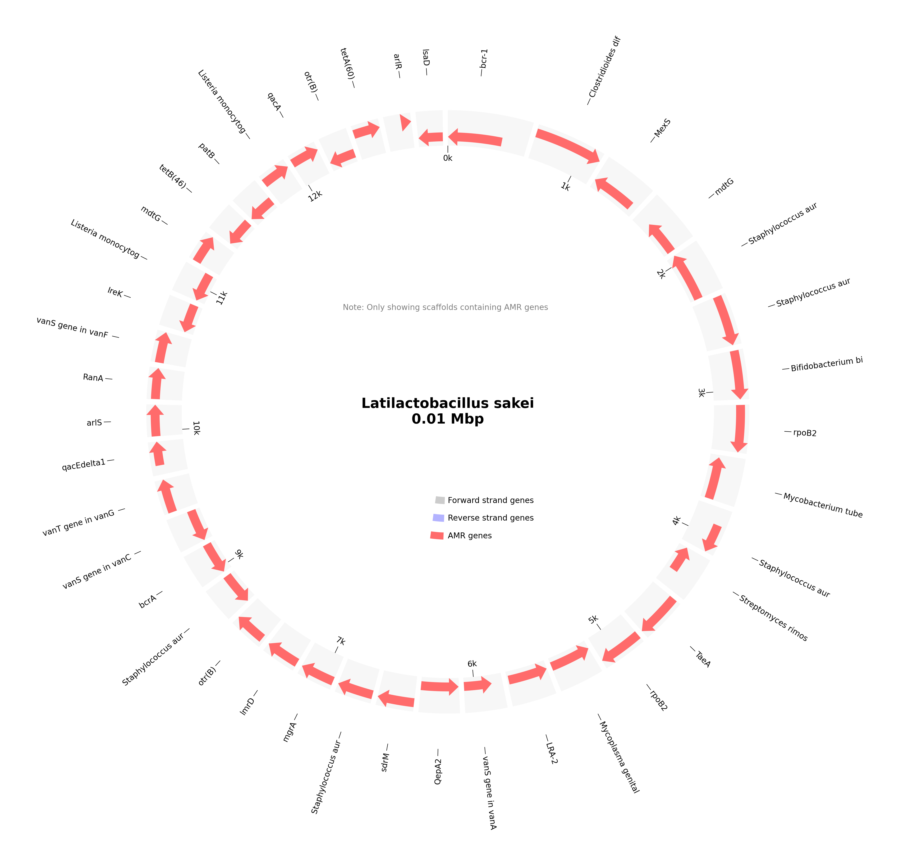

### Bifidobacterium bifidum ileS conferring resistance to mupirocin
- **Mechanism**: antibiotic target alteration
- **Drug Classes**: mupirocin-like antibiotic
- **AMR Family**: antibiotic-resistant isoleucyl-tRNA synthetase (ileS)
- **Locations**:
  - gnl|SPADES|FDOHBCDP_13603_1 : position 3-389

### Clostridioides difficile gyrB conferring resistance to fluoroquinolones
- **Mechanism**: antibiotic target alteration
- **Drug Classes**: fluoroquinolone antibiotic
- **AMR Family**: fluoroquinolone resistant gyrB
- **Locations**:
  - gnl|SPADES|FDOHBCDP_8859_1 : position 3-548

### IreK
- **Mechanism**: reduced permeability to antibiotic
- **Drug Classes**: cephalosporin
- **AMR Family**: Serine/threonine kinases
- **Locations**:
  - gnl|SPADES|FDOHBCDP_27335_1 : position 1-240

### LRA-2
- **Mechanism**: antibiotic inactivation
- **Drug Classes**: cephalosporin; penam
- **AMR Family**: subclass B3 LRA beta-lactamase
- **Locations**:
  - gnl|SPADES|FDOHBCDP_15920_1 : position 2-334

### Listeria monocytogenes mprF (found in 2 locations)
- **Mechanism**: antibiotic target alteration
- **Drug Classes**: peptide antibiotic
- **AMR Family**: defensin resistant mprF
- **Locations**:
  - gnl|SPADES|FDOHBCDP_27505_1 : position 2-241
  - gnl|SPADES|FDOHBCDP_29698_1 : position 1-228

### MexS
- **Mechanism**: antibiotic efflux
- **Drug Classes**: fluoroquinolone antibiotic; diaminopyrimidine antibiotic; phenicol antibiotic
- **AMR Family**: resistance-nodulation-cell division (RND) antibiotic efflux pump
- **Locations**:
  - gnl|SPADES|FDOHBCDP_12158_1 : position 3-374

### Mycobacterium tuberculosis kasA mutant conferring resistance to isoniazid
- **Mechanism**: antibiotic target alteration
- **Drug Classes**: isoniazid-like antibiotic
- **AMR Family**: antibiotic resistant kasA
- **Locations**:
  - gnl|SPADES|FDOHBCDP_14294_1 : position 21-374

### Mycoplasma genitalium parC mutations confers resistance to Moxifloxacin
- **Mechanism**: antibiotic target alteration
- **Drug Classes**: fluoroquinolone antibiotic
- **AMR Family**: fluoroquinolone resistant parC
- **Locations**:
  - gnl|SPADES|FDOHBCDP_15847_1 : position 2-346

### QepA2
- **Mechanism**: antibiotic efflux
- **Drug Classes**: fluoroquinolone antibiotic
- **AMR Family**: major facilitator superfamily (MFS) antibiotic efflux pump
- **Locations**:
  - gnl|SPADES|FDOHBCDP_17813_1 : position 3-317

### RanA
- **Mechanism**: antibiotic efflux
- **Drug Classes**: aminoglycoside antibiotic
- **AMR Family**: ATP-binding cassette (ABC) antibiotic efflux pump
- **Locations**:
  - gnl|SPADES|FDOHBCDP_26151_1 : position 3-248

### Staphylococcus aureus LmrS (found in 2 locations)
- **Mechanism**: antibiotic efflux
- **Drug Classes**: macrolide antibiotic; aminoglycoside antibiotic; oxazolidinone antibiotic; diaminopyrimidine antibiotic; phenicol antibiotic
- **AMR Family**: major facilitator superfamily (MFS) antibiotic efflux pump
- **Locations**:
  - gnl|SPADES|FDOHBCDP_12923_1 : position 3-404
  - gnl|SPADES|FDOHBCDP_14816_1 : position 137-364

### Staphylococcus aureus mupA conferring resistance to mupirocin
- **Mechanism**: antibiotic target alteration
- **Drug Classes**: mupirocin-like antibiotic
- **AMR Family**: antibiotic-resistant isoleucyl-tRNA synthetase (ileS)
- **Locations**:
  - gnl|SPADES|FDOHBCDP_21996_1 : position 2-274

### Staphylococcus aureus mupB conferring resistance to mupirocin
- **Mechanism**: antibiotic target alteration
- **Drug Classes**: mupirocin-like antibiotic
- **AMR Family**: antibiotic-resistant isoleucyl-tRNA synthetase (ileS)
- **Locations**:
  - gnl|SPADES|FDOHBCDP_20318_1 : position 2-286

### Staphylococcus aureus murA with mutation conferring resistance to fosfomycin
- **Mechanism**: antibiotic target alteration
- **Drug Classes**: phosphonic acid antibiotic
- **AMR Family**: antibiotic-resistant murA transferase
- **Locations**:
  - gnl|SPADES|FDOHBCDP_12535_1 : position 1-414

### Streptomyces rimosus otr(A)
- **Mechanism**: antibiotic target protection
- **Drug Classes**: tetracycline antibiotic
- **AMR Family**: tetracycline-resistant ribosomal protection protein
- **Locations**:
  - gnl|SPADES|FDOHBCDP_15010_1 : position 3-218

### TaeA
- **Mechanism**: antibiotic efflux
- **Drug Classes**: pleuromutilin antibiotic
- **AMR Family**: ATP-binding cassette (ABC) antibiotic efflux pump
- **Locations**:
  - gnl|SPADES|FDOHBCDP_15259_1 : position 2-358

### arlR
- **Mechanism**: antibiotic efflux
- **Drug Classes**: fluoroquinolone antibiotic; disinfecting agents and antiseptics
- **AMR Family**: major facilitator superfamily (MFS) antibiotic efflux pump
- **Locations**:
  - gnl|SPADES|FDOHBCDP_33078_1 : position 130-210

### arlS
- **Mechanism**: antibiotic efflux
- **Drug Classes**: fluoroquinolone antibiotic; disinfecting agents and antiseptics
- **AMR Family**: major facilitator superfamily (MFS) antibiotic efflux pump
- **Locations**:
  - gnl|SPADES|FDOHBCDP_25738_1 : position 2-250

### bcr-1
- **Mechanism**: antibiotic efflux
- **Drug Classes**: bicyclomycin-like antibiotic
- **AMR Family**: major facilitator superfamily (MFS) antibiotic efflux pump
- **Locations**:
  - gnl|SPADES|FDOHBCDP_7064_1 : position 1-453

### bcrA
- **Mechanism**: antibiotic efflux
- **Drug Classes**: peptide antibiotic
- **AMR Family**: ATP-binding cassette (ABC) antibiotic efflux pump
- **Locations**:
  - gnl|SPADES|FDOHBCDP_22223_1 : position 3-272

### lmrD
- **Mechanism**: antibiotic efflux
- **Drug Classes**: lincosamide antibiotic
- **AMR Family**: ATP-binding cassette (ABC) antibiotic efflux pump
- **Locations**:
  - gnl|SPADES|FDOHBCDP_21935_1 : position 3-272

### lsaD
- **Mechanism**: antibiotic target protection
- **Drug Classes**: lincosamide antibiotic; streptogramin antibiotic; streptogramin A antibiotic; pleuromutilin antibiotic
- **AMR Family**: lsa-type ABC-F protein
- **Locations**:
  - gnl|SPADES|FDOHBCDP_33575_1 : position 3-206

### mdtG (found in 2 locations)
- **Mechanism**: antibiotic efflux
- **Drug Classes**: phosphonic acid antibiotic
- **AMR Family**: major facilitator superfamily (MFS) antibiotic efflux pump
- **Locations**:
  - gnl|SPADES|FDOHBCDP_12342_1 : position 126-419
  - gnl|SPADES|FDOHBCDP_28960_1 : position 1-231

### mgrA
- **Mechanism**: antibiotic efflux
- **Drug Classes**: fluoroquinolone antibiotic; cephalosporin; penam; tetracycline antibiotic; peptide antibiotic; disinfecting agents and antiseptics
- **AMR Family**: ATP-binding cassette (ABC) antibiotic efflux pump; major facilitator superfamily (MFS) antibiotic efflux pump
- **Locations**:
  - gnl|SPADES|FDOHBCDP_21510_1 : position 3-275

### otr(B) (found in 2 locations)
- **Mechanism**: antibiotic efflux
- **Drug Classes**: tetracycline antibiotic
- **AMR Family**: major facilitator superfamily (MFS) antibiotic efflux pump
- **Locations**:
  - gnl|SPADES|FDOHBCDP_21984_1 : position 23-274
  - gnl|SPADES|FDOHBCDP_30388_1 : position 2-223

### patB
- **Mechanism**: antibiotic efflux
- **Drug Classes**: fluoroquinolone antibiotic
- **AMR Family**: ATP-binding cassette (ABC) antibiotic efflux pump
- **Locations**:
  - gnl|SPADES|FDOHBCDP_29608_1 : position 1-228

### qacA
- **Mechanism**: antibiotic efflux
- **Drug Classes**: fluoroquinolone antibiotic
- **AMR Family**: major facilitator superfamily (MFS) antibiotic efflux pump
- **Locations**:
  - gnl|SPADES|FDOHBCDP_29640_1 : position 2-229

### qacEdelta1
- **Mechanism**: antibiotic efflux
- **Drug Classes**: disinfecting agents and antiseptics
- **AMR Family**: major facilitator superfamily (MFS) antibiotic efflux pump
- **Locations**:
  - gnl|SPADES|FDOHBCDP_23929_1 : position 74-262

### rpoB2 (found in 2 locations)
- **Mechanism**: antibiotic target alteration; antibiotic target replacement
- **Drug Classes**: rifamycin antibiotic
- **AMR Family**: rifamycin-resistant beta-subunit of RNA polymerase (rpoB)
- **Locations**:
  - gnl|SPADES|FDOHBCDP_14275_1 : position 2-376
  - gnl|SPADES|FDOHBCDP_15732_1 : position 2-349

### sdrM
- **Mechanism**: antibiotic efflux
- **Drug Classes**: fluoroquinolone antibiotic; disinfecting agents and antiseptics
- **AMR Family**: major facilitator superfamily (MFS) antibiotic efflux pump
- **Locations**:
  - gnl|SPADES|FDOHBCDP_19887_1 : position 1-291

### tetA(60)
- **Mechanism**: antibiotic efflux
- **Drug Classes**: tetracycline antibiotic
- **AMR Family**: ATP-binding cassette (ABC) antibiotic efflux pump
- **Locations**:
  - gnl|SPADES|FDOHBCDP_32237_1 : position 2-214

### tetB(46)
- **Mechanism**: antibiotic efflux
- **Drug Classes**: tetracycline antibiotic
- **AMR Family**: ATP-binding cassette (ABC) antibiotic efflux pump
- **Locations**:
  - gnl|SPADES|FDOHBCDP_29166_1 : position 2-232

### vanS gene in vanA cluster
- **Mechanism**: antibiotic target alteration
- **Drug Classes**: glycopeptide antibiotic
- **AMR Family**: vanS; glycopeptide resistance gene cluster
- **Locations**:
  - gnl|SPADES|FDOHBCDP_17335_2 : position 91-324

### vanS gene in vanC cluster
- **Mechanism**: antibiotic target alteration
- **Drug Classes**: glycopeptide antibiotic
- **AMR Family**: vanS; glycopeptide resistance gene cluster
- **Locations**:
  - gnl|SPADES|FDOHBCDP_22551_1 : position 1-270

### vanS gene in vanF cluster
- **Mechanism**: antibiotic target alteration
- **Drug Classes**: glycopeptide antibiotic
- **AMR Family**: vanS; glycopeptide resistance gene cluster
- **Locations**:
  - gnl|SPADES|FDOHBCDP_26464_1 : position 1-246

### vanT gene in vanG cluster
- **Mechanism**: antibiotic target alteration
- **Drug Classes**: glycopeptide antibiotic
- **AMR Family**: glycopeptide resistance gene cluster; vanT
- **Locations**:
  - gnl|SPADES|FDOHBCDP_22917_1 : position 2-268

## Lelliottia amnigena
**Strain Statistics:**
- Total genome length: 0.3 kbp
- Total scaffolds: 45
- Scaffolds with AMR genes: 1
- Total genes annotated: 0
- Total AMR genes: 1
- Unique AMR genes: 1
- Distinct AMR mechanisms: 1
- Distinct AMR families: 1
- Distinct drug classes: 1

**Circos Plot:**

### arnA
- **Mechanism**: antibiotic target alteration
- **Drug Classes**: peptide antibiotic
- **AMR Family**: pmr phosphoethanolamine transferase
- **Locations**:
  - gnl|SPADES|FDOHBCDP_21946_1 : position 3-245

## Raoultella planticola
**Strain Statistics:**
- Total genome length: 0.5 kbp
- Total scaffolds: 4
- Scaffolds with AMR genes: 2
- Total genes annotated: 0
- Total AMR genes: 2
- Unique AMR genes: 2
- Distinct AMR mechanisms: 2
- Distinct AMR families: 2
- Distinct drug classes: 2

**Circos Plot:**

### acrD
- **Mechanism**: antibiotic efflux
- **Drug Classes**: aminoglycoside antibiotic
- **AMR Family**: resistance-nodulation-cell division (RND) antibiotic efflux pump
- **Locations**:
  - gnl|SPADES|FDOHBCDP_30838_1 : position 3-221

### cmlv
- **Mechanism**: antibiotic inactivation
- **Drug Classes**: phenicol antibiotic
- **AMR Family**: chloramphenicol phosphotransferase
- **Locations**:
  - gnl|SPADES|FDOHBCDP_25052_1 : position 11-253

## Serratia fonticola
**Strain Statistics:**
- Total genome length: 141.3 kbp
- Total scaffolds: 4149
- Scaffolds with AMR genes: 305
- Total genes annotated: 186
- Total AMR genes: 312
- Unique AMR genes: 147
- Distinct AMR mechanisms: 10
- Distinct AMR families: 53
- Distinct drug classes: 33

**Circos Plot:**

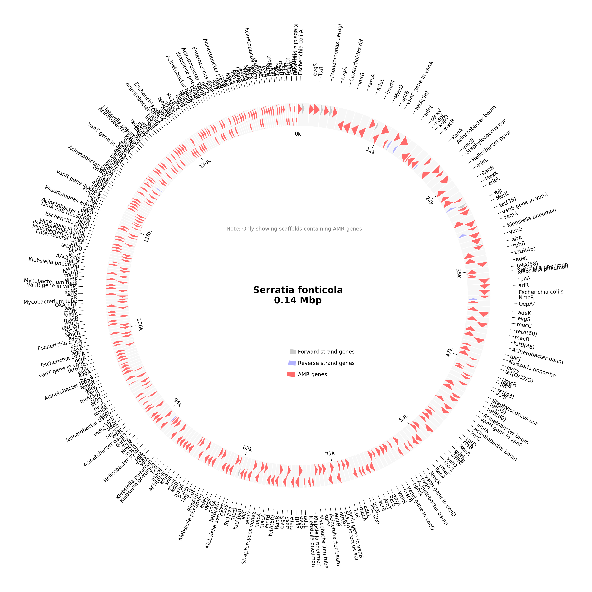

### AAC(3)-Ic
- **Mechanism**: antibiotic inactivation
- **Drug Classes**: aminoglycoside antibiotic
- **AMR Family**: AAC(3)
- **Locations**:
  - gnl|SPADES|FDOHBCDP_17265_1 : position 1-270

### AIM-1
- **Mechanism**: antibiotic inactivation
- **Drug Classes**: cephalosporin; cephamycin; penam
- **AMR Family**: AIM beta-lactamase
- **Locations**:
  - gnl|SPADES|FDOHBCDP_21572_1 : position 1-276

### APH(6)-Ic
- **Mechanism**: antibiotic inactivation
- **Drug Classes**: aminoglycoside antibiotic
- **AMR Family**: APH(6)
- **Locations**:
  - gnl|SPADES|FDOHBCDP_11874_1 : position 1-381

### Acinetobacter baumannii AbaF (found in 9 locations)
- **Mechanism**: antibiotic efflux
- **Drug Classes**: phosphonic acid antibiotic
- **AMR Family**: major facilitator superfamily (MFS) antibiotic efflux pump
- **Locations**:
  - gnl|SPADES|FDOHBCDP_12775_1 : position 3-407
  - gnl|SPADES|FDOHBCDP_14583_1 : position 2-370
  - gnl|SPADES|FDOHBCDP_23304_1 : position 1-264
  - gnl|SPADES|FDOHBCDP_26101_1 : position 3-248
  - gnl|SPADES|FDOHBCDP_27811_1 : position 3-239
  - gnl|SPADES|FDOHBCDP_30579_1 : position 2-223
  - gnl|SPADES|FDOHBCDP_7786_2 : position 181-612
  - gnl|SPADES|FDOHBCDP_7842_1 : position 3-608
  - gnl|SPADES|FDOHBCDP_8355_1 : position 1-396

### Acinetobacter baumannii AbaQ (found in 8 locations)
- **Mechanism**: antibiotic efflux
- **Drug Classes**: fluoroquinolone antibiotic
- **AMR Family**: major facilitator superfamily (MFS) antibiotic efflux pump
- **Locations**:
  - gnl|SPADES|FDOHBCDP_13473_1 : position 88-393
  - gnl|SPADES|FDOHBCDP_18988_1 : position 2-301
  - gnl|SPADES|FDOHBCDP_20062_1 : position 3-266
  - gnl|SPADES|FDOHBCDP_22134_1 : position 2-271
  - gnl|SPADES|FDOHBCDP_27251_1 : position 2-241
  - gnl|SPADES|FDOHBCDP_5199_1 : position 106-903
  - gnl|SPADES|FDOHBCDP_6942_1 : position 2-673
  - gnl|SPADES|FDOHBCDP_9450_1 : position 1-519

### AcrE
- **Mechanism**: antibiotic efflux
- **Drug Classes**: fluoroquinolone antibiotic; cephalosporin; cephamycin; penam
- **AMR Family**: resistance-nodulation-cell division (RND) antibiotic efflux pump
- **Locations**:
  - gnl|SPADES|FDOHBCDP_27758_1 : position 3-239

### ArnT
- **Mechanism**: antibiotic target alteration
- **Drug Classes**: peptide antibiotic
- **AMR Family**: pmr phosphoethanolamine transferase
- **Locations**:
  - gnl|SPADES|FDOHBCDP_8891_1 : position 2-547

### Clostridioides difficile gyrB conferring resistance to fluoroquinolones
- **Mechanism**: antibiotic target alteration
- **Drug Classes**: fluoroquinolone antibiotic
- **AMR Family**: fluoroquinolone resistant gyrB
- **Locations**:
  - gnl|SPADES|FDOHBCDP_4275_2 : position 330-1136

### Enterobacter cloacae acrA
- **Mechanism**: antibiotic efflux
- **Drug Classes**: fluoroquinolone antibiotic; cephalosporin; glycylcycline; penam; tetracycline antibiotic; rifamycin antibiotic; phenicol antibiotic; disinfecting agents and antiseptics
- **AMR Family**: resistance-nodulation-cell division (RND) antibiotic efflux pump
- **Locations**:
  - gnl|SPADES|FDOHBCDP_18153_1 : position 3-311

### Enterococcus faecium cls conferring resistance to daptomycin
- **Mechanism**: antibiotic target alteration
- **Drug Classes**: peptide antibiotic
- **AMR Family**: daptomycin resistant cls
- **Locations**:
  - gnl|SPADES|FDOHBCDP_27512_1 : position 3-239

### Escherichia coli AcrAB-TolC with AcrR mutation conferring resistance to ciprofloxacin, tetracycline, and ceftazidime (found in 2 locations)
- **Mechanism**: antibiotic target alteration; antibiotic efflux
- **Drug Classes**: fluoroquinolone antibiotic; cephalosporin; glycylcycline; penam; tetracycline antibiotic; rifamycin antibiotic; phenicol antibiotic; disinfecting agents and antiseptics
- **AMR Family**: resistance-nodulation-cell division (RND) antibiotic efflux pump
- **Locations**:
  - gnl|SPADES|FDOHBCDP_15304_2 : position 119-355
  - gnl|SPADES|FDOHBCDP_3362_1 : position 3-584

### Escherichia coli mdfA
- **Mechanism**: antibiotic efflux
- **Drug Classes**: tetracycline antibiotic; phenicol antibiotic; disinfecting agents and antiseptics
- **AMR Family**: major facilitator superfamily (MFS) antibiotic efflux pump
- **Locations**:
  - gnl|SPADES|FDOHBCDP_23522_1 : position 1-264

### Escherichia coli soxS with mutation conferring antibiotic resistance (found in 3 locations)
- **Mechanism**: antibiotic target alteration; antibiotic efflux; reduced permeability to antibiotic
- **Drug Classes**: fluoroquinolone antibiotic; monobactam; carbapenem; cephalosporin; glycylcycline; cephamycin; penam; tetracycline antibiotic; rifamycin antibiotic; phenicol antibiotic; penem; disinfecting agents and antiseptics
- **AMR Family**: ATP-binding cassette (ABC) antibiotic efflux pump; major facilitator superfamily (MFS) antibiotic efflux pump; resistance-nodulation-cell division (RND) antibiotic efflux pump; General Bacterial Porin with reduced permeability to beta-lactams
- **Locations**:
  - gnl|SPADES|FDOHBCDP_15600_1 : position 2-352
  - gnl|SPADES|FDOHBCDP_18690_1 : position 3-245
  - gnl|SPADES|FDOHBCDP_6541_1 : position 1-714

### FONA-3
- **Mechanism**: antibiotic inactivation
- **Drug Classes**: penam
- **AMR Family**: FONA beta-lactamase
- **Locations**:
  - gnl|SPADES|FDOHBCDP_23535_1 : position 2-262

### FONA-6
- **Mechanism**: antibiotic inactivation
- **Drug Classes**: penam
- **AMR Family**: FONA beta-lactamase
- **Locations**:
  - gnl|SPADES|FDOHBCDP_19327_1 : position 1-297

### Helicobacter pylori pbp1 mutants conferring resistance to amoxicillin (found in 2 locations)
- **Mechanism**: antibiotic target alteration
- **Drug Classes**: cephalosporin; cephamycin; penam
- **AMR Family**: Penicillin-binding protein mutations conferring resistance to beta-lactam antibiotics
- **Locations**:
  - gnl|SPADES|FDOHBCDP_12393_1 : position 3-419
  - gnl|SPADES|FDOHBCDP_5471_1 : position 3-857

### Klebsiella aerogenes Omp36
- **Mechanism**: reduced permeability to antibiotic
- **Drug Classes**: monobactam; carbapenem; cephalosporin; cephamycin; penam; penem
- **AMR Family**: General Bacterial Porin with reduced permeability to beta-lactams
- **Locations**:
  - gnl|SPADES|FDOHBCDP_10827_1 : position 1-468

### Klebsiella pneumoniae KpnE
- **Mechanism**: antibiotic efflux
- **Drug Classes**: macrolide antibiotic; aminoglycoside antibiotic; cephalosporin; tetracycline antibiotic; peptide antibiotic; rifamycin antibiotic; disinfecting agents and antiseptics
- **AMR Family**: small multidrug resistance (SMR) antibiotic efflux pump
- **Locations**:
  - gnl|SPADES|FDOHBCDP_6430_2 : position 129-497

### Klebsiella pneumoniae KpnF
- **Mechanism**: antibiotic efflux
- **Drug Classes**: macrolide antibiotic; aminoglycoside antibiotic; cephalosporin; tetracycline antibiotic; peptide antibiotic; rifamycin antibiotic; disinfecting agents and antiseptics
- **AMR Family**: small multidrug resistance (SMR) antibiotic efflux pump
- **Locations**:
  - gnl|SPADES|FDOHBCDP_6430_1 : position 2-142

### Klebsiella pneumoniae KpnH (found in 2 locations)
- **Mechanism**: antibiotic efflux
- **Drug Classes**: macrolide antibiotic; fluoroquinolone antibiotic; aminoglycoside antibiotic; carbapenem; cephalosporin; penam; peptide antibiotic; penem
- **AMR Family**: major facilitator superfamily (MFS) antibiotic efflux pump
- **Locations**:
  - gnl|SPADES|FDOHBCDP_11008_1 : position 74-460
  - gnl|SPADES|FDOHBCDP_12218_1 : position 3-407

### Klebsiella pneumoniae OmpK37 (found in 8 locations)
- **Mechanism**: reduced permeability to antibiotic
- **Drug Classes**: monobactam; carbapenem; cephalosporin; cephamycin; penam; penem
- **AMR Family**: General Bacterial Porin with reduced permeability to beta-lactams
- **Locations**:
  - gnl|SPADES|FDOHBCDP_12011_1 : position 3-431
  - gnl|SPADES|FDOHBCDP_17004_1 : position 1-330
  - gnl|SPADES|FDOHBCDP_22063_1 : position 3-272
  - gnl|SPADES|FDOHBCDP_26968_1 : position 1-243
  - gnl|SPADES|FDOHBCDP_33726_1 : position 2-205
  - gnl|SPADES|FDOHBCDP_6132_1 : position 27-761
  - gnl|SPADES|FDOHBCDP_9689_1 : position 254-508
  - gnl|SPADES|FDOHBCDP_9714_2 : position 110-508

### LlmA 23S ribosomal RNA methyltransferase
- **Mechanism**: antibiotic target alteration
- **Drug Classes**: lincosamide antibiotic
- **AMR Family**: Llm 23S ribosomal RNA methyltransferase
- **Locations**:
  - gnl|SPADES|FDOHBCDP_18898_1 : position 3-302

### LptD (found in 2 locations)
- **Mechanism**: antibiotic efflux
- **Drug Classes**: carbapenem; peptide antibiotic; aminocoumarin antibiotic; rifamycin antibiotic
- **AMR Family**: ATP-binding cassette (ABC) antibiotic efflux pump
- **Locations**:
  - gnl|SPADES|FDOHBCDP_19587_1 : position 3-293
  - gnl|SPADES|FDOHBCDP_7951_2 : position 399-599

### MdtK (found in 3 locations)
- **Mechanism**: antibiotic efflux
- **Drug Classes**: fluoroquinolone antibiotic
- **AMR Family**: multidrug and toxic compound extrusion (MATE) transporter
- **Locations**:
  - gnl|SPADES|FDOHBCDP_30009_1 : position 3-227
  - gnl|SPADES|FDOHBCDP_32523_1 : position 3-212
  - gnl|SPADES|FDOHBCDP_5789_1 : position 3-713

### MexD
- **Mechanism**: antibiotic efflux
- **Drug Classes**: macrolide antibiotic; fluoroquinolone antibiotic; aminoglycoside antibiotic; cephalosporin; penam; tetracycline antibiotic; aminocoumarin antibiotic; diaminopyrimidine antibiotic; phenicol antibiotic
- **AMR Family**: resistance-nodulation-cell division (RND) antibiotic efflux pump
- **Locations**:
  - gnl|SPADES|FDOHBCDP_4683_2 : position 319-1011

### MexF
- **Mechanism**: antibiotic efflux
- **Drug Classes**: fluoroquinolone antibiotic; diaminopyrimidine antibiotic; phenicol antibiotic
- **AMR Family**: resistance-nodulation-cell division (RND) antibiotic efflux pump
- **Locations**:
  - gnl|SPADES|FDOHBCDP_27098_1 : position 3-242

### MexK
- **Mechanism**: antibiotic efflux
- **Drug Classes**: macrolide antibiotic; tetracycline antibiotic; disinfecting agents and antiseptics
- **AMR Family**: resistance-nodulation-cell division (RND) antibiotic efflux pump
- **Locations**:
  - gnl|SPADES|FDOHBCDP_5632_1 : position 2-835

### MexS (found in 2 locations)
- **Mechanism**: antibiotic efflux
- **Drug Classes**: fluoroquinolone antibiotic; diaminopyrimidine antibiotic; phenicol antibiotic
- **AMR Family**: resistance-nodulation-cell division (RND) antibiotic efflux pump
- **Locations**:
  - gnl|SPADES|FDOHBCDP_15987_1 : position 2-346
  - gnl|SPADES|FDOHBCDP_29181_1 : position 40-231

### MexT
- **Mechanism**: antibiotic efflux
- **Drug Classes**: fluoroquinolone antibiotic; diaminopyrimidine antibiotic; phenicol antibiotic
- **AMR Family**: resistance-nodulation-cell division (RND) antibiotic efflux pump
- **Locations**:
  - gnl|SPADES|FDOHBCDP_22354_1 : position 46-270

### MexV
- **Mechanism**: antibiotic efflux
- **Drug Classes**: macrolide antibiotic; fluoroquinolone antibiotic; tetracycline antibiotic; phenicol antibiotic; disinfecting agents and antiseptics
- **AMR Family**: resistance-nodulation-cell division (RND) antibiotic efflux pump
- **Locations**:
  - gnl|SPADES|FDOHBCDP_4938_1 : position 3-950

### Mycobacterium tuberculosis gidB mutation conferring resistance to streptomycin
- **Mechanism**: antibiotic target alteration
- **Drug Classes**: aminoglycoside antibiotic
- **AMR Family**: antibiotic resistant gidB
- **Locations**:
  - gnl|SPADES|FDOHBCDP_18150_1 : position 1-312

### Mycobacterium tuberculosis kasA mutant conferring resistance to isoniazid
- **Mechanism**: antibiotic target alteration
- **Drug Classes**: isoniazid-like antibiotic
- **AMR Family**: antibiotic resistant kasA
- **Locations**:
  - gnl|SPADES|FDOHBCDP_9694_1 : position 61-510

### Mycobacterium tuberculosis pncA mutations conferring resistance to pyrazinamide (found in 2 locations)
- **Mechanism**: antibiotic target alteration
- **Drug Classes**: pyrazine antibiotic
- **AMR Family**: Pyrazinamide resistant pncA
- **Locations**:
  - gnl|SPADES|FDOHBCDP_16360_1 : position 2-283
  - gnl|SPADES|FDOHBCDP_16847_1 : position 3-332

### Neisseria gonorrhoeae pilQ gene conferring resistance to beta-lactam
- **Mechanism**: antibiotic target alteration
- **Drug Classes**: cephalosporin; cephamycin; penam
- **AMR Family**: Penicillin-binding protein mutations conferring resistance to beta-lactam antibiotics
- **Locations**:
  - gnl|SPADES|FDOHBCDP_7093_1 : position 1-660

### NmcR (found in 10 locations)
- **Mechanism**: antibiotic inactivation
- **Drug Classes**: carbapenem; cephalosporin; cephamycin; penam
- **AMR Family**: NmcA beta-lactamase
- **Locations**:
  - gnl|SPADES|FDOHBCDP_11261_1 : position 3-452
  - gnl|SPADES|FDOHBCDP_12557_1 : position 3-413
  - gnl|SPADES|FDOHBCDP_13693_1 : position 1-231
  - gnl|SPADES|FDOHBCDP_14213_1 : position 2-376
  - gnl|SPADES|FDOHBCDP_15807_1 : position 3-347
  - gnl|SPADES|FDOHBCDP_25909_1 : position 2-250
  - gnl|SPADES|FDOHBCDP_29953_1 : position 3-227
  - gnl|SPADES|FDOHBCDP_6562_1 : position 3-362
  - gnl|SPADES|FDOHBCDP_7645_2 : position 353-619
  - gnl|SPADES|FDOHBCDP_8303_1 : position 289-576

### OXA-661
- **Mechanism**: antibiotic inactivation
- **Drug Classes**: penam
- **AMR Family**: OXA beta-lactamase; OXA-266-like beta-lactamase
- **Locations**:
  - gnl|SPADES|FDOHBCDP_16288_1 : position 1-339

### OmpA
- **Mechanism**: reduced permeability to antibiotic
- **Drug Classes**: peptide antibiotic
- **AMR Family**: General Bacterial Porin with reduced permeability to peptide antibiotics
- **Locations**:
  - gnl|SPADES|FDOHBCDP_29154_1 : position 3-224

### ParR
- **Mechanism**: antibiotic efflux; reduced permeability to antibiotic
- **Drug Classes**: macrolide antibiotic; fluoroquinolone antibiotic; monobactam; aminoglycoside antibiotic; carbapenem; cephalosporin; cephamycin; penam; tetracycline antibiotic; phenicol antibiotic; penem; disinfecting agents and antiseptics
- **AMR Family**: resistance-nodulation-cell division (RND) antibiotic efflux pump; Outer Membrane Porin (Opr)
- **Locations**:
  - gnl|SPADES|FDOHBCDP_14154_2 : position 198-377

### ParS
- **Mechanism**: antibiotic efflux; reduced permeability to antibiotic
- **Drug Classes**: macrolide antibiotic; fluoroquinolone antibiotic; monobactam; aminoglycoside antibiotic; carbapenem; cephalosporin; cephamycin; penam; tetracycline antibiotic; phenicol antibiotic; penem; disinfecting agents and antiseptics
- **AMR Family**: resistance-nodulation-cell division (RND) antibiotic efflux pump; Outer Membrane Porin (Opr)
- **Locations**:
  - gnl|SPADES|FDOHBCDP_8890_1 : position 3-545

### Pseudomonas aeruginosa CpxR (found in 2 locations)
- **Mechanism**: antibiotic efflux
- **Drug Classes**: macrolide antibiotic; fluoroquinolone antibiotic; monobactam; aminoglycoside antibiotic; carbapenem; cephalosporin; cephamycin; penam; tetracycline antibiotic; peptide antibiotic; aminocoumarin antibiotic; diaminopyrimidine antibiotic; sulfonamide antibiotic; phenicol antibiotic; penem
- **AMR Family**: resistance-nodulation-cell division (RND) antibiotic efflux pump
- **Locations**:
  - gnl|SPADES|FDOHBCDP_19161_1 : position 51-299
  - gnl|SPADES|FDOHBCDP_4046_2 : position 547-1218

### Pseudomonas aeruginosa ampR with mutation conferring resistance to aztreonam
- **Mechanism**: antibiotic target alteration; antibiotic inactivation
- **Drug Classes**: monobactam; carbapenem; cephalosporin
- **AMR Family**: PDC beta-lactamase; ampR transcriptional regulator with mutation conferring resistance to monobactam antibiotics
- **Locations**:
  - gnl|SPADES|FDOHBCDP_18393_1 : position 3-308

### QepA4
- **Mechanism**: antibiotic efflux
- **Drug Classes**: fluoroquinolone antibiotic
- **AMR Family**: major facilitator superfamily (MFS) antibiotic efflux pump
- **Locations**:
  - gnl|SPADES|FDOHBCDP_6574_1 : position 2-298

### RanA (found in 6 locations)
- **Mechanism**: antibiotic efflux
- **Drug Classes**: aminoglycoside antibiotic
- **AMR Family**: ATP-binding cassette (ABC) antibiotic efflux pump
- **Locations**:
  - gnl|SPADES|FDOHBCDP_11360_1 : position 3-413
  - gnl|SPADES|FDOHBCDP_25588_1 : position 3-251
  - gnl|SPADES|FDOHBCDP_29168_1 : position 3-230
  - gnl|SPADES|FDOHBCDP_5037_2 : position 510-935
  - gnl|SPADES|FDOHBCDP_8033_1 : position 2-592
  - gnl|SPADES|FDOHBCDP_8270_1 : position 3-578

### RanB (found in 2 locations)
- **Mechanism**: antibiotic efflux
- **Drug Classes**: aminoglycoside antibiotic
- **AMR Family**: ATP-binding cassette (ABC) antibiotic efflux pump
- **Locations**:
  - gnl|SPADES|FDOHBCDP_10056_1 : position 1-495
  - gnl|SPADES|FDOHBCDP_5568_2 : position 264-842

### RlmA(II)
- **Mechanism**: antibiotic target alteration
- **Drug Classes**: macrolide antibiotic; lincosamide antibiotic
- **AMR Family**: non-erm 23S ribosomal RNA methyltransferase (G748)
- **Locations**:
  - gnl|SPADES|FDOHBCDP_11072_1 : position 3-458

### Rv1877 (found in 2 locations)
- **Mechanism**: antibiotic efflux
- **Drug Classes**: fluoroquinolone antibiotic
- **AMR Family**: major facilitator superfamily (MFS) antibiotic efflux pump
- **Locations**:
  - gnl|SPADES|FDOHBCDP_10745_1 : position 1-471
  - gnl|SPADES|FDOHBCDP_24500_1 : position 2-256

### Staphylococcus aureus GlpT with mutation conferring resistance to fosfomycin
- **Mechanism**: antibiotic target alteration
- **Drug Classes**: phosphonic acid antibiotic
- **AMR Family**: antibiotic-resistant GlpT
- **Locations**:
  - gnl|SPADES|FDOHBCDP_5391_1 : position 3-401

### Staphylococcus aureus fusA with mutation conferring resistance to fusidic acid
- **Mechanism**: antibiotic target alteration
- **Drug Classes**: fusidane antibiotic
- **AMR Family**: antibiotic resistant fusA
- **Locations**:
  - gnl|SPADES|FDOHBCDP_9364_1 : position 2-523

### Staphylococcus aureus norA
- **Mechanism**: antibiotic efflux
- **Drug Classes**: fluoroquinolone antibiotic
- **AMR Family**: major facilitator superfamily (MFS) antibiotic efflux pump
- **Locations**:
  - gnl|SPADES|FDOHBCDP_7749_2 : position 252-611

### Streptomyces venezuelae rox
- **Mechanism**: antibiotic inactivation
- **Drug Classes**: rifamycin antibiotic
- **AMR Family**: rifampin monooxygenase
- **Locations**:
  - gnl|SPADES|FDOHBCDP_10558_1 : position 2-478

### TolC
- **Mechanism**: antibiotic efflux
- **Drug Classes**: macrolide antibiotic; fluoroquinolone antibiotic; aminoglycoside antibiotic; carbapenem; cephalosporin; glycylcycline; cephamycin; penam; tetracycline antibiotic; peptide antibiotic; aminocoumarin antibiotic; rifamycin antibiotic; phenicol antibiotic; penem; disinfecting agents and antiseptics
- **AMR Family**: ATP-binding cassette (ABC) antibiotic efflux pump; major facilitator superfamily (MFS) antibiotic efflux pump; resistance-nodulation-cell division (RND) antibiotic efflux pump
- **Locations**:
  - gnl|SPADES|FDOHBCDP_10681_1 : position 2-472

### TriB
- **Mechanism**: antibiotic efflux
- **Drug Classes**: disinfecting agents and antiseptics
- **AMR Family**: resistance-nodulation-cell division (RND) antibiotic efflux pump
- **Locations**:
  - gnl|SPADES|FDOHBCDP_32206_1 : position 3-215

### TriC (found in 3 locations)
- **Mechanism**: antibiotic efflux
- **Drug Classes**: disinfecting agents and antiseptics
- **AMR Family**: resistance-nodulation-cell division (RND) antibiotic efflux pump
- **Locations**:
  - gnl|SPADES|FDOHBCDP_25132_1 : position 3-254
  - gnl|SPADES|FDOHBCDP_9078_1 : position 3-290
  - gnl|SPADES|FDOHBCDP_9078_2 : position 290-535

### TxR (found in 6 locations)
- **Mechanism**: antibiotic efflux
- **Drug Classes**: tetracycline antibiotic
- **AMR Family**: ATP-binding cassette (ABC) antibiotic efflux pump
- **Locations**:
  - gnl|SPADES|FDOHBCDP_11244_1 : position 2-454
  - gnl|SPADES|FDOHBCDP_11956_1 : position 2-430
  - gnl|SPADES|FDOHBCDP_16495_1 : position 2-337
  - gnl|SPADES|FDOHBCDP_19847_1 : position 2-178
  - gnl|SPADES|FDOHBCDP_3382_2 : position 666-1544
  - gnl|SPADES|FDOHBCDP_9269_1 : position 93-527

### YojI (found in 5 locations)
- **Mechanism**: antibiotic efflux
- **Drug Classes**: peptide antibiotic
- **AMR Family**: ATP-binding cassette (ABC) antibiotic efflux pump
- **Locations**:
  - gnl|SPADES|FDOHBCDP_19233_1 : position 1-270
  - gnl|SPADES|FDOHBCDP_22178_1 : position 1-273
  - gnl|SPADES|FDOHBCDP_22837_1 : position 1-267
  - gnl|SPADES|FDOHBCDP_28430_1 : position 3-125
  - gnl|SPADES|FDOHBCDP_5772_2 : position 413-811

### Yrc-1
- **Mechanism**: antibiotic inactivation
- **Drug Classes**: cephalosporin; cephamycin; penam
- **AMR Family**: YRC Beta-lactamase
- **Locations**:
  - gnl|SPADES|FDOHBCDP_8171_1 : position 3-482

### aadT
- **Mechanism**: antibiotic efflux
- **Drug Classes**: macrolide antibiotic; tetracycline antibiotic; disinfecting agents and antiseptics
- **AMR Family**: major facilitator superfamily (MFS) antibiotic efflux pump
- **Locations**:
  - gnl|SPADES|FDOHBCDP_16176_1 : position 3-341

### acrB (found in 4 locations)
- **Mechanism**: antibiotic efflux
- **Drug Classes**: fluoroquinolone antibiotic; cephalosporin; glycylcycline; penam; tetracycline antibiotic; rifamycin antibiotic; phenicol antibiotic; disinfecting agents and antiseptics
- **AMR Family**: resistance-nodulation-cell division (RND) antibiotic efflux pump
- **Locations**:
  - gnl|SPADES|FDOHBCDP_20894_1 : position 1-279
  - gnl|SPADES|FDOHBCDP_26456_1 : position 2-247
  - gnl|SPADES|FDOHBCDP_8923_1 : position 17-544
  - gnl|SPADES|FDOHBCDP_9781_1 : position 1-507

### acrD (found in 4 locations)
- **Mechanism**: antibiotic efflux
- **Drug Classes**: aminoglycoside antibiotic
- **AMR Family**: resistance-nodulation-cell division (RND) antibiotic efflux pump
- **Locations**:
  - gnl|SPADES|FDOHBCDP_15574_1 : position 2-352
  - gnl|SPADES|FDOHBCDP_24030_1 : position 2-259
  - gnl|SPADES|FDOHBCDP_31494_1 : position 1-219
  - gnl|SPADES|FDOHBCDP_32954_1 : position 2-211

### adeK (found in 2 locations)
- **Mechanism**: antibiotic efflux
- **Drug Classes**: macrolide antibiotic; fluoroquinolone antibiotic; lincosamide antibiotic; carbapenem; cephalosporin; tetracycline antibiotic; rifamycin antibiotic; diaminopyrimidine antibiotic; phenicol antibiotic; penem
- **AMR Family**: resistance-nodulation-cell division (RND) antibiotic efflux pump
- **Locations**:
  - gnl|SPADES|FDOHBCDP_6756_2 : position 155-694
  - gnl|SPADES|FDOHBCDP_8053_2 : position 118-591

### adeL (found in 18 locations)
- **Mechanism**: antibiotic efflux
- **Drug Classes**: fluoroquinolone antibiotic; tetracycline antibiotic
- **AMR Family**: resistance-nodulation-cell division (RND) antibiotic efflux pump
- **Locations**:
  - gnl|SPADES|FDOHBCDP_10961_1 : position 3-464
  - gnl|SPADES|FDOHBCDP_11514_1 : position 30-446
  - gnl|SPADES|FDOHBCDP_12904_1 : position 89-406
  - gnl|SPADES|FDOHBCDP_13139_2 : position 214-399
  - gnl|SPADES|FDOHBCDP_13625_1 : position 2-124
  - gnl|SPADES|FDOHBCDP_14199_1 : position 3-377
  - gnl|SPADES|FDOHBCDP_14981_1 : position 1-363
  - gnl|SPADES|FDOHBCDP_15299_1 : position 2-355
  - gnl|SPADES|FDOHBCDP_22812_1 : position 59-268
  - gnl|SPADES|FDOHBCDP_31509_1 : position 3-218
  - gnl|SPADES|FDOHBCDP_4589_2 : position 155-1036
  - gnl|SPADES|FDOHBCDP_4921_1 : position 3-956
  - gnl|SPADES|FDOHBCDP_5531_1 : position 2-724
  - gnl|SPADES|FDOHBCDP_5634_1 : position 2-316
  - gnl|SPADES|FDOHBCDP_6293_1 : position 128-742
  - gnl|SPADES|FDOHBCDP_8992_2 : position 201-542
  - gnl|SPADES|FDOHBCDP_9120_1 : position 84-533
  - gnl|SPADES|FDOHBCDP_9750_2 : position 262-507

### almE (found in 2 locations)
- **Mechanism**: antibiotic target alteration
- **Drug Classes**: peptide antibiotic
- **AMR Family**: polymyxin resistance operon; alm glycyltransferase
- **Locations**:
  - gnl|SPADES|FDOHBCDP_16885_1 : position 2-331
  - gnl|SPADES|FDOHBCDP_17005_1 : position 1-330

### arlR (found in 2 locations)
- **Mechanism**: antibiotic efflux
- **Drug Classes**: fluoroquinolone antibiotic; disinfecting agents and antiseptics
- **AMR Family**: major facilitator superfamily (MFS) antibiotic efflux pump
- **Locations**:
  - gnl|SPADES|FDOHBCDP_11733_1 : position 1-438
  - gnl|SPADES|FDOHBCDP_6525_1 : position 1-657

### arnA
- **Mechanism**: antibiotic target alteration
- **Drug Classes**: peptide antibiotic
- **AMR Family**: pmr phosphoethanolamine transferase
- **Locations**:
  - gnl|SPADES|FDOHBCDP_11863_1 : position 3-434

### bacA (found in 2 locations)
- **Mechanism**: antibiotic target alteration
- **Drug Classes**: peptide antibiotic
- **AMR Family**: undecaprenyl pyrophosphate related proteins
- **Locations**:
  - gnl|SPADES|FDOHBCDP_14762_1 : position 3-158
  - gnl|SPADES|FDOHBCDP_32978_1 : position 1-210

### baeR
- **Mechanism**: antibiotic efflux
- **Drug Classes**: aminoglycoside antibiotic; aminocoumarin antibiotic
- **AMR Family**: resistance-nodulation-cell division (RND) antibiotic efflux pump
- **Locations**:
  - gnl|SPADES|FDOHBCDP_20912_1 : position 1-75

### baeS (found in 2 locations)
- **Mechanism**: antibiotic efflux
- **Drug Classes**: aminoglycoside antibiotic; aminocoumarin antibiotic
- **AMR Family**: resistance-nodulation-cell division (RND) antibiotic efflux pump
- **Locations**:
  - gnl|SPADES|FDOHBCDP_16755_1 : position 1-333
  - gnl|SPADES|FDOHBCDP_28502_1 : position 1-234

### basS (found in 3 locations)
- **Mechanism**: antibiotic target alteration; antibiotic efflux
- **Drug Classes**: peptide antibiotic
- **AMR Family**: pmr phosphoethanolamine transferase
- **Locations**:
  - gnl|SPADES|FDOHBCDP_10760_2 : position 291-470
  - gnl|SPADES|FDOHBCDP_28693_1 : position 1-234
  - gnl|SPADES|FDOHBCDP_9836_1 : position 2-502

### bcr-1 (found in 5 locations)
- **Mechanism**: antibiotic efflux
- **Drug Classes**: bicyclomycin-like antibiotic
- **AMR Family**: major facilitator superfamily (MFS) antibiotic efflux pump
- **Locations**:
  - gnl|SPADES|FDOHBCDP_13978_2 : position 278-382
  - gnl|SPADES|FDOHBCDP_17675_1 : position 1-318
  - gnl|SPADES|FDOHBCDP_19454_1 : position 1-294
  - gnl|SPADES|FDOHBCDP_20242_1 : position 3-287
  - gnl|SPADES|FDOHBCDP_27336_1 : position 3-242

### bcrA (found in 3 locations)
- **Mechanism**: antibiotic efflux
- **Drug Classes**: peptide antibiotic
- **AMR Family**: ATP-binding cassette (ABC) antibiotic efflux pump
- **Locations**:
  - gnl|SPADES|FDOHBCDP_15250_1 : position 31-357
  - gnl|SPADES|FDOHBCDP_18824_1 : position 3-224
  - gnl|SPADES|FDOHBCDP_19196_1 : position 2-253

### carA
- **Mechanism**: antibiotic target protection
- **Drug Classes**: macrolide antibiotic
- **AMR Family**: Miscellaneous ABC-F subfamily ATP-binding cassette ribosomal protection proteins
- **Locations**:
  - gnl|SPADES|FDOHBCDP_19110_1 : position 3-158

### cfrE
- **Mechanism**: antibiotic target alteration
- **Drug Classes**: lincosamide antibiotic; streptogramin antibiotic; oxazolidinone antibiotic; phenicol antibiotic; pleuromutilin antibiotic
- **AMR Family**: Cfr 23S ribosomal RNA methyltransferase
- **Locations**:
  - gnl|SPADES|FDOHBCDP_27447_1 : position 3-239

### cmeB
- **Mechanism**: antibiotic efflux
- **Drug Classes**: macrolide antibiotic; fluoroquinolone antibiotic; cephalosporin; fusidane antibiotic
- **AMR Family**: resistance-nodulation-cell division (RND) antibiotic efflux pump
- **Locations**:
  - gnl|SPADES|FDOHBCDP_26951_1 : position 1-243

### cmeC (found in 2 locations)
- **Mechanism**: antibiotic efflux
- **Drug Classes**: macrolide antibiotic; fluoroquinolone antibiotic; cephalosporin; fusidane antibiotic
- **AMR Family**: resistance-nodulation-cell division (RND) antibiotic efflux pump
- **Locations**:
  - gnl|SPADES|FDOHBCDP_22012_1 : position 3-272
  - gnl|SPADES|FDOHBCDP_8120_2 : position 102-587

### cmlv
- **Mechanism**: antibiotic inactivation
- **Drug Classes**: phenicol antibiotic
- **AMR Family**: chloramphenicol phosphotransferase
- **Locations**:
  - gnl|SPADES|FDOHBCDP_13974_1 : position 3-380

### dfrA3
- **Mechanism**: antibiotic target replacement
- **Drug Classes**: diaminopyrimidine antibiotic
- **AMR Family**: trimethoprim resistant dihydrofolate reductase dfr
- **Locations**:
  - gnl|SPADES|FDOHBCDP_21308_1 : position 1-174

### efrA
- **Mechanism**: antibiotic efflux
- **Drug Classes**: macrolide antibiotic; fluoroquinolone antibiotic; rifamycin antibiotic
- **AMR Family**: ATP-binding cassette (ABC) antibiotic efflux pump
- **Locations**:
  - gnl|SPADES|FDOHBCDP_6143_2 : position 214-759

### emrB (found in 3 locations)
- **Mechanism**: antibiotic efflux
- **Drug Classes**: fluoroquinolone antibiotic
- **AMR Family**: major facilitator superfamily (MFS) antibiotic efflux pump
- **Locations**:
  - gnl|SPADES|FDOHBCDP_10297_1 : position 3-488
  - gnl|SPADES|FDOHBCDP_29130_1 : position 1-231
  - gnl|SPADES|FDOHBCDP_9439_1 : position 3-521

### emrK (found in 2 locations)
- **Mechanism**: antibiotic efflux
- **Drug Classes**: tetracycline antibiotic
- **AMR Family**: major facilitator superfamily (MFS) antibiotic efflux pump
- **Locations**:
  - gnl|SPADES|FDOHBCDP_15911_1 : position 3-347
  - gnl|SPADES|FDOHBCDP_7768_2 : position 105-611

### emrY (found in 2 locations)
- **Mechanism**: antibiotic efflux
- **Drug Classes**: tetracycline antibiotic
- **AMR Family**: major facilitator superfamily (MFS) antibiotic efflux pump
- **Locations**:
  - gnl|SPADES|FDOHBCDP_10635_1 : position 2-475
  - gnl|SPADES|FDOHBCDP_30379_1 : position 2-223

### eptB
- **Mechanism**: antibiotic target alteration
- **Drug Classes**: peptide antibiotic
- **AMR Family**: pmr phosphoethanolamine transferase
- **Locations**:
  - gnl|SPADES|FDOHBCDP_4692_1 : position 1-1008

### evgA (found in 3 locations)
- **Mechanism**: antibiotic efflux
- **Drug Classes**: macrolide antibiotic; fluoroquinolone antibiotic; penam; tetracycline antibiotic
- **AMR Family**: major facilitator superfamily (MFS) antibiotic efflux pump; resistance-nodulation-cell division (RND) antibiotic efflux pump
- **Locations**:
  - gnl|SPADES|FDOHBCDP_14802_2 : position 97-366
  - gnl|SPADES|FDOHBCDP_4257_2 : position 536-1141
  - gnl|SPADES|FDOHBCDP_8341_1 : position 51-575

### evgS (found in 11 locations)
- **Mechanism**: antibiotic efflux
- **Drug Classes**: macrolide antibiotic; fluoroquinolone antibiotic; penam; tetracycline antibiotic
- **AMR Family**: major facilitator superfamily (MFS) antibiotic efflux pump; resistance-nodulation-cell division (RND) antibiotic efflux pump
- **Locations**:
  - gnl|SPADES|FDOHBCDP_10938_1 : position 1-465
  - gnl|SPADES|FDOHBCDP_11505_1 : position 3-236
  - gnl|SPADES|FDOHBCDP_12234_1 : position 3-422
  - gnl|SPADES|FDOHBCDP_13791_1 : position 3-386
  - gnl|SPADES|FDOHBCDP_15738_1 : position 3-350
  - gnl|SPADES|FDOHBCDP_16566_1 : position 3-335
  - gnl|SPADES|FDOHBCDP_3382_1 : position 2-679
  - gnl|SPADES|FDOHBCDP_6764_1 : position 3-692
  - gnl|SPADES|FDOHBCDP_7342_1 : position 3-641
  - gnl|SPADES|FDOHBCDP_9778_1 : position 1-507
  - gnl|SPADES|FDOHBCDP_9942_1 : position 2-499

### facT
- **Mechanism**: antibiotic efflux
- **Drug Classes**: elfamycin antibiotic
- **AMR Family**: major facilitator superfamily (MFS) antibiotic efflux pump
- **Locations**:
  - gnl|SPADES|FDOHBCDP_32492_1 : position 3-212

### golS
- **Mechanism**: antibiotic efflux
- **Drug Classes**: monobactam; carbapenem; cephalosporin; cephamycin; penam; phenicol antibiotic; penem
- **AMR Family**: resistance-nodulation-cell division (RND) antibiotic efflux pump
- **Locations**:
  - gnl|SPADES|FDOHBCDP_23801_1 : position 1-261

### hmrM
- **Mechanism**: antibiotic efflux
- **Drug Classes**: fluoroquinolone antibiotic; disinfecting agents and antiseptics
- **AMR Family**: multidrug and toxic compound extrusion (MATE) transporter
- **Locations**:
  - gnl|SPADES|FDOHBCDP_4590_1 : position 303-1037

### kdpD (found in 2 locations)
- **Mechanism**: antibiotic efflux
- **Drug Classes**: aminoglycoside antibiotic
- **AMR Family**: kdpDE
- **Locations**:
  - gnl|SPADES|FDOHBCDP_31755_1 : position 3-218
  - gnl|SPADES|FDOHBCDP_4954_2 : position 177-950

### kdpE
- **Mechanism**: antibiotic efflux
- **Drug Classes**: aminoglycoside antibiotic
- **AMR Family**: kdpDE
- **Locations**:
  - gnl|SPADES|FDOHBCDP_4954_1 : position 1-180

### leuO (found in 2 locations)
- **Mechanism**: antibiotic efflux
- **Drug Classes**: nucleoside antibiotic; disinfecting agents and antiseptics
- **AMR Family**: major facilitator superfamily (MFS) antibiotic efflux pump
- **Locations**:
  - gnl|SPADES|FDOHBCDP_17616_1 : position 3-173
  - gnl|SPADES|FDOHBCDP_24306_1 : position 2-259

### lmrB
- **Mechanism**: antibiotic efflux
- **Drug Classes**: lincosamide antibiotic; nucleoside antibiotic
- **AMR Family**: ATP-binding cassette (ABC) antibiotic efflux pump
- **Locations**:
  - gnl|SPADES|FDOHBCDP_4441_1 : position 2-1012

### lmrC (found in 2 locations)
- **Mechanism**: antibiotic target protection
- **Drug Classes**: lincosamide antibiotic
- **AMR Family**: Miscellaneous ABC-F subfamily ATP-binding cassette ribosomal protection proteins
- **Locations**:
  - gnl|SPADES|FDOHBCDP_17746_1 : position 2-319
  - gnl|SPADES|FDOHBCDP_7934_1 : position 15-602

### lmrD
- **Mechanism**: antibiotic efflux
- **Drug Classes**: lincosamide antibiotic
- **AMR Family**: ATP-binding cassette (ABC) antibiotic efflux pump
- **Locations**:
  - gnl|SPADES|FDOHBCDP_20767_1 : position 3-281

### lsaC (found in 3 locations)
- **Mechanism**: antibiotic target protection
- **Drug Classes**: lincosamide antibiotic; streptogramin antibiotic; pleuromutilin antibiotic
- **AMR Family**: lsa-type ABC-F protein
- **Locations**:
  - gnl|SPADES|FDOHBCDP_19255_1 : position 1-150
  - gnl|SPADES|FDOHBCDP_20825_1 : position 3-281
  - gnl|SPADES|FDOHBCDP_27314_1 : position 3-242

### macA (found in 5 locations)
- **Mechanism**: antibiotic efflux
- **Drug Classes**: macrolide antibiotic
- **AMR Family**: ATP-binding cassette (ABC) antibiotic efflux pump
- **Locations**:
  - gnl|SPADES|FDOHBCDP_10318_1 : position 2-487
  - gnl|SPADES|FDOHBCDP_10527_1 : position 13-477
  - gnl|SPADES|FDOHBCDP_16982_1 : position 3-329
  - gnl|SPADES|FDOHBCDP_19634_1 : position 1-294
  - gnl|SPADES|FDOHBCDP_9249_1 : position 2-529

### macB (found in 14 locations)
- **Mechanism**: antibiotic efflux
- **Drug Classes**: macrolide antibiotic
- **AMR Family**: ATP-binding cassette (ABC) antibiotic efflux pump
- **Locations**:
  - gnl|SPADES|FDOHBCDP_11939_1 : position 1-432
  - gnl|SPADES|FDOHBCDP_12543_1 : position 2-415
  - gnl|SPADES|FDOHBCDP_15974_1 : position 2-286
  - gnl|SPADES|FDOHBCDP_16896_1 : position 1-330
  - gnl|SPADES|FDOHBCDP_22571_1 : position 1-270
  - gnl|SPADES|FDOHBCDP_22855_1 : position 2-268
  - gnl|SPADES|FDOHBCDP_23373_1 : position 3-263
  - gnl|SPADES|FDOHBCDP_32713_1 : position 2-211
  - gnl|SPADES|FDOHBCDP_32940_1 : position 3-209
  - gnl|SPADES|FDOHBCDP_4967_1 : position 2-616
  - gnl|SPADES|FDOHBCDP_5334_2 : position 115-879
  - gnl|SPADES|FDOHBCDP_6924_1 : position 2-655
  - gnl|SPADES|FDOHBCDP_8120_1 : position 1-105
  - gnl|SPADES|FDOHBCDP_8745_1 : position 1-474

### marA
- **Mechanism**: antibiotic efflux; reduced permeability to antibiotic
- **Drug Classes**: fluoroquinolone antibiotic; monobactam; carbapenem; cephalosporin; glycylcycline; cephamycin; penam; tetracycline antibiotic; rifamycin antibiotic; phenicol antibiotic; penem; disinfecting agents and antiseptics
- **AMR Family**: resistance-nodulation-cell division (RND) antibiotic efflux pump; General Bacterial Porin with reduced permeability to beta-lactams
- **Locations**:
  - gnl|SPADES|FDOHBCDP_9803_1 : position 126-506

### mdtB (found in 2 locations)
- **Mechanism**: antibiotic efflux
- **Drug Classes**: aminocoumarin antibiotic
- **AMR Family**: resistance-nodulation-cell division (RND) antibiotic efflux pump
- **Locations**:
  - gnl|SPADES|FDOHBCDP_20069_1 : position 3-287
  - gnl|SPADES|FDOHBCDP_25259_1 : position 2-253

### mdtC (found in 3 locations)
- **Mechanism**: antibiotic efflux
- **Drug Classes**: aminocoumarin antibiotic
- **AMR Family**: resistance-nodulation-cell division (RND) antibiotic efflux pump
- **Locations**:
  - gnl|SPADES|FDOHBCDP_13289_1 : position 1-288
  - gnl|SPADES|FDOHBCDP_13289_2 : position 285-395
  - gnl|SPADES|FDOHBCDP_18670_1 : position 3-305

### mdtN
- **Mechanism**: antibiotic efflux
- **Drug Classes**: nucleoside antibiotic; disinfecting agents and antiseptics
- **AMR Family**: major facilitator superfamily (MFS) antibiotic efflux pump
- **Locations**:
  - gnl|SPADES|FDOHBCDP_16137_1 : position 2-343

### mecC
- **Mechanism**: antibiotic target replacement
- **Drug Classes**: penam
- **AMR Family**: methicillin resistant PBP2
- **Locations**:
  - gnl|SPADES|FDOHBCDP_6774_1 : position 2-601

### msbA
- **Mechanism**: antibiotic efflux
- **Drug Classes**: nitroimidazole antibiotic
- **AMR Family**: ATP-binding cassette (ABC) antibiotic efflux pump
- **Locations**:
  - gnl|SPADES|FDOHBCDP_11418_1 : position 2-355

### mtrA
- **Mechanism**: antibiotic efflux
- **Drug Classes**: macrolide antibiotic; penam
- **AMR Family**: resistance-nodulation-cell division (RND) antibiotic efflux pump
- **Locations**:
  - gnl|SPADES|FDOHBCDP_8813_2 : position 263-550

### mtrD
- **Mechanism**: antibiotic efflux
- **Drug Classes**: macrolide antibiotic; penam
- **AMR Family**: resistance-nodulation-cell division (RND) antibiotic efflux pump
- **Locations**:
  - gnl|SPADES|FDOHBCDP_10754_1 : position 140-469

### novA (found in 2 locations)
- **Mechanism**: antibiotic efflux
- **Drug Classes**: aminocoumarin antibiotic
- **AMR Family**: ATP-binding cassette (ABC) antibiotic efflux pump
- **Locations**:
  - gnl|SPADES|FDOHBCDP_10934_1 : position 1-462
  - gnl|SPADES|FDOHBCDP_15469_1 : position 1-354

### oleB
- **Mechanism**: antibiotic target protection
- **Drug Classes**: macrolide antibiotic
- **AMR Family**: Miscellaneous ABC-F subfamily ATP-binding cassette ribosomal protection proteins
- **Locations**:
  - gnl|SPADES|FDOHBCDP_7678_1 : position 2-250

### optrA
- **Mechanism**: antibiotic target protection
- **Drug Classes**: oxazolidinone antibiotic; phenicol antibiotic
- **AMR Family**: Miscellaneous ABC-F subfamily ATP-binding cassette ribosomal protection proteins
- **Locations**:
  - gnl|SPADES|FDOHBCDP_8396_1 : position 1-276

### otr(B)
- **Mechanism**: antibiotic efflux
- **Drug Classes**: tetracycline antibiotic
- **AMR Family**: major facilitator superfamily (MFS) antibiotic efflux pump
- **Locations**:
  - gnl|SPADES|FDOHBCDP_9400_1 : position 1-522

### qacJ
- **Mechanism**: antibiotic efflux
- **Drug Classes**: disinfecting agents and antiseptics
- **AMR Family**: small multidrug resistance (SMR) antibiotic efflux pump
- **Locations**:
  - gnl|SPADES|FDOHBCDP_6989_1: position 300-629

### qnrE2
- **Mechanism**: antibiotic target protection
- **Drug Classes**: fluoroquinolone antibiotic
- **AMR Family**: quinolone resistance protein (qnr)
- **Locations**:
  - gnl|SPADES|FDOHBCDP_12643_1 : position 2-385

### ramA (found in 2 locations)
- **Mechanism**: antibiotic efflux; reduced permeability to antibiotic
- **Drug Classes**: fluoroquinolone antibiotic; monobactam; carbapenem; cephalosporin; glycylcycline; cephamycin; penam; tetracycline antibiotic; rifamycin antibiotic; phenicol antibiotic; penem; disinfecting agents and antiseptics
- **AMR Family**: resistance-nodulation-cell division (RND) antibiotic efflux pump; General Bacterial Porin with reduced permeability to beta-lactams
- **Locations**:
  - gnl|SPADES|FDOHBCDP_4497_1 : position 142-1020
  - gnl|SPADES|FDOHBCDP_6112_1 : position 1-378

### rosB (found in 4 locations)
- **Mechanism**: antibiotic efflux
- **Drug Classes**: peptide antibiotic
- **AMR Family**: major facilitator superfamily (MFS) antibiotic efflux pump
- **Locations**:
  - gnl|SPADES|FDOHBCDP_12629_1 : position 2-412
  - gnl|SPADES|FDOHBCDP_27767_1 : position 2-238
  - gnl|SPADES|FDOHBCDP_31743_1 : position 3-218
  - gnl|SPADES|FDOHBCDP_7988_1 : position 3-596

### rphA
- **Mechanism**: antibiotic inactivation
- **Drug Classes**: rifamycin antibiotic
- **AMR Family**: rifampin phosphotransferase
- **Locations**:
  - gnl|SPADES|FDOHBCDP_6485_1 : position 2-718

### rphB (found in 4 locations)
- **Mechanism**: antibiotic inactivation
- **Drug Classes**: rifamycin antibiotic
- **AMR Family**: rifampin phosphotransferase
- **Locations**:
  - gnl|SPADES|FDOHBCDP_19794_1 : position 1-291
  - gnl|SPADES|FDOHBCDP_28219_1 : position 2-235
  - gnl|SPADES|FDOHBCDP_29388_1 : position 3-230
  - gnl|SPADES|FDOHBCDP_6277_1 : position 2-745

### salA
- **Mechanism**: antibiotic target protection
- **Drug Classes**: lincosamide antibiotic; streptogramin antibiotic; streptogramin A antibiotic; pleuromutilin antibiotic
- **AMR Family**: sal-type ABC-F protein
- **Locations**:
  - gnl|SPADES|FDOHBCDP_12280_1 : position 1-183

### sdiA
- **Mechanism**: antibiotic efflux
- **Drug Classes**: fluoroquinolone antibiotic; cephalosporin; glycylcycline; penam; tetracycline antibiotic; rifamycin antibiotic; phenicol antibiotic; disinfecting agents and antiseptics
- **AMR Family**: resistance-nodulation-cell division (RND) antibiotic efflux pump
- **Locations**:
  - gnl|SPADES|FDOHBCDP_12250_1 : position 42-422

### sdrM
- **Mechanism**: antibiotic efflux
- **Drug Classes**: fluoroquinolone antibiotic; disinfecting agents and antiseptics
- **AMR Family**: major facilitator superfamily (MFS) antibiotic efflux pump
- **Locations**:
  - gnl|SPADES|FDOHBCDP_9634_1 : position 2-511

### smeC
- **Mechanism**: antibiotic efflux
- **Drug Classes**: aminoglycoside antibiotic; cephalosporin; cephamycin; penam
- **AMR Family**: resistance-nodulation-cell division (RND) antibiotic efflux pump
- **Locations**:
  - gnl|SPADES|FDOHBCDP_8211_1 : position 1-582

### smeR
- **Mechanism**: antibiotic efflux
- **Drug Classes**: aminoglycoside antibiotic; cephalosporin; cephamycin; penam
- **AMR Family**: resistance-nodulation-cell division (RND) antibiotic efflux pump
- **Locations**:
  - gnl|SPADES|FDOHBCDP_21491_1 : position 1-276

### smeS
- **Mechanism**: antibiotic efflux
- **Drug Classes**: aminoglycoside antibiotic; cephalosporin; cephamycin; penam
- **AMR Family**: resistance-nodulation-cell division (RND) antibiotic efflux pump
- **Locations**:
  - gnl|SPADES|FDOHBCDP_24273_1 : position 1-258

### tet(33)
- **Mechanism**: antibiotic efflux
- **Drug Classes**: tetracycline antibiotic
- **AMR Family**: major facilitator superfamily (MFS) antibiotic efflux pump
- **Locations**:
  - gnl|SPADES|FDOHBCDP_7759_1 : position 2-613

### tet(35) (found in 2 locations)
- **Mechanism**: antibiotic efflux
- **Drug Classes**: tetracycline antibiotic
- **AMR Family**: ATP-binding cassette (ABC) antibiotic efflux pump
- **Locations**:
  - gnl|SPADES|FDOHBCDP_15912_1 : position 3-347
  - gnl|SPADES|FDOHBCDP_5792_1 : position 3-809

### tet(43) (found in 2 locations)
- **Mechanism**: antibiotic efflux
- **Drug Classes**: tetracycline antibiotic
- **AMR Family**: major facilitator superfamily (MFS) antibiotic efflux pump
- **Locations**:
  - gnl|SPADES|FDOHBCDP_33028_1 : position 2-211
  - gnl|SPADES|FDOHBCDP_7686_2 : position 318-617

### tet(52)
- **Mechanism**: antibiotic inactivation
- **Drug Classes**: tetracycline antibiotic
- **AMR Family**: tetracycline inactivation enzyme
- **Locations**:
  - gnl|SPADES|FDOHBCDP_13073_1 : position 1-255

### tet(O/32/O)
- **Mechanism**: antibiotic target protection
- **Drug Classes**: tetracycline antibiotic
- **AMR Family**: tetracycline-resistant ribosomal protection protein
- **Locations**:
  - gnl|SPADES|FDOHBCDP_7619_1 : position 2-277

### tet(V)
- **Mechanism**: antibiotic efflux
- **Drug Classes**: tetracycline antibiotic
- **AMR Family**: major facilitator superfamily (MFS) antibiotic efflux pump
- **Locations**:
  - gnl|SPADES|FDOHBCDP_15860_1 : position 3-347

### tetA(58) (found in 7 locations)
- **Mechanism**: antibiotic efflux
- **Drug Classes**: tetracycline antibiotic
- **AMR Family**: major facilitator superfamily (MFS) antibiotic efflux pump
- **Locations**:
  - gnl|SPADES|FDOHBCDP_10181_1 : position 1-462
  - gnl|SPADES|FDOHBCDP_14051_1 : position 1-378
  - gnl|SPADES|FDOHBCDP_17759_1 : position 1-318
  - gnl|SPADES|FDOHBCDP_24145_1 : position 3-260
  - gnl|SPADES|FDOHBCDP_31741_1 : position 1-216
  - gnl|SPADES|FDOHBCDP_4735_1 : position 1-609
  - gnl|SPADES|FDOHBCDP_6401_1 : position 85-729

### tetA(60) (found in 4 locations)
- **Mechanism**: antibiotic efflux
- **Drug Classes**: tetracycline antibiotic
- **AMR Family**: ATP-binding cassette (ABC) antibiotic efflux pump
- **Locations**:
  - gnl|SPADES|FDOHBCDP_10704_1 : position 1-459
  - gnl|SPADES|FDOHBCDP_22480_1 : position 3-269
  - gnl|SPADES|FDOHBCDP_30880_1 : position 2-220
  - gnl|SPADES|FDOHBCDP_6925_1 : position 3-677

### tetB(46) (found in 6 locations)
- **Mechanism**: antibiotic efflux
- **Drug Classes**: tetracycline antibiotic
- **AMR Family**: ATP-binding cassette (ABC) antibiotic efflux pump
- **Locations**:
  - gnl|SPADES|FDOHBCDP_10936_1 : position 1-465
  - gnl|SPADES|FDOHBCDP_15163_1 : position 2-358
  - gnl|SPADES|FDOHBCDP_19954_1 : position 3-290
  - gnl|SPADES|FDOHBCDP_33246_1 : position 3-209
  - gnl|SPADES|FDOHBCDP_6280_1 : position 1-744
  - gnl|SPADES|FDOHBCDP_6929_1 : position 1-675

### tetB(60)
- **Mechanism**: antibiotic efflux
- **Drug Classes**: tetracycline antibiotic
- **AMR Family**: ATP-binding cassette (ABC) antibiotic efflux pump
- **Locations**:
  - gnl|SPADES|FDOHBCDP_7746_1 : position 2-613

### tlrC
- **Mechanism**: antibiotic target protection
- **Drug Classes**: macrolide antibiotic; lincosamide antibiotic
- **AMR Family**: Miscellaneous ABC-F subfamily ATP-binding cassette ribosomal protection proteins
- **Locations**:
  - gnl|SPADES|FDOHBCDP_7678_2 : position 244-618

### tva(A)
- **Mechanism**: antibiotic target protection
- **Drug Classes**: pleuromutilin antibiotic
- **AMR Family**: Miscellaneous ABC-F subfamily ATP-binding cassette ribosomal protection proteins
- **Locations**:
  - gnl|SPADES|FDOHBCDP_16948_1 : position 2-331

### vanG
- **Mechanism**: antibiotic target alteration
- **Drug Classes**: glycopeptide antibiotic
- **AMR Family**: glycopeptide resistance gene cluster; Van ligase
- **Locations**:
  - gnl|SPADES|FDOHBCDP_6140_1 : position 1-762

### vanH gene in vanB cluster
- **Mechanism**: antibiotic target alteration
- **Drug Classes**: glycopeptide antibiotic
- **AMR Family**: vanH; glycopeptide resistance gene cluster
- **Locations**:
  - gnl|SPADES|FDOHBCDP_9356_2 : position 209-523

### vanH gene in vanD cluster
- **Mechanism**: antibiotic target alteration
- **Drug Classes**: glycopeptide antibiotic
- **AMR Family**: vanH; glycopeptide resistance gene cluster
- **Locations**:
  - gnl|SPADES|FDOHBCDP_8311_1 : position 259-576

### vanH gene in vanF cluster
- **Mechanism**: antibiotic target alteration
- **Drug Classes**: glycopeptide antibiotic
- **AMR Family**: vanH; glycopeptide resistance gene cluster
- **Locations**:
  - gnl|SPADES|FDOHBCDP_7775_1 : position 1-570

### vanH gene in vanO cluster
- **Mechanism**: antibiotic target alteration
- **Drug Classes**: glycopeptide antibiotic
- **AMR Family**: vanH; glycopeptide resistance gene cluster
- **Locations**:
  - gnl|SPADES|FDOHBCDP_8641_1 : position 1-558

### vanP
- **Mechanism**: antibiotic target alteration
- **Drug Classes**: glycopeptide antibiotic
- **AMR Family**: glycopeptide resistance gene cluster; Van ligase
- **Locations**:
  - gnl|SPADES|FDOHBCDP_19081_1 : position 3-299

### vanR gene in vanA cluster (found in 2 locations)
- **Mechanism**: antibiotic target alteration
- **Drug Classes**: glycopeptide antibiotic
- **AMR Family**: glycopeptide resistance gene cluster; vanR
- **Locations**:
  - gnl|SPADES|FDOHBCDP_19464_1 : position 2-292
  - gnl|SPADES|FDOHBCDP_4697_1 : position 2-322

### vanR gene in vanI cluster
- **Mechanism**: antibiotic target alteration
- **Drug Classes**: glycopeptide antibiotic
- **AMR Family**: glycopeptide resistance gene cluster; vanR
- **Locations**:
  - gnl|SPADES|FDOHBCDP_18633_1 : position 1-294

### vanR gene in vanP cluster
- **Mechanism**: antibiotic target alteration
- **Drug Classes**: glycopeptide antibiotic
- **AMR Family**: glycopeptide resistance gene cluster; vanR
- **Locations**:
  - gnl|SPADES|FDOHBCDP_16824_1 : position 18-332

### vanS gene in vanA cluster
- **Mechanism**: antibiotic target alteration
- **Drug Classes**: glycopeptide antibiotic
- **AMR Family**: vanS; glycopeptide resistance gene cluster
- **Locations**:
  - gnl|SPADES|FDOHBCDP_5879_1 : position 3-761

### vanT gene in vanC cluster
- **Mechanism**: antibiotic target alteration
- **Drug Classes**: glycopeptide antibiotic
- **AMR Family**: glycopeptide resistance gene cluster; vanT
- **Locations**:
  - gnl|SPADES|FDOHBCDP_15253_1 : position 1-357

### vanT gene in vanN cluster
- **Mechanism**: antibiotic target alteration
- **Drug Classes**: glycopeptide antibiotic
- **AMR Family**: glycopeptide resistance gene cluster; vanT
- **Locations**:
  - gnl|SPADES|FDOHBCDP_21286_1 : position 3-278

### vatB (found in 2 locations)
- **Mechanism**: antibiotic inactivation
- **Drug Classes**: streptogramin antibiotic; streptogramin A antibiotic
- **AMR Family**: streptogramin vat acetyltransferase
- **Locations**:
  - gnl|SPADES|FDOHBCDP_13365_1 : position 3-158
  - gnl|SPADES|FDOHBCDP_7709_1 : position 3-362

### vatD
- **Mechanism**: antibiotic inactivation
- **Drug Classes**: streptogramin antibiotic; streptogramin A antibiotic
- **AMR Family**: streptogramin vat acetyltransferase
- **Locations**:
  - gnl|SPADES|FDOHBCDP_8155_1 : position 94-585

### vgaB
- **Mechanism**: antibiotic target protection
- **Drug Classes**: streptogramin antibiotic; streptogramin A antibiotic; pleuromutilin antibiotic
- **AMR Family**: vga-type ABC-F protein
- **Locations**:
  - gnl|SPADES|FDOHBCDP_21798_1 : position 2-274

### vmlR (found in 2 locations)
- **Mechanism**: antibiotic target protection
- **Drug Classes**: lincosamide antibiotic; streptogramin antibiotic; streptogramin A antibiotic; streptogramin B antibiotic; nucleoside antibiotic; pleuromutilin antibiotic
- **AMR Family**: Miscellaneous ABC-F subfamily ATP-binding cassette ribosomal protection proteins
- **Locations**:
  - gnl|SPADES|FDOHBCDP_26140_2 : position 94-249
  - gnl|SPADES|FDOHBCDP_8793_1 : position 2-550

## Serratia liquefaciens
**Strain Statistics:**
- Total genome length: 670.0 kbp
- Total scaffolds: 649
- Scaffolds with AMR genes: 116
- Total genes annotated: 1305
- Total AMR genes: 185
- Unique AMR genes: 108
- Distinct AMR mechanisms: 10
- Distinct AMR families: 42
- Distinct drug classes: 34

**Circos Plot:**

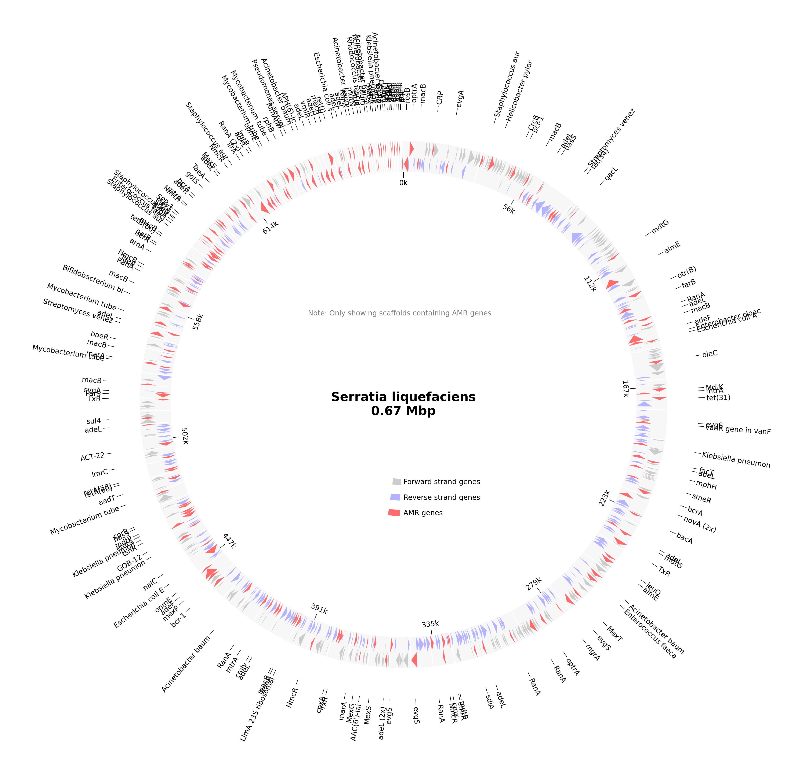

### AAC(6')-Iai
- **Mechanism**: antibiotic inactivation
- **Drug Classes**: aminoglycoside antibiotic
- **AMR Family**: AAC(6')
- **Locations**:
  - gnl|SPADES|FDOHBCDP_787_2 : position 1057-1509

### ACT-22
- **Mechanism**: antibiotic inactivation
- **Drug Classes**: carbapenem; cephalosporin; cephamycin; penam
- **AMR Family**: ACT beta-lactamase
- **Locations**:
  - gnl|SPADES|FDOHBCDP_1308_2 : position 373-1914

### APH(6)-Ic
- **Mechanism**: antibiotic inactivation
- **Drug Classes**: aminoglycoside antibiotic
- **AMR Family**: APH(6)
- **Locations**:
  - gnl|SPADES|FDOHBCDP_2947_1 : position 102-956

### Acinetobacter baumannii AbaF (found in 2 locations)
- **Mechanism**: antibiotic efflux
- **Drug Classes**: phosphonic acid antibiotic
- **AMR Family**: major facilitator superfamily (MFS) antibiotic efflux pump
- **Locations**:
  - gnl|SPADES|FDOHBCDP_2944_2 : position 378-1688
  - gnl|SPADES|FDOHBCDP_898_3 : position 1435-2742

### Acinetobacter baumannii AbaQ (found in 4 locations)
- **Mechanism**: antibiotic efflux
- **Drug Classes**: fluoroquinolone antibiotic
- **AMR Family**: major facilitator superfamily (MFS) antibiotic efflux pump
- **Locations**:
  - gnl|SPADES|FDOHBCDP_4178_1 : position 2-1105
  - gnl|SPADES|FDOHBCDP_5680_2 : position 605-826
  - gnl|SPADES|FDOHBCDP_5878_1 : position 2-796
  - gnl|SPADES|FDOHBCDP_9312_2 : position 203-526

### Acinetobacter baumannii AmvA
- **Mechanism**: antibiotic efflux
- **Drug Classes**: macrolide antibiotic; disinfecting agents and antiseptics
- **AMR Family**: major facilitator superfamily (MFS) antibiotic efflux pump
- **Locations**:
  - gnl|SPADES|FDOHBCDP_603_4 : position 3290-4762

### Bifidobacterium bifidum ileS conferring resistance to mupirocin
- **Mechanism**: antibiotic target alteration
- **Drug Classes**: mupirocin-like antibiotic
- **AMR Family**: antibiotic-resistant isoleucyl-tRNA synthetase (ileS)
- **Locations**:
  - gnl|SPADES|FDOHBCDP_1528_5 : position 3083-4636

### CRP
- **Mechanism**: antibiotic efflux
- **Drug Classes**: macrolide antibiotic; fluoroquinolone antibiotic; penam
- **AMR Family**: resistance-nodulation-cell division (RND) antibiotic efflux pump
- **Locations**:
  - gnl|SPADES|FDOHBCDP_191_16: position 12905-13537

### CrcB
- **Mechanism**: antibiotic efflux
- **Drug Classes**: aminoglycoside antibiotic
- **AMR Family**: multidrug and toxic compound extrusion (MATE) transporter
- **Locations**:
  - gnl|SPADES|FDOHBCDP_250_16 : position 13783-14166

### Enterobacter cloacae acrA
- **Mechanism**: antibiotic efflux
- **Drug Classes**: fluoroquinolone antibiotic; cephalosporin; glycylcycline; penam; tetracycline antibiotic; rifamycin antibiotic; phenicol antibiotic; disinfecting agents and antiseptics
- **AMR Family**: resistance-nodulation-cell division (RND) antibiotic efflux pump
- **Locations**:
  - gnl|SPADES|FDOHBCDP_499_12 : position 9226-10413

### Enterococcus faecalis cls with mutation conferring resistance to daptomycin
- **Mechanism**: antibiotic target alteration
- **Drug Classes**: peptide antibiotic
- **AMR Family**: daptomycin resistant cls
- **Locations**:
  - gnl|SPADES|FDOHBCDP_603_6 : position 5929-7389

### Enterococcus faecium liaS mutant conferring daptomycin resistance
- **Mechanism**: antibiotic target alteration; antibiotic efflux
- **Drug Classes**: peptide antibiotic
- **AMR Family**: daptomycin resistant liaS
- **Locations**:
  - gnl|SPADES|FDOHBCDP_1793_2 : position 1603-3138

### Escherichia coli AcrAB-TolC with AcrR mutation conferring resistance to ciprofloxacin, tetracycline, and ceftazidime
- **Mechanism**: antibiotic target alteration; antibiotic efflux
- **Drug Classes**: fluoroquinolone antibiotic; cephalosporin; glycylcycline; penam; tetracycline antibiotic; rifamycin antibiotic; phenicol antibiotic; disinfecting agents and antiseptics
- **AMR Family**: resistance-nodulation-cell division (RND) antibiotic efflux pump
- **Locations**:
  - gnl|SPADES|FDOHBCDP_499_13 : position 10556-11245

### Escherichia coli EF-Tu mutants conferring resistance to Pulvomycin
- **Mechanism**: antibiotic target alteration
- **Drug Classes**: elfamycin antibiotic
- **AMR Family**: elfamycin resistant EF-Tu
- **Locations**:
  - gnl|SPADES|FDOHBCDP_1019_5 : position 2291-4978

### Escherichia coli soxS with mutation conferring antibiotic resistance
- **Mechanism**: antibiotic target alteration; antibiotic efflux; reduced permeability to antibiotic
- **Drug Classes**: fluoroquinolone antibiotic; monobactam; carbapenem; cephalosporin; glycylcycline; cephamycin; penam; tetracycline antibiotic; rifamycin antibiotic; phenicol antibiotic; penem; disinfecting agents and antiseptics
- **AMR Family**: ATP-binding cassette (ABC) antibiotic efflux pump; major facilitator superfamily (MFS) antibiotic efflux pump; resistance-nodulation-cell division (RND) antibiotic efflux pump; General Bacterial Porin with reduced permeability to beta-lactams
- **Locations**:
  - gnl|SPADES|FDOHBCDP_3297_2 : position 1333-1602

### FosM1
- **Mechanism**: antibiotic inactivation
- **Drug Classes**: phosphonic acid antibiotic
- **AMR Family**: fosfomycin thiol transferase
- **Locations**:
  - gnl|SPADES|FDOHBCDP_250_27 : position 22859-23368

### GOB-12
- **Mechanism**: antibiotic inactivation
- **Drug Classes**: carbapenem; cephalosporin; penam
- **AMR Family**: GOB beta-lactamase
- **Locations**:
  - gnl|SPADES|FDOHBCDP_1138_4 : position 4245-4892

### Helicobacter pylori pbp2 mutants conferring resistance to amoxicillin
- **Mechanism**: antibiotic target alteration
- **Drug Classes**: cephalosporin; cephamycin; penam
- **AMR Family**: Penicillin-binding protein mutations conferring resistance to beta-lactam antibiotics
- **Locations**:
  - gnl|SPADES|FDOHBCDP_250_7 : position 4208-6103

### Klebsiella pneumoniae KpnH
- **Mechanism**: antibiotic efflux
- **Drug Classes**: macrolide antibiotic; fluoroquinolone antibiotic; aminoglycoside antibiotic; carbapenem; cephalosporin; penam; peptide antibiotic; penem
- **AMR Family**: major facilitator superfamily (MFS) antibiotic efflux pump
- **Locations**:
  - gnl|SPADES|FDOHBCDP_1157_4: position 2487-4022

### Klebsiella pneumoniae OmpK37 (found in 3 locations)
- **Mechanism**: reduced permeability to antibiotic
- **Drug Classes**: monobactam; carbapenem; cephalosporin; cephamycin; penam; penem
- **AMR Family**: General Bacterial Porin with reduced permeability to beta-lactams
- **Locations**:
  - gnl|SPADES|FDOHBCDP_1138_2 : position 1614-2738
  - gnl|SPADES|FDOHBCDP_549_4 : position 2433-3530
  - gnl|SPADES|FDOHBCDP_8007_1 : position 2-562

### LlmA 23S ribosomal RNA methyltransferase
- **Mechanism**: antibiotic target alteration
- **Drug Classes**: lincosamide antibiotic
- **AMR Family**: Llm 23S ribosomal RNA methyltransferase
- **Locations**:
  - gnl|SPADES|FDOHBCDP_807_9 : position 7359-8549

### MdtK
- **Mechanism**: antibiotic efflux
- **Drug Classes**: fluoroquinolone antibiotic
- **AMR Family**: multidrug and toxic compound extrusion (MATE) transporter
- **Locations**:
  - gnl|SPADES|FDOHBCDP_523_5 : position 3750-5213

### MexG
- **Mechanism**: antibiotic efflux
- **Drug Classes**: fluoroquinolone antibiotic; tetracycline antibiotic; disinfecting agents and antiseptics
- **AMR Family**: resistance-nodulation-cell division (RND) antibiotic efflux pump
- **Locations**:
  - gnl|SPADES|FDOHBCDP_787_6 : position 3625-4038

### MexS (found in 2 locations)
- **Mechanism**: antibiotic efflux
- **Drug Classes**: fluoroquinolone antibiotic; diaminopyrimidine antibiotic; phenicol antibiotic
- **AMR Family**: resistance-nodulation-cell division (RND) antibiotic efflux pump
- **Locations**:
  - gnl|SPADES|FDOHBCDP_2187_3 : position 1905-2840
  - gnl|SPADES|FDOHBCDP_775_10 : position 6351-7358

### MexT (found in 2 locations)
- **Mechanism**: antibiotic efflux
- **Drug Classes**: fluoroquinolone antibiotic; diaminopyrimidine antibiotic; phenicol antibiotic
- **AMR Family**: resistance-nodulation-cell division (RND) antibiotic efflux pump
- **Locations**:
  - gnl|SPADES|FDOHBCDP_1888_4 : position 1397-2299
  - gnl|SPADES|FDOHBCDP_610_4 : position 3745-4695

### Mycobacterium tuberculosis kasA mutant conferring resistance to isoniazid (found in 2 locations)
- **Mechanism**: antibiotic target alteration
- **Drug Classes**: isoniazid-like antibiotic
- **AMR Family**: antibiotic resistant kasA
- **Locations**:
  - gnl|SPADES|FDOHBCDP_1527_3 : position 1294-2574
  - gnl|SPADES|FDOHBCDP_2682_2 : position 275-1516

### Mycobacterium tuberculosis katG mutations conferring resistance to isoniazid
- **Mechanism**: antibiotic target alteration
- **Drug Classes**: isoniazid-like antibiotic
- **AMR Family**: isoniazid resistant katG
- **Locations**:
  - gnl|SPADES|FDOHBCDP_2651_1 : position 3-839

### Mycobacterium tuberculosis pncA mutations conferring resistance to pyrazinamide
- **Mechanism**: antibiotic target alteration
- **Drug Classes**: pyrazine antibiotic
- **AMR Family**: Pyrazinamide resistant pncA
- **Locations**:
  - gnl|SPADES|FDOHBCDP_1414_4 : position 3085-3771

### Mycobacterium tuberculosis thyA with mutation conferring resistance to para-aminosalicylic acid
- **Mechanism**: antibiotic target alteration
- **Drug Classes**: salicylic acid antibiotic
- **AMR Family**: aminosalicylate resistant thymidylate synthase
- **Locations**:
  - gnl|SPADES|FDOHBCDP_1205_5 : position 4715-5509

### NmcR (found in 5 locations)
- **Mechanism**: antibiotic inactivation
- **Drug Classes**: carbapenem; cephalosporin; cephamycin; penam
- **AMR Family**: NmcA beta-lactamase
- **Locations**:
  - gnl|SPADES|FDOHBCDP_1629_3 : position 911-1813
  - gnl|SPADES|FDOHBCDP_1965_3 : position 2281-3135
  - gnl|SPADES|FDOHBCDP_2188_2 : position 2546-2992
  - gnl|SPADES|FDOHBCDP_745_6 : position 3824-4702
  - gnl|SPADES|FDOHBCDP_803_8 : position 7186-8106

### OprZ
- **Mechanism**: antibiotic efflux
- **Drug Classes**: macrolide antibiotic; fluoroquinolone antibiotic; aminoglycoside antibiotic; cephalosporin
- **AMR Family**: resistance-nodulation-cell division (RND) antibiotic efflux pump
- **Locations**:
  - gnl|SPADES|FDOHBCDP_16109_2 : position 109-342

### ParS
- **Mechanism**: antibiotic efflux; reduced permeability to antibiotic
- **Drug Classes**: macrolide antibiotic; fluoroquinolone antibiotic; monobactam; aminoglycoside antibiotic; carbapenem; cephalosporin; cephamycin; penam; tetracycline antibiotic; phenicol antibiotic; penem; disinfecting agents and antiseptics
- **AMR Family**: resistance-nodulation-cell division (RND) antibiotic efflux pump; Outer Membrane Porin (Opr)
- **Locations**:
  - gnl|SPADES|FDOHBCDP_1367_2 : position 238-2019

### Pseudomonas aeruginosa CpxR
- **Mechanism**: antibiotic efflux
- **Drug Classes**: macrolide antibiotic; fluoroquinolone antibiotic; monobactam; aminoglycoside antibiotic; carbapenem; cephalosporin; cephamycin; penam; tetracycline antibiotic; peptide antibiotic; aminocoumarin antibiotic; diaminopyrimidine antibiotic; sulfonamide antibiotic; phenicol antibiotic; penem
- **AMR Family**: resistance-nodulation-cell division (RND) antibiotic efflux pump
- **Locations**:
  - gnl|SPADES|FDOHBCDP_2816_2 : position 150-890

### QepA2
- **Mechanism**: antibiotic efflux
- **Drug Classes**: fluoroquinolone antibiotic
- **AMR Family**: major facilitator superfamily (MFS) antibiotic efflux pump
- **Locations**:
  - gnl|SPADES|FDOHBCDP_9992_2 : position 146-499

### RanA (found in 11 locations)
- **Mechanism**: antibiotic efflux
- **Drug Classes**: aminoglycoside antibiotic
- **AMR Family**: ATP-binding cassette (ABC) antibiotic efflux pump
- **Locations**:
  - gnl|SPADES|FDOHBCDP_1578_4 : position 2796-3920
  - gnl|SPADES|FDOHBCDP_2429_1 : position 181-1182
  - gnl|SPADES|FDOHBCDP_2429_2 : position 1179-2195
  - gnl|SPADES|FDOHBCDP_3932_2 : position 798-1271
  - gnl|SPADES|FDOHBCDP_496_14 : position 12819-13898
  - gnl|SPADES|FDOHBCDP_626_6 : position 5171-7048
  - gnl|SPADES|FDOHBCDP_641_6 : position 4730-5503
  - gnl|SPADES|FDOHBCDP_745_10 : position 7954-9258
  - gnl|SPADES|FDOHBCDP_817_1 : position 3-560
  - gnl|SPADES|FDOHBCDP_8606_1 : position 2-493
  - gnl|SPADES|FDOHBCDP_888_2 : position 104-1219

### Rhodococcus fascians cmr
- **Mechanism**: antibiotic efflux
- **Drug Classes**: phenicol antibiotic
- **AMR Family**: major facilitator superfamily (MFS) antibiotic efflux pump
- **Locations**:
  - gnl|SPADES|FDOHBCDP_5186_1 : position 2-613

### RlmA(II)
- **Mechanism**: antibiotic target alteration
- **Drug Classes**: macrolide antibiotic; lincosamide antibiotic
- **AMR Family**: non-erm 23S ribosomal RNA methyltransferase (G748)
- **Locations**:
  - gnl|SPADES|FDOHBCDP_2807_3 : position 1139-1960

### SPR-1
- **Mechanism**: antibiotic inactivation
- **Drug Classes**: carbapenem
- **AMR Family**: SPR beta-lactamase
- **Locations**:
  - gnl|SPADES|FDOHBCDP_1888_5 : position 2379-3275

### Staphylococcus aureus FosB
- **Mechanism**: antibiotic inactivation
- **Drug Classes**: phosphonic acid antibiotic
- **AMR Family**: fosfomycin thiol transferase
- **Locations**:
  - gnl|SPADES|FDOHBCDP_1888_1 : position 3-275

### Staphylococcus aureus mupA conferring resistance to mupirocin
- **Mechanism**: antibiotic target alteration
- **Drug Classes**: mupirocin-like antibiotic
- **AMR Family**: antibiotic-resistant isoleucyl-tRNA synthetase (ileS)
- **Locations**:
  - gnl|SPADES|FDOHBCDP_250_1 : position 1-930

### Staphylococcus aureus mupB conferring resistance to mupirocin
- **Mechanism**: antibiotic target alteration
- **Drug Classes**: mupirocin-like antibiotic
- **AMR Family**: antibiotic-resistant isoleucyl-tRNA synthetase (ileS)
- **Locations**:
  - gnl|SPADES|FDOHBCDP_2392_1 : position 229-2682

### Staphylococcus aureus norA
- **Mechanism**: antibiotic efflux
- **Drug Classes**: fluoroquinolone antibiotic
- **AMR Family**: major facilitator superfamily (MFS) antibiotic efflux pump
- **Locations**:
  - gnl|SPADES|FDOHBCDP_1793_1 : position 171-1502

### Streptomyces venezuelae rox (found in 2 locations)
- **Mechanism**: antibiotic inactivation
- **Drug Classes**: rifamycin antibiotic
- **AMR Family**: rifampin monooxygenase
- **Locations**:
  - gnl|SPADES|FDOHBCDP_1515_3 : position 1274-2986
  - gnl|SPADES|FDOHBCDP_456_8 : position 10677-11879

### TaeA (found in 2 locations)
- **Mechanism**: antibiotic efflux
- **Drug Classes**: pleuromutilin antibiotic
- **AMR Family**: ATP-binding cassette (ABC) antibiotic efflux pump
- **Locations**:
  - gnl|SPADES|FDOHBCDP_1629_1 : position 1-252
  - gnl|SPADES|FDOHBCDP_2174_1 : position 2-1051

### TxR (found in 3 locations)
- **Mechanism**: antibiotic efflux
- **Drug Classes**: tetracycline antibiotic
- **AMR Family**: ATP-binding cassette (ABC) antibiotic efflux pump
- **Locations**:
  - gnl|SPADES|FDOHBCDP_1344_5 : position 4492-5301
  - gnl|SPADES|FDOHBCDP_555_12 : position 9890-11860
  - gnl|SPADES|FDOHBCDP_798_5 : position 4103-5515

### YojI
- **Mechanism**: antibiotic efflux
- **Drug Classes**: peptide antibiotic
- **AMR Family**: ATP-binding cassette (ABC) antibiotic efflux pump
- **Locations**:
  - gnl|SPADES|FDOHBCDP_29094_1 : position 1-231

### aadT
- **Mechanism**: antibiotic efflux
- **Drug Classes**: macrolide antibiotic; tetracycline antibiotic; disinfecting agents and antiseptics
- **AMR Family**: major facilitator superfamily (MFS) antibiotic efflux pump
- **Locations**:
  - gnl|SPADES|FDOHBCDP_1215_4 : position 2358-3569

### adeF (found in 2 locations)
- **Mechanism**: antibiotic efflux
- **Drug Classes**: fluoroquinolone antibiotic; tetracycline antibiotic
- **AMR Family**: resistance-nodulation-cell division (RND) antibiotic efflux pump
- **Locations**:
  - gnl|SPADES|FDOHBCDP_1016_3: position 3046-6231
  - gnl|SPADES|FDOHBCDP_499_11: position 6062-9208

### adeH
- **Mechanism**: antibiotic efflux
- **Drug Classes**: fluoroquinolone antibiotic; tetracycline antibiotic
- **AMR Family**: resistance-nodulation-cell division (RND) antibiotic efflux pump
- **Locations**:
  - gnl|SPADES|FDOHBCDP_3040_2 : position 568-1755

### adeL (found in 16 locations)
- **Mechanism**: antibiotic efflux
- **Drug Classes**: fluoroquinolone antibiotic; tetracycline antibiotic
- **AMR Family**: resistance-nodulation-cell division (RND) antibiotic efflux pump
- **Locations**:
  - gnl|SPADES|FDOHBCDP_10585_1 : position 2-373
  - gnl|SPADES|FDOHBCDP_1315_8 : position 4862-5392
  - gnl|SPADES|FDOHBCDP_1515_5 : position 3182-4114
  - gnl|SPADES|FDOHBCDP_2187_2 : position 914-1801
  - gnl|SPADES|FDOHBCDP_2504_1 : position 1-543
  - gnl|SPADES|FDOHBCDP_250_32 : position 27083-27976
  - gnl|SPADES|FDOHBCDP_2961_2 : position 534-1406
  - gnl|SPADES|FDOHBCDP_3340_2 : position 740-1576
  - gnl|SPADES|FDOHBCDP_3466_3 : position 974-1504
  - gnl|SPADES|FDOHBCDP_499_2 : position 295-1227
  - gnl|SPADES|FDOHBCDP_549_11 : position 9791-10705
  - gnl|SPADES|FDOHBCDP_555_7 : position 4473-5372
  - gnl|SPADES|FDOHBCDP_654_9 : position 6767-7699
  - gnl|SPADES|FDOHBCDP_775_2 : position 869-1771
  - gnl|SPADES|FDOHBCDP_775_7 : position 3026-3958
  - gnl|SPADES|FDOHBCDP_877_1 : position 113-1006

### adeN
- **Mechanism**: antibiotic efflux
- **Drug Classes**: macrolide antibiotic; fluoroquinolone antibiotic; lincosamide antibiotic; carbapenem; cephalosporin; tetracycline antibiotic; rifamycin antibiotic; diaminopyrimidine antibiotic; phenicol antibiotic; penem
- **AMR Family**: resistance-nodulation-cell division (RND) antibiotic efflux pump
- **Locations**:
  - gnl|SPADES|FDOHBCDP_1888_2 : position 269-847

### adeR
- **Mechanism**: antibiotic efflux
- **Drug Classes**: glycylcycline; tetracycline antibiotic
- **AMR Family**: resistance-nodulation-cell division (RND) antibiotic efflux pump
- **Locations**:
  - gnl|SPADES|FDOHBCDP_1990_4 : position 2784-3416

### almE (found in 2 locations)
- **Mechanism**: antibiotic target alteration
- **Drug Classes**: peptide antibiotic
- **AMR Family**: polymyxin resistance operon; alm glycyltransferase
- **Locations**:
  - gnl|SPADES|FDOHBCDP_485_7 : position 6465-9560
  - gnl|SPADES|FDOHBCDP_601_6 : position 6833-8524

### arnA
- **Mechanism**: antibiotic target alteration
- **Drug Classes**: peptide antibiotic
- **AMR Family**: pmr phosphoethanolamine transferase
- **Locations**:
  - gnl|SPADES|FDOHBCDP_1682_4 : position 1992-2543

### bacA
- **Mechanism**: antibiotic target alteration
- **Drug Classes**: peptide antibiotic
- **AMR Family**: undecaprenyl pyrophosphate related proteins
- **Locations**:
  - gnl|SPADES|FDOHBCDP_553_8 : position 8906-9730

### baeR
- **Mechanism**: antibiotic efflux
- **Drug Classes**: aminoglycoside antibiotic; aminocoumarin antibiotic
- **AMR Family**: resistance-nodulation-cell division (RND) antibiotic efflux pump
- **Locations**:
  - gnl|SPADES|FDOHBCDP_1512_3 : position 395-1084

### basS (found in 2 locations)
- **Mechanism**: antibiotic target alteration; antibiotic efflux
- **Drug Classes**: peptide antibiotic
- **AMR Family**: pmr phosphoethanolamine transferase
- **Locations**:
  - gnl|SPADES|FDOHBCDP_1180_2 : position 970-2034
  - gnl|SPADES|FDOHBCDP_456_1 : position 1-465

### bcr-1 (found in 2 locations)
- **Mechanism**: antibiotic efflux
- **Drug Classes**: bicyclomycin-like antibiotic
- **AMR Family**: major facilitator superfamily (MFS) antibiotic efflux pump
- **Locations**:
  - gnl|SPADES|FDOHBCDP_250_19 : position 15067-16257
  - gnl|SPADES|FDOHBCDP_985_6 : position 5802-7148

### bcrA (found in 3 locations)
- **Mechanism**: antibiotic efflux
- **Drug Classes**: peptide antibiotic
- **AMR Family**: ATP-binding cassette (ABC) antibiotic efflux pump
- **Locations**:
  - gnl|SPADES|FDOHBCDP_1707_2 : position 626-1381
  - gnl|SPADES|FDOHBCDP_2028_1 : position 1-774
  - gnl|SPADES|FDOHBCDP_550_14 : position 10669-12153

### cmlv (found in 2 locations)
- **Mechanism**: antibiotic inactivation
- **Drug Classes**: phenicol antibiotic
- **AMR Family**: chloramphenicol phosphotransferase
- **Locations**:
  - gnl|SPADES|FDOHBCDP_15228_1 : position 2-358
  - gnl|SPADES|FDOHBCDP_877_2 : position 1217-2401

### cmx
- **Mechanism**: antibiotic efflux
- **Drug Classes**: phenicol antibiotic
- **AMR Family**: major facilitator superfamily (MFS) antibiotic efflux pump
- **Locations**:
  - gnl|SPADES|FDOHBCDP_745_5 : position 2523-3722

### cprR
- **Mechanism**: antibiotic target alteration; antibiotic efflux
- **Drug Classes**: peptide antibiotic
- **AMR Family**: pmr phosphoethanolamine transferase
- **Locations**:
  - gnl|SPADES|FDOHBCDP_1180_3 : position 2031-2693

### cpxA
- **Mechanism**: antibiotic efflux
- **Drug Classes**: aminoglycoside antibiotic; aminocoumarin antibiotic
- **AMR Family**: resistance-nodulation-cell division (RND) antibiotic efflux pump
- **Locations**:
  - gnl|SPADES|FDOHBCDP_798_6 : position 5524-6573

### efpA
- **Mechanism**: antibiotic efflux
- **Drug Classes**: rifamycin antibiotic; isoniazid-like antibiotic
- **AMR Family**: major facilitator superfamily (MFS) antibiotic efflux pump
- **Locations**:
  - gnl|SPADES|FDOHBCDP_4371_2 : position 300-1106

### emrA
- **Mechanism**: antibiotic efflux
- **Drug Classes**: fluoroquinolone antibiotic
- **AMR Family**: major facilitator superfamily (MFS) antibiotic efflux pump
- **Locations**:
  - gnl|SPADES|FDOHBCDP_1157_5 : position 4040-5212

### emrR
- **Mechanism**: antibiotic efflux
- **Drug Classes**: fluoroquinolone antibiotic
- **AMR Family**: major facilitator superfamily (MFS) antibiotic efflux pump
- **Locations**:
  - gnl|SPADES|FDOHBCDP_745_2 : position 628-1149

### evgA (found in 3 locations)
- **Mechanism**: antibiotic efflux
- **Drug Classes**: macrolide antibiotic; fluoroquinolone antibiotic; penam; tetracycline antibiotic
- **AMR Family**: major facilitator superfamily (MFS) antibiotic efflux pump; resistance-nodulation-cell division (RND) antibiotic efflux pump
- **Locations**:
  - gnl|SPADES|FDOHBCDP_1367_3 : position 2016-2648
  - gnl|SPADES|FDOHBCDP_1793_3 : position 3138-3728
  - gnl|SPADES|FDOHBCDP_191_23 : position 20158-20883

### evgS (found in 4 locations)
- **Mechanism**: antibiotic efflux
- **Drug Classes**: macrolide antibiotic; fluoroquinolone antibiotic; penam; tetracycline antibiotic
- **AMR Family**: major facilitator superfamily (MFS) antibiotic efflux pump; resistance-nodulation-cell division (RND) antibiotic efflux pump
- **Locations**:
  - gnl|SPADES|FDOHBCDP_535_5 : position 4599-4988
  - gnl|SPADES|FDOHBCDP_610_9 : position 8223-10007
  - gnl|SPADES|FDOHBCDP_749_5 : position 6644-9208
  - gnl|SPADES|FDOHBCDP_759_9 : position 8041-9129

### facT
- **Mechanism**: antibiotic efflux
- **Drug Classes**: elfamycin antibiotic
- **AMR Family**: major facilitator superfamily (MFS) antibiotic efflux pump
- **Locations**:
  - gnl|SPADES|FDOHBCDP_549_10 : position 8325-9677

### farB
- **Mechanism**: antibiotic efflux
- **Drug Classes**: antibacterial free fatty acids
- **AMR Family**: major facilitator superfamily (MFS) antibiotic efflux pump
- **Locations**:
  - gnl|SPADES|FDOHBCDP_496_10 : position 7195-8637

### golS
- **Mechanism**: antibiotic efflux
- **Drug Classes**: monobactam; carbapenem; cephalosporin; cephamycin; penam; phenicol antibiotic; penem
- **AMR Family**: resistance-nodulation-cell division (RND) antibiotic efflux pump
- **Locations**:
  - gnl|SPADES|FDOHBCDP_2073_3 : position 633-1064

### leuO
- **Mechanism**: antibiotic efflux
- **Drug Classes**: nucleoside antibiotic; disinfecting agents and antiseptics
- **AMR Family**: major facilitator superfamily (MFS) antibiotic efflux pump
- **Locations**:
  - gnl|SPADES|FDOHBCDP_601_5 : position 5313-6260

### lfrA
- **Mechanism**: antibiotic efflux
- **Drug Classes**: fluoroquinolone antibiotic
- **AMR Family**: major facilitator superfamily (MFS) antibiotic efflux pump
- **Locations**:
  - gnl|SPADES|FDOHBCDP_2394_3 : position 1315-2682

### lmrB
- **Mechanism**: antibiotic efflux
- **Drug Classes**: lincosamide antibiotic; nucleoside antibiotic
- **AMR Family**: ATP-binding cassette (ABC) antibiotic efflux pump
- **Locations**:
  - gnl|SPADES|FDOHBCDP_2504_2 : position 650-2032

### lmrC
- **Mechanism**: antibiotic target protection
- **Drug Classes**: lincosamide antibiotic
- **AMR Family**: Miscellaneous ABC-F subfamily ATP-binding cassette ribosomal protection proteins
- **Locations**:
  - gnl|SPADES|FDOHBCDP_1291_2 : position 370-1158

### macA
- **Mechanism**: antibiotic efflux
- **Drug Classes**: macrolide antibiotic
- **AMR Family**: ATP-binding cassette (ABC) antibiotic efflux pump
- **Locations**:
  - gnl|SPADES|FDOHBCDP_17589_1 : position 2-319

### macB (found in 14 locations)
- **Mechanism**: antibiotic efflux
- **Drug Classes**: macrolide antibiotic
- **AMR Family**: ATP-binding cassette (ABC) antibiotic efflux pump
- **Locations**:
  - gnl|SPADES|FDOHBCDP_13188_1 : position 2-397
  - gnl|SPADES|FDOHBCDP_1403_1 : position 3-683
  - gnl|SPADES|FDOHBCDP_1431_4 : position 2590-3294
  - gnl|SPADES|FDOHBCDP_1530_3 : position 2480-4021
  - gnl|SPADES|FDOHBCDP_16109_1 : position 1-105
  - gnl|SPADES|FDOHBCDP_16977_1 : position 3-329
  - gnl|SPADES|FDOHBCDP_1727_2 : position 935-1927
  - gnl|SPADES|FDOHBCDP_17298_1 : position 2-325
  - gnl|SPADES|FDOHBCDP_191_8 : position 6342-7109
  - gnl|SPADES|FDOHBCDP_19752_1 : position 1-291
  - gnl|SPADES|FDOHBCDP_250_26 : position 22001-22828
  - gnl|SPADES|FDOHBCDP_3195_1 : position 3-1700
  - gnl|SPADES|FDOHBCDP_499_6 : position 2893-3615
  - gnl|SPADES|FDOHBCDP_817_2 : position 557-1537

### marA (found in 2 locations)
- **Mechanism**: antibiotic efflux; reduced permeability to antibiotic
- **Drug Classes**: fluoroquinolone antibiotic; monobactam; carbapenem; cephalosporin; glycylcycline; cephamycin; penam; tetracycline antibiotic; rifamycin antibiotic; phenicol antibiotic; penem; disinfecting agents and antiseptics
- **AMR Family**: resistance-nodulation-cell division (RND) antibiotic efflux pump; General Bacterial Porin with reduced permeability to beta-lactams
- **Locations**:
  - gnl|SPADES|FDOHBCDP_1414_5 : position 3934-4896
  - gnl|SPADES|FDOHBCDP_787_11 : position 6319-7326

### mdtG (found in 3 locations)
- **Mechanism**: antibiotic efflux
- **Drug Classes**: phosphonic acid antibiotic
- **AMR Family**: major facilitator superfamily (MFS) antibiotic efflux pump
- **Locations**:
  - gnl|SPADES|FDOHBCDP_22716_1 : position 2-268
  - gnl|SPADES|FDOHBCDP_480_18 : position 13717-14616
  - gnl|SPADES|FDOHBCDP_555_8 : position 5508-6734

### mdtN
- **Mechanism**: antibiotic efflux
- **Drug Classes**: nucleoside antibiotic; disinfecting agents and antiseptics
- **AMR Family**: major facilitator superfamily (MFS) antibiotic efflux pump
- **Locations**:
  - gnl|SPADES|FDOHBCDP_4280_1 : position 94-1134

### mdtP (found in 2 locations)
- **Mechanism**: antibiotic efflux
- **Drug Classes**: nucleoside antibiotic; disinfecting agents and antiseptics
- **AMR Family**: major facilitator superfamily (MFS) antibiotic efflux pump
- **Locations**:
  - gnl|SPADES|FDOHBCDP_1157_6 : position 5238-6095
  - gnl|SPADES|FDOHBCDP_745_1 : position 1-603

### mexP
- **Mechanism**: antibiotic efflux
- **Drug Classes**: macrolide antibiotic; carbapenem; tetracycline antibiotic; diaminopyrimidine antibiotic; phenicol antibiotic; disinfecting agents and antiseptics
- **AMR Family**: resistance-nodulation-cell division (RND) antibiotic efflux pump
- **Locations**:
  - gnl|SPADES|FDOHBCDP_1016_2 : position 1892-3046

### mgrA
- **Mechanism**: antibiotic efflux
- **Drug Classes**: fluoroquinolone antibiotic; cephalosporin; penam; tetracycline antibiotic; peptide antibiotic; disinfecting agents and antiseptics
- **AMR Family**: ATP-binding cassette (ABC) antibiotic efflux pump; major facilitator superfamily (MFS) antibiotic efflux pump
- **Locations**:
  - gnl|SPADES|FDOHBCDP_623_4 : position 2706-3158

### mphH
- **Mechanism**: antibiotic inactivation
- **Drug Classes**: macrolide antibiotic
- **AMR Family**: macrolide phosphotransferase (MPH)
- **Locations**:
  - gnl|SPADES|FDOHBCDP_550_2 : position 563-1474

### mtrA (found in 3 locations)
- **Mechanism**: antibiotic efflux
- **Drug Classes**: macrolide antibiotic; penam
- **AMR Family**: resistance-nodulation-cell division (RND) antibiotic efflux pump
- **Locations**:
  - gnl|SPADES|FDOHBCDP_1965_4 : position 3170-3475
  - gnl|SPADES|FDOHBCDP_523_6 : position 5217-6074
  - gnl|SPADES|FDOHBCDP_877_6 : position 5358-6170

### nalC
- **Mechanism**: antibiotic efflux
- **Drug Classes**: macrolide antibiotic; fluoroquinolone antibiotic; monobactam; carbapenem; cephalosporin; cephamycin; penam; tetracycline antibiotic; peptide antibiotic; aminocoumarin antibiotic; diaminopyrimidine antibiotic; sulfonamide antibiotic; phenicol antibiotic; penem
- **AMR Family**: resistance-nodulation-cell division (RND) antibiotic efflux pump
- **Locations**:
  - gnl|SPADES|FDOHBCDP_1128_2 : position 387-1031

### novA (found in 2 locations)
- **Mechanism**: antibiotic efflux
- **Drug Classes**: aminocoumarin antibiotic
- **AMR Family**: ATP-binding cassette (ABC) antibiotic efflux pump
- **Locations**:
  - gnl|SPADES|FDOHBCDP_553_3 : position 1548-3290
  - gnl|SPADES|FDOHBCDP_553_4 : position 3284-5080

### oleC
- **Mechanism**: antibiotic efflux
- **Drug Classes**: macrolide antibiotic
- **AMR Family**: ATP-binding cassette (ABC) antibiotic efflux pump
- **Locations**:
  - gnl|SPADES|FDOHBCDP_507_7 : position 5510-6826

### opmE (found in 2 locations)
- **Mechanism**: antibiotic efflux
- **Drug Classes**: macrolide antibiotic; carbapenem; tetracycline antibiotic; diaminopyrimidine antibiotic; phenicol antibiotic; disinfecting agents and antiseptics
- **AMR Family**: resistance-nodulation-cell division (RND) antibiotic efflux pump
- **Locations**:
  - gnl|SPADES|FDOHBCDP_1016_4 : position 6228-7031
  - gnl|SPADES|FDOHBCDP_2583_2 : position 1663-2361

### optrA (found in 3 locations)
- **Mechanism**: antibiotic target protection
- **Drug Classes**: oxazolidinone antibiotic; phenicol antibiotic
- **AMR Family**: Miscellaneous ABC-F subfamily ATP-binding cassette ribosomal protection proteins
- **Locations**:
  - gnl|SPADES|FDOHBCDP_191_4 : position 2723-4636
  - gnl|SPADES|FDOHBCDP_626_1 : position 2-1060
  - gnl|SPADES|FDOHBCDP_7191_1 : position 3-329

### otr(B)
- **Mechanism**: antibiotic efflux
- **Drug Classes**: tetracycline antibiotic
- **AMR Family**: major facilitator superfamily (MFS) antibiotic efflux pump
- **Locations**:
  - gnl|SPADES|FDOHBCDP_496_4 : position 2861-4348

### patB
- **Mechanism**: antibiotic efflux
- **Drug Classes**: fluoroquinolone antibiotic
- **AMR Family**: ATP-binding cassette (ABC) antibiotic efflux pump
- **Locations**:
  - gnl|SPADES|FDOHBCDP_1707_3 : position 1390-2166

### qacL
- **Mechanism**: antibiotic efflux
- **Drug Classes**: disinfecting agents and antiseptics
- **AMR Family**: small multidrug resistance (SMR) antibiotic efflux pump
- **Locations**:
  - gnl|SPADES|FDOHBCDP_467_6 : position 3118-3435

### rosB
- **Mechanism**: antibiotic efflux
- **Drug Classes**: peptide antibiotic
- **AMR Family**: major facilitator superfamily (MFS) antibiotic efflux pump
- **Locations**:
  - gnl|SPADES|FDOHBCDP_191_2 : position 227-2035

### rphB
- **Mechanism**: antibiotic inactivation
- **Drug Classes**: rifamycin antibiotic
- **AMR Family**: rifampin phosphotransferase
- **Locations**:
  - gnl|SPADES|FDOHBCDP_2777_1 : position 107-1834

### rpoB2
- **Mechanism**: antibiotic target alteration; antibiotic target replacement
- **Drug Classes**: rifamycin antibiotic
- **AMR Family**: rifamycin-resistant beta-subunit of RNA polymerase (rpoB)
- **Locations**:
  - gnl|SPADES|FDOHBCDP_6904_2 : position 570-677

### sdiA
- **Mechanism**: antibiotic efflux
- **Drug Classes**: fluoroquinolone antibiotic; cephalosporin; glycylcycline; penam; tetracycline antibiotic; rifamycin antibiotic; phenicol antibiotic; disinfecting agents and antiseptics
- **AMR Family**: resistance-nodulation-cell division (RND) antibiotic efflux pump
- **Locations**:
  - gnl|SPADES|FDOHBCDP_700_1 : position 47-784

### smeR
- **Mechanism**: antibiotic efflux
- **Drug Classes**: aminoglycoside antibiotic; cephalosporin; cephamycin; penam
- **AMR Family**: resistance-nodulation-cell division (RND) antibiotic efflux pump
- **Locations**:
  - gnl|SPADES|FDOHBCDP_550_10 : position 5824-6537

### sul4
- **Mechanism**: antibiotic target replacement
- **Drug Classes**: sulfonamide antibiotic
- **AMR Family**: sulfonamide resistant sul
- **Locations**:
  - gnl|SPADES|FDOHBCDP_1328_2 : position 2051-2884

### tet(31)
- **Mechanism**: antibiotic efflux
- **Drug Classes**: tetracycline antibiotic
- **AMR Family**: major facilitator superfamily (MFS) antibiotic efflux pump
- **Locations**:
  - gnl|SPADES|FDOHBCDP_523_9 : position 7668-8924

### tet(54)
- **Mechanism**: antibiotic inactivation
- **Drug Classes**: tetracycline antibiotic
- **AMR Family**: tetracycline inactivation enzyme
- **Locations**:
  - gnl|SPADES|FDOHBCDP_456_9 : position 11966-13144

### tet(J)
- **Mechanism**: antibiotic efflux
- **Drug Classes**: tetracycline antibiotic
- **AMR Family**: major facilitator superfamily (MFS) antibiotic efflux pump
- **Locations**:
  - gnl|SPADES|FDOHBCDP_3225_1 : position 3-1115

### tetA(58)
- **Mechanism**: antibiotic efflux
- **Drug Classes**: tetracycline antibiotic
- **AMR Family**: major facilitator superfamily (MFS) antibiotic efflux pump
- **Locations**:
  - gnl|SPADES|FDOHBCDP_1218_3 : position 914-1789

### tetA(60)
- **Mechanism**: antibiotic efflux
- **Drug Classes**: tetracycline antibiotic
- **AMR Family**: ATP-binding cassette (ABC) antibiotic efflux pump
- **Locations**:
  - gnl|SPADES|FDOHBCDP_1218_2 : position 201-917

### tetB(60)
- **Mechanism**: antibiotic efflux
- **Drug Classes**: tetracycline antibiotic
- **AMR Family**: ATP-binding cassette (ABC) antibiotic efflux pump
- **Locations**:
  - gnl|SPADES|FDOHBCDP_1727_1 : position 121-933

### tsnR
- **Mechanism**: antibiotic target alteration
- **Drug Classes**: peptide antibiotic
- **AMR Family**: non-erm 23S ribosomal RNA methyltransferase (A1067)
- **Locations**:
  - gnl|SPADES|FDOHBCDP_1157_3 : position 1314-2414

### vanR gene in vanF cluster
- **Mechanism**: antibiotic target alteration
- **Drug Classes**: glycopeptide antibiotic
- **AMR Family**: glycopeptide resistance gene cluster; vanR
- **Locations**:
  - gnl|SPADES|FDOHBCDP_535_6 : position 5274-6323

### vmlR
- **Mechanism**: antibiotic target protection
- **Drug Classes**: lincosamide antibiotic; streptogramin antibiotic; streptogramin A antibiotic; streptogramin B antibiotic; nucleoside antibiotic; pleuromutilin antibiotic
- **AMR Family**: Miscellaneous ABC-F subfamily ATP-binding cassette ribosomal protection proteins
- **Locations**:
  - gnl|SPADES|FDOHBCDP_3008_2 : position 459-1868

## Serratia liquefaciens ATCC 27592
**Strain Statistics:**
- Total genome length: 2942.3 kbp
- Total scaffolds: 398
- Scaffolds with AMR genes: 196
- Total genes annotated: 5595
- Total AMR genes: 478
- Unique AMR genes: 209
- Distinct AMR mechanisms: 10
- Distinct AMR families: 74
- Distinct drug classes: 36

**Circos Plot:**

### AAC(3)-Ia
- **Mechanism**: antibiotic inactivation
- **Drug Classes**: aminoglycoside antibiotic
- **AMR Family**: AAC(3)
- **Locations**:
  - gnl|SPADES|FDOHBCDP_188_30 : position 34222-34770

### AAC(3)-Ib/AAC(6')-Ib3 bifunctional protein
- **Mechanism**: antibiotic inactivation
- **Drug Classes**: aminoglycoside antibiotic
- **AMR Family**: aminoglycoside bifunctional resistance protein
- **Locations**:
  - gnl|SPADES|FDOHBCDP_502_5 : position 3115-3567

### AAC(6')-Iak
- **Mechanism**: antibiotic inactivation
- **Drug Classes**: aminoglycoside antibiotic
- **AMR Family**: AAC(6')
- **Locations**:
  - gnl|SPADES|FDOHBCDP_486_16 : position 13291-13737

### AAC(6')-Isa
- **Mechanism**: antibiotic inactivation
- **Drug Classes**: aminoglycoside antibiotic
- **AMR Family**: AAC(6')
- **Locations**:
  - gnl|SPADES|FDOHBCDP_447_5 : position 3712-4296

### AIM-1
- **Mechanism**: antibiotic inactivation
- **Drug Classes**: cephalosporin; cephamycin; penam
- **AMR Family**: AIM beta-lactamase
- **Locations**:
  - gnl|SPADES|FDOHBCDP_483_12 : position 9150-10094

### AQU-2
- **Mechanism**: antibiotic inactivation
- **Drug Classes**: cephalosporin
- **AMR Family**: AQU beta-lactamase
- **Locations**:
  - gnl|SPADES|FDOHBCDP_916_7 : position 5777-6925

### Acinetobacter baumannii AbaF (found in 6 locations)
- **Mechanism**: antibiotic efflux
- **Drug Classes**: phosphonic acid antibiotic
- **AMR Family**: major facilitator superfamily (MFS) antibiotic efflux pump
- **Locations**:
  - gnl|SPADES|FDOHBCDP_1112_5 : position 4423-5733
  - gnl|SPADES|FDOHBCDP_157_44 : position 39811-41130
  - gnl|SPADES|FDOHBCDP_214_23 : position 25004-26326
  - gnl|SPADES|FDOHBCDP_214_9 : position 8052-9284
  - gnl|SPADES|FDOHBCDP_407_3 : position 1182-2564
  - gnl|SPADES|FDOHBCDP_521_10 : position 7204-8529

### Acinetobacter baumannii AbaQ (found in 10 locations)
- **Mechanism**: antibiotic efflux
- **Drug Classes**: fluoroquinolone antibiotic
- **AMR Family**: major facilitator superfamily (MFS) antibiotic efflux pump
- **Locations**:
  - gnl|SPADES|FDOHBCDP_157_6 : position 4416-5729
  - gnl|SPADES|FDOHBCDP_210_18 : position 22233-23540
  - gnl|SPADES|FDOHBCDP_238_10 : position 9178-10446
  - gnl|SPADES|FDOHBCDP_246_20 : position 21056-22369
  - gnl|SPADES|FDOHBCDP_353_18 : position 19060-20460
  - gnl|SPADES|FDOHBCDP_358_1 : position 3-1058
  - gnl|SPADES|FDOHBCDP_370_10 : position 9415-10710
  - gnl|SPADES|FDOHBCDP_377_15 : position 13797-15167
  - gnl|SPADES|FDOHBCDP_491_11 : position 13987-14223
  - gnl|SPADES|FDOHBCDP_698_3 : position 1477-2739

### ArnT
- **Mechanism**: antibiotic target alteration
- **Drug Classes**: peptide antibiotic
- **AMR Family**: pmr phosphoethanolamine transferase
- **Locations**:
  - gnl|SPADES|FDOHBCDP_676_9: position 8244-9908

### CAR-1 (found in 2 locations)
- **Mechanism**: antibiotic inactivation
- **Drug Classes**: carbapenem
- **AMR Family**: CAR beta-lactamase
- **Locations**:
  - gnl|SPADES|FDOHBCDP_341_3 : position 1752-2552
  - gnl|SPADES|FDOHBCDP_750_9 : position 5923-6729

### CAU-1
- **Mechanism**: antibiotic inactivation
- **Drug Classes**: carbapenem; penam
- **AMR Family**: CAU beta-lactamase
- **Locations**:
  - gnl|SPADES|FDOHBCDP_783_3 : position 1092-3215

### CRP
- **Mechanism**: antibiotic efflux
- **Drug Classes**: macrolide antibiotic; fluoroquinolone antibiotic; penam
- **AMR Family**: resistance-nodulation-cell division (RND) antibiotic efflux pump
- **Locations**:
  - gnl|SPADES|FDOHBCDP_652_12 : position 10020-10511

### Clostridioides difficile gyrA conferring resistance to fluoroquinolones
- **Mechanism**: antibiotic target alteration
- **Drug Classes**: fluoroquinolone antibiotic
- **AMR Family**: fluoroquinolone resistant gyrA
- **Locations**:
  - gnl|SPADES|FDOHBCDP_625_1 : position 20-1453

### Clostridioides difficile gyrB conferring resistance to fluoroquinolones (found in 2 locations)
- **Mechanism**: antibiotic target alteration
- **Drug Classes**: fluoroquinolone antibiotic
- **AMR Family**: fluoroquinolone resistant gyrB
- **Locations**:
  - gnl|SPADES|FDOHBCDP_213_22 : position 20577-22472
  - gnl|SPADES|FDOHBCDP_238_22 : position 23117-25531

### DHA-6
- **Mechanism**: antibiotic inactivation
- **Drug Classes**: cephalosporin; cephamycin
- **AMR Family**: DHA beta-lactamase
- **Locations**:
  - gnl|SPADES|FDOHBCDP_377_11 : position 9263-10405

### Enterobacter cloacae acrA
- **Mechanism**: antibiotic efflux
- **Drug Classes**: fluoroquinolone antibiotic; cephalosporin; glycylcycline; penam; tetracycline antibiotic; rifamycin antibiotic; phenicol antibiotic; disinfecting agents and antiseptics
- **AMR Family**: resistance-nodulation-cell division (RND) antibiotic efflux pump
- **Locations**:
  - gnl|SPADES|FDOHBCDP_1386_2 : position 160-1362

### Erm(34)
- **Mechanism**: antibiotic target alteration
- **Drug Classes**: macrolide antibiotic; lincosamide antibiotic; streptogramin antibiotic; streptogramin A antibiotic; streptogramin B antibiotic
- **AMR Family**: Erm 23S ribosomal RNA methyltransferase
- **Locations**:
  - gnl|SPADES|FDOHBCDP_376_16 : position 12888-13514

### Erm(37)
- **Mechanism**: antibiotic target alteration
- **Drug Classes**: macrolide antibiotic; lincosamide antibiotic; streptogramin antibiotic; streptogramin A antibiotic; streptogramin B antibiotic
- **AMR Family**: Erm 23S ribosomal RNA methyltransferase
- **Locations**:
  - gnl|SPADES|FDOHBCDP_390_7 : position 6096-6875

### Escherichia coli AcrAB-TolC with AcrR mutation conferring resistance to ciprofloxacin, tetracycline, and ceftazidime (found in 4 locations)
- **Mechanism**: antibiotic target alteration; antibiotic efflux
- **Drug Classes**: fluoroquinolone antibiotic; cephalosporin; glycylcycline; penam; tetracycline antibiotic; rifamycin antibiotic; phenicol antibiotic; disinfecting agents and antiseptics
- **AMR Family**: resistance-nodulation-cell division (RND) antibiotic efflux pump
- **Locations**:
  - gnl|SPADES|FDOHBCDP_210_5 : position 6592-7296
  - gnl|SPADES|FDOHBCDP_273_7 : position 5198-5779
  - gnl|SPADES|FDOHBCDP_415_17 : position 16120-16707
  - gnl|SPADES|FDOHBCDP_916_5 : position 3980-4582

### Escherichia coli AcrAB-TolC with MarR mutations conferring resistance to ciprofloxacin and tetracycline (found in 2 locations)
- **Mechanism**: antibiotic target alteration; antibiotic efflux
- **Drug Classes**: fluoroquinolone antibiotic; cephalosporin; glycylcycline; penam; tetracycline antibiotic; rifamycin antibiotic; phenicol antibiotic; disinfecting agents and antiseptics
- **AMR Family**: resistance-nodulation-cell division (RND) antibiotic efflux pump
- **Locations**:
  - gnl|SPADES|FDOHBCDP_358_7 : position 5993-6466
  - gnl|SPADES|FDOHBCDP_514_3 : position 2981-3415

### Escherichia coli EF-Tu mutants conferring resistance to Pulvomycin
- **Mechanism**: antibiotic target alteration
- **Drug Classes**: elfamycin antibiotic
- **AMR Family**: elfamycin resistant EF-Tu
- **Locations**:
  - gnl|SPADES|FDOHBCDP_405_8 : position 6941-8788

### Escherichia coli fabI mutations conferring resistance to isoniazid and triclosan (found in 2 locations)
- **Mechanism**: antibiotic target alteration
- **Drug Classes**: disinfecting agents and antiseptics; isoniazid-like antibiotic
- **AMR Family**: antibiotic resistant fabI
- **Locations**:
  - gnl|SPADES|FDOHBCDP_318_3 : position 1756-2511
  - gnl|SPADES|FDOHBCDP_668_11 : position 8278-9024

### Escherichia coli mdfA
- **Mechanism**: antibiotic efflux
- **Drug Classes**: tetracycline antibiotic; phenicol antibiotic; disinfecting agents and antiseptics
- **AMR Family**: major facilitator superfamily (MFS) antibiotic efflux pump
- **Locations**:
  - gnl|SPADES|FDOHBCDP_405_10 : position 9265-10512

### Escherichia coli soxS with mutation conferring antibiotic resistance (found in 8 locations)
- **Mechanism**: antibiotic target alteration; antibiotic efflux; reduced permeability to antibiotic
- **Drug Classes**: fluoroquinolone antibiotic; monobactam; carbapenem; cephalosporin; glycylcycline; cephamycin; penam; tetracycline antibiotic; rifamycin antibiotic; phenicol antibiotic; penem; disinfecting agents and antiseptics
- **AMR Family**: ATP-binding cassette (ABC) antibiotic efflux pump; major facilitator superfamily (MFS) antibiotic efflux pump; resistance-nodulation-cell division (RND) antibiotic efflux pump; General Bacterial Porin with reduced permeability to beta-lactams
- **Locations**:
  - gnl|SPADES|FDOHBCDP_157_20 : position 19559-20404
  - gnl|SPADES|FDOHBCDP_161_33 : position 31555-32424
  - gnl|SPADES|FDOHBCDP_1715_4 : position 3000-3917
  - gnl|SPADES|FDOHBCDP_226_28 : position 27205-28152
  - gnl|SPADES|FDOHBCDP_273_18 : position 17988-18446
  - gnl|SPADES|FDOHBCDP_279_25 : position 20935-21801
  - gnl|SPADES|FDOHBCDP_429_10 : position 11361-12269
  - gnl|SPADES|FDOHBCDP_670_7 : position 4116-4889

### EstT (found in 3 locations)
- **Mechanism**: antibiotic inactivation
- **Drug Classes**: macrolide antibiotic
- **AMR Family**: macrolide esterase
- **Locations**:
  - gnl|SPADES|FDOHBCDP_1014_4 : position 2948-3751
  - gnl|SPADES|FDOHBCDP_241_22 : position 16843-17685
  - gnl|SPADES|FDOHBCDP_780_8 : position 5777-6607

### FosA8
- **Mechanism**: antibiotic inactivation
- **Drug Classes**: phosphonic acid antibiotic
- **AMR Family**: fosfomycin thiol transferase
- **Locations**:
  - gnl|SPADES|FDOHBCDP_604_6: position 4616-5023

### FosC2
- **Mechanism**: antibiotic inactivation
- **Drug Classes**: phosphonic acid antibiotic
- **AMR Family**: fosC phosphotransferase family
- **Locations**:
  - gnl|SPADES|FDOHBCDP_402_13 : position 11350-11757

### FosM2
- **Mechanism**: antibiotic inactivation
- **Drug Classes**: phosphonic acid antibiotic
- **AMR Family**: fosfomycin thiol transferase
- **Locations**:
  - gnl|SPADES|FDOHBCDP_229_10 : position 11878-12288

### H-NS
- **Mechanism**: antibiotic efflux
- **Drug Classes**: macrolide antibiotic; fluoroquinolone antibiotic; cephalosporin; cephamycin; penam; tetracycline antibiotic
- **AMR Family**: major facilitator superfamily (MFS) antibiotic efflux pump; resistance-nodulation-cell division (RND) antibiotic efflux pump
- **Locations**:
  - gnl|SPADES|FDOHBCDP_526_7 : position 9689-10096

### Haemophilus influenzae PBP3 conferring resistance to beta-lactam antibiotics (found in 2 locations)
- **Mechanism**: antibiotic target alteration
- **Drug Classes**: cephalosporin; cephamycin; penam
- **AMR Family**: Penicillin-binding protein mutations conferring resistance to beta-lactam antibiotics
- **Locations**:
  - gnl|SPADES|FDOHBCDP_383_19 : position 15952-17670
  - gnl|SPADES|FDOHBCDP_511_7 : position 7637-9400

### Helicobacter pylori pbp1 mutants conferring resistance to amoxicillin (found in 2 locations)
- **Mechanism**: antibiotic target alteration
- **Drug Classes**: cephalosporin; cephamycin; penam
- **AMR Family**: Penicillin-binding protein mutations conferring resistance to beta-lactam antibiotics
- **Locations**:
  - gnl|SPADES|FDOHBCDP_318_18 : position 19476-21980
  - gnl|SPADES|FDOHBCDP_339_5 : position 2106-4415

### Klebsiella aerogenes Omp36
- **Mechanism**: reduced permeability to antibiotic
- **Drug Classes**: monobactam; carbapenem; cephalosporin; cephamycin; penam; penem
- **AMR Family**: General Bacterial Porin with reduced permeability to beta-lactams
- **Locations**:
  - gnl|SPADES|FDOHBCDP_588_7 : position 10139-11269

### Klebsiella pneumoniae KpnE
- **Mechanism**: antibiotic efflux
- **Drug Classes**: macrolide antibiotic; aminoglycoside antibiotic; cephalosporin; tetracycline antibiotic; peptide antibiotic; rifamycin antibiotic; disinfecting agents and antiseptics
- **AMR Family**: small multidrug resistance (SMR) antibiotic efflux pump
- **Locations**:
  - gnl|SPADES|FDOHBCDP_1199_4 : position 2654-3022

### Klebsiella pneumoniae KpnF
- **Mechanism**: antibiotic efflux
- **Drug Classes**: macrolide antibiotic; aminoglycoside antibiotic; cephalosporin; tetracycline antibiotic; peptide antibiotic; rifamycin antibiotic; disinfecting agents and antiseptics
- **AMR Family**: small multidrug resistance (SMR) antibiotic efflux pump
- **Locations**:
  - gnl|SPADES|FDOHBCDP_1199_3: position 2338-2667

### Klebsiella pneumoniae OmpK37
- **Mechanism**: reduced permeability to antibiotic
- **Drug Classes**: monobactam; carbapenem; cephalosporin; cephamycin; penam; penem
- **AMR Family**: General Bacterial Porin with reduced permeability to beta-lactams
- **Locations**:
  - gnl|SPADES|FDOHBCDP_1752_1 : position 1-582

### LRA-8
- **Mechanism**: antibiotic inactivation
- **Drug Classes**: cephalosporin; penam
- **AMR Family**: subclass B3 LRA beta-lactamase
- **Locations**:
  - gnl|SPADES|FDOHBCDP_310_4 : position 2250-3005

### LpsB
- **Mechanism**: reduced permeability to antibiotic
- **Drug Classes**: peptide antibiotic
- **AMR Family**: Intrinsic peptide antibiotic resistant Lps
- **Locations**:
  - gnl|SPADES|FDOHBCDP_398_15 : position 15726-16823

### LptD
- **Mechanism**: antibiotic efflux
- **Drug Classes**: carbapenem; peptide antibiotic; aminocoumarin antibiotic; rifamycin antibiotic
- **AMR Family**: ATP-binding cassette (ABC) antibiotic efflux pump
- **Locations**:
  - gnl|SPADES|FDOHBCDP_335_14 : position 13281-15644

### MexA
- **Mechanism**: antibiotic efflux
- **Drug Classes**: macrolide antibiotic; fluoroquinolone antibiotic; monobactam; carbapenem; cephalosporin; cephamycin; penam; tetracycline antibiotic; peptide antibiotic; aminocoumarin antibiotic; diaminopyrimidine antibiotic; sulfonamide antibiotic; phenicol antibiotic; penem
- **AMR Family**: resistance-nodulation-cell division (RND) antibiotic efflux pump
- **Locations**:
  - gnl|SPADES|FDOHBCDP_210_3 : position 3740-4882

### MexB
- **Mechanism**: antibiotic efflux
- **Drug Classes**: macrolide antibiotic; fluoroquinolone antibiotic; monobactam; carbapenem; cephalosporin; cephamycin; penam; tetracycline antibiotic; peptide antibiotic; aminocoumarin antibiotic; diaminopyrimidine antibiotic; sulfonamide antibiotic; phenicol antibiotic; penem
- **AMR Family**: resistance-nodulation-cell division (RND) antibiotic efflux pump
- **Locations**:
  - gnl|SPADES|FDOHBCDP_437_14 : position 13246-16230

### MexE
- **Mechanism**: antibiotic efflux
- **Drug Classes**: fluoroquinolone antibiotic; diaminopyrimidine antibiotic; phenicol antibiotic
- **AMR Family**: resistance-nodulation-cell division (RND) antibiotic efflux pump
- **Locations**:
  - gnl|SPADES|FDOHBCDP_514_2 : position 1703-2560

### MexL (found in 2 locations)
- **Mechanism**: antibiotic efflux
- **Drug Classes**: macrolide antibiotic; tetracycline antibiotic; disinfecting agents and antiseptics
- **AMR Family**: resistance-nodulation-cell division (RND) antibiotic efflux pump
- **Locations**:
  - gnl|SPADES|FDOHBCDP_1014_8 : position 6344-6982
  - gnl|SPADES|FDOHBCDP_522_1 : position 3-458

### MexS (found in 9 locations)
- **Mechanism**: antibiotic efflux
- **Drug Classes**: fluoroquinolone antibiotic; diaminopyrimidine antibiotic; phenicol antibiotic
- **AMR Family**: resistance-nodulation-cell division (RND) antibiotic efflux pump
- **Locations**:
  - gnl|SPADES|FDOHBCDP_1449_5 : position 4112-4900
  - gnl|SPADES|FDOHBCDP_167_25 : position 28949-29977
  - gnl|SPADES|FDOHBCDP_288_16 : position 14150-15175
  - gnl|SPADES|FDOHBCDP_288_6 : position 3772-4752
  - gnl|SPADES|FDOHBCDP_407_18 : position 15185-16174
  - gnl|SPADES|FDOHBCDP_432_12 : position 10500-11534
  - gnl|SPADES|FDOHBCDP_454_2 : position 796-1785
  - gnl|SPADES|FDOHBCDP_454_3 : position 1878-2813
  - gnl|SPADES|FDOHBCDP_529_3 : position 1522-2649

### MexT (found in 2 locations)
- **Mechanism**: antibiotic efflux
- **Drug Classes**: fluoroquinolone antibiotic; diaminopyrimidine antibiotic; phenicol antibiotic
- **AMR Family**: resistance-nodulation-cell division (RND) antibiotic efflux pump
- **Locations**:
  - gnl|SPADES|FDOHBCDP_432_10 : position 8780-9709
  - gnl|SPADES|FDOHBCDP_435_11 : position 10232-11128

### MexV
- **Mechanism**: antibiotic efflux
- **Drug Classes**: macrolide antibiotic; fluoroquinolone antibiotic; tetracycline antibiotic; phenicol antibiotic; disinfecting agents and antiseptics
- **AMR Family**: resistance-nodulation-cell division (RND) antibiotic efflux pump
- **Locations**:
  - gnl|SPADES|FDOHBCDP_461_11 : position 12742-14193

### MexZ
- **Mechanism**: antibiotic efflux
- **Drug Classes**: macrolide antibiotic; fluoroquinolone antibiotic; aminoglycoside antibiotic; carbapenem; cephalosporin; cephamycin; penam; tetracycline antibiotic; phenicol antibiotic; disinfecting agents and antiseptics
- **AMR Family**: resistance-nodulation-cell division (RND) antibiotic efflux pump
- **Locations**:
  - gnl|SPADES|FDOHBCDP_422_12 : position 11566-12132

### Mycobacterium tuberculosis gidB mutation conferring resistance to streptomycin
- **Mechanism**: antibiotic target alteration
- **Drug Classes**: aminoglycoside antibiotic
- **AMR Family**: antibiotic resistant gidB
- **Locations**:
  - gnl|SPADES|FDOHBCDP_325_16 : position 18097-18717

### Mycobacterium tuberculosis inhA mutations conferring resistance to isoniazid
- **Mechanism**: antibiotic target alteration
- **Drug Classes**: isoniazid-like antibiotic
- **AMR Family**: isoniazid resistant inhA
- **Locations**:
  - gnl|SPADES|FDOHBCDP_266_1 : position 382-1140

### Mycobacterium tuberculosis kasA mutant conferring resistance to isoniazid (found in 2 locations)
- **Mechanism**: antibiotic target alteration
- **Drug Classes**: isoniazid-like antibiotic
- **AMR Family**: antibiotic resistant kasA
- **Locations**:
  - gnl|SPADES|FDOHBCDP_310_10 : position 8724-9953
  - gnl|SPADES|FDOHBCDP_310_13 : position 11148-12317

### Mycobacterium tuberculosis katG mutations conferring resistance to isoniazid
- **Mechanism**: antibiotic target alteration
- **Drug Classes**: isoniazid-like antibiotic
- **AMR Family**: isoniazid resistant katG
- **Locations**:
  - gnl|SPADES|FDOHBCDP_848_8 : position 6896-8239

### Mycobacterium tuberculosis ndh with mutation conferring resistance to isoniazid
- **Mechanism**: antibiotic target alteration
- **Drug Classes**: isoniazid-like antibiotic
- **AMR Family**: antibiotic resistant ndh
- **Locations**:
  - gnl|SPADES|FDOHBCDP_1262_4 : position 4887-5681

### Mycobacterium tuberculosis pncA mutations conferring resistance to pyrazinamide (found in 2 locations)
- **Mechanism**: antibiotic target alteration
- **Drug Classes**: pyrazine antibiotic
- **AMR Family**: Pyrazinamide resistant pncA
- **Locations**:
  - gnl|SPADES|FDOHBCDP_405_13 : position 12645-13196
  - gnl|SPADES|FDOHBCDP_538_2 : position 1456-2088

### Mycolicibacterium smegmatis ndh with mutation conferring resistance to isoniazid
- **Mechanism**: antibiotic target alteration
- **Drug Classes**: isoniazid-like antibiotic
- **AMR Family**: antibiotic resistant ndh
- **Locations**:
  - gnl|SPADES|FDOHBCDP_311_16 : position 12734-13942

### Neisseria gonorrhoeae pilQ gene conferring resistance to beta-lactam
- **Mechanism**: antibiotic target alteration
- **Drug Classes**: cephalosporin; cephamycin; penam
- **AMR Family**: Penicillin-binding protein mutations conferring resistance to beta-lactam antibiotics
- **Locations**:
  - gnl|SPADES|FDOHBCDP_188_2 : position 394-1635

### NmcR (found in 23 locations)
- **Mechanism**: antibiotic inactivation
- **Drug Classes**: carbapenem; cephalosporin; cephamycin; penam
- **AMR Family**: NmcA beta-lactamase
- **Locations**:
  - gnl|SPADES|FDOHBCDP_1047_8 : position 5400-6329
  - gnl|SPADES|FDOHBCDP_1422_4 : position 2416-3357
  - gnl|SPADES|FDOHBCDP_1442_5 : position 3680-4573
  - gnl|SPADES|FDOHBCDP_210_9 : position 9736-10599
  - gnl|SPADES|FDOHBCDP_213_29 : position 29774-30607
  - gnl|SPADES|FDOHBCDP_214_16 : position 16845-17744
  - gnl|SPADES|FDOHBCDP_214_6 : position 4874-5701
  - gnl|SPADES|FDOHBCDP_2156_2 : position 801-1691
  - gnl|SPADES|FDOHBCDP_218_10 : position 8153-9082
  - gnl|SPADES|FDOHBCDP_226_15 : position 14352-15290
  - gnl|SPADES|FDOHBCDP_226_20 : position 19796-20698
  - gnl|SPADES|FDOHBCDP_241_21 : position 15862-16734
  - gnl|SPADES|FDOHBCDP_339_14 : position 16775-17692
  - gnl|SPADES|FDOHBCDP_372_12 : position 12945-13841
  - gnl|SPADES|FDOHBCDP_450_10 : position 7664-8551
  - gnl|SPADES|FDOHBCDP_454_13 : position 10237-11226
  - gnl|SPADES|FDOHBCDP_500_6 : position 8325-9197
  - gnl|SPADES|FDOHBCDP_529_4 : position 2678-3595
  - gnl|SPADES|FDOHBCDP_608_4 : position 2050-3003
  - gnl|SPADES|FDOHBCDP_730_5 : position 6374-7234
  - gnl|SPADES|FDOHBCDP_769_8 : position 6883-7806
  - gnl|SPADES|FDOHBCDP_913_3 : position 2383-3291
  - gnl|SPADES|FDOHBCDP_927_1 : position 1-333

### OmpA (found in 2 locations)
- **Mechanism**: reduced permeability to antibiotic
- **Drug Classes**: peptide antibiotic
- **AMR Family**: General Bacterial Porin with reduced permeability to peptide antibiotics
- **Locations**:
  - gnl|SPADES|FDOHBCDP_161_26 : position 24796-25293
  - gnl|SPADES|FDOHBCDP_238_6 : position 5340-5999

### OpmH
- **Mechanism**: antibiotic efflux
- **Drug Classes**: disinfecting agents and antiseptics
- **AMR Family**: resistance-nodulation-cell division (RND) antibiotic efflux pump
- **Locations**:
  - gnl|SPADES|FDOHBCDP_871_4 : position 5216-6595

### OprM (found in 2 locations)
- **Mechanism**: antibiotic efflux
- **Drug Classes**: macrolide antibiotic; fluoroquinolone antibiotic; monobactam; aminoglycoside antibiotic; carbapenem; cephalosporin; cephamycin; penam; tetracycline antibiotic; peptide antibiotic; aminocoumarin antibiotic; diaminopyrimidine antibiotic; sulfonamide antibiotic; phenicol antibiotic; penem; disinfecting agents and antiseptics
- **AMR Family**: resistance-nodulation-cell division (RND) antibiotic efflux pump
- **Locations**:
  - gnl|SPADES|FDOHBCDP_210_1 : position 2-583
  - gnl|SPADES|FDOHBCDP_435_1 : position 1-828

### ParR (found in 2 locations)
- **Mechanism**: antibiotic efflux; reduced permeability to antibiotic
- **Drug Classes**: macrolide antibiotic; fluoroquinolone antibiotic; monobactam; aminoglycoside antibiotic; carbapenem; cephalosporin; cephamycin; penam; tetracycline antibiotic; phenicol antibiotic; penem; disinfecting agents and antiseptics
- **AMR Family**: resistance-nodulation-cell division (RND) antibiotic efflux pump; Outer Membrane Porin (Opr)
- **Locations**:
  - gnl|SPADES|FDOHBCDP_188_17 : position 15929-16648
  - gnl|SPADES|FDOHBCDP_652_2 : position 689-1450

### ParS (found in 3 locations)
- **Mechanism**: antibiotic efflux; reduced permeability to antibiotic
- **Drug Classes**: macrolide antibiotic; fluoroquinolone antibiotic; monobactam; aminoglycoside antibiotic; carbapenem; cephalosporin; cephamycin; penam; tetracycline antibiotic; phenicol antibiotic; penem; disinfecting agents and antiseptics
- **AMR Family**: resistance-nodulation-cell division (RND) antibiotic efflux pump; Outer Membrane Porin (Opr)
- **Locations**:
  - gnl|SPADES|FDOHBCDP_1628_5 : position 3759-4331
  - gnl|SPADES|FDOHBCDP_483_14 : position 11911-13509
  - gnl|SPADES|FDOHBCDP_652_1 : position 3-692

### PmrF (found in 2 locations)
- **Mechanism**: antibiotic target alteration
- **Drug Classes**: peptide antibiotic
- **AMR Family**: pmr phosphoethanolamine transferase
- **Locations**:
  - gnl|SPADES|FDOHBCDP_398_10 : position 10265-11248
  - gnl|SPADES|FDOHBCDP_676_6 : position 4383-5363

### Pseudomonas aeruginosa CpxR (found in 4 locations)
- **Mechanism**: antibiotic efflux
- **Drug Classes**: macrolide antibiotic; fluoroquinolone antibiotic; monobactam; aminoglycoside antibiotic; carbapenem; cephalosporin; cephamycin; penam; tetracycline antibiotic; peptide antibiotic; aminocoumarin antibiotic; diaminopyrimidine antibiotic; sulfonamide antibiotic; phenicol antibiotic; penem
- **AMR Family**: resistance-nodulation-cell division (RND) antibiotic efflux pump
- **Locations**:
  - gnl|SPADES|FDOHBCDP_1348_3 : position 1806-2486
  - gnl|SPADES|FDOHBCDP_316_11 : position 8466-9164
  - gnl|SPADES|FDOHBCDP_389_9 : position 8449-9123
  - gnl|SPADES|FDOHBCDP_483_15 : position 13518-14207

### Pseudomonas aeruginosa ampR with mutation conferring resistance to aztreonam (found in 3 locations)
- **Mechanism**: antibiotic target alteration; antibiotic inactivation
- **Drug Classes**: monobactam; carbapenem; cephalosporin
- **AMR Family**: PDC beta-lactamase; ampR transcriptional regulator with mutation conferring resistance to monobactam antibiotics
- **Locations**:
  - gnl|SPADES|FDOHBCDP_224_5 : position 2444-3373
  - gnl|SPADES|FDOHBCDP_780_1 : position 64-1005
  - gnl|SPADES|FDOHBCDP_916_2 : position 487-1362

### QepA2
- **Mechanism**: antibiotic efflux
- **Drug Classes**: fluoroquinolone antibiotic
- **AMR Family**: major facilitator superfamily (MFS) antibiotic efflux pump
- **Locations**:
  - gnl|SPADES|FDOHBCDP_314_13 : position 7930-9336

### QepA4
- **Mechanism**: antibiotic efflux
- **Drug Classes**: fluoroquinolone antibiotic
- **AMR Family**: major facilitator superfamily (MFS) antibiotic efflux pump
- **Locations**:
  - gnl|SPADES|FDOHBCDP_2156_3 : position 1791-3050

### RanA (found in 17 locations)
- **Mechanism**: antibiotic efflux
- **Drug Classes**: aminoglycoside antibiotic
- **AMR Family**: ATP-binding cassette (ABC) antibiotic efflux pump
- **Locations**:
  - gnl|SPADES|FDOHBCDP_1288_6 : position 4728-5528
  - gnl|SPADES|FDOHBCDP_223_13 : position 14257-15249
  - gnl|SPADES|FDOHBCDP_2731_1 : position 1-663
  - gnl|SPADES|FDOHBCDP_280_11 : position 12458-14050
  - gnl|SPADES|FDOHBCDP_282_7 : position 4103-4918
  - gnl|SPADES|FDOHBCDP_341_14 : position 12404-13180
  - gnl|SPADES|FDOHBCDP_375_7 : position 6256-7332
  - gnl|SPADES|FDOHBCDP_378_13 : position 11037-11780
  - gnl|SPADES|FDOHBCDP_383_16 : position 14013-14774
  - gnl|SPADES|FDOHBCDP_420_5 : position 5528-6349
  - gnl|SPADES|FDOHBCDP_463_6 : position 5798-6910
  - gnl|SPADES|FDOHBCDP_522_9 : position 9485-10522
  - gnl|SPADES|FDOHBCDP_525_6 : position 4900-5835
  - gnl|SPADES|FDOHBCDP_608_9 : position 7174-8010
  - gnl|SPADES|FDOHBCDP_784_1 : position 2-442
  - gnl|SPADES|FDOHBCDP_913_7 : position 6296-7009
  - gnl|SPADES|FDOHBCDP_927_8 : position 6796-7587

### RanB
- **Mechanism**: antibiotic efflux
- **Drug Classes**: aminoglycoside antibiotic
- **AMR Family**: ATP-binding cassette (ABC) antibiotic efflux pump
- **Locations**:
  - gnl|SPADES|FDOHBCDP_282_6 : position 3316-4098

### Rhodococcus fascians cmr
- **Mechanism**: antibiotic efflux
- **Drug Classes**: phenicol antibiotic
- **AMR Family**: major facilitator superfamily (MFS) antibiotic efflux pump
- **Locations**:
  - gnl|SPADES|FDOHBCDP_186_13 : position 11462-12889

### Rv1877
- **Mechanism**: antibiotic efflux
- **Drug Classes**: fluoroquinolone antibiotic
- **AMR Family**: major facilitator superfamily (MFS) antibiotic efflux pump
- **Locations**:
  - gnl|SPADES|FDOHBCDP_210_4 : position 5034-6548

### SAT-2
- **Mechanism**: antibiotic inactivation
- **Drug Classes**: nucleoside antibiotic
- **AMR Family**: streptothricin acetyltransferase (SAT)
- **Locations**:
  - gnl|SPADES|FDOHBCDP_422_14 : position 12434-12751

### SAT-3
- **Mechanism**: antibiotic inactivation
- **Drug Classes**: nucleoside antibiotic
- **AMR Family**: streptothricin acetyltransferase (SAT)
- **Locations**:
  - gnl|SPADES|FDOHBCDP_218_23 : position 20155-20697

### SRT-3
- **Mechanism**: antibiotic inactivation
- **Drug Classes**: cephalosporin
- **AMR Family**: SRT beta-lactamase
- **Locations**:
  - gnl|SPADES|FDOHBCDP_916_3 : position 1567-2703

### Salmonella serovars soxS with mutation conferring antibiotic resistance
- **Mechanism**: antibiotic target alteration; antibiotic efflux; reduced permeability to antibiotic
- **Drug Classes**: fluoroquinolone antibiotic; monobactam; carbapenem; cephalosporin; glycylcycline; cephamycin; penam; tetracycline antibiotic; rifamycin antibiotic; phenicol antibiotic; penem; disinfecting agents and antiseptics
- **AMR Family**: ATP-binding cassette (ABC) antibiotic efflux pump; major facilitator superfamily (MFS) antibiotic efflux pump; resistance-nodulation-cell division (RND) antibiotic efflux pump; General Bacterial Porin with reduced permeability to beta-lactams
- **Locations**:
  - gnl|SPADES|FDOHBCDP_604_12 : position 7153-7539

### SatA
- **Mechanism**: antibiotic inactivation
- **Drug Classes**: nucleoside antibiotic
- **AMR Family**: streptothricin acetyltransferase (SAT)
- **Locations**:
  - gnl|SPADES|FDOHBCDP_238_5 : position 4677-5072

### Staphylococcus aureus GlpT with mutation conferring resistance to fosfomycin
- **Mechanism**: antibiotic target alteration
- **Drug Classes**: phosphonic acid antibiotic
- **AMR Family**: antibiotic-resistant GlpT
- **Locations**:
  - gnl|SPADES|FDOHBCDP_321_21 : position 19868-21223

### Staphylococcus aureus fusA with mutation conferring resistance to fusidic acid (found in 2 locations)
- **Mechanism**: antibiotic target alteration
- **Drug Classes**: fusidane antibiotic
- **AMR Family**: antibiotic resistant fusA
- **Locations**:
  - gnl|SPADES|FDOHBCDP_161_6 : position 4573-6162
  - gnl|SPADES|FDOHBCDP_522_8 : position 7107-9212

### Staphylococcus aureus mupA conferring resistance to mupirocin
- **Mechanism**: antibiotic target alteration
- **Drug Classes**: mupirocin-like antibiotic
- **AMR Family**: antibiotic-resistant isoleucyl-tRNA synthetase (ileS)
- **Locations**:
  - gnl|SPADES|FDOHBCDP_353_7 : position 6223-9039

### Staphylococcus aureus murA with mutation conferring resistance to fosfomycin
- **Mechanism**: antibiotic target alteration
- **Drug Classes**: phosphonic acid antibiotic
- **AMR Family**: antibiotic-resistant murA transferase
- **Locations**:
  - gnl|SPADES|FDOHBCDP_282_1 : position 104-1363

### Staphylococcus aureus norA
- **Mechanism**: antibiotic efflux
- **Drug Classes**: fluoroquinolone antibiotic
- **AMR Family**: major facilitator superfamily (MFS) antibiotic efflux pump
- **Locations**:
  - gnl|SPADES|FDOHBCDP_1362_5 : position 3548-4894

### Staphylococcus aureus pgsA mutations conferring resistance to daptomycin
- **Mechanism**: antibiotic target alteration
- **Drug Classes**: peptide antibiotic
- **AMR Family**: daptomycin resistant pgsA
- **Locations**:
  - gnl|SPADES|FDOHBCDP_157_33 : position 30444-30992

### Streptococcus pneumoniae PBP2x conferring resistance to amoxicillin
- **Mechanism**: antibiotic target alteration
- **Drug Classes**: cephalosporin; cephamycin; penam
- **AMR Family**: Penicillin-binding protein mutations conferring resistance to beta-lactam antibiotics
- **Locations**:
  - gnl|SPADES|FDOHBCDP_188_7 : position 3997-6555

### Streptomyces rimosus otr(A)
- **Mechanism**: antibiotic target protection
- **Drug Classes**: tetracycline antibiotic
- **AMR Family**: tetracycline-resistant ribosomal protection protein
- **Locations**:
  - gnl|SPADES|FDOHBCDP_303_20 : position 16945-18744

### Streptomyces venezuelae rox
- **Mechanism**: antibiotic inactivation
- **Drug Classes**: rifamycin antibiotic
- **AMR Family**: rifampin monooxygenase
- **Locations**:
  - gnl|SPADES|FDOHBCDP_703_1 : position 370-1503

### TaeA
- **Mechanism**: antibiotic efflux
- **Drug Classes**: pleuromutilin antibiotic
- **AMR Family**: ATP-binding cassette (ABC) antibiotic efflux pump
- **Locations**:
  - gnl|SPADES|FDOHBCDP_161_25 : position 22988-24655

### TolC
- **Mechanism**: antibiotic efflux
- **Drug Classes**: macrolide antibiotic; fluoroquinolone antibiotic; aminoglycoside antibiotic; carbapenem; cephalosporin; glycylcycline; cephamycin; penam; tetracycline antibiotic; peptide antibiotic; aminocoumarin antibiotic; rifamycin antibiotic; phenicol antibiotic; penem; disinfecting agents and antiseptics
- **AMR Family**: ATP-binding cassette (ABC) antibiotic efflux pump; major facilitator superfamily (MFS) antibiotic efflux pump; resistance-nodulation-cell division (RND) antibiotic efflux pump
- **Locations**:
  - gnl|SPADES|FDOHBCDP_213_17 : position 16244-17746

### TriA
- **Mechanism**: antibiotic efflux
- **Drug Classes**: disinfecting agents and antiseptics
- **AMR Family**: resistance-nodulation-cell division (RND) antibiotic efflux pump
- **Locations**:
  - gnl|SPADES|FDOHBCDP_302_21 : position 17921-18892

### TxR (found in 8 locations)
- **Mechanism**: antibiotic efflux
- **Drug Classes**: tetracycline antibiotic
- **AMR Family**: ATP-binding cassette (ABC) antibiotic efflux pump
- **Locations**:
  - gnl|SPADES|FDOHBCDP_1009_3 : position 1378-3444
  - gnl|SPADES|FDOHBCDP_1187_1 : position 1-1029
  - gnl|SPADES|FDOHBCDP_1187_8 : position 5754-5960
  - gnl|SPADES|FDOHBCDP_1341_1 : position 1-567
  - gnl|SPADES|FDOHBCDP_1427_2 : position 406-2196
  - gnl|SPADES|FDOHBCDP_203_13 : position 16280-17617
  - gnl|SPADES|FDOHBCDP_213_15 : position 12854-14800
  - gnl|SPADES|FDOHBCDP_767_4 : position 4074-5960

### VIM-69
- **Mechanism**: antibiotic inactivation
- **Drug Classes**: carbapenem; cephalosporin; cephamycin; penam; penem
- **AMR Family**: VIM beta-lactamase
- **Locations**:
  - gnl|SPADES|FDOHBCDP_452_13 : position 11540-12424

### YajC
- **Mechanism**: antibiotic efflux
- **Drug Classes**: fluoroquinolone antibiotic; cephalosporin; glycylcycline; penam; tetracycline antibiotic; oxazolidinone antibiotic; glycopeptide antibiotic; rifamycin antibiotic; phenicol antibiotic; disinfecting agents and antiseptics
- **AMR Family**: resistance-nodulation-cell division (RND) antibiotic efflux pump
- **Locations**:
  - gnl|SPADES|FDOHBCDP_212_25 : position 26050-26382

### YojI (found in 2 locations)
- **Mechanism**: antibiotic efflux
- **Drug Classes**: peptide antibiotic
- **AMR Family**: ATP-binding cassette (ABC) antibiotic efflux pump
- **Locations**:
  - gnl|SPADES|FDOHBCDP_246_1 : position 2-358
  - gnl|SPADES|FDOHBCDP_452_1 : position 3-1088

### aac(6')-Ib-cr11
- **Mechanism**: antibiotic inactivation
- **Drug Classes**: fluoroquinolone antibiotic; aminoglycoside antibiotic
- **AMR Family**: AAC(6'); AAC(6')-Ib-cr
- **Locations**:
  - gnl|SPADES|FDOHBCDP_186_23 : position 25811-26329

### abeM
- **Mechanism**: antibiotic efflux
- **Drug Classes**: fluoroquinolone antibiotic; disinfecting agents and antiseptics
- **AMR Family**: multidrug and toxic compound extrusion (MATE) transporter
- **Locations**:
  - gnl|SPADES|FDOHBCDP_407_9 : position 8245-9609

### acrB
- **Mechanism**: antibiotic efflux
- **Drug Classes**: fluoroquinolone antibiotic; cephalosporin; glycylcycline; penam; tetracycline antibiotic; rifamycin antibiotic; phenicol antibiotic; disinfecting agents and antiseptics
- **AMR Family**: resistance-nodulation-cell division (RND) antibiotic efflux pump
- **Locations**:
  - gnl|SPADES|FDOHBCDP_210_2 : position 585-3737

### acrD (found in 3 locations)
- **Mechanism**: antibiotic efflux
- **Drug Classes**: aminoglycoside antibiotic
- **AMR Family**: resistance-nodulation-cell division (RND) antibiotic efflux pump
- **Locations**:
  - gnl|SPADES|FDOHBCDP_426_1 : position 2-1102
  - gnl|SPADES|FDOHBCDP_426_2 : position 1102-1518
  - gnl|SPADES|FDOHBCDP_777_9 : position 7672-8874

### adeF
- **Mechanism**: antibiotic efflux
- **Drug Classes**: fluoroquinolone antibiotic; tetracycline antibiotic
- **AMR Family**: resistance-nodulation-cell division (RND) antibiotic efflux pump
- **Locations**:
  - gnl|SPADES|FDOHBCDP_1262_1: position 3-2984

### adeL (found in 35 locations)
- **Mechanism**: antibiotic efflux
- **Drug Classes**: fluoroquinolone antibiotic; tetracycline antibiotic
- **AMR Family**: resistance-nodulation-cell division (RND) antibiotic efflux pump
- **Locations**:
  - gnl|SPADES|FDOHBCDP_1079_2 : position 708-1616
  - gnl|SPADES|FDOHBCDP_1103_1 : position 2-724
  - gnl|SPADES|FDOHBCDP_1264_2 : position 233-1120
  - gnl|SPADES|FDOHBCDP_1449_2 : position 878-1765
  - gnl|SPADES|FDOHBCDP_161_1 : position 121-1065
  - gnl|SPADES|FDOHBCDP_161_24 : position 22046-22957
  - gnl|SPADES|FDOHBCDP_167_24 : position 27920-28840
  - gnl|SPADES|FDOHBCDP_203_16 : position 20109-21032
  - gnl|SPADES|FDOHBCDP_213_23 : position 22553-23449
  - gnl|SPADES|FDOHBCDP_241_12 : position 8012-8920
  - gnl|SPADES|FDOHBCDP_246_10 : position 9033-9929
  - gnl|SPADES|FDOHBCDP_246_2 : position 512-1432
  - gnl|SPADES|FDOHBCDP_246_5 : position 4565-5509
  - gnl|SPADES|FDOHBCDP_266_19 : position 23145-24230
  - gnl|SPADES|FDOHBCDP_288_12 : position 9382-10317
  - gnl|SPADES|FDOHBCDP_288_5 : position 2761-3651
  - gnl|SPADES|FDOHBCDP_310_8 : position 6845-7732
  - gnl|SPADES|FDOHBCDP_353_11 : position 11262-12185
  - gnl|SPADES|FDOHBCDP_360_3 : position 1323-2225
  - gnl|SPADES|FDOHBCDP_360_9 : position 7460-8377
  - gnl|SPADES|FDOHBCDP_373_11 : position 11084-12001
  - gnl|SPADES|FDOHBCDP_402_19 : position 17185-17859
  - gnl|SPADES|FDOHBCDP_402_6 : position 5729-6637
  - gnl|SPADES|FDOHBCDP_420_11 : position 13184-14155
  - gnl|SPADES|FDOHBCDP_452_14 : position 12533-13441
  - gnl|SPADES|FDOHBCDP_454_4 : position 2898-3797
  - gnl|SPADES|FDOHBCDP_483_11 : position 8251-9144
  - gnl|SPADES|FDOHBCDP_532_7 : position 6334-7284
  - gnl|SPADES|FDOHBCDP_645_8 : position 6894-7805
  - gnl|SPADES|FDOHBCDP_668_9 : position 6636-7547
  - gnl|SPADES|FDOHBCDP_795_9 : position 7238-8158
  - gnl|SPADES|FDOHBCDP_879_9 : position 6929-7846
  - gnl|SPADES|FDOHBCDP_903_9 : position 7537-7764
  - gnl|SPADES|FDOHBCDP_916_6 : position 4746-5675
  - gnl|SPADES|FDOHBCDP_9226_1 : position 199-528

### almE (found in 4 locations)
- **Mechanism**: antibiotic target alteration
- **Drug Classes**: peptide antibiotic
- **AMR Family**: polymyxin resistance operon; alm glycyltransferase
- **Locations**:
  - gnl|SPADES|FDOHBCDP_1271_4 : position 2533-4239
  - gnl|SPADES|FDOHBCDP_266_11 : position 10377-14321
  - gnl|SPADES|FDOHBCDP_266_3 : position 1998-2480
  - gnl|SPADES|FDOHBCDP_501_8 : position 10692-13673

### arlR (found in 3 locations)
- **Mechanism**: antibiotic efflux
- **Drug Classes**: fluoroquinolone antibiotic; disinfecting agents and antiseptics
- **AMR Family**: major facilitator superfamily (MFS) antibiotic efflux pump
- **Locations**:
  - gnl|SPADES|FDOHBCDP_1386_3 : position 1651-2358
  - gnl|SPADES|FDOHBCDP_1824_3 : position 1226-1897
  - gnl|SPADES|FDOHBCDP_273_1 : position 1-216

### arnA (found in 2 locations)
- **Mechanism**: antibiotic target alteration
- **Drug Classes**: peptide antibiotic
- **AMR Family**: pmr phosphoethanolamine transferase
- **Locations**:
  - gnl|SPADES|FDOHBCDP_311_4 : position 2987-3625
  - gnl|SPADES|FDOHBCDP_676_7 : position 5360-7345

### baeR (found in 2 locations)
- **Mechanism**: antibiotic efflux
- **Drug Classes**: aminoglycoside antibiotic; aminocoumarin antibiotic
- **AMR Family**: resistance-nodulation-cell division (RND) antibiotic efflux pump
- **Locations**:
  - gnl|SPADES|FDOHBCDP_155_8 : position 12106-12822
  - gnl|SPADES|FDOHBCDP_521_17 : position 12734-13135

### baeS (found in 4 locations)
- **Mechanism**: antibiotic efflux
- **Drug Classes**: aminoglycoside antibiotic; aminocoumarin antibiotic
- **AMR Family**: resistance-nodulation-cell division (RND) antibiotic efflux pump
- **Locations**:
  - gnl|SPADES|FDOHBCDP_1386_4 : position 2358-3827
  - gnl|SPADES|FDOHBCDP_155_7 : position 10724-12106
  - gnl|SPADES|FDOHBCDP_203_11 : position 13972-15408
  - gnl|SPADES|FDOHBCDP_613_1 : position 1-1254

### basS (found in 4 locations)
- **Mechanism**: antibiotic target alteration; antibiotic efflux
- **Drug Classes**: peptide antibiotic
- **AMR Family**: pmr phosphoethanolamine transferase
- **Locations**:
  - gnl|SPADES|FDOHBCDP_1313_5 : position 3680-5098
  - gnl|SPADES|FDOHBCDP_326_16 : position 12649-14007
  - gnl|SPADES|FDOHBCDP_389_8 : position 7044-8462
  - gnl|SPADES|FDOHBCDP_521_1 : position 1-951

### bcr-1 (found in 6 locations)
- **Mechanism**: antibiotic efflux
- **Drug Classes**: bicyclomycin-like antibiotic
- **AMR Family**: major facilitator superfamily (MFS) antibiotic efflux pump
- **Locations**:
  - gnl|SPADES|FDOHBCDP_238_2 : position 530-1870
  - gnl|SPADES|FDOHBCDP_280_13 : position 15008-16216
  - gnl|SPADES|FDOHBCDP_316_21 : position 17240-18424
  - gnl|SPADES|FDOHBCDP_402_5 : position 4394-5605
  - gnl|SPADES|FDOHBCDP_433_5 : position 4154-5350
  - gnl|SPADES|FDOHBCDP_473_11 : position 13207-14355

### bcrA (found in 7 locations)
- **Mechanism**: antibiotic efflux
- **Drug Classes**: peptide antibiotic
- **AMR Family**: ATP-binding cassette (ABC) antibiotic efflux pump
- **Locations**:
  - gnl|SPADES|FDOHBCDP_224_8 : position 5747-6379
  - gnl|SPADES|FDOHBCDP_229_19 : position 21014-22513
  - gnl|SPADES|FDOHBCDP_232_18 : position 16934-18001
  - gnl|SPADES|FDOHBCDP_384_10 : position 12000-13538
  - gnl|SPADES|FDOHBCDP_409_4 : position 2654-3601
  - gnl|SPADES|FDOHBCDP_4383_1 : position 3-245
  - gnl|SPADES|FDOHBCDP_529_10 : position 9491-10999

### catB10 (found in 2 locations)
- **Mechanism**: antibiotic inactivation
- **Drug Classes**: phenicol antibiotic
- **AMR Family**: chloramphenicol acetyltransferase (CAT)
- **Locations**:
  - gnl|SPADES|FDOHBCDP_302_6 : position 3969-4571
  - gnl|SPADES|FDOHBCDP_389_14 : position 12961-13590

### clbB
- **Mechanism**: antibiotic target alteration
- **Drug Classes**: lincosamide antibiotic; streptogramin antibiotic; streptogramin A antibiotic; oxazolidinone antibiotic; phenicol antibiotic; pleuromutilin antibiotic
- **AMR Family**: Cfr 23S ribosomal RNA methyltransferase
- **Locations**:
  - gnl|SPADES|FDOHBCDP_392_16 : position 13864-15060

### cmlv (found in 5 locations)
- **Mechanism**: antibiotic inactivation
- **Drug Classes**: phenicol antibiotic
- **AMR Family**: chloramphenicol phosphotransferase
- **Locations**:
  - gnl|SPADES|FDOHBCDP_157_9 : position 7252-8424
  - gnl|SPADES|FDOHBCDP_310_7 : position 5563-6738
  - gnl|SPADES|FDOHBCDP_452_15 : position 13759-14913
  - gnl|SPADES|FDOHBCDP_848_5 : position 3965-5155
  - gnl|SPADES|FDOHBCDP_916_4 : position 2749-3903

### cprR (found in 2 locations)
- **Mechanism**: antibiotic target alteration; antibiotic efflux
- **Drug Classes**: peptide antibiotic
- **AMR Family**: pmr phosphoethanolamine transferase
- **Locations**:
  - gnl|SPADES|FDOHBCDP_326_15 : position 11990-12652
  - gnl|SPADES|FDOHBCDP_521_2 : position 948-1616

### cpxA (found in 6 locations)
- **Mechanism**: antibiotic efflux
- **Drug Classes**: aminoglycoside antibiotic; aminocoumarin antibiotic
- **AMR Family**: resistance-nodulation-cell division (RND) antibiotic efflux pump
- **Locations**:
  - gnl|SPADES|FDOHBCDP_1348_2 : position 484-1806
  - gnl|SPADES|FDOHBCDP_188_16 : position 14562-15932
  - gnl|SPADES|FDOHBCDP_218_34 : position 29551-30876
  - gnl|SPADES|FDOHBCDP_316_10 : position 7096-8469
  - gnl|SPADES|FDOHBCDP_415_7 : position 5558-8170
  - gnl|SPADES|FDOHBCDP_502_11 : position 10333-11799

### dfrA3
- **Mechanism**: antibiotic target replacement
- **Drug Classes**: diaminopyrimidine antibiotic
- **AMR Family**: trimethoprim resistant dihydrofolate reductase dfr
- **Locations**:
  - gnl|SPADES|FDOHBCDP_335_7 : position 6277-6759

### efrB
- **Mechanism**: antibiotic efflux
- **Drug Classes**: macrolide antibiotic; fluoroquinolone antibiotic; rifamycin antibiotic
- **AMR Family**: ATP-binding cassette (ABC) antibiotic efflux pump
- **Locations**:
  - gnl|SPADES|FDOHBCDP_871_2 : position 2061-3827

### emeA
- **Mechanism**: antibiotic efflux
- **Drug Classes**: disinfecting agents and antiseptics
- **AMR Family**: multidrug and toxic compound extrusion (MATE) transporter
- **Locations**:
  - gnl|SPADES|FDOHBCDP_288_14 : position 11526-12884

### emrA
- **Mechanism**: antibiotic efflux
- **Drug Classes**: fluoroquinolone antibiotic
- **AMR Family**: major facilitator superfamily (MFS) antibiotic efflux pump
- **Locations**:
  - gnl|SPADES|FDOHBCDP_226_7 : position 6659-7687

### emrB
- **Mechanism**: antibiotic efflux
- **Drug Classes**: fluoroquinolone antibiotic
- **AMR Family**: major facilitator superfamily (MFS) antibiotic efflux pump
- **Locations**:
  - gnl|SPADES|FDOHBCDP_325_2 : position 887-2302

### emrR
- **Mechanism**: antibiotic efflux
- **Drug Classes**: fluoroquinolone antibiotic
- **AMR Family**: major facilitator superfamily (MFS) antibiotic efflux pump
- **Locations**:
  - gnl|SPADES|FDOHBCDP_295_4 : position 4688-5236

### emrY (found in 2 locations)
- **Mechanism**: antibiotic efflux
- **Drug Classes**: tetracycline antibiotic
- **AMR Family**: major facilitator superfamily (MFS) antibiotic efflux pump
- **Locations**:
  - gnl|SPADES|FDOHBCDP_155_6 : position 9294-10724
  - gnl|SPADES|FDOHBCDP_226_8 : position 7690-9294

### eptA
- **Mechanism**: antibiotic target alteration
- **Drug Classes**: peptide antibiotic
- **AMR Family**: pmr phosphoethanolamine transferase
- **Locations**:
  - gnl|SPADES|FDOHBCDP_402_17 : position 14613-16250

### eptB (found in 2 locations)
- **Mechanism**: antibiotic target alteration
- **Drug Classes**: peptide antibiotic
- **AMR Family**: pmr phosphoethanolamine transferase
- **Locations**:
  - gnl|SPADES|FDOHBCDP_157_42 : position 37696-39348
  - gnl|SPADES|FDOHBCDP_1645_1 : position 233-1927

### erm(45)
- **Mechanism**: antibiotic target alteration
- **Drug Classes**: macrolide antibiotic; lincosamide antibiotic; streptogramin antibiotic; streptogramin B antibiotic
- **AMR Family**: Erm 23S ribosomal RNA methyltransferase
- **Locations**:
  - gnl|SPADES|FDOHBCDP_335_11 : position 10127-10945

### evgA (found in 7 locations)
- **Mechanism**: antibiotic efflux
- **Drug Classes**: macrolide antibiotic; fluoroquinolone antibiotic; penam; tetracycline antibiotic
- **AMR Family**: major facilitator superfamily (MFS) antibiotic efflux pump; resistance-nodulation-cell division (RND) antibiotic efflux pump
- **Locations**:
  - gnl|SPADES|FDOHBCDP_157_31 : position 27904-28560
  - gnl|SPADES|FDOHBCDP_212_22 : position 22520-23119
  - gnl|SPADES|FDOHBCDP_218_33 : position 28931-29551
  - gnl|SPADES|FDOHBCDP_246_17 : position 14132-14758
  - gnl|SPADES|FDOHBCDP_410_14 : position 16792-17313
  - gnl|SPADES|FDOHBCDP_777_7 : position 6454-7086
  - gnl|SPADES|FDOHBCDP_968_5 : position 6419-7024

### evgS (found in 8 locations)
- **Mechanism**: antibiotic efflux
- **Drug Classes**: macrolide antibiotic; fluoroquinolone antibiotic; penam; tetracycline antibiotic
- **AMR Family**: major facilitator superfamily (MFS) antibiotic efflux pump; resistance-nodulation-cell division (RND) antibiotic efflux pump
- **Locations**:
  - gnl|SPADES|FDOHBCDP_1840_3 : position 2492-3748
  - gnl|SPADES|FDOHBCDP_212_21 : position 20788-22542
  - gnl|SPADES|FDOHBCDP_246_18 : position 15448-19827
  - gnl|SPADES|FDOHBCDP_486_14 : position 11533-12825
  - gnl|SPADES|FDOHBCDP_524_7 : position 7131-9872
  - gnl|SPADES|FDOHBCDP_588_2 : position 1583-4384
  - gnl|SPADES|FDOHBCDP_588_4 : position 5078-7780
  - gnl|SPADES|FDOHBCDP_968_4 : position 3207-6422

### facT (found in 3 locations)
- **Mechanism**: antibiotic efflux
- **Drug Classes**: elfamycin antibiotic
- **AMR Family**: major facilitator superfamily (MFS) antibiotic efflux pump
- **Locations**:
  - gnl|SPADES|FDOHBCDP_1573_1 : position 40-1464
  - gnl|SPADES|FDOHBCDP_187_13 : position 8094-9392
  - gnl|SPADES|FDOHBCDP_383_9 : position 7157-8041

### farA
- **Mechanism**: antibiotic efflux
- **Drug Classes**: antibacterial free fatty acids
- **AMR Family**: major facilitator superfamily (MFS) antibiotic efflux pump
- **Locations**:
  - gnl|SPADES|FDOHBCDP_645_6 : position 5307-6242

### floR
- **Mechanism**: antibiotic efflux
- **Drug Classes**: phenicol antibiotic
- **AMR Family**: major facilitator superfamily (MFS) antibiotic efflux pump
- **Locations**:
  - gnl|SPADES|FDOHBCDP_966_4 : position 4334-5527

### gadW
- **Mechanism**: antibiotic efflux
- **Drug Classes**: macrolide antibiotic; fluoroquinolone antibiotic; penam
- **AMR Family**: resistance-nodulation-cell division (RND) antibiotic efflux pump
- **Locations**:
  - gnl|SPADES|FDOHBCDP_505_5 : position 3866-4732

### golS (found in 4 locations)
- **Mechanism**: antibiotic efflux
- **Drug Classes**: monobactam; carbapenem; cephalosporin; cephamycin; penam; phenicol antibiotic; penem
- **AMR Family**: resistance-nodulation-cell division (RND) antibiotic efflux pump
- **Locations**:
  - gnl|SPADES|FDOHBCDP_218_28 : position 25115-26140
  - gnl|SPADES|FDOHBCDP_314_22 : position 18235-18636
  - gnl|SPADES|FDOHBCDP_780_5 : position 4027-4425
  - gnl|SPADES|FDOHBCDP_941_3 : position 1431-1931

### hmrM
- **Mechanism**: antibiotic efflux
- **Drug Classes**: fluoroquinolone antibiotic; disinfecting agents and antiseptics
- **AMR Family**: multidrug and toxic compound extrusion (MATE) transporter
- **Locations**:
  - gnl|SPADES|FDOHBCDP_402_1 : position 241-1617

### hp1181
- **Mechanism**: antibiotic efflux
- **Drug Classes**: fluoroquinolone antibiotic; tetracycline antibiotic; nitroimidazole antibiotic
- **AMR Family**: major facilitator superfamily (MFS) antibiotic efflux pump
- **Locations**:
  - gnl|SPADES|FDOHBCDP_212_2 : position 1229-2593

### iri
- **Mechanism**: antibiotic inactivation
- **Drug Classes**: rifamycin antibiotic
- **AMR Family**: rifampin monooxygenase
- **Locations**:
  - gnl|SPADES|FDOHBCDP_385_8 : position 4492-5706

### kdpD
- **Mechanism**: antibiotic efflux
- **Drug Classes**: aminoglycoside antibiotic
- **AMR Family**: kdpDE
- **Locations**:
  - gnl|SPADES|FDOHBCDP_276_7 : position 6928-9621

### kdpE (found in 3 locations)
- **Mechanism**: antibiotic efflux
- **Drug Classes**: aminoglycoside antibiotic
- **AMR Family**: kdpDE
- **Locations**:
  - gnl|SPADES|FDOHBCDP_276_8 : position 9640-10329
  - gnl|SPADES|FDOHBCDP_502_10 : position 9665-10336
  - gnl|SPADES|FDOHBCDP_796_2 : position 3358-4044

### leuO (found in 2 locations)
- **Mechanism**: antibiotic efflux
- **Drug Classes**: nucleoside antibiotic; disinfecting agents and antiseptics
- **AMR Family**: major facilitator superfamily (MFS) antibiotic efflux pump
- **Locations**:
  - gnl|SPADES|FDOHBCDP_1449_3 : position 2091-3011
  - gnl|SPADES|FDOHBCDP_484_1 : position 2-193

### lfrA
- **Mechanism**: antibiotic efflux
- **Drug Classes**: fluoroquinolone antibiotic
- **AMR Family**: major facilitator superfamily (MFS) antibiotic efflux pump
- **Locations**:
  - gnl|SPADES|FDOHBCDP_419_1 : position 13-1473

### lmrC (found in 2 locations)
- **Mechanism**: antibiotic target protection
- **Drug Classes**: lincosamide antibiotic
- **AMR Family**: Miscellaneous ABC-F subfamily ATP-binding cassette ribosomal protection proteins
- **Locations**:
  - gnl|SPADES|FDOHBCDP_187_25 : position 22310-23929
  - gnl|SPADES|FDOHBCDP_218_6 : position 2745-3524

### lmrD
- **Mechanism**: antibiotic efflux
- **Drug Classes**: lincosamide antibiotic
- **AMR Family**: ATP-binding cassette (ABC) antibiotic efflux pump
- **Locations**:
  - gnl|SPADES|FDOHBCDP_420_4 : position 5260-5565

### macA (found in 3 locations)
- **Mechanism**: antibiotic efflux
- **Drug Classes**: macrolide antibiotic
- **AMR Family**: ATP-binding cassette (ABC) antibiotic efflux pump
- **Locations**:
  - gnl|SPADES|FDOHBCDP_1348_4 : position 2661-3854
  - gnl|SPADES|FDOHBCDP_468_10 : position 11025-12104
  - gnl|SPADES|FDOHBCDP_726_9 : position 8138-9322

### macB (found in 24 locations)
- **Mechanism**: antibiotic efflux
- **Drug Classes**: macrolide antibiotic
- **AMR Family**: ATP-binding cassette (ABC) antibiotic efflux pump
- **Locations**:
  - gnl|SPADES|FDOHBCDP_1288_2 : position 277-1413
  - gnl|SPADES|FDOHBCDP_1348_5 : position 3854-5281
  - gnl|SPADES|FDOHBCDP_1748_4 : position 3042-3851
  - gnl|SPADES|FDOHBCDP_1987_2 : position 2122-2898
  - gnl|SPADES|FDOHBCDP_232_28 : position 26200-26910
  - gnl|SPADES|FDOHBCDP_236_1 : position 1-531
  - gnl|SPADES|FDOHBCDP_236_3 : position 1501-2589
  - gnl|SPADES|FDOHBCDP_288_17 : position 15296-16129
  - gnl|SPADES|FDOHBCDP_288_3 : position 1010-2035
  - gnl|SPADES|FDOHBCDP_295_23 : position 22127-23158
  - gnl|SPADES|FDOHBCDP_314_15 : position 12173-12859
  - gnl|SPADES|FDOHBCDP_325_7 : position 6178-7683
  - gnl|SPADES|FDOHBCDP_360_12 : position 10131-12962
  - gnl|SPADES|FDOHBCDP_376_8 : position 6640-7362
  - gnl|SPADES|FDOHBCDP_415_6 : position 3896-5416
  - gnl|SPADES|FDOHBCDP_422_17 : position 16136-16885
  - gnl|SPADES|FDOHBCDP_468_11 : position 12104-14050
  - gnl|SPADES|FDOHBCDP_505_15 : position 12936-13688
  - gnl|SPADES|FDOHBCDP_532_13 : position 11887-12750
  - gnl|SPADES|FDOHBCDP_585_7 : position 4895-5623
  - gnl|SPADES|FDOHBCDP_608_10 : position 8007-8678
  - gnl|SPADES|FDOHBCDP_724_4 : position 3769-4557
  - gnl|SPADES|FDOHBCDP_726_10 : position 9319-9561
  - gnl|SPADES|FDOHBCDP_828_4 : position 3245-4354

### marA
- **Mechanism**: antibiotic efflux; reduced permeability to antibiotic
- **Drug Classes**: fluoroquinolone antibiotic; monobactam; carbapenem; cephalosporin; glycylcycline; cephamycin; penam; tetracycline antibiotic; rifamycin antibiotic; phenicol antibiotic; penem; disinfecting agents and antiseptics
- **AMR Family**: resistance-nodulation-cell division (RND) antibiotic efflux pump; General Bacterial Porin with reduced permeability to beta-lactams
- **Locations**:
  - gnl|SPADES|FDOHBCDP_786_3 : position 1658-2014

### mdsC
- **Mechanism**: antibiotic efflux
- **Drug Classes**: monobactam; carbapenem; cephalosporin; cephamycin; penam; phenicol antibiotic; penem
- **AMR Family**: resistance-nodulation-cell division (RND) antibiotic efflux pump
- **Locations**:
  - gnl|SPADES|FDOHBCDP_437_13 : position 11846-13249

### mdtA
- **Mechanism**: antibiotic efflux
- **Drug Classes**: aminocoumarin antibiotic
- **AMR Family**: resistance-nodulation-cell division (RND) antibiotic efflux pump
- **Locations**:
  - gnl|SPADES|FDOHBCDP_155_3 : position 1840-3087

### mdtB
- **Mechanism**: antibiotic efflux
- **Drug Classes**: aminocoumarin antibiotic
- **AMR Family**: resistance-nodulation-cell division (RND) antibiotic efflux pump
- **Locations**:
  - gnl|SPADES|FDOHBCDP_155_4 : position 3087-6206

### mdtC (found in 2 locations)
- **Mechanism**: antibiotic efflux
- **Drug Classes**: aminocoumarin antibiotic
- **AMR Family**: resistance-nodulation-cell division (RND) antibiotic efflux pump
- **Locations**:
  - gnl|SPADES|FDOHBCDP_155_5 : position 6203-9283
  - gnl|SPADES|FDOHBCDP_461_10 : position 9626-12745

### mdtF
- **Mechanism**: antibiotic efflux
- **Drug Classes**: macrolide antibiotic; fluoroquinolone antibiotic; penam
- **AMR Family**: resistance-nodulation-cell division (RND) antibiotic efflux pump
- **Locations**:
  - gnl|SPADES|FDOHBCDP_1386_1 : position 3-167

### mdtG (found in 2 locations)
- **Mechanism**: antibiotic efflux
- **Drug Classes**: phosphonic acid antibiotic
- **AMR Family**: major facilitator superfamily (MFS) antibiotic efflux pump
- **Locations**:
  - gnl|SPADES|FDOHBCDP_409_12 : position 10950-12146
  - gnl|SPADES|FDOHBCDP_670_1 : position 2-346

### mdtH
- **Mechanism**: antibiotic efflux
- **Drug Classes**: fluoroquinolone antibiotic
- **AMR Family**: major facilitator superfamily (MFS) antibiotic efflux pump
- **Locations**:
  - gnl|SPADES|FDOHBCDP_447_6 : position 4642-5847

### mdtN
- **Mechanism**: antibiotic efflux
- **Drug Classes**: nucleoside antibiotic; disinfecting agents and antiseptics
- **AMR Family**: major facilitator superfamily (MFS) antibiotic efflux pump
- **Locations**:
  - gnl|SPADES|FDOHBCDP_226_4 : position 3207-4193

### mecC (found in 2 locations)
- **Mechanism**: antibiotic target replacement
- **Drug Classes**: penam
- **AMR Family**: methicillin resistant PBP2
- **Locations**:
  - gnl|SPADES|FDOHBCDP_383_20 : position 17773-18771
  - gnl|SPADES|FDOHBCDP_409_1 : position 3-962

### mgrA
- **Mechanism**: antibiotic efflux
- **Drug Classes**: fluoroquinolone antibiotic; cephalosporin; penam; tetracycline antibiotic; peptide antibiotic; disinfecting agents and antiseptics
- **AMR Family**: ATP-binding cassette (ABC) antibiotic efflux pump; major facilitator superfamily (MFS) antibiotic efflux pump
- **Locations**:
  - gnl|SPADES|FDOHBCDP_1645_3 : position 2731-3195

### mreA
- **Mechanism**: antibiotic efflux
- **Drug Classes**: macrolide antibiotic
- **AMR Family**: major facilitator superfamily (MFS) antibiotic efflux pump
- **Locations**:
  - gnl|SPADES|FDOHBCDP_353_6 : position 5128-6066

### msbA (found in 6 locations)
- **Mechanism**: antibiotic efflux
- **Drug Classes**: nitroimidazole antibiotic
- **AMR Family**: ATP-binding cassette (ABC) antibiotic efflux pump
- **Locations**:
  - gnl|SPADES|FDOHBCDP_1748_3 : position 2246-3037
  - gnl|SPADES|FDOHBCDP_246_7 : position 6090-7856
  - gnl|SPADES|FDOHBCDP_676_4 : position 2086-2841
  - gnl|SPADES|FDOHBCDP_715_7 : position 7174-8910
  - gnl|SPADES|FDOHBCDP_736_2 : position 259-1020
  - gnl|SPADES|FDOHBCDP_783_4 : position 3251-4999

### mtrA (found in 4 locations)
- **Mechanism**: antibiotic efflux
- **Drug Classes**: macrolide antibiotic; penam
- **AMR Family**: resistance-nodulation-cell division (RND) antibiotic efflux pump
- **Locations**:
  - gnl|SPADES|FDOHBCDP_241_28 : position 23084-23998
  - gnl|SPADES|FDOHBCDP_409_16 : position 13900-14769
  - gnl|SPADES|FDOHBCDP_437_2 : position 200-445
  - gnl|SPADES|FDOHBCDP_522_6 : position 5178-6005

### nalD
- **Mechanism**: antibiotic efflux
- **Drug Classes**: macrolide antibiotic; fluoroquinolone antibiotic; monobactam; carbapenem; cephalosporin; cephamycin; penam; tetracycline antibiotic; peptide antibiotic; aminocoumarin antibiotic; diaminopyrimidine antibiotic; sulfonamide antibiotic; phenicol antibiotic; penem
- **AMR Family**: resistance-nodulation-cell division (RND) antibiotic efflux pump
- **Locations**:
  - gnl|SPADES|FDOHBCDP_474_7 : position 7898-8539

### novA (found in 5 locations)
- **Mechanism**: antibiotic efflux
- **Drug Classes**: aminocoumarin antibiotic
- **AMR Family**: ATP-binding cassette (ABC) antibiotic efflux pump
- **Locations**:
  - gnl|SPADES|FDOHBCDP_311_2 : position 1407-2219
  - gnl|SPADES|FDOHBCDP_357_6 : position 4579-5325
  - gnl|SPADES|FDOHBCDP_358_13 : position 14275-16410
  - gnl|SPADES|FDOHBCDP_4383_2 : position 235-1101
  - gnl|SPADES|FDOHBCDP_452_10 : position 8127-9863

### oleC (found in 4 locations)
- **Mechanism**: antibiotic efflux
- **Drug Classes**: macrolide antibiotic
- **AMR Family**: ATP-binding cassette (ABC) antibiotic efflux pump
- **Locations**:
  - gnl|SPADES|FDOHBCDP_385_1 : position 1-261
  - gnl|SPADES|FDOHBCDP_419_15 : position 14122-15012
  - gnl|SPADES|FDOHBCDP_437_6 : position 3272-4027
  - gnl|SPADES|FDOHBCDP_784_2 : position 452-1258

### oleD
- **Mechanism**: antibiotic inactivation
- **Drug Classes**: macrolide antibiotic
- **AMR Family**: ole glycosyltransferase
- **Locations**:
  - gnl|SPADES|FDOHBCDP_353_14 : position 14303-15577

### oqxA
- **Mechanism**: antibiotic efflux
- **Drug Classes**: fluoroquinolone antibiotic; glycylcycline; tetracycline antibiotic; diaminopyrimidine antibiotic; nitrofuran antibiotic
- **AMR Family**: resistance-nodulation-cell division (RND) antibiotic efflux pump
- **Locations**:
  - gnl|SPADES|FDOHBCDP_786_2 : position 162-1361

### oqxB
- **Mechanism**: antibiotic efflux
- **Drug Classes**: fluoroquinolone antibiotic; glycylcycline; tetracycline antibiotic; diaminopyrimidine antibiotic; nitrofuran antibiotic
- **AMR Family**: resistance-nodulation-cell division (RND) antibiotic efflux pump
- **Locations**:
  - gnl|SPADES|FDOHBCDP_786_1 : position 2-139

### patA
- **Mechanism**: antibiotic efflux
- **Drug Classes**: fluoroquinolone antibiotic
- **AMR Family**: ATP-binding cassette (ABC) antibiotic efflux pump
- **Locations**:
  - gnl|SPADES|FDOHBCDP_186_10 : position 9073-9750

### pmrA
- **Mechanism**: antibiotic efflux
- **Drug Classes**: fluoroquinolone antibiotic
- **AMR Family**: major facilitator superfamily (MFS) antibiotic efflux pump
- **Locations**:
  - gnl|SPADES|FDOHBCDP_155_16 : position 19904-21193

### pp-flo
- **Mechanism**: antibiotic efflux
- **Drug Classes**: phenicol antibiotic
- **AMR Family**: major facilitator superfamily (MFS) antibiotic efflux pump
- **Locations**:
  - gnl|SPADES|FDOHBCDP_384_7 : position 9274-9708

### putative nickel/cobalt transporter
- **Mechanism**: antibiotic efflux
- **Drug Classes**: fluoroquinolone antibiotic; aminoglycoside antibiotic; isoniazid-like antibiotic
- **AMR Family**: metal transporters with antibiotic efflux
- **Locations**:
  - gnl|SPADES|FDOHBCDP_672_2 : position 1543-2574

### qacA
- **Mechanism**: antibiotic efflux
- **Drug Classes**: fluoroquinolone antibiotic
- **AMR Family**: major facilitator superfamily (MFS) antibiotic efflux pump
- **Locations**:
  - gnl|SPADES|FDOHBCDP_454_15 : position 12921-14285

### qacG
- **Mechanism**: antibiotic efflux
- **Drug Classes**: disinfecting agents and antiseptics
- **AMR Family**: small multidrug resistance (SMR) antibiotic efflux pump
- **Locations**:
  - gnl|SPADES|FDOHBCDP_473_2: position 2113-2433

### qnrE1
- **Mechanism**: antibiotic target protection
- **Drug Classes**: fluoroquinolone antibiotic
- **AMR Family**: quinolone resistance protein (qnr)
- **Locations**:
  - gnl|SPADES|FDOHBCDP_1612_1 : position 369-1013

### ramA (found in 2 locations)
- **Mechanism**: antibiotic efflux; reduced permeability to antibiotic
- **Drug Classes**: fluoroquinolone antibiotic; monobactam; carbapenem; cephalosporin; glycylcycline; cephamycin; penam; tetracycline antibiotic; rifamycin antibiotic; phenicol antibiotic; penem; disinfecting agents and antiseptics
- **AMR Family**: resistance-nodulation-cell division (RND) antibiotic efflux pump; General Bacterial Porin with reduced permeability to beta-lactams
- **Locations**:
  - gnl|SPADES|FDOHBCDP_1369_3 : position 2631-4127
  - gnl|SPADES|FDOHBCDP_263_13 : position 13602-14480

### rosA
- **Mechanism**: antibiotic efflux
- **Drug Classes**: peptide antibiotic
- **AMR Family**: major facilitator superfamily (MFS) antibiotic efflux pump
- **Locations**:
  - gnl|SPADES|FDOHBCDP_349_4 : position 2342-3637

### rosB (found in 2 locations)
- **Mechanism**: antibiotic efflux
- **Drug Classes**: peptide antibiotic
- **AMR Family**: major facilitator superfamily (MFS) antibiotic efflux pump
- **Locations**:
  - gnl|SPADES|FDOHBCDP_335_3 : position 2231-4084
  - gnl|SPADES|FDOHBCDP_349_5 : position 3885-5576

### rphB
- **Mechanism**: antibiotic inactivation
- **Drug Classes**: rifamycin antibiotic
- **AMR Family**: rifampin phosphotransferase
- **Locations**:
  - gnl|SPADES|FDOHBCDP_357_13 : position 13562-15940

### rsmA
- **Mechanism**: antibiotic efflux
- **Drug Classes**: fluoroquinolone antibiotic; diaminopyrimidine antibiotic; phenicol antibiotic
- **AMR Family**: resistance-nodulation-cell division (RND) antibiotic efflux pump
- **Locations**:
  - gnl|SPADES|FDOHBCDP_520_2: position 728-913

### salC
- **Mechanism**: antibiotic target protection
- **Drug Classes**: lincosamide antibiotic; streptogramin antibiotic; streptogramin A antibiotic; pleuromutilin antibiotic
- **AMR Family**: sal-type ABC-F protein
- **Locations**:
  - gnl|SPADES|FDOHBCDP_859_8 : position 7834-8130

### salD
- **Mechanism**: antibiotic target protection
- **Drug Classes**: lincosamide antibiotic; streptogramin antibiotic; streptogramin A antibiotic; pleuromutilin antibiotic
- **AMR Family**: sal-type ABC-F protein
- **Locations**:
  - gnl|SPADES|FDOHBCDP_302_3 : position 1563-2267

### sdiA
- **Mechanism**: antibiotic efflux
- **Drug Classes**: fluoroquinolone antibiotic; cephalosporin; glycylcycline; penam; tetracycline antibiotic; rifamycin antibiotic; phenicol antibiotic; disinfecting agents and antiseptics
- **AMR Family**: resistance-nodulation-cell division (RND) antibiotic efflux pump
- **Locations**:
  - gnl|SPADES|FDOHBCDP_157_13 : position 12744-13460

### sdrM
- **Mechanism**: antibiotic efflux
- **Drug Classes**: fluoroquinolone antibiotic; disinfecting agents and antiseptics
- **AMR Family**: major facilitator superfamily (MFS) antibiotic efflux pump
- **Locations**:
  - gnl|SPADES|FDOHBCDP_525_14 : position 10685-12181

### smeR
- **Mechanism**: antibiotic efflux
- **Drug Classes**: aminoglycoside antibiotic; cephalosporin; cephamycin; penam
- **AMR Family**: resistance-nodulation-cell division (RND) antibiotic efflux pump
- **Locations**:
  - gnl|SPADES|FDOHBCDP_1313_6 : position 5095-5394

### tcr3
- **Mechanism**: antibiotic efflux
- **Drug Classes**: tetracycline antibiotic
- **AMR Family**: major facilitator superfamily (MFS) antibiotic efflux pump
- **Locations**:
  - gnl|SPADES|FDOHBCDP_370_16 : position 15489-16838

### tet(35)
- **Mechanism**: antibiotic efflux
- **Drug Classes**: tetracycline antibiotic
- **AMR Family**: ATP-binding cassette (ABC) antibiotic efflux pump
- **Locations**:
  - gnl|SPADES|FDOHBCDP_392_13 : position 10230-11669

### tet(52)
- **Mechanism**: antibiotic inactivation
- **Drug Classes**: tetracycline antibiotic
- **AMR Family**: tetracycline inactivation enzyme
- **Locations**:
  - gnl|SPADES|FDOHBCDP_358_5 : position 3387-4538

### tet(55)
- **Mechanism**: antibiotic inactivation
- **Drug Classes**: tetracycline antibiotic
- **AMR Family**: tetracycline inactivation enzyme
- **Locations**:
  - gnl|SPADES|FDOHBCDP_1362_4 : position 2371-3507

### tet(56)
- **Mechanism**: antibiotic inactivation
- **Drug Classes**: tetracycline antibiotic
- **AMR Family**: tetracycline inactivation enzyme
- **Locations**:
  - gnl|SPADES|FDOHBCDP_358_15 : position 16642-17430

### tet(L)
- **Mechanism**: antibiotic efflux
- **Drug Classes**: tetracycline antibiotic
- **AMR Family**: major facilitator superfamily (MFS) antibiotic efflux pump
- **Locations**:
  - gnl|SPADES|FDOHBCDP_1125_2 : position 2351-3658

### tet(S)
- **Mechanism**: antibiotic target protection
- **Drug Classes**: tetracycline antibiotic
- **AMR Family**: tetracycline-resistant ribosomal protection protein
- **Locations**:
  - gnl|SPADES|FDOHBCDP_376_5 : position 4126-5553

### tet(V)
- **Mechanism**: antibiotic efflux
- **Drug Classes**: tetracycline antibiotic
- **AMR Family**: major facilitator superfamily (MFS) antibiotic efflux pump
- **Locations**:
  - gnl|SPADES|FDOHBCDP_266_7 : position 6001-7269

### tetA(46)
- **Mechanism**: antibiotic efflux
- **Drug Classes**: tetracycline antibiotic
- **AMR Family**: ATP-binding cassette (ABC) antibiotic efflux pump
- **Locations**:
  - gnl|SPADES|FDOHBCDP_724_8 : position 8846-9610

### tetA(58) (found in 17 locations)
- **Mechanism**: antibiotic efflux
- **Drug Classes**: tetracycline antibiotic
- **AMR Family**: major facilitator superfamily (MFS) antibiotic efflux pump
- **Locations**:
  - gnl|SPADES|FDOHBCDP_203_19 : position 24070-25098
  - gnl|SPADES|FDOHBCDP_214_3 : position 1347-2861
  - gnl|SPADES|FDOHBCDP_226_3 : position 1466-3196
  - gnl|SPADES|FDOHBCDP_232_14 : position 14206-14991
  - gnl|SPADES|FDOHBCDP_232_8 : position 6698-8170
  - gnl|SPADES|FDOHBCDP_266_10 : position 9499-10299
  - gnl|SPADES|FDOHBCDP_282_13 : position 8987-9712
  - gnl|SPADES|FDOHBCDP_302_2 : position 758-1546
  - gnl|SPADES|FDOHBCDP_326_9 : position 6331-7254
  - gnl|SPADES|FDOHBCDP_370_4 : position 2939-4492
  - gnl|SPADES|FDOHBCDP_375_12 : position 12167-12868
  - gnl|SPADES|FDOHBCDP_375_13 : position 12872-13639
  - gnl|SPADES|FDOHBCDP_409_5 : position 3591-4595
  - gnl|SPADES|FDOHBCDP_429_2 : position 1014-2549
  - gnl|SPADES|FDOHBCDP_662_9 : position 6301-7794
  - gnl|SPADES|FDOHBCDP_712_5 : position 3919-4704
  - gnl|SPADES|FDOHBCDP_913_6 : position 5533-6303

### tetA(60) (found in 3 locations)
- **Mechanism**: antibiotic efflux
- **Drug Classes**: tetracycline antibiotic
- **AMR Family**: ATP-binding cassette (ABC) antibiotic efflux pump
- **Locations**:
  - gnl|SPADES|FDOHBCDP_2492_2 : position 781-2478
  - gnl|SPADES|FDOHBCDP_271_12 : position 12493-14268
  - gnl|SPADES|FDOHBCDP_318_16 : position 16179-16976

### tetB(60) (found in 3 locations)
- **Mechanism**: antibiotic efflux
- **Drug Classes**: tetracycline antibiotic
- **AMR Family**: ATP-binding cassette (ABC) antibiotic efflux pump
- **Locations**:
  - gnl|SPADES|FDOHBCDP_271_13 : position 14261-16039
  - gnl|SPADES|FDOHBCDP_715_6 : position 5303-7171
  - gnl|SPADES|FDOHBCDP_955_1 : position 3-659

### tetR (found in 2 locations)
- **Mechanism**: antibiotic target alteration; antibiotic efflux
- **Drug Classes**: tetracycline antibiotic
- **AMR Family**: major facilitator superfamily (MFS) antibiotic efflux pump
- **Locations**:
  - gnl|SPADES|FDOHBCDP_226_5 : position 4212-4901
  - gnl|SPADES|FDOHBCDP_3599_2 : position 725-1288

### tsnR (found in 2 locations)
- **Mechanism**: antibiotic target alteration
- **Drug Classes**: peptide antibiotic
- **AMR Family**: non-erm 23S ribosomal RNA methyltransferase (A1067)
- **Locations**:
  - gnl|SPADES|FDOHBCDP_543_7 : position 7189-7920
  - gnl|SPADES|FDOHBCDP_892_2 : position 406-1068

### ugd
- **Mechanism**: antibiotic target alteration
- **Drug Classes**: peptide antibiotic
- **AMR Family**: pmr phosphoethanolamine transferase
- **Locations**:
  - gnl|SPADES|FDOHBCDP_526_9 : position 11322-12665

### vanE
- **Mechanism**: antibiotic target alteration
- **Drug Classes**: glycopeptide antibiotic
- **AMR Family**: glycopeptide resistance gene cluster; Van ligase
- **Locations**:
  - gnl|SPADES|FDOHBCDP_1776_1 : position 2-880

### vanG (found in 2 locations)
- **Mechanism**: antibiotic target alteration
- **Drug Classes**: glycopeptide antibiotic
- **AMR Family**: glycopeptide resistance gene cluster; Van ligase
- **Locations**:
  - gnl|SPADES|FDOHBCDP_218_13: position 11361-12464
  - gnl|SPADES|FDOHBCDP_2291_2 : position 1435-2355

### vanH gene in vanA cluster
- **Mechanism**: antibiotic target alteration
- **Drug Classes**: glycopeptide antibiotic
- **AMR Family**: vanH; glycopeptide resistance gene cluster
- **Locations**:
  - gnl|SPADES|FDOHBCDP_210_17 : position 21191-22141

### vanH gene in vanB cluster
- **Mechanism**: antibiotic target alteration
- **Drug Classes**: glycopeptide antibiotic
- **AMR Family**: vanH; glycopeptide resistance gene cluster
- **Locations**:
  - gnl|SPADES|FDOHBCDP_1442_3 : position 1258-2496

### vanH gene in vanD cluster (found in 2 locations)
- **Mechanism**: antibiotic target alteration
- **Drug Classes**: glycopeptide antibiotic
- **AMR Family**: vanH; glycopeptide resistance gene cluster
- **Locations**:
  - gnl|SPADES|FDOHBCDP_226_11 : position 10722-11681
  - gnl|SPADES|FDOHBCDP_473_5 : position 3657-4649

### vanH gene in vanF cluster
- **Mechanism**: antibiotic target alteration
- **Drug Classes**: glycopeptide antibiotic
- **AMR Family**: vanH; glycopeptide resistance gene cluster
- **Locations**:
  - gnl|SPADES|FDOHBCDP_238_11 : position 10613-11590

### vanH gene in vanM cluster
- **Mechanism**: antibiotic target alteration
- **Drug Classes**: glycopeptide antibiotic
- **AMR Family**: vanH; glycopeptide resistance gene cluster
- **Locations**:
  - gnl|SPADES|FDOHBCDP_246_21 : position 22379-23317

### vanH gene in vanO cluster
- **Mechanism**: antibiotic target alteration
- **Drug Classes**: glycopeptide antibiotic
- **AMR Family**: vanH; glycopeptide resistance gene cluster
- **Locations**:
  - gnl|SPADES|FDOHBCDP_389_5 : position 3955-5076

### vanH gene in vanP cluster (found in 2 locations)
- **Mechanism**: antibiotic target alteration
- **Drug Classes**: glycopeptide antibiotic
- **AMR Family**: vanH; glycopeptide resistance gene cluster
- **Locations**:
  - gnl|SPADES|FDOHBCDP_210_24 : position 29234-30214
  - gnl|SPADES|FDOHBCDP_786_5 : position 4787-5728

### vanR gene in vanE cluster
- **Mechanism**: antibiotic target alteration
- **Drug Classes**: glycopeptide antibiotic
- **AMR Family**: glycopeptide resistance gene cluster; vanR
- **Locations**:
  - gnl|SPADES|FDOHBCDP_161_35 : position 33291-34007

### vanR gene in vanF cluster
- **Mechanism**: antibiotic target alteration
- **Drug Classes**: glycopeptide antibiotic
- **AMR Family**: glycopeptide resistance gene cluster; vanR
- **Locations**:
  - gnl|SPADES|FDOHBCDP_664_1 : position 1-450

### vanR gene in vanG cluster (found in 2 locations)
- **Mechanism**: antibiotic target alteration
- **Drug Classes**: glycopeptide antibiotic
- **AMR Family**: glycopeptide resistance gene cluster; vanR
- **Locations**:
  - gnl|SPADES|FDOHBCDP_295_7 : position 6219-7775
  - gnl|SPADES|FDOHBCDP_313_14 : position 12763-13497

### vanR gene in vanP cluster
- **Mechanism**: antibiotic target alteration
- **Drug Classes**: glycopeptide antibiotic
- **AMR Family**: glycopeptide resistance gene cluster; vanR
- **Locations**:
  - gnl|SPADES|FDOHBCDP_524_5 : position 5325-6020

### vanS gene in vanF cluster
- **Mechanism**: antibiotic target alteration
- **Drug Classes**: glycopeptide antibiotic
- **AMR Family**: vanS; glycopeptide resistance gene cluster
- **Locations**:
  - gnl|SPADES|FDOHBCDP_664_2 : position 454-1920

### vanS gene in vanG cluster
- **Mechanism**: antibiotic target alteration
- **Drug Classes**: glycopeptide antibiotic
- **AMR Family**: vanS; glycopeptide resistance gene cluster
- **Locations**:
  - gnl|SPADES|FDOHBCDP_1824_4 : position 1894-3318

### vanT gene in vanC cluster (found in 2 locations)
- **Mechanism**: antibiotic target alteration
- **Drug Classes**: glycopeptide antibiotic
- **AMR Family**: glycopeptide resistance gene cluster; vanT
- **Locations**:
  - gnl|SPADES|FDOHBCDP_360_20 : position 18668-19747
  - gnl|SPADES|FDOHBCDP_405_11 : position 10780-11724

### vanT gene in vanG cluster
- **Mechanism**: antibiotic target alteration
- **Drug Classes**: glycopeptide antibiotic
- **AMR Family**: glycopeptide resistance gene cluster; vanT
- **Locations**:
  - gnl|SPADES|FDOHBCDP_966_3 : position 3257-4330

### vanX gene in vanM cluster
- **Mechanism**: antibiotic target alteration
- **Drug Classes**: glycopeptide antibiotic
- **AMR Family**: vanX; glycopeptide resistance gene cluster
- **Locations**:
  - gnl|SPADES|FDOHBCDP_409_9 : position 8139-8702

### vatC
- **Mechanism**: antibiotic inactivation
- **Drug Classes**: streptogramin antibiotic; streptogramin A antibiotic
- **AMR Family**: streptogramin vat acetyltransferase
- **Locations**:
  - gnl|SPADES|FDOHBCDP_218_22 : position 19688-20158

### vatH
- **Mechanism**: antibiotic inactivation
- **Drug Classes**: streptogramin antibiotic; streptogramin A antibiotic
- **AMR Family**: streptogramin vat acetyltransferase
- **Locations**:
  - gnl|SPADES|FDOHBCDP_360_14 : position 14274-14831

## Yersinia alsatica
**Strain Statistics:**
- Total genome length: 2.4 kbp
- Total scaffolds: 260
- Scaffolds with AMR genes: 10
- Total genes annotated: 0
- Total AMR genes: 10
- Unique AMR genes: 8
- Distinct AMR mechanisms: 4
- Distinct AMR families: 7
- Distinct drug classes: 16

**Circos Plot:**

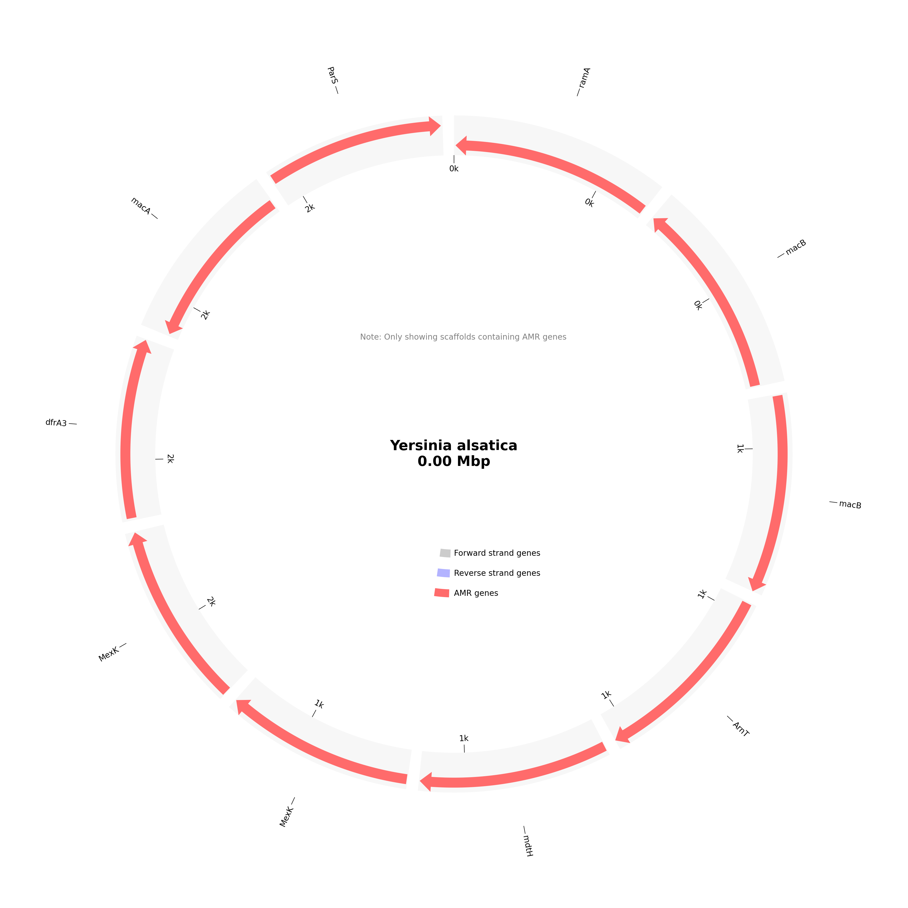

### ArnT
- **Mechanism**: antibiotic target alteration
- **Drug Classes**: peptide antibiotic
- **AMR Family**: pmr phosphoethanolamine transferase
- **Locations**:
  - gnl|SPADES|FDOHBCDP_26914_1 : position 2-244

### MexK (found in 2 locations)
- **Mechanism**: antibiotic efflux
- **Drug Classes**: macrolide antibiotic; tetracycline antibiotic; disinfecting agents and antiseptics
- **AMR Family**: resistance-nodulation-cell division (RND) antibiotic efflux pump
- **Locations**:
  - gnl|SPADES|FDOHBCDP_27466_1 : position 1-240
  - gnl|SPADES|FDOHBCDP_28623_1 : position 1-234

### ParS
- **Mechanism**: antibiotic efflux; reduced permeability to antibiotic
- **Drug Classes**: macrolide antibiotic; fluoroquinolone antibiotic; monobactam; aminoglycoside antibiotic; carbapenem; cephalosporin; cephamycin; penam; tetracycline antibiotic; phenicol antibiotic; penem; disinfecting agents and antiseptics
- **AMR Family**: resistance-nodulation-cell division (RND) antibiotic efflux pump; Outer Membrane Porin (Opr)
- **Locations**:
  - gnl|SPADES|FDOHBCDP_29897_1 : position 2-226

### dfrA3
- **Mechanism**: antibiotic target replacement
- **Drug Classes**: diaminopyrimidine antibiotic
- **AMR Family**: trimethoprim resistant dihydrofolate reductase dfr
- **Locations**:
  - gnl|SPADES|FDOHBCDP_29271_1 : position 3-230

### macA
- **Mechanism**: antibiotic efflux
- **Drug Classes**: macrolide antibiotic
- **AMR Family**: ATP-binding cassette (ABC) antibiotic efflux pump
- **Locations**:
  - gnl|SPADES|FDOHBCDP_29655_1 : position 3-227

### macB (found in 2 locations)
- **Mechanism**: antibiotic efflux
- **Drug Classes**: macrolide antibiotic
- **AMR Family**: ATP-binding cassette (ABC) antibiotic efflux pump
- **Locations**:
  - gnl|SPADES|FDOHBCDP_22599_1 : position 2-268
  - gnl|SPADES|FDOHBCDP_25376_1 : position 2-253

### mdtH
- **Mechanism**: antibiotic efflux
- **Drug Classes**: fluoroquinolone antibiotic
- **AMR Family**: major facilitator superfamily (MFS) antibiotic efflux pump
- **Locations**:
  - gnl|SPADES|FDOHBCDP_27478_1 : position 1-240

### ramA
- **Mechanism**: antibiotic efflux; reduced permeability to antibiotic
- **Drug Classes**: fluoroquinolone antibiotic; monobactam; carbapenem; cephalosporin; glycylcycline; cephamycin; penam; tetracycline antibiotic; rifamycin antibiotic; phenicol antibiotic; penem; disinfecting agents and antiseptics
- **AMR Family**: resistance-nodulation-cell division (RND) antibiotic efflux pump; General Bacterial Porin with reduced permeability to beta-lactams
- **Locations**:
  - gnl|SPADES|FDOHBCDP_22076_1 : position 2-271

## Yersinia enterocolitica
**Strain Statistics:**
- Total genome length: 3370.4 kbp
- Total scaffolds: 837
- Scaffolds with AMR genes: 130
- Total genes annotated: 5858
- Total AMR genes: 389
- Unique AMR genes: 188
- Distinct AMR mechanisms: 11
- Distinct AMR families: 70
- Distinct drug classes: 34

**Circos Plot:**

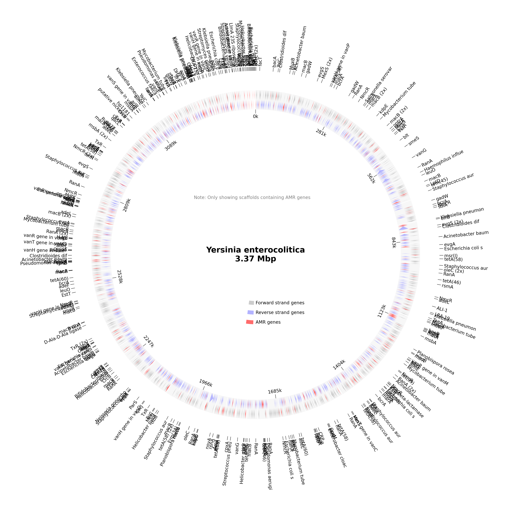

### ALI-1
- **Mechanism**: antibiotic inactivation
- **Drug Classes**: carbapenem
- **AMR Family**: ALI beta-lactamase
- **Locations**:
  - gnl|SPADES|FDOHBCDP_118_3 : position 1258-3438

### Acinetobacter baumannii AbaF (found in 2 locations)
- **Mechanism**: antibiotic efflux
- **Drug Classes**: phosphonic acid antibiotic
- **AMR Family**: major facilitator superfamily (MFS) antibiotic efflux pump
- **Locations**:
  - gnl|SPADES|FDOHBCDP_259_1 : position 2-1027
  - gnl|SPADES|FDOHBCDP_294_21 : position 20501-22027

### Acinetobacter baumannii AbaQ (found in 4 locations)
- **Mechanism**: antibiotic efflux
- **Drug Classes**: fluoroquinolone antibiotic
- **AMR Family**: major facilitator superfamily (MFS) antibiotic efflux pump
- **Locations**:
  - gnl|SPADES|FDOHBCDP_1574_4 : position 2087-3403
  - gnl|SPADES|FDOHBCDP_33_106 : position 121620-122930
  - gnl|SPADES|FDOHBCDP_69_23 : position 19244-20602
  - gnl|SPADES|FDOHBCDP_94_33 : position 59080-60396

### Acinetobacter baumannii AmvA
- **Mechanism**: antibiotic efflux
- **Drug Classes**: macrolide antibiotic; disinfecting agents and antiseptics
- **AMR Family**: major facilitator superfamily (MFS) antibiotic efflux pump
- **Locations**:
  - gnl|SPADES|FDOHBCDP_136_29 : position 33774-35267

### ArnT
- **Mechanism**: antibiotic target alteration
- **Drug Classes**: peptide antibiotic
- **AMR Family**: pmr phosphoethanolamine transferase
- **Locations**:
  - gnl|SPADES|FDOHBCDP_173_9: position 8267-9931

### Bifidobacterium adolescentis rpoB mutants conferring resistance to rifampicin (found in 2 locations)
- **Mechanism**: antibiotic target alteration; antibiotic target replacement
- **Drug Classes**: rifamycin antibiotic
- **AMR Family**: rifamycin-resistant beta-subunit of RNA polymerase (rpoB)
- **Locations**:
  - gnl|SPADES|FDOHBCDP_1425_1 : position 1-603
  - gnl|SPADES|FDOHBCDP_6514_1 : position 1-714

### Bifidobacterium bifidum ileS conferring resistance to mupirocin
- **Mechanism**: antibiotic target alteration
- **Drug Classes**: mupirocin-like antibiotic
- **AMR Family**: antibiotic-resistant isoleucyl-tRNA synthetase (ileS)
- **Locations**:
  - gnl|SPADES|FDOHBCDP_233_21 : position 17323-19905

### CMY-70
- **Mechanism**: antibiotic inactivation
- **Drug Classes**: cephamycin
- **AMR Family**: CMY beta-lactamase
- **Locations**:
  - gnl|SPADES|FDOHBCDP_234_1 : position 122-1288

### CRP
- **Mechanism**: antibiotic efflux
- **Drug Classes**: macrolide antibiotic; fluoroquinolone antibiotic; penam
- **AMR Family**: resistance-nodulation-cell division (RND) antibiotic efflux pump
- **Locations**:
  - gnl|SPADES|FDOHBCDP_147_21: position 24003-24635

### Clostridioides difficile gyrA conferring resistance to fluoroquinolones
- **Mechanism**: antibiotic target alteration
- **Drug Classes**: fluoroquinolone antibiotic
- **AMR Family**: fluoroquinolone resistant gyrA
- **Locations**:
  - gnl|SPADES|FDOHBCDP_94_12 : position 27929-30583

### Clostridioides difficile gyrB conferring resistance to fluoroquinolones (found in 2 locations)
- **Mechanism**: antibiotic target alteration
- **Drug Classes**: fluoroquinolone antibiotic
- **AMR Family**: fluoroquinolone resistant gyrB
- **Locations**:
  - gnl|SPADES|FDOHBCDP_300_4 : position 3575-5989
  - gnl|SPADES|FDOHBCDP_33_65 : position 74283-76178

### CrcB (found in 2 locations)
- **Mechanism**: antibiotic efflux
- **Drug Classes**: aminoglycoside antibiotic
- **AMR Family**: multidrug and toxic compound extrusion (MATE) transporter
- **Locations**:
  - gnl|SPADES|FDOHBCDP_233_6 : position 3861-4244
  - gnl|SPADES|FDOHBCDP_478_6 : position 5049-5453

### D-Ala-D-Ala ligase
- **Mechanism**: antibiotic target alteration
- **Drug Classes**: glycopeptide antibiotic
- **AMR Family**: Van ligase
- **Locations**:
  - gnl|SPADES|FDOHBCDP_268_22 : position 22939-23859

### DHA-6
- **Mechanism**: antibiotic inactivation
- **Drug Classes**: cephalosporin; cephamycin
- **AMR Family**: DHA beta-lactamase
- **Locations**:
  - gnl|SPADES|FDOHBCDP_765_1 : position 147-1289

### Enterobacter cloacae acrA
- **Mechanism**: antibiotic efflux
- **Drug Classes**: fluoroquinolone antibiotic; cephalosporin; glycylcycline; penam; tetracycline antibiotic; rifamycin antibiotic; phenicol antibiotic; disinfecting agents and antiseptics
- **AMR Family**: resistance-nodulation-cell division (RND) antibiotic efflux pump
- **Locations**:
  - gnl|SPADES|FDOHBCDP_143_35 : position 40183-41343

### Enterococcus faecalis cls with mutation conferring resistance to daptomycin
- **Mechanism**: antibiotic target alteration
- **Drug Classes**: peptide antibiotic
- **AMR Family**: daptomycin resistant cls
- **Locations**:
  - gnl|SPADES|FDOHBCDP_564_14 : position 10141-11601

### Erm(34)
- **Mechanism**: antibiotic target alteration
- **Drug Classes**: macrolide antibiotic; lincosamide antibiotic; streptogramin antibiotic; streptogramin A antibiotic; streptogramin B antibiotic
- **AMR Family**: Erm 23S ribosomal RNA methyltransferase
- **Locations**:
  - gnl|SPADES|FDOHBCDP_190_31 : position 25116-25742

### Escherichia coli AcrAB-TolC with AcrR mutation conferring resistance to ciprofloxacin, tetracycline, and ceftazidime
- **Mechanism**: antibiotic target alteration; antibiotic efflux
- **Drug Classes**: fluoroquinolone antibiotic; cephalosporin; glycylcycline; penam; tetracycline antibiotic; rifamycin antibiotic; phenicol antibiotic; disinfecting agents and antiseptics
- **AMR Family**: resistance-nodulation-cell division (RND) antibiotic efflux pump
- **Locations**:
  - gnl|SPADES|FDOHBCDP_356_8 : position 6756-7340

### Escherichia coli EF-Tu mutants conferring resistance to Pulvomycin (found in 2 locations)
- **Mechanism**: antibiotic target alteration
- **Drug Classes**: elfamycin antibiotic
- **AMR Family**: elfamycin resistant EF-Tu
- **Locations**:
  - gnl|SPADES|FDOHBCDP_11875_1 : position 2-433
  - gnl|SPADES|FDOHBCDP_7963_1 : position 2-598

### Escherichia coli EF-Tu mutants conferring resistance to kirromycin
- **Mechanism**: antibiotic target alteration
- **Drug Classes**: elfamycin antibiotic
- **AMR Family**: elfamycin resistant EF-Tu
- **Locations**:
  - gnl|SPADES|FDOHBCDP_1277_5 : position 4032-5630

### Escherichia coli mdfA
- **Mechanism**: antibiotic efflux
- **Drug Classes**: tetracycline antibiotic; phenicol antibiotic; disinfecting agents and antiseptics
- **AMR Family**: major facilitator superfamily (MFS) antibiotic efflux pump
- **Locations**:
  - gnl|SPADES|FDOHBCDP_132_24 : position 30143-31372

### Escherichia coli soxS with mutation conferring antibiotic resistance (found in 4 locations)
- **Mechanism**: antibiotic target alteration; antibiotic efflux; reduced permeability to antibiotic
- **Drug Classes**: fluoroquinolone antibiotic; monobactam; carbapenem; cephalosporin; glycylcycline; cephamycin; penam; tetracycline antibiotic; rifamycin antibiotic; phenicol antibiotic; penem; disinfecting agents and antiseptics
- **AMR Family**: ATP-binding cassette (ABC) antibiotic efflux pump; major facilitator superfamily (MFS) antibiotic efflux pump; resistance-nodulation-cell division (RND) antibiotic efflux pump; General Bacterial Porin with reduced permeability to beta-lactams
- **Locations**:
  - gnl|SPADES|FDOHBCDP_104_20 : position 20400-21107
  - gnl|SPADES|FDOHBCDP_137_19 : position 23408-24340
  - gnl|SPADES|FDOHBCDP_156_42 : position 37572-38579
  - gnl|SPADES|FDOHBCDP_259_10 : position 11669-12535

### Escherichia coli uhpA with mutation conferring resistance to fosfomycin
- **Mechanism**: antibiotic target alteration
- **Drug Classes**: phosphonic acid antibiotic
- **AMR Family**: antibiotic-resistant UhpT
- **Locations**:
  - gnl|SPADES|FDOHBCDP_255_21 : position 22370-22954

### EstT
- **Mechanism**: antibiotic inactivation
- **Drug Classes**: macrolide antibiotic
- **AMR Family**: macrolide esterase
- **Locations**:
  - gnl|SPADES|FDOHBCDP_286_16 : position 20259-21053

### H-NS
- **Mechanism**: antibiotic efflux
- **Drug Classes**: macrolide antibiotic; fluoroquinolone antibiotic; cephalosporin; cephamycin; penam; tetracycline antibiotic
- **AMR Family**: major facilitator superfamily (MFS) antibiotic efflux pump; resistance-nodulation-cell division (RND) antibiotic efflux pump
- **Locations**:
  - gnl|SPADES|FDOHBCDP_307_8 : position 7297-7707

### Haemophilus influenzae PBP3 conferring resistance to beta-lactam antibiotics
- **Mechanism**: antibiotic target alteration
- **Drug Classes**: cephalosporin; cephamycin; penam
- **AMR Family**: Penicillin-binding protein mutations conferring resistance to beta-lactam antibiotics
- **Locations**:
  - gnl|SPADES|FDOHBCDP_86_6 : position 6163-7926

### Helicobacter pylori pbp1 mutants conferring resistance to amoxicillin (found in 2 locations)
- **Mechanism**: antibiotic target alteration
- **Drug Classes**: cephalosporin; cephamycin; penam
- **AMR Family**: Penicillin-binding protein mutations conferring resistance to beta-lactam antibiotics
- **Locations**:
  - gnl|SPADES|FDOHBCDP_1033_1 : position 299-2785
  - gnl|SPADES|FDOHBCDP_199_22 : position 26169-28505

### Helicobacter pylori pbp2 mutants conferring resistance to amoxicillin
- **Mechanism**: antibiotic target alteration
- **Drug Classes**: cephalosporin; cephamycin; penam
- **AMR Family**: Penicillin-binding protein mutations conferring resistance to beta-lactam antibiotics
- **Locations**:
  - gnl|SPADES|FDOHBCDP_233_15 : position 12024-13919

### Helicobacter pylori pbp3 conferring resistance to amoxicillin
- **Mechanism**: antibiotic target alteration
- **Drug Classes**: cephalosporin; cephamycin; penam
- **AMR Family**: Penicillin-binding protein mutations conferring resistance to beta-lactam antibiotics
- **Locations**:
  - gnl|SPADES|FDOHBCDP_170_3 : position 1226-2935

### Helicobacter pylori rpoB mutation conferring resistance to rifampicin
- **Mechanism**: antibiotic target alteration; antibiotic target replacement
- **Drug Classes**: fluoroquinolone antibiotic; rifamycin antibiotic
- **AMR Family**: rifamycin-resistant beta-subunit of RNA polymerase (rpoB)
- **Locations**:
  - gnl|SPADES|FDOHBCDP_3089_1 : position 2-688

### Klebsiella pneumoniae KpnE
- **Mechanism**: antibiotic efflux
- **Drug Classes**: macrolide antibiotic; aminoglycoside antibiotic; cephalosporin; tetracycline antibiotic; peptide antibiotic; rifamycin antibiotic; disinfecting agents and antiseptics
- **AMR Family**: small multidrug resistance (SMR) antibiotic efflux pump
- **Locations**:
  - gnl|SPADES|FDOHBCDP_498_10 : position 8789-9166

### Klebsiella pneumoniae KpnF
- **Mechanism**: antibiotic efflux
- **Drug Classes**: macrolide antibiotic; aminoglycoside antibiotic; cephalosporin; tetracycline antibiotic; peptide antibiotic; rifamycin antibiotic; disinfecting agents and antiseptics
- **AMR Family**: small multidrug resistance (SMR) antibiotic efflux pump
- **Locations**:
  - gnl|SPADES|FDOHBCDP_498_9: position 8473-8802

### Klebsiella pneumoniae KpnH (found in 2 locations)
- **Mechanism**: antibiotic efflux
- **Drug Classes**: macrolide antibiotic; fluoroquinolone antibiotic; aminoglycoside antibiotic; carbapenem; cephalosporin; penam; peptide antibiotic; penem
- **AMR Family**: major facilitator superfamily (MFS) antibiotic efflux pump
- **Locations**:
  - gnl|SPADES|FDOHBCDP_887_7 : position 7730-7876
  - gnl|SPADES|FDOHBCDP_894_1: position 2-1537

### Klebsiella pneumoniae OmpK37 (found in 4 locations)
- **Mechanism**: reduced permeability to antibiotic
- **Drug Classes**: monobactam; carbapenem; cephalosporin; cephamycin; penam; penem
- **AMR Family**: General Bacterial Porin with reduced permeability to beta-lactams
- **Locations**:
  - gnl|SPADES|FDOHBCDP_1161_6 : position 4775-5890
  - gnl|SPADES|FDOHBCDP_118_22 : position 26452-27567
  - gnl|SPADES|FDOHBCDP_51_6 : position 4409-5524
  - gnl|SPADES|FDOHBCDP_94_1 : position 123-1223

### LRA-19
- **Mechanism**: antibiotic inactivation
- **Drug Classes**: cephalosporin; penam
- **AMR Family**: subclass B3 LRA beta-lactamase
- **Locations**:
  - gnl|SPADES|FDOHBCDP_118_19 : position 22426-23073

### LlmA 23S ribosomal RNA methyltransferase
- **Mechanism**: antibiotic target alteration
- **Drug Classes**: lincosamide antibiotic
- **AMR Family**: Llm 23S ribosomal RNA methyltransferase
- **Locations**:
  - gnl|SPADES|FDOHBCDP_1804_5 : position 1766-2956

### LpsB
- **Mechanism**: reduced permeability to antibiotic
- **Drug Classes**: peptide antibiotic
- **AMR Family**: Intrinsic peptide antibiotic resistant Lps
- **Locations**:
  - gnl|SPADES|FDOHBCDP_1400_1 : position 2-1096

### LptD
- **Mechanism**: antibiotic efflux
- **Drug Classes**: carbapenem; peptide antibiotic; aminocoumarin antibiotic; rifamycin antibiotic
- **AMR Family**: ATP-binding cassette (ABC) antibiotic efflux pump
- **Locations**:
  - gnl|SPADES|FDOHBCDP_86_38 : position 51491-53887

### MSI-1
- **Mechanism**: antibiotic inactivation
- **Drug Classes**: carbapenem
- **AMR Family**: MSI beta-lactamase
- **Locations**:
  - gnl|SPADES|FDOHBCDP_156_24 : position 21725-22480

### MdtK
- **Mechanism**: antibiotic efflux
- **Drug Classes**: fluoroquinolone antibiotic
- **AMR Family**: multidrug and toxic compound extrusion (MATE) transporter
- **Locations**:
  - gnl|SPADES|FDOHBCDP_356_16 : position 14540-15937

### MexE
- **Mechanism**: antibiotic efflux
- **Drug Classes**: fluoroquinolone antibiotic; diaminopyrimidine antibiotic; phenicol antibiotic
- **AMR Family**: resistance-nodulation-cell division (RND) antibiotic efflux pump
- **Locations**:
  - gnl|SPADES|FDOHBCDP_438_8 : position 6904-8196

### MexH
- **Mechanism**: antibiotic efflux
- **Drug Classes**: fluoroquinolone antibiotic; tetracycline antibiotic; disinfecting agents and antiseptics
- **AMR Family**: resistance-nodulation-cell division (RND) antibiotic efflux pump
- **Locations**:
  - gnl|SPADES|FDOHBCDP_33_96 : position 108962-110491

### MexJ
- **Mechanism**: antibiotic efflux
- **Drug Classes**: macrolide antibiotic; tetracycline antibiotic; disinfecting agents and antiseptics
- **AMR Family**: resistance-nodulation-cell division (RND) antibiotic efflux pump
- **Locations**:
  - gnl|SPADES|FDOHBCDP_200_1 : position 357-1439

### MexS (found in 5 locations)
- **Mechanism**: antibiotic efflux
- **Drug Classes**: fluoroquinolone antibiotic; diaminopyrimidine antibiotic; phenicol antibiotic
- **AMR Family**: resistance-nodulation-cell division (RND) antibiotic efflux pump
- **Locations**:
  - gnl|SPADES|FDOHBCDP_142_4 : position 3938-5014
  - gnl|SPADES|FDOHBCDP_356_5 : position 3554-4564
  - gnl|SPADES|FDOHBCDP_40_73 : position 79334-80368
  - gnl|SPADES|FDOHBCDP_40_83 : position 94075-95085
  - gnl|SPADES|FDOHBCDP_70_34 : position 35645-36799

### MexT
- **Mechanism**: antibiotic efflux
- **Drug Classes**: fluoroquinolone antibiotic; diaminopyrimidine antibiotic; phenicol antibiotic
- **AMR Family**: resistance-nodulation-cell division (RND) antibiotic efflux pump
- **Locations**:
  - gnl|SPADES|FDOHBCDP_933_4 : position 2659-3579

### MuxB
- **Mechanism**: antibiotic efflux
- **Drug Classes**: macrolide antibiotic; monobactam; tetracycline antibiotic; aminocoumarin antibiotic
- **AMR Family**: resistance-nodulation-cell division (RND) antibiotic efflux pump
- **Locations**:
  - gnl|SPADES|FDOHBCDP_33_95 : position 105834-108965

### Mycobacterium tuberculosis gidB mutation conferring resistance to streptomycin
- **Mechanism**: antibiotic target alteration
- **Drug Classes**: aminoglycoside antibiotic
- **AMR Family**: antibiotic resistant gidB
- **Locations**:
  - gnl|SPADES|FDOHBCDP_328_17 : position 19182-19802

### Mycobacterium tuberculosis kasA mutant conferring resistance to isoniazid (found in 2 locations)
- **Mechanism**: antibiotic target alteration
- **Drug Classes**: isoniazid-like antibiotic
- **AMR Family**: antibiotic resistant kasA
- **Locations**:
  - gnl|SPADES|FDOHBCDP_118_37 : position 45559-46833
  - gnl|SPADES|FDOHBCDP_156_15 : position 12306-13481

### Mycobacterium tuberculosis ndh with mutation conferring resistance to isoniazid
- **Mechanism**: antibiotic target alteration
- **Drug Classes**: isoniazid-like antibiotic
- **AMR Family**: antibiotic resistant ndh
- **Locations**:
  - gnl|SPADES|FDOHBCDP_69_74 : position 74814-76118

### Mycobacterium tuberculosis pncA mutations conferring resistance to pyrazinamide
- **Mechanism**: antibiotic target alteration
- **Drug Classes**: pyrazine antibiotic
- **AMR Family**: Pyrazinamide resistant pncA
- **Locations**:
  - gnl|SPADES|FDOHBCDP_600_1 : position 108-761

### Mycobacterium tuberculosis rpsA mutations conferring resistance to pyrazinamide
- **Mechanism**: antibiotic target alteration
- **Drug Classes**: pyrazine antibiotic
- **AMR Family**: pyrazinamide resistant rpsA
- **Locations**:
  - gnl|SPADES|FDOHBCDP_2598_1 : position 2-607

### Mycobacterium tuberculosis thyA with mutation conferring resistance to para-aminosalicylic acid
- **Mechanism**: antibiotic target alteration
- **Drug Classes**: salicylic acid antibiotic
- **AMR Family**: aminosalicylate resistant thymidylate synthase
- **Locations**:
  - gnl|SPADES|FDOHBCDP_135_30 : position 31171-31965

### Neisseria gonorrhoeae pilQ gene conferring resistance to beta-lactam
- **Mechanism**: antibiotic target alteration
- **Drug Classes**: cephalosporin; cephamycin; penam
- **AMR Family**: Penicillin-binding protein mutations conferring resistance to beta-lactam antibiotics
- **Locations**:
  - gnl|SPADES|FDOHBCDP_225_2 : position 1413-3359

### NmcR (found in 12 locations)
- **Mechanism**: antibiotic inactivation
- **Drug Classes**: carbapenem; cephalosporin; cephamycin; penam
- **AMR Family**: NmcA beta-lactamase
- **Locations**:
  - gnl|SPADES|FDOHBCDP_113_30 : position 36608-37528
  - gnl|SPADES|FDOHBCDP_136_6 : position 6454-7341
  - gnl|SPADES|FDOHBCDP_137_4 : position 3805-4716
  - gnl|SPADES|FDOHBCDP_159_2 : position 2905-3879
  - gnl|SPADES|FDOHBCDP_234_2 : position 1423-2307
  - gnl|SPADES|FDOHBCDP_281_21 : position 20139-21032
  - gnl|SPADES|FDOHBCDP_350_6 : position 11911-12777
  - gnl|SPADES|FDOHBCDP_359_6 : position 4934-5851
  - gnl|SPADES|FDOHBCDP_393_11 : position 12230-13111
  - gnl|SPADES|FDOHBCDP_393_2 : position 795-1676
  - gnl|SPADES|FDOHBCDP_51_89 : position 91306-92238
  - gnl|SPADES|FDOHBCDP_90_47 : position 39938-40831

### OXA-152
- **Mechanism**: antibiotic inactivation
- **Drug Classes**: carbapenem; penam
- **AMR Family**: OXA beta-lactamase; OXA-62-like beta-lactamase
- **Locations**:
  - gnl|SPADES|FDOHBCDP_1004_7 : position 5245-5949

### OmpA (found in 5 locations)
- **Mechanism**: reduced permeability to antibiotic
- **Drug Classes**: peptide antibiotic
- **AMR Family**: General Bacterial Porin with reduced permeability to peptide antibiotics
- **Locations**:
  - gnl|SPADES|FDOHBCDP_118_42 : position 50692-51765
  - gnl|SPADES|FDOHBCDP_259_18 : position 21828-22337
  - gnl|SPADES|FDOHBCDP_300_19 : position 22317-22976
  - gnl|SPADES|FDOHBCDP_90_53 : position 46339-46686
  - gnl|SPADES|FDOHBCDP_90_71 : position 68630-70006

### OprM
- **Mechanism**: antibiotic efflux
- **Drug Classes**: macrolide antibiotic; fluoroquinolone antibiotic; monobactam; aminoglycoside antibiotic; carbapenem; cephalosporin; cephamycin; penam; tetracycline antibiotic; peptide antibiotic; aminocoumarin antibiotic; diaminopyrimidine antibiotic; sulfonamide antibiotic; phenicol antibiotic; penem; disinfecting agents and antiseptics
- **AMR Family**: resistance-nodulation-cell division (RND) antibiotic efflux pump
- **Locations**:
  - gnl|SPADES|FDOHBCDP_143_33 : position 35646-37052

### PDC-103
- **Mechanism**: antibiotic inactivation
- **Drug Classes**: monobactam; carbapenem; cephalosporin
- **AMR Family**: PDC beta-lactamase
- **Locations**:
  - gnl|SPADES|FDOHBCDP_356_10 : position 8573-9034

### ParR (found in 2 locations)
- **Mechanism**: antibiotic efflux; reduced permeability to antibiotic
- **Drug Classes**: macrolide antibiotic; fluoroquinolone antibiotic; monobactam; aminoglycoside antibiotic; carbapenem; cephalosporin; cephamycin; penam; tetracycline antibiotic; phenicol antibiotic; penem; disinfecting agents and antiseptics
- **AMR Family**: resistance-nodulation-cell division (RND) antibiotic efflux pump; Outer Membrane Porin (Opr)
- **Locations**:
  - gnl|SPADES|FDOHBCDP_171_14 : position 15556-16275
  - gnl|SPADES|FDOHBCDP_215_21 : position 27049-27777

### ParS
- **Mechanism**: antibiotic efflux; reduced permeability to antibiotic
- **Drug Classes**: macrolide antibiotic; fluoroquinolone antibiotic; monobactam; aminoglycoside antibiotic; carbapenem; cephalosporin; cephamycin; penam; tetracycline antibiotic; phenicol antibiotic; penem; disinfecting agents and antiseptics
- **AMR Family**: resistance-nodulation-cell division (RND) antibiotic efflux pump; Outer Membrane Porin (Opr)
- **Locations**:
  - gnl|SPADES|FDOHBCDP_215_20 : position 25739-27052

### Planobispora rosea EF-Tu mutants conferring resistance to inhibitor GE2270A (found in 2 locations)
- **Mechanism**: antibiotic target alteration
- **Drug Classes**: elfamycin antibiotic
- **AMR Family**: elfamycin resistant EF-Tu
- **Locations**:
  - gnl|SPADES|FDOHBCDP_132_23 : position 28185-30077
  - gnl|SPADES|FDOHBCDP_190_20 : position 16306-17805

### PmrF (found in 2 locations)
- **Mechanism**: antibiotic target alteration
- **Drug Classes**: peptide antibiotic
- **AMR Family**: pmr phosphoethanolamine transferase
- **Locations**:
  - gnl|SPADES|FDOHBCDP_147_33 : position 34060-35049
  - gnl|SPADES|FDOHBCDP_173_6 : position 4370-5353

### Pseudomonas aeruginosa CpxR (found in 2 locations)
- **Mechanism**: antibiotic efflux
- **Drug Classes**: macrolide antibiotic; fluoroquinolone antibiotic; monobactam; aminoglycoside antibiotic; carbapenem; cephalosporin; cephamycin; penam; tetracycline antibiotic; peptide antibiotic; aminocoumarin antibiotic; diaminopyrimidine antibiotic; sulfonamide antibiotic; phenicol antibiotic; penem
- **AMR Family**: resistance-nodulation-cell division (RND) antibiotic efflux pump
- **Locations**:
  - gnl|SPADES|FDOHBCDP_294_13 : position 11221-11904
  - gnl|SPADES|FDOHBCDP_573_4 : position 2802-3500

### Pseudomonas aeruginosa ampR with mutation conferring resistance to aztreonam
- **Mechanism**: antibiotic target alteration; antibiotic inactivation
- **Drug Classes**: monobactam; carbapenem; cephalosporin
- **AMR Family**: PDC beta-lactamase; ampR transcriptional regulator with mutation conferring resistance to monobactam antibiotics
- **Locations**:
  - gnl|SPADES|FDOHBCDP_164_9 : position 8109-9050

### QepA4 (found in 2 locations)
- **Mechanism**: antibiotic efflux
- **Drug Classes**: fluoroquinolone antibiotic
- **AMR Family**: major facilitator superfamily (MFS) antibiotic efflux pump
- **Locations**:
  - gnl|SPADES|FDOHBCDP_137_5 : position 4893-6185
  - gnl|SPADES|FDOHBCDP_933_3 : position 1106-2530

### RanA (found in 20 locations)
- **Mechanism**: antibiotic efflux
- **Drug Classes**: aminoglycoside antibiotic
- **AMR Family**: ATP-binding cassette (ABC) antibiotic efflux pump
- **Locations**:
  - gnl|SPADES|FDOHBCDP_110_25 : position 26862-28376
  - gnl|SPADES|FDOHBCDP_136_22 : position 24390-25439
  - gnl|SPADES|FDOHBCDP_136_31 : position 36615-37421
  - gnl|SPADES|FDOHBCDP_138_35 : position 42059-42937
  - gnl|SPADES|FDOHBCDP_140_13 : position 10428-11231
  - gnl|SPADES|FDOHBCDP_142_16 : position 16918-18033
  - gnl|SPADES|FDOHBCDP_143_18 : position 16267-17382
  - gnl|SPADES|FDOHBCDP_156_31 : position 27355-28554
  - gnl|SPADES|FDOHBCDP_164_3 : position 1947-2762
  - gnl|SPADES|FDOHBCDP_169_6 : position 3992-5125
  - gnl|SPADES|FDOHBCDP_184_5 : position 5003-6130
  - gnl|SPADES|FDOHBCDP_227_8 : position 9598-10374
  - gnl|SPADES|FDOHBCDP_260_1 : position 267-1082
  - gnl|SPADES|FDOHBCDP_293_9 : position 9922-10944
  - gnl|SPADES|FDOHBCDP_307_17 : position 19761-20762
  - gnl|SPADES|FDOHBCDP_307_18 : position 20759-21760
  - gnl|SPADES|FDOHBCDP_363_10 : position 9247-10350
  - gnl|SPADES|FDOHBCDP_394_1 : position 221-1312
  - gnl|SPADES|FDOHBCDP_51_69 : position 70152-70970
  - gnl|SPADES|FDOHBCDP_73_61 : position 81189-81923

### RanB (found in 2 locations)
- **Mechanism**: antibiotic efflux
- **Drug Classes**: aminoglycoside antibiotic
- **AMR Family**: ATP-binding cassette (ABC) antibiotic efflux pump
- **Locations**:
  - gnl|SPADES|FDOHBCDP_136_30 : position 35476-36621
  - gnl|SPADES|FDOHBCDP_140_12 : position 9635-10417

### Rv1877 (found in 2 locations)
- **Mechanism**: antibiotic efflux
- **Drug Classes**: fluoroquinolone antibiotic
- **AMR Family**: major facilitator superfamily (MFS) antibiotic efflux pump
- **Locations**:
  - gnl|SPADES|FDOHBCDP_300_17 : position 19967-21415
  - gnl|SPADES|FDOHBCDP_438_10 : position 8789-10177

### Salmonella serovars soxS with mutation conferring antibiotic resistance
- **Mechanism**: antibiotic target alteration; antibiotic efflux; reduced permeability to antibiotic
- **Drug Classes**: fluoroquinolone antibiotic; monobactam; carbapenem; cephalosporin; glycylcycline; cephamycin; penam; tetracycline antibiotic; rifamycin antibiotic; phenicol antibiotic; penem; disinfecting agents and antiseptics
- **AMR Family**: ATP-binding cassette (ABC) antibiotic efflux pump; major facilitator superfamily (MFS) antibiotic efflux pump; resistance-nodulation-cell division (RND) antibiotic efflux pump; General Bacterial Porin with reduced permeability to beta-lactams
- **Locations**:
  - gnl|SPADES|FDOHBCDP_69_9 : position 6336-6722

### SatA
- **Mechanism**: antibiotic inactivation
- **Drug Classes**: nucleoside antibiotic
- **AMR Family**: streptothricin acetyltransferase (SAT)
- **Locations**:
  - gnl|SPADES|FDOHBCDP_356_2 : position 1373-1831

### Staphylococcus aureus GlpT with mutation conferring resistance to fosfomycin (found in 2 locations)
- **Mechanism**: antibiotic target alteration
- **Drug Classes**: phosphonic acid antibiotic
- **AMR Family**: antibiotic-resistant GlpT
- **Locations**:
  - gnl|SPADES|FDOHBCDP_196_24 : position 23362-24726
  - gnl|SPADES|FDOHBCDP_219_25 : position 30234-31598

### Staphylococcus aureus fusA with mutation conferring resistance to fusidic acid (found in 3 locations)
- **Mechanism**: antibiotic target alteration
- **Drug Classes**: fusidane antibiotic
- **AMR Family**: antibiotic resistant fusA
- **Locations**:
  - gnl|SPADES|FDOHBCDP_110_3 : position 2208-4316
  - gnl|SPADES|FDOHBCDP_2162_2 : position 328-2436
  - gnl|SPADES|FDOHBCDP_380_6 : position 4491-6080

### Staphylococcus aureus mupA conferring resistance to mupirocin
- **Mechanism**: antibiotic target alteration
- **Drug Classes**: mupirocin-like antibiotic
- **AMR Family**: antibiotic-resistant isoleucyl-tRNA synthetase (ileS)
- **Locations**:
  - gnl|SPADES|FDOHBCDP_86_54 : position 69243-72059

### Staphylococcus aureus mupB conferring resistance to mupirocin
- **Mechanism**: antibiotic target alteration
- **Drug Classes**: mupirocin-like antibiotic
- **AMR Family**: antibiotic-resistant isoleucyl-tRNA synthetase (ileS)
- **Locations**:
  - gnl|SPADES|FDOHBCDP_138_27 : position 32101-34998

### Staphylococcus aureus murA with mutation conferring resistance to fosfomycin
- **Mechanism**: antibiotic target alteration
- **Drug Classes**: phosphonic acid antibiotic
- **AMR Family**: antibiotic-resistant murA transferase
- **Locations**:
  - gnl|SPADES|FDOHBCDP_140_7 : position 6274-7542

### Staphylococcus aureus pgsA mutations conferring resistance to daptomycin
- **Mechanism**: antibiotic target alteration
- **Drug Classes**: peptide antibiotic
- **AMR Family**: daptomycin resistant pgsA
- **Locations**:
  - gnl|SPADES|FDOHBCDP_334_4 : position 1813-2361

### Streptococcus pneumoniae PBP2x conferring resistance to amoxicillin
- **Mechanism**: antibiotic target alteration
- **Drug Classes**: cephalosporin; cephamycin; penam
- **AMR Family**: Penicillin-binding protein mutations conferring resistance to beta-lactam antibiotics
- **Locations**:
  - gnl|SPADES|FDOHBCDP_171_6 : position 4131-6686

### Streptomyces lividans cmlR
- **Mechanism**: antibiotic efflux
- **Drug Classes**: phenicol antibiotic
- **AMR Family**: major facilitator superfamily (MFS) antibiotic efflux pump
- **Locations**:
  - gnl|SPADES|FDOHBCDP_113_36 : position 43476-44690

### Streptomyces rimosus otr(A)
- **Mechanism**: antibiotic target protection
- **Drug Classes**: tetracycline antibiotic
- **AMR Family**: tetracycline-resistant ribosomal protection protein
- **Locations**:
  - gnl|SPADES|FDOHBCDP_1145_1 : position 295-2118

### Streptomyces venezuelae rox (found in 2 locations)
- **Mechanism**: antibiotic inactivation
- **Drug Classes**: rifamycin antibiotic
- **AMR Family**: rifampin monooxygenase
- **Locations**:
  - gnl|SPADES|FDOHBCDP_1441_1 : position 336-1517
  - gnl|SPADES|FDOHBCDP_281_14 : position 12805-13974

### TaeA (found in 3 locations)
- **Mechanism**: antibiotic efflux
- **Drug Classes**: pleuromutilin antibiotic
- **AMR Family**: ATP-binding cassette (ABC) antibiotic efflux pump
- **Locations**:
  - gnl|SPADES|FDOHBCDP_118_32 : position 39519-41432
  - gnl|SPADES|FDOHBCDP_259_19 : position 22627-24294
  - gnl|SPADES|FDOHBCDP_619_11 : position 7919-8584

### TolC (found in 2 locations)
- **Mechanism**: antibiotic efflux
- **Drug Classes**: macrolide antibiotic; fluoroquinolone antibiotic; aminoglycoside antibiotic; carbapenem; cephalosporin; glycylcycline; cephamycin; penam; tetracycline antibiotic; peptide antibiotic; aminocoumarin antibiotic; rifamycin antibiotic; phenicol antibiotic; penem; disinfecting agents and antiseptics
- **AMR Family**: ATP-binding cassette (ABC) antibiotic efflux pump; major facilitator superfamily (MFS) antibiotic efflux pump; resistance-nodulation-cell division (RND) antibiotic efflux pump
- **Locations**:
  - gnl|SPADES|FDOHBCDP_33_60 : position 69673-71154
  - gnl|SPADES|FDOHBCDP_94_5 : position 5383-6768

### TriC
- **Mechanism**: antibiotic efflux
- **Drug Classes**: disinfecting agents and antiseptics
- **AMR Family**: resistance-nodulation-cell division (RND) antibiotic efflux pump
- **Locations**:
  - gnl|SPADES|FDOHBCDP_200_2 : position 1439-4525

### TxR (found in 7 locations)
- **Mechanism**: antibiotic efflux
- **Drug Classes**: tetracycline antibiotic
- **AMR Family**: ATP-binding cassette (ABC) antibiotic efflux pump
- **Locations**:
  - gnl|SPADES|FDOHBCDP_200_14 : position 19029-20948
  - gnl|SPADES|FDOHBCDP_260_18 : position 14109-15692
  - gnl|SPADES|FDOHBCDP_260_8 : position 7395-8405
  - gnl|SPADES|FDOHBCDP_403_8 : position 5002-6114
  - gnl|SPADES|FDOHBCDP_458_4 : position 3118-4530
  - gnl|SPADES|FDOHBCDP_602_1 : position 68-1405
  - gnl|SPADES|FDOHBCDP_70_43 : position 47910-50069

### YajC
- **Mechanism**: antibiotic efflux
- **Drug Classes**: fluoroquinolone antibiotic; cephalosporin; glycylcycline; penam; tetracycline antibiotic; oxazolidinone antibiotic; glycopeptide antibiotic; rifamycin antibiotic; phenicol antibiotic; disinfecting agents and antiseptics
- **AMR Family**: resistance-nodulation-cell division (RND) antibiotic efflux pump
- **Locations**:
  - gnl|SPADES|FDOHBCDP_515_3 : position 2856-3188

### YojI (found in 2 locations)
- **Mechanism**: antibiotic efflux
- **Drug Classes**: peptide antibiotic
- **AMR Family**: ATP-binding cassette (ABC) antibiotic efflux pump
- **Locations**:
  - gnl|SPADES|FDOHBCDP_16164_1 : position 3-341
  - gnl|SPADES|FDOHBCDP_16165_1 : position 3-341

### acrB
- **Mechanism**: antibiotic efflux
- **Drug Classes**: fluoroquinolone antibiotic; cephalosporin; glycylcycline; penam; tetracycline antibiotic; rifamycin antibiotic; phenicol antibiotic; disinfecting agents and antiseptics
- **AMR Family**: resistance-nodulation-cell division (RND) antibiotic efflux pump
- **Locations**:
  - gnl|SPADES|FDOHBCDP_143_34 : position 37054-40179

### adeF
- **Mechanism**: antibiotic efflux
- **Drug Classes**: fluoroquinolone antibiotic; tetracycline antibiotic
- **AMR Family**: resistance-nodulation-cell division (RND) antibiotic efflux pump
- **Locations**:
  - gnl|SPADES|FDOHBCDP_287_19: position 18259-21390

### adeK
- **Mechanism**: antibiotic efflux
- **Drug Classes**: macrolide antibiotic; fluoroquinolone antibiotic; lincosamide antibiotic; carbapenem; cephalosporin; tetracycline antibiotic; rifamycin antibiotic; diaminopyrimidine antibiotic; phenicol antibiotic; penem
- **AMR Family**: resistance-nodulation-cell division (RND) antibiotic efflux pump
- **Locations**:
  - gnl|SPADES|FDOHBCDP_164_16 : position 15273-16679

### adeL (found in 17 locations)
- **Mechanism**: antibiotic efflux
- **Drug Classes**: fluoroquinolone antibiotic; tetracycline antibiotic
- **AMR Family**: resistance-nodulation-cell division (RND) antibiotic efflux pump
- **Locations**:
  - gnl|SPADES|FDOHBCDP_113_35 : position 42421-43380
  - gnl|SPADES|FDOHBCDP_1161_2 : position 999-1913
  - gnl|SPADES|FDOHBCDP_1172_2 : position 1583-2494
  - gnl|SPADES|FDOHBCDP_135_16 : position 11618-12514
  - gnl|SPADES|FDOHBCDP_138_40 : position 45042-45950
  - gnl|SPADES|FDOHBCDP_151_32 : position 39920-40852
  - gnl|SPADES|FDOHBCDP_156_20 : position 16983-17885
  - gnl|SPADES|FDOHBCDP_169_34 : position 35244-36116
  - gnl|SPADES|FDOHBCDP_259_20 : position 24465-25376
  - gnl|SPADES|FDOHBCDP_301_7 : position 7489-8394
  - gnl|SPADES|FDOHBCDP_33_1 : position 408-1301
  - gnl|SPADES|FDOHBCDP_33_66 : position 76182-77105
  - gnl|SPADES|FDOHBCDP_345_7 : position 8976-9893
  - gnl|SPADES|FDOHBCDP_350_7 : position 13031-13942
  - gnl|SPADES|FDOHBCDP_356_6 : position 4740-5636
  - gnl|SPADES|FDOHBCDP_380_1 : position 181-1131
  - gnl|SPADES|FDOHBCDP_418_8 : position 13288-14184

### almE (found in 2 locations)
- **Mechanism**: antibiotic target alteration
- **Drug Classes**: peptide antibiotic
- **AMR Family**: polymyxin resistance operon; alm glycyltransferase
- **Locations**:
  - gnl|SPADES|FDOHBCDP_135_22 : position 20393-22549
  - gnl|SPADES|FDOHBCDP_498_4 : position 2443-4137

### arlR (found in 3 locations)
- **Mechanism**: antibiotic efflux
- **Drug Classes**: fluoroquinolone antibiotic; disinfecting agents and antiseptics
- **AMR Family**: major facilitator superfamily (MFS) antibiotic efflux pump
- **Locations**:
  - gnl|SPADES|FDOHBCDP_488_11 : position 11413-12102
  - gnl|SPADES|FDOHBCDP_490_4 : position 3435-4151
  - gnl|SPADES|FDOHBCDP_560_10 : position 10301-11020

### arlS
- **Mechanism**: antibiotic efflux
- **Drug Classes**: fluoroquinolone antibiotic; disinfecting agents and antiseptics
- **AMR Family**: major facilitator superfamily (MFS) antibiotic efflux pump
- **Locations**:
  - gnl|SPADES|FDOHBCDP_394_8 : position 9218-10795

### arnA (found in 2 locations)
- **Mechanism**: antibiotic target alteration
- **Drug Classes**: peptide antibiotic
- **AMR Family**: pmr phosphoethanolamine transferase
- **Locations**:
  - gnl|SPADES|FDOHBCDP_173_7 : position 5350-7368
  - gnl|SPADES|FDOHBCDP_847_8 : position 4853-5800

### bacA
- **Mechanism**: antibiotic target alteration
- **Drug Classes**: peptide antibiotic
- **AMR Family**: undecaprenyl pyrophosphate related proteins
- **Locations**:
  - gnl|SPADES|FDOHBCDP_33_48 : position 54311-55129

### baeR (found in 3 locations)
- **Mechanism**: antibiotic efflux
- **Drug Classes**: aminoglycoside antibiotic; aminocoumarin antibiotic
- **AMR Family**: resistance-nodulation-cell division (RND) antibiotic efflux pump
- **Locations**:
  - gnl|SPADES|FDOHBCDP_123_16 : position 12593-13315
  - gnl|SPADES|FDOHBCDP_136_10 : position 10616-11356
  - gnl|SPADES|FDOHBCDP_73_5 : position 5523-6212

### baeS (found in 3 locations)
- **Mechanism**: antibiotic efflux
- **Drug Classes**: aminoglycoside antibiotic; aminocoumarin antibiotic
- **AMR Family**: resistance-nodulation-cell division (RND) antibiotic efflux pump
- **Locations**:
  - gnl|SPADES|FDOHBCDP_123_17 : position 13321-14697
  - gnl|SPADES|FDOHBCDP_3862_1 : position 3-866
  - gnl|SPADES|FDOHBCDP_602_3 : position 2469-3905

### basS (found in 3 locations)
- **Mechanism**: antibiotic target alteration; antibiotic efflux
- **Drug Classes**: peptide antibiotic
- **AMR Family**: pmr phosphoethanolamine transferase
- **Locations**:
  - gnl|SPADES|FDOHBCDP_227_18 : position 18365-19714
  - gnl|SPADES|FDOHBCDP_3868_2 : position 438-1301
  - gnl|SPADES|FDOHBCDP_560_11 : position 11013-12272

### bcrA (found in 6 locations)
- **Mechanism**: antibiotic efflux
- **Drug Classes**: peptide antibiotic
- **AMR Family**: ATP-binding cassette (ABC) antibiotic efflux pump
- **Locations**:
  - gnl|SPADES|FDOHBCDP_138_7 : position 9945-11510
  - gnl|SPADES|FDOHBCDP_1718_3 : position 2505-3263
  - gnl|SPADES|FDOHBCDP_289_2 : position 1510-2991
  - gnl|SPADES|FDOHBCDP_51_12 : position 11116-11742
  - gnl|SPADES|FDOHBCDP_70_40 : position 43949-45469
  - gnl|SPADES|FDOHBCDP_90_41 : position 34380-35195

### blt
- **Mechanism**: antibiotic efflux
- **Drug Classes**: fluoroquinolone antibiotic; disinfecting agents and antiseptics
- **AMR Family**: major facilitator superfamily (MFS) antibiotic efflux pump
- **Locations**:
  - gnl|SPADES|FDOHBCDP_70_64 : position 71826-73046

### catB11
- **Mechanism**: antibiotic inactivation
- **Drug Classes**: phenicol antibiotic
- **AMR Family**: chloramphenicol acetyltransferase (CAT)
- **Locations**:
  - gnl|SPADES|FDOHBCDP_234_11 : position 7035-7679

### chrB
- **Mechanism**: antibiotic target alteration
- **Drug Classes**: macrolide antibiotic; lincosamide antibiotic
- **AMR Family**: non-erm 23S ribosomal RNA methyltransferase (G748)
- **Locations**:
  - gnl|SPADES|FDOHBCDP_170_4 : position 3053-3913

### clbB
- **Mechanism**: antibiotic target alteration
- **Drug Classes**: lincosamide antibiotic; streptogramin antibiotic; streptogramin A antibiotic; oxazolidinone antibiotic; phenicol antibiotic; pleuromutilin antibiotic
- **AMR Family**: Cfr 23S ribosomal RNA methyltransferase
- **Locations**:
  - gnl|SPADES|FDOHBCDP_199_19 : position 21474-22670

### cmeA
- **Mechanism**: antibiotic efflux
- **Drug Classes**: macrolide antibiotic; fluoroquinolone antibiotic; cephalosporin; fusidane antibiotic
- **AMR Family**: resistance-nodulation-cell division (RND) antibiotic efflux pump
- **Locations**:
  - gnl|SPADES|FDOHBCDP_51_7 : position 5770-6753

### cmeC
- **Mechanism**: antibiotic efflux
- **Drug Classes**: macrolide antibiotic; fluoroquinolone antibiotic; cephalosporin; fusidane antibiotic
- **AMR Family**: resistance-nodulation-cell division (RND) antibiotic efflux pump
- **Locations**:
  - gnl|SPADES|FDOHBCDP_438_5 : position 3711-5198

### cmlA9
- **Mechanism**: antibiotic efflux
- **Drug Classes**: phenicol antibiotic
- **AMR Family**: major facilitator superfamily (MFS) antibiotic efflux pump
- **Locations**:
  - gnl|SPADES|FDOHBCDP_301_10 : position 12546-13736

### cmlB
- **Mechanism**: antibiotic efflux
- **Drug Classes**: phenicol antibiotic
- **AMR Family**: major facilitator superfamily (MFS) antibiotic efflux pump
- **Locations**:
  - gnl|SPADES|FDOHBCDP_394_4 : position 4680-6011

### cmlB1
- **Mechanism**: antibiotic efflux
- **Drug Classes**: phenicol antibiotic
- **AMR Family**: major facilitator superfamily (MFS) antibiotic efflux pump
- **Locations**:
  - gnl|SPADES|FDOHBCDP_2530_2 : position 1204-2388

### cmlv (found in 2 locations)
- **Mechanism**: antibiotic inactivation
- **Drug Classes**: phenicol antibiotic
- **AMR Family**: chloramphenicol phosphotransferase
- **Locations**:
  - gnl|SPADES|FDOHBCDP_135_17 : position 12866-14026
  - gnl|SPADES|FDOHBCDP_156_21 : position 18004-19185

### cmx
- **Mechanism**: antibiotic efflux
- **Drug Classes**: phenicol antibiotic
- **AMR Family**: major facilitator superfamily (MFS) antibiotic efflux pump
- **Locations**:
  - gnl|SPADES|FDOHBCDP_894_7 : position 6340-7542

### cpxA (found in 5 locations)
- **Mechanism**: antibiotic efflux
- **Drug Classes**: aminoglycoside antibiotic; aminocoumarin antibiotic
- **AMR Family**: resistance-nodulation-cell division (RND) antibiotic efflux pump
- **Locations**:
  - gnl|SPADES|FDOHBCDP_171_13 : position 14207-15559
  - gnl|SPADES|FDOHBCDP_294_12 : position 9828-11195
  - gnl|SPADES|FDOHBCDP_458_3 : position 2061-3110
  - gnl|SPADES|FDOHBCDP_573_5 : position 3497-4873
  - gnl|SPADES|FDOHBCDP_69_64 : position 60366-61772

### dfrA3
- **Mechanism**: antibiotic target replacement
- **Drug Classes**: diaminopyrimidine antibiotic
- **AMR Family**: trimethoprim resistant dihydrofolate reductase dfr
- **Locations**:
  - gnl|SPADES|FDOHBCDP_86_44 : position 58413-58895

### efrB
- **Mechanism**: antibiotic efflux
- **Drug Classes**: macrolide antibiotic; fluoroquinolone antibiotic; rifamycin antibiotic
- **AMR Family**: ATP-binding cassette (ABC) antibiotic efflux pump
- **Locations**:
  - gnl|SPADES|FDOHBCDP_94_3 : position 3072-4580

### emrA
- **Mechanism**: antibiotic efflux
- **Drug Classes**: fluoroquinolone antibiotic
- **AMR Family**: major facilitator superfamily (MFS) antibiotic efflux pump
- **Locations**:
  - gnl|SPADES|FDOHBCDP_894_2 : position 1577-2749

### emrB
- **Mechanism**: antibiotic efflux
- **Drug Classes**: fluoroquinolone antibiotic
- **AMR Family**: major facilitator superfamily (MFS) antibiotic efflux pump
- **Locations**:
  - gnl|SPADES|FDOHBCDP_328_2 : position 940-2364

### emrR
- **Mechanism**: antibiotic efflux
- **Drug Classes**: fluoroquinolone antibiotic
- **AMR Family**: major facilitator superfamily (MFS) antibiotic efflux pump
- **Locations**:
  - gnl|SPADES|FDOHBCDP_894_4 : position 4278-4790

### emrY (found in 2 locations)
- **Mechanism**: antibiotic efflux
- **Drug Classes**: tetracycline antibiotic
- **AMR Family**: major facilitator superfamily (MFS) antibiotic efflux pump
- **Locations**:
  - gnl|SPADES|FDOHBCDP_1114_7 : position 4198-5628
  - gnl|SPADES|FDOHBCDP_123_18 : position 14714-16123

### eptB
- **Mechanism**: antibiotic target alteration
- **Drug Classes**: peptide antibiotic
- **AMR Family**: pmr phosphoethanolamine transferase
- **Locations**:
  - gnl|SPADES|FDOHBCDP_219_22 : position 26251-27942

### erm(45)
- **Mechanism**: antibiotic target alteration
- **Drug Classes**: macrolide antibiotic; lincosamide antibiotic; streptogramin antibiotic; streptogramin B antibiotic
- **AMR Family**: Erm 23S ribosomal RNA methyltransferase
- **Locations**:
  - gnl|SPADES|FDOHBCDP_86_41 : position 56231-57049

### evgA (found in 9 locations)
- **Mechanism**: antibiotic efflux
- **Drug Classes**: macrolide antibiotic; fluoroquinolone antibiotic; penam; tetracycline antibiotic
- **AMR Family**: major facilitator superfamily (MFS) antibiotic efflux pump; resistance-nodulation-cell division (RND) antibiotic efflux pump
- **Locations**:
  - gnl|SPADES|FDOHBCDP_104_6 : position 7923-8555
  - gnl|SPADES|FDOHBCDP_137_9 : position 9020-9739
  - gnl|SPADES|FDOHBCDP_1413_2 : position 3734-4366
  - gnl|SPADES|FDOHBCDP_219_23 : position 28054-28644
  - gnl|SPADES|FDOHBCDP_227_17 : position 17782-18390
  - gnl|SPADES|FDOHBCDP_287_17 : position 16888-17517
  - gnl|SPADES|FDOHBCDP_287_9 : position 7620-8264
  - gnl|SPADES|FDOHBCDP_334_6 : position 4245-4901
  - gnl|SPADES|FDOHBCDP_394_6 : position 7679-8308

### evgS (found in 7 locations)
- **Mechanism**: antibiotic efflux
- **Drug Classes**: macrolide antibiotic; fluoroquinolone antibiotic; penam; tetracycline antibiotic
- **AMR Family**: major facilitator superfamily (MFS) antibiotic efflux pump; resistance-nodulation-cell division (RND) antibiotic efflux pump
- **Locations**:
  - gnl|SPADES|FDOHBCDP_104_7 : position 8580-11393
  - gnl|SPADES|FDOHBCDP_1413_1 : position 1-3759
  - gnl|SPADES|FDOHBCDP_255_20 : position 20632-22392
  - gnl|SPADES|FDOHBCDP_386_8 : position 6706-9042
  - gnl|SPADES|FDOHBCDP_40_61 : position 65597-65986
  - gnl|SPADES|FDOHBCDP_94_11 : position 24937-27858
  - gnl|SPADES|FDOHBCDP_94_9 : position 21366-24059

### facT
- **Mechanism**: antibiotic efflux
- **Drug Classes**: elfamycin antibiotic
- **AMR Family**: major facilitator superfamily (MFS) antibiotic efflux pump
- **Locations**:
  - gnl|SPADES|FDOHBCDP_33_16 : position 12097-13401

### fexA
- **Mechanism**: antibiotic efflux
- **Drug Classes**: phenicol antibiotic
- **AMR Family**: major facilitator superfamily (MFS) antibiotic efflux pump
- **Locations**:
  - gnl|SPADES|FDOHBCDP_156_43 : position 38667-39902

### gadW (found in 5 locations)
- **Mechanism**: antibiotic efflux
- **Drug Classes**: macrolide antibiotic; fluoroquinolone antibiotic; penam
- **AMR Family**: resistance-nodulation-cell division (RND) antibiotic efflux pump
- **Locations**:
  - gnl|SPADES|FDOHBCDP_13673_1 : position 1-387
  - gnl|SPADES|FDOHBCDP_40_24 : position 27240-28109
  - gnl|SPADES|FDOHBCDP_51_55 : position 56179-56967
  - gnl|SPADES|FDOHBCDP_619_2 : position 303-1286
  - gnl|SPADES|FDOHBCDP_90_25 : position 20803-21627

### golS
- **Mechanism**: antibiotic efflux
- **Drug Classes**: monobactam; carbapenem; cephalosporin; cephamycin; penam; phenicol antibiotic; penem
- **AMR Family**: resistance-nodulation-cell division (RND) antibiotic efflux pump
- **Locations**:
  - gnl|SPADES|FDOHBCDP_847_3 : position 720-1145

### hp1181
- **Mechanism**: antibiotic efflux
- **Drug Classes**: fluoroquinolone antibiotic; tetracycline antibiotic; nitroimidazole antibiotic
- **AMR Family**: major facilitator superfamily (MFS) antibiotic efflux pump
- **Locations**:
  - gnl|SPADES|FDOHBCDP_487_2 : position 1055-2419

### kdpD
- **Mechanism**: antibiotic efflux
- **Drug Classes**: aminoglycoside antibiotic
- **AMR Family**: kdpDE
- **Locations**:
  - gnl|SPADES|FDOHBCDP_181_25 : position 31218-33917

### kdpE (found in 3 locations)
- **Mechanism**: antibiotic efflux
- **Drug Classes**: aminoglycoside antibiotic
- **AMR Family**: kdpDE
- **Locations**:
  - gnl|SPADES|FDOHBCDP_181_26 : position 33914-34603
  - gnl|SPADES|FDOHBCDP_394_7 : position 8510-9196
  - gnl|SPADES|FDOHBCDP_69_63 : position 59641-60312

### leuO (found in 3 locations)
- **Mechanism**: antibiotic efflux
- **Drug Classes**: nucleoside antibiotic; disinfecting agents and antiseptics
- **AMR Family**: major facilitator superfamily (MFS) antibiotic efflux pump
- **Locations**:
  - gnl|SPADES|FDOHBCDP_135_18 : position 14023-14976
  - gnl|SPADES|FDOHBCDP_287_8 : position 6711-7613
  - gnl|SPADES|FDOHBCDP_86_15 : position 17180-18136

### lfrA
- **Mechanism**: antibiotic efflux
- **Drug Classes**: fluoroquinolone antibiotic
- **AMR Family**: major facilitator superfamily (MFS) antibiotic efflux pump
- **Locations**:
  - gnl|SPADES|FDOHBCDP_658_7 : position 5337-6704

### lmrC
- **Mechanism**: antibiotic target protection
- **Drug Classes**: lincosamide antibiotic
- **AMR Family**: Miscellaneous ABC-F subfamily ATP-binding cassette ribosomal protection proteins
- **Locations**:
  - gnl|SPADES|FDOHBCDP_4366_1 : position 2-982

### macA (found in 3 locations)
- **Mechanism**: antibiotic efflux
- **Drug Classes**: macrolide antibiotic
- **AMR Family**: ATP-binding cassette (ABC) antibiotic efflux pump
- **Locations**:
  - gnl|SPADES|FDOHBCDP_164_18 : position 18642-19817
  - gnl|SPADES|FDOHBCDP_272_5 : position 5678-6706
  - gnl|SPADES|FDOHBCDP_294_14 : position 12093-13301

### macB (found in 29 locations)
- **Mechanism**: antibiotic efflux
- **Drug Classes**: macrolide antibiotic
- **AMR Family**: ATP-binding cassette (ABC) antibiotic efflux pump
- **Locations**:
  - gnl|SPADES|FDOHBCDP_132_32 : position 40167-41699
  - gnl|SPADES|FDOHBCDP_143_10 : position 8552-9286
  - gnl|SPADES|FDOHBCDP_147_29 : position 30463-31230
  - gnl|SPADES|FDOHBCDP_164_17 : position 16676-18652
  - gnl|SPADES|FDOHBCDP_169_24 : position 24281-25267
  - gnl|SPADES|FDOHBCDP_190_23 : position 18944-19678
  - gnl|SPADES|FDOHBCDP_196_10 : position 9099-9767
  - gnl|SPADES|FDOHBCDP_2059_3 : position 1949-2677
  - gnl|SPADES|FDOHBCDP_227_22 : position 23375-24391
  - gnl|SPADES|FDOHBCDP_233_24 : position 22624-23349
  - gnl|SPADES|FDOHBCDP_260_2 : position 1082-2074
  - gnl|SPADES|FDOHBCDP_272_17 : position 21461-22240
  - gnl|SPADES|FDOHBCDP_272_4 : position 3729-5678
  - gnl|SPADES|FDOHBCDP_274_24 : position 23609-24640
  - gnl|SPADES|FDOHBCDP_293_8 : position 8945-9925
  - gnl|SPADES|FDOHBCDP_294_15 : position 13305-15287
  - gnl|SPADES|FDOHBCDP_294_17 : position 16409-17500
  - gnl|SPADES|FDOHBCDP_328_7 : position 6279-7811
  - gnl|SPADES|FDOHBCDP_345_10 : position 11200-11961
  - gnl|SPADES|FDOHBCDP_345_2 : position 706-3537
  - gnl|SPADES|FDOHBCDP_40_11 : position 13635-14390
  - gnl|SPADES|FDOHBCDP_438_3 : position 1810-2511
  - gnl|SPADES|FDOHBCDP_438_4 : position 2504-3718
  - gnl|SPADES|FDOHBCDP_619_10 : position 7231-7926
  - gnl|SPADES|FDOHBCDP_69_29 : position 27736-28518
  - gnl|SPADES|FDOHBCDP_69_70 : position 67904-68608
  - gnl|SPADES|FDOHBCDP_70_29 : position 29871-30530
  - gnl|SPADES|FDOHBCDP_70_9 : position 10863-11585
  - gnl|SPADES|FDOHBCDP_86_31 : position 38203-38907

### marA (found in 3 locations)
- **Mechanism**: antibiotic efflux; reduced permeability to antibiotic
- **Drug Classes**: fluoroquinolone antibiotic; monobactam; carbapenem; cephalosporin; glycylcycline; cephamycin; penam; tetracycline antibiotic; rifamycin antibiotic; phenicol antibiotic; penem; disinfecting agents and antiseptics
- **AMR Family**: resistance-nodulation-cell division (RND) antibiotic efflux pump; General Bacterial Porin with reduced permeability to beta-lactams
- **Locations**:
  - gnl|SPADES|FDOHBCDP_137_34 : position 43977-44864
  - gnl|SPADES|FDOHBCDP_51_4 : position 2607-3587
  - gnl|SPADES|FDOHBCDP_69_21 : position 17191-18066

### mdtA (found in 2 locations)
- **Mechanism**: antibiotic efflux
- **Drug Classes**: aminocoumarin antibiotic
- **AMR Family**: resistance-nodulation-cell division (RND) antibiotic efflux pump
- **Locations**:
  - gnl|SPADES|FDOHBCDP_123_22 : position 22519-23853
  - gnl|SPADES|FDOHBCDP_70_30 : position 30532-31794

### mdtB
- **Mechanism**: antibiotic efflux
- **Drug Classes**: aminocoumarin antibiotic
- **AMR Family**: resistance-nodulation-cell division (RND) antibiotic efflux pump
- **Locations**:
  - gnl|SPADES|FDOHBCDP_123_21 : position 19376-22519

### mdtC
- **Mechanism**: antibiotic efflux
- **Drug Classes**: aminocoumarin antibiotic
- **AMR Family**: resistance-nodulation-cell division (RND) antibiotic efflux pump
- **Locations**:
  - gnl|SPADES|FDOHBCDP_123_20 : position 16305-19379

### mdtG
- **Mechanism**: antibiotic efflux
- **Drug Classes**: phosphonic acid antibiotic
- **AMR Family**: major facilitator superfamily (MFS) antibiotic efflux pump
- **Locations**:
  - gnl|SPADES|FDOHBCDP_255_24 : position 25032-26276

### mdtH (found in 2 locations)
- **Mechanism**: antibiotic efflux
- **Drug Classes**: fluoroquinolone antibiotic
- **AMR Family**: major facilitator superfamily (MFS) antibiotic efflux pump
- **Locations**:
  - gnl|SPADES|FDOHBCDP_1041_2 : position 789-1994
  - gnl|SPADES|FDOHBCDP_371_18 : position 17525-19006

### mdtN (found in 2 locations)
- **Mechanism**: antibiotic efflux
- **Drug Classes**: nucleoside antibiotic; disinfecting agents and antiseptics
- **AMR Family**: major facilitator superfamily (MFS) antibiotic efflux pump
- **Locations**:
  - gnl|SPADES|FDOHBCDP_350_9 : position 14466-15401
  - gnl|SPADES|FDOHBCDP_94_2 : position 1890-3059

### mdtO
- **Mechanism**: antibiotic efflux
- **Drug Classes**: nucleoside antibiotic; disinfecting agents and antiseptics
- **AMR Family**: major facilitator superfamily (MFS) antibiotic efflux pump
- **Locations**:
  - gnl|SPADES|FDOHBCDP_118_45 : position 53531-55666

### mdtP
- **Mechanism**: antibiotic efflux
- **Drug Classes**: nucleoside antibiotic; disinfecting agents and antiseptics
- **AMR Family**: major facilitator superfamily (MFS) antibiotic efflux pump
- **Locations**:
  - gnl|SPADES|FDOHBCDP_894_3 : position 2764-4230

### mreA
- **Mechanism**: antibiotic efflux
- **Drug Classes**: macrolide antibiotic
- **AMR Family**: major facilitator superfamily (MFS) antibiotic efflux pump
- **Locations**:
  - gnl|SPADES|FDOHBCDP_86_55 : position 72091-73029

### msbA (found in 6 locations)
- **Mechanism**: antibiotic efflux
- **Drug Classes**: nitroimidazole antibiotic
- **AMR Family**: ATP-binding cassette (ABC) antibiotic efflux pump
- **Locations**:
  - gnl|SPADES|FDOHBCDP_118_4 : position 3474-5222
  - gnl|SPADES|FDOHBCDP_123_31 : position 39401-40213
  - gnl|SPADES|FDOHBCDP_137_28 : position 35525-37651
  - gnl|SPADES|FDOHBCDP_414_11 : position 12377-14143
  - gnl|SPADES|FDOHBCDP_414_12 : position 14146-15870
  - gnl|SPADES|FDOHBCDP_488_3 : position 1394-3166

### msr(I)
- **Mechanism**: antibiotic target protection
- **Drug Classes**: macrolide antibiotic; streptogramin antibiotic; phosphonic acid antibiotic
- **AMR Family**: msr-type ABC-F protein
- **Locations**:
  - gnl|SPADES|FDOHBCDP_104_43 : position 40945-42690

### mtrA
- **Mechanism**: antibiotic efflux
- **Drug Classes**: macrolide antibiotic; penam
- **AMR Family**: resistance-nodulation-cell division (RND) antibiotic efflux pump
- **Locations**:
  - gnl|SPADES|FDOHBCDP_132_34 : position 42954-44147

### novA (found in 3 locations)
- **Mechanism**: antibiotic efflux
- **Drug Classes**: aminocoumarin antibiotic
- **AMR Family**: ATP-binding cassette (ABC) antibiotic efflux pump
- **Locations**:
  - gnl|SPADES|FDOHBCDP_137_26 : position 31999-34131
  - gnl|SPADES|FDOHBCDP_173_26 : position 31402-32148
  - gnl|SPADES|FDOHBCDP_69_13 : position 9770-11488

### oleC (found in 3 locations)
- **Mechanism**: antibiotic efflux
- **Drug Classes**: macrolide antibiotic
- **AMR Family**: ATP-binding cassette (ABC) antibiotic efflux pump
- **Locations**:
  - gnl|SPADES|FDOHBCDP_110_15 : position 15196-15915
  - gnl|SPADES|FDOHBCDP_110_16 : position 15912-16646
  - gnl|SPADES|FDOHBCDP_184_22 : position 23651-24541

### optrA (found in 2 locations)
- **Mechanism**: antibiotic target protection
- **Drug Classes**: oxazolidinone antibiotic; phenicol antibiotic
- **AMR Family**: Miscellaneous ABC-F subfamily ATP-binding cassette ribosomal protection proteins
- **Locations**:
  - gnl|SPADES|FDOHBCDP_147_34 : position 35091-37007
  - gnl|SPADES|FDOHBCDP_70_24 : position 23896-25602

### putative nickel/cobalt transporter
- **Mechanism**: antibiotic efflux
- **Drug Classes**: fluoroquinolone antibiotic; aminoglycoside antibiotic; isoniazid-like antibiotic
- **AMR Family**: metal transporters with antibiotic efflux
- **Locations**:
  - gnl|SPADES|FDOHBCDP_478_9 : position 7551-8609

### qacJ
- **Mechanism**: antibiotic efflux
- **Drug Classes**: disinfecting agents and antiseptics
- **AMR Family**: small multidrug resistance (SMR) antibiotic efflux pump
- **Locations**:
  - gnl|SPADES|FDOHBCDP_215_2: position 4034-4366

### qacL
- **Mechanism**: antibiotic efflux
- **Drug Classes**: disinfecting agents and antiseptics
- **AMR Family**: small multidrug resistance (SMR) antibiotic efflux pump
- **Locations**:
  - gnl|SPADES|FDOHBCDP_439_11 : position 12050-12364

### rosB
- **Mechanism**: antibiotic efflux
- **Drug Classes**: peptide antibiotic
- **AMR Family**: major facilitator superfamily (MFS) antibiotic efflux pump
- **Locations**:
  - gnl|SPADES|FDOHBCDP_147_36 : position 37851-39659

### rphA
- **Mechanism**: antibiotic inactivation
- **Drug Classes**: rifamycin antibiotic
- **AMR Family**: rifampin phosphotransferase
- **Locations**:
  - gnl|SPADES|FDOHBCDP_173_20 : position 20944-23325

### rphB
- **Mechanism**: antibiotic inactivation
- **Drug Classes**: rifamycin antibiotic
- **AMR Family**: rifampin phosphotransferase
- **Locations**:
  - gnl|SPADES|FDOHBCDP_294_10 : position 7495-9222

### rsmA
- **Mechanism**: antibiotic efflux
- **Drug Classes**: fluoroquinolone antibiotic; diaminopyrimidine antibiotic; phenicol antibiotic
- **AMR Family**: resistance-nodulation-cell division (RND) antibiotic efflux pump
- **Locations**:
  - gnl|SPADES|FDOHBCDP_110_56: position 63511-63696

### sdiA (found in 2 locations)
- **Mechanism**: antibiotic efflux
- **Drug Classes**: fluoroquinolone antibiotic; cephalosporin; glycylcycline; penam; tetracycline antibiotic; rifamycin antibiotic; phenicol antibiotic; disinfecting agents and antiseptics
- **AMR Family**: resistance-nodulation-cell division (RND) antibiotic efflux pump
- **Locations**:
  - gnl|SPADES|FDOHBCDP_2054_3 : position 2139-2867
  - gnl|SPADES|FDOHBCDP_90_51 : position 45112-45714

### smeR
- **Mechanism**: antibiotic efflux
- **Drug Classes**: aminoglycoside antibiotic; cephalosporin; cephamycin; penam
- **AMR Family**: resistance-nodulation-cell division (RND) antibiotic efflux pump
- **Locations**:
  - gnl|SPADES|FDOHBCDP_281_2 : position 628-1326

### smeS
- **Mechanism**: antibiotic efflux
- **Drug Classes**: aminoglycoside antibiotic; cephalosporin; cephamycin; penam
- **AMR Family**: resistance-nodulation-cell division (RND) antibiotic efflux pump
- **Locations**:
  - gnl|SPADES|FDOHBCDP_73_4 : position 4182-5498

### srmB
- **Mechanism**: antibiotic target protection
- **Drug Classes**: macrolide antibiotic
- **AMR Family**: Miscellaneous ABC-F subfamily ATP-binding cassette ribosomal protection proteins
- **Locations**:
  - gnl|SPADES|FDOHBCDP_5366_2 : position 602-874

### sta
- **Mechanism**: antibiotic inactivation
- **Drug Classes**: nucleoside antibiotic
- **AMR Family**: streptothricin acetyltransferase (SAT)
- **Locations**:
  - gnl|SPADES|FDOHBCDP_138_28 : position 35133-35636

### sul4
- **Mechanism**: antibiotic target replacement
- **Drug Classes**: sulfonamide antibiotic
- **AMR Family**: sulfonamide resistant sul
- **Locations**:
  - gnl|SPADES|FDOHBCDP_1342_3 : position 2179-3012

### tet(39)
- **Mechanism**: antibiotic efflux
- **Drug Classes**: tetracycline antibiotic
- **AMR Family**: major facilitator superfamily (MFS) antibiotic efflux pump
- **Locations**:
  - gnl|SPADES|FDOHBCDP_136_9 : position 9148-10392

### tet(M) (found in 2 locations)
- **Mechanism**: antibiotic target protection
- **Drug Classes**: tetracycline antibiotic
- **AMR Family**: tetracycline-resistant ribosomal protection protein
- **Locations**:
  - gnl|SPADES|FDOHBCDP_2162_1 : position 2-256
  - gnl|SPADES|FDOHBCDP_22662_1 : position 2-268

### tet(X1)
- **Mechanism**: antibiotic inactivation
- **Drug Classes**: tetracycline antibiotic
- **AMR Family**: tetracycline inactivation enzyme
- **Locations**:
  - gnl|SPADES|FDOHBCDP_281_13 : position 11503-12717

### tetA(46) (found in 2 locations)
- **Mechanism**: antibiotic efflux
- **Drug Classes**: tetracycline antibiotic
- **AMR Family**: ATP-binding cassette (ABC) antibiotic efflux pump
- **Locations**:
  - gnl|SPADES|FDOHBCDP_110_44 : position 47484-49007
  - gnl|SPADES|FDOHBCDP_164_19 : position 19817-21967

### tetA(58) (found in 11 locations)
- **Mechanism**: antibiotic efflux
- **Drug Classes**: tetracycline antibiotic
- **AMR Family**: major facilitator superfamily (MFS) antibiotic efflux pump
- **Locations**:
  - gnl|SPADES|FDOHBCDP_104_49 : position 52341-53126
  - gnl|SPADES|FDOHBCDP_137_21 : position 25538-26023
  - gnl|SPADES|FDOHBCDP_138_36 : position 42924-43640
  - gnl|SPADES|FDOHBCDP_140_19 : position 15209-15934
  - gnl|SPADES|FDOHBCDP_143_9 : position 7732-8538
  - gnl|SPADES|FDOHBCDP_169_31 : position 31332-32120
  - gnl|SPADES|FDOHBCDP_173_4 : position 2128-2886
  - gnl|SPADES|FDOHBCDP_196_2 : position 1129-1830
  - gnl|SPADES|FDOHBCDP_196_3 : position 1875-2642
  - gnl|SPADES|FDOHBCDP_393_14 : position 15121-16611
  - gnl|SPADES|FDOHBCDP_40_101 : position 112875-114410

### tetA(60) (found in 2 locations)
- **Mechanism**: antibiotic efflux
- **Drug Classes**: tetracycline antibiotic
- **AMR Family**: ATP-binding cassette (ABC) antibiotic efflux pump
- **Locations**:
  - gnl|SPADES|FDOHBCDP_151_27 : position 33363-35168
  - gnl|SPADES|FDOHBCDP_289_12 : position 12906-14483

### tlrC
- **Mechanism**: antibiotic target protection
- **Drug Classes**: macrolide antibiotic; lincosamide antibiotic
- **AMR Family**: Miscellaneous ABC-F subfamily ATP-binding cassette ribosomal protection proteins
- **Locations**:
  - gnl|SPADES|FDOHBCDP_33_102 : position 116821-117639

### tsnR (found in 2 locations)
- **Mechanism**: antibiotic target alteration
- **Drug Classes**: peptide antibiotic
- **AMR Family**: non-erm 23S ribosomal RNA methyltransferase (A1067)
- **Locations**:
  - gnl|SPADES|FDOHBCDP_387_15 : position 17679-18419
  - gnl|SPADES|FDOHBCDP_887_6 : position 6431-7522

### ugd
- **Mechanism**: antibiotic target alteration
- **Drug Classes**: peptide antibiotic
- **AMR Family**: pmr phosphoethanolamine transferase
- **Locations**:
  - gnl|SPADES|FDOHBCDP_307_7 : position 5564-6913

### vanE
- **Mechanism**: antibiotic target alteration
- **Drug Classes**: glycopeptide antibiotic
- **AMR Family**: glycopeptide resistance gene cluster; Van ligase
- **Locations**:
  - gnl|SPADES|FDOHBCDP_566_5 : position 4262-5611

### vanG (found in 2 locations)
- **Mechanism**: antibiotic target alteration
- **Drug Classes**: glycopeptide antibiotic
- **AMR Family**: glycopeptide resistance gene cluster; Van ligase
- **Locations**:
  - gnl|SPADES|FDOHBCDP_170_21 : position 21789-22970
  - gnl|SPADES|FDOHBCDP_73_35 : position 45783-46883

### vanH gene in vanB cluster (found in 3 locations)
- **Mechanism**: antibiotic target alteration
- **Drug Classes**: glycopeptide antibiotic
- **AMR Family**: vanH; glycopeptide resistance gene cluster
- **Locations**:
  - gnl|SPADES|FDOHBCDP_1574_5 : position 3413-4363
  - gnl|SPADES|FDOHBCDP_281_19 : position 17702-18943
  - gnl|SPADES|FDOHBCDP_51_56 : position 57013-58146

### vanH gene in vanD cluster
- **Mechanism**: antibiotic target alteration
- **Drug Classes**: glycopeptide antibiotic
- **AMR Family**: vanH; glycopeptide resistance gene cluster
- **Locations**:
  - gnl|SPADES|FDOHBCDP_215_5 : position 6127-7122

### vanH gene in vanF cluster
- **Mechanism**: antibiotic target alteration
- **Drug Classes**: glycopeptide antibiotic
- **AMR Family**: vanH; glycopeptide resistance gene cluster
- **Locations**:
  - gnl|SPADES|FDOHBCDP_300_16 : position 18831-19811

### vanH gene in vanP cluster (found in 3 locations)
- **Mechanism**: antibiotic target alteration
- **Drug Classes**: glycopeptide antibiotic
- **AMR Family**: vanH; glycopeptide resistance gene cluster
- **Locations**:
  - gnl|SPADES|FDOHBCDP_1041_6 : position 4305-5246
  - gnl|SPADES|FDOHBCDP_40_97 : position 108857-109873
  - gnl|SPADES|FDOHBCDP_94_34 : position 60565-61530

### vanR gene in vanC cluster
- **Mechanism**: antibiotic target alteration
- **Drug Classes**: glycopeptide antibiotic
- **AMR Family**: glycopeptide resistance gene cluster; vanR
- **Locations**:
  - gnl|SPADES|FDOHBCDP_1070_7 : position 4639-5673

### vanR gene in vanE cluster
- **Mechanism**: antibiotic target alteration
- **Drug Classes**: glycopeptide antibiotic
- **AMR Family**: glycopeptide resistance gene cluster; vanR
- **Locations**:
  - gnl|SPADES|FDOHBCDP_259_8 : position 10069-10785

### vanR gene in vanF cluster (found in 2 locations)
- **Mechanism**: antibiotic target alteration
- **Drug Classes**: glycopeptide antibiotic
- **AMR Family**: glycopeptide resistance gene cluster; vanR
- **Locations**:
  - gnl|SPADES|FDOHBCDP_356_9 : position 7420-8499
  - gnl|SPADES|FDOHBCDP_40_62 : position 66061-67110

### vanR gene in vanM cluster
- **Mechanism**: antibiotic target alteration
- **Drug Classes**: glycopeptide antibiotic
- **AMR Family**: glycopeptide resistance gene cluster; vanR
- **Locations**:
  - gnl|SPADES|FDOHBCDP_135_11 : position 6996-7694

### vanR gene in vanO cluster
- **Mechanism**: antibiotic target alteration
- **Drug Classes**: glycopeptide antibiotic
- **AMR Family**: glycopeptide resistance gene cluster; vanR
- **Locations**:
  - gnl|SPADES|FDOHBCDP_307_6 : position 4226-5242

### vanS gene in vanG cluster
- **Mechanism**: antibiotic target alteration
- **Drug Classes**: glycopeptide antibiotic
- **AMR Family**: vanS; glycopeptide resistance gene cluster
- **Locations**:
  - gnl|SPADES|FDOHBCDP_488_12 : position 12118-13611

### vanT gene in vanC cluster
- **Mechanism**: antibiotic target alteration
- **Drug Classes**: glycopeptide antibiotic
- **AMR Family**: glycopeptide resistance gene cluster; vanT
- **Locations**:
  - gnl|SPADES|FDOHBCDP_142_2 : position 1331-2410

### vanT gene in vanG cluster
- **Mechanism**: antibiotic target alteration
- **Drug Classes**: glycopeptide antibiotic
- **AMR Family**: glycopeptide resistance gene cluster; vanT
- **Locations**:
  - gnl|SPADES|FDOHBCDP_301_11 : position 13744-14820

### vatF
- **Mechanism**: antibiotic inactivation
- **Drug Classes**: streptogramin antibiotic; streptogramin A antibiotic
- **AMR Family**: streptogramin vat acetyltransferase
- **Locations**:
  - gnl|SPADES|FDOHBCDP_137_13: position 14732-15397

### vmlR
- **Mechanism**: antibiotic target protection
- **Drug Classes**: lincosamide antibiotic; streptogramin antibiotic; streptogramin A antibiotic; streptogramin B antibiotic; nucleoside antibiotic; pleuromutilin antibiotic
- **AMR Family**: Miscellaneous ABC-F subfamily ATP-binding cassette ribosomal protection proteins
- **Locations**:
  - gnl|SPADES|FDOHBCDP_234_13 : position 8986-10749

### y56 beta-lactamase
- **Mechanism**: antibiotic inactivation
- **Drug Classes**: cephalosporin; penam; penem
- **AMR Family**: BlaA beta-lactamase
- **Locations**:
  - gnl|SPADES|FDOHBCDP_137_7: position 6959-7843

## Yersinia enterocolitica (type O:5) str. YE53/03
**Strain Statistics:**
- Total genome length: 363.1 kbp
- Total scaffolds: 32
- Scaffolds with AMR genes: 9
- Total genes annotated: 631
- Total AMR genes: 35
- Unique AMR genes: 31
- Distinct AMR mechanisms: 5
- Distinct AMR families: 8
- Distinct drug classes: 21

**Circos Plot:**

_str._YE53_03.png)

### Acinetobacter baumannii AbaF (found in 2 locations)
- **Mechanism**: antibiotic efflux
- **Drug Classes**: phosphonic acid antibiotic
- **AMR Family**: major facilitator superfamily (MFS) antibiotic efflux pump
- **Locations**:
  - gnl|SPADES|FDOHBCDP_72_22 : position 25549-27051
  - gnl|SPADES|FDOHBCDP_72_29 : position 33874-35277

### CRP
- **Mechanism**: antibiotic efflux
- **Drug Classes**: macrolide antibiotic; fluoroquinolone antibiotic; penam
- **AMR Family**: resistance-nodulation-cell division (RND) antibiotic efflux pump
- **Locations**:
  - gnl|SPADES|FDOHBCDP_119_46 : position 54097-54852

### Escherichia coli AcrAB-TolC with AcrR mutation conferring resistance to ciprofloxacin, tetracycline, and ceftazidime
- **Mechanism**: antibiotic target alteration; antibiotic efflux
- **Drug Classes**: fluoroquinolone antibiotic; cephalosporin; glycylcycline; penam; tetracycline antibiotic; rifamycin antibiotic; phenicol antibiotic; disinfecting agents and antiseptics
- **AMR Family**: resistance-nodulation-cell division (RND) antibiotic efflux pump
- **Locations**:
  - gnl|SPADES|FDOHBCDP_131_33 : position 32269-32925

### Escherichia coli acrA (found in 2 locations)
- **Mechanism**: antibiotic efflux
- **Drug Classes**: fluoroquinolone antibiotic; cephalosporin; glycylcycline; penam; tetracycline antibiotic; rifamycin antibiotic; phenicol antibiotic; disinfecting agents and antiseptics
- **AMR Family**: resistance-nodulation-cell division (RND) antibiotic efflux pump
- **Locations**:
  - gnl|SPADES|FDOHBCDP_131_32 : position 30937-32124
  - gnl|SPADES|FDOHBCDP_72_18 : position 18963-20165

### MexF
- **Mechanism**: antibiotic efflux
- **Drug Classes**: fluoroquinolone antibiotic; diaminopyrimidine antibiotic; phenicol antibiotic
- **AMR Family**: resistance-nodulation-cell division (RND) antibiotic efflux pump
- **Locations**:
  - gnl|SPADES|FDOHBCDP_72_19 : position 20178-23303

### NmcR
- **Mechanism**: antibiotic inactivation
- **Drug Classes**: carbapenem; cephalosporin; cephamycin; penam
- **AMR Family**: NmcA beta-lactamase
- **Locations**:
  - gnl|SPADES|FDOHBCDP_119_20 : position 19312-20178

### OprJ
- **Mechanism**: antibiotic efflux
- **Drug Classes**: macrolide antibiotic; fluoroquinolone antibiotic; aminoglycoside antibiotic; cephalosporin; penam; tetracycline antibiotic; aminocoumarin antibiotic; diaminopyrimidine antibiotic; phenicol antibiotic
- **AMR Family**: resistance-nodulation-cell division (RND) antibiotic efflux pump
- **Locations**:
  - gnl|SPADES|FDOHBCDP_72_45 : position 52140-53660

### ParR
- **Mechanism**: antibiotic efflux; reduced permeability to antibiotic
- **Drug Classes**: macrolide antibiotic; fluoroquinolone antibiotic; monobactam; aminoglycoside antibiotic; carbapenem; cephalosporin; cephamycin; penam; tetracycline antibiotic; phenicol antibiotic; penem; disinfecting agents and antiseptics
- **AMR Family**: resistance-nodulation-cell division (RND) antibiotic efflux pump; Outer Membrane Porin (Opr)
- **Locations**:
  - gnl|SPADES|FDOHBCDP_72_53 : position 64122-64850

### ParS
- **Mechanism**: antibiotic efflux; reduced permeability to antibiotic
- **Drug Classes**: macrolide antibiotic; fluoroquinolone antibiotic; monobactam; aminoglycoside antibiotic; carbapenem; cephalosporin; cephamycin; penam; tetracycline antibiotic; phenicol antibiotic; penem; disinfecting agents and antiseptics
- **AMR Family**: resistance-nodulation-cell division (RND) antibiotic efflux pump; Outer Membrane Porin (Opr)
- **Locations**:
  - gnl|SPADES|FDOHBCDP_72_52 : position 62751-64106

### RanA
- **Mechanism**: antibiotic efflux
- **Drug Classes**: aminoglycoside antibiotic
- **AMR Family**: ATP-binding cassette (ABC) antibiotic efflux pump
- **Locations**:
  - gnl|SPADES|FDOHBCDP_152_23 : position 25036-26628

### TxR
- **Mechanism**: antibiotic efflux
- **Drug Classes**: tetracycline antibiotic
- **AMR Family**: ATP-binding cassette (ABC) antibiotic efflux pump
- **Locations**:
  - gnl|SPADES|FDOHBCDP_119_9 : position 8879-10420

### adeF
- **Mechanism**: antibiotic efflux
- **Drug Classes**: fluoroquinolone antibiotic; tetracycline antibiotic
- **AMR Family**: resistance-nodulation-cell division (RND) antibiotic efflux pump
- **Locations**:
  - gnl|SPADES|FDOHBCDP_131_31: position 27768-30920

### adeL
- **Mechanism**: antibiotic efflux
- **Drug Classes**: fluoroquinolone antibiotic; tetracycline antibiotic
- **AMR Family**: resistance-nodulation-cell division (RND) antibiotic efflux pump
- **Locations**:
  - gnl|SPADES|FDOHBCDP_119_41 : position 50198-51160

### basS
- **Mechanism**: antibiotic target alteration; antibiotic efflux
- **Drug Classes**: peptide antibiotic
- **AMR Family**: pmr phosphoethanolamine transferase
- **Locations**:
  - gnl|SPADES|FDOHBCDP_957_6 : position 3948-5012

### bcr-1
- **Mechanism**: antibiotic efflux
- **Drug Classes**: bicyclomycin-like antibiotic
- **AMR Family**: major facilitator superfamily (MFS) antibiotic efflux pump
- **Locations**:
  - gnl|SPADES|FDOHBCDP_152_25 : position 27764-28987

### cprR
- **Mechanism**: antibiotic target alteration; antibiotic efflux
- **Drug Classes**: peptide antibiotic
- **AMR Family**: pmr phosphoethanolamine transferase
- **Locations**:
  - gnl|SPADES|FDOHBCDP_957_5 : position 3292-3951

### evgA
- **Mechanism**: antibiotic efflux
- **Drug Classes**: macrolide antibiotic; fluoroquinolone antibiotic; penam; tetracycline antibiotic
- **AMR Family**: major facilitator superfamily (MFS) antibiotic efflux pump; resistance-nodulation-cell division (RND) antibiotic efflux pump
- **Locations**:
  - gnl|SPADES|FDOHBCDP_119_22 : position 22996-23700

### golS
- **Mechanism**: antibiotic efflux
- **Drug Classes**: monobactam; carbapenem; cephalosporin; cephamycin; penam; phenicol antibiotic; penem
- **AMR Family**: resistance-nodulation-cell division (RND) antibiotic efflux pump
- **Locations**:
  - gnl|SPADES|FDOHBCDP_231_11 : position 13038-13457

### leuO
- **Mechanism**: antibiotic efflux
- **Drug Classes**: nucleoside antibiotic; disinfecting agents and antiseptics
- **AMR Family**: major facilitator superfamily (MFS) antibiotic efflux pump
- **Locations**:
  - gnl|SPADES|FDOHBCDP_119_23 : position 23928-24875

### macB (found in 2 locations)
- **Mechanism**: antibiotic efflux
- **Drug Classes**: macrolide antibiotic
- **AMR Family**: ATP-binding cassette (ABC) antibiotic efflux pump
- **Locations**:
  - gnl|SPADES|FDOHBCDP_131_21 : position 19642-20370
  - gnl|SPADES|FDOHBCDP_231_17 : position 17558-18244

### mdtN
- **Mechanism**: antibiotic efflux
- **Drug Classes**: nucleoside antibiotic; disinfecting agents and antiseptics
- **AMR Family**: major facilitator superfamily (MFS) antibiotic efflux pump
- **Locations**:
  - gnl|SPADES|FDOHBCDP_72_43 : position 49195-50250

### mdtO
- **Mechanism**: antibiotic efflux
- **Drug Classes**: nucleoside antibiotic; disinfecting agents and antiseptics
- **AMR Family**: major facilitator superfamily (MFS) antibiotic efflux pump
- **Locations**:
  - gnl|SPADES|FDOHBCDP_72_44 : position 50234-52138

### msbA
- **Mechanism**: antibiotic efflux
- **Drug Classes**: nitroimidazole antibiotic
- **AMR Family**: ATP-binding cassette (ABC) antibiotic efflux pump
- **Locations**:
  - gnl|SPADES|FDOHBCDP_72_38 : position 45009-45767

### mtrA
- **Mechanism**: antibiotic efflux
- **Drug Classes**: macrolide antibiotic; penam
- **AMR Family**: resistance-nodulation-cell division (RND) antibiotic efflux pump
- **Locations**:
  - gnl|SPADES|FDOHBCDP_253_18 : position 24640-25647

### rosA
- **Mechanism**: antibiotic efflux
- **Drug Classes**: peptide antibiotic
- **AMR Family**: major facilitator superfamily (MFS) antibiotic efflux pump
- **Locations**:
  - gnl|SPADES|FDOHBCDP_231_5 : position 4719-5951

### rosB
- **Mechanism**: antibiotic efflux
- **Drug Classes**: peptide antibiotic
- **AMR Family**: major facilitator superfamily (MFS) antibiotic efflux pump
- **Locations**:
  - gnl|SPADES|FDOHBCDP_231_4 : position 2791-4482

### tet(V)
- **Mechanism**: antibiotic efflux
- **Drug Classes**: tetracycline antibiotic
- **AMR Family**: major facilitator superfamily (MFS) antibiotic efflux pump
- **Locations**:
  - gnl|SPADES|FDOHBCDP_119_2 : position 361-1623

### tet(W)
- **Mechanism**: antibiotic target protection
- **Drug Classes**: tetracycline antibiotic
- **AMR Family**: tetracycline-resistant ribosomal protection protein
- **Locations**:
  - gnl|SPADES|FDOHBCDP_211_22 : position 19408-21207

### tetA(58)
- **Mechanism**: antibiotic efflux
- **Drug Classes**: tetracycline antibiotic
- **AMR Family**: major facilitator superfamily (MFS) antibiotic efflux pump
- **Locations**:
  - gnl|SPADES|FDOHBCDP_253_3 : position 2566-3492

### tetA(60) (found in 2 locations)
- **Mechanism**: antibiotic efflux
- **Drug Classes**: tetracycline antibiotic
- **AMR Family**: ATP-binding cassette (ABC) antibiotic efflux pump
- **Locations**:
  - gnl|SPADES|FDOHBCDP_131_11 : position 9029-10795
  - gnl|SPADES|FDOHBCDP_331_17 : position 20546-21340

### tetB(60)
- **Mechanism**: antibiotic efflux
- **Drug Classes**: tetracycline antibiotic
- **AMR Family**: ATP-binding cassette (ABC) antibiotic efflux pump
- **Locations**:
  - gnl|SPADES|FDOHBCDP_131_12 : position 10761-12566

## Yersinia enterocolitica subsp. enterocolitica
**Strain Statistics:**
- Total genome length: 84.8 kbp
- Total scaffolds: 1
- Scaffolds with AMR genes: 1
- Total genes annotated: 156
- Total AMR genes: 7
- Unique AMR genes: 6
- Distinct AMR mechanisms: 4
- Distinct AMR families: 6
- Distinct drug classes: 11

**Circos Plot:**

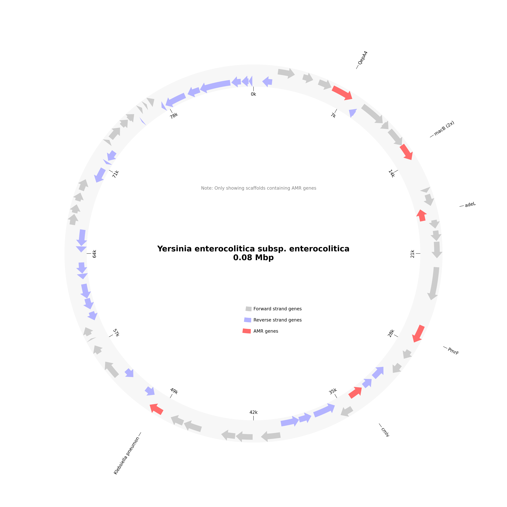

### Klebsiella pneumoniae OmpK37
- **Mechanism**: reduced permeability to antibiotic
- **Drug Classes**: monobactam; carbapenem; cephalosporin; cephamycin; penam; penem
- **AMR Family**: General Bacterial Porin with reduced permeability to beta-lactams
- **Locations**:
  - gnl|SPADES|FDOHBCDP_79_41 : position 49422-50504

### PmrF
- **Mechanism**: antibiotic target alteration
- **Drug Classes**: peptide antibiotic
- **AMR Family**: pmr phosphoethanolamine transferase
- **Locations**:
  - gnl|SPADES|FDOHBCDP_79_24 : position 26653-28026

### QepA4
- **Mechanism**: antibiotic efflux
- **Drug Classes**: fluoroquinolone antibiotic
- **AMR Family**: major facilitator superfamily (MFS) antibiotic efflux pump
- **Locations**:
  - gnl|SPADES|FDOHBCDP_79_7 : position 6031-7671

### adeL
- **Mechanism**: antibiotic efflux
- **Drug Classes**: fluoroquinolone antibiotic; tetracycline antibiotic
- **AMR Family**: resistance-nodulation-cell division (RND) antibiotic efflux pump
- **Locations**:
  - gnl|SPADES|FDOHBCDP_79_18 : position 17704-18636

### cmlv
- **Mechanism**: antibiotic inactivation
- **Drug Classes**: phenicol antibiotic
- **AMR Family**: chloramphenicol phosphotransferase
- **Locations**:
  - gnl|SPADES|FDOHBCDP_79_30 : position 33223-34389

### macB (found in 2 locations)
- **Mechanism**: antibiotic efflux
- **Drug Classes**: macrolide antibiotic
- **AMR Family**: ATP-binding cassette (ABC) antibiotic efflux pump
- **Locations**:
  - gnl|SPADES|FDOHBCDP_79_12 : position 12691-13983
  - gnl|SPADES|FDOHBCDP_79_14 : position 15134-15847

## Yersinia enterocolitica subsp. palearctica
**Strain Statistics:**
- Total genome length: 29.0 kbp
- Total scaffolds: 1
- Scaffolds with AMR genes: 1
- Total genes annotated: 62
- Total AMR genes: 7
- Unique AMR genes: 7
- Distinct AMR mechanisms: 4
- Distinct AMR families: 5
- Distinct drug classes: 12

**Circos Plot:**

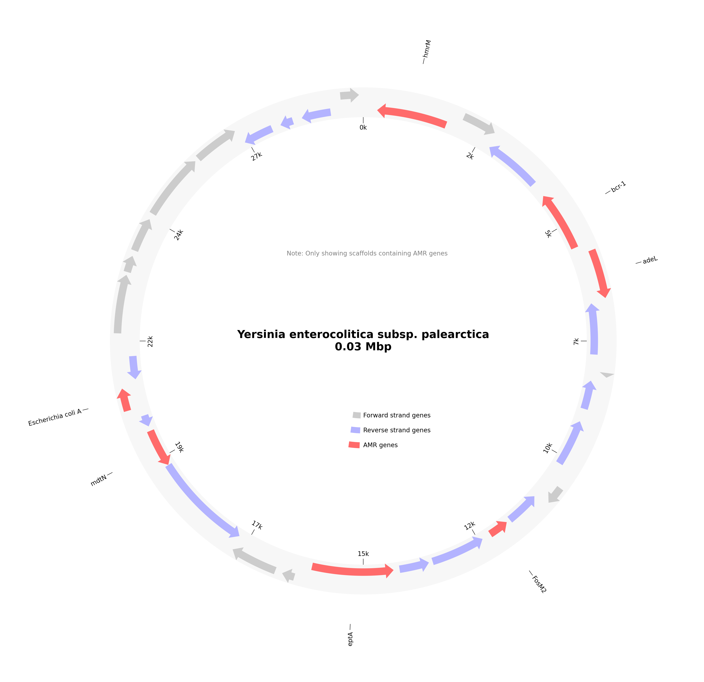

### Escherichia coli AcrAB-TolC with MarR mutations conferring resistance to ciprofloxacin and tetracycline
- **Mechanism**: antibiotic target alteration; antibiotic efflux
- **Drug Classes**: fluoroquinolone antibiotic; cephalosporin; glycylcycline; penam; tetracycline antibiotic; rifamycin antibiotic; phenicol antibiotic; disinfecting agents and antiseptics
- **AMR Family**: resistance-nodulation-cell division (RND) antibiotic efflux pump
- **Locations**:
  - gnl|SPADES|FDOHBCDP_242_22 : position 20421-20852

### FosM2
- **Mechanism**: antibiotic inactivation
- **Drug Classes**: phosphonic acid antibiotic
- **AMR Family**: fosfomycin thiol transferase
- **Locations**:
  - gnl|SPADES|FDOHBCDP_242_13 : position 11409-11816

### adeL
- **Mechanism**: antibiotic efflux
- **Drug Classes**: fluoroquinolone antibiotic; tetracycline antibiotic
- **AMR Family**: resistance-nodulation-cell division (RND) antibiotic efflux pump
- **Locations**:
  - gnl|SPADES|FDOHBCDP_242_5 : position 5504-6442

### bcr-1
- **Mechanism**: antibiotic efflux
- **Drug Classes**: bicyclomycin-like antibiotic
- **AMR Family**: major facilitator superfamily (MFS) antibiotic efflux pump
- **Locations**:
  - gnl|SPADES|FDOHBCDP_242_4 : position 4123-5340

### eptA
- **Mechanism**: antibiotic target alteration
- **Drug Classes**: peptide antibiotic
- **AMR Family**: pmr phosphoethanolamine transferase
- **Locations**:
  - gnl|SPADES|FDOHBCDP_242_16 : position 13894-15534

### hmrM
- **Mechanism**: antibiotic efflux
- **Drug Classes**: fluoroquinolone antibiotic; disinfecting agents and antiseptics
- **AMR Family**: multidrug and toxic compound extrusion (MATE) transporter
- **Locations**:
  - gnl|SPADES|FDOHBCDP_242_1 : position 276-1688

### mdtN
- **Mechanism**: antibiotic efflux
- **Drug Classes**: nucleoside antibiotic; disinfecting agents and antiseptics
- **AMR Family**: major facilitator superfamily (MFS) antibiotic efflux pump
- **Locations**:
  - gnl|SPADES|FDOHBCDP_242_20 : position 19140-19910

## Yersinia enterocolitica subsp. palearctica 105.5R(r)
**Strain Statistics:**
- Total genome length: 24.5 kbp
- Total scaffolds: 1
- Scaffolds with AMR genes: 1
- Total genes annotated: 47
- Total AMR genes: 1
- Unique AMR genes: 1
- Distinct AMR mechanisms: 1
- Distinct AMR families: 1
- Distinct drug classes: 8

**Circos Plot:**

.png)

### sdiA
- **Mechanism**: antibiotic efflux
- **Drug Classes**: fluoroquinolone antibiotic; cephalosporin; glycylcycline; penam; tetracycline antibiotic; rifamycin antibiotic; phenicol antibiotic; disinfecting agents and antiseptics
- **AMR Family**: resistance-nodulation-cell division (RND) antibiotic efflux pump
- **Locations**:
  - gnl|SPADES|FDOHBCDP_291_14 : position 12640-13374

## Yersinia enterocolitica subsp. palearctica Y11
**Strain Statistics:**
- Total genome length: 68.8 kbp
- Total scaffolds: 2
- Scaffolds with AMR genes: 1
- Total genes annotated: 132
- Total AMR genes: 10
- Unique AMR genes: 6
- Distinct AMR mechanisms: 2
- Distinct AMR families: 4
- Distinct drug classes: 20

**Circos Plot:**

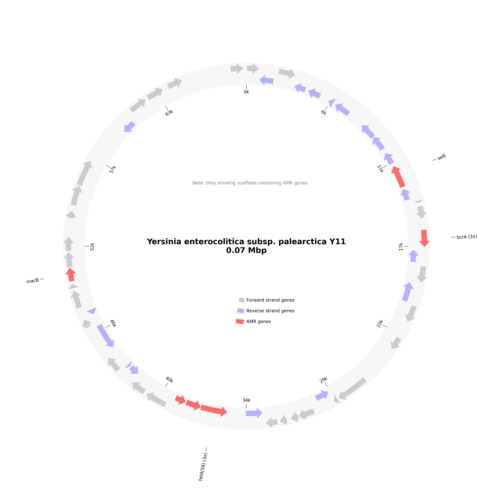

### bcrA (found in 3 locations)
- **Mechanism**: antibiotic efflux
- **Drug Classes**: peptide antibiotic
- **AMR Family**: ATP-binding cassette (ABC) antibiotic efflux pump
- **Locations**:
  - gnl|SPADES|FDOHBCDP_102_17 : position 16181-17245
  - gnl|SPADES|FDOHBCDP_102_25 : position 24759-25466
  - gnl|SPADES|FDOHBCDP_102_58 : position 59124-59822

### macB
- **Mechanism**: antibiotic efflux
- **Drug Classes**: macrolide antibiotic
- **AMR Family**: ATP-binding cassette (ABC) antibiotic efflux pump
- **Locations**:
  - gnl|SPADES|FDOHBCDP_102_49 : position 49437-50273

### mdtN
- **Mechanism**: antibiotic efflux
- **Drug Classes**: nucleoside antibiotic; disinfecting agents and antiseptics
- **AMR Family**: major facilitator superfamily (MFS) antibiotic efflux pump
- **Locations**:
  - gnl|SPADES|FDOHBCDP_102_37 : position 37424-38410

### nalC
- **Mechanism**: antibiotic efflux
- **Drug Classes**: macrolide antibiotic; fluoroquinolone antibiotic; monobactam; carbapenem; cephalosporin; cephamycin; penam; tetracycline antibiotic; peptide antibiotic; aminocoumarin antibiotic; diaminopyrimidine antibiotic; sulfonamide antibiotic; phenicol antibiotic; penem
- **AMR Family**: resistance-nodulation-cell division (RND) antibiotic efflux pump
- **Locations**:
  - gnl|SPADES|FDOHBCDP_102_38 : position 38459-39169

### salE
- **Mechanism**: antibiotic target protection
- **Drug Classes**: lincosamide antibiotic; streptogramin antibiotic; streptogramin A antibiotic; pleuromutilin antibiotic
- **AMR Family**: sal-type ABC-F protein
- **Locations**:
  - gnl|SPADES|FDOHBCDP_102_12 : position 11730-13223

### tetA(58) (found in 3 locations)
- **Mechanism**: antibiotic efflux
- **Drug Classes**: tetracycline antibiotic
- **AMR Family**: major facilitator superfamily (MFS) antibiotic efflux pump
- **Locations**:
  - gnl|SPADES|FDOHBCDP_102_36 : position 35659-37410
  - gnl|SPADES|FDOHBCDP_102_57 : position 58160-58996
  - gnl|SPADES|FDOHBCDP_102_64 : position 65988-66932

