# AMR Analysis Report for LB03_BPW_QG_A1_S23

# Organism Classifications:

## Aeromonas salmonicida
**Strain Statistics:**
- Total genome length: 1723.9 kbp
- Total scaffolds: 2665
- Scaffolds with AMR genes: 289
- Total genes annotated: 3450
- Total AMR genes: 404
- Unique AMR genes: 185
- Distinct AMR mechanisms: 10
- Distinct AMR families: 67
- Distinct drug classes: 36

**Circos Plot:**

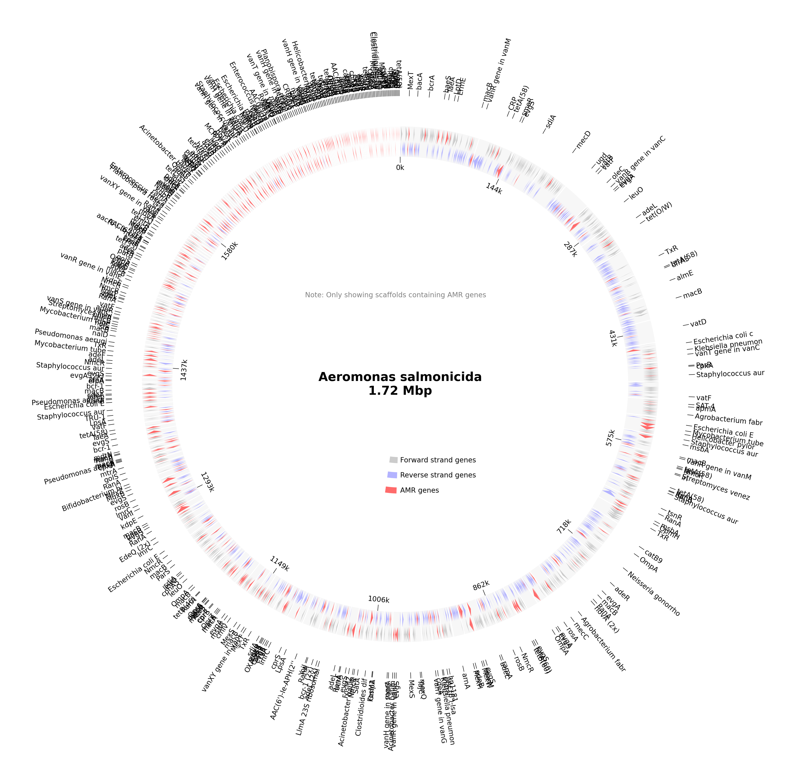

### AAC(6')-Ia
- **Mechanism**: antibiotic inactivation
- **Drug Classes**: aminoglycoside antibiotic
- **AMR Family**: AAC(6')
- **Locations**:
  - gnl|SPADES|CAEEGBCP_8738_1 : position 328-780

### AAC(6')-Ie-APH(2'')-Ia bifunctional protein
- **Mechanism**: antibiotic inactivation
- **Drug Classes**: aminoglycoside antibiotic
- **AMR Family**: aminoglycoside bifunctional resistance protein
- **Locations**:
  - gnl|SPADES|CAEEGBCP_1212_3 : position 2483-3049

### AAC(6')-If
- **Mechanism**: antibiotic inactivation
- **Drug Classes**: aminoglycoside antibiotic
- **AMR Family**: AAC(6')
- **Locations**:
  - gnl|SPADES|CAEEGBCP_19336_1 : position 1-465

### AAC(6')-Isa (found in 2 locations)
- **Mechanism**: antibiotic inactivation
- **Drug Classes**: aminoglycoside antibiotic
- **AMR Family**: AAC(6')
- **Locations**:
  - gnl|SPADES|CAEEGBCP_4203_2 : position 633-1187
  - gnl|SPADES|CAEEGBCP_908_2 : position 708-1262

### Acinetobacter baumannii AbaF (found in 2 locations)
- **Mechanism**: antibiotic efflux
- **Drug Classes**: phosphonic acid antibiotic
- **AMR Family**: major facilitator superfamily (MFS) antibiotic efflux pump
- **Locations**:
  - gnl|SPADES|CAEEGBCP_5434_2 : position 522-1838
  - gnl|SPADES|CAEEGBCP_991_10 : position 9450-10766

### Acinetobacter baumannii AmvA
- **Mechanism**: antibiotic efflux
- **Drug Classes**: macrolide antibiotic; disinfecting agents and antiseptics
- **AMR Family**: major facilitator superfamily (MFS) antibiotic efflux pump
- **Locations**:
  - gnl|SPADES|CAEEGBCP_1055_10 : position 5389-6627

### AcrS
- **Mechanism**: antibiotic efflux
- **Drug Classes**: fluoroquinolone antibiotic; cephalosporin; glycylcycline; cephamycin; penam; tetracycline antibiotic; rifamycin antibiotic; phenicol antibiotic; disinfecting agents and antiseptics
- **AMR Family**: resistance-nodulation-cell division (RND) antibiotic efflux pump
- **Locations**:
  - gnl|SPADES|CAEEGBCP_1571_1 : position 143-751

### Agrobacterium fabrum chloramphenicol acetyltransferase (found in 2 locations)
- **Mechanism**: antibiotic inactivation
- **Drug Classes**: phenicol antibiotic
- **AMR Family**: chloramphenicol acetyltransferase (CAT)
- **Locations**:
  - gnl|SPADES|CAEEGBCP_501_16 : position 14943-15560
  - gnl|SPADES|CAEEGBCP_765_14 : position 11483-12145

### AxyY
- **Mechanism**: antibiotic efflux
- **Drug Classes**: macrolide antibiotic; fluoroquinolone antibiotic; aminoglycoside antibiotic; cephalosporin
- **AMR Family**: resistance-nodulation-cell division (RND) antibiotic efflux pump
- **Locations**:
  - gnl|SPADES|CAEEGBCP_25455_1 : position 2-418

### Bifidobacterium bifidum ileS conferring resistance to mupirocin
- **Mechanism**: antibiotic target alteration
- **Drug Classes**: mupirocin-like antibiotic
- **AMR Family**: antibiotic-resistant isoleucyl-tRNA synthetase (ileS)
- **Locations**:
  - gnl|SPADES|CAEEGBCP_2137_1 : position 3-680

### CRD3-1
- **Mechanism**: antibiotic inactivation
- **Drug Classes**: carbapenem
- **AMR Family**: CRD3 beta-lactamase
- **Locations**:
  - gnl|SPADES|CAEEGBCP_11264_1 : position 52-873

### CRP
- **Mechanism**: antibiotic efflux
- **Drug Classes**: macrolide antibiotic; fluoroquinolone antibiotic; penam
- **AMR Family**: resistance-nodulation-cell division (RND) antibiotic efflux pump
- **Locations**:
  - gnl|SPADES|CAEEGBCP_179_18 : position 21451-22206

### Clostridioides difficile gyrA conferring resistance to fluoroquinolones
- **Mechanism**: antibiotic target alteration
- **Drug Classes**: fluoroquinolone antibiotic
- **AMR Family**: fluoroquinolone resistant gyrA
- **Locations**:
  - gnl|SPADES|CAEEGBCP_1048_4 : position 2553-5357

### Clostridioides difficile gyrB conferring resistance to fluoroquinolones (found in 2 locations)
- **Mechanism**: antibiotic target alteration
- **Drug Classes**: fluoroquinolone antibiotic
- **AMR Family**: fluoroquinolone resistant gyrB
- **Locations**:
  - gnl|SPADES|CAEEGBCP_29874_1 : position 2-361
  - gnl|SPADES|CAEEGBCP_29875_1 : position 2-361

### EdeQ (found in 2 locations)
- **Mechanism**: antibiotic inactivation
- **Drug Classes**: peptide antibiotic; polyamine antibiotic
- **AMR Family**: Edeine acetyltransferase
- **Locations**:
  - gnl|SPADES|CAEEGBCP_1763_7 : position 3854-4129
  - gnl|SPADES|CAEEGBCP_1763_8 : position 4081-4293

### Enterococcus faecalis cls with mutation conferring resistance to daptomycin (found in 2 locations)
- **Mechanism**: antibiotic target alteration
- **Drug Classes**: peptide antibiotic
- **AMR Family**: daptomycin resistant cls
- **Locations**:
  - gnl|SPADES|CAEEGBCP_4704_1 : position 2-712
  - gnl|SPADES|CAEEGBCP_8648_1 : position 3-932

### ErmE
- **Mechanism**: antibiotic target alteration
- **Drug Classes**: macrolide antibiotic; lincosamide antibiotic; streptogramin antibiotic; streptogramin A antibiotic; streptogramin B antibiotic
- **AMR Family**: Erm 23S ribosomal RNA methyltransferase
- **Locations**:
  - gnl|SPADES|CAEEGBCP_176_10 : position 10542-11369

### Escherichia coli EF-Tu mutants conferring resistance to Pulvomycin (found in 3 locations)
- **Mechanism**: antibiotic target alteration
- **Drug Classes**: elfamycin antibiotic
- **AMR Family**: elfamycin resistant EF-Tu
- **Locations**:
  - gnl|SPADES|CAEEGBCP_1734_2 : position 739-2655
  - gnl|SPADES|CAEEGBCP_2549_5 : position 3461-4585
  - gnl|SPADES|CAEEGBCP_507_5 : position 3884-5068

### Escherichia coli UhpT with mutation conferring resistance to fosfomycin
- **Mechanism**: antibiotic target alteration
- **Drug Classes**: phosphonic acid antibiotic
- **AMR Family**: antibiotic-resistant UhpT
- **Locations**:
  - gnl|SPADES|CAEEGBCP_7390_1 : position 3-1295

### Escherichia coli acrA
- **Mechanism**: antibiotic efflux
- **Drug Classes**: fluoroquinolone antibiotic; cephalosporin; glycylcycline; penam; tetracycline antibiotic; rifamycin antibiotic; phenicol antibiotic; disinfecting agents and antiseptics
- **AMR Family**: resistance-nodulation-cell division (RND) antibiotic efflux pump
- **Locations**:
  - gnl|SPADES|CAEEGBCP_7900_1 : position 3-1175

### Escherichia coli cyaA with mutation conferring resistance to fosfomycin
- **Mechanism**: antibiotic target alteration
- **Drug Classes**: phosphonic acid antibiotic
- **AMR Family**: antibiotic-resistant cya adenylate cyclase
- **Locations**:
  - gnl|SPADES|CAEEGBCP_428_6 : position 4093-6624

### FosM2 (found in 2 locations)
- **Mechanism**: antibiotic inactivation
- **Drug Classes**: phosphonic acid antibiotic
- **AMR Family**: fosfomycin thiol transferase
- **Locations**:
  - gnl|SPADES|CAEEGBCP_1033_8 : position 8254-8667
  - gnl|SPADES|CAEEGBCP_1055_14 : position 10116-10484

### H-NS (found in 2 locations)
- **Mechanism**: antibiotic efflux
- **Drug Classes**: macrolide antibiotic; fluoroquinolone antibiotic; cephalosporin; cephamycin; penam; tetracycline antibiotic
- **AMR Family**: major facilitator superfamily (MFS) antibiotic efflux pump; resistance-nodulation-cell division (RND) antibiotic efflux pump
- **Locations**:
  - gnl|SPADES|CAEEGBCP_16244_1 : position 215-571
  - gnl|SPADES|CAEEGBCP_20549_1 : position 2-259

### Helicobacter pylori pbp1 mutants conferring resistance to amoxicillin
- **Mechanism**: antibiotic target alteration
- **Drug Classes**: cephalosporin; cephamycin; penam
- **AMR Family**: Penicillin-binding protein mutations conferring resistance to beta-lactam antibiotics
- **Locations**:
  - gnl|SPADES|CAEEGBCP_13555_1 : position 1-810

### Helicobacter pylori rpoB mutation conferring resistance to rifampicin
- **Mechanism**: antibiotic target alteration; antibiotic target replacement
- **Drug Classes**: fluoroquinolone antibiotic; rifamycin antibiotic
- **AMR Family**: rifamycin-resistant beta-subunit of RNA polymerase (rpoB)
- **Locations**:
  - gnl|SPADES|CAEEGBCP_507_13 : position 12973-17277

### Klebsiella pneumoniae OmpK37 (found in 2 locations)
- **Mechanism**: reduced permeability to antibiotic
- **Drug Classes**: monobactam; carbapenem; cephalosporin; cephamycin; penam; penem
- **AMR Family**: General Bacterial Porin with reduced permeability to beta-lactams
- **Locations**:
  - gnl|SPADES|CAEEGBCP_428_13 : position 12555-13616
  - gnl|SPADES|CAEEGBCP_908_6 : position 5799-6884

### LlmA 23S ribosomal RNA methyltransferase
- **Mechanism**: antibiotic target alteration
- **Drug Classes**: lincosamide antibiotic
- **AMR Family**: Llm 23S ribosomal RNA methyltransferase
- **Locations**:
  - gnl|SPADES|CAEEGBCP_1103_9 : position 9343-10446

### LpsA (found in 2 locations)
- **Mechanism**: reduced permeability to antibiotic
- **Drug Classes**: peptide antibiotic
- **AMR Family**: Intrinsic peptide antibiotic resistant Lps
- **Locations**:
  - gnl|SPADES|CAEEGBCP_1237_5 : position 4718-5401
  - gnl|SPADES|CAEEGBCP_2500_3 : position 1030-1761

### LpsB
- **Mechanism**: reduced permeability to antibiotic
- **Drug Classes**: peptide antibiotic
- **AMR Family**: Intrinsic peptide antibiotic resistant Lps
- **Locations**:
  - gnl|SPADES|CAEEGBCP_4157_3 : position 1008-2102

### LptD
- **Mechanism**: antibiotic efflux
- **Drug Classes**: carbapenem; peptide antibiotic; aminocoumarin antibiotic; rifamycin antibiotic
- **AMR Family**: ATP-binding cassette (ABC) antibiotic efflux pump
- **Locations**:
  - gnl|SPADES|CAEEGBCP_176_7 : position 5880-8312

### MCR-3.7
- **Mechanism**: antibiotic target alteration
- **Drug Classes**: peptide antibiotic
- **AMR Family**: MCR phosphoethanolamine transferase
- **Locations**:
  - gnl|SPADES|CAEEGBCP_28363_1 : position 3-152

### MCR-7.1
- **Mechanism**: antibiotic target alteration
- **Drug Classes**: peptide antibiotic
- **AMR Family**: MCR phosphoethanolamine transferase
- **Locations**:
  - gnl|SPADES|CAEEGBCP_6319_1 : position 285-1871

### MOX-13
- **Mechanism**: antibiotic inactivation
- **Drug Classes**: cephalosporin; cephamycin; penam
- **AMR Family**: MOX beta-lactamase
- **Locations**:
  - gnl|SPADES|CAEEGBCP_31925_1 : position 243-341

### MexH (found in 5 locations)
- **Mechanism**: antibiotic efflux
- **Drug Classes**: fluoroquinolone antibiotic; tetracycline antibiotic; disinfecting agents and antiseptics
- **AMR Family**: resistance-nodulation-cell division (RND) antibiotic efflux pump
- **Locations**:
  - gnl|SPADES|CAEEGBCP_15267_1 : position 3-707
  - gnl|SPADES|CAEEGBCP_4287_1 : position 212-1744
  - gnl|SPADES|CAEEGBCP_50139_1 : position 3-254
  - gnl|SPADES|CAEEGBCP_888_8 : position 11311-12735
  - gnl|SPADES|CAEEGBCP_9114_2 : position 489-1247

### MexL
- **Mechanism**: antibiotic efflux
- **Drug Classes**: macrolide antibiotic; tetracycline antibiotic; disinfecting agents and antiseptics
- **AMR Family**: resistance-nodulation-cell division (RND) antibiotic efflux pump
- **Locations**:
  - gnl|SPADES|CAEEGBCP_6553_1 : position 220-861

### MexS (found in 3 locations)
- **Mechanism**: antibiotic efflux
- **Drug Classes**: fluoroquinolone antibiotic; diaminopyrimidine antibiotic; phenicol antibiotic
- **AMR Family**: resistance-nodulation-cell division (RND) antibiotic efflux pump
- **Locations**:
  - gnl|SPADES|CAEEGBCP_1355_7 : position 7104-8231
  - gnl|SPADES|CAEEGBCP_8827_2 : position 172-1176
  - gnl|SPADES|CAEEGBCP_983_5 : position 1959-2945

### MexT (found in 2 locations)
- **Mechanism**: antibiotic efflux
- **Drug Classes**: fluoroquinolone antibiotic; diaminopyrimidine antibiotic; phenicol antibiotic
- **AMR Family**: resistance-nodulation-cell division (RND) antibiotic efflux pump
- **Locations**:
  - gnl|SPADES|CAEEGBCP_1335_6 : position 4586-5497
  - gnl|SPADES|CAEEGBCP_144_7 : position 9742-10662

### MexW
- **Mechanism**: antibiotic efflux
- **Drug Classes**: macrolide antibiotic; fluoroquinolone antibiotic; tetracycline antibiotic; phenicol antibiotic; disinfecting agents and antiseptics
- **AMR Family**: resistance-nodulation-cell division (RND) antibiotic efflux pump
- **Locations**:
  - gnl|SPADES|CAEEGBCP_888_2 : position 682-3834

### MexZ
- **Mechanism**: antibiotic efflux
- **Drug Classes**: macrolide antibiotic; fluoroquinolone antibiotic; aminoglycoside antibiotic; carbapenem; cephalosporin; cephamycin; penam; tetracycline antibiotic; phenicol antibiotic; disinfecting agents and antiseptics
- **AMR Family**: resistance-nodulation-cell division (RND) antibiotic efflux pump
- **Locations**:
  - gnl|SPADES|CAEEGBCP_2101_4 : position 3548-4201

### MuxB
- **Mechanism**: antibiotic efflux
- **Drug Classes**: macrolide antibiotic; monobactam; tetracycline antibiotic; aminocoumarin antibiotic
- **AMR Family**: resistance-nodulation-cell division (RND) antibiotic efflux pump
- **Locations**:
  - gnl|SPADES|CAEEGBCP_2101_1 : position 3-1124

### MuxC (found in 2 locations)
- **Mechanism**: antibiotic efflux
- **Drug Classes**: macrolide antibiotic; monobactam; tetracycline antibiotic; aminocoumarin antibiotic
- **AMR Family**: resistance-nodulation-cell division (RND) antibiotic efflux pump
- **Locations**:
  - gnl|SPADES|CAEEGBCP_13273_1 : position 3-827
  - gnl|SPADES|CAEEGBCP_29879_1 : position 3-362

### Mycobacterium tuberculosis katG mutations conferring resistance to isoniazid
- **Mechanism**: antibiotic target alteration
- **Drug Classes**: isoniazid-like antibiotic
- **AMR Family**: isoniazid resistant katG
- **Locations**:
  - gnl|SPADES|CAEEGBCP_2893_1 : position 275-2410

### Mycobacterium tuberculosis pncA mutations conferring resistance to pyrazinamide
- **Mechanism**: antibiotic target alteration
- **Drug Classes**: pyrazine antibiotic
- **AMR Family**: Pyrazinamide resistant pncA
- **Locations**:
  - gnl|SPADES|CAEEGBCP_3033_2 : position 530-1165

### Mycobacterium tuberculosis rpoB mutations conferring resistance to rifampicin
- **Mechanism**: antibiotic target alteration; antibiotic target replacement
- **Drug Classes**: rifamycin antibiotic
- **AMR Family**: rifamycin-resistant beta-subunit of RNA polymerase (rpoB)
- **Locations**:
  - gnl|SPADES|CAEEGBCP_507_12 : position 8853-12881

### Neisseria gonorrhoeae pilQ gene conferring resistance to beta-lactam
- **Mechanism**: antibiotic target alteration
- **Drug Classes**: cephalosporin; cephamycin; penam
- **AMR Family**: Penicillin-binding protein mutations conferring resistance to beta-lactam antibiotics
- **Locations**:
  - gnl|SPADES|CAEEGBCP_729_6 : position 4417-6453

### NmcR (found in 11 locations)
- **Mechanism**: antibiotic inactivation
- **Drug Classes**: carbapenem; cephalosporin; cephamycin; penam
- **AMR Family**: NmcA beta-lactamase
- **Locations**:
  - gnl|SPADES|CAEEGBCP_1055_8 : position 3914-4783
  - gnl|SPADES|CAEEGBCP_14700_1 : position 124-738
  - gnl|SPADES|CAEEGBCP_1715_6 : position 2997-3839
  - gnl|SPADES|CAEEGBCP_2744_5 : position 3084-3986
  - gnl|SPADES|CAEEGBCP_3597_1 : position 3-758
  - gnl|SPADES|CAEEGBCP_3636_3 : position 1791-2753
  - gnl|SPADES|CAEEGBCP_4745_1 : position 2-865
  - gnl|SPADES|CAEEGBCP_517_9 : position 9119-10027
  - gnl|SPADES|CAEEGBCP_6719_2 : position 890-1762
  - gnl|SPADES|CAEEGBCP_837_20 : position 12723-13517
  - gnl|SPADES|CAEEGBCP_8604_1 : position 2-784

### OXA-917
- **Mechanism**: antibiotic inactivation
- **Drug Classes**: carbapenem; penam
- **AMR Family**: OXA beta-lactamase; OXA-427-like beta-lactamase
- **Locations**:
  - gnl|SPADES|CAEEGBCP_1274_3 : position 1758-2552

### OmpA (found in 7 locations)
- **Mechanism**: reduced permeability to antibiotic
- **Drug Classes**: peptide antibiotic
- **AMR Family**: General Bacterial Porin with reduced permeability to peptide antibiotics
- **Locations**:
  - gnl|SPADES|CAEEGBCP_1033_7 : position 7306-8181
  - gnl|SPADES|CAEEGBCP_1594_2 : position 202-858
  - gnl|SPADES|CAEEGBCP_17414_1 : position 299-613
  - gnl|SPADES|CAEEGBCP_28107_1 : position 1-381
  - gnl|SPADES|CAEEGBCP_3868_3 : position 2171-2695
  - gnl|SPADES|CAEEGBCP_719_3 : position 1168-2199
  - gnl|SPADES|CAEEGBCP_825_2 : position 1233-1757

### OpmH
- **Mechanism**: antibiotic efflux
- **Drug Classes**: disinfecting agents and antiseptics
- **AMR Family**: resistance-nodulation-cell division (RND) antibiotic efflux pump
- **Locations**:
  - gnl|SPADES|CAEEGBCP_609_9 : position 13942-15267

### OprA
- **Mechanism**: antibiotic efflux
- **Drug Classes**: macrolide antibiotic; fluoroquinolone antibiotic; aminoglycoside antibiotic; carbapenem; tetracycline antibiotic
- **AMR Family**: resistance-nodulation-cell division (RND) antibiotic efflux pump
- **Locations**:
  - gnl|SPADES|CAEEGBCP_1571_7 : position 5138-5788

### OprZ
- **Mechanism**: antibiotic efflux
- **Drug Classes**: macrolide antibiotic; fluoroquinolone antibiotic; aminoglycoside antibiotic; cephalosporin
- **AMR Family**: resistance-nodulation-cell division (RND) antibiotic efflux pump
- **Locations**:
  - gnl|SPADES|CAEEGBCP_1415_5 : position 4695-6062

### ParR (found in 2 locations)
- **Mechanism**: antibiotic efflux; reduced permeability to antibiotic
- **Drug Classes**: macrolide antibiotic; fluoroquinolone antibiotic; monobactam; aminoglycoside antibiotic; carbapenem; cephalosporin; cephamycin; penam; tetracycline antibiotic; phenicol antibiotic; penem; disinfecting agents and antiseptics
- **AMR Family**: resistance-nodulation-cell division (RND) antibiotic efflux pump; Outer Membrane Porin (Opr)
- **Locations**:
  - gnl|SPADES|CAEEGBCP_15164_1 : position 1-714
  - gnl|SPADES|CAEEGBCP_467_8 : position 5519-6238

### ParS
- **Mechanism**: antibiotic efflux; reduced permeability to antibiotic
- **Drug Classes**: macrolide antibiotic; fluoroquinolone antibiotic; monobactam; aminoglycoside antibiotic; carbapenem; cephalosporin; cephamycin; penam; tetracycline antibiotic; phenicol antibiotic; penem; disinfecting agents and antiseptics
- **AMR Family**: resistance-nodulation-cell division (RND) antibiotic efflux pump; Outer Membrane Porin (Opr)
- **Locations**:
  - gnl|SPADES|CAEEGBCP_1649_6 : position 5677-7005

### Planobispora rosea EF-Tu mutants conferring resistance to inhibitor GE2270A (found in 2 locations)
- **Mechanism**: antibiotic target alteration
- **Drug Classes**: elfamycin antibiotic
- **AMR Family**: elfamycin resistant EF-Tu
- **Locations**:
  - gnl|SPADES|CAEEGBCP_10691_1 : position 1-1047
  - gnl|SPADES|CAEEGBCP_4692_2 : position 1076-2527

### PmpM
- **Mechanism**: antibiotic efflux
- **Drug Classes**: fluoroquinolone antibiotic; aminoglycoside antibiotic; disinfecting agents and antiseptics
- **AMR Family**: multidrug and toxic compound extrusion (MATE) transporter
- **Locations**:
  - gnl|SPADES|CAEEGBCP_5755_2 : position 1452-2060

### PmrF (found in 2 locations)
- **Mechanism**: antibiotic target alteration
- **Drug Classes**: peptide antibiotic
- **AMR Family**: pmr phosphoethanolamine transferase
- **Locations**:
  - gnl|SPADES|CAEEGBCP_3584_2 : position 716-1750
  - gnl|SPADES|CAEEGBCP_4157_2 : position 227-1006

### Pseudomonas aeruginosa CpxR
- **Mechanism**: antibiotic efflux
- **Drug Classes**: macrolide antibiotic; fluoroquinolone antibiotic; monobactam; aminoglycoside antibiotic; carbapenem; cephalosporin; cephamycin; penam; tetracycline antibiotic; peptide antibiotic; aminocoumarin antibiotic; diaminopyrimidine antibiotic; sulfonamide antibiotic; phenicol antibiotic; penem
- **AMR Family**: resistance-nodulation-cell division (RND) antibiotic efflux pump
- **Locations**:
  - gnl|SPADES|CAEEGBCP_2282_3 : position 2213-2893

### Pseudomonas aeruginosa ampR with mutation conferring resistance to aztreonam
- **Mechanism**: antibiotic target alteration; antibiotic inactivation
- **Drug Classes**: monobactam; carbapenem; cephalosporin
- **AMR Family**: PDC beta-lactamase; ampR transcriptional regulator with mutation conferring resistance to monobactam antibiotics
- **Locations**:
  - gnl|SPADES|CAEEGBCP_2595_3 : position 2342-3289

### Pseudomonas aeruginosa soxR
- **Mechanism**: antibiotic target alteration; antibiotic efflux
- **Drug Classes**: fluoroquinolone antibiotic; cephalosporin; glycylcycline; penam; tetracycline antibiotic; rifamycin antibiotic; phenicol antibiotic; disinfecting agents and antiseptics
- **AMR Family**: ATP-binding cassette (ABC) antibiotic efflux pump; major facilitator superfamily (MFS) antibiotic efflux pump; resistance-nodulation-cell division (RND) antibiotic efflux pump
- **Locations**:
  - gnl|SPADES|CAEEGBCP_2950_2 : position 665-1144

### QepA4
- **Mechanism**: antibiotic efflux
- **Drug Classes**: fluoroquinolone antibiotic
- **AMR Family**: major facilitator superfamily (MFS) antibiotic efflux pump
- **Locations**:
  - gnl|SPADES|CAEEGBCP_144_8 : position 10853-12247

### QnrAS
- **Mechanism**: antibiotic target protection
- **Drug Classes**: fluoroquinolone antibiotic
- **AMR Family**: quinolone resistance protein (qnr)
- **Locations**:
  - gnl|SPADES|CAEEGBCP_5297_2 : position 207-857

### RanA (found in 12 locations)
- **Mechanism**: antibiotic efflux
- **Drug Classes**: aminoglycoside antibiotic
- **AMR Family**: ATP-binding cassette (ABC) antibiotic efflux pump
- **Locations**:
  - gnl|SPADES|CAEEGBCP_1094_7 : position 8878-9870
  - gnl|SPADES|CAEEGBCP_1180_2 : position 140-904
  - gnl|SPADES|CAEEGBCP_1581_8 : position 5604-6386
  - gnl|SPADES|CAEEGBCP_1801_6 : position 4630-5637
  - gnl|SPADES|CAEEGBCP_2219_1 : position 2-616
  - gnl|SPADES|CAEEGBCP_2305_4 : position 3123-4124
  - gnl|SPADES|CAEEGBCP_2595_2 : position 1089-2156
  - gnl|SPADES|CAEEGBCP_3534_3 : position 2860-3354
  - gnl|SPADES|CAEEGBCP_4570_2 : position 111-1106
  - gnl|SPADES|CAEEGBCP_536_17 : position 13541-14341
  - gnl|SPADES|CAEEGBCP_609_3 : position 1678-2439
  - gnl|SPADES|CAEEGBCP_756_4 : position 5486-6268

### RanB
- **Mechanism**: antibiotic efflux
- **Drug Classes**: aminoglycoside antibiotic
- **AMR Family**: ATP-binding cassette (ABC) antibiotic efflux pump
- **Locations**:
  - gnl|SPADES|CAEEGBCP_536_18 : position 14341-15120

### Rv1877
- **Mechanism**: antibiotic efflux
- **Drug Classes**: fluoroquinolone antibiotic
- **AMR Family**: major facilitator superfamily (MFS) antibiotic efflux pump
- **Locations**:
  - gnl|SPADES|CAEEGBCP_8996_1 : position 240-1268

### SAT-4
- **Mechanism**: antibiotic inactivation
- **Drug Classes**: nucleoside antibiotic
- **AMR Family**: streptothricin acetyltransferase (SAT)
- **Locations**:
  - gnl|SPADES|CAEEGBCP_501_5 : position 3225-3632

### SatA (found in 2 locations)
- **Mechanism**: antibiotic inactivation
- **Drug Classes**: nucleoside antibiotic
- **AMR Family**: streptothricin acetyltransferase (SAT)
- **Locations**:
  - gnl|SPADES|CAEEGBCP_1055_1 : position 89-547
  - gnl|SPADES|CAEEGBCP_16572_2 : position 164-622

### Staphylococcus aureus fusA with mutation conferring resistance to fusidic acid (found in 2 locations)
- **Mechanism**: antibiotic target alteration
- **Drug Classes**: fusidane antibiotic
- **AMR Family**: antibiotic resistant fusA
- **Locations**:
  - gnl|SPADES|CAEEGBCP_507_21 : position 20924-21367
  - gnl|SPADES|CAEEGBCP_6697_1 : position 3-1544

### Staphylococcus aureus fusE with mutation conferring resistance to fusidic acid
- **Mechanism**: antibiotic target alteration
- **Drug Classes**: fusidane antibiotic
- **AMR Family**: antibiotic resistant fusE
- **Locations**:
  - gnl|SPADES|CAEEGBCP_467_27 : position 16112-16645

### Staphylococcus aureus mupA conferring resistance to mupirocin (found in 2 locations)
- **Mechanism**: antibiotic target alteration
- **Drug Classes**: mupirocin-like antibiotic
- **AMR Family**: antibiotic-resistant isoleucyl-tRNA synthetase (ileS)
- **Locations**:
  - gnl|SPADES|CAEEGBCP_2525_1 : position 3-2033
  - gnl|SPADES|CAEEGBCP_2738_4 : position 2284-4314

### Staphylococcus aureus murA with mutation conferring resistance to fosfomycin
- **Mechanism**: antibiotic target alteration
- **Drug Classes**: phosphonic acid antibiotic
- **AMR Family**: antibiotic-resistant murA transferase
- **Locations**:
  - gnl|SPADES|CAEEGBCP_536_23 : position 16803-18059

### Streptomyces lividans cmlR
- **Mechanism**: antibiotic efflux
- **Drug Classes**: phenicol antibiotic
- **AMR Family**: major facilitator superfamily (MFS) antibiotic efflux pump
- **Locations**:
  - gnl|SPADES|CAEEGBCP_3261_3 : position 2844-3644

### Streptomyces venezuelae rox
- **Mechanism**: antibiotic inactivation
- **Drug Classes**: rifamycin antibiotic
- **AMR Family**: rifampin monooxygenase
- **Locations**:
  - gnl|SPADES|CAEEGBCP_517_14 : position 14858-16081

### TRU-1
- **Mechanism**: antibiotic inactivation
- **Drug Classes**: cephalosporin; penam
- **AMR Family**: TRU beta-lactamase
- **Locations**:
  - gnl|SPADES|CAEEGBCP_2515_1: position 269-1417

### TaeA (found in 3 locations)
- **Mechanism**: antibiotic efflux
- **Drug Classes**: pleuromutilin antibiotic
- **AMR Family**: ATP-binding cassette (ABC) antibiotic efflux pump
- **Locations**:
  - gnl|SPADES|CAEEGBCP_176_1 : position 1-1062
  - gnl|SPADES|CAEEGBCP_2470_3 : position 2527-4437
  - gnl|SPADES|CAEEGBCP_2711_2 : position 1160-1927

### TolC
- **Mechanism**: antibiotic efflux
- **Drug Classes**: macrolide antibiotic; fluoroquinolone antibiotic; aminoglycoside antibiotic; carbapenem; cephalosporin; glycylcycline; cephamycin; penam; tetracycline antibiotic; peptide antibiotic; aminocoumarin antibiotic; rifamycin antibiotic; phenicol antibiotic; penem; disinfecting agents and antiseptics
- **AMR Family**: ATP-binding cassette (ABC) antibiotic efflux pump; major facilitator superfamily (MFS) antibiotic efflux pump; resistance-nodulation-cell division (RND) antibiotic efflux pump
- **Locations**:
  - gnl|SPADES|CAEEGBCP_5183_1 : position 21-1346

### TxR (found in 9 locations)
- **Mechanism**: antibiotic efflux
- **Drug Classes**: tetracycline antibiotic
- **AMR Family**: ATP-binding cassette (ABC) antibiotic efflux pump
- **Locations**:
  - gnl|SPADES|CAEEGBCP_11840_1 : position 2-937
  - gnl|SPADES|CAEEGBCP_1262_8 : position 5665-7020
  - gnl|SPADES|CAEEGBCP_1316_10 : position 7422-8828
  - gnl|SPADES|CAEEGBCP_22936_1 : position 2-463
  - gnl|SPADES|CAEEGBCP_2938_1 : position 704-2482
  - gnl|SPADES|CAEEGBCP_294_32 : position 24651-26027
  - gnl|SPADES|CAEEGBCP_4112_2 : position 1188-2717
  - gnl|SPADES|CAEEGBCP_5971_1 : position 2-1465
  - gnl|SPADES|CAEEGBCP_674_2 : position 911-2449

### YajC
- **Mechanism**: antibiotic efflux
- **Drug Classes**: fluoroquinolone antibiotic; cephalosporin; glycylcycline; penam; tetracycline antibiotic; oxazolidinone antibiotic; glycopeptide antibiotic; rifamycin antibiotic; phenicol antibiotic; disinfecting agents and antiseptics
- **AMR Family**: resistance-nodulation-cell division (RND) antibiotic efflux pump
- **Locations**:
  - gnl|SPADES|CAEEGBCP_943_6 : position 4524-4859

### YojI (found in 2 locations)
- **Mechanism**: antibiotic efflux
- **Drug Classes**: peptide antibiotic
- **AMR Family**: ATP-binding cassette (ABC) antibiotic efflux pump
- **Locations**:
  - gnl|SPADES|CAEEGBCP_1180_3 : position 951-2597
  - gnl|SPADES|CAEEGBCP_39344_1 : position 45-287

### aac(6')-Ib-cr11
- **Mechanism**: antibiotic inactivation
- **Drug Classes**: fluoroquinolone antibiotic; aminoglycoside antibiotic
- **AMR Family**: AAC(6'); AAC(6')-Ib-cr
- **Locations**:
  - gnl|SPADES|CAEEGBCP_4203_1 : position 26-577

### adeB (found in 5 locations)
- **Mechanism**: antibiotic efflux
- **Drug Classes**: glycylcycline; tetracycline antibiotic
- **AMR Family**: resistance-nodulation-cell division (RND) antibiotic efflux pump
- **Locations**:
  - gnl|SPADES|CAEEGBCP_18078_1 : position 3-590
  - gnl|SPADES|CAEEGBCP_20195_1 : position 2-526
  - gnl|SPADES|CAEEGBCP_4287_2 : position 1741-2772
  - gnl|SPADES|CAEEGBCP_6105_1 : position 3-1943
  - gnl|SPADES|CAEEGBCP_888_7 : position 8186-11314

### adeF (found in 2 locations)
- **Mechanism**: antibiotic efflux
- **Drug Classes**: fluoroquinolone antibiotic; tetracycline antibiotic
- **AMR Family**: resistance-nodulation-cell division (RND) antibiotic efflux pump
- **Locations**:
  - gnl|SPADES|CAEEGBCP_2847_1: position 3-2867
  - gnl|SPADES|CAEEGBCP_68465_1 : position 3-215

### adeL (found in 17 locations)
- **Mechanism**: antibiotic efflux
- **Drug Classes**: fluoroquinolone antibiotic; tetracycline antibiotic
- **AMR Family**: resistance-nodulation-cell division (RND) antibiotic efflux pump
- **Locations**:
  - gnl|SPADES|CAEEGBCP_10477_2 : position 292-1071
  - gnl|SPADES|CAEEGBCP_1102_4 : position 2810-3718
  - gnl|SPADES|CAEEGBCP_1114_1 : position 432-1394
  - gnl|SPADES|CAEEGBCP_1114_13 : position 9205-10164
  - gnl|SPADES|CAEEGBCP_11524_1 : position 2-490
  - gnl|SPADES|CAEEGBCP_2620_1 : position 498-1406
  - gnl|SPADES|CAEEGBCP_275_12 : position 10423-11304
  - gnl|SPADES|CAEEGBCP_2785_2 : position 964-1860
  - gnl|SPADES|CAEEGBCP_3581_4 : position 2475-3317
  - gnl|SPADES|CAEEGBCP_3826_5 : position 2169-3065
  - gnl|SPADES|CAEEGBCP_4116_1 : position 3-875
  - gnl|SPADES|CAEEGBCP_4210_3 : position 683-1597
  - gnl|SPADES|CAEEGBCP_4865_2 : position 1951-2427
  - gnl|SPADES|CAEEGBCP_5256_2 : position 1235-2134
  - gnl|SPADES|CAEEGBCP_5497_2 : position 161-1036
  - gnl|SPADES|CAEEGBCP_5840_1 : position 2-871
  - gnl|SPADES|CAEEGBCP_869_9 : position 8722-9627

### adeR (found in 2 locations)
- **Mechanism**: antibiotic efflux
- **Drug Classes**: glycylcycline; tetracycline antibiotic
- **AMR Family**: resistance-nodulation-cell division (RND) antibiotic efflux pump
- **Locations**:
  - gnl|SPADES|CAEEGBCP_3403_1 : position 58-1071
  - gnl|SPADES|CAEEGBCP_730_12 : position 10717-11628

### almE (found in 3 locations)
- **Mechanism**: antibiotic target alteration
- **Drug Classes**: peptide antibiotic
- **AMR Family**: polymyxin resistance operon; alm glycyltransferase
- **Locations**:
  - gnl|SPADES|CAEEGBCP_334_27 : position 21520-21999
  - gnl|SPADES|CAEEGBCP_33989_1 : position 2-325
  - gnl|SPADES|CAEEGBCP_51428_1 : position 2-253

### almG
- **Mechanism**: antibiotic target alteration
- **Drug Classes**: peptide antibiotic
- **AMR Family**: lipid A acyltransferase; polymyxin resistance operon
- **Locations**:
  - gnl|SPADES|CAEEGBCP_27299_1 : position 2-391

### apmA
- **Mechanism**: antibiotic inactivation
- **Drug Classes**: aminoglycoside antibiotic
- **AMR Family**: AAC(2')
- **Locations**:
  - gnl|SPADES|CAEEGBCP_501_8 : position 6026-6556

### arnA
- **Mechanism**: antibiotic target alteration
- **Drug Classes**: peptide antibiotic
- **AMR Family**: pmr phosphoethanolamine transferase
- **Locations**:
  - gnl|SPADES|CAEEGBCP_889_10 : position 9850-10770

### bacA
- **Mechanism**: antibiotic target alteration
- **Drug Classes**: peptide antibiotic
- **AMR Family**: undecaprenyl pyrophosphate related proteins
- **Locations**:
  - gnl|SPADES|CAEEGBCP_144_16 : position 19331-20146

### baeR
- **Mechanism**: antibiotic efflux
- **Drug Classes**: aminoglycoside antibiotic; aminocoumarin antibiotic
- **AMR Family**: resistance-nodulation-cell division (RND) antibiotic efflux pump
- **Locations**:
  - gnl|SPADES|CAEEGBCP_1831_3 : position 5271-6200

### baeS (found in 2 locations)
- **Mechanism**: antibiotic efflux
- **Drug Classes**: aminoglycoside antibiotic; aminocoumarin antibiotic
- **AMR Family**: resistance-nodulation-cell division (RND) antibiotic efflux pump
- **Locations**:
  - gnl|SPADES|CAEEGBCP_11805_1 : position 2-895
  - gnl|SPADES|CAEEGBCP_144_41 : position 49131-51020

### basS
- **Mechanism**: antibiotic target alteration; antibiotic efflux
- **Drug Classes**: peptide antibiotic
- **AMR Family**: pmr phosphoethanolamine transferase
- **Locations**:
  - gnl|SPADES|CAEEGBCP_1274_4 : position 2608-4050

### bcr-1 (found in 7 locations)
- **Mechanism**: antibiotic efflux
- **Drug Classes**: bicyclomycin-like antibiotic
- **AMR Family**: major facilitator superfamily (MFS) antibiotic efflux pump
- **Locations**:
  - gnl|SPADES|CAEEGBCP_1114_7 : position 5533-5970
  - gnl|SPADES|CAEEGBCP_1114_9 : position 6211-6705
  - gnl|SPADES|CAEEGBCP_2377_2 : position 1937-3139
  - gnl|SPADES|CAEEGBCP_2654_1 : position 2-940
  - gnl|SPADES|CAEEGBCP_517_8 : position 7865-9064
  - gnl|SPADES|CAEEGBCP_5547_1 : position 72-1244
  - gnl|SPADES|CAEEGBCP_6483_1 : position 53-1252

### bcrA (found in 2 locations)
- **Mechanism**: antibiotic efflux
- **Drug Classes**: peptide antibiotic
- **AMR Family**: ATP-binding cassette (ABC) antibiotic efflux pump
- **Locations**:
  - gnl|SPADES|CAEEGBCP_1094_6 : position 7847-8866
  - gnl|SPADES|CAEEGBCP_144_26 : position 31973-33517

### carA
- **Mechanism**: antibiotic target protection
- **Drug Classes**: macrolide antibiotic
- **AMR Family**: Miscellaneous ABC-F subfamily ATP-binding cassette ribosomal protection proteins
- **Locations**:
  - gnl|SPADES|CAEEGBCP_26812_1 : position 1-399

### catB11
- **Mechanism**: antibiotic inactivation
- **Drug Classes**: phenicol antibiotic
- **AMR Family**: chloramphenicol acetyltransferase (CAT)
- **Locations**:
  - gnl|SPADES|CAEEGBCP_21139_1 : position 3-503

### catB9 (found in 2 locations)
- **Mechanism**: antibiotic inactivation
- **Drug Classes**: phenicol antibiotic
- **AMR Family**: chloramphenicol acetyltransferase (CAT)
- **Locations**:
  - gnl|SPADES|CAEEGBCP_1274_1 : position 1-228
  - gnl|SPADES|CAEEGBCP_710_14 : position 8143-8778

### cdeA (found in 2 locations)
- **Mechanism**: antibiotic efflux
- **Drug Classes**: fluoroquinolone antibiotic; disinfecting agents and antiseptics
- **AMR Family**: multidrug and toxic compound extrusion (MATE) transporter
- **Locations**:
  - gnl|SPADES|CAEEGBCP_2620_2 : position 1513-2934
  - gnl|SPADES|CAEEGBCP_908_10 : position 10926-12386

### cmeB
- **Mechanism**: antibiotic efflux
- **Drug Classes**: macrolide antibiotic; fluoroquinolone antibiotic; cephalosporin; fusidane antibiotic
- **AMR Family**: resistance-nodulation-cell division (RND) antibiotic efflux pump
- **Locations**:
  - gnl|SPADES|CAEEGBCP_7900_2 : position 1185-1475

### cmlv (found in 2 locations)
- **Mechanism**: antibiotic inactivation
- **Drug Classes**: phenicol antibiotic
- **AMR Family**: chloramphenicol phosphotransferase
- **Locations**:
  - gnl|SPADES|CAEEGBCP_10834_1 : position 2-559
  - gnl|SPADES|CAEEGBCP_1358_9 : position 5959-7140

### cmrA
- **Mechanism**: antibiotic efflux
- **Drug Classes**: phenicol antibiotic
- **AMR Family**: major facilitator superfamily (MFS) antibiotic efflux pump
- **Locations**:
  - gnl|SPADES|CAEEGBCP_4865_1 : position 619-1848

### cmx
- **Mechanism**: antibiotic efflux
- **Drug Classes**: phenicol antibiotic
- **AMR Family**: major facilitator superfamily (MFS) antibiotic efflux pump
- **Locations**:
  - gnl|SPADES|CAEEGBCP_3581_3 : position 1143-2372

### cphA5 (found in 5 locations)
- **Mechanism**: antibiotic inactivation
- **Drug Classes**: carbapenem
- **AMR Family**: CphA beta-lactamase
- **Locations**:
  - gnl|SPADES|CAEEGBCP_1605_8 : position 6964-7206
  - gnl|SPADES|CAEEGBCP_22731_1 : position 250-468
  - gnl|SPADES|CAEEGBCP_31700_1 : position 141-344
  - gnl|SPADES|CAEEGBCP_38111_1 : position 2-184
  - gnl|SPADES|CAEEGBCP_46795_1 : position 60-263

### cprR (found in 2 locations)
- **Mechanism**: antibiotic target alteration; antibiotic efflux
- **Drug Classes**: peptide antibiotic
- **AMR Family**: pmr phosphoethanolamine transferase
- **Locations**:
  - gnl|SPADES|CAEEGBCP_1517_4 : position 3578-4246
  - gnl|SPADES|CAEEGBCP_38585_1 : position 57-290

### cprS (found in 2 locations)
- **Mechanism**: antibiotic target alteration; antibiotic efflux
- **Drug Classes**: peptide antibiotic
- **AMR Family**: pmr phosphoethanolamine transferase
- **Locations**:
  - gnl|SPADES|CAEEGBCP_1240_1 : position 2-1237
  - gnl|SPADES|CAEEGBCP_1517_3 : position 2232-3581

### cpxA (found in 2 locations)
- **Mechanism**: antibiotic efflux
- **Drug Classes**: aminoglycoside antibiotic; aminocoumarin antibiotic
- **AMR Family**: resistance-nodulation-cell division (RND) antibiotic efflux pump
- **Locations**:
  - gnl|SPADES|CAEEGBCP_2282_2 : position 927-2216
  - gnl|SPADES|CAEEGBCP_467_9 : position 6235-7545

### dfrA3 (found in 2 locations)
- **Mechanism**: antibiotic target replacement
- **Drug Classes**: diaminopyrimidine antibiotic
- **AMR Family**: trimethoprim resistant dihydrofolate reductase dfr
- **Locations**:
  - gnl|SPADES|CAEEGBCP_16262_2 : position 151-633
  - gnl|SPADES|CAEEGBCP_334_7 : position 6116-6610

### efpA
- **Mechanism**: antibiotic efflux
- **Drug Classes**: rifamycin antibiotic; isoniazid-like antibiotic
- **AMR Family**: major facilitator superfamily (MFS) antibiotic efflux pump
- **Locations**:
  - gnl|SPADES|CAEEGBCP_2711_1 : position 1-1086

### emrA
- **Mechanism**: antibiotic efflux
- **Drug Classes**: fluoroquinolone antibiotic
- **AMR Family**: major facilitator superfamily (MFS) antibiotic efflux pump
- **Locations**:
  - gnl|SPADES|CAEEGBCP_71477_1 : position 3-209

### emtA
- **Mechanism**: antibiotic target alteration
- **Drug Classes**: macrolide antibiotic; lincosamide antibiotic; orthosomycin antibiotic
- **AMR Family**: non-erm 23S ribosomal RNA methyltransferase (G748)
- **Locations**:
  - gnl|SPADES|CAEEGBCP_4313_3 : position 1329-2141

### evgA (found in 8 locations)
- **Mechanism**: antibiotic efflux
- **Drug Classes**: macrolide antibiotic; fluoroquinolone antibiotic; penam; tetracycline antibiotic
- **AMR Family**: major facilitator superfamily (MFS) antibiotic efflux pump; resistance-nodulation-cell division (RND) antibiotic efflux pump
- **Locations**:
  - gnl|SPADES|CAEEGBCP_1391_5 : position 4348-4992
  - gnl|SPADES|CAEEGBCP_21624_1 : position 1-492
  - gnl|SPADES|CAEEGBCP_23029_1 : position 3-461
  - gnl|SPADES|CAEEGBCP_268_6 : position 8031-8654
  - gnl|SPADES|CAEEGBCP_2713_1 : position 2-505
  - gnl|SPADES|CAEEGBCP_2713_3 : position 1097-1720
  - gnl|SPADES|CAEEGBCP_736_9 : position 7857-8447
  - gnl|SPADES|CAEEGBCP_810_8 : position 9006-9629

### evgS (found in 16 locations)
- **Mechanism**: antibiotic efflux
- **Drug Classes**: macrolide antibiotic; fluoroquinolone antibiotic; penam; tetracycline antibiotic
- **AMR Family**: major facilitator superfamily (MFS) antibiotic efflux pump; resistance-nodulation-cell division (RND) antibiotic efflux pump
- **Locations**:
  - gnl|SPADES|CAEEGBCP_1094_2 : position 346-3741
  - gnl|SPADES|CAEEGBCP_1262_9 : position 7046-9166
  - gnl|SPADES|CAEEGBCP_12653_1 : position 1-825
  - gnl|SPADES|CAEEGBCP_14568_1 : position 1-744
  - gnl|SPADES|CAEEGBCP_176_45 : position 45362-46537
  - gnl|SPADES|CAEEGBCP_179_35 : position 37908-41888
  - gnl|SPADES|CAEEGBCP_1831_2 : position 367-5271
  - gnl|SPADES|CAEEGBCP_2092_2 : position 134-4093
  - gnl|SPADES|CAEEGBCP_2439_3 : position 1737-4802
  - gnl|SPADES|CAEEGBCP_268_5 : position 4444-8025
  - gnl|SPADES|CAEEGBCP_2713_4 : position 1730-4354
  - gnl|SPADES|CAEEGBCP_6150_2 : position 637-1926
  - gnl|SPADES|CAEEGBCP_810_9 : position 9635-13222
  - gnl|SPADES|CAEEGBCP_829_9 : position 7210-10011
  - gnl|SPADES|CAEEGBCP_872_12 : position 10222-12987
  - gnl|SPADES|CAEEGBCP_991_7 : position 4794-7460

### gadX
- **Mechanism**: antibiotic efflux
- **Drug Classes**: macrolide antibiotic; fluoroquinolone antibiotic; penam
- **AMR Family**: resistance-nodulation-cell division (RND) antibiotic efflux pump
- **Locations**:
  - gnl|SPADES|CAEEGBCP_8723_1 : position 5-916

### golS (found in 3 locations)
- **Mechanism**: antibiotic efflux
- **Drug Classes**: monobactam; carbapenem; cephalosporin; cephamycin; penam; phenicol antibiotic; penem
- **AMR Family**: resistance-nodulation-cell division (RND) antibiotic efflux pump
- **Locations**:
  - gnl|SPADES|CAEEGBCP_2230_2 : position 377-790
  - gnl|SPADES|CAEEGBCP_23281_1 : position 71-448
  - gnl|SPADES|CAEEGBCP_4008_2 : position 314-724

### hmrM
- **Mechanism**: antibiotic efflux
- **Drug Classes**: fluoroquinolone antibiotic; disinfecting agents and antiseptics
- **AMR Family**: multidrug and toxic compound extrusion (MATE) transporter
- **Locations**:
  - gnl|SPADES|CAEEGBCP_6054_1 : position 3-797

### hp1181
- **Mechanism**: antibiotic efflux
- **Drug Classes**: fluoroquinolone antibiotic; tetracycline antibiotic; nitroimidazole antibiotic
- **AMR Family**: major facilitator superfamily (MFS) antibiotic efflux pump
- **Locations**:
  - gnl|SPADES|CAEEGBCP_897_13 : position 11796-12593

### imiH
- **Mechanism**: antibiotic inactivation
- **Drug Classes**: carbapenem
- **AMR Family**: CphA beta-lactamase
- **Locations**:
  - gnl|SPADES|CAEEGBCP_41671_1 : position 3-101

### iri
- **Mechanism**: antibiotic inactivation
- **Drug Classes**: rifamycin antibiotic
- **AMR Family**: rifampin monooxygenase
- **Locations**:
  - gnl|SPADES|CAEEGBCP_517_15 : position 16184-17419

### kdpD (found in 2 locations)
- **Mechanism**: antibiotic efflux
- **Drug Classes**: aminoglycoside antibiotic
- **AMR Family**: kdpDE
- **Locations**:
  - gnl|SPADES|CAEEGBCP_12169_2 : position 716-907
  - gnl|SPADES|CAEEGBCP_3864_1 : position 1-2394

### kdpE (found in 4 locations)
- **Mechanism**: antibiotic efflux
- **Drug Classes**: aminoglycoside antibiotic
- **AMR Family**: kdpDE
- **Locations**:
  - gnl|SPADES|CAEEGBCP_1897_4 : position 2308-2988
  - gnl|SPADES|CAEEGBCP_3679_1 : position 3-539
  - gnl|SPADES|CAEEGBCP_3864_2 : position 2481-3074
  - gnl|SPADES|CAEEGBCP_4715_1 : position 77-1723

### leuO (found in 5 locations)
- **Mechanism**: antibiotic efflux
- **Drug Classes**: nucleoside antibiotic; disinfecting agents and antiseptics
- **AMR Family**: major facilitator superfamily (MFS) antibiotic efflux pump
- **Locations**:
  - gnl|SPADES|CAEEGBCP_1605_3 : position 1194-2105
  - gnl|SPADES|CAEEGBCP_1613_2 : position 1859-2758
  - gnl|SPADES|CAEEGBCP_268_20 : position 24046-25020
  - gnl|SPADES|CAEEGBCP_5547_2 : position 1267-2133
  - gnl|SPADES|CAEEGBCP_9126_2 : position 955-1245

### lmrC (found in 4 locations)
- **Mechanism**: antibiotic target protection
- **Drug Classes**: lincosamide antibiotic
- **AMR Family**: Miscellaneous ABC-F subfamily ATP-binding cassette ribosomal protection proteins
- **Locations**:
  - gnl|SPADES|CAEEGBCP_1262_4 : position 2790-3485
  - gnl|SPADES|CAEEGBCP_1746_9 : position 6266-6589
  - gnl|SPADES|CAEEGBCP_1986_3 : position 1077-1841
  - gnl|SPADES|CAEEGBCP_27378_1 : position 2-391

### lsaC
- **Mechanism**: antibiotic target protection
- **Drug Classes**: lincosamide antibiotic; streptogramin antibiotic; pleuromutilin antibiotic
- **AMR Family**: lsa-type ABC-F protein
- **Locations**:
  - gnl|SPADES|CAEEGBCP_6237_2 : position 951-1601

### macA (found in 2 locations)
- **Mechanism**: antibiotic efflux
- **Drug Classes**: macrolide antibiotic
- **AMR Family**: ATP-binding cassette (ABC) antibiotic efflux pump
- **Locations**:
  - gnl|SPADES|CAEEGBCP_1415_3 : position 1592-2755
  - gnl|SPADES|CAEEGBCP_2282_4 : position 3043-4197

### macB (found in 22 locations)
- **Mechanism**: antibiotic efflux
- **Drug Classes**: macrolide antibiotic
- **AMR Family**: ATP-binding cassette (ABC) antibiotic efflux pump
- **Locations**:
  - gnl|SPADES|CAEEGBCP_11822_1 : position 23-844
  - gnl|SPADES|CAEEGBCP_1355_3 : position 2293-3873
  - gnl|SPADES|CAEEGBCP_13626_2 : position 83-805
  - gnl|SPADES|CAEEGBCP_1415_4 : position 2752-4692
  - gnl|SPADES|CAEEGBCP_1571_4 : position 3103-3813
  - gnl|SPADES|CAEEGBCP_1589_8 : position 5544-6284
  - gnl|SPADES|CAEEGBCP_1677_6 : position 3206-4930
  - gnl|SPADES|CAEEGBCP_176_39 : position 38712-39824
  - gnl|SPADES|CAEEGBCP_1846_1 : position 3-1070
  - gnl|SPADES|CAEEGBCP_2282_5 : position 4200-5132
  - gnl|SPADES|CAEEGBCP_2305_5 : position 4121-5080
  - gnl|SPADES|CAEEGBCP_2636_2 : position 599-1279
  - gnl|SPADES|CAEEGBCP_2985_6 : position 3031-3720
  - gnl|SPADES|CAEEGBCP_3033_5 : position 3342-3917
  - gnl|SPADES|CAEEGBCP_354_11 : position 11589-12287
  - gnl|SPADES|CAEEGBCP_3784_3 : position 2022-2855
  - gnl|SPADES|CAEEGBCP_4195_3 : position 1989-2831
  - gnl|SPADES|CAEEGBCP_4295_2 : position 811-1581
  - gnl|SPADES|CAEEGBCP_514_14 : position 18178-18876
  - gnl|SPADES|CAEEGBCP_736_15 : position 14795-15013
  - gnl|SPADES|CAEEGBCP_8433_2 : position 811-1368
  - gnl|SPADES|CAEEGBCP_9554_2 : position 208-951

### mdsB
- **Mechanism**: antibiotic efflux
- **Drug Classes**: monobactam; carbapenem; cephalosporin; cephamycin; penam; phenicol antibiotic; penem
- **AMR Family**: resistance-nodulation-cell division (RND) antibiotic efflux pump
- **Locations**:
  - gnl|SPADES|CAEEGBCP_4797_2 : position 682-2463

### mdtH
- **Mechanism**: antibiotic efflux
- **Drug Classes**: fluoroquinolone antibiotic
- **AMR Family**: major facilitator superfamily (MFS) antibiotic efflux pump
- **Locations**:
  - gnl|SPADES|CAEEGBCP_908_5 : position 4543-5736

### mdtN (found in 2 locations)
- **Mechanism**: antibiotic efflux
- **Drug Classes**: nucleoside antibiotic; disinfecting agents and antiseptics
- **AMR Family**: major facilitator superfamily (MFS) antibiotic efflux pump
- **Locations**:
  - gnl|SPADES|CAEEGBCP_2371_1 : position 3-956
  - gnl|SPADES|CAEEGBCP_5651_1 : position 52-1107

### mecC
- **Mechanism**: antibiotic target replacement
- **Drug Classes**: penam
- **AMR Family**: methicillin resistant PBP2
- **Locations**:
  - gnl|SPADES|CAEEGBCP_785_8 : position 5629-7545

### mecD
- **Mechanism**: antibiotic target replacement
- **Drug Classes**: penam
- **AMR Family**: methicillin resistant PBP2
- **Locations**:
  - gnl|SPADES|CAEEGBCP_255_25 : position 17955-19709

### mepR
- **Mechanism**: antibiotic efflux
- **Drug Classes**: glycylcycline; tetracycline antibiotic
- **AMR Family**: multidrug and toxic compound extrusion (MATE) transporter
- **Locations**:
  - gnl|SPADES|CAEEGBCP_5651_2 : position 1109-1582

### mexM (found in 3 locations)
- **Mechanism**: antibiotic efflux
- **Drug Classes**: phenicol antibiotic
- **AMR Family**: resistance-nodulation-cell division (RND) antibiotic efflux pump
- **Locations**:
  - gnl|SPADES|CAEEGBCP_1571_2 : position 748-1899
  - gnl|SPADES|CAEEGBCP_4797_1 : position 3-689
  - gnl|SPADES|CAEEGBCP_888_1 : position 3-689

### mexN
- **Mechanism**: antibiotic efflux
- **Drug Classes**: phenicol antibiotic
- **AMR Family**: resistance-nodulation-cell division (RND) antibiotic efflux pump
- **Locations**:
  - gnl|SPADES|CAEEGBCP_17775_1 : position 3-425

### mexP
- **Mechanism**: antibiotic efflux
- **Drug Classes**: macrolide antibiotic; carbapenem; tetracycline antibiotic; diaminopyrimidine antibiotic; phenicol antibiotic; disinfecting agents and antiseptics
- **AMR Family**: resistance-nodulation-cell division (RND) antibiotic efflux pump
- **Locations**:
  - gnl|SPADES|CAEEGBCP_22230_1 : position 3-479

### mexQ (found in 2 locations)
- **Mechanism**: antibiotic efflux
- **Drug Classes**: macrolide antibiotic; carbapenem; tetracycline antibiotic; diaminopyrimidine antibiotic; phenicol antibiotic; disinfecting agents and antiseptics
- **AMR Family**: resistance-nodulation-cell division (RND) antibiotic efflux pump
- **Locations**:
  - gnl|SPADES|CAEEGBCP_9114_1 : position 2-415
  - gnl|SPADES|CAEEGBCP_943_4 : position 2497-3903

### mgrA (found in 3 locations)
- **Mechanism**: antibiotic efflux
- **Drug Classes**: fluoroquinolone antibiotic; cephalosporin; penam; tetracycline antibiotic; peptide antibiotic; disinfecting agents and antiseptics
- **AMR Family**: ATP-binding cassette (ABC) antibiotic efflux pump; major facilitator superfamily (MFS) antibiotic efflux pump
- **Locations**:
  - gnl|SPADES|CAEEGBCP_1012_5 : position 3514-3993
  - gnl|SPADES|CAEEGBCP_7117_3 : position 720-1145
  - gnl|SPADES|CAEEGBCP_7562_3 : position 1169-1549

### msbA (found in 3 locations)
- **Mechanism**: antibiotic efflux
- **Drug Classes**: nitroimidazole antibiotic
- **AMR Family**: ATP-binding cassette (ABC) antibiotic efflux pump
- **Locations**:
  - gnl|SPADES|CAEEGBCP_1391_1 : position 262-2031
  - gnl|SPADES|CAEEGBCP_514_3 : position 2502-6062
  - gnl|SPADES|CAEEGBCP_609_7 : position 10351-12495

### mtrA
- **Mechanism**: antibiotic efflux
- **Drug Classes**: macrolide antibiotic; penam
- **AMR Family**: resistance-nodulation-cell division (RND) antibiotic efflux pump
- **Locations**:
  - gnl|SPADES|CAEEGBCP_2240_2 : position 346-1164

### mtrC
- **Mechanism**: antibiotic efflux
- **Drug Classes**: macrolide antibiotic; penam
- **AMR Family**: resistance-nodulation-cell division (RND) antibiotic efflux pump
- **Locations**:
  - gnl|SPADES|CAEEGBCP_5779_5 : position 1664-2053

### mtrD
- **Mechanism**: antibiotic efflux
- **Drug Classes**: macrolide antibiotic; penam
- **AMR Family**: resistance-nodulation-cell division (RND) antibiotic efflux pump
- **Locations**:
  - gnl|SPADES|CAEEGBCP_19760_1 : position 2-538

### nalC
- **Mechanism**: antibiotic efflux
- **Drug Classes**: macrolide antibiotic; fluoroquinolone antibiotic; monobactam; carbapenem; cephalosporin; cephamycin; penam; tetracycline antibiotic; peptide antibiotic; aminocoumarin antibiotic; diaminopyrimidine antibiotic; sulfonamide antibiotic; phenicol antibiotic; penem
- **AMR Family**: resistance-nodulation-cell division (RND) antibiotic efflux pump
- **Locations**:
  - gnl|SPADES|CAEEGBCP_3025_5 : position 3403-3930

### nalD
- **Mechanism**: antibiotic efflux
- **Drug Classes**: macrolide antibiotic; fluoroquinolone antibiotic; monobactam; carbapenem; cephalosporin; cephamycin; penam; tetracycline antibiotic; peptide antibiotic; aminocoumarin antibiotic; diaminopyrimidine antibiotic; sulfonamide antibiotic; phenicol antibiotic; penem
- **AMR Family**: resistance-nodulation-cell division (RND) antibiotic efflux pump
- **Locations**:
  - gnl|SPADES|CAEEGBCP_2958_3 : position 2635-3279

### novA (found in 4 locations)
- **Mechanism**: antibiotic efflux
- **Drug Classes**: aminocoumarin antibiotic
- **AMR Family**: ATP-binding cassette (ABC) antibiotic efflux pump
- **Locations**:
  - gnl|SPADES|CAEEGBCP_4453_4 : position 2369-2665
  - gnl|SPADES|CAEEGBCP_6422_1 : position 2-859
  - gnl|SPADES|CAEEGBCP_756_7 : position 8153-9922
  - gnl|SPADES|CAEEGBCP_756_8 : position 9916-11739

### oleB (found in 3 locations)
- **Mechanism**: antibiotic target protection
- **Drug Classes**: macrolide antibiotic
- **AMR Family**: Miscellaneous ABC-F subfamily ATP-binding cassette ribosomal protection proteins
- **Locations**:
  - gnl|SPADES|CAEEGBCP_13151_1 : position 1-837
  - gnl|SPADES|CAEEGBCP_20271_1 : position 18-524
  - gnl|SPADES|CAEEGBCP_4462_6 : position 2363-2659

### oleC
- **Mechanism**: antibiotic efflux
- **Drug Classes**: macrolide antibiotic
- **AMR Family**: ATP-binding cassette (ABC) antibiotic efflux pump
- **Locations**:
  - gnl|SPADES|CAEEGBCP_258_29 : position 31958-33274

### opmE
- **Mechanism**: antibiotic efflux
- **Drug Classes**: macrolide antibiotic; carbapenem; tetracycline antibiotic; diaminopyrimidine antibiotic; phenicol antibiotic; disinfecting agents and antiseptics
- **AMR Family**: resistance-nodulation-cell division (RND) antibiotic efflux pump
- **Locations**:
  - gnl|SPADES|CAEEGBCP_1571_6 : position 4302-5144

### optrA (found in 2 locations)
- **Mechanism**: antibiotic target protection
- **Drug Classes**: oxazolidinone antibiotic; phenicol antibiotic
- **AMR Family**: Miscellaneous ABC-F subfamily ATP-binding cassette ribosomal protection proteins
- **Locations**:
  - gnl|SPADES|CAEEGBCP_3261_2 : position 1274-2833
  - gnl|SPADES|CAEEGBCP_6355_1 : position 99-1691

### patB
- **Mechanism**: antibiotic efflux
- **Drug Classes**: fluoroquinolone antibiotic
- **AMR Family**: ATP-binding cassette (ABC) antibiotic efflux pump
- **Locations**:
  - gnl|SPADES|CAEEGBCP_4031_3 : position 2544-2945

### pmrA
- **Mechanism**: antibiotic efflux
- **Drug Classes**: fluoroquinolone antibiotic
- **AMR Family**: major facilitator superfamily (MFS) antibiotic efflux pump
- **Locations**:
  - gnl|SPADES|CAEEGBCP_4880_1 : position 46-1218

### ramA (found in 2 locations)
- **Mechanism**: antibiotic efflux; reduced permeability to antibiotic
- **Drug Classes**: fluoroquinolone antibiotic; monobactam; carbapenem; cephalosporin; glycylcycline; cephamycin; penam; tetracycline antibiotic; rifamycin antibiotic; phenicol antibiotic; penem; disinfecting agents and antiseptics
- **AMR Family**: resistance-nodulation-cell division (RND) antibiotic efflux pump; General Bacterial Porin with reduced permeability to beta-lactams
- **Locations**:
  - gnl|SPADES|CAEEGBCP_4713_2 : position 320-1180
  - gnl|SPADES|CAEEGBCP_869_7 : position 6693-7604

### rosA
- **Mechanism**: antibiotic efflux
- **Drug Classes**: peptide antibiotic
- **AMR Family**: major facilitator superfamily (MFS) antibiotic efflux pump
- **Locations**:
  - gnl|SPADES|CAEEGBCP_810_1 : position 46-1266

### rosB (found in 5 locations)
- **Mechanism**: antibiotic efflux
- **Drug Classes**: peptide antibiotic
- **AMR Family**: major facilitator superfamily (MFS) antibiotic efflux pump
- **Locations**:
  - gnl|SPADES|CAEEGBCP_2080_2 : position 466-2418
  - gnl|SPADES|CAEEGBCP_28182_1 : position 1-381
  - gnl|SPADES|CAEEGBCP_6079_2 : position 170-1789
  - gnl|SPADES|CAEEGBCP_8454_2 : position 968-1366
  - gnl|SPADES|CAEEGBCP_859_6 : position 6121-7773

### sdiA (found in 4 locations)
- **Mechanism**: antibiotic efflux
- **Drug Classes**: fluoroquinolone antibiotic; cephalosporin; glycylcycline; penam; tetracycline antibiotic; rifamycin antibiotic; phenicol antibiotic; disinfecting agents and antiseptics
- **AMR Family**: resistance-nodulation-cell division (RND) antibiotic efflux pump
- **Locations**:
  - gnl|SPADES|CAEEGBCP_10891_1 : position 1-798
  - gnl|SPADES|CAEEGBCP_1274_8 : position 7641-8417
  - gnl|SPADES|CAEEGBCP_1613_4 : position 3710-4492
  - gnl|SPADES|CAEEGBCP_223_41 : position 19135-19863

### smeR (found in 2 locations)
- **Mechanism**: antibiotic efflux
- **Drug Classes**: aminoglycoside antibiotic; cephalosporin; cephamycin; penam
- **AMR Family**: resistance-nodulation-cell division (RND) antibiotic efflux pump
- **Locations**:
  - gnl|SPADES|CAEEGBCP_1274_5 : position 4109-4783
  - gnl|SPADES|CAEEGBCP_179_34 : position 36659-37906

### sta (found in 4 locations)
- **Mechanism**: antibiotic inactivation
- **Drug Classes**: nucleoside antibiotic
- **AMR Family**: streptothricin acetyltransferase (SAT)
- **Locations**:
  - gnl|SPADES|CAEEGBCP_22683_1 : position 3-440
  - gnl|SPADES|CAEEGBCP_25857_1 : position 113-412
  - gnl|SPADES|CAEEGBCP_3025_2 : position 580-1023
  - gnl|SPADES|CAEEGBCP_4652_2 : position 394-837

### tet(35) (found in 3 locations)
- **Mechanism**: antibiotic efflux
- **Drug Classes**: tetracycline antibiotic
- **AMR Family**: ATP-binding cassette (ABC) antibiotic efflux pump
- **Locations**:
  - gnl|SPADES|CAEEGBCP_4146_2 : position 659-2239
  - gnl|SPADES|CAEEGBCP_4398_3 : position 1149-2522
  - gnl|SPADES|CAEEGBCP_5249_1 : position 2-865

### tet(41) (found in 2 locations)
- **Mechanism**: antibiotic efflux
- **Drug Classes**: tetracycline antibiotic
- **AMR Family**: major facilitator superfamily (MFS) antibiotic efflux pump
- **Locations**:
  - gnl|SPADES|CAEEGBCP_10643_1 : position 2-1051
  - gnl|SPADES|CAEEGBCP_15643_1 : position 3-689

### tet(O/W)
- **Mechanism**: antibiotic target protection
- **Drug Classes**: tetracycline antibiotic
- **AMR Family**: tetracycline-resistant ribosomal protection protein
- **Locations**:
  - gnl|SPADES|CAEEGBCP_275_21 : position 17981-19774

### tet(T)
- **Mechanism**: antibiotic target protection
- **Drug Classes**: tetracycline antibiotic
- **AMR Family**: tetracycline-resistant ribosomal protection protein
- **Locations**:
  - gnl|SPADES|CAEEGBCP_7879_1 : position 111-1481

### tetA(58) (found in 8 locations)
- **Mechanism**: antibiotic efflux
- **Drug Classes**: tetracycline antibiotic
- **AMR Family**: major facilitator superfamily (MFS) antibiotic efflux pump
- **Locations**:
  - gnl|SPADES|CAEEGBCP_17279_1 : position 1-519
  - gnl|SPADES|CAEEGBCP_179_25 : position 27420-28985
  - gnl|SPADES|CAEEGBCP_2486_2 : position 860-2383
  - gnl|SPADES|CAEEGBCP_334_5 : position 4420-5616
  - gnl|SPADES|CAEEGBCP_517_7 : position 6141-7574
  - gnl|SPADES|CAEEGBCP_536_12 : position 9984-10709
  - gnl|SPADES|CAEEGBCP_6028_1 : position 143-1024
  - gnl|SPADES|CAEEGBCP_74121_1 : position 2-202

### tetA(60) (found in 2 locations)
- **Mechanism**: antibiotic efflux
- **Drug Classes**: tetracycline antibiotic
- **AMR Family**: ATP-binding cassette (ABC) antibiotic efflux pump
- **Locations**:
  - gnl|SPADES|CAEEGBCP_15115_2 : position 188-715
  - gnl|SPADES|CAEEGBCP_829_10 : position 10057-11889

### tetB(46)
- **Mechanism**: antibiotic efflux
- **Drug Classes**: tetracycline antibiotic
- **AMR Family**: ATP-binding cassette (ABC) antibiotic efflux pump
- **Locations**:
  - gnl|SPADES|CAEEGBCP_1581_9 : position 6421-7206

### tetB(58)
- **Mechanism**: antibiotic efflux
- **Drug Classes**: tetracycline antibiotic
- **AMR Family**: major facilitator superfamily (MFS) antibiotic efflux pump
- **Locations**:
  - gnl|SPADES|CAEEGBCP_258_30 : position 33264-34082

### tetB(60)
- **Mechanism**: antibiotic efflux
- **Drug Classes**: tetracycline antibiotic
- **AMR Family**: ATP-binding cassette (ABC) antibiotic efflux pump
- **Locations**:
  - gnl|SPADES|CAEEGBCP_829_11 : position 11966-13699

### tetB(P)
- **Mechanism**: antibiotic target protection
- **Drug Classes**: tetracycline antibiotic
- **AMR Family**: tetracycline-resistant ribosomal protection protein
- **Locations**:
  - gnl|SPADES|CAEEGBCP_26876_1 : position 3-398

### tsnR
- **Mechanism**: antibiotic target alteration
- **Drug Classes**: peptide antibiotic
- **AMR Family**: non-erm 23S ribosomal RNA methyltransferase (A1067)
- **Locations**:
  - gnl|SPADES|CAEEGBCP_607_14 : position 14189-14938

### ugd (found in 5 locations)
- **Mechanism**: antibiotic target alteration
- **Drug Classes**: peptide antibiotic
- **AMR Family**: pmr phosphoethanolamine transferase
- **Locations**:
  - gnl|SPADES|CAEEGBCP_18646_1 : position 3-470
  - gnl|SPADES|CAEEGBCP_258_9 : position 8325-9491
  - gnl|SPADES|CAEEGBCP_39379_1 : position 3-95
  - gnl|SPADES|CAEEGBCP_56945_1 : position 3-239
  - gnl|SPADES|CAEEGBCP_6277_1 : position 58-1404

### vanH gene in vanB cluster (found in 2 locations)
- **Mechanism**: antibiotic target alteration
- **Drug Classes**: glycopeptide antibiotic
- **AMR Family**: vanH; glycopeptide resistance gene cluster
- **Locations**:
  - gnl|SPADES|CAEEGBCP_1012_3 : position 1747-2691
  - gnl|SPADES|CAEEGBCP_6597_2 : position 888-1796

### vanH gene in vanD cluster
- **Mechanism**: antibiotic target alteration
- **Drug Classes**: glycopeptide antibiotic
- **AMR Family**: vanH; glycopeptide resistance gene cluster
- **Locations**:
  - gnl|SPADES|CAEEGBCP_12638_1 : position 3-689

### vanH gene in vanO cluster
- **Mechanism**: antibiotic target alteration
- **Drug Classes**: glycopeptide antibiotic
- **AMR Family**: vanH; glycopeptide resistance gene cluster
- **Locations**:
  - gnl|SPADES|CAEEGBCP_7188_1 : position 1-630

### vanH gene in vanP cluster
- **Mechanism**: antibiotic target alteration
- **Drug Classes**: glycopeptide antibiotic
- **AMR Family**: vanH; glycopeptide resistance gene cluster
- **Locations**:
  - gnl|SPADES|CAEEGBCP_10642_1 : position 2-415

### vanI
- **Mechanism**: antibiotic target alteration
- **Drug Classes**: glycopeptide antibiotic
- **AMR Family**: glycopeptide resistance gene cluster; Van ligase
- **Locations**:
  - gnl|SPADES|CAEEGBCP_1926_4 : position 2705-5929

### vanR gene in vanC cluster
- **Mechanism**: antibiotic target alteration
- **Drug Classes**: glycopeptide antibiotic
- **AMR Family**: glycopeptide resistance gene cluster; vanR
- **Locations**:
  - gnl|SPADES|CAEEGBCP_268_2 : position 1397-2128

### vanR gene in vanE cluster (found in 2 locations)
- **Mechanism**: antibiotic target alteration
- **Drug Classes**: glycopeptide antibiotic
- **AMR Family**: glycopeptide resistance gene cluster; vanR
- **Locations**:
  - gnl|SPADES|CAEEGBCP_3733_2 : position 2071-3180
  - gnl|SPADES|CAEEGBCP_991_8 : position 7470-8591

### vanR gene in vanM cluster (found in 2 locations)
- **Mechanism**: antibiotic target alteration
- **Drug Classes**: glycopeptide antibiotic
- **AMR Family**: glycopeptide resistance gene cluster; vanR
- **Locations**:
  - gnl|SPADES|CAEEGBCP_176_44 : position 44170-45381
  - gnl|SPADES|CAEEGBCP_514_15 : position 19719-20663

### vanS gene in vanC cluster
- **Mechanism**: antibiotic target alteration
- **Drug Classes**: glycopeptide antibiotic
- **AMR Family**: vanS; glycopeptide resistance gene cluster
- **Locations**:
  - gnl|SPADES|CAEEGBCP_3344_2 : position 1629-2972

### vanT gene in vanC cluster
- **Mechanism**: antibiotic target alteration
- **Drug Classes**: glycopeptide antibiotic
- **AMR Family**: glycopeptide resistance gene cluster; vanT
- **Locations**:
  - gnl|SPADES|CAEEGBCP_428_18 : position 18007-18822

### vanT gene in vanG cluster (found in 3 locations)
- **Mechanism**: antibiotic target alteration
- **Drug Classes**: glycopeptide antibiotic
- **AMR Family**: glycopeptide resistance gene cluster; vanT
- **Locations**:
  - gnl|SPADES|CAEEGBCP_7249_1 : position 3-1040
  - gnl|SPADES|CAEEGBCP_932_1 : position 3-1085
  - gnl|SPADES|CAEEGBCP_9376_1 : position 4-1077

### vanXY gene in vanL cluster (found in 2 locations)
- **Mechanism**: antibiotic target alteration
- **Drug Classes**: glycopeptide antibiotic
- **AMR Family**: glycopeptide resistance gene cluster; vanXY
- **Locations**:
  - gnl|SPADES|CAEEGBCP_1335_9 : position 7270-7965
  - gnl|SPADES|CAEEGBCP_4525_2 : position 450-1139

### vatB (found in 2 locations)
- **Mechanism**: antibiotic inactivation
- **Drug Classes**: streptogramin antibiotic; streptogramin A antibiotic
- **AMR Family**: streptogramin vat acetyltransferase
- **Locations**:
  - gnl|SPADES|CAEEGBCP_258_15 : position 14942-15547
  - gnl|SPADES|CAEEGBCP_9796_2 : position 684-1151

### vatD
- **Mechanism**: antibiotic inactivation
- **Drug Classes**: streptogramin antibiotic; streptogramin A antibiotic
- **AMR Family**: streptogramin vat acetyltransferase
- **Locations**:
  - gnl|SPADES|CAEEGBCP_356_13 : position 14521-15081

### vatE
- **Mechanism**: antibiotic inactivation
- **Drug Classes**: streptogramin antibiotic; streptogramin A antibiotic
- **AMR Family**: streptogramin vat acetyltransferase
- **Locations**:
  - gnl|SPADES|CAEEGBCP_19842_1 : position 2-217

### vatF (found in 7 locations)
- **Mechanism**: antibiotic inactivation
- **Drug Classes**: streptogramin antibiotic; streptogramin A antibiotic
- **AMR Family**: streptogramin vat acetyltransferase
- **Locations**:
  - gnl|SPADES|CAEEGBCP_15428_1 : position 2-139
  - gnl|SPADES|CAEEGBCP_2488_3 : position 2217-2852
  - gnl|SPADES|CAEEGBCP_258_18 : position 17849-18766
  - gnl|SPADES|CAEEGBCP_29400_1 : position 58-366
  - gnl|SPADES|CAEEGBCP_3454_1 : position 58-693
  - gnl|SPADES|CAEEGBCP_4864_1 : position 154-759
  - gnl|SPADES|CAEEGBCP_499_20 : position 17208-17798

### vgaA
- **Mechanism**: antibiotic target protection
- **Drug Classes**: lincosamide antibiotic; streptogramin antibiotic; streptogramin A antibiotic; pleuromutilin antibiotic
- **AMR Family**: vga-type ABC-F protein
- **Locations**:
  - gnl|SPADES|CAEEGBCP_25456_1 : position 98-418

### vgaD
- **Mechanism**: antibiotic target protection
- **Drug Classes**: streptogramin antibiotic; streptogramin A antibiotic; pleuromutilin antibiotic
- **AMR Family**: vga-type ABC-F protein
- **Locations**:
  - gnl|SPADES|CAEEGBCP_8546_1 : position 1-690

### vmlR (found in 2 locations)
- **Mechanism**: antibiotic target protection
- **Drug Classes**: lincosamide antibiotic; streptogramin antibiotic; streptogramin A antibiotic; streptogramin B antibiotic; nucleoside antibiotic; pleuromutilin antibiotic
- **AMR Family**: Miscellaneous ABC-F subfamily ATP-binding cassette ribosomal protection proteins
- **Locations**:
  - gnl|SPADES|CAEEGBCP_12596_1 : position 3-254
  - gnl|SPADES|CAEEGBCP_23713_2 : position 200-448

## Aeromonas salmonicida subsp. masoucida
**Strain Statistics:**
- Total genome length: 909.6 kbp
- Total scaffolds: 254
- Scaffolds with AMR genes: 67
- Total genes annotated: 1769
- Total AMR genes: 121
- Unique AMR genes: 71
- Distinct AMR mechanisms: 8
- Distinct AMR families: 34
- Distinct drug classes: 31

**Circos Plot:**

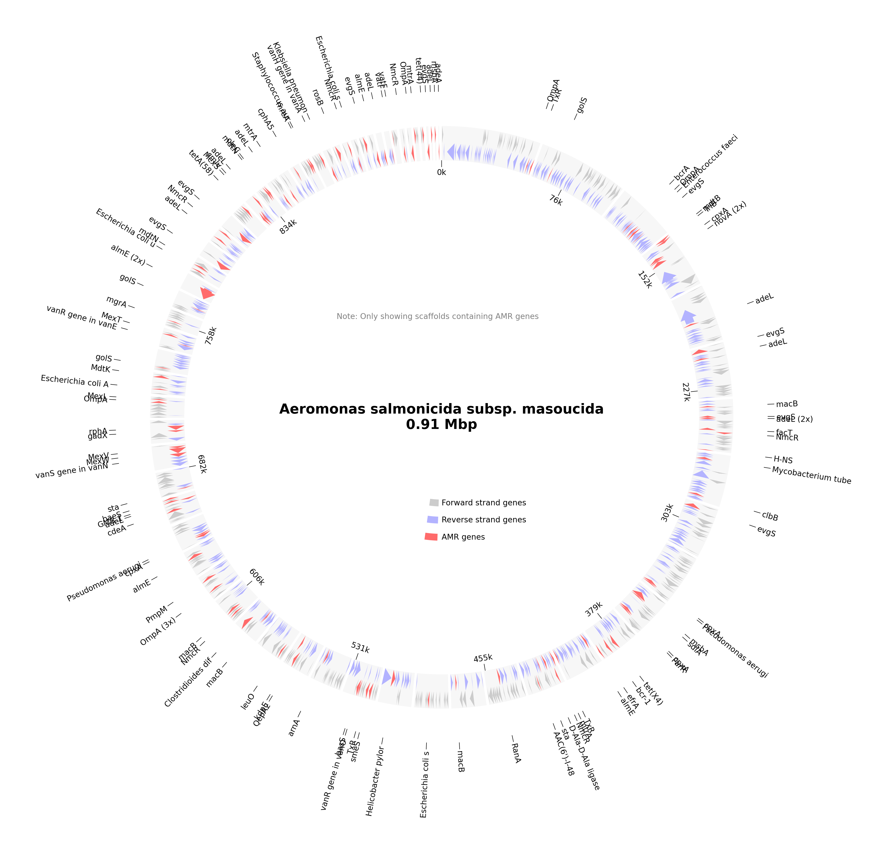

### AAC(6')-I-48
- **Mechanism**: antibiotic inactivation
- **Drug Classes**: aminoglycoside antibiotic
- **AMR Family**: AAC(6')
- **Locations**:
  - gnl|SPADES|CAEEGBCP_513_17 : position 13635-14141

### Clostridioides difficile gyrB conferring resistance to fluoroquinolones
- **Mechanism**: antibiotic target alteration
- **Drug Classes**: fluoroquinolone antibiotic
- **AMR Family**: fluoroquinolone resistant gyrB
- **Locations**:
  - gnl|SPADES|CAEEGBCP_735_11 : position 10226-12640

### D-Ala-D-Ala ligase
- **Mechanism**: antibiotic target alteration
- **Drug Classes**: glycopeptide antibiotic
- **AMR Family**: Van ligase
- **Locations**:
  - gnl|SPADES|CAEEGBCP_513_7 : position 5491-6480

### Enterococcus faecium liaR mutant conferring daptomycin resistance
- **Mechanism**: antibiotic target alteration; antibiotic efflux
- **Drug Classes**: peptide antibiotic
- **AMR Family**: daptomycin resistant liaR
- **Locations**:
  - gnl|SPADES|CAEEGBCP_297_26 : position 19916-21031

### Escherichia coli AcrAB-TolC with AcrR mutation conferring resistance to ciprofloxacin, tetracycline, and ceftazidime
- **Mechanism**: antibiotic target alteration; antibiotic efflux
- **Drug Classes**: fluoroquinolone antibiotic; cephalosporin; glycylcycline; penam; tetracycline antibiotic; rifamycin antibiotic; phenicol antibiotic; disinfecting agents and antiseptics
- **AMR Family**: resistance-nodulation-cell division (RND) antibiotic efflux pump
- **Locations**:
  - gnl|SPADES|CAEEGBCP_957_4 : position 2539-3141

### Escherichia coli soxS with mutation conferring antibiotic resistance (found in 2 locations)
- **Mechanism**: antibiotic target alteration; antibiotic efflux; reduced permeability to antibiotic
- **Drug Classes**: fluoroquinolone antibiotic; monobactam; carbapenem; cephalosporin; glycylcycline; cephamycin; penam; tetracycline antibiotic; rifamycin antibiotic; phenicol antibiotic; penem; disinfecting agents and antiseptics
- **AMR Family**: ATP-binding cassette (ABC) antibiotic efflux pump; major facilitator superfamily (MFS) antibiotic efflux pump; resistance-nodulation-cell division (RND) antibiotic efflux pump; General Bacterial Porin with reduced permeability to beta-lactams
- **Locations**:
  - gnl|SPADES|CAEEGBCP_3488_2 : position 464-1249
  - gnl|SPADES|CAEEGBCP_571_16 : position 10914-11729

### Escherichia coli uhpA with mutation conferring resistance to fosfomycin
- **Mechanism**: antibiotic target alteration
- **Drug Classes**: phosphonic acid antibiotic
- **AMR Family**: antibiotic-resistant UhpT
- **Locations**:
  - gnl|SPADES|CAEEGBCP_1310_2 : position 2115-2819

### GMB-1
- **Mechanism**: antibiotic inactivation
- **Drug Classes**: carbapenem
- **AMR Family**: GMB beta-lactamase
- **Locations**:
  - gnl|SPADES|CAEEGBCP_803_9 : position 11384-12244

### H-NS
- **Mechanism**: antibiotic efflux
- **Drug Classes**: macrolide antibiotic; fluoroquinolone antibiotic; cephalosporin; cephamycin; penam; tetracycline antibiotic
- **AMR Family**: major facilitator superfamily (MFS) antibiotic efflux pump; resistance-nodulation-cell division (RND) antibiotic efflux pump
- **Locations**:
  - gnl|SPADES|CAEEGBCP_332_36 : position 29396-29806

### Helicobacter pylori pbp1 mutants conferring resistance to amoxicillin
- **Mechanism**: antibiotic target alteration
- **Drug Classes**: cephalosporin; cephamycin; penam
- **AMR Family**: Penicillin-binding protein mutations conferring resistance to beta-lactam antibiotics
- **Locations**:
  - gnl|SPADES|CAEEGBCP_590_12 : position 11319-13190

### Klebsiella pneumoniae OmpK37
- **Mechanism**: reduced permeability to antibiotic
- **Drug Classes**: monobactam; carbapenem; cephalosporin; cephamycin; penam; penem
- **AMR Family**: General Bacterial Porin with reduced permeability to beta-lactams
- **Locations**:
  - gnl|SPADES|CAEEGBCP_2694_1 : position 35-1120

### MdtK
- **Mechanism**: antibiotic efflux
- **Drug Classes**: fluoroquinolone antibiotic
- **AMR Family**: multidrug and toxic compound extrusion (MATE) transporter
- **Locations**:
  - gnl|SPADES|CAEEGBCP_957_12 : position 9245-10591

### MexL
- **Mechanism**: antibiotic efflux
- **Drug Classes**: macrolide antibiotic; tetracycline antibiotic; disinfecting agents and antiseptics
- **AMR Family**: resistance-nodulation-cell division (RND) antibiotic efflux pump
- **Locations**:
  - gnl|SPADES|CAEEGBCP_950_10 : position 9983-10537

### MexS
- **Mechanism**: antibiotic efflux
- **Drug Classes**: fluoroquinolone antibiotic; diaminopyrimidine antibiotic; phenicol antibiotic
- **AMR Family**: resistance-nodulation-cell division (RND) antibiotic efflux pump
- **Locations**:
  - gnl|SPADES|CAEEGBCP_1800_1 : position 556-1617

### MexT
- **Mechanism**: antibiotic efflux
- **Drug Classes**: fluoroquinolone antibiotic; diaminopyrimidine antibiotic; phenicol antibiotic
- **AMR Family**: resistance-nodulation-cell division (RND) antibiotic efflux pump
- **Locations**:
  - gnl|SPADES|CAEEGBCP_1061_7 : position 7375-8316

### MexV
- **Mechanism**: antibiotic efflux
- **Drug Classes**: macrolide antibiotic; fluoroquinolone antibiotic; tetracycline antibiotic; phenicol antibiotic; disinfecting agents and antiseptics
- **AMR Family**: resistance-nodulation-cell division (RND) antibiotic efflux pump
- **Locations**:
  - gnl|SPADES|CAEEGBCP_842_6 : position 10903-12009

### MexW
- **Mechanism**: antibiotic efflux
- **Drug Classes**: macrolide antibiotic; fluoroquinolone antibiotic; tetracycline antibiotic; phenicol antibiotic; disinfecting agents and antiseptics
- **AMR Family**: resistance-nodulation-cell division (RND) antibiotic efflux pump
- **Locations**:
  - gnl|SPADES|CAEEGBCP_842_5 : position 7807-10887

### Mycobacterium tuberculosis ndh with mutation conferring resistance to isoniazid
- **Mechanism**: antibiotic target alteration
- **Drug Classes**: isoniazid-like antibiotic
- **AMR Family**: antibiotic resistant ndh
- **Locations**:
  - gnl|SPADES|CAEEGBCP_345_5 : position 2828-4120

### NmcR (found in 6 locations)
- **Mechanism**: antibiotic inactivation
- **Drug Classes**: carbapenem; cephalosporin; cephamycin; penam
- **AMR Family**: NmcA beta-lactamase
- **Locations**:
  - gnl|SPADES|CAEEGBCP_1419_10 : position 7169-8077
  - gnl|SPADES|CAEEGBCP_3228_4 : position 2946-3680
  - gnl|SPADES|CAEEGBCP_332_22 : position 18640-19614
  - gnl|SPADES|CAEEGBCP_4213_1 : position 631-1503
  - gnl|SPADES|CAEEGBCP_513_3 : position 2197-3054
  - gnl|SPADES|CAEEGBCP_744_3 : position 2422-3300

### OmpA (found in 7 locations)
- **Mechanism**: reduced permeability to antibiotic
- **Drug Classes**: peptide antibiotic
- **AMR Family**: General Bacterial Porin with reduced permeability to peptide antibiotics
- **Locations**:
  - gnl|SPADES|CAEEGBCP_134_65 : position 51848-52336
  - gnl|SPADES|CAEEGBCP_297_24 : position 18256-19173
  - gnl|SPADES|CAEEGBCP_5050_2 : position 976-2343
  - gnl|SPADES|CAEEGBCP_779_5 : position 3967-4986
  - gnl|SPADES|CAEEGBCP_779_6 : position 5417-6418
  - gnl|SPADES|CAEEGBCP_779_7 : position 6628-7686
  - gnl|SPADES|CAEEGBCP_950_8 : position 8291-9397

### ParR
- **Mechanism**: antibiotic efflux; reduced permeability to antibiotic
- **Drug Classes**: macrolide antibiotic; fluoroquinolone antibiotic; monobactam; aminoglycoside antibiotic; carbapenem; cephalosporin; cephamycin; penam; tetracycline antibiotic; phenicol antibiotic; penem; disinfecting agents and antiseptics
- **AMR Family**: resistance-nodulation-cell division (RND) antibiotic efflux pump; Outer Membrane Porin (Opr)
- **Locations**:
  - gnl|SPADES|CAEEGBCP_477_16 : position 17759-18481

### PmpM
- **Mechanism**: antibiotic efflux
- **Drug Classes**: fluoroquinolone antibiotic; aminoglycoside antibiotic; disinfecting agents and antiseptics
- **AMR Family**: multidrug and toxic compound extrusion (MATE) transporter
- **Locations**:
  - gnl|SPADES|CAEEGBCP_779_10 : position 10512-11891

### Pseudomonas aeruginosa CpxR (found in 2 locations)
- **Mechanism**: antibiotic efflux
- **Drug Classes**: macrolide antibiotic; fluoroquinolone antibiotic; monobactam; aminoglycoside antibiotic; carbapenem; cephalosporin; cephamycin; penam; tetracycline antibiotic; peptide antibiotic; aminocoumarin antibiotic; diaminopyrimidine antibiotic; sulfonamide antibiotic; phenicol antibiotic; penem
- **AMR Family**: resistance-nodulation-cell division (RND) antibiotic efflux pump
- **Locations**:
  - gnl|SPADES|CAEEGBCP_351_31 : position 25770-26465
  - gnl|SPADES|CAEEGBCP_790_4 : position 3289-4011

### QepA2
- **Mechanism**: antibiotic efflux
- **Drug Classes**: fluoroquinolone antibiotic
- **AMR Family**: major facilitator superfamily (MFS) antibiotic efflux pump
- **Locations**:
  - gnl|SPADES|CAEEGBCP_689_10 : position 10519-11916

### RanA
- **Mechanism**: antibiotic efflux
- **Drug Classes**: aminoglycoside antibiotic
- **AMR Family**: ATP-binding cassette (ABC) antibiotic efflux pump
- **Locations**:
  - gnl|SPADES|CAEEGBCP_525_12 : position 11657-12739

### Staphylococcus aureus mupA conferring resistance to mupirocin
- **Mechanism**: antibiotic target alteration
- **Drug Classes**: mupirocin-like antibiotic
- **AMR Family**: antibiotic-resistant isoleucyl-tRNA synthetase (ileS)
- **Locations**:
  - gnl|SPADES|CAEEGBCP_2183_6 : position 4472-5353

### TriB
- **Mechanism**: antibiotic efflux
- **Drug Classes**: disinfecting agents and antiseptics
- **AMR Family**: resistance-nodulation-cell division (RND) antibiotic efflux pump
- **Locations**:
  - gnl|SPADES|CAEEGBCP_304_2 : position 1239-2285

### TxR (found in 3 locations)
- **Mechanism**: antibiotic efflux
- **Drug Classes**: tetracycline antibiotic
- **AMR Family**: ATP-binding cassette (ABC) antibiotic efflux pump
- **Locations**:
  - gnl|SPADES|CAEEGBCP_134_68 : position 54353-55132
  - gnl|SPADES|CAEEGBCP_493_20 : position 21096-21800
  - gnl|SPADES|CAEEGBCP_591_9 : position 5243-6523

### adeA
- **Mechanism**: antibiotic efflux
- **Drug Classes**: glycylcycline; tetracycline antibiotic
- **AMR Family**: resistance-nodulation-cell division (RND) antibiotic efflux pump
- **Locations**:
  - gnl|SPADES|CAEEGBCP_26198_1 : position 1-408

### adeL (found in 10 locations)
- **Mechanism**: antibiotic efflux
- **Drug Classes**: fluoroquinolone antibiotic; tetracycline antibiotic
- **AMR Family**: resistance-nodulation-cell division (RND) antibiotic efflux pump
- **Locations**:
  - gnl|SPADES|CAEEGBCP_1419_5 : position 2813-3697
  - gnl|SPADES|CAEEGBCP_15864_1 : position 1-678
  - gnl|SPADES|CAEEGBCP_1800_5 : position 4772-5719
  - gnl|SPADES|CAEEGBCP_1896_6 : position 2970-3866
  - gnl|SPADES|CAEEGBCP_305_7 : position 17584-18495
  - gnl|SPADES|CAEEGBCP_326_7 : position 6011-6910
  - gnl|SPADES|CAEEGBCP_332_14 : position 10203-11141
  - gnl|SPADES|CAEEGBCP_332_21 : position 17691-18566
  - gnl|SPADES|CAEEGBCP_3687_3 : position 2070-2978
  - gnl|SPADES|CAEEGBCP_803_8 : position 10356-11255

### almE (found in 5 locations)
- **Mechanism**: antibiotic target alteration
- **Drug Classes**: peptide antibiotic
- **AMR Family**: polymyxin resistance operon; alm glycyltransferase
- **Locations**:
  - gnl|SPADES|CAEEGBCP_1242_2 : position 218-6454
  - gnl|SPADES|CAEEGBCP_1242_4 : position 7233-9350
  - gnl|SPADES|CAEEGBCP_3627_3 : position 2034-3275
  - gnl|SPADES|CAEEGBCP_493_3 : position 1094-2293
  - gnl|SPADES|CAEEGBCP_782_11 : position 9222-10934

### arlR
- **Mechanism**: antibiotic efflux
- **Drug Classes**: fluoroquinolone antibiotic; disinfecting agents and antiseptics
- **AMR Family**: major facilitator superfamily (MFS) antibiotic efflux pump
- **Locations**:
  - gnl|SPADES|CAEEGBCP_304_7 : position 7877-8566

### arnA
- **Mechanism**: antibiotic target alteration
- **Drug Classes**: peptide antibiotic
- **AMR Family**: pmr phosphoethanolamine transferase
- **Locations**:
  - gnl|SPADES|CAEEGBCP_614_14 : position 14151-15095

### baeS
- **Mechanism**: antibiotic efflux
- **Drug Classes**: aminoglycoside antibiotic; aminocoumarin antibiotic
- **AMR Family**: resistance-nodulation-cell division (RND) antibiotic efflux pump
- **Locations**:
  - gnl|SPADES|CAEEGBCP_803_11 : position 13188-14081

### basS
- **Mechanism**: antibiotic target alteration; antibiotic efflux
- **Drug Classes**: peptide antibiotic
- **AMR Family**: pmr phosphoethanolamine transferase
- **Locations**:
  - gnl|SPADES|CAEEGBCP_591_17 : position 10637-11986

### bcr-1
- **Mechanism**: antibiotic efflux
- **Drug Classes**: bicyclomycin-like antibiotic
- **AMR Family**: major facilitator superfamily (MFS) antibiotic efflux pump
- **Locations**:
  - gnl|SPADES|CAEEGBCP_488_15 : position 15777-17015

### bcrA
- **Mechanism**: antibiotic efflux
- **Drug Classes**: peptide antibiotic
- **AMR Family**: ATP-binding cassette (ABC) antibiotic efflux pump
- **Locations**:
  - gnl|SPADES|CAEEGBCP_297_18 : position 14825-15460

### cdeA
- **Mechanism**: antibiotic efflux
- **Drug Classes**: fluoroquinolone antibiotic; disinfecting agents and antiseptics
- **AMR Family**: multidrug and toxic compound extrusion (MATE) transporter
- **Locations**:
  - gnl|SPADES|CAEEGBCP_803_4 : position 6175-7512

### clbB
- **Mechanism**: antibiotic target alteration
- **Drug Classes**: lincosamide antibiotic; streptogramin antibiotic; streptogramin A antibiotic; oxazolidinone antibiotic; phenicol antibiotic; pleuromutilin antibiotic
- **AMR Family**: Cfr 23S ribosomal RNA methyltransferase
- **Locations**:
  - gnl|SPADES|CAEEGBCP_345_22 : position 24978-26081

### cmlv
- **Mechanism**: antibiotic inactivation
- **Drug Classes**: phenicol antibiotic
- **AMR Family**: chloramphenicol phosphotransferase
- **Locations**:
  - gnl|SPADES|CAEEGBCP_1800_2 : position 1741-2934

### cphA5
- **Mechanism**: antibiotic inactivation
- **Drug Classes**: carbapenem
- **AMR Family**: CphA beta-lactamase
- **Locations**:
  - gnl|SPADES|CAEEGBCP_2131_2 : position 2110-2718

### cpxA (found in 4 locations)
- **Mechanism**: antibiotic efflux
- **Drug Classes**: aminoglycoside antibiotic; aminocoumarin antibiotic
- **AMR Family**: resistance-nodulation-cell division (RND) antibiotic efflux pump
- **Locations**:
  - gnl|SPADES|CAEEGBCP_304_6 : position 6492-7877
  - gnl|SPADES|CAEEGBCP_351_30 : position 24418-25773
  - gnl|SPADES|CAEEGBCP_477_15 : position 16363-17748
  - gnl|SPADES|CAEEGBCP_790_3 : position 1792-3237

### efrA
- **Mechanism**: antibiotic efflux
- **Drug Classes**: macrolide antibiotic; fluoroquinolone antibiotic; rifamycin antibiotic
- **AMR Family**: ATP-binding cassette (ABC) antibiotic efflux pump
- **Locations**:
  - gnl|SPADES|CAEEGBCP_488_19 : position 21215-22018

### evgS (found in 8 locations)
- **Mechanism**: antibiotic efflux
- **Drug Classes**: macrolide antibiotic; fluoroquinolone antibiotic; penam; tetracycline antibiotic
- **AMR Family**: major facilitator superfamily (MFS) antibiotic efflux pump; resistance-nodulation-cell division (RND) antibiotic efflux pump
- **Locations**:
  - gnl|SPADES|CAEEGBCP_1321_1 : position 2-3025
  - gnl|SPADES|CAEEGBCP_1452_3 : position 1529-4240
  - gnl|SPADES|CAEEGBCP_297_29 : position 23997-24380
  - gnl|SPADES|CAEEGBCP_326_2 : position 413-2725
  - gnl|SPADES|CAEEGBCP_332_13 : position 9117-10148
  - gnl|SPADES|CAEEGBCP_350_2 : position 1485-3581
  - gnl|SPADES|CAEEGBCP_3579_3 : position 2063-3319
  - gnl|SPADES|CAEEGBCP_9271_1 : position 1-1224

### facT
- **Mechanism**: antibiotic efflux
- **Drug Classes**: elfamycin antibiotic
- **AMR Family**: major facilitator superfamily (MFS) antibiotic efflux pump
- **Locations**:
  - gnl|SPADES|CAEEGBCP_332_20 : position 16389-17597

### gadX
- **Mechanism**: antibiotic efflux
- **Drug Classes**: macrolide antibiotic; fluoroquinolone antibiotic; penam
- **AMR Family**: resistance-nodulation-cell division (RND) antibiotic efflux pump
- **Locations**:
  - gnl|SPADES|CAEEGBCP_875_4 : position 5762-6775

### golS (found in 3 locations)
- **Mechanism**: antibiotic efflux
- **Drug Classes**: monobactam; carbapenem; cephalosporin; cephamycin; penam; phenicol antibiotic; penem
- **AMR Family**: resistance-nodulation-cell division (RND) antibiotic efflux pump
- **Locations**:
  - gnl|SPADES|CAEEGBCP_1222_5 : position 3868-4257
  - gnl|SPADES|CAEEGBCP_159_13 : position 10122-10538
  - gnl|SPADES|CAEEGBCP_968_3 : position 1623-2054

### kdpE
- **Mechanism**: antibiotic efflux
- **Drug Classes**: aminoglycoside antibiotic
- **AMR Family**: kdpDE
- **Locations**:
  - gnl|SPADES|CAEEGBCP_689_11 : position 11992-12963

### leuO
- **Mechanism**: antibiotic efflux
- **Drug Classes**: nucleoside antibiotic; disinfecting agents and antiseptics
- **AMR Family**: major facilitator superfamily (MFS) antibiotic efflux pump
- **Locations**:
  - gnl|SPADES|CAEEGBCP_698_4 : position 2215-3162

### macB (found in 4 locations)
- **Mechanism**: antibiotic efflux
- **Drug Classes**: macrolide antibiotic
- **AMR Family**: ATP-binding cassette (ABC) antibiotic efflux pump
- **Locations**:
  - gnl|SPADES|CAEEGBCP_332_5 : position 3305-4051
  - gnl|SPADES|CAEEGBCP_562_11 : position 15726-16487
  - gnl|SPADES|CAEEGBCP_735_5 : position 4081-4815
  - gnl|SPADES|CAEEGBCP_744_5 : position 4739-6130

### mdtB
- **Mechanism**: antibiotic efflux
- **Drug Classes**: aminocoumarin antibiotic
- **AMR Family**: resistance-nodulation-cell division (RND) antibiotic efflux pump
- **Locations**:
  - gnl|SPADES|CAEEGBCP_304_1 : position 3-1223

### mdtN (found in 2 locations)
- **Mechanism**: antibiotic efflux
- **Drug Classes**: nucleoside antibiotic; disinfecting agents and antiseptics
- **AMR Family**: major facilitator superfamily (MFS) antibiotic efflux pump
- **Locations**:
  - gnl|SPADES|CAEEGBCP_1310_5 : position 4434-5471
  - gnl|SPADES|CAEEGBCP_1850_6 : position 4257-5222

### mgrA
- **Mechanism**: antibiotic efflux
- **Drug Classes**: fluoroquinolone antibiotic; cephalosporin; penam; tetracycline antibiotic; peptide antibiotic; disinfecting agents and antiseptics
- **AMR Family**: ATP-binding cassette (ABC) antibiotic efflux pump; major facilitator superfamily (MFS) antibiotic efflux pump
- **Locations**:
  - gnl|SPADES|CAEEGBCP_1201_5 : position 3149-3619

### mreA
- **Mechanism**: antibiotic efflux
- **Drug Classes**: macrolide antibiotic
- **AMR Family**: major facilitator superfamily (MFS) antibiotic efflux pump
- **Locations**:
  - gnl|SPADES|CAEEGBCP_2183_5 : position 3498-4472

### msbA (found in 2 locations)
- **Mechanism**: antibiotic efflux
- **Drug Classes**: nitroimidazole antibiotic
- **AMR Family**: ATP-binding cassette (ABC) antibiotic efflux pump
- **Locations**:
  - gnl|SPADES|CAEEGBCP_16351_1 : position 1-657
  - gnl|SPADES|CAEEGBCP_477_4 : position 4049-6877

### mtrA (found in 3 locations)
- **Mechanism**: antibiotic efflux
- **Drug Classes**: macrolide antibiotic; penam
- **AMR Family**: resistance-nodulation-cell division (RND) antibiotic efflux pump
- **Locations**:
  - gnl|SPADES|CAEEGBCP_1947_1 : position 213-1049
  - gnl|SPADES|CAEEGBCP_513_1 : position 178-1065
  - gnl|SPADES|CAEEGBCP_5270_1 : position 3-827

### novA (found in 2 locations)
- **Mechanism**: antibiotic efflux
- **Drug Classes**: aminocoumarin antibiotic
- **AMR Family**: ATP-binding cassette (ABC) antibiotic efflux pump
- **Locations**:
  - gnl|SPADES|CAEEGBCP_304_10 : position 12222-14309
  - gnl|SPADES|CAEEGBCP_304_8 : position 8681-10858

### oleC
- **Mechanism**: antibiotic efflux
- **Drug Classes**: macrolide antibiotic
- **AMR Family**: ATP-binding cassette (ABC) antibiotic efflux pump
- **Locations**:
  - gnl|SPADES|CAEEGBCP_1850_7 : position 5215-6144

### rosB
- **Mechanism**: antibiotic efflux
- **Drug Classes**: peptide antibiotic
- **AMR Family**: major facilitator superfamily (MFS) antibiotic efflux pump
- **Locations**:
  - gnl|SPADES|CAEEGBCP_2890_3 : position 1385-3046

### rphA
- **Mechanism**: antibiotic inactivation
- **Drug Classes**: rifamycin antibiotic
- **AMR Family**: rifampin phosphotransferase
- **Locations**:
  - gnl|SPADES|CAEEGBCP_875_5 : position 7094-9472

### sdiA
- **Mechanism**: antibiotic efflux
- **Drug Classes**: fluoroquinolone antibiotic; cephalosporin; glycylcycline; penam; tetracycline antibiotic; rifamycin antibiotic; phenicol antibiotic; disinfecting agents and antiseptics
- **AMR Family**: resistance-nodulation-cell division (RND) antibiotic efflux pump
- **Locations**:
  - gnl|SPADES|CAEEGBCP_477_5 : position 6973-7614

### smeS
- **Mechanism**: antibiotic efflux
- **Drug Classes**: aminoglycoside antibiotic; cephalosporin; cephamycin; penam
- **AMR Family**: resistance-nodulation-cell division (RND) antibiotic efflux pump
- **Locations**:
  - gnl|SPADES|CAEEGBCP_591_7 : position 3322-4722

### sta (found in 2 locations)
- **Mechanism**: antibiotic inactivation
- **Drug Classes**: nucleoside antibiotic
- **AMR Family**: streptothricin acetyltransferase (SAT)
- **Locations**:
  - gnl|SPADES|CAEEGBCP_513_11 : position 9716-10162
  - gnl|SPADES|CAEEGBCP_815_3 : position 1617-2111

### tet(44)
- **Mechanism**: antibiotic target protection
- **Drug Classes**: tetracycline antibiotic
- **AMR Family**: tetracycline-resistant ribosomal protection protein
- **Locations**:
  - gnl|SPADES|CAEEGBCP_6605_2 : position 1026-1793

### tet(X4)
- **Mechanism**: antibiotic inactivation
- **Drug Classes**: glycylcycline; tetracycline antibiotic
- **AMR Family**: tetracycline inactivation enzyme
- **Locations**:
  - gnl|SPADES|CAEEGBCP_488_11 : position 11146-12795

### tetA(58)
- **Mechanism**: antibiotic efflux
- **Drug Classes**: tetracycline antibiotic
- **AMR Family**: major facilitator superfamily (MFS) antibiotic efflux pump
- **Locations**:
  - gnl|SPADES|CAEEGBCP_1477_7 : position 5986-7140

### vanH gene in vanA cluster
- **Mechanism**: antibiotic target alteration
- **Drug Classes**: glycopeptide antibiotic
- **AMR Family**: vanH; glycopeptide resistance gene cluster
- **Locations**:
  - gnl|SPADES|CAEEGBCP_2185_4 : position 4169-5143

### vanR gene in vanE cluster
- **Mechanism**: antibiotic target alteration
- **Drug Classes**: glycopeptide antibiotic
- **AMR Family**: glycopeptide resistance gene cluster; vanR
- **Locations**:
  - gnl|SPADES|CAEEGBCP_1061_4 : position 4185-4553

### vanR gene in vanO cluster
- **Mechanism**: antibiotic target alteration
- **Drug Classes**: glycopeptide antibiotic
- **AMR Family**: glycopeptide resistance gene cluster; vanR
- **Locations**:
  - gnl|SPADES|CAEEGBCP_591_16 : position 9943-10599

### vanS gene in vanN cluster
- **Mechanism**: antibiotic target alteration
- **Drug Classes**: glycopeptide antibiotic
- **AMR Family**: vanS; glycopeptide resistance gene cluster
- **Locations**:
  - gnl|SPADES|CAEEGBCP_842_4 : position 5717-7714

### vatF (found in 2 locations)
- **Mechanism**: antibiotic inactivation
- **Drug Classes**: streptogramin antibiotic; streptogramin A antibiotic
- **AMR Family**: streptogramin vat acetyltransferase
- **Locations**:
  - gnl|SPADES|CAEEGBCP_4102_4 : position 2537-2899
  - gnl|SPADES|CAEEGBCP_4113_1 : position 1-243

## Aeromonas salmonicida subsp. pectinolytica 34mel
**Strain Statistics:**
- Total genome length: 493.3 kbp
- Total scaffolds: 210
- Scaffolds with AMR genes: 49
- Total genes annotated: 943
- Total AMR genes: 92
- Unique AMR genes: 70
- Distinct AMR mechanisms: 9
- Distinct AMR families: 29
- Distinct drug classes: 29

**Circos Plot:**

### AAC(6')-Il
- **Mechanism**: antibiotic inactivation
- **Drug Classes**: aminoglycoside antibiotic
- **AMR Family**: AAC(6')
- **Locations**:
  - gnl|SPADES|CAEEGBCP_6763_3 : position 1051-1509

### Agrobacterium fabrum chloramphenicol acetyltransferase
- **Mechanism**: antibiotic inactivation
- **Drug Classes**: phenicol antibiotic
- **AMR Family**: chloramphenicol acetyltransferase (CAT)
- **Locations**:
  - gnl|SPADES|CAEEGBCP_392_9 : position 8465-9043

### ArnT
- **Mechanism**: antibiotic target alteration
- **Drug Classes**: peptide antibiotic
- **AMR Family**: pmr phosphoethanolamine transferase
- **Locations**:
  - gnl|SPADES|CAEEGBCP_475_5: position 4927-6570

### CRP
- **Mechanism**: antibiotic efflux
- **Drug Classes**: macrolide antibiotic; fluoroquinolone antibiotic; penam
- **AMR Family**: resistance-nodulation-cell division (RND) antibiotic efflux pump
- **Locations**:
  - gnl|SPADES|CAEEGBCP_475_12 : position 10132-10770

### Enterobacter cloacae acrA
- **Mechanism**: antibiotic efflux
- **Drug Classes**: fluoroquinolone antibiotic; cephalosporin; glycylcycline; penam; tetracycline antibiotic; rifamycin antibiotic; phenicol antibiotic; disinfecting agents and antiseptics
- **AMR Family**: resistance-nodulation-cell division (RND) antibiotic efflux pump
- **Locations**:
  - gnl|SPADES|CAEEGBCP_767_11 : position 8839-10020

### Escherichia coli EF-Tu mutants conferring resistance to Enacyloxin IIa
- **Mechanism**: antibiotic target alteration
- **Drug Classes**: elfamycin antibiotic
- **AMR Family**: elfamycin resistant EF-Tu
- **Locations**:
  - gnl|SPADES|CAEEGBCP_544_6 : position 5196-7892

### Escherichia coli fabI mutations conferring resistance to isoniazid and triclosan
- **Mechanism**: antibiotic target alteration
- **Drug Classes**: disinfecting agents and antiseptics; isoniazid-like antibiotic
- **AMR Family**: antibiotic resistant fabI
- **Locations**:
  - gnl|SPADES|CAEEGBCP_346_31 : position 26147-26923

### H-NS (found in 2 locations)
- **Mechanism**: antibiotic efflux
- **Drug Classes**: macrolide antibiotic; fluoroquinolone antibiotic; cephalosporin; cephamycin; penam; tetracycline antibiotic
- **AMR Family**: major facilitator superfamily (MFS) antibiotic efflux pump; resistance-nodulation-cell division (RND) antibiotic efflux pump
- **Locations**:
  - gnl|SPADES|CAEEGBCP_2845_1 : position 52-462
  - gnl|SPADES|CAEEGBCP_4265_2 : position 327-731

### Helicobacter pylori pbp1 mutants conferring resistance to amoxicillin
- **Mechanism**: antibiotic target alteration
- **Drug Classes**: cephalosporin; cephamycin; penam
- **AMR Family**: Penicillin-binding protein mutations conferring resistance to beta-lactam antibiotics
- **Locations**:
  - gnl|SPADES|CAEEGBCP_1026_2 : position 1791-4106

### Klebsiella pneumoniae KpnE
- **Mechanism**: antibiotic efflux
- **Drug Classes**: macrolide antibiotic; aminoglycoside antibiotic; cephalosporin; tetracycline antibiotic; peptide antibiotic; rifamycin antibiotic; disinfecting agents and antiseptics
- **AMR Family**: small multidrug resistance (SMR) antibiotic efflux pump
- **Locations**:
  - gnl|SPADES|CAEEGBCP_1026_5 : position 4951-5355

### Klebsiella pneumoniae KpnF
- **Mechanism**: antibiotic efflux
- **Drug Classes**: macrolide antibiotic; aminoglycoside antibiotic; cephalosporin; tetracycline antibiotic; peptide antibiotic; rifamycin antibiotic; disinfecting agents and antiseptics
- **AMR Family**: small multidrug resistance (SMR) antibiotic efflux pump
- **Locations**:
  - gnl|SPADES|CAEEGBCP_1026_4 : position 4634-4954

### Klebsiella pneumoniae KpnH
- **Mechanism**: antibiotic efflux
- **Drug Classes**: macrolide antibiotic; fluoroquinolone antibiotic; aminoglycoside antibiotic; carbapenem; cephalosporin; penam; peptide antibiotic; penem
- **AMR Family**: major facilitator superfamily (MFS) antibiotic efflux pump
- **Locations**:
  - gnl|SPADES|CAEEGBCP_1354_2 : position 189-1742

### LpsA
- **Mechanism**: reduced permeability to antibiotic
- **Drug Classes**: peptide antibiotic
- **AMR Family**: Intrinsic peptide antibiotic resistant Lps
- **Locations**:
  - gnl|SPADES|CAEEGBCP_2864_2 : position 803-1468

### MCR-10.2
- **Mechanism**: antibiotic target alteration
- **Drug Classes**: peptide antibiotic
- **AMR Family**: MCR phosphoethanolamine transferase
- **Locations**:
  - gnl|SPADES|CAEEGBCP_452_11 : position 13771-15621

### MexH
- **Mechanism**: antibiotic efflux
- **Drug Classes**: fluoroquinolone antibiotic; tetracycline antibiotic; disinfecting agents and antiseptics
- **AMR Family**: resistance-nodulation-cell division (RND) antibiotic efflux pump
- **Locations**:
  - gnl|SPADES|CAEEGBCP_1417_3 : position 4415-5959

### MexS (found in 2 locations)
- **Mechanism**: antibiotic efflux
- **Drug Classes**: fluoroquinolone antibiotic; diaminopyrimidine antibiotic; phenicol antibiotic
- **AMR Family**: resistance-nodulation-cell division (RND) antibiotic efflux pump
- **Locations**:
  - gnl|SPADES|CAEEGBCP_1251_8 : position 6807-7823
  - gnl|SPADES|CAEEGBCP_346_22 : position 15639-16649

### MexW
- **Mechanism**: antibiotic efflux
- **Drug Classes**: macrolide antibiotic; fluoroquinolone antibiotic; tetracycline antibiotic; phenicol antibiotic; disinfecting agents and antiseptics
- **AMR Family**: resistance-nodulation-cell division (RND) antibiotic efflux pump
- **Locations**:
  - gnl|SPADES|CAEEGBCP_830_8 : position 7691-10810

### MexZ
- **Mechanism**: antibiotic efflux
- **Drug Classes**: macrolide antibiotic; fluoroquinolone antibiotic; aminoglycoside antibiotic; carbapenem; cephalosporin; cephamycin; penam; tetracycline antibiotic; phenicol antibiotic; disinfecting agents and antiseptics
- **AMR Family**: resistance-nodulation-cell division (RND) antibiotic efflux pump
- **Locations**:
  - gnl|SPADES|CAEEGBCP_739_2 : position 678-1271

### MuxA
- **Mechanism**: antibiotic efflux
- **Drug Classes**: macrolide antibiotic; monobactam; tetracycline antibiotic; aminocoumarin antibiotic
- **AMR Family**: resistance-nodulation-cell division (RND) antibiotic efflux pump
- **Locations**:
  - gnl|SPADES|CAEEGBCP_830_9 : position 10810-11859

### NmcR (found in 2 locations)
- **Mechanism**: antibiotic inactivation
- **Drug Classes**: carbapenem; cephalosporin; cephamycin; penam
- **AMR Family**: NmcA beta-lactamase
- **Locations**:
  - gnl|SPADES|CAEEGBCP_1817_3 : position 1368-2279
  - gnl|SPADES|CAEEGBCP_452_3 : position 2533-3408

### OprM
- **Mechanism**: antibiotic efflux
- **Drug Classes**: macrolide antibiotic; fluoroquinolone antibiotic; monobactam; aminoglycoside antibiotic; carbapenem; cephalosporin; cephamycin; penam; tetracycline antibiotic; peptide antibiotic; aminocoumarin antibiotic; diaminopyrimidine antibiotic; sulfonamide antibiotic; phenicol antibiotic; penem; disinfecting agents and antiseptics
- **AMR Family**: resistance-nodulation-cell division (RND) antibiotic efflux pump
- **Locations**:
  - gnl|SPADES|CAEEGBCP_767_13 : position 13180-14586

### PAM-1
- **Mechanism**: antibiotic inactivation
- **Drug Classes**: carbapenem; cephalosporin
- **AMR Family**: PAM beta-lactamase
- **Locations**:
  - gnl|SPADES|CAEEGBCP_886_2 : position 143-787

### PmrF
- **Mechanism**: antibiotic target alteration
- **Drug Classes**: peptide antibiotic
- **AMR Family**: pmr phosphoethanolamine transferase
- **Locations**:
  - gnl|SPADES|CAEEGBCP_475_2 : position 999-1976

### Pseudomonas aeruginosa ampR with mutation conferring resistance to aztreonam
- **Mechanism**: antibiotic target alteration; antibiotic inactivation
- **Drug Classes**: monobactam; carbapenem; cephalosporin
- **AMR Family**: PDC beta-lactamase; ampR transcriptional regulator with mutation conferring resistance to monobactam antibiotics
- **Locations**:
  - gnl|SPADES|CAEEGBCP_4516_1 : position 3-887

### QnrAS
- **Mechanism**: antibiotic target protection
- **Drug Classes**: fluoroquinolone antibiotic
- **AMR Family**: quinolone resistance protein (qnr)
- **Locations**:
  - gnl|SPADES|CAEEGBCP_2537_2 : position 264-914

### RanA
- **Mechanism**: antibiotic efflux
- **Drug Classes**: aminoglycoside antibiotic
- **AMR Family**: ATP-binding cassette (ABC) antibiotic efflux pump
- **Locations**:
  - gnl|SPADES|CAEEGBCP_452_17 : position 21569-22705

### Streptomyces venezuelae rox
- **Mechanism**: antibiotic inactivation
- **Drug Classes**: rifamycin antibiotic
- **AMR Family**: rifampin monooxygenase
- **Locations**:
  - gnl|SPADES|CAEEGBCP_3608_3 : position 1993-3156

### TolC (found in 2 locations)
- **Mechanism**: antibiotic efflux
- **Drug Classes**: macrolide antibiotic; fluoroquinolone antibiotic; aminoglycoside antibiotic; carbapenem; cephalosporin; glycylcycline; cephamycin; penam; tetracycline antibiotic; peptide antibiotic; aminocoumarin antibiotic; rifamycin antibiotic; phenicol antibiotic; penem; disinfecting agents and antiseptics
- **AMR Family**: ATP-binding cassette (ABC) antibiotic efflux pump; major facilitator superfamily (MFS) antibiotic efflux pump; resistance-nodulation-cell division (RND) antibiotic efflux pump
- **Locations**:
  - gnl|SPADES|CAEEGBCP_1417_1 : position 1-1194
  - gnl|SPADES|CAEEGBCP_9397_1 : position 2-166

### TxR (found in 3 locations)
- **Mechanism**: antibiotic efflux
- **Drug Classes**: tetracycline antibiotic
- **AMR Family**: ATP-binding cassette (ABC) antibiotic efflux pump
- **Locations**:
  - gnl|SPADES|CAEEGBCP_1060_2 : position 1081-2748
  - gnl|SPADES|CAEEGBCP_269_20 : position 21403-22746
  - gnl|SPADES|CAEEGBCP_269_22 : position 23884-25302

### YojI
- **Mechanism**: antibiotic efflux
- **Drug Classes**: peptide antibiotic
- **AMR Family**: ATP-binding cassette (ABC) antibiotic efflux pump
- **Locations**:
  - gnl|SPADES|CAEEGBCP_946_2 : position 258-899

### adeB
- **Mechanism**: antibiotic efflux
- **Drug Classes**: glycylcycline; tetracycline antibiotic
- **AMR Family**: resistance-nodulation-cell division (RND) antibiotic efflux pump
- **Locations**:
  - gnl|SPADES|CAEEGBCP_1417_2 : position 1278-4418

### adeF
- **Mechanism**: antibiotic efflux
- **Drug Classes**: fluoroquinolone antibiotic; tetracycline antibiotic
- **AMR Family**: resistance-nodulation-cell division (RND) antibiotic efflux pump
- **Locations**:
  - gnl|SPADES|CAEEGBCP_767_12: position 10038-13187

### adeL (found in 5 locations)
- **Mechanism**: antibiotic efflux
- **Drug Classes**: fluoroquinolone antibiotic; tetracycline antibiotic
- **AMR Family**: resistance-nodulation-cell division (RND) antibiotic efflux pump
- **Locations**:
  - gnl|SPADES|CAEEGBCP_1251_7 : position 5834-6706
  - gnl|SPADES|CAEEGBCP_1354_4 : position 2891-3793
  - gnl|SPADES|CAEEGBCP_1363_8 : position 6020-6955
  - gnl|SPADES|CAEEGBCP_1817_4 : position 2351-3274
  - gnl|SPADES|CAEEGBCP_2507_3 : position 2047-2949

### almE
- **Mechanism**: antibiotic target alteration
- **Drug Classes**: peptide antibiotic
- **AMR Family**: polymyxin resistance operon; alm glycyltransferase
- **Locations**:
  - gnl|SPADES|CAEEGBCP_1952_3 : position 3312-5939

### arlR (found in 2 locations)
- **Mechanism**: antibiotic efflux
- **Drug Classes**: fluoroquinolone antibiotic; disinfecting agents and antiseptics
- **AMR Family**: major facilitator superfamily (MFS) antibiotic efflux pump
- **Locations**:
  - gnl|SPADES|CAEEGBCP_1060_5 : position 5049-5738
  - gnl|SPADES|CAEEGBCP_1417_5 : position 6683-7369

### arlS
- **Mechanism**: antibiotic efflux
- **Drug Classes**: fluoroquinolone antibiotic; disinfecting agents and antiseptics
- **AMR Family**: major facilitator superfamily (MFS) antibiotic efflux pump
- **Locations**:
  - gnl|SPADES|CAEEGBCP_1417_6 : position 7392-8300

### arnA (found in 2 locations)
- **Mechanism**: antibiotic target alteration
- **Drug Classes**: peptide antibiotic
- **AMR Family**: pmr phosphoethanolamine transferase
- **Locations**:
  - gnl|SPADES|CAEEGBCP_269_18 : position 19496-20170
  - gnl|SPADES|CAEEGBCP_475_3 : position 1973-3964

### bacA
- **Mechanism**: antibiotic target alteration
- **Drug Classes**: peptide antibiotic
- **AMR Family**: undecaprenyl pyrophosphate related proteins
- **Locations**:
  - gnl|SPADES|CAEEGBCP_3551_3 : position 2009-2806

### basS
- **Mechanism**: antibiotic target alteration; antibiotic efflux
- **Drug Classes**: peptide antibiotic
- **AMR Family**: pmr phosphoethanolamine transferase
- **Locations**:
  - gnl|SPADES|CAEEGBCP_1136_2 : position 401-1846

### bcr-1
- **Mechanism**: antibiotic efflux
- **Drug Classes**: bicyclomycin-like antibiotic
- **AMR Family**: major facilitator superfamily (MFS) antibiotic efflux pump
- **Locations**:
  - gnl|SPADES|CAEEGBCP_1250_11 : position 7931-9058

### bcrA
- **Mechanism**: antibiotic efflux
- **Drug Classes**: peptide antibiotic
- **AMR Family**: ATP-binding cassette (ABC) antibiotic efflux pump
- **Locations**:
  - gnl|SPADES|CAEEGBCP_1338_6 : position 5576-6277

### bcrC
- **Mechanism**: antibiotic target alteration
- **Drug Classes**: peptide antibiotic
- **AMR Family**: undecaprenyl pyrophosphate related proteins
- **Locations**:
  - gnl|SPADES|CAEEGBCP_2448_3 : position 2994-3716

### cprR
- **Mechanism**: antibiotic target alteration; antibiotic efflux
- **Drug Classes**: peptide antibiotic
- **AMR Family**: pmr phosphoethanolamine transferase
- **Locations**:
  - gnl|SPADES|CAEEGBCP_1136_3 : position 1923-2612

### cpxA
- **Mechanism**: antibiotic efflux
- **Drug Classes**: aminoglycoside antibiotic; aminocoumarin antibiotic
- **AMR Family**: resistance-nodulation-cell division (RND) antibiotic efflux pump
- **Locations**:
  - gnl|SPADES|CAEEGBCP_269_21 : position 22743-23777

### emrR
- **Mechanism**: antibiotic efflux
- **Drug Classes**: fluoroquinolone antibiotic
- **AMR Family**: major facilitator superfamily (MFS) antibiotic efflux pump
- **Locations**:
  - gnl|SPADES|CAEEGBCP_346_5 : position 2863-3357

### evgA
- **Mechanism**: antibiotic efflux
- **Drug Classes**: macrolide antibiotic; fluoroquinolone antibiotic; penam; tetracycline antibiotic
- **AMR Family**: major facilitator superfamily (MFS) antibiotic efflux pump; resistance-nodulation-cell division (RND) antibiotic efflux pump
- **Locations**:
  - gnl|SPADES|CAEEGBCP_971_1 : position 3-521

### evgS (found in 3 locations)
- **Mechanism**: antibiotic efflux
- **Drug Classes**: macrolide antibiotic; fluoroquinolone antibiotic; penam; tetracycline antibiotic
- **AMR Family**: major facilitator superfamily (MFS) antibiotic efflux pump; resistance-nodulation-cell division (RND) antibiotic efflux pump
- **Locations**:
  - gnl|SPADES|CAEEGBCP_1922_4 : position 3051-6044
  - gnl|SPADES|CAEEGBCP_29560_1 : position 2-367
  - gnl|SPADES|CAEEGBCP_46854_1 : position 3-263

### farA
- **Mechanism**: antibiotic efflux
- **Drug Classes**: antibacterial free fatty acids
- **AMR Family**: major facilitator superfamily (MFS) antibiotic efflux pump
- **Locations**:
  - gnl|SPADES|CAEEGBCP_1354_3 : position 1742-2794

### gadX
- **Mechanism**: antibiotic efflux
- **Drug Classes**: macrolide antibiotic; fluoroquinolone antibiotic; penam
- **AMR Family**: resistance-nodulation-cell division (RND) antibiotic efflux pump
- **Locations**:
  - gnl|SPADES|CAEEGBCP_1558_2 : position 1446-2321

### golS
- **Mechanism**: antibiotic efflux
- **Drug Classes**: monobactam; carbapenem; cephalosporin; cephamycin; penam; phenicol antibiotic; penem
- **AMR Family**: resistance-nodulation-cell division (RND) antibiotic efflux pump
- **Locations**:
  - gnl|SPADES|CAEEGBCP_1420_1 : position 3-287

### leuO
- **Mechanism**: antibiotic efflux
- **Drug Classes**: nucleoside antibiotic; disinfecting agents and antiseptics
- **AMR Family**: major facilitator superfamily (MFS) antibiotic efflux pump
- **Locations**:
  - gnl|SPADES|CAEEGBCP_1354_9 : position 6799-7767

### macB
- **Mechanism**: antibiotic efflux
- **Drug Classes**: macrolide antibiotic
- **AMR Family**: ATP-binding cassette (ABC) antibiotic efflux pump
- **Locations**:
  - gnl|SPADES|CAEEGBCP_946_3 : position 899-1687

### marA
- **Mechanism**: antibiotic efflux; reduced permeability to antibiotic
- **Drug Classes**: fluoroquinolone antibiotic; monobactam; carbapenem; cephalosporin; glycylcycline; cephamycin; penam; tetracycline antibiotic; rifamycin antibiotic; phenicol antibiotic; penem; disinfecting agents and antiseptics
- **AMR Family**: resistance-nodulation-cell division (RND) antibiotic efflux pump; General Bacterial Porin with reduced permeability to beta-lactams
- **Locations**:
  - gnl|SPADES|CAEEGBCP_1250_4 : position 2204-3163

### msbA (found in 2 locations)
- **Mechanism**: antibiotic efflux
- **Drug Classes**: nitroimidazole antibiotic
- **AMR Family**: ATP-binding cassette (ABC) antibiotic efflux pump
- **Locations**:
  - gnl|SPADES|CAEEGBCP_164_33 : position 34584-36329
  - gnl|SPADES|CAEEGBCP_269_6 : position 5336-6154

### mtrA (found in 3 locations)
- **Mechanism**: antibiotic efflux
- **Drug Classes**: macrolide antibiotic; penam
- **AMR Family**: resistance-nodulation-cell division (RND) antibiotic efflux pump
- **Locations**:
  - gnl|SPADES|CAEEGBCP_1338_7 : position 6281-7129
  - gnl|SPADES|CAEEGBCP_1370_5 : position 4233-5210
  - gnl|SPADES|CAEEGBCP_2212_1 : position 2-964

### novA (found in 2 locations)
- **Mechanism**: antibiotic efflux
- **Drug Classes**: aminocoumarin antibiotic
- **AMR Family**: ATP-binding cassette (ABC) antibiotic efflux pump
- **Locations**:
  - gnl|SPADES|CAEEGBCP_164_32 : position 32822-34591
  - gnl|SPADES|CAEEGBCP_3643_2 : position 311-1120

### optrA
- **Mechanism**: antibiotic target protection
- **Drug Classes**: oxazolidinone antibiotic; phenicol antibiotic
- **AMR Family**: Miscellaneous ABC-F subfamily ATP-binding cassette ribosomal protection proteins
- **Locations**:
  - gnl|SPADES|CAEEGBCP_1805_4 : position 3375-5285

### rphB
- **Mechanism**: antibiotic inactivation
- **Drug Classes**: rifamycin antibiotic
- **AMR Family**: rifampin phosphotransferase
- **Locations**:
  - gnl|SPADES|CAEEGBCP_164_43 : position 44424-46151

### smeS (found in 2 locations)
- **Mechanism**: antibiotic efflux
- **Drug Classes**: aminoglycoside antibiotic; cephalosporin; cephamycin; penam
- **AMR Family**: resistance-nodulation-cell division (RND) antibiotic efflux pump
- **Locations**:
  - gnl|SPADES|CAEEGBCP_1060_6 : position 5747-7042
  - gnl|SPADES|CAEEGBCP_475_17 : position 19203-22370

### sul4
- **Mechanism**: antibiotic target replacement
- **Drug Classes**: sulfonamide antibiotic
- **AMR Family**: sulfonamide resistant sul
- **Locations**:
  - gnl|SPADES|CAEEGBCP_544_12 : position 12893-13756

### tet(35)
- **Mechanism**: antibiotic efflux
- **Drug Classes**: tetracycline antibiotic
- **AMR Family**: ATP-binding cassette (ABC) antibiotic efflux pump
- **Locations**:
  - gnl|SPADES|CAEEGBCP_1987_5 : position 4146-5480

### tet(B)
- **Mechanism**: antibiotic efflux
- **Drug Classes**: tetracycline antibiotic
- **AMR Family**: major facilitator superfamily (MFS) antibiotic efflux pump
- **Locations**:
  - gnl|SPADES|CAEEGBCP_544_1 : position 3-890

### tetA(58) (found in 2 locations)
- **Mechanism**: antibiotic efflux
- **Drug Classes**: tetracycline antibiotic
- **AMR Family**: major facilitator superfamily (MFS) antibiotic efflux pump
- **Locations**:
  - gnl|SPADES|CAEEGBCP_1338_5 : position 4789-5565
  - gnl|SPADES|CAEEGBCP_1696_4 : position 1510-2427

### tlrB conferring tylosin resistance
- **Mechanism**: antibiotic target alteration
- **Drug Classes**: macrolide antibiotic; lincosamide antibiotic
- **AMR Family**: non-erm 23S ribosomal RNA methyltransferase (G748)
- **Locations**:
  - gnl|SPADES|CAEEGBCP_475_13 : position 10893-11693

### ugd
- **Mechanism**: antibiotic target alteration
- **Drug Classes**: peptide antibiotic
- **AMR Family**: pmr phosphoethanolamine transferase
- **Locations**:
  - gnl|SPADES|CAEEGBCP_392_16 : position 15451-16617

### vanH gene in vanB cluster
- **Mechanism**: antibiotic target alteration
- **Drug Classes**: glycopeptide antibiotic
- **AMR Family**: vanH; glycopeptide resistance gene cluster
- **Locations**:
  - gnl|SPADES|CAEEGBCP_1987_2 : position 753-1985

### vanH gene in vanP cluster
- **Mechanism**: antibiotic target alteration
- **Drug Classes**: glycopeptide antibiotic
- **AMR Family**: vanH; glycopeptide resistance gene cluster
- **Locations**:
  - gnl|SPADES|CAEEGBCP_2448_2 : position 1490-2623

### vanR gene in vanA cluster (found in 2 locations)
- **Mechanism**: antibiotic target alteration
- **Drug Classes**: glycopeptide antibiotic
- **AMR Family**: glycopeptide resistance gene cluster; vanR
- **Locations**:
  - gnl|SPADES|CAEEGBCP_164_30 : position 31521-32240
  - gnl|SPADES|CAEEGBCP_2008_6 : position 3466-4713

### vanR gene in vanF cluster (found in 2 locations)
- **Mechanism**: antibiotic target alteration
- **Drug Classes**: glycopeptide antibiotic
- **AMR Family**: glycopeptide resistance gene cluster; vanR
- **Locations**:
  - gnl|SPADES|CAEEGBCP_1575_6 : position 4576-5637
  - gnl|SPADES|CAEEGBCP_1922_3 : position 2298-2948

### vatF
- **Mechanism**: antibiotic inactivation
- **Drug Classes**: streptogramin antibiotic; streptogramin A antibiotic
- **AMR Family**: streptogramin vat acetyltransferase
- **Locations**:
  - gnl|SPADES|CAEEGBCP_4245_5 : position 2618-2797

## Aeromonas salmonicida subsp. salmonicida
**Strain Statistics:**
- Total genome length: 102.6 kbp
- Total scaffolds: 56
- Scaffolds with AMR genes: 5
- Total genes annotated: 231
- Total AMR genes: 9
- Unique AMR genes: 9
- Distinct AMR mechanisms: 3
- Distinct AMR families: 7
- Distinct drug classes: 11

**Circos Plot:**

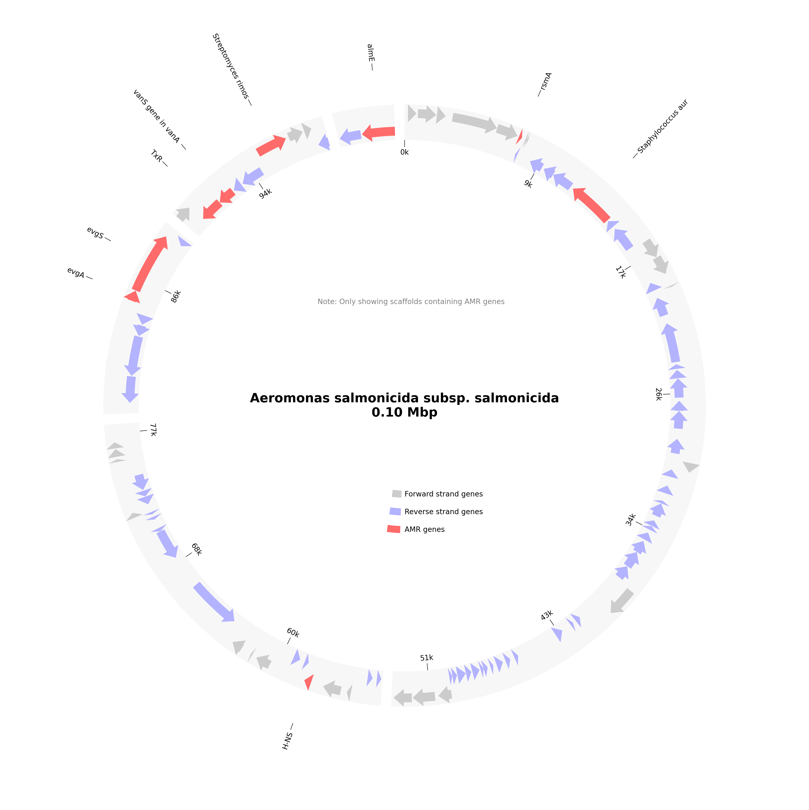

### H-NS
- **Mechanism**: antibiotic efflux
- **Drug Classes**: macrolide antibiotic; fluoroquinolone antibiotic; cephalosporin; cephamycin; penam; tetracycline antibiotic
- **AMR Family**: major facilitator superfamily (MFS) antibiotic efflux pump; resistance-nodulation-cell division (RND) antibiotic efflux pump
- **Locations**:
  - gnl|SPADES|CAEEGBCP_432_7 : position 4133-4543

### Staphylococcus aureus mupB conferring resistance to mupirocin
- **Mechanism**: antibiotic target alteration
- **Drug Classes**: mupirocin-like antibiotic
- **AMR Family**: antibiotic-resistant isoleucyl-tRNA synthetase (ileS)
- **Locations**:
  - gnl|SPADES|CAEEGBCP_141_10 : position 11091-13955

### Streptomyces rimosus otr(A)
- **Mechanism**: antibiotic target protection
- **Drug Classes**: tetracycline antibiotic
- **AMR Family**: tetracycline-resistant ribosomal protection protein
- **Locations**:
  - gnl|SPADES|CAEEGBCP_1140_6 : position 5970-7781

### TxR
- **Mechanism**: antibiotic efflux
- **Drug Classes**: tetracycline antibiotic
- **AMR Family**: ATP-binding cassette (ABC) antibiotic efflux pump
- **Locations**:
  - gnl|SPADES|CAEEGBCP_1140_2 : position 972-2390

### almE
- **Mechanism**: antibiotic target alteration
- **Drug Classes**: peptide antibiotic
- **AMR Family**: polymyxin resistance operon; alm glycyltransferase
- **Locations**:
  - gnl|SPADES|CAEEGBCP_3392_2 : position 1470-3503

### evgA
- **Mechanism**: antibiotic efflux
- **Drug Classes**: macrolide antibiotic; fluoroquinolone antibiotic; penam; tetracycline antibiotic
- **AMR Family**: major facilitator superfamily (MFS) antibiotic efflux pump; resistance-nodulation-cell division (RND) antibiotic efflux pump
- **Locations**:
  - gnl|SPADES|CAEEGBCP_979_6 : position 6651-7274

### evgS
- **Mechanism**: antibiotic efflux
- **Drug Classes**: macrolide antibiotic; fluoroquinolone antibiotic; penam; tetracycline antibiotic
- **AMR Family**: major facilitator superfamily (MFS) antibiotic efflux pump; resistance-nodulation-cell division (RND) antibiotic efflux pump
- **Locations**:
  - gnl|SPADES|CAEEGBCP_979_7 : position 7286-10858

### rsmA
- **Mechanism**: antibiotic efflux
- **Drug Classes**: fluoroquinolone antibiotic; diaminopyrimidine antibiotic; phenicol antibiotic
- **AMR Family**: resistance-nodulation-cell division (RND) antibiotic efflux pump
- **Locations**:
  - gnl|SPADES|CAEEGBCP_141_6 : position 6756-6944

### vanS gene in vanA cluster
- **Mechanism**: antibiotic target alteration
- **Drug Classes**: glycopeptide antibiotic
- **AMR Family**: vanS; glycopeptide resistance gene cluster
- **Locations**:
  - gnl|SPADES|CAEEGBCP_1140_3 : position 2400-3455

## Buttiauxella agrestis
**Strain Statistics:**
- Total genome length: 4002.5 kbp
- Total scaffolds: 358
- Scaffolds with AMR genes: 117
- Total genes annotated: 7336
- Total AMR genes: 453
- Unique AMR genes: 204
- Distinct AMR mechanisms: 11
- Distinct AMR families: 77
- Distinct drug classes: 36

**Circos Plot:**

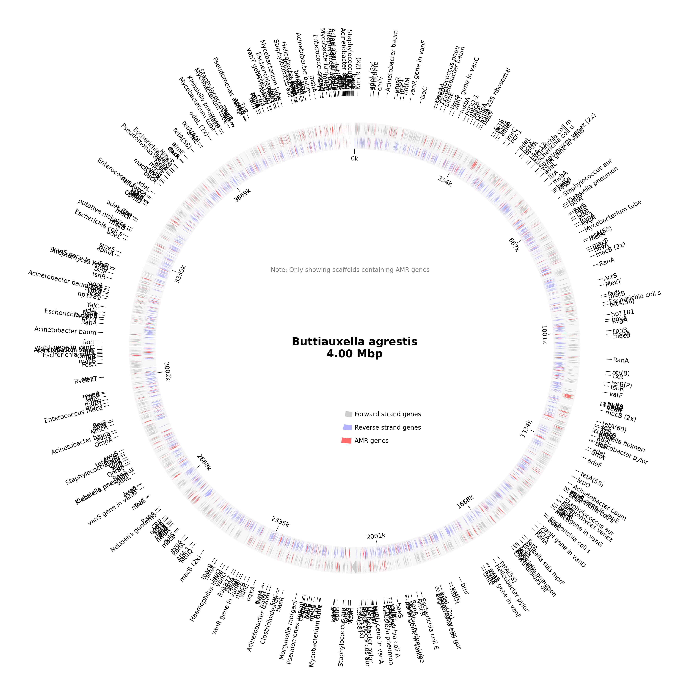

### ACT-8
- **Mechanism**: antibiotic inactivation
- **Drug Classes**: carbapenem; cephalosporin; cephamycin; penam
- **AMR Family**: ACT beta-lactamase
- **Locations**:
  - gnl|SPADES|CAEEGBCP_1427_4: position 1692-2843

### AIM-1
- **Mechanism**: antibiotic inactivation
- **Drug Classes**: cephalosporin; cephamycin; penam
- **AMR Family**: AIM beta-lactamase
- **Locations**:
  - gnl|SPADES|CAEEGBCP_216_35 : position 38165-39124

### APH(6)-Ic
- **Mechanism**: antibiotic inactivation
- **Drug Classes**: aminoglycoside antibiotic
- **AMR Family**: APH(6)
- **Locations**:
  - gnl|SPADES|CAEEGBCP_22_54 : position 49833-50660

### Acinetobacter baumannii AbaF (found in 7 locations)
- **Mechanism**: antibiotic efflux
- **Drug Classes**: phosphonic acid antibiotic
- **AMR Family**: major facilitator superfamily (MFS) antibiotic efflux pump
- **Locations**:
  - gnl|SPADES|CAEEGBCP_1113_5 : position 3642-5141
  - gnl|SPADES|CAEEGBCP_121_3 : position 2463-3788
  - gnl|SPADES|CAEEGBCP_22_91 : position 86674-88008
  - gnl|SPADES|CAEEGBCP_311_2 : position 1403-2728
  - gnl|SPADES|CAEEGBCP_324_18 : position 16530-18035
  - gnl|SPADES|CAEEGBCP_324_25 : position 26491-27825
  - gnl|SPADES|CAEEGBCP_6692_1 : position 224-1528

### Acinetobacter baumannii AbaQ (found in 7 locations)
- **Mechanism**: antibiotic efflux
- **Drug Classes**: fluoroquinolone antibiotic
- **AMR Family**: major facilitator superfamily (MFS) antibiotic efflux pump
- **Locations**:
  - gnl|SPADES|CAEEGBCP_168_15 : position 13877-15190
  - gnl|SPADES|CAEEGBCP_205_10 : position 11222-12538
  - gnl|SPADES|CAEEGBCP_24426_1 : position 3-434
  - gnl|SPADES|CAEEGBCP_283_9 : position 13465-14826
  - gnl|SPADES|CAEEGBCP_28_83 : position 87047-88237
  - gnl|SPADES|CAEEGBCP_309_26 : position 24354-25652
  - gnl|SPADES|CAEEGBCP_6508_1 : position 3-905

### AcrE
- **Mechanism**: antibiotic efflux
- **Drug Classes**: fluoroquinolone antibiotic; cephalosporin; cephamycin; penam
- **AMR Family**: resistance-nodulation-cell division (RND) antibiotic efflux pump
- **Locations**:
  - gnl|SPADES|CAEEGBCP_32_96 : position 109472-110626

### AcrF
- **Mechanism**: antibiotic efflux
- **Drug Classes**: fluoroquinolone antibiotic; cephalosporin; cephamycin; penam
- **AMR Family**: resistance-nodulation-cell division (RND) antibiotic efflux pump
- **Locations**:
  - gnl|SPADES|CAEEGBCP_32_97 : position 110637-113747

### AcrS (found in 2 locations)
- **Mechanism**: antibiotic efflux
- **Drug Classes**: fluoroquinolone antibiotic; cephalosporin; glycylcycline; cephamycin; penam; tetracycline antibiotic; rifamycin antibiotic; phenicol antibiotic; disinfecting agents and antiseptics
- **AMR Family**: resistance-nodulation-cell division (RND) antibiotic efflux pump
- **Locations**:
  - gnl|SPADES|CAEEGBCP_32_94 : position 105412-106029
  - gnl|SPADES|CAEEGBCP_78_75 : position 69847-70392

### Brucella suis mprF
- **Mechanism**: antibiotic target alteration
- **Drug Classes**: peptide antibiotic
- **AMR Family**: defensin resistant mprF
- **Locations**:
  - gnl|SPADES|CAEEGBCP_130_11 : position 10739-11707

### CRP (found in 3 locations)
- **Mechanism**: antibiotic efflux
- **Drug Classes**: macrolide antibiotic; fluoroquinolone antibiotic; penam
- **AMR Family**: resistance-nodulation-cell division (RND) antibiotic efflux pump
- **Locations**:
  - gnl|SPADES|CAEEGBCP_238_19: position 13700-14332
  - gnl|SPADES|CAEEGBCP_625_4 : position 3616-4308
  - gnl|SPADES|CAEEGBCP_75_46 : position 54489-55241

### Clostridioides difficile gyrA conferring resistance to fluoroquinolones
- **Mechanism**: antibiotic target alteration
- **Drug Classes**: fluoroquinolone antibiotic
- **AMR Family**: fluoroquinolone resistant gyrA
- **Locations**:
  - gnl|SPADES|CAEEGBCP_130_46 : position 48600-51248

### Clostridioides difficile gyrB conferring resistance to fluoroquinolones
- **Mechanism**: antibiotic target alteration
- **Drug Classes**: fluoroquinolone antibiotic
- **AMR Family**: fluoroquinolone resistant gyrB
- **Locations**:
  - gnl|SPADES|CAEEGBCP_186_35 : position 34252-36147

### CrcB
- **Mechanism**: antibiotic efflux
- **Drug Classes**: aminoglycoside antibiotic
- **AMR Family**: multidrug and toxic compound extrusion (MATE) transporter
- **Locations**:
  - gnl|SPADES|CAEEGBCP_168_27 : position 26838-27221

### DHA-28
- **Mechanism**: antibiotic inactivation
- **Drug Classes**: cephalosporin; cephamycin
- **AMR Family**: DHA beta-lactamase
- **Locations**:
  - gnl|SPADES|CAEEGBCP_162_37 : position 35611-36618

### Enterococcus faecalis cls with mutation conferring resistance to daptomycin (found in 2 locations)
- **Mechanism**: antibiotic target alteration
- **Drug Classes**: peptide antibiotic
- **AMR Family**: daptomycin resistant cls
- **Locations**:
  - gnl|SPADES|CAEEGBCP_296_11 : position 10040-11491
  - gnl|SPADES|CAEEGBCP_395_20 : position 20740-22200

### Enterococcus faecium liaR mutant conferring daptomycin resistance
- **Mechanism**: antibiotic target alteration; antibiotic efflux
- **Drug Classes**: peptide antibiotic
- **AMR Family**: daptomycin resistant liaR
- **Locations**:
  - gnl|SPADES|CAEEGBCP_1427_7 : position 4094-4678

### ErmB
- **Mechanism**: antibiotic target alteration
- **Drug Classes**: macrolide antibiotic; lincosamide antibiotic; streptogramin antibiotic; streptogramin A antibiotic; streptogramin B antibiotic
- **AMR Family**: Erm 23S ribosomal RNA methyltransferase
- **Locations**:
  - gnl|SPADES|CAEEGBCP_46_69 : position 74787-75611

### Escherichia coli AcrAB-TolC with AcrR mutation conferring resistance to ciprofloxacin, tetracycline, and ceftazidime (found in 2 locations)
- **Mechanism**: antibiotic target alteration; antibiotic efflux
- **Drug Classes**: fluoroquinolone antibiotic; cephalosporin; glycylcycline; penam; tetracycline antibiotic; rifamycin antibiotic; phenicol antibiotic; disinfecting agents and antiseptics
- **AMR Family**: resistance-nodulation-cell division (RND) antibiotic efflux pump
- **Locations**:
  - gnl|SPADES|CAEEGBCP_314_10 : position 8423-9118
  - gnl|SPADES|CAEEGBCP_77_65 : position 62896-63480

### Escherichia coli AcrAB-TolC with MarR mutations conferring resistance to ciprofloxacin and tetracycline
- **Mechanism**: antibiotic target alteration; antibiotic efflux
- **Drug Classes**: fluoroquinolone antibiotic; cephalosporin; glycylcycline; penam; tetracycline antibiotic; rifamycin antibiotic; phenicol antibiotic; disinfecting agents and antiseptics
- **AMR Family**: resistance-nodulation-cell division (RND) antibiotic efflux pump
- **Locations**:
  - gnl|SPADES|CAEEGBCP_162_30 : position 28545-29000

### Escherichia coli EF-Tu mutants conferring resistance to Pulvomycin
- **Mechanism**: antibiotic target alteration
- **Drug Classes**: elfamycin antibiotic
- **AMR Family**: elfamycin resistant EF-Tu
- **Locations**:
  - gnl|SPADES|CAEEGBCP_309_14 : position 12255-14102

### Escherichia coli EF-Tu mutants conferring resistance to kirromycin
- **Mechanism**: antibiotic target alteration
- **Drug Classes**: elfamycin antibiotic
- **AMR Family**: elfamycin resistant EF-Tu
- **Locations**:
  - gnl|SPADES|CAEEGBCP_156_41 : position 46980-49664

### Escherichia coli UhpT with mutation conferring resistance to fosfomycin
- **Mechanism**: antibiotic target alteration
- **Drug Classes**: phosphonic acid antibiotic
- **AMR Family**: antibiotic-resistant UhpT
- **Locations**:
  - gnl|SPADES|CAEEGBCP_156_4 : position 3346-4737

### Escherichia coli mdfA
- **Mechanism**: antibiotic efflux
- **Drug Classes**: tetracycline antibiotic; phenicol antibiotic; disinfecting agents and antiseptics
- **AMR Family**: major facilitator superfamily (MFS) antibiotic efflux pump
- **Locations**:
  - gnl|SPADES|CAEEGBCP_37_86 : position 96803-98023

### Escherichia coli soxR with mutation conferring antibiotic resistance
- **Mechanism**: antibiotic target alteration; antibiotic efflux
- **Drug Classes**: fluoroquinolone antibiotic; cephalosporin; glycylcycline; penam; tetracycline antibiotic; rifamycin antibiotic; phenicol antibiotic; disinfecting agents and antiseptics
- **AMR Family**: ATP-binding cassette (ABC) antibiotic efflux pump; major facilitator superfamily (MFS) antibiotic efflux pump; resistance-nodulation-cell division (RND) antibiotic efflux pump
- **Locations**:
  - gnl|SPADES|CAEEGBCP_123_40 : position 44466-44924

### Escherichia coli soxS with mutation conferring antibiotic resistance (found in 8 locations)
- **Mechanism**: antibiotic target alteration; antibiotic efflux; reduced permeability to antibiotic
- **Drug Classes**: fluoroquinolone antibiotic; monobactam; carbapenem; cephalosporin; glycylcycline; cephamycin; penam; tetracycline antibiotic; rifamycin antibiotic; phenicol antibiotic; penem; disinfecting agents and antiseptics
- **AMR Family**: ATP-binding cassette (ABC) antibiotic efflux pump; major facilitator superfamily (MFS) antibiotic efflux pump; resistance-nodulation-cell division (RND) antibiotic efflux pump; General Bacterial Porin with reduced permeability to beta-lactams
- **Locations**:
  - gnl|SPADES|CAEEGBCP_121_19 : position 21365-22234
  - gnl|SPADES|CAEEGBCP_123_39 : position 44064-44387
  - gnl|SPADES|CAEEGBCP_216_30 : position 31454-32278
  - gnl|SPADES|CAEEGBCP_363_14 : position 17011-17871
  - gnl|SPADES|CAEEGBCP_421_15 : position 12400-13272
  - gnl|SPADES|CAEEGBCP_46_57 : position 56914-57759
  - gnl|SPADES|CAEEGBCP_754_2 : position 1243-2091
  - gnl|SPADES|CAEEGBCP_88_45 : position 50026-50892

### Escherichia coli uhpA with mutation conferring resistance to fosfomycin
- **Mechanism**: antibiotic target alteration
- **Drug Classes**: phosphonic acid antibiotic
- **AMR Family**: antibiotic-resistant UhpT
- **Locations**:
  - gnl|SPADES|CAEEGBCP_37_95 : position 109216-109944

### FosA
- **Mechanism**: antibiotic inactivation
- **Drug Classes**: phosphonic acid antibiotic
- **AMR Family**: fosfomycin thiol transferase
- **Locations**:
  - gnl|SPADES|CAEEGBCP_307_18 : position 20739-21128

### FosG
- **Mechanism**: antibiotic inactivation
- **Drug Classes**: phosphonic acid antibiotic
- **AMR Family**: fosfomycin thiol transferase
- **Locations**:
  - gnl|SPADES|CAEEGBCP_22_124 : position 117198-117605

### GMB-1
- **Mechanism**: antibiotic inactivation
- **Drug Classes**: carbapenem
- **AMR Family**: GMB beta-lactamase
- **Locations**:
  - gnl|SPADES|CAEEGBCP_155_42 : position 48777-49643

### H-NS
- **Mechanism**: antibiotic efflux
- **Drug Classes**: macrolide antibiotic; fluoroquinolone antibiotic; cephalosporin; cephamycin; penam; tetracycline antibiotic
- **AMR Family**: major facilitator superfamily (MFS) antibiotic efflux pump; resistance-nodulation-cell division (RND) antibiotic efflux pump
- **Locations**:
  - gnl|SPADES|CAEEGBCP_395_9 : position 7458-7868

### Haemophilus influenzae PBP3 conferring resistance to beta-lactam antibiotics
- **Mechanism**: antibiotic target alteration
- **Drug Classes**: cephalosporin; cephamycin; penam
- **AMR Family**: Penicillin-binding protein mutations conferring resistance to beta-lactam antibiotics
- **Locations**:
  - gnl|SPADES|CAEEGBCP_214_16 : position 17564-19330

### Helicobacter pylori pbp1 mutants conferring resistance to amoxicillin (found in 2 locations)
- **Mechanism**: antibiotic target alteration
- **Drug Classes**: cephalosporin; cephamycin; penam
- **AMR Family**: Penicillin-binding protein mutations conferring resistance to beta-lactam antibiotics
- **Locations**:
  - gnl|SPADES|CAEEGBCP_105_3 : position 5413-7734
  - gnl|SPADES|CAEEGBCP_146_46 : position 49536-52091

### Helicobacter pylori pbp2 mutants conferring resistance to amoxicillin
- **Mechanism**: antibiotic target alteration
- **Drug Classes**: cephalosporin; cephamycin; penam
- **AMR Family**: Penicillin-binding protein mutations conferring resistance to beta-lactam antibiotics
- **Locations**:
  - gnl|SPADES|CAEEGBCP_168_37 : position 34522-36423

### Helicobacter pylori rdxA mutation conferring resistance to metronidazole
- **Mechanism**: antibiotic target alteration
- **Drug Classes**: nitroimidazole antibiotic
- **AMR Family**: Antibiotic resistant Helicobacter pylori nitroreductase
- **Locations**:
  - gnl|SPADES|CAEEGBCP_899_10 : position 11138-11791

### IreK
- **Mechanism**: reduced permeability to antibiotic
- **Drug Classes**: cephalosporin
- **AMR Family**: Serine/threonine kinases
- **Locations**:
  - gnl|SPADES|CAEEGBCP_276_36 : position 31241-32014

### Klebsiella pneumoniae KpnE
- **Mechanism**: antibiotic efflux
- **Drug Classes**: macrolide antibiotic; aminoglycoside antibiotic; cephalosporin; tetracycline antibiotic; peptide antibiotic; rifamycin antibiotic; disinfecting agents and antiseptics
- **AMR Family**: small multidrug resistance (SMR) antibiotic efflux pump
- **Locations**:
  - gnl|SPADES|CAEEGBCP_75_11: position 11471-11845

### Klebsiella pneumoniae KpnF
- **Mechanism**: antibiotic efflux
- **Drug Classes**: macrolide antibiotic; aminoglycoside antibiotic; cephalosporin; tetracycline antibiotic; peptide antibiotic; rifamycin antibiotic; disinfecting agents and antiseptics
- **AMR Family**: small multidrug resistance (SMR) antibiotic efflux pump
- **Locations**:
  - gnl|SPADES|CAEEGBCP_75_12: position 11832-12161

### Klebsiella pneumoniae KpnG
- **Mechanism**: antibiotic efflux
- **Drug Classes**: macrolide antibiotic; fluoroquinolone antibiotic; aminoglycoside antibiotic; carbapenem; cephalosporin; penam; peptide antibiotic; penem
- **AMR Family**: major facilitator superfamily (MFS) antibiotic efflux pump
- **Locations**:
  - gnl|SPADES|CAEEGBCP_276_7 : position 5387-6559

### Klebsiella pneumoniae KpnH (found in 2 locations)
- **Mechanism**: antibiotic efflux
- **Drug Classes**: macrolide antibiotic; fluoroquinolone antibiotic; aminoglycoside antibiotic; carbapenem; cephalosporin; penam; peptide antibiotic; penem
- **AMR Family**: major facilitator superfamily (MFS) antibiotic efflux pump
- **Locations**:
  - gnl|SPADES|CAEEGBCP_276_6: position 3833-5371
  - gnl|SPADES|CAEEGBCP_478_18 : position 19985-21367

### Klebsiella pneumoniae OmpK37 (found in 3 locations)
- **Mechanism**: reduced permeability to antibiotic
- **Drug Classes**: monobactam; carbapenem; cephalosporin; cephamycin; penam; penem
- **AMR Family**: General Bacterial Porin with reduced permeability to beta-lactams
- **Locations**:
  - gnl|SPADES|CAEEGBCP_130_41 : position 39731-40825
  - gnl|SPADES|CAEEGBCP_162_42 : position 43503-44603
  - gnl|SPADES|CAEEGBCP_32_19 : position 22434-23534

### Klebsiella pneumoniae acrR with mutation conferring multidrug antibiotic resistance
- **Mechanism**: antibiotic target alteration; antibiotic efflux
- **Drug Classes**: fluoroquinolone antibiotic; cephalosporin; glycylcycline; penam; tetracycline antibiotic; rifamycin antibiotic; phenicol antibiotic; disinfecting agents and antiseptics
- **AMR Family**: resistance-nodulation-cell division (RND) antibiotic efflux pump
- **Locations**:
  - gnl|SPADES|CAEEGBCP_104_48 : position 52587-53228

### LRA-13
- **Mechanism**: antibiotic inactivation
- **Drug Classes**: cephalosporin; penam
- **AMR Family**: class C LRA beta-lactamase; class D LRA beta-lactamase
- **Locations**:
  - gnl|SPADES|CAEEGBCP_37_79 : position 90055-91263

### LlmA 23S ribosomal RNA methyltransferase
- **Mechanism**: antibiotic target alteration
- **Drug Classes**: lincosamide antibiotic
- **AMR Family**: Llm 23S ribosomal RNA methyltransferase
- **Locations**:
  - gnl|SPADES|CAEEGBCP_32_50 : position 58571-59746

### LpsA
- **Mechanism**: reduced permeability to antibiotic
- **Drug Classes**: peptide antibiotic
- **AMR Family**: Intrinsic peptide antibiotic resistant Lps
- **Locations**:
  - gnl|SPADES|CAEEGBCP_324_10 : position 7615-8391

### LptD
- **Mechanism**: antibiotic efflux
- **Drug Classes**: carbapenem; peptide antibiotic; aminocoumarin antibiotic; rifamycin antibiotic
- **AMR Family**: ATP-binding cassette (ABC) antibiotic efflux pump
- **Locations**:
  - gnl|SPADES|CAEEGBCP_46_66 : position 70075-72462

### MCR-9.1
- **Mechanism**: antibiotic target alteration
- **Drug Classes**: peptide antibiotic
- **AMR Family**: MCR phosphoethanolamine transferase
- **Locations**:
  - gnl|SPADES|CAEEGBCP_100_47 : position 56820-58439

### MdtK
- **Mechanism**: antibiotic efflux
- **Drug Classes**: fluoroquinolone antibiotic
- **AMR Family**: multidrug and toxic compound extrusion (MATE) transporter
- **Locations**:
  - gnl|SPADES|CAEEGBCP_899_6 : position 5832-7274

### MdtQ
- **Mechanism**: reduced permeability to antibiotic
- **Drug Classes**: monobactam; carbapenem; cephalosporin; cephamycin; penam; penem
- **AMR Family**: Outer Membrane Porin (Opr)
- **Locations**:
  - gnl|SPADES|CAEEGBCP_216_29 : position 29839-31284

### MexH (found in 2 locations)
- **Mechanism**: antibiotic efflux
- **Drug Classes**: fluoroquinolone antibiotic; tetracycline antibiotic; disinfecting agents and antiseptics
- **AMR Family**: resistance-nodulation-cell division (RND) antibiotic efflux pump
- **Locations**:
  - gnl|SPADES|CAEEGBCP_168_22 : position 20893-22350
  - gnl|SPADES|CAEEGBCP_175_22 : position 31662-32489

### MexS (found in 2 locations)
- **Mechanism**: antibiotic efflux
- **Drug Classes**: fluoroquinolone antibiotic; diaminopyrimidine antibiotic; phenicol antibiotic
- **AMR Family**: resistance-nodulation-cell division (RND) antibiotic efflux pump
- **Locations**:
  - gnl|SPADES|CAEEGBCP_123_14 : position 12758-13741
  - gnl|SPADES|CAEEGBCP_324_20 : position 19946-20977

### MexT (found in 3 locations)
- **Mechanism**: antibiotic efflux
- **Drug Classes**: fluoroquinolone antibiotic; diaminopyrimidine antibiotic; phenicol antibiotic
- **AMR Family**: resistance-nodulation-cell division (RND) antibiotic efflux pump
- **Locations**:
  - gnl|SPADES|CAEEGBCP_216_36 : position 39203-40117
  - gnl|SPADES|CAEEGBCP_300_19 : position 17675-18622
  - gnl|SPADES|CAEEGBCP_88_5 : position 3846-4763

### MexW
- **Mechanism**: antibiotic efflux
- **Drug Classes**: macrolide antibiotic; fluoroquinolone antibiotic; tetracycline antibiotic; phenicol antibiotic; disinfecting agents and antiseptics
- **AMR Family**: resistance-nodulation-cell division (RND) antibiotic efflux pump
- **Locations**:
  - gnl|SPADES|CAEEGBCP_168_23 : position 22347-25466

### Morganella morganii gyrB conferring resistance to fluoroquinolones
- **Mechanism**: antibiotic target alteration
- **Drug Classes**: fluoroquinolone antibiotic
- **AMR Family**: fluoroquinolone resistant gyrB
- **Locations**:
  - gnl|SPADES|CAEEGBCP_185_31 : position 32369-34783

### Mycobacterium tuberculosis folC with mutation conferring resistance to para-aminosalicylic acid
- **Mechanism**: antibiotic target alteration
- **Drug Classes**: salicylic acid antibiotic
- **AMR Family**: aminosalicylate resistant dihydrofolate synthase
- **Locations**:
  - gnl|SPADES|CAEEGBCP_161_31 : position 30097-31365

### Mycobacterium tuberculosis gidB mutation conferring resistance to streptomycin
- **Mechanism**: antibiotic target alteration
- **Drug Classes**: aminoglycoside antibiotic
- **AMR Family**: antibiotic resistant gidB
- **Locations**:
  - gnl|SPADES|CAEEGBCP_478_4 : position 3689-4312

### Mycobacterium tuberculosis inhA mutations conferring resistance to isoniazid
- **Mechanism**: antibiotic target alteration
- **Drug Classes**: isoniazid-like antibiotic
- **AMR Family**: isoniazid resistant inhA
- **Locations**:
  - gnl|SPADES|CAEEGBCP_77_16 : position 14735-15478

### Mycobacterium tuberculosis katG mutations conferring resistance to isoniazid
- **Mechanism**: antibiotic target alteration
- **Drug Classes**: isoniazid-like antibiotic
- **AMR Family**: isoniazid resistant katG
- **Locations**:
  - gnl|SPADES|CAEEGBCP_787_1 : position 5-2185

### Mycobacterium tuberculosis ndh with mutation conferring resistance to isoniazid
- **Mechanism**: antibiotic target alteration
- **Drug Classes**: isoniazid-like antibiotic
- **AMR Family**: antibiotic resistant ndh
- **Locations**:
  - gnl|SPADES|CAEEGBCP_183_16 : position 14545-15849

### Mycobacterium tuberculosis rpoB mutations conferring resistance to rifampicin
- **Mechanism**: antibiotic target alteration; antibiotic target replacement
- **Drug Classes**: rifamycin antibiotic
- **AMR Family**: rifamycin-resistant beta-subunit of RNA polymerase (rpoB)
- **Locations**:
  - gnl|SPADES|CAEEGBCP_2536_3 : position 840-4625

### Mycobacterium tuberculosis thyA with mutation conferring resistance to para-aminosalicylic acid
- **Mechanism**: antibiotic target alteration
- **Drug Classes**: salicylic acid antibiotic
- **AMR Family**: aminosalicylate resistant thymidylate synthase
- **Locations**:
  - gnl|SPADES|CAEEGBCP_496_11 : position 16828-17622

### Neisseria gonorrhoeae pilQ gene conferring resistance to beta-lactam
- **Mechanism**: antibiotic target alteration
- **Drug Classes**: cephalosporin; cephamycin; penam
- **AMR Family**: Penicillin-binding protein mutations conferring resistance to beta-lactam antibiotics
- **Locations**:
  - gnl|SPADES|CAEEGBCP_238_39 : position 35351-36598

### NmcR (found in 9 locations)
- **Mechanism**: antibiotic inactivation
- **Drug Classes**: carbapenem; cephalosporin; cephamycin; penam
- **AMR Family**: NmcA beta-lactamase
- **Locations**:
  - gnl|SPADES|CAEEGBCP_161_7 : position 6380-7315
  - gnl|SPADES|CAEEGBCP_22_11 : position 8322-9239
  - gnl|SPADES|CAEEGBCP_22_27 : position 24540-25514
  - gnl|SPADES|CAEEGBCP_283_24 : position 29763-30680
  - gnl|SPADES|CAEEGBCP_421_22 : position 18697-19560
  - gnl|SPADES|CAEEGBCP_46_14 : position 11556-12455
  - gnl|SPADES|CAEEGBCP_625_16 : position 16481-17305
  - gnl|SPADES|CAEEGBCP_75_17 : position 16968-17876
  - gnl|SPADES|CAEEGBCP_88_6 : position 4869-5813

### OmpA (found in 4 locations)
- **Mechanism**: reduced permeability to antibiotic
- **Drug Classes**: peptide antibiotic
- **AMR Family**: General Bacterial Porin with reduced permeability to peptide antibiotics
- **Locations**:
  - gnl|SPADES|CAEEGBCP_185_8 : position 9225-9887
  - gnl|SPADES|CAEEGBCP_279_31 : position 32355-32876
  - gnl|SPADES|CAEEGBCP_309_11 : position 8372-9418
  - gnl|SPADES|CAEEGBCP_32_40 : position 48770-49849

### OpmD
- **Mechanism**: antibiotic efflux
- **Drug Classes**: fluoroquinolone antibiotic; tetracycline antibiotic; disinfecting agents and antiseptics
- **AMR Family**: resistance-nodulation-cell division (RND) antibiotic efflux pump
- **Locations**:
  - gnl|SPADES|CAEEGBCP_388_16 : position 24668-26074

### OprN
- **Mechanism**: antibiotic efflux
- **Drug Classes**: fluoroquinolone antibiotic; diaminopyrimidine antibiotic; phenicol antibiotic
- **AMR Family**: resistance-nodulation-cell division (RND) antibiotic efflux pump
- **Locations**:
  - gnl|SPADES|CAEEGBCP_155_20 : position 23387-24910

### OprZ
- **Mechanism**: antibiotic efflux
- **Drug Classes**: macrolide antibiotic; fluoroquinolone antibiotic; aminoglycoside antibiotic; cephalosporin
- **AMR Family**: resistance-nodulation-cell division (RND) antibiotic efflux pump
- **Locations**:
  - gnl|SPADES|CAEEGBCP_232_15 : position 27524-28969

### PEDO-1
- **Mechanism**: antibiotic inactivation
- **Drug Classes**: carbapenem
- **AMR Family**: subclass B3 PEDO beta-lactamase
- **Locations**:
  - gnl|SPADES|CAEEGBCP_32_17 : position 20348-20995

### ParR (found in 2 locations)
- **Mechanism**: antibiotic efflux; reduced permeability to antibiotic
- **Drug Classes**: macrolide antibiotic; fluoroquinolone antibiotic; monobactam; aminoglycoside antibiotic; carbapenem; cephalosporin; cephamycin; penam; tetracycline antibiotic; phenicol antibiotic; penem; disinfecting agents and antiseptics
- **AMR Family**: resistance-nodulation-cell division (RND) antibiotic efflux pump; Outer Membrane Porin (Opr)
- **Locations**:
  - gnl|SPADES|CAEEGBCP_431_11 : position 11639-12358
  - gnl|SPADES|CAEEGBCP_75_38 : position 43853-44581

### ParS
- **Mechanism**: antibiotic efflux; reduced permeability to antibiotic
- **Drug Classes**: macrolide antibiotic; fluoroquinolone antibiotic; monobactam; aminoglycoside antibiotic; carbapenem; cephalosporin; cephamycin; penam; tetracycline antibiotic; phenicol antibiotic; penem; disinfecting agents and antiseptics
- **AMR Family**: resistance-nodulation-cell division (RND) antibiotic efflux pump; Outer Membrane Porin (Opr)
- **Locations**:
  - gnl|SPADES|CAEEGBCP_75_36 : position 39818-41080

### PmrF
- **Mechanism**: antibiotic target alteration
- **Drug Classes**: peptide antibiotic
- **AMR Family**: pmr phosphoethanolamine transferase
- **Locations**:
  - gnl|SPADES|CAEEGBCP_28_110 : position 114606-115529

### Pseudomonas aeruginosa CpxR
- **Mechanism**: antibiotic efflux
- **Drug Classes**: macrolide antibiotic; fluoroquinolone antibiotic; monobactam; aminoglycoside antibiotic; carbapenem; cephalosporin; cephamycin; penam; tetracycline antibiotic; peptide antibiotic; aminocoumarin antibiotic; diaminopyrimidine antibiotic; sulfonamide antibiotic; phenicol antibiotic; penem
- **AMR Family**: resistance-nodulation-cell division (RND) antibiotic efflux pump
- **Locations**:
  - gnl|SPADES|CAEEGBCP_508_17 : position 14368-15066

### Pseudomonas aeruginosa ampR with mutation conferring resistance to aztreonam (found in 2 locations)
- **Mechanism**: antibiotic target alteration; antibiotic inactivation
- **Drug Classes**: monobactam; carbapenem; cephalosporin
- **AMR Family**: PDC beta-lactamase; ampR transcriptional regulator with mutation conferring resistance to monobactam antibiotics
- **Locations**:
  - gnl|SPADES|CAEEGBCP_185_16 : position 15484-16407
  - gnl|SPADES|CAEEGBCP_421_1 : position 3-707

### QepA4
- **Mechanism**: antibiotic efflux
- **Drug Classes**: fluoroquinolone antibiotic
- **AMR Family**: major facilitator superfamily (MFS) antibiotic efflux pump
- **Locations**:
  - gnl|SPADES|CAEEGBCP_28_66 : position 69779-71155

### QnrB9
- **Mechanism**: antibiotic target protection
- **Drug Classes**: fluoroquinolone antibiotic
- **AMR Family**: quinolone resistance protein (qnr)
- **Locations**:
  - gnl|SPADES|CAEEGBCP_276_30 : position 26063-26707

### RanA (found in 25 locations)
- **Mechanism**: antibiotic efflux
- **Drug Classes**: aminoglycoside antibiotic
- **AMR Family**: ATP-binding cassette (ABC) antibiotic efflux pump
- **Locations**:
  - gnl|SPADES|CAEEGBCP_100_46 : position 55676-56713
  - gnl|SPADES|CAEEGBCP_126_30 : position 35608-36702
  - gnl|SPADES|CAEEGBCP_148_22 : position 27801-28928
  - gnl|SPADES|CAEEGBCP_161_22 : position 22020-22793
  - gnl|SPADES|CAEEGBCP_183_36 : position 38237-39373
  - gnl|SPADES|CAEEGBCP_211_31 : position 28902-29666
  - gnl|SPADES|CAEEGBCP_219_17 : position 14506-15294
  - gnl|SPADES|CAEEGBCP_23092_1 : position 3-461
  - gnl|SPADES|CAEEGBCP_243_2 : position 1671-2309
  - gnl|SPADES|CAEEGBCP_276_14 : position 11981-13180
  - gnl|SPADES|CAEEGBCP_278_23 : position 18653-19468
  - gnl|SPADES|CAEEGBCP_311_19 : position 25708-26712
  - gnl|SPADES|CAEEGBCP_324_14 : position 11872-12708
  - gnl|SPADES|CAEEGBCP_32_57 : position 65852-66922
  - gnl|SPADES|CAEEGBCP_37_25 : position 24732-26321
  - gnl|SPADES|CAEEGBCP_37_73 : position 82790-84640
  - gnl|SPADES|CAEEGBCP_37_87 : position 98103-99161
  - gnl|SPADES|CAEEGBCP_395_16 : position 17427-18440
  - gnl|SPADES|CAEEGBCP_395_17 : position 18437-19441
  - gnl|SPADES|CAEEGBCP_417_20 : position 20177-21247
  - gnl|SPADES|CAEEGBCP_584_11 : position 12579-13370
  - gnl|SPADES|CAEEGBCP_75_66 : position 73310-74359
  - gnl|SPADES|CAEEGBCP_78_28 : position 29174-30307
  - gnl|SPADES|CAEEGBCP_88_33 : position 36256-37233
  - gnl|SPADES|CAEEGBCP_88_42 : position 46876-47964

### RanB
- **Mechanism**: antibiotic efflux
- **Drug Classes**: aminoglycoside antibiotic
- **AMR Family**: ATP-binding cassette (ABC) antibiotic efflux pump
- **Locations**:
  - gnl|SPADES|CAEEGBCP_278_22 : position 17863-18645

### Rm3
- **Mechanism**: antibiotic inactivation
- **Drug Classes**: carbapenem; cephalosporin; penam
- **AMR Family**: Rm3 family beta-lactamase
- **Locations**:
  - gnl|SPADES|CAEEGBCP_288_8 : position 6645-7400

### Rv1877 (found in 3 locations)
- **Mechanism**: antibiotic efflux
- **Drug Classes**: fluoroquinolone antibiotic
- **AMR Family**: major facilitator superfamily (MFS) antibiotic efflux pump
- **Locations**:
  - gnl|SPADES|CAEEGBCP_211_35 : position 34921-36303
  - gnl|SPADES|CAEEGBCP_300_18 : position 16148-17542
  - gnl|SPADES|CAEEGBCP_314_9 : position 6841-8340

### Shigella flexneri acrA
- **Mechanism**: antibiotic efflux
- **Drug Classes**: fluoroquinolone antibiotic; cephalosporin; glycylcycline; penam; tetracycline antibiotic; rifamycin antibiotic; phenicol antibiotic; disinfecting agents and antiseptics
- **AMR Family**: resistance-nodulation-cell division (RND) antibiotic efflux pump
- **Locations**:
  - gnl|SPADES|CAEEGBCP_104_47: position 51244-52443

### Staphylococcus aureus GlpT with mutation conferring resistance to fosfomycin (found in 2 locations)
- **Mechanism**: antibiotic target alteration
- **Drug Classes**: phosphonic acid antibiotic
- **AMR Family**: antibiotic-resistant GlpT
- **Locations**:
  - gnl|SPADES|CAEEGBCP_180_3 : position 740-2098
  - gnl|SPADES|CAEEGBCP_45231_1 : position 100-267

### Staphylococcus aureus LmrS
- **Mechanism**: antibiotic efflux
- **Drug Classes**: macrolide antibiotic; aminoglycoside antibiotic; oxazolidinone antibiotic; diaminopyrimidine antibiotic; phenicol antibiotic
- **AMR Family**: major facilitator superfamily (MFS) antibiotic efflux pump
- **Locations**:
  - gnl|SPADES|CAEEGBCP_4168_3 : position 817-2199

### Staphylococcus aureus fusA with mutation conferring resistance to fusidic acid
- **Mechanism**: antibiotic target alteration
- **Drug Classes**: fusidane antibiotic
- **AMR Family**: antibiotic resistant fusA
- **Locations**:
  - gnl|SPADES|CAEEGBCP_121_40 : position 44314-45903

### Staphylococcus aureus mupA conferring resistance to mupirocin (found in 2 locations)
- **Mechanism**: antibiotic target alteration
- **Drug Classes**: mupirocin-like antibiotic
- **AMR Family**: antibiotic-resistant isoleucyl-tRNA synthetase (ileS)
- **Locations**:
  - gnl|SPADES|CAEEGBCP_168_45 : position 41568-44150
  - gnl|SPADES|CAEEGBCP_46_92 : position 97255-100071

### Staphylococcus aureus mupB conferring resistance to mupirocin (found in 2 locations)
- **Mechanism**: antibiotic target alteration
- **Drug Classes**: mupirocin-like antibiotic
- **AMR Family**: antibiotic-resistant isoleucyl-tRNA synthetase (ileS)
- **Locations**:
  - gnl|SPADES|CAEEGBCP_156_1 : position 3-1361
  - gnl|SPADES|CAEEGBCP_858_10 : position 11623-13170

### Staphylococcus aureus murA with mutation conferring resistance to fosfomycin
- **Mechanism**: antibiotic target alteration
- **Drug Classes**: phosphonic acid antibiotic
- **AMR Family**: antibiotic-resistant murA transferase
- **Locations**:
  - gnl|SPADES|CAEEGBCP_278_17 : position 14655-15923

### Staphylococcus aureus pgsA mutations conferring resistance to daptomycin
- **Mechanism**: antibiotic target alteration
- **Drug Classes**: peptide antibiotic
- **AMR Family**: daptomycin resistant pgsA
- **Locations**:
  - gnl|SPADES|CAEEGBCP_500_2 : position 1180-1737

### Streptococcus pneumoniae PBP2x conferring resistance to amoxicillin
- **Mechanism**: antibiotic target alteration
- **Drug Classes**: cephalosporin; cephamycin; penam
- **AMR Family**: Penicillin-binding protein mutations conferring resistance to beta-lactam antibiotics
- **Locations**:
  - gnl|SPADES|CAEEGBCP_28_73 : position 75247-76992

### Streptomyces rimosus otr(A)
- **Mechanism**: antibiotic target protection
- **Drug Classes**: tetracycline antibiotic
- **AMR Family**: tetracycline-resistant ribosomal protection protein
- **Locations**:
  - gnl|SPADES|CAEEGBCP_357_10 : position 10535-12361

### Streptomyces venezuelae rox (found in 3 locations)
- **Mechanism**: antibiotic inactivation
- **Drug Classes**: rifamycin antibiotic
- **AMR Family**: rifampin monooxygenase
- **Locations**:
  - gnl|SPADES|CAEEGBCP_121_53 : position 56463-57647
  - gnl|SPADES|CAEEGBCP_46_4 : position 2813-4015
  - gnl|SPADES|CAEEGBCP_46_5 : position 4040-5218

### TaeA (found in 3 locations)
- **Mechanism**: antibiotic efflux
- **Drug Classes**: pleuromutilin antibiotic
- **AMR Family**: ATP-binding cassette (ABC) antibiotic efflux pump
- **Locations**:
  - gnl|SPADES|CAEEGBCP_121_24 : position 26147-27814
  - gnl|SPADES|CAEEGBCP_32_32 : position 39698-41605
  - gnl|SPADES|CAEEGBCP_717_11 : position 14490-15146

### TolC (found in 3 locations)
- **Mechanism**: antibiotic efflux
- **Drug Classes**: macrolide antibiotic; fluoroquinolone antibiotic; aminoglycoside antibiotic; carbapenem; cephalosporin; glycylcycline; cephamycin; penam; tetracycline antibiotic; peptide antibiotic; aminocoumarin antibiotic; rifamycin antibiotic; phenicol antibiotic; penem; disinfecting agents and antiseptics
- **AMR Family**: ATP-binding cassette (ABC) antibiotic efflux pump; major facilitator superfamily (MFS) antibiotic efflux pump; resistance-nodulation-cell division (RND) antibiotic efflux pump
- **Locations**:
  - gnl|SPADES|CAEEGBCP_18374_1 : position 3-578
  - gnl|SPADES|CAEEGBCP_186_40 : position 38890-40377
  - gnl|SPADES|CAEEGBCP_252_2 : position 1575-2918

### TxR (found in 5 locations)
- **Mechanism**: antibiotic efflux
- **Drug Classes**: tetracycline antibiotic
- **AMR Family**: ATP-binding cassette (ABC) antibiotic efflux pump
- **Locations**:
  - gnl|SPADES|CAEEGBCP_101_29 : position 29233-30570
  - gnl|SPADES|CAEEGBCP_104_32 : position 34751-36265
  - gnl|SPADES|CAEEGBCP_309_6 : position 3829-5913
  - gnl|SPADES|CAEEGBCP_357_13 : position 15445-16854
  - gnl|SPADES|CAEEGBCP_566_3 : position 2314-3876

### YajC
- **Mechanism**: antibiotic efflux
- **Drug Classes**: fluoroquinolone antibiotic; cephalosporin; glycylcycline; penam; tetracycline antibiotic; oxazolidinone antibiotic; glycopeptide antibiotic; rifamycin antibiotic; phenicol antibiotic; disinfecting agents and antiseptics
- **AMR Family**: resistance-nodulation-cell division (RND) antibiotic efflux pump
- **Locations**:
  - gnl|SPADES|CAEEGBCP_321_6 : position 4240-4572

### YojI (found in 2 locations)
- **Mechanism**: antibiotic efflux
- **Drug Classes**: peptide antibiotic
- **AMR Family**: ATP-binding cassette (ABC) antibiotic efflux pump
- **Locations**:
  - gnl|SPADES|CAEEGBCP_130_37 : position 35030-36661
  - gnl|SPADES|CAEEGBCP_211_14 : position 11570-13081

### acrB
- **Mechanism**: antibiotic efflux
- **Drug Classes**: fluoroquinolone antibiotic; cephalosporin; glycylcycline; penam; tetracycline antibiotic; rifamycin antibiotic; phenicol antibiotic; disinfecting agents and antiseptics
- **AMR Family**: resistance-nodulation-cell division (RND) antibiotic efflux pump
- **Locations**:
  - gnl|SPADES|CAEEGBCP_32_95 : position 106137-109391

### acrD
- **Mechanism**: antibiotic efflux
- **Drug Classes**: aminoglycoside antibiotic
- **AMR Family**: resistance-nodulation-cell division (RND) antibiotic efflux pump
- **Locations**:
  - gnl|SPADES|CAEEGBCP_12372_1 : position 1-891

### adeF (found in 2 locations)
- **Mechanism**: antibiotic efflux
- **Drug Classes**: fluoroquinolone antibiotic; tetracycline antibiotic
- **AMR Family**: resistance-nodulation-cell division (RND) antibiotic efflux pump
- **Locations**:
  - gnl|SPADES|CAEEGBCP_104_46: position 48072-51221
  - gnl|SPADES|CAEEGBCP_105_47: position 55866-58982

### adeL (found in 29 locations)
- **Mechanism**: antibiotic efflux
- **Drug Classes**: fluoroquinolone antibiotic; tetracycline antibiotic
- **AMR Family**: resistance-nodulation-cell division (RND) antibiotic efflux pump
- **Locations**:
  - gnl|SPADES|CAEEGBCP_104_56 : position 61259-62164
  - gnl|SPADES|CAEEGBCP_105_21 : position 27269-28180
  - gnl|SPADES|CAEEGBCP_123_44 : position 49713-50603
  - gnl|SPADES|CAEEGBCP_155_40 : position 47188-48117
  - gnl|SPADES|CAEEGBCP_155_43 : position 49749-50657
  - gnl|SPADES|CAEEGBCP_210_15 : position 13097-14038
  - gnl|SPADES|CAEEGBCP_22_131 : position 122231-123142
  - gnl|SPADES|CAEEGBCP_22_46 : position 42988-43887
  - gnl|SPADES|CAEEGBCP_22_68 : position 60837-61724
  - gnl|SPADES|CAEEGBCP_256_37 : position 35561-36460
  - gnl|SPADES|CAEEGBCP_26590_1 : position 3-401
  - gnl|SPADES|CAEEGBCP_288_3 : position 1181-2083
  - gnl|SPADES|CAEEGBCP_299_2 : position 855-1784
  - gnl|SPADES|CAEEGBCP_309_17 : position 16205-17101
  - gnl|SPADES|CAEEGBCP_314_22 : position 22471-23376
  - gnl|SPADES|CAEEGBCP_324_24 : position 25385-26320
  - gnl|SPADES|CAEEGBCP_363_7 : position 6981-7907
  - gnl|SPADES|CAEEGBCP_373_12 : position 11592-12512
  - gnl|SPADES|CAEEGBCP_373_25 : position 23161-24081
  - gnl|SPADES|CAEEGBCP_37_49 : position 52176-53042
  - gnl|SPADES|CAEEGBCP_397_7 : position 7021-7914
  - gnl|SPADES|CAEEGBCP_4168_4 : position 2307-2849
  - gnl|SPADES|CAEEGBCP_459_24 : position 22164-23051
  - gnl|SPADES|CAEEGBCP_46_22 : position 21307-22245
  - gnl|SPADES|CAEEGBCP_473_11 : position 11018-11923
  - gnl|SPADES|CAEEGBCP_473_6 : position 5975-6967
  - gnl|SPADES|CAEEGBCP_48467_1 : position 2-229
  - gnl|SPADES|CAEEGBCP_75_51 : position 60550-61446
  - gnl|SPADES|CAEEGBCP_899_8 : position 9081-9992

### adeR
- **Mechanism**: antibiotic efflux
- **Drug Classes**: glycylcycline; tetracycline antibiotic
- **AMR Family**: resistance-nodulation-cell division (RND) antibiotic efflux pump
- **Locations**:
  - gnl|SPADES|CAEEGBCP_395_5 : position 2669-3682

### almE (found in 4 locations)
- **Mechanism**: antibiotic target alteration
- **Drug Classes**: peptide antibiotic
- **AMR Family**: polymyxin resistance operon; alm glycyltransferase
- **Locations**:
  - gnl|SPADES|CAEEGBCP_28_93 : position 97269-99020
  - gnl|SPADES|CAEEGBCP_32_115 : position 125559-126875
  - gnl|SPADES|CAEEGBCP_438_1 : position 3-3590
  - gnl|SPADES|CAEEGBCP_988_4 : position 2676-4292

### apmA (found in 2 locations)
- **Mechanism**: antibiotic inactivation
- **Drug Classes**: aminoglycoside antibiotic
- **AMR Family**: AAC(2')
- **Locations**:
  - gnl|SPADES|CAEEGBCP_359_20 : position 20272-20904
  - gnl|SPADES|CAEEGBCP_508_20 : position 16993-17814

### arnA (found in 5 locations)
- **Mechanism**: antibiotic target alteration
- **Drug Classes**: peptide antibiotic
- **AMR Family**: pmr phosphoethanolamine transferase
- **Locations**:
  - gnl|SPADES|CAEEGBCP_1023_8 : position 4960-5907
  - gnl|SPADES|CAEEGBCP_105_25 : position 34886-35527
  - gnl|SPADES|CAEEGBCP_27256_1 : position 3-392
  - gnl|SPADES|CAEEGBCP_29788_1 : position 1-222
  - gnl|SPADES|CAEEGBCP_395_8 : position 6296-7306

### bacA
- **Mechanism**: antibiotic target alteration
- **Drug Classes**: peptide antibiotic
- **AMR Family**: undecaprenyl pyrophosphate related proteins
- **Locations**:
  - gnl|SPADES|CAEEGBCP_415_5 : position 6253-7071

### baeR (found in 4 locations)
- **Mechanism**: antibiotic efflux
- **Drug Classes**: aminoglycoside antibiotic; aminocoumarin antibiotic
- **AMR Family**: resistance-nodulation-cell division (RND) antibiotic efflux pump
- **Locations**:
  - gnl|SPADES|CAEEGBCP_102_34 : position 44978-45700
  - gnl|SPADES|CAEEGBCP_162_9 : position 9816-10505
  - gnl|SPADES|CAEEGBCP_175_32 : position 46106-46840
  - gnl|SPADES|CAEEGBCP_314_14 : position 14480-15211

### baeS (found in 5 locations)
- **Mechanism**: antibiotic efflux
- **Drug Classes**: aminoglycoside antibiotic; aminocoumarin antibiotic
- **AMR Family**: resistance-nodulation-cell division (RND) antibiotic efflux pump
- **Locations**:
  - gnl|SPADES|CAEEGBCP_101_31 : position 31290-32672
  - gnl|SPADES|CAEEGBCP_102_33 : position 43587-44981
  - gnl|SPADES|CAEEGBCP_162_8 : position 8486-9793
  - gnl|SPADES|CAEEGBCP_183_43 : position 44515-45123
  - gnl|SPADES|CAEEGBCP_71984_1 : position 1-210

### basR
- **Mechanism**: antibiotic target alteration; antibiotic efflux
- **Drug Classes**: peptide antibiotic
- **AMR Family**: pmr phosphoethanolamine transferase
- **Locations**:
  - gnl|SPADES|CAEEGBCP_186_23 : position 23162-23821

### basS (found in 3 locations)
- **Mechanism**: antibiotic target alteration; antibiotic efflux
- **Drug Classes**: peptide antibiotic
- **AMR Family**: pmr phosphoethanolamine transferase
- **Locations**:
  - gnl|SPADES|CAEEGBCP_186_24 : position 23818-25173
  - gnl|SPADES|CAEEGBCP_278_10 : position 8924-9982
  - gnl|SPADES|CAEEGBCP_32_61 : position 70867-72498

### bcr-1 (found in 4 locations)
- **Mechanism**: antibiotic efflux
- **Drug Classes**: bicyclomycin-like antibiotic
- **AMR Family**: major facilitator superfamily (MFS) antibiotic efflux pump
- **Locations**:
  - gnl|SPADES|CAEEGBCP_185_12 : position 11746-12930
  - gnl|SPADES|CAEEGBCP_22_132 : position 123258-124451
  - gnl|SPADES|CAEEGBCP_314_3 : position 2608-3810
  - gnl|SPADES|CAEEGBCP_37_23 : position 22825-24021

### bcrA (found in 7 locations)
- **Mechanism**: antibiotic efflux
- **Drug Classes**: peptide antibiotic
- **AMR Family**: ATP-binding cassette (ABC) antibiotic efflux pump
- **Locations**:
  - gnl|SPADES|CAEEGBCP_126_21 : position 23933-25450
  - gnl|SPADES|CAEEGBCP_130_33 : position 30865-31923
  - gnl|SPADES|CAEEGBCP_2868_1 : position 3-752
  - gnl|SPADES|CAEEGBCP_324_1 : position 3-803
  - gnl|SPADES|CAEEGBCP_37_59 : position 65763-67238
  - gnl|SPADES|CAEEGBCP_72299_1 : position 1-210
  - gnl|SPADES|CAEEGBCP_75_21 : position 21458-22597

### bmr
- **Mechanism**: antibiotic efflux
- **Drug Classes**: fluoroquinolone antibiotic; nucleoside antibiotic; phenicol antibiotic; disinfecting agents and antiseptics
- **AMR Family**: major facilitator superfamily (MFS) antibiotic efflux pump
- **Locations**:
  - gnl|SPADES|CAEEGBCP_152_32 : position 45060-46355

### catA4
- **Mechanism**: antibiotic inactivation
- **Drug Classes**: phenicol antibiotic
- **AMR Family**: chloramphenicol acetyltransferase (CAT)
- **Locations**:
  - gnl|SPADES|CAEEGBCP_373_11 : position 10236-10904

### chrB
- **Mechanism**: antibiotic target alteration
- **Drug Classes**: macrolide antibiotic; lincosamide antibiotic
- **AMR Family**: non-erm 23S ribosomal RNA methyltransferase (G748)
- **Locations**:
  - gnl|SPADES|CAEEGBCP_28_74 : position 77055-77867

### clbB
- **Mechanism**: antibiotic target alteration
- **Drug Classes**: lincosamide antibiotic; streptogramin antibiotic; streptogramin A antibiotic; oxazolidinone antibiotic; phenicol antibiotic; pleuromutilin antibiotic
- **AMR Family**: Cfr 23S ribosomal RNA methyltransferase
- **Locations**:
  - gnl|SPADES|CAEEGBCP_105_5 : position 8520-9686

### cmlB
- **Mechanism**: antibiotic efflux
- **Drug Classes**: phenicol antibiotic
- **AMR Family**: major facilitator superfamily (MFS) antibiotic efflux pump
- **Locations**:
  - gnl|SPADES|CAEEGBCP_75_16 : position 15615-16865

### cmlv (found in 4 locations)
- **Mechanism**: antibiotic inactivation
- **Drug Classes**: phenicol antibiotic
- **AMR Family**: chloramphenicol phosphotransferase
- **Locations**:
  - gnl|SPADES|CAEEGBCP_148_28 : position 33994-35160
  - gnl|SPADES|CAEEGBCP_183_18 : position 16670-17824
  - gnl|SPADES|CAEEGBCP_22_70 : position 63225-64415
  - gnl|SPADES|CAEEGBCP_288_4 : position 2188-3363

### cmrA
- **Mechanism**: antibiotic efflux
- **Drug Classes**: phenicol antibiotic
- **AMR Family**: major facilitator superfamily (MFS) antibiotic efflux pump
- **Locations**:
  - gnl|SPADES|CAEEGBCP_415_17 : position 18182-19366

### cmx
- **Mechanism**: antibiotic efflux
- **Drug Classes**: phenicol antibiotic
- **AMR Family**: major facilitator superfamily (MFS) antibiotic efflux pump
- **Locations**:
  - gnl|SPADES|CAEEGBCP_276_11 : position 8513-9688

### cprR
- **Mechanism**: antibiotic target alteration; antibiotic efflux
- **Drug Classes**: peptide antibiotic
- **AMR Family**: pmr phosphoethanolamine transferase
- **Locations**:
  - gnl|SPADES|CAEEGBCP_278_9 : position 8265-8927

### cpxA (found in 3 locations)
- **Mechanism**: antibiotic efflux
- **Drug Classes**: aminoglycoside antibiotic; aminocoumarin antibiotic
- **AMR Family**: resistance-nodulation-cell division (RND) antibiotic efflux pump
- **Locations**:
  - gnl|SPADES|CAEEGBCP_431_12 : position 12355-13707
  - gnl|SPADES|CAEEGBCP_508_18 : position 15063-16433
  - gnl|SPADES|CAEEGBCP_96_28 : position 25864-27165

### dfrA3
- **Mechanism**: antibiotic target replacement
- **Drug Classes**: diaminopyrimidine antibiotic
- **AMR Family**: trimethoprim resistant dihydrofolate reductase dfr
- **Locations**:
  - gnl|SPADES|CAEEGBCP_46_72 : position 77020-77499

### emrA
- **Mechanism**: antibiotic efflux
- **Drug Classes**: fluoroquinolone antibiotic
- **AMR Family**: major facilitator superfamily (MFS) antibiotic efflux pump
- **Locations**:
  - gnl|SPADES|CAEEGBCP_162_31 : position 29021-30202

### emrB
- **Mechanism**: antibiotic efflux
- **Drug Classes**: fluoroquinolone antibiotic
- **AMR Family**: major facilitator superfamily (MFS) antibiotic efflux pump
- **Locations**:
  - gnl|SPADES|CAEEGBCP_162_32 : position 30213-31748

### emrR (found in 2 locations)
- **Mechanism**: antibiotic efflux
- **Drug Classes**: fluoroquinolone antibiotic
- **AMR Family**: major facilitator superfamily (MFS) antibiotic efflux pump
- **Locations**:
  - gnl|SPADES|CAEEGBCP_22_114 : position 107881-108315
  - gnl|SPADES|CAEEGBCP_276_8: position 6694-7224

### emrY
- **Mechanism**: antibiotic efflux
- **Drug Classes**: tetracycline antibiotic
- **AMR Family**: major facilitator superfamily (MFS) antibiotic efflux pump
- **Locations**:
  - gnl|SPADES|CAEEGBCP_102_32 : position 42187-43590

### eptA
- **Mechanism**: antibiotic target alteration
- **Drug Classes**: peptide antibiotic
- **AMR Family**: pmr phosphoethanolamine transferase
- **Locations**:
  - gnl|SPADES|CAEEGBCP_22_121 : position 113598-115235

### eptB (found in 2 locations)
- **Mechanism**: antibiotic target alteration
- **Drug Classes**: peptide antibiotic
- **AMR Family**: pmr phosphoethanolamine transferase
- **Locations**:
  - gnl|SPADES|CAEEGBCP_180_18 : position 17277-18827
  - gnl|SPADES|CAEEGBCP_185_1 : position 905-2590

### evgA (found in 10 locations)
- **Mechanism**: antibiotic efflux
- **Drug Classes**: macrolide antibiotic; fluoroquinolone antibiotic; penam; tetracycline antibiotic
- **AMR Family**: major facilitator superfamily (MFS) antibiotic efflux pump; resistance-nodulation-cell division (RND) antibiotic efflux pump
- **Locations**:
  - gnl|SPADES|CAEEGBCP_105_48 : position 59132-59776
  - gnl|SPADES|CAEEGBCP_156_7 : position 7716-8306
  - gnl|SPADES|CAEEGBCP_205_32 : position 32894-33508
  - gnl|SPADES|CAEEGBCP_219_21 : position 23490-24140
  - gnl|SPADES|CAEEGBCP_22_75 : position 67186-67821
  - gnl|SPADES|CAEEGBCP_256_3 : position 1693-2367
  - gnl|SPADES|CAEEGBCP_32_105 : position 119548-120213
  - gnl|SPADES|CAEEGBCP_500_4 : position 3620-4279
  - gnl|SPADES|CAEEGBCP_75_71 : position 80518-81219
  - gnl|SPADES|CAEEGBCP_96_27 : position 25238-25852

### evgS (found in 9 locations)
- **Mechanism**: antibiotic efflux
- **Drug Classes**: macrolide antibiotic; fluoroquinolone antibiotic; penam; tetracycline antibiotic
- **AMR Family**: major facilitator superfamily (MFS) antibiotic efflux pump; resistance-nodulation-cell division (RND) antibiotic efflux pump
- **Locations**:
  - gnl|SPADES|CAEEGBCP_121_16 : position 18551-19978
  - gnl|SPADES|CAEEGBCP_130_42 : position 41706-44345
  - gnl|SPADES|CAEEGBCP_130_44 : position 45099-47945
  - gnl|SPADES|CAEEGBCP_148_10 : position 14245-16389
  - gnl|SPADES|CAEEGBCP_175_25 : position 36176-38740
  - gnl|SPADES|CAEEGBCP_205_31 : position 29647-32889
  - gnl|SPADES|CAEEGBCP_278_37 : position 29303-31651
  - gnl|SPADES|CAEEGBCP_283_5 : position 6478-9237
  - gnl|SPADES|CAEEGBCP_28_4 : position 3708-4097

### facT (found in 2 locations)
- **Mechanism**: antibiotic efflux
- **Drug Classes**: elfamycin antibiotic
- **AMR Family**: major facilitator superfamily (MFS) antibiotic efflux pump
- **Locations**:
  - gnl|SPADES|CAEEGBCP_22_47 : position 43986-45395
  - gnl|SPADES|CAEEGBCP_310_11 : position 9493-10932

### farA (found in 2 locations)
- **Mechanism**: antibiotic efflux
- **Drug Classes**: antibacterial free fatty acids
- **AMR Family**: major facilitator superfamily (MFS) antibiotic efflux pump
- **Locations**:
  - gnl|SPADES|CAEEGBCP_130_4 : position 3137-4135
  - gnl|SPADES|CAEEGBCP_22_116 : position 108823-109593

### farB (found in 2 locations)
- **Mechanism**: antibiotic efflux
- **Drug Classes**: antibacterial free fatty acids
- **AMR Family**: major facilitator superfamily (MFS) antibiotic efflux pump
- **Locations**:
  - gnl|SPADES|CAEEGBCP_584_6 : position 7018-8289
  - gnl|SPADES|CAEEGBCP_88_27 : position 29882-31300

### fexB
- **Mechanism**: antibiotic efflux
- **Drug Classes**: phenicol antibiotic
- **AMR Family**: major facilitator superfamily (MFS) antibiotic efflux pump
- **Locations**:
  - gnl|SPADES|CAEEGBCP_754_10 : position 7869-9095

### golS (found in 2 locations)
- **Mechanism**: antibiotic efflux
- **Drug Classes**: monobactam; carbapenem; cephalosporin; cephamycin; penam; phenicol antibiotic; penem
- **AMR Family**: resistance-nodulation-cell division (RND) antibiotic efflux pump
- **Locations**:
  - gnl|SPADES|CAEEGBCP_1023_3 : position 891-1310
  - gnl|SPADES|CAEEGBCP_232_10 : position 8634-9035

### hmrM
- **Mechanism**: antibiotic efflux
- **Drug Classes**: fluoroquinolone antibiotic; disinfecting agents and antiseptics
- **AMR Family**: multidrug and toxic compound extrusion (MATE) transporter
- **Locations**:
  - gnl|SPADES|CAEEGBCP_22_138 : position 130927-132300

### hp1181 (found in 2 locations)
- **Mechanism**: antibiotic efflux
- **Drug Classes**: fluoroquinolone antibiotic; tetracycline antibiotic; nitroimidazole antibiotic
- **AMR Family**: major facilitator superfamily (MFS) antibiotic efflux pump
- **Locations**:
  - gnl|SPADES|CAEEGBCP_321_29 : position 26304-27668
  - gnl|SPADES|CAEEGBCP_96_8 : position 7151-8401

### iri
- **Mechanism**: antibiotic inactivation
- **Drug Classes**: rifamycin antibiotic
- **AMR Family**: rifampin monooxygenase
- **Locations**:
  - gnl|SPADES|CAEEGBCP_1320_7 : position 7278-8453

### kdpD
- **Mechanism**: antibiotic efflux
- **Drug Classes**: aminoglycoside antibiotic
- **AMR Family**: kdpDE
- **Locations**:
  - gnl|SPADES|CAEEGBCP_180_23 : position 24007-26694

### kdpE (found in 2 locations)
- **Mechanism**: antibiotic efflux
- **Drug Classes**: aminoglycoside antibiotic
- **AMR Family**: kdpDE
- **Locations**:
  - gnl|SPADES|CAEEGBCP_180_24 : position 26691-27368
  - gnl|SPADES|CAEEGBCP_360_2 : position 910-1581

### leuO (found in 6 locations)
- **Mechanism**: antibiotic efflux
- **Drug Classes**: nucleoside antibiotic; disinfecting agents and antiseptics
- **AMR Family**: major facilitator superfamily (MFS) antibiotic efflux pump
- **Locations**:
  - gnl|SPADES|CAEEGBCP_109_49 : position 48358-49296
  - gnl|SPADES|CAEEGBCP_148_29 : position 35162-36085
  - gnl|SPADES|CAEEGBCP_21099_1 : position 218-505
  - gnl|SPADES|CAEEGBCP_214_23 : position 25485-26429
  - gnl|SPADES|CAEEGBCP_256_6 : position 3094-4005
  - gnl|SPADES|CAEEGBCP_77_69 : position 66911-67825

### lfrA (found in 2 locations)
- **Mechanism**: antibiotic efflux
- **Drug Classes**: fluoroquinolone antibiotic
- **AMR Family**: major facilitator superfamily (MFS) antibiotic efflux pump
- **Locations**:
  - gnl|SPADES|CAEEGBCP_155_14 : position 17714-19138
  - gnl|SPADES|CAEEGBCP_46_34 : position 38504-39898

### lmrC
- **Mechanism**: antibiotic target protection
- **Drug Classes**: lincosamide antibiotic
- **AMR Family**: Miscellaneous ABC-F subfamily ATP-binding cassette ribosomal protection proteins
- **Locations**:
  - gnl|SPADES|CAEEGBCP_37_11 : position 10447-11916

### lsaC
- **Mechanism**: antibiotic target protection
- **Drug Classes**: lincosamide antibiotic; streptogramin antibiotic; pleuromutilin antibiotic
- **AMR Family**: lsa-type ABC-F protein
- **Locations**:
  - gnl|SPADES|CAEEGBCP_28_31 : position 30690-31445

### macA
- **Mechanism**: antibiotic efflux
- **Drug Classes**: macrolide antibiotic
- **AMR Family**: ATP-binding cassette (ABC) antibiotic efflux pump
- **Locations**:
  - gnl|SPADES|CAEEGBCP_78_5 : position 5379-6494

### macB (found in 33 locations)
- **Mechanism**: antibiotic efflux
- **Drug Classes**: macrolide antibiotic
- **AMR Family**: ATP-binding cassette (ABC) antibiotic efflux pump
- **Locations**:
  - gnl|SPADES|CAEEGBCP_102_45 : position 57314-58096
  - gnl|SPADES|CAEEGBCP_102_46 : position 58107-58973
  - gnl|SPADES|CAEEGBCP_104_38 : position 42316-43107
  - gnl|SPADES|CAEEGBCP_123_20 : position 19469-22300
  - gnl|SPADES|CAEEGBCP_168_48 : position 46010-46735
  - gnl|SPADES|CAEEGBCP_175_12 : position 9531-10232
  - gnl|SPADES|CAEEGBCP_175_26 : position 38893-40419
  - gnl|SPADES|CAEEGBCP_175_3 : position 2401-3183
  - gnl|SPADES|CAEEGBCP_183_29 : position 31677-32381
  - gnl|SPADES|CAEEGBCP_185_13 : position 12985-13707
  - gnl|SPADES|CAEEGBCP_2108_3 : position 3322-4431
  - gnl|SPADES|CAEEGBCP_210_40 : position 40187-40945
  - gnl|SPADES|CAEEGBCP_215_8 : position 7719-8411
  - gnl|SPADES|CAEEGBCP_216_18 : position 16723-17682
  - gnl|SPADES|CAEEGBCP_216_3 : position 1407-2129
  - gnl|SPADES|CAEEGBCP_232_4 : position 4057-4743
  - gnl|SPADES|CAEEGBCP_299_13 : position 12292-13392
  - gnl|SPADES|CAEEGBCP_307_31 : position 29832-30863
  - gnl|SPADES|CAEEGBCP_311_20 : position 26709-27692
  - gnl|SPADES|CAEEGBCP_324_13 : position 11163-11885
  - gnl|SPADES|CAEEGBCP_32_23 : position 29984-30757
  - gnl|SPADES|CAEEGBCP_369_3 : position 2834-4366
  - gnl|SPADES|CAEEGBCP_373_5 : position 4356-5135
  - gnl|SPADES|CAEEGBCP_415_14 : position 15505-16329
  - gnl|SPADES|CAEEGBCP_415_20 : position 21088-21855
  - gnl|SPADES|CAEEGBCP_417_7 : position 6228-6896
  - gnl|SPADES|CAEEGBCP_478_13 : position 14600-16114
  - gnl|SPADES|CAEEGBCP_500_7 : position 5929-6681
  - gnl|SPADES|CAEEGBCP_77_63 : position 61224-62003
  - gnl|SPADES|CAEEGBCP_78_19 : position 21740-22474
  - gnl|SPADES|CAEEGBCP_78_4 : position 3436-5382
  - gnl|SPADES|CAEEGBCP_88_32 : position 35286-36269
  - gnl|SPADES|CAEEGBCP_96_64 : position 64553-65299

### mdtA
- **Mechanism**: antibiotic efflux
- **Drug Classes**: aminocoumarin antibiotic
- **AMR Family**: resistance-nodulation-cell division (RND) antibiotic efflux pump
- **Locations**:
  - gnl|SPADES|CAEEGBCP_102_29 : position 34588-35838

### mdtB
- **Mechanism**: antibiotic efflux
- **Drug Classes**: aminocoumarin antibiotic
- **AMR Family**: resistance-nodulation-cell division (RND) antibiotic efflux pump
- **Locations**:
  - gnl|SPADES|CAEEGBCP_102_30 : position 35838-38963

### mdtC
- **Mechanism**: antibiotic efflux
- **Drug Classes**: aminocoumarin antibiotic
- **AMR Family**: resistance-nodulation-cell division (RND) antibiotic efflux pump
- **Locations**:
  - gnl|SPADES|CAEEGBCP_102_31 : position 38960-42040

### mdtG (found in 3 locations)
- **Mechanism**: antibiotic efflux
- **Drug Classes**: phosphonic acid antibiotic
- **AMR Family**: major facilitator superfamily (MFS) antibiotic efflux pump
- **Locations**:
  - gnl|SPADES|CAEEGBCP_162_23 : position 23095-24315
  - gnl|SPADES|CAEEGBCP_25537_1 : position 283-417
  - gnl|SPADES|CAEEGBCP_296_17 : position 17947-19176

### mdtH
- **Mechanism**: antibiotic efflux
- **Drug Classes**: fluoroquinolone antibiotic
- **AMR Family**: major facilitator superfamily (MFS) antibiotic efflux pump
- **Locations**:
  - gnl|SPADES|CAEEGBCP_296_26 : position 26521-27729

### mdtN (found in 3 locations)
- **Mechanism**: antibiotic efflux
- **Drug Classes**: nucleoside antibiotic; disinfecting agents and antiseptics
- **AMR Family**: major facilitator superfamily (MFS) antibiotic efflux pump
- **Locations**:
  - gnl|SPADES|CAEEGBCP_155_19 : position 22296-23390
  - gnl|SPADES|CAEEGBCP_205_21 : position 19653-20792
  - gnl|SPADES|CAEEGBCP_77_42 : position 42281-43417

### mef(E)
- **Mechanism**: antibiotic efflux
- **Drug Classes**: macrolide antibiotic
- **AMR Family**: major facilitator superfamily (MFS) antibiotic efflux pump
- **Locations**:
  - gnl|SPADES|CAEEGBCP_988_7 : position 6687-7919

### mepA
- **Mechanism**: antibiotic efflux
- **Drug Classes**: glycylcycline; tetracycline antibiotic
- **AMR Family**: multidrug and toxic compound extrusion (MATE) transporter
- **Locations**:
  - gnl|SPADES|CAEEGBCP_123_8 : position 7061-8392

### mreA
- **Mechanism**: antibiotic efflux
- **Drug Classes**: macrolide antibiotic
- **AMR Family**: major facilitator superfamily (MFS) antibiotic efflux pump
- **Locations**:
  - gnl|SPADES|CAEEGBCP_46_93 : position 100100-101032

### msbA (found in 5 locations)
- **Mechanism**: antibiotic efflux
- **Drug Classes**: nitroimidazole antibiotic
- **AMR Family**: ATP-binding cassette (ABC) antibiotic efflux pump
- **Locations**:
  - gnl|SPADES|CAEEGBCP_1245_5 : position 4599-6365
  - gnl|SPADES|CAEEGBCP_232_13 : position 23972-26140
  - gnl|SPADES|CAEEGBCP_32_4 : position 3374-5122
  - gnl|SPADES|CAEEGBCP_46_55 : position 55365-56069
  - gnl|SPADES|CAEEGBCP_96_59 : position 59699-60478

### mtrA (found in 2 locations)
- **Mechanism**: antibiotic efflux
- **Drug Classes**: macrolide antibiotic; penam
- **AMR Family**: resistance-nodulation-cell division (RND) antibiotic efflux pump
- **Locations**:
  - gnl|SPADES|CAEEGBCP_10597_1 : position 2-823
  - gnl|SPADES|CAEEGBCP_369_5 : position 5708-6886

### nalC
- **Mechanism**: antibiotic efflux
- **Drug Classes**: macrolide antibiotic; fluoroquinolone antibiotic; monobactam; carbapenem; cephalosporin; cephamycin; penam; tetracycline antibiotic; peptide antibiotic; aminocoumarin antibiotic; diaminopyrimidine antibiotic; sulfonamide antibiotic; phenicol antibiotic; penem
- **AMR Family**: resistance-nodulation-cell division (RND) antibiotic efflux pump
- **Locations**:
  - gnl|SPADES|CAEEGBCP_183_23 : position 23119-23751

### nalD
- **Mechanism**: antibiotic efflux
- **Drug Classes**: macrolide antibiotic; fluoroquinolone antibiotic; monobactam; carbapenem; cephalosporin; cephamycin; penam; tetracycline antibiotic; peptide antibiotic; aminocoumarin antibiotic; diaminopyrimidine antibiotic; sulfonamide antibiotic; phenicol antibiotic; penem
- **AMR Family**: resistance-nodulation-cell division (RND) antibiotic efflux pump
- **Locations**:
  - gnl|SPADES|CAEEGBCP_121_56 : position 59299-59940

### norB
- **Mechanism**: antibiotic efflux
- **Drug Classes**: fluoroquinolone antibiotic
- **AMR Family**: major facilitator superfamily (MFS) antibiotic efflux pump
- **Locations**:
  - gnl|SPADES|CAEEGBCP_161_38 : position 37360-38541

### novA (found in 3 locations)
- **Mechanism**: antibiotic efflux
- **Drug Classes**: aminocoumarin antibiotic
- **AMR Family**: ATP-binding cassette (ABC) antibiotic efflux pump
- **Locations**:
  - gnl|SPADES|CAEEGBCP_252_3 : position 3013-5205
  - gnl|SPADES|CAEEGBCP_77_74 : position 72082-73821
  - gnl|SPADES|CAEEGBCP_96_20 : position 20133-20879

### oleC (found in 2 locations)
- **Mechanism**: antibiotic efflux
- **Drug Classes**: macrolide antibiotic
- **AMR Family**: ATP-binding cassette (ABC) antibiotic efflux pump
- **Locations**:
  - gnl|SPADES|CAEEGBCP_130_20 : position 19376-20086
  - gnl|SPADES|CAEEGBCP_417_15 : position 15751-16452

### optrA (found in 2 locations)
- **Mechanism**: antibiotic target protection
- **Drug Classes**: oxazolidinone antibiotic; phenicol antibiotic
- **AMR Family**: Miscellaneous ABC-F subfamily ATP-binding cassette ribosomal protection proteins
- **Locations**:
  - gnl|SPADES|CAEEGBCP_238_12 : position 6958-8862
  - gnl|SPADES|CAEEGBCP_37_66 : position 72637-74232

### oqxA
- **Mechanism**: antibiotic efflux
- **Drug Classes**: fluoroquinolone antibiotic; glycylcycline; tetracycline antibiotic; diaminopyrimidine antibiotic; nitrofuran antibiotic
- **AMR Family**: resistance-nodulation-cell division (RND) antibiotic efflux pump
- **Locations**:
  - gnl|SPADES|CAEEGBCP_210_13 : position 11794-12726

### otr(B)
- **Mechanism**: antibiotic efflux
- **Drug Classes**: tetracycline antibiotic
- **AMR Family**: major facilitator superfamily (MFS) antibiotic efflux pump
- **Locations**:
  - gnl|SPADES|CAEEGBCP_101_22 : position 19541-20980

### putative nickel/cobalt transporter
- **Mechanism**: antibiotic efflux
- **Drug Classes**: fluoroquinolone antibiotic; aminoglycoside antibiotic; isoniazid-like antibiotic
- **AMR Family**: metal transporters with antibiotic efflux
- **Locations**:
  - gnl|SPADES|CAEEGBCP_369_9 : position 11619-12641

### qacJ (found in 2 locations)
- **Mechanism**: antibiotic efflux
- **Drug Classes**: disinfecting agents and antiseptics
- **AMR Family**: small multidrug resistance (SMR) antibiotic efflux pump
- **Locations**:
  - gnl|SPADES|CAEEGBCP_1427_6 : position 3474-3791
  - gnl|SPADES|CAEEGBCP_77_18: position 16004-16333

### ramA (found in 3 locations)
- **Mechanism**: antibiotic efflux; reduced permeability to antibiotic
- **Drug Classes**: fluoroquinolone antibiotic; monobactam; carbapenem; cephalosporin; glycylcycline; cephamycin; penam; tetracycline antibiotic; rifamycin antibiotic; phenicol antibiotic; penem; disinfecting agents and antiseptics
- **AMR Family**: resistance-nodulation-cell division (RND) antibiotic efflux pump; General Bacterial Porin with reduced permeability to beta-lactams
- **Locations**:
  - gnl|SPADES|CAEEGBCP_211_20 : position 19243-20100
  - gnl|SPADES|CAEEGBCP_232_18 : position 33338-34225
  - gnl|SPADES|CAEEGBCP_584_15 : position 16460-16792

### rosA
- **Mechanism**: antibiotic efflux
- **Drug Classes**: peptide antibiotic
- **AMR Family**: major facilitator superfamily (MFS) antibiotic efflux pump
- **Locations**:
  - gnl|SPADES|CAEEGBCP_232_20 : position 36123-37331

### rosB (found in 3 locations)
- **Mechanism**: antibiotic efflux
- **Drug Classes**: peptide antibiotic
- **AMR Family**: major facilitator superfamily (MFS) antibiotic efflux pump
- **Locations**:
  - gnl|SPADES|CAEEGBCP_232_21 : position 37547-39184
  - gnl|SPADES|CAEEGBCP_238_10 : position 4473-6281
  - gnl|SPADES|CAEEGBCP_46_74 : position 78440-80296

### rphB (found in 2 locations)
- **Mechanism**: antibiotic inactivation
- **Drug Classes**: rifamycin antibiotic
- **AMR Family**: rifampin phosphotransferase
- **Locations**:
  - gnl|SPADES|CAEEGBCP_299_10 : position 8969-10696
  - gnl|SPADES|CAEEGBCP_96_51 : position 49488-51860

### rsmA
- **Mechanism**: antibiotic efflux
- **Drug Classes**: fluoroquinolone antibiotic; diaminopyrimidine antibiotic; phenicol antibiotic
- **AMR Family**: resistance-nodulation-cell division (RND) antibiotic efflux pump
- **Locations**:
  - gnl|SPADES|CAEEGBCP_215_1: position 379-564

### sdiA
- **Mechanism**: antibiotic efflux
- **Drug Classes**: fluoroquinolone antibiotic; cephalosporin; glycylcycline; penam; tetracycline antibiotic; rifamycin antibiotic; phenicol antibiotic; disinfecting agents and antiseptics
- **AMR Family**: resistance-nodulation-cell division (RND) antibiotic efflux pump
- **Locations**:
  - gnl|SPADES|CAEEGBCP_500_6 : position 4999-5721

### smeR (found in 2 locations)
- **Mechanism**: antibiotic efflux
- **Drug Classes**: aminoglycoside antibiotic; cephalosporin; cephamycin; penam
- **AMR Family**: resistance-nodulation-cell division (RND) antibiotic efflux pump
- **Locations**:
  - gnl|SPADES|CAEEGBCP_121_17 : position 19978-20673
  - gnl|SPADES|CAEEGBCP_32_60 : position 70158-70853

### smeS
- **Mechanism**: antibiotic efflux
- **Drug Classes**: aminoglycoside antibiotic; cephalosporin; cephamycin; penam
- **AMR Family**: resistance-nodulation-cell division (RND) antibiotic efflux pump
- **Locations**:
  - gnl|SPADES|CAEEGBCP_360_1 : position 2-907

### sta
- **Mechanism**: antibiotic inactivation
- **Drug Classes**: nucleoside antibiotic
- **AMR Family**: streptothricin acetyltransferase (SAT)
- **Locations**:
  - gnl|SPADES|CAEEGBCP_104_28 : position 30620-31438

### sul4
- **Mechanism**: antibiotic target replacement
- **Drug Classes**: sulfonamide antibiotic
- **AMR Family**: sulfonamide resistant sul
- **Locations**:
  - gnl|SPADES|CAEEGBCP_278_3 : position 1999-2847

### tet(35) (found in 2 locations)
- **Mechanism**: antibiotic efflux
- **Drug Classes**: tetracycline antibiotic
- **AMR Family**: ATP-binding cassette (ABC) antibiotic efflux pump
- **Locations**:
  - gnl|SPADES|CAEEGBCP_717_4 : position 5215-6681
  - gnl|SPADES|CAEEGBCP_717_8 : position 10016-11476

### tet(47)
- **Mechanism**: antibiotic inactivation
- **Drug Classes**: tetracycline antibiotic
- **AMR Family**: tetracycline inactivation enzyme
- **Locations**:
  - gnl|SPADES|CAEEGBCP_421_7 : position 5498-6655

### tet(O/W)
- **Mechanism**: antibiotic target protection
- **Drug Classes**: tetracycline antibiotic
- **AMR Family**: tetracycline-resistant ribosomal protection protein
- **Locations**:
  - gnl|SPADES|CAEEGBCP_10299_1 : position 3-1091

### tet(V)
- **Mechanism**: antibiotic efflux
- **Drug Classes**: tetracycline antibiotic
- **AMR Family**: major facilitator superfamily (MFS) antibiotic efflux pump
- **Locations**:
  - gnl|SPADES|CAEEGBCP_754_1 : position 1-1239

### tetA(58) (found in 11 locations)
- **Mechanism**: antibiotic efflux
- **Drug Classes**: tetracycline antibiotic
- **AMR Family**: major facilitator superfamily (MFS) antibiotic efflux pump
- **Locations**:
  - gnl|SPADES|CAEEGBCP_109_28 : position 29208-30707
  - gnl|SPADES|CAEEGBCP_130_5 : position 4128-5876
  - gnl|SPADES|CAEEGBCP_146_32 : position 36211-37137
  - gnl|SPADES|CAEEGBCP_175_11 : position 8763-9521
  - gnl|SPADES|CAEEGBCP_278_29 : position 23365-24090
  - gnl|SPADES|CAEEGBCP_459_1 : position 2-775
  - gnl|SPADES|CAEEGBCP_77_38 : position 38023-39048
  - gnl|SPADES|CAEEGBCP_88_51 : position 57399-58946
  - gnl|SPADES|CAEEGBCP_899_4 : position 4033-4908
  - gnl|SPADES|CAEEGBCP_899_5 : position 4905-5621
  - gnl|SPADES|CAEEGBCP_988_10 : position 10034-10834

### tetA(60) (found in 2 locations)
- **Mechanism**: antibiotic efflux
- **Drug Classes**: tetracycline antibiotic
- **AMR Family**: ATP-binding cassette (ABC) antibiotic efflux pump
- **Locations**:
  - gnl|SPADES|CAEEGBCP_104_19 : position 20543-22321
  - gnl|SPADES|CAEEGBCP_470_2 : position 2225-3022

### tetB(60)
- **Mechanism**: antibiotic efflux
- **Drug Classes**: tetracycline antibiotic
- **AMR Family**: ATP-binding cassette (ABC) antibiotic efflux pump
- **Locations**:
  - gnl|SPADES|CAEEGBCP_104_20 : position 22314-24092

### tetB(P)
- **Mechanism**: antibiotic target protection
- **Drug Classes**: tetracycline antibiotic
- **AMR Family**: tetracycline-resistant ribosomal protection protein
- **Locations**:
  - gnl|SPADES|CAEEGBCP_101_47 : position 48156-49955

### tsnR (found in 3 locations)
- **Mechanism**: antibiotic target alteration
- **Drug Classes**: peptide antibiotic
- **AMR Family**: non-erm 23S ribosomal RNA methyltransferase (A1067)
- **Locations**:
  - gnl|SPADES|CAEEGBCP_101_57 : position 58691-59752
  - gnl|SPADES|CAEEGBCP_349_15 : position 16746-17477
  - gnl|SPADES|CAEEGBCP_357_1 : position 62-751

### ugd
- **Mechanism**: antibiotic target alteration
- **Drug Classes**: peptide antibiotic
- **AMR Family**: pmr phosphoethanolamine transferase
- **Locations**:
  - gnl|SPADES|CAEEGBCP_395_7 : position 4816-6156

### vanE
- **Mechanism**: antibiotic target alteration
- **Drug Classes**: glycopeptide antibiotic
- **AMR Family**: glycopeptide resistance gene cluster; Van ligase
- **Locations**:
  - gnl|SPADES|CAEEGBCP_210_28 : position 29502-30848

### vanG (found in 2 locations)
- **Mechanism**: antibiotic target alteration
- **Drug Classes**: glycopeptide antibiotic
- **AMR Family**: glycopeptide resistance gene cluster; Van ligase
- **Locations**:
  - gnl|SPADES|CAEEGBCP_162_26: position 25218-26318
  - gnl|SPADES|CAEEGBCP_214_8 : position 7568-8488

### vanH gene in vanA cluster
- **Mechanism**: antibiotic target alteration
- **Drug Classes**: glycopeptide antibiotic
- **AMR Family**: vanH; glycopeptide resistance gene cluster
- **Locations**:
  - gnl|SPADES|CAEEGBCP_168_14 : position 12827-13819

### vanH gene in vanB cluster
- **Mechanism**: antibiotic target alteration
- **Drug Classes**: glycopeptide antibiotic
- **AMR Family**: vanH; glycopeptide resistance gene cluster
- **Locations**:
  - gnl|SPADES|CAEEGBCP_46_12 : position 9209-10447

### vanH gene in vanD cluster (found in 2 locations)
- **Mechanism**: antibiotic target alteration
- **Drug Classes**: glycopeptide antibiotic
- **AMR Family**: vanH; glycopeptide resistance gene cluster
- **Locations**:
  - gnl|SPADES|CAEEGBCP_126_11 : position 11505-12494
  - gnl|SPADES|CAEEGBCP_32_98 : position 114878-115819

### vanH gene in vanF cluster
- **Mechanism**: antibiotic target alteration
- **Drug Classes**: glycopeptide antibiotic
- **AMR Family**: vanH; glycopeptide resistance gene cluster
- **Locations**:
  - gnl|SPADES|CAEEGBCP_309_25 : position 23321-24295

### vanH gene in vanO cluster
- **Mechanism**: antibiotic target alteration
- **Drug Classes**: glycopeptide antibiotic
- **AMR Family**: vanH; glycopeptide resistance gene cluster
- **Locations**:
  - gnl|SPADES|CAEEGBCP_161_36 : position 35084-36271

### vanR gene in vanE cluster
- **Mechanism**: antibiotic target alteration
- **Drug Classes**: glycopeptide antibiotic
- **AMR Family**: glycopeptide resistance gene cluster; vanR
- **Locations**:
  - gnl|SPADES|CAEEGBCP_121_14 : position 16317-17033

### vanR gene in vanF cluster (found in 3 locations)
- **Mechanism**: antibiotic target alteration
- **Drug Classes**: glycopeptide antibiotic
- **AMR Family**: glycopeptide resistance gene cluster; vanR
- **Locations**:
  - gnl|SPADES|CAEEGBCP_148_12 : position 16785-18473
  - gnl|SPADES|CAEEGBCP_252_27 : position 31340-32050
  - gnl|SPADES|CAEEGBCP_28_3 : position 2504-3553

### vanR gene in vanM cluster
- **Mechanism**: antibiotic target alteration
- **Drug Classes**: glycopeptide antibiotic
- **AMR Family**: glycopeptide resistance gene cluster; vanR
- **Locations**:
  - gnl|SPADES|CAEEGBCP_211_9 : position 6910-7869

### vanR gene in vanP cluster
- **Mechanism**: antibiotic target alteration
- **Drug Classes**: glycopeptide antibiotic
- **AMR Family**: glycopeptide resistance gene cluster; vanR
- **Locations**:
  - gnl|SPADES|CAEEGBCP_148_11 : position 16413-16781

### vanS gene in vanA cluster
- **Mechanism**: antibiotic target alteration
- **Drug Classes**: glycopeptide antibiotic
- **AMR Family**: vanS; glycopeptide resistance gene cluster
- **Locations**:
  - gnl|SPADES|CAEEGBCP_357_12 : position 14387-15436

### vanS gene in vanM cluster
- **Mechanism**: antibiotic target alteration
- **Drug Classes**: glycopeptide antibiotic
- **AMR Family**: vanS; glycopeptide resistance gene cluster
- **Locations**:
  - gnl|SPADES|CAEEGBCP_252_26 : position 29870-31336

### vanT gene in vanC cluster (found in 2 locations)
- **Mechanism**: antibiotic target alteration
- **Drug Classes**: glycopeptide antibiotic
- **AMR Family**: glycopeptide resistance gene cluster; vanT
- **Locations**:
  - gnl|SPADES|CAEEGBCP_28_118 : position 123502-124575
  - gnl|SPADES|CAEEGBCP_309_32 : position 30157-31152

### vanT gene in vanG cluster (found in 2 locations)
- **Mechanism**: antibiotic target alteration
- **Drug Classes**: glycopeptide antibiotic
- **AMR Family**: glycopeptide resistance gene cluster; vanT
- **Locations**:
  - gnl|SPADES|CAEEGBCP_123_16 : position 15397-16476
  - gnl|SPADES|CAEEGBCP_717_2 : position 2618-3853

### vatB
- **Mechanism**: antibiotic inactivation
- **Drug Classes**: streptogramin antibiotic; streptogramin A antibiotic
- **AMR Family**: streptogramin vat acetyltransferase
- **Locations**:
  - gnl|SPADES|CAEEGBCP_415_23 : position 23399-23851

### vatE
- **Mechanism**: antibiotic inactivation
- **Drug Classes**: streptogramin antibiotic; streptogramin A antibiotic
- **AMR Family**: streptogramin vat acetyltransferase
- **Locations**:
  - gnl|SPADES|CAEEGBCP_88_34 : position 37249-37821

### vatF (found in 2 locations)
- **Mechanism**: antibiotic inactivation
- **Drug Classes**: streptogramin antibiotic; streptogramin A antibiotic
- **AMR Family**: streptogramin vat acetyltransferase
- **Locations**:
  - gnl|SPADES|CAEEGBCP_102_8 : position 8190-8729
  - gnl|SPADES|CAEEGBCP_155_13 : position 16725-17306

### vatH
- **Mechanism**: antibiotic inactivation
- **Drug Classes**: streptogramin antibiotic; streptogramin A antibiotic
- **AMR Family**: streptogramin vat acetyltransferase
- **Locations**:
  - gnl|SPADES|CAEEGBCP_104_43 : position 46007-46573

## Carnobacterium divergens
**Strain Statistics:**
- Total genome length: 4.4 kbp
- Total scaffolds: 303
- Scaffolds with AMR genes: 15
- Total genes annotated: 2
- Total AMR genes: 15
- Unique AMR genes: 12
- Distinct AMR mechanisms: 4
- Distinct AMR families: 7
- Distinct drug classes: 19

**Circos Plot:**

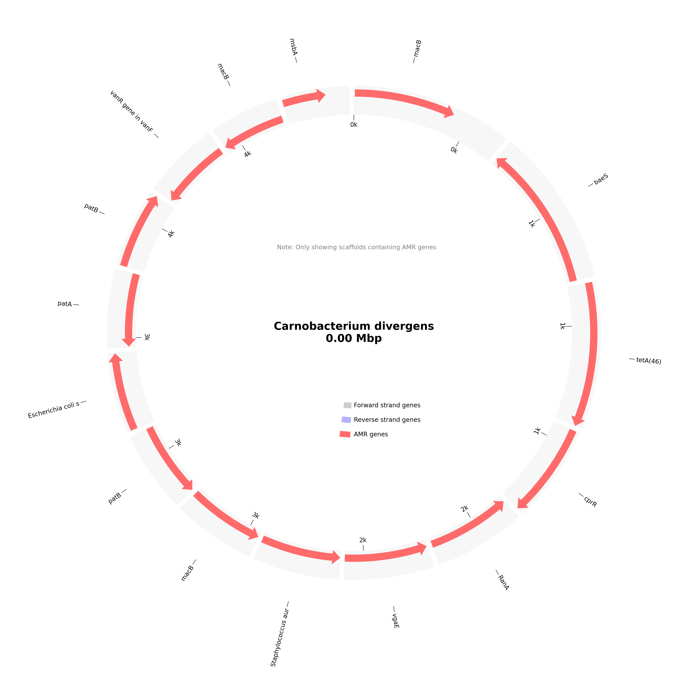

### Escherichia coli soxR with mutation conferring antibiotic resistance
- **Mechanism**: antibiotic target alteration; antibiotic efflux
- **Drug Classes**: fluoroquinolone antibiotic; cephalosporin; glycylcycline; penam; tetracycline antibiotic; rifamycin antibiotic; phenicol antibiotic; disinfecting agents and antiseptics
- **AMR Family**: ATP-binding cassette (ABC) antibiotic efflux pump; major facilitator superfamily (MFS) antibiotic efflux pump; resistance-nodulation-cell division (RND) antibiotic efflux pump
- **Locations**:
  - gnl|SPADES|CAEEGBCP_54698_1 : position 2-244

### RanA
- **Mechanism**: antibiotic efflux
- **Drug Classes**: aminoglycoside antibiotic
- **AMR Family**: ATP-binding cassette (ABC) antibiotic efflux pump
- **Locations**:
  - gnl|SPADES|CAEEGBCP_41211_1 : position 3-278

### Staphylococcus aureus mupA conferring resistance to mupirocin
- **Mechanism**: antibiotic target alteration
- **Drug Classes**: mupirocin-like antibiotic
- **AMR Family**: antibiotic-resistant isoleucyl-tRNA synthetase (ileS)
- **Locations**:
  - gnl|SPADES|CAEEGBCP_46652_1 : position 1-264

### baeS
- **Mechanism**: antibiotic efflux
- **Drug Classes**: aminoglycoside antibiotic; aminocoumarin antibiotic
- **AMR Family**: resistance-nodulation-cell division (RND) antibiotic efflux pump
- **Locations**:
  - gnl|SPADES|CAEEGBCP_22051_1 : position 2-484

### cprR
- **Mechanism**: antibiotic target alteration; antibiotic efflux
- **Drug Classes**: peptide antibiotic
- **AMR Family**: pmr phosphoethanolamine transferase
- **Locations**:
  - gnl|SPADES|CAEEGBCP_37463_1 : position 2-298

### macB (found in 3 locations)
- **Mechanism**: antibiotic efflux
- **Drug Classes**: macrolide antibiotic
- **AMR Family**: ATP-binding cassette (ABC) antibiotic efflux pump
- **Locations**:
  - gnl|SPADES|CAEEGBCP_21847_1 : position 3-317
  - gnl|SPADES|CAEEGBCP_51360_1 : position 1-252
  - gnl|SPADES|CAEEGBCP_70170_1 : position 3-212

### msbA
- **Mechanism**: antibiotic efflux
- **Drug Classes**: nitroimidazole antibiotic
- **AMR Family**: ATP-binding cassette (ABC) antibiotic efflux pump
- **Locations**:
  - gnl|SPADES|CAEEGBCP_72384_1 : position 2-136

### patA
- **Mechanism**: antibiotic efflux
- **Drug Classes**: fluoroquinolone antibiotic
- **AMR Family**: ATP-binding cassette (ABC) antibiotic efflux pump
- **Locations**:
  - gnl|SPADES|CAEEGBCP_56393_1 : position 3-242

### patB (found in 2 locations)
- **Mechanism**: antibiotic efflux
- **Drug Classes**: fluoroquinolone antibiotic
- **AMR Family**: ATP-binding cassette (ABC) antibiotic efflux pump
- **Locations**:
  - gnl|SPADES|CAEEGBCP_53511_1 : position 1-249
  - gnl|SPADES|CAEEGBCP_57302_1 : position 1-240

### tetA(46)
- **Mechanism**: antibiotic efflux
- **Drug Classes**: tetracycline antibiotic
- **AMR Family**: ATP-binding cassette (ABC) antibiotic efflux pump
- **Locations**:
  - gnl|SPADES|CAEEGBCP_23740_1 : position 1-450

### vanR gene in vanF cluster
- **Mechanism**: antibiotic target alteration
- **Drug Classes**: glycopeptide antibiotic
- **AMR Family**: glycopeptide resistance gene cluster; vanR
- **Locations**:
  - gnl|SPADES|CAEEGBCP_59793_1 : position 3-233

### vgaE
- **Mechanism**: antibiotic target protection
- **Drug Classes**: lincosamide antibiotic; streptogramin antibiotic; streptogramin A antibiotic; pleuromutilin antibiotic
- **AMR Family**: vga-type ABC-F protein
- **Locations**:
  - gnl|SPADES|CAEEGBCP_42481_1 : position 3-275

## Carnobacterium maltaromaticum
**Strain Statistics:**
- Total genome length: 1530.5 kbp
- Total scaffolds: 795
- Scaffolds with AMR genes: 104
- Total genes annotated: 2846
- Total AMR genes: 204
- Unique AMR genes: 116
- Distinct AMR mechanisms: 9
- Distinct AMR families: 56
- Distinct drug classes: 35

**Circos Plot:**

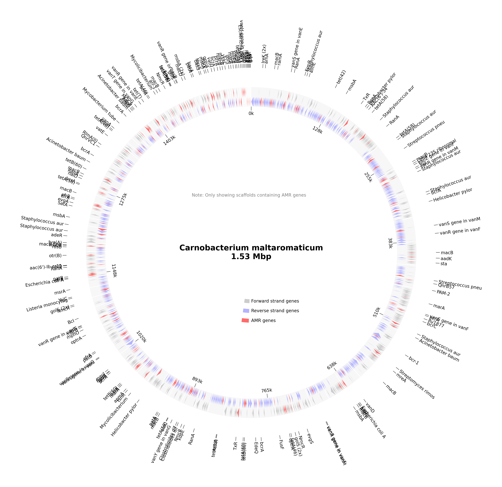

### AAC(6')-34
- **Mechanism**: antibiotic inactivation
- **Drug Classes**: aminoglycoside antibiotic
- **AMR Family**: AAC(6')
- **Locations**:
  - gnl|SPADES|CAEEGBCP_167_41 : position 45106-45639

### Acinetobacter baumannii AbaQ (found in 2 locations)
- **Mechanism**: antibiotic efflux
- **Drug Classes**: fluoroquinolone antibiotic
- **AMR Family**: major facilitator superfamily (MFS) antibiotic efflux pump
- **Locations**:
  - gnl|SPADES|CAEEGBCP_1135_5 : position 5081-6373
  - gnl|SPADES|CAEEGBCP_1525_6 : position 6265-7521

### Acinetobacter baumannii AmvA
- **Mechanism**: antibiotic efflux
- **Drug Classes**: macrolide antibiotic; disinfecting agents and antiseptics
- **AMR Family**: major facilitator superfamily (MFS) antibiotic efflux pump
- **Locations**:
  - gnl|SPADES|CAEEGBCP_284_25 : position 31695-33125

### BcI
- **Mechanism**: antibiotic inactivation
- **Drug Classes**: cephalosporin; penem
- **AMR Family**: class A Bacillus cereus Bc beta-lactamase
- **Locations**:
  - gnl|SPADES|CAEEGBCP_759_9 : position 7268-8167

### Clostridioides difficile gyrA conferring resistance to fluoroquinolones
- **Mechanism**: antibiotic target alteration
- **Drug Classes**: fluoroquinolone antibiotic
- **AMR Family**: fluoroquinolone resistant gyrA
- **Locations**:
  - gnl|SPADES|CAEEGBCP_528_10 : position 11087-13558

### Clostridioides difficile gyrB conferring resistance to fluoroquinolones
- **Mechanism**: antibiotic target alteration
- **Drug Classes**: fluoroquinolone antibiotic
- **AMR Family**: fluoroquinolone resistant gyrB
- **Locations**:
  - gnl|SPADES|CAEEGBCP_528_11 : position 13548-15563

### EdeQ (found in 2 locations)
- **Mechanism**: antibiotic inactivation
- **Drug Classes**: peptide antibiotic; polyamine antibiotic
- **AMR Family**: Edeine acetyltransferase
- **Locations**:
  - gnl|SPADES|CAEEGBCP_1876_6 : position 5559-6011
  - gnl|SPADES|CAEEGBCP_386_5 : position 3541-3993

### Enterococcus faecalis cls with mutation conferring resistance to daptomycin
- **Mechanism**: antibiotic target alteration
- **Drug Classes**: peptide antibiotic
- **AMR Family**: daptomycin resistant cls
- **Locations**:
  - gnl|SPADES|CAEEGBCP_95_32 : position 33635-35083

### ErmR
- **Mechanism**: antibiotic target alteration
- **Drug Classes**: macrolide antibiotic; lincosamide antibiotic; streptogramin antibiotic; streptogramin A antibiotic; streptogramin B antibiotic
- **AMR Family**: Erm 23S ribosomal RNA methyltransferase
- **Locations**:
  - gnl|SPADES|CAEEGBCP_114_8 : position 5857-6750

### Escherichia coli AcrAB-TolC with AcrR mutation conferring resistance to ciprofloxacin, tetracycline, and ceftazidime
- **Mechanism**: antibiotic target alteration; antibiotic efflux
- **Drug Classes**: fluoroquinolone antibiotic; cephalosporin; glycylcycline; penam; tetracycline antibiotic; rifamycin antibiotic; phenicol antibiotic; disinfecting agents and antiseptics
- **AMR Family**: resistance-nodulation-cell division (RND) antibiotic efflux pump
- **Locations**:
  - gnl|SPADES|CAEEGBCP_863_3 : position 2286-2930

### Escherichia coli AcrAB-TolC with MarR mutations conferring resistance to ciprofloxacin and tetracycline
- **Mechanism**: antibiotic target alteration; antibiotic efflux
- **Drug Classes**: fluoroquinolone antibiotic; cephalosporin; glycylcycline; penam; tetracycline antibiotic; rifamycin antibiotic; phenicol antibiotic; disinfecting agents and antiseptics
- **AMR Family**: resistance-nodulation-cell division (RND) antibiotic efflux pump
- **Locations**:
  - gnl|SPADES|CAEEGBCP_341_27 : position 23810-24274

### Escherichia coli EF-Tu mutants conferring resistance to kirromycin
- **Mechanism**: antibiotic target alteration
- **Drug Classes**: elfamycin antibiotic
- **AMR Family**: elfamycin resistant EF-Tu
- **Locations**:
  - gnl|SPADES|CAEEGBCP_9256_1 : position 1-1155

### FusF
- **Mechanism**: antibiotic target protection
- **Drug Classes**: fusidane antibiotic
- **AMR Family**: Target protecting FusB-type protein conferring resistance to Fusidic acid
- **Locations**:
  - gnl|SPADES|CAEEGBCP_353_31 : position 27124-27771

### Helicobacter pylori frxA mutation conferring resistance to metronidazole
- **Mechanism**: antibiotic target alteration
- **Drug Classes**: nitroimidazole antibiotic
- **AMR Family**: Antibiotic resistant Helicobacter pylori nitroreductase
- **Locations**:
  - gnl|SPADES|CAEEGBCP_167_37 : position 41784-42455

### Helicobacter pylori pbp1 mutants conferring resistance to amoxicillin (found in 2 locations)
- **Mechanism**: antibiotic target alteration
- **Drug Classes**: cephalosporin; cephamycin; penam
- **AMR Family**: Penicillin-binding protein mutations conferring resistance to beta-lactam antibiotics
- **Locations**:
  - gnl|SPADES|CAEEGBCP_227_21 : position 21638-23764
  - gnl|SPADES|CAEEGBCP_551_11 : position 11175-13811

### IreK (found in 3 locations)
- **Mechanism**: reduced permeability to antibiotic
- **Drug Classes**: cephalosporin
- **AMR Family**: Serine/threonine kinases
- **Locations**:
  - gnl|SPADES|CAEEGBCP_53699_1 : position 1-246
  - gnl|SPADES|CAEEGBCP_95_14 : position 15156-17180
  - gnl|SPADES|CAEEGBCP_95_40 : position 42093-43289

### Listeria monocytogenes mprF
- **Mechanism**: antibiotic target alteration
- **Drug Classes**: peptide antibiotic
- **AMR Family**: defensin resistant mprF
- **Locations**:
  - gnl|SPADES|CAEEGBCP_772_4 : position 4725-7298

### LlmA 23S ribosomal RNA methyltransferase
- **Mechanism**: antibiotic target alteration
- **Drug Classes**: lincosamide antibiotic
- **AMR Family**: Llm 23S ribosomal RNA methyltransferase
- **Locations**:
  - gnl|SPADES|CAEEGBCP_220_6 : position 5104-6270

### MOX-9
- **Mechanism**: antibiotic inactivation
- **Drug Classes**: cephalosporin; cephamycin; penam
- **AMR Family**: MOX beta-lactamase
- **Locations**:
  - gnl|SPADES|CAEEGBCP_1620_4 : position 4330-5586

### MexS
- **Mechanism**: antibiotic efflux
- **Drug Classes**: fluoroquinolone antibiotic; diaminopyrimidine antibiotic; phenicol antibiotic
- **AMR Family**: resistance-nodulation-cell division (RND) antibiotic efflux pump
- **Locations**:
  - gnl|SPADES|CAEEGBCP_2811_1 : position 86-1051

### Mycobacterium tuberculosis pncA mutations conferring resistance to pyrazinamide
- **Mechanism**: antibiotic target alteration
- **Drug Classes**: pyrazine antibiotic
- **AMR Family**: Pyrazinamide resistant pncA
- **Locations**:
  - gnl|SPADES|CAEEGBCP_1398_3 : position 2151-2696

### Mycolicibacterium smegmatis ndh with mutation conferring resistance to isoniazid (found in 2 locations)
- **Mechanism**: antibiotic target alteration
- **Drug Classes**: isoniazid-like antibiotic
- **AMR Family**: antibiotic resistant ndh
- **Locations**:
  - gnl|SPADES|CAEEGBCP_1785_3 : position 1715-2920
  - gnl|SPADES|CAEEGBCP_552_7 : position 6059-7921

### NmcR (found in 4 locations)
- **Mechanism**: antibiotic inactivation
- **Drug Classes**: carbapenem; cephalosporin; cephamycin; penam
- **AMR Family**: NmcA beta-lactamase
- **Locations**:
  - gnl|SPADES|CAEEGBCP_1837_6 : position 3134-4027
  - gnl|SPADES|CAEEGBCP_353_1 : position 2-868
  - gnl|SPADES|CAEEGBCP_528_7 : position 6520-7467
  - gnl|SPADES|CAEEGBCP_766_13 : position 9762-10646

### PAM-2
- **Mechanism**: antibiotic inactivation
- **Drug Classes**: carbapenem; cephalosporin
- **AMR Family**: PAM beta-lactamase
- **Locations**:
  - gnl|SPADES|CAEEGBCP_272_32 : position 32697-33377

### QnrB57
- **Mechanism**: antibiotic target protection
- **Drug Classes**: fluoroquinolone antibiotic
- **AMR Family**: quinolone resistance protein (qnr)
- **Locations**:
  - gnl|SPADES|CAEEGBCP_272_22 : position 23129-23764

### QnrVC1
- **Mechanism**: antibiotic target protection
- **Drug Classes**: fluoroquinolone antibiotic
- **AMR Family**: quinolone resistance protein (qnr)
- **Locations**:
  - gnl|SPADES|CAEEGBCP_1191_9 : position 8435-9058

### RanA (found in 7 locations)
- **Mechanism**: antibiotic efflux
- **Drug Classes**: aminoglycoside antibiotic
- **AMR Family**: ATP-binding cassette (ABC) antibiotic efflux pump
- **Locations**:
  - gnl|SPADES|CAEEGBCP_1106_6 : position 5511-6497
  - gnl|SPADES|CAEEGBCP_167_35 : position 38843-39958
  - gnl|SPADES|CAEEGBCP_193_30 : position 30085-30762
  - gnl|SPADES|CAEEGBCP_485_14 : position 11023-11676
  - gnl|SPADES|CAEEGBCP_597_10 : position 9056-9781
  - gnl|SPADES|CAEEGBCP_870_5 : position 4501-5232
  - gnl|SPADES|CAEEGBCP_95_56 : position 60186-61379

### RlmA(II)
- **Mechanism**: antibiotic target alteration
- **Drug Classes**: macrolide antibiotic; lincosamide antibiotic
- **AMR Family**: non-erm 23S ribosomal RNA methyltransferase (G748)
- **Locations**:
  - gnl|SPADES|CAEEGBCP_1207_3 : position 2185-3042

### Rv1877
- **Mechanism**: antibiotic efflux
- **Drug Classes**: fluoroquinolone antibiotic
- **AMR Family**: major facilitator superfamily (MFS) antibiotic efflux pump
- **Locations**:
  - gnl|SPADES|CAEEGBCP_284_3 : position 2583-4067

### SatA
- **Mechanism**: antibiotic inactivation
- **Drug Classes**: nucleoside antibiotic
- **AMR Family**: streptothricin acetyltransferase (SAT)
- **Locations**:
  - gnl|SPADES|CAEEGBCP_945_11 : position 10330-10782

### Staphylococcus aureus LmrS
- **Mechanism**: antibiotic efflux
- **Drug Classes**: macrolide antibiotic; aminoglycoside antibiotic; oxazolidinone antibiotic; diaminopyrimidine antibiotic; phenicol antibiotic
- **AMR Family**: major facilitator superfamily (MFS) antibiotic efflux pump
- **Locations**:
  - gnl|SPADES|CAEEGBCP_227_9 : position 8204-9628

### Staphylococcus aureus fusA with mutation conferring resistance to fusidic acid
- **Mechanism**: antibiotic target alteration
- **Drug Classes**: fusidane antibiotic
- **AMR Family**: antibiotic resistant fusA
- **Locations**:
  - gnl|SPADES|CAEEGBCP_920_2 : position 234-2318

### Staphylococcus aureus mupA conferring resistance to mupirocin (found in 2 locations)
- **Mechanism**: antibiotic target alteration
- **Drug Classes**: mupirocin-like antibiotic
- **AMR Family**: antibiotic-resistant isoleucyl-tRNA synthetase (ileS)
- **Locations**:
  - gnl|SPADES|CAEEGBCP_114_11 : position 8173-10188
  - gnl|SPADES|CAEEGBCP_198_10 : position 8861-11644

### Staphylococcus aureus mupB conferring resistance to mupirocin (found in 2 locations)
- **Mechanism**: antibiotic target alteration
- **Drug Classes**: mupirocin-like antibiotic
- **AMR Family**: antibiotic-resistant isoleucyl-tRNA synthetase (ileS)
- **Locations**:
  - gnl|SPADES|CAEEGBCP_193_17 : position 16431-19100
  - gnl|SPADES|CAEEGBCP_284_21 : position 25303-27717

### Staphylococcus aureus murA with mutation conferring resistance to fosfomycin
- **Mechanism**: antibiotic target alteration
- **Drug Classes**: phosphonic acid antibiotic
- **AMR Family**: antibiotic-resistant murA transferase
- **Locations**:
  - gnl|SPADES|CAEEGBCP_220_18 : position 18239-19546

### Staphylococcus aureus rpoB mutants conferring resistance to rifampicin
- **Mechanism**: antibiotic target alteration; antibiotic target replacement
- **Drug Classes**: rifamycin antibiotic
- **AMR Family**: rifamycin-resistant beta-subunit of RNA polymerase (rpoB)
- **Locations**:
  - gnl|SPADES|CAEEGBCP_920_7 : position 8320-11892

### Streptococcus pneumoniae PBP2b conferring resistance to amoxicillin
- **Mechanism**: antibiotic target alteration
- **Drug Classes**: cephalosporin; cephamycin; penam
- **AMR Family**: Penicillin-binding protein mutations conferring resistance to beta-lactam antibiotics
- **Locations**:
  - gnl|SPADES|CAEEGBCP_272_20 : position 18072-20126

### Streptococcus pneumoniae PBP2x conferring resistance to amoxicillin
- **Mechanism**: antibiotic target alteration
- **Drug Classes**: cephalosporin; cephamycin; penam
- **AMR Family**: Penicillin-binding protein mutations conferring resistance to beta-lactam antibiotics
- **Locations**:
  - gnl|SPADES|CAEEGBCP_198_23 : position 24281-26470

### Streptomyces rimosus otr(A)
- **Mechanism**: antibiotic target protection
- **Drug Classes**: tetracycline antibiotic
- **AMR Family**: tetracycline-resistant ribosomal protection protein
- **Locations**:
  - gnl|SPADES|CAEEGBCP_329_10 : position 12816-15323

### TxR (found in 2 locations)
- **Mechanism**: antibiotic efflux
- **Drug Classes**: tetracycline antibiotic
- **AMR Family**: ATP-binding cassette (ABC) antibiotic efflux pump
- **Locations**:
  - gnl|SPADES|CAEEGBCP_167_29 : position 30824-33487
  - gnl|SPADES|CAEEGBCP_389_4 : position 2595-5405

### YajC
- **Mechanism**: antibiotic efflux
- **Drug Classes**: fluoroquinolone antibiotic; cephalosporin; glycylcycline; penam; tetracycline antibiotic; oxazolidinone antibiotic; glycopeptide antibiotic; rifamycin antibiotic; phenicol antibiotic; disinfecting agents and antiseptics
- **AMR Family**: resistance-nodulation-cell division (RND) antibiotic efflux pump
- **Locations**:
  - gnl|SPADES|CAEEGBCP_772_5 : position 7478-7855

### YojI
- **Mechanism**: antibiotic efflux
- **Drug Classes**: peptide antibiotic
- **AMR Family**: ATP-binding cassette (ABC) antibiotic efflux pump
- **Locations**:
  - gnl|SPADES|CAEEGBCP_220_11 : position 11859-12407

### aac(6')-Ib-cr11
- **Mechanism**: antibiotic inactivation
- **Drug Classes**: fluoroquinolone antibiotic; aminoglycoside antibiotic
- **AMR Family**: AAC(6'); AAC(6')-Ib-cr
- **Locations**:
  - gnl|SPADES|CAEEGBCP_870_8 : position 7549-8112

### aadK
- **Mechanism**: antibiotic inactivation
- **Drug Classes**: aminoglycoside antibiotic
- **AMR Family**: ANT(6)
- **Locations**:
  - gnl|SPADES|CAEEGBCP_266_25 : position 23064-23915

### adeR
- **Mechanism**: antibiotic efflux
- **Drug Classes**: glycylcycline; tetracycline antibiotic
- **AMR Family**: resistance-nodulation-cell division (RND) antibiotic efflux pump
- **Locations**:
  - gnl|SPADES|CAEEGBCP_913_5 : position 7086-7784

### almE
- **Mechanism**: antibiotic target alteration
- **Drug Classes**: peptide antibiotic
- **AMR Family**: polymyxin resistance operon; alm glycyltransferase
- **Locations**:
  - gnl|SPADES|CAEEGBCP_114_13 : position 11839-13281

### apmA
- **Mechanism**: antibiotic inactivation
- **Drug Classes**: aminoglycoside antibiotic
- **AMR Family**: AAC(2')
- **Locations**:
  - gnl|SPADES|CAEEGBCP_552_18 : position 15433-15942

### arlR
- **Mechanism**: antibiotic efflux
- **Drug Classes**: fluoroquinolone antibiotic; disinfecting agents and antiseptics
- **AMR Family**: major facilitator superfamily (MFS) antibiotic efflux pump
- **Locations**:
  - gnl|SPADES|CAEEGBCP_341_29 : position 25282-25953

### arlS
- **Mechanism**: antibiotic efflux
- **Drug Classes**: fluoroquinolone antibiotic; disinfecting agents and antiseptics
- **AMR Family**: major facilitator superfamily (MFS) antibiotic efflux pump
- **Locations**:
  - gnl|SPADES|CAEEGBCP_734_13 : position 12298-13350

### arnA
- **Mechanism**: antibiotic target alteration
- **Drug Classes**: peptide antibiotic
- **AMR Family**: pmr phosphoethanolamine transferase
- **Locations**:
  - gnl|SPADES|CAEEGBCP_95_17 : position 19341-20294

### arr-1
- **Mechanism**: antibiotic inactivation
- **Drug Classes**: rifamycin antibiotic
- **AMR Family**: rifampin ADP-ribosyltransferase (Arr)
- **Locations**:
  - gnl|SPADES|CAEEGBCP_1785_7 : position 6006-6419

### bacA
- **Mechanism**: antibiotic target alteration
- **Drug Classes**: peptide antibiotic
- **AMR Family**: undecaprenyl pyrophosphate related proteins
- **Locations**:
  - gnl|SPADES|CAEEGBCP_2519_1 : position 102-920

### baeS (found in 2 locations)
- **Mechanism**: antibiotic efflux
- **Drug Classes**: aminoglycoside antibiotic; aminocoumarin antibiotic
- **AMR Family**: resistance-nodulation-cell division (RND) antibiotic efflux pump
- **Locations**:
  - gnl|SPADES|CAEEGBCP_220_12 : position 12522-13973
  - gnl|SPADES|CAEEGBCP_341_30 : position 25950-27338

### basS
- **Mechanism**: antibiotic target alteration; antibiotic efflux
- **Drug Classes**: peptide antibiotic
- **AMR Family**: pmr phosphoethanolamine transferase
- **Locations**:
  - gnl|SPADES|CAEEGBCP_2550_3 : position 3403-4467

### bcr-1
- **Mechanism**: antibiotic efflux
- **Drug Classes**: bicyclomycin-like antibiotic
- **AMR Family**: major facilitator superfamily (MFS) antibiotic efflux pump
- **Locations**:
  - gnl|SPADES|CAEEGBCP_303_21 : position 24707-25954

### bcrA (found in 10 locations)
- **Mechanism**: antibiotic efflux
- **Drug Classes**: peptide antibiotic
- **AMR Family**: ATP-binding cassette (ABC) antibiotic efflux pump
- **Locations**:
  - gnl|SPADES|CAEEGBCP_1101_8 : position 6259-7035
  - gnl|SPADES|CAEEGBCP_1181_5 : position 4720-5646
  - gnl|SPADES|CAEEGBCP_1512_6 : position 6402-7031
  - gnl|SPADES|CAEEGBCP_1745_9 : position 5756-6502
  - gnl|SPADES|CAEEGBCP_227_12 : position 12005-12754
  - gnl|SPADES|CAEEGBCP_281_32 : position 33115-34047
  - gnl|SPADES|CAEEGBCP_3465_1 : position 3-713
  - gnl|SPADES|CAEEGBCP_371_26 : position 23911-24816
  - gnl|SPADES|CAEEGBCP_4196_1 : position 3-1067
  - gnl|SPADES|CAEEGBCP_597_7 : position 6162-7049

### bcrC
- **Mechanism**: antibiotic target alteration
- **Drug Classes**: peptide antibiotic
- **AMR Family**: undecaprenyl pyrophosphate related proteins
- **Locations**:
  - gnl|SPADES|CAEEGBCP_284_7 : position 7314-7982

### catB11
- **Mechanism**: antibiotic inactivation
- **Drug Classes**: phenicol antibiotic
- **AMR Family**: chloramphenicol acetyltransferase (CAT)
- **Locations**:
  - gnl|SPADES|CAEEGBCP_8777_2 : position 462-1112

### cmeR
- **Mechanism**: antibiotic efflux
- **Drug Classes**: macrolide antibiotic; fluoroquinolone antibiotic; cephalosporin; fusidane antibiotic
- **AMR Family**: resistance-nodulation-cell division (RND) antibiotic efflux pump
- **Locations**:
  - gnl|SPADES|CAEEGBCP_5711_3 : position 1820-2014

### efrA (found in 3 locations)
- **Mechanism**: antibiotic efflux
- **Drug Classes**: macrolide antibiotic; fluoroquinolone antibiotic; rifamycin antibiotic
- **AMR Family**: ATP-binding cassette (ABC) antibiotic efflux pump
- **Locations**:
  - gnl|SPADES|CAEEGBCP_662_5 : position 5036-6781
  - gnl|SPADES|CAEEGBCP_863_4 : position 2980-4701
  - gnl|SPADES|CAEEGBCP_975_8 : position 6700-8454

### efrB (found in 2 locations)
- **Mechanism**: antibiotic efflux
- **Drug Classes**: macrolide antibiotic; fluoroquinolone antibiotic; rifamycin antibiotic
- **AMR Family**: ATP-binding cassette (ABC) antibiotic efflux pump
- **Locations**:
  - gnl|SPADES|CAEEGBCP_73684_1 : position 1-207
  - gnl|SPADES|CAEEGBCP_975_9 : position 8451-10229

### emrR
- **Mechanism**: antibiotic efflux
- **Drug Classes**: fluoroquinolone antibiotic
- **AMR Family**: major facilitator superfamily (MFS) antibiotic efflux pump
- **Locations**:
  - gnl|SPADES|CAEEGBCP_1324_8 : position 8166-8597

### evgA
- **Mechanism**: antibiotic efflux
- **Drug Classes**: macrolide antibiotic; fluoroquinolone antibiotic; penam; tetracycline antibiotic
- **AMR Family**: major facilitator superfamily (MFS) antibiotic efflux pump; resistance-nodulation-cell division (RND) antibiotic efflux pump
- **Locations**:
  - gnl|SPADES|CAEEGBCP_975_3 : position 2056-2688

### evgS
- **Mechanism**: antibiotic efflux
- **Drug Classes**: macrolide antibiotic; fluoroquinolone antibiotic; penam; tetracycline antibiotic
- **AMR Family**: major facilitator superfamily (MFS) antibiotic efflux pump; resistance-nodulation-cell division (RND) antibiotic efflux pump
- **Locations**:
  - gnl|SPADES|CAEEGBCP_348_12 : position 16962-17663

### golS (found in 7 locations)
- **Mechanism**: antibiotic efflux
- **Drug Classes**: monobactam; carbapenem; cephalosporin; cephamycin; penam; phenicol antibiotic; penem
- **AMR Family**: resistance-nodulation-cell division (RND) antibiotic efflux pump
- **Locations**:
  - gnl|SPADES|CAEEGBCP_1933_5 : position 4608-5366
  - gnl|SPADES|CAEEGBCP_353_18 : position 16516-17328
  - gnl|SPADES|CAEEGBCP_353_8 : position 5254-5634
  - gnl|SPADES|CAEEGBCP_5001_3 : position 1772-2200
  - gnl|SPADES|CAEEGBCP_597_9 : position 8416-8766
  - gnl|SPADES|CAEEGBCP_766_15 : position 11797-12165
  - gnl|SPADES|CAEEGBCP_766_18 : position 14129-14521

### kdpD
- **Mechanism**: antibiotic efflux
- **Drug Classes**: aminoglycoside antibiotic
- **AMR Family**: kdpDE
- **Locations**:
  - gnl|SPADES|CAEEGBCP_1620_1 : position 70-2763

### kdpE (found in 2 locations)
- **Mechanism**: antibiotic efflux
- **Drug Classes**: aminoglycoside antibiotic
- **AMR Family**: kdpDE
- **Locations**:
  - gnl|SPADES|CAEEGBCP_1620_2 : position 2795-3499
  - gnl|SPADES|CAEEGBCP_528_4 : position 2922-3656

### macA
- **Mechanism**: antibiotic efflux
- **Drug Classes**: macrolide antibiotic
- **AMR Family**: ATP-binding cassette (ABC) antibiotic efflux pump
- **Locations**:
  - gnl|SPADES|CAEEGBCP_885_7 : position 7460-8320

### macB (found in 16 locations)
- **Mechanism**: antibiotic efflux
- **Drug Classes**: macrolide antibiotic
- **AMR Family**: ATP-binding cassette (ABC) antibiotic efflux pump
- **Locations**:
  - gnl|SPADES|CAEEGBCP_1042_3 : position 4285-5028
  - gnl|SPADES|CAEEGBCP_1106_10 : position 9084-9812
  - gnl|SPADES|CAEEGBCP_1816_4 : position 2361-3158
  - gnl|SPADES|CAEEGBCP_1991_2 : position 976-1743
  - gnl|SPADES|CAEEGBCP_220_4 : position 2754-3413
  - gnl|SPADES|CAEEGBCP_266_15 : position 15138-15956
  - gnl|SPADES|CAEEGBCP_27558_2 : position 221-388
  - gnl|SPADES|CAEEGBCP_339_10 : position 10215-10973
  - gnl|SPADES|CAEEGBCP_341_32 : position 28497-29054
  - gnl|SPADES|CAEEGBCP_4365_1 : position 29-1105
  - gnl|SPADES|CAEEGBCP_4370_1 : position 3-170
  - gnl|SPADES|CAEEGBCP_530_20 : position 19577-20278
  - gnl|SPADES|CAEEGBCP_734_11 : position 9108-11501
  - gnl|SPADES|CAEEGBCP_885_8 : position 8336-9028
  - gnl|SPADES|CAEEGBCP_885_9 : position 9044-10270
  - gnl|SPADES|CAEEGBCP_95_31 : position 32170-33366

### marA (found in 3 locations)
- **Mechanism**: antibiotic efflux; reduced permeability to antibiotic
- **Drug Classes**: fluoroquinolone antibiotic; monobactam; carbapenem; cephalosporin; glycylcycline; cephamycin; penam; tetracycline antibiotic; rifamycin antibiotic; phenicol antibiotic; penem; disinfecting agents and antiseptics
- **AMR Family**: resistance-nodulation-cell division (RND) antibiotic efflux pump; General Bacterial Porin with reduced permeability to beta-lactams
- **Locations**:
  - gnl|SPADES|CAEEGBCP_281_18 : position 16253-16639
  - gnl|SPADES|CAEEGBCP_5194_3 : position 1244-2128
  - gnl|SPADES|CAEEGBCP_570_4 : position 2778-3614

### mdtG
- **Mechanism**: antibiotic efflux
- **Drug Classes**: phosphonic acid antibiotic
- **AMR Family**: major facilitator superfamily (MFS) antibiotic efflux pump
- **Locations**:
  - gnl|SPADES|CAEEGBCP_220_7 : position 6318-7526

### mecD
- **Mechanism**: antibiotic target replacement
- **Drug Classes**: penam
- **AMR Family**: methicillin resistant PBP2
- **Locations**:
  - gnl|SPADES|CAEEGBCP_2158_3 : position 1560-3590

### mecI
- **Mechanism**: antibiotic target replacement
- **Drug Classes**: penam
- **AMR Family**: methicillin resistant PBP2
- **Locations**:
  - gnl|SPADES|CAEEGBCP_597_13 : position 11727-12182

### mepR
- **Mechanism**: antibiotic efflux
- **Drug Classes**: glycylcycline; tetracycline antibiotic
- **AMR Family**: multidrug and toxic compound extrusion (MATE) transporter
- **Locations**:
  - gnl|SPADES|CAEEGBCP_6373_2 : position 595-1044

### mphO
- **Mechanism**: antibiotic inactivation
- **Drug Classes**: macrolide antibiotic
- **AMR Family**: macrolide phosphotransferase (MPH)
- **Locations**:
  - gnl|SPADES|CAEEGBCP_734_6 : position 5896-6735

### mreA
- **Mechanism**: antibiotic efflux
- **Drug Classes**: macrolide antibiotic
- **AMR Family**: major facilitator superfamily (MFS) antibiotic efflux pump
- **Locations**:
  - gnl|SPADES|CAEEGBCP_329_17 : position 20083-21027

### msbA (found in 9 locations)
- **Mechanism**: antibiotic efflux
- **Drug Classes**: nitroimidazole antibiotic
- **AMR Family**: ATP-binding cassette (ABC) antibiotic efflux pump
- **Locations**:
  - gnl|SPADES|CAEEGBCP_167_7 : position 6623-7405
  - gnl|SPADES|CAEEGBCP_17566_1 : position 167-607
  - gnl|SPADES|CAEEGBCP_2208_1 : position 3-443
  - gnl|SPADES|CAEEGBCP_2208_6 : position 4164-5294
  - gnl|SPADES|CAEEGBCP_2977_1 : position 3-1352
  - gnl|SPADES|CAEEGBCP_342_4 : position 3648-5363
  - gnl|SPADES|CAEEGBCP_429_7 : position 4125-4964
  - gnl|SPADES|CAEEGBCP_5587_3 : position 1426-2118
  - gnl|SPADES|CAEEGBCP_938_8 : position 7131-7916

### msrA
- **Mechanism**: antibiotic target protection
- **Drug Classes**: macrolide antibiotic; streptogramin antibiotic; streptogramin B antibiotic
- **AMR Family**: msr-type ABC-F protein
- **Locations**:
  - gnl|SPADES|CAEEGBCP_773_4 : position 2550-3125

### msrE
- **Mechanism**: antibiotic target protection
- **Drug Classes**: macrolide antibiotic; streptogramin antibiotic
- **AMR Family**: msr-type ABC-F protein
- **Locations**:
  - gnl|SPADES|CAEEGBCP_2977_2 : position 1782-3992

### nalD (found in 2 locations)
- **Mechanism**: antibiotic efflux
- **Drug Classes**: macrolide antibiotic; fluoroquinolone antibiotic; monobactam; carbapenem; cephalosporin; cephamycin; penam; tetracycline antibiotic; peptide antibiotic; aminocoumarin antibiotic; diaminopyrimidine antibiotic; sulfonamide antibiotic; phenicol antibiotic; penem
- **AMR Family**: resistance-nodulation-cell division (RND) antibiotic efflux pump
- **Locations**:
  - gnl|SPADES|CAEEGBCP_1106_3 : position 2328-2978
  - gnl|SPADES|CAEEGBCP_870_7 : position 6950-7528

### oleC
- **Mechanism**: antibiotic efflux
- **Drug Classes**: macrolide antibiotic
- **AMR Family**: ATP-binding cassette (ABC) antibiotic efflux pump
- **Locations**:
  - gnl|SPADES|CAEEGBCP_530_8 : position 6242-6946

### optrA (found in 3 locations)
- **Mechanism**: antibiotic target protection
- **Drug Classes**: oxazolidinone antibiotic; phenicol antibiotic
- **AMR Family**: Miscellaneous ABC-F subfamily ATP-binding cassette ribosomal protection proteins
- **Locations**:
  - gnl|SPADES|CAEEGBCP_2996_1 : position 121-1749
  - gnl|SPADES|CAEEGBCP_353_15 : position 12803-14341
  - gnl|SPADES|CAEEGBCP_691_17 : position 13886-15760

### otr(B)
- **Mechanism**: antibiotic efflux
- **Drug Classes**: tetracycline antibiotic
- **AMR Family**: major facilitator superfamily (MFS) antibiotic efflux pump
- **Locations**:
  - gnl|SPADES|CAEEGBCP_871_6 : position 7240-8520

### patA (found in 3 locations)
- **Mechanism**: antibiotic efflux
- **Drug Classes**: fluoroquinolone antibiotic
- **AMR Family**: ATP-binding cassette (ABC) antibiotic efflux pump
- **Locations**:
  - gnl|SPADES|CAEEGBCP_2489_4 : position 3112-4593
  - gnl|SPADES|CAEEGBCP_550_2 : position 1789-3510
  - gnl|SPADES|CAEEGBCP_570_5 : position 4012-5766

### patB (found in 4 locations)
- **Mechanism**: antibiotic efflux
- **Drug Classes**: fluoroquinolone antibiotic
- **AMR Family**: ATP-binding cassette (ABC) antibiotic efflux pump
- **Locations**:
  - gnl|SPADES|CAEEGBCP_15490_1 : position 1-357
  - gnl|SPADES|CAEEGBCP_550_1 : position 17-1789
  - gnl|SPADES|CAEEGBCP_662_4 : position 3283-5034
  - gnl|SPADES|CAEEGBCP_863_5 : position 4703-6601

### ramA
- **Mechanism**: antibiotic efflux; reduced permeability to antibiotic
- **Drug Classes**: fluoroquinolone antibiotic; monobactam; carbapenem; cephalosporin; glycylcycline; cephamycin; penam; tetracycline antibiotic; rifamycin antibiotic; phenicol antibiotic; penem; disinfecting agents and antiseptics
- **AMR Family**: resistance-nodulation-cell division (RND) antibiotic efflux pump; General Bacterial Porin with reduced permeability to beta-lactams
- **Locations**:
  - gnl|SPADES|CAEEGBCP_95_35 : position 36774-37691

### rosB
- **Mechanism**: antibiotic efflux
- **Drug Classes**: peptide antibiotic
- **AMR Family**: major facilitator superfamily (MFS) antibiotic efflux pump
- **Locations**:
  - gnl|SPADES|CAEEGBCP_885_5 : position 5165-6325

### sta
- **Mechanism**: antibiotic inactivation
- **Drug Classes**: nucleoside antibiotic
- **AMR Family**: streptothricin acetyltransferase (SAT)
- **Locations**:
  - gnl|SPADES|CAEEGBCP_266_33 : position 30155-30670

### tet(42)
- **Mechanism**: antibiotic efflux
- **Drug Classes**: tetracycline antibiotic
- **AMR Family**: major facilitator superfamily (MFS) antibiotic efflux pump
- **Locations**:
  - gnl|SPADES|CAEEGBCP_114_52 : position 51731-52966

### tet(T)
- **Mechanism**: antibiotic target protection
- **Drug Classes**: tetracycline antibiotic
- **AMR Family**: tetracycline-resistant ribosomal protection protein
- **Locations**:
  - gnl|SPADES|CAEEGBCP_1675_7 : position 4647-6731

### tetA(46) (found in 4 locations)
- **Mechanism**: antibiotic efflux
- **Drug Classes**: tetracycline antibiotic
- **AMR Family**: ATP-binding cassette (ABC) antibiotic efflux pump
- **Locations**:
  - gnl|SPADES|CAEEGBCP_1324_6 : position 6352-6903
  - gnl|SPADES|CAEEGBCP_1771_1 : position 2-805
  - gnl|SPADES|CAEEGBCP_353_13 : position 10652-12343
  - gnl|SPADES|CAEEGBCP_7002_1 : position 2-1513

### tetA(58) (found in 6 locations)
- **Mechanism**: antibiotic efflux
- **Drug Classes**: tetracycline antibiotic
- **AMR Family**: major facilitator superfamily (MFS) antibiotic efflux pump
- **Locations**:
  - gnl|SPADES|CAEEGBCP_1101_6 : position 4633-5595
  - gnl|SPADES|CAEEGBCP_1876_4 : position 3778-4695
  - gnl|SPADES|CAEEGBCP_193_3 : position 2094-2852
  - gnl|SPADES|CAEEGBCP_198_7 : position 6689-7606
  - gnl|SPADES|CAEEGBCP_429_6 : position 3268-4149
  - gnl|SPADES|CAEEGBCP_530_9 : position 6950-7723

### tetA(60)
- **Mechanism**: antibiotic efflux
- **Drug Classes**: tetracycline antibiotic
- **AMR Family**: ATP-binding cassette (ABC) antibiotic efflux pump
- **Locations**:
  - gnl|SPADES|CAEEGBCP_386_15 : position 20363-22114

### tetB(58)
- **Mechanism**: antibiotic efflux
- **Drug Classes**: tetracycline antibiotic
- **AMR Family**: major facilitator superfamily (MFS) antibiotic efflux pump
- **Locations**:
  - gnl|SPADES|CAEEGBCP_1876_5 : position 4688-5458

### tetB(60) (found in 3 locations)
- **Mechanism**: antibiotic efflux
- **Drug Classes**: tetracycline antibiotic
- **AMR Family**: ATP-binding cassette (ABC) antibiotic efflux pump
- **Locations**:
  - gnl|SPADES|CAEEGBCP_1109_4 : position 4975-7065
  - gnl|SPADES|CAEEGBCP_386_14 : position 18573-20363
  - gnl|SPADES|CAEEGBCP_570_6 : position 5759-7540

### tsnR
- **Mechanism**: antibiotic target alteration
- **Drug Classes**: peptide antibiotic
- **AMR Family**: non-erm 23S ribosomal RNA methyltransferase (A1067)
- **Locations**:
  - gnl|SPADES|CAEEGBCP_552_15 : position 12584-13459

### tva(A)
- **Mechanism**: antibiotic target protection
- **Drug Classes**: pleuromutilin antibiotic
- **AMR Family**: Miscellaneous ABC-F subfamily ATP-binding cassette ribosomal protection proteins
- **Locations**:
  - gnl|SPADES|CAEEGBCP_885_11 : position 11204-11872

### vanA
- **Mechanism**: antibiotic target alteration
- **Drug Classes**: glycopeptide antibiotic
- **AMR Family**: glycopeptide resistance gene cluster; Van ligase
- **Locations**:
  - gnl|SPADES|CAEEGBCP_1385_3 : position 955-2313

### vanD
- **Mechanism**: antibiotic target alteration
- **Drug Classes**: glycopeptide antibiotic
- **AMR Family**: glycopeptide resistance gene cluster; Van ligase
- **Locations**:
  - gnl|SPADES|CAEEGBCP_341_18 : position 16114-17478

### vanH gene in vanA cluster
- **Mechanism**: antibiotic target alteration
- **Drug Classes**: glycopeptide antibiotic
- **AMR Family**: vanH; glycopeptide resistance gene cluster
- **Locations**:
  - gnl|SPADES|CAEEGBCP_10254_1 : position 1-1005

### vanR gene in vanE cluster
- **Mechanism**: antibiotic target alteration
- **Drug Classes**: glycopeptide antibiotic
- **AMR Family**: glycopeptide resistance gene cluster; vanR
- **Locations**:
  - gnl|SPADES|CAEEGBCP_1675_1 : position 178-867

### vanR gene in vanF cluster (found in 2 locations)
- **Mechanism**: antibiotic target alteration
- **Drug Classes**: glycopeptide antibiotic
- **AMR Family**: glycopeptide resistance gene cluster; vanR
- **Locations**:
  - gnl|SPADES|CAEEGBCP_240_32 : position 27606-28301
  - gnl|SPADES|CAEEGBCP_734_12 : position 11558-12301

### vanR gene in vanI cluster (found in 3 locations)
- **Mechanism**: antibiotic target alteration
- **Drug Classes**: glycopeptide antibiotic
- **AMR Family**: glycopeptide resistance gene cluster; vanR
- **Locations**:
  - gnl|SPADES|CAEEGBCP_1991_1 : position 63-737
  - gnl|SPADES|CAEEGBCP_642_8 : position 12680-13375
  - gnl|SPADES|CAEEGBCP_95_53 : position 57444-58139

### vanR gene in vanM cluster (found in 3 locations)
- **Mechanism**: antibiotic target alteration
- **Drug Classes**: glycopeptide antibiotic
- **AMR Family**: glycopeptide resistance gene cluster; vanR
- **Locations**:
  - gnl|SPADES|CAEEGBCP_220_13 : position 13976-14695
  - gnl|SPADES|CAEEGBCP_240_20 : position 17428-18150
  - gnl|SPADES|CAEEGBCP_347_16 : position 18318-19007

### vanS gene in vanE cluster
- **Mechanism**: antibiotic target alteration
- **Drug Classes**: glycopeptide antibiotic
- **AMR Family**: vanS; glycopeptide resistance gene cluster
- **Locations**:
  - gnl|SPADES|CAEEGBCP_95_52 : position 55253-57454

### vanS gene in vanF cluster (found in 2 locations)
- **Mechanism**: antibiotic target alteration
- **Drug Classes**: glycopeptide antibiotic
- **AMR Family**: vanS; glycopeptide resistance gene cluster
- **Locations**:
  - gnl|SPADES|CAEEGBCP_281_30 : position 31328-32236
  - gnl|SPADES|CAEEGBCP_347_15 : position 17131-18264

### vanS gene in vanG cluster
- **Mechanism**: antibiotic target alteration
- **Drug Classes**: glycopeptide antibiotic
- **AMR Family**: vanS; glycopeptide resistance gene cluster
- **Locations**:
  - gnl|SPADES|CAEEGBCP_642_9 : position 13382-14872

### vanS gene in vanM cluster
- **Mechanism**: antibiotic target alteration
- **Drug Classes**: glycopeptide antibiotic
- **AMR Family**: vanS; glycopeptide resistance gene cluster
- **Locations**:
  - gnl|SPADES|CAEEGBCP_240_19 : position 15619-17421

### vanT gene in vanG cluster
- **Mechanism**: antibiotic target alteration
- **Drug Classes**: glycopeptide antibiotic
- **AMR Family**: glycopeptide resistance gene cluster; vanT
- **Locations**:
  - gnl|SPADES|CAEEGBCP_1669_3 : position 841-1995

### vanY gene in vanG cluster
- **Mechanism**: antibiotic target alteration
- **Drug Classes**: glycopeptide antibiotic
- **AMR Family**: vanY; glycopeptide resistance gene cluster
- **Locations**:
  - gnl|SPADES|CAEEGBCP_530_1: position 55-828

### vanZ gene in vanF cluster
- **Mechanism**: antibiotic target alteration
- **Drug Classes**: glycopeptide antibiotic
- **AMR Family**: vanZ; glycopeptide resistance gene cluster
- **Locations**:
  - gnl|SPADES|CAEEGBCP_220_8 : position 7629-8279

### vatB
- **Mechanism**: antibiotic inactivation
- **Drug Classes**: streptogramin antibiotic; streptogramin A antibiotic
- **AMR Family**: streptogramin vat acetyltransferase
- **Locations**:
  - gnl|SPADES|CAEEGBCP_353_2 : position 995-1564

### vatE
- **Mechanism**: antibiotic inactivation
- **Drug Classes**: streptogramin antibiotic; streptogramin A antibiotic
- **AMR Family**: streptogramin vat acetyltransferase
- **Locations**:
  - gnl|SPADES|CAEEGBCP_1292_7 : position 7070-7639

### vatH
- **Mechanism**: antibiotic inactivation
- **Drug Classes**: streptogramin antibiotic; streptogramin A antibiotic
- **AMR Family**: streptogramin vat acetyltransferase
- **Locations**:
  - gnl|SPADES|CAEEGBCP_3065_3 : position 872-1489

### ykkC
- **Mechanism**: antibiotic efflux
- **Drug Classes**: aminoglycoside antibiotic; tetracycline antibiotic; phenicol antibiotic
- **AMR Family**: small multidrug resistance (SMR) antibiotic efflux pump
- **Locations**:
  - gnl|SPADES|CAEEGBCP_4708_2 : position 128-451

### ykkD (found in 2 locations)
- **Mechanism**: antibiotic efflux
- **Drug Classes**: aminoglycoside antibiotic; tetracycline antibiotic; phenicol antibiotic
- **AMR Family**: small multidrug resistance (SMR) antibiotic efflux pump
- **Locations**:
  - gnl|SPADES|CAEEGBCP_30969_1 : position 91-351
  - gnl|SPADES|CAEEGBCP_67451_1 : position 3-218

## Carnobacterium maltaromaticum LMA28
**Strain Statistics:**
- Total genome length: 1248.7 kbp
- Total scaffolds: 253
- Scaffolds with AMR genes: 50
- Total genes annotated: 2277
- Total AMR genes: 140
- Unique AMR genes: 88
- Distinct AMR mechanisms: 9
- Distinct AMR families: 44
- Distinct drug classes: 29

**Circos Plot:**

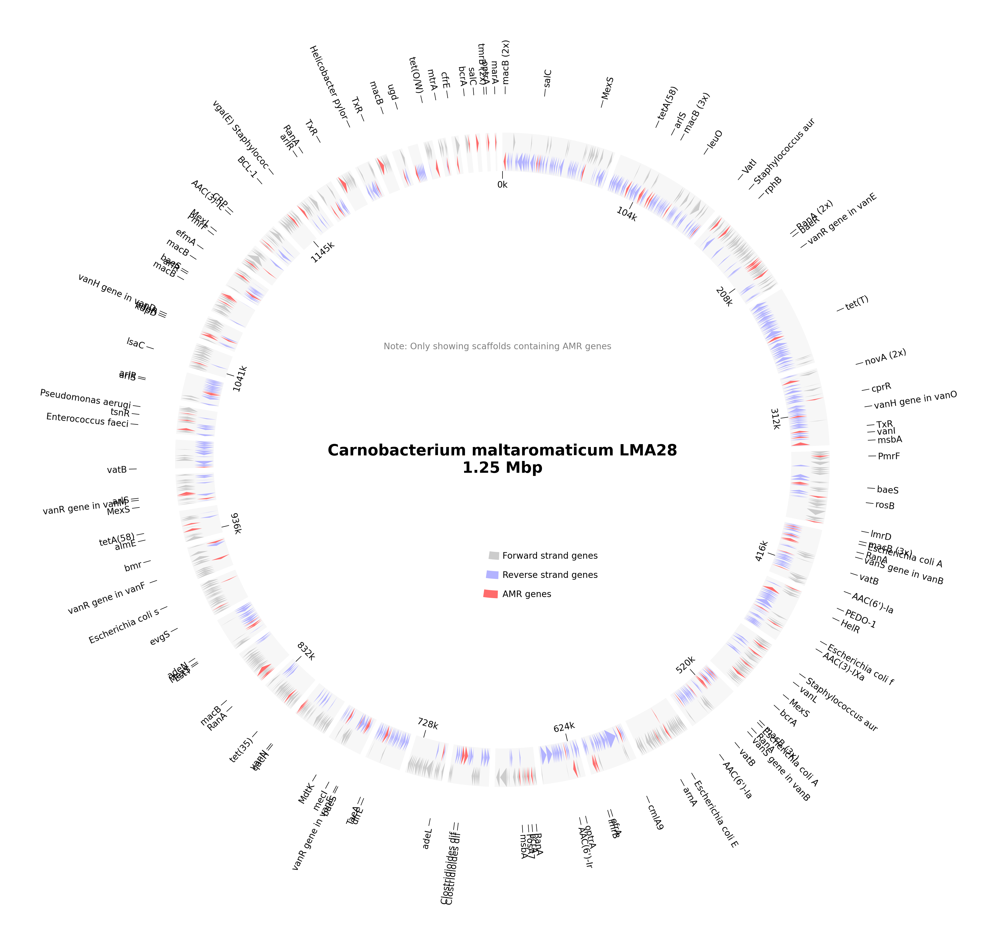

### AAC(3)-IXa
- **Mechanism**: antibiotic inactivation
- **Drug Classes**: aminoglycoside antibiotic
- **AMR Family**: AAC(3)
- **Locations**:
  - gnl|SPADES|CAEEGBCP_230_28 : position 29536-30348

### AAC(3)-Ic
- **Mechanism**: antibiotic inactivation
- **Drug Classes**: aminoglycoside antibiotic
- **AMR Family**: AAC(3)
- **Locations**:
  - gnl|SPADES|CAEEGBCP_760_1 : position 221-658

### AAC(6')-Ia (found in 2 locations)
- **Mechanism**: antibiotic inactivation
- **Drug Classes**: aminoglycoside antibiotic
- **AMR Family**: AAC(6')
- **Locations**:
  - gnl|SPADES|CAEEGBCP_207_36 : position 34794-35330
  - gnl|SPADES|CAEEGBCP_239_36 : position 34222-34758

### AAC(6')-Ir
- **Mechanism**: antibiotic inactivation
- **Drug Classes**: aminoglycoside antibiotic
- **AMR Family**: AAC(6')
- **Locations**:
  - gnl|SPADES|CAEEGBCP_315_11 : position 10167-10772

### BCL-1
- **Mechanism**: antibiotic inactivation
- **Drug Classes**: penam
- **AMR Family**: BCL Beta-lactamase
- **Locations**:
  - gnl|SPADES|CAEEGBCP_828_8 : position 8733-10109

### CRP
- **Mechanism**: antibiotic efflux
- **Drug Classes**: macrolide antibiotic; fluoroquinolone antibiotic; penam
- **AMR Family**: resistance-nodulation-cell division (RND) antibiotic efflux pump
- **Locations**:
  - gnl|SPADES|CAEEGBCP_760_4 : position 2329-2991

### Clostridioides difficile gyrA conferring resistance to fluoroquinolones
- **Mechanism**: antibiotic target alteration
- **Drug Classes**: fluoroquinolone antibiotic
- **AMR Family**: fluoroquinolone resistant gyrA
- **Locations**:
  - gnl|SPADES|CAEEGBCP_336_16 : position 17056-19605

### Clostridioides difficile gyrB conferring resistance to fluoroquinolones
- **Mechanism**: antibiotic target alteration
- **Drug Classes**: fluoroquinolone antibiotic
- **AMR Family**: fluoroquinolone resistant gyrB
- **Locations**:
  - gnl|SPADES|CAEEGBCP_336_17 : position 19755-21692

### Enterococcus faecium cls conferring resistance to daptomycin
- **Mechanism**: antibiotic target alteration
- **Drug Classes**: peptide antibiotic
- **AMR Family**: daptomycin resistant cls
- **Locations**:
  - gnl|SPADES|CAEEGBCP_541_4 : position 3187-4707

### Escherichia coli AcrAB-TolC with AcrR mutation conferring resistance to ciprofloxacin, tetracycline, and ceftazidime (found in 2 locations)
- **Mechanism**: antibiotic target alteration; antibiotic efflux
- **Drug Classes**: fluoroquinolone antibiotic; cephalosporin; glycylcycline; penam; tetracycline antibiotic; rifamycin antibiotic; phenicol antibiotic; disinfecting agents and antiseptics
- **AMR Family**: resistance-nodulation-cell division (RND) antibiotic efflux pump
- **Locations**:
  - gnl|SPADES|CAEEGBCP_207_5 : position 3501-4097
  - gnl|SPADES|CAEEGBCP_239_5 : position 2929-3525

### Escherichia coli EF-Tu mutants conferring resistance to kirromycin
- **Mechanism**: antibiotic target alteration
- **Drug Classes**: elfamycin antibiotic
- **AMR Family**: elfamycin resistant EF-Tu
- **Locations**:
  - gnl|SPADES|CAEEGBCP_245_11 : position 12893-14080

### Escherichia coli fabI mutations conferring resistance to isoniazid and triclosan
- **Mechanism**: antibiotic target alteration
- **Drug Classes**: disinfecting agents and antiseptics; isoniazid-like antibiotic
- **AMR Family**: antibiotic resistant fabI
- **Locations**:
  - gnl|SPADES|CAEEGBCP_230_21 : position 24018-24776

### Escherichia coli soxS with mutation conferring antibiotic resistance
- **Mechanism**: antibiotic target alteration; antibiotic efflux; reduced permeability to antibiotic
- **Drug Classes**: fluoroquinolone antibiotic; monobactam; carbapenem; cephalosporin; glycylcycline; cephamycin; penam; tetracycline antibiotic; rifamycin antibiotic; phenicol antibiotic; penem; disinfecting agents and antiseptics
- **AMR Family**: ATP-binding cassette (ABC) antibiotic efflux pump; major facilitator superfamily (MFS) antibiotic efflux pump; resistance-nodulation-cell division (RND) antibiotic efflux pump; General Bacterial Porin with reduced permeability to beta-lactams
- **Locations**:
  - gnl|SPADES|CAEEGBCP_425_22 : position 18735-19262

### EstT
- **Mechanism**: antibiotic inactivation
- **Drug Classes**: macrolide antibiotic
- **AMR Family**: macrolide esterase
- **Locations**:
  - gnl|SPADES|CAEEGBCP_424_8 : position 6146-6979

### FosA7
- **Mechanism**: antibiotic inactivation
- **Drug Classes**: phosphonic acid antibiotic
- **AMR Family**: fosfomycin thiol transferase
- **Locations**:
  - gnl|SPADES|CAEEGBCP_327_10 : position 8044-8424

### FosC2
- **Mechanism**: antibiotic inactivation
- **Drug Classes**: phosphonic acid antibiotic
- **AMR Family**: fosC phosphotransferase family
- **Locations**:
  - gnl|SPADES|CAEEGBCP_245_12 : position 14135-14515

### HelR
- **Mechanism**: antibiotic target protection
- **Drug Classes**: rifamycin antibiotic
- **AMR Family**: helicase-like RNA polymerase protection protein
- **Locations**:
  - gnl|SPADES|CAEEGBCP_230_9 : position 6528-8819

### Helicobacter pylori rdxA mutation conferring resistance to metronidazole
- **Mechanism**: antibiotic target alteration
- **Drug Classes**: nitroimidazole antibiotic
- **AMR Family**: Antibiotic resistant Helicobacter pylori nitroreductase
- **Locations**:
  - gnl|SPADES|CAEEGBCP_1025_8 : position 8242-8871

### MdtK
- **Mechanism**: antibiotic efflux
- **Drug Classes**: fluoroquinolone antibiotic
- **AMR Family**: multidrug and toxic compound extrusion (MATE) transporter
- **Locations**:
  - gnl|SPADES|CAEEGBCP_401_23 : position 18720-20036

### MexL
- **Mechanism**: antibiotic efflux
- **Drug Classes**: macrolide antibiotic; tetracycline antibiotic; disinfecting agents and antiseptics
- **AMR Family**: resistance-nodulation-cell division (RND) antibiotic efflux pump
- **Locations**:
  - gnl|SPADES|CAEEGBCP_713_6 : position 5948-6565

### MexS (found in 4 locations)
- **Mechanism**: antibiotic efflux
- **Drug Classes**: fluoroquinolone antibiotic; diaminopyrimidine antibiotic; phenicol antibiotic
- **AMR Family**: resistance-nodulation-cell division (RND) antibiotic efflux pump
- **Locations**:
  - gnl|SPADES|CAEEGBCP_233_24 : position 21676-22614
  - gnl|SPADES|CAEEGBCP_424_9 : position 6999-8087
  - gnl|SPADES|CAEEGBCP_484_4 : position 1708-2652
  - gnl|SPADES|CAEEGBCP_76_56 : position 62445-63557

### PEDO-1
- **Mechanism**: antibiotic inactivation
- **Drug Classes**: carbapenem
- **AMR Family**: subclass B3 PEDO beta-lactamase
- **Locations**:
  - gnl|SPADES|CAEEGBCP_230_3 : position 662-1363

### PmrF (found in 2 locations)
- **Mechanism**: antibiotic target alteration
- **Drug Classes**: peptide antibiotic
- **AMR Family**: pmr phosphoethanolamine transferase
- **Locations**:
  - gnl|SPADES|CAEEGBCP_149_3 : position 3244-4494
  - gnl|SPADES|CAEEGBCP_713_4 : position 2920-3867

### Pseudomonas aeruginosa soxR
- **Mechanism**: antibiotic target alteration; antibiotic efflux
- **Drug Classes**: fluoroquinolone antibiotic; cephalosporin; glycylcycline; penam; tetracycline antibiotic; rifamycin antibiotic; phenicol antibiotic; disinfecting agents and antiseptics
- **AMR Family**: ATP-binding cassette (ABC) antibiotic efflux pump; major facilitator superfamily (MFS) antibiotic efflux pump; resistance-nodulation-cell division (RND) antibiotic efflux pump
- **Locations**:
  - gnl|SPADES|CAEEGBCP_541_17 : position 15140-15577

### RanA (found in 9 locations)
- **Mechanism**: antibiotic efflux
- **Drug Classes**: aminoglycoside antibiotic
- **AMR Family**: ATP-binding cassette (ABC) antibiotic efflux pump
- **Locations**:
  - gnl|SPADES|CAEEGBCP_106_37 : position 41046-42155
  - gnl|SPADES|CAEEGBCP_106_53 : position 58745-60262
  - gnl|SPADES|CAEEGBCP_207_9 : position 8443-9483
  - gnl|SPADES|CAEEGBCP_239_9 : position 7871-8911
  - gnl|SPADES|CAEEGBCP_327_4 : position 2662-3693
  - gnl|SPADES|CAEEGBCP_418_1 : position 72-878
  - gnl|SPADES|CAEEGBCP_76_24 : position 28124-28858
  - gnl|SPADES|CAEEGBCP_76_38 : position 42780-43874
  - gnl|SPADES|CAEEGBCP_914_5 : position 6033-7148

### Staphylococcus aureus fusA with mutation conferring resistance to fusidic acid
- **Mechanism**: antibiotic target alteration
- **Drug Classes**: fusidane antibiotic
- **AMR Family**: antibiotic resistant fusA
- **Locations**:
  - gnl|SPADES|CAEEGBCP_106_3 : position 2571-4148

### Staphylococcus aureus murA with mutation conferring resistance to fosfomycin
- **Mechanism**: antibiotic target alteration
- **Drug Classes**: phosphonic acid antibiotic
- **AMR Family**: antibiotic-resistant murA transferase
- **Locations**:
  - gnl|SPADES|CAEEGBCP_233_5 : position 4787-6055

### TaeA
- **Mechanism**: antibiotic efflux
- **Drug Classes**: pleuromutilin antibiotic
- **AMR Family**: ATP-binding cassette (ABC) antibiotic efflux pump
- **Locations**:
  - gnl|SPADES|CAEEGBCP_393_20 : position 17097-18998

### TxR (found in 3 locations)
- **Mechanism**: antibiotic efflux
- **Drug Classes**: tetracycline antibiotic
- **AMR Family**: ATP-binding cassette (ABC) antibiotic efflux pump
- **Locations**:
  - gnl|SPADES|CAEEGBCP_1280_2 : position 1753-4449
  - gnl|SPADES|CAEEGBCP_132_39 : position 43232-44593
  - gnl|SPADES|CAEEGBCP_976_2 : position 1775-4471

### VatI
- **Mechanism**: antibiotic inactivation
- **Drug Classes**: streptogramin antibiotic; streptogramin A antibiotic
- **AMR Family**: streptogramin vat acetyltransferase
- **Locations**:
  - gnl|SPADES|CAEEGBCP_80_74 : position 75792-76493

### adeL
- **Mechanism**: antibiotic efflux
- **Drug Classes**: fluoroquinolone antibiotic; tetracycline antibiotic
- **AMR Family**: resistance-nodulation-cell division (RND) antibiotic efflux pump
- **Locations**:
  - gnl|SPADES|CAEEGBCP_380_3 : position 2275-3162

### adeN
- **Mechanism**: antibiotic efflux
- **Drug Classes**: macrolide antibiotic; fluoroquinolone antibiotic; lincosamide antibiotic; carbapenem; cephalosporin; tetracycline antibiotic; rifamycin antibiotic; diaminopyrimidine antibiotic; phenicol antibiotic; penem
- **AMR Family**: resistance-nodulation-cell division (RND) antibiotic efflux pump
- **Locations**:
  - gnl|SPADES|CAEEGBCP_424_12 : position 9910-10485

### adeR
- **Mechanism**: antibiotic efflux
- **Drug Classes**: glycylcycline; tetracycline antibiotic
- **AMR Family**: resistance-nodulation-cell division (RND) antibiotic efflux pump
- **Locations**:
  - gnl|SPADES|CAEEGBCP_654_5 : position 4601-5329

### almE
- **Mechanism**: antibiotic target alteration
- **Drug Classes**: peptide antibiotic
- **AMR Family**: polymyxin resistance operon; alm glycyltransferase
- **Locations**:
  - gnl|SPADES|CAEEGBCP_482_6 : position 6716-8239

### arlR (found in 4 locations)
- **Mechanism**: antibiotic efflux
- **Drug Classes**: fluoroquinolone antibiotic; disinfecting agents and antiseptics
- **AMR Family**: major facilitator superfamily (MFS) antibiotic efflux pump
- **Locations**:
  - gnl|SPADES|CAEEGBCP_546_8 : position 9137-9820
  - gnl|SPADES|CAEEGBCP_657_13 : position 13649-14368
  - gnl|SPADES|CAEEGBCP_80_23 : position 26160-26846
  - gnl|SPADES|CAEEGBCP_914_2 : position 1877-2677

### arlS (found in 3 locations)
- **Mechanism**: antibiotic efflux
- **Drug Classes**: fluoroquinolone antibiotic; disinfecting agents and antiseptics
- **AMR Family**: major facilitator superfamily (MFS) antibiotic efflux pump
- **Locations**:
  - gnl|SPADES|CAEEGBCP_484_9 : position 7037-8866
  - gnl|SPADES|CAEEGBCP_546_7 : position 7845-9140
  - gnl|SPADES|CAEEGBCP_80_22 : position 24649-26163

### arnA
- **Mechanism**: antibiotic target alteration
- **Drug Classes**: peptide antibiotic
- **AMR Family**: pmr phosphoethanolamine transferase
- **Locations**:
  - gnl|SPADES|CAEEGBCP_245_19 : position 21154-21735

### baeR
- **Mechanism**: antibiotic efflux
- **Drug Classes**: aminoglycoside antibiotic; aminocoumarin antibiotic
- **AMR Family**: resistance-nodulation-cell division (RND) antibiotic efflux pump
- **Locations**:
  - gnl|SPADES|CAEEGBCP_106_40 : position 43620-44303

### baeS (found in 4 locations)
- **Mechanism**: antibiotic efflux
- **Drug Classes**: aminoglycoside antibiotic; aminocoumarin antibiotic
- **AMR Family**: resistance-nodulation-cell division (RND) antibiotic efflux pump
- **Locations**:
  - gnl|SPADES|CAEEGBCP_106_41 : position 44300-45697
  - gnl|SPADES|CAEEGBCP_149_17 : position 23326-24687
  - gnl|SPADES|CAEEGBCP_401_6 : position 3083-4483
  - gnl|SPADES|CAEEGBCP_657_14 : position 14365-16134

### bcrA (found in 4 locations)
- **Mechanism**: antibiotic efflux
- **Drug Classes**: peptide antibiotic
- **AMR Family**: ATP-binding cassette (ABC) antibiotic efflux pump
- **Locations**:
  - gnl|SPADES|CAEEGBCP_106_38 : position 42145-43086
  - gnl|SPADES|CAEEGBCP_233_32 : position 30143-31726
  - gnl|SPADES|CAEEGBCP_2932_3 : position 2600-3325
  - gnl|SPADES|CAEEGBCP_327_7 : position 5381-6367

### bmr
- **Mechanism**: antibiotic efflux
- **Drug Classes**: fluoroquinolone antibiotic; nucleoside antibiotic; phenicol antibiotic; disinfecting agents and antiseptics
- **AMR Family**: major facilitator superfamily (MFS) antibiotic efflux pump
- **Locations**:
  - gnl|SPADES|CAEEGBCP_451_15 : position 20958-22181

### cfrE
- **Mechanism**: antibiotic target alteration
- **Drug Classes**: lincosamide antibiotic; streptogramin antibiotic; oxazolidinone antibiotic; phenicol antibiotic; pleuromutilin antibiotic
- **AMR Family**: Cfr 23S ribosomal RNA methyltransferase
- **Locations**:
  - gnl|SPADES|CAEEGBCP_2232_2 : position 1233-2300

### cmlA9
- **Mechanism**: antibiotic efflux
- **Drug Classes**: phenicol antibiotic
- **AMR Family**: major facilitator superfamily (MFS) antibiotic efflux pump
- **Locations**:
  - gnl|SPADES|CAEEGBCP_286_4 : position 3312-4514

### cprR
- **Mechanism**: antibiotic target alteration; antibiotic efflux
- **Drug Classes**: peptide antibiotic
- **AMR Family**: pmr phosphoethanolamine transferase
- **Locations**:
  - gnl|SPADES|CAEEGBCP_132_20 : position 21332-22051

### dfrE
- **Mechanism**: antibiotic target replacement
- **Drug Classes**: diaminopyrimidine antibiotic
- **AMR Family**: trimethoprim resistant dihydrofolate reductase dfr
- **Locations**:
  - gnl|SPADES|CAEEGBCP_393_18 : position 15620-16108

### efmA
- **Mechanism**: antibiotic efflux
- **Drug Classes**: macrolide antibiotic; fluoroquinolone antibiotic
- **AMR Family**: major facilitator superfamily (MFS) antibiotic efflux pump
- **Locations**:
  - gnl|SPADES|CAEEGBCP_703_15 : position 11402-12670

### efrA
- **Mechanism**: antibiotic efflux
- **Drug Classes**: macrolide antibiotic; fluoroquinolone antibiotic; rifamycin antibiotic
- **AMR Family**: ATP-binding cassette (ABC) antibiotic efflux pump
- **Locations**:
  - gnl|SPADES|CAEEGBCP_286_21 : position 27614-28720

### evgS
- **Mechanism**: antibiotic efflux
- **Drug Classes**: macrolide antibiotic; fluoroquinolone antibiotic; penam; tetracycline antibiotic
- **AMR Family**: major facilitator superfamily (MFS) antibiotic efflux pump; resistance-nodulation-cell division (RND) antibiotic efflux pump
- **Locations**:
  - gnl|SPADES|CAEEGBCP_425_5 : position 3533-4105

### kdpD
- **Mechanism**: antibiotic efflux
- **Drug Classes**: aminoglycoside antibiotic
- **AMR Family**: kdpDE
- **Locations**:
  - gnl|SPADES|CAEEGBCP_654_4 : position 2958-4604

### leuO
- **Mechanism**: antibiotic efflux
- **Drug Classes**: nucleoside antibiotic; disinfecting agents and antiseptics
- **AMR Family**: major facilitator superfamily (MFS) antibiotic efflux pump
- **Locations**:
  - gnl|SPADES|CAEEGBCP_80_49 : position 48872-49699

### lmrB
- **Mechanism**: antibiotic efflux
- **Drug Classes**: lincosamide antibiotic; nucleoside antibiotic
- **AMR Family**: ATP-binding cassette (ABC) antibiotic efflux pump
- **Locations**:
  - gnl|SPADES|CAEEGBCP_286_23 : position 29380-30780

### lmrD
- **Mechanism**: antibiotic efflux
- **Drug Classes**: lincosamide antibiotic
- **AMR Family**: ATP-binding cassette (ABC) antibiotic efflux pump
- **Locations**:
  - gnl|SPADES|CAEEGBCP_149_39 : position 51228-52010

### lsaC
- **Mechanism**: antibiotic target protection
- **Drug Classes**: lincosamide antibiotic; streptogramin antibiotic; pleuromutilin antibiotic
- **AMR Family**: lsa-type ABC-F protein
- **Locations**:
  - gnl|SPADES|CAEEGBCP_613_6 : position 4320-5003

### macA
- **Mechanism**: antibiotic efflux
- **Drug Classes**: macrolide antibiotic
- **AMR Family**: ATP-binding cassette (ABC) antibiotic efflux pump
- **Locations**:
  - gnl|SPADES|CAEEGBCP_80_30 : position 33435-34631

### macB (found in 15 locations)
- **Mechanism**: antibiotic efflux
- **Drug Classes**: macrolide antibiotic
- **AMR Family**: ATP-binding cassette (ABC) antibiotic efflux pump
- **Locations**:
  - gnl|SPADES|CAEEGBCP_1504_2 : position 2578-3393
  - gnl|SPADES|CAEEGBCP_207_14 : position 13741-15003
  - gnl|SPADES|CAEEGBCP_207_15 : position 14987-15685
  - gnl|SPADES|CAEEGBCP_207_3 : position 1612-2280
  - gnl|SPADES|CAEEGBCP_239_14 : position 13169-14431
  - gnl|SPADES|CAEEGBCP_239_15 : position 14415-15113
  - gnl|SPADES|CAEEGBCP_239_3 : position 1040-1708
  - gnl|SPADES|CAEEGBCP_418_6 : position 4213-7062
  - gnl|SPADES|CAEEGBCP_657_9 : position 9365-10051
  - gnl|SPADES|CAEEGBCP_703_6 : position 3412-4893
  - gnl|SPADES|CAEEGBCP_76_3 : position 876-2516
  - gnl|SPADES|CAEEGBCP_76_44 : position 49449-51158
  - gnl|SPADES|CAEEGBCP_80_28 : position 31470-32714
  - gnl|SPADES|CAEEGBCP_80_29 : position 32711-33418
  - gnl|SPADES|CAEEGBCP_80_62 : position 61094-61897

### marA
- **Mechanism**: antibiotic efflux; reduced permeability to antibiotic
- **Drug Classes**: fluoroquinolone antibiotic; monobactam; carbapenem; cephalosporin; glycylcycline; cephamycin; penam; tetracycline antibiotic; rifamycin antibiotic; phenicol antibiotic; penem; disinfecting agents and antiseptics
- **AMR Family**: resistance-nodulation-cell division (RND) antibiotic efflux pump; General Bacterial Porin with reduced permeability to beta-lactams
- **Locations**:
  - gnl|SPADES|CAEEGBCP_9210_1 : position 3-812

### mecI
- **Mechanism**: antibiotic target replacement
- **Drug Classes**: penam
- **AMR Family**: methicillin resistant PBP2
- **Locations**:
  - gnl|SPADES|CAEEGBCP_401_12 : position 9925-10374

### mepR
- **Mechanism**: antibiotic efflux
- **Drug Classes**: glycylcycline; tetracycline antibiotic
- **AMR Family**: multidrug and toxic compound extrusion (MATE) transporter
- **Locations**:
  - gnl|SPADES|CAEEGBCP_286_22 : position 28884-29399

### msbA (found in 2 locations)
- **Mechanism**: antibiotic efflux
- **Drug Classes**: nitroimidazole antibiotic
- **AMR Family**: ATP-binding cassette (ABC) antibiotic efflux pump
- **Locations**:
  - gnl|SPADES|CAEEGBCP_132_48 : position 52203-54479
  - gnl|SPADES|CAEEGBCP_327_15 : position 11612-12385

### mtrA
- **Mechanism**: antibiotic efflux
- **Drug Classes**: macrolide antibiotic; penam
- **AMR Family**: resistance-nodulation-cell division (RND) antibiotic efflux pump
- **Locations**:
  - gnl|SPADES|CAEEGBCP_2128_4 : position 3215-4042

### novA (found in 2 locations)
- **Mechanism**: antibiotic efflux
- **Drug Classes**: aminocoumarin antibiotic
- **AMR Family**: ATP-binding cassette (ABC) antibiotic efflux pump
- **Locations**:
  - gnl|SPADES|CAEEGBCP_132_6 : position 3887-5689
  - gnl|SPADES|CAEEGBCP_132_7 : position 5682-7424

### optrA (found in 2 locations)
- **Mechanism**: antibiotic target protection
- **Drug Classes**: oxazolidinone antibiotic; phenicol antibiotic
- **AMR Family**: Miscellaneous ABC-F subfamily ATP-binding cassette ribosomal protection proteins
- **Locations**:
  - gnl|SPADES|CAEEGBCP_315_7 : position 5572-7536
  - gnl|SPADES|CAEEGBCP_4572_3 : position 1228-2352

### patB
- **Mechanism**: antibiotic efflux
- **Drug Classes**: fluoroquinolone antibiotic
- **AMR Family**: ATP-binding cassette (ABC) antibiotic efflux pump
- **Locations**:
  - gnl|SPADES|CAEEGBCP_418_2 : position 890-1654

### qacH
- **Mechanism**: antibiotic efflux
- **Drug Classes**: disinfecting agents and antiseptics
- **AMR Family**: small multidrug resistance (SMR) antibiotic efflux pump
- **Locations**:
  - gnl|SPADES|CAEEGBCP_402_27 : position 23296-23622

### rosB
- **Mechanism**: antibiotic efflux
- **Drug Classes**: peptide antibiotic
- **AMR Family**: major facilitator superfamily (MFS) antibiotic efflux pump
- **Locations**:
  - gnl|SPADES|CAEEGBCP_149_25 : position 32788-33936

### rphB
- **Mechanism**: antibiotic inactivation
- **Drug Classes**: rifamycin antibiotic
- **AMR Family**: rifampin phosphotransferase
- **Locations**:
  - gnl|SPADES|CAEEGBCP_106_10 : position 10824-12545

### salC (found in 2 locations)
- **Mechanism**: antibiotic target protection
- **Drug Classes**: lincosamide antibiotic; streptogramin antibiotic; streptogramin A antibiotic; pleuromutilin antibiotic
- **AMR Family**: sal-type ABC-F protein
- **Locations**:
  - gnl|SPADES|CAEEGBCP_3806_1 : position 74-1777
  - gnl|SPADES|CAEEGBCP_76_22 : position 26219-26926

### tet(35)
- **Mechanism**: antibiotic efflux
- **Drug Classes**: tetracycline antibiotic
- **AMR Family**: ATP-binding cassette (ABC) antibiotic efflux pump
- **Locations**:
  - gnl|SPADES|CAEEGBCP_414_6 : position 6285-7682

### tet(O/W)
- **Mechanism**: antibiotic target protection
- **Drug Classes**: tetracycline antibiotic
- **AMR Family**: tetracycline-resistant ribosomal protection protein
- **Locations**:
  - gnl|SPADES|CAEEGBCP_1754_8 : position 4643-6478

### tet(T)
- **Mechanism**: antibiotic target protection
- **Drug Classes**: tetracycline antibiotic
- **AMR Family**: tetracycline-resistant ribosomal protection protein
- **Locations**:
  - gnl|SPADES|CAEEGBCP_127_27 : position 29407-31248

### tetA(58) (found in 2 locations)
- **Mechanism**: antibiotic efflux
- **Drug Classes**: tetracycline antibiotic
- **AMR Family**: major facilitator superfamily (MFS) antibiotic efflux pump
- **Locations**:
  - gnl|SPADES|CAEEGBCP_482_10 : position 11229-12161
  - gnl|SPADES|CAEEGBCP_80_13 : position 13718-15286

### tmrB (found in 2 locations)
- **Mechanism**: reduced permeability to antibiotic
- **Drug Classes**: nucleoside antibiotic
- **AMR Family**: tunicamycin resistance protein
- **Locations**:
  - gnl|SPADES|CAEEGBCP_4572_1 : position 139-312
  - gnl|SPADES|CAEEGBCP_4572_2 : position 309-650

### tsnR
- **Mechanism**: antibiotic target alteration
- **Drug Classes**: peptide antibiotic
- **AMR Family**: non-erm 23S ribosomal RNA methyltransferase (A1067)
- **Locations**:
  - gnl|SPADES|CAEEGBCP_541_9 : position 9983-10747

### ugd
- **Mechanism**: antibiotic target alteration
- **Drug Classes**: peptide antibiotic
- **AMR Family**: pmr phosphoethanolamine transferase
- **Locations**:
  - gnl|SPADES|CAEEGBCP_1565_1 : position 92-1384

### vanH gene in vanD cluster
- **Mechanism**: antibiotic target alteration
- **Drug Classes**: glycopeptide antibiotic
- **AMR Family**: vanH; glycopeptide resistance gene cluster
- **Locations**:
  - gnl|SPADES|CAEEGBCP_654_7 : position 5806-6819

### vanH gene in vanO cluster
- **Mechanism**: antibiotic target alteration
- **Drug Classes**: glycopeptide antibiotic
- **AMR Family**: vanH; glycopeptide resistance gene cluster
- **Locations**:
  - gnl|SPADES|CAEEGBCP_132_29 : position 31517-32710

### vanI
- **Mechanism**: antibiotic target alteration
- **Drug Classes**: glycopeptide antibiotic
- **AMR Family**: glycopeptide resistance gene cluster; Van ligase
- **Locations**:
  - gnl|SPADES|CAEEGBCP_132_42 : position 47637-48764

### vanL
- **Mechanism**: antibiotic target alteration
- **Drug Classes**: glycopeptide antibiotic
- **AMR Family**: glycopeptide resistance gene cluster; Van ligase
- **Locations**:
  - gnl|SPADES|CAEEGBCP_233_12 : position 11475-12566

### vanN
- **Mechanism**: antibiotic target alteration
- **Drug Classes**: glycopeptide antibiotic
- **AMR Family**: glycopeptide resistance gene cluster; Van ligase
- **Locations**:
  - gnl|SPADES|CAEEGBCP_402_29 : position 24075-25154

### vanR gene in vanB cluster (found in 2 locations)
- **Mechanism**: antibiotic target alteration
- **Drug Classes**: glycopeptide antibiotic
- **AMR Family**: glycopeptide resistance gene cluster; vanR
- **Locations**:
  - gnl|SPADES|CAEEGBCP_207_13 : position 12991-13662
  - gnl|SPADES|CAEEGBCP_239_13 : position 12419-13090

### vanR gene in vanE cluster (found in 2 locations)
- **Mechanism**: antibiotic target alteration
- **Drug Classes**: glycopeptide antibiotic
- **AMR Family**: glycopeptide resistance gene cluster; vanR
- **Locations**:
  - gnl|SPADES|CAEEGBCP_106_47 : position 51788-53275
  - gnl|SPADES|CAEEGBCP_401_7 : position 4480-5163

### vanR gene in vanF cluster
- **Mechanism**: antibiotic target alteration
- **Drug Classes**: glycopeptide antibiotic
- **AMR Family**: glycopeptide resistance gene cluster; vanR
- **Locations**:
  - gnl|SPADES|CAEEGBCP_451_7 : position 7760-9190

### vanR gene in vanI cluster
- **Mechanism**: antibiotic target alteration
- **Drug Classes**: glycopeptide antibiotic
- **AMR Family**: glycopeptide resistance gene cluster; vanR
- **Locations**:
  - gnl|SPADES|CAEEGBCP_149_18 : position 24719-25357

### vanR gene in vanM cluster
- **Mechanism**: antibiotic target alteration
- **Drug Classes**: glycopeptide antibiotic
- **AMR Family**: glycopeptide resistance gene cluster; vanR
- **Locations**:
  - gnl|SPADES|CAEEGBCP_484_8 : position 6323-7030

### vanS gene in vanB cluster (found in 2 locations)
- **Mechanism**: antibiotic target alteration
- **Drug Classes**: glycopeptide antibiotic
- **AMR Family**: vanS; glycopeptide resistance gene cluster
- **Locations**:
  - gnl|SPADES|CAEEGBCP_207_12 : position 11549-12994
  - gnl|SPADES|CAEEGBCP_239_12 : position 10977-12422

### vatB (found in 3 locations)
- **Mechanism**: antibiotic inactivation
- **Drug Classes**: streptogramin antibiotic; streptogramin A antibiotic
- **AMR Family**: streptogramin vat acetyltransferase
- **Locations**:
  - gnl|SPADES|CAEEGBCP_207_22 : position 22480-23040
  - gnl|SPADES|CAEEGBCP_239_22 : position 21908-22468
  - gnl|SPADES|CAEEGBCP_531_1 : position 102-653

### vga(E) Staphylococcus cohnii
- **Mechanism**: antibiotic target protection
- **Drug Classes**: lincosamide antibiotic; streptogramin antibiotic; streptogramin A antibiotic; pleuromutilin antibiotic
- **AMR Family**: vga-type ABC-F protein
- **Locations**:
  - gnl|SPADES|CAEEGBCP_846_1 : position 293-1864

### ykkD
- **Mechanism**: antibiotic efflux
- **Drug Classes**: aminoglycoside antibiotic; tetracycline antibiotic; phenicol antibiotic
- **AMR Family**: small multidrug resistance (SMR) antibiotic efflux pump
- **Locations**:
  - gnl|SPADES|CAEEGBCP_402_28 : position 23622-23939

## Citrobacter
**Strain Statistics:**
- Total genome length: 1.1 kbp
- Total scaffolds: 97
- Scaffolds with AMR genes: 4
- Total genes annotated: 2
- Total AMR genes: 4
- Unique AMR genes: 4
- Distinct AMR mechanisms: 4
- Distinct AMR families: 4
- Distinct drug classes: 19

**Circos Plot:**

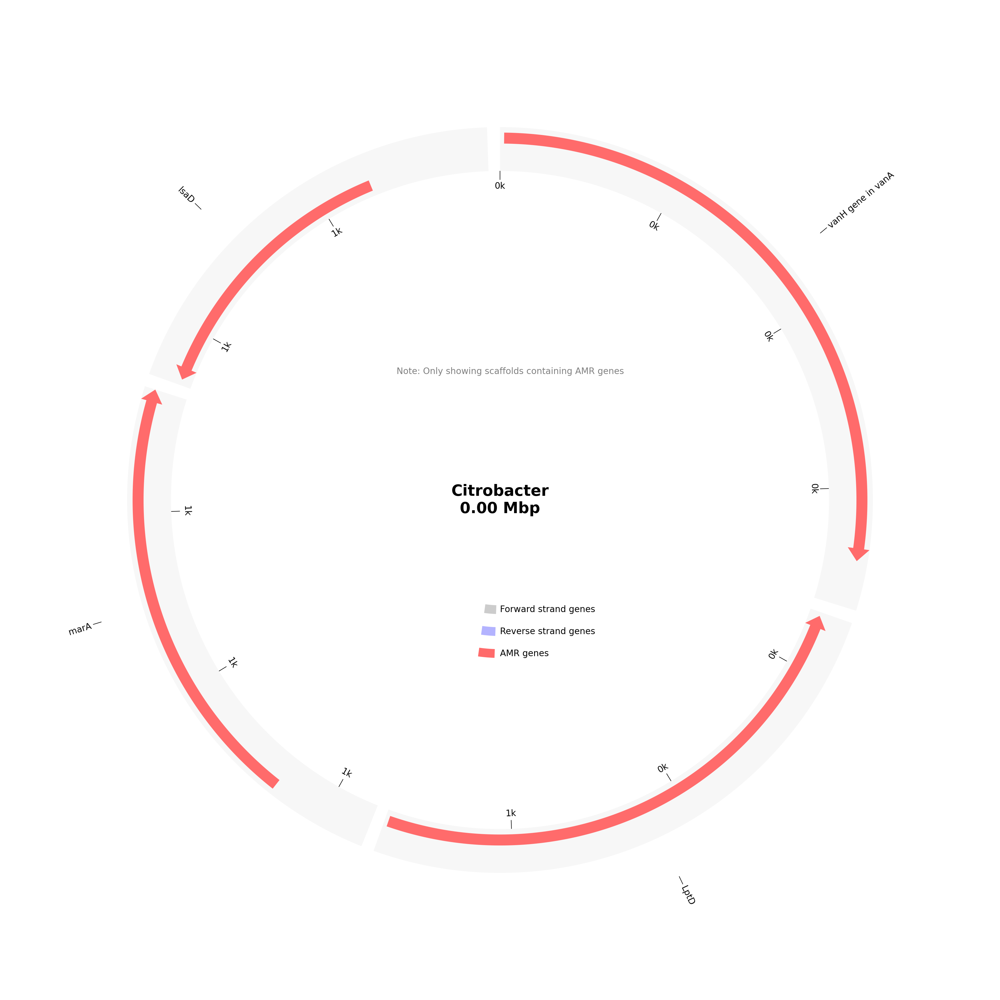

### LptD
- **Mechanism**: antibiotic efflux
- **Drug Classes**: carbapenem; peptide antibiotic; aminocoumarin antibiotic; rifamycin antibiotic
- **AMR Family**: ATP-binding cassette (ABC) antibiotic efflux pump
- **Locations**:
  - gnl|SPADES|CAEEGBCP_42484_1 : position 2-274

### lsaD
- **Mechanism**: antibiotic target protection
- **Drug Classes**: lincosamide antibiotic; streptogramin antibiotic; streptogramin A antibiotic; pleuromutilin antibiotic
- **AMR Family**: lsa-type ABC-F protein
- **Locations**:
  - gnl|SPADES|CAEEGBCP_73299_1 : position 3-146

### marA
- **Mechanism**: antibiotic efflux; reduced permeability to antibiotic
- **Drug Classes**: fluoroquinolone antibiotic; monobactam; carbapenem; cephalosporin; glycylcycline; cephamycin; penam; tetracycline antibiotic; rifamycin antibiotic; phenicol antibiotic; penem; disinfecting agents and antiseptics
- **AMR Family**: resistance-nodulation-cell division (RND) antibiotic efflux pump; General Bacterial Porin with reduced permeability to beta-lactams
- **Locations**:
  - gnl|SPADES|CAEEGBCP_47832_1 : position 50-262

### vanH gene in vanA cluster
- **Mechanism**: antibiotic target alteration
- **Drug Classes**: glycopeptide antibiotic
- **AMR Family**: vanH; glycopeptide resistance gene cluster
- **Locations**:
  - gnl|SPADES|CAEEGBCP_33911_1 : position 2-304

## Citrobacter braakii
**Strain Statistics:**
- Total genome length: 0.2 kbp
- Total scaffolds: 26
- Scaffolds with AMR genes: 1
- Total genes annotated: 0
- Total AMR genes: 1
- Unique AMR genes: 1
- Distinct AMR mechanisms: 1
- Distinct AMR families: 1
- Distinct drug classes: 1

**Circos Plot:**

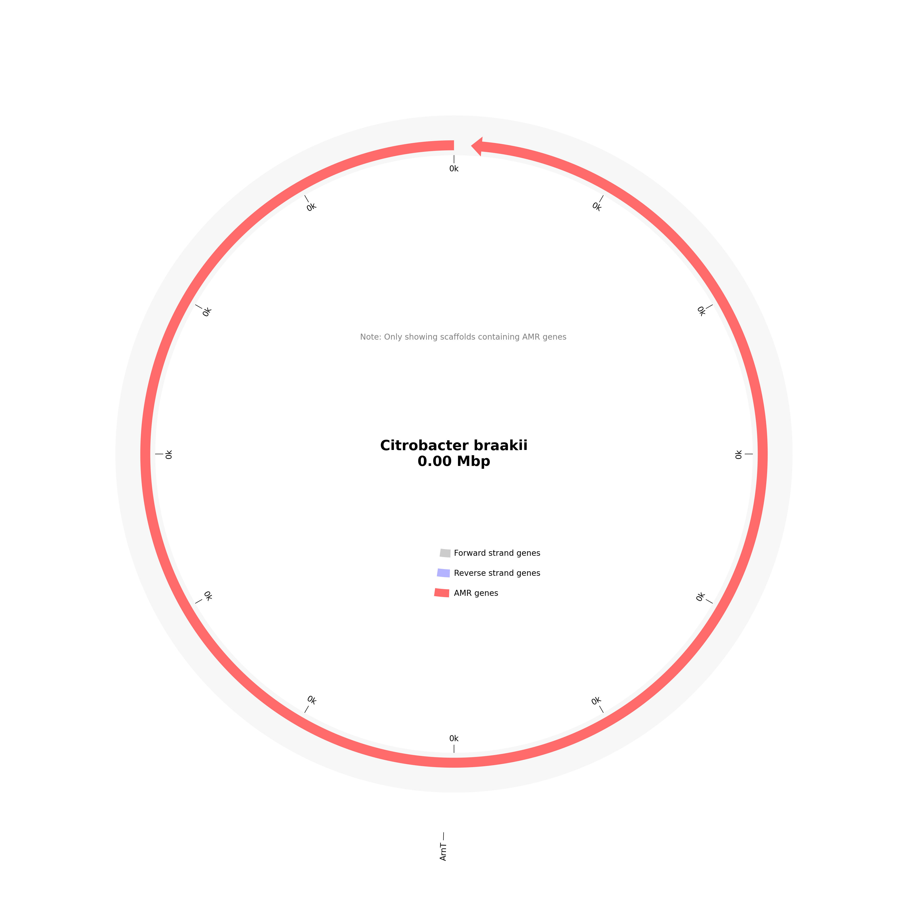

### ArnT
- **Mechanism**: antibiotic target alteration
- **Drug Classes**: peptide antibiotic
- **AMR Family**: pmr phosphoethanolamine transferase
- **Locations**:
  - gnl|SPADES|CAEEGBCP_62902_1 : position 2-229

## Citrobacter enshiensis
**Strain Statistics:**
- Total genome length: 0.3 kbp
- Total scaffolds: 4
- Scaffolds with AMR genes: 1
- Total genes annotated: 0
- Total AMR genes: 1
- Unique AMR genes: 1
- Distinct AMR mechanisms: 1
- Distinct AMR families: 1
- Distinct drug classes: 1

**Circos Plot:**

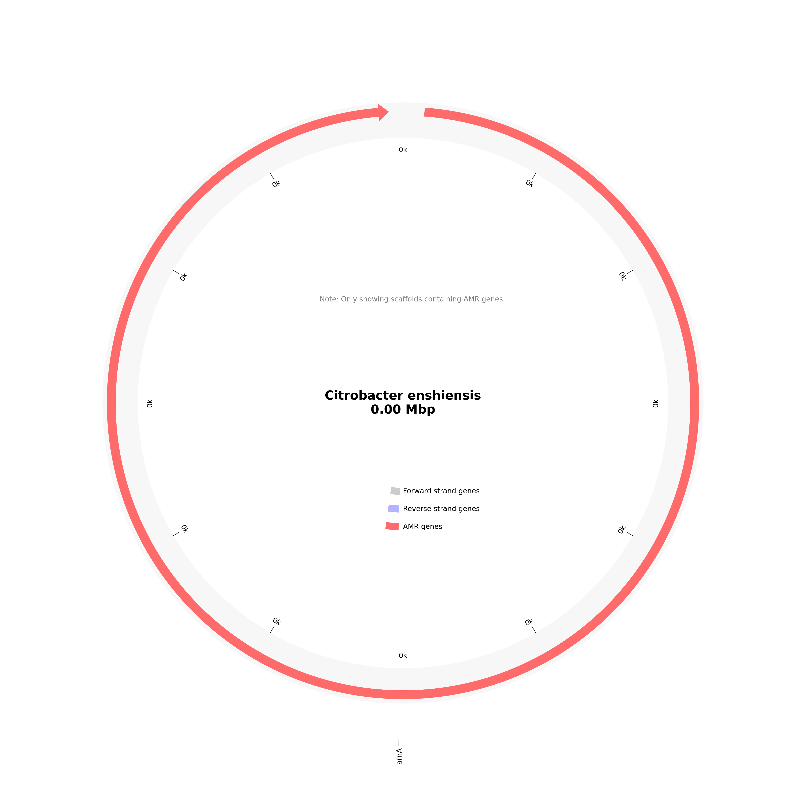

### arnA
- **Mechanism**: antibiotic target alteration
- **Drug Classes**: peptide antibiotic
- **AMR Family**: pmr phosphoethanolamine transferase
- **Locations**:
  - gnl|SPADES|CAEEGBCP_50233_1 : position 3-254

## Citrobacter freundii
**Strain Statistics:**
- Total genome length: 4.8 kbp
- Total scaffolds: 140
- Scaffolds with AMR genes: 2
- Total genes annotated: 10
- Total AMR genes: 2
- Unique AMR genes: 2
- Distinct AMR mechanisms: 2
- Distinct AMR families: 2
- Distinct drug classes: 3

**Circos Plot:**

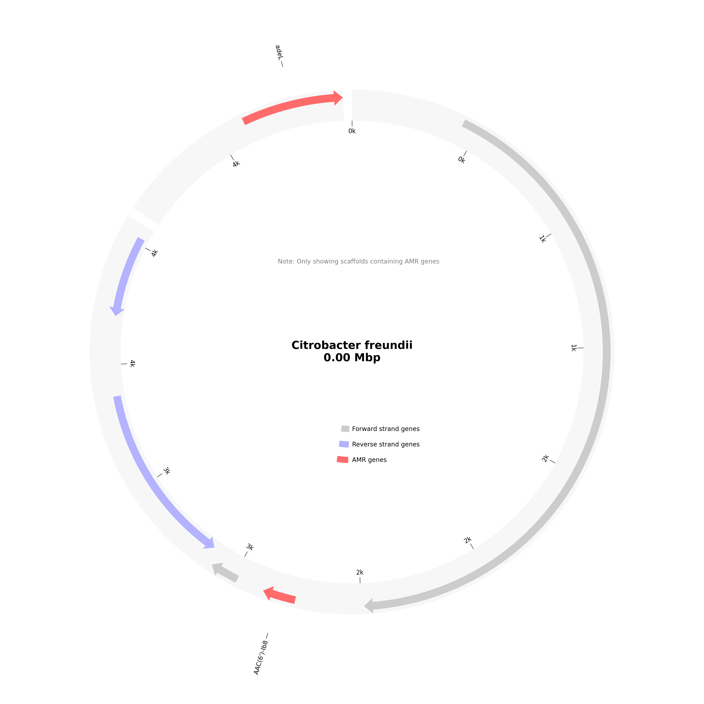

### AAC(6')-Ib8
- **Mechanism**: antibiotic inactivation
- **Drug Classes**: aminoglycoside antibiotic
- **AMR Family**: AAC(6')
- **Locations**:
  - gnl|SPADES|CAEEGBCP_2933_2 : position 2587-2688

### adeL
- **Mechanism**: antibiotic efflux
- **Drug Classes**: fluoroquinolone antibiotic; tetracycline antibiotic
- **AMR Family**: resistance-nodulation-cell division (RND) antibiotic efflux pump
- **Locations**:
  - gnl|SPADES|CAEEGBCP_14807_2 : position 421-732

## Citrobacter freundii complex
**Strain Statistics:**
- Total genome length: 0.6 kbp
- Total scaffolds: 12
- Scaffolds with AMR genes: 1
- Total genes annotated: 0
- Total AMR genes: 1
- Unique AMR genes: 1
- Distinct AMR mechanisms: 1
- Distinct AMR families: 1
- Distinct drug classes: 6

**Circos Plot:**

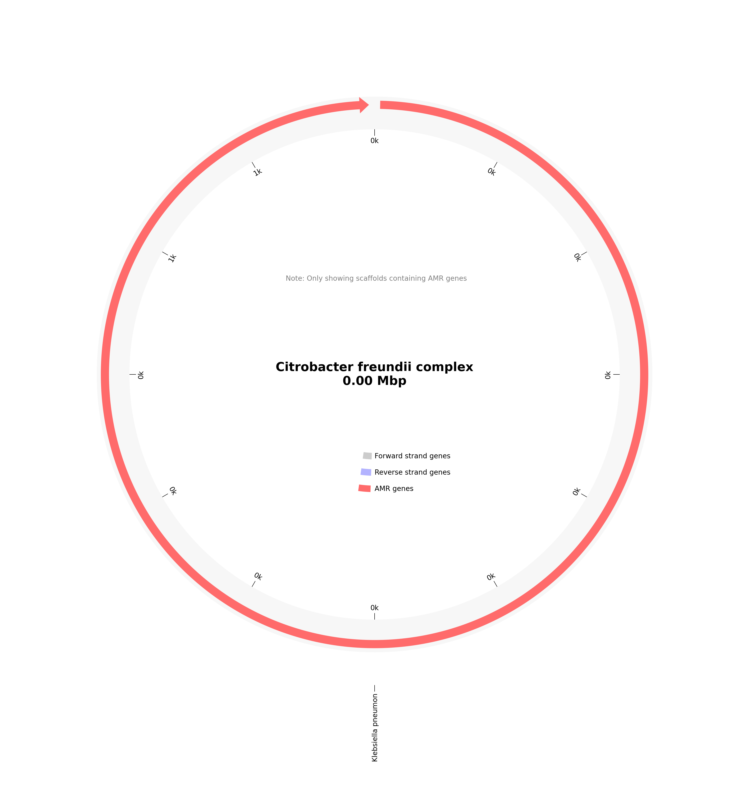

### Klebsiella pneumoniae OmpK37
- **Mechanism**: reduced permeability to antibiotic
- **Drug Classes**: monobactam; carbapenem; cephalosporin; cephamycin; penam; penem
- **AMR Family**: General Bacterial Porin with reduced permeability to beta-lactams
- **Locations**:
  - gnl|SPADES|CAEEGBCP_17623_1 : position 2-604

## Citrobacter pasteurii
**Strain Statistics:**
- Total genome length: 38.0 kbp
- Total scaffolds: 2
- Scaffolds with AMR genes: 1
- Total genes annotated: 66
- Total AMR genes: 2
- Unique AMR genes: 2
- Distinct AMR mechanisms: 1
- Distinct AMR families: 2
- Distinct drug classes: 2

**Circos Plot:**

### Mycobacterium tuberculosis kasA mutant conferring resistance to isoniazid
- **Mechanism**: antibiotic target alteration
- **Drug Classes**: isoniazid-like antibiotic
- **AMR Family**: antibiotic resistant kasA
- **Locations**:
  - gnl|SPADES|CAEEGBCP_242_8 : position 6412-7581

### PmrF
- **Mechanism**: antibiotic target alteration
- **Drug Classes**: peptide antibiotic
- **AMR Family**: pmr phosphoethanolamine transferase
- **Locations**:
  - gnl|SPADES|CAEEGBCP_242_13 : position 11509-13200

## Citrobacter sp. 21OH12SH02A-Citro
**Strain Statistics:**
- Total genome length: 25.0 kbp
- Total scaffolds: 2
- Scaffolds with AMR genes: 1
- Total genes annotated: 56
- Total AMR genes: 3
- Unique AMR genes: 3
- Distinct AMR mechanisms: 1
- Distinct AMR families: 2
- Distinct drug classes: 6

**Circos Plot:**

### H-NS
- **Mechanism**: antibiotic efflux
- **Drug Classes**: macrolide antibiotic; fluoroquinolone antibiotic; cephalosporin; cephamycin; penam; tetracycline antibiotic
- **AMR Family**: major facilitator superfamily (MFS) antibiotic efflux pump; resistance-nodulation-cell division (RND) antibiotic efflux pump
- **Locations**:
  - gnl|SPADES|CAEEGBCP_406_5 : position 4420-4812

### evgS
- **Mechanism**: antibiotic efflux
- **Drug Classes**: macrolide antibiotic; fluoroquinolone antibiotic; penam; tetracycline antibiotic
- **AMR Family**: major facilitator superfamily (MFS) antibiotic efflux pump; resistance-nodulation-cell division (RND) antibiotic efflux pump
- **Locations**:
  - gnl|SPADES|CAEEGBCP_406_27 : position 21477-23195

### tetA(60)
- **Mechanism**: antibiotic efflux
- **Drug Classes**: tetracycline antibiotic
- **AMR Family**: ATP-binding cassette (ABC) antibiotic efflux pump
- **Locations**:
  - gnl|SPADES|CAEEGBCP_406_11 : position 8449-9498

## Citrobacter sp. RHBSTW-00107
**Strain Statistics:**
- Total genome length: 0.4 kbp
- Total scaffolds: 1
- Scaffolds with AMR genes: 1
- Total genes annotated: 2
- Total AMR genes: 1
- Unique AMR genes: 1
- Distinct AMR mechanisms: 1
- Distinct AMR families: 1
- Distinct drug classes: 4

**Circos Plot:**

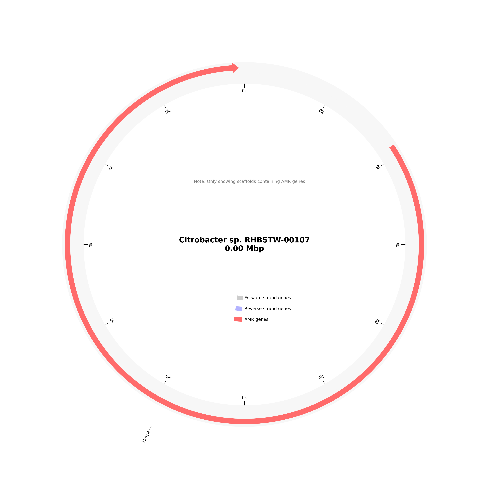

### NmcR
- **Mechanism**: antibiotic inactivation
- **Drug Classes**: carbapenem; cephalosporin; cephamycin; penam
- **AMR Family**: NmcA beta-lactamase
- **Locations**:
  - gnl|SPADES|CAEEGBCP_28626_1 : position 59-376

## Citrobacter werkmanii
**Strain Statistics:**
- Total genome length: 21.1 kbp
- Total scaffolds: 3
- Scaffolds with AMR genes: 1
- Total genes annotated: 38
- Total AMR genes: 1
- Unique AMR genes: 1
- Distinct AMR mechanisms: 1
- Distinct AMR families: 1
- Distinct drug classes: 1

**Circos Plot:**

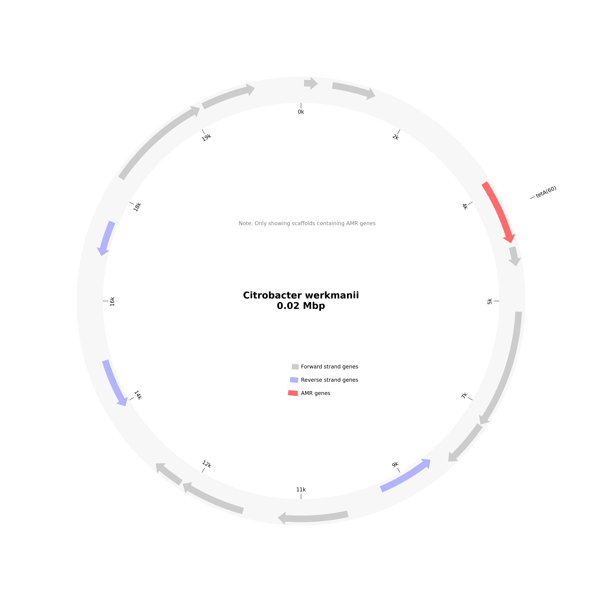

### tetA(60)
- **Mechanism**: antibiotic efflux
- **Drug Classes**: tetracycline antibiotic
- **AMR Family**: ATP-binding cassette (ABC) antibiotic efflux pump
- **Locations**:
  - gnl|SPADES|CAEEGBCP_519_5 : position 3350-4369

## Enterobacter hormaechei
**Strain Statistics:**
- Total genome length: 0.7 kbp
- Total scaffolds: 30
- Scaffolds with AMR genes: 2
- Total genes annotated: 0
- Total AMR genes: 2
- Unique AMR genes: 2
- Distinct AMR mechanisms: 2
- Distinct AMR families: 2
- Distinct drug classes: 7

**Circos Plot:**

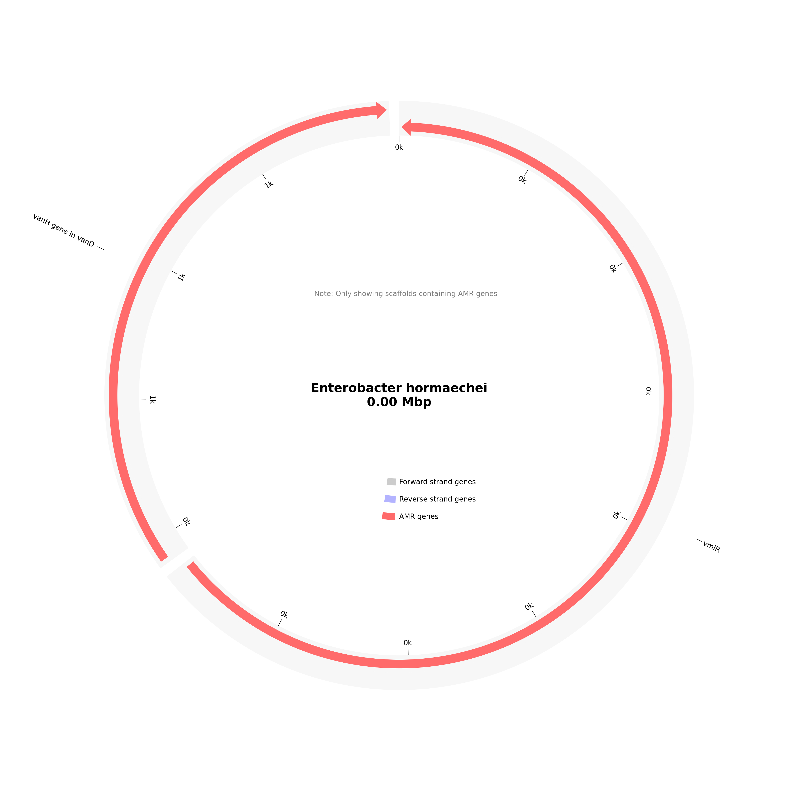

### vanH gene in vanD cluster
- **Mechanism**: antibiotic target alteration
- **Drug Classes**: glycopeptide antibiotic
- **AMR Family**: vanH; glycopeptide resistance gene cluster
- **Locations**:
  - gnl|SPADES|CAEEGBCP_52640_1 : position 2-250

### vmlR
- **Mechanism**: antibiotic target protection
- **Drug Classes**: lincosamide antibiotic; streptogramin antibiotic; streptogramin A antibiotic; streptogramin B antibiotic; nucleoside antibiotic; pleuromutilin antibiotic
- **AMR Family**: Miscellaneous ABC-F subfamily ATP-binding cassette ribosomal protection proteins
- **Locations**:
  - gnl|SPADES|CAEEGBCP_22718_1 : position 1-468

## Escherichia coli
**Strain Statistics:**
- Total genome length: 31.5 kbp
- Total scaffolds: 40
- Scaffolds with AMR genes: 4
- Total genes annotated: 74
- Total AMR genes: 5
- Unique AMR genes: 4
- Distinct AMR mechanisms: 2
- Distinct AMR families: 3
- Distinct drug classes: 8

**Circos Plot:**

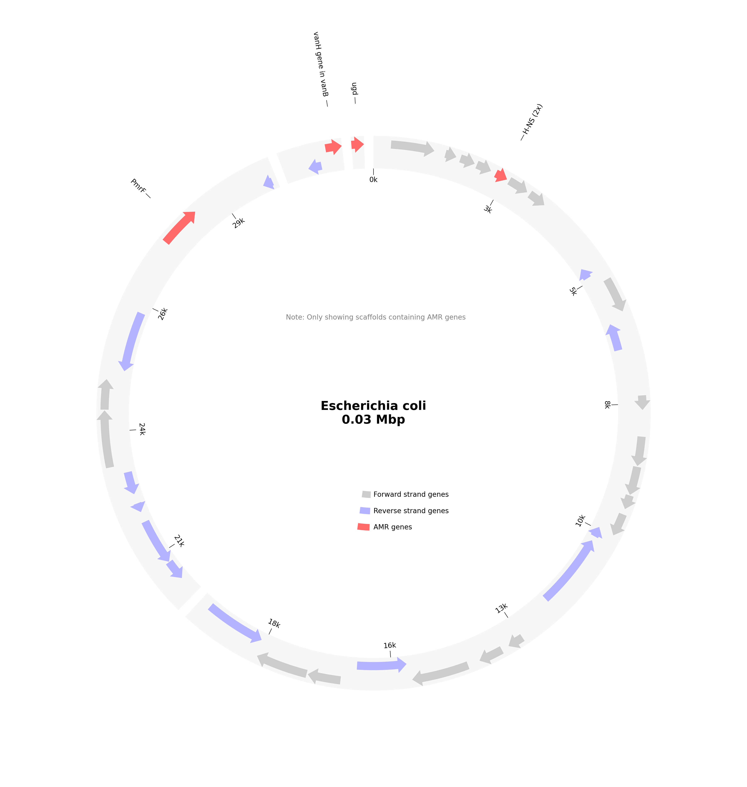

### H-NS (found in 2 locations)
- **Mechanism**: antibiotic efflux
- **Drug Classes**: macrolide antibiotic; fluoroquinolone antibiotic; cephalosporin; cephamycin; penam; tetracycline antibiotic
- **AMR Family**: major facilitator superfamily (MFS) antibiotic efflux pump; resistance-nodulation-cell division (RND) antibiotic efflux pump
- **Locations**:
  - gnl|SPADES|CAEEGBCP_547_5 : position 2417-2659
  - gnl|SPADES|CAEEGBCP_547_9 : position 4122-4526

### PmrF
- **Mechanism**: antibiotic target alteration
- **Drug Classes**: peptide antibiotic
- **AMR Family**: pmr phosphoethanolamine transferase
- **Locations**:
  - gnl|SPADES|CAEEGBCP_1145_9 : position 7564-8373

### ugd
- **Mechanism**: antibiotic target alteration
- **Drug Classes**: peptide antibiotic
- **AMR Family**: pmr phosphoethanolamine transferase
- **Locations**:
  - gnl|SPADES|CAEEGBCP_54833_1 : position 2-244

### vanH gene in vanB cluster
- **Mechanism**: antibiotic target alteration
- **Drug Classes**: glycopeptide antibiotic
- **AMR Family**: vanH; glycopeptide resistance gene cluster
- **Locations**:
  - gnl|SPADES|CAEEGBCP_9264_2 : position 908-1225

## Ewingella americana
**Strain Statistics:**
- Total genome length: 3.3 kbp
- Total scaffolds: 189
- Scaffolds with AMR genes: 13
- Total genes annotated: 0
- Total AMR genes: 13
- Unique AMR genes: 12
- Distinct AMR mechanisms: 3
- Distinct AMR families: 7
- Distinct drug classes: 21

**Circos Plot:**

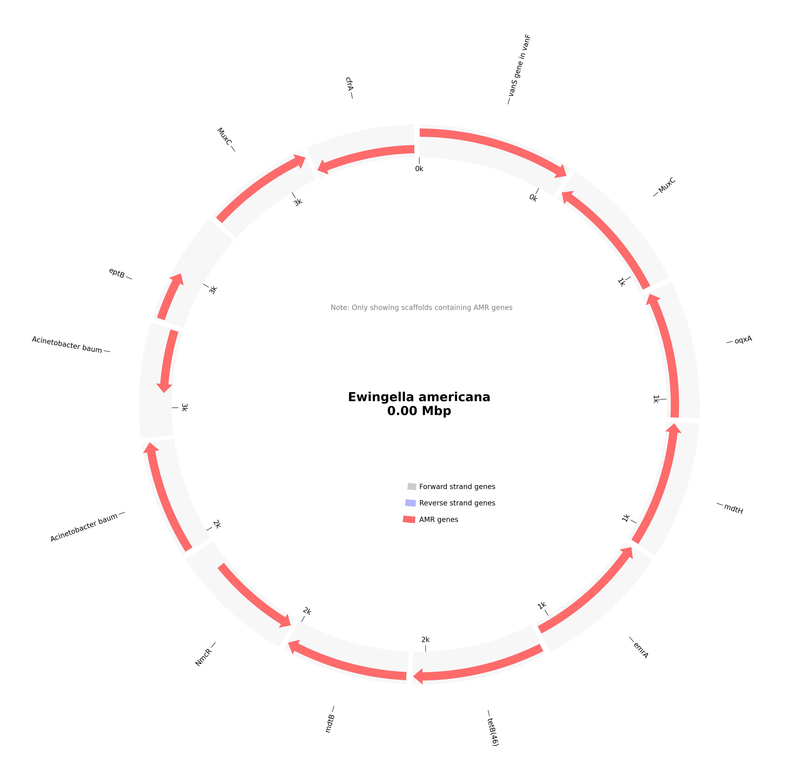

### Acinetobacter baumannii AbaF
- **Mechanism**: antibiotic efflux
- **Drug Classes**: phosphonic acid antibiotic
- **AMR Family**: major facilitator superfamily (MFS) antibiotic efflux pump
- **Locations**:
  - gnl|SPADES|CAEEGBCP_61958_1 : position 92-229

### Acinetobacter baumannii AbaQ
- **Mechanism**: antibiotic efflux
- **Drug Classes**: fluoroquinolone antibiotic
- **AMR Family**: major facilitator superfamily (MFS) antibiotic efflux pump
- **Locations**:
  - gnl|SPADES|CAEEGBCP_59419_1 : position 3-236

### MuxC (found in 2 locations)
- **Mechanism**: antibiotic efflux
- **Drug Classes**: macrolide antibiotic; monobactam; tetracycline antibiotic; aminocoumarin antibiotic
- **AMR Family**: resistance-nodulation-cell division (RND) antibiotic efflux pump
- **Locations**:
  - gnl|SPADES|CAEEGBCP_40988_1 : position 1-279
  - gnl|SPADES|CAEEGBCP_67052_1 : position 2-220

### NmcR
- **Mechanism**: antibiotic inactivation
- **Drug Classes**: carbapenem; cephalosporin; cephamycin; penam
- **AMR Family**: NmcA beta-lactamase
- **Locations**:
  - gnl|SPADES|CAEEGBCP_51391_1 : position 1-201

### cfrA
- **Mechanism**: antibiotic target alteration
- **Drug Classes**: lincosamide antibiotic; streptogramin antibiotic; streptogramin A antibiotic; oxazolidinone antibiotic; phenicol antibiotic; pleuromutilin antibiotic
- **AMR Family**: Cfr 23S ribosomal RNA methyltransferase
- **Locations**:
  - gnl|SPADES|CAEEGBCP_68310_1 : position 2-217

### emrA
- **Mechanism**: antibiotic efflux
- **Drug Classes**: fluoroquinolone antibiotic
- **AMR Family**: major facilitator superfamily (MFS) antibiotic efflux pump
- **Locations**:
  - gnl|SPADES|CAEEGBCP_43486_1 : position 2-271

### eptB
- **Mechanism**: antibiotic target alteration
- **Drug Classes**: peptide antibiotic
- **AMR Family**: pmr phosphoethanolamine transferase
- **Locations**:
  - gnl|SPADES|CAEEGBCP_64932_1 : position 3-104

### mdtB
- **Mechanism**: antibiotic efflux
- **Drug Classes**: aminocoumarin antibiotic
- **AMR Family**: resistance-nodulation-cell division (RND) antibiotic efflux pump
- **Locations**:
  - gnl|SPADES|CAEEGBCP_50202_1 : position 3-254

### mdtH
- **Mechanism**: antibiotic efflux
- **Drug Classes**: fluoroquinolone antibiotic
- **AMR Family**: major facilitator superfamily (MFS) antibiotic efflux pump
- **Locations**:
  - gnl|SPADES|CAEEGBCP_42299_1 : position 3-275

### oqxA
- **Mechanism**: antibiotic efflux
- **Drug Classes**: fluoroquinolone antibiotic; glycylcycline; tetracycline antibiotic; diaminopyrimidine antibiotic; nitrofuran antibiotic
- **AMR Family**: resistance-nodulation-cell division (RND) antibiotic efflux pump
- **Locations**:
  - gnl|SPADES|CAEEGBCP_41856_1 : position 3-278

### tetB(46)
- **Mechanism**: antibiotic efflux
- **Drug Classes**: tetracycline antibiotic
- **AMR Family**: ATP-binding cassette (ABC) antibiotic efflux pump
- **Locations**:
  - gnl|SPADES|CAEEGBCP_43922_1 : position 2-271

### vanS gene in vanF cluster
- **Mechanism**: antibiotic target alteration
- **Drug Classes**: glycopeptide antibiotic
- **AMR Family**: vanS; glycopeptide resistance gene cluster
- **Locations**:
  - gnl|SPADES|CAEEGBCP_35471_1 : position 1-315

## Hafnia alvei
**Strain Statistics:**
- Total genome length: 540.9 kbp
- Total scaffolds: 2983
- Scaffolds with AMR genes: 337
- Total genes annotated: 910
- Total AMR genes: 383
- Unique AMR genes: 170
- Distinct AMR mechanisms: 10
- Distinct AMR families: 58
- Distinct drug classes: 34

**Circos Plot:**

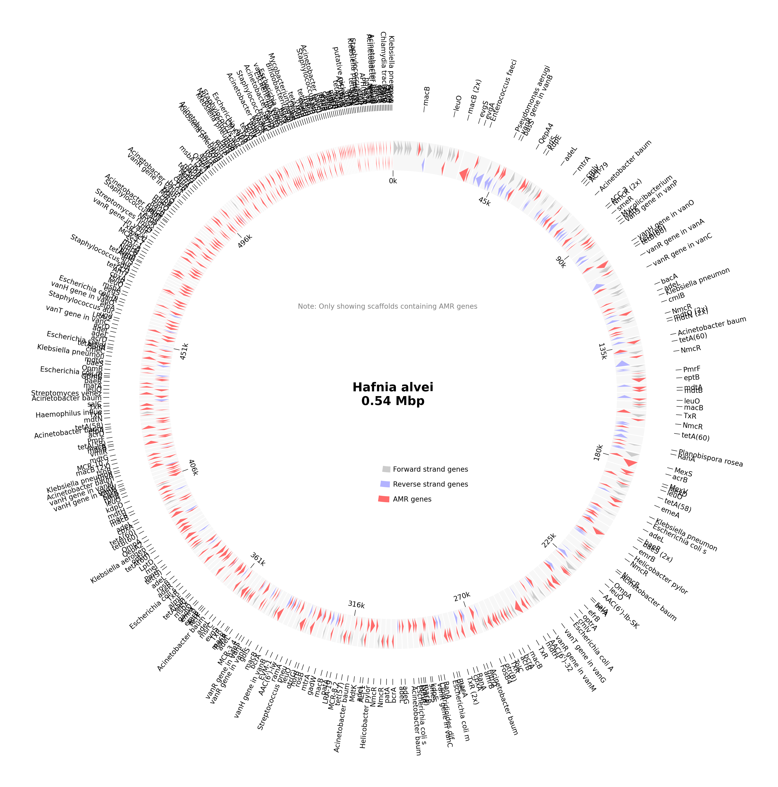

### AAC(6')-32
- **Mechanism**: antibiotic inactivation
- **Drug Classes**: aminoglycoside antibiotic
- **AMR Family**: AAC(6')
- **Locations**:
  - gnl|SPADES|CAEEGBCP_4846_4 : position 1666-2268

### AAC(6')-Ib-SK
- **Mechanism**: antibiotic inactivation
- **Drug Classes**: aminoglycoside antibiotic
- **AMR Family**: AAC(6')
- **Locations**:
  - gnl|SPADES|CAEEGBCP_4427_2 : position 87-587

### AAC(6')-Iw
- **Mechanism**: antibiotic inactivation
- **Drug Classes**: aminoglycoside antibiotic
- **AMR Family**: AAC(6')
- **Locations**:
  - gnl|SPADES|CAEEGBCP_6760_1 : position 370-810

### ACC-3
- **Mechanism**: antibiotic inactivation
- **Drug Classes**: monobactam; cephalosporin; penam
- **AMR Family**: ACC beta-lactamase
- **Locations**:
  - gnl|SPADES|CAEEGBCP_2644_2: position 863-2032

### ACT-79
- **Mechanism**: antibiotic inactivation
- **Drug Classes**: carbapenem; cephalosporin; cephamycin; penam
- **AMR Family**: ACT beta-lactamase
- **Locations**:
  - gnl|SPADES|CAEEGBCP_2600_1 : position 2-1003

### ALI-1
- **Mechanism**: antibiotic inactivation
- **Drug Classes**: carbapenem
- **AMR Family**: ALI beta-lactamase
- **Locations**:
  - gnl|SPADES|CAEEGBCP_6063_2 : position 209-1087

### APH(6)-Ic (found in 2 locations)
- **Mechanism**: antibiotic inactivation
- **Drug Classes**: aminoglycoside antibiotic
- **AMR Family**: APH(6)
- **Locations**:
  - gnl|SPADES|CAEEGBCP_35815_1 : position 2-310
  - gnl|SPADES|CAEEGBCP_50381_1 : position 2-157

### Acinetobacter baumannii AbaF (found in 7 locations)
- **Mechanism**: antibiotic efflux
- **Drug Classes**: phosphonic acid antibiotic
- **AMR Family**: major facilitator superfamily (MFS) antibiotic efflux pump
- **Locations**:
  - gnl|SPADES|CAEEGBCP_14358_2 : position 298-759
  - gnl|SPADES|CAEEGBCP_26097_1 : position 2-409
  - gnl|SPADES|CAEEGBCP_57929_1 : position 2-238
  - gnl|SPADES|CAEEGBCP_5831_1 : position 113-1438
  - gnl|SPADES|CAEEGBCP_7517_1 : position 190-1491
  - gnl|SPADES|CAEEGBCP_8741_1 : position 1-1311
  - gnl|SPADES|CAEEGBCP_9287_1 : position 100-1221

### Acinetobacter baumannii AbaQ (found in 7 locations)
- **Mechanism**: antibiotic efflux
- **Drug Classes**: fluoroquinolone antibiotic
- **AMR Family**: major facilitator superfamily (MFS) antibiotic efflux pump
- **Locations**:
  - gnl|SPADES|CAEEGBCP_17789_1 : position 1-600
  - gnl|SPADES|CAEEGBCP_19363_1 : position 2-550
  - gnl|SPADES|CAEEGBCP_2608_1 : position 2-1072
  - gnl|SPADES|CAEEGBCP_3159_3 : position 1682-2902
  - gnl|SPADES|CAEEGBCP_5328_2 : position 787-2163
  - gnl|SPADES|CAEEGBCP_59928_1 : position 2-235
  - gnl|SPADES|CAEEGBCP_6216_2 : position 1320-1907

### Acinetobacter baumannii AmvA (found in 4 locations)
- **Mechanism**: antibiotic efflux
- **Drug Classes**: macrolide antibiotic; disinfecting agents and antiseptics
- **AMR Family**: major facilitator superfamily (MFS) antibiotic efflux pump
- **Locations**:
  - gnl|SPADES|CAEEGBCP_12900_2 : position 685-855
  - gnl|SPADES|CAEEGBCP_15967_1 : position 1-354
  - gnl|SPADES|CAEEGBCP_4358_1 : position 3-299
  - gnl|SPADES|CAEEGBCP_8983_2 : position 484-1272

### AcrE
- **Mechanism**: antibiotic efflux
- **Drug Classes**: fluoroquinolone antibiotic; cephalosporin; cephamycin; penam
- **AMR Family**: resistance-nodulation-cell division (RND) antibiotic efflux pump
- **Locations**:
  - gnl|SPADES|CAEEGBCP_7526_2 : position 1186-1557

### AcrF
- **Mechanism**: antibiotic efflux
- **Drug Classes**: fluoroquinolone antibiotic; cephalosporin; cephamycin; penam
- **AMR Family**: resistance-nodulation-cell division (RND) antibiotic efflux pump
- **Locations**:
  - gnl|SPADES|CAEEGBCP_7526_1 : position 2-1147

### ArnT (found in 3 locations)
- **Mechanism**: antibiotic target alteration
- **Drug Classes**: peptide antibiotic
- **AMR Family**: pmr phosphoethanolamine transferase
- **Locations**:
  - gnl|SPADES|CAEEGBCP_11507_2 : position 772-966
  - gnl|SPADES|CAEEGBCP_14633_1 : position 148-741
  - gnl|SPADES|CAEEGBCP_70781_1 : position 2-211

### Bifidobacterium bifidum ileS conferring resistance to mupirocin
- **Mechanism**: antibiotic target alteration
- **Drug Classes**: mupirocin-like antibiotic
- **AMR Family**: antibiotic-resistant isoleucyl-tRNA synthetase (ileS)
- **Locations**:
  - gnl|SPADES|CAEEGBCP_21590_1 : position 3-494

### CMY-165
- **Mechanism**: antibiotic inactivation
- **Drug Classes**: cephamycin
- **AMR Family**: CMY beta-lactamase
- **Locations**:
  - gnl|SPADES|CAEEGBCP_16901_2 : position 306-632

### Chlamydia trachomatis intrinsic murA conferring resistance to fosfomycin
- **Mechanism**: antibiotic target alteration
- **Drug Classes**: phosphonic acid antibiotic
- **AMR Family**: antibiotic-resistant murA transferase
- **Locations**:
  - gnl|SPADES|CAEEGBCP_69117_1 : position 1-216

### Clostridioides difficile gyrB conferring resistance to fluoroquinolones
- **Mechanism**: antibiotic target alteration
- **Drug Classes**: fluoroquinolone antibiotic
- **AMR Family**: fluoroquinolone resistant gyrB
- **Locations**:
  - gnl|SPADES|CAEEGBCP_5549_1 : position 2-703

### EVM-1
- **Mechanism**: antibiotic inactivation
- **Drug Classes**: carbapenem
- **AMR Family**: EVM beta-lactamase
- **Locations**:
  - gnl|SPADES|CAEEGBCP_6785_1 : position 279-992

### Enterococcus faecium cls conferring resistance to daptomycin
- **Mechanism**: antibiotic target alteration
- **Drug Classes**: peptide antibiotic
- **AMR Family**: daptomycin resistant cls
- **Locations**:
  - gnl|SPADES|CAEEGBCP_2172_1 : position 3-893

### Escherichia coli AcrAB-TolC with AcrR mutation conferring resistance to ciprofloxacin, tetracycline, and ceftazidime (found in 2 locations)
- **Mechanism**: antibiotic target alteration; antibiotic efflux
- **Drug Classes**: fluoroquinolone antibiotic; cephalosporin; glycylcycline; penam; tetracycline antibiotic; rifamycin antibiotic; phenicol antibiotic; disinfecting agents and antiseptics
- **AMR Family**: resistance-nodulation-cell division (RND) antibiotic efflux pump
- **Locations**:
  - gnl|SPADES|CAEEGBCP_20738_1 : position 3-314
  - gnl|SPADES|CAEEGBCP_4690_1 : position 3-263

### Escherichia coli mdfA (found in 3 locations)
- **Mechanism**: antibiotic efflux
- **Drug Classes**: tetracycline antibiotic; phenicol antibiotic; disinfecting agents and antiseptics
- **AMR Family**: major facilitator superfamily (MFS) antibiotic efflux pump
- **Locations**:
  - gnl|SPADES|CAEEGBCP_10773_1 : position 3-272
  - gnl|SPADES|CAEEGBCP_5535_1 : position 1-1239
  - gnl|SPADES|CAEEGBCP_9726_1 : position 2-226

### Escherichia coli soxS with mutation conferring antibiotic resistance (found in 5 locations)
- **Mechanism**: antibiotic target alteration; antibiotic efflux; reduced permeability to antibiotic
- **Drug Classes**: fluoroquinolone antibiotic; monobactam; carbapenem; cephalosporin; glycylcycline; cephamycin; penam; tetracycline antibiotic; rifamycin antibiotic; phenicol antibiotic; penem; disinfecting agents and antiseptics
- **AMR Family**: ATP-binding cassette (ABC) antibiotic efflux pump; major facilitator superfamily (MFS) antibiotic efflux pump; resistance-nodulation-cell division (RND) antibiotic efflux pump; General Bacterial Porin with reduced permeability to beta-lactams
- **Locations**:
  - gnl|SPADES|CAEEGBCP_17077_2 : position 488-628
  - gnl|SPADES|CAEEGBCP_20579_1 : position 257-517
  - gnl|SPADES|CAEEGBCP_4165_2 : position 187-1053
  - gnl|SPADES|CAEEGBCP_5799_2 : position 955-1776
  - gnl|SPADES|CAEEGBCP_7952_1 : position 2-886

### Escherichia coli uhpA with mutation conferring resistance to fosfomycin
- **Mechanism**: antibiotic target alteration
- **Drug Classes**: phosphonic acid antibiotic
- **AMR Family**: antibiotic-resistant UhpT
- **Locations**:
  - gnl|SPADES|CAEEGBCP_10016_1 : position 17-733

### FosB4
- **Mechanism**: antibiotic inactivation
- **Drug Classes**: phosphonic acid antibiotic
- **AMR Family**: fosfomycin thiol transferase
- **Locations**:
  - gnl|SPADES|CAEEGBCP_5287_2 : position 278-664

### Haemophilus influenzae PBP3 conferring resistance to beta-lactam antibiotics
- **Mechanism**: antibiotic target alteration
- **Drug Classes**: cephalosporin; cephamycin; penam
- **AMR Family**: Penicillin-binding protein mutations conferring resistance to beta-lactam antibiotics
- **Locations**:
  - gnl|SPADES|CAEEGBCP_9263_1 : position 2-991

### Helicobacter pylori pbp1 mutants conferring resistance to amoxicillin
- **Mechanism**: antibiotic target alteration
- **Drug Classes**: cephalosporin; cephamycin; penam
- **AMR Family**: Penicillin-binding protein mutations conferring resistance to beta-lactam antibiotics
- **Locations**:
  - gnl|SPADES|CAEEGBCP_5993_1 : position 71-1981

### Helicobacter pylori pbp2 mutants conferring resistance to amoxicillin
- **Mechanism**: antibiotic target alteration
- **Drug Classes**: cephalosporin; cephamycin; penam
- **AMR Family**: Penicillin-binding protein mutations conferring resistance to beta-lactam antibiotics
- **Locations**:
  - gnl|SPADES|CAEEGBCP_4261_2 : position 406-2301

### Klebsiella aerogenes Omp36
- **Mechanism**: reduced permeability to antibiotic
- **Drug Classes**: monobactam; carbapenem; cephalosporin; cephamycin; penam; penem
- **AMR Family**: General Bacterial Porin with reduced permeability to beta-lactams
- **Locations**:
  - gnl|SPADES|CAEEGBCP_8175_1 : position 1-939

### Klebsiella pneumoniae KpnG
- **Mechanism**: antibiotic efflux
- **Drug Classes**: macrolide antibiotic; fluoroquinolone antibiotic; aminoglycoside antibiotic; carbapenem; cephalosporin; penam; peptide antibiotic; penem
- **AMR Family**: major facilitator superfamily (MFS) antibiotic efflux pump
- **Locations**:
  - gnl|SPADES|CAEEGBCP_9906_1 : position 19-1134

### Klebsiella pneumoniae KpnH
- **Mechanism**: antibiotic efflux
- **Drug Classes**: macrolide antibiotic; fluoroquinolone antibiotic; aminoglycoside antibiotic; carbapenem; cephalosporin; penam; peptide antibiotic; penem
- **AMR Family**: major facilitator superfamily (MFS) antibiotic efflux pump
- **Locations**:
  - gnl|SPADES|CAEEGBCP_4139_2 : position 1010-2449

### Klebsiella pneumoniae OmpK37 (found in 5 locations)
- **Mechanism**: reduced permeability to antibiotic
- **Drug Classes**: monobactam; carbapenem; cephalosporin; cephamycin; penam; penem
- **AMR Family**: General Bacterial Porin with reduced permeability to beta-lactams
- **Locations**:
  - gnl|SPADES|CAEEGBCP_15938_1 : position 3-677
  - gnl|SPADES|CAEEGBCP_16373_1 : position 2-655
  - gnl|SPADES|CAEEGBCP_44310_1 : position 1-174
  - gnl|SPADES|CAEEGBCP_73895_1 : position 102-206
  - gnl|SPADES|CAEEGBCP_8768_2 : position 559-1308

### Klebsiella pneumoniae acrR with mutation conferring multidrug antibiotic resistance
- **Mechanism**: antibiotic target alteration; antibiotic efflux
- **Drug Classes**: fluoroquinolone antibiotic; cephalosporin; glycylcycline; penam; tetracycline antibiotic; rifamycin antibiotic; phenicol antibiotic; disinfecting agents and antiseptics
- **AMR Family**: resistance-nodulation-cell division (RND) antibiotic efflux pump
- **Locations**:
  - gnl|SPADES|CAEEGBCP_3055_5 : position 3526-3882

### LRA-19
- **Mechanism**: antibiotic inactivation
- **Drug Classes**: cephalosporin; penam
- **AMR Family**: subclass B3 LRA beta-lactamase
- **Locations**:
  - gnl|SPADES|CAEEGBCP_6376_2 : position 1037-1684

### LRA-2
- **Mechanism**: antibiotic inactivation
- **Drug Classes**: cephalosporin; penam
- **AMR Family**: subclass B3 LRA beta-lactamase
- **Locations**:
  - gnl|SPADES|CAEEGBCP_10360_2 : position 212-1054

### LptD (found in 2 locations)
- **Mechanism**: antibiotic efflux
- **Drug Classes**: carbapenem; peptide antibiotic; aminocoumarin antibiotic; rifamycin antibiotic
- **AMR Family**: ATP-binding cassette (ABC) antibiotic efflux pump
- **Locations**:
  - gnl|SPADES|CAEEGBCP_12572_1 : position 137-877
  - gnl|SPADES|CAEEGBCP_8144_1 : position 2-1429

### MCR-10.2
- **Mechanism**: antibiotic target alteration
- **Drug Classes**: peptide antibiotic
- **AMR Family**: MCR phosphoethanolamine transferase
- **Locations**:
  - gnl|SPADES|CAEEGBCP_8857_1 : position 3-428

### MCR-3.4
- **Mechanism**: antibiotic target alteration
- **Drug Classes**: peptide antibiotic
- **AMR Family**: MCR phosphoethanolamine transferase
- **Locations**:
  - gnl|SPADES|CAEEGBCP_7216_1 : position 2-1159

### MCR-3.7
- **Mechanism**: antibiotic target alteration
- **Drug Classes**: peptide antibiotic
- **AMR Family**: MCR phosphoethanolamine transferase
- **Locations**:
  - gnl|SPADES|CAEEGBCP_12054_1 : position 1-918

### MCR-8.2
- **Mechanism**: antibiotic target alteration
- **Drug Classes**: peptide antibiotic
- **AMR Family**: MCR phosphoethanolamine transferase
- **Locations**:
  - gnl|SPADES|CAEEGBCP_6375_2 : position 787-1857

### MdtK (found in 2 locations)
- **Mechanism**: antibiotic efflux
- **Drug Classes**: fluoroquinolone antibiotic
- **AMR Family**: multidrug and toxic compound extrusion (MATE) transporter
- **Locations**:
  - gnl|SPADES|CAEEGBCP_2653_5 : position 3714-4229
  - gnl|SPADES|CAEEGBCP_6104_2 : position 1206-1943

### MdtQ (found in 3 locations)
- **Mechanism**: reduced permeability to antibiotic
- **Drug Classes**: monobactam; carbapenem; cephalosporin; cephamycin; penam; penem
- **AMR Family**: Outer Membrane Porin (Opr)
- **Locations**:
  - gnl|SPADES|CAEEGBCP_13544_1 : position 2-730
  - gnl|SPADES|CAEEGBCP_14779_1 : position 1-219
  - gnl|SPADES|CAEEGBCP_30539_1 : position 1-357

### MexD
- **Mechanism**: antibiotic efflux
- **Drug Classes**: macrolide antibiotic; fluoroquinolone antibiotic; aminoglycoside antibiotic; cephalosporin; penam; tetracycline antibiotic; aminocoumarin antibiotic; diaminopyrimidine antibiotic; phenicol antibiotic
- **AMR Family**: resistance-nodulation-cell division (RND) antibiotic efflux pump
- **Locations**:
  - gnl|SPADES|CAEEGBCP_3907_3 : position 2532-3035

### MexS
- **Mechanism**: antibiotic efflux
- **Drug Classes**: fluoroquinolone antibiotic; diaminopyrimidine antibiotic; phenicol antibiotic
- **AMR Family**: resistance-nodulation-cell division (RND) antibiotic efflux pump
- **Locations**:
  - gnl|SPADES|CAEEGBCP_3691_2 : position 2050-3051

### MexV
- **Mechanism**: antibiotic efflux
- **Drug Classes**: macrolide antibiotic; fluoroquinolone antibiotic; tetracycline antibiotic; phenicol antibiotic; disinfecting agents and antiseptics
- **AMR Family**: resistance-nodulation-cell division (RND) antibiotic efflux pump
- **Locations**:
  - gnl|SPADES|CAEEGBCP_3907_2 : position 1114-2535

### Mycobacterium tuberculosis ndh with mutation conferring resistance to isoniazid
- **Mechanism**: antibiotic target alteration
- **Drug Classes**: isoniazid-like antibiotic
- **AMR Family**: antibiotic resistant ndh
- **Locations**:
  - gnl|SPADES|CAEEGBCP_16666_1 : position 32-643

### Mycobacterium tuberculosis thyA with mutation conferring resistance to para-aminosalicylic acid
- **Mechanism**: antibiotic target alteration
- **Drug Classes**: salicylic acid antibiotic
- **AMR Family**: aminosalicylate resistant thymidylate synthase
- **Locations**:
  - gnl|SPADES|CAEEGBCP_21701_1 : position 2-493

### Mycolicibacterium smegmatis ndh with mutation conferring resistance to isoniazid
- **Mechanism**: antibiotic target alteration
- **Drug Classes**: isoniazid-like antibiotic
- **AMR Family**: antibiotic resistant ndh
- **Locations**:
  - gnl|SPADES|CAEEGBCP_2653_4 : position 2218-3363

### NmcR (found in 13 locations)
- **Mechanism**: antibiotic inactivation
- **Drug Classes**: carbapenem; cephalosporin; cephamycin; penam
- **AMR Family**: NmcA beta-lactamase
- **Locations**:
  - gnl|SPADES|CAEEGBCP_11929_1 : position 529-930
  - gnl|SPADES|CAEEGBCP_12711_1 : position 140-868
  - gnl|SPADES|CAEEGBCP_17860_1 : position 1-237
  - gnl|SPADES|CAEEGBCP_2644_3 : position 2259-2612
  - gnl|SPADES|CAEEGBCP_2644_4 : position 2713-3132
  - gnl|SPADES|CAEEGBCP_3139_3 : position 1894-2823
  - gnl|SPADES|CAEEGBCP_3250_1 : position 23-895
  - gnl|SPADES|CAEEGBCP_3607_1 : position 85-966
  - gnl|SPADES|CAEEGBCP_4286_2 : position 180-1085
  - gnl|SPADES|CAEEGBCP_4335_3 : position 2211-2732
  - gnl|SPADES|CAEEGBCP_54553_1 : position 2-244
  - gnl|SPADES|CAEEGBCP_5951_2 : position 677-1600
  - gnl|SPADES|CAEEGBCP_5955_2 : position 905-1774

### OmpA (found in 3 locations)
- **Mechanism**: reduced permeability to antibiotic
- **Drug Classes**: peptide antibiotic
- **AMR Family**: General Bacterial Porin with reduced permeability to peptide antibiotics
- **Locations**:
  - gnl|SPADES|CAEEGBCP_15244_2 : position 582-710
  - gnl|SPADES|CAEEGBCP_4371_2 : position 600-1259
  - gnl|SPADES|CAEEGBCP_8208_1 : position 58-513

### OpmB (found in 2 locations)
- **Mechanism**: antibiotic efflux
- **Drug Classes**: macrolide antibiotic; monobactam; tetracycline antibiotic; aminocoumarin antibiotic
- **AMR Family**: resistance-nodulation-cell division (RND) antibiotic efflux pump
- **Locations**:
  - gnl|SPADES|CAEEGBCP_9671_1 : position 3-578
  - gnl|SPADES|CAEEGBCP_9739_1 : position 2-301

### ParR
- **Mechanism**: antibiotic efflux; reduced permeability to antibiotic
- **Drug Classes**: macrolide antibiotic; fluoroquinolone antibiotic; monobactam; aminoglycoside antibiotic; carbapenem; cephalosporin; cephamycin; penam; tetracycline antibiotic; phenicol antibiotic; penem; disinfecting agents and antiseptics
- **AMR Family**: resistance-nodulation-cell division (RND) antibiotic efflux pump; Outer Membrane Porin (Opr)
- **Locations**:
  - gnl|SPADES|CAEEGBCP_67720_1 : position 3-218

### ParS (found in 2 locations)
- **Mechanism**: antibiotic efflux; reduced permeability to antibiotic
- **Drug Classes**: macrolide antibiotic; fluoroquinolone antibiotic; monobactam; aminoglycoside antibiotic; carbapenem; cephalosporin; cephamycin; penam; tetracycline antibiotic; phenicol antibiotic; penem; disinfecting agents and antiseptics
- **AMR Family**: resistance-nodulation-cell division (RND) antibiotic efflux pump; Outer Membrane Porin (Opr)
- **Locations**:
  - gnl|SPADES|CAEEGBCP_16251_1 : position 3-662
  - gnl|SPADES|CAEEGBCP_35400_1 : position 3-314

### Planobispora rosea EF-Tu mutants conferring resistance to inhibitor GE2270A
- **Mechanism**: antibiotic target alteration
- **Drug Classes**: elfamycin antibiotic
- **AMR Family**: elfamycin resistant EF-Tu
- **Locations**:
  - gnl|SPADES|CAEEGBCP_3657_3 : position 2737-3243

### PmrF (found in 3 locations)
- **Mechanism**: antibiotic target alteration
- **Drug Classes**: peptide antibiotic
- **AMR Family**: pmr phosphoethanolamine transferase
- **Locations**:
  - gnl|SPADES|CAEEGBCP_3316_8 : position 3365-3595
  - gnl|SPADES|CAEEGBCP_8116_1 : position 3-659
  - gnl|SPADES|CAEEGBCP_8959_1 : position 3-521

### Pseudomonas aeruginosa ampR with mutation conferring resistance to aztreonam
- **Mechanism**: antibiotic target alteration; antibiotic inactivation
- **Drug Classes**: monobactam; carbapenem; cephalosporin
- **AMR Family**: PDC beta-lactamase; ampR transcriptional regulator with mutation conferring resistance to monobactam antibiotics
- **Locations**:
  - gnl|SPADES|CAEEGBCP_2306_4 : position 3948-4910

### QepA2
- **Mechanism**: antibiotic efflux
- **Drug Classes**: fluoroquinolone antibiotic
- **AMR Family**: major facilitator superfamily (MFS) antibiotic efflux pump
- **Locations**:
  - gnl|SPADES|CAEEGBCP_8198_1 : position 2-1240

### QepA4
- **Mechanism**: antibiotic efflux
- **Drug Classes**: fluoroquinolone antibiotic
- **AMR Family**: major facilitator superfamily (MFS) antibiotic efflux pump
- **Locations**:
  - gnl|SPADES|CAEEGBCP_2367_3 : position 2314-3603

### RanA (found in 11 locations)
- **Mechanism**: antibiotic efflux
- **Drug Classes**: aminoglycoside antibiotic
- **AMR Family**: ATP-binding cassette (ABC) antibiotic efflux pump
- **Locations**:
  - gnl|SPADES|CAEEGBCP_10021_1 : position 1-483
  - gnl|SPADES|CAEEGBCP_10721_1 : position 124-885
  - gnl|SPADES|CAEEGBCP_11922_2 : position 629-931
  - gnl|SPADES|CAEEGBCP_13076_1 : position 1-840
  - gnl|SPADES|CAEEGBCP_26618_1 : position 2-403
  - gnl|SPADES|CAEEGBCP_3689_2 : position 611-1237
  - gnl|SPADES|CAEEGBCP_5431_3 : position 1283-2176
  - gnl|SPADES|CAEEGBCP_5543_2 : position 1156-2133
  - gnl|SPADES|CAEEGBCP_66368_1 : position 1-222
  - gnl|SPADES|CAEEGBCP_72541_1 : position 3-209
  - gnl|SPADES|CAEEGBCP_7319_2 : position 335-1147

### SST-1
- **Mechanism**: antibiotic inactivation
- **Drug Classes**: cephalosporin
- **AMR Family**: SST beta-lactamase
- **Locations**:
  - gnl|SPADES|CAEEGBCP_11990_1 : position 2-832

### Staphylococcus aureus mupA conferring resistance to mupirocin (found in 2 locations)
- **Mechanism**: antibiotic target alteration
- **Drug Classes**: mupirocin-like antibiotic
- **AMR Family**: antibiotic-resistant isoleucyl-tRNA synthetase (ileS)
- **Locations**:
  - gnl|SPADES|CAEEGBCP_12831_1 : position 1-858
  - gnl|SPADES|CAEEGBCP_25316_1 : position 2-421

### Staphylococcus aureus mupB conferring resistance to mupirocin (found in 2 locations)
- **Mechanism**: antibiotic target alteration
- **Drug Classes**: mupirocin-like antibiotic
- **AMR Family**: antibiotic-resistant isoleucyl-tRNA synthetase (ileS)
- **Locations**:
  - gnl|SPADES|CAEEGBCP_11673_1 : position 2-955
  - gnl|SPADES|CAEEGBCP_18908_1 : position 1-564

### Staphylococcus aureus murA with mutation conferring resistance to fosfomycin
- **Mechanism**: antibiotic target alteration
- **Drug Classes**: phosphonic acid antibiotic
- **AMR Family**: antibiotic-resistant murA transferase
- **Locations**:
  - gnl|SPADES|CAEEGBCP_16667_1 : position 3-641

### Staphylococcus aureus pgsA mutations conferring resistance to daptomycin
- **Mechanism**: antibiotic target alteration
- **Drug Classes**: peptide antibiotic
- **AMR Family**: daptomycin resistant pgsA
- **Locations**:
  - gnl|SPADES|CAEEGBCP_44670_1 : position 3-269

### Staphylococcus aureus walK with mutation conferring resistance to daptomycin
- **Mechanism**: antibiotic target alteration
- **Drug Classes**: peptide antibiotic
- **AMR Family**: daptomycin resistant walK
- **Locations**:
  - gnl|SPADES|CAEEGBCP_10528_1 : position 2-1066

### Streptococcus pneumoniae PBP2x conferring resistance to amoxicillin
- **Mechanism**: antibiotic target alteration
- **Drug Classes**: cephalosporin; cephamycin; penam
- **AMR Family**: Penicillin-binding protein mutations conferring resistance to beta-lactam antibiotics
- **Locations**:
  - gnl|SPADES|CAEEGBCP_6721_1 : position 2-1762

### Streptomyces rimosus otr(A)
- **Mechanism**: antibiotic target protection
- **Drug Classes**: tetracycline antibiotic
- **AMR Family**: tetracycline-resistant ribosomal protection protein
- **Locations**:
  - gnl|SPADES|CAEEGBCP_12589_1 : position 2-877

### Streptomyces venezuelae rox
- **Mechanism**: antibiotic inactivation
- **Drug Classes**: rifamycin antibiotic
- **AMR Family**: rifampin monooxygenase
- **Locations**:
  - gnl|SPADES|CAEEGBCP_9510_1 : position 147-1190

### TaeA
- **Mechanism**: antibiotic efflux
- **Drug Classes**: pleuromutilin antibiotic
- **AMR Family**: ATP-binding cassette (ABC) antibiotic efflux pump
- **Locations**:
  - gnl|SPADES|CAEEGBCP_32544_1 : position 1-336

### TolC
- **Mechanism**: antibiotic efflux
- **Drug Classes**: macrolide antibiotic; fluoroquinolone antibiotic; aminoglycoside antibiotic; carbapenem; cephalosporin; glycylcycline; cephamycin; penam; tetracycline antibiotic; peptide antibiotic; aminocoumarin antibiotic; rifamycin antibiotic; phenicol antibiotic; penem; disinfecting agents and antiseptics
- **AMR Family**: ATP-binding cassette (ABC) antibiotic efflux pump; major facilitator superfamily (MFS) antibiotic efflux pump; resistance-nodulation-cell division (RND) antibiotic efflux pump
- **Locations**:
  - gnl|SPADES|CAEEGBCP_5201_1 : position 2-835

### TxR (found in 16 locations)
- **Mechanism**: antibiotic efflux
- **Drug Classes**: tetracycline antibiotic
- **AMR Family**: ATP-binding cassette (ABC) antibiotic efflux pump
- **Locations**:
  - gnl|SPADES|CAEEGBCP_12285_1 : position 1-336
  - gnl|SPADES|CAEEGBCP_12285_2 : position 410-898
  - gnl|SPADES|CAEEGBCP_14496_1 : position 1-750
  - gnl|SPADES|CAEEGBCP_15064_1 : position 2-412
  - gnl|SPADES|CAEEGBCP_17330_1 : position 58-618
  - gnl|SPADES|CAEEGBCP_3601_1 : position 2-1399
  - gnl|SPADES|CAEEGBCP_37761_1 : position 1-297
  - gnl|SPADES|CAEEGBCP_48171_1 : position 2-259
  - gnl|SPADES|CAEEGBCP_5022_1 : position 58-2355
  - gnl|SPADES|CAEEGBCP_5201_2 : position 979-2280
  - gnl|SPADES|CAEEGBCP_5510_1 : position 3-584
  - gnl|SPADES|CAEEGBCP_5510_2 : position 581-1159
  - gnl|SPADES|CAEEGBCP_7318_2 : position 844-1611
  - gnl|SPADES|CAEEGBCP_7951_1 : position 149-1465
  - gnl|SPADES|CAEEGBCP_9239_2 : position 933-1229
  - gnl|SPADES|CAEEGBCP_9284_1 : position 79-1224

### aadT
- **Mechanism**: antibiotic efflux
- **Drug Classes**: macrolide antibiotic; tetracycline antibiotic; disinfecting agents and antiseptics
- **AMR Family**: major facilitator superfamily (MFS) antibiotic efflux pump
- **Locations**:
  - gnl|SPADES|CAEEGBCP_12900_1 : position 3-656

### acrB (found in 2 locations)
- **Mechanism**: antibiotic efflux
- **Drug Classes**: fluoroquinolone antibiotic; cephalosporin; glycylcycline; penam; tetracycline antibiotic; rifamycin antibiotic; phenicol antibiotic; disinfecting agents and antiseptics
- **AMR Family**: resistance-nodulation-cell division (RND) antibiotic efflux pump
- **Locations**:
  - gnl|SPADES|CAEEGBCP_3874_1 : position 2-2848
  - gnl|SPADES|CAEEGBCP_5178_1 : position 3-845

### acrD (found in 3 locations)
- **Mechanism**: antibiotic efflux
- **Drug Classes**: aminoglycoside antibiotic
- **AMR Family**: resistance-nodulation-cell division (RND) antibiotic efflux pump
- **Locations**:
  - gnl|SPADES|CAEEGBCP_10040_1 : position 2-592
  - gnl|SPADES|CAEEGBCP_10204_1 : position 1-1101
  - gnl|SPADES|CAEEGBCP_8969_1 : position 3-1274

### adeG
- **Mechanism**: antibiotic efflux
- **Drug Classes**: fluoroquinolone antibiotic; tetracycline antibiotic
- **AMR Family**: resistance-nodulation-cell division (RND) antibiotic efflux pump
- **Locations**:
  - gnl|SPADES|CAEEGBCP_5869_2 : position 1196-2023

### adeL (found in 17 locations)
- **Mechanism**: antibiotic efflux
- **Drug Classes**: fluoroquinolone antibiotic; tetracycline antibiotic
- **AMR Family**: resistance-nodulation-cell division (RND) antibiotic efflux pump
- **Locations**:
  - gnl|SPADES|CAEEGBCP_10048_1 : position 2-751
  - gnl|SPADES|CAEEGBCP_10118_2 : position 300-983
  - gnl|SPADES|CAEEGBCP_15633_1 : position 1-690
  - gnl|SPADES|CAEEGBCP_17722_1 : position 2-601
  - gnl|SPADES|CAEEGBCP_18439_2 : position 423-578
  - gnl|SPADES|CAEEGBCP_21228_1 : position 2-502
  - gnl|SPADES|CAEEGBCP_2501_5 : position 3068-4000
  - gnl|SPADES|CAEEGBCP_2592_7 : position 4058-4534
  - gnl|SPADES|CAEEGBCP_3055_2 : position 1449-2342
  - gnl|SPADES|CAEEGBCP_4188_1 : position 29-922
  - gnl|SPADES|CAEEGBCP_42280_1 : position 1-276
  - gnl|SPADES|CAEEGBCP_5887_2 : position 362-904
  - gnl|SPADES|CAEEGBCP_6063_3 : position 1215-1958
  - gnl|SPADES|CAEEGBCP_7242_3 : position 1125-1628
  - gnl|SPADES|CAEEGBCP_7483_2 : position 187-1092
  - gnl|SPADES|CAEEGBCP_8052_1 : position 170-1087
  - gnl|SPADES|CAEEGBCP_8329_1 : position 3-605

### adeR
- **Mechanism**: antibiotic efflux
- **Drug Classes**: glycylcycline; tetracycline antibiotic
- **AMR Family**: resistance-nodulation-cell division (RND) antibiotic efflux pump
- **Locations**:
  - gnl|SPADES|CAEEGBCP_7978_1 : position 3-956

### almE
- **Mechanism**: antibiotic target alteration
- **Drug Classes**: peptide antibiotic
- **AMR Family**: polymyxin resistance operon; alm glycyltransferase
- **Locations**:
  - gnl|SPADES|CAEEGBCP_7925_1 : position 1-1398

### amrB
- **Mechanism**: antibiotic efflux
- **Drug Classes**: macrolide antibiotic; aminoglycoside antibiotic
- **AMR Family**: resistance-nodulation-cell division (RND) antibiotic efflux pump
- **Locations**:
  - gnl|SPADES|CAEEGBCP_5405_2 : position 936-2183

### arlS (found in 2 locations)
- **Mechanism**: antibiotic efflux
- **Drug Classes**: fluoroquinolone antibiotic; disinfecting agents and antiseptics
- **AMR Family**: major facilitator superfamily (MFS) antibiotic efflux pump
- **Locations**:
  - gnl|SPADES|CAEEGBCP_11868_1 : position 1-936
  - gnl|SPADES|CAEEGBCP_2430_1 : position 1-1635

### arnA (found in 5 locations)
- **Mechanism**: antibiotic target alteration
- **Drug Classes**: peptide antibiotic
- **AMR Family**: pmr phosphoethanolamine transferase
- **Locations**:
  - gnl|SPADES|CAEEGBCP_14545_1 : position 3-746
  - gnl|SPADES|CAEEGBCP_17208_1 : position 1-621
  - gnl|SPADES|CAEEGBCP_19282_1 : position 1-552
  - gnl|SPADES|CAEEGBCP_38730_1 : position 3-290
  - gnl|SPADES|CAEEGBCP_45419_1 : position 1-267

### bacA
- **Mechanism**: antibiotic target alteration
- **Drug Classes**: peptide antibiotic
- **AMR Family**: undecaprenyl pyrophosphate related proteins
- **Locations**:
  - gnl|SPADES|CAEEGBCP_3052_4 : position 3330-3881

### baeR (found in 2 locations)
- **Mechanism**: antibiotic efflux
- **Drug Classes**: aminoglycoside antibiotic; aminocoumarin antibiotic
- **AMR Family**: resistance-nodulation-cell division (RND) antibiotic efflux pump
- **Locations**:
  - gnl|SPADES|CAEEGBCP_4207_2 : position 437-1168
  - gnl|SPADES|CAEEGBCP_9606_1 : position 1-681

### baeS (found in 5 locations)
- **Mechanism**: antibiotic efflux
- **Drug Classes**: aminoglycoside antibiotic; aminocoumarin antibiotic
- **AMR Family**: resistance-nodulation-cell division (RND) antibiotic efflux pump
- **Locations**:
  - gnl|SPADES|CAEEGBCP_4207_3 : position 1179-2246
  - gnl|SPADES|CAEEGBCP_4207_4 : position 2243-2536
  - gnl|SPADES|CAEEGBCP_60826_1 : position 1-231
  - gnl|SPADES|CAEEGBCP_7163_3 : position 971-1651
  - gnl|SPADES|CAEEGBCP_9811_1 : position 2-1108

### basS (found in 3 locations)
- **Mechanism**: antibiotic target alteration; antibiotic efflux
- **Drug Classes**: peptide antibiotic
- **AMR Family**: pmr phosphoethanolamine transferase
- **Locations**:
  - gnl|SPADES|CAEEGBCP_2332_3 : position 1314-2471
  - gnl|SPADES|CAEEGBCP_24554_1 : position 108-434
  - gnl|SPADES|CAEEGBCP_8644_1 : position 3-497

### bcr-1 (found in 3 locations)
- **Mechanism**: antibiotic efflux
- **Drug Classes**: bicyclomycin-like antibiotic
- **AMR Family**: major facilitator superfamily (MFS) antibiotic efflux pump
- **Locations**:
  - gnl|SPADES|CAEEGBCP_13613_2 : position 221-808
  - gnl|SPADES|CAEEGBCP_14363_1 : position 3-503
  - gnl|SPADES|CAEEGBCP_63129_1 : position 2-226

### bcrA (found in 7 locations)
- **Mechanism**: antibiotic efflux
- **Drug Classes**: peptide antibiotic
- **AMR Family**: ATP-binding cassette (ABC) antibiotic efflux pump
- **Locations**:
  - gnl|SPADES|CAEEGBCP_15630_1 : position 3-692
  - gnl|SPADES|CAEEGBCP_17359_1 : position 3-617
  - gnl|SPADES|CAEEGBCP_4435_3 : position 1299-2240
  - gnl|SPADES|CAEEGBCP_50688_1 : position 2-253
  - gnl|SPADES|CAEEGBCP_5127_2 : position 1284-2096
  - gnl|SPADES|CAEEGBCP_5917_2 : position 1034-1795
  - gnl|SPADES|CAEEGBCP_6851_1 : position 3-1730

### catB9
- **Mechanism**: antibiotic inactivation
- **Drug Classes**: phenicol antibiotic
- **AMR Family**: chloramphenicol acetyltransferase (CAT)
- **Locations**:
  - gnl|SPADES|CAEEGBCP_29521_1 : position 1-366

### cdeA (found in 2 locations)
- **Mechanism**: antibiotic efflux
- **Drug Classes**: fluoroquinolone antibiotic; disinfecting agents and antiseptics
- **AMR Family**: multidrug and toxic compound extrusion (MATE) transporter
- **Locations**:
  - gnl|SPADES|CAEEGBCP_14487_1 : position 3-749
  - gnl|SPADES|CAEEGBCP_33026_1 : position 144-332

### clbB
- **Mechanism**: antibiotic target alteration
- **Drug Classes**: lincosamide antibiotic; streptogramin antibiotic; streptogramin A antibiotic; oxazolidinone antibiotic; phenicol antibiotic; pleuromutilin antibiotic
- **AMR Family**: Cfr 23S ribosomal RNA methyltransferase
- **Locations**:
  - gnl|SPADES|CAEEGBCP_13431_1 : position 1-819

### cmeC (found in 2 locations)
- **Mechanism**: antibiotic efflux
- **Drug Classes**: macrolide antibiotic; fluoroquinolone antibiotic; cephalosporin; fusidane antibiotic
- **AMR Family**: resistance-nodulation-cell division (RND) antibiotic efflux pump
- **Locations**:
  - gnl|SPADES|CAEEGBCP_9671_2 : position 544-1098
  - gnl|SPADES|CAEEGBCP_9908_1 : position 1-1134

### cmlB
- **Mechanism**: antibiotic efflux
- **Drug Classes**: phenicol antibiotic
- **AMR Family**: major facilitator superfamily (MFS) antibiotic efflux pump
- **Locations**:
  - gnl|SPADES|CAEEGBCP_3079_3 : position 1586-2770

### cmlv (found in 3 locations)
- **Mechanism**: antibiotic inactivation
- **Drug Classes**: phenicol antibiotic
- **AMR Family**: chloramphenicol phosphotransferase
- **Locations**:
  - gnl|SPADES|CAEEGBCP_17415_1 : position 2-613
  - gnl|SPADES|CAEEGBCP_2592_6 : position 2735-3904
  - gnl|SPADES|CAEEGBCP_4654_1 : position 330-1565

### cprR
- **Mechanism**: antibiotic target alteration; antibiotic efflux
- **Drug Classes**: peptide antibiotic
- **AMR Family**: pmr phosphoethanolamine transferase
- **Locations**:
  - gnl|SPADES|CAEEGBCP_8644_2 : position 494-1156

### cpxA (found in 3 locations)
- **Mechanism**: antibiotic efflux
- **Drug Classes**: aminoglycoside antibiotic; aminocoumarin antibiotic
- **AMR Family**: resistance-nodulation-cell division (RND) antibiotic efflux pump
- **Locations**:
  - gnl|SPADES|CAEEGBCP_11233_1 : position 19-993
  - gnl|SPADES|CAEEGBCP_5509_1 : position 1-1011
  - gnl|SPADES|CAEEGBCP_8322_2 : position 630-1391

### efpA (found in 2 locations)
- **Mechanism**: antibiotic efflux
- **Drug Classes**: rifamycin antibiotic; isoniazid-like antibiotic
- **AMR Family**: major facilitator superfamily (MFS) antibiotic efflux pump
- **Locations**:
  - gnl|SPADES|CAEEGBCP_10613_1 : position 1-984
  - gnl|SPADES|CAEEGBCP_8983_1 : position 3-398

### efrB
- **Mechanism**: antibiotic efflux
- **Drug Classes**: macrolide antibiotic; fluoroquinolone antibiotic; rifamycin antibiotic
- **AMR Family**: ATP-binding cassette (ABC) antibiotic efflux pump
- **Locations**:
  - gnl|SPADES|CAEEGBCP_4505_2 : position 1423-2631

### emeA
- **Mechanism**: antibiotic efflux
- **Drug Classes**: disinfecting agents and antiseptics
- **AMR Family**: multidrug and toxic compound extrusion (MATE) transporter
- **Locations**:
  - gnl|SPADES|CAEEGBCP_4106_1 : position 1-690

### emrA
- **Mechanism**: antibiotic efflux
- **Drug Classes**: fluoroquinolone antibiotic
- **AMR Family**: major facilitator superfamily (MFS) antibiotic efflux pump
- **Locations**:
  - gnl|SPADES|CAEEGBCP_7614_1 : position 2-307

### emrB (found in 5 locations)
- **Mechanism**: antibiotic efflux
- **Drug Classes**: fluoroquinolone antibiotic
- **AMR Family**: major facilitator superfamily (MFS) antibiotic efflux pump
- **Locations**:
  - gnl|SPADES|CAEEGBCP_16170_1 : position 2-667
  - gnl|SPADES|CAEEGBCP_4214_3 : position 906-2177
  - gnl|SPADES|CAEEGBCP_56002_1 : position 1-243
  - gnl|SPADES|CAEEGBCP_72027_1 : position 3-209
  - gnl|SPADES|CAEEGBCP_7586_1 : position 2-265

### eptB
- **Mechanism**: antibiotic target alteration
- **Drug Classes**: peptide antibiotic
- **AMR Family**: pmr phosphoethanolamine transferase
- **Locations**:
  - gnl|SPADES|CAEEGBCP_3328_3 : position 1632-3299

### evgA
- **Mechanism**: antibiotic efflux
- **Drug Classes**: macrolide antibiotic; fluoroquinolone antibiotic; penam; tetracycline antibiotic
- **AMR Family**: major facilitator superfamily (MFS) antibiotic efflux pump; resistance-nodulation-cell division (RND) antibiotic efflux pump
- **Locations**:
  - gnl|SPADES|CAEEGBCP_2056_3 : position 3860-4495

### evgS (found in 5 locations)
- **Mechanism**: antibiotic efflux
- **Drug Classes**: macrolide antibiotic; fluoroquinolone antibiotic; penam; tetracycline antibiotic
- **AMR Family**: major facilitator superfamily (MFS) antibiotic efflux pump; resistance-nodulation-cell division (RND) antibiotic efflux pump
- **Locations**:
  - gnl|SPADES|CAEEGBCP_10967_1 : position 2-1021
  - gnl|SPADES|CAEEGBCP_12792_2 : position 258-860
  - gnl|SPADES|CAEEGBCP_2056_2 : position 262-3639
  - gnl|SPADES|CAEEGBCP_27927_1 : position 3-386
  - gnl|SPADES|CAEEGBCP_7355_1 : position 2-1600

### gadW (found in 3 locations)
- **Mechanism**: antibiotic efflux
- **Drug Classes**: macrolide antibiotic; fluoroquinolone antibiotic; penam
- **AMR Family**: resistance-nodulation-cell division (RND) antibiotic efflux pump
- **Locations**:
  - gnl|SPADES|CAEEGBCP_6559_1 : position 143-1120
  - gnl|SPADES|CAEEGBCP_7614_2 : position 541-1296
  - gnl|SPADES|CAEEGBCP_8670_2 : position 475-1251

### golS
- **Mechanism**: antibiotic efflux
- **Drug Classes**: monobactam; carbapenem; cephalosporin; cephamycin; penam; phenicol antibiotic; penem
- **AMR Family**: resistance-nodulation-cell division (RND) antibiotic efflux pump
- **Locations**:
  - gnl|SPADES|CAEEGBCP_7051_4 : position 934-1305

### hmrM
- **Mechanism**: antibiotic efflux
- **Drug Classes**: fluoroquinolone antibiotic; disinfecting agents and antiseptics
- **AMR Family**: multidrug and toxic compound extrusion (MATE) transporter
- **Locations**:
  - gnl|SPADES|CAEEGBCP_11951_1 : position 2-928

### hp1181
- **Mechanism**: antibiotic efflux
- **Drug Classes**: fluoroquinolone antibiotic; tetracycline antibiotic; nitroimidazole antibiotic
- **AMR Family**: major facilitator superfamily (MFS) antibiotic efflux pump
- **Locations**:
  - gnl|SPADES|CAEEGBCP_51965_1 : position 1-252

### kdpD
- **Mechanism**: antibiotic efflux
- **Drug Classes**: aminoglycoside antibiotic
- **AMR Family**: kdpDE
- **Locations**:
  - gnl|SPADES|CAEEGBCP_8524_2 : position 236-1351

### kdpE (found in 2 locations)
- **Mechanism**: antibiotic efflux
- **Drug Classes**: aminoglycoside antibiotic
- **AMR Family**: kdpDE
- **Locations**:
  - gnl|SPADES|CAEEGBCP_2430_2 : position 1604-2302
  - gnl|SPADES|CAEEGBCP_5765_2 : position 809-1555

### leuO (found in 8 locations)
- **Mechanism**: antibiotic efflux
- **Drug Classes**: nucleoside antibiotic; disinfecting agents and antiseptics
- **AMR Family**: major facilitator superfamily (MFS) antibiotic efflux pump
- **Locations**:
  - gnl|SPADES|CAEEGBCP_11125_1 : position 407-1006
  - gnl|SPADES|CAEEGBCP_1302_10 : position 7751-8686
  - gnl|SPADES|CAEEGBCP_3432_3 : position 2471-3415
  - gnl|SPADES|CAEEGBCP_3988_1 : position 319-1257
  - gnl|SPADES|CAEEGBCP_4381_1 : position 52-339
  - gnl|SPADES|CAEEGBCP_6640_3 : position 1481-1783
  - gnl|SPADES|CAEEGBCP_8615_3 : position 1066-1332
  - gnl|SPADES|CAEEGBCP_9543_1 : position 40-987

### macA (found in 2 locations)
- **Mechanism**: antibiotic efflux
- **Drug Classes**: macrolide antibiotic
- **AMR Family**: ATP-binding cassette (ABC) antibiotic efflux pump
- **Locations**:
  - gnl|SPADES|CAEEGBCP_5529_2 : position 523-1521
  - gnl|SPADES|CAEEGBCP_8901_2 : position 640-1284

### macB (found in 23 locations)
- **Mechanism**: antibiotic efflux
- **Drug Classes**: macrolide antibiotic
- **AMR Family**: ATP-binding cassette (ABC) antibiotic efflux pump
- **Locations**:
  - gnl|SPADES|CAEEGBCP_11967_1 : position 1-927
  - gnl|SPADES|CAEEGBCP_12925_1 : position 1-687
  - gnl|SPADES|CAEEGBCP_15039_1 : position 2-403
  - gnl|SPADES|CAEEGBCP_1895_6 : position 3791-4597
  - gnl|SPADES|CAEEGBCP_1895_7 : position 4607-5296
  - gnl|SPADES|CAEEGBCP_21934_1 : position 3-485
  - gnl|SPADES|CAEEGBCP_23653_1 : position 3-449
  - gnl|SPADES|CAEEGBCP_23805_1 : position 2-448
  - gnl|SPADES|CAEEGBCP_23968_1 : position 2-445
  - gnl|SPADES|CAEEGBCP_26777_1 : position 1-309
  - gnl|SPADES|CAEEGBCP_31709_1 : position 2-343
  - gnl|SPADES|CAEEGBCP_3517_2 : position 1088-1639
  - gnl|SPADES|CAEEGBCP_5036_3 : position 1883-2350
  - gnl|SPADES|CAEEGBCP_5795_2 : position 831-1811
  - gnl|SPADES|CAEEGBCP_6494_1 : position 3-647
  - gnl|SPADES|CAEEGBCP_6924_1 : position 3-644
  - gnl|SPADES|CAEEGBCP_7319_3 : position 1141-1611
  - gnl|SPADES|CAEEGBCP_791_11 : position 10983-12059
  - gnl|SPADES|CAEEGBCP_8337_2 : position 714-1388
  - gnl|SPADES|CAEEGBCP_8376_1 : position 2-673
  - gnl|SPADES|CAEEGBCP_8856_1 : position 2-856
  - gnl|SPADES|CAEEGBCP_8856_2 : position 843-1292
  - gnl|SPADES|CAEEGBCP_8901_1 : position 2-643

### marA
- **Mechanism**: antibiotic efflux; reduced permeability to antibiotic
- **Drug Classes**: fluoroquinolone antibiotic; monobactam; carbapenem; cephalosporin; glycylcycline; cephamycin; penam; tetracycline antibiotic; rifamycin antibiotic; phenicol antibiotic; penem; disinfecting agents and antiseptics
- **AMR Family**: resistance-nodulation-cell division (RND) antibiotic efflux pump; General Bacterial Porin with reduced permeability to beta-lactams
- **Locations**:
  - gnl|SPADES|CAEEGBCP_9569_1 : position 2-664

### mdtA
- **Mechanism**: antibiotic efflux
- **Drug Classes**: aminocoumarin antibiotic
- **AMR Family**: resistance-nodulation-cell division (RND) antibiotic efflux pump
- **Locations**:
  - gnl|SPADES|CAEEGBCP_3375_2 : position 1379-2674

### mdtB (found in 3 locations)
- **Mechanism**: antibiotic efflux
- **Drug Classes**: aminocoumarin antibiotic
- **AMR Family**: resistance-nodulation-cell division (RND) antibiotic efflux pump
- **Locations**:
  - gnl|SPADES|CAEEGBCP_21650_1 : position 2-493
  - gnl|SPADES|CAEEGBCP_23455_1 : position 3-455
  - gnl|SPADES|CAEEGBCP_3375_3 : position 2674-3534

### mdtG (found in 2 locations)
- **Mechanism**: antibiotic efflux
- **Drug Classes**: phosphonic acid antibiotic
- **AMR Family**: major facilitator superfamily (MFS) antibiotic efflux pump
- **Locations**:
  - gnl|SPADES|CAEEGBCP_8869_1 : position 2-427
  - gnl|SPADES|CAEEGBCP_9851_1 : position 2-196

### mdtH (found in 2 locations)
- **Mechanism**: antibiotic efflux
- **Drug Classes**: fluoroquinolone antibiotic
- **AMR Family**: major facilitator superfamily (MFS) antibiotic efflux pump
- **Locations**:
  - gnl|SPADES|CAEEGBCP_4912_1 : position 326-1609
  - gnl|SPADES|CAEEGBCP_8412_1 : position 3-743

### mdtN (found in 4 locations)
- **Mechanism**: antibiotic efflux
- **Drug Classes**: nucleoside antibiotic; disinfecting agents and antiseptics
- **AMR Family**: major facilitator superfamily (MFS) antibiotic efflux pump
- **Locations**:
  - gnl|SPADES|CAEEGBCP_30725_1 : position 2-355
  - gnl|SPADES|CAEEGBCP_3156_3 : position 1024-1563
  - gnl|SPADES|CAEEGBCP_3156_4 : position 1536-2042
  - gnl|SPADES|CAEEGBCP_9212_2 : position 919-1233

### mdtO (found in 3 locations)
- **Mechanism**: antibiotic efflux
- **Drug Classes**: nucleoside antibiotic; disinfecting agents and antiseptics
- **AMR Family**: major facilitator superfamily (MFS) antibiotic efflux pump
- **Locations**:
  - gnl|SPADES|CAEEGBCP_13127_1 : position 210-839
  - gnl|SPADES|CAEEGBCP_3156_1 : position 1-663
  - gnl|SPADES|CAEEGBCP_3156_2 : position 629-1012

### mecC
- **Mechanism**: antibiotic target replacement
- **Drug Classes**: penam
- **AMR Family**: methicillin resistant PBP2
- **Locations**:
  - gnl|SPADES|CAEEGBCP_12247_1 : position 3-902

### mef(B)
- **Mechanism**: antibiotic efflux
- **Drug Classes**: macrolide antibiotic
- **AMR Family**: major facilitator superfamily (MFS) antibiotic efflux pump
- **Locations**:
  - gnl|SPADES|CAEEGBCP_43839_1 : position 90-272

### mel
- **Mechanism**: antibiotic target protection
- **Drug Classes**: macrolide antibiotic; streptogramin antibiotic
- **AMR Family**: msr-type ABC-F protein
- **Locations**:
  - gnl|SPADES|CAEEGBCP_8139_1 : position 3-815

### msbA (found in 5 locations)
- **Mechanism**: antibiotic efflux
- **Drug Classes**: nitroimidazole antibiotic
- **AMR Family**: ATP-binding cassette (ABC) antibiotic efflux pump
- **Locations**:
  - gnl|SPADES|CAEEGBCP_11095_1 : position 2-577
  - gnl|SPADES|CAEEGBCP_13223_2 : position 172-831
  - gnl|SPADES|CAEEGBCP_15223_1 : position 1-273
  - gnl|SPADES|CAEEGBCP_15223_2 : position 270-710
  - gnl|SPADES|CAEEGBCP_7764_2 : position 327-1328

### msrC (found in 2 locations)
- **Mechanism**: antibiotic target protection
- **Drug Classes**: macrolide antibiotic; streptogramin antibiotic; streptogramin B antibiotic
- **AMR Family**: msr-type ABC-F protein
- **Locations**:
  - gnl|SPADES|CAEEGBCP_16081_1 : position 1-639
  - gnl|SPADES|CAEEGBCP_7387_2 : position 884-1474

### mtrA (found in 3 locations)
- **Mechanism**: antibiotic efflux
- **Drug Classes**: macrolide antibiotic; penam
- **AMR Family**: resistance-nodulation-cell division (RND) antibiotic efflux pump
- **Locations**:
  - gnl|SPADES|CAEEGBCP_2532_4 : position 3917-4531
  - gnl|SPADES|CAEEGBCP_40957_1 : position 2-280
  - gnl|SPADES|CAEEGBCP_6576_2 : position 505-1326

### mtrD
- **Mechanism**: antibiotic efflux
- **Drug Classes**: macrolide antibiotic; penam
- **AMR Family**: resistance-nodulation-cell division (RND) antibiotic efflux pump
- **Locations**:
  - gnl|SPADES|CAEEGBCP_5405_1 : position 2-877

### norB (found in 2 locations)
- **Mechanism**: antibiotic efflux
- **Drug Classes**: fluoroquinolone antibiotic
- **AMR Family**: major facilitator superfamily (MFS) antibiotic efflux pump
- **Locations**:
  - gnl|SPADES|CAEEGBCP_15715_2 : position 556-687
  - gnl|SPADES|CAEEGBCP_6607_1 : position 1-1266

### novA
- **Mechanism**: antibiotic efflux
- **Drug Classes**: aminocoumarin antibiotic
- **AMR Family**: ATP-binding cassette (ABC) antibiotic efflux pump
- **Locations**:
  - gnl|SPADES|CAEEGBCP_8768_1 : position 3-479

### oleC (found in 2 locations)
- **Mechanism**: antibiotic efflux
- **Drug Classes**: macrolide antibiotic
- **AMR Family**: ATP-binding cassette (ABC) antibiotic efflux pump
- **Locations**:
  - gnl|SPADES|CAEEGBCP_5529_3 : position 1530-2141
  - gnl|SPADES|CAEEGBCP_7790_1 : position 1-552

### optrA (found in 3 locations)
- **Mechanism**: antibiotic target protection
- **Drug Classes**: oxazolidinone antibiotic; phenicol antibiotic
- **AMR Family**: Miscellaneous ABC-F subfamily ATP-binding cassette ribosomal protection proteins
- **Locations**:
  - gnl|SPADES|CAEEGBCP_4655_2 : position 868-2499
  - gnl|SPADES|CAEEGBCP_65519_1 : position 1-222
  - gnl|SPADES|CAEEGBCP_8172_1 : position 3-1421

### otr(B)
- **Mechanism**: antibiotic efflux
- **Drug Classes**: tetracycline antibiotic
- **AMR Family**: major facilitator superfamily (MFS) antibiotic efflux pump
- **Locations**:
  - gnl|SPADES|CAEEGBCP_5216_2 : position 597-1961

### otr(C)
- **Mechanism**: antibiotic efflux
- **Drug Classes**: tetracycline antibiotic
- **AMR Family**: ATP-binding cassette (ABC) antibiotic efflux pump
- **Locations**:
  - gnl|SPADES|CAEEGBCP_6607_2 : position 1367-1795

### patA (found in 2 locations)
- **Mechanism**: antibiotic efflux
- **Drug Classes**: fluoroquinolone antibiotic
- **AMR Family**: ATP-binding cassette (ABC) antibiotic efflux pump
- **Locations**:
  - gnl|SPADES|CAEEGBCP_5947_2 : position 936-1757
  - gnl|SPADES|CAEEGBCP_6429_2 : position 180-842

### patB
- **Mechanism**: antibiotic efflux
- **Drug Classes**: fluoroquinolone antibiotic
- **AMR Family**: ATP-binding cassette (ABC) antibiotic efflux pump
- **Locations**:
  - gnl|SPADES|CAEEGBCP_20794_2 : position 137-514

### putative nickel/cobalt transporter
- **Mechanism**: antibiotic efflux
- **Drug Classes**: fluoroquinolone antibiotic; aminoglycoside antibiotic; isoniazid-like antibiotic
- **AMR Family**: metal transporters with antibiotic efflux
- **Locations**:
  - gnl|SPADES|CAEEGBCP_36096_1 : position 88-309

### ramA (found in 2 locations)
- **Mechanism**: antibiotic efflux; reduced permeability to antibiotic
- **Drug Classes**: fluoroquinolone antibiotic; monobactam; carbapenem; cephalosporin; glycylcycline; cephamycin; penam; tetracycline antibiotic; rifamycin antibiotic; phenicol antibiotic; penem; disinfecting agents and antiseptics
- **AMR Family**: resistance-nodulation-cell division (RND) antibiotic efflux pump; General Bacterial Porin with reduced permeability to beta-lactams
- **Locations**:
  - gnl|SPADES|CAEEGBCP_5799_1 : position 2-817
  - gnl|SPADES|CAEEGBCP_6758_2 : position 479-1336

### rosB (found in 3 locations)
- **Mechanism**: antibiotic efflux
- **Drug Classes**: peptide antibiotic
- **AMR Family**: major facilitator superfamily (MFS) antibiotic efflux pump
- **Locations**:
  - gnl|SPADES|CAEEGBCP_16301_1 : position 1-660
  - gnl|SPADES|CAEEGBCP_6591_1 : position 298-1797
  - gnl|SPADES|CAEEGBCP_8015_1 : position 2-598

### rphB (found in 2 locations)
- **Mechanism**: antibiotic inactivation
- **Drug Classes**: rifamycin antibiotic
- **AMR Family**: rifampin phosphotransferase
- **Locations**:
  - gnl|SPADES|CAEEGBCP_15058_1 : position 2-718
  - gnl|SPADES|CAEEGBCP_8622_1 : position 158-1330

### salA
- **Mechanism**: antibiotic target protection
- **Drug Classes**: lincosamide antibiotic; streptogramin antibiotic; streptogramin A antibiotic; pleuromutilin antibiotic
- **AMR Family**: sal-type ABC-F protein
- **Locations**:
  - gnl|SPADES|CAEEGBCP_4435_2 : position 767-1357

### salC
- **Mechanism**: antibiotic target protection
- **Drug Classes**: lincosamide antibiotic; streptogramin antibiotic; streptogramin A antibiotic; pleuromutilin antibiotic
- **AMR Family**: sal-type ABC-F protein
- **Locations**:
  - gnl|SPADES|CAEEGBCP_9285_1 : position 2-142

### sdiA
- **Mechanism**: antibiotic efflux
- **Drug Classes**: fluoroquinolone antibiotic; cephalosporin; glycylcycline; penam; tetracycline antibiotic; rifamycin antibiotic; phenicol antibiotic; disinfecting agents and antiseptics
- **AMR Family**: resistance-nodulation-cell division (RND) antibiotic efflux pump
- **Locations**:
  - gnl|SPADES|CAEEGBCP_11598_2 : position 161-901

### smeR
- **Mechanism**: antibiotic efflux
- **Drug Classes**: aminoglycoside antibiotic; cephalosporin; cephamycin; penam
- **AMR Family**: resistance-nodulation-cell division (RND) antibiotic efflux pump
- **Locations**:
  - gnl|SPADES|CAEEGBCP_2653_1 : position 1-297

### smeS
- **Mechanism**: antibiotic efflux
- **Drug Classes**: aminoglycoside antibiotic; cephalosporin; cephamycin; penam
- **AMR Family**: resistance-nodulation-cell division (RND) antibiotic efflux pump
- **Locations**:
  - gnl|SPADES|CAEEGBCP_5765_3 : position 1530-2060

### sul4
- **Mechanism**: antibiotic target replacement
- **Drug Classes**: sulfonamide antibiotic
- **AMR Family**: sulfonamide resistant sul
- **Locations**:
  - gnl|SPADES|CAEEGBCP_15625_1 : position 2-604

### tcr3
- **Mechanism**: antibiotic efflux
- **Drug Classes**: tetracycline antibiotic
- **AMR Family**: major facilitator superfamily (MFS) antibiotic efflux pump
- **Locations**:
  - gnl|SPADES|CAEEGBCP_15893_1 : position 238-678

### tet(47)
- **Mechanism**: antibiotic inactivation
- **Drug Classes**: tetracycline antibiotic
- **AMR Family**: tetracycline inactivation enzyme
- **Locations**:
  - gnl|SPADES|CAEEGBCP_11569_1 : position 2-961

### tet(50)
- **Mechanism**: antibiotic inactivation
- **Drug Classes**: tetracycline antibiotic
- **AMR Family**: tetracycline inactivation enzyme
- **Locations**:
  - gnl|SPADES|CAEEGBCP_14911_1 : position 2-685

### tet(57)
- **Mechanism**: antibiotic efflux
- **Drug Classes**: tetracycline antibiotic
- **AMR Family**: major facilitator superfamily (MFS) antibiotic efflux pump
- **Locations**:
  - gnl|SPADES|CAEEGBCP_6285_4 : position 1210-1881

### tet(S) (found in 2 locations)
- **Mechanism**: antibiotic target protection
- **Drug Classes**: tetracycline antibiotic
- **AMR Family**: tetracycline-resistant ribosomal protection protein
- **Locations**:
  - gnl|SPADES|CAEEGBCP_25474_1 : position 1-420
  - gnl|SPADES|CAEEGBCP_8093_2 : position 836-1441

### tet(X)
- **Mechanism**: antibiotic inactivation
- **Drug Classes**: glycylcycline; tetracycline antibiotic
- **AMR Family**: tetracycline inactivation enzyme
- **Locations**:
  - gnl|SPADES|CAEEGBCP_17340_1 : position 3-617

### tetA(58) (found in 9 locations)
- **Mechanism**: antibiotic efflux
- **Drug Classes**: tetracycline antibiotic
- **AMR Family**: major facilitator superfamily (MFS) antibiotic efflux pump
- **Locations**:
  - gnl|SPADES|CAEEGBCP_10021_2 : position 480-1121
  - gnl|SPADES|CAEEGBCP_20033_1 : position 2-499
  - gnl|SPADES|CAEEGBCP_22598_1 : position 2-472
  - gnl|SPADES|CAEEGBCP_23813_1 : position 1-339
  - gnl|SPADES|CAEEGBCP_35343_1 : position 3-314
  - gnl|SPADES|CAEEGBCP_4083_1 : position 1-657
  - gnl|SPADES|CAEEGBCP_7790_2 : position 555-1325
  - gnl|SPADES|CAEEGBCP_8924_1 : position 1-762
  - gnl|SPADES|CAEEGBCP_9097_1 : position 2-709

### tetA(60) (found in 6 locations)
- **Mechanism**: antibiotic efflux
- **Drug Classes**: tetracycline antibiotic
- **AMR Family**: ATP-binding cassette (ABC) antibiotic efflux pump
- **Locations**:
  - gnl|SPADES|CAEEGBCP_11922_1 : position 1-615
  - gnl|SPADES|CAEEGBCP_2835_1 : position 1-204
  - gnl|SPADES|CAEEGBCP_3244_1 : position 55-1395
  - gnl|SPADES|CAEEGBCP_3613_1 : position 20-769
  - gnl|SPADES|CAEEGBCP_8169_3 : position 1002-1424
  - gnl|SPADES|CAEEGBCP_8314_2 : position 259-1056

### tetB(60) (found in 3 locations)
- **Mechanism**: antibiotic efflux
- **Drug Classes**: tetracycline antibiotic
- **AMR Family**: ATP-binding cassette (ABC) antibiotic efflux pump
- **Locations**:
  - gnl|SPADES|CAEEGBCP_2835_2 : position 197-1975
  - gnl|SPADES|CAEEGBCP_42393_1 : position 2-133
  - gnl|SPADES|CAEEGBCP_8221_1 : position 43-1413

### tetB(P)
- **Mechanism**: antibiotic target protection
- **Drug Classes**: tetracycline antibiotic
- **AMR Family**: tetracycline-resistant ribosomal protection protein
- **Locations**:
  - gnl|SPADES|CAEEGBCP_19130_1 : position 1-558

### tsnR (found in 2 locations)
- **Mechanism**: antibiotic target alteration
- **Drug Classes**: peptide antibiotic
- **AMR Family**: non-erm 23S ribosomal RNA methyltransferase (A1067)
- **Locations**:
  - gnl|SPADES|CAEEGBCP_11222_1 : position 80-997
  - gnl|SPADES|CAEEGBCP_8830_1 : position 35-760

### tva(A)
- **Mechanism**: antibiotic target protection
- **Drug Classes**: pleuromutilin antibiotic
- **AMR Family**: Miscellaneous ABC-F subfamily ATP-binding cassette ribosomal protection proteins
- **Locations**:
  - gnl|SPADES|CAEEGBCP_5795_3 : position 1808-2050

### ugd (found in 2 locations)
- **Mechanism**: antibiotic target alteration
- **Drug Classes**: peptide antibiotic
- **AMR Family**: pmr phosphoethanolamine transferase
- **Locations**:
  - gnl|SPADES|CAEEGBCP_10460_1 : position 1-198
  - gnl|SPADES|CAEEGBCP_23018_1 : position 1-462

### vanH gene in vanB cluster (found in 2 locations)
- **Mechanism**: antibiotic target alteration
- **Drug Classes**: glycopeptide antibiotic
- **AMR Family**: vanH; glycopeptide resistance gene cluster
- **Locations**:
  - gnl|SPADES|CAEEGBCP_20587_1 : position 3-518
  - gnl|SPADES|CAEEGBCP_6836_1 : position 1-696

### vanH gene in vanF cluster
- **Mechanism**: antibiotic target alteration
- **Drug Classes**: glycopeptide antibiotic
- **AMR Family**: vanH; glycopeptide resistance gene cluster
- **Locations**:
  - gnl|SPADES|CAEEGBCP_8670_1 : position 2-325

### vanH gene in vanM cluster
- **Mechanism**: antibiotic target alteration
- **Drug Classes**: glycopeptide antibiotic
- **AMR Family**: vanH; glycopeptide resistance gene cluster
- **Locations**:
  - gnl|SPADES|CAEEGBCP_8740_1 : position 1-888

### vanH gene in vanO cluster (found in 2 locations)
- **Mechanism**: antibiotic target alteration
- **Drug Classes**: glycopeptide antibiotic
- **AMR Family**: vanH; glycopeptide resistance gene cluster
- **Locations**:
  - gnl|SPADES|CAEEGBCP_10662_1 : position 320-1051
  - gnl|SPADES|CAEEGBCP_2804_3 : position 2681-3661

### vanR gene in vanA cluster
- **Mechanism**: antibiotic target alteration
- **Drug Classes**: glycopeptide antibiotic
- **AMR Family**: glycopeptide resistance gene cluster; vanR
- **Locations**:
  - gnl|SPADES|CAEEGBCP_2954_1 : position 2-715

### vanR gene in vanB cluster
- **Mechanism**: antibiotic target alteration
- **Drug Classes**: glycopeptide antibiotic
- **AMR Family**: glycopeptide resistance gene cluster; vanR
- **Locations**:
  - gnl|SPADES|CAEEGBCP_2332_2 : position 655-1317

### vanR gene in vanC cluster (found in 2 locations)
- **Mechanism**: antibiotic target alteration
- **Drug Classes**: glycopeptide antibiotic
- **AMR Family**: glycopeptide resistance gene cluster; vanR
- **Locations**:
  - gnl|SPADES|CAEEGBCP_2966_2 : position 441-1406
  - gnl|SPADES|CAEEGBCP_5549_2 : position 833-1522

### vanR gene in vanF cluster (found in 3 locations)
- **Mechanism**: antibiotic target alteration
- **Drug Classes**: glycopeptide antibiotic
- **AMR Family**: glycopeptide resistance gene cluster; vanR
- **Locations**:
  - gnl|SPADES|CAEEGBCP_12318_1 : position 32-895
  - gnl|SPADES|CAEEGBCP_14361_1 : position 2-262
  - gnl|SPADES|CAEEGBCP_7146_1 : position 1-459

### vanR gene in vanI cluster
- **Mechanism**: antibiotic target alteration
- **Drug Classes**: glycopeptide antibiotic
- **AMR Family**: glycopeptide resistance gene cluster; vanR
- **Locations**:
  - gnl|SPADES|CAEEGBCP_7163_1 : position 2-325

### vanR gene in vanM cluster
- **Mechanism**: antibiotic target alteration
- **Drug Classes**: glycopeptide antibiotic
- **AMR Family**: glycopeptide resistance gene cluster; vanR
- **Locations**:
  - gnl|SPADES|CAEEGBCP_4737_5 : position 1985-2497

### vanS gene in vanP cluster
- **Mechanism**: antibiotic target alteration
- **Drug Classes**: glycopeptide antibiotic
- **AMR Family**: vanS; glycopeptide resistance gene cluster
- **Locations**:
  - gnl|SPADES|CAEEGBCP_2697_1 : position 2-703

### vanT gene in vanC cluster
- **Mechanism**: antibiotic target alteration
- **Drug Classes**: glycopeptide antibiotic
- **AMR Family**: glycopeptide resistance gene cluster; vanT
- **Locations**:
  - gnl|SPADES|CAEEGBCP_10334_1 : position 79-1086

### vanT gene in vanG cluster
- **Mechanism**: antibiotic target alteration
- **Drug Classes**: glycopeptide antibiotic
- **AMR Family**: glycopeptide resistance gene cluster; vanT
- **Locations**:
  - gnl|SPADES|CAEEGBCP_4695_2 : position 707-1777

### vmlR
- **Mechanism**: antibiotic target protection
- **Drug Classes**: lincosamide antibiotic; streptogramin antibiotic; streptogramin A antibiotic; streptogramin B antibiotic; nucleoside antibiotic; pleuromutilin antibiotic
- **AMR Family**: Miscellaneous ABC-F subfamily ATP-binding cassette ribosomal protection proteins
- **Locations**:
  - gnl|SPADES|CAEEGBCP_8878_1 : position 16-1290

## Hafnia alvei FB1
**Strain Statistics:**
- Total genome length: 14.1 kbp
- Total scaffolds: 40
- Scaffolds with AMR genes: 5
- Total genes annotated: 22
- Total AMR genes: 7
- Unique AMR genes: 6
- Distinct AMR mechanisms: 2
- Distinct AMR families: 3
- Distinct drug classes: 16

**Circos Plot:**

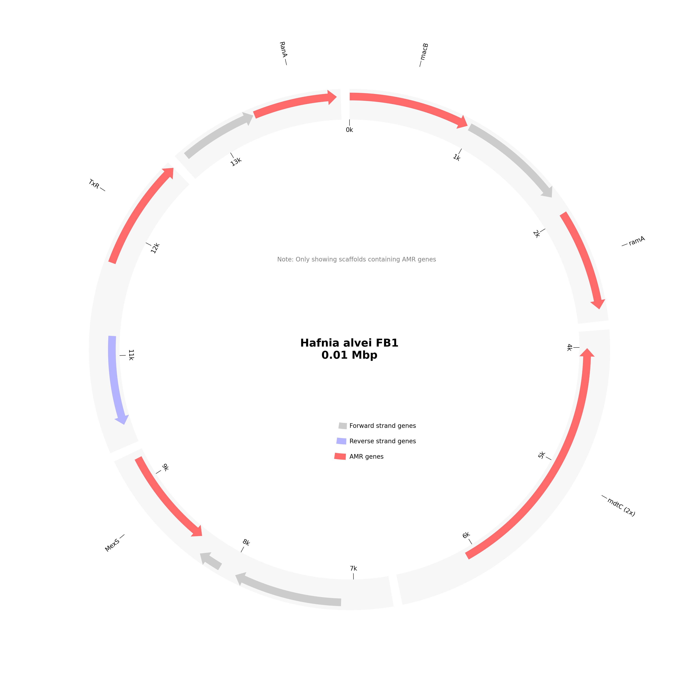

### MexS
- **Mechanism**: antibiotic efflux
- **Drug Classes**: fluoroquinolone antibiotic; diaminopyrimidine antibiotic; phenicol antibiotic
- **AMR Family**: resistance-nodulation-cell division (RND) antibiotic efflux pump
- **Locations**:
  - gnl|SPADES|CAEEGBCP_3970_4 : position 1935-2921

### RanA
- **Mechanism**: antibiotic efflux
- **Drug Classes**: aminoglycoside antibiotic
- **AMR Family**: ATP-binding cassette (ABC) antibiotic efflux pump
- **Locations**:
  - gnl|SPADES|CAEEGBCP_7306_2 : position 806-1579

### TxR
- **Mechanism**: antibiotic efflux
- **Drug Classes**: tetracycline antibiotic
- **AMR Family**: ATP-binding cassette (ABC) antibiotic efflux pump
- **Locations**:
  - gnl|SPADES|CAEEGBCP_4262_3 : position 1750-2790

### macB
- **Mechanism**: antibiotic efflux
- **Drug Classes**: macrolide antibiotic
- **AMR Family**: ATP-binding cassette (ABC) antibiotic efflux pump
- **Locations**:
  - gnl|SPADES|CAEEGBCP_3528_1 : position 2-1120

### mdtC (found in 2 locations)
- **Mechanism**: antibiotic efflux
- **Drug Classes**: aminocoumarin antibiotic
- **AMR Family**: resistance-nodulation-cell division (RND) antibiotic efflux pump
- **Locations**:
  - gnl|SPADES|CAEEGBCP_3574_1 : position 165-2609
  - gnl|SPADES|CAEEGBCP_3574_2 : position 2638-3261

### ramA
- **Mechanism**: antibiotic efflux; reduced permeability to antibiotic
- **Drug Classes**: fluoroquinolone antibiotic; monobactam; carbapenem; cephalosporin; glycylcycline; cephamycin; penam; tetracycline antibiotic; rifamycin antibiotic; phenicol antibiotic; penem; disinfecting agents and antiseptics
- **AMR Family**: resistance-nodulation-cell division (RND) antibiotic efflux pump; General Bacterial Porin with reduced permeability to beta-lactams
- **Locations**:
  - gnl|SPADES|CAEEGBCP_3528_3 : position 2313-3254

## Hafnia paralvei
**Strain Statistics:**
- Total genome length: 4368.1 kbp
- Total scaffolds: 367
- Scaffolds with AMR genes: 89
- Total genes annotated: 7981
- Total AMR genes: 432
- Unique AMR genes: 212
- Distinct AMR mechanisms: 11
- Distinct AMR families: 73
- Distinct drug classes: 37

**Circos Plot:**

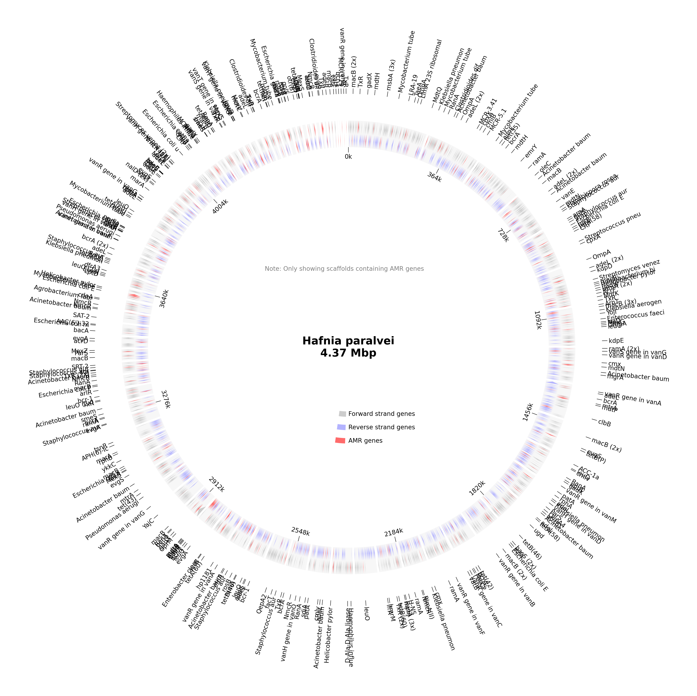

### AAC(6')-32
- **Mechanism**: antibiotic inactivation
- **Drug Classes**: aminoglycoside antibiotic
- **AMR Family**: AAC(6')
- **Locations**:
  - gnl|SPADES|CAEEGBCP_250_26 : position 28514-29116

### AAC(6')-Iu
- **Mechanism**: antibiotic inactivation
- **Drug Classes**: aminoglycoside antibiotic
- **AMR Family**: AAC(6')
- **Locations**:
  - gnl|SPADES|CAEEGBCP_13_77 : position 80675-81133

### ACC-1a
- **Mechanism**: antibiotic inactivation
- **Drug Classes**: monobactam; cephalosporin; cephamycin; penam; oxacephem
- **AMR Family**: ACC beta-lactamase
- **Locations**:
  - gnl|SPADES|CAEEGBCP_55_3: position 3734-4906

### ALI-2
- **Mechanism**: antibiotic inactivation
- **Drug Classes**: carbapenem
- **AMR Family**: ALI beta-lactamase
- **Locations**:
  - gnl|SPADES|CAEEGBCP_85_23 : position 21407-22285

### APH(6)-Ic
- **Mechanism**: antibiotic inactivation
- **Drug Classes**: aminoglycoside antibiotic
- **AMR Family**: APH(6)
- **Locations**:
  - gnl|SPADES|CAEEGBCP_203_11 : position 13603-14406

### Acinetobacter baumannii AbaF (found in 6 locations)
- **Mechanism**: antibiotic efflux
- **Drug Classes**: phosphonic acid antibiotic
- **AMR Family**: major facilitator superfamily (MFS) antibiotic efflux pump
- **Locations**:
  - gnl|SPADES|CAEEGBCP_113_25 : position 31962-33296
  - gnl|SPADES|CAEEGBCP_218_29 : position 36345-37670
  - gnl|SPADES|CAEEGBCP_23_1 : position 279-1580
  - gnl|SPADES|CAEEGBCP_253_28 : position 32205-33434
  - gnl|SPADES|CAEEGBCP_29_70 : position 67543-69045
  - gnl|SPADES|CAEEGBCP_85_15 : position 12391-13932

### Acinetobacter baumannii AbaQ (found in 7 locations)
- **Mechanism**: antibiotic efflux
- **Drug Classes**: fluoroquinolone antibiotic
- **AMR Family**: major facilitator superfamily (MFS) antibiotic efflux pump
- **Locations**:
  - gnl|SPADES|CAEEGBCP_13_57 : position 60640-61932
  - gnl|SPADES|CAEEGBCP_171_33 : position 36597-37934
  - gnl|SPADES|CAEEGBCP_234_5 : position 4964-6187
  - gnl|SPADES|CAEEGBCP_23_48 : position 63301-64647
  - gnl|SPADES|CAEEGBCP_320_12 : position 12514-13809
  - gnl|SPADES|CAEEGBCP_34_76 : position 76853-78229
  - gnl|SPADES|CAEEGBCP_56_75 : position 84384-85712

### AcrE
- **Mechanism**: antibiotic efflux
- **Drug Classes**: fluoroquinolone antibiotic; cephalosporin; cephamycin; penam
- **AMR Family**: resistance-nodulation-cell division (RND) antibiotic efflux pump
- **Locations**:
  - gnl|SPADES|CAEEGBCP_27_101 : position 113459-114622

### AcrF
- **Mechanism**: antibiotic efflux
- **Drug Classes**: fluoroquinolone antibiotic; cephalosporin; cephamycin; penam
- **AMR Family**: resistance-nodulation-cell division (RND) antibiotic efflux pump
- **Locations**:
  - gnl|SPADES|CAEEGBCP_27_100 : position 110298-113420

### Agrobacterium fabrum chloramphenicol acetyltransferase
- **Mechanism**: antibiotic inactivation
- **Drug Classes**: phenicol antibiotic
- **AMR Family**: chloramphenicol acetyltransferase (CAT)
- **Locations**:
  - gnl|SPADES|CAEEGBCP_273_17 : position 19623-20177

### ArnT
- **Mechanism**: antibiotic target alteration
- **Drug Classes**: peptide antibiotic
- **AMR Family**: pmr phosphoethanolamine transferase
- **Locations**:
  - gnl|SPADES|CAEEGBCP_29_7: position 4590-6239

### Bifidobacterium bifidum ileS conferring resistance to mupirocin
- **Mechanism**: antibiotic target alteration
- **Drug Classes**: mupirocin-like antibiotic
- **AMR Family**: antibiotic-resistant isoleucyl-tRNA synthetase (ileS)
- **Locations**:
  - gnl|SPADES|CAEEGBCP_27_71 : position 81422-84004

### CRP (found in 2 locations)
- **Mechanism**: antibiotic efflux
- **Drug Classes**: macrolide antibiotic; fluoroquinolone antibiotic; penam
- **AMR Family**: resistance-nodulation-cell division (RND) antibiotic efflux pump
- **Locations**:
  - gnl|SPADES|CAEEGBCP_25_73: position 50491-51123
  - gnl|SPADES|CAEEGBCP_479_6 : position 6911-7708

### Clostridioides difficile gyrA conferring resistance to fluoroquinolones
- **Mechanism**: antibiotic target alteration
- **Drug Classes**: fluoroquinolone antibiotic
- **AMR Family**: fluoroquinolone resistant gyrA
- **Locations**:
  - gnl|SPADES|CAEEGBCP_1722_2 : position 1029-3677

### Clostridioides difficile gyrB conferring resistance to fluoroquinolones (found in 2 locations)
- **Mechanism**: antibiotic target alteration
- **Drug Classes**: fluoroquinolone antibiotic
- **AMR Family**: fluoroquinolone resistant gyrB
- **Locations**:
  - gnl|SPADES|CAEEGBCP_13_49 : position 52627-55041
  - gnl|SPADES|CAEEGBCP_723_1 : position 3-1898

### D-Ala-D-Ala ligase
- **Mechanism**: antibiotic target alteration
- **Drug Classes**: glycopeptide antibiotic
- **AMR Family**: Van ligase
- **Locations**:
  - gnl|SPADES|CAEEGBCP_83_16 : position 17641-18561

### EVM-1
- **Mechanism**: antibiotic inactivation
- **Drug Classes**: carbapenem
- **AMR Family**: EVM beta-lactamase
- **Locations**:
  - gnl|SPADES|CAEEGBCP_5_62 : position 66993-67814

### Enterobacter cloacae acrA
- **Mechanism**: antibiotic efflux
- **Drug Classes**: fluoroquinolone antibiotic; cephalosporin; glycylcycline; penam; tetracycline antibiotic; rifamycin antibiotic; phenicol antibiotic; disinfecting agents and antiseptics
- **AMR Family**: resistance-nodulation-cell division (RND) antibiotic efflux pump
- **Locations**:
  - gnl|SPADES|CAEEGBCP_116_42 : position 47231-48421

### Enterococcus faecium cls conferring resistance to daptomycin
- **Mechanism**: antibiotic target alteration
- **Drug Classes**: peptide antibiotic
- **AMR Family**: daptomycin resistant cls
- **Locations**:
  - gnl|SPADES|CAEEGBCP_29_50 : position 50006-51466

### ErmX
- **Mechanism**: antibiotic target alteration
- **Drug Classes**: macrolide antibiotic; lincosamide antibiotic; streptogramin antibiotic; streptogramin A antibiotic; streptogramin B antibiotic
- **AMR Family**: Erm 23S ribosomal RNA methyltransferase
- **Locations**:
  - gnl|SPADES|CAEEGBCP_285_13 : position 14956-15768

### Escherichia coli AcrAB-TolC with AcrR mutation conferring resistance to ciprofloxacin, tetracycline, and ceftazidime
- **Mechanism**: antibiotic target alteration; antibiotic efflux
- **Drug Classes**: fluoroquinolone antibiotic; cephalosporin; glycylcycline; penam; tetracycline antibiotic; rifamycin antibiotic; phenicol antibiotic; disinfecting agents and antiseptics
- **AMR Family**: resistance-nodulation-cell division (RND) antibiotic efflux pump
- **Locations**:
  - gnl|SPADES|CAEEGBCP_116_43 : position 48561-49265

### Escherichia coli AcrAB-TolC with MarR mutations conferring resistance to ciprofloxacin and tetracycline (found in 2 locations)
- **Mechanism**: antibiotic target alteration; antibiotic efflux
- **Drug Classes**: fluoroquinolone antibiotic; cephalosporin; glycylcycline; penam; tetracycline antibiotic; rifamycin antibiotic; phenicol antibiotic; disinfecting agents and antiseptics
- **AMR Family**: resistance-nodulation-cell division (RND) antibiotic efflux pump
- **Locations**:
  - gnl|SPADES|CAEEGBCP_103_29 : position 30797-31228
  - gnl|SPADES|CAEEGBCP_479_15 : position 16852-17343

### Escherichia coli EF-Tu mutants conferring resistance to Enacyloxin IIa
- **Mechanism**: antibiotic target alteration
- **Drug Classes**: elfamycin antibiotic
- **AMR Family**: elfamycin resistant EF-Tu
- **Locations**:
  - gnl|SPADES|CAEEGBCP_59_26 : position 23180-25882

### Escherichia coli EF-Tu mutants conferring resistance to Pulvomycin (found in 2 locations)
- **Mechanism**: antibiotic target alteration
- **Drug Classes**: elfamycin antibiotic
- **AMR Family**: elfamycin resistant EF-Tu
- **Locations**:
  - gnl|SPADES|CAEEGBCP_25_48 : position 27825-29009
  - gnl|SPADES|CAEEGBCP_282_7 : position 6063-7247

### Escherichia coli PtsI with mutation conferring resistance to fosfomycin
- **Mechanism**: antibiotic target alteration
- **Drug Classes**: phosphonic acid antibiotic
- **AMR Family**: antibiotic-resistant ptsI phosphotransferase
- **Locations**:
  - gnl|SPADES|CAEEGBCP_231_13 : position 14736-16463

### Escherichia coli acrA
- **Mechanism**: antibiotic efflux
- **Drug Classes**: fluoroquinolone antibiotic; cephalosporin; glycylcycline; penam; tetracycline antibiotic; rifamycin antibiotic; phenicol antibiotic; disinfecting agents and antiseptics
- **AMR Family**: resistance-nodulation-cell division (RND) antibiotic efflux pump
- **Locations**:
  - gnl|SPADES|CAEEGBCP_855_4 : position 2833-4020

### Escherichia coli mdfA (found in 2 locations)
- **Mechanism**: antibiotic efflux
- **Drug Classes**: tetracycline antibiotic; phenicol antibiotic; disinfecting agents and antiseptics
- **AMR Family**: major facilitator superfamily (MFS) antibiotic efflux pump
- **Locations**:
  - gnl|SPADES|CAEEGBCP_250_24 : position 25230-26450
  - gnl|SPADES|CAEEGBCP_323_13 : position 15992-17224

### Escherichia coli soxS with mutation conferring antibiotic resistance (found in 4 locations)
- **Mechanism**: antibiotic target alteration; antibiotic efflux; reduced permeability to antibiotic
- **Drug Classes**: fluoroquinolone antibiotic; monobactam; carbapenem; cephalosporin; glycylcycline; cephamycin; penam; tetracycline antibiotic; rifamycin antibiotic; phenicol antibiotic; penem; disinfecting agents and antiseptics
- **AMR Family**: ATP-binding cassette (ABC) antibiotic efflux pump; major facilitator superfamily (MFS) antibiotic efflux pump; resistance-nodulation-cell division (RND) antibiotic efflux pump; General Bacterial Porin with reduced permeability to beta-lactams
- **Locations**:
  - gnl|SPADES|CAEEGBCP_174_31 : position 39262-40140
  - gnl|SPADES|CAEEGBCP_27_93 : position 102990-103811
  - gnl|SPADES|CAEEGBCP_29_75 : position 72428-72799
  - gnl|SPADES|CAEEGBCP_55_69 : position 84465-85328

### Escherichia coli uhpA with mutation conferring resistance to fosfomycin
- **Mechanism**: antibiotic target alteration
- **Drug Classes**: phosphonic acid antibiotic
- **AMR Family**: antibiotic-resistant UhpT
- **Locations**:
  - gnl|SPADES|CAEEGBCP_437_16 : position 12923-13639

### FosC2
- **Mechanism**: antibiotic inactivation
- **Drug Classes**: phosphonic acid antibiotic
- **AMR Family**: fosC phosphotransferase family
- **Locations**:
  - gnl|SPADES|CAEEGBCP_61_79 : position 65183-65647

### H-NS
- **Mechanism**: antibiotic efflux
- **Drug Classes**: macrolide antibiotic; fluoroquinolone antibiotic; cephalosporin; cephamycin; penam; tetracycline antibiotic
- **AMR Family**: major facilitator superfamily (MFS) antibiotic efflux pump; resistance-nodulation-cell division (RND) antibiotic efflux pump
- **Locations**:
  - gnl|SPADES|CAEEGBCP_73_1 : position 295-702

### Haemophilus influenzae PBP3 conferring resistance to beta-lactam antibiotics (found in 2 locations)
- **Mechanism**: antibiotic target alteration
- **Drug Classes**: cephalosporin; cephamycin; penam
- **AMR Family**: Penicillin-binding protein mutations conferring resistance to beta-lactam antibiotics
- **Locations**:
  - gnl|SPADES|CAEEGBCP_486_12 : position 10077-11849
  - gnl|SPADES|CAEEGBCP_83_8 : position 6737-8500

### Helicobacter pylori pbp1 mutants conferring resistance to amoxicillin (found in 2 locations)
- **Mechanism**: antibiotic target alteration
- **Drug Classes**: cephalosporin; cephamycin; penam
- **AMR Family**: Penicillin-binding protein mutations conferring resistance to beta-lactam antibiotics
- **Locations**:
  - gnl|SPADES|CAEEGBCP_35_89 : position 98272-100545
  - gnl|SPADES|CAEEGBCP_83_60 : position 69528-72107

### Helicobacter pylori pbp2 mutants conferring resistance to amoxicillin
- **Mechanism**: antibiotic target alteration
- **Drug Classes**: cephalosporin; cephamycin; penam
- **AMR Family**: Penicillin-binding protein mutations conferring resistance to beta-lactam antibiotics
- **Locations**:
  - gnl|SPADES|CAEEGBCP_27_77 : position 87493-89388

### Helicobacter pylori rpoB mutation conferring resistance to rifampicin
- **Mechanism**: antibiotic target alteration; antibiotic target replacement
- **Drug Classes**: fluoroquinolone antibiotic; rifamycin antibiotic
- **AMR Family**: rifamycin-resistant beta-subunit of RNA polymerase (rpoB)
- **Locations**:
  - gnl|SPADES|CAEEGBCP_282_15 : position 15537-19757

### Klebsiella aerogenes Omp36
- **Mechanism**: reduced permeability to antibiotic
- **Drug Classes**: monobactam; carbapenem; cephalosporin; cephamycin; penam; penem
- **AMR Family**: General Bacterial Porin with reduced permeability to beta-lactams
- **Locations**:
  - gnl|SPADES|CAEEGBCP_29_22 : position 22094-23242

### Klebsiella pneumoniae KpnE
- **Mechanism**: antibiotic efflux
- **Drug Classes**: macrolide antibiotic; aminoglycoside antibiotic; cephalosporin; tetracycline antibiotic; peptide antibiotic; rifamycin antibiotic; disinfecting agents and antiseptics
- **AMR Family**: small multidrug resistance (SMR) antibiotic efflux pump
- **Locations**:
  - gnl|SPADES|CAEEGBCP_17_29 : position 30318-30749

### Klebsiella pneumoniae KpnF
- **Mechanism**: antibiotic efflux
- **Drug Classes**: macrolide antibiotic; aminoglycoside antibiotic; cephalosporin; tetracycline antibiotic; peptide antibiotic; rifamycin antibiotic; disinfecting agents and antiseptics
- **AMR Family**: small multidrug resistance (SMR) antibiotic efflux pump
- **Locations**:
  - gnl|SPADES|CAEEGBCP_17_28: position 30002-30331

### Klebsiella pneumoniae KpnG
- **Mechanism**: antibiotic efflux
- **Drug Classes**: macrolide antibiotic; fluoroquinolone antibiotic; aminoglycoside antibiotic; carbapenem; cephalosporin; penam; peptide antibiotic; penem
- **AMR Family**: major facilitator superfamily (MFS) antibiotic efflux pump
- **Locations**:
  - gnl|SPADES|CAEEGBCP_35_53 : position 53109-54284

### Klebsiella pneumoniae KpnH (found in 2 locations)
- **Mechanism**: antibiotic efflux
- **Drug Classes**: macrolide antibiotic; fluoroquinolone antibiotic; aminoglycoside antibiotic; carbapenem; cephalosporin; penam; peptide antibiotic; penem
- **AMR Family**: major facilitator superfamily (MFS) antibiotic efflux pump
- **Locations**:
  - gnl|SPADES|CAEEGBCP_13_2 : position 1107-2546
  - gnl|SPADES|CAEEGBCP_35_54: position 54302-55837

### Klebsiella pneumoniae OmpK37 (found in 6 locations)
- **Mechanism**: reduced permeability to antibiotic
- **Drug Classes**: monobactam; carbapenem; cephalosporin; cephamycin; penam; penem
- **AMR Family**: General Bacterial Porin with reduced permeability to beta-lactams
- **Locations**:
  - gnl|SPADES|CAEEGBCP_302_16 : position 12055-13155
  - gnl|SPADES|CAEEGBCP_56_32 : position 33512-34654
  - gnl|SPADES|CAEEGBCP_5_166 : position 191993-193108
  - gnl|SPADES|CAEEGBCP_621_9 : position 8547-9650
  - gnl|SPADES|CAEEGBCP_72_16 : position 13600-14712
  - gnl|SPADES|CAEEGBCP_83_61 : position 72289-73428

### Klebsiella pneumoniae acrR with mutation conferring multidrug antibiotic resistance
- **Mechanism**: antibiotic target alteration; antibiotic efflux
- **Drug Classes**: fluoroquinolone antibiotic; cephalosporin; glycylcycline; penam; tetracycline antibiotic; rifamycin antibiotic; phenicol antibiotic; disinfecting agents and antiseptics
- **AMR Family**: resistance-nodulation-cell division (RND) antibiotic efflux pump
- **Locations**:
  - gnl|SPADES|CAEEGBCP_27_102 : position 115215-115829

### LRA-19
- **Mechanism**: antibiotic inactivation
- **Drug Classes**: cephalosporin; penam
- **AMR Family**: subclass B3 LRA beta-lactamase
- **Locations**:
  - gnl|SPADES|CAEEGBCP_5_164 : position 189785-190432

### LlmA 23S ribosomal RNA methyltransferase
- **Mechanism**: antibiotic target alteration
- **Drug Classes**: lincosamide antibiotic
- **AMR Family**: Llm 23S ribosomal RNA methyltransferase
- **Locations**:
  - gnl|SPADES|CAEEGBCP_5_195 : position 228029-229222

### LptD
- **Mechanism**: antibiotic efflux
- **Drug Classes**: carbapenem; peptide antibiotic; aminocoumarin antibiotic; rifamycin antibiotic
- **AMR Family**: ATP-binding cassette (ABC) antibiotic efflux pump
- **Locations**:
  - gnl|SPADES|CAEEGBCP_285_10 : position 10157-12559

### MCR-10.4
- **Mechanism**: antibiotic target alteration
- **Drug Classes**: peptide antibiotic
- **AMR Family**: MCR phosphoethanolamine transferase
- **Locations**:
  - gnl|SPADES|CAEEGBCP_57_75 : position 82899-84533

### MCR-3.29
- **Mechanism**: antibiotic target alteration
- **Drug Classes**: peptide antibiotic
- **AMR Family**: MCR phosphoethanolamine transferase
- **Locations**:
  - gnl|SPADES|CAEEGBCP_12290_1 : position 3-683

### MCR-3.4
- **Mechanism**: antibiotic target alteration
- **Drug Classes**: peptide antibiotic
- **AMR Family**: MCR phosphoethanolamine transferase
- **Locations**:
  - gnl|SPADES|CAEEGBCP_486_13 : position 12214-13821

### MCR-3.41
- **Mechanism**: antibiotic target alteration
- **Drug Classes**: peptide antibiotic
- **AMR Family**: MCR phosphoethanolamine transferase
- **Locations**:
  - gnl|SPADES|CAEEGBCP_13_131 : position 134227-135849

### MCR-5.1
- **Mechanism**: antibiotic target alteration
- **Drug Classes**: peptide antibiotic
- **AMR Family**: MCR phosphoethanolamine transferase
- **Locations**:
  - gnl|SPADES|CAEEGBCP_13_167 : position 171734-173461

### MdtK
- **Mechanism**: antibiotic efflux
- **Drug Classes**: fluoroquinolone antibiotic
- **AMR Family**: multidrug and toxic compound extrusion (MATE) transporter
- **Locations**:
  - gnl|SPADES|CAEEGBCP_27_109 : position 122000-123457

### MdtQ
- **Mechanism**: reduced permeability to antibiotic
- **Drug Classes**: monobactam; carbapenem; cephalosporin; cephamycin; penam; penem
- **AMR Family**: Outer Membrane Porin (Opr)
- **Locations**:
  - gnl|SPADES|CAEEGBCP_5_222 : position 265455-266960

### MexG
- **Mechanism**: antibiotic efflux
- **Drug Classes**: fluoroquinolone antibiotic; tetracycline antibiotic; disinfecting agents and antiseptics
- **AMR Family**: resistance-nodulation-cell division (RND) antibiotic efflux pump
- **Locations**:
  - gnl|SPADES|CAEEGBCP_29_65 : position 64457-64873

### MexS (found in 6 locations)
- **Mechanism**: antibiotic efflux
- **Drug Classes**: fluoroquinolone antibiotic; diaminopyrimidine antibiotic; phenicol antibiotic
- **AMR Family**: resistance-nodulation-cell division (RND) antibiotic efflux pump
- **Locations**:
  - gnl|SPADES|CAEEGBCP_1195_2 : position 727-1758
  - gnl|SPADES|CAEEGBCP_124_36 : position 40431-41450
  - gnl|SPADES|CAEEGBCP_174_23 : position 30815-31816
  - gnl|SPADES|CAEEGBCP_23_87 : position 95375-96352
  - gnl|SPADES|CAEEGBCP_593_2 : position 232-1218
  - gnl|SPADES|CAEEGBCP_61_75 : position 60631-61755

### MexT
- **Mechanism**: antibiotic efflux
- **Drug Classes**: fluoroquinolone antibiotic; diaminopyrimidine antibiotic; phenicol antibiotic
- **AMR Family**: resistance-nodulation-cell division (RND) antibiotic efflux pump
- **Locations**:
  - gnl|SPADES|CAEEGBCP_423_15 : position 15208-16101

### MexV
- **Mechanism**: antibiotic efflux
- **Drug Classes**: macrolide antibiotic; fluoroquinolone antibiotic; tetracycline antibiotic; phenicol antibiotic; disinfecting agents and antiseptics
- **AMR Family**: resistance-nodulation-cell division (RND) antibiotic efflux pump
- **Locations**:
  - gnl|SPADES|CAEEGBCP_669_12 : position 12475-13992

### MexZ
- **Mechanism**: antibiotic efflux
- **Drug Classes**: macrolide antibiotic; fluoroquinolone antibiotic; aminoglycoside antibiotic; carbapenem; cephalosporin; cephamycin; penam; tetracycline antibiotic; phenicol antibiotic; disinfecting agents and antiseptics
- **AMR Family**: resistance-nodulation-cell division (RND) antibiotic efflux pump
- **Locations**:
  - gnl|SPADES|CAEEGBCP_241_32 : position 35619-36224

### Mycobacterium tuberculosis gidB mutation conferring resistance to streptomycin
- **Mechanism**: antibiotic target alteration
- **Drug Classes**: aminoglycoside antibiotic
- **AMR Family**: antibiotic resistant gidB
- **Locations**:
  - gnl|SPADES|CAEEGBCP_13_16 : position 18287-18907

### Mycobacterium tuberculosis ndh with mutation conferring resistance to isoniazid
- **Mechanism**: antibiotic target alteration
- **Drug Classes**: isoniazid-like antibiotic
- **AMR Family**: antibiotic resistant ndh
- **Locations**:
  - gnl|SPADES|CAEEGBCP_17_3 : position 4617-5921

### Mycobacterium tuberculosis pncA mutations conferring resistance to pyrazinamide
- **Mechanism**: antibiotic target alteration
- **Drug Classes**: pyrazine antibiotic
- **AMR Family**: Pyrazinamide resistant pncA
- **Locations**:
  - gnl|SPADES|CAEEGBCP_805_4 : position 2015-2650

### Mycobacterium tuberculosis rpoB mutations conferring resistance to rifampicin
- **Mechanism**: antibiotic target alteration; antibiotic target replacement
- **Drug Classes**: rifamycin antibiotic
- **AMR Family**: rifamycin-resistant beta-subunit of RNA polymerase (rpoB)
- **Locations**:
  - gnl|SPADES|CAEEGBCP_282_14 : position 11366-15394

### Mycobacterium tuberculosis rpsA mutations conferring resistance to pyrazinamide
- **Mechanism**: antibiotic target alteration
- **Drug Classes**: pyrazine antibiotic
- **AMR Family**: pyrazinamide resistant rpsA
- **Locations**:
  - gnl|SPADES|CAEEGBCP_5_139 : position 157531-159210

### Mycobacterium tuberculosis thyA with mutation conferring resistance to para-aminosalicylic acid
- **Mechanism**: antibiotic target alteration
- **Drug Classes**: salicylic acid antibiotic
- **AMR Family**: aminosalicylate resistant thymidylate synthase
- **Locations**:
  - gnl|SPADES|CAEEGBCP_330_11 : position 17356-18150

### NmcR (found in 9 locations)
- **Mechanism**: antibiotic inactivation
- **Drug Classes**: carbapenem; cephalosporin; cephamycin; penam
- **AMR Family**: NmcA beta-lactamase
- **Locations**:
  - gnl|SPADES|CAEEGBCP_1323_1 : position 83-988
  - gnl|SPADES|CAEEGBCP_234_1 : position 168-1097
  - gnl|SPADES|CAEEGBCP_253_31 : position 35807-36634
  - gnl|SPADES|CAEEGBCP_273_3 : position 2693-3652
  - gnl|SPADES|CAEEGBCP_430_1 : position 33-926
  - gnl|SPADES|CAEEGBCP_430_13 : position 15060-15932
  - gnl|SPADES|CAEEGBCP_56_60 : position 71448-72353
  - gnl|SPADES|CAEEGBCP_72_50 : position 46848-47822
  - gnl|SPADES|CAEEGBCP_93_37 : position 30799-31695

### OmpA (found in 4 locations)
- **Mechanism**: reduced permeability to antibiotic
- **Drug Classes**: peptide antibiotic
- **AMR Family**: General Bacterial Porin with reduced permeability to peptide antibiotics
- **Locations**:
  - gnl|SPADES|CAEEGBCP_13_73 : position 77625-78284
  - gnl|SPADES|CAEEGBCP_27_2 : position 1312-1827
  - gnl|SPADES|CAEEGBCP_29_71 : position 69618-70109
  - gnl|SPADES|CAEEGBCP_5_185 : position 217912-218970

### OprM
- **Mechanism**: antibiotic efflux
- **Drug Classes**: macrolide antibiotic; fluoroquinolone antibiotic; monobactam; aminoglycoside antibiotic; carbapenem; cephalosporin; cephamycin; penam; tetracycline antibiotic; peptide antibiotic; aminocoumarin antibiotic; diaminopyrimidine antibiotic; sulfonamide antibiotic; phenicol antibiotic; penem; disinfecting agents and antiseptics
- **AMR Family**: resistance-nodulation-cell division (RND) antibiotic efflux pump
- **Locations**:
  - gnl|SPADES|CAEEGBCP_138_2 : position 13084-14445

### ParR (found in 2 locations)
- **Mechanism**: antibiotic efflux; reduced permeability to antibiotic
- **Drug Classes**: macrolide antibiotic; fluoroquinolone antibiotic; monobactam; aminoglycoside antibiotic; carbapenem; cephalosporin; cephamycin; penam; tetracycline antibiotic; phenicol antibiotic; penem; disinfecting agents and antiseptics
- **AMR Family**: resistance-nodulation-cell division (RND) antibiotic efflux pump; Outer Membrane Porin (Opr)
- **Locations**:
  - gnl|SPADES|CAEEGBCP_25_112 : position 95410-96129
  - gnl|SPADES|CAEEGBCP_56_52 : position 61053-61766

### ParS (found in 2 locations)
- **Mechanism**: antibiotic efflux; reduced permeability to antibiotic
- **Drug Classes**: macrolide antibiotic; fluoroquinolone antibiotic; monobactam; aminoglycoside antibiotic; carbapenem; cephalosporin; cephamycin; penam; tetracycline antibiotic; phenicol antibiotic; penem; disinfecting agents and antiseptics
- **AMR Family**: resistance-nodulation-cell division (RND) antibiotic efflux pump; Outer Membrane Porin (Opr)
- **Locations**:
  - gnl|SPADES|CAEEGBCP_241_24 : position 28936-30597
  - gnl|SPADES|CAEEGBCP_56_51 : position 59718-61046

### Planobispora rosea EF-Tu mutants conferring resistance to inhibitor GE2270A
- **Mechanism**: antibiotic target alteration
- **Drug Classes**: elfamycin antibiotic
- **AMR Family**: elfamycin resistant EF-Tu
- **Locations**:
  - gnl|SPADES|CAEEGBCP_23_107 : position 120702-122570

### PmrF
- **Mechanism**: antibiotic target alteration
- **Drug Classes**: peptide antibiotic
- **AMR Family**: pmr phosphoethanolamine transferase
- **Locations**:
  - gnl|SPADES|CAEEGBCP_29_10 : position 9135-10151

### Pseudomonas aeruginosa CpxR
- **Mechanism**: antibiotic efflux
- **Drug Classes**: macrolide antibiotic; fluoroquinolone antibiotic; monobactam; aminoglycoside antibiotic; carbapenem; cephalosporin; cephamycin; penam; tetracycline antibiotic; peptide antibiotic; aminocoumarin antibiotic; diaminopyrimidine antibiotic; sulfonamide antibiotic; phenicol antibiotic; penem
- **AMR Family**: resistance-nodulation-cell division (RND) antibiotic efflux pump
- **Locations**:
  - gnl|SPADES|CAEEGBCP_13_142 : position 145438-146136

### Pseudomonas aeruginosa ampR with mutation conferring resistance to aztreonam (found in 3 locations)
- **Mechanism**: antibiotic target alteration; antibiotic inactivation
- **Drug Classes**: monobactam; carbapenem; cephalosporin
- **AMR Family**: PDC beta-lactamase; ampR transcriptional regulator with mutation conferring resistance to monobactam antibiotics
- **Locations**:
  - gnl|SPADES|CAEEGBCP_157_38 : position 45153-46070
  - gnl|SPADES|CAEEGBCP_320_24 : position 25819-26766
  - gnl|SPADES|CAEEGBCP_55_4 : position 5121-5987

### QepA2
- **Mechanism**: antibiotic efflux
- **Drug Classes**: fluoroquinolone antibiotic
- **AMR Family**: major facilitator superfamily (MFS) antibiotic efflux pump
- **Locations**:
  - gnl|SPADES|CAEEGBCP_97_32 : position 31620-33026

### QepA4
- **Mechanism**: antibiotic efflux
- **Drug Classes**: fluoroquinolone antibiotic
- **AMR Family**: major facilitator superfamily (MFS) antibiotic efflux pump
- **Locations**:
  - gnl|SPADES|CAEEGBCP_56_59 : position 69995-71278

### RanA (found in 13 locations)
- **Mechanism**: antibiotic efflux
- **Drug Classes**: aminoglycoside antibiotic
- **AMR Family**: ATP-binding cassette (ABC) antibiotic efflux pump
- **Locations**:
  - gnl|SPADES|CAEEGBCP_103_12 : position 14748-15374
  - gnl|SPADES|CAEEGBCP_138_21 : position 33779-35392
  - gnl|SPADES|CAEEGBCP_13_31 : position 33452-34228
  - gnl|SPADES|CAEEGBCP_231_31 : position 33575-34510
  - gnl|SPADES|CAEEGBCP_302_28 : position 22084-22914
  - gnl|SPADES|CAEEGBCP_422_10 : position 9882-10907
  - gnl|SPADES|CAEEGBCP_492_22 : position 19747-20823
  - gnl|SPADES|CAEEGBCP_55_39 : position 50334-51341
  - gnl|SPADES|CAEEGBCP_5_83 : position 90802-91935
  - gnl|SPADES|CAEEGBCP_73_21 : position 23015-24154
  - gnl|SPADES|CAEEGBCP_73_8 : position 10742-11728
  - gnl|SPADES|CAEEGBCP_73_9 : position 11725-12729
  - gnl|SPADES|CAEEGBCP_93_1 : position 823-1632

### RanB
- **Mechanism**: antibiotic efflux
- **Drug Classes**: aminoglycoside antibiotic
- **AMR Family**: ATP-binding cassette (ABC) antibiotic efflux pump
- **Locations**:
  - gnl|SPADES|CAEEGBCP_302_29 : position 22919-23701

### RlmA(II)
- **Mechanism**: antibiotic target alteration
- **Drug Classes**: macrolide antibiotic; lincosamide antibiotic
- **AMR Family**: non-erm 23S ribosomal RNA methyltransferase (G748)
- **Locations**:
  - gnl|SPADES|CAEEGBCP_72_46 : position 43293-44105

### SAT-2
- **Mechanism**: antibiotic inactivation
- **Drug Classes**: nucleoside antibiotic
- **AMR Family**: streptothricin acetyltransferase (SAT)
- **Locations**:
  - gnl|SPADES|CAEEGBCP_253_6 : position 6308-7036

### SRT-2
- **Mechanism**: antibiotic inactivation
- **Drug Classes**: cephalosporin
- **AMR Family**: SRT beta-lactamase
- **Locations**:
  - gnl|SPADES|CAEEGBCP_234_27 : position 34629-35768

### SatA
- **Mechanism**: antibiotic inactivation
- **Drug Classes**: nucleoside antibiotic
- **AMR Family**: streptothricin acetyltransferase (SAT)
- **Locations**:
  - gnl|SPADES|CAEEGBCP_29_81 : position 77496-77939

### Staphylococcus aureus GlpT with mutation conferring resistance to fosfomycin
- **Mechanism**: antibiotic target alteration
- **Drug Classes**: phosphonic acid antibiotic
- **AMR Family**: antibiotic-resistant GlpT
- **Locations**:
  - gnl|SPADES|CAEEGBCP_23_112 : position 126787-128142

### Staphylococcus aureus fusA with mutation conferring resistance to fusidic acid (found in 2 locations)
- **Mechanism**: antibiotic target alteration
- **Drug Classes**: fusidane antibiotic
- **AMR Family**: antibiotic resistant fusA
- **Locations**:
  - gnl|SPADES|CAEEGBCP_25_49 : position 29080-31194
  - gnl|SPADES|CAEEGBCP_97_1 : position 3-1580

### Staphylococcus aureus fusE with mutation conferring resistance to fusidic acid
- **Mechanism**: antibiotic target alteration
- **Drug Classes**: fusidane antibiotic
- **AMR Family**: antibiotic resistant fusE
- **Locations**:
  - gnl|SPADES|CAEEGBCP_25_28 : position 18125-18658

### Staphylococcus aureus mupA conferring resistance to mupirocin
- **Mechanism**: antibiotic target alteration
- **Drug Classes**: mupirocin-like antibiotic
- **AMR Family**: antibiotic-resistant isoleucyl-tRNA synthetase (ileS)
- **Locations**:
  - gnl|SPADES|CAEEGBCP_113_14 : position 16643-19492

### Staphylococcus aureus mupB conferring resistance to mupirocin
- **Mechanism**: antibiotic target alteration
- **Drug Classes**: mupirocin-like antibiotic
- **AMR Family**: antibiotic-resistant isoleucyl-tRNA synthetase (ileS)
- **Locations**:
  - gnl|SPADES|CAEEGBCP_234_22 : position 26735-29590

### Staphylococcus aureus murA with mutation conferring resistance to fosfomycin
- **Mechanism**: antibiotic target alteration
- **Drug Classes**: phosphonic acid antibiotic
- **AMR Family**: antibiotic-resistant murA transferase
- **Locations**:
  - gnl|SPADES|CAEEGBCP_302_34 : position 25838-27097

### Staphylococcus aureus pgsA mutations conferring resistance to daptomycin
- **Mechanism**: antibiotic target alteration
- **Drug Classes**: peptide antibiotic
- **AMR Family**: daptomycin resistant pgsA
- **Locations**:
  - gnl|SPADES|CAEEGBCP_208_44 : position 36187-36735

### Staphylococcus aureus walK with mutation conferring resistance to daptomycin
- **Mechanism**: antibiotic target alteration
- **Drug Classes**: peptide antibiotic
- **AMR Family**: daptomycin resistant walK
- **Locations**:
  - gnl|SPADES|CAEEGBCP_234_16 : position 19276-21150

### Streptococcus pneumoniae PBP2x conferring resistance to amoxicillin
- **Mechanism**: antibiotic target alteration
- **Drug Classes**: cephalosporin; cephamycin; penam
- **AMR Family**: Penicillin-binding protein mutations conferring resistance to beta-lactam antibiotics
- **Locations**:
  - gnl|SPADES|CAEEGBCP_25_104 : position 84058-86628

### Streptomyces rimosus otr(A)
- **Mechanism**: antibiotic target protection
- **Drug Classes**: tetracycline antibiotic
- **AMR Family**: tetracycline-resistant ribosomal protection protein
- **Locations**:
  - gnl|SPADES|CAEEGBCP_323_7 : position 9013-10836

### Streptomyces venezuelae rox (found in 3 locations)
- **Mechanism**: antibiotic inactivation
- **Drug Classes**: rifamycin antibiotic
- **AMR Family**: rifampin monooxygenase
- **Locations**:
  - gnl|SPADES|CAEEGBCP_27_57 : position 66401-67576
  - gnl|SPADES|CAEEGBCP_430_8 : position 7339-8517
  - gnl|SPADES|CAEEGBCP_430_9 : position 8604-9809

### TaeA (found in 2 locations)
- **Mechanism**: antibiotic efflux
- **Drug Classes**: pleuromutilin antibiotic
- **AMR Family**: ATP-binding cassette (ABC) antibiotic efflux pump
- **Locations**:
  - gnl|SPADES|CAEEGBCP_174_25 : position 32909-34576
  - gnl|SPADES|CAEEGBCP_5_176 : position 207563-209470

### TolC
- **Mechanism**: antibiotic efflux
- **Drug Classes**: macrolide antibiotic; fluoroquinolone antibiotic; aminoglycoside antibiotic; carbapenem; cephalosporin; glycylcycline; cephamycin; penam; tetracycline antibiotic; peptide antibiotic; aminocoumarin antibiotic; rifamycin antibiotic; phenicol antibiotic; penem; disinfecting agents and antiseptics
- **AMR Family**: ATP-binding cassette (ABC) antibiotic efflux pump; major facilitator superfamily (MFS) antibiotic efflux pump; resistance-nodulation-cell division (RND) antibiotic efflux pump
- **Locations**:
  - gnl|SPADES|CAEEGBCP_723_6 : position 4831-6312

### TxR (found in 15 locations)
- **Mechanism**: antibiotic efflux
- **Drug Classes**: tetracycline antibiotic
- **AMR Family**: ATP-binding cassette (ABC) antibiotic efflux pump
- **Locations**:
  - gnl|SPADES|CAEEGBCP_16500_1 : position 1-651
  - gnl|SPADES|CAEEGBCP_225_12 : position 13161-15422
  - gnl|SPADES|CAEEGBCP_234_10 : position 11188-12633
  - gnl|SPADES|CAEEGBCP_234_17 : position 21147-22541
  - gnl|SPADES|CAEEGBCP_23_19 : position 23681-25459
  - gnl|SPADES|CAEEGBCP_2560_4 : position 2361-4043
  - gnl|SPADES|CAEEGBCP_27_119 : position 133607-135139
  - gnl|SPADES|CAEEGBCP_323_4 : position 4433-5854
  - gnl|SPADES|CAEEGBCP_529_16 : position 15728-17068
  - gnl|SPADES|CAEEGBCP_5_32 : position 34571-37405
  - gnl|SPADES|CAEEGBCP_723_7 : position 6473-8428
  - gnl|SPADES|CAEEGBCP_73_33 : position 37793-38794
  - gnl|SPADES|CAEEGBCP_73_44 : position 48194-49780
  - gnl|SPADES|CAEEGBCP_771_4 : position 4116-5693
  - gnl|SPADES|CAEEGBCP_93_65 : position 59256-60707

### YajC
- **Mechanism**: antibiotic efflux
- **Drug Classes**: fluoroquinolone antibiotic; cephalosporin; glycylcycline; penam; tetracycline antibiotic; oxazolidinone antibiotic; glycopeptide antibiotic; rifamycin antibiotic; phenicol antibiotic; disinfecting agents and antiseptics
- **AMR Family**: resistance-nodulation-cell division (RND) antibiotic efflux pump
- **Locations**:
  - gnl|SPADES|CAEEGBCP_142_46 : position 33284-33616

### YojI
- **Mechanism**: antibiotic efflux
- **Drug Classes**: peptide antibiotic
- **AMR Family**: ATP-binding cassette (ABC) antibiotic efflux pump
- **Locations**:
  - gnl|SPADES|CAEEGBCP_29_33 : position 33061-33654

### aadT
- **Mechanism**: antibiotic efflux
- **Drug Classes**: macrolide antibiotic; tetracycline antibiotic; disinfecting agents and antiseptics
- **AMR Family**: major facilitator superfamily (MFS) antibiotic efflux pump
- **Locations**:
  - gnl|SPADES|CAEEGBCP_405_9 : position 10589-12058

### abeS
- **Mechanism**: antibiotic efflux
- **Drug Classes**: macrolide antibiotic; aminocoumarin antibiotic
- **AMR Family**: small multidrug resistance (SMR) antibiotic efflux pump
- **Locations**:
  - gnl|SPADES|CAEEGBCP_29_78 : position 74105-74449

### acrB
- **Mechanism**: antibiotic efflux
- **Drug Classes**: fluoroquinolone antibiotic; cephalosporin; glycylcycline; penam; tetracycline antibiotic; rifamycin antibiotic; phenicol antibiotic; disinfecting agents and antiseptics
- **AMR Family**: resistance-nodulation-cell division (RND) antibiotic efflux pump
- **Locations**:
  - gnl|SPADES|CAEEGBCP_116_41 : position 44033-47185

### acrD
- **Mechanism**: antibiotic efflux
- **Drug Classes**: aminoglycoside antibiotic
- **AMR Family**: resistance-nodulation-cell division (RND) antibiotic efflux pump
- **Locations**:
  - gnl|SPADES|CAEEGBCP_247_18 : position 18794-21940

### adeF
- **Mechanism**: antibiotic efflux
- **Drug Classes**: fluoroquinolone antibiotic; tetracycline antibiotic
- **AMR Family**: resistance-nodulation-cell division (RND) antibiotic efflux pump
- **Locations**:
  - gnl|SPADES|CAEEGBCP_855_5: position 4087-7197

### adeG
- **Mechanism**: antibiotic efflux
- **Drug Classes**: fluoroquinolone antibiotic; tetracycline antibiotic
- **AMR Family**: resistance-nodulation-cell division (RND) antibiotic efflux pump
- **Locations**:
  - gnl|SPADES|CAEEGBCP_103_27 : position 29518-30378

### adeL (found in 22 locations)
- **Mechanism**: antibiotic efflux
- **Drug Classes**: fluoroquinolone antibiotic; tetracycline antibiotic
- **AMR Family**: resistance-nodulation-cell division (RND) antibiotic efflux pump
- **Locations**:
  - gnl|SPADES|CAEEGBCP_103_24 : position 26266-27168
  - gnl|SPADES|CAEEGBCP_13_176 : position 185173-186099
  - gnl|SPADES|CAEEGBCP_13_89 : position 95176-96108
  - gnl|SPADES|CAEEGBCP_174_24 : position 31939-32841
  - gnl|SPADES|CAEEGBCP_23_36 : position 50556-51470
  - gnl|SPADES|CAEEGBCP_23_98 : position 110692-111612
  - gnl|SPADES|CAEEGBCP_27_105 : position 117099-117992
  - gnl|SPADES|CAEEGBCP_27_27 : position 28318-29253
  - gnl|SPADES|CAEEGBCP_29_83 : position 78294-79199
  - gnl|SPADES|CAEEGBCP_308_4 : position 2465-3358
  - gnl|SPADES|CAEEGBCP_34_47 : position 44265-45161
  - gnl|SPADES|CAEEGBCP_34_6 : position 3904-4797
  - gnl|SPADES|CAEEGBCP_35_12 : position 15040-15921
  - gnl|SPADES|CAEEGBCP_394_7 : position 7902-8807
  - gnl|SPADES|CAEEGBCP_422_7 : position 5918-6832
  - gnl|SPADES|CAEEGBCP_423_13 : position 13307-14233
  - gnl|SPADES|CAEEGBCP_55_17 : position 20334-21227
  - gnl|SPADES|CAEEGBCP_56_26 : position 28211-29119
  - gnl|SPADES|CAEEGBCP_57_3 : position 2790-3653
  - gnl|SPADES|CAEEGBCP_5_114 : position 124380-125279
  - gnl|SPADES|CAEEGBCP_711_6 : position 8463-9362
  - gnl|SPADES|CAEEGBCP_85_22 : position 20382-21278

### adeN
- **Mechanism**: antibiotic efflux
- **Drug Classes**: macrolide antibiotic; fluoroquinolone antibiotic; lincosamide antibiotic; carbapenem; cephalosporin; tetracycline antibiotic; rifamycin antibiotic; diaminopyrimidine antibiotic; phenicol antibiotic; penem
- **AMR Family**: resistance-nodulation-cell division (RND) antibiotic efflux pump
- **Locations**:
  - gnl|SPADES|CAEEGBCP_1092_7 : position 8621-9358

### adeR
- **Mechanism**: antibiotic efflux
- **Drug Classes**: glycylcycline; tetracycline antibiotic
- **AMR Family**: resistance-nodulation-cell division (RND) antibiotic efflux pump
- **Locations**:
  - gnl|SPADES|CAEEGBCP_2582_3 : position 1848-2864

### almE (found in 2 locations)
- **Mechanism**: antibiotic target alteration
- **Drug Classes**: peptide antibiotic
- **AMR Family**: polymyxin resistance operon; alm glycyltransferase
- **Locations**:
  - gnl|SPADES|CAEEGBCP_1271_6 : position 6967-8769
  - gnl|SPADES|CAEEGBCP_17_18 : position 18548-20230

### arlR (found in 2 locations)
- **Mechanism**: antibiotic efflux
- **Drug Classes**: fluoroquinolone antibiotic; disinfecting agents and antiseptics
- **AMR Family**: major facilitator superfamily (MFS) antibiotic efflux pump
- **Locations**:
  - gnl|SPADES|CAEEGBCP_231_2 : position 1482-2198
  - gnl|SPADES|CAEEGBCP_34_16 : position 12131-12811

### arnA (found in 2 locations)
- **Mechanism**: antibiotic target alteration
- **Drug Classes**: peptide antibiotic
- **AMR Family**: pmr phosphoethanolamine transferase
- **Locations**:
  - gnl|SPADES|CAEEGBCP_25_9 : position 5111-6058
  - gnl|SPADES|CAEEGBCP_29_9 : position 7153-9135

### bacA
- **Mechanism**: antibiotic target alteration
- **Drug Classes**: peptide antibiotic
- **AMR Family**: undecaprenyl pyrophosphate related proteins
- **Locations**:
  - gnl|SPADES|CAEEGBCP_250_8 : position 7695-8513

### baeR (found in 4 locations)
- **Mechanism**: antibiotic efflux
- **Drug Classes**: aminoglycoside antibiotic; aminocoumarin antibiotic
- **AMR Family**: resistance-nodulation-cell division (RND) antibiotic efflux pump
- **Locations**:
  - gnl|SPADES|CAEEGBCP_124_41 : position 46669-47394
  - gnl|SPADES|CAEEGBCP_218_17 : position 20860-21549
  - gnl|SPADES|CAEEGBCP_422_21 : position 20806-21507
  - gnl|SPADES|CAEEGBCP_489_16 : position 21007-21717

### baeS
- **Mechanism**: antibiotic efflux
- **Drug Classes**: aminoglycoside antibiotic; aminocoumarin antibiotic
- **AMR Family**: resistance-nodulation-cell division (RND) antibiotic efflux pump
- **Locations**:
  - gnl|SPADES|CAEEGBCP_124_42 : position 47400-48782

### basS (found in 3 locations)
- **Mechanism**: antibiotic target alteration; antibiotic efflux
- **Drug Classes**: peptide antibiotic
- **AMR Family**: pmr phosphoethanolamine transferase
- **Locations**:
  - gnl|SPADES|CAEEGBCP_422_20 : position 19373-20809
  - gnl|SPADES|CAEEGBCP_59_14 : position 10616-11689
  - gnl|SPADES|CAEEGBCP_59_75 : position 72700-74058

### bcr-1 (found in 7 locations)
- **Mechanism**: antibiotic efflux
- **Drug Classes**: bicyclomycin-like antibiotic
- **AMR Family**: major facilitator superfamily (MFS) antibiotic efflux pump
- **Locations**:
  - gnl|SPADES|CAEEGBCP_103_10 : position 12471-13697
  - gnl|SPADES|CAEEGBCP_11726_1 : position 2-784
  - gnl|SPADES|CAEEGBCP_124_35 : position 39051-40334
  - gnl|SPADES|CAEEGBCP_138_19 : position 31179-32387
  - gnl|SPADES|CAEEGBCP_225_26 : position 28640-29821
  - gnl|SPADES|CAEEGBCP_34_18 : position 14279-15481
  - gnl|SPADES|CAEEGBCP_621_4 : position 5106-6305

### bcrA (found in 8 locations)
- **Mechanism**: antibiotic efflux
- **Drug Classes**: peptide antibiotic
- **AMR Family**: ATP-binding cassette (ABC) antibiotic efflux pump
- **Locations**:
  - gnl|SPADES|CAEEGBCP_17_39 : position 43030-43821
  - gnl|SPADES|CAEEGBCP_218_8 : position 8547-9359
  - gnl|SPADES|CAEEGBCP_308_18 : position 20367-21425
  - gnl|SPADES|CAEEGBCP_308_23 : position 24394-25860
  - gnl|SPADES|CAEEGBCP_35_28 : position 31573-32391
  - gnl|SPADES|CAEEGBCP_61_68 : position 51973-53550
  - gnl|SPADES|CAEEGBCP_749_9 : position 8442-9959
  - gnl|SPADES|CAEEGBCP_93_60 : position 52811-53431

### catB9
- **Mechanism**: antibiotic inactivation
- **Drug Classes**: phenicol antibiotic
- **AMR Family**: chloramphenicol acetyltransferase (CAT)
- **Locations**:
  - gnl|SPADES|CAEEGBCP_479_17 : position 19185-19817

### cdeA
- **Mechanism**: antibiotic efflux
- **Drug Classes**: fluoroquinolone antibiotic; disinfecting agents and antiseptics
- **AMR Family**: multidrug and toxic compound extrusion (MATE) transporter
- **Locations**:
  - gnl|SPADES|CAEEGBCP_273_22 : position 22825-24174

### clbB
- **Mechanism**: antibiotic target alteration
- **Drug Classes**: lincosamide antibiotic; streptogramin antibiotic; streptogramin A antibiotic; oxazolidinone antibiotic; phenicol antibiotic; pleuromutilin antibiotic
- **AMR Family**: Cfr 23S ribosomal RNA methyltransferase
- **Locations**:
  - gnl|SPADES|CAEEGBCP_35_87 : position 95995-97254

### cmlB
- **Mechanism**: antibiotic efflux
- **Drug Classes**: phenicol antibiotic
- **AMR Family**: major facilitator superfamily (MFS) antibiotic efflux pump
- **Locations**:
  - gnl|SPADES|CAEEGBCP_13_154 : position 156514-157698

### cmlv (found in 3 locations)
- **Mechanism**: antibiotic inactivation
- **Drug Classes**: phenicol antibiotic
- **AMR Family**: chloramphenicol phosphotransferase
- **Locations**:
  - gnl|SPADES|CAEEGBCP_479_10 : position 11407-12594
  - gnl|SPADES|CAEEGBCP_55_18 : position 21382-22551
  - gnl|SPADES|CAEEGBCP_85_29 : position 26985-28220

### cmx (found in 2 locations)
- **Mechanism**: antibiotic efflux
- **Drug Classes**: phenicol antibiotic
- **AMR Family**: major facilitator superfamily (MFS) antibiotic efflux pump
- **Locations**:
  - gnl|SPADES|CAEEGBCP_34_49 : position 46693-47877
  - gnl|SPADES|CAEEGBCP_72_5 : position 4390-5586

### cprR
- **Mechanism**: antibiotic target alteration; antibiotic efflux
- **Drug Classes**: peptide antibiotic
- **AMR Family**: pmr phosphoethanolamine transferase
- **Locations**:
  - gnl|SPADES|CAEEGBCP_59_15 : position 11686-12348

### cpxA (found in 4 locations)
- **Mechanism**: antibiotic efflux
- **Drug Classes**: aminoglycoside antibiotic; aminocoumarin antibiotic
- **AMR Family**: resistance-nodulation-cell division (RND) antibiotic efflux pump
- **Locations**:
  - gnl|SPADES|CAEEGBCP_13_141 : position 144071-145441
  - gnl|SPADES|CAEEGBCP_25_111 : position 94025-95413
  - gnl|SPADES|CAEEGBCP_29_127 : position 119458-120930
  - gnl|SPADES|CAEEGBCP_323_5 : position 5901-6977

### dfrA3
- **Mechanism**: antibiotic target replacement
- **Drug Classes**: diaminopyrimidine antibiotic
- **AMR Family**: trimethoprim resistant dihydrofolate reductase dfr
- **Locations**:
  - gnl|SPADES|CAEEGBCP_285_28 : position 28962-29444

### efpA (found in 2 locations)
- **Mechanism**: antibiotic efflux
- **Drug Classes**: rifamycin antibiotic; isoniazid-like antibiotic
- **AMR Family**: major facilitator superfamily (MFS) antibiotic efflux pump
- **Locations**:
  - gnl|SPADES|CAEEGBCP_113_22 : position 28302-29795
  - gnl|SPADES|CAEEGBCP_23_49 : position 64681-66081

### efrA
- **Mechanism**: antibiotic efflux
- **Drug Classes**: macrolide antibiotic; fluoroquinolone antibiotic; rifamycin antibiotic
- **AMR Family**: ATP-binding cassette (ABC) antibiotic efflux pump
- **Locations**:
  - gnl|SPADES|CAEEGBCP_423_20 : position 20731-21480

### emrK
- **Mechanism**: antibiotic efflux
- **Drug Classes**: tetracycline antibiotic
- **AMR Family**: major facilitator superfamily (MFS) antibiotic efflux pump
- **Locations**:
  - gnl|SPADES|CAEEGBCP_17_95 : position 106696-107847

### emrR
- **Mechanism**: antibiotic efflux
- **Drug Classes**: fluoroquinolone antibiotic
- **AMR Family**: major facilitator superfamily (MFS) antibiotic efflux pump
- **Locations**:
  - gnl|SPADES|CAEEGBCP_35_51 : position 51074-51592

### emrY (found in 2 locations)
- **Mechanism**: antibiotic efflux
- **Drug Classes**: tetracycline antibiotic
- **AMR Family**: major facilitator superfamily (MFS) antibiotic efflux pump
- **Locations**:
  - gnl|SPADES|CAEEGBCP_124_43 : position 48779-50203
  - gnl|SPADES|CAEEGBCP_17_94 : position 105149-106687

### eptB
- **Mechanism**: antibiotic target alteration
- **Drug Classes**: peptide antibiotic
- **AMR Family**: pmr phosphoethanolamine transferase
- **Locations**:
  - gnl|SPADES|CAEEGBCP_55_47 : position 59047-60714

### evgA (found in 3 locations)
- **Mechanism**: antibiotic efflux
- **Drug Classes**: macrolide antibiotic; fluoroquinolone antibiotic; penam; tetracycline antibiotic
- **AMR Family**: major facilitator superfamily (MFS) antibiotic efflux pump; resistance-nodulation-cell division (RND) antibiotic efflux pump
- **Locations**:
  - gnl|SPADES|CAEEGBCP_124_20 : position 20491-21153
  - gnl|SPADES|CAEEGBCP_208_42 : position 33648-34304
  - gnl|SPADES|CAEEGBCP_247_24 : position 28194-28826

### evgS (found in 5 locations)
- **Mechanism**: antibiotic efflux
- **Drug Classes**: macrolide antibiotic; fluoroquinolone antibiotic; penam; tetracycline antibiotic
- **AMR Family**: major facilitator superfamily (MFS) antibiotic efflux pump; resistance-nodulation-cell division (RND) antibiotic efflux pump
- **Locations**:
  - gnl|SPADES|CAEEGBCP_1092_2 : position 799-3504
  - gnl|SPADES|CAEEGBCP_1722_3 : position 3882-6671
  - gnl|SPADES|CAEEGBCP_174_9 : position 13594-15936
  - gnl|SPADES|CAEEGBCP_405_18 : position 18849-19238
  - gnl|SPADES|CAEEGBCP_40_59 : position 63263-66004

### facT
- **Mechanism**: antibiotic efflux
- **Drug Classes**: elfamycin antibiotic
- **AMR Family**: major facilitator superfamily (MFS) antibiotic efflux pump
- **Locations**:
  - gnl|SPADES|CAEEGBCP_97_12 : position 12677-13972

### farA
- **Mechanism**: antibiotic efflux
- **Drug Classes**: antibacterial free fatty acids
- **AMR Family**: major facilitator superfamily (MFS) antibiotic efflux pump
- **Locations**:
  - gnl|SPADES|CAEEGBCP_1092_6 : position 7630-8628

### gadW (found in 3 locations)
- **Mechanism**: antibiotic efflux
- **Drug Classes**: macrolide antibiotic; fluoroquinolone antibiotic; penam
- **AMR Family**: resistance-nodulation-cell division (RND) antibiotic efflux pump
- **Locations**:
  - gnl|SPADES|CAEEGBCP_17_106 : position 116964-117866
  - gnl|SPADES|CAEEGBCP_17_97 : position 108069-108818
  - gnl|SPADES|CAEEGBCP_27_85 : position 95656-96633

### gadX (found in 8 locations)
- **Mechanism**: antibiotic efflux
- **Drug Classes**: macrolide antibiotic; fluoroquinolone antibiotic; penam
- **AMR Family**: resistance-nodulation-cell division (RND) antibiotic efflux pump
- **Locations**:
  - gnl|SPADES|CAEEGBCP_138_8 : position 21023-21778
  - gnl|SPADES|CAEEGBCP_218_26 : position 33925-34806
  - gnl|SPADES|CAEEGBCP_218_5 : position 6294-7130
  - gnl|SPADES|CAEEGBCP_218_7 : position 7645-8442
  - gnl|SPADES|CAEEGBCP_486_19 : position 20421-21167
  - gnl|SPADES|CAEEGBCP_55_53 : position 65528-66076
  - gnl|SPADES|CAEEGBCP_5_55 : position 59850-60731
  - gnl|SPADES|CAEEGBCP_855_3 : position 1781-2542

### golS (found in 2 locations)
- **Mechanism**: antibiotic efflux
- **Drug Classes**: monobactam; carbapenem; cephalosporin; cephamycin; penam; phenicol antibiotic; penem
- **AMR Family**: resistance-nodulation-cell division (RND) antibiotic efflux pump
- **Locations**:
  - gnl|SPADES|CAEEGBCP_25_15 : position 11147-11608
  - gnl|SPADES|CAEEGBCP_883_10 : position 11727-12131

### hmrM
- **Mechanism**: antibiotic efflux
- **Drug Classes**: fluoroquinolone antibiotic; disinfecting agents and antiseptics
- **AMR Family**: multidrug and toxic compound extrusion (MATE) transporter
- **Locations**:
  - gnl|SPADES|CAEEGBCP_73_55 : position 62412-63782

### hp1181
- **Mechanism**: antibiotic efflux
- **Drug Classes**: fluoroquinolone antibiotic; tetracycline antibiotic; nitroimidazole antibiotic
- **AMR Family**: major facilitator superfamily (MFS) antibiotic efflux pump
- **Locations**:
  - gnl|SPADES|CAEEGBCP_116_1 : position 3-1361

### kdpD
- **Mechanism**: antibiotic efflux
- **Drug Classes**: aminoglycoside antibiotic
- **AMR Family**: kdpDE
- **Locations**:
  - gnl|SPADES|CAEEGBCP_27_38 : position 40180-42870

### kdpE (found in 3 locations)
- **Mechanism**: antibiotic efflux
- **Drug Classes**: aminoglycoside antibiotic
- **AMR Family**: kdpDE
- **Locations**:
  - gnl|SPADES|CAEEGBCP_241_25 : position 30566-31264
  - gnl|SPADES|CAEEGBCP_27_39 : position 42881-43570
  - gnl|SPADES|CAEEGBCP_29_126 : position 118787-119458

### leuO (found in 12 locations)
- **Mechanism**: antibiotic efflux
- **Drug Classes**: nucleoside antibiotic; disinfecting agents and antiseptics
- **AMR Family**: major facilitator superfamily (MFS) antibiotic efflux pump
- **Locations**:
  - gnl|SPADES|CAEEGBCP_103_38 : position 38371-39261
  - gnl|SPADES|CAEEGBCP_124_30 : position 32896-33852
  - gnl|SPADES|CAEEGBCP_1271_5 : position 5651-6604
  - gnl|SPADES|CAEEGBCP_225_14 : position 16945-17865
  - gnl|SPADES|CAEEGBCP_225_27 : position 29790-30749
  - gnl|SPADES|CAEEGBCP_285_19 : position 19532-20437
  - gnl|SPADES|CAEEGBCP_285_27 : position 27967-28890
  - gnl|SPADES|CAEEGBCP_29_79 : position 74760-75692
  - gnl|SPADES|CAEEGBCP_384_4 : position 3130-4035
  - gnl|SPADES|CAEEGBCP_55_15 : position 17923-18834
  - gnl|SPADES|CAEEGBCP_5_181 : position 213779-214720
  - gnl|SPADES|CAEEGBCP_79_49 : position 47452-48378

### lfrA
- **Mechanism**: antibiotic efflux
- **Drug Classes**: fluoroquinolone antibiotic
- **AMR Family**: major facilitator superfamily (MFS) antibiotic efflux pump
- **Locations**:
  - gnl|SPADES|CAEEGBCP_73_60 : position 67419-68795

### lmrC
- **Mechanism**: antibiotic target protection
- **Drug Classes**: lincosamide antibiotic
- **AMR Family**: Miscellaneous ABC-F subfamily ATP-binding cassette ribosomal protection proteins
- **Locations**:
  - gnl|SPADES|CAEEGBCP_57_73 : position 81183-81836

### lmrD
- **Mechanism**: antibiotic efflux
- **Drug Classes**: lincosamide antibiotic
- **AMR Family**: ATP-binding cassette (ABC) antibiotic efflux pump
- **Locations**:
  - gnl|SPADES|CAEEGBCP_621_10 : position 9710-11485

### lsaD
- **Mechanism**: antibiotic target protection
- **Drug Classes**: lincosamide antibiotic; streptogramin antibiotic; streptogramin A antibiotic; pleuromutilin antibiotic
- **AMR Family**: lsa-type ABC-F protein
- **Locations**:
  - gnl|SPADES|CAEEGBCP_29_58 : position 59716-60480

### macB (found in 19 locations)
- **Mechanism**: antibiotic efflux
- **Drug Classes**: macrolide antibiotic
- **AMR Family**: ATP-binding cassette (ABC) antibiotic efflux pump
- **Locations**:
  - gnl|SPADES|CAEEGBCP_138_29 : position 45789-46511
  - gnl|SPADES|CAEEGBCP_174_38 : position 45589-46620
  - gnl|SPADES|CAEEGBCP_231_17 : position 18916-20010
  - gnl|SPADES|CAEEGBCP_23_16 : position 19119-22055
  - gnl|SPADES|CAEEGBCP_241_10 : position 13418-14527
  - gnl|SPADES|CAEEGBCP_27_67 : position 77648-78373
  - gnl|SPADES|CAEEGBCP_29_12 : position 11575-12345
  - gnl|SPADES|CAEEGBCP_29_134 : position 127464-128183
  - gnl|SPADES|CAEEGBCP_29_32 : position 32255-33061
  - gnl|SPADES|CAEEGBCP_3081_4 : position 2814-3596
  - gnl|SPADES|CAEEGBCP_40_26 : position 25869-26555
  - gnl|SPADES|CAEEGBCP_40_33 : position 34289-35011
  - gnl|SPADES|CAEEGBCP_492_7 : position 3776-4444
  - gnl|SPADES|CAEEGBCP_55_40 : position 51338-52318
  - gnl|SPADES|CAEEGBCP_59_51 : position 48958-49647
  - gnl|SPADES|CAEEGBCP_59_60 : position 56117-56920
  - gnl|SPADES|CAEEGBCP_5_14 : position 13845-15044
  - gnl|SPADES|CAEEGBCP_5_94 : position 99686-100414
  - gnl|SPADES|CAEEGBCP_73_29 : position 32796-33791

### marA (found in 2 locations)
- **Mechanism**: antibiotic efflux; reduced permeability to antibiotic
- **Drug Classes**: fluoroquinolone antibiotic; monobactam; carbapenem; cephalosporin; glycylcycline; cephamycin; penam; tetracycline antibiotic; rifamycin antibiotic; phenicol antibiotic; penem; disinfecting agents and antiseptics
- **AMR Family**: resistance-nodulation-cell division (RND) antibiotic efflux pump; General Bacterial Porin with reduced permeability to beta-lactams
- **Locations**:
  - gnl|SPADES|CAEEGBCP_191_41 : position 41065-41925
  - gnl|SPADES|CAEEGBCP_399_9 : position 18351-19193

### mdtA
- **Mechanism**: antibiotic efflux
- **Drug Classes**: aminocoumarin antibiotic
- **AMR Family**: resistance-nodulation-cell division (RND) antibiotic efflux pump
- **Locations**:
  - gnl|SPADES|CAEEGBCP_124_46 : position 56545-57834

### mdtB
- **Mechanism**: antibiotic efflux
- **Drug Classes**: aminocoumarin antibiotic
- **AMR Family**: resistance-nodulation-cell division (RND) antibiotic efflux pump
- **Locations**:
  - gnl|SPADES|CAEEGBCP_124_45 : position 53396-56545

### mdtC (found in 2 locations)
- **Mechanism**: antibiotic efflux
- **Drug Classes**: aminocoumarin antibiotic
- **AMR Family**: resistance-nodulation-cell division (RND) antibiotic efflux pump
- **Locations**:
  - gnl|SPADES|CAEEGBCP_124_44 : position 50301-53399
  - gnl|SPADES|CAEEGBCP_669_11 : position 9338-12478

### mdtG
- **Mechanism**: antibiotic efflux
- **Drug Classes**: phosphonic acid antibiotic
- **AMR Family**: major facilitator superfamily (MFS) antibiotic efflux pump
- **Locations**:
  - gnl|SPADES|CAEEGBCP_486_16 : position 15586-16770

### mdtH (found in 2 locations)
- **Mechanism**: antibiotic efflux
- **Drug Classes**: fluoroquinolone antibiotic
- **AMR Family**: major facilitator superfamily (MFS) antibiotic efflux pump
- **Locations**:
  - gnl|SPADES|CAEEGBCP_17_61 : position 66108-67313
  - gnl|SPADES|CAEEGBCP_5_73 : position 81472-82716

### mdtN (found in 2 locations)
- **Mechanism**: antibiotic efflux
- **Drug Classes**: nucleoside antibiotic; disinfecting agents and antiseptics
- **AMR Family**: major facilitator superfamily (MFS) antibiotic efflux pump
- **Locations**:
  - gnl|SPADES|CAEEGBCP_23_100 : position 112237-113172
  - gnl|SPADES|CAEEGBCP_34_62 : position 59836-60822

### mdtO
- **Mechanism**: antibiotic efflux
- **Drug Classes**: nucleoside antibiotic; disinfecting agents and antiseptics
- **AMR Family**: major facilitator superfamily (MFS) antibiotic efflux pump
- **Locations**:
  - gnl|SPADES|CAEEGBCP_34_63 : position 60832-62784

### mdtP (found in 2 locations)
- **Mechanism**: antibiotic efflux
- **Drug Classes**: nucleoside antibiotic; disinfecting agents and antiseptics
- **AMR Family**: major facilitator superfamily (MFS) antibiotic efflux pump
- **Locations**:
  - gnl|SPADES|CAEEGBCP_34_64 : position 62781-64226
  - gnl|SPADES|CAEEGBCP_35_52 : position 51627-53084

### mecC
- **Mechanism**: antibiotic target replacement
- **Drug Classes**: penam
- **AMR Family**: methicillin resistant PBP2
- **Locations**:
  - gnl|SPADES|CAEEGBCP_29_27 : position 26018-27931

### mef(B)
- **Mechanism**: antibiotic efflux
- **Drug Classes**: macrolide antibiotic
- **AMR Family**: major facilitator superfamily (MFS) antibiotic efflux pump
- **Locations**:
  - gnl|SPADES|CAEEGBCP_5_61 : position 65391-66587

### mgrA
- **Mechanism**: antibiotic efflux
- **Drug Classes**: fluoroquinolone antibiotic; cephalosporin; penam; tetracycline antibiotic; peptide antibiotic; disinfecting agents and antiseptics
- **AMR Family**: ATP-binding cassette (ABC) antibiotic efflux pump; major facilitator superfamily (MFS) antibiotic efflux pump
- **Locations**:
  - gnl|SPADES|CAEEGBCP_34_85 : position 86030-86470

### mphJ
- **Mechanism**: antibiotic inactivation
- **Drug Classes**: macrolide antibiotic
- **AMR Family**: macrolide phosphotransferase (MPH)
- **Locations**:
  - gnl|SPADES|CAEEGBCP_73_13 : position 14367-15245

### mreA
- **Mechanism**: antibiotic efflux
- **Drug Classes**: macrolide antibiotic
- **AMR Family**: major facilitator superfamily (MFS) antibiotic efflux pump
- **Locations**:
  - gnl|SPADES|CAEEGBCP_113_15 : position 19585-20523

### msbA (found in 4 locations)
- **Mechanism**: antibiotic efflux
- **Drug Classes**: nitroimidazole antibiotic
- **AMR Family**: ATP-binding cassette (ABC) antibiotic efflux pump
- **Locations**:
  - gnl|SPADES|CAEEGBCP_5_112 : position 120654-122375
  - gnl|SPADES|CAEEGBCP_5_113 : position 122378-124069
  - gnl|SPADES|CAEEGBCP_5_142 : position 162139-163887
  - gnl|SPADES|CAEEGBCP_771_9 : position 11728-12423

### mtrA (found in 3 locations)
- **Mechanism**: antibiotic efflux
- **Drug Classes**: macrolide antibiotic; penam
- **AMR Family**: resistance-nodulation-cell division (RND) antibiotic efflux pump
- **Locations**:
  - gnl|SPADES|CAEEGBCP_171_14 : position 15079-15990
  - gnl|SPADES|CAEEGBCP_323_15 : position 18605-19786
  - gnl|SPADES|CAEEGBCP_35_46 : position 47082-47903

### nalD (found in 2 locations)
- **Mechanism**: antibiotic efflux
- **Drug Classes**: macrolide antibiotic; fluoroquinolone antibiotic; monobactam; carbapenem; cephalosporin; cephamycin; penam; tetracycline antibiotic; peptide antibiotic; aminocoumarin antibiotic; diaminopyrimidine antibiotic; sulfonamide antibiotic; phenicol antibiotic; penem
- **AMR Family**: resistance-nodulation-cell division (RND) antibiotic efflux pump
- **Locations**:
  - gnl|SPADES|CAEEGBCP_405_6 : position 7571-8206
  - gnl|SPADES|CAEEGBCP_405_8 : position 9911-10468

### novA
- **Mechanism**: antibiotic efflux
- **Drug Classes**: aminocoumarin antibiotic
- **AMR Family**: ATP-binding cassette (ABC) antibiotic efflux pump
- **Locations**:
  - gnl|SPADES|CAEEGBCP_138_3 : position 14476-16620

### oleC (found in 4 locations)
- **Mechanism**: antibiotic efflux
- **Drug Classes**: macrolide antibiotic
- **AMR Family**: ATP-binding cassette (ABC) antibiotic efflux pump
- **Locations**:
  - gnl|SPADES|CAEEGBCP_13_7 : position 6429-7934
  - gnl|SPADES|CAEEGBCP_17_165 : position 167894-168631
  - gnl|SPADES|CAEEGBCP_422_22 : position 21753-22700
  - gnl|SPADES|CAEEGBCP_492_18 : position 15633-16334

### optrA (found in 2 locations)
- **Mechanism**: antibiotic target protection
- **Drug Classes**: oxazolidinone antibiotic; phenicol antibiotic
- **AMR Family**: Miscellaneous ABC-F subfamily ATP-binding cassette ribosomal protection proteins
- **Locations**:
  - gnl|SPADES|CAEEGBCP_25_62 : position 39204-41132
  - gnl|SPADES|CAEEGBCP_394_12 : position 13476-15044

### otr(B) (found in 2 locations)
- **Mechanism**: antibiotic efflux
- **Drug Classes**: tetracycline antibiotic
- **AMR Family**: major facilitator superfamily (MFS) antibiotic efflux pump
- **Locations**:
  - gnl|SPADES|CAEEGBCP_56_65 : position 77774-79264
  - gnl|SPADES|CAEEGBCP_974_5 : position 9038-10468

### patA (found in 2 locations)
- **Mechanism**: antibiotic efflux
- **Drug Classes**: fluoroquinolone antibiotic
- **AMR Family**: ATP-binding cassette (ABC) antibiotic efflux pump
- **Locations**:
  - gnl|SPADES|CAEEGBCP_56_1 : position 465-1286
  - gnl|SPADES|CAEEGBCP_85_61 : position 57860-58522

### pp-flo
- **Mechanism**: antibiotic efflux
- **Drug Classes**: phenicol antibiotic
- **AMR Family**: major facilitator superfamily (MFS) antibiotic efflux pump
- **Locations**:
  - gnl|SPADES|CAEEGBCP_323_16 : position 19900-21375

### qacG
- **Mechanism**: antibiotic efflux
- **Drug Classes**: disinfecting agents and antiseptics
- **AMR Family**: small multidrug resistance (SMR) antibiotic efflux pump
- **Locations**:
  - gnl|SPADES|CAEEGBCP_17_101: position 111246-111614

### ramA (found in 10 locations)
- **Mechanism**: antibiotic efflux; reduced permeability to antibiotic
- **Drug Classes**: fluoroquinolone antibiotic; monobactam; carbapenem; cephalosporin; glycylcycline; cephamycin; penam; tetracycline antibiotic; rifamycin antibiotic; phenicol antibiotic; penem; disinfecting agents and antiseptics
- **AMR Family**: resistance-nodulation-cell division (RND) antibiotic efflux pump; General Bacterial Porin with reduced permeability to beta-lactams
- **Locations**:
  - gnl|SPADES|CAEEGBCP_103_57 : position 60472-61413
  - gnl|SPADES|CAEEGBCP_17_131 : position 137865-138278
  - gnl|SPADES|CAEEGBCP_218_4 : position 5380-6195
  - gnl|SPADES|CAEEGBCP_27_110 : position 123816-124169
  - gnl|SPADES|CAEEGBCP_27_92 : position 101995-102855
  - gnl|SPADES|CAEEGBCP_34_100 : position 97336-98769
  - gnl|SPADES|CAEEGBCP_34_3 : position 2186-2533
  - gnl|SPADES|CAEEGBCP_394_14 : position 15845-16198
  - gnl|SPADES|CAEEGBCP_65_44 : position 51976-52830
  - gnl|SPADES|CAEEGBCP_72_66 : position 70043-70432

### rosA
- **Mechanism**: antibiotic efflux
- **Drug Classes**: peptide antibiotic
- **AMR Family**: major facilitator superfamily (MFS) antibiotic efflux pump
- **Locations**:
  - gnl|SPADES|CAEEGBCP_883_2 : position 2365-3588

### rosB (found in 3 locations)
- **Mechanism**: antibiotic efflux
- **Drug Classes**: peptide antibiotic
- **AMR Family**: major facilitator superfamily (MFS) antibiotic efflux pump
- **Locations**:
  - gnl|SPADES|CAEEGBCP_113_2 : position 879-2765
  - gnl|SPADES|CAEEGBCP_25_60 : position 36687-38501
  - gnl|SPADES|CAEEGBCP_883_1 : position 166-1863

### rphA
- **Mechanism**: antibiotic inactivation
- **Drug Classes**: rifamycin antibiotic
- **AMR Family**: rifampin phosphotransferase
- **Locations**:
  - gnl|SPADES|CAEEGBCP_56_14 : position 13916-16291

### rphB
- **Mechanism**: antibiotic inactivation
- **Drug Classes**: rifamycin antibiotic
- **AMR Family**: rifampin phosphotransferase
- **Locations**:
  - gnl|SPADES|CAEEGBCP_191_37 : position 34903-36378

### rsmA
- **Mechanism**: antibiotic efflux
- **Drug Classes**: fluoroquinolone antibiotic; diaminopyrimidine antibiotic; phenicol antibiotic
- **AMR Family**: resistance-nodulation-cell division (RND) antibiotic efflux pump
- **Locations**:
  - gnl|SPADES|CAEEGBCP_855_10: position 12523-12708

### sdiA (found in 2 locations)
- **Mechanism**: antibiotic efflux
- **Drug Classes**: fluoroquinolone antibiotic; cephalosporin; glycylcycline; penam; tetracycline antibiotic; rifamycin antibiotic; phenicol antibiotic; disinfecting agents and antiseptics
- **AMR Family**: resistance-nodulation-cell division (RND) antibiotic efflux pump
- **Locations**:
  - gnl|SPADES|CAEEGBCP_5_200 : position 232230-232970
  - gnl|SPADES|CAEEGBCP_85_70 : position 66500-67147

### smeS (found in 2 locations)
- **Mechanism**: antibiotic efflux
- **Drug Classes**: aminoglycoside antibiotic; cephalosporin; cephamycin; penam
- **AMR Family**: resistance-nodulation-cell division (RND) antibiotic efflux pump
- **Locations**:
  - gnl|SPADES|CAEEGBCP_218_16 : position 19401-20750
  - gnl|SPADES|CAEEGBCP_489_15 : position 19548-21026

### sta
- **Mechanism**: antibiotic inactivation
- **Drug Classes**: nucleoside antibiotic
- **AMR Family**: streptothricin acetyltransferase (SAT)
- **Locations**:
  - gnl|SPADES|CAEEGBCP_234_15 : position 18290-19114

### sul4
- **Mechanism**: antibiotic target replacement
- **Drug Classes**: sulfonamide antibiotic
- **AMR Family**: sulfonamide resistant sul
- **Locations**:
  - gnl|SPADES|CAEEGBCP_59_21 : position 17896-18729

### tet(35)
- **Mechanism**: antibiotic efflux
- **Drug Classes**: tetracycline antibiotic
- **AMR Family**: ATP-binding cassette (ABC) antibiotic efflux pump
- **Locations**:
  - gnl|SPADES|CAEEGBCP_17_26 : position 27313-28767

### tet(42) (found in 2 locations)
- **Mechanism**: antibiotic efflux
- **Drug Classes**: tetracycline antibiotic
- **AMR Family**: major facilitator superfamily (MFS) antibiotic efflux pump
- **Locations**:
  - gnl|SPADES|CAEEGBCP_61_61 : position 44265-45482
  - gnl|SPADES|CAEEGBCP_771_5 : position 5699-6880

### tet(43)
- **Mechanism**: antibiotic efflux
- **Drug Classes**: tetracycline antibiotic
- **AMR Family**: major facilitator superfamily (MFS) antibiotic efflux pump
- **Locations**:
  - gnl|SPADES|CAEEGBCP_171_2 : position 1419-2735

### tet(S)
- **Mechanism**: antibiotic target protection
- **Drug Classes**: tetracycline antibiotic
- **AMR Family**: tetracycline-resistant ribosomal protection protein
- **Locations**:
  - gnl|SPADES|CAEEGBCP_330_16 : position 21080-22519

### tetA(58) (found in 6 locations)
- **Mechanism**: antibiotic efflux
- **Drug Classes**: tetracycline antibiotic
- **AMR Family**: major facilitator superfamily (MFS) antibiotic efflux pump
- **Locations**:
  - gnl|SPADES|CAEEGBCP_1092_5 : position 5882-7618
  - gnl|SPADES|CAEEGBCP_25_65 : position 42902-43684
  - gnl|SPADES|CAEEGBCP_302_22 : position 17090-17815
  - gnl|SPADES|CAEEGBCP_492_17 : position 14811-15581
  - gnl|SPADES|CAEEGBCP_57_7 : position 7880-8668
  - gnl|SPADES|CAEEGBCP_59_52 : position 49657-50463

### tetA(60) (found in 2 locations)
- **Mechanism**: antibiotic efflux
- **Drug Classes**: tetracycline antibiotic
- **AMR Family**: ATP-binding cassette (ABC) antibiotic efflux pump
- **Locations**:
  - gnl|SPADES|CAEEGBCP_116_30 : position 33545-35317
  - gnl|SPADES|CAEEGBCP_330_22 : position 28982-29914

### tetB(46) (found in 2 locations)
- **Mechanism**: antibiotic efflux
- **Drug Classes**: tetracycline antibiotic
- **AMR Family**: ATP-binding cassette (ABC) antibiotic efflux pump
- **Locations**:
  - gnl|SPADES|CAEEGBCP_103_55 : position 57757-59277
  - gnl|SPADES|CAEEGBCP_57_72 : position 80377-81189

### tetB(60) (found in 2 locations)
- **Mechanism**: antibiotic efflux
- **Drug Classes**: tetracycline antibiotic
- **AMR Family**: ATP-binding cassette (ABC) antibiotic efflux pump
- **Locations**:
  - gnl|SPADES|CAEEGBCP_116_31 : position 35310-37088
  - gnl|SPADES|CAEEGBCP_73_28 : position 31987-32799

### tetB(P)
- **Mechanism**: antibiotic target protection
- **Drug Classes**: tetracycline antibiotic
- **AMR Family**: tetracycline-resistant ribosomal protection protein
- **Locations**:
  - gnl|SPADES|CAEEGBCP_40_66 : position 71013-72806

### tsnR (found in 2 locations)
- **Mechanism**: antibiotic target alteration
- **Drug Classes**: peptide antibiotic
- **AMR Family**: non-erm 23S ribosomal RNA methyltransferase (A1067)
- **Locations**:
  - gnl|SPADES|CAEEGBCP_113_42 : position 54656-55771
  - gnl|SPADES|CAEEGBCP_203_25 : position 23286-24011

### ugd
- **Mechanism**: antibiotic target alteration
- **Drug Classes**: peptide antibiotic
- **AMR Family**: pmr phosphoethanolamine transferase
- **Locations**:
  - gnl|SPADES|CAEEGBCP_57_29 : position 33743-34909

### vanE
- **Mechanism**: antibiotic target alteration
- **Drug Classes**: glycopeptide antibiotic
- **AMR Family**: glycopeptide resistance gene cluster; Van ligase
- **Locations**:
  - gnl|SPADES|CAEEGBCP_23_82 : position 90964-92313

### vanH gene in vanB cluster
- **Mechanism**: antibiotic target alteration
- **Drug Classes**: glycopeptide antibiotic
- **AMR Family**: vanH; glycopeptide resistance gene cluster
- **Locations**:
  - gnl|SPADES|CAEEGBCP_430_3 : position 2226-3464

### vanH gene in vanD cluster
- **Mechanism**: antibiotic target alteration
- **Drug Classes**: glycopeptide antibiotic
- **AMR Family**: vanH; glycopeptide resistance gene cluster
- **Locations**:
  - gnl|SPADES|CAEEGBCP_56_40 : position 44252-45244

### vanH gene in vanF cluster
- **Mechanism**: antibiotic target alteration
- **Drug Classes**: glycopeptide antibiotic
- **AMR Family**: vanH; glycopeptide resistance gene cluster
- **Locations**:
  - gnl|SPADES|CAEEGBCP_320_11 : position 11536-12513

### vanH gene in vanO cluster (found in 2 locations)
- **Mechanism**: antibiotic target alteration
- **Drug Classes**: glycopeptide antibiotic
- **AMR Family**: vanH; glycopeptide resistance gene cluster
- **Locations**:
  - gnl|SPADES|CAEEGBCP_323_3 : position 2974-3954
  - gnl|SPADES|CAEEGBCP_93_16 : position 13996-15123

### vanH gene in vanP cluster
- **Mechanism**: antibiotic target alteration
- **Drug Classes**: glycopeptide antibiotic
- **AMR Family**: vanH; glycopeptide resistance gene cluster
- **Locations**:
  - gnl|SPADES|CAEEGBCP_17_65 : position 69894-70835

### vanR gene in vanA cluster (found in 2 locations)
- **Mechanism**: antibiotic target alteration
- **Drug Classes**: glycopeptide antibiotic
- **AMR Family**: glycopeptide resistance gene cluster; vanR
- **Locations**:
  - gnl|SPADES|CAEEGBCP_113_41 : position 53799-54515
  - gnl|SPADES|CAEEGBCP_35_5 : position 9397-10269

### vanR gene in vanB cluster (found in 2 locations)
- **Mechanism**: antibiotic target alteration
- **Drug Classes**: glycopeptide antibiotic
- **AMR Family**: glycopeptide resistance gene cluster; vanR
- **Locations**:
  - gnl|SPADES|CAEEGBCP_16324_2 : position 343-657
  - gnl|SPADES|CAEEGBCP_59_76 : position 74055-74717

### vanR gene in vanC cluster
- **Mechanism**: antibiotic target alteration
- **Drug Classes**: glycopeptide antibiotic
- **AMR Family**: glycopeptide resistance gene cluster; vanR
- **Locations**:
  - gnl|SPADES|CAEEGBCP_61_87 : position 74020-74754

### vanR gene in vanD cluster
- **Mechanism**: antibiotic target alteration
- **Drug Classes**: glycopeptide antibiotic
- **AMR Family**: glycopeptide resistance gene cluster; vanR
- **Locations**:
  - gnl|SPADES|CAEEGBCP_34_29 : position 21909-22805

### vanR gene in vanF cluster (found in 2 locations)
- **Mechanism**: antibiotic target alteration
- **Drug Classes**: glycopeptide antibiotic
- **AMR Family**: glycopeptide resistance gene cluster; vanR
- **Locations**:
  - gnl|SPADES|CAEEGBCP_405_19 : position 19273-20325
  - gnl|SPADES|CAEEGBCP_65_24 : position 26293-27009

### vanR gene in vanG cluster (found in 2 locations)
- **Mechanism**: antibiotic target alteration
- **Drug Classes**: glycopeptide antibiotic
- **AMR Family**: glycopeptide resistance gene cluster; vanR
- **Locations**:
  - gnl|SPADES|CAEEGBCP_157_5 : position 7218-8828
  - gnl|SPADES|CAEEGBCP_394_19 : position 22655-23398

### vanR gene in vanM cluster
- **Mechanism**: antibiotic target alteration
- **Drug Classes**: glycopeptide antibiotic
- **AMR Family**: glycopeptide resistance gene cluster; vanR
- **Locations**:
  - gnl|SPADES|CAEEGBCP_55_66 : position 81342-82310

### vanS gene in vanA cluster
- **Mechanism**: antibiotic target alteration
- **Drug Classes**: glycopeptide antibiotic
- **AMR Family**: vanS; glycopeptide resistance gene cluster
- **Locations**:
  - gnl|SPADES|CAEEGBCP_529_18 : position 17907-19343

### vanS gene in vanG cluster
- **Mechanism**: antibiotic target alteration
- **Drug Classes**: glycopeptide antibiotic
- **AMR Family**: vanS; glycopeptide resistance gene cluster
- **Locations**:
  - gnl|SPADES|CAEEGBCP_34_15 : position 10658-12115

### vanS gene in vanP cluster
- **Mechanism**: antibiotic target alteration
- **Drug Classes**: glycopeptide antibiotic
- **AMR Family**: vanS; glycopeptide resistance gene cluster
- **Locations**:
  - gnl|SPADES|CAEEGBCP_65_25 : position 27010-28479

### vanT gene in vanC cluster
- **Mechanism**: antibiotic target alteration
- **Drug Classes**: glycopeptide antibiotic
- **AMR Family**: glycopeptide resistance gene cluster; vanT
- **Locations**:
  - gnl|SPADES|CAEEGBCP_593_4 : position 2808-3887

### vanT gene in vanG cluster
- **Mechanism**: antibiotic target alteration
- **Drug Classes**: glycopeptide antibiotic
- **AMR Family**: glycopeptide resistance gene cluster; vanT
- **Locations**:
  - gnl|SPADES|CAEEGBCP_621_3 : position 3961-5031

### vatB
- **Mechanism**: antibiotic inactivation
- **Drug Classes**: streptogramin antibiotic; streptogramin A antibiotic
- **AMR Family**: streptogramin vat acetyltransferase
- **Locations**:
  - gnl|SPADES|CAEEGBCP_61_95 : position 81772-82338

### vatF (found in 2 locations)
- **Mechanism**: antibiotic inactivation
- **Drug Classes**: streptogramin antibiotic; streptogramin A antibiotic
- **AMR Family**: streptogramin vat acetyltransferase
- **Locations**:
  - gnl|SPADES|CAEEGBCP_10859_1 : position 156-797
  - gnl|SPADES|CAEEGBCP_3175_5 : position 3262-3543

### ykkC
- **Mechanism**: antibiotic efflux
- **Drug Classes**: aminoglycoside antibiotic; tetracycline antibiotic; phenicol antibiotic
- **AMR Family**: small multidrug resistance (SMR) antibiotic efflux pump
- **Locations**:
  - gnl|SPADES|CAEEGBCP_191_11 : position 12509-12826

## Latilactobacillus sakei
**Strain Statistics:**
- Total genome length: 36.6 kbp
- Total scaffolds: 1605
- Scaffolds with AMR genes: 91
- Total genes annotated: 26
- Total AMR genes: 92
- Unique AMR genes: 71
- Distinct AMR mechanisms: 10
- Distinct AMR families: 34
- Distinct drug classes: 29

**Circos Plot:**

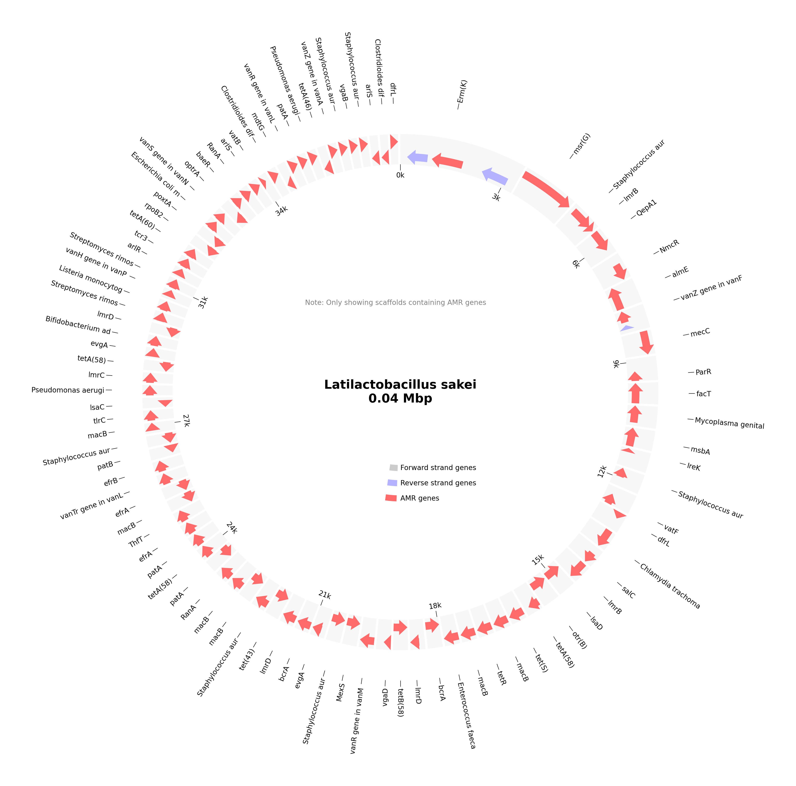

### Bifidobacterium adolescentis rpoB mutants conferring resistance to rifampicin
- **Mechanism**: antibiotic target alteration; antibiotic target replacement
- **Drug Classes**: rifamycin antibiotic
- **AMR Family**: rifamycin-resistant beta-subunit of RNA polymerase (rpoB)
- **Locations**:
  - gnl|SPADES|CAEEGBCP_43818_1 : position 2-271

### Chlamydia trachomatis intrinsic murA conferring resistance to fosfomycin
- **Mechanism**: antibiotic target alteration
- **Drug Classes**: phosphonic acid antibiotic
- **AMR Family**: antibiotic-resistant murA transferase
- **Locations**:
  - gnl|SPADES|CAEEGBCP_21294_1 : position 1-501

### Clostridioides difficile gyrA conferring resistance to fluoroquinolones
- **Mechanism**: antibiotic target alteration
- **Drug Classes**: fluoroquinolone antibiotic
- **AMR Family**: fluoroquinolone resistant gyrA
- **Locations**:
  - gnl|SPADES|CAEEGBCP_62918_1 : position 3-227

### Clostridioides difficile gyrB conferring resistance to fluoroquinolones
- **Mechanism**: antibiotic target alteration
- **Drug Classes**: fluoroquinolone antibiotic
- **AMR Family**: fluoroquinolone resistant gyrB
- **Locations**:
  - gnl|SPADES|CAEEGBCP_72504_1 : position 2-208

### Enterococcus faecalis cls with mutation conferring resistance to daptomycin
- **Mechanism**: antibiotic target alteration
- **Drug Classes**: peptide antibiotic
- **AMR Family**: daptomycin resistant cls
- **Locations**:
  - gnl|SPADES|CAEEGBCP_27121_1 : position 1-396

### Erm(K)
- **Mechanism**: antibiotic target alteration
- **Drug Classes**: macrolide antibiotic; lincosamide antibiotic; streptogramin antibiotic
- **AMR Family**: Erm 23S ribosomal RNA methyltransferase
- **Locations**:
  - gnl|SPADES|CAEEGBCP_3511_2 : position 896-1780

### Escherichia coli murA with mutation conferring resistance to fosfomycin
- **Mechanism**: antibiotic target alteration
- **Drug Classes**: phosphonic acid antibiotic
- **AMR Family**: antibiotic-resistant murA transferase
- **Locations**:
  - gnl|SPADES|CAEEGBCP_52026_1 : position 1-252

### IreK
- **Mechanism**: reduced permeability to antibiotic
- **Drug Classes**: cephalosporin
- **AMR Family**: Serine/threonine kinases
- **Locations**:
  - gnl|SPADES|CAEEGBCP_20269_1 : position 2-118

### Listeria monocytogenes mprF
- **Mechanism**: antibiotic target alteration
- **Drug Classes**: peptide antibiotic
- **AMR Family**: defensin resistant mprF
- **Locations**:
  - gnl|SPADES|CAEEGBCP_47047_1 : position 2-262

### MexS
- **Mechanism**: antibiotic efflux
- **Drug Classes**: fluoroquinolone antibiotic; diaminopyrimidine antibiotic; phenicol antibiotic
- **AMR Family**: resistance-nodulation-cell division (RND) antibiotic efflux pump
- **Locations**:
  - gnl|SPADES|CAEEGBCP_28325_1 : position 2-379

### Mycoplasma genitalium parC mutations confers resistance to Moxifloxacin
- **Mechanism**: antibiotic target alteration
- **Drug Classes**: fluoroquinolone antibiotic
- **AMR Family**: fluoroquinolone resistant parC
- **Locations**:
  - gnl|SPADES|CAEEGBCP_18554_1 : position 2-487

### NmcR
- **Mechanism**: antibiotic inactivation
- **Drug Classes**: carbapenem; cephalosporin; cephamycin; penam
- **AMR Family**: NmcA beta-lactamase
- **Locations**:
  - gnl|SPADES|CAEEGBCP_15683_2 : position 247-690

### ParR
- **Mechanism**: antibiotic efflux; reduced permeability to antibiotic
- **Drug Classes**: macrolide antibiotic; fluoroquinolone antibiotic; monobactam; aminoglycoside antibiotic; carbapenem; cephalosporin; cephamycin; penam; tetracycline antibiotic; phenicol antibiotic; penem; disinfecting agents and antiseptics
- **AMR Family**: resistance-nodulation-cell division (RND) antibiotic efflux pump; Outer Membrane Porin (Opr)
- **Locations**:
  - gnl|SPADES|CAEEGBCP_16991_2 : position 361-630

### Pseudomonas aeruginosa catB7
- **Mechanism**: antibiotic inactivation
- **Drug Classes**: phenicol antibiotic
- **AMR Family**: chloramphenicol acetyltransferase (CAT)
- **Locations**:
  - gnl|SPADES|CAEEGBCP_64294_1 : position 2-226

### Pseudomonas aeruginosa soxR
- **Mechanism**: antibiotic target alteration; antibiotic efflux
- **Drug Classes**: fluoroquinolone antibiotic; cephalosporin; glycylcycline; penam; tetracycline antibiotic; rifamycin antibiotic; phenicol antibiotic; disinfecting agents and antiseptics
- **AMR Family**: ATP-binding cassette (ABC) antibiotic efflux pump; major facilitator superfamily (MFS) antibiotic efflux pump; resistance-nodulation-cell division (RND) antibiotic efflux pump
- **Locations**:
  - gnl|SPADES|CAEEGBCP_42742_1 : position 2-274

### QepA1
- **Mechanism**: antibiotic efflux
- **Drug Classes**: fluoroquinolone antibiotic
- **AMR Family**: major facilitator superfamily (MFS) antibiotic efflux pump
- **Locations**:
  - gnl|SPADES|CAEEGBCP_14789_1 : position 1-579

### RanA (found in 2 locations)
- **Mechanism**: antibiotic efflux
- **Drug Classes**: aminoglycoside antibiotic
- **AMR Family**: ATP-binding cassette (ABC) antibiotic efflux pump
- **Locations**:
  - gnl|SPADES|CAEEGBCP_32363_1 : position 2-340
  - gnl|SPADES|CAEEGBCP_55508_1 : position 1-243

### Staphylococcus aureus LmrS
- **Mechanism**: antibiotic efflux
- **Drug Classes**: macrolide antibiotic; aminoglycoside antibiotic; oxazolidinone antibiotic; diaminopyrimidine antibiotic; phenicol antibiotic
- **AMR Family**: major facilitator superfamily (MFS) antibiotic efflux pump
- **Locations**:
  - gnl|SPADES|CAEEGBCP_13244_1 : position 91-693

### Staphylococcus aureus mupA conferring resistance to mupirocin (found in 3 locations)
- **Mechanism**: antibiotic target alteration
- **Drug Classes**: mupirocin-like antibiotic
- **AMR Family**: antibiotic-resistant isoleucyl-tRNA synthetase (ileS)
- **Locations**:
  - gnl|SPADES|CAEEGBCP_20413_1 : position 2-265
  - gnl|SPADES|CAEEGBCP_28774_1 : position 2-376
  - gnl|SPADES|CAEEGBCP_39128_1 : position 1-288

### Staphylococcus aureus murA with mutation conferring resistance to fosfomycin
- **Mechanism**: antibiotic target alteration
- **Drug Classes**: phosphonic acid antibiotic
- **AMR Family**: antibiotic-resistant murA transferase
- **Locations**:
  - gnl|SPADES|CAEEGBCP_67329_1 : position 1-219

### Staphylococcus aureus norA
- **Mechanism**: antibiotic efflux
- **Drug Classes**: fluoroquinolone antibiotic
- **AMR Family**: major facilitator superfamily (MFS) antibiotic efflux pump
- **Locations**:
  - gnl|SPADES|CAEEGBCP_69568_1 : position 2-214

### Staphylococcus aureus rpoB mutants conferring resistance to rifampicin
- **Mechanism**: antibiotic target alteration; antibiotic target replacement
- **Drug Classes**: rifamycin antibiotic
- **AMR Family**: rifamycin-resistant beta-subunit of RNA polymerase (rpoB)
- **Locations**:
  - gnl|SPADES|CAEEGBCP_29797_1 : position 1-363

### Streptomyces rimosus otr(A) (found in 2 locations)
- **Mechanism**: antibiotic target protection
- **Drug Classes**: tetracycline antibiotic
- **AMR Family**: tetracycline-resistant ribosomal protection protein
- **Locations**:
  - gnl|SPADES|CAEEGBCP_46442_1 : position 24-263
  - gnl|SPADES|CAEEGBCP_48955_1 : position 1-258

### ThfT
- **Mechanism**: resistance by host-dependent nutrient acquisition
- **Drug Classes**: sulfonamide antibiotic
- **AMR Family**: ECF transporter S component
- **Locations**:
  - gnl|SPADES|CAEEGBCP_35967_1 : position 1-309

### almE
- **Mechanism**: antibiotic target alteration
- **Drug Classes**: peptide antibiotic
- **AMR Family**: polymyxin resistance operon; alm glycyltransferase
- **Locations**:
  - gnl|SPADES|CAEEGBCP_16304_1 : position 3-659

### arlR
- **Mechanism**: antibiotic efflux
- **Drug Classes**: fluoroquinolone antibiotic; disinfecting agents and antiseptics
- **AMR Family**: major facilitator superfamily (MFS) antibiotic efflux pump
- **Locations**:
  - gnl|SPADES|CAEEGBCP_48942_1 : position 51-257

### arlS (found in 2 locations)
- **Mechanism**: antibiotic efflux
- **Drug Classes**: fluoroquinolone antibiotic; disinfecting agents and antiseptics
- **AMR Family**: major facilitator superfamily (MFS) antibiotic efflux pump
- **Locations**:
  - gnl|SPADES|CAEEGBCP_57951_1 : position 3-239
  - gnl|SPADES|CAEEGBCP_70182_1 : position 2-214

### baeR
- **Mechanism**: antibiotic efflux
- **Drug Classes**: aminoglycoside antibiotic; aminocoumarin antibiotic
- **AMR Family**: resistance-nodulation-cell division (RND) antibiotic efflux pump
- **Locations**:
  - gnl|SPADES|CAEEGBCP_54448_1 : position 3-245

### bcrA (found in 2 locations)
- **Mechanism**: antibiotic efflux
- **Drug Classes**: peptide antibiotic
- **AMR Family**: ATP-binding cassette (ABC) antibiotic efflux pump
- **Locations**:
  - gnl|SPADES|CAEEGBCP_27080_1 : position 2-394
  - gnl|SPADES|CAEEGBCP_28852_1 : position 2-373

### dfrL (found in 2 locations)
- **Mechanism**: antibiotic target replacement
- **Drug Classes**: aminoglycoside antibiotic; tetracycline antibiotic; diaminopyrimidine antibiotic
- **AMR Family**: trimethoprim resistant dihydrofolate reductase dfr
- **Locations**:
  - gnl|SPADES|CAEEGBCP_21236_1 : position 1-189
  - gnl|SPADES|CAEEGBCP_73102_1 : position 1-207

### efrA (found in 2 locations)
- **Mechanism**: antibiotic efflux
- **Drug Classes**: macrolide antibiotic; fluoroquinolone antibiotic; rifamycin antibiotic
- **AMR Family**: ATP-binding cassette (ABC) antibiotic efflux pump
- **Locations**:
  - gnl|SPADES|CAEEGBCP_34929_1 : position 3-317
  - gnl|SPADES|CAEEGBCP_37346_1 : position 1-300

### efrB
- **Mechanism**: antibiotic efflux
- **Drug Classes**: macrolide antibiotic; fluoroquinolone antibiotic; rifamycin antibiotic
- **AMR Family**: ATP-binding cassette (ABC) antibiotic efflux pump
- **Locations**:
  - gnl|SPADES|CAEEGBCP_38533_1 : position 2-292

### evgA (found in 2 locations)
- **Mechanism**: antibiotic efflux
- **Drug Classes**: macrolide antibiotic; fluoroquinolone antibiotic; penam; tetracycline antibiotic
- **AMR Family**: major facilitator superfamily (MFS) antibiotic efflux pump; resistance-nodulation-cell division (RND) antibiotic efflux pump
- **Locations**:
  - gnl|SPADES|CAEEGBCP_28752_2 : position 131-376
  - gnl|SPADES|CAEEGBCP_44065_1 : position 40-270

### facT
- **Mechanism**: antibiotic efflux
- **Drug Classes**: elfamycin antibiotic
- **AMR Family**: major facilitator superfamily (MFS) antibiotic efflux pump
- **Locations**:
  - gnl|SPADES|CAEEGBCP_18511_1 : position 2-574

### lmrB (found in 2 locations)
- **Mechanism**: antibiotic efflux
- **Drug Classes**: lincosamide antibiotic; nucleoside antibiotic
- **AMR Family**: ATP-binding cassette (ABC) antibiotic efflux pump
- **Locations**:
  - gnl|SPADES|CAEEGBCP_13244_2 : position 662-829
  - gnl|SPADES|CAEEGBCP_21921_1 : position 2-487

### lmrC
- **Mechanism**: antibiotic target protection
- **Drug Classes**: lincosamide antibiotic
- **AMR Family**: Miscellaneous ABC-F subfamily ATP-binding cassette ribosomal protection proteins
- **Locations**:
  - gnl|SPADES|CAEEGBCP_43494_1 : position 3-272

### lmrD (found in 3 locations)
- **Mechanism**: antibiotic efflux
- **Drug Classes**: lincosamide antibiotic
- **AMR Family**: ATP-binding cassette (ABC) antibiotic efflux pump
- **Locations**:
  - gnl|SPADES|CAEEGBCP_27282_1 : position 150-392
  - gnl|SPADES|CAEEGBCP_29477_1 : position 3-368
  - gnl|SPADES|CAEEGBCP_46074_1 : position 2-265

### lsaC
- **Mechanism**: antibiotic target protection
- **Drug Classes**: lincosamide antibiotic; streptogramin antibiotic; pleuromutilin antibiotic
- **AMR Family**: lsa-type ABC-F protein
- **Locations**:
  - gnl|SPADES|CAEEGBCP_42552_1 : position 3-197

### lsaD
- **Mechanism**: antibiotic target protection
- **Drug Classes**: lincosamide antibiotic; streptogramin antibiotic; streptogramin A antibiotic; pleuromutilin antibiotic
- **AMR Family**: lsa-type ABC-F protein
- **Locations**:
  - gnl|SPADES|CAEEGBCP_22973_1 : position 2-463

### macB (found in 6 locations)
- **Mechanism**: antibiotic efflux
- **Drug Classes**: macrolide antibiotic
- **AMR Family**: ATP-binding cassette (ABC) antibiotic efflux pump
- **Locations**:
  - gnl|SPADES|CAEEGBCP_26381_1 : position 3-401
  - gnl|SPADES|CAEEGBCP_27049_1 : position 2-397
  - gnl|SPADES|CAEEGBCP_31225_1 : position 2-349
  - gnl|SPADES|CAEEGBCP_32262_1 : position 2-340
  - gnl|SPADES|CAEEGBCP_36789_1 : position 3-305
  - gnl|SPADES|CAEEGBCP_41601_1 : position 69-278

### mdtG
- **Mechanism**: antibiotic efflux
- **Drug Classes**: phosphonic acid antibiotic
- **AMR Family**: major facilitator superfamily (MFS) antibiotic efflux pump
- **Locations**:
  - gnl|SPADES|CAEEGBCP_63283_1 : position 1-192

### mecC
- **Mechanism**: antibiotic target replacement
- **Drug Classes**: penam
- **AMR Family**: methicillin resistant PBP2
- **Locations**:
  - gnl|SPADES|CAEEGBCP_16983_1 : position 1-630

### msbA
- **Mechanism**: antibiotic efflux
- **Drug Classes**: nitroimidazole antibiotic
- **AMR Family**: ATP-binding cassette (ABC) antibiotic efflux pump
- **Locations**:
  - gnl|SPADES|CAEEGBCP_20114_1 : position 2-529

### msr(G)
- **Mechanism**: antibiotic target protection
- **Drug Classes**: macrolide antibiotic; streptogramin antibiotic
- **AMR Family**: msr-type ABC-F protein
- **Locations**:
  - gnl|SPADES|CAEEGBCP_7765_1 : position 3-1505

### optrA
- **Mechanism**: antibiotic target protection
- **Drug Classes**: oxazolidinone antibiotic; phenicol antibiotic
- **AMR Family**: Miscellaneous ABC-F subfamily ATP-binding cassette ribosomal protection proteins
- **Locations**:
  - gnl|SPADES|CAEEGBCP_53667_1 : position 1-246

### otr(B)
- **Mechanism**: antibiotic efflux
- **Drug Classes**: tetracycline antibiotic
- **AMR Family**: major facilitator superfamily (MFS) antibiotic efflux pump
- **Locations**:
  - gnl|SPADES|CAEEGBCP_23711_1 : position 2-451

### patA (found in 3 locations)
- **Mechanism**: antibiotic efflux
- **Drug Classes**: fluoroquinolone antibiotic
- **AMR Family**: ATP-binding cassette (ABC) antibiotic efflux pump
- **Locations**:
  - gnl|SPADES|CAEEGBCP_33264_1 : position 1-333
  - gnl|SPADES|CAEEGBCP_34685_1 : position 1-321
  - gnl|SPADES|CAEEGBCP_63750_1 : position 2-226

### patB
- **Mechanism**: antibiotic efflux
- **Drug Classes**: fluoroquinolone antibiotic
- **AMR Family**: ATP-binding cassette (ABC) antibiotic efflux pump
- **Locations**:
  - gnl|SPADES|CAEEGBCP_39086_1 : position 66-290

### poxtA
- **Mechanism**: antibiotic target protection
- **Drug Classes**: tetracycline antibiotic; oxazolidinone antibiotic; phenicol antibiotic
- **AMR Family**: Miscellaneous ABC-F subfamily ATP-binding cassette ribosomal protection proteins
- **Locations**:
  - gnl|SPADES|CAEEGBCP_52158_1 : position 3-251

### rpoB2
- **Mechanism**: antibiotic target alteration; antibiotic target replacement
- **Drug Classes**: rifamycin antibiotic
- **AMR Family**: rifamycin-resistant beta-subunit of RNA polymerase (rpoB)
- **Locations**:
  - gnl|SPADES|CAEEGBCP_51706_1 : position 3-251

### salC
- **Mechanism**: antibiotic target protection
- **Drug Classes**: lincosamide antibiotic; streptogramin antibiotic; streptogramin A antibiotic; pleuromutilin antibiotic
- **AMR Family**: sal-type ABC-F protein
- **Locations**:
  - gnl|SPADES|CAEEGBCP_21668_1 : position 193-492

### tcr3
- **Mechanism**: antibiotic efflux
- **Drug Classes**: tetracycline antibiotic
- **AMR Family**: major facilitator superfamily (MFS) antibiotic efflux pump
- **Locations**:
  - gnl|SPADES|CAEEGBCP_49924_1 : position 3-257

### tet(43)
- **Mechanism**: antibiotic efflux
- **Drug Classes**: tetracycline antibiotic
- **AMR Family**: major facilitator superfamily (MFS) antibiotic efflux pump
- **Locations**:
  - gnl|SPADES|CAEEGBCP_29551_1 : position 1-366

### tet(S)
- **Mechanism**: antibiotic target protection
- **Drug Classes**: tetracycline antibiotic
- **AMR Family**: tetracycline-resistant ribosomal protection protein
- **Locations**:
  - gnl|SPADES|CAEEGBCP_26169_1 : position 2-409

### tetA(46)
- **Mechanism**: antibiotic efflux
- **Drug Classes**: tetracycline antibiotic
- **AMR Family**: ATP-binding cassette (ABC) antibiotic efflux pump
- **Locations**:
  - gnl|SPADES|CAEEGBCP_65275_1 : position 2-223

### tetA(58) (found in 3 locations)
- **Mechanism**: antibiotic efflux
- **Drug Classes**: tetracycline antibiotic
- **AMR Family**: major facilitator superfamily (MFS) antibiotic efflux pump
- **Locations**:
  - gnl|SPADES|CAEEGBCP_25370_1 : position 2-307
  - gnl|SPADES|CAEEGBCP_34299_1 : position 1-324
  - gnl|SPADES|CAEEGBCP_43653_1 : position 1-273

### tetA(60)
- **Mechanism**: antibiotic efflux
- **Drug Classes**: tetracycline antibiotic
- **AMR Family**: ATP-binding cassette (ABC) antibiotic efflux pump
- **Locations**:
  - gnl|SPADES|CAEEGBCP_51631_1 : position 3-251

### tetB(58)
- **Mechanism**: antibiotic efflux
- **Drug Classes**: tetracycline antibiotic
- **AMR Family**: major facilitator superfamily (MFS) antibiotic efflux pump
- **Locations**:
  - gnl|SPADES|CAEEGBCP_27364_1 : position 1-393

### tetR
- **Mechanism**: antibiotic target alteration; antibiotic efflux
- **Drug Classes**: tetracycline antibiotic
- **AMR Family**: major facilitator superfamily (MFS) antibiotic efflux pump
- **Locations**:
  - gnl|SPADES|CAEEGBCP_26567_1 : position 1-402

### tlrC
- **Mechanism**: antibiotic target protection
- **Drug Classes**: macrolide antibiotic; lincosamide antibiotic
- **AMR Family**: Miscellaneous ABC-F subfamily ATP-binding cassette ribosomal protection proteins
- **Locations**:
  - gnl|SPADES|CAEEGBCP_41806_1 : position 1-276

### vanH gene in vanP cluster
- **Mechanism**: antibiotic target alteration
- **Drug Classes**: glycopeptide antibiotic
- **AMR Family**: vanH; glycopeptide resistance gene cluster
- **Locations**:
  - gnl|SPADES|CAEEGBCP_48304_1 : position 72-260

### vanR gene in vanL cluster
- **Mechanism**: antibiotic target alteration
- **Drug Classes**: glycopeptide antibiotic
- **AMR Family**: glycopeptide resistance gene cluster; vanR
- **Locations**:
  - gnl|SPADES|CAEEGBCP_63536_1 : position 1-228

### vanR gene in vanM cluster
- **Mechanism**: antibiotic target alteration
- **Drug Classes**: glycopeptide antibiotic
- **AMR Family**: glycopeptide resistance gene cluster; vanR
- **Locations**:
  - gnl|SPADES|CAEEGBCP_27910_1 : position 3-386

### vanS gene in vanN cluster
- **Mechanism**: antibiotic target alteration
- **Drug Classes**: glycopeptide antibiotic
- **AMR Family**: vanS; glycopeptide resistance gene cluster
- **Locations**:
  - gnl|SPADES|CAEEGBCP_53065_1 : position 1-249

### vanTr gene in vanL cluster
- **Mechanism**: antibiotic target alteration
- **Drug Classes**: glycopeptide antibiotic
- **AMR Family**: glycopeptide resistance gene cluster; vanT
- **Locations**:
  - gnl|SPADES|CAEEGBCP_37541_1 : position 2-298

### vanZ gene in vanA cluster
- **Mechanism**: antibiotic target alteration
- **Drug Classes**: glycopeptide antibiotic
- **AMR Family**: vanZ; glycopeptide resistance gene cluster
- **Locations**:
  - gnl|SPADES|CAEEGBCP_67053_1 : position 3-218

### vanZ gene in vanF cluster
- **Mechanism**: antibiotic target alteration
- **Drug Classes**: glycopeptide antibiotic
- **AMR Family**: vanZ; glycopeptide resistance gene cluster
- **Locations**:
  - gnl|SPADES|CAEEGBCP_16882_1 : position 1-327

### vatB
- **Mechanism**: antibiotic inactivation
- **Drug Classes**: streptogramin antibiotic; streptogramin A antibiotic
- **AMR Family**: streptogramin vat acetyltransferase
- **Locations**:
  - gnl|SPADES|CAEEGBCP_60370_1 : position 3-131

### vatF
- **Mechanism**: antibiotic inactivation
- **Drug Classes**: streptogramin antibiotic; streptogramin A antibiotic
- **AMR Family**: streptogramin vat acetyltransferase
- **Locations**:
  - gnl|SPADES|CAEEGBCP_20805_2 : position 215-514

### vgaB
- **Mechanism**: antibiotic target protection
- **Drug Classes**: streptogramin antibiotic; streptogramin A antibiotic; pleuromutilin antibiotic
- **AMR Family**: vga-type ABC-F protein
- **Locations**:
  - gnl|SPADES|CAEEGBCP_69139_1 : position 3-215

### vgaD
- **Mechanism**: antibiotic target protection
- **Drug Classes**: streptogramin antibiotic; streptogramin A antibiotic; pleuromutilin antibiotic
- **AMR Family**: vga-type ABC-F protein
- **Locations**:
  - gnl|SPADES|CAEEGBCP_27837_1 : position 2-193

## Latilactobacillus sakei subsp. sakei
**Strain Statistics:**
- Total genome length: 0.2 kbp
- Total scaffolds: 7
- Scaffolds with AMR genes: 1
- Total genes annotated: 0
- Total AMR genes: 1
- Unique AMR genes: 1
- Distinct AMR mechanisms: 1
- Distinct AMR families: 1
- Distinct drug classes: 1

**Circos Plot:**

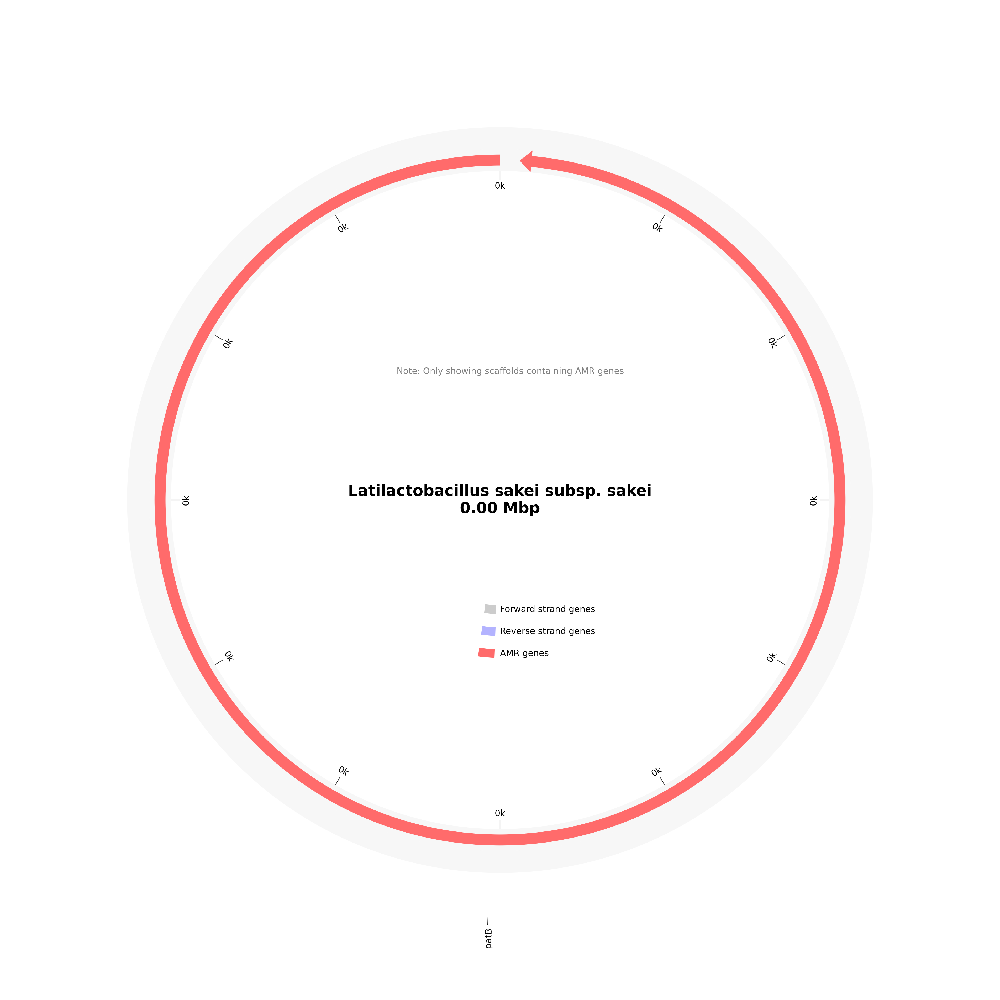

### patB
- **Mechanism**: antibiotic efflux
- **Drug Classes**: fluoroquinolone antibiotic
- **AMR Family**: ATP-binding cassette (ABC) antibiotic efflux pump
- **Locations**:
  - gnl|SPADES|CAEEGBCP_68905_1 : position 2-217

## Lelliottia amnigena
**Strain Statistics:**
- Total genome length: 1.1 kbp
- Total scaffolds: 15
- Scaffolds with AMR genes: 2
- Total genes annotated: 2
- Total AMR genes: 3
- Unique AMR genes: 3
- Distinct AMR mechanisms: 2
- Distinct AMR families: 2
- Distinct drug classes: 6

**Circos Plot:**

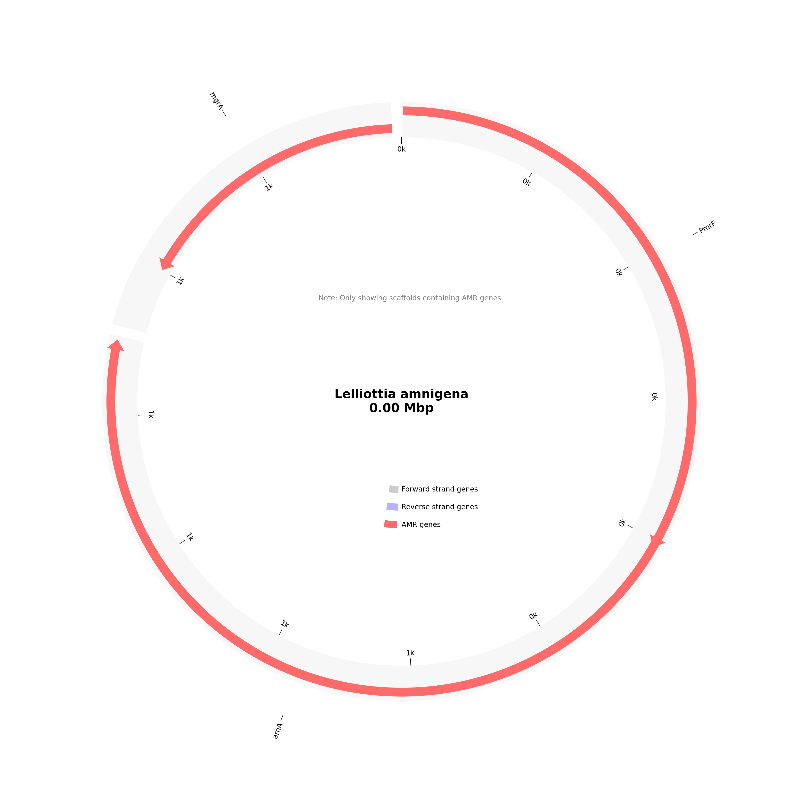

### PmrF
- **Mechanism**: antibiotic target alteration
- **Drug Classes**: peptide antibiotic
- **AMR Family**: pmr phosphoethanolamine transferase
- **Locations**:
  - gnl|SPADES|CAEEGBCP_13094_1 : position 1-357

### arnA
- **Mechanism**: antibiotic target alteration
- **Drug Classes**: peptide antibiotic
- **AMR Family**: pmr phosphoethanolamine transferase
- **Locations**:
  - gnl|SPADES|CAEEGBCP_13094_2 : position 354-839

### mgrA
- **Mechanism**: antibiotic efflux
- **Drug Classes**: fluoroquinolone antibiotic; cephalosporin; penam; tetracycline antibiotic; peptide antibiotic; disinfecting agents and antiseptics
- **AMR Family**: ATP-binding cassette (ABC) antibiotic efflux pump; major facilitator superfamily (MFS) antibiotic efflux pump
- **Locations**:
  - gnl|SPADES|CAEEGBCP_68512_1 : position 41-217

## Lelliottia sp. AC1
**Strain Statistics:**
- Total genome length: 0.3 kbp
- Total scaffolds: 20
- Scaffolds with AMR genes: 1
- Total genes annotated: 0
- Total AMR genes: 1
- Unique AMR genes: 1
- Distinct AMR mechanisms: 1
- Distinct AMR families: 1
- Distinct drug classes: 1

**Circos Plot:**

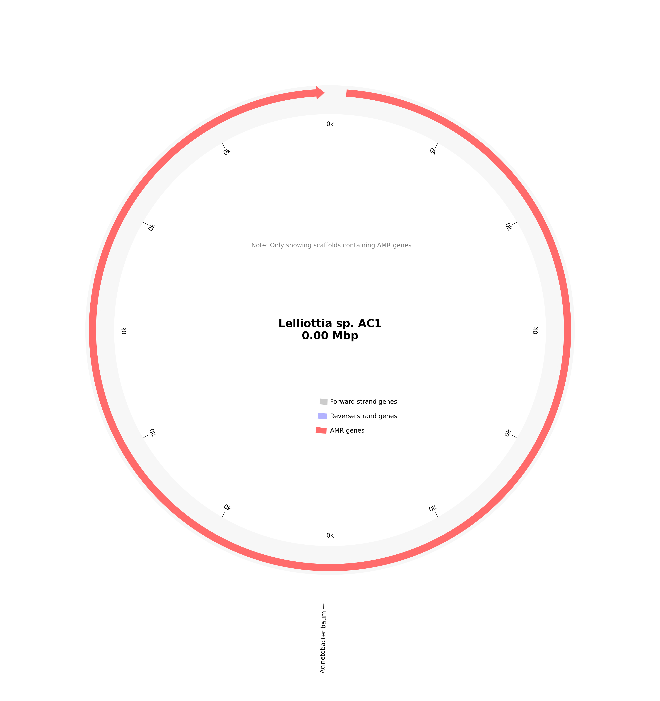

### Acinetobacter baumannii AbaF
- **Mechanism**: antibiotic efflux
- **Drug Classes**: phosphonic acid antibiotic
- **AMR Family**: major facilitator superfamily (MFS) antibiotic efflux pump
- **Locations**:
  - gnl|SPADES|CAEEGBCP_43763_1 : position 3-272

## Lelliottia sp. WB101
**Strain Statistics:**
- Total genome length: 0.3 kbp
- Total scaffolds: 16
- Scaffolds with AMR genes: 1
- Total genes annotated: 0
- Total AMR genes: 1
- Unique AMR genes: 1
- Distinct AMR mechanisms: 1
- Distinct AMR families: 1
- Distinct drug classes: 4

**Circos Plot:**

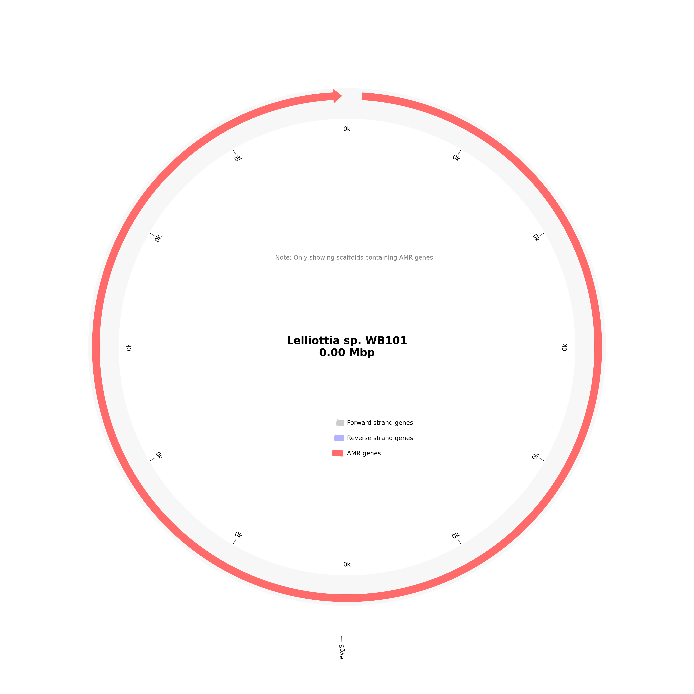

### evgS
- **Mechanism**: antibiotic efflux
- **Drug Classes**: macrolide antibiotic; fluoroquinolone antibiotic; penam; tetracycline antibiotic
- **AMR Family**: major facilitator superfamily (MFS) antibiotic efflux pump; resistance-nodulation-cell division (RND) antibiotic efflux pump
- **Locations**:
  - gnl|SPADES|CAEEGBCP_34715_1 : position 3-320

## Serratia fonticola
**Strain Statistics:**
- Total genome length: 109.5 kbp
- Total scaffolds: 4332
- Scaffolds with AMR genes: 281
- Total genes annotated: 134
- Total AMR genes: 288
- Unique AMR genes: 141
- Distinct AMR mechanisms: 9
- Distinct AMR families: 38
- Distinct drug classes: 33

**Circos Plot:**

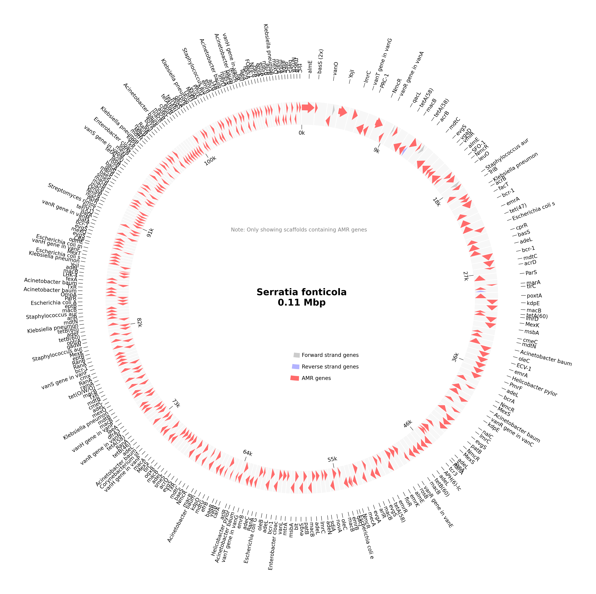

### APH(6)-Ic
- **Mechanism**: antibiotic inactivation
- **Drug Classes**: aminoglycoside antibiotic
- **AMR Family**: APH(6)
- **Locations**:
  - gnl|SPADES|CAEEGBCP_21940_1 : position 3-485

### Acinetobacter baumannii AbaF (found in 7 locations)
- **Mechanism**: antibiotic efflux
- **Drug Classes**: phosphonic acid antibiotic
- **AMR Family**: major facilitator superfamily (MFS) antibiotic efflux pump
- **Locations**:
  - gnl|SPADES|CAEEGBCP_20187_1 : position 3-527
  - gnl|SPADES|CAEEGBCP_29763_1 : position 2-364
  - gnl|SPADES|CAEEGBCP_35212_1 : position 3-281
  - gnl|SPADES|CAEEGBCP_43160_1 : position 1-273
  - gnl|SPADES|CAEEGBCP_59294_1 : position 3-206
  - gnl|SPADES|CAEEGBCP_65465_1 : position 1-222
  - gnl|SPADES|CAEEGBCP_67080_1 : position 2-220

### Acinetobacter baumannii AbaQ (found in 2 locations)
- **Mechanism**: antibiotic efflux
- **Drug Classes**: fluoroquinolone antibiotic
- **AMR Family**: major facilitator superfamily (MFS) antibiotic efflux pump
- **Locations**:
  - gnl|SPADES|CAEEGBCP_31131_1 : position 1-351
  - gnl|SPADES|CAEEGBCP_43819_1 : position 3-272

### Acinetobacter baumannii AmvA
- **Mechanism**: antibiotic efflux
- **Drug Classes**: macrolide antibiotic; disinfecting agents and antiseptics
- **AMR Family**: major facilitator superfamily (MFS) antibiotic efflux pump
- **Locations**:
  - gnl|SPADES|CAEEGBCP_18822_1 : position 1-567

### ArnT
- **Mechanism**: antibiotic target alteration
- **Drug Classes**: peptide antibiotic
- **AMR Family**: pmr phosphoethanolamine transferase
- **Locations**:
  - gnl|SPADES|CAEEGBCP_64806_1 : position 1-225

### CRP
- **Mechanism**: antibiotic efflux
- **Drug Classes**: macrolide antibiotic; fluoroquinolone antibiotic; penam
- **AMR Family**: resistance-nodulation-cell division (RND) antibiotic efflux pump
- **Locations**:
  - gnl|SPADES|CAEEGBCP_48254_1 : position 2-163

### Corynebacterium striatum tetA
- **Mechanism**: antibiotic efflux
- **Drug Classes**: penam; tetracycline antibiotic
- **AMR Family**: major facilitator superfamily (MFS) antibiotic efflux pump
- **Locations**:
  - gnl|SPADES|CAEEGBCP_34896_1 : position 1-318

### ECV-1
- **Mechanism**: antibiotic inactivation
- **Drug Classes**: carbapenem
- **AMR Family**: ECV beta-lactamase
- **Locations**:
  - gnl|SPADES|CAEEGBCP_19099_1 : position 2-559

### Enterobacter cloacae acrA (found in 2 locations)
- **Mechanism**: antibiotic efflux
- **Drug Classes**: fluoroquinolone antibiotic; cephalosporin; glycylcycline; penam; tetracycline antibiotic; rifamycin antibiotic; phenicol antibiotic; disinfecting agents and antiseptics
- **AMR Family**: resistance-nodulation-cell division (RND) antibiotic efflux pump
- **Locations**:
  - gnl|SPADES|CAEEGBCP_27590_1 : position 2-388
  - gnl|SPADES|CAEEGBCP_56674_1 : position 1-240

### Escherichia coli AcrAB-TolC with AcrR mutation conferring resistance to ciprofloxacin, tetracycline, and ceftazidime
- **Mechanism**: antibiotic target alteration; antibiotic efflux
- **Drug Classes**: fluoroquinolone antibiotic; cephalosporin; glycylcycline; penam; tetracycline antibiotic; rifamycin antibiotic; phenicol antibiotic; disinfecting agents and antiseptics
- **AMR Family**: resistance-nodulation-cell division (RND) antibiotic efflux pump
- **Locations**:
  - gnl|SPADES|CAEEGBCP_41977_1 : position 1-276

### Escherichia coli GlpT with mutation conferring resistance to fosfomycin
- **Mechanism**: antibiotic target alteration
- **Drug Classes**: phosphonic acid antibiotic
- **AMR Family**: antibiotic-resistant GlpT
- **Locations**:
  - gnl|SPADES|CAEEGBCP_28491_2 : position 182-379

### Escherichia coli emrE
- **Mechanism**: antibiotic efflux
- **Drug Classes**: macrolide antibiotic
- **AMR Family**: small multidrug resistance (SMR) antibiotic efflux pump
- **Locations**:
  - gnl|SPADES|CAEEGBCP_24858_1 : position 1-108

### Escherichia coli mdfA
- **Mechanism**: antibiotic efflux
- **Drug Classes**: tetracycline antibiotic; phenicol antibiotic; disinfecting agents and antiseptics
- **AMR Family**: major facilitator superfamily (MFS) antibiotic efflux pump
- **Locations**:
  - gnl|SPADES|CAEEGBCP_47421_1 : position 2-262

### Escherichia coli soxS with mutation conferring antibiotic resistance (found in 2 locations)
- **Mechanism**: antibiotic target alteration; antibiotic efflux; reduced permeability to antibiotic
- **Drug Classes**: fluoroquinolone antibiotic; monobactam; carbapenem; cephalosporin; glycylcycline; cephamycin; penam; tetracycline antibiotic; rifamycin antibiotic; phenicol antibiotic; penem; disinfecting agents and antiseptics
- **AMR Family**: ATP-binding cassette (ABC) antibiotic efflux pump; major facilitator superfamily (MFS) antibiotic efflux pump; resistance-nodulation-cell division (RND) antibiotic efflux pump; General Bacterial Porin with reduced permeability to beta-lactams
- **Locations**:
  - gnl|SPADES|CAEEGBCP_15764_1 : position 71-514
  - gnl|SPADES|CAEEGBCP_46851_1 : position 3-263

### FONA-1
- **Mechanism**: antibiotic inactivation
- **Drug Classes**: penam
- **AMR Family**: FONA beta-lactamase
- **Locations**:
  - gnl|SPADES|CAEEGBCP_68565_1 : position 1-216

### Helicobacter pylori pbp1 mutants conferring resistance to amoxicillin (found in 2 locations)
- **Mechanism**: antibiotic target alteration
- **Drug Classes**: cephalosporin; cephamycin; penam
- **AMR Family**: Penicillin-binding protein mutations conferring resistance to beta-lactam antibiotics
- **Locations**:
  - gnl|SPADES|CAEEGBCP_19173_1 : position 1-555
  - gnl|SPADES|CAEEGBCP_29954_1 : position 2-361

### Klebsiella pneumoniae KpnE
- **Mechanism**: antibiotic efflux
- **Drug Classes**: macrolide antibiotic; aminoglycoside antibiotic; cephalosporin; tetracycline antibiotic; peptide antibiotic; rifamycin antibiotic; disinfecting agents and antiseptics
- **AMR Family**: small multidrug resistance (SMR) antibiotic efflux pump
- **Locations**:
  - gnl|SPADES|CAEEGBCP_57965_1 : position 2-238

### Klebsiella pneumoniae OmpK37 (found in 5 locations)
- **Mechanism**: reduced permeability to antibiotic
- **Drug Classes**: monobactam; carbapenem; cephalosporin; cephamycin; penam; penem
- **AMR Family**: General Bacterial Porin with reduced permeability to beta-lactams
- **Locations**:
  - gnl|SPADES|CAEEGBCP_36276_1 : position 3-308
  - gnl|SPADES|CAEEGBCP_40444_1 : position 3-281
  - gnl|SPADES|CAEEGBCP_46210_1 : position 2-265
  - gnl|SPADES|CAEEGBCP_63234_1 : position 2-226
  - gnl|SPADES|CAEEGBCP_71075_1 : position 3-212

### Klebsiella pneumoniae acrA
- **Mechanism**: antibiotic efflux
- **Drug Classes**: fluoroquinolone antibiotic; cephalosporin; glycylcycline; penam; tetracycline antibiotic; rifamycin antibiotic; phenicol antibiotic; disinfecting agents and antiseptics
- **AMR Family**: resistance-nodulation-cell division (RND) antibiotic efflux pump
- **Locations**:
  - gnl|SPADES|CAEEGBCP_15172_1 : position 3-395

### LHK-4
- **Mechanism**: antibiotic inactivation
- **Drug Classes**: carbapenem; cephalosporin
- **AMR Family**: LHK beta-lactamase
- **Locations**:
  - gnl|SPADES|CAEEGBCP_44555_1 : position 30-269

### LptD
- **Mechanism**: antibiotic efflux
- **Drug Classes**: carbapenem; peptide antibiotic; aminocoumarin antibiotic; rifamycin antibiotic
- **AMR Family**: ATP-binding cassette (ABC) antibiotic efflux pump
- **Locations**:
  - gnl|SPADES|CAEEGBCP_63912_1 : position 1-225

### MdtK
- **Mechanism**: antibiotic efflux
- **Drug Classes**: fluoroquinolone antibiotic
- **AMR Family**: multidrug and toxic compound extrusion (MATE) transporter
- **Locations**:
  - gnl|SPADES|CAEEGBCP_57760_1 : position 2-238

### MexH
- **Mechanism**: antibiotic efflux
- **Drug Classes**: fluoroquinolone antibiotic; tetracycline antibiotic; disinfecting agents and antiseptics
- **AMR Family**: resistance-nodulation-cell division (RND) antibiotic efflux pump
- **Locations**:
  - gnl|SPADES|CAEEGBCP_63867_1 : position 1-225

### MexK (found in 2 locations)
- **Mechanism**: antibiotic efflux
- **Drug Classes**: macrolide antibiotic; tetracycline antibiotic; disinfecting agents and antiseptics
- **AMR Family**: resistance-nodulation-cell division (RND) antibiotic efflux pump
- **Locations**:
  - gnl|SPADES|CAEEGBCP_18463_1 : position 1-576
  - gnl|SPADES|CAEEGBCP_38568_1 : position 3-293

### MexS (found in 3 locations)
- **Mechanism**: antibiotic efflux
- **Drug Classes**: fluoroquinolone antibiotic; diaminopyrimidine antibiotic; phenicol antibiotic
- **AMR Family**: resistance-nodulation-cell division (RND) antibiotic efflux pump
- **Locations**:
  - gnl|SPADES|CAEEGBCP_19994_1 : position 2-532
  - gnl|SPADES|CAEEGBCP_21297_1 : position 1-309
  - gnl|SPADES|CAEEGBCP_34666_1 : position 3-320

### MexT
- **Mechanism**: antibiotic efflux
- **Drug Classes**: fluoroquinolone antibiotic; diaminopyrimidine antibiotic; phenicol antibiotic
- **AMR Family**: resistance-nodulation-cell division (RND) antibiotic efflux pump
- **Locations**:
  - gnl|SPADES|CAEEGBCP_47245_1 : position 1-261

### NmcR (found in 10 locations)
- **Mechanism**: antibiotic inactivation
- **Drug Classes**: carbapenem; cephalosporin; cephamycin; penam
- **AMR Family**: NmcA beta-lactamase
- **Locations**:
  - gnl|SPADES|CAEEGBCP_12391_1 : position 3-836
  - gnl|SPADES|CAEEGBCP_14881_2 : position 356-727
  - gnl|SPADES|CAEEGBCP_19931_2 : position 292-534
  - gnl|SPADES|CAEEGBCP_20954_1 : position 2-508
  - gnl|SPADES|CAEEGBCP_24677_1 : position 65-433
  - gnl|SPADES|CAEEGBCP_31223_1 : position 82-348
  - gnl|SPADES|CAEEGBCP_52479_1 : position 2-199
  - gnl|SPADES|CAEEGBCP_67039_1 : position 2-220
  - gnl|SPADES|CAEEGBCP_68805_1 : position 46-216
  - gnl|SPADES|CAEEGBCP_73525_1 : position 2-208

### OmpA (found in 2 locations)
- **Mechanism**: reduced permeability to antibiotic
- **Drug Classes**: peptide antibiotic
- **AMR Family**: General Bacterial Porin with reduced permeability to peptide antibiotics
- **Locations**:
  - gnl|SPADES|CAEEGBCP_43044_1 : position 3-257
  - gnl|SPADES|CAEEGBCP_52926_1 : position 2-250

### PRC-1
- **Mechanism**: antibiotic inactivation
- **Drug Classes**: cephalosporin; penam
- **AMR Family**: PRC beta-lactamase
- **Locations**:
  - gnl|SPADES|CAEEGBCP_11995_1 : position 2-427

### ParR (found in 3 locations)
- **Mechanism**: antibiotic efflux; reduced permeability to antibiotic
- **Drug Classes**: macrolide antibiotic; fluoroquinolone antibiotic; monobactam; aminoglycoside antibiotic; carbapenem; cephalosporin; cephamycin; penam; tetracycline antibiotic; phenicol antibiotic; penem; disinfecting agents and antiseptics
- **AMR Family**: resistance-nodulation-cell division (RND) antibiotic efflux pump; Outer Membrane Porin (Opr)
- **Locations**:
  - gnl|SPADES|CAEEGBCP_42156_1 : position 2-277
  - gnl|SPADES|CAEEGBCP_52003_1 : position 1-252
  - gnl|SPADES|CAEEGBCP_70357_1 : position 1-213

### ParS
- **Mechanism**: antibiotic efflux; reduced permeability to antibiotic
- **Drug Classes**: macrolide antibiotic; fluoroquinolone antibiotic; monobactam; aminoglycoside antibiotic; carbapenem; cephalosporin; cephamycin; penam; tetracycline antibiotic; phenicol antibiotic; penem; disinfecting agents and antiseptics
- **AMR Family**: resistance-nodulation-cell division (RND) antibiotic efflux pump; Outer Membrane Porin (Opr)
- **Locations**:
  - gnl|SPADES|CAEEGBCP_17405_1 : position 1-615

### PmrF (found in 2 locations)
- **Mechanism**: antibiotic target alteration
- **Drug Classes**: peptide antibiotic
- **AMR Family**: pmr phosphoethanolamine transferase
- **Locations**:
  - gnl|SPADES|CAEEGBCP_19534_1 : position 3-545
  - gnl|SPADES|CAEEGBCP_64354_1 : position 3-224

### RanA (found in 7 locations)
- **Mechanism**: antibiotic efflux
- **Drug Classes**: aminoglycoside antibiotic
- **AMR Family**: ATP-binding cassette (ABC) antibiotic efflux pump
- **Locations**:
  - gnl|SPADES|CAEEGBCP_21706_2 : position 183-491
  - gnl|SPADES|CAEEGBCP_28665_1 : position 2-376
  - gnl|SPADES|CAEEGBCP_35716_1 : position 1-312
  - gnl|SPADES|CAEEGBCP_37201_1 : position 1-300
  - gnl|SPADES|CAEEGBCP_37787_1 : position 2-298
  - gnl|SPADES|CAEEGBCP_58400_1 : position 1-237
  - gnl|SPADES|CAEEGBCP_67990_1 : position 3-218

### RanB
- **Mechanism**: antibiotic efflux
- **Drug Classes**: aminoglycoside antibiotic
- **AMR Family**: ATP-binding cassette (ABC) antibiotic efflux pump
- **Locations**:
  - gnl|SPADES|CAEEGBCP_37714_1 : position 1-297

### SFO-1
- **Mechanism**: antibiotic inactivation
- **Drug Classes**: carbapenem
- **AMR Family**: SFO beta-lactamase
- **Locations**:
  - gnl|SPADES|CAEEGBCP_14881_1 : position 2-223

### Staphylococcus aureus GlpT with mutation conferring resistance to fosfomycin
- **Mechanism**: antibiotic target alteration
- **Drug Classes**: phosphonic acid antibiotic
- **AMR Family**: antibiotic-resistant GlpT
- **Locations**:
  - gnl|SPADES|CAEEGBCP_41096_1 : position 2-280

### Staphylococcus aureus mupA conferring resistance to mupirocin
- **Mechanism**: antibiotic target alteration
- **Drug Classes**: mupirocin-like antibiotic
- **AMR Family**: antibiotic-resistant isoleucyl-tRNA synthetase (ileS)
- **Locations**:
  - gnl|SPADES|CAEEGBCP_38937_1 : position 3-290

### Staphylococcus aureus murA with mutation conferring resistance to fosfomycin
- **Mechanism**: antibiotic target alteration
- **Drug Classes**: phosphonic acid antibiotic
- **AMR Family**: antibiotic-resistant murA transferase
- **Locations**:
  - gnl|SPADES|CAEEGBCP_65089_1 : position 3-224

### Staphylococcus aureus norA
- **Mechanism**: antibiotic efflux
- **Drug Classes**: fluoroquinolone antibiotic
- **AMR Family**: major facilitator superfamily (MFS) antibiotic efflux pump
- **Locations**:
  - gnl|SPADES|CAEEGBCP_15001_2 : position 350-721

### Streptomyces rimosus otr(A)
- **Mechanism**: antibiotic target protection
- **Drug Classes**: tetracycline antibiotic
- **AMR Family**: tetracycline-resistant ribosomal protection protein
- **Locations**:
  - gnl|SPADES|CAEEGBCP_52022_1 : position 2-250

### TaeA (found in 4 locations)
- **Mechanism**: antibiotic efflux
- **Drug Classes**: pleuromutilin antibiotic
- **AMR Family**: ATP-binding cassette (ABC) antibiotic efflux pump
- **Locations**:
  - gnl|SPADES|CAEEGBCP_21706_1 : position 2-196
  - gnl|SPADES|CAEEGBCP_35774_1 : position 2-310
  - gnl|SPADES|CAEEGBCP_54635_1 : position 1-246
  - gnl|SPADES|CAEEGBCP_67872_1 : position 1-219

### TriB
- **Mechanism**: antibiotic efflux
- **Drug Classes**: disinfecting agents and antiseptics
- **AMR Family**: resistance-nodulation-cell division (RND) antibiotic efflux pump
- **Locations**:
  - gnl|SPADES|CAEEGBCP_15002_1 : position 3-458

### TxR (found in 5 locations)
- **Mechanism**: antibiotic efflux
- **Drug Classes**: tetracycline antibiotic
- **AMR Family**: ATP-binding cassette (ABC) antibiotic efflux pump
- **Locations**:
  - gnl|SPADES|CAEEGBCP_32932_1 : position 2-334
  - gnl|SPADES|CAEEGBCP_36927_1 : position 2-304
  - gnl|SPADES|CAEEGBCP_43595_1 : position 2-271
  - gnl|SPADES|CAEEGBCP_57045_1 : position 3-239
  - gnl|SPADES|CAEEGBCP_65585_1 : position 2-223

### YojI (found in 4 locations)
- **Mechanism**: antibiotic efflux
- **Drug Classes**: peptide antibiotic
- **AMR Family**: ATP-binding cassette (ABC) antibiotic efflux pump
- **Locations**:
  - gnl|SPADES|CAEEGBCP_10280_1 : position 1-963
  - gnl|SPADES|CAEEGBCP_45471_1 : position 1-84
  - gnl|SPADES|CAEEGBCP_58881_1 : position 2-235
  - gnl|SPADES|CAEEGBCP_67590_1 : position 2-217

### acrB (found in 4 locations)
- **Mechanism**: antibiotic efflux
- **Drug Classes**: fluoroquinolone antibiotic; cephalosporin; glycylcycline; penam; tetracycline antibiotic; rifamycin antibiotic; phenicol antibiotic; disinfecting agents and antiseptics
- **AMR Family**: resistance-nodulation-cell division (RND) antibiotic efflux pump
- **Locations**:
  - gnl|SPADES|CAEEGBCP_14384_1 : position 3-209
  - gnl|SPADES|CAEEGBCP_15172_2 : position 388-714
  - gnl|SPADES|CAEEGBCP_64996_1 : position 3-224
  - gnl|SPADES|CAEEGBCP_71370_1 : position 3-212

### acrD (found in 2 locations)
- **Mechanism**: antibiotic efflux
- **Drug Classes**: aminoglycoside antibiotic
- **AMR Family**: resistance-nodulation-cell division (RND) antibiotic efflux pump
- **Locations**:
  - gnl|SPADES|CAEEGBCP_17311_1 : position 1-213
  - gnl|SPADES|CAEEGBCP_33116_1 : position 3-332

### adeA
- **Mechanism**: antibiotic efflux
- **Drug Classes**: glycylcycline; tetracycline antibiotic
- **AMR Family**: resistance-nodulation-cell division (RND) antibiotic efflux pump
- **Locations**:
  - gnl|SPADES|CAEEGBCP_58882_1 : position 2-235

### adeC
- **Mechanism**: antibiotic efflux
- **Drug Classes**: glycylcycline; tetracycline antibiotic
- **AMR Family**: resistance-nodulation-cell division (RND) antibiotic efflux pump
- **Locations**:
  - gnl|SPADES|CAEEGBCP_28904_1 : position 1-273

### adeF
- **Mechanism**: antibiotic efflux
- **Drug Classes**: fluoroquinolone antibiotic; tetracycline antibiotic
- **AMR Family**: resistance-nodulation-cell division (RND) antibiotic efflux pump
- **Locations**:
  - gnl|SPADES|CAEEGBCP_39610_1 : position 3-287

### adeL (found in 11 locations)
- **Mechanism**: antibiotic efflux
- **Drug Classes**: fluoroquinolone antibiotic; tetracycline antibiotic
- **AMR Family**: resistance-nodulation-cell division (RND) antibiotic efflux pump
- **Locations**:
  - gnl|SPADES|CAEEGBCP_16279_1 : position 2-535
  - gnl|SPADES|CAEEGBCP_19617_1 : position 2-544
  - gnl|SPADES|CAEEGBCP_21577_1 : position 1-495
  - gnl|SPADES|CAEEGBCP_22454_1 : position 1-474
  - gnl|SPADES|CAEEGBCP_26118_1 : position 2-367
  - gnl|SPADES|CAEEGBCP_28409_1 : position 2-379
  - gnl|SPADES|CAEEGBCP_33475_1 : position 1-330
  - gnl|SPADES|CAEEGBCP_35456_1 : position 1-315
  - gnl|SPADES|CAEEGBCP_36326_1 : position 1-306
  - gnl|SPADES|CAEEGBCP_45156_1 : position 2-268
  - gnl|SPADES|CAEEGBCP_60156_1 : position 3-233

### adeN
- **Mechanism**: antibiotic efflux
- **Drug Classes**: macrolide antibiotic; fluoroquinolone antibiotic; lincosamide antibiotic; carbapenem; cephalosporin; tetracycline antibiotic; rifamycin antibiotic; diaminopyrimidine antibiotic; phenicol antibiotic; penem
- **AMR Family**: resistance-nodulation-cell division (RND) antibiotic efflux pump
- **Locations**:
  - gnl|SPADES|CAEEGBCP_25771_1 : position 3-224

### almE (found in 4 locations)
- **Mechanism**: antibiotic target alteration
- **Drug Classes**: peptide antibiotic
- **AMR Family**: polymyxin resistance operon; alm glycyltransferase
- **Locations**:
  - gnl|SPADES|CAEEGBCP_14859_1 : position 2-730
  - gnl|SPADES|CAEEGBCP_23346_1 : position 1-456
  - gnl|SPADES|CAEEGBCP_72991_1 : position 3-209
  - gnl|SPADES|CAEEGBCP_8386_1 : position 3-1382

### arlR (found in 3 locations)
- **Mechanism**: antibiotic efflux
- **Drug Classes**: fluoroquinolone antibiotic; disinfecting agents and antiseptics
- **AMR Family**: major facilitator superfamily (MFS) antibiotic efflux pump
- **Locations**:
  - gnl|SPADES|CAEEGBCP_24428_1 : position 1-279
  - gnl|SPADES|CAEEGBCP_29986_1 : position 2-160
  - gnl|SPADES|CAEEGBCP_41099_1 : position 3-278

### bacA
- **Mechanism**: antibiotic target alteration
- **Drug Classes**: peptide antibiotic
- **AMR Family**: undecaprenyl pyrophosphate related proteins
- **Locations**:
  - gnl|SPADES|CAEEGBCP_53811_1 : position 1-165

### baeR
- **Mechanism**: antibiotic efflux
- **Drug Classes**: aminoglycoside antibiotic; aminocoumarin antibiotic
- **AMR Family**: resistance-nodulation-cell division (RND) antibiotic efflux pump
- **Locations**:
  - gnl|SPADES|CAEEGBCP_30342_1 : position 2-148

### baeS (found in 3 locations)
- **Mechanism**: antibiotic efflux
- **Drug Classes**: aminoglycoside antibiotic; aminocoumarin antibiotic
- **AMR Family**: resistance-nodulation-cell division (RND) antibiotic efflux pump
- **Locations**:
  - gnl|SPADES|CAEEGBCP_31430_1 : position 1-348
  - gnl|SPADES|CAEEGBCP_53496_1 : position 1-249
  - gnl|SPADES|CAEEGBCP_73011_1 : position 1-207

### basS (found in 3 locations)
- **Mechanism**: antibiotic target alteration; antibiotic efflux
- **Drug Classes**: peptide antibiotic
- **AMR Family**: pmr phosphoethanolamine transferase
- **Locations**:
  - gnl|SPADES|CAEEGBCP_16084_1 : position 1-669
  - gnl|SPADES|CAEEGBCP_9274_1 : position 2-280
  - gnl|SPADES|CAEEGBCP_9274_2 : position 262-828

### bcr-1 (found in 6 locations)
- **Mechanism**: antibiotic efflux
- **Drug Classes**: bicyclomycin-like antibiotic
- **AMR Family**: major facilitator superfamily (MFS) antibiotic efflux pump
- **Locations**:
  - gnl|SPADES|CAEEGBCP_15422_1 : position 1-501
  - gnl|SPADES|CAEEGBCP_16363_1 : position 2-658
  - gnl|SPADES|CAEEGBCP_28076_1 : position 1-384
  - gnl|SPADES|CAEEGBCP_37505_1 : position 1-300
  - gnl|SPADES|CAEEGBCP_49512_1 : position 1-258
  - gnl|SPADES|CAEEGBCP_52096_1 : position 3-251

### bcrA (found in 2 locations)
- **Mechanism**: antibiotic efflux
- **Drug Classes**: peptide antibiotic
- **AMR Family**: ATP-binding cassette (ABC) antibiotic efflux pump
- **Locations**:
  - gnl|SPADES|CAEEGBCP_19686_2 : position 136-543
  - gnl|SPADES|CAEEGBCP_58933_1 : position 2-235

### blt
- **Mechanism**: antibiotic efflux
- **Drug Classes**: fluoroquinolone antibiotic; disinfecting agents and antiseptics
- **AMR Family**: major facilitator superfamily (MFS) antibiotic efflux pump
- **Locations**:
  - gnl|SPADES|CAEEGBCP_27295_1 : position 1-393

### carA
- **Mechanism**: antibiotic target protection
- **Drug Classes**: macrolide antibiotic
- **AMR Family**: Miscellaneous ABC-F subfamily ATP-binding cassette ribosomal protection proteins
- **Locations**:
  - gnl|SPADES|CAEEGBCP_30084_2 : position 208-360

### cmeC (found in 3 locations)
- **Mechanism**: antibiotic efflux
- **Drug Classes**: macrolide antibiotic; fluoroquinolone antibiotic; cephalosporin; fusidane antibiotic
- **AMR Family**: resistance-nodulation-cell division (RND) antibiotic efflux pump
- **Locations**:
  - gnl|SPADES|CAEEGBCP_18548_2 : position 331-573
  - gnl|SPADES|CAEEGBCP_36451_1 : position 2-307
  - gnl|SPADES|CAEEGBCP_60738_1 : position 3-233

### cmx
- **Mechanism**: antibiotic efflux
- **Drug Classes**: phenicol antibiotic
- **AMR Family**: major facilitator superfamily (MFS) antibiotic efflux pump
- **Locations**:
  - gnl|SPADES|CAEEGBCP_37305_1 : position 1-300

### cprR (found in 2 locations)
- **Mechanism**: antibiotic target alteration; antibiotic efflux
- **Drug Classes**: peptide antibiotic
- **AMR Family**: pmr phosphoethanolamine transferase
- **Locations**:
  - gnl|SPADES|CAEEGBCP_15945_2 : position 215-676
  - gnl|SPADES|CAEEGBCP_63261_1 : position 3-227

### dfrA3
- **Mechanism**: antibiotic target replacement
- **Drug Classes**: diaminopyrimidine antibiotic
- **AMR Family**: trimethoprim resistant dihydrofolate reductase dfr
- **Locations**:
  - gnl|SPADES|CAEEGBCP_35703_1 : position 3-311

### efrB
- **Mechanism**: antibiotic efflux
- **Drug Classes**: macrolide antibiotic; fluoroquinolone antibiotic; rifamycin antibiotic
- **AMR Family**: ATP-binding cassette (ABC) antibiotic efflux pump
- **Locations**:
  - gnl|SPADES|CAEEGBCP_30334_1 : position 1-357

### emrA (found in 3 locations)
- **Mechanism**: antibiotic efflux
- **Drug Classes**: fluoroquinolone antibiotic
- **AMR Family**: major facilitator superfamily (MFS) antibiotic efflux pump
- **Locations**:
  - gnl|SPADES|CAEEGBCP_15518_1 : position 1-696
  - gnl|SPADES|CAEEGBCP_19166_1 : position 2-556
  - gnl|SPADES|CAEEGBCP_70678_1 : position 1-213

### emrB (found in 3 locations)
- **Mechanism**: antibiotic efflux
- **Drug Classes**: fluoroquinolone antibiotic
- **AMR Family**: major facilitator superfamily (MFS) antibiotic efflux pump
- **Locations**:
  - gnl|SPADES|CAEEGBCP_24924_1 : position 3-428
  - gnl|SPADES|CAEEGBCP_29205_1 : position 3-371
  - gnl|SPADES|CAEEGBCP_65083_1 : position 3-224

### emrK (found in 2 locations)
- **Mechanism**: antibiotic efflux
- **Drug Classes**: tetracycline antibiotic
- **AMR Family**: major facilitator superfamily (MFS) antibiotic efflux pump
- **Locations**:
  - gnl|SPADES|CAEEGBCP_23358_1 : position 3-455
  - gnl|SPADES|CAEEGBCP_70931_1 : position 3-212

### emrR
- **Mechanism**: antibiotic efflux
- **Drug Classes**: fluoroquinolone antibiotic
- **AMR Family**: major facilitator superfamily (MFS) antibiotic efflux pump
- **Locations**:
  - gnl|SPADES|CAEEGBCP_23400_2 : position 212-454

### emrY
- **Mechanism**: antibiotic efflux
- **Drug Classes**: tetracycline antibiotic
- **AMR Family**: major facilitator superfamily (MFS) antibiotic efflux pump
- **Locations**:
  - gnl|SPADES|CAEEGBCP_65252_1 : position 2-223

### eptB (found in 3 locations)
- **Mechanism**: antibiotic target alteration
- **Drug Classes**: peptide antibiotic
- **AMR Family**: pmr phosphoethanolamine transferase
- **Locations**:
  - gnl|SPADES|CAEEGBCP_38226_1 : position 3-293
  - gnl|SPADES|CAEEGBCP_41815_1 : position 3-278
  - gnl|SPADES|CAEEGBCP_60843_1 : position 2-232

### evgA
- **Mechanism**: antibiotic efflux
- **Drug Classes**: macrolide antibiotic; fluoroquinolone antibiotic; penam; tetracycline antibiotic
- **AMR Family**: major facilitator superfamily (MFS) antibiotic efflux pump; resistance-nodulation-cell division (RND) antibiotic efflux pump
- **Locations**:
  - gnl|SPADES|CAEEGBCP_24441_1 : position 2-361

### evgS (found in 9 locations)
- **Mechanism**: antibiotic efflux
- **Drug Classes**: macrolide antibiotic; fluoroquinolone antibiotic; penam; tetracycline antibiotic
- **AMR Family**: major facilitator superfamily (MFS) antibiotic efflux pump; resistance-nodulation-cell division (RND) antibiotic efflux pump
- **Locations**:
  - gnl|SPADES|CAEEGBCP_14715_1 : position 51-737
  - gnl|SPADES|CAEEGBCP_20460_1 : position 3-521
  - gnl|SPADES|CAEEGBCP_23696_1 : position 2-451
  - gnl|SPADES|CAEEGBCP_26783_1 : position 1-399
  - gnl|SPADES|CAEEGBCP_33002_1 : position 1-333
  - gnl|SPADES|CAEEGBCP_48268_1 : position 1-261
  - gnl|SPADES|CAEEGBCP_49537_1 : position 2-256
  - gnl|SPADES|CAEEGBCP_62212_2 : position 62-229
  - gnl|SPADES|CAEEGBCP_64234_1 : position 1-225

### facT
- **Mechanism**: antibiotic efflux
- **Drug Classes**: elfamycin antibiotic
- **AMR Family**: major facilitator superfamily (MFS) antibiotic efflux pump
- **Locations**:
  - gnl|SPADES|CAEEGBCP_15383_1 : position 1-702

### fexA
- **Mechanism**: antibiotic efflux
- **Drug Classes**: phenicol antibiotic
- **AMR Family**: major facilitator superfamily (MFS) antibiotic efflux pump
- **Locations**:
  - gnl|SPADES|CAEEGBCP_44467_1 : position 2-271

### floR
- **Mechanism**: antibiotic efflux
- **Drug Classes**: phenicol antibiotic
- **AMR Family**: major facilitator superfamily (MFS) antibiotic efflux pump
- **Locations**:
  - gnl|SPADES|CAEEGBCP_23415_1 : position 41-454

### gadW
- **Mechanism**: antibiotic efflux
- **Drug Classes**: macrolide antibiotic; fluoroquinolone antibiotic; penam
- **AMR Family**: resistance-nodulation-cell division (RND) antibiotic efflux pump
- **Locations**:
  - gnl|SPADES|CAEEGBCP_39120_1 : position 69-290

### golS
- **Mechanism**: antibiotic efflux
- **Drug Classes**: monobactam; carbapenem; cephalosporin; cephamycin; penam; phenicol antibiotic; penem
- **AMR Family**: resistance-nodulation-cell division (RND) antibiotic efflux pump
- **Locations**:
  - gnl|SPADES|CAEEGBCP_53527_1 : position 3-248

### kdpD
- **Mechanism**: antibiotic efflux
- **Drug Classes**: aminoglycoside antibiotic
- **AMR Family**: kdpDE
- **Locations**:
  - gnl|SPADES|CAEEGBCP_30904_1 : position 1-351

### kdpE (found in 3 locations)
- **Mechanism**: antibiotic efflux
- **Drug Classes**: aminoglycoside antibiotic
- **AMR Family**: kdpDE
- **Locations**:
  - gnl|SPADES|CAEEGBCP_18047_2 : position 92-592
  - gnl|SPADES|CAEEGBCP_20312_1 : position 3-320
  - gnl|SPADES|CAEEGBCP_57709_1 : position 88-240

### leuO
- **Mechanism**: antibiotic efflux
- **Drug Classes**: nucleoside antibiotic; disinfecting agents and antiseptics
- **AMR Family**: major facilitator superfamily (MFS) antibiotic efflux pump
- **Locations**:
  - gnl|SPADES|CAEEGBCP_14982_1 : position 2-541

### lmrC (found in 3 locations)
- **Mechanism**: antibiotic target protection
- **Drug Classes**: lincosamide antibiotic
- **AMR Family**: Miscellaneous ABC-F subfamily ATP-binding cassette ribosomal protection proteins
- **Locations**:
  - gnl|SPADES|CAEEGBCP_11429_2 : position 476-976
  - gnl|SPADES|CAEEGBCP_20424_1 : position 2-523
  - gnl|SPADES|CAEEGBCP_26014_1 : position 3-410

### lmrD (found in 2 locations)
- **Mechanism**: antibiotic efflux
- **Drug Classes**: lincosamide antibiotic
- **AMR Family**: ATP-binding cassette (ABC) antibiotic efflux pump
- **Locations**:
  - gnl|SPADES|CAEEGBCP_18413_2 : position 232-579
  - gnl|SPADES|CAEEGBCP_66033_1 : position 1-222

### macA (found in 4 locations)
- **Mechanism**: antibiotic efflux
- **Drug Classes**: macrolide antibiotic
- **AMR Family**: ATP-binding cassette (ABC) antibiotic efflux pump
- **Locations**:
  - gnl|SPADES|CAEEGBCP_34663_1 : position 3-320
  - gnl|SPADES|CAEEGBCP_52153_1 : position 1-252
  - gnl|SPADES|CAEEGBCP_67351_1 : position 1-219
  - gnl|SPADES|CAEEGBCP_72106_1 : position 3-209

### macB (found in 22 locations)
- **Mechanism**: antibiotic efflux
- **Drug Classes**: macrolide antibiotic
- **AMR Family**: ATP-binding cassette (ABC) antibiotic efflux pump
- **Locations**:
  - gnl|SPADES|CAEEGBCP_13911_1 : position 2-529
  - gnl|SPADES|CAEEGBCP_18204_1 : position 47-586
  - gnl|SPADES|CAEEGBCP_22974_1 : position 3-464
  - gnl|SPADES|CAEEGBCP_24195_1 : position 1-441
  - gnl|SPADES|CAEEGBCP_25162_1 : position 1-249
  - gnl|SPADES|CAEEGBCP_26342_1 : position 3-407
  - gnl|SPADES|CAEEGBCP_31201_1 : position 3-170
  - gnl|SPADES|CAEEGBCP_33415_1 : position 3-329
  - gnl|SPADES|CAEEGBCP_36112_1 : position 3-308
  - gnl|SPADES|CAEEGBCP_36926_1 : position 2-304
  - gnl|SPADES|CAEEGBCP_41482_1 : position 2-277
  - gnl|SPADES|CAEEGBCP_44706_1 : position 2-268
  - gnl|SPADES|CAEEGBCP_53092_1 : position 1-249
  - gnl|SPADES|CAEEGBCP_53094_1 : position 2-226
  - gnl|SPADES|CAEEGBCP_53096_1 : position 1-222
  - gnl|SPADES|CAEEGBCP_53559_1 : position 43-249
  - gnl|SPADES|CAEEGBCP_57749_1 : position 2-238
  - gnl|SPADES|CAEEGBCP_59758_1 : position 2-235
  - gnl|SPADES|CAEEGBCP_60204_1 : position 2-232
  - gnl|SPADES|CAEEGBCP_67414_1 : position 2-220
  - gnl|SPADES|CAEEGBCP_71178_1 : position 2-211
  - gnl|SPADES|CAEEGBCP_73571_1 : position 2-205

### marA
- **Mechanism**: antibiotic efflux; reduced permeability to antibiotic
- **Drug Classes**: fluoroquinolone antibiotic; monobactam; carbapenem; cephalosporin; glycylcycline; cephamycin; penam; tetracycline antibiotic; rifamycin antibiotic; phenicol antibiotic; penem; disinfecting agents and antiseptics
- **AMR Family**: resistance-nodulation-cell division (RND) antibiotic efflux pump; General Bacterial Porin with reduced permeability to beta-lactams
- **Locations**:
  - gnl|SPADES|CAEEGBCP_17575_2 : position 445-609

### mdtA
- **Mechanism**: antibiotic efflux
- **Drug Classes**: aminocoumarin antibiotic
- **AMR Family**: resistance-nodulation-cell division (RND) antibiotic efflux pump
- **Locations**:
  - gnl|SPADES|CAEEGBCP_72540_1 : position 2-208

### mdtB (found in 2 locations)
- **Mechanism**: antibiotic efflux
- **Drug Classes**: aminocoumarin antibiotic
- **AMR Family**: resistance-nodulation-cell division (RND) antibiotic efflux pump
- **Locations**:
  - gnl|SPADES|CAEEGBCP_36054_1 : position 2-310
  - gnl|SPADES|CAEEGBCP_36504_1 : position 1-306

### mdtC (found in 3 locations)
- **Mechanism**: antibiotic efflux
- **Drug Classes**: aminocoumarin antibiotic
- **AMR Family**: resistance-nodulation-cell division (RND) antibiotic efflux pump
- **Locations**:
  - gnl|SPADES|CAEEGBCP_14535_1 : position 1-747
  - gnl|SPADES|CAEEGBCP_16442_1 : position 3-653
  - gnl|SPADES|CAEEGBCP_32156_1 : position 3-341

### mdtG
- **Mechanism**: antibiotic efflux
- **Drug Classes**: phosphonic acid antibiotic
- **AMR Family**: major facilitator superfamily (MFS) antibiotic efflux pump
- **Locations**:
  - gnl|SPADES|CAEEGBCP_30745_1 : position 2-331

### mdtH
- **Mechanism**: antibiotic efflux
- **Drug Classes**: fluoroquinolone antibiotic
- **AMR Family**: major facilitator superfamily (MFS) antibiotic efflux pump
- **Locations**:
  - gnl|SPADES|CAEEGBCP_57807_1 : position 74-238

### mdtN (found in 2 locations)
- **Mechanism**: antibiotic efflux
- **Drug Classes**: nucleoside antibiotic; disinfecting agents and antiseptics
- **AMR Family**: major facilitator superfamily (MFS) antibiotic efflux pump
- **Locations**:
  - gnl|SPADES|CAEEGBCP_18622_1 : position 3-410
  - gnl|SPADES|CAEEGBCP_40803_1 : position 2-268

### mecA
- **Mechanism**: antibiotic target replacement
- **Drug Classes**: penam
- **AMR Family**: methicillin resistant PBP2
- **Locations**:
  - gnl|SPADES|CAEEGBCP_24674_1 : position 2-433

### mexP
- **Mechanism**: antibiotic efflux
- **Drug Classes**: macrolide antibiotic; carbapenem; tetracycline antibiotic; diaminopyrimidine antibiotic; phenicol antibiotic; disinfecting agents and antiseptics
- **AMR Family**: resistance-nodulation-cell division (RND) antibiotic efflux pump
- **Locations**:
  - gnl|SPADES|CAEEGBCP_55027_1 : position 3-245

### mexQ (found in 3 locations)
- **Mechanism**: antibiotic efflux
- **Drug Classes**: macrolide antibiotic; carbapenem; tetracycline antibiotic; diaminopyrimidine antibiotic; phenicol antibiotic; disinfecting agents and antiseptics
- **AMR Family**: resistance-nodulation-cell division (RND) antibiotic efflux pump
- **Locations**:
  - gnl|SPADES|CAEEGBCP_36292_1 : position 3-308
  - gnl|SPADES|CAEEGBCP_48156_1 : position 1-261
  - gnl|SPADES|CAEEGBCP_71835_1 : position 1-210

### msbA (found in 2 locations)
- **Mechanism**: antibiotic efflux
- **Drug Classes**: nitroimidazole antibiotic
- **AMR Family**: ATP-binding cassette (ABC) antibiotic efflux pump
- **Locations**:
  - gnl|SPADES|CAEEGBCP_18560_1 : position 2-574
  - gnl|SPADES|CAEEGBCP_27453_1 : position 2-391

### mtrA
- **Mechanism**: antibiotic efflux
- **Drug Classes**: macrolide antibiotic; penam
- **AMR Family**: resistance-nodulation-cell division (RND) antibiotic efflux pump
- **Locations**:
  - gnl|SPADES|CAEEGBCP_27434_1 : position 140-391

### nalC
- **Mechanism**: antibiotic efflux
- **Drug Classes**: macrolide antibiotic; fluoroquinolone antibiotic; monobactam; carbapenem; cephalosporin; cephamycin; penam; tetracycline antibiotic; peptide antibiotic; aminocoumarin antibiotic; diaminopyrimidine antibiotic; sulfonamide antibiotic; phenicol antibiotic; penem
- **AMR Family**: resistance-nodulation-cell division (RND) antibiotic efflux pump
- **Locations**:
  - gnl|SPADES|CAEEGBCP_20338_2 : position 259-525

### novA
- **Mechanism**: antibiotic efflux
- **Drug Classes**: aminocoumarin antibiotic
- **AMR Family**: ATP-binding cassette (ABC) antibiotic efflux pump
- **Locations**:
  - gnl|SPADES|CAEEGBCP_25298_1 : position 2-421

### oleB
- **Mechanism**: antibiotic target protection
- **Drug Classes**: macrolide antibiotic
- **AMR Family**: Miscellaneous ABC-F subfamily ATP-binding cassette ribosomal protection proteins
- **Locations**:
  - gnl|SPADES|CAEEGBCP_28443_1 : position 1-378

### oleC (found in 3 locations)
- **Mechanism**: antibiotic efflux
- **Drug Classes**: macrolide antibiotic
- **AMR Family**: ATP-binding cassette (ABC) antibiotic efflux pump
- **Locations**:
  - gnl|SPADES|CAEEGBCP_18933_1 : position 2-562
  - gnl|SPADES|CAEEGBCP_25231_1 : position 1-423
  - gnl|SPADES|CAEEGBCP_72538_1 : position 3-173

### opmE
- **Mechanism**: antibiotic efflux
- **Drug Classes**: macrolide antibiotic; carbapenem; tetracycline antibiotic; diaminopyrimidine antibiotic; phenicol antibiotic; disinfecting agents and antiseptics
- **AMR Family**: resistance-nodulation-cell division (RND) antibiotic efflux pump
- **Locations**:
  - gnl|SPADES|CAEEGBCP_47868_2 : position 140-262

### optrA
- **Mechanism**: antibiotic target protection
- **Drug Classes**: oxazolidinone antibiotic; phenicol antibiotic
- **AMR Family**: Miscellaneous ABC-F subfamily ATP-binding cassette ribosomal protection proteins
- **Locations**:
  - gnl|SPADES|CAEEGBCP_39190_1 : position 1-288

### oqxB
- **Mechanism**: antibiotic efflux
- **Drug Classes**: fluoroquinolone antibiotic; glycylcycline; tetracycline antibiotic; diaminopyrimidine antibiotic; nitrofuran antibiotic
- **AMR Family**: resistance-nodulation-cell division (RND) antibiotic efflux pump
- **Locations**:
  - gnl|SPADES|CAEEGBCP_34399_1 : position 3-323

### patA (found in 2 locations)
- **Mechanism**: antibiotic efflux
- **Drug Classes**: fluoroquinolone antibiotic
- **AMR Family**: ATP-binding cassette (ABC) antibiotic efflux pump
- **Locations**:
  - gnl|SPADES|CAEEGBCP_49626_1 : position 2-256
  - gnl|SPADES|CAEEGBCP_51590_1 : position 2-253

### patB (found in 2 locations)
- **Mechanism**: antibiotic efflux
- **Drug Classes**: fluoroquinolone antibiotic
- **AMR Family**: ATP-binding cassette (ABC) antibiotic efflux pump
- **Locations**:
  - gnl|SPADES|CAEEGBCP_20495_1 : position 2-520
  - gnl|SPADES|CAEEGBCP_26563_1 : position 2-403

### poxtA
- **Mechanism**: antibiotic target protection
- **Drug Classes**: tetracycline antibiotic; oxazolidinone antibiotic; phenicol antibiotic
- **AMR Family**: Miscellaneous ABC-F subfamily ATP-binding cassette ribosomal protection proteins
- **Locations**:
  - gnl|SPADES|CAEEGBCP_17872_1 : position 61-597

### qacA
- **Mechanism**: antibiotic efflux
- **Drug Classes**: fluoroquinolone antibiotic
- **AMR Family**: major facilitator superfamily (MFS) antibiotic efflux pump
- **Locations**:
  - gnl|SPADES|CAEEGBCP_62980_1 : position 2-229

### qacJ
- **Mechanism**: antibiotic efflux
- **Drug Classes**: disinfecting agents and antiseptics
- **AMR Family**: small multidrug resistance (SMR) antibiotic efflux pump
- **Locations**:
  - gnl|SPADES|CAEEGBCP_24858_2: position 120-428

### qacL
- **Mechanism**: antibiotic efflux
- **Drug Classes**: disinfecting agents and antiseptics
- **AMR Family**: small multidrug resistance (SMR) antibiotic efflux pump
- **Locations**:
  - gnl|SPADES|CAEEGBCP_13344_2 : position 388-705

### ramA
- **Mechanism**: antibiotic efflux; reduced permeability to antibiotic
- **Drug Classes**: fluoroquinolone antibiotic; monobactam; carbapenem; cephalosporin; glycylcycline; cephamycin; penam; tetracycline antibiotic; rifamycin antibiotic; phenicol antibiotic; penem; disinfecting agents and antiseptics
- **AMR Family**: resistance-nodulation-cell division (RND) antibiotic efflux pump; General Bacterial Porin with reduced permeability to beta-lactams
- **Locations**:
  - gnl|SPADES|CAEEGBCP_37215_1 : position 2-301

### rosB (found in 2 locations)
- **Mechanism**: antibiotic efflux
- **Drug Classes**: peptide antibiotic
- **AMR Family**: major facilitator superfamily (MFS) antibiotic efflux pump
- **Locations**:
  - gnl|SPADES|CAEEGBCP_23267_1 : position 60-458
  - gnl|SPADES|CAEEGBCP_54046_1 : position 1-246

### sdiA
- **Mechanism**: antibiotic efflux
- **Drug Classes**: fluoroquinolone antibiotic; cephalosporin; glycylcycline; penam; tetracycline antibiotic; rifamycin antibiotic; phenicol antibiotic; disinfecting agents and antiseptics
- **AMR Family**: resistance-nodulation-cell division (RND) antibiotic efflux pump
- **Locations**:
  - gnl|SPADES|CAEEGBCP_25482_1 : position 62-418

### sdrM
- **Mechanism**: antibiotic efflux
- **Drug Classes**: fluoroquinolone antibiotic; disinfecting agents and antiseptics
- **AMR Family**: major facilitator superfamily (MFS) antibiotic efflux pump
- **Locations**:
  - gnl|SPADES|CAEEGBCP_56210_1 : position 2-241

### smeS (found in 2 locations)
- **Mechanism**: antibiotic efflux
- **Drug Classes**: aminoglycoside antibiotic; cephalosporin; cephamycin; penam
- **AMR Family**: resistance-nodulation-cell division (RND) antibiotic efflux pump
- **Locations**:
  - gnl|SPADES|CAEEGBCP_33352_1 : position 3-332
  - gnl|SPADES|CAEEGBCP_53336_1 : position 1-249

### tcr3
- **Mechanism**: antibiotic efflux
- **Drug Classes**: tetracycline antibiotic
- **AMR Family**: major facilitator superfamily (MFS) antibiotic efflux pump
- **Locations**:
  - gnl|SPADES|CAEEGBCP_21764_1 : position 3-491

### tet(47)
- **Mechanism**: antibiotic inactivation
- **Drug Classes**: tetracycline antibiotic
- **AMR Family**: tetracycline inactivation enzyme
- **Locations**:
  - gnl|SPADES|CAEEGBCP_15662_1 : position 3-689

### tet(O/W/O)
- **Mechanism**: antibiotic target protection
- **Drug Classes**: tetracycline antibiotic
- **AMR Family**: tetracycline-resistant ribosomal protection protein
- **Locations**:
  - gnl|SPADES|CAEEGBCP_37006_1 : position 3-302

### tet(X1)
- **Mechanism**: antibiotic inactivation
- **Drug Classes**: tetracycline antibiotic
- **AMR Family**: tetracycline inactivation enzyme
- **Locations**:
  - gnl|SPADES|CAEEGBCP_51683_1 : position 1-252

### tet(X6)
- **Mechanism**: antibiotic inactivation
- **Drug Classes**: tetracycline antibiotic
- **AMR Family**: tetracycline inactivation enzyme
- **Locations**:
  - gnl|SPADES|CAEEGBCP_60731_1 : position 3-233

### tetA(58) (found in 5 locations)
- **Mechanism**: antibiotic efflux
- **Drug Classes**: tetracycline antibiotic
- **AMR Family**: major facilitator superfamily (MFS) antibiotic efflux pump
- **Locations**:
  - gnl|SPADES|CAEEGBCP_13792_2 : position 91-795
  - gnl|SPADES|CAEEGBCP_14110_1 : position 1-609
  - gnl|SPADES|CAEEGBCP_23492_2 : position 140-454
  - gnl|SPADES|CAEEGBCP_35643_1 : position 41-313
  - gnl|SPADES|CAEEGBCP_54820_1 : position 1-246

### tetA(60) (found in 2 locations)
- **Mechanism**: antibiotic efflux
- **Drug Classes**: tetracycline antibiotic
- **AMR Family**: ATP-binding cassette (ABC) antibiotic efflux pump
- **Locations**:
  - gnl|SPADES|CAEEGBCP_18413_1 : position 2-232
  - gnl|SPADES|CAEEGBCP_60853_1 : position 1-231

### tetB(46)
- **Mechanism**: antibiotic efflux
- **Drug Classes**: tetracycline antibiotic
- **AMR Family**: ATP-binding cassette (ABC) antibiotic efflux pump
- **Locations**:
  - gnl|SPADES|CAEEGBCP_35578_1 : position 3-314

### tetB(60) (found in 3 locations)
- **Mechanism**: antibiotic efflux
- **Drug Classes**: tetracycline antibiotic
- **AMR Family**: ATP-binding cassette (ABC) antibiotic efflux pump
- **Locations**:
  - gnl|SPADES|CAEEGBCP_22751_1 : position 1-468
  - gnl|SPADES|CAEEGBCP_39237_1 : position 3-287
  - gnl|SPADES|CAEEGBCP_40446_1 : position 2-283

### tlrC (found in 3 locations)
- **Mechanism**: antibiotic target protection
- **Drug Classes**: macrolide antibiotic; lincosamide antibiotic
- **AMR Family**: Miscellaneous ABC-F subfamily ATP-binding cassette ribosomal protection proteins
- **Locations**:
  - gnl|SPADES|CAEEGBCP_17826_1 : position 2-301
  - gnl|SPADES|CAEEGBCP_34544_1 : position 1-321
  - gnl|SPADES|CAEEGBCP_73675_1 : position 3-206

### vanH gene in vanF cluster
- **Mechanism**: antibiotic target alteration
- **Drug Classes**: glycopeptide antibiotic
- **AMR Family**: vanH; glycopeptide resistance gene cluster
- **Locations**:
  - gnl|SPADES|CAEEGBCP_47585_1 : position 1-261

### vanH gene in vanP cluster (found in 3 locations)
- **Mechanism**: antibiotic target alteration
- **Drug Classes**: glycopeptide antibiotic
- **AMR Family**: vanH; glycopeptide resistance gene cluster
- **Locations**:
  - gnl|SPADES|CAEEGBCP_34770_1 : position 3-320
  - gnl|SPADES|CAEEGBCP_36021_1 : position 3-311
  - gnl|SPADES|CAEEGBCP_67497_1 : position 3-218

### vanL
- **Mechanism**: antibiotic target alteration
- **Drug Classes**: glycopeptide antibiotic
- **AMR Family**: glycopeptide resistance gene cluster; Van ligase
- **Locations**:
  - gnl|SPADES|CAEEGBCP_27435_1 : position 1-390

### vanO
- **Mechanism**: antibiotic target alteration
- **Drug Classes**: glycopeptide antibiotic
- **AMR Family**: glycopeptide resistance gene cluster; Van ligase
- **Locations**:
  - gnl|SPADES|CAEEGBCP_9527_1 : position 2-457

### vanR gene in vanA cluster
- **Mechanism**: antibiotic target alteration
- **Drug Classes**: glycopeptide antibiotic
- **AMR Family**: glycopeptide resistance gene cluster; vanR
- **Locations**:
  - gnl|SPADES|CAEEGBCP_12901_1 : position 1-348

### vanR gene in vanC cluster
- **Mechanism**: antibiotic target alteration
- **Drug Classes**: glycopeptide antibiotic
- **AMR Family**: glycopeptide resistance gene cluster; vanR
- **Locations**:
  - gnl|SPADES|CAEEGBCP_20307_1 : position 2-409

### vanR gene in vanE cluster
- **Mechanism**: antibiotic target alteration
- **Drug Classes**: glycopeptide antibiotic
- **AMR Family**: glycopeptide resistance gene cluster; vanR
- **Locations**:
  - gnl|SPADES|CAEEGBCP_22948_1 : position 208-465

### vanR gene in vanM cluster
- **Mechanism**: antibiotic target alteration
- **Drug Classes**: glycopeptide antibiotic
- **AMR Family**: glycopeptide resistance gene cluster; vanR
- **Locations**:
  - gnl|SPADES|CAEEGBCP_50772_1 : position 3-254

### vanR gene in vanN cluster
- **Mechanism**: antibiotic target alteration
- **Drug Classes**: glycopeptide antibiotic
- **AMR Family**: glycopeptide resistance gene cluster; vanR
- **Locations**:
  - gnl|SPADES|CAEEGBCP_35728_1 : position 1-312

### vanS gene in vanF cluster
- **Mechanism**: antibiotic target alteration
- **Drug Classes**: glycopeptide antibiotic
- **AMR Family**: vanS; glycopeptide resistance gene cluster
- **Locations**:
  - gnl|SPADES|CAEEGBCP_37367_1 : position 2-301

### vanS gene in vanM cluster
- **Mechanism**: antibiotic target alteration
- **Drug Classes**: glycopeptide antibiotic
- **AMR Family**: vanS; glycopeptide resistance gene cluster
- **Locations**:
  - gnl|SPADES|CAEEGBCP_55148_1 : position 1-243

### vanT gene in vanG cluster (found in 2 locations)
- **Mechanism**: antibiotic target alteration
- **Drug Classes**: glycopeptide antibiotic
- **AMR Family**: glycopeptide resistance gene cluster; vanT
- **Locations**:
  - gnl|SPADES|CAEEGBCP_11859_2 : position 155-937
  - gnl|SPADES|CAEEGBCP_29339_1 : position 2-358

### vatB
- **Mechanism**: antibiotic inactivation
- **Drug Classes**: streptogramin antibiotic; streptogramin A antibiotic
- **AMR Family**: streptogramin vat acetyltransferase
- **Locations**:
  - gnl|SPADES|CAEEGBCP_30203_1 : position 4-360

### vgaD
- **Mechanism**: antibiotic target protection
- **Drug Classes**: streptogramin antibiotic; streptogramin A antibiotic; pleuromutilin antibiotic
- **AMR Family**: vga-type ABC-F protein
- **Locations**:
  - gnl|SPADES|CAEEGBCP_14826_1 : position 3-287

### vmlR
- **Mechanism**: antibiotic target protection
- **Drug Classes**: lincosamide antibiotic; streptogramin antibiotic; streptogramin A antibiotic; streptogramin B antibiotic; nucleoside antibiotic; pleuromutilin antibiotic
- **AMR Family**: Miscellaneous ABC-F subfamily ATP-binding cassette ribosomal protection proteins
- **Locations**:
  - gnl|SPADES|CAEEGBCP_14826_2 : position 310-732

## Serratia liquefaciens
**Strain Statistics:**
- Total genome length: 199.3 kbp
- Total scaffolds: 586
- Scaffolds with AMR genes: 48
- Total genes annotated: 379
- Total AMR genes: 60
- Unique AMR genes: 41
- Distinct AMR mechanisms: 5
- Distinct AMR families: 18
- Distinct drug classes: 23

**Circos Plot:**

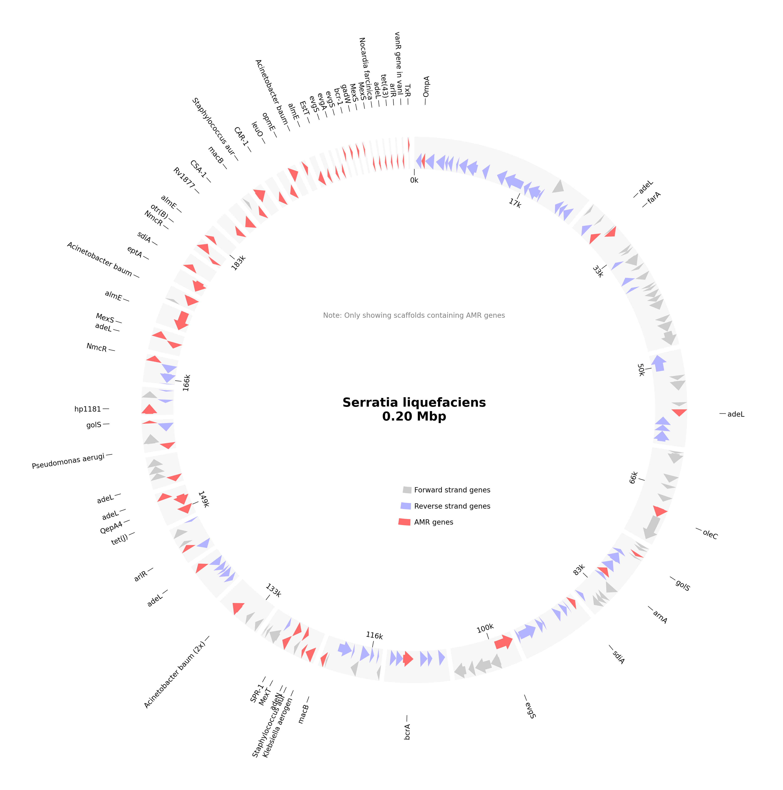

### Acinetobacter baumannii AbaF
- **Mechanism**: antibiotic efflux
- **Drug Classes**: phosphonic acid antibiotic
- **AMR Family**: major facilitator superfamily (MFS) antibiotic efflux pump
- **Locations**:
  - gnl|SPADES|CAEEGBCP_6121_2 : position 388-1698

### Acinetobacter baumannii AbaQ (found in 3 locations)
- **Mechanism**: antibiotic efflux
- **Drug Classes**: fluoroquinolone antibiotic
- **AMR Family**: major facilitator superfamily (MFS) antibiotic efflux pump
- **Locations**:
  - gnl|SPADES|CAEEGBCP_13299_1 : position 332-826
  - gnl|SPADES|CAEEGBCP_1797_5 : position 3707-5056
  - gnl|SPADES|CAEEGBCP_1797_6 : position 5129-6421

### CAR-1
- **Mechanism**: antibiotic inactivation
- **Drug Classes**: carbapenem
- **AMR Family**: CAR beta-lactamase
- **Locations**:
  - gnl|SPADES|CAEEGBCP_9651_1 : position 152-952

### CSA-1
- **Mechanism**: antibiotic inactivation
- **Drug Classes**: cephalosporin
- **AMR Family**: CSA beta-lactamase
- **Locations**:
  - gnl|SPADES|CAEEGBCP_7805_1 : position 147-1328

### EstT
- **Mechanism**: antibiotic inactivation
- **Drug Classes**: macrolide antibiotic
- **AMR Family**: macrolide esterase
- **Locations**:
  - gnl|SPADES|CAEEGBCP_17090_1 : position 2-406

### Klebsiella aerogenes Omp36
- **Mechanism**: reduced permeability to antibiotic
- **Drug Classes**: monobactam; carbapenem; cephalosporin; cephamycin; penam; penem
- **AMR Family**: General Bacterial Porin with reduced permeability to beta-lactams
- **Locations**:
  - gnl|SPADES|CAEEGBCP_1453_1 : position 457-1587

### MexS (found in 3 locations)
- **Mechanism**: antibiotic efflux
- **Drug Classes**: fluoroquinolone antibiotic; diaminopyrimidine antibiotic; phenicol antibiotic
- **AMR Family**: resistance-nodulation-cell division (RND) antibiotic efflux pump
- **Locations**:
  - gnl|SPADES|CAEEGBCP_3856_3 : position 1905-2840
  - gnl|SPADES|CAEEGBCP_42911_1 : position 2-178
  - gnl|SPADES|CAEEGBCP_51171_1 : position 1-252

### MexT
- **Mechanism**: antibiotic efflux
- **Drug Classes**: fluoroquinolone antibiotic; diaminopyrimidine antibiotic; phenicol antibiotic
- **AMR Family**: resistance-nodulation-cell division (RND) antibiotic efflux pump
- **Locations**:
  - gnl|SPADES|CAEEGBCP_1453_5 : position 3316-4218

### NmcR (found in 2 locations)
- **Mechanism**: antibiotic inactivation
- **Drug Classes**: carbapenem; cephalosporin; cephamycin; penam
- **AMR Family**: NmcA beta-lactamase
- **Locations**:
  - gnl|SPADES|CAEEGBCP_3119_3 : position 2947-3789
  - gnl|SPADES|CAEEGBCP_6517_1 : position 2-490

### Nocardia farcinica rox
- **Mechanism**: antibiotic inactivation
- **Drug Classes**: rifamycin antibiotic
- **AMR Family**: rifampin monooxygenase
- **Locations**:
  - gnl|SPADES|CAEEGBCP_56651_1 : position 3-242

### OmpA
- **Mechanism**: reduced permeability to antibiotic
- **Drug Classes**: peptide antibiotic
- **AMR Family**: General Bacterial Porin with reduced permeability to peptide antibiotics
- **Locations**:
  - gnl|SPADES|CAEEGBCP_398_2 : position 1044-1559

### Pseudomonas aeruginosa ampR with mutation conferring resistance to aztreonam
- **Mechanism**: antibiotic target alteration; antibiotic inactivation
- **Drug Classes**: monobactam; carbapenem; cephalosporin
- **AMR Family**: PDC beta-lactamase; ampR transcriptional regulator with mutation conferring resistance to monobactam antibiotics
- **Locations**:
  - gnl|SPADES|CAEEGBCP_2655_1 : position 1-918

### QepA4
- **Mechanism**: antibiotic efflux
- **Drug Classes**: fluoroquinolone antibiotic
- **AMR Family**: major facilitator superfamily (MFS) antibiotic efflux pump
- **Locations**:
  - gnl|SPADES|CAEEGBCP_2580_4 : position 1778-3310

### Rv1877
- **Mechanism**: antibiotic efflux
- **Drug Classes**: fluoroquinolone antibiotic
- **AMR Family**: major facilitator superfamily (MFS) antibiotic efflux pump
- **Locations**:
  - gnl|SPADES|CAEEGBCP_7323_2 : position 667-1464

### SPR-1
- **Mechanism**: antibiotic inactivation
- **Drug Classes**: carbapenem
- **AMR Family**: SPR beta-lactamase
- **Locations**:
  - gnl|SPADES|CAEEGBCP_1453_6 : position 4298-5194

### Staphylococcus aureus FosB
- **Mechanism**: antibiotic inactivation
- **Drug Classes**: phosphonic acid antibiotic
- **AMR Family**: fosfomycin thiol transferase
- **Locations**:
  - gnl|SPADES|CAEEGBCP_1453_2 : position 1741-2157

### Staphylococcus aureus mupB conferring resistance to mupirocin
- **Mechanism**: antibiotic target alteration
- **Drug Classes**: mupirocin-like antibiotic
- **AMR Family**: antibiotic-resistant isoleucyl-tRNA synthetase (ileS)
- **Locations**:
  - gnl|SPADES|CAEEGBCP_8496_1 : position 1-1356

### TxR
- **Mechanism**: antibiotic efflux
- **Drug Classes**: tetracycline antibiotic
- **AMR Family**: ATP-binding cassette (ABC) antibiotic efflux pump
- **Locations**:
  - gnl|SPADES|CAEEGBCP_66911_1 : position 2-220

### adeL (found in 7 locations)
- **Mechanism**: antibiotic efflux
- **Drug Classes**: fluoroquinolone antibiotic; tetracycline antibiotic
- **AMR Family**: resistance-nodulation-cell division (RND) antibiotic efflux pump
- **Locations**:
  - gnl|SPADES|CAEEGBCP_2166_6 : position 4308-5195
  - gnl|SPADES|CAEEGBCP_2580_5 : position 3486-4373
  - gnl|SPADES|CAEEGBCP_2649_1 : position 229-1122
  - gnl|SPADES|CAEEGBCP_3856_2 : position 914-1801
  - gnl|SPADES|CAEEGBCP_472_6 : position 2758-3669
  - gnl|SPADES|CAEEGBCP_57459_1 : position 2-238
  - gnl|SPADES|CAEEGBCP_851_7 : position 8187-9200

### adeN
- **Mechanism**: antibiotic efflux
- **Drug Classes**: macrolide antibiotic; fluoroquinolone antibiotic; lincosamide antibiotic; carbapenem; cephalosporin; tetracycline antibiotic; rifamycin antibiotic; diaminopyrimidine antibiotic; phenicol antibiotic; penem
- **AMR Family**: resistance-nodulation-cell division (RND) antibiotic efflux pump
- **Locations**:
  - gnl|SPADES|CAEEGBCP_1453_3 : position 2151-2729

### almE (found in 3 locations)
- **Mechanism**: antibiotic target alteration
- **Drug Classes**: peptide antibiotic
- **AMR Family**: polymyxin resistance operon; alm glycyltransferase
- **Locations**:
  - gnl|SPADES|CAEEGBCP_13510_1 : position 1-813
  - gnl|SPADES|CAEEGBCP_4238_1 : position 2-2803
  - gnl|SPADES|CAEEGBCP_6854_1 : position 3-641

### arlR (found in 2 locations)
- **Mechanism**: antibiotic efflux
- **Drug Classes**: fluoroquinolone antibiotic; disinfecting agents and antiseptics
- **AMR Family**: major facilitator superfamily (MFS) antibiotic efflux pump
- **Locations**:
  - gnl|SPADES|CAEEGBCP_2298_2 : position 1541-2218
  - gnl|SPADES|CAEEGBCP_63580_1 : position 1-225

### arnA
- **Mechanism**: antibiotic target alteration
- **Drug Classes**: peptide antibiotic
- **AMR Family**: pmr phosphoethanolamine transferase
- **Locations**:
  - gnl|SPADES|CAEEGBCP_973_9 : position 5568-6512

### bcr-1
- **Mechanism**: antibiotic efflux
- **Drug Classes**: bicyclomycin-like antibiotic
- **AMR Family**: major facilitator superfamily (MFS) antibiotic efflux pump
- **Locations**:
  - gnl|SPADES|CAEEGBCP_39241_1 : position 3-287

### bcrA
- **Mechanism**: antibiotic efflux
- **Drug Classes**: peptide antibiotic
- **AMR Family**: ATP-binding cassette (ABC) antibiotic efflux pump
- **Locations**:
  - gnl|SPADES|CAEEGBCP_1295_6 : position 4970-6502

### eptA
- **Mechanism**: antibiotic target alteration
- **Drug Classes**: peptide antibiotic
- **AMR Family**: pmr phosphoethanolamine transferase
- **Locations**:
  - gnl|SPADES|CAEEGBCP_6293_1 : position 161-1699

### evgA
- **Mechanism**: antibiotic efflux
- **Drug Classes**: macrolide antibiotic; fluoroquinolone antibiotic; penam; tetracycline antibiotic
- **AMR Family**: major facilitator superfamily (MFS) antibiotic efflux pump; resistance-nodulation-cell division (RND) antibiotic efflux pump
- **Locations**:
  - gnl|SPADES|CAEEGBCP_35514_1 : position 2-313

### evgS (found in 3 locations)
- **Mechanism**: antibiotic efflux
- **Drug Classes**: macrolide antibiotic; fluoroquinolone antibiotic; penam; tetracycline antibiotic
- **AMR Family**: major facilitator superfamily (MFS) antibiotic efflux pump; resistance-nodulation-cell division (RND) antibiotic efflux pump
- **Locations**:
  - gnl|SPADES|CAEEGBCP_1234_1 : position 27-2759
  - gnl|SPADES|CAEEGBCP_31240_1 : position 3-338
  - gnl|SPADES|CAEEGBCP_36875_1 : position 3-248

### farA
- **Mechanism**: antibiotic efflux
- **Drug Classes**: antibacterial free fatty acids
- **AMR Family**: major facilitator superfamily (MFS) antibiotic efflux pump
- **Locations**:
  - gnl|SPADES|CAEEGBCP_472_8 : position 4321-5256

### gadW
- **Mechanism**: antibiotic efflux
- **Drug Classes**: macrolide antibiotic; fluoroquinolone antibiotic; penam
- **AMR Family**: resistance-nodulation-cell division (RND) antibiotic efflux pump
- **Locations**:
  - gnl|SPADES|CAEEGBCP_40409_1 : position 2-283

### golS (found in 2 locations)
- **Mechanism**: antibiotic efflux
- **Drug Classes**: monobactam; carbapenem; cephalosporin; cephamycin; penam; phenicol antibiotic; penem
- **AMR Family**: resistance-nodulation-cell division (RND) antibiotic efflux pump
- **Locations**:
  - gnl|SPADES|CAEEGBCP_2655_4 : position 3926-4324
  - gnl|SPADES|CAEEGBCP_973_4 : position 1409-1840

### hp1181
- **Mechanism**: antibiotic efflux
- **Drug Classes**: fluoroquinolone antibiotic; tetracycline antibiotic; nitroimidazole antibiotic
- **AMR Family**: major facilitator superfamily (MFS) antibiotic efflux pump
- **Locations**:
  - gnl|SPADES|CAEEGBCP_3073_1 : position 184-1548

### leuO
- **Mechanism**: antibiotic efflux
- **Drug Classes**: nucleoside antibiotic; disinfecting agents and antiseptics
- **AMR Family**: major facilitator superfamily (MFS) antibiotic efflux pump
- **Locations**:
  - gnl|SPADES|CAEEGBCP_10248_1 : position 293-1096

### macB (found in 2 locations)
- **Mechanism**: antibiotic efflux
- **Drug Classes**: macrolide antibiotic
- **AMR Family**: ATP-binding cassette (ABC) antibiotic efflux pump
- **Locations**:
  - gnl|SPADES|CAEEGBCP_1380_10 : position 7795-8505
  - gnl|SPADES|CAEEGBCP_7899_2 : position 729-1478

### oleC
- **Mechanism**: antibiotic efflux
- **Drug Classes**: macrolide antibiotic
- **AMR Family**: ATP-binding cassette (ABC) antibiotic efflux pump
- **Locations**:
  - gnl|SPADES|CAEEGBCP_857_9 : position 8190-9506

### opmE
- **Mechanism**: antibiotic efflux
- **Drug Classes**: macrolide antibiotic; carbapenem; tetracycline antibiotic; diaminopyrimidine antibiotic; phenicol antibiotic; disinfecting agents and antiseptics
- **AMR Family**: resistance-nodulation-cell division (RND) antibiotic efflux pump
- **Locations**:
  - gnl|SPADES|CAEEGBCP_10512_1 : position 3-1067

### otr(B)
- **Mechanism**: antibiotic efflux
- **Drug Classes**: tetracycline antibiotic
- **AMR Family**: major facilitator superfamily (MFS) antibiotic efflux pump
- **Locations**:
  - gnl|SPADES|CAEEGBCP_6517_2 : position 740-1816

### sdiA (found in 2 locations)
- **Mechanism**: antibiotic efflux
- **Drug Classes**: fluoroquinolone antibiotic; cephalosporin; glycylcycline; penam; tetracycline antibiotic; rifamycin antibiotic; phenicol antibiotic; disinfecting agents and antiseptics
- **AMR Family**: resistance-nodulation-cell division (RND) antibiotic efflux pump
- **Locations**:
  - gnl|SPADES|CAEEGBCP_1123_1 : position 111-848
  - gnl|SPADES|CAEEGBCP_6385_1 : position 2-796

### tet(43)
- **Mechanism**: antibiotic efflux
- **Drug Classes**: tetracycline antibiotic
- **AMR Family**: major facilitator superfamily (MFS) antibiotic efflux pump
- **Locations**:
  - gnl|SPADES|CAEEGBCP_61560_1 : position 2-232

### tet(J)
- **Mechanism**: antibiotic efflux
- **Drug Classes**: tetracycline antibiotic
- **AMR Family**: major facilitator superfamily (MFS) antibiotic efflux pump
- **Locations**:
  - gnl|SPADES|CAEEGBCP_2580_2 : position 337-1554

### vanR gene in vanI cluster
- **Mechanism**: antibiotic target alteration
- **Drug Classes**: glycopeptide antibiotic
- **AMR Family**: glycopeptide resistance gene cluster; vanR
- **Locations**:
  - gnl|SPADES|CAEEGBCP_64954_1 : position 2-223

## Serratia liquefaciens ATCC 27592
**Strain Statistics:**
- Total genome length: 4796.5 kbp
- Total scaffolds: 210
- Scaffolds with AMR genes: 99
- Total genes annotated: 8857
- Total AMR genes: 607
- Unique AMR genes: 236
- Distinct AMR mechanisms: 11
- Distinct AMR families: 85
- Distinct drug classes: 37

**Circos Plot:**

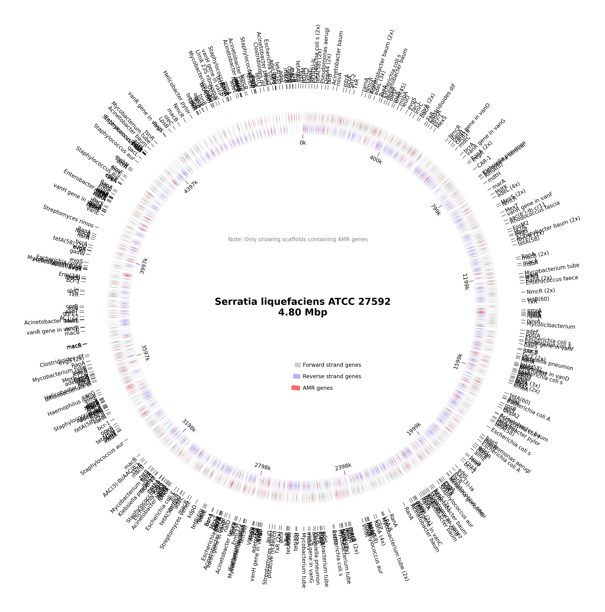

### AAC(3)-Ia
- **Mechanism**: antibiotic inactivation
- **Drug Classes**: aminoglycoside antibiotic
- **AMR Family**: AAC(3)
- **Locations**:
  - gnl|SPADES|CAEEGBCP_67_1 : position 105-653

### AAC(3)-Ib/AAC(6')-Ib3 bifunctional protein
- **Mechanism**: antibiotic inactivation
- **Drug Classes**: aminoglycoside antibiotic
- **AMR Family**: aminoglycoside bifunctional resistance protein
- **Locations**:
  - gnl|SPADES|CAEEGBCP_150_40 : position 44630-45082

### AAC(6')-Iai
- **Mechanism**: antibiotic inactivation
- **Drug Classes**: aminoglycoside antibiotic
- **AMR Family**: AAC(6')
- **Locations**:
  - gnl|SPADES|CAEEGBCP_160_7 : position 5406-5858

### AAC(6')-Iak
- **Mechanism**: antibiotic inactivation
- **Drug Classes**: aminoglycoside antibiotic
- **AMR Family**: AAC(6')
- **Locations**:
  - gnl|SPADES|CAEEGBCP_246_20 : position 17824-18270

### AAC(6')-Isa
- **Mechanism**: antibiotic inactivation
- **Drug Classes**: aminoglycoside antibiotic
- **AMR Family**: AAC(6')
- **Locations**:
  - gnl|SPADES|CAEEGBCP_31_109 : position 112063-112647

### ACT-22
- **Mechanism**: antibiotic inactivation
- **Drug Classes**: carbapenem; cephalosporin; cephamycin; penam
- **AMR Family**: ACT beta-lactamase
- **Locations**:
  - gnl|SPADES|CAEEGBCP_226_13 : position 12615-14150

### AIM-1
- **Mechanism**: antibiotic inactivation
- **Drug Classes**: cephalosporin; cephamycin; penam
- **AMR Family**: AIM beta-lactamase
- **Locations**:
  - gnl|SPADES|CAEEGBCP_160_33 : position 24977-25921

### APH(6)-Ic
- **Mechanism**: antibiotic inactivation
- **Drug Classes**: aminoglycoside antibiotic
- **AMR Family**: APH(6)
- **Locations**:
  - gnl|SPADES|CAEEGBCP_12_39 : position 35897-36751

### Acinetobacter baumannii AbaF (found in 9 locations)
- **Mechanism**: antibiotic efflux
- **Drug Classes**: phosphonic acid antibiotic
- **AMR Family**: major facilitator superfamily (MFS) antibiotic efflux pump
- **Locations**:
  - gnl|SPADES|CAEEGBCP_1039_1 : position 36-1226
  - gnl|SPADES|CAEEGBCP_1170_2 : position 1820-3160
  - gnl|SPADES|CAEEGBCP_14_106 : position 109306-110613
  - gnl|SPADES|CAEEGBCP_226_4 : position 1967-3277
  - gnl|SPADES|CAEEGBCP_38_74 : position 92788-94110
  - gnl|SPADES|CAEEGBCP_38_88 : position 109825-111057
  - gnl|SPADES|CAEEGBCP_68_21 : position 20181-21506
  - gnl|SPADES|CAEEGBCP_70_34 : position 32753-34135
  - gnl|SPADES|CAEEGBCP_949_3 : position 1941-3443

### Acinetobacter baumannii AbaQ (found in 10 locations)
- **Mechanism**: antibiotic efflux
- **Drug Classes**: fluoroquinolone antibiotic
- **AMR Family**: major facilitator superfamily (MFS) antibiotic efflux pump
- **Locations**:
  - gnl|SPADES|CAEEGBCP_117_9 : position 7488-8801
  - gnl|SPADES|CAEEGBCP_119_44 : position 49561-50829
  - gnl|SPADES|CAEEGBCP_120_21 : position 22692-23999
  - gnl|SPADES|CAEEGBCP_12_116 : position 121521-122828
  - gnl|SPADES|CAEEGBCP_139_30 : position 26682-27995
  - gnl|SPADES|CAEEGBCP_14_125 : position 131888-133288
  - gnl|SPADES|CAEEGBCP_14_49 : position 49094-50464
  - gnl|SPADES|CAEEGBCP_446_1 : position 182-1519
  - gnl|SPADES|CAEEGBCP_54_8 : position 7231-8493
  - gnl|SPADES|CAEEGBCP_68_55 : position 58462-59757

### Acinetobacter baumannii AmvA
- **Mechanism**: antibiotic efflux
- **Drug Classes**: macrolide antibiotic; disinfecting agents and antiseptics
- **AMR Family**: major facilitator superfamily (MFS) antibiotic efflux pump
- **Locations**:
  - gnl|SPADES|CAEEGBCP_43_27 : position 31508-32980

### ArnT
- **Mechanism**: antibiotic target alteration
- **Drug Classes**: peptide antibiotic
- **AMR Family**: pmr phosphoethanolamine transferase
- **Locations**:
  - gnl|SPADES|CAEEGBCP_154_17: position 16219-17883

### Bifidobacterium bifidum ileS conferring resistance to mupirocin
- **Mechanism**: antibiotic target alteration
- **Drug Classes**: mupirocin-like antibiotic
- **AMR Family**: antibiotic-resistant isoleucyl-tRNA synthetase (ileS)
- **Locations**:
  - gnl|SPADES|CAEEGBCP_177_1 : position 34-2616

### CAR-1
- **Mechanism**: antibiotic inactivation
- **Drug Classes**: carbapenem
- **AMR Family**: CAR beta-lactamase
- **Locations**:
  - gnl|SPADES|CAEEGBCP_31_33 : position 41218-42024

### CAU-1
- **Mechanism**: antibiotic inactivation
- **Drug Classes**: carbapenem; penam
- **AMR Family**: CAU beta-lactamase
- **Locations**:
  - gnl|SPADES|CAEEGBCP_147_2 : position 569-2692

### CRP (found in 2 locations)
- **Mechanism**: antibiotic efflux
- **Drug Classes**: macrolide antibiotic; fluoroquinolone antibiotic; penam
- **AMR Family**: resistance-nodulation-cell division (RND) antibiotic efflux pump
- **Locations**:
  - gnl|SPADES|CAEEGBCP_67_55: position 62425-63057
  - gnl|SPADES|CAEEGBCP_86_3 : position 2569-3333

### Clostridioides difficile gyrA conferring resistance to fluoroquinolones
- **Mechanism**: antibiotic target alteration
- **Drug Classes**: fluoroquinolone antibiotic
- **AMR Family**: fluoroquinolone resistant gyrA
- **Locations**:
  - gnl|SPADES|CAEEGBCP_195_5 : position 6924-9575

### Clostridioides difficile gyrB conferring resistance to fluoroquinolones (found in 2 locations)
- **Mechanism**: antibiotic target alteration
- **Drug Classes**: fluoroquinolone antibiotic
- **AMR Family**: fluoroquinolone resistant gyrB
- **Locations**:
  - gnl|SPADES|CAEEGBCP_1169_4 : position 2950-5364
  - gnl|SPADES|CAEEGBCP_16_98 : position 111139-113034

### CrcB
- **Mechanism**: antibiotic efflux
- **Drug Classes**: aminoglycoside antibiotic
- **AMR Family**: multidrug and toxic compound extrusion (MATE) transporter
- **Locations**:
  - gnl|SPADES|CAEEGBCP_177_16 : position 15469-15852

### DHA-6
- **Mechanism**: antibiotic inactivation
- **Drug Classes**: cephalosporin; cephamycin
- **AMR Family**: DHA beta-lactamase
- **Locations**:
  - gnl|SPADES|CAEEGBCP_14_53 : position 53856-54998

### Enterobacter cloacae acrA (found in 2 locations)
- **Mechanism**: antibiotic efflux
- **Drug Classes**: fluoroquinolone antibiotic; cephalosporin; glycylcycline; penam; tetracycline antibiotic; rifamycin antibiotic; phenicol antibiotic; disinfecting agents and antiseptics
- **AMR Family**: resistance-nodulation-cell division (RND) antibiotic efflux pump
- **Locations**:
  - gnl|SPADES|CAEEGBCP_343_19 : position 23979-25181
  - gnl|SPADES|CAEEGBCP_52_44 : position 46798-47985

### Enterococcus faecalis cls with mutation conferring resistance to daptomycin
- **Mechanism**: antibiotic target alteration
- **Drug Classes**: peptide antibiotic
- **AMR Family**: daptomycin resistant cls
- **Locations**:
  - gnl|SPADES|CAEEGBCP_43_25 : position 28881-30341

### Enterococcus faecium liaS mutant conferring daptomycin resistance
- **Mechanism**: antibiotic target alteration; antibiotic efflux
- **Drug Classes**: peptide antibiotic
- **AMR Family**: daptomycin resistant liaS
- **Locations**:
  - gnl|SPADES|CAEEGBCP_445_2 : position 1606-3141

### Erm(34)
- **Mechanism**: antibiotic target alteration
- **Drug Classes**: macrolide antibiotic; lincosamide antibiotic; streptogramin antibiotic; streptogramin A antibiotic; streptogramin B antibiotic
- **AMR Family**: Erm 23S ribosomal RNA methyltransferase
- **Locations**:
  - gnl|SPADES|CAEEGBCP_244_30 : position 31347-31973

### Erm(37)
- **Mechanism**: antibiotic target alteration
- **Drug Classes**: macrolide antibiotic; lincosamide antibiotic; streptogramin antibiotic; streptogramin A antibiotic; streptogramin B antibiotic
- **AMR Family**: Erm 23S ribosomal RNA methyltransferase
- **Locations**:
  - gnl|SPADES|CAEEGBCP_119_25 : position 27821-28600

### Escherichia coli AcrAB-TolC with AcrR mutation conferring resistance to ciprofloxacin, tetracycline, and ceftazidime (found in 5 locations)
- **Mechanism**: antibiotic target alteration; antibiotic efflux
- **Drug Classes**: fluoroquinolone antibiotic; cephalosporin; glycylcycline; penam; tetracycline antibiotic; rifamycin antibiotic; phenicol antibiotic; disinfecting agents and antiseptics
- **AMR Family**: resistance-nodulation-cell division (RND) antibiotic efflux pump
- **Locations**:
  - gnl|SPADES|CAEEGBCP_120_34 : position 39025-39729
  - gnl|SPADES|CAEEGBCP_12_81 : position 78857-79459
  - gnl|SPADES|CAEEGBCP_45_24 : position 25551-26132
  - gnl|SPADES|CAEEGBCP_52_45 : position 48128-48817
  - gnl|SPADES|CAEEGBCP_60_31 : position 36168-36755

### Escherichia coli AcrAB-TolC with MarR mutations conferring resistance to ciprofloxacin and tetracycline (found in 2 locations)
- **Mechanism**: antibiotic target alteration; antibiotic efflux
- **Drug Classes**: fluoroquinolone antibiotic; cephalosporin; glycylcycline; penam; tetracycline antibiotic; rifamycin antibiotic; phenicol antibiotic; disinfecting agents and antiseptics
- **AMR Family**: resistance-nodulation-cell division (RND) antibiotic efflux pump
- **Locations**:
  - gnl|SPADES|CAEEGBCP_12_122 : position 127763-128236
  - gnl|SPADES|CAEEGBCP_12_25 : position 25443-25877

### Escherichia coli EF-Tu mutants conferring resistance to Enacyloxin IIa
- **Mechanism**: antibiotic target alteration
- **Drug Classes**: elfamycin antibiotic
- **AMR Family**: elfamycin resistant EF-Tu
- **Locations**:
  - gnl|SPADES|CAEEGBCP_137_47 : position 49401-52088

### Escherichia coli EF-Tu mutants conferring resistance to Pulvomycin (found in 2 locations)
- **Mechanism**: antibiotic target alteration
- **Drug Classes**: elfamycin antibiotic
- **AMR Family**: elfamycin resistant EF-Tu
- **Locations**:
  - gnl|SPADES|CAEEGBCP_119_12 : position 12832-14679
  - gnl|SPADES|CAEEGBCP_246_29 : position 30888-32072

### Escherichia coli fabI mutations conferring resistance to isoniazid and triclosan (found in 2 locations)
- **Mechanism**: antibiotic target alteration
- **Drug Classes**: disinfecting agents and antiseptics; isoniazid-like antibiotic
- **AMR Family**: antibiotic resistant fabI
- **Locations**:
  - gnl|SPADES|CAEEGBCP_54_12 : position 11656-12411
  - gnl|SPADES|CAEEGBCP_92_61 : position 55653-56399

### Escherichia coli mdfA
- **Mechanism**: antibiotic efflux
- **Drug Classes**: tetracycline antibiotic; phenicol antibiotic; disinfecting agents and antiseptics
- **AMR Family**: major facilitator superfamily (MFS) antibiotic efflux pump
- **Locations**:
  - gnl|SPADES|CAEEGBCP_119_10 : position 11108-12355

### Escherichia coli soxS with mutation conferring antibiotic resistance (found in 9 locations)
- **Mechanism**: antibiotic target alteration; antibiotic efflux; reduced permeability to antibiotic
- **Drug Classes**: fluoroquinolone antibiotic; monobactam; carbapenem; cephalosporin; glycylcycline; cephamycin; penam; tetracycline antibiotic; rifamycin antibiotic; phenicol antibiotic; penem; disinfecting agents and antiseptics
- **AMR Family**: ATP-binding cassette (ABC) antibiotic efflux pump; major facilitator superfamily (MFS) antibiotic efflux pump; resistance-nodulation-cell division (RND) antibiotic efflux pump; General Bacterial Porin with reduced permeability to beta-lactams
- **Locations**:
  - gnl|SPADES|CAEEGBCP_12_49 : position 47125-48018
  - gnl|SPADES|CAEEGBCP_12_61 : position 59652-60569
  - gnl|SPADES|CAEEGBCP_139_43 : position 41826-42671
  - gnl|SPADES|CAEEGBCP_14_95 : position 95923-96792
  - gnl|SPADES|CAEEGBCP_1641_7 : position 5307-5729
  - gnl|SPADES|CAEEGBCP_45_14 : position 12884-13342
  - gnl|SPADES|CAEEGBCP_49_30 : position 29085-30032
  - gnl|SPADES|CAEEGBCP_54_65 : position 73604-74470
  - gnl|SPADES|CAEEGBCP_92_13 : position 13315-14088

### EstT (found in 3 locations)
- **Mechanism**: antibiotic inactivation
- **Drug Classes**: macrolide antibiotic
- **AMR Family**: macrolide esterase
- **Locations**:
  - gnl|SPADES|CAEEGBCP_10998_1 : position 72-902
  - gnl|SPADES|CAEEGBCP_139_20 : position 18249-19052
  - gnl|SPADES|CAEEGBCP_60_62 : position 63633-64475

### FosA8
- **Mechanism**: antibiotic inactivation
- **Drug Classes**: phosphonic acid antibiotic
- **AMR Family**: fosfomycin thiol transferase
- **Locations**:
  - gnl|SPADES|CAEEGBCP_31_77: position 81737-82144

### FosC2
- **Mechanism**: antibiotic inactivation
- **Drug Classes**: phosphonic acid antibiotic
- **AMR Family**: fosC phosphotransferase family
- **Locations**:
  - gnl|SPADES|CAEEGBCP_12_12 : position 11423-11830

### FosM2 (found in 2 locations)
- **Mechanism**: antibiotic inactivation
- **Drug Classes**: phosphonic acid antibiotic
- **AMR Family**: fosfomycin thiol transferase
- **Locations**:
  - gnl|SPADES|CAEEGBCP_177_27 : position 24545-25054
  - gnl|SPADES|CAEEGBCP_38_42 : position 50398-50808

### GOB-12
- **Mechanism**: antibiotic inactivation
- **Drug Classes**: carbapenem; cephalosporin; penam
- **AMR Family**: GOB beta-lactamase
- **Locations**:
  - gnl|SPADES|CAEEGBCP_147_19 : position 22699-23346

### H-NS
- **Mechanism**: antibiotic efflux
- **Drug Classes**: macrolide antibiotic; fluoroquinolone antibiotic; cephalosporin; cephamycin; penam; tetracycline antibiotic
- **AMR Family**: major facilitator superfamily (MFS) antibiotic efflux pump; resistance-nodulation-cell division (RND) antibiotic efflux pump
- **Locations**:
  - gnl|SPADES|CAEEGBCP_43_8 : position 7533-7940

### Haemophilus influenzae PBP3 conferring resistance to beta-lactam antibiotics (found in 2 locations)
- **Mechanism**: antibiotic target alteration
- **Drug Classes**: cephalosporin; cephamycin; penam
- **AMR Family**: Penicillin-binding protein mutations conferring resistance to beta-lactam antibiotics
- **Locations**:
  - gnl|SPADES|CAEEGBCP_12_167 : position 179897-181615
  - gnl|SPADES|CAEEGBCP_173_9 : position 8713-10476

### Helicobacter pylori pbp1 mutants conferring resistance to amoxicillin (found in 2 locations)
- **Mechanism**: antibiotic target alteration
- **Drug Classes**: cephalosporin; cephamycin; penam
- **AMR Family**: Penicillin-binding protein mutations conferring resistance to beta-lactam antibiotics
- **Locations**:
  - gnl|SPADES|CAEEGBCP_54_29 : position 30372-32876
  - gnl|SPADES|CAEEGBCP_627_9 : position 8418-10766

### Helicobacter pylori pbp2 mutants conferring resistance to amoxicillin
- **Mechanism**: antibiotic target alteration
- **Drug Classes**: cephalosporin; cephamycin; penam
- **AMR Family**: Penicillin-binding protein mutations conferring resistance to beta-lactam antibiotics
- **Locations**:
  - gnl|SPADES|CAEEGBCP_177_7 : position 5894-7789

### Helicobacter pylori rpoB mutation conferring resistance to rifampicin
- **Mechanism**: antibiotic target alteration; antibiotic target replacement
- **Drug Classes**: fluoroquinolone antibiotic; rifamycin antibiotic
- **AMR Family**: rifamycin-resistant beta-subunit of RNA polymerase (rpoB)
- **Locations**:
  - gnl|SPADES|CAEEGBCP_246_21 : position 18442-22662

### Klebsiella pneumoniae KpnE
- **Mechanism**: antibiotic efflux
- **Drug Classes**: macrolide antibiotic; aminoglycoside antibiotic; cephalosporin; tetracycline antibiotic; peptide antibiotic; rifamycin antibiotic; disinfecting agents and antiseptics
- **AMR Family**: small multidrug resistance (SMR) antibiotic efflux pump
- **Locations**:
  - gnl|SPADES|CAEEGBCP_99_11 : position 11942-12310

### Klebsiella pneumoniae KpnF
- **Mechanism**: antibiotic efflux
- **Drug Classes**: macrolide antibiotic; aminoglycoside antibiotic; cephalosporin; tetracycline antibiotic; peptide antibiotic; rifamycin antibiotic; disinfecting agents and antiseptics
- **AMR Family**: small multidrug resistance (SMR) antibiotic efflux pump
- **Locations**:
  - gnl|SPADES|CAEEGBCP_99_12: position 12297-12626

### Klebsiella pneumoniae KpnH
- **Mechanism**: antibiotic efflux
- **Drug Classes**: macrolide antibiotic; fluoroquinolone antibiotic; aminoglycoside antibiotic; carbapenem; cephalosporin; penam; peptide antibiotic; penem
- **AMR Family**: major facilitator superfamily (MFS) antibiotic efflux pump
- **Locations**:
  - gnl|SPADES|CAEEGBCP_160_48: position 41661-43196

### Klebsiella pneumoniae OmpK37 (found in 3 locations)
- **Mechanism**: reduced permeability to antibiotic
- **Drug Classes**: monobactam; carbapenem; cephalosporin; cephamycin; penam; penem
- **AMR Family**: General Bacterial Porin with reduced permeability to beta-lactams
- **Locations**:
  - gnl|SPADES|CAEEGBCP_147_21 : position 24853-25977
  - gnl|SPADES|CAEEGBCP_31_63 : position 74362-75444
  - gnl|SPADES|CAEEGBCP_45_91 : position 91676-92773

### LRA-8
- **Mechanism**: antibiotic inactivation
- **Drug Classes**: cephalosporin; penam
- **AMR Family**: subclass B3 LRA beta-lactamase
- **Locations**:
  - gnl|SPADES|CAEEGBCP_74_61 : position 60435-61190

### LlmA 23S ribosomal RNA methyltransferase
- **Mechanism**: antibiotic target alteration
- **Drug Classes**: lincosamide antibiotic
- **AMR Family**: Llm 23S ribosomal RNA methyltransferase
- **Locations**:
  - gnl|SPADES|CAEEGBCP_820_13 : position 12633-13823

### LpsB (found in 2 locations)
- **Mechanism**: reduced permeability to antibiotic
- **Drug Classes**: peptide antibiotic
- **AMR Family**: Intrinsic peptide antibiotic resistant Lps
- **Locations**:
  - gnl|SPADES|CAEEGBCP_515_14 : position 16270-17478
  - gnl|SPADES|CAEEGBCP_66_15 : position 11132-12229

### LptD
- **Mechanism**: antibiotic efflux
- **Drug Classes**: carbapenem; peptide antibiotic; aminocoumarin antibiotic; rifamycin antibiotic
- **AMR Family**: ATP-binding cassette (ABC) antibiotic efflux pump
- **Locations**:
  - gnl|SPADES|CAEEGBCP_14_144 : position 153826-156189

### MdtK
- **Mechanism**: antibiotic efflux
- **Drug Classes**: fluoroquinolone antibiotic
- **AMR Family**: multidrug and toxic compound extrusion (MATE) transporter
- **Locations**:
  - gnl|SPADES|CAEEGBCP_33_25 : position 25546-27009

### MexA
- **Mechanism**: antibiotic efflux
- **Drug Classes**: macrolide antibiotic; fluoroquinolone antibiotic; monobactam; carbapenem; cephalosporin; cephamycin; penam; tetracycline antibiotic; peptide antibiotic; aminocoumarin antibiotic; diaminopyrimidine antibiotic; sulfonamide antibiotic; phenicol antibiotic; penem
- **AMR Family**: resistance-nodulation-cell division (RND) antibiotic efflux pump
- **Locations**:
  - gnl|SPADES|CAEEGBCP_120_36 : position 41439-42581

### MexE
- **Mechanism**: antibiotic efflux
- **Drug Classes**: fluoroquinolone antibiotic; diaminopyrimidine antibiotic; phenicol antibiotic
- **AMR Family**: resistance-nodulation-cell division (RND) antibiotic efflux pump
- **Locations**:
  - gnl|SPADES|CAEEGBCP_12_24 : position 24165-25022

### MexG
- **Mechanism**: antibiotic efflux
- **Drug Classes**: fluoroquinolone antibiotic; tetracycline antibiotic; disinfecting agents and antiseptics
- **AMR Family**: resistance-nodulation-cell division (RND) antibiotic efflux pump
- **Locations**:
  - gnl|SPADES|CAEEGBCP_160_11 : position 7974-8387

### MexL (found in 4 locations)
- **Mechanism**: antibiotic efflux
- **Drug Classes**: macrolide antibiotic; tetracycline antibiotic; disinfecting agents and antiseptics
- **AMR Family**: resistance-nodulation-cell division (RND) antibiotic efflux pump
- **Locations**:
  - gnl|SPADES|CAEEGBCP_139_24 : position 21645-22283
  - gnl|SPADES|CAEEGBCP_226_1 : position 3-611
  - gnl|SPADES|CAEEGBCP_49_84 : position 77494-78138
  - gnl|SPADES|CAEEGBCP_86_40 : position 40498-41082

### MexS (found in 10 locations)
- **Mechanism**: antibiotic efflux
- **Drug Classes**: fluoroquinolone antibiotic; diaminopyrimidine antibiotic; phenicol antibiotic
- **AMR Family**: resistance-nodulation-cell division (RND) antibiotic efflux pump
- **Locations**:
  - gnl|SPADES|CAEEGBCP_108_48 : position 49198-50184
  - gnl|SPADES|CAEEGBCP_16_130 : position 149387-150415
  - gnl|SPADES|CAEEGBCP_177_46 : position 42814-43749
  - gnl|SPADES|CAEEGBCP_177_47 : position 43842-44831
  - gnl|SPADES|CAEEGBCP_261_21 : position 23527-24654
  - gnl|SPADES|CAEEGBCP_33_111 : position 109297-110331
  - gnl|SPADES|CAEEGBCP_33_73 : position 72366-73373
  - gnl|SPADES|CAEEGBCP_49_100 : position 92829-93854
  - gnl|SPADES|CAEEGBCP_49_90 : position 82452-83432
  - gnl|SPADES|CAEEGBCP_70_19 : position 19143-20132

### MexT (found in 3 locations)
- **Mechanism**: antibiotic efflux
- **Drug Classes**: fluoroquinolone antibiotic; diaminopyrimidine antibiotic; phenicol antibiotic
- **AMR Family**: resistance-nodulation-cell division (RND) antibiotic efflux pump
- **Locations**:
  - gnl|SPADES|CAEEGBCP_120_48 : position 56596-57492
  - gnl|SPADES|CAEEGBCP_33_109 : position 107577-108506
  - gnl|SPADES|CAEEGBCP_38_60 : position 72479-73429

### MexV
- **Mechanism**: antibiotic efflux
- **Drug Classes**: macrolide antibiotic; fluoroquinolone antibiotic; tetracycline antibiotic; phenicol antibiotic; disinfecting agents and antiseptics
- **AMR Family**: resistance-nodulation-cell division (RND) antibiotic efflux pump
- **Locations**:
  - gnl|SPADES|CAEEGBCP_24_77 : position 81371-82822

### MexZ
- **Mechanism**: antibiotic efflux
- **Drug Classes**: macrolide antibiotic; fluoroquinolone antibiotic; aminoglycoside antibiotic; carbapenem; cephalosporin; cephamycin; penam; tetracycline antibiotic; phenicol antibiotic; disinfecting agents and antiseptics
- **AMR Family**: resistance-nodulation-cell division (RND) antibiotic efflux pump
- **Locations**:
  - gnl|SPADES|CAEEGBCP_45_66 : position 66260-66826

### Mycobacterium tuberculosis gidB mutation conferring resistance to streptomycin
- **Mechanism**: antibiotic target alteration
- **Drug Classes**: aminoglycoside antibiotic
- **AMR Family**: antibiotic resistant gidB
- **Locations**:
  - gnl|SPADES|CAEEGBCP_192_16 : position 18097-18717

### Mycobacterium tuberculosis inhA mutations conferring resistance to isoniazid
- **Mechanism**: antibiotic target alteration
- **Drug Classes**: isoniazid-like antibiotic
- **AMR Family**: isoniazid resistant inhA
- **Locations**:
  - gnl|SPADES|CAEEGBCP_90_62 : position 71644-72402

### Mycobacterium tuberculosis kasA mutant conferring resistance to isoniazid (found in 3 locations)
- **Mechanism**: antibiotic target alteration
- **Drug Classes**: isoniazid-like antibiotic
- **AMR Family**: antibiotic resistant kasA
- **Locations**:
  - gnl|SPADES|CAEEGBCP_147_40 : position 49798-51072
  - gnl|SPADES|CAEEGBCP_74_67 : position 66909-68138
  - gnl|SPADES|CAEEGBCP_74_70 : position 69333-70502

### Mycobacterium tuberculosis katG mutations conferring resistance to isoniazid
- **Mechanism**: antibiotic target alteration
- **Drug Classes**: isoniazid-like antibiotic
- **AMR Family**: isoniazid resistant katG
- **Locations**:
  - gnl|SPADES|CAEEGBCP_718_13 : position 12975-15173

### Mycobacterium tuberculosis ndh with mutation conferring resistance to isoniazid
- **Mechanism**: antibiotic target alteration
- **Drug Classes**: isoniazid-like antibiotic
- **AMR Family**: antibiotic resistant ndh
- **Locations**:
  - gnl|SPADES|CAEEGBCP_92_70 : position 62357-63661

### Mycobacterium tuberculosis pncA mutations conferring resistance to pyrazinamide (found in 3 locations)
- **Mechanism**: antibiotic target alteration
- **Drug Classes**: pyrazine antibiotic
- **AMR Family**: Pyrazinamide resistant pncA
- **Locations**:
  - gnl|SPADES|CAEEGBCP_119_7 : position 8424-8975
  - gnl|SPADES|CAEEGBCP_33_5 : position 4083-4769
  - gnl|SPADES|CAEEGBCP_99_55 : position 56967-57599

### Mycobacterium tuberculosis rpoB mutations conferring resistance to rifampicin
- **Mechanism**: antibiotic target alteration; antibiotic target replacement
- **Drug Classes**: rifamycin antibiotic
- **AMR Family**: rifamycin-resistant beta-subunit of RNA polymerase (rpoB)
- **Locations**:
  - gnl|SPADES|CAEEGBCP_246_22 : position 22781-26809

### Mycobacterium tuberculosis rpsA mutations conferring resistance to pyrazinamide
- **Mechanism**: antibiotic target alteration
- **Drug Classes**: pyrazine antibiotic
- **AMR Family**: pyrazinamide resistant rpsA
- **Locations**:
  - gnl|SPADES|CAEEGBCP_42_97 : position 107049-108722

### Mycobacterium tuberculosis thyA with mutation conferring resistance to para-aminosalicylic acid
- **Mechanism**: antibiotic target alteration
- **Drug Classes**: salicylic acid antibiotic
- **AMR Family**: aminosalicylate resistant thymidylate synthase
- **Locations**:
  - gnl|SPADES|CAEEGBCP_446_13 : position 18863-19657

### Mycolicibacterium smegmatis ndh with mutation conferring resistance to isoniazid
- **Mechanism**: antibiotic target alteration
- **Drug Classes**: isoniazid-like antibiotic
- **AMR Family**: antibiotic resistant ndh
- **Locations**:
  - gnl|SPADES|CAEEGBCP_44_65 : position 73355-74563

### Neisseria gonorrhoeae pilQ gene conferring resistance to beta-lactam
- **Mechanism**: antibiotic target alteration
- **Drug Classes**: cephalosporin; cephamycin; penam
- **AMR Family**: Penicillin-binding protein mutations conferring resistance to beta-lactam antibiotics
- **Locations**:
  - gnl|SPADES|CAEEGBCP_67_29 : position 33240-34481

### NmcR (found in 27 locations)
- **Mechanism**: antibiotic inactivation
- **Drug Classes**: carbapenem; cephalosporin; cephamycin; penam
- **AMR Family**: NmcA beta-lactamase
- **Locations**:
  - gnl|SPADES|CAEEGBCP_1039_7 : position 6677-7594
  - gnl|SPADES|CAEEGBCP_1052_9 : position 9055-10008
  - gnl|SPADES|CAEEGBCP_120_31 : position 35633-36496
  - gnl|SPADES|CAEEGBCP_12_91 : position 91812-92702
  - gnl|SPADES|CAEEGBCP_139_14 : position 13242-14165
  - gnl|SPADES|CAEEGBCP_14_26 : position 28123-29052
  - gnl|SPADES|CAEEGBCP_160_41 : position 34895-35773
  - gnl|SPADES|CAEEGBCP_16_105 : position 120336-121169
  - gnl|SPADES|CAEEGBCP_177_36 : position 34401-35390
  - gnl|SPADES|CAEEGBCP_24_27 : position 26796-27737
  - gnl|SPADES|CAEEGBCP_261_20 : position 22581-23498
  - gnl|SPADES|CAEEGBCP_33_82 : position 79801-80673
  - gnl|SPADES|CAEEGBCP_38_81 : position 101365-102264
  - gnl|SPADES|CAEEGBCP_38_91 : position 113408-114235
  - gnl|SPADES|CAEEGBCP_43_60 : position 65597-66571
  - gnl|SPADES|CAEEGBCP_43_80 : position 87637-88491
  - gnl|SPADES|CAEEGBCP_45_3 : position 2319-3221
  - gnl|SPADES|CAEEGBCP_45_51 : position 53241-54128
  - gnl|SPADES|CAEEGBCP_49_17 : position 16232-17170
  - gnl|SPADES|CAEEGBCP_49_22 : position 21676-22578
  - gnl|SPADES|CAEEGBCP_49_59 : position 55107-56036
  - gnl|SPADES|CAEEGBCP_608_4 : position 4668-5564
  - gnl|SPADES|CAEEGBCP_60_61 : position 62652-63524
  - gnl|SPADES|CAEEGBCP_68_45 : position 47772-48665
  - gnl|SPADES|CAEEGBCP_86_37 : position 37219-38127
  - gnl|SPADES|CAEEGBCP_895_13 : position 10964-11845
  - gnl|SPADES|CAEEGBCP_90_41 : position 44161-45081

### OmpA (found in 3 locations)
- **Mechanism**: reduced permeability to antibiotic
- **Drug Classes**: peptide antibiotic
- **AMR Family**: General Bacterial Porin with reduced permeability to peptide antibiotics
- **Locations**:
  - gnl|SPADES|CAEEGBCP_119_40 : position 45723-46385
  - gnl|SPADES|CAEEGBCP_14_88 : position 89164-89661
  - gnl|SPADES|CAEEGBCP_820_3 : position 2560-3636

### OpmH
- **Mechanism**: antibiotic efflux
- **Drug Classes**: disinfecting agents and antiseptics
- **AMR Family**: resistance-nodulation-cell division (RND) antibiotic efflux pump
- **Locations**:
  - gnl|SPADES|CAEEGBCP_2126_5 : position 4114-5487

### OprM
- **Mechanism**: antibiotic efflux
- **Drug Classes**: macrolide antibiotic; fluoroquinolone antibiotic; monobactam; aminoglycoside antibiotic; carbapenem; cephalosporin; cephamycin; penam; tetracycline antibiotic; peptide antibiotic; aminocoumarin antibiotic; diaminopyrimidine antibiotic; sulfonamide antibiotic; phenicol antibiotic; penem; disinfecting agents and antiseptics
- **AMR Family**: resistance-nodulation-cell division (RND) antibiotic efflux pump
- **Locations**:
  - gnl|SPADES|CAEEGBCP_120_38 : position 45738-47192

### ParR (found in 2 locations)
- **Mechanism**: antibiotic efflux; reduced permeability to antibiotic
- **Drug Classes**: macrolide antibiotic; fluoroquinolone antibiotic; monobactam; aminoglycoside antibiotic; carbapenem; cephalosporin; cephamycin; penam; tetracycline antibiotic; phenicol antibiotic; penem; disinfecting agents and antiseptics
- **AMR Family**: resistance-nodulation-cell division (RND) antibiotic efflux pump; Outer Membrane Porin (Opr)
- **Locations**:
  - gnl|SPADES|CAEEGBCP_293_20 : position 26454-27215
  - gnl|SPADES|CAEEGBCP_67_14 : position 18227-18946

### ParS (found in 3 locations)
- **Mechanism**: antibiotic efflux; reduced permeability to antibiotic
- **Drug Classes**: macrolide antibiotic; fluoroquinolone antibiotic; monobactam; aminoglycoside antibiotic; carbapenem; cephalosporin; cephamycin; penam; tetracycline antibiotic; phenicol antibiotic; penem; disinfecting agents and antiseptics
- **AMR Family**: resistance-nodulation-cell division (RND) antibiotic efflux pump; Outer Membrane Porin (Opr)
- **Locations**:
  - gnl|SPADES|CAEEGBCP_1121_6 : position 5416-7197
  - gnl|SPADES|CAEEGBCP_160_35 : position 27738-29336
  - gnl|SPADES|CAEEGBCP_293_19 : position 25153-26457

### PmrF (found in 2 locations)
- **Mechanism**: antibiotic target alteration
- **Drug Classes**: peptide antibiotic
- **AMR Family**: pmr phosphoethanolamine transferase
- **Locations**:
  - gnl|SPADES|CAEEGBCP_154_14 : position 12358-13338
  - gnl|SPADES|CAEEGBCP_66_20 : position 16707-17690

### Pseudomonas aeruginosa CpxR (found in 4 locations)
- **Mechanism**: antibiotic efflux
- **Drug Classes**: macrolide antibiotic; fluoroquinolone antibiotic; monobactam; aminoglycoside antibiotic; carbapenem; cephalosporin; cephamycin; penam; tetracycline antibiotic; peptide antibiotic; aminocoumarin antibiotic; diaminopyrimidine antibiotic; sulfonamide antibiotic; phenicol antibiotic; penem
- **AMR Family**: resistance-nodulation-cell division (RND) antibiotic efflux pump
- **Locations**:
  - gnl|SPADES|CAEEGBCP_160_36 : position 29345-30034
  - gnl|SPADES|CAEEGBCP_60_14 : position 18488-19228
  - gnl|SPADES|CAEEGBCP_66_40 : position 36525-37223
  - gnl|SPADES|CAEEGBCP_90_30 : position 32339-33019

### Pseudomonas aeruginosa ampR with mutation conferring resistance to aztreonam (found in 2 locations)
- **Mechanism**: antibiotic target alteration; antibiotic inactivation
- **Drug Classes**: monobactam; carbapenem; cephalosporin
- **AMR Family**: PDC beta-lactamase; ampR transcriptional regulator with mutation conferring resistance to monobactam antibiotics
- **Locations**:
  - gnl|SPADES|CAEEGBCP_12_78 : position 75364-76239
  - gnl|SPADES|CAEEGBCP_24_108 : position 111730-112659

### QepA2
- **Mechanism**: antibiotic efflux
- **Drug Classes**: fluoroquinolone antibiotic
- **AMR Family**: major facilitator superfamily (MFS) antibiotic efflux pump
- **Locations**:
  - gnl|SPADES|CAEEGBCP_52_78 : position 86934-88340

### QepA4 (found in 2 locations)
- **Mechanism**: antibiotic efflux
- **Drug Classes**: fluoroquinolone antibiotic
- **AMR Family**: major facilitator superfamily (MFS) antibiotic efflux pump
- **Locations**:
  - gnl|SPADES|CAEEGBCP_12_179 : position 192697-194133
  - gnl|SPADES|CAEEGBCP_12_90 : position 90417-91712

### RanA (found in 25 locations)
- **Mechanism**: antibiotic efflux
- **Drug Classes**: aminoglycoside antibiotic
- **AMR Family**: ATP-binding cassette (ABC) antibiotic efflux pump
- **Locations**:
  - gnl|SPADES|CAEEGBCP_125_9 : position 8984-10576
  - gnl|SPADES|CAEEGBCP_12_105 : position 106413-107492
  - gnl|SPADES|CAEEGBCP_12_170 : position 182793-183554
  - gnl|SPADES|CAEEGBCP_151_6 : position 7308-8297
  - gnl|SPADES|CAEEGBCP_158_31 : position 31682-32758
  - gnl|SPADES|CAEEGBCP_160_37 : position 30441-31643
  - gnl|SPADES|CAEEGBCP_192_31 : position 33319-34095
  - gnl|SPADES|CAEEGBCP_24_41 : position 41664-42437
  - gnl|SPADES|CAEEGBCP_261_27 : position 30055-31932
  - gnl|SPADES|CAEEGBCP_31_4 : position 3306-4142
  - gnl|SPADES|CAEEGBCP_31_49 : position 56748-57716
  - gnl|SPADES|CAEEGBCP_343_4 : position 4735-5796
  - gnl|SPADES|CAEEGBCP_358_20 : position 20593-22269
  - gnl|SPADES|CAEEGBCP_42_42 : position 40747-41880
  - gnl|SPADES|CAEEGBCP_43_16 : position 19255-20271
  - gnl|SPADES|CAEEGBCP_43_17 : position 20268-21269
  - gnl|SPADES|CAEEGBCP_45_101 : position 101493-102428
  - gnl|SPADES|CAEEGBCP_68_73 : position 79354-80424
  - gnl|SPADES|CAEEGBCP_70_53 : position 61870-62862
  - gnl|SPADES|CAEEGBCP_74_36 : position 35397-36140
  - gnl|SPADES|CAEEGBCP_853_12 : position 8464-9279
  - gnl|SPADES|CAEEGBCP_86_11 : position 10515-11627
  - gnl|SPADES|CAEEGBCP_86_33 : position 33501-34214
  - gnl|SPADES|CAEEGBCP_86_48 : position 50109-51146
  - gnl|SPADES|CAEEGBCP_86_67 : position 72177-73292

### RanB
- **Mechanism**: antibiotic efflux
- **Drug Classes**: aminoglycoside antibiotic
- **AMR Family**: ATP-binding cassette (ABC) antibiotic efflux pump
- **Locations**:
  - gnl|SPADES|CAEEGBCP_853_13 : position 9284-10066

### Rhodococcus fascians cmr (found in 2 locations)
- **Mechanism**: antibiotic efflux
- **Drug Classes**: phenicol antibiotic
- **AMR Family**: major facilitator superfamily (MFS) antibiotic efflux pump
- **Locations**:
  - gnl|SPADES|CAEEGBCP_12_177 : position 190475-191665
  - gnl|SPADES|CAEEGBCP_38_20 : position 25793-27220

### RlmA(II)
- **Mechanism**: antibiotic target alteration
- **Drug Classes**: macrolide antibiotic; lincosamide antibiotic
- **AMR Family**: non-erm 23S ribosomal RNA methyltransferase (G748)
- **Locations**:
  - gnl|SPADES|CAEEGBCP_31_85 : position 88186-89007

### Rv1877
- **Mechanism**: antibiotic efflux
- **Drug Classes**: fluoroquinolone antibiotic
- **AMR Family**: major facilitator superfamily (MFS) antibiotic efflux pump
- **Locations**:
  - gnl|SPADES|CAEEGBCP_120_35 : position 39773-41287

### SAT-2
- **Mechanism**: antibiotic inactivation
- **Drug Classes**: nucleoside antibiotic
- **AMR Family**: streptothricin acetyltransferase (SAT)
- **Locations**:
  - gnl|SPADES|CAEEGBCP_45_65 : position 65615-66244

### SAT-3
- **Mechanism**: antibiotic inactivation
- **Drug Classes**: nucleoside antibiotic
- **AMR Family**: streptothricin acetyltransferase (SAT)
- **Locations**:
  - gnl|SPADES|CAEEGBCP_49_46 : position 43492-44034

### SRT-2
- **Mechanism**: antibiotic inactivation
- **Drug Classes**: cephalosporin
- **AMR Family**: SRT beta-lactamase
- **Locations**:
  - gnl|SPADES|CAEEGBCP_12_176 : position 189306-190475

### SRT-3
- **Mechanism**: antibiotic inactivation
- **Drug Classes**: cephalosporin
- **AMR Family**: SRT beta-lactamase
- **Locations**:
  - gnl|SPADES|CAEEGBCP_12_79 : position 76444-77580

### Salmonella serovars soxS with mutation conferring antibiotic resistance
- **Mechanism**: antibiotic target alteration; antibiotic efflux; reduced permeability to antibiotic
- **Drug Classes**: fluoroquinolone antibiotic; monobactam; carbapenem; cephalosporin; glycylcycline; cephamycin; penam; tetracycline antibiotic; rifamycin antibiotic; phenicol antibiotic; penem; disinfecting agents and antiseptics
- **AMR Family**: ATP-binding cassette (ABC) antibiotic efflux pump; major facilitator superfamily (MFS) antibiotic efflux pump; resistance-nodulation-cell division (RND) antibiotic efflux pump; General Bacterial Porin with reduced permeability to beta-lactams
- **Locations**:
  - gnl|SPADES|CAEEGBCP_31_71 : position 79221-79607

### SatA
- **Mechanism**: antibiotic inactivation
- **Drug Classes**: nucleoside antibiotic
- **AMR Family**: streptothricin acetyltransferase (SAT)
- **Locations**:
  - gnl|SPADES|CAEEGBCP_119_39 : position 45060-45455

### Staphylococcus aureus GlpT with mutation conferring resistance to fosfomycin (found in 2 locations)
- **Mechanism**: antibiotic target alteration
- **Drug Classes**: phosphonic acid antibiotic
- **AMR Family**: antibiotic-resistant GlpT
- **Locations**:
  - gnl|SPADES|CAEEGBCP_153_25 : position 25968-27323
  - gnl|SPADES|CAEEGBCP_396_27 : position 24167-25522

### Staphylococcus aureus LmrS
- **Mechanism**: antibiotic efflux
- **Drug Classes**: macrolide antibiotic; aminoglycoside antibiotic; oxazolidinone antibiotic; diaminopyrimidine antibiotic; phenicol antibiotic
- **AMR Family**: major facilitator superfamily (MFS) antibiotic efflux pump
- **Locations**:
  - gnl|SPADES|CAEEGBCP_160_19 : position 13814-15196

### Staphylococcus aureus fusA with mutation conferring resistance to fusidic acid (found in 3 locations)
- **Mechanism**: antibiotic target alteration
- **Drug Classes**: fusidane antibiotic
- **AMR Family**: antibiotic resistant fusA
- **Locations**:
  - gnl|SPADES|CAEEGBCP_14_69 : position 68940-70529
  - gnl|SPADES|CAEEGBCP_67_79 : position 81522-83636
  - gnl|SPADES|CAEEGBCP_86_47 : position 47731-49836

### Staphylococcus aureus mupA conferring resistance to mupirocin
- **Mechanism**: antibiotic target alteration
- **Drug Classes**: mupirocin-like antibiotic
- **AMR Family**: antibiotic-resistant isoleucyl-tRNA synthetase (ileS)
- **Locations**:
  - gnl|SPADES|CAEEGBCP_14_114 : position 119051-121867

### Staphylococcus aureus mupB conferring resistance to mupirocin
- **Mechanism**: antibiotic target alteration
- **Drug Classes**: mupirocin-like antibiotic
- **AMR Family**: antibiotic-resistant isoleucyl-tRNA synthetase (ileS)
- **Locations**:
  - gnl|SPADES|CAEEGBCP_379_1 : position 3-1394

### Staphylococcus aureus murA with mutation conferring resistance to fosfomycin
- **Mechanism**: antibiotic target alteration
- **Drug Classes**: phosphonic acid antibiotic
- **AMR Family**: antibiotic-resistant murA transferase
- **Locations**:
  - gnl|SPADES|CAEEGBCP_853_18 : position 12019-13278

### Staphylococcus aureus norA (found in 2 locations)
- **Mechanism**: antibiotic efflux
- **Drug Classes**: fluoroquinolone antibiotic
- **AMR Family**: major facilitator superfamily (MFS) antibiotic efflux pump
- **Locations**:
  - gnl|SPADES|CAEEGBCP_1121_1 : position 401-1747
  - gnl|SPADES|CAEEGBCP_445_1 : position 174-1505

### Staphylococcus aureus pgsA mutations conferring resistance to daptomycin
- **Mechanism**: antibiotic target alteration
- **Drug Classes**: peptide antibiotic
- **AMR Family**: daptomycin resistant pgsA
- **Locations**:
  - gnl|SPADES|CAEEGBCP_139_56 : position 52711-53259

### Streptococcus pneumoniae PBP2x conferring resistance to amoxicillin
- **Mechanism**: antibiotic target alteration
- **Drug Classes**: cephalosporin; cephamycin; penam
- **AMR Family**: Penicillin-binding protein mutations conferring resistance to beta-lactam antibiotics
- **Locations**:
  - gnl|SPADES|CAEEGBCP_67_24 : position 28320-30878

### Streptomyces rimosus otr(A)
- **Mechanism**: antibiotic target protection
- **Drug Classes**: tetracycline antibiotic
- **AMR Family**: tetracycline-resistant ribosomal protection protein
- **Locations**:
  - gnl|SPADES|CAEEGBCP_277_25 : position 15197-16996

### Streptomyces venezuelae rox (found in 3 locations)
- **Mechanism**: antibiotic inactivation
- **Drug Classes**: rifamycin antibiotic
- **AMR Family**: rifampin monooxygenase
- **Locations**:
  - gnl|SPADES|CAEEGBCP_108_37 : position 35614-37326
  - gnl|SPADES|CAEEGBCP_135_33 : position 40642-41775
  - gnl|SPADES|CAEEGBCP_68_37 : position 39366-40568

### TaeA (found in 2 locations)
- **Mechanism**: antibiotic efflux
- **Drug Classes**: pleuromutilin antibiotic
- **AMR Family**: ATP-binding cassette (ABC) antibiotic efflux pump
- **Locations**:
  - gnl|SPADES|CAEEGBCP_147_35 : position 43812-45716
  - gnl|SPADES|CAEEGBCP_14_87 : position 87356-89023

### TolC
- **Mechanism**: antibiotic efflux
- **Drug Classes**: macrolide antibiotic; fluoroquinolone antibiotic; aminoglycoside antibiotic; carbapenem; cephalosporin; glycylcycline; cephamycin; penam; tetracycline antibiotic; peptide antibiotic; aminocoumarin antibiotic; rifamycin antibiotic; phenicol antibiotic; penem; disinfecting agents and antiseptics
- **AMR Family**: ATP-binding cassette (ABC) antibiotic efflux pump; major facilitator superfamily (MFS) antibiotic efflux pump; resistance-nodulation-cell division (RND) antibiotic efflux pump
- **Locations**:
  - gnl|SPADES|CAEEGBCP_16_93 : position 106806-108308

### TriA
- **Mechanism**: antibiotic efflux
- **Drug Classes**: disinfecting agents and antiseptics
- **AMR Family**: resistance-nodulation-cell division (RND) antibiotic efflux pump
- **Locations**:
  - gnl|SPADES|CAEEGBCP_137_37 : position 38154-39125

### TxR (found in 9 locations)
- **Mechanism**: antibiotic efflux
- **Drug Classes**: tetracycline antibiotic
- **AMR Family**: ATP-binding cassette (ABC) antibiotic efflux pump
- **Locations**:
  - gnl|SPADES|CAEEGBCP_107_44 : position 47174-48511
  - gnl|SPADES|CAEEGBCP_108_54 : position 58462-60252
  - gnl|SPADES|CAEEGBCP_108_9 : position 6229-8295
  - gnl|SPADES|CAEEGBCP_12_192 : position 206267-208225
  - gnl|SPADES|CAEEGBCP_16_91 : position 103416-105362
  - gnl|SPADES|CAEEGBCP_229_6 : position 6899-8785
  - gnl|SPADES|CAEEGBCP_43_93 : position 103395-104402
  - gnl|SPADES|CAEEGBCP_655_12 : position 11825-13237
  - gnl|SPADES|CAEEGBCP_671_2 : position 725-2296

### VIM-69
- **Mechanism**: antibiotic inactivation
- **Drug Classes**: carbapenem; cephalosporin; cephamycin; penam; penem
- **AMR Family**: VIM beta-lactamase
- **Locations**:
  - gnl|SPADES|CAEEGBCP_117_40 : position 41470-42354

### YajC
- **Mechanism**: antibiotic efflux
- **Drug Classes**: fluoroquinolone antibiotic; cephalosporin; glycylcycline; penam; tetracycline antibiotic; oxazolidinone antibiotic; glycopeptide antibiotic; rifamycin antibiotic; phenicol antibiotic; disinfecting agents and antiseptics
- **AMR Family**: resistance-nodulation-cell division (RND) antibiotic efflux pump
- **Locations**:
  - gnl|SPADES|CAEEGBCP_366_20 : position 21089-21421

### YojI
- **Mechanism**: antibiotic efflux
- **Drug Classes**: peptide antibiotic
- **AMR Family**: ATP-binding cassette (ABC) antibiotic efflux pump
- **Locations**:
  - gnl|SPADES|CAEEGBCP_117_28 : position 29366-31018

### aac(6')-Ib-cr11
- **Mechanism**: antibiotic inactivation
- **Drug Classes**: fluoroquinolone antibiotic; aminoglycoside antibiotic
- **AMR Family**: AAC(6'); AAC(6')-Ib-cr
- **Locations**:
  - gnl|SPADES|CAEEGBCP_38_10 : position 12536-13054

### aadT
- **Mechanism**: antibiotic efflux
- **Drug Classes**: macrolide antibiotic; tetracycline antibiotic; disinfecting agents and antiseptics
- **AMR Family**: major facilitator superfamily (MFS) antibiotic efflux pump
- **Locations**:
  - gnl|SPADES|CAEEGBCP_226_38 : position 36113-37324

### abeM
- **Mechanism**: antibiotic efflux
- **Drug Classes**: fluoroquinolone antibiotic; disinfecting agents and antiseptics
- **AMR Family**: multidrug and toxic compound extrusion (MATE) transporter
- **Locations**:
  - gnl|SPADES|CAEEGBCP_70_28 : position 25708-27072

### acrB
- **Mechanism**: antibiotic efflux
- **Drug Classes**: fluoroquinolone antibiotic; cephalosporin; glycylcycline; penam; tetracycline antibiotic; rifamycin antibiotic; phenicol antibiotic; disinfecting agents and antiseptics
- **AMR Family**: resistance-nodulation-cell division (RND) antibiotic efflux pump
- **Locations**:
  - gnl|SPADES|CAEEGBCP_120_37 : position 42584-45736

### adeF (found in 5 locations)
- **Mechanism**: antibiotic efflux
- **Drug Classes**: fluoroquinolone antibiotic; tetracycline antibiotic
- **AMR Family**: resistance-nodulation-cell division (RND) antibiotic efflux pump
- **Locations**:
  - gnl|SPADES|CAEEGBCP_293_2: position 299-3484
  - gnl|SPADES|CAEEGBCP_343_18: position 20813-23986
  - gnl|SPADES|CAEEGBCP_44_92: position 101004-104117
  - gnl|SPADES|CAEEGBCP_52_43: position 43634-46780
  - gnl|SPADES|CAEEGBCP_92_73: position 65564-68707

### adeH
- **Mechanism**: antibiotic efflux
- **Drug Classes**: fluoroquinolone antibiotic; tetracycline antibiotic
- **AMR Family**: resistance-nodulation-cell division (RND) antibiotic efflux pump
- **Locations**:
  - gnl|SPADES|CAEEGBCP_949_2 : position 169-1533

### adeL (found in 47 locations)
- **Mechanism**: antibiotic efflux
- **Drug Classes**: fluoroquinolone antibiotic; tetracycline antibiotic
- **AMR Family**: resistance-nodulation-cell division (RND) antibiotic efflux pump
- **Locations**:
  - gnl|SPADES|CAEEGBCP_107_41 : position 43465-44388
  - gnl|SPADES|CAEEGBCP_108_39 : position 37522-38448
  - gnl|SPADES|CAEEGBCP_108_45 : position 45964-46851
  - gnl|SPADES|CAEEGBCP_108_49 : position 50317-51204
  - gnl|SPADES|CAEEGBCP_117_19 : position 19795-20691
  - gnl|SPADES|CAEEGBCP_117_24 : position 24215-25159
  - gnl|SPADES|CAEEGBCP_117_27 : position 28292-29212
  - gnl|SPADES|CAEEGBCP_117_41 : position 42463-43371
  - gnl|SPADES|CAEEGBCP_125_32 : position 37681-38553
  - gnl|SPADES|CAEEGBCP_12_138 : position 150359-151279
  - gnl|SPADES|CAEEGBCP_12_175 : position 188296-189183
  - gnl|SPADES|CAEEGBCP_12_18 : position 17258-18187
  - gnl|SPADES|CAEEGBCP_12_197 : position 212744-213643
  - gnl|SPADES|CAEEGBCP_12_82 : position 79623-80552
  - gnl|SPADES|CAEEGBCP_137_8 : position 11382-12290
  - gnl|SPADES|CAEEGBCP_14_118 : position 124090-125013
  - gnl|SPADES|CAEEGBCP_14_64 : position 64488-65432
  - gnl|SPADES|CAEEGBCP_14_86 : position 86414-87325
  - gnl|SPADES|CAEEGBCP_160_18 : position 12811-13707
  - gnl|SPADES|CAEEGBCP_160_32 : position 24078-24971
  - gnl|SPADES|CAEEGBCP_160_4 : position 2532-3467
  - gnl|SPADES|CAEEGBCP_1697_1 : position 125-1042
  - gnl|SPADES|CAEEGBCP_1697_6 : position 5854-6738
  - gnl|SPADES|CAEEGBCP_16_131 : position 150524-151444
  - gnl|SPADES|CAEEGBCP_16_99 : position 113115-114011
  - gnl|SPADES|CAEEGBCP_177_32 : position 28769-29662
  - gnl|SPADES|CAEEGBCP_177_45 : position 41830-42729
  - gnl|SPADES|CAEEGBCP_1904_1 : position 204-1106
  - gnl|SPADES|CAEEGBCP_33_38 : position 39691-40590
  - gnl|SPADES|CAEEGBCP_33_65 : position 66884-67786
  - gnl|SPADES|CAEEGBCP_33_70 : position 69041-69973
  - gnl|SPADES|CAEEGBCP_33_91 : position 90975-91892
  - gnl|SPADES|CAEEGBCP_358_14 : position 15039-15989
  - gnl|SPADES|CAEEGBCP_445_12 : position 13715-14578
  - gnl|SPADES|CAEEGBCP_45_84 : position 84502-85416
  - gnl|SPADES|CAEEGBCP_49_69 : position 64320-65213
  - gnl|SPADES|CAEEGBCP_49_89 : position 81441-82331
  - gnl|SPADES|CAEEGBCP_49_96 : position 88061-88996
  - gnl|SPADES|CAEEGBCP_52_34 : position 37867-38799
  - gnl|SPADES|CAEEGBCP_60_52 : position 54802-55710
  - gnl|SPADES|CAEEGBCP_66_77 : position 77244-78161
  - gnl|SPADES|CAEEGBCP_68_67 : position 71548-72519
  - gnl|SPADES|CAEEGBCP_70_6 : position 5233-6150
  - gnl|SPADES|CAEEGBCP_74_65 : position 65030-65917
  - gnl|SPADES|CAEEGBCP_895_5 : position 3762-4694
  - gnl|SPADES|CAEEGBCP_90_46 : position 48532-49617
  - gnl|SPADES|CAEEGBCP_92_59 : position 54011-54922

### adeR
- **Mechanism**: antibiotic efflux
- **Drug Classes**: glycylcycline; tetracycline antibiotic
- **AMR Family**: resistance-nodulation-cell division (RND) antibiotic efflux pump
- **Locations**:
  - gnl|SPADES|CAEEGBCP_43_4 : position 2791-3804

### almE (found in 6 locations)
- **Mechanism**: antibiotic target alteration
- **Drug Classes**: peptide antibiotic
- **AMR Family**: polymyxin resistance operon; alm glycyltransferase
- **Locations**:
  - gnl|SPADES|CAEEGBCP_173_1 : position 147-1838
  - gnl|SPADES|CAEEGBCP_379_19 : position 19564-22545
  - gnl|SPADES|CAEEGBCP_60_74 : position 80676-83771
  - gnl|SPADES|CAEEGBCP_90_53 : position 58476-62420
  - gnl|SPADES|CAEEGBCP_90_60 : position 69158-70786
  - gnl|SPADES|CAEEGBCP_99_17 : position 16742-18430

### arlR (found in 2 locations)
- **Mechanism**: antibiotic efflux
- **Drug Classes**: fluoroquinolone antibiotic; disinfecting agents and antiseptics
- **AMR Family**: major facilitator superfamily (MFS) antibiotic efflux pump
- **Locations**:
  - gnl|SPADES|CAEEGBCP_343_20 : position 25470-26177
  - gnl|SPADES|CAEEGBCP_45_40 : position 43652-44323

### arnA (found in 2 locations)
- **Mechanism**: antibiotic target alteration
- **Drug Classes**: peptide antibiotic
- **AMR Family**: pmr phosphoethanolamine transferase
- **Locations**:
  - gnl|SPADES|CAEEGBCP_154_15 : position 13335-15320
  - gnl|SPADES|CAEEGBCP_44_53 : position 63443-64081

### bacA
- **Mechanism**: antibiotic target alteration
- **Drug Classes**: peptide antibiotic
- **AMR Family**: undecaprenyl pyrophosphate related proteins
- **Locations**:
  - gnl|SPADES|CAEEGBCP_16_66 : position 76327-77151

### baeR (found in 2 locations)
- **Mechanism**: antibiotic efflux
- **Drug Classes**: aminoglycoside antibiotic; aminocoumarin antibiotic
- **AMR Family**: resistance-nodulation-cell division (RND) antibiotic efflux pump
- **Locations**:
  - gnl|SPADES|CAEEGBCP_44_33 : position 29569-30285
  - gnl|SPADES|CAEEGBCP_60_9 : position 10575-11264

### baeS (found in 5 locations)
- **Mechanism**: antibiotic efflux
- **Drug Classes**: aminoglycoside antibiotic; aminocoumarin antibiotic
- **AMR Family**: resistance-nodulation-cell division (RND) antibiotic efflux pump
- **Locations**:
  - gnl|SPADES|CAEEGBCP_107_46 : position 49380-50816
  - gnl|SPADES|CAEEGBCP_343_21 : position 26177-27631
  - gnl|SPADES|CAEEGBCP_44_34 : position 30285-31667
  - gnl|SPADES|CAEEGBCP_45_39 : position 42231-43655
  - gnl|SPADES|CAEEGBCP_60_8 : position 9234-10550

### basS (found in 5 locations)
- **Mechanism**: antibiotic target alteration; antibiotic efflux
- **Drug Classes**: peptide antibiotic
- **AMR Family**: pmr phosphoethanolamine transferase
- **Locations**:
  - gnl|SPADES|CAEEGBCP_228_10 : position 9119-10183
  - gnl|SPADES|CAEEGBCP_24_57 : position 57118-58536
  - gnl|SPADES|CAEEGBCP_54_37 : position 40692-42050
  - gnl|SPADES|CAEEGBCP_68_13 : position 13866-15284
  - gnl|SPADES|CAEEGBCP_68_30 : position 27748-29154

### bcr-1 (found in 9 locations)
- **Mechanism**: antibiotic efflux
- **Drug Classes**: bicyclomycin-like antibiotic
- **AMR Family**: major facilitator superfamily (MFS) antibiotic efflux pump
- **Locations**:
  - gnl|SPADES|CAEEGBCP_119_36 : position 40913-42253
  - gnl|SPADES|CAEEGBCP_125_7 : position 6818-8026
  - gnl|SPADES|CAEEGBCP_12_5 : position 4397-6460
  - gnl|SPADES|CAEEGBCP_158_5 : position 4154-5350
  - gnl|SPADES|CAEEGBCP_16_113 : position 132303-133724
  - gnl|SPADES|CAEEGBCP_177_19 : position 16753-17943
  - gnl|SPADES|CAEEGBCP_244_10 : position 11340-12686
  - gnl|SPADES|CAEEGBCP_293_14 : position 19744-20892
  - gnl|SPADES|CAEEGBCP_66_50 : position 45299-46483

### bcrA (found in 9 locations)
- **Mechanism**: antibiotic efflux
- **Drug Classes**: peptide antibiotic
- **AMR Family**: ATP-binding cassette (ABC) antibiotic efflux pump
- **Locations**:
  - gnl|SPADES|CAEEGBCP_12_163 : position 175230-176177
  - gnl|SPADES|CAEEGBCP_16_115 : position 135018-136556
  - gnl|SPADES|CAEEGBCP_229_15 : position 20225-20923
  - gnl|SPADES|CAEEGBCP_24_105 : position 108724-109356
  - gnl|SPADES|CAEEGBCP_260_25 : position 26879-27946
  - gnl|SPADES|CAEEGBCP_261_14 : position 15063-16571
  - gnl|SPADES|CAEEGBCP_381_16 : position 13586-15070
  - gnl|SPADES|CAEEGBCP_38_50 : position 59530-61029
  - gnl|SPADES|CAEEGBCP_99_2 : position 860-1618

### catB10 (found in 2 locations)
- **Mechanism**: antibiotic inactivation
- **Drug Classes**: phenicol antibiotic
- **AMR Family**: chloramphenicol acetyltransferase (CAT)
- **Locations**:
  - gnl|SPADES|CAEEGBCP_137_23 : position 24221-24823
  - gnl|SPADES|CAEEGBCP_24_62 : position 62848-63477

### clbB
- **Mechanism**: antibiotic target alteration
- **Drug Classes**: lincosamide antibiotic; streptogramin antibiotic; streptogramin A antibiotic; oxazolidinone antibiotic; phenicol antibiotic; pleuromutilin antibiotic
- **AMR Family**: Cfr 23S ribosomal RNA methyltransferase
- **Locations**:
  - gnl|SPADES|CAEEGBCP_107_10 : position 9356-10552

### cmlv (found in 7 locations)
- **Mechanism**: antibiotic inactivation
- **Drug Classes**: phenicol antibiotic
- **AMR Family**: chloramphenicol phosphotransferase
- **Locations**:
  - gnl|SPADES|CAEEGBCP_117_42 : position 43689-44843
  - gnl|SPADES|CAEEGBCP_12_80 : position 77626-78780
  - gnl|SPADES|CAEEGBCP_139_33 : position 29518-30690
  - gnl|SPADES|CAEEGBCP_1697_4 : position 3148-4341
  - gnl|SPADES|CAEEGBCP_49_70 : position 65579-66763
  - gnl|SPADES|CAEEGBCP_718_11 : position 10042-11232
  - gnl|SPADES|CAEEGBCP_74_64 : position 63748-64923

### cmx (found in 2 locations)
- **Mechanism**: antibiotic efflux
- **Drug Classes**: phenicol antibiotic
- **AMR Family**: major facilitator superfamily (MFS) antibiotic efflux pump
- **Locations**:
  - gnl|SPADES|CAEEGBCP_160_42 : position 35875-37074
  - gnl|SPADES|CAEEGBCP_1697_2 : position 1146-2342

### cprR (found in 3 locations)
- **Mechanism**: antibiotic target alteration; antibiotic efflux
- **Drug Classes**: peptide antibiotic
- **AMR Family**: pmr phosphoethanolamine transferase
- **Locations**:
  - gnl|SPADES|CAEEGBCP_228_9 : position 8460-9122
  - gnl|SPADES|CAEEGBCP_54_38 : position 42047-42709
  - gnl|SPADES|CAEEGBCP_68_29 : position 27083-27751

### cpxA (found in 8 locations)
- **Mechanism**: antibiotic efflux
- **Drug Classes**: aminoglycoside antibiotic; aminocoumarin antibiotic
- **AMR Family**: resistance-nodulation-cell division (RND) antibiotic efflux pump
- **Locations**:
  - gnl|SPADES|CAEEGBCP_150_34 : position 36398-37864
  - gnl|SPADES|CAEEGBCP_366_16 : position 15836-17590
  - gnl|SPADES|CAEEGBCP_49_35 : position 33313-34638
  - gnl|SPADES|CAEEGBCP_60_21 : position 25610-28222
  - gnl|SPADES|CAEEGBCP_655_13 : position 13246-14295
  - gnl|SPADES|CAEEGBCP_66_39 : position 35155-36528
  - gnl|SPADES|CAEEGBCP_67_15 : position 18943-20313
  - gnl|SPADES|CAEEGBCP_90_31 : position 33019-34341

### dfrA3
- **Mechanism**: antibiotic target replacement
- **Drug Classes**: diaminopyrimidine antibiotic
- **AMR Family**: trimethoprim resistant dihydrofolate reductase dfr
- **Locations**:
  - gnl|SPADES|CAEEGBCP_14_137 : position 146822-147304

### efrB
- **Mechanism**: antibiotic efflux
- **Drug Classes**: macrolide antibiotic; fluoroquinolone antibiotic; rifamycin antibiotic
- **AMR Family**: ATP-binding cassette (ABC) antibiotic efflux pump
- **Locations**:
  - gnl|SPADES|CAEEGBCP_2126_2 : position 804-2570

### emeA
- **Mechanism**: antibiotic efflux
- **Drug Classes**: disinfecting agents and antiseptics
- **AMR Family**: multidrug and toxic compound extrusion (MATE) transporter
- **Locations**:
  - gnl|SPADES|CAEEGBCP_49_98 : position 90205-91563

### emrA (found in 2 locations)
- **Mechanism**: antibiotic efflux
- **Drug Classes**: fluoroquinolone antibiotic
- **AMR Family**: major facilitator superfamily (MFS) antibiotic efflux pump
- **Locations**:
  - gnl|SPADES|CAEEGBCP_160_47 : position 40471-41643
  - gnl|SPADES|CAEEGBCP_49_9 : position 8539-9567

### emrB
- **Mechanism**: antibiotic efflux
- **Drug Classes**: fluoroquinolone antibiotic
- **AMR Family**: major facilitator superfamily (MFS) antibiotic efflux pump
- **Locations**:
  - gnl|SPADES|CAEEGBCP_192_2 : position 887-2302

### emrR (found in 2 locations)
- **Mechanism**: antibiotic efflux
- **Drug Classes**: fluoroquinolone antibiotic
- **AMR Family**: major facilitator superfamily (MFS) antibiotic efflux pump
- **Locations**:
  - gnl|SPADES|CAEEGBCP_160_45 : position 38448-38969
  - gnl|SPADES|CAEEGBCP_224_21 : position 18798-19346

### emrY (found in 2 locations)
- **Mechanism**: antibiotic efflux
- **Drug Classes**: tetracycline antibiotic
- **AMR Family**: major facilitator superfamily (MFS) antibiotic efflux pump
- **Locations**:
  - gnl|SPADES|CAEEGBCP_44_35 : position 31667-33097
  - gnl|SPADES|CAEEGBCP_49_10 : position 9570-11174

### eptA
- **Mechanism**: antibiotic target alteration
- **Drug Classes**: peptide antibiotic
- **AMR Family**: pmr phosphoethanolamine transferase
- **Locations**:
  - gnl|SPADES|CAEEGBCP_12_16 : position 14686-16323

### eptB (found in 2 locations)
- **Mechanism**: antibiotic target alteration
- **Drug Classes**: peptide antibiotic
- **AMR Family**: pmr phosphoethanolamine transferase
- **Locations**:
  - gnl|SPADES|CAEEGBCP_445_4 : position 4097-5791
  - gnl|SPADES|CAEEGBCP_949_5 : position 3906-5558

### erm(45)
- **Mechanism**: antibiotic target alteration
- **Drug Classes**: macrolide antibiotic; lincosamide antibiotic; streptogramin antibiotic; streptogramin B antibiotic
- **AMR Family**: Erm 23S ribosomal RNA methyltransferase
- **Locations**:
  - gnl|SPADES|CAEEGBCP_14_141 : position 150672-151490

### evgA (found in 10 locations)
- **Mechanism**: antibiotic efflux
- **Drug Classes**: macrolide antibiotic; fluoroquinolone antibiotic; penam; tetracycline antibiotic
- **AMR Family**: major facilitator superfamily (MFS) antibiotic efflux pump; resistance-nodulation-cell division (RND) antibiotic efflux pump
- **Locations**:
  - gnl|SPADES|CAEEGBCP_1121_7 : position 7194-7826
  - gnl|SPADES|CAEEGBCP_117_12 : position 14965-15591
  - gnl|SPADES|CAEEGBCP_139_54 : position 50171-50827
  - gnl|SPADES|CAEEGBCP_260_5 : position 6420-7025
  - gnl|SPADES|CAEEGBCP_31_10 : position 9947-10597
  - gnl|SPADES|CAEEGBCP_366_17 : position 17568-18167
  - gnl|SPADES|CAEEGBCP_445_3 : position 3141-3731
  - gnl|SPADES|CAEEGBCP_44_94 : position 104703-105335
  - gnl|SPADES|CAEEGBCP_49_36 : position 34638-35258
  - gnl|SPADES|CAEEGBCP_67_49 : position 55079-55804

### evgS (found in 9 locations)
- **Mechanism**: antibiotic efflux
- **Drug Classes**: macrolide antibiotic; fluoroquinolone antibiotic; penam; tetracycline antibiotic
- **AMR Family**: major facilitator superfamily (MFS) antibiotic efflux pump; resistance-nodulation-cell division (RND) antibiotic efflux pump
- **Locations**:
  - gnl|SPADES|CAEEGBCP_117_11 : position 9896-14275
  - gnl|SPADES|CAEEGBCP_16_13 : position 15442-17781
  - gnl|SPADES|CAEEGBCP_195_2 : position 494-3196
  - gnl|SPADES|CAEEGBCP_195_4 : position 3890-6691
  - gnl|SPADES|CAEEGBCP_246_18 : position 16066-17358
  - gnl|SPADES|CAEEGBCP_259_1 : position 297-686
  - gnl|SPADES|CAEEGBCP_260_4 : position 3208-6423
  - gnl|SPADES|CAEEGBCP_38_65 : position 76939-78723
  - gnl|SPADES|CAEEGBCP_465_17 : position 19711-22452

### facT (found in 3 locations)
- **Mechanism**: antibiotic efflux
- **Drug Classes**: elfamycin antibiotic
- **AMR Family**: major facilitator superfamily (MFS) antibiotic efflux pump
- **Locations**:
  - gnl|SPADES|CAEEGBCP_16_34 : position 34123-35421
  - gnl|SPADES|CAEEGBCP_45_81 : position 81435-82859
  - gnl|SPADES|CAEEGBCP_45_85 : position 85529-86881

### farB
- **Mechanism**: antibiotic efflux
- **Drug Classes**: antibacterial free fatty acids
- **AMR Family**: major facilitator superfamily (MFS) antibiotic efflux pump
- **Locations**:
  - gnl|SPADES|CAEEGBCP_12_101 : position 100789-102231

### floR
- **Mechanism**: antibiotic efflux
- **Drug Classes**: phenicol antibiotic
- **AMR Family**: major facilitator superfamily (MFS) antibiotic efflux pump
- **Locations**:
  - gnl|SPADES|CAEEGBCP_99_33 : position 33421-34614

### gadW
- **Mechanism**: antibiotic efflux
- **Drug Classes**: macrolide antibiotic; fluoroquinolone antibiotic; penam
- **AMR Family**: resistance-nodulation-cell division (RND) antibiotic efflux pump
- **Locations**:
  - gnl|SPADES|CAEEGBCP_259_35 : position 32052-32918

### golS (found in 4 locations)
- **Mechanism**: antibiotic efflux
- **Drug Classes**: monobactam; carbapenem; cephalosporin; cephamycin; penam; phenicol antibiotic; penem
- **AMR Family**: resistance-nodulation-cell division (RND) antibiotic efflux pump
- **Locations**:
  - gnl|SPADES|CAEEGBCP_108_1 : position 161-565
  - gnl|SPADES|CAEEGBCP_49_41 : position 38049-39074
  - gnl|SPADES|CAEEGBCP_52_69 : position 77571-77972
  - gnl|SPADES|CAEEGBCP_671_15 : position 12567-13067

### hmrM
- **Mechanism**: antibiotic efflux
- **Drug Classes**: fluoroquinolone antibiotic; disinfecting agents and antiseptics
- **AMR Family**: multidrug and toxic compound extrusion (MATE) transporter
- **Locations**:
  - gnl|SPADES|CAEEGBCP_12_1 : position 244-1620

### iri
- **Mechanism**: antibiotic inactivation
- **Drug Classes**: rifamycin antibiotic
- **AMR Family**: rifampin monooxygenase
- **Locations**:
  - gnl|SPADES|CAEEGBCP_229_22 : position 25155-26369

### kdpD
- **Mechanism**: antibiotic efflux
- **Drug Classes**: aminoglycoside antibiotic
- **AMR Family**: kdpDE
- **Locations**:
  - gnl|SPADES|CAEEGBCP_135_12 : position 12272-14965

### kdpE (found in 3 locations)
- **Mechanism**: antibiotic efflux
- **Drug Classes**: aminoglycoside antibiotic
- **AMR Family**: kdpDE
- **Locations**:
  - gnl|SPADES|CAEEGBCP_135_13 : position 14984-15673
  - gnl|SPADES|CAEEGBCP_150_35 : position 37861-38532
  - gnl|SPADES|CAEEGBCP_358_2 : position 3393-4079

### leuO (found in 4 locations)
- **Mechanism**: antibiotic efflux
- **Drug Classes**: nucleoside antibiotic; disinfecting agents and antiseptics
- **AMR Family**: major facilitator superfamily (MFS) antibiotic efflux pump
- **Locations**:
  - gnl|SPADES|CAEEGBCP_108_46 : position 47177-48097
  - gnl|SPADES|CAEEGBCP_1170_5 : position 6106-7002
  - gnl|SPADES|CAEEGBCP_117_43 : position 44833-45756
  - gnl|SPADES|CAEEGBCP_14_163 : position 181204-182151

### lfrA
- **Mechanism**: antibiotic efflux
- **Drug Classes**: fluoroquinolone antibiotic
- **AMR Family**: major facilitator superfamily (MFS) antibiotic efflux pump
- **Locations**:
  - gnl|SPADES|CAEEGBCP_3663_3 : position 1770-3230

### lmrC (found in 3 locations)
- **Mechanism**: antibiotic target protection
- **Drug Classes**: lincosamide antibiotic
- **AMR Family**: Miscellaneous ABC-F subfamily ATP-binding cassette ribosomal protection proteins
- **Locations**:
  - gnl|SPADES|CAEEGBCP_16_46 : position 48494-50113
  - gnl|SPADES|CAEEGBCP_379_13 : position 14101-14889
  - gnl|SPADES|CAEEGBCP_49_63 : position 60665-61444

### macA (found in 4 locations)
- **Mechanism**: antibiotic efflux
- **Drug Classes**: macrolide antibiotic
- **AMR Family**: ATP-binding cassette (ABC) antibiotic efflux pump
- **Locations**:
  - gnl|SPADES|CAEEGBCP_196_2 : position 1828-3012
  - gnl|SPADES|CAEEGBCP_3522_1 : position 358-1542
  - gnl|SPADES|CAEEGBCP_42_66 : position 66597-67676
  - gnl|SPADES|CAEEGBCP_90_29 : position 30971-32164

### macB (found in 33 locations)
- **Mechanism**: antibiotic efflux
- **Drug Classes**: macrolide antibiotic
- **AMR Family**: ATP-binding cassette (ABC) antibiotic efflux pump
- **Locations**:
  - gnl|SPADES|CAEEGBCP_125_36 : position 42817-43605
  - gnl|SPADES|CAEEGBCP_135_43 : position 51091-51816
  - gnl|SPADES|CAEEGBCP_147_26 : position 34164-34940
  - gnl|SPADES|CAEEGBCP_150_24 : position 24796-25500
  - gnl|SPADES|CAEEGBCP_151_5 : position 6331-7311
  - gnl|SPADES|CAEEGBCP_158_46 : position 48924-49595
  - gnl|SPADES|CAEEGBCP_177_26 : position 23687-24514
  - gnl|SPADES|CAEEGBCP_192_7 : position 6178-7683
  - gnl|SPADES|CAEEGBCP_196_1 : position 2-1831
  - gnl|SPADES|CAEEGBCP_2076_3 : position 1456-2997
  - gnl|SPADES|CAEEGBCP_224_2 : position 876-1907
  - gnl|SPADES|CAEEGBCP_244_22 : position 25098-25820
  - gnl|SPADES|CAEEGBCP_31_48 : position 55772-56758
  - gnl|SPADES|CAEEGBCP_31_5 : position 4139-4810
  - gnl|SPADES|CAEEGBCP_31_53 : position 61031-62167
  - gnl|SPADES|CAEEGBCP_3522_2 : position 1539-3368
  - gnl|SPADES|CAEEGBCP_42_51 : position 48934-49662
  - gnl|SPADES|CAEEGBCP_42_67 : position 67676-69622
  - gnl|SPADES|CAEEGBCP_43_86 : position 95832-96824
  - gnl|SPADES|CAEEGBCP_45_62 : position 61508-62230
  - gnl|SPADES|CAEEGBCP_49_101 : position 93975-94808
  - gnl|SPADES|CAEEGBCP_49_87 : position 79690-80715
  - gnl|SPADES|CAEEGBCP_52_38 : position 40465-41187
  - gnl|SPADES|CAEEGBCP_52_76 : position 83348-84034
  - gnl|SPADES|CAEEGBCP_556_7 : position 4410-5162
  - gnl|SPADES|CAEEGBCP_60_20 : position 23948-25468
  - gnl|SPADES|CAEEGBCP_67_63 : position 68859-69626
  - gnl|SPADES|CAEEGBCP_70_39 : position 38544-39653
  - gnl|SPADES|CAEEGBCP_70_9 : position 7904-10735
  - gnl|SPADES|CAEEGBCP_90_26 : position 26958-28046
  - gnl|SPADES|CAEEGBCP_90_28 : position 29016-30971
  - gnl|SPADES|CAEEGBCP_949_1 : position 1-165
  - gnl|SPADES|CAEEGBCP_99_38 : position 39388-40197

### marA (found in 4 locations)
- **Mechanism**: antibiotic efflux; reduced permeability to antibiotic
- **Drug Classes**: fluoroquinolone antibiotic; monobactam; carbapenem; cephalosporin; glycylcycline; cephamycin; penam; tetracycline antibiotic; rifamycin antibiotic; phenicol antibiotic; penem; disinfecting agents and antiseptics
- **AMR Family**: resistance-nodulation-cell division (RND) antibiotic efflux pump; General Bacterial Porin with reduced permeability to beta-lactams
- **Locations**:
  - gnl|SPADES|CAEEGBCP_160_16 : position 10668-11675
  - gnl|SPADES|CAEEGBCP_33_4 : position 2958-3920
  - gnl|SPADES|CAEEGBCP_343_7 : position 7772-8746
  - gnl|SPADES|CAEEGBCP_92_75 : position 70214-70570

### mdsC
- **Mechanism**: antibiotic efflux
- **Drug Classes**: monobactam; carbapenem; cephalosporin; cephamycin; penam; phenicol antibiotic; penem
- **AMR Family**: resistance-nodulation-cell division (RND) antibiotic efflux pump
- **Locations**:
  - gnl|SPADES|CAEEGBCP_343_17 : position 19413-20816

### mdtA
- **Mechanism**: antibiotic efflux
- **Drug Classes**: aminocoumarin antibiotic
- **AMR Family**: resistance-nodulation-cell division (RND) antibiotic efflux pump
- **Locations**:
  - gnl|SPADES|CAEEGBCP_44_38 : position 39304-40551

### mdtB
- **Mechanism**: antibiotic efflux
- **Drug Classes**: aminocoumarin antibiotic
- **AMR Family**: resistance-nodulation-cell division (RND) antibiotic efflux pump
- **Locations**:
  - gnl|SPADES|CAEEGBCP_44_37 : position 36185-39304

### mdtC (found in 2 locations)
- **Mechanism**: antibiotic efflux
- **Drug Classes**: aminocoumarin antibiotic
- **AMR Family**: resistance-nodulation-cell division (RND) antibiotic efflux pump
- **Locations**:
  - gnl|SPADES|CAEEGBCP_24_76 : position 78255-81374
  - gnl|SPADES|CAEEGBCP_44_36 : position 33108-36188

### mdtG (found in 2 locations)
- **Mechanism**: antibiotic efflux
- **Drug Classes**: phosphonic acid antibiotic
- **AMR Family**: major facilitator superfamily (MFS) antibiotic efflux pump
- **Locations**:
  - gnl|SPADES|CAEEGBCP_12_155 : position 166683-167879
  - gnl|SPADES|CAEEGBCP_92_19 : position 17858-19096

### mdtH
- **Mechanism**: antibiotic efflux
- **Drug Classes**: fluoroquinolone antibiotic
- **AMR Family**: major facilitator superfamily (MFS) antibiotic efflux pump
- **Locations**:
  - gnl|SPADES|CAEEGBCP_31_108 : position 110512-111717

### mdtN (found in 2 locations)
- **Mechanism**: antibiotic efflux
- **Drug Classes**: nucleoside antibiotic; disinfecting agents and antiseptics
- **AMR Family**: major facilitator superfamily (MFS) antibiotic efflux pump
- **Locations**:
  - gnl|SPADES|CAEEGBCP_160_1 : position 208-1344
  - gnl|SPADES|CAEEGBCP_49_6 : position 5086-6072

### mdtP
- **Mechanism**: antibiotic efflux
- **Drug Classes**: nucleoside antibiotic; disinfecting agents and antiseptics
- **AMR Family**: major facilitator superfamily (MFS) antibiotic efflux pump
- **Locations**:
  - gnl|SPADES|CAEEGBCP_160_46 : position 38994-40445

### mecC
- **Mechanism**: antibiotic target replacement
- **Drug Classes**: penam
- **AMR Family**: methicillin resistant PBP2
- **Locations**:
  - gnl|SPADES|CAEEGBCP_12_166 : position 177869-179794

### mexP
- **Mechanism**: antibiotic efflux
- **Drug Classes**: macrolide antibiotic; carbapenem; tetracycline antibiotic; diaminopyrimidine antibiotic; phenicol antibiotic; disinfecting agents and antiseptics
- **AMR Family**: resistance-nodulation-cell division (RND) antibiotic efflux pump
- **Locations**:
  - gnl|SPADES|CAEEGBCP_293_3 : position 3484-4638

### mgrA (found in 2 locations)
- **Mechanism**: antibiotic efflux
- **Drug Classes**: fluoroquinolone antibiotic; cephalosporin; penam; tetracycline antibiotic; peptide antibiotic; disinfecting agents and antiseptics
- **AMR Family**: ATP-binding cassette (ABC) antibiotic efflux pump; major facilitator superfamily (MFS) antibiotic efflux pump
- **Locations**:
  - gnl|SPADES|CAEEGBCP_14_41 : position 42203-42655
  - gnl|SPADES|CAEEGBCP_445_6 : position 6596-7060

### mphH
- **Mechanism**: antibiotic inactivation
- **Drug Classes**: macrolide antibiotic
- **AMR Family**: macrolide phosphotransferase (MPH)
- **Locations**:
  - gnl|SPADES|CAEEGBCP_381_29 : position 24270-25181

### mreA
- **Mechanism**: antibiotic efflux
- **Drug Classes**: macrolide antibiotic
- **AMR Family**: major facilitator superfamily (MFS) antibiotic efflux pump
- **Locations**:
  - gnl|SPADES|CAEEGBCP_14_113 : position 117956-118894

### msbA (found in 6 locations)
- **Mechanism**: antibiotic efflux
- **Drug Classes**: nitroimidazole antibiotic
- **AMR Family**: ATP-binding cassette (ABC) antibiotic efflux pump
- **Locations**:
  - gnl|SPADES|CAEEGBCP_117_22 : position 21868-23634
  - gnl|SPADES|CAEEGBCP_147_3 : position 2728-4476
  - gnl|SPADES|CAEEGBCP_14_152 : position 166966-167727
  - gnl|SPADES|CAEEGBCP_154_12 : position 10061-10816
  - gnl|SPADES|CAEEGBCP_42_73 : position 74192-75928
  - gnl|SPADES|CAEEGBCP_99_37 : position 38592-39383

### mtrA (found in 6 locations)
- **Mechanism**: antibiotic efflux
- **Drug Classes**: macrolide antibiotic; penam
- **AMR Family**: resistance-nodulation-cell division (RND) antibiotic efflux pump
- **Locations**:
  - gnl|SPADES|CAEEGBCP_12_151 : position 164060-164929
  - gnl|SPADES|CAEEGBCP_2076_5 : position 4478-5596
  - gnl|SPADES|CAEEGBCP_33_26 : position 27013-27870
  - gnl|SPADES|CAEEGBCP_49_74 : position 69720-70532
  - gnl|SPADES|CAEEGBCP_60_68 : position 69936-70850
  - gnl|SPADES|CAEEGBCP_86_45 : position 45802-46629

### nalD
- **Mechanism**: antibiotic efflux
- **Drug Classes**: macrolide antibiotic; fluoroquinolone antibiotic; monobactam; carbapenem; cephalosporin; cephamycin; penam; tetracycline antibiotic; peptide antibiotic; aminocoumarin antibiotic; diaminopyrimidine antibiotic; sulfonamide antibiotic; phenicol antibiotic; penem
- **AMR Family**: resistance-nodulation-cell division (RND) antibiotic efflux pump
- **Locations**:
  - gnl|SPADES|CAEEGBCP_120_5 : position 4327-4968

### norA
- **Mechanism**: antibiotic efflux
- **Drug Classes**: fluoroquinolone antibiotic; disinfecting agents and antiseptics
- **AMR Family**: major facilitator superfamily (MFS) antibiotic efflux pump
- **Locations**:
  - gnl|SPADES|CAEEGBCP_261_7 : position 7670-8893

### novA (found in 6 locations)
- **Mechanism**: antibiotic efflux
- **Drug Classes**: aminocoumarin antibiotic
- **AMR Family**: ATP-binding cassette (ABC) antibiotic efflux pump
- **Locations**:
  - gnl|SPADES|CAEEGBCP_117_37 : position 38057-39793
  - gnl|SPADES|CAEEGBCP_12_128 : position 136045-138180
  - gnl|SPADES|CAEEGBCP_154_40 : position 43356-44102
  - gnl|SPADES|CAEEGBCP_16_61 : position 68969-70711
  - gnl|SPADES|CAEEGBCP_16_62 : position 70705-72501
  - gnl|SPADES|CAEEGBCP_44_51 : position 61863-62675

### oleC (found in 3 locations)
- **Mechanism**: antibiotic efflux
- **Drug Classes**: macrolide antibiotic
- **AMR Family**: ATP-binding cassette (ABC) antibiotic efflux pump
- **Locations**:
  - gnl|SPADES|CAEEGBCP_229_14 : position 19409-20215
  - gnl|SPADES|CAEEGBCP_343_10 : position 10839-11594
  - gnl|SPADES|CAEEGBCP_554_8 : position 7990-8880

### oleD
- **Mechanism**: antibiotic inactivation
- **Drug Classes**: macrolide antibiotic
- **AMR Family**: ole glycosyltransferase
- **Locations**:
  - gnl|SPADES|CAEEGBCP_14_121 : position 127131-128405

### opmE (found in 2 locations)
- **Mechanism**: antibiotic efflux
- **Drug Classes**: macrolide antibiotic; carbapenem; tetracycline antibiotic; diaminopyrimidine antibiotic; phenicol antibiotic; disinfecting agents and antiseptics
- **AMR Family**: resistance-nodulation-cell division (RND) antibiotic efflux pump
- **Locations**:
  - gnl|SPADES|CAEEGBCP_293_1 : position 3-302
  - gnl|SPADES|CAEEGBCP_671_18 : position 16046-16279

### optrA (found in 2 locations)
- **Mechanism**: antibiotic target protection
- **Drug Classes**: oxazolidinone antibiotic; phenicol antibiotic
- **AMR Family**: Miscellaneous ABC-F subfamily ATP-binding cassette ribosomal protection proteins
- **Locations**:
  - gnl|SPADES|CAEEGBCP_45_1 : position 68-1660
  - gnl|SPADES|CAEEGBCP_67_66 : position 71336-73249

### oqxA
- **Mechanism**: antibiotic efflux
- **Drug Classes**: fluoroquinolone antibiotic; glycylcycline; tetracycline antibiotic; diaminopyrimidine antibiotic; nitrofuran antibiotic
- **AMR Family**: resistance-nodulation-cell division (RND) antibiotic efflux pump
- **Locations**:
  - gnl|SPADES|CAEEGBCP_92_74 : position 68730-69917

### otr(B)
- **Mechanism**: antibiotic efflux
- **Drug Classes**: tetracycline antibiotic
- **AMR Family**: major facilitator superfamily (MFS) antibiotic efflux pump
- **Locations**:
  - gnl|SPADES|CAEEGBCP_12_95 : position 96455-97942

### patA
- **Mechanism**: antibiotic efflux
- **Drug Classes**: fluoroquinolone antibiotic
- **AMR Family**: ATP-binding cassette (ABC) antibiotic efflux pump
- **Locations**:
  - gnl|SPADES|CAEEGBCP_38_23 : position 28932-29609

### pmrA
- **Mechanism**: antibiotic efflux
- **Drug Classes**: fluoroquinolone antibiotic
- **AMR Family**: major facilitator superfamily (MFS) antibiotic efflux pump
- **Locations**:
  - gnl|SPADES|CAEEGBCP_44_25 : position 21043-22290

### putative nickel/cobalt transporter
- **Mechanism**: antibiotic efflux
- **Drug Classes**: fluoroquinolone antibiotic; aminoglycoside antibiotic; isoniazid-like antibiotic
- **AMR Family**: metal transporters with antibiotic efflux
- **Locations**:
  - gnl|SPADES|CAEEGBCP_108_27 : position 25529-26560

### qacA
- **Mechanism**: antibiotic efflux
- **Drug Classes**: fluoroquinolone antibiotic
- **AMR Family**: major facilitator superfamily (MFS) antibiotic efflux pump
- **Locations**:
  - gnl|SPADES|CAEEGBCP_177_34 : position 31342-32706

### qacG
- **Mechanism**: antibiotic efflux
- **Drug Classes**: disinfecting agents and antiseptics
- **AMR Family**: small multidrug resistance (SMR) antibiotic efflux pump
- **Locations**:
  - gnl|SPADES|CAEEGBCP_293_5: position 8650-8970

### qacL
- **Mechanism**: antibiotic efflux
- **Drug Classes**: disinfecting agents and antiseptics
- **AMR Family**: small multidrug resistance (SMR) antibiotic efflux pump
- **Locations**:
  - gnl|SPADES|CAEEGBCP_435_11 : position 11722-12039

### qnrE1
- **Mechanism**: antibiotic target protection
- **Drug Classes**: fluoroquinolone antibiotic
- **AMR Family**: quinolone resistance protein (qnr)
- **Locations**:
  - gnl|SPADES|CAEEGBCP_226_30 : position 29537-30181

### ramA (found in 2 locations)
- **Mechanism**: antibiotic efflux; reduced permeability to antibiotic
- **Drug Classes**: fluoroquinolone antibiotic; monobactam; carbapenem; cephalosporin; glycylcycline; cephamycin; penam; tetracycline antibiotic; rifamycin antibiotic; phenicol antibiotic; penem; disinfecting agents and antiseptics
- **AMR Family**: resistance-nodulation-cell division (RND) antibiotic efflux pump; General Bacterial Porin with reduced permeability to beta-lactams
- **Locations**:
  - gnl|SPADES|CAEEGBCP_14_14 : position 13207-14085
  - gnl|SPADES|CAEEGBCP_44_42 : position 43913-45409

### rosA
- **Mechanism**: antibiotic efflux
- **Drug Classes**: peptide antibiotic
- **AMR Family**: major facilitator superfamily (MFS) antibiotic efflux pump
- **Locations**:
  - gnl|SPADES|CAEEGBCP_52_63 : position 69010-70305

### rosB (found in 3 locations)
- **Mechanism**: antibiotic efflux
- **Drug Classes**: peptide antibiotic
- **AMR Family**: major facilitator superfamily (MFS) antibiotic efflux pump
- **Locations**:
  - gnl|SPADES|CAEEGBCP_14_133 : position 142776-144629
  - gnl|SPADES|CAEEGBCP_52_62 : position 67071-68762
  - gnl|SPADES|CAEEGBCP_67_68 : position 73937-75745

### rphB (found in 2 locations)
- **Mechanism**: antibiotic inactivation
- **Drug Classes**: rifamycin antibiotic
- **AMR Family**: rifampin phosphotransferase
- **Locations**:
  - gnl|SPADES|CAEEGBCP_154_33 : position 32741-35119
  - gnl|SPADES|CAEEGBCP_90_33 : position 35161-36888

### rsmA
- **Mechanism**: antibiotic efflux
- **Drug Classes**: fluoroquinolone antibiotic; diaminopyrimidine antibiotic; phenicol antibiotic
- **AMR Family**: resistance-nodulation-cell division (RND) antibiotic efflux pump
- **Locations**:
  - gnl|SPADES|CAEEGBCP_887_1: position 485-670

### sdiA
- **Mechanism**: antibiotic efflux
- **Drug Classes**: fluoroquinolone antibiotic; cephalosporin; glycylcycline; penam; tetracycline antibiotic; rifamycin antibiotic; phenicol antibiotic; disinfecting agents and antiseptics
- **AMR Family**: resistance-nodulation-cell division (RND) antibiotic efflux pump
- **Locations**:
  - gnl|SPADES|CAEEGBCP_139_37 : position 35010-35726

### sdrM
- **Mechanism**: antibiotic efflux
- **Drug Classes**: fluoroquinolone antibiotic; disinfecting agents and antiseptics
- **AMR Family**: major facilitator superfamily (MFS) antibiotic efflux pump
- **Locations**:
  - gnl|SPADES|CAEEGBCP_45_96 : position 96001-97497

### smeR (found in 2 locations)
- **Mechanism**: antibiotic efflux
- **Drug Classes**: aminoglycoside antibiotic; cephalosporin; cephamycin; penam
- **AMR Family**: resistance-nodulation-cell division (RND) antibiotic efflux pump
- **Locations**:
  - gnl|SPADES|CAEEGBCP_381_20 : position 19202-19915
  - gnl|SPADES|CAEEGBCP_68_14 : position 15281-15976

### sul4
- **Mechanism**: antibiotic target replacement
- **Drug Classes**: sulfonamide antibiotic
- **AMR Family**: sulfonamide resistant sul
- **Locations**:
  - gnl|SPADES|CAEEGBCP_228_3 : position 2189-3022

### tcr3
- **Mechanism**: antibiotic efflux
- **Drug Classes**: tetracycline antibiotic
- **AMR Family**: major facilitator superfamily (MFS) antibiotic efflux pump
- **Locations**:
  - gnl|SPADES|CAEEGBCP_68_61 : position 64536-65885

### tet(31)
- **Mechanism**: antibiotic efflux
- **Drug Classes**: tetracycline antibiotic
- **AMR Family**: major facilitator superfamily (MFS) antibiotic efflux pump
- **Locations**:
  - gnl|SPADES|CAEEGBCP_33_28 : position 29495-30751

### tet(35) (found in 2 locations)
- **Mechanism**: antibiotic efflux
- **Drug Classes**: tetracycline antibiotic
- **AMR Family**: ATP-binding cassette (ABC) antibiotic efflux pump
- **Locations**:
  - gnl|SPADES|CAEEGBCP_107_13 : position 12747-14186
  - gnl|SPADES|CAEEGBCP_119_3 : position 2510-3961

### tet(44)
- **Mechanism**: antibiotic target protection
- **Drug Classes**: tetracycline antibiotic
- **AMR Family**: tetracycline-resistant ribosomal protection protein
- **Locations**:
  - gnl|SPADES|CAEEGBCP_655_15 : position 16385-16618

### tet(50)
- **Mechanism**: antibiotic inactivation
- **Drug Classes**: tetracycline antibiotic
- **AMR Family**: tetracycline inactivation enzyme
- **Locations**:
  - gnl|SPADES|CAEEGBCP_1121_2 : position 1788-2924

### tet(52) (found in 2 locations)
- **Mechanism**: antibiotic inactivation
- **Drug Classes**: tetracycline antibiotic
- **AMR Family**: tetracycline inactivation enzyme
- **Locations**:
  - gnl|SPADES|CAEEGBCP_12_120 : position 125157-126308
  - gnl|SPADES|CAEEGBCP_12_129 : position 138213-139370

### tet(54)
- **Mechanism**: antibiotic inactivation
- **Drug Classes**: tetracycline antibiotic
- **AMR Family**: tetracycline inactivation enzyme
- **Locations**:
  - gnl|SPADES|CAEEGBCP_68_38 : position 40655-41833

### tet(L)
- **Mechanism**: antibiotic efflux
- **Drug Classes**: tetracycline antibiotic
- **AMR Family**: major facilitator superfamily (MFS) antibiotic efflux pump
- **Locations**:
  - gnl|SPADES|CAEEGBCP_1150_5 : position 7273-8580

### tet(S)
- **Mechanism**: antibiotic target protection
- **Drug Classes**: tetracycline antibiotic
- **AMR Family**: tetracycline-resistant ribosomal protection protein
- **Locations**:
  - gnl|SPADES|CAEEGBCP_244_19 : position 22584-24011

### tet(V)
- **Mechanism**: antibiotic efflux
- **Drug Classes**: tetracycline antibiotic
- **AMR Family**: major facilitator superfamily (MFS) antibiotic efflux pump
- **Locations**:
  - gnl|SPADES|CAEEGBCP_90_57 : position 65528-66796

### tetA(58) (found in 19 locations)
- **Mechanism**: antibiotic efflux
- **Drug Classes**: tetracycline antibiotic
- **AMR Family**: major facilitator superfamily (MFS) antibiotic efflux pump
- **Locations**:
  - gnl|SPADES|CAEEGBCP_107_38 : position 39399-40427
  - gnl|SPADES|CAEEGBCP_12_162 : position 174236-175240
  - gnl|SPADES|CAEEGBCP_12_59 : position 57011-58546
  - gnl|SPADES|CAEEGBCP_137_19 : position 21010-21798
  - gnl|SPADES|CAEEGBCP_137_20 : position 21815-22519
  - gnl|SPADES|CAEEGBCP_154_25 : position 23361-24146
  - gnl|SPADES|CAEEGBCP_158_36 : position 37593-38294
  - gnl|SPADES|CAEEGBCP_158_37 : position 38298-39065
  - gnl|SPADES|CAEEGBCP_1712_4 : position 2741-4234
  - gnl|SPADES|CAEEGBCP_260_15 : position 16488-17960
  - gnl|SPADES|CAEEGBCP_260_21 : position 23996-24781
  - gnl|SPADES|CAEEGBCP_38_94 : position 116248-117762
  - gnl|SPADES|CAEEGBCP_49_5 : position 3345-5075
  - gnl|SPADES|CAEEGBCP_54_44 : position 47445-48368
  - gnl|SPADES|CAEEGBCP_68_49 : position 51986-53539
  - gnl|SPADES|CAEEGBCP_718_5 : position 4072-4947
  - gnl|SPADES|CAEEGBCP_853_6 : position 3670-4395
  - gnl|SPADES|CAEEGBCP_86_34 : position 34207-34977
  - gnl|SPADES|CAEEGBCP_90_54 : position 62498-63298

### tetA(60) (found in 4 locations)
- **Mechanism**: antibiotic efflux
- **Drug Classes**: tetracycline antibiotic
- **AMR Family**: ATP-binding cassette (ABC) antibiotic efflux pump
- **Locations**:
  - gnl|SPADES|CAEEGBCP_3825_4 : position 1386-3113
  - gnl|SPADES|CAEEGBCP_52_22 : position 24090-25865
  - gnl|SPADES|CAEEGBCP_54_27 : position 27075-27872
  - gnl|SPADES|CAEEGBCP_718_6 : position 4944-5660

### tetB(60) (found in 4 locations)
- **Mechanism**: antibiotic efflux
- **Drug Classes**: tetracycline antibiotic
- **AMR Family**: ATP-binding cassette (ABC) antibiotic efflux pump
- **Locations**:
  - gnl|SPADES|CAEEGBCP_125_40 : position 47895-49406
  - gnl|SPADES|CAEEGBCP_42_74 : position 75931-77799
  - gnl|SPADES|CAEEGBCP_43_85 : position 95018-95830
  - gnl|SPADES|CAEEGBCP_52_23 : position 25858-27636

### tetR (found in 2 locations)
- **Mechanism**: antibiotic target alteration; antibiotic efflux
- **Drug Classes**: tetracycline antibiotic
- **AMR Family**: major facilitator superfamily (MFS) antibiotic efflux pump
- **Locations**:
  - gnl|SPADES|CAEEGBCP_150_1 : position 1-483
  - gnl|SPADES|CAEEGBCP_49_7 : position 6091-6780

### tsnR (found in 3 locations)
- **Mechanism**: antibiotic target alteration
- **Drug Classes**: peptide antibiotic
- **AMR Family**: non-erm 23S ribosomal RNA methyltransferase (A1067)
- **Locations**:
  - gnl|SPADES|CAEEGBCP_160_49 : position 43269-44369
  - gnl|SPADES|CAEEGBCP_454_8 : position 5432-6163
  - gnl|SPADES|CAEEGBCP_675_5 : position 6746-7408

### ugd
- **Mechanism**: antibiotic target alteration
- **Drug Classes**: peptide antibiotic
- **AMR Family**: pmr phosphoethanolamine transferase
- **Locations**:
  - gnl|SPADES|CAEEGBCP_43_6 : position 4963-6306

### vanE
- **Mechanism**: antibiotic target alteration
- **Drug Classes**: glycopeptide antibiotic
- **AMR Family**: glycopeptide resistance gene cluster; Van ligase
- **Locations**:
  - gnl|SPADES|CAEEGBCP_291_18 : position 27585-28934

### vanG (found in 2 locations)
- **Mechanism**: antibiotic target alteration
- **Drug Classes**: glycopeptide antibiotic
- **AMR Family**: glycopeptide resistance gene cluster; Van ligase
- **Locations**:
  - gnl|SPADES|CAEEGBCP_173_17 : position 19525-20445
  - gnl|SPADES|CAEEGBCP_49_56: position 51725-52828

### vanH gene in vanA cluster
- **Mechanism**: antibiotic target alteration
- **Drug Classes**: glycopeptide antibiotic
- **AMR Family**: vanH; glycopeptide resistance gene cluster
- **Locations**:
  - gnl|SPADES|CAEEGBCP_120_22 : position 24091-25041

### vanH gene in vanB cluster
- **Mechanism**: antibiotic target alteration
- **Drug Classes**: glycopeptide antibiotic
- **AMR Family**: vanH; glycopeptide resistance gene cluster
- **Locations**:
  - gnl|SPADES|CAEEGBCP_68_43 : position 45350-46588

### vanH gene in vanD cluster (found in 2 locations)
- **Mechanism**: antibiotic target alteration
- **Drug Classes**: glycopeptide antibiotic
- **AMR Family**: vanH; glycopeptide resistance gene cluster
- **Locations**:
  - gnl|SPADES|CAEEGBCP_293_8 : position 10194-11186
  - gnl|SPADES|CAEEGBCP_49_13 : position 12602-13561

### vanH gene in vanF cluster
- **Mechanism**: antibiotic target alteration
- **Drug Classes**: glycopeptide antibiotic
- **AMR Family**: vanH; glycopeptide resistance gene cluster
- **Locations**:
  - gnl|SPADES|CAEEGBCP_119_45 : position 50996-51973

### vanH gene in vanM cluster
- **Mechanism**: antibiotic target alteration
- **Drug Classes**: glycopeptide antibiotic
- **AMR Family**: vanH; glycopeptide resistance gene cluster
- **Locations**:
  - gnl|SPADES|CAEEGBCP_117_8 : position 6540-7478

### vanH gene in vanO cluster
- **Mechanism**: antibiotic target alteration
- **Drug Classes**: glycopeptide antibiotic
- **AMR Family**: vanH; glycopeptide resistance gene cluster
- **Locations**:
  - gnl|SPADES|CAEEGBCP_24_54 : position 54029-55150

### vanH gene in vanP cluster (found in 2 locations)
- **Mechanism**: antibiotic target alteration
- **Drug Classes**: glycopeptide antibiotic
- **AMR Family**: vanH; glycopeptide resistance gene cluster
- **Locations**:
  - gnl|SPADES|CAEEGBCP_120_15 : position 15955-16935
  - gnl|SPADES|CAEEGBCP_835_14 : position 10475-11416

### vanR gene in vanE cluster
- **Mechanism**: antibiotic target alteration
- **Drug Classes**: glycopeptide antibiotic
- **AMR Family**: glycopeptide resistance gene cluster; vanR
- **Locations**:
  - gnl|SPADES|CAEEGBCP_14_97 : position 97659-98375

### vanR gene in vanF cluster (found in 2 locations)
- **Mechanism**: antibiotic target alteration
- **Drug Classes**: glycopeptide antibiotic
- **AMR Family**: glycopeptide resistance gene cluster; vanR
- **Locations**:
  - gnl|SPADES|CAEEGBCP_33_123 : position 122508-123557
  - gnl|SPADES|CAEEGBCP_45_30 : position 31129-31842

### vanR gene in vanG cluster (found in 2 locations)
- **Mechanism**: antibiotic target alteration
- **Drug Classes**: glycopeptide antibiotic
- **AMR Family**: glycopeptide resistance gene cluster; vanR
- **Locations**:
  - gnl|SPADES|CAEEGBCP_224_18 : position 16259-17815
  - gnl|SPADES|CAEEGBCP_24_122 : position 124707-125441

### vanR gene in vanP cluster
- **Mechanism**: antibiotic target alteration
- **Drug Classes**: glycopeptide antibiotic
- **AMR Family**: glycopeptide resistance gene cluster; vanR
- **Locations**:
  - gnl|SPADES|CAEEGBCP_465_15 : position 17905-18600

### vanS gene in vanF cluster
- **Mechanism**: antibiotic target alteration
- **Drug Classes**: glycopeptide antibiotic
- **AMR Family**: vanS; glycopeptide resistance gene cluster
- **Locations**:
  - gnl|SPADES|CAEEGBCP_45_31 : position 31846-33312

### vanT gene in vanC cluster (found in 2 locations)
- **Mechanism**: antibiotic target alteration
- **Drug Classes**: glycopeptide antibiotic
- **AMR Family**: glycopeptide resistance gene cluster; vanT
- **Locations**:
  - gnl|SPADES|CAEEGBCP_119_9 : position 9896-10840
  - gnl|SPADES|CAEEGBCP_70_17 : position 16441-17520

### vanT gene in vanG cluster
- **Mechanism**: antibiotic target alteration
- **Drug Classes**: glycopeptide antibiotic
- **AMR Family**: glycopeptide resistance gene cluster; vanT
- **Locations**:
  - gnl|SPADES|CAEEGBCP_99_32 : position 32344-33417

### vanX gene in vanM cluster
- **Mechanism**: antibiotic target alteration
- **Drug Classes**: glycopeptide antibiotic
- **AMR Family**: vanX; glycopeptide resistance gene cluster
- **Locations**:
  - gnl|SPADES|CAEEGBCP_12_158 : position 170129-170692

### vatC
- **Mechanism**: antibiotic inactivation
- **Drug Classes**: streptogramin antibiotic; streptogramin A antibiotic
- **AMR Family**: streptogramin vat acetyltransferase
- **Locations**:
  - gnl|SPADES|CAEEGBCP_49_47 : position 44031-44501

### vatH
- **Mechanism**: antibiotic inactivation
- **Drug Classes**: streptogramin antibiotic; streptogramin A antibiotic
- **AMR Family**: streptogramin vat acetyltransferase
- **Locations**:
  - gnl|SPADES|CAEEGBCP_70_11 : position 12047-12604

### vmlR
- **Mechanism**: antibiotic target protection
- **Drug Classes**: lincosamide antibiotic; streptogramin antibiotic; streptogramin A antibiotic; streptogramin B antibiotic; nucleoside antibiotic; pleuromutilin antibiotic
- **AMR Family**: Miscellaneous ABC-F subfamily ATP-binding cassette ribosomal protection proteins
- **Locations**:
  - gnl|SPADES|CAEEGBCP_86_57 : position 59819-61546

## Yersinia alsatica
**Strain Statistics:**
- Total genome length: 4962.2 kbp
- Total scaffolds: 44
- Scaffolds with AMR genes: 30
- Total genes annotated: 8979
- Total AMR genes: 470
- Unique AMR genes: 203
- Distinct AMR mechanisms: 11
- Distinct AMR families: 70
- Distinct drug classes: 36

**Circos Plot:**

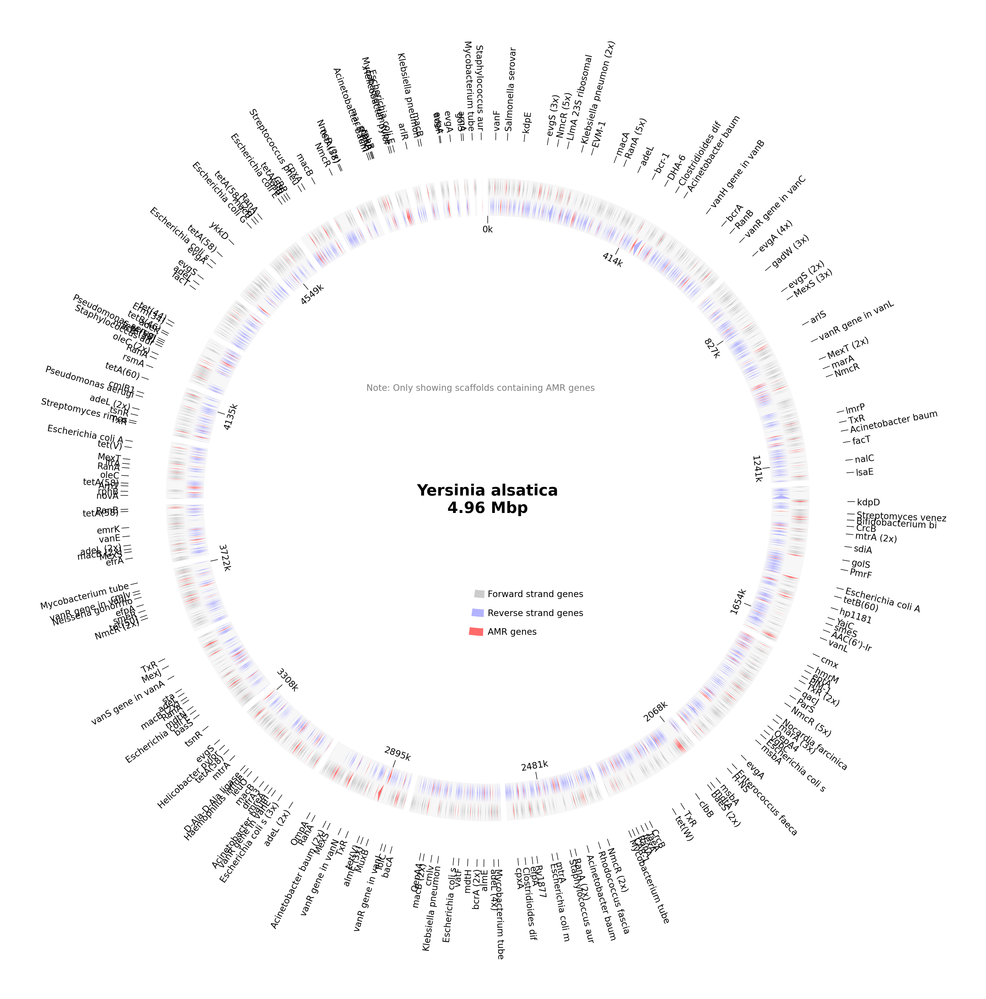

### AAC(6')-Ir
- **Mechanism**: antibiotic inactivation
- **Drug Classes**: aminoglycoside antibiotic
- **AMR Family**: AAC(6')
- **Locations**:
  - gnl|SPADES|CAEEGBCP_3_313 : position 355137-355631

### Acinetobacter baumannii AbaF (found in 6 locations)
- **Mechanism**: antibiotic efflux
- **Drug Classes**: phosphonic acid antibiotic
- **AMR Family**: major facilitator superfamily (MFS) antibiotic efflux pump
- **Locations**:
  - gnl|SPADES|CAEEGBCP_10_56 : position 59968-61332
  - gnl|SPADES|CAEEGBCP_265_15 : position 13153-14679
  - gnl|SPADES|CAEEGBCP_2_456 : position 477069-478475
  - gnl|SPADES|CAEEGBCP_7_55 : position 76938-78260
  - gnl|SPADES|CAEEGBCP_9_151 : position 171824-173326
  - gnl|SPADES|CAEEGBCP_9_159 : position 181705-183108

### Acinetobacter baumannii AbaQ
- **Mechanism**: antibiotic efflux
- **Drug Classes**: fluoroquinolone antibiotic
- **AMR Family**: major facilitator superfamily (MFS) antibiotic efflux pump
- **Locations**:
  - gnl|SPADES|CAEEGBCP_1_428 : position 495982-497292

### Acinetobacter baumannii AmvA
- **Mechanism**: antibiotic efflux
- **Drug Classes**: macrolide antibiotic; disinfecting agents and antiseptics
- **AMR Family**: major facilitator superfamily (MFS) antibiotic efflux pump
- **Locations**:
  - gnl|SPADES|CAEEGBCP_1_557 : position 636592-638124

### AcrS
- **Mechanism**: antibiotic efflux
- **Drug Classes**: fluoroquinolone antibiotic; cephalosporin; glycylcycline; cephamycin; penam; tetracycline antibiotic; rifamycin antibiotic; phenicol antibiotic; disinfecting agents and antiseptics
- **AMR Family**: resistance-nodulation-cell division (RND) antibiotic efflux pump
- **Locations**:
  - gnl|SPADES|CAEEGBCP_10_38 : position 37335-37883

### ArnT
- **Mechanism**: antibiotic target alteration
- **Drug Classes**: peptide antibiotic
- **AMR Family**: pmr phosphoethanolamine transferase
- **Locations**:
  - gnl|SPADES|CAEEGBCP_21_25: position 29597-31261

### Bifidobacterium bifidum ileS conferring resistance to mupirocin
- **Mechanism**: antibiotic target alteration
- **Drug Classes**: mupirocin-like antibiotic
- **AMR Family**: antibiotic-resistant isoleucyl-tRNA synthetase (ileS)
- **Locations**:
  - gnl|SPADES|CAEEGBCP_3_62 : position 83654-86236

### CAR-1
- **Mechanism**: antibiotic inactivation
- **Drug Classes**: carbapenem
- **AMR Family**: CAR beta-lactamase
- **Locations**:
  - gnl|SPADES|CAEEGBCP_6_237 : position 248574-249329

### CRP (found in 2 locations)
- **Mechanism**: antibiotic efflux
- **Drug Classes**: macrolide antibiotic; fluoroquinolone antibiotic; penam
- **AMR Family**: resistance-nodulation-cell division (RND) antibiotic efflux pump
- **Locations**:
  - gnl|SPADES|CAEEGBCP_4_88 : position 93988-94740
  - gnl|SPADES|CAEEGBCP_63_51: position 34600-35232

### Clostridioides difficile gyrA conferring resistance to fluoroquinolones
- **Mechanism**: antibiotic target alteration
- **Drug Classes**: fluoroquinolone antibiotic
- **AMR Family**: fluoroquinolone resistant gyrA
- **Locations**:
  - gnl|SPADES|CAEEGBCP_1_409 : position 471740-474394

### Clostridioides difficile gyrB conferring resistance to fluoroquinolones (found in 2 locations)
- **Mechanism**: antibiotic target alteration
- **Drug Classes**: fluoroquinolone antibiotic
- **AMR Family**: fluoroquinolone resistant gyrB
- **Locations**:
  - gnl|SPADES|CAEEGBCP_7_182 : position 227741-230155
  - gnl|SPADES|CAEEGBCP_9_21 : position 22455-24350

### CrcB (found in 2 locations)
- **Mechanism**: antibiotic efflux
- **Drug Classes**: aminoglycoside antibiotic
- **AMR Family**: multidrug and toxic compound extrusion (MATE) transporter
- **Locations**:
  - gnl|SPADES|CAEEGBCP_3_77 : position 99890-100273
  - gnl|SPADES|CAEEGBCP_6_189 : position 203179-203583

### D-Ala-D-Ala ligase
- **Mechanism**: antibiotic target alteration
- **Drug Classes**: glycopeptide antibiotic
- **AMR Family**: Van ligase
- **Locations**:
  - gnl|SPADES|CAEEGBCP_10_121 : position 144211-145131

### DHA-6
- **Mechanism**: antibiotic inactivation
- **Drug Classes**: cephalosporin; cephamycin
- **AMR Family**: DHA beta-lactamase
- **Locations**:
  - gnl|SPADES|CAEEGBCP_1_399 : position 442336-443478

### EC-14 (found in 2 locations)
- **Mechanism**: antibiotic inactivation
- **Drug Classes**: cephalosporin
- **AMR Family**: EC beta-lactamase
- **Locations**:
  - gnl|SPADES|CAEEGBCP_2_317 : position 328544-329722
  - gnl|SPADES|CAEEGBCP_7_40 : position 55322-56488

### EVM-1
- **Mechanism**: antibiotic inactivation
- **Drug Classes**: carbapenem
- **AMR Family**: EVM beta-lactamase
- **Locations**:
  - gnl|SPADES|CAEEGBCP_1_222 : position 250842-252995

### EdeQ
- **Mechanism**: antibiotic inactivation
- **Drug Classes**: peptide antibiotic; polyamine antibiotic
- **AMR Family**: Edeine acetyltransferase
- **Locations**:
  - gnl|SPADES|CAEEGBCP_10_7 : position 4440-4883

### Enterococcus faecalis cls with mutation conferring resistance to daptomycin
- **Mechanism**: antibiotic target alteration
- **Drug Classes**: peptide antibiotic
- **AMR Family**: daptomycin resistant cls
- **Locations**:
  - gnl|SPADES|CAEEGBCP_4_265 : position 298518-299978

### Erm(34)
- **Mechanism**: antibiotic target alteration
- **Drug Classes**: macrolide antibiotic; lincosamide antibiotic; streptogramin antibiotic; streptogramin A antibiotic; streptogramin B antibiotic
- **AMR Family**: Erm 23S ribosomal RNA methyltransferase
- **Locations**:
  - gnl|SPADES|CAEEGBCP_30_100 : position 109961-110587

### Escherichia coli AcrAB-TolC with AcrR mutation conferring resistance to ciprofloxacin, tetracycline, and ceftazidime (found in 3 locations)
- **Mechanism**: antibiotic target alteration; antibiotic efflux
- **Drug Classes**: fluoroquinolone antibiotic; cephalosporin; glycylcycline; penam; tetracycline antibiotic; rifamycin antibiotic; phenicol antibiotic; disinfecting agents and antiseptics
- **AMR Family**: resistance-nodulation-cell division (RND) antibiotic efflux pump
- **Locations**:
  - gnl|SPADES|CAEEGBCP_1_434 : position 502069-502707
  - gnl|SPADES|CAEEGBCP_21_128 : position 137585-138148
  - gnl|SPADES|CAEEGBCP_3_222 : position 249140-249796

### Escherichia coli AcrAB-TolC with MarR mutations conferring resistance to ciprofloxacin and tetracycline
- **Mechanism**: antibiotic target alteration; antibiotic efflux
- **Drug Classes**: fluoroquinolone antibiotic; cephalosporin; glycylcycline; penam; tetracycline antibiotic; rifamycin antibiotic; phenicol antibiotic; disinfecting agents and antiseptics
- **AMR Family**: resistance-nodulation-cell division (RND) antibiotic efflux pump
- **Locations**:
  - gnl|SPADES|CAEEGBCP_4_21 : position 20411-20842

### Escherichia coli EF-Tu mutants conferring resistance to Pulvomycin (found in 2 locations)
- **Mechanism**: antibiotic target alteration
- **Drug Classes**: elfamycin antibiotic
- **AMR Family**: elfamycin resistant EF-Tu
- **Locations**:
  - gnl|SPADES|CAEEGBCP_292_24 : position 26931-28115
  - gnl|SPADES|CAEEGBCP_63_25 : position 11424-12608

### Escherichia coli EF-Tu mutants conferring resistance to kirromycin
- **Mechanism**: antibiotic target alteration
- **Drug Classes**: elfamycin antibiotic
- **AMR Family**: elfamycin resistant EF-Tu
- **Locations**:
  - gnl|SPADES|CAEEGBCP_11_61 : position 65168-67846

### Escherichia coli GlpT with mutation conferring resistance to fosfomycin
- **Mechanism**: antibiotic target alteration
- **Drug Classes**: phosphonic acid antibiotic
- **AMR Family**: antibiotic-resistant GlpT
- **Locations**:
  - gnl|SPADES|CAEEGBCP_53_27 : position 28920-30275

### Escherichia coli acrA (found in 2 locations)
- **Mechanism**: antibiotic efflux
- **Drug Classes**: fluoroquinolone antibiotic; cephalosporin; glycylcycline; penam; tetracycline antibiotic; rifamycin antibiotic; phenicol antibiotic; disinfecting agents and antiseptics
- **AMR Family**: resistance-nodulation-cell division (RND) antibiotic efflux pump
- **Locations**:
  - gnl|SPADES|CAEEGBCP_3_223 : position 249941-251128
  - gnl|SPADES|CAEEGBCP_9_146 : position 163336-164559

### Escherichia coli mdfA
- **Mechanism**: antibiotic efflux
- **Drug Classes**: tetracycline antibiotic; phenicol antibiotic; disinfecting agents and antiseptics
- **AMR Family**: major facilitator superfamily (MFS) antibiotic efflux pump
- **Locations**:
  - gnl|SPADES|CAEEGBCP_7_125 : position 163397-164626

### Escherichia coli murA with mutation conferring resistance to fosfomycin
- **Mechanism**: antibiotic target alteration
- **Drug Classes**: phosphonic acid antibiotic
- **AMR Family**: antibiotic-resistant murA transferase
- **Locations**:
  - gnl|SPADES|CAEEGBCP_1_226 : position 256701-257981

### Escherichia coli soxS with mutation conferring antibiotic resistance (found in 8 locations)
- **Mechanism**: antibiotic target alteration; antibiotic efflux; reduced permeability to antibiotic
- **Drug Classes**: fluoroquinolone antibiotic; monobactam; carbapenem; cephalosporin; glycylcycline; cephamycin; penam; tetracycline antibiotic; rifamycin antibiotic; phenicol antibiotic; penem; disinfecting agents and antiseptics
- **AMR Family**: ATP-binding cassette (ABC) antibiotic efflux pump; major facilitator superfamily (MFS) antibiotic efflux pump; resistance-nodulation-cell division (RND) antibiotic efflux pump; General Bacterial Porin with reduced permeability to beta-lactams
- **Locations**:
  - gnl|SPADES|CAEEGBCP_10_30 : position 30471-31292
  - gnl|SPADES|CAEEGBCP_10_31 : position 31402-32295
  - gnl|SPADES|CAEEGBCP_10_47 : position 48538-49404
  - gnl|SPADES|CAEEGBCP_1_59 : position 56305-57180
  - gnl|SPADES|CAEEGBCP_4_183 : position 200539-201471
  - gnl|SPADES|CAEEGBCP_51_20 : position 20578-21285
  - gnl|SPADES|CAEEGBCP_6_215 : position 226865-227887
  - gnl|SPADES|CAEEGBCP_8_112 : position 117944-118843

### FosA4
- **Mechanism**: antibiotic inactivation
- **Drug Classes**: phosphonic acid antibiotic
- **AMR Family**: fosfomycin thiol transferase
- **Locations**:
  - gnl|SPADES|CAEEGBCP_2_421 : position 436031-436486

### FosB6
- **Mechanism**: antibiotic inactivation
- **Drug Classes**: phosphonic acid antibiotic
- **AMR Family**: fosfomycin thiol transferase
- **Locations**:
  - gnl|SPADES|CAEEGBCP_4_133 : position 144866-145336

### FosM2
- **Mechanism**: antibiotic inactivation
- **Drug Classes**: phosphonic acid antibiotic
- **AMR Family**: fosfomycin thiol transferase
- **Locations**:
  - gnl|SPADES|CAEEGBCP_4_12 : position 11491-11898

### H-NS
- **Mechanism**: antibiotic efflux
- **Drug Classes**: macrolide antibiotic; fluoroquinolone antibiotic; cephalosporin; cephamycin; penam; tetracycline antibiotic
- **AMR Family**: major facilitator superfamily (MFS) antibiotic efflux pump; resistance-nodulation-cell division (RND) antibiotic efflux pump
- **Locations**:
  - gnl|SPADES|CAEEGBCP_4_277 : position 314682-315092

### Haemophilus influenzae PBP3 conferring resistance to beta-lactam antibiotics
- **Mechanism**: antibiotic target alteration
- **Drug Classes**: cephalosporin; cephamycin; penam
- **AMR Family**: Penicillin-binding protein mutations conferring resistance to beta-lactam antibiotics
- **Locations**:
  - gnl|SPADES|CAEEGBCP_10_113 : position 133401-135164

### Helicobacter pylori pbp1 mutants conferring resistance to amoxicillin (found in 2 locations)
- **Mechanism**: antibiotic target alteration
- **Drug Classes**: cephalosporin; cephamycin; penam
- **AMR Family**: Penicillin-binding protein mutations conferring resistance to beta-lactam antibiotics
- **Locations**:
  - gnl|SPADES|CAEEGBCP_10_177 : position 212483-214969
  - gnl|SPADES|CAEEGBCP_6_61 : position 78907-81225

### Helicobacter pylori pbp2 mutants conferring resistance to amoxicillin
- **Mechanism**: antibiotic target alteration
- **Drug Classes**: cephalosporin; cephamycin; penam
- **AMR Family**: Penicillin-binding protein mutations conferring resistance to beta-lactam antibiotics
- **Locations**:
  - gnl|SPADES|CAEEGBCP_3_68 : position 89621-91516

### Helicobacter pylori rpoB mutation conferring resistance to rifampicin
- **Mechanism**: antibiotic target alteration; antibiotic target replacement
- **Drug Classes**: fluoroquinolone antibiotic; rifamycin antibiotic
- **AMR Family**: rifamycin-resistant beta-subunit of RNA polymerase (rpoB)
- **Locations**:
  - gnl|SPADES|CAEEGBCP_292_16 : position 14436-18656

### Klebsiella pneumoniae KpnE
- **Mechanism**: antibiotic efflux
- **Drug Classes**: macrolide antibiotic; aminoglycoside antibiotic; cephalosporin; tetracycline antibiotic; peptide antibiotic; rifamycin antibiotic; disinfecting agents and antiseptics
- **AMR Family**: small multidrug resistance (SMR) antibiotic efflux pump
- **Locations**:
  - gnl|SPADES|CAEEGBCP_8_49 : position 51654-52037

### Klebsiella pneumoniae KpnF
- **Mechanism**: antibiotic efflux
- **Drug Classes**: macrolide antibiotic; aminoglycoside antibiotic; cephalosporin; tetracycline antibiotic; peptide antibiotic; rifamycin antibiotic; disinfecting agents and antiseptics
- **AMR Family**: small multidrug resistance (SMR) antibiotic efflux pump
- **Locations**:
  - gnl|SPADES|CAEEGBCP_8_48: position 51338-51667

### Klebsiella pneumoniae KpnH (found in 2 locations)
- **Mechanism**: antibiotic efflux
- **Drug Classes**: macrolide antibiotic; fluoroquinolone antibiotic; aminoglycoside antibiotic; carbapenem; cephalosporin; penam; peptide antibiotic; penem
- **AMR Family**: major facilitator superfamily (MFS) antibiotic efflux pump
- **Locations**:
  - gnl|SPADES|CAEEGBCP_3_373: position 423211-424746
  - gnl|SPADES|CAEEGBCP_468_2 : position 937-2361

### Klebsiella pneumoniae OmpK37 (found in 4 locations)
- **Mechanism**: reduced permeability to antibiotic
- **Drug Classes**: monobactam; carbapenem; cephalosporin; cephamycin; penam; penem
- **AMR Family**: General Bacterial Porin with reduced permeability to beta-lactams
- **Locations**:
  - gnl|SPADES|CAEEGBCP_1_203 : position 226740-227864
  - gnl|SPADES|CAEEGBCP_1_400 : position 444007-445119
  - gnl|SPADES|CAEEGBCP_2_486 : position 509526-510641
  - gnl|SPADES|CAEEGBCP_8_145 : position 154416-155501

### LRA-19
- **Mechanism**: antibiotic inactivation
- **Drug Classes**: cephalosporin; penam
- **AMR Family**: subclass B3 LRA beta-lactamase
- **Locations**:
  - gnl|SPADES|CAEEGBCP_1_206 : position 231215-231862

### LlmA 23S ribosomal RNA methyltransferase
- **Mechanism**: antibiotic target alteration
- **Drug Classes**: lincosamide antibiotic
- **AMR Family**: Llm 23S ribosomal RNA methyltransferase
- **Locations**:
  - gnl|SPADES|CAEEGBCP_1_175 : position 191939-193129

### LptD
- **Mechanism**: antibiotic efflux
- **Drug Classes**: carbapenem; peptide antibiotic; aminocoumarin antibiotic; rifamycin antibiotic
- **AMR Family**: ATP-binding cassette (ABC) antibiotic efflux pump
- **Locations**:
  - gnl|SPADES|CAEEGBCP_10_83 : position 91476-93872

### MdtK
- **Mechanism**: antibiotic efflux
- **Drug Classes**: fluoroquinolone antibiotic
- **AMR Family**: multidrug and toxic compound extrusion (MATE) transporter
- **Locations**:
  - gnl|SPADES|CAEEGBCP_2_323 : position 335707-337137

### MexF
- **Mechanism**: antibiotic efflux
- **Drug Classes**: fluoroquinolone antibiotic; diaminopyrimidine antibiotic; phenicol antibiotic
- **AMR Family**: resistance-nodulation-cell division (RND) antibiotic efflux pump
- **Locations**:
  - gnl|SPADES|CAEEGBCP_9_147 : position 164572-167697

### MexJ
- **Mechanism**: antibiotic efflux
- **Drug Classes**: macrolide antibiotic; tetracycline antibiotic; disinfecting agents and antiseptics
- **AMR Family**: resistance-nodulation-cell division (RND) antibiotic efflux pump
- **Locations**:
  - gnl|SPADES|CAEEGBCP_11_163 : position 190935-192017

### MexS (found in 5 locations)
- **Mechanism**: antibiotic efflux
- **Drug Classes**: fluoroquinolone antibiotic; diaminopyrimidine antibiotic; phenicol antibiotic
- **AMR Family**: resistance-nodulation-cell division (RND) antibiotic efflux pump
- **Locations**:
  - gnl|SPADES|CAEEGBCP_20_30 : position 43606-44589
  - gnl|SPADES|CAEEGBCP_2_140 : position 134724-135758
  - gnl|SPADES|CAEEGBCP_2_149 : position 149480-150490
  - gnl|SPADES|CAEEGBCP_2_449 : position 468739-469878
  - gnl|SPADES|CAEEGBCP_9_144 : position 160991-161980

### MexT (found in 3 locations)
- **Mechanism**: antibiotic efflux
- **Drug Classes**: fluoroquinolone antibiotic; diaminopyrimidine antibiotic; phenicol antibiotic
- **AMR Family**: resistance-nodulation-cell division (RND) antibiotic efflux pump
- **Locations**:
  - gnl|SPADES|CAEEGBCP_21_84 : position 93726-94634
  - gnl|SPADES|CAEEGBCP_2_287 : position 297448-298344
  - gnl|SPADES|CAEEGBCP_2_420 : position 434980-435900

### MexV
- **Mechanism**: antibiotic efflux
- **Drug Classes**: macrolide antibiotic; fluoroquinolone antibiotic; tetracycline antibiotic; phenicol antibiotic; disinfecting agents and antiseptics
- **AMR Family**: resistance-nodulation-cell division (RND) antibiotic efflux pump
- **Locations**:
  - gnl|SPADES|CAEEGBCP_9_60 : position 63645-65168

### MuxB
- **Mechanism**: antibiotic efflux
- **Drug Classes**: macrolide antibiotic; monobactam; tetracycline antibiotic; aminocoumarin antibiotic
- **AMR Family**: resistance-nodulation-cell division (RND) antibiotic efflux pump
- **Locations**:
  - gnl|SPADES|CAEEGBCP_9_59 : position 60517-63648

### Mycobacterium tuberculosis gidB mutation conferring resistance to streptomycin
- **Mechanism**: antibiotic target alteration
- **Drug Classes**: aminoglycoside antibiotic
- **AMR Family**: antibiotic resistant gidB
- **Locations**:
  - gnl|SPADES|CAEEGBCP_1724_2 : position 276-899

### Mycobacterium tuberculosis kasA mutant conferring resistance to isoniazid (found in 2 locations)
- **Mechanism**: antibiotic target alteration
- **Drug Classes**: isoniazid-like antibiotic
- **AMR Family**: antibiotic resistant kasA
- **Locations**:
  - gnl|SPADES|CAEEGBCP_1_190 : position 207235-208503
  - gnl|SPADES|CAEEGBCP_6_246 : position 257562-258746

### Mycobacterium tuberculosis ndh with mutation conferring resistance to isoniazid
- **Mechanism**: antibiotic target alteration
- **Drug Classes**: isoniazid-like antibiotic
- **AMR Family**: antibiotic resistant ndh
- **Locations**:
  - gnl|SPADES|CAEEGBCP_1_99 : position 101761-103065

### Mycobacterium tuberculosis pncA mutations conferring resistance to pyrazinamide
- **Mechanism**: antibiotic target alteration
- **Drug Classes**: pyrazine antibiotic
- **AMR Family**: Pyrazinamide resistant pncA
- **Locations**:
  - gnl|SPADES|CAEEGBCP_8_12 : position 11003-11635

### Mycobacterium tuberculosis rpoB mutations conferring resistance to rifampicin
- **Mechanism**: antibiotic target alteration; antibiotic target replacement
- **Drug Classes**: rifamycin antibiotic
- **AMR Family**: rifamycin-resistant beta-subunit of RNA polymerase (rpoB)
- **Locations**:
  - gnl|SPADES|CAEEGBCP_292_17 : position 18777-22805

### Mycobacterium tuberculosis rpsA mutations conferring resistance to pyrazinamide
- **Mechanism**: antibiotic target alteration
- **Drug Classes**: pyrazine antibiotic
- **AMR Family**: pyrazinamide resistant rpsA
- **Locations**:
  - gnl|SPADES|CAEEGBCP_1_224 : position 253849-255522

### Mycobacterium tuberculosis thyA with mutation conferring resistance to para-aminosalicylic acid
- **Mechanism**: antibiotic target alteration
- **Drug Classes**: salicylic acid antibiotic
- **AMR Family**: aminosalicylate resistant thymidylate synthase
- **Locations**:
  - gnl|SPADES|CAEEGBCP_15_158 : position 163920-164714

### Neisseria gonorrhoeae pilQ gene conferring resistance to beta-lactam
- **Mechanism**: antibiotic target alteration
- **Drug Classes**: cephalosporin; cephamycin; penam
- **AMR Family**: Penicillin-binding protein mutations conferring resistance to beta-lactam antibiotics
- **Locations**:
  - gnl|SPADES|CAEEGBCP_15_127 : position 127888-129864

### NmcR (found in 18 locations)
- **Mechanism**: antibiotic inactivation
- **Drug Classes**: carbapenem; cephalosporin; cephamycin; penam
- **AMR Family**: NmcA beta-lactamase
- **Locations**:
  - gnl|SPADES|CAEEGBCP_145_47 : position 47253-48170
  - gnl|SPADES|CAEEGBCP_15_109 : position 111169-112065
  - gnl|SPADES|CAEEGBCP_15_78 : position 76248-77141
  - gnl|SPADES|CAEEGBCP_181_14 : position 17462-18343
  - gnl|SPADES|CAEEGBCP_181_5 : position 5120-6001
  - gnl|SPADES|CAEEGBCP_1_159 : position 167213-168445
  - gnl|SPADES|CAEEGBCP_1_455 : position 528694-529626
  - gnl|SPADES|CAEEGBCP_1_543 : position 622539-623462
  - gnl|SPADES|CAEEGBCP_1_586 : position 671251-672114
  - gnl|SPADES|CAEEGBCP_1_595 : position 681168-682088
  - gnl|SPADES|CAEEGBCP_2_328 : position 342338-343231
  - gnl|SPADES|CAEEGBCP_4_100 : position 105839-106741
  - gnl|SPADES|CAEEGBCP_4_113 : position 124400-125254
  - gnl|SPADES|CAEEGBCP_4_160 : position 172628-173539
  - gnl|SPADES|CAEEGBCP_4_172 : position 186900-187814
  - gnl|SPADES|CAEEGBCP_4_227 : position 255186-256160
  - gnl|SPADES|CAEEGBCP_7_15 : position 25996-26889
  - gnl|SPADES|CAEEGBCP_7_39 : position 54295-55185

### Nocardia farcinica rox
- **Mechanism**: antibiotic inactivation
- **Drug Classes**: rifamycin antibiotic
- **AMR Family**: rifampin monooxygenase
- **Locations**:
  - gnl|SPADES|CAEEGBCP_4_129 : position 140369-141997

### OmpA (found in 3 locations)
- **Mechanism**: reduced permeability to antibiotic
- **Drug Classes**: peptide antibiotic
- **AMR Family**: General Bacterial Porin with reduced permeability to peptide antibiotics
- **Locations**:
  - gnl|SPADES|CAEEGBCP_10_39 : position 38695-39201
  - gnl|SPADES|CAEEGBCP_1_185 : position 202293-203366
  - gnl|SPADES|CAEEGBCP_9_189 : position 214932-216659

### OprN
- **Mechanism**: antibiotic efflux
- **Drug Classes**: fluoroquinolone antibiotic; diaminopyrimidine antibiotic; phenicol antibiotic
- **AMR Family**: resistance-nodulation-cell division (RND) antibiotic efflux pump
- **Locations**:
  - gnl|SPADES|CAEEGBCP_2_289 : position 299605-301101

### PJM-1
- **Mechanism**: antibiotic inactivation
- **Drug Classes**: carbapenem; cephalosporin; cephamycin; penam
- **AMR Family**: PJM beta-lactamase
- **Locations**:
  - gnl|SPADES|CAEEGBCP_4_32 : position 29212-30219

### ParR (found in 2 locations)
- **Mechanism**: antibiotic efflux; reduced permeability to antibiotic
- **Drug Classes**: macrolide antibiotic; fluoroquinolone antibiotic; monobactam; aminoglycoside antibiotic; carbapenem; cephalosporin; cephamycin; penam; tetracycline antibiotic; phenicol antibiotic; penem; disinfecting agents and antiseptics
- **AMR Family**: resistance-nodulation-cell division (RND) antibiotic efflux pump; Outer Membrane Porin (Opr)
- **Locations**:
  - gnl|SPADES|CAEEGBCP_4_81 : position 85064-85792
  - gnl|SPADES|CAEEGBCP_63_87 : position 77872-78591

### ParS
- **Mechanism**: antibiotic efflux; reduced permeability to antibiotic
- **Drug Classes**: macrolide antibiotic; fluoroquinolone antibiotic; monobactam; aminoglycoside antibiotic; carbapenem; cephalosporin; cephamycin; penam; tetracycline antibiotic; phenicol antibiotic; penem; disinfecting agents and antiseptics
- **AMR Family**: resistance-nodulation-cell division (RND) antibiotic efflux pump; Outer Membrane Porin (Opr)
- **Locations**:
  - gnl|SPADES|CAEEGBCP_4_80 : position 83754-85067

### Planobispora rosea EF-Tu mutants conferring resistance to inhibitor GE2270A
- **Mechanism**: antibiotic target alteration
- **Drug Classes**: elfamycin antibiotic
- **AMR Family**: elfamycin resistant EF-Tu
- **Locations**:
  - gnl|SPADES|CAEEGBCP_7_128 : position 166463-168364

### PmrF (found in 3 locations)
- **Mechanism**: antibiotic target alteration
- **Drug Classes**: peptide antibiotic
- **AMR Family**: pmr phosphoethanolamine transferase
- **Locations**:
  - gnl|SPADES|CAEEGBCP_21_28 : position 34160-35143
  - gnl|SPADES|CAEEGBCP_3_185 : position 203793-204764
  - gnl|SPADES|CAEEGBCP_8_165 : position 176988-178361

### Pseudomonas aeruginosa CpxR (found in 3 locations)
- **Mechanism**: antibiotic efflux
- **Drug Classes**: macrolide antibiotic; fluoroquinolone antibiotic; monobactam; aminoglycoside antibiotic; carbapenem; cephalosporin; cephamycin; penam; tetracycline antibiotic; peptide antibiotic; aminocoumarin antibiotic; diaminopyrimidine antibiotic; sulfonamide antibiotic; phenicol antibiotic; penem
- **AMR Family**: resistance-nodulation-cell division (RND) antibiotic efflux pump
- **Locations**:
  - gnl|SPADES|CAEEGBCP_265_23 : position 23316-23999
  - gnl|SPADES|CAEEGBCP_26_75 : position 76790-77488
  - gnl|SPADES|CAEEGBCP_3_100 : position 121232-121906

### Pseudomonas aeruginosa ampR with mutation conferring resistance to aztreonam
- **Mechanism**: antibiotic target alteration; antibiotic inactivation
- **Drug Classes**: monobactam; carbapenem; cephalosporin
- **AMR Family**: PDC beta-lactamase; ampR transcriptional regulator with mutation conferring resistance to monobactam antibiotics
- **Locations**:
  - gnl|SPADES|CAEEGBCP_30_65 : position 70094-71035

### QepA4 (found in 3 locations)
- **Mechanism**: antibiotic efflux
- **Drug Classes**: fluoroquinolone antibiotic
- **AMR Family**: major facilitator superfamily (MFS) antibiotic efflux pump
- **Locations**:
  - gnl|SPADES|CAEEGBCP_1_438 : position 505988-507223
  - gnl|SPADES|CAEEGBCP_4_161 : position 173612-174964
  - gnl|SPADES|CAEEGBCP_8_182 : position 197354-198994

### RanA (found in 19 locations)
- **Mechanism**: antibiotic efflux
- **Drug Classes**: aminoglycoside antibiotic
- **AMR Family**: ATP-binding cassette (ABC) antibiotic efflux pump
- **Locations**:
  - gnl|SPADES|CAEEGBCP_11_86 : position 96145-97239
  - gnl|SPADES|CAEEGBCP_1_293 : position 333383-334516
  - gnl|SPADES|CAEEGBCP_1_362 : position 405668-407260
  - gnl|SPADES|CAEEGBCP_1_474 : position 549259-550077
  - gnl|SPADES|CAEEGBCP_1_555 : position 634492-635298
  - gnl|SPADES|CAEEGBCP_1_564 : position 646417-647466
  - gnl|SPADES|CAEEGBCP_20_126 : position 145150-145959
  - gnl|SPADES|CAEEGBCP_21_68 : position 72725-73852
  - gnl|SPADES|CAEEGBCP_2_130 : position 124863-125636
  - gnl|SPADES|CAEEGBCP_2_207 : position 214911-216056
  - gnl|SPADES|CAEEGBCP_30_20 : position 22320-23834
  - gnl|SPADES|CAEEGBCP_3_84 : position 106501-107178
  - gnl|SPADES|CAEEGBCP_4_267 : position 300649-301650
  - gnl|SPADES|CAEEGBCP_4_268 : position 301647-302666
  - gnl|SPADES|CAEEGBCP_53_59 : position 62154-63227
  - gnl|SPADES|CAEEGBCP_6_227 : position 238385-239584
  - gnl|SPADES|CAEEGBCP_7_209 : position 256416-257192
  - gnl|SPADES|CAEEGBCP_7_76 : position 107325-108347
  - gnl|SPADES|CAEEGBCP_9_178 : position 201712-202470

### RanB (found in 2 locations)
- **Mechanism**: antibiotic efflux
- **Drug Classes**: aminoglycoside antibiotic
- **AMR Family**: ATP-binding cassette (ABC) antibiotic efflux pump
- **Locations**:
  - gnl|SPADES|CAEEGBCP_1_556 : position 635292-636437
  - gnl|SPADES|CAEEGBCP_20_127 : position 145970-146752

### Rhodococcus fascians cmr
- **Mechanism**: antibiotic efflux
- **Drug Classes**: phenicol antibiotic
- **AMR Family**: major facilitator superfamily (MFS) antibiotic efflux pump
- **Locations**:
  - gnl|SPADES|CAEEGBCP_7_33 : position 48500-49939

### Rv1877
- **Mechanism**: antibiotic efflux
- **Drug Classes**: fluoroquinolone antibiotic
- **AMR Family**: major facilitator superfamily (MFS) antibiotic efflux pump
- **Locations**:
  - gnl|SPADES|CAEEGBCP_7_157 : position 200060-201487

### SAT-3
- **Mechanism**: antibiotic inactivation
- **Drug Classes**: nucleoside antibiotic
- **AMR Family**: streptothricin acetyltransferase (SAT)
- **Locations**:
  - gnl|SPADES|CAEEGBCP_4_281 : position 319425-319892

### Salmonella serovars soxS with mutation conferring antibiotic resistance
- **Mechanism**: antibiotic target alteration; antibiotic efflux; reduced permeability to antibiotic
- **Drug Classes**: fluoroquinolone antibiotic; monobactam; carbapenem; cephalosporin; glycylcycline; cephamycin; penam; tetracycline antibiotic; rifamycin antibiotic; phenicol antibiotic; penem; disinfecting agents and antiseptics
- **AMR Family**: ATP-binding cassette (ABC) antibiotic efflux pump; major facilitator superfamily (MFS) antibiotic efflux pump; resistance-nodulation-cell division (RND) antibiotic efflux pump; General Bacterial Porin with reduced permeability to beta-lactams
- **Locations**:
  - gnl|SPADES|CAEEGBCP_1_49 : position 46887-47273

### Staphylococcus aureus GlpT with mutation conferring resistance to fosfomycin
- **Mechanism**: antibiotic target alteration
- **Drug Classes**: phosphonic acid antibiotic
- **AMR Family**: antibiotic-resistant GlpT
- **Locations**:
  - gnl|SPADES|CAEEGBCP_7_84 : position 118814-120151

### Staphylococcus aureus fusA with mutation conferring resistance to fusidic acid (found in 3 locations)
- **Mechanism**: antibiotic target alteration
- **Drug Classes**: fusidane antibiotic
- **AMR Family**: antibiotic resistant fusA
- **Locations**:
  - gnl|SPADES|CAEEGBCP_10_8 : position 5029-6618
  - gnl|SPADES|CAEEGBCP_30_51 : position 53792-55900
  - gnl|SPADES|CAEEGBCP_63_26 : position 12680-14788

### Staphylococcus aureus mupA conferring resistance to mupirocin
- **Mechanism**: antibiotic target alteration
- **Drug Classes**: mupirocin-like antibiotic
- **AMR Family**: antibiotic-resistant isoleucyl-tRNA synthetase (ileS)
- **Locations**:
  - gnl|SPADES|CAEEGBCP_10_65 : position 72484-75300

### Staphylococcus aureus mupB conferring resistance to mupirocin
- **Mechanism**: antibiotic target alteration
- **Drug Classes**: mupirocin-like antibiotic
- **AMR Family**: antibiotic-resistant isoleucyl-tRNA synthetase (ileS)
- **Locations**:
  - gnl|SPADES|CAEEGBCP_11_118 : position 128333-131230

### Staphylococcus aureus murA with mutation conferring resistance to fosfomycin
- **Mechanism**: antibiotic target alteration
- **Drug Classes**: phosphonic acid antibiotic
- **AMR Family**: antibiotic-resistant murA transferase
- **Locations**:
  - gnl|SPADES|CAEEGBCP_20_132 : position 148847-150112

### Staphylococcus aureus pgsA mutations conferring resistance to daptomycin
- **Mechanism**: antibiotic target alteration
- **Drug Classes**: peptide antibiotic
- **AMR Family**: daptomycin resistant pgsA
- **Locations**:
  - gnl|SPADES|CAEEGBCP_12513_1 : position 199-747

### Streptococcus pneumoniae PBP2x conferring resistance to amoxicillin (found in 2 locations)
- **Mechanism**: antibiotic target alteration
- **Drug Classes**: cephalosporin; cephamycin; penam
- **AMR Family**: Penicillin-binding protein mutations conferring resistance to beta-lactam antibiotics
- **Locations**:
  - gnl|SPADES|CAEEGBCP_1_38 : position 37500-39209
  - gnl|SPADES|CAEEGBCP_63_79 : position 66336-68891

### Streptomyces lividans cmlR
- **Mechanism**: antibiotic efflux
- **Drug Classes**: phenicol antibiotic
- **AMR Family**: major facilitator superfamily (MFS) antibiotic efflux pump
- **Locations**:
  - gnl|SPADES|CAEEGBCP_7_35 : position 50927-52141

### Streptomyces rimosus otr(A)
- **Mechanism**: antibiotic target protection
- **Drug Classes**: tetracycline antibiotic
- **AMR Family**: tetracycline-resistant ribosomal protection protein
- **Locations**:
  - gnl|SPADES|CAEEGBCP_26_13 : position 15472-17295

### Streptomyces venezuelae rox (found in 2 locations)
- **Mechanism**: antibiotic inactivation
- **Drug Classes**: rifamycin antibiotic
- **AMR Family**: rifampin monooxygenase
- **Locations**:
  - gnl|SPADES|CAEEGBCP_15_86 : position 84697-85911
  - gnl|SPADES|CAEEGBCP_3_49 : position 69750-70931

### TaeA (found in 3 locations)
- **Mechanism**: antibiotic efflux
- **Drug Classes**: pleuromutilin antibiotic
- **AMR Family**: ATP-binding cassette (ABC) antibiotic efflux pump
- **Locations**:
  - gnl|SPADES|CAEEGBCP_10_33 : position 33749-35416
  - gnl|SPADES|CAEEGBCP_1_195 : position 212960-214873
  - gnl|SPADES|CAEEGBCP_6_201 : position 215075-215740

### TolC (found in 2 locations)
- **Mechanism**: antibiotic efflux
- **Drug Classes**: macrolide antibiotic; fluoroquinolone antibiotic; aminoglycoside antibiotic; carbapenem; cephalosporin; glycylcycline; cephamycin; penam; tetracycline antibiotic; peptide antibiotic; aminocoumarin antibiotic; rifamycin antibiotic; phenicol antibiotic; penem; disinfecting agents and antiseptics
- **AMR Family**: ATP-binding cassette (ABC) antibiotic efflux pump; major facilitator superfamily (MFS) antibiotic efflux pump; resistance-nodulation-cell division (RND) antibiotic efflux pump
- **Locations**:
  - gnl|SPADES|CAEEGBCP_1_403 : position 449185-450570
  - gnl|SPADES|CAEEGBCP_9_16 : position 17796-19268

### TriC
- **Mechanism**: antibiotic efflux
- **Drug Classes**: disinfecting agents and antiseptics
- **AMR Family**: resistance-nodulation-cell division (RND) antibiotic efflux pump
- **Locations**:
  - gnl|SPADES|CAEEGBCP_11_164 : position 192017-195103

### TxR (found in 8 locations)
- **Mechanism**: antibiotic efflux
- **Drug Classes**: tetracycline antibiotic
- **AMR Family**: ATP-binding cassette (ABC) antibiotic efflux pump
- **Locations**:
  - gnl|SPADES|CAEEGBCP_11_176 : position 209868-211787
  - gnl|SPADES|CAEEGBCP_26_10 : position 10902-12314
  - gnl|SPADES|CAEEGBCP_2_439 : position 455456-457615
  - gnl|SPADES|CAEEGBCP_3_274 : position 307094-308362
  - gnl|SPADES|CAEEGBCP_4_42 : position 41660-42688
  - gnl|SPADES|CAEEGBCP_4_51 : position 48339-49916
  - gnl|SPADES|CAEEGBCP_6_90 : position 116367-117704
  - gnl|SPADES|CAEEGBCP_9_94 : position 113292-114335

### YajC
- **Mechanism**: antibiotic efflux
- **Drug Classes**: fluoroquinolone antibiotic; cephalosporin; glycylcycline; penam; tetracycline antibiotic; oxazolidinone antibiotic; glycopeptide antibiotic; rifamycin antibiotic; phenicol antibiotic; disinfecting agents and antiseptics
- **AMR Family**: resistance-nodulation-cell division (RND) antibiotic efflux pump
- **Locations**:
  - gnl|SPADES|CAEEGBCP_3_288 : position 323668-324000

### adeF (found in 2 locations)
- **Mechanism**: antibiotic efflux
- **Drug Classes**: fluoroquinolone antibiotic; tetracycline antibiotic
- **AMR Family**: resistance-nodulation-cell division (RND) antibiotic efflux pump
- **Locations**:
  - gnl|SPADES|CAEEGBCP_3_224: position 251145-254297
  - gnl|SPADES|CAEEGBCP_480_16: position 12904-16029

### adeH
- **Mechanism**: antibiotic efflux
- **Drug Classes**: fluoroquinolone antibiotic; tetracycline antibiotic
- **AMR Family**: resistance-nodulation-cell division (RND) antibiotic efflux pump
- **Locations**:
  - gnl|SPADES|CAEEGBCP_9_184 : position 208508-210019

### adeK
- **Mechanism**: antibiotic efflux
- **Drug Classes**: macrolide antibiotic; fluoroquinolone antibiotic; lincosamide antibiotic; carbapenem; cephalosporin; tetracycline antibiotic; rifamycin antibiotic; diaminopyrimidine antibiotic; phenicol antibiotic; penem
- **AMR Family**: resistance-nodulation-cell division (RND) antibiotic efflux pump
- **Locations**:
  - gnl|SPADES|CAEEGBCP_30_79 : position 85086-86483

### adeL (found in 23 locations)
- **Mechanism**: antibiotic efflux
- **Drug Classes**: fluoroquinolone antibiotic; tetracycline antibiotic
- **AMR Family**: resistance-nodulation-cell division (RND) antibiotic efflux pump
- **Locations**:
  - gnl|SPADES|CAEEGBCP_10_1 : position 89-1015
  - gnl|SPADES|CAEEGBCP_10_24 : position 24022-24924
  - gnl|SPADES|CAEEGBCP_11_106 : position 115995-116903
  - gnl|SPADES|CAEEGBCP_15_143 : position 142703-143596
  - gnl|SPADES|CAEEGBCP_1_331 : position 370151-371023
  - gnl|SPADES|CAEEGBCP_20_42 : position 59654-60589
  - gnl|SPADES|CAEEGBCP_20_80 : position 100413-101324
  - gnl|SPADES|CAEEGBCP_26_120 : position 127959-128891
  - gnl|SPADES|CAEEGBCP_26_41 : position 45931-46818
  - gnl|SPADES|CAEEGBCP_2_316 : position 327520-328410
  - gnl|SPADES|CAEEGBCP_2_482 : position 503682-504596
  - gnl|SPADES|CAEEGBCP_41_85 : position 80963-81859
  - gnl|SPADES|CAEEGBCP_4_139 : position 151782-152678
  - gnl|SPADES|CAEEGBCP_4_5 : position 5640-6578
  - gnl|SPADES|CAEEGBCP_4_93 : position 97785-98735
  - gnl|SPADES|CAEEGBCP_6_241 : position 253162-254064
  - gnl|SPADES|CAEEGBCP_7_36 : position 52156-53196
  - gnl|SPADES|CAEEGBCP_8_104 : position 109086-109976
  - gnl|SPADES|CAEEGBCP_8_131 : position 139565-140515
  - gnl|SPADES|CAEEGBCP_8_171 : position 186429-187361
  - gnl|SPADES|CAEEGBCP_8_22 : position 21715-22620
  - gnl|SPADES|CAEEGBCP_9_145 : position 162135-163028
  - gnl|SPADES|CAEEGBCP_9_22 : position 24354-25265

### almE (found in 4 locations)
- **Mechanism**: antibiotic target alteration
- **Drug Classes**: peptide antibiotic
- **AMR Family**: polymyxin resistance operon; alm glycyltransferase
- **Locations**:
  - gnl|SPADES|CAEEGBCP_8_43 : position 45032-46729
  - gnl|SPADES|CAEEGBCP_9_67 : position 71913-79142
  - gnl|SPADES|CAEEGBCP_9_81 : position 97867-99501
  - gnl|SPADES|CAEEGBCP_9_84 : position 101319-102824

### arlR (found in 2 locations)
- **Mechanism**: antibiotic efflux
- **Drug Classes**: fluoroquinolone antibiotic; disinfecting agents and antiseptics
- **AMR Family**: major facilitator superfamily (MFS) antibiotic efflux pump
- **Locations**:
  - gnl|SPADES|CAEEGBCP_450_9 : position 10146-10886
  - gnl|SPADES|CAEEGBCP_8_185 : position 202644-203330

### arlS
- **Mechanism**: antibiotic efflux
- **Drug Classes**: fluoroquinolone antibiotic; disinfecting agents and antiseptics
- **AMR Family**: major facilitator superfamily (MFS) antibiotic efflux pump
- **Locations**:
  - gnl|SPADES|CAEEGBCP_2_200 : position 205425-207002

### arnA (found in 2 locations)
- **Mechanism**: antibiotic target alteration
- **Drug Classes**: peptide antibiotic
- **AMR Family**: pmr phosphoethanolamine transferase
- **Locations**:
  - gnl|SPADES|CAEEGBCP_21_27 : position 32160-34163
  - gnl|SPADES|CAEEGBCP_969_10 : position 5574-6521

### bacA
- **Mechanism**: antibiotic target alteration
- **Drug Classes**: peptide antibiotic
- **AMR Family**: undecaprenyl pyrophosphate related proteins
- **Locations**:
  - gnl|SPADES|CAEEGBCP_9_4 : position 2403-3221

### baeR (found in 3 locations)
- **Mechanism**: antibiotic efflux
- **Drug Classes**: aminoglycoside antibiotic; aminocoumarin antibiotic
- **AMR Family**: resistance-nodulation-cell division (RND) antibiotic efflux pump
- **Locations**:
  - gnl|SPADES|CAEEGBCP_11_139 : position 164924-165631
  - gnl|SPADES|CAEEGBCP_3_301 : position 338970-339659
  - gnl|SPADES|CAEEGBCP_6_26 : position 39698-40417

### baeS (found in 2 locations)
- **Mechanism**: antibiotic efflux
- **Drug Classes**: aminoglycoside antibiotic; aminocoumarin antibiotic
- **AMR Family**: resistance-nodulation-cell division (RND) antibiotic efflux pump
- **Locations**:
  - gnl|SPADES|CAEEGBCP_6_25 : position 38297-39688
  - gnl|SPADES|CAEEGBCP_6_92 : position 118801-120237

### basS (found in 3 locations)
- **Mechanism**: antibiotic target alteration; antibiotic efflux
- **Drug Classes**: peptide antibiotic
- **AMR Family**: pmr phosphoethanolamine transferase
- **Locations**:
  - gnl|SPADES|CAEEGBCP_11_49 : position 52693-53757
  - gnl|SPADES|CAEEGBCP_15_97 : position 96340-97767
  - gnl|SPADES|CAEEGBCP_3_99 : position 119815-121245

### bcr-1 (found in 2 locations)
- **Mechanism**: antibiotic efflux
- **Drug Classes**: bicyclomycin-like antibiotic
- **AMR Family**: major facilitator superfamily (MFS) antibiotic efflux pump
- **Locations**:
  - gnl|SPADES|CAEEGBCP_1_365 : position 408411-409631
  - gnl|SPADES|CAEEGBCP_4_4 : position 4240-5457

### bcrA (found in 12 locations)
- **Mechanism**: antibiotic efflux
- **Drug Classes**: peptide antibiotic
- **AMR Family**: ATP-binding cassette (ABC) antibiotic efflux pump
- **Locations**:
  - gnl|SPADES|CAEEGBCP_11_108 : position 118169-118909
  - gnl|SPADES|CAEEGBCP_11_155 : position 178963-180528
  - gnl|SPADES|CAEEGBCP_1_530 : position 609418-610044
  - gnl|SPADES|CAEEGBCP_2_334 : position 348058-348873
  - gnl|SPADES|CAEEGBCP_2_377 : position 384791-386323
  - gnl|SPADES|CAEEGBCP_2_442 : position 460103-461623
  - gnl|SPADES|CAEEGBCP_2_501 : position 526342-527040
  - gnl|SPADES|CAEEGBCP_2_502 : position 527165-528001
  - gnl|SPADES|CAEEGBCP_2_536 : position 562372-563082
  - gnl|SPADES|CAEEGBCP_2_545 : position 573671-574735
  - gnl|SPADES|CAEEGBCP_8_138 : position 146056-147540
  - gnl|SPADES|CAEEGBCP_8_57 : position 61896-62654

### chrB
- **Mechanism**: antibiotic target alteration
- **Drug Classes**: macrolide antibiotic; lincosamide antibiotic
- **AMR Family**: non-erm 23S ribosomal RNA methyltransferase (G748)
- **Locations**:
  - gnl|SPADES|CAEEGBCP_1_37 : position 36525-37379

### clbB
- **Mechanism**: antibiotic target alteration
- **Drug Classes**: lincosamide antibiotic; streptogramin antibiotic; streptogramin A antibiotic; oxazolidinone antibiotic; phenicol antibiotic; pleuromutilin antibiotic
- **AMR Family**: Cfr 23S ribosomal RNA methyltransferase
- **Locations**:
  - gnl|SPADES|CAEEGBCP_6_58 : position 74110-75306

### cmlA9
- **Mechanism**: antibiotic efflux
- **Drug Classes**: phenicol antibiotic
- **AMR Family**: major facilitator superfamily (MFS) antibiotic efflux pump
- **Locations**:
  - gnl|SPADES|CAEEGBCP_8_25 : position 26850-28043

### cmlB
- **Mechanism**: antibiotic efflux
- **Drug Classes**: phenicol antibiotic
- **AMR Family**: major facilitator superfamily (MFS) antibiotic efflux pump
- **Locations**:
  - gnl|SPADES|CAEEGBCP_2_204 : position 210195-211559

### cmlB1
- **Mechanism**: antibiotic efflux
- **Drug Classes**: phenicol antibiotic
- **AMR Family**: major facilitator superfamily (MFS) antibiotic efflux pump
- **Locations**:
  - gnl|SPADES|CAEEGBCP_26_86 : position 86016-87167

### cmlv (found in 3 locations)
- **Mechanism**: antibiotic inactivation
- **Drug Classes**: phenicol antibiotic
- **AMR Family**: chloramphenicol phosphotransferase
- **Locations**:
  - gnl|SPADES|CAEEGBCP_15_144 : position 144415-145575
  - gnl|SPADES|CAEEGBCP_6_240 : position 251860-253041
  - gnl|SPADES|CAEEGBCP_8_158 : position 170471-171637

### cmx (found in 2 locations)
- **Mechanism**: antibiotic efflux
- **Drug Classes**: phenicol antibiotic
- **AMR Family**: major facilitator superfamily (MFS) antibiotic efflux pump
- **Locations**:
  - gnl|SPADES|CAEEGBCP_2_318 : position 329719-330921
  - gnl|SPADES|CAEEGBCP_3_367 : position 417146-418348

### cprR
- **Mechanism**: antibiotic target alteration; antibiotic efflux
- **Drug Classes**: peptide antibiotic
- **AMR Family**: pmr phosphoethanolamine transferase
- **Locations**:
  - gnl|SPADES|CAEEGBCP_11_50 : position 53754-54413

### cpxA (found in 7 locations)
- **Mechanism**: antibiotic efflux
- **Drug Classes**: aminoglycoside antibiotic; aminocoumarin antibiotic
- **AMR Family**: resistance-nodulation-cell division (RND) antibiotic efflux pump
- **Locations**:
  - gnl|SPADES|CAEEGBCP_1_89 : position 87454-88908
  - gnl|SPADES|CAEEGBCP_265_24 : position 24025-25392
  - gnl|SPADES|CAEEGBCP_26_11 : position 12322-13374
  - gnl|SPADES|CAEEGBCP_26_74 : position 75420-76793
  - gnl|SPADES|CAEEGBCP_63_86 : position 76514-77875
  - gnl|SPADES|CAEEGBCP_7_197 : position 245609-246958
  - gnl|SPADES|CAEEGBCP_9_26 : position 27304-28764

### dfrA3
- **Mechanism**: antibiotic target replacement
- **Drug Classes**: diaminopyrimidine antibiotic
- **AMR Family**: trimethoprim resistant dihydrofolate reductase dfr
- **Locations**:
  - gnl|SPADES|CAEEGBCP_10_75 : position 85735-86217

### efpA (found in 2 locations)
- **Mechanism**: antibiotic efflux
- **Drug Classes**: rifamycin antibiotic; isoniazid-like antibiotic
- **AMR Family**: major facilitator superfamily (MFS) antibiotic efflux pump
- **Locations**:
  - gnl|SPADES|CAEEGBCP_15_108 : position 109690-111039
  - gnl|SPADES|CAEEGBCP_7_166 : position 211660-212949

### efrA
- **Mechanism**: antibiotic efflux
- **Drug Classes**: macrolide antibiotic; fluoroquinolone antibiotic; rifamycin antibiotic
- **AMR Family**: ATP-binding cassette (ABC) antibiotic efflux pump
- **Locations**:
  - gnl|SPADES|CAEEGBCP_20_17 : position 28208-29317

### emrA
- **Mechanism**: antibiotic efflux
- **Drug Classes**: fluoroquinolone antibiotic
- **AMR Family**: major facilitator superfamily (MFS) antibiotic efflux pump
- **Locations**:
  - gnl|SPADES|CAEEGBCP_3_372 : position 421999-423171

### emrK
- **Mechanism**: antibiotic efflux
- **Drug Classes**: tetracycline antibiotic
- **AMR Family**: major facilitator superfamily (MFS) antibiotic efflux pump
- **Locations**:
  - gnl|SPADES|CAEEGBCP_20_82 : position 101864-102799

### emrR
- **Mechanism**: antibiotic efflux
- **Drug Classes**: fluoroquinolone antibiotic
- **AMR Family**: major facilitator superfamily (MFS) antibiotic efflux pump
- **Locations**:
  - gnl|SPADES|CAEEGBCP_3_370 : position 419822-420334

### emrY
- **Mechanism**: antibiotic efflux
- **Drug Classes**: tetracycline antibiotic
- **AMR Family**: major facilitator superfamily (MFS) antibiotic efflux pump
- **Locations**:
  - gnl|SPADES|CAEEGBCP_6_24 : position 36881-38281

### eptA
- **Mechanism**: antibiotic target alteration
- **Drug Classes**: peptide antibiotic
- **AMR Family**: pmr phosphoethanolamine transferase
- **Locations**:
  - gnl|SPADES|CAEEGBCP_4_15 : position 13983-15623

### eptB
- **Mechanism**: antibiotic target alteration
- **Drug Classes**: peptide antibiotic
- **AMR Family**: pmr phosphoethanolamine transferase
- **Locations**:
  - gnl|SPADES|CAEEGBCP_7_87 : position 122475-124166

### erm(56)
- **Mechanism**: antibiotic target alteration
- **Drug Classes**: macrolide antibiotic; lincosamide antibiotic; streptogramin antibiotic; streptogramin B antibiotic
- **AMR Family**: Erm 23S ribosomal RNA methyltransferase
- **Locations**:
  - gnl|SPADES|CAEEGBCP_10_80 : position 88314-89132

### evgA (found in 10 locations)
- **Mechanism**: antibiotic efflux
- **Drug Classes**: macrolide antibiotic; fluoroquinolone antibiotic; penam; tetracycline antibiotic
- **AMR Family**: major facilitator superfamily (MFS) antibiotic efflux pump; resistance-nodulation-cell division (RND) antibiotic efflux pump
- **Locations**:
  - gnl|SPADES|CAEEGBCP_1_544 : position 623878-624525
  - gnl|SPADES|CAEEGBCP_2_2 : position 1803-2459
  - gnl|SPADES|CAEEGBCP_2_202 : position 207900-208529
  - gnl|SPADES|CAEEGBCP_2_278 : position 285650-286042
  - gnl|SPADES|CAEEGBCP_2_279 : position 286039-286281
  - gnl|SPADES|CAEEGBCP_480_18 : position 16622-17320
  - gnl|SPADES|CAEEGBCP_4_237 : position 268836-269492
  - gnl|SPADES|CAEEGBCP_51_6 : position 8092-8721
  - gnl|SPADES|CAEEGBCP_7_86 : position 121772-122362
  - gnl|SPADES|CAEEGBCP_900_3 : position 2274-2903

### evgS (found in 9 locations)
- **Mechanism**: antibiotic efflux
- **Drug Classes**: macrolide antibiotic; fluoroquinolone antibiotic; penam; tetracycline antibiotic
- **AMR Family**: major facilitator superfamily (MFS) antibiotic efflux pump; resistance-nodulation-cell division (RND) antibiotic efflux pump
- **Locations**:
  - gnl|SPADES|CAEEGBCP_10_191 : position 230074-232836
  - gnl|SPADES|CAEEGBCP_1_138 : position 142420-144192
  - gnl|SPADES|CAEEGBCP_1_406 : position 465319-468012
  - gnl|SPADES|CAEEGBCP_1_408 : position 468775-471555
  - gnl|SPADES|CAEEGBCP_2_118 : position 111470-111859
  - gnl|SPADES|CAEEGBCP_2_280 : position 286256-290101
  - gnl|SPADES|CAEEGBCP_3_273 : position 305122-307104
  - gnl|SPADES|CAEEGBCP_41_101 : position 97057-99393
  - gnl|SPADES|CAEEGBCP_51_7 : position 8746-11556

### facT (found in 2 locations)
- **Mechanism**: antibiotic efflux
- **Drug Classes**: elfamycin antibiotic
- **AMR Family**: major facilitator superfamily (MFS) antibiotic efflux pump
- **Locations**:
  - gnl|SPADES|CAEEGBCP_2_483 : position 504814-506145
  - gnl|SPADES|CAEEGBCP_41_67 : position 66562-67866

### fexA (found in 2 locations)
- **Mechanism**: antibiotic efflux
- **Drug Classes**: phenicol antibiotic
- **AMR Family**: major facilitator superfamily (MFS) antibiotic efflux pump
- **Locations**:
  - gnl|SPADES|CAEEGBCP_21_85 : position 94761-96185
  - gnl|SPADES|CAEEGBCP_6_214 : position 225534-226769

### gadW (found in 4 locations)
- **Mechanism**: antibiotic efflux
- **Drug Classes**: macrolide antibiotic; fluoroquinolone antibiotic; penam
- **AMR Family**: resistance-nodulation-cell division (RND) antibiotic efflux pump
- **Locations**:
  - gnl|SPADES|CAEEGBCP_1_488 : position 562981-563751
  - gnl|SPADES|CAEEGBCP_2_351 : position 361630-362532
  - gnl|SPADES|CAEEGBCP_2_58 : position 47907-48716
  - gnl|SPADES|CAEEGBCP_2_80 : position 72520-73410

### gadX
- **Mechanism**: antibiotic efflux
- **Drug Classes**: macrolide antibiotic; fluoroquinolone antibiotic; penam
- **AMR Family**: resistance-nodulation-cell division (RND) antibiotic efflux pump
- **Locations**:
  - gnl|SPADES|CAEEGBCP_2_213 : position 223003-223833

### golS (found in 2 locations)
- **Mechanism**: antibiotic efflux
- **Drug Classes**: monobactam; carbapenem; cephalosporin; cephamycin; penam; phenicol antibiotic; penem
- **AMR Family**: resistance-nodulation-cell division (RND) antibiotic efflux pump
- **Locations**:
  - gnl|SPADES|CAEEGBCP_3_164 : position 181319-181759
  - gnl|SPADES|CAEEGBCP_969_5 : position 1434-1859

### hmrM
- **Mechanism**: antibiotic efflux
- **Drug Classes**: fluoroquinolone antibiotic; disinfecting agents and antiseptics
- **AMR Family**: multidrug and toxic compound extrusion (MATE) transporter
- **Locations**:
  - gnl|SPADES|CAEEGBCP_4_1 : position 267-1640

### hp1181
- **Mechanism**: antibiotic efflux
- **Drug Classes**: fluoroquinolone antibiotic; tetracycline antibiotic; nitroimidazole antibiotic
- **AMR Family**: major facilitator superfamily (MFS) antibiotic efflux pump
- **Locations**:
  - gnl|SPADES|CAEEGBCP_3_267 : position 298418-299782

### kdpD (found in 2 locations)
- **Mechanism**: antibiotic efflux
- **Drug Classes**: aminoglycoside antibiotic
- **AMR Family**: kdpDE
- **Locations**:
  - gnl|SPADES|CAEEGBCP_3_28 : position 39657-42359
  - gnl|SPADES|CAEEGBCP_8_184 : position 200942-202618

### kdpE (found in 3 locations)
- **Mechanism**: antibiotic efflux
- **Drug Classes**: aminoglycoside antibiotic
- **AMR Family**: kdpDE
- **Locations**:
  - gnl|SPADES|CAEEGBCP_1_88 : position 86777-87448
  - gnl|SPADES|CAEEGBCP_2_201 : position 207024-207710
  - gnl|SPADES|CAEEGBCP_3_29 : position 42356-43045

### leuO (found in 3 locations)
- **Mechanism**: antibiotic efflux
- **Drug Classes**: nucleoside antibiotic; disinfecting agents and antiseptics
- **AMR Family**: major facilitator superfamily (MFS) antibiotic efflux pump
- **Locations**:
  - gnl|SPADES|CAEEGBCP_10_104 : position 122950-123906
  - gnl|SPADES|CAEEGBCP_15_145 : position 145590-146531
  - gnl|SPADES|CAEEGBCP_8_118 : position 125575-126477

### lfrA
- **Mechanism**: antibiotic efflux
- **Drug Classes**: fluoroquinolone antibiotic
- **AMR Family**: major facilitator superfamily (MFS) antibiotic efflux pump
- **Locations**:
  - gnl|SPADES|CAEEGBCP_21_76 : position 82437-83804

### lmrP
- **Mechanism**: antibiotic efflux
- **Drug Classes**: macrolide antibiotic; lincosamide antibiotic; streptogramin antibiotic; streptogramin A antibiotic; tetracycline antibiotic
- **AMR Family**: major facilitator superfamily (MFS) antibiotic efflux pump
- **Locations**:
  - gnl|SPADES|CAEEGBCP_2_416 : position 431475-432698

### lsaE
- **Mechanism**: antibiotic target protection
- **Drug Classes**: lincosamide antibiotic; streptogramin antibiotic; pleuromutilin antibiotic
- **AMR Family**: lsa-type ABC-F protein
- **Locations**:
  - gnl|SPADES|CAEEGBCP_2_550 : position 577679-579172

### macA (found in 3 locations)
- **Mechanism**: antibiotic efflux
- **Drug Classes**: macrolide antibiotic
- **AMR Family**: ATP-binding cassette (ABC) antibiotic efflux pump
- **Locations**:
  - gnl|SPADES|CAEEGBCP_1_271 : position 308453-309565
  - gnl|SPADES|CAEEGBCP_265_22 : position 21918-23126
  - gnl|SPADES|CAEEGBCP_30_81 : position 88446-89639

### macB (found in 37 locations)
- **Mechanism**: antibiotic efflux
- **Drug Classes**: macrolide antibiotic
- **AMR Family**: ATP-binding cassette (ABC) antibiotic efflux pump
- **Locations**:
  - gnl|SPADES|CAEEGBCP_10_90 : position 103301-104005
  - gnl|SPADES|CAEEGBCP_11_109 : position 118872-119750
  - gnl|SPADES|CAEEGBCP_11_95 : position 104273-104992
  - gnl|SPADES|CAEEGBCP_145_2 : position 850-1881
  - gnl|SPADES|CAEEGBCP_1_270 : position 306504-308453
  - gnl|SPADES|CAEEGBCP_1_284 : position 325158-325937
  - gnl|SPADES|CAEEGBCP_1_321 : position 358819-359805
  - gnl|SPADES|CAEEGBCP_1_62 : position 61620-62405
  - gnl|SPADES|CAEEGBCP_1_95 : position 95015-95719
  - gnl|SPADES|CAEEGBCP_20_35 : position 49408-52239
  - gnl|SPADES|CAEEGBCP_20_46 : position 62531-63292
  - gnl|SPADES|CAEEGBCP_265_19 : position 17731-18822
  - gnl|SPADES|CAEEGBCP_265_21 : position 19905-21914
  - gnl|SPADES|CAEEGBCP_2_125 : position 119572-120579
  - gnl|SPADES|CAEEGBCP_2_390 : position 400297-401808
  - gnl|SPADES|CAEEGBCP_2_454 : position 475028-475687
  - gnl|SPADES|CAEEGBCP_2_475 : position 495432-496154
  - gnl|SPADES|CAEEGBCP_2_510 : position 535940-536776
  - gnl|SPADES|CAEEGBCP_2_70 : position 62953-63708
  - gnl|SPADES|CAEEGBCP_30_108 : position 115987-116721
  - gnl|SPADES|CAEEGBCP_30_55 : position 60655-61467
  - gnl|SPADES|CAEEGBCP_30_66 : position 71073-71864
  - gnl|SPADES|CAEEGBCP_30_67 : position 71875-72741
  - gnl|SPADES|CAEEGBCP_30_80 : position 86480-88456
  - gnl|SPADES|CAEEGBCP_3_158 : position 176611-177297
  - gnl|SPADES|CAEEGBCP_3_234 : position 261705-262439
  - gnl|SPADES|CAEEGBCP_3_358 : position 409164-409898
  - gnl|SPADES|CAEEGBCP_3_59 : position 80937-81662
  - gnl|SPADES|CAEEGBCP_468_7 : position 6456-8003
  - gnl|SPADES|CAEEGBCP_4_38 : position 36731-37723
  - gnl|SPADES|CAEEGBCP_53_41 : position 43769-44437
  - gnl|SPADES|CAEEGBCP_7_118 : position 154076-155608
  - gnl|SPADES|CAEEGBCP_7_193 : position 241025-242041
  - gnl|SPADES|CAEEGBCP_7_77 : position 108344-109324
  - gnl|SPADES|CAEEGBCP_8_175 : position 189268-189981
  - gnl|SPADES|CAEEGBCP_8_177 : position 191132-192424
  - gnl|SPADES|CAEEGBCP_9_70 : position 80899-81711

### marA (found in 4 locations)
- **Mechanism**: antibiotic efflux; reduced permeability to antibiotic
- **Drug Classes**: fluoroquinolone antibiotic; monobactam; carbapenem; cephalosporin; glycylcycline; cephamycin; penam; tetracycline antibiotic; rifamycin antibiotic; phenicol antibiotic; penem; disinfecting agents and antiseptics
- **AMR Family**: resistance-nodulation-cell division (RND) antibiotic efflux pump; General Bacterial Porin with reduced permeability to beta-lactams
- **Locations**:
  - gnl|SPADES|CAEEGBCP_2_313 : position 321447-322421
  - gnl|SPADES|CAEEGBCP_4_142 : position 154277-154621
  - gnl|SPADES|CAEEGBCP_4_143 : position 154673-155071
  - gnl|SPADES|CAEEGBCP_4_203 : position 229724-230614

### mdtA (found in 2 locations)
- **Mechanism**: antibiotic efflux
- **Drug Classes**: aminocoumarin antibiotic
- **AMR Family**: resistance-nodulation-cell division (RND) antibiotic efflux pump
- **Locations**:
  - gnl|SPADES|CAEEGBCP_2_453 : position 473764-475026
  - gnl|SPADES|CAEEGBCP_6_21 : position 29181-30515

### mdtB
- **Mechanism**: antibiotic efflux
- **Drug Classes**: aminocoumarin antibiotic
- **AMR Family**: resistance-nodulation-cell division (RND) antibiotic efflux pump
- **Locations**:
  - gnl|SPADES|CAEEGBCP_6_22 : position 30515-33685

### mdtC
- **Mechanism**: antibiotic efflux
- **Drug Classes**: aminocoumarin antibiotic
- **AMR Family**: resistance-nodulation-cell division (RND) antibiotic efflux pump
- **Locations**:
  - gnl|SPADES|CAEEGBCP_6_23 : position 33682-36756

### mdtG
- **Mechanism**: antibiotic efflux
- **Drug Classes**: phosphonic acid antibiotic
- **AMR Family**: major facilitator superfamily (MFS) antibiotic efflux pump
- **Locations**:
  - gnl|SPADES|CAEEGBCP_1_142 : position 146854-148098

### mdtH
- **Mechanism**: antibiotic efflux
- **Drug Classes**: fluoroquinolone antibiotic
- **AMR Family**: major facilitator superfamily (MFS) antibiotic efflux pump
- **Locations**:
  - gnl|SPADES|CAEEGBCP_8_78 : position 83651-84856

### mdtN (found in 7 locations)
- **Mechanism**: antibiotic efflux
- **Drug Classes**: nucleoside antibiotic; disinfecting agents and antiseptics
- **AMR Family**: major facilitator superfamily (MFS) antibiotic efflux pump
- **Locations**:
  - gnl|SPADES|CAEEGBCP_11_71 : position 77408-78379
  - gnl|SPADES|CAEEGBCP_15_110 : position 112173-113309
  - gnl|SPADES|CAEEGBCP_1_401 : position 445789-446958
  - gnl|SPADES|CAEEGBCP_2_293 : position 305125-306147
  - gnl|SPADES|CAEEGBCP_2_523 : position 548718-549704
  - gnl|SPADES|CAEEGBCP_4_19 : position 19130-19900
  - gnl|SPADES|CAEEGBCP_9_182 : position 205605-206618

### mdtO
- **Mechanism**: antibiotic efflux
- **Drug Classes**: nucleoside antibiotic; disinfecting agents and antiseptics
- **AMR Family**: major facilitator superfamily (MFS) antibiotic efflux pump
- **Locations**:
  - gnl|SPADES|CAEEGBCP_9_183 : position 206602-208503

### mdtP
- **Mechanism**: antibiotic efflux
- **Drug Classes**: nucleoside antibiotic; disinfecting agents and antiseptics
- **AMR Family**: major facilitator superfamily (MFS) antibiotic efflux pump
- **Locations**:
  - gnl|SPADES|CAEEGBCP_3_371 : position 420380-421846

### mgrA
- **Mechanism**: antibiotic efflux
- **Drug Classes**: fluoroquinolone antibiotic; cephalosporin; penam; tetracycline antibiotic; peptide antibiotic; disinfecting agents and antiseptics
- **AMR Family**: ATP-binding cassette (ABC) antibiotic efflux pump; major facilitator superfamily (MFS) antibiotic efflux pump
- **Locations**:
  - gnl|SPADES|CAEEGBCP_7_89 : position 125107-125511

### mreA
- **Mechanism**: antibiotic efflux
- **Drug Classes**: macrolide antibiotic
- **AMR Family**: major facilitator superfamily (MFS) antibiotic efflux pump
- **Locations**:
  - gnl|SPADES|CAEEGBCP_10_64 : position 71514-72452

### msbA (found in 8 locations)
- **Mechanism**: antibiotic efflux
- **Drug Classes**: nitroimidazole antibiotic
- **AMR Family**: ATP-binding cassette (ABC) antibiotic efflux pump
- **Locations**:
  - gnl|SPADES|CAEEGBCP_1_221 : position 249058-250806
  - gnl|SPADES|CAEEGBCP_1_263 : position 297950-299716
  - gnl|SPADES|CAEEGBCP_1_264 : position 299719-301443
  - gnl|SPADES|CAEEGBCP_1_328 : position 366160-366948
  - gnl|SPADES|CAEEGBCP_1_53 : position 50326-52044
  - gnl|SPADES|CAEEGBCP_3_90 : position 109447-111219
  - gnl|SPADES|CAEEGBCP_4_195 : position 217935-220055
  - gnl|SPADES|CAEEGBCP_6_12 : position 12545-13357

### mtrA (found in 4 locations)
- **Mechanism**: antibiotic efflux
- **Drug Classes**: macrolide antibiotic; penam
- **AMR Family**: resistance-nodulation-cell division (RND) antibiotic efflux pump
- **Locations**:
  - gnl|SPADES|CAEEGBCP_10_149 : position 178326-179372
  - gnl|SPADES|CAEEGBCP_3_115 : position 141298-142152
  - gnl|SPADES|CAEEGBCP_3_97 : position 118185-118988
  - gnl|SPADES|CAEEGBCP_7_116 : position 151621-152814

### nalC
- **Mechanism**: antibiotic efflux
- **Drug Classes**: macrolide antibiotic; fluoroquinolone antibiotic; monobactam; carbapenem; cephalosporin; cephamycin; penam; tetracycline antibiotic; peptide antibiotic; aminocoumarin antibiotic; diaminopyrimidine antibiotic; sulfonamide antibiotic; phenicol antibiotic; penem
- **AMR Family**: resistance-nodulation-cell division (RND) antibiotic efflux pump
- **Locations**:
  - gnl|SPADES|CAEEGBCP_2_522 : position 547986-548684

### nalD
- **Mechanism**: antibiotic efflux
- **Drug Classes**: macrolide antibiotic; fluoroquinolone antibiotic; monobactam; carbapenem; cephalosporin; cephamycin; penam; tetracycline antibiotic; peptide antibiotic; aminocoumarin antibiotic; diaminopyrimidine antibiotic; sulfonamide antibiotic; phenicol antibiotic; penem
- **AMR Family**: resistance-nodulation-cell division (RND) antibiotic efflux pump
- **Locations**:
  - gnl|SPADES|CAEEGBCP_2_294 : position 306259-306897

### novA (found in 3 locations)
- **Mechanism**: antibiotic efflux
- **Drug Classes**: aminocoumarin antibiotic
- **AMR Family**: ATP-binding cassette (ABC) antibiotic efflux pump
- **Locations**:
  - gnl|SPADES|CAEEGBCP_1_402 : position 446971-449106
  - gnl|SPADES|CAEEGBCP_21_8 : position 7279-8025
  - gnl|SPADES|CAEEGBCP_4_197 : position 221448-223574

### oleC (found in 4 locations)
- **Mechanism**: antibiotic efflux
- **Drug Classes**: macrolide antibiotic
- **AMR Family**: ATP-binding cassette (ABC) antibiotic efflux pump
- **Locations**:
  - gnl|SPADES|CAEEGBCP_21_51 : position 54256-55146
  - gnl|SPADES|CAEEGBCP_30_29 : position 34053-34787
  - gnl|SPADES|CAEEGBCP_30_30 : position 34784-35503
  - gnl|SPADES|CAEEGBCP_3_188 : position 209618-210928

### optrA (found in 2 locations)
- **Mechanism**: antibiotic target protection
- **Drug Classes**: oxazolidinone antibiotic; phenicol antibiotic
- **AMR Family**: Miscellaneous ABC-F subfamily ATP-binding cassette ribosomal protection proteins
- **Locations**:
  - gnl|SPADES|CAEEGBCP_2_460 : position 481567-483273
  - gnl|SPADES|CAEEGBCP_63_39 : position 23128-25044

### patB
- **Mechanism**: antibiotic efflux
- **Drug Classes**: fluoroquinolone antibiotic
- **AMR Family**: ATP-binding cassette (ABC) antibiotic efflux pump
- **Locations**:
  - gnl|SPADES|CAEEGBCP_2_494 : position 519286-520230

### putative nickel/cobalt transporter
- **Mechanism**: antibiotic efflux
- **Drug Classes**: fluoroquinolone antibiotic; aminoglycoside antibiotic; isoniazid-like antibiotic
- **AMR Family**: metal transporters with antibiotic efflux
- **Locations**:
  - gnl|SPADES|CAEEGBCP_6_192 : position 205676-206734

### qacJ
- **Mechanism**: antibiotic efflux
- **Drug Classes**: disinfecting agents and antiseptics
- **AMR Family**: small multidrug resistance (SMR) antibiotic efflux pump
- **Locations**:
  - gnl|SPADES|CAEEGBCP_4_62: position 62583-62915

### rosA
- **Mechanism**: antibiotic efflux
- **Drug Classes**: peptide antibiotic
- **AMR Family**: major facilitator superfamily (MFS) antibiotic efflux pump
- **Locations**:
  - gnl|SPADES|CAEEGBCP_3_169 : position 188580-189794

### rosB (found in 2 locations)
- **Mechanism**: antibiotic efflux
- **Drug Classes**: peptide antibiotic
- **AMR Family**: major facilitator superfamily (MFS) antibiotic efflux pump
- **Locations**:
  - gnl|SPADES|CAEEGBCP_3_170 : position 190192-191883
  - gnl|SPADES|CAEEGBCP_63_37 : position 20519-22327

### rphB (found in 2 locations)
- **Mechanism**: antibiotic inactivation
- **Drug Classes**: rifamycin antibiotic
- **AMR Family**: rifampin phosphotransferase
- **Locations**:
  - gnl|SPADES|CAEEGBCP_21_14 : position 16333-18717
  - gnl|SPADES|CAEEGBCP_265_26 : position 26016-27743

### rsmA
- **Mechanism**: antibiotic efflux
- **Drug Classes**: fluoroquinolone antibiotic; diaminopyrimidine antibiotic; phenicol antibiotic
- **AMR Family**: resistance-nodulation-cell division (RND) antibiotic efflux pump
- **Locations**:
  - gnl|SPADES|CAEEGBCP_30_1: position 654-839

### sdiA (found in 2 locations)
- **Mechanism**: antibiotic efflux
- **Drug Classes**: fluoroquinolone antibiotic; cephalosporin; glycylcycline; penam; tetracycline antibiotic; rifamycin antibiotic; phenicol antibiotic; disinfecting agents and antiseptics
- **AMR Family**: resistance-nodulation-cell division (RND) antibiotic efflux pump
- **Locations**:
  - gnl|SPADES|CAEEGBCP_1_154 : position 161487-162224
  - gnl|SPADES|CAEEGBCP_3_121 : position 148336-149079

### smeR
- **Mechanism**: antibiotic efflux
- **Drug Classes**: aminoglycoside antibiotic; cephalosporin; cephamycin; penam
- **AMR Family**: resistance-nodulation-cell division (RND) antibiotic efflux pump
- **Locations**:
  - gnl|SPADES|CAEEGBCP_15_96 : position 95631-96329

### smeS
- **Mechanism**: antibiotic efflux
- **Drug Classes**: aminoglycoside antibiotic; cephalosporin; cephamycin; penam
- **AMR Family**: resistance-nodulation-cell division (RND) antibiotic efflux pump
- **Locations**:
  - gnl|SPADES|CAEEGBCP_3_300 : position 337629-338945

### sta
- **Mechanism**: antibiotic inactivation
- **Drug Classes**: nucleoside antibiotic
- **AMR Family**: streptothricin acetyltransferase (SAT)
- **Locations**:
  - gnl|SPADES|CAEEGBCP_11_117 : position 127643-128146

### sul4
- **Mechanism**: antibiotic target replacement
- **Drug Classes**: sulfonamide antibiotic
- **AMR Family**: sulfonamide resistant sul
- **Locations**:
  - gnl|SPADES|CAEEGBCP_11_56 : position 59910-60743

### tet(35) (found in 2 locations)
- **Mechanism**: antibiotic efflux
- **Drug Classes**: tetracycline antibiotic
- **AMR Family**: ATP-binding cassette (ABC) antibiotic efflux pump
- **Locations**:
  - gnl|SPADES|CAEEGBCP_1_549 : position 627272-628681
  - gnl|SPADES|CAEEGBCP_21_131 : position 140608-142116

### tet(44)
- **Mechanism**: antibiotic target protection
- **Drug Classes**: tetracycline antibiotic
- **AMR Family**: tetracycline-resistant ribosomal protection protein
- **Locations**:
  - gnl|SPADES|CAEEGBCP_30_111 : position 117932-119431

### tet(50)
- **Mechanism**: antibiotic inactivation
- **Drug Classes**: tetracycline antibiotic
- **AMR Family**: tetracycline inactivation enzyme
- **Locations**:
  - gnl|SPADES|CAEEGBCP_15_85 : position 83362-84531

### tet(C)
- **Mechanism**: antibiotic efflux
- **Drug Classes**: tetracycline antibiotic
- **AMR Family**: major facilitator superfamily (MFS) antibiotic efflux pump
- **Locations**:
  - gnl|SPADES|CAEEGBCP_1_583 : position 668051-669295

### tet(V) (found in 2 locations)
- **Mechanism**: antibiotic efflux
- **Drug Classes**: tetracycline antibiotic
- **AMR Family**: major facilitator superfamily (MFS) antibiotic efflux pump
- **Locations**:
  - gnl|SPADES|CAEEGBCP_21_113 : position 122089-123333
  - gnl|SPADES|CAEEGBCP_9_73 : position 83997-85265

### tet(W)
- **Mechanism**: antibiotic target protection
- **Drug Classes**: tetracycline antibiotic
- **AMR Family**: tetracycline-resistant ribosomal protection protein
- **Locations**:
  - gnl|SPADES|CAEEGBCP_6_110 : position 139711-141510

### tetA(58) (found in 13 locations)
- **Mechanism**: antibiotic efflux
- **Drug Classes**: tetracycline antibiotic
- **AMR Family**: major facilitator superfamily (MFS) antibiotic efflux pump
- **Locations**:
  - gnl|SPADES|CAEEGBCP_10_164 : position 198804-199730
  - gnl|SPADES|CAEEGBCP_11_96 : position 105041-105838
  - gnl|SPADES|CAEEGBCP_181_2 : position 1620-3110
  - gnl|SPADES|CAEEGBCP_20_120 : position 140475-141200
  - gnl|SPADES|CAEEGBCP_21_30 : position 36655-37413
  - gnl|SPADES|CAEEGBCP_2_292 : position 303357-305138
  - gnl|SPADES|CAEEGBCP_2_524 : position 549718-551469
  - gnl|SPADES|CAEEGBCP_30_61 : position 65634-66275
  - gnl|SPADES|CAEEGBCP_4_185 : position 202663-204234
  - gnl|SPADES|CAEEGBCP_51_47 : position 44137-44955
  - gnl|SPADES|CAEEGBCP_53_48 : position 50940-51707
  - gnl|SPADES|CAEEGBCP_53_49 : position 51733-52434
  - gnl|SPADES|CAEEGBCP_63_43 : position 28089-28856

### tetA(60) (found in 4 locations)
- **Mechanism**: antibiotic efflux
- **Drug Classes**: tetracycline antibiotic
- **AMR Family**: ATP-binding cassette (ABC) antibiotic efflux pump
- **Locations**:
  - gnl|SPADES|CAEEGBCP_10_178 : position 215206-216063
  - gnl|SPADES|CAEEGBCP_26_113 : position 120617-122419
  - gnl|SPADES|CAEEGBCP_3_244 : position 271163-272929
  - gnl|SPADES|CAEEGBCP_6_202 : position 215733-216539

### tetB(46)
- **Mechanism**: antibiotic efflux
- **Drug Classes**: tetracycline antibiotic
- **AMR Family**: ATP-binding cassette (ABC) antibiotic efflux pump
- **Locations**:
  - gnl|SPADES|CAEEGBCP_30_82 : position 89639-91789

### tetB(60) (found in 2 locations)
- **Mechanism**: antibiotic efflux
- **Drug Classes**: tetracycline antibiotic
- **AMR Family**: ATP-binding cassette (ABC) antibiotic efflux pump
- **Locations**:
  - gnl|SPADES|CAEEGBCP_3_243 : position 269374-271197
  - gnl|SPADES|CAEEGBCP_4_37 : position 35916-36731

### tsnR (found in 3 locations)
- **Mechanism**: antibiotic target alteration
- **Drug Classes**: peptide antibiotic
- **AMR Family**: non-erm 23S ribosomal RNA methyltransferase (A1067)
- **Locations**:
  - gnl|SPADES|CAEEGBCP_11_15 : position 18045-18785
  - gnl|SPADES|CAEEGBCP_26_27 : position 31173-31832
  - gnl|SPADES|CAEEGBCP_3_374 : position 424939-426030

### ugd
- **Mechanism**: antibiotic target alteration
- **Drug Classes**: peptide antibiotic
- **AMR Family**: pmr phosphoethanolamine transferase
- **Locations**:
  - gnl|SPADES|CAEEGBCP_4_278 : position 315505-316851

### vanE
- **Mechanism**: antibiotic target alteration
- **Drug Classes**: glycopeptide antibiotic
- **AMR Family**: glycopeptide resistance gene cluster; Van ligase
- **Locations**:
  - gnl|SPADES|CAEEGBCP_20_65 : position 81256-82605

### vanF
- **Mechanism**: antibiotic target alteration
- **Drug Classes**: glycopeptide antibiotic
- **AMR Family**: glycopeptide resistance gene cluster; Van ligase
- **Locations**:
  - gnl|SPADES|CAEEGBCP_1_22 : position 18450-19631

### vanH gene in vanB cluster (found in 2 locations)
- **Mechanism**: antibiotic target alteration
- **Drug Classes**: glycopeptide antibiotic
- **AMR Family**: vanH; glycopeptide resistance gene cluster
- **Locations**:
  - gnl|SPADES|CAEEGBCP_15_80 : position 78337-79578
  - gnl|SPADES|CAEEGBCP_1_487 : position 561767-562894

### vanH gene in vanD cluster (found in 2 locations)
- **Mechanism**: antibiotic target alteration
- **Drug Classes**: glycopeptide antibiotic
- **AMR Family**: vanH; glycopeptide resistance gene cluster
- **Locations**:
  - gnl|SPADES|CAEEGBCP_1_429 : position 497432-498385
  - gnl|SPADES|CAEEGBCP_4_65 : position 64337-65332

### vanH gene in vanF cluster
- **Mechanism**: antibiotic target alteration
- **Drug Classes**: glycopeptide antibiotic
- **AMR Family**: vanH; glycopeptide resistance gene cluster
- **Locations**:
  - gnl|SPADES|CAEEGBCP_7_158 : position 201645-202625

### vanH gene in vanP cluster
- **Mechanism**: antibiotic target alteration
- **Drug Classes**: glycopeptide antibiotic
- **AMR Family**: vanH; glycopeptide resistance gene cluster
- **Locations**:
  - gnl|SPADES|CAEEGBCP_8_82 : position 87203-88144

### vanL
- **Mechanism**: antibiotic target alteration
- **Drug Classes**: glycopeptide antibiotic
- **AMR Family**: glycopeptide resistance gene cluster; Van ligase
- **Locations**:
  - gnl|SPADES|CAEEGBCP_3_332 : position 374926-376026

### vanR gene in vanC cluster
- **Mechanism**: antibiotic target alteration
- **Drug Classes**: glycopeptide antibiotic
- **AMR Family**: glycopeptide resistance gene cluster; vanR
- **Locations**:
  - gnl|SPADES|CAEEGBCP_1_582 : position 667087-667827

### vanR gene in vanE cluster
- **Mechanism**: antibiotic target alteration
- **Drug Classes**: glycopeptide antibiotic
- **AMR Family**: glycopeptide resistance gene cluster; vanR
- **Locations**:
  - gnl|SPADES|CAEEGBCP_10_49 : position 50167-50883

### vanR gene in vanF cluster
- **Mechanism**: antibiotic target alteration
- **Drug Classes**: glycopeptide antibiotic
- **AMR Family**: glycopeptide resistance gene cluster; vanR
- **Locations**:
  - gnl|SPADES|CAEEGBCP_2_119 : position 112012-113061

### vanR gene in vanI cluster
- **Mechanism**: antibiotic target alteration
- **Drug Classes**: glycopeptide antibiotic
- **AMR Family**: glycopeptide resistance gene cluster; vanR
- **Locations**:
  - gnl|SPADES|CAEEGBCP_9_25 : position 26607-27314

### vanR gene in vanL cluster (found in 3 locations)
- **Mechanism**: antibiotic target alteration
- **Drug Classes**: glycopeptide antibiotic
- **AMR Family**: glycopeptide resistance gene cluster; vanR
- **Locations**:
  - gnl|SPADES|CAEEGBCP_15_138 : position 138065-138724
  - gnl|SPADES|CAEEGBCP_2_238 : position 251319-251765
  - gnl|SPADES|CAEEGBCP_7_198 : position 246933-247571

### vanR gene in vanN cluster (found in 2 locations)
- **Mechanism**: antibiotic target alteration
- **Drug Classes**: glycopeptide antibiotic
- **AMR Family**: glycopeptide resistance gene cluster; vanR
- **Locations**:
  - gnl|SPADES|CAEEGBCP_1_139 : position 144170-144754
  - gnl|SPADES|CAEEGBCP_9_117 : position 132228-133253

### vanR gene in vanO cluster
- **Mechanism**: antibiotic target alteration
- **Drug Classes**: glycopeptide antibiotic
- **AMR Family**: glycopeptide resistance gene cluster; vanR
- **Locations**:
  - gnl|SPADES|CAEEGBCP_4_279 : position 317136-318158

### vanS gene in vanA cluster
- **Mechanism**: antibiotic target alteration
- **Drug Classes**: glycopeptide antibiotic
- **AMR Family**: vanS; glycopeptide resistance gene cluster
- **Locations**:
  - gnl|SPADES|CAEEGBCP_11_138 : position 163383-164927

### vanT gene in vanC cluster (found in 2 locations)
- **Mechanism**: antibiotic target alteration
- **Drug Classes**: glycopeptide antibiotic
- **AMR Family**: glycopeptide resistance gene cluster; vanT
- **Locations**:
  - gnl|SPADES|CAEEGBCP_20_32 : position 46270-47349
  - gnl|SPADES|CAEEGBCP_8_26 : position 28153-29226

### vatF
- **Mechanism**: antibiotic inactivation
- **Drug Classes**: streptogramin antibiotic; streptogramin A antibiotic
- **AMR Family**: streptogramin vat acetyltransferase
- **Locations**:
  - gnl|SPADES|CAEEGBCP_8_99 : position 105553-106179

### vgbC
- **Mechanism**: antibiotic inactivation
- **Drug Classes**: streptogramin antibiotic; streptogramin B antibiotic
- **AMR Family**: streptogramin vgb lyase
- **Locations**:
  - gnl|SPADES|CAEEGBCP_4_173 : position 187930-188757

### y56 beta-lactamase
- **Mechanism**: antibiotic inactivation
- **Drug Classes**: cephalosporin; penam; penem
- **AMR Family**: BlaA beta-lactamase
- **Locations**:
  - gnl|SPADES|CAEEGBCP_4_163 : position 175694-176590

### ykkD
- **Mechanism**: antibiotic efflux
- **Drug Classes**: aminoglycoside antibiotic; tetracycline antibiotic; phenicol antibiotic
- **AMR Family**: small multidrug resistance (SMR) antibiotic efflux pump
- **Locations**:
  - gnl|SPADES|CAEEGBCP_51_75 : position 84298-84612

## Yersinia enterocolitica
**Strain Statistics:**
- Total genome length: 240.3 kbp
- Total scaffolds: 231
- Scaffolds with AMR genes: 32
- Total genes annotated: 432
- Total AMR genes: 48
- Unique AMR genes: 40
- Distinct AMR mechanisms: 6
- Distinct AMR families: 17
- Distinct drug classes: 26

**Circos Plot:**

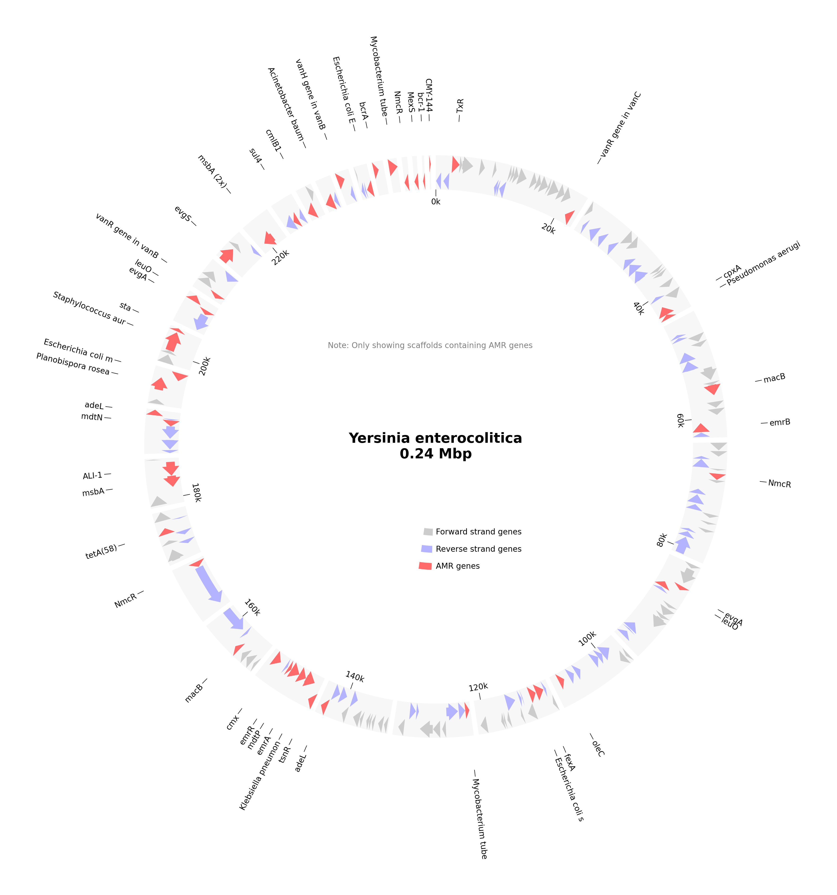

### ALI-1
- **Mechanism**: antibiotic inactivation
- **Drug Classes**: carbapenem
- **AMR Family**: ALI beta-lactamase
- **Locations**:
  - gnl|SPADES|CAEEGBCP_1583_4 : position 4478-6658

### Acinetobacter baumannii AbaF
- **Mechanism**: antibiotic efflux
- **Drug Classes**: phosphonic acid antibiotic
- **AMR Family**: major facilitator superfamily (MFS) antibiotic efflux pump
- **Locations**:
  - gnl|SPADES|CAEEGBCP_5090_1 : position 3-1340

### CMY-144
- **Mechanism**: antibiotic inactivation
- **Drug Classes**: cephamycin
- **AMR Family**: CMY beta-lactamase
- **Locations**:
  - gnl|SPADES|CAEEGBCP_63806_1 : position 2-226

### Escherichia coli EF-Tu mutants conferring resistance to Pulvomycin
- **Mechanism**: antibiotic target alteration
- **Drug Classes**: elfamycin antibiotic
- **AMR Family**: elfamycin resistant EF-Tu
- **Locations**:
  - gnl|SPADES|CAEEGBCP_5870_4 : position 1112-2020

### Escherichia coli mdfA
- **Mechanism**: antibiotic efflux
- **Drug Classes**: tetracycline antibiotic; phenicol antibiotic; disinfecting agents and antiseptics
- **AMR Family**: major facilitator superfamily (MFS) antibiotic efflux pump
- **Locations**:
  - gnl|SPADES|CAEEGBCP_2052_4 : position 4232-5461

### Escherichia coli soxS with mutation conferring antibiotic resistance
- **Mechanism**: antibiotic target alteration; antibiotic efflux; reduced permeability to antibiotic
- **Drug Classes**: fluoroquinolone antibiotic; monobactam; carbapenem; cephalosporin; glycylcycline; cephamycin; penam; tetracycline antibiotic; rifamycin antibiotic; phenicol antibiotic; penem; disinfecting agents and antiseptics
- **AMR Family**: ATP-binding cassette (ABC) antibiotic efflux pump; major facilitator superfamily (MFS) antibiotic efflux pump; resistance-nodulation-cell division (RND) antibiotic efflux pump; General Bacterial Porin with reduced permeability to beta-lactams
- **Locations**:
  - gnl|SPADES|CAEEGBCP_919_4 : position 2280-3287

### Klebsiella pneumoniae KpnH
- **Mechanism**: antibiotic efflux
- **Drug Classes**: macrolide antibiotic; fluoroquinolone antibiotic; aminoglycoside antibiotic; carbapenem; cephalosporin; penam; peptide antibiotic; penem
- **AMR Family**: major facilitator superfamily (MFS) antibiotic efflux pump
- **Locations**:
  - gnl|SPADES|CAEEGBCP_1238_2: position 1146-2681

### MexS
- **Mechanism**: antibiotic efflux
- **Drug Classes**: fluoroquinolone antibiotic; diaminopyrimidine antibiotic; phenicol antibiotic
- **AMR Family**: resistance-nodulation-cell division (RND) antibiotic efflux pump
- **Locations**:
  - gnl|SPADES|CAEEGBCP_16364_1 : position 42-656

### Mycobacterium tuberculosis pncA mutations conferring resistance to pyrazinamide
- **Mechanism**: antibiotic target alteration
- **Drug Classes**: pyrazine antibiotic
- **AMR Family**: Pyrazinamide resistant pncA
- **Locations**:
  - gnl|SPADES|CAEEGBCP_955_1 : position 162-815

### Mycobacterium tuberculosis rpoB mutations conferring resistance to rifampicin
- **Mechanism**: antibiotic target alteration; antibiotic target replacement
- **Drug Classes**: rifamycin antibiotic
- **AMR Family**: rifamycin-resistant beta-subunit of RNA polymerase (rpoB)
- **Locations**:
  - gnl|SPADES|CAEEGBCP_8855_1 : position 3-1292

### NmcR (found in 3 locations)
- **Mechanism**: antibiotic inactivation
- **Drug Classes**: carbapenem; cephalosporin; cephamycin; penam
- **AMR Family**: NmcA beta-lactamase
- **Locations**:
  - gnl|SPADES|CAEEGBCP_1346_3 : position 7410-8276
  - gnl|SPADES|CAEEGBCP_13688_1 : position 1-651
  - gnl|SPADES|CAEEGBCP_611_6 : position 4660-5577

### Planobispora rosea EF-Tu mutants conferring resistance to inhibitor GE2270A
- **Mechanism**: antibiotic target alteration
- **Drug Classes**: elfamycin antibiotic
- **AMR Family**: elfamycin resistant EF-Tu
- **Locations**:
  - gnl|SPADES|CAEEGBCP_2052_3 : position 2274-4166

### Pseudomonas aeruginosa CpxR
- **Mechanism**: antibiotic efflux
- **Drug Classes**: macrolide antibiotic; fluoroquinolone antibiotic; monobactam; aminoglycoside antibiotic; carbapenem; cephalosporin; cephamycin; penam; tetracycline antibiotic; peptide antibiotic; aminocoumarin antibiotic; diaminopyrimidine antibiotic; sulfonamide antibiotic; phenicol antibiotic; penem
- **AMR Family**: resistance-nodulation-cell division (RND) antibiotic efflux pump
- **Locations**:
  - gnl|SPADES|CAEEGBCP_518_21 : position 20342-21040

### Staphylococcus aureus mupB conferring resistance to mupirocin
- **Mechanism**: antibiotic target alteration
- **Drug Classes**: mupirocin-like antibiotic
- **AMR Family**: antibiotic-resistant isoleucyl-tRNA synthetase (ileS)
- **Locations**:
  - gnl|SPADES|CAEEGBCP_2129_3 : position 1958-4855

### TxR
- **Mechanism**: antibiotic efflux
- **Drug Classes**: tetracycline antibiotic
- **AMR Family**: ATP-binding cassette (ABC) antibiotic efflux pump
- **Locations**:
  - gnl|SPADES|CAEEGBCP_460_4 : position 2432-3544

### adeL (found in 2 locations)
- **Mechanism**: antibiotic efflux
- **Drug Classes**: fluoroquinolone antibiotic; tetracycline antibiotic
- **AMR Family**: resistance-nodulation-cell division (RND) antibiotic efflux pump
- **Locations**:
  - gnl|SPADES|CAEEGBCP_1038_14 : position 9620-10513
  - gnl|SPADES|CAEEGBCP_1762_6 : position 5713-6546

### bcr-1
- **Mechanism**: antibiotic efflux
- **Drug Classes**: bicyclomycin-like antibiotic
- **AMR Family**: major facilitator superfamily (MFS) antibiotic efflux pump
- **Locations**:
  - gnl|SPADES|CAEEGBCP_33647_1 : position 1-327

### bcrA
- **Mechanism**: antibiotic efflux
- **Drug Classes**: peptide antibiotic
- **AMR Family**: ATP-binding cassette (ABC) antibiotic efflux pump
- **Locations**:
  - gnl|SPADES|CAEEGBCP_7262_1 : position 47-805

### cmlB1
- **Mechanism**: antibiotic efflux
- **Drug Classes**: phenicol antibiotic
- **AMR Family**: major facilitator superfamily (MFS) antibiotic efflux pump
- **Locations**:
  - gnl|SPADES|CAEEGBCP_4920_1 : position 7-1191

### cmx
- **Mechanism**: antibiotic efflux
- **Drug Classes**: phenicol antibiotic
- **AMR Family**: major facilitator superfamily (MFS) antibiotic efflux pump
- **Locations**:
  - gnl|SPADES|CAEEGBCP_1238_8 : position 7419-8621

### cpxA
- **Mechanism**: antibiotic efflux
- **Drug Classes**: aminoglycoside antibiotic; aminocoumarin antibiotic
- **AMR Family**: resistance-nodulation-cell division (RND) antibiotic efflux pump
- **Locations**:
  - gnl|SPADES|CAEEGBCP_518_20 : position 18969-20345

### emrA
- **Mechanism**: antibiotic efflux
- **Drug Classes**: fluoroquinolone antibiotic
- **AMR Family**: major facilitator superfamily (MFS) antibiotic efflux pump
- **Locations**:
  - gnl|SPADES|CAEEGBCP_1238_3 : position 2721-3893

### emrB
- **Mechanism**: antibiotic efflux
- **Drug Classes**: fluoroquinolone antibiotic
- **AMR Family**: major facilitator superfamily (MFS) antibiotic efflux pump
- **Locations**:
  - gnl|SPADES|CAEEGBCP_580_15 : position 16636-18060

### emrR
- **Mechanism**: antibiotic efflux
- **Drug Classes**: fluoroquinolone antibiotic
- **AMR Family**: major facilitator superfamily (MFS) antibiotic efflux pump
- **Locations**:
  - gnl|SPADES|CAEEGBCP_1238_5 : position 5422-5934

### evgA (found in 2 locations)
- **Mechanism**: antibiotic efflux
- **Drug Classes**: macrolide antibiotic; fluoroquinolone antibiotic; penam; tetracycline antibiotic
- **AMR Family**: major facilitator superfamily (MFS) antibiotic efflux pump; resistance-nodulation-cell division (RND) antibiotic efflux pump
- **Locations**:
  - gnl|SPADES|CAEEGBCP_2362_3 : position 2987-3682
  - gnl|SPADES|CAEEGBCP_705_3 : position 3594-4238

### evgS
- **Mechanism**: antibiotic efflux
- **Drug Classes**: macrolide antibiotic; fluoroquinolone antibiotic; penam; tetracycline antibiotic
- **AMR Family**: major facilitator superfamily (MFS) antibiotic efflux pump; resistance-nodulation-cell division (RND) antibiotic efflux pump
- **Locations**:
  - gnl|SPADES|CAEEGBCP_2484_1 : position 3-2315

### fexA
- **Mechanism**: antibiotic efflux
- **Drug Classes**: phenicol antibiotic
- **AMR Family**: major facilitator superfamily (MFS) antibiotic efflux pump
- **Locations**:
  - gnl|SPADES|CAEEGBCP_919_3 : position 957-2192

### leuO (found in 2 locations)
- **Mechanism**: antibiotic efflux
- **Drug Classes**: nucleoside antibiotic; disinfecting agents and antiseptics
- **AMR Family**: major facilitator superfamily (MFS) antibiotic efflux pump
- **Locations**:
  - gnl|SPADES|CAEEGBCP_2362_4 : position 3910-4857
  - gnl|SPADES|CAEEGBCP_705_4 : position 4245-5147

### macB (found in 2 locations)
- **Mechanism**: antibiotic efflux
- **Drug Classes**: macrolide antibiotic
- **AMR Family**: ATP-binding cassette (ABC) antibiotic efflux pump
- **Locations**:
  - gnl|SPADES|CAEEGBCP_1252_5 : position 3460-4215
  - gnl|SPADES|CAEEGBCP_580_10 : position 11134-12666

### mdtN
- **Mechanism**: antibiotic efflux
- **Drug Classes**: nucleoside antibiotic; disinfecting agents and antiseptics
- **AMR Family**: major facilitator superfamily (MFS) antibiotic efflux pump
- **Locations**:
  - gnl|SPADES|CAEEGBCP_1762_4 : position 4254-5189

### mdtP
- **Mechanism**: antibiotic efflux
- **Drug Classes**: nucleoside antibiotic; disinfecting agents and antiseptics
- **AMR Family**: major facilitator superfamily (MFS) antibiotic efflux pump
- **Locations**:
  - gnl|SPADES|CAEEGBCP_1238_4 : position 3908-5374

### msbA (found in 3 locations)
- **Mechanism**: antibiotic efflux
- **Drug Classes**: nitroimidazole antibiotic
- **AMR Family**: ATP-binding cassette (ABC) antibiotic efflux pump
- **Locations**:
  - gnl|SPADES|CAEEGBCP_1583_3 : position 2694-4442
  - gnl|SPADES|CAEEGBCP_2643_2 : position 950-2674
  - gnl|SPADES|CAEEGBCP_2643_3 : position 2677-4440

### oleC
- **Mechanism**: antibiotic efflux
- **Drug Classes**: macrolide antibiotic
- **AMR Family**: ATP-binding cassette (ABC) antibiotic efflux pump
- **Locations**:
  - gnl|SPADES|CAEEGBCP_916_10 : position 10296-11186

### sta
- **Mechanism**: antibiotic inactivation
- **Drug Classes**: nucleoside antibiotic
- **AMR Family**: streptothricin acetyltransferase (SAT)
- **Locations**:
  - gnl|SPADES|CAEEGBCP_2129_4 : position 4990-5484

### sul4
- **Mechanism**: antibiotic target replacement
- **Drug Classes**: sulfonamide antibiotic
- **AMR Family**: sulfonamide resistant sul
- **Locations**:
  - gnl|SPADES|CAEEGBCP_3468_2 : position 1520-2353

### tetA(58)
- **Mechanism**: antibiotic efflux
- **Drug Classes**: tetracycline antibiotic
- **AMR Family**: major facilitator superfamily (MFS) antibiotic efflux pump
- **Locations**:
  - gnl|SPADES|CAEEGBCP_1482_6 : position 4504-5430

### tsnR
- **Mechanism**: antibiotic target alteration
- **Drug Classes**: peptide antibiotic
- **AMR Family**: non-erm 23S ribosomal RNA methyltransferase (A1067)
- **Locations**:
  - gnl|SPADES|CAEEGBCP_1238_1 : position 1-939

### vanH gene in vanB cluster
- **Mechanism**: antibiotic target alteration
- **Drug Classes**: glycopeptide antibiotic
- **AMR Family**: vanH; glycopeptide resistance gene cluster
- **Locations**:
  - gnl|SPADES|CAEEGBCP_5851_1 : position 3-1073

### vanR gene in vanB cluster
- **Mechanism**: antibiotic target alteration
- **Drug Classes**: glycopeptide antibiotic
- **AMR Family**: glycopeptide resistance gene cluster; vanR
- **Locations**:
  - gnl|SPADES|CAEEGBCP_2387_1 : position 368-1084

### vanR gene in vanC cluster
- **Mechanism**: antibiotic target alteration
- **Drug Classes**: glycopeptide antibiotic
- **AMR Family**: glycopeptide resistance gene cluster; vanR
- **Locations**:
  - gnl|SPADES|CAEEGBCP_460_27 : position 21295-22329

## Yersinia enterocolitica (type O:5) str. YE53/03
**Strain Statistics:**
- Total genome length: 3587.1 kbp
- Total scaffolds: 143
- Scaffolds with AMR genes: 100
- Total genes annotated: 6327
- Total AMR genes: 376
- Unique AMR genes: 175
- Distinct AMR mechanisms: 10
- Distinct AMR families: 65
- Distinct drug classes: 35

**Circos Plot:**

_str._YE53_03.png)

### Acinetobacter baumannii AbaF (found in 3 locations)
- **Mechanism**: antibiotic efflux
- **Drug Classes**: phosphonic acid antibiotic
- **AMR Family**: major facilitator superfamily (MFS) antibiotic efflux pump
- **Locations**:
  - gnl|SPADES|CAEEGBCP_262_26 : position 29971-31374
  - gnl|SPADES|CAEEGBCP_416_15 : position 12238-13764
  - gnl|SPADES|CAEEGBCP_564_13 : position 17161-18663

### Acinetobacter baumannii AbaQ (found in 4 locations)
- **Mechanism**: antibiotic efflux
- **Drug Classes**: fluoroquinolone antibiotic
- **AMR Family**: major facilitator superfamily (MFS) antibiotic efflux pump
- **Locations**:
  - gnl|SPADES|CAEEGBCP_111_50 : position 54465-55775
  - gnl|SPADES|CAEEGBCP_367_11 : position 9683-10999
  - gnl|SPADES|CAEEGBCP_39_2 : position 1523-2839
  - gnl|SPADES|CAEEGBCP_58_67 : position 70424-71782

### Acinetobacter baumannii AmvA
- **Mechanism**: antibiotic efflux
- **Drug Classes**: macrolide antibiotic; disinfecting agents and antiseptics
- **AMR Family**: major facilitator superfamily (MFS) antibiotic efflux pump
- **Locations**:
  - gnl|SPADES|CAEEGBCP_166_29 : position 33907-35400

### ArnT
- **Mechanism**: antibiotic target alteration
- **Drug Classes**: peptide antibiotic
- **AMR Family**: pmr phosphoethanolamine transferase
- **Locations**:
  - gnl|SPADES|CAEEGBCP_251_12: position 9870-11534

### Bifidobacterium bifidum ileS conferring resistance to mupirocin
- **Mechanism**: antibiotic target alteration
- **Drug Classes**: mupirocin-like antibiotic
- **AMR Family**: antibiotic-resistant isoleucyl-tRNA synthetase (ileS)
- **Locations**:
  - gnl|SPADES|CAEEGBCP_131_14 : position 14708-17290

### CMY-70
- **Mechanism**: antibiotic inactivation
- **Drug Classes**: cephamycin
- **AMR Family**: CMY beta-lactamase
- **Locations**:
  - gnl|SPADES|CAEEGBCP_39_7 : position 6771-7937

### CRP
- **Mechanism**: antibiotic efflux
- **Drug Classes**: macrolide antibiotic; fluoroquinolone antibiotic; penam
- **AMR Family**: resistance-nodulation-cell division (RND) antibiotic efflux pump
- **Locations**:
  - gnl|SPADES|CAEEGBCP_19_90 : position 97238-97993

### Clostridioides difficile gyrB conferring resistance to fluoroquinolones
- **Mechanism**: antibiotic target alteration
- **Drug Classes**: fluoroquinolone antibiotic
- **AMR Family**: fluoroquinolone resistant gyrB
- **Locations**:
  - gnl|SPADES|CAEEGBCP_111_8 : position 7083-8978

### CrcB (found in 2 locations)
- **Mechanism**: antibiotic efflux
- **Drug Classes**: aminoglycoside antibiotic
- **AMR Family**: multidrug and toxic compound extrusion (MATE) transporter
- **Locations**:
  - gnl|SPADES|CAEEGBCP_131_29 : position 30414-30797
  - gnl|SPADES|CAEEGBCP_184_20 : position 18727-19131

### D-Ala-D-Ala ligase
- **Mechanism**: antibiotic target alteration
- **Drug Classes**: glycopeptide antibiotic
- **AMR Family**: Van ligase
- **Locations**:
  - gnl|SPADES|CAEEGBCP_82_2 : position 594-1514

### DHA-6
- **Mechanism**: antibiotic inactivation
- **Drug Classes**: cephalosporin; cephamycin
- **AMR Family**: DHA beta-lactamase
- **Locations**:
  - gnl|SPADES|CAEEGBCP_1283_7 : position 7782-8924

### Enterobacter cloacae acrA (found in 2 locations)
- **Mechanism**: antibiotic efflux
- **Drug Classes**: fluoroquinolone antibiotic; cephalosporin; glycylcycline; penam; tetracycline antibiotic; rifamycin antibiotic; phenicol antibiotic; disinfecting agents and antiseptics
- **AMR Family**: resistance-nodulation-cell division (RND) antibiotic efflux pump
- **Locations**:
  - gnl|SPADES|CAEEGBCP_129_46 : position 51095-52255
  - gnl|SPADES|CAEEGBCP_298_16 : position 21673-22656

### Enterococcus faecalis cls with mutation conferring resistance to daptomycin
- **Mechanism**: antibiotic target alteration
- **Drug Classes**: peptide antibiotic
- **AMR Family**: daptomycin resistant cls
- **Locations**:
  - gnl|SPADES|CAEEGBCP_89_19 : position 22173-23633

### Erm(34)
- **Mechanism**: antibiotic target alteration
- **Drug Classes**: macrolide antibiotic; lincosamide antibiotic; streptogramin antibiotic; streptogramin A antibiotic; streptogramin B antibiotic
- **AMR Family**: Erm 23S ribosomal RNA methyltransferase
- **Locations**:
  - gnl|SPADES|CAEEGBCP_322_4 : position 4829-5455

### Escherichia coli AcrAB-TolC with AcrR mutation conferring resistance to ciprofloxacin, tetracycline, and ceftazidime (found in 2 locations)
- **Mechanism**: antibiotic target alteration; antibiotic efflux
- **Drug Classes**: fluoroquinolone antibiotic; cephalosporin; glycylcycline; penam; tetracycline antibiotic; rifamycin antibiotic; phenicol antibiotic; disinfecting agents and antiseptics
- **AMR Family**: resistance-nodulation-cell division (RND) antibiotic efflux pump
- **Locations**:
  - gnl|SPADES|CAEEGBCP_110_44 : position 52744-53328
  - gnl|SPADES|CAEEGBCP_122_40 : position 45507-46163

### Escherichia coli AcrAB-TolC with MarR mutations conferring resistance to ciprofloxacin and tetracycline
- **Mechanism**: antibiotic target alteration; antibiotic efflux
- **Drug Classes**: fluoroquinolone antibiotic; cephalosporin; glycylcycline; penam; tetracycline antibiotic; rifamycin antibiotic; phenicol antibiotic; disinfecting agents and antiseptics
- **AMR Family**: resistance-nodulation-cell division (RND) antibiotic efflux pump
- **Locations**:
  - gnl|SPADES|CAEEGBCP_19_21 : position 20437-20868

### Escherichia coli EF-Tu mutants conferring resistance to Pulvomycin
- **Mechanism**: antibiotic target alteration
- **Drug Classes**: elfamycin antibiotic
- **AMR Family**: elfamycin resistant EF-Tu
- **Locations**:
  - gnl|SPADES|CAEEGBCP_1877_5 : position 5090-6181

### Escherichia coli acrA (found in 2 locations)
- **Mechanism**: antibiotic efflux
- **Drug Classes**: fluoroquinolone antibiotic; cephalosporin; glycylcycline; penam; tetracycline antibiotic; rifamycin antibiotic; phenicol antibiotic; disinfecting agents and antiseptics
- **AMR Family**: resistance-nodulation-cell division (RND) antibiotic efflux pump
- **Locations**:
  - gnl|SPADES|CAEEGBCP_122_41 : position 46308-47495
  - gnl|SPADES|CAEEGBCP_564_9 : position 10576-11778

### Escherichia coli murA with mutation conferring resistance to fosfomycin
- **Mechanism**: antibiotic target alteration
- **Drug Classes**: phosphonic acid antibiotic
- **AMR Family**: antibiotic-resistant murA transferase
- **Locations**:
  - gnl|SPADES|CAEEGBCP_535_13 : position 18511-19797

### Escherichia coli parE conferring resistance to fluoroquinolones
- **Mechanism**: antibiotic target alteration
- **Drug Classes**: fluoroquinolone antibiotic
- **AMR Family**: fluoroquinolone resistant parE
- **Locations**:
  - gnl|SPADES|CAEEGBCP_236_1 : position 3-1079

### Escherichia coli soxS with mutation conferring antibiotic resistance (found in 3 locations)
- **Mechanism**: antibiotic target alteration; antibiotic efflux; reduced permeability to antibiotic
- **Drug Classes**: fluoroquinolone antibiotic; monobactam; carbapenem; cephalosporin; glycylcycline; cephamycin; penam; tetracycline antibiotic; rifamycin antibiotic; phenicol antibiotic; penem; disinfecting agents and antiseptics
- **AMR Family**: ATP-binding cassette (ABC) antibiotic efflux pump; major facilitator superfamily (MFS) antibiotic efflux pump; resistance-nodulation-cell division (RND) antibiotic efflux pump; General Bacterial Porin with reduced permeability to beta-lactams
- **Locations**:
  - gnl|SPADES|CAEEGBCP_257_16 : position 18570-19502
  - gnl|SPADES|CAEEGBCP_681_1 : position 3-809
  - gnl|SPADES|CAEEGBCP_84_48 : position 54653-55360

### Escherichia coli uhpA with mutation conferring resistance to fosfomycin
- **Mechanism**: antibiotic target alteration
- **Drug Classes**: phosphonic acid antibiotic
- **AMR Family**: antibiotic-resistant UhpT
- **Locations**:
  - gnl|SPADES|CAEEGBCP_118_17 : position 20779-21363

### EstT
- **Mechanism**: antibiotic inactivation
- **Drug Classes**: macrolide antibiotic
- **AMR Family**: macrolide esterase
- **Locations**:
  - gnl|SPADES|CAEEGBCP_331_11 : position 8797-9591

### FosM2
- **Mechanism**: antibiotic inactivation
- **Drug Classes**: phosphonic acid antibiotic
- **AMR Family**: fosfomycin thiol transferase
- **Locations**:
  - gnl|SPADES|CAEEGBCP_19_12 : position 11416-11823

### H-NS
- **Mechanism**: antibiotic efflux
- **Drug Classes**: macrolide antibiotic; fluoroquinolone antibiotic; cephalosporin; cephamycin; penam; tetracycline antibiotic
- **AMR Family**: major facilitator superfamily (MFS) antibiotic efflux pump; resistance-nodulation-cell division (RND) antibiotic efflux pump
- **Locations**:
  - gnl|SPADES|CAEEGBCP_89_7 : position 7073-7483

### Haemophilus influenzae PBP3 conferring resistance to beta-lactam antibiotics
- **Mechanism**: antibiotic target alteration
- **Drug Classes**: cephalosporin; cephamycin; penam
- **AMR Family**: Penicillin-binding protein mutations conferring resistance to beta-lactam antibiotics
- **Locations**:
  - gnl|SPADES|CAEEGBCP_82_10 : position 10567-12330

### Helicobacter pylori pbp1 mutants conferring resistance to amoxicillin (found in 2 locations)
- **Mechanism**: antibiotic target alteration
- **Drug Classes**: cephalosporin; cephamycin; penam
- **AMR Family**: Penicillin-binding protein mutations conferring resistance to beta-lactam antibiotics
- **Locations**:
  - gnl|SPADES|CAEEGBCP_361_17 : position 21233-23719
  - gnl|SPADES|CAEEGBCP_891_5 : position 5254-7590

### Helicobacter pylori pbp2 mutants conferring resistance to amoxicillin
- **Mechanism**: antibiotic target alteration
- **Drug Classes**: cephalosporin; cephamycin; penam
- **AMR Family**: Penicillin-binding protein mutations conferring resistance to beta-lactam antibiotics
- **Locations**:
  - gnl|SPADES|CAEEGBCP_131_20 : position 20695-22590

### Helicobacter pylori pbp3 conferring resistance to amoxicillin
- **Mechanism**: antibiotic target alteration
- **Drug Classes**: cephalosporin; cephamycin; penam
- **AMR Family**: Penicillin-binding protein mutations conferring resistance to beta-lactam antibiotics
- **Locations**:
  - gnl|SPADES|CAEEGBCP_39_121 : position 111383-113092

### Klebsiella pneumoniae KpnE
- **Mechanism**: antibiotic efflux
- **Drug Classes**: macrolide antibiotic; aminoglycoside antibiotic; cephalosporin; tetracycline antibiotic; peptide antibiotic; rifamycin antibiotic; disinfecting agents and antiseptics
- **AMR Family**: small multidrug resistance (SMR) antibiotic efflux pump
- **Locations**:
  - gnl|SPADES|CAEEGBCP_1480_8 : position 6489-6866

### Klebsiella pneumoniae KpnF
- **Mechanism**: antibiotic efflux
- **Drug Classes**: macrolide antibiotic; aminoglycoside antibiotic; cephalosporin; tetracycline antibiotic; peptide antibiotic; rifamycin antibiotic; disinfecting agents and antiseptics
- **AMR Family**: small multidrug resistance (SMR) antibiotic efflux pump
- **Locations**:
  - gnl|SPADES|CAEEGBCP_1480_7: position 6173-6502

### Klebsiella pneumoniae KpnG
- **Mechanism**: antibiotic efflux
- **Drug Classes**: macrolide antibiotic; fluoroquinolone antibiotic; aminoglycoside antibiotic; carbapenem; cephalosporin; penam; peptide antibiotic; penem
- **AMR Family**: major facilitator superfamily (MFS) antibiotic efflux pump
- **Locations**:
  - gnl|SPADES|CAEEGBCP_110_8 : position 6820-8112

### Klebsiella pneumoniae OmpK37 (found in 4 locations)
- **Mechanism**: reduced permeability to antibiotic
- **Drug Classes**: monobactam; carbapenem; cephalosporin; cephamycin; penam; penem
- **AMR Family**: General Bacterial Porin with reduced permeability to beta-lactams
- **Locations**:
  - gnl|SPADES|CAEEGBCP_298_15 : position 20312-21427
  - gnl|SPADES|CAEEGBCP_448_1 : position 1-1029
  - gnl|SPADES|CAEEGBCP_62_37 : position 34256-35338
  - gnl|SPADES|CAEEGBCP_64_10 : position 11698-12813

### LRA-19
- **Mechanism**: antibiotic inactivation
- **Drug Classes**: cephalosporin; penam
- **AMR Family**: subclass B3 LRA beta-lactamase
- **Locations**:
  - gnl|SPADES|CAEEGBCP_616_3 : position 3296-3943

### LlmA 23S ribosomal RNA methyltransferase
- **Mechanism**: antibiotic target alteration
- **Drug Classes**: lincosamide antibiotic
- **AMR Family**: Llm 23S ribosomal RNA methyltransferase
- **Locations**:
  - gnl|SPADES|CAEEGBCP_118_46 : position 51254-52444

### LpsB
- **Mechanism**: reduced permeability to antibiotic
- **Drug Classes**: peptide antibiotic
- **AMR Family**: Intrinsic peptide antibiotic resistant Lps
- **Locations**:
  - gnl|SPADES|CAEEGBCP_122_23 : position 26172-27275

### LptD
- **Mechanism**: antibiotic efflux
- **Drug Classes**: carbapenem; peptide antibiotic; aminocoumarin antibiotic; rifamycin antibiotic
- **AMR Family**: ATP-binding cassette (ABC) antibiotic efflux pump
- **Locations**:
  - gnl|SPADES|CAEEGBCP_82_42 : position 56066-58462

### MSI-1
- **Mechanism**: antibiotic inactivation
- **Drug Classes**: carbapenem
- **AMR Family**: MSI beta-lactamase
- **Locations**:
  - gnl|SPADES|CAEEGBCP_368_6 : position 4921-5676

### MdtK
- **Mechanism**: antibiotic efflux
- **Drug Classes**: fluoroquinolone antibiotic
- **AMR Family**: multidrug and toxic compound extrusion (MATE) transporter
- **Locations**:
  - gnl|SPADES|CAEEGBCP_110_51 : position 60529-61926

### MexF
- **Mechanism**: antibiotic efflux
- **Drug Classes**: fluoroquinolone antibiotic; diaminopyrimidine antibiotic; phenicol antibiotic
- **AMR Family**: resistance-nodulation-cell division (RND) antibiotic efflux pump
- **Locations**:
  - gnl|SPADES|CAEEGBCP_564_10 : position 11791-14916

### MexH
- **Mechanism**: antibiotic efflux
- **Drug Classes**: fluoroquinolone antibiotic; tetracycline antibiotic; disinfecting agents and antiseptics
- **AMR Family**: resistance-nodulation-cell division (RND) antibiotic efflux pump
- **Locations**:
  - gnl|SPADES|CAEEGBCP_111_40 : position 41798-43336

### MexJ
- **Mechanism**: antibiotic efflux
- **Drug Classes**: macrolide antibiotic; tetracycline antibiotic; disinfecting agents and antiseptics
- **AMR Family**: resistance-nodulation-cell division (RND) antibiotic efflux pump
- **Locations**:
  - gnl|SPADES|CAEEGBCP_48_21 : position 27577-28659

### MexS (found in 5 locations)
- **Mechanism**: antibiotic efflux
- **Drug Classes**: fluoroquinolone antibiotic; diaminopyrimidine antibiotic; phenicol antibiotic
- **AMR Family**: resistance-nodulation-cell division (RND) antibiotic efflux pump
- **Locations**:
  - gnl|SPADES|CAEEGBCP_110_41 : position 49543-50553
  - gnl|SPADES|CAEEGBCP_377_20 : position 20720-21730
  - gnl|SPADES|CAEEGBCP_643_11 : position 10118-11272
  - gnl|SPADES|CAEEGBCP_91_25 : position 28599-29675
  - gnl|SPADES|CAEEGBCP_94_7 : position 8272-9306

### MexT
- **Mechanism**: antibiotic efflux
- **Drug Classes**: fluoroquinolone antibiotic; diaminopyrimidine antibiotic; phenicol antibiotic
- **AMR Family**: resistance-nodulation-cell division (RND) antibiotic efflux pump
- **Locations**:
  - gnl|SPADES|CAEEGBCP_1881_3 : position 2593-3513

### Mycobacterium tuberculosis kasA mutant conferring resistance to isoniazid (found in 2 locations)
- **Mechanism**: antibiotic target alteration
- **Drug Classes**: isoniazid-like antibiotic
- **AMR Family**: antibiotic resistant kasA
- **Locations**:
  - gnl|SPADES|CAEEGBCP_368_15 : position 13913-15088
  - gnl|SPADES|CAEEGBCP_585_12 : position 14573-15847

### Mycobacterium tuberculosis ndh with mutation conferring resistance to isoniazid
- **Mechanism**: antibiotic target alteration
- **Drug Classes**: isoniazid-like antibiotic
- **AMR Family**: antibiotic resistant ndh
- **Locations**:
  - gnl|SPADES|CAEEGBCP_58_16 : position 14921-16225

### Mycobacterium tuberculosis thyA with mutation conferring resistance to para-aminosalicylic acid
- **Mechanism**: antibiotic target alteration
- **Drug Classes**: salicylic acid antibiotic
- **AMR Family**: aminosalicylate resistant thymidylate synthase
- **Locations**:
  - gnl|SPADES|CAEEGBCP_510_3 : position 3178-3972

### Neisseria gonorrhoeae pilQ gene conferring resistance to beta-lactam
- **Mechanism**: antibiotic target alteration
- **Drug Classes**: cephalosporin; cephamycin; penam
- **AMR Family**: Penicillin-binding protein mutations conferring resistance to beta-lactam antibiotics
- **Locations**:
  - gnl|SPADES|CAEEGBCP_87_44 : position 44172-46118

### NmcR (found in 8 locations)
- **Mechanism**: antibiotic inactivation
- **Drug Classes**: carbapenem; cephalosporin; cephamycin; penam
- **AMR Family**: NmcA beta-lactamase
- **Locations**:
  - gnl|SPADES|CAEEGBCP_1364_6 : position 5111-5992
  - gnl|SPADES|CAEEGBCP_165_23 : position 26966-27886
  - gnl|SPADES|CAEEGBCP_166_6 : position 6592-7479
  - gnl|SPADES|CAEEGBCP_1939_4 : position 4772-5653
  - gnl|SPADES|CAEEGBCP_19_113 : position 127424-128278
  - gnl|SPADES|CAEEGBCP_39_8 : position 8072-8956
  - gnl|SPADES|CAEEGBCP_81_26 : position 35549-36442
  - gnl|SPADES|CAEEGBCP_89_53 : position 53569-54543

### OXA-152
- **Mechanism**: antibiotic inactivation
- **Drug Classes**: carbapenem; penam
- **AMR Family**: OXA beta-lactamase; OXA-62-like beta-lactamase
- **Locations**:
  - gnl|SPADES|CAEEGBCP_338_14 : position 13995-14699

### OmpA (found in 5 locations)
- **Mechanism**: reduced permeability to antibiotic
- **Drug Classes**: peptide antibiotic
- **AMR Family**: General Bacterial Porin with reduced permeability to peptide antibiotics
- **Locations**:
  - gnl|SPADES|CAEEGBCP_128_44 : position 55142-55648
  - gnl|SPADES|CAEEGBCP_236_16 : position 17388-18047
  - gnl|SPADES|CAEEGBCP_681_9 : position 10110-10619
  - gnl|SPADES|CAEEGBCP_81_20 : position 28371-30041
  - gnl|SPADES|CAEEGBCP_81_3 : position 6374-7750

### OprJ
- **Mechanism**: antibiotic efflux
- **Drug Classes**: macrolide antibiotic; fluoroquinolone antibiotic; aminoglycoside antibiotic; cephalosporin; penam; tetracycline antibiotic; aminocoumarin antibiotic; diaminopyrimidine antibiotic; phenicol antibiotic
- **AMR Family**: resistance-nodulation-cell division (RND) antibiotic efflux pump
- **Locations**:
  - gnl|SPADES|CAEEGBCP_262_10 : position 11587-13107

### OprM
- **Mechanism**: antibiotic efflux
- **Drug Classes**: macrolide antibiotic; fluoroquinolone antibiotic; monobactam; aminoglycoside antibiotic; carbapenem; cephalosporin; cephamycin; penam; tetracycline antibiotic; peptide antibiotic; aminocoumarin antibiotic; diaminopyrimidine antibiotic; sulfonamide antibiotic; phenicol antibiotic; penem; disinfecting agents and antiseptics
- **AMR Family**: resistance-nodulation-cell division (RND) antibiotic efflux pump
- **Locations**:
  - gnl|SPADES|CAEEGBCP_129_44 : position 46558-47964

### PDC-382
- **Mechanism**: antibiotic inactivation
- **Drug Classes**: monobactam; carbapenem; cephalosporin
- **AMR Family**: PDC beta-lactamase
- **Locations**:
  - gnl|SPADES|CAEEGBCP_110_46 : position 54561-55733

### ParR (found in 3 locations)
- **Mechanism**: antibiotic efflux; reduced permeability to antibiotic
- **Drug Classes**: macrolide antibiotic; fluoroquinolone antibiotic; monobactam; aminoglycoside antibiotic; carbapenem; cephalosporin; cephamycin; penam; tetracycline antibiotic; phenicol antibiotic; penem; disinfecting agents and antiseptics
- **AMR Family**: resistance-nodulation-cell division (RND) antibiotic efflux pump; Outer Membrane Porin (Opr)
- **Locations**:
  - gnl|SPADES|CAEEGBCP_143_29 : position 31751-32470
  - gnl|SPADES|CAEEGBCP_19_83 : position 88161-88889
  - gnl|SPADES|CAEEGBCP_262_1 : position 399-1127

### ParS (found in 2 locations)
- **Mechanism**: antibiotic efflux; reduced permeability to antibiotic
- **Drug Classes**: macrolide antibiotic; fluoroquinolone antibiotic; monobactam; aminoglycoside antibiotic; carbapenem; cephalosporin; cephamycin; penam; tetracycline antibiotic; phenicol antibiotic; penem; disinfecting agents and antiseptics
- **AMR Family**: resistance-nodulation-cell division (RND) antibiotic efflux pump; Outer Membrane Porin (Opr)
- **Locations**:
  - gnl|SPADES|CAEEGBCP_19_82 : position 86851-88164
  - gnl|SPADES|CAEEGBCP_262_3 : position 1607-2497

### Planobispora rosea EF-Tu mutants conferring resistance to inhibitor GE2270A
- **Mechanism**: antibiotic target alteration
- **Drug Classes**: elfamycin antibiotic
- **AMR Family**: elfamycin resistant EF-Tu
- **Locations**:
  - gnl|SPADES|CAEEGBCP_322_15 : position 12766-14265

### PmrF (found in 3 locations)
- **Mechanism**: antibiotic target alteration
- **Drug Classes**: peptide antibiotic
- **AMR Family**: pmr phosphoethanolamine transferase
- **Locations**:
  - gnl|SPADES|CAEEGBCP_251_9 : position 5973-6956
  - gnl|SPADES|CAEEGBCP_575_12 : position 9090-10079
  - gnl|SPADES|CAEEGBCP_62_54 : position 56726-58099

### Pseudomonas aeruginosa CpxR
- **Mechanism**: antibiotic efflux
- **Drug Classes**: macrolide antibiotic; fluoroquinolone antibiotic; monobactam; aminoglycoside antibiotic; carbapenem; cephalosporin; cephamycin; penam; tetracycline antibiotic; peptide antibiotic; aminocoumarin antibiotic; diaminopyrimidine antibiotic; sulfonamide antibiotic; phenicol antibiotic; penem
- **AMR Family**: resistance-nodulation-cell division (RND) antibiotic efflux pump
- **Locations**:
  - gnl|SPADES|CAEEGBCP_416_23 : position 22361-23044

### Pseudomonas aeruginosa ampR with mutation conferring resistance to aztreonam
- **Mechanism**: antibiotic target alteration; antibiotic inactivation
- **Drug Classes**: monobactam; carbapenem; cephalosporin
- **AMR Family**: PDC beta-lactamase; ampR transcriptional regulator with mutation conferring resistance to monobactam antibiotics
- **Locations**:
  - gnl|SPADES|CAEEGBCP_140_27 : position 26890-27831

### QepA4 (found in 3 locations)
- **Mechanism**: antibiotic efflux
- **Drug Classes**: fluoroquinolone antibiotic
- **AMR Family**: major facilitator superfamily (MFS) antibiotic efflux pump
- **Locations**:
  - gnl|SPADES|CAEEGBCP_1881_2 : position 1040-2464
  - gnl|SPADES|CAEEGBCP_257_1 : position 82-1374
  - gnl|SPADES|CAEEGBCP_62_71 : position 76986-78626

### RanA (found in 19 locations)
- **Mechanism**: antibiotic efflux
- **Drug Classes**: aminoglycoside antibiotic
- **AMR Family**: ATP-binding cassette (ABC) antibiotic efflux pump
- **Locations**:
  - gnl|SPADES|CAEEGBCP_110_30 : position 32916-34007
  - gnl|SPADES|CAEEGBCP_112_30 : position 31081-32214
  - gnl|SPADES|CAEEGBCP_1163_4 : position 2644-3453
  - gnl|SPADES|CAEEGBCP_129_29 : position 26926-28041
  - gnl|SPADES|CAEEGBCP_129_5 : position 4255-5133
  - gnl|SPADES|CAEEGBCP_140_21 : position 20728-21543
  - gnl|SPADES|CAEEGBCP_166_22 : position 24523-25572
  - gnl|SPADES|CAEEGBCP_166_31 : position 36748-37554
  - gnl|SPADES|CAEEGBCP_169_36 : position 30521-32113
  - gnl|SPADES|CAEEGBCP_187_31 : position 34862-36376
  - gnl|SPADES|CAEEGBCP_194_27 : position 29542-30645
  - gnl|SPADES|CAEEGBCP_19_36 : position 33873-34688
  - gnl|SPADES|CAEEGBCP_355_4 : position 2460-3194
  - gnl|SPADES|CAEEGBCP_47_65 : position 77946-78968
  - gnl|SPADES|CAEEGBCP_497_6 : position 5662-6789
  - gnl|SPADES|CAEEGBCP_71_20 : position 20232-21050
  - gnl|SPADES|CAEEGBCP_757_8 : position 8957-9733
  - gnl|SPADES|CAEEGBCP_89_16 : position 19525-20526
  - gnl|SPADES|CAEEGBCP_89_17 : position 20523-21524

### RanB (found in 2 locations)
- **Mechanism**: antibiotic efflux
- **Drug Classes**: aminoglycoside antibiotic
- **AMR Family**: ATP-binding cassette (ABC) antibiotic efflux pump
- **Locations**:
  - gnl|SPADES|CAEEGBCP_1163_5 : position 3464-4246
  - gnl|SPADES|CAEEGBCP_166_30 : position 35609-36754

### Rv1877 (found in 2 locations)
- **Mechanism**: antibiotic efflux
- **Drug Classes**: fluoroquinolone antibiotic
- **AMR Family**: major facilitator superfamily (MFS) antibiotic efflux pump
- **Locations**:
  - gnl|SPADES|CAEEGBCP_110_10 : position 8705-10093
  - gnl|SPADES|CAEEGBCP_236_14 : position 15038-16486

### SAT-3
- **Mechanism**: antibiotic inactivation
- **Drug Classes**: nucleoside antibiotic
- **AMR Family**: streptothricin acetyltransferase (SAT)
- **Locations**:
  - gnl|SPADES|CAEEGBCP_89_3 : position 2262-2690

### Salmonella serovars soxS with mutation conferring antibiotic resistance
- **Mechanism**: antibiotic target alteration; antibiotic efflux; reduced permeability to antibiotic
- **Drug Classes**: fluoroquinolone antibiotic; monobactam; carbapenem; cephalosporin; glycylcycline; cephamycin; penam; tetracycline antibiotic; rifamycin antibiotic; phenicol antibiotic; penem; disinfecting agents and antiseptics
- **AMR Family**: ATP-binding cassette (ABC) antibiotic efflux pump; major facilitator superfamily (MFS) antibiotic efflux pump; resistance-nodulation-cell division (RND) antibiotic efflux pump; General Bacterial Porin with reduced permeability to beta-lactams
- **Locations**:
  - gnl|SPADES|CAEEGBCP_58_81 : position 84305-84691

### SatA
- **Mechanism**: antibiotic inactivation
- **Drug Classes**: nucleoside antibiotic
- **AMR Family**: streptothricin acetyltransferase (SAT)
- **Locations**:
  - gnl|SPADES|CAEEGBCP_110_39 : position 47361-47819

### Staphylococcus aureus GlpT with mutation conferring resistance to fosfomycin (found in 2 locations)
- **Mechanism**: antibiotic target alteration
- **Drug Classes**: phosphonic acid antibiotic
- **AMR Family**: antibiotic-resistant GlpT
- **Locations**:
  - gnl|SPADES|CAEEGBCP_188_26 : position 27506-28870
  - gnl|SPADES|CAEEGBCP_47_57 : position 66384-67748

### Staphylococcus aureus fusA with mutation conferring resistance to fusidic acid (found in 2 locations)
- **Mechanism**: antibiotic target alteration
- **Drug Classes**: fusidane antibiotic
- **AMR Family**: antibiotic resistant fusA
- **Locations**:
  - gnl|SPADES|CAEEGBCP_140_16 : position 14454-16562
  - gnl|SPADES|CAEEGBCP_725_2 : position 703-2292

### Staphylococcus aureus mupA conferring resistance to mupirocin
- **Mechanism**: antibiotic target alteration
- **Drug Classes**: mupirocin-like antibiotic
- **AMR Family**: antibiotic-resistant isoleucyl-tRNA synthetase (ileS)
- **Locations**:
  - gnl|SPADES|CAEEGBCP_82_58 : position 73819-76455

### Staphylococcus aureus murA with mutation conferring resistance to fosfomycin
- **Mechanism**: antibiotic target alteration
- **Drug Classes**: phosphonic acid antibiotic
- **AMR Family**: antibiotic-resistant murA transferase
- **Locations**:
  - gnl|SPADES|CAEEGBCP_1163_10 : position 6360-7628

### Streptococcus pneumoniae PBP2x conferring resistance to amoxicillin
- **Mechanism**: antibiotic target alteration
- **Drug Classes**: cephalosporin; cephamycin; penam
- **AMR Family**: Penicillin-binding protein mutations conferring resistance to beta-lactam antibiotics
- **Locations**:
  - gnl|SPADES|CAEEGBCP_143_21 : position 20410-22965

### Streptomyces lividans cmlR
- **Mechanism**: antibiotic efflux
- **Drug Classes**: phenicol antibiotic
- **AMR Family**: major facilitator superfamily (MFS) antibiotic efflux pump
- **Locations**:
  - gnl|SPADES|CAEEGBCP_165_17 : position 19804-21018

### Streptomyces rimosus otr(A)
- **Mechanism**: antibiotic target protection
- **Drug Classes**: tetracycline antibiotic
- **AMR Family**: tetracycline-resistant ribosomal protection protein
- **Locations**:
  - gnl|SPADES|CAEEGBCP_731_13 : position 12855-14678

### Streptomyces venezuelae rox (found in 2 locations)
- **Mechanism**: antibiotic inactivation
- **Drug Classes**: rifamycin antibiotic
- **AMR Family**: rifampin monooxygenase
- **Locations**:
  - gnl|SPADES|CAEEGBCP_131_1 : position 187-1368
  - gnl|SPADES|CAEEGBCP_87_3 : position 1893-3062

### TaeA (found in 3 locations)
- **Mechanism**: antibiotic efflux
- **Drug Classes**: pleuromutilin antibiotic
- **AMR Family**: ATP-binding cassette (ABC) antibiotic efflux pump
- **Locations**:
  - gnl|SPADES|CAEEGBCP_184_8 : position 6637-7302
  - gnl|SPADES|CAEEGBCP_585_7 : position 8533-10446
  - gnl|SPADES|CAEEGBCP_681_10 : position 10909-12576

### TolC (found in 2 locations)
- **Mechanism**: antibiotic efflux
- **Drug Classes**: macrolide antibiotic; fluoroquinolone antibiotic; aminoglycoside antibiotic; carbapenem; cephalosporin; glycylcycline; cephamycin; penam; tetracycline antibiotic; peptide antibiotic; aminocoumarin antibiotic; rifamycin antibiotic; phenicol antibiotic; penem; disinfecting agents and antiseptics
- **AMR Family**: ATP-binding cassette (ABC) antibiotic efflux pump; major facilitator superfamily (MFS) antibiotic efflux pump; resistance-nodulation-cell division (RND) antibiotic efflux pump
- **Locations**:
  - gnl|SPADES|CAEEGBCP_111_3 : position 2415-3896
  - gnl|SPADES|CAEEGBCP_448_4 : position 5189-6574

### TriC
- **Mechanism**: antibiotic efflux
- **Drug Classes**: disinfecting agents and antiseptics
- **AMR Family**: resistance-nodulation-cell division (RND) antibiotic efflux pump
- **Locations**:
  - gnl|SPADES|CAEEGBCP_48_20 : position 24491-27577

### TxR (found in 7 locations)
- **Mechanism**: antibiotic efflux
- **Drug Classes**: tetracycline antibiotic
- **AMR Family**: ATP-binding cassette (ABC) antibiotic efflux pump
- **Locations**:
  - gnl|SPADES|CAEEGBCP_133_3 : position 2419-4578
  - gnl|SPADES|CAEEGBCP_19_124 : position 137170-138711
  - gnl|SPADES|CAEEGBCP_19_43 : position 41020-42030
  - gnl|SPADES|CAEEGBCP_19_52 : position 47738-49321
  - gnl|SPADES|CAEEGBCP_235_30 : position 29625-30962
  - gnl|SPADES|CAEEGBCP_4230_1 : position 3-1406
  - gnl|SPADES|CAEEGBCP_48_7 : position 8055-9974

### acrB
- **Mechanism**: antibiotic efflux
- **Drug Classes**: fluoroquinolone antibiotic; cephalosporin; glycylcycline; penam; tetracycline antibiotic; rifamycin antibiotic; phenicol antibiotic; disinfecting agents and antiseptics
- **AMR Family**: resistance-nodulation-cell division (RND) antibiotic efflux pump
- **Locations**:
  - gnl|SPADES|CAEEGBCP_129_45 : position 47966-51091

### adeF (found in 2 locations)
- **Mechanism**: antibiotic efflux
- **Drug Classes**: fluoroquinolone antibiotic; tetracycline antibiotic
- **AMR Family**: resistance-nodulation-cell division (RND) antibiotic efflux pump
- **Locations**:
  - gnl|SPADES|CAEEGBCP_122_42: position 47512-50664
  - gnl|SPADES|CAEEGBCP_338_8: position 6373-9504

### adeK
- **Mechanism**: antibiotic efflux
- **Drug Classes**: macrolide antibiotic; fluoroquinolone antibiotic; lincosamide antibiotic; carbapenem; cephalosporin; tetracycline antibiotic; rifamycin antibiotic; diaminopyrimidine antibiotic; phenicol antibiotic; penem
- **AMR Family**: resistance-nodulation-cell division (RND) antibiotic efflux pump
- **Locations**:
  - gnl|SPADES|CAEEGBCP_140_34 : position 34054-35460

### adeL (found in 18 locations)
- **Mechanism**: antibiotic efflux
- **Drug Classes**: fluoroquinolone antibiotic; tetracycline antibiotic
- **AMR Family**: resistance-nodulation-cell division (RND) antibiotic efflux pump
- **Locations**:
  - gnl|SPADES|CAEEGBCP_110_42 : position 50729-51625
  - gnl|SPADES|CAEEGBCP_111_9 : position 8982-9905
  - gnl|SPADES|CAEEGBCP_112_1 : position 2-886
  - gnl|SPADES|CAEEGBCP_129_10 : position 7238-8146
  - gnl|SPADES|CAEEGBCP_131_52 : position 52407-53318
  - gnl|SPADES|CAEEGBCP_1454_8 : position 7120-8052
  - gnl|SPADES|CAEEGBCP_165_18 : position 21114-22073
  - gnl|SPADES|CAEEGBCP_19_5 : position 5504-6442
  - gnl|SPADES|CAEEGBCP_19_95 : position 101042-101986
  - gnl|SPADES|CAEEGBCP_3564_3 : position 2321-3271
  - gnl|SPADES|CAEEGBCP_362_17 : position 18958-19863
  - gnl|SPADES|CAEEGBCP_368_10 : position 9509-10411
  - gnl|SPADES|CAEEGBCP_62_60 : position 66143-67075
  - gnl|SPADES|CAEEGBCP_633_8 : position 13604-14500
  - gnl|SPADES|CAEEGBCP_64_14 : position 15674-16588
  - gnl|SPADES|CAEEGBCP_681_11 : position 12686-13597
  - gnl|SPADES|CAEEGBCP_87_60 : position 58872-59768
  - gnl|SPADES|CAEEGBCP_91_15 : position 14766-15683

### almE (found in 2 locations)
- **Mechanism**: antibiotic target alteration
- **Drug Classes**: peptide antibiotic
- **AMR Family**: polymyxin resistance operon; alm glycyltransferase
- **Locations**:
  - gnl|SPADES|CAEEGBCP_1480_2 : position 148-1842
  - gnl|SPADES|CAEEGBCP_87_66 : position 67751-69907

### arlR (found in 2 locations)
- **Mechanism**: antibiotic efflux
- **Drug Classes**: fluoroquinolone antibiotic; disinfecting agents and antiseptics
- **AMR Family**: major facilitator superfamily (MFS) antibiotic efflux pump
- **Locations**:
  - gnl|SPADES|CAEEGBCP_131_45 : position 46073-46762
  - gnl|SPADES|CAEEGBCP_62_78 : position 85895-86614

### arlS
- **Mechanism**: antibiotic efflux
- **Drug Classes**: fluoroquinolone antibiotic; disinfecting agents and antiseptics
- **AMR Family**: major facilitator superfamily (MFS) antibiotic efflux pump
- **Locations**:
  - gnl|SPADES|CAEEGBCP_110_23 : position 23433-25010

### arnA (found in 2 locations)
- **Mechanism**: antibiotic target alteration
- **Drug Classes**: peptide antibiotic
- **AMR Family**: pmr phosphoethanolamine transferase
- **Locations**:
  - gnl|SPADES|CAEEGBCP_1229_5 : position 3481-4428
  - gnl|SPADES|CAEEGBCP_251_10 : position 6953-8971

### bacA
- **Mechanism**: antibiotic target alteration
- **Drug Classes**: peptide antibiotic
- **AMR Family**: undecaprenyl pyrophosphate related proteins
- **Locations**:
  - gnl|SPADES|CAEEGBCP_724_10 : position 12031-12849

### baeR (found in 3 locations)
- **Mechanism**: antibiotic efflux
- **Drug Classes**: aminoglycoside antibiotic; aminocoumarin antibiotic
- **AMR Family**: resistance-nodulation-cell division (RND) antibiotic efflux pump
- **Locations**:
  - gnl|SPADES|CAEEGBCP_166_10 : position 10753-11493
  - gnl|SPADES|CAEEGBCP_249_17 : position 25493-26182
  - gnl|SPADES|CAEEGBCP_709_5 : position 4043-4765

### baeS (found in 2 locations)
- **Mechanism**: antibiotic efflux
- **Drug Classes**: aminoglycoside antibiotic; aminocoumarin antibiotic
- **AMR Family**: resistance-nodulation-cell division (RND) antibiotic efflux pump
- **Locations**:
  - gnl|SPADES|CAEEGBCP_235_32 : position 32041-33477
  - gnl|SPADES|CAEEGBCP_709_6 : position 4771-6147

### basS (found in 4 locations)
- **Mechanism**: antibiotic target alteration; antibiotic efflux
- **Drug Classes**: peptide antibiotic
- **AMR Family**: pmr phosphoethanolamine transferase
- **Locations**:
  - gnl|SPADES|CAEEGBCP_2634_3 : position 2014-3078
  - gnl|SPADES|CAEEGBCP_62_77 : position 84226-85902
  - gnl|SPADES|CAEEGBCP_87_16 : position 15166-16593
  - gnl|SPADES|CAEEGBCP_966_4 : position 1723-3072

### bcr-1 (found in 2 locations)
- **Mechanism**: antibiotic efflux
- **Drug Classes**: bicyclomycin-like antibiotic
- **AMR Family**: major facilitator superfamily (MFS) antibiotic efflux pump
- **Locations**:
  - gnl|SPADES|CAEEGBCP_169_34 : position 28162-29385
  - gnl|SPADES|CAEEGBCP_19_4 : position 4123-5340

### bcrA (found in 8 locations)
- **Mechanism**: antibiotic efflux
- **Drug Classes**: peptide antibiotic
- **AMR Family**: ATP-binding cassette (ABC) antibiotic efflux pump
- **Locations**:
  - gnl|SPADES|CAEEGBCP_1096_2 : position 1178-2659
  - gnl|SPADES|CAEEGBCP_270_8 : position 9294-10019
  - gnl|SPADES|CAEEGBCP_48_28 : position 38913-40478
  - gnl|SPADES|CAEEGBCP_64_24 : position 26499-27197
  - gnl|SPADES|CAEEGBCP_64_57 : position 60805-61512
  - gnl|SPADES|CAEEGBCP_64_65 : position 69037-70101
  - gnl|SPADES|CAEEGBCP_71_77 : position 79431-80057
  - gnl|SPADES|CAEEGBCP_81_32 : position 41185-42000

### blt
- **Mechanism**: antibiotic efflux
- **Drug Classes**: fluoroquinolone antibiotic; disinfecting agents and antiseptics
- **AMR Family**: major facilitator superfamily (MFS) antibiotic efflux pump
- **Locations**:
  - gnl|SPADES|CAEEGBCP_133_25 : position 26194-27414

### catB11
- **Mechanism**: antibiotic inactivation
- **Drug Classes**: phenicol antibiotic
- **AMR Family**: chloramphenicol acetyltransferase (CAT)
- **Locations**:
  - gnl|SPADES|CAEEGBCP_39_17 : position 13472-14116

### chrB
- **Mechanism**: antibiotic target alteration
- **Drug Classes**: macrolide antibiotic; lincosamide antibiotic
- **AMR Family**: non-erm 23S ribosomal RNA methyltransferase (G748)
- **Locations**:
  - gnl|SPADES|CAEEGBCP_39_120 : position 110405-111265

### clbB
- **Mechanism**: antibiotic target alteration
- **Drug Classes**: lincosamide antibiotic; streptogramin antibiotic; streptogramin A antibiotic; oxazolidinone antibiotic; phenicol antibiotic; pleuromutilin antibiotic
- **AMR Family**: Cfr 23S ribosomal RNA methyltransferase
- **Locations**:
  - gnl|SPADES|CAEEGBCP_891_2 : position 560-1756

### cmeC
- **Mechanism**: antibiotic efflux
- **Drug Classes**: macrolide antibiotic; fluoroquinolone antibiotic; cephalosporin; fusidane antibiotic
- **AMR Family**: resistance-nodulation-cell division (RND) antibiotic efflux pump
- **Locations**:
  - gnl|SPADES|CAEEGBCP_110_5 : position 3624-5111

### cmlA9
- **Mechanism**: antibiotic efflux
- **Drug Classes**: phenicol antibiotic
- **AMR Family**: major facilitator superfamily (MFS) antibiotic efflux pump
- **Locations**:
  - gnl|SPADES|CAEEGBCP_362_14 : position 13616-14806

### cmlB
- **Mechanism**: antibiotic efflux
- **Drug Classes**: phenicol antibiotic
- **AMR Family**: major facilitator superfamily (MFS) antibiotic efflux pump
- **Locations**:
  - gnl|SPADES|CAEEGBCP_110_27 : position 28217-29548

### cmlv (found in 3 locations)
- **Mechanism**: antibiotic inactivation
- **Drug Classes**: phenicol antibiotic
- **AMR Family**: chloramphenicol phosphotransferase
- **Locations**:
  - gnl|SPADES|CAEEGBCP_368_9 : position 8207-9388
  - gnl|SPADES|CAEEGBCP_62_48 : position 50386-51552
  - gnl|SPADES|CAEEGBCP_87_61 : position 60223-61383

### cmrA
- **Mechanism**: antibiotic efflux
- **Drug Classes**: phenicol antibiotic
- **AMR Family**: major facilitator superfamily (MFS) antibiotic efflux pump
- **Locations**:
  - gnl|SPADES|CAEEGBCP_170_54 : position 46517-47719

### cprR
- **Mechanism**: antibiotic target alteration; antibiotic efflux
- **Drug Classes**: peptide antibiotic
- **AMR Family**: pmr phosphoethanolamine transferase
- **Locations**:
  - gnl|SPADES|CAEEGBCP_2634_2 : position 1358-2017

### cpxA (found in 3 locations)
- **Mechanism**: antibiotic efflux
- **Drug Classes**: aminoglycoside antibiotic; aminocoumarin antibiotic
- **AMR Family**: resistance-nodulation-cell division (RND) antibiotic efflux pump
- **Locations**:
  - gnl|SPADES|CAEEGBCP_143_28 : position 30402-31754
  - gnl|SPADES|CAEEGBCP_416_24 : position 23070-24437
  - gnl|SPADES|CAEEGBCP_58_26 : position 29267-30673

### dfrA3
- **Mechanism**: antibiotic target replacement
- **Drug Classes**: diaminopyrimidine antibiotic
- **AMR Family**: trimethoprim resistant dihydrofolate reductase dfr
- **Locations**:
  - gnl|SPADES|CAEEGBCP_82_48 : position 62988-63470

### efrA
- **Mechanism**: antibiotic efflux
- **Drug Classes**: macrolide antibiotic; fluoroquinolone antibiotic; rifamycin antibiotic
- **AMR Family**: ATP-binding cassette (ABC) antibiotic efflux pump
- **Locations**:
  - gnl|SPADES|CAEEGBCP_91_38 : position 41436-42545

### emrY
- **Mechanism**: antibiotic efflux
- **Drug Classes**: tetracycline antibiotic
- **AMR Family**: major facilitator superfamily (MFS) antibiotic efflux pump
- **Locations**:
  - gnl|SPADES|CAEEGBCP_709_7 : position 6164-7573

### eptA
- **Mechanism**: antibiotic target alteration
- **Drug Classes**: peptide antibiotic
- **AMR Family**: pmr phosphoethanolamine transferase
- **Locations**:
  - gnl|SPADES|CAEEGBCP_19_15 : position 13910-15550

### eptB
- **Mechanism**: antibiotic target alteration
- **Drug Classes**: peptide antibiotic
- **AMR Family**: pmr phosphoethanolamine transferase
- **Locations**:
  - gnl|SPADES|CAEEGBCP_47_54 : position 62401-64092

### erm(56)
- **Mechanism**: antibiotic target alteration
- **Drug Classes**: macrolide antibiotic; lincosamide antibiotic; streptogramin antibiotic; streptogramin B antibiotic
- **AMR Family**: Erm 23S ribosomal RNA methyltransferase
- **Locations**:
  - gnl|SPADES|CAEEGBCP_82_45 : position 60806-61624

### evgA (found in 8 locations)
- **Mechanism**: antibiotic efflux
- **Drug Classes**: macrolide antibiotic; fluoroquinolone antibiotic; penam; tetracycline antibiotic
- **AMR Family**: major facilitator superfamily (MFS) antibiotic efflux pump; resistance-nodulation-cell division (RND) antibiotic efflux pump
- **Locations**:
  - gnl|SPADES|CAEEGBCP_110_25 : position 25920-26549
  - gnl|SPADES|CAEEGBCP_110_31 : position 34866-35498
  - gnl|SPADES|CAEEGBCP_1117_2 : position 1803-2459
  - gnl|SPADES|CAEEGBCP_257_5 : position 4197-4916
  - gnl|SPADES|CAEEGBCP_338_6 : position 5088-5786
  - gnl|SPADES|CAEEGBCP_47_55 : position 64204-64794
  - gnl|SPADES|CAEEGBCP_84_62 : position 67202-67834
  - gnl|SPADES|CAEEGBCP_966_3 : position 1140-1748

### evgS (found in 7 locations)
- **Mechanism**: antibiotic efflux
- **Drug Classes**: macrolide antibiotic; fluoroquinolone antibiotic; penam; tetracycline antibiotic
- **AMR Family**: major facilitator superfamily (MFS) antibiotic efflux pump; resistance-nodulation-cell division (RND) antibiotic efflux pump
- **Locations**:
  - gnl|SPADES|CAEEGBCP_110_32 : position 35473-39297
  - gnl|SPADES|CAEEGBCP_118_16 : position 19041-20801
  - gnl|SPADES|CAEEGBCP_2359_2 : position 1309-4230
  - gnl|SPADES|CAEEGBCP_361_4 : position 4568-7384
  - gnl|SPADES|CAEEGBCP_448_8 : position 21171-23483
  - gnl|SPADES|CAEEGBCP_84_61 : position 64364-67177
  - gnl|SPADES|CAEEGBCP_94_20 : position 22736-23125

### farB
- **Mechanism**: antibiotic efflux
- **Drug Classes**: antibacterial free fatty acids
- **AMR Family**: major facilitator superfamily (MFS) antibiotic efflux pump
- **Locations**:
  - gnl|SPADES|CAEEGBCP_19_134 : position 148143-149573

### gadW (found in 4 locations)
- **Mechanism**: antibiotic efflux
- **Drug Classes**: macrolide antibiotic; fluoroquinolone antibiotic; penam
- **AMR Family**: resistance-nodulation-cell division (RND) antibiotic efflux pump
- **Locations**:
  - gnl|SPADES|CAEEGBCP_1147_1 : position 95-904
  - gnl|SPADES|CAEEGBCP_71_34 : position 34236-35024
  - gnl|SPADES|CAEEGBCP_81_48 : position 54753-55655
  - gnl|SPADES|CAEEGBCP_94_57 : position 61246-62115

### golS
- **Mechanism**: antibiotic efflux
- **Drug Classes**: monobactam; carbapenem; cephalosporin; cephamycin; penam; phenicol antibiotic; penem
- **AMR Family**: resistance-nodulation-cell division (RND) antibiotic efflux pump
- **Locations**:
  - gnl|SPADES|CAEEGBCP_122_10 : position 8779-9198

### hmrM
- **Mechanism**: antibiotic efflux
- **Drug Classes**: fluoroquinolone antibiotic; disinfecting agents and antiseptics
- **AMR Family**: multidrug and toxic compound extrusion (MATE) transporter
- **Locations**:
  - gnl|SPADES|CAEEGBCP_19_1 : position 276-1688

### hp1181
- **Mechanism**: antibiotic efflux
- **Drug Classes**: fluoroquinolone antibiotic; tetracycline antibiotic; nitroimidazole antibiotic
- **AMR Family**: major facilitator superfamily (MFS) antibiotic efflux pump
- **Locations**:
  - gnl|SPADES|CAEEGBCP_441_17 : position 13697-15061

### kdpD
- **Mechanism**: antibiotic efflux
- **Drug Classes**: aminoglycoside antibiotic
- **AMR Family**: kdpDE
- **Locations**:
  - gnl|SPADES|CAEEGBCP_128_6 : position 4786-7485

### kdpE (found in 3 locations)
- **Mechanism**: antibiotic efflux
- **Drug Classes**: aminoglycoside antibiotic
- **AMR Family**: kdpDE
- **Locations**:
  - gnl|SPADES|CAEEGBCP_110_24 : position 25032-25718
  - gnl|SPADES|CAEEGBCP_128_5 : position 4100-4789
  - gnl|SPADES|CAEEGBCP_58_27 : position 30727-31398

### leuO (found in 2 locations)
- **Mechanism**: antibiotic efflux
- **Drug Classes**: nucleoside antibiotic; disinfecting agents and antiseptics
- **AMR Family**: major facilitator superfamily (MFS) antibiotic efflux pump
- **Locations**:
  - gnl|SPADES|CAEEGBCP_82_19 : position 21626-22582
  - gnl|SPADES|CAEEGBCP_87_62 : position 61380-62333

### lfrA
- **Mechanism**: antibiotic efflux
- **Drug Classes**: fluoroquinolone antibiotic
- **AMR Family**: major facilitator superfamily (MFS) antibiotic efflux pump
- **Locations**:
  - gnl|SPADES|CAEEGBCP_497_14 : position 15323-16690

### macA (found in 3 locations)
- **Mechanism**: antibiotic efflux
- **Drug Classes**: macrolide antibiotic
- **AMR Family**: ATP-binding cassette (ABC) antibiotic efflux pump
- **Locations**:
  - gnl|SPADES|CAEEGBCP_112_51 : position 55232-56260
  - gnl|SPADES|CAEEGBCP_140_36 : position 37423-38598
  - gnl|SPADES|CAEEGBCP_416_22 : position 20964-22172

### macB (found in 31 locations)
- **Mechanism**: antibiotic efflux
- **Drug Classes**: macrolide antibiotic
- **AMR Family**: ATP-binding cassette (ABC) antibiotic efflux pump
- **Locations**:
  - gnl|SPADES|CAEEGBCP_110_3 : position 1717-2424
  - gnl|SPADES|CAEEGBCP_110_4 : position 2417-3631
  - gnl|SPADES|CAEEGBCP_112_11 : position 10755-11741
  - gnl|SPADES|CAEEGBCP_112_39 : position 39698-40477
  - gnl|SPADES|CAEEGBCP_112_52 : position 56260-58209
  - gnl|SPADES|CAEEGBCP_122_4 : position 3990-4676
  - gnl|SPADES|CAEEGBCP_122_52 : position 58062-58790
  - gnl|SPADES|CAEEGBCP_129_21 : position 19211-19945
  - gnl|SPADES|CAEEGBCP_131_11 : position 11264-11989
  - gnl|SPADES|CAEEGBCP_140_35 : position 35457-37433
  - gnl|SPADES|CAEEGBCP_184_32 : position 30192-30920
  - gnl|SPADES|CAEEGBCP_188_40 : position 42524-43192
  - gnl|SPADES|CAEEGBCP_19_37 : position 34688-35680
  - gnl|SPADES|CAEEGBCP_322_12 : position 10893-11627
  - gnl|SPADES|CAEEGBCP_404_2 : position 850-1881
  - gnl|SPADES|CAEEGBCP_416_19 : position 16765-17856
  - gnl|SPADES|CAEEGBCP_416_21 : position 18978-20960
  - gnl|SPADES|CAEEGBCP_47_64 : position 76969-77949
  - gnl|SPADES|CAEEGBCP_47_8 : position 8552-10084
  - gnl|SPADES|CAEEGBCP_575_8 : position 5493-6260
  - gnl|SPADES|CAEEGBCP_58_20 : position 22431-23135
  - gnl|SPADES|CAEEGBCP_58_61 : position 62508-63290
  - gnl|SPADES|CAEEGBCP_62_64 : position 68932-69645
  - gnl|SPADES|CAEEGBCP_62_66 : position 70796-72088
  - gnl|SPADES|CAEEGBCP_643_6 : position 4344-5003
  - gnl|SPADES|CAEEGBCP_64_1 : position 3-668
  - gnl|SPADES|CAEEGBCP_64_33 : position 36048-36884
  - gnl|SPADES|CAEEGBCP_82_35 : position 42778-43482
  - gnl|SPADES|CAEEGBCP_91_12 : position 12698-13459
  - gnl|SPADES|CAEEGBCP_91_20 : position 21121-23952
  - gnl|SPADES|CAEEGBCP_966_8 : position 6732-7748

### marA (found in 3 locations)
- **Mechanism**: antibiotic efflux; reduced permeability to antibiotic
- **Drug Classes**: fluoroquinolone antibiotic; monobactam; carbapenem; cephalosporin; glycylcycline; cephamycin; penam; tetracycline antibiotic; rifamycin antibiotic; phenicol antibiotic; penem; disinfecting agents and antiseptics
- **AMR Family**: resistance-nodulation-cell division (RND) antibiotic efflux pump; General Bacterial Porin with reduced permeability to beta-lactams
- **Locations**:
  - gnl|SPADES|CAEEGBCP_298_13 : position 18510-19490
  - gnl|SPADES|CAEEGBCP_498_19 : position 18650-19537
  - gnl|SPADES|CAEEGBCP_58_69 : position 72960-73835

### mdtA (found in 2 locations)
- **Mechanism**: antibiotic efflux
- **Drug Classes**: aminocoumarin antibiotic
- **AMR Family**: resistance-nodulation-cell division (RND) antibiotic efflux pump
- **Locations**:
  - gnl|SPADES|CAEEGBCP_643_7 : position 5005-6267
  - gnl|SPADES|CAEEGBCP_709_11 : position 13969-15303

### mdtB
- **Mechanism**: antibiotic efflux
- **Drug Classes**: aminocoumarin antibiotic
- **AMR Family**: resistance-nodulation-cell division (RND) antibiotic efflux pump
- **Locations**:
  - gnl|SPADES|CAEEGBCP_709_10 : position 10826-13969

### mdtC (found in 2 locations)
- **Mechanism**: antibiotic efflux
- **Drug Classes**: aminocoumarin antibiotic
- **AMR Family**: resistance-nodulation-cell division (RND) antibiotic efflux pump
- **Locations**:
  - gnl|SPADES|CAEEGBCP_111_39 : position 38670-41801
  - gnl|SPADES|CAEEGBCP_709_9 : position 7755-10829

### mdtG
- **Mechanism**: antibiotic efflux
- **Drug Classes**: phosphonic acid antibiotic
- **AMR Family**: major facilitator superfamily (MFS) antibiotic efflux pump
- **Locations**:
  - gnl|SPADES|CAEEGBCP_118_20 : position 23441-24685

### mdtH (found in 2 locations)
- **Mechanism**: antibiotic efflux
- **Drug Classes**: fluoroquinolone antibiotic
- **AMR Family**: major facilitator superfamily (MFS) antibiotic efflux pump
- **Locations**:
  - gnl|SPADES|CAEEGBCP_344_1 : position 277-1758
  - gnl|SPADES|CAEEGBCP_344_23 : position 22825-24030

### mdtN (found in 4 locations)
- **Mechanism**: antibiotic efflux
- **Drug Classes**: nucleoside antibiotic; disinfecting agents and antiseptics
- **AMR Family**: major facilitator superfamily (MFS) antibiotic efflux pump
- **Locations**:
  - gnl|SPADES|CAEEGBCP_19_19 : position 19156-19926
  - gnl|SPADES|CAEEGBCP_262_12 : position 14997-16052
  - gnl|SPADES|CAEEGBCP_448_2 : position 1696-2865
  - gnl|SPADES|CAEEGBCP_64_45 : position 47861-48847

### mdtO (found in 2 locations)
- **Mechanism**: antibiotic efflux
- **Drug Classes**: nucleoside antibiotic; disinfecting agents and antiseptics
- **AMR Family**: major facilitator superfamily (MFS) antibiotic efflux pump
- **Locations**:
  - gnl|SPADES|CAEEGBCP_118_53 : position 57774-59909
  - gnl|SPADES|CAEEGBCP_262_11 : position 13109-15013

### msbA (found in 4 locations)
- **Mechanism**: antibiotic efflux
- **Drug Classes**: nitroimidazole antibiotic
- **AMR Family**: ATP-binding cassette (ABC) antibiotic efflux pump
- **Locations**:
  - gnl|SPADES|CAEEGBCP_1134_6 : position 5210-6022
  - gnl|SPADES|CAEEGBCP_131_37 : position 36054-37826
  - gnl|SPADES|CAEEGBCP_257_24 : position 30807-32933
  - gnl|SPADES|CAEEGBCP_262_17 : position 19480-20238

### msr(I)
- **Mechanism**: antibiotic target protection
- **Drug Classes**: macrolide antibiotic; streptogramin antibiotic; phosphonic acid antibiotic
- **AMR Family**: msr-type ABC-F protein
- **Locations**:
  - gnl|SPADES|CAEEGBCP_84_25 : position 33070-34815

### mtrA (found in 3 locations)
- **Mechanism**: antibiotic efflux
- **Drug Classes**: macrolide antibiotic; penam
- **AMR Family**: resistance-nodulation-cell division (RND) antibiotic efflux pump
- **Locations**:
  - gnl|SPADES|CAEEGBCP_170_53 : position 45432-46454
  - gnl|SPADES|CAEEGBCP_413_5 : position 6643-7650
  - gnl|SPADES|CAEEGBCP_47_10 : position 11346-12539

### nalC
- **Mechanism**: antibiotic efflux
- **Drug Classes**: macrolide antibiotic; fluoroquinolone antibiotic; monobactam; carbapenem; cephalosporin; cephamycin; penam; tetracycline antibiotic; peptide antibiotic; aminocoumarin antibiotic; diaminopyrimidine antibiotic; sulfonamide antibiotic; phenicol antibiotic; penem
- **AMR Family**: resistance-nodulation-cell division (RND) antibiotic efflux pump
- **Locations**:
  - gnl|SPADES|CAEEGBCP_64_44 : position 47129-47827

### novA (found in 4 locations)
- **Mechanism**: antibiotic efflux
- **Drug Classes**: aminocoumarin antibiotic
- **AMR Family**: ATP-binding cassette (ABC) antibiotic efflux pump
- **Locations**:
  - gnl|SPADES|CAEEGBCP_251_30 : position 33010-33756
  - gnl|SPADES|CAEEGBCP_257_22 : position 27281-29413
  - gnl|SPADES|CAEEGBCP_448_3 : position 2878-5013
  - gnl|SPADES|CAEEGBCP_58_77 : position 79539-81257

### oleC (found in 2 locations)
- **Mechanism**: antibiotic efflux
- **Drug Classes**: macrolide antibiotic
- **AMR Family**: ATP-binding cassette (ABC) antibiotic efflux pump
- **Locations**:
  - gnl|SPADES|CAEEGBCP_140_3 : position 2132-2866
  - gnl|SPADES|CAEEGBCP_140_4 : position 2863-3582

### optrA
- **Mechanism**: antibiotic target protection
- **Drug Classes**: oxazolidinone antibiotic; phenicol antibiotic
- **AMR Family**: Miscellaneous ABC-F subfamily ATP-binding cassette ribosomal protection proteins
- **Locations**:
  - gnl|SPADES|CAEEGBCP_575_13 : position 10121-12037

### putative nickel/cobalt transporter
- **Mechanism**: antibiotic efflux
- **Drug Classes**: fluoroquinolone antibiotic; aminoglycoside antibiotic; isoniazid-like antibiotic
- **AMR Family**: metal transporters with antibiotic efflux
- **Locations**:
  - gnl|SPADES|CAEEGBCP_184_17 : position 15571-16629

### qacJ
- **Mechanism**: antibiotic efflux
- **Drug Classes**: disinfecting agents and antiseptics
- **AMR Family**: small multidrug resistance (SMR) antibiotic efflux pump
- **Locations**:
  - gnl|SPADES|CAEEGBCP_19_64: position 65415-65747

### qacL
- **Mechanism**: antibiotic efflux
- **Drug Classes**: disinfecting agents and antiseptics
- **AMR Family**: small multidrug resistance (SMR) antibiotic efflux pump
- **Locations**:
  - gnl|SPADES|CAEEGBCP_690_11 : position 12214-12528

### rosA
- **Mechanism**: antibiotic efflux
- **Drug Classes**: peptide antibiotic
- **AMR Family**: major facilitator superfamily (MFS) antibiotic efflux pump
- **Locations**:
  - gnl|SPADES|CAEEGBCP_122_16 : position 16269-17501

### rosB (found in 2 locations)
- **Mechanism**: antibiotic efflux
- **Drug Classes**: peptide antibiotic
- **AMR Family**: major facilitator superfamily (MFS) antibiotic efflux pump
- **Locations**:
  - gnl|SPADES|CAEEGBCP_122_17 : position 17738-19429
  - gnl|SPADES|CAEEGBCP_575_15 : position 12881-14689

### rphA
- **Mechanism**: antibiotic inactivation
- **Drug Classes**: rifamycin antibiotic
- **AMR Family**: rifampin phosphotransferase
- **Locations**:
  - gnl|SPADES|CAEEGBCP_251_24 : position 22568-24949

### salE
- **Mechanism**: antibiotic target protection
- **Drug Classes**: lincosamide antibiotic; streptogramin antibiotic; streptogramin A antibiotic; pleuromutilin antibiotic
- **AMR Family**: sal-type ABC-F protein
- **Locations**:
  - gnl|SPADES|CAEEGBCP_64_70 : position 73059-74552

### sdiA (found in 2 locations)
- **Mechanism**: antibiotic efflux
- **Drug Classes**: fluoroquinolone antibiotic; cephalosporin; glycylcycline; penam; tetracycline antibiotic; rifamycin antibiotic; phenicol antibiotic; disinfecting agents and antiseptics
- **AMR Family**: resistance-nodulation-cell division (RND) antibiotic efflux pump
- **Locations**:
  - gnl|SPADES|CAEEGBCP_118_31 : position 37858-38592
  - gnl|SPADES|CAEEGBCP_81_22 : position 30666-31268

### smeR
- **Mechanism**: antibiotic efflux
- **Drug Classes**: aminoglycoside antibiotic; cephalosporin; cephamycin; penam
- **AMR Family**: resistance-nodulation-cell division (RND) antibiotic efflux pump
- **Locations**:
  - gnl|SPADES|CAEEGBCP_87_15 : position 14457-15155

### smeS
- **Mechanism**: antibiotic efflux
- **Drug Classes**: aminoglycoside antibiotic; cephalosporin; cephamycin; penam
- **AMR Family**: resistance-nodulation-cell division (RND) antibiotic efflux pump
- **Locations**:
  - gnl|SPADES|CAEEGBCP_249_18 : position 26207-27523

### tet(39)
- **Mechanism**: antibiotic efflux
- **Drug Classes**: tetracycline antibiotic
- **AMR Family**: major facilitator superfamily (MFS) antibiotic efflux pump
- **Locations**:
  - gnl|SPADES|CAEEGBCP_166_9 : position 9285-10529

### tet(V)
- **Mechanism**: antibiotic efflux
- **Drug Classes**: tetracycline antibiotic
- **AMR Family**: major facilitator superfamily (MFS) antibiotic efflux pump
- **Locations**:
  - gnl|SPADES|CAEEGBCP_19_131 : position 145966-147219

### tet(W)
- **Mechanism**: antibiotic target protection
- **Drug Classes**: tetracycline antibiotic
- **AMR Family**: tetracycline-resistant ribosomal protection protein
- **Locations**:
  - gnl|SPADES|CAEEGBCP_2072_2 : position 1127-2926

### tet(X1)
- **Mechanism**: antibiotic inactivation
- **Drug Classes**: tetracycline antibiotic
- **AMR Family**: tetracycline inactivation enzyme
- **Locations**:
  - gnl|SPADES|CAEEGBCP_87_4 : position 3150-4364

### tetA(46) (found in 2 locations)
- **Mechanism**: antibiotic efflux
- **Drug Classes**: tetracycline antibiotic
- **AMR Family**: ATP-binding cassette (ABC) antibiotic efflux pump
- **Locations**:
  - gnl|SPADES|CAEEGBCP_140_37 : position 38598-40748
  - gnl|SPADES|CAEEGBCP_187_12 : position 14231-15754

### tetA(58) (found in 14 locations)
- **Mechanism**: antibiotic efflux
- **Drug Classes**: tetracycline antibiotic
- **AMR Family**: major facilitator superfamily (MFS) antibiotic efflux pump
- **Locations**:
  - gnl|SPADES|CAEEGBCP_112_4 : position 4010-4798
  - gnl|SPADES|CAEEGBCP_129_20 : position 18391-19197
  - gnl|SPADES|CAEEGBCP_129_6 : position 5120-5836
  - gnl|SPADES|CAEEGBCP_1364_3 : position 1611-3101
  - gnl|SPADES|CAEEGBCP_194_37 : position 40567-41268
  - gnl|SPADES|CAEEGBCP_194_38 : position 41313-42080
  - gnl|SPADES|CAEEGBCP_251_7 : position 3731-4489
  - gnl|SPADES|CAEEGBCP_257_18 : position 20688-22259
  - gnl|SPADES|CAEEGBCP_377_2 : position 1395-2930
  - gnl|SPADES|CAEEGBCP_3792_3 : position 1826-2551
  - gnl|SPADES|CAEEGBCP_64_18 : position 19389-20333
  - gnl|SPADES|CAEEGBCP_64_25 : position 27325-28161
  - gnl|SPADES|CAEEGBCP_64_46 : position 48861-50612
  - gnl|SPADES|CAEEGBCP_84_19 : position 22634-23419

### tetA(60) (found in 4 locations)
- **Mechanism**: antibiotic efflux
- **Drug Classes**: tetracycline antibiotic
- **AMR Family**: ATP-binding cassette (ABC) antibiotic efflux pump
- **Locations**:
  - gnl|SPADES|CAEEGBCP_184_7 : position 5838-6644
  - gnl|SPADES|CAEEGBCP_361_16 : position 20182-20976
  - gnl|SPADES|CAEEGBCP_543_13 : position 11312-13078
  - gnl|SPADES|CAEEGBCP_865_4 : position 3650-5455

### tetB(60)
- **Mechanism**: antibiotic efflux
- **Drug Classes**: tetracycline antibiotic
- **AMR Family**: ATP-binding cassette (ABC) antibiotic efflux pump
- **Locations**:
  - gnl|SPADES|CAEEGBCP_543_14 : position 13044-14849

### tlrC
- **Mechanism**: antibiotic target protection
- **Drug Classes**: macrolide antibiotic; lincosamide antibiotic
- **AMR Family**: Miscellaneous ABC-F subfamily ATP-binding cassette ribosomal protection proteins
- **Locations**:
  - gnl|SPADES|CAEEGBCP_111_46 : position 49666-50484

### tsnR
- **Mechanism**: antibiotic target alteration
- **Drug Classes**: peptide antibiotic
- **AMR Family**: non-erm 23S ribosomal RNA methyltransferase (A1067)
- **Locations**:
  - gnl|SPADES|CAEEGBCP_1461_3 : position 3103-3843

### ugd
- **Mechanism**: antibiotic target alteration
- **Drug Classes**: peptide antibiotic
- **AMR Family**: pmr phosphoethanolamine transferase
- **Locations**:
  - gnl|SPADES|CAEEGBCP_89_6 : position 5340-6689

### vanE
- **Mechanism**: antibiotic target alteration
- **Drug Classes**: glycopeptide antibiotic
- **AMR Family**: glycopeptide resistance gene cluster; Van ligase
- **Locations**:
  - gnl|SPADES|CAEEGBCP_1090_7 : position 5916-7265

### vanG
- **Mechanism**: antibiotic target alteration
- **Drug Classes**: glycopeptide antibiotic
- **AMR Family**: glycopeptide resistance gene cluster; Van ligase
- **Locations**:
  - gnl|SPADES|CAEEGBCP_39_104 : position 91359-92540

### vanH gene in vanB cluster (found in 3 locations)
- **Mechanism**: antibiotic target alteration
- **Drug Classes**: glycopeptide antibiotic
- **AMR Family**: vanH; glycopeptide resistance gene cluster
- **Locations**:
  - gnl|SPADES|CAEEGBCP_377_6 : position 5932-6948
  - gnl|SPADES|CAEEGBCP_39_1 : position 563-1513
  - gnl|SPADES|CAEEGBCP_71_33 : position 33057-34190

### vanH gene in vanD cluster
- **Mechanism**: antibiotic target alteration
- **Drug Classes**: glycopeptide antibiotic
- **AMR Family**: vanH; glycopeptide resistance gene cluster
- **Locations**:
  - gnl|SPADES|CAEEGBCP_19_67 : position 67244-68239

### vanH gene in vanF cluster
- **Mechanism**: antibiotic target alteration
- **Drug Classes**: glycopeptide antibiotic
- **AMR Family**: vanH; glycopeptide resistance gene cluster
- **Locations**:
  - gnl|SPADES|CAEEGBCP_236_13 : position 13903-14883

### vanH gene in vanP cluster (found in 2 locations)
- **Mechanism**: antibiotic target alteration
- **Drug Classes**: glycopeptide antibiotic
- **AMR Family**: vanH; glycopeptide resistance gene cluster
- **Locations**:
  - gnl|SPADES|CAEEGBCP_344_27 : position 26342-27283
  - gnl|SPADES|CAEEGBCP_367_10 : position 8549-9514

### vanL
- **Mechanism**: antibiotic target alteration
- **Drug Classes**: glycopeptide antibiotic
- **AMR Family**: glycopeptide resistance gene cluster; Van ligase
- **Locations**:
  - gnl|SPADES|CAEEGBCP_520_13 : position 12475-13575

### vanR gene in vanF cluster (found in 2 locations)
- **Mechanism**: antibiotic target alteration
- **Drug Classes**: glycopeptide antibiotic
- **AMR Family**: glycopeptide resistance gene cluster; vanR
- **Locations**:
  - gnl|SPADES|CAEEGBCP_110_45 : position 53408-54487
  - gnl|SPADES|CAEEGBCP_94_19 : position 21534-22583

### vanR gene in vanM cluster
- **Mechanism**: antibiotic target alteration
- **Drug Classes**: glycopeptide antibiotic
- **AMR Family**: glycopeptide resistance gene cluster; vanR
- **Locations**:
  - gnl|SPADES|CAEEGBCP_87_55 : position 54259-54957

### vanR gene in vanO cluster
- **Mechanism**: antibiotic target alteration
- **Drug Classes**: glycopeptide antibiotic
- **AMR Family**: glycopeptide resistance gene cluster; vanR
- **Locations**:
  - gnl|SPADES|CAEEGBCP_89_5 : position 4002-5018

### vanS gene in vanG cluster
- **Mechanism**: antibiotic target alteration
- **Drug Classes**: glycopeptide antibiotic
- **AMR Family**: vanS; glycopeptide resistance gene cluster
- **Locations**:
  - gnl|SPADES|CAEEGBCP_131_46 : position 46778-48271

### vanT gene in vanC cluster
- **Mechanism**: antibiotic target alteration
- **Drug Classes**: glycopeptide antibiotic
- **AMR Family**: glycopeptide resistance gene cluster; vanT
- **Locations**:
  - gnl|SPADES|CAEEGBCP_91_23 : position 25933-27012

### vanT gene in vanG cluster
- **Mechanism**: antibiotic target alteration
- **Drug Classes**: glycopeptide antibiotic
- **AMR Family**: glycopeptide resistance gene cluster; vanT
- **Locations**:
  - gnl|SPADES|CAEEGBCP_362_13 : position 12532-13608

### vatF
- **Mechanism**: antibiotic inactivation
- **Drug Classes**: streptogramin antibiotic; streptogramin A antibiotic
- **AMR Family**: streptogramin vat acetyltransferase
- **Locations**:
  - gnl|SPADES|CAEEGBCP_257_9: position 9909-10574

### vmlR
- **Mechanism**: antibiotic target protection
- **Drug Classes**: lincosamide antibiotic; streptogramin antibiotic; streptogramin A antibiotic; streptogramin B antibiotic; nucleoside antibiotic; pleuromutilin antibiotic
- **AMR Family**: Miscellaneous ABC-F subfamily ATP-binding cassette ribosomal protection proteins
- **Locations**:
  - gnl|SPADES|CAEEGBCP_39_19 : position 15423-17186

### y56 beta-lactamase
- **Mechanism**: antibiotic inactivation
- **Drug Classes**: cephalosporin; penam; penem
- **AMR Family**: BlaA beta-lactamase
- **Locations**:
  - gnl|SPADES|CAEEGBCP_257_3: position 2136-3020

