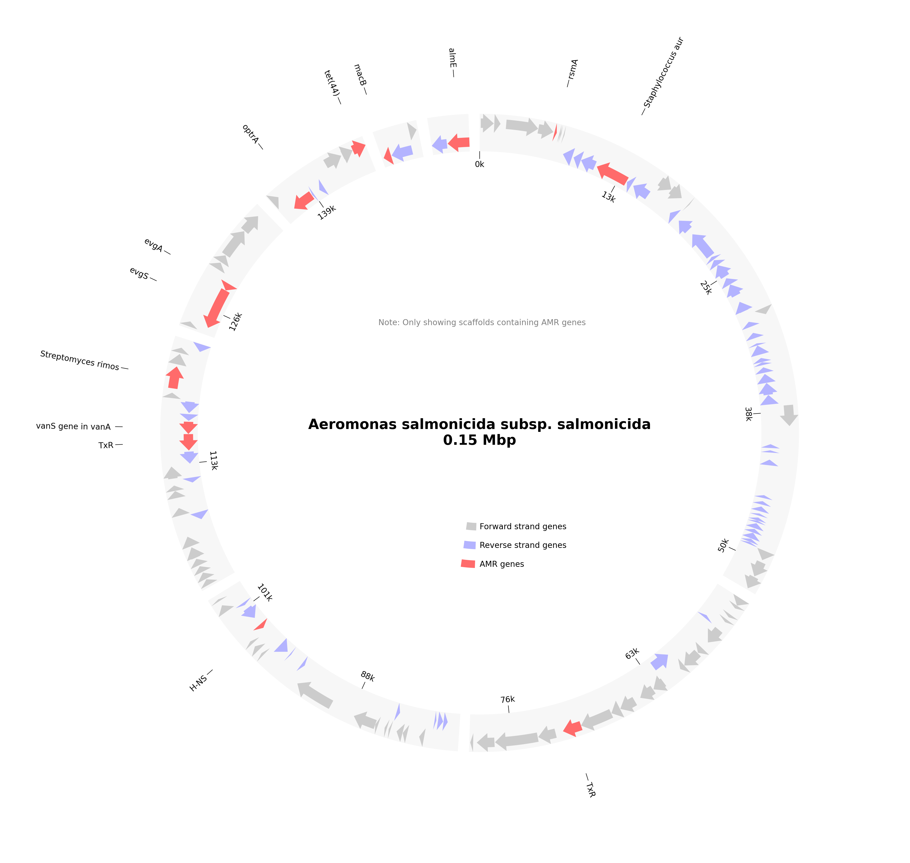

# AMR Analysis Report for LB03_BPW_QG_A2_S24

# Organism Classifications:

## Aeromonas salmonicida
**Strain Statistics:**
- Total genome length: 1546.1 kbp
- Total scaffolds: 2680
- Scaffolds with AMR genes: 280
- Total genes annotated: 3019
- Total AMR genes: 384
- Unique AMR genes: 171
- Distinct AMR mechanisms: 11
- Distinct AMR families: 58
- Distinct drug classes: 34

**Circos Plot:**

### AAC(6')-Ia
- **Mechanism**: antibiotic inactivation
- **Drug Classes**: aminoglycoside antibiotic
- **AMR Family**: AAC(6')
- **Locations**:
  - gnl|SPADES|OBNICJPB_8890_1 : position 328-780

### AAC(6')-Iak
- **Mechanism**: antibiotic inactivation
- **Drug Classes**: aminoglycoside antibiotic
- **AMR Family**: AAC(6')
- **Locations**:
  - gnl|SPADES|OBNICJPB_3293_1 : position 1-417

### AAC(6')-Ie-APH(2'')-Ia bifunctional protein
- **Mechanism**: antibiotic inactivation
- **Drug Classes**: aminoglycoside antibiotic
- **AMR Family**: aminoglycoside bifunctional resistance protein
- **Locations**:
  - gnl|SPADES|OBNICJPB_974_7 : position 5883-6449

### AAC(6')-If
- **Mechanism**: antibiotic inactivation
- **Drug Classes**: aminoglycoside antibiotic
- **AMR Family**: AAC(6')
- **Locations**:
  - gnl|SPADES|OBNICJPB_19663_1 : position 1-465

### AAC(6')-Isa
- **Mechanism**: antibiotic inactivation
- **Drug Classes**: aminoglycoside antibiotic
- **AMR Family**: AAC(6')
- **Locations**:
  - gnl|SPADES|OBNICJPB_7075_3 : position 711-1265

### Acinetobacter baumannii AmvA
- **Mechanism**: antibiotic efflux
- **Drug Classes**: macrolide antibiotic; disinfecting agents and antiseptics
- **AMR Family**: major facilitator superfamily (MFS) antibiotic efflux pump
- **Locations**:
  - gnl|SPADES|OBNICJPB_997_10 : position 5389-6627

### AcrS
- **Mechanism**: antibiotic efflux
- **Drug Classes**: fluoroquinolone antibiotic; cephalosporin; glycylcycline; cephamycin; penam; tetracycline antibiotic; rifamycin antibiotic; phenicol antibiotic; disinfecting agents and antiseptics
- **AMR Family**: resistance-nodulation-cell division (RND) antibiotic efflux pump
- **Locations**:
  - gnl|SPADES|OBNICJPB_1362_10 : position 7428-8036

### Agrobacterium fabrum chloramphenicol acetyltransferase (found in 4 locations)
- **Mechanism**: antibiotic inactivation
- **Drug Classes**: phenicol antibiotic
- **AMR Family**: chloramphenicol acetyltransferase (CAT)
- **Locations**:
  - gnl|SPADES|OBNICJPB_17840_2 : position 447-599
  - gnl|SPADES|OBNICJPB_4335_3 : position 2185-2691
  - gnl|SPADES|OBNICJPB_467_16 : position 14943-15560
  - gnl|SPADES|OBNICJPB_582_8 : position 5796-6458

### AxyY
- **Mechanism**: antibiotic efflux
- **Drug Classes**: macrolide antibiotic; fluoroquinolone antibiotic; aminoglycoside antibiotic; cephalosporin
- **AMR Family**: resistance-nodulation-cell division (RND) antibiotic efflux pump
- **Locations**:
  - gnl|SPADES|OBNICJPB_11670_2 : position 542-955

### CRD3-1
- **Mechanism**: antibiotic inactivation
- **Drug Classes**: carbapenem
- **AMR Family**: CRD3 beta-lactamase
- **Locations**:
  - gnl|SPADES|OBNICJPB_11293_1 : position 116-940

### CRP
- **Mechanism**: antibiotic efflux
- **Drug Classes**: macrolide antibiotic; fluoroquinolone antibiotic; penam
- **AMR Family**: resistance-nodulation-cell division (RND) antibiotic efflux pump
- **Locations**:
  - gnl|SPADES|OBNICJPB_451_18 : position 19763-20518

### Clostridioides difficile gyrB conferring resistance to fluoroquinolones (found in 2 locations)
- **Mechanism**: antibiotic target alteration
- **Drug Classes**: fluoroquinolone antibiotic
- **AMR Family**: fluoroquinolone resistant gyrB
- **Locations**:
  - gnl|SPADES|OBNICJPB_2932_1 : position 98-1993
  - gnl|SPADES|OBNICJPB_883_11 : position 10226-12157

### EdeQ
- **Mechanism**: antibiotic inactivation
- **Drug Classes**: peptide antibiotic; polyamine antibiotic
- **AMR Family**: Edeine acetyltransferase
- **Locations**:
  - gnl|SPADES|OBNICJPB_4136_3 : position 1187-1528

### Enterococcus faecalis cls with mutation conferring resistance to daptomycin (found in 2 locations)
- **Mechanism**: antibiotic target alteration
- **Drug Classes**: peptide antibiotic
- **AMR Family**: daptomycin resistant cls
- **Locations**:
  - gnl|SPADES|OBNICJPB_4114_4 : position 2146-2856
  - gnl|SPADES|OBNICJPB_8430_1 : position 3-974

### ErmE
- **Mechanism**: antibiotic target alteration
- **Drug Classes**: macrolide antibiotic; lincosamide antibiotic; streptogramin antibiotic; streptogramin A antibiotic; streptogramin B antibiotic
- **AMR Family**: Erm 23S ribosomal RNA methyltransferase
- **Locations**:
  - gnl|SPADES|OBNICJPB_167_38 : position 36406-37233

### Escherichia coli AcrAB-TolC with AcrR mutation conferring resistance to ciprofloxacin, tetracycline, and ceftazidime
- **Mechanism**: antibiotic target alteration; antibiotic efflux
- **Drug Classes**: fluoroquinolone antibiotic; cephalosporin; glycylcycline; penam; tetracycline antibiotic; rifamycin antibiotic; phenicol antibiotic; disinfecting agents and antiseptics
- **AMR Family**: resistance-nodulation-cell division (RND) antibiotic efflux pump
- **Locations**:
  - gnl|SPADES|OBNICJPB_8013_2 : position 1274-1447

### Escherichia coli EF-Tu mutants conferring resistance to Enacyloxin IIa
- **Mechanism**: antibiotic target alteration
- **Drug Classes**: elfamycin antibiotic
- **AMR Family**: elfamycin resistant EF-Tu
- **Locations**:
  - gnl|SPADES|OBNICJPB_16230_2 : position 278-661

### Escherichia coli EF-Tu mutants conferring resistance to Pulvomycin (found in 2 locations)
- **Mechanism**: antibiotic target alteration
- **Drug Classes**: elfamycin antibiotic
- **AMR Family**: elfamycin resistant EF-Tu
- **Locations**:
  - gnl|SPADES|OBNICJPB_1391_2 : position 2121-4037
  - gnl|SPADES|OBNICJPB_9742_1 : position 3-1166

### Escherichia coli soxS with mutation conferring antibiotic resistance (found in 2 locations)
- **Mechanism**: antibiotic target alteration; antibiotic efflux; reduced permeability to antibiotic
- **Drug Classes**: fluoroquinolone antibiotic; monobactam; carbapenem; cephalosporin; glycylcycline; cephamycin; penam; tetracycline antibiotic; rifamycin antibiotic; phenicol antibiotic; penem; disinfecting agents and antiseptics
- **AMR Family**: ATP-binding cassette (ABC) antibiotic efflux pump; major facilitator superfamily (MFS) antibiotic efflux pump; resistance-nodulation-cell division (RND) antibiotic efflux pump; General Bacterial Porin with reduced permeability to beta-lactams
- **Locations**:
  - gnl|SPADES|OBNICJPB_1975_4 : position 4441-5226
  - gnl|SPADES|OBNICJPB_328_7 : position 4956-5771

### FosB
- **Mechanism**: antibiotic inactivation
- **Drug Classes**: phosphonic acid antibiotic
- **AMR Family**: fosfomycin thiol transferase
- **Locations**:
  - gnl|SPADES|OBNICJPB_18185_1 : position 3-341

### FosM2 (found in 2 locations)
- **Mechanism**: antibiotic inactivation
- **Drug Classes**: phosphonic acid antibiotic
- **AMR Family**: fosfomycin thiol transferase
- **Locations**:
  - gnl|SPADES|OBNICJPB_3746_2 : position 340-753
  - gnl|SPADES|OBNICJPB_997_15 : position 10116-10484

### H-NS (found in 3 locations)
- **Mechanism**: antibiotic efflux
- **Drug Classes**: macrolide antibiotic; fluoroquinolone antibiotic; cephalosporin; cephamycin; penam; tetracycline antibiotic
- **AMR Family**: major facilitator superfamily (MFS) antibiotic efflux pump; resistance-nodulation-cell division (RND) antibiotic efflux pump
- **Locations**:
  - gnl|SPADES|OBNICJPB_23492_1 : position 235-456
  - gnl|SPADES|OBNICJPB_52756_1 : position 33-251
  - gnl|SPADES|OBNICJPB_6032_1 : position 3-413

### Helicobacter pylori pbp1 mutants conferring resistance to amoxicillin (found in 2 locations)
- **Mechanism**: antibiotic target alteration
- **Drug Classes**: cephalosporin; cephamycin; penam
- **AMR Family**: Penicillin-binding protein mutations conferring resistance to beta-lactam antibiotics
- **Locations**:
  - gnl|SPADES|OBNICJPB_12150_1 : position 2-913
  - gnl|SPADES|OBNICJPB_1888_2 : position 311-2665

### Helicobacter pylori rpoB mutation conferring resistance to rifampicin
- **Mechanism**: antibiotic target alteration; antibiotic target replacement
- **Drug Classes**: fluoroquinolone antibiotic; rifamycin antibiotic
- **AMR Family**: rifamycin-resistant beta-subunit of RNA polymerase (rpoB)
- **Locations**:
  - gnl|SPADES|OBNICJPB_636_9 : position 4042-8346

### Klebsiella pneumoniae KpnE
- **Mechanism**: antibiotic efflux
- **Drug Classes**: macrolide antibiotic; aminoglycoside antibiotic; cephalosporin; tetracycline antibiotic; peptide antibiotic; rifamycin antibiotic; disinfecting agents and antiseptics
- **AMR Family**: small multidrug resistance (SMR) antibiotic efflux pump
- **Locations**:
  - gnl|SPADES|OBNICJPB_2716_3 : position 632-1036

### Klebsiella pneumoniae KpnF
- **Mechanism**: antibiotic efflux
- **Drug Classes**: macrolide antibiotic; aminoglycoside antibiotic; cephalosporin; tetracycline antibiotic; peptide antibiotic; rifamycin antibiotic; disinfecting agents and antiseptics
- **AMR Family**: small multidrug resistance (SMR) antibiotic efflux pump
- **Locations**:
  - gnl|SPADES|OBNICJPB_2716_2 : position 315-635

### Klebsiella pneumoniae OmpK37
- **Mechanism**: reduced permeability to antibiotic
- **Drug Classes**: monobactam; carbapenem; cephalosporin; cephamycin; penam; penem
- **AMR Family**: General Bacterial Porin with reduced permeability to beta-lactams
- **Locations**:
  - gnl|SPADES|OBNICJPB_1140_4 : position 2950-4035

### LlmA 23S ribosomal RNA methyltransferase
- **Mechanism**: antibiotic target alteration
- **Drug Classes**: lincosamide antibiotic
- **AMR Family**: Llm 23S ribosomal RNA methyltransferase
- **Locations**:
  - gnl|SPADES|OBNICJPB_2784_1 : position 3-1106

### LpsA
- **Mechanism**: reduced permeability to antibiotic
- **Drug Classes**: peptide antibiotic
- **AMR Family**: Intrinsic peptide antibiotic resistant Lps
- **Locations**:
  - gnl|SPADES|OBNICJPB_1110_5 : position 4720-5403

### LptD
- **Mechanism**: antibiotic efflux
- **Drug Classes**: carbapenem; peptide antibiotic; aminocoumarin antibiotic; rifamycin antibiotic
- **AMR Family**: ATP-binding cassette (ABC) antibiotic efflux pump
- **Locations**:
  - gnl|SPADES|OBNICJPB_167_41 : position 39547-41979

### MCR-10.2
- **Mechanism**: antibiotic target alteration
- **Drug Classes**: peptide antibiotic
- **AMR Family**: MCR phosphoethanolamine transferase
- **Locations**:
  - gnl|SPADES|OBNICJPB_860_4 : position 5162-7012

### MCR-3.7
- **Mechanism**: antibiotic target alteration
- **Drug Classes**: peptide antibiotic
- **AMR Family**: MCR phosphoethanolamine transferase
- **Locations**:
  - gnl|SPADES|OBNICJPB_44463_1 : position 1-177

### MCR-4.1
- **Mechanism**: antibiotic target alteration
- **Drug Classes**: peptide antibiotic
- **AMR Family**: MCR phosphoethanolamine transferase
- **Locations**:
  - gnl|SPADES|OBNICJPB_73826_2 : position 116-205

### MCR-4.2
- **Mechanism**: antibiotic target alteration
- **Drug Classes**: peptide antibiotic
- **AMR Family**: MCR phosphoethanolamine transferase
- **Locations**:
  - gnl|SPADES|OBNICJPB_73826_1 : position 2-76

### MCR-7.1
- **Mechanism**: antibiotic target alteration
- **Drug Classes**: peptide antibiotic
- **AMR Family**: MCR phosphoethanolamine transferase
- **Locations**:
  - gnl|SPADES|OBNICJPB_6182_1 : position 3-1610

### MOX-12
- **Mechanism**: antibiotic inactivation
- **Drug Classes**: cephalosporin; cephamycin; penam
- **AMR Family**: MOX beta-lactamase
- **Locations**:
  - gnl|SPADES|OBNICJPB_24487_1 : position 3-80

### MexH (found in 5 locations)
- **Mechanism**: antibiotic efflux
- **Drug Classes**: fluoroquinolone antibiotic; tetracycline antibiotic; disinfecting agents and antiseptics
- **AMR Family**: resistance-nodulation-cell division (RND) antibiotic efflux pump
- **Locations**:
  - gnl|SPADES|OBNICJPB_10209_2 : position 336-1109
  - gnl|SPADES|OBNICJPB_20895_1 : position 2-514
  - gnl|SPADES|OBNICJPB_3086_1 : position 3-1073
  - gnl|SPADES|OBNICJPB_5541_1 : position 3-1301
  - gnl|SPADES|OBNICJPB_8794_2 : position 330-1304

### MexS (found in 3 locations)
- **Mechanism**: antibiotic efflux
- **Drug Classes**: fluoroquinolone antibiotic; diaminopyrimidine antibiotic; phenicol antibiotic
- **AMR Family**: resistance-nodulation-cell division (RND) antibiotic efflux pump
- **Locations**:
  - gnl|SPADES|OBNICJPB_1013_6 : position 8502-9488
  - gnl|SPADES|OBNICJPB_3315_4 : position 2332-3336
  - gnl|SPADES|OBNICJPB_8810_2 : position 178-1182

### MexT (found in 2 locations)
- **Mechanism**: antibiotic efflux
- **Drug Classes**: fluoroquinolone antibiotic; diaminopyrimidine antibiotic; phenicol antibiotic
- **AMR Family**: resistance-nodulation-cell division (RND) antibiotic efflux pump
- **Locations**:
  - gnl|SPADES|OBNICJPB_656_13 : position 12739-13077
  - gnl|SPADES|OBNICJPB_688_12 : position 11605-12516

### MexV
- **Mechanism**: antibiotic efflux
- **Drug Classes**: macrolide antibiotic; fluoroquinolone antibiotic; tetracycline antibiotic; phenicol antibiotic; disinfecting agents and antiseptics
- **AMR Family**: resistance-nodulation-cell division (RND) antibiotic efflux pump
- **Locations**:
  - gnl|SPADES|OBNICJPB_915_4 : position 6519-7625

### MexW
- **Mechanism**: antibiotic efflux
- **Drug Classes**: macrolide antibiotic; fluoroquinolone antibiotic; tetracycline antibiotic; phenicol antibiotic; disinfecting agents and antiseptics
- **AMR Family**: resistance-nodulation-cell division (RND) antibiotic efflux pump
- **Locations**:
  - gnl|SPADES|OBNICJPB_915_3 : position 3423-6503

### MuxC (found in 2 locations)
- **Mechanism**: antibiotic efflux
- **Drug Classes**: macrolide antibiotic; monobactam; tetracycline antibiotic; aminocoumarin antibiotic
- **AMR Family**: resistance-nodulation-cell division (RND) antibiotic efflux pump
- **Locations**:
  - gnl|SPADES|OBNICJPB_52311_1 : position 3-251
  - gnl|SPADES|OBNICJPB_5541_2 : position 1375-2112

### Mycobacterium tuberculosis rpoB mutations conferring resistance to rifampicin
- **Mechanism**: antibiotic target alteration; antibiotic target replacement
- **Drug Classes**: rifamycin antibiotic
- **AMR Family**: rifamycin-resistant beta-subunit of RNA polymerase (rpoB)
- **Locations**:
  - gnl|SPADES|OBNICJPB_636_10 : position 8438-12466

### Neisseria gonorrhoeae pilQ gene conferring resistance to beta-lactam (found in 2 locations)
- **Mechanism**: antibiotic target alteration
- **Drug Classes**: cephalosporin; cephamycin; penam
- **AMR Family**: Penicillin-binding protein mutations conferring resistance to beta-lactam antibiotics
- **Locations**:
  - gnl|SPADES|OBNICJPB_11982_2 : position 286-927
  - gnl|SPADES|OBNICJPB_20565_1 : position 2-520

### NmcR (found in 11 locations)
- **Mechanism**: antibiotic inactivation
- **Drug Classes**: carbapenem; cephalosporin; cephamycin; penam
- **AMR Family**: NmcA beta-lactamase
- **Locations**:
  - gnl|SPADES|OBNICJPB_10639_2 : position 695-1057
  - gnl|SPADES|OBNICJPB_1063_9 : position 8478-9389
  - gnl|SPADES|OBNICJPB_1343_1 : position 132-1043
  - gnl|SPADES|OBNICJPB_1495_6 : position 4362-5252
  - gnl|SPADES|OBNICJPB_1642_7 : position 4015-4857
  - gnl|SPADES|OBNICJPB_17028_1 : position 210-629
  - gnl|SPADES|OBNICJPB_2673_5 : position 3084-3986
  - gnl|SPADES|OBNICJPB_4684_3 : position 1630-2493
  - gnl|SPADES|OBNICJPB_7167_2 : position 1266-1634
  - gnl|SPADES|OBNICJPB_805_2 : position 975-1883
  - gnl|SPADES|OBNICJPB_997_8 : position 3914-4783

### OXA-917
- **Mechanism**: antibiotic inactivation
- **Drug Classes**: carbapenem; penam
- **AMR Family**: OXA beta-lactamase; OXA-427-like beta-lactamase
- **Locations**:
  - gnl|SPADES|OBNICJPB_830_12 : position 10358-11152

### OmpA (found in 8 locations)
- **Mechanism**: reduced permeability to antibiotic
- **Drug Classes**: peptide antibiotic
- **AMR Family**: General Bacterial Porin with reduced permeability to peptide antibiotics
- **Locations**:
  - gnl|SPADES|OBNICJPB_1150_2 : position 257-1315
  - gnl|SPADES|OBNICJPB_1741_5 : position 3967-4986
  - gnl|SPADES|OBNICJPB_1741_6 : position 5417-6418
  - gnl|SPADES|OBNICJPB_18070_1 : position 252-593
  - gnl|SPADES|OBNICJPB_2974_2 : position 939-1427
  - gnl|SPADES|OBNICJPB_3746_3 : position 827-1702
  - gnl|SPADES|OBNICJPB_687_3 : position 1168-2199
  - gnl|SPADES|OBNICJPB_771_13 : position 11981-12505

### OpmH
- **Mechanism**: antibiotic efflux
- **Drug Classes**: disinfecting agents and antiseptics
- **AMR Family**: resistance-nodulation-cell division (RND) antibiotic efflux pump
- **Locations**:
  - gnl|SPADES|OBNICJPB_778_6 : position 11425-12750

### OprA
- **Mechanism**: antibiotic efflux
- **Drug Classes**: macrolide antibiotic; fluoroquinolone antibiotic; aminoglycoside antibiotic; carbapenem; tetracycline antibiotic
- **AMR Family**: resistance-nodulation-cell division (RND) antibiotic efflux pump
- **Locations**:
  - gnl|SPADES|OBNICJPB_1362_4 : position 2391-3041

### OprZ
- **Mechanism**: antibiotic efflux
- **Drug Classes**: macrolide antibiotic; fluoroquinolone antibiotic; aminoglycoside antibiotic; cephalosporin
- **AMR Family**: resistance-nodulation-cell division (RND) antibiotic efflux pump
- **Locations**:
  - gnl|SPADES|OBNICJPB_51467_1 : position 1-255

### PAM-1
- **Mechanism**: antibiotic inactivation
- **Drug Classes**: carbapenem; cephalosporin
- **AMR Family**: PAM beta-lactamase
- **Locations**:
  - gnl|SPADES|OBNICJPB_13489_2 : position 186-818

### ParR (found in 2 locations)
- **Mechanism**: antibiotic efflux; reduced permeability to antibiotic
- **Drug Classes**: macrolide antibiotic; fluoroquinolone antibiotic; monobactam; aminoglycoside antibiotic; carbapenem; cephalosporin; cephamycin; penam; tetracycline antibiotic; phenicol antibiotic; penem; disinfecting agents and antiseptics
- **AMR Family**: resistance-nodulation-cell division (RND) antibiotic efflux pump; Outer Membrane Porin (Opr)
- **Locations**:
  - gnl|SPADES|OBNICJPB_15187_1 : position 1-714
  - gnl|SPADES|OBNICJPB_2360_3 : position 1985-2704

### Planobispora rosea EF-Tu mutants conferring resistance to inhibitor GE2270A
- **Mechanism**: antibiotic target alteration
- **Drug Classes**: elfamycin antibiotic
- **AMR Family**: elfamycin resistant EF-Tu
- **Locations**:
  - gnl|SPADES|OBNICJPB_14772_1 : position 2-736

### PmpM (found in 2 locations)
- **Mechanism**: antibiotic efflux
- **Drug Classes**: fluoroquinolone antibiotic; aminoglycoside antibiotic; disinfecting agents and antiseptics
- **AMR Family**: multidrug and toxic compound extrusion (MATE) transporter
- **Locations**:
  - gnl|SPADES|OBNICJPB_1150_5 : position 4141-5520
  - gnl|SPADES|OBNICJPB_6380_2 : position 1228-1836

### PmrF
- **Mechanism**: antibiotic target alteration
- **Drug Classes**: peptide antibiotic
- **AMR Family**: pmr phosphoethanolamine transferase
- **Locations**:
  - gnl|SPADES|OBNICJPB_3913_2 : position 716-1750

### Pseudomonas aeruginosa CpxR (found in 3 locations)
- **Mechanism**: antibiotic efflux
- **Drug Classes**: macrolide antibiotic; fluoroquinolone antibiotic; monobactam; aminoglycoside antibiotic; carbapenem; cephalosporin; cephamycin; penam; tetracycline antibiotic; peptide antibiotic; aminocoumarin antibiotic; diaminopyrimidine antibiotic; sulfonamide antibiotic; phenicol antibiotic; penem
- **AMR Family**: resistance-nodulation-cell division (RND) antibiotic efflux pump
- **Locations**:
  - gnl|SPADES|OBNICJPB_2195_3 : position 2242-2922
  - gnl|SPADES|OBNICJPB_42364_1 : position 3-275
  - gnl|SPADES|OBNICJPB_521_15 : position 11873-12568

### Pseudomonas aeruginosa ampR with mutation conferring resistance to aztreonam
- **Mechanism**: antibiotic target alteration; antibiotic inactivation
- **Drug Classes**: monobactam; carbapenem; cephalosporin
- **AMR Family**: PDC beta-lactamase; ampR transcriptional regulator with mutation conferring resistance to monobactam antibiotics
- **Locations**:
  - gnl|SPADES|OBNICJPB_1225_2 : position 159-1106

### Pseudomonas aeruginosa soxR
- **Mechanism**: antibiotic target alteration; antibiotic efflux
- **Drug Classes**: fluoroquinolone antibiotic; cephalosporin; glycylcycline; penam; tetracycline antibiotic; rifamycin antibiotic; phenicol antibiotic; disinfecting agents and antiseptics
- **AMR Family**: ATP-binding cassette (ABC) antibiotic efflux pump; major facilitator superfamily (MFS) antibiotic efflux pump; resistance-nodulation-cell division (RND) antibiotic efflux pump
- **Locations**:
  - gnl|SPADES|OBNICJPB_1294_8 : position 6451-6930

### QepA4
- **Mechanism**: antibiotic efflux
- **Drug Classes**: fluoroquinolone antibiotic
- **AMR Family**: major facilitator superfamily (MFS) antibiotic efflux pump
- **Locations**:
  - gnl|SPADES|OBNICJPB_656_11 : position 10417-11811

### RanA (found in 10 locations)
- **Mechanism**: antibiotic efflux
- **Drug Classes**: aminoglycoside antibiotic
- **AMR Family**: ATP-binding cassette (ABC) antibiotic efflux pump
- **Locations**:
  - gnl|SPADES|OBNICJPB_11554_2 : position 246-965
  - gnl|SPADES|OBNICJPB_1225_3 : position 1292-2359
  - gnl|SPADES|OBNICJPB_1899_6 : position 4462-5469
  - gnl|SPADES|OBNICJPB_379_7 : position 8510-9292
  - gnl|SPADES|OBNICJPB_3807_1 : position 3-497
  - gnl|SPADES|OBNICJPB_4049_3 : position 2322-2897
  - gnl|SPADES|OBNICJPB_4579_3 : position 1491-2486
  - gnl|SPADES|OBNICJPB_4601_2 : position 191-1186
  - gnl|SPADES|OBNICJPB_486_8 : position 8050-9132
  - gnl|SPADES|OBNICJPB_538_16 : position 12396-13196

### RanB
- **Mechanism**: antibiotic efflux
- **Drug Classes**: aminoglycoside antibiotic
- **AMR Family**: ATP-binding cassette (ABC) antibiotic efflux pump
- **Locations**:
  - gnl|SPADES|OBNICJPB_538_17 : position 13196-13975

### SAT-4
- **Mechanism**: antibiotic inactivation
- **Drug Classes**: nucleoside antibiotic
- **AMR Family**: streptothricin acetyltransferase (SAT)
- **Locations**:
  - gnl|SPADES|OBNICJPB_467_5 : position 3225-3632

### SatA (found in 2 locations)
- **Mechanism**: antibiotic inactivation
- **Drug Classes**: nucleoside antibiotic
- **AMR Family**: streptothricin acetyltransferase (SAT)
- **Locations**:
  - gnl|SPADES|OBNICJPB_16614_2 : position 164-622
  - gnl|SPADES|OBNICJPB_997_1 : position 89-547

### Staphylococcus aureus fusA with mutation conferring resistance to fusidic acid (found in 2 locations)
- **Mechanism**: antibiotic target alteration
- **Drug Classes**: fusidane antibiotic
- **AMR Family**: antibiotic resistant fusA
- **Locations**:
  - gnl|SPADES|OBNICJPB_636_1 : position 3-395
  - gnl|SPADES|OBNICJPB_663_9 : position 9234-10820

### Staphylococcus aureus fusE with mutation conferring resistance to fusidic acid
- **Mechanism**: antibiotic target alteration
- **Drug Classes**: fusidane antibiotic
- **AMR Family**: antibiotic resistant fusE
- **Locations**:
  - gnl|SPADES|OBNICJPB_742_18 : position 7638-8171

### Staphylococcus aureus murA with mutation conferring resistance to fosfomycin
- **Mechanism**: antibiotic target alteration
- **Drug Classes**: phosphonic acid antibiotic
- **AMR Family**: antibiotic-resistant murA transferase
- **Locations**:
  - gnl|SPADES|OBNICJPB_538_22 : position 15658-16914

### TaeA (found in 3 locations)
- **Mechanism**: antibiotic efflux
- **Drug Classes**: pleuromutilin antibiotic
- **AMR Family**: ATP-binding cassette (ABC) antibiotic efflux pump
- **Locations**:
  - gnl|SPADES|OBNICJPB_167_48 : position 46824-47885
  - gnl|SPADES|OBNICJPB_2403_2 : position 313-2223
  - gnl|SPADES|OBNICJPB_2643_4 : position 2428-3195

### TolC
- **Mechanism**: antibiotic efflux
- **Drug Classes**: macrolide antibiotic; fluoroquinolone antibiotic; aminoglycoside antibiotic; carbapenem; cephalosporin; glycylcycline; cephamycin; penam; tetracycline antibiotic; peptide antibiotic; aminocoumarin antibiotic; rifamycin antibiotic; phenicol antibiotic; penem; disinfecting agents and antiseptics
- **AMR Family**: ATP-binding cassette (ABC) antibiotic efflux pump; major facilitator superfamily (MFS) antibiotic efflux pump; resistance-nodulation-cell division (RND) antibiotic efflux pump
- **Locations**:
  - gnl|SPADES|OBNICJPB_2250_7 : position 3637-4962

### TriC
- **Mechanism**: antibiotic efflux
- **Drug Classes**: disinfecting agents and antiseptics
- **AMR Family**: resistance-nodulation-cell division (RND) antibiotic efflux pump
- **Locations**:
  - gnl|SPADES|OBNICJPB_17201_1 : position 3-623

### TxR (found in 15 locations)
- **Mechanism**: antibiotic efflux
- **Drug Classes**: tetracycline antibiotic
- **AMR Family**: ATP-binding cassette (ABC) antibiotic efflux pump
- **Locations**:
  - gnl|SPADES|OBNICJPB_1073_14 : position 8814-10106
  - gnl|SPADES|OBNICJPB_12974_1 : position 3-854
  - gnl|SPADES|OBNICJPB_2268_3 : position 2269-3798
  - gnl|SPADES|OBNICJPB_24062_1 : position 3-446
  - gnl|SPADES|OBNICJPB_2877_3 : position 1557-3335
  - gnl|SPADES|OBNICJPB_2974_5 : position 3444-3893
  - gnl|SPADES|OBNICJPB_3712_3 : position 1894-3174
  - gnl|SPADES|OBNICJPB_477_14 : position 16123-17541
  - gnl|SPADES|OBNICJPB_477_16 : position 18679-20022
  - gnl|SPADES|OBNICJPB_505_23 : position 19646-20584
  - gnl|SPADES|OBNICJPB_5467_1 : position 3-452
  - gnl|SPADES|OBNICJPB_5738_1 : position 2-1516
  - gnl|SPADES|OBNICJPB_7013_1 : position 157-1671
  - gnl|SPADES|OBNICJPB_810_6 : position 3285-4691
  - gnl|SPADES|OBNICJPB_9346_1 : position 3-1151

### YojI (found in 4 locations)
- **Mechanism**: antibiotic efflux
- **Drug Classes**: peptide antibiotic
- **AMR Family**: ATP-binding cassette (ABC) antibiotic efflux pump
- **Locations**:
  - gnl|SPADES|OBNICJPB_12152_2 : position 190-831
  - gnl|SPADES|OBNICJPB_2389_5 : position 3647-4288
  - gnl|SPADES|OBNICJPB_379_13 : position 16853-18499
  - gnl|SPADES|OBNICJPB_39689_1 : position 45-287

### abeM
- **Mechanism**: antibiotic efflux
- **Drug Classes**: fluoroquinolone antibiotic; disinfecting agents and antiseptics
- **AMR Family**: multidrug and toxic compound extrusion (MATE) transporter
- **Locations**:
  - gnl|SPADES|OBNICJPB_521_12 : position 8608-9993

### adeB (found in 2 locations)
- **Mechanism**: antibiotic efflux
- **Drug Classes**: glycylcycline; tetracycline antibiotic
- **AMR Family**: resistance-nodulation-cell division (RND) antibiotic efflux pump
- **Locations**:
  - gnl|SPADES|OBNICJPB_18823_1 : position 3-569
  - gnl|SPADES|OBNICJPB_3086_2 : position 1147-3768

### adeL (found in 15 locations)
- **Mechanism**: antibiotic efflux
- **Drug Classes**: fluoroquinolone antibiotic; tetracycline antibiotic
- **AMR Family**: resistance-nodulation-cell division (RND) antibiotic efflux pump
- **Locations**:
  - gnl|SPADES|OBNICJPB_1008_10 : position 7777-8658
  - gnl|SPADES|OBNICJPB_1051_1 : position 432-1394
  - gnl|SPADES|OBNICJPB_1051_13 : position 9205-10164
  - gnl|SPADES|OBNICJPB_14152_2 : position 464-775
  - gnl|SPADES|OBNICJPB_14202_1 : position 2-772
  - gnl|SPADES|OBNICJPB_3235_5 : position 2612-3496
  - gnl|SPADES|OBNICJPB_3808_5 : position 2145-3053
  - gnl|SPADES|OBNICJPB_4006_2 : position 1335-2249
  - gnl|SPADES|OBNICJPB_54399_1 : position 3-245
  - gnl|SPADES|OBNICJPB_57144_1 : position 3-239
  - gnl|SPADES|OBNICJPB_574_12 : position 11334-12233
  - gnl|SPADES|OBNICJPB_750_15 : position 13396-14109
  - gnl|SPADES|OBNICJPB_779_9 : position 9580-10488
  - gnl|SPADES|OBNICJPB_834_13 : position 11342-12250
  - gnl|SPADES|OBNICJPB_8568_1 : position 232-1134

### adeR
- **Mechanism**: antibiotic efflux
- **Drug Classes**: glycylcycline; tetracycline antibiotic
- **AMR Family**: resistance-nodulation-cell division (RND) antibiotic efflux pump
- **Locations**:
  - gnl|SPADES|OBNICJPB_2032_6 : position 4487-5500

### adeS
- **Mechanism**: antibiotic efflux
- **Drug Classes**: glycylcycline; tetracycline antibiotic
- **AMR Family**: resistance-nodulation-cell division (RND) antibiotic efflux pump
- **Locations**:
  - gnl|SPADES|OBNICJPB_41665_1 : position 3-278

### almE (found in 6 locations)
- **Mechanism**: antibiotic target alteration
- **Drug Classes**: peptide antibiotic
- **AMR Family**: polymyxin resistance operon; alm glycyltransferase
- **Locations**:
  - gnl|SPADES|OBNICJPB_19104_1 : position 2-562
  - gnl|SPADES|OBNICJPB_21373_1 : position 3-500
  - gnl|SPADES|OBNICJPB_357_5 : position 3660-5372
  - gnl|SPADES|OBNICJPB_44456_1 : position 2-271
  - gnl|SPADES|OBNICJPB_4676_1 : position 3-1043
  - gnl|SPADES|OBNICJPB_9204_1 : position 1-1242

### almG (found in 2 locations)
- **Mechanism**: antibiotic target alteration
- **Drug Classes**: peptide antibiotic
- **AMR Family**: lipid A acyltransferase; polymyxin resistance operon
- **Locations**:
  - gnl|SPADES|OBNICJPB_27602_1 : position 3-392
  - gnl|SPADES|OBNICJPB_834_8 : position 5935-6957

### amrB (found in 2 locations)
- **Mechanism**: antibiotic efflux
- **Drug Classes**: macrolide antibiotic; aminoglycoside antibiotic
- **AMR Family**: resistance-nodulation-cell division (RND) antibiotic efflux pump
- **Locations**:
  - gnl|SPADES|OBNICJPB_10209_1 : position 2-262
  - gnl|SPADES|OBNICJPB_8794_1 : position 2-256

### apmA
- **Mechanism**: antibiotic inactivation
- **Drug Classes**: aminoglycoside antibiotic
- **AMR Family**: AAC(2')
- **Locations**:
  - gnl|SPADES|OBNICJPB_467_8 : position 6026-6556

### arlR
- **Mechanism**: antibiotic efflux
- **Drug Classes**: fluoroquinolone antibiotic; disinfecting agents and antiseptics
- **AMR Family**: major facilitator superfamily (MFS) antibiotic efflux pump
- **Locations**:
  - gnl|SPADES|OBNICJPB_505_20 : position 16656-17345

### arnA
- **Mechanism**: antibiotic target alteration
- **Drug Classes**: peptide antibiotic
- **AMR Family**: pmr phosphoethanolamine transferase
- **Locations**:
  - gnl|SPADES|OBNICJPB_844_3 : position 1954-2874

### bacA
- **Mechanism**: antibiotic target alteration
- **Drug Classes**: peptide antibiotic
- **AMR Family**: undecaprenyl pyrophosphate related proteins
- **Locations**:
  - gnl|SPADES|OBNICJPB_656_3 : position 2528-3343

### baeR
- **Mechanism**: antibiotic efflux
- **Drug Classes**: aminoglycoside antibiotic; aminocoumarin antibiotic
- **AMR Family**: resistance-nodulation-cell division (RND) antibiotic efflux pump
- **Locations**:
  - gnl|SPADES|OBNICJPB_1772_1 : position 121-1050

### baeS
- **Mechanism**: antibiotic efflux
- **Drug Classes**: aminoglycoside antibiotic; aminocoumarin antibiotic
- **AMR Family**: resistance-nodulation-cell division (RND) antibiotic efflux pump
- **Locations**:
  - gnl|SPADES|OBNICJPB_16715_1 : position 3-641

### basS
- **Mechanism**: antibiotic target alteration; antibiotic efflux
- **Drug Classes**: peptide antibiotic
- **AMR Family**: pmr phosphoethanolamine transferase
- **Locations**:
  - gnl|SPADES|OBNICJPB_830_11 : position 8860-10302

### bcr-1 (found in 5 locations)
- **Mechanism**: antibiotic efflux
- **Drug Classes**: bicyclomycin-like antibiotic
- **AMR Family**: major facilitator superfamily (MFS) antibiotic efflux pump
- **Locations**:
  - gnl|SPADES|OBNICJPB_1051_7 : position 5533-5970
  - gnl|SPADES|OBNICJPB_1051_9 : position 6211-6705
  - gnl|SPADES|OBNICJPB_16178_1 : position 1-474
  - gnl|SPADES|OBNICJPB_2628_6 : position 3759-4382
  - gnl|SPADES|OBNICJPB_3999_2 : position 2209-2934

### bcrA
- **Mechanism**: antibiotic efflux
- **Drug Classes**: peptide antibiotic
- **AMR Family**: ATP-binding cassette (ABC) antibiotic efflux pump
- **Locations**:
  - gnl|SPADES|OBNICJPB_3638_4 : position 2386-3087

### carA
- **Mechanism**: antibiotic target protection
- **Drug Classes**: macrolide antibiotic
- **AMR Family**: Miscellaneous ABC-F subfamily ATP-binding cassette ribosomal protection proteins
- **Locations**:
  - gnl|SPADES|OBNICJPB_27206_1 : position 3-398

### catB9 (found in 2 locations)
- **Mechanism**: antibiotic inactivation
- **Drug Classes**: phenicol antibiotic
- **AMR Family**: chloramphenicol acetyltransferase (CAT)
- **Locations**:
  - gnl|SPADES|OBNICJPB_830_14 : position 12682-12909
  - gnl|SPADES|OBNICJPB_8925_1 : position 159-794

### cdeA (found in 2 locations)
- **Mechanism**: antibiotic efflux
- **Drug Classes**: fluoroquinolone antibiotic; disinfecting agents and antiseptics
- **AMR Family**: multidrug and toxic compound extrusion (MATE) transporter
- **Locations**:
  - gnl|SPADES|OBNICJPB_1140_8 : position 8077-9537
  - gnl|SPADES|OBNICJPB_2928_1 : position 3-1235

### clbB
- **Mechanism**: antibiotic target alteration
- **Drug Classes**: lincosamide antibiotic; streptogramin antibiotic; streptogramin A antibiotic; oxazolidinone antibiotic; phenicol antibiotic; pleuromutilin antibiotic
- **AMR Family**: Cfr 23S ribosomal RNA methyltransferase
- **Locations**:
  - gnl|SPADES|OBNICJPB_543_4 : position 2904-4007

### cmlv
- **Mechanism**: antibiotic inactivation
- **Drug Classes**: phenicol antibiotic
- **AMR Family**: chloramphenicol phosphotransferase
- **Locations**:
  - gnl|SPADES|OBNICJPB_1472_9 : position 5959-7140

### cmrA
- **Mechanism**: antibiotic efflux
- **Drug Classes**: phenicol antibiotic
- **AMR Family**: major facilitator superfamily (MFS) antibiotic efflux pump
- **Locations**:
  - gnl|SPADES|OBNICJPB_67179_1 : position 3-218

### cmx
- **Mechanism**: antibiotic efflux
- **Drug Classes**: phenicol antibiotic
- **AMR Family**: major facilitator superfamily (MFS) antibiotic efflux pump
- **Locations**:
  - gnl|SPADES|OBNICJPB_5605_2 : position 1169-2086

### cphA5 (found in 2 locations)
- **Mechanism**: antibiotic inactivation
- **Drug Classes**: carbapenem
- **AMR Family**: CphA beta-lactamase
- **Locations**:
  - gnl|SPADES|OBNICJPB_5991_2 : position 1364-1948
  - gnl|SPADES|OBNICJPB_69193_1 : position 84-215

### cprR
- **Mechanism**: antibiotic target alteration; antibiotic efflux
- **Drug Classes**: peptide antibiotic
- **AMR Family**: pmr phosphoethanolamine transferase
- **Locations**:
  - gnl|SPADES|OBNICJPB_59463_1 : position 1-234

### cprS
- **Mechanism**: antibiotic target alteration; antibiotic efflux
- **Drug Classes**: peptide antibiotic
- **AMR Family**: pmr phosphoethanolamine transferase
- **Locations**:
  - gnl|SPADES|OBNICJPB_1167_7 : position 8121-9338

### cpxA (found in 4 locations)
- **Mechanism**: antibiotic efflux
- **Drug Classes**: aminoglycoside antibiotic; aminocoumarin antibiotic
- **AMR Family**: resistance-nodulation-cell division (RND) antibiotic efflux pump
- **Locations**:
  - gnl|SPADES|OBNICJPB_2195_4 : position 2919-4208
  - gnl|SPADES|OBNICJPB_2360_4 : position 2701-4011
  - gnl|SPADES|OBNICJPB_477_15 : position 17648-18682
  - gnl|SPADES|OBNICJPB_521_14 : position 10521-11876

### dfrA3
- **Mechanism**: antibiotic target replacement
- **Drug Classes**: diaminopyrimidine antibiotic
- **AMR Family**: trimethoprim resistant dihydrofolate reductase dfr
- **Locations**:
  - gnl|SPADES|OBNICJPB_8321_2 : position 544-1038

### efpA
- **Mechanism**: antibiotic efflux
- **Drug Classes**: rifamycin antibiotic; isoniazid-like antibiotic
- **AMR Family**: major facilitator superfamily (MFS) antibiotic efflux pump
- **Locations**:
  - gnl|SPADES|OBNICJPB_2643_5 : position 3269-4354

### emtA
- **Mechanism**: antibiotic target alteration
- **Drug Classes**: macrolide antibiotic; lincosamide antibiotic; orthosomycin antibiotic
- **AMR Family**: non-erm 23S ribosomal RNA methyltransferase (G748)
- **Locations**:
  - gnl|SPADES|OBNICJPB_688_2 : position 611-1423

### evgA (found in 6 locations)
- **Mechanism**: antibiotic efflux
- **Drug Classes**: macrolide antibiotic; fluoroquinolone antibiotic; penam; tetracycline antibiotic
- **AMR Family**: major facilitator superfamily (MFS) antibiotic efflux pump; resistance-nodulation-cell division (RND) antibiotic efflux pump
- **Locations**:
  - gnl|SPADES|OBNICJPB_1300_2 : position 274-897
  - gnl|SPADES|OBNICJPB_1300_4 : position 1477-2112
  - gnl|SPADES|OBNICJPB_282_22 : position 29857-30480
  - gnl|SPADES|OBNICJPB_341_2 : position 1252-1875
  - gnl|SPADES|OBNICJPB_39746_1 : position 1-288
  - gnl|SPADES|OBNICJPB_5752_3 : position 1443-2033

### evgS (found in 22 locations)
- **Mechanism**: antibiotic efflux
- **Drug Classes**: macrolide antibiotic; fluoroquinolone antibiotic; penam; tetracycline antibiotic
- **AMR Family**: major facilitator superfamily (MFS) antibiotic efflux pump; resistance-nodulation-cell division (RND) antibiotic efflux pump
- **Locations**:
  - gnl|SPADES|OBNICJPB_1114_1 : position 78-4046
  - gnl|SPADES|OBNICJPB_12418_1 : position 359-895
  - gnl|SPADES|OBNICJPB_1300_5 : position 2109-5699
  - gnl|SPADES|OBNICJPB_1478_3 : position 961-3762
  - gnl|SPADES|OBNICJPB_15045_1 : position 2-721
  - gnl|SPADES|OBNICJPB_167_1 : position 3-1256
  - gnl|SPADES|OBNICJPB_1772_2 : position 1050-5954
  - gnl|SPADES|OBNICJPB_2025_2 : position 1524-4235
  - gnl|SPADES|OBNICJPB_2379_1 : position 3-3068
  - gnl|SPADES|OBNICJPB_2397_1 : position 2-2353
  - gnl|SPADES|OBNICJPB_282_23 : position 30486-32090
  - gnl|SPADES|OBNICJPB_341_1 : position 2-1246
  - gnl|SPADES|OBNICJPB_357_20 : position 19782-23741
  - gnl|SPADES|OBNICJPB_3805_2 : position 705-3095
  - gnl|SPADES|OBNICJPB_3858_1 : position 3-2738
  - gnl|SPADES|OBNICJPB_43081_1 : position 2-274
  - gnl|SPADES|OBNICJPB_451_1 : position 78-4058
  - gnl|SPADES|OBNICJPB_574_17 : position 15519-17831
  - gnl|SPADES|OBNICJPB_5845_1 : position 32-1999
  - gnl|SPADES|OBNICJPB_5849_1 : position 2-1258
  - gnl|SPADES|OBNICJPB_5929_1 : position 2-1291
  - gnl|SPADES|OBNICJPB_7725_1 : position 2-1504

### gadW
- **Mechanism**: antibiotic efflux
- **Drug Classes**: macrolide antibiotic; fluoroquinolone antibiotic; penam
- **AMR Family**: resistance-nodulation-cell division (RND) antibiotic efflux pump
- **Locations**:
  - gnl|SPADES|OBNICJPB_2281_3 : position 2140-2943

### gadX (found in 3 locations)
- **Mechanism**: antibiotic efflux
- **Drug Classes**: macrolide antibiotic; fluoroquinolone antibiotic; penam
- **AMR Family**: resistance-nodulation-cell division (RND) antibiotic efflux pump
- **Locations**:
  - gnl|SPADES|OBNICJPB_26812_1 : position 3-275
  - gnl|SPADES|OBNICJPB_8662_2 : position 401-1312
  - gnl|SPADES|OBNICJPB_919_5 : position 6041-7054

### golS (found in 4 locations)
- **Mechanism**: antibiotic efflux
- **Drug Classes**: monobactam; carbapenem; cephalosporin; cephamycin; penam; phenicol antibiotic; penem
- **AMR Family**: resistance-nodulation-cell division (RND) antibiotic efflux pump
- **Locations**:
  - gnl|SPADES|OBNICJPB_1370_3 : position 1254-1631
  - gnl|SPADES|OBNICJPB_198_21 : position 23182-23598
  - gnl|SPADES|OBNICJPB_24801_1 : position 2-370
  - gnl|SPADES|OBNICJPB_535_11 : position 11457-11867

### hmrM
- **Mechanism**: antibiotic efflux
- **Drug Classes**: fluoroquinolone antibiotic; disinfecting agents and antiseptics
- **AMR Family**: multidrug and toxic compound extrusion (MATE) transporter
- **Locations**:
  - gnl|SPADES|OBNICJPB_3702_1 : position 228-1607

### hp1181
- **Mechanism**: antibiotic efflux
- **Drug Classes**: fluoroquinolone antibiotic; tetracycline antibiotic; nitroimidazole antibiotic
- **AMR Family**: major facilitator superfamily (MFS) antibiotic efflux pump
- **Locations**:
  - gnl|SPADES|OBNICJPB_2626_5 : position 2778-4139

### kdpD (found in 2 locations)
- **Mechanism**: antibiotic efflux
- **Drug Classes**: aminoglycoside antibiotic
- **AMR Family**: kdpDE
- **Locations**:
  - gnl|SPADES|OBNICJPB_12235_1 : position 3-194
  - gnl|SPADES|OBNICJPB_3857_2 : position 696-3047

### kdpE (found in 3 locations)
- **Mechanism**: antibiotic efflux
- **Drug Classes**: aminoglycoside antibiotic
- **AMR Family**: kdpDE
- **Locations**:
  - gnl|SPADES|OBNICJPB_2198_4 : position 3247-3927
  - gnl|SPADES|OBNICJPB_3857_1 : position 1-609
  - gnl|SPADES|OBNICJPB_805_3 : position 1990-2682

### leuO (found in 4 locations)
- **Mechanism**: antibiotic efflux
- **Drug Classes**: nucleoside antibiotic; disinfecting agents and antiseptics
- **AMR Family**: major facilitator superfamily (MFS) antibiotic efflux pump
- **Locations**:
  - gnl|SPADES|OBNICJPB_13185_2 : position 263-838
  - gnl|SPADES|OBNICJPB_15724_1 : position 2-685
  - gnl|SPADES|OBNICJPB_341_16 : position 17267-18241
  - gnl|SPADES|OBNICJPB_582_2 : position 1221-2132

### macA
- **Mechanism**: antibiotic efflux
- **Drug Classes**: macrolide antibiotic
- **AMR Family**: ATP-binding cassette (ABC) antibiotic efflux pump
- **Locations**:
  - gnl|SPADES|OBNICJPB_2195_2 : position 938-2092

### macB (found in 21 locations)
- **Mechanism**: antibiotic efflux
- **Drug Classes**: macrolide antibiotic
- **AMR Family**: ATP-binding cassette (ABC) antibiotic efflux pump
- **Locations**:
  - gnl|SPADES|OBNICJPB_1202_7 : position 8029-9096
  - gnl|SPADES|OBNICJPB_1298_5 : position 3026-4750
  - gnl|SPADES|OBNICJPB_1362_7 : position 4366-5076
  - gnl|SPADES|OBNICJPB_167_8 : position 6794-7906
  - gnl|SPADES|OBNICJPB_1680_3 : position 2002-3393
  - gnl|SPADES|OBNICJPB_20154_1 : position 97-531
  - gnl|SPADES|OBNICJPB_20647_1 : position 35-520
  - gnl|SPADES|OBNICJPB_2195_1 : position 3-935
  - gnl|SPADES|OBNICJPB_2389_4 : position 2744-3532
  - gnl|SPADES|OBNICJPB_25035_1 : position 2-319
  - gnl|SPADES|OBNICJPB_2530_2 : position 599-1279
  - gnl|SPADES|OBNICJPB_2633_2 : position 2276-2752
  - gnl|SPADES|OBNICJPB_3143_5 : position 3128-3703
  - gnl|SPADES|OBNICJPB_3748_3 : position 2022-2855
  - gnl|SPADES|OBNICJPB_3901_2 : position 1428-2198
  - gnl|SPADES|OBNICJPB_3979_1 : position 3-962
  - gnl|SPADES|OBNICJPB_4049_2 : position 1222-2325
  - gnl|SPADES|OBNICJPB_505_6 : position 3487-4230
  - gnl|SPADES|OBNICJPB_5508_3 : position 1065-1853
  - gnl|SPADES|OBNICJPB_580_5 : position 5583-6281
  - gnl|SPADES|OBNICJPB_883_5 : position 4081-4815

### marA
- **Mechanism**: antibiotic efflux; reduced permeability to antibiotic
- **Drug Classes**: fluoroquinolone antibiotic; monobactam; carbapenem; cephalosporin; glycylcycline; cephamycin; penam; tetracycline antibiotic; rifamycin antibiotic; phenicol antibiotic; penem; disinfecting agents and antiseptics
- **AMR Family**: resistance-nodulation-cell division (RND) antibiotic efflux pump; General Bacterial Porin with reduced permeability to beta-lactams
- **Locations**:
  - gnl|SPADES|OBNICJPB_5586_1 : position 72-1031

### mdtH
- **Mechanism**: antibiotic efflux
- **Drug Classes**: fluoroquinolone antibiotic
- **AMR Family**: major facilitator superfamily (MFS) antibiotic efflux pump
- **Locations**:
  - gnl|SPADES|OBNICJPB_1140_3 : position 1694-2887

### mdtN (found in 3 locations)
- **Mechanism**: antibiotic efflux
- **Drug Classes**: nucleoside antibiotic; disinfecting agents and antiseptics
- **AMR Family**: major facilitator superfamily (MFS) antibiotic efflux pump
- **Locations**:
  - gnl|SPADES|OBNICJPB_3199_1 : position 71-1075
  - gnl|SPADES|OBNICJPB_3231_2 : position 148-1152
  - gnl|SPADES|OBNICJPB_805_10 : position 8678-9733

### mepR
- **Mechanism**: antibiotic efflux
- **Drug Classes**: glycylcycline; tetracycline antibiotic
- **AMR Family**: multidrug and toxic compound extrusion (MATE) transporter
- **Locations**:
  - gnl|SPADES|OBNICJPB_805_9 : position 8203-8676

### mexM
- **Mechanism**: antibiotic efflux
- **Drug Classes**: phenicol antibiotic
- **AMR Family**: resistance-nodulation-cell division (RND) antibiotic efflux pump
- **Locations**:
  - gnl|SPADES|OBNICJPB_1362_9 : position 6280-7431

### mexN
- **Mechanism**: antibiotic efflux
- **Drug Classes**: phenicol antibiotic
- **AMR Family**: resistance-nodulation-cell division (RND) antibiotic efflux pump
- **Locations**:
  - gnl|SPADES|OBNICJPB_17839_1 : position 3-425

### mexP
- **Mechanism**: antibiotic efflux
- **Drug Classes**: macrolide antibiotic; carbapenem; tetracycline antibiotic; diaminopyrimidine antibiotic; phenicol antibiotic; disinfecting agents and antiseptics
- **AMR Family**: resistance-nodulation-cell division (RND) antibiotic efflux pump
- **Locations**:
  - gnl|SPADES|OBNICJPB_74344_1 : position 3-203

### mgrA (found in 2 locations)
- **Mechanism**: antibiotic efflux
- **Drug Classes**: fluoroquinolone antibiotic; cephalosporin; penam; tetracycline antibiotic; peptide antibiotic; disinfecting agents and antiseptics
- **AMR Family**: ATP-binding cassette (ABC) antibiotic efflux pump; major facilitator superfamily (MFS) antibiotic efflux pump
- **Locations**:
  - gnl|SPADES|OBNICJPB_198_37 : position 36813-37283
  - gnl|SPADES|OBNICJPB_7043_3 : position 720-1145

### msbA (found in 5 locations)
- **Mechanism**: antibiotic efflux
- **Drug Classes**: nitroimidazole antibiotic
- **AMR Family**: ATP-binding cassette (ABC) antibiotic efflux pump
- **Locations**:
  - gnl|SPADES|OBNICJPB_1239_4 : position 1686-3431
  - gnl|SPADES|OBNICJPB_1407_3 : position 2209-2892
  - gnl|SPADES|OBNICJPB_5572_4 : position 1958-2098
  - gnl|SPADES|OBNICJPB_6747_1 : position 3-1682
  - gnl|SPADES|OBNICJPB_778_4 : position 7834-9978

### mtrA (found in 3 locations)
- **Mechanism**: antibiotic efflux
- **Drug Classes**: macrolide antibiotic; penam
- **AMR Family**: resistance-nodulation-cell division (RND) antibiotic efflux pump
- **Locations**:
  - gnl|SPADES|OBNICJPB_13319_1 : position 80-829
  - gnl|SPADES|OBNICJPB_2174_2 : position 346-1164
  - gnl|SPADES|OBNICJPB_3638_3 : position 1534-2382

### mtrD
- **Mechanism**: antibiotic efflux
- **Drug Classes**: macrolide antibiotic; penam
- **AMR Family**: resistance-nodulation-cell division (RND) antibiotic efflux pump
- **Locations**:
  - gnl|SPADES|OBNICJPB_22937_1 : position 3-467

### nalC
- **Mechanism**: antibiotic efflux
- **Drug Classes**: macrolide antibiotic; fluoroquinolone antibiotic; monobactam; carbapenem; cephalosporin; cephamycin; penam; tetracycline antibiotic; peptide antibiotic; aminocoumarin antibiotic; diaminopyrimidine antibiotic; sulfonamide antibiotic; phenicol antibiotic; penem
- **AMR Family**: resistance-nodulation-cell division (RND) antibiotic efflux pump
- **Locations**:
  - gnl|SPADES|OBNICJPB_663_14 : position 14245-14811

### nalD
- **Mechanism**: antibiotic efflux
- **Drug Classes**: macrolide antibiotic; fluoroquinolone antibiotic; monobactam; carbapenem; cephalosporin; cephamycin; penam; tetracycline antibiotic; peptide antibiotic; aminocoumarin antibiotic; diaminopyrimidine antibiotic; sulfonamide antibiotic; phenicol antibiotic; penem
- **AMR Family**: resistance-nodulation-cell division (RND) antibiotic efflux pump
- **Locations**:
  - gnl|SPADES|OBNICJPB_2891_2 : position 738-1382

### novA (found in 4 locations)
- **Mechanism**: antibiotic efflux
- **Drug Classes**: aminocoumarin antibiotic
- **AMR Family**: ATP-binding cassette (ABC) antibiotic efflux pump
- **Locations**:
  - gnl|SPADES|OBNICJPB_1239_5 : position 3424-5193
  - gnl|SPADES|OBNICJPB_23828_2 : position 155-451
  - gnl|SPADES|OBNICJPB_379_3 : position 3039-4862
  - gnl|SPADES|OBNICJPB_379_4 : position 4856-6625

### oleB (found in 2 locations)
- **Mechanism**: antibiotic target protection
- **Drug Classes**: macrolide antibiotic
- **AMR Family**: Miscellaneous ABC-F subfamily ATP-binding cassette ribosomal protection proteins
- **Locations**:
  - gnl|SPADES|OBNICJPB_10557_2 : position 488-1066
  - gnl|SPADES|OBNICJPB_28051_1 : position 3-233

### oleC
- **Mechanism**: antibiotic efflux
- **Drug Classes**: macrolide antibiotic
- **AMR Family**: ATP-binding cassette (ABC) antibiotic efflux pump
- **Locations**:
  - gnl|SPADES|OBNICJPB_241_5 : position 2839-4155

### opmE
- **Mechanism**: antibiotic efflux
- **Drug Classes**: macrolide antibiotic; carbapenem; tetracycline antibiotic; diaminopyrimidine antibiotic; phenicol antibiotic; disinfecting agents and antiseptics
- **AMR Family**: resistance-nodulation-cell division (RND) antibiotic efflux pump
- **Locations**:
  - gnl|SPADES|OBNICJPB_1362_5 : position 3035-3877

### optrA (found in 2 locations)
- **Mechanism**: antibiotic target protection
- **Drug Classes**: oxazolidinone antibiotic; phenicol antibiotic
- **AMR Family**: Miscellaneous ABC-F subfamily ATP-binding cassette ribosomal protection proteins
- **Locations**:
  - gnl|SPADES|OBNICJPB_23878_1 : position 2-448
  - gnl|SPADES|OBNICJPB_25346_1 : position 3-425

### pmrA
- **Mechanism**: antibiotic efflux
- **Drug Classes**: fluoroquinolone antibiotic
- **AMR Family**: major facilitator superfamily (MFS) antibiotic efflux pump
- **Locations**:
  - gnl|SPADES|OBNICJPB_5107_1 : position 46-1218

### poxtA
- **Mechanism**: antibiotic target protection
- **Drug Classes**: tetracycline antibiotic; oxazolidinone antibiotic; phenicol antibiotic
- **AMR Family**: Miscellaneous ABC-F subfamily ATP-binding cassette ribosomal protection proteins
- **Locations**:
  - gnl|SPADES|OBNICJPB_14531_2 : position 328-753

### ramA
- **Mechanism**: antibiotic efflux; reduced permeability to antibiotic
- **Drug Classes**: fluoroquinolone antibiotic; monobactam; carbapenem; cephalosporin; glycylcycline; cephamycin; penam; tetracycline antibiotic; rifamycin antibiotic; phenicol antibiotic; penem; disinfecting agents and antiseptics
- **AMR Family**: resistance-nodulation-cell division (RND) antibiotic efflux pump; General Bacterial Porin with reduced permeability to beta-lactams
- **Locations**:
  - gnl|SPADES|OBNICJPB_7661_1 : position 48-1091

### rosA
- **Mechanism**: antibiotic efflux
- **Drug Classes**: peptide antibiotic
- **AMR Family**: major facilitator superfamily (MFS) antibiotic efflux pump
- **Locations**:
  - gnl|SPADES|OBNICJPB_282_15 : position 20897-22117

### rosB (found in 5 locations)
- **Mechanism**: antibiotic efflux
- **Drug Classes**: peptide antibiotic
- **AMR Family**: major facilitator superfamily (MFS) antibiotic efflux pump
- **Locations**:
  - gnl|SPADES|OBNICJPB_1927_3 : position 2969-4825
  - gnl|SPADES|OBNICJPB_2708_3 : position 1521-3182
  - gnl|SPADES|OBNICJPB_3686_1 : position 1-1938
  - gnl|SPADES|OBNICJPB_40084_1 : position 3-287
  - gnl|SPADES|OBNICJPB_485_15 : position 16112-17731

### rphA
- **Mechanism**: antibiotic inactivation
- **Drug Classes**: rifamycin antibiotic
- **AMR Family**: rifampin phosphotransferase
- **Locations**:
  - gnl|SPADES|OBNICJPB_919_4 : position 3344-5722

### sdiA (found in 3 locations)
- **Mechanism**: antibiotic efflux
- **Drug Classes**: fluoroquinolone antibiotic; cephalosporin; glycylcycline; penam; tetracycline antibiotic; rifamycin antibiotic; phenicol antibiotic; disinfecting agents and antiseptics
- **AMR Family**: resistance-nodulation-cell division (RND) antibiotic efflux pump
- **Locations**:
  - gnl|SPADES|OBNICJPB_177_28 : position 24392-25120
  - gnl|SPADES|OBNICJPB_7669_1 : position 284-1054
  - gnl|SPADES|OBNICJPB_830_7 : position 4491-5267

### smeR (found in 3 locations)
- **Mechanism**: antibiotic efflux
- **Drug Classes**: aminoglycoside antibiotic; cephalosporin; cephamycin; penam
- **AMR Family**: resistance-nodulation-cell division (RND) antibiotic efflux pump
- **Locations**:
  - gnl|SPADES|OBNICJPB_1114_2 : position 4048-5295
  - gnl|SPADES|OBNICJPB_451_2 : position 4060-5307
  - gnl|SPADES|OBNICJPB_830_10 : position 8127-8801

### smeS (found in 2 locations)
- **Mechanism**: antibiotic efflux
- **Drug Classes**: aminoglycoside antibiotic; cephalosporin; cephamycin; penam
- **AMR Family**: resistance-nodulation-cell division (RND) antibiotic efflux pump
- **Locations**:
  - gnl|SPADES|OBNICJPB_3712_1 : position 3-1373
  - gnl|SPADES|OBNICJPB_505_19 : position 15352-16647

### sta (found in 6 locations)
- **Mechanism**: antibiotic inactivation
- **Drug Classes**: nucleoside antibiotic
- **AMR Family**: streptothricin acetyltransferase (SAT)
- **Locations**:
  - gnl|SPADES|OBNICJPB_10266_2 : position 480-923
  - gnl|SPADES|OBNICJPB_23654_2 : position 231-452
  - gnl|SPADES|OBNICJPB_39113_1 : position 2-289
  - gnl|SPADES|OBNICJPB_39496_1 : position 3-224
  - gnl|SPADES|OBNICJPB_663_11 : position 11422-11865
  - gnl|SPADES|OBNICJPB_759_3 : position 1617-2111

### tet(35) (found in 3 locations)
- **Mechanism**: antibiotic efflux
- **Drug Classes**: tetracycline antibiotic
- **AMR Family**: ATP-binding cassette (ABC) antibiotic efflux pump
- **Locations**:
  - gnl|SPADES|OBNICJPB_4089_2 : position 659-2239
  - gnl|SPADES|OBNICJPB_4198_1 : position 146-1519
  - gnl|SPADES|OBNICJPB_4256_3 : position 1822-2745

### tet(B) (found in 2 locations)
- **Mechanism**: antibiotic efflux
- **Drug Classes**: tetracycline antibiotic
- **AMR Family**: major facilitator superfamily (MFS) antibiotic efflux pump
- **Locations**:
  - gnl|SPADES|OBNICJPB_25093_1 : position 3-428
  - gnl|SPADES|OBNICJPB_33642_1 : position 3-329

### tet(E)
- **Mechanism**: antibiotic efflux
- **Drug Classes**: tetracycline antibiotic
- **AMR Family**: major facilitator superfamily (MFS) antibiotic efflux pump
- **Locations**:
  - gnl|SPADES|OBNICJPB_18069_2 : position 230-592

### tet(O/W)
- **Mechanism**: antibiotic target protection
- **Drug Classes**: tetracycline antibiotic
- **AMR Family**: tetracycline-resistant ribosomal protection protein
- **Locations**:
  - gnl|SPADES|OBNICJPB_1008_1 : position 2-1066

### tet(T)
- **Mechanism**: antibiotic target protection
- **Drug Classes**: tetracycline antibiotic
- **AMR Family**: tetracycline-resistant ribosomal protection protein
- **Locations**:
  - gnl|SPADES|OBNICJPB_7848_1 : position 111-1481

### tetA(58) (found in 7 locations)
- **Mechanism**: antibiotic efflux
- **Drug Classes**: tetracycline antibiotic
- **AMR Family**: major facilitator superfamily (MFS) antibiotic efflux pump
- **Locations**:
  - gnl|SPADES|OBNICJPB_13586_2 : position 117-812
  - gnl|SPADES|OBNICJPB_18437_1 : position 63-581
  - gnl|SPADES|OBNICJPB_2422_2 : position 860-2383
  - gnl|SPADES|OBNICJPB_2884_1 : position 205-1401
  - gnl|SPADES|OBNICJPB_451_11 : position 12984-14549
  - gnl|SPADES|OBNICJPB_505_13 : position 9587-10468
  - gnl|SPADES|OBNICJPB_538_11 : position 8839-9564

### tetA(60)
- **Mechanism**: antibiotic efflux
- **Drug Classes**: tetracycline antibiotic
- **AMR Family**: ATP-binding cassette (ABC) antibiotic efflux pump
- **Locations**:
  - gnl|SPADES|OBNICJPB_1478_4 : position 3808-5640

### tetB(58)
- **Mechanism**: antibiotic efflux
- **Drug Classes**: tetracycline antibiotic
- **AMR Family**: major facilitator superfamily (MFS) antibiotic efflux pump
- **Locations**:
  - gnl|SPADES|OBNICJPB_241_4 : position 2031-2849

### tetB(60)
- **Mechanism**: antibiotic efflux
- **Drug Classes**: tetracycline antibiotic
- **AMR Family**: ATP-binding cassette (ABC) antibiotic efflux pump
- **Locations**:
  - gnl|SPADES|OBNICJPB_1478_5 : position 5717-7450

### tetB(P)
- **Mechanism**: antibiotic target protection
- **Drug Classes**: tetracycline antibiotic
- **AMR Family**: tetracycline-resistant ribosomal protection protein
- **Locations**:
  - gnl|SPADES|OBNICJPB_23877_1 : position 2-448

### tlrC (found in 2 locations)
- **Mechanism**: antibiotic target protection
- **Drug Classes**: macrolide antibiotic; lincosamide antibiotic
- **AMR Family**: Miscellaneous ABC-F subfamily ATP-binding cassette ribosomal protection proteins
- **Locations**:
  - gnl|SPADES|OBNICJPB_1412_1 : position 2-661
  - gnl|SPADES|OBNICJPB_18855_1 : position 1-567

### ugd (found in 3 locations)
- **Mechanism**: antibiotic target alteration
- **Drug Classes**: peptide antibiotic
- **AMR Family**: pmr phosphoethanolamine transferase
- **Locations**:
  - gnl|SPADES|OBNICJPB_241_25 : position 26622-27788
  - gnl|SPADES|OBNICJPB_31340_1 : position 3-350
  - gnl|SPADES|OBNICJPB_35856_1 : position 3-314

### vanH gene in vanD cluster
- **Mechanism**: antibiotic target alteration
- **Drug Classes**: glycopeptide antibiotic
- **AMR Family**: vanH; glycopeptide resistance gene cluster
- **Locations**:
  - gnl|SPADES|OBNICJPB_3074_1 : position 186-1418

### vanH gene in vanO cluster
- **Mechanism**: antibiotic target alteration
- **Drug Classes**: glycopeptide antibiotic
- **AMR Family**: vanH; glycopeptide resistance gene cluster
- **Locations**:
  - gnl|SPADES|OBNICJPB_7387_2 : position 1014-1580

### vanH gene in vanP cluster
- **Mechanism**: antibiotic target alteration
- **Drug Classes**: glycopeptide antibiotic
- **AMR Family**: vanH; glycopeptide resistance gene cluster
- **Locations**:
  - gnl|SPADES|OBNICJPB_10154_2 : position 639-1115

### vanI
- **Mechanism**: antibiotic target alteration
- **Drug Classes**: glycopeptide antibiotic
- **AMR Family**: glycopeptide resistance gene cluster; Van ligase
- **Locations**:
  - gnl|SPADES|OBNICJPB_733_6 : position 8485-11709

### vanR gene in vanA cluster
- **Mechanism**: antibiotic target alteration
- **Drug Classes**: glycopeptide antibiotic
- **AMR Family**: glycopeptide resistance gene cluster; vanR
- **Locations**:
  - gnl|SPADES|OBNICJPB_1239_7 : position 5775-6494

### vanR gene in vanE cluster
- **Mechanism**: antibiotic target alteration
- **Drug Classes**: glycopeptide antibiotic
- **AMR Family**: glycopeptide resistance gene cluster; vanR
- **Locations**:
  - gnl|SPADES|OBNICJPB_357_18 : position 16524-17633

### vanR gene in vanF cluster (found in 2 locations)
- **Mechanism**: antibiotic target alteration
- **Drug Classes**: glycopeptide antibiotic
- **AMR Family**: glycopeptide resistance gene cluster; vanR
- **Locations**:
  - gnl|SPADES|OBNICJPB_2067_5 : position 1948-2859
  - gnl|SPADES|OBNICJPB_2397_2 : position 2510-3160

### vanR gene in vanM cluster (found in 2 locations)
- **Mechanism**: antibiotic target alteration
- **Drug Classes**: glycopeptide antibiotic
- **AMR Family**: glycopeptide resistance gene cluster; vanR
- **Locations**:
  - gnl|SPADES|OBNICJPB_167_2 : position 1237-2448
  - gnl|SPADES|OBNICJPB_2633_3 : position 3340-4284

### vanS gene in vanC cluster
- **Mechanism**: antibiotic target alteration
- **Drug Classes**: glycopeptide antibiotic
- **AMR Family**: vanS; glycopeptide resistance gene cluster
- **Locations**:
  - gnl|SPADES|OBNICJPB_3267_2 : position 588-1931

### vanS gene in vanN cluster
- **Mechanism**: antibiotic target alteration
- **Drug Classes**: glycopeptide antibiotic
- **AMR Family**: vanS; glycopeptide resistance gene cluster
- **Locations**:
  - gnl|SPADES|OBNICJPB_915_2 : position 1333-3330

### vanT gene in vanC cluster
- **Mechanism**: antibiotic target alteration
- **Drug Classes**: glycopeptide antibiotic
- **AMR Family**: glycopeptide resistance gene cluster; vanT
- **Locations**:
  - gnl|SPADES|OBNICJPB_1248_3 : position 3042-4079

### vanT gene in vanG cluster (found in 6 locations)
- **Mechanism**: antibiotic target alteration
- **Drug Classes**: glycopeptide antibiotic
- **AMR Family**: glycopeptide resistance gene cluster; vanT
- **Locations**:
  - gnl|SPADES|OBNICJPB_13391_1 : position 3-692
  - gnl|SPADES|OBNICJPB_24800_1 : position 3-377
  - gnl|SPADES|OBNICJPB_3078_3 : position 2107-3333
  - gnl|SPADES|OBNICJPB_32947_1 : position 63-335
  - gnl|SPADES|OBNICJPB_58049_1 : position 2-238
  - gnl|SPADES|OBNICJPB_6927_1 : position 3-1040

### vanXY gene in vanL cluster
- **Mechanism**: antibiotic target alteration
- **Drug Classes**: glycopeptide antibiotic
- **AMR Family**: glycopeptide resistance gene cluster; vanXY
- **Locations**:
  - gnl|SPADES|OBNICJPB_688_15 : position 14226-14915

### vatB (found in 3 locations)
- **Mechanism**: antibiotic inactivation
- **Drug Classes**: streptogramin antibiotic; streptogramin A antibiotic
- **AMR Family**: streptogramin vat acetyltransferase
- **Locations**:
  - gnl|SPADES|OBNICJPB_241_19 : position 20566-21171
  - gnl|SPADES|OBNICJPB_25941_2 : position 143-415
  - gnl|SPADES|OBNICJPB_33280_1 : position 1-147

### vatD
- **Mechanism**: antibiotic inactivation
- **Drug Classes**: streptogramin antibiotic; streptogramin A antibiotic
- **AMR Family**: streptogramin vat acetyltransferase
- **Locations**:
  - gnl|SPADES|OBNICJPB_1446_8 : position 7093-7623

### vatF (found in 4 locations)
- **Mechanism**: antibiotic inactivation
- **Drug Classes**: streptogramin antibiotic; streptogramin A antibiotic
- **AMR Family**: streptogramin vat acetyltransferase
- **Locations**:
  - gnl|SPADES|OBNICJPB_1225_9 : position 7802-8392
  - gnl|SPADES|OBNICJPB_241_16 : position 17347-18264
  - gnl|SPADES|OBNICJPB_43082_1 : position 137-274
  - gnl|SPADES|OBNICJPB_9757_2 : position 805-1164

### vmlR (found in 2 locations)
- **Mechanism**: antibiotic target protection
- **Drug Classes**: lincosamide antibiotic; streptogramin antibiotic; streptogramin A antibiotic; streptogramin B antibiotic; nucleoside antibiotic; pleuromutilin antibiotic
- **AMR Family**: Miscellaneous ABC-F subfamily ATP-binding cassette ribosomal protection proteins
- **Locations**:
  - gnl|SPADES|OBNICJPB_37833_1 : position 1-258
  - gnl|SPADES|OBNICJPB_5508_4 : position 1853-2122

## Aeromonas salmonicida subsp. masoucida
**Strain Statistics:**
- Total genome length: 692.1 kbp
- Total scaffolds: 248
- Scaffolds with AMR genes: 55
- Total genes annotated: 1257
- Total AMR genes: 112
- Unique AMR genes: 75
- Distinct AMR mechanisms: 8
- Distinct AMR families: 34
- Distinct drug classes: 30

**Circos Plot:**

### Acinetobacter baumannii AbaF
- **Mechanism**: antibiotic efflux
- **Drug Classes**: phosphonic acid antibiotic
- **AMR Family**: major facilitator superfamily (MFS) antibiotic efflux pump
- **Locations**:
  - gnl|SPADES|OBNICJPB_427_10 : position 9450-10766

### Agrobacterium fabrum chloramphenicol acetyltransferase
- **Mechanism**: antibiotic inactivation
- **Drug Classes**: phenicol antibiotic
- **AMR Family**: chloramphenicol acetyltransferase (CAT)
- **Locations**:
  - gnl|SPADES|OBNICJPB_1881_5 : position 5293-5847

### Clostridioides difficile gyrA conferring resistance to fluoroquinolones
- **Mechanism**: antibiotic target alteration
- **Drug Classes**: fluoroquinolone antibiotic
- **AMR Family**: fluoroquinolone resistant gyrA
- **Locations**:
  - gnl|SPADES|OBNICJPB_461_4 : position 2591-5395

### Enterococcus faecium liaR mutant conferring daptomycin resistance
- **Mechanism**: antibiotic target alteration; antibiotic efflux
- **Drug Classes**: peptide antibiotic
- **AMR Family**: daptomycin resistant liaR
- **Locations**:
  - gnl|SPADES|OBNICJPB_1145_1 : position 41-1156

### Escherichia coli acrA
- **Mechanism**: antibiotic efflux
- **Drug Classes**: fluoroquinolone antibiotic; cephalosporin; glycylcycline; penam; tetracycline antibiotic; rifamycin antibiotic; phenicol antibiotic; disinfecting agents and antiseptics
- **AMR Family**: resistance-nodulation-cell division (RND) antibiotic efflux pump
- **Locations**:
  - gnl|SPADES|OBNICJPB_450_8 : position 9769-10968

### Escherichia coli soxS with mutation conferring antibiotic resistance
- **Mechanism**: antibiotic target alteration; antibiotic efflux; reduced permeability to antibiotic
- **Drug Classes**: fluoroquinolone antibiotic; monobactam; carbapenem; cephalosporin; glycylcycline; cephamycin; penam; tetracycline antibiotic; rifamycin antibiotic; phenicol antibiotic; penem; disinfecting agents and antiseptics
- **AMR Family**: ATP-binding cassette (ABC) antibiotic efflux pump; major facilitator superfamily (MFS) antibiotic efflux pump; resistance-nodulation-cell division (RND) antibiotic efflux pump; General Bacterial Porin with reduced permeability to beta-lactams
- **Locations**:
  - gnl|SPADES|OBNICJPB_945_4 : position 2460-3287

### Escherichia coli uhpA with mutation conferring resistance to fosfomycin
- **Mechanism**: antibiotic target alteration
- **Drug Classes**: phosphonic acid antibiotic
- **AMR Family**: antibiotic-resistant UhpT
- **Locations**:
  - gnl|SPADES|OBNICJPB_1846_2 : position 796-1500

### GMB-1
- **Mechanism**: antibiotic inactivation
- **Drug Classes**: carbapenem
- **AMR Family**: GMB beta-lactamase
- **Locations**:
  - gnl|SPADES|OBNICJPB_3161_2 : position 466-1326

### Klebsiella pneumoniae OmpK37
- **Mechanism**: reduced permeability to antibiotic
- **Drug Classes**: monobactam; carbapenem; cephalosporin; cephamycin; penam; penem
- **AMR Family**: General Bacterial Porin with reduced permeability to beta-lactams
- **Locations**:
  - gnl|SPADES|OBNICJPB_3378_1 : position 3-359

### LpeB
- **Mechanism**: antibiotic efflux
- **Drug Classes**: macrolide antibiotic
- **AMR Family**: resistance-nodulation-cell division (RND) antibiotic efflux pump
- **Locations**:
  - gnl|SPADES|OBNICJPB_102_4 : position 4629-7694

### MexH
- **Mechanism**: antibiotic efflux
- **Drug Classes**: fluoroquinolone antibiotic; tetracycline antibiotic; disinfecting agents and antiseptics
- **AMR Family**: resistance-nodulation-cell division (RND) antibiotic efflux pump
- **Locations**:
  - gnl|SPADES|OBNICJPB_450_4 : position 3415-4944

### MexK
- **Mechanism**: antibiotic efflux
- **Drug Classes**: macrolide antibiotic; tetracycline antibiotic; disinfecting agents and antiseptics
- **AMR Family**: resistance-nodulation-cell division (RND) antibiotic efflux pump
- **Locations**:
  - gnl|SPADES|OBNICJPB_923_9 : position 6515-7516

### MexL
- **Mechanism**: antibiotic efflux
- **Drug Classes**: macrolide antibiotic; tetracycline antibiotic; disinfecting agents and antiseptics
- **AMR Family**: resistance-nodulation-cell division (RND) antibiotic efflux pump
- **Locations**:
  - gnl|SPADES|OBNICJPB_2228_4 : position 3027-3581

### MexS (found in 2 locations)
- **Mechanism**: antibiotic efflux
- **Drug Classes**: fluoroquinolone antibiotic; diaminopyrimidine antibiotic; phenicol antibiotic
- **AMR Family**: resistance-nodulation-cell division (RND) antibiotic efflux pump
- **Locations**:
  - gnl|SPADES|OBNICJPB_1862_1 : position 42-1103
  - gnl|SPADES|OBNICJPB_831_8 : position 9253-10380

### MexT
- **Mechanism**: antibiotic efflux
- **Drug Classes**: fluoroquinolone antibiotic; diaminopyrimidine antibiotic; phenicol antibiotic
- **AMR Family**: resistance-nodulation-cell division (RND) antibiotic efflux pump
- **Locations**:
  - gnl|SPADES|OBNICJPB_624_14 : position 14644-15585

### MexZ
- **Mechanism**: antibiotic efflux
- **Drug Classes**: macrolide antibiotic; fluoroquinolone antibiotic; aminoglycoside antibiotic; carbapenem; cephalosporin; cephamycin; penam; tetracycline antibiotic; phenicol antibiotic; disinfecting agents and antiseptics
- **AMR Family**: resistance-nodulation-cell division (RND) antibiotic efflux pump
- **Locations**:
  - gnl|SPADES|OBNICJPB_102_2 : position 1429-2082

### Mycobacterium tuberculosis ndh with mutation conferring resistance to isoniazid
- **Mechanism**: antibiotic target alteration
- **Drug Classes**: isoniazid-like antibiotic
- **AMR Family**: antibiotic resistant ndh
- **Locations**:
  - gnl|SPADES|OBNICJPB_6136_1 : position 3-1166

### Neisseria gonorrhoeae pilQ gene conferring resistance to beta-lactam
- **Mechanism**: antibiotic target alteration
- **Drug Classes**: cephalosporin; cephamycin; penam
- **AMR Family**: Penicillin-binding protein mutations conferring resistance to beta-lactam antibiotics
- **Locations**:
  - gnl|SPADES|OBNICJPB_12249_2 : position 286-906

### NmcR (found in 3 locations)
- **Mechanism**: antibiotic inactivation
- **Drug Classes**: carbapenem; cephalosporin; cephamycin; penam
- **AMR Family**: NmcA beta-lactamase
- **Locations**:
  - gnl|SPADES|OBNICJPB_292_20 : position 23461-24369
  - gnl|SPADES|OBNICJPB_387_22 : position 18641-19615
  - gnl|SPADES|OBNICJPB_4130_1 : position 631-1503

### OmpA (found in 2 locations)
- **Mechanism**: reduced permeability to antibiotic
- **Drug Classes**: peptide antibiotic
- **AMR Family**: General Bacterial Porin with reduced permeability to peptide antibiotics
- **Locations**:
  - gnl|SPADES|OBNICJPB_1145_3 : position 1899-2816
  - gnl|SPADES|OBNICJPB_2228_2 : position 1335-2441

### ParR
- **Mechanism**: antibiotic efflux; reduced permeability to antibiotic
- **Drug Classes**: macrolide antibiotic; fluoroquinolone antibiotic; monobactam; aminoglycoside antibiotic; carbapenem; cephalosporin; cephamycin; penam; tetracycline antibiotic; phenicol antibiotic; penem; disinfecting agents and antiseptics
- **AMR Family**: resistance-nodulation-cell division (RND) antibiotic efflux pump; Outer Membrane Porin (Opr)
- **Locations**:
  - gnl|SPADES|OBNICJPB_454_5 : position 3850-4572

### ParS
- **Mechanism**: antibiotic efflux; reduced permeability to antibiotic
- **Drug Classes**: macrolide antibiotic; fluoroquinolone antibiotic; monobactam; aminoglycoside antibiotic; carbapenem; cephalosporin; cephamycin; penam; tetracycline antibiotic; phenicol antibiotic; penem; disinfecting agents and antiseptics
- **AMR Family**: resistance-nodulation-cell division (RND) antibiotic efflux pump; Outer Membrane Porin (Opr)
- **Locations**:
  - gnl|SPADES|OBNICJPB_183_40 : position 40453-41778

### Planobispora rosea EF-Tu mutants conferring resistance to inhibitor GE2270A
- **Mechanism**: antibiotic target alteration
- **Drug Classes**: elfamycin antibiotic
- **AMR Family**: elfamycin resistant EF-Tu
- **Locations**:
  - gnl|SPADES|OBNICJPB_9620_1 : position 1-1185

### Pseudomonas aeruginosa CpxR
- **Mechanism**: antibiotic efflux
- **Drug Classes**: macrolide antibiotic; fluoroquinolone antibiotic; monobactam; aminoglycoside antibiotic; carbapenem; cephalosporin; cephamycin; penam; tetracycline antibiotic; peptide antibiotic; aminocoumarin antibiotic; diaminopyrimidine antibiotic; sulfonamide antibiotic; phenicol antibiotic; penem
- **AMR Family**: resistance-nodulation-cell division (RND) antibiotic efflux pump
- **Locations**:
  - gnl|SPADES|OBNICJPB_735_4 : position 3329-4051

### QepA2
- **Mechanism**: antibiotic efflux
- **Drug Classes**: fluoroquinolone antibiotic
- **AMR Family**: major facilitator superfamily (MFS) antibiotic efflux pump
- **Locations**:
  - gnl|SPADES|OBNICJPB_795_2 : position 1433-2830

### QnrAS
- **Mechanism**: antibiotic target protection
- **Drug Classes**: fluoroquinolone antibiotic
- **AMR Family**: quinolone resistance protein (qnr)
- **Locations**:
  - gnl|SPADES|OBNICJPB_1260_8 : position 7062-7712

### RanA (found in 3 locations)
- **Mechanism**: antibiotic efflux
- **Drug Classes**: aminoglycoside antibiotic
- **AMR Family**: ATP-binding cassette (ABC) antibiotic efflux pump
- **Locations**:
  - gnl|SPADES|OBNICJPB_1029_2 : position 652-1644
  - gnl|SPADES|OBNICJPB_1664_6 : position 6225-6662
  - gnl|SPADES|OBNICJPB_396_8 : position 5514-6548

### Staphylococcus aureus mupA conferring resistance to mupirocin
- **Mechanism**: antibiotic target alteration
- **Drug Classes**: mupirocin-like antibiotic
- **AMR Family**: antibiotic-resistant isoleucyl-tRNA synthetase (ileS)
- **Locations**:
  - gnl|SPADES|OBNICJPB_1339_6 : position 4472-7333

### Streptomyces venezuelae rox
- **Mechanism**: antibiotic inactivation
- **Drug Classes**: rifamycin antibiotic
- **AMR Family**: rifampin monooxygenase
- **Locations**:
  - gnl|SPADES|OBNICJPB_292_15 : position 17407-18630

### TRU-1
- **Mechanism**: antibiotic inactivation
- **Drug Classes**: cephalosporin; penam
- **AMR Family**: TRU beta-lactamase
- **Locations**:
  - gnl|SPADES|OBNICJPB_452_4: position 3024-4256

### TriB
- **Mechanism**: antibiotic efflux
- **Drug Classes**: disinfecting agents and antiseptics
- **AMR Family**: resistance-nodulation-cell division (RND) antibiotic efflux pump
- **Locations**:
  - gnl|SPADES|OBNICJPB_102_5 : position 7710-8756

### TxR
- **Mechanism**: antibiotic efflux
- **Drug Classes**: tetracycline antibiotic
- **AMR Family**: ATP-binding cassette (ABC) antibiotic efflux pump
- **Locations**:
  - gnl|SPADES|OBNICJPB_1318_1 : position 1-654

### YajC
- **Mechanism**: antibiotic efflux
- **Drug Classes**: fluoroquinolone antibiotic; cephalosporin; glycylcycline; penam; tetracycline antibiotic; oxazolidinone antibiotic; glycopeptide antibiotic; rifamycin antibiotic; phenicol antibiotic; disinfecting agents and antiseptics
- **AMR Family**: resistance-nodulation-cell division (RND) antibiotic efflux pump
- **Locations**:
  - gnl|SPADES|OBNICJPB_292_3 : position 2808-3143

### adeB
- **Mechanism**: antibiotic efflux
- **Drug Classes**: glycylcycline; tetracycline antibiotic
- **AMR Family**: resistance-nodulation-cell division (RND) antibiotic efflux pump
- **Locations**:
  - gnl|SPADES|OBNICJPB_450_3 : position 290-3418

### adeF
- **Mechanism**: antibiotic efflux
- **Drug Classes**: fluoroquinolone antibiotic; tetracycline antibiotic
- **AMR Family**: resistance-nodulation-cell division (RND) antibiotic efflux pump
- **Locations**:
  - gnl|SPADES|OBNICJPB_450_7: position 6655-9759

### adeL (found in 10 locations)
- **Mechanism**: antibiotic efflux
- **Drug Classes**: fluoroquinolone antibiotic; tetracycline antibiotic
- **AMR Family**: resistance-nodulation-cell division (RND) antibiotic efflux pump
- **Locations**:
  - gnl|SPADES|OBNICJPB_155_12 : position 13365-14273
  - gnl|SPADES|OBNICJPB_155_9 : position 9413-10312
  - gnl|SPADES|OBNICJPB_16204_1 : position 3-662
  - gnl|SPADES|OBNICJPB_1862_5 : position 4313-5206
  - gnl|SPADES|OBNICJPB_3161_3 : position 1455-2354
  - gnl|SPADES|OBNICJPB_387_14 : position 10204-11142
  - gnl|SPADES|OBNICJPB_387_21 : position 17692-18567
  - gnl|SPADES|OBNICJPB_396_15 : position 12740-13675
  - gnl|SPADES|OBNICJPB_404_14 : position 15041-15946
  - gnl|SPADES|OBNICJPB_831_7 : position 8227-9132

### almE (found in 3 locations)
- **Mechanism**: antibiotic target alteration
- **Drug Classes**: peptide antibiotic
- **AMR Family**: polymyxin resistance operon; alm glycyltransferase
- **Locations**:
  - gnl|SPADES|OBNICJPB_20648_1 : position 3-518
  - gnl|SPADES|OBNICJPB_2161_1 : position 1-5214
  - gnl|SPADES|OBNICJPB_762_9 : position 10368-12038

### arlR
- **Mechanism**: antibiotic efflux
- **Drug Classes**: fluoroquinolone antibiotic; disinfecting agents and antiseptics
- **AMR Family**: major facilitator superfamily (MFS) antibiotic efflux pump
- **Locations**:
  - gnl|SPADES|OBNICJPB_102_10 : position 14348-15037

### arnA
- **Mechanism**: antibiotic target alteration
- **Drug Classes**: peptide antibiotic
- **AMR Family**: pmr phosphoethanolamine transferase
- **Locations**:
  - gnl|SPADES|OBNICJPB_1720_3 : position 2850-3794

### bcr-1 (found in 2 locations)
- **Mechanism**: antibiotic efflux
- **Drug Classes**: bicyclomycin-like antibiotic
- **AMR Family**: major facilitator superfamily (MFS) antibiotic efflux pump
- **Locations**:
  - gnl|SPADES|OBNICJPB_1253_4 : position 2599-3837
  - gnl|SPADES|OBNICJPB_292_21 : position 24424-25623

### bcrA (found in 2 locations)
- **Mechanism**: antibiotic efflux
- **Drug Classes**: peptide antibiotic
- **AMR Family**: ATP-binding cassette (ABC) antibiotic efflux pump
- **Locations**:
  - gnl|SPADES|OBNICJPB_1029_3 : position 1656-2675
  - gnl|SPADES|OBNICJPB_1145_9 : position 5612-6247

### carA
- **Mechanism**: antibiotic target protection
- **Drug Classes**: macrolide antibiotic
- **AMR Family**: Miscellaneous ABC-F subfamily ATP-binding cassette ribosomal protection proteins
- **Locations**:
  - gnl|SPADES|OBNICJPB_1162_10 : position 8922-9368

### cdeA
- **Mechanism**: antibiotic efflux
- **Drug Classes**: fluoroquinolone antibiotic; disinfecting agents and antiseptics
- **AMR Family**: multidrug and toxic compound extrusion (MATE) transporter
- **Locations**:
  - gnl|SPADES|OBNICJPB_155_13 : position 14380-15801

### cmlA8
- **Mechanism**: antibiotic efflux
- **Drug Classes**: phenicol antibiotic
- **AMR Family**: major facilitator superfamily (MFS) antibiotic efflux pump
- **Locations**:
  - gnl|SPADES|OBNICJPB_452_5 : position 4558-5730

### cmlv
- **Mechanism**: antibiotic inactivation
- **Drug Classes**: phenicol antibiotic
- **AMR Family**: chloramphenicol phosphotransferase
- **Locations**:
  - gnl|SPADES|OBNICJPB_1862_2 : position 1227-2420

### cphA5 (found in 2 locations)
- **Mechanism**: antibiotic inactivation
- **Drug Classes**: carbapenem
- **AMR Family**: CphA beta-lactamase
- **Locations**:
  - gnl|SPADES|OBNICJPB_3056_5 : position 3681-3794
  - gnl|SPADES|OBNICJPB_3645_1 : position 2-178

### cpxA (found in 3 locations)
- **Mechanism**: antibiotic efflux
- **Drug Classes**: aminoglycoside antibiotic; aminocoumarin antibiotic
- **AMR Family**: resistance-nodulation-cell division (RND) antibiotic efflux pump
- **Locations**:
  - gnl|SPADES|OBNICJPB_102_9 : position 12963-14348
  - gnl|SPADES|OBNICJPB_454_6 : position 4583-5968
  - gnl|SPADES|OBNICJPB_735_3 : position 1832-3277

### efrA
- **Mechanism**: antibiotic efflux
- **Drug Classes**: macrolide antibiotic; fluoroquinolone antibiotic; rifamycin antibiotic
- **AMR Family**: ATP-binding cassette (ABC) antibiotic efflux pump
- **Locations**:
  - gnl|SPADES|OBNICJPB_1253_8 : position 8037-8780

### evgA
- **Mechanism**: antibiotic efflux
- **Drug Classes**: macrolide antibiotic; fluoroquinolone antibiotic; penam; tetracycline antibiotic
- **AMR Family**: major facilitator superfamily (MFS) antibiotic efflux pump; resistance-nodulation-cell division (RND) antibiotic efflux pump
- **Locations**:
  - gnl|SPADES|OBNICJPB_2651_3 : position 571-1059

### evgS (found in 4 locations)
- **Mechanism**: antibiotic efflux
- **Drug Classes**: macrolide antibiotic; fluoroquinolone antibiotic; penam; tetracycline antibiotic
- **AMR Family**: major facilitator superfamily (MFS) antibiotic efflux pump; resistance-nodulation-cell division (RND) antibiotic efflux pump
- **Locations**:
  - gnl|SPADES|OBNICJPB_1029_7 : position 6767-10204
  - gnl|SPADES|OBNICJPB_102_48 : position 64511-64894
  - gnl|SPADES|OBNICJPB_387_13 : position 9118-10149
  - gnl|SPADES|OBNICJPB_427_7 : position 4794-7460

### facT
- **Mechanism**: antibiotic efflux
- **Drug Classes**: elfamycin antibiotic
- **AMR Family**: major facilitator superfamily (MFS) antibiotic efflux pump
- **Locations**:
  - gnl|SPADES|OBNICJPB_387_20 : position 16390-17598

### iri
- **Mechanism**: antibiotic inactivation
- **Drug Classes**: rifamycin antibiotic
- **AMR Family**: rifampin monooxygenase
- **Locations**:
  - gnl|SPADES|OBNICJPB_292_14 : position 16069-17304

### kdpE (found in 2 locations)
- **Mechanism**: antibiotic efflux
- **Drug Classes**: aminoglycoside antibiotic
- **AMR Family**: kdpDE
- **Locations**:
  - gnl|SPADES|OBNICJPB_450_12 : position 13283-14929
  - gnl|SPADES|OBNICJPB_795_1 : position 386-1357

### leuO (found in 2 locations)
- **Mechanism**: antibiotic efflux
- **Drug Classes**: nucleoside antibiotic; disinfecting agents and antiseptics
- **AMR Family**: major facilitator superfamily (MFS) antibiotic efflux pump
- **Locations**:
  - gnl|SPADES|OBNICJPB_452_6 : position 5753-6715
  - gnl|SPADES|OBNICJPB_452_9 : position 8838-9785

### lmrC
- **Mechanism**: antibiotic target protection
- **Drug Classes**: lincosamide antibiotic
- **AMR Family**: Miscellaneous ABC-F subfamily ATP-binding cassette ribosomal protection proteins
- **Locations**:
  - gnl|SPADES|OBNICJPB_155_6 : position 5634-7367

### macB (found in 7 locations)
- **Mechanism**: antibiotic efflux
- **Drug Classes**: macrolide antibiotic
- **AMR Family**: ATP-binding cassette (ABC) antibiotic efflux pump
- **Locations**:
  - gnl|SPADES|OBNICJPB_1162_9 : position 8134-8922
  - gnl|SPADES|OBNICJPB_1579_8 : position 5113-5802
  - gnl|SPADES|OBNICJPB_1941_4 : position 2795-3556
  - gnl|SPADES|OBNICJPB_1941_6 : position 4724-5791
  - gnl|SPADES|OBNICJPB_387_5 : position 3305-4051
  - gnl|SPADES|OBNICJPB_396_5 : position 3004-3744
  - gnl|SPADES|OBNICJPB_831_3 : position 3550-5130

### mdtN
- **Mechanism**: antibiotic efflux
- **Drug Classes**: nucleoside antibiotic; disinfecting agents and antiseptics
- **AMR Family**: major facilitator superfamily (MFS) antibiotic efflux pump
- **Locations**:
  - gnl|SPADES|OBNICJPB_1846_6 : position 3494-4531

### mexM
- **Mechanism**: antibiotic efflux
- **Drug Classes**: phenicol antibiotic
- **AMR Family**: resistance-nodulation-cell division (RND) antibiotic efflux pump
- **Locations**:
  - gnl|SPADES|OBNICJPB_923_7 : position 3634-4659

### mexQ
- **Mechanism**: antibiotic efflux
- **Drug Classes**: macrolide antibiotic; carbapenem; tetracycline antibiotic; diaminopyrimidine antibiotic; phenicol antibiotic; disinfecting agents and antiseptics
- **AMR Family**: resistance-nodulation-cell division (RND) antibiotic efflux pump
- **Locations**:
  - gnl|SPADES|OBNICJPB_292_2 : position 936-2789

### mreA
- **Mechanism**: antibiotic efflux
- **Drug Classes**: macrolide antibiotic
- **AMR Family**: major facilitator superfamily (MFS) antibiotic efflux pump
- **Locations**:
  - gnl|SPADES|OBNICJPB_1339_5 : position 3498-4472

### msbA
- **Mechanism**: antibiotic efflux
- **Drug Classes**: nitroimidazole antibiotic
- **AMR Family**: ATP-binding cassette (ABC) antibiotic efflux pump
- **Locations**:
  - gnl|SPADES|OBNICJPB_454_17 : position 15452-18280

### mtrA (found in 2 locations)
- **Mechanism**: antibiotic efflux
- **Drug Classes**: macrolide antibiotic; penam
- **AMR Family**: resistance-nodulation-cell division (RND) antibiotic efflux pump
- **Locations**:
  - gnl|SPADES|OBNICJPB_1903_1 : position 213-1049
  - gnl|SPADES|OBNICJPB_4678_1 : position 3-827

### novA (found in 2 locations)
- **Mechanism**: antibiotic efflux
- **Drug Classes**: aminocoumarin antibiotic
- **AMR Family**: ATP-binding cassette (ABC) antibiotic efflux pump
- **Locations**:
  - gnl|SPADES|OBNICJPB_102_11 : position 15152-17329
  - gnl|SPADES|OBNICJPB_102_13 : position 18693-20780

### ramA
- **Mechanism**: antibiotic efflux; reduced permeability to antibiotic
- **Drug Classes**: fluoroquinolone antibiotic; monobactam; carbapenem; cephalosporin; glycylcycline; cephamycin; penam; tetracycline antibiotic; rifamycin antibiotic; phenicol antibiotic; penem; disinfecting agents and antiseptics
- **AMR Family**: resistance-nodulation-cell division (RND) antibiotic efflux pump; General Bacterial Porin with reduced permeability to beta-lactams
- **Locations**:
  - gnl|SPADES|OBNICJPB_404_12 : position 13012-13923

### sdiA
- **Mechanism**: antibiotic efflux
- **Drug Classes**: fluoroquinolone antibiotic; cephalosporin; glycylcycline; penam; tetracycline antibiotic; rifamycin antibiotic; phenicol antibiotic; disinfecting agents and antiseptics
- **AMR Family**: resistance-nodulation-cell division (RND) antibiotic efflux pump
- **Locations**:
  - gnl|SPADES|OBNICJPB_454_16 : position 14715-15356

### smeS
- **Mechanism**: antibiotic efflux
- **Drug Classes**: aminoglycoside antibiotic; cephalosporin; cephamycin; penam
- **AMR Family**: resistance-nodulation-cell division (RND) antibiotic efflux pump
- **Locations**:
  - gnl|SPADES|OBNICJPB_798_4 : position 2300-5800

### tet(X4)
- **Mechanism**: antibiotic inactivation
- **Drug Classes**: glycylcycline; tetracycline antibiotic
- **AMR Family**: tetracycline inactivation enzyme
- **Locations**:
  - gnl|SPADES|OBNICJPB_921_10 : position 10033-11616

### tetA(58) (found in 2 locations)
- **Mechanism**: antibiotic efflux
- **Drug Classes**: tetracycline antibiotic
- **AMR Family**: major facilitator superfamily (MFS) antibiotic efflux pump
- **Locations**:
  - gnl|SPADES|OBNICJPB_1401_7 : position 5986-7140
  - gnl|SPADES|OBNICJPB_292_22 : position 25914-27347

### tsnR
- **Mechanism**: antibiotic target alteration
- **Drug Classes**: peptide antibiotic
- **AMR Family**: non-erm 23S ribosomal RNA methyltransferase (A1067)
- **Locations**:
  - gnl|SPADES|OBNICJPB_578_14 : position 14189-14938

### ugd
- **Mechanism**: antibiotic target alteration
- **Drug Classes**: peptide antibiotic
- **AMR Family**: pmr phosphoethanolamine transferase
- **Locations**:
  - gnl|SPADES|OBNICJPB_63011_1 : position 2-154

### vanH gene in vanA cluster
- **Mechanism**: antibiotic target alteration
- **Drug Classes**: glycopeptide antibiotic
- **AMR Family**: vanH; glycopeptide resistance gene cluster
- **Locations**:
  - gnl|SPADES|OBNICJPB_1881_4 : position 4169-5143

### vanR gene in vanA cluster
- **Mechanism**: antibiotic target alteration
- **Drug Classes**: glycopeptide antibiotic
- **AMR Family**: glycopeptide resistance gene cluster; vanR
- **Locations**:
  - gnl|SPADES|OBNICJPB_1199_9 : position 6819-8066

### vanR gene in vanE cluster (found in 2 locations)
- **Mechanism**: antibiotic target alteration
- **Drug Classes**: glycopeptide antibiotic
- **AMR Family**: glycopeptide resistance gene cluster; vanR
- **Locations**:
  - gnl|SPADES|OBNICJPB_427_8 : position 7470-8591
  - gnl|SPADES|OBNICJPB_624_11 : position 11454-11822

### vanR gene in vanF cluster
- **Mechanism**: antibiotic target alteration
- **Drug Classes**: glycopeptide antibiotic
- **AMR Family**: glycopeptide resistance gene cluster; vanR
- **Locations**:
  - gnl|SPADES|OBNICJPB_624_3 : position 1688-2749

### vatF
- **Mechanism**: antibiotic inactivation
- **Drug Classes**: streptogramin antibiotic; streptogramin A antibiotic
- **AMR Family**: streptogramin vat acetyltransferase
- **Locations**:
  - gnl|SPADES|OBNICJPB_3360_4 : position 3186-3494

## Aeromonas salmonicida subsp. pectinolytica 34mel
**Strain Statistics:**
- Total genome length: 650.5 kbp
- Total scaffolds: 210
- Scaffolds with AMR genes: 60
- Total genes annotated: 1241
- Total AMR genes: 105
- Unique AMR genes: 78
- Distinct AMR mechanisms: 8
- Distinct AMR families: 33
- Distinct drug classes: 33

**Circos Plot:**

### AAC(6')-I-48
- **Mechanism**: antibiotic inactivation
- **Drug Classes**: aminoglycoside antibiotic
- **AMR Family**: AAC(6')
- **Locations**:
  - gnl|SPADES|OBNICJPB_964_6 : position 3482-3988

### Agrobacterium fabrum chloramphenicol acetyltransferase
- **Mechanism**: antibiotic inactivation
- **Drug Classes**: phenicol antibiotic
- **AMR Family**: chloramphenicol acetyltransferase (CAT)
- **Locations**:
  - gnl|SPADES|OBNICJPB_397_8 : position 7427-8005

### ArnT
- **Mechanism**: antibiotic target alteration
- **Drug Classes**: peptide antibiotic
- **AMR Family**: pmr phosphoethanolamine transferase
- **Locations**:
  - gnl|SPADES|OBNICJPB_765_9: position 5185-6828

### Bifidobacterium bifidum ileS conferring resistance to mupirocin
- **Mechanism**: antibiotic target alteration
- **Drug Classes**: mupirocin-like antibiotic
- **AMR Family**: antibiotic-resistant isoleucyl-tRNA synthetase (ileS)
- **Locations**:
  - gnl|SPADES|OBNICJPB_327_13 : position 10415-12991

### CRP
- **Mechanism**: antibiotic efflux
- **Drug Classes**: macrolide antibiotic; fluoroquinolone antibiotic; penam
- **AMR Family**: resistance-nodulation-cell division (RND) antibiotic efflux pump
- **Locations**:
  - gnl|SPADES|OBNICJPB_765_2 : position 986-1624

### D-Ala-D-Ala ligase
- **Mechanism**: antibiotic target alteration
- **Drug Classes**: glycopeptide antibiotic
- **AMR Family**: Van ligase
- **Locations**:
  - gnl|SPADES|OBNICJPB_2189_3 : position 1152-2141

### Enterobacter cloacae acrA
- **Mechanism**: antibiotic efflux
- **Drug Classes**: fluoroquinolone antibiotic; cephalosporin; glycylcycline; penam; tetracycline antibiotic; rifamycin antibiotic; phenicol antibiotic; disinfecting agents and antiseptics
- **AMR Family**: resistance-nodulation-cell division (RND) antibiotic efflux pump
- **Locations**:
  - gnl|SPADES|OBNICJPB_658_3 : position 4632-5813

### Escherichia coli AcrAB-TolC with AcrR mutation conferring resistance to ciprofloxacin, tetracycline, and ceftazidime (found in 2 locations)
- **Mechanism**: antibiotic target alteration; antibiotic efflux
- **Drug Classes**: fluoroquinolone antibiotic; cephalosporin; glycylcycline; penam; tetracycline antibiotic; rifamycin antibiotic; phenicol antibiotic; disinfecting agents and antiseptics
- **AMR Family**: resistance-nodulation-cell division (RND) antibiotic efflux pump
- **Locations**:
  - gnl|SPADES|OBNICJPB_658_4 : position 5912-6598
  - gnl|SPADES|OBNICJPB_985_11 : position 8620-9222

### Escherichia coli EF-Tu mutants conferring resistance to Enacyloxin IIa
- **Mechanism**: antibiotic target alteration
- **Drug Classes**: elfamycin antibiotic
- **AMR Family**: elfamycin resistant EF-Tu
- **Locations**:
  - gnl|SPADES|OBNICJPB_335_15 : position 12555-15251

### Escherichia coli UhpT with mutation conferring resistance to fosfomycin
- **Mechanism**: antibiotic target alteration
- **Drug Classes**: phosphonic acid antibiotic
- **AMR Family**: antibiotic-resistant UhpT
- **Locations**:
  - gnl|SPADES|OBNICJPB_4220_3 : position 1477-2769

### Escherichia coli cyaA with mutation conferring resistance to fosfomycin
- **Mechanism**: antibiotic target alteration
- **Drug Classes**: phosphonic acid antibiotic
- **AMR Family**: antibiotic-resistant cya adenylate cyclase
- **Locations**:
  - gnl|SPADES|OBNICJPB_184_9 : position 7836-10367

### Escherichia coli fabI mutations conferring resistance to isoniazid and triclosan
- **Mechanism**: antibiotic target alteration
- **Drug Classes**: disinfecting agents and antiseptics; isoniazid-like antibiotic
- **AMR Family**: antibiotic resistant fabI
- **Locations**:
  - gnl|SPADES|OBNICJPB_1386_3 : position 1737-2513

### H-NS (found in 2 locations)
- **Mechanism**: antibiotic efflux
- **Drug Classes**: macrolide antibiotic; fluoroquinolone antibiotic; cephalosporin; cephamycin; penam; tetracycline antibiotic
- **AMR Family**: major facilitator superfamily (MFS) antibiotic efflux pump; resistance-nodulation-cell division (RND) antibiotic efflux pump
- **Locations**:
  - gnl|SPADES|OBNICJPB_3441_3 : position 2057-2461
  - gnl|SPADES|OBNICJPB_497_4 : position 2268-2678

### Helicobacter pylori pbp1 mutants conferring resistance to amoxicillin
- **Mechanism**: antibiotic target alteration
- **Drug Classes**: cephalosporin; cephamycin; penam
- **AMR Family**: Penicillin-binding protein mutations conferring resistance to beta-lactam antibiotics
- **Locations**:
  - gnl|SPADES|OBNICJPB_405_22 : position 21976-24291

### Klebsiella pneumoniae KpnH
- **Mechanism**: antibiotic efflux
- **Drug Classes**: macrolide antibiotic; fluoroquinolone antibiotic; aminoglycoside antibiotic; carbapenem; cephalosporin; penam; peptide antibiotic; penem
- **AMR Family**: major facilitator superfamily (MFS) antibiotic efflux pump
- **Locations**:
  - gnl|SPADES|OBNICJPB_1423_9 : position 6233-7786

### Klebsiella pneumoniae OmpK37
- **Mechanism**: reduced permeability to antibiotic
- **Drug Classes**: monobactam; carbapenem; cephalosporin; cephamycin; penam; penem
- **AMR Family**: General Bacterial Porin with reduced permeability to beta-lactams
- **Locations**:
  - gnl|SPADES|OBNICJPB_184_2 : position 844-1905

### LpsA (found in 2 locations)
- **Mechanism**: reduced permeability to antibiotic
- **Drug Classes**: peptide antibiotic
- **AMR Family**: Intrinsic peptide antibiotic resistant Lps
- **Locations**:
  - gnl|SPADES|OBNICJPB_5217_2 : position 677-1342
  - gnl|SPADES|OBNICJPB_671_12 : position 11797-12528

### MdtK
- **Mechanism**: antibiotic efflux
- **Drug Classes**: fluoroquinolone antibiotic
- **AMR Family**: multidrug and toxic compound extrusion (MATE) transporter
- **Locations**:
  - gnl|SPADES|OBNICJPB_985_3 : position 1169-2515

### MexL
- **Mechanism**: antibiotic efflux
- **Drug Classes**: macrolide antibiotic; tetracycline antibiotic; disinfecting agents and antiseptics
- **AMR Family**: resistance-nodulation-cell division (RND) antibiotic efflux pump
- **Locations**:
  - gnl|SPADES|OBNICJPB_681_2 : position 922-1563

### MexS
- **Mechanism**: antibiotic efflux
- **Drug Classes**: fluoroquinolone antibiotic; diaminopyrimidine antibiotic; phenicol antibiotic
- **AMR Family**: resistance-nodulation-cell division (RND) antibiotic efflux pump
- **Locations**:
  - gnl|SPADES|OBNICJPB_1156_2 : position 1458-2474

### MexW
- **Mechanism**: antibiotic efflux
- **Drug Classes**: macrolide antibiotic; fluoroquinolone antibiotic; tetracycline antibiotic; phenicol antibiotic; disinfecting agents and antiseptics
- **AMR Family**: resistance-nodulation-cell division (RND) antibiotic efflux pump
- **Locations**:
  - gnl|SPADES|OBNICJPB_726_3 : position 2875-5994

### MexZ
- **Mechanism**: antibiotic efflux
- **Drug Classes**: macrolide antibiotic; fluoroquinolone antibiotic; aminoglycoside antibiotic; carbapenem; cephalosporin; cephamycin; penam; tetracycline antibiotic; phenicol antibiotic; disinfecting agents and antiseptics
- **AMR Family**: resistance-nodulation-cell division (RND) antibiotic efflux pump
- **Locations**:
  - gnl|SPADES|OBNICJPB_4377_2 : position 1431-2024

### MuxA
- **Mechanism**: antibiotic efflux
- **Drug Classes**: macrolide antibiotic; monobactam; tetracycline antibiotic; aminocoumarin antibiotic
- **AMR Family**: resistance-nodulation-cell division (RND) antibiotic efflux pump
- **Locations**:
  - gnl|SPADES|OBNICJPB_726_2 : position 1826-2875

### Mycobacterium tuberculosis katG mutations conferring resistance to isoniazid
- **Mechanism**: antibiotic target alteration
- **Drug Classes**: isoniazid-like antibiotic
- **AMR Family**: isoniazid resistant katG
- **Locations**:
  - gnl|SPADES|OBNICJPB_868_10 : position 9933-12068

### NmcR (found in 4 locations)
- **Mechanism**: antibiotic inactivation
- **Drug Classes**: carbapenem; cephalosporin; cephamycin; penam
- **AMR Family**: NmcA beta-lactamase
- **Locations**:
  - gnl|SPADES|OBNICJPB_1346_3 : position 2523-3398
  - gnl|SPADES|OBNICJPB_1443_1 : position 3-431
  - gnl|SPADES|OBNICJPB_300_24 : position 15309-16217
  - gnl|SPADES|OBNICJPB_327_23 : position 22945-23907

### OprM
- **Mechanism**: antibiotic efflux
- **Drug Classes**: macrolide antibiotic; fluoroquinolone antibiotic; monobactam; aminoglycoside antibiotic; carbapenem; cephalosporin; cephamycin; penam; tetracycline antibiotic; peptide antibiotic; aminocoumarin antibiotic; diaminopyrimidine antibiotic; sulfonamide antibiotic; phenicol antibiotic; penem; disinfecting agents and antiseptics
- **AMR Family**: resistance-nodulation-cell division (RND) antibiotic efflux pump
- **Locations**:
  - gnl|SPADES|OBNICJPB_658_1 : position 66-1472

### OprZ
- **Mechanism**: antibiotic efflux
- **Drug Classes**: macrolide antibiotic; fluoroquinolone antibiotic; aminoglycoside antibiotic; cephalosporin
- **AMR Family**: resistance-nodulation-cell division (RND) antibiotic efflux pump
- **Locations**:
  - gnl|SPADES|OBNICJPB_497_7 : position 5620-6987

### Planobispora rosea EF-Tu mutants conferring resistance to inhibitor GE2270A
- **Mechanism**: antibiotic target alteration
- **Drug Classes**: elfamycin antibiotic
- **AMR Family**: elfamycin resistant EF-Tu
- **Locations**:
  - gnl|SPADES|OBNICJPB_3055_1 : position 1-1479

### PmrF
- **Mechanism**: antibiotic target alteration
- **Drug Classes**: peptide antibiotic
- **AMR Family**: pmr phosphoethanolamine transferase
- **Locations**:
  - gnl|SPADES|OBNICJPB_765_12 : position 9779-10756

### Pseudomonas aeruginosa ampR with mutation conferring resistance to aztreonam
- **Mechanism**: antibiotic target alteration; antibiotic inactivation
- **Drug Classes**: monobactam; carbapenem; cephalosporin
- **AMR Family**: PDC beta-lactamase; ampR transcriptional regulator with mutation conferring resistance to monobactam antibiotics
- **Locations**:
  - gnl|SPADES|OBNICJPB_2950_1 : position 3-887

### RanA (found in 2 locations)
- **Mechanism**: antibiotic efflux
- **Drug Classes**: aminoglycoside antibiotic
- **AMR Family**: ATP-binding cassette (ABC) antibiotic efflux pump
- **Locations**:
  - gnl|SPADES|OBNICJPB_1458_8 : position 5895-6677
  - gnl|SPADES|OBNICJPB_2678_4 : position 2819-3955

### Rv1877
- **Mechanism**: antibiotic efflux
- **Drug Classes**: fluoroquinolone antibiotic
- **AMR Family**: major facilitator superfamily (MFS) antibiotic efflux pump
- **Locations**:
  - gnl|SPADES|OBNICJPB_981_2 : position 742-2106

### SatA
- **Mechanism**: antibiotic inactivation
- **Drug Classes**: nucleoside antibiotic
- **AMR Family**: streptothricin acetyltransferase (SAT)
- **Locations**:
  - gnl|SPADES|OBNICJPB_6647_1 : position 243-701

### Streptomyces lividans cmlR
- **Mechanism**: antibiotic efflux
- **Drug Classes**: phenicol antibiotic
- **AMR Family**: major facilitator superfamily (MFS) antibiotic efflux pump
- **Locations**:
  - gnl|SPADES|OBNICJPB_981_6 : position 6269-7423

### Streptomyces venezuelae rox
- **Mechanism**: antibiotic inactivation
- **Drug Classes**: rifamycin antibiotic
- **AMR Family**: rifampin monooxygenase
- **Locations**:
  - gnl|SPADES|OBNICJPB_327_20 : position 19802-20965

### TolC (found in 2 locations)
- **Mechanism**: antibiotic efflux
- **Drug Classes**: macrolide antibiotic; fluoroquinolone antibiotic; aminoglycoside antibiotic; carbapenem; cephalosporin; glycylcycline; cephamycin; penam; tetracycline antibiotic; peptide antibiotic; aminocoumarin antibiotic; rifamycin antibiotic; phenicol antibiotic; penem; disinfecting agents and antiseptics
- **AMR Family**: ATP-binding cassette (ABC) antibiotic efflux pump; major facilitator superfamily (MFS) antibiotic efflux pump; resistance-nodulation-cell division (RND) antibiotic efflux pump
- **Locations**:
  - gnl|SPADES|OBNICJPB_11297_1 : position 2-166
  - gnl|SPADES|OBNICJPB_29512_1 : position 1-369

### TxR
- **Mechanism**: antibiotic efflux
- **Drug Classes**: tetracycline antibiotic
- **AMR Family**: ATP-binding cassette (ABC) antibiotic efflux pump
- **Locations**:
  - gnl|SPADES|OBNICJPB_812_2 : position 2166-3521

### adeF
- **Mechanism**: antibiotic efflux
- **Drug Classes**: fluoroquinolone antibiotic; tetracycline antibiotic
- **AMR Family**: resistance-nodulation-cell division (RND) antibiotic efflux pump
- **Locations**:
  - gnl|SPADES|OBNICJPB_658_2: position 1465-4614

### adeL (found in 5 locations)
- **Mechanism**: antibiotic efflux
- **Drug Classes**: fluoroquinolone antibiotic; tetracycline antibiotic
- **AMR Family**: resistance-nodulation-cell division (RND) antibiotic efflux pump
- **Locations**:
  - gnl|SPADES|OBNICJPB_1156_3 : position 2575-3447
  - gnl|SPADES|OBNICJPB_1423_7 : position 4182-5084
  - gnl|SPADES|OBNICJPB_1892_3 : position 3255-4151
  - gnl|SPADES|OBNICJPB_2737_5 : position 3178-4053
  - gnl|SPADES|OBNICJPB_9107_2 : position 857-1255

### arnA (found in 2 locations)
- **Mechanism**: antibiotic target alteration
- **Drug Classes**: peptide antibiotic
- **AMR Family**: pmr phosphoethanolamine transferase
- **Locations**:
  - gnl|SPADES|OBNICJPB_1215_1 : position 3-617
  - gnl|SPADES|OBNICJPB_765_11 : position 7791-9782

### bacA
- **Mechanism**: antibiotic target alteration
- **Drug Classes**: peptide antibiotic
- **AMR Family**: undecaprenyl pyrophosphate related proteins
- **Locations**:
  - gnl|SPADES|OBNICJPB_2878_3 : position 2009-2806

### baeS
- **Mechanism**: antibiotic efflux
- **Drug Classes**: aminoglycoside antibiotic; aminocoumarin antibiotic
- **AMR Family**: resistance-nodulation-cell division (RND) antibiotic efflux pump
- **Locations**:
  - gnl|SPADES|OBNICJPB_752_1 : position 186-2075

### basS (found in 2 locations)
- **Mechanism**: antibiotic target alteration; antibiotic efflux
- **Drug Classes**: peptide antibiotic
- **AMR Family**: pmr phosphoethanolamine transferase
- **Locations**:
  - gnl|SPADES|OBNICJPB_681_12 : position 9985-11430
  - gnl|SPADES|OBNICJPB_861_6 : position 7670-9019

### bcr-1
- **Mechanism**: antibiotic efflux
- **Drug Classes**: bicyclomycin-like antibiotic
- **AMR Family**: major facilitator superfamily (MFS) antibiotic efflux pump
- **Locations**:
  - gnl|SPADES|OBNICJPB_1725_3 : position 1968-3131

### bcrA
- **Mechanism**: antibiotic efflux
- **Drug Classes**: peptide antibiotic
- **AMR Family**: ATP-binding cassette (ABC) antibiotic efflux pump
- **Locations**:
  - gnl|SPADES|OBNICJPB_935_7 : position 8910-10454

### bcrC
- **Mechanism**: antibiotic target alteration
- **Drug Classes**: peptide antibiotic
- **AMR Family**: undecaprenyl pyrophosphate related proteins
- **Locations**:
  - gnl|SPADES|OBNICJPB_2162_4 : position 3329-4051

### cprR
- **Mechanism**: antibiotic target alteration; antibiotic efflux
- **Drug Classes**: peptide antibiotic
- **AMR Family**: pmr phosphoethanolamine transferase
- **Locations**:
  - gnl|SPADES|OBNICJPB_681_11 : position 9219-9908

### evgA (found in 2 locations)
- **Mechanism**: antibiotic efflux
- **Drug Classes**: macrolide antibiotic; fluoroquinolone antibiotic; penam; tetracycline antibiotic
- **AMR Family**: major facilitator superfamily (MFS) antibiotic efflux pump; resistance-nodulation-cell division (RND) antibiotic efflux pump
- **Locations**:
  - gnl|SPADES|OBNICJPB_197_18 : position 14571-15209
  - gnl|SPADES|OBNICJPB_712_9 : position 7857-8447

### evgS (found in 6 locations)
- **Mechanism**: antibiotic efflux
- **Drug Classes**: macrolide antibiotic; fluoroquinolone antibiotic; penam; tetracycline antibiotic
- **AMR Family**: major facilitator superfamily (MFS) antibiotic efflux pump; resistance-nodulation-cell division (RND) antibiotic efflux pump
- **Locations**:
  - gnl|SPADES|OBNICJPB_10535_1 : position 1-1065
  - gnl|SPADES|OBNICJPB_16749_1 : position 1-642
  - gnl|SPADES|OBNICJPB_197_20 : position 16640-18736
  - gnl|SPADES|OBNICJPB_32718_1 : position 3-338
  - gnl|SPADES|OBNICJPB_35419_1 : position 2-316
  - gnl|SPADES|OBNICJPB_812_1 : position 20-2140

### farA
- **Mechanism**: antibiotic efflux
- **Drug Classes**: antibacterial free fatty acids
- **AMR Family**: major facilitator superfamily (MFS) antibiotic efflux pump
- **Locations**:
  - gnl|SPADES|OBNICJPB_1423_8 : position 5181-6233

### golS (found in 2 locations)
- **Mechanism**: antibiotic efflux
- **Drug Classes**: monobactam; carbapenem; cephalosporin; cephamycin; penam; phenicol antibiotic; penem
- **AMR Family**: resistance-nodulation-cell division (RND) antibiotic efflux pump
- **Locations**:
  - gnl|SPADES|OBNICJPB_1306_1 : position 2-427
  - gnl|SPADES|OBNICJPB_671_5 : position 4282-4671

### leuO
- **Mechanism**: antibiotic efflux
- **Drug Classes**: nucleoside antibiotic; disinfecting agents and antiseptics
- **AMR Family**: major facilitator superfamily (MFS) antibiotic efflux pump
- **Locations**:
  - gnl|SPADES|OBNICJPB_1510_2 : position 1910-2809

### lmrC (found in 2 locations)
- **Mechanism**: antibiotic target protection
- **Drug Classes**: lincosamide antibiotic
- **AMR Family**: Miscellaneous ABC-F subfamily ATP-binding cassette ribosomal protection proteins
- **Locations**:
  - gnl|SPADES|OBNICJPB_300_26 : position 17126-17890
  - gnl|SPADES|OBNICJPB_812_6 : position 5701-6396

### lmrP
- **Mechanism**: antibiotic efflux
- **Drug Classes**: macrolide antibiotic; lincosamide antibiotic; streptogramin antibiotic; streptogramin A antibiotic; tetracycline antibiotic
- **AMR Family**: major facilitator superfamily (MFS) antibiotic efflux pump
- **Locations**:
  - gnl|SPADES|OBNICJPB_335_20 : position 19557-20777

### macA
- **Mechanism**: antibiotic efflux
- **Drug Classes**: macrolide antibiotic
- **AMR Family**: ATP-binding cassette (ABC) antibiotic efflux pump
- **Locations**:
  - gnl|SPADES|OBNICJPB_497_9 : position 8927-10090

### macB
- **Mechanism**: antibiotic efflux
- **Drug Classes**: macrolide antibiotic
- **AMR Family**: ATP-binding cassette (ABC) antibiotic efflux pump
- **Locations**:
  - gnl|SPADES|OBNICJPB_497_8 : position 6990-8930

### mdtN
- **Mechanism**: antibiotic efflux
- **Drug Classes**: nucleoside antibiotic; disinfecting agents and antiseptics
- **AMR Family**: major facilitator superfamily (MFS) antibiotic efflux pump
- **Locations**:
  - gnl|SPADES|OBNICJPB_184_24 : position 23163-24128

### mecC
- **Mechanism**: antibiotic target replacement
- **Drug Classes**: penam
- **AMR Family**: methicillin resistant PBP2
- **Locations**:
  - gnl|SPADES|OBNICJPB_327_6 : position 4721-6637

### mecD
- **Mechanism**: antibiotic target replacement
- **Drug Classes**: penam
- **AMR Family**: methicillin resistant PBP2
- **Locations**:
  - gnl|SPADES|OBNICJPB_374_15 : position 17302-19056

### mgrA
- **Mechanism**: antibiotic efflux
- **Drug Classes**: fluoroquinolone antibiotic; cephalosporin; penam; tetracycline antibiotic; peptide antibiotic; disinfecting agents and antiseptics
- **AMR Family**: ATP-binding cassette (ABC) antibiotic efflux pump; major facilitator superfamily (MFS) antibiotic efflux pump
- **Locations**:
  - gnl|SPADES|OBNICJPB_300_34 : position 25338-25817

### msbA
- **Mechanism**: antibiotic efflux
- **Drug Classes**: nitroimidazole antibiotic
- **AMR Family**: ATP-binding cassette (ABC) antibiotic efflux pump
- **Locations**:
  - gnl|SPADES|OBNICJPB_1388_3 : position 2502-6062

### mtrA (found in 2 locations)
- **Mechanism**: antibiotic efflux
- **Drug Classes**: macrolide antibiotic; penam
- **AMR Family**: resistance-nodulation-cell division (RND) antibiotic efflux pump
- **Locations**:
  - gnl|SPADES|OBNICJPB_1193_1 : position 282-1268
  - gnl|SPADES|OBNICJPB_1443_3 : position 1433-2449

### novA
- **Mechanism**: antibiotic efflux
- **Drug Classes**: aminocoumarin antibiotic
- **AMR Family**: ATP-binding cassette (ABC) antibiotic efflux pump
- **Locations**:
  - gnl|SPADES|OBNICJPB_1935_1 : position 171-980

### oleC
- **Mechanism**: antibiotic efflux
- **Drug Classes**: macrolide antibiotic
- **AMR Family**: ATP-binding cassette (ABC) antibiotic efflux pump
- **Locations**:
  - gnl|SPADES|OBNICJPB_184_25 : position 24121-25050

### optrA (found in 2 locations)
- **Mechanism**: antibiotic target protection
- **Drug Classes**: oxazolidinone antibiotic; phenicol antibiotic
- **AMR Family**: Miscellaneous ABC-F subfamily ATP-binding cassette ribosomal protection proteins
- **Locations**:
  - gnl|SPADES|OBNICJPB_1456_10 : position 5810-7402
  - gnl|SPADES|OBNICJPB_981_7 : position 7434-8993

### rosB
- **Mechanism**: antibiotic efflux
- **Drug Classes**: peptide antibiotic
- **AMR Family**: major facilitator superfamily (MFS) antibiotic efflux pump
- **Locations**:
  - gnl|SPADES|OBNICJPB_409_4 : position 2250-3902

### rphB
- **Mechanism**: antibiotic inactivation
- **Drug Classes**: rifamycin antibiotic
- **AMR Family**: rifampin phosphotransferase
- **Locations**:
  - gnl|SPADES|OBNICJPB_409_14 : position 16171-17898

### sdiA
- **Mechanism**: antibiotic efflux
- **Drug Classes**: fluoroquinolone antibiotic; cephalosporin; glycylcycline; penam; tetracycline antibiotic; rifamycin antibiotic; phenicol antibiotic; disinfecting agents and antiseptics
- **AMR Family**: resistance-nodulation-cell division (RND) antibiotic efflux pump
- **Locations**:
  - gnl|SPADES|OBNICJPB_1510_4 : position 3761-4543

### sul4
- **Mechanism**: antibiotic target replacement
- **Drug Classes**: sulfonamide antibiotic
- **AMR Family**: sulfonamide resistant sul
- **Locations**:
  - gnl|SPADES|OBNICJPB_335_9 : position 6691-7554

### tetA(58) (found in 2 locations)
- **Mechanism**: antibiotic efflux
- **Drug Classes**: tetracycline antibiotic
- **AMR Family**: major facilitator superfamily (MFS) antibiotic efflux pump
- **Locations**:
  - gnl|SPADES|OBNICJPB_197_2 : position 207-1037
  - gnl|SPADES|OBNICJPB_405_10 : position 10202-11119

### tetB(46)
- **Mechanism**: antibiotic efflux
- **Drug Classes**: tetracycline antibiotic
- **AMR Family**: ATP-binding cassette (ABC) antibiotic efflux pump
- **Locations**:
  - gnl|SPADES|OBNICJPB_1458_9 : position 6712-7497

### tlrB conferring tylosin resistance
- **Mechanism**: antibiotic target alteration
- **Drug Classes**: macrolide antibiotic; lincosamide antibiotic
- **AMR Family**: non-erm 23S ribosomal RNA methyltransferase (G748)
- **Locations**:
  - gnl|SPADES|OBNICJPB_765_1 : position 63-863

### ugd (found in 2 locations)
- **Mechanism**: antibiotic target alteration
- **Drug Classes**: peptide antibiotic
- **AMR Family**: pmr phosphoethanolamine transferase
- **Locations**:
  - gnl|SPADES|OBNICJPB_397_15 : position 14413-15579
  - gnl|SPADES|OBNICJPB_765_14 : position 12180-13526

### vanH gene in vanB cluster (found in 2 locations)
- **Mechanism**: antibiotic target alteration
- **Drug Classes**: glycopeptide antibiotic
- **AMR Family**: vanH; glycopeptide resistance gene cluster
- **Locations**:
  - gnl|SPADES|OBNICJPB_300_32 : position 23571-24515
  - gnl|SPADES|OBNICJPB_327_29 : position 26991-27947

### vanH gene in vanP cluster
- **Mechanism**: antibiotic target alteration
- **Drug Classes**: glycopeptide antibiotic
- **AMR Family**: vanH; glycopeptide resistance gene cluster
- **Locations**:
  - gnl|SPADES|OBNICJPB_2162_3 : position 1825-2958

### vanR gene in vanO cluster
- **Mechanism**: antibiotic target alteration
- **Drug Classes**: glycopeptide antibiotic
- **AMR Family**: glycopeptide resistance gene cluster; vanR
- **Locations**:
  - gnl|SPADES|OBNICJPB_861_7 : position 9057-9713

### vatF
- **Mechanism**: antibiotic inactivation
- **Drug Classes**: streptogramin antibiotic; streptogramin A antibiotic
- **AMR Family**: streptogramin vat acetyltransferase
- **Locations**:
  - gnl|SPADES|OBNICJPB_4109_1 : position 1-243

### vmlR
- **Mechanism**: antibiotic target protection
- **Drug Classes**: lincosamide antibiotic; streptogramin antibiotic; streptogramin A antibiotic; streptogramin B antibiotic; nucleoside antibiotic; pleuromutilin antibiotic
- **AMR Family**: Miscellaneous ABC-F subfamily ATP-binding cassette ribosomal protection proteins
- **Locations**:
  - gnl|SPADES|OBNICJPB_56185_1 : position 69-242

## Aeromonas salmonicida subsp. salmonicida
**Strain Statistics:**
- Total genome length: 151.1 kbp
- Total scaffolds: 56
- Scaffolds with AMR genes: 8
- Total genes annotated: 330
- Total AMR genes: 13
- Unique AMR genes: 12
- Distinct AMR mechanisms: 3
- Distinct AMR families: 8
- Distinct drug classes: 12

**Circos Plot:**

### H-NS
- **Mechanism**: antibiotic efflux
- **Drug Classes**: macrolide antibiotic; fluoroquinolone antibiotic; cephalosporin; cephamycin; penam; tetracycline antibiotic
- **AMR Family**: major facilitator superfamily (MFS) antibiotic efflux pump; resistance-nodulation-cell division (RND) antibiotic efflux pump
- **Locations**:
  - gnl|SPADES|OBNICJPB_424_24 : position 19342-19752

### Staphylococcus aureus mupB conferring resistance to mupirocin
- **Mechanism**: antibiotic target alteration
- **Drug Classes**: mupirocin-like antibiotic
- **AMR Family**: antibiotic-resistant isoleucyl-tRNA synthetase (ileS)
- **Locations**:
  - gnl|SPADES|OBNICJPB_141_9 : position 10431-13295

### Streptomyces rimosus otr(A)
- **Mechanism**: antibiotic target protection
- **Drug Classes**: tetracycline antibiotic
- **AMR Family**: tetracycline-resistant ribosomal protection protein
- **Locations**:
  - gnl|SPADES|OBNICJPB_500_21 : position 16686-18497

### TxR (found in 2 locations)
- **Mechanism**: antibiotic efflux
- **Drug Classes**: tetracycline antibiotic
- **AMR Family**: ATP-binding cassette (ABC) antibiotic efflux pump
- **Locations**:
  - gnl|SPADES|OBNICJPB_377_16 : position 16922-18460
  - gnl|SPADES|OBNICJPB_500_16 : position 11533-12951

### almE
- **Mechanism**: antibiotic target alteration
- **Drug Classes**: peptide antibiotic
- **AMR Family**: polymyxin resistance operon; alm glycyltransferase
- **Locations**:
  - gnl|SPADES|OBNICJPB_3586_2 : position 1386-3275

### evgA
- **Mechanism**: antibiotic efflux
- **Drug Classes**: macrolide antibiotic; fluoroquinolone antibiotic; penam; tetracycline antibiotic
- **AMR Family**: major facilitator superfamily (MFS) antibiotic efflux pump; resistance-nodulation-cell division (RND) antibiotic efflux pump
- **Locations**:
  - gnl|SPADES|OBNICJPB_930_4 : position 4217-4840

### evgS
- **Mechanism**: antibiotic efflux
- **Drug Classes**: macrolide antibiotic; fluoroquinolone antibiotic; penam; tetracycline antibiotic
- **AMR Family**: major facilitator superfamily (MFS) antibiotic efflux pump; resistance-nodulation-cell division (RND) antibiotic efflux pump
- **Locations**:
  - gnl|SPADES|OBNICJPB_930_3 : position 633-4205

### macB
- **Mechanism**: antibiotic efflux
- **Drug Classes**: macrolide antibiotic
- **AMR Family**: ATP-binding cassette (ABC) antibiotic efflux pump
- **Locations**:
  - gnl|SPADES|OBNICJPB_3291_2 : position 149-817

### optrA
- **Mechanism**: antibiotic target protection
- **Drug Classes**: oxazolidinone antibiotic; phenicol antibiotic
- **AMR Family**: Miscellaneous ABC-F subfamily ATP-binding cassette ribosomal protection proteins
- **Locations**:
  - gnl|SPADES|OBNICJPB_1219_3 : position 1131-3041

### rsmA
- **Mechanism**: antibiotic efflux
- **Drug Classes**: fluoroquinolone antibiotic; diaminopyrimidine antibiotic; phenicol antibiotic
- **AMR Family**: resistance-nodulation-cell division (RND) antibiotic efflux pump
- **Locations**:
  - gnl|SPADES|OBNICJPB_141_5 : position 6146-6334

### tet(44)
- **Mechanism**: antibiotic target protection
- **Drug Classes**: tetracycline antibiotic
- **AMR Family**: tetracycline-resistant ribosomal protection protein
- **Locations**:
  - gnl|SPADES|OBNICJPB_1219_11 : position 7892-9028

### vanS gene in vanA cluster
- **Mechanism**: antibiotic target alteration
- **Drug Classes**: glycopeptide antibiotic
- **AMR Family**: vanS; glycopeptide resistance gene cluster
- **Locations**:
  - gnl|SPADES|OBNICJPB_500_17 : position 12961-14016

## Buttiauxella agrestis
**Strain Statistics:**
- Total genome length: 3833.4 kbp
- Total scaffolds: 361
- Scaffolds with AMR genes: 108
- Total genes annotated: 7031
- Total AMR genes: 448
- Unique AMR genes: 201
- Distinct AMR mechanisms: 11
- Distinct AMR families: 77
- Distinct drug classes: 36

**Circos Plot:**

### ACT-8
- **Mechanism**: antibiotic inactivation
- **Drug Classes**: carbapenem; cephalosporin; cephamycin; penam
- **AMR Family**: ACT beta-lactamase
- **Locations**:
  - gnl|SPADES|OBNICJPB_175_38: position 39942-41093

### AIM-1
- **Mechanism**: antibiotic inactivation
- **Drug Classes**: cephalosporin; cephamycin; penam
- **AMR Family**: AIM beta-lactamase
- **Locations**:
  - gnl|SPADES|OBNICJPB_131_9 : position 9774-10733

### APH(6)-Ic
- **Mechanism**: antibiotic inactivation
- **Drug Classes**: aminoglycoside antibiotic
- **AMR Family**: APH(6)
- **Locations**:
  - gnl|SPADES|OBNICJPB_11_116 : position 114451-115278

### Acinetobacter baumannii AbaF (found in 7 locations)
- **Mechanism**: antibiotic efflux
- **Drug Classes**: phosphonic acid antibiotic
- **AMR Family**: major facilitator superfamily (MFS) antibiotic efflux pump
- **Locations**:
  - gnl|SPADES|OBNICJPB_11_153 : position 151292-152626
  - gnl|SPADES|OBNICJPB_13641_1 : position 142-807
  - gnl|SPADES|OBNICJPB_171_20 : position 17245-18570
  - gnl|SPADES|OBNICJPB_272_15 : position 18023-19357
  - gnl|SPADES|OBNICJPB_272_8 : position 8062-9567
  - gnl|SPADES|OBNICJPB_286_27 : position 26452-27951
  - gnl|SPADES|OBNICJPB_48_22 : position 23648-24973

### Acinetobacter baumannii AbaQ (found in 7 locations)
- **Mechanism**: antibiotic efflux
- **Drug Classes**: fluoroquinolone antibiotic
- **AMR Family**: major facilitator superfamily (MFS) antibiotic efflux pump
- **Locations**:
  - gnl|SPADES|OBNICJPB_116_20 : position 16769-17959
  - gnl|SPADES|OBNICJPB_163_35 : position 33218-34531
  - gnl|SPADES|OBNICJPB_199_30 : position 29456-30772
  - gnl|SPADES|OBNICJPB_31441_1 : position 1-351
  - gnl|SPADES|OBNICJPB_440_2 : position 1431-2792
  - gnl|SPADES|OBNICJPB_46_97 : position 99137-100435
  - gnl|SPADES|OBNICJPB_64893_1 : position 2-223

### AcrE
- **Mechanism**: antibiotic efflux
- **Drug Classes**: fluoroquinolone antibiotic; cephalosporin; cephamycin; penam
- **AMR Family**: resistance-nodulation-cell division (RND) antibiotic efflux pump
- **Locations**:
  - gnl|SPADES|OBNICJPB_90_26 : position 28778-29932

### AcrF
- **Mechanism**: antibiotic efflux
- **Drug Classes**: fluoroquinolone antibiotic; cephalosporin; cephamycin; penam
- **AMR Family**: resistance-nodulation-cell division (RND) antibiotic efflux pump
- **Locations**:
  - gnl|SPADES|OBNICJPB_90_27 : position 29943-33053

### AcrS (found in 2 locations)
- **Mechanism**: antibiotic efflux
- **Drug Classes**: fluoroquinolone antibiotic; cephalosporin; glycylcycline; cephamycin; penam; tetracycline antibiotic; rifamycin antibiotic; phenicol antibiotic; disinfecting agents and antiseptics
- **AMR Family**: resistance-nodulation-cell division (RND) antibiotic efflux pump
- **Locations**:
  - gnl|SPADES|OBNICJPB_43_37 : position 37442-37987
  - gnl|SPADES|OBNICJPB_90_24 : position 24718-25335

### Brucella suis mprF
- **Mechanism**: antibiotic target alteration
- **Drug Classes**: peptide antibiotic
- **AMR Family**: defensin resistant mprF
- **Locations**:
  - gnl|SPADES|OBNICJPB_131_24 : position 27086-28054

### CMA-2
- **Mechanism**: antibiotic inactivation
- **Drug Classes**: cephalosporin
- **AMR Family**: CMA beta-lactamase
- **Locations**:
  - gnl|SPADES|OBNICJPB_60_80 : position 90246-90827

### CRD3-1
- **Mechanism**: antibiotic inactivation
- **Drug Classes**: carbapenem
- **AMR Family**: CRD3 beta-lactamase
- **Locations**:
  - gnl|SPADES|OBNICJPB_85_47 : position 47536-48378

### CRP (found in 2 locations)
- **Mechanism**: antibiotic efflux
- **Drug Classes**: macrolide antibiotic; fluoroquinolone antibiotic; penam
- **AMR Family**: resistance-nodulation-cell division (RND) antibiotic efflux pump
- **Locations**:
  - gnl|SPADES|OBNICJPB_47_81: position 90889-91521
  - gnl|SPADES|OBNICJPB_58_58 : position 65778-66530

### Clostridioides difficile gyrA conferring resistance to fluoroquinolones
- **Mechanism**: antibiotic target alteration
- **Drug Classes**: fluoroquinolone antibiotic
- **AMR Family**: fluoroquinolone resistant gyrA
- **Locations**:
  - gnl|SPADES|OBNICJPB_164_6 : position 8280-10928

### Clostridioides difficile gyrB conferring resistance to fluoroquinolones
- **Mechanism**: antibiotic target alteration
- **Drug Classes**: fluoroquinolone antibiotic
- **AMR Family**: fluoroquinolone resistant gyrB
- **Locations**:
  - gnl|SPADES|OBNICJPB_284_12 : position 9417-11312

### CrcB
- **Mechanism**: antibiotic efflux
- **Drug Classes**: aminoglycoside antibiotic
- **AMR Family**: multidrug and toxic compound extrusion (MATE) transporter
- **Locations**:
  - gnl|SPADES|OBNICJPB_163_23 : position 21187-21570

### DHA-28
- **Mechanism**: antibiotic inactivation
- **Drug Classes**: cephalosporin; cephamycin
- **AMR Family**: DHA beta-lactamase
- **Locations**:
  - gnl|SPADES|OBNICJPB_109_24 : position 28530-29537

### Enterococcus faecalis cls with mutation conferring resistance to daptomycin (found in 2 locations)
- **Mechanism**: antibiotic target alteration
- **Drug Classes**: peptide antibiotic
- **AMR Family**: daptomycin resistant cls
- **Locations**:
  - gnl|SPADES|OBNICJPB_58_8 : position 6142-7602
  - gnl|SPADES|OBNICJPB_90_60 : position 60496-61947

### Enterococcus faecium liaR mutant conferring daptomycin resistance
- **Mechanism**: antibiotic target alteration; antibiotic efflux
- **Drug Classes**: peptide antibiotic
- **AMR Family**: daptomycin resistant liaR
- **Locations**:
  - gnl|SPADES|OBNICJPB_175_41 : position 42344-42928

### ErmB
- **Mechanism**: antibiotic target alteration
- **Drug Classes**: macrolide antibiotic; lincosamide antibiotic; streptogramin antibiotic; streptogramin A antibiotic; streptogramin B antibiotic
- **AMR Family**: Erm 23S ribosomal RNA methyltransferase
- **Locations**:
  - gnl|SPADES|OBNICJPB_48_54 : position 57508-58332

### Escherichia coli AcrAB-TolC with AcrR mutation conferring resistance to ciprofloxacin, tetracycline, and ceftazidime (found in 2 locations)
- **Mechanism**: antibiotic target alteration; antibiotic efflux
- **Drug Classes**: fluoroquinolone antibiotic; cephalosporin; glycylcycline; penam; tetracycline antibiotic; rifamycin antibiotic; phenicol antibiotic; disinfecting agents and antiseptics
- **AMR Family**: resistance-nodulation-cell division (RND) antibiotic efflux pump
- **Locations**:
  - gnl|SPADES|OBNICJPB_271_19 : position 24333-25028
  - gnl|SPADES|OBNICJPB_85_21 : position 18373-18957

### Escherichia coli AcrAB-TolC with MarR mutations conferring resistance to ciprofloxacin and tetracycline (found in 2 locations)
- **Mechanism**: antibiotic target alteration; antibiotic efflux
- **Drug Classes**: fluoroquinolone antibiotic; cephalosporin; glycylcycline; penam; tetracycline antibiotic; rifamycin antibiotic; phenicol antibiotic; disinfecting agents and antiseptics
- **AMR Family**: resistance-nodulation-cell division (RND) antibiotic efflux pump
- **Locations**:
  - gnl|SPADES|OBNICJPB_109_31 : position 36148-36603
  - gnl|SPADES|OBNICJPB_85_72: position 71314-71748

### Escherichia coli EF-Tu mutants conferring resistance to Pulvomycin
- **Mechanism**: antibiotic target alteration
- **Drug Classes**: elfamycin antibiotic
- **AMR Family**: elfamycin resistant EF-Tu
- **Locations**:
  - gnl|SPADES|OBNICJPB_46_85 : position 87038-88885

### Escherichia coli EF-Tu mutants conferring resistance to kirromycin
- **Mechanism**: antibiotic target alteration
- **Drug Classes**: elfamycin antibiotic
- **AMR Family**: elfamycin resistant EF-Tu
- **Locations**:
  - gnl|SPADES|OBNICJPB_94_16 : position 14801-17485

### Escherichia coli UhpT with mutation conferring resistance to fosfomycin
- **Mechanism**: antibiotic target alteration
- **Drug Classes**: phosphonic acid antibiotic
- **AMR Family**: antibiotic-resistant UhpT
- **Locations**:
  - gnl|SPADES|OBNICJPB_94_54 : position 60055-61446

### Escherichia coli mdfA
- **Mechanism**: antibiotic efflux
- **Drug Classes**: tetracycline antibiotic; phenicol antibiotic; disinfecting agents and antiseptics
- **AMR Family**: major facilitator superfamily (MFS) antibiotic efflux pump
- **Locations**:
  - gnl|SPADES|OBNICJPB_633_8 : position 6050-7270

### Escherichia coli soxR with mutation conferring antibiotic resistance
- **Mechanism**: antibiotic target alteration; antibiotic efflux
- **Drug Classes**: fluoroquinolone antibiotic; cephalosporin; glycylcycline; penam; tetracycline antibiotic; rifamycin antibiotic; phenicol antibiotic; disinfecting agents and antiseptics
- **AMR Family**: ATP-binding cassette (ABC) antibiotic efflux pump; major facilitator superfamily (MFS) antibiotic efflux pump; resistance-nodulation-cell division (RND) antibiotic efflux pump
- **Locations**:
  - gnl|SPADES|OBNICJPB_314_11 : position 11558-12016

### Escherichia coli soxS with mutation conferring antibiotic resistance (found in 8 locations)
- **Mechanism**: antibiotic target alteration; antibiotic efflux; reduced permeability to antibiotic
- **Drug Classes**: fluoroquinolone antibiotic; monobactam; carbapenem; cephalosporin; glycylcycline; cephamycin; penam; tetracycline antibiotic; rifamycin antibiotic; phenicol antibiotic; penem; disinfecting agents and antiseptics
- **AMR Family**: ATP-binding cassette (ABC) antibiotic efflux pump; major facilitator superfamily (MFS) antibiotic efflux pump; resistance-nodulation-cell division (RND) antibiotic efflux pump; General Bacterial Porin with reduced permeability to beta-lactams
- **Locations**:
  - gnl|SPADES|OBNICJPB_131_4 : position 3063-3887
  - gnl|SPADES|OBNICJPB_144_4 : position 4569-5435
  - gnl|SPADES|OBNICJPB_259_23 : position 20777-21649
  - gnl|SPADES|OBNICJPB_314_12 : position 12095-12418
  - gnl|SPADES|OBNICJPB_346_9 : position 9647-10507
  - gnl|SPADES|OBNICJPB_46_2 : position 1243-2091
  - gnl|SPADES|OBNICJPB_48_6 : position 5011-5880
  - gnl|SPADES|OBNICJPB_48_66 : position 75360-76205

### Escherichia coli uhpA with mutation conferring resistance to fosfomycin
- **Mechanism**: antibiotic target alteration
- **Drug Classes**: phosphonic acid antibiotic
- **AMR Family**: antibiotic-resistant UhpT
- **Locations**:
  - gnl|SPADES|OBNICJPB_1037_9 : position 7661-8389

### FosA
- **Mechanism**: antibiotic inactivation
- **Drug Classes**: phosphonic acid antibiotic
- **AMR Family**: fosfomycin thiol transferase
- **Locations**:
  - gnl|SPADES|OBNICJPB_725_15 : position 10584-10973

### FosG
- **Mechanism**: antibiotic inactivation
- **Drug Classes**: phosphonic acid antibiotic
- **AMR Family**: fosfomycin thiol transferase
- **Locations**:
  - gnl|SPADES|OBNICJPB_11_186 : position 181705-182112

### GMB-1
- **Mechanism**: antibiotic inactivation
- **Drug Classes**: carbapenem
- **AMR Family**: GMB beta-lactamase
- **Locations**:
  - gnl|SPADES|OBNICJPB_431_20 : position 20919-21785

### H-NS
- **Mechanism**: antibiotic efflux
- **Drug Classes**: macrolide antibiotic; fluoroquinolone antibiotic; cephalosporin; cephamycin; penam; tetracycline antibiotic
- **AMR Family**: major facilitator superfamily (MFS) antibiotic efflux pump; resistance-nodulation-cell division (RND) antibiotic efflux pump
- **Locations**:
  - gnl|SPADES|OBNICJPB_967_3 : position 2609-3019

### Haemophilus influenzae PBP3 conferring resistance to beta-lactam antibiotics
- **Mechanism**: antibiotic target alteration
- **Drug Classes**: cephalosporin; cephamycin; penam
- **AMR Family**: Penicillin-binding protein mutations conferring resistance to beta-lactam antibiotics
- **Locations**:
  - gnl|SPADES|OBNICJPB_123_20 : position 21293-23059

### Helicobacter pylori pbp1 mutants conferring resistance to amoxicillin (found in 2 locations)
- **Mechanism**: antibiotic target alteration
- **Drug Classes**: cephalosporin; cephamycin; penam
- **AMR Family**: Penicillin-binding protein mutations conferring resistance to beta-lactam antibiotics
- **Locations**:
  - gnl|SPADES|OBNICJPB_34_62 : position 71611-73932
  - gnl|SPADES|OBNICJPB_91_34 : position 40085-42640

### Helicobacter pylori pbp2 mutants conferring resistance to amoxicillin
- **Mechanism**: antibiotic target alteration
- **Drug Classes**: cephalosporin; cephamycin; penam
- **AMR Family**: Penicillin-binding protein mutations conferring resistance to beta-lactam antibiotics
- **Locations**:
  - gnl|SPADES|OBNICJPB_163_14 : position 11985-13886

### Helicobacter pylori rdxA mutation conferring resistance to metronidazole
- **Mechanism**: antibiotic target alteration
- **Drug Classes**: nitroimidazole antibiotic
- **AMR Family**: Antibiotic resistant Helicobacter pylori nitroreductase
- **Locations**:
  - gnl|SPADES|OBNICJPB_57_88 : position 88733-89386

### IreK
- **Mechanism**: reduced permeability to antibiotic
- **Drug Classes**: cephalosporin
- **AMR Family**: Serine/threonine kinases
- **Locations**:
  - gnl|SPADES|OBNICJPB_83_73 : position 71618-72391

### Klebsiella pneumoniae KpnE
- **Mechanism**: antibiotic efflux
- **Drug Classes**: macrolide antibiotic; aminoglycoside antibiotic; cephalosporin; tetracycline antibiotic; peptide antibiotic; rifamycin antibiotic; disinfecting agents and antiseptics
- **AMR Family**: small multidrug resistance (SMR) antibiotic efflux pump
- **Locations**:
  - gnl|SPADES|OBNICJPB_58_22: position 22596-22970

### Klebsiella pneumoniae KpnF
- **Mechanism**: antibiotic efflux
- **Drug Classes**: macrolide antibiotic; aminoglycoside antibiotic; cephalosporin; tetracycline antibiotic; peptide antibiotic; rifamycin antibiotic; disinfecting agents and antiseptics
- **AMR Family**: small multidrug resistance (SMR) antibiotic efflux pump
- **Locations**:
  - gnl|SPADES|OBNICJPB_58_23: position 22957-23286

### Klebsiella pneumoniae KpnG
- **Mechanism**: antibiotic efflux
- **Drug Classes**: macrolide antibiotic; fluoroquinolone antibiotic; aminoglycoside antibiotic; carbapenem; cephalosporin; penam; peptide antibiotic; penem
- **AMR Family**: major facilitator superfamily (MFS) antibiotic efflux pump
- **Locations**:
  - gnl|SPADES|OBNICJPB_83_44 : position 45764-46936

### Klebsiella pneumoniae KpnH (found in 2 locations)
- **Mechanism**: antibiotic efflux
- **Drug Classes**: macrolide antibiotic; fluoroquinolone antibiotic; aminoglycoside antibiotic; carbapenem; cephalosporin; penam; peptide antibiotic; penem
- **AMR Family**: major facilitator superfamily (MFS) antibiotic efflux pump
- **Locations**:
  - gnl|SPADES|OBNICJPB_508_17 : position 18055-19437
  - gnl|SPADES|OBNICJPB_83_43: position 44210-45748

### Klebsiella pneumoniae OmpK37 (found in 4 locations)
- **Mechanism**: reduced permeability to antibiotic
- **Drug Classes**: monobactam; carbapenem; cephalosporin; cephamycin; penam; penem
- **AMR Family**: General Bacterial Porin with reduced permeability to beta-lactams
- **Locations**:
  - gnl|SPADES|OBNICJPB_109_19 : position 20545-21645
  - gnl|SPADES|OBNICJPB_131_53 : position 56419-56544
  - gnl|SPADES|OBNICJPB_164_1 : position 2-505
  - gnl|SPADES|OBNICJPB_74_19 : position 22434-23534

### Klebsiella pneumoniae acrR with mutation conferring multidrug antibiotic resistance
- **Mechanism**: antibiotic target alteration; antibiotic efflux
- **Drug Classes**: fluoroquinolone antibiotic; cephalosporin; glycylcycline; penam; tetracycline antibiotic; rifamycin antibiotic; phenicol antibiotic; disinfecting agents and antiseptics
- **AMR Family**: resistance-nodulation-cell division (RND) antibiotic efflux pump
- **Locations**:
  - gnl|SPADES|OBNICJPB_54_50 : position 71600-72241

### LlmA 23S ribosomal RNA methyltransferase
- **Mechanism**: antibiotic target alteration
- **Drug Classes**: lincosamide antibiotic
- **AMR Family**: Llm 23S ribosomal RNA methyltransferase
- **Locations**:
  - gnl|SPADES|OBNICJPB_74_50 : position 58571-59746

### LpsA
- **Mechanism**: reduced permeability to antibiotic
- **Drug Classes**: peptide antibiotic
- **AMR Family**: Intrinsic peptide antibiotic resistant Lps
- **Locations**:
  - gnl|SPADES|OBNICJPB_621_15 : position 15863-16639

### LptD
- **Mechanism**: antibiotic efflux
- **Drug Classes**: carbapenem; peptide antibiotic; aminocoumarin antibiotic; rifamycin antibiotic
- **AMR Family**: ATP-binding cassette (ABC) antibiotic efflux pump
- **Locations**:
  - gnl|SPADES|OBNICJPB_48_57 : position 60657-63044

### MdtK
- **Mechanism**: antibiotic efflux
- **Drug Classes**: fluoroquinolone antibiotic
- **AMR Family**: multidrug and toxic compound extrusion (MATE) transporter
- **Locations**:
  - gnl|SPADES|OBNICJPB_57_84 : position 83427-84869

### MdtQ
- **Mechanism**: reduced permeability to antibiotic
- **Drug Classes**: monobactam; carbapenem; cephalosporin; cephamycin; penam; penem
- **AMR Family**: Outer Membrane Porin (Opr)
- **Locations**:
  - gnl|SPADES|OBNICJPB_131_3 : position 1448-2893

### MexH (found in 2 locations)
- **Mechanism**: antibiotic efflux
- **Drug Classes**: fluoroquinolone antibiotic; tetracycline antibiotic; disinfecting agents and antiseptics
- **AMR Family**: resistance-nodulation-cell division (RND) antibiotic efflux pump
- **Locations**:
  - gnl|SPADES|OBNICJPB_163_28 : position 26058-27515
  - gnl|SPADES|OBNICJPB_192_8 : position 10869-11696

### MexS (found in 4 locations)
- **Mechanism**: antibiotic efflux
- **Drug Classes**: fluoroquinolone antibiotic; diaminopyrimidine antibiotic; phenicol antibiotic
- **AMR Family**: resistance-nodulation-cell division (RND) antibiotic efflux pump
- **Locations**:
  - gnl|SPADES|OBNICJPB_11_44 : position 50312-50626
  - gnl|SPADES|OBNICJPB_11_45 : position 50614-51303
  - gnl|SPADES|OBNICJPB_272_10 : position 11478-12509
  - gnl|SPADES|OBNICJPB_373_7 : position 5856-6839

### MexT (found in 3 locations)
- **Mechanism**: antibiotic efflux
- **Drug Classes**: fluoroquinolone antibiotic; diaminopyrimidine antibiotic; phenicol antibiotic
- **AMR Family**: resistance-nodulation-cell division (RND) antibiotic efflux pump
- **Locations**:
  - gnl|SPADES|OBNICJPB_131_10 : position 10812-11726
  - gnl|SPADES|OBNICJPB_144_44 : position 50698-51615
  - gnl|SPADES|OBNICJPB_372_18 : position 17672-18619

### MexW
- **Mechanism**: antibiotic efflux
- **Drug Classes**: macrolide antibiotic; fluoroquinolone antibiotic; tetracycline antibiotic; phenicol antibiotic; disinfecting agents and antiseptics
- **AMR Family**: resistance-nodulation-cell division (RND) antibiotic efflux pump
- **Locations**:
  - gnl|SPADES|OBNICJPB_163_27 : position 22942-26061

### Morganella morganii gyrB conferring resistance to fluoroquinolones
- **Mechanism**: antibiotic target alteration
- **Drug Classes**: fluoroquinolone antibiotic
- **AMR Family**: fluoroquinolone resistant gyrB
- **Locations**:
  - gnl|SPADES|OBNICJPB_113_30 : position 31511-33925

### Mycobacterium tuberculosis folC with mutation conferring resistance to para-aminosalicylic acid
- **Mechanism**: antibiotic target alteration
- **Drug Classes**: salicylic acid antibiotic
- **AMR Family**: aminosalicylate resistant dihydrofolate synthase
- **Locations**:
  - gnl|SPADES|OBNICJPB_49_32 : position 31256-32524

### Mycobacterium tuberculosis gidB mutation conferring resistance to streptomycin
- **Mechanism**: antibiotic target alteration
- **Drug Classes**: aminoglycoside antibiotic
- **AMR Family**: antibiotic resistant gidB
- **Locations**:
  - gnl|SPADES|OBNICJPB_508_3 : position 1914-2537

### Mycobacterium tuberculosis katG mutations conferring resistance to isoniazid
- **Mechanism**: antibiotic target alteration
- **Drug Classes**: isoniazid-like antibiotic
- **AMR Family**: isoniazid resistant katG
- **Locations**:
  - gnl|SPADES|OBNICJPB_669_12 : position 13573-15753

### Mycobacterium tuberculosis ndh with mutation conferring resistance to isoniazid
- **Mechanism**: antibiotic target alteration
- **Drug Classes**: isoniazid-like antibiotic
- **AMR Family**: antibiotic resistant ndh
- **Locations**:
  - gnl|SPADES|OBNICJPB_652_8 : position 6885-8189

### Mycobacterium tuberculosis rpoB mutations conferring resistance to rifampicin
- **Mechanism**: antibiotic target alteration; antibiotic target replacement
- **Drug Classes**: rifamycin antibiotic
- **AMR Family**: rifamycin-resistant beta-subunit of RNA polymerase (rpoB)
- **Locations**:
  - gnl|SPADES|OBNICJPB_5196_1 : position 3-2258

### Mycobacterium tuberculosis thyA with mutation conferring resistance to para-aminosalicylic acid
- **Mechanism**: antibiotic target alteration
- **Drug Classes**: salicylic acid antibiotic
- **AMR Family**: aminosalicylate resistant thymidylate synthase
- **Locations**:
  - gnl|SPADES|OBNICJPB_470_4 : position 4004-4798

### Neisseria gonorrhoeae pilQ gene conferring resistance to beta-lactam
- **Mechanism**: antibiotic target alteration
- **Drug Classes**: cephalosporin; cephamycin; penam
- **AMR Family**: Penicillin-binding protein mutations conferring resistance to beta-lactam antibiotics
- **Locations**:
  - gnl|SPADES|OBNICJPB_47_61 : position 68623-69870

### NmcR (found in 10 locations)
- **Mechanism**: antibiotic inactivation
- **Drug Classes**: carbapenem; cephalosporin; cephamycin; penam
- **AMR Family**: NmcA beta-lactamase
- **Locations**:
  - gnl|SPADES|OBNICJPB_11_73 : position 73010-73927
  - gnl|SPADES|OBNICJPB_11_90 : position 89120-90094
  - gnl|SPADES|OBNICJPB_144_43 : position 49648-50592
  - gnl|SPADES|OBNICJPB_248_10 : position 10999-11898
  - gnl|SPADES|OBNICJPB_259_19 : position 14363-15226
  - gnl|SPADES|OBNICJPB_440_17 : position 17564-18481
  - gnl|SPADES|OBNICJPB_49_56 : position 55263-56198
  - gnl|SPADES|OBNICJPB_58_28 : position 28168-29076
  - gnl|SPADES|OBNICJPB_835_12 : position 11908-12732
  - gnl|SPADES|OBNICJPB_85_46 : position 46466-47365

### OmpA (found in 4 locations)
- **Mechanism**: reduced permeability to antibiotic
- **Drug Classes**: peptide antibiotic
- **AMR Family**: General Bacterial Porin with reduced permeability to peptide antibiotics
- **Locations**:
  - gnl|SPADES|OBNICJPB_113_8 : position 8549-9211
  - gnl|SPADES|OBNICJPB_46_82 : position 83155-84201
  - gnl|SPADES|OBNICJPB_49_93 : position 97783-98304
  - gnl|SPADES|OBNICJPB_74_40 : position 48770-49849

### OprN
- **Mechanism**: antibiotic efflux
- **Drug Classes**: fluoroquinolone antibiotic; diaminopyrimidine antibiotic; phenicol antibiotic
- **AMR Family**: resistance-nodulation-cell division (RND) antibiotic efflux pump
- **Locations**:
  - gnl|SPADES|OBNICJPB_421_3 : position 2916-4439

### OprZ
- **Mechanism**: antibiotic efflux
- **Drug Classes**: macrolide antibiotic; fluoroquinolone antibiotic; aminoglycoside antibiotic; cephalosporin
- **AMR Family**: resistance-nodulation-cell division (RND) antibiotic efflux pump
- **Locations**:
  - gnl|SPADES|OBNICJPB_54_25 : position 41301-42746

### PEDO-1
- **Mechanism**: antibiotic inactivation
- **Drug Classes**: carbapenem
- **AMR Family**: subclass B3 PEDO beta-lactamase
- **Locations**:
  - gnl|SPADES|OBNICJPB_74_17 : position 20348-20995

### ParR (found in 2 locations)
- **Mechanism**: antibiotic efflux; reduced permeability to antibiotic
- **Drug Classes**: macrolide antibiotic; fluoroquinolone antibiotic; monobactam; aminoglycoside antibiotic; carbapenem; cephalosporin; cephamycin; penam; tetracycline antibiotic; phenicol antibiotic; penem; disinfecting agents and antiseptics
- **AMR Family**: resistance-nodulation-cell division (RND) antibiotic efflux pump; Outer Membrane Porin (Opr)
- **Locations**:
  - gnl|SPADES|OBNICJPB_47_48 : position 54498-55217
  - gnl|SPADES|OBNICJPB_58_50 : position 55142-55870

### ParS
- **Mechanism**: antibiotic efflux; reduced permeability to antibiotic
- **Drug Classes**: macrolide antibiotic; fluoroquinolone antibiotic; monobactam; aminoglycoside antibiotic; carbapenem; cephalosporin; cephamycin; penam; tetracycline antibiotic; phenicol antibiotic; penem; disinfecting agents and antiseptics
- **AMR Family**: resistance-nodulation-cell division (RND) antibiotic efflux pump; Outer Membrane Porin (Opr)
- **Locations**:
  - gnl|SPADES|OBNICJPB_58_48 : position 51107-52369

### Pseudomonas aeruginosa CpxR
- **Mechanism**: antibiotic efflux
- **Drug Classes**: macrolide antibiotic; fluoroquinolone antibiotic; monobactam; aminoglycoside antibiotic; carbapenem; cephalosporin; cephamycin; penam; tetracycline antibiotic; peptide antibiotic; aminocoumarin antibiotic; diaminopyrimidine antibiotic; sulfonamide antibiotic; phenicol antibiotic; penem
- **AMR Family**: resistance-nodulation-cell division (RND) antibiotic efflux pump
- **Locations**:
  - gnl|SPADES|OBNICJPB_243_7 : position 5691-6389

### Pseudomonas aeruginosa ampR with mutation conferring resistance to aztreonam
- **Mechanism**: antibiotic target alteration; antibiotic inactivation
- **Drug Classes**: monobactam; carbapenem; cephalosporin
- **AMR Family**: PDC beta-lactamase; ampR transcriptional regulator with mutation conferring resistance to monobactam antibiotics
- **Locations**:
  - gnl|SPADES|OBNICJPB_259_37 : position 33342-34046

### QepA4
- **Mechanism**: antibiotic efflux
- **Drug Classes**: fluoroquinolone antibiotic
- **AMR Family**: major facilitator superfamily (MFS) antibiotic efflux pump
- **Locations**:
  - gnl|SPADES|OBNICJPB_116_37 : position 33851-35227

### QnrB9
- **Mechanism**: antibiotic target protection
- **Drug Classes**: fluoroquinolone antibiotic
- **AMR Family**: quinolone resistance protein (qnr)
- **Locations**:
  - gnl|SPADES|OBNICJPB_83_67 : position 66440-67084

### RanA (found in 25 locations)
- **Mechanism**: antibiotic efflux
- **Drug Classes**: aminoglycoside antibiotic
- **AMR Family**: ATP-binding cassette (ABC) antibiotic efflux pump
- **Locations**:
  - gnl|SPADES|OBNICJPB_113_47 : position 49300-50091
  - gnl|SPADES|OBNICJPB_11_36 : position 41625-42431
  - gnl|SPADES|OBNICJPB_1243_7 : position 6725-7363
  - gnl|SPADES|OBNICJPB_144_16 : position 18228-19205
  - gnl|SPADES|OBNICJPB_144_7 : position 7497-8585
  - gnl|SPADES|OBNICJPB_171_37 : position 41550-42554
  - gnl|SPADES|OBNICJPB_193_22 : position 23257-24384
  - gnl|SPADES|OBNICJPB_214_17 : position 14489-15277
  - gnl|SPADES|OBNICJPB_223_21 : position 25122-26216
  - gnl|SPADES|OBNICJPB_252_15 : position 16021-16785
  - gnl|SPADES|OBNICJPB_272_4 : position 3404-4240
  - gnl|SPADES|OBNICJPB_286_9 : position 5795-6610
  - gnl|SPADES|OBNICJPB_43_85 : position 77544-78677
  - gnl|SPADES|OBNICJPB_46_39 : position 34927-35997
  - gnl|SPADES|OBNICJPB_49_41 : position 39828-40601
  - gnl|SPADES|OBNICJPB_586_5 : position 2864-4000
  - gnl|SPADES|OBNICJPB_58_4 : position 2829-3842
  - gnl|SPADES|OBNICJPB_58_5 : position 3839-4843
  - gnl|SPADES|OBNICJPB_58_78 : position 84675-85724
  - gnl|SPADES|OBNICJPB_60_25 : position 24907-26496
  - gnl|SPADES|OBNICJPB_60_74 : position 82981-84831
  - gnl|SPADES|OBNICJPB_633_9 : position 7350-8408
  - gnl|SPADES|OBNICJPB_74_57 : position 65852-66922
  - gnl|SPADES|OBNICJPB_83_51 : position 52358-53557
  - gnl|SPADES|OBNICJPB_84_1 : position 208-1245

### RanB
- **Mechanism**: antibiotic efflux
- **Drug Classes**: aminoglycoside antibiotic
- **AMR Family**: ATP-binding cassette (ABC) antibiotic efflux pump
- **Locations**:
  - gnl|SPADES|OBNICJPB_286_8 : position 5005-5787

### Rm3
- **Mechanism**: antibiotic inactivation
- **Drug Classes**: carbapenem; cephalosporin; penam
- **AMR Family**: Rm3 family beta-lactamase
- **Locations**:
  - gnl|SPADES|OBNICJPB_906_2 : position 390-1145

### Rv1877 (found in 3 locations)
- **Mechanism**: antibiotic efflux
- **Drug Classes**: fluoroquinolone antibiotic
- **AMR Family**: major facilitator superfamily (MFS) antibiotic efflux pump
- **Locations**:
  - gnl|SPADES|OBNICJPB_252_11 : position 9384-10766
  - gnl|SPADES|OBNICJPB_271_20 : position 25111-26610
  - gnl|SPADES|OBNICJPB_372_17 : position 16145-17539

### Shigella flexneri acrA
- **Mechanism**: antibiotic efflux
- **Drug Classes**: fluoroquinolone antibiotic; cephalosporin; glycylcycline; penam; tetracycline antibiotic; rifamycin antibiotic; phenicol antibiotic; disinfecting agents and antiseptics
- **AMR Family**: resistance-nodulation-cell division (RND) antibiotic efflux pump
- **Locations**:
  - gnl|SPADES|OBNICJPB_54_51: position 72385-73584

### Staphylococcus aureus GlpT with mutation conferring resistance to fosfomycin
- **Mechanism**: antibiotic target alteration
- **Drug Classes**: phosphonic acid antibiotic
- **AMR Family**: antibiotic-resistant GlpT
- **Locations**:
  - gnl|SPADES|OBNICJPB_164_11 : position 15929-17287

### Staphylococcus aureus LmrS
- **Mechanism**: antibiotic efflux
- **Drug Classes**: macrolide antibiotic; aminoglycoside antibiotic; oxazolidinone antibiotic; diaminopyrimidine antibiotic; phenicol antibiotic
- **AMR Family**: major facilitator superfamily (MFS) antibiotic efflux pump
- **Locations**:
  - gnl|SPADES|OBNICJPB_57_91 : position 90769-92151

### Staphylococcus aureus fusA with mutation conferring resistance to fusidic acid
- **Mechanism**: antibiotic target alteration
- **Drug Classes**: fusidane antibiotic
- **AMR Family**: antibiotic resistant fusA
- **Locations**:
  - gnl|SPADES|OBNICJPB_593_5 : position 3074-4663

### Staphylococcus aureus mupA conferring resistance to mupirocin (found in 2 locations)
- **Mechanism**: antibiotic target alteration
- **Drug Classes**: mupirocin-like antibiotic
- **AMR Family**: antibiotic-resistant isoleucyl-tRNA synthetase (ileS)
- **Locations**:
  - gnl|SPADES|OBNICJPB_163_6 : position 4258-6840
  - gnl|SPADES|OBNICJPB_48_30 : position 33040-35856

### Staphylococcus aureus mupB conferring resistance to mupirocin
- **Mechanism**: antibiotic target alteration
- **Drug Classes**: mupirocin-like antibiotic
- **AMR Family**: antibiotic-resistant isoleucyl-tRNA synthetase (ileS)
- **Locations**:
  - gnl|SPADES|OBNICJPB_94_57 : position 63431-66286

### Staphylococcus aureus murA with mutation conferring resistance to fosfomycin
- **Mechanism**: antibiotic target alteration
- **Drug Classes**: phosphonic acid antibiotic
- **AMR Family**: antibiotic-resistant murA transferase
- **Locations**:
  - gnl|SPADES|OBNICJPB_286_3 : position 1797-3065

### Staphylococcus aureus pgsA mutations conferring resistance to daptomycin
- **Mechanism**: antibiotic target alteration
- **Drug Classes**: peptide antibiotic
- **AMR Family**: daptomycin resistant pgsA
- **Locations**:
  - gnl|SPADES|OBNICJPB_973_2 : position 1180-1737

### Streptococcus pneumoniae PBP2x conferring resistance to amoxicillin
- **Mechanism**: antibiotic target alteration
- **Drug Classes**: cephalosporin; cephamycin; penam
- **AMR Family**: Penicillin-binding protein mutations conferring resistance to beta-lactam antibiotics
- **Locations**:
  - gnl|SPADES|OBNICJPB_116_30 : position 28014-29759

### Streptomyces rimosus otr(A)
- **Mechanism**: antibiotic target protection
- **Drug Classes**: tetracycline antibiotic
- **AMR Family**: tetracycline-resistant ribosomal protection protein
- **Locations**:
  - gnl|SPADES|OBNICJPB_208_23 : position 22305-24131

### Streptomyces venezuelae rox (found in 3 locations)
- **Mechanism**: antibiotic inactivation
- **Drug Classes**: rifamycin antibiotic
- **AMR Family**: rifampin monooxygenase
- **Locations**:
  - gnl|SPADES|OBNICJPB_248_19 : position 18236-19414
  - gnl|SPADES|OBNICJPB_248_20 : position 19439-20641
  - gnl|SPADES|OBNICJPB_272_22 : position 24621-25805

### TaeA (found in 4 locations)
- **Mechanism**: antibiotic efflux
- **Drug Classes**: pleuromutilin antibiotic
- **AMR Family**: ATP-binding cassette (ABC) antibiotic efflux pump
- **Locations**:
  - gnl|SPADES|OBNICJPB_3414_1 : position 1-276
  - gnl|SPADES|OBNICJPB_48_1 : position 1-1098
  - gnl|SPADES|OBNICJPB_49_2 : position 1405-2061
  - gnl|SPADES|OBNICJPB_74_32 : position 39698-41605

### TolC (found in 2 locations)
- **Mechanism**: antibiotic efflux
- **Drug Classes**: macrolide antibiotic; fluoroquinolone antibiotic; aminoglycoside antibiotic; carbapenem; cephalosporin; glycylcycline; cephamycin; penam; tetracycline antibiotic; peptide antibiotic; aminocoumarin antibiotic; rifamycin antibiotic; phenicol antibiotic; penem; disinfecting agents and antiseptics
- **AMR Family**: ATP-binding cassette (ABC) antibiotic efflux pump; major facilitator superfamily (MFS) antibiotic efflux pump; resistance-nodulation-cell division (RND) antibiotic efflux pump
- **Locations**:
  - gnl|SPADES|OBNICJPB_284_7 : position 5187-6674
  - gnl|SPADES|OBNICJPB_613_2 : position 4957-6300

### TxR (found in 6 locations)
- **Mechanism**: antibiotic efflux
- **Drug Classes**: tetracycline antibiotic
- **AMR Family**: ATP-binding cassette (ABC) antibiotic efflux pump
- **Locations**:
  - gnl|SPADES|OBNICJPB_11_24 : position 29891-31453
  - gnl|SPADES|OBNICJPB_11_31 : position 35996-36979
  - gnl|SPADES|OBNICJPB_208_26 : position 27154-28563
  - gnl|SPADES|OBNICJPB_34_33 : position 35529-36866
  - gnl|SPADES|OBNICJPB_46_77 : position 78675-80696
  - gnl|SPADES|OBNICJPB_54_65 : position 88406-89920

### Vibrio cholerae varG
- **Mechanism**: antibiotic inactivation
- **Drug Classes**: carbapenem
- **AMR Family**: Subclass B1 Vibrio cholerae varG beta-lactamase
- **Locations**:
  - gnl|SPADES|OBNICJPB_21998_1 : position 3-488

### YajC
- **Mechanism**: antibiotic efflux
- **Drug Classes**: fluoroquinolone antibiotic; cephalosporin; glycylcycline; penam; tetracycline antibiotic; oxazolidinone antibiotic; glycopeptide antibiotic; rifamycin antibiotic; phenicol antibiotic; disinfecting agents and antiseptics
- **AMR Family**: resistance-nodulation-cell division (RND) antibiotic efflux pump
- **Locations**:
  - gnl|SPADES|OBNICJPB_1515_5 : position 3931-4263

### YojI (found in 2 locations)
- **Mechanism**: antibiotic efflux
- **Drug Classes**: peptide antibiotic
- **AMR Family**: ATP-binding cassette (ABC) antibiotic efflux pump
- **Locations**:
  - gnl|SPADES|OBNICJPB_131_49 : position 51718-53349
  - gnl|SPADES|OBNICJPB_252_32 : position 32606-34117

### acrB
- **Mechanism**: antibiotic efflux
- **Drug Classes**: fluoroquinolone antibiotic; cephalosporin; glycylcycline; penam; tetracycline antibiotic; rifamycin antibiotic; phenicol antibiotic; disinfecting agents and antiseptics
- **AMR Family**: resistance-nodulation-cell division (RND) antibiotic efflux pump
- **Locations**:
  - gnl|SPADES|OBNICJPB_90_25 : position 25443-28697

### adeF (found in 2 locations)
- **Mechanism**: antibiotic efflux
- **Drug Classes**: fluoroquinolone antibiotic; tetracycline antibiotic
- **AMR Family**: resistance-nodulation-cell division (RND) antibiotic efflux pump
- **Locations**:
  - gnl|SPADES|OBNICJPB_34_106: position 121754-124870
  - gnl|SPADES|OBNICJPB_54_52: position 73607-76756

### adeL (found in 28 locations)
- **Mechanism**: antibiotic efflux
- **Drug Classes**: fluoroquinolone antibiotic; tetracycline antibiotic
- **AMR Family**: resistance-nodulation-cell division (RND) antibiotic efflux pump
- **Locations**:
  - gnl|SPADES|OBNICJPB_11_108 : position 107606-108505
  - gnl|SPADES|OBNICJPB_11_130 : position 125455-126342
  - gnl|SPADES|OBNICJPB_11_193 : position 186738-187649
  - gnl|SPADES|OBNICJPB_171_18 : position 14967-15866
  - gnl|SPADES|OBNICJPB_1775_5 : position 4226-5128
  - gnl|SPADES|OBNICJPB_248_2 : position 1209-2147
  - gnl|SPADES|OBNICJPB_270_7 : position 7021-7914
  - gnl|SPADES|OBNICJPB_271_7 : position 10075-10980
  - gnl|SPADES|OBNICJPB_272_14 : position 16917-17852
  - gnl|SPADES|OBNICJPB_314_7 : position 6014-6904
  - gnl|SPADES|OBNICJPB_346_16 : position 19611-20537
  - gnl|SPADES|OBNICJPB_34_80 : position 93312-94223
  - gnl|SPADES|OBNICJPB_358_2 : position 663-1592
  - gnl|SPADES|OBNICJPB_39121_1 : position 1-291
  - gnl|SPADES|OBNICJPB_401_2 : position 960-1895
  - gnl|SPADES|OBNICJPB_429_8 : position 9554-10495
  - gnl|SPADES|OBNICJPB_431_18 : position 19330-20259
  - gnl|SPADES|OBNICJPB_431_21 : position 21891-22799
  - gnl|SPADES|OBNICJPB_46_88 : position 90988-91884
  - gnl|SPADES|OBNICJPB_54_42 : position 62664-63569
  - gnl|SPADES|OBNICJPB_57_24 : position 24273-25187
  - gnl|SPADES|OBNICJPB_57_62 : position 61870-62790
  - gnl|SPADES|OBNICJPB_57_75 : position 73592-74512
  - gnl|SPADES|OBNICJPB_57_86 : position 86676-87587
  - gnl|SPADES|OBNICJPB_57_90 : position 89762-90661
  - gnl|SPADES|OBNICJPB_58_63 : position 71839-72735
  - gnl|SPADES|OBNICJPB_60_49 : position 52351-53217
  - gnl|SPADES|OBNICJPB_720_4 : position 3186-4091

### adeR
- **Mechanism**: antibiotic efflux
- **Drug Classes**: glycylcycline; tetracycline antibiotic
- **AMR Family**: resistance-nodulation-cell division (RND) antibiotic efflux pump
- **Locations**:
  - gnl|SPADES|OBNICJPB_967_7 : position 6795-7808

### almE (found in 4 locations)
- **Mechanism**: antibiotic target alteration
- **Drug Classes**: peptide antibiotic
- **AMR Family**: polymyxin resistance operon; alm glycyltransferase
- **Locations**:
  - gnl|SPADES|OBNICJPB_116_9 : position 5994-7745
  - gnl|SPADES|OBNICJPB_270_32 : position 28200-29816
  - gnl|SPADES|OBNICJPB_90_45 : position 44684-46000
  - gnl|SPADES|OBNICJPB_988_4 : position 3039-6962

### apmA (found in 2 locations)
- **Mechanism**: antibiotic inactivation
- **Drug Classes**: aminoglycoside antibiotic
- **AMR Family**: AAC(2')
- **Locations**:
  - gnl|SPADES|OBNICJPB_243_10 : position 8316-9137
  - gnl|SPADES|OBNICJPB_57_2 : position 1274-1906

### arnA (found in 3 locations)
- **Mechanism**: antibiotic target alteration
- **Drug Classes**: peptide antibiotic
- **AMR Family**: pmr phosphoethanolamine transferase
- **Locations**:
  - gnl|SPADES|OBNICJPB_34_84 : position 100929-101570
  - gnl|SPADES|OBNICJPB_967_4 : position 3171-4181
  - gnl|SPADES|OBNICJPB_992_9 : position 5206-6153

### bacA
- **Mechanism**: antibiotic target alteration
- **Drug Classes**: peptide antibiotic
- **AMR Family**: undecaprenyl pyrophosphate related proteins
- **Locations**:
  - gnl|SPADES|OBNICJPB_315_20 : position 17739-18557

### baeR (found in 4 locations)
- **Mechanism**: antibiotic efflux
- **Drug Classes**: aminoglycoside antibiotic; aminocoumarin antibiotic
- **AMR Family**: resistance-nodulation-cell division (RND) antibiotic efflux pump
- **Locations**:
  - gnl|SPADES|OBNICJPB_109_52 : position 54643-55332
  - gnl|SPADES|OBNICJPB_2503_1 : position 254-988
  - gnl|SPADES|OBNICJPB_271_15 : position 18240-18971
  - gnl|SPADES|OBNICJPB_308_16 : position 15775-16497

### baeS (found in 3 locations)
- **Mechanism**: antibiotic efflux
- **Drug Classes**: aminoglycoside antibiotic; aminocoumarin antibiotic
- **AMR Family**: resistance-nodulation-cell division (RND) antibiotic efflux pump
- **Locations**:
  - gnl|SPADES|OBNICJPB_109_53 : position 55355-56662
  - gnl|SPADES|OBNICJPB_308_17 : position 16494-17888
  - gnl|SPADES|OBNICJPB_34_31 : position 33427-34809

### basR
- **Mechanism**: antibiotic target alteration; antibiotic efflux
- **Drug Classes**: peptide antibiotic
- **AMR Family**: pmr phosphoethanolamine transferase
- **Locations**:
  - gnl|SPADES|OBNICJPB_284_24 : position 21743-22402

### basS (found in 3 locations)
- **Mechanism**: antibiotic target alteration; antibiotic efflux
- **Drug Classes**: peptide antibiotic
- **AMR Family**: pmr phosphoethanolamine transferase
- **Locations**:
  - gnl|SPADES|OBNICJPB_284_23 : position 20391-21746
  - gnl|SPADES|OBNICJPB_74_61 : position 70867-72498
  - gnl|SPADES|OBNICJPB_94_4 : position 2553-3611

### bcr-1 (found in 4 locations)
- **Mechanism**: antibiotic efflux
- **Drug Classes**: bicyclomycin-like antibiotic
- **AMR Family**: major facilitator superfamily (MFS) antibiotic efflux pump
- **Locations**:
  - gnl|SPADES|OBNICJPB_113_12 : position 11070-12254
  - gnl|SPADES|OBNICJPB_11_194 : position 187765-188958
  - gnl|SPADES|OBNICJPB_271_26 : position 29641-30843
  - gnl|SPADES|OBNICJPB_60_23 : position 23000-24196

### bcrA (found in 6 locations)
- **Mechanism**: antibiotic efflux
- **Drug Classes**: peptide antibiotic
- **AMR Family**: ATP-binding cassette (ABC) antibiotic efflux pump
- **Locations**:
  - gnl|SPADES|OBNICJPB_131_45 : position 47553-48611
  - gnl|SPADES|OBNICJPB_223_12 : position 13447-14964
  - gnl|SPADES|OBNICJPB_58_32 : position 32658-33797
  - gnl|SPADES|OBNICJPB_60_60 : position 65909-67429
  - gnl|SPADES|OBNICJPB_621_9 : position 9997-11496
  - gnl|SPADES|OBNICJPB_85_58 : position 56921-57724

### bmr
- **Mechanism**: antibiotic efflux
- **Drug Classes**: fluoroquinolone antibiotic; nucleoside antibiotic; phenicol antibiotic; disinfecting agents and antiseptics
- **AMR Family**: major facilitator superfamily (MFS) antibiotic efflux pump
- **Locations**:
  - gnl|SPADES|OBNICJPB_136_13 : position 7808-9103

### catA4
- **Mechanism**: antibiotic inactivation
- **Drug Classes**: phenicol antibiotic
- **AMR Family**: chloramphenicol acetyltransferase (CAT)
- **Locations**:
  - gnl|SPADES|OBNICJPB_57_61 : position 60514-61182

### chrB
- **Mechanism**: antibiotic target alteration
- **Drug Classes**: macrolide antibiotic; lincosamide antibiotic
- **AMR Family**: non-erm 23S ribosomal RNA methyltransferase (G748)
- **Locations**:
  - gnl|SPADES|OBNICJPB_116_29 : position 27139-27951

### clbB
- **Mechanism**: antibiotic target alteration
- **Drug Classes**: lincosamide antibiotic; streptogramin antibiotic; streptogramin A antibiotic; oxazolidinone antibiotic; phenicol antibiotic; pleuromutilin antibiotic
- **AMR Family**: Cfr 23S ribosomal RNA methyltransferase
- **Locations**:
  - gnl|SPADES|OBNICJPB_34_64 : position 74718-75887

### cmlB
- **Mechanism**: antibiotic efflux
- **Drug Classes**: phenicol antibiotic
- **AMR Family**: major facilitator superfamily (MFS) antibiotic efflux pump
- **Locations**:
  - gnl|SPADES|OBNICJPB_58_27 : position 26815-28065

### cmlv (found in 5 locations)
- **Mechanism**: antibiotic inactivation
- **Drug Classes**: phenicol antibiotic
- **AMR Family**: chloramphenicol phosphotransferase
- **Locations**:
  - gnl|SPADES|OBNICJPB_11_132 : position 127843-129033
  - gnl|SPADES|OBNICJPB_1775_4 : position 2946-4121
  - gnl|SPADES|OBNICJPB_193_16 : position 17025-18191
  - gnl|SPADES|OBNICJPB_652_10 : position 9010-10164
  - gnl|SPADES|OBNICJPB_85_70 : position 69205-70398

### cmrA
- **Mechanism**: antibiotic efflux
- **Drug Classes**: phenicol antibiotic
- **AMR Family**: major facilitator superfamily (MFS) antibiotic efflux pump
- **Locations**:
  - gnl|SPADES|OBNICJPB_315_8 : position 5444-6628

### cmx
- **Mechanism**: antibiotic efflux
- **Drug Classes**: phenicol antibiotic
- **AMR Family**: major facilitator superfamily (MFS) antibiotic efflux pump
- **Locations**:
  - gnl|SPADES|OBNICJPB_83_48 : position 48890-50065

### cprR
- **Mechanism**: antibiotic target alteration; antibiotic efflux
- **Drug Classes**: peptide antibiotic
- **AMR Family**: pmr phosphoethanolamine transferase
- **Locations**:
  - gnl|SPADES|OBNICJPB_94_5 : position 3608-4270

### cpxA (found in 3 locations)
- **Mechanism**: antibiotic efflux
- **Drug Classes**: aminoglycoside antibiotic; aminocoumarin antibiotic
- **AMR Family**: resistance-nodulation-cell division (RND) antibiotic efflux pump
- **Locations**:
  - gnl|SPADES|OBNICJPB_145_42 : position 41632-42933
  - gnl|SPADES|OBNICJPB_243_8 : position 6386-7756
  - gnl|SPADES|OBNICJPB_47_49 : position 55214-56566

### dfrA3
- **Mechanism**: antibiotic target replacement
- **Drug Classes**: diaminopyrimidine antibiotic
- **AMR Family**: trimethoprim resistant dihydrofolate reductase dfr
- **Locations**:
  - gnl|SPADES|OBNICJPB_48_51 : position 55620-56099

### emrA
- **Mechanism**: antibiotic efflux
- **Drug Classes**: fluoroquinolone antibiotic
- **AMR Family**: major facilitator superfamily (MFS) antibiotic efflux pump
- **Locations**:
  - gnl|SPADES|OBNICJPB_109_30 : position 34946-36127

### emrB (found in 2 locations)
- **Mechanism**: antibiotic efflux
- **Drug Classes**: fluoroquinolone antibiotic
- **AMR Family**: major facilitator superfamily (MFS) antibiotic efflux pump
- **Locations**:
  - gnl|SPADES|OBNICJPB_109_29 : position 33400-34935
  - gnl|SPADES|OBNICJPB_65248_1 : position 2-223

### emrR (found in 2 locations)
- **Mechanism**: antibiotic efflux
- **Drug Classes**: fluoroquinolone antibiotic
- **AMR Family**: major facilitator superfamily (MFS) antibiotic efflux pump
- **Locations**:
  - gnl|SPADES|OBNICJPB_11_176 : position 172388-172822
  - gnl|SPADES|OBNICJPB_83_45: position 47071-47601

### emrY
- **Mechanism**: antibiotic efflux
- **Drug Classes**: tetracycline antibiotic
- **AMR Family**: major facilitator superfamily (MFS) antibiotic efflux pump
- **Locations**:
  - gnl|SPADES|OBNICJPB_308_18 : position 17885-19288

### eptA
- **Mechanism**: antibiotic target alteration
- **Drug Classes**: peptide antibiotic
- **AMR Family**: pmr phosphoethanolamine transferase
- **Locations**:
  - gnl|SPADES|OBNICJPB_11_183 : position 178105-179742

### eptB (found in 2 locations)
- **Mechanism**: antibiotic target alteration
- **Drug Classes**: peptide antibiotic
- **AMR Family**: pmr phosphoethanolamine transferase
- **Locations**:
  - gnl|SPADES|OBNICJPB_113_1 : position 229-1914
  - gnl|SPADES|OBNICJPB_164_27 : position 32669-34219

### evgA (found in 10 locations)
- **Mechanism**: antibiotic efflux
- **Drug Classes**: macrolide antibiotic; fluoroquinolone antibiotic; penam; tetracycline antibiotic
- **AMR Family**: major facilitator superfamily (MFS) antibiotic efflux pump; resistance-nodulation-cell division (RND) antibiotic efflux pump
- **Locations**:
  - gnl|SPADES|OBNICJPB_11_137 : position 131804-132439
  - gnl|SPADES|OBNICJPB_145_43 : position 42945-43559
  - gnl|SPADES|OBNICJPB_19390_1 : position 37-552
  - gnl|SPADES|OBNICJPB_199_8 : position 8486-9100
  - gnl|SPADES|OBNICJPB_214_21 : position 23473-24123
  - gnl|SPADES|OBNICJPB_58_83 : position 91883-92512
  - gnl|SPADES|OBNICJPB_90_35 : position 38673-39338
  - gnl|SPADES|OBNICJPB_94_51 : position 56486-57076
  - gnl|SPADES|OBNICJPB_973_4 : position 3620-4279
  - gnl|SPADES|OBNICJPB_995_10 : position 10290-10859

### evgS (found in 9 locations)
- **Mechanism**: antibiotic efflux
- **Drug Classes**: macrolide antibiotic; fluoroquinolone antibiotic; penam; tetracycline antibiotic
- **AMR Family**: major facilitator superfamily (MFS) antibiotic efflux pump; resistance-nodulation-cell division (RND) antibiotic efflux pump
- **Locations**:
  - gnl|SPADES|OBNICJPB_164_2 : position 1386-4025
  - gnl|SPADES|OBNICJPB_164_4 : position 4779-7625
  - gnl|SPADES|OBNICJPB_192_5 : position 4618-7182
  - gnl|SPADES|OBNICJPB_193_34 : position 36060-38204
  - gnl|SPADES|OBNICJPB_199_9 : position 9105-12347
  - gnl|SPADES|OBNICJPB_2169_5 : position 4260-4649
  - gnl|SPADES|OBNICJPB_286_23 : position 16445-18793
  - gnl|SPADES|OBNICJPB_48_9 : position 7267-8694
  - gnl|SPADES|OBNICJPB_885_5 : position 6478-9237

### facT (found in 2 locations)
- **Mechanism**: antibiotic efflux
- **Drug Classes**: elfamycin antibiotic
- **AMR Family**: major facilitator superfamily (MFS) antibiotic efflux pump
- **Locations**:
  - gnl|SPADES|OBNICJPB_11_109 : position 108604-110013
  - gnl|SPADES|OBNICJPB_47_25 : position 21111-22550

### farA (found in 2 locations)
- **Mechanism**: antibiotic efflux
- **Drug Classes**: antibacterial free fatty acids
- **AMR Family**: major facilitator superfamily (MFS) antibiotic efflux pump
- **Locations**:
  - gnl|SPADES|OBNICJPB_11_178 : position 173330-174100
  - gnl|SPADES|OBNICJPB_131_17 : position 19484-20482

### farB (found in 2 locations)
- **Mechanism**: antibiotic efflux
- **Drug Classes**: antibacterial free fatty acids
- **AMR Family**: major facilitator superfamily (MFS) antibiotic efflux pump
- **Locations**:
  - gnl|SPADES|OBNICJPB_113_52 : position 54381-55652
  - gnl|SPADES|OBNICJPB_144_22 : position 24161-25579

### fexB
- **Mechanism**: antibiotic efflux
- **Drug Classes**: phenicol antibiotic
- **AMR Family**: major facilitator superfamily (MFS) antibiotic efflux pump
- **Locations**:
  - gnl|SPADES|OBNICJPB_46_10 : position 7869-9095

### golS (found in 2 locations)
- **Mechanism**: antibiotic efflux
- **Drug Classes**: monobactam; carbapenem; cephalosporin; cephamycin; penam; phenicol antibiotic; penem
- **AMR Family**: resistance-nodulation-cell division (RND) antibiotic efflux pump
- **Locations**:
  - gnl|SPADES|OBNICJPB_54_20 : position 22411-22812
  - gnl|SPADES|OBNICJPB_992_14 : position 9803-10222

### hmrM
- **Mechanism**: antibiotic efflux
- **Drug Classes**: fluoroquinolone antibiotic; disinfecting agents and antiseptics
- **AMR Family**: multidrug and toxic compound extrusion (MATE) transporter
- **Locations**:
  - gnl|SPADES|OBNICJPB_11_200 : position 195434-196807

### hp1181 (found in 2 locations)
- **Mechanism**: antibiotic efflux
- **Drug Classes**: fluoroquinolone antibiotic; tetracycline antibiotic; nitroimidazole antibiotic
- **AMR Family**: major facilitator superfamily (MFS) antibiotic efflux pump
- **Locations**:
  - gnl|SPADES|OBNICJPB_3728_1 : position 89-1453
  - gnl|SPADES|OBNICJPB_401_15 : position 17054-18304

### iri
- **Mechanism**: antibiotic inactivation
- **Drug Classes**: rifamycin antibiotic
- **AMR Family**: rifampin monooxygenase
- **Locations**:
  - gnl|SPADES|OBNICJPB_1303_1 : position 248-1423

### kdpD
- **Mechanism**: antibiotic efflux
- **Drug Classes**: aminoglycoside antibiotic
- **AMR Family**: kdpDE
- **Locations**:
  - gnl|SPADES|OBNICJPB_164_32 : position 39376-42063

### kdpE (found in 3 locations)
- **Mechanism**: antibiotic efflux
- **Drug Classes**: aminoglycoside antibiotic
- **AMR Family**: kdpDE
- **Locations**:
  - gnl|SPADES|OBNICJPB_164_33 : position 42060-42737
  - gnl|SPADES|OBNICJPB_32439_1 : position 3-209
  - gnl|SPADES|OBNICJPB_586_13 : position 10605-11276

### leuO (found in 4 locations)
- **Mechanism**: antibiotic efflux
- **Drug Classes**: nucleoside antibiotic; disinfecting agents and antiseptics
- **AMR Family**: major facilitator superfamily (MFS) antibiotic efflux pump
- **Locations**:
  - gnl|SPADES|OBNICJPB_112_17 : position 14349-15287
  - gnl|SPADES|OBNICJPB_123_13 : position 14194-15138
  - gnl|SPADES|OBNICJPB_193_15 : position 16100-17023
  - gnl|SPADES|OBNICJPB_85_25 : position 22388-23302

### lfrA (found in 2 locations)
- **Mechanism**: antibiotic efflux
- **Drug Classes**: fluoroquinolone antibiotic
- **AMR Family**: major facilitator superfamily (MFS) antibiotic efflux pump
- **Locations**:
  - gnl|SPADES|OBNICJPB_421_8 : position 8688-10112
  - gnl|SPADES|OBNICJPB_48_89 : position 93221-94615

### lmrC (found in 2 locations)
- **Mechanism**: antibiotic target protection
- **Drug Classes**: lincosamide antibiotic
- **AMR Family**: Miscellaneous ABC-F subfamily ATP-binding cassette ribosomal protection proteins
- **Locations**:
  - gnl|SPADES|OBNICJPB_60_11 : position 10793-12262
  - gnl|SPADES|OBNICJPB_85_44 : position 43956-45569

### lsaC (found in 2 locations)
- **Mechanism**: antibiotic target protection
- **Drug Classes**: lincosamide antibiotic; streptogramin antibiotic; pleuromutilin antibiotic
- **AMR Family**: lsa-type ABC-F protein
- **Locations**:
  - gnl|SPADES|OBNICJPB_26501_1 : position 2-409
  - gnl|SPADES|OBNICJPB_909_2 : position 265-1020

### lsaD
- **Mechanism**: antibiotic target protection
- **Drug Classes**: lincosamide antibiotic; streptogramin antibiotic; streptogramin A antibiotic; pleuromutilin antibiotic
- **AMR Family**: lsa-type ABC-F protein
- **Locations**:
  - gnl|SPADES|OBNICJPB_85_55 : position 53994-54746

### macA
- **Mechanism**: antibiotic efflux
- **Drug Classes**: macrolide antibiotic
- **AMR Family**: ATP-binding cassette (ABC) antibiotic efflux pump
- **Locations**:
  - gnl|SPADES|OBNICJPB_43_108 : position 101357-102472

### macB (found in 35 locations)
- **Mechanism**: antibiotic efflux
- **Drug Classes**: macrolide antibiotic
- **AMR Family**: ATP-binding cassette (ABC) antibiotic efflux pump
- **Locations**:
  - gnl|SPADES|OBNICJPB_113_13 : position 12309-13031
  - gnl|SPADES|OBNICJPB_11_35 : position 40633-41625
  - gnl|SPADES|OBNICJPB_144_17 : position 19192-20175
  - gnl|SPADES|OBNICJPB_145_6 : position 3498-4244
  - gnl|SPADES|OBNICJPB_163_3 : position 1673-2398
  - gnl|SPADES|OBNICJPB_171_38 : position 42551-43534
  - gnl|SPADES|OBNICJPB_192_17 : position 32997-33698
  - gnl|SPADES|OBNICJPB_192_26 : position 40046-40828
  - gnl|SPADES|OBNICJPB_192_4 : position 2784-4310
  - gnl|SPADES|OBNICJPB_22378_1 : position 2-478
  - gnl|SPADES|OBNICJPB_2604_1 : position 1-1245
  - gnl|SPADES|OBNICJPB_272_3 : position 2695-3417
  - gnl|SPADES|OBNICJPB_308_4 : position 2502-3368
  - gnl|SPADES|OBNICJPB_308_5 : position 3379-4161
  - gnl|SPADES|OBNICJPB_315_11 : position 8481-9305
  - gnl|SPADES|OBNICJPB_315_5 : position 2955-3722
  - gnl|SPADES|OBNICJPB_358_13 : position 12100-13200
  - gnl|SPADES|OBNICJPB_373_21 : position 20636-21745
  - gnl|SPADES|OBNICJPB_43_109 : position 102469-103224
  - gnl|SPADES|OBNICJPB_43_24 : position 26037-26759
  - gnl|SPADES|OBNICJPB_43_9 : position 10484-11443
  - gnl|SPADES|OBNICJPB_43_94 : position 85377-86111
  - gnl|SPADES|OBNICJPB_46_25 : position 21019-21687
  - gnl|SPADES|OBNICJPB_46_52 : position 49983-51515
  - gnl|SPADES|OBNICJPB_508_12 : position 12670-14184
  - gnl|SPADES|OBNICJPB_54_14 : position 17834-18520
  - gnl|SPADES|OBNICJPB_54_60 : position 81721-82512
  - gnl|SPADES|OBNICJPB_57_55 : position 54634-55413
  - gnl|SPADES|OBNICJPB_597_1 : position 152-910
  - gnl|SPADES|OBNICJPB_725_2 : position 849-1880
  - gnl|SPADES|OBNICJPB_74_23 : position 29984-30757
  - gnl|SPADES|OBNICJPB_83_30 : position 31617-32309
  - gnl|SPADES|OBNICJPB_85_19 : position 16701-17480
  - gnl|SPADES|OBNICJPB_907_6 : position 8006-8710
  - gnl|SPADES|OBNICJPB_973_7 : position 5929-6681

### marA
- **Mechanism**: antibiotic efflux; reduced permeability to antibiotic
- **Drug Classes**: fluoroquinolone antibiotic; monobactam; carbapenem; cephalosporin; glycylcycline; cephamycin; penam; tetracycline antibiotic; rifamycin antibiotic; phenicol antibiotic; penem; disinfecting agents and antiseptics
- **AMR Family**: resistance-nodulation-cell division (RND) antibiotic efflux pump; General Bacterial Porin with reduced permeability to beta-lactams
- **Locations**:
  - gnl|SPADES|OBNICJPB_85_73 : position 71770-72144

### mdtA
- **Mechanism**: antibiotic efflux
- **Drug Classes**: aminocoumarin antibiotic
- **AMR Family**: resistance-nodulation-cell division (RND) antibiotic efflux pump
- **Locations**:
  - gnl|SPADES|OBNICJPB_308_21 : position 25637-26887

### mdtB
- **Mechanism**: antibiotic efflux
- **Drug Classes**: aminocoumarin antibiotic
- **AMR Family**: resistance-nodulation-cell division (RND) antibiotic efflux pump
- **Locations**:
  - gnl|SPADES|OBNICJPB_308_20 : position 22512-25637

### mdtC
- **Mechanism**: antibiotic efflux
- **Drug Classes**: aminocoumarin antibiotic
- **AMR Family**: resistance-nodulation-cell division (RND) antibiotic efflux pump
- **Locations**:
  - gnl|SPADES|OBNICJPB_308_19 : position 19435-22515

### mdtG (found in 2 locations)
- **Mechanism**: antibiotic efflux
- **Drug Classes**: phosphonic acid antibiotic
- **AMR Family**: major facilitator superfamily (MFS) antibiotic efflux pump
- **Locations**:
  - gnl|SPADES|OBNICJPB_109_38 : position 40833-42053
  - gnl|SPADES|OBNICJPB_90_66 : position 68248-69477

### mdtH
- **Mechanism**: antibiotic efflux
- **Drug Classes**: fluoroquinolone antibiotic
- **AMR Family**: major facilitator superfamily (MFS) antibiotic efflux pump
- **Locations**:
  - gnl|SPADES|OBNICJPB_338_24 : position 22874-24082

### mdtN (found in 2 locations)
- **Mechanism**: antibiotic efflux
- **Drug Classes**: nucleoside antibiotic; disinfecting agents and antiseptics
- **AMR Family**: major facilitator superfamily (MFS) antibiotic efflux pump
- **Locations**:
  - gnl|SPADES|OBNICJPB_199_19 : position 21202-22341
  - gnl|SPADES|OBNICJPB_421_4 : position 4436-5530

### mef(E)
- **Mechanism**: antibiotic efflux
- **Drug Classes**: macrolide antibiotic
- **AMR Family**: major facilitator superfamily (MFS) antibiotic efflux pump
- **Locations**:
  - gnl|SPADES|OBNICJPB_270_35 : position 32211-33443

### mepA
- **Mechanism**: antibiotic efflux
- **Drug Classes**: glycylcycline; tetracycline antibiotic
- **AMR Family**: multidrug and toxic compound extrusion (MATE) transporter
- **Locations**:
  - gnl|SPADES|OBNICJPB_373_13 : position 11205-12536

### mreA
- **Mechanism**: antibiotic efflux
- **Drug Classes**: macrolide antibiotic
- **AMR Family**: major facilitator superfamily (MFS) antibiotic efflux pump
- **Locations**:
  - gnl|SPADES|OBNICJPB_48_29 : position 32079-33011

### msbA (found in 6 locations)
- **Mechanism**: antibiotic efflux
- **Drug Classes**: nitroimidazole antibiotic
- **AMR Family**: ATP-binding cassette (ABC) antibiotic efflux pump
- **Locations**:
  - gnl|SPADES|OBNICJPB_145_11 : position 8319-9098
  - gnl|SPADES|OBNICJPB_295_4 : position 1522-3243
  - gnl|SPADES|OBNICJPB_295_5 : position 3243-5009
  - gnl|SPADES|OBNICJPB_48_68 : position 77050-77754
  - gnl|SPADES|OBNICJPB_54_23 : position 37749-39917
  - gnl|SPADES|OBNICJPB_74_4 : position 3374-5122

### mtrA
- **Mechanism**: antibiotic efflux
- **Drug Classes**: macrolide antibiotic; penam
- **AMR Family**: resistance-nodulation-cell division (RND) antibiotic efflux pump
- **Locations**:
  - gnl|SPADES|OBNICJPB_46_53 : position 53012-54190

### nalC
- **Mechanism**: antibiotic efflux
- **Drug Classes**: macrolide antibiotic; fluoroquinolone antibiotic; monobactam; carbapenem; cephalosporin; cephamycin; penam; tetracycline antibiotic; peptide antibiotic; aminocoumarin antibiotic; diaminopyrimidine antibiotic; sulfonamide antibiotic; phenicol antibiotic; penem
- **AMR Family**: resistance-nodulation-cell division (RND) antibiotic efflux pump
- **Locations**:
  - gnl|SPADES|OBNICJPB_652_15 : position 15459-16019

### nalD
- **Mechanism**: antibiotic efflux
- **Drug Classes**: macrolide antibiotic; fluoroquinolone antibiotic; monobactam; carbapenem; cephalosporin; cephamycin; penam; tetracycline antibiotic; peptide antibiotic; aminocoumarin antibiotic; diaminopyrimidine antibiotic; sulfonamide antibiotic; phenicol antibiotic; penem
- **AMR Family**: resistance-nodulation-cell division (RND) antibiotic efflux pump
- **Locations**:
  - gnl|SPADES|OBNICJPB_272_19 : position 22328-22969

### norB
- **Mechanism**: antibiotic efflux
- **Drug Classes**: fluoroquinolone antibiotic
- **AMR Family**: major facilitator superfamily (MFS) antibiotic efflux pump
- **Locations**:
  - gnl|SPADES|OBNICJPB_49_25 : position 24080-25261

### novA (found in 3 locations)
- **Mechanism**: antibiotic efflux
- **Drug Classes**: aminocoumarin antibiotic
- **AMR Family**: ATP-binding cassette (ABC) antibiotic efflux pump
- **Locations**:
  - gnl|SPADES|OBNICJPB_145_50 : position 47918-48664
  - gnl|SPADES|OBNICJPB_613_3 : position 6395-8587
  - gnl|SPADES|OBNICJPB_85_30 : position 27559-29298

### oleC (found in 3 locations)
- **Mechanism**: antibiotic efflux
- **Drug Classes**: macrolide antibiotic
- **AMR Family**: ATP-binding cassette (ABC) antibiotic efflux pump
- **Locations**:
  - gnl|SPADES|OBNICJPB_131_33 : position 35723-36433
  - gnl|SPADES|OBNICJPB_20732_1 : position 3-320
  - gnl|SPADES|OBNICJPB_46_34 : position 30489-31202

### optrA (found in 2 locations)
- **Mechanism**: antibiotic target protection
- **Drug Classes**: oxazolidinone antibiotic; phenicol antibiotic
- **AMR Family**: Miscellaneous ABC-F subfamily ATP-binding cassette ribosomal protection proteins
- **Locations**:
  - gnl|SPADES|OBNICJPB_47_88 : position 96359-98263
  - gnl|SPADES|OBNICJPB_60_67 : position 72828-74423

### oqxA
- **Mechanism**: antibiotic efflux
- **Drug Classes**: fluoroquinolone antibiotic; glycylcycline; tetracycline antibiotic; diaminopyrimidine antibiotic; nitrofuran antibiotic
- **AMR Family**: resistance-nodulation-cell division (RND) antibiotic efflux pump
- **Locations**:
  - gnl|SPADES|OBNICJPB_429_10 : position 10866-11798

### otr(B)
- **Mechanism**: antibiotic efflux
- **Drug Classes**: tetracycline antibiotic
- **AMR Family**: major facilitator superfamily (MFS) antibiotic efflux pump
- **Locations**:
  - gnl|SPADES|OBNICJPB_34_39 : position 45274-46713

### putative nickel/cobalt transporter
- **Mechanism**: antibiotic efflux
- **Drug Classes**: fluoroquinolone antibiotic; aminoglycoside antibiotic; isoniazid-like antibiotic
- **AMR Family**: metal transporters with antibiotic efflux
- **Locations**:
  - gnl|SPADES|OBNICJPB_46_57 : position 58923-59945

### qacJ
- **Mechanism**: antibiotic efflux
- **Drug Classes**: disinfecting agents and antiseptics
- **AMR Family**: small multidrug resistance (SMR) antibiotic efflux pump
- **Locations**:
  - gnl|SPADES|OBNICJPB_175_40 : position 41724-42041

### ramA (found in 3 locations)
- **Mechanism**: antibiotic efflux; reduced permeability to antibiotic
- **Drug Classes**: fluoroquinolone antibiotic; monobactam; carbapenem; cephalosporin; glycylcycline; cephamycin; penam; tetracycline antibiotic; rifamycin antibiotic; phenicol antibiotic; penem; disinfecting agents and antiseptics
- **AMR Family**: resistance-nodulation-cell division (RND) antibiotic efflux pump; General Bacterial Porin with reduced permeability to beta-lactams
- **Locations**:
  - gnl|SPADES|OBNICJPB_113_43 : position 45878-46210
  - gnl|SPADES|OBNICJPB_252_26 : position 25587-26444
  - gnl|SPADES|OBNICJPB_54_29 : position 47164-48051

### rosA
- **Mechanism**: antibiotic efflux
- **Drug Classes**: peptide antibiotic
- **AMR Family**: major facilitator superfamily (MFS) antibiotic efflux pump
- **Locations**:
  - gnl|SPADES|OBNICJPB_54_31 : position 49949-51157

### rosB (found in 3 locations)
- **Mechanism**: antibiotic efflux
- **Drug Classes**: peptide antibiotic
- **AMR Family**: major facilitator superfamily (MFS) antibiotic efflux pump
- **Locations**:
  - gnl|SPADES|OBNICJPB_47_90 : position 98940-100748
  - gnl|SPADES|OBNICJPB_48_49 : position 52823-54679
  - gnl|SPADES|OBNICJPB_54_32 : position 51373-53034

### rphB (found in 2 locations)
- **Mechanism**: antibiotic inactivation
- **Drug Classes**: rifamycin antibiotic
- **AMR Family**: rifampin phosphotransferase
- **Locations**:
  - gnl|SPADES|OBNICJPB_145_19 : position 16937-19309
  - gnl|SPADES|OBNICJPB_358_10 : position 8777-10504

### rsmA
- **Mechanism**: antibiotic efflux
- **Drug Classes**: fluoroquinolone antibiotic; diaminopyrimidine antibiotic; phenicol antibiotic
- **AMR Family**: resistance-nodulation-cell division (RND) antibiotic efflux pump
- **Locations**:
  - gnl|SPADES|OBNICJPB_83_37: position 39464-39649

### sdiA
- **Mechanism**: antibiotic efflux
- **Drug Classes**: fluoroquinolone antibiotic; cephalosporin; glycylcycline; penam; tetracycline antibiotic; rifamycin antibiotic; phenicol antibiotic; disinfecting agents and antiseptics
- **AMR Family**: resistance-nodulation-cell division (RND) antibiotic efflux pump
- **Locations**:
  - gnl|SPADES|OBNICJPB_973_6 : position 4999-5721

### smeR (found in 2 locations)
- **Mechanism**: antibiotic efflux
- **Drug Classes**: aminoglycoside antibiotic; cephalosporin; cephamycin; penam
- **AMR Family**: resistance-nodulation-cell division (RND) antibiotic efflux pump
- **Locations**:
  - gnl|SPADES|OBNICJPB_48_8 : position 6572-7267
  - gnl|SPADES|OBNICJPB_74_60 : position 70158-70853

### smeS
- **Mechanism**: antibiotic efflux
- **Drug Classes**: aminoglycoside antibiotic; cephalosporin; cephamycin; penam
- **AMR Family**: resistance-nodulation-cell division (RND) antibiotic efflux pump
- **Locations**:
  - gnl|SPADES|OBNICJPB_586_12 : position 9142-10602

### sta
- **Mechanism**: antibiotic inactivation
- **Drug Classes**: nucleoside antibiotic
- **AMR Family**: streptothricin acetyltransferase (SAT)
- **Locations**:
  - gnl|SPADES|OBNICJPB_54_69 : position 93233-94051

### sul4
- **Mechanism**: antibiotic target replacement
- **Drug Classes**: sulfonamide antibiotic
- **AMR Family**: sulfonamide resistant sul
- **Locations**:
  - gnl|SPADES|OBNICJPB_94_11 : position 9688-10536

### tet(47)
- **Mechanism**: antibiotic inactivation
- **Drug Classes**: tetracycline antibiotic
- **AMR Family**: tetracycline inactivation enzyme
- **Locations**:
  - gnl|SPADES|OBNICJPB_259_31 : position 27394-28551

### tet(V)
- **Mechanism**: antibiotic efflux
- **Drug Classes**: tetracycline antibiotic
- **AMR Family**: major facilitator superfamily (MFS) antibiotic efflux pump
- **Locations**:
  - gnl|SPADES|OBNICJPB_46_1 : position 1-1239

### tetA(58) (found in 12 locations)
- **Mechanism**: antibiotic efflux
- **Drug Classes**: tetracycline antibiotic
- **AMR Family**: major facilitator superfamily (MFS) antibiotic efflux pump
- **Locations**:
  - gnl|SPADES|OBNICJPB_10086_1 : position 2-376
  - gnl|SPADES|OBNICJPB_112_38 : position 33093-34592
  - gnl|SPADES|OBNICJPB_131_18 : position 20475-22223
  - gnl|SPADES|OBNICJPB_192_18 : position 33708-34466
  - gnl|SPADES|OBNICJPB_286_15 : position 10507-11232
  - gnl|SPADES|OBNICJPB_46_33 : position 29703-30470
  - gnl|SPADES|OBNICJPB_575_14 : position 14726-16273
  - gnl|SPADES|OBNICJPB_57_48 : position 47062-47871
  - gnl|SPADES|OBNICJPB_57_82 : position 81628-82503
  - gnl|SPADES|OBNICJPB_57_83 : position 82500-83216
  - gnl|SPADES|OBNICJPB_91_48 : position 55039-55965
  - gnl|SPADES|OBNICJPB_988_3 : position 2084-2884

### tetA(60) (found in 2 locations)
- **Mechanism**: antibiotic efflux
- **Drug Classes**: tetracycline antibiotic
- **AMR Family**: ATP-binding cassette (ABC) antibiotic efflux pump
- **Locations**:
  - gnl|SPADES|OBNICJPB_289_7 : position 6068-7846
  - gnl|SPADES|OBNICJPB_91_32 : position 36826-37623

### tetB(60)
- **Mechanism**: antibiotic efflux
- **Drug Classes**: tetracycline antibiotic
- **AMR Family**: ATP-binding cassette (ABC) antibiotic efflux pump
- **Locations**:
  - gnl|SPADES|OBNICJPB_289_6 : position 4297-6075

### tetB(P)
- **Mechanism**: antibiotic target protection
- **Drug Classes**: tetracycline antibiotic
- **AMR Family**: tetracycline-resistant ribosomal protection protein
- **Locations**:
  - gnl|SPADES|OBNICJPB_34_16 : position 16000-17799

### tsnR (found in 3 locations)
- **Mechanism**: antibiotic target alteration
- **Drug Classes**: peptide antibiotic
- **AMR Family**: non-erm 23S ribosomal RNA methyltransferase (A1067)
- **Locations**:
  - gnl|SPADES|OBNICJPB_175_14 : position 11010-11741
  - gnl|SPADES|OBNICJPB_208_14 : position 11796-12521
  - gnl|SPADES|OBNICJPB_34_6 : position 6204-7265

### ugd
- **Mechanism**: antibiotic target alteration
- **Drug Classes**: peptide antibiotic
- **AMR Family**: pmr phosphoethanolamine transferase
- **Locations**:
  - gnl|SPADES|OBNICJPB_967_5 : position 4321-5661

### vanE
- **Mechanism**: antibiotic target alteration
- **Drug Classes**: glycopeptide antibiotic
- **AMR Family**: glycopeptide resistance gene cluster; Van ligase
- **Locations**:
  - gnl|SPADES|OBNICJPB_597_13 : position 10191-11537

### vanG (found in 2 locations)
- **Mechanism**: antibiotic target alteration
- **Drug Classes**: glycopeptide antibiotic
- **AMR Family**: glycopeptide resistance gene cluster; Van ligase
- **Locations**:
  - gnl|SPADES|OBNICJPB_109_35: position 38830-39930
  - gnl|SPADES|OBNICJPB_123_28 : position 32135-33055

### vanH gene in vanA cluster
- **Mechanism**: antibiotic target alteration
- **Drug Classes**: glycopeptide antibiotic
- **AMR Family**: vanH; glycopeptide resistance gene cluster
- **Locations**:
  - gnl|SPADES|OBNICJPB_163_36 : position 34589-35581

### vanH gene in vanB cluster
- **Mechanism**: antibiotic target alteration
- **Drug Classes**: glycopeptide antibiotic
- **AMR Family**: vanH; glycopeptide resistance gene cluster
- **Locations**:
  - gnl|SPADES|OBNICJPB_248_12 : position 13007-14245

### vanH gene in vanD cluster (found in 2 locations)
- **Mechanism**: antibiotic target alteration
- **Drug Classes**: glycopeptide antibiotic
- **AMR Family**: vanH; glycopeptide resistance gene cluster
- **Locations**:
  - gnl|SPADES|OBNICJPB_223_2 : position 1019-2008
  - gnl|SPADES|OBNICJPB_90_28 : position 34003-34944

### vanH gene in vanF cluster
- **Mechanism**: antibiotic target alteration
- **Drug Classes**: glycopeptide antibiotic
- **AMR Family**: vanH; glycopeptide resistance gene cluster
- **Locations**:
  - gnl|SPADES|OBNICJPB_46_96 : position 98104-99078

### vanH gene in vanO cluster
- **Mechanism**: antibiotic target alteration
- **Drug Classes**: glycopeptide antibiotic
- **AMR Family**: vanH; glycopeptide resistance gene cluster
- **Locations**:
  - gnl|SPADES|OBNICJPB_49_27 : position 26350-27537

### vanR gene in vanE cluster
- **Mechanism**: antibiotic target alteration
- **Drug Classes**: glycopeptide antibiotic
- **AMR Family**: glycopeptide resistance gene cluster; vanR
- **Locations**:
  - gnl|SPADES|OBNICJPB_48_11 : position 10212-10928

### vanR gene in vanF cluster (found in 3 locations)
- **Mechanism**: antibiotic target alteration
- **Drug Classes**: glycopeptide antibiotic
- **AMR Family**: glycopeptide resistance gene cluster; vanR
- **Locations**:
  - gnl|SPADES|OBNICJPB_193_32 : position 33976-35664
  - gnl|SPADES|OBNICJPB_2169_4 : position 3056-4105
  - gnl|SPADES|OBNICJPB_248_28 : position 28504-29214

### vanR gene in vanM cluster
- **Mechanism**: antibiotic target alteration
- **Drug Classes**: glycopeptide antibiotic
- **AMR Family**: glycopeptide resistance gene cluster; vanR
- **Locations**:
  - gnl|SPADES|OBNICJPB_47_5 : position 3006-3965

### vanR gene in vanP cluster
- **Mechanism**: antibiotic target alteration
- **Drug Classes**: glycopeptide antibiotic
- **AMR Family**: glycopeptide resistance gene cluster; vanR
- **Locations**:
  - gnl|SPADES|OBNICJPB_193_33 : position 35668-36036

### vanS gene in vanA cluster
- **Mechanism**: antibiotic target alteration
- **Drug Classes**: glycopeptide antibiotic
- **AMR Family**: vanS; glycopeptide resistance gene cluster
- **Locations**:
  - gnl|SPADES|OBNICJPB_208_25 : position 26096-27145

### vanS gene in vanM cluster
- **Mechanism**: antibiotic target alteration
- **Drug Classes**: glycopeptide antibiotic
- **AMR Family**: vanS; glycopeptide resistance gene cluster
- **Locations**:
  - gnl|SPADES|OBNICJPB_248_29 : position 29218-30684

### vanT gene in vanC cluster (found in 2 locations)
- **Mechanism**: antibiotic target alteration
- **Drug Classes**: glycopeptide antibiotic
- **AMR Family**: glycopeptide resistance gene cluster; vanT
- **Locations**:
  - gnl|SPADES|OBNICJPB_252_5 : position 3464-4459
  - gnl|SPADES|OBNICJPB_84_54 : position 66174-67247

### vanT gene in vanG cluster
- **Mechanism**: antibiotic target alteration
- **Drug Classes**: glycopeptide antibiotic
- **AMR Family**: glycopeptide resistance gene cluster; vanT
- **Locations**:
  - gnl|SPADES|OBNICJPB_373_5 : position 3121-4200

### vatB
- **Mechanism**: antibiotic inactivation
- **Drug Classes**: streptogramin antibiotic; streptogramin A antibiotic
- **AMR Family**: streptogramin vat acetyltransferase
- **Locations**:
  - gnl|SPADES|OBNICJPB_315_2 : position 959-1411

### vatE
- **Mechanism**: antibiotic inactivation
- **Drug Classes**: streptogramin antibiotic; streptogramin A antibiotic
- **AMR Family**: streptogramin vat acetyltransferase
- **Locations**:
  - gnl|SPADES|OBNICJPB_144_15 : position 17640-18212

### vatF (found in 2 locations)
- **Mechanism**: antibiotic inactivation
- **Drug Classes**: streptogramin antibiotic; streptogramin A antibiotic
- **AMR Family**: streptogramin vat acetyltransferase
- **Locations**:
  - gnl|SPADES|OBNICJPB_421_9 : position 10520-11101
  - gnl|SPADES|OBNICJPB_546_2 : position 827-1366

### vatH
- **Mechanism**: antibiotic inactivation
- **Drug Classes**: streptogramin antibiotic; streptogramin A antibiotic
- **AMR Family**: streptogramin vat acetyltransferase
- **Locations**:
  - gnl|SPADES|OBNICJPB_54_55 : position 78255-78821

## Carnobacterium divergens
**Strain Statistics:**
- Total genome length: 7.2 kbp
- Total scaffolds: 323
- Scaffolds with AMR genes: 17
- Total genes annotated: 6
- Total AMR genes: 17
- Unique AMR genes: 16
- Distinct AMR mechanisms: 5
- Distinct AMR families: 10
- Distinct drug classes: 11

**Circos Plot:**

### Agrobacterium fabrum chloramphenicol acetyltransferase
- **Mechanism**: antibiotic inactivation
- **Drug Classes**: phenicol antibiotic
- **AMR Family**: chloramphenicol acetyltransferase (CAT)
- **Locations**:
  - gnl|SPADES|OBNICJPB_67369_1 : position 2-220

### Listeria monocytogenes mprF
- **Mechanism**: antibiotic target alteration
- **Drug Classes**: peptide antibiotic
- **AMR Family**: defensin resistant mprF
- **Locations**:
  - gnl|SPADES|OBNICJPB_71662_1 : position 3-212

### Mycobacterium tuberculosis rpoB mutations conferring resistance to rifampicin
- **Mechanism**: antibiotic target alteration; antibiotic target replacement
- **Drug Classes**: rifamycin antibiotic
- **AMR Family**: rifamycin-resistant beta-subunit of RNA polymerase (rpoB)
- **Locations**:
  - gnl|SPADES|OBNICJPB_58249_1 : position 1-237

### RanA
- **Mechanism**: antibiotic efflux
- **Drug Classes**: aminoglycoside antibiotic
- **AMR Family**: ATP-binding cassette (ABC) antibiotic efflux pump
- **Locations**:
  - gnl|SPADES|OBNICJPB_35174_1 : position 2-319

### RlmA(II)
- **Mechanism**: antibiotic target alteration
- **Drug Classes**: macrolide antibiotic; lincosamide antibiotic
- **AMR Family**: non-erm 23S ribosomal RNA methyltransferase (G748)
- **Locations**:
  - gnl|SPADES|OBNICJPB_30434_1 : position 1-360

### almE
- **Mechanism**: antibiotic target alteration
- **Drug Classes**: peptide antibiotic
- **AMR Family**: polymyxin resistance operon; alm glycyltransferase
- **Locations**:
  - gnl|SPADES|OBNICJPB_51360_1 : position 1-255

### arlR
- **Mechanism**: antibiotic efflux
- **Drug Classes**: fluoroquinolone antibiotic; disinfecting agents and antiseptics
- **AMR Family**: major facilitator superfamily (MFS) antibiotic efflux pump
- **Locations**:
  - gnl|SPADES|OBNICJPB_39655_1 : position 2-142

### efrA
- **Mechanism**: antibiotic efflux
- **Drug Classes**: macrolide antibiotic; fluoroquinolone antibiotic; rifamycin antibiotic
- **AMR Family**: ATP-binding cassette (ABC) antibiotic efflux pump
- **Locations**:
  - gnl|SPADES|OBNICJPB_44745_1 : position 3-269

### efrB
- **Mechanism**: antibiotic efflux
- **Drug Classes**: macrolide antibiotic; fluoroquinolone antibiotic; rifamycin antibiotic
- **AMR Family**: ATP-binding cassette (ABC) antibiotic efflux pump
- **Locations**:
  - gnl|SPADES|OBNICJPB_50497_1 : position 2-256

### lmrB (found in 2 locations)
- **Mechanism**: antibiotic efflux
- **Drug Classes**: lincosamide antibiotic; nucleoside antibiotic
- **AMR Family**: ATP-binding cassette (ABC) antibiotic efflux pump
- **Locations**:
  - gnl|SPADES|OBNICJPB_45278_1 : position 3-269
  - gnl|SPADES|OBNICJPB_73873_1 : position 2-193

### lmrD
- **Mechanism**: antibiotic efflux
- **Drug Classes**: lincosamide antibiotic
- **AMR Family**: ATP-binding cassette (ABC) antibiotic efflux pump
- **Locations**:
  - gnl|SPADES|OBNICJPB_30641_1 : position 3-149

### oleB
- **Mechanism**: antibiotic target protection
- **Drug Classes**: macrolide antibiotic
- **AMR Family**: Miscellaneous ABC-F subfamily ATP-binding cassette ribosomal protection proteins
- **Locations**:
  - gnl|SPADES|OBNICJPB_3950_1 : position 3-233

### otr(C)
- **Mechanism**: antibiotic efflux
- **Drug Classes**: tetracycline antibiotic
- **AMR Family**: ATP-binding cassette (ABC) antibiotic efflux pump
- **Locations**:
  - gnl|SPADES|OBNICJPB_65919_1 : position 2-223

### tetB(46)
- **Mechanism**: antibiotic efflux
- **Drug Classes**: tetracycline antibiotic
- **AMR Family**: ATP-binding cassette (ABC) antibiotic efflux pump
- **Locations**:
  - gnl|SPADES|OBNICJPB_71508_1 : position 3-212

### vanH gene in vanO cluster
- **Mechanism**: antibiotic target alteration
- **Drug Classes**: glycopeptide antibiotic
- **AMR Family**: vanH; glycopeptide resistance gene cluster
- **Locations**:
  - gnl|SPADES|OBNICJPB_38859_1 : position 1-291

### vanR gene in vanG cluster
- **Mechanism**: antibiotic target alteration
- **Drug Classes**: glycopeptide antibiotic
- **AMR Family**: glycopeptide resistance gene cluster; vanR
- **Locations**:
  - gnl|SPADES|OBNICJPB_42055_1 : position 47-277

## Carnobacterium maltaromaticum
**Strain Statistics:**
- Total genome length: 1687.6 kbp
- Total scaffolds: 761
- Scaffolds with AMR genes: 103
- Total genes annotated: 3093
- Total AMR genes: 218
- Unique AMR genes: 122
- Distinct AMR mechanisms: 9
- Distinct AMR families: 58
- Distinct drug classes: 35

**Circos Plot:**

### AAC(6')-34
- **Mechanism**: antibiotic inactivation
- **Drug Classes**: aminoglycoside antibiotic
- **AMR Family**: AAC(6')
- **Locations**:
  - gnl|SPADES|OBNICJPB_1330_6 : position 5008-5541

### Acinetobacter baumannii AbaQ (found in 2 locations)
- **Mechanism**: antibiotic efflux
- **Drug Classes**: fluoroquinolone antibiotic
- **AMR Family**: major facilitator superfamily (MFS) antibiotic efflux pump
- **Locations**:
  - gnl|SPADES|OBNICJPB_1525_5 : position 4995-6287
  - gnl|SPADES|OBNICJPB_823_1 : position 164-1420

### Acinetobacter baumannii AmvA
- **Mechanism**: antibiotic efflux
- **Drug Classes**: macrolide antibiotic; disinfecting agents and antiseptics
- **AMR Family**: major facilitator superfamily (MFS) antibiotic efflux pump
- **Locations**:
  - gnl|SPADES|OBNICJPB_256_26 : position 31978-33408

### BcI
- **Mechanism**: antibiotic inactivation
- **Drug Classes**: cephalosporin; penem
- **AMR Family**: class A Bacillus cereus Bc beta-lactamase
- **Locations**:
  - gnl|SPADES|OBNICJPB_754_7 : position 7136-8035

### Clostridioides difficile gyrA conferring resistance to fluoroquinolones
- **Mechanism**: antibiotic target alteration
- **Drug Classes**: fluoroquinolone antibiotic
- **AMR Family**: fluoroquinolone resistant gyrA
- **Locations**:
  - gnl|SPADES|OBNICJPB_506_10 : position 11094-13565

### Clostridioides difficile gyrB conferring resistance to fluoroquinolones
- **Mechanism**: antibiotic target alteration
- **Drug Classes**: fluoroquinolone antibiotic
- **AMR Family**: fluoroquinolone resistant gyrB
- **Locations**:
  - gnl|SPADES|OBNICJPB_506_11 : position 13555-15570

### EdeQ (found in 2 locations)
- **Mechanism**: antibiotic inactivation
- **Drug Classes**: peptide antibiotic; polyamine antibiotic
- **AMR Family**: Edeine acetyltransferase
- **Locations**:
  - gnl|SPADES|OBNICJPB_147_45 : position 45757-46209
  - gnl|SPADES|OBNICJPB_347_5 : position 3541-3993

### Enterococcus faecalis cls with mutation conferring resistance to daptomycin
- **Mechanism**: antibiotic target alteration
- **Drug Classes**: peptide antibiotic
- **AMR Family**: daptomycin resistant cls
- **Locations**:
  - gnl|SPADES|OBNICJPB_99_32 : position 33635-35083

### ErmR
- **Mechanism**: antibiotic target alteration
- **Drug Classes**: macrolide antibiotic; lincosamide antibiotic; streptogramin antibiotic; streptogramin A antibiotic; streptogramin B antibiotic
- **AMR Family**: Erm 23S ribosomal RNA methyltransferase
- **Locations**:
  - gnl|SPADES|OBNICJPB_154_43 : position 44804-45697

### Escherichia coli AcrAB-TolC with AcrR mutation conferring resistance to ciprofloxacin, tetracycline, and ceftazidime
- **Mechanism**: antibiotic target alteration; antibiotic efflux
- **Drug Classes**: fluoroquinolone antibiotic; cephalosporin; glycylcycline; penam; tetracycline antibiotic; rifamycin antibiotic; phenicol antibiotic; disinfecting agents and antiseptics
- **AMR Family**: resistance-nodulation-cell division (RND) antibiotic efflux pump
- **Locations**:
  - gnl|SPADES|OBNICJPB_839_9 : position 9899-10543

### Escherichia coli AcrAB-TolC with MarR mutations conferring resistance to ciprofloxacin and tetracycline
- **Mechanism**: antibiotic target alteration; antibiotic efflux
- **Drug Classes**: fluoroquinolone antibiotic; cephalosporin; glycylcycline; penam; tetracycline antibiotic; rifamycin antibiotic; phenicol antibiotic; disinfecting agents and antiseptics
- **AMR Family**: resistance-nodulation-cell division (RND) antibiotic efflux pump
- **Locations**:
  - gnl|SPADES|OBNICJPB_320_27 : position 23809-24273

### Escherichia coli EF-Tu mutants conferring resistance to kirromycin
- **Mechanism**: antibiotic target alteration
- **Drug Classes**: elfamycin antibiotic
- **AMR Family**: elfamycin resistant EF-Tu
- **Locations**:
  - gnl|SPADES|OBNICJPB_278_41 : position 24068-25255

### FosA7
- **Mechanism**: antibiotic inactivation
- **Drug Classes**: phosphonic acid antibiotic
- **AMR Family**: fosfomycin thiol transferase
- **Locations**:
  - gnl|SPADES|OBNICJPB_1353_11 : position 7830-8210

### FosXCC
- **Mechanism**: antibiotic inactivation
- **Drug Classes**: phosphonic acid antibiotic
- **AMR Family**: fosfomycin thiol transferase
- **Locations**:
  - gnl|SPADES|OBNICJPB_9511_2: position 562-978

### FusF
- **Mechanism**: antibiotic target protection
- **Drug Classes**: fusidane antibiotic
- **AMR Family**: Target protecting FusB-type protein conferring resistance to Fusidic acid
- **Locations**:
  - gnl|SPADES|OBNICJPB_333_31 : position 27220-27867

### Helicobacter pylori frxA mutation conferring resistance to metronidazole
- **Mechanism**: antibiotic target alteration
- **Drug Classes**: nitroimidazole antibiotic
- **AMR Family**: Antibiotic resistant Helicobacter pylori nitroreductase
- **Locations**:
  - gnl|SPADES|OBNICJPB_1330_2 : position 1686-2357

### Helicobacter pylori pbp1 mutants conferring resistance to amoxicillin (found in 2 locations)
- **Mechanism**: antibiotic target alteration
- **Drug Classes**: cephalosporin; cephamycin; penam
- **AMR Family**: Penicillin-binding protein mutations conferring resistance to beta-lactam antibiotics
- **Locations**:
  - gnl|SPADES|OBNICJPB_211_21 : position 21649-23775
  - gnl|SPADES|OBNICJPB_520_11 : position 11197-13833

### IreK
- **Mechanism**: reduced permeability to antibiotic
- **Drug Classes**: cephalosporin
- **AMR Family**: Serine/threonine kinases
- **Locations**:
  - gnl|SPADES|OBNICJPB_99_14 : position 15156-17180

### Listeria monocytogenes mprF
- **Mechanism**: antibiotic target alteration
- **Drug Classes**: peptide antibiotic
- **AMR Family**: defensin resistant mprF
- **Locations**:
  - gnl|SPADES|OBNICJPB_157_8 : position 7407-9980

### LlmA 23S ribosomal RNA methyltransferase
- **Mechanism**: antibiotic target alteration
- **Drug Classes**: lincosamide antibiotic
- **AMR Family**: Llm 23S ribosomal RNA methyltransferase
- **Locations**:
  - gnl|SPADES|OBNICJPB_206_33 : position 33570-34736

### MOX-9
- **Mechanism**: antibiotic inactivation
- **Drug Classes**: cephalosporin; cephamycin; penam
- **AMR Family**: MOX beta-lactamase
- **Locations**:
  - gnl|SPADES|OBNICJPB_1226_3 : position 3234-4490

### MexS (found in 2 locations)
- **Mechanism**: antibiotic efflux
- **Drug Classes**: fluoroquinolone antibiotic; diaminopyrimidine antibiotic; phenicol antibiotic
- **AMR Family**: resistance-nodulation-cell division (RND) antibiotic efflux pump
- **Locations**:
  - gnl|SPADES|OBNICJPB_111_56 : position 62441-63553
  - gnl|SPADES|OBNICJPB_2754_6 : position 3172-4137

### Mycobacterium tuberculosis pncA mutations conferring resistance to pyrazinamide
- **Mechanism**: antibiotic target alteration
- **Drug Classes**: pyrazine antibiotic
- **AMR Family**: Pyrazinamide resistant pncA
- **Locations**:
  - gnl|SPADES|OBNICJPB_1315_3 : position 2151-2696

### Mycolicibacterium smegmatis ndh with mutation conferring resistance to isoniazid (found in 2 locations)
- **Mechanism**: antibiotic target alteration
- **Drug Classes**: isoniazid-like antibiotic
- **AMR Family**: antibiotic resistant ndh
- **Locations**:
  - gnl|SPADES|OBNICJPB_1719_3 : position 1674-2879
  - gnl|SPADES|OBNICJPB_533_7 : position 6059-7921

### NmcR (found in 4 locations)
- **Mechanism**: antibiotic inactivation
- **Drug Classes**: carbapenem; cephalosporin; cephamycin; penam
- **AMR Family**: NmcA beta-lactamase
- **Locations**:
  - gnl|SPADES|OBNICJPB_1777_6 : position 3134-4027
  - gnl|SPADES|OBNICJPB_333_1 : position 3-809
  - gnl|SPADES|OBNICJPB_506_7 : position 6527-7474
  - gnl|SPADES|OBNICJPB_865_11 : position 7520-8404

### PAM-2
- **Mechanism**: antibiotic inactivation
- **Drug Classes**: carbapenem; cephalosporin
- **AMR Family**: PAM beta-lactamase
- **Locations**:
  - gnl|SPADES|OBNICJPB_157_13 : position 16117-16797

### PmrF
- **Mechanism**: antibiotic target alteration
- **Drug Classes**: peptide antibiotic
- **AMR Family**: pmr phosphoethanolamine transferase
- **Locations**:
  - gnl|SPADES|OBNICJPB_233_3 : position 3366-4616

### QnrB57
- **Mechanism**: antibiotic target protection
- **Drug Classes**: fluoroquinolone antibiotic
- **AMR Family**: quinolone resistance protein (qnr)
- **Locations**:
  - gnl|SPADES|OBNICJPB_157_22 : position 25730-26365

### QnrVC1
- **Mechanism**: antibiotic target protection
- **Drug Classes**: fluoroquinolone antibiotic
- **AMR Family**: quinolone resistance protein (qnr)
- **Locations**:
  - gnl|SPADES|OBNICJPB_1113_9 : position 8434-9057

### RanA (found in 10 locations)
- **Mechanism**: antibiotic efflux
- **Drug Classes**: aminoglycoside antibiotic
- **AMR Family**: ATP-binding cassette (ABC) antibiotic efflux pump
- **Locations**:
  - gnl|SPADES|OBNICJPB_1040_6 : position 3920-4906
  - gnl|SPADES|OBNICJPB_1077_2 : position 972-1625
  - gnl|SPADES|OBNICJPB_111_24 : position 28122-28856
  - gnl|SPADES|OBNICJPB_111_38 : position 42776-43870
  - gnl|SPADES|OBNICJPB_1353_4 : position 2459-3490
  - gnl|SPADES|OBNICJPB_204_1 : position 196-1311
  - gnl|SPADES|OBNICJPB_453_11 : position 8822-9499
  - gnl|SPADES|OBNICJPB_563_12 : position 8673-9398
  - gnl|SPADES|OBNICJPB_820_5 : position 4501-5232
  - gnl|SPADES|OBNICJPB_99_55 : position 59955-61148

### Rv1877
- **Mechanism**: antibiotic efflux
- **Drug Classes**: fluoroquinolone antibiotic
- **AMR Family**: major facilitator superfamily (MFS) antibiotic efflux pump
- **Locations**:
  - gnl|SPADES|OBNICJPB_256_4 : position 2779-4263

### SatA
- **Mechanism**: antibiotic inactivation
- **Drug Classes**: nucleoside antibiotic
- **AMR Family**: streptothricin acetyltransferase (SAT)
- **Locations**:
  - gnl|SPADES|OBNICJPB_895_11 : position 10330-10782

### Staphylococcus aureus LmrS
- **Mechanism**: antibiotic efflux
- **Drug Classes**: macrolide antibiotic; aminoglycoside antibiotic; oxazolidinone antibiotic; diaminopyrimidine antibiotic; phenicol antibiotic
- **AMR Family**: major facilitator superfamily (MFS) antibiotic efflux pump
- **Locations**:
  - gnl|SPADES|OBNICJPB_211_9 : position 8215-9639

### Staphylococcus aureus fusA with mutation conferring resistance to fusidic acid
- **Mechanism**: antibiotic target alteration
- **Drug Classes**: fusidane antibiotic
- **AMR Family**: antibiotic resistant fusA
- **Locations**:
  - gnl|SPADES|OBNICJPB_278_42 : position 25401-27485

### Staphylococcus aureus mupA conferring resistance to mupirocin (found in 2 locations)
- **Mechanism**: antibiotic target alteration
- **Drug Classes**: mupirocin-like antibiotic
- **AMR Family**: antibiotic-resistant isoleucyl-tRNA synthetase (ileS)
- **Locations**:
  - gnl|SPADES|OBNICJPB_154_40 : position 41366-43381
  - gnl|SPADES|OBNICJPB_194_34 : position 31210-33993

### Staphylococcus aureus mupB conferring resistance to mupirocin (found in 2 locations)
- **Mechanism**: antibiotic target alteration
- **Drug Classes**: mupirocin-like antibiotic
- **AMR Family**: antibiotic-resistant isoleucyl-tRNA synthetase (ileS)
- **Locations**:
  - gnl|SPADES|OBNICJPB_256_22 : position 25586-28000
  - gnl|SPADES|OBNICJPB_481_17 : position 16453-19122

### Staphylococcus aureus murA with mutation conferring resistance to fosfomycin
- **Mechanism**: antibiotic target alteration
- **Drug Classes**: phosphonic acid antibiotic
- **AMR Family**: antibiotic-resistant murA transferase
- **Locations**:
  - gnl|SPADES|OBNICJPB_206_21 : position 20294-21601

### Staphylococcus aureus rpoB mutants conferring resistance to rifampicin
- **Mechanism**: antibiotic target alteration; antibiotic target replacement
- **Drug Classes**: rifamycin antibiotic
- **AMR Family**: rifamycin-resistant beta-subunit of RNA polymerase (rpoB)
- **Locations**:
  - gnl|SPADES|OBNICJPB_647_16 : position 12968-16120

### Streptococcus pneumoniae PBP2b conferring resistance to amoxicillin
- **Mechanism**: antibiotic target alteration
- **Drug Classes**: cephalosporin; cephamycin; penam
- **AMR Family**: Penicillin-binding protein mutations conferring resistance to beta-lactam antibiotics
- **Locations**:
  - gnl|SPADES|OBNICJPB_157_24 : position 29368-31422

### Streptococcus pneumoniae PBP2x conferring resistance to amoxicillin
- **Mechanism**: antibiotic target alteration
- **Drug Classes**: cephalosporin; cephamycin; penam
- **AMR Family**: Penicillin-binding protein mutations conferring resistance to beta-lactam antibiotics
- **Locations**:
  - gnl|SPADES|OBNICJPB_194_21 : position 16322-18511

### Streptomyces rimosus otr(A)
- **Mechanism**: antibiotic target protection
- **Drug Classes**: tetracycline antibiotic
- **AMR Family**: tetracycline-resistant ribosomal protection protein
- **Locations**:
  - gnl|SPADES|OBNICJPB_218_10 : position 12941-15448

### TaeA
- **Mechanism**: antibiotic efflux
- **Drug Classes**: pleuromutilin antibiotic
- **AMR Family**: ATP-binding cassette (ABC) antibiotic efflux pump
- **Locations**:
  - gnl|SPADES|OBNICJPB_1059_3 : position 1476-3377

### TxR (found in 2 locations)
- **Mechanism**: antibiotic efflux
- **Drug Classes**: tetracycline antibiotic
- **AMR Family**: ATP-binding cassette (ABC) antibiotic efflux pump
- **Locations**:
  - gnl|SPADES|OBNICJPB_204_7 : position 6281-8944
  - gnl|SPADES|OBNICJPB_378_4 : position 2595-5405

### YajC
- **Mechanism**: antibiotic efflux
- **Drug Classes**: fluoroquinolone antibiotic; cephalosporin; glycylcycline; penam; tetracycline antibiotic; oxazolidinone antibiotic; glycopeptide antibiotic; rifamycin antibiotic; phenicol antibiotic; disinfecting agents and antiseptics
- **AMR Family**: resistance-nodulation-cell division (RND) antibiotic efflux pump
- **Locations**:
  - gnl|SPADES|OBNICJPB_157_7 : position 6850-7227

### YojI
- **Mechanism**: antibiotic efflux
- **Drug Classes**: peptide antibiotic
- **AMR Family**: ATP-binding cassette (ABC) antibiotic efflux pump
- **Locations**:
  - gnl|SPADES|OBNICJPB_206_28 : position 27433-27981

### aac(6')-Ib-cr11
- **Mechanism**: antibiotic inactivation
- **Drug Classes**: fluoroquinolone antibiotic; aminoglycoside antibiotic
- **AMR Family**: AAC(6'); AAC(6')-Ib-cr
- **Locations**:
  - gnl|SPADES|OBNICJPB_820_8 : position 7549-8112

### aadK
- **Mechanism**: antibiotic inactivation
- **Drug Classes**: aminoglycoside antibiotic
- **AMR Family**: ANT(6)
- **Locations**:
  - gnl|SPADES|OBNICJPB_254_22 : position 22224-23075

### almE
- **Mechanism**: antibiotic target alteration
- **Drug Classes**: peptide antibiotic
- **AMR Family**: polymyxin resistance operon; alm glycyltransferase
- **Locations**:
  - gnl|SPADES|OBNICJPB_154_38 : position 38273-39715

### apmA
- **Mechanism**: antibiotic inactivation
- **Drug Classes**: aminoglycoside antibiotic
- **AMR Family**: AAC(2')
- **Locations**:
  - gnl|SPADES|OBNICJPB_533_18 : position 15433-15942

### arlR
- **Mechanism**: antibiotic efflux
- **Drug Classes**: fluoroquinolone antibiotic; disinfecting agents and antiseptics
- **AMR Family**: major facilitator superfamily (MFS) antibiotic efflux pump
- **Locations**:
  - gnl|SPADES|OBNICJPB_133_15 : position 14807-15493

### arlS (found in 2 locations)
- **Mechanism**: antibiotic efflux
- **Drug Classes**: fluoroquinolone antibiotic; disinfecting agents and antiseptics
- **AMR Family**: major facilitator superfamily (MFS) antibiotic efflux pump
- **Locations**:
  - gnl|SPADES|OBNICJPB_133_16 : position 15490-17004
  - gnl|SPADES|OBNICJPB_368_13 : position 12369-13421

### arnA
- **Mechanism**: antibiotic target alteration
- **Drug Classes**: peptide antibiotic
- **AMR Family**: pmr phosphoethanolamine transferase
- **Locations**:
  - gnl|SPADES|OBNICJPB_99_17 : position 19341-20294

### arr-1
- **Mechanism**: antibiotic inactivation
- **Drug Classes**: rifamycin antibiotic
- **AMR Family**: rifampin ADP-ribosyltransferase (Arr)
- **Locations**:
  - gnl|SPADES|OBNICJPB_1719_7 : position 5965-6378

### bacA
- **Mechanism**: antibiotic target alteration
- **Drug Classes**: peptide antibiotic
- **AMR Family**: undecaprenyl pyrophosphate related proteins
- **Locations**:
  - gnl|SPADES|OBNICJPB_2413_2 : position 181-999

### baeS (found in 3 locations)
- **Mechanism**: antibiotic efflux
- **Drug Classes**: aminoglycoside antibiotic; aminocoumarin antibiotic
- **AMR Family**: resistance-nodulation-cell division (RND) antibiotic efflux pump
- **Locations**:
  - gnl|SPADES|OBNICJPB_206_27 : position 25867-27318
  - gnl|SPADES|OBNICJPB_233_17 : position 23446-24807
  - gnl|SPADES|OBNICJPB_320_30 : position 25949-27337

### basS
- **Mechanism**: antibiotic target alteration; antibiotic efflux
- **Drug Classes**: peptide antibiotic
- **AMR Family**: pmr phosphoethanolamine transferase
- **Locations**:
  - gnl|SPADES|OBNICJPB_1052_3 : position 3371-4435

### bcr-1
- **Mechanism**: antibiotic efflux
- **Drug Classes**: bicyclomycin-like antibiotic
- **AMR Family**: major facilitator superfamily (MFS) antibiotic efflux pump
- **Locations**:
  - gnl|SPADES|OBNICJPB_288_5 : position 6100-7347

### bcrA (found in 9 locations)
- **Mechanism**: antibiotic efflux
- **Drug Classes**: peptide antibiotic
- **AMR Family**: ATP-binding cassette (ABC) antibiotic efflux pump
- **Locations**:
  - gnl|SPADES|OBNICJPB_1353_8 : position 5178-6164
  - gnl|SPADES|OBNICJPB_1447_6 : position 6402-7031
  - gnl|SPADES|OBNICJPB_1686_9 : position 5756-6502
  - gnl|SPADES|OBNICJPB_211_12 : position 12016-12765
  - gnl|SPADES|OBNICJPB_355_4 : position 2415-3320
  - gnl|SPADES|OBNICJPB_368_21 : position 19481-20257
  - gnl|SPADES|OBNICJPB_5163_1 : position 3-713
  - gnl|SPADES|OBNICJPB_562_11 : position 12735-13661
  - gnl|SPADES|OBNICJPB_563_15 : position 11405-12292

### bcrC
- **Mechanism**: antibiotic target alteration
- **Drug Classes**: peptide antibiotic
- **AMR Family**: undecaprenyl pyrophosphate related proteins
- **Locations**:
  - gnl|SPADES|OBNICJPB_256_8 : position 7599-8267

### catB11
- **Mechanism**: antibiotic inactivation
- **Drug Classes**: phenicol antibiotic
- **AMR Family**: chloramphenicol acetyltransferase (CAT)
- **Locations**:
  - gnl|SPADES|OBNICJPB_14154_1 : position 3-641

### cmeR
- **Mechanism**: antibiotic efflux
- **Drug Classes**: macrolide antibiotic; fluoroquinolone antibiotic; cephalosporin; fusidane antibiotic
- **AMR Family**: resistance-nodulation-cell division (RND) antibiotic efflux pump
- **Locations**:
  - gnl|SPADES|OBNICJPB_1174_1 : position 1-177

### cmlA9
- **Mechanism**: antibiotic efflux
- **Drug Classes**: phenicol antibiotic
- **AMR Family**: major facilitator superfamily (MFS) antibiotic efflux pump
- **Locations**:
  - gnl|SPADES|OBNICJPB_929_4 : position 3362-4564

### dfrE
- **Mechanism**: antibiotic target replacement
- **Drug Classes**: diaminopyrimidine antibiotic
- **AMR Family**: trimethoprim resistant dihydrofolate reductase dfr
- **Locations**:
  - gnl|SPADES|OBNICJPB_1059_1 : position 2-487

### efrA (found in 3 locations)
- **Mechanism**: antibiotic efflux
- **Drug Classes**: macrolide antibiotic; fluoroquinolone antibiotic; rifamycin antibiotic
- **AMR Family**: ATP-binding cassette (ABC) antibiotic efflux pump
- **Locations**:
  - gnl|SPADES|OBNICJPB_811_2 : position 1766-3511
  - gnl|SPADES|OBNICJPB_839_8 : position 8128-9849
  - gnl|SPADES|OBNICJPB_928_8 : position 6687-8441

### efrB (found in 3 locations)
- **Mechanism**: antibiotic efflux
- **Drug Classes**: macrolide antibiotic; fluoroquinolone antibiotic; rifamycin antibiotic
- **AMR Family**: ATP-binding cassette (ABC) antibiotic efflux pump
- **Locations**:
  - gnl|SPADES|OBNICJPB_11375_1 : position 3-779
  - gnl|SPADES|OBNICJPB_11375_2 : position 733-984
  - gnl|SPADES|OBNICJPB_928_9 : position 8438-10216

### emrR
- **Mechanism**: antibiotic efflux
- **Drug Classes**: fluoroquinolone antibiotic
- **AMR Family**: major facilitator superfamily (MFS) antibiotic efflux pump
- **Locations**:
  - gnl|SPADES|OBNICJPB_971_11 : position 9949-10380

### evgA
- **Mechanism**: antibiotic efflux
- **Drug Classes**: macrolide antibiotic; fluoroquinolone antibiotic; penam; tetracycline antibiotic
- **AMR Family**: major facilitator superfamily (MFS) antibiotic efflux pump; resistance-nodulation-cell division (RND) antibiotic efflux pump
- **Locations**:
  - gnl|SPADES|OBNICJPB_928_3 : position 2042-2674

### evgS
- **Mechanism**: antibiotic efflux
- **Drug Classes**: macrolide antibiotic; fluoroquinolone antibiotic; penam; tetracycline antibiotic
- **AMR Family**: major facilitator superfamily (MFS) antibiotic efflux pump; resistance-nodulation-cell division (RND) antibiotic efflux pump
- **Locations**:
  - gnl|SPADES|OBNICJPB_349_10 : position 15898-16599

### golS (found in 7 locations)
- **Mechanism**: antibiotic efflux
- **Drug Classes**: monobactam; carbapenem; cephalosporin; cephamycin; penam; phenicol antibiotic; penem
- **AMR Family**: resistance-nodulation-cell division (RND) antibiotic efflux pump
- **Locations**:
  - gnl|SPADES|OBNICJPB_1718_5 : position 4608-5366
  - gnl|SPADES|OBNICJPB_333_18 : position 16612-17424
  - gnl|SPADES|OBNICJPB_333_8 : position 5350-5730
  - gnl|SPADES|OBNICJPB_4948_3 : position 1772-2200
  - gnl|SPADES|OBNICJPB_563_13 : position 9688-10038
  - gnl|SPADES|OBNICJPB_865_13 : position 9555-9923
  - gnl|SPADES|OBNICJPB_865_16 : position 11887-12279

### kdpD
- **Mechanism**: antibiotic efflux
- **Drug Classes**: aminoglycoside antibiotic
- **AMR Family**: kdpDE
- **Locations**:
  - gnl|SPADES|OBNICJPB_1226_6 : position 6057-8750

### kdpE (found in 2 locations)
- **Mechanism**: antibiotic efflux
- **Drug Classes**: aminoglycoside antibiotic
- **AMR Family**: kdpDE
- **Locations**:
  - gnl|SPADES|OBNICJPB_1226_5 : position 5321-6025
  - gnl|SPADES|OBNICJPB_506_4 : position 2929-3663

### macA (found in 2 locations)
- **Mechanism**: antibiotic efflux
- **Drug Classes**: macrolide antibiotic
- **AMR Family**: ATP-binding cassette (ABC) antibiotic efflux pump
- **Locations**:
  - gnl|SPADES|OBNICJPB_1258_3 : position 1954-2814
  - gnl|SPADES|OBNICJPB_133_8 : position 7117-8313

### macB (found in 18 locations)
- **Mechanism**: antibiotic efflux
- **Drug Classes**: macrolide antibiotic
- **AMR Family**: ATP-binding cassette (ABC) antibiotic efflux pump
- **Locations**:
  - gnl|SPADES|OBNICJPB_1040_2 : position 605-1333
  - gnl|SPADES|OBNICJPB_1052_5 : position 5476-6243
  - gnl|SPADES|OBNICJPB_111_3 : position 876-2516
  - gnl|SPADES|OBNICJPB_111_44 : position 49445-51154
  - gnl|SPADES|OBNICJPB_1258_1 : position 4-1230
  - gnl|SPADES|OBNICJPB_1258_2 : position 1246-1938
  - gnl|SPADES|OBNICJPB_133_10 : position 9034-10278
  - gnl|SPADES|OBNICJPB_133_9 : position 8330-9037
  - gnl|SPADES|OBNICJPB_1757_4 : position 2361-3158
  - gnl|SPADES|OBNICJPB_206_35 : position 36427-37086
  - gnl|SPADES|OBNICJPB_254_13 : position 14192-15010
  - gnl|SPADES|OBNICJPB_28206_1 : position 3-170
  - gnl|SPADES|OBNICJPB_317_10 : position 10310-11068
  - gnl|SPADES|OBNICJPB_320_32 : position 28496-29053
  - gnl|SPADES|OBNICJPB_368_11 : position 9179-11545
  - gnl|SPADES|OBNICJPB_388_20 : position 19577-20278
  - gnl|SPADES|OBNICJPB_4317_3 : position 2536-2703
  - gnl|SPADES|OBNICJPB_99_31 : position 32170-33366

### marA (found in 2 locations)
- **Mechanism**: antibiotic efflux; reduced permeability to antibiotic
- **Drug Classes**: fluoroquinolone antibiotic; monobactam; carbapenem; cephalosporin; glycylcycline; cephamycin; penam; tetracycline antibiotic; rifamycin antibiotic; phenicol antibiotic; penem; disinfecting agents and antiseptics
- **AMR Family**: resistance-nodulation-cell division (RND) antibiotic efflux pump; General Bacterial Porin with reduced permeability to beta-lactams
- **Locations**:
  - gnl|SPADES|OBNICJPB_3970_4 : position 1880-2764
  - gnl|SPADES|OBNICJPB_540_4 : position 2778-3614

### mdtG
- **Mechanism**: antibiotic efflux
- **Drug Classes**: phosphonic acid antibiotic
- **AMR Family**: major facilitator superfamily (MFS) antibiotic efflux pump
- **Locations**:
  - gnl|SPADES|OBNICJPB_206_32 : position 32314-33522

### mecD
- **Mechanism**: antibiotic target replacement
- **Drug Classes**: penam
- **AMR Family**: methicillin resistant PBP2
- **Locations**:
  - gnl|SPADES|OBNICJPB_2075_3 : position 1560-3590

### mecI
- **Mechanism**: antibiotic target replacement
- **Drug Classes**: penam
- **AMR Family**: methicillin resistant PBP2
- **Locations**:
  - gnl|SPADES|OBNICJPB_563_9 : position 6271-6726

### mepR
- **Mechanism**: antibiotic efflux
- **Drug Classes**: glycylcycline; tetracycline antibiotic
- **AMR Family**: multidrug and toxic compound extrusion (MATE) transporter
- **Locations**:
  - gnl|SPADES|OBNICJPB_6299_2 : position 815-1264

### mphO
- **Mechanism**: antibiotic inactivation
- **Drug Classes**: macrolide antibiotic
- **AMR Family**: macrolide phosphotransferase (MPH)
- **Locations**:
  - gnl|SPADES|OBNICJPB_368_6 : position 5967-6806

### mreA
- **Mechanism**: antibiotic efflux
- **Drug Classes**: macrolide antibiotic
- **AMR Family**: major facilitator superfamily (MFS) antibiotic efflux pump
- **Locations**:
  - gnl|SPADES|OBNICJPB_218_17 : position 20208-21152

### msbA (found in 9 locations)
- **Mechanism**: antibiotic efflux
- **Drug Classes**: nitroimidazole antibiotic
- **AMR Family**: ATP-binding cassette (ABC) antibiotic efflux pump
- **Locations**:
  - gnl|SPADES|OBNICJPB_1992_3 : position 1393-3669
  - gnl|SPADES|OBNICJPB_204_30 : position 32363-33145
  - gnl|SPADES|OBNICJPB_2310_7 : position 3907-4917
  - gnl|SPADES|OBNICJPB_2537_2 : position 2679-4418
  - gnl|SPADES|OBNICJPB_278_7 : position 4085-4924
  - gnl|SPADES|OBNICJPB_307_23 : position 22423-23208
  - gnl|SPADES|OBNICJPB_325_3 : position 3598-5313
  - gnl|SPADES|OBNICJPB_3563_4 : position 2011-3231
  - gnl|SPADES|OBNICJPB_3708_2 : position 187-2337

### msrA
- **Mechanism**: antibiotic target protection
- **Drug Classes**: macrolide antibiotic; streptogramin antibiotic; streptogramin B antibiotic
- **AMR Family**: msr-type ABC-F protein
- **Locations**:
  - gnl|SPADES|OBNICJPB_2081_4 : position 2359-2934

### msrE
- **Mechanism**: antibiotic target protection
- **Drug Classes**: macrolide antibiotic; streptogramin antibiotic
- **AMR Family**: msr-type ABC-F protein
- **Locations**:
  - gnl|SPADES|OBNICJPB_2537_1 : position 9-2249

### nalD (found in 2 locations)
- **Mechanism**: antibiotic efflux
- **Drug Classes**: macrolide antibiotic; fluoroquinolone antibiotic; monobactam; carbapenem; cephalosporin; cephamycin; penam; tetracycline antibiotic; peptide antibiotic; aminocoumarin antibiotic; diaminopyrimidine antibiotic; sulfonamide antibiotic; phenicol antibiotic; penem
- **AMR Family**: resistance-nodulation-cell division (RND) antibiotic efflux pump
- **Locations**:
  - gnl|SPADES|OBNICJPB_1040_9 : position 7439-8089
  - gnl|SPADES|OBNICJPB_820_7 : position 6950-7528

### oleC
- **Mechanism**: antibiotic efflux
- **Drug Classes**: macrolide antibiotic
- **AMR Family**: ATP-binding cassette (ABC) antibiotic efflux pump
- **Locations**:
  - gnl|SPADES|OBNICJPB_388_8 : position 6242-6946

### optrA (found in 2 locations)
- **Mechanism**: antibiotic target protection
- **Drug Classes**: oxazolidinone antibiotic; phenicol antibiotic
- **AMR Family**: Miscellaneous ABC-F subfamily ATP-binding cassette ribosomal protection proteins
- **Locations**:
  - gnl|SPADES|OBNICJPB_333_15 : position 12899-14437
  - gnl|SPADES|OBNICJPB_657_1 : position 181-2055

### otr(B)
- **Mechanism**: antibiotic efflux
- **Drug Classes**: tetracycline antibiotic
- **AMR Family**: major facilitator superfamily (MFS) antibiotic efflux pump
- **Locations**:
  - gnl|SPADES|OBNICJPB_958_10 : position 7063-8343

### patA (found in 4 locations)
- **Mechanism**: antibiotic efflux
- **Drug Classes**: fluoroquinolone antibiotic
- **AMR Family**: ATP-binding cassette (ABC) antibiotic efflux pump
- **Locations**:
  - gnl|SPADES|OBNICJPB_2310_1 : position 2-106
  - gnl|SPADES|OBNICJPB_2438_1 : position 67-1548
  - gnl|SPADES|OBNICJPB_527_2 : position 1774-3495
  - gnl|SPADES|OBNICJPB_540_5 : position 4012-5766

### patB (found in 3 locations)
- **Mechanism**: antibiotic efflux
- **Drug Classes**: fluoroquinolone antibiotic
- **AMR Family**: ATP-binding cassette (ABC) antibiotic efflux pump
- **Locations**:
  - gnl|SPADES|OBNICJPB_527_1 : position 2-1774
  - gnl|SPADES|OBNICJPB_811_1 : position 13-1764
  - gnl|SPADES|OBNICJPB_839_7 : position 6228-8126

### ramA
- **Mechanism**: antibiotic efflux; reduced permeability to antibiotic
- **Drug Classes**: fluoroquinolone antibiotic; monobactam; carbapenem; cephalosporin; glycylcycline; cephamycin; penam; tetracycline antibiotic; rifamycin antibiotic; phenicol antibiotic; penem; disinfecting agents and antiseptics
- **AMR Family**: resistance-nodulation-cell division (RND) antibiotic efflux pump; General Bacterial Porin with reduced permeability to beta-lactams
- **Locations**:
  - gnl|SPADES|OBNICJPB_99_35 : position 36774-37691

### rosB (found in 2 locations)
- **Mechanism**: antibiotic efflux
- **Drug Classes**: peptide antibiotic
- **AMR Family**: major facilitator superfamily (MFS) antibiotic efflux pump
- **Locations**:
  - gnl|SPADES|OBNICJPB_1258_5 : position 3949-5109
  - gnl|SPADES|OBNICJPB_233_26 : position 32908-34056

### rpoB2
- **Mechanism**: antibiotic target alteration; antibiotic target replacement
- **Drug Classes**: rifamycin antibiotic
- **AMR Family**: rifamycin-resistant beta-subunit of RNA polymerase (rpoB)
- **Locations**:
  - gnl|SPADES|OBNICJPB_7198_1 : position 3-473

### salC
- **Mechanism**: antibiotic target protection
- **Drug Classes**: lincosamide antibiotic; streptogramin antibiotic; streptogramin A antibiotic; pleuromutilin antibiotic
- **AMR Family**: sal-type ABC-F protein
- **Locations**:
  - gnl|SPADES|OBNICJPB_111_22 : position 26217-26924

### sta
- **Mechanism**: antibiotic inactivation
- **Drug Classes**: nucleoside antibiotic
- **AMR Family**: streptothricin acetyltransferase (SAT)
- **Locations**:
  - gnl|SPADES|OBNICJPB_254_30 : position 29315-29830

### tet(42)
- **Mechanism**: antibiotic efflux
- **Drug Classes**: tetracycline antibiotic
- **AMR Family**: major facilitator superfamily (MFS) antibiotic efflux pump
- **Locations**:
  - gnl|SPADES|OBNICJPB_5374_1 : position 232-1467

### tet(O/W)
- **Mechanism**: antibiotic target protection
- **Drug Classes**: tetracycline antibiotic
- **AMR Family**: tetracycline-resistant ribosomal protection protein
- **Locations**:
  - gnl|SPADES|OBNICJPB_6254_1 : position 43-1872

### tet(T)
- **Mechanism**: antibiotic target protection
- **Drug Classes**: tetracycline antibiotic
- **AMR Family**: tetracycline-resistant ribosomal protection protein
- **Locations**:
  - gnl|SPADES|OBNICJPB_1636_2 : position 150-2234

### tetA(46) (found in 2 locations)
- **Mechanism**: antibiotic efflux
- **Drug Classes**: tetracycline antibiotic
- **AMR Family**: ATP-binding cassette (ABC) antibiotic efflux pump
- **Locations**:
  - gnl|SPADES|OBNICJPB_1712_1 : position 1-798
  - gnl|SPADES|OBNICJPB_333_13 : position 10748-12439

### tetA(58) (found in 7 locations)
- **Mechanism**: antibiotic efflux
- **Drug Classes**: tetracycline antibiotic
- **AMR Family**: major facilitator superfamily (MFS) antibiotic efflux pump
- **Locations**:
  - gnl|SPADES|OBNICJPB_133_25 : position 26367-27935
  - gnl|SPADES|OBNICJPB_147_47 : position 47073-47990
  - gnl|SPADES|OBNICJPB_194_37 : position 35248-36165
  - gnl|SPADES|OBNICJPB_278_6 : position 3228-4109
  - gnl|SPADES|OBNICJPB_368_23 : position 20921-21883
  - gnl|SPADES|OBNICJPB_388_9 : position 6950-7723
  - gnl|SPADES|OBNICJPB_481_3 : position 2116-2874

### tetA(60)
- **Mechanism**: antibiotic efflux
- **Drug Classes**: tetracycline antibiotic
- **AMR Family**: ATP-binding cassette (ABC) antibiotic efflux pump
- **Locations**:
  - gnl|SPADES|OBNICJPB_347_16 : position 21226-22977

### tetB(58)
- **Mechanism**: antibiotic efflux
- **Drug Classes**: tetracycline antibiotic
- **AMR Family**: major facilitator superfamily (MFS) antibiotic efflux pump
- **Locations**:
  - gnl|SPADES|OBNICJPB_147_46 : position 46310-47080

### tetB(60) (found in 3 locations)
- **Mechanism**: antibiotic efflux
- **Drug Classes**: tetracycline antibiotic
- **AMR Family**: ATP-binding cassette (ABC) antibiotic efflux pump
- **Locations**:
  - gnl|SPADES|OBNICJPB_1048_5 : position 3314-5404
  - gnl|SPADES|OBNICJPB_347_15 : position 19436-21226
  - gnl|SPADES|OBNICJPB_540_6 : position 5759-7540

### tsnR
- **Mechanism**: antibiotic target alteration
- **Drug Classes**: peptide antibiotic
- **AMR Family**: non-erm 23S ribosomal RNA methyltransferase (A1067)
- **Locations**:
  - gnl|SPADES|OBNICJPB_533_15 : position 12584-13459

### tva(A)
- **Mechanism**: antibiotic target protection
- **Drug Classes**: pleuromutilin antibiotic
- **AMR Family**: Miscellaneous ABC-F subfamily ATP-binding cassette ribosomal protection proteins
- **Locations**:
  - gnl|SPADES|OBNICJPB_4588_1 : position 840-1568

### vanD
- **Mechanism**: antibiotic target alteration
- **Drug Classes**: glycopeptide antibiotic
- **AMR Family**: glycopeptide resistance gene cluster; Van ligase
- **Locations**:
  - gnl|SPADES|OBNICJPB_320_18 : position 16113-17477

### vanH gene in vanA cluster
- **Mechanism**: antibiotic target alteration
- **Drug Classes**: glycopeptide antibiotic
- **AMR Family**: vanH; glycopeptide resistance gene cluster
- **Locations**:
  - gnl|SPADES|OBNICJPB_10126_1 : position 115-1119

### vanR gene in vanE cluster
- **Mechanism**: antibiotic target alteration
- **Drug Classes**: glycopeptide antibiotic
- **AMR Family**: glycopeptide resistance gene cluster; vanR
- **Locations**:
  - gnl|SPADES|OBNICJPB_1636_8 : position 6014-6703

### vanR gene in vanF cluster (found in 3 locations)
- **Mechanism**: antibiotic target alteration
- **Drug Classes**: glycopeptide antibiotic
- **AMR Family**: glycopeptide resistance gene cluster; vanR
- **Locations**:
  - gnl|SPADES|OBNICJPB_147_6 : position 9930-10625
  - gnl|SPADES|OBNICJPB_368_12 : position 11698-12372
  - gnl|SPADES|OBNICJPB_555_7 : position 7760-9190

### vanR gene in vanI cluster (found in 5 locations)
- **Mechanism**: antibiotic target alteration
- **Drug Classes**: glycopeptide antibiotic
- **AMR Family**: glycopeptide resistance gene cluster; vanR
- **Locations**:
  - gnl|SPADES|OBNICJPB_1052_4 : position 4563-5237
  - gnl|SPADES|OBNICJPB_233_18 : position 24839-25477
  - gnl|SPADES|OBNICJPB_320_29 : position 25281-25952
  - gnl|SPADES|OBNICJPB_987_7 : position 6614-7309
  - gnl|SPADES|OBNICJPB_99_52 : position 57213-57908

### vanR gene in vanM cluster (found in 3 locations)
- **Mechanism**: antibiotic target alteration
- **Drug Classes**: glycopeptide antibiotic
- **AMR Family**: glycopeptide resistance gene cluster; vanR
- **Locations**:
  - gnl|SPADES|OBNICJPB_147_18 : position 20081-20803
  - gnl|SPADES|OBNICJPB_206_26 : position 25145-25864
  - gnl|SPADES|OBNICJPB_332_16 : position 18165-18854

### vanS gene in vanE cluster
- **Mechanism**: antibiotic target alteration
- **Drug Classes**: glycopeptide antibiotic
- **AMR Family**: vanS; glycopeptide resistance gene cluster
- **Locations**:
  - gnl|SPADES|OBNICJPB_99_51 : position 55022-57223

### vanS gene in vanF cluster
- **Mechanism**: antibiotic target alteration
- **Drug Classes**: glycopeptide antibiotic
- **AMR Family**: vanS; glycopeptide resistance gene cluster
- **Locations**:
  - gnl|SPADES|OBNICJPB_332_15 : position 16978-18111

### vanS gene in vanG cluster
- **Mechanism**: antibiotic target alteration
- **Drug Classes**: glycopeptide antibiotic
- **AMR Family**: vanS; glycopeptide resistance gene cluster
- **Locations**:
  - gnl|SPADES|OBNICJPB_987_8 : position 7316-8806

### vanS gene in vanM cluster
- **Mechanism**: antibiotic target alteration
- **Drug Classes**: glycopeptide antibiotic
- **AMR Family**: vanS; glycopeptide resistance gene cluster
- **Locations**:
  - gnl|SPADES|OBNICJPB_147_19 : position 20810-22612

### vanT gene in vanG cluster
- **Mechanism**: antibiotic target alteration
- **Drug Classes**: glycopeptide antibiotic
- **AMR Family**: glycopeptide resistance gene cluster; vanT
- **Locations**:
  - gnl|SPADES|OBNICJPB_1605_5 : position 4923-6077

### vanY gene in vanG cluster
- **Mechanism**: antibiotic target alteration
- **Drug Classes**: glycopeptide antibiotic
- **AMR Family**: vanY; glycopeptide resistance gene cluster
- **Locations**:
  - gnl|SPADES|OBNICJPB_388_1: position 55-828

### vanZ gene in vanF cluster
- **Mechanism**: antibiotic target alteration
- **Drug Classes**: glycopeptide antibiotic
- **AMR Family**: vanZ; glycopeptide resistance gene cluster
- **Locations**:
  - gnl|SPADES|OBNICJPB_206_31 : position 31561-32211

### vatB (found in 2 locations)
- **Mechanism**: antibiotic inactivation
- **Drug Classes**: streptogramin antibiotic; streptogramin A antibiotic
- **AMR Family**: streptogramin vat acetyltransferase
- **Locations**:
  - gnl|SPADES|OBNICJPB_1235_1 : position 68-619
  - gnl|SPADES|OBNICJPB_333_2 : position 936-1505

### vatE
- **Mechanism**: antibiotic inactivation
- **Drug Classes**: streptogramin antibiotic; streptogramin A antibiotic
- **AMR Family**: streptogramin vat acetyltransferase
- **Locations**:
  - gnl|SPADES|OBNICJPB_3866_2 : position 1051-1620

### vatH
- **Mechanism**: antibiotic inactivation
- **Drug Classes**: streptogramin antibiotic; streptogramin A antibiotic
- **AMR Family**: streptogramin vat acetyltransferase
- **Locations**:
  - gnl|SPADES|OBNICJPB_5746_3 : position 872-1489

### ykkC
- **Mechanism**: antibiotic efflux
- **Drug Classes**: aminoglycoside antibiotic; tetracycline antibiotic; phenicol antibiotic
- **AMR Family**: small multidrug resistance (SMR) antibiotic efflux pump
- **Locations**:
  - gnl|SPADES|OBNICJPB_958_2 : position 128-451

### ykkD (found in 2 locations)
- **Mechanism**: antibiotic efflux
- **Drug Classes**: aminoglycoside antibiotic; tetracycline antibiotic; phenicol antibiotic
- **AMR Family**: small multidrug resistance (SMR) antibiotic efflux pump
- **Locations**:
  - gnl|SPADES|OBNICJPB_30560_1 : position 98-358
  - gnl|SPADES|OBNICJPB_41403_1 : position 19-279

## Carnobacterium maltaromaticum LMA28
**Strain Statistics:**
- Total genome length: 1007.8 kbp
- Total scaffolds: 248
- Scaffolds with AMR genes: 48
- Total genes annotated: 1826
- Total AMR genes: 111
- Unique AMR genes: 81
- Distinct AMR mechanisms: 9
- Distinct AMR families: 42
- Distinct drug classes: 29

**Circos Plot:**

### AAC(3)-IXa
- **Mechanism**: antibiotic inactivation
- **Drug Classes**: aminoglycoside antibiotic
- **AMR Family**: AAC(3)
- **Locations**:
  - gnl|SPADES|OBNICJPB_802_10 : position 8618-9430

### AAC(3)-Ic
- **Mechanism**: antibiotic inactivation
- **Drug Classes**: aminoglycoside antibiotic
- **AMR Family**: AAC(3)
- **Locations**:
  - gnl|SPADES|OBNICJPB_1149_11 : position 9065-9469

### AAC(6')-Ia
- **Mechanism**: antibiotic inactivation
- **Drug Classes**: aminoglycoside antibiotic
- **AMR Family**: AAC(6')
- **Locations**:
  - gnl|SPADES|OBNICJPB_200_35 : position 33743-34279

### AAC(6')-Ir
- **Mechanism**: antibiotic inactivation
- **Drug Classes**: aminoglycoside antibiotic
- **AMR Family**: AAC(6')
- **Locations**:
  - gnl|SPADES|OBNICJPB_420_14 : position 13264-13869

### CRP
- **Mechanism**: antibiotic efflux
- **Drug Classes**: macrolide antibiotic; fluoroquinolone antibiotic; penam
- **AMR Family**: resistance-nodulation-cell division (RND) antibiotic efflux pump
- **Locations**:
  - gnl|SPADES|OBNICJPB_1149_8 : position 6732-7394

### Clostridioides difficile gyrA conferring resistance to fluoroquinolones
- **Mechanism**: antibiotic target alteration
- **Drug Classes**: fluoroquinolone antibiotic
- **AMR Family**: fluoroquinolone resistant gyrA
- **Locations**:
  - gnl|SPADES|OBNICJPB_310_11 : position 9857-12406

### Clostridioides difficile gyrB conferring resistance to fluoroquinolones
- **Mechanism**: antibiotic target alteration
- **Drug Classes**: fluoroquinolone antibiotic
- **AMR Family**: fluoroquinolone resistant gyrB
- **Locations**:
  - gnl|SPADES|OBNICJPB_310_10 : position 7770-9707

### Enterococcus faecium cls conferring resistance to daptomycin
- **Mechanism**: antibiotic target alteration
- **Drug Classes**: peptide antibiotic
- **AMR Family**: daptomycin resistant cls
- **Locations**:
  - gnl|SPADES|OBNICJPB_517_19 : position 15385-16905

### Escherichia coli AcrAB-TolC with AcrR mutation conferring resistance to ciprofloxacin, tetracycline, and ceftazidime
- **Mechanism**: antibiotic target alteration; antibiotic efflux
- **Drug Classes**: fluoroquinolone antibiotic; cephalosporin; glycylcycline; penam; tetracycline antibiotic; rifamycin antibiotic; phenicol antibiotic; disinfecting agents and antiseptics
- **AMR Family**: resistance-nodulation-cell division (RND) antibiotic efflux pump
- **Locations**:
  - gnl|SPADES|OBNICJPB_200_4 : position 2450-3046

### Escherichia coli EF-Tu mutants conferring resistance to kirromycin
- **Mechanism**: antibiotic target alteration
- **Drug Classes**: elfamycin antibiotic
- **AMR Family**: elfamycin resistant EF-Tu
- **Locations**:
  - gnl|SPADES|OBNICJPB_369_4 : position 2005-3192

### Escherichia coli fabI mutations conferring resistance to isoniazid and triclosan
- **Mechanism**: antibiotic target alteration
- **Drug Classes**: disinfecting agents and antiseptics; isoniazid-like antibiotic
- **AMR Family**: antibiotic resistant fabI
- **Locations**:
  - gnl|SPADES|OBNICJPB_386_2 : position 985-1743

### Escherichia coli soxS with mutation conferring antibiotic resistance
- **Mechanism**: antibiotic target alteration; antibiotic efflux; reduced permeability to antibiotic
- **Drug Classes**: fluoroquinolone antibiotic; monobactam; carbapenem; cephalosporin; glycylcycline; cephamycin; penam; tetracycline antibiotic; rifamycin antibiotic; phenicol antibiotic; penem; disinfecting agents and antiseptics
- **AMR Family**: ATP-binding cassette (ABC) antibiotic efflux pump; major facilitator superfamily (MFS) antibiotic efflux pump; resistance-nodulation-cell division (RND) antibiotic efflux pump; General Bacterial Porin with reduced permeability to beta-lactams
- **Locations**:
  - gnl|SPADES|OBNICJPB_412_4 : position 4997-5524

### EstT
- **Mechanism**: antibiotic inactivation
- **Drug Classes**: macrolide antibiotic
- **AMR Family**: macrolide esterase
- **Locations**:
  - gnl|SPADES|OBNICJPB_269_29 : position 33176-33556

### FosC2
- **Mechanism**: antibiotic inactivation
- **Drug Classes**: phosphonic acid antibiotic
- **AMR Family**: fosC phosphotransferase family
- **Locations**:
  - gnl|SPADES|OBNICJPB_369_5 : position 3247-3627

### HelR
- **Mechanism**: antibiotic target protection
- **Drug Classes**: rifamycin antibiotic
- **AMR Family**: helicase-like RNA polymerase protection protein
- **Locations**:
  - gnl|SPADES|OBNICJPB_386_14 : position 16941-19232

### Helicobacter pylori rdxA mutation conferring resistance to metronidazole
- **Mechanism**: antibiotic target alteration
- **Drug Classes**: nitroimidazole antibiotic
- **AMR Family**: Antibiotic resistant Helicobacter pylori nitroreductase
- **Locations**:
  - gnl|SPADES|OBNICJPB_951_8 : position 8417-9046

### MdtK
- **Mechanism**: antibiotic efflux
- **Drug Classes**: fluoroquinolone antibiotic
- **AMR Family**: multidrug and toxic compound extrusion (MATE) transporter
- **Locations**:
  - gnl|SPADES|OBNICJPB_737_8 : position 3951-5267

### MexL
- **Mechanism**: antibiotic efflux
- **Drug Classes**: macrolide antibiotic; tetracycline antibiotic; disinfecting agents and antiseptics
- **AMR Family**: resistance-nodulation-cell division (RND) antibiotic efflux pump
- **Locations**:
  - gnl|SPADES|OBNICJPB_682_6 : position 5948-6565

### MexS (found in 3 locations)
- **Mechanism**: antibiotic efflux
- **Drug Classes**: fluoroquinolone antibiotic; diaminopyrimidine antibiotic; phenicol antibiotic
- **AMR Family**: resistance-nodulation-cell division (RND) antibiotic efflux pump
- **Locations**:
  - gnl|SPADES|OBNICJPB_224_15 : position 16237-17175
  - gnl|SPADES|OBNICJPB_269_28 : position 32068-33156
  - gnl|SPADES|OBNICJPB_660_13 : position 13321-14265

### PEDO-1
- **Mechanism**: antibiotic inactivation
- **Drug Classes**: carbapenem
- **AMR Family**: subclass B3 PEDO beta-lactamase
- **Locations**:
  - gnl|SPADES|OBNICJPB_386_20 : position 24397-25098

### PmrF
- **Mechanism**: antibiotic target alteration
- **Drug Classes**: peptide antibiotic
- **AMR Family**: pmr phosphoethanolamine transferase
- **Locations**:
  - gnl|SPADES|OBNICJPB_682_4 : position 2920-3867

### Pseudomonas aeruginosa soxR
- **Mechanism**: antibiotic target alteration; antibiotic efflux
- **Drug Classes**: fluoroquinolone antibiotic; cephalosporin; glycylcycline; penam; tetracycline antibiotic; rifamycin antibiotic; phenicol antibiotic; disinfecting agents and antiseptics
- **AMR Family**: ATP-binding cassette (ABC) antibiotic efflux pump; major facilitator superfamily (MFS) antibiotic efflux pump; resistance-nodulation-cell division (RND) antibiotic efflux pump
- **Locations**:
  - gnl|SPADES|OBNICJPB_517_5 : position 4515-4952

### RanA (found in 5 locations)
- **Mechanism**: antibiotic efflux
- **Drug Classes**: aminoglycoside antibiotic
- **AMR Family**: ATP-binding cassette (ABC) antibiotic efflux pump
- **Locations**:
  - gnl|SPADES|OBNICJPB_121_21 : position 22259-23368
  - gnl|SPADES|OBNICJPB_121_5 : position 4152-5669
  - gnl|SPADES|OBNICJPB_200_8 : position 7392-8432
  - gnl|SPADES|OBNICJPB_435_1 : position 72-878
  - gnl|SPADES|OBNICJPB_587_8 : position 10625-11740

### RlmA(II)
- **Mechanism**: antibiotic target alteration
- **Drug Classes**: macrolide antibiotic; lincosamide antibiotic
- **AMR Family**: non-erm 23S ribosomal RNA methyltransferase (G748)
- **Locations**:
  - gnl|SPADES|OBNICJPB_510_3 : position 2040-2897

### Salmonella serovars soxS with mutation conferring antibiotic resistance
- **Mechanism**: antibiotic target alteration; antibiotic efflux; reduced permeability to antibiotic
- **Drug Classes**: fluoroquinolone antibiotic; monobactam; carbapenem; cephalosporin; glycylcycline; cephamycin; penam; tetracycline antibiotic; rifamycin antibiotic; phenicol antibiotic; penem; disinfecting agents and antiseptics
- **AMR Family**: ATP-binding cassette (ABC) antibiotic efflux pump; major facilitator superfamily (MFS) antibiotic efflux pump; resistance-nodulation-cell division (RND) antibiotic efflux pump; General Bacterial Porin with reduced permeability to beta-lactams
- **Locations**:
  - gnl|SPADES|OBNICJPB_216_26 : position 21377-21763

### Staphylococcus aureus fusA with mutation conferring resistance to fusidic acid
- **Mechanism**: antibiotic target alteration
- **Drug Classes**: fusidane antibiotic
- **AMR Family**: antibiotic resistant fusA
- **Locations**:
  - gnl|SPADES|OBNICJPB_2856_3 : position 2489-4066

### Staphylococcus aureus murA with mutation conferring resistance to fosfomycin
- **Mechanism**: antibiotic target alteration
- **Drug Classes**: phosphonic acid antibiotic
- **AMR Family**: antibiotic-resistant murA transferase
- **Locations**:
  - gnl|SPADES|OBNICJPB_224_34 : position 32796-34064

### TxR (found in 2 locations)
- **Mechanism**: antibiotic efflux
- **Drug Classes**: tetracycline antibiotic
- **AMR Family**: ATP-binding cassette (ABC) antibiotic efflux pump
- **Locations**:
  - gnl|SPADES|OBNICJPB_1238_9 : position 4573-7269
  - gnl|SPADES|OBNICJPB_153_7 : position 5708-7069

### VatI
- **Mechanism**: antibiotic inactivation
- **Drug Classes**: streptogramin antibiotic; streptogramin A antibiotic
- **AMR Family**: streptogramin vat acetyltransferase
- **Locations**:
  - gnl|SPADES|OBNICJPB_226_16 : position 19683-20384

### adeL
- **Mechanism**: antibiotic efflux
- **Drug Classes**: fluoroquinolone antibiotic; tetracycline antibiotic
- **AMR Family**: resistance-nodulation-cell division (RND) antibiotic efflux pump
- **Locations**:
  - gnl|SPADES|OBNICJPB_359_3 : position 2356-3243

### adeN
- **Mechanism**: antibiotic efflux
- **Drug Classes**: macrolide antibiotic; fluoroquinolone antibiotic; lincosamide antibiotic; carbapenem; cephalosporin; tetracycline antibiotic; rifamycin antibiotic; diaminopyrimidine antibiotic; phenicol antibiotic; penem
- **AMR Family**: resistance-nodulation-cell division (RND) antibiotic efflux pump
- **Locations**:
  - gnl|SPADES|OBNICJPB_269_25 : position 29670-30245

### adeR (found in 2 locations)
- **Mechanism**: antibiotic efflux
- **Drug Classes**: glycylcycline; tetracycline antibiotic
- **AMR Family**: resistance-nodulation-cell division (RND) antibiotic efflux pump
- **Locations**:
  - gnl|SPADES|OBNICJPB_607_10 : position 11264-11992
  - gnl|SPADES|OBNICJPB_855_5 : position 7086-7784

### almE
- **Mechanism**: antibiotic target alteration
- **Drug Classes**: peptide antibiotic
- **AMR Family**: polymyxin resistance operon; alm glycyltransferase
- **Locations**:
  - gnl|SPADES|OBNICJPB_226_3 : position 2749-4272

### arlR (found in 3 locations)
- **Mechanism**: antibiotic efflux
- **Drug Classes**: fluoroquinolone antibiotic; disinfecting agents and antiseptics
- **AMR Family**: major facilitator superfamily (MFS) antibiotic efflux pump
- **Locations**:
  - gnl|SPADES|OBNICJPB_472_13 : position 14192-14911
  - gnl|SPADES|OBNICJPB_522_12 : position 10022-10705
  - gnl|SPADES|OBNICJPB_587_11 : position 15096-15896

### arlS (found in 2 locations)
- **Mechanism**: antibiotic efflux
- **Drug Classes**: fluoroquinolone antibiotic; disinfecting agents and antiseptics
- **AMR Family**: major facilitator superfamily (MFS) antibiotic efflux pump
- **Locations**:
  - gnl|SPADES|OBNICJPB_522_13 : position 10702-11997
  - gnl|SPADES|OBNICJPB_660_8 : position 7107-8936

### arnA
- **Mechanism**: antibiotic target alteration
- **Drug Classes**: peptide antibiotic
- **AMR Family**: pmr phosphoethanolamine transferase
- **Locations**:
  - gnl|SPADES|OBNICJPB_369_12 : position 10266-10847

### baeR
- **Mechanism**: antibiotic efflux
- **Drug Classes**: aminoglycoside antibiotic; aminocoumarin antibiotic
- **AMR Family**: resistance-nodulation-cell division (RND) antibiotic efflux pump
- **Locations**:
  - gnl|SPADES|OBNICJPB_121_18 : position 20111-20794

### baeS (found in 3 locations)
- **Mechanism**: antibiotic efflux
- **Drug Classes**: aminoglycoside antibiotic; aminocoumarin antibiotic
- **AMR Family**: resistance-nodulation-cell division (RND) antibiotic efflux pump
- **Locations**:
  - gnl|SPADES|OBNICJPB_121_17 : position 18717-20114
  - gnl|SPADES|OBNICJPB_1404_5 : position 4822-6222
  - gnl|SPADES|OBNICJPB_472_14 : position 14908-16677

### bcrA (found in 4 locations)
- **Mechanism**: antibiotic efflux
- **Drug Classes**: peptide antibiotic
- **AMR Family**: ATP-binding cassette (ABC) antibiotic efflux pump
- **Locations**:
  - gnl|SPADES|OBNICJPB_121_20 : position 21328-22269
  - gnl|SPADES|OBNICJPB_1448_9 : position 4306-5031
  - gnl|SPADES|OBNICJPB_216_40 : position 38238-39170
  - gnl|SPADES|OBNICJPB_224_7 : position 7116-8699

### bmr
- **Mechanism**: antibiotic efflux
- **Drug Classes**: fluoroquinolone antibiotic; nucleoside antibiotic; phenicol antibiotic; disinfecting agents and antiseptics
- **AMR Family**: major facilitator superfamily (MFS) antibiotic efflux pump
- **Locations**:
  - gnl|SPADES|OBNICJPB_2306_3 : position 1270-2493

### cipA
- **Mechanism**: antibiotic target alteration
- **Drug Classes**: lincosamide antibiotic; streptogramin antibiotic; streptogramin A antibiotic; oxazolidinone antibiotic; phenicol antibiotic; pleuromutilin antibiotic
- **AMR Family**: Cfr 23S ribosomal RNA methyltransferase
- **Locations**:
  - gnl|SPADES|OBNICJPB_2150_2 : position 1233-2300

### cprR
- **Mechanism**: antibiotic target alteration; antibiotic efflux
- **Drug Classes**: peptide antibiotic
- **AMR Family**: pmr phosphoethanolamine transferase
- **Locations**:
  - gnl|SPADES|OBNICJPB_153_26 : position 28250-28969

### efmA
- **Mechanism**: antibiotic efflux
- **Drug Classes**: macrolide antibiotic; fluoroquinolone antibiotic
- **AMR Family**: major facilitator superfamily (MFS) antibiotic efflux pump
- **Locations**:
  - gnl|SPADES|OBNICJPB_142_4 : position 3059-4327

### efrA
- **Mechanism**: antibiotic efflux
- **Drug Classes**: macrolide antibiotic; fluoroquinolone antibiotic; rifamycin antibiotic
- **AMR Family**: ATP-binding cassette (ABC) antibiotic efflux pump
- **Locations**:
  - gnl|SPADES|OBNICJPB_229_19 : position 22331-23437

### evgS
- **Mechanism**: antibiotic efflux
- **Drug Classes**: macrolide antibiotic; fluoroquinolone antibiotic; penam; tetracycline antibiotic
- **AMR Family**: major facilitator superfamily (MFS) antibiotic efflux pump; resistance-nodulation-cell division (RND) antibiotic efflux pump
- **Locations**:
  - gnl|SPADES|OBNICJPB_412_21 : position 20212-20784

### golS
- **Mechanism**: antibiotic efflux
- **Drug Classes**: monobactam; carbapenem; cephalosporin; cephamycin; penam; phenicol antibiotic; penem
- **AMR Family**: resistance-nodulation-cell division (RND) antibiotic efflux pump
- **Locations**:
  - gnl|SPADES|OBNICJPB_369_2 : position 325-1155

### kdpD
- **Mechanism**: antibiotic efflux
- **Drug Classes**: aminoglycoside antibiotic
- **AMR Family**: kdpDE
- **Locations**:
  - gnl|SPADES|OBNICJPB_607_11 : position 11989-13635

### leuO
- **Mechanism**: antibiotic efflux
- **Drug Classes**: nucleoside antibiotic; disinfecting agents and antiseptics
- **AMR Family**: major facilitator superfamily (MFS) antibiotic efflux pump
- **Locations**:
  - gnl|SPADES|OBNICJPB_648_12 : position 7010-7837

### lmrB
- **Mechanism**: antibiotic efflux
- **Drug Classes**: lincosamide antibiotic; nucleoside antibiotic
- **AMR Family**: ATP-binding cassette (ABC) antibiotic efflux pump
- **Locations**:
  - gnl|SPADES|OBNICJPB_229_17 : position 20271-21671

### lmrD
- **Mechanism**: antibiotic efflux
- **Drug Classes**: lincosamide antibiotic
- **AMR Family**: ATP-binding cassette (ABC) antibiotic efflux pump
- **Locations**:
  - gnl|SPADES|OBNICJPB_723_1 : position 89-871

### lsaC
- **Mechanism**: antibiotic target protection
- **Drug Classes**: lincosamide antibiotic; streptogramin antibiotic; pleuromutilin antibiotic
- **AMR Family**: lsa-type ABC-F protein
- **Locations**:
  - gnl|SPADES|OBNICJPB_588_6 : position 4320-5003

### macB (found in 10 locations)
- **Mechanism**: antibiotic efflux
- **Drug Classes**: macrolide antibiotic
- **AMR Family**: ATP-binding cassette (ABC) antibiotic efflux pump
- **Locations**:
  - gnl|SPADES|OBNICJPB_142_13 : position 10836-12317
  - gnl|SPADES|OBNICJPB_142_28 : position 26267-27343
  - gnl|SPADES|OBNICJPB_1452_4 : position 4184-4999
  - gnl|SPADES|OBNICJPB_200_13 : position 12690-13952
  - gnl|SPADES|OBNICJPB_200_14 : position 13936-14634
  - gnl|SPADES|OBNICJPB_200_2 : position 561-1229
  - gnl|SPADES|OBNICJPB_226_28 : position 34281-35084
  - gnl|SPADES|OBNICJPB_435_6 : position 4213-7062
  - gnl|SPADES|OBNICJPB_472_9 : position 9908-10594
  - gnl|SPADES|OBNICJPB_510_12 : position 13694-14437

### marA
- **Mechanism**: antibiotic efflux; reduced permeability to antibiotic
- **Drug Classes**: fluoroquinolone antibiotic; monobactam; carbapenem; cephalosporin; glycylcycline; cephamycin; penam; tetracycline antibiotic; rifamycin antibiotic; phenicol antibiotic; penem; disinfecting agents and antiseptics
- **AMR Family**: resistance-nodulation-cell division (RND) antibiotic efflux pump; General Bacterial Porin with reduced permeability to beta-lactams
- **Locations**:
  - gnl|SPADES|OBNICJPB_6266_1 : position 119-892

### mecI
- **Mechanism**: antibiotic target replacement
- **Drug Classes**: penam
- **AMR Family**: methicillin resistant PBP2
- **Locations**:
  - gnl|SPADES|OBNICJPB_737_18 : position 13644-14093

### mepR
- **Mechanism**: antibiotic efflux
- **Drug Classes**: glycylcycline; tetracycline antibiotic
- **AMR Family**: multidrug and toxic compound extrusion (MATE) transporter
- **Locations**:
  - gnl|SPADES|OBNICJPB_229_18 : position 21652-22167

### msbA
- **Mechanism**: antibiotic efflux
- **Drug Classes**: nitroimidazole antibiotic
- **AMR Family**: ATP-binding cassette (ABC) antibiotic efflux pump
- **Locations**:
  - gnl|SPADES|OBNICJPB_466_15 : position 17697-18470

### mtrA
- **Mechanism**: antibiotic efflux
- **Drug Classes**: macrolide antibiotic; penam
- **AMR Family**: resistance-nodulation-cell division (RND) antibiotic efflux pump
- **Locations**:
  - gnl|SPADES|OBNICJPB_2062_4 : position 3160-3987

### novA (found in 2 locations)
- **Mechanism**: antibiotic efflux
- **Drug Classes**: aminocoumarin antibiotic
- **AMR Family**: ATP-binding cassette (ABC) antibiotic efflux pump
- **Locations**:
  - gnl|SPADES|OBNICJPB_153_39 : position 42878-44620
  - gnl|SPADES|OBNICJPB_153_40 : position 44613-46415

### optrA (found in 3 locations)
- **Mechanism**: antibiotic target protection
- **Drug Classes**: oxazolidinone antibiotic; phenicol antibiotic
- **AMR Family**: Miscellaneous ABC-F subfamily ATP-binding cassette ribosomal protection proteins
- **Locations**:
  - gnl|SPADES|OBNICJPB_420_18 : position 16500-18464
  - gnl|SPADES|OBNICJPB_4522_3 : position 1222-2346
  - gnl|SPADES|OBNICJPB_587_3 : position 3743-5371

### patB
- **Mechanism**: antibiotic efflux
- **Drug Classes**: fluoroquinolone antibiotic
- **AMR Family**: ATP-binding cassette (ABC) antibiotic efflux pump
- **Locations**:
  - gnl|SPADES|OBNICJPB_435_2 : position 890-1654

### qacH
- **Mechanism**: antibiotic efflux
- **Drug Classes**: disinfecting agents and antiseptics
- **AMR Family**: small multidrug resistance (SMR) antibiotic efflux pump
- **Locations**:
  - gnl|SPADES|OBNICJPB_494_24 : position 18930-19256

### rphB
- **Mechanism**: antibiotic inactivation
- **Drug Classes**: rifamycin antibiotic
- **AMR Family**: rifampin phosphotransferase
- **Locations**:
  - gnl|SPADES|OBNICJPB_121_48 : position 51870-53591

### salC
- **Mechanism**: antibiotic target protection
- **Drug Classes**: lincosamide antibiotic; streptogramin antibiotic; streptogramin A antibiotic; pleuromutilin antibiotic
- **AMR Family**: sal-type ABC-F protein
- **Locations**:
  - gnl|SPADES|OBNICJPB_3653_1 : position 74-1777

### tet(T)
- **Mechanism**: antibiotic target protection
- **Drug Classes**: tetracycline antibiotic
- **AMR Family**: tetracycline-resistant ribosomal protection protein
- **Locations**:
  - gnl|SPADES|OBNICJPB_149_27 : position 29224-31065

### tetA(58)
- **Mechanism**: antibiotic efflux
- **Drug Classes**: tetracycline antibiotic
- **AMR Family**: major facilitator superfamily (MFS) antibiotic efflux pump
- **Locations**:
  - gnl|SPADES|OBNICJPB_226_7 : position 7262-8194

### tmrB (found in 2 locations)
- **Mechanism**: reduced permeability to antibiotic
- **Drug Classes**: nucleoside antibiotic
- **AMR Family**: tunicamycin resistance protein
- **Locations**:
  - gnl|SPADES|OBNICJPB_4522_1 : position 133-306
  - gnl|SPADES|OBNICJPB_4522_2 : position 303-644

### tsnR
- **Mechanism**: antibiotic target alteration
- **Drug Classes**: peptide antibiotic
- **AMR Family**: non-erm 23S ribosomal RNA methyltransferase (A1067)
- **Locations**:
  - gnl|SPADES|OBNICJPB_517_14 : position 9345-10109

### ugd
- **Mechanism**: antibiotic target alteration
- **Drug Classes**: peptide antibiotic
- **AMR Family**: pmr phosphoethanolamine transferase
- **Locations**:
  - gnl|SPADES|OBNICJPB_1384_7 : position 5973-7265

### vanH gene in vanD cluster
- **Mechanism**: antibiotic target alteration
- **Drug Classes**: glycopeptide antibiotic
- **AMR Family**: vanH; glycopeptide resistance gene cluster
- **Locations**:
  - gnl|SPADES|OBNICJPB_607_8 : position 9775-10788

### vanH gene in vanO cluster
- **Mechanism**: antibiotic target alteration
- **Drug Classes**: glycopeptide antibiotic
- **AMR Family**: vanH; glycopeptide resistance gene cluster
- **Locations**:
  - gnl|SPADES|OBNICJPB_153_17 : position 17591-18784

### vanI
- **Mechanism**: antibiotic target alteration
- **Drug Classes**: glycopeptide antibiotic
- **AMR Family**: glycopeptide resistance gene cluster; Van ligase
- **Locations**:
  - gnl|SPADES|OBNICJPB_153_4 : position 1537-2664

### vanL
- **Mechanism**: antibiotic target alteration
- **Drug Classes**: glycopeptide antibiotic
- **AMR Family**: glycopeptide resistance gene cluster; Van ligase
- **Locations**:
  - gnl|SPADES|OBNICJPB_224_27 : position 26285-27376

### vanN
- **Mechanism**: antibiotic target alteration
- **Drug Classes**: glycopeptide antibiotic
- **AMR Family**: glycopeptide resistance gene cluster; Van ligase
- **Locations**:
  - gnl|SPADES|OBNICJPB_494_26 : position 19709-20788

### vanR gene in vanB cluster
- **Mechanism**: antibiotic target alteration
- **Drug Classes**: glycopeptide antibiotic
- **AMR Family**: glycopeptide resistance gene cluster; vanR
- **Locations**:
  - gnl|SPADES|OBNICJPB_200_12 : position 11940-12611

### vanR gene in vanE cluster (found in 2 locations)
- **Mechanism**: antibiotic target alteration
- **Drug Classes**: glycopeptide antibiotic
- **AMR Family**: glycopeptide resistance gene cluster; vanR
- **Locations**:
  - gnl|SPADES|OBNICJPB_121_11 : position 11139-12626
  - gnl|SPADES|OBNICJPB_1404_6 : position 6219-6902

### vanR gene in vanM cluster
- **Mechanism**: antibiotic target alteration
- **Drug Classes**: glycopeptide antibiotic
- **AMR Family**: glycopeptide resistance gene cluster; vanR
- **Locations**:
  - gnl|SPADES|OBNICJPB_660_9 : position 8943-9650

### vanS gene in vanB cluster
- **Mechanism**: antibiotic target alteration
- **Drug Classes**: glycopeptide antibiotic
- **AMR Family**: vanS; glycopeptide resistance gene cluster
- **Locations**:
  - gnl|SPADES|OBNICJPB_200_11 : position 10498-11943

### vanS gene in vanF cluster
- **Mechanism**: antibiotic target alteration
- **Drug Classes**: glycopeptide antibiotic
- **AMR Family**: vanS; glycopeptide resistance gene cluster
- **Locations**:
  - gnl|SPADES|OBNICJPB_216_38 : position 36451-37359

### vatB
- **Mechanism**: antibiotic inactivation
- **Drug Classes**: streptogramin antibiotic; streptogramin A antibiotic
- **AMR Family**: streptogramin vat acetyltransferase
- **Locations**:
  - gnl|SPADES|OBNICJPB_200_21 : position 21429-21989

### vga(E) Staphylococcus cohnii
- **Mechanism**: antibiotic target protection
- **Drug Classes**: lincosamide antibiotic; streptogramin antibiotic; streptogramin A antibiotic; pleuromutilin antibiotic
- **AMR Family**: vga-type ABC-F protein
- **Locations**:
  - gnl|SPADES|OBNICJPB_699_10 : position 11641-13212

### ykkD
- **Mechanism**: antibiotic efflux
- **Drug Classes**: aminoglycoside antibiotic; tetracycline antibiotic; phenicol antibiotic
- **AMR Family**: small multidrug resistance (SMR) antibiotic efflux pump
- **Locations**:
  - gnl|SPADES|OBNICJPB_494_25 : position 19256-19573

## Citrobacter
**Strain Statistics:**
- Total genome length: 1.9 kbp
- Total scaffolds: 101
- Scaffolds with AMR genes: 6
- Total genes annotated: 2
- Total AMR genes: 6
- Unique AMR genes: 6
- Distinct AMR mechanisms: 2
- Distinct AMR families: 4
- Distinct drug classes: 7

**Circos Plot:**

### Staphylococcus aureus mupA conferring resistance to mupirocin
- **Mechanism**: antibiotic target alteration
- **Drug Classes**: mupirocin-like antibiotic
- **AMR Family**: antibiotic-resistant isoleucyl-tRNA synthetase (ileS)
- **Locations**:
  - gnl|SPADES|OBNICJPB_58192_1 : position 1-237

### bcrA
- **Mechanism**: antibiotic efflux
- **Drug Classes**: peptide antibiotic
- **AMR Family**: ATP-binding cassette (ABC) antibiotic efflux pump
- **Locations**:
  - gnl|SPADES|OBNICJPB_58893_1 : position 1-237

### leuO
- **Mechanism**: antibiotic efflux
- **Drug Classes**: nucleoside antibiotic; disinfecting agents and antiseptics
- **AMR Family**: major facilitator superfamily (MFS) antibiotic efflux pump
- **Locations**:
  - gnl|SPADES|OBNICJPB_45464_1 : position 2-199

### mdtG
- **Mechanism**: antibiotic efflux
- **Drug Classes**: phosphonic acid antibiotic
- **AMR Family**: major facilitator superfamily (MFS) antibiotic efflux pump
- **Locations**:
  - gnl|SPADES|OBNICJPB_46298_1 : position 3-266

### tetA(58)
- **Mechanism**: antibiotic efflux
- **Drug Classes**: tetracycline antibiotic
- **AMR Family**: major facilitator superfamily (MFS) antibiotic efflux pump
- **Locations**:
  - gnl|SPADES|OBNICJPB_17067_1 : position 1-630

### vanR gene in vanF cluster
- **Mechanism**: antibiotic target alteration
- **Drug Classes**: glycopeptide antibiotic
- **AMR Family**: glycopeptide resistance gene cluster; vanR
- **Locations**:
  - gnl|SPADES|OBNICJPB_41699_1 : position 2-280

## Citrobacter braakii
**Strain Statistics:**
- Total genome length: 21.8 kbp
- Total scaffolds: 31
- Scaffolds with AMR genes: 1
- Total genes annotated: 48
- Total AMR genes: 2
- Unique AMR genes: 1
- Distinct AMR mechanisms: 1
- Distinct AMR families: 1
- Distinct drug classes: 6

**Circos Plot:**

### H-NS (found in 2 locations)
- **Mechanism**: antibiotic efflux
- **Drug Classes**: macrolide antibiotic; fluoroquinolone antibiotic; cephalosporin; cephamycin; penam; tetracycline antibiotic
- **AMR Family**: major facilitator superfamily (MFS) antibiotic efflux pump; resistance-nodulation-cell division (RND) antibiotic efflux pump
- **Locations**:
  - gnl|SPADES|OBNICJPB_464_5 : position 2417-2659
  - gnl|SPADES|OBNICJPB_464_9 : position 4122-4526

## Citrobacter freundii
**Strain Statistics:**
- Total genome length: 7.0 kbp
- Total scaffolds: 135
- Scaffolds with AMR genes: 1
- Total genes annotated: 12
- Total AMR genes: 1
- Unique AMR genes: 1
- Distinct AMR mechanisms: 1
- Distinct AMR families: 1
- Distinct drug classes: 1

**Circos Plot:**

### AAC(6')-Ib8
- **Mechanism**: antibiotic inactivation
- **Drug Classes**: aminoglycoside antibiotic
- **AMR Family**: AAC(6')
- **Locations**:
  - gnl|SPADES|OBNICJPB_1574_2 : position 2665-2766

## Citrobacter pasteurii
**Strain Statistics:**
- Total genome length: 38.0 kbp
- Total scaffolds: 3
- Scaffolds with AMR genes: 1
- Total genes annotated: 66
- Total AMR genes: 2
- Unique AMR genes: 2
- Distinct AMR mechanisms: 1
- Distinct AMR families: 2
- Distinct drug classes: 2

**Circos Plot:**

### Mycobacterium tuberculosis kasA mutant conferring resistance to isoniazid
- **Mechanism**: antibiotic target alteration
- **Drug Classes**: isoniazid-like antibiotic
- **AMR Family**: antibiotic resistant kasA
- **Locations**:
  - gnl|SPADES|OBNICJPB_228_8 : position 6412-7581

### PmrF
- **Mechanism**: antibiotic target alteration
- **Drug Classes**: peptide antibiotic
- **AMR Family**: pmr phosphoethanolamine transferase
- **Locations**:
  - gnl|SPADES|OBNICJPB_228_13 : position 11509-13200

## Citrobacter rodentium
**Strain Statistics:**
- Total genome length: 0.3 kbp
- Total scaffolds: 1
- Scaffolds with AMR genes: 1
- Total genes annotated: 0
- Total AMR genes: 1
- Unique AMR genes: 1
- Distinct AMR mechanisms: 1
- Distinct AMR families: 1
- Distinct drug classes: 2

**Circos Plot:**

### adeL
- **Mechanism**: antibiotic efflux
- **Drug Classes**: fluoroquinolone antibiotic; tetracycline antibiotic
- **AMR Family**: resistance-nodulation-cell division (RND) antibiotic efflux pump
- **Locations**:
  - gnl|SPADES|OBNICJPB_31853_1 : position 1-345

## Citrobacter sp. 21OH12SH02A-Citro
**Strain Statistics:**
- Total genome length: 38.9 kbp
- Total scaffolds: 2
- Scaffolds with AMR genes: 1
- Total genes annotated: 80
- Total AMR genes: 3
- Unique AMR genes: 3
- Distinct AMR mechanisms: 1
- Distinct AMR families: 2
- Distinct drug classes: 6

**Circos Plot:**

### H-NS
- **Mechanism**: antibiotic efflux
- **Drug Classes**: macrolide antibiotic; fluoroquinolone antibiotic; cephalosporin; cephamycin; penam; tetracycline antibiotic
- **AMR Family**: major facilitator superfamily (MFS) antibiotic efflux pump; resistance-nodulation-cell division (RND) antibiotic efflux pump
- **Locations**:
  - gnl|SPADES|OBNICJPB_219_24 : position 20232-20624

### evgS
- **Mechanism**: antibiotic efflux
- **Drug Classes**: macrolide antibiotic; fluoroquinolone antibiotic; penam; tetracycline antibiotic
- **AMR Family**: major facilitator superfamily (MFS) antibiotic efflux pump; resistance-nodulation-cell division (RND) antibiotic efflux pump
- **Locations**:
  - gnl|SPADES|OBNICJPB_219_2 : position 1849-3567

### tetA(60)
- **Mechanism**: antibiotic efflux
- **Drug Classes**: tetracycline antibiotic
- **AMR Family**: ATP-binding cassette (ABC) antibiotic efflux pump
- **Locations**:
  - gnl|SPADES|OBNICJPB_219_18 : position 15546-16595

## Citrobacter werkmanii
**Strain Statistics:**
- Total genome length: 21.1 kbp
- Total scaffolds: 3
- Scaffolds with AMR genes: 1
- Total genes annotated: 38
- Total AMR genes: 1
- Unique AMR genes: 1
- Distinct AMR mechanisms: 1
- Distinct AMR families: 1
- Distinct drug classes: 1

**Circos Plot:**

### tetA(60)
- **Mechanism**: antibiotic efflux
- **Drug Classes**: tetracycline antibiotic
- **AMR Family**: ATP-binding cassette (ABC) antibiotic efflux pump
- **Locations**:
  - gnl|SPADES|OBNICJPB_491_15 : position 16703-17722

## Clostridium novyi NT
**Strain Statistics:**
- Total genome length: 1.3 kbp
- Total scaffolds: 5
- Scaffolds with AMR genes: 1
- Total genes annotated: 2
- Total AMR genes: 1
- Unique AMR genes: 1
- Distinct AMR mechanisms: 1
- Distinct AMR families: 1
- Distinct drug classes: 1

**Circos Plot:**

### Mycobacterium tuberculosis rpsA mutations conferring resistance to pyrazinamide
- **Mechanism**: antibiotic target alteration
- **Drug Classes**: pyrazine antibiotic
- **AMR Family**: pyrazinamide resistant rpsA
- **Locations**:
  - gnl|SPADES|OBNICJPB_8948_2 : position 586-1278

## Enterobacter hormaechei
**Strain Statistics:**
- Total genome length: 0.3 kbp
- Total scaffolds: 28
- Scaffolds with AMR genes: 1
- Total genes annotated: 0
- Total AMR genes: 1
- Unique AMR genes: 1
- Distinct AMR mechanisms: 1
- Distinct AMR families: 1
- Distinct drug classes: 6

**Circos Plot:**

### Klebsiella pneumoniae OmpK37
- **Mechanism**: reduced permeability to antibiotic
- **Drug Classes**: monobactam; carbapenem; cephalosporin; cephamycin; penam; penem
- **AMR Family**: General Bacterial Porin with reduced permeability to beta-lactams
- **Locations**:
  - gnl|SPADES|OBNICJPB_34694_1 : position 1-321

## Escherichia coli
**Strain Statistics:**
- Total genome length: 32.3 kbp
- Total scaffolds: 38
- Scaffolds with AMR genes: 5
- Total genes annotated: 80
- Total AMR genes: 5
- Unique AMR genes: 5
- Distinct AMR mechanisms: 2
- Distinct AMR families: 4
- Distinct drug classes: 8

**Circos Plot:**

### H-NS
- **Mechanism**: antibiotic efflux
- **Drug Classes**: macrolide antibiotic; fluoroquinolone antibiotic; cephalosporin; cephamycin; penam; tetracycline antibiotic
- **AMR Family**: major facilitator superfamily (MFS) antibiotic efflux pump; resistance-nodulation-cell division (RND) antibiotic efflux pump
- **Locations**:
  - gnl|SPADES|OBNICJPB_490_9 : position 4740-5144

### PmrF
- **Mechanism**: antibiotic target alteration
- **Drug Classes**: peptide antibiotic
- **AMR Family**: pmr phosphoethanolamine transferase
- **Locations**:
  - gnl|SPADES|OBNICJPB_1065_9 : position 8923-9732

### rosB
- **Mechanism**: antibiotic efflux
- **Drug Classes**: peptide antibiotic
- **AMR Family**: major facilitator superfamily (MFS) antibiotic efflux pump
- **Locations**:
  - gnl|SPADES|OBNICJPB_36041_1 : position 2-310

### ugd
- **Mechanism**: antibiotic target alteration
- **Drug Classes**: peptide antibiotic
- **AMR Family**: pmr phosphoethanolamine transferase
- **Locations**:
  - gnl|SPADES|OBNICJPB_67489_1 : position 2-220

### vanH gene in vanB cluster
- **Mechanism**: antibiotic target alteration
- **Drug Classes**: glycopeptide antibiotic
- **AMR Family**: vanH; glycopeptide resistance gene cluster
- **Locations**:
  - gnl|SPADES|OBNICJPB_23383_1 : position 3-320

## Ewingella americana
**Strain Statistics:**
- Total genome length: 3.1 kbp
- Total scaffolds: 213
- Scaffolds with AMR genes: 13
- Total genes annotated: 2
- Total AMR genes: 13
- Unique AMR genes: 11
- Distinct AMR mechanisms: 4
- Distinct AMR families: 8
- Distinct drug classes: 17

**Circos Plot:**

### AAC(6')-Iq
- **Mechanism**: antibiotic inactivation
- **Drug Classes**: aminoglycoside antibiotic
- **AMR Family**: AAC(6')
- **Locations**:
  - gnl|SPADES|OBNICJPB_52235_1 : position 2-253

### FosA8
- **Mechanism**: antibiotic inactivation
- **Drug Classes**: phosphonic acid antibiotic
- **AMR Family**: fosfomycin thiol transferase
- **Locations**:
  - gnl|SPADES|OBNICJPB_62079_1: position 2-229

### adeL (found in 2 locations)
- **Mechanism**: antibiotic efflux
- **Drug Classes**: fluoroquinolone antibiotic; tetracycline antibiotic
- **AMR Family**: resistance-nodulation-cell division (RND) antibiotic efflux pump
- **Locations**:
  - gnl|SPADES|OBNICJPB_45753_1 : position 3-266
  - gnl|SPADES|OBNICJPB_65083_1 : position 2-223

### efrB
- **Mechanism**: antibiotic efflux
- **Drug Classes**: macrolide antibiotic; fluoroquinolone antibiotic; rifamycin antibiotic
- **AMR Family**: ATP-binding cassette (ABC) antibiotic efflux pump
- **Locations**:
  - gnl|SPADES|OBNICJPB_64247_1 : position 2-226

### eptB
- **Mechanism**: antibiotic target alteration
- **Drug Classes**: peptide antibiotic
- **AMR Family**: pmr phosphoethanolamine transferase
- **Locations**:
  - gnl|SPADES|OBNICJPB_65941_1 : position 2-223

### evgA
- **Mechanism**: antibiotic efflux
- **Drug Classes**: macrolide antibiotic; fluoroquinolone antibiotic; penam; tetracycline antibiotic
- **AMR Family**: major facilitator superfamily (MFS) antibiotic efflux pump; resistance-nodulation-cell division (RND) antibiotic efflux pump
- **Locations**:
  - gnl|SPADES|OBNICJPB_69459_1 : position 31-216

### macB (found in 2 locations)
- **Mechanism**: antibiotic efflux
- **Drug Classes**: macrolide antibiotic
- **AMR Family**: ATP-binding cassette (ABC) antibiotic efflux pump
- **Locations**:
  - gnl|SPADES|OBNICJPB_56204_1 : position 2-241
  - gnl|SPADES|OBNICJPB_60557_1 : position 3-233

### msbA
- **Mechanism**: antibiotic efflux
- **Drug Classes**: nitroimidazole antibiotic
- **AMR Family**: ATP-binding cassette (ABC) antibiotic efflux pump
- **Locations**:
  - gnl|SPADES|OBNICJPB_73955_1 : position 3-206

### msr(I)
- **Mechanism**: antibiotic target protection
- **Drug Classes**: macrolide antibiotic; streptogramin antibiotic; phosphonic acid antibiotic
- **AMR Family**: msr-type ABC-F protein
- **Locations**:
  - gnl|SPADES|OBNICJPB_42241_1 : position 2-145

### smeS
- **Mechanism**: antibiotic efflux
- **Drug Classes**: aminoglycoside antibiotic; cephalosporin; cephamycin; penam
- **AMR Family**: resistance-nodulation-cell division (RND) antibiotic efflux pump
- **Locations**:
  - gnl|SPADES|OBNICJPB_61207_1 : position 3-233

### vmlR
- **Mechanism**: antibiotic target protection
- **Drug Classes**: lincosamide antibiotic; streptogramin antibiotic; streptogramin A antibiotic; streptogramin B antibiotic; nucleoside antibiotic; pleuromutilin antibiotic
- **AMR Family**: Miscellaneous ABC-F subfamily ATP-binding cassette ribosomal protection proteins
- **Locations**:
  - gnl|SPADES|OBNICJPB_69408_1 : position 59-214

## Hafnia alvei
**Strain Statistics:**
- Total genome length: 483.6 kbp
- Total scaffolds: 3113
- Scaffolds with AMR genes: 369
- Total genes annotated: 852
- Total AMR genes: 402
- Unique AMR genes: 185
- Distinct AMR mechanisms: 10
- Distinct AMR families: 60
- Distinct drug classes: 33

**Circos Plot:**

### AAC(6')-Ib-SK
- **Mechanism**: antibiotic inactivation
- **Drug Classes**: aminoglycoside antibiotic
- **AMR Family**: AAC(6')
- **Locations**:
  - gnl|SPADES|OBNICJPB_12947_1 : position 2-445

### AAC(6')-Iw
- **Mechanism**: antibiotic inactivation
- **Drug Classes**: aminoglycoside antibiotic
- **AMR Family**: AAC(6')
- **Locations**:
  - gnl|SPADES|OBNICJPB_5581_2 : position 422-862

### ACC-3 (found in 2 locations)
- **Mechanism**: antibiotic inactivation
- **Drug Classes**: monobactam; cephalosporin; penam
- **AMR Family**: ACC beta-lactamase
- **Locations**:
  - gnl|SPADES|OBNICJPB_12814_1 : position 3-530
  - gnl|SPADES|OBNICJPB_24136_1 : position 3-155

### ACT-79
- **Mechanism**: antibiotic inactivation
- **Drug Classes**: carbapenem; cephalosporin; cephamycin; penam
- **AMR Family**: ACT beta-lactamase
- **Locations**:
  - gnl|SPADES|OBNICJPB_8816_1 : position 94-1302

### ALI-1
- **Mechanism**: antibiotic inactivation
- **Drug Classes**: carbapenem
- **AMR Family**: ALI beta-lactamase
- **Locations**:
  - gnl|SPADES|OBNICJPB_15292_1 : position 3-707

### APH(6)-Ic
- **Mechanism**: antibiotic inactivation
- **Drug Classes**: aminoglycoside antibiotic
- **AMR Family**: APH(6)
- **Locations**:
  - gnl|SPADES|OBNICJPB_6642_2 : position 968-1753

### Acinetobacter baumannii AbaF (found in 5 locations)
- **Mechanism**: antibiotic efflux
- **Drug Classes**: phosphonic acid antibiotic
- **AMR Family**: major facilitator superfamily (MFS) antibiotic efflux pump
- **Locations**:
  - gnl|SPADES|OBNICJPB_10885_1 : position 1-1029
  - gnl|SPADES|OBNICJPB_14484_1 : position 2-754
  - gnl|SPADES|OBNICJPB_4587_2 : position 71-1405
  - gnl|SPADES|OBNICJPB_4933_1 : position 498-1799
  - gnl|SPADES|OBNICJPB_8078_2 : position 318-1433

### Acinetobacter baumannii AbaQ (found in 6 locations)
- **Mechanism**: antibiotic efflux
- **Drug Classes**: fluoroquinolone antibiotic
- **AMR Family**: major facilitator superfamily (MFS) antibiotic efflux pump
- **Locations**:
  - gnl|SPADES|OBNICJPB_12145_1 : position 1-564
  - gnl|SPADES|OBNICJPB_20468_1 : position 3-524
  - gnl|SPADES|OBNICJPB_32603_1 : position 2-340
  - gnl|SPADES|OBNICJPB_5678_1 : position 1-1194
  - gnl|SPADES|OBNICJPB_6248_3 : position 1293-1877
  - gnl|SPADES|OBNICJPB_6743_1 : position 86-1432

### Acinetobacter baumannii AmvA (found in 2 locations)
- **Mechanism**: antibiotic efflux
- **Drug Classes**: macrolide antibiotic; disinfecting agents and antiseptics
- **AMR Family**: major facilitator superfamily (MFS) antibiotic efflux pump
- **Locations**:
  - gnl|SPADES|OBNICJPB_13234_1 : position 2-601
  - gnl|SPADES|OBNICJPB_7221_1 : position 3-188

### AcrE (found in 2 locations)
- **Mechanism**: antibiotic efflux
- **Drug Classes**: fluoroquinolone antibiotic; cephalosporin; cephamycin; penam
- **AMR Family**: resistance-nodulation-cell division (RND) antibiotic efflux pump
- **Locations**:
  - gnl|SPADES|OBNICJPB_14015_1 : position 3-782
  - gnl|SPADES|OBNICJPB_29103_1 : position 55-375

### AcrF
- **Mechanism**: antibiotic efflux
- **Drug Classes**: fluoroquinolone antibiotic; cephalosporin; cephamycin; penam
- **AMR Family**: resistance-nodulation-cell division (RND) antibiotic efflux pump
- **Locations**:
  - gnl|SPADES|OBNICJPB_6045_1 : position 2-1933

### ArnT (found in 2 locations)
- **Mechanism**: antibiotic target alteration
- **Drug Classes**: peptide antibiotic
- **AMR Family**: pmr phosphoethanolamine transferase
- **Locations**:
  - gnl|SPADES|OBNICJPB_14797_1 : position 1-513
  - gnl|SPADES|OBNICJPB_15415_1 : position 3-701

### CRP
- **Mechanism**: antibiotic efflux
- **Drug Classes**: macrolide antibiotic; fluoroquinolone antibiotic; penam
- **AMR Family**: resistance-nodulation-cell division (RND) antibiotic efflux pump
- **Locations**:
  - gnl|SPADES|OBNICJPB_53153_1 : position 1-249

### Clostridioides difficile gyrB conferring resistance to fluoroquinolones
- **Mechanism**: antibiotic target alteration
- **Drug Classes**: fluoroquinolone antibiotic
- **AMR Family**: fluoroquinolone resistant gyrB
- **Locations**:
  - gnl|SPADES|OBNICJPB_3237_1 : position 2-1645

### Clostridium perfringes cplR
- **Mechanism**: antibiotic target protection
- **Drug Classes**: lincosamide antibiotic; streptogramin antibiotic; streptogramin A antibiotic; pleuromutilin antibiotic
- **AMR Family**: Miscellaneous ABC-F subfamily ATP-binding cassette ribosomal protection proteins
- **Locations**:
  - gnl|SPADES|OBNICJPB_3487_1 : position 2-862

### D-Ala-D-Ala ligase
- **Mechanism**: antibiotic target alteration
- **Drug Classes**: glycopeptide antibiotic
- **AMR Family**: Van ligase
- **Locations**:
  - gnl|SPADES|OBNICJPB_11989_1 : position 8-928

### EVM-1
- **Mechanism**: antibiotic inactivation
- **Drug Classes**: carbapenem
- **AMR Family**: EVM beta-lactamase
- **Locations**:
  - gnl|SPADES|OBNICJPB_7686_1 : position 245-958

### Escherichia coli AcrAB-TolC with AcrR mutation conferring resistance to ciprofloxacin, tetracycline, and ceftazidime
- **Mechanism**: antibiotic target alteration; antibiotic efflux
- **Drug Classes**: fluoroquinolone antibiotic; cephalosporin; glycylcycline; penam; tetracycline antibiotic; rifamycin antibiotic; phenicol antibiotic; disinfecting agents and antiseptics
- **AMR Family**: resistance-nodulation-cell division (RND) antibiotic efflux pump
- **Locations**:
  - gnl|SPADES|OBNICJPB_6274_3 : position 737-1417

### Escherichia coli AcrAB-TolC with MarR mutations conferring resistance to ciprofloxacin and tetracycline
- **Mechanism**: antibiotic target alteration; antibiotic efflux
- **Drug Classes**: fluoroquinolone antibiotic; cephalosporin; glycylcycline; penam; tetracycline antibiotic; rifamycin antibiotic; phenicol antibiotic; disinfecting agents and antiseptics
- **AMR Family**: resistance-nodulation-cell division (RND) antibiotic efflux pump
- **Locations**:
  - gnl|SPADES|OBNICJPB_7526_2 : position 542-1033

### Escherichia coli mdfA (found in 3 locations)
- **Mechanism**: antibiotic efflux
- **Drug Classes**: tetracycline antibiotic; phenicol antibiotic; disinfecting agents and antiseptics
- **AMR Family**: major facilitator superfamily (MFS) antibiotic efflux pump
- **Locations**:
  - gnl|SPADES|OBNICJPB_12079_1 : position 2-799
  - gnl|SPADES|OBNICJPB_17160_1 : position 25-624
  - gnl|SPADES|OBNICJPB_7555_2 : position 999-1541

### Escherichia coli soxS with mutation conferring antibiotic resistance (found in 5 locations)
- **Mechanism**: antibiotic target alteration; antibiotic efflux; reduced permeability to antibiotic
- **Drug Classes**: fluoroquinolone antibiotic; monobactam; carbapenem; cephalosporin; glycylcycline; cephamycin; penam; tetracycline antibiotic; rifamycin antibiotic; phenicol antibiotic; penem; disinfecting agents and antiseptics
- **AMR Family**: ATP-binding cassette (ABC) antibiotic efflux pump; major facilitator superfamily (MFS) antibiotic efflux pump; resistance-nodulation-cell division (RND) antibiotic efflux pump; General Bacterial Porin with reduced permeability to beta-lactams
- **Locations**:
  - gnl|SPADES|OBNICJPB_2482_3 : position 2361-3197
  - gnl|SPADES|OBNICJPB_38350_1 : position 2-196
  - gnl|SPADES|OBNICJPB_5835_2 : position 1387-1755
  - gnl|SPADES|OBNICJPB_7436_2 : position 647-1525
  - gnl|SPADES|OBNICJPB_9557_1 : position 1-516

### FosB4
- **Mechanism**: antibiotic inactivation
- **Drug Classes**: phosphonic acid antibiotic
- **AMR Family**: fosfomycin thiol transferase
- **Locations**:
  - gnl|SPADES|OBNICJPB_7021_4 : position 1197-1583

### Haemophilus influenzae PBP3 conferring resistance to beta-lactam antibiotics
- **Mechanism**: antibiotic target alteration
- **Drug Classes**: cephalosporin; cephamycin; penam
- **AMR Family**: Penicillin-binding protein mutations conferring resistance to beta-lactam antibiotics
- **Locations**:
  - gnl|SPADES|OBNICJPB_11400_1 : position 1-981

### Helicobacter pylori frxA mutation conferring resistance to metronidazole
- **Mechanism**: antibiotic target alteration
- **Drug Classes**: nitroimidazole antibiotic
- **AMR Family**: Antibiotic resistant Helicobacter pylori nitroreductase
- **Locations**:
  - gnl|SPADES|OBNICJPB_10133_2 : position 447-1052

### Helicobacter pylori pbp1 mutants conferring resistance to amoxicillin (found in 4 locations)
- **Mechanism**: antibiotic target alteration
- **Drug Classes**: cephalosporin; cephamycin; penam
- **AMR Family**: Penicillin-binding protein mutations conferring resistance to beta-lactam antibiotics
- **Locations**:
  - gnl|SPADES|OBNICJPB_11990_2 : position 153-929
  - gnl|SPADES|OBNICJPB_12841_1 : position 1-864
  - gnl|SPADES|OBNICJPB_19281_1 : position 14-556
  - gnl|SPADES|OBNICJPB_43105_1 : position 2-274

### ICR-Mo
- **Mechanism**: antibiotic target alteration
- **Drug Classes**: peptide antibiotic
- **AMR Family**: intrinsic colistin resistant phosphoethanolamine transferase
- **Locations**:
  - gnl|SPADES|OBNICJPB_11675_1 : position 51-956

### Klebsiella aerogenes Omp36
- **Mechanism**: reduced permeability to antibiotic
- **Drug Classes**: monobactam; carbapenem; cephalosporin; cephamycin; penam; penem
- **AMR Family**: General Bacterial Porin with reduced permeability to beta-lactams
- **Locations**:
  - gnl|SPADES|OBNICJPB_14759_1 : position 3-737

### Klebsiella pneumoniae OmpK37 (found in 6 locations)
- **Mechanism**: reduced permeability to antibiotic
- **Drug Classes**: monobactam; carbapenem; cephalosporin; cephamycin; penam; penem
- **AMR Family**: General Bacterial Porin with reduced permeability to beta-lactams
- **Locations**:
  - gnl|SPADES|OBNICJPB_12876_1 : position 78-863
  - gnl|SPADES|OBNICJPB_14379_1 : position 47-760
  - gnl|SPADES|OBNICJPB_15114_1 : position 3-413
  - gnl|SPADES|OBNICJPB_22778_1 : position 3-470
  - gnl|SPADES|OBNICJPB_51635_1 : position 2-253
  - gnl|SPADES|OBNICJPB_8274_1 : position 1-255

### LRA-2
- **Mechanism**: antibiotic inactivation
- **Drug Classes**: cephalosporin; penam
- **AMR Family**: subclass B3 LRA beta-lactamase
- **Locations**:
  - gnl|SPADES|OBNICJPB_6336_3 : position 1237-1848

### LptD (found in 2 locations)
- **Mechanism**: antibiotic efflux
- **Drug Classes**: carbapenem; peptide antibiotic; aminocoumarin antibiotic; rifamycin antibiotic
- **AMR Family**: ATP-binding cassette (ABC) antibiotic efflux pump
- **Locations**:
  - gnl|SPADES|OBNICJPB_43562_1 : position 1-273
  - gnl|SPADES|OBNICJPB_5947_1 : position 137-1963

### MCR-10.4
- **Mechanism**: antibiotic target alteration
- **Drug Classes**: peptide antibiotic
- **AMR Family**: MCR phosphoethanolamine transferase
- **Locations**:
  - gnl|SPADES|OBNICJPB_12857_1 : position 1-864

### MdtK (found in 2 locations)
- **Mechanism**: antibiotic efflux
- **Drug Classes**: fluoroquinolone antibiotic
- **AMR Family**: multidrug and toxic compound extrusion (MATE) transporter
- **Locations**:
  - gnl|SPADES|OBNICJPB_37894_1 : position 1-297
  - gnl|SPADES|OBNICJPB_54580_1 : position 2-247

### MdtQ (found in 3 locations)
- **Mechanism**: reduced permeability to antibiotic
- **Drug Classes**: monobactam; carbapenem; cephalosporin; cephamycin; penam; penem
- **AMR Family**: Outer Membrane Porin (Opr)
- **Locations**:
  - gnl|SPADES|OBNICJPB_15269_1 : position 2-709
  - gnl|SPADES|OBNICJPB_31564_1 : position 2-349
  - gnl|SPADES|OBNICJPB_62583_1 : position 2-229

### MexG
- **Mechanism**: antibiotic efflux
- **Drug Classes**: fluoroquinolone antibiotic; tetracycline antibiotic; disinfecting agents and antiseptics
- **AMR Family**: resistance-nodulation-cell division (RND) antibiotic efflux pump
- **Locations**:
  - gnl|SPADES|OBNICJPB_11734_1 : position 92-508

### MexS (found in 2 locations)
- **Mechanism**: antibiotic efflux
- **Drug Classes**: fluoroquinolone antibiotic; diaminopyrimidine antibiotic; phenicol antibiotic
- **AMR Family**: resistance-nodulation-cell division (RND) antibiotic efflux pump
- **Locations**:
  - gnl|SPADES|OBNICJPB_4196_2 : position 443-1567
  - gnl|SPADES|OBNICJPB_7835_2 : position 1133-1483

### MexV
- **Mechanism**: antibiotic efflux
- **Drug Classes**: macrolide antibiotic; fluoroquinolone antibiotic; tetracycline antibiotic; phenicol antibiotic; disinfecting agents and antiseptics
- **AMR Family**: resistance-nodulation-cell division (RND) antibiotic efflux pump
- **Locations**:
  - gnl|SPADES|OBNICJPB_4154_1 : position 2-1141

### Mycobacterium tuberculosis intrinsic murA conferring resistance to fosfomycin
- **Mechanism**: antibiotic target alteration
- **Drug Classes**: phosphonic acid antibiotic
- **AMR Family**: antibiotic-resistant murA transferase
- **Locations**:
  - gnl|SPADES|OBNICJPB_18396_1 : position 2-583

### Mycobacterium tuberculosis ndh with mutation conferring resistance to isoniazid
- **Mechanism**: antibiotic target alteration
- **Drug Classes**: isoniazid-like antibiotic
- **AMR Family**: antibiotic resistant ndh
- **Locations**:
  - gnl|SPADES|OBNICJPB_3588_1 : position 3-1142

### Mycolicibacterium smegmatis ndh with mutation conferring resistance to isoniazid
- **Mechanism**: antibiotic target alteration
- **Drug Classes**: isoniazid-like antibiotic
- **AMR Family**: antibiotic resistant ndh
- **Locations**:
  - gnl|SPADES|OBNICJPB_8057_1 : position 141-1343

### Neisseria gonorrhoeae PBP2 conferring resistance to beta-lactam antibiotics
- **Mechanism**: antibiotic target alteration
- **Drug Classes**: cephalosporin; cephamycin; penam
- **AMR Family**: Penicillin-binding protein mutations conferring resistance to beta-lactam antibiotics
- **Locations**:
  - gnl|SPADES|OBNICJPB_26468_1 : position 1-354

### NmcR (found in 8 locations)
- **Mechanism**: antibiotic inactivation
- **Drug Classes**: carbapenem; cephalosporin; cephamycin; penam
- **AMR Family**: NmcA beta-lactamase
- **Locations**:
  - gnl|SPADES|OBNICJPB_10110_1 : position 208-1083
  - gnl|SPADES|OBNICJPB_15931_1 : position 1-603
  - gnl|SPADES|OBNICJPB_24136_2 : position 382-444
  - gnl|SPADES|OBNICJPB_38447_1 : position 2-295
  - gnl|SPADES|OBNICJPB_6018_2 : position 305-1228
  - gnl|SPADES|OBNICJPB_6526_3 : position 1472-1792
  - gnl|SPADES|OBNICJPB_7638_1 : position 2-613
  - gnl|SPADES|OBNICJPB_9975_3 : position 641-1138

### OmpA
- **Mechanism**: reduced permeability to antibiotic
- **Drug Classes**: peptide antibiotic
- **AMR Family**: General Bacterial Porin with reduced permeability to peptide antibiotics
- **Locations**:
  - gnl|SPADES|OBNICJPB_10465_2 : position 515-1078

### OpmB
- **Mechanism**: antibiotic efflux
- **Drug Classes**: macrolide antibiotic; monobactam; tetracycline antibiotic; aminocoumarin antibiotic
- **AMR Family**: resistance-nodulation-cell division (RND) antibiotic efflux pump
- **Locations**:
  - gnl|SPADES|OBNICJPB_14130_2 : position 259-774

### OprM
- **Mechanism**: antibiotic efflux
- **Drug Classes**: macrolide antibiotic; fluoroquinolone antibiotic; monobactam; aminoglycoside antibiotic; carbapenem; cephalosporin; cephamycin; penam; tetracycline antibiotic; peptide antibiotic; aminocoumarin antibiotic; diaminopyrimidine antibiotic; sulfonamide antibiotic; phenicol antibiotic; penem; disinfecting agents and antiseptics
- **AMR Family**: resistance-nodulation-cell division (RND) antibiotic efflux pump
- **Locations**:
  - gnl|SPADES|OBNICJPB_8805_1 : position 100-1305

### PEDO-1
- **Mechanism**: antibiotic inactivation
- **Drug Classes**: carbapenem
- **AMR Family**: subclass B3 PEDO beta-lactamase
- **Locations**:
  - gnl|SPADES|OBNICJPB_29645_1 : position 37-369

### ParR
- **Mechanism**: antibiotic efflux; reduced permeability to antibiotic
- **Drug Classes**: macrolide antibiotic; fluoroquinolone antibiotic; monobactam; aminoglycoside antibiotic; carbapenem; cephalosporin; cephamycin; penam; tetracycline antibiotic; phenicol antibiotic; penem; disinfecting agents and antiseptics
- **AMR Family**: resistance-nodulation-cell division (RND) antibiotic efflux pump; Outer Membrane Porin (Opr)
- **Locations**:
  - gnl|SPADES|OBNICJPB_13171_2 : position 261-839

### ParS
- **Mechanism**: antibiotic efflux; reduced permeability to antibiotic
- **Drug Classes**: macrolide antibiotic; fluoroquinolone antibiotic; monobactam; aminoglycoside antibiotic; carbapenem; cephalosporin; cephamycin; penam; tetracycline antibiotic; phenicol antibiotic; penem; disinfecting agents and antiseptics
- **AMR Family**: resistance-nodulation-cell division (RND) antibiotic efflux pump; Outer Membrane Porin (Opr)
- **Locations**:
  - gnl|SPADES|OBNICJPB_7316_1 : position 3-374

### Planobispora rosea EF-Tu mutants conferring resistance to inhibitor GE2270A
- **Mechanism**: antibiotic target alteration
- **Drug Classes**: elfamycin antibiotic
- **AMR Family**: elfamycin resistant EF-Tu
- **Locations**:
  - gnl|SPADES|OBNICJPB_5499_1 : position 123-1991

### PmrF (found in 2 locations)
- **Mechanism**: antibiotic target alteration
- **Drug Classes**: peptide antibiotic
- **AMR Family**: pmr phosphoethanolamine transferase
- **Locations**:
  - gnl|SPADES|OBNICJPB_19458_1 : position 3-551
  - gnl|SPADES|OBNICJPB_42112_1 : position 3-191

### Pseudomonas aeruginosa CpxR
- **Mechanism**: antibiotic efflux
- **Drug Classes**: macrolide antibiotic; fluoroquinolone antibiotic; monobactam; aminoglycoside antibiotic; carbapenem; cephalosporin; cephamycin; penam; tetracycline antibiotic; peptide antibiotic; aminocoumarin antibiotic; diaminopyrimidine antibiotic; sulfonamide antibiotic; phenicol antibiotic; penem
- **AMR Family**: resistance-nodulation-cell division (RND) antibiotic efflux pump
- **Locations**:
  - gnl|SPADES|OBNICJPB_15066_1 : position 2-259

### Pseudomonas aeruginosa ampR with mutation conferring resistance to aztreonam (found in 2 locations)
- **Mechanism**: antibiotic target alteration; antibiotic inactivation
- **Drug Classes**: monobactam; carbapenem; cephalosporin
- **AMR Family**: PDC beta-lactamase; ampR transcriptional regulator with mutation conferring resistance to monobactam antibiotics
- **Locations**:
  - gnl|SPADES|OBNICJPB_2658_3 : position 2455-3402
  - gnl|SPADES|OBNICJPB_37785_1 : position 3-299

### QepA2
- **Mechanism**: antibiotic efflux
- **Drug Classes**: fluoroquinolone antibiotic
- **AMR Family**: major facilitator superfamily (MFS) antibiotic efflux pump
- **Locations**:
  - gnl|SPADES|OBNICJPB_8945_1 : position 1-606

### QepA4
- **Mechanism**: antibiotic efflux
- **Drug Classes**: fluoroquinolone antibiotic
- **AMR Family**: major facilitator superfamily (MFS) antibiotic efflux pump
- **Locations**:
  - gnl|SPADES|OBNICJPB_26450_1 : position 3-410

### RanA (found in 14 locations)
- **Mechanism**: antibiotic efflux
- **Drug Classes**: aminoglycoside antibiotic
- **AMR Family**: ATP-binding cassette (ABC) antibiotic efflux pump
- **Locations**:
  - gnl|SPADES|OBNICJPB_10814_2 : position 791-1039
  - gnl|SPADES|OBNICJPB_10889_1 : position 231-1028
  - gnl|SPADES|OBNICJPB_11942_1 : position 16-930
  - gnl|SPADES|OBNICJPB_12205_2 : position 351-758
  - gnl|SPADES|OBNICJPB_12951_1 : position 1-855
  - gnl|SPADES|OBNICJPB_16359_1 : position 3-629
  - gnl|SPADES|OBNICJPB_19147_1 : position 1-561
  - gnl|SPADES|OBNICJPB_20019_1 : position 2-535
  - gnl|SPADES|OBNICJPB_45236_1 : position 1-267
  - gnl|SPADES|OBNICJPB_5132_1 : position 3-1184
  - gnl|SPADES|OBNICJPB_70808_1 : position 1-213
  - gnl|SPADES|OBNICJPB_7087_1 : position 1-879
  - gnl|SPADES|OBNICJPB_7585_2 : position 301-1308
  - gnl|SPADES|OBNICJPB_8239_2 : position 744-1406

### RlmA(II)
- **Mechanism**: antibiotic target alteration
- **Drug Classes**: macrolide antibiotic; lincosamide antibiotic
- **AMR Family**: non-erm 23S ribosomal RNA methyltransferase (G748)
- **Locations**:
  - gnl|SPADES|OBNICJPB_6167_3 : position 1075-1899

### Rv1877 (found in 2 locations)
- **Mechanism**: antibiotic efflux
- **Drug Classes**: fluoroquinolone antibiotic
- **AMR Family**: major facilitator superfamily (MFS) antibiotic efflux pump
- **Locations**:
  - gnl|SPADES|OBNICJPB_3002_1 : position 3-893
  - gnl|SPADES|OBNICJPB_6921_3 : position 1121-1693

### SAT-2
- **Mechanism**: antibiotic inactivation
- **Drug Classes**: nucleoside antibiotic
- **AMR Family**: streptothricin acetyltransferase (SAT)
- **Locations**:
  - gnl|SPADES|OBNICJPB_8438_1 : position 1-708

### SRT-2
- **Mechanism**: antibiotic inactivation
- **Drug Classes**: cephalosporin
- **AMR Family**: SRT beta-lactamase
- **Locations**:
  - gnl|SPADES|OBNICJPB_5592_1 : position 377-1516

### Staphylococcus aureus mupA conferring resistance to mupirocin (found in 3 locations)
- **Mechanism**: antibiotic target alteration
- **Drug Classes**: mupirocin-like antibiotic
- **AMR Family**: antibiotic-resistant isoleucyl-tRNA synthetase (ileS)
- **Locations**:
  - gnl|SPADES|OBNICJPB_10201_1 : position 3-1109
  - gnl|SPADES|OBNICJPB_5324_1 : position 3-1733
  - gnl|SPADES|OBNICJPB_5626_3 : position 854-2080

### Staphylococcus aureus mupB conferring resistance to mupirocin
- **Mechanism**: antibiotic target alteration
- **Drug Classes**: mupirocin-like antibiotic
- **AMR Family**: antibiotic-resistant isoleucyl-tRNA synthetase (ileS)
- **Locations**:
  - gnl|SPADES|OBNICJPB_12602_1 : position 3-881

### Staphylococcus aureus norA
- **Mechanism**: antibiotic efflux
- **Drug Classes**: fluoroquinolone antibiotic
- **AMR Family**: major facilitator superfamily (MFS) antibiotic efflux pump
- **Locations**:
  - gnl|SPADES|OBNICJPB_4754_1 : position 1-267

### Staphylococcus aureus pgsA mutations conferring resistance to daptomycin
- **Mechanism**: antibiotic target alteration
- **Drug Classes**: peptide antibiotic
- **AMR Family**: daptomycin resistant pgsA
- **Locations**:
  - gnl|SPADES|OBNICJPB_20200_1 : position 2-532

### Streptomyces venezuelae rox
- **Mechanism**: antibiotic inactivation
- **Drug Classes**: rifamycin antibiotic
- **AMR Family**: rifampin monooxygenase
- **Locations**:
  - gnl|SPADES|OBNICJPB_4093_3 : position 1770-2756

### TaeA (found in 3 locations)
- **Mechanism**: antibiotic efflux
- **Drug Classes**: pleuromutilin antibiotic
- **AMR Family**: ATP-binding cassette (ABC) antibiotic efflux pump
- **Locations**:
  - gnl|SPADES|OBNICJPB_15224_1 : position 2-712
  - gnl|SPADES|OBNICJPB_7755_1 : position 1-1020
  - gnl|SPADES|OBNICJPB_7755_2 : position 1053-1499

### TolC (found in 2 locations)
- **Mechanism**: antibiotic efflux
- **Drug Classes**: macrolide antibiotic; fluoroquinolone antibiotic; aminoglycoside antibiotic; carbapenem; cephalosporin; glycylcycline; cephamycin; penam; tetracycline antibiotic; peptide antibiotic; aminocoumarin antibiotic; rifamycin antibiotic; phenicol antibiotic; penem; disinfecting agents and antiseptics
- **AMR Family**: ATP-binding cassette (ABC) antibiotic efflux pump; major facilitator superfamily (MFS) antibiotic efflux pump; resistance-nodulation-cell division (RND) antibiotic efflux pump
- **Locations**:
  - gnl|SPADES|OBNICJPB_11692_1 : position 2-952
  - gnl|SPADES|OBNICJPB_8259_1 : position 2-292

### TriB
- **Mechanism**: antibiotic efflux
- **Drug Classes**: disinfecting agents and antiseptics
- **AMR Family**: resistance-nodulation-cell division (RND) antibiotic efflux pump
- **Locations**:
  - gnl|SPADES|OBNICJPB_30790_1 : position 2-355

### TxR (found in 14 locations)
- **Mechanism**: antibiotic efflux
- **Drug Classes**: tetracycline antibiotic
- **AMR Family**: ATP-binding cassette (ABC) antibiotic efflux pump
- **Locations**:
  - gnl|SPADES|OBNICJPB_13269_1 : position 1-834
  - gnl|SPADES|OBNICJPB_17728_1 : position 261-605
  - gnl|SPADES|OBNICJPB_29712_1 : position 1-366
  - gnl|SPADES|OBNICJPB_30241_1 : position 3-362
  - gnl|SPADES|OBNICJPB_30570_1 : position 2-358
  - gnl|SPADES|OBNICJPB_5797_1 : position 2-1219
  - gnl|SPADES|OBNICJPB_6059_1 : position 2-1480
  - gnl|SPADES|OBNICJPB_6486_1 : position 1-552
  - gnl|SPADES|OBNICJPB_7578_1 : position 363-1535
  - gnl|SPADES|OBNICJPB_8293_1 : position 87-1013
  - gnl|SPADES|OBNICJPB_8777_1 : position 3-1310
  - gnl|SPADES|OBNICJPB_9067_1 : position 3-170
  - gnl|SPADES|OBNICJPB_9073_1 : position 1-873
  - gnl|SPADES|OBNICJPB_9740_2 : position 179-1168

### aadT
- **Mechanism**: antibiotic efflux
- **Drug Classes**: macrolide antibiotic; tetracycline antibiotic; disinfecting agents and antiseptics
- **AMR Family**: major facilitator superfamily (MFS) antibiotic efflux pump
- **Locations**:
  - gnl|SPADES|OBNICJPB_7221_2 : position 257-1222

### abeS
- **Mechanism**: antibiotic efflux
- **Drug Classes**: macrolide antibiotic; aminocoumarin antibiotic
- **AMR Family**: small multidrug resistance (SMR) antibiotic efflux pump
- **Locations**:
  - gnl|SPADES|OBNICJPB_8012_2 : position 546-890

### acrB (found in 2 locations)
- **Mechanism**: antibiotic efflux
- **Drug Classes**: fluoroquinolone antibiotic; cephalosporin; glycylcycline; penam; tetracycline antibiotic; rifamycin antibiotic; phenicol antibiotic; disinfecting agents and antiseptics
- **AMR Family**: resistance-nodulation-cell division (RND) antibiotic efflux pump
- **Locations**:
  - gnl|SPADES|OBNICJPB_11820_1 : position 1-423
  - gnl|SPADES|OBNICJPB_5569_1 : position 1-1002

### acrD (found in 3 locations)
- **Mechanism**: antibiotic efflux
- **Drug Classes**: aminoglycoside antibiotic
- **AMR Family**: resistance-nodulation-cell division (RND) antibiotic efflux pump
- **Locations**:
  - gnl|SPADES|OBNICJPB_4244_4 : position 2237-2755
  - gnl|SPADES|OBNICJPB_6277_1 : position 1-405
  - gnl|SPADES|OBNICJPB_6875_1 : position 2-1705

### adeG
- **Mechanism**: antibiotic efflux
- **Drug Classes**: fluoroquinolone antibiotic; tetracycline antibiotic
- **AMR Family**: resistance-nodulation-cell division (RND) antibiotic efflux pump
- **Locations**:
  - gnl|SPADES|OBNICJPB_12476_1 : position 3-524

### adeJ
- **Mechanism**: antibiotic efflux
- **Drug Classes**: macrolide antibiotic; fluoroquinolone antibiotic; lincosamide antibiotic; carbapenem; cephalosporin; tetracycline antibiotic; rifamycin antibiotic; diaminopyrimidine antibiotic; phenicol antibiotic; penem
- **AMR Family**: resistance-nodulation-cell division (RND) antibiotic efflux pump
- **Locations**:
  - gnl|SPADES|OBNICJPB_4154_2 : position 1142-2824

### adeL (found in 20 locations)
- **Mechanism**: antibiotic efflux
- **Drug Classes**: fluoroquinolone antibiotic; tetracycline antibiotic
- **AMR Family**: resistance-nodulation-cell division (RND) antibiotic efflux pump
- **Locations**:
  - gnl|SPADES|OBNICJPB_10437_1 : position 148-1011
  - gnl|SPADES|OBNICJPB_11362_1 : position 3-890
  - gnl|SPADES|OBNICJPB_11451_1 : position 2-178
  - gnl|SPADES|OBNICJPB_13535_2 : position 514-816
  - gnl|SPADES|OBNICJPB_15021_1 : position 288-722
  - gnl|SPADES|OBNICJPB_16874_1 : position 3-638
  - gnl|SPADES|OBNICJPB_2619_5 : position 3194-3877
  - gnl|SPADES|OBNICJPB_33105_1 : position 3-335
  - gnl|SPADES|OBNICJPB_3377_4 : position 2701-3474
  - gnl|SPADES|OBNICJPB_3655_2 : position 394-1287
  - gnl|SPADES|OBNICJPB_37879_1 : position 55-297
  - gnl|SPADES|OBNICJPB_4176_3 : position 2298-2807
  - gnl|SPADES|OBNICJPB_45765_1 : position 1-267
  - gnl|SPADES|OBNICJPB_5219_2 : position 1067-1948
  - gnl|SPADES|OBNICJPB_5285_1 : position 2-490
  - gnl|SPADES|OBNICJPB_5377_1 : position 2-751
  - gnl|SPADES|OBNICJPB_7032_1 : position 415-1311
  - gnl|SPADES|OBNICJPB_7672_2 : position 649-1260
  - gnl|SPADES|OBNICJPB_7835_1 : position 110-1015
  - gnl|SPADES|OBNICJPB_8515_3 : position 668-1096

### adeN
- **Mechanism**: antibiotic efflux
- **Drug Classes**: macrolide antibiotic; fluoroquinolone antibiotic; lincosamide antibiotic; carbapenem; cephalosporin; tetracycline antibiotic; rifamycin antibiotic; diaminopyrimidine antibiotic; phenicol antibiotic; penem
- **AMR Family**: resistance-nodulation-cell division (RND) antibiotic efflux pump
- **Locations**:
  - gnl|SPADES|OBNICJPB_19209_1 : position 2-403

### almE
- **Mechanism**: antibiotic target alteration
- **Drug Classes**: peptide antibiotic
- **AMR Family**: polymyxin resistance operon; alm glycyltransferase
- **Locations**:
  - gnl|SPADES|OBNICJPB_15904_1 : position 1-675

### arlR (found in 2 locations)
- **Mechanism**: antibiotic efflux
- **Drug Classes**: fluoroquinolone antibiotic; disinfecting agents and antiseptics
- **AMR Family**: major facilitator superfamily (MFS) antibiotic efflux pump
- **Locations**:
  - gnl|SPADES|OBNICJPB_7029_2 : position 1204-1668
  - gnl|SPADES|OBNICJPB_9144_1 : position 3-215

### arlS
- **Mechanism**: antibiotic efflux
- **Drug Classes**: fluoroquinolone antibiotic; disinfecting agents and antiseptics
- **AMR Family**: major facilitator superfamily (MFS) antibiotic efflux pump
- **Locations**:
  - gnl|SPADES|OBNICJPB_21496_1 : position 1-498

### arnA (found in 2 locations)
- **Mechanism**: antibiotic target alteration
- **Drug Classes**: peptide antibiotic
- **AMR Family**: pmr phosphoethanolamine transferase
- **Locations**:
  - gnl|SPADES|OBNICJPB_13394_1 : position 3-824
  - gnl|SPADES|OBNICJPB_19958_1 : position 2-538

### bacA
- **Mechanism**: antibiotic target alteration
- **Drug Classes**: peptide antibiotic
- **AMR Family**: undecaprenyl pyrophosphate related proteins
- **Locations**:
  - gnl|SPADES|OBNICJPB_10075_2 : position 487-1125

### baeR (found in 2 locations)
- **Mechanism**: antibiotic efflux
- **Drug Classes**: aminoglycoside antibiotic; aminocoumarin antibiotic
- **AMR Family**: resistance-nodulation-cell division (RND) antibiotic efflux pump
- **Locations**:
  - gnl|SPADES|OBNICJPB_12820_1 : position 2-226
  - gnl|SPADES|OBNICJPB_7681_1 : position 136-867

### baeS (found in 4 locations)
- **Mechanism**: antibiotic efflux
- **Drug Classes**: aminoglycoside antibiotic; aminocoumarin antibiotic
- **AMR Family**: resistance-nodulation-cell division (RND) antibiotic efflux pump
- **Locations**:
  - gnl|SPADES|OBNICJPB_65630_1 : position 1-222
  - gnl|SPADES|OBNICJPB_6902_2 : position 1421-1696
  - gnl|SPADES|OBNICJPB_7681_2 : position 878-1516
  - gnl|SPADES|OBNICJPB_9144_2 : position 466-1251

### basS (found in 2 locations)
- **Mechanism**: antibiotic target alteration; antibiotic efflux
- **Drug Classes**: peptide antibiotic
- **AMR Family**: pmr phosphoethanolamine transferase
- **Locations**:
  - gnl|SPADES|OBNICJPB_12586_2 : position 148-882
  - gnl|SPADES|OBNICJPB_5829_1 : position 2-754

### bcr-1 (found in 5 locations)
- **Mechanism**: antibiotic efflux
- **Drug Classes**: bicyclomycin-like antibiotic
- **AMR Family**: major facilitator superfamily (MFS) antibiotic efflux pump
- **Locations**:
  - gnl|SPADES|OBNICJPB_10910_1 : position 182-1027
  - gnl|SPADES|OBNICJPB_11548_3 : position 751-966
  - gnl|SPADES|OBNICJPB_12358_1 : position 17-898
  - gnl|SPADES|OBNICJPB_15416_1 : position 12-701
  - gnl|SPADES|OBNICJPB_4282_2 : position 376-1530

### bcrA (found in 7 locations)
- **Mechanism**: antibiotic efflux
- **Drug Classes**: peptide antibiotic
- **AMR Family**: ATP-binding cassette (ABC) antibiotic efflux pump
- **Locations**:
  - gnl|SPADES|OBNICJPB_10784_1 : position 272-892
  - gnl|SPADES|OBNICJPB_12673_2 : position 516-875
  - gnl|SPADES|OBNICJPB_13224_1 : position 3-305
  - gnl|SPADES|OBNICJPB_13754_1 : position 3-677
  - gnl|SPADES|OBNICJPB_16904_1 : position 1-258
  - gnl|SPADES|OBNICJPB_5637_1 : position 1-2079
  - gnl|SPADES|OBNICJPB_9859_1 : position 3-1154

### carA
- **Mechanism**: antibiotic target protection
- **Drug Classes**: macrolide antibiotic
- **AMR Family**: Miscellaneous ABC-F subfamily ATP-binding cassette ribosomal protection proteins
- **Locations**:
  - gnl|SPADES|OBNICJPB_17301_1 : position 2-619

### catB9
- **Mechanism**: antibiotic inactivation
- **Drug Classes**: phenicol antibiotic
- **AMR Family**: chloramphenicol acetyltransferase (CAT)
- **Locations**:
  - gnl|SPADES|OBNICJPB_14311_1 : position 2-442

### cdeA
- **Mechanism**: antibiotic efflux
- **Drug Classes**: fluoroquinolone antibiotic; disinfecting agents and antiseptics
- **AMR Family**: multidrug and toxic compound extrusion (MATE) transporter
- **Locations**:
  - gnl|SPADES|OBNICJPB_15875_1 : position 3-677

### clbB
- **Mechanism**: antibiotic target alteration
- **Drug Classes**: lincosamide antibiotic; streptogramin antibiotic; streptogramin A antibiotic; oxazolidinone antibiotic; phenicol antibiotic; pleuromutilin antibiotic
- **AMR Family**: Cfr 23S ribosomal RNA methyltransferase
- **Locations**:
  - gnl|SPADES|OBNICJPB_15740_1 : position 1-684

### cmeC (found in 2 locations)
- **Mechanism**: antibiotic efflux
- **Drug Classes**: macrolide antibiotic; fluoroquinolone antibiotic; cephalosporin; fusidane antibiotic
- **AMR Family**: resistance-nodulation-cell division (RND) antibiotic efflux pump
- **Locations**:
  - gnl|SPADES|OBNICJPB_12783_1 : position 1-306
  - gnl|SPADES|OBNICJPB_8026_2 : position 583-1446

### cmlB
- **Mechanism**: antibiotic efflux
- **Drug Classes**: phenicol antibiotic
- **AMR Family**: major facilitator superfamily (MFS) antibiotic efflux pump
- **Locations**:
  - gnl|SPADES|OBNICJPB_5857_2 : position 919-1995

### cmlv (found in 3 locations)
- **Mechanism**: antibiotic inactivation
- **Drug Classes**: phenicol antibiotic
- **AMR Family**: chloramphenicol phosphotransferase
- **Locations**:
  - gnl|SPADES|OBNICJPB_15815_1 : position 122-679
  - gnl|SPADES|OBNICJPB_2619_4 : position 1871-3040
  - gnl|SPADES|OBNICJPB_28238_1 : position 1-384

### cmx
- **Mechanism**: antibiotic efflux
- **Drug Classes**: phenicol antibiotic
- **AMR Family**: major facilitator superfamily (MFS) antibiotic efflux pump
- **Locations**:
  - gnl|SPADES|OBNICJPB_16432_1 : position 111-653

### cprR
- **Mechanism**: antibiotic target alteration; antibiotic efflux
- **Drug Classes**: peptide antibiotic
- **AMR Family**: pmr phosphoethanolamine transferase
- **Locations**:
  - gnl|SPADES|OBNICJPB_72840_1 : position 3-209

### cpxA (found in 5 locations)
- **Mechanism**: antibiotic efflux
- **Drug Classes**: aminoglycoside antibiotic; aminocoumarin antibiotic
- **AMR Family**: resistance-nodulation-cell division (RND) antibiotic efflux pump
- **Locations**:
  - gnl|SPADES|OBNICJPB_10766_1 : position 2-1042
  - gnl|SPADES|OBNICJPB_22532_1 : position 3-476
  - gnl|SPADES|OBNICJPB_55587_1 : position 3-245
  - gnl|SPADES|OBNICJPB_7255_2 : position 509-1612
  - gnl|SPADES|OBNICJPB_9896_1 : position 2-376

### dfrA3
- **Mechanism**: antibiotic target replacement
- **Drug Classes**: diaminopyrimidine antibiotic
- **AMR Family**: trimethoprim resistant dihydrofolate reductase dfr
- **Locations**:
  - gnl|SPADES|OBNICJPB_2730_5 : position 1895-2377

### efpA (found in 2 locations)
- **Mechanism**: antibiotic efflux
- **Drug Classes**: rifamycin antibiotic; isoniazid-like antibiotic
- **AMR Family**: major facilitator superfamily (MFS) antibiotic efflux pump
- **Locations**:
  - gnl|SPADES|OBNICJPB_5889_2 : position 1691-1984
  - gnl|SPADES|OBNICJPB_7716_2 : position 407-1507

### efrA
- **Mechanism**: antibiotic efflux
- **Drug Classes**: macrolide antibiotic; fluoroquinolone antibiotic; rifamycin antibiotic
- **AMR Family**: ATP-binding cassette (ABC) antibiotic efflux pump
- **Locations**:
  - gnl|SPADES|OBNICJPB_8240_1 : position 2-715

### efrB (found in 2 locations)
- **Mechanism**: antibiotic efflux
- **Drug Classes**: macrolide antibiotic; fluoroquinolone antibiotic; rifamycin antibiotic
- **AMR Family**: ATP-binding cassette (ABC) antibiotic efflux pump
- **Locations**:
  - gnl|SPADES|OBNICJPB_15331_2 : position 374-706
  - gnl|SPADES|OBNICJPB_9724_1 : position 2-421

### emrA
- **Mechanism**: antibiotic efflux
- **Drug Classes**: fluoroquinolone antibiotic
- **AMR Family**: major facilitator superfamily (MFS) antibiotic efflux pump
- **Locations**:
  - gnl|SPADES|OBNICJPB_15538_1 : position 1-693

### emrB (found in 3 locations)
- **Mechanism**: antibiotic efflux
- **Drug Classes**: fluoroquinolone antibiotic
- **AMR Family**: major facilitator superfamily (MFS) antibiotic efflux pump
- **Locations**:
  - gnl|SPADES|OBNICJPB_17204_2 : position 103-624
  - gnl|SPADES|OBNICJPB_5985_1 : position 1-1164
  - gnl|SPADES|OBNICJPB_9192_3 : position 673-1242

### emrK (found in 2 locations)
- **Mechanism**: antibiotic efflux
- **Drug Classes**: tetracycline antibiotic
- **AMR Family**: major facilitator superfamily (MFS) antibiotic efflux pump
- **Locations**:
  - gnl|SPADES|OBNICJPB_10307_1 : position 2-898
  - gnl|SPADES|OBNICJPB_18670_1 : position 1-504

### emrR
- **Mechanism**: antibiotic efflux
- **Drug Classes**: fluoroquinolone antibiotic
- **AMR Family**: major facilitator superfamily (MFS) antibiotic efflux pump
- **Locations**:
  - gnl|SPADES|OBNICJPB_7156_1 : position 1-198

### emrY (found in 2 locations)
- **Mechanism**: antibiotic efflux
- **Drug Classes**: tetracycline antibiotic
- **AMR Family**: major facilitator superfamily (MFS) antibiotic efflux pump
- **Locations**:
  - gnl|SPADES|OBNICJPB_10307_2 : position 907-1098
  - gnl|SPADES|OBNICJPB_6902_1 : position 3-1424

### eptA
- **Mechanism**: antibiotic target alteration
- **Drug Classes**: peptide antibiotic
- **AMR Family**: pmr phosphoethanolamine transferase
- **Locations**:
  - gnl|SPADES|OBNICJPB_29272_1 : position 1-372

### eptB (found in 2 locations)
- **Mechanism**: antibiotic target alteration
- **Drug Classes**: peptide antibiotic
- **AMR Family**: pmr phosphoethanolamine transferase
- **Locations**:
  - gnl|SPADES|OBNICJPB_27939_1 : position 3-389
  - gnl|SPADES|OBNICJPB_5325_2 : position 1260-2195

### evgA (found in 3 locations)
- **Mechanism**: antibiotic efflux
- **Drug Classes**: macrolide antibiotic; fluoroquinolone antibiotic; penam; tetracycline antibiotic
- **AMR Family**: major facilitator superfamily (MFS) antibiotic efflux pump; resistance-nodulation-cell division (RND) antibiotic efflux pump
- **Locations**:
  - gnl|SPADES|OBNICJPB_18618_1 : position 1-576
  - gnl|SPADES|OBNICJPB_4882_1 : position 2-454
  - gnl|SPADES|OBNICJPB_5784_1 : position 3-95

### evgS (found in 8 locations)
- **Mechanism**: antibiotic efflux
- **Drug Classes**: macrolide antibiotic; fluoroquinolone antibiotic; penam; tetracycline antibiotic
- **AMR Family**: major facilitator superfamily (MFS) antibiotic efflux pump; resistance-nodulation-cell division (RND) antibiotic efflux pump
- **Locations**:
  - gnl|SPADES|OBNICJPB_10348_1 : position 1-1092
  - gnl|SPADES|OBNICJPB_12762_1 : position 1-654
  - gnl|SPADES|OBNICJPB_12762_2 : position 644-871
  - gnl|SPADES|OBNICJPB_18956_1 : position 1-411
  - gnl|SPADES|OBNICJPB_19165_2 : position 290-559
  - gnl|SPADES|OBNICJPB_3066_1 : position 2-3076
  - gnl|SPADES|OBNICJPB_3132_1 : position 3-2576
  - gnl|SPADES|OBNICJPB_4782_1 : position 3-377

### facT (found in 2 locations)
- **Mechanism**: antibiotic efflux
- **Drug Classes**: elfamycin antibiotic
- **AMR Family**: major facilitator superfamily (MFS) antibiotic efflux pump
- **Locations**:
  - gnl|SPADES|OBNICJPB_4625_1 : position 5-1300
  - gnl|SPADES|OBNICJPB_5889_1 : position 1-1605

### gadW (found in 3 locations)
- **Mechanism**: antibiotic efflux
- **Drug Classes**: macrolide antibiotic; fluoroquinolone antibiotic; penam
- **AMR Family**: resistance-nodulation-cell division (RND) antibiotic efflux pump
- **Locations**:
  - gnl|SPADES|OBNICJPB_11126_1 : position 165-920
  - gnl|SPADES|OBNICJPB_7054_1 : position 143-1129
  - gnl|SPADES|OBNICJPB_9696_1 : position 2-232

### gadX
- **Mechanism**: antibiotic efflux
- **Drug Classes**: macrolide antibiotic; fluoroquinolone antibiotic; penam
- **AMR Family**: resistance-nodulation-cell division (RND) antibiotic efflux pump
- **Locations**:
  - gnl|SPADES|OBNICJPB_6593_2 : position 580-1341

### golS (found in 2 locations)
- **Mechanism**: antibiotic efflux
- **Drug Classes**: monobactam; carbapenem; cephalosporin; cephamycin; penam; phenicol antibiotic; penem
- **AMR Family**: resistance-nodulation-cell division (RND) antibiotic efflux pump
- **Locations**:
  - gnl|SPADES|OBNICJPB_15519_2 : position 499-696
  - gnl|SPADES|OBNICJPB_2469_3 : position 1591-1998

### hmrM
- **Mechanism**: antibiotic efflux
- **Drug Classes**: fluoroquinolone antibiotic; disinfecting agents and antiseptics
- **AMR Family**: multidrug and toxic compound extrusion (MATE) transporter
- **Locations**:
  - gnl|SPADES|OBNICJPB_8215_1 : position 77-1408

### hp1181
- **Mechanism**: antibiotic efflux
- **Drug Classes**: fluoroquinolone antibiotic; tetracycline antibiotic; nitroimidazole antibiotic
- **AMR Family**: major facilitator superfamily (MFS) antibiotic efflux pump
- **Locations**:
  - gnl|SPADES|OBNICJPB_16319_1 : position 2-658

### kdpD (found in 2 locations)
- **Mechanism**: antibiotic efflux
- **Drug Classes**: aminoglycoside antibiotic
- **AMR Family**: kdpDE
- **Locations**:
  - gnl|SPADES|OBNICJPB_6472_1 : position 3-1031
  - gnl|SPADES|OBNICJPB_9177_1 : position 1-1245

### kdpE
- **Mechanism**: antibiotic efflux
- **Drug Classes**: aminoglycoside antibiotic
- **AMR Family**: kdpDE
- **Locations**:
  - gnl|SPADES|OBNICJPB_6472_2 : position 1006-1752

### leuO (found in 12 locations)
- **Mechanism**: antibiotic efflux
- **Drug Classes**: nucleoside antibiotic; disinfecting agents and antiseptics
- **AMR Family**: major facilitator superfamily (MFS) antibiotic efflux pump
- **Locations**:
  - gnl|SPADES|OBNICJPB_12247_1 : position 2-862
  - gnl|SPADES|OBNICJPB_1236_1 : position 221-1156
  - gnl|SPADES|OBNICJPB_16706_1 : position 311-643
  - gnl|SPADES|OBNICJPB_2787_1 : position 496-1434
  - gnl|SPADES|OBNICJPB_4663_3 : position 1466-2425
  - gnl|SPADES|OBNICJPB_6248_2 : position 190-1101
  - gnl|SPADES|OBNICJPB_7990_2 : position 574-1452
  - gnl|SPADES|OBNICJPB_8012_1 : position 1-258
  - gnl|SPADES|OBNICJPB_9023_2 : position 785-1267
  - gnl|SPADES|OBNICJPB_9086_2 : position 640-975
  - gnl|SPADES|OBNICJPB_9086_3 : position 924-1259
  - gnl|SPADES|OBNICJPB_9632_1 : position 27-950

### lmrD
- **Mechanism**: antibiotic efflux
- **Drug Classes**: lincosamide antibiotic
- **AMR Family**: ATP-binding cassette (ABC) antibiotic efflux pump
- **Locations**:
  - gnl|SPADES|OBNICJPB_7680_1 : position 3-230

### lsaC
- **Mechanism**: antibiotic target protection
- **Drug Classes**: lincosamide antibiotic; streptogramin antibiotic; pleuromutilin antibiotic
- **AMR Family**: lsa-type ABC-F protein
- **Locations**:
  - gnl|SPADES|OBNICJPB_12205_1 : position 2-412

### macA
- **Mechanism**: antibiotic efflux
- **Drug Classes**: macrolide antibiotic
- **AMR Family**: ATP-binding cassette (ABC) antibiotic efflux pump
- **Locations**:
  - gnl|SPADES|OBNICJPB_2220_1 : position 3-1007

### macB (found in 15 locations)
- **Mechanism**: antibiotic efflux
- **Drug Classes**: macrolide antibiotic
- **AMR Family**: ATP-binding cassette (ABC) antibiotic efflux pump
- **Locations**:
  - gnl|SPADES|OBNICJPB_10447_1 : position 2-454
  - gnl|SPADES|OBNICJPB_11201_2 : position 170-754
  - gnl|SPADES|OBNICJPB_36365_1 : position 2-310
  - gnl|SPADES|OBNICJPB_40531_1 : position 3-284
  - gnl|SPADES|OBNICJPB_5182_4 : position 2084-2263
  - gnl|SPADES|OBNICJPB_6080_3 : position 1476-1922
  - gnl|SPADES|OBNICJPB_60888_1 : position 2-232
  - gnl|SPADES|OBNICJPB_739_3 : position 2246-3322
  - gnl|SPADES|OBNICJPB_7433_1 : position 2-730
  - gnl|SPADES|OBNICJPB_7694_1 : position 1-762
  - gnl|SPADES|OBNICJPB_8026_1 : position 2-586
  - gnl|SPADES|OBNICJPB_8079_2 : position 1036-1434
  - gnl|SPADES|OBNICJPB_9121_3 : position 768-1256
  - gnl|SPADES|OBNICJPB_9143_2 : position 363-938
  - gnl|SPADES|OBNICJPB_9527_2 : position 673-1197

### marA (found in 2 locations)
- **Mechanism**: antibiotic efflux; reduced permeability to antibiotic
- **Drug Classes**: fluoroquinolone antibiotic; monobactam; carbapenem; cephalosporin; glycylcycline; cephamycin; penam; tetracycline antibiotic; rifamycin antibiotic; phenicol antibiotic; penem; disinfecting agents and antiseptics
- **AMR Family**: resistance-nodulation-cell division (RND) antibiotic efflux pump; General Bacterial Porin with reduced permeability to beta-lactams
- **Locations**:
  - gnl|SPADES|OBNICJPB_10958_1 : position 1-1020
  - gnl|SPADES|OBNICJPB_15172_1 : position 2-583

### mdtA
- **Mechanism**: antibiotic efflux
- **Drug Classes**: aminocoumarin antibiotic
- **AMR Family**: resistance-nodulation-cell division (RND) antibiotic efflux pump
- **Locations**:
  - gnl|SPADES|OBNICJPB_12825_1 : position 2-865

### mdtB (found in 4 locations)
- **Mechanism**: antibiotic efflux
- **Drug Classes**: aminocoumarin antibiotic
- **AMR Family**: resistance-nodulation-cell division (RND) antibiotic efflux pump
- **Locations**:
  - gnl|SPADES|OBNICJPB_69814_1 : position 3-215
  - gnl|SPADES|OBNICJPB_9069_1 : position 1-438
  - gnl|SPADES|OBNICJPB_9069_2 : position 399-1262
  - gnl|SPADES|OBNICJPB_9106_1 : position 3-1256

### mdtG
- **Mechanism**: antibiotic efflux
- **Drug Classes**: phosphonic acid antibiotic
- **AMR Family**: major facilitator superfamily (MFS) antibiotic efflux pump
- **Locations**:
  - gnl|SPADES|OBNICJPB_12144_2 : position 267-914

### mdtH (found in 2 locations)
- **Mechanism**: antibiotic efflux
- **Drug Classes**: fluoroquinolone antibiotic
- **AMR Family**: major facilitator superfamily (MFS) antibiotic efflux pump
- **Locations**:
  - gnl|SPADES|OBNICJPB_11270_1 : position 3-629
  - gnl|SPADES|OBNICJPB_8043_1 : position 326-1441

### mdtN (found in 3 locations)
- **Mechanism**: antibiotic efflux
- **Drug Classes**: nucleoside antibiotic; disinfecting agents and antiseptics
- **AMR Family**: major facilitator superfamily (MFS) antibiotic efflux pump
- **Locations**:
  - gnl|SPADES|OBNICJPB_17291_1 : position 1-621
  - gnl|SPADES|OBNICJPB_6527_2 : position 1208-1792
  - gnl|SPADES|OBNICJPB_9521_4 : position 982-1197

### mdtO (found in 2 locations)
- **Mechanism**: antibiotic efflux
- **Drug Classes**: nucleoside antibiotic; disinfecting agents and antiseptics
- **AMR Family**: major facilitator superfamily (MFS) antibiotic efflux pump
- **Locations**:
  - gnl|SPADES|OBNICJPB_16192_1 : position 2-664
  - gnl|SPADES|OBNICJPB_6527_1 : position 3-1196

### mdtP
- **Mechanism**: antibiotic efflux
- **Drug Classes**: nucleoside antibiotic; disinfecting agents and antiseptics
- **AMR Family**: major facilitator superfamily (MFS) antibiotic efflux pump
- **Locations**:
  - gnl|SPADES|OBNICJPB_12783_2 : position 324-869

### mecB
- **Mechanism**: antibiotic target replacement
- **Drug Classes**: penam
- **AMR Family**: methicillin resistant PBP2
- **Locations**:
  - gnl|SPADES|OBNICJPB_13326_1 : position 2-829

### mecC
- **Mechanism**: antibiotic target replacement
- **Drug Classes**: penam
- **AMR Family**: methicillin resistant PBP2
- **Locations**:
  - gnl|SPADES|OBNICJPB_18271_1 : position 3-587

### mecD (found in 2 locations)
- **Mechanism**: antibiotic target replacement
- **Drug Classes**: penam
- **AMR Family**: methicillin resistant PBP2
- **Locations**:
  - gnl|SPADES|OBNICJPB_16137_1 : position 1-666
  - gnl|SPADES|OBNICJPB_20778_1 : position 2-517

### mef(B)
- **Mechanism**: antibiotic efflux
- **Drug Classes**: macrolide antibiotic
- **AMR Family**: major facilitator superfamily (MFS) antibiotic efflux pump
- **Locations**:
  - gnl|SPADES|OBNICJPB_21907_1 : position 2-214

### mel
- **Mechanism**: antibiotic target protection
- **Drug Classes**: macrolide antibiotic; streptogramin antibiotic
- **AMR Family**: msr-type ABC-F protein
- **Locations**:
  - gnl|SPADES|OBNICJPB_22945_1 : position 3-467

### mexN
- **Mechanism**: antibiotic efflux
- **Drug Classes**: phenicol antibiotic
- **AMR Family**: resistance-nodulation-cell division (RND) antibiotic efflux pump
- **Locations**:
  - gnl|SPADES|OBNICJPB_13598_1 : position 1-579

### msbA (found in 5 locations)
- **Mechanism**: antibiotic efflux
- **Drug Classes**: nitroimidazole antibiotic
- **AMR Family**: ATP-binding cassette (ABC) antibiotic efflux pump
- **Locations**:
  - gnl|SPADES|OBNICJPB_14164_1 : position 3-647
  - gnl|SPADES|OBNICJPB_18579_1 : position 2-295
  - gnl|SPADES|OBNICJPB_19884_2 : position 450-539
  - gnl|SPADES|OBNICJPB_7565_1 : position 2-853
  - gnl|SPADES|OBNICJPB_9856_1 : position 2-691

### msrA (found in 2 locations)
- **Mechanism**: antibiotic target protection
- **Drug Classes**: macrolide antibiotic; streptogramin antibiotic; streptogramin B antibiotic
- **AMR Family**: msr-type ABC-F protein
- **Locations**:
  - gnl|SPADES|OBNICJPB_10243_1 : position 3-608
  - gnl|SPADES|OBNICJPB_4769_1 : position 2-379

### msrC
- **Mechanism**: antibiotic target protection
- **Drug Classes**: macrolide antibiotic; streptogramin antibiotic; streptogramin B antibiotic
- **AMR Family**: msr-type ABC-F protein
- **Locations**:
  - gnl|SPADES|OBNICJPB_13678_2 : position 140-730

### mtrA (found in 3 locations)
- **Mechanism**: antibiotic efflux
- **Drug Classes**: macrolide antibiotic; penam
- **AMR Family**: resistance-nodulation-cell division (RND) antibiotic efflux pump
- **Locations**:
  - gnl|SPADES|OBNICJPB_14659_1 : position 1-537
  - gnl|SPADES|OBNICJPB_5998_4 : position 1463-1945
  - gnl|SPADES|OBNICJPB_7696_1 : position 351-1511

### nalD
- **Mechanism**: antibiotic efflux
- **Drug Classes**: macrolide antibiotic; fluoroquinolone antibiotic; monobactam; carbapenem; cephalosporin; cephamycin; penam; tetracycline antibiotic; peptide antibiotic; aminocoumarin antibiotic; diaminopyrimidine antibiotic; sulfonamide antibiotic; phenicol antibiotic; penem
- **AMR Family**: resistance-nodulation-cell division (RND) antibiotic efflux pump
- **Locations**:
  - gnl|SPADES|OBNICJPB_7221_3 : position 1342-1620

### norA
- **Mechanism**: antibiotic efflux
- **Drug Classes**: fluoroquinolone antibiotic; disinfecting agents and antiseptics
- **AMR Family**: major facilitator superfamily (MFS) antibiotic efflux pump
- **Locations**:
  - gnl|SPADES|OBNICJPB_12690_1 : position 2-499

### norB (found in 2 locations)
- **Mechanism**: antibiotic efflux
- **Drug Classes**: fluoroquinolone antibiotic
- **AMR Family**: major facilitator superfamily (MFS) antibiotic efflux pump
- **Locations**:
  - gnl|SPADES|OBNICJPB_13340_2 : position 195-830
  - gnl|SPADES|OBNICJPB_7433_2 : position 831-1571

### novA (found in 2 locations)
- **Mechanism**: antibiotic efflux
- **Drug Classes**: aminocoumarin antibiotic
- **AMR Family**: ATP-binding cassette (ABC) antibiotic efflux pump
- **Locations**:
  - gnl|SPADES|OBNICJPB_19411_1 : position 119-553
  - gnl|SPADES|OBNICJPB_6702_2 : position 1332-1739

### oleC (found in 2 locations)
- **Mechanism**: antibiotic efflux
- **Drug Classes**: macrolide antibiotic
- **AMR Family**: ATP-binding cassette (ABC) antibiotic efflux pump
- **Locations**:
  - gnl|SPADES|OBNICJPB_16457_1 : position 1-390
  - gnl|SPADES|OBNICJPB_8509_3 : position 980-1357

### optrA
- **Mechanism**: antibiotic target protection
- **Drug Classes**: oxazolidinone antibiotic; phenicol antibiotic
- **AMR Family**: Miscellaneous ABC-F subfamily ATP-binding cassette ribosomal protection proteins
- **Locations**:
  - gnl|SPADES|OBNICJPB_11311_1 : position 3-989

### otr(B) (found in 2 locations)
- **Mechanism**: antibiotic efflux
- **Drug Classes**: tetracycline antibiotic
- **AMR Family**: major facilitator superfamily (MFS) antibiotic efflux pump
- **Locations**:
  - gnl|SPADES|OBNICJPB_5096_2 : position 932-2296
  - gnl|SPADES|OBNICJPB_6318_1 : position 3-920

### patA (found in 3 locations)
- **Mechanism**: antibiotic efflux
- **Drug Classes**: fluoroquinolone antibiotic
- **AMR Family**: ATP-binding cassette (ABC) antibiotic efflux pump
- **Locations**:
  - gnl|SPADES|OBNICJPB_10179_1 : position 1-576
  - gnl|SPADES|OBNICJPB_7487_2 : position 414-1235
  - gnl|SPADES|OBNICJPB_9724_2 : position 415-1170

### patB (found in 2 locations)
- **Mechanism**: antibiotic efflux
- **Drug Classes**: fluoroquinolone antibiotic
- **AMR Family**: ATP-binding cassette (ABC) antibiotic efflux pump
- **Locations**:
  - gnl|SPADES|OBNICJPB_2220_2 : position 1004-2680
  - gnl|SPADES|OBNICJPB_61030_1 : position 2-232

### ramA (found in 4 locations)
- **Mechanism**: antibiotic efflux; reduced permeability to antibiotic
- **Drug Classes**: fluoroquinolone antibiotic; monobactam; carbapenem; cephalosporin; glycylcycline; cephamycin; penam; tetracycline antibiotic; rifamycin antibiotic; phenicol antibiotic; penem; disinfecting agents and antiseptics
- **AMR Family**: resistance-nodulation-cell division (RND) antibiotic efflux pump; General Bacterial Porin with reduced permeability to beta-lactams
- **Locations**:
  - gnl|SPADES|OBNICJPB_16242_1 : position 2-349
  - gnl|SPADES|OBNICJPB_43535_1 : position 61-273
  - gnl|SPADES|OBNICJPB_6043_2 : position 1390-1935
  - gnl|SPADES|OBNICJPB_8439_2 : position 942-1367

### rosB (found in 3 locations)
- **Mechanism**: antibiotic efflux
- **Drug Classes**: peptide antibiotic
- **AMR Family**: major facilitator superfamily (MFS) antibiotic efflux pump
- **Locations**:
  - gnl|SPADES|OBNICJPB_7457_1 : position 1-1563
  - gnl|SPADES|OBNICJPB_7603_1 : position 173-1531
  - gnl|SPADES|OBNICJPB_7938_1 : position 155-1462

### rphB (found in 2 locations)
- **Mechanism**: antibiotic inactivation
- **Drug Classes**: rifamycin antibiotic
- **AMR Family**: rifampin phosphotransferase
- **Locations**:
  - gnl|SPADES|OBNICJPB_13265_2 : position 428-835
  - gnl|SPADES|OBNICJPB_3537_3 : position 1823-3325

### sdiA (found in 2 locations)
- **Mechanism**: antibiotic efflux
- **Drug Classes**: fluoroquinolone antibiotic; cephalosporin; glycylcycline; penam; tetracycline antibiotic; rifamycin antibiotic; phenicol antibiotic; disinfecting agents and antiseptics
- **AMR Family**: resistance-nodulation-cell division (RND) antibiotic efflux pump
- **Locations**:
  - gnl|SPADES|OBNICJPB_15206_1 : position 46-714
  - gnl|SPADES|OBNICJPB_6532_5 : position 1396-1788

### smeR
- **Mechanism**: antibiotic efflux
- **Drug Classes**: aminoglycoside antibiotic; cephalosporin; cephamycin; penam
- **AMR Family**: resistance-nodulation-cell division (RND) antibiotic efflux pump
- **Locations**:
  - gnl|SPADES|OBNICJPB_28438_1 : position 1-381

### smeS
- **Mechanism**: antibiotic efflux
- **Drug Classes**: aminoglycoside antibiotic; cephalosporin; cephamycin; penam
- **AMR Family**: resistance-nodulation-cell division (RND) antibiotic efflux pump
- **Locations**:
  - gnl|SPADES|OBNICJPB_3237_3 : position 2585-3616

### sta
- **Mechanism**: antibiotic inactivation
- **Drug Classes**: nucleoside antibiotic
- **AMR Family**: streptothricin acetyltransferase (SAT)
- **Locations**:
  - gnl|SPADES|OBNICJPB_12662_1 : position 2-292

### sul4
- **Mechanism**: antibiotic target replacement
- **Drug Classes**: sulfonamide antibiotic
- **AMR Family**: sulfonamide resistant sul
- **Locations**:
  - gnl|SPADES|OBNICJPB_10094_1 : position 1-561

### tcr3
- **Mechanism**: antibiotic efflux
- **Drug Classes**: tetracycline antibiotic
- **AMR Family**: major facilitator superfamily (MFS) antibiotic efflux pump
- **Locations**:
  - gnl|SPADES|OBNICJPB_10191_1 : position 30-554

### tet(47)
- **Mechanism**: antibiotic inactivation
- **Drug Classes**: tetracycline antibiotic
- **AMR Family**: tetracycline inactivation enzyme
- **Locations**:
  - gnl|SPADES|OBNICJPB_10281_1 : position 183-1100

### tet(50)
- **Mechanism**: antibiotic inactivation
- **Drug Classes**: tetracycline antibiotic
- **AMR Family**: tetracycline inactivation enzyme
- **Locations**:
  - gnl|SPADES|OBNICJPB_10140_1 : position 359-1117

### tet(S)
- **Mechanism**: antibiotic target protection
- **Drug Classes**: tetracycline antibiotic
- **AMR Family**: tetracycline-resistant ribosomal protection protein
- **Locations**:
  - gnl|SPADES|OBNICJPB_6411_2 : position 161-1348

### tet(X)
- **Mechanism**: antibiotic inactivation
- **Drug Classes**: glycylcycline; tetracycline antibiotic
- **AMR Family**: tetracycline inactivation enzyme
- **Locations**:
  - gnl|SPADES|OBNICJPB_16652_1 : position 3-644

### tet(X4)
- **Mechanism**: antibiotic inactivation
- **Drug Classes**: glycylcycline; tetracycline antibiotic
- **AMR Family**: tetracycline inactivation enzyme
- **Locations**:
  - gnl|SPADES|OBNICJPB_27058_1 : position 2-400

### tet(Y)
- **Mechanism**: antibiotic efflux
- **Drug Classes**: tetracycline antibiotic
- **AMR Family**: major facilitator superfamily (MFS) antibiotic efflux pump
- **Locations**:
  - gnl|SPADES|OBNICJPB_12828_1 : position 38-865

### tetA(58) (found in 10 locations)
- **Mechanism**: antibiotic efflux
- **Drug Classes**: tetracycline antibiotic
- **AMR Family**: major facilitator superfamily (MFS) antibiotic efflux pump
- **Locations**:
  - gnl|SPADES|OBNICJPB_20659_1 : position 1-519
  - gnl|SPADES|OBNICJPB_4148_2 : position 672-1031
  - gnl|SPADES|OBNICJPB_43520_1 : position 1-273
  - gnl|SPADES|OBNICJPB_4727_2 : position 1616-2404
  - gnl|SPADES|OBNICJPB_6575_2 : position 1124-1774
  - gnl|SPADES|OBNICJPB_8509_2 : position 207-977
  - gnl|SPADES|OBNICJPB_8708_2 : position 123-1319
  - gnl|SPADES|OBNICJPB_9249_1 : position 3-326
  - gnl|SPADES|OBNICJPB_9444_1 : position 2-718
  - gnl|SPADES|OBNICJPB_9444_2 : position 783-1208

### tetA(60) (found in 4 locations)
- **Mechanism**: antibiotic efflux
- **Drug Classes**: tetracycline antibiotic
- **AMR Family**: ATP-binding cassette (ABC) antibiotic efflux pump
- **Locations**:
  - gnl|SPADES|OBNICJPB_14268_1 : position 1-768
  - gnl|SPADES|OBNICJPB_19499_1 : position 46-549
  - gnl|SPADES|OBNICJPB_37180_1 : position 2-304
  - gnl|SPADES|OBNICJPB_4839_2 : position 481-927

### tetB(46) (found in 2 locations)
- **Mechanism**: antibiotic efflux
- **Drug Classes**: tetracycline antibiotic
- **AMR Family**: ATP-binding cassette (ABC) antibiotic efflux pump
- **Locations**:
  - gnl|SPADES|OBNICJPB_14644_1 : position 1-240
  - gnl|SPADES|OBNICJPB_4148_3 : position 1093-1521

### tetB(60) (found in 4 locations)
- **Mechanism**: antibiotic efflux
- **Drug Classes**: tetracycline antibiotic
- **AMR Family**: ATP-binding cassette (ABC) antibiotic efflux pump
- **Locations**:
  - gnl|SPADES|OBNICJPB_13314_2 : position 93-830
  - gnl|SPADES|OBNICJPB_17738_1 : position 2-604
  - gnl|SPADES|OBNICJPB_6883_3 : position 1005-1667
  - gnl|SPADES|OBNICJPB_9313_1 : position 172-1227

### tsnR
- **Mechanism**: antibiotic target alteration
- **Drug Classes**: peptide antibiotic
- **AMR Family**: non-erm 23S ribosomal RNA methyltransferase (A1067)
- **Locations**:
  - gnl|SPADES|OBNICJPB_12820_2 : position 369-866

### ugd (found in 3 locations)
- **Mechanism**: antibiotic target alteration
- **Drug Classes**: peptide antibiotic
- **AMR Family**: pmr phosphoethanolamine transferase
- **Locations**:
  - gnl|SPADES|OBNICJPB_21943_1 : position 2-490
  - gnl|SPADES|OBNICJPB_23980_1 : position 3-449
  - gnl|SPADES|OBNICJPB_40052_2 : position 225-287

### vanH gene in vanB cluster
- **Mechanism**: antibiotic target alteration
- **Drug Classes**: glycopeptide antibiotic
- **AMR Family**: vanH; glycopeptide resistance gene cluster
- **Locations**:
  - gnl|SPADES|OBNICJPB_15434_1 : position 1-699

### vanH gene in vanD cluster
- **Mechanism**: antibiotic target alteration
- **Drug Classes**: glycopeptide antibiotic
- **AMR Family**: vanH; glycopeptide resistance gene cluster
- **Locations**:
  - gnl|SPADES|OBNICJPB_12473_1 : position 1-705

### vanH gene in vanM cluster
- **Mechanism**: antibiotic target alteration
- **Drug Classes**: glycopeptide antibiotic
- **AMR Family**: vanH; glycopeptide resistance gene cluster
- **Locations**:
  - gnl|SPADES|OBNICJPB_10018_2 : position 156-1130

### vanH gene in vanO cluster (found in 2 locations)
- **Mechanism**: antibiotic target alteration
- **Drug Classes**: glycopeptide antibiotic
- **AMR Family**: vanH; glycopeptide resistance gene cluster
- **Locations**:
  - gnl|SPADES|OBNICJPB_15378_2 : position 359-664
  - gnl|SPADES|OBNICJPB_9696_2 : position 351-1172

### vanH gene in vanP cluster
- **Mechanism**: antibiotic target alteration
- **Drug Classes**: glycopeptide antibiotic
- **AMR Family**: vanH; glycopeptide resistance gene cluster
- **Locations**:
  - gnl|SPADES|OBNICJPB_8315_3 : position 818-1390

### vanR gene in vanA cluster
- **Mechanism**: antibiotic target alteration
- **Drug Classes**: glycopeptide antibiotic
- **AMR Family**: glycopeptide resistance gene cluster; vanR
- **Locations**:
  - gnl|SPADES|OBNICJPB_12198_1 : position 393-911

### vanR gene in vanB cluster (found in 2 locations)
- **Mechanism**: antibiotic target alteration
- **Drug Classes**: glycopeptide antibiotic
- **AMR Family**: glycopeptide resistance gene cluster; vanR
- **Locations**:
  - gnl|SPADES|OBNICJPB_19730_1 : position 3-353
  - gnl|SPADES|OBNICJPB_8073_1 : position 181-843

### vanR gene in vanC cluster (found in 2 locations)
- **Mechanism**: antibiotic target alteration
- **Drug Classes**: glycopeptide antibiotic
- **AMR Family**: glycopeptide resistance gene cluster; vanR
- **Locations**:
  - gnl|SPADES|OBNICJPB_3237_2 : position 1807-2517
  - gnl|SPADES|OBNICJPB_5577_3 : position 1139-2092

### vanR gene in vanE cluster
- **Mechanism**: antibiotic target alteration
- **Drug Classes**: glycopeptide antibiotic
- **AMR Family**: glycopeptide resistance gene cluster; vanR
- **Locations**:
  - gnl|SPADES|OBNICJPB_49376_1 : position 2-259

### vanR gene in vanF cluster (found in 2 locations)
- **Mechanism**: antibiotic target alteration
- **Drug Classes**: glycopeptide antibiotic
- **AMR Family**: glycopeptide resistance gene cluster; vanR
- **Locations**:
  - gnl|SPADES|OBNICJPB_13097_1 : position 32-844
  - gnl|SPADES|OBNICJPB_6870_1 : position 2-652

### vanR gene in vanI cluster
- **Mechanism**: antibiotic target alteration
- **Drug Classes**: glycopeptide antibiotic
- **AMR Family**: glycopeptide resistance gene cluster; vanR
- **Locations**:
  - gnl|SPADES|OBNICJPB_19717_2 : position 207-545

### vanR gene in vanM cluster
- **Mechanism**: antibiotic target alteration
- **Drug Classes**: glycopeptide antibiotic
- **AMR Family**: glycopeptide resistance gene cluster; vanR
- **Locations**:
  - gnl|SPADES|OBNICJPB_6387_2 : position 377-1141

### vanS gene in vanF cluster
- **Mechanism**: antibiotic target alteration
- **Drug Classes**: glycopeptide antibiotic
- **AMR Family**: vanS; glycopeptide resistance gene cluster
- **Locations**:
  - gnl|SPADES|OBNICJPB_6870_2 : position 653-1705

### vanS gene in vanG cluster
- **Mechanism**: antibiotic target alteration
- **Drug Classes**: glycopeptide antibiotic
- **AMR Family**: vanS; glycopeptide resistance gene cluster
- **Locations**:
  - gnl|SPADES|OBNICJPB_22395_1 : position 1-480

### vanT gene in vanG cluster
- **Mechanism**: antibiotic target alteration
- **Drug Classes**: glycopeptide antibiotic
- **AMR Family**: glycopeptide resistance gene cluster; vanT
- **Locations**:
  - gnl|SPADES|OBNICJPB_5785_2 : position 519-1595

### ykkD
- **Mechanism**: antibiotic efflux
- **Drug Classes**: aminoglycoside antibiotic; tetracycline antibiotic; phenicol antibiotic
- **AMR Family**: small multidrug resistance (SMR) antibiotic efflux pump
- **Locations**:
  - gnl|SPADES|OBNICJPB_10656_3 : position 822-1055

## Hafnia alvei FB1
**Strain Statistics:**
- Total genome length: 7.3 kbp
- Total scaffolds: 39
- Scaffolds with AMR genes: 2
- Total genes annotated: 6
- Total AMR genes: 2
- Unique AMR genes: 2
- Distinct AMR mechanisms: 1
- Distinct AMR families: 2
- Distinct drug classes: 2

**Circos Plot:**

### TxR
- **Mechanism**: antibiotic efflux
- **Drug Classes**: tetracycline antibiotic
- **AMR Family**: ATP-binding cassette (ABC) antibiotic efflux pump
- **Locations**:
  - gnl|SPADES|OBNICJPB_2601_4 : position 2442-3167

### mdtC
- **Mechanism**: antibiotic efflux
- **Drug Classes**: aminocoumarin antibiotic
- **AMR Family**: resistance-nodulation-cell division (RND) antibiotic efflux pump
- **Locations**:
  - gnl|SPADES|OBNICJPB_4117_1 : position 3-2852

## Hafnia paralvei
**Strain Statistics:**
- Total genome length: 4454.3 kbp
- Total scaffolds: 370
- Scaffolds with AMR genes: 89
- Total genes annotated: 8138
- Total AMR genes: 434
- Unique AMR genes: 212
- Distinct AMR mechanisms: 11
- Distinct AMR families: 73
- Distinct drug classes: 37

**Circos Plot:**

### AAC(6')-32
- **Mechanism**: antibiotic inactivation
- **Drug Classes**: aminoglycoside antibiotic
- **AMR Family**: AAC(6')
- **Locations**:
  - gnl|SPADES|OBNICJPB_170_37 : position 38542-39144

### AAC(6')-Iu
- **Mechanism**: antibiotic inactivation
- **Drug Classes**: aminoglycoside antibiotic
- **AMR Family**: AAC(6')
- **Locations**:
  - gnl|SPADES|OBNICJPB_14_77 : position 80675-81133

### ACC-1a
- **Mechanism**: antibiotic inactivation
- **Drug Classes**: monobactam; cephalosporin; cephamycin; penam; oxacephem
- **AMR Family**: ACC beta-lactamase
- **Locations**:
  - gnl|SPADES|OBNICJPB_55_74: position 90223-91395

### ALI-2
- **Mechanism**: antibiotic inactivation
- **Drug Classes**: carbapenem
- **AMR Family**: ALI beta-lactamase
- **Locations**:
  - gnl|SPADES|OBNICJPB_81_23 : position 21407-22285

### APH(6)-Ic
- **Mechanism**: antibiotic inactivation
- **Drug Classes**: aminoglycoside antibiotic
- **AMR Family**: APH(6)
- **Locations**:
  - gnl|SPADES|OBNICJPB_28_29 : position 27546-28349

### Acinetobacter baumannii AbaF (found in 6 locations)
- **Mechanism**: antibiotic efflux
- **Drug Classes**: phosphonic acid antibiotic
- **AMR Family**: major facilitator superfamily (MFS) antibiotic efflux pump
- **Locations**:
  - gnl|SPADES|OBNICJPB_203_29 : position 36345-37670
  - gnl|SPADES|OBNICJPB_236_5 : position 3445-4674
  - gnl|SPADES|OBNICJPB_268_4 : position 3683-5017
  - gnl|SPADES|OBNICJPB_27_68 : position 64626-66128
  - gnl|SPADES|OBNICJPB_81_15 : position 12391-13932
  - gnl|SPADES|OBNICJPB_92_54 : position 69976-71277

### Acinetobacter baumannii AbaQ (found in 7 locations)
- **Mechanism**: antibiotic efflux
- **Drug Classes**: fluoroquinolone antibiotic
- **AMR Family**: major facilitator superfamily (MFS) antibiotic efflux pump
- **Locations**:
  - gnl|SPADES|OBNICJPB_143_12 : position 12514-13809
  - gnl|SPADES|OBNICJPB_14_57 : position 60640-61932
  - gnl|SPADES|OBNICJPB_15_155 : position 170151-171488
  - gnl|SPADES|OBNICJPB_15_73 : position 75661-76884
  - gnl|SPADES|OBNICJPB_39_47 : position 44459-45835
  - gnl|SPADES|OBNICJPB_56_75 : position 84521-85849
  - gnl|SPADES|OBNICJPB_92_7 : position 6909-8255

### AcrE
- **Mechanism**: antibiotic efflux
- **Drug Classes**: fluoroquinolone antibiotic; cephalosporin; cephamycin; penam
- **AMR Family**: resistance-nodulation-cell division (RND) antibiotic efflux pump
- **Locations**:
  - gnl|SPADES|OBNICJPB_96_18 : position 20748-21911

### AcrF
- **Mechanism**: antibiotic efflux
- **Drug Classes**: fluoroquinolone antibiotic; cephalosporin; cephamycin; penam
- **AMR Family**: resistance-nodulation-cell division (RND) antibiotic efflux pump
- **Locations**:
  - gnl|SPADES|OBNICJPB_96_19 : position 21950-25072

### Agrobacterium fabrum chloramphenicol acetyltransferase
- **Mechanism**: antibiotic inactivation
- **Drug Classes**: phenicol antibiotic
- **AMR Family**: chloramphenicol acetyltransferase (CAT)
- **Locations**:
  - gnl|SPADES|OBNICJPB_251_13 : position 14591-15145

### ArnT
- **Mechanism**: antibiotic target alteration
- **Drug Classes**: peptide antibiotic
- **AMR Family**: pmr phosphoethanolamine transferase
- **Locations**:
  - gnl|SPADES|OBNICJPB_27_131: position 127377-129026

### Bifidobacterium bifidum ileS conferring resistance to mupirocin
- **Mechanism**: antibiotic target alteration
- **Drug Classes**: mupirocin-like antibiotic
- **AMR Family**: antibiotic-resistant isoleucyl-tRNA synthetase (ileS)
- **Locations**:
  - gnl|SPADES|OBNICJPB_96_48 : position 51366-53948

### CRP (found in 2 locations)
- **Mechanism**: antibiotic efflux
- **Drug Classes**: macrolide antibiotic; fluoroquinolone antibiotic; penam
- **AMR Family**: resistance-nodulation-cell division (RND) antibiotic efflux pump
- **Locations**:
  - gnl|SPADES|OBNICJPB_37_35: position 27768-28400
  - gnl|SPADES|OBNICJPB_455_15 : position 14599-15396

### Clostridioides difficile gyrA conferring resistance to fluoroquinolones
- **Mechanism**: antibiotic target alteration
- **Drug Classes**: fluoroquinolone antibiotic
- **AMR Family**: fluoroquinolone resistant gyrA
- **Locations**:
  - gnl|SPADES|OBNICJPB_1561_2 : position 3193-5841

### Clostridioides difficile gyrB conferring resistance to fluoroquinolones (found in 2 locations)
- **Mechanism**: antibiotic target alteration
- **Drug Classes**: fluoroquinolone antibiotic
- **AMR Family**: fluoroquinolone resistant gyrB
- **Locations**:
  - gnl|SPADES|OBNICJPB_14_49 : position 52627-55041
  - gnl|SPADES|OBNICJPB_173_13 : position 13673-15568

### D-Ala-D-Ala ligase
- **Mechanism**: antibiotic target alteration
- **Drug Classes**: glycopeptide antibiotic
- **AMR Family**: Van ligase
- **Locations**:
  - gnl|SPADES|OBNICJPB_41_69 : position 87481-88401

### EVM-1
- **Mechanism**: antibiotic inactivation
- **Drug Classes**: carbapenem
- **AMR Family**: EVM beta-lactamase
- **Locations**:
  - gnl|SPADES|OBNICJPB_10_174 : position 211667-212488

### Enterobacter cloacae acrA
- **Mechanism**: antibiotic efflux
- **Drug Classes**: fluoroquinolone antibiotic; cephalosporin; glycylcycline; penam; tetracycline antibiotic; rifamycin antibiotic; phenicol antibiotic; disinfecting agents and antiseptics
- **AMR Family**: resistance-nodulation-cell division (RND) antibiotic efflux pump
- **Locations**:
  - gnl|SPADES|OBNICJPB_119_42 : position 47231-48421

### Enterococcus faecium cls conferring resistance to daptomycin
- **Mechanism**: antibiotic target alteration
- **Drug Classes**: peptide antibiotic
- **AMR Family**: daptomycin resistant cls
- **Locations**:
  - gnl|SPADES|OBNICJPB_27_88 : position 82205-83665

### ErmX
- **Mechanism**: antibiotic target alteration
- **Drug Classes**: macrolide antibiotic; lincosamide antibiotic; streptogramin antibiotic; streptogramin A antibiotic; streptogramin B antibiotic
- **AMR Family**: Erm 23S ribosomal RNA methyltransferase
- **Locations**:
  - gnl|SPADES|OBNICJPB_301_18 : position 15040-15852

### Escherichia coli AcrAB-TolC with AcrR mutation conferring resistance to ciprofloxacin, tetracycline, and ceftazidime
- **Mechanism**: antibiotic target alteration; antibiotic efflux
- **Drug Classes**: fluoroquinolone antibiotic; cephalosporin; glycylcycline; penam; tetracycline antibiotic; rifamycin antibiotic; phenicol antibiotic; disinfecting agents and antiseptics
- **AMR Family**: resistance-nodulation-cell division (RND) antibiotic efflux pump
- **Locations**:
  - gnl|SPADES|OBNICJPB_119_43 : position 48561-49265

### Escherichia coli AcrAB-TolC with MarR mutations conferring resistance to ciprofloxacin and tetracycline (found in 2 locations)
- **Mechanism**: antibiotic target alteration; antibiotic efflux
- **Drug Classes**: fluoroquinolone antibiotic; cephalosporin; glycylcycline; penam; tetracycline antibiotic; rifamycin antibiotic; phenicol antibiotic; disinfecting agents and antiseptics
- **AMR Family**: resistance-nodulation-cell division (RND) antibiotic efflux pump
- **Locations**:
  - gnl|SPADES|OBNICJPB_19_109 : position 116918-117349
  - gnl|SPADES|OBNICJPB_455_6 : position 4964-5455

### Escherichia coli EF-Tu mutants conferring resistance to Enacyloxin IIa
- **Mechanism**: antibiotic target alteration
- **Drug Classes**: elfamycin antibiotic
- **AMR Family**: elfamycin resistant EF-Tu
- **Locations**:
  - gnl|SPADES|OBNICJPB_28_64 : position 64855-67557

### Escherichia coli EF-Tu mutants conferring resistance to Pulvomycin
- **Mechanism**: antibiotic target alteration
- **Drug Classes**: elfamycin antibiotic
- **AMR Family**: elfamycin resistant EF-Tu
- **Locations**:
  - gnl|SPADES|OBNICJPB_37_10 : position 5102-6286

### Escherichia coli PtsI with mutation conferring resistance to fosfomycin
- **Mechanism**: antibiotic target alteration
- **Drug Classes**: phosphonic acid antibiotic
- **AMR Family**: antibiotic-resistant ptsI phosphotransferase
- **Locations**:
  - gnl|SPADES|OBNICJPB_215_13 : position 14736-16463

### Escherichia coli acrA
- **Mechanism**: antibiotic efflux
- **Drug Classes**: fluoroquinolone antibiotic; cephalosporin; glycylcycline; penam; tetracycline antibiotic; rifamycin antibiotic; phenicol antibiotic; disinfecting agents and antiseptics
- **AMR Family**: resistance-nodulation-cell division (RND) antibiotic efflux pump
- **Locations**:
  - gnl|SPADES|OBNICJPB_172_7 : position 9439-10626

### Escherichia coli mdfA (found in 2 locations)
- **Mechanism**: antibiotic efflux
- **Drug Classes**: tetracycline antibiotic; phenicol antibiotic; disinfecting agents and antiseptics
- **AMR Family**: major facilitator superfamily (MFS) antibiotic efflux pump
- **Locations**:
  - gnl|SPADES|OBNICJPB_170_35 : position 35258-36478
  - gnl|SPADES|OBNICJPB_299_10 : position 13214-14446

### Escherichia coli soxS with mutation conferring antibiotic resistance (found in 4 locations)
- **Mechanism**: antibiotic target alteration; antibiotic efflux; reduced permeability to antibiotic
- **Drug Classes**: fluoroquinolone antibiotic; monobactam; carbapenem; cephalosporin; glycylcycline; cephamycin; penam; tetracycline antibiotic; rifamycin antibiotic; phenicol antibiotic; penem; disinfecting agents and antiseptics
- **AMR Family**: ATP-binding cassette (ABC) antibiotic efflux pump; major facilitator superfamily (MFS) antibiotic efflux pump; resistance-nodulation-cell division (RND) antibiotic efflux pump; General Bacterial Porin with reduced permeability to beta-lactams
- **Locations**:
  - gnl|SPADES|OBNICJPB_169_31 : position 39262-40140
  - gnl|SPADES|OBNICJPB_27_63 : position 60872-61243
  - gnl|SPADES|OBNICJPB_55_8 : position 9801-10664
  - gnl|SPADES|OBNICJPB_96_26 : position 31559-32380

### Escherichia coli uhpA with mutation conferring resistance to fosfomycin
- **Mechanism**: antibiotic target alteration
- **Drug Classes**: phosphonic acid antibiotic
- **AMR Family**: antibiotic-resistant UhpT
- **Locations**:
  - gnl|SPADES|OBNICJPB_433_16 : position 12634-13350

### FosC2
- **Mechanism**: antibiotic inactivation
- **Drug Classes**: phosphonic acid antibiotic
- **AMR Family**: fosC phosphotransferase family
- **Locations**:
  - gnl|SPADES|OBNICJPB_63_79 : position 65183-65647

### H-NS
- **Mechanism**: antibiotic efflux
- **Drug Classes**: macrolide antibiotic; fluoroquinolone antibiotic; cephalosporin; cephamycin; penam; tetracycline antibiotic
- **AMR Family**: major facilitator superfamily (MFS) antibiotic efflux pump; resistance-nodulation-cell division (RND) antibiotic efflux pump
- **Locations**:
  - gnl|SPADES|OBNICJPB_188_1 : position 293-700

### Haemophilus influenzae PBP3 conferring resistance to beta-lactam antibiotics (found in 2 locations)
- **Mechanism**: antibiotic target alteration
- **Drug Classes**: cephalosporin; cephamycin; penam
- **AMR Family**: Penicillin-binding protein mutations conferring resistance to beta-lactam antibiotics
- **Locations**:
  - gnl|SPADES|OBNICJPB_114_12 : position 10345-12117
  - gnl|SPADES|OBNICJPB_41_77 : position 97542-99305

### Helicobacter pylori pbp1 mutants conferring resistance to amoxicillin (found in 2 locations)
- **Mechanism**: antibiotic target alteration
- **Drug Classes**: cephalosporin; cephamycin; penam
- **AMR Family**: Penicillin-binding protein mutations conferring resistance to beta-lactam antibiotics
- **Locations**:
  - gnl|SPADES|OBNICJPB_276_19 : position 21382-23655
  - gnl|SPADES|OBNICJPB_41_25 : position 33935-36514

### Helicobacter pylori pbp2 mutants conferring resistance to amoxicillin
- **Mechanism**: antibiotic target alteration
- **Drug Classes**: cephalosporin; cephamycin; penam
- **AMR Family**: Penicillin-binding protein mutations conferring resistance to beta-lactam antibiotics
- **Locations**:
  - gnl|SPADES|OBNICJPB_96_42 : position 45982-47877

### Helicobacter pylori rpoB mutation conferring resistance to rifampicin
- **Mechanism**: antibiotic target alteration; antibiotic target replacement
- **Drug Classes**: fluoroquinolone antibiotic; rifamycin antibiotic
- **AMR Family**: rifamycin-resistant beta-subunit of RNA polymerase (rpoB)
- **Locations**:
  - gnl|SPADES|OBNICJPB_356_9 : position 8553-12773

### Klebsiella aerogenes Omp36
- **Mechanism**: reduced permeability to antibiotic
- **Drug Classes**: monobactam; carbapenem; cephalosporin; cephamycin; penam; penem
- **AMR Family**: General Bacterial Porin with reduced permeability to beta-lactams
- **Locations**:
  - gnl|SPADES|OBNICJPB_27_116 : position 110374-111522

### Klebsiella pneumoniae KpnE
- **Mechanism**: antibiotic efflux
- **Drug Classes**: macrolide antibiotic; aminoglycoside antibiotic; cephalosporin; tetracycline antibiotic; peptide antibiotic; rifamycin antibiotic; disinfecting agents and antiseptics
- **AMR Family**: small multidrug resistance (SMR) antibiotic efflux pump
- **Locations**:
  - gnl|SPADES|OBNICJPB_16_145 : position 145160-145591

### Klebsiella pneumoniae KpnF
- **Mechanism**: antibiotic efflux
- **Drug Classes**: macrolide antibiotic; aminoglycoside antibiotic; cephalosporin; tetracycline antibiotic; peptide antibiotic; rifamycin antibiotic; disinfecting agents and antiseptics
- **AMR Family**: small multidrug resistance (SMR) antibiotic efflux pump
- **Locations**:
  - gnl|SPADES|OBNICJPB_16_146: position 145578-145907

### Klebsiella pneumoniae KpnG
- **Mechanism**: antibiotic efflux
- **Drug Classes**: macrolide antibiotic; fluoroquinolone antibiotic; aminoglycoside antibiotic; carbapenem; cephalosporin; penam; peptide antibiotic; penem
- **AMR Family**: major facilitator superfamily (MFS) antibiotic efflux pump
- **Locations**:
  - gnl|SPADES|OBNICJPB_12_168 : position 171309-172484

### Klebsiella pneumoniae KpnH (found in 2 locations)
- **Mechanism**: antibiotic efflux
- **Drug Classes**: macrolide antibiotic; fluoroquinolone antibiotic; aminoglycoside antibiotic; carbapenem; cephalosporin; penam; peptide antibiotic; penem
- **AMR Family**: major facilitator superfamily (MFS) antibiotic efflux pump
- **Locations**:
  - gnl|SPADES|OBNICJPB_12_169: position 172502-174037
  - gnl|SPADES|OBNICJPB_14_2 : position 1107-2546

### Klebsiella pneumoniae OmpK37 (found in 6 locations)
- **Mechanism**: reduced permeability to antibiotic
- **Drug Classes**: monobactam; carbapenem; cephalosporin; cephamycin; penam; penem
- **AMR Family**: General Bacterial Porin with reduced permeability to beta-lactams
- **Locations**:
  - gnl|SPADES|OBNICJPB_10_70 : position 86373-87488
  - gnl|SPADES|OBNICJPB_19_60 : position 67790-68902
  - gnl|SPADES|OBNICJPB_280_15 : position 12190-13290
  - gnl|SPADES|OBNICJPB_291_21 : position 21774-22877
  - gnl|SPADES|OBNICJPB_41_24 : position 32614-33753
  - gnl|SPADES|OBNICJPB_56_32 : position 33649-34791

### Klebsiella pneumoniae acrR with mutation conferring multidrug antibiotic resistance
- **Mechanism**: antibiotic target alteration; antibiotic efflux
- **Drug Classes**: fluoroquinolone antibiotic; cephalosporin; glycylcycline; penam; tetracycline antibiotic; rifamycin antibiotic; phenicol antibiotic; disinfecting agents and antiseptics
- **AMR Family**: resistance-nodulation-cell division (RND) antibiotic efflux pump
- **Locations**:
  - gnl|SPADES|OBNICJPB_96_17 : position 19541-20155

### LRA-19
- **Mechanism**: antibiotic inactivation
- **Drug Classes**: cephalosporin; penam
- **AMR Family**: subclass B3 LRA beta-lactamase
- **Locations**:
  - gnl|SPADES|OBNICJPB_10_72 : position 89049-89696

### LlmA 23S ribosomal RNA methyltransferase
- **Mechanism**: antibiotic target alteration
- **Drug Classes**: lincosamide antibiotic
- **AMR Family**: Llm 23S ribosomal RNA methyltransferase
- **Locations**:
  - gnl|SPADES|OBNICJPB_10_41 : position 50259-51452

### LptD
- **Mechanism**: antibiotic efflux
- **Drug Classes**: carbapenem; peptide antibiotic; aminocoumarin antibiotic; rifamycin antibiotic
- **AMR Family**: ATP-binding cassette (ABC) antibiotic efflux pump
- **Locations**:
  - gnl|SPADES|OBNICJPB_301_21 : position 18249-20651

### MCR-10.4
- **Mechanism**: antibiotic target alteration
- **Drug Classes**: peptide antibiotic
- **AMR Family**: MCR phosphoethanolamine transferase
- **Locations**:
  - gnl|SPADES|OBNICJPB_59_75 : position 82935-84569

### MCR-3.4
- **Mechanism**: antibiotic target alteration
- **Drug Classes**: peptide antibiotic
- **AMR Family**: MCR phosphoethanolamine transferase
- **Locations**:
  - gnl|SPADES|OBNICJPB_114_13 : position 12482-14089

### MCR-3.41
- **Mechanism**: antibiotic target alteration
- **Drug Classes**: peptide antibiotic
- **AMR Family**: MCR phosphoethanolamine transferase
- **Locations**:
  - gnl|SPADES|OBNICJPB_14_131 : position 134227-135849

### MCR-5.1
- **Mechanism**: antibiotic target alteration
- **Drug Classes**: peptide antibiotic
- **AMR Family**: MCR phosphoethanolamine transferase
- **Locations**:
  - gnl|SPADES|OBNICJPB_14_167 : position 171734-173461

### MdtK
- **Mechanism**: antibiotic efflux
- **Drug Classes**: fluoroquinolone antibiotic
- **AMR Family**: multidrug and toxic compound extrusion (MATE) transporter
- **Locations**:
  - gnl|SPADES|OBNICJPB_96_10 : position 11913-13370

### MdtQ
- **Mechanism**: reduced permeability to antibiotic
- **Drug Classes**: monobactam; carbapenem; cephalosporin; cephamycin; penam; penem
- **AMR Family**: Outer Membrane Porin (Opr)
- **Locations**:
  - gnl|SPADES|OBNICJPB_10_14 : position 12521-14026

### MexG
- **Mechanism**: antibiotic efflux
- **Drug Classes**: fluoroquinolone antibiotic; tetracycline antibiotic; disinfecting agents and antiseptics
- **AMR Family**: resistance-nodulation-cell division (RND) antibiotic efflux pump
- **Locations**:
  - gnl|SPADES|OBNICJPB_27_73 : position 68798-69214

### MexS (found in 6 locations)
- **Mechanism**: antibiotic efflux
- **Drug Classes**: fluoroquinolone antibiotic; diaminopyrimidine antibiotic; phenicol antibiotic
- **AMR Family**: resistance-nodulation-cell division (RND) antibiotic efflux pump
- **Locations**:
  - gnl|SPADES|OBNICJPB_1117_8 : position 7918-8949
  - gnl|SPADES|OBNICJPB_124_13 : position 18154-19173
  - gnl|SPADES|OBNICJPB_15_33 : position 23875-24852
  - gnl|SPADES|OBNICJPB_169_23 : position 30815-31816
  - gnl|SPADES|OBNICJPB_595_15 : position 16397-17383
  - gnl|SPADES|OBNICJPB_63_75 : position 60631-61755

### MexT
- **Mechanism**: antibiotic efflux
- **Drug Classes**: fluoroquinolone antibiotic; diaminopyrimidine antibiotic; phenicol antibiotic
- **AMR Family**: resistance-nodulation-cell division (RND) antibiotic efflux pump
- **Locations**:
  - gnl|SPADES|OBNICJPB_15_113 : position 124508-125401

### MexV
- **Mechanism**: antibiotic efflux
- **Drug Classes**: macrolide antibiotic; fluoroquinolone antibiotic; tetracycline antibiotic; phenicol antibiotic; disinfecting agents and antiseptics
- **AMR Family**: resistance-nodulation-cell division (RND) antibiotic efflux pump
- **Locations**:
  - gnl|SPADES|OBNICJPB_638_4 : position 2318-3835

### MexZ
- **Mechanism**: antibiotic efflux
- **Drug Classes**: macrolide antibiotic; fluoroquinolone antibiotic; aminoglycoside antibiotic; carbapenem; cephalosporin; cephamycin; penam; tetracycline antibiotic; phenicol antibiotic; disinfecting agents and antiseptics
- **AMR Family**: resistance-nodulation-cell division (RND) antibiotic efflux pump
- **Locations**:
  - gnl|SPADES|OBNICJPB_322_26 : position 26651-27256

### Mycobacterium tuberculosis gidB mutation conferring resistance to streptomycin
- **Mechanism**: antibiotic target alteration
- **Drug Classes**: aminoglycoside antibiotic
- **AMR Family**: antibiotic resistant gidB
- **Locations**:
  - gnl|SPADES|OBNICJPB_14_16 : position 18287-18907

### Mycobacterium tuberculosis ndh with mutation conferring resistance to isoniazid
- **Mechanism**: antibiotic target alteration
- **Drug Classes**: isoniazid-like antibiotic
- **AMR Family**: antibiotic resistant ndh
- **Locations**:
  - gnl|SPADES|OBNICJPB_16_171 : position 169988-171292

### Mycobacterium tuberculosis pncA mutations conferring resistance to pyrazinamide
- **Mechanism**: antibiotic target alteration
- **Drug Classes**: pyrazine antibiotic
- **AMR Family**: Pyrazinamide resistant pncA
- **Locations**:
  - gnl|SPADES|OBNICJPB_291_12 : position 11247-11882

### Mycobacterium tuberculosis rpoB mutations conferring resistance to rifampicin
- **Mechanism**: antibiotic target alteration; antibiotic target replacement
- **Drug Classes**: rifamycin antibiotic
- **AMR Family**: rifamycin-resistant beta-subunit of RNA polymerase (rpoB)
- **Locations**:
  - gnl|SPADES|OBNICJPB_356_8 : position 4382-8410

### Mycobacterium tuberculosis rpsA mutations conferring resistance to pyrazinamide
- **Mechanism**: antibiotic target alteration
- **Drug Classes**: pyrazine antibiotic
- **AMR Family**: pyrazinamide resistant rpsA
- **Locations**:
  - gnl|SPADES|OBNICJPB_10_97 : position 120271-121950

### Mycobacterium tuberculosis thyA with mutation conferring resistance to para-aminosalicylic acid
- **Mechanism**: antibiotic target alteration
- **Drug Classes**: salicylic acid antibiotic
- **AMR Family**: aminosalicylate resistant thymidylate synthase
- **Locations**:
  - gnl|SPADES|OBNICJPB_41_11 : position 17235-18029

### NmcR (found in 9 locations)
- **Mechanism**: antibiotic inactivation
- **Drug Classes**: carbapenem; cephalosporin; cephamycin; penam
- **AMR Family**: NmcA beta-lactamase
- **Locations**:
  - gnl|SPADES|OBNICJPB_1249_1 : position 83-988
  - gnl|SPADES|OBNICJPB_15_69 : position 70865-71794
  - gnl|SPADES|OBNICJPB_19_26 : position 34680-35654
  - gnl|SPADES|OBNICJPB_236_2 : position 245-1072
  - gnl|SPADES|OBNICJPB_251_27 : position 31116-32075
  - gnl|SPADES|OBNICJPB_354_20 : position 23149-24042
  - gnl|SPADES|OBNICJPB_354_8 : position 8143-9015
  - gnl|SPADES|OBNICJPB_56_60 : position 71585-72490
  - gnl|SPADES|OBNICJPB_95_37 : position 30575-31471

### OmpA (found in 4 locations)
- **Mechanism**: reduced permeability to antibiotic
- **Drug Classes**: peptide antibiotic
- **AMR Family**: General Bacterial Porin with reduced permeability to peptide antibiotics
- **Locations**:
  - gnl|SPADES|OBNICJPB_106_56 : position 63968-64483
  - gnl|SPADES|OBNICJPB_10_51 : position 60511-61569
  - gnl|SPADES|OBNICJPB_14_73 : position 77625-78284
  - gnl|SPADES|OBNICJPB_27_67 : position 63562-64053

### OprM
- **Mechanism**: antibiotic efflux
- **Drug Classes**: macrolide antibiotic; fluoroquinolone antibiotic; monobactam; aminoglycoside antibiotic; carbapenem; cephalosporin; cephamycin; penam; tetracycline antibiotic; peptide antibiotic; aminocoumarin antibiotic; diaminopyrimidine antibiotic; sulfonamide antibiotic; phenicol antibiotic; penem; disinfecting agents and antiseptics
- **AMR Family**: resistance-nodulation-cell division (RND) antibiotic efflux pump
- **Locations**:
  - gnl|SPADES|OBNICJPB_135_2 : position 13084-14445

### ParR (found in 2 locations)
- **Mechanism**: antibiotic efflux; reduced permeability to antibiotic
- **Drug Classes**: macrolide antibiotic; fluoroquinolone antibiotic; monobactam; aminoglycoside antibiotic; carbapenem; cephalosporin; cephamycin; penam; tetracycline antibiotic; phenicol antibiotic; penem; disinfecting agents and antiseptics
- **AMR Family**: resistance-nodulation-cell division (RND) antibiotic efflux pump; Outer Membrane Porin (Opr)
- **Locations**:
  - gnl|SPADES|OBNICJPB_37_74 : position 72687-73406
  - gnl|SPADES|OBNICJPB_56_52 : position 61190-61903

### ParS (found in 2 locations)
- **Mechanism**: antibiotic efflux; reduced permeability to antibiotic
- **Drug Classes**: macrolide antibiotic; fluoroquinolone antibiotic; monobactam; aminoglycoside antibiotic; carbapenem; cephalosporin; cephamycin; penam; tetracycline antibiotic; phenicol antibiotic; penem; disinfecting agents and antiseptics
- **AMR Family**: resistance-nodulation-cell division (RND) antibiotic efflux pump; Outer Membrane Porin (Opr)
- **Locations**:
  - gnl|SPADES|OBNICJPB_322_18 : position 19968-21629
  - gnl|SPADES|OBNICJPB_56_51 : position 59855-61183

### Planobispora rosea EF-Tu mutants conferring resistance to inhibitor GE2270A
- **Mechanism**: antibiotic target alteration
- **Drug Classes**: elfamycin antibiotic
- **AMR Family**: elfamycin resistant EF-Tu
- **Locations**:
  - gnl|SPADES|OBNICJPB_15_53 : position 49202-51070

### PmrF
- **Mechanism**: antibiotic target alteration
- **Drug Classes**: peptide antibiotic
- **AMR Family**: pmr phosphoethanolamine transferase
- **Locations**:
  - gnl|SPADES|OBNICJPB_27_128 : position 123465-124481

### Pseudomonas aeruginosa CpxR
- **Mechanism**: antibiotic efflux
- **Drug Classes**: macrolide antibiotic; fluoroquinolone antibiotic; monobactam; aminoglycoside antibiotic; carbapenem; cephalosporin; cephamycin; penam; tetracycline antibiotic; peptide antibiotic; aminocoumarin antibiotic; diaminopyrimidine antibiotic; sulfonamide antibiotic; phenicol antibiotic; penem
- **AMR Family**: resistance-nodulation-cell division (RND) antibiotic efflux pump
- **Locations**:
  - gnl|SPADES|OBNICJPB_14_142 : position 145438-146136

### Pseudomonas aeruginosa ampR with mutation conferring resistance to aztreonam (found in 3 locations)
- **Mechanism**: antibiotic target alteration; antibiotic inactivation
- **Drug Classes**: monobactam; carbapenem; cephalosporin
- **AMR Family**: PDC beta-lactamase; ampR transcriptional regulator with mutation conferring resistance to monobactam antibiotics
- **Locations**:
  - gnl|SPADES|OBNICJPB_105_6 : position 4734-5651
  - gnl|SPADES|OBNICJPB_143_24 : position 25819-26766
  - gnl|SPADES|OBNICJPB_55_73 : position 89142-90008

### QepA2
- **Mechanism**: antibiotic efflux
- **Drug Classes**: fluoroquinolone antibiotic
- **AMR Family**: major facilitator superfamily (MFS) antibiotic efflux pump
- **Locations**:
  - gnl|SPADES|OBNICJPB_108_27 : position 32611-34017

### QepA4
- **Mechanism**: antibiotic efflux
- **Drug Classes**: fluoroquinolone antibiotic
- **AMR Family**: major facilitator superfamily (MFS) antibiotic efflux pump
- **Locations**:
  - gnl|SPADES|OBNICJPB_56_59 : position 70132-71415

### RanA (found in 13 locations)
- **Mechanism**: antibiotic efflux
- **Drug Classes**: aminoglycoside antibiotic
- **AMR Family**: ATP-binding cassette (ABC) antibiotic efflux pump
- **Locations**:
  - gnl|SPADES|OBNICJPB_10_153 : position 187546-188679
  - gnl|SPADES|OBNICJPB_135_21 : position 33779-35392
  - gnl|SPADES|OBNICJPB_143_49 : position 50360-51436
  - gnl|SPADES|OBNICJPB_14_31 : position 33452-34228
  - gnl|SPADES|OBNICJPB_188_21 : position 23013-24152
  - gnl|SPADES|OBNICJPB_188_8 : position 10740-11726
  - gnl|SPADES|OBNICJPB_188_9 : position 11723-12727
  - gnl|SPADES|OBNICJPB_19_92 : position 100869-101495
  - gnl|SPADES|OBNICJPB_215_31 : position 33575-34510
  - gnl|SPADES|OBNICJPB_280_27 : position 22220-23050
  - gnl|SPADES|OBNICJPB_406_10 : position 9882-10907
  - gnl|SPADES|OBNICJPB_55_38 : position 43788-44795
  - gnl|SPADES|OBNICJPB_95_1 : position 599-1408

### RanB
- **Mechanism**: antibiotic efflux
- **Drug Classes**: aminoglycoside antibiotic
- **AMR Family**: ATP-binding cassette (ABC) antibiotic efflux pump
- **Locations**:
  - gnl|SPADES|OBNICJPB_280_28 : position 23055-23837

### RlmA(II)
- **Mechanism**: antibiotic target alteration
- **Drug Classes**: macrolide antibiotic; lincosamide antibiotic
- **AMR Family**: non-erm 23S ribosomal RNA methyltransferase (G748)
- **Locations**:
  - gnl|SPADES|OBNICJPB_19_30 : position 38397-39209

### SAT-2
- **Mechanism**: antibiotic inactivation
- **Drug Classes**: nucleoside antibiotic
- **AMR Family**: streptothricin acetyltransferase (SAT)
- **Locations**:
  - gnl|SPADES|OBNICJPB_236_27 : position 29843-30571

### SRT-2
- **Mechanism**: antibiotic inactivation
- **Drug Classes**: cephalosporin
- **AMR Family**: SRT beta-lactamase
- **Locations**:
  - gnl|SPADES|OBNICJPB_15_95 : position 105326-106465

### SatA
- **Mechanism**: antibiotic inactivation
- **Drug Classes**: nucleoside antibiotic
- **AMR Family**: streptothricin acetyltransferase (SAT)
- **Locations**:
  - gnl|SPADES|OBNICJPB_27_57 : position 55732-56175

### Staphylococcus aureus GlpT with mutation conferring resistance to fosfomycin
- **Mechanism**: antibiotic target alteration
- **Drug Classes**: phosphonic acid antibiotic
- **AMR Family**: antibiotic-resistant GlpT
- **Locations**:
  - gnl|SPADES|OBNICJPB_15_58 : position 55287-56642

### Staphylococcus aureus fusA with mutation conferring resistance to fusidic acid (found in 2 locations)
- **Mechanism**: antibiotic target alteration
- **Drug Classes**: fusidane antibiotic
- **AMR Family**: antibiotic resistant fusA
- **Locations**:
  - gnl|SPADES|OBNICJPB_108_58 : position 64057-65634
  - gnl|SPADES|OBNICJPB_37_11 : position 6357-8471

### Staphylococcus aureus fusE with mutation conferring resistance to fusidic acid
- **Mechanism**: antibiotic target alteration
- **Drug Classes**: fusidane antibiotic
- **AMR Family**: antibiotic resistant fusE
- **Locations**:
  - gnl|SPADES|OBNICJPB_480_8 : position 2655-3188

### Staphylococcus aureus mupA conferring resistance to mupirocin
- **Mechanism**: antibiotic target alteration
- **Drug Classes**: mupirocin-like antibiotic
- **AMR Family**: antibiotic-resistant isoleucyl-tRNA synthetase (ileS)
- **Locations**:
  - gnl|SPADES|OBNICJPB_350_13 : position 15863-18712

### Staphylococcus aureus mupB conferring resistance to mupirocin
- **Mechanism**: antibiotic target alteration
- **Drug Classes**: mupirocin-like antibiotic
- **AMR Family**: antibiotic-resistant isoleucyl-tRNA synthetase (ileS)
- **Locations**:
  - gnl|SPADES|OBNICJPB_15_90 : position 97432-100287

### Staphylococcus aureus murA with mutation conferring resistance to fosfomycin
- **Mechanism**: antibiotic target alteration
- **Drug Classes**: phosphonic acid antibiotic
- **AMR Family**: antibiotic-resistant murA transferase
- **Locations**:
  - gnl|SPADES|OBNICJPB_280_33 : position 25974-27233

### Staphylococcus aureus pgsA mutations conferring resistance to daptomycin
- **Mechanism**: antibiotic target alteration
- **Drug Classes**: peptide antibiotic
- **AMR Family**: daptomycin resistant pgsA
- **Locations**:
  - gnl|SPADES|OBNICJPB_114_26 : position 27045-27593

### Staphylococcus aureus walK with mutation conferring resistance to daptomycin
- **Mechanism**: antibiotic target alteration
- **Drug Classes**: peptide antibiotic
- **AMR Family**: daptomycin resistant walK
- **Locations**:
  - gnl|SPADES|OBNICJPB_15_84 : position 89973-91847

### Streptococcus pneumoniae PBP2x conferring resistance to amoxicillin
- **Mechanism**: antibiotic target alteration
- **Drug Classes**: cephalosporin; cephamycin; penam
- **AMR Family**: Penicillin-binding protein mutations conferring resistance to beta-lactam antibiotics
- **Locations**:
  - gnl|SPADES|OBNICJPB_37_66 : position 61335-63905

### Streptomyces rimosus otr(A)
- **Mechanism**: antibiotic target protection
- **Drug Classes**: tetracycline antibiotic
- **AMR Family**: tetracycline-resistant ribosomal protection protein
- **Locations**:
  - gnl|SPADES|OBNICJPB_299_16 : position 19602-21425

### Streptomyces venezuelae rox (found in 3 locations)
- **Mechanism**: antibiotic inactivation
- **Drug Classes**: rifamycin antibiotic
- **AMR Family**: rifampin monooxygenase
- **Locations**:
  - gnl|SPADES|OBNICJPB_354_12 : position 14266-15471
  - gnl|SPADES|OBNICJPB_354_13 : position 15558-16736
  - gnl|SPADES|OBNICJPB_96_62 : position 67794-68969

### TaeA (found in 2 locations)
- **Mechanism**: antibiotic efflux
- **Drug Classes**: pleuromutilin antibiotic
- **AMR Family**: ATP-binding cassette (ABC) antibiotic efflux pump
- **Locations**:
  - gnl|SPADES|OBNICJPB_10_60 : position 70011-71918
  - gnl|SPADES|OBNICJPB_169_25 : position 32909-34576

### TolC
- **Mechanism**: antibiotic efflux
- **Drug Classes**: macrolide antibiotic; fluoroquinolone antibiotic; aminoglycoside antibiotic; carbapenem; cephalosporin; glycylcycline; cephamycin; penam; tetracycline antibiotic; peptide antibiotic; aminocoumarin antibiotic; rifamycin antibiotic; phenicol antibiotic; penem; disinfecting agents and antiseptics
- **AMR Family**: ATP-binding cassette (ABC) antibiotic efflux pump; major facilitator superfamily (MFS) antibiotic efflux pump; resistance-nodulation-cell division (RND) antibiotic efflux pump
- **Locations**:
  - gnl|SPADES|OBNICJPB_173_8 : position 9259-10740

### TxR (found in 14 locations)
- **Mechanism**: antibiotic efflux
- **Drug Classes**: tetracycline antibiotic
- **AMR Family**: ATP-binding cassette (ABC) antibiotic efflux pump
- **Locations**:
  - gnl|SPADES|OBNICJPB_15_78 : position 81885-83330
  - gnl|SPADES|OBNICJPB_15_85 : position 91844-93238
  - gnl|SPADES|OBNICJPB_173_7 : position 7143-9098
  - gnl|SPADES|OBNICJPB_188_33 : position 37791-38792
  - gnl|SPADES|OBNICJPB_202_22 : position 20868-23702
  - gnl|SPADES|OBNICJPB_209_21 : position 24054-26315
  - gnl|SPADES|OBNICJPB_2495_2 : position 532-2214
  - gnl|SPADES|OBNICJPB_299_19 : position 24584-26005
  - gnl|SPADES|OBNICJPB_507_16 : position 15732-17072
  - gnl|SPADES|OBNICJPB_554_11 : position 12289-13875
  - gnl|SPADES|OBNICJPB_721_8 : position 8907-10484
  - gnl|SPADES|OBNICJPB_92_36 : position 46097-47875
  - gnl|SPADES|OBNICJPB_95_65 : position 59032-60483
  - gnl|SPADES|OBNICJPB_96_1 : position 76-1608

### YajC
- **Mechanism**: antibiotic efflux
- **Drug Classes**: fluoroquinolone antibiotic; cephalosporin; glycylcycline; penam; tetracycline antibiotic; oxazolidinone antibiotic; glycopeptide antibiotic; rifamycin antibiotic; phenicol antibiotic; disinfecting agents and antiseptics
- **AMR Family**: resistance-nodulation-cell division (RND) antibiotic efflux pump
- **Locations**:
  - gnl|SPADES|OBNICJPB_139_20 : position 19883-20215

### YojI
- **Mechanism**: antibiotic efflux
- **Drug Classes**: peptide antibiotic
- **AMR Family**: ATP-binding cassette (ABC) antibiotic efflux pump
- **Locations**:
  - gnl|SPADES|OBNICJPB_27_105 : position 99962-100555

### aadT
- **Mechanism**: antibiotic efflux
- **Drug Classes**: macrolide antibiotic; tetracycline antibiotic; disinfecting agents and antiseptics
- **AMR Family**: major facilitator superfamily (MFS) antibiotic efflux pump
- **Locations**:
  - gnl|SPADES|OBNICJPB_395_9 : position 10625-12094

### abeS
- **Mechanism**: antibiotic efflux
- **Drug Classes**: macrolide antibiotic; aminocoumarin antibiotic
- **AMR Family**: small multidrug resistance (SMR) antibiotic efflux pump
- **Locations**:
  - gnl|SPADES|OBNICJPB_27_60 : position 59222-59566

### acrB
- **Mechanism**: antibiotic efflux
- **Drug Classes**: fluoroquinolone antibiotic; cephalosporin; glycylcycline; penam; tetracycline antibiotic; rifamycin antibiotic; phenicol antibiotic; disinfecting agents and antiseptics
- **AMR Family**: resistance-nodulation-cell division (RND) antibiotic efflux pump
- **Locations**:
  - gnl|SPADES|OBNICJPB_119_41 : position 44033-47185

### acrD
- **Mechanism**: antibiotic efflux
- **Drug Classes**: aminoglycoside antibiotic
- **AMR Family**: resistance-nodulation-cell division (RND) antibiotic efflux pump
- **Locations**:
  - gnl|SPADES|OBNICJPB_232_16 : position 15241-18387

### adeF
- **Mechanism**: antibiotic efflux
- **Drug Classes**: fluoroquinolone antibiotic; tetracycline antibiotic
- **AMR Family**: resistance-nodulation-cell division (RND) antibiotic efflux pump
- **Locations**:
  - gnl|SPADES|OBNICJPB_172_6: position 6262-9372

### adeG
- **Mechanism**: antibiotic efflux
- **Drug Classes**: fluoroquinolone antibiotic; tetracycline antibiotic
- **AMR Family**: resistance-nodulation-cell division (RND) antibiotic efflux pump
- **Locations**:
  - gnl|SPADES|OBNICJPB_19_107 : position 115639-116499

### adeL (found in 22 locations)
- **Mechanism**: antibiotic efflux
- **Drug Classes**: fluoroquinolone antibiotic; tetracycline antibiotic
- **AMR Family**: resistance-nodulation-cell division (RND) antibiotic efflux pump
- **Locations**:
  - gnl|SPADES|OBNICJPB_105_54 : position 56876-57775
  - gnl|SPADES|OBNICJPB_106_31 : position 36542-37477
  - gnl|SPADES|OBNICJPB_10_122 : position 154202-155101
  - gnl|SPADES|OBNICJPB_12_127 : position 133240-134121
  - gnl|SPADES|OBNICJPB_14_176 : position 185173-186099
  - gnl|SPADES|OBNICJPB_14_89 : position 95176-96108
  - gnl|SPADES|OBNICJPB_15_111 : position 122607-123533
  - gnl|SPADES|OBNICJPB_15_44 : position 39192-40112
  - gnl|SPADES|OBNICJPB_169_24 : position 31939-32841
  - gnl|SPADES|OBNICJPB_19_104 : position 112387-113289
  - gnl|SPADES|OBNICJPB_27_55 : position 54472-55377
  - gnl|SPADES|OBNICJPB_290_4 : position 2465-3358
  - gnl|SPADES|OBNICJPB_382_16 : position 16969-17874
  - gnl|SPADES|OBNICJPB_39_76 : position 77527-78423
  - gnl|SPADES|OBNICJPB_406_7 : position 5918-6832
  - gnl|SPADES|OBNICJPB_55_60 : position 73902-74795
  - gnl|SPADES|OBNICJPB_56_26 : position 28348-29256
  - gnl|SPADES|OBNICJPB_59_3 : position 2826-3689
  - gnl|SPADES|OBNICJPB_81_22 : position 20382-21278
  - gnl|SPADES|OBNICJPB_864_11 : position 7651-8544
  - gnl|SPADES|OBNICJPB_92_19 : position 20086-21000
  - gnl|SPADES|OBNICJPB_96_14 : position 17378-18271

### adeN
- **Mechanism**: antibiotic efflux
- **Drug Classes**: macrolide antibiotic; fluoroquinolone antibiotic; lincosamide antibiotic; carbapenem; cephalosporin; tetracycline antibiotic; rifamycin antibiotic; diaminopyrimidine antibiotic; phenicol antibiotic; penem
- **AMR Family**: resistance-nodulation-cell division (RND) antibiotic efflux pump
- **Locations**:
  - gnl|SPADES|OBNICJPB_1020_7 : position 8646-9383

### adeR
- **Mechanism**: antibiotic efflux
- **Drug Classes**: glycylcycline; tetracycline antibiotic
- **AMR Family**: resistance-nodulation-cell division (RND) antibiotic efflux pump
- **Locations**:
  - gnl|SPADES|OBNICJPB_2514_2 : position 1687-2703

### almE (found in 2 locations)
- **Mechanism**: antibiotic target alteration
- **Drug Classes**: peptide antibiotic
- **AMR Family**: polymyxin resistance operon; alm glycyltransferase
- **Locations**:
  - gnl|SPADES|OBNICJPB_1197_6 : position 6967-8769
  - gnl|SPADES|OBNICJPB_16_156 : position 155679-157361

### arlR (found in 2 locations)
- **Mechanism**: antibiotic efflux
- **Drug Classes**: fluoroquinolone antibiotic; disinfecting agents and antiseptics
- **AMR Family**: major facilitator superfamily (MFS) antibiotic efflux pump
- **Locations**:
  - gnl|SPADES|OBNICJPB_215_2 : position 1482-2198
  - gnl|SPADES|OBNICJPB_5545_3 : position 1693-2109

### arnA (found in 2 locations)
- **Mechanism**: antibiotic target alteration
- **Drug Classes**: peptide antibiotic
- **AMR Family**: pmr phosphoethanolamine transferase
- **Locations**:
  - gnl|SPADES|OBNICJPB_27_129 : position 124481-126463
  - gnl|SPADES|OBNICJPB_480_27 : position 15255-16202

### bacA
- **Mechanism**: antibiotic target alteration
- **Drug Classes**: peptide antibiotic
- **AMR Family**: undecaprenyl pyrophosphate related proteins
- **Locations**:
  - gnl|SPADES|OBNICJPB_170_19 : position 17723-18541

### baeR (found in 4 locations)
- **Mechanism**: antibiotic efflux
- **Drug Classes**: aminoglycoside antibiotic; aminocoumarin antibiotic
- **AMR Family**: resistance-nodulation-cell division (RND) antibiotic efflux pump
- **Locations**:
  - gnl|SPADES|OBNICJPB_124_8 : position 12210-12935
  - gnl|SPADES|OBNICJPB_173_14 : position 15734-16444
  - gnl|SPADES|OBNICJPB_203_17 : position 20860-21549
  - gnl|SPADES|OBNICJPB_406_21 : position 20806-21507

### baeS
- **Mechanism**: antibiotic efflux
- **Drug Classes**: aminoglycoside antibiotic; aminocoumarin antibiotic
- **AMR Family**: resistance-nodulation-cell division (RND) antibiotic efflux pump
- **Locations**:
  - gnl|SPADES|OBNICJPB_124_7 : position 10822-12204

### basS (found in 3 locations)
- **Mechanism**: antibiotic target alteration; antibiotic efflux
- **Drug Classes**: peptide antibiotic
- **AMR Family**: pmr phosphoethanolamine transferase
- **Locations**:
  - gnl|SPADES|OBNICJPB_28_113 : position 114375-115733
  - gnl|SPADES|OBNICJPB_28_52 : position 52291-53364
  - gnl|SPADES|OBNICJPB_406_20 : position 19373-20809

### bcr-1 (found in 8 locations)
- **Mechanism**: antibiotic efflux
- **Drug Classes**: bicyclomycin-like antibiotic
- **AMR Family**: major facilitator superfamily (MFS) antibiotic efflux pump
- **Locations**:
  - gnl|SPADES|OBNICJPB_124_14 : position 19270-20553
  - gnl|SPADES|OBNICJPB_12770_1 : position 2-868
  - gnl|SPADES|OBNICJPB_135_19 : position 31179-32387
  - gnl|SPADES|OBNICJPB_19_90 : position 98592-99818
  - gnl|SPADES|OBNICJPB_209_7 : position 9655-10836
  - gnl|SPADES|OBNICJPB_28408_1 : position 3-218
  - gnl|SPADES|OBNICJPB_291_26 : position 25119-26318
  - gnl|SPADES|OBNICJPB_39_105 : position 107206-108237

### bcrA (found in 8 locations)
- **Mechanism**: antibiotic efflux
- **Drug Classes**: peptide antibiotic
- **AMR Family**: ATP-binding cassette (ABC) antibiotic efflux pump
- **Locations**:
  - gnl|SPADES|OBNICJPB_12_108 : position 108191-109708
  - gnl|SPADES|OBNICJPB_12_143 : position 149773-150591
  - gnl|SPADES|OBNICJPB_16_135 : position 132088-132879
  - gnl|SPADES|OBNICJPB_203_8 : position 8547-9359
  - gnl|SPADES|OBNICJPB_290_18 : position 20367-21425
  - gnl|SPADES|OBNICJPB_290_23 : position 24394-25860
  - gnl|SPADES|OBNICJPB_63_68 : position 51973-53550
  - gnl|SPADES|OBNICJPB_95_60 : position 52587-53207

### catB9
- **Mechanism**: antibiotic inactivation
- **Drug Classes**: phenicol antibiotic
- **AMR Family**: chloramphenicol acetyltransferase (CAT)
- **Locations**:
  - gnl|SPADES|OBNICJPB_455_4 : position 2490-3122

### cdeA
- **Mechanism**: antibiotic efflux
- **Drug Classes**: fluoroquinolone antibiotic; disinfecting agents and antiseptics
- **AMR Family**: multidrug and toxic compound extrusion (MATE) transporter
- **Locations**:
  - gnl|SPADES|OBNICJPB_251_8 : position 10594-11943

### clbB
- **Mechanism**: antibiotic target alteration
- **Drug Classes**: lincosamide antibiotic; streptogramin antibiotic; streptogramin A antibiotic; oxazolidinone antibiotic; phenicol antibiotic; pleuromutilin antibiotic
- **AMR Family**: Cfr 23S ribosomal RNA methyltransferase
- **Locations**:
  - gnl|SPADES|OBNICJPB_276_21 : position 24673-25932

### cmlB
- **Mechanism**: antibiotic efflux
- **Drug Classes**: phenicol antibiotic
- **AMR Family**: major facilitator superfamily (MFS) antibiotic efflux pump
- **Locations**:
  - gnl|SPADES|OBNICJPB_14_154 : position 156514-157698

### cmlv (found in 3 locations)
- **Mechanism**: antibiotic inactivation
- **Drug Classes**: phenicol antibiotic
- **AMR Family**: chloramphenicol phosphotransferase
- **Locations**:
  - gnl|SPADES|OBNICJPB_455_11 : position 9713-10900
  - gnl|SPADES|OBNICJPB_55_59 : position 72578-73747
  - gnl|SPADES|OBNICJPB_81_29 : position 26985-28220

### cmx (found in 2 locations)
- **Mechanism**: antibiotic efflux
- **Drug Classes**: phenicol antibiotic
- **AMR Family**: major facilitator superfamily (MFS) antibiotic efflux pump
- **Locations**:
  - gnl|SPADES|OBNICJPB_19_71 : position 76916-78112
  - gnl|SPADES|OBNICJPB_39_74 : position 74811-75995

### cprR
- **Mechanism**: antibiotic target alteration; antibiotic efflux
- **Drug Classes**: peptide antibiotic
- **AMR Family**: pmr phosphoethanolamine transferase
- **Locations**:
  - gnl|SPADES|OBNICJPB_28_53 : position 53361-54023

### cpxA (found in 4 locations)
- **Mechanism**: antibiotic efflux
- **Drug Classes**: aminoglycoside antibiotic; aminocoumarin antibiotic
- **AMR Family**: resistance-nodulation-cell division (RND) antibiotic efflux pump
- **Locations**:
  - gnl|SPADES|OBNICJPB_14_141 : position 144071-145441
  - gnl|SPADES|OBNICJPB_27_11 : position 12741-14213
  - gnl|SPADES|OBNICJPB_299_18 : position 23461-24537
  - gnl|SPADES|OBNICJPB_37_73 : position 71302-72690

### dfrA3
- **Mechanism**: antibiotic target replacement
- **Drug Classes**: diaminopyrimidine antibiotic
- **AMR Family**: trimethoprim resistant dihydrofolate reductase dfr
- **Locations**:
  - gnl|SPADES|OBNICJPB_301_3 : position 1364-1846

### efpA (found in 2 locations)
- **Mechanism**: antibiotic efflux
- **Drug Classes**: rifamycin antibiotic; isoniazid-like antibiotic
- **AMR Family**: major facilitator superfamily (MFS) antibiotic efflux pump
- **Locations**:
  - gnl|SPADES|OBNICJPB_268_1 : position 23-1516
  - gnl|SPADES|OBNICJPB_92_6 : position 5475-6875

### efrA
- **Mechanism**: antibiotic efflux
- **Drug Classes**: macrolide antibiotic; fluoroquinolone antibiotic; rifamycin antibiotic
- **AMR Family**: ATP-binding cassette (ABC) antibiotic efflux pump
- **Locations**:
  - gnl|SPADES|OBNICJPB_15_118 : position 130031-130780

### emrK
- **Mechanism**: antibiotic efflux
- **Drug Classes**: tetracycline antibiotic
- **AMR Family**: major facilitator superfamily (MFS) antibiotic efflux pump
- **Locations**:
  - gnl|SPADES|OBNICJPB_16_79 : position 68062-69213

### emrR
- **Mechanism**: antibiotic efflux
- **Drug Classes**: fluoroquinolone antibiotic
- **AMR Family**: major facilitator superfamily (MFS) antibiotic efflux pump
- **Locations**:
  - gnl|SPADES|OBNICJPB_12_166 : position 169274-169792

### emrY (found in 2 locations)
- **Mechanism**: antibiotic efflux
- **Drug Classes**: tetracycline antibiotic
- **AMR Family**: major facilitator superfamily (MFS) antibiotic efflux pump
- **Locations**:
  - gnl|SPADES|OBNICJPB_124_6 : position 9401-10825
  - gnl|SPADES|OBNICJPB_16_80 : position 69222-70760

### eptB
- **Mechanism**: antibiotic target alteration
- **Drug Classes**: peptide antibiotic
- **AMR Family**: pmr phosphoethanolamine transferase
- **Locations**:
  - gnl|SPADES|OBNICJPB_55_30 : position 34415-36082

### evgA (found in 3 locations)
- **Mechanism**: antibiotic efflux
- **Drug Classes**: macrolide antibiotic; fluoroquinolone antibiotic; penam; tetracycline antibiotic
- **AMR Family**: major facilitator superfamily (MFS) antibiotic efflux pump; resistance-nodulation-cell division (RND) antibiotic efflux pump
- **Locations**:
  - gnl|SPADES|OBNICJPB_114_28 : position 29476-30132
  - gnl|SPADES|OBNICJPB_124_29 : position 38451-39113
  - gnl|SPADES|OBNICJPB_232_10 : position 8355-8987

### evgS (found in 5 locations)
- **Mechanism**: antibiotic efflux
- **Drug Classes**: macrolide antibiotic; fluoroquinolone antibiotic; penam; tetracycline antibiotic
- **AMR Family**: major facilitator superfamily (MFS) antibiotic efflux pump; resistance-nodulation-cell division (RND) antibiotic efflux pump
- **Locations**:
  - gnl|SPADES|OBNICJPB_1020_2 : position 824-3529
  - gnl|SPADES|OBNICJPB_12_53 : position 57021-59762
  - gnl|SPADES|OBNICJPB_1561_1 : position 199-2988
  - gnl|SPADES|OBNICJPB_169_9 : position 13594-15936
  - gnl|SPADES|OBNICJPB_395_18 : position 18885-19274

### facT
- **Mechanism**: antibiotic efflux
- **Drug Classes**: elfamycin antibiotic
- **AMR Family**: major facilitator superfamily (MFS) antibiotic efflux pump
- **Locations**:
  - gnl|SPADES|OBNICJPB_108_47 : position 51665-52960

### farA
- **Mechanism**: antibiotic efflux
- **Drug Classes**: antibacterial free fatty acids
- **AMR Family**: major facilitator superfamily (MFS) antibiotic efflux pump
- **Locations**:
  - gnl|SPADES|OBNICJPB_1020_6 : position 7655-8653

### gadW (found in 3 locations)
- **Mechanism**: antibiotic efflux
- **Drug Classes**: macrolide antibiotic; fluoroquinolone antibiotic; penam
- **AMR Family**: resistance-nodulation-cell division (RND) antibiotic efflux pump
- **Locations**:
  - gnl|SPADES|OBNICJPB_16_68 : position 58043-58945
  - gnl|SPADES|OBNICJPB_16_77 : position 67091-67840
  - gnl|SPADES|OBNICJPB_96_34 : position 38737-39714

### gadX (found in 8 locations)
- **Mechanism**: antibiotic efflux
- **Drug Classes**: macrolide antibiotic; fluoroquinolone antibiotic; penam
- **AMR Family**: resistance-nodulation-cell division (RND) antibiotic efflux pump
- **Locations**:
  - gnl|SPADES|OBNICJPB_10_181 : position 218750-219631
  - gnl|SPADES|OBNICJPB_114_19 : position 20689-21435
  - gnl|SPADES|OBNICJPB_135_8 : position 21023-21778
  - gnl|SPADES|OBNICJPB_172_8 : position 10917-11678
  - gnl|SPADES|OBNICJPB_203_26 : position 33925-34806
  - gnl|SPADES|OBNICJPB_203_5 : position 6294-7130
  - gnl|SPADES|OBNICJPB_203_7 : position 7645-8442
  - gnl|SPADES|OBNICJPB_55_24 : position 29053-29601

### golS (found in 2 locations)
- **Mechanism**: antibiotic efflux
- **Drug Classes**: monobactam; carbapenem; cephalosporin; cephamycin; penam; phenicol antibiotic; penem
- **AMR Family**: resistance-nodulation-cell division (RND) antibiotic efflux pump
- **Locations**:
  - gnl|SPADES|OBNICJPB_469_10 : position 11776-12180
  - gnl|SPADES|OBNICJPB_480_21 : position 9705-10166

### hmrM
- **Mechanism**: antibiotic efflux
- **Drug Classes**: fluoroquinolone antibiotic; disinfecting agents and antiseptics
- **AMR Family**: multidrug and toxic compound extrusion (MATE) transporter
- **Locations**:
  - gnl|SPADES|OBNICJPB_530_1 : position 298-1668

### hp1181
- **Mechanism**: antibiotic efflux
- **Drug Classes**: fluoroquinolone antibiotic; tetracycline antibiotic; nitroimidazole antibiotic
- **AMR Family**: major facilitator superfamily (MFS) antibiotic efflux pump
- **Locations**:
  - gnl|SPADES|OBNICJPB_119_1 : position 3-1361

### kdpD
- **Mechanism**: antibiotic efflux
- **Drug Classes**: aminoglycoside antibiotic
- **AMR Family**: kdpDE
- **Locations**:
  - gnl|SPADES|OBNICJPB_106_20 : position 22925-25615

### kdpE (found in 3 locations)
- **Mechanism**: antibiotic efflux
- **Drug Classes**: aminoglycoside antibiotic
- **AMR Family**: kdpDE
- **Locations**:
  - gnl|SPADES|OBNICJPB_106_19 : position 22225-22914
  - gnl|SPADES|OBNICJPB_27_12 : position 14213-14884
  - gnl|SPADES|OBNICJPB_322_19 : position 21598-22296

### leuO (found in 12 locations)
- **Mechanism**: antibiotic efflux
- **Drug Classes**: nucleoside antibiotic; disinfecting agents and antiseptics
- **AMR Family**: major facilitator superfamily (MFS) antibiotic efflux pump
- **Locations**:
  - gnl|SPADES|OBNICJPB_10_55 : position 64761-65702
  - gnl|SPADES|OBNICJPB_1197_5 : position 5651-6604
  - gnl|SPADES|OBNICJPB_124_19 : position 25752-26708
  - gnl|SPADES|OBNICJPB_19_118 : position 124492-125382
  - gnl|SPADES|OBNICJPB_209_19 : position 21611-22531
  - gnl|SPADES|OBNICJPB_209_6 : position 8727-9686
  - gnl|SPADES|OBNICJPB_27_59 : position 57979-58911
  - gnl|SPADES|OBNICJPB_301_12 : position 10371-11276
  - gnl|SPADES|OBNICJPB_301_4 : position 1918-2841
  - gnl|SPADES|OBNICJPB_370_20 : position 22488-23393
  - gnl|SPADES|OBNICJPB_55_62 : position 76295-77206
  - gnl|SPADES|OBNICJPB_76_38 : position 30806-31732

### lfrA
- **Mechanism**: antibiotic efflux
- **Drug Classes**: fluoroquinolone antibiotic
- **AMR Family**: major facilitator superfamily (MFS) antibiotic efflux pump
- **Locations**:
  - gnl|SPADES|OBNICJPB_530_6 : position 5140-6516

### lmrC
- **Mechanism**: antibiotic target protection
- **Drug Classes**: lincosamide antibiotic
- **AMR Family**: Miscellaneous ABC-F subfamily ATP-binding cassette ribosomal protection proteins
- **Locations**:
  - gnl|SPADES|OBNICJPB_59_73 : position 81219-81872

### lmrD
- **Mechanism**: antibiotic efflux
- **Drug Classes**: lincosamide antibiotic
- **AMR Family**: ATP-binding cassette (ABC) antibiotic efflux pump
- **Locations**:
  - gnl|SPADES|OBNICJPB_291_20 : position 19939-21714

### lsaD
- **Mechanism**: antibiotic target protection
- **Drug Classes**: lincosamide antibiotic; streptogramin antibiotic; streptogramin A antibiotic; pleuromutilin antibiotic
- **AMR Family**: lsa-type ABC-F protein
- **Locations**:
  - gnl|SPADES|OBNICJPB_27_80 : position 73191-73955

### macB (found in 19 locations)
- **Mechanism**: antibiotic efflux
- **Drug Classes**: macrolide antibiotic
- **AMR Family**: ATP-binding cassette (ABC) antibiotic efflux pump
- **Locations**:
  - gnl|SPADES|OBNICJPB_10_142 : position 179067-179795
  - gnl|SPADES|OBNICJPB_12_20 : position 19627-20313
  - gnl|SPADES|OBNICJPB_12_27 : position 28047-28769
  - gnl|SPADES|OBNICJPB_135_29 : position 45789-46511
  - gnl|SPADES|OBNICJPB_143_34 : position 34389-35057
  - gnl|SPADES|OBNICJPB_169_38 : position 45589-46620
  - gnl|SPADES|OBNICJPB_188_29 : position 32794-33789
  - gnl|SPADES|OBNICJPB_215_17 : position 18916-20010
  - gnl|SPADES|OBNICJPB_27_106 : position 100555-101361
  - gnl|SPADES|OBNICJPB_27_126 : position 121271-122041
  - gnl|SPADES|OBNICJPB_27_4 : position 5488-6207
  - gnl|SPADES|OBNICJPB_28_89 : position 90633-91322
  - gnl|SPADES|OBNICJPB_28_98 : position 97792-98595
  - gnl|SPADES|OBNICJPB_322_4 : position 4450-5559
  - gnl|SPADES|OBNICJPB_4010_4 : position 1895-2677
  - gnl|SPADES|OBNICJPB_55_37 : position 42811-43791
  - gnl|SPADES|OBNICJPB_854_2 : position 2050-3249
  - gnl|SPADES|OBNICJPB_92_39 : position 49501-52437
  - gnl|SPADES|OBNICJPB_96_52 : position 56997-57722

### marA (found in 2 locations)
- **Mechanism**: antibiotic efflux; reduced permeability to antibiotic
- **Drug Classes**: fluoroquinolone antibiotic; monobactam; carbapenem; cephalosporin; glycylcycline; cephamycin; penam; tetracycline antibiotic; rifamycin antibiotic; phenicol antibiotic; penem; disinfecting agents and antiseptics
- **AMR Family**: resistance-nodulation-cell division (RND) antibiotic efflux pump; General Bacterial Porin with reduced permeability to beta-lactams
- **Locations**:
  - gnl|SPADES|OBNICJPB_38_61 : position 70681-71541
  - gnl|SPADES|OBNICJPB_390_9 : position 18189-19031

### mdtA
- **Mechanism**: antibiotic efflux
- **Drug Classes**: aminocoumarin antibiotic
- **AMR Family**: resistance-nodulation-cell division (RND) antibiotic efflux pump
- **Locations**:
  - gnl|SPADES|OBNICJPB_124_3 : position 1770-3059

### mdtB
- **Mechanism**: antibiotic efflux
- **Drug Classes**: aminocoumarin antibiotic
- **AMR Family**: resistance-nodulation-cell division (RND) antibiotic efflux pump
- **Locations**:
  - gnl|SPADES|OBNICJPB_124_4 : position 3059-6208

### mdtC (found in 2 locations)
- **Mechanism**: antibiotic efflux
- **Drug Classes**: aminocoumarin antibiotic
- **AMR Family**: resistance-nodulation-cell division (RND) antibiotic efflux pump
- **Locations**:
  - gnl|SPADES|OBNICJPB_124_5 : position 6205-9303
  - gnl|SPADES|OBNICJPB_638_5 : position 3832-6972

### mdtG
- **Mechanism**: antibiotic efflux
- **Drug Classes**: phosphonic acid antibiotic
- **AMR Family**: major facilitator superfamily (MFS) antibiotic efflux pump
- **Locations**:
  - gnl|SPADES|OBNICJPB_114_16 : position 15854-17038

### mdtH (found in 2 locations)
- **Mechanism**: antibiotic efflux
- **Drug Classes**: fluoroquinolone antibiotic
- **AMR Family**: major facilitator superfamily (MFS) antibiotic efflux pump
- **Locations**:
  - gnl|SPADES|OBNICJPB_10_163 : position 196765-198009
  - gnl|SPADES|OBNICJPB_16_113 : position 108596-109801

### mdtN (found in 2 locations)
- **Mechanism**: antibiotic efflux
- **Drug Classes**: nucleoside antibiotic; disinfecting agents and antiseptics
- **AMR Family**: major facilitator superfamily (MFS) antibiotic efflux pump
- **Locations**:
  - gnl|SPADES|OBNICJPB_15_46 : position 40737-41672
  - gnl|SPADES|OBNICJPB_39_61 : position 61866-62852

### mdtO
- **Mechanism**: antibiotic efflux
- **Drug Classes**: nucleoside antibiotic; disinfecting agents and antiseptics
- **AMR Family**: major facilitator superfamily (MFS) antibiotic efflux pump
- **Locations**:
  - gnl|SPADES|OBNICJPB_39_60 : position 59904-61856

### mdtP (found in 2 locations)
- **Mechanism**: antibiotic efflux
- **Drug Classes**: nucleoside antibiotic; disinfecting agents and antiseptics
- **AMR Family**: major facilitator superfamily (MFS) antibiotic efflux pump
- **Locations**:
  - gnl|SPADES|OBNICJPB_12_167 : position 169827-171284
  - gnl|SPADES|OBNICJPB_39_59 : position 58462-59907

### mecC
- **Mechanism**: antibiotic target replacement
- **Drug Classes**: penam
- **AMR Family**: methicillin resistant PBP2
- **Locations**:
  - gnl|SPADES|OBNICJPB_27_111 : position 105685-107598

### mef(B)
- **Mechanism**: antibiotic efflux
- **Drug Classes**: macrolide antibiotic
- **AMR Family**: major facilitator superfamily (MFS) antibiotic efflux pump
- **Locations**:
  - gnl|SPADES|OBNICJPB_10_175 : position 212894-214090

### mgrA
- **Mechanism**: antibiotic efflux
- **Drug Classes**: fluoroquinolone antibiotic; cephalosporin; penam; tetracycline antibiotic; peptide antibiotic; disinfecting agents and antiseptics
- **AMR Family**: ATP-binding cassette (ABC) antibiotic efflux pump; major facilitator superfamily (MFS) antibiotic efflux pump
- **Locations**:
  - gnl|SPADES|OBNICJPB_39_38 : position 36218-36658

### mphJ
- **Mechanism**: antibiotic inactivation
- **Drug Classes**: macrolide antibiotic
- **AMR Family**: macrolide phosphotransferase (MPH)
- **Locations**:
  - gnl|SPADES|OBNICJPB_188_13 : position 14365-15243

### mreA (found in 2 locations)
- **Mechanism**: antibiotic efflux
- **Drug Classes**: macrolide antibiotic
- **AMR Family**: major facilitator superfamily (MFS) antibiotic efflux pump
- **Locations**:
  - gnl|SPADES|OBNICJPB_350_14 : position 18805-19743
  - gnl|SPADES|OBNICJPB_68202_1 : position 2-217

### msbA (found in 4 locations)
- **Mechanism**: antibiotic efflux
- **Drug Classes**: nitroimidazole antibiotic
- **AMR Family**: ATP-binding cassette (ABC) antibiotic efflux pump
- **Locations**:
  - gnl|SPADES|OBNICJPB_10_123 : position 155412-157103
  - gnl|SPADES|OBNICJPB_10_124 : position 157106-158827
  - gnl|SPADES|OBNICJPB_10_94 : position 115594-117342
  - gnl|SPADES|OBNICJPB_721_3 : position 2177-2872

### mtrA (found in 3 locations)
- **Mechanism**: antibiotic efflux
- **Drug Classes**: macrolide antibiotic; penam
- **AMR Family**: resistance-nodulation-cell division (RND) antibiotic efflux pump
- **Locations**:
  - gnl|SPADES|OBNICJPB_12_161 : position 165282-166103
  - gnl|SPADES|OBNICJPB_15_136 : position 148633-149544
  - gnl|SPADES|OBNICJPB_299_8 : position 10652-11833

### nalD (found in 2 locations)
- **Mechanism**: antibiotic efflux
- **Drug Classes**: macrolide antibiotic; fluoroquinolone antibiotic; monobactam; carbapenem; cephalosporin; cephamycin; penam; tetracycline antibiotic; peptide antibiotic; aminocoumarin antibiotic; diaminopyrimidine antibiotic; sulfonamide antibiotic; phenicol antibiotic; penem
- **AMR Family**: resistance-nodulation-cell division (RND) antibiotic efflux pump
- **Locations**:
  - gnl|SPADES|OBNICJPB_395_6 : position 7607-8242
  - gnl|SPADES|OBNICJPB_395_8 : position 9947-10504

### novA
- **Mechanism**: antibiotic efflux
- **Drug Classes**: aminocoumarin antibiotic
- **AMR Family**: ATP-binding cassette (ABC) antibiotic efflux pump
- **Locations**:
  - gnl|SPADES|OBNICJPB_135_3 : position 14476-16620

### oleC (found in 4 locations)
- **Mechanism**: antibiotic efflux
- **Drug Classes**: macrolide antibiotic
- **AMR Family**: ATP-binding cassette (ABC) antibiotic efflux pump
- **Locations**:
  - gnl|SPADES|OBNICJPB_143_45 : position 46246-46947
  - gnl|SPADES|OBNICJPB_14_7 : position 6429-7934
  - gnl|SPADES|OBNICJPB_16_9 : position 7299-8036
  - gnl|SPADES|OBNICJPB_406_22 : position 21753-22700

### optrA (found in 2 locations)
- **Mechanism**: antibiotic target protection
- **Drug Classes**: oxazolidinone antibiotic; phenicol antibiotic
- **AMR Family**: Miscellaneous ABC-F subfamily ATP-binding cassette ribosomal protection proteins
- **Locations**:
  - gnl|SPADES|OBNICJPB_37_24 : position 16481-18409
  - gnl|SPADES|OBNICJPB_382_11 : position 10732-12300

### otr(B) (found in 2 locations)
- **Mechanism**: antibiotic efflux
- **Drug Classes**: tetracycline antibiotic
- **AMR Family**: major facilitator superfamily (MFS) antibiotic efflux pump
- **Locations**:
  - gnl|SPADES|OBNICJPB_56_65 : position 77911-79401
  - gnl|SPADES|OBNICJPB_978_5 : position 8584-10014

### patA (found in 2 locations)
- **Mechanism**: antibiotic efflux
- **Drug Classes**: fluoroquinolone antibiotic
- **AMR Family**: ATP-binding cassette (ABC) antibiotic efflux pump
- **Locations**:
  - gnl|SPADES|OBNICJPB_56_1 : position 602-1423
  - gnl|SPADES|OBNICJPB_81_61 : position 57860-58522

### pp-flo
- **Mechanism**: antibiotic efflux
- **Drug Classes**: phenicol antibiotic
- **AMR Family**: major facilitator superfamily (MFS) antibiotic efflux pump
- **Locations**:
  - gnl|SPADES|OBNICJPB_299_7 : position 9063-10538

### qacG
- **Mechanism**: antibiotic efflux
- **Drug Classes**: disinfecting agents and antiseptics
- **AMR Family**: small multidrug resistance (SMR) antibiotic efflux pump
- **Locations**:
  - gnl|SPADES|OBNICJPB_16_73: position 64295-64663

### ramA (found in 10 locations)
- **Mechanism**: antibiotic efflux; reduced permeability to antibiotic
- **Drug Classes**: fluoroquinolone antibiotic; monobactam; carbapenem; cephalosporin; glycylcycline; cephamycin; penam; tetracycline antibiotic; rifamycin antibiotic; phenicol antibiotic; penem; disinfecting agents and antiseptics
- **AMR Family**: resistance-nodulation-cell division (RND) antibiotic efflux pump; General Bacterial Porin with reduced permeability to beta-lactams
- **Locations**:
  - gnl|SPADES|OBNICJPB_132_18 : position 20679-21533
  - gnl|SPADES|OBNICJPB_16_43 : position 37652-38065
  - gnl|SPADES|OBNICJPB_19_10 : position 12070-12459
  - gnl|SPADES|OBNICJPB_19_137 : position 146593-147534
  - gnl|SPADES|OBNICJPB_203_4 : position 5380-6195
  - gnl|SPADES|OBNICJPB_382_9 : position 9578-9931
  - gnl|SPADES|OBNICJPB_39_23 : position 23919-25352
  - gnl|SPADES|OBNICJPB_864_14 : position 9915-10262
  - gnl|SPADES|OBNICJPB_96_27 : position 32515-33375
  - gnl|SPADES|OBNICJPB_96_9 : position 11201-11554

### rosA
- **Mechanism**: antibiotic efflux
- **Drug Classes**: peptide antibiotic
- **AMR Family**: major facilitator superfamily (MFS) antibiotic efflux pump
- **Locations**:
  - gnl|SPADES|OBNICJPB_469_2 : position 2414-3637

### rosB (found in 3 locations)
- **Mechanism**: antibiotic efflux
- **Drug Classes**: peptide antibiotic
- **AMR Family**: major facilitator superfamily (MFS) antibiotic efflux pump
- **Locations**:
  - gnl|SPADES|OBNICJPB_350_1 : position 99-1985
  - gnl|SPADES|OBNICJPB_37_22 : position 13964-15778
  - gnl|SPADES|OBNICJPB_469_1 : position 215-1912

### rphA
- **Mechanism**: antibiotic inactivation
- **Drug Classes**: rifamycin antibiotic
- **AMR Family**: rifampin phosphotransferase
- **Locations**:
  - gnl|SPADES|OBNICJPB_56_14 : position 14053-16428

### rphB
- **Mechanism**: antibiotic inactivation
- **Drug Classes**: rifamycin antibiotic
- **AMR Family**: rifampin phosphotransferase
- **Locations**:
  - gnl|SPADES|OBNICJPB_38_65 : position 76228-77703

### rsmA
- **Mechanism**: antibiotic efflux
- **Drug Classes**: fluoroquinolone antibiotic; diaminopyrimidine antibiotic; phenicol antibiotic
- **AMR Family**: resistance-nodulation-cell division (RND) antibiotic efflux pump
- **Locations**:
  - gnl|SPADES|OBNICJPB_172_1: position 751-936

### sdiA (found in 2 locations)
- **Mechanism**: antibiotic efflux
- **Drug Classes**: fluoroquinolone antibiotic; cephalosporin; glycylcycline; penam; tetracycline antibiotic; rifamycin antibiotic; phenicol antibiotic; disinfecting agents and antiseptics
- **AMR Family**: resistance-nodulation-cell division (RND) antibiotic efflux pump
- **Locations**:
  - gnl|SPADES|OBNICJPB_10_36 : position 46511-47251
  - gnl|SPADES|OBNICJPB_81_70 : position 66500-67147

### smeS (found in 2 locations)
- **Mechanism**: antibiotic efflux
- **Drug Classes**: aminoglycoside antibiotic; cephalosporin; cephamycin; penam
- **AMR Family**: resistance-nodulation-cell division (RND) antibiotic efflux pump
- **Locations**:
  - gnl|SPADES|OBNICJPB_173_15 : position 16425-17903
  - gnl|SPADES|OBNICJPB_203_16 : position 19401-20750

### sta
- **Mechanism**: antibiotic inactivation
- **Drug Classes**: nucleoside antibiotic
- **AMR Family**: streptothricin acetyltransferase (SAT)
- **Locations**:
  - gnl|SPADES|OBNICJPB_15_83 : position 88987-89811

### sul4
- **Mechanism**: antibiotic target replacement
- **Drug Classes**: sulfonamide antibiotic
- **AMR Family**: sulfonamide resistant sul
- **Locations**:
  - gnl|SPADES|OBNICJPB_28_59 : position 59571-60404

### tet(35)
- **Mechanism**: antibiotic efflux
- **Drug Classes**: tetracycline antibiotic
- **AMR Family**: ATP-binding cassette (ABC) antibiotic efflux pump
- **Locations**:
  - gnl|SPADES|OBNICJPB_16_148 : position 147142-148596

### tet(42) (found in 2 locations)
- **Mechanism**: antibiotic efflux
- **Drug Classes**: tetracycline antibiotic
- **AMR Family**: major facilitator superfamily (MFS) antibiotic efflux pump
- **Locations**:
  - gnl|SPADES|OBNICJPB_63_61 : position 44265-45482
  - gnl|SPADES|OBNICJPB_721_7 : position 7720-8901

### tet(43)
- **Mechanism**: antibiotic efflux
- **Drug Classes**: tetracycline antibiotic
- **AMR Family**: major facilitator superfamily (MFS) antibiotic efflux pump
- **Locations**:
  - gnl|SPADES|OBNICJPB_15_124 : position 134973-136289

### tet(M)
- **Mechanism**: antibiotic target protection
- **Drug Classes**: tetracycline antibiotic
- **AMR Family**: tetracycline-resistant ribosomal protection protein
- **Locations**:
  - gnl|SPADES|OBNICJPB_1784_7 : position 6059-6268

### tet(S)
- **Mechanism**: antibiotic target protection
- **Drug Classes**: tetracycline antibiotic
- **AMR Family**: tetracycline-resistant ribosomal protection protein
- **Locations**:
  - gnl|SPADES|OBNICJPB_41_16 : position 20959-22398

### tetA(58) (found in 6 locations)
- **Mechanism**: antibiotic efflux
- **Drug Classes**: tetracycline antibiotic
- **AMR Family**: major facilitator superfamily (MFS) antibiotic efflux pump
- **Locations**:
  - gnl|SPADES|OBNICJPB_1020_5 : position 5907-7643
  - gnl|SPADES|OBNICJPB_143_44 : position 45424-46194
  - gnl|SPADES|OBNICJPB_280_21 : position 17225-17950
  - gnl|SPADES|OBNICJPB_28_90 : position 91332-92138
  - gnl|SPADES|OBNICJPB_37_27 : position 20179-20961
  - gnl|SPADES|OBNICJPB_59_7 : position 7916-8704

### tetA(60) (found in 2 locations)
- **Mechanism**: antibiotic efflux
- **Drug Classes**: tetracycline antibiotic
- **AMR Family**: ATP-binding cassette (ABC) antibiotic efflux pump
- **Locations**:
  - gnl|SPADES|OBNICJPB_119_30 : position 33545-35317
  - gnl|SPADES|OBNICJPB_41_22 : position 28861-29658

### tetB(46) (found in 2 locations)
- **Mechanism**: antibiotic efflux
- **Drug Classes**: tetracycline antibiotic
- **AMR Family**: ATP-binding cassette (ABC) antibiotic efflux pump
- **Locations**:
  - gnl|SPADES|OBNICJPB_19_135 : position 143878-145398
  - gnl|SPADES|OBNICJPB_59_72 : position 80413-81225

### tetB(60) (found in 2 locations)
- **Mechanism**: antibiotic efflux
- **Drug Classes**: tetracycline antibiotic
- **AMR Family**: ATP-binding cassette (ABC) antibiotic efflux pump
- **Locations**:
  - gnl|SPADES|OBNICJPB_119_31 : position 35310-37088
  - gnl|SPADES|OBNICJPB_188_28 : position 31985-32797

### tetB(P)
- **Mechanism**: antibiotic target protection
- **Drug Classes**: tetracycline antibiotic
- **AMR Family**: tetracycline-resistant ribosomal protection protein
- **Locations**:
  - gnl|SPADES|OBNICJPB_12_60 : position 64771-66564

### tsnR (found in 2 locations)
- **Mechanism**: antibiotic target alteration
- **Drug Classes**: peptide antibiotic
- **AMR Family**: non-erm 23S ribosomal RNA methyltransferase (A1067)
- **Locations**:
  - gnl|SPADES|OBNICJPB_268_21 : position 26377-27492
  - gnl|SPADES|OBNICJPB_28_15 : position 17941-18666

### ugd (found in 2 locations)
- **Mechanism**: antibiotic target alteration
- **Drug Classes**: peptide antibiotic
- **AMR Family**: pmr phosphoethanolamine transferase
- **Locations**:
  - gnl|SPADES|OBNICJPB_20284_2 : position 465-530
  - gnl|SPADES|OBNICJPB_59_29 : position 33779-34945

### vanE
- **Mechanism**: antibiotic target alteration
- **Drug Classes**: glycopeptide antibiotic
- **AMR Family**: glycopeptide resistance gene cluster; Van ligase
- **Locations**:
  - gnl|SPADES|OBNICJPB_15_28 : position 19464-20813

### vanH gene in vanB cluster
- **Mechanism**: antibiotic target alteration
- **Drug Classes**: glycopeptide antibiotic
- **AMR Family**: vanH; glycopeptide resistance gene cluster
- **Locations**:
  - gnl|SPADES|OBNICJPB_354_18 : position 20611-21849

### vanH gene in vanD cluster
- **Mechanism**: antibiotic target alteration
- **Drug Classes**: glycopeptide antibiotic
- **AMR Family**: vanH; glycopeptide resistance gene cluster
- **Locations**:
  - gnl|SPADES|OBNICJPB_56_40 : position 44389-45381

### vanH gene in vanF cluster
- **Mechanism**: antibiotic target alteration
- **Drug Classes**: glycopeptide antibiotic
- **AMR Family**: vanH; glycopeptide resistance gene cluster
- **Locations**:
  - gnl|SPADES|OBNICJPB_143_11 : position 11536-12513

### vanH gene in vanO cluster (found in 2 locations)
- **Mechanism**: antibiotic target alteration
- **Drug Classes**: glycopeptide antibiotic
- **AMR Family**: vanH; glycopeptide resistance gene cluster
- **Locations**:
  - gnl|SPADES|OBNICJPB_299_20 : position 26484-27464
  - gnl|SPADES|OBNICJPB_95_16 : position 13772-14899

### vanH gene in vanP cluster
- **Mechanism**: antibiotic target alteration
- **Drug Classes**: glycopeptide antibiotic
- **AMR Family**: vanH; glycopeptide resistance gene cluster
- **Locations**:
  - gnl|SPADES|OBNICJPB_16_109 : position 105074-106015

### vanR gene in vanA cluster (found in 2 locations)
- **Mechanism**: antibiotic target alteration
- **Drug Classes**: glycopeptide antibiotic
- **AMR Family**: glycopeptide resistance gene cluster; vanR
- **Locations**:
  - gnl|SPADES|OBNICJPB_12_120 : position 127597-128469
  - gnl|SPADES|OBNICJPB_268_20 : position 25520-26236

### vanR gene in vanB cluster (found in 3 locations)
- **Mechanism**: antibiotic target alteration
- **Drug Classes**: glycopeptide antibiotic
- **AMR Family**: glycopeptide resistance gene cluster; vanR
- **Locations**:
  - gnl|SPADES|OBNICJPB_16332_1 : position 3-317
  - gnl|SPADES|OBNICJPB_28_114 : position 115730-116392
  - gnl|SPADES|OBNICJPB_864_1 : position 3-317

### vanR gene in vanC cluster
- **Mechanism**: antibiotic target alteration
- **Drug Classes**: glycopeptide antibiotic
- **AMR Family**: glycopeptide resistance gene cluster; vanR
- **Locations**:
  - gnl|SPADES|OBNICJPB_63_87 : position 74020-74754

### vanR gene in vanD cluster
- **Mechanism**: antibiotic target alteration
- **Drug Classes**: glycopeptide antibiotic
- **AMR Family**: glycopeptide resistance gene cluster; vanR
- **Locations**:
  - gnl|SPADES|OBNICJPB_39_94 : position 99882-100778

### vanR gene in vanF cluster (found in 2 locations)
- **Mechanism**: antibiotic target alteration
- **Drug Classes**: glycopeptide antibiotic
- **AMR Family**: glycopeptide resistance gene cluster; vanR
- **Locations**:
  - gnl|SPADES|OBNICJPB_319_24 : position 26293-27009
  - gnl|SPADES|OBNICJPB_395_19 : position 19309-20361

### vanR gene in vanG cluster (found in 2 locations)
- **Mechanism**: antibiotic target alteration
- **Drug Classes**: glycopeptide antibiotic
- **AMR Family**: glycopeptide resistance gene cluster; vanR
- **Locations**:
  - gnl|SPADES|OBNICJPB_105_39 : position 41976-43586
  - gnl|SPADES|OBNICJPB_382_4 : position 2378-3121

### vanR gene in vanM cluster
- **Mechanism**: antibiotic target alteration
- **Drug Classes**: glycopeptide antibiotic
- **AMR Family**: glycopeptide resistance gene cluster; vanR
- **Locations**:
  - gnl|SPADES|OBNICJPB_55_11 : position 12819-13787

### vanS gene in vanA cluster
- **Mechanism**: antibiotic target alteration
- **Drug Classes**: glycopeptide antibiotic
- **AMR Family**: vanS; glycopeptide resistance gene cluster
- **Locations**:
  - gnl|SPADES|OBNICJPB_507_18 : position 17911-19347

### vanS gene in vanG cluster
- **Mechanism**: antibiotic target alteration
- **Drug Classes**: glycopeptide antibiotic
- **AMR Family**: vanS; glycopeptide resistance gene cluster
- **Locations**:
  - gnl|SPADES|OBNICJPB_864_2 : position 333-1790

### vanS gene in vanP cluster
- **Mechanism**: antibiotic target alteration
- **Drug Classes**: glycopeptide antibiotic
- **AMR Family**: vanS; glycopeptide resistance gene cluster
- **Locations**:
  - gnl|SPADES|OBNICJPB_319_25 : position 27010-28479

### vanT gene in vanC cluster
- **Mechanism**: antibiotic target alteration
- **Drug Classes**: glycopeptide antibiotic
- **AMR Family**: glycopeptide resistance gene cluster; vanT
- **Locations**:
  - gnl|SPADES|OBNICJPB_595_13 : position 13728-14807

### vanT gene in vanG cluster
- **Mechanism**: antibiotic target alteration
- **Drug Classes**: glycopeptide antibiotic
- **AMR Family**: glycopeptide resistance gene cluster; vanT
- **Locations**:
  - gnl|SPADES|OBNICJPB_291_27 : position 26393-27463

### vatB
- **Mechanism**: antibiotic inactivation
- **Drug Classes**: streptogramin antibiotic; streptogramin A antibiotic
- **AMR Family**: streptogramin vat acetyltransferase
- **Locations**:
  - gnl|SPADES|OBNICJPB_63_95 : position 81772-82338

### vatF (found in 2 locations)
- **Mechanism**: antibiotic inactivation
- **Drug Classes**: streptogramin antibiotic; streptogramin A antibiotic
- **AMR Family**: streptogramin vat acetyltransferase
- **Locations**:
  - gnl|SPADES|OBNICJPB_11984_2 : position 133-774
  - gnl|SPADES|OBNICJPB_19_80 : position 85708-85989

### ykkC
- **Mechanism**: antibiotic efflux
- **Drug Classes**: aminoglycoside antibiotic; tetracycline antibiotic; phenicol antibiotic
- **AMR Family**: small multidrug resistance (SMR) antibiotic efflux pump
- **Locations**:
  - gnl|SPADES|OBNICJPB_38_91 : position 99780-100097

## Latilactobacillus sakei
**Strain Statistics:**
- Total genome length: 33.0 kbp
- Total scaffolds: 1568
- Scaffolds with AMR genes: 93
- Total genes annotated: 28
- Total AMR genes: 95
- Unique AMR genes: 62
- Distinct AMR mechanisms: 7
- Distinct AMR families: 28
- Distinct drug classes: 30

**Circos Plot:**

### ADC-8
- **Mechanism**: antibiotic inactivation
- **Drug Classes**: cephalosporin
- **AMR Family**: ADC beta-lactamase without carbapenemase activity
- **Locations**:
  - gnl|SPADES|OBNICJPB_26809_1 : position 1-405

### Bifidobacterium adolescentis rpoB mutants conferring resistance to rifampicin
- **Mechanism**: antibiotic target alteration; antibiotic target replacement
- **Drug Classes**: rifamycin antibiotic
- **AMR Family**: rifamycin-resistant beta-subunit of RNA polymerase (rpoB)
- **Locations**:
  - gnl|SPADES|OBNICJPB_42123_1 : position 3-278

### Chlamydia trachomatis intrinsic murA conferring resistance to fosfomycin (found in 2 locations)
- **Mechanism**: antibiotic target alteration
- **Drug Classes**: phosphonic acid antibiotic
- **AMR Family**: antibiotic-resistant murA transferase
- **Locations**:
  - gnl|SPADES|OBNICJPB_30620_1 : position 1-357
  - gnl|SPADES|OBNICJPB_55395_1 : position 3-245

### Clostridioides difficile gyrA conferring resistance to fluoroquinolones
- **Mechanism**: antibiotic target alteration
- **Drug Classes**: fluoroquinolone antibiotic
- **AMR Family**: fluoroquinolone resistant gyrA
- **Locations**:
  - gnl|SPADES|OBNICJPB_64950_1 : position 3-224

### Clostridium perfringes cplR
- **Mechanism**: antibiotic target protection
- **Drug Classes**: lincosamide antibiotic; streptogramin antibiotic; streptogramin A antibiotic; pleuromutilin antibiotic
- **AMR Family**: Miscellaneous ABC-F subfamily ATP-binding cassette ribosomal protection proteins
- **Locations**:
  - gnl|SPADES|OBNICJPB_35284_1 : position 2-316

### Enterococcus faecalis cls with mutation conferring resistance to daptomycin
- **Mechanism**: antibiotic target alteration
- **Drug Classes**: peptide antibiotic
- **AMR Family**: daptomycin resistant cls
- **Locations**:
  - gnl|SPADES|OBNICJPB_21679_1 : position 2-496

### Escherichia coli murA with mutation conferring resistance to fosfomycin (found in 2 locations)
- **Mechanism**: antibiotic target alteration
- **Drug Classes**: phosphonic acid antibiotic
- **AMR Family**: antibiotic-resistant murA transferase
- **Locations**:
  - gnl|SPADES|OBNICJPB_12794_1 : position 323-868
  - gnl|SPADES|OBNICJPB_68894_1 : position 1-201

### HelR
- **Mechanism**: antibiotic target protection
- **Drug Classes**: rifamycin antibiotic
- **AMR Family**: helicase-like RNA polymerase protection protein
- **Locations**:
  - gnl|SPADES|OBNICJPB_37403_1 : position 1-303

### IreK (found in 3 locations)
- **Mechanism**: reduced permeability to antibiotic
- **Drug Classes**: cephalosporin
- **AMR Family**: Serine/threonine kinases
- **Locations**:
  - gnl|SPADES|OBNICJPB_48962_1 : position 1-258
  - gnl|SPADES|OBNICJPB_52651_1 : position 3-98
  - gnl|SPADES|OBNICJPB_60647_1 : position 3-233

### Listeria monocytogenes mprF (found in 4 locations)
- **Mechanism**: antibiotic target alteration
- **Drug Classes**: peptide antibiotic
- **AMR Family**: defensin resistant mprF
- **Locations**:
  - gnl|SPADES|OBNICJPB_19993_1 : position 2-172
  - gnl|SPADES|OBNICJPB_19993_2 : position 226-537
  - gnl|SPADES|OBNICJPB_35586_1 : position 1-291
  - gnl|SPADES|OBNICJPB_47821_1 : position 3-263

### MexS (found in 2 locations)
- **Mechanism**: antibiotic efflux
- **Drug Classes**: fluoroquinolone antibiotic; diaminopyrimidine antibiotic; phenicol antibiotic
- **AMR Family**: resistance-nodulation-cell division (RND) antibiotic efflux pump
- **Locations**:
  - gnl|SPADES|OBNICJPB_13776_2 : position 308-799
  - gnl|SPADES|OBNICJPB_21116_1 : position 1-507

### Mycobacterium tuberculosis kasA mutant conferring resistance to isoniazid
- **Mechanism**: antibiotic target alteration
- **Drug Classes**: isoniazid-like antibiotic
- **AMR Family**: antibiotic resistant kasA
- **Locations**:
  - gnl|SPADES|OBNICJPB_11920_1 : position 36-584

### Pseudomonas aeruginosa soxR
- **Mechanism**: antibiotic target alteration; antibiotic efflux
- **Drug Classes**: fluoroquinolone antibiotic; cephalosporin; glycylcycline; penam; tetracycline antibiotic; rifamycin antibiotic; phenicol antibiotic; disinfecting agents and antiseptics
- **AMR Family**: ATP-binding cassette (ABC) antibiotic efflux pump; major facilitator superfamily (MFS) antibiotic efflux pump; resistance-nodulation-cell division (RND) antibiotic efflux pump
- **Locations**:
  - gnl|SPADES|OBNICJPB_42536_1 : position 2-277

### RanA (found in 2 locations)
- **Mechanism**: antibiotic efflux
- **Drug Classes**: aminoglycoside antibiotic
- **AMR Family**: ATP-binding cassette (ABC) antibiotic efflux pump
- **Locations**:
  - gnl|SPADES|OBNICJPB_26798_1 : position 62-340
  - gnl|SPADES|OBNICJPB_39469_1 : position 1-288

### Rv1877
- **Mechanism**: antibiotic efflux
- **Drug Classes**: fluoroquinolone antibiotic
- **AMR Family**: major facilitator superfamily (MFS) antibiotic efflux pump
- **Locations**:
  - gnl|SPADES|OBNICJPB_41863_1 : position 3-278

### Staphylococcus aureus LmrS
- **Mechanism**: antibiotic efflux
- **Drug Classes**: macrolide antibiotic; aminoglycoside antibiotic; oxazolidinone antibiotic; diaminopyrimidine antibiotic; phenicol antibiotic
- **AMR Family**: major facilitator superfamily (MFS) antibiotic efflux pump
- **Locations**:
  - gnl|SPADES|OBNICJPB_68129_1 : position 3-218

### Staphylococcus aureus fusA with mutation conferring resistance to fusidic acid
- **Mechanism**: antibiotic target alteration
- **Drug Classes**: fusidane antibiotic
- **AMR Family**: antibiotic resistant fusA
- **Locations**:
  - gnl|SPADES|OBNICJPB_53737_1 : position 2-247

### Staphylococcus aureus mupA conferring resistance to mupirocin (found in 2 locations)
- **Mechanism**: antibiotic target alteration
- **Drug Classes**: mupirocin-like antibiotic
- **AMR Family**: antibiotic-resistant isoleucyl-tRNA synthetase (ileS)
- **Locations**:
  - gnl|SPADES|OBNICJPB_26340_1 : position 3-410
  - gnl|SPADES|OBNICJPB_30706_1 : position 2-358

### Staphylococcus aureus mupB conferring resistance to mupirocin
- **Mechanism**: antibiotic target alteration
- **Drug Classes**: mupirocin-like antibiotic
- **AMR Family**: antibiotic-resistant isoleucyl-tRNA synthetase (ileS)
- **Locations**:
  - gnl|SPADES|OBNICJPB_54045_1 : position 1-246

### Staphylococcus aureus murA with mutation conferring resistance to fosfomycin
- **Mechanism**: antibiotic target alteration
- **Drug Classes**: phosphonic acid antibiotic
- **AMR Family**: antibiotic-resistant murA transferase
- **Locations**:
  - gnl|SPADES|OBNICJPB_27029_1 : position 2-400

### TaeA (found in 3 locations)
- **Mechanism**: antibiotic efflux
- **Drug Classes**: pleuromutilin antibiotic
- **AMR Family**: ATP-binding cassette (ABC) antibiotic efflux pump
- **Locations**:
  - gnl|SPADES|OBNICJPB_44151_1 : position 3-266
  - gnl|SPADES|OBNICJPB_45774_1 : position 2-268
  - gnl|SPADES|OBNICJPB_52804_1 : position 3-251

### arlR
- **Mechanism**: antibiotic efflux
- **Drug Classes**: fluoroquinolone antibiotic; disinfecting agents and antiseptics
- **AMR Family**: major facilitator superfamily (MFS) antibiotic efflux pump
- **Locations**:
  - gnl|SPADES|OBNICJPB_28527_1 : position 87-380

### arlS
- **Mechanism**: antibiotic efflux
- **Drug Classes**: fluoroquinolone antibiotic; disinfecting agents and antiseptics
- **AMR Family**: major facilitator superfamily (MFS) antibiotic efflux pump
- **Locations**:
  - gnl|SPADES|OBNICJPB_18659_1 : position 187-573

### arnA
- **Mechanism**: antibiotic target alteration
- **Drug Classes**: peptide antibiotic
- **AMR Family**: pmr phosphoethanolamine transferase
- **Locations**:
  - gnl|SPADES|OBNICJPB_36336_1 : position 2-310

### bcr-1
- **Mechanism**: antibiotic efflux
- **Drug Classes**: bicyclomycin-like antibiotic
- **AMR Family**: major facilitator superfamily (MFS) antibiotic efflux pump
- **Locations**:
  - gnl|SPADES|OBNICJPB_21829_1 : position 110-490

### bcrA (found in 4 locations)
- **Mechanism**: antibiotic efflux
- **Drug Classes**: peptide antibiotic
- **AMR Family**: ATP-binding cassette (ABC) antibiotic efflux pump
- **Locations**:
  - gnl|SPADES|OBNICJPB_19454_1 : position 1-528
  - gnl|SPADES|OBNICJPB_36640_1 : position 4-306
  - gnl|SPADES|OBNICJPB_37503_1 : position 3-242
  - gnl|SPADES|OBNICJPB_64943_1 : position 2-223

### bcrC
- **Mechanism**: antibiotic target alteration
- **Drug Classes**: peptide antibiotic
- **AMR Family**: undecaprenyl pyrophosphate related proteins
- **Locations**:
  - gnl|SPADES|OBNICJPB_58141_1 : position 2-238

### carA
- **Mechanism**: antibiotic target protection
- **Drug Classes**: macrolide antibiotic
- **AMR Family**: Miscellaneous ABC-F subfamily ATP-binding cassette ribosomal protection proteins
- **Locations**:
  - gnl|SPADES|OBNICJPB_54563_1 : position 2-247

### efrA
- **Mechanism**: antibiotic efflux
- **Drug Classes**: macrolide antibiotic; fluoroquinolone antibiotic; rifamycin antibiotic
- **AMR Family**: ATP-binding cassette (ABC) antibiotic efflux pump
- **Locations**:
  - gnl|SPADES|OBNICJPB_29814_1 : position 2-367

### facT
- **Mechanism**: antibiotic efflux
- **Drug Classes**: elfamycin antibiotic
- **AMR Family**: major facilitator superfamily (MFS) antibiotic efflux pump
- **Locations**:
  - gnl|SPADES|OBNICJPB_54611_1 : position 2-247

### golS
- **Mechanism**: antibiotic efflux
- **Drug Classes**: monobactam; carbapenem; cephalosporin; cephamycin; penam; phenicol antibiotic; penem
- **AMR Family**: resistance-nodulation-cell division (RND) antibiotic efflux pump
- **Locations**:
  - gnl|SPADES|OBNICJPB_49405_1 : position 1-231

### lmrD (found in 4 locations)
- **Mechanism**: antibiotic efflux
- **Drug Classes**: lincosamide antibiotic
- **AMR Family**: ATP-binding cassette (ABC) antibiotic efflux pump
- **Locations**:
  - gnl|SPADES|OBNICJPB_24447_1 : position 193-441
  - gnl|SPADES|OBNICJPB_41365_1 : position 2-280
  - gnl|SPADES|OBNICJPB_56994_1 : position 3-242
  - gnl|SPADES|OBNICJPB_68544_1 : position 3-218

### lsaA (found in 2 locations)
- **Mechanism**: antibiotic target protection
- **Drug Classes**: lincosamide antibiotic; streptogramin antibiotic; streptogramin A antibiotic; streptogramin B antibiotic; pleuromutilin antibiotic
- **AMR Family**: lsa-type ABC-F protein
- **Locations**:
  - gnl|SPADES|OBNICJPB_47022_1 : position 2-265
  - gnl|SPADES|OBNICJPB_54493_1 : position 1-246

### macB (found in 6 locations)
- **Mechanism**: antibiotic efflux
- **Drug Classes**: macrolide antibiotic
- **AMR Family**: ATP-binding cassette (ABC) antibiotic efflux pump
- **Locations**:
  - gnl|SPADES|OBNICJPB_16295_1 : position 29-271
  - gnl|SPADES|OBNICJPB_16295_2 : position 273-452
  - gnl|SPADES|OBNICJPB_35127_1 : position 16-318
  - gnl|SPADES|OBNICJPB_36142_1 : position 1-312
  - gnl|SPADES|OBNICJPB_59528_1 : position 1-234
  - gnl|SPADES|OBNICJPB_70886_1 : position 2-211

### mdtG
- **Mechanism**: antibiotic efflux
- **Drug Classes**: phosphonic acid antibiotic
- **AMR Family**: major facilitator superfamily (MFS) antibiotic efflux pump
- **Locations**:
  - gnl|SPADES|OBNICJPB_22468_1 : position 240-479

### mepA
- **Mechanism**: antibiotic efflux
- **Drug Classes**: glycylcycline; tetracycline antibiotic
- **AMR Family**: multidrug and toxic compound extrusion (MATE) transporter
- **Locations**:
  - gnl|SPADES|OBNICJPB_24160_1 : position 3-446

### msbA
- **Mechanism**: antibiotic efflux
- **Drug Classes**: nitroimidazole antibiotic
- **AMR Family**: ATP-binding cassette (ABC) antibiotic efflux pump
- **Locations**:
  - gnl|SPADES|OBNICJPB_18403_1 : position 304-582

### msr(G)
- **Mechanism**: antibiotic target protection
- **Drug Classes**: macrolide antibiotic; streptogramin antibiotic
- **AMR Family**: msr-type ABC-F protein
- **Locations**:
  - gnl|SPADES|OBNICJPB_28100_1 : position 1-177

### oleB
- **Mechanism**: antibiotic target protection
- **Drug Classes**: macrolide antibiotic
- **AMR Family**: Miscellaneous ABC-F subfamily ATP-binding cassette ribosomal protection proteins
- **Locations**:
  - gnl|SPADES|OBNICJPB_71046_1 : position 2-196

### optrA (found in 5 locations)
- **Mechanism**: antibiotic target protection
- **Drug Classes**: oxazolidinone antibiotic; phenicol antibiotic
- **AMR Family**: Miscellaneous ABC-F subfamily ATP-binding cassette ribosomal protection proteins
- **Locations**:
  - gnl|SPADES|OBNICJPB_40430_1 : position 1-285
  - gnl|SPADES|OBNICJPB_46538_1 : position 1-264
  - gnl|SPADES|OBNICJPB_51950_1 : position 2-253
  - gnl|SPADES|OBNICJPB_58685_1 : position 1-237
  - gnl|SPADES|OBNICJPB_63124_1 : position 3-227

### patA
- **Mechanism**: antibiotic efflux
- **Drug Classes**: fluoroquinolone antibiotic
- **AMR Family**: ATP-binding cassette (ABC) antibiotic efflux pump
- **Locations**:
  - gnl|SPADES|OBNICJPB_50454_1 : position 2-148

### patB
- **Mechanism**: antibiotic efflux
- **Drug Classes**: fluoroquinolone antibiotic
- **AMR Family**: ATP-binding cassette (ABC) antibiotic efflux pump
- **Locations**:
  - gnl|SPADES|OBNICJPB_42551_1 : position 1-276

### pmrA
- **Mechanism**: antibiotic efflux
- **Drug Classes**: fluoroquinolone antibiotic
- **AMR Family**: major facilitator superfamily (MFS) antibiotic efflux pump
- **Locations**:
  - gnl|SPADES|OBNICJPB_69097_1 : position 3-215

### qacA
- **Mechanism**: antibiotic efflux
- **Drug Classes**: fluoroquinolone antibiotic
- **AMR Family**: major facilitator superfamily (MFS) antibiotic efflux pump
- **Locations**:
  - gnl|SPADES|OBNICJPB_50410_1 : position 3-257

### qacH
- **Mechanism**: antibiotic efflux
- **Drug Classes**: disinfecting agents and antiseptics
- **AMR Family**: small multidrug resistance (SMR) antibiotic efflux pump
- **Locations**:
  - gnl|SPADES|OBNICJPB_18026_2 : position 181-501

### rosB
- **Mechanism**: antibiotic efflux
- **Drug Classes**: peptide antibiotic
- **AMR Family**: major facilitator superfamily (MFS) antibiotic efflux pump
- **Locations**:
  - gnl|SPADES|OBNICJPB_11782_1 : position 1-945

### salD
- **Mechanism**: antibiotic target protection
- **Drug Classes**: lincosamide antibiotic; streptogramin antibiotic; streptogramin A antibiotic; pleuromutilin antibiotic
- **AMR Family**: sal-type ABC-F protein
- **Locations**:
  - gnl|SPADES|OBNICJPB_70758_1 : position 3-179

### sdiA
- **Mechanism**: antibiotic efflux
- **Drug Classes**: fluoroquinolone antibiotic; cephalosporin; glycylcycline; penam; tetracycline antibiotic; rifamycin antibiotic; phenicol antibiotic; disinfecting agents and antiseptics
- **AMR Family**: resistance-nodulation-cell division (RND) antibiotic efflux pump
- **Locations**:
  - gnl|SPADES|OBNICJPB_58636_1 : position 47-238

### tetA(46)
- **Mechanism**: antibiotic efflux
- **Drug Classes**: tetracycline antibiotic
- **AMR Family**: ATP-binding cassette (ABC) antibiotic efflux pump
- **Locations**:
  - gnl|SPADES|OBNICJPB_36361_1 : position 18-308

### tetA(58) (found in 4 locations)
- **Mechanism**: antibiotic efflux
- **Drug Classes**: tetracycline antibiotic
- **AMR Family**: major facilitator superfamily (MFS) antibiotic efflux pump
- **Locations**:
  - gnl|SPADES|OBNICJPB_20912_1 : position 1-513
  - gnl|SPADES|OBNICJPB_23342_1 : position 1-357
  - gnl|SPADES|OBNICJPB_62326_1 : position 3-230
  - gnl|SPADES|OBNICJPB_65191_1 : position 1-168

### tetB(58)
- **Mechanism**: antibiotic efflux
- **Drug Classes**: tetracycline antibiotic
- **AMR Family**: major facilitator superfamily (MFS) antibiotic efflux pump
- **Locations**:
  - gnl|SPADES|OBNICJPB_16801_1 : position 2-640

### tetB(60) (found in 2 locations)
- **Mechanism**: antibiotic efflux
- **Drug Classes**: tetracycline antibiotic
- **AMR Family**: ATP-binding cassette (ABC) antibiotic efflux pump
- **Locations**:
  - gnl|SPADES|OBNICJPB_33191_1 : position 3-335
  - gnl|SPADES|OBNICJPB_37841_1 : position 3-299

### vanE
- **Mechanism**: antibiotic target alteration
- **Drug Classes**: glycopeptide antibiotic
- **AMR Family**: glycopeptide resistance gene cluster; Van ligase
- **Locations**:
  - gnl|SPADES|OBNICJPB_69825_1 : position 3-215

### vanH gene in vanB cluster
- **Mechanism**: antibiotic target alteration
- **Drug Classes**: glycopeptide antibiotic
- **AMR Family**: vanH; glycopeptide resistance gene cluster
- **Locations**:
  - gnl|SPADES|OBNICJPB_28542_1 : position 2-382

### vanH gene in vanP cluster
- **Mechanism**: antibiotic target alteration
- **Drug Classes**: glycopeptide antibiotic
- **AMR Family**: vanH; glycopeptide resistance gene cluster
- **Locations**:
  - gnl|SPADES|OBNICJPB_37230_1 : position 6-302

### vanL
- **Mechanism**: antibiotic target alteration
- **Drug Classes**: glycopeptide antibiotic
- **AMR Family**: glycopeptide resistance gene cluster; Van ligase
- **Locations**:
  - gnl|SPADES|OBNICJPB_29244_1 : position 67-372

### vanR gene in vanA cluster
- **Mechanism**: antibiotic target alteration
- **Drug Classes**: glycopeptide antibiotic
- **AMR Family**: glycopeptide resistance gene cluster; vanR
- **Locations**:
  - gnl|SPADES|OBNICJPB_19118_1 : position 3-320

### vanR gene in vanD cluster
- **Mechanism**: antibiotic target alteration
- **Drug Classes**: glycopeptide antibiotic
- **AMR Family**: glycopeptide resistance gene cluster; vanR
- **Locations**:
  - gnl|SPADES|OBNICJPB_27512_1 : position 2-130

### vanS gene in vanA cluster
- **Mechanism**: antibiotic target alteration
- **Drug Classes**: glycopeptide antibiotic
- **AMR Family**: vanS; glycopeptide resistance gene cluster
- **Locations**:
  - gnl|SPADES|OBNICJPB_21473_2 : position 307-498

### vanS gene in vanF cluster
- **Mechanism**: antibiotic target alteration
- **Drug Classes**: glycopeptide antibiotic
- **AMR Family**: vanS; glycopeptide resistance gene cluster
- **Locations**:
  - gnl|SPADES|OBNICJPB_41303_1 : position 3-281

### vanT gene in vanE cluster
- **Mechanism**: antibiotic target alteration
- **Drug Classes**: glycopeptide antibiotic
- **AMR Family**: glycopeptide resistance gene cluster; vanT
- **Locations**:
  - gnl|SPADES|OBNICJPB_41087_1 : position 3-281

### vanTr gene in vanL cluster (found in 2 locations)
- **Mechanism**: antibiotic target alteration
- **Drug Classes**: glycopeptide antibiotic
- **AMR Family**: glycopeptide resistance gene cluster; vanT
- **Locations**:
  - gnl|SPADES|OBNICJPB_30084_1 : position 2-364
  - gnl|SPADES|OBNICJPB_57873_1 : position 2-238

## Latilactobacillus sakei subsp. sakei 23K
**Strain Statistics:**
- Total genome length: 1.0 kbp
- Total scaffolds: 16
- Scaffolds with AMR genes: 2
- Total genes annotated: 0
- Total AMR genes: 2
- Unique AMR genes: 2
- Distinct AMR mechanisms: 2
- Distinct AMR families: 2
- Distinct drug classes: 2

**Circos Plot:**

### rpoB2
- **Mechanism**: antibiotic target alteration; antibiotic target replacement
- **Drug Classes**: rifamycin antibiotic
- **AMR Family**: rifamycin-resistant beta-subunit of RNA polymerase (rpoB)
- **Locations**:
  - gnl|SPADES|OBNICJPB_17304_1 : position 2-619

### tetA(58)
- **Mechanism**: antibiotic efflux
- **Drug Classes**: tetracycline antibiotic
- **AMR Family**: major facilitator superfamily (MFS) antibiotic efflux pump
- **Locations**:
  - gnl|SPADES|OBNICJPB_27193_1 : position 3-398

## Lelliottia amnigena
**Strain Statistics:**
- Total genome length: 3.0 kbp
- Total scaffolds: 14
- Scaffolds with AMR genes: 2
- Total genes annotated: 6
- Total AMR genes: 3
- Unique AMR genes: 3
- Distinct AMR mechanisms: 2
- Distinct AMR families: 2
- Distinct drug classes: 6

**Circos Plot:**

### PmrF
- **Mechanism**: antibiotic target alteration
- **Drug Classes**: peptide antibiotic
- **AMR Family**: pmr phosphoethanolamine transferase
- **Locations**:
  - gnl|SPADES|OBNICJPB_5086_1 : position 3-866

### arnA
- **Mechanism**: antibiotic target alteration
- **Drug Classes**: peptide antibiotic
- **AMR Family**: pmr phosphoethanolamine transferase
- **Locations**:
  - gnl|SPADES|OBNICJPB_5086_2 : position 863-2299

### mgrA
- **Mechanism**: antibiotic efflux
- **Drug Classes**: fluoroquinolone antibiotic; cephalosporin; penam; tetracycline antibiotic; peptide antibiotic; disinfecting agents and antiseptics
- **AMR Family**: ATP-binding cassette (ABC) antibiotic efflux pump; major facilitator superfamily (MFS) antibiotic efflux pump
- **Locations**:
  - gnl|SPADES|OBNICJPB_15817_2 : position 213-680

## Lelliottia sp. WB101
**Strain Statistics:**
- Total genome length: 0.3 kbp
- Total scaffolds: 18
- Scaffolds with AMR genes: 1
- Total genes annotated: 0
- Total AMR genes: 1
- Unique AMR genes: 1
- Distinct AMR mechanisms: 1
- Distinct AMR families: 1
- Distinct drug classes: 4

**Circos Plot:**

### NmcR
- **Mechanism**: antibiotic inactivation
- **Drug Classes**: carbapenem; cephalosporin; cephamycin; penam
- **AMR Family**: NmcA beta-lactamase
- **Locations**:
  - gnl|SPADES|OBNICJPB_49745_1 : position 2-259

## Serratia fonticola
**Strain Statistics:**
- Total genome length: 96.7 kbp
- Total scaffolds: 4270
- Scaffolds with AMR genes: 254
- Total genes annotated: 106
- Total AMR genes: 258
- Unique AMR genes: 138
- Distinct AMR mechanisms: 8
- Distinct AMR families: 48
- Distinct drug classes: 33

**Circos Plot:**

### AAC(3)-Ic
- **Mechanism**: antibiotic inactivation
- **Drug Classes**: aminoglycoside antibiotic
- **AMR Family**: AAC(3)
- **Locations**:
  - gnl|SPADES|OBNICJPB_42732_1 : position 55-276

### Acinetobacter baumannii AbaF (found in 2 locations)
- **Mechanism**: antibiotic efflux
- **Drug Classes**: phosphonic acid antibiotic
- **AMR Family**: major facilitator superfamily (MFS) antibiotic efflux pump
- **Locations**:
  - gnl|SPADES|OBNICJPB_28474_1 : position 1-381
  - gnl|SPADES|OBNICJPB_53326_1 : position 1-249

### Acinetobacter baumannii AbaQ (found in 4 locations)
- **Mechanism**: antibiotic efflux
- **Drug Classes**: fluoroquinolone antibiotic
- **AMR Family**: major facilitator superfamily (MFS) antibiotic efflux pump
- **Locations**:
  - gnl|SPADES|OBNICJPB_26976_1 : position 3-401
  - gnl|SPADES|OBNICJPB_41055_1 : position 3-281
  - gnl|SPADES|OBNICJPB_42803_1 : position 1-264
  - gnl|SPADES|OBNICJPB_45366_1 : position 2-235

### Acinetobacter baumannii AmvA
- **Mechanism**: antibiotic efflux
- **Drug Classes**: macrolide antibiotic; disinfecting agents and antiseptics
- **AMR Family**: major facilitator superfamily (MFS) antibiotic efflux pump
- **Locations**:
  - gnl|SPADES|OBNICJPB_25829_1 : position 3-410

### ArnT
- **Mechanism**: antibiotic target alteration
- **Drug Classes**: peptide antibiotic
- **AMR Family**: pmr phosphoethanolamine transferase
- **Locations**:
  - gnl|SPADES|OBNICJPB_64451_1 : position 1-225

### AxyY
- **Mechanism**: antibiotic efflux
- **Drug Classes**: macrolide antibiotic; fluoroquinolone antibiotic; aminoglycoside antibiotic; cephalosporin
- **AMR Family**: resistance-nodulation-cell division (RND) antibiotic efflux pump
- **Locations**:
  - gnl|SPADES|OBNICJPB_61602_1 : position 2-154

### CMH-3
- **Mechanism**: antibiotic inactivation
- **Drug Classes**: cephalosporin
- **AMR Family**: CMH beta-lactamase
- **Locations**:
  - gnl|SPADES|OBNICJPB_52553_1 : position 3-122

### Chlamydia trachomatis intrinsic murA conferring resistance to fosfomycin
- **Mechanism**: antibiotic target alteration
- **Drug Classes**: phosphonic acid antibiotic
- **AMR Family**: antibiotic-resistant murA transferase
- **Locations**:
  - gnl|SPADES|OBNICJPB_63487_1 : position 1-228

### Clostridioides difficile gyrA conferring resistance to fluoroquinolones
- **Mechanism**: antibiotic target alteration
- **Drug Classes**: fluoroquinolone antibiotic
- **AMR Family**: fluoroquinolone resistant gyrA
- **Locations**:
  - gnl|SPADES|OBNICJPB_28126_1 : position 2-385

### D-Ala-D-Ala ligase
- **Mechanism**: antibiotic target alteration
- **Drug Classes**: glycopeptide antibiotic
- **AMR Family**: Van ligase
- **Locations**:
  - gnl|SPADES|OBNICJPB_18262_1 : position 3-587

### DHA-12
- **Mechanism**: antibiotic inactivation
- **Drug Classes**: cephalosporin; cephamycin
- **AMR Family**: DHA beta-lactamase
- **Locations**:
  - gnl|SPADES|OBNICJPB_30475_1 : position 3-359

### Erm(37)
- **Mechanism**: antibiotic target alteration
- **Drug Classes**: macrolide antibiotic; lincosamide antibiotic; streptogramin antibiotic; streptogramin A antibiotic; streptogramin B antibiotic
- **AMR Family**: Erm 23S ribosomal RNA methyltransferase
- **Locations**:
  - gnl|SPADES|OBNICJPB_19832_1 : position 1-342

### Escherichia coli GlpT with mutation conferring resistance to fosfomycin
- **Mechanism**: antibiotic target alteration
- **Drug Classes**: phosphonic acid antibiotic
- **AMR Family**: antibiotic-resistant GlpT
- **Locations**:
  - gnl|SPADES|OBNICJPB_21712_2 : position 248-493

### Escherichia coli soxS with mutation conferring antibiotic resistance (found in 2 locations)
- **Mechanism**: antibiotic target alteration; antibiotic efflux; reduced permeability to antibiotic
- **Drug Classes**: fluoroquinolone antibiotic; monobactam; carbapenem; cephalosporin; glycylcycline; cephamycin; penam; tetracycline antibiotic; rifamycin antibiotic; phenicol antibiotic; penem; disinfecting agents and antiseptics
- **AMR Family**: ATP-binding cassette (ABC) antibiotic efflux pump; major facilitator superfamily (MFS) antibiotic efflux pump; resistance-nodulation-cell division (RND) antibiotic efflux pump; General Bacterial Porin with reduced permeability to beta-lactams
- **Locations**:
  - gnl|SPADES|OBNICJPB_19535_1 : position 359-550
  - gnl|SPADES|OBNICJPB_39808_1 : position 3-203

### EstT
- **Mechanism**: antibiotic inactivation
- **Drug Classes**: macrolide antibiotic
- **AMR Family**: macrolide esterase
- **Locations**:
  - gnl|SPADES|OBNICJPB_21879_1 : position 1-489

### FONA-3
- **Mechanism**: antibiotic inactivation
- **Drug Classes**: penam
- **AMR Family**: FONA beta-lactamase
- **Locations**:
  - gnl|SPADES|OBNICJPB_25576_1 : position 68-421

### Helicobacter pylori frxA mutation conferring resistance to metronidazole
- **Mechanism**: antibiotic target alteration
- **Drug Classes**: nitroimidazole antibiotic
- **AMR Family**: Antibiotic resistant Helicobacter pylori nitroreductase
- **Locations**:
  - gnl|SPADES|OBNICJPB_23312_1 : position 3-344

### Helicobacter pylori pbp1 mutants conferring resistance to amoxicillin
- **Mechanism**: antibiotic target alteration
- **Drug Classes**: cephalosporin; cephamycin; penam
- **AMR Family**: Penicillin-binding protein mutations conferring resistance to beta-lactam antibiotics
- **Locations**:
  - gnl|SPADES|OBNICJPB_34327_1 : position 2-325

### Klebsiella pneumoniae KpnH
- **Mechanism**: antibiotic efflux
- **Drug Classes**: macrolide antibiotic; fluoroquinolone antibiotic; aminoglycoside antibiotic; carbapenem; cephalosporin; penam; peptide antibiotic; penem
- **AMR Family**: major facilitator superfamily (MFS) antibiotic efflux pump
- **Locations**:
  - gnl|SPADES|OBNICJPB_20958_1 : position 2-487

### Klebsiella pneumoniae OmpK37 (found in 7 locations)
- **Mechanism**: reduced permeability to antibiotic
- **Drug Classes**: monobactam; carbapenem; cephalosporin; cephamycin; penam; penem
- **AMR Family**: General Bacterial Porin with reduced permeability to beta-lactams
- **Locations**:
  - gnl|SPADES|OBNICJPB_17243_1 : position 379-621
  - gnl|SPADES|OBNICJPB_23447_1 : position 40-456
  - gnl|SPADES|OBNICJPB_32624_1 : position 2-340
  - gnl|SPADES|OBNICJPB_46315_1 : position 1-267
  - gnl|SPADES|OBNICJPB_51091_1 : position 2-253
  - gnl|SPADES|OBNICJPB_71599_1 : position 2-130
  - gnl|SPADES|OBNICJPB_72894_1 : position 2-208

### LAQ-1
- **Mechanism**: antibiotic inactivation
- **Drug Classes**: cephalosporin; cephamycin; penam
- **AMR Family**: LAQ beta lactamase
- **Locations**:
  - gnl|SPADES|OBNICJPB_31888_1 : position 3-347

### LptD
- **Mechanism**: antibiotic efflux
- **Drug Classes**: carbapenem; peptide antibiotic; aminocoumarin antibiotic; rifamycin antibiotic
- **AMR Family**: ATP-binding cassette (ABC) antibiotic efflux pump
- **Locations**:
  - gnl|SPADES|OBNICJPB_43175_1 : position 1-273

### MSI-1
- **Mechanism**: antibiotic inactivation
- **Drug Classes**: carbapenem
- **AMR Family**: MSI beta-lactamase
- **Locations**:
  - gnl|SPADES|OBNICJPB_10912_2 : position 236-991

### MdtK (found in 2 locations)
- **Mechanism**: antibiotic efflux
- **Drug Classes**: fluoroquinolone antibiotic
- **AMR Family**: multidrug and toxic compound extrusion (MATE) transporter
- **Locations**:
  - gnl|SPADES|OBNICJPB_28019_1 : position 3-386
  - gnl|SPADES|OBNICJPB_37654_1 : position 72-299

### MexB
- **Mechanism**: antibiotic efflux
- **Drug Classes**: macrolide antibiotic; fluoroquinolone antibiotic; monobactam; carbapenem; cephalosporin; cephamycin; penam; tetracycline antibiotic; peptide antibiotic; aminocoumarin antibiotic; diaminopyrimidine antibiotic; sulfonamide antibiotic; phenicol antibiotic; penem
- **AMR Family**: resistance-nodulation-cell division (RND) antibiotic efflux pump
- **Locations**:
  - gnl|SPADES|OBNICJPB_54102_1 : position 2-247

### MexF
- **Mechanism**: antibiotic efflux
- **Drug Classes**: fluoroquinolone antibiotic; diaminopyrimidine antibiotic; phenicol antibiotic
- **AMR Family**: resistance-nodulation-cell division (RND) antibiotic efflux pump
- **Locations**:
  - gnl|SPADES|OBNICJPB_17214_2 : position 213-623

### MexS (found in 3 locations)
- **Mechanism**: antibiotic efflux
- **Drug Classes**: fluoroquinolone antibiotic; diaminopyrimidine antibiotic; phenicol antibiotic
- **AMR Family**: resistance-nodulation-cell division (RND) antibiotic efflux pump
- **Locations**:
  - gnl|SPADES|OBNICJPB_26658_1 : position 3-320
  - gnl|SPADES|OBNICJPB_32990_1 : position 3-335
  - gnl|SPADES|OBNICJPB_73784_1 : position 1-207

### MexT (found in 2 locations)
- **Mechanism**: antibiotic efflux
- **Drug Classes**: fluoroquinolone antibiotic; diaminopyrimidine antibiotic; phenicol antibiotic
- **AMR Family**: resistance-nodulation-cell division (RND) antibiotic efflux pump
- **Locations**:
  - gnl|SPADES|OBNICJPB_41170_1 : position 1-279
  - gnl|SPADES|OBNICJPB_66528_1 : position 2-220

### Mycobacterium tuberculosis pncA mutations conferring resistance to pyrazinamide
- **Mechanism**: antibiotic target alteration
- **Drug Classes**: pyrazine antibiotic
- **AMR Family**: Pyrazinamide resistant pncA
- **Locations**:
  - gnl|SPADES|OBNICJPB_23115_2 : position 276-464

### NmcR (found in 4 locations)
- **Mechanism**: antibiotic inactivation
- **Drug Classes**: carbapenem; cephalosporin; cephamycin; penam
- **AMR Family**: NmcA beta-lactamase
- **Locations**:
  - gnl|SPADES|OBNICJPB_15568_2 : position 540-692
  - gnl|SPADES|OBNICJPB_23472_1 : position 1-204
  - gnl|SPADES|OBNICJPB_41140_1 : position 3-281
  - gnl|SPADES|OBNICJPB_54642_1 : position 2-247

### OmpA
- **Mechanism**: reduced permeability to antibiotic
- **Drug Classes**: peptide antibiotic
- **AMR Family**: General Bacterial Porin with reduced permeability to peptide antibiotics
- **Locations**:
  - gnl|SPADES|OBNICJPB_40108_1 : position 3-287

### OprJ
- **Mechanism**: antibiotic efflux
- **Drug Classes**: macrolide antibiotic; fluoroquinolone antibiotic; aminoglycoside antibiotic; cephalosporin; penam; tetracycline antibiotic; aminocoumarin antibiotic; diaminopyrimidine antibiotic; phenicol antibiotic
- **AMR Family**: resistance-nodulation-cell division (RND) antibiotic efflux pump
- **Locations**:
  - gnl|SPADES|OBNICJPB_33460_1 : position 1-333

### Pseudomonas aeruginosa CpxR (found in 2 locations)
- **Mechanism**: antibiotic efflux
- **Drug Classes**: macrolide antibiotic; fluoroquinolone antibiotic; monobactam; aminoglycoside antibiotic; carbapenem; cephalosporin; cephamycin; penam; tetracycline antibiotic; peptide antibiotic; aminocoumarin antibiotic; diaminopyrimidine antibiotic; sulfonamide antibiotic; phenicol antibiotic; penem
- **AMR Family**: resistance-nodulation-cell division (RND) antibiotic efflux pump
- **Locations**:
  - gnl|SPADES|OBNICJPB_13779_2 : position 265-798
  - gnl|SPADES|OBNICJPB_25934_1 : position 2-415

### QepA2
- **Mechanism**: antibiotic efflux
- **Drug Classes**: fluoroquinolone antibiotic
- **AMR Family**: major facilitator superfamily (MFS) antibiotic efflux pump
- **Locations**:
  - gnl|SPADES|OBNICJPB_48643_1 : position 2-259

### QepA4
- **Mechanism**: antibiotic efflux
- **Drug Classes**: fluoroquinolone antibiotic
- **AMR Family**: major facilitator superfamily (MFS) antibiotic efflux pump
- **Locations**:
  - gnl|SPADES|OBNICJPB_57697_1 : position 1-240

### RanA (found in 7 locations)
- **Mechanism**: antibiotic efflux
- **Drug Classes**: aminoglycoside antibiotic
- **AMR Family**: ATP-binding cassette (ABC) antibiotic efflux pump
- **Locations**:
  - gnl|SPADES|OBNICJPB_15762_1 : position 2-682
  - gnl|SPADES|OBNICJPB_16761_1 : position 3-641
  - gnl|SPADES|OBNICJPB_18783_1 : position 3-431
  - gnl|SPADES|OBNICJPB_22642_1 : position 2-475
  - gnl|SPADES|OBNICJPB_40222_1 : position 1-285
  - gnl|SPADES|OBNICJPB_47805_1 : position 1-261
  - gnl|SPADES|OBNICJPB_58897_1 : position 3-236

### RanB
- **Mechanism**: antibiotic efflux
- **Drug Classes**: aminoglycoside antibiotic
- **AMR Family**: ATP-binding cassette (ABC) antibiotic efflux pump
- **Locations**:
  - gnl|SPADES|OBNICJPB_45722_1 : position 1-267

### Rv1877
- **Mechanism**: antibiotic efflux
- **Drug Classes**: fluoroquinolone antibiotic
- **AMR Family**: major facilitator superfamily (MFS) antibiotic efflux pump
- **Locations**:
  - gnl|SPADES|OBNICJPB_73131_1 : position 3-209

### SatA
- **Mechanism**: antibiotic inactivation
- **Drug Classes**: nucleoside antibiotic
- **AMR Family**: streptothricin acetyltransferase (SAT)
- **Locations**:
  - gnl|SPADES|OBNICJPB_29589_1 : position 1-234

### Staphylococcus aureus GlpT with mutation conferring resistance to fosfomycin
- **Mechanism**: antibiotic target alteration
- **Drug Classes**: phosphonic acid antibiotic
- **AMR Family**: antibiotic-resistant GlpT
- **Locations**:
  - gnl|SPADES|OBNICJPB_16484_1 : position 2-652

### TaeA
- **Mechanism**: antibiotic efflux
- **Drug Classes**: pleuromutilin antibiotic
- **AMR Family**: ATP-binding cassette (ABC) antibiotic efflux pump
- **Locations**:
  - gnl|SPADES|OBNICJPB_60602_1 : position 2-232

### TolC (found in 2 locations)
- **Mechanism**: antibiotic efflux
- **Drug Classes**: macrolide antibiotic; fluoroquinolone antibiotic; aminoglycoside antibiotic; carbapenem; cephalosporin; glycylcycline; cephamycin; penam; tetracycline antibiotic; peptide antibiotic; aminocoumarin antibiotic; rifamycin antibiotic; phenicol antibiotic; penem; disinfecting agents and antiseptics
- **AMR Family**: ATP-binding cassette (ABC) antibiotic efflux pump; major facilitator superfamily (MFS) antibiotic efflux pump; resistance-nodulation-cell division (RND) antibiotic efflux pump
- **Locations**:
  - gnl|SPADES|OBNICJPB_50800_1 : position 2-256
  - gnl|SPADES|OBNICJPB_57753_1 : position 2-226

### TxR (found in 6 locations)
- **Mechanism**: antibiotic efflux
- **Drug Classes**: tetracycline antibiotic
- **AMR Family**: ATP-binding cassette (ABC) antibiotic efflux pump
- **Locations**:
  - gnl|SPADES|OBNICJPB_19781_1 : position 1-330
  - gnl|SPADES|OBNICJPB_33161_1 : position 1-336
  - gnl|SPADES|OBNICJPB_40847_1 : position 1-282
  - gnl|SPADES|OBNICJPB_46124_1 : position 3-266
  - gnl|SPADES|OBNICJPB_57740_1 : position 1-240
  - gnl|SPADES|OBNICJPB_61674_1 : position 2-232

### YojI (found in 4 locations)
- **Mechanism**: antibiotic efflux
- **Drug Classes**: peptide antibiotic
- **AMR Family**: ATP-binding cassette (ABC) antibiotic efflux pump
- **Locations**:
  - gnl|SPADES|OBNICJPB_20835_1 : position 1-300
  - gnl|SPADES|OBNICJPB_37694_1 : position 3-299
  - gnl|SPADES|OBNICJPB_41437_1 : position 3-278
  - gnl|SPADES|OBNICJPB_62259_1 : position 2-229

### Yrc-1 (found in 2 locations)
- **Mechanism**: antibiotic inactivation
- **Drug Classes**: cephalosporin; cephamycin; penam
- **AMR Family**: YRC Beta-lactamase
- **Locations**:
  - gnl|SPADES|OBNICJPB_25499_1 : position 2-424
  - gnl|SPADES|OBNICJPB_64887_1 : position 3-224

### aadT
- **Mechanism**: antibiotic efflux
- **Drug Classes**: macrolide antibiotic; tetracycline antibiotic; disinfecting agents and antiseptics
- **AMR Family**: major facilitator superfamily (MFS) antibiotic efflux pump
- **Locations**:
  - gnl|SPADES|OBNICJPB_22451_1 : position 2-478

### abeM
- **Mechanism**: antibiotic efflux
- **Drug Classes**: fluoroquinolone antibiotic; disinfecting agents and antiseptics
- **AMR Family**: multidrug and toxic compound extrusion (MATE) transporter
- **Locations**:
  - gnl|SPADES|OBNICJPB_73137_1 : position 2-208

### acrB (found in 2 locations)
- **Mechanism**: antibiotic efflux
- **Drug Classes**: fluoroquinolone antibiotic; cephalosporin; glycylcycline; penam; tetracycline antibiotic; rifamycin antibiotic; phenicol antibiotic; disinfecting agents and antiseptics
- **AMR Family**: resistance-nodulation-cell division (RND) antibiotic efflux pump
- **Locations**:
  - gnl|SPADES|OBNICJPB_14274_1 : position 3-767
  - gnl|SPADES|OBNICJPB_36439_1 : position 1-309

### acrD (found in 3 locations)
- **Mechanism**: antibiotic efflux
- **Drug Classes**: aminoglycoside antibiotic
- **AMR Family**: resistance-nodulation-cell division (RND) antibiotic efflux pump
- **Locations**:
  - gnl|SPADES|OBNICJPB_41244_1 : position 2-280
  - gnl|SPADES|OBNICJPB_53333_1 : position 2-250
  - gnl|SPADES|OBNICJPB_73111_1 : position 3-209

### adeL (found in 9 locations)
- **Mechanism**: antibiotic efflux
- **Drug Classes**: fluoroquinolone antibiotic; tetracycline antibiotic
- **AMR Family**: resistance-nodulation-cell division (RND) antibiotic efflux pump
- **Locations**:
  - gnl|SPADES|OBNICJPB_18405_1 : position 239-583
  - gnl|SPADES|OBNICJPB_25798_1 : position 3-419
  - gnl|SPADES|OBNICJPB_26729_1 : position 2-406
  - gnl|SPADES|OBNICJPB_27960_1 : position 3-389
  - gnl|SPADES|OBNICJPB_33291_1 : position 3-332
  - gnl|SPADES|OBNICJPB_34810_1 : position 2-322
  - gnl|SPADES|OBNICJPB_38293_1 : position 1-294
  - gnl|SPADES|OBNICJPB_57959_1 : position 3-239
  - gnl|SPADES|OBNICJPB_58715_1 : position 3-236

### adeN
- **Mechanism**: antibiotic efflux
- **Drug Classes**: macrolide antibiotic; fluoroquinolone antibiotic; lincosamide antibiotic; carbapenem; cephalosporin; tetracycline antibiotic; rifamycin antibiotic; diaminopyrimidine antibiotic; phenicol antibiotic; penem
- **AMR Family**: resistance-nodulation-cell division (RND) antibiotic efflux pump
- **Locations**:
  - gnl|SPADES|OBNICJPB_34764_1 : position 1-321

### almE (found in 6 locations)
- **Mechanism**: antibiotic target alteration
- **Drug Classes**: peptide antibiotic
- **AMR Family**: polymyxin resistance operon; alm glycyltransferase
- **Locations**:
  - gnl|SPADES|OBNICJPB_13060_1 : position 3-848
  - gnl|SPADES|OBNICJPB_14119_1 : position 3-776
  - gnl|SPADES|OBNICJPB_16329_1 : position 1-660
  - gnl|SPADES|OBNICJPB_19260_1 : position 2-556
  - gnl|SPADES|OBNICJPB_25659_1 : position 1-420
  - gnl|SPADES|OBNICJPB_34850_1 : position 2-322

### amrB
- **Mechanism**: antibiotic efflux
- **Drug Classes**: macrolide antibiotic; aminoglycoside antibiotic
- **AMR Family**: resistance-nodulation-cell division (RND) antibiotic efflux pump
- **Locations**:
  - gnl|SPADES|OBNICJPB_35695_1 : position 2-313

### arnA
- **Mechanism**: antibiotic target alteration
- **Drug Classes**: peptide antibiotic
- **AMR Family**: pmr phosphoethanolamine transferase
- **Locations**:
  - gnl|SPADES|OBNICJPB_24162_1 : position 2-445

### bacA
- **Mechanism**: antibiotic target alteration
- **Drug Classes**: peptide antibiotic
- **AMR Family**: undecaprenyl pyrophosphate related proteins
- **Locations**:
  - gnl|SPADES|OBNICJPB_18321_1 : position 129-584

### baeR
- **Mechanism**: antibiotic efflux
- **Drug Classes**: aminoglycoside antibiotic; aminocoumarin antibiotic
- **AMR Family**: resistance-nodulation-cell division (RND) antibiotic efflux pump
- **Locations**:
  - gnl|SPADES|OBNICJPB_15301_1 : position 2-250

### baeS
- **Mechanism**: antibiotic efflux
- **Drug Classes**: aminoglycoside antibiotic; aminocoumarin antibiotic
- **AMR Family**: resistance-nodulation-cell division (RND) antibiotic efflux pump
- **Locations**:
  - gnl|SPADES|OBNICJPB_15301_2 : position 263-706

### basS (found in 3 locations)
- **Mechanism**: antibiotic target alteration; antibiotic efflux
- **Drug Classes**: peptide antibiotic
- **AMR Family**: pmr phosphoethanolamine transferase
- **Locations**:
  - gnl|SPADES|OBNICJPB_13967_1 : position 138-785
  - gnl|SPADES|OBNICJPB_25997_1 : position 2-283
  - gnl|SPADES|OBNICJPB_27093_1 : position 3-401

### bcr-1 (found in 3 locations)
- **Mechanism**: antibiotic efflux
- **Drug Classes**: bicyclomycin-like antibiotic
- **AMR Family**: major facilitator superfamily (MFS) antibiotic efflux pump
- **Locations**:
  - gnl|SPADES|OBNICJPB_14366_1 : position 2-694
  - gnl|SPADES|OBNICJPB_15793_1 : position 2-247
  - gnl|SPADES|OBNICJPB_52814_1 : position 2-196

### bcrA (found in 2 locations)
- **Mechanism**: antibiotic efflux
- **Drug Classes**: peptide antibiotic
- **AMR Family**: ATP-binding cassette (ABC) antibiotic efflux pump
- **Locations**:
  - gnl|SPADES|OBNICJPB_12696_1 : position 1-876
  - gnl|SPADES|OBNICJPB_30001_1 : position 3-284

### carA (found in 2 locations)
- **Mechanism**: antibiotic target protection
- **Drug Classes**: macrolide antibiotic
- **AMR Family**: Miscellaneous ABC-F subfamily ATP-binding cassette ribosomal protection proteins
- **Locations**:
  - gnl|SPADES|OBNICJPB_25114_1 : position 2-262
  - gnl|SPADES|OBNICJPB_51678_1 : position 2-253

### chrB
- **Mechanism**: antibiotic target alteration
- **Drug Classes**: macrolide antibiotic; lincosamide antibiotic
- **AMR Family**: non-erm 23S ribosomal RNA methyltransferase (G748)
- **Locations**:
  - gnl|SPADES|OBNICJPB_11355_2 : position 216-986

### cmlv
- **Mechanism**: antibiotic inactivation
- **Drug Classes**: phenicol antibiotic
- **AMR Family**: chloramphenicol phosphotransferase
- **Locations**:
  - gnl|SPADES|OBNICJPB_35748_1 : position 3-314

### cmx
- **Mechanism**: antibiotic efflux
- **Drug Classes**: phenicol antibiotic
- **AMR Family**: major facilitator superfamily (MFS) antibiotic efflux pump
- **Locations**:
  - gnl|SPADES|OBNICJPB_16275_1 : position 3-662

### cprR (found in 2 locations)
- **Mechanism**: antibiotic target alteration; antibiotic efflux
- **Drug Classes**: peptide antibiotic
- **AMR Family**: pmr phosphoethanolamine transferase
- **Locations**:
  - gnl|SPADES|OBNICJPB_52489_1 : position 3-251
  - gnl|SPADES|OBNICJPB_57837_1 : position 2-238

### cpxA (found in 3 locations)
- **Mechanism**: antibiotic efflux
- **Drug Classes**: aminoglycoside antibiotic; aminocoumarin antibiotic
- **AMR Family**: resistance-nodulation-cell division (RND) antibiotic efflux pump
- **Locations**:
  - gnl|SPADES|OBNICJPB_20945_1 : position 1-513
  - gnl|SPADES|OBNICJPB_39880_1 : position 1-288
  - gnl|SPADES|OBNICJPB_61172_1 : position 1-231

### emrA (found in 3 locations)
- **Mechanism**: antibiotic efflux
- **Drug Classes**: fluoroquinolone antibiotic
- **AMR Family**: major facilitator superfamily (MFS) antibiotic efflux pump
- **Locations**:
  - gnl|SPADES|OBNICJPB_25144_1 : position 3-428
  - gnl|SPADES|OBNICJPB_45574_1 : position 2-268
  - gnl|SPADES|OBNICJPB_73413_1 : position 1-207

### emrB
- **Mechanism**: antibiotic efflux
- **Drug Classes**: fluoroquinolone antibiotic
- **AMR Family**: major facilitator superfamily (MFS) antibiotic efflux pump
- **Locations**:
  - gnl|SPADES|OBNICJPB_44156_1 : position 3-272

### emrR
- **Mechanism**: antibiotic efflux
- **Drug Classes**: fluoroquinolone antibiotic
- **AMR Family**: major facilitator superfamily (MFS) antibiotic efflux pump
- **Locations**:
  - gnl|SPADES|OBNICJPB_24324_2 : position 220-441

### emrY (found in 2 locations)
- **Mechanism**: antibiotic efflux
- **Drug Classes**: tetracycline antibiotic
- **AMR Family**: major facilitator superfamily (MFS) antibiotic efflux pump
- **Locations**:
  - gnl|SPADES|OBNICJPB_17469_1 : position 1-615
  - gnl|SPADES|OBNICJPB_31891_1 : position 2-346

### eptA (found in 3 locations)
- **Mechanism**: antibiotic target alteration
- **Drug Classes**: peptide antibiotic
- **AMR Family**: pmr phosphoethanolamine transferase
- **Locations**:
  - gnl|SPADES|OBNICJPB_14977_1 : position 2-727
  - gnl|SPADES|OBNICJPB_72620_1 : position 3-209
  - gnl|SPADES|OBNICJPB_73008_1 : position 1-207

### eptB (found in 3 locations)
- **Mechanism**: antibiotic target alteration
- **Drug Classes**: peptide antibiotic
- **AMR Family**: pmr phosphoethanolamine transferase
- **Locations**:
  - gnl|SPADES|OBNICJPB_36752_1 : position 3-305
  - gnl|SPADES|OBNICJPB_55363_1 : position 1-243
  - gnl|SPADES|OBNICJPB_64907_1 : position 3-224

### evgA
- **Mechanism**: antibiotic efflux
- **Drug Classes**: macrolide antibiotic; fluoroquinolone antibiotic; penam; tetracycline antibiotic
- **AMR Family**: major facilitator superfamily (MFS) antibiotic efflux pump; resistance-nodulation-cell division (RND) antibiotic efflux pump
- **Locations**:
  - gnl|SPADES|OBNICJPB_19861_1 : position 88-540

### evgS (found in 6 locations)
- **Mechanism**: antibiotic efflux
- **Drug Classes**: macrolide antibiotic; fluoroquinolone antibiotic; penam; tetracycline antibiotic
- **AMR Family**: major facilitator superfamily (MFS) antibiotic efflux pump; resistance-nodulation-cell division (RND) antibiotic efflux pump
- **Locations**:
  - gnl|SPADES|OBNICJPB_24225_1 : position 3-443
  - gnl|SPADES|OBNICJPB_31909_1 : position 2-346
  - gnl|SPADES|OBNICJPB_31910_1 : position 3-347
  - gnl|SPADES|OBNICJPB_36276_1 : position 1-309
  - gnl|SPADES|OBNICJPB_42884_1 : position 2-274
  - gnl|SPADES|OBNICJPB_58797_1 : position 2-238

### facT
- **Mechanism**: antibiotic efflux
- **Drug Classes**: elfamycin antibiotic
- **AMR Family**: major facilitator superfamily (MFS) antibiotic efflux pump
- **Locations**:
  - gnl|SPADES|OBNICJPB_26937_1 : position 1-402

### farB
- **Mechanism**: antibiotic efflux
- **Drug Classes**: antibacterial free fatty acids
- **AMR Family**: major facilitator superfamily (MFS) antibiotic efflux pump
- **Locations**:
  - gnl|SPADES|OBNICJPB_49126_1 : position 3-260

### gadX
- **Mechanism**: antibiotic efflux
- **Drug Classes**: macrolide antibiotic; fluoroquinolone antibiotic; penam
- **AMR Family**: resistance-nodulation-cell division (RND) antibiotic efflux pump
- **Locations**:
  - gnl|SPADES|OBNICJPB_46079_1 : position 1-267

### golS
- **Mechanism**: antibiotic efflux
- **Drug Classes**: monobactam; carbapenem; cephalosporin; cephamycin; penam; phenicol antibiotic; penem
- **AMR Family**: resistance-nodulation-cell division (RND) antibiotic efflux pump
- **Locations**:
  - gnl|SPADES|OBNICJPB_68759_1 : position 3-215

### hmrM (found in 2 locations)
- **Mechanism**: antibiotic efflux
- **Drug Classes**: fluoroquinolone antibiotic; disinfecting agents and antiseptics
- **AMR Family**: multidrug and toxic compound extrusion (MATE) transporter
- **Locations**:
  - gnl|SPADES|OBNICJPB_53914_1 : position 3-248
  - gnl|SPADES|OBNICJPB_60068_1 : position 1-234

### kdpD (found in 2 locations)
- **Mechanism**: antibiotic efflux
- **Drug Classes**: aminoglycoside antibiotic
- **AMR Family**: kdpDE
- **Locations**:
  - gnl|SPADES|OBNICJPB_31861_1 : position 2-346
  - gnl|SPADES|OBNICJPB_46574_1 : position 3-266

### kdpE (found in 4 locations)
- **Mechanism**: antibiotic efflux
- **Drug Classes**: aminoglycoside antibiotic
- **AMR Family**: kdpDE
- **Locations**:
  - gnl|SPADES|OBNICJPB_25745_1 : position 35-418
  - gnl|SPADES|OBNICJPB_26206_1 : position 3-413
  - gnl|SPADES|OBNICJPB_71064_1 : position 53-211
  - gnl|SPADES|OBNICJPB_73552_1 : position 3-206

### leuO (found in 2 locations)
- **Mechanism**: antibiotic efflux
- **Drug Classes**: nucleoside antibiotic; disinfecting agents and antiseptics
- **AMR Family**: major facilitator superfamily (MFS) antibiotic efflux pump
- **Locations**:
  - gnl|SPADES|OBNICJPB_14491_1 : position 3-482
  - gnl|SPADES|OBNICJPB_26557_1 : position 3-407

### lfrA
- **Mechanism**: antibiotic efflux
- **Drug Classes**: fluoroquinolone antibiotic
- **AMR Family**: major facilitator superfamily (MFS) antibiotic efflux pump
- **Locations**:
  - gnl|SPADES|OBNICJPB_10192_1 : position 2-691

### lin
- **Mechanism**: antibiotic inactivation
- **Drug Classes**: lincosamide antibiotic
- **AMR Family**: lincosamide nucleotidyltransferase (LNU)
- **Locations**:
  - gnl|SPADES|OBNICJPB_54459_1 : position 3-245

### lmrC
- **Mechanism**: antibiotic target protection
- **Drug Classes**: lincosamide antibiotic
- **AMR Family**: Miscellaneous ABC-F subfamily ATP-binding cassette ribosomal protection proteins
- **Locations**:
  - gnl|SPADES|OBNICJPB_33456_1 : position 1-333

### lsaC
- **Mechanism**: antibiotic target protection
- **Drug Classes**: lincosamide antibiotic; streptogramin antibiotic; pleuromutilin antibiotic
- **AMR Family**: lsa-type ABC-F protein
- **Locations**:
  - gnl|SPADES|OBNICJPB_28433_2 : position 147-383

### lsaD
- **Mechanism**: antibiotic target protection
- **Drug Classes**: lincosamide antibiotic; streptogramin antibiotic; streptogramin A antibiotic; pleuromutilin antibiotic
- **AMR Family**: lsa-type ABC-F protein
- **Locations**:
  - gnl|SPADES|OBNICJPB_49400_1 : position 1-258

### macA (found in 3 locations)
- **Mechanism**: antibiotic efflux
- **Drug Classes**: macrolide antibiotic
- **AMR Family**: ATP-binding cassette (ABC) antibiotic efflux pump
- **Locations**:
  - gnl|SPADES|OBNICJPB_20269_1 : position 2-529
  - gnl|SPADES|OBNICJPB_29240_1 : position 3-374
  - gnl|SPADES|OBNICJPB_30692_1 : position 2-247

### macB (found in 17 locations)
- **Mechanism**: antibiotic efflux
- **Drug Classes**: macrolide antibiotic
- **AMR Family**: ATP-binding cassette (ABC) antibiotic efflux pump
- **Locations**:
  - gnl|SPADES|OBNICJPB_17412_1 : position 1-615
  - gnl|SPADES|OBNICJPB_19492_1 : position 180-551
  - gnl|SPADES|OBNICJPB_20067_1 : position 2-307
  - gnl|SPADES|OBNICJPB_20067_2 : position 314-535
  - gnl|SPADES|OBNICJPB_20461_1 : position 1-525
  - gnl|SPADES|OBNICJPB_22321_1 : position 1-444
  - gnl|SPADES|OBNICJPB_30026_1 : position 3-365
  - gnl|SPADES|OBNICJPB_30806_1 : position 1-291
  - gnl|SPADES|OBNICJPB_31023_1 : position 1-354
  - gnl|SPADES|OBNICJPB_33941_1 : position 2-328
  - gnl|SPADES|OBNICJPB_34568_1 : position 1-324
  - gnl|SPADES|OBNICJPB_36387_1 : position 2-310
  - gnl|SPADES|OBNICJPB_39801_1 : position 1-288
  - gnl|SPADES|OBNICJPB_46542_1 : position 1-195
  - gnl|SPADES|OBNICJPB_50798_1 : position 2-256
  - gnl|SPADES|OBNICJPB_55424_1 : position 2-244
  - gnl|SPADES|OBNICJPB_57795_1 : position 3-239

### mdsB (found in 2 locations)
- **Mechanism**: antibiotic efflux
- **Drug Classes**: monobactam; carbapenem; cephalosporin; cephamycin; penam; phenicol antibiotic; penem
- **AMR Family**: resistance-nodulation-cell division (RND) antibiotic efflux pump
- **Locations**:
  - gnl|SPADES|OBNICJPB_17214_1 : position 2-265
  - gnl|SPADES|OBNICJPB_8750_2 : position 215-1315

### mdtA
- **Mechanism**: antibiotic efflux
- **Drug Classes**: aminocoumarin antibiotic
- **AMR Family**: resistance-nodulation-cell division (RND) antibiotic efflux pump
- **Locations**:
  - gnl|SPADES|OBNICJPB_21454_1 : position 1-501

### mdtB
- **Mechanism**: antibiotic efflux
- **Drug Classes**: aminocoumarin antibiotic
- **AMR Family**: resistance-nodulation-cell division (RND) antibiotic efflux pump
- **Locations**:
  - gnl|SPADES|OBNICJPB_37570_1 : position 3-299

### mdtC (found in 2 locations)
- **Mechanism**: antibiotic efflux
- **Drug Classes**: aminocoumarin antibiotic
- **AMR Family**: resistance-nodulation-cell division (RND) antibiotic efflux pump
- **Locations**:
  - gnl|SPADES|OBNICJPB_45312_1 : position 3-269
  - gnl|SPADES|OBNICJPB_54593_1 : position 2-247

### mdtH
- **Mechanism**: antibiotic efflux
- **Drug Classes**: fluoroquinolone antibiotic
- **AMR Family**: major facilitator superfamily (MFS) antibiotic efflux pump
- **Locations**:
  - gnl|SPADES|OBNICJPB_29368_1 : position 3-371

### mdtN
- **Mechanism**: antibiotic efflux
- **Drug Classes**: nucleoside antibiotic; disinfecting agents and antiseptics
- **AMR Family**: major facilitator superfamily (MFS) antibiotic efflux pump
- **Locations**:
  - gnl|SPADES|OBNICJPB_23769_1 : position 3-452

### mdtO
- **Mechanism**: antibiotic efflux
- **Drug Classes**: nucleoside antibiotic; disinfecting agents and antiseptics
- **AMR Family**: major facilitator superfamily (MFS) antibiotic efflux pump
- **Locations**:
  - gnl|SPADES|OBNICJPB_34244_1 : position 3-326

### mdtP
- **Mechanism**: antibiotic efflux
- **Drug Classes**: nucleoside antibiotic; disinfecting agents and antiseptics
- **AMR Family**: major facilitator superfamily (MFS) antibiotic efflux pump
- **Locations**:
  - gnl|SPADES|OBNICJPB_24324_1 : position 3-197

### mexP
- **Mechanism**: antibiotic efflux
- **Drug Classes**: macrolide antibiotic; carbapenem; tetracycline antibiotic; diaminopyrimidine antibiotic; phenicol antibiotic; disinfecting agents and antiseptics
- **AMR Family**: resistance-nodulation-cell division (RND) antibiotic efflux pump
- **Locations**:
  - gnl|SPADES|OBNICJPB_47915_1 : position 3-263

### mexQ
- **Mechanism**: antibiotic efflux
- **Drug Classes**: macrolide antibiotic; carbapenem; tetracycline antibiotic; diaminopyrimidine antibiotic; phenicol antibiotic; disinfecting agents and antiseptics
- **AMR Family**: resistance-nodulation-cell division (RND) antibiotic efflux pump
- **Locations**:
  - gnl|SPADES|OBNICJPB_67036_1 : position 3-221

### mgrA
- **Mechanism**: antibiotic efflux
- **Drug Classes**: fluoroquinolone antibiotic; cephalosporin; penam; tetracycline antibiotic; peptide antibiotic; disinfecting agents and antiseptics
- **AMR Family**: ATP-binding cassette (ABC) antibiotic efflux pump; major facilitator superfamily (MFS) antibiotic efflux pump
- **Locations**:
  - gnl|SPADES|OBNICJPB_22591_1 : position 1-444

### mreA
- **Mechanism**: antibiotic efflux
- **Drug Classes**: macrolide antibiotic
- **AMR Family**: major facilitator superfamily (MFS) antibiotic efflux pump
- **Locations**:
  - gnl|SPADES|OBNICJPB_50403_1 : position 2-256

### msbA (found in 4 locations)
- **Mechanism**: antibiotic efflux
- **Drug Classes**: nitroimidazole antibiotic
- **AMR Family**: ATP-binding cassette (ABC) antibiotic efflux pump
- **Locations**:
  - gnl|SPADES|OBNICJPB_26069_1 : position 1-414
  - gnl|SPADES|OBNICJPB_50225_1 : position 3-257
  - gnl|SPADES|OBNICJPB_50685_1 : position 3-254
  - gnl|SPADES|OBNICJPB_51045_1 : position 3-254

### msrC
- **Mechanism**: antibiotic target protection
- **Drug Classes**: macrolide antibiotic; streptogramin antibiotic; streptogramin B antibiotic
- **AMR Family**: msr-type ABC-F protein
- **Locations**:
  - gnl|SPADES|OBNICJPB_29162_1 : position 2-373

### mtrA
- **Mechanism**: antibiotic efflux
- **Drug Classes**: macrolide antibiotic; penam
- **AMR Family**: resistance-nodulation-cell division (RND) antibiotic efflux pump
- **Locations**:
  - gnl|SPADES|OBNICJPB_37336_1 : position 2-112

### novA (found in 2 locations)
- **Mechanism**: antibiotic efflux
- **Drug Classes**: aminocoumarin antibiotic
- **AMR Family**: ATP-binding cassette (ABC) antibiotic efflux pump
- **Locations**:
  - gnl|SPADES|OBNICJPB_27449_1 : position 1-396
  - gnl|SPADES|OBNICJPB_36843_1 : position 2-307

### oleB
- **Mechanism**: antibiotic target protection
- **Drug Classes**: macrolide antibiotic
- **AMR Family**: Miscellaneous ABC-F subfamily ATP-binding cassette ribosomal protection proteins
- **Locations**:
  - gnl|SPADES|OBNICJPB_22641_1 : position 2-475

### opmE (found in 2 locations)
- **Mechanism**: antibiotic efflux
- **Drug Classes**: macrolide antibiotic; carbapenem; tetracycline antibiotic; diaminopyrimidine antibiotic; phenicol antibiotic; disinfecting agents and antiseptics
- **AMR Family**: resistance-nodulation-cell division (RND) antibiotic efflux pump
- **Locations**:
  - gnl|SPADES|OBNICJPB_46692_1 : position 3-266
  - gnl|SPADES|OBNICJPB_57878_1 : position 1-240

### oqxB
- **Mechanism**: antibiotic efflux
- **Drug Classes**: fluoroquinolone antibiotic; glycylcycline; tetracycline antibiotic; diaminopyrimidine antibiotic; nitrofuran antibiotic
- **AMR Family**: resistance-nodulation-cell division (RND) antibiotic efflux pump
- **Locations**:
  - gnl|SPADES|OBNICJPB_42086_1 : position 2-277

### otr(B)
- **Mechanism**: antibiotic efflux
- **Drug Classes**: tetracycline antibiotic
- **AMR Family**: major facilitator superfamily (MFS) antibiotic efflux pump
- **Locations**:
  - gnl|SPADES|OBNICJPB_42585_1 : position 1-276

### otr(C)
- **Mechanism**: antibiotic efflux
- **Drug Classes**: tetracycline antibiotic
- **AMR Family**: ATP-binding cassette (ABC) antibiotic efflux pump
- **Locations**:
  - gnl|SPADES|OBNICJPB_34545_1 : position 2-277

### patA
- **Mechanism**: antibiotic efflux
- **Drug Classes**: fluoroquinolone antibiotic
- **AMR Family**: ATP-binding cassette (ABC) antibiotic efflux pump
- **Locations**:
  - gnl|SPADES|OBNICJPB_19296_1 : position 2-556

### patB
- **Mechanism**: antibiotic efflux
- **Drug Classes**: fluoroquinolone antibiotic
- **AMR Family**: ATP-binding cassette (ABC) antibiotic efflux pump
- **Locations**:
  - gnl|SPADES|OBNICJPB_60644_1 : position 1-234

### poxtA (found in 2 locations)
- **Mechanism**: antibiotic target protection
- **Drug Classes**: tetracycline antibiotic; oxazolidinone antibiotic; phenicol antibiotic
- **AMR Family**: Miscellaneous ABC-F subfamily ATP-binding cassette ribosomal protection proteins
- **Locations**:
  - gnl|SPADES|OBNICJPB_43915_1 : position 1-273
  - gnl|SPADES|OBNICJPB_68623_1 : position 77-217

### qacA
- **Mechanism**: antibiotic efflux
- **Drug Classes**: fluoroquinolone antibiotic
- **AMR Family**: major facilitator superfamily (MFS) antibiotic efflux pump
- **Locations**:
  - gnl|SPADES|OBNICJPB_35122_1 : position 2-319

### qacE
- **Mechanism**: antibiotic efflux
- **Drug Classes**: disinfecting agents and antiseptics
- **AMR Family**: major facilitator superfamily (MFS) antibiotic efflux pump
- **Locations**:
  - gnl|SPADES|OBNICJPB_68215_1 : position 3-218

### qacL
- **Mechanism**: antibiotic efflux
- **Drug Classes**: disinfecting agents and antiseptics
- **AMR Family**: small multidrug resistance (SMR) antibiotic efflux pump
- **Locations**:
  - gnl|SPADES|OBNICJPB_69612_1 : position 2-214

### ramA (found in 3 locations)
- **Mechanism**: antibiotic efflux; reduced permeability to antibiotic
- **Drug Classes**: fluoroquinolone antibiotic; monobactam; carbapenem; cephalosporin; glycylcycline; cephamycin; penam; tetracycline antibiotic; rifamycin antibiotic; phenicol antibiotic; penem; disinfecting agents and antiseptics
- **AMR Family**: resistance-nodulation-cell division (RND) antibiotic efflux pump; General Bacterial Porin with reduced permeability to beta-lactams
- **Locations**:
  - gnl|SPADES|OBNICJPB_27489_2 : position 250-393
  - gnl|SPADES|OBNICJPB_30616_1 : position 2-358
  - gnl|SPADES|OBNICJPB_39988_1 : position 67-285

### rosB (found in 4 locations)
- **Mechanism**: antibiotic efflux
- **Drug Classes**: peptide antibiotic
- **AMR Family**: major facilitator superfamily (MFS) antibiotic efflux pump
- **Locations**:
  - gnl|SPADES|OBNICJPB_15827_1 : position 2-634
  - gnl|SPADES|OBNICJPB_30708_1 : position 2-358
  - gnl|SPADES|OBNICJPB_43037_1 : position 1-276
  - gnl|SPADES|OBNICJPB_48062_1 : position 2-262

### rphA
- **Mechanism**: antibiotic inactivation
- **Drug Classes**: rifamycin antibiotic
- **AMR Family**: rifampin phosphotransferase
- **Locations**:
  - gnl|SPADES|OBNICJPB_19355_1 : position 3-554

### rphB
- **Mechanism**: antibiotic inactivation
- **Drug Classes**: rifamycin antibiotic
- **AMR Family**: rifampin phosphotransferase
- **Locations**:
  - gnl|SPADES|OBNICJPB_23699_1 : position 2-454

### salA (found in 2 locations)
- **Mechanism**: antibiotic target protection
- **Drug Classes**: lincosamide antibiotic; streptogramin antibiotic; streptogramin A antibiotic; pleuromutilin antibiotic
- **AMR Family**: sal-type ABC-F protein
- **Locations**:
  - gnl|SPADES|OBNICJPB_27688_1 : position 1-393
  - gnl|SPADES|OBNICJPB_39465_2 : position 113-289

### sdiA
- **Mechanism**: antibiotic efflux
- **Drug Classes**: fluoroquinolone antibiotic; cephalosporin; glycylcycline; penam; tetracycline antibiotic; rifamycin antibiotic; phenicol antibiotic; disinfecting agents and antiseptics
- **AMR Family**: resistance-nodulation-cell division (RND) antibiotic efflux pump
- **Locations**:
  - gnl|SPADES|OBNICJPB_19470_1 : position 1-363

### sdrM
- **Mechanism**: antibiotic efflux
- **Drug Classes**: fluoroquinolone antibiotic; disinfecting agents and antiseptics
- **AMR Family**: major facilitator superfamily (MFS) antibiotic efflux pump
- **Locations**:
  - gnl|SPADES|OBNICJPB_38835_1 : position 2-292

### tetA(58) (found in 7 locations)
- **Mechanism**: antibiotic efflux
- **Drug Classes**: tetracycline antibiotic
- **AMR Family**: major facilitator superfamily (MFS) antibiotic efflux pump
- **Locations**:
  - gnl|SPADES|OBNICJPB_18813_1 : position 3-569
  - gnl|SPADES|OBNICJPB_25329_1 : position 3-425
  - gnl|SPADES|OBNICJPB_27451_1 : position 3-395
  - gnl|SPADES|OBNICJPB_32284_1 : position 3-341
  - gnl|SPADES|OBNICJPB_32308_1 : position 3-275
  - gnl|SPADES|OBNICJPB_46629_1 : position 1-264
  - gnl|SPADES|OBNICJPB_55486_1 : position 2-244

### tetA(60) (found in 2 locations)
- **Mechanism**: antibiotic efflux
- **Drug Classes**: tetracycline antibiotic
- **AMR Family**: ATP-binding cassette (ABC) antibiotic efflux pump
- **Locations**:
  - gnl|SPADES|OBNICJPB_30852_1 : position 2-355
  - gnl|SPADES|OBNICJPB_71966_1 : position 3-209

### tetB(46) (found in 2 locations)
- **Mechanism**: antibiotic efflux
- **Drug Classes**: tetracycline antibiotic
- **AMR Family**: ATP-binding cassette (ABC) antibiotic efflux pump
- **Locations**:
  - gnl|SPADES|OBNICJPB_38501_1 : position 50-295
  - gnl|SPADES|OBNICJPB_39956_1 : position 2-286

### tetB(60)
- **Mechanism**: antibiotic efflux
- **Drug Classes**: tetracycline antibiotic
- **AMR Family**: ATP-binding cassette (ABC) antibiotic efflux pump
- **Locations**:
  - gnl|SPADES|OBNICJPB_36954_1 : position 3-275

### tlrC
- **Mechanism**: antibiotic target protection
- **Drug Classes**: macrolide antibiotic; lincosamide antibiotic
- **AMR Family**: Miscellaneous ABC-F subfamily ATP-binding cassette ribosomal protection proteins
- **Locations**:
  - gnl|SPADES|OBNICJPB_26519_2 : position 218-409

### vanG
- **Mechanism**: antibiotic target alteration
- **Drug Classes**: glycopeptide antibiotic
- **AMR Family**: glycopeptide resistance gene cluster; Van ligase
- **Locations**:
  - gnl|SPADES|OBNICJPB_23788_1 : position 2-451

### vanH gene in vanP cluster
- **Mechanism**: antibiotic target alteration
- **Drug Classes**: glycopeptide antibiotic
- **AMR Family**: vanH; glycopeptide resistance gene cluster
- **Locations**:
  - gnl|SPADES|OBNICJPB_41469_1 : position 3-278

### vanR gene in vanA cluster
- **Mechanism**: antibiotic target alteration
- **Drug Classes**: glycopeptide antibiotic
- **AMR Family**: glycopeptide resistance gene cluster; vanR
- **Locations**:
  - gnl|SPADES|OBNICJPB_29353_1 : position 7-372

### vanR gene in vanB cluster (found in 2 locations)
- **Mechanism**: antibiotic target alteration
- **Drug Classes**: glycopeptide antibiotic
- **AMR Family**: glycopeptide resistance gene cluster; vanR
- **Locations**:
  - gnl|SPADES|OBNICJPB_31133_2 : position 109-354
  - gnl|SPADES|OBNICJPB_50814_2 : position 122-256

### vanR gene in vanF cluster (found in 2 locations)
- **Mechanism**: antibiotic target alteration
- **Drug Classes**: glycopeptide antibiotic
- **AMR Family**: glycopeptide resistance gene cluster; vanR
- **Locations**:
  - gnl|SPADES|OBNICJPB_25271_1 : position 2-352
  - gnl|SPADES|OBNICJPB_28170_2 : position 170-385

### vanR gene in vanL cluster
- **Mechanism**: antibiotic target alteration
- **Drug Classes**: glycopeptide antibiotic
- **AMR Family**: glycopeptide resistance gene cluster; vanR
- **Locations**:
  - gnl|SPADES|OBNICJPB_30038_1 : position 3-365

### vanS gene in vanC cluster
- **Mechanism**: antibiotic target alteration
- **Drug Classes**: glycopeptide antibiotic
- **AMR Family**: vanS; glycopeptide resistance gene cluster
- **Locations**:
  - gnl|SPADES|OBNICJPB_25402_1 : position 24-425

### vanT gene in vanC cluster
- **Mechanism**: antibiotic target alteration
- **Drug Classes**: glycopeptide antibiotic
- **AMR Family**: glycopeptide resistance gene cluster; vanT
- **Locations**:
  - gnl|SPADES|OBNICJPB_51537_1 : position 3-143

### vatD
- **Mechanism**: antibiotic inactivation
- **Drug Classes**: streptogramin antibiotic; streptogramin A antibiotic
- **AMR Family**: streptogramin vat acetyltransferase
- **Locations**:
  - gnl|SPADES|OBNICJPB_28676_1 : position 21-380

### vmlR
- **Mechanism**: antibiotic target protection
- **Drug Classes**: lincosamide antibiotic; streptogramin antibiotic; streptogramin A antibiotic; streptogramin B antibiotic; nucleoside antibiotic; pleuromutilin antibiotic
- **AMR Family**: Miscellaneous ABC-F subfamily ATP-binding cassette ribosomal protection proteins
- **Locations**:
  - gnl|SPADES|OBNICJPB_49919_1 : position 1-258

## Serratia liquefaciens
**Strain Statistics:**
- Total genome length: 193.2 kbp
- Total scaffolds: 592
- Scaffolds with AMR genes: 54
- Total genes annotated: 323
- Total AMR genes: 72
- Unique AMR genes: 49
- Distinct AMR mechanisms: 8
- Distinct AMR families: 23
- Distinct drug classes: 23

**Circos Plot:**

### Acinetobacter baumannii AbaF
- **Mechanism**: antibiotic efflux
- **Drug Classes**: phosphonic acid antibiotic
- **AMR Family**: major facilitator superfamily (MFS) antibiotic efflux pump
- **Locations**:
  - gnl|SPADES|OBNICJPB_7925_1 : position 161-1351

### Acinetobacter baumannii AbaQ (found in 4 locations)
- **Mechanism**: antibiotic efflux
- **Drug Classes**: fluoroquinolone antibiotic
- **AMR Family**: major facilitator superfamily (MFS) antibiotic efflux pump
- **Locations**:
  - gnl|SPADES|OBNICJPB_1736_5 : position 3707-5056
  - gnl|SPADES|OBNICJPB_1736_6 : position 5129-6421
  - gnl|SPADES|OBNICJPB_5420_1 : position 314-1651
  - gnl|SPADES|OBNICJPB_6050_1 : position 1-354

### CAR-1
- **Mechanism**: antibiotic inactivation
- **Drug Classes**: carbapenem
- **AMR Family**: CAR beta-lactamase
- **Locations**:
  - gnl|SPADES|OBNICJPB_9718_1 : position 220-1020

### CSA-1
- **Mechanism**: antibiotic inactivation
- **Drug Classes**: cephalosporin
- **AMR Family**: CSA beta-lactamase
- **Locations**:
  - gnl|SPADES|OBNICJPB_7881_1 : position 122-1303

### Enterococcus faecium liaS mutant conferring daptomycin resistance
- **Mechanism**: antibiotic target alteration; antibiotic efflux
- **Drug Classes**: peptide antibiotic
- **AMR Family**: daptomycin resistant liaS
- **Locations**:
  - gnl|SPADES|OBNICJPB_432_2 : position 1606-3141

### EstT (found in 2 locations)
- **Mechanism**: antibiotic inactivation
- **Drug Classes**: macrolide antibiotic
- **AMR Family**: macrolide esterase
- **Locations**:
  - gnl|SPADES|OBNICJPB_19520_1 : position 2-292
  - gnl|SPADES|OBNICJPB_4623_2 : position 732-1574

### Klebsiella aerogenes Omp36
- **Mechanism**: reduced permeability to antibiotic
- **Drug Classes**: monobactam; carbapenem; cephalosporin; cephamycin; penam; penem
- **AMR Family**: General Bacterial Porin with reduced permeability to beta-lactams
- **Locations**:
  - gnl|SPADES|OBNICJPB_11612_1 : position 457-960

### Klebsiella pneumoniae KpnE
- **Mechanism**: antibiotic efflux
- **Drug Classes**: macrolide antibiotic; aminoglycoside antibiotic; cephalosporin; tetracycline antibiotic; peptide antibiotic; rifamycin antibiotic; disinfecting agents and antiseptics
- **AMR Family**: small multidrug resistance (SMR) antibiotic efflux pump
- **Locations**:
  - gnl|SPADES|OBNICJPB_49212_1 : position 1-258

### Klebsiella pneumoniae OmpK37
- **Mechanism**: reduced permeability to antibiotic
- **Drug Classes**: monobactam; carbapenem; cephalosporin; cephamycin; penam; penem
- **AMR Family**: General Bacterial Porin with reduced permeability to beta-lactams
- **Locations**:
  - gnl|SPADES|OBNICJPB_1554_1 : position 1-681

### MexS (found in 3 locations)
- **Mechanism**: antibiotic efflux
- **Drug Classes**: fluoroquinolone antibiotic; diaminopyrimidine antibiotic; phenicol antibiotic
- **AMR Family**: resistance-nodulation-cell division (RND) antibiotic efflux pump
- **Locations**:
  - gnl|SPADES|OBNICJPB_14146_1 : position 186-776
  - gnl|SPADES|OBNICJPB_3818_3 : position 1905-2840
  - gnl|SPADES|OBNICJPB_59618_1 : position 1-141

### MexT
- **Mechanism**: antibiotic efflux
- **Drug Classes**: fluoroquinolone antibiotic; diaminopyrimidine antibiotic; phenicol antibiotic
- **AMR Family**: resistance-nodulation-cell division (RND) antibiotic efflux pump
- **Locations**:
  - gnl|SPADES|OBNICJPB_1554_5 : position 2410-3312

### Mycobacterium tuberculosis rpoB mutations conferring resistance to rifampicin
- **Mechanism**: antibiotic target alteration; antibiotic target replacement
- **Drug Classes**: rifamycin antibiotic
- **AMR Family**: rifamycin-resistant beta-subunit of RNA polymerase (rpoB)
- **Locations**:
  - gnl|SPADES|OBNICJPB_1131_2 : position 1402-5430

### NmcR (found in 3 locations)
- **Mechanism**: antibiotic inactivation
- **Drug Classes**: carbapenem; cephalosporin; cephamycin; penam
- **AMR Family**: NmcA beta-lactamase
- **Locations**:
  - gnl|SPADES|OBNICJPB_14810_2 : position 436-735
  - gnl|SPADES|OBNICJPB_2981_1 : position 90-944
  - gnl|SPADES|OBNICJPB_4623_3 : position 1683-2537

### OmpA
- **Mechanism**: reduced permeability to antibiotic
- **Drug Classes**: peptide antibiotic
- **AMR Family**: General Bacterial Porin with reduced permeability to peptide antibiotics
- **Locations**:
  - gnl|SPADES|OBNICJPB_2106_3 : position 1702-2778

### Pseudomonas aeruginosa ampR with mutation conferring resistance to aztreonam
- **Mechanism**: antibiotic target alteration; antibiotic inactivation
- **Drug Classes**: monobactam; carbapenem; cephalosporin
- **AMR Family**: PDC beta-lactamase; ampR transcriptional regulator with mutation conferring resistance to monobactam antibiotics
- **Locations**:
  - gnl|SPADES|OBNICJPB_2594_1 : position 1-918

### QepA4
- **Mechanism**: antibiotic efflux
- **Drug Classes**: fluoroquinolone antibiotic
- **AMR Family**: major facilitator superfamily (MFS) antibiotic efflux pump
- **Locations**:
  - gnl|SPADES|OBNICJPB_2512_2 : position 1243-2775

### Rv1877
- **Mechanism**: antibiotic efflux
- **Drug Classes**: fluoroquinolone antibiotic
- **AMR Family**: major facilitator superfamily (MFS) antibiotic efflux pump
- **Locations**:
  - gnl|SPADES|OBNICJPB_7270_2 : position 667-1464

### SPR-1
- **Mechanism**: antibiotic inactivation
- **Drug Classes**: carbapenem
- **AMR Family**: SPR beta-lactamase
- **Locations**:
  - gnl|SPADES|OBNICJPB_1554_6 : position 3392-4288

### Staphylococcus aureus FosB
- **Mechanism**: antibiotic inactivation
- **Drug Classes**: phosphonic acid antibiotic
- **AMR Family**: fosfomycin thiol transferase
- **Locations**:
  - gnl|SPADES|OBNICJPB_1554_2 : position 835-1251

### Staphylococcus aureus fusA with mutation conferring resistance to fusidic acid
- **Mechanism**: antibiotic target alteration
- **Drug Classes**: fusidane antibiotic
- **AMR Family**: antibiotic resistant fusA
- **Locations**:
  - gnl|SPADES|OBNICJPB_3698_3 : position 923-3037

### Staphylococcus aureus norA
- **Mechanism**: antibiotic efflux
- **Drug Classes**: fluoroquinolone antibiotic
- **AMR Family**: major facilitator superfamily (MFS) antibiotic efflux pump
- **Locations**:
  - gnl|SPADES|OBNICJPB_432_1 : position 174-1505

### acrD
- **Mechanism**: antibiotic efflux
- **Drug Classes**: aminoglycoside antibiotic
- **AMR Family**: resistance-nodulation-cell division (RND) antibiotic efflux pump
- **Locations**:
  - gnl|SPADES|OBNICJPB_40871_1 : position 3-281

### adeL (found in 5 locations)
- **Mechanism**: antibiotic efflux
- **Drug Classes**: fluoroquinolone antibiotic; tetracycline antibiotic
- **AMR Family**: resistance-nodulation-cell division (RND) antibiotic efflux pump
- **Locations**:
  - gnl|SPADES|OBNICJPB_2512_1 : position 180-1067
  - gnl|SPADES|OBNICJPB_2587_1 : position 229-1122
  - gnl|SPADES|OBNICJPB_3818_2 : position 914-1801
  - gnl|SPADES|OBNICJPB_403_7 : position 8187-9200
  - gnl|SPADES|OBNICJPB_432_12 : position 13719-14582

### adeN
- **Mechanism**: antibiotic efflux
- **Drug Classes**: macrolide antibiotic; fluoroquinolone antibiotic; lincosamide antibiotic; carbapenem; cephalosporin; tetracycline antibiotic; rifamycin antibiotic; diaminopyrimidine antibiotic; phenicol antibiotic; penem
- **AMR Family**: resistance-nodulation-cell division (RND) antibiotic efflux pump
- **Locations**:
  - gnl|SPADES|OBNICJPB_1554_3 : position 1245-1823

### almE
- **Mechanism**: antibiotic target alteration
- **Drug Classes**: peptide antibiotic
- **AMR Family**: polymyxin resistance operon; alm glycyltransferase
- **Locations**:
  - gnl|SPADES|OBNICJPB_9800_1 : position 399-1160

### arlR
- **Mechanism**: antibiotic efflux
- **Drug Classes**: fluoroquinolone antibiotic; disinfecting agents and antiseptics
- **AMR Family**: major facilitator superfamily (MFS) antibiotic efflux pump
- **Locations**:
  - gnl|SPADES|OBNICJPB_2687_4 : position 2630-3307

### bcr-1
- **Mechanism**: antibiotic efflux
- **Drug Classes**: bicyclomycin-like antibiotic
- **AMR Family**: major facilitator superfamily (MFS) antibiotic efflux pump
- **Locations**:
  - gnl|SPADES|OBNICJPB_64549_1 : position 1-225

### bcrA
- **Mechanism**: antibiotic efflux
- **Drug Classes**: peptide antibiotic
- **AMR Family**: ATP-binding cassette (ABC) antibiotic efflux pump
- **Locations**:
  - gnl|SPADES|OBNICJPB_1229_4 : position 2457-3989

### eptA
- **Mechanism**: antibiotic target alteration
- **Drug Classes**: peptide antibiotic
- **AMR Family**: pmr phosphoethanolamine transferase
- **Locations**:
  - gnl|SPADES|OBNICJPB_6835_1 : position 2-1531

### eptB
- **Mechanism**: antibiotic target alteration
- **Drug Classes**: peptide antibiotic
- **AMR Family**: pmr phosphoethanolamine transferase
- **Locations**:
  - gnl|SPADES|OBNICJPB_432_4 : position 4098-5792

### evgA (found in 4 locations)
- **Mechanism**: antibiotic efflux
- **Drug Classes**: macrolide antibiotic; fluoroquinolone antibiotic; penam; tetracycline antibiotic
- **AMR Family**: major facilitator superfamily (MFS) antibiotic efflux pump; resistance-nodulation-cell division (RND) antibiotic efflux pump
- **Locations**:
  - gnl|SPADES|OBNICJPB_1309_2 : position 1256-1861
  - gnl|SPADES|OBNICJPB_17018_1 : position 3-308
  - gnl|SPADES|OBNICJPB_432_3 : position 3141-3731
  - gnl|SPADES|OBNICJPB_45321_1 : position 2-268

### evgS (found in 4 locations)
- **Mechanism**: antibiotic efflux
- **Drug Classes**: macrolide antibiotic; fluoroquinolone antibiotic; penam; tetracycline antibiotic
- **AMR Family**: major facilitator superfamily (MFS) antibiotic efflux pump; resistance-nodulation-cell division (RND) antibiotic efflux pump
- **Locations**:
  - gnl|SPADES|OBNICJPB_1155_1 : position 27-2759
  - gnl|SPADES|OBNICJPB_1309_3 : position 1858-5073
  - gnl|SPADES|OBNICJPB_14075_1 : position 2-619
  - gnl|SPADES|OBNICJPB_28698_1 : position 3-380

### gadW
- **Mechanism**: antibiotic efflux
- **Drug Classes**: macrolide antibiotic; fluoroquinolone antibiotic; penam
- **AMR Family**: resistance-nodulation-cell division (RND) antibiotic efflux pump
- **Locations**:
  - gnl|SPADES|OBNICJPB_21699_1 : position 2-493

### golS
- **Mechanism**: antibiotic efflux
- **Drug Classes**: monobactam; carbapenem; cephalosporin; cephamycin; penam; phenicol antibiotic; penem
- **AMR Family**: resistance-nodulation-cell division (RND) antibiotic efflux pump
- **Locations**:
  - gnl|SPADES|OBNICJPB_2594_4 : position 3920-4318

### hp1181
- **Mechanism**: antibiotic efflux
- **Drug Classes**: fluoroquinolone antibiotic; tetracycline antibiotic; nitroimidazole antibiotic
- **AMR Family**: major facilitator superfamily (MFS) antibiotic efflux pump
- **Locations**:
  - gnl|SPADES|OBNICJPB_3007_4 : position 2313-3677

### leuO (found in 2 locations)
- **Mechanism**: antibiotic efflux
- **Drug Classes**: nucleoside antibiotic; disinfecting agents and antiseptics
- **AMR Family**: major facilitator superfamily (MFS) antibiotic efflux pump
- **Locations**:
  - gnl|SPADES|OBNICJPB_13192_1 : position 3-695
  - gnl|SPADES|OBNICJPB_13611_1 : position 3-356

### lmrC
- **Mechanism**: antibiotic target protection
- **Drug Classes**: lincosamide antibiotic
- **AMR Family**: Miscellaneous ABC-F subfamily ATP-binding cassette ribosomal protection proteins
- **Locations**:
  - gnl|SPADES|OBNICJPB_1780_6 : position 4549-6168

### macB (found in 2 locations)
- **Mechanism**: antibiotic efflux
- **Drug Classes**: macrolide antibiotic
- **AMR Family**: ATP-binding cassette (ABC) antibiotic efflux pump
- **Locations**:
  - gnl|SPADES|OBNICJPB_1998_3 : position 1456-2997
  - gnl|SPADES|OBNICJPB_8551_2 : position 313-1170

### mdtN
- **Mechanism**: antibiotic efflux
- **Drug Classes**: nucleoside antibiotic; disinfecting agents and antiseptics
- **AMR Family**: major facilitator superfamily (MFS) antibiotic efflux pump
- **Locations**:
  - gnl|SPADES|OBNICJPB_9676_1 : position 2-1084

### mgrA
- **Mechanism**: antibiotic efflux
- **Drug Classes**: fluoroquinolone antibiotic; cephalosporin; penam; tetracycline antibiotic; peptide antibiotic; disinfecting agents and antiseptics
- **AMR Family**: ATP-binding cassette (ABC) antibiotic efflux pump; major facilitator superfamily (MFS) antibiotic efflux pump
- **Locations**:
  - gnl|SPADES|OBNICJPB_432_6 : position 6600-7064

### mtrA
- **Mechanism**: antibiotic efflux
- **Drug Classes**: macrolide antibiotic; penam
- **AMR Family**: resistance-nodulation-cell division (RND) antibiotic efflux pump
- **Locations**:
  - gnl|SPADES|OBNICJPB_1998_5 : position 4478-5596

### oleC
- **Mechanism**: antibiotic efflux
- **Drug Classes**: macrolide antibiotic
- **AMR Family**: ATP-binding cassette (ABC) antibiotic efflux pump
- **Locations**:
  - gnl|SPADES|OBNICJPB_1035_2 : position 3684-5000

### opmE
- **Mechanism**: antibiotic efflux
- **Drug Classes**: macrolide antibiotic; carbapenem; tetracycline antibiotic; diaminopyrimidine antibiotic; phenicol antibiotic; disinfecting agents and antiseptics
- **AMR Family**: resistance-nodulation-cell division (RND) antibiotic efflux pump
- **Locations**:
  - gnl|SPADES|OBNICJPB_10863_1 : position 3-1031

### sdiA (found in 2 locations)
- **Mechanism**: antibiotic efflux
- **Drug Classes**: fluoroquinolone antibiotic; cephalosporin; glycylcycline; penam; tetracycline antibiotic; rifamycin antibiotic; phenicol antibiotic; disinfecting agents and antiseptics
- **AMR Family**: resistance-nodulation-cell division (RND) antibiotic efflux pump
- **Locations**:
  - gnl|SPADES|OBNICJPB_6343_1 : position 2-796
  - gnl|SPADES|OBNICJPB_9054_1 : position 111-848

### tet(35)
- **Mechanism**: antibiotic efflux
- **Drug Classes**: tetracycline antibiotic
- **AMR Family**: ATP-binding cassette (ABC) antibiotic efflux pump
- **Locations**:
  - gnl|SPADES|OBNICJPB_2883_2 : position 73-1524

### tet(43) (found in 2 locations)
- **Mechanism**: antibiotic efflux
- **Drug Classes**: tetracycline antibiotic
- **AMR Family**: major facilitator superfamily (MFS) antibiotic efflux pump
- **Locations**:
  - gnl|SPADES|OBNICJPB_13948_1 : position 2-682
  - gnl|SPADES|OBNICJPB_42244_1 : position 1-276

### tet(J)
- **Mechanism**: antibiotic efflux
- **Drug Classes**: tetracycline antibiotic
- **AMR Family**: major facilitator superfamily (MFS) antibiotic efflux pump
- **Locations**:
  - gnl|SPADES|OBNICJPB_2512_4 : position 2999-4216

### vanH gene in vanA cluster
- **Mechanism**: antibiotic target alteration
- **Drug Classes**: glycopeptide antibiotic
- **AMR Family**: vanH; glycopeptide resistance gene cluster
- **Locations**:
  - gnl|SPADES|OBNICJPB_6050_2 : position 364-1302

### vanR gene in vanI cluster (found in 2 locations)
- **Mechanism**: antibiotic target alteration
- **Drug Classes**: glycopeptide antibiotic
- **AMR Family**: glycopeptide resistance gene cluster; vanR
- **Locations**:
  - gnl|SPADES|OBNICJPB_65209_1 : position 2-223
  - gnl|SPADES|OBNICJPB_65211_1 : position 2-223

## Serratia liquefaciens ATCC 27592
**Strain Statistics:**
- Total genome length: 4684.0 kbp
- Total scaffolds: 228
- Scaffolds with AMR genes: 101
- Total genes annotated: 8736
- Total AMR genes: 596
- Unique AMR genes: 238
- Distinct AMR mechanisms: 11
- Distinct AMR families: 86
- Distinct drug classes: 38

**Circos Plot:**

### AAC(3)-Ia
- **Mechanism**: antibiotic inactivation
- **Drug Classes**: aminoglycoside antibiotic
- **AMR Family**: AAC(3)
- **Locations**:
  - gnl|SPADES|OBNICJPB_843_10 : position 12192-12740

### AAC(3)-Ib/AAC(6')-Ib3 bifunctional protein
- **Mechanism**: antibiotic inactivation
- **Drug Classes**: aminoglycoside antibiotic
- **AMR Family**: aminoglycoside bifunctional resistance protein
- **Locations**:
  - gnl|SPADES|OBNICJPB_146_40 : position 44630-45082

### AAC(6')-Iai
- **Mechanism**: antibiotic inactivation
- **Drug Classes**: aminoglycoside antibiotic
- **AMR Family**: AAC(6')
- **Locations**:
  - gnl|SPADES|OBNICJPB_152_49 : position 46244-46696

### AAC(6')-Iak
- **Mechanism**: antibiotic inactivation
- **Drug Classes**: aminoglycoside antibiotic
- **AMR Family**: AAC(6')
- **Locations**:
  - gnl|SPADES|OBNICJPB_484_2 : position 3165-3611

### AAC(6')-Isa
- **Mechanism**: antibiotic inactivation
- **Drug Classes**: aminoglycoside antibiotic
- **AMR Family**: AAC(6')
- **Locations**:
  - gnl|SPADES|OBNICJPB_22_119 : position 122937-123521

### ACT-22
- **Mechanism**: antibiotic inactivation
- **Drug Classes**: carbapenem; cephalosporin; cephamycin; penam
- **AMR Family**: ACT beta-lactamase
- **Locations**:
  - gnl|SPADES|OBNICJPB_210_28 : position 25295-26830

### AIM-1
- **Mechanism**: antibiotic inactivation
- **Drug Classes**: cephalosporin; cephamycin; penam
- **AMR Family**: AIM beta-lactamase
- **Locations**:
  - gnl|SPADES|OBNICJPB_152_23 : position 26182-27126

### APH(6)-Ic
- **Mechanism**: antibiotic inactivation
- **Drug Classes**: aminoglycoside antibiotic
- **AMR Family**: APH(6)
- **Locations**:
  - gnl|SPADES|OBNICJPB_44_98 : position 94878-95732

### AQU-2
- **Mechanism**: antibiotic inactivation
- **Drug Classes**: cephalosporin
- **AMR Family**: AQU beta-lactamase
- **Locations**:
  - gnl|SPADES|OBNICJPB_230_40 : position 36553-37698

### Acinetobacter baumannii AbaF (found in 9 locations)
- **Mechanism**: antibiotic efflux
- **Drug Classes**: phosphonic acid antibiotic
- **AMR Family**: major facilitator superfamily (MFS) antibiotic efflux pump
- **Locations**:
  - gnl|SPADES|OBNICJPB_1097_2 : position 1820-3160
  - gnl|SPADES|OBNICJPB_152_1 : position 241-1551
  - gnl|SPADES|OBNICJPB_210_37 : position 36168-37478
  - gnl|SPADES|OBNICJPB_534_9 : position 10279-11511
  - gnl|SPADES|OBNICJPB_62_34 : position 49138-50520
  - gnl|SPADES|OBNICJPB_78_16 : position 14847-16172
  - gnl|SPADES|OBNICJPB_832_6 : position 6084-7406
  - gnl|SPADES|OBNICJPB_899_3 : position 1941-3443
  - gnl|SPADES|OBNICJPB_98_43 : position 45065-46372

### Acinetobacter baumannii AbaQ (found in 11 locations)
- **Mechanism**: antibiotic efflux
- **Drug Classes**: fluoroquinolone antibiotic
- **AMR Family**: major facilitator superfamily (MFS) antibiotic efflux pump
- **Locations**:
  - gnl|SPADES|OBNICJPB_120_21 : position 22681-23988
  - gnl|SPADES|OBNICJPB_128_43 : position 42930-44300
  - gnl|SPADES|OBNICJPB_130_9 : position 9774-11042
  - gnl|SPADES|OBNICJPB_13108_1 : position 1-336
  - gnl|SPADES|OBNICJPB_13108_2 : position 353-844
  - gnl|SPADES|OBNICJPB_137_30 : position 26682-27995
  - gnl|SPADES|OBNICJPB_40_34 : position 37170-38477
  - gnl|SPADES|OBNICJPB_441_8 : position 7231-8493
  - gnl|SPADES|OBNICJPB_71_7 : position 6691-8004
  - gnl|SPADES|OBNICJPB_78_50 : position 52772-54067
  - gnl|SPADES|OBNICJPB_98_62 : position 67646-69046

### Acinetobacter baumannii AmvA
- **Mechanism**: antibiotic efflux
- **Drug Classes**: macrolide antibiotic; disinfecting agents and antiseptics
- **AMR Family**: major facilitator superfamily (MFS) antibiotic efflux pump
- **Locations**:
  - gnl|SPADES|OBNICJPB_70_50 : position 49497-50969

### ArnT
- **Mechanism**: antibiotic target alteration
- **Drug Classes**: peptide antibiotic
- **AMR Family**: pmr phosphoethanolamine transferase
- **Locations**:
  - gnl|SPADES|OBNICJPB_44_27: position 23623-25287

### Bifidobacterium bifidum ileS conferring resistance to mupirocin
- **Mechanism**: antibiotic target alteration
- **Drug Classes**: mupirocin-like antibiotic
- **AMR Family**: antibiotic-resistant isoleucyl-tRNA synthetase (ileS)
- **Locations**:
  - gnl|SPADES|OBNICJPB_174_49 : position 43658-46240

### CAR-1
- **Mechanism**: antibiotic inactivation
- **Drug Classes**: carbapenem
- **AMR Family**: CAR beta-lactamase
- **Locations**:
  - gnl|SPADES|OBNICJPB_22_43 : position 52091-52897

### CAU-1
- **Mechanism**: antibiotic inactivation
- **Drug Classes**: carbapenem; penam
- **AMR Family**: CAU beta-lactamase
- **Locations**:
  - gnl|SPADES|OBNICJPB_18_41 : position 49641-51764

### CRP (found in 2 locations)
- **Mechanism**: antibiotic efflux
- **Drug Classes**: macrolide antibiotic; fluoroquinolone antibiotic; penam
- **AMR Family**: resistance-nodulation-cell division (RND) antibiotic efflux pump
- **Locations**:
  - gnl|SPADES|OBNICJPB_101_23: position 17598-18230
  - gnl|SPADES|OBNICJPB_82_3 : position 2569-3333

### Clostridioides difficile gyrA conferring resistance to fluoroquinolones
- **Mechanism**: antibiotic target alteration
- **Drug Classes**: fluoroquinolone antibiotic
- **AMR Family**: fluoroquinolone resistant gyrA
- **Locations**:
  - gnl|SPADES|OBNICJPB_363_5 : position 6925-9576

### Clostridioides difficile gyrB conferring resistance to fluoroquinolones (found in 2 locations)
- **Mechanism**: antibiotic target alteration
- **Drug Classes**: fluoroquinolone antibiotic
- **AMR Family**: fluoroquinolone resistant gyrB
- **Locations**:
  - gnl|SPADES|OBNICJPB_1096_4 : position 4499-6913
  - gnl|SPADES|OBNICJPB_33_52 : position 64416-66311

### CrcB
- **Mechanism**: antibiotic efflux
- **Drug Classes**: aminoglycoside antibiotic
- **AMR Family**: multidrug and toxic compound extrusion (MATE) transporter
- **Locations**:
  - gnl|SPADES|OBNICJPB_174_34 : position 30422-30805

### DHA-6
- **Mechanism**: antibiotic inactivation
- **Drug Classes**: cephalosporin; cephamycin
- **AMR Family**: DHA beta-lactamase
- **Locations**:
  - gnl|SPADES|OBNICJPB_128_47 : position 47847-48989

### EdeQ
- **Mechanism**: antibiotic inactivation
- **Drug Classes**: peptide antibiotic; polyamine antibiotic
- **AMR Family**: Edeine acetyltransferase
- **Locations**:
  - gnl|SPADES|OBNICJPB_2796_7 : position 2971-3405

### Enterobacter cloacae acrA (found in 2 locations)
- **Mechanism**: antibiotic efflux
- **Drug Classes**: fluoroquinolone antibiotic; cephalosporin; glycylcycline; penam; tetracycline antibiotic; rifamycin antibiotic; phenicol antibiotic; disinfecting agents and antiseptics
- **AMR Family**: resistance-nodulation-cell division (RND) antibiotic efflux pump
- **Locations**:
  - gnl|SPADES|OBNICJPB_324_19 : position 23980-25182
  - gnl|SPADES|OBNICJPB_53_44 : position 46796-47983

### Enterococcus faecalis cls with mutation conferring resistance to daptomycin
- **Mechanism**: antibiotic target alteration
- **Drug Classes**: peptide antibiotic
- **AMR Family**: daptomycin resistant cls
- **Locations**:
  - gnl|SPADES|OBNICJPB_70_52 : position 52136-53596

### Erm(34)
- **Mechanism**: antibiotic target alteration
- **Drug Classes**: macrolide antibiotic; lincosamide antibiotic; streptogramin antibiotic; streptogramin A antibiotic; streptogramin B antibiotic
- **AMR Family**: Erm 23S ribosomal RNA methyltransferase
- **Locations**:
  - gnl|SPADES|OBNICJPB_281_4 : position 5600-6226

### Erm(37)
- **Mechanism**: antibiotic target alteration
- **Drug Classes**: macrolide antibiotic; lincosamide antibiotic; streptogramin antibiotic; streptogramin A antibiotic; streptogramin B antibiotic
- **AMR Family**: Erm 23S ribosomal RNA methyltransferase
- **Locations**:
  - gnl|SPADES|OBNICJPB_130_28 : position 32003-32782

### Escherichia coli AcrAB-TolC with AcrR mutation conferring resistance to ciprofloxacin, tetracycline, and ceftazidime (found in 5 locations)
- **Mechanism**: antibiotic target alteration; antibiotic efflux
- **Drug Classes**: fluoroquinolone antibiotic; cephalosporin; glycylcycline; penam; tetracycline antibiotic; rifamycin antibiotic; phenicol antibiotic; disinfecting agents and antiseptics
- **AMR Family**: resistance-nodulation-cell division (RND) antibiotic efflux pump
- **Locations**:
  - gnl|SPADES|OBNICJPB_117_31 : position 36203-36790
  - gnl|SPADES|OBNICJPB_120_34 : position 39014-39718
  - gnl|SPADES|OBNICJPB_21_81 : position 81203-81784
  - gnl|SPADES|OBNICJPB_230_38 : position 34756-35358
  - gnl|SPADES|OBNICJPB_53_45 : position 48126-48815

### Escherichia coli AcrAB-TolC with MarR mutations conferring resistance to ciprofloxacin and tetracycline (found in 2 locations)
- **Mechanism**: antibiotic target alteration; antibiotic efflux
- **Drug Classes**: fluoroquinolone antibiotic; cephalosporin; glycylcycline; penam; tetracycline antibiotic; rifamycin antibiotic; phenicol antibiotic; disinfecting agents and antiseptics
- **AMR Family**: resistance-nodulation-cell division (RND) antibiotic efflux pump
- **Locations**:
  - gnl|SPADES|OBNICJPB_40_40 : position 43412-43885
  - gnl|SPADES|OBNICJPB_44_84 : position 84424-84858

### Escherichia coli EF-Tu mutants conferring resistance to Enacyloxin IIa
- **Mechanism**: antibiotic target alteration
- **Drug Classes**: elfamycin antibiotic
- **AMR Family**: elfamycin resistant EF-Tu
- **Locations**:
  - gnl|SPADES|OBNICJPB_36_66 : position 65118-67805

### Escherichia coli EF-Tu mutants conferring resistance to Pulvomycin
- **Mechanism**: antibiotic target alteration
- **Drug Classes**: elfamycin antibiotic
- **AMR Family**: elfamycin resistant EF-Tu
- **Locations**:
  - gnl|SPADES|OBNICJPB_130_41 : position 45924-47771

### Escherichia coli fabI mutations conferring resistance to isoniazid and triclosan (found in 2 locations)
- **Mechanism**: antibiotic target alteration
- **Drug Classes**: disinfecting agents and antiseptics; isoniazid-like antibiotic
- **AMR Family**: antibiotic resistant fabI
- **Locations**:
  - gnl|SPADES|OBNICJPB_343_15 : position 14368-15114
  - gnl|SPADES|OBNICJPB_441_12 : position 11656-12411

### Escherichia coli mdfA
- **Mechanism**: antibiotic efflux
- **Drug Classes**: tetracycline antibiotic; phenicol antibiotic; disinfecting agents and antiseptics
- **AMR Family**: major facilitator superfamily (MFS) antibiotic efflux pump
- **Locations**:
  - gnl|SPADES|OBNICJPB_130_43 : position 48248-49495

### Escherichia coli soxS with mutation conferring antibiotic resistance (found in 9 locations)
- **Mechanism**: antibiotic target alteration; antibiotic efflux; reduced permeability to antibiotic
- **Drug Classes**: fluoroquinolone antibiotic; monobactam; carbapenem; cephalosporin; glycylcycline; cephamycin; penam; tetracycline antibiotic; rifamycin antibiotic; phenicol antibiotic; penem; disinfecting agents and antiseptics
- **AMR Family**: ATP-binding cassette (ABC) antibiotic efflux pump; major facilitator superfamily (MFS) antibiotic efflux pump; resistance-nodulation-cell division (RND) antibiotic efflux pump; General Bacterial Porin with reduced permeability to beta-lactams
- **Locations**:
  - gnl|SPADES|OBNICJPB_137_43 : position 41826-42671
  - gnl|SPADES|OBNICJPB_1576_7 : position 5307-5729
  - gnl|SPADES|OBNICJPB_20_39 : position 37793-38740
  - gnl|SPADES|OBNICJPB_21_92 : position 93993-94451
  - gnl|SPADES|OBNICJPB_230_17 : position 15550-16467
  - gnl|SPADES|OBNICJPB_230_5 : position 3123-4016
  - gnl|SPADES|OBNICJPB_262_24 : position 19720-20493
  - gnl|SPADES|OBNICJPB_93_41 : position 49452-50318
  - gnl|SPADES|OBNICJPB_98_32 : position 31682-32551

### EstT (found in 2 locations)
- **Mechanism**: antibiotic inactivation
- **Drug Classes**: macrolide antibiotic
- **AMR Family**: macrolide esterase
- **Locations**:
  - gnl|SPADES|OBNICJPB_137_20 : position 18249-19052
  - gnl|SPADES|OBNICJPB_3624_2 : position 637-1467

### FosA8
- **Mechanism**: antibiotic inactivation
- **Drug Classes**: phosphonic acid antibiotic
- **AMR Family**: fosfomycin thiol transferase
- **Locations**:
  - gnl|SPADES|OBNICJPB_22_87: position 92610-93017

### FosC2
- **Mechanism**: antibiotic inactivation
- **Drug Classes**: phosphonic acid antibiotic
- **AMR Family**: fosC phosphotransferase family
- **Locations**:
  - gnl|SPADES|OBNICJPB_44_71 : position 70404-70811

### FosM2 (found in 2 locations)
- **Mechanism**: antibiotic inactivation
- **Drug Classes**: phosphonic acid antibiotic
- **AMR Family**: fosfomycin thiol transferase
- **Locations**:
  - gnl|SPADES|OBNICJPB_174_23 : position 21220-21729
  - gnl|SPADES|OBNICJPB_66_27 : position 35952-36362

### GOB-12
- **Mechanism**: antibiotic inactivation
- **Drug Classes**: carbapenem; cephalosporin; penam
- **AMR Family**: GOB beta-lactamase
- **Locations**:
  - gnl|SPADES|OBNICJPB_18_24 : position 28987-29634

### H-NS
- **Mechanism**: antibiotic efflux
- **Drug Classes**: macrolide antibiotic; fluoroquinolone antibiotic; cephalosporin; cephamycin; penam; tetracycline antibiotic
- **AMR Family**: major facilitator superfamily (MFS) antibiotic efflux pump; resistance-nodulation-cell division (RND) antibiotic efflux pump
- **Locations**:
  - gnl|SPADES|OBNICJPB_70_69 : position 74537-74944

### Haemophilus influenzae PBP3 conferring resistance to beta-lactam antibiotics (found in 2 locations)
- **Mechanism**: antibiotic target alteration
- **Drug Classes**: cephalosporin; cephamycin; penam
- **AMR Family**: Penicillin-binding protein mutations conferring resistance to beta-lactam antibiotics
- **Locations**:
  - gnl|SPADES|OBNICJPB_40_85 : position 95547-97265
  - gnl|SPADES|OBNICJPB_52_47 : position 57853-59616

### Helicobacter pylori pbp1 mutants conferring resistance to amoxicillin (found in 2 locations)
- **Mechanism**: antibiotic target alteration
- **Drug Classes**: cephalosporin; cephamycin; penam
- **AMR Family**: Penicillin-binding protein mutations conferring resistance to beta-lactam antibiotics
- **Locations**:
  - gnl|SPADES|OBNICJPB_600_3 : position 6616-8964
  - gnl|SPADES|OBNICJPB_93_5 : position 6220-8724

### Helicobacter pylori pbp2 mutants conferring resistance to amoxicillin
- **Mechanism**: antibiotic target alteration
- **Drug Classes**: cephalosporin; cephamycin; penam
- **AMR Family**: Penicillin-binding protein mutations conferring resistance to beta-lactam antibiotics
- **Locations**:
  - gnl|SPADES|OBNICJPB_174_43 : position 38485-40380

### Helicobacter pylori rpoB mutation conferring resistance to rifampicin
- **Mechanism**: antibiotic target alteration; antibiotic target replacement
- **Drug Classes**: fluoroquinolone antibiotic; rifamycin antibiotic
- **AMR Family**: rifamycin-resistant beta-subunit of RNA polymerase (rpoB)
- **Locations**:
  - gnl|SPADES|OBNICJPB_484_1 : position 3-2993

### Klebsiella pneumoniae KpnE
- **Mechanism**: antibiotic efflux
- **Drug Classes**: macrolide antibiotic; aminoglycoside antibiotic; cephalosporin; tetracycline antibiotic; peptide antibiotic; rifamycin antibiotic; disinfecting agents and antiseptics
- **AMR Family**: small multidrug resistance (SMR) antibiotic efflux pump
- **Locations**:
  - gnl|SPADES|OBNICJPB_100_11 : position 11942-12310

### Klebsiella pneumoniae KpnF
- **Mechanism**: antibiotic efflux
- **Drug Classes**: macrolide antibiotic; aminoglycoside antibiotic; cephalosporin; tetracycline antibiotic; peptide antibiotic; rifamycin antibiotic; disinfecting agents and antiseptics
- **AMR Family**: small multidrug resistance (SMR) antibiotic efflux pump
- **Locations**:
  - gnl|SPADES|OBNICJPB_100_12: position 12297-12626

### Klebsiella pneumoniae KpnH
- **Mechanism**: antibiotic efflux
- **Drug Classes**: macrolide antibiotic; fluoroquinolone antibiotic; aminoglycoside antibiotic; carbapenem; cephalosporin; penam; peptide antibiotic; penem
- **AMR Family**: major facilitator superfamily (MFS) antibiotic efflux pump
- **Locations**:
  - gnl|SPADES|OBNICJPB_152_8: position 8907-10442

### Klebsiella pneumoniae OmpK37 (found in 3 locations)
- **Mechanism**: reduced permeability to antibiotic
- **Drug Classes**: monobactam; carbapenem; cephalosporin; cephamycin; penam; penem
- **AMR Family**: General Bacterial Porin with reduced permeability to beta-lactams
- **Locations**:
  - gnl|SPADES|OBNICJPB_18_22 : position 26356-27480
  - gnl|SPADES|OBNICJPB_21_15 : position 14565-15662
  - gnl|SPADES|OBNICJPB_22_73 : position 85235-86317

### LRA-8
- **Mechanism**: antibiotic inactivation
- **Drug Classes**: cephalosporin; penam
- **AMR Family**: subclass B3 LRA beta-lactamase
- **Locations**:
  - gnl|SPADES|OBNICJPB_72_23 : position 20170-20925

### LlmA 23S ribosomal RNA methyltransferase
- **Mechanism**: antibiotic target alteration
- **Drug Classes**: lincosamide antibiotic
- **AMR Family**: Llm 23S ribosomal RNA methyltransferase
- **Locations**:
  - gnl|SPADES|OBNICJPB_1433_1 : position 2-1174

### LpsB (found in 2 locations)
- **Mechanism**: reduced permeability to antibiotic
- **Drug Classes**: peptide antibiotic
- **AMR Family**: Intrinsic peptide antibiotic resistant Lps
- **Locations**:
  - gnl|SPADES|OBNICJPB_489_4 : position 3657-4865
  - gnl|SPADES|OBNICJPB_67_69 : position 72870-73967

### LptD
- **Mechanism**: antibiotic efflux
- **Drug Classes**: carbapenem; peptide antibiotic; aminocoumarin antibiotic; rifamycin antibiotic
- **AMR Family**: ATP-binding cassette (ABC) antibiotic efflux pump
- **Locations**:
  - gnl|SPADES|OBNICJPB_52_19 : position 20538-22901

### MdtK
- **Mechanism**: antibiotic efflux
- **Drug Classes**: fluoroquinolone antibiotic
- **AMR Family**: multidrug and toxic compound extrusion (MATE) transporter
- **Locations**:
  - gnl|SPADES|OBNICJPB_30_32 : position 30876-32339

### MexA
- **Mechanism**: antibiotic efflux
- **Drug Classes**: macrolide antibiotic; fluoroquinolone antibiotic; monobactam; carbapenem; cephalosporin; cephamycin; penam; tetracycline antibiotic; peptide antibiotic; aminocoumarin antibiotic; diaminopyrimidine antibiotic; sulfonamide antibiotic; phenicol antibiotic; penem
- **AMR Family**: resistance-nodulation-cell division (RND) antibiotic efflux pump
- **Locations**:
  - gnl|SPADES|OBNICJPB_120_36 : position 41428-42570

### MexE
- **Mechanism**: antibiotic efflux
- **Drug Classes**: fluoroquinolone antibiotic; diaminopyrimidine antibiotic; phenicol antibiotic
- **AMR Family**: resistance-nodulation-cell division (RND) antibiotic efflux pump
- **Locations**:
  - gnl|SPADES|OBNICJPB_44_83 : position 83146-84003

### MexG
- **Mechanism**: antibiotic efflux
- **Drug Classes**: fluoroquinolone antibiotic; tetracycline antibiotic; disinfecting agents and antiseptics
- **AMR Family**: resistance-nodulation-cell division (RND) antibiotic efflux pump
- **Locations**:
  - gnl|SPADES|OBNICJPB_152_45 : position 43715-44128

### MexL (found in 3 locations)
- **Mechanism**: antibiotic efflux
- **Drug Classes**: macrolide antibiotic; tetracycline antibiotic; disinfecting agents and antiseptics
- **AMR Family**: resistance-nodulation-cell division (RND) antibiotic efflux pump
- **Locations**:
  - gnl|SPADES|OBNICJPB_137_24 : position 21645-22283
  - gnl|SPADES|OBNICJPB_210_40 : position 38834-39442
  - gnl|SPADES|OBNICJPB_82_40 : position 40497-41081

### MexS (found in 10 locations)
- **Mechanism**: antibiotic efflux
- **Drug Classes**: fluoroquinolone antibiotic; diaminopyrimidine antibiotic; phenicol antibiotic
- **AMR Family**: resistance-nodulation-cell division (RND) antibiotic efflux pump
- **Locations**:
  - gnl|SPADES|OBNICJPB_115_47 : position 48278-49264
  - gnl|SPADES|OBNICJPB_174_3 : position 1437-2426
  - gnl|SPADES|OBNICJPB_174_4 : position 2519-3454
  - gnl|SPADES|OBNICJPB_20_109 : position 101539-102564
  - gnl|SPADES|OBNICJPB_20_99 : position 91162-92142
  - gnl|SPADES|OBNICJPB_21_115 : position 118869-119996
  - gnl|SPADES|OBNICJPB_30_117 : position 114435-115469
  - gnl|SPADES|OBNICJPB_30_79 : position 77504-78511
  - gnl|SPADES|OBNICJPB_33_20 : position 27189-28217
  - gnl|SPADES|OBNICJPB_62_49 : position 63141-64130

### MexT (found in 3 locations)
- **Mechanism**: antibiotic efflux
- **Drug Classes**: fluoroquinolone antibiotic; diaminopyrimidine antibiotic; phenicol antibiotic
- **AMR Family**: resistance-nodulation-cell division (RND) antibiotic efflux pump
- **Locations**:
  - gnl|SPADES|OBNICJPB_120_48 : position 56585-57481
  - gnl|SPADES|OBNICJPB_30_115 : position 112715-113644
  - gnl|SPADES|OBNICJPB_66_9 : position 13331-14281

### MexV
- **Mechanism**: antibiotic efflux
- **Drug Classes**: macrolide antibiotic; fluoroquinolone antibiotic; tetracycline antibiotic; phenicol antibiotic; disinfecting agents and antiseptics
- **AMR Family**: resistance-nodulation-cell division (RND) antibiotic efflux pump
- **Locations**:
  - gnl|SPADES|OBNICJPB_32_64 : position 70077-71528

### MexZ
- **Mechanism**: antibiotic efflux
- **Drug Classes**: macrolide antibiotic; fluoroquinolone antibiotic; aminoglycoside antibiotic; carbapenem; cephalosporin; cephamycin; penam; tetracycline antibiotic; phenicol antibiotic; disinfecting agents and antiseptics
- **AMR Family**: resistance-nodulation-cell division (RND) antibiotic efflux pump
- **Locations**:
  - gnl|SPADES|OBNICJPB_21_40 : position 40512-41078

### Mycobacterium tuberculosis gidB mutation conferring resistance to streptomycin
- **Mechanism**: antibiotic target alteration
- **Drug Classes**: aminoglycoside antibiotic
- **AMR Family**: antibiotic resistant gidB
- **Locations**:
  - gnl|SPADES|OBNICJPB_185_26 : position 25134-25754

### Mycobacterium tuberculosis inhA mutations conferring resistance to isoniazid
- **Mechanism**: antibiotic target alteration
- **Drug Classes**: isoniazid-like antibiotic
- **AMR Family**: isoniazid resistant inhA
- **Locations**:
  - gnl|SPADES|OBNICJPB_89_62 : position 71644-72402

### Mycobacterium tuberculosis kasA mutant conferring resistance to isoniazid (found in 3 locations)
- **Mechanism**: antibiotic target alteration
- **Drug Classes**: isoniazid-like antibiotic
- **AMR Family**: antibiotic resistant kasA
- **Locations**:
  - gnl|SPADES|OBNICJPB_18_3 : position 1261-2535
  - gnl|SPADES|OBNICJPB_72_14 : position 10858-12027
  - gnl|SPADES|OBNICJPB_72_17 : position 13222-14451

### Mycobacterium tuberculosis katG mutations conferring resistance to isoniazid
- **Mechanism**: antibiotic target alteration
- **Drug Classes**: isoniazid-like antibiotic
- **AMR Family**: isoniazid resistant katG
- **Locations**:
  - gnl|SPADES|OBNICJPB_537_15 : position 15510-17708

### Mycobacterium tuberculosis ndh with mutation conferring resistance to isoniazid
- **Mechanism**: antibiotic target alteration
- **Drug Classes**: isoniazid-like antibiotic
- **AMR Family**: antibiotic resistant ndh
- **Locations**:
  - gnl|SPADES|OBNICJPB_343_6 : position 7106-8410

### Mycobacterium tuberculosis pncA mutations conferring resistance to pyrazinamide (found in 3 locations)
- **Mechanism**: antibiotic target alteration
- **Drug Classes**: pyrazine antibiotic
- **AMR Family**: Pyrazinamide resistant pncA
- **Locations**:
  - gnl|SPADES|OBNICJPB_100_55 : position 57104-57736
  - gnl|SPADES|OBNICJPB_130_46 : position 51628-52179
  - gnl|SPADES|OBNICJPB_30_12 : position 9413-10099

### Mycobacterium tuberculosis rpsA mutations conferring resistance to pyrazinamide
- **Mechanism**: antibiotic target alteration
- **Drug Classes**: pyrazine antibiotic
- **AMR Family**: pyrazinamide resistant rpsA
- **Locations**:
  - gnl|SPADES|OBNICJPB_18_43 : position 52540-54213

### Mycobacterium tuberculosis thyA with mutation conferring resistance to para-aminosalicylic acid
- **Mechanism**: antibiotic target alteration
- **Drug Classes**: salicylic acid antibiotic
- **AMR Family**: aminosalicylate resistant thymidylate synthase
- **Locations**:
  - gnl|SPADES|OBNICJPB_71_58 : position 64188-64982

### Mycolicibacterium smegmatis ndh with mutation conferring resistance to isoniazid
- **Mechanism**: antibiotic target alteration
- **Drug Classes**: isoniazid-like antibiotic
- **AMR Family**: antibiotic resistant ndh
- **Locations**:
  - gnl|SPADES|OBNICJPB_285_27 : position 26509-27717

### Neisseria gonorrhoeae pilQ gene conferring resistance to beta-lactam
- **Mechanism**: antibiotic target alteration
- **Drug Classes**: cephalosporin; cephamycin; penam
- **AMR Family**: Penicillin-binding protein mutations conferring resistance to beta-lactam antibiotics
- **Locations**:
  - gnl|SPADES|OBNICJPB_101_49 : position 46329-47570

### NmcR (found in 26 locations)
- **Mechanism**: antibiotic inactivation
- **Drug Classes**: carbapenem; cephalosporin; cephamycin; penam
- **AMR Family**: NmcA beta-lactamase
- **Locations**:
  - gnl|SPADES|OBNICJPB_1123_5 : position 3319-4236
  - gnl|SPADES|OBNICJPB_120_31 : position 35622-36485
  - gnl|SPADES|OBNICJPB_128_20 : position 21959-22888
  - gnl|SPADES|OBNICJPB_137_14 : position 13242-14165
  - gnl|SPADES|OBNICJPB_152_15 : position 16330-17208
  - gnl|SPADES|OBNICJPB_174_14 : position 10878-11867
  - gnl|SPADES|OBNICJPB_20_26 : position 24940-25878
  - gnl|SPADES|OBNICJPB_20_31 : position 30384-31286
  - gnl|SPADES|OBNICJPB_20_68 : position 63817-64746
  - gnl|SPADES|OBNICJPB_21_103 : position 104269-105150
  - gnl|SPADES|OBNICJPB_21_116 : position 120025-120942
  - gnl|SPADES|OBNICJPB_21_54 : position 53209-54096
  - gnl|SPADES|OBNICJPB_22_9 : position 9055-10008
  - gnl|SPADES|OBNICJPB_30_88 : position 84939-85811
  - gnl|SPADES|OBNICJPB_32_14 : position 15557-16498
  - gnl|SPADES|OBNICJPB_33_45 : position 56280-57113
  - gnl|SPADES|OBNICJPB_383_4 : position 5138-5992
  - gnl|SPADES|OBNICJPB_40_9 : position 7462-8352
  - gnl|SPADES|OBNICJPB_534_12 : position 13862-14689
  - gnl|SPADES|OBNICJPB_534_2 : position 1819-2718
  - gnl|SPADES|OBNICJPB_553_12 : position 12528-13424
  - gnl|SPADES|OBNICJPB_70_17 : position 15907-16881
  - gnl|SPADES|OBNICJPB_78_40 : position 42438-43331
  - gnl|SPADES|OBNICJPB_82_37 : position 37218-38126
  - gnl|SPADES|OBNICJPB_852_14 : position 10963-11844
  - gnl|SPADES|OBNICJPB_89_41 : position 44161-45081

### OmpA (found in 3 locations)
- **Mechanism**: reduced permeability to antibiotic
- **Drug Classes**: peptide antibiotic
- **AMR Family**: General Bacterial Porin with reduced permeability to peptide antibiotics
- **Locations**:
  - gnl|SPADES|OBNICJPB_130_13 : position 14218-14880
  - gnl|SPADES|OBNICJPB_75_69 : position 78540-79055
  - gnl|SPADES|OBNICJPB_98_25 : position 24923-25420

### OpmH
- **Mechanism**: antibiotic efflux
- **Drug Classes**: disinfecting agents and antiseptics
- **AMR Family**: resistance-nodulation-cell division (RND) antibiotic efflux pump
- **Locations**:
  - gnl|SPADES|OBNICJPB_2114_1 : position 3-1364

### OprM
- **Mechanism**: antibiotic efflux
- **Drug Classes**: macrolide antibiotic; fluoroquinolone antibiotic; monobactam; aminoglycoside antibiotic; carbapenem; cephalosporin; cephamycin; penam; tetracycline antibiotic; peptide antibiotic; aminocoumarin antibiotic; diaminopyrimidine antibiotic; sulfonamide antibiotic; phenicol antibiotic; penem; disinfecting agents and antiseptics
- **AMR Family**: resistance-nodulation-cell division (RND) antibiotic efflux pump
- **Locations**:
  - gnl|SPADES|OBNICJPB_120_38 : position 45727-47181

### ParR (found in 2 locations)
- **Mechanism**: antibiotic efflux; reduced permeability to antibiotic
- **Drug Classes**: macrolide antibiotic; fluoroquinolone antibiotic; monobactam; aminoglycoside antibiotic; carbapenem; cephalosporin; cephamycin; penam; tetracycline antibiotic; phenicol antibiotic; penem; disinfecting agents and antiseptics
- **AMR Family**: resistance-nodulation-cell division (RND) antibiotic efflux pump; Outer Membrane Porin (Opr)
- **Locations**:
  - gnl|SPADES|OBNICJPB_101_64 : position 61865-62584
  - gnl|SPADES|OBNICJPB_156_6 : position 5993-6754

### ParS (found in 3 locations)
- **Mechanism**: antibiotic efflux; reduced permeability to antibiotic
- **Drug Classes**: macrolide antibiotic; fluoroquinolone antibiotic; monobactam; aminoglycoside antibiotic; carbapenem; cephalosporin; cephamycin; penam; tetracycline antibiotic; phenicol antibiotic; penem; disinfecting agents and antiseptics
- **AMR Family**: resistance-nodulation-cell division (RND) antibiotic efflux pump; Outer Membrane Porin (Opr)
- **Locations**:
  - gnl|SPADES|OBNICJPB_1057_6 : position 5416-7197
  - gnl|SPADES|OBNICJPB_152_21 : position 22767-24365
  - gnl|SPADES|OBNICJPB_156_7 : position 6751-8055

### PmrF (found in 2 locations)
- **Mechanism**: antibiotic target alteration
- **Drug Classes**: peptide antibiotic
- **AMR Family**: pmr phosphoethanolamine transferase
- **Locations**:
  - gnl|SPADES|OBNICJPB_44_24 : position 19762-20742
  - gnl|SPADES|OBNICJPB_67_64 : position 67409-68392

### Pseudomonas aeruginosa CpxR (found in 4 locations)
- **Mechanism**: antibiotic efflux
- **Drug Classes**: macrolide antibiotic; fluoroquinolone antibiotic; monobactam; aminoglycoside antibiotic; carbapenem; cephalosporin; cephamycin; penam; tetracycline antibiotic; peptide antibiotic; aminocoumarin antibiotic; diaminopyrimidine antibiotic; sulfonamide antibiotic; phenicol antibiotic; penem
- **AMR Family**: resistance-nodulation-cell division (RND) antibiotic efflux pump
- **Locations**:
  - gnl|SPADES|OBNICJPB_117_14 : position 18523-19263
  - gnl|SPADES|OBNICJPB_152_20 : position 22069-22758
  - gnl|SPADES|OBNICJPB_67_44 : position 47877-48575
  - gnl|SPADES|OBNICJPB_89_30 : position 32339-33019

### Pseudomonas aeruginosa ampR with mutation conferring resistance to aztreonam (found in 2 locations)
- **Mechanism**: antibiotic target alteration; antibiotic inactivation
- **Drug Classes**: monobactam; carbapenem; cephalosporin
- **AMR Family**: PDC beta-lactamase; ampR transcriptional regulator with mutation conferring resistance to monobactam antibiotics
- **Locations**:
  - gnl|SPADES|OBNICJPB_230_35 : position 31263-32138
  - gnl|SPADES|OBNICJPB_32_95 : position 100591-101520

### QepA2
- **Mechanism**: antibiotic efflux
- **Drug Classes**: fluoroquinolone antibiotic
- **AMR Family**: major facilitator superfamily (MFS) antibiotic efflux pump
- **Locations**:
  - gnl|SPADES|OBNICJPB_53_78 : position 86868-88274

### QepA4 (found in 2 locations)
- **Mechanism**: antibiotic efflux
- **Drug Classes**: fluoroquinolone antibiotic
- **AMR Family**: major facilitator superfamily (MFS) antibiotic efflux pump
- **Locations**:
  - gnl|SPADES|OBNICJPB_367_25 : position 24206-25642
  - gnl|SPADES|OBNICJPB_40_8 : position 6067-7362

### RanA (found in 25 locations)
- **Mechanism**: antibiotic efflux
- **Drug Classes**: aminoglycoside antibiotic
- **AMR Family**: ATP-binding cassette (ABC) antibiotic efflux pump
- **Locations**:
  - gnl|SPADES|OBNICJPB_122_9 : position 9230-10822
  - gnl|SPADES|OBNICJPB_150_6 : position 7308-8297
  - gnl|SPADES|OBNICJPB_152_19 : position 20460-21662
  - gnl|SPADES|OBNICJPB_185_11 : position 9756-10532
  - gnl|SPADES|OBNICJPB_18_98 : position 119383-120516
  - gnl|SPADES|OBNICJPB_21_109 : position 111591-113468
  - gnl|SPADES|OBNICJPB_21_6 : position 4880-5815
  - gnl|SPADES|OBNICJPB_22_14 : position 14179-15015
  - gnl|SPADES|OBNICJPB_22_59 : position 67621-68589
  - gnl|SPADES|OBNICJPB_249_37 : position 30050-30865
  - gnl|SPADES|OBNICJPB_324_4 : position 4735-5796
  - gnl|SPADES|OBNICJPB_32_28 : position 30425-31198
  - gnl|SPADES|OBNICJPB_339_6 : position 5680-7356
  - gnl|SPADES|OBNICJPB_40_23 : position 22063-23142
  - gnl|SPADES|OBNICJPB_40_88 : position 98443-99204
  - gnl|SPADES|OBNICJPB_45_67 : position 69845-70921
  - gnl|SPADES|OBNICJPB_62_16 : position 20411-21403
  - gnl|SPADES|OBNICJPB_70_60 : position 61208-62209
  - gnl|SPADES|OBNICJPB_70_61 : position 62206-63222
  - gnl|SPADES|OBNICJPB_72_48 : position 45220-45963
  - gnl|SPADES|OBNICJPB_78_68 : position 73664-74734
  - gnl|SPADES|OBNICJPB_82_11 : position 10515-11627
  - gnl|SPADES|OBNICJPB_82_33 : position 33500-34213
  - gnl|SPADES|OBNICJPB_82_48 : position 50108-51145
  - gnl|SPADES|OBNICJPB_82_68 : position 72176-73291

### RanB
- **Mechanism**: antibiotic efflux
- **Drug Classes**: aminoglycoside antibiotic
- **AMR Family**: ATP-binding cassette (ABC) antibiotic efflux pump
- **Locations**:
  - gnl|SPADES|OBNICJPB_249_38 : position 30870-31652

### Rhodococcus fascians cmr (found in 2 locations)
- **Mechanism**: antibiotic efflux
- **Drug Classes**: phenicol antibiotic
- **AMR Family**: major facilitator superfamily (MFS) antibiotic efflux pump
- **Locations**:
  - gnl|SPADES|OBNICJPB_40_95 : position 106125-107315
  - gnl|SPADES|OBNICJPB_66_49 : position 59540-60967

### RlmA(II)
- **Mechanism**: antibiotic target alteration
- **Drug Classes**: macrolide antibiotic; lincosamide antibiotic
- **AMR Family**: non-erm 23S ribosomal RNA methyltransferase (G748)
- **Locations**:
  - gnl|SPADES|OBNICJPB_22_95 : position 99059-99880

### Rv1877
- **Mechanism**: antibiotic efflux
- **Drug Classes**: fluoroquinolone antibiotic
- **AMR Family**: major facilitator superfamily (MFS) antibiotic efflux pump
- **Locations**:
  - gnl|SPADES|OBNICJPB_120_35 : position 39762-41276

### SAT-2
- **Mechanism**: antibiotic inactivation
- **Drug Classes**: nucleoside antibiotic
- **AMR Family**: streptothricin acetyltransferase (SAT)
- **Locations**:
  - gnl|SPADES|OBNICJPB_21_41 : position 41094-41723

### SAT-3
- **Mechanism**: antibiotic inactivation
- **Drug Classes**: nucleoside antibiotic
- **AMR Family**: streptothricin acetyltransferase (SAT)
- **Locations**:
  - gnl|SPADES|OBNICJPB_20_55 : position 52202-52744

### SRT-2
- **Mechanism**: antibiotic inactivation
- **Drug Classes**: cephalosporin
- **AMR Family**: SRT beta-lactamase
- **Locations**:
  - gnl|SPADES|OBNICJPB_40_94 : position 104956-106125

### SRT-3
- **Mechanism**: antibiotic inactivation
- **Drug Classes**: cephalosporin
- **AMR Family**: SRT beta-lactamase
- **Locations**:
  - gnl|SPADES|OBNICJPB_230_36 : position 32343-33479

### Salmonella serovars soxS with mutation conferring antibiotic resistance
- **Mechanism**: antibiotic target alteration; antibiotic efflux; reduced permeability to antibiotic
- **Drug Classes**: fluoroquinolone antibiotic; monobactam; carbapenem; cephalosporin; glycylcycline; cephamycin; penam; tetracycline antibiotic; rifamycin antibiotic; phenicol antibiotic; penem; disinfecting agents and antiseptics
- **AMR Family**: ATP-binding cassette (ABC) antibiotic efflux pump; major facilitator superfamily (MFS) antibiotic efflux pump; resistance-nodulation-cell division (RND) antibiotic efflux pump; General Bacterial Porin with reduced permeability to beta-lactams
- **Locations**:
  - gnl|SPADES|OBNICJPB_22_81 : position 90094-90480

### SatA
- **Mechanism**: antibiotic inactivation
- **Drug Classes**: nucleoside antibiotic
- **AMR Family**: streptothricin acetyltransferase (SAT)
- **Locations**:
  - gnl|SPADES|OBNICJPB_130_14 : position 15148-15543

### Staphylococcus aureus GlpT with mutation conferring resistance to fosfomycin
- **Mechanism**: antibiotic target alteration
- **Drug Classes**: phosphonic acid antibiotic
- **AMR Family**: antibiotic-resistant GlpT
- **Locations**:
  - gnl|SPADES|OBNICJPB_45_25 : position 26291-27646

### Staphylococcus aureus LmrS
- **Mechanism**: antibiotic efflux
- **Drug Classes**: macrolide antibiotic; aminoglycoside antibiotic; oxazolidinone antibiotic; diaminopyrimidine antibiotic; phenicol antibiotic
- **AMR Family**: major facilitator superfamily (MFS) antibiotic efflux pump
- **Locations**:
  - gnl|SPADES|OBNICJPB_152_37 : position 36907-38289

### Staphylococcus aureus fusA with mutation conferring resistance to fusidic acid (found in 2 locations)
- **Mechanism**: antibiotic target alteration
- **Drug Classes**: fusidane antibiotic
- **AMR Family**: antibiotic resistant fusA
- **Locations**:
  - gnl|SPADES|OBNICJPB_82_47 : position 47730-49835
  - gnl|SPADES|OBNICJPB_98_6 : position 4699-6288

### Staphylococcus aureus mupA conferring resistance to mupirocin
- **Mechanism**: antibiotic target alteration
- **Drug Classes**: mupirocin-like antibiotic
- **AMR Family**: antibiotic-resistant isoleucyl-tRNA synthetase (ileS)
- **Locations**:
  - gnl|SPADES|OBNICJPB_98_51 : position 54810-57626

### Staphylococcus aureus mupB conferring resistance to mupirocin
- **Mechanism**: antibiotic target alteration
- **Drug Classes**: mupirocin-like antibiotic
- **AMR Family**: antibiotic-resistant isoleucyl-tRNA synthetase (ileS)
- **Locations**:
  - gnl|SPADES|OBNICJPB_340_1 : position 1-2697

### Staphylococcus aureus murA with mutation conferring resistance to fosfomycin
- **Mechanism**: antibiotic target alteration
- **Drug Classes**: phosphonic acid antibiotic
- **AMR Family**: antibiotic-resistant murA transferase
- **Locations**:
  - gnl|SPADES|OBNICJPB_249_43 : position 33605-34864

### Staphylococcus aureus norA
- **Mechanism**: antibiotic efflux
- **Drug Classes**: fluoroquinolone antibiotic
- **AMR Family**: major facilitator superfamily (MFS) antibiotic efflux pump
- **Locations**:
  - gnl|SPADES|OBNICJPB_1057_1 : position 401-1747

### Staphylococcus aureus pgsA mutations conferring resistance to daptomycin
- **Mechanism**: antibiotic target alteration
- **Drug Classes**: peptide antibiotic
- **AMR Family**: daptomycin resistant pgsA
- **Locations**:
  - gnl|SPADES|OBNICJPB_137_56 : position 52711-53259

### Streptococcus pneumoniae PBP2x conferring resistance to amoxicillin
- **Mechanism**: antibiotic target alteration
- **Drug Classes**: cephalosporin; cephamycin; penam
- **AMR Family**: Penicillin-binding protein mutations conferring resistance to beta-lactam antibiotics
- **Locations**:
  - gnl|SPADES|OBNICJPB_101_54 : position 49932-52490

### Streptomyces rimosus otr(A)
- **Mechanism**: antibiotic target protection
- **Drug Classes**: tetracycline antibiotic
- **AMR Family**: tetracycline-resistant ribosomal protection protein
- **Locations**:
  - gnl|SPADES|OBNICJPB_428_8 : position 5004-6803

### Streptomyces venezuelae rox (found in 3 locations)
- **Mechanism**: antibiotic inactivation
- **Drug Classes**: rifamycin antibiotic
- **AMR Family**: rifampin monooxygenase
- **Locations**:
  - gnl|SPADES|OBNICJPB_115_36 : position 34694-36406
  - gnl|SPADES|OBNICJPB_75_14 : position 12954-14087
  - gnl|SPADES|OBNICJPB_78_32 : position 34032-35234

### TaeA (found in 2 locations)
- **Mechanism**: antibiotic efflux
- **Drug Classes**: pleuromutilin antibiotic
- **AMR Family**: ATP-binding cassette (ABC) antibiotic efflux pump
- **Locations**:
  - gnl|SPADES|OBNICJPB_18_8 : position 6617-8521
  - gnl|SPADES|OBNICJPB_98_24 : position 23115-24782

### TolC
- **Mechanism**: antibiotic efflux
- **Drug Classes**: macrolide antibiotic; fluoroquinolone antibiotic; aminoglycoside antibiotic; carbapenem; cephalosporin; glycylcycline; cephamycin; penam; tetracycline antibiotic; peptide antibiotic; aminocoumarin antibiotic; rifamycin antibiotic; phenicol antibiotic; penem; disinfecting agents and antiseptics
- **AMR Family**: ATP-binding cassette (ABC) antibiotic efflux pump; major facilitator superfamily (MFS) antibiotic efflux pump; resistance-nodulation-cell division (RND) antibiotic efflux pump
- **Locations**:
  - gnl|SPADES|OBNICJPB_33_57 : position 69142-70644

### TriA
- **Mechanism**: antibiotic efflux
- **Drug Classes**: disinfecting agents and antiseptics
- **AMR Family**: resistance-nodulation-cell division (RND) antibiotic efflux pump
- **Locations**:
  - gnl|SPADES|OBNICJPB_36_76 : position 78081-79052

### TxR (found in 9 locations)
- **Mechanism**: antibiotic efflux
- **Drug Classes**: tetracycline antibiotic
- **AMR Family**: ATP-binding cassette (ABC) antibiotic efflux pump
- **Locations**:
  - gnl|SPADES|OBNICJPB_110_44 : position 47107-48444
  - gnl|SPADES|OBNICJPB_115_53 : position 57542-59332
  - gnl|SPADES|OBNICJPB_115_8 : position 5664-7730
  - gnl|SPADES|OBNICJPB_156_40 : position 47330-48901
  - gnl|SPADES|OBNICJPB_20_120 : position 115979-117865
  - gnl|SPADES|OBNICJPB_33_59 : position 72088-74034
  - gnl|SPADES|OBNICJPB_367_12 : position 10114-12072
  - gnl|SPADES|OBNICJPB_383_17 : position 20895-21902
  - gnl|SPADES|OBNICJPB_628_12 : position 11825-13237

### VIM-69
- **Mechanism**: antibiotic inactivation
- **Drug Classes**: carbapenem; cephalosporin; cephamycin; penam; penem
- **AMR Family**: VIM beta-lactamase
- **Locations**:
  - gnl|SPADES|OBNICJPB_71_38 : position 40962-41846

### YajC
- **Mechanism**: antibiotic efflux
- **Drug Classes**: fluoroquinolone antibiotic; cephalosporin; glycylcycline; penam; tetracycline antibiotic; oxazolidinone antibiotic; glycopeptide antibiotic; rifamycin antibiotic; phenicol antibiotic; disinfecting agents and antiseptics
- **AMR Family**: resistance-nodulation-cell division (RND) antibiotic efflux pump
- **Locations**:
  - gnl|SPADES|OBNICJPB_348_20 : position 21089-21421

### YojI
- **Mechanism**: antibiotic efflux
- **Drug Classes**: peptide antibiotic
- **AMR Family**: ATP-binding cassette (ABC) antibiotic efflux pump
- **Locations**:
  - gnl|SPADES|OBNICJPB_71_26 : position 28858-30510

### aac(6')-Ib-cr11
- **Mechanism**: antibiotic inactivation
- **Drug Classes**: fluoroquinolone antibiotic; aminoglycoside antibiotic
- **AMR Family**: AAC(6'); AAC(6')-Ib-cr
- **Locations**:
  - gnl|SPADES|OBNICJPB_66_59 : position 73706-74224

### aadT
- **Mechanism**: antibiotic efflux
- **Drug Classes**: macrolide antibiotic; tetracycline antibiotic; disinfecting agents and antiseptics
- **AMR Family**: major facilitator superfamily (MFS) antibiotic efflux pump
- **Locations**:
  - gnl|SPADES|OBNICJPB_210_3 : position 2120-3331

### abeM
- **Mechanism**: antibiotic efflux
- **Drug Classes**: fluoroquinolone antibiotic; disinfecting agents and antiseptics
- **AMR Family**: multidrug and toxic compound extrusion (MATE) transporter
- **Locations**:
  - gnl|SPADES|OBNICJPB_62_40 : position 56201-57565

### acrB
- **Mechanism**: antibiotic efflux
- **Drug Classes**: fluoroquinolone antibiotic; cephalosporin; glycylcycline; penam; tetracycline antibiotic; rifamycin antibiotic; phenicol antibiotic; disinfecting agents and antiseptics
- **AMR Family**: resistance-nodulation-cell division (RND) antibiotic efflux pump
- **Locations**:
  - gnl|SPADES|OBNICJPB_120_37 : position 42573-45725

### adeF (found in 5 locations)
- **Mechanism**: antibiotic efflux
- **Drug Classes**: fluoroquinolone antibiotic; tetracycline antibiotic
- **AMR Family**: resistance-nodulation-cell division (RND) antibiotic efflux pump
- **Locations**:
  - gnl|SPADES|OBNICJPB_156_24: position 29725-32910
  - gnl|SPADES|OBNICJPB_1752_1: position 3-3101
  - gnl|SPADES|OBNICJPB_324_18: position 20814-23987
  - gnl|SPADES|OBNICJPB_343_3: position 2060-5203
  - gnl|SPADES|OBNICJPB_53_43: position 43632-46778

### adeH
- **Mechanism**: antibiotic efflux
- **Drug Classes**: fluoroquinolone antibiotic; tetracycline antibiotic
- **AMR Family**: resistance-nodulation-cell division (RND) antibiotic efflux pump
- **Locations**:
  - gnl|SPADES|OBNICJPB_899_2 : position 169-1533

### adeL (found in 49 locations)
- **Mechanism**: antibiotic efflux
- **Drug Classes**: fluoroquinolone antibiotic; tetracycline antibiotic
- **AMR Family**: resistance-nodulation-cell division (RND) antibiotic efflux pump
- **Locations**:
  - gnl|SPADES|OBNICJPB_110_41 : position 43460-44383
  - gnl|SPADES|OBNICJPB_115_38 : position 36602-37528
  - gnl|SPADES|OBNICJPB_115_44 : position 45044-45931
  - gnl|SPADES|OBNICJPB_115_48 : position 49397-50284
  - gnl|SPADES|OBNICJPB_117_52 : position 54837-55745
  - gnl|SPADES|OBNICJPB_122_32 : position 37927-38799
  - gnl|SPADES|OBNICJPB_152_24 : position 27132-28025
  - gnl|SPADES|OBNICJPB_152_38 : position 38396-39292
  - gnl|SPADES|OBNICJPB_152_52 : position 48635-49570
  - gnl|SPADES|OBNICJPB_1591_1 : position 125-1042
  - gnl|SPADES|OBNICJPB_1591_6 : position 5963-6847
  - gnl|SPADES|OBNICJPB_174_18 : position 16612-17505
  - gnl|SPADES|OBNICJPB_174_5 : position 3539-4438
  - gnl|SPADES|OBNICJPB_20_105 : position 96771-97706
  - gnl|SPADES|OBNICJPB_20_78 : position 73030-73923
  - gnl|SPADES|OBNICJPB_20_98 : position 90151-91041
  - gnl|SPADES|OBNICJPB_21_22 : position 21922-22836
  - gnl|SPADES|OBNICJPB_230_39 : position 35522-36451
  - gnl|SPADES|OBNICJPB_249_4 : position 1779-2690
  - gnl|SPADES|OBNICJPB_30_2 : position 191-1078
  - gnl|SPADES|OBNICJPB_30_45 : position 45141-46040
  - gnl|SPADES|OBNICJPB_30_72 : position 72021-72923
  - gnl|SPADES|OBNICJPB_30_76 : position 74179-75111
  - gnl|SPADES|OBNICJPB_30_97 : position 96113-97030
  - gnl|SPADES|OBNICJPB_339_12 : position 11960-12910
  - gnl|SPADES|OBNICJPB_33_19 : position 26160-27080
  - gnl|SPADES|OBNICJPB_33_51 : position 63439-64335
  - gnl|SPADES|OBNICJPB_343_17 : position 15845-16756
  - gnl|SPADES|OBNICJPB_367_7 : position 4696-5595
  - gnl|SPADES|OBNICJPB_36_105 : position 105025-105933
  - gnl|SPADES|OBNICJPB_40_56 : position 66008-66928
  - gnl|SPADES|OBNICJPB_40_93 : position 103946-104833
  - gnl|SPADES|OBNICJPB_44_64 : position 64783-65691
  - gnl|SPADES|OBNICJPB_44_77 : position 76239-77168
  - gnl|SPADES|OBNICJPB_53_34 : position 37865-38797
  - gnl|SPADES|OBNICJPB_62_62 : position 77123-78040
  - gnl|SPADES|OBNICJPB_62_68 : position 83576-84478
  - gnl|SPADES|OBNICJPB_67_7 : position 6938-7855
  - gnl|SPADES|OBNICJPB_71_17 : position 19287-20183
  - gnl|SPADES|OBNICJPB_71_22 : position 23707-24651
  - gnl|SPADES|OBNICJPB_71_25 : position 27784-28704
  - gnl|SPADES|OBNICJPB_71_39 : position 41955-42863
  - gnl|SPADES|OBNICJPB_72_19 : position 15443-16330
  - gnl|SPADES|OBNICJPB_78_62 : position 65858-66829
  - gnl|SPADES|OBNICJPB_852_6 : position 3761-4693
  - gnl|SPADES|OBNICJPB_89_46 : position 48532-49617
  - gnl|SPADES|OBNICJPB_98_1 : position 247-1191
  - gnl|SPADES|OBNICJPB_98_23 : position 22173-23084
  - gnl|SPADES|OBNICJPB_98_55 : position 59848-60771

### adeR
- **Mechanism**: antibiotic efflux
- **Drug Classes**: glycylcycline; tetracycline antibiotic
- **AMR Family**: resistance-nodulation-cell division (RND) antibiotic efflux pump
- **Locations**:
  - gnl|SPADES|OBNICJPB_70_73 : position 78673-79686

### almE (found in 6 locations)
- **Mechanism**: antibiotic target alteration
- **Drug Classes**: peptide antibiotic
- **AMR Family**: polymyxin resistance operon; alm glycyltransferase
- **Locations**:
  - gnl|SPADES|OBNICJPB_100_17 : position 16742-18430
  - gnl|SPADES|OBNICJPB_340_19 : position 20710-23691
  - gnl|SPADES|OBNICJPB_414_6 : position 5650-8745
  - gnl|SPADES|OBNICJPB_52_39 : position 49287-50978
  - gnl|SPADES|OBNICJPB_89_53 : position 58476-62420
  - gnl|SPADES|OBNICJPB_89_60 : position 69158-70786

### arlR (found in 2 locations)
- **Mechanism**: antibiotic efflux
- **Drug Classes**: fluoroquinolone antibiotic; disinfecting agents and antiseptics
- **AMR Family**: major facilitator superfamily (MFS) antibiotic efflux pump
- **Locations**:
  - gnl|SPADES|OBNICJPB_21_65 : position 63012-63683
  - gnl|SPADES|OBNICJPB_324_20 : position 25471-26178

### arnA (found in 3 locations)
- **Mechanism**: antibiotic target alteration
- **Drug Classes**: peptide antibiotic
- **AMR Family**: pmr phosphoethanolamine transferase
- **Locations**:
  - gnl|SPADES|OBNICJPB_103_4 : position 3646-4284
  - gnl|SPADES|OBNICJPB_385_8 : position 5026-5970
  - gnl|SPADES|OBNICJPB_44_25 : position 20739-22724

### bacA
- **Mechanism**: antibiotic target alteration
- **Drug Classes**: peptide antibiotic
- **AMR Family**: undecaprenyl pyrophosphate related proteins
- **Locations**:
  - gnl|SPADES|OBNICJPB_33_84 : position 100299-101123

### baeR (found in 2 locations)
- **Mechanism**: antibiotic efflux
- **Drug Classes**: aminoglycoside antibiotic; aminocoumarin antibiotic
- **AMR Family**: resistance-nodulation-cell division (RND) antibiotic efflux pump
- **Locations**:
  - gnl|SPADES|OBNICJPB_103_24 : position 37442-38158
  - gnl|SPADES|OBNICJPB_117_9 : position 10610-11299

### baeS (found in 4 locations)
- **Mechanism**: antibiotic efflux
- **Drug Classes**: aminoglycoside antibiotic; aminocoumarin antibiotic
- **AMR Family**: resistance-nodulation-cell division (RND) antibiotic efflux pump
- **Locations**:
  - gnl|SPADES|OBNICJPB_103_23 : position 36060-37442
  - gnl|SPADES|OBNICJPB_110_46 : position 49313-50749
  - gnl|SPADES|OBNICJPB_117_8 : position 9269-10585
  - gnl|SPADES|OBNICJPB_324_21 : position 26178-27632

### basS (found in 5 locations)
- **Mechanism**: antibiotic target alteration; antibiotic efflux
- **Drug Classes**: peptide antibiotic
- **AMR Family**: pmr phosphoethanolamine transferase
- **Locations**:
  - gnl|SPADES|OBNICJPB_32_44 : position 45879-47297
  - gnl|SPADES|OBNICJPB_36_54 : position 52665-53729
  - gnl|SPADES|OBNICJPB_78_25 : position 22414-23820
  - gnl|SPADES|OBNICJPB_78_8 : position 8532-9950
  - gnl|SPADES|OBNICJPB_93_13 : position 16540-17898

### bcr-1 (found in 9 locations)
- **Mechanism**: antibiotic efflux
- **Drug Classes**: bicyclomycin-like antibiotic
- **AMR Family**: major facilitator superfamily (MFS) antibiotic efflux pump
- **Locations**:
  - gnl|SPADES|OBNICJPB_122_7 : position 7064-8272
  - gnl|SPADES|OBNICJPB_130_17 : position 18350-19690
  - gnl|SPADES|OBNICJPB_156_12 : position 12316-13464
  - gnl|SPADES|OBNICJPB_174_31 : position 28331-29521
  - gnl|SPADES|OBNICJPB_281_24 : position 24887-26233
  - gnl|SPADES|OBNICJPB_33_37 : position 43880-45301
  - gnl|SPADES|OBNICJPB_44_63 : position 63448-64659
  - gnl|SPADES|OBNICJPB_45_93 : position 97253-98449
  - gnl|SPADES|OBNICJPB_67_34 : position 38617-39801

### bcrA (found in 9 locations)
- **Mechanism**: antibiotic efflux
- **Drug Classes**: peptide antibiotic
- **AMR Family**: ATP-binding cassette (ABC) antibiotic efflux pump
- **Locations**:
  - gnl|SPADES|OBNICJPB_100_2 : position 860-1618
  - gnl|SPADES|OBNICJPB_20_129 : position 129305-130003
  - gnl|SPADES|OBNICJPB_21_122 : position 126952-128460
  - gnl|SPADES|OBNICJPB_32_92 : position 97585-98217
  - gnl|SPADES|OBNICJPB_33_35 : position 41048-42586
  - gnl|SPADES|OBNICJPB_366_16 : position 11629-13113
  - gnl|SPADES|OBNICJPB_375_18 : position 17075-18142
  - gnl|SPADES|OBNICJPB_40_81 : position 90880-91827
  - gnl|SPADES|OBNICJPB_66_19 : position 25731-27230

### catB10 (found in 2 locations)
- **Mechanism**: antibiotic inactivation
- **Drug Classes**: phenicol antibiotic
- **AMR Family**: chloramphenicol acetyltransferase (CAT)
- **Locations**:
  - gnl|SPADES|OBNICJPB_32_49 : position 51709-52338
  - gnl|SPADES|OBNICJPB_36_90 : position 92383-92985

### clbB
- **Mechanism**: antibiotic target alteration
- **Drug Classes**: lincosamide antibiotic; streptogramin antibiotic; streptogramin A antibiotic; oxazolidinone antibiotic; phenicol antibiotic; pleuromutilin antibiotic
- **AMR Family**: Cfr 23S ribosomal RNA methyltransferase
- **Locations**:
  - gnl|SPADES|OBNICJPB_110_10 : position 9351-10547

### cmlv (found in 7 locations)
- **Mechanism**: antibiotic inactivation
- **Drug Classes**: phenicol antibiotic
- **AMR Family**: chloramphenicol phosphotransferase
- **Locations**:
  - gnl|SPADES|OBNICJPB_137_33 : position 29518-30690
  - gnl|SPADES|OBNICJPB_1591_4 : position 3148-4341
  - gnl|SPADES|OBNICJPB_20_79 : position 74289-75473
  - gnl|SPADES|OBNICJPB_230_37 : position 33525-34679
  - gnl|SPADES|OBNICJPB_537_13 : position 12577-13767
  - gnl|SPADES|OBNICJPB_71_40 : position 43181-44335
  - gnl|SPADES|OBNICJPB_72_20 : position 16437-17612

### cmx (found in 2 locations)
- **Mechanism**: antibiotic efflux
- **Drug Classes**: phenicol antibiotic
- **AMR Family**: major facilitator superfamily (MFS) antibiotic efflux pump
- **Locations**:
  - gnl|SPADES|OBNICJPB_152_14 : position 15029-16228
  - gnl|SPADES|OBNICJPB_1591_2 : position 1146-2342

### cprR (found in 3 locations)
- **Mechanism**: antibiotic target alteration; antibiotic efflux
- **Drug Classes**: peptide antibiotic
- **AMR Family**: pmr phosphoethanolamine transferase
- **Locations**:
  - gnl|SPADES|OBNICJPB_36_55 : position 53726-54388
  - gnl|SPADES|OBNICJPB_78_24 : position 21749-22417
  - gnl|SPADES|OBNICJPB_93_14 : position 17895-18557

### cpxA (found in 7 locations)
- **Mechanism**: antibiotic efflux
- **Drug Classes**: aminoglycoside antibiotic; aminocoumarin antibiotic
- **AMR Family**: resistance-nodulation-cell division (RND) antibiotic efflux pump
- **Locations**:
  - gnl|SPADES|OBNICJPB_101_63 : position 60498-61868
  - gnl|SPADES|OBNICJPB_117_21 : position 25645-28257
  - gnl|SPADES|OBNICJPB_146_34 : position 36398-37864
  - gnl|SPADES|OBNICJPB_20_44 : position 42021-43346
  - gnl|SPADES|OBNICJPB_628_13 : position 13246-14295
  - gnl|SPADES|OBNICJPB_67_45 : position 48572-49945
  - gnl|SPADES|OBNICJPB_89_31 : position 33019-34341

### dfrA3
- **Mechanism**: antibiotic target replacement
- **Drug Classes**: diaminopyrimidine antibiotic
- **AMR Family**: trimethoprim resistant dihydrofolate reductase dfr
- **Locations**:
  - gnl|SPADES|OBNICJPB_52_12 : position 13534-14016

### efrB
- **Mechanism**: antibiotic efflux
- **Drug Classes**: macrolide antibiotic; fluoroquinolone antibiotic; rifamycin antibiotic
- **AMR Family**: ATP-binding cassette (ABC) antibiotic efflux pump
- **Locations**:
  - gnl|SPADES|OBNICJPB_2114_3 : position 2751-4517

### emeA
- **Mechanism**: antibiotic efflux
- **Drug Classes**: disinfecting agents and antiseptics
- **AMR Family**: multidrug and toxic compound extrusion (MATE) transporter
- **Locations**:
  - gnl|SPADES|OBNICJPB_20_107 : position 98915-100273

### emrA (found in 2 locations)
- **Mechanism**: antibiotic efflux
- **Drug Classes**: fluoroquinolone antibiotic
- **AMR Family**: major facilitator superfamily (MFS) antibiotic efflux pump
- **Locations**:
  - gnl|SPADES|OBNICJPB_152_9 : position 10460-11632
  - gnl|SPADES|OBNICJPB_20_18 : position 17247-18275

### emrB
- **Mechanism**: antibiotic efflux
- **Drug Classes**: fluoroquinolone antibiotic
- **AMR Family**: major facilitator superfamily (MFS) antibiotic efflux pump
- **Locations**:
  - gnl|SPADES|OBNICJPB_185_40 : position 41549-42964

### emrR (found in 2 locations)
- **Mechanism**: antibiotic efflux
- **Drug Classes**: fluoroquinolone antibiotic
- **AMR Family**: major facilitator superfamily (MFS) antibiotic efflux pump
- **Locations**:
  - gnl|SPADES|OBNICJPB_152_11 : position 13134-13655
  - gnl|SPADES|OBNICJPB_205_21 : position 18798-19346

### emrY (found in 2 locations)
- **Mechanism**: antibiotic efflux
- **Drug Classes**: tetracycline antibiotic
- **AMR Family**: major facilitator superfamily (MFS) antibiotic efflux pump
- **Locations**:
  - gnl|SPADES|OBNICJPB_103_22 : position 34630-36060
  - gnl|SPADES|OBNICJPB_20_19 : position 18278-19882

### eptA
- **Mechanism**: antibiotic target alteration
- **Drug Classes**: peptide antibiotic
- **AMR Family**: pmr phosphoethanolamine transferase
- **Locations**:
  - gnl|SPADES|OBNICJPB_44_75 : position 73667-75304

### eptB
- **Mechanism**: antibiotic target alteration
- **Drug Classes**: peptide antibiotic
- **AMR Family**: pmr phosphoethanolamine transferase
- **Locations**:
  - gnl|SPADES|OBNICJPB_899_5 : position 3906-5558

### erm(45)
- **Mechanism**: antibiotic target alteration
- **Drug Classes**: macrolide antibiotic; lincosamide antibiotic; streptogramin antibiotic; streptogramin B antibiotic
- **AMR Family**: Erm 23S ribosomal RNA methyltransferase
- **Locations**:
  - gnl|SPADES|OBNICJPB_52_16 : position 17384-18202

### evgA (found in 8 locations)
- **Mechanism**: antibiotic efflux
- **Drug Classes**: macrolide antibiotic; fluoroquinolone antibiotic; penam; tetracycline antibiotic
- **AMR Family**: major facilitator superfamily (MFS) antibiotic efflux pump; resistance-nodulation-cell division (RND) antibiotic efflux pump
- **Locations**:
  - gnl|SPADES|OBNICJPB_101_29 : position 24851-25576
  - gnl|SPADES|OBNICJPB_1057_7 : position 7194-7826
  - gnl|SPADES|OBNICJPB_137_54 : position 50171-50827
  - gnl|SPADES|OBNICJPB_1752_3 : position 3687-4319
  - gnl|SPADES|OBNICJPB_20_45 : position 43346-43966
  - gnl|SPADES|OBNICJPB_22_20 : position 20820-21470
  - gnl|SPADES|OBNICJPB_348_17 : position 17568-18167
  - gnl|SPADES|OBNICJPB_71_10 : position 14457-15083

### evgS (found in 9 locations)
- **Mechanism**: antibiotic efflux
- **Drug Classes**: macrolide antibiotic; fluoroquinolone antibiotic; penam; tetracycline antibiotic
- **AMR Family**: major facilitator superfamily (MFS) antibiotic efflux pump; resistance-nodulation-cell division (RND) antibiotic efflux pump
- **Locations**:
  - gnl|SPADES|OBNICJPB_186_13 : position 15442-17781
  - gnl|SPADES|OBNICJPB_238_1 : position 297-686
  - gnl|SPADES|OBNICJPB_348_16 : position 15836-17590
  - gnl|SPADES|OBNICJPB_363_2 : position 494-3196
  - gnl|SPADES|OBNICJPB_363_4 : position 3890-6691
  - gnl|SPADES|OBNICJPB_394_17 : position 18833-21574
  - gnl|SPADES|OBNICJPB_484_4 : position 4077-5369
  - gnl|SPADES|OBNICJPB_66_4 : position 8037-9821
  - gnl|SPADES|OBNICJPB_71_9 : position 9388-13767

### facT (found in 3 locations)
- **Mechanism**: antibiotic efflux
- **Drug Classes**: elfamycin antibiotic
- **AMR Family**: major facilitator superfamily (MFS) antibiotic efflux pump
- **Locations**:
  - gnl|SPADES|OBNICJPB_186_34 : position 34123-35421
  - gnl|SPADES|OBNICJPB_21_21 : position 20457-21809
  - gnl|SPADES|OBNICJPB_21_25 : position 24479-25903

### farA
- **Mechanism**: antibiotic efflux
- **Drug Classes**: antibacterial free fatty acids
- **AMR Family**: major facilitator superfamily (MFS) antibiotic efflux pump
- **Locations**:
  - gnl|SPADES|OBNICJPB_249_6 : position 3342-4277

### farB
- **Mechanism**: antibiotic efflux
- **Drug Classes**: antibacterial free fatty acids
- **AMR Family**: major facilitator superfamily (MFS) antibiotic efflux pump
- **Locations**:
  - gnl|SPADES|OBNICJPB_40_19 : position 16439-17881

### floR
- **Mechanism**: antibiotic efflux
- **Drug Classes**: phenicol antibiotic
- **AMR Family**: major facilitator superfamily (MFS) antibiotic efflux pump
- **Locations**:
  - gnl|SPADES|OBNICJPB_100_33 : position 33421-34614

### gadW
- **Mechanism**: antibiotic efflux
- **Drug Classes**: macrolide antibiotic; fluoroquinolone antibiotic; penam
- **AMR Family**: resistance-nodulation-cell division (RND) antibiotic efflux pump
- **Locations**:
  - gnl|SPADES|OBNICJPB_238_36 : position 32768-33634

### golS (found in 5 locations)
- **Mechanism**: antibiotic efflux
- **Drug Classes**: monobactam; carbapenem; cephalosporin; cephamycin; penam; phenicol antibiotic; penem
- **AMR Family**: resistance-nodulation-cell division (RND) antibiotic efflux pump
- **Locations**:
  - gnl|SPADES|OBNICJPB_156_27 : position 36559-37059
  - gnl|SPADES|OBNICJPB_20_50 : position 46757-47782
  - gnl|SPADES|OBNICJPB_3624_1 : position 56-460
  - gnl|SPADES|OBNICJPB_385_13 : position 9698-10129
  - gnl|SPADES|OBNICJPB_53_69 : position 77569-77970

### hmrM
- **Mechanism**: antibiotic efflux
- **Drug Classes**: fluoroquinolone antibiotic; disinfecting agents and antiseptics
- **AMR Family**: multidrug and toxic compound extrusion (MATE) transporter
- **Locations**:
  - gnl|SPADES|OBNICJPB_44_59 : position 59295-60671

### iri
- **Mechanism**: antibiotic inactivation
- **Drug Classes**: rifamycin antibiotic
- **AMR Family**: rifampin monooxygenase
- **Locations**:
  - gnl|SPADES|OBNICJPB_20_136 : position 134389-135603

### kdpD
- **Mechanism**: antibiotic efflux
- **Drug Classes**: aminoglycoside antibiotic
- **AMR Family**: kdpDE
- **Locations**:
  - gnl|SPADES|OBNICJPB_75_35 : position 39764-42457

### kdpE (found in 3 locations)
- **Mechanism**: antibiotic efflux
- **Drug Classes**: aminoglycoside antibiotic
- **AMR Family**: kdpDE
- **Locations**:
  - gnl|SPADES|OBNICJPB_146_35 : position 37861-38532
  - gnl|SPADES|OBNICJPB_339_24 : position 23870-24556
  - gnl|SPADES|OBNICJPB_75_34 : position 39056-39745

### leuO (found in 4 locations)
- **Mechanism**: antibiotic efflux
- **Drug Classes**: nucleoside antibiotic; disinfecting agents and antiseptics
- **AMR Family**: major facilitator superfamily (MFS) antibiotic efflux pump
- **Locations**:
  - gnl|SPADES|OBNICJPB_1097_5 : position 6106-7002
  - gnl|SPADES|OBNICJPB_115_45 : position 46257-47177
  - gnl|SPADES|OBNICJPB_52_38 : position 47916-48863
  - gnl|SPADES|OBNICJPB_71_41 : position 44325-45248

### lfrA
- **Mechanism**: antibiotic efflux
- **Drug Classes**: fluoroquinolone antibiotic
- **AMR Family**: major facilitator superfamily (MFS) antibiotic efflux pump
- **Locations**:
  - gnl|SPADES|OBNICJPB_442_1 : position 64-1524

### lmrC (found in 2 locations)
- **Mechanism**: antibiotic target protection
- **Drug Classes**: lincosamide antibiotic
- **AMR Family**: Miscellaneous ABC-F subfamily ATP-binding cassette ribosomal protection proteins
- **Locations**:
  - gnl|SPADES|OBNICJPB_20_72 : position 69375-70154
  - gnl|SPADES|OBNICJPB_340_13 : position 15247-16035

### macA (found in 4 locations)
- **Mechanism**: antibiotic efflux
- **Drug Classes**: macrolide antibiotic
- **AMR Family**: ATP-binding cassette (ABC) antibiotic efflux pump
- **Locations**:
  - gnl|SPADES|OBNICJPB_18_74 : position 93586-94665
  - gnl|SPADES|OBNICJPB_3493_2 : position 1828-3012
  - gnl|SPADES|OBNICJPB_3494_2 : position 1828-3012
  - gnl|SPADES|OBNICJPB_89_29 : position 30971-32164

### macB (found in 33 locations)
- **Mechanism**: antibiotic efflux
- **Drug Classes**: macrolide antibiotic
- **AMR Family**: ATP-binding cassette (ABC) antibiotic efflux pump
- **Locations**:
  - gnl|SPADES|OBNICJPB_100_38 : position 39388-40197
  - gnl|SPADES|OBNICJPB_101_15 : position 11029-11796
  - gnl|SPADES|OBNICJPB_117_20 : position 23983-25503
  - gnl|SPADES|OBNICJPB_122_36 : position 43063-43851
  - gnl|SPADES|OBNICJPB_146_24 : position 24796-25500
  - gnl|SPADES|OBNICJPB_150_5 : position 6331-7311
  - gnl|SPADES|OBNICJPB_174_24 : position 21760-22587
  - gnl|SPADES|OBNICJPB_185_35 : position 36168-37673
  - gnl|SPADES|OBNICJPB_18_17 : position 17393-18169
  - gnl|SPADES|OBNICJPB_18_73 : position 91640-93586
  - gnl|SPADES|OBNICJPB_18_89 : position 111600-112328
  - gnl|SPADES|OBNICJPB_205_2 : position 876-1907
  - gnl|SPADES|OBNICJPB_20_1 : position 104-814
  - gnl|SPADES|OBNICJPB_20_110 : position 102685-103518
  - gnl|SPADES|OBNICJPB_20_96 : position 88400-89425
  - gnl|SPADES|OBNICJPB_21_44 : position 45108-45830
  - gnl|SPADES|OBNICJPB_22_15 : position 15012-15683
  - gnl|SPADES|OBNICJPB_22_58 : position 66645-67631
  - gnl|SPADES|OBNICJPB_22_63 : position 71904-73040
  - gnl|SPADES|OBNICJPB_281_12 : position 11753-12475
  - gnl|SPADES|OBNICJPB_3493_1 : position 2-1831
  - gnl|SPADES|OBNICJPB_3494_1 : position 2-1831
  - gnl|SPADES|OBNICJPB_383_10 : position 13333-14325
  - gnl|SPADES|OBNICJPB_45_52 : position 53008-53679
  - gnl|SPADES|OBNICJPB_515_9 : position 14344-15096
  - gnl|SPADES|OBNICJPB_53_38 : position 40463-41185
  - gnl|SPADES|OBNICJPB_53_76 : position 83346-84032
  - gnl|SPADES|OBNICJPB_62_29 : position 43620-44729
  - gnl|SPADES|OBNICJPB_62_59 : position 72538-75369
  - gnl|SPADES|OBNICJPB_75_4 : position 2913-3638
  - gnl|SPADES|OBNICJPB_899_1 : position 1-165
  - gnl|SPADES|OBNICJPB_89_26 : position 26958-28046
  - gnl|SPADES|OBNICJPB_89_28 : position 29016-30971

### marA (found in 4 locations)
- **Mechanism**: antibiotic efflux; reduced permeability to antibiotic
- **Drug Classes**: fluoroquinolone antibiotic; monobactam; carbapenem; cephalosporin; glycylcycline; cephamycin; penam; tetracycline antibiotic; rifamycin antibiotic; phenicol antibiotic; penem; disinfecting agents and antiseptics
- **AMR Family**: resistance-nodulation-cell division (RND) antibiotic efflux pump; General Bacterial Porin with reduced permeability to beta-lactams
- **Locations**:
  - gnl|SPADES|OBNICJPB_152_40 : position 40428-41435
  - gnl|SPADES|OBNICJPB_30_11 : position 8288-9250
  - gnl|SPADES|OBNICJPB_324_7 : position 7772-8746
  - gnl|SPADES|OBNICJPB_343_1 : position 197-553

### mdsC
- **Mechanism**: antibiotic efflux
- **Drug Classes**: monobactam; carbapenem; cephalosporin; cephamycin; penam; phenicol antibiotic; penem
- **AMR Family**: resistance-nodulation-cell division (RND) antibiotic efflux pump
- **Locations**:
  - gnl|SPADES|OBNICJPB_324_17 : position 19414-20817

### mdtA
- **Mechanism**: antibiotic efflux
- **Drug Classes**: aminocoumarin antibiotic
- **AMR Family**: resistance-nodulation-cell division (RND) antibiotic efflux pump
- **Locations**:
  - gnl|SPADES|OBNICJPB_103_19 : position 27176-28423

### mdtB
- **Mechanism**: antibiotic efflux
- **Drug Classes**: aminocoumarin antibiotic
- **AMR Family**: resistance-nodulation-cell division (RND) antibiotic efflux pump
- **Locations**:
  - gnl|SPADES|OBNICJPB_103_20 : position 28423-31542

### mdtC (found in 2 locations)
- **Mechanism**: antibiotic efflux
- **Drug Classes**: aminocoumarin antibiotic
- **AMR Family**: resistance-nodulation-cell division (RND) antibiotic efflux pump
- **Locations**:
  - gnl|SPADES|OBNICJPB_103_21 : position 31539-34619
  - gnl|SPADES|OBNICJPB_32_63 : position 66961-70080

### mdtG (found in 2 locations)
- **Mechanism**: antibiotic efflux
- **Drug Classes**: phosphonic acid antibiotic
- **AMR Family**: major facilitator superfamily (MFS) antibiotic efflux pump
- **Locations**:
  - gnl|SPADES|OBNICJPB_262_18 : position 14712-15950
  - gnl|SPADES|OBNICJPB_40_73 : position 82333-83529

### mdtH
- **Mechanism**: antibiotic efflux
- **Drug Classes**: fluoroquinolone antibiotic
- **AMR Family**: major facilitator superfamily (MFS) antibiotic efflux pump
- **Locations**:
  - gnl|SPADES|OBNICJPB_22_118 : position 121386-122591

### mdtN
- **Mechanism**: antibiotic efflux
- **Drug Classes**: nucleoside antibiotic; disinfecting agents and antiseptics
- **AMR Family**: major facilitator superfamily (MFS) antibiotic efflux pump
- **Locations**:
  - gnl|SPADES|OBNICJPB_20_15 : position 13639-14625

### mdtP
- **Mechanism**: antibiotic efflux
- **Drug Classes**: nucleoside antibiotic; disinfecting agents and antiseptics
- **AMR Family**: major facilitator superfamily (MFS) antibiotic efflux pump
- **Locations**:
  - gnl|SPADES|OBNICJPB_152_10 : position 11658-13109

### mecC
- **Mechanism**: antibiotic target replacement
- **Drug Classes**: penam
- **AMR Family**: methicillin resistant PBP2
- **Locations**:
  - gnl|SPADES|OBNICJPB_40_84 : position 93519-95444

### mexP
- **Mechanism**: antibiotic efflux
- **Drug Classes**: macrolide antibiotic; carbapenem; tetracycline antibiotic; diaminopyrimidine antibiotic; phenicol antibiotic; disinfecting agents and antiseptics
- **AMR Family**: resistance-nodulation-cell division (RND) antibiotic efflux pump
- **Locations**:
  - gnl|SPADES|OBNICJPB_156_23 : position 28571-29725

### mgrA
- **Mechanism**: antibiotic efflux
- **Drug Classes**: fluoroquinolone antibiotic; cephalosporin; penam; tetracycline antibiotic; peptide antibiotic; disinfecting agents and antiseptics
- **AMR Family**: ATP-binding cassette (ABC) antibiotic efflux pump; major facilitator superfamily (MFS) antibiotic efflux pump
- **Locations**:
  - gnl|SPADES|OBNICJPB_128_35 : position 36039-36491

### mphH
- **Mechanism**: antibiotic inactivation
- **Drug Classes**: macrolide antibiotic
- **AMR Family**: macrolide phosphotransferase (MPH)
- **Locations**:
  - gnl|SPADES|OBNICJPB_366_3 : position 1519-2430

### mreA
- **Mechanism**: antibiotic efflux
- **Drug Classes**: macrolide antibiotic
- **AMR Family**: major facilitator superfamily (MFS) antibiotic efflux pump
- **Locations**:
  - gnl|SPADES|OBNICJPB_98_50 : position 53715-54653

### msbA (found in 6 locations)
- **Mechanism**: antibiotic efflux
- **Drug Classes**: nitroimidazole antibiotic
- **AMR Family**: ATP-binding cassette (ABC) antibiotic efflux pump
- **Locations**:
  - gnl|SPADES|OBNICJPB_100_37 : position 38592-39383
  - gnl|SPADES|OBNICJPB_18_40 : position 47857-49605
  - gnl|SPADES|OBNICJPB_18_67 : position 85334-87070
  - gnl|SPADES|OBNICJPB_44_22 : position 17465-18220
  - gnl|SPADES|OBNICJPB_52_27 : position 33678-34439
  - gnl|SPADES|OBNICJPB_71_20 : position 21360-23126

### mtrA (found in 5 locations)
- **Mechanism**: antibiotic efflux
- **Drug Classes**: macrolide antibiotic; penam
- **AMR Family**: resistance-nodulation-cell division (RND) antibiotic efflux pump
- **Locations**:
  - gnl|SPADES|OBNICJPB_20_83 : position 78430-79242
  - gnl|SPADES|OBNICJPB_30_33 : position 32343-33200
  - gnl|SPADES|OBNICJPB_40_69 : position 79709-80578
  - gnl|SPADES|OBNICJPB_414_12 : position 18571-19485
  - gnl|SPADES|OBNICJPB_82_45 : position 45801-46628

### nalC
- **Mechanism**: antibiotic efflux
- **Drug Classes**: macrolide antibiotic; fluoroquinolone antibiotic; monobactam; carbapenem; cephalosporin; cephamycin; penam; tetracycline antibiotic; peptide antibiotic; aminocoumarin antibiotic; diaminopyrimidine antibiotic; sulfonamide antibiotic; phenicol antibiotic; penem
- **AMR Family**: resistance-nodulation-cell division (RND) antibiotic efflux pump
- **Locations**:
  - gnl|SPADES|OBNICJPB_20_93 : position 86204-86848

### nalD
- **Mechanism**: antibiotic efflux
- **Drug Classes**: macrolide antibiotic; fluoroquinolone antibiotic; monobactam; carbapenem; cephalosporin; cephamycin; penam; tetracycline antibiotic; peptide antibiotic; aminocoumarin antibiotic; diaminopyrimidine antibiotic; sulfonamide antibiotic; phenicol antibiotic; penem
- **AMR Family**: resistance-nodulation-cell division (RND) antibiotic efflux pump
- **Locations**:
  - gnl|SPADES|OBNICJPB_120_5 : position 4325-4966

### norA
- **Mechanism**: antibiotic efflux
- **Drug Classes**: fluoroquinolone antibiotic; disinfecting agents and antiseptics
- **AMR Family**: major facilitator superfamily (MFS) antibiotic efflux pump
- **Locations**:
  - gnl|SPADES|OBNICJPB_21_129 : position 134631-135854

### novA (found in 6 locations)
- **Mechanism**: antibiotic efflux
- **Drug Classes**: aminocoumarin antibiotic
- **AMR Family**: ATP-binding cassette (ABC) antibiotic efflux pump
- **Locations**:
  - gnl|SPADES|OBNICJPB_103_6 : position 5052-5864
  - gnl|SPADES|OBNICJPB_33_88 : position 104949-106745
  - gnl|SPADES|OBNICJPB_33_89 : position 106739-108481
  - gnl|SPADES|OBNICJPB_40_46 : position 51694-53829
  - gnl|SPADES|OBNICJPB_44_51 : position 50760-51506
  - gnl|SPADES|OBNICJPB_71_35 : position 37549-39285

### oleC (found in 3 locations)
- **Mechanism**: antibiotic efflux
- **Drug Classes**: macrolide antibiotic
- **AMR Family**: ATP-binding cassette (ABC) antibiotic efflux pump
- **Locations**:
  - gnl|SPADES|OBNICJPB_20_128 : position 128489-129295
  - gnl|SPADES|OBNICJPB_324_10 : position 10840-11595
  - gnl|SPADES|OBNICJPB_442_15 : position 14174-15064

### oleD
- **Mechanism**: antibiotic inactivation
- **Drug Classes**: macrolide antibiotic
- **AMR Family**: ole glycosyltransferase
- **Locations**:
  - gnl|SPADES|OBNICJPB_98_58 : position 62889-64163

### optrA (found in 2 locations)
- **Mechanism**: antibiotic target protection
- **Drug Classes**: oxazolidinone antibiotic; phenicol antibiotic
- **AMR Family**: Miscellaneous ABC-F subfamily ATP-binding cassette ribosomal protection proteins
- **Locations**:
  - gnl|SPADES|OBNICJPB_101_12 : position 7406-9319
  - gnl|SPADES|OBNICJPB_21_105 : position 105830-107422

### oqxA
- **Mechanism**: antibiotic efflux
- **Drug Classes**: fluoroquinolone antibiotic; glycylcycline; tetracycline antibiotic; diaminopyrimidine antibiotic; nitrofuran antibiotic
- **AMR Family**: resistance-nodulation-cell division (RND) antibiotic efflux pump
- **Locations**:
  - gnl|SPADES|OBNICJPB_343_2 : position 850-2037

### otr(B)
- **Mechanism**: antibiotic efflux
- **Drug Classes**: tetracycline antibiotic
- **AMR Family**: major facilitator superfamily (MFS) antibiotic efflux pump
- **Locations**:
  - gnl|SPADES|OBNICJPB_40_13 : position 12105-13592

### patA
- **Mechanism**: antibiotic efflux
- **Drug Classes**: fluoroquinolone antibiotic
- **AMR Family**: ATP-binding cassette (ABC) antibiotic efflux pump
- **Locations**:
  - gnl|SPADES|OBNICJPB_66_46 : position 57151-57828

### pmrA
- **Mechanism**: antibiotic efflux
- **Drug Classes**: fluoroquinolone antibiotic
- **AMR Family**: major facilitator superfamily (MFS) antibiotic efflux pump
- **Locations**:
  - gnl|SPADES|OBNICJPB_103_32 : position 45395-46684

### putative nickel/cobalt transporter
- **Mechanism**: antibiotic efflux
- **Drug Classes**: fluoroquinolone antibiotic; aminoglycoside antibiotic; isoniazid-like antibiotic
- **AMR Family**: metal transporters with antibiotic efflux
- **Locations**:
  - gnl|SPADES|OBNICJPB_115_26 : position 24964-25995

### qacA
- **Mechanism**: antibiotic efflux
- **Drug Classes**: fluoroquinolone antibiotic
- **AMR Family**: major facilitator superfamily (MFS) antibiotic efflux pump
- **Locations**:
  - gnl|SPADES|OBNICJPB_174_16 : position 13562-14926

### qacG
- **Mechanism**: antibiotic efflux
- **Drug Classes**: disinfecting agents and antiseptics
- **AMR Family**: small multidrug resistance (SMR) antibiotic efflux pump
- **Locations**:
  - gnl|SPADES|OBNICJPB_156_21: position 24239-24559

### qacL
- **Mechanism**: antibiotic efflux
- **Drug Classes**: disinfecting agents and antiseptics
- **AMR Family**: small multidrug resistance (SMR) antibiotic efflux pump
- **Locations**:
  - gnl|SPADES|OBNICJPB_695_11 : position 11722-12039

### qnrE1
- **Mechanism**: antibiotic target protection
- **Drug Classes**: fluoroquinolone antibiotic
- **AMR Family**: quinolone resistance protein (qnr)
- **Locations**:
  - gnl|SPADES|OBNICJPB_210_11 : position 9263-9907

### ramA (found in 2 locations)
- **Mechanism**: antibiotic efflux; reduced permeability to antibiotic
- **Drug Classes**: fluoroquinolone antibiotic; monobactam; carbapenem; cephalosporin; glycylcycline; cephamycin; penam; tetracycline antibiotic; rifamycin antibiotic; phenicol antibiotic; penem; disinfecting agents and antiseptics
- **AMR Family**: resistance-nodulation-cell division (RND) antibiotic efflux pump; General Bacterial Porin with reduced permeability to beta-lactams
- **Locations**:
  - gnl|SPADES|OBNICJPB_103_15 : position 22318-23814
  - gnl|SPADES|OBNICJPB_128_8 : position 7043-7921

### rosA
- **Mechanism**: antibiotic efflux
- **Drug Classes**: peptide antibiotic
- **AMR Family**: major facilitator superfamily (MFS) antibiotic efflux pump
- **Locations**:
  - gnl|SPADES|OBNICJPB_53_63 : position 69008-70303

### rosB (found in 3 locations)
- **Mechanism**: antibiotic efflux
- **Drug Classes**: peptide antibiotic
- **AMR Family**: major facilitator superfamily (MFS) antibiotic efflux pump
- **Locations**:
  - gnl|SPADES|OBNICJPB_101_10 : position 4910-6718
  - gnl|SPADES|OBNICJPB_52_8 : position 9488-11341
  - gnl|SPADES|OBNICJPB_53_62 : position 67069-68760

### rphB (found in 2 locations)
- **Mechanism**: antibiotic inactivation
- **Drug Classes**: rifamycin antibiotic
- **AMR Family**: rifampin phosphotransferase
- **Locations**:
  - gnl|SPADES|OBNICJPB_44_44 : position 40145-42523
  - gnl|SPADES|OBNICJPB_89_33 : position 35161-36888

### rsmA
- **Mechanism**: antibiotic efflux
- **Drug Classes**: fluoroquinolone antibiotic; diaminopyrimidine antibiotic; phenicol antibiotic
- **AMR Family**: resistance-nodulation-cell division (RND) antibiotic efflux pump
- **Locations**:
  - gnl|SPADES|OBNICJPB_845_1: position 485-670

### sdiA
- **Mechanism**: antibiotic efflux
- **Drug Classes**: fluoroquinolone antibiotic; cephalosporin; glycylcycline; penam; tetracycline antibiotic; rifamycin antibiotic; phenicol antibiotic; disinfecting agents and antiseptics
- **AMR Family**: resistance-nodulation-cell division (RND) antibiotic efflux pump
- **Locations**:
  - gnl|SPADES|OBNICJPB_137_37 : position 35010-35726

### sdrM
- **Mechanism**: antibiotic efflux
- **Drug Classes**: fluoroquinolone antibiotic; disinfecting agents and antiseptics
- **AMR Family**: major facilitator superfamily (MFS) antibiotic efflux pump
- **Locations**:
  - gnl|SPADES|OBNICJPB_21_10 : position 9841-11337

### smeR (found in 2 locations)
- **Mechanism**: antibiotic efflux
- **Drug Classes**: aminoglycoside antibiotic; cephalosporin; cephamycin; penam
- **AMR Family**: resistance-nodulation-cell division (RND) antibiotic efflux pump
- **Locations**:
  - gnl|SPADES|OBNICJPB_366_12 : position 6784-7497
  - gnl|SPADES|OBNICJPB_78_9 : position 9947-10642

### sul4
- **Mechanism**: antibiotic target replacement
- **Drug Classes**: sulfonamide antibiotic
- **AMR Family**: sulfonamide resistant sul
- **Locations**:
  - gnl|SPADES|OBNICJPB_36_61 : position 59826-60659

### tcr3
- **Mechanism**: antibiotic efflux
- **Drug Classes**: tetracycline antibiotic
- **AMR Family**: major facilitator superfamily (MFS) antibiotic efflux pump
- **Locations**:
  - gnl|SPADES|OBNICJPB_78_56 : position 58846-60195

### tet(31)
- **Mechanism**: antibiotic efflux
- **Drug Classes**: tetracycline antibiotic
- **AMR Family**: major facilitator superfamily (MFS) antibiotic efflux pump
- **Locations**:
  - gnl|SPADES|OBNICJPB_30_35 : position 34945-36201

### tet(35)
- **Mechanism**: antibiotic efflux
- **Drug Classes**: tetracycline antibiotic
- **AMR Family**: ATP-binding cassette (ABC) antibiotic efflux pump
- **Locations**:
  - gnl|SPADES|OBNICJPB_110_13 : position 12742-14181

### tet(44)
- **Mechanism**: antibiotic target protection
- **Drug Classes**: tetracycline antibiotic
- **AMR Family**: tetracycline-resistant ribosomal protection protein
- **Locations**:
  - gnl|SPADES|OBNICJPB_628_15 : position 16385-16618

### tet(50)
- **Mechanism**: antibiotic inactivation
- **Drug Classes**: tetracycline antibiotic
- **AMR Family**: tetracycline inactivation enzyme
- **Locations**:
  - gnl|SPADES|OBNICJPB_1057_2 : position 1788-2924

### tet(52) (found in 2 locations)
- **Mechanism**: antibiotic inactivation
- **Drug Classes**: tetracycline antibiotic
- **AMR Family**: tetracycline inactivation enzyme
- **Locations**:
  - gnl|SPADES|OBNICJPB_40_38 : position 40806-41957
  - gnl|SPADES|OBNICJPB_40_47 : position 53862-55019

### tet(54)
- **Mechanism**: antibiotic inactivation
- **Drug Classes**: tetracycline antibiotic
- **AMR Family**: tetracycline inactivation enzyme
- **Locations**:
  - gnl|SPADES|OBNICJPB_78_33 : position 35321-36499

### tet(L)
- **Mechanism**: antibiotic efflux
- **Drug Classes**: tetracycline antibiotic
- **AMR Family**: major facilitator superfamily (MFS) antibiotic efflux pump
- **Locations**:
  - gnl|SPADES|OBNICJPB_1082_2 : position 1465-2772

### tet(S)
- **Mechanism**: antibiotic target protection
- **Drug Classes**: tetracycline antibiotic
- **AMR Family**: tetracycline-resistant ribosomal protection protein
- **Locations**:
  - gnl|SPADES|OBNICJPB_281_15 : position 13562-14989

### tet(V)
- **Mechanism**: antibiotic efflux
- **Drug Classes**: tetracycline antibiotic
- **AMR Family**: major facilitator superfamily (MFS) antibiotic efflux pump
- **Locations**:
  - gnl|SPADES|OBNICJPB_89_57 : position 65528-66796

### tetA(58) (found in 19 locations)
- **Mechanism**: antibiotic efflux
- **Drug Classes**: tetracycline antibiotic
- **AMR Family**: major facilitator superfamily (MFS) antibiotic efflux pump
- **Locations**:
  - gnl|SPADES|OBNICJPB_110_38 : position 39394-40422
  - gnl|SPADES|OBNICJPB_1652_4 : position 2741-4234
  - gnl|SPADES|OBNICJPB_20_14 : position 11898-13628
  - gnl|SPADES|OBNICJPB_230_15 : position 12909-14444
  - gnl|SPADES|OBNICJPB_249_31 : position 25256-25981
  - gnl|SPADES|OBNICJPB_36_93 : position 94687-95391
  - gnl|SPADES|OBNICJPB_36_94 : position 95408-96196
  - gnl|SPADES|OBNICJPB_375_14 : position 14252-15037
  - gnl|SPADES|OBNICJPB_375_8 : position 6744-8216
  - gnl|SPADES|OBNICJPB_40_80 : position 89886-90890
  - gnl|SPADES|OBNICJPB_44_35 : position 30765-31550
  - gnl|SPADES|OBNICJPB_45_61 : position 63538-64305
  - gnl|SPADES|OBNICJPB_45_62 : position 64309-65010
  - gnl|SPADES|OBNICJPB_534_15 : position 16702-18216
  - gnl|SPADES|OBNICJPB_537_7 : position 6607-7482
  - gnl|SPADES|OBNICJPB_78_44 : position 46296-47849
  - gnl|SPADES|OBNICJPB_82_34 : position 34206-34976
  - gnl|SPADES|OBNICJPB_89_54 : position 62498-63298
  - gnl|SPADES|OBNICJPB_93_20 : position 23293-24216

### tetA(60) (found in 4 locations)
- **Mechanism**: antibiotic efflux
- **Drug Classes**: tetracycline antibiotic
- **AMR Family**: ATP-binding cassette (ABC) antibiotic efflux pump
- **Locations**:
  - gnl|SPADES|OBNICJPB_3783_4 : position 1386-3113
  - gnl|SPADES|OBNICJPB_537_8 : position 7479-8195
  - gnl|SPADES|OBNICJPB_53_22 : position 24090-25865
  - gnl|SPADES|OBNICJPB_93_3 : position 2923-3720

### tetB(60) (found in 4 locations)
- **Mechanism**: antibiotic efflux
- **Drug Classes**: tetracycline antibiotic
- **AMR Family**: ATP-binding cassette (ABC) antibiotic efflux pump
- **Locations**:
  - gnl|SPADES|OBNICJPB_122_40 : position 48141-49652
  - gnl|SPADES|OBNICJPB_18_66 : position 83463-85331
  - gnl|SPADES|OBNICJPB_383_9 : position 12519-13331
  - gnl|SPADES|OBNICJPB_53_23 : position 25858-27636

### tetR (found in 2 locations)
- **Mechanism**: antibiotic target alteration; antibiotic efflux
- **Drug Classes**: tetracycline antibiotic
- **AMR Family**: major facilitator superfamily (MFS) antibiotic efflux pump
- **Locations**:
  - gnl|SPADES|OBNICJPB_146_1 : position 1-483
  - gnl|SPADES|OBNICJPB_20_16 : position 14644-15333

### tsnR (found in 3 locations)
- **Mechanism**: antibiotic target alteration
- **Drug Classes**: peptide antibiotic
- **AMR Family**: non-erm 23S ribosomal RNA methyltransferase (A1067)
- **Locations**:
  - gnl|SPADES|OBNICJPB_152_7 : position 7734-8834
  - gnl|SPADES|OBNICJPB_36_15 : position 17319-18050
  - gnl|SPADES|OBNICJPB_637_5 : position 6746-7408

### ugd
- **Mechanism**: antibiotic target alteration
- **Drug Classes**: peptide antibiotic
- **AMR Family**: pmr phosphoethanolamine transferase
- **Locations**:
  - gnl|SPADES|OBNICJPB_70_71 : position 76171-77514

### vanE
- **Mechanism**: antibiotic target alteration
- **Drug Classes**: glycopeptide antibiotic
- **AMR Family**: glycopeptide resistance gene cluster; Van ligase
- **Locations**:
  - gnl|SPADES|OBNICJPB_273_5 : position 4239-5588

### vanG (found in 2 locations)
- **Mechanism**: antibiotic target alteration
- **Drug Classes**: glycopeptide antibiotic
- **AMR Family**: glycopeptide resistance gene cluster; Van ligase
- **Locations**:
  - gnl|SPADES|OBNICJPB_20_65: position 60435-61538
  - gnl|SPADES|OBNICJPB_52_55 : position 68665-69585

### vanH gene in vanA cluster
- **Mechanism**: antibiotic target alteration
- **Drug Classes**: glycopeptide antibiotic
- **AMR Family**: vanH; glycopeptide resistance gene cluster
- **Locations**:
  - gnl|SPADES|OBNICJPB_120_22 : position 24080-25030

### vanH gene in vanB cluster
- **Mechanism**: antibiotic target alteration
- **Drug Classes**: glycopeptide antibiotic
- **AMR Family**: vanH; glycopeptide resistance gene cluster
- **Locations**:
  - gnl|SPADES|OBNICJPB_78_38 : position 40016-41254

### vanH gene in vanD cluster (found in 2 locations)
- **Mechanism**: antibiotic target alteration
- **Drug Classes**: glycopeptide antibiotic
- **AMR Family**: vanH; glycopeptide resistance gene cluster
- **Locations**:
  - gnl|SPADES|OBNICJPB_156_18 : position 22022-23014
  - gnl|SPADES|OBNICJPB_20_22 : position 21310-22269

### vanH gene in vanF cluster
- **Mechanism**: antibiotic target alteration
- **Drug Classes**: glycopeptide antibiotic
- **AMR Family**: vanH; glycopeptide resistance gene cluster
- **Locations**:
  - gnl|SPADES|OBNICJPB_130_8 : position 8630-9607

### vanH gene in vanM cluster
- **Mechanism**: antibiotic target alteration
- **Drug Classes**: glycopeptide antibiotic
- **AMR Family**: vanH; glycopeptide resistance gene cluster
- **Locations**:
  - gnl|SPADES|OBNICJPB_71_6 : position 5743-6681

### vanH gene in vanO cluster
- **Mechanism**: antibiotic target alteration
- **Drug Classes**: glycopeptide antibiotic
- **AMR Family**: vanH; glycopeptide resistance gene cluster
- **Locations**:
  - gnl|SPADES|OBNICJPB_32_41 : position 42790-43911

### vanH gene in vanP cluster (found in 2 locations)
- **Mechanism**: antibiotic target alteration
- **Drug Classes**: glycopeptide antibiotic
- **AMR Family**: vanH; glycopeptide resistance gene cluster
- **Locations**:
  - gnl|SPADES|OBNICJPB_120_15 : position 15954-16934
  - gnl|SPADES|OBNICJPB_789_14 : position 10475-11416

### vanR gene in vanE cluster
- **Mechanism**: antibiotic target alteration
- **Drug Classes**: glycopeptide antibiotic
- **AMR Family**: glycopeptide resistance gene cluster; vanR
- **Locations**:
  - gnl|SPADES|OBNICJPB_98_34 : position 33418-34134

### vanR gene in vanF cluster (found in 2 locations)
- **Mechanism**: antibiotic target alteration
- **Drug Classes**: glycopeptide antibiotic
- **AMR Family**: glycopeptide resistance gene cluster; vanR
- **Locations**:
  - gnl|SPADES|OBNICJPB_21_75 : position 75493-76206
  - gnl|SPADES|OBNICJPB_30_129 : position 127646-128695

### vanR gene in vanG cluster (found in 2 locations)
- **Mechanism**: antibiotic target alteration
- **Drug Classes**: glycopeptide antibiotic
- **AMR Family**: glycopeptide resistance gene cluster; vanR
- **Locations**:
  - gnl|SPADES|OBNICJPB_205_18 : position 16259-17815
  - gnl|SPADES|OBNICJPB_32_109 : position 113568-114302

### vanR gene in vanP cluster
- **Mechanism**: antibiotic target alteration
- **Drug Classes**: glycopeptide antibiotic
- **AMR Family**: glycopeptide resistance gene cluster; vanR
- **Locations**:
  - gnl|SPADES|OBNICJPB_394_15 : position 17027-17722

### vanS gene in vanF cluster
- **Mechanism**: antibiotic target alteration
- **Drug Classes**: glycopeptide antibiotic
- **AMR Family**: vanS; glycopeptide resistance gene cluster
- **Locations**:
  - gnl|SPADES|OBNICJPB_21_74 : position 74023-75489

### vanS gene in vanG cluster
- **Mechanism**: antibiotic target alteration
- **Drug Classes**: glycopeptide antibiotic
- **AMR Family**: vanS; glycopeptide resistance gene cluster
- **Locations**:
  - gnl|SPADES|OBNICJPB_21_66 : position 63680-65104

### vanT gene in vanC cluster (found in 2 locations)
- **Mechanism**: antibiotic target alteration
- **Drug Classes**: glycopeptide antibiotic
- **AMR Family**: glycopeptide resistance gene cluster; vanT
- **Locations**:
  - gnl|SPADES|OBNICJPB_130_44 : position 49763-50707
  - gnl|SPADES|OBNICJPB_62_51 : position 65753-66832

### vanT gene in vanG cluster
- **Mechanism**: antibiotic target alteration
- **Drug Classes**: glycopeptide antibiotic
- **AMR Family**: glycopeptide resistance gene cluster; vanT
- **Locations**:
  - gnl|SPADES|OBNICJPB_100_32 : position 32344-33417

### vanX gene in vanM cluster
- **Mechanism**: antibiotic target alteration
- **Drug Classes**: glycopeptide antibiotic
- **AMR Family**: vanX; glycopeptide resistance gene cluster
- **Locations**:
  - gnl|SPADES|OBNICJPB_40_76 : position 85779-86342

### vatC
- **Mechanism**: antibiotic inactivation
- **Drug Classes**: streptogramin antibiotic; streptogramin A antibiotic
- **AMR Family**: streptogramin vat acetyltransferase
- **Locations**:
  - gnl|SPADES|OBNICJPB_20_56 : position 52741-53211

### vatH
- **Mechanism**: antibiotic inactivation
- **Drug Classes**: streptogramin antibiotic; streptogramin A antibiotic
- **AMR Family**: streptogramin vat acetyltransferase
- **Locations**:
  - gnl|SPADES|OBNICJPB_62_57 : position 70669-71226

### vmlR
- **Mechanism**: antibiotic target protection
- **Drug Classes**: lincosamide antibiotic; streptogramin antibiotic; streptogramin A antibiotic; streptogramin B antibiotic; nucleoside antibiotic; pleuromutilin antibiotic
- **AMR Family**: Miscellaneous ABC-F subfamily ATP-binding cassette ribosomal protection proteins
- **Locations**:
  - gnl|SPADES|OBNICJPB_82_57 : position 59818-61341

## Yersinia alsatica
**Strain Statistics:**
- Total genome length: 4959.0 kbp
- Total scaffolds: 41
- Scaffolds with AMR genes: 22
- Total genes annotated: 8967
- Total AMR genes: 471
- Unique AMR genes: 203
- Distinct AMR mechanisms: 11
- Distinct AMR families: 70
- Distinct drug classes: 36

**Circos Plot:**

### AAC(6')-Ir
- **Mechanism**: antibiotic inactivation
- **Drug Classes**: aminoglycoside antibiotic
- **AMR Family**: AAC(6')
- **Locations**:
  - gnl|SPADES|OBNICJPB_3_67 : position 76813-77307

### Acinetobacter baumannii AbaF (found in 6 locations)
- **Mechanism**: antibiotic efflux
- **Drug Classes**: phosphonic acid antibiotic
- **AMR Family**: major facilitator superfamily (MFS) antibiotic efflux pump
- **Locations**:
  - gnl|SPADES|OBNICJPB_134_20 : position 20564-22090
  - gnl|SPADES|OBNICJPB_2_106 : position 112498-113904
  - gnl|SPADES|OBNICJPB_4_53 : position 64706-66109
  - gnl|SPADES|OBNICJPB_4_61 : position 74488-75990
  - gnl|SPADES|OBNICJPB_5_129 : position 154591-155913
  - gnl|SPADES|OBNICJPB_6_262 : position 310264-311628

### Acinetobacter baumannii AbaQ
- **Mechanism**: antibiotic efflux
- **Drug Classes**: fluoroquinolone antibiotic
- **AMR Family**: major facilitator superfamily (MFS) antibiotic efflux pump
- **Locations**:
  - gnl|SPADES|OBNICJPB_1_180 : position 197856-199166

### Acinetobacter baumannii AmvA
- **Mechanism**: antibiotic efflux
- **Drug Classes**: macrolide antibiotic; disinfecting agents and antiseptics
- **AMR Family**: major facilitator superfamily (MFS) antibiotic efflux pump
- **Locations**:
  - gnl|SPADES|OBNICJPB_1_50 : position 57090-58622

### AcrS
- **Mechanism**: antibiotic efflux
- **Drug Classes**: fluoroquinolone antibiotic; cephalosporin; glycylcycline; cephamycin; penam; tetracycline antibiotic; rifamycin antibiotic; phenicol antibiotic; disinfecting agents and antiseptics
- **AMR Family**: resistance-nodulation-cell division (RND) antibiotic efflux pump
- **Locations**:
  - gnl|SPADES|OBNICJPB_6_280 : position 333713-334261

### ArnT
- **Mechanism**: antibiotic target alteration
- **Drug Classes**: peptide antibiotic
- **AMR Family**: pmr phosphoethanolamine transferase
- **Locations**:
  - gnl|SPADES|OBNICJPB_1_723: position 818530-820194

### Bifidobacterium bifidum ileS conferring resistance to mupirocin
- **Mechanism**: antibiotic target alteration
- **Drug Classes**: mupirocin-like antibiotic
- **AMR Family**: antibiotic-resistant isoleucyl-tRNA synthetase (ileS)
- **Locations**:
  - gnl|SPADES|OBNICJPB_3_318 : position 346364-348946

### CAR-1
- **Mechanism**: antibiotic inactivation
- **Drug Classes**: carbapenem
- **AMR Family**: CAR beta-lactamase
- **Locations**:
  - gnl|SPADES|OBNICJPB_7_24 : position 21870-22625

### CRP (found in 2 locations)
- **Mechanism**: antibiotic efflux
- **Drug Classes**: macrolide antibiotic; fluoroquinolone antibiotic; penam
- **AMR Family**: resistance-nodulation-cell division (RND) antibiotic efflux pump
- **Locations**:
  - gnl|SPADES|OBNICJPB_1_835 : position 944113-944865
  - gnl|SPADES|OBNICJPB_5_29: position 24274-24906

### Clostridioides difficile gyrA conferring resistance to fluoroquinolones
- **Mechanism**: antibiotic target alteration
- **Drug Classes**: fluoroquinolone antibiotic
- **AMR Family**: fluoroquinolone resistant gyrA
- **Locations**:
  - gnl|SPADES|OBNICJPB_1_199 : position 220754-223408

### Clostridioides difficile gyrB conferring resistance to fluoroquinolones (found in 2 locations)
- **Mechanism**: antibiotic target alteration
- **Drug Classes**: fluoroquinolone antibiotic
- **AMR Family**: fluoroquinolone resistant gyrB
- **Locations**:
  - gnl|SPADES|OBNICJPB_4_191 : position 223464-225359
  - gnl|SPADES|OBNICJPB_5_256 : position 305394-307808

### CrcB (found in 2 locations)
- **Mechanism**: antibiotic efflux
- **Drug Classes**: aminoglycoside antibiotic
- **AMR Family**: multidrug and toxic compound extrusion (MATE) transporter
- **Locations**:
  - gnl|SPADES|OBNICJPB_3_303 : position 332299-332682
  - gnl|SPADES|OBNICJPB_7_72 : position 67616-68020

### D-Ala-D-Ala ligase
- **Mechanism**: antibiotic target alteration
- **Drug Classes**: glycopeptide antibiotic
- **AMR Family**: Van ligase
- **Locations**:
  - gnl|SPADES|OBNICJPB_6_197 : position 226465-227385

### DHA-6
- **Mechanism**: antibiotic inactivation
- **Drug Classes**: cephalosporin; cephamycin
- **AMR Family**: DHA beta-lactamase
- **Locations**:
  - gnl|SPADES|OBNICJPB_1_209 : position 251670-252812

### EC-14 (found in 2 locations)
- **Mechanism**: antibiotic inactivation
- **Drug Classes**: cephalosporin
- **AMR Family**: EC beta-lactamase
- **Locations**:
  - gnl|SPADES|OBNICJPB_2_245 : position 261127-262305
  - gnl|SPADES|OBNICJPB_5_114 : position 132975-134141

### EVM-1
- **Mechanism**: antibiotic inactivation
- **Drug Classes**: carbapenem
- **AMR Family**: EVM beta-lactamase
- **Locations**:
  - gnl|SPADES|OBNICJPB_1_386 : position 442153-444306

### EdeQ
- **Mechanism**: antibiotic inactivation
- **Drug Classes**: peptide antibiotic; polyamine antibiotic
- **AMR Family**: Edeine acetyltransferase
- **Locations**:
  - gnl|SPADES|OBNICJPB_6_311 : position 366713-367156

### Enterococcus faecalis cls with mutation conferring resistance to daptomycin
- **Mechanism**: antibiotic target alteration
- **Drug Classes**: peptide antibiotic
- **AMR Family**: daptomycin resistant cls
- **Locations**:
  - gnl|SPADES|OBNICJPB_1_1012 : position 1148529-1149989

### Erm(34)
- **Mechanism**: antibiotic target alteration
- **Drug Classes**: macrolide antibiotic; lincosamide antibiotic; streptogramin antibiotic; streptogramin A antibiotic; streptogramin B antibiotic
- **AMR Family**: Erm 23S ribosomal RNA methyltransferase
- **Locations**:
  - gnl|SPADES|OBNICJPB_6_100 : position 109723-110349

### Escherichia coli AcrAB-TolC with AcrR mutation conferring resistance to ciprofloxacin, tetracycline, and ceftazidime (found in 3 locations)
- **Mechanism**: antibiotic target alteration; antibiotic efflux
- **Drug Classes**: fluoroquinolone antibiotic; cephalosporin; glycylcycline; penam; tetracycline antibiotic; rifamycin antibiotic; phenicol antibiotic; disinfecting agents and antiseptics
- **AMR Family**: resistance-nodulation-cell division (RND) antibiotic efflux pump
- **Locations**:
  - gnl|SPADES|OBNICJPB_1_174 : position 192441-193079
  - gnl|SPADES|OBNICJPB_1_620 : position 711643-712206
  - gnl|SPADES|OBNICJPB_3_158 : position 182776-183432

### Escherichia coli AcrAB-TolC with MarR mutations conferring resistance to ciprofloxacin and tetracycline
- **Mechanism**: antibiotic target alteration; antibiotic efflux
- **Drug Classes**: fluoroquinolone antibiotic; cephalosporin; glycylcycline; penam; tetracycline antibiotic; rifamycin antibiotic; phenicol antibiotic; disinfecting agents and antiseptics
- **AMR Family**: resistance-nodulation-cell division (RND) antibiotic efflux pump
- **Locations**:
  - gnl|SPADES|OBNICJPB_1_768 : position 870536-870967

### Escherichia coli EF-Tu mutants conferring resistance to Pulvomycin (found in 2 locations)
- **Mechanism**: antibiotic target alteration
- **Drug Classes**: elfamycin antibiotic
- **AMR Family**: elfamycin resistant EF-Tu
- **Locations**:
  - gnl|SPADES|OBNICJPB_1028_8 : position 4189-5373
  - gnl|SPADES|OBNICJPB_5_3 : position 1098-2282

### Escherichia coli EF-Tu mutants conferring resistance to kirromycin
- **Mechanism**: antibiotic target alteration
- **Drug Classes**: elfamycin antibiotic
- **AMR Family**: elfamycin resistant EF-Tu
- **Locations**:
  - gnl|SPADES|OBNICJPB_9_124 : position 155834-158512

### Escherichia coli GlpT with mutation conferring resistance to fosfomycin
- **Mechanism**: antibiotic target alteration
- **Drug Classes**: phosphonic acid antibiotic
- **AMR Family**: antibiotic-resistant GlpT
- **Locations**:
  - gnl|SPADES|OBNICJPB_23_63 : position 75673-77028

### Escherichia coli acrA (found in 2 locations)
- **Mechanism**: antibiotic efflux
- **Drug Classes**: fluoroquinolone antibiotic; cephalosporin; glycylcycline; penam; tetracycline antibiotic; rifamycin antibiotic; phenicol antibiotic; disinfecting agents and antiseptics
- **AMR Family**: resistance-nodulation-cell division (RND) antibiotic efflux pump
- **Locations**:
  - gnl|SPADES|OBNICJPB_3_157 : position 181444-182631
  - gnl|SPADES|OBNICJPB_4_66 : position 83255-84478

### Escherichia coli mdfA
- **Mechanism**: antibiotic efflux
- **Drug Classes**: tetracycline antibiotic; phenicol antibiotic; disinfecting agents and antiseptics
- **AMR Family**: major facilitator superfamily (MFS) antibiotic efflux pump
- **Locations**:
  - gnl|SPADES|OBNICJPB_5_199 : position 241050-242279

### Escherichia coli murA with mutation conferring resistance to fosfomycin
- **Mechanism**: antibiotic target alteration
- **Drug Classes**: phosphonic acid antibiotic
- **AMR Family**: antibiotic-resistant murA transferase
- **Locations**:
  - gnl|SPADES|OBNICJPB_1_382 : position 437167-438447

### Escherichia coli soxS with mutation conferring antibiotic resistance (found in 8 locations)
- **Mechanism**: antibiotic target alteration; antibiotic efflux; reduced permeability to antibiotic
- **Drug Classes**: fluoroquinolone antibiotic; monobactam; carbapenem; cephalosporin; glycylcycline; cephamycin; penam; tetracycline antibiotic; rifamycin antibiotic; phenicol antibiotic; penem; disinfecting agents and antiseptics
- **AMR Family**: ATP-binding cassette (ABC) antibiotic efflux pump; major facilitator superfamily (MFS) antibiotic efflux pump; resistance-nodulation-cell division (RND) antibiotic efflux pump; General Bacterial Porin with reduced permeability to beta-lactams
- **Locations**:
  - gnl|SPADES|OBNICJPB_127_34 : position 37282-37989
  - gnl|SPADES|OBNICJPB_1_549 : position 637968-638843
  - gnl|SPADES|OBNICJPB_1_930 : position 1050664-1051596
  - gnl|SPADES|OBNICJPB_6_271 : position 322192-323058
  - gnl|SPADES|OBNICJPB_6_287 : position 339301-340194
  - gnl|SPADES|OBNICJPB_6_288 : position 340304-341125
  - gnl|SPADES|OBNICJPB_7_46 : position 43312-44334
  - gnl|SPADES|OBNICJPB_8_135 : position 131894-132793

### FosA4
- **Mechanism**: antibiotic inactivation
- **Drug Classes**: phosphonic acid antibiotic
- **AMR Family**: fosfomycin thiol transferase
- **Locations**:
  - gnl|SPADES|OBNICJPB_2_141 : position 154363-154818

### FosB6
- **Mechanism**: antibiotic inactivation
- **Drug Classes**: phosphonic acid antibiotic
- **AMR Family**: fosfomycin thiol transferase
- **Locations**:
  - gnl|SPADES|OBNICJPB_1_880 : position 994991-995461

### FosM2
- **Mechanism**: antibiotic inactivation
- **Drug Classes**: phosphonic acid antibiotic
- **AMR Family**: fosfomycin thiol transferase
- **Locations**:
  - gnl|SPADES|OBNICJPB_1_759 : position 861616-862023

### H-NS
- **Mechanism**: antibiotic efflux
- **Drug Classes**: macrolide antibiotic; fluoroquinolone antibiotic; cephalosporin; cephamycin; penam; tetracycline antibiotic
- **AMR Family**: major facilitator superfamily (MFS) antibiotic efflux pump; resistance-nodulation-cell division (RND) antibiotic efflux pump
- **Locations**:
  - gnl|SPADES|OBNICJPB_1_1024 : position 1164693-1165103

### Haemophilus influenzae PBP3 conferring resistance to beta-lactam antibiotics
- **Mechanism**: antibiotic target alteration
- **Drug Classes**: cephalosporin; cephamycin; penam
- **AMR Family**: Penicillin-binding protein mutations conferring resistance to beta-lactam antibiotics
- **Locations**:
  - gnl|SPADES|OBNICJPB_6_205 : position 236432-238195

### Helicobacter pylori pbp1 mutants conferring resistance to amoxicillin (found in 2 locations)
- **Mechanism**: antibiotic target alteration
- **Drug Classes**: cephalosporin; cephamycin; penam
- **AMR Family**: Penicillin-binding protein mutations conferring resistance to beta-lactam antibiotics
- **Locations**:
  - gnl|SPADES|OBNICJPB_6_141 : position 156627-159113
  - gnl|SPADES|OBNICJPB_7_200 : position 189974-192292

### Helicobacter pylori pbp2 mutants conferring resistance to amoxicillin
- **Mechanism**: antibiotic target alteration
- **Drug Classes**: cephalosporin; cephamycin; penam
- **AMR Family**: Penicillin-binding protein mutations conferring resistance to beta-lactam antibiotics
- **Locations**:
  - gnl|SPADES|OBNICJPB_3_312 : position 341084-342979

### Helicobacter pylori rpoB mutation conferring resistance to rifampicin
- **Mechanism**: antibiotic target alteration; antibiotic target replacement
- **Drug Classes**: fluoroquinolone antibiotic; rifamycin antibiotic
- **AMR Family**: rifamycin-resistant beta-subunit of RNA polymerase (rpoB)
- **Locations**:
  - gnl|SPADES|OBNICJPB_448_2 : position 4142-8362

### Klebsiella pneumoniae KpnE
- **Mechanism**: antibiotic efflux
- **Drug Classes**: macrolide antibiotic; aminoglycoside antibiotic; cephalosporin; tetracycline antibiotic; peptide antibiotic; rifamycin antibiotic; disinfecting agents and antiseptics
- **AMR Family**: small multidrug resistance (SMR) antibiotic efflux pump
- **Locations**:
  - gnl|SPADES|OBNICJPB_8_199 : position 198700-199083

### Klebsiella pneumoniae KpnF
- **Mechanism**: antibiotic efflux
- **Drug Classes**: macrolide antibiotic; aminoglycoside antibiotic; cephalosporin; tetracycline antibiotic; peptide antibiotic; rifamycin antibiotic; disinfecting agents and antiseptics
- **AMR Family**: small multidrug resistance (SMR) antibiotic efflux pump
- **Locations**:
  - gnl|SPADES|OBNICJPB_8_200: position 199070-199399

### Klebsiella pneumoniae KpnH (found in 2 locations)
- **Mechanism**: antibiotic efflux
- **Drug Classes**: macrolide antibiotic; fluoroquinolone antibiotic; aminoglycoside antibiotic; carbapenem; cephalosporin; penam; peptide antibiotic; penem
- **AMR Family**: major facilitator superfamily (MFS) antibiotic efflux pump
- **Locations**:
  - gnl|SPADES|OBNICJPB_3_7: position 7698-9233
  - gnl|SPADES|OBNICJPB_5_315 : position 371081-372505

### Klebsiella pneumoniae OmpK37 (found in 4 locations)
- **Mechanism**: reduced permeability to antibiotic
- **Drug Classes**: monobactam; carbapenem; cephalosporin; cephamycin; penam; penem
- **AMR Family**: General Bacterial Porin with reduced permeability to beta-lactams
- **Locations**:
  - gnl|SPADES|OBNICJPB_1_208 : position 250029-251141
  - gnl|SPADES|OBNICJPB_1_405 : position 467284-468408
  - gnl|SPADES|OBNICJPB_2_76 : position 80332-81447
  - gnl|SPADES|OBNICJPB_8_102 : position 95236-96321

### LRA-19
- **Mechanism**: antibiotic inactivation
- **Drug Classes**: cephalosporin; penam
- **AMR Family**: subclass B3 LRA beta-lactamase
- **Locations**:
  - gnl|SPADES|OBNICJPB_1_402 : position 463286-463933

### LlmA 23S ribosomal RNA methyltransferase
- **Mechanism**: antibiotic target alteration
- **Drug Classes**: lincosamide antibiotic
- **AMR Family**: Llm 23S ribosomal RNA methyltransferase
- **Locations**:
  - gnl|SPADES|OBNICJPB_1_433 : position 502019-503209

### LptD
- **Mechanism**: antibiotic efflux
- **Drug Classes**: carbapenem; peptide antibiotic; aminocoumarin antibiotic; rifamycin antibiotic
- **AMR Family**: ATP-binding cassette (ABC) antibiotic efflux pump
- **Locations**:
  - gnl|SPADES|OBNICJPB_6_235 : position 277724-280120

### MdtK
- **Mechanism**: antibiotic efflux
- **Drug Classes**: fluoroquinolone antibiotic
- **AMR Family**: multidrug and toxic compound extrusion (MATE) transporter
- **Locations**:
  - gnl|SPADES|OBNICJPB_2_239 : position 253712-255142

### MexF
- **Mechanism**: antibiotic efflux
- **Drug Classes**: fluoroquinolone antibiotic; diaminopyrimidine antibiotic; phenicol antibiotic
- **AMR Family**: resistance-nodulation-cell division (RND) antibiotic efflux pump
- **Locations**:
  - gnl|SPADES|OBNICJPB_4_65 : position 80117-83242

### MexJ
- **Mechanism**: antibiotic efflux
- **Drug Classes**: macrolide antibiotic; tetracycline antibiotic; disinfecting agents and antiseptics
- **AMR Family**: resistance-nodulation-cell division (RND) antibiotic efflux pump
- **Locations**:
  - gnl|SPADES|OBNICJPB_9_22 : position 31842-32924

### MexS (found in 5 locations)
- **Mechanism**: antibiotic efflux
- **Drug Classes**: fluoroquinolone antibiotic; diaminopyrimidine antibiotic; phenicol antibiotic
- **AMR Family**: resistance-nodulation-cell division (RND) antibiotic efflux pump
- **Locations**:
  - gnl|SPADES|OBNICJPB_24_30 : position 43606-44589
  - gnl|SPADES|OBNICJPB_2_113 : position 121095-122234
  - gnl|SPADES|OBNICJPB_2_413 : position 440359-441369
  - gnl|SPADES|OBNICJPB_2_422 : position 455091-456125
  - gnl|SPADES|OBNICJPB_4_68 : position 85834-86823

### MexT (found in 3 locations)
- **Mechanism**: antibiotic efflux
- **Drug Classes**: fluoroquinolone antibiotic; diaminopyrimidine antibiotic; phenicol antibiotic
- **AMR Family**: resistance-nodulation-cell division (RND) antibiotic efflux pump
- **Locations**:
  - gnl|SPADES|OBNICJPB_1_664 : position 755157-756065
  - gnl|SPADES|OBNICJPB_2_142 : position 154949-155869
  - gnl|SPADES|OBNICJPB_2_275 : position 292505-293401

### MexV
- **Mechanism**: antibiotic efflux
- **Drug Classes**: macrolide antibiotic; fluoroquinolone antibiotic; tetracycline antibiotic; phenicol antibiotic; disinfecting agents and antiseptics
- **AMR Family**: resistance-nodulation-cell division (RND) antibiotic efflux pump
- **Locations**:
  - gnl|SPADES|OBNICJPB_4_152 : position 182646-184169

### MuxB
- **Mechanism**: antibiotic efflux
- **Drug Classes**: macrolide antibiotic; monobactam; tetracycline antibiotic; aminocoumarin antibiotic
- **AMR Family**: resistance-nodulation-cell division (RND) antibiotic efflux pump
- **Locations**:
  - gnl|SPADES|OBNICJPB_4_153 : position 184166-187297

### Mycobacterium tuberculosis gidB mutation conferring resistance to streptomycin
- **Mechanism**: antibiotic target alteration
- **Drug Classes**: aminoglycoside antibiotic
- **AMR Family**: antibiotic resistant gidB
- **Locations**:
  - gnl|SPADES|OBNICJPB_5_298 : position 349975-350598

### Mycobacterium tuberculosis kasA mutant conferring resistance to isoniazid (found in 2 locations)
- **Mechanism**: antibiotic target alteration
- **Drug Classes**: isoniazid-like antibiotic
- **AMR Family**: antibiotic resistant kasA
- **Locations**:
  - gnl|SPADES|OBNICJPB_1_418 : position 486645-487913
  - gnl|SPADES|OBNICJPB_7_15 : position 12453-13637

### Mycobacterium tuberculosis ndh with mutation conferring resistance to isoniazid
- **Mechanism**: antibiotic target alteration
- **Drug Classes**: isoniazid-like antibiotic
- **AMR Family**: antibiotic resistant ndh
- **Locations**:
  - gnl|SPADES|OBNICJPB_1_509 : position 592083-593387

### Mycobacterium tuberculosis pncA mutations conferring resistance to pyrazinamide
- **Mechanism**: antibiotic target alteration
- **Drug Classes**: pyrazine antibiotic
- **AMR Family**: Pyrazinamide resistant pncA
- **Locations**:
  - gnl|SPADES|OBNICJPB_8_236 : position 239102-239734

### Mycobacterium tuberculosis rpoB mutations conferring resistance to rifampicin
- **Mechanism**: antibiotic target alteration; antibiotic target replacement
- **Drug Classes**: rifamycin antibiotic
- **AMR Family**: rifamycin-resistant beta-subunit of RNA polymerase (rpoB)
- **Locations**:
  - gnl|SPADES|OBNICJPB_448_1 : position 2-4021

### Mycobacterium tuberculosis rpsA mutations conferring resistance to pyrazinamide
- **Mechanism**: antibiotic target alteration
- **Drug Classes**: pyrazine antibiotic
- **AMR Family**: pyrazinamide resistant rpsA
- **Locations**:
  - gnl|SPADES|OBNICJPB_1_384 : position 439626-441299

### Mycobacterium tuberculosis thyA with mutation conferring resistance to para-aminosalicylic acid
- **Mechanism**: antibiotic target alteration
- **Drug Classes**: salicylic acid antibiotic
- **AMR Family**: aminosalicylate resistant thymidylate synthase
- **Locations**:
  - gnl|SPADES|OBNICJPB_13_11 : position 17258-18052

### Neisseria gonorrhoeae pilQ gene conferring resistance to beta-lactam
- **Mechanism**: antibiotic target alteration
- **Drug Classes**: cephalosporin; cephamycin; penam
- **AMR Family**: Penicillin-binding protein mutations conferring resistance to beta-lactam antibiotics
- **Locations**:
  - gnl|SPADES|OBNICJPB_13_42 : position 52168-54144

### NmcR (found in 18 locations)
- **Mechanism**: antibiotic inactivation
- **Drug Classes**: carbapenem; cephalosporin; cephamycin; penam
- **AMR Family**: NmcA beta-lactamase
- **Locations**:
  - gnl|SPADES|OBNICJPB_13_60 : position 69967-70863
  - gnl|SPADES|OBNICJPB_13_91 : position 104891-105784
  - gnl|SPADES|OBNICJPB_140_47 : position 47377-48294
  - gnl|SPADES|OBNICJPB_1_12 : position 13126-14046
  - gnl|SPADES|OBNICJPB_1_152 : position 165522-166454
  - gnl|SPADES|OBNICJPB_1_21 : position 23100-23963
  - gnl|SPADES|OBNICJPB_1_449 : position 526703-527935
  - gnl|SPADES|OBNICJPB_1_64 : position 71752-72675
  - gnl|SPADES|OBNICJPB_1_847 : position 955964-956866
  - gnl|SPADES|OBNICJPB_1_860 : position 974525-975379
  - gnl|SPADES|OBNICJPB_1_907 : position 1022753-1023664
  - gnl|SPADES|OBNICJPB_1_919 : position 1037025-1037939
  - gnl|SPADES|OBNICJPB_1_974 : position 1105197-1106171
  - gnl|SPADES|OBNICJPB_23_14 : position 17462-18343
  - gnl|SPADES|OBNICJPB_23_5 : position 5120-6001
  - gnl|SPADES|OBNICJPB_2_234 : position 247618-248511
  - gnl|SPADES|OBNICJPB_5_113 : position 131948-132838
  - gnl|SPADES|OBNICJPB_5_89 : position 103649-104542

### Nocardia farcinica rox
- **Mechanism**: antibiotic inactivation
- **Drug Classes**: rifamycin antibiotic
- **AMR Family**: rifampin monooxygenase
- **Locations**:
  - gnl|SPADES|OBNICJPB_1_876 : position 990494-992122

### OmpA (found in 4 locations)
- **Mechanism**: reduced permeability to antibiotic
- **Drug Classes**: peptide antibiotic
- **AMR Family**: General Bacterial Porin with reduced permeability to peptide antibiotics
- **Locations**:
  - gnl|SPADES|OBNICJPB_1_423 : position 491782-492855
  - gnl|SPADES|OBNICJPB_3_389 : position 440288-440794
  - gnl|SPADES|OBNICJPB_4_23 : position 31155-32882
  - gnl|SPADES|OBNICJPB_6_279 : position 332395-332901

### OprN
- **Mechanism**: antibiotic efflux
- **Drug Classes**: fluoroquinolone antibiotic; diaminopyrimidine antibiotic; phenicol antibiotic
- **AMR Family**: resistance-nodulation-cell division (RND) antibiotic efflux pump
- **Locations**:
  - gnl|SPADES|OBNICJPB_2_273 : position 289748-291244

### PJM-1
- **Mechanism**: antibiotic inactivation
- **Drug Classes**: carbapenem; cephalosporin; cephamycin; penam
- **AMR Family**: PJM beta-lactamase
- **Locations**:
  - gnl|SPADES|OBNICJPB_1_779 : position 879337-880344

### ParR (found in 2 locations)
- **Mechanism**: antibiotic efflux; reduced permeability to antibiotic
- **Drug Classes**: macrolide antibiotic; fluoroquinolone antibiotic; monobactam; aminoglycoside antibiotic; carbapenem; cephalosporin; cephamycin; penam; tetracycline antibiotic; phenicol antibiotic; penem; disinfecting agents and antiseptics
- **AMR Family**: resistance-nodulation-cell division (RND) antibiotic efflux pump; Outer Membrane Porin (Opr)
- **Locations**:
  - gnl|SPADES|OBNICJPB_1_828 : position 935189-935917
  - gnl|SPADES|OBNICJPB_5_65 : position 67546-68265

### ParS
- **Mechanism**: antibiotic efflux; reduced permeability to antibiotic
- **Drug Classes**: macrolide antibiotic; fluoroquinolone antibiotic; monobactam; aminoglycoside antibiotic; carbapenem; cephalosporin; cephamycin; penam; tetracycline antibiotic; phenicol antibiotic; penem; disinfecting agents and antiseptics
- **AMR Family**: resistance-nodulation-cell division (RND) antibiotic efflux pump; Outer Membrane Porin (Opr)
- **Locations**:
  - gnl|SPADES|OBNICJPB_1_827 : position 933879-935192

### Planobispora rosea EF-Tu mutants conferring resistance to inhibitor GE2270A
- **Mechanism**: antibiotic target alteration
- **Drug Classes**: elfamycin antibiotic
- **AMR Family**: elfamycin resistant EF-Tu
- **Locations**:
  - gnl|SPADES|OBNICJPB_5_202 : position 244116-246017

### PmrF (found in 3 locations)
- **Mechanism**: antibiotic target alteration
- **Drug Classes**: peptide antibiotic
- **AMR Family**: pmr phosphoethanolamine transferase
- **Locations**:
  - gnl|SPADES|OBNICJPB_1_720 : position 814648-815631
  - gnl|SPADES|OBNICJPB_3_195 : position 227808-228779
  - gnl|SPADES|OBNICJPB_8_82 : position 72376-73749

### Pseudomonas aeruginosa CpxR (found in 3 locations)
- **Mechanism**: antibiotic efflux
- **Drug Classes**: macrolide antibiotic; fluoroquinolone antibiotic; monobactam; aminoglycoside antibiotic; carbapenem; cephalosporin; cephamycin; penam; tetracycline antibiotic; peptide antibiotic; aminocoumarin antibiotic; diaminopyrimidine antibiotic; sulfonamide antibiotic; phenicol antibiotic; penem
- **AMR Family**: resistance-nodulation-cell division (RND) antibiotic efflux pump
- **Locations**:
  - gnl|SPADES|OBNICJPB_134_12 : position 11244-11927
  - gnl|SPADES|OBNICJPB_25_75 : position 76790-77488
  - gnl|SPADES|OBNICJPB_3_280 : position 310666-311340

### Pseudomonas aeruginosa ampR with mutation conferring resistance to aztreonam
- **Mechanism**: antibiotic target alteration; antibiotic inactivation
- **Drug Classes**: monobactam; carbapenem; cephalosporin
- **AMR Family**: PDC beta-lactamase; ampR transcriptional regulator with mutation conferring resistance to monobactam antibiotics
- **Locations**:
  - gnl|SPADES|OBNICJPB_6_65 : position 69856-70797

### QepA4 (found in 3 locations)
- **Mechanism**: antibiotic efflux
- **Drug Classes**: fluoroquinolone antibiotic
- **AMR Family**: major facilitator superfamily (MFS) antibiotic efflux pump
- **Locations**:
  - gnl|SPADES|OBNICJPB_1_170 : position 187925-189160
  - gnl|SPADES|OBNICJPB_1_908 : position 1023737-1025089
  - gnl|SPADES|OBNICJPB_8_65 : position 51743-53383

### RanA (found in 19 locations)
- **Mechanism**: antibiotic efflux
- **Drug Classes**: aminoglycoside antibiotic
- **AMR Family**: ATP-binding cassette (ABC) antibiotic efflux pump
- **Locations**:
  - gnl|SPADES|OBNICJPB_1_1014 : position 1150660-1151661
  - gnl|SPADES|OBNICJPB_1_1015 : position 1151658-1152677
  - gnl|SPADES|OBNICJPB_1_133 : position 145071-145889
  - gnl|SPADES|OBNICJPB_1_246 : position 287888-289480
  - gnl|SPADES|OBNICJPB_1_315 : position 360632-361765
  - gnl|SPADES|OBNICJPB_1_43 : position 47748-48797
  - gnl|SPADES|OBNICJPB_1_52 : position 59916-60722
  - gnl|SPADES|OBNICJPB_1_680 : position 775939-777066
  - gnl|SPADES|OBNICJPB_23_95 : position 108907-109980
  - gnl|SPADES|OBNICJPB_2_355 : position 374793-375938
  - gnl|SPADES|OBNICJPB_2_432 : position 465213-465986
  - gnl|SPADES|OBNICJPB_3_296 : position 325394-326071
  - gnl|SPADES|OBNICJPB_4_333 : position 371271-372080
  - gnl|SPADES|OBNICJPB_4_34 : position 45344-46102
  - gnl|SPADES|OBNICJPB_5_150 : position 184978-186000
  - gnl|SPADES|OBNICJPB_5_283 : position 334069-334845
  - gnl|SPADES|OBNICJPB_6_20 : position 22082-23596
  - gnl|SPADES|OBNICJPB_7_34 : position 31615-32814
  - gnl|SPADES|OBNICJPB_9_99 : position 126441-127535

### RanB (found in 2 locations)
- **Mechanism**: antibiotic efflux
- **Drug Classes**: aminoglycoside antibiotic
- **AMR Family**: ATP-binding cassette (ABC) antibiotic efflux pump
- **Locations**:
  - gnl|SPADES|OBNICJPB_1_51 : position 58777-59922
  - gnl|SPADES|OBNICJPB_4_332 : position 370478-371260

### Rhodococcus fascians cmr
- **Mechanism**: antibiotic efflux
- **Drug Classes**: phenicol antibiotic
- **AMR Family**: major facilitator superfamily (MFS) antibiotic efflux pump
- **Locations**:
  - gnl|SPADES|OBNICJPB_5_107 : position 126153-127592

### Rv1877
- **Mechanism**: antibiotic efflux
- **Drug Classes**: fluoroquinolone antibiotic
- **AMR Family**: major facilitator superfamily (MFS) antibiotic efflux pump
- **Locations**:
  - gnl|SPADES|OBNICJPB_5_231 : position 277713-279140

### SAT-3
- **Mechanism**: antibiotic inactivation
- **Drug Classes**: nucleoside antibiotic
- **AMR Family**: streptothricin acetyltransferase (SAT)
- **Locations**:
  - gnl|SPADES|OBNICJPB_1_1028 : position 1169436-1169903

### Salmonella serovars soxS with mutation conferring antibiotic resistance
- **Mechanism**: antibiotic target alteration; antibiotic efflux; reduced permeability to antibiotic
- **Drug Classes**: fluoroquinolone antibiotic; monobactam; carbapenem; cephalosporin; glycylcycline; cephamycin; penam; tetracycline antibiotic; rifamycin antibiotic; phenicol antibiotic; penem; disinfecting agents and antiseptics
- **AMR Family**: ATP-binding cassette (ABC) antibiotic efflux pump; major facilitator superfamily (MFS) antibiotic efflux pump; resistance-nodulation-cell division (RND) antibiotic efflux pump; General Bacterial Porin with reduced permeability to beta-lactams
- **Locations**:
  - gnl|SPADES|OBNICJPB_1_559 : position 647875-648261

### Staphylococcus aureus GlpT with mutation conferring resistance to fosfomycin
- **Mechanism**: antibiotic target alteration
- **Drug Classes**: phosphonic acid antibiotic
- **AMR Family**: antibiotic-resistant GlpT
- **Locations**:
  - gnl|SPADES|OBNICJPB_5_158 : position 196467-197804

### Staphylococcus aureus fusA with mutation conferring resistance to fusidic acid (found in 3 locations)
- **Mechanism**: antibiotic target alteration
- **Drug Classes**: fusidane antibiotic
- **AMR Family**: antibiotic resistant fusA
- **Locations**:
  - gnl|SPADES|OBNICJPB_5_4 : position 2354-4462
  - gnl|SPADES|OBNICJPB_6_310 : position 364978-366567
  - gnl|SPADES|OBNICJPB_6_51 : position 53554-55662

### Staphylococcus aureus mupA conferring resistance to mupirocin
- **Mechanism**: antibiotic target alteration
- **Drug Classes**: mupirocin-like antibiotic
- **AMR Family**: antibiotic-resistant isoleucyl-tRNA synthetase (ileS)
- **Locations**:
  - gnl|SPADES|OBNICJPB_6_253 : position 296296-299112

### Staphylococcus aureus mupB conferring resistance to mupirocin
- **Mechanism**: antibiotic target alteration
- **Drug Classes**: mupirocin-like antibiotic
- **AMR Family**: antibiotic-resistant isoleucyl-tRNA synthetase (ileS)
- **Locations**:
  - gnl|SPADES|OBNICJPB_9_67 : position 92450-95347

### Staphylococcus aureus murA with mutation conferring resistance to fosfomycin
- **Mechanism**: antibiotic target alteration
- **Drug Classes**: phosphonic acid antibiotic
- **AMR Family**: antibiotic-resistant murA transferase
- **Locations**:
  - gnl|SPADES|OBNICJPB_4_327 : position 367118-368383

### Staphylococcus aureus pgsA mutations conferring resistance to daptomycin
- **Mechanism**: antibiotic target alteration
- **Drug Classes**: peptide antibiotic
- **AMR Family**: daptomycin resistant pgsA
- **Locations**:
  - gnl|SPADES|OBNICJPB_12579_2 : position 137-685

### Streptococcus pneumoniae PBP2x conferring resistance to amoxicillin (found in 2 locations)
- **Mechanism**: antibiotic target alteration
- **Drug Classes**: cephalosporin; cephamycin; penam
- **AMR Family**: Penicillin-binding protein mutations conferring resistance to beta-lactam antibiotics
- **Locations**:
  - gnl|SPADES|OBNICJPB_1_570 : position 655939-657648
  - gnl|SPADES|OBNICJPB_5_57 : position 56010-58565

### Streptomyces lividans cmlR
- **Mechanism**: antibiotic efflux
- **Drug Classes**: phenicol antibiotic
- **AMR Family**: major facilitator superfamily (MFS) antibiotic efflux pump
- **Locations**:
  - gnl|SPADES|OBNICJPB_5_109 : position 128580-129794

### Streptomyces rimosus otr(A)
- **Mechanism**: antibiotic target protection
- **Drug Classes**: tetracycline antibiotic
- **AMR Family**: tetracycline-resistant ribosomal protection protein
- **Locations**:
  - gnl|SPADES|OBNICJPB_25_13 : position 15472-17295

### Streptomyces venezuelae rox (found in 2 locations)
- **Mechanism**: antibiotic inactivation
- **Drug Classes**: rifamycin antibiotic
- **AMR Family**: rifampin monooxygenase
- **Locations**:
  - gnl|SPADES|OBNICJPB_13_83 : position 96121-97335
  - gnl|SPADES|OBNICJPB_3_331 : position 361669-362850

### TaeA (found in 3 locations)
- **Mechanism**: antibiotic efflux
- **Drug Classes**: pleuromutilin antibiotic
- **AMR Family**: ATP-binding cassette (ABC) antibiotic efflux pump
- **Locations**:
  - gnl|SPADES|OBNICJPB_1_413 : position 480275-482188
  - gnl|SPADES|OBNICJPB_6_285 : position 336180-337847
  - gnl|SPADES|OBNICJPB_7_60 : position 55459-56124

### TolC (found in 2 locations)
- **Mechanism**: antibiotic efflux
- **Drug Classes**: macrolide antibiotic; fluoroquinolone antibiotic; aminoglycoside antibiotic; carbapenem; cephalosporin; glycylcycline; cephamycin; penam; tetracycline antibiotic; peptide antibiotic; aminocoumarin antibiotic; rifamycin antibiotic; phenicol antibiotic; penem; disinfecting agents and antiseptics
- **AMR Family**: ATP-binding cassette (ABC) antibiotic efflux pump; major facilitator superfamily (MFS) antibiotic efflux pump; resistance-nodulation-cell division (RND) antibiotic efflux pump
- **Locations**:
  - gnl|SPADES|OBNICJPB_1_205 : position 244578-245963
  - gnl|SPADES|OBNICJPB_4_196 : position 228546-230018

### TriC
- **Mechanism**: antibiotic efflux
- **Drug Classes**: disinfecting agents and antiseptics
- **AMR Family**: resistance-nodulation-cell division (RND) antibiotic efflux pump
- **Locations**:
  - gnl|SPADES|OBNICJPB_9_21 : position 28756-31842

### TxR (found in 8 locations)
- **Mechanism**: antibiotic efflux
- **Drug Classes**: tetracycline antibiotic
- **AMR Family**: ATP-binding cassette (ABC) antibiotic efflux pump
- **Locations**:
  - gnl|SPADES|OBNICJPB_1_789 : position 891785-892813
  - gnl|SPADES|OBNICJPB_1_798 : position 898464-900041
  - gnl|SPADES|OBNICJPB_25_10 : position 10902-12314
  - gnl|SPADES|OBNICJPB_2_123 : position 133358-135517
  - gnl|SPADES|OBNICJPB_3_106 : position 124210-125478
  - gnl|SPADES|OBNICJPB_4_118 : position 133479-134522
  - gnl|SPADES|OBNICJPB_7_171 : position 153495-154832
  - gnl|SPADES|OBNICJPB_9_9 : position 12072-13991

### YajC
- **Mechanism**: antibiotic efflux
- **Drug Classes**: fluoroquinolone antibiotic; cephalosporin; glycylcycline; penam; tetracycline antibiotic; oxazolidinone antibiotic; glycopeptide antibiotic; rifamycin antibiotic; phenicol antibiotic; disinfecting agents and antiseptics
- **AMR Family**: resistance-nodulation-cell division (RND) antibiotic efflux pump
- **Locations**:
  - gnl|SPADES|OBNICJPB_3_92 : position 108572-108904

### adeF (found in 2 locations)
- **Mechanism**: antibiotic efflux
- **Drug Classes**: fluoroquinolone antibiotic; tetracycline antibiotic
- **AMR Family**: resistance-nodulation-cell division (RND) antibiotic efflux pump
- **Locations**:
  - gnl|SPADES|OBNICJPB_134_42: position 41929-45054
  - gnl|SPADES|OBNICJPB_3_156: position 178275-181427

### adeH
- **Mechanism**: antibiotic efflux
- **Drug Classes**: fluoroquinolone antibiotic; tetracycline antibiotic
- **AMR Family**: resistance-nodulation-cell division (RND) antibiotic efflux pump
- **Locations**:
  - gnl|SPADES|OBNICJPB_4_28 : position 37795-39306

### adeK
- **Mechanism**: antibiotic efflux
- **Drug Classes**: macrolide antibiotic; fluoroquinolone antibiotic; lincosamide antibiotic; carbapenem; cephalosporin; tetracycline antibiotic; rifamycin antibiotic; diaminopyrimidine antibiotic; phenicol antibiotic; penem
- **AMR Family**: resistance-nodulation-cell division (RND) antibiotic efflux pump
- **Locations**:
  - gnl|SPADES|OBNICJPB_6_79 : position 84848-86245

### adeL (found in 23 locations)
- **Mechanism**: antibiotic efflux
- **Drug Classes**: fluoroquinolone antibiotic; tetracycline antibiotic
- **AMR Family**: resistance-nodulation-cell division (RND) antibiotic efflux pump
- **Locations**:
  - gnl|SPADES|OBNICJPB_13_26 : position 38436-39329
  - gnl|SPADES|OBNICJPB_1_277 : position 324125-324997
  - gnl|SPADES|OBNICJPB_1_752 : position 855765-856703
  - gnl|SPADES|OBNICJPB_1_840 : position 947910-948860
  - gnl|SPADES|OBNICJPB_1_886 : position 1001907-1002803
  - gnl|SPADES|OBNICJPB_24_42 : position 59654-60589
  - gnl|SPADES|OBNICJPB_24_80 : position 100413-101324
  - gnl|SPADES|OBNICJPB_25_120 : position 127959-128891
  - gnl|SPADES|OBNICJPB_25_41 : position 45931-46818
  - gnl|SPADES|OBNICJPB_2_246 : position 262439-263329
  - gnl|SPADES|OBNICJPB_2_80 : position 86377-87291
  - gnl|SPADES|OBNICJPB_4_190 : position 222549-223460
  - gnl|SPADES|OBNICJPB_4_298 : position 332653-333549
  - gnl|SPADES|OBNICJPB_4_67 : position 84786-85679
  - gnl|SPADES|OBNICJPB_5_110 : position 129809-130849
  - gnl|SPADES|OBNICJPB_6_294 : position 346672-347574
  - gnl|SPADES|OBNICJPB_6_317 : position 370581-371507
  - gnl|SPADES|OBNICJPB_7_20 : position 17135-18037
  - gnl|SPADES|OBNICJPB_8_116 : position 110222-111172
  - gnl|SPADES|OBNICJPB_8_143 : position 140761-141651
  - gnl|SPADES|OBNICJPB_8_226 : position 228117-229022
  - gnl|SPADES|OBNICJPB_8_76 : position 63376-64308
  - gnl|SPADES|OBNICJPB_9_79 : position 106777-107685

### almE (found in 4 locations)
- **Mechanism**: antibiotic target alteration
- **Drug Classes**: peptide antibiotic
- **AMR Family**: polymyxin resistance operon; alm glycyltransferase
- **Locations**:
  - gnl|SPADES|OBNICJPB_4_128 : position 144990-146495
  - gnl|SPADES|OBNICJPB_4_131 : position 148313-149947
  - gnl|SPADES|OBNICJPB_4_145 : position 168672-175901
  - gnl|SPADES|OBNICJPB_8_205 : position 204008-205705

### arlR (found in 2 locations)
- **Mechanism**: antibiotic efflux
- **Drug Classes**: fluoroquinolone antibiotic; disinfecting agents and antiseptics
- **AMR Family**: major facilitator superfamily (MFS) antibiotic efflux pump
- **Locations**:
  - gnl|SPADES|OBNICJPB_430_9 : position 10146-10886
  - gnl|SPADES|OBNICJPB_8_62 : position 47407-48093

### arlS
- **Mechanism**: antibiotic efflux
- **Drug Classes**: fluoroquinolone antibiotic; disinfecting agents and antiseptics
- **AMR Family**: major facilitator superfamily (MFS) antibiotic efflux pump
- **Locations**:
  - gnl|SPADES|OBNICJPB_2_362 : position 383847-385424

### arnA (found in 2 locations)
- **Mechanism**: antibiotic target alteration
- **Drug Classes**: peptide antibiotic
- **AMR Family**: pmr phosphoethanolamine transferase
- **Locations**:
  - gnl|SPADES|OBNICJPB_1_721 : position 815628-817631
  - gnl|SPADES|OBNICJPB_785_8 : position 5082-6029

### bacA
- **Mechanism**: antibiotic target alteration
- **Drug Classes**: peptide antibiotic
- **AMR Family**: undecaprenyl pyrophosphate related proteins
- **Locations**:
  - gnl|SPADES|OBNICJPB_4_208 : position 244593-245411

### baeR (found in 3 locations)
- **Mechanism**: antibiotic efflux
- **Drug Classes**: aminoglycoside antibiotic; aminocoumarin antibiotic
- **AMR Family**: resistance-nodulation-cell division (RND) antibiotic efflux pump
- **Locations**:
  - gnl|SPADES|OBNICJPB_3_79 : position 92913-93602
  - gnl|SPADES|OBNICJPB_7_235 : position 230782-231501
  - gnl|SPADES|OBNICJPB_9_46 : position 58228-58935

### baeS (found in 2 locations)
- **Mechanism**: antibiotic efflux
- **Drug Classes**: aminoglycoside antibiotic; aminocoumarin antibiotic
- **AMR Family**: resistance-nodulation-cell division (RND) antibiotic efflux pump
- **Locations**:
  - gnl|SPADES|OBNICJPB_7_169 : position 150962-152398
  - gnl|SPADES|OBNICJPB_7_236 : position 231511-232902

### basS (found in 3 locations)
- **Mechanism**: antibiotic target alteration; antibiotic efflux
- **Drug Classes**: peptide antibiotic
- **AMR Family**: pmr phosphoethanolamine transferase
- **Locations**:
  - gnl|SPADES|OBNICJPB_13_72 : position 84265-85692
  - gnl|SPADES|OBNICJPB_3_281 : position 311327-312757
  - gnl|SPADES|OBNICJPB_9_136 : position 169923-170987

### bcr-1 (found in 2 locations)
- **Mechanism**: antibiotic efflux
- **Drug Classes**: bicyclomycin-like antibiotic
- **AMR Family**: major facilitator superfamily (MFS) antibiotic efflux pump
- **Locations**:
  - gnl|SPADES|OBNICJPB_1_243 : position 285517-286737
  - gnl|SPADES|OBNICJPB_1_751 : position 854365-855582

### bcrA (found in 12 locations)
- **Mechanism**: antibiotic efflux
- **Drug Classes**: peptide antibiotic
- **AMR Family**: ATP-binding cassette (ABC) antibiotic efflux pump
- **Locations**:
  - gnl|SPADES|OBNICJPB_1_77 : position 85170-85796
  - gnl|SPADES|OBNICJPB_2_120 : position 129350-130870
  - gnl|SPADES|OBNICJPB_2_17 : position 16338-17402
  - gnl|SPADES|OBNICJPB_2_185 : position 204526-206058
  - gnl|SPADES|OBNICJPB_2_228 : position 241976-242791
  - gnl|SPADES|OBNICJPB_2_26 : position 27991-28701
  - gnl|SPADES|OBNICJPB_2_60 : position 62972-63808
  - gnl|SPADES|OBNICJPB_2_61 : position 63933-64631
  - gnl|SPADES|OBNICJPB_8_109 : position 103197-104681
  - gnl|SPADES|OBNICJPB_8_191 : position 188083-188841
  - gnl|SPADES|OBNICJPB_9_30 : position 43331-44896
  - gnl|SPADES|OBNICJPB_9_77 : position 104771-105511

### chrB
- **Mechanism**: antibiotic target alteration
- **Drug Classes**: macrolide antibiotic; lincosamide antibiotic
- **AMR Family**: non-erm 23S ribosomal RNA methyltransferase (G748)
- **Locations**:
  - gnl|SPADES|OBNICJPB_1_571 : position 657769-658623

### clbB
- **Mechanism**: antibiotic target alteration
- **Drug Classes**: lincosamide antibiotic; streptogramin antibiotic; streptogramin A antibiotic; oxazolidinone antibiotic; phenicol antibiotic; pleuromutilin antibiotic
- **AMR Family**: Cfr 23S ribosomal RNA methyltransferase
- **Locations**:
  - gnl|SPADES|OBNICJPB_7_203 : position 195893-197089

### cmlA9
- **Mechanism**: antibiotic efflux
- **Drug Classes**: phenicol antibiotic
- **AMR Family**: major facilitator superfamily (MFS) antibiotic efflux pump
- **Locations**:
  - gnl|SPADES|OBNICJPB_8_223 : position 222694-223887

### cmlB
- **Mechanism**: antibiotic efflux
- **Drug Classes**: phenicol antibiotic
- **AMR Family**: major facilitator superfamily (MFS) antibiotic efflux pump
- **Locations**:
  - gnl|SPADES|OBNICJPB_2_358 : position 379290-380654

### cmlB1
- **Mechanism**: antibiotic efflux
- **Drug Classes**: phenicol antibiotic
- **AMR Family**: major facilitator superfamily (MFS) antibiotic efflux pump
- **Locations**:
  - gnl|SPADES|OBNICJPB_25_86 : position 86016-87167

### cmlv (found in 3 locations)
- **Mechanism**: antibiotic inactivation
- **Drug Classes**: phenicol antibiotic
- **AMR Family**: chloramphenicol phosphotransferase
- **Locations**:
  - gnl|SPADES|OBNICJPB_13_25 : position 36397-37557
  - gnl|SPADES|OBNICJPB_7_21 : position 18158-19339
  - gnl|SPADES|OBNICJPB_8_89 : position 79100-80266

### cmx (found in 2 locations)
- **Mechanism**: antibiotic efflux
- **Drug Classes**: phenicol antibiotic
- **AMR Family**: major facilitator superfamily (MFS) antibiotic efflux pump
- **Locations**:
  - gnl|SPADES|OBNICJPB_2_244 : position 259928-261130
  - gnl|SPADES|OBNICJPB_3_13 : position 14096-15298

### cprR
- **Mechanism**: antibiotic target alteration; antibiotic efflux
- **Drug Classes**: peptide antibiotic
- **AMR Family**: pmr phosphoethanolamine transferase
- **Locations**:
  - gnl|SPADES|OBNICJPB_9_135 : position 169267-169926

### cpxA (found in 7 locations)
- **Mechanism**: antibiotic efflux
- **Drug Classes**: aminoglycoside antibiotic; aminocoumarin antibiotic
- **AMR Family**: resistance-nodulation-cell division (RND) antibiotic efflux pump
- **Locations**:
  - gnl|SPADES|OBNICJPB_134_11 : position 9851-11218
  - gnl|SPADES|OBNICJPB_1_519 : position 606240-607694
  - gnl|SPADES|OBNICJPB_25_11 : position 12322-13374
  - gnl|SPADES|OBNICJPB_25_74 : position 75420-76793
  - gnl|SPADES|OBNICJPB_4_186 : position 219050-220510
  - gnl|SPADES|OBNICJPB_5_271 : position 323262-324611
  - gnl|SPADES|OBNICJPB_5_64 : position 66188-67549

### dfrA3
- **Mechanism**: antibiotic target replacement
- **Drug Classes**: diaminopyrimidine antibiotic
- **AMR Family**: trimethoprim resistant dihydrofolate reductase dfr
- **Locations**:
  - gnl|SPADES|OBNICJPB_6_243 : position 285379-285861

### efpA (found in 2 locations)
- **Mechanism**: antibiotic efflux
- **Drug Classes**: rifamycin antibiotic; isoniazid-like antibiotic
- **AMR Family**: major facilitator superfamily (MFS) antibiotic efflux pump
- **Locations**:
  - gnl|SPADES|OBNICJPB_13_61 : position 70993-72342
  - gnl|SPADES|OBNICJPB_5_240 : position 289313-290602

### efrA
- **Mechanism**: antibiotic efflux
- **Drug Classes**: macrolide antibiotic; fluoroquinolone antibiotic; rifamycin antibiotic
- **AMR Family**: ATP-binding cassette (ABC) antibiotic efflux pump
- **Locations**:
  - gnl|SPADES|OBNICJPB_24_17 : position 28208-29317

### emrA
- **Mechanism**: antibiotic efflux
- **Drug Classes**: fluoroquinolone antibiotic
- **AMR Family**: major facilitator superfamily (MFS) antibiotic efflux pump
- **Locations**:
  - gnl|SPADES|OBNICJPB_3_8 : position 9273-10445

### emrK
- **Mechanism**: antibiotic efflux
- **Drug Classes**: tetracycline antibiotic
- **AMR Family**: major facilitator superfamily (MFS) antibiotic efflux pump
- **Locations**:
  - gnl|SPADES|OBNICJPB_24_82 : position 101864-102799

### emrR
- **Mechanism**: antibiotic efflux
- **Drug Classes**: fluoroquinolone antibiotic
- **AMR Family**: major facilitator superfamily (MFS) antibiotic efflux pump
- **Locations**:
  - gnl|SPADES|OBNICJPB_3_10 : position 12110-12622

### emrY
- **Mechanism**: antibiotic efflux
- **Drug Classes**: tetracycline antibiotic
- **AMR Family**: major facilitator superfamily (MFS) antibiotic efflux pump
- **Locations**:
  - gnl|SPADES|OBNICJPB_7_237 : position 232918-234318

### eptA
- **Mechanism**: antibiotic target alteration
- **Drug Classes**: peptide antibiotic
- **AMR Family**: pmr phosphoethanolamine transferase
- **Locations**:
  - gnl|SPADES|OBNICJPB_1_762 : position 864108-865748

### eptB
- **Mechanism**: antibiotic target alteration
- **Drug Classes**: peptide antibiotic
- **AMR Family**: pmr phosphoethanolamine transferase
- **Locations**:
  - gnl|SPADES|OBNICJPB_5_161 : position 200128-201819

### erm(56)
- **Mechanism**: antibiotic target alteration
- **Drug Classes**: macrolide antibiotic; lincosamide antibiotic; streptogramin antibiotic; streptogramin B antibiotic
- **AMR Family**: Erm 23S ribosomal RNA methyltransferase
- **Locations**:
  - gnl|SPADES|OBNICJPB_6_238 : position 282464-283282

### evgA (found in 10 locations)
- **Mechanism**: antibiotic efflux
- **Drug Classes**: macrolide antibiotic; fluoroquinolone antibiotic; penam; tetracycline antibiotic
- **AMR Family**: major facilitator superfamily (MFS) antibiotic efflux pump; resistance-nodulation-cell division (RND) antibiotic efflux pump
- **Locations**:
  - gnl|SPADES|OBNICJPB_127_48 : position 49846-50475
  - gnl|SPADES|OBNICJPB_134_40 : position 40638-41336
  - gnl|SPADES|OBNICJPB_13_177 : position 191775-192404
  - gnl|SPADES|OBNICJPB_1_63 : position 70689-71336
  - gnl|SPADES|OBNICJPB_1_984 : position 1118847-1119503
  - gnl|SPADES|OBNICJPB_2_283 : position 304568-304810
  - gnl|SPADES|OBNICJPB_2_284 : position 304807-305199
  - gnl|SPADES|OBNICJPB_2_360 : position 382320-382949
  - gnl|SPADES|OBNICJPB_2_560 : position 588390-589046
  - gnl|SPADES|OBNICJPB_5_160 : position 199425-200015

### evgS (found in 9 locations)
- **Mechanism**: antibiotic efflux
- **Drug Classes**: macrolide antibiotic; fluoroquinolone antibiotic; penam; tetracycline antibiotic
- **AMR Family**: major facilitator superfamily (MFS) antibiotic efflux pump; resistance-nodulation-cell division (RND) antibiotic efflux pump
- **Locations**:
  - gnl|SPADES|OBNICJPB_127_47 : position 47011-49821
  - gnl|SPADES|OBNICJPB_1_200 : position 223593-226373
  - gnl|SPADES|OBNICJPB_1_202 : position 227136-229829
  - gnl|SPADES|OBNICJPB_1_470 : position 550956-552728
  - gnl|SPADES|OBNICJPB_2_282 : position 300748-304593
  - gnl|SPADES|OBNICJPB_2_444 : position 478990-479379
  - gnl|SPADES|OBNICJPB_3_107 : position 125468-127450
  - gnl|SPADES|OBNICJPB_4_314 : position 348747-351083
  - gnl|SPADES|OBNICJPB_6_127 : position 138760-141522

### facT (found in 2 locations)
- **Mechanism**: antibiotic efflux
- **Drug Classes**: elfamycin antibiotic
- **AMR Family**: major facilitator superfamily (MFS) antibiotic efflux pump
- **Locations**:
  - gnl|SPADES|OBNICJPB_2_79 : position 84828-86159
  - gnl|SPADES|OBNICJPB_4_280 : position 318252-319556

### fexA (found in 2 locations)
- **Mechanism**: antibiotic efflux
- **Drug Classes**: phenicol antibiotic
- **AMR Family**: major facilitator superfamily (MFS) antibiotic efflux pump
- **Locations**:
  - gnl|SPADES|OBNICJPB_1_663 : position 753606-755030
  - gnl|SPADES|OBNICJPB_7_47 : position 44430-45665

### gadW (found in 4 locations)
- **Mechanism**: antibiotic efflux
- **Drug Classes**: macrolide antibiotic; fluoroquinolone antibiotic; penam
- **AMR Family**: resistance-nodulation-cell division (RND) antibiotic efflux pump
- **Locations**:
  - gnl|SPADES|OBNICJPB_1_119 : position 131397-132167
  - gnl|SPADES|OBNICJPB_2_211 : position 228317-229219
  - gnl|SPADES|OBNICJPB_2_482 : position 517439-518329
  - gnl|SPADES|OBNICJPB_2_504 : position 542133-542942

### gadX
- **Mechanism**: antibiotic efflux
- **Drug Classes**: macrolide antibiotic; fluoroquinolone antibiotic; penam
- **AMR Family**: resistance-nodulation-cell division (RND) antibiotic efflux pump
- **Locations**:
  - gnl|SPADES|OBNICJPB_2_349 : position 367016-367846

### golS (found in 2 locations)
- **Mechanism**: antibiotic efflux
- **Drug Classes**: monobactam; carbapenem; cephalosporin; cephamycin; penam; phenicol antibiotic; penem
- **AMR Family**: resistance-nodulation-cell division (RND) antibiotic efflux pump
- **Locations**:
  - gnl|SPADES|OBNICJPB_3_216 : position 250813-251253
  - gnl|SPADES|OBNICJPB_785_13 : position 9744-10169

### hmrM
- **Mechanism**: antibiotic efflux
- **Drug Classes**: fluoroquinolone antibiotic; disinfecting agents and antiseptics
- **AMR Family**: multidrug and toxic compound extrusion (MATE) transporter
- **Locations**:
  - gnl|SPADES|OBNICJPB_1_748 : position 850392-851765

### hp1181
- **Mechanism**: antibiotic efflux
- **Drug Classes**: fluoroquinolone antibiotic; tetracycline antibiotic; nitroimidazole antibiotic
- **AMR Family**: major facilitator superfamily (MFS) antibiotic efflux pump
- **Locations**:
  - gnl|SPADES|OBNICJPB_3_113 : position 132790-134154

### kdpD (found in 2 locations)
- **Mechanism**: antibiotic efflux
- **Drug Classes**: aminoglycoside antibiotic
- **AMR Family**: kdpDE
- **Locations**:
  - gnl|SPADES|OBNICJPB_3_352 : position 390241-392943
  - gnl|SPADES|OBNICJPB_8_63 : position 48119-49795

### kdpE (found in 3 locations)
- **Mechanism**: antibiotic efflux
- **Drug Classes**: aminoglycoside antibiotic
- **AMR Family**: kdpDE
- **Locations**:
  - gnl|SPADES|OBNICJPB_1_520 : position 607700-608371
  - gnl|SPADES|OBNICJPB_2_361 : position 383139-383825
  - gnl|SPADES|OBNICJPB_3_351 : position 389555-390244

### leuO (found in 3 locations)
- **Mechanism**: antibiotic efflux
- **Drug Classes**: nucleoside antibiotic; disinfecting agents and antiseptics
- **AMR Family**: major facilitator superfamily (MFS) antibiotic efflux pump
- **Locations**:
  - gnl|SPADES|OBNICJPB_13_24 : position 35441-36382
  - gnl|SPADES|OBNICJPB_6_214 : position 247690-248646
  - gnl|SPADES|OBNICJPB_8_129 : position 124260-125162

### lfrA
- **Mechanism**: antibiotic efflux
- **Drug Classes**: fluoroquinolone antibiotic
- **AMR Family**: major facilitator superfamily (MFS) antibiotic efflux pump
- **Locations**:
  - gnl|SPADES|OBNICJPB_1_672 : position 765987-767354

### lmrP
- **Mechanism**: antibiotic efflux
- **Drug Classes**: macrolide antibiotic; lincosamide antibiotic; streptogramin antibiotic; streptogramin A antibiotic; tetracycline antibiotic
- **AMR Family**: major facilitator superfamily (MFS) antibiotic efflux pump
- **Locations**:
  - gnl|SPADES|OBNICJPB_2_146 : position 158151-159374

### lsaE
- **Mechanism**: antibiotic target protection
- **Drug Classes**: lincosamide antibiotic; streptogramin antibiotic; pleuromutilin antibiotic
- **AMR Family**: lsa-type ABC-F protein
- **Locations**:
  - gnl|SPADES|OBNICJPB_2_12 : position 11901-13394

### macA (found in 3 locations)
- **Mechanism**: antibiotic efflux
- **Drug Classes**: macrolide antibiotic
- **AMR Family**: ATP-binding cassette (ABC) antibiotic efflux pump
- **Locations**:
  - gnl|SPADES|OBNICJPB_134_13 : position 12117-13325
  - gnl|SPADES|OBNICJPB_1_337 : position 385583-386695
  - gnl|SPADES|OBNICJPB_6_81 : position 88208-89401

### macB (found in 37 locations)
- **Mechanism**: antibiotic efflux
- **Drug Classes**: macrolide antibiotic
- **AMR Family**: ATP-binding cassette (ABC) antibiotic efflux pump
- **Locations**:
  - gnl|SPADES|OBNICJPB_134_14 : position 13329-15338
  - gnl|SPADES|OBNICJPB_134_16 : position 16421-17512
  - gnl|SPADES|OBNICJPB_140_2 : position 974-2005
  - gnl|SPADES|OBNICJPB_1_287 : position 335343-336329
  - gnl|SPADES|OBNICJPB_1_324 : position 369211-369990
  - gnl|SPADES|OBNICJPB_1_338 : position 386695-388644
  - gnl|SPADES|OBNICJPB_1_513 : position 599429-600133
  - gnl|SPADES|OBNICJPB_1_546 : position 632743-633528
  - gnl|SPADES|OBNICJPB_1_785 : position 886856-887848
  - gnl|SPADES|OBNICJPB_23_77 : position 90522-91190
  - gnl|SPADES|OBNICJPB_24_35 : position 49408-52239
  - gnl|SPADES|OBNICJPB_24_46 : position 62531-63292
  - gnl|SPADES|OBNICJPB_2_108 : position 115286-115945
  - gnl|SPADES|OBNICJPB_2_172 : position 189041-190552
  - gnl|SPADES|OBNICJPB_2_437 : position 470270-471277
  - gnl|SPADES|OBNICJPB_2_492 : position 527141-527896
  - gnl|SPADES|OBNICJPB_2_52 : position 54197-55033
  - gnl|SPADES|OBNICJPB_2_87 : position 94819-95541
  - gnl|SPADES|OBNICJPB_3_146 : position 170133-170867
  - gnl|SPADES|OBNICJPB_3_22 : position 22546-23280
  - gnl|SPADES|OBNICJPB_3_222 : position 255275-255961
  - gnl|SPADES|OBNICJPB_3_321 : position 350938-351663
  - gnl|SPADES|OBNICJPB_4_142 : position 166103-166915
  - gnl|SPADES|OBNICJPB_5_151 : position 185997-186977
  - gnl|SPADES|OBNICJPB_5_192 : position 231729-233261
  - gnl|SPADES|OBNICJPB_5_267 : position 318678-319694
  - gnl|SPADES|OBNICJPB_5_310 : position 365439-366986
  - gnl|SPADES|OBNICJPB_6_108 : position 115749-116483
  - gnl|SPADES|OBNICJPB_6_228 : position 267591-268295
  - gnl|SPADES|OBNICJPB_6_55 : position 60417-61229
  - gnl|SPADES|OBNICJPB_6_66 : position 70835-71626
  - gnl|SPADES|OBNICJPB_6_67 : position 71637-72503
  - gnl|SPADES|OBNICJPB_6_80 : position 86242-88218
  - gnl|SPADES|OBNICJPB_8_70 : position 58313-59605
  - gnl|SPADES|OBNICJPB_8_72 : position 60756-61469
  - gnl|SPADES|OBNICJPB_9_76 : position 103930-104808
  - gnl|SPADES|OBNICJPB_9_90 : position 118688-119407

### marA (found in 4 locations)
- **Mechanism**: antibiotic efflux; reduced permeability to antibiotic
- **Drug Classes**: fluoroquinolone antibiotic; monobactam; carbapenem; cephalosporin; glycylcycline; cephamycin; penam; tetracycline antibiotic; rifamycin antibiotic; phenicol antibiotic; penem; disinfecting agents and antiseptics
- **AMR Family**: resistance-nodulation-cell division (RND) antibiotic efflux pump; General Bacterial Porin with reduced permeability to beta-lactams
- **Locations**:
  - gnl|SPADES|OBNICJPB_1_889 : position 1004402-1004746
  - gnl|SPADES|OBNICJPB_1_890 : position 1004798-1005196
  - gnl|SPADES|OBNICJPB_1_950 : position 1079735-1080625
  - gnl|SPADES|OBNICJPB_2_249 : position 268428-269402

### mdtA (found in 2 locations)
- **Mechanism**: antibiotic efflux
- **Drug Classes**: aminocoumarin antibiotic
- **AMR Family**: resistance-nodulation-cell division (RND) antibiotic efflux pump
- **Locations**:
  - gnl|SPADES|OBNICJPB_2_109 : position 115947-117209
  - gnl|SPADES|OBNICJPB_7_240 : position 240684-242018

### mdtB
- **Mechanism**: antibiotic efflux
- **Drug Classes**: aminocoumarin antibiotic
- **AMR Family**: resistance-nodulation-cell division (RND) antibiotic efflux pump
- **Locations**:
  - gnl|SPADES|OBNICJPB_7_239 : position 237514-240684

### mdtC
- **Mechanism**: antibiotic efflux
- **Drug Classes**: aminocoumarin antibiotic
- **AMR Family**: resistance-nodulation-cell division (RND) antibiotic efflux pump
- **Locations**:
  - gnl|SPADES|OBNICJPB_7_238 : position 234443-237517

### mdtG
- **Mechanism**: antibiotic efflux
- **Drug Classes**: phosphonic acid antibiotic
- **AMR Family**: major facilitator superfamily (MFS) antibiotic efflux pump
- **Locations**:
  - gnl|SPADES|OBNICJPB_1_466 : position 547050-548294

### mdtH
- **Mechanism**: antibiotic efflux
- **Drug Classes**: fluoroquinolone antibiotic
- **AMR Family**: major facilitator superfamily (MFS) antibiotic efflux pump
- **Locations**:
  - gnl|SPADES|OBNICJPB_8_170 : position 165881-167086

### mdtN (found in 7 locations)
- **Mechanism**: antibiotic efflux
- **Drug Classes**: nucleoside antibiotic; disinfecting agents and antiseptics
- **AMR Family**: major facilitator superfamily (MFS) antibiotic efflux pump
- **Locations**:
  - gnl|SPADES|OBNICJPB_13_59 : position 68723-69859
  - gnl|SPADES|OBNICJPB_1_207 : position 248190-249359
  - gnl|SPADES|OBNICJPB_1_766 : position 869255-870025
  - gnl|SPADES|OBNICJPB_2_269 : position 284702-285724
  - gnl|SPADES|OBNICJPB_2_39 : position 41269-42255
  - gnl|SPADES|OBNICJPB_4_30 : position 41196-42209
  - gnl|SPADES|OBNICJPB_9_114 : position 145301-146272

### mdtO
- **Mechanism**: antibiotic efflux
- **Drug Classes**: nucleoside antibiotic; disinfecting agents and antiseptics
- **AMR Family**: major facilitator superfamily (MFS) antibiotic efflux pump
- **Locations**:
  - gnl|SPADES|OBNICJPB_4_29 : position 39311-41212

### mdtP
- **Mechanism**: antibiotic efflux
- **Drug Classes**: nucleoside antibiotic; disinfecting agents and antiseptics
- **AMR Family**: major facilitator superfamily (MFS) antibiotic efflux pump
- **Locations**:
  - gnl|SPADES|OBNICJPB_3_9 : position 10598-12064

### mgrA
- **Mechanism**: antibiotic efflux
- **Drug Classes**: fluoroquinolone antibiotic; cephalosporin; penam; tetracycline antibiotic; peptide antibiotic; disinfecting agents and antiseptics
- **AMR Family**: ATP-binding cassette (ABC) antibiotic efflux pump; major facilitator superfamily (MFS) antibiotic efflux pump
- **Locations**:
  - gnl|SPADES|OBNICJPB_5_163 : position 202760-203164

### mreA
- **Mechanism**: antibiotic efflux
- **Drug Classes**: macrolide antibiotic
- **AMR Family**: major facilitator superfamily (MFS) antibiotic efflux pump
- **Locations**:
  - gnl|SPADES|OBNICJPB_6_254 : position 299144-300082

### msbA (found in 8 locations)
- **Mechanism**: antibiotic efflux
- **Drug Classes**: nitroimidazole antibiotic
- **AMR Family**: ATP-binding cassette (ABC) antibiotic efflux pump
- **Locations**:
  - gnl|SPADES|OBNICJPB_1_280 : position 328200-328988
  - gnl|SPADES|OBNICJPB_1_344 : position 393705-395429
  - gnl|SPADES|OBNICJPB_1_345 : position 395432-397198
  - gnl|SPADES|OBNICJPB_1_387 : position 444342-446090
  - gnl|SPADES|OBNICJPB_1_555 : position 643104-644822
  - gnl|SPADES|OBNICJPB_1_942 : position 1068060-1070180
  - gnl|SPADES|OBNICJPB_3_290 : position 321353-323125
  - gnl|SPADES|OBNICJPB_7_249 : position 257842-258654

### mtrA (found in 4 locations)
- **Mechanism**: antibiotic efflux
- **Drug Classes**: macrolide antibiotic; penam
- **AMR Family**: resistance-nodulation-cell division (RND) antibiotic efflux pump
- **Locations**:
  - gnl|SPADES|OBNICJPB_3_265 : position 290420-291274
  - gnl|SPADES|OBNICJPB_3_283 : position 313584-314387
  - gnl|SPADES|OBNICJPB_5_190 : position 229274-230467
  - gnl|SPADES|OBNICJPB_6_169 : position 192224-193270

### nalC
- **Mechanism**: antibiotic efflux
- **Drug Classes**: macrolide antibiotic; fluoroquinolone antibiotic; monobactam; carbapenem; cephalosporin; cephamycin; penam; tetracycline antibiotic; peptide antibiotic; aminocoumarin antibiotic; diaminopyrimidine antibiotic; sulfonamide antibiotic; phenicol antibiotic; penem
- **AMR Family**: resistance-nodulation-cell division (RND) antibiotic efflux pump
- **Locations**:
  - gnl|SPADES|OBNICJPB_2_40 : position 42289-42987

### nalD
- **Mechanism**: antibiotic efflux
- **Drug Classes**: macrolide antibiotic; fluoroquinolone antibiotic; monobactam; carbapenem; cephalosporin; cephamycin; penam; tetracycline antibiotic; peptide antibiotic; aminocoumarin antibiotic; diaminopyrimidine antibiotic; sulfonamide antibiotic; phenicol antibiotic; penem
- **AMR Family**: resistance-nodulation-cell division (RND) antibiotic efflux pump
- **Locations**:
  - gnl|SPADES|OBNICJPB_2_268 : position 283952-284590

### novA (found in 3 locations)
- **Mechanism**: antibiotic efflux
- **Drug Classes**: aminocoumarin antibiotic
- **AMR Family**: ATP-binding cassette (ABC) antibiotic efflux pump
- **Locations**:
  - gnl|SPADES|OBNICJPB_1_206 : position 246042-248177
  - gnl|SPADES|OBNICJPB_1_740 : position 841766-842512
  - gnl|SPADES|OBNICJPB_1_944 : position 1071573-1073699

### oleC (found in 4 locations)
- **Mechanism**: antibiotic efflux
- **Drug Classes**: macrolide antibiotic
- **AMR Family**: ATP-binding cassette (ABC) antibiotic efflux pump
- **Locations**:
  - gnl|SPADES|OBNICJPB_1_697 : position 794645-795535
  - gnl|SPADES|OBNICJPB_3_192 : position 221644-222954
  - gnl|SPADES|OBNICJPB_6_29 : position 33815-34549
  - gnl|SPADES|OBNICJPB_6_30 : position 34546-35265

### optrA (found in 2 locations)
- **Mechanism**: antibiotic target protection
- **Drug Classes**: oxazolidinone antibiotic; phenicol antibiotic
- **AMR Family**: Miscellaneous ABC-F subfamily ATP-binding cassette ribosomal protection proteins
- **Locations**:
  - gnl|SPADES|OBNICJPB_2_102 : position 107700-109406
  - gnl|SPADES|OBNICJPB_5_17 : position 12802-14718

### patB
- **Mechanism**: antibiotic efflux
- **Drug Classes**: fluoroquinolone antibiotic
- **AMR Family**: ATP-binding cassette (ABC) antibiotic efflux pump
- **Locations**:
  - gnl|SPADES|OBNICJPB_2_68 : position 70743-71687

### putative nickel/cobalt transporter
- **Mechanism**: antibiotic efflux
- **Drug Classes**: fluoroquinolone antibiotic; aminoglycoside antibiotic; isoniazid-like antibiotic
- **AMR Family**: metal transporters with antibiotic efflux
- **Locations**:
  - gnl|SPADES|OBNICJPB_7_69 : position 64465-65523

### qacJ
- **Mechanism**: antibiotic efflux
- **Drug Classes**: disinfecting agents and antiseptics
- **AMR Family**: small multidrug resistance (SMR) antibiotic efflux pump
- **Locations**:
  - gnl|SPADES|OBNICJPB_1_809: position 912708-913040

### rosA
- **Mechanism**: antibiotic efflux
- **Drug Classes**: peptide antibiotic
- **AMR Family**: major facilitator superfamily (MFS) antibiotic efflux pump
- **Locations**:
  - gnl|SPADES|OBNICJPB_3_211 : position 242778-243992

### rosB (found in 2 locations)
- **Mechanism**: antibiotic efflux
- **Drug Classes**: peptide antibiotic
- **AMR Family**: major facilitator superfamily (MFS) antibiotic efflux pump
- **Locations**:
  - gnl|SPADES|OBNICJPB_3_210 : position 240689-242380
  - gnl|SPADES|OBNICJPB_5_15 : position 10193-12001

### rphB (found in 2 locations)
- **Mechanism**: antibiotic inactivation
- **Drug Classes**: rifamycin antibiotic
- **AMR Family**: rifampin phosphotransferase
- **Locations**:
  - gnl|SPADES|OBNICJPB_134_9 : position 7500-9227
  - gnl|SPADES|OBNICJPB_1_734 : position 831074-833458

### rsmA
- **Mechanism**: antibiotic efflux
- **Drug Classes**: fluoroquinolone antibiotic; diaminopyrimidine antibiotic; phenicol antibiotic
- **AMR Family**: resistance-nodulation-cell division (RND) antibiotic efflux pump
- **Locations**:
  - gnl|SPADES|OBNICJPB_6_1: position 316-501

### sdiA (found in 2 locations)
- **Mechanism**: antibiotic efflux
- **Drug Classes**: fluoroquinolone antibiotic; cephalosporin; glycylcycline; penam; tetracycline antibiotic; rifamycin antibiotic; phenicol antibiotic; disinfecting agents and antiseptics
- **AMR Family**: resistance-nodulation-cell division (RND) antibiotic efflux pump
- **Locations**:
  - gnl|SPADES|OBNICJPB_1_454 : position 532924-533661
  - gnl|SPADES|OBNICJPB_3_259 : position 283493-284236

### smeR
- **Mechanism**: antibiotic efflux
- **Drug Classes**: aminoglycoside antibiotic; cephalosporin; cephamycin; penam
- **AMR Family**: resistance-nodulation-cell division (RND) antibiotic efflux pump
- **Locations**:
  - gnl|SPADES|OBNICJPB_13_73 : position 85703-86401

### smeS
- **Mechanism**: antibiotic efflux
- **Drug Classes**: aminoglycoside antibiotic; cephalosporin; cephamycin; penam
- **AMR Family**: resistance-nodulation-cell division (RND) antibiotic efflux pump
- **Locations**:
  - gnl|SPADES|OBNICJPB_3_80 : position 93627-94943

### sta
- **Mechanism**: antibiotic inactivation
- **Drug Classes**: nucleoside antibiotic
- **AMR Family**: streptothricin acetyltransferase (SAT)
- **Locations**:
  - gnl|SPADES|OBNICJPB_9_68 : position 95534-96037

### sul4
- **Mechanism**: antibiotic target replacement
- **Drug Classes**: sulfonamide antibiotic
- **AMR Family**: sulfonamide resistant sul
- **Locations**:
  - gnl|SPADES|OBNICJPB_9_129 : position 162937-163770

### tet(35) (found in 2 locations)
- **Mechanism**: antibiotic efflux
- **Drug Classes**: tetracycline antibiotic
- **AMR Family**: ATP-binding cassette (ABC) antibiotic efflux pump
- **Locations**:
  - gnl|SPADES|OBNICJPB_1_58 : position 66533-67942
  - gnl|SPADES|OBNICJPB_1_617 : position 707620-709128

### tet(44)
- **Mechanism**: antibiotic target protection
- **Drug Classes**: tetracycline antibiotic
- **AMR Family**: tetracycline-resistant ribosomal protection protein
- **Locations**:
  - gnl|SPADES|OBNICJPB_6_111 : position 117694-119193

### tet(50)
- **Mechanism**: antibiotic inactivation
- **Drug Classes**: tetracycline antibiotic
- **AMR Family**: tetracycline inactivation enzyme
- **Locations**:
  - gnl|SPADES|OBNICJPB_13_84 : position 97501-98670

### tet(C)
- **Mechanism**: antibiotic efflux
- **Drug Classes**: tetracycline antibiotic
- **AMR Family**: major facilitator superfamily (MFS) antibiotic efflux pump
- **Locations**:
  - gnl|SPADES|OBNICJPB_1_24 : position 25919-27163

### tet(V) (found in 2 locations)
- **Mechanism**: antibiotic efflux
- **Drug Classes**: tetracycline antibiotic
- **AMR Family**: major facilitator superfamily (MFS) antibiotic efflux pump
- **Locations**:
  - gnl|SPADES|OBNICJPB_1_635 : position 726458-727702
  - gnl|SPADES|OBNICJPB_4_139 : position 162549-163817

### tet(W)
- **Mechanism**: antibiotic target protection
- **Drug Classes**: tetracycline antibiotic
- **AMR Family**: tetracycline-resistant ribosomal protection protein
- **Locations**:
  - gnl|SPADES|OBNICJPB_7_151 : position 129689-131488

### tetA(58) (found in 13 locations)
- **Mechanism**: antibiotic efflux
- **Drug Classes**: tetracycline antibiotic
- **AMR Family**: major facilitator superfamily (MFS) antibiotic efflux pump
- **Locations**:
  - gnl|SPADES|OBNICJPB_127_7 : position 13612-14430
  - gnl|SPADES|OBNICJPB_1_718 : position 812378-813136
  - gnl|SPADES|OBNICJPB_1_932 : position 1052788-1054359
  - gnl|SPADES|OBNICJPB_23_2 : position 1620-3110
  - gnl|SPADES|OBNICJPB_23_84 : position 97693-98460
  - gnl|SPADES|OBNICJPB_23_85 : position 98486-99187
  - gnl|SPADES|OBNICJPB_2_270 : position 285711-287492
  - gnl|SPADES|OBNICJPB_2_38 : position 39504-41255
  - gnl|SPADES|OBNICJPB_4_339 : position 376030-376755
  - gnl|SPADES|OBNICJPB_5_21 : position 17763-18530
  - gnl|SPADES|OBNICJPB_6_154 : position 171866-172792
  - gnl|SPADES|OBNICJPB_6_61 : position 65396-66037
  - gnl|SPADES|OBNICJPB_9_89 : position 117842-118639

### tetA(60) (found in 4 locations)
- **Mechanism**: antibiotic efflux
- **Drug Classes**: tetracycline antibiotic
- **AMR Family**: ATP-binding cassette (ABC) antibiotic efflux pump
- **Locations**:
  - gnl|SPADES|OBNICJPB_25_113 : position 120617-122419
  - gnl|SPADES|OBNICJPB_3_136 : position 159643-161409
  - gnl|SPADES|OBNICJPB_6_140 : position 155533-156390
  - gnl|SPADES|OBNICJPB_7_59 : position 54660-55466

### tetB(46)
- **Mechanism**: antibiotic efflux
- **Drug Classes**: tetracycline antibiotic
- **AMR Family**: ATP-binding cassette (ABC) antibiotic efflux pump
- **Locations**:
  - gnl|SPADES|OBNICJPB_6_82 : position 89401-91551

### tetB(60) (found in 2 locations)
- **Mechanism**: antibiotic efflux
- **Drug Classes**: tetracycline antibiotic
- **AMR Family**: ATP-binding cassette (ABC) antibiotic efflux pump
- **Locations**:
  - gnl|SPADES|OBNICJPB_1_784 : position 886041-886856
  - gnl|SPADES|OBNICJPB_3_137 : position 161375-163198

### tsnR (found in 3 locations)
- **Mechanism**: antibiotic target alteration
- **Drug Classes**: peptide antibiotic
- **AMR Family**: non-erm 23S ribosomal RNA methyltransferase (A1067)
- **Locations**:
  - gnl|SPADES|OBNICJPB_25_27 : position 31173-31832
  - gnl|SPADES|OBNICJPB_3_6 : position 6414-7505
  - gnl|SPADES|OBNICJPB_9_170 : position 204895-205635

### ugd
- **Mechanism**: antibiotic target alteration
- **Drug Classes**: peptide antibiotic
- **AMR Family**: pmr phosphoethanolamine transferase
- **Locations**:
  - gnl|SPADES|OBNICJPB_1_1025 : position 1165516-1166862

### vanE
- **Mechanism**: antibiotic target alteration
- **Drug Classes**: glycopeptide antibiotic
- **AMR Family**: glycopeptide resistance gene cluster; Van ligase
- **Locations**:
  - gnl|SPADES|OBNICJPB_24_65 : position 81256-82605

### vanF
- **Mechanism**: antibiotic target alteration
- **Drug Classes**: glycopeptide antibiotic
- **AMR Family**: glycopeptide resistance gene cluster; Van ligase
- **Locations**:
  - gnl|SPADES|OBNICJPB_1_586 : position 675517-676698

### vanH gene in vanB cluster (found in 2 locations)
- **Mechanism**: antibiotic target alteration
- **Drug Classes**: glycopeptide antibiotic
- **AMR Family**: vanH; glycopeptide resistance gene cluster
- **Locations**:
  - gnl|SPADES|OBNICJPB_13_89 : position 102454-103695
  - gnl|SPADES|OBNICJPB_1_120 : position 132254-133381

### vanH gene in vanD cluster (found in 2 locations)
- **Mechanism**: antibiotic target alteration
- **Drug Classes**: glycopeptide antibiotic
- **AMR Family**: vanH; glycopeptide resistance gene cluster
- **Locations**:
  - gnl|SPADES|OBNICJPB_1_179 : position 196763-197716
  - gnl|SPADES|OBNICJPB_1_812 : position 914462-915457

### vanH gene in vanF cluster
- **Mechanism**: antibiotic target alteration
- **Drug Classes**: glycopeptide antibiotic
- **AMR Family**: vanH; glycopeptide resistance gene cluster
- **Locations**:
  - gnl|SPADES|OBNICJPB_5_232 : position 279298-280278

### vanH gene in vanP cluster
- **Mechanism**: antibiotic target alteration
- **Drug Classes**: glycopeptide antibiotic
- **AMR Family**: vanH; glycopeptide resistance gene cluster
- **Locations**:
  - gnl|SPADES|OBNICJPB_8_166 : position 162593-163534

### vanL
- **Mechanism**: antibiotic target alteration
- **Drug Classes**: glycopeptide antibiotic
- **AMR Family**: glycopeptide resistance gene cluster; Van ligase
- **Locations**:
  - gnl|SPADES|OBNICJPB_3_48 : position 56418-57518

### vanR gene in vanC cluster
- **Mechanism**: antibiotic target alteration
- **Drug Classes**: glycopeptide antibiotic
- **AMR Family**: glycopeptide resistance gene cluster; vanR
- **Locations**:
  - gnl|SPADES|OBNICJPB_1_25 : position 27387-28127

### vanR gene in vanE cluster
- **Mechanism**: antibiotic target alteration
- **Drug Classes**: glycopeptide antibiotic
- **AMR Family**: glycopeptide resistance gene cluster; vanR
- **Locations**:
  - gnl|SPADES|OBNICJPB_6_269 : position 320713-321429

### vanR gene in vanF cluster
- **Mechanism**: antibiotic target alteration
- **Drug Classes**: glycopeptide antibiotic
- **AMR Family**: glycopeptide resistance gene cluster; vanR
- **Locations**:
  - gnl|SPADES|OBNICJPB_2_443 : position 477788-478837

### vanR gene in vanI cluster
- **Mechanism**: antibiotic target alteration
- **Drug Classes**: glycopeptide antibiotic
- **AMR Family**: glycopeptide resistance gene cluster; vanR
- **Locations**:
  - gnl|SPADES|OBNICJPB_4_187 : position 220500-221207

### vanR gene in vanL cluster (found in 3 locations)
- **Mechanism**: antibiotic target alteration
- **Drug Classes**: glycopeptide antibiotic
- **AMR Family**: glycopeptide resistance gene cluster; vanR
- **Locations**:
  - gnl|SPADES|OBNICJPB_13_31 : position 43308-43967
  - gnl|SPADES|OBNICJPB_2_324 : position 339084-339530
  - gnl|SPADES|OBNICJPB_5_272 : position 324586-325224

### vanR gene in vanN cluster (found in 2 locations)
- **Mechanism**: antibiotic target alteration
- **Drug Classes**: glycopeptide antibiotic
- **AMR Family**: glycopeptide resistance gene cluster; vanR
- **Locations**:
  - gnl|SPADES|OBNICJPB_1_469 : position 550394-550978
  - gnl|SPADES|OBNICJPB_4_95 : position 114561-115586

### vanR gene in vanO cluster
- **Mechanism**: antibiotic target alteration
- **Drug Classes**: glycopeptide antibiotic
- **AMR Family**: glycopeptide resistance gene cluster; vanR
- **Locations**:
  - gnl|SPADES|OBNICJPB_1_1026 : position 1167147-1168169

### vanS gene in vanA cluster
- **Mechanism**: antibiotic target alteration
- **Drug Classes**: glycopeptide antibiotic
- **AMR Family**: vanS; glycopeptide resistance gene cluster
- **Locations**:
  - gnl|SPADES|OBNICJPB_9_47 : position 58932-60476

### vanT gene in vanC cluster (found in 2 locations)
- **Mechanism**: antibiotic target alteration
- **Drug Classes**: glycopeptide antibiotic
- **AMR Family**: glycopeptide resistance gene cluster; vanT
- **Locations**:
  - gnl|SPADES|OBNICJPB_24_32 : position 46270-47349
  - gnl|SPADES|OBNICJPB_8_222 : position 221511-222584

### vatF
- **Mechanism**: antibiotic inactivation
- **Drug Classes**: streptogramin antibiotic; streptogramin A antibiotic
- **AMR Family**: streptogramin vat acetyltransferase
- **Locations**:
  - gnl|SPADES|OBNICJPB_8_148 : position 144558-145184

### vgbC
- **Mechanism**: antibiotic inactivation
- **Drug Classes**: streptogramin antibiotic; streptogramin B antibiotic
- **AMR Family**: streptogramin vgb lyase
- **Locations**:
  - gnl|SPADES|OBNICJPB_1_920 : position 1038055-1038882

### y56 beta-lactamase
- **Mechanism**: antibiotic inactivation
- **Drug Classes**: cephalosporin; penam; penem
- **AMR Family**: BlaA beta-lactamase
- **Locations**:
  - gnl|SPADES|OBNICJPB_1_910 : position 1025819-1026715

### ykkD
- **Mechanism**: antibiotic efflux
- **Drug Classes**: aminoglycoside antibiotic; tetracycline antibiotic; phenicol antibiotic
- **AMR Family**: small multidrug resistance (SMR) antibiotic efflux pump
- **Locations**:
  - gnl|SPADES|OBNICJPB_220_22 : position 25475-25789

## Yersinia enterocolitica
**Strain Statistics:**
- Total genome length: 268.2 kbp
- Total scaffolds: 215
- Scaffolds with AMR genes: 34
- Total genes annotated: 476
- Total AMR genes: 57
- Unique AMR genes: 45
- Distinct AMR mechanisms: 5
- Distinct AMR families: 18
- Distinct drug classes: 26

**Circos Plot:**

### ALI-1
- **Mechanism**: antibiotic inactivation
- **Drug Classes**: carbapenem
- **AMR Family**: ALI beta-lactamase
- **Locations**:
  - gnl|SPADES|OBNICJPB_1526_3 : position 603-2783

### Acinetobacter baumannii AbaF
- **Mechanism**: antibiotic efflux
- **Drug Classes**: phosphonic acid antibiotic
- **AMR Family**: major facilitator superfamily (MFS) antibiotic efflux pump
- **Locations**:
  - gnl|SPADES|OBNICJPB_5025_3 : position 987-2324

### Bifidobacterium adolescentis rpoB mutants conferring resistance to rifampicin (found in 2 locations)
- **Mechanism**: antibiotic target alteration; antibiotic target replacement
- **Drug Classes**: rifamycin antibiotic
- **AMR Family**: rifamycin-resistant beta-subunit of RNA polymerase (rpoB)
- **Locations**:
  - gnl|SPADES|OBNICJPB_18497_1 : position 2-577
  - gnl|SPADES|OBNICJPB_65210_1 : position 2-223

### Enterococcus faecalis cls with mutation conferring resistance to daptomycin
- **Mechanism**: antibiotic target alteration
- **Drug Classes**: peptide antibiotic
- **AMR Family**: daptomycin resistant cls
- **Locations**:
  - gnl|SPADES|OBNICJPB_331_8 : position 5062-6522

### Escherichia coli EF-Tu mutants conferring resistance to Pulvomycin
- **Mechanism**: antibiotic target alteration
- **Drug Classes**: elfamycin antibiotic
- **AMR Family**: elfamycin resistant EF-Tu
- **Locations**:
  - gnl|SPADES|OBNICJPB_5493_4 : position 1112-2131

### H-NS
- **Mechanism**: antibiotic efflux
- **Drug Classes**: macrolide antibiotic; fluoroquinolone antibiotic; cephalosporin; cephamycin; penam; tetracycline antibiotic
- **AMR Family**: major facilitator superfamily (MFS) antibiotic efflux pump; resistance-nodulation-cell division (RND) antibiotic efflux pump
- **Locations**:
  - gnl|SPADES|OBNICJPB_331_20 : position 21212-21622

### Helicobacter pylori pbp1 mutants conferring resistance to amoxicillin
- **Mechanism**: antibiotic target alteration
- **Drug Classes**: cephalosporin; cephamycin; penam
- **AMR Family**: Penicillin-binding protein mutations conferring resistance to beta-lactam antibiotics
- **Locations**:
  - gnl|SPADES|OBNICJPB_5021_1 : position 3-2111

### Klebsiella pneumoniae KpnG
- **Mechanism**: antibiotic efflux
- **Drug Classes**: macrolide antibiotic; fluoroquinolone antibiotic; aminoglycoside antibiotic; carbapenem; cephalosporin; penam; peptide antibiotic; penem
- **AMR Family**: major facilitator superfamily (MFS) antibiotic efflux pump
- **Locations**:
  - gnl|SPADES|OBNICJPB_650_8 : position 7964-9256

### Klebsiella pneumoniae KpnH
- **Mechanism**: antibiotic efflux
- **Drug Classes**: macrolide antibiotic; fluoroquinolone antibiotic; aminoglycoside antibiotic; carbapenem; cephalosporin; penam; peptide antibiotic; penem
- **AMR Family**: major facilitator superfamily (MFS) antibiotic efflux pump
- **Locations**:
  - gnl|SPADES|OBNICJPB_1137_2: position 1331-2866

### Mycobacterium tuberculosis pncA mutations conferring resistance to pyrazinamide
- **Mechanism**: antibiotic target alteration
- **Drug Classes**: pyrazine antibiotic
- **AMR Family**: Pyrazinamide resistant pncA
- **Locations**:
  - gnl|SPADES|OBNICJPB_3342_1 : position 109-762

### Pseudomonas aeruginosa CpxR
- **Mechanism**: antibiotic efflux
- **Drug Classes**: macrolide antibiotic; fluoroquinolone antibiotic; monobactam; aminoglycoside antibiotic; carbapenem; cephalosporin; cephamycin; penam; tetracycline antibiotic; peptide antibiotic; aminocoumarin antibiotic; diaminopyrimidine antibiotic; sulfonamide antibiotic; phenicol antibiotic; penem
- **AMR Family**: resistance-nodulation-cell division (RND) antibiotic efflux pump
- **Locations**:
  - gnl|SPADES|OBNICJPB_330_21 : position 20342-21040

### RanA (found in 2 locations)
- **Mechanism**: antibiotic efflux
- **Drug Classes**: aminoglycoside antibiotic
- **AMR Family**: ATP-binding cassette (ABC) antibiotic efflux pump
- **Locations**:
  - gnl|SPADES|OBNICJPB_331_10 : position 7171-8172
  - gnl|SPADES|OBNICJPB_331_11 : position 8169-9170

### Rv1877
- **Mechanism**: antibiotic efflux
- **Drug Classes**: fluoroquinolone antibiotic
- **AMR Family**: major facilitator superfamily (MFS) antibiotic efflux pump
- **Locations**:
  - gnl|SPADES|OBNICJPB_650_6 : position 5983-7371

### SAT-3
- **Mechanism**: antibiotic inactivation
- **Drug Classes**: nucleoside antibiotic
- **AMR Family**: streptothricin acetyltransferase (SAT)
- **Locations**:
  - gnl|SPADES|OBNICJPB_331_24 : position 26005-26433

### Staphylococcus aureus mupA conferring resistance to mupirocin
- **Mechanism**: antibiotic target alteration
- **Drug Classes**: mupirocin-like antibiotic
- **AMR Family**: antibiotic-resistant isoleucyl-tRNA synthetase (ileS)
- **Locations**:
  - gnl|SPADES|OBNICJPB_7449_2 : position 630-1565

### TriC
- **Mechanism**: antibiotic efflux
- **Drug Classes**: disinfecting agents and antiseptics
- **AMR Family**: resistance-nodulation-cell division (RND) antibiotic efflux pump
- **Locations**:
  - gnl|SPADES|OBNICJPB_3500_1 : position 3-3008

### TxR
- **Mechanism**: antibiotic efflux
- **Drug Classes**: tetracycline antibiotic
- **AMR Family**: ATP-binding cassette (ABC) antibiotic efflux pump
- **Locations**:
  - gnl|SPADES|OBNICJPB_1234_1 : position 1-1137

### adeL (found in 3 locations)
- **Mechanism**: antibiotic efflux
- **Drug Classes**: fluoroquinolone antibiotic; tetracycline antibiotic
- **AMR Family**: resistance-nodulation-cell division (RND) antibiotic efflux pump
- **Locations**:
  - gnl|SPADES|OBNICJPB_2166_1 : position 250-1122
  - gnl|SPADES|OBNICJPB_5124_1 : position 15-947
  - gnl|SPADES|OBNICJPB_514_15 : position 14766-15683

### baeS
- **Mechanism**: antibiotic efflux
- **Drug Classes**: aminoglycoside antibiotic; aminocoumarin antibiotic
- **AMR Family**: resistance-nodulation-cell division (RND) antibiotic efflux pump
- **Locations**:
  - gnl|SPADES|OBNICJPB_8832_1 : position 3-866

### cmeC
- **Mechanism**: antibiotic efflux
- **Drug Classes**: macrolide antibiotic; fluoroquinolone antibiotic; cephalosporin; fusidane antibiotic
- **AMR Family**: resistance-nodulation-cell division (RND) antibiotic efflux pump
- **Locations**:
  - gnl|SPADES|OBNICJPB_650_11 : position 10965-12452

### cmlB1
- **Mechanism**: antibiotic efflux
- **Drug Classes**: phenicol antibiotic
- **AMR Family**: major facilitator superfamily (MFS) antibiotic efflux pump
- **Locations**:
  - gnl|SPADES|OBNICJPB_4858_2 : position 1215-2399

### cmx
- **Mechanism**: antibiotic efflux
- **Drug Classes**: phenicol antibiotic
- **AMR Family**: major facilitator superfamily (MFS) antibiotic efflux pump
- **Locations**:
  - gnl|SPADES|OBNICJPB_1137_8 : position 7604-8806

### cpxA
- **Mechanism**: antibiotic efflux
- **Drug Classes**: aminoglycoside antibiotic; aminocoumarin antibiotic
- **AMR Family**: resistance-nodulation-cell division (RND) antibiotic efflux pump
- **Locations**:
  - gnl|SPADES|OBNICJPB_330_20 : position 18969-20345

### emrA
- **Mechanism**: antibiotic efflux
- **Drug Classes**: fluoroquinolone antibiotic
- **AMR Family**: major facilitator superfamily (MFS) antibiotic efflux pump
- **Locations**:
  - gnl|SPADES|OBNICJPB_1137_3 : position 2906-4078

### emrB
- **Mechanism**: antibiotic efflux
- **Drug Classes**: fluoroquinolone antibiotic
- **AMR Family**: major facilitator superfamily (MFS) antibiotic efflux pump
- **Locations**:
  - gnl|SPADES|OBNICJPB_545_15 : position 16636-18060

### emrR
- **Mechanism**: antibiotic efflux
- **Drug Classes**: fluoroquinolone antibiotic
- **AMR Family**: major facilitator superfamily (MFS) antibiotic efflux pump
- **Locations**:
  - gnl|SPADES|OBNICJPB_1137_5 : position 5607-6119

### evgA (found in 2 locations)
- **Mechanism**: antibiotic efflux
- **Drug Classes**: macrolide antibiotic; fluoroquinolone antibiotic; penam; tetracycline antibiotic
- **AMR Family**: major facilitator superfamily (MFS) antibiotic efflux pump; resistance-nodulation-cell division (RND) antibiotic efflux pump
- **Locations**:
  - gnl|SPADES|OBNICJPB_2274_3 : position 3000-3497
  - gnl|SPADES|OBNICJPB_675_13 : position 11438-12082

### evgS
- **Mechanism**: antibiotic efflux
- **Drug Classes**: macrolide antibiotic; fluoroquinolone antibiotic; penam; tetracycline antibiotic
- **AMR Family**: major facilitator superfamily (MFS) antibiotic efflux pump; resistance-nodulation-cell division (RND) antibiotic efflux pump
- **Locations**:
  - gnl|SPADES|OBNICJPB_544_7 : position 9762-12098

### leuO (found in 2 locations)
- **Mechanism**: antibiotic efflux
- **Drug Classes**: nucleoside antibiotic; disinfecting agents and antiseptics
- **AMR Family**: major facilitator superfamily (MFS) antibiotic efflux pump
- **Locations**:
  - gnl|SPADES|OBNICJPB_2274_5 : position 3939-4886
  - gnl|SPADES|OBNICJPB_675_12 : position 10529-11431

### macB (found in 6 locations)
- **Mechanism**: antibiotic efflux
- **Drug Classes**: macrolide antibiotic
- **AMR Family**: ATP-binding cassette (ABC) antibiotic efflux pump
- **Locations**:
  - gnl|SPADES|OBNICJPB_1175_4 : position 5058-5813
  - gnl|SPADES|OBNICJPB_3798_1 : position 3-2396
  - gnl|SPADES|OBNICJPB_514_12 : position 12698-13459
  - gnl|SPADES|OBNICJPB_545_10 : position 11134-12666
  - gnl|SPADES|OBNICJPB_650_12 : position 12445-13659
  - gnl|SPADES|OBNICJPB_650_13 : position 13652-14359

### mdtP
- **Mechanism**: antibiotic efflux
- **Drug Classes**: nucleoside antibiotic; disinfecting agents and antiseptics
- **AMR Family**: major facilitator superfamily (MFS) antibiotic efflux pump
- **Locations**:
  - gnl|SPADES|OBNICJPB_1137_4 : position 4093-5559

### msbA
- **Mechanism**: antibiotic efflux
- **Drug Classes**: nitroimidazole antibiotic
- **AMR Family**: ATP-binding cassette (ABC) antibiotic efflux pump
- **Locations**:
  - gnl|SPADES|OBNICJPB_1526_4 : position 2819-4567

### oleC (found in 2 locations)
- **Mechanism**: antibiotic efflux
- **Drug Classes**: macrolide antibiotic
- **AMR Family**: ATP-binding cassette (ABC) antibiotic efflux pump
- **Locations**:
  - gnl|SPADES|OBNICJPB_542_6 : position 4666-5415
  - gnl|SPADES|OBNICJPB_875_10 : position 10296-11186

### sdiA
- **Mechanism**: antibiotic efflux
- **Drug Classes**: fluoroquinolone antibiotic; cephalosporin; glycylcycline; penam; tetracycline antibiotic; rifamycin antibiotic; phenicol antibiotic; disinfecting agents and antiseptics
- **AMR Family**: resistance-nodulation-cell division (RND) antibiotic efflux pump
- **Locations**:
  - gnl|SPADES|OBNICJPB_3617_3 : position 2130-2858

### smeR
- **Mechanism**: antibiotic efflux
- **Drug Classes**: aminoglycoside antibiotic; cephalosporin; cephamycin; penam
- **AMR Family**: resistance-nodulation-cell division (RND) antibiotic efflux pump
- **Locations**:
  - gnl|SPADES|OBNICJPB_7286_2 : position 280-978

### sta
- **Mechanism**: antibiotic inactivation
- **Drug Classes**: nucleoside antibiotic
- **AMR Family**: streptothricin acetyltransferase (SAT)
- **Locations**:
  - gnl|SPADES|OBNICJPB_7449_1 : position 1-495

### sul4
- **Mechanism**: antibiotic target replacement
- **Drug Classes**: sulfonamide antibiotic
- **AMR Family**: sulfonamide resistant sul
- **Locations**:
  - gnl|SPADES|OBNICJPB_3419_2 : position 1520-2353

### tetA(58)
- **Mechanism**: antibiotic efflux
- **Drug Classes**: tetracycline antibiotic
- **AMR Family**: major facilitator superfamily (MFS) antibiotic efflux pump
- **Locations**:
  - gnl|SPADES|OBNICJPB_2166_4 : position 4246-5034

### tsnR
- **Mechanism**: antibiotic target alteration
- **Drug Classes**: peptide antibiotic
- **AMR Family**: non-erm 23S ribosomal RNA methyltransferase (A1067)
- **Locations**:
  - gnl|SPADES|OBNICJPB_1137_1 : position 33-1124

### ugd
- **Mechanism**: antibiotic target alteration
- **Drug Classes**: peptide antibiotic
- **AMR Family**: pmr phosphoethanolamine transferase
- **Locations**:
  - gnl|SPADES|OBNICJPB_331_21 : position 22006-23355

### vanE
- **Mechanism**: antibiotic target alteration
- **Drug Classes**: glycopeptide antibiotic
- **AMR Family**: glycopeptide resistance gene cluster; Van ligase
- **Locations**:
  - gnl|SPADES|OBNICJPB_18498_1 : position 2-577

### vanR gene in vanB cluster
- **Mechanism**: antibiotic target alteration
- **Drug Classes**: glycopeptide antibiotic
- **AMR Family**: glycopeptide resistance gene cluster; vanR
- **Locations**:
  - gnl|SPADES|OBNICJPB_2329_4 : position 3809-4525

### vanR gene in vanC cluster
- **Mechanism**: antibiotic target alteration
- **Drug Classes**: glycopeptide antibiotic
- **AMR Family**: glycopeptide resistance gene cluster; vanR
- **Locations**:
  - gnl|SPADES|OBNICJPB_3802_3 : position 1470-2504

### vanR gene in vanO cluster
- **Mechanism**: antibiotic target alteration
- **Drug Classes**: glycopeptide antibiotic
- **AMR Family**: glycopeptide resistance gene cluster; vanR
- **Locations**:
  - gnl|SPADES|OBNICJPB_331_22 : position 23677-24693

### vanT gene in vanC cluster
- **Mechanism**: antibiotic target alteration
- **Drug Classes**: glycopeptide antibiotic
- **AMR Family**: glycopeptide resistance gene cluster; vanT
- **Locations**:
  - gnl|SPADES|OBNICJPB_5111_2 : position 1221-2288

## Yersinia enterocolitica (type O:5) str. YE53/03
**Strain Statistics:**
- Total genome length: 3647.5 kbp
- Total scaffolds: 137
- Scaffolds with AMR genes: 99
- Total genes annotated: 6506
- Total AMR genes: 367
- Unique AMR genes: 166
- Distinct AMR mechanisms: 10
- Distinct AMR families: 64
- Distinct drug classes: 35

**Circos Plot:**

_str._YE53_03.png)

### Acinetobacter baumannii AbaF (found in 3 locations)
- **Mechanism**: antibiotic efflux
- **Drug Classes**: phosphonic acid antibiotic
- **AMR Family**: major facilitator superfamily (MFS) antibiotic efflux pump
- **Locations**:
  - gnl|SPADES|OBNICJPB_26_54 : position 54726-56129
  - gnl|SPADES|OBNICJPB_26_60 : position 61606-63108
  - gnl|SPADES|OBNICJPB_399_15 : position 12238-13764

### Acinetobacter baumannii AbaQ (found in 4 locations)
- **Mechanism**: antibiotic efflux
- **Drug Classes**: fluoroquinolone antibiotic
- **AMR Family**: major facilitator superfamily (MFS) antibiotic efflux pump
- **Locations**:
  - gnl|SPADES|OBNICJPB_26_86 : position 94851-96161
  - gnl|SPADES|OBNICJPB_305_19 : position 19364-20680
  - gnl|SPADES|OBNICJPB_488_2 : position 1523-2839
  - gnl|SPADES|OBNICJPB_68_61 : position 63668-65026

### Acinetobacter baumannii AmvA
- **Mechanism**: antibiotic efflux
- **Drug Classes**: macrolide antibiotic; disinfecting agents and antiseptics
- **AMR Family**: major facilitator superfamily (MFS) antibiotic efflux pump
- **Locations**:
  - gnl|SPADES|OBNICJPB_158_29 : position 34012-35505

### ArnT
- **Mechanism**: antibiotic target alteration
- **Drug Classes**: peptide antibiotic
- **AMR Family**: pmr phosphoethanolamine transferase
- **Locations**:
  - gnl|SPADES|OBNICJPB_235_22: position 25572-27236

### Bifidobacterium bifidum ileS conferring resistance to mupirocin
- **Mechanism**: antibiotic target alteration
- **Drug Classes**: mupirocin-like antibiotic
- **AMR Family**: antibiotic-resistant isoleucyl-tRNA synthetase (ileS)
- **Locations**:
  - gnl|SPADES|OBNICJPB_118_48 : position 45468-48050

### CMY-70
- **Mechanism**: antibiotic inactivation
- **Drug Classes**: cephamycin
- **AMR Family**: CMY beta-lactamase
- **Locations**:
  - gnl|SPADES|OBNICJPB_488_7 : position 6771-7937

### CRP (found in 2 locations)
- **Mechanism**: antibiotic efflux
- **Drug Classes**: macrolide antibiotic; fluoroquinolone antibiotic; penam
- **AMR Family**: resistance-nodulation-cell division (RND) antibiotic efflux pump
- **Locations**:
  - gnl|SPADES|OBNICJPB_502_1 : position 3-131
  - gnl|SPADES|OBNICJPB_61_20 : position 25766-26521

### Clostridioides difficile gyrB conferring resistance to fluoroquinolones
- **Mechanism**: antibiotic target alteration
- **Drug Classes**: fluoroquinolone antibiotic
- **AMR Family**: fluoroquinolone resistant gyrB
- **Locations**:
  - gnl|SPADES|OBNICJPB_722_6 : position 5604-7499

### CrcB (found in 2 locations)
- **Mechanism**: antibiotic efflux
- **Drug Classes**: aminoglycoside antibiotic
- **AMR Family**: multidrug and toxic compound extrusion (MATE) transporter
- **Locations**:
  - gnl|SPADES|OBNICJPB_107_21 : position 25284-25688
  - gnl|SPADES|OBNICJPB_118_33 : position 31961-32344

### D-Ala-D-Ala ligase
- **Mechanism**: antibiotic target alteration
- **Drug Classes**: glycopeptide antibiotic
- **AMR Family**: Van ligase
- **Locations**:
  - gnl|SPADES|OBNICJPB_73_62 : position 80498-81418

### DHA-6
- **Mechanism**: antibiotic inactivation
- **Drug Classes**: cephalosporin; cephamycin
- **AMR Family**: DHA beta-lactamase
- **Locations**:
  - gnl|SPADES|OBNICJPB_65_58 : position 56360-57502

### Enterobacter cloacae acrA (found in 2 locations)
- **Mechanism**: antibiotic efflux
- **Drug Classes**: fluoroquinolone antibiotic; cephalosporin; glycylcycline; penam; tetracycline antibiotic; rifamycin antibiotic; phenicol antibiotic; disinfecting agents and antiseptics
- **AMR Family**: resistance-nodulation-cell division (RND) antibiotic efflux pump
- **Locations**:
  - gnl|SPADES|OBNICJPB_312_12 : position 6321-7304
  - gnl|SPADES|OBNICJPB_360_15 : position 21308-22468

### Erm(34)
- **Mechanism**: antibiotic target alteration
- **Drug Classes**: macrolide antibiotic; lincosamide antibiotic; streptogramin antibiotic; streptogramin A antibiotic; streptogramin B antibiotic
- **AMR Family**: Erm 23S ribosomal RNA methyltransferase
- **Locations**:
  - gnl|SPADES|OBNICJPB_293_29 : position 25632-26258

### Escherichia coli AcrAB-TolC with AcrR mutation conferring resistance to ciprofloxacin, tetracycline, and ceftazidime (found in 2 locations)
- **Mechanism**: antibiotic target alteration; antibiotic efflux
- **Drug Classes**: fluoroquinolone antibiotic; cephalosporin; glycylcycline; penam; tetracycline antibiotic; rifamycin antibiotic; phenicol antibiotic; disinfecting agents and antiseptics
- **AMR Family**: resistance-nodulation-cell division (RND) antibiotic efflux pump
- **Locations**:
  - gnl|SPADES|OBNICJPB_176_8 : position 8865-9449
  - gnl|SPADES|OBNICJPB_88_63 : position 58370-59026

### Escherichia coli EF-Tu mutants conferring resistance to Pulvomycin
- **Mechanism**: antibiotic target alteration
- **Drug Classes**: elfamycin antibiotic
- **AMR Family**: elfamycin resistant EF-Tu
- **Locations**:
  - gnl|SPADES|OBNICJPB_1819_5 : position 5090-6181

### Escherichia coli acrA (found in 2 locations)
- **Mechanism**: antibiotic efflux
- **Drug Classes**: fluoroquinolone antibiotic; cephalosporin; glycylcycline; penam; tetracycline antibiotic; rifamycin antibiotic; phenicol antibiotic; disinfecting agents and antiseptics
- **AMR Family**: resistance-nodulation-cell division (RND) antibiotic efflux pump
- **Locations**:
  - gnl|SPADES|OBNICJPB_26_64 : position 68491-69693
  - gnl|SPADES|OBNICJPB_88_64 : position 59171-60358

### Escherichia coli mdfA
- **Mechanism**: antibiotic efflux
- **Drug Classes**: tetracycline antibiotic; phenicol antibiotic; disinfecting agents and antiseptics
- **AMR Family**: major facilitator superfamily (MFS) antibiotic efflux pump
- **Locations**:
  - gnl|SPADES|OBNICJPB_29_22 : position 25172-26401

### Escherichia coli murA with mutation conferring resistance to fosfomycin
- **Mechanism**: antibiotic target alteration
- **Drug Classes**: phosphonic acid antibiotic
- **AMR Family**: antibiotic-resistant murA transferase
- **Locations**:
  - gnl|SPADES|OBNICJPB_351_2 : position 490-1776

### Escherichia coli parE conferring resistance to fluoroquinolones
- **Mechanism**: antibiotic target alteration
- **Drug Classes**: fluoroquinolone antibiotic
- **AMR Family**: fluoroquinolone resistant parE
- **Locations**:
  - gnl|SPADES|OBNICJPB_436_20 : position 22293-23369

### Escherichia coli soxS with mutation conferring antibiotic resistance (found in 4 locations)
- **Mechanism**: antibiotic target alteration; antibiotic efflux; reduced permeability to antibiotic
- **Drug Classes**: fluoroquinolone antibiotic; monobactam; carbapenem; cephalosporin; glycylcycline; cephamycin; penam; tetracycline antibiotic; rifamycin antibiotic; phenicol antibiotic; penem; disinfecting agents and antiseptics
- **AMR Family**: ATP-binding cassette (ABC) antibiotic efflux pump; major facilitator superfamily (MFS) antibiotic efflux pump; resistance-nodulation-cell division (RND) antibiotic efflux pump; General Bacterial Porin with reduced permeability to beta-lactams
- **Locations**:
  - gnl|SPADES|OBNICJPB_107_47 : position 48876-49883
  - gnl|SPADES|OBNICJPB_551_12 : position 16789-17721
  - gnl|SPADES|OBNICJPB_649_1 : position 3-809
  - gnl|SPADES|OBNICJPB_86_47 : position 52598-53305

### Escherichia coli uhpA with mutation conferring resistance to fosfomycin
- **Mechanism**: antibiotic target alteration
- **Drug Classes**: phosphonic acid antibiotic
- **AMR Family**: antibiotic-resistant UhpT
- **Locations**:
  - gnl|SPADES|OBNICJPB_419_5 : position 5668-6252

### EstT
- **Mechanism**: antibiotic inactivation
- **Drug Classes**: macrolide antibiotic
- **AMR Family**: macrolide esterase
- **Locations**:
  - gnl|SPADES|OBNICJPB_79_16 : position 20240-21034

### FosM2
- **Mechanism**: antibiotic inactivation
- **Drug Classes**: phosphonic acid antibiotic
- **AMR Family**: fosfomycin thiol transferase
- **Locations**:
  - gnl|SPADES|OBNICJPB_511_12 : position 11416-11823

### Haemophilus influenzae PBP3 conferring resistance to beta-lactam antibiotics
- **Mechanism**: antibiotic target alteration
- **Drug Classes**: cephalosporin; cephamycin; penam
- **AMR Family**: Penicillin-binding protein mutations conferring resistance to beta-lactam antibiotics
- **Locations**:
  - gnl|SPADES|OBNICJPB_73_54 : position 69682-71445

### Helicobacter pylori pbp1 mutants conferring resistance to amoxicillin
- **Mechanism**: antibiotic target alteration
- **Drug Classes**: cephalosporin; cephamycin; penam
- **AMR Family**: Penicillin-binding protein mutations conferring resistance to beta-lactam antibiotics
- **Locations**:
  - gnl|SPADES|OBNICJPB_263_22 : position 26273-28609

### Helicobacter pylori pbp2 mutants conferring resistance to amoxicillin
- **Mechanism**: antibiotic target alteration
- **Drug Classes**: cephalosporin; cephamycin; penam
- **AMR Family**: Penicillin-binding protein mutations conferring resistance to beta-lactam antibiotics
- **Locations**:
  - gnl|SPADES|OBNICJPB_118_42 : position 40168-42063

### Helicobacter pylori pbp3 conferring resistance to amoxicillin
- **Mechanism**: antibiotic target alteration
- **Drug Classes**: cephalosporin; cephamycin; penam
- **AMR Family**: Penicillin-binding protein mutations conferring resistance to beta-lactam antibiotics
- **Locations**:
  - gnl|SPADES|OBNICJPB_1085_2 : position 1011-2720

### Klebsiella pneumoniae KpnE
- **Mechanism**: antibiotic efflux
- **Drug Classes**: macrolide antibiotic; aminoglycoside antibiotic; cephalosporin; tetracycline antibiotic; peptide antibiotic; rifamycin antibiotic; disinfecting agents and antiseptics
- **AMR Family**: small multidrug resistance (SMR) antibiotic efflux pump
- **Locations**:
  - gnl|SPADES|OBNICJPB_713_2 : position 1064-1441

### Klebsiella pneumoniae KpnF
- **Mechanism**: antibiotic efflux
- **Drug Classes**: macrolide antibiotic; aminoglycoside antibiotic; cephalosporin; tetracycline antibiotic; peptide antibiotic; rifamycin antibiotic; disinfecting agents and antiseptics
- **AMR Family**: small multidrug resistance (SMR) antibiotic efflux pump
- **Locations**:
  - gnl|SPADES|OBNICJPB_713_3: position 1428-1757

### Klebsiella pneumoniae OmpK37 (found in 4 locations)
- **Mechanism**: reduced permeability to antibiotic
- **Drug Classes**: monobactam; carbapenem; cephalosporin; cephamycin; penam; penem
- **AMR Family**: General Bacterial Porin with reduced permeability to beta-lactams
- **Locations**:
  - gnl|SPADES|OBNICJPB_312_13 : position 7550-8665
  - gnl|SPADES|OBNICJPB_51_52 : position 63290-64372
  - gnl|SPADES|OBNICJPB_64_10 : position 11698-12813
  - gnl|SPADES|OBNICJPB_65_59 : position 57995-59095

### LRA-19
- **Mechanism**: antibiotic inactivation
- **Drug Classes**: cephalosporin; penam
- **AMR Family**: subclass B3 LRA beta-lactamase
- **Locations**:
  - gnl|SPADES|OBNICJPB_585_3 : position 3296-3943

### LlmA 23S ribosomal RNA methyltransferase
- **Mechanism**: antibiotic target alteration
- **Drug Classes**: lincosamide antibiotic
- **AMR Family**: Llm 23S ribosomal RNA methyltransferase
- **Locations**:
  - gnl|SPADES|OBNICJPB_261_9 : position 8328-9518

### LpsB
- **Mechanism**: reduced permeability to antibiotic
- **Drug Classes**: peptide antibiotic
- **AMR Family**: Intrinsic peptide antibiotic resistant Lps
- **Locations**:
  - gnl|SPADES|OBNICJPB_88_46 : position 39035-40138

### LptD
- **Mechanism**: antibiotic efflux
- **Drug Classes**: carbapenem; peptide antibiotic; aminocoumarin antibiotic; rifamycin antibiotic
- **AMR Family**: ATP-binding cassette (ABC) antibiotic efflux pump
- **Locations**:
  - gnl|SPADES|OBNICJPB_73_22 : position 23550-25946

### MSI-1
- **Mechanism**: antibiotic inactivation
- **Drug Classes**: carbapenem
- **AMR Family**: MSI beta-lactamase
- **Locations**:
  - gnl|SPADES|OBNICJPB_107_64 : position 64928-65683

### MdtK
- **Mechanism**: antibiotic efflux
- **Drug Classes**: fluoroquinolone antibiotic
- **AMR Family**: multidrug and toxic compound extrusion (MATE) transporter
- **Locations**:
  - gnl|SPADES|OBNICJPB_176_1 : position 267-1664

### MexF
- **Mechanism**: antibiotic efflux
- **Drug Classes**: fluoroquinolone antibiotic; diaminopyrimidine antibiotic; phenicol antibiotic
- **AMR Family**: resistance-nodulation-cell division (RND) antibiotic efflux pump
- **Locations**:
  - gnl|SPADES|OBNICJPB_26_63 : position 65353-68478

### MexH
- **Mechanism**: antibiotic efflux
- **Drug Classes**: fluoroquinolone antibiotic; tetracycline antibiotic; disinfecting agents and antiseptics
- **AMR Family**: resistance-nodulation-cell division (RND) antibiotic efflux pump
- **Locations**:
  - gnl|SPADES|OBNICJPB_26_96 : position 107290-108828

### MexS (found in 5 locations)
- **Mechanism**: antibiotic efflux
- **Drug Classes**: fluoroquinolone antibiotic; diaminopyrimidine antibiotic; phenicol antibiotic
- **AMR Family**: resistance-nodulation-cell division (RND) antibiotic efflux pump
- **Locations**:
  - gnl|SPADES|OBNICJPB_176_11 : position 11640-12650
  - gnl|SPADES|OBNICJPB_196_1 : position 13-1089
  - gnl|SPADES|OBNICJPB_255_7 : position 8272-9306
  - gnl|SPADES|OBNICJPB_389_2 : position 3559-4569
  - gnl|SPADES|OBNICJPB_615_11 : position 10118-11272

### MexT
- **Mechanism**: antibiotic efflux
- **Drug Classes**: fluoroquinolone antibiotic; diaminopyrimidine antibiotic; phenicol antibiotic
- **AMR Family**: resistance-nodulation-cell division (RND) antibiotic efflux pump
- **Locations**:
  - gnl|SPADES|OBNICJPB_1835_3 : position 2521-3441

### Mycobacterium tuberculosis kasA mutant conferring resistance to isoniazid (found in 2 locations)
- **Mechanism**: antibiotic target alteration
- **Drug Classes**: isoniazid-like antibiotic
- **AMR Family**: antibiotic resistant kasA
- **Locations**:
  - gnl|SPADES|OBNICJPB_550_4 : position 3016-4290
  - gnl|SPADES|OBNICJPB_583_6 : position 4462-5637

### Mycobacterium tuberculosis ndh with mutation conferring resistance to isoniazid
- **Mechanism**: antibiotic target alteration
- **Drug Classes**: isoniazid-like antibiotic
- **AMR Family**: antibiotic resistant ndh
- **Locations**:
  - gnl|SPADES|OBNICJPB_68_10 : position 8165-9469

### Mycobacterium tuberculosis thyA with mutation conferring resistance to para-aminosalicylic acid
- **Mechanism**: antibiotic target alteration
- **Drug Classes**: salicylic acid antibiotic
- **AMR Family**: aminosalicylate resistant thymidylate synthase
- **Locations**:
  - gnl|SPADES|OBNICJPB_475_11 : position 17478-18272

### Neisseria gonorrhoeae pilQ gene conferring resistance to beta-lactam
- **Mechanism**: antibiotic target alteration
- **Drug Classes**: cephalosporin; cephamycin; penam
- **AMR Family**: Penicillin-binding protein mutations conferring resistance to beta-lactam antibiotics
- **Locations**:
  - gnl|SPADES|OBNICJPB_126_29 : position 28445-30391

### NmcR (found in 8 locations)
- **Mechanism**: antibiotic inactivation
- **Drug Classes**: carbapenem; cephalosporin; cephamycin; penam
- **AMR Family**: NmcA beta-lactamase
- **Locations**:
  - gnl|SPADES|OBNICJPB_148_47 : position 47126-47980
  - gnl|SPADES|OBNICJPB_158_6 : position 6696-7583
  - gnl|SPADES|OBNICJPB_162_2 : position 2863-3837
  - gnl|SPADES|OBNICJPB_240_15 : position 16450-17331
  - gnl|SPADES|OBNICJPB_240_6 : position 5111-5992
  - gnl|SPADES|OBNICJPB_488_8 : position 8072-8956
  - gnl|SPADES|OBNICJPB_80_26 : position 35486-36379
  - gnl|SPADES|OBNICJPB_87_46 : position 54545-55465

### OXA-152
- **Mechanism**: antibiotic inactivation
- **Drug Classes**: carbapenem; penam
- **AMR Family**: OXA beta-lactamase; OXA-62-like beta-lactamase
- **Locations**:
  - gnl|SPADES|OBNICJPB_151_14 : position 13995-14699

### OmpA (found in 4 locations)
- **Mechanism**: reduced permeability to antibiotic
- **Drug Classes**: peptide antibiotic
- **AMR Family**: General Bacterial Porin with reduced permeability to peptide antibiotics
- **Locations**:
  - gnl|SPADES|OBNICJPB_436_5 : position 5325-5984
  - gnl|SPADES|OBNICJPB_649_9 : position 10110-10619
  - gnl|SPADES|OBNICJPB_80_20 : position 28308-29978
  - gnl|SPADES|OBNICJPB_80_3 : position 6311-7687

### OprJ
- **Mechanism**: antibiotic efflux
- **Drug Classes**: macrolide antibiotic; fluoroquinolone antibiotic; aminoglycoside antibiotic; cephalosporin; penam; tetracycline antibiotic; aminocoumarin antibiotic; diaminopyrimidine antibiotic; phenicol antibiotic
- **AMR Family**: resistance-nodulation-cell division (RND) antibiotic efflux pump
- **Locations**:
  - gnl|SPADES|OBNICJPB_26_38 : position 36342-37862

### OprM
- **Mechanism**: antibiotic efflux
- **Drug Classes**: macrolide antibiotic; fluoroquinolone antibiotic; monobactam; aminoglycoside antibiotic; carbapenem; cephalosporin; cephamycin; penam; tetracycline antibiotic; peptide antibiotic; aminocoumarin antibiotic; diaminopyrimidine antibiotic; sulfonamide antibiotic; phenicol antibiotic; penem; disinfecting agents and antiseptics
- **AMR Family**: resistance-nodulation-cell division (RND) antibiotic efflux pump
- **Locations**:
  - gnl|SPADES|OBNICJPB_360_13 : position 16771-18177

### PDC-382
- **Mechanism**: antibiotic inactivation
- **Drug Classes**: monobactam; carbapenem; cephalosporin
- **AMR Family**: PDC beta-lactamase
- **Locations**:
  - gnl|SPADES|OBNICJPB_176_6 : position 6460-7632

### ParR (found in 3 locations)
- **Mechanism**: antibiotic efflux; reduced permeability to antibiotic
- **Drug Classes**: macrolide antibiotic; fluoroquinolone antibiotic; monobactam; aminoglycoside antibiotic; carbapenem; cephalosporin; cephamycin; penam; tetracycline antibiotic; phenicol antibiotic; penem; disinfecting agents and antiseptics
- **AMR Family**: resistance-nodulation-cell division (RND) antibiotic efflux pump; Outer Membrane Porin (Opr)
- **Locations**:
  - gnl|SPADES|OBNICJPB_26_29 : position 25154-25882
  - gnl|SPADES|OBNICJPB_361_17 : position 20801-21520
  - gnl|SPADES|OBNICJPB_61_27 : position 34870-35598

### ParS (found in 2 locations)
- **Mechanism**: antibiotic efflux; reduced permeability to antibiotic
- **Drug Classes**: macrolide antibiotic; fluoroquinolone antibiotic; monobactam; aminoglycoside antibiotic; carbapenem; cephalosporin; cephamycin; penam; tetracycline antibiotic; phenicol antibiotic; penem; disinfecting agents and antiseptics
- **AMR Family**: resistance-nodulation-cell division (RND) antibiotic efflux pump; Outer Membrane Porin (Opr)
- **Locations**:
  - gnl|SPADES|OBNICJPB_26_31 : position 26362-27252
  - gnl|SPADES|OBNICJPB_61_28 : position 35595-36908

### Planobispora rosea EF-Tu mutants conferring resistance to inhibitor GE2270A (found in 2 locations)
- **Mechanism**: antibiotic target alteration
- **Drug Classes**: elfamycin antibiotic
- **AMR Family**: elfamycin resistant EF-Tu
- **Locations**:
  - gnl|SPADES|OBNICJPB_293_18 : position 16822-18321
  - gnl|SPADES|OBNICJPB_29_21 : position 23214-25106

### PmrF (found in 3 locations)
- **Mechanism**: antibiotic target alteration
- **Drug Classes**: peptide antibiotic
- **AMR Family**: pmr phosphoethanolamine transferase
- **Locations**:
  - gnl|SPADES|OBNICJPB_235_25 : position 30150-31133
  - gnl|SPADES|OBNICJPB_51_35 : position 40529-41902
  - gnl|SPADES|OBNICJPB_704_5 : position 4947-5936

### Pseudomonas aeruginosa CpxR
- **Mechanism**: antibiotic efflux
- **Drug Classes**: macrolide antibiotic; fluoroquinolone antibiotic; monobactam; aminoglycoside antibiotic; carbapenem; cephalosporin; cephamycin; penam; tetracycline antibiotic; peptide antibiotic; aminocoumarin antibiotic; diaminopyrimidine antibiotic; sulfonamide antibiotic; phenicol antibiotic; penem
- **AMR Family**: resistance-nodulation-cell division (RND) antibiotic efflux pump
- **Locations**:
  - gnl|SPADES|OBNICJPB_399_23 : position 22361-23044

### Pseudomonas aeruginosa ampR with mutation conferring resistance to aztreonam
- **Mechanism**: antibiotic target alteration; antibiotic inactivation
- **Drug Classes**: monobactam; carbapenem; cephalosporin
- **AMR Family**: PDC beta-lactamase; ampR transcriptional regulator with mutation conferring resistance to monobactam antibiotics
- **Locations**:
  - gnl|SPADES|OBNICJPB_138_25 : position 25770-26711

### QepA4 (found in 3 locations)
- **Mechanism**: antibiotic efflux
- **Drug Classes**: fluoroquinolone antibiotic
- **AMR Family**: major facilitator superfamily (MFS) antibiotic efflux pump
- **Locations**:
  - gnl|SPADES|OBNICJPB_148_15 : position 16148-17440
  - gnl|SPADES|OBNICJPB_1835_2 : position 968-2392
  - gnl|SPADES|OBNICJPB_51_18 : position 20002-21642

### RanA (found in 18 locations)
- **Mechanism**: antibiotic efflux
- **Drug Classes**: aminoglycoside antibiotic
- **AMR Family**: ATP-binding cassette (ABC) antibiotic efflux pump
- **Locations**:
  - gnl|SPADES|OBNICJPB_107_58 : position 58854-60053
  - gnl|SPADES|OBNICJPB_1095_4 : position 2644-3453
  - gnl|SPADES|OBNICJPB_138_31 : position 32058-32873
  - gnl|SPADES|OBNICJPB_158_22 : position 24627-25676
  - gnl|SPADES|OBNICJPB_158_31 : position 36853-37659
  - gnl|SPADES|OBNICJPB_176_22 : position 28186-29277
  - gnl|SPADES|OBNICJPB_180_32 : position 35604-37118
  - gnl|SPADES|OBNICJPB_221_27 : position 29542-30645
  - gnl|SPADES|OBNICJPB_225_11 : position 10750-11883
  - gnl|SPADES|OBNICJPB_29_87 : position 104477-105499
  - gnl|SPADES|OBNICJPB_313_1 : position 3-1097
  - gnl|SPADES|OBNICJPB_313_25 : position 22890-23768
  - gnl|SPADES|OBNICJPB_334_19 : position 18129-18905
  - gnl|SPADES|OBNICJPB_337_18 : position 24861-25595
  - gnl|SPADES|OBNICJPB_462_6 : position 5662-6789
  - gnl|SPADES|OBNICJPB_61_74 : position 89071-89886
  - gnl|SPADES|OBNICJPB_65_16 : position 16521-18113
  - gnl|SPADES|OBNICJPB_69_60 : position 61996-62814

### RanB (found in 2 locations)
- **Mechanism**: antibiotic efflux
- **Drug Classes**: aminoglycoside antibiotic
- **AMR Family**: ATP-binding cassette (ABC) antibiotic efflux pump
- **Locations**:
  - gnl|SPADES|OBNICJPB_1095_5 : position 3464-4246
  - gnl|SPADES|OBNICJPB_158_30 : position 35714-36859

### Rv1877
- **Mechanism**: antibiotic efflux
- **Drug Classes**: fluoroquinolone antibiotic
- **AMR Family**: major facilitator superfamily (MFS) antibiotic efflux pump
- **Locations**:
  - gnl|SPADES|OBNICJPB_436_7 : position 6886-8334

### Salmonella serovars soxS with mutation conferring antibiotic resistance
- **Mechanism**: antibiotic target alteration; antibiotic efflux; reduced permeability to antibiotic
- **Drug Classes**: fluoroquinolone antibiotic; monobactam; carbapenem; cephalosporin; glycylcycline; cephamycin; penam; tetracycline antibiotic; rifamycin antibiotic; phenicol antibiotic; penem; disinfecting agents and antiseptics
- **AMR Family**: ATP-binding cassette (ABC) antibiotic efflux pump; major facilitator superfamily (MFS) antibiotic efflux pump; resistance-nodulation-cell division (RND) antibiotic efflux pump; General Bacterial Porin with reduced permeability to beta-lactams
- **Locations**:
  - gnl|SPADES|OBNICJPB_68_75 : position 77549-77935

### SatA
- **Mechanism**: antibiotic inactivation
- **Drug Classes**: nucleoside antibiotic
- **AMR Family**: streptothricin acetyltransferase (SAT)
- **Locations**:
  - gnl|SPADES|OBNICJPB_176_13 : position 14374-14832

### Staphylococcus aureus GlpT with mutation conferring resistance to fosfomycin (found in 2 locations)
- **Mechanism**: antibiotic target alteration
- **Drug Classes**: phosphonic acid antibiotic
- **AMR Family**: antibiotic-resistant GlpT
- **Locations**:
  - gnl|SPADES|OBNICJPB_29_79 : position 92915-94279
  - gnl|SPADES|OBNICJPB_364_11 : position 10208-11572

### Staphylococcus aureus fusA with mutation conferring resistance to fusidic acid (found in 2 locations)
- **Mechanism**: antibiotic target alteration
- **Drug Classes**: fusidane antibiotic
- **AMR Family**: antibiotic resistant fusA
- **Locations**:
  - gnl|SPADES|OBNICJPB_1001_6 : position 4862-6451
  - gnl|SPADES|OBNICJPB_138_36 : position 37039-39147

### Staphylococcus aureus mupA conferring resistance to mupirocin
- **Mechanism**: antibiotic target alteration
- **Drug Classes**: mupirocin-like antibiotic
- **AMR Family**: antibiotic-resistant isoleucyl-tRNA synthetase (ileS)
- **Locations**:
  - gnl|SPADES|OBNICJPB_73_6 : position 5377-8193

### Staphylococcus aureus murA with mutation conferring resistance to fosfomycin
- **Mechanism**: antibiotic target alteration
- **Drug Classes**: phosphonic acid antibiotic
- **AMR Family**: antibiotic-resistant murA transferase
- **Locations**:
  - gnl|SPADES|OBNICJPB_1095_10 : position 6360-7628

### Streptococcus pneumoniae PBP2x conferring resistance to amoxicillin
- **Mechanism**: antibiotic target alteration
- **Drug Classes**: cephalosporin; cephamycin; penam
- **AMR Family**: Penicillin-binding protein mutations conferring resistance to beta-lactam antibiotics
- **Locations**:
  - gnl|SPADES|OBNICJPB_1092_6 : position 3976-6531

### Streptomyces lividans cmlR
- **Mechanism**: antibiotic efflux
- **Drug Classes**: phenicol antibiotic
- **AMR Family**: major facilitator superfamily (MFS) antibiotic efflux pump
- **Locations**:
  - gnl|SPADES|OBNICJPB_87_52 : position 61413-62627

### Streptomyces rimosus otr(A)
- **Mechanism**: antibiotic target protection
- **Drug Classes**: tetracycline antibiotic
- **AMR Family**: tetracycline-resistant ribosomal protection protein
- **Locations**:
  - gnl|SPADES|OBNICJPB_1646_7 : position 4460-6283

### Streptomyces venezuelae rox (found in 2 locations)
- **Mechanism**: antibiotic inactivation
- **Drug Classes**: rifamycin antibiotic
- **AMR Family**: rifampin monooxygenase
- **Locations**:
  - gnl|SPADES|OBNICJPB_118_61 : position 61390-62571
  - gnl|SPADES|OBNICJPB_858_5 : position 6619-7788

### TaeA (found in 3 locations)
- **Mechanism**: antibiotic efflux
- **Drug Classes**: pleuromutilin antibiotic
- **AMR Family**: ATP-binding cassette (ABC) antibiotic efflux pump
- **Locations**:
  - gnl|SPADES|OBNICJPB_107_33 : position 37113-37778
  - gnl|SPADES|OBNICJPB_550_9 : position 8417-10330
  - gnl|SPADES|OBNICJPB_649_10 : position 10909-12576

### TolC (found in 2 locations)
- **Mechanism**: antibiotic efflux
- **Drug Classes**: macrolide antibiotic; fluoroquinolone antibiotic; aminoglycoside antibiotic; carbapenem; cephalosporin; glycylcycline; cephamycin; penam; tetracycline antibiotic; peptide antibiotic; aminocoumarin antibiotic; rifamycin antibiotic; phenicol antibiotic; penem; disinfecting agents and antiseptics
- **AMR Family**: ATP-binding cassette (ABC) antibiotic efflux pump; major facilitator superfamily (MFS) antibiotic efflux pump; resistance-nodulation-cell division (RND) antibiotic efflux pump
- **Locations**:
  - gnl|SPADES|OBNICJPB_65_62 : position 63255-64640
  - gnl|SPADES|OBNICJPB_722_11 : position 10686-12158

### TxR (found in 7 locations)
- **Mechanism**: antibiotic efflux
- **Drug Classes**: tetracycline antibiotic
- **AMR Family**: ATP-binding cassette (ABC) antibiotic efflux pump
- **Locations**:
  - gnl|SPADES|OBNICJPB_148_36 : position 36693-38234
  - gnl|SPADES|OBNICJPB_342_12 : position 13023-14942
  - gnl|SPADES|OBNICJPB_4166_1 : position 3-1406
  - gnl|SPADES|OBNICJPB_42_18 : position 15939-17276
  - gnl|SPADES|OBNICJPB_61_58 : position 74438-76021
  - gnl|SPADES|OBNICJPB_61_67 : position 81729-82739
  - gnl|SPADES|OBNICJPB_97_58 : position 64979-67138

### acrB
- **Mechanism**: antibiotic efflux
- **Drug Classes**: fluoroquinolone antibiotic; cephalosporin; glycylcycline; penam; tetracycline antibiotic; rifamycin antibiotic; phenicol antibiotic; disinfecting agents and antiseptics
- **AMR Family**: resistance-nodulation-cell division (RND) antibiotic efflux pump
- **Locations**:
  - gnl|SPADES|OBNICJPB_360_14 : position 18179-21304

### adeF (found in 2 locations)
- **Mechanism**: antibiotic efflux
- **Drug Classes**: fluoroquinolone antibiotic; tetracycline antibiotic
- **AMR Family**: resistance-nodulation-cell division (RND) antibiotic efflux pump
- **Locations**:
  - gnl|SPADES|OBNICJPB_151_8: position 6373-9504
  - gnl|SPADES|OBNICJPB_88_65: position 60375-63527

### adeK
- **Mechanism**: antibiotic efflux
- **Drug Classes**: macrolide antibiotic; fluoroquinolone antibiotic; lincosamide antibiotic; carbapenem; cephalosporin; tetracycline antibiotic; rifamycin antibiotic; diaminopyrimidine antibiotic; phenicol antibiotic; penem
- **AMR Family**: resistance-nodulation-cell division (RND) antibiotic efflux pump
- **Locations**:
  - gnl|SPADES|OBNICJPB_138_18 : position 18141-19547

### adeL (found in 17 locations)
- **Mechanism**: antibiotic efflux
- **Drug Classes**: fluoroquinolone antibiotic; tetracycline antibiotic
- **AMR Family**: resistance-nodulation-cell division (RND) antibiotic efflux pump
- **Locations**:
  - gnl|SPADES|OBNICJPB_1001_11 : position 9811-10761
  - gnl|SPADES|OBNICJPB_118_10 : position 9440-10351
  - gnl|SPADES|OBNICJPB_126_45 : position 43145-44041
  - gnl|SPADES|OBNICJPB_166_1 : position 439-1332
  - gnl|SPADES|OBNICJPB_176_10 : position 10568-11464
  - gnl|SPADES|OBNICJPB_181_9 : position 10635-11546
  - gnl|SPADES|OBNICJPB_313_20 : position 19877-20785
  - gnl|SPADES|OBNICJPB_511_5 : position 5504-6442
  - gnl|SPADES|OBNICJPB_516_5 : position 3971-4876
  - gnl|SPADES|OBNICJPB_51_29 : position 31553-32485
  - gnl|SPADES|OBNICJPB_583_1 : position 58-960
  - gnl|SPADES|OBNICJPB_605_8 : position 13594-14490
  - gnl|SPADES|OBNICJPB_61_15 : position 21773-22717
  - gnl|SPADES|OBNICJPB_649_11 : position 12686-13597
  - gnl|SPADES|OBNICJPB_64_14 : position 15674-16588
  - gnl|SPADES|OBNICJPB_722_5 : position 4677-5600
  - gnl|SPADES|OBNICJPB_87_51 : position 60358-61317

### almE (found in 2 locations)
- **Mechanism**: antibiotic target alteration
- **Drug Classes**: peptide antibiotic
- **AMR Family**: polymyxin resistance operon; alm glycyltransferase
- **Locations**:
  - gnl|SPADES|OBNICJPB_126_51 : position 52024-54180
  - gnl|SPADES|OBNICJPB_713_8 : position 6088-7782

### arlR (found in 2 locations)
- **Mechanism**: antibiotic efflux
- **Drug Classes**: fluoroquinolone antibiotic; disinfecting agents and antiseptics
- **AMR Family**: major facilitator superfamily (MFS) antibiotic efflux pump
- **Locations**:
  - gnl|SPADES|OBNICJPB_118_17 : position 15996-16685
  - gnl|SPADES|OBNICJPB_51_11 : position 12014-12733

### arlS
- **Mechanism**: antibiotic efflux
- **Drug Classes**: fluoroquinolone antibiotic; disinfecting agents and antiseptics
- **AMR Family**: major facilitator superfamily (MFS) antibiotic efflux pump
- **Locations**:
  - gnl|SPADES|OBNICJPB_176_29 : position 37183-38760

### arnA (found in 2 locations)
- **Mechanism**: antibiotic target alteration
- **Drug Classes**: peptide antibiotic
- **AMR Family**: pmr phosphoethanolamine transferase
- **Locations**:
  - gnl|SPADES|OBNICJPB_1152_8 : position 5039-5986
  - gnl|SPADES|OBNICJPB_235_24 : position 28135-30153

### bacA
- **Mechanism**: antibiotic target alteration
- **Drug Classes**: peptide antibiotic
- **AMR Family**: undecaprenyl pyrophosphate related proteins
- **Locations**:
  - gnl|SPADES|OBNICJPB_692_10 : position 12031-12849

### baeR (found in 3 locations)
- **Mechanism**: antibiotic efflux
- **Drug Classes**: aminoglycoside antibiotic; aminocoumarin antibiotic
- **AMR Family**: resistance-nodulation-cell division (RND) antibiotic efflux pump
- **Locations**:
  - gnl|SPADES|OBNICJPB_158_10 : position 10857-11597
  - gnl|SPADES|OBNICJPB_274_1 : position 35-724
  - gnl|SPADES|OBNICJPB_676_5 : position 4043-4765

### baeS (found in 2 locations)
- **Mechanism**: antibiotic efflux
- **Drug Classes**: aminoglycoside antibiotic; aminocoumarin antibiotic
- **AMR Family**: resistance-nodulation-cell division (RND) antibiotic efflux pump
- **Locations**:
  - gnl|SPADES|OBNICJPB_42_20 : position 18355-19791
  - gnl|SPADES|OBNICJPB_676_6 : position 4771-6147

### basS (found in 4 locations)
- **Mechanism**: antibiotic target alteration; antibiotic efflux
- **Drug Classes**: peptide antibiotic
- **AMR Family**: pmr phosphoethanolamine transferase
- **Locations**:
  - gnl|SPADES|OBNICJPB_126_1 : position 3-866
  - gnl|SPADES|OBNICJPB_2573_3 : position 2014-3078
  - gnl|SPADES|OBNICJPB_334_9 : position 8795-10144
  - gnl|SPADES|OBNICJPB_51_12 : position 12726-14402

### bcr-1 (found in 2 locations)
- **Mechanism**: antibiotic efflux
- **Drug Classes**: bicyclomycin-like antibiotic
- **AMR Family**: major facilitator superfamily (MFS) antibiotic efflux pump
- **Locations**:
  - gnl|SPADES|OBNICJPB_511_4 : position 4123-5340
  - gnl|SPADES|OBNICJPB_65_18 : position 19249-20472

### bcrA (found in 9 locations)
- **Mechanism**: antibiotic efflux
- **Drug Classes**: peptide antibiotic
- **AMR Family**: ATP-binding cassette (ABC) antibiotic efflux pump
- **Locations**:
  - gnl|SPADES|OBNICJPB_187_6 : position 5841-6599
  - gnl|SPADES|OBNICJPB_298_7 : position 9898-11463
  - gnl|SPADES|OBNICJPB_64_24 : position 26499-27197
  - gnl|SPADES|OBNICJPB_64_57 : position 60805-61512
  - gnl|SPADES|OBNICJPB_64_65 : position 69037-70101
  - gnl|SPADES|OBNICJPB_69_3 : position 2989-3615
  - gnl|SPADES|OBNICJPB_80_32 : position 41122-41937
  - gnl|SPADES|OBNICJPB_87_21 : position 23271-23996
  - gnl|SPADES|OBNICJPB_97_2 : position 1178-2659

### blt
- **Mechanism**: antibiotic efflux
- **Drug Classes**: fluoroquinolone antibiotic; disinfecting agents and antiseptics
- **AMR Family**: major facilitator superfamily (MFS) antibiotic efflux pump
- **Locations**:
  - gnl|SPADES|OBNICJPB_97_36 : position 42143-43363

### catB11
- **Mechanism**: antibiotic inactivation
- **Drug Classes**: phenicol antibiotic
- **AMR Family**: chloramphenicol acetyltransferase (CAT)
- **Locations**:
  - gnl|SPADES|OBNICJPB_488_17 : position 13472-14116

### chrB
- **Mechanism**: antibiotic target alteration
- **Drug Classes**: macrolide antibiotic; lincosamide antibiotic
- **AMR Family**: non-erm 23S ribosomal RNA methyltransferase (G748)
- **Locations**:
  - gnl|SPADES|OBNICJPB_1085_3 : position 2838-3698

### clbB
- **Mechanism**: antibiotic target alteration
- **Drug Classes**: lincosamide antibiotic; streptogramin antibiotic; streptogramin A antibiotic; oxazolidinone antibiotic; phenicol antibiotic; pleuromutilin antibiotic
- **AMR Family**: Cfr 23S ribosomal RNA methyltransferase
- **Locations**:
  - gnl|SPADES|OBNICJPB_263_19 : position 21579-22775

### cmlA9
- **Mechanism**: antibiotic efflux
- **Drug Classes**: phenicol antibiotic
- **AMR Family**: major facilitator superfamily (MFS) antibiotic efflux pump
- **Locations**:
  - gnl|SPADES|OBNICJPB_516_8 : position 9028-10218

### cmlB
- **Mechanism**: antibiotic efflux
- **Drug Classes**: phenicol antibiotic
- **AMR Family**: major facilitator superfamily (MFS) antibiotic efflux pump
- **Locations**:
  - gnl|SPADES|OBNICJPB_176_25 : position 32645-33976

### cmlv (found in 2 locations)
- **Mechanism**: antibiotic inactivation
- **Drug Classes**: phenicol antibiotic
- **AMR Family**: chloramphenicol phosphotransferase
- **Locations**:
  - gnl|SPADES|OBNICJPB_126_46 : position 44496-45656
  - gnl|SPADES|OBNICJPB_51_41 : position 47076-48242

### cmrA
- **Mechanism**: antibiotic efflux
- **Drug Classes**: phenicol antibiotic
- **AMR Family**: major facilitator superfamily (MFS) antibiotic efflux pump
- **Locations**:
  - gnl|SPADES|OBNICJPB_42_110 : position 104533-105735

### cprR
- **Mechanism**: antibiotic target alteration; antibiotic efflux
- **Drug Classes**: peptide antibiotic
- **AMR Family**: pmr phosphoethanolamine transferase
- **Locations**:
  - gnl|SPADES|OBNICJPB_2573_2 : position 1358-2017

### cpxA (found in 3 locations)
- **Mechanism**: antibiotic efflux
- **Drug Classes**: aminoglycoside antibiotic; aminocoumarin antibiotic
- **AMR Family**: resistance-nodulation-cell division (RND) antibiotic efflux pump
- **Locations**:
  - gnl|SPADES|OBNICJPB_361_18 : position 21517-22869
  - gnl|SPADES|OBNICJPB_399_24 : position 23070-24437
  - gnl|SPADES|OBNICJPB_68_20 : position 22511-23917

### dfrA3
- **Mechanism**: antibiotic target replacement
- **Drug Classes**: diaminopyrimidine antibiotic
- **AMR Family**: trimethoprim resistant dihydrofolate reductase dfr
- **Locations**:
  - gnl|SPADES|OBNICJPB_73_16 : position 18542-19024

### efrA
- **Mechanism**: antibiotic efflux
- **Drug Classes**: macrolide antibiotic; fluoroquinolone antibiotic; rifamycin antibiotic
- **AMR Family**: ATP-binding cassette (ABC) antibiotic efflux pump
- **Locations**:
  - gnl|SPADES|OBNICJPB_196_14 : position 12850-13959

### emrY
- **Mechanism**: antibiotic efflux
- **Drug Classes**: tetracycline antibiotic
- **AMR Family**: major facilitator superfamily (MFS) antibiotic efflux pump
- **Locations**:
  - gnl|SPADES|OBNICJPB_676_7 : position 6164-7573

### eptA
- **Mechanism**: antibiotic target alteration
- **Drug Classes**: peptide antibiotic
- **AMR Family**: pmr phosphoethanolamine transferase
- **Locations**:
  - gnl|SPADES|OBNICJPB_511_15 : position 13910-15550

### eptB
- **Mechanism**: antibiotic target alteration
- **Drug Classes**: peptide antibiotic
- **AMR Family**: pmr phosphoethanolamine transferase
- **Locations**:
  - gnl|SPADES|OBNICJPB_29_76 : position 88932-90623

### erm(56)
- **Mechanism**: antibiotic target alteration
- **Drug Classes**: macrolide antibiotic; lincosamide antibiotic; streptogramin antibiotic; streptogramin B antibiotic
- **AMR Family**: Erm 23S ribosomal RNA methyltransferase
- **Locations**:
  - gnl|SPADES|OBNICJPB_73_19 : position 20388-21206

### evgA (found in 8 locations)
- **Mechanism**: antibiotic efflux
- **Drug Classes**: macrolide antibiotic; fluoroquinolone antibiotic; penam; tetracycline antibiotic
- **AMR Family**: major facilitator superfamily (MFS) antibiotic efflux pump; resistance-nodulation-cell division (RND) antibiotic efflux pump
- **Locations**:
  - gnl|SPADES|OBNICJPB_148_11 : position 12606-13325
  - gnl|SPADES|OBNICJPB_151_6 : position 5088-5786
  - gnl|SPADES|OBNICJPB_176_21 : position 26695-27327
  - gnl|SPADES|OBNICJPB_176_27 : position 35644-36273
  - gnl|SPADES|OBNICJPB_29_77 : position 90735-91325
  - gnl|SPADES|OBNICJPB_323_29 : position 26535-27191
  - gnl|SPADES|OBNICJPB_334_10 : position 10119-10727
  - gnl|SPADES|OBNICJPB_86_61 : position 65147-65779

### evgS (found in 7 locations)
- **Mechanism**: antibiotic efflux
- **Drug Classes**: macrolide antibiotic; fluoroquinolone antibiotic; penam; tetracycline antibiotic
- **AMR Family**: major facilitator superfamily (MFS) antibiotic efflux pump; resistance-nodulation-cell division (RND) antibiotic efflux pump
- **Locations**:
  - gnl|SPADES|OBNICJPB_176_20 : position 22896-26720
  - gnl|SPADES|OBNICJPB_255_20 : position 22736-23125
  - gnl|SPADES|OBNICJPB_419_6 : position 6230-7990
  - gnl|SPADES|OBNICJPB_498_13 : position 13600-16416
  - gnl|SPADES|OBNICJPB_65_66 : position 79237-81930
  - gnl|SPADES|OBNICJPB_65_68 : position 82808-85729
  - gnl|SPADES|OBNICJPB_86_60 : position 62309-65122

### facT
- **Mechanism**: antibiotic efflux
- **Drug Classes**: elfamycin antibiotic
- **AMR Family**: major facilitator superfamily (MFS) antibiotic efflux pump
- **Locations**:
  - gnl|SPADES|OBNICJPB_166_16 : position 12137-13441

### farB
- **Mechanism**: antibiotic efflux
- **Drug Classes**: antibacterial free fatty acids
- **AMR Family**: major facilitator superfamily (MFS) antibiotic efflux pump
- **Locations**:
  - gnl|SPADES|OBNICJPB_148_26 : position 25831-27261

### fexA
- **Mechanism**: antibiotic efflux
- **Drug Classes**: phenicol antibiotic
- **AMR Family**: major facilitator superfamily (MFS) antibiotic efflux pump
- **Locations**:
  - gnl|SPADES|OBNICJPB_107_46 : position 47553-48788

### gadW (found in 4 locations)
- **Mechanism**: antibiotic efflux
- **Drug Classes**: macrolide antibiotic; fluoroquinolone antibiotic; penam
- **AMR Family**: resistance-nodulation-cell division (RND) antibiotic efflux pump
- **Locations**:
  - gnl|SPADES|OBNICJPB_318_9 : position 7960-8829
  - gnl|SPADES|OBNICJPB_323_9 : position 9157-9966
  - gnl|SPADES|OBNICJPB_69_46 : position 48022-48810
  - gnl|SPADES|OBNICJPB_80_48 : position 54690-55592

### golS
- **Mechanism**: antibiotic efflux
- **Drug Classes**: monobactam; carbapenem; cephalosporin; cephamycin; penam; phenicol antibiotic; penem
- **AMR Family**: resistance-nodulation-cell division (RND) antibiotic efflux pump
- **Locations**:
  - gnl|SPADES|OBNICJPB_88_33 : position 21642-22061

### hmrM
- **Mechanism**: antibiotic efflux
- **Drug Classes**: fluoroquinolone antibiotic; disinfecting agents and antiseptics
- **AMR Family**: multidrug and toxic compound extrusion (MATE) transporter
- **Locations**:
  - gnl|SPADES|OBNICJPB_511_1 : position 276-1688

### hp1181
- **Mechanism**: antibiotic efflux
- **Drug Classes**: fluoroquinolone antibiotic; tetracycline antibiotic; nitroimidazole antibiotic
- **AMR Family**: major facilitator superfamily (MFS) antibiotic efflux pump
- **Locations**:
  - gnl|SPADES|OBNICJPB_661_2 : position 854-2218

### kdpD
- **Mechanism**: antibiotic efflux
- **Drug Classes**: aminoglycoside antibiotic
- **AMR Family**: kdpDE
- **Locations**:
  - gnl|SPADES|OBNICJPB_79_32 : position 34995-37694

### kdpE (found in 3 locations)
- **Mechanism**: antibiotic efflux
- **Drug Classes**: aminoglycoside antibiotic
- **AMR Family**: kdpDE
- **Locations**:
  - gnl|SPADES|OBNICJPB_176_28 : position 36475-37161
  - gnl|SPADES|OBNICJPB_68_21 : position 23971-24642
  - gnl|SPADES|OBNICJPB_79_31 : position 34309-34998

### leuO (found in 2 locations)
- **Mechanism**: antibiotic efflux
- **Drug Classes**: nucleoside antibiotic; disinfecting agents and antiseptics
- **AMR Family**: major facilitator superfamily (MFS) antibiotic efflux pump
- **Locations**:
  - gnl|SPADES|OBNICJPB_126_47 : position 45653-46606
  - gnl|SPADES|OBNICJPB_73_45 : position 59430-60386

### lfrA
- **Mechanism**: antibiotic efflux
- **Drug Classes**: fluoroquinolone antibiotic
- **AMR Family**: major facilitator superfamily (MFS) antibiotic efflux pump
- **Locations**:
  - gnl|SPADES|OBNICJPB_462_14 : position 15323-16690

### macA (found in 3 locations)
- **Mechanism**: antibiotic efflux
- **Drug Classes**: macrolide antibiotic
- **AMR Family**: ATP-binding cassette (ABC) antibiotic efflux pump
- **Locations**:
  - gnl|SPADES|OBNICJPB_138_16 : position 15003-16178
  - gnl|SPADES|OBNICJPB_225_32 : position 34901-35929
  - gnl|SPADES|OBNICJPB_399_22 : position 20964-22172

### macB (found in 28 locations)
- **Mechanism**: antibiotic efflux
- **Drug Classes**: macrolide antibiotic
- **AMR Family**: ATP-binding cassette (ABC) antibiotic efflux pump
- **Locations**:
  - gnl|SPADES|OBNICJPB_107_9 : position 13495-14223
  - gnl|SPADES|OBNICJPB_118_51 : position 50769-51494
  - gnl|SPADES|OBNICJPB_138_17 : position 16168-18144
  - gnl|SPADES|OBNICJPB_225_20 : position 19367-20146
  - gnl|SPADES|OBNICJPB_225_33 : position 35929-37878
  - gnl|SPADES|OBNICJPB_293_21 : position 19460-20194
  - gnl|SPADES|OBNICJPB_29_30 : position 35085-36617
  - gnl|SPADES|OBNICJPB_29_86 : position 103500-104480
  - gnl|SPADES|OBNICJPB_313_9 : position 8078-8812
  - gnl|SPADES|OBNICJPB_334_5 : position 4119-5135
  - gnl|SPADES|OBNICJPB_364_25 : position 25226-25894
  - gnl|SPADES|OBNICJPB_392_2 : position 850-1881
  - gnl|SPADES|OBNICJPB_399_19 : position 16765-17856
  - gnl|SPADES|OBNICJPB_399_21 : position 18978-20960
  - gnl|SPADES|OBNICJPB_51_23 : position 26540-27832
  - gnl|SPADES|OBNICJPB_51_25 : position 28983-29696
  - gnl|SPADES|OBNICJPB_615_6 : position 4344-5003
  - gnl|SPADES|OBNICJPB_61_73 : position 88079-89071
  - gnl|SPADES|OBNICJPB_64_1 : position 3-668
  - gnl|SPADES|OBNICJPB_64_33 : position 36048-36884
  - gnl|SPADES|OBNICJPB_68_14 : position 15675-16379
  - gnl|SPADES|OBNICJPB_68_55 : position 55752-56534
  - gnl|SPADES|OBNICJPB_704_9 : position 8766-9533
  - gnl|SPADES|OBNICJPB_73_29 : position 38530-39234
  - gnl|SPADES|OBNICJPB_794_7 : position 5362-6348
  - gnl|SPADES|OBNICJPB_88_27 : position 16853-17539
  - gnl|SPADES|OBNICJPB_88_75 : position 70925-71653
  - gnl|SPADES|OBNICJPB_97_12 : position 12635-14146

### marA (found in 3 locations)
- **Mechanism**: antibiotic efflux; reduced permeability to antibiotic
- **Drug Classes**: fluoroquinolone antibiotic; monobactam; carbapenem; cephalosporin; glycylcycline; cephamycin; penam; tetracycline antibiotic; rifamycin antibiotic; phenicol antibiotic; penem; disinfecting agents and antiseptics
- **AMR Family**: resistance-nodulation-cell division (RND) antibiotic efflux pump; General Bacterial Porin with reduced permeability to beta-lactams
- **Locations**:
  - gnl|SPADES|OBNICJPB_162_47 : position 45513-46400
  - gnl|SPADES|OBNICJPB_312_15 : position 9487-10467
  - gnl|SPADES|OBNICJPB_68_63 : position 66204-67079

### mdtA (found in 2 locations)
- **Mechanism**: antibiotic efflux
- **Drug Classes**: aminocoumarin antibiotic
- **AMR Family**: resistance-nodulation-cell division (RND) antibiotic efflux pump
- **Locations**:
  - gnl|SPADES|OBNICJPB_615_7 : position 5005-6267
  - gnl|SPADES|OBNICJPB_676_11 : position 13969-15303

### mdtB
- **Mechanism**: antibiotic efflux
- **Drug Classes**: aminocoumarin antibiotic
- **AMR Family**: resistance-nodulation-cell division (RND) antibiotic efflux pump
- **Locations**:
  - gnl|SPADES|OBNICJPB_676_10 : position 10826-13969

### mdtC (found in 2 locations)
- **Mechanism**: antibiotic efflux
- **Drug Classes**: aminocoumarin antibiotic
- **AMR Family**: resistance-nodulation-cell division (RND) antibiotic efflux pump
- **Locations**:
  - gnl|SPADES|OBNICJPB_26_97 : position 108825-111956
  - gnl|SPADES|OBNICJPB_676_9 : position 7755-10829

### mdtG
- **Mechanism**: antibiotic efflux
- **Drug Classes**: phosphonic acid antibiotic
- **AMR Family**: major facilitator superfamily (MFS) antibiotic efflux pump
- **Locations**:
  - gnl|SPADES|OBNICJPB_419_2 : position 2346-3590

### mdtH (found in 2 locations)
- **Mechanism**: antibiotic efflux
- **Drug Classes**: fluoroquinolone antibiotic
- **AMR Family**: major facilitator superfamily (MFS) antibiotic efflux pump
- **Locations**:
  - gnl|SPADES|OBNICJPB_187_30 : position 29877-31082
  - gnl|SPADES|OBNICJPB_187_8 : position 7639-9120

### mdtN (found in 5 locations)
- **Mechanism**: antibiotic efflux
- **Drug Classes**: nucleoside antibiotic; disinfecting agents and antiseptics
- **AMR Family**: major facilitator superfamily (MFS) antibiotic efflux pump
- **Locations**:
  - gnl|SPADES|OBNICJPB_181_11 : position 12070-13005
  - gnl|SPADES|OBNICJPB_26_40 : position 39752-40807
  - gnl|SPADES|OBNICJPB_511_19 : position 19156-19926
  - gnl|SPADES|OBNICJPB_64_45 : position 47861-48847
  - gnl|SPADES|OBNICJPB_65_60 : position 59762-60931

### mdtO (found in 2 locations)
- **Mechanism**: antibiotic efflux
- **Drug Classes**: nucleoside antibiotic; disinfecting agents and antiseptics
- **AMR Family**: major facilitator superfamily (MFS) antibiotic efflux pump
- **Locations**:
  - gnl|SPADES|OBNICJPB_261_2 : position 863-2998
  - gnl|SPADES|OBNICJPB_26_39 : position 37864-39768

### mreA
- **Mechanism**: antibiotic efflux
- **Drug Classes**: macrolide antibiotic
- **AMR Family**: major facilitator superfamily (MFS) antibiotic efflux pump
- **Locations**:
  - gnl|SPADES|OBNICJPB_73_5 : position 4407-5345

### msbA (found in 6 locations)
- **Mechanism**: antibiotic efflux
- **Drug Classes**: nitroimidazole antibiotic
- **AMR Family**: ATP-binding cassette (ABC) antibiotic efflux pump
- **Locations**:
  - gnl|SPADES|OBNICJPB_118_25 : position 24932-26704
  - gnl|SPADES|OBNICJPB_151_36 : position 35234-36046
  - gnl|SPADES|OBNICJPB_26_45 : position 44235-44993
  - gnl|SPADES|OBNICJPB_351_17 : position 22893-24659
  - gnl|SPADES|OBNICJPB_351_18 : position 24662-26386
  - gnl|SPADES|OBNICJPB_551_4 : position 3358-5484

### msr(I)
- **Mechanism**: antibiotic target protection
- **Drug Classes**: macrolide antibiotic; streptogramin antibiotic; phosphonic acid antibiotic
- **AMR Family**: msr-type ABC-F protein
- **Locations**:
  - gnl|SPADES|OBNICJPB_86_24 : position 31015-32760

### mtrA (found in 3 locations)
- **Mechanism**: antibiotic efflux
- **Drug Classes**: macrolide antibiotic; penam
- **AMR Family**: resistance-nodulation-cell division (RND) antibiotic efflux pump
- **Locations**:
  - gnl|SPADES|OBNICJPB_246_3 : position 1755-2762
  - gnl|SPADES|OBNICJPB_29_32 : position 37879-39072
  - gnl|SPADES|OBNICJPB_42_109 : position 103448-104470

### nalC
- **Mechanism**: antibiotic efflux
- **Drug Classes**: macrolide antibiotic; fluoroquinolone antibiotic; monobactam; carbapenem; cephalosporin; cephamycin; penam; tetracycline antibiotic; peptide antibiotic; aminocoumarin antibiotic; diaminopyrimidine antibiotic; sulfonamide antibiotic; phenicol antibiotic; penem
- **AMR Family**: resistance-nodulation-cell division (RND) antibiotic efflux pump
- **Locations**:
  - gnl|SPADES|OBNICJPB_64_44 : position 47129-47827

### novA (found in 4 locations)
- **Mechanism**: antibiotic efflux
- **Drug Classes**: aminocoumarin antibiotic
- **AMR Family**: ATP-binding cassette (ABC) antibiotic efflux pump
- **Locations**:
  - gnl|SPADES|OBNICJPB_235_4 : position 3350-4096
  - gnl|SPADES|OBNICJPB_551_6 : position 6878-9010
  - gnl|SPADES|OBNICJPB_65_61 : position 60944-63079
  - gnl|SPADES|OBNICJPB_68_71 : position 72783-74501

### oleC (found in 2 locations)
- **Mechanism**: antibiotic efflux
- **Drug Classes**: macrolide antibiotic
- **AMR Family**: ATP-binding cassette (ABC) antibiotic efflux pump
- **Locations**:
  - gnl|SPADES|OBNICJPB_138_48 : position 50019-50738
  - gnl|SPADES|OBNICJPB_138_49 : position 50735-51469

### optrA
- **Mechanism**: antibiotic target protection
- **Drug Classes**: oxazolidinone antibiotic; phenicol antibiotic
- **AMR Family**: Miscellaneous ABC-F subfamily ATP-binding cassette ribosomal protection proteins
- **Locations**:
  - gnl|SPADES|OBNICJPB_704_4 : position 2989-4905

### putative nickel/cobalt transporter
- **Mechanism**: antibiotic efflux
- **Drug Classes**: fluoroquinolone antibiotic; aminoglycoside antibiotic; isoniazid-like antibiotic
- **AMR Family**: metal transporters with antibiotic efflux
- **Locations**:
  - gnl|SPADES|OBNICJPB_107_24 : position 27786-28844

### qacJ
- **Mechanism**: antibiotic efflux
- **Drug Classes**: disinfecting agents and antiseptics
- **AMR Family**: small multidrug resistance (SMR) antibiotic efflux pump
- **Locations**:
  - gnl|SPADES|OBNICJPB_61_46: position 58012-58344

### qacL
- **Mechanism**: antibiotic efflux
- **Drug Classes**: disinfecting agents and antiseptics
- **AMR Family**: small multidrug resistance (SMR) antibiotic efflux pump
- **Locations**:
  - gnl|SPADES|OBNICJPB_569_11 : position 11924-12238

### rosA
- **Mechanism**: antibiotic efflux
- **Drug Classes**: peptide antibiotic
- **AMR Family**: major facilitator superfamily (MFS) antibiotic efflux pump
- **Locations**:
  - gnl|SPADES|OBNICJPB_88_39 : position 29132-30364

### rosB (found in 2 locations)
- **Mechanism**: antibiotic efflux
- **Drug Classes**: peptide antibiotic
- **AMR Family**: major facilitator superfamily (MFS) antibiotic efflux pump
- **Locations**:
  - gnl|SPADES|OBNICJPB_704_2 : position 337-2145
  - gnl|SPADES|OBNICJPB_88_40 : position 30601-32292

### rphA
- **Mechanism**: antibiotic inactivation
- **Drug Classes**: rifamycin antibiotic
- **AMR Family**: rifampin phosphotransferase
- **Locations**:
  - gnl|SPADES|OBNICJPB_235_10 : position 12157-14538

### rsmA
- **Mechanism**: antibiotic efflux
- **Drug Classes**: fluoroquinolone antibiotic; diaminopyrimidine antibiotic; phenicol antibiotic
- **AMR Family**: resistance-nodulation-cell division (RND) antibiotic efflux pump
- **Locations**:
  - gnl|SPADES|OBNICJPB_180_1: position 518-703

### salE
- **Mechanism**: antibiotic target protection
- **Drug Classes**: lincosamide antibiotic; streptogramin antibiotic; streptogramin A antibiotic; pleuromutilin antibiotic
- **AMR Family**: sal-type ABC-F protein
- **Locations**:
  - gnl|SPADES|OBNICJPB_64_70 : position 73059-74552

### sdiA (found in 2 locations)
- **Mechanism**: antibiotic efflux
- **Drug Classes**: fluoroquinolone antibiotic; cephalosporin; glycylcycline; penam; tetracycline antibiotic; rifamycin antibiotic; phenicol antibiotic; disinfecting agents and antiseptics
- **AMR Family**: resistance-nodulation-cell division (RND) antibiotic efflux pump
- **Locations**:
  - gnl|SPADES|OBNICJPB_261_24 : position 22180-22914
  - gnl|SPADES|OBNICJPB_80_22 : position 30603-31205

### tet(39)
- **Mechanism**: antibiotic efflux
- **Drug Classes**: tetracycline antibiotic
- **AMR Family**: major facilitator superfamily (MFS) antibiotic efflux pump
- **Locations**:
  - gnl|SPADES|OBNICJPB_158_9 : position 9389-10633

### tet(V)
- **Mechanism**: antibiotic efflux
- **Drug Classes**: tetracycline antibiotic
- **AMR Family**: major facilitator superfamily (MFS) antibiotic efflux pump
- **Locations**:
  - gnl|SPADES|OBNICJPB_148_29 : position 28185-29438

### tet(W) (found in 2 locations)
- **Mechanism**: antibiotic target protection
- **Drug Classes**: tetracycline antibiotic
- **AMR Family**: tetracycline-resistant ribosomal protection protein
- **Locations**:
  - gnl|SPADES|OBNICJPB_244_14 : position 11662-13461
  - gnl|SPADES|OBNICJPB_42_37 : position 38962-40761

### tet(X1)
- **Mechanism**: antibiotic inactivation
- **Drug Classes**: tetracycline antibiotic
- **AMR Family**: tetracycline inactivation enzyme
- **Locations**:
  - gnl|SPADES|OBNICJPB_858_4 : position 5317-6531

### tetA(46) (found in 2 locations)
- **Mechanism**: antibiotic efflux
- **Drug Classes**: tetracycline antibiotic
- **AMR Family**: ATP-binding cassette (ABC) antibiotic efflux pump
- **Locations**:
  - gnl|SPADES|OBNICJPB_138_15 : position 12853-15003
  - gnl|SPADES|OBNICJPB_180_13 : position 14973-16496

### tetA(58) (found in 14 locations)
- **Mechanism**: antibiotic efflux
- **Drug Classes**: tetracycline antibiotic
- **AMR Family**: major facilitator superfamily (MFS) antibiotic efflux pump
- **Locations**:
  - gnl|SPADES|OBNICJPB_235_27 : position 32617-33375
  - gnl|SPADES|OBNICJPB_240_3 : position 1611-3101
  - gnl|SPADES|OBNICJPB_246_22 : position 25654-26580
  - gnl|SPADES|OBNICJPB_2508_3 : position 1735-2436
  - gnl|SPADES|OBNICJPB_2508_4 : position 2481-3248
  - gnl|SPADES|OBNICJPB_313_10 : position 8826-9632
  - gnl|SPADES|OBNICJPB_313_24 : position 22187-22903
  - gnl|SPADES|OBNICJPB_3754_3 : position 1826-2551
  - gnl|SPADES|OBNICJPB_389_20 : position 22359-23894
  - gnl|SPADES|OBNICJPB_551_10 : position 14032-15603
  - gnl|SPADES|OBNICJPB_64_18 : position 19389-20333
  - gnl|SPADES|OBNICJPB_64_25 : position 27325-28161
  - gnl|SPADES|OBNICJPB_64_46 : position 48861-50612
  - gnl|SPADES|OBNICJPB_86_18 : position 20579-21364

### tetA(60) (found in 4 locations)
- **Mechanism**: antibiotic efflux
- **Drug Classes**: tetracycline antibiotic
- **AMR Family**: ATP-binding cassette (ABC) antibiotic efflux pump
- **Locations**:
  - gnl|SPADES|OBNICJPB_107_34 : position 37771-38577
  - gnl|SPADES|OBNICJPB_498_1 : position 2-802
  - gnl|SPADES|OBNICJPB_519_13 : position 11312-13078
  - gnl|SPADES|OBNICJPB_814_7 : position 7610-9415

### tetB(60)
- **Mechanism**: antibiotic efflux
- **Drug Classes**: tetracycline antibiotic
- **AMR Family**: ATP-binding cassette (ABC) antibiotic efflux pump
- **Locations**:
  - gnl|SPADES|OBNICJPB_519_14 : position 13044-14849

### tlrC
- **Mechanism**: antibiotic target protection
- **Drug Classes**: macrolide antibiotic; lincosamide antibiotic
- **AMR Family**: Miscellaneous ABC-F subfamily ATP-binding cassette ribosomal protection proteins
- **Locations**:
  - gnl|SPADES|OBNICJPB_26_90 : position 100142-100960

### tsnR
- **Mechanism**: antibiotic target alteration
- **Drug Classes**: peptide antibiotic
- **AMR Family**: non-erm 23S ribosomal RNA methyltransferase (A1067)
- **Locations**:
  - gnl|SPADES|OBNICJPB_863_8 : position 7538-8278

### vanG
- **Mechanism**: antibiotic target alteration
- **Drug Classes**: glycopeptide antibiotic
- **AMR Family**: glycopeptide resistance gene cluster; Van ligase
- **Locations**:
  - gnl|SPADES|OBNICJPB_77_80 : position 70283-71464

### vanH gene in vanB cluster (found in 4 locations)
- **Mechanism**: antibiotic target alteration
- **Drug Classes**: glycopeptide antibiotic
- **AMR Family**: vanH; glycopeptide resistance gene cluster
- **Locations**:
  - gnl|SPADES|OBNICJPB_389_16 : position 18341-19357
  - gnl|SPADES|OBNICJPB_488_1 : position 563-1513
  - gnl|SPADES|OBNICJPB_69_47 : position 48856-49989
  - gnl|SPADES|OBNICJPB_858_10 : position 11517-12587

### vanH gene in vanD cluster
- **Mechanism**: antibiotic target alteration
- **Drug Classes**: glycopeptide antibiotic
- **AMR Family**: vanH; glycopeptide resistance gene cluster
- **Locations**:
  - gnl|SPADES|OBNICJPB_61_43 : position 55520-56515

### vanH gene in vanF cluster
- **Mechanism**: antibiotic target alteration
- **Drug Classes**: glycopeptide antibiotic
- **AMR Family**: vanH; glycopeptide resistance gene cluster
- **Locations**:
  - gnl|SPADES|OBNICJPB_436_8 : position 8489-9469

### vanH gene in vanP cluster (found in 2 locations)
- **Mechanism**: antibiotic target alteration
- **Drug Classes**: glycopeptide antibiotic
- **AMR Family**: vanH; glycopeptide resistance gene cluster
- **Locations**:
  - gnl|SPADES|OBNICJPB_187_34 : position 33394-34335
  - gnl|SPADES|OBNICJPB_305_20 : position 20849-21814

### vanL
- **Mechanism**: antibiotic target alteration
- **Drug Classes**: glycopeptide antibiotic
- **AMR Family**: glycopeptide resistance gene cluster; Van ligase
- **Locations**:
  - gnl|SPADES|OBNICJPB_799_9 : position 7355-8455

### vanR gene in vanF cluster (found in 2 locations)
- **Mechanism**: antibiotic target alteration
- **Drug Classes**: glycopeptide antibiotic
- **AMR Family**: glycopeptide resistance gene cluster; vanR
- **Locations**:
  - gnl|SPADES|OBNICJPB_176_7 : position 7706-8785
  - gnl|SPADES|OBNICJPB_255_19 : position 21534-22583

### vanR gene in vanM cluster
- **Mechanism**: antibiotic target alteration
- **Drug Classes**: glycopeptide antibiotic
- **AMR Family**: glycopeptide resistance gene cluster; vanR
- **Locations**:
  - gnl|SPADES|OBNICJPB_126_40 : position 38532-39230

### vanS gene in vanG cluster
- **Mechanism**: antibiotic target alteration
- **Drug Classes**: glycopeptide antibiotic
- **AMR Family**: vanS; glycopeptide resistance gene cluster
- **Locations**:
  - gnl|SPADES|OBNICJPB_118_16 : position 14487-15980

### vanT gene in vanG cluster
- **Mechanism**: antibiotic target alteration
- **Drug Classes**: glycopeptide antibiotic
- **AMR Family**: glycopeptide resistance gene cluster; vanT
- **Locations**:
  - gnl|SPADES|OBNICJPB_516_9 : position 10226-11302

### vatF
- **Mechanism**: antibiotic inactivation
- **Drug Classes**: streptogramin antibiotic; streptogramin A antibiotic
- **AMR Family**: streptogramin vat acetyltransferase
- **Locations**:
  - gnl|SPADES|OBNICJPB_148_7: position 6948-7613

### vmlR
- **Mechanism**: antibiotic target protection
- **Drug Classes**: lincosamide antibiotic; streptogramin antibiotic; streptogramin A antibiotic; streptogramin B antibiotic; nucleoside antibiotic; pleuromutilin antibiotic
- **AMR Family**: Miscellaneous ABC-F subfamily ATP-binding cassette ribosomal protection proteins
- **Locations**:
  - gnl|SPADES|OBNICJPB_488_19 : position 15423-17186

### y56 beta-lactamase
- **Mechanism**: antibiotic inactivation
- **Drug Classes**: cephalosporin; penam; penem
- **AMR Family**: BlaA beta-lactamase
- **Locations**:
  - gnl|SPADES|OBNICJPB_148_13: position 14502-15386

