# AMR Analysis Report for LB03_Bolton_QG_A1_S27

# Organism Classifications:

## Aeromonas salmonicida
**Strain Statistics:**
- Total genome length: 334.5 kbp
- Total scaffolds: 6611
- Scaffolds with AMR genes: 505
- Total genes annotated: 610
- Total AMR genes: 519
- Unique AMR genes: 198
- Distinct AMR mechanisms: 11
- Distinct AMR families: 62
- Distinct drug classes: 36

**Circos Plot:**

### Acinetobacter baumannii AbaF (found in 2 locations)
- **Mechanism**: antibiotic efflux
- **Drug Classes**: phosphonic acid antibiotic
- **AMR Family**: major facilitator superfamily (MFS) antibiotic efflux pump
- **Locations**:
  - gnl|SPADES|NKELHLDI_10409_1 : position 2-646
  - gnl|SPADES|NKELHLDI_12126_1 : position 2-367

### Acinetobacter baumannii AmvA
- **Mechanism**: antibiotic efflux
- **Drug Classes**: macrolide antibiotic; disinfecting agents and antiseptics
- **AMR Family**: major facilitator superfamily (MFS) antibiotic efflux pump
- **Locations**:
  - gnl|SPADES|NKELHLDI_11843_1 : position 1-591

### Agrobacterium fabrum chloramphenicol acetyltransferase (found in 2 locations)
- **Mechanism**: antibiotic inactivation
- **Drug Classes**: phenicol antibiotic
- **AMR Family**: chloramphenicol acetyltransferase (CAT)
- **Locations**:
  - gnl|SPADES|NKELHLDI_4966_1 : position 2-514
  - gnl|SPADES|NKELHLDI_90414_1 : position 3-233

### ArnT (found in 3 locations)
- **Mechanism**: antibiotic target alteration
- **Drug Classes**: peptide antibiotic
- **AMR Family**: pmr phosphoethanolamine transferase
- **Locations**:
  - gnl|SPADES|NKELHLDI_109850_1 : position 3-215
  - gnl|SPADES|NKELHLDI_18777_1 : position 1-429
  - gnl|SPADES|NKELHLDI_32256_2 : position 101-307

### Bifidobacterium adolescentis rpoB mutants conferring resistance to rifampicin
- **Mechanism**: antibiotic target alteration; antibiotic target replacement
- **Drug Classes**: rifamycin antibiotic
- **AMR Family**: rifamycin-resistant beta-subunit of RNA polymerase (rpoB)
- **Locations**:
  - gnl|SPADES|NKELHLDI_7214_1 : position 1-834

### CRP (found in 3 locations)
- **Mechanism**: antibiotic efflux
- **Drug Classes**: macrolide antibiotic; fluoroquinolone antibiotic; penam
- **AMR Family**: resistance-nodulation-cell division (RND) antibiotic efflux pump
- **Locations**:
  - gnl|SPADES|NKELHLDI_11103_2 : position 383-616
  - gnl|SPADES|NKELHLDI_2352_3 : position 950-1705
  - gnl|SPADES|NKELHLDI_5214_2 : position 849-1052

### Clostridioides difficile gyrB conferring resistance to fluoroquinolones (found in 2 locations)
- **Mechanism**: antibiotic target alteration
- **Drug Classes**: fluoroquinolone antibiotic
- **AMR Family**: fluoroquinolone resistant gyrB
- **Locations**:
  - gnl|SPADES|NKELHLDI_16832_1 : position 1-462
  - gnl|SPADES|NKELHLDI_7534_1 : position 1-666

### Corynebacterium striatum tetA
- **Mechanism**: antibiotic efflux
- **Drug Classes**: penam; tetracycline antibiotic
- **AMR Family**: major facilitator superfamily (MFS) antibiotic efflux pump
- **Locations**:
  - gnl|SPADES|NKELHLDI_56207_1 : position 1-261

### ELM-1
- **Mechanism**: antibiotic inactivation
- **Drug Classes**: carbapenem
- **AMR Family**: ELM beta-lactamase
- **Locations**:
  - gnl|SPADES|NKELHLDI_15886_2 : position 182-481

### EdeQ (found in 2 locations)
- **Mechanism**: antibiotic inactivation
- **Drug Classes**: peptide antibiotic; polyamine antibiotic
- **AMR Family**: Edeine acetyltransferase
- **Locations**:
  - gnl|SPADES|NKELHLDI_6546_2 : position 647-895
  - gnl|SPADES|NKELHLDI_7010_2 : position 652-852

### Enterobacter cloacae acrA (found in 2 locations)
- **Mechanism**: antibiotic efflux
- **Drug Classes**: fluoroquinolone antibiotic; cephalosporin; glycylcycline; penam; tetracycline antibiotic; rifamycin antibiotic; phenicol antibiotic; disinfecting agents and antiseptics
- **AMR Family**: resistance-nodulation-cell division (RND) antibiotic efflux pump
- **Locations**:
  - gnl|SPADES|NKELHLDI_11468_1 : position 278-604
  - gnl|SPADES|NKELHLDI_7405_1 : position 3-821

### Enterococcus faecium liaR mutant conferring daptomycin resistance
- **Mechanism**: antibiotic target alteration; antibiotic efflux
- **Drug Classes**: peptide antibiotic
- **AMR Family**: daptomycin resistant liaR
- **Locations**:
  - gnl|SPADES|NKELHLDI_11191_2 : position 120-614

### Erm(30)
- **Mechanism**: antibiotic target alteration
- **Drug Classes**: macrolide antibiotic; lincosamide antibiotic; streptogramin antibiotic
- **AMR Family**: Erm 23S ribosomal RNA methyltransferase
- **Locations**:
  - gnl|SPADES|NKELHLDI_10089_2 : position 344-661

### Erm(35)
- **Mechanism**: antibiotic target alteration
- **Drug Classes**: macrolide antibiotic; lincosamide antibiotic; streptogramin antibiotic; streptogramin A antibiotic; streptogramin B antibiotic
- **AMR Family**: Erm 23S ribosomal RNA methyltransferase
- **Locations**:
  - gnl|SPADES|NKELHLDI_26540_1 : position 1-345

### Escherichia coli AcrAB-TolC with AcrR mutation conferring resistance to ciprofloxacin, tetracycline, and ceftazidime (found in 4 locations)
- **Mechanism**: antibiotic target alteration; antibiotic efflux
- **Drug Classes**: fluoroquinolone antibiotic; cephalosporin; glycylcycline; penam; tetracycline antibiotic; rifamycin antibiotic; phenicol antibiotic; disinfecting agents and antiseptics
- **AMR Family**: resistance-nodulation-cell division (RND) antibiotic efflux pump
- **Locations**:
  - gnl|SPADES|NKELHLDI_13312_1 : position 28-546
  - gnl|SPADES|NKELHLDI_22761_2 : position 208-381
  - gnl|SPADES|NKELHLDI_2863_1 : position 1-393
  - gnl|SPADES|NKELHLDI_86119_1 : position 110-235

### Escherichia coli EF-Tu mutants conferring resistance to kirromycin
- **Mechanism**: antibiotic target alteration
- **Drug Classes**: elfamycin antibiotic
- **AMR Family**: elfamycin resistant EF-Tu
- **Locations**:
  - gnl|SPADES|NKELHLDI_2466_1 : position 2-1330

### Escherichia coli acrA
- **Mechanism**: antibiotic efflux
- **Drug Classes**: fluoroquinolone antibiotic; cephalosporin; glycylcycline; penam; tetracycline antibiotic; rifamycin antibiotic; phenicol antibiotic; disinfecting agents and antiseptics
- **AMR Family**: resistance-nodulation-cell division (RND) antibiotic efflux pump
- **Locations**:
  - gnl|SPADES|NKELHLDI_36288_1 : position 2-289

### Escherichia coli cyaA with mutation conferring resistance to fosfomycin
- **Mechanism**: antibiotic target alteration
- **Drug Classes**: phosphonic acid antibiotic
- **AMR Family**: antibiotic-resistant cya adenylate cyclase
- **Locations**:
  - gnl|SPADES|NKELHLDI_33240_1 : position 2-301

### Escherichia coli parE conferring resistance to fluoroquinolones
- **Mechanism**: antibiotic target alteration
- **Drug Classes**: fluoroquinolone antibiotic
- **AMR Family**: fluoroquinolone resistant parE
- **Locations**:
  - gnl|SPADES|NKELHLDI_4874_1 : position 2-598

### Escherichia coli soxS with mutation conferring antibiotic resistance (found in 2 locations)
- **Mechanism**: antibiotic target alteration; antibiotic efflux; reduced permeability to antibiotic
- **Drug Classes**: fluoroquinolone antibiotic; monobactam; carbapenem; cephalosporin; glycylcycline; cephamycin; penam; tetracycline antibiotic; rifamycin antibiotic; phenicol antibiotic; penem; disinfecting agents and antiseptics
- **AMR Family**: ATP-binding cassette (ABC) antibiotic efflux pump; major facilitator superfamily (MFS) antibiotic efflux pump; resistance-nodulation-cell division (RND) antibiotic efflux pump; General Bacterial Porin with reduced permeability to beta-lactams
- **Locations**:
  - gnl|SPADES|NKELHLDI_29686_2 : position 140-325
  - gnl|SPADES|NKELHLDI_97929_1 : position 2-136

### FOX-16
- **Mechanism**: antibiotic inactivation
- **Drug Classes**: cephalosporin; cephamycin
- **AMR Family**: FOX beta-lactamase
- **Locations**:
  - gnl|SPADES|NKELHLDI_96688_1 : position 2-226

### FOX-4
- **Mechanism**: antibiotic inactivation
- **Drug Classes**: cephalosporin; cephamycin
- **AMR Family**: FOX beta-lactamase
- **Locations**:
  - gnl|SPADES|NKELHLDI_12838_1 : position 2-559

### H-NS (found in 2 locations)
- **Mechanism**: antibiotic efflux
- **Drug Classes**: macrolide antibiotic; fluoroquinolone antibiotic; cephalosporin; cephamycin; penam; tetracycline antibiotic
- **AMR Family**: major facilitator superfamily (MFS) antibiotic efflux pump; resistance-nodulation-cell division (RND) antibiotic efflux pump
- **Locations**:
  - gnl|SPADES|NKELHLDI_10557_2 : position 118-528
  - gnl|SPADES|NKELHLDI_13414_1 : position 2-214

### Helicobacter pylori pbp1 mutants conferring resistance to amoxicillin (found in 3 locations)
- **Mechanism**: antibiotic target alteration
- **Drug Classes**: cephalosporin; cephamycin; penam
- **AMR Family**: Penicillin-binding protein mutations conferring resistance to beta-lactam antibiotics
- **Locations**:
  - gnl|SPADES|NKELHLDI_115324_1 : position 3-209
  - gnl|SPADES|NKELHLDI_27690_1 : position 1-339
  - gnl|SPADES|NKELHLDI_32667_1 : position 1-306

### Helicobacter pylori rpoB mutation conferring resistance to rifampicin
- **Mechanism**: antibiotic target alteration; antibiotic target replacement
- **Drug Classes**: fluoroquinolone antibiotic; rifamycin antibiotic
- **AMR Family**: rifamycin-resistant beta-subunit of RNA polymerase (rpoB)
- **Locations**:
  - gnl|SPADES|NKELHLDI_1987_1 : position 2-2401

### KLUC-1
- **Mechanism**: antibiotic inactivation
- **Drug Classes**: cephalosporin
- **AMR Family**: KLUC beta-lactamase
- **Locations**:
  - gnl|SPADES|NKELHLDI_38940_1 : position 1-237

### Klebsiella pneumoniae KpnE
- **Mechanism**: antibiotic efflux
- **Drug Classes**: macrolide antibiotic; aminoglycoside antibiotic; cephalosporin; tetracycline antibiotic; peptide antibiotic; rifamycin antibiotic; disinfecting agents and antiseptics
- **AMR Family**: small multidrug resistance (SMR) antibiotic efflux pump
- **Locations**:
  - gnl|SPADES|NKELHLDI_1786_3 : position 1406-1810

### Klebsiella pneumoniae KpnF
- **Mechanism**: antibiotic efflux
- **Drug Classes**: macrolide antibiotic; aminoglycoside antibiotic; cephalosporin; tetracycline antibiotic; peptide antibiotic; rifamycin antibiotic; disinfecting agents and antiseptics
- **AMR Family**: small multidrug resistance (SMR) antibiotic efflux pump
- **Locations**:
  - gnl|SPADES|NKELHLDI_1786_4 : position 1807-2127

### Klebsiella pneumoniae KpnH
- **Mechanism**: antibiotic efflux
- **Drug Classes**: macrolide antibiotic; fluoroquinolone antibiotic; aminoglycoside antibiotic; carbapenem; cephalosporin; penam; peptide antibiotic; penem
- **AMR Family**: major facilitator superfamily (MFS) antibiotic efflux pump
- **Locations**:
  - gnl|SPADES|NKELHLDI_3655_1 : position 2-1369

### Klebsiella pneumoniae OmpK37 (found in 4 locations)
- **Mechanism**: reduced permeability to antibiotic
- **Drug Classes**: monobactam; carbapenem; cephalosporin; cephamycin; penam; penem
- **AMR Family**: General Bacterial Porin with reduced permeability to beta-lactams
- **Locations**:
  - gnl|SPADES|NKELHLDI_2364_1 : position 3-821
  - gnl|SPADES|NKELHLDI_28185_1 : position 1-333
  - gnl|SPADES|NKELHLDI_5664_2 : position 363-989
  - gnl|SPADES|NKELHLDI_6047_1 : position 1-216

### LpeB (found in 3 locations)
- **Mechanism**: antibiotic efflux
- **Drug Classes**: macrolide antibiotic
- **AMR Family**: resistance-nodulation-cell division (RND) antibiotic efflux pump
- **Locations**:
  - gnl|SPADES|NKELHLDI_10590_1 : position 2-640
  - gnl|SPADES|NKELHLDI_6532_1 : position 2-322
  - gnl|SPADES|NKELHLDI_95681_1 : position 3-227

### LpsA
- **Mechanism**: reduced permeability to antibiotic
- **Drug Classes**: peptide antibiotic
- **AMR Family**: Intrinsic peptide antibiotic resistant Lps
- **Locations**:
  - gnl|SPADES|NKELHLDI_18235_1 : position 3-437

### LptD (found in 5 locations)
- **Mechanism**: antibiotic efflux
- **Drug Classes**: carbapenem; peptide antibiotic; aminocoumarin antibiotic; rifamycin antibiotic
- **AMR Family**: ATP-binding cassette (ABC) antibiotic efflux pump
- **Locations**:
  - gnl|SPADES|NKELHLDI_10412_1 : position 1-645
  - gnl|SPADES|NKELHLDI_13702_2 : position 186-536
  - gnl|SPADES|NKELHLDI_15556_1 : position 2-490
  - gnl|SPADES|NKELHLDI_23828_1 : position 3-368
  - gnl|SPADES|NKELHLDI_27368_1 : position 1-339

### MCR-3.17
- **Mechanism**: antibiotic target alteration
- **Drug Classes**: peptide antibiotic
- **AMR Family**: MCR phosphoethanolamine transferase
- **Locations**:
  - gnl|SPADES|NKELHLDI_18514_1 : position 1-435

### MCR-3.7
- **Mechanism**: antibiotic target alteration
- **Drug Classes**: peptide antibiotic
- **AMR Family**: MCR phosphoethanolamine transferase
- **Locations**:
  - gnl|SPADES|NKELHLDI_57264_1 : position 1-219

### MCR-7.1 (found in 2 locations)
- **Mechanism**: antibiotic target alteration
- **Drug Classes**: peptide antibiotic
- **AMR Family**: MCR phosphoethanolamine transferase
- **Locations**:
  - gnl|SPADES|NKELHLDI_112722_1 : position 3-212
  - gnl|SPADES|NKELHLDI_12831_1 : position 2-559

### MOX-13
- **Mechanism**: antibiotic inactivation
- **Drug Classes**: cephalosporin; cephamycin; penam
- **AMR Family**: MOX beta-lactamase
- **Locations**:
  - gnl|SPADES|NKELHLDI_9777_2 : position 589-675

### MexB
- **Mechanism**: antibiotic efflux
- **Drug Classes**: macrolide antibiotic; fluoroquinolone antibiotic; monobactam; carbapenem; cephalosporin; cephamycin; penam; tetracycline antibiotic; peptide antibiotic; aminocoumarin antibiotic; diaminopyrimidine antibiotic; sulfonamide antibiotic; phenicol antibiotic; penem
- **AMR Family**: resistance-nodulation-cell division (RND) antibiotic efflux pump
- **Locations**:
  - gnl|SPADES|NKELHLDI_73808_1 : position 1-246

### MexH
- **Mechanism**: antibiotic efflux
- **Drug Classes**: fluoroquinolone antibiotic; tetracycline antibiotic; disinfecting agents and antiseptics
- **AMR Family**: resistance-nodulation-cell division (RND) antibiotic efflux pump
- **Locations**:
  - gnl|SPADES|NKELHLDI_31295_1 : position 2-166

### MexI (found in 3 locations)
- **Mechanism**: antibiotic efflux
- **Drug Classes**: fluoroquinolone antibiotic; tetracycline antibiotic; disinfecting agents and antiseptics
- **AMR Family**: resistance-nodulation-cell division (RND) antibiotic efflux pump
- **Locations**:
  - gnl|SPADES|NKELHLDI_102083_1 : position 3-221
  - gnl|SPADES|NKELHLDI_15465_1 : position 1-381
  - gnl|SPADES|NKELHLDI_4107_1 : position 1-1251

### MexK
- **Mechanism**: antibiotic efflux
- **Drug Classes**: macrolide antibiotic; tetracycline antibiotic; disinfecting agents and antiseptics
- **AMR Family**: resistance-nodulation-cell division (RND) antibiotic efflux pump
- **Locations**:
  - gnl|SPADES|NKELHLDI_110841_1 : position 3-212

### MexL (found in 2 locations)
- **Mechanism**: antibiotic efflux
- **Drug Classes**: macrolide antibiotic; tetracycline antibiotic; disinfecting agents and antiseptics
- **AMR Family**: resistance-nodulation-cell division (RND) antibiotic efflux pump
- **Locations**:
  - gnl|SPADES|NKELHLDI_10423_1 : position 1-258
  - gnl|SPADES|NKELHLDI_2907_2 : position 334-888

### MexS (found in 3 locations)
- **Mechanism**: antibiotic efflux
- **Drug Classes**: fluoroquinolone antibiotic; diaminopyrimidine antibiotic; phenicol antibiotic
- **AMR Family**: resistance-nodulation-cell division (RND) antibiotic efflux pump
- **Locations**:
  - gnl|SPADES|NKELHLDI_17314_1 : position 2-454
  - gnl|SPADES|NKELHLDI_3957_1 : position 94-1080
  - gnl|SPADES|NKELHLDI_4641_1 : position 52-1137

### MexT (found in 2 locations)
- **Mechanism**: antibiotic efflux
- **Drug Classes**: fluoroquinolone antibiotic; diaminopyrimidine antibiotic; phenicol antibiotic
- **AMR Family**: resistance-nodulation-cell division (RND) antibiotic efflux pump
- **Locations**:
  - gnl|SPADES|NKELHLDI_5715_1 : position 3-884
  - gnl|SPADES|NKELHLDI_7105_1 : position 72-845

### MexV (found in 5 locations)
- **Mechanism**: antibiotic efflux
- **Drug Classes**: macrolide antibiotic; fluoroquinolone antibiotic; tetracycline antibiotic; phenicol antibiotic; disinfecting agents and antiseptics
- **AMR Family**: resistance-nodulation-cell division (RND) antibiotic efflux pump
- **Locations**:
  - gnl|SPADES|NKELHLDI_17726_1 : position 3-446
  - gnl|SPADES|NKELHLDI_24013_1 : position 3-368
  - gnl|SPADES|NKELHLDI_32802_1 : position 2-304
  - gnl|SPADES|NKELHLDI_59424_1 : position 2-259
  - gnl|SPADES|NKELHLDI_6532_2 : position 322-897

### MexW (found in 7 locations)
- **Mechanism**: antibiotic efflux
- **Drug Classes**: macrolide antibiotic; fluoroquinolone antibiotic; tetracycline antibiotic; phenicol antibiotic; disinfecting agents and antiseptics
- **AMR Family**: resistance-nodulation-cell division (RND) antibiotic efflux pump
- **Locations**:
  - gnl|SPADES|NKELHLDI_116049_1 : position 2-208
  - gnl|SPADES|NKELHLDI_13810_1 : position 2-532
  - gnl|SPADES|NKELHLDI_20224_1 : position 1-408
  - gnl|SPADES|NKELHLDI_29941_1 : position 1-321
  - gnl|SPADES|NKELHLDI_31295_2 : position 182-313
  - gnl|SPADES|NKELHLDI_58445_1 : position 2-259
  - gnl|SPADES|NKELHLDI_9152_1 : position 3-707

### MexZ
- **Mechanism**: antibiotic efflux
- **Drug Classes**: macrolide antibiotic; fluoroquinolone antibiotic; aminoglycoside antibiotic; carbapenem; cephalosporin; cephamycin; penam; tetracycline antibiotic; phenicol antibiotic; disinfecting agents and antiseptics
- **AMR Family**: resistance-nodulation-cell division (RND) antibiotic efflux pump
- **Locations**:
  - gnl|SPADES|NKELHLDI_3686_1 : position 3-611

### Mycobacterium tuberculosis intrinsic murA conferring resistance to fosfomycin
- **Mechanism**: antibiotic target alteration
- **Drug Classes**: phosphonic acid antibiotic
- **AMR Family**: antibiotic-resistant murA transferase
- **Locations**:
  - gnl|SPADES|NKELHLDI_26569_1 : position 3-347

### Mycobacterium tuberculosis katG mutations conferring resistance to isoniazid
- **Mechanism**: antibiotic target alteration
- **Drug Classes**: isoniazid-like antibiotic
- **AMR Family**: isoniazid resistant katG
- **Locations**:
  - gnl|SPADES|NKELHLDI_5645_2 : position 317-994

### Mycobacterium tuberculosis ndh with mutation conferring resistance to isoniazid
- **Mechanism**: antibiotic target alteration
- **Drug Classes**: isoniazid-like antibiotic
- **AMR Family**: antibiotic resistant ndh
- **Locations**:
  - gnl|SPADES|NKELHLDI_17394_1 : position 3-452

### Mycobacterium tuberculosis pncA mutations conferring resistance to pyrazinamide
- **Mechanism**: antibiotic target alteration
- **Drug Classes**: pyrazine antibiotic
- **AMR Family**: Pyrazinamide resistant pncA
- **Locations**:
  - gnl|SPADES|NKELHLDI_4924_2 : position 291-926

### Mycobacterium tuberculosis rpoB mutations conferring resistance to rifampicin
- **Mechanism**: antibiotic target alteration; antibiotic target replacement
- **Drug Classes**: rifamycin antibiotic
- **AMR Family**: rifamycin-resistant beta-subunit of RNA polymerase (rpoB)
- **Locations**:
  - gnl|SPADES|NKELHLDI_1874_1 : position 195-2540

### NmcR (found in 12 locations)
- **Mechanism**: antibiotic inactivation
- **Drug Classes**: carbapenem; cephalosporin; cephamycin; penam
- **AMR Family**: NmcA beta-lactamase
- **Locations**:
  - gnl|SPADES|NKELHLDI_13599_1 : position 1-537
  - gnl|SPADES|NKELHLDI_17559_1 : position 2-319
  - gnl|SPADES|NKELHLDI_18557_1 : position 200-433
  - gnl|SPADES|NKELHLDI_18575_1 : position 3-245
  - gnl|SPADES|NKELHLDI_3023_1 : position 2-727
  - gnl|SPADES|NKELHLDI_31577_1 : position 61-312
  - gnl|SPADES|NKELHLDI_3424_2 : position 835-1446
  - gnl|SPADES|NKELHLDI_3815_2 : position 726-1322
  - gnl|SPADES|NKELHLDI_56298_1 : position 2-262
  - gnl|SPADES|NKELHLDI_5952_1 : position 50-427
  - gnl|SPADES|NKELHLDI_8180_1 : position 65-766
  - gnl|SPADES|NKELHLDI_9091_2 : position 569-712

### OXA-917
- **Mechanism**: antibiotic inactivation
- **Drug Classes**: carbapenem; penam
- **AMR Family**: OXA beta-lactamase; OXA-427-like beta-lactamase
- **Locations**:
  - gnl|SPADES|NKELHLDI_3294_2 : position 410-1204

### OmpA (found in 12 locations)
- **Mechanism**: reduced permeability to antibiotic
- **Drug Classes**: peptide antibiotic
- **AMR Family**: General Bacterial Porin with reduced permeability to peptide antibiotics
- **Locations**:
  - gnl|SPADES|NKELHLDI_110970_1 : position 1-213
  - gnl|SPADES|NKELHLDI_11105_1 : position 3-617
  - gnl|SPADES|NKELHLDI_21624_1 : position 3-392
  - gnl|SPADES|NKELHLDI_22317_1 : position 205-384
  - gnl|SPADES|NKELHLDI_2320_2 : position 396-920
  - gnl|SPADES|NKELHLDI_24741_1 : position 155-361
  - gnl|SPADES|NKELHLDI_31921_1 : position 3-308
  - gnl|SPADES|NKELHLDI_33982_1 : position 1-297
  - gnl|SPADES|NKELHLDI_40907_1 : position 1-279
  - gnl|SPADES|NKELHLDI_5138_1 : position 227-883
  - gnl|SPADES|NKELHLDI_73744_1 : position 1-246
  - gnl|SPADES|NKELHLDI_9123_1 : position 3-710

### OpmB
- **Mechanism**: antibiotic efflux
- **Drug Classes**: macrolide antibiotic; monobactam; tetracycline antibiotic; aminocoumarin antibiotic
- **AMR Family**: resistance-nodulation-cell division (RND) antibiotic efflux pump
- **Locations**:
  - gnl|SPADES|NKELHLDI_39399_1 : position 1-282

### OpmD
- **Mechanism**: antibiotic efflux
- **Drug Classes**: fluoroquinolone antibiotic; tetracycline antibiotic; disinfecting agents and antiseptics
- **AMR Family**: resistance-nodulation-cell division (RND) antibiotic efflux pump
- **Locations**:
  - gnl|SPADES|NKELHLDI_89985_1 : position 2-232

### OpmH
- **Mechanism**: antibiotic efflux
- **Drug Classes**: disinfecting agents and antiseptics
- **AMR Family**: resistance-nodulation-cell division (RND) antibiotic efflux pump
- **Locations**:
  - gnl|SPADES|NKELHLDI_2484_1 : position 143-1468

### OprA
- **Mechanism**: antibiotic efflux
- **Drug Classes**: macrolide antibiotic; fluoroquinolone antibiotic; aminoglycoside antibiotic; carbapenem; tetracycline antibiotic
- **AMR Family**: resistance-nodulation-cell division (RND) antibiotic efflux pump
- **Locations**:
  - gnl|SPADES|NKELHLDI_15051_1 : position 2-499

### OprM (found in 3 locations)
- **Mechanism**: antibiotic efflux
- **Drug Classes**: macrolide antibiotic; fluoroquinolone antibiotic; monobactam; aminoglycoside antibiotic; carbapenem; cephalosporin; cephamycin; penam; tetracycline antibiotic; peptide antibiotic; aminocoumarin antibiotic; diaminopyrimidine antibiotic; sulfonamide antibiotic; phenicol antibiotic; penem; disinfecting agents and antiseptics
- **AMR Family**: resistance-nodulation-cell division (RND) antibiotic efflux pump
- **Locations**:
  - gnl|SPADES|NKELHLDI_21528_1 : position 1-393
  - gnl|SPADES|NKELHLDI_25796_1 : position 3-353
  - gnl|SPADES|NKELHLDI_56271_1 : position 3-260

### ParR (found in 5 locations)
- **Mechanism**: antibiotic efflux; reduced permeability to antibiotic
- **Drug Classes**: macrolide antibiotic; fluoroquinolone antibiotic; monobactam; aminoglycoside antibiotic; carbapenem; cephalosporin; cephamycin; penam; tetracycline antibiotic; phenicol antibiotic; penem; disinfecting agents and antiseptics
- **AMR Family**: resistance-nodulation-cell division (RND) antibiotic efflux pump; Outer Membrane Porin (Opr)
- **Locations**:
  - gnl|SPADES|NKELHLDI_11916_1 : position 65-586
  - gnl|SPADES|NKELHLDI_24316_1 : position 2-364
  - gnl|SPADES|NKELHLDI_2938_2 : position 1405-1635
  - gnl|SPADES|NKELHLDI_4104_1 : position 2-187
  - gnl|SPADES|NKELHLDI_44422_2 : position 122-274

### ParS
- **Mechanism**: antibiotic efflux; reduced permeability to antibiotic
- **Drug Classes**: macrolide antibiotic; fluoroquinolone antibiotic; monobactam; aminoglycoside antibiotic; carbapenem; cephalosporin; cephamycin; penam; tetracycline antibiotic; phenicol antibiotic; penem; disinfecting agents and antiseptics
- **AMR Family**: resistance-nodulation-cell division (RND) antibiotic efflux pump; Outer Membrane Porin (Opr)
- **Locations**:
  - gnl|SPADES|NKELHLDI_17781_1 : position 1-444

### PmpM
- **Mechanism**: antibiotic efflux
- **Drug Classes**: fluoroquinolone antibiotic; aminoglycoside antibiotic; disinfecting agents and antiseptics
- **AMR Family**: multidrug and toxic compound extrusion (MATE) transporter
- **Locations**:
  - gnl|SPADES|NKELHLDI_114811_1 : position 2-211

### PmrF (found in 3 locations)
- **Mechanism**: antibiotic target alteration
- **Drug Classes**: peptide antibiotic
- **AMR Family**: pmr phosphoethanolamine transferase
- **Locations**:
  - gnl|SPADES|NKELHLDI_2667_3 : position 1382-1783
  - gnl|SPADES|NKELHLDI_5769_1 : position 2-871
  - gnl|SPADES|NKELHLDI_9184_1 : position 1-408

### Pseudomonas aeruginosa CpxR (found in 2 locations)
- **Mechanism**: antibiotic efflux
- **Drug Classes**: macrolide antibiotic; fluoroquinolone antibiotic; monobactam; aminoglycoside antibiotic; carbapenem; cephalosporin; cephamycin; penam; tetracycline antibiotic; peptide antibiotic; aminocoumarin antibiotic; diaminopyrimidine antibiotic; sulfonamide antibiotic; phenicol antibiotic; penem
- **AMR Family**: resistance-nodulation-cell division (RND) antibiotic efflux pump
- **Locations**:
  - gnl|SPADES|NKELHLDI_5252_1 : position 2-586
  - gnl|SPADES|NKELHLDI_5925_2 : position 817-960

### Pseudomonas aeruginosa ampR with mutation conferring resistance to aztreonam
- **Mechanism**: antibiotic target alteration; antibiotic inactivation
- **Drug Classes**: monobactam; carbapenem; cephalosporin
- **AMR Family**: PDC beta-lactamase; ampR transcriptional regulator with mutation conferring resistance to monobactam antibiotics
- **Locations**:
  - gnl|SPADES|NKELHLDI_5749_2 : position 254-979

### Pseudomonas aeruginosa soxR
- **Mechanism**: antibiotic target alteration; antibiotic efflux
- **Drug Classes**: fluoroquinolone antibiotic; cephalosporin; glycylcycline; penam; tetracycline antibiotic; rifamycin antibiotic; phenicol antibiotic; disinfecting agents and antiseptics
- **AMR Family**: ATP-binding cassette (ABC) antibiotic efflux pump; major facilitator superfamily (MFS) antibiotic efflux pump; resistance-nodulation-cell division (RND) antibiotic efflux pump
- **Locations**:
  - gnl|SPADES|NKELHLDI_4427_1 : position 1-153

### QnrA2
- **Mechanism**: antibiotic target protection
- **Drug Classes**: fluoroquinolone antibiotic
- **AMR Family**: quinolone resistance protein (qnr)
- **Locations**:
  - gnl|SPADES|NKELHLDI_17985_1 : position 1-270

### RanA (found in 10 locations)
- **Mechanism**: antibiotic efflux
- **Drug Classes**: aminoglycoside antibiotic
- **AMR Family**: ATP-binding cassette (ABC) antibiotic efflux pump
- **Locations**:
  - gnl|SPADES|NKELHLDI_10275_1 : position 3-653
  - gnl|SPADES|NKELHLDI_10919_1 : position 1-624
  - gnl|SPADES|NKELHLDI_14119_1 : position 1-321
  - gnl|SPADES|NKELHLDI_14414_1 : position 3-515
  - gnl|SPADES|NKELHLDI_27453_1 : position 3-338
  - gnl|SPADES|NKELHLDI_39393_1 : position 1-282
  - gnl|SPADES|NKELHLDI_47885_1 : position 1-270
  - gnl|SPADES|NKELHLDI_63997_1 : position 2-256
  - gnl|SPADES|NKELHLDI_7283_2 : position 411-830
  - gnl|SPADES|NKELHLDI_8222_2 : position 215-766

### RanB
- **Mechanism**: antibiotic efflux
- **Drug Classes**: aminoglycoside antibiotic
- **AMR Family**: ATP-binding cassette (ABC) antibiotic efflux pump
- **Locations**:
  - gnl|SPADES|NKELHLDI_14650_1 : position 1-363

### Staphylococcus aureus fusA with mutation conferring resistance to fusidic acid
- **Mechanism**: antibiotic target alteration
- **Drug Classes**: fusidane antibiotic
- **AMR Family**: antibiotic resistant fusA
- **Locations**:
  - gnl|SPADES|NKELHLDI_16281_1 : position 3-473

### Staphylococcus aureus fusE with mutation conferring resistance to fusidic acid
- **Mechanism**: antibiotic target alteration
- **Drug Classes**: fusidane antibiotic
- **AMR Family**: antibiotic resistant fusE
- **Locations**:
  - gnl|SPADES|NKELHLDI_1331_3 : position 577-1110

### Staphylococcus aureus mupA conferring resistance to mupirocin (found in 4 locations)
- **Mechanism**: antibiotic target alteration
- **Drug Classes**: mupirocin-like antibiotic
- **AMR Family**: antibiotic-resistant isoleucyl-tRNA synthetase (ileS)
- **Locations**:
  - gnl|SPADES|NKELHLDI_15533_1 : position 2-490
  - gnl|SPADES|NKELHLDI_36703_1 : position 1-288
  - gnl|SPADES|NKELHLDI_6443_1 : position 2-904
  - gnl|SPADES|NKELHLDI_7068_2 : position 611-847

### Staphylococcus aureus mupB conferring resistance to mupirocin (found in 2 locations)
- **Mechanism**: antibiotic target alteration
- **Drug Classes**: mupirocin-like antibiotic
- **AMR Family**: antibiotic-resistant isoleucyl-tRNA synthetase (ileS)
- **Locations**:
  - gnl|SPADES|NKELHLDI_21356_1 : position 1-393
  - gnl|SPADES|NKELHLDI_4396_1 : position 2-1183

### Staphylococcus aureus murA with mutation conferring resistance to fosfomycin
- **Mechanism**: antibiotic target alteration
- **Drug Classes**: phosphonic acid antibiotic
- **AMR Family**: antibiotic-resistant murA transferase
- **Locations**:
  - gnl|SPADES|NKELHLDI_6623_1 : position 1-633

### Streptomyces rimosus otr(A)
- **Mechanism**: antibiotic target protection
- **Drug Classes**: tetracycline antibiotic
- **AMR Family**: tetracycline-resistant ribosomal protection protein
- **Locations**:
  - gnl|SPADES|NKELHLDI_17979_1 : position 2-442

### TaeA (found in 5 locations)
- **Mechanism**: antibiotic efflux
- **Drug Classes**: pleuromutilin antibiotic
- **AMR Family**: ATP-binding cassette (ABC) antibiotic efflux pump
- **Locations**:
  - gnl|SPADES|NKELHLDI_11314_1 : position 1-231
  - gnl|SPADES|NKELHLDI_12648_1 : position 3-431
  - gnl|SPADES|NKELHLDI_18451_1 : position 2-436
  - gnl|SPADES|NKELHLDI_25967_1 : position 2-352
  - gnl|SPADES|NKELHLDI_4738_1 : position 3-1100

### TolC (found in 3 locations)
- **Mechanism**: antibiotic efflux
- **Drug Classes**: macrolide antibiotic; fluoroquinolone antibiotic; aminoglycoside antibiotic; carbapenem; cephalosporin; glycylcycline; cephamycin; penam; tetracycline antibiotic; peptide antibiotic; aminocoumarin antibiotic; rifamycin antibiotic; phenicol antibiotic; penem; disinfecting agents and antiseptics
- **AMR Family**: ATP-binding cassette (ABC) antibiotic efflux pump; major facilitator superfamily (MFS) antibiotic efflux pump; resistance-nodulation-cell division (RND) antibiotic efflux pump
- **Locations**:
  - gnl|SPADES|NKELHLDI_30566_1 : position 3-233
  - gnl|SPADES|NKELHLDI_35452_1 : position 3-290
  - gnl|SPADES|NKELHLDI_97512_1 : position 3-224

### TriB
- **Mechanism**: antibiotic efflux
- **Drug Classes**: disinfecting agents and antiseptics
- **AMR Family**: resistance-nodulation-cell division (RND) antibiotic efflux pump
- **Locations**:
  - gnl|SPADES|NKELHLDI_46298_1 : position 1-210

### TxR (found in 16 locations)
- **Mechanism**: antibiotic efflux
- **Drug Classes**: tetracycline antibiotic
- **AMR Family**: ATP-binding cassette (ABC) antibiotic efflux pump
- **Locations**:
  - gnl|SPADES|NKELHLDI_11027_2 : position 250-621
  - gnl|SPADES|NKELHLDI_17315_1 : position 2-454
  - gnl|SPADES|NKELHLDI_18183_1 : position 3-425
  - gnl|SPADES|NKELHLDI_19940_1 : position 3-386
  - gnl|SPADES|NKELHLDI_20759_1 : position 1-402
  - gnl|SPADES|NKELHLDI_2281_1 : position 1-702
  - gnl|SPADES|NKELHLDI_28354_1 : position 3-332
  - gnl|SPADES|NKELHLDI_28985_1 : position 1-330
  - gnl|SPADES|NKELHLDI_4418_1 : position 2-1138
  - gnl|SPADES|NKELHLDI_4435_1 : position 3-1175
  - gnl|SPADES|NKELHLDI_46917_1 : position 2-271
  - gnl|SPADES|NKELHLDI_47919_1 : position 1-270
  - gnl|SPADES|NKELHLDI_5075_1 : position 3-1070
  - gnl|SPADES|NKELHLDI_7299_1 : position 2-721
  - gnl|SPADES|NKELHLDI_80336_1 : position 3-242
  - gnl|SPADES|NKELHLDI_99668_1 : position 2-223

### YajC
- **Mechanism**: antibiotic efflux
- **Drug Classes**: fluoroquinolone antibiotic; cephalosporin; glycylcycline; penam; tetracycline antibiotic; oxazolidinone antibiotic; glycopeptide antibiotic; rifamycin antibiotic; phenicol antibiotic; disinfecting agents and antiseptics
- **AMR Family**: resistance-nodulation-cell division (RND) antibiotic efflux pump
- **Locations**:
  - gnl|SPADES|NKELHLDI_35814_1 : position 92-289

### YojI (found in 2 locations)
- **Mechanism**: antibiotic efflux
- **Drug Classes**: peptide antibiotic
- **AMR Family**: ATP-binding cassette (ABC) antibiotic efflux pump
- **Locations**:
  - gnl|SPADES|NKELHLDI_4265_2 : position 398-1216
  - gnl|SPADES|NKELHLDI_9422_1 : position 3-506

### aadT
- **Mechanism**: antibiotic efflux
- **Drug Classes**: macrolide antibiotic; tetracycline antibiotic; disinfecting agents and antiseptics
- **AMR Family**: major facilitator superfamily (MFS) antibiotic efflux pump
- **Locations**:
  - gnl|SPADES|NKELHLDI_11455_1 : position 2-604

### abeM (found in 2 locations)
- **Mechanism**: antibiotic efflux
- **Drug Classes**: fluoroquinolone antibiotic; disinfecting agents and antiseptics
- **AMR Family**: multidrug and toxic compound extrusion (MATE) transporter
- **Locations**:
  - gnl|SPADES|NKELHLDI_10624_2 : position 221-637
  - gnl|SPADES|NKELHLDI_16564_1 : position 1-411

### acrB (found in 2 locations)
- **Mechanism**: antibiotic efflux
- **Drug Classes**: fluoroquinolone antibiotic; cephalosporin; glycylcycline; penam; tetracycline antibiotic; rifamycin antibiotic; phenicol antibiotic; disinfecting agents and antiseptics
- **AMR Family**: resistance-nodulation-cell division (RND) antibiotic efflux pump
- **Locations**:
  - gnl|SPADES|NKELHLDI_12783_1 : position 2-559
  - gnl|SPADES|NKELHLDI_13858_1 : position 3-473

### acrD
- **Mechanism**: antibiotic efflux
- **Drug Classes**: aminoglycoside antibiotic
- **AMR Family**: resistance-nodulation-cell division (RND) antibiotic efflux pump
- **Locations**:
  - gnl|SPADES|NKELHLDI_67931_1 : position 3-251

### adeB (found in 2 locations)
- **Mechanism**: antibiotic efflux
- **Drug Classes**: glycylcycline; tetracycline antibiotic
- **AMR Family**: resistance-nodulation-cell division (RND) antibiotic efflux pump
- **Locations**:
  - gnl|SPADES|NKELHLDI_12282_1 : position 2-226
  - gnl|SPADES|NKELHLDI_56474_1 : position 3-263

### adeL (found in 20 locations)
- **Mechanism**: antibiotic efflux
- **Drug Classes**: fluoroquinolone antibiotic; tetracycline antibiotic
- **AMR Family**: resistance-nodulation-cell division (RND) antibiotic efflux pump
- **Locations**:
  - gnl|SPADES|NKELHLDI_11583_1 : position 1-483
  - gnl|SPADES|NKELHLDI_11923_1 : position 1-414
  - gnl|SPADES|NKELHLDI_19530_1 : position 2-418
  - gnl|SPADES|NKELHLDI_21598_1 : position 1-393
  - gnl|SPADES|NKELHLDI_23641_1 : position 2-370
  - gnl|SPADES|NKELHLDI_28663_1 : position 3-332
  - gnl|SPADES|NKELHLDI_30230_1 : position 3-320
  - gnl|SPADES|NKELHLDI_31219_1 : position 2-313
  - gnl|SPADES|NKELHLDI_35744_1 : position 2-289
  - gnl|SPADES|NKELHLDI_3775_3 : position 855-1334
  - gnl|SPADES|NKELHLDI_3827_1 : position 3-722
  - gnl|SPADES|NKELHLDI_42005_1 : position 1-276
  - gnl|SPADES|NKELHLDI_54948_1 : position 2-208
  - gnl|SPADES|NKELHLDI_5824_2 : position 701-970
  - gnl|SPADES|NKELHLDI_5850_2 : position 268-969
  - gnl|SPADES|NKELHLDI_6338_2 : position 581-913
  - gnl|SPADES|NKELHLDI_7030_1 : position 2-448
  - gnl|SPADES|NKELHLDI_8398_1 : position 2-754
  - gnl|SPADES|NKELHLDI_86413_1 : position 2-235
  - gnl|SPADES|NKELHLDI_9698_1 : position 1-609

### adeR (found in 3 locations)
- **Mechanism**: antibiotic efflux
- **Drug Classes**: glycylcycline; tetracycline antibiotic
- **AMR Family**: resistance-nodulation-cell division (RND) antibiotic efflux pump
- **Locations**:
  - gnl|SPADES|NKELHLDI_38389_1 : position 1-282
  - gnl|SPADES|NKELHLDI_4551_2 : position 495-1154
  - gnl|SPADES|NKELHLDI_8338_1 : position 104-757

### almE (found in 5 locations)
- **Mechanism**: antibiotic target alteration
- **Drug Classes**: peptide antibiotic
- **AMR Family**: polymyxin resistance operon; alm glycyltransferase
- **Locations**:
  - gnl|SPADES|NKELHLDI_104078_1 : position 2-220
  - gnl|SPADES|NKELHLDI_12995_1 : position 1-555
  - gnl|SPADES|NKELHLDI_14724_1 : position 2-508
  - gnl|SPADES|NKELHLDI_34412_1 : position 1-294
  - gnl|SPADES|NKELHLDI_5765_1 : position 3-737

### arnA (found in 7 locations)
- **Mechanism**: antibiotic target alteration
- **Drug Classes**: peptide antibiotic
- **AMR Family**: pmr phosphoethanolamine transferase
- **Locations**:
  - gnl|SPADES|NKELHLDI_10577_2 : position 157-639
  - gnl|SPADES|NKELHLDI_15073_1 : position 1-501
  - gnl|SPADES|NKELHLDI_19159_1 : position 2-424
  - gnl|SPADES|NKELHLDI_19731_1 : position 95-415
  - gnl|SPADES|NKELHLDI_5769_2 : position 868-978
  - gnl|SPADES|NKELHLDI_72461_1 : position 2-247
  - gnl|SPADES|NKELHLDI_95636_1 : position 1-228

### bacA (found in 3 locations)
- **Mechanism**: antibiotic target alteration
- **Drug Classes**: peptide antibiotic
- **AMR Family**: undecaprenyl pyrophosphate related proteins
- **Locations**:
  - gnl|SPADES|NKELHLDI_28813_1 : position 157-330
  - gnl|SPADES|NKELHLDI_51757_1 : position 2-265
  - gnl|SPADES|NKELHLDI_64711_1 : position 2-253

### baeR (found in 3 locations)
- **Mechanism**: antibiotic efflux
- **Drug Classes**: aminoglycoside antibiotic; aminocoumarin antibiotic
- **AMR Family**: resistance-nodulation-cell division (RND) antibiotic efflux pump
- **Locations**:
  - gnl|SPADES|NKELHLDI_109459_1 : position 40-216
  - gnl|SPADES|NKELHLDI_2767_3 : position 1346-1714
  - gnl|SPADES|NKELHLDI_4594_2 : position 958-1146

### baeS
- **Mechanism**: antibiotic efflux
- **Drug Classes**: aminoglycoside antibiotic; aminocoumarin antibiotic
- **AMR Family**: resistance-nodulation-cell division (RND) antibiotic efflux pump
- **Locations**:
  - gnl|SPADES|NKELHLDI_12811_1 : position 2-559

### basS (found in 5 locations)
- **Mechanism**: antibiotic target alteration; antibiotic efflux
- **Drug Classes**: peptide antibiotic
- **AMR Family**: pmr phosphoethanolamine transferase
- **Locations**:
  - gnl|SPADES|NKELHLDI_10331_1 : position 2-649
  - gnl|SPADES|NKELHLDI_16765_1 : position 1-465
  - gnl|SPADES|NKELHLDI_17604_1 : position 16-450
  - gnl|SPADES|NKELHLDI_3294_1 : position 1-354
  - gnl|SPADES|NKELHLDI_6110_2 : position 170-940

### bcr-1 (found in 6 locations)
- **Mechanism**: antibiotic efflux
- **Drug Classes**: bicyclomycin-like antibiotic
- **AMR Family**: major facilitator superfamily (MFS) antibiotic efflux pump
- **Locations**:
  - gnl|SPADES|NKELHLDI_17873_1 : position 1-444
  - gnl|SPADES|NKELHLDI_31195_1 : position 1-315
  - gnl|SPADES|NKELHLDI_3194_2 : position 212-1294
  - gnl|SPADES|NKELHLDI_39467_1 : position 2-280
  - gnl|SPADES|NKELHLDI_95122_1 : position 3-227
  - gnl|SPADES|NKELHLDI_9777_1 : position 3-287

### bcrA (found in 3 locations)
- **Mechanism**: antibiotic efflux
- **Drug Classes**: peptide antibiotic
- **AMR Family**: ATP-binding cassette (ABC) antibiotic efflux pump
- **Locations**:
  - gnl|SPADES|NKELHLDI_20782_1 : position 1-402
  - gnl|SPADES|NKELHLDI_2848_2 : position 539-1675
  - gnl|SPADES|NKELHLDI_8939_1 : position 1-345

### bcrC
- **Mechanism**: antibiotic target alteration
- **Drug Classes**: peptide antibiotic
- **AMR Family**: undecaprenyl pyrophosphate related proteins
- **Locations**:
  - gnl|SPADES|NKELHLDI_21729_1 : position 81-389

### catB11
- **Mechanism**: antibiotic inactivation
- **Drug Classes**: phenicol antibiotic
- **AMR Family**: chloramphenicol acetyltransferase (CAT)
- **Locations**:
  - gnl|SPADES|NKELHLDI_21545_1 : position 1-129

### catB9 (found in 3 locations)
- **Mechanism**: antibiotic inactivation
- **Drug Classes**: phenicol antibiotic
- **AMR Family**: chloramphenicol acetyltransferase (CAT)
- **Locations**:
  - gnl|SPADES|NKELHLDI_12302_2 : position 269-574
  - gnl|SPADES|NKELHLDI_4962_1 : position 1-255
  - gnl|SPADES|NKELHLDI_5931_1 : position 1-489

### cdeA (found in 4 locations)
- **Mechanism**: antibiotic efflux
- **Drug Classes**: fluoroquinolone antibiotic; disinfecting agents and antiseptics
- **AMR Family**: multidrug and toxic compound extrusion (MATE) transporter
- **Locations**:
  - gnl|SPADES|NKELHLDI_27103_1 : position 2-187
  - gnl|SPADES|NKELHLDI_3243_2 : position 396-1508
  - gnl|SPADES|NKELHLDI_47654_1 : position 2-271
  - gnl|SPADES|NKELHLDI_5927_1 : position 1-960

### ceoB (found in 2 locations)
- **Mechanism**: antibiotic efflux
- **Drug Classes**: fluoroquinolone antibiotic; aminoglycoside antibiotic
- **AMR Family**: resistance-nodulation-cell division (RND) antibiotic efflux pump
- **Locations**:
  - gnl|SPADES|NKELHLDI_52067_1 : position 1-267
  - gnl|SPADES|NKELHLDI_6755_1 : position 2-451

### clbB
- **Mechanism**: antibiotic target alteration
- **Drug Classes**: lincosamide antibiotic; streptogramin antibiotic; streptogramin A antibiotic; oxazolidinone antibiotic; phenicol antibiotic; pleuromutilin antibiotic
- **AMR Family**: Cfr 23S ribosomal RNA methyltransferase
- **Locations**:
  - gnl|SPADES|NKELHLDI_5539_1 : position 1-828

### cmlB
- **Mechanism**: antibiotic efflux
- **Drug Classes**: phenicol antibiotic
- **AMR Family**: major facilitator superfamily (MFS) antibiotic efflux pump
- **Locations**:
  - gnl|SPADES|NKELHLDI_6227_1 : position 2-850

### cmlv
- **Mechanism**: antibiotic inactivation
- **Drug Classes**: phenicol antibiotic
- **AMR Family**: chloramphenicol phosphotransferase
- **Locations**:
  - gnl|SPADES|NKELHLDI_12856_1 : position 1-558

### cphA3
- **Mechanism**: antibiotic inactivation
- **Drug Classes**: carbapenem
- **AMR Family**: CphA beta-lactamase
- **Locations**:
  - gnl|SPADES|NKELHLDI_27316_1 : position 47-340

### cphA5
- **Mechanism**: antibiotic inactivation
- **Drug Classes**: carbapenem
- **AMR Family**: CphA beta-lactamase
- **Locations**:
  - gnl|SPADES|NKELHLDI_49973_1 : position 1-252

### cphA6
- **Mechanism**: antibiotic inactivation
- **Drug Classes**: carbapenem
- **AMR Family**: CphA beta-lactamase
- **Locations**:
  - gnl|SPADES|NKELHLDI_26930_1 : position 3-344

### cprR (found in 4 locations)
- **Mechanism**: antibiotic target alteration; antibiotic efflux
- **Drug Classes**: peptide antibiotic
- **AMR Family**: pmr phosphoethanolamine transferase
- **Locations**:
  - gnl|SPADES|NKELHLDI_110404_1 : position 2-214
  - gnl|SPADES|NKELHLDI_112331_1 : position 69-212
  - gnl|SPADES|NKELHLDI_27249_1 : position 87-341
  - gnl|SPADES|NKELHLDI_34654_1 : position 3-293

### cprS (found in 2 locations)
- **Mechanism**: antibiotic target alteration; antibiotic efflux
- **Drug Classes**: peptide antibiotic
- **AMR Family**: pmr phosphoethanolamine transferase
- **Locations**:
  - gnl|SPADES|NKELHLDI_11328_1 : position 1-609
  - gnl|SPADES|NKELHLDI_14049_1 : position 2-478

### cpxA (found in 8 locations)
- **Mechanism**: antibiotic efflux
- **Drug Classes**: aminoglycoside antibiotic; aminocoumarin antibiotic
- **AMR Family**: resistance-nodulation-cell division (RND) antibiotic efflux pump
- **Locations**:
  - gnl|SPADES|NKELHLDI_1507_1 : position 3-1037
  - gnl|SPADES|NKELHLDI_16788_1 : position 4-462
  - gnl|SPADES|NKELHLDI_17063_1 : position 2-457
  - gnl|SPADES|NKELHLDI_2938_1 : position 98-1408
  - gnl|SPADES|NKELHLDI_33742_1 : position 3-299
  - gnl|SPADES|NKELHLDI_4312_1 : position 117-1205
  - gnl|SPADES|NKELHLDI_4594_1 : position 2-961
  - gnl|SPADES|NKELHLDI_70653_1 : position 1-249

### dfrA3 (found in 2 locations)
- **Mechanism**: antibiotic target replacement
- **Drug Classes**: diaminopyrimidine antibiotic
- **AMR Family**: trimethoprim resistant dihydrofolate reductase dfr
- **Locations**:
  - gnl|SPADES|NKELHLDI_21504_1 : position 1-390
  - gnl|SPADES|NKELHLDI_2557_4 : position 1762-1860

### emrA
- **Mechanism**: antibiotic efflux
- **Drug Classes**: fluoroquinolone antibiotic
- **AMR Family**: major facilitator superfamily (MFS) antibiotic efflux pump
- **Locations**:
  - gnl|SPADES|NKELHLDI_20202_1 : position 2-409

### evgA (found in 6 locations)
- **Mechanism**: antibiotic efflux
- **Drug Classes**: macrolide antibiotic; fluoroquinolone antibiotic; penam; tetracycline antibiotic
- **AMR Family**: major facilitator superfamily (MFS) antibiotic efflux pump; resistance-nodulation-cell division (RND) antibiotic efflux pump
- **Locations**:
  - gnl|SPADES|NKELHLDI_22951_1 : position 1-378
  - gnl|SPADES|NKELHLDI_23211_1 : position 2-376
  - gnl|SPADES|NKELHLDI_2707_2 : position 414-1037
  - gnl|SPADES|NKELHLDI_4827_1 : position 2-466
  - gnl|SPADES|NKELHLDI_5596_3 : position 552-998
  - gnl|SPADES|NKELHLDI_7517_2 : position 322-813

### evgS (found in 23 locations)
- **Mechanism**: antibiotic efflux
- **Drug Classes**: macrolide antibiotic; fluoroquinolone antibiotic; penam; tetracycline antibiotic
- **AMR Family**: major facilitator superfamily (MFS) antibiotic efflux pump; resistance-nodulation-cell division (RND) antibiotic efflux pump
- **Locations**:
  - gnl|SPADES|NKELHLDI_115031_1 : position 2-208
  - gnl|SPADES|NKELHLDI_11959_1 : position 2-385
  - gnl|SPADES|NKELHLDI_12633_1 : position 1-564
  - gnl|SPADES|NKELHLDI_12687_1 : position 2-562
  - gnl|SPADES|NKELHLDI_14325_1 : position 3-518
  - gnl|SPADES|NKELHLDI_15013_1 : position 2-502
  - gnl|SPADES|NKELHLDI_15084_1 : position 2-499
  - gnl|SPADES|NKELHLDI_15497_2 : position 234-491
  - gnl|SPADES|NKELHLDI_19061_1 : position 3-425
  - gnl|SPADES|NKELHLDI_19500_1 : position 3-419
  - gnl|SPADES|NKELHLDI_23724_1 : position 2-244
  - gnl|SPADES|NKELHLDI_25506_1 : position 3-356
  - gnl|SPADES|NKELHLDI_32708_1 : position 1-306
  - gnl|SPADES|NKELHLDI_3509_1 : position 1-1419
  - gnl|SPADES|NKELHLDI_3819_2 : position 215-1321
  - gnl|SPADES|NKELHLDI_4547_1 : position 2-532
  - gnl|SPADES|NKELHLDI_4686_1 : position 153-1130
  - gnl|SPADES|NKELHLDI_5648_2 : position 153-524
  - gnl|SPADES|NKELHLDI_59233_1 : position 3-260
  - gnl|SPADES|NKELHLDI_74989_1 : position 1-246
  - gnl|SPADES|NKELHLDI_7778_1 : position 3-794
  - gnl|SPADES|NKELHLDI_82005_1 : position 3-239
  - gnl|SPADES|NKELHLDI_9667_1 : position 2-679

### farA
- **Mechanism**: antibiotic efflux
- **Drug Classes**: antibacterial free fatty acids
- **AMR Family**: major facilitator superfamily (MFS) antibiotic efflux pump
- **Locations**:
  - gnl|SPADES|NKELHLDI_11190_1 : position 3-614

### gadW
- **Mechanism**: antibiotic efflux
- **Drug Classes**: macrolide antibiotic; fluoroquinolone antibiotic; penam
- **AMR Family**: resistance-nodulation-cell division (RND) antibiotic efflux pump
- **Locations**:
  - gnl|SPADES|NKELHLDI_7047_1 : position 3-848

### golS (found in 3 locations)
- **Mechanism**: antibiotic efflux
- **Drug Classes**: monobactam; carbapenem; cephalosporin; cephamycin; penam; phenicol antibiotic; penem
- **AMR Family**: resistance-nodulation-cell division (RND) antibiotic efflux pump
- **Locations**:
  - gnl|SPADES|NKELHLDI_17887_2 : position 164-445
  - gnl|SPADES|NKELHLDI_27152_1 : position 1-288
  - gnl|SPADES|NKELHLDI_5275_2 : position 346-762

### hmrM (found in 2 locations)
- **Mechanism**: antibiotic efflux
- **Drug Classes**: fluoroquinolone antibiotic; disinfecting agents and antiseptics
- **AMR Family**: multidrug and toxic compound extrusion (MATE) transporter
- **Locations**:
  - gnl|SPADES|NKELHLDI_15613_1 : position 3-488
  - gnl|SPADES|NKELHLDI_20659_1 : position 1-402

### hp1181
- **Mechanism**: antibiotic efflux
- **Drug Classes**: fluoroquinolone antibiotic; tetracycline antibiotic; nitroimidazole antibiotic
- **AMR Family**: major facilitator superfamily (MFS) antibiotic efflux pump
- **Locations**:
  - gnl|SPADES|NKELHLDI_16062_1 : position 1-477

### iri
- **Mechanism**: antibiotic inactivation
- **Drug Classes**: rifamycin antibiotic
- **AMR Family**: rifampin monooxygenase
- **Locations**:
  - gnl|SPADES|NKELHLDI_15901_1 : position 2-481

### kdpD (found in 2 locations)
- **Mechanism**: antibiotic efflux
- **Drug Classes**: aminoglycoside antibiotic
- **AMR Family**: kdpDE
- **Locations**:
  - gnl|SPADES|NKELHLDI_10637_1 : position 3-635
  - gnl|SPADES|NKELHLDI_5580_1 : position 1-1002

### kdpE (found in 2 locations)
- **Mechanism**: antibiotic efflux
- **Drug Classes**: aminoglycoside antibiotic
- **AMR Family**: kdpDE
- **Locations**:
  - gnl|SPADES|NKELHLDI_110628_1 : position 2-214
  - gnl|SPADES|NKELHLDI_5784_1 : position 1-348

### leuO (found in 6 locations)
- **Mechanism**: antibiotic efflux
- **Drug Classes**: nucleoside antibiotic; disinfecting agents and antiseptics
- **AMR Family**: major facilitator superfamily (MFS) antibiotic efflux pump
- **Locations**:
  - gnl|SPADES|NKELHLDI_11119_1 : position 1-225
  - gnl|SPADES|NKELHLDI_2748_1 : position 2-262
  - gnl|SPADES|NKELHLDI_3680_1 : position 3-665
  - gnl|SPADES|NKELHLDI_4973_2 : position 895-1086
  - gnl|SPADES|NKELHLDI_5420_1 : position 3-593
  - gnl|SPADES|NKELHLDI_6943_1 : position 2-859

### lmrA
- **Mechanism**: antibiotic target alteration; antibiotic efflux
- **Drug Classes**: lincosamide antibiotic; nucleoside antibiotic
- **AMR Family**: ATP-binding cassette (ABC) antibiotic efflux pump
- **Locations**:
  - gnl|SPADES|NKELHLDI_10554_1 : position 3-425

### lmrC (found in 3 locations)
- **Mechanism**: antibiotic target protection
- **Drug Classes**: lincosamide antibiotic
- **AMR Family**: Miscellaneous ABC-F subfamily ATP-binding cassette ribosomal protection proteins
- **Locations**:
  - gnl|SPADES|NKELHLDI_14321_2 : position 342-518
  - gnl|SPADES|NKELHLDI_14810_1 : position 2-235
  - gnl|SPADES|NKELHLDI_3293_2 : position 1109-1492

### lsaC
- **Mechanism**: antibiotic target protection
- **Drug Classes**: lincosamide antibiotic; streptogramin antibiotic; pleuromutilin antibiotic
- **AMR Family**: lsa-type ABC-F protein
- **Locations**:
  - gnl|SPADES|NKELHLDI_23431_2 : position 232-372

### macA (found in 4 locations)
- **Mechanism**: antibiotic efflux
- **Drug Classes**: macrolide antibiotic
- **AMR Family**: ATP-binding cassette (ABC) antibiotic efflux pump
- **Locations**:
  - gnl|SPADES|NKELHLDI_23414_1 : position 3-374
  - gnl|SPADES|NKELHLDI_26421_1 : position 1-348
  - gnl|SPADES|NKELHLDI_31061_1 : position 3-242
  - gnl|SPADES|NKELHLDI_3942_1 : position 1-558

### macB (found in 31 locations)
- **Mechanism**: antibiotic efflux
- **Drug Classes**: macrolide antibiotic
- **AMR Family**: ATP-binding cassette (ABC) antibiotic efflux pump
- **Locations**:
  - gnl|SPADES|NKELHLDI_10490_1 : position 2-643
  - gnl|SPADES|NKELHLDI_10850_1 : position 3-629
  - gnl|SPADES|NKELHLDI_11174_2 : position 251-616
  - gnl|SPADES|NKELHLDI_12197_1 : position 3-470
  - gnl|SPADES|NKELHLDI_14738_1 : position 3-509
  - gnl|SPADES|NKELHLDI_15056_2 : position 178-501
  - gnl|SPADES|NKELHLDI_15354_1 : position 3-470
  - gnl|SPADES|NKELHLDI_16673_1 : position 2-466
  - gnl|SPADES|NKELHLDI_16800_1 : position 2-463
  - gnl|SPADES|NKELHLDI_17566_1 : position 3-449
  - gnl|SPADES|NKELHLDI_18960_2 : position 197-427
  - gnl|SPADES|NKELHLDI_2003_4 : position 1009-1743
  - gnl|SPADES|NKELHLDI_21572_1 : position 2-391
  - gnl|SPADES|NKELHLDI_2208_2 : position 367-1479
  - gnl|SPADES|NKELHLDI_22736_1 : position 2-379
  - gnl|SPADES|NKELHLDI_24183_1 : position 2-367
  - gnl|SPADES|NKELHLDI_24795_1 : position 2-361
  - gnl|SPADES|NKELHLDI_26285_1 : position 2-349
  - gnl|SPADES|NKELHLDI_29794_1 : position 1-324
  - gnl|SPADES|NKELHLDI_3023_2 : position 913-1599
  - gnl|SPADES|NKELHLDI_32189_1 : position 3-308
  - gnl|SPADES|NKELHLDI_3410_3 : position 1076-1450
  - gnl|SPADES|NKELHLDI_3432_1 : position 2-379
  - gnl|SPADES|NKELHLDI_4558_2 : position 583-1155
  - gnl|SPADES|NKELHLDI_48722_1 : position 2-271
  - gnl|SPADES|NKELHLDI_58094_1 : position 2-259
  - gnl|SPADES|NKELHLDI_67122_1 : position 1-252
  - gnl|SPADES|NKELHLDI_6721_1 : position 3-356
  - gnl|SPADES|NKELHLDI_9543_1 : position 3-386
  - gnl|SPADES|NKELHLDI_99412_1 : position 3-224
  - gnl|SPADES|NKELHLDI_99968_1 : position 2-223

### marA (found in 2 locations)
- **Mechanism**: antibiotic efflux; reduced permeability to antibiotic
- **Drug Classes**: fluoroquinolone antibiotic; monobactam; carbapenem; cephalosporin; glycylcycline; cephamycin; penam; tetracycline antibiotic; rifamycin antibiotic; phenicol antibiotic; penem; disinfecting agents and antiseptics
- **AMR Family**: resistance-nodulation-cell division (RND) antibiotic efflux pump; General Bacterial Porin with reduced permeability to beta-lactams
- **Locations**:
  - gnl|SPADES|NKELHLDI_33833_1 : position 2-226
  - gnl|SPADES|NKELHLDI_39697_1 : position 3-281

### mdtB
- **Mechanism**: antibiotic efflux
- **Drug Classes**: aminocoumarin antibiotic
- **AMR Family**: resistance-nodulation-cell division (RND) antibiotic efflux pump
- **Locations**:
  - gnl|SPADES|NKELHLDI_76385_1 : position 3-245

### mdtH (found in 2 locations)
- **Mechanism**: antibiotic efflux
- **Drug Classes**: fluoroquinolone antibiotic
- **AMR Family**: major facilitator superfamily (MFS) antibiotic efflux pump
- **Locations**:
  - gnl|SPADES|NKELHLDI_14232_1 : position 92-520
  - gnl|SPADES|NKELHLDI_7846_1 : position 1-777

### mdtN (found in 3 locations)
- **Mechanism**: antibiotic efflux
- **Drug Classes**: nucleoside antibiotic; disinfecting agents and antiseptics
- **AMR Family**: major facilitator superfamily (MFS) antibiotic efflux pump
- **Locations**:
  - gnl|SPADES|NKELHLDI_15409_1 : position 1-453
  - gnl|SPADES|NKELHLDI_20542_1 : position 2-211
  - gnl|SPADES|NKELHLDI_2978_2 : position 191-1246

### mecC
- **Mechanism**: antibiotic target replacement
- **Drug Classes**: penam
- **AMR Family**: methicillin resistant PBP2
- **Locations**:
  - gnl|SPADES|NKELHLDI_11949_1 : position 1-585

### mecD (found in 2 locations)
- **Mechanism**: antibiotic target replacement
- **Drug Classes**: penam
- **AMR Family**: methicillin resistant PBP2
- **Locations**:
  - gnl|SPADES|NKELHLDI_10071_1 : position 1-636
  - gnl|SPADES|NKELHLDI_18346_1 : position 2-436

### mexN
- **Mechanism**: antibiotic efflux
- **Drug Classes**: phenicol antibiotic
- **AMR Family**: resistance-nodulation-cell division (RND) antibiotic efflux pump
- **Locations**:
  - gnl|SPADES|NKELHLDI_31976_1 : position 3-308

### mexP
- **Mechanism**: antibiotic efflux
- **Drug Classes**: macrolide antibiotic; carbapenem; tetracycline antibiotic; diaminopyrimidine antibiotic; phenicol antibiotic; disinfecting agents and antiseptics
- **AMR Family**: resistance-nodulation-cell division (RND) antibiotic efflux pump
- **Locations**:
  - gnl|SPADES|NKELHLDI_19026_1 : position 1-426

### mexQ (found in 2 locations)
- **Mechanism**: antibiotic efflux
- **Drug Classes**: macrolide antibiotic; carbapenem; tetracycline antibiotic; diaminopyrimidine antibiotic; phenicol antibiotic; disinfecting agents and antiseptics
- **AMR Family**: resistance-nodulation-cell division (RND) antibiotic efflux pump
- **Locations**:
  - gnl|SPADES|NKELHLDI_18935_1 : position 1-429
  - gnl|SPADES|NKELHLDI_4301_1 : position 1-1206

### mgrA (found in 2 locations)
- **Mechanism**: antibiotic efflux
- **Drug Classes**: fluoroquinolone antibiotic; cephalosporin; penam; tetracycline antibiotic; peptide antibiotic; disinfecting agents and antiseptics
- **AMR Family**: ATP-binding cassette (ABC) antibiotic efflux pump; major facilitator superfamily (MFS) antibiotic efflux pump
- **Locations**:
  - gnl|SPADES|NKELHLDI_5224_2 : position 594-1019
  - gnl|SPADES|NKELHLDI_9147_1 : position 1-318

### mreA (found in 2 locations)
- **Mechanism**: antibiotic efflux
- **Drug Classes**: macrolide antibiotic
- **AMR Family**: major facilitator superfamily (MFS) antibiotic efflux pump
- **Locations**:
  - gnl|SPADES|NKELHLDI_4611_2 : position 831-1145
  - gnl|SPADES|NKELHLDI_7068_1 : position 3-611

### msbA (found in 7 locations)
- **Mechanism**: antibiotic efflux
- **Drug Classes**: nitroimidazole antibiotic
- **AMR Family**: ATP-binding cassette (ABC) antibiotic efflux pump
- **Locations**:
  - gnl|SPADES|NKELHLDI_15120_1 : position 2-499
  - gnl|SPADES|NKELHLDI_17948_1 : position 1-315
  - gnl|SPADES|NKELHLDI_31669_1 : position 91-312
  - gnl|SPADES|NKELHLDI_3600_2 : position 355-1386
  - gnl|SPADES|NKELHLDI_9344_1 : position 3-563
  - gnl|SPADES|NKELHLDI_9784_1 : position 1-501
  - gnl|SPADES|NKELHLDI_98522_1 : position 2-223

### msrC (found in 2 locations)
- **Mechanism**: antibiotic target protection
- **Drug Classes**: macrolide antibiotic; streptogramin antibiotic; streptogramin B antibiotic
- **AMR Family**: msr-type ABC-F protein
- **Locations**:
  - gnl|SPADES|NKELHLDI_10554_2 : position 436-639
  - gnl|SPADES|NKELHLDI_56288_1 : position 2-262

### msrE
- **Mechanism**: antibiotic target protection
- **Drug Classes**: macrolide antibiotic; streptogramin antibiotic
- **AMR Family**: msr-type ABC-F protein
- **Locations**:
  - gnl|SPADES|NKELHLDI_111712_1 : position 3-140

### mtrA (found in 4 locations)
- **Mechanism**: antibiotic efflux
- **Drug Classes**: macrolide antibiotic; penam
- **AMR Family**: resistance-nodulation-cell division (RND) antibiotic efflux pump
- **Locations**:
  - gnl|SPADES|NKELHLDI_25710_1 : position 3-341
  - gnl|SPADES|NKELHLDI_4582_1 : position 1-396
  - gnl|SPADES|NKELHLDI_4971_1 : position 1-579
  - gnl|SPADES|NKELHLDI_5494_1 : position 168-1010

### mtrC
- **Mechanism**: antibiotic efflux
- **Drug Classes**: macrolide antibiotic; penam
- **AMR Family**: resistance-nodulation-cell division (RND) antibiotic efflux pump
- **Locations**:
  - gnl|SPADES|NKELHLDI_14506_1 : position 3-515

### nalD
- **Mechanism**: antibiotic efflux
- **Drug Classes**: macrolide antibiotic; fluoroquinolone antibiotic; monobactam; carbapenem; cephalosporin; cephamycin; penam; tetracycline antibiotic; peptide antibiotic; aminocoumarin antibiotic; diaminopyrimidine antibiotic; sulfonamide antibiotic; phenicol antibiotic; penem
- **AMR Family**: resistance-nodulation-cell division (RND) antibiotic efflux pump
- **Locations**:
  - gnl|SPADES|NKELHLDI_6700_2 : position 473-880

### novA (found in 6 locations)
- **Mechanism**: antibiotic efflux
- **Drug Classes**: aminocoumarin antibiotic
- **AMR Family**: ATP-binding cassette (ABC) antibiotic efflux pump
- **Locations**:
  - gnl|SPADES|NKELHLDI_11236_1 : position 33-614
  - gnl|SPADES|NKELHLDI_12822_2 : position 110-559
  - gnl|SPADES|NKELHLDI_15917_1 : position 1-480
  - gnl|SPADES|NKELHLDI_30810_1 : position 1-315
  - gnl|SPADES|NKELHLDI_32046_1 : position 3-308
  - gnl|SPADES|NKELHLDI_4258_1 : position 5-1216

### oleB
- **Mechanism**: antibiotic target protection
- **Drug Classes**: macrolide antibiotic
- **AMR Family**: Miscellaneous ABC-F subfamily ATP-binding cassette ribosomal protection proteins
- **Locations**:
  - gnl|SPADES|NKELHLDI_41705_1 : position 1-276

### oleC (found in 3 locations)
- **Mechanism**: antibiotic efflux
- **Drug Classes**: macrolide antibiotic
- **AMR Family**: ATP-binding cassette (ABC) antibiotic efflux pump
- **Locations**:
  - gnl|SPADES|NKELHLDI_17436_1 : position 1-438
  - gnl|SPADES|NKELHLDI_31805_1 : position 3-311
  - gnl|SPADES|NKELHLDI_8222_1 : position 3-218

### optrA (found in 5 locations)
- **Mechanism**: antibiotic target protection
- **Drug Classes**: oxazolidinone antibiotic; phenicol antibiotic
- **AMR Family**: Miscellaneous ABC-F subfamily ATP-binding cassette ribosomal protection proteins
- **Locations**:
  - gnl|SPADES|NKELHLDI_15249_1 : position 3-173
  - gnl|SPADES|NKELHLDI_20391_1 : position 1-408
  - gnl|SPADES|NKELHLDI_6679_1 : position 75-881
  - gnl|SPADES|NKELHLDI_76973_1 : position 2-244
  - gnl|SPADES|NKELHLDI_8522_1 : position 90-746

### patA (found in 2 locations)
- **Mechanism**: antibiotic efflux
- **Drug Classes**: fluoroquinolone antibiotic
- **AMR Family**: ATP-binding cassette (ABC) antibiotic efflux pump
- **Locations**:
  - gnl|SPADES|NKELHLDI_16875_2 : position 167-460
  - gnl|SPADES|NKELHLDI_42554_1 : position 3-275

### patB (found in 4 locations)
- **Mechanism**: antibiotic efflux
- **Drug Classes**: fluoroquinolone antibiotic
- **AMR Family**: ATP-binding cassette (ABC) antibiotic efflux pump
- **Locations**:
  - gnl|SPADES|NKELHLDI_24049_1 : position 1-366
  - gnl|SPADES|NKELHLDI_24385_2 : position 83-364
  - gnl|SPADES|NKELHLDI_52546_1 : position 133-267
  - gnl|SPADES|NKELHLDI_70236_1 : position 1-249

### ramA
- **Mechanism**: antibiotic efflux; reduced permeability to antibiotic
- **Drug Classes**: fluoroquinolone antibiotic; monobactam; carbapenem; cephalosporin; glycylcycline; cephamycin; penam; tetracycline antibiotic; rifamycin antibiotic; phenicol antibiotic; penem; disinfecting agents and antiseptics
- **AMR Family**: resistance-nodulation-cell division (RND) antibiotic efflux pump; General Bacterial Porin with reduced permeability to beta-lactams
- **Locations**:
  - gnl|SPADES|NKELHLDI_21700_1 : position 1-390

### rosB (found in 4 locations)
- **Mechanism**: antibiotic efflux
- **Drug Classes**: peptide antibiotic
- **AMR Family**: major facilitator superfamily (MFS) antibiotic efflux pump
- **Locations**:
  - gnl|SPADES|NKELHLDI_17902_1 : position 124-444
  - gnl|SPADES|NKELHLDI_29938_1 : position 1-321
  - gnl|SPADES|NKELHLDI_5736_2 : position 662-982
  - gnl|SPADES|NKELHLDI_88533_1 : position 1-234

### rphA (found in 2 locations)
- **Mechanism**: antibiotic inactivation
- **Drug Classes**: rifamycin antibiotic
- **AMR Family**: rifampin phosphotransferase
- **Locations**:
  - gnl|SPADES|NKELHLDI_111540_1 : position 3-212
  - gnl|SPADES|NKELHLDI_5288_2 : position 466-1041

### rphB
- **Mechanism**: antibiotic inactivation
- **Drug Classes**: rifamycin antibiotic
- **AMR Family**: rifampin phosphotransferase
- **Locations**:
  - gnl|SPADES|NKELHLDI_5339_1 : position 1-987

### rpoB2
- **Mechanism**: antibiotic target alteration; antibiotic target replacement
- **Drug Classes**: rifamycin antibiotic
- **AMR Family**: rifamycin-resistant beta-subunit of RNA polymerase (rpoB)
- **Locations**:
  - gnl|SPADES|NKELHLDI_4363_1 : position 3-89

### rsmA
- **Mechanism**: antibiotic efflux
- **Drug Classes**: fluoroquinolone antibiotic; diaminopyrimidine antibiotic; phenicol antibiotic
- **AMR Family**: resistance-nodulation-cell division (RND) antibiotic efflux pump
- **Locations**:
  - gnl|SPADES|NKELHLDI_4284_1 : position 542-730

### sdiA (found in 3 locations)
- **Mechanism**: antibiotic efflux
- **Drug Classes**: fluoroquinolone antibiotic; cephalosporin; glycylcycline; penam; tetracycline antibiotic; rifamycin antibiotic; phenicol antibiotic; disinfecting agents and antiseptics
- **AMR Family**: resistance-nodulation-cell division (RND) antibiotic efflux pump
- **Locations**:
  - gnl|SPADES|NKELHLDI_12698_1 : position 118-564
  - gnl|SPADES|NKELHLDI_2813_2 : position 342-1124
  - gnl|SPADES|NKELHLDI_6007_1 : position 3-173

### sdrM
- **Mechanism**: antibiotic efflux
- **Drug Classes**: fluoroquinolone antibiotic; disinfecting agents and antiseptics
- **AMR Family**: major facilitator superfamily (MFS) antibiotic efflux pump
- **Locations**:
  - gnl|SPADES|NKELHLDI_94175_1 : position 1-228

### smeE
- **Mechanism**: antibiotic efflux
- **Drug Classes**: macrolide antibiotic; fluoroquinolone antibiotic; tetracycline antibiotic; phenicol antibiotic
- **AMR Family**: resistance-nodulation-cell division (RND) antibiotic efflux pump
- **Locations**:
  - gnl|SPADES|NKELHLDI_101084_1 : position 3-221

### smeS (found in 2 locations)
- **Mechanism**: antibiotic efflux
- **Drug Classes**: aminoglycoside antibiotic; cephalosporin; cephamycin; penam
- **AMR Family**: resistance-nodulation-cell division (RND) antibiotic efflux pump
- **Locations**:
  - gnl|SPADES|NKELHLDI_2274_1 : position 1-891
  - gnl|SPADES|NKELHLDI_8308_1 : position 2-673

### srmB (found in 4 locations)
- **Mechanism**: antibiotic target protection
- **Drug Classes**: macrolide antibiotic
- **AMR Family**: Miscellaneous ABC-F subfamily ATP-binding cassette ribosomal protection proteins
- **Locations**:
  - gnl|SPADES|NKELHLDI_10016_1 : position 1-201
  - gnl|SPADES|NKELHLDI_6789_1 : position 2-871
  - gnl|SPADES|NKELHLDI_68100_1 : position 2-250
  - gnl|SPADES|NKELHLDI_9034_1 : position 1-396

### sul4 (found in 2 locations)
- **Mechanism**: antibiotic target replacement
- **Drug Classes**: sulfonamide antibiotic
- **AMR Family**: sulfonamide resistant sul
- **Locations**:
  - gnl|SPADES|NKELHLDI_14180_1 : position 3-206
  - gnl|SPADES|NKELHLDI_5507_2 : position 266-1012

### tcr3 (found in 2 locations)
- **Mechanism**: antibiotic efflux
- **Drug Classes**: tetracycline antibiotic
- **AMR Family**: major facilitator superfamily (MFS) antibiotic efflux pump
- **Locations**:
  - gnl|SPADES|NKELHLDI_14031_1 : position 1-525
  - gnl|SPADES|NKELHLDI_32066_1 : position 2-310

### tet(35) (found in 5 locations)
- **Mechanism**: antibiotic efflux
- **Drug Classes**: tetracycline antibiotic
- **AMR Family**: ATP-binding cassette (ABC) antibiotic efflux pump
- **Locations**:
  - gnl|SPADES|NKELHLDI_1942_1 : position 343-1716
  - gnl|SPADES|NKELHLDI_4393_1 : position 3-911
  - gnl|SPADES|NKELHLDI_51982_1 : position 2-265
  - gnl|SPADES|NKELHLDI_83799_1 : position 5-238
  - gnl|SPADES|NKELHLDI_9369_1 : position 1-696

### tet(43)
- **Mechanism**: antibiotic efflux
- **Drug Classes**: tetracycline antibiotic
- **AMR Family**: major facilitator superfamily (MFS) antibiotic efflux pump
- **Locations**:
  - gnl|SPADES|NKELHLDI_32958_1 : position 2-253

### tet(E)
- **Mechanism**: antibiotic efflux
- **Drug Classes**: tetracycline antibiotic
- **AMR Family**: major facilitator superfamily (MFS) antibiotic efflux pump
- **Locations**:
  - gnl|SPADES|NKELHLDI_37544_1 : position 1-285

### tet(H)
- **Mechanism**: antibiotic efflux
- **Drug Classes**: tetracycline antibiotic
- **AMR Family**: major facilitator superfamily (MFS) antibiotic efflux pump
- **Locations**:
  - gnl|SPADES|NKELHLDI_41690_1 : position 1-276

### tet(S)
- **Mechanism**: antibiotic target protection
- **Drug Classes**: tetracycline antibiotic
- **AMR Family**: tetracycline-resistant ribosomal protection protein
- **Locations**:
  - gnl|SPADES|NKELHLDI_47915_1 : position 2-271

### tet(T)
- **Mechanism**: antibiotic target protection
- **Drug Classes**: tetracycline antibiotic
- **AMR Family**: tetracycline-resistant ribosomal protection protein
- **Locations**:
  - gnl|SPADES|NKELHLDI_4088_2 : position 176-1258

### tet(W/32/O)
- **Mechanism**: antibiotic target protection
- **Drug Classes**: tetracycline antibiotic
- **AMR Family**: tetracycline-resistant ribosomal protection protein
- **Locations**:
  - gnl|SPADES|NKELHLDI_19880_1 : position 324-413

### tet(W/N/W)
- **Mechanism**: antibiotic target protection
- **Drug Classes**: tetracycline antibiotic
- **AMR Family**: tetracycline-resistant ribosomal protection protein
- **Locations**:
  - gnl|SPADES|NKELHLDI_13141_1 : position 3-551

### tetA(46)
- **Mechanism**: antibiotic efflux
- **Drug Classes**: tetracycline antibiotic
- **AMR Family**: ATP-binding cassette (ABC) antibiotic efflux pump
- **Locations**:
  - gnl|SPADES|NKELHLDI_18875_1 : position 2-427

### tetA(58) (found in 6 locations)
- **Mechanism**: antibiotic efflux
- **Drug Classes**: tetracycline antibiotic
- **AMR Family**: major facilitator superfamily (MFS) antibiotic efflux pump
- **Locations**:
  - gnl|SPADES|NKELHLDI_10066_1 : position 2-661
  - gnl|SPADES|NKELHLDI_13812_1 : position 90-530
  - gnl|SPADES|NKELHLDI_19148_1 : position 1-282
  - gnl|SPADES|NKELHLDI_20951_1 : position 1-297
  - gnl|SPADES|NKELHLDI_2672_2 : position 366-1091
  - gnl|SPADES|NKELHLDI_3703_1 : position 2-223

### tetA(60) (found in 2 locations)
- **Mechanism**: antibiotic efflux
- **Drug Classes**: tetracycline antibiotic
- **AMR Family**: ATP-binding cassette (ABC) antibiotic efflux pump
- **Locations**:
  - gnl|SPADES|NKELHLDI_19200_1 : position 2-397
  - gnl|SPADES|NKELHLDI_6021_1 : position 86-949

### tetB(46) (found in 3 locations)
- **Mechanism**: antibiotic efflux
- **Drug Classes**: tetracycline antibiotic
- **AMR Family**: ATP-binding cassette (ABC) antibiotic efflux pump
- **Locations**:
  - gnl|SPADES|NKELHLDI_16881_2 : position 123-461
  - gnl|SPADES|NKELHLDI_20723_1 : position 2-268
  - gnl|SPADES|NKELHLDI_6641_2 : position 644-886

### tetB(60) (found in 4 locations)
- **Mechanism**: antibiotic efflux
- **Drug Classes**: tetracycline antibiotic
- **AMR Family**: ATP-binding cassette (ABC) antibiotic efflux pump
- **Locations**:
  - gnl|SPADES|NKELHLDI_11582_1 : position 1-600
  - gnl|SPADES|NKELHLDI_28023_1 : position 1-336
  - gnl|SPADES|NKELHLDI_5134_1 : position 3-1064
  - gnl|SPADES|NKELHLDI_7878_2 : position 509-787

### tetB(P)
- **Mechanism**: antibiotic target protection
- **Drug Classes**: tetracycline antibiotic
- **AMR Family**: tetracycline-resistant ribosomal protection protein
- **Locations**:
  - gnl|SPADES|NKELHLDI_4595_1 : position 2-490

### tlrB conferring tylosin resistance
- **Mechanism**: antibiotic target alteration
- **Drug Classes**: macrolide antibiotic; lincosamide antibiotic
- **AMR Family**: non-erm 23S ribosomal RNA methyltransferase (G748)
- **Locations**:
  - gnl|SPADES|NKELHLDI_5214_1 : position 1-726

### tlrC (found in 3 locations)
- **Mechanism**: antibiotic target protection
- **Drug Classes**: macrolide antibiotic; lincosamide antibiotic
- **AMR Family**: Miscellaneous ABC-F subfamily ATP-binding cassette ribosomal protection proteins
- **Locations**:
  - gnl|SPADES|NKELHLDI_31741_1 : position 98-310
  - gnl|SPADES|NKELHLDI_46162_1 : position 121-273
  - gnl|SPADES|NKELHLDI_54117_1 : position 1-264

### ugd (found in 3 locations)
- **Mechanism**: antibiotic target alteration
- **Drug Classes**: peptide antibiotic
- **AMR Family**: pmr phosphoethanolamine transferase
- **Locations**:
  - gnl|SPADES|NKELHLDI_16021_1 : position 3-455
  - gnl|SPADES|NKELHLDI_27291_1 : position 3-341
  - gnl|SPADES|NKELHLDI_5558_1 : position 2-667

### vanC
- **Mechanism**: antibiotic target alteration
- **Drug Classes**: glycopeptide antibiotic
- **AMR Family**: glycopeptide resistance gene cluster; Van ligase
- **Locations**:
  - gnl|SPADES|NKELHLDI_112816_1 : position 2-211

### vanH gene in vanB cluster (found in 2 locations)
- **Mechanism**: antibiotic target alteration
- **Drug Classes**: glycopeptide antibiotic
- **AMR Family**: vanH; glycopeptide resistance gene cluster
- **Locations**:
  - gnl|SPADES|NKELHLDI_34561_1 : position 3-239
  - gnl|SPADES|NKELHLDI_4028_3 : position 1011-1271

### vanH gene in vanO cluster
- **Mechanism**: antibiotic target alteration
- **Drug Classes**: glycopeptide antibiotic
- **AMR Family**: vanH; glycopeptide resistance gene cluster
- **Locations**:
  - gnl|SPADES|NKELHLDI_8220_1 : position 119-766

### vanH gene in vanP cluster (found in 2 locations)
- **Mechanism**: antibiotic target alteration
- **Drug Classes**: glycopeptide antibiotic
- **AMR Family**: vanH; glycopeptide resistance gene cluster
- **Locations**:
  - gnl|SPADES|NKELHLDI_11015_1 : position 1-561
  - gnl|SPADES|NKELHLDI_25439_1 : position 3-356

### vanR gene in vanC cluster (found in 2 locations)
- **Mechanism**: antibiotic target alteration
- **Drug Classes**: glycopeptide antibiotic
- **AMR Family**: glycopeptide resistance gene cluster; vanR
- **Locations**:
  - gnl|SPADES|NKELHLDI_17791_1 : position 2-256
  - gnl|SPADES|NKELHLDI_5491_2 : position 351-1013

### vanR gene in vanE cluster
- **Mechanism**: antibiotic target alteration
- **Drug Classes**: glycopeptide antibiotic
- **AMR Family**: glycopeptide resistance gene cluster; vanR
- **Locations**:
  - gnl|SPADES|NKELHLDI_7878_1 : position 2-394

### vanR gene in vanF cluster (found in 2 locations)
- **Mechanism**: antibiotic target alteration
- **Drug Classes**: glycopeptide antibiotic
- **AMR Family**: glycopeptide resistance gene cluster; vanR
- **Locations**:
  - gnl|SPADES|NKELHLDI_1930_3 : position 1498-2472
  - gnl|SPADES|NKELHLDI_55116_1 : position 63-263

### vanR gene in vanG cluster
- **Mechanism**: antibiotic target alteration
- **Drug Classes**: glycopeptide antibiotic
- **AMR Family**: glycopeptide resistance gene cluster; vanR
- **Locations**:
  - gnl|SPADES|NKELHLDI_14565_1 : position 3-233

### vanR gene in vanI cluster (found in 2 locations)
- **Mechanism**: antibiotic target alteration
- **Drug Classes**: glycopeptide antibiotic
- **AMR Family**: glycopeptide resistance gene cluster; vanR
- **Locations**:
  - gnl|SPADES|NKELHLDI_35178_1 : position 1-291
  - gnl|SPADES|NKELHLDI_49718_1 : position 1-267

### vanR gene in vanM cluster (found in 2 locations)
- **Mechanism**: antibiotic target alteration
- **Drug Classes**: glycopeptide antibiotic
- **AMR Family**: glycopeptide resistance gene cluster; vanR
- **Locations**:
  - gnl|SPADES|NKELHLDI_110571_1 : position 3-215
  - gnl|SPADES|NKELHLDI_22189_1 : position 65-385

### vanR gene in vanO cluster
- **Mechanism**: antibiotic target alteration
- **Drug Classes**: glycopeptide antibiotic
- **AMR Family**: glycopeptide resistance gene cluster; vanR
- **Locations**:
  - gnl|SPADES|NKELHLDI_4516_2 : position 323-979

### vanR gene in vanP cluster (found in 2 locations)
- **Mechanism**: antibiotic target alteration
- **Drug Classes**: glycopeptide antibiotic
- **AMR Family**: glycopeptide resistance gene cluster; vanR
- **Locations**:
  - gnl|SPADES|NKELHLDI_19063_1 : position 2-262
  - gnl|SPADES|NKELHLDI_37640_1 : position 3-284

### vanS gene in vanM cluster
- **Mechanism**: antibiotic target alteration
- **Drug Classes**: glycopeptide antibiotic
- **AMR Family**: vanS; glycopeptide resistance gene cluster
- **Locations**:
  - gnl|SPADES|NKELHLDI_15378_1 : position 2-493

### vanS gene in vanN cluster (found in 2 locations)
- **Mechanism**: antibiotic target alteration
- **Drug Classes**: glycopeptide antibiotic
- **AMR Family**: vanS; glycopeptide resistance gene cluster
- **Locations**:
  - gnl|SPADES|NKELHLDI_15889_2 : position 156-482
  - gnl|SPADES|NKELHLDI_31003_1 : position 3-218

### vatF (found in 2 locations)
- **Mechanism**: antibiotic inactivation
- **Drug Classes**: streptogramin antibiotic; streptogramin A antibiotic
- **AMR Family**: streptogramin vat acetyltransferase
- **Locations**:
  - gnl|SPADES|NKELHLDI_10458_1 : position 3-560
  - gnl|SPADES|NKELHLDI_49177_1 : position 76-270

### vmlR (found in 2 locations)
- **Mechanism**: antibiotic target protection
- **Drug Classes**: lincosamide antibiotic; streptogramin antibiotic; streptogramin A antibiotic; streptogramin B antibiotic; nucleoside antibiotic; pleuromutilin antibiotic
- **AMR Family**: Miscellaneous ABC-F subfamily ATP-binding cassette ribosomal protection proteins
- **Locations**:
  - gnl|SPADES|NKELHLDI_20072_1 : position 1-411
  - gnl|SPADES|NKELHLDI_20227_1 : position 259-408

## Aeromonas salmonicida subsp. masoucida
**Strain Statistics:**
- Total genome length: 13.9 kbp
- Total scaffolds: 187
- Scaffolds with AMR genes: 15
- Total genes annotated: 32
- Total AMR genes: 16
- Unique AMR genes: 14
- Distinct AMR mechanisms: 3
- Distinct AMR families: 9
- Distinct drug classes: 17

**Circos Plot:**

### Corynebacterium striatum tetA
- **Mechanism**: antibiotic efflux
- **Drug Classes**: penam; tetracycline antibiotic
- **AMR Family**: major facilitator superfamily (MFS) antibiotic efflux pump
- **Locations**:
  - gnl|SPADES|NKELHLDI_19295_1 : position 2-421

### Helicobacter pylori pbp1 mutants conferring resistance to amoxicillin
- **Mechanism**: antibiotic target alteration
- **Drug Classes**: cephalosporin; cephamycin; penam
- **AMR Family**: Penicillin-binding protein mutations conferring resistance to beta-lactam antibiotics
- **Locations**:
  - gnl|SPADES|NKELHLDI_14737_1 : position 3-509

### LpeB
- **Mechanism**: antibiotic efflux
- **Drug Classes**: macrolide antibiotic
- **AMR Family**: resistance-nodulation-cell division (RND) antibiotic efflux pump
- **Locations**:
  - gnl|SPADES|NKELHLDI_12301_1 : position 2-328

### LptD
- **Mechanism**: antibiotic efflux
- **Drug Classes**: carbapenem; peptide antibiotic; aminocoumarin antibiotic; rifamycin antibiotic
- **AMR Family**: ATP-binding cassette (ABC) antibiotic efflux pump
- **Locations**:
  - gnl|SPADES|NKELHLDI_10051_1 : position 1-564

### TolC
- **Mechanism**: antibiotic efflux
- **Drug Classes**: macrolide antibiotic; fluoroquinolone antibiotic; aminoglycoside antibiotic; carbapenem; cephalosporin; glycylcycline; cephamycin; penam; tetracycline antibiotic; peptide antibiotic; aminocoumarin antibiotic; rifamycin antibiotic; phenicol antibiotic; penem; disinfecting agents and antiseptics
- **AMR Family**: ATP-binding cassette (ABC) antibiotic efflux pump; major facilitator superfamily (MFS) antibiotic efflux pump; resistance-nodulation-cell division (RND) antibiotic efflux pump
- **Locations**:
  - gnl|SPADES|NKELHLDI_15941_1 : position 1-480

### TxR
- **Mechanism**: antibiotic efflux
- **Drug Classes**: tetracycline antibiotic
- **AMR Family**: ATP-binding cassette (ABC) antibiotic efflux pump
- **Locations**:
  - gnl|SPADES|NKELHLDI_13528_1 : position 3-539

### evgS (found in 2 locations)
- **Mechanism**: antibiotic efflux
- **Drug Classes**: macrolide antibiotic; fluoroquinolone antibiotic; penam; tetracycline antibiotic
- **AMR Family**: major facilitator superfamily (MFS) antibiotic efflux pump; resistance-nodulation-cell division (RND) antibiotic efflux pump
- **Locations**:
  - gnl|SPADES|NKELHLDI_3986_1 : position 2-1279
  - gnl|SPADES|NKELHLDI_6255_1 : position 3-923

### golS
- **Mechanism**: antibiotic efflux
- **Drug Classes**: monobactam; carbapenem; cephalosporin; cephamycin; penam; phenicol antibiotic; penem
- **AMR Family**: resistance-nodulation-cell division (RND) antibiotic efflux pump
- **Locations**:
  - gnl|SPADES|NKELHLDI_32925_1 : position 77-304

### iri
- **Mechanism**: antibiotic inactivation
- **Drug Classes**: rifamycin antibiotic
- **AMR Family**: rifampin monooxygenase
- **Locations**:
  - gnl|SPADES|NKELHLDI_3122_2 : position 995-1555

### kdpE
- **Mechanism**: antibiotic efflux
- **Drug Classes**: aminoglycoside antibiotic
- **AMR Family**: kdpDE
- **Locations**:
  - gnl|SPADES|NKELHLDI_13613_1 : position 1-537

### sdiA
- **Mechanism**: antibiotic efflux
- **Drug Classes**: fluoroquinolone antibiotic; cephalosporin; glycylcycline; penam; tetracycline antibiotic; rifamycin antibiotic; phenicol antibiotic; disinfecting agents and antiseptics
- **AMR Family**: resistance-nodulation-cell division (RND) antibiotic efflux pump
- **Locations**:
  - gnl|SPADES|NKELHLDI_3198_1 : position 149-856

### tetA(58)
- **Mechanism**: antibiotic efflux
- **Drug Classes**: tetracycline antibiotic
- **AMR Family**: major facilitator superfamily (MFS) antibiotic efflux pump
- **Locations**:
  - gnl|SPADES|NKELHLDI_20781_1 : position 35-403

### vanT gene in vanC cluster
- **Mechanism**: antibiotic target alteration
- **Drug Classes**: glycopeptide antibiotic
- **AMR Family**: glycopeptide resistance gene cluster; vanT
- **Locations**:
  - gnl|SPADES|NKELHLDI_2066_1 : position 276-818

### vanT gene in vanG cluster (found in 2 locations)
- **Mechanism**: antibiotic target alteration
- **Drug Classes**: glycopeptide antibiotic
- **AMR Family**: glycopeptide resistance gene cluster; vanT
- **Locations**:
  - gnl|SPADES|NKELHLDI_2066_2 : position 845-1348
  - gnl|SPADES|NKELHLDI_2473_1 : position 1-1077

## Aeromonas salmonicida subsp. pectinolytica 34mel
**Strain Statistics:**
- Total genome length: 23.4 kbp
- Total scaffolds: 246
- Scaffolds with AMR genes: 24
- Total genes annotated: 48
- Total AMR genes: 26
- Unique AMR genes: 23
- Distinct AMR mechanisms: 6
- Distinct AMR families: 13
- Distinct drug classes: 27

**Circos Plot:**

### Bifidobacterium bifidum ileS conferring resistance to mupirocin
- **Mechanism**: antibiotic target alteration
- **Drug Classes**: mupirocin-like antibiotic
- **AMR Family**: antibiotic-resistant isoleucyl-tRNA synthetase (ileS)
- **Locations**:
  - gnl|SPADES|NKELHLDI_6378_2 : position 579-911

### Pseudomonas aeruginosa CpxR
- **Mechanism**: antibiotic efflux
- **Drug Classes**: macrolide antibiotic; fluoroquinolone antibiotic; monobactam; aminoglycoside antibiotic; carbapenem; cephalosporin; cephamycin; penam; tetracycline antibiotic; peptide antibiotic; aminocoumarin antibiotic; diaminopyrimidine antibiotic; sulfonamide antibiotic; phenicol antibiotic; penem
- **AMR Family**: resistance-nodulation-cell division (RND) antibiotic efflux pump
- **Locations**:
  - gnl|SPADES|NKELHLDI_4801_1 : position 2-202

### Pseudomonas aeruginosa ampR with mutation conferring resistance to aztreonam
- **Mechanism**: antibiotic target alteration; antibiotic inactivation
- **Drug Classes**: monobactam; carbapenem; cephalosporin
- **AMR Family**: PDC beta-lactamase; ampR transcriptional regulator with mutation conferring resistance to monobactam antibiotics
- **Locations**:
  - gnl|SPADES|NKELHLDI_14827_1 : position 2-505

### TolC
- **Mechanism**: antibiotic efflux
- **Drug Classes**: macrolide antibiotic; fluoroquinolone antibiotic; aminoglycoside antibiotic; carbapenem; cephalosporin; glycylcycline; cephamycin; penam; tetracycline antibiotic; peptide antibiotic; aminocoumarin antibiotic; rifamycin antibiotic; phenicol antibiotic; penem; disinfecting agents and antiseptics
- **AMR Family**: ATP-binding cassette (ABC) antibiotic efflux pump; major facilitator superfamily (MFS) antibiotic efflux pump; resistance-nodulation-cell division (RND) antibiotic efflux pump
- **Locations**:
  - gnl|SPADES|NKELHLDI_62495_1 : position 30-257

### adeL (found in 2 locations)
- **Mechanism**: antibiotic efflux
- **Drug Classes**: fluoroquinolone antibiotic; tetracycline antibiotic
- **AMR Family**: resistance-nodulation-cell division (RND) antibiotic efflux pump
- **Locations**:
  - gnl|SPADES|NKELHLDI_11827_2 : position 324-590
  - gnl|SPADES|NKELHLDI_13181_1 : position 203-550

### bcr-1
- **Mechanism**: antibiotic efflux
- **Drug Classes**: bicyclomycin-like antibiotic
- **AMR Family**: major facilitator superfamily (MFS) antibiotic efflux pump
- **Locations**:
  - gnl|SPADES|NKELHLDI_1751_2 : position 900-2027

### cmeB
- **Mechanism**: antibiotic efflux
- **Drug Classes**: macrolide antibiotic; fluoroquinolone antibiotic; cephalosporin; fusidane antibiotic
- **AMR Family**: resistance-nodulation-cell division (RND) antibiotic efflux pump
- **Locations**:
  - gnl|SPADES|NKELHLDI_13825_1 : position 1-531

### cprR
- **Mechanism**: antibiotic target alteration; antibiotic efflux
- **Drug Classes**: peptide antibiotic
- **AMR Family**: pmr phosphoethanolamine transferase
- **Locations**:
  - gnl|SPADES|NKELHLDI_24454_1 : position 3-362

### cpxA
- **Mechanism**: antibiotic efflux
- **Drug Classes**: aminoglycoside antibiotic; aminocoumarin antibiotic
- **AMR Family**: resistance-nodulation-cell division (RND) antibiotic efflux pump
- **Locations**:
  - gnl|SPADES|NKELHLDI_4801_2 : position 199-1110

### efrB
- **Mechanism**: antibiotic efflux
- **Drug Classes**: macrolide antibiotic; fluoroquinolone antibiotic; rifamycin antibiotic
- **AMR Family**: ATP-binding cassette (ABC) antibiotic efflux pump
- **Locations**:
  - gnl|SPADES|NKELHLDI_6987_1 : position 3-407

### evgS (found in 2 locations)
- **Mechanism**: antibiotic efflux
- **Drug Classes**: macrolide antibiotic; fluoroquinolone antibiotic; penam; tetracycline antibiotic
- **AMR Family**: major facilitator superfamily (MFS) antibiotic efflux pump; resistance-nodulation-cell division (RND) antibiotic efflux pump
- **Locations**:
  - gnl|SPADES|NKELHLDI_2760_1 : position 1-759
  - gnl|SPADES|NKELHLDI_6586_1 : position 3-890

### gadW
- **Mechanism**: antibiotic efflux
- **Drug Classes**: macrolide antibiotic; fluoroquinolone antibiotic; penam
- **AMR Family**: resistance-nodulation-cell division (RND) antibiotic efflux pump
- **Locations**:
  - gnl|SPADES|NKELHLDI_27471_1 : position 65-340

### golS
- **Mechanism**: antibiotic efflux
- **Drug Classes**: monobactam; carbapenem; cephalosporin; cephamycin; penam; phenicol antibiotic; penem
- **AMR Family**: resistance-nodulation-cell division (RND) antibiotic efflux pump
- **Locations**:
  - gnl|SPADES|NKELHLDI_8626_1 : position 375-740

### kdpE
- **Mechanism**: antibiotic efflux
- **Drug Classes**: aminoglycoside antibiotic
- **AMR Family**: kdpDE
- **Locations**:
  - gnl|SPADES|NKELHLDI_1751_1 : position 28-711

### macB (found in 2 locations)
- **Mechanism**: antibiotic efflux
- **Drug Classes**: macrolide antibiotic
- **AMR Family**: ATP-binding cassette (ABC) antibiotic efflux pump
- **Locations**:
  - gnl|SPADES|NKELHLDI_2432_3 : position 1764-1955
  - gnl|SPADES|NKELHLDI_2665_1 : position 60-830

### msbA
- **Mechanism**: antibiotic efflux
- **Drug Classes**: nitroimidazole antibiotic
- **AMR Family**: ATP-binding cassette (ABC) antibiotic efflux pump
- **Locations**:
  - gnl|SPADES|NKELHLDI_39686_1 : position 1-279

### patB
- **Mechanism**: antibiotic efflux
- **Drug Classes**: fluoroquinolone antibiotic
- **AMR Family**: ATP-binding cassette (ABC) antibiotic efflux pump
- **Locations**:
  - gnl|SPADES|NKELHLDI_10515_1 : position 1-246

### rphB
- **Mechanism**: antibiotic inactivation
- **Drug Classes**: rifamycin antibiotic
- **AMR Family**: rifampin phosphotransferase
- **Locations**:
  - gnl|SPADES|NKELHLDI_10923_1 : position 2-625

### salC
- **Mechanism**: antibiotic target protection
- **Drug Classes**: lincosamide antibiotic; streptogramin antibiotic; streptogramin A antibiotic; pleuromutilin antibiotic
- **AMR Family**: sal-type ABC-F protein
- **Locations**:
  - gnl|SPADES|NKELHLDI_7932_2 : position 598-783

### tetA(58)
- **Mechanism**: antibiotic efflux
- **Drug Classes**: tetracycline antibiotic
- **AMR Family**: major facilitator superfamily (MFS) antibiotic efflux pump
- **Locations**:
  - gnl|SPADES|NKELHLDI_2239_2 : position 369-1286

### tetB(46)
- **Mechanism**: antibiotic efflux
- **Drug Classes**: tetracycline antibiotic
- **AMR Family**: ATP-binding cassette (ABC) antibiotic efflux pump
- **Locations**:
  - gnl|SPADES|NKELHLDI_2618_1 : position 4-1380

### vanR gene in vanE cluster
- **Mechanism**: antibiotic target alteration
- **Drug Classes**: glycopeptide antibiotic
- **AMR Family**: glycopeptide resistance gene cluster; vanR
- **Locations**:
  - gnl|SPADES|NKELHLDI_10915_1 : position 1-153

### vatF
- **Mechanism**: antibiotic inactivation
- **Drug Classes**: streptogramin antibiotic; streptogramin A antibiotic
- **AMR Family**: streptogramin vat acetyltransferase
- **Locations**:
  - gnl|SPADES|NKELHLDI_10405_2 : position 414-647

## Buttiauxella agrestis
**Strain Statistics:**
- Total genome length: 3831.6 kbp
- Total scaffolds: 442
- Scaffolds with AMR genes: 133
- Total genes annotated: 6973
- Total AMR genes: 451
- Unique AMR genes: 205
- Distinct AMR mechanisms: 11
- Distinct AMR families: 79
- Distinct drug classes: 37

**Circos Plot:**

### ACT-8
- **Mechanism**: antibiotic inactivation
- **Drug Classes**: carbapenem; cephalosporin; cephamycin; penam
- **AMR Family**: ACT beta-lactamase
- **Locations**:
  - gnl|SPADES|NKELHLDI_520_10: position 11265-12416

### AIM-1
- **Mechanism**: antibiotic inactivation
- **Drug Classes**: cephalosporin; cephamycin; penam
- **AMR Family**: AIM beta-lactamase
- **Locations**:
  - gnl|SPADES|NKELHLDI_27_59 : position 67793-68752

### APH(6)-Ic
- **Mechanism**: antibiotic inactivation
- **Drug Classes**: aminoglycoside antibiotic
- **AMR Family**: APH(6)
- **Locations**:
  - gnl|SPADES|NKELHLDI_378_17 : position 14328-15155

### Acinetobacter baumannii AbaF (found in 6 locations)
- **Mechanism**: antibiotic efflux
- **Drug Classes**: phosphonic acid antibiotic
- **AMR Family**: major facilitator superfamily (MFS) antibiotic efflux pump
- **Locations**:
  - gnl|SPADES|NKELHLDI_208_5 : position 3641-5140
  - gnl|SPADES|NKELHLDI_23_14 : position 16660-17994
  - gnl|SPADES|NKELHLDI_23_7 : position 6699-8204
  - gnl|SPADES|NKELHLDI_23_70 : position 77463-78788
  - gnl|SPADES|NKELHLDI_84_17 : position 23056-24381
  - gnl|SPADES|NKELHLDI_90_24 : position 25000-26334

### Acinetobacter baumannii AbaQ (found in 6 locations)
- **Mechanism**: antibiotic efflux
- **Drug Classes**: fluoroquinolone antibiotic
- **AMR Family**: major facilitator superfamily (MFS) antibiotic efflux pump
- **Locations**:
  - gnl|SPADES|NKELHLDI_180_50 : position 47059-48375
  - gnl|SPADES|NKELHLDI_246_13 : position 11910-13208
  - gnl|SPADES|NKELHLDI_440_21 : position 20569-21930
  - gnl|SPADES|NKELHLDI_4760_1 : position 83-1117
  - gnl|SPADES|NKELHLDI_47_59 : position 67291-68481
  - gnl|SPADES|NKELHLDI_6306_1 : position 60-917

### AcrE
- **Mechanism**: antibiotic efflux
- **Drug Classes**: fluoroquinolone antibiotic; cephalosporin; cephamycin; penam
- **AMR Family**: resistance-nodulation-cell division (RND) antibiotic efflux pump
- **Locations**:
  - gnl|SPADES|NKELHLDI_284_26 : position 28745-29899

### AcrF
- **Mechanism**: antibiotic efflux
- **Drug Classes**: fluoroquinolone antibiotic; cephalosporin; cephamycin; penam
- **AMR Family**: resistance-nodulation-cell division (RND) antibiotic efflux pump
- **Locations**:
  - gnl|SPADES|NKELHLDI_284_27 : position 29910-33020

### AcrS (found in 2 locations)
- **Mechanism**: antibiotic efflux
- **Drug Classes**: fluoroquinolone antibiotic; cephalosporin; glycylcycline; cephamycin; penam; tetracycline antibiotic; rifamycin antibiotic; phenicol antibiotic; disinfecting agents and antiseptics
- **AMR Family**: resistance-nodulation-cell division (RND) antibiotic efflux pump
- **Locations**:
  - gnl|SPADES|NKELHLDI_27_104 : position 116193-116738
  - gnl|SPADES|NKELHLDI_284_24 : position 24685-25302

### BIL-1
- **Mechanism**: antibiotic inactivation
- **Drug Classes**: cephalosporin
- **AMR Family**: BIL Beta-lactamase
- **Locations**:
  - gnl|SPADES|NKELHLDI_169_5 : position 4887-5150

### Brucella suis mprF
- **Mechanism**: antibiotic target alteration
- **Drug Classes**: peptide antibiotic
- **AMR Family**: defensin resistant mprF
- **Locations**:
  - gnl|SPADES|NKELHLDI_27_44 : position 50472-51440

### CDA-1
- **Mechanism**: antibiotic inactivation
- **Drug Classes**: carbapenem; cephalosporin; cephamycin; penem
- **AMR Family**: CDA beta-lactamase
- **Locations**:
  - gnl|SPADES|NKELHLDI_19554_2 : position 254-418

### CRD3-1
- **Mechanism**: antibiotic inactivation
- **Drug Classes**: carbapenem
- **AMR Family**: CRD3 beta-lactamase
- **Locations**:
  - gnl|SPADES|NKELHLDI_82_28 : position 29719-30561

### CRP (found in 3 locations)
- **Mechanism**: antibiotic efflux
- **Drug Classes**: macrolide antibiotic; fluoroquinolone antibiotic; penam
- **AMR Family**: resistance-nodulation-cell division (RND) antibiotic efflux pump
- **Locations**:
  - gnl|SPADES|NKELHLDI_282_13 : position 13413-14105
  - gnl|SPADES|NKELHLDI_566_2 : position 1086-1838
  - gnl|SPADES|NKELHLDI_674_2: position 2187-2819

### Clostridioides difficile gyrA conferring resistance to fluoroquinolones
- **Mechanism**: antibiotic target alteration
- **Drug Classes**: fluoroquinolone antibiotic
- **AMR Family**: fluoroquinolone resistant gyrA
- **Locations**:
  - gnl|SPADES|NKELHLDI_27_9 : position 10641-13289

### Clostridioides difficile gyrB conferring resistance to fluoroquinolones
- **Mechanism**: antibiotic target alteration
- **Drug Classes**: fluoroquinolone antibiotic
- **AMR Family**: fluoroquinolone resistant gyrB
- **Locations**:
  - gnl|SPADES|NKELHLDI_656_11 : position 8629-10524

### Enterococcus faecalis cls with mutation conferring resistance to daptomycin
- **Mechanism**: antibiotic target alteration
- **Drug Classes**: peptide antibiotic
- **AMR Family**: daptomycin resistant cls
- **Locations**:
  - gnl|SPADES|NKELHLDI_304_20 : position 21328-22788

### Enterococcus faecium liaR mutant conferring daptomycin resistance
- **Mechanism**: antibiotic target alteration; antibiotic efflux
- **Drug Classes**: peptide antibiotic
- **AMR Family**: daptomycin resistant liaR
- **Locations**:
  - gnl|SPADES|NKELHLDI_520_13 : position 13667-14251

### ErmB
- **Mechanism**: antibiotic target alteration
- **Drug Classes**: macrolide antibiotic; lincosamide antibiotic; streptogramin antibiotic; streptogramin A antibiotic; streptogramin B antibiotic
- **AMR Family**: Erm 23S ribosomal RNA methyltransferase
- **Locations**:
  - gnl|SPADES|NKELHLDI_23_102 : position 111314-112138

### Escherichia coli AcrAB-TolC with AcrR mutation conferring resistance to ciprofloxacin, tetracycline, and ceftazidime (found in 2 locations)
- **Mechanism**: antibiotic target alteration; antibiotic efflux
- **Drug Classes**: fluoroquinolone antibiotic; cephalosporin; glycylcycline; penam; tetracycline antibiotic; rifamycin antibiotic; phenicol antibiotic; disinfecting agents and antiseptics
- **AMR Family**: resistance-nodulation-cell division (RND) antibiotic efflux pump
- **Locations**:
  - gnl|SPADES|NKELHLDI_296_19 : position 24278-24973
  - gnl|SPADES|NKELHLDI_82_2 : position 556-1140

### Escherichia coli AcrAB-TolC with MarR mutations conferring resistance to ciprofloxacin and tetracycline (found in 2 locations)
- **Mechanism**: antibiotic target alteration; antibiotic efflux
- **Drug Classes**: fluoroquinolone antibiotic; cephalosporin; glycylcycline; penam; tetracycline antibiotic; rifamycin antibiotic; phenicol antibiotic; disinfecting agents and antiseptics
- **AMR Family**: resistance-nodulation-cell division (RND) antibiotic efflux pump
- **Locations**:
  - gnl|SPADES|NKELHLDI_27727_1 : position 3-242
  - gnl|SPADES|NKELHLDI_82_53: position 53342-53776

### Escherichia coli EF-Tu mutants conferring resistance to Pulvomycin
- **Mechanism**: antibiotic target alteration
- **Drug Classes**: elfamycin antibiotic
- **AMR Family**: elfamycin resistant EF-Tu
- **Locations**:
  - gnl|SPADES|NKELHLDI_246_25 : position 23460-25307

### Escherichia coli UhpT with mutation conferring resistance to fosfomycin
- **Mechanism**: antibiotic target alteration
- **Drug Classes**: phosphonic acid antibiotic
- **AMR Family**: antibiotic-resistant UhpT
- **Locations**:
  - gnl|SPADES|NKELHLDI_314_18 : position 20218-21609

### Escherichia coli mdfA
- **Mechanism**: antibiotic efflux
- **Drug Classes**: tetracycline antibiotic; phenicol antibiotic; disinfecting agents and antiseptics
- **AMR Family**: major facilitator superfamily (MFS) antibiotic efflux pump
- **Locations**:
  - gnl|SPADES|NKELHLDI_51_86 : position 97132-98352

### Escherichia coli soxR with mutation conferring antibiotic resistance
- **Mechanism**: antibiotic target alteration; antibiotic efflux
- **Drug Classes**: fluoroquinolone antibiotic; cephalosporin; glycylcycline; penam; tetracycline antibiotic; rifamycin antibiotic; phenicol antibiotic; disinfecting agents and antiseptics
- **AMR Family**: ATP-binding cassette (ABC) antibiotic efflux pump; major facilitator superfamily (MFS) antibiotic efflux pump; resistance-nodulation-cell division (RND) antibiotic efflux pump
- **Locations**:
  - gnl|SPADES|NKELHLDI_268_15 : position 15879-16337

### Escherichia coli soxS with mutation conferring antibiotic resistance (found in 9 locations)
- **Mechanism**: antibiotic target alteration; antibiotic efflux; reduced permeability to antibiotic
- **Drug Classes**: fluoroquinolone antibiotic; monobactam; carbapenem; cephalosporin; glycylcycline; cephamycin; penam; tetracycline antibiotic; rifamycin antibiotic; phenicol antibiotic; penem; disinfecting agents and antiseptics
- **AMR Family**: ATP-binding cassette (ABC) antibiotic efflux pump; major facilitator superfamily (MFS) antibiotic efflux pump; resistance-nodulation-cell division (RND) antibiotic efflux pump; General Bacterial Porin with reduced permeability to beta-lactams
- **Locations**:
  - gnl|SPADES|NKELHLDI_161_3 : position 2835-3701
  - gnl|SPADES|NKELHLDI_23_114 : position 129166-130011
  - gnl|SPADES|NKELHLDI_23_54 : position 58826-59695
  - gnl|SPADES|NKELHLDI_254_14 : position 17011-17871
  - gnl|SPADES|NKELHLDI_268_14 : position 15477-15800
  - gnl|SPADES|NKELHLDI_27_64 : position 74639-75463
  - gnl|SPADES|NKELHLDI_444_7 : position 7974-8846
  - gnl|SPADES|NKELHLDI_50294_1 : position 2-253
  - gnl|SPADES|NKELHLDI_84_57 : position 63611-64459

### Escherichia coli uhpA with mutation conferring resistance to fosfomycin
- **Mechanism**: antibiotic target alteration
- **Drug Classes**: phosphonic acid antibiotic
- **AMR Family**: antibiotic-resistant UhpT
- **Locations**:
  - gnl|SPADES|NKELHLDI_305_2 : position 2170-2898

### FosA
- **Mechanism**: antibiotic inactivation
- **Drug Classes**: phosphonic acid antibiotic
- **AMR Family**: fosfomycin thiol transferase
- **Locations**:
  - gnl|SPADES|NKELHLDI_605_4 : position 3560-3949

### FosG
- **Mechanism**: antibiotic inactivation
- **Drug Classes**: phosphonic acid antibiotic
- **AMR Family**: fosfomycin thiol transferase
- **Locations**:
  - gnl|SPADES|NKELHLDI_90_57 : position 55524-55931

### GMB-1
- **Mechanism**: antibiotic inactivation
- **Drug Classes**: carbapenem
- **AMR Family**: GMB beta-lactamase
- **Locations**:
  - gnl|SPADES|NKELHLDI_652_10 : position 10445-11311

### H-NS
- **Mechanism**: antibiotic efflux
- **Drug Classes**: macrolide antibiotic; fluoroquinolone antibiotic; cephalosporin; cephamycin; penam; tetracycline antibiotic
- **AMR Family**: major facilitator superfamily (MFS) antibiotic efflux pump; resistance-nodulation-cell division (RND) antibiotic efflux pump
- **Locations**:
  - gnl|SPADES|NKELHLDI_710_3 : position 3776-4186

### Haemophilus influenzae PBP3 conferring resistance to beta-lactam antibiotics
- **Mechanism**: antibiotic target alteration
- **Drug Classes**: cephalosporin; cephamycin; penam
- **AMR Family**: Penicillin-binding protein mutations conferring resistance to beta-lactam antibiotics
- **Locations**:
  - gnl|SPADES|NKELHLDI_253_2 : position 409-2175

### Helicobacter pylori pbp1 mutants conferring resistance to amoxicillin (found in 2 locations)
- **Mechanism**: antibiotic target alteration
- **Drug Classes**: cephalosporin; cephamycin; penam
- **AMR Family**: Penicillin-binding protein mutations conferring resistance to beta-lactam antibiotics
- **Locations**:
  - gnl|SPADES|NKELHLDI_202_22 : position 20676-23231
  - gnl|SPADES|NKELHLDI_54_13 : position 15374-17695

### Helicobacter pylori rdxA mutation conferring resistance to metronidazole
- **Mechanism**: antibiotic target alteration
- **Drug Classes**: nitroimidazole antibiotic
- **AMR Family**: Antibiotic resistant Helicobacter pylori nitroreductase
- **Locations**:
  - gnl|SPADES|NKELHLDI_587_10 : position 11146-11799

### Helicobacter pylori rpoB mutation conferring resistance to rifampicin
- **Mechanism**: antibiotic target alteration; antibiotic target replacement
- **Drug Classes**: fluoroquinolone antibiotic; rifamycin antibiotic
- **AMR Family**: rifamycin-resistant beta-subunit of RNA polymerase (rpoB)
- **Locations**:
  - gnl|SPADES|NKELHLDI_1200_1 : position 3-3584

### Klebsiella pneumoniae KpnE
- **Mechanism**: antibiotic efflux
- **Drug Classes**: macrolide antibiotic; aminoglycoside antibiotic; cephalosporin; tetracycline antibiotic; peptide antibiotic; rifamycin antibiotic; disinfecting agents and antiseptics
- **AMR Family**: small multidrug resistance (SMR) antibiotic efflux pump
- **Locations**:
  - gnl|SPADES|NKELHLDI_304_6: position 5960-6334

### Klebsiella pneumoniae KpnF
- **Mechanism**: antibiotic efflux
- **Drug Classes**: macrolide antibiotic; aminoglycoside antibiotic; cephalosporin; tetracycline antibiotic; peptide antibiotic; rifamycin antibiotic; disinfecting agents and antiseptics
- **AMR Family**: small multidrug resistance (SMR) antibiotic efflux pump
- **Locations**:
  - gnl|SPADES|NKELHLDI_304_5: position 5644-5973

### Klebsiella pneumoniae KpnG
- **Mechanism**: antibiotic efflux
- **Drug Classes**: macrolide antibiotic; fluoroquinolone antibiotic; aminoglycoside antibiotic; carbapenem; cephalosporin; penam; peptide antibiotic; penem
- **AMR Family**: major facilitator superfamily (MFS) antibiotic efflux pump
- **Locations**:
  - gnl|SPADES|NKELHLDI_337_7 : position 5387-6559

### Klebsiella pneumoniae KpnH (found in 2 locations)
- **Mechanism**: antibiotic efflux
- **Drug Classes**: macrolide antibiotic; fluoroquinolone antibiotic; aminoglycoside antibiotic; carbapenem; cephalosporin; penam; peptide antibiotic; penem
- **AMR Family**: major facilitator superfamily (MFS) antibiotic efflux pump
- **Locations**:
  - gnl|SPADES|NKELHLDI_337_6: position 3833-5371
  - gnl|SPADES|NKELHLDI_478_17 : position 17910-19292

### Klebsiella pneumoniae OmpK37 (found in 4 locations)
- **Mechanism**: reduced permeability to antibiotic
- **Drug Classes**: monobactam; carbapenem; cephalosporin; cephamycin; penam; penem
- **AMR Family**: General Bacterial Porin with reduced permeability to beta-lactams
- **Locations**:
  - gnl|SPADES|NKELHLDI_169_10 : position 12035-13135
  - gnl|SPADES|NKELHLDI_27_14 : position 21064-22158
  - gnl|SPADES|NKELHLDI_420_1 : position 1-84
  - gnl|SPADES|NKELHLDI_599_1 : position 2-1072

### Klebsiella pneumoniae acrR with mutation conferring multidrug antibiotic resistance
- **Mechanism**: antibiotic target alteration; antibiotic efflux
- **Drug Classes**: fluoroquinolone antibiotic; cephalosporin; glycylcycline; penam; tetracycline antibiotic; rifamycin antibiotic; phenicol antibiotic; disinfecting agents and antiseptics
- **AMR Family**: resistance-nodulation-cell division (RND) antibiotic efflux pump
- **Locations**:
  - gnl|SPADES|NKELHLDI_35_111 : position 115057-115698

### LRA-13
- **Mechanism**: antibiotic inactivation
- **Drug Classes**: cephalosporin; penam
- **AMR Family**: class C LRA beta-lactamase; class D LRA beta-lactamase
- **Locations**:
  - gnl|SPADES|NKELHLDI_51_79 : position 90384-91592

### LRA-2
- **Mechanism**: antibiotic inactivation
- **Drug Classes**: cephalosporin; penam
- **AMR Family**: subclass B3 LRA beta-lactamase
- **Locations**:
  - gnl|SPADES|NKELHLDI_82_79 : position 84439-85236

### LlmA 23S ribosomal RNA methyltransferase
- **Mechanism**: antibiotic target alteration
- **Drug Classes**: lincosamide antibiotic
- **AMR Family**: Llm 23S ribosomal RNA methyltransferase
- **Locations**:
  - gnl|SPADES|NKELHLDI_316_13 : position 11583-12758

### LpsA
- **Mechanism**: reduced permeability to antibiotic
- **Drug Classes**: peptide antibiotic
- **AMR Family**: Intrinsic peptide antibiotic resistant Lps
- **Locations**:
  - gnl|SPADES|NKELHLDI_1948_1 : position 183-959

### LptD
- **Mechanism**: antibiotic efflux
- **Drug Classes**: carbapenem; peptide antibiotic; aminocoumarin antibiotic; rifamycin antibiotic
- **AMR Family**: ATP-binding cassette (ABC) antibiotic efflux pump
- **Locations**:
  - gnl|SPADES|NKELHLDI_23_105 : position 114463-116850

### MdtK
- **Mechanism**: antibiotic efflux
- **Drug Classes**: fluoroquinolone antibiotic
- **AMR Family**: multidrug and toxic compound extrusion (MATE) transporter
- **Locations**:
  - gnl|SPADES|NKELHLDI_587_6 : position 5840-7282

### MdtQ
- **Mechanism**: reduced permeability to antibiotic
- **Drug Classes**: monobactam; carbapenem; cephalosporin; cephamycin; penam; penem
- **AMR Family**: Outer Membrane Porin (Opr)
- **Locations**:
  - gnl|SPADES|NKELHLDI_27_65 : position 75633-77078

### MexH
- **Mechanism**: antibiotic efflux
- **Drug Classes**: fluoroquinolone antibiotic; tetracycline antibiotic; disinfecting agents and antiseptics
- **AMR Family**: resistance-nodulation-cell division (RND) antibiotic efflux pump
- **Locations**:
  - gnl|SPADES|NKELHLDI_503_4 : position 4346-5173

### MexS (found in 4 locations)
- **Mechanism**: antibiotic efflux
- **Drug Classes**: fluoroquinolone antibiotic; diaminopyrimidine antibiotic; phenicol antibiotic
- **AMR Family**: resistance-nodulation-cell division (RND) antibiotic efflux pump
- **Locations**:
  - gnl|SPADES|NKELHLDI_100_55 : position 48721-49410
  - gnl|SPADES|NKELHLDI_100_56 : position 49398-49712
  - gnl|SPADES|NKELHLDI_23_9 : position 10115-11146
  - gnl|SPADES|NKELHLDI_565_5 : position 5662-6645

### MexT (found in 3 locations)
- **Mechanism**: antibiotic efflux
- **Drug Classes**: fluoroquinolone antibiotic; diaminopyrimidine antibiotic; phenicol antibiotic
- **AMR Family**: resistance-nodulation-cell division (RND) antibiotic efflux pump
- **Locations**:
  - gnl|SPADES|NKELHLDI_161_44 : position 48952-49869
  - gnl|SPADES|NKELHLDI_27_58 : position 66800-67714
  - gnl|SPADES|NKELHLDI_578_15 : position 14580-15527

### Morganella morganii gyrB conferring resistance to fluoroquinolones
- **Mechanism**: antibiotic target alteration
- **Drug Classes**: fluoroquinolone antibiotic
- **AMR Family**: fluoroquinolone resistant gyrB
- **Locations**:
  - gnl|SPADES|NKELHLDI_192_14 : position 13651-16065

### Mycobacterium tuberculosis folC with mutation conferring resistance to para-aminosalicylic acid
- **Mechanism**: antibiotic target alteration
- **Drug Classes**: salicylic acid antibiotic
- **AMR Family**: aminosalicylate resistant dihydrofolate synthase
- **Locations**:
  - gnl|SPADES|NKELHLDI_261_33 : position 33582-34850

### Mycobacterium tuberculosis gidB mutation conferring resistance to streptomycin
- **Mechanism**: antibiotic target alteration
- **Drug Classes**: aminoglycoside antibiotic
- **AMR Family**: antibiotic resistant gidB
- **Locations**:
  - gnl|SPADES|NKELHLDI_478_3 : position 1914-2537

### Mycobacterium tuberculosis inhA mutations conferring resistance to isoniazid
- **Mechanism**: antibiotic target alteration
- **Drug Classes**: isoniazid-like antibiotic
- **AMR Family**: isoniazid resistant inhA
- **Locations**:
  - gnl|SPADES|NKELHLDI_309_9 : position 9594-10337

### Mycobacterium tuberculosis katG mutations conferring resistance to isoniazid
- **Mechanism**: antibiotic target alteration
- **Drug Classes**: isoniazid-like antibiotic
- **AMR Family**: isoniazid resistant katG
- **Locations**:
  - gnl|SPADES|NKELHLDI_254_23 : position 27490-29670

### Mycobacterium tuberculosis ndh with mutation conferring resistance to isoniazid
- **Mechanism**: antibiotic target alteration
- **Drug Classes**: isoniazid-like antibiotic
- **AMR Family**: antibiotic resistant ndh
- **Locations**:
  - gnl|SPADES|NKELHLDI_232_28 : position 29614-30918

### Mycobacterium tuberculosis rpoB mutations conferring resistance to rifampicin
- **Mechanism**: antibiotic target alteration; antibiotic target replacement
- **Drug Classes**: rifamycin antibiotic
- **AMR Family**: rifamycin-resistant beta-subunit of RNA polymerase (rpoB)
- **Locations**:
  - gnl|SPADES|NKELHLDI_1676_3 : position 839-2902

### Mycobacterium tuberculosis rpsA mutations conferring resistance to pyrazinamide
- **Mechanism**: antibiotic target alteration
- **Drug Classes**: pyrazine antibiotic
- **AMR Family**: pyrazinamide resistant rpsA
- **Locations**:
  - gnl|SPADES|NKELHLDI_203_1 : position 1-861

### Mycobacterium tuberculosis thyA with mutation conferring resistance to para-aminosalicylic acid
- **Mechanism**: antibiotic target alteration
- **Drug Classes**: salicylic acid antibiotic
- **AMR Family**: aminosalicylate resistant thymidylate synthase
- **Locations**:
  - gnl|SPADES|NKELHLDI_147_37 : position 40701-41495

### Neisseria gonorrhoeae pilQ gene conferring resistance to beta-lactam
- **Mechanism**: antibiotic target alteration
- **Drug Classes**: cephalosporin; cephamycin; penam
- **AMR Family**: Penicillin-binding protein mutations conferring resistance to beta-lactam antibiotics
- **Locations**:
  - gnl|SPADES|NKELHLDI_322_11 : position 10179-11426

### NmcR (found in 10 locations)
- **Mechanism**: antibiotic inactivation
- **Drug Classes**: carbapenem; cephalosporin; cephamycin; penam
- **AMR Family**: NmcA beta-lactamase
- **Locations**:
  - gnl|SPADES|NKELHLDI_100_10 : position 10085-11059
  - gnl|SPADES|NKELHLDI_100_27 : position 26252-27169
  - gnl|SPADES|NKELHLDI_161_43 : position 47902-48846
  - gnl|SPADES|NKELHLDI_193_34 : position 33994-34893
  - gnl|SPADES|NKELHLDI_261_9 : position 9865-10800
  - gnl|SPADES|NKELHLDI_282_1 : position 261-1085
  - gnl|SPADES|NKELHLDI_304_1 : position 2-757
  - gnl|SPADES|NKELHLDI_440_6 : position 4715-5632
  - gnl|SPADES|NKELHLDI_444_3 : position 1560-2423
  - gnl|SPADES|NKELHLDI_82_27 : position 28649-29548

### OmpA (found in 4 locations)
- **Mechanism**: reduced permeability to antibiotic
- **Drug Classes**: peptide antibiotic
- **AMR Family**: General Bacterial Porin with reduced permeability to peptide antibiotics
- **Locations**:
  - gnl|SPADES|NKELHLDI_246_28 : position 28144-29190
  - gnl|SPADES|NKELHLDI_292_29 : position 31362-31883
  - gnl|SPADES|NKELHLDI_316_3 : position 1782-2861
  - gnl|SPADES|NKELHLDI_750_8 : position 8472-9134

### OprN
- **Mechanism**: antibiotic efflux
- **Drug Classes**: fluoroquinolone antibiotic; diaminopyrimidine antibiotic; phenicol antibiotic
- **AMR Family**: resistance-nodulation-cell division (RND) antibiotic efflux pump
- **Locations**:
  - gnl|SPADES|NKELHLDI_432_16 : position 19518-21041

### OprZ
- **Mechanism**: antibiotic efflux
- **Drug Classes**: macrolide antibiotic; fluoroquinolone antibiotic; aminoglycoside antibiotic; cephalosporin
- **AMR Family**: resistance-nodulation-cell division (RND) antibiotic efflux pump
- **Locations**:
  - gnl|SPADES|NKELHLDI_53_69 : position 88015-89460

### PEDO-1
- **Mechanism**: antibiotic inactivation
- **Drug Classes**: carbapenem
- **AMR Family**: subclass B3 PEDO beta-lactamase
- **Locations**:
  - gnl|SPADES|NKELHLDI_599_3 : position 2511-3158

### ParR (found in 2 locations)
- **Mechanism**: antibiotic efflux; reduced permeability to antibiotic
- **Drug Classes**: macrolide antibiotic; fluoroquinolone antibiotic; monobactam; aminoglycoside antibiotic; carbapenem; cephalosporin; cephamycin; penam; tetracycline antibiotic; phenicol antibiotic; penem; disinfecting agents and antiseptics
- **AMR Family**: resistance-nodulation-cell division (RND) antibiotic efflux pump; Outer Membrane Porin (Opr)
- **Locations**:
  - gnl|SPADES|NKELHLDI_273_7 : position 8162-8890
  - gnl|SPADES|NKELHLDI_672_3 : position 3187-3906

### ParS
- **Mechanism**: antibiotic efflux; reduced permeability to antibiotic
- **Drug Classes**: macrolide antibiotic; fluoroquinolone antibiotic; monobactam; aminoglycoside antibiotic; carbapenem; cephalosporin; cephamycin; penam; tetracycline antibiotic; phenicol antibiotic; penem; disinfecting agents and antiseptics
- **AMR Family**: resistance-nodulation-cell division (RND) antibiotic efflux pump; Outer Membrane Porin (Opr)
- **Locations**:
  - gnl|SPADES|NKELHLDI_273_9 : position 11382-12644

### PmrF
- **Mechanism**: antibiotic target alteration
- **Drug Classes**: peptide antibiotic
- **AMR Family**: pmr phosphoethanolamine transferase
- **Locations**:
  - gnl|SPADES|NKELHLDI_47_31 : position 39999-40922

### Pseudomonas aeruginosa CpxR (found in 2 locations)
- **Mechanism**: antibiotic efflux
- **Drug Classes**: macrolide antibiotic; fluoroquinolone antibiotic; monobactam; aminoglycoside antibiotic; carbapenem; cephalosporin; cephamycin; penam; tetracycline antibiotic; peptide antibiotic; aminocoumarin antibiotic; diaminopyrimidine antibiotic; sulfonamide antibiotic; phenicol antibiotic; penem
- **AMR Family**: resistance-nodulation-cell division (RND) antibiotic efflux pump
- **Locations**:
  - gnl|SPADES|NKELHLDI_220_30 : position 29342-30040
  - gnl|SPADES|NKELHLDI_88440_1 : position 50-232

### Pseudomonas aeruginosa ampR with mutation conferring resistance to aztreonam (found in 2 locations)
- **Mechanism**: antibiotic target alteration; antibiotic inactivation
- **Drug Classes**: monobactam; carbapenem; cephalosporin
- **AMR Family**: PDC beta-lactamase; ampR transcriptional regulator with mutation conferring resistance to monobactam antibiotics
- **Locations**:
  - gnl|SPADES|NKELHLDI_444_21 : position 20539-21396
  - gnl|SPADES|NKELHLDI_888_6 : position 4408-5331

### QepA4
- **Mechanism**: antibiotic efflux
- **Drug Classes**: fluoroquinolone antibiotic
- **AMR Family**: major facilitator superfamily (MFS) antibiotic efflux pump
- **Locations**:
  - gnl|SPADES|NKELHLDI_47_76 : position 84374-85750

### QnrB9
- **Mechanism**: antibiotic target protection
- **Drug Classes**: fluoroquinolone antibiotic
- **AMR Family**: quinolone resistance protein (qnr)
- **Locations**:
  - gnl|SPADES|NKELHLDI_337_30 : position 26063-26707

### RanA (found in 23 locations)
- **Mechanism**: antibiotic efflux
- **Drug Classes**: aminoglycoside antibiotic
- **AMR Family**: ATP-binding cassette (ABC) antibiotic efflux pump
- **Locations**:
  - gnl|SPADES|NKELHLDI_100_64 : position 57593-58399
  - gnl|SPADES|NKELHLDI_1231_1 : position 3-926
  - gnl|SPADES|NKELHLDI_147_13 : position 12500-13627
  - gnl|SPADES|NKELHLDI_161_15 : position 16494-17471
  - gnl|SPADES|NKELHLDI_161_6 : position 5763-6851
  - gnl|SPADES|NKELHLDI_192_31 : position 31437-32228
  - gnl|SPADES|NKELHLDI_208_23 : position 24982-25797
  - gnl|SPADES|NKELHLDI_232_8 : position 6090-7226
  - gnl|SPADES|NKELHLDI_23_3 : position 2041-2877
  - gnl|SPADES|NKELHLDI_261_24 : position 25505-26278
  - gnl|SPADES|NKELHLDI_304_23 : position 24087-25091
  - gnl|SPADES|NKELHLDI_304_24 : position 25088-26101
  - gnl|SPADES|NKELHLDI_316_20 : position 18863-19933
  - gnl|SPADES|NKELHLDI_337_14 : position 11981-13180
  - gnl|SPADES|NKELHLDI_399_11 : position 11704-12798
  - gnl|SPADES|NKELHLDI_422_4 : position 8006-8794
  - gnl|SPADES|NKELHLDI_51_24 : position 24890-26479
  - gnl|SPADES|NKELHLDI_51_73 : position 83119-84969
  - gnl|SPADES|NKELHLDI_51_87 : position 98432-99490
  - gnl|SPADES|NKELHLDI_531_17 : position 14937-16070
  - gnl|SPADES|NKELHLDI_702_9 : position 5653-6417
  - gnl|SPADES|NKELHLDI_716_5 : position 3170-4219
  - gnl|SPADES|NKELHLDI_745_9 : position 7812-8882

### RanB
- **Mechanism**: antibiotic efflux
- **Drug Classes**: aminoglycoside antibiotic
- **AMR Family**: ATP-binding cassette (ABC) antibiotic efflux pump
- **Locations**:
  - gnl|SPADES|NKELHLDI_208_24 : position 25805-26587

### Rm3
- **Mechanism**: antibiotic inactivation
- **Drug Classes**: carbapenem; cephalosporin; penam
- **AMR Family**: Rm3 family beta-lactamase
- **Locations**:
  - gnl|SPADES|NKELHLDI_169_42 : position 44469-45224

### Rv1877 (found in 3 locations)
- **Mechanism**: antibiotic efflux
- **Drug Classes**: fluoroquinolone antibiotic
- **AMR Family**: major facilitator superfamily (MFS) antibiotic efflux pump
- **Locations**:
  - gnl|SPADES|NKELHLDI_246_1 : position 87-1469
  - gnl|SPADES|NKELHLDI_296_20 : position 25056-26555
  - gnl|SPADES|NKELHLDI_578_14 : position 13053-14447

### SAT-4
- **Mechanism**: antibiotic inactivation
- **Drug Classes**: nucleoside antibiotic
- **AMR Family**: streptothricin acetyltransferase (SAT)
- **Locations**:
  - gnl|SPADES|NKELHLDI_82_58 : position 56811-57980

### Shigella flexneri acrA
- **Mechanism**: antibiotic efflux
- **Drug Classes**: fluoroquinolone antibiotic; cephalosporin; glycylcycline; penam; tetracycline antibiotic; rifamycin antibiotic; phenicol antibiotic; disinfecting agents and antiseptics
- **AMR Family**: resistance-nodulation-cell division (RND) antibiotic efflux pump
- **Locations**:
  - gnl|SPADES|NKELHLDI_35_110: position 113714-114913

### Staphylococcus aureus GlpT with mutation conferring resistance to fosfomycin
- **Mechanism**: antibiotic target alteration
- **Drug Classes**: phosphonic acid antibiotic
- **AMR Family**: antibiotic-resistant GlpT
- **Locations**:
  - gnl|SPADES|NKELHLDI_27_4 : position 4282-5640

### Staphylococcus aureus LmrS
- **Mechanism**: antibiotic efflux
- **Drug Classes**: macrolide antibiotic; aminoglycoside antibiotic; oxazolidinone antibiotic; diaminopyrimidine antibiotic; phenicol antibiotic
- **AMR Family**: major facilitator superfamily (MFS) antibiotic efflux pump
- **Locations**:
  - gnl|SPADES|NKELHLDI_587_13 : position 13182-14564

### Staphylococcus aureus fusA with mutation conferring resistance to fusidic acid
- **Mechanism**: antibiotic target alteration
- **Drug Classes**: fusidane antibiotic
- **AMR Family**: antibiotic resistant fusA
- **Locations**:
  - gnl|SPADES|NKELHLDI_23_34 : position 35002-36591

### Staphylococcus aureus mupA conferring resistance to mupirocin
- **Mechanism**: antibiotic target alteration
- **Drug Classes**: mupirocin-like antibiotic
- **AMR Family**: antibiotic-resistant isoleucyl-tRNA synthetase (ileS)
- **Locations**:
  - gnl|SPADES|NKELHLDI_23_79 : position 86854-89670

### Staphylococcus aureus mupB conferring resistance to mupirocin
- **Mechanism**: antibiotic target alteration
- **Drug Classes**: mupirocin-like antibiotic
- **AMR Family**: antibiotic-resistant isoleucyl-tRNA synthetase (ileS)
- **Locations**:
  - gnl|SPADES|NKELHLDI_314_21 : position 23594-26449

### Staphylococcus aureus murA with mutation conferring resistance to fosfomycin
- **Mechanism**: antibiotic target alteration
- **Drug Classes**: phosphonic acid antibiotic
- **AMR Family**: antibiotic-resistant murA transferase
- **Locations**:
  - gnl|SPADES|NKELHLDI_208_29 : position 28527-29795

### Staphylococcus aureus pgsA mutations conferring resistance to daptomycin
- **Mechanism**: antibiotic target alteration
- **Drug Classes**: peptide antibiotic
- **AMR Family**: daptomycin resistant pgsA
- **Locations**:
  - gnl|SPADES|NKELHLDI_219_2 : position 1181-1738

### Streptococcus pneumoniae PBP2x conferring resistance to amoxicillin
- **Mechanism**: antibiotic target alteration
- **Drug Classes**: cephalosporin; cephamycin; penam
- **AMR Family**: Penicillin-binding protein mutations conferring resistance to beta-lactam antibiotics
- **Locations**:
  - gnl|SPADES|NKELHLDI_47_69 : position 78536-80281

### Streptomyces rimosus otr(A)
- **Mechanism**: antibiotic target protection
- **Drug Classes**: tetracycline antibiotic
- **AMR Family**: tetracycline-resistant ribosomal protection protein
- **Locations**:
  - gnl|SPADES|NKELHLDI_421_1 : position 1-1323

### Streptomyces venezuelae rox (found in 3 locations)
- **Mechanism**: antibiotic inactivation
- **Drug Classes**: rifamycin antibiotic
- **AMR Family**: rifampin monooxygenase
- **Locations**:
  - gnl|SPADES|NKELHLDI_193_24 : position 25251-26453
  - gnl|SPADES|NKELHLDI_193_25 : position 26478-27656
  - gnl|SPADES|NKELHLDI_23_21 : position 23258-24442

### TaeA (found in 3 locations)
- **Mechanism**: antibiotic efflux
- **Drug Classes**: pleuromutilin antibiotic
- **AMR Family**: ATP-binding cassette (ABC) antibiotic efflux pump
- **Locations**:
  - gnl|SPADES|NKELHLDI_23_49 : position 53246-54913
  - gnl|SPADES|NKELHLDI_420_14 : position 16035-17942
  - gnl|SPADES|NKELHLDI_796_10 : position 7703-8359

### TolC (found in 3 locations)
- **Mechanism**: antibiotic efflux
- **Drug Classes**: macrolide antibiotic; fluoroquinolone antibiotic; aminoglycoside antibiotic; carbapenem; cephalosporin; glycylcycline; cephamycin; penam; tetracycline antibiotic; peptide antibiotic; aminocoumarin antibiotic; rifamycin antibiotic; phenicol antibiotic; penem; disinfecting agents and antiseptics
- **AMR Family**: ATP-binding cassette (ABC) antibiotic efflux pump; major facilitator superfamily (MFS) antibiotic efflux pump; resistance-nodulation-cell division (RND) antibiotic efflux pump
- **Locations**:
  - gnl|SPADES|NKELHLDI_575_9 : position 11508-12851
  - gnl|SPADES|NKELHLDI_656_6 : position 4399-5886
  - gnl|SPADES|NKELHLDI_8092_1 : position 2-772

### TxR (found in 6 locations)
- **Mechanism**: antibiotic efflux
- **Drug Classes**: tetracycline antibiotic
- **AMR Family**: ATP-binding cassette (ABC) antibiotic efflux pump
- **Locations**:
  - gnl|SPADES|NKELHLDI_100_69 : position 63045-64028
  - gnl|SPADES|NKELHLDI_100_76 : position 68571-70133
  - gnl|SPADES|NKELHLDI_154_19 : position 19137-20474
  - gnl|SPADES|NKELHLDI_246_33 : position 31649-33733
  - gnl|SPADES|NKELHLDI_35_95 : position 97221-98735
  - gnl|SPADES|NKELHLDI_607_11 : position 11122-12531

### YajC
- **Mechanism**: antibiotic efflux
- **Drug Classes**: fluoroquinolone antibiotic; cephalosporin; glycylcycline; penam; tetracycline antibiotic; oxazolidinone antibiotic; glycopeptide antibiotic; rifamycin antibiotic; phenicol antibiotic; disinfecting agents and antiseptics
- **AMR Family**: resistance-nodulation-cell division (RND) antibiotic efflux pump
- **Locations**:
  - gnl|SPADES|NKELHLDI_35_37 : position 35735-36067

### YojI (found in 2 locations)
- **Mechanism**: antibiotic efflux
- **Drug Classes**: peptide antibiotic
- **AMR Family**: ATP-binding cassette (ABC) antibiotic efflux pump
- **Locations**:
  - gnl|SPADES|NKELHLDI_27_18 : position 25228-26859
  - gnl|SPADES|NKELHLDI_612_4 : position 2681-4192

### acrB
- **Mechanism**: antibiotic efflux
- **Drug Classes**: fluoroquinolone antibiotic; cephalosporin; glycylcycline; penam; tetracycline antibiotic; rifamycin antibiotic; phenicol antibiotic; disinfecting agents and antiseptics
- **AMR Family**: resistance-nodulation-cell division (RND) antibiotic efflux pump
- **Locations**:
  - gnl|SPADES|NKELHLDI_284_25 : position 25410-28664

### adeF (found in 2 locations)
- **Mechanism**: antibiotic efflux
- **Drug Classes**: fluoroquinolone antibiotic; tetracycline antibiotic
- **AMR Family**: resistance-nodulation-cell division (RND) antibiotic efflux pump
- **Locations**:
  - gnl|SPADES|NKELHLDI_35_109: position 110542-113691
  - gnl|SPADES|NKELHLDI_54_57: position 65418-68534

### adeL (found in 27 locations)
- **Mechanism**: antibiotic efflux
- **Drug Classes**: fluoroquinolone antibiotic; tetracycline antibiotic
- **AMR Family**: resistance-nodulation-cell division (RND) antibiotic efflux pump
- **Locations**:
  - gnl|SPADES|NKELHLDI_169_47 : position 49786-50688
  - gnl|SPADES|NKELHLDI_193_42 : position 43745-44683
  - gnl|SPADES|NKELHLDI_23_13 : position 15554-16489
  - gnl|SPADES|NKELHLDI_246_22 : position 20461-21357
  - gnl|SPADES|NKELHLDI_254_7 : position 6981-7907
  - gnl|SPADES|NKELHLDI_268_19 : position 21281-22171
  - gnl|SPADES|NKELHLDI_296_7 : position 10020-10925
  - gnl|SPADES|NKELHLDI_297_26 : position 27060-28001
  - gnl|SPADES|NKELHLDI_29_116 : position 129457-130377
  - gnl|SPADES|NKELHLDI_29_78 : position 91901-92815
  - gnl|SPADES|NKELHLDI_33580_1 : position 2-298
  - gnl|SPADES|NKELHLDI_35_119 : position 123729-124634
  - gnl|SPADES|NKELHLDI_378_31 : position 25332-26222
  - gnl|SPADES|NKELHLDI_378_9 : position 7483-8382
  - gnl|SPADES|NKELHLDI_407_10 : position 10528-11433
  - gnl|SPADES|NKELHLDI_407_15 : position 15483-16475
  - gnl|SPADES|NKELHLDI_51_48 : position 52489-53355
  - gnl|SPADES|NKELHLDI_53_7 : position 6990-7883
  - gnl|SPADES|NKELHLDI_54_30 : position 36976-37887
  - gnl|SPADES|NKELHLDI_54_91 : position 104953-105882
  - gnl|SPADES|NKELHLDI_566_7 : position 7147-8043
  - gnl|SPADES|NKELHLDI_587_12 : position 12175-13074
  - gnl|SPADES|NKELHLDI_587_8 : position 9089-10000
  - gnl|SPADES|NKELHLDI_652_11 : position 11417-12325
  - gnl|SPADES|NKELHLDI_652_8 : position 8856-9785
  - gnl|SPADES|NKELHLDI_84_19 : position 25760-26659
  - gnl|SPADES|NKELHLDI_90_64 : position 60557-61468

### adeR
- **Mechanism**: antibiotic efflux
- **Drug Classes**: glycylcycline; tetracycline antibiotic
- **AMR Family**: resistance-nodulation-cell division (RND) antibiotic efflux pump
- **Locations**:
  - gnl|SPADES|NKELHLDI_710_7 : position 7962-8975

### almE (found in 4 locations)
- **Mechanism**: antibiotic target alteration
- **Drug Classes**: peptide antibiotic
- **AMR Family**: polymyxin resistance operon; alm glycyltransferase
- **Locations**:
  - gnl|SPADES|NKELHLDI_115_57 : position 59031-60347
  - gnl|SPADES|NKELHLDI_47_49 : position 56508-58259
  - gnl|SPADES|NKELHLDI_53_32 : position 28169-29785
  - gnl|SPADES|NKELHLDI_53_39 : position 36482-40405

### apmA (found in 2 locations)
- **Mechanism**: antibiotic inactivation
- **Drug Classes**: aminoglycoside antibiotic
- **AMR Family**: AAC(2')
- **Locations**:
  - gnl|SPADES|NKELHLDI_220_27 : position 26594-27415
  - gnl|SPADES|NKELHLDI_29_56 : position 68902-69534

### arnA (found in 3 locations)
- **Mechanism**: antibiotic target alteration
- **Drug Classes**: peptide antibiotic
- **AMR Family**: pmr phosphoethanolamine transferase
- **Locations**:
  - gnl|SPADES|NKELHLDI_54_35 : position 44593-45234
  - gnl|SPADES|NKELHLDI_710_4 : position 4338-5348
  - gnl|SPADES|NKELHLDI_809_3 : position 2820-3767

### bacA
- **Mechanism**: antibiotic target alteration
- **Drug Classes**: peptide antibiotic
- **AMR Family**: undecaprenyl pyrophosphate related proteins
- **Locations**:
  - gnl|SPADES|NKELHLDI_327_9 : position 11316-12134

### baeR (found in 4 locations)
- **Mechanism**: antibiotic efflux
- **Drug Classes**: aminoglycoside antibiotic; aminocoumarin antibiotic
- **AMR Family**: resistance-nodulation-cell division (RND) antibiotic efflux pump
- **Locations**:
  - gnl|SPADES|NKELHLDI_268_28 : position 31864-32598
  - gnl|SPADES|NKELHLDI_296_15 : position 18185-18916
  - gnl|SPADES|NKELHLDI_29_16 : position 16128-16850
  - gnl|SPADES|NKELHLDI_35_24 : position 21046-21735

### baeS (found in 3 locations)
- **Mechanism**: antibiotic efflux
- **Drug Classes**: aminoglycoside antibiotic; aminocoumarin antibiotic
- **AMR Family**: resistance-nodulation-cell division (RND) antibiotic efflux pump
- **Locations**:
  - gnl|SPADES|NKELHLDI_154_21 : position 21194-22576
  - gnl|SPADES|NKELHLDI_29_17 : position 16847-18241
  - gnl|SPADES|NKELHLDI_35_25 : position 21758-23065

### basR
- **Mechanism**: antibiotic target alteration; antibiotic efflux
- **Drug Classes**: peptide antibiotic
- **AMR Family**: pmr phosphoethanolamine transferase
- **Locations**:
  - gnl|SPADES|NKELHLDI_306_9 : position 7940-8599

### basS (found in 3 locations)
- **Mechanism**: antibiotic target alteration; antibiotic efflux
- **Drug Classes**: peptide antibiotic
- **AMR Family**: pmr phosphoethanolamine transferase
- **Locations**:
  - gnl|SPADES|NKELHLDI_208_36 : position 34468-35526
  - gnl|SPADES|NKELHLDI_306_8 : position 6588-7943
  - gnl|SPADES|NKELHLDI_316_24 : position 23878-25509

### bcr-1 (found in 4 locations)
- **Mechanism**: antibiotic efflux
- **Drug Classes**: bicyclomycin-like antibiotic
- **AMR Family**: major facilitator superfamily (MFS) antibiotic efflux pump
- **Locations**:
  - gnl|SPADES|NKELHLDI_296_26 : position 29586-30788
  - gnl|SPADES|NKELHLDI_51_22 : position 22983-24179
  - gnl|SPADES|NKELHLDI_888_2 : position 670-1854
  - gnl|SPADES|NKELHLDI_90_65 : position 61584-62777

### bcrA (found in 8 locations)
- **Mechanism**: antibiotic efflux
- **Drug Classes**: peptide antibiotic
- **AMR Family**: ATP-binding cassette (ABC) antibiotic efflux pump
- **Locations**:
  - gnl|SPADES|NKELHLDI_273_25 : position 29810-30949
  - gnl|SPADES|NKELHLDI_27_22 : position 29966-31024
  - gnl|SPADES|NKELHLDI_399_20 : position 22956-24497
  - gnl|SPADES|NKELHLDI_51_59 : position 66047-67567
  - gnl|SPADES|NKELHLDI_562_8 : position 10429-11928
  - gnl|SPADES|NKELHLDI_82_39 : position 39116-39907
  - gnl|SPADES|NKELHLDI_82_59 : position 58084-58782
  - gnl|SPADES|NKELHLDI_82_60 : position 58784-59581

### bmr
- **Mechanism**: antibiotic efflux
- **Drug Classes**: fluoroquinolone antibiotic; nucleoside antibiotic; phenicol antibiotic; disinfecting agents and antiseptics
- **AMR Family**: major facilitator superfamily (MFS) antibiotic efflux pump
- **Locations**:
  - gnl|SPADES|NKELHLDI_460_7 : position 7567-8862

### catA4
- **Mechanism**: antibiotic inactivation
- **Drug Classes**: phenicol antibiotic
- **AMR Family**: chloramphenicol acetyltransferase (CAT)
- **Locations**:
  - gnl|SPADES|NKELHLDI_29_115 : position 128101-128769

### chrB
- **Mechanism**: antibiotic target alteration
- **Drug Classes**: macrolide antibiotic; lincosamide antibiotic
- **AMR Family**: non-erm 23S ribosomal RNA methyltransferase (G748)
- **Locations**:
  - gnl|SPADES|NKELHLDI_47_68 : position 77661-78473

### clbB
- **Mechanism**: antibiotic target alteration
- **Drug Classes**: lincosamide antibiotic; streptogramin antibiotic; streptogramin A antibiotic; oxazolidinone antibiotic; phenicol antibiotic; pleuromutilin antibiotic
- **AMR Family**: Cfr 23S ribosomal RNA methyltransferase
- **Locations**:
  - gnl|SPADES|NKELHLDI_54_15 : position 18481-19650

### cmlB
- **Mechanism**: antibiotic efflux
- **Drug Classes**: phenicol antibiotic
- **AMR Family**: major facilitator superfamily (MFS) antibiotic efflux pump
- **Locations**:
  - gnl|SPADES|NKELHLDI_304_2 : position 860-2110

### cmlv (found in 5 locations)
- **Mechanism**: antibiotic inactivation
- **Drug Classes**: phenicol antibiotic
- **AMR Family**: chloramphenicol phosphotransferase
- **Locations**:
  - gnl|SPADES|NKELHLDI_147_19 : position 18692-19858
  - gnl|SPADES|NKELHLDI_169_46 : position 48506-49681
  - gnl|SPADES|NKELHLDI_232_26 : position 27639-28793
  - gnl|SPADES|NKELHLDI_82_51 : position 51233-52426
  - gnl|SPADES|NKELHLDI_90_3 : position 1551-2741

### cmrA
- **Mechanism**: antibiotic efflux
- **Drug Classes**: phenicol antibiotic
- **AMR Family**: major facilitator superfamily (MFS) antibiotic efflux pump
- **Locations**:
  - gnl|SPADES|NKELHLDI_327_21 : position 23245-24429

### cmx
- **Mechanism**: antibiotic efflux
- **Drug Classes**: phenicol antibiotic
- **AMR Family**: major facilitator superfamily (MFS) antibiotic efflux pump
- **Locations**:
  - gnl|SPADES|NKELHLDI_337_11 : position 8513-9688

### cprR
- **Mechanism**: antibiotic target alteration; antibiotic efflux
- **Drug Classes**: peptide antibiotic
- **AMR Family**: pmr phosphoethanolamine transferase
- **Locations**:
  - gnl|SPADES|NKELHLDI_208_37 : position 35523-36185

### cpxA (found in 4 locations)
- **Mechanism**: antibiotic efflux
- **Drug Classes**: aminoglycoside antibiotic; aminocoumarin antibiotic
- **AMR Family**: resistance-nodulation-cell division (RND) antibiotic efflux pump
- **Locations**:
  - gnl|SPADES|NKELHLDI_111996_1 : position 32-211
  - gnl|SPADES|NKELHLDI_220_29 : position 27975-29345
  - gnl|SPADES|NKELHLDI_4360_2 : position 492-1193
  - gnl|SPADES|NKELHLDI_672_2 : position 1838-3190

### dfrA3
- **Mechanism**: antibiotic target replacement
- **Drug Classes**: diaminopyrimidine antibiotic
- **AMR Family**: trimethoprim resistant dihydrofolate reductase dfr
- **Locations**:
  - gnl|SPADES|NKELHLDI_23_99 : position 109426-109905

### emrA
- **Mechanism**: antibiotic efflux
- **Drug Classes**: fluoroquinolone antibiotic
- **AMR Family**: major facilitator superfamily (MFS) antibiotic efflux pump
- **Locations**:
  - gnl|SPADES|NKELHLDI_35_2 : position 1477-2580

### emrB
- **Mechanism**: antibiotic efflux
- **Drug Classes**: fluoroquinolone antibiotic
- **AMR Family**: major facilitator superfamily (MFS) antibiotic efflux pump
- **Locations**:
  - gnl|SPADES|NKELHLDI_33767_1 : position 2-223

### emrR (found in 2 locations)
- **Mechanism**: antibiotic efflux
- **Drug Classes**: fluoroquinolone antibiotic
- **AMR Family**: major facilitator superfamily (MFS) antibiotic efflux pump
- **Locations**:
  - gnl|SPADES|NKELHLDI_337_8: position 6694-7224
  - gnl|SPADES|NKELHLDI_90_47 : position 46207-46641

### emrY (found in 2 locations)
- **Mechanism**: antibiotic efflux
- **Drug Classes**: tetracycline antibiotic
- **AMR Family**: major facilitator superfamily (MFS) antibiotic efflux pump
- **Locations**:
  - gnl|SPADES|NKELHLDI_29_18 : position 18238-19641
  - gnl|SPADES|NKELHLDI_67444_1 : position 3-251

### eptA
- **Mechanism**: antibiotic target alteration
- **Drug Classes**: peptide antibiotic
- **AMR Family**: pmr phosphoethanolamine transferase
- **Locations**:
  - gnl|SPADES|NKELHLDI_90_54 : position 51924-53561

### eptB (found in 2 locations)
- **Mechanism**: antibiotic target alteration
- **Drug Classes**: peptide antibiotic
- **AMR Family**: pmr phosphoethanolamine transferase
- **Locations**:
  - gnl|SPADES|NKELHLDI_645_3 : position 778-2328
  - gnl|SPADES|NKELHLDI_750_1 : position 152-1837

### evgA (found in 10 locations)
- **Mechanism**: antibiotic efflux
- **Drug Classes**: macrolide antibiotic; fluoroquinolone antibiotic; penam; tetracycline antibiotic
- **AMR Family**: major facilitator superfamily (MFS) antibiotic efflux pump; resistance-nodulation-cell division (RND) antibiotic efflux pump
- **Locations**:
  - gnl|SPADES|NKELHLDI_115_67 : position 65693-66358
  - gnl|SPADES|NKELHLDI_180_28 : position 26089-26703
  - gnl|SPADES|NKELHLDI_219_4 : position 3621-4280
  - gnl|SPADES|NKELHLDI_314_15 : position 16649-17239
  - gnl|SPADES|NKELHLDI_54_58 : position 68684-69328
  - gnl|SPADES|NKELHLDI_716_10 : position 10378-11007
  - gnl|SPADES|NKELHLDI_84_53 : position 60057-60731
  - gnl|SPADES|NKELHLDI_8632_1 : position 15-740
  - gnl|SPADES|NKELHLDI_90_8 : position 5512-6147
  - gnl|SPADES|NKELHLDI_930_2 : position 246-896

### evgS (found in 9 locations)
- **Mechanism**: antibiotic efflux
- **Drug Classes**: macrolide antibiotic; fluoroquinolone antibiotic; penam; tetracycline antibiotic
- **AMR Family**: major facilitator superfamily (MFS) antibiotic efflux pump; resistance-nodulation-cell division (RND) antibiotic efflux pump
- **Locations**:
  - gnl|SPADES|NKELHLDI_137_35 : position 36362-36751
  - gnl|SPADES|NKELHLDI_147_1 : position 3-824
  - gnl|SPADES|NKELHLDI_180_29 : position 26708-29950
  - gnl|SPADES|NKELHLDI_208_9 : position 12799-15147
  - gnl|SPADES|NKELHLDI_23_57 : position 61082-62509
  - gnl|SPADES|NKELHLDI_27_11 : position 13944-16790
  - gnl|SPADES|NKELHLDI_27_13 : position 17544-20183
  - gnl|SPADES|NKELHLDI_503_1 : position 3-659
  - gnl|SPADES|NKELHLDI_662_6 : position 7220-9979

### facT (found in 2 locations)
- **Mechanism**: antibiotic efflux
- **Drug Classes**: elfamycin antibiotic
- **AMR Family**: major facilitator superfamily (MFS) antibiotic efflux pump
- **Locations**:
  - gnl|SPADES|NKELHLDI_346_16 : position 23553-24992
  - gnl|SPADES|NKELHLDI_378_10 : position 8481-9890

### farA (found in 2 locations)
- **Mechanism**: antibiotic efflux
- **Drug Classes**: antibacterial free fatty acids
- **AMR Family**: major facilitator superfamily (MFS) antibiotic efflux pump
- **Locations**:
  - gnl|SPADES|NKELHLDI_27_51 : position 58044-59042
  - gnl|SPADES|NKELHLDI_90_49 : position 47149-47919

### farB (found in 3 locations)
- **Mechanism**: antibiotic efflux
- **Drug Classes**: antibacterial free fatty acids
- **AMR Family**: major facilitator superfamily (MFS) antibiotic efflux pump
- **Locations**:
  - gnl|SPADES|NKELHLDI_161_21 : position 22427-23845
  - gnl|SPADES|NKELHLDI_192_36 : position 36518-37789
  - gnl|SPADES|NKELHLDI_35_1 : position 3-1466

### fexB
- **Mechanism**: antibiotic efflux
- **Drug Classes**: phenicol antibiotic
- **AMR Family**: major facilitator superfamily (MFS) antibiotic efflux pump
- **Locations**:
  - gnl|SPADES|NKELHLDI_84_65 : position 70237-71463

### golS
- **Mechanism**: antibiotic efflux
- **Drug Classes**: monobactam; carbapenem; cephalosporin; cephamycin; penam; phenicol antibiotic; penem
- **AMR Family**: resistance-nodulation-cell division (RND) antibiotic efflux pump
- **Locations**:
  - gnl|SPADES|NKELHLDI_53_64 : position 69125-69526

### hmrM
- **Mechanism**: antibiotic efflux
- **Drug Classes**: fluoroquinolone antibiotic; disinfecting agents and antiseptics
- **AMR Family**: multidrug and toxic compound extrusion (MATE) transporter
- **Locations**:
  - gnl|SPADES|NKELHLDI_90_71 : position 69253-70626

### hp1181 (found in 2 locations)
- **Mechanism**: antibiotic efflux
- **Drug Classes**: fluoroquinolone antibiotic; tetracycline antibiotic; nitroimidazole antibiotic
- **AMR Family**: major facilitator superfamily (MFS) antibiotic efflux pump
- **Locations**:
  - gnl|SPADES|NKELHLDI_35_60 : position 57954-59318
  - gnl|SPADES|NKELHLDI_390_19 : position 16390-17640

### kdpE
- **Mechanism**: antibiotic efflux
- **Drug Classes**: aminoglycoside antibiotic
- **AMR Family**: kdpDE
- **Locations**:
  - gnl|SPADES|NKELHLDI_364_2 : position 345-1016

### leuO (found in 4 locations)
- **Mechanism**: antibiotic efflux
- **Drug Classes**: nucleoside antibiotic; disinfecting agents and antiseptics
- **AMR Family**: major facilitator superfamily (MFS) antibiotic efflux pump
- **Locations**:
  - gnl|SPADES|NKELHLDI_147_20 : position 19860-20783
  - gnl|SPADES|NKELHLDI_457_13 : position 14194-15138
  - gnl|SPADES|NKELHLDI_82_6 : position 4571-5485
  - gnl|SPADES|NKELHLDI_84_50 : position 58419-59330

### lfrA (found in 2 locations)
- **Mechanism**: antibiotic efflux
- **Drug Classes**: fluoroquinolone antibiotic
- **AMR Family**: major facilitator superfamily (MFS) antibiotic efflux pump
- **Locations**:
  - gnl|SPADES|NKELHLDI_23_137 : position 147027-148421
  - gnl|SPADES|NKELHLDI_432_11 : position 13845-15269

### lmrC (found in 2 locations)
- **Mechanism**: antibiotic target protection
- **Drug Classes**: lincosamide antibiotic
- **AMR Family**: Miscellaneous ABC-F subfamily ATP-binding cassette ribosomal protection proteins
- **Locations**:
  - gnl|SPADES|NKELHLDI_51_10 : position 10605-12074
  - gnl|SPADES|NKELHLDI_82_25 : position 26139-27752

### lsaC (found in 2 locations)
- **Mechanism**: antibiotic target protection
- **Drug Classes**: lincosamide antibiotic; streptogramin antibiotic; pleuromutilin antibiotic
- **AMR Family**: lsa-type ABC-F protein
- **Locations**:
  - gnl|SPADES|NKELHLDI_137_8 : position 8887-9642
  - gnl|SPADES|NKELHLDI_93372_1 : position 1-228

### lsaD
- **Mechanism**: antibiotic target protection
- **Drug Classes**: lincosamide antibiotic; streptogramin antibiotic; streptogramin A antibiotic; pleuromutilin antibiotic
- **AMR Family**: lsa-type ABC-F protein
- **Locations**:
  - gnl|SPADES|NKELHLDI_82_36 : position 36177-36929

### macA
- **Mechanism**: antibiotic efflux
- **Drug Classes**: macrolide antibiotic
- **AMR Family**: ATP-binding cassette (ABC) antibiotic efflux pump
- **Locations**:
  - gnl|SPADES|NKELHLDI_203_28 : position 37069-38184

### macB (found in 33 locations)
- **Mechanism**: antibiotic efflux
- **Drug Classes**: macrolide antibiotic
- **AMR Family**: ATP-binding cassette (ABC) antibiotic efflux pump
- **Locations**:
  - gnl|SPADES|NKELHLDI_100_65 : position 58399-59391
  - gnl|SPADES|NKELHLDI_1041_2 : position 2114-3640
  - gnl|SPADES|NKELHLDI_1231_2 : position 923-1906
  - gnl|SPADES|NKELHLDI_1299_3 : position 1298-4054
  - gnl|SPADES|NKELHLDI_161_16 : position 17458-18441
  - gnl|SPADES|NKELHLDI_180_18 : position 14778-15560
  - gnl|SPADES|NKELHLDI_180_9 : position 7729-8430
  - gnl|SPADES|NKELHLDI_203_27 : position 35126-37072
  - gnl|SPADES|NKELHLDI_219_7 : position 5930-6682
  - gnl|SPADES|NKELHLDI_221_6 : position 3498-4244
  - gnl|SPADES|NKELHLDI_232_15 : position 13082-13786
  - gnl|SPADES|NKELHLDI_23_2 : position 1332-2054
  - gnl|SPADES|NKELHLDI_249_40 : position 36208-36987
  - gnl|SPADES|NKELHLDI_27_76 : position 89235-90194
  - gnl|SPADES|NKELHLDI_27_91 : position 104788-105510
  - gnl|SPADES|NKELHLDI_29556_1 : position 1-324
  - gnl|SPADES|NKELHLDI_297_1 : position 153-911
  - gnl|SPADES|NKELHLDI_29_109 : position 122221-123000
  - gnl|SPADES|NKELHLDI_29_4 : position 2855-3721
  - gnl|SPADES|NKELHLDI_29_5 : position 3732-4514
  - gnl|SPADES|NKELHLDI_327_18 : position 20568-21392
  - gnl|SPADES|NKELHLDI_327_24 : position 26151-26918
  - gnl|SPADES|NKELHLDI_35_101 : position 104786-105577
  - gnl|SPADES|NKELHLDI_420_6 : position 6534-7307
  - gnl|SPADES|NKELHLDI_449_5 : position 4446-5555
  - gnl|SPADES|NKELHLDI_478_12 : position 12525-14039
  - gnl|SPADES|NKELHLDI_531_8 : position 7503-8237
  - gnl|SPADES|NKELHLDI_53_58 : position 64548-65234
  - gnl|SPADES|NKELHLDI_54_80 : position 93345-94445
  - gnl|SPADES|NKELHLDI_605_17 : position 12653-13684
  - gnl|SPADES|NKELHLDI_689_8 : position 7720-8412
  - gnl|SPADES|NKELHLDI_84_80 : position 83387-84055
  - gnl|SPADES|NKELHLDI_888_3 : position 1909-2631

### marA
- **Mechanism**: antibiotic efflux; reduced permeability to antibiotic
- **Drug Classes**: fluoroquinolone antibiotic; monobactam; carbapenem; cephalosporin; glycylcycline; cephamycin; penam; tetracycline antibiotic; rifamycin antibiotic; phenicol antibiotic; penem; disinfecting agents and antiseptics
- **AMR Family**: resistance-nodulation-cell division (RND) antibiotic efflux pump; General Bacterial Porin with reduced permeability to beta-lactams
- **Locations**:
  - gnl|SPADES|NKELHLDI_82_54 : position 53798-54172

### mdtA
- **Mechanism**: antibiotic efflux
- **Drug Classes**: aminocoumarin antibiotic
- **AMR Family**: resistance-nodulation-cell division (RND) antibiotic efflux pump
- **Locations**:
  - gnl|SPADES|NKELHLDI_29_21 : position 25990-27240

### mdtB
- **Mechanism**: antibiotic efflux
- **Drug Classes**: aminocoumarin antibiotic
- **AMR Family**: resistance-nodulation-cell division (RND) antibiotic efflux pump
- **Locations**:
  - gnl|SPADES|NKELHLDI_29_20 : position 22865-25990

### mdtC
- **Mechanism**: antibiotic efflux
- **Drug Classes**: aminocoumarin antibiotic
- **AMR Family**: resistance-nodulation-cell division (RND) antibiotic efflux pump
- **Locations**:
  - gnl|SPADES|NKELHLDI_29_19 : position 19788-22868

### mdtG (found in 2 locations)
- **Mechanism**: antibiotic efflux
- **Drug Classes**: phosphonic acid antibiotic
- **AMR Family**: major facilitator superfamily (MFS) antibiotic efflux pump
- **Locations**:
  - gnl|SPADES|NKELHLDI_115_38 : position 35499-36728
  - gnl|SPADES|NKELHLDI_35_10 : position 7236-8456

### mdtH
- **Mechanism**: antibiotic efflux
- **Drug Classes**: fluoroquinolone antibiotic
- **AMR Family**: major facilitator superfamily (MFS) antibiotic efflux pump
- **Locations**:
  - gnl|SPADES|NKELHLDI_115_29 : position 26946-28154

### mdtN (found in 4 locations)
- **Mechanism**: antibiotic efflux
- **Drug Classes**: nucleoside antibiotic; disinfecting agents and antiseptics
- **AMR Family**: major facilitator superfamily (MFS) antibiotic efflux pump
- **Locations**:
  - gnl|SPADES|NKELHLDI_180_39 : position 38805-39944
  - gnl|SPADES|NKELHLDI_24590_1 : position 1-363
  - gnl|SPADES|NKELHLDI_249_19 : position 17265-18401
  - gnl|SPADES|NKELHLDI_432_15 : position 18427-19521

### mef(E)
- **Mechanism**: antibiotic efflux
- **Drug Classes**: macrolide antibiotic
- **AMR Family**: major facilitator superfamily (MFS) antibiotic efflux pump
- **Locations**:
  - gnl|SPADES|NKELHLDI_53_35 : position 32180-33412

### mepA
- **Mechanism**: antibiotic efflux
- **Drug Classes**: glycylcycline; tetracycline antibiotic
- **AMR Family**: multidrug and toxic compound extrusion (MATE) transporter
- **Locations**:
  - gnl|SPADES|NKELHLDI_565_11 : position 11011-12342

### mreA
- **Mechanism**: antibiotic efflux
- **Drug Classes**: macrolide antibiotic
- **AMR Family**: major facilitator superfamily (MFS) antibiotic efflux pump
- **Locations**:
  - gnl|SPADES|NKELHLDI_23_78 : position 85893-86825

### msbA (found in 6 locations)
- **Mechanism**: antibiotic efflux
- **Drug Classes**: nitroimidazole antibiotic
- **AMR Family**: ATP-binding cassette (ABC) antibiotic efflux pump
- **Locations**:
  - gnl|SPADES|NKELHLDI_203_20 : position 27003-28769
  - gnl|SPADES|NKELHLDI_203_21 : position 28769-30490
  - gnl|SPADES|NKELHLDI_221_11 : position 8319-9098
  - gnl|SPADES|NKELHLDI_23_116 : position 130856-131560
  - gnl|SPADES|NKELHLDI_53_67 : position 84463-86631
  - gnl|SPADES|NKELHLDI_841_5 : position 3248-4996

### mtrA (found in 2 locations)
- **Mechanism**: antibiotic efflux
- **Drug Classes**: macrolide antibiotic; penam
- **AMR Family**: resistance-nodulation-cell division (RND) antibiotic efflux pump
- **Locations**:
  - gnl|SPADES|NKELHLDI_3075_1 : position 205-729
  - gnl|SPADES|NKELHLDI_461_2 : position 407-1585

### nalC
- **Mechanism**: antibiotic efflux
- **Drug Classes**: macrolide antibiotic; fluoroquinolone antibiotic; monobactam; carbapenem; cephalosporin; cephamycin; penam; tetracycline antibiotic; peptide antibiotic; aminocoumarin antibiotic; diaminopyrimidine antibiotic; sulfonamide antibiotic; phenicol antibiotic; penem
- **AMR Family**: resistance-nodulation-cell division (RND) antibiotic efflux pump
- **Locations**:
  - gnl|SPADES|NKELHLDI_232_21 : position 21712-22344

### nalD
- **Mechanism**: antibiotic efflux
- **Drug Classes**: macrolide antibiotic; fluoroquinolone antibiotic; monobactam; carbapenem; cephalosporin; cephamycin; penam; tetracycline antibiotic; peptide antibiotic; aminocoumarin antibiotic; diaminopyrimidine antibiotic; sulfonamide antibiotic; phenicol antibiotic; penem
- **AMR Family**: resistance-nodulation-cell division (RND) antibiotic efflux pump
- **Locations**:
  - gnl|SPADES|NKELHLDI_23_18 : position 20965-21606

### norB
- **Mechanism**: antibiotic efflux
- **Drug Classes**: fluoroquinolone antibiotic
- **AMR Family**: major facilitator superfamily (MFS) antibiotic efflux pump
- **Locations**:
  - gnl|SPADES|NKELHLDI_479_6 : position 4629-5810

### novA (found in 3 locations)
- **Mechanism**: antibiotic efflux
- **Drug Classes**: aminocoumarin antibiotic
- **AMR Family**: ATP-binding cassette (ABC) antibiotic efflux pump
- **Locations**:
  - gnl|SPADES|NKELHLDI_390_7 : position 3912-4658
  - gnl|SPADES|NKELHLDI_575_8 : position 9221-11413
  - gnl|SPADES|NKELHLDI_82_11 : position 9742-11481

### oleC (found in 3 locations)
- **Mechanism**: antibiotic efflux
- **Drug Classes**: macrolide antibiotic
- **AMR Family**: ATP-binding cassette (ABC) antibiotic efflux pump
- **Locations**:
  - gnl|SPADES|NKELHLDI_1042_4 : position 2144-2857
  - gnl|SPADES|NKELHLDI_27_35 : position 42093-42803
  - gnl|SPADES|NKELHLDI_34906_1 : position 2-292

### optrA (found in 2 locations)
- **Mechanism**: antibiotic target protection
- **Drug Classes**: oxazolidinone antibiotic; phenicol antibiotic
- **AMR Family**: Miscellaneous ABC-F subfamily ATP-binding cassette ribosomal protection proteins
- **Locations**:
  - gnl|SPADES|NKELHLDI_51_66 : position 72966-74561
  - gnl|SPADES|NKELHLDI_674_9 : position 7657-9561

### oqxA
- **Mechanism**: antibiotic efflux
- **Drug Classes**: fluoroquinolone antibiotic; glycylcycline; tetracycline antibiotic; diaminopyrimidine antibiotic; nitrofuran antibiotic
- **AMR Family**: resistance-nodulation-cell division (RND) antibiotic efflux pump
- **Locations**:
  - gnl|SPADES|NKELHLDI_297_28 : position 28372-29304

### otr(B)
- **Mechanism**: antibiotic efflux
- **Drug Classes**: tetracycline antibiotic
- **AMR Family**: major facilitator superfamily (MFS) antibiotic efflux pump
- **Locations**:
  - gnl|SPADES|NKELHLDI_154_12 : position 9589-11028

### putative nickel/cobalt transporter
- **Mechanism**: antibiotic efflux
- **Drug Classes**: fluoroquinolone antibiotic; aminoglycoside antibiotic; isoniazid-like antibiotic
- **AMR Family**: metal transporters with antibiotic efflux
- **Locations**:
  - gnl|SPADES|NKELHLDI_461_6 : position 6318-7340

### qacJ (found in 2 locations)
- **Mechanism**: antibiotic efflux
- **Drug Classes**: disinfecting agents and antiseptics
- **AMR Family**: small multidrug resistance (SMR) antibiotic efflux pump
- **Locations**:
  - gnl|SPADES|NKELHLDI_309_7: position 8739-9068
  - gnl|SPADES|NKELHLDI_520_12 : position 13047-13364

### ramA (found in 3 locations)
- **Mechanism**: antibiotic efflux; reduced permeability to antibiotic
- **Drug Classes**: fluoroquinolone antibiotic; monobactam; carbapenem; cephalosporin; glycylcycline; cephamycin; penam; tetracycline antibiotic; rifamycin antibiotic; phenicol antibiotic; penem; disinfecting agents and antiseptics
- **AMR Family**: resistance-nodulation-cell division (RND) antibiotic efflux pump; General Bacterial Porin with reduced permeability to beta-lactams
- **Locations**:
  - gnl|SPADES|NKELHLDI_192_27 : position 28015-28347
  - gnl|SPADES|NKELHLDI_53_73 : position 94033-94920
  - gnl|SPADES|NKELHLDI_612_10 : position 10354-11211

### rosA
- **Mechanism**: antibiotic efflux
- **Drug Classes**: peptide antibiotic
- **AMR Family**: major facilitator superfamily (MFS) antibiotic efflux pump
- **Locations**:
  - gnl|SPADES|NKELHLDI_53_75 : position 96607-97815

### rosB (found in 3 locations)
- **Mechanism**: antibiotic efflux
- **Drug Classes**: peptide antibiotic
- **AMR Family**: major facilitator superfamily (MFS) antibiotic efflux pump
- **Locations**:
  - gnl|SPADES|NKELHLDI_23_97 : position 106629-108485
  - gnl|SPADES|NKELHLDI_53_76 : position 98031-99692
  - gnl|SPADES|NKELHLDI_674_11 : position 10238-12046

### rphB (found in 2 locations)
- **Mechanism**: antibiotic inactivation
- **Drug Classes**: rifamycin antibiotic
- **AMR Family**: rifampin phosphotransferase
- **Locations**:
  - gnl|SPADES|NKELHLDI_221_19 : position 16937-19309
  - gnl|SPADES|NKELHLDI_54_83 : position 96041-97768

### rsmA
- **Mechanism**: antibiotic efflux
- **Drug Classes**: fluoroquinolone antibiotic; diaminopyrimidine antibiotic; phenicol antibiotic
- **AMR Family**: resistance-nodulation-cell division (RND) antibiotic efflux pump
- **Locations**:
  - gnl|SPADES|NKELHLDI_689_1: position 380-565

### sdiA
- **Mechanism**: antibiotic efflux
- **Drug Classes**: fluoroquinolone antibiotic; cephalosporin; glycylcycline; penam; tetracycline antibiotic; rifamycin antibiotic; phenicol antibiotic; disinfecting agents and antiseptics
- **AMR Family**: resistance-nodulation-cell division (RND) antibiotic efflux pump
- **Locations**:
  - gnl|SPADES|NKELHLDI_219_6 : position 5000-5722

### smeR (found in 2 locations)
- **Mechanism**: antibiotic efflux
- **Drug Classes**: aminoglycoside antibiotic; cephalosporin; cephamycin; penam
- **AMR Family**: resistance-nodulation-cell division (RND) antibiotic efflux pump
- **Locations**:
  - gnl|SPADES|NKELHLDI_23_56 : position 60387-61082
  - gnl|SPADES|NKELHLDI_316_23 : position 23169-23864

### smeS
- **Mechanism**: antibiotic efflux
- **Drug Classes**: aminoglycoside antibiotic; cephalosporin; cephamycin; penam
- **AMR Family**: resistance-nodulation-cell division (RND) antibiotic efflux pump
- **Locations**:
  - gnl|SPADES|NKELHLDI_232_1 : position 1-948

### sta
- **Mechanism**: antibiotic inactivation
- **Drug Classes**: nucleoside antibiotic
- **AMR Family**: streptothricin acetyltransferase (SAT)
- **Locations**:
  - gnl|SPADES|NKELHLDI_35_91 : position 93090-93908

### sul4
- **Mechanism**: antibiotic target replacement
- **Drug Classes**: sulfonamide antibiotic
- **AMR Family**: sulfonamide resistant sul
- **Locations**:
  - gnl|SPADES|NKELHLDI_208_43 : position 41603-42451

### tet(35) (found in 2 locations)
- **Mechanism**: antibiotic efflux
- **Drug Classes**: tetracycline antibiotic
- **AMR Family**: ATP-binding cassette (ABC) antibiotic efflux pump
- **Locations**:
  - gnl|SPADES|NKELHLDI_640_3 : position 2040-3500
  - gnl|SPADES|NKELHLDI_640_7 : position 6835-8301

### tet(47)
- **Mechanism**: antibiotic inactivation
- **Drug Classes**: tetracycline antibiotic
- **AMR Family**: tetracycline inactivation enzyme
- **Locations**:
  - gnl|SPADES|NKELHLDI_444_15 : position 14591-15748

### tet(B)
- **Mechanism**: antibiotic efflux
- **Drug Classes**: tetracycline antibiotic
- **AMR Family**: major facilitator superfamily (MFS) antibiotic efflux pump
- **Locations**:
  - gnl|SPADES|NKELHLDI_82_57 : position 55517-56770

### tet(M)
- **Mechanism**: antibiotic target protection
- **Drug Classes**: tetracycline antibiotic
- **AMR Family**: tetracycline-resistant ribosomal protection protein
- **Locations**:
  - gnl|SPADES|NKELHLDI_10720_2 : position 373-633

### tet(O/W)
- **Mechanism**: antibiotic target protection
- **Drug Classes**: tetracycline antibiotic
- **AMR Family**: tetracycline-resistant ribosomal protection protein
- **Locations**:
  - gnl|SPADES|NKELHLDI_3487_1 : position 3-1190

### tet(V)
- **Mechanism**: antibiotic efflux
- **Drug Classes**: tetracycline antibiotic
- **AMR Family**: major facilitator superfamily (MFS) antibiotic efflux pump
- **Locations**:
  - gnl|SPADES|NKELHLDI_84_56 : position 62363-63607

### tetA(58) (found in 12 locations)
- **Mechanism**: antibiotic efflux
- **Drug Classes**: tetracycline antibiotic
- **AMR Family**: major facilitator superfamily (MFS) antibiotic efflux pump
- **Locations**:
  - gnl|SPADES|NKELHLDI_1042_5 : position 2876-3643
  - gnl|SPADES|NKELHLDI_137_51 : position 55847-57394
  - gnl|SPADES|NKELHLDI_180_10 : position 8440-9198
  - gnl|SPADES|NKELHLDI_202_8 : position 7329-8255
  - gnl|SPADES|NKELHLDI_208_17 : position 20360-21085
  - gnl|SPADES|NKELHLDI_228_18 : position 14993-16492
  - gnl|SPADES|NKELHLDI_249_15 : position 13007-14032
  - gnl|SPADES|NKELHLDI_27_50 : position 56303-58051
  - gnl|SPADES|NKELHLDI_29_102 : position 114574-115383
  - gnl|SPADES|NKELHLDI_53_38 : position 35527-36327
  - gnl|SPADES|NKELHLDI_587_4 : position 4041-4916
  - gnl|SPADES|NKELHLDI_587_5 : position 4913-5629

### tetA(60) (found in 3 locations)
- **Mechanism**: antibiotic efflux
- **Drug Classes**: tetracycline antibiotic
- **AMR Family**: ATP-binding cassette (ABC) antibiotic efflux pump
- **Locations**:
  - gnl|SPADES|NKELHLDI_202_24 : position 25693-26490
  - gnl|SPADES|NKELHLDI_35_82 : position 83013-84791
  - gnl|SPADES|NKELHLDI_39006_1 : position 2-280

### tetB(60)
- **Mechanism**: antibiotic efflux
- **Drug Classes**: tetracycline antibiotic
- **AMR Family**: ATP-binding cassette (ABC) antibiotic efflux pump
- **Locations**:
  - gnl|SPADES|NKELHLDI_35_83 : position 84784-86562

### tetB(P)
- **Mechanism**: antibiotic target protection
- **Drug Classes**: tetracycline antibiotic
- **AMR Family**: tetracycline-resistant ribosomal protection protein
- **Locations**:
  - gnl|SPADES|NKELHLDI_154_36 : position 38204-40003

### tsnR (found in 3 locations)
- **Mechanism**: antibiotic target alteration
- **Drug Classes**: peptide antibiotic
- **AMR Family**: non-erm 23S ribosomal RNA methyltransferase (A1067)
- **Locations**:
  - gnl|SPADES|NKELHLDI_154_46 : position 48739-49800
  - gnl|SPADES|NKELHLDI_347_15 : position 16747-17478
  - gnl|SPADES|NKELHLDI_738_10 : position 8527-9252

### ugd
- **Mechanism**: antibiotic target alteration
- **Drug Classes**: peptide antibiotic
- **AMR Family**: pmr phosphoethanolamine transferase
- **Locations**:
  - gnl|SPADES|NKELHLDI_710_5 : position 5488-6828

### vanE
- **Mechanism**: antibiotic target alteration
- **Drug Classes**: glycopeptide antibiotic
- **AMR Family**: glycopeptide resistance gene cluster; Van ligase
- **Locations**:
  - gnl|SPADES|NKELHLDI_297_13 : position 10250-11596

### vanG (found in 2 locations)
- **Mechanism**: antibiotic target alteration
- **Drug Classes**: glycopeptide antibiotic
- **AMR Family**: glycopeptide resistance gene cluster; Van ligase
- **Locations**:
  - gnl|SPADES|NKELHLDI_253_10 : position 11251-12171
  - gnl|SPADES|NKELHLDI_35_7: position 5233-6333

### vanH gene in vanB cluster
- **Mechanism**: antibiotic target alteration
- **Drug Classes**: glycopeptide antibiotic
- **AMR Family**: vanH; glycopeptide resistance gene cluster
- **Locations**:
  - gnl|SPADES|NKELHLDI_193_32 : position 31647-32885

### vanH gene in vanD cluster
- **Mechanism**: antibiotic target alteration
- **Drug Classes**: glycopeptide antibiotic
- **AMR Family**: vanH; glycopeptide resistance gene cluster
- **Locations**:
  - gnl|SPADES|NKELHLDI_344_13 : position 16234-17223

### vanH gene in vanF cluster
- **Mechanism**: antibiotic target alteration
- **Drug Classes**: glycopeptide antibiotic
- **AMR Family**: vanH; glycopeptide resistance gene cluster
- **Locations**:
  - gnl|SPADES|NKELHLDI_246_14 : position 13267-14241

### vanH gene in vanO cluster
- **Mechanism**: antibiotic target alteration
- **Drug Classes**: glycopeptide antibiotic
- **AMR Family**: vanH; glycopeptide resistance gene cluster
- **Locations**:
  - gnl|SPADES|NKELHLDI_479_4 : position 2353-3540

### vanR gene in vanC cluster
- **Mechanism**: antibiotic target alteration
- **Drug Classes**: glycopeptide antibiotic
- **AMR Family**: glycopeptide resistance gene cluster; vanR
- **Locations**:
  - gnl|SPADES|NKELHLDI_17835_1 : position 107-445

### vanR gene in vanE cluster
- **Mechanism**: antibiotic target alteration
- **Drug Classes**: glycopeptide antibiotic
- **AMR Family**: glycopeptide resistance gene cluster; vanR
- **Locations**:
  - gnl|SPADES|NKELHLDI_23_59 : position 64027-64743

### vanR gene in vanF cluster (found in 2 locations)
- **Mechanism**: antibiotic target alteration
- **Drug Classes**: glycopeptide antibiotic
- **AMR Family**: glycopeptide resistance gene cluster; vanR
- **Locations**:
  - gnl|SPADES|NKELHLDI_147_3 : position 1220-2908
  - gnl|SPADES|NKELHLDI_193_17 : position 16844-17554

### vanR gene in vanM cluster
- **Mechanism**: antibiotic target alteration
- **Drug Classes**: glycopeptide antibiotic
- **AMR Family**: glycopeptide resistance gene cluster; vanR
- **Locations**:
  - gnl|SPADES|NKELHLDI_2325_1 : position 3-962

### vanR gene in vanP cluster
- **Mechanism**: antibiotic target alteration
- **Drug Classes**: glycopeptide antibiotic
- **AMR Family**: glycopeptide resistance gene cluster; vanR
- **Locations**:
  - gnl|SPADES|NKELHLDI_147_2 : position 848-1216

### vanS gene in vanA cluster
- **Mechanism**: antibiotic target alteration
- **Drug Classes**: glycopeptide antibiotic
- **AMR Family**: vanS; glycopeptide resistance gene cluster
- **Locations**:
  - gnl|SPADES|NKELHLDI_607_12 : position 12540-13589

### vanS gene in vanM cluster
- **Mechanism**: antibiotic target alteration
- **Drug Classes**: glycopeptide antibiotic
- **AMR Family**: vanS; glycopeptide resistance gene cluster
- **Locations**:
  - gnl|SPADES|NKELHLDI_193_16 : position 15374-16840

### vanT gene in vanC cluster (found in 2 locations)
- **Mechanism**: antibiotic target alteration
- **Drug Classes**: glycopeptide antibiotic
- **AMR Family**: glycopeptide resistance gene cluster; vanT
- **Locations**:
  - gnl|SPADES|NKELHLDI_246_7 : position 6394-7389
  - gnl|SPADES|NKELHLDI_47_24 : position 30953-32026

### vanT gene in vanG cluster
- **Mechanism**: antibiotic target alteration
- **Drug Classes**: glycopeptide antibiotic
- **AMR Family**: glycopeptide resistance gene cluster; vanT
- **Locations**:
  - gnl|SPADES|NKELHLDI_640_9 : position 9663-10898

### vatB
- **Mechanism**: antibiotic inactivation
- **Drug Classes**: streptogramin antibiotic; streptogramin A antibiotic
- **AMR Family**: streptogramin vat acetyltransferase
- **Locations**:
  - gnl|SPADES|NKELHLDI_327_27 : position 28462-28914

### vatE
- **Mechanism**: antibiotic inactivation
- **Drug Classes**: streptogramin antibiotic; streptogramin A antibiotic
- **AMR Family**: streptogramin vat acetyltransferase
- **Locations**:
  - gnl|SPADES|NKELHLDI_161_14 : position 15906-16478

### vatF (found in 2 locations)
- **Mechanism**: antibiotic inactivation
- **Drug Classes**: streptogramin antibiotic; streptogramin A antibiotic
- **AMR Family**: streptogramin vat acetyltransferase
- **Locations**:
  - gnl|SPADES|NKELHLDI_29_43 : position 52944-53483
  - gnl|SPADES|NKELHLDI_432_10 : position 12856-13437

### vatH
- **Mechanism**: antibiotic inactivation
- **Drug Classes**: streptogramin antibiotic; streptogramin A antibiotic
- **AMR Family**: streptogramin vat acetyltransferase
- **Locations**:
  - gnl|SPADES|NKELHLDI_35_106 : position 108477-109043

### vmlR
- **Mechanism**: antibiotic target protection
- **Drug Classes**: lincosamide antibiotic; streptogramin antibiotic; streptogramin A antibiotic; streptogramin B antibiotic; nucleoside antibiotic; pleuromutilin antibiotic
- **AMR Family**: Miscellaneous ABC-F subfamily ATP-binding cassette ribosomal protection proteins
- **Locations**:
  - gnl|SPADES|NKELHLDI_678_1 : position 234-1964

## Carnobacterium divergens
**Strain Statistics:**
- Total genome length: 406.7 kbp
- Total scaffolds: 4163
- Scaffolds with AMR genes: 375
- Total genes annotated: 673
- Total AMR genes: 406
- Unique AMR genes: 159
- Distinct AMR mechanisms: 10
- Distinct AMR families: 59
- Distinct drug classes: 33

**Circos Plot:**

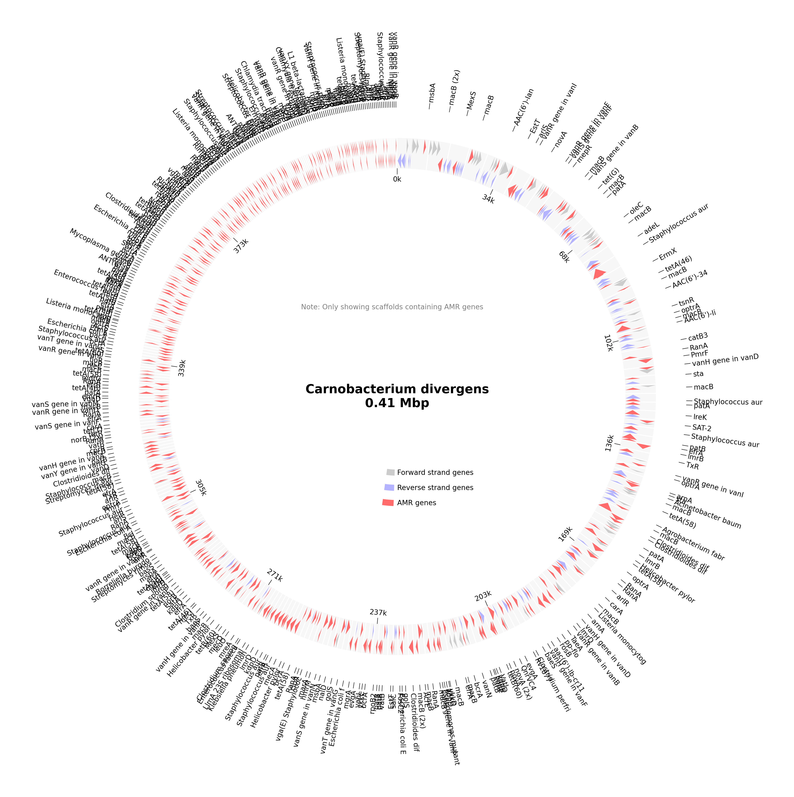

### AAC(6')-34
- **Mechanism**: antibiotic inactivation
- **Drug Classes**: aminoglycoside antibiotic
- **AMR Family**: AAC(6')
- **Locations**:
  - gnl|SPADES|NKELHLDI_1568_3 : position 617-1144

### AAC(6')-Ian
- **Mechanism**: antibiotic inactivation
- **Drug Classes**: aminoglycoside antibiotic
- **AMR Family**: AAC(6')
- **Locations**:
  - gnl|SPADES|NKELHLDI_1103_7 : position 3977-4477

### AAC(6')-Ii
- **Mechanism**: antibiotic inactivation
- **Drug Classes**: aminoglycoside antibiotic
- **AMR Family**: AAC(6')
- **Locations**:
  - gnl|SPADES|NKELHLDI_1672_2 : position 683-1141

### ANT(6)-Ia (found in 2 locations)
- **Mechanism**: antibiotic inactivation
- **Drug Classes**: aminoglycoside antibiotic
- **AMR Family**: ANT(6)
- **Locations**:
  - gnl|SPADES|NKELHLDI_13458_1 : position 2-541
  - gnl|SPADES|NKELHLDI_25171_1 : position 2-166

### Acinetobacter baumannii AbaF
- **Mechanism**: antibiotic efflux
- **Drug Classes**: phosphonic acid antibiotic
- **AMR Family**: major facilitator superfamily (MFS) antibiotic efflux pump
- **Locations**:
  - gnl|SPADES|NKELHLDI_2154_2 : position 473-1714

### AcrE
- **Mechanism**: antibiotic efflux
- **Drug Classes**: fluoroquinolone antibiotic; cephalosporin; cephamycin; penam
- **AMR Family**: resistance-nodulation-cell division (RND) antibiotic efflux pump
- **Locations**:
  - gnl|SPADES|NKELHLDI_3274_2 : position 255-1424

### AcrS
- **Mechanism**: antibiotic efflux
- **Drug Classes**: fluoroquinolone antibiotic; cephalosporin; glycylcycline; cephamycin; penam; tetracycline antibiotic; rifamycin antibiotic; phenicol antibiotic; disinfecting agents and antiseptics
- **AMR Family**: resistance-nodulation-cell division (RND) antibiotic efflux pump
- **Locations**:
  - gnl|SPADES|NKELHLDI_11812_1 : position 2-355

### Agrobacterium fabrum chloramphenicol acetyltransferase
- **Mechanism**: antibiotic inactivation
- **Drug Classes**: phenicol antibiotic
- **AMR Family**: chloramphenicol acetyltransferase (CAT)
- **Locations**:
  - gnl|SPADES|NKELHLDI_2191_3 : position 1553-2128

### BcI
- **Mechanism**: antibiotic inactivation
- **Drug Classes**: cephalosporin; penem
- **AMR Family**: class A Bacillus cereus Bc beta-lactamase
- **Locations**:
  - gnl|SPADES|NKELHLDI_6610_1 : position 98-466

### Bla1
- **Mechanism**: antibiotic inactivation
- **Drug Classes**: penam
- **AMR Family**: class A Bacillus anthracis Bla beta-lactamase
- **Locations**:
  - gnl|SPADES|NKELHLDI_13387_1 : position 19-543

### Borreliella burgdorferi murA with mutation conferring resistance to fosfomycin
- **Mechanism**: antibiotic target alteration
- **Drug Classes**: phosphonic acid antibiotic
- **AMR Family**: antibiotic-resistant murA transferase
- **Locations**:
  - gnl|SPADES|NKELHLDI_6134_1 : position 1-405

### Chlamydia trachomatis intrinsic murA conferring resistance to fosfomycin (found in 2 locations)
- **Mechanism**: antibiotic target alteration
- **Drug Classes**: phosphonic acid antibiotic
- **AMR Family**: antibiotic-resistant murA transferase
- **Locations**:
  - gnl|SPADES|NKELHLDI_29513_1 : position 2-325
  - gnl|SPADES|NKELHLDI_34703_1 : position 3-293

### Clostridioides difficile gyrA conferring resistance to fluoroquinolones (found in 2 locations)
- **Mechanism**: antibiotic target alteration
- **Drug Classes**: fluoroquinolone antibiotic
- **AMR Family**: fluoroquinolone resistant gyrA
- **Locations**:
  - gnl|SPADES|NKELHLDI_2195_2 : position 1320-2147
  - gnl|SPADES|NKELHLDI_3470_1 : position 2-1435

### Clostridioides difficile gyrB conferring resistance to fluoroquinolones (found in 3 locations)
- **Mechanism**: antibiotic target alteration
- **Drug Classes**: fluoroquinolone antibiotic
- **AMR Family**: fluoroquinolone resistant gyrB
- **Locations**:
  - gnl|SPADES|NKELHLDI_15143_1 : position 2-499
  - gnl|SPADES|NKELHLDI_2195_1 : position 2-1255
  - gnl|SPADES|NKELHLDI_7631_1 : position 1-804

### Clostridium perfringes cplR
- **Mechanism**: antibiotic target protection
- **Drug Classes**: lincosamide antibiotic; streptogramin antibiotic; streptogramin A antibiotic; pleuromutilin antibiotic
- **AMR Family**: Miscellaneous ABC-F subfamily ATP-binding cassette ribosomal protection proteins
- **Locations**:
  - gnl|SPADES|NKELHLDI_2888_3 : position 1140-1655

### Clostridium sporogenes cplR (found in 2 locations)
- **Mechanism**: antibiotic target protection
- **Drug Classes**: lincosamide antibiotic; pleuromutilin antibiotic
- **AMR Family**: Miscellaneous ABC-F subfamily ATP-binding cassette ribosomal protection proteins
- **Locations**:
  - gnl|SPADES|NKELHLDI_4959_1 : position 3-215
  - gnl|SPADES|NKELHLDI_5820_1 : position 3-605

### Enterococcus faecalis cls with mutation conferring resistance to daptomycin (found in 2 locations)
- **Mechanism**: antibiotic target alteration
- **Drug Classes**: peptide antibiotic
- **AMR Family**: daptomycin resistant cls
- **Locations**:
  - gnl|SPADES|NKELHLDI_12624_1 : position 2-565
  - gnl|SPADES|NKELHLDI_4952_3 : position 747-1088

### Erm(48)
- **Mechanism**: antibiotic target alteration
- **Drug Classes**: macrolide antibiotic; lincosamide antibiotic; streptogramin antibiotic; streptogramin B antibiotic
- **AMR Family**: Erm 23S ribosomal RNA methyltransferase
- **Locations**:
  - gnl|SPADES|NKELHLDI_28321_1 : position 1-333

### ErmE
- **Mechanism**: antibiotic target alteration
- **Drug Classes**: macrolide antibiotic; lincosamide antibiotic; streptogramin antibiotic; streptogramin A antibiotic; streptogramin B antibiotic
- **AMR Family**: Erm 23S ribosomal RNA methyltransferase
- **Locations**:
  - gnl|SPADES|NKELHLDI_11461_1 : position 2-604

### ErmX
- **Mechanism**: antibiotic target alteration
- **Drug Classes**: macrolide antibiotic; lincosamide antibiotic; streptogramin antibiotic; streptogramin A antibiotic; streptogramin B antibiotic
- **AMR Family**: Erm 23S ribosomal RNA methyltransferase
- **Locations**:
  - gnl|SPADES|NKELHLDI_1481_5 : position 2963-3427

### Escherichia coli AcrAB-TolC with AcrR mutation conferring resistance to ciprofloxacin, tetracycline, and ceftazidime
- **Mechanism**: antibiotic target alteration; antibiotic efflux
- **Drug Classes**: fluoroquinolone antibiotic; cephalosporin; glycylcycline; penam; tetracycline antibiotic; rifamycin antibiotic; phenicol antibiotic; disinfecting agents and antiseptics
- **AMR Family**: resistance-nodulation-cell division (RND) antibiotic efflux pump
- **Locations**:
  - gnl|SPADES|NKELHLDI_6626_2 : position 709-888

### Escherichia coli AcrAB-TolC with MarR mutations conferring resistance to ciprofloxacin and tetracycline
- **Mechanism**: antibiotic target alteration; antibiotic efflux
- **Drug Classes**: fluoroquinolone antibiotic; cephalosporin; glycylcycline; penam; tetracycline antibiotic; rifamycin antibiotic; phenicol antibiotic; disinfecting agents and antiseptics
- **AMR Family**: resistance-nodulation-cell division (RND) antibiotic efflux pump
- **Locations**:
  - gnl|SPADES|NKELHLDI_11188_1 : position 304-615

### Escherichia coli EF-Tu mutants conferring resistance to kirromycin (found in 2 locations)
- **Mechanism**: antibiotic target alteration
- **Drug Classes**: elfamycin antibiotic
- **AMR Family**: elfamycin resistant EF-Tu
- **Locations**:
  - gnl|SPADES|NKELHLDI_14843_1 : position 113-505
  - gnl|SPADES|NKELHLDI_3588_1 : position 1-807

### Escherichia coli fabI mutations conferring resistance to isoniazid and triclosan
- **Mechanism**: antibiotic target alteration
- **Drug Classes**: disinfecting agents and antiseptics; isoniazid-like antibiotic
- **AMR Family**: antibiotic resistant fabI
- **Locations**:
  - gnl|SPADES|NKELHLDI_3831_1 : position 305-1063

### EstT (found in 2 locations)
- **Mechanism**: antibiotic inactivation
- **Drug Classes**: macrolide antibiotic
- **AMR Family**: macrolide esterase
- **Locations**:
  - gnl|SPADES|NKELHLDI_1207_4 : position 3142-3858
  - gnl|SPADES|NKELHLDI_3663_1 : position 2-589

### FosC2
- **Mechanism**: antibiotic inactivation
- **Drug Classes**: phosphonic acid antibiotic
- **AMR Family**: fosC phosphotransferase family
- **Locations**:
  - gnl|SPADES|NKELHLDI_3588_2 : position 855-1235

### HelR
- **Mechanism**: antibiotic target protection
- **Drug Classes**: rifamycin antibiotic
- **AMR Family**: helicase-like RNA polymerase protection protein
- **Locations**:
  - gnl|SPADES|NKELHLDI_6805_1 : position 1-870

### Helicobacter pylori pbp1 mutants conferring resistance to amoxicillin (found in 2 locations)
- **Mechanism**: antibiotic target alteration
- **Drug Classes**: cephalosporin; cephamycin; penam
- **AMR Family**: Penicillin-binding protein mutations conferring resistance to beta-lactam antibiotics
- **Locations**:
  - gnl|SPADES|NKELHLDI_28253_1 : position 3-332
  - gnl|SPADES|NKELHLDI_4367_1 : position 1-996

### Helicobacter pylori rdxA mutation conferring resistance to metronidazole
- **Mechanism**: antibiotic target alteration
- **Drug Classes**: nitroimidazole antibiotic
- **AMR Family**: Antibiotic resistant Helicobacter pylori nitroreductase
- **Locations**:
  - gnl|SPADES|NKELHLDI_5333_2 : position 359-985

### Helicobacter pylori rpoB mutation conferring resistance to rifampicin
- **Mechanism**: antibiotic target alteration; antibiotic target replacement
- **Drug Classes**: fluoroquinolone antibiotic; rifamycin antibiotic
- **AMR Family**: rifamycin-resistant beta-subunit of RNA polymerase (rpoB)
- **Locations**:
  - gnl|SPADES|NKELHLDI_2316_2 : position 841-2043

### IreK (found in 2 locations)
- **Mechanism**: reduced permeability to antibiotic
- **Drug Classes**: cephalosporin
- **AMR Family**: Serine/threonine kinases
- **Locations**:
  - gnl|SPADES|NKELHLDI_1943_1 : position 1-1449
  - gnl|SPADES|NKELHLDI_20855_1 : position 1-402

### Klebsiella pneumoniae KpnH
- **Mechanism**: antibiotic efflux
- **Drug Classes**: macrolide antibiotic; fluoroquinolone antibiotic; aminoglycoside antibiotic; carbapenem; cephalosporin; penam; peptide antibiotic; penem
- **AMR Family**: major facilitator superfamily (MFS) antibiotic efflux pump
- **Locations**:
  - gnl|SPADES|NKELHLDI_4900_2 : position 570-1094

### L1 beta-lactamase
- **Mechanism**: antibiotic inactivation
- **Drug Classes**: cephalosporin
- **AMR Family**: L1 family beta-lactamase
- **Locations**:
  - gnl|SPADES|NKELHLDI_37491_1 : position 1-213

### Listeria monocytogenes mprF (found in 4 locations)
- **Mechanism**: antibiotic target alteration
- **Drug Classes**: peptide antibiotic
- **AMR Family**: defensin resistant mprF
- **Locations**:
  - gnl|SPADES|NKELHLDI_11926_2 : position 389-586
  - gnl|SPADES|NKELHLDI_21979_1 : position 2-388
  - gnl|SPADES|NKELHLDI_2552_2 : position 323-1756
  - gnl|SPADES|NKELHLDI_80397_1 : position 1-240

### LlmA 23S ribosomal RNA methyltransferase
- **Mechanism**: antibiotic target alteration
- **Drug Classes**: lincosamide antibiotic
- **AMR Family**: Llm 23S ribosomal RNA methyltransferase
- **Locations**:
  - gnl|SPADES|NKELHLDI_4944_1 : position 1-1065

### MexS (found in 2 locations)
- **Mechanism**: antibiotic efflux
- **Drug Classes**: fluoroquinolone antibiotic; diaminopyrimidine antibiotic; phenicol antibiotic
- **AMR Family**: resistance-nodulation-cell division (RND) antibiotic efflux pump
- **Locations**:
  - gnl|SPADES|NKELHLDI_1029_4 : position 2231-3214
  - gnl|SPADES|NKELHLDI_5241_1 : position 2-946

### Mycoplasma genitalium parC mutations confers resistance to Moxifloxacin
- **Mechanism**: antibiotic target alteration
- **Drug Classes**: fluoroquinolone antibiotic
- **AMR Family**: fluoroquinolone resistant parC
- **Locations**:
  - gnl|SPADES|NKELHLDI_13958_1 : position 1-360

### NmcR (found in 3 locations)
- **Mechanism**: antibiotic inactivation
- **Drug Classes**: carbapenem; cephalosporin; cephamycin; penam
- **AMR Family**: NmcA beta-lactamase
- **Locations**:
  - gnl|SPADES|NKELHLDI_115273_1 : position 2-208
  - gnl|SPADES|NKELHLDI_16120_1 : position 3-308
  - gnl|SPADES|NKELHLDI_17972_1 : position 3-269

### PmrF (found in 5 locations)
- **Mechanism**: antibiotic target alteration
- **Drug Classes**: peptide antibiotic
- **AMR Family**: pmr phosphoethanolamine transferase
- **Locations**:
  - gnl|SPADES|NKELHLDI_12099_1 : position 3-581
  - gnl|SPADES|NKELHLDI_1732_2 : position 464-1714
  - gnl|SPADES|NKELHLDI_18037_1 : position 2-442
  - gnl|SPADES|NKELHLDI_59352_1 : position 2-259
  - gnl|SPADES|NKELHLDI_7034_2 : position 440-850

### Pseudomonas mutant PhoP conferring resistance to colistin
- **Mechanism**: antibiotic target alteration; antibiotic efflux; resistance by absence
- **Drug Classes**: macrolide antibiotic; peptide antibiotic
- **AMR Family**: ATP-binding cassette (ABC) antibiotic efflux pump; pmr phosphoethanolamine transferase; transmembrane protein conferring colistin resistance
- **Locations**:
  - gnl|SPADES|NKELHLDI_3184_2 : position 502-1188

### QnrVC4
- **Mechanism**: antibiotic target protection
- **Drug Classes**: fluoroquinolone antibiotic
- **AMR Family**: quinolone resistance protein (qnr)
- **Locations**:
  - gnl|SPADES|NKELHLDI_2998_2 : position 510-1145

### RanA (found in 10 locations)
- **Mechanism**: antibiotic efflux
- **Drug Classes**: aminoglycoside antibiotic
- **AMR Family**: ATP-binding cassette (ABC) antibiotic efflux pump
- **Locations**:
  - gnl|SPADES|NKELHLDI_12726_1 : position 2-562
  - gnl|SPADES|NKELHLDI_1707_2 : position 1887-2582
  - gnl|SPADES|NKELHLDI_2391_2 : position 676-1770
  - gnl|SPADES|NKELHLDI_2396_1 : position 3-674
  - gnl|SPADES|NKELHLDI_3240_1 : position 2-922
  - gnl|SPADES|NKELHLDI_4211_1 : position 2-724
  - gnl|SPADES|NKELHLDI_6737_1 : position 4-876
  - gnl|SPADES|NKELHLDI_8323_2 : position 454-759
  - gnl|SPADES|NKELHLDI_8960_2 : position 247-720
  - gnl|SPADES|NKELHLDI_9423_1 : position 1-693

### RlmA(II) (found in 3 locations)
- **Mechanism**: antibiotic target alteration
- **Drug Classes**: macrolide antibiotic; lincosamide antibiotic
- **AMR Family**: non-erm 23S ribosomal RNA methyltransferase (G748)
- **Locations**:
  - gnl|SPADES|NKELHLDI_17258_1 : position 2-454
  - gnl|SPADES|NKELHLDI_21744_1 : position 1-360
  - gnl|SPADES|NKELHLDI_91077_1 : position 2-232

### Rv1877
- **Mechanism**: antibiotic efflux
- **Drug Classes**: fluoroquinolone antibiotic
- **AMR Family**: major facilitator superfamily (MFS) antibiotic efflux pump
- **Locations**:
  - gnl|SPADES|NKELHLDI_2969_1 : position 1-555

### SAT-2
- **Mechanism**: antibiotic inactivation
- **Drug Classes**: nucleoside antibiotic
- **AMR Family**: streptothricin acetyltransferase (SAT)
- **Locations**:
  - gnl|SPADES|NKELHLDI_1946_2 : position 394-1239

### SRT-1
- **Mechanism**: antibiotic inactivation
- **Drug Classes**: cephalosporin
- **AMR Family**: SRT beta-lactamase
- **Locations**:
  - gnl|SPADES|NKELHLDI_14307_1 : position 1-519

### SatA
- **Mechanism**: antibiotic inactivation
- **Drug Classes**: nucleoside antibiotic
- **AMR Family**: streptothricin acetyltransferase (SAT)
- **Locations**:
  - gnl|SPADES|NKELHLDI_5639_3 : position 418-852

### Staphylococcus aureus mupA conferring resistance to mupirocin (found in 4 locations)
- **Mechanism**: antibiotic target alteration
- **Drug Classes**: mupirocin-like antibiotic
- **AMR Family**: antibiotic-resistant isoleucyl-tRNA synthetase (ileS)
- **Locations**:
  - gnl|SPADES|NKELHLDI_4467_1 : position 2-1030
  - gnl|SPADES|NKELHLDI_4796_1 : position 1-1110
  - gnl|SPADES|NKELHLDI_6663_1 : position 2-694
  - gnl|SPADES|NKELHLDI_7461_1 : position 3-815

### Staphylococcus aureus mupB conferring resistance to mupirocin (found in 6 locations)
- **Mechanism**: antibiotic target alteration
- **Drug Classes**: mupirocin-like antibiotic
- **AMR Family**: antibiotic-resistant isoleucyl-tRNA synthetase (ileS)
- **Locations**:
  - gnl|SPADES|NKELHLDI_102925_1 : position 1-219
  - gnl|SPADES|NKELHLDI_11016_1 : position 3-620
  - gnl|SPADES|NKELHLDI_1952_1 : position 1-1173
  - gnl|SPADES|NKELHLDI_22569_1 : position 1-381
  - gnl|SPADES|NKELHLDI_28629_1 : position 1-330
  - gnl|SPADES|NKELHLDI_6982_1 : position 1-855

### Staphylococcus aureus murA with mutation conferring resistance to fosfomycin
- **Mechanism**: antibiotic target alteration
- **Drug Classes**: phosphonic acid antibiotic
- **AMR Family**: antibiotic-resistant murA transferase
- **Locations**:
  - gnl|SPADES|NKELHLDI_1882_3 : position 1574-2527

### Staphylococcus aureus norA
- **Mechanism**: antibiotic efflux
- **Drug Classes**: fluoroquinolone antibiotic
- **AMR Family**: major facilitator superfamily (MFS) antibiotic efflux pump
- **Locations**:
  - gnl|SPADES|NKELHLDI_22922_1 : position 3-269

### Staphylococcus aureus rpoB mutants conferring resistance to rifampicin
- **Mechanism**: antibiotic target alteration; antibiotic target replacement
- **Drug Classes**: rifamycin antibiotic
- **AMR Family**: rifamycin-resistant beta-subunit of RNA polymerase (rpoB)
- **Locations**:
  - gnl|SPADES|NKELHLDI_1460_1 : position 3-3077

### Streptococcus pneumoniae PBP2b conferring resistance to amoxicillin (found in 2 locations)
- **Mechanism**: antibiotic target alteration
- **Drug Classes**: cephalosporin; cephamycin; penam
- **AMR Family**: Penicillin-binding protein mutations conferring resistance to beta-lactam antibiotics
- **Locations**:
  - gnl|SPADES|NKELHLDI_23757_1 : position 3-371
  - gnl|SPADES|NKELHLDI_28139_1 : position 1-333

### Streptococcus pneumoniae PBP2x conferring resistance to amoxicillin
- **Mechanism**: antibiotic target alteration
- **Drug Classes**: cephalosporin; cephamycin; penam
- **AMR Family**: Penicillin-binding protein mutations conferring resistance to beta-lactam antibiotics
- **Locations**:
  - gnl|SPADES|NKELHLDI_56986_1 : position 1-261

### Streptomyces rimosus otr(A) (found in 3 locations)
- **Mechanism**: antibiotic target protection
- **Drug Classes**: tetracycline antibiotic
- **AMR Family**: tetracycline-resistant ribosomal protection protein
- **Locations**:
  - gnl|SPADES|NKELHLDI_6084_1 : position 3-941
  - gnl|SPADES|NKELHLDI_7298_1 : position 3-827
  - gnl|SPADES|NKELHLDI_88765_1 : position 2-232

### TaeA (found in 4 locations)
- **Mechanism**: antibiotic efflux
- **Drug Classes**: pleuromutilin antibiotic
- **AMR Family**: ATP-binding cassette (ABC) antibiotic efflux pump
- **Locations**:
  - gnl|SPADES|NKELHLDI_101311_1 : position 3-221
  - gnl|SPADES|NKELHLDI_15512_1 : position 3-488
  - gnl|SPADES|NKELHLDI_24352_1 : position 2-364
  - gnl|SPADES|NKELHLDI_2763_1 : position 3-1304

### TxR (found in 3 locations)
- **Mechanism**: antibiotic efflux
- **Drug Classes**: tetracycline antibiotic
- **AMR Family**: ATP-binding cassette (ABC) antibiotic efflux pump
- **Locations**:
  - gnl|SPADES|NKELHLDI_2039_1 : position 1-1032
  - gnl|SPADES|NKELHLDI_5501_1 : position 1-1014
  - gnl|SPADES|NKELHLDI_7188_1 : position 2-712

### VatI (found in 2 locations)
- **Mechanism**: antibiotic inactivation
- **Drug Classes**: streptogramin antibiotic; streptogramin A antibiotic
- **AMR Family**: streptogramin vat acetyltransferase
- **Locations**:
  - gnl|SPADES|NKELHLDI_3034_2 : position 1205-1594
  - gnl|SPADES|NKELHLDI_83142_1 : position 3-188

### YajC
- **Mechanism**: antibiotic efflux
- **Drug Classes**: fluoroquinolone antibiotic; cephalosporin; glycylcycline; penam; tetracycline antibiotic; oxazolidinone antibiotic; glycopeptide antibiotic; rifamycin antibiotic; phenicol antibiotic; disinfecting agents and antiseptics
- **AMR Family**: resistance-nodulation-cell division (RND) antibiotic efflux pump
- **Locations**:
  - gnl|SPADES|NKELHLDI_11926_1 : position 1-321

### YojI
- **Mechanism**: antibiotic efflux
- **Drug Classes**: peptide antibiotic
- **AMR Family**: ATP-binding cassette (ABC) antibiotic efflux pump
- **Locations**:
  - gnl|SPADES|NKELHLDI_19430_1 : position 127-420

### aac(6')-Ib-cr11
- **Mechanism**: antibiotic inactivation
- **Drug Classes**: fluoroquinolone antibiotic; aminoglycoside antibiotic
- **AMR Family**: AAC(6'); AAC(6')-Ib-cr
- **Locations**:
  - gnl|SPADES|NKELHLDI_2829_1 : position 3-539

### abeS
- **Mechanism**: antibiotic efflux
- **Drug Classes**: macrolide antibiotic; aminocoumarin antibiotic
- **AMR Family**: small multidrug resistance (SMR) antibiotic efflux pump
- **Locations**:
  - gnl|SPADES|NKELHLDI_12855_2 : position 170-487

### adeL
- **Mechanism**: antibiotic efflux
- **Drug Classes**: fluoroquinolone antibiotic; tetracycline antibiotic
- **AMR Family**: resistance-nodulation-cell division (RND) antibiotic efflux pump
- **Locations**:
  - gnl|SPADES|NKELHLDI_1455_3 : position 2074-2958

### almE (found in 2 locations)
- **Mechanism**: antibiotic target alteration
- **Drug Classes**: peptide antibiotic
- **AMR Family**: polymyxin resistance operon; alm glycyltransferase
- **Locations**:
  - gnl|SPADES|NKELHLDI_20167_1 : position 3-410
  - gnl|SPADES|NKELHLDI_99679_1 : position 3-224

### arlR (found in 10 locations)
- **Mechanism**: antibiotic efflux
- **Drug Classes**: fluoroquinolone antibiotic; disinfecting agents and antiseptics
- **AMR Family**: major facilitator superfamily (MFS) antibiotic efflux pump
- **Locations**:
  - gnl|SPADES|NKELHLDI_12164_1 : position 1-216
  - gnl|SPADES|NKELHLDI_18336_1 : position 1-291
  - gnl|SPADES|NKELHLDI_19831_1 : position 2-415
  - gnl|SPADES|NKELHLDI_20527_1 : position 2-238
  - gnl|SPADES|NKELHLDI_2439_1 : position 2-1282
  - gnl|SPADES|NKELHLDI_50062_1 : position 3-269
  - gnl|SPADES|NKELHLDI_55908_1 : position 1-261
  - gnl|SPADES|NKELHLDI_6185_2 : position 368-733
  - gnl|SPADES|NKELHLDI_7178_2 : position 375-839
  - gnl|SPADES|NKELHLDI_92226_1 : position 3-230

### arlS (found in 5 locations)
- **Mechanism**: antibiotic efflux
- **Drug Classes**: fluoroquinolone antibiotic; disinfecting agents and antiseptics
- **AMR Family**: major facilitator superfamily (MFS) antibiotic efflux pump
- **Locations**:
  - gnl|SPADES|NKELHLDI_10770_1 : position 1-630
  - gnl|SPADES|NKELHLDI_110977_1 : position 3-212
  - gnl|SPADES|NKELHLDI_1215_2 : position 254-2089
  - gnl|SPADES|NKELHLDI_6798_1 : position 2-871
  - gnl|SPADES|NKELHLDI_94980_1 : position 2-229

### arnA (found in 2 locations)
- **Mechanism**: antibiotic target alteration
- **Drug Classes**: peptide antibiotic
- **AMR Family**: pmr phosphoethanolamine transferase
- **Locations**:
  - gnl|SPADES|NKELHLDI_2141_2 : position 1619-2206
  - gnl|SPADES|NKELHLDI_2656_2 : position 1134-1787

### bacA
- **Mechanism**: antibiotic target alteration
- **Drug Classes**: peptide antibiotic
- **AMR Family**: undecaprenyl pyrophosphate related proteins
- **Locations**:
  - gnl|SPADES|NKELHLDI_11054_1 : position 2-619

### baeS (found in 5 locations)
- **Mechanism**: antibiotic efflux
- **Drug Classes**: aminoglycoside antibiotic; aminocoumarin antibiotic
- **AMR Family**: resistance-nodulation-cell division (RND) antibiotic efflux pump
- **Locations**:
  - gnl|SPADES|NKELHLDI_117466_1 : position 1-207
  - gnl|SPADES|NKELHLDI_25260_1 : position 3-356
  - gnl|SPADES|NKELHLDI_2831_2 : position 733-1683
  - gnl|SPADES|NKELHLDI_3038_2 : position 827-1030
  - gnl|SPADES|NKELHLDI_5403_1 : position 3-956

### basS (found in 2 locations)
- **Mechanism**: antibiotic target alteration; antibiotic efflux
- **Drug Classes**: peptide antibiotic
- **AMR Family**: pmr phosphoethanolamine transferase
- **Locations**:
  - gnl|SPADES|NKELHLDI_6055_1 : position 32-946
  - gnl|SPADES|NKELHLDI_87080_1 : position 1-234

### bcr-1
- **Mechanism**: antibiotic efflux
- **Drug Classes**: bicyclomycin-like antibiotic
- **AMR Family**: major facilitator superfamily (MFS) antibiotic efflux pump
- **Locations**:
  - gnl|SPADES|NKELHLDI_6245_2 : position 568-924

### bcrA (found in 11 locations)
- **Mechanism**: antibiotic efflux
- **Drug Classes**: peptide antibiotic
- **AMR Family**: ATP-binding cassette (ABC) antibiotic efflux pump
- **Locations**:
  - gnl|SPADES|NKELHLDI_10848_1 : position 124-627
  - gnl|SPADES|NKELHLDI_14288_1 : position 3-518
  - gnl|SPADES|NKELHLDI_14502_1 : position 5-514
  - gnl|SPADES|NKELHLDI_21574_1 : position 1-393
  - gnl|SPADES|NKELHLDI_22012_1 : position 3-386
  - gnl|SPADES|NKELHLDI_22049_1 : position 1-387
  - gnl|SPADES|NKELHLDI_3115_3 : position 1197-1556
  - gnl|SPADES|NKELHLDI_31381_1 : position 2-313
  - gnl|SPADES|NKELHLDI_3766_2 : position 501-1337
  - gnl|SPADES|NKELHLDI_4298_2 : position 863-1207
  - gnl|SPADES|NKELHLDI_87698_1 : position 2-235

### bcrC
- **Mechanism**: antibiotic target alteration
- **Drug Classes**: peptide antibiotic
- **AMR Family**: undecaprenyl pyrophosphate related proteins
- **Locations**:
  - gnl|SPADES|NKELHLDI_14113_1 : position 1-282

### carA (found in 2 locations)
- **Mechanism**: antibiotic target protection
- **Drug Classes**: macrolide antibiotic
- **AMR Family**: Miscellaneous ABC-F subfamily ATP-binding cassette ribosomal protection proteins
- **Locations**:
  - gnl|SPADES|NKELHLDI_2460_2 : position 808-1515
  - gnl|SPADES|NKELHLDI_8880_1 : position 2-145

### catB11
- **Mechanism**: antibiotic inactivation
- **Drug Classes**: phenicol antibiotic
- **AMR Family**: chloramphenicol acetyltransferase (CAT)
- **Locations**:
  - gnl|SPADES|NKELHLDI_17290_1 : position 122-454

### catB3
- **Mechanism**: antibiotic inactivation
- **Drug Classes**: phenicol antibiotic
- **AMR Family**: chloramphenicol acetyltransferase (CAT)
- **Locations**:
  - gnl|SPADES|NKELHLDI_1674_4 : position 2675-2908

### cipA
- **Mechanism**: antibiotic target alteration
- **Drug Classes**: lincosamide antibiotic; streptogramin antibiotic; streptogramin A antibiotic; oxazolidinone antibiotic; phenicol antibiotic; pleuromutilin antibiotic
- **AMR Family**: Cfr 23S ribosomal RNA methyltransferase
- **Locations**:
  - gnl|SPADES|NKELHLDI_4181_2 : position 922-1236

### cprR (found in 2 locations)
- **Mechanism**: antibiotic target alteration; antibiotic efflux
- **Drug Classes**: peptide antibiotic
- **AMR Family**: pmr phosphoethanolamine transferase
- **Locations**:
  - gnl|SPADES|NKELHLDI_14921_1 : position 1-504
  - gnl|SPADES|NKELHLDI_8074_1 : position 2-244

### efrA (found in 18 locations)
- **Mechanism**: antibiotic efflux
- **Drug Classes**: macrolide antibiotic; fluoroquinolone antibiotic; rifamycin antibiotic
- **AMR Family**: ATP-binding cassette (ABC) antibiotic efflux pump
- **Locations**:
  - gnl|SPADES|NKELHLDI_12321_1 : position 2-358
  - gnl|SPADES|NKELHLDI_14303_1 : position 3-518
  - gnl|SPADES|NKELHLDI_16165_1 : position 1-474
  - gnl|SPADES|NKELHLDI_1992_2 : position 1749-2393
  - gnl|SPADES|NKELHLDI_21537_1 : position 1-393
  - gnl|SPADES|NKELHLDI_22700_1 : position 2-358
  - gnl|SPADES|NKELHLDI_25117_1 : position 1-357
  - gnl|SPADES|NKELHLDI_28483_1 : position 1-333
  - gnl|SPADES|NKELHLDI_3128_1 : position 3-314
  - gnl|SPADES|NKELHLDI_4517_1 : position 3-395
  - gnl|SPADES|NKELHLDI_5601_2 : position 315-998
  - gnl|SPADES|NKELHLDI_58165_1 : position 3-260
  - gnl|SPADES|NKELHLDI_5881_1 : position 2-964
  - gnl|SPADES|NKELHLDI_59565_1 : position 2-259
  - gnl|SPADES|NKELHLDI_62727_2 : position 82-255
  - gnl|SPADES|NKELHLDI_7291_1 : position 2-328
  - gnl|SPADES|NKELHLDI_8929_1 : position 2-721
  - gnl|SPADES|NKELHLDI_96736_1 : position 3-227

### efrB (found in 6 locations)
- **Mechanism**: antibiotic efflux
- **Drug Classes**: macrolide antibiotic; fluoroquinolone antibiotic; rifamycin antibiotic
- **AMR Family**: ATP-binding cassette (ABC) antibiotic efflux pump
- **Locations**:
  - gnl|SPADES|NKELHLDI_110861_1 : position 3-212
  - gnl|SPADES|NKELHLDI_30110_1 : position 3-320
  - gnl|SPADES|NKELHLDI_30844_1 : position 1-315
  - gnl|SPADES|NKELHLDI_34181_1 : position 2-295
  - gnl|SPADES|NKELHLDI_5856_2 : position 528-968
  - gnl|SPADES|NKELHLDI_9398_1 : position 3-695

### emrR
- **Mechanism**: antibiotic efflux
- **Drug Classes**: fluoroquinolone antibiotic
- **AMR Family**: major facilitator superfamily (MFS) antibiotic efflux pump
- **Locations**:
  - gnl|SPADES|NKELHLDI_9286_1 : position 3-452

### evgA (found in 2 locations)
- **Mechanism**: antibiotic efflux
- **Drug Classes**: macrolide antibiotic; fluoroquinolone antibiotic; penam; tetracycline antibiotic
- **AMR Family**: major facilitator superfamily (MFS) antibiotic efflux pump; resistance-nodulation-cell division (RND) antibiotic efflux pump
- **Locations**:
  - gnl|SPADES|NKELHLDI_2989_2 : position 730-1362
  - gnl|SPADES|NKELHLDI_3797_2 : position 548-1192

### farB
- **Mechanism**: antibiotic efflux
- **Drug Classes**: antibacterial free fatty acids
- **AMR Family**: major facilitator superfamily (MFS) antibiotic efflux pump
- **Locations**:
  - gnl|SPADES|NKELHLDI_13001_1 : position 1-555

### floR
- **Mechanism**: antibiotic efflux
- **Drug Classes**: phenicol antibiotic
- **AMR Family**: major facilitator superfamily (MFS) antibiotic efflux pump
- **Locations**:
  - gnl|SPADES|NKELHLDI_10228_1 : position 2-655

### golS (found in 4 locations)
- **Mechanism**: antibiotic efflux
- **Drug Classes**: monobactam; carbapenem; cephalosporin; cephamycin; penam; phenicol antibiotic; penem
- **AMR Family**: resistance-nodulation-cell division (RND) antibiotic efflux pump
- **Locations**:
  - gnl|SPADES|NKELHLDI_22091_1 : position 50-385
  - gnl|SPADES|NKELHLDI_3534_3 : position 933-1316
  - gnl|SPADES|NKELHLDI_36680_1 : position 2-286
  - gnl|SPADES|NKELHLDI_3853_2 : position 447-1253

### hmrM
- **Mechanism**: antibiotic efflux
- **Drug Classes**: fluoroquinolone antibiotic; disinfecting agents and antiseptics
- **AMR Family**: multidrug and toxic compound extrusion (MATE) transporter
- **Locations**:
  - gnl|SPADES|NKELHLDI_4020_2 : position 306-1271

### kdpD (found in 5 locations)
- **Mechanism**: antibiotic efflux
- **Drug Classes**: aminoglycoside antibiotic
- **AMR Family**: kdpDE
- **Locations**:
  - gnl|SPADES|NKELHLDI_3038_1 : position 2-820
  - gnl|SPADES|NKELHLDI_3184_1 : position 2-472
  - gnl|SPADES|NKELHLDI_4830_1 : position 1-1107
  - gnl|SPADES|NKELHLDI_5608_2 : position 292-996
  - gnl|SPADES|NKELHLDI_6483_1 : position 2-571

### kdpE (found in 3 locations)
- **Mechanism**: antibiotic efflux
- **Drug Classes**: aminoglycoside antibiotic
- **AMR Family**: kdpDE
- **Locations**:
  - gnl|SPADES|NKELHLDI_14743_1 : position 2-277
  - gnl|SPADES|NKELHLDI_3038_3 : position 1027-1593
  - gnl|SPADES|NKELHLDI_6483_2 : position 568-900

### leuO
- **Mechanism**: antibiotic efflux
- **Drug Classes**: nucleoside antibiotic; disinfecting agents and antiseptics
- **AMR Family**: major facilitator superfamily (MFS) antibiotic efflux pump
- **Locations**:
  - gnl|SPADES|NKELHLDI_5141_2 : position 369-1064

### lmrB (found in 4 locations)
- **Mechanism**: antibiotic efflux
- **Drug Classes**: lincosamide antibiotic; nucleoside antibiotic
- **AMR Family**: ATP-binding cassette (ABC) antibiotic efflux pump
- **Locations**:
  - gnl|SPADES|NKELHLDI_12507_2 : position 176-568
  - gnl|SPADES|NKELHLDI_12694_1 : position 1-564
  - gnl|SPADES|NKELHLDI_2034_1 : position 126-1580
  - gnl|SPADES|NKELHLDI_2265_3 : position 1597-2085

### lmrD (found in 4 locations)
- **Mechanism**: antibiotic efflux
- **Drug Classes**: lincosamide antibiotic
- **AMR Family**: ATP-binding cassette (ABC) antibiotic efflux pump
- **Locations**:
  - gnl|SPADES|NKELHLDI_2756_2 : position 1063-1722
  - gnl|SPADES|NKELHLDI_32342_1 : position 2-307
  - gnl|SPADES|NKELHLDI_4873_2 : position 286-1101
  - gnl|SPADES|NKELHLDI_5856_1 : position 1-339

### macB (found in 43 locations)
- **Mechanism**: antibiotic efflux
- **Drug Classes**: macrolide antibiotic
- **AMR Family**: ATP-binding cassette (ABC) antibiotic efflux pump
- **Locations**:
  - gnl|SPADES|NKELHLDI_10230_1 : position 1-654
  - gnl|SPADES|NKELHLDI_103304_1 : position 1-219
  - gnl|SPADES|NKELHLDI_1039_1 : position 745-1872
  - gnl|SPADES|NKELHLDI_11844_1 : position 1-591
  - gnl|SPADES|NKELHLDI_1320_1 : position 3-557
  - gnl|SPADES|NKELHLDI_1336_5 : position 2771-3496
  - gnl|SPADES|NKELHLDI_13665_1 : position 3-359
  - gnl|SPADES|NKELHLDI_1447_2 : position 1433-2119
  - gnl|SPADES|NKELHLDI_14836_1 : position 2-505
  - gnl|SPADES|NKELHLDI_15048_1 : position 2-499
  - gnl|SPADES|NKELHLDI_1555_2 : position 1168-1824
  - gnl|SPADES|NKELHLDI_16072_1 : position 3-467
  - gnl|SPADES|NKELHLDI_1668_3 : position 2713-2922
  - gnl|SPADES|NKELHLDI_16782_1 : position 3-464
  - gnl|SPADES|NKELHLDI_1826_2 : position 704-1432
  - gnl|SPADES|NKELHLDI_19205_1 : position 2-358
  - gnl|SPADES|NKELHLDI_21058_1 : position 2-397
  - gnl|SPADES|NKELHLDI_21326_1 : position 3-395
  - gnl|SPADES|NKELHLDI_2166_1 : position 1-288
  - gnl|SPADES|NKELHLDI_2193_1 : position 2-2152
  - gnl|SPADES|NKELHLDI_22764_2 : position 54-380
  - gnl|SPADES|NKELHLDI_24359_1 : position 1-306
  - gnl|SPADES|NKELHLDI_2514_2 : position 1318-1890
  - gnl|SPADES|NKELHLDI_26551_1 : position 1-285
  - gnl|SPADES|NKELHLDI_30041_1 : position 3-287
  - gnl|SPADES|NKELHLDI_3117_2 : position 1147-1557
  - gnl|SPADES|NKELHLDI_3129_2 : position 909-1550
  - gnl|SPADES|NKELHLDI_31374_1 : position 3-314
  - gnl|SPADES|NKELHLDI_3197_1 : position 3-575
  - gnl|SPADES|NKELHLDI_3274_1 : position 1-240
  - gnl|SPADES|NKELHLDI_3330_2 : position 264-953
  - gnl|SPADES|NKELHLDI_3330_3 : position 946-1479
  - gnl|SPADES|NKELHLDI_5346_2 : position 361-1035
  - gnl|SPADES|NKELHLDI_60617_1 : position 3-257
  - gnl|SPADES|NKELHLDI_6498_1 : position 41-898
  - gnl|SPADES|NKELHLDI_6556_2 : position 384-893
  - gnl|SPADES|NKELHLDI_7598_1 : position 1-183
  - gnl|SPADES|NKELHLDI_8038_2 : position 319-777
  - gnl|SPADES|NKELHLDI_87439_1 : position 1-234
  - gnl|SPADES|NKELHLDI_9050_1 : position 218-601
  - gnl|SPADES|NKELHLDI_9484_2 : position 349-690
  - gnl|SPADES|NKELHLDI_992_4 : position 3668-4894
  - gnl|SPADES|NKELHLDI_992_5 : position 4910-5602

### marA (found in 2 locations)
- **Mechanism**: antibiotic efflux; reduced permeability to antibiotic
- **Drug Classes**: fluoroquinolone antibiotic; monobactam; carbapenem; cephalosporin; glycylcycline; cephamycin; penam; tetracycline antibiotic; rifamycin antibiotic; phenicol antibiotic; penem; disinfecting agents and antiseptics
- **AMR Family**: resistance-nodulation-cell division (RND) antibiotic efflux pump; General Bacterial Porin with reduced permeability to beta-lactams
- **Locations**:
  - gnl|SPADES|NKELHLDI_20164_1 : position 3-410
  - gnl|SPADES|NKELHLDI_4042_1 : position 2-328

### mdtG
- **Mechanism**: antibiotic efflux
- **Drug Classes**: phosphonic acid antibiotic
- **AMR Family**: major facilitator superfamily (MFS) antibiotic efflux pump
- **Locations**:
  - gnl|SPADES|NKELHLDI_9430_1 : position 1-252

### mecA (found in 2 locations)
- **Mechanism**: antibiotic target replacement
- **Drug Classes**: penam
- **AMR Family**: methicillin resistant PBP2
- **Locations**:
  - gnl|SPADES|NKELHLDI_4439_1 : position 2-1174
  - gnl|SPADES|NKELHLDI_72673_1 : position 2-247

### mecB (found in 2 locations)
- **Mechanism**: antibiotic target replacement
- **Drug Classes**: penam
- **AMR Family**: methicillin resistant PBP2
- **Locations**:
  - gnl|SPADES|NKELHLDI_29895_1 : position 1-324
  - gnl|SPADES|NKELHLDI_84828_1 : position 2-238

### mecD
- **Mechanism**: antibiotic target replacement
- **Drug Classes**: penam
- **AMR Family**: methicillin resistant PBP2
- **Locations**:
  - gnl|SPADES|NKELHLDI_5213_1 : position 3-773

### mecI
- **Mechanism**: antibiotic target replacement
- **Drug Classes**: penam
- **AMR Family**: methicillin resistant PBP2
- **Locations**:
  - gnl|SPADES|NKELHLDI_5506_3 : position 580-1011

### mepR (found in 2 locations)
- **Mechanism**: antibiotic efflux
- **Drug Classes**: glycylcycline; tetracycline antibiotic
- **AMR Family**: multidrug and toxic compound extrusion (MATE) transporter
- **Locations**:
  - gnl|SPADES|NKELHLDI_1313_1 : position 1-339
  - gnl|SPADES|NKELHLDI_81590_1 : position 2-238

### mgrA (found in 2 locations)
- **Mechanism**: antibiotic efflux
- **Drug Classes**: fluoroquinolone antibiotic; cephalosporin; penam; tetracycline antibiotic; peptide antibiotic; disinfecting agents and antiseptics
- **AMR Family**: ATP-binding cassette (ABC) antibiotic efflux pump; major facilitator superfamily (MFS) antibiotic efflux pump
- **Locations**:
  - gnl|SPADES|NKELHLDI_21723_1 : position 3-281
  - gnl|SPADES|NKELHLDI_3802_2 : position 311-961

### mreA (found in 3 locations)
- **Mechanism**: antibiotic efflux
- **Drug Classes**: macrolide antibiotic
- **AMR Family**: major facilitator superfamily (MFS) antibiotic efflux pump
- **Locations**:
  - gnl|SPADES|NKELHLDI_25207_1 : position 2-322
  - gnl|SPADES|NKELHLDI_5057_1 : position 3-488
  - gnl|SPADES|NKELHLDI_69489_1 : position 3-251

### msbA (found in 5 locations)
- **Mechanism**: antibiotic efflux
- **Drug Classes**: nitroimidazole antibiotic
- **AMR Family**: ATP-binding cassette (ABC) antibiotic efflux pump
- **Locations**:
  - gnl|SPADES|NKELHLDI_3910_2 : position 764-1297
  - gnl|SPADES|NKELHLDI_51685_1 : position 2-202
  - gnl|SPADES|NKELHLDI_56599_1 : position 1-261
  - gnl|SPADES|NKELHLDI_5996_1 : position 2-907
  - gnl|SPADES|NKELHLDI_756_10 : position 8689-9363

### mtrA
- **Mechanism**: antibiotic efflux
- **Drug Classes**: macrolide antibiotic; penam
- **AMR Family**: resistance-nodulation-cell division (RND) antibiotic efflux pump
- **Locations**:
  - gnl|SPADES|NKELHLDI_14090_1 : position 2-274

### nalD
- **Mechanism**: antibiotic efflux
- **Drug Classes**: macrolide antibiotic; fluoroquinolone antibiotic; monobactam; carbapenem; cephalosporin; cephamycin; penam; tetracycline antibiotic; peptide antibiotic; aminocoumarin antibiotic; diaminopyrimidine antibiotic; sulfonamide antibiotic; phenicol antibiotic; penem
- **AMR Family**: resistance-nodulation-cell division (RND) antibiotic efflux pump
- **Locations**:
  - gnl|SPADES|NKELHLDI_3908_2 : position 873-1298

### norB (found in 3 locations)
- **Mechanism**: antibiotic efflux
- **Drug Classes**: fluoroquinolone antibiotic
- **AMR Family**: major facilitator superfamily (MFS) antibiotic efflux pump
- **Locations**:
  - gnl|SPADES|NKELHLDI_5675_1 : position 2-835
  - gnl|SPADES|NKELHLDI_8465_2 : position 197-436
  - gnl|SPADES|NKELHLDI_8465_3 : position 420-749

### norC
- **Mechanism**: antibiotic efflux
- **Drug Classes**: fluoroquinolone antibiotic; disinfecting agents and antiseptics
- **AMR Family**: major facilitator superfamily (MFS) antibiotic efflux pump
- **Locations**:
  - gnl|SPADES|NKELHLDI_38428_1 : position 2-283

### novA (found in 8 locations)
- **Mechanism**: antibiotic efflux
- **Drug Classes**: aminocoumarin antibiotic
- **AMR Family**: ATP-binding cassette (ABC) antibiotic efflux pump
- **Locations**:
  - gnl|SPADES|NKELHLDI_110950_1 : position 1-213
  - gnl|SPADES|NKELHLDI_1292_2 : position 1090-1863
  - gnl|SPADES|NKELHLDI_17851_1 : position 1-444
  - gnl|SPADES|NKELHLDI_28920_1 : position 1-330
  - gnl|SPADES|NKELHLDI_3025_1 : position 2-1453
  - gnl|SPADES|NKELHLDI_3025_2 : position 1446-1598
  - gnl|SPADES|NKELHLDI_3029_1 : position 1-495
  - gnl|SPADES|NKELHLDI_65071_1 : position 1-255

### oleC (found in 3 locations)
- **Mechanism**: antibiotic efflux
- **Drug Classes**: macrolide antibiotic
- **AMR Family**: ATP-binding cassette (ABC) antibiotic efflux pump
- **Locations**:
  - gnl|SPADES|NKELHLDI_10118_1 : position 420-659
  - gnl|SPADES|NKELHLDI_1390_5 : position 3529-3726
  - gnl|SPADES|NKELHLDI_22031_1 : position 2-388

### optrA (found in 6 locations)
- **Mechanism**: antibiotic target protection
- **Drug Classes**: oxazolidinone antibiotic; phenicol antibiotic
- **AMR Family**: Miscellaneous ABC-F subfamily ATP-binding cassette ribosomal protection proteins
- **Locations**:
  - gnl|SPADES|NKELHLDI_11803_1 : position 3-590
  - gnl|SPADES|NKELHLDI_1668_2 : position 404-2227
  - gnl|SPADES|NKELHLDI_2121_1 : position 3-932
  - gnl|SPADES|NKELHLDI_2331_1 : position 1-1515
  - gnl|SPADES|NKELHLDI_7085_1 : position 1-585
  - gnl|SPADES|NKELHLDI_77884_1 : position 2-244

### otr(C)
- **Mechanism**: antibiotic efflux
- **Drug Classes**: tetracycline antibiotic
- **AMR Family**: ATP-binding cassette (ABC) antibiotic efflux pump
- **Locations**:
  - gnl|SPADES|NKELHLDI_5865_1 : position 2-331

### patA (found in 9 locations)
- **Mechanism**: antibiotic efflux
- **Drug Classes**: fluoroquinolone antibiotic
- **AMR Family**: ATP-binding cassette (ABC) antibiotic efflux pump
- **Locations**:
  - gnl|SPADES|NKELHLDI_1372_1 : position 2-838
  - gnl|SPADES|NKELHLDI_15518_1 : position 2-490
  - gnl|SPADES|NKELHLDI_1936_1 : position 1-852
  - gnl|SPADES|NKELHLDI_20619_1 : position 2-328
  - gnl|SPADES|NKELHLDI_2216_3 : position 1885-2130
  - gnl|SPADES|NKELHLDI_29374_1 : position 2-325
  - gnl|SPADES|NKELHLDI_3704_1 : position 2-412
  - gnl|SPADES|NKELHLDI_9367_1 : position 2-697
  - gnl|SPADES|NKELHLDI_96244_1 : position 3-227

### patB (found in 10 locations)
- **Mechanism**: antibiotic efflux
- **Drug Classes**: fluoroquinolone antibiotic
- **AMR Family**: ATP-binding cassette (ABC) antibiotic efflux pump
- **Locations**:
  - gnl|SPADES|NKELHLDI_12436_2 : position 238-570
  - gnl|SPADES|NKELHLDI_13029_1 : position 1-555
  - gnl|SPADES|NKELHLDI_14998_2 : position 362-502
  - gnl|SPADES|NKELHLDI_1992_1 : position 1-1749
  - gnl|SPADES|NKELHLDI_27692_1 : position 107-337
  - gnl|SPADES|NKELHLDI_28307_1 : position 2-334
  - gnl|SPADES|NKELHLDI_3044_1 : position 3-728
  - gnl|SPADES|NKELHLDI_3704_2 : position 405-1352
  - gnl|SPADES|NKELHLDI_4517_2 : position 388-1161
  - gnl|SPADES|NKELHLDI_7922_1 : position 1-786

### pmrA
- **Mechanism**: antibiotic efflux
- **Drug Classes**: fluoroquinolone antibiotic
- **AMR Family**: major facilitator superfamily (MFS) antibiotic efflux pump
- **Locations**:
  - gnl|SPADES|NKELHLDI_78199_1 : position 1-243

### pp-flo
- **Mechanism**: antibiotic efflux
- **Drug Classes**: phenicol antibiotic
- **AMR Family**: major facilitator superfamily (MFS) antibiotic efflux pump
- **Locations**:
  - gnl|SPADES|NKELHLDI_2823_1 : position 1-1194

### rosB
- **Mechanism**: antibiotic efflux
- **Drug Classes**: peptide antibiotic
- **AMR Family**: major facilitator superfamily (MFS) antibiotic efflux pump
- **Locations**:
  - gnl|SPADES|NKELHLDI_2820_1 : position 3-494

### rphB
- **Mechanism**: antibiotic inactivation
- **Drug Classes**: rifamycin antibiotic
- **AMR Family**: rifampin phosphotransferase
- **Locations**:
  - gnl|SPADES|NKELHLDI_16284_1 : position 3-473

### rpoB2
- **Mechanism**: antibiotic target alteration; antibiotic target replacement
- **Drug Classes**: rifamycin antibiotic
- **AMR Family**: rifamycin-resistant beta-subunit of RNA polymerase (rpoB)
- **Locations**:
  - gnl|SPADES|NKELHLDI_3757_1 : position 1-471

### salC
- **Mechanism**: antibiotic target protection
- **Drug Classes**: lincosamide antibiotic; streptogramin antibiotic; streptogramin A antibiotic; pleuromutilin antibiotic
- **AMR Family**: sal-type ABC-F protein
- **Locations**:
  - gnl|SPADES|NKELHLDI_3646_3 : position 1205-1372

### sta (found in 2 locations)
- **Mechanism**: antibiotic inactivation
- **Drug Classes**: nucleoside antibiotic
- **AMR Family**: streptothricin acetyltransferase (SAT)
- **Locations**:
  - gnl|SPADES|NKELHLDI_1820_1 : position 128-607
  - gnl|SPADES|NKELHLDI_2154_1 : position 1-342

### tet(G)
- **Mechanism**: antibiotic efflux
- **Drug Classes**: tetracycline antibiotic
- **AMR Family**: major facilitator superfamily (MFS) antibiotic efflux pump
- **Locations**:
  - gnl|SPADES|NKELHLDI_1336_2 : position 537-1541

### tet(T)
- **Mechanism**: antibiotic target protection
- **Drug Classes**: tetracycline antibiotic
- **AMR Family**: tetracycline-resistant ribosomal protection protein
- **Locations**:
  - gnl|SPADES|NKELHLDI_8600_1 : position 2-232

### tetA(46) (found in 5 locations)
- **Mechanism**: antibiotic efflux
- **Drug Classes**: tetracycline antibiotic
- **AMR Family**: ATP-binding cassette (ABC) antibiotic efflux pump
- **Locations**:
  - gnl|SPADES|NKELHLDI_12682_1 : position 1-564
  - gnl|SPADES|NKELHLDI_1530_4 : position 2919-3272
  - gnl|SPADES|NKELHLDI_5526_1 : position 3-200
  - gnl|SPADES|NKELHLDI_84038_1 : position 2-238
  - gnl|SPADES|NKELHLDI_9384_2 : position 230-697

### tetA(58) (found in 12 locations)
- **Mechanism**: antibiotic efflux
- **Drug Classes**: tetracycline antibiotic
- **AMR Family**: major facilitator superfamily (MFS) antibiotic efflux pump
- **Locations**:
  - gnl|SPADES|NKELHLDI_12041_2 : position 338-583
  - gnl|SPADES|NKELHLDI_12468_1 : position 3-329
  - gnl|SPADES|NKELHLDI_12925_1 : position 3-557
  - gnl|SPADES|NKELHLDI_15517_2 : position 209-490
  - gnl|SPADES|NKELHLDI_2176_1 : position 2-199
  - gnl|SPADES|NKELHLDI_2322_1 : position 1-519
  - gnl|SPADES|NKELHLDI_4255_2 : position 476-1216
  - gnl|SPADES|NKELHLDI_5709_1 : position 2-637
  - gnl|SPADES|NKELHLDI_5865_2 : position 349-774
  - gnl|SPADES|NKELHLDI_6528_1 : position 3-872
  - gnl|SPADES|NKELHLDI_7290_2 : position 463-828
  - gnl|SPADES|NKELHLDI_9431_1 : position 3-488

### tetA(60) (found in 2 locations)
- **Mechanism**: antibiotic efflux
- **Drug Classes**: tetracycline antibiotic
- **AMR Family**: ATP-binding cassette (ABC) antibiotic efflux pump
- **Locations**:
  - gnl|SPADES|NKELHLDI_10483_1 : position 2-643
  - gnl|SPADES|NKELHLDI_15112_2 : position 315-500

### tetB(46) (found in 2 locations)
- **Mechanism**: antibiotic efflux
- **Drug Classes**: tetracycline antibiotic
- **AMR Family**: ATP-binding cassette (ABC) antibiotic efflux pump
- **Locations**:
  - gnl|SPADES|NKELHLDI_17127_1 : position 2-457
  - gnl|SPADES|NKELHLDI_36154_1 : position 2-289

### tetB(60) (found in 5 locations)
- **Mechanism**: antibiotic efflux
- **Drug Classes**: tetracycline antibiotic
- **AMR Family**: ATP-binding cassette (ABC) antibiotic efflux pump
- **Locations**:
  - gnl|SPADES|NKELHLDI_15839_1 : position 3-482
  - gnl|SPADES|NKELHLDI_3029_2 : position 482-1594
  - gnl|SPADES|NKELHLDI_33348_1 : position 1-300
  - gnl|SPADES|NKELHLDI_5316_1 : position 2-145
  - gnl|SPADES|NKELHLDI_74855_1 : position 2-244

### tetR
- **Mechanism**: antibiotic target alteration; antibiotic efflux
- **Drug Classes**: tetracycline antibiotic
- **AMR Family**: major facilitator superfamily (MFS) antibiotic efflux pump
- **Locations**:
  - gnl|SPADES|NKELHLDI_8473_1 : position 3-419

### tsnR
- **Mechanism**: antibiotic target alteration
- **Drug Classes**: peptide antibiotic
- **AMR Family**: non-erm 23S ribosomal RNA methyltransferase (A1067)
- **Locations**:
  - gnl|SPADES|NKELHLDI_1586_4 : position 2382-3113

### ugd
- **Mechanism**: antibiotic target alteration
- **Drug Classes**: peptide antibiotic
- **AMR Family**: pmr phosphoethanolamine transferase
- **Locations**:
  - gnl|SPADES|NKELHLDI_32002_1 : position 1-309

### vanD
- **Mechanism**: antibiotic target alteration
- **Drug Classes**: glycopeptide antibiotic
- **AMR Family**: glycopeptide resistance gene cluster; Van ligase
- **Locations**:
  - gnl|SPADES|NKELHLDI_7689_1 : position 62-802

### vanG
- **Mechanism**: antibiotic target alteration
- **Drug Classes**: glycopeptide antibiotic
- **AMR Family**: glycopeptide resistance gene cluster; Van ligase
- **Locations**:
  - gnl|SPADES|NKELHLDI_13905_1 : position 2-529

### vanH gene in vanA cluster
- **Mechanism**: antibiotic target alteration
- **Drug Classes**: glycopeptide antibiotic
- **AMR Family**: vanH; glycopeptide resistance gene cluster
- **Locations**:
  - gnl|SPADES|NKELHLDI_7928_1 : position 2-775

### vanH gene in vanD cluster (found in 2 locations)
- **Mechanism**: antibiotic target alteration
- **Drug Classes**: glycopeptide antibiotic
- **AMR Family**: vanH; glycopeptide resistance gene cluster
- **Locations**:
  - gnl|SPADES|NKELHLDI_1815_1 : position 3-749
  - gnl|SPADES|NKELHLDI_2696_3 : position 1416-1760

### vanH gene in vanF cluster
- **Mechanism**: antibiotic target alteration
- **Drug Classes**: glycopeptide antibiotic
- **AMR Family**: vanH; glycopeptide resistance gene cluster
- **Locations**:
  - gnl|SPADES|NKELHLDI_2829_3 : position 1304-1684

### vanH gene in vanP cluster (found in 3 locations)
- **Mechanism**: antibiotic target alteration
- **Drug Classes**: glycopeptide antibiotic
- **AMR Family**: vanH; glycopeptide resistance gene cluster
- **Locations**:
  - gnl|SPADES|NKELHLDI_3184_3 : position 1225-1530
  - gnl|SPADES|NKELHLDI_5398_2 : position 435-1028
  - gnl|SPADES|NKELHLDI_57277_1 : position 1-261

### vanL (found in 2 locations)
- **Mechanism**: antibiotic target alteration
- **Drug Classes**: glycopeptide antibiotic
- **AMR Family**: glycopeptide resistance gene cluster; Van ligase
- **Locations**:
  - gnl|SPADES|NKELHLDI_27769_1 : position 5-337
  - gnl|SPADES|NKELHLDI_3770_2 : position 368-1336

### vanN
- **Mechanism**: antibiotic target alteration
- **Drug Classes**: glycopeptide antibiotic
- **AMR Family**: glycopeptide resistance gene cluster; Van ligase
- **Locations**:
  - gnl|SPADES|NKELHLDI_3077_2 : position 275-1402

### vanP
- **Mechanism**: antibiotic target alteration
- **Drug Classes**: glycopeptide antibiotic
- **AMR Family**: glycopeptide resistance gene cluster; Van ligase
- **Locations**:
  - gnl|SPADES|NKELHLDI_16932_1 : position 3-461

### vanR gene in vanA cluster
- **Mechanism**: antibiotic target alteration
- **Drug Classes**: glycopeptide antibiotic
- **AMR Family**: glycopeptide resistance gene cluster; vanR
- **Locations**:
  - gnl|SPADES|NKELHLDI_118032_1 : position 95-208

### vanR gene in vanB cluster (found in 3 locations)
- **Mechanism**: antibiotic target alteration
- **Drug Classes**: glycopeptide antibiotic
- **AMR Family**: glycopeptide resistance gene cluster; vanR
- **Locations**:
  - gnl|SPADES|NKELHLDI_118477_1 : position 3-206
  - gnl|SPADES|NKELHLDI_22783_1 : position 3-380
  - gnl|SPADES|NKELHLDI_2758_2 : position 249-911

### vanR gene in vanD cluster
- **Mechanism**: antibiotic target alteration
- **Drug Classes**: glycopeptide antibiotic
- **AMR Family**: glycopeptide resistance gene cluster; vanR
- **Locations**:
  - gnl|SPADES|NKELHLDI_9036_2 : position 447-716

### vanR gene in vanF cluster (found in 4 locations)
- **Mechanism**: antibiotic target alteration
- **Drug Classes**: glycopeptide antibiotic
- **AMR Family**: glycopeptide resistance gene cluster; vanR
- **Locations**:
  - gnl|SPADES|NKELHLDI_1294_3 : position 1590-2279
  - gnl|SPADES|NKELHLDI_30248_1 : position 111-320
  - gnl|SPADES|NKELHLDI_30300_1 : position 2-319
  - gnl|SPADES|NKELHLDI_5782_1 : position 1-468

### vanR gene in vanI cluster (found in 4 locations)
- **Mechanism**: antibiotic target alteration
- **Drug Classes**: glycopeptide antibiotic
- **AMR Family**: glycopeptide resistance gene cluster; vanR
- **Locations**:
  - gnl|SPADES|NKELHLDI_10286_2 : position 555-653
  - gnl|SPADES|NKELHLDI_1215_3 : position 2096-2803
  - gnl|SPADES|NKELHLDI_2115_3 : position 1435-2079
  - gnl|SPADES|NKELHLDI_32734_1 : position 2-304

### vanR gene in vanM cluster
- **Mechanism**: antibiotic target alteration
- **Drug Classes**: glycopeptide antibiotic
- **AMR Family**: glycopeptide resistance gene cluster; vanR
- **Locations**:
  - gnl|SPADES|NKELHLDI_6185_3 : position 730-930

### vanS gene in vanB cluster
- **Mechanism**: antibiotic target alteration
- **Drug Classes**: glycopeptide antibiotic
- **AMR Family**: vanS; glycopeptide resistance gene cluster
- **Locations**:
  - gnl|SPADES|NKELHLDI_1320_3 : position 1257-2057

### vanS gene in vanF cluster (found in 2 locations)
- **Mechanism**: antibiotic target alteration
- **Drug Classes**: glycopeptide antibiotic
- **AMR Family**: vanS; glycopeptide resistance gene cluster
- **Locations**:
  - gnl|SPADES|NKELHLDI_1294_4 : position 2329-3447
  - gnl|SPADES|NKELHLDI_8897_1 : position 3-587

### vanS gene in vanM cluster
- **Mechanism**: antibiotic target alteration
- **Drug Classes**: glycopeptide antibiotic
- **AMR Family**: vanS; glycopeptide resistance gene cluster
- **Locations**:
  - gnl|SPADES|NKELHLDI_9277_1 : position 1-702

### vanS gene in vanN cluster
- **Mechanism**: antibiotic target alteration
- **Drug Classes**: glycopeptide antibiotic
- **AMR Family**: vanS; glycopeptide resistance gene cluster
- **Locations**:
  - gnl|SPADES|NKELHLDI_4004_1 : position 107-1276

### vanT gene in vanG cluster (found in 2 locations)
- **Mechanism**: antibiotic target alteration
- **Drug Classes**: glycopeptide antibiotic
- **AMR Family**: glycopeptide resistance gene cluster; vanT
- **Locations**:
  - gnl|SPADES|NKELHLDI_10832_1 : position 2-397
  - gnl|SPADES|NKELHLDI_3843_2: position 255-1313

### vanXY gene in vanN cluster
- **Mechanism**: antibiotic target alteration
- **Drug Classes**: glycopeptide antibiotic
- **AMR Family**: glycopeptide resistance gene cluster; vanXY
- **Locations**:
  - gnl|SPADES|NKELHLDI_34981_1 : position 2-139

### vanY gene in vanG cluster
- **Mechanism**: antibiotic target alteration
- **Drug Classes**: glycopeptide antibiotic
- **AMR Family**: vanY; glycopeptide resistance gene cluster
- **Locations**:
  - gnl|SPADES|NKELHLDI_7693_1: position 329-802

### vatB (found in 3 locations)
- **Mechanism**: antibiotic inactivation
- **Drug Classes**: streptogramin antibiotic; streptogramin A antibiotic
- **AMR Family**: streptogramin vat acetyltransferase
- **Locations**:
  - gnl|SPADES|NKELHLDI_3665_2 : position 788-1276
  - gnl|SPADES|NKELHLDI_64211_1 : position 2-256
  - gnl|SPADES|NKELHLDI_8091_1 : position 21-587

### vatE
- **Mechanism**: antibiotic inactivation
- **Drug Classes**: streptogramin antibiotic; streptogramin A antibiotic
- **AMR Family**: streptogramin vat acetyltransferase
- **Locations**:
  - gnl|SPADES|NKELHLDI_27263_1 : position 3-341

### vga(E) Staphylococcus cohnii (found in 2 locations)
- **Mechanism**: antibiotic target protection
- **Drug Classes**: lincosamide antibiotic; streptogramin antibiotic; streptogramin A antibiotic; pleuromutilin antibiotic
- **AMR Family**: vga-type ABC-F protein
- **Locations**:
  - gnl|SPADES|NKELHLDI_4181_1 : position 2-433
  - gnl|SPADES|NKELHLDI_91090_1 : position 63-230

### vgaALC
- **Mechanism**: antibiotic target protection
- **Drug Classes**: lincosamide antibiotic; streptogramin antibiotic; streptogramin A antibiotic; pleuromutilin antibiotic
- **AMR Family**: vga-type ABC-F protein
- **Locations**:
  - gnl|SPADES|NKELHLDI_18946_2 : position 131-427

### vgaB
- **Mechanism**: antibiotic target protection
- **Drug Classes**: streptogramin antibiotic; streptogramin A antibiotic; pleuromutilin antibiotic
- **AMR Family**: vga-type ABC-F protein
- **Locations**:
  - gnl|SPADES|NKELHLDI_15175_1 : position 3-497

### vgaD
- **Mechanism**: antibiotic target protection
- **Drug Classes**: streptogramin antibiotic; streptogramin A antibiotic; pleuromutilin antibiotic
- **AMR Family**: vga-type ABC-F protein
- **Locations**:
  - gnl|SPADES|NKELHLDI_9297_2 : position 487-699

### ykkC (found in 3 locations)
- **Mechanism**: antibiotic efflux
- **Drug Classes**: aminoglycoside antibiotic; tetracycline antibiotic; phenicol antibiotic
- **AMR Family**: small multidrug resistance (SMR) antibiotic efflux pump
- **Locations**:
  - gnl|SPADES|NKELHLDI_12855_1 : position 3-173
  - gnl|SPADES|NKELHLDI_3146_3 : position 1241-1543
  - gnl|SPADES|NKELHLDI_3770_1 : position 2-208

### ykkD (found in 2 locations)
- **Mechanism**: antibiotic efflux
- **Drug Classes**: aminoglycoside antibiotic; tetracycline antibiotic; phenicol antibiotic
- **AMR Family**: small multidrug resistance (SMR) antibiotic efflux pump
- **Locations**:
  - gnl|SPADES|NKELHLDI_3146_2 : position 916-1227
  - gnl|SPADES|NKELHLDI_51039_1 : position 1-267

## Carnobacterium maltaromaticum
**Strain Statistics:**
- Total genome length: 1629.2 kbp
- Total scaffolds: 914
- Scaffolds with AMR genes: 98
- Total genes annotated: 3007
- Total AMR genes: 215
- Unique AMR genes: 122
- Distinct AMR mechanisms: 10
- Distinct AMR families: 59
- Distinct drug classes: 35

**Circos Plot:**

### AAC(6')-34
- **Mechanism**: antibiotic inactivation
- **Drug Classes**: aminoglycoside antibiotic
- **AMR Family**: AAC(6')
- **Locations**:
  - gnl|SPADES|NKELHLDI_727_6 : position 3462-3995

### Acinetobacter baumannii AbaQ (found in 2 locations)
- **Mechanism**: antibiotic efflux
- **Drug Classes**: fluoroquinolone antibiotic
- **AMR Family**: major facilitator superfamily (MFS) antibiotic efflux pump
- **Locations**:
  - gnl|SPADES|NKELHLDI_213_39 : position 42173-43429
  - gnl|SPADES|NKELHLDI_761_4 : position 3787-5079

### Acinetobacter baumannii AmvA
- **Mechanism**: antibiotic efflux
- **Drug Classes**: macrolide antibiotic; disinfecting agents and antiseptics
- **AMR Family**: major facilitator superfamily (MFS) antibiotic efflux pump
- **Locations**:
  - gnl|SPADES|NKELHLDI_274_25 : position 32160-33590

### BcI
- **Mechanism**: antibiotic inactivation
- **Drug Classes**: cephalosporin; penem
- **AMR Family**: class A Bacillus cereus Bc beta-lactamase
- **Locations**:
  - gnl|SPADES|NKELHLDI_410_3 : position 5789-6688

### Clostridioides difficile gyrA conferring resistance to fluoroquinolones
- **Mechanism**: antibiotic target alteration
- **Drug Classes**: fluoroquinolone antibiotic
- **AMR Family**: fluoroquinolone resistant gyrA
- **Locations**:
  - gnl|SPADES|NKELHLDI_475_10 : position 11035-13506

### Clostridioides difficile gyrB conferring resistance to fluoroquinolones
- **Mechanism**: antibiotic target alteration
- **Drug Classes**: fluoroquinolone antibiotic
- **AMR Family**: fluoroquinolone resistant gyrB
- **Locations**:
  - gnl|SPADES|NKELHLDI_475_11 : position 13496-15511

### EdeQ (found in 2 locations)
- **Mechanism**: antibiotic inactivation
- **Drug Classes**: peptide antibiotic; polyamine antibiotic
- **AMR Family**: Edeine acetyltransferase
- **Locations**:
  - gnl|SPADES|NKELHLDI_111_5 : position 3597-4049
  - gnl|SPADES|NKELHLDI_170_45 : position 45745-46197

### Enterococcus faecalis cls with mutation conferring resistance to daptomycin
- **Mechanism**: antibiotic target alteration
- **Drug Classes**: peptide antibiotic
- **AMR Family**: daptomycin resistant cls
- **Locations**:
  - gnl|SPADES|NKELHLDI_119_32 : position 33635-35083

### ErmR
- **Mechanism**: antibiotic target alteration
- **Drug Classes**: macrolide antibiotic; lincosamide antibiotic; streptogramin antibiotic; streptogramin A antibiotic; streptogramin B antibiotic
- **AMR Family**: Erm 23S ribosomal RNA methyltransferase
- **Locations**:
  - gnl|SPADES|NKELHLDI_174_44 : position 44804-45697

### Escherichia coli AcrAB-TolC with AcrR mutation conferring resistance to ciprofloxacin, tetracycline, and ceftazidime
- **Mechanism**: antibiotic target alteration; antibiotic efflux
- **Drug Classes**: fluoroquinolone antibiotic; cephalosporin; glycylcycline; penam; tetracycline antibiotic; rifamycin antibiotic; phenicol antibiotic; disinfecting agents and antiseptics
- **AMR Family**: resistance-nodulation-cell division (RND) antibiotic efflux pump
- **Locations**:
  - gnl|SPADES|NKELHLDI_657_3 : position 2286-2930

### Escherichia coli AcrAB-TolC with MarR mutations conferring resistance to ciprofloxacin and tetracycline
- **Mechanism**: antibiotic target alteration; antibiotic efflux
- **Drug Classes**: fluoroquinolone antibiotic; cephalosporin; glycylcycline; penam; tetracycline antibiotic; rifamycin antibiotic; phenicol antibiotic; disinfecting agents and antiseptics
- **AMR Family**: resistance-nodulation-cell division (RND) antibiotic efflux pump
- **Locations**:
  - gnl|SPADES|NKELHLDI_338_27 : position 23810-24274

### Escherichia coli EF-Tu mutants conferring resistance to kirromycin
- **Mechanism**: antibiotic target alteration
- **Drug Classes**: elfamycin antibiotic
- **AMR Family**: elfamycin resistant EF-Tu
- **Locations**:
  - gnl|SPADES|NKELHLDI_638_7 : position 12228-13415

### Escherichia coli soxS with mutation conferring antibiotic resistance
- **Mechanism**: antibiotic target alteration; antibiotic efflux; reduced permeability to antibiotic
- **Drug Classes**: fluoroquinolone antibiotic; monobactam; carbapenem; cephalosporin; glycylcycline; cephamycin; penam; tetracycline antibiotic; rifamycin antibiotic; phenicol antibiotic; penem; disinfecting agents and antiseptics
- **AMR Family**: ATP-binding cassette (ABC) antibiotic efflux pump; major facilitator superfamily (MFS) antibiotic efflux pump; resistance-nodulation-cell division (RND) antibiotic efflux pump; General Bacterial Porin with reduced permeability to beta-lactams
- **Locations**:
  - gnl|SPADES|NKELHLDI_40873_1 : position 2-277

### FosA7
- **Mechanism**: antibiotic inactivation
- **Drug Classes**: phosphonic acid antibiotic
- **AMR Family**: fosfomycin thiol transferase
- **Locations**:
  - gnl|SPADES|NKELHLDI_255_1 : position 19-399

### FosXCC
- **Mechanism**: antibiotic inactivation
- **Drug Classes**: phosphonic acid antibiotic
- **AMR Family**: fosfomycin thiol transferase
- **Locations**:
  - gnl|SPADES|NKELHLDI_1086_2: position 824-1240

### FusF
- **Mechanism**: antibiotic target protection
- **Drug Classes**: fusidane antibiotic
- **AMR Family**: Target protecting FusB-type protein conferring resistance to Fusidic acid
- **Locations**:
  - gnl|SPADES|NKELHLDI_255_11 : position 8895-9542

### Helicobacter pylori frxA mutation conferring resistance to metronidazole
- **Mechanism**: antibiotic target alteration
- **Drug Classes**: nitroimidazole antibiotic
- **AMR Family**: Antibiotic resistant Helicobacter pylori nitroreductase
- **Locations**:
  - gnl|SPADES|NKELHLDI_727_2 : position 140-811

### Helicobacter pylori pbp1 mutants conferring resistance to amoxicillin
- **Mechanism**: antibiotic target alteration
- **Drug Classes**: cephalosporin; cephamycin; penam
- **AMR Family**: Penicillin-binding protein mutations conferring resistance to beta-lactam antibiotics
- **Locations**:
  - gnl|SPADES|NKELHLDI_323_11 : position 11197-13833

### IreK
- **Mechanism**: reduced permeability to antibiotic
- **Drug Classes**: cephalosporin
- **AMR Family**: Serine/threonine kinases
- **Locations**:
  - gnl|SPADES|NKELHLDI_119_14 : position 15156-17180

### Listeria monocytogenes mprF
- **Mechanism**: antibiotic target alteration
- **Drug Classes**: peptide antibiotic
- **AMR Family**: defensin resistant mprF
- **Locations**:
  - gnl|SPADES|NKELHLDI_644_9 : position 7301-9874

### LlmA 23S ribosomal RNA methyltransferase
- **Mechanism**: antibiotic target alteration
- **Drug Classes**: lincosamide antibiotic
- **AMR Family**: Llm 23S ribosomal RNA methyltransferase
- **Locations**:
  - gnl|SPADES|NKELHLDI_125_32 : position 31422-32588

### MOX-9
- **Mechanism**: antibiotic inactivation
- **Drug Classes**: cephalosporin; cephamycin; penam
- **AMR Family**: MOX beta-lactamase
- **Locations**:
  - gnl|SPADES|NKELHLDI_934_4 : position 4330-5586

### MexS (found in 2 locations)
- **Mechanism**: antibiotic efflux
- **Drug Classes**: fluoroquinolone antibiotic; diaminopyrimidine antibiotic; phenicol antibiotic
- **AMR Family**: resistance-nodulation-cell division (RND) antibiotic efflux pump
- **Locations**:
  - gnl|SPADES|NKELHLDI_131_1 : position 17-1129
  - gnl|SPADES|NKELHLDI_727_14 : position 9907-10887

### Mycobacterium tuberculosis pncA mutations conferring resistance to pyrazinamide
- **Mechanism**: antibiotic target alteration
- **Drug Classes**: pyrazine antibiotic
- **AMR Family**: Pyrazinamide resistant pncA
- **Locations**:
  - gnl|SPADES|NKELHLDI_840_3 : position 2161-2706

### Mycolicibacterium smegmatis ndh with mutation conferring resistance to isoniazid (found in 2 locations)
- **Mechanism**: antibiotic target alteration
- **Drug Classes**: isoniazid-like antibiotic
- **AMR Family**: antibiotic resistant ndh
- **Locations**:
  - gnl|SPADES|NKELHLDI_483_7 : position 6214-8076
  - gnl|SPADES|NKELHLDI_986_5 : position 3527-4732

### NmcR (found in 4 locations)
- **Mechanism**: antibiotic inactivation
- **Drug Classes**: carbapenem; cephalosporin; cephamycin; penam
- **AMR Family**: NmcA beta-lactamase
- **Locations**:
  - gnl|SPADES|NKELHLDI_255_41 : position 35797-36663
  - gnl|SPADES|NKELHLDI_475_7 : position 6468-7415
  - gnl|SPADES|NKELHLDI_663_6 : position 4144-5028
  - gnl|SPADES|NKELHLDI_996_6 : position 3134-4027

### PAM-2
- **Mechanism**: antibiotic inactivation
- **Drug Classes**: carbapenem; cephalosporin
- **AMR Family**: PAM beta-lactamase
- **Locations**:
  - gnl|SPADES|NKELHLDI_515_13 : position 15068-15748

### PmrF
- **Mechanism**: antibiotic target alteration
- **Drug Classes**: peptide antibiotic
- **AMR Family**: pmr phosphoethanolamine transferase
- **Locations**:
  - gnl|SPADES|NKELHLDI_785_7 : position 5966-6958

### QnrB57
- **Mechanism**: antibiotic target protection
- **Drug Classes**: fluoroquinolone antibiotic
- **AMR Family**: quinolone resistance protein (qnr)
- **Locations**:
  - gnl|SPADES|NKELHLDI_515_4 : position 5498-6133

### QnrVC1
- **Mechanism**: antibiotic target protection
- **Drug Classes**: fluoroquinolone antibiotic
- **AMR Family**: quinolone resistance protein (qnr)
- **Locations**:
  - gnl|SPADES|NKELHLDI_410_18 : position 22336-22959

### RanA (found in 10 locations)
- **Mechanism**: antibiotic efflux
- **Drug Classes**: aminoglycoside antibiotic
- **AMR Family**: ATP-binding cassette (ABC) antibiotic efflux pump
- **Locations**:
  - gnl|SPADES|NKELHLDI_111_60 : position 63581-64306
  - gnl|SPADES|NKELHLDI_119_55 : position 59955-61148
  - gnl|SPADES|NKELHLDI_131_19 : position 19700-20794
  - gnl|SPADES|NKELHLDI_131_33 : position 34715-35449
  - gnl|SPADES|NKELHLDI_218_15 : position 11681-12358
  - gnl|SPADES|NKELHLDI_233_35 : position 38495-39610
  - gnl|SPADES|NKELHLDI_255_7 : position 4739-5770
  - gnl|SPADES|NKELHLDI_439_14 : position 11022-11675
  - gnl|SPADES|NKELHLDI_748_6 : position 3920-4906
  - gnl|SPADES|NKELHLDI_781_5 : position 4323-5054

### Rv1877
- **Mechanism**: antibiotic efflux
- **Drug Classes**: fluoroquinolone antibiotic
- **AMR Family**: major facilitator superfamily (MFS) antibiotic efflux pump
- **Locations**:
  - gnl|SPADES|NKELHLDI_274_3 : position 2956-4440

### SatA
- **Mechanism**: antibiotic inactivation
- **Drug Classes**: nucleoside antibiotic
- **AMR Family**: streptothricin acetyltransferase (SAT)
- **Locations**:
  - gnl|SPADES|NKELHLDI_694_11 : position 10330-10782

### Staphylococcus aureus fusA with mutation conferring resistance to fusidic acid (found in 2 locations)
- **Mechanism**: antibiotic target alteration
- **Drug Classes**: fusidane antibiotic
- **AMR Family**: antibiotic resistant fusA
- **Locations**:
  - gnl|SPADES|NKELHLDI_1309_3 : position 2451-3995
  - gnl|SPADES|NKELHLDI_638_6 : position 9998-12082

### Staphylococcus aureus mupA conferring resistance to mupirocin (found in 2 locations)
- **Mechanism**: antibiotic target alteration
- **Drug Classes**: mupirocin-like antibiotic
- **AMR Family**: antibiotic-resistant isoleucyl-tRNA synthetase (ileS)
- **Locations**:
  - gnl|SPADES|NKELHLDI_162_10 : position 8809-11592
  - gnl|SPADES|NKELHLDI_174_41 : position 41366-43381

### Staphylococcus aureus mupB conferring resistance to mupirocin (found in 2 locations)
- **Mechanism**: antibiotic target alteration
- **Drug Classes**: mupirocin-like antibiotic
- **AMR Family**: antibiotic-resistant isoleucyl-tRNA synthetase (ileS)
- **Locations**:
  - gnl|SPADES|NKELHLDI_218_28 : position 23343-26012
  - gnl|SPADES|NKELHLDI_274_21 : position 25768-28182

### Staphylococcus aureus murA with mutation conferring resistance to fosfomycin
- **Mechanism**: antibiotic target alteration
- **Drug Classes**: phosphonic acid antibiotic
- **AMR Family**: antibiotic-resistant murA transferase
- **Locations**:
  - gnl|SPADES|NKELHLDI_125_44 : position 44557-45864

### Staphylococcus aureus rpoB mutants conferring resistance to rifampicin
- **Mechanism**: antibiotic target alteration; antibiotic target replacement
- **Drug Classes**: rifamycin antibiotic
- **AMR Family**: rifamycin-resistant beta-subunit of RNA polymerase (rpoB)
- **Locations**:
  - gnl|SPADES|NKELHLDI_638_1 : position 424-3996

### Streptococcus pneumoniae PBP2b conferring resistance to amoxicillin
- **Mechanism**: antibiotic target alteration
- **Drug Classes**: cephalosporin; cephamycin; penam
- **AMR Family**: Penicillin-binding protein mutations conferring resistance to beta-lactam antibiotics
- **Locations**:
  - gnl|SPADES|NKELHLDI_515_2 : position 441-2495

### Streptococcus pneumoniae PBP2x conferring resistance to amoxicillin
- **Mechanism**: antibiotic target alteration
- **Drug Classes**: cephalosporin; cephamycin; penam
- **AMR Family**: Penicillin-binding protein mutations conferring resistance to beta-lactam antibiotics
- **Locations**:
  - gnl|SPADES|NKELHLDI_162_23 : position 24480-26669

### Streptomyces rimosus otr(A)
- **Mechanism**: antibiotic target protection
- **Drug Classes**: tetracycline antibiotic
- **AMR Family**: tetracycline-resistant ribosomal protection protein
- **Locations**:
  - gnl|SPADES|NKELHLDI_307_18 : position 16348-18855

### TaeA
- **Mechanism**: antibiotic efflux
- **Drug Classes**: pleuromutilin antibiotic
- **AMR Family**: ATP-binding cassette (ABC) antibiotic efflux pump
- **Locations**:
  - gnl|SPADES|NKELHLDI_323_27 : position 26751-28652

### TxR (found in 3 locations)
- **Mechanism**: antibiotic efflux
- **Drug Classes**: tetracycline antibiotic
- **AMR Family**: ATP-binding cassette (ABC) antibiotic efflux pump
- **Locations**:
  - gnl|SPADES|NKELHLDI_233_29 : position 30862-33525
  - gnl|SPADES|NKELHLDI_459_22 : position 17650-20169
  - gnl|SPADES|NKELHLDI_533_3 : position 2596-5406

### YajC
- **Mechanism**: antibiotic efflux
- **Drug Classes**: fluoroquinolone antibiotic; cephalosporin; glycylcycline; penam; tetracycline antibiotic; oxazolidinone antibiotic; glycopeptide antibiotic; rifamycin antibiotic; phenicol antibiotic; disinfecting agents and antiseptics
- **AMR Family**: resistance-nodulation-cell division (RND) antibiotic efflux pump
- **Locations**:
  - gnl|SPADES|NKELHLDI_644_8 : position 6744-7121

### YojI
- **Mechanism**: antibiotic efflux
- **Drug Classes**: peptide antibiotic
- **AMR Family**: ATP-binding cassette (ABC) antibiotic efflux pump
- **Locations**:
  - gnl|SPADES|NKELHLDI_125_37 : position 38177-38725

### aac(6')-Ib-cr11
- **Mechanism**: antibiotic inactivation
- **Drug Classes**: fluoroquinolone antibiotic; aminoglycoside antibiotic
- **AMR Family**: AAC(6'); AAC(6')-Ib-cr
- **Locations**:
  - gnl|SPADES|NKELHLDI_781_8 : position 7482-8045

### aadK
- **Mechanism**: antibiotic inactivation
- **Drug Classes**: aminoglycoside antibiotic
- **AMR Family**: ANT(6)
- **Locations**:
  - gnl|SPADES|NKELHLDI_272_13 : position 11277-12128

### adeR
- **Mechanism**: antibiotic efflux
- **Drug Classes**: glycylcycline; tetracycline antibiotic
- **AMR Family**: resistance-nodulation-cell division (RND) antibiotic efflux pump
- **Locations**:
  - gnl|SPADES|NKELHLDI_664_5 : position 7086-7784

### almE
- **Mechanism**: antibiotic target alteration
- **Drug Classes**: peptide antibiotic
- **AMR Family**: polymyxin resistance operon; alm glycyltransferase
- **Locations**:
  - gnl|SPADES|NKELHLDI_174_39 : position 38273-39715

### apmA
- **Mechanism**: antibiotic inactivation
- **Drug Classes**: aminoglycoside antibiotic
- **AMR Family**: AAC(2')
- **Locations**:
  - gnl|SPADES|NKELHLDI_483_18 : position 15588-16097

### arlS
- **Mechanism**: antibiotic efflux
- **Drug Classes**: fluoroquinolone antibiotic; disinfecting agents and antiseptics
- **AMR Family**: major facilitator superfamily (MFS) antibiotic efflux pump
- **Locations**:
  - gnl|SPADES|NKELHLDI_371_17 : position 13206-14258

### arnA
- **Mechanism**: antibiotic target alteration
- **Drug Classes**: peptide antibiotic
- **AMR Family**: pmr phosphoethanolamine transferase
- **Locations**:
  - gnl|SPADES|NKELHLDI_119_17 : position 19341-20294

### arr-1
- **Mechanism**: antibiotic inactivation
- **Drug Classes**: rifamycin antibiotic
- **AMR Family**: rifampin ADP-ribosyltransferase (Arr)
- **Locations**:
  - gnl|SPADES|NKELHLDI_986_1 : position 28-441

### bacA
- **Mechanism**: antibiotic target alteration
- **Drug Classes**: peptide antibiotic
- **AMR Family**: undecaprenyl pyrophosphate related proteins
- **Locations**:
  - gnl|SPADES|NKELHLDI_1191_4 : position 3726-4544

### baeS (found in 2 locations)
- **Mechanism**: antibiotic efflux
- **Drug Classes**: aminoglycoside antibiotic; aminocoumarin antibiotic
- **AMR Family**: resistance-nodulation-cell division (RND) antibiotic efflux pump
- **Locations**:
  - gnl|SPADES|NKELHLDI_125_38 : position 38840-40291
  - gnl|SPADES|NKELHLDI_338_30 : position 25950-27338

### basS
- **Mechanism**: antibiotic target alteration; antibiotic efflux
- **Drug Classes**: peptide antibiotic
- **AMR Family**: pmr phosphoethanolamine transferase
- **Locations**:
  - gnl|SPADES|NKELHLDI_162_48 : position 48941-50005

### bcr-1
- **Mechanism**: antibiotic efflux
- **Drug Classes**: bicyclomycin-like antibiotic
- **AMR Family**: major facilitator superfamily (MFS) antibiotic efflux pump
- **Locations**:
  - gnl|SPADES|NKELHLDI_302_21 : position 24717-25964

### bcrA (found in 10 locations)
- **Mechanism**: antibiotic efflux
- **Drug Classes**: peptide antibiotic
- **AMR Family**: ATP-binding cassette (ABC) antibiotic efflux pump
- **Locations**:
  - gnl|SPADES|NKELHLDI_111_47 : position 51211-52116
  - gnl|SPADES|NKELHLDI_111_57 : position 60687-61574
  - gnl|SPADES|NKELHLDI_1478_1 : position 3-713
  - gnl|SPADES|NKELHLDI_255_4 : position 2065-3051
  - gnl|SPADES|NKELHLDI_371_8 : position 6370-7146
  - gnl|SPADES|NKELHLDI_441_1 : position 72-1004
  - gnl|SPADES|NKELHLDI_459_17 : position 14480-14665
  - gnl|SPADES|NKELHLDI_783_1 : position 1-906
  - gnl|SPADES|NKELHLDI_963_2 : position 590-1219
  - gnl|SPADES|NKELHLDI_973_9 : position 5755-6531

### bcrC
- **Mechanism**: antibiotic target alteration
- **Drug Classes**: peptide antibiotic
- **AMR Family**: undecaprenyl pyrophosphate related proteins
- **Locations**:
  - gnl|SPADES|NKELHLDI_274_7 : position 7776-8444

### catB11
- **Mechanism**: antibiotic inactivation
- **Drug Classes**: phenicol antibiotic
- **AMR Family**: chloramphenicol acetyltransferase (CAT)
- **Locations**:
  - gnl|SPADES|NKELHLDI_8244_1 : position 124-762

### cmeR
- **Mechanism**: antibiotic efflux
- **Drug Classes**: macrolide antibiotic; fluoroquinolone antibiotic; cephalosporin; fusidane antibiotic
- **AMR Family**: resistance-nodulation-cell division (RND) antibiotic efflux pump
- **Locations**:
  - gnl|SPADES|NKELHLDI_521_1 : position 75-257

### cmlA9
- **Mechanism**: antibiotic efflux
- **Drug Classes**: phenicol antibiotic
- **AMR Family**: major facilitator superfamily (MFS) antibiotic efflux pump
- **Locations**:
  - gnl|SPADES|NKELHLDI_287_5 : position 6881-8083

### cpxA
- **Mechanism**: antibiotic efflux
- **Drug Classes**: aminoglycoside antibiotic; aminocoumarin antibiotic
- **AMR Family**: resistance-nodulation-cell division (RND) antibiotic efflux pump
- **Locations**:
  - gnl|SPADES|NKELHLDI_16015_2 : position 270-479

### dfrE
- **Mechanism**: antibiotic target replacement
- **Drug Classes**: diaminopyrimidine antibiotic
- **AMR Family**: trimethoprim resistant dihydrofolate reductase dfr
- **Locations**:
  - gnl|SPADES|NKELHLDI_323_29 : position 29641-30129

### efrA (found in 4 locations)
- **Mechanism**: antibiotic efflux
- **Drug Classes**: macrolide antibiotic; fluoroquinolone antibiotic; rifamycin antibiotic
- **AMR Family**: ATP-binding cassette (ABC) antibiotic efflux pump
- **Locations**:
  - gnl|SPADES|NKELHLDI_543_12 : position 8501-10255
  - gnl|SPADES|NKELHLDI_58061_1 : position 3-260
  - gnl|SPADES|NKELHLDI_649_2 : position 1863-3608
  - gnl|SPADES|NKELHLDI_657_4 : position 2980-4701

### efrB (found in 2 locations)
- **Mechanism**: antibiotic efflux
- **Drug Classes**: macrolide antibiotic; fluoroquinolone antibiotic; rifamycin antibiotic
- **AMR Family**: ATP-binding cassette (ABC) antibiotic efflux pump
- **Locations**:
  - gnl|SPADES|NKELHLDI_23986_1 : position 1-369
  - gnl|SPADES|NKELHLDI_543_11 : position 6726-8504

### emrR
- **Mechanism**: antibiotic efflux
- **Drug Classes**: fluoroquinolone antibiotic
- **AMR Family**: major facilitator superfamily (MFS) antibiotic efflux pump
- **Locations**:
  - gnl|SPADES|NKELHLDI_3124_1 : position 2-427

### evgA
- **Mechanism**: antibiotic efflux
- **Drug Classes**: macrolide antibiotic; fluoroquinolone antibiotic; penam; tetracycline antibiotic
- **AMR Family**: major facilitator superfamily (MFS) antibiotic efflux pump; resistance-nodulation-cell division (RND) antibiotic efflux pump
- **Locations**:
  - gnl|SPADES|NKELHLDI_543_17 : position 14267-14899

### evgS
- **Mechanism**: antibiotic efflux
- **Drug Classes**: macrolide antibiotic; fluoroquinolone antibiotic; penam; tetracycline antibiotic
- **AMR Family**: major facilitator superfamily (MFS) antibiotic efflux pump; resistance-nodulation-cell division (RND) antibiotic efflux pump
- **Locations**:
  - gnl|SPADES|NKELHLDI_354_12 : position 16491-17192

### golS (found in 8 locations)
- **Mechanism**: antibiotic efflux
- **Drug Classes**: monobactam; carbapenem; cephalosporin; cephamycin; penam; phenicol antibiotic; penem
- **AMR Family**: resistance-nodulation-cell division (RND) antibiotic efflux pump
- **Locations**:
  - gnl|SPADES|NKELHLDI_1006_5 : position 4612-5370
  - gnl|SPADES|NKELHLDI_111_59 : position 62941-63291
  - gnl|SPADES|NKELHLDI_1680_3 : position 1685-2113
  - gnl|SPADES|NKELHLDI_255_24 : position 19337-20149
  - gnl|SPADES|NKELHLDI_255_34 : position 31031-31411
  - gnl|SPADES|NKELHLDI_602_4 : position 4551-5276
  - gnl|SPADES|NKELHLDI_663_1 : position 269-661
  - gnl|SPADES|NKELHLDI_663_4 : position 2625-2993

### kdpD
- **Mechanism**: antibiotic efflux
- **Drug Classes**: aminoglycoside antibiotic
- **AMR Family**: kdpDE
- **Locations**:
  - gnl|SPADES|NKELHLDI_934_1 : position 70-2763

### kdpE (found in 2 locations)
- **Mechanism**: antibiotic efflux
- **Drug Classes**: aminoglycoside antibiotic
- **AMR Family**: kdpDE
- **Locations**:
  - gnl|SPADES|NKELHLDI_475_4 : position 2870-3604
  - gnl|SPADES|NKELHLDI_934_2 : position 2795-3499

### lmrD
- **Mechanism**: antibiotic efflux
- **Drug Classes**: lincosamide antibiotic
- **AMR Family**: ATP-binding cassette (ABC) antibiotic efflux pump
- **Locations**:
  - gnl|SPADES|NKELHLDI_42383_2 : position 161-277

### macA
- **Mechanism**: antibiotic efflux
- **Drug Classes**: macrolide antibiotic
- **AMR Family**: ATP-binding cassette (ABC) antibiotic efflux pump
- **Locations**:
  - gnl|SPADES|NKELHLDI_326_27 : position 27123-27983

### macB (found in 15 locations)
- **Mechanism**: antibiotic efflux
- **Drug Classes**: macrolide antibiotic
- **AMR Family**: ATP-binding cassette (ABC) antibiotic efflux pump
- **Locations**:
  - gnl|SPADES|NKELHLDI_119_31 : position 32170-33366
  - gnl|SPADES|NKELHLDI_125_20 : position 19779-20480
  - gnl|SPADES|NKELHLDI_125_30 : position 29072-29731
  - gnl|SPADES|NKELHLDI_131_13 : position 12416-14125
  - gnl|SPADES|NKELHLDI_131_53 : position 61135-62775
  - gnl|SPADES|NKELHLDI_162_46 : position 47133-47900
  - gnl|SPADES|NKELHLDI_1771_3 : position 2536-2703
  - gnl|SPADES|NKELHLDI_22379_2 : position 215-382
  - gnl|SPADES|NKELHLDI_272_22 : position 19665-20483
  - gnl|SPADES|NKELHLDI_326_28 : position 27999-28691
  - gnl|SPADES|NKELHLDI_326_29 : position 28707-29933
  - gnl|SPADES|NKELHLDI_332_16 : position 18232-18990
  - gnl|SPADES|NKELHLDI_338_32 : position 28497-29054
  - gnl|SPADES|NKELHLDI_371_19 : position 15082-17448
  - gnl|SPADES|NKELHLDI_748_2 : position 605-1333

### marA (found in 3 locations)
- **Mechanism**: antibiotic efflux; reduced permeability to antibiotic
- **Drug Classes**: fluoroquinolone antibiotic; monobactam; carbapenem; cephalosporin; glycylcycline; cephamycin; penam; tetracycline antibiotic; rifamycin antibiotic; phenicol antibiotic; penem; disinfecting agents and antiseptics
- **AMR Family**: resistance-nodulation-cell division (RND) antibiotic efflux pump; General Bacterial Porin with reduced permeability to beta-lactams
- **Locations**:
  - gnl|SPADES|NKELHLDI_2084_3 : position 1244-2128
  - gnl|SPADES|NKELHLDI_441_15 : position 17479-17865
  - gnl|SPADES|NKELHLDI_499_4 : position 2778-3614

### mdtG
- **Mechanism**: antibiotic efflux
- **Drug Classes**: phosphonic acid antibiotic
- **AMR Family**: major facilitator superfamily (MFS) antibiotic efflux pump
- **Locations**:
  - gnl|SPADES|NKELHLDI_125_33 : position 32636-33844

### mecD
- **Mechanism**: antibiotic target replacement
- **Drug Classes**: penam
- **AMR Family**: methicillin resistant PBP2
- **Locations**:
  - gnl|SPADES|NKELHLDI_1081_3 : position 1823-3853

### mecI
- **Mechanism**: antibiotic target replacement
- **Drug Classes**: penam
- **AMR Family**: methicillin resistant PBP2
- **Locations**:
  - gnl|SPADES|NKELHLDI_111_63 : position 66253-66708

### mepR
- **Mechanism**: antibiotic efflux
- **Drug Classes**: glycylcycline; tetracycline antibiotic
- **AMR Family**: multidrug and toxic compound extrusion (MATE) transporter
- **Locations**:
  - gnl|SPADES|NKELHLDI_2562_2 : position 815-1264

### mphO
- **Mechanism**: antibiotic inactivation
- **Drug Classes**: macrolide antibiotic
- **AMR Family**: macrolide phosphotransferase (MPH)
- **Locations**:
  - gnl|SPADES|NKELHLDI_371_24 : position 19821-20660

### mreA
- **Mechanism**: antibiotic efflux
- **Drug Classes**: macrolide antibiotic
- **AMR Family**: major facilitator superfamily (MFS) antibiotic efflux pump
- **Locations**:
  - gnl|SPADES|NKELHLDI_307_11 : position 10644-11588

### msbA (found in 11 locations)
- **Mechanism**: antibiotic efflux
- **Drug Classes**: nitroimidazole antibiotic
- **AMR Family**: ATP-binding cassette (ABC) antibiotic efflux pump
- **Locations**:
  - gnl|SPADES|NKELHLDI_1062_1 : position 3-488
  - gnl|SPADES|NKELHLDI_1062_7 : position 4221-5564
  - gnl|SPADES|NKELHLDI_1183_2 : position 321-2597
  - gnl|SPADES|NKELHLDI_12125_1 : position 94-579
  - gnl|SPADES|NKELHLDI_1308_2 : position 2690-3994
  - gnl|SPADES|NKELHLDI_1575_4 : position 1919-3154
  - gnl|SPADES|NKELHLDI_213_8 : position 7154-7939
  - gnl|SPADES|NKELHLDI_233_7 : position 6661-7443
  - gnl|SPADES|NKELHLDI_341_4 : position 3648-5363
  - gnl|SPADES|NKELHLDI_403_34 : position 19128-19967
  - gnl|SPADES|NKELHLDI_994_2 : position 1132-1905

### msrE
- **Mechanism**: antibiotic target protection
- **Drug Classes**: macrolide antibiotic; streptogramin antibiotic
- **AMR Family**: msr-type ABC-F protein
- **Locations**:
  - gnl|SPADES|NKELHLDI_1308_1 : position 20-2260

### nalD (found in 2 locations)
- **Mechanism**: antibiotic efflux
- **Drug Classes**: macrolide antibiotic; fluoroquinolone antibiotic; monobactam; carbapenem; cephalosporin; cephamycin; penam; tetracycline antibiotic; peptide antibiotic; aminocoumarin antibiotic; diaminopyrimidine antibiotic; sulfonamide antibiotic; phenicol antibiotic; penem
- **AMR Family**: resistance-nodulation-cell division (RND) antibiotic efflux pump
- **Locations**:
  - gnl|SPADES|NKELHLDI_748_9 : position 7439-8089
  - gnl|SPADES|NKELHLDI_781_7 : position 6772-7350

### oleC
- **Mechanism**: antibiotic efflux
- **Drug Classes**: macrolide antibiotic
- **AMR Family**: ATP-binding cassette (ABC) antibiotic efflux pump
- **Locations**:
  - gnl|SPADES|NKELHLDI_125_8 : position 6444-7148

### optrA (found in 2 locations)
- **Mechanism**: antibiotic target protection
- **Drug Classes**: oxazolidinone antibiotic; phenicol antibiotic
- **AMR Family**: Miscellaneous ABC-F subfamily ATP-binding cassette ribosomal protection proteins
- **Locations**:
  - gnl|SPADES|NKELHLDI_255_27 : position 22324-23862
  - gnl|SPADES|NKELHLDI_908_8 : position 5424-7298

### otr(B)
- **Mechanism**: antibiotic efflux
- **Drug Classes**: tetracycline antibiotic
- **AMR Family**: major facilitator superfamily (MFS) antibiotic efflux pump
- **Locations**:
  - gnl|SPADES|NKELHLDI_654_6 : position 4452-5732

### patA (found in 3 locations)
- **Mechanism**: antibiotic efflux
- **Drug Classes**: fluoroquinolone antibiotic
- **AMR Family**: ATP-binding cassette (ABC) antibiotic efflux pump
- **Locations**:
  - gnl|SPADES|NKELHLDI_1174_1 : position 114-1595
  - gnl|SPADES|NKELHLDI_326_2 : position 1774-3495
  - gnl|SPADES|NKELHLDI_499_5 : position 4012-5766

### patB (found in 3 locations)
- **Mechanism**: antibiotic efflux
- **Drug Classes**: fluoroquinolone antibiotic
- **AMR Family**: ATP-binding cassette (ABC) antibiotic efflux pump
- **Locations**:
  - gnl|SPADES|NKELHLDI_326_1 : position 2-1774
  - gnl|SPADES|NKELHLDI_649_1 : position 110-1861
  - gnl|SPADES|NKELHLDI_657_5 : position 4703-6601

### ramA
- **Mechanism**: antibiotic efflux; reduced permeability to antibiotic
- **Drug Classes**: fluoroquinolone antibiotic; monobactam; carbapenem; cephalosporin; glycylcycline; cephamycin; penam; tetracycline antibiotic; rifamycin antibiotic; phenicol antibiotic; penem; disinfecting agents and antiseptics
- **AMR Family**: resistance-nodulation-cell division (RND) antibiotic efflux pump; General Bacterial Porin with reduced permeability to beta-lactams
- **Locations**:
  - gnl|SPADES|NKELHLDI_119_35 : position 36774-37691

### rosB
- **Mechanism**: antibiotic efflux
- **Drug Classes**: peptide antibiotic
- **AMR Family**: major facilitator superfamily (MFS) antibiotic efflux pump
- **Locations**:
  - gnl|SPADES|NKELHLDI_326_25 : position 24828-25988

### salC
- **Mechanism**: antibiotic target protection
- **Drug Classes**: lincosamide antibiotic; streptogramin antibiotic; streptogramin A antibiotic; pleuromutilin antibiotic
- **AMR Family**: sal-type ABC-F protein
- **Locations**:
  - gnl|SPADES|NKELHLDI_131_35 : position 36647-37354

### sta
- **Mechanism**: antibiotic inactivation
- **Drug Classes**: nucleoside antibiotic
- **AMR Family**: streptothricin acetyltransferase (SAT)
- **Locations**:
  - gnl|SPADES|NKELHLDI_272_5 : position 4522-5037

### tet(O/W)
- **Mechanism**: antibiotic target protection
- **Drug Classes**: tetracycline antibiotic
- **AMR Family**: tetracycline-resistant ribosomal protection protein
- **Locations**:
  - gnl|SPADES|NKELHLDI_1569_1 : position 95-1930

### tet(T)
- **Mechanism**: antibiotic target protection
- **Drug Classes**: tetracycline antibiotic
- **AMR Family**: tetracycline-resistant ribosomal protection protein
- **Locations**:
  - gnl|SPADES|NKELHLDI_952_7 : position 4630-6714

### tetA(46) (found in 2 locations)
- **Mechanism**: antibiotic efflux
- **Drug Classes**: tetracycline antibiotic
- **AMR Family**: ATP-binding cassette (ABC) antibiotic efflux pump
- **Locations**:
  - gnl|SPADES|NKELHLDI_255_29 : position 24322-26013
  - gnl|SPADES|NKELHLDI_9111_1 : position 3-710

### tetA(58) (found in 7 locations)
- **Mechanism**: antibiotic efflux
- **Drug Classes**: tetracycline antibiotic
- **AMR Family**: major facilitator superfamily (MFS) antibiotic efflux pump
- **Locations**:
  - gnl|SPADES|NKELHLDI_125_9 : position 7152-7925
  - gnl|SPADES|NKELHLDI_162_7 : position 6637-7554
  - gnl|SPADES|NKELHLDI_170_47 : position 47061-47978
  - gnl|SPADES|NKELHLDI_218_42 : position 39746-40504
  - gnl|SPADES|NKELHLDI_371_6 : position 4744-5706
  - gnl|SPADES|NKELHLDI_403_35 : position 19943-20824
  - gnl|SPADES|NKELHLDI_404_1 : position 493-1374

### tetA(60)
- **Mechanism**: antibiotic efflux
- **Drug Classes**: tetracycline antibiotic
- **AMR Family**: ATP-binding cassette (ABC) antibiotic efflux pump
- **Locations**:
  - gnl|SPADES|NKELHLDI_111_16 : position 21128-22879

### tetB(58)
- **Mechanism**: antibiotic efflux
- **Drug Classes**: tetracycline antibiotic
- **AMR Family**: major facilitator superfamily (MFS) antibiotic efflux pump
- **Locations**:
  - gnl|SPADES|NKELHLDI_170_46 : position 46298-47068

### tetB(60) (found in 3 locations)
- **Mechanism**: antibiotic efflux
- **Drug Classes**: tetracycline antibiotic
- **AMR Family**: ATP-binding cassette (ABC) antibiotic efflux pump
- **Locations**:
  - gnl|SPADES|NKELHLDI_111_15 : position 19338-21128
  - gnl|SPADES|NKELHLDI_499_6 : position 5759-7540
  - gnl|SPADES|NKELHLDI_749_5 : position 3314-5404

### tsnR
- **Mechanism**: antibiotic target alteration
- **Drug Classes**: peptide antibiotic
- **AMR Family**: non-erm 23S ribosomal RNA methyltransferase (A1067)
- **Locations**:
  - gnl|SPADES|NKELHLDI_483_15 : position 12739-13614

### tva(A)
- **Mechanism**: antibiotic target protection
- **Drug Classes**: pleuromutilin antibiotic
- **AMR Family**: Miscellaneous ABC-F subfamily ATP-binding cassette ribosomal protection proteins
- **Locations**:
  - gnl|SPADES|NKELHLDI_1862_1 : position 840-1568

### vanD
- **Mechanism**: antibiotic target alteration
- **Drug Classes**: glycopeptide antibiotic
- **AMR Family**: glycopeptide resistance gene cluster; Van ligase
- **Locations**:
  - gnl|SPADES|NKELHLDI_338_18 : position 16114-17478

### vanH gene in vanA cluster
- **Mechanism**: antibiotic target alteration
- **Drug Classes**: glycopeptide antibiotic
- **AMR Family**: vanH; glycopeptide resistance gene cluster
- **Locations**:
  - gnl|SPADES|NKELHLDI_4898_1 : position 1-1005

### vanR gene in vanE cluster (found in 2 locations)
- **Mechanism**: antibiotic target alteration
- **Drug Classes**: glycopeptide antibiotic
- **AMR Family**: glycopeptide resistance gene cluster; vanR
- **Locations**:
  - gnl|SPADES|NKELHLDI_80726_1 : position 1-240
  - gnl|SPADES|NKELHLDI_952_1 : position 160-849

### vanR gene in vanF cluster (found in 3 locations)
- **Mechanism**: antibiotic target alteration
- **Drug Classes**: glycopeptide antibiotic
- **AMR Family**: glycopeptide resistance gene cluster; vanR
- **Locations**:
  - gnl|SPADES|NKELHLDI_170_6 : position 9918-10613
  - gnl|SPADES|NKELHLDI_371_18 : position 14255-14929
  - gnl|SPADES|NKELHLDI_512_6 : position 9342-10772

### vanR gene in vanI cluster (found in 4 locations)
- **Mechanism**: antibiotic target alteration
- **Drug Classes**: glycopeptide antibiotic
- **AMR Family**: glycopeptide resistance gene cluster; vanR
- **Locations**:
  - gnl|SPADES|NKELHLDI_119_52 : position 57213-57908
  - gnl|SPADES|NKELHLDI_162_47 : position 48139-48813
  - gnl|SPADES|NKELHLDI_338_29 : position 25282-25953
  - gnl|SPADES|NKELHLDI_725_4 : position 3648-4343

### vanR gene in vanM cluster (found in 3 locations)
- **Mechanism**: antibiotic target alteration
- **Drug Classes**: glycopeptide antibiotic
- **AMR Family**: glycopeptide resistance gene cluster; vanR
- **Locations**:
  - gnl|SPADES|NKELHLDI_125_39 : position 40294-41013
  - gnl|SPADES|NKELHLDI_170_18 : position 20069-20791
  - gnl|SPADES|NKELHLDI_343_5 : position 9836-10525

### vanS gene in vanB cluster
- **Mechanism**: antibiotic target alteration
- **Drug Classes**: glycopeptide antibiotic
- **AMR Family**: vanS; glycopeptide resistance gene cluster
- **Locations**:
  - gnl|SPADES|NKELHLDI_105553_1 : position 2-217

### vanS gene in vanE cluster
- **Mechanism**: antibiotic target alteration
- **Drug Classes**: glycopeptide antibiotic
- **AMR Family**: vanS; glycopeptide resistance gene cluster
- **Locations**:
  - gnl|SPADES|NKELHLDI_119_51 : position 55022-57223

### vanS gene in vanF cluster (found in 2 locations)
- **Mechanism**: antibiotic target alteration
- **Drug Classes**: glycopeptide antibiotic
- **AMR Family**: vanS; glycopeptide resistance gene cluster
- **Locations**:
  - gnl|SPADES|NKELHLDI_343_6 : position 10579-11712
  - gnl|SPADES|NKELHLDI_441_3 : position 1883-2791

### vanS gene in vanG cluster
- **Mechanism**: antibiotic target alteration
- **Drug Classes**: glycopeptide antibiotic
- **AMR Family**: vanS; glycopeptide resistance gene cluster
- **Locations**:
  - gnl|SPADES|NKELHLDI_725_3 : position 2151-3641

### vanS gene in vanM cluster
- **Mechanism**: antibiotic target alteration
- **Drug Classes**: glycopeptide antibiotic
- **AMR Family**: vanS; glycopeptide resistance gene cluster
- **Locations**:
  - gnl|SPADES|NKELHLDI_170_19 : position 20798-22600

### vanT gene in vanG cluster
- **Mechanism**: antibiotic target alteration
- **Drug Classes**: glycopeptide antibiotic
- **AMR Family**: glycopeptide resistance gene cluster; vanT
- **Locations**:
  - gnl|SPADES|NKELHLDI_1000_5 : position 5004-6158

### vanY gene in vanG cluster
- **Mechanism**: antibiotic target alteration
- **Drug Classes**: glycopeptide antibiotic
- **AMR Family**: vanY; glycopeptide resistance gene cluster
- **Locations**:
  - gnl|SPADES|NKELHLDI_125_1: position 257-1030

### vanZ gene in vanF cluster
- **Mechanism**: antibiotic target alteration
- **Drug Classes**: glycopeptide antibiotic
- **AMR Family**: vanZ; glycopeptide resistance gene cluster
- **Locations**:
  - gnl|SPADES|NKELHLDI_125_34 : position 33947-34597

### vatB
- **Mechanism**: antibiotic inactivation
- **Drug Classes**: streptogramin antibiotic; streptogramin A antibiotic
- **AMR Family**: streptogramin vat acetyltransferase
- **Locations**:
  - gnl|SPADES|NKELHLDI_255_40 : position 35101-35670

### vatE
- **Mechanism**: antibiotic inactivation
- **Drug Classes**: streptogramin antibiotic; streptogramin A antibiotic
- **AMR Family**: streptogramin vat acetyltransferase
- **Locations**:
  - gnl|SPADES|NKELHLDI_804_8 : position 7211-7780

### vatH
- **Mechanism**: antibiotic inactivation
- **Drug Classes**: streptogramin antibiotic; streptogramin A antibiotic
- **AMR Family**: streptogramin vat acetyltransferase
- **Locations**:
  - gnl|SPADES|NKELHLDI_1857_3 : position 863-1489

### ykkC
- **Mechanism**: antibiotic efflux
- **Drug Classes**: aminoglycoside antibiotic; tetracycline antibiotic; phenicol antibiotic
- **AMR Family**: small multidrug resistance (SMR) antibiotic efflux pump
- **Locations**:
  - gnl|SPADES|NKELHLDI_1697_2 : position 353-676

### ykkD
- **Mechanism**: antibiotic efflux
- **Drug Classes**: aminoglycoside antibiotic; tetracycline antibiotic; phenicol antibiotic
- **AMR Family**: small multidrug resistance (SMR) antibiotic efflux pump
- **Locations**:
  - gnl|SPADES|NKELHLDI_1697_1 : position 19-336

## Carnobacterium maltaromaticum LMA28
**Strain Statistics:**
- Total genome length: 1093.3 kbp
- Total scaffolds: 254
- Scaffolds with AMR genes: 47
- Total genes annotated: 1986
- Total AMR genes: 125
- Unique AMR genes: 87
- Distinct AMR mechanisms: 9
- Distinct AMR families: 43
- Distinct drug classes: 29

**Circos Plot:**

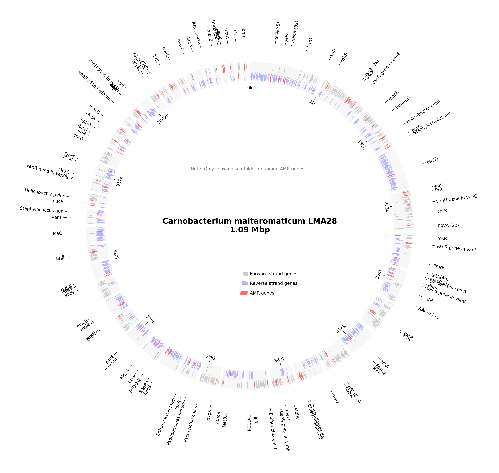

### AAC(3)-IXa
- **Mechanism**: antibiotic inactivation
- **Drug Classes**: aminoglycoside antibiotic
- **AMR Family**: AAC(3)
- **Locations**:
  - gnl|SPADES|NKELHLDI_903_4 : position 3044-3856

### AAC(3)-Ic
- **Mechanism**: antibiotic inactivation
- **Drug Classes**: aminoglycoside antibiotic
- **AMR Family**: AAC(3)
- **Locations**:
  - gnl|SPADES|NKELHLDI_784_1 : position 3-440

### AAC(6')-Ia
- **Mechanism**: antibiotic inactivation
- **Drug Classes**: aminoglycoside antibiotic
- **AMR Family**: AAC(6')
- **Locations**:
  - gnl|SPADES|NKELHLDI_227_36 : position 33744-34280

### AAC(6')-Ir
- **Mechanism**: antibiotic inactivation
- **Drug Classes**: aminoglycoside antibiotic
- **AMR Family**: AAC(6')
- **Locations**:
  - gnl|SPADES|NKELHLDI_278_18 : position 20043-20648

### CRP
- **Mechanism**: antibiotic efflux
- **Drug Classes**: macrolide antibiotic; fluoroquinolone antibiotic; penam
- **AMR Family**: resistance-nodulation-cell division (RND) antibiotic efflux pump
- **Locations**:
  - gnl|SPADES|NKELHLDI_784_4 : position 2111-2773

### Clostridioides difficile gyrA conferring resistance to fluoroquinolones
- **Mechanism**: antibiotic target alteration
- **Drug Classes**: fluoroquinolone antibiotic
- **AMR Family**: fluoroquinolone resistant gyrA
- **Locations**:
  - gnl|SPADES|NKELHLDI_279_34 : position 28850-31399

### Clostridioides difficile gyrB conferring resistance to fluoroquinolones
- **Mechanism**: antibiotic target alteration
- **Drug Classes**: fluoroquinolone antibiotic
- **AMR Family**: fluoroquinolone resistant gyrB
- **Locations**:
  - gnl|SPADES|NKELHLDI_279_33 : position 26763-28700

### Enterococcus faecium cls conferring resistance to daptomycin
- **Mechanism**: antibiotic target alteration
- **Drug Classes**: peptide antibiotic
- **AMR Family**: daptomycin resistant cls
- **Locations**:
  - gnl|SPADES|NKELHLDI_408_17 : position 15382-16902

### Escherichia coli AcrAB-TolC with AcrR mutation conferring resistance to ciprofloxacin, tetracycline, and ceftazidime
- **Mechanism**: antibiotic target alteration; antibiotic efflux
- **Drug Classes**: fluoroquinolone antibiotic; cephalosporin; glycylcycline; penam; tetracycline antibiotic; rifamycin antibiotic; phenicol antibiotic; disinfecting agents and antiseptics
- **AMR Family**: resistance-nodulation-cell division (RND) antibiotic efflux pump
- **Locations**:
  - gnl|SPADES|NKELHLDI_227_4 : position 2450-3046

### Escherichia coli EF-Tu mutants conferring resistance to kirromycin
- **Mechanism**: antibiotic target alteration
- **Drug Classes**: elfamycin antibiotic
- **AMR Family**: elfamycin resistant EF-Tu
- **Locations**:
  - gnl|SPADES|NKELHLDI_266_20 : position 23264-24451

### Escherichia coli fabI mutations conferring resistance to isoniazid and triclosan
- **Mechanism**: antibiotic target alteration
- **Drug Classes**: disinfecting agents and antiseptics; isoniazid-like antibiotic
- **AMR Family**: antibiotic resistant fabI
- **Locations**:
  - gnl|SPADES|NKELHLDI_349_2 : position 1163-1921

### Escherichia coli soxS with mutation conferring antibiotic resistance
- **Mechanism**: antibiotic target alteration; antibiotic efflux; reduced permeability to antibiotic
- **Drug Classes**: fluoroquinolone antibiotic; monobactam; carbapenem; cephalosporin; glycylcycline; cephamycin; penam; tetracycline antibiotic; rifamycin antibiotic; phenicol antibiotic; penem; disinfecting agents and antiseptics
- **AMR Family**: ATP-binding cassette (ABC) antibiotic efflux pump; major facilitator superfamily (MFS) antibiotic efflux pump; resistance-nodulation-cell division (RND) antibiotic efflux pump; General Bacterial Porin with reduced permeability to beta-lactams
- **Locations**:
  - gnl|SPADES|NKELHLDI_402_22 : position 18734-19261

### EstT
- **Mechanism**: antibiotic inactivation
- **Drug Classes**: macrolide antibiotic
- **AMR Family**: macrolide esterase
- **Locations**:
  - gnl|SPADES|NKELHLDI_476_1 : position 1-381

### FosC2
- **Mechanism**: antibiotic inactivation
- **Drug Classes**: phosphonic acid antibiotic
- **AMR Family**: fosC phosphotransferase family
- **Locations**:
  - gnl|SPADES|NKELHLDI_266_19 : position 22829-23209

### HelR
- **Mechanism**: antibiotic target protection
- **Drug Classes**: rifamycin antibiotic
- **AMR Family**: helicase-like RNA polymerase protection protein
- **Locations**:
  - gnl|SPADES|NKELHLDI_349_14 : position 17121-19412

### Helicobacter pylori pbp1 mutants conferring resistance to amoxicillin
- **Mechanism**: antibiotic target alteration
- **Drug Classes**: cephalosporin; cephamycin; penam
- **AMR Family**: Penicillin-binding protein mutations conferring resistance to beta-lactam antibiotics
- **Locations**:
  - gnl|SPADES|NKELHLDI_160_32 : position 38744-40870

### Helicobacter pylori rdxA mutation conferring resistance to metronidazole
- **Mechanism**: antibiotic target alteration
- **Drug Classes**: nitroimidazole antibiotic
- **AMR Family**: Antibiotic resistant Helicobacter pylori nitroreductase
- **Locations**:
  - gnl|SPADES|NKELHLDI_560_9 : position 7424-8053

### MdtK
- **Mechanism**: antibiotic efflux
- **Drug Classes**: fluoroquinolone antibiotic
- **AMR Family**: multidrug and toxic compound extrusion (MATE) transporter
- **Locations**:
  - gnl|SPADES|NKELHLDI_331_15 : position 7667-8983

### MexL
- **Mechanism**: antibiotic efflux
- **Drug Classes**: macrolide antibiotic; tetracycline antibiotic; disinfecting agents and antiseptics
- **AMR Family**: resistance-nodulation-cell division (RND) antibiotic efflux pump
- **Locations**:
  - gnl|SPADES|NKELHLDI_603_6 : position 8082-8699

### MexS (found in 3 locations)
- **Mechanism**: antibiotic efflux
- **Drug Classes**: fluoroquinolone antibiotic; diaminopyrimidine antibiotic; phenicol antibiotic
- **AMR Family**: resistance-nodulation-cell division (RND) antibiotic efflux pump
- **Locations**:
  - gnl|SPADES|NKELHLDI_428_18 : position 18860-19798
  - gnl|SPADES|NKELHLDI_476_2 : position 401-1489
  - gnl|SPADES|NKELHLDI_567_13 : position 13318-14262

### PEDO-1
- **Mechanism**: antibiotic inactivation
- **Drug Classes**: carbapenem
- **AMR Family**: subclass B3 PEDO beta-lactamase
- **Locations**:
  - gnl|SPADES|NKELHLDI_349_20 : position 24576-25277

### PEDO-2
- **Mechanism**: antibiotic inactivation
- **Drug Classes**: carbapenem
- **AMR Family**: subclass B3 PEDO beta-lactamase
- **Locations**:
  - gnl|SPADES|NKELHLDI_428_4 : position 3641-4258

### PmrF (found in 2 locations)
- **Mechanism**: antibiotic target alteration
- **Drug Classes**: peptide antibiotic
- **AMR Family**: pmr phosphoethanolamine transferase
- **Locations**:
  - gnl|SPADES|NKELHLDI_212_29 : position 32538-33788
  - gnl|SPADES|NKELHLDI_603_8 : position 10780-11727

### Pseudomonas aeruginosa soxR
- **Mechanism**: antibiotic target alteration; antibiotic efflux
- **Drug Classes**: fluoroquinolone antibiotic; cephalosporin; glycylcycline; penam; tetracycline antibiotic; rifamycin antibiotic; phenicol antibiotic; disinfecting agents and antiseptics
- **AMR Family**: ATP-binding cassette (ABC) antibiotic efflux pump; major facilitator superfamily (MFS) antibiotic efflux pump; resistance-nodulation-cell division (RND) antibiotic efflux pump
- **Locations**:
  - gnl|SPADES|NKELHLDI_408_4 : position 4515-4952

### RanA (found in 5 locations)
- **Mechanism**: antibiotic efflux
- **Drug Classes**: aminoglycoside antibiotic
- **AMR Family**: ATP-binding cassette (ABC) antibiotic efflux pump
- **Locations**:
  - gnl|SPADES|NKELHLDI_141_34 : position 36961-38070
  - gnl|SPADES|NKELHLDI_141_50 : position 54660-56177
  - gnl|SPADES|NKELHLDI_227_8 : position 7392-8432
  - gnl|SPADES|NKELHLDI_418_23 : position 22557-23363
  - gnl|SPADES|NKELHLDI_616_5 : position 6086-7201

### RlmA(II)
- **Mechanism**: antibiotic target alteration
- **Drug Classes**: macrolide antibiotic; lincosamide antibiotic
- **AMR Family**: non-erm 23S ribosomal RNA methyltransferase (G748)
- **Locations**:
  - gnl|SPADES|NKELHLDI_160_17 : position 20076-20933

### Staphylococcus aureus LmrS
- **Mechanism**: antibiotic efflux
- **Drug Classes**: macrolide antibiotic; aminoglycoside antibiotic; oxazolidinone antibiotic; diaminopyrimidine antibiotic; phenicol antibiotic
- **AMR Family**: major facilitator superfamily (MFS) antibiotic efflux pump
- **Locations**:
  - gnl|SPADES|NKELHLDI_160_44 : position 52880-53965

### Staphylococcus aureus murA with mutation conferring resistance to fosfomycin
- **Mechanism**: antibiotic target alteration
- **Drug Classes**: phosphonic acid antibiotic
- **AMR Family**: antibiotic-resistant murA transferase
- **Locations**:
  - gnl|SPADES|NKELHLDI_516_16 : position 12676-13944

### TxR (found in 2 locations)
- **Mechanism**: antibiotic efflux
- **Drug Classes**: tetracycline antibiotic
- **AMR Family**: ATP-binding cassette (ABC) antibiotic efflux pump
- **Locations**:
  - gnl|SPADES|NKELHLDI_177_7 : position 5603-6964
  - gnl|SPADES|NKELHLDI_814_2 : position 1627-4323

### VatI
- **Mechanism**: antibiotic inactivation
- **Drug Classes**: streptogramin antibiotic; streptogramin A antibiotic
- **AMR Family**: streptogramin vat acetyltransferase
- **Locations**:
  - gnl|SPADES|NKELHLDI_78_84 : position 89170-89871

### adeL
- **Mechanism**: antibiotic efflux
- **Drug Classes**: fluoroquinolone antibiotic; tetracycline antibiotic
- **AMR Family**: resistance-nodulation-cell division (RND) antibiotic efflux pump
- **Locations**:
  - gnl|SPADES|NKELHLDI_815_3 : position 2274-3161

### adeN
- **Mechanism**: antibiotic efflux
- **Drug Classes**: macrolide antibiotic; fluoroquinolone antibiotic; lincosamide antibiotic; carbapenem; cephalosporin; tetracycline antibiotic; rifamycin antibiotic; diaminopyrimidine antibiotic; phenicol antibiotic; penem
- **AMR Family**: resistance-nodulation-cell division (RND) antibiotic efflux pump
- **Locations**:
  - gnl|SPADES|NKELHLDI_476_5 : position 3312-3887

### adeR
- **Mechanism**: antibiotic efflux
- **Drug Classes**: glycylcycline; tetracycline antibiotic
- **AMR Family**: resistance-nodulation-cell division (RND) antibiotic efflux pump
- **Locations**:
  - gnl|SPADES|NKELHLDI_701_9 : position 7876-8604

### almE
- **Mechanism**: antibiotic target alteration
- **Drug Classes**: peptide antibiotic
- **AMR Family**: polymyxin resistance operon; alm glycyltransferase
- **Locations**:
  - gnl|SPADES|NKELHLDI_438_11 : position 13967-15490

### arlR (found in 4 locations)
- **Mechanism**: antibiotic efflux
- **Drug Classes**: fluoroquinolone antibiotic; disinfecting agents and antiseptics
- **AMR Family**: major facilitator superfamily (MFS) antibiotic efflux pump
- **Locations**:
  - gnl|SPADES|NKELHLDI_454_7 : position 6672-7391
  - gnl|SPADES|NKELHLDI_487_13 : position 9861-10544
  - gnl|SPADES|NKELHLDI_616_2 : position 1930-2730
  - gnl|SPADES|NKELHLDI_78_33 : position 39513-40199

### arlS (found in 3 locations)
- **Mechanism**: antibiotic efflux
- **Drug Classes**: fluoroquinolone antibiotic; disinfecting agents and antiseptics
- **AMR Family**: major facilitator superfamily (MFS) antibiotic efflux pump
- **Locations**:
  - gnl|SPADES|NKELHLDI_487_14 : position 10541-11836
  - gnl|SPADES|NKELHLDI_567_8 : position 7104-8933
  - gnl|SPADES|NKELHLDI_78_32 : position 38002-39516

### arnA
- **Mechanism**: antibiotic target alteration
- **Drug Classes**: peptide antibiotic
- **AMR Family**: pmr phosphoethanolamine transferase
- **Locations**:
  - gnl|SPADES|NKELHLDI_266_12 : position 15609-16190

### baeR
- **Mechanism**: antibiotic efflux
- **Drug Classes**: aminoglycoside antibiotic; aminocoumarin antibiotic
- **AMR Family**: resistance-nodulation-cell division (RND) antibiotic efflux pump
- **Locations**:
  - gnl|SPADES|NKELHLDI_141_37 : position 39535-40218

### baeS (found in 4 locations)
- **Mechanism**: antibiotic efflux
- **Drug Classes**: aminoglycoside antibiotic; aminocoumarin antibiotic
- **AMR Family**: resistance-nodulation-cell division (RND) antibiotic efflux pump
- **Locations**:
  - gnl|SPADES|NKELHLDI_141_38 : position 40215-41612
  - gnl|SPADES|NKELHLDI_212_15 : position 12345-13706
  - gnl|SPADES|NKELHLDI_331_31 : position 23269-24669
  - gnl|SPADES|NKELHLDI_454_6 : position 4906-6675

### bcrA (found in 4 locations)
- **Mechanism**: antibiotic efflux
- **Drug Classes**: peptide antibiotic
- **AMR Family**: ATP-binding cassette (ABC) antibiotic efflux pump
- **Locations**:
  - gnl|SPADES|NKELHLDI_141_35 : position 38060-39001
  - gnl|SPADES|NKELHLDI_160_41 : position 49754-50503
  - gnl|SPADES|NKELHLDI_428_10 : position 9929-11512
  - gnl|SPADES|NKELHLDI_878_8 : position 4509-5234

### bmr
- **Mechanism**: antibiotic efflux
- **Drug Classes**: fluoroquinolone antibiotic; nucleoside antibiotic; phenicol antibiotic; disinfecting agents and antiseptics
- **AMR Family**: major facilitator superfamily (MFS) antibiotic efflux pump
- **Locations**:
  - gnl|SPADES|NKELHLDI_1146_3 : position 1273-2496

### cfrE
- **Mechanism**: antibiotic target alteration
- **Drug Classes**: lincosamide antibiotic; streptogramin antibiotic; oxazolidinone antibiotic; phenicol antibiotic; pleuromutilin antibiotic
- **AMR Family**: Cfr 23S ribosomal RNA methyltransferase
- **Locations**:
  - gnl|SPADES|NKELHLDI_1107_2 : position 1233-2300

### cprR
- **Mechanism**: antibiotic target alteration; antibiotic efflux
- **Drug Classes**: peptide antibiotic
- **AMR Family**: pmr phosphoethanolamine transferase
- **Locations**:
  - gnl|SPADES|NKELHLDI_177_26 : position 28145-28864

### efmA
- **Mechanism**: antibiotic efflux
- **Drug Classes**: macrolide antibiotic; fluoroquinolone antibiotic
- **AMR Family**: major facilitator superfamily (MFS) antibiotic efflux pump
- **Locations**:
  - gnl|SPADES|NKELHLDI_624_4 : position 2878-4146

### efrA
- **Mechanism**: antibiotic efflux
- **Drug Classes**: macrolide antibiotic; fluoroquinolone antibiotic; rifamycin antibiotic
- **AMR Family**: ATP-binding cassette (ABC) antibiotic efflux pump
- **Locations**:
  - gnl|SPADES|NKELHLDI_235_19 : position 22450-23556

### evgS
- **Mechanism**: antibiotic efflux
- **Drug Classes**: macrolide antibiotic; fluoroquinolone antibiotic; penam; tetracycline antibiotic
- **AMR Family**: major facilitator superfamily (MFS) antibiotic efflux pump; resistance-nodulation-cell division (RND) antibiotic efflux pump
- **Locations**:
  - gnl|SPADES|NKELHLDI_402_5 : position 3533-4105

### golS
- **Mechanism**: antibiotic efflux
- **Drug Classes**: monobactam; carbapenem; cephalosporin; cephamycin; penam; phenicol antibiotic; penem
- **AMR Family**: resistance-nodulation-cell division (RND) antibiotic efflux pump
- **Locations**:
  - gnl|SPADES|NKELHLDI_266_22 : position 25301-26131

### kdpD
- **Mechanism**: antibiotic efflux
- **Drug Classes**: aminoglycoside antibiotic
- **AMR Family**: kdpDE
- **Locations**:
  - gnl|SPADES|NKELHLDI_701_8 : position 6233-7879

### leuO
- **Mechanism**: antibiotic efflux
- **Drug Classes**: nucleoside antibiotic; disinfecting agents and antiseptics
- **AMR Family**: major facilitator superfamily (MFS) antibiotic efflux pump
- **Locations**:
  - gnl|SPADES|NKELHLDI_78_59 : position 62269-63096

### lmrB
- **Mechanism**: antibiotic efflux
- **Drug Classes**: lincosamide antibiotic; nucleoside antibiotic
- **AMR Family**: ATP-binding cassette (ABC) antibiotic efflux pump
- **Locations**:
  - gnl|SPADES|NKELHLDI_235_17 : position 20390-21790

### lmrD
- **Mechanism**: antibiotic efflux
- **Drug Classes**: lincosamide antibiotic
- **AMR Family**: ATP-binding cassette (ABC) antibiotic efflux pump
- **Locations**:
  - gnl|SPADES|NKELHLDI_604_10 : position 13732-14514

### lsaC
- **Mechanism**: antibiotic target protection
- **Drug Classes**: lincosamide antibiotic; streptogramin antibiotic; pleuromutilin antibiotic
- **AMR Family**: lsa-type ABC-F protein
- **Locations**:
  - gnl|SPADES|NKELHLDI_491_13 : position 12843-13526

### macA
- **Mechanism**: antibiotic efflux
- **Drug Classes**: macrolide antibiotic
- **AMR Family**: ATP-binding cassette (ABC) antibiotic efflux pump
- **Locations**:
  - gnl|SPADES|NKELHLDI_78_40 : position 46832-48028

### macB (found in 13 locations)
- **Mechanism**: antibiotic efflux
- **Drug Classes**: macrolide antibiotic
- **AMR Family**: ATP-binding cassette (ABC) antibiotic efflux pump
- **Locations**:
  - gnl|SPADES|NKELHLDI_160_8 : position 8536-9279
  - gnl|SPADES|NKELHLDI_227_14 : position 12691-13953
  - gnl|SPADES|NKELHLDI_227_15 : position 13937-14635
  - gnl|SPADES|NKELHLDI_227_2 : position 561-1229
  - gnl|SPADES|NKELHLDI_356_25 : position 25124-26200
  - gnl|SPADES|NKELHLDI_418_18 : position 16373-19222
  - gnl|SPADES|NKELHLDI_454_11 : position 10989-11675
  - gnl|SPADES|NKELHLDI_560_2 : position 1216-2013
  - gnl|SPADES|NKELHLDI_624_13 : position 10655-12136
  - gnl|SPADES|NKELHLDI_78_38 : position 44867-46111
  - gnl|SPADES|NKELHLDI_78_39 : position 46108-46815
  - gnl|SPADES|NKELHLDI_78_72 : position 74470-75273
  - gnl|SPADES|NKELHLDI_909_4 : position 4057-4872

### marA
- **Mechanism**: antibiotic efflux; reduced permeability to antibiotic
- **Drug Classes**: fluoroquinolone antibiotic; monobactam; carbapenem; cephalosporin; glycylcycline; cephamycin; penam; tetracycline antibiotic; rifamycin antibiotic; phenicol antibiotic; penem; disinfecting agents and antiseptics
- **AMR Family**: resistance-nodulation-cell division (RND) antibiotic efflux pump; General Bacterial Porin with reduced permeability to beta-lactams
- **Locations**:
  - gnl|SPADES|NKELHLDI_833_7 : position 6688-7461

### mecI
- **Mechanism**: antibiotic target replacement
- **Drug Classes**: penam
- **AMR Family**: methicillin resistant PBP2
- **Locations**:
  - gnl|SPADES|NKELHLDI_331_25 : position 17378-17827

### mepR
- **Mechanism**: antibiotic efflux
- **Drug Classes**: glycylcycline; tetracycline antibiotic
- **AMR Family**: multidrug and toxic compound extrusion (MATE) transporter
- **Locations**:
  - gnl|SPADES|NKELHLDI_235_18 : position 21771-22286

### msrA
- **Mechanism**: antibiotic target protection
- **Drug Classes**: macrolide antibiotic; streptogramin antibiotic; streptogramin B antibiotic
- **AMR Family**: msr-type ABC-F protein
- **Locations**:
  - gnl|SPADES|NKELHLDI_279_4 : position 2496-3071

### mtrA
- **Mechanism**: antibiotic efflux
- **Drug Classes**: macrolide antibiotic; penam
- **AMR Family**: resistance-nodulation-cell division (RND) antibiotic efflux pump
- **Locations**:
  - gnl|SPADES|NKELHLDI_1074_3 : position 1445-2272

### novA (found in 2 locations)
- **Mechanism**: antibiotic efflux
- **Drug Classes**: aminocoumarin antibiotic
- **AMR Family**: ATP-binding cassette (ABC) antibiotic efflux pump
- **Locations**:
  - gnl|SPADES|NKELHLDI_177_39 : position 42772-44514
  - gnl|SPADES|NKELHLDI_177_40 : position 44507-46309

### optrA (found in 3 locations)
- **Mechanism**: antibiotic target protection
- **Drug Classes**: oxazolidinone antibiotic; phenicol antibiotic
- **AMR Family**: Miscellaneous ABC-F subfamily ATP-binding cassette ribosomal protection proteins
- **Locations**:
  - gnl|SPADES|NKELHLDI_1033_3 : position 1222-2346
  - gnl|SPADES|NKELHLDI_278_22 : position 23279-25243
  - gnl|SPADES|NKELHLDI_616_10 : position 12455-14083

### patB
- **Mechanism**: antibiotic efflux
- **Drug Classes**: fluoroquinolone antibiotic
- **AMR Family**: ATP-binding cassette (ABC) antibiotic efflux pump
- **Locations**:
  - gnl|SPADES|NKELHLDI_418_22 : position 21781-22545

### qacH
- **Mechanism**: antibiotic efflux
- **Drug Classes**: disinfecting agents and antiseptics
- **AMR Family**: small multidrug resistance (SMR) antibiotic efflux pump
- **Locations**:
  - gnl|SPADES|NKELHLDI_453_24 : position 19148-19474

### rosB
- **Mechanism**: antibiotic efflux
- **Drug Classes**: peptide antibiotic
- **AMR Family**: major facilitator superfamily (MFS) antibiotic efflux pump
- **Locations**:
  - gnl|SPADES|NKELHLDI_212_5 : position 3095-4243

### rphB
- **Mechanism**: antibiotic inactivation
- **Drug Classes**: rifamycin antibiotic
- **AMR Family**: rifampin phosphotransferase
- **Locations**:
  - gnl|SPADES|NKELHLDI_141_7 : position 6738-8459

### salC
- **Mechanism**: antibiotic target protection
- **Drug Classes**: lincosamide antibiotic; streptogramin antibiotic; streptogramin A antibiotic; pleuromutilin antibiotic
- **AMR Family**: sal-type ABC-F protein
- **Locations**:
  - gnl|SPADES|NKELHLDI_1033_4 : position 2608-4311

### tet(35)
- **Mechanism**: antibiotic efflux
- **Drug Classes**: tetracycline antibiotic
- **AMR Family**: ATP-binding cassette (ABC) antibiotic efflux pump
- **Locations**:
  - gnl|SPADES|NKELHLDI_356_20 : position 17204-18601

### tet(42)
- **Mechanism**: antibiotic efflux
- **Drug Classes**: tetracycline antibiotic
- **AMR Family**: major facilitator superfamily (MFS) antibiotic efflux pump
- **Locations**:
  - gnl|SPADES|NKELHLDI_736_12 : position 9264-10499

### tet(T)
- **Mechanism**: antibiotic target protection
- **Drug Classes**: tetracycline antibiotic
- **AMR Family**: tetracycline-resistant ribosomal protection protein
- **Locations**:
  - gnl|SPADES|NKELHLDI_172_27 : position 29162-31003

### tetA(46)
- **Mechanism**: antibiotic efflux
- **Drug Classes**: tetracycline antibiotic
- **AMR Family**: ATP-binding cassette (ABC) antibiotic efflux pump
- **Locations**:
  - gnl|SPADES|NKELHLDI_212_37 : position 42705-43508

### tetA(58) (found in 2 locations)
- **Mechanism**: antibiotic efflux
- **Drug Classes**: tetracycline antibiotic
- **AMR Family**: major facilitator superfamily (MFS) antibiotic efflux pump
- **Locations**:
  - gnl|SPADES|NKELHLDI_438_7 : position 10045-10977
  - gnl|SPADES|NKELHLDI_78_23 : position 27071-28639

### tmrB (found in 2 locations)
- **Mechanism**: reduced permeability to antibiotic
- **Drug Classes**: nucleoside antibiotic
- **AMR Family**: tunicamycin resistance protein
- **Locations**:
  - gnl|SPADES|NKELHLDI_1033_1 : position 133-306
  - gnl|SPADES|NKELHLDI_1033_2 : position 303-644

### tsnR
- **Mechanism**: antibiotic target alteration
- **Drug Classes**: peptide antibiotic
- **AMR Family**: non-erm 23S ribosomal RNA methyltransferase (A1067)
- **Locations**:
  - gnl|SPADES|NKELHLDI_408_12 : position 9345-10109

### ugd
- **Mechanism**: antibiotic target alteration
- **Drug Classes**: peptide antibiotic
- **AMR Family**: pmr phosphoethanolamine transferase
- **Locations**:
  - gnl|SPADES|NKELHLDI_717_2 : position 188-1480

### vanH gene in vanD cluster
- **Mechanism**: antibiotic target alteration
- **Drug Classes**: glycopeptide antibiotic
- **AMR Family**: vanH; glycopeptide resistance gene cluster
- **Locations**:
  - gnl|SPADES|NKELHLDI_701_11 : position 9081-10094

### vanH gene in vanO cluster
- **Mechanism**: antibiotic target alteration
- **Drug Classes**: glycopeptide antibiotic
- **AMR Family**: vanH; glycopeptide resistance gene cluster
- **Locations**:
  - gnl|SPADES|NKELHLDI_177_17 : position 17486-18679

### vanI
- **Mechanism**: antibiotic target alteration
- **Drug Classes**: glycopeptide antibiotic
- **AMR Family**: glycopeptide resistance gene cluster; Van ligase
- **Locations**:
  - gnl|SPADES|NKELHLDI_177_4 : position 1432-2559

### vanL
- **Mechanism**: antibiotic target alteration
- **Drug Classes**: glycopeptide antibiotic
- **AMR Family**: glycopeptide resistance gene cluster; Van ligase
- **Locations**:
  - gnl|SPADES|NKELHLDI_516_9 : position 6165-7256

### vanN
- **Mechanism**: antibiotic target alteration
- **Drug Classes**: glycopeptide antibiotic
- **AMR Family**: glycopeptide resistance gene cluster; Van ligase
- **Locations**:
  - gnl|SPADES|NKELHLDI_453_26 : position 19927-21006

### vanR gene in vanB cluster
- **Mechanism**: antibiotic target alteration
- **Drug Classes**: glycopeptide antibiotic
- **AMR Family**: glycopeptide resistance gene cluster; vanR
- **Locations**:
  - gnl|SPADES|NKELHLDI_227_13 : position 11941-12612

### vanR gene in vanE cluster (found in 2 locations)
- **Mechanism**: antibiotic target alteration
- **Drug Classes**: glycopeptide antibiotic
- **AMR Family**: glycopeptide resistance gene cluster; vanR
- **Locations**:
  - gnl|SPADES|NKELHLDI_141_44 : position 47703-49190
  - gnl|SPADES|NKELHLDI_331_30 : position 22589-23272

### vanR gene in vanI cluster
- **Mechanism**: antibiotic target alteration
- **Drug Classes**: glycopeptide antibiotic
- **AMR Family**: glycopeptide resistance gene cluster; vanR
- **Locations**:
  - gnl|SPADES|NKELHLDI_212_14 : position 11675-12313

### vanR gene in vanM cluster
- **Mechanism**: antibiotic target alteration
- **Drug Classes**: glycopeptide antibiotic
- **AMR Family**: glycopeptide resistance gene cluster; vanR
- **Locations**:
  - gnl|SPADES|NKELHLDI_567_9 : position 8940-9647

### vanS gene in vanB cluster
- **Mechanism**: antibiotic target alteration
- **Drug Classes**: glycopeptide antibiotic
- **AMR Family**: vanS; glycopeptide resistance gene cluster
- **Locations**:
  - gnl|SPADES|NKELHLDI_227_12 : position 10499-11944

### vatB (found in 2 locations)
- **Mechanism**: antibiotic inactivation
- **Drug Classes**: streptogramin antibiotic; streptogramin A antibiotic
- **AMR Family**: streptogramin vat acetyltransferase
- **Locations**:
  - gnl|SPADES|NKELHLDI_227_22 : position 21430-21990
  - gnl|SPADES|NKELHLDI_474_17 : position 19841-20392

### vga(E) Staphylococcus cohnii
- **Mechanism**: antibiotic target protection
- **Drug Classes**: lincosamide antibiotic; streptogramin antibiotic; streptogramin A antibiotic; pleuromutilin antibiotic
- **AMR Family**: vga-type ABC-F protein
- **Locations**:
  - gnl|SPADES|NKELHLDI_641_10 : position 11487-13058

### ykkD
- **Mechanism**: antibiotic efflux
- **Drug Classes**: aminoglycoside antibiotic; tetracycline antibiotic; phenicol antibiotic
- **AMR Family**: small multidrug resistance (SMR) antibiotic efflux pump
- **Locations**:
  - gnl|SPADES|NKELHLDI_453_25 : position 19474-19791

## Citrobacter
**Strain Statistics:**
- Total genome length: 1.0 kbp
- Total scaffolds: 36
- Scaffolds with AMR genes: 2
- Total genes annotated: 0
- Total AMR genes: 2
- Unique AMR genes: 2
- Distinct AMR mechanisms: 1
- Distinct AMR families: 2
- Distinct drug classes: 5

**Circos Plot:**

### AcrF
- **Mechanism**: antibiotic efflux
- **Drug Classes**: fluoroquinolone antibiotic; cephalosporin; cephamycin; penam
- **AMR Family**: resistance-nodulation-cell division (RND) antibiotic efflux pump
- **Locations**:
  - gnl|SPADES|NKELHLDI_29670_1 : position 2-325

### RanA
- **Mechanism**: antibiotic efflux
- **Drug Classes**: aminoglycoside antibiotic
- **AMR Family**: ATP-binding cassette (ABC) antibiotic efflux pump
- **Locations**:
  - gnl|SPADES|NKELHLDI_10533_1 : position 2-469

## Citrobacter braakii
**Strain Statistics:**
- Total genome length: 0.3 kbp
- Total scaffolds: 15
- Scaffolds with AMR genes: 1
- Total genes annotated: 0
- Total AMR genes: 1
- Unique AMR genes: 1
- Distinct AMR mechanisms: 1
- Distinct AMR families: 1
- Distinct drug classes: 6

**Circos Plot:**

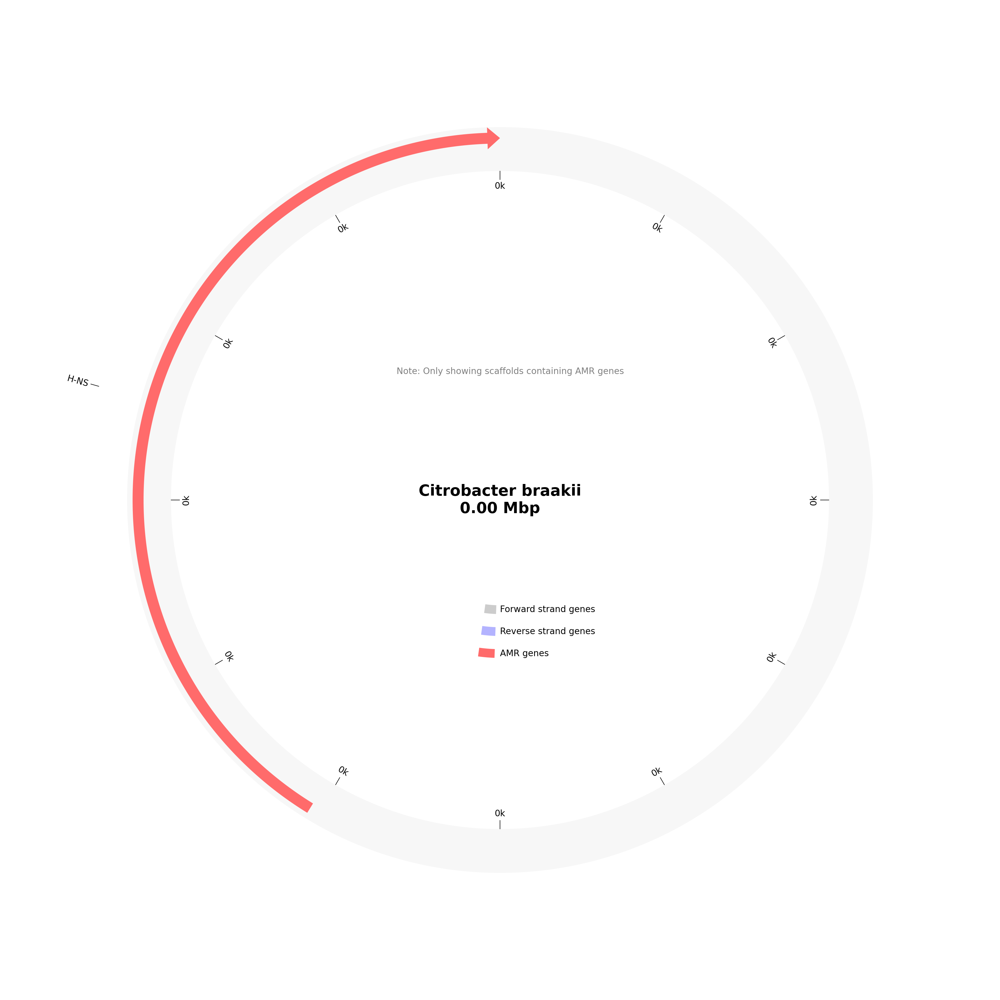

### H-NS
- **Mechanism**: antibiotic efflux
- **Drug Classes**: macrolide antibiotic; fluoroquinolone antibiotic; cephalosporin; cephamycin; penam; tetracycline antibiotic
- **AMR Family**: major facilitator superfamily (MFS) antibiotic efflux pump; resistance-nodulation-cell division (RND) antibiotic efflux pump
- **Locations**:
  - gnl|SPADES|NKELHLDI_26535_2 : position 204-347

## Citrobacter freundii
**Strain Statistics:**
- Total genome length: 0.6 kbp
- Total scaffolds: 136
- Scaffolds with AMR genes: 1
- Total genes annotated: 0
- Total AMR genes: 1
- Unique AMR genes: 1
- Distinct AMR mechanisms: 1
- Distinct AMR families: 1
- Distinct drug classes: 2

**Circos Plot:**

### adeL
- **Mechanism**: antibiotic efflux
- **Drug Classes**: fluoroquinolone antibiotic; tetracycline antibiotic
- **AMR Family**: resistance-nodulation-cell division (RND) antibiotic efflux pump
- **Locations**:
  - gnl|SPADES|NKELHLDI_12905_2 : position 134-556

## Citrobacter freundii complex sp. CFNIH2
**Strain Statistics:**
- Total genome length: 1.8 kbp
- Total scaffolds: 2
- Scaffolds with AMR genes: 1
- Total genes annotated: 2
- Total AMR genes: 1
- Unique AMR genes: 1
- Distinct AMR mechanisms: 1
- Distinct AMR families: 1
- Distinct drug classes: 1

**Circos Plot:**

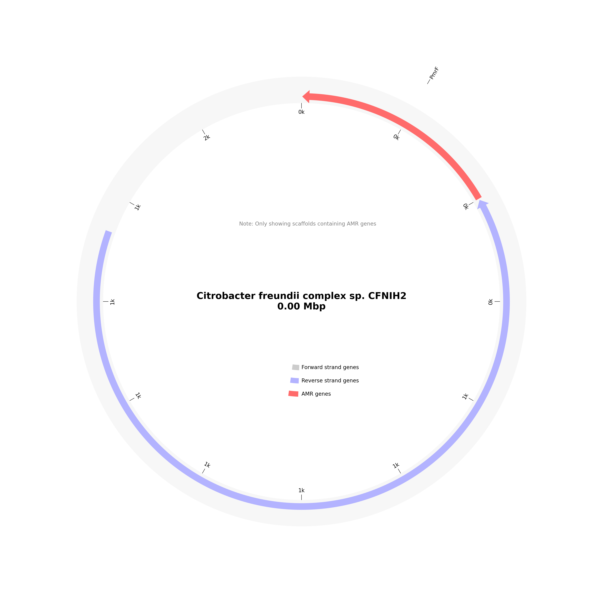

### PmrF
- **Mechanism**: antibiotic target alteration
- **Drug Classes**: peptide antibiotic
- **AMR Family**: pmr phosphoethanolamine transferase
- **Locations**:
  - gnl|SPADES|NKELHLDI_2663_1 : position 1-297

## Citrobacter pasteurii
**Strain Statistics:**
- Total genome length: 30.8 kbp
- Total scaffolds: 1
- Scaffolds with AMR genes: 1
- Total genes annotated: 54
- Total AMR genes: 2
- Unique AMR genes: 2
- Distinct AMR mechanisms: 1
- Distinct AMR families: 2
- Distinct drug classes: 2

**Circos Plot:**

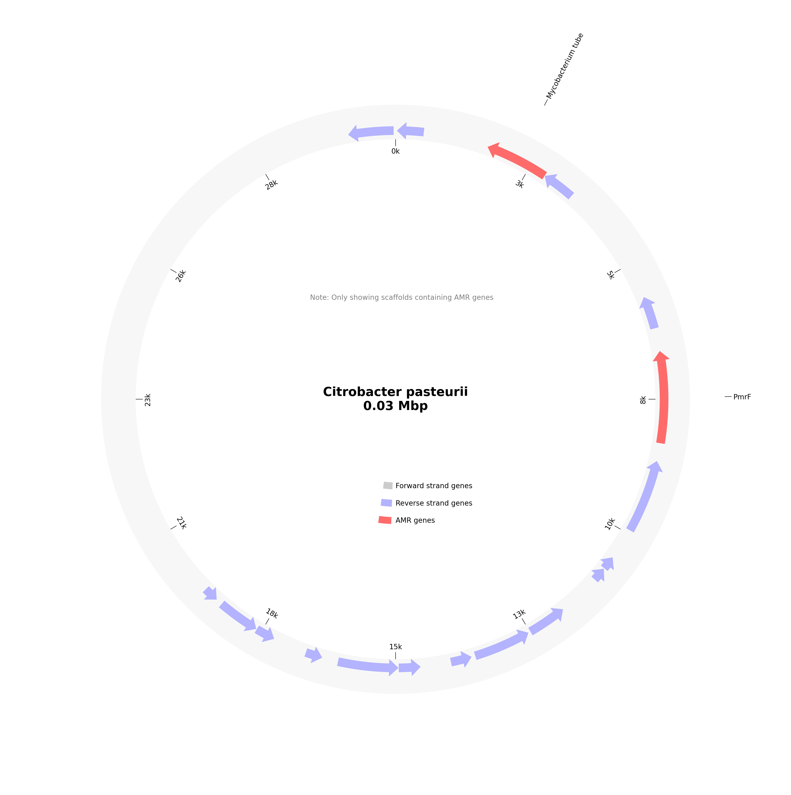

### Mycobacterium tuberculosis kasA mutant conferring resistance to isoniazid
- **Mechanism**: antibiotic target alteration
- **Drug Classes**: isoniazid-like antibiotic
- **AMR Family**: antibiotic resistant kasA
- **Locations**:
  - gnl|SPADES|NKELHLDI_317_4 : position 1715-2884

### PmrF
- **Mechanism**: antibiotic target alteration
- **Drug Classes**: peptide antibiotic
- **AMR Family**: pmr phosphoethanolamine transferase
- **Locations**:
  - gnl|SPADES|NKELHLDI_317_9 : position 6812-8503

## Citrobacter sp. 21OH12SH02A-Citro
**Strain Statistics:**
- Total genome length: 26.8 kbp
- Total scaffolds: 1
- Scaffolds with AMR genes: 1
- Total genes annotated: 58
- Total AMR genes: 3
- Unique AMR genes: 3
- Distinct AMR mechanisms: 1
- Distinct AMR families: 2
- Distinct drug classes: 6

**Circos Plot:**

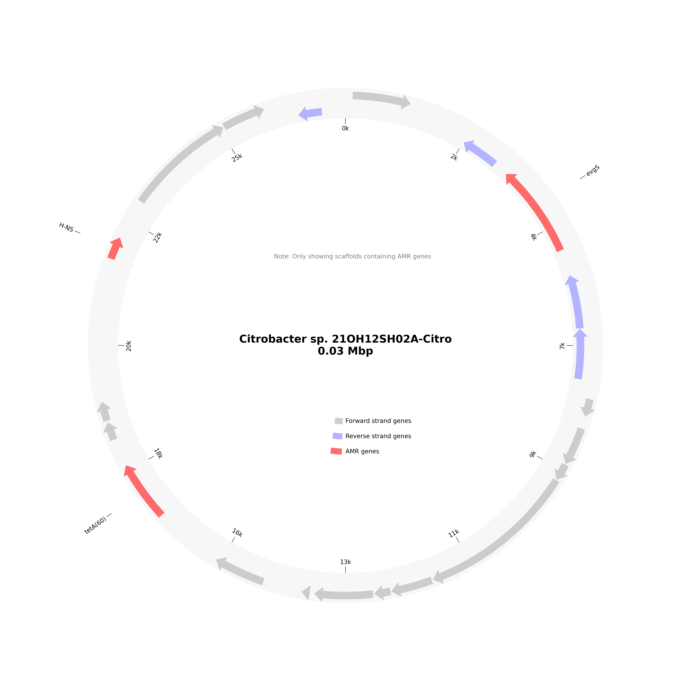

### H-NS
- **Mechanism**: antibiotic efflux
- **Drug Classes**: macrolide antibiotic; fluoroquinolone antibiotic; cephalosporin; cephamycin; penam; tetracycline antibiotic
- **AMR Family**: major facilitator superfamily (MFS) antibiotic efflux pump; resistance-nodulation-cell division (RND) antibiotic efflux pump
- **Locations**:
  - gnl|SPADES|NKELHLDI_370_25 : position 21586-21978

### evgS
- **Mechanism**: antibiotic efflux
- **Drug Classes**: macrolide antibiotic; fluoroquinolone antibiotic; penam; tetracycline antibiotic
- **AMR Family**: major facilitator superfamily (MFS) antibiotic efflux pump; resistance-nodulation-cell division (RND) antibiotic efflux pump
- **Locations**:
  - gnl|SPADES|NKELHLDI_370_3 : position 3203-4921

### tetA(60)
- **Mechanism**: antibiotic efflux
- **Drug Classes**: tetracycline antibiotic
- **AMR Family**: ATP-binding cassette (ABC) antibiotic efflux pump
- **Locations**:
  - gnl|SPADES|NKELHLDI_370_19 : position 16900-17949

## Citrobacter sp. RHBSTW-01013
**Strain Statistics:**
- Total genome length: 0.2 kbp
- Total scaffolds: 14
- Scaffolds with AMR genes: 1
- Total genes annotated: 0
- Total AMR genes: 1
- Unique AMR genes: 1
- Distinct AMR mechanisms: 1
- Distinct AMR families: 1
- Distinct drug classes: 6

**Circos Plot:**

### H-NS
- **Mechanism**: antibiotic efflux
- **Drug Classes**: macrolide antibiotic; fluoroquinolone antibiotic; cephalosporin; cephamycin; penam; tetracycline antibiotic
- **AMR Family**: major facilitator superfamily (MFS) antibiotic efflux pump; resistance-nodulation-cell division (RND) antibiotic efflux pump
- **Locations**:
  - gnl|SPADES|NKELHLDI_91874_1 : position 2-229

## Citrobacter tructae
**Strain Statistics:**
- Total genome length: 0.3 kbp
- Total scaffolds: 1
- Scaffolds with AMR genes: 1
- Total genes annotated: 0
- Total AMR genes: 1
- Unique AMR genes: 1
- Distinct AMR mechanisms: 1
- Distinct AMR families: 1
- Distinct drug classes: 1

**Circos Plot:**

### rphA
- **Mechanism**: antibiotic inactivation
- **Drug Classes**: rifamycin antibiotic
- **AMR Family**: rifampin phosphotransferase
- **Locations**:
  - gnl|SPADES|NKELHLDI_27431_1 : position 2-340

## Clostridium novyi NT
**Strain Statistics:**
- Total genome length: 0.7 kbp
- Total scaffolds: 3
- Scaffolds with AMR genes: 2
- Total genes annotated: 0
- Total AMR genes: 2
- Unique AMR genes: 2
- Distinct AMR mechanisms: 2
- Distinct AMR families: 2
- Distinct drug classes: 2

**Circos Plot:**

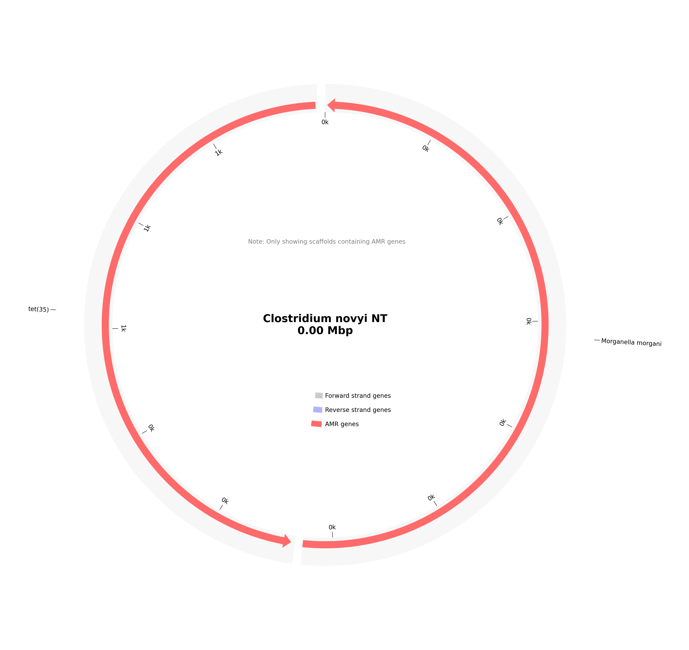

### Morganella morganii gyrB conferring resistance to fluoroquinolones
- **Mechanism**: antibiotic target alteration
- **Drug Classes**: fluoroquinolone antibiotic
- **AMR Family**: fluoroquinolone resistant gyrB
- **Locations**:
  - gnl|SPADES|NKELHLDI_24265_1 : position 1-366

### tet(35)
- **Mechanism**: antibiotic efflux
- **Drug Classes**: tetracycline antibiotic
- **AMR Family**: ATP-binding cassette (ABC) antibiotic efflux pump
- **Locations**:
  - gnl|SPADES|NKELHLDI_28208_1 : position 2-334

## Escherichia coli
**Strain Statistics:**
- Total genome length: 24.4 kbp
- Total scaffolds: 41
- Scaffolds with AMR genes: 4
- Total genes annotated: 48
- Total AMR genes: 4
- Unique AMR genes: 4
- Distinct AMR mechanisms: 2
- Distinct AMR families: 4
- Distinct drug classes: 8

**Circos Plot:**

### H-NS
- **Mechanism**: antibiotic efflux
- **Drug Classes**: macrolide antibiotic; fluoroquinolone antibiotic; cephalosporin; cephamycin; penam; tetracycline antibiotic
- **AMR Family**: major facilitator superfamily (MFS) antibiotic efflux pump; resistance-nodulation-cell division (RND) antibiotic efflux pump
- **Locations**:
  - gnl|SPADES|NKELHLDI_32899_1 : position 2-130

### PmrF
- **Mechanism**: antibiotic target alteration
- **Drug Classes**: peptide antibiotic
- **AMR Family**: pmr phosphoethanolamine transferase
- **Locations**:
  - gnl|SPADES|NKELHLDI_766_9 : position 7564-8373

### oleC
- **Mechanism**: antibiotic efflux
- **Drug Classes**: macrolide antibiotic
- **AMR Family**: ATP-binding cassette (ABC) antibiotic efflux pump
- **Locations**:
  - gnl|SPADES|NKELHLDI_635_6 : position 6441-7190

### vanH gene in vanB cluster
- **Mechanism**: antibiotic target alteration
- **Drug Classes**: glycopeptide antibiotic
- **AMR Family**: vanH; glycopeptide resistance gene cluster
- **Locations**:
  - gnl|SPADES|NKELHLDI_17037_1 : position 140-457

## Ewingella americana
**Strain Statistics:**
- Total genome length: 3.0 kbp
- Total scaffolds: 196
- Scaffolds with AMR genes: 12
- Total genes annotated: 0
- Total AMR genes: 12
- Unique AMR genes: 11
- Distinct AMR mechanisms: 2
- Distinct AMR families: 5
- Distinct drug classes: 19

**Circos Plot:**

### Acinetobacter baumannii AbaF
- **Mechanism**: antibiotic efflux
- **Drug Classes**: phosphonic acid antibiotic
- **AMR Family**: major facilitator superfamily (MFS) antibiotic efflux pump
- **Locations**:
  - gnl|SPADES|NKELHLDI_93974_1 : position 1-228

### Acinetobacter baumannii AbaQ
- **Mechanism**: antibiotic efflux
- **Drug Classes**: fluoroquinolone antibiotic
- **AMR Family**: major facilitator superfamily (MFS) antibiotic efflux pump
- **Locations**:
  - gnl|SPADES|NKELHLDI_41535_1 : position 3-278

### Erm(35)
- **Mechanism**: antibiotic target alteration
- **Drug Classes**: macrolide antibiotic; lincosamide antibiotic; streptogramin antibiotic; streptogramin A antibiotic; streptogramin B antibiotic
- **AMR Family**: Erm 23S ribosomal RNA methyltransferase
- **Locations**:
  - gnl|SPADES|NKELHLDI_79615_1 : position 2-241

### LptD
- **Mechanism**: antibiotic efflux
- **Drug Classes**: carbapenem; peptide antibiotic; aminocoumarin antibiotic; rifamycin antibiotic
- **AMR Family**: ATP-binding cassette (ABC) antibiotic efflux pump
- **Locations**:
  - gnl|SPADES|NKELHLDI_49147_1 : position 1-270

### MdtK
- **Mechanism**: antibiotic efflux
- **Drug Classes**: fluoroquinolone antibiotic
- **AMR Family**: multidrug and toxic compound extrusion (MATE) transporter
- **Locations**:
  - gnl|SPADES|NKELHLDI_111661_1 : position 3-212

### acrB
- **Mechanism**: antibiotic efflux
- **Drug Classes**: fluoroquinolone antibiotic; cephalosporin; glycylcycline; penam; tetracycline antibiotic; rifamycin antibiotic; phenicol antibiotic; disinfecting agents and antiseptics
- **AMR Family**: resistance-nodulation-cell division (RND) antibiotic efflux pump
- **Locations**:
  - gnl|SPADES|NKELHLDI_68019_1 : position 2-250

### adeL
- **Mechanism**: antibiotic efflux
- **Drug Classes**: fluoroquinolone antibiotic; tetracycline antibiotic
- **AMR Family**: resistance-nodulation-cell division (RND) antibiotic efflux pump
- **Locations**:
  - gnl|SPADES|NKELHLDI_117755_1 : position 3-206

### bcrA (found in 2 locations)
- **Mechanism**: antibiotic efflux
- **Drug Classes**: peptide antibiotic
- **AMR Family**: ATP-binding cassette (ABC) antibiotic efflux pump
- **Locations**:
  - gnl|SPADES|NKELHLDI_115884_1 : position 2-208
  - gnl|SPADES|NKELHLDI_70388_1 : position 2-160

### mdtC
- **Mechanism**: antibiotic efflux
- **Drug Classes**: aminocoumarin antibiotic
- **AMR Family**: resistance-nodulation-cell division (RND) antibiotic efflux pump
- **Locations**:
  - gnl|SPADES|NKELHLDI_100622_1 : position 2-223

### novA
- **Mechanism**: antibiotic efflux
- **Drug Classes**: aminocoumarin antibiotic
- **AMR Family**: ATP-binding cassette (ABC) antibiotic efflux pump
- **Locations**:
  - gnl|SPADES|NKELHLDI_20940_1 : position 3-401

### oqxB
- **Mechanism**: antibiotic efflux
- **Drug Classes**: fluoroquinolone antibiotic; glycylcycline; tetracycline antibiotic; diaminopyrimidine antibiotic; nitrofuran antibiotic
- **AMR Family**: resistance-nodulation-cell division (RND) antibiotic efflux pump
- **Locations**:
  - gnl|SPADES|NKELHLDI_58869_1 : position 3-260

## Hafnia alvei
**Strain Statistics:**
- Total genome length: 2874.2 kbp
- Total scaffolds: 440
- Scaffolds with AMR genes: 133
- Total genes annotated: 5175
- Total AMR genes: 361
- Unique AMR genes: 184
- Distinct AMR mechanisms: 10
- Distinct AMR families: 67
- Distinct drug classes: 35

**Circos Plot:**

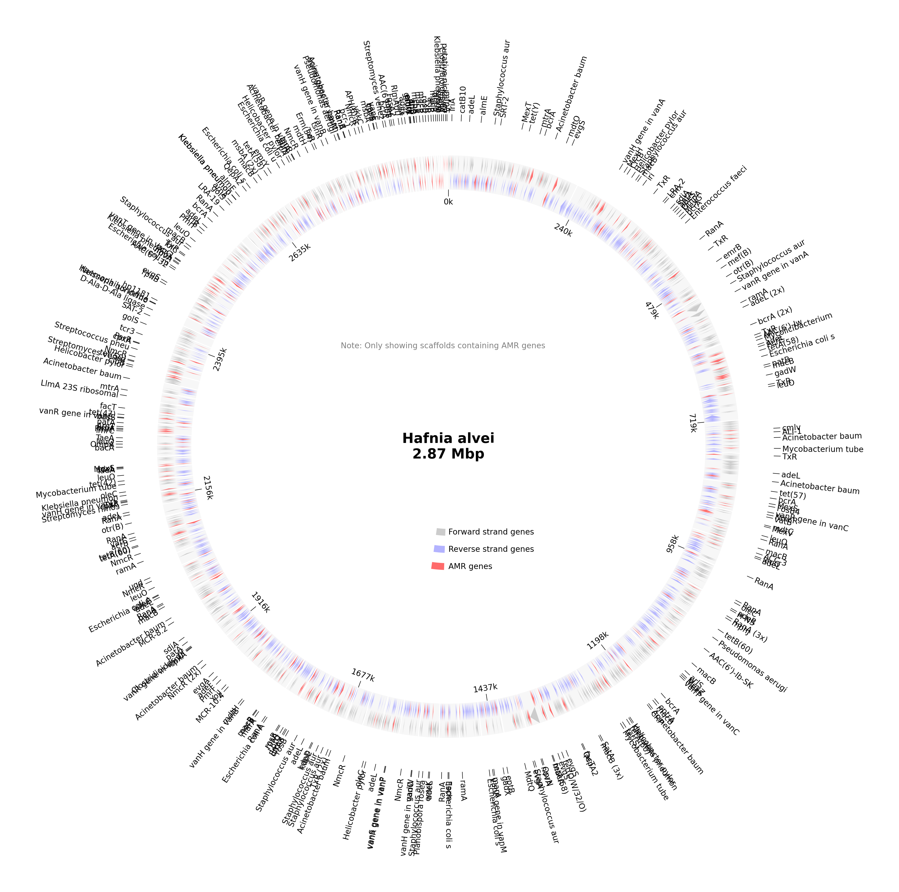

### AAC(6')-32
- **Mechanism**: antibiotic inactivation
- **Drug Classes**: aminoglycoside antibiotic
- **AMR Family**: AAC(6')
- **Locations**:
  - gnl|SPADES|NKELHLDI_632_7 : position 7443-8045

### AAC(6')-Ib-SK
- **Mechanism**: antibiotic inactivation
- **Drug Classes**: aminoglycoside antibiotic
- **AMR Family**: AAC(6')
- **Locations**:
  - gnl|SPADES|NKELHLDI_207_27 : position 28934-29434

### AAC(6')-Ib8
- **Mechanism**: antibiotic inactivation
- **Drug Classes**: aminoglycoside antibiotic
- **AMR Family**: AAC(6')
- **Locations**:
  - gnl|SPADES|NKELHLDI_1242_3 : position 1502-1630

### AAC(6')-Iw
- **Mechanism**: antibiotic inactivation
- **Drug Classes**: aminoglycoside antibiotic
- **AMR Family**: AAC(6')
- **Locations**:
  - gnl|SPADES|NKELHLDI_117_7 : position 8190-8630

### ACC-3
- **Mechanism**: antibiotic inactivation
- **Drug Classes**: monobactam; cephalosporin; penam
- **AMR Family**: ACC beta-lactamase
- **Locations**:
  - gnl|SPADES|NKELHLDI_200_4: position 3887-5056

### ALI-1
- **Mechanism**: antibiotic inactivation
- **Drug Classes**: carbapenem
- **AMR Family**: ALI beta-lactamase
- **Locations**:
  - gnl|SPADES|NKELHLDI_156_23 : position 21396-22274

### APH(6)-Ic
- **Mechanism**: antibiotic inactivation
- **Drug Classes**: aminoglycoside antibiotic
- **AMR Family**: APH(6)
- **Locations**:
  - gnl|SPADES|NKELHLDI_1018_2 : position 2405-3208

### Acinetobacter baumannii AbaF (found in 5 locations)
- **Mechanism**: antibiotic efflux
- **Drug Classes**: phosphonic acid antibiotic
- **AMR Family**: major facilitator superfamily (MFS) antibiotic efflux pump
- **Locations**:
  - gnl|SPADES|NKELHLDI_156_30 : position 29732-31273
  - gnl|SPADES|NKELHLDI_406_18 : position 19281-20510
  - gnl|SPADES|NKELHLDI_442_1 : position 252-1553
  - gnl|SPADES|NKELHLDI_80_60 : position 52667-54169
  - gnl|SPADES|NKELHLDI_856_5 : position 4858-6192

### Acinetobacter baumannii AbaQ (found in 7 locations)
- **Mechanism**: antibiotic efflux
- **Drug Classes**: fluoroquinolone antibiotic
- **AMR Family**: major facilitator superfamily (MFS) antibiotic efflux pump
- **Locations**:
  - gnl|SPADES|NKELHLDI_13_143 : position 164956-166293
  - gnl|SPADES|NKELHLDI_184_32 : position 40214-41560
  - gnl|SPADES|NKELHLDI_224_13 : position 12021-13226
  - gnl|SPADES|NKELHLDI_359_3 : position 3052-4296
  - gnl|SPADES|NKELHLDI_577_11 : position 10121-11413
  - gnl|SPADES|NKELHLDI_59_56 : position 46070-47383
  - gnl|SPADES|NKELHLDI_968_4 : position 3147-4427

### AcrE
- **Mechanism**: antibiotic efflux
- **Drug Classes**: fluoroquinolone antibiotic; cephalosporin; cephamycin; penam
- **AMR Family**: resistance-nodulation-cell division (RND) antibiotic efflux pump
- **Locations**:
  - gnl|SPADES|NKELHLDI_117_21 : position 22424-23587

### AcrF
- **Mechanism**: antibiotic efflux
- **Drug Classes**: fluoroquinolone antibiotic; cephalosporin; cephamycin; penam
- **AMR Family**: resistance-nodulation-cell division (RND) antibiotic efflux pump
- **Locations**:
  - gnl|SPADES|NKELHLDI_117_22 : position 23626-26739

### ArnT
- **Mechanism**: antibiotic target alteration
- **Drug Classes**: peptide antibiotic
- **AMR Family**: pmr phosphoethanolamine transferase
- **Locations**:
  - gnl|SPADES|NKELHLDI_556_8: position 7537-9192

### CRP
- **Mechanism**: antibiotic efflux
- **Drug Classes**: macrolide antibiotic; fluoroquinolone antibiotic; penam
- **AMR Family**: resistance-nodulation-cell division (RND) antibiotic efflux pump
- **Locations**:
  - gnl|SPADES|NKELHLDI_224_16 : position 15036-15491

### Clostridioides difficile gyrB conferring resistance to fluoroquinolones (found in 2 locations)
- **Mechanism**: antibiotic target alteration
- **Drug Classes**: fluoroquinolone antibiotic
- **AMR Family**: fluoroquinolone resistant gyrB
- **Locations**:
  - gnl|SPADES|NKELHLDI_424_17 : position 21320-23101
  - gnl|SPADES|NKELHLDI_5000_1 : position 2-652

### CrcB
- **Mechanism**: antibiotic efflux
- **Drug Classes**: aminoglycoside antibiotic
- **AMR Family**: multidrug and toxic compound extrusion (MATE) transporter
- **Locations**:
  - gnl|SPADES|NKELHLDI_59_68 : position 59031-59414

### D-Ala-D-Ala ligase
- **Mechanism**: antibiotic target alteration
- **Drug Classes**: glycopeptide antibiotic
- **AMR Family**: Van ligase
- **Locations**:
  - gnl|SPADES|NKELHLDI_611_3 : position 1487-2407

### EVM-1
- **Mechanism**: antibiotic inactivation
- **Drug Classes**: carbapenem
- **AMR Family**: EVM beta-lactamase
- **Locations**:
  - gnl|SPADES|NKELHLDI_85_60 : position 67194-67907

### Enterococcus faecium cls conferring resistance to daptomycin
- **Mechanism**: antibiotic target alteration
- **Drug Classes**: peptide antibiotic
- **AMR Family**: daptomycin resistant cls
- **Locations**:
  - gnl|SPADES|NKELHLDI_80_80 : position 69972-71432

### Erm(34)
- **Mechanism**: antibiotic target alteration
- **Drug Classes**: macrolide antibiotic; lincosamide antibiotic; streptogramin antibiotic; streptogramin A antibiotic; streptogramin B antibiotic
- **AMR Family**: Erm 23S ribosomal RNA methyltransferase
- **Locations**:
  - gnl|SPADES|NKELHLDI_906_7 : position 5985-6602

### ErmX
- **Mechanism**: antibiotic target alteration
- **Drug Classes**: macrolide antibiotic; lincosamide antibiotic; streptogramin antibiotic; streptogramin A antibiotic; streptogramin B antibiotic
- **AMR Family**: Erm 23S ribosomal RNA methyltransferase
- **Locations**:
  - gnl|SPADES|NKELHLDI_369_19 : position 21244-22056

### Escherichia coli AcrAB-TolC with AcrR mutation conferring resistance to ciprofloxacin, tetracycline, and ceftazidime (found in 2 locations)
- **Mechanism**: antibiotic target alteration; antibiotic efflux
- **Drug Classes**: fluoroquinolone antibiotic; cephalosporin; glycylcycline; penam; tetracycline antibiotic; rifamycin antibiotic; phenicol antibiotic; disinfecting agents and antiseptics
- **AMR Family**: resistance-nodulation-cell division (RND) antibiotic efflux pump
- **Locations**:
  - gnl|SPADES|NKELHLDI_117_20 : position 21231-21911
  - gnl|SPADES|NKELHLDI_377_21 : position 25891-26271

### Escherichia coli AcrAB-TolC with MarR mutations conferring resistance to ciprofloxacin and tetracycline
- **Mechanism**: antibiotic target alteration; antibiotic efflux
- **Drug Classes**: fluoroquinolone antibiotic; cephalosporin; glycylcycline; penam; tetracycline antibiotic; rifamycin antibiotic; phenicol antibiotic; disinfecting agents and antiseptics
- **AMR Family**: resistance-nodulation-cell division (RND) antibiotic efflux pump
- **Locations**:
  - gnl|SPADES|NKELHLDI_456_19 : position 17014-17445

### Escherichia coli mdfA
- **Mechanism**: antibiotic efflux
- **Drug Classes**: tetracycline antibiotic; phenicol antibiotic; disinfecting agents and antiseptics
- **AMR Family**: major facilitator superfamily (MFS) antibiotic efflux pump
- **Locations**:
  - gnl|SPADES|NKELHLDI_632_9 : position 10055-11269

### Escherichia coli soxS with mutation conferring antibiotic resistance (found in 5 locations)
- **Mechanism**: antibiotic target alteration; antibiotic efflux; reduced permeability to antibiotic
- **Drug Classes**: fluoroquinolone antibiotic; monobactam; carbapenem; cephalosporin; glycylcycline; cephamycin; penam; tetracycline antibiotic; rifamycin antibiotic; phenicol antibiotic; penem; disinfecting agents and antiseptics
- **AMR Family**: ATP-binding cassette (ABC) antibiotic efflux pump; major facilitator superfamily (MFS) antibiotic efflux pump; resistance-nodulation-cell division (RND) antibiotic efflux pump; General Bacterial Porin with reduced permeability to beta-lactams
- **Locations**:
  - gnl|SPADES|NKELHLDI_117_33 : position 38145-38966
  - gnl|SPADES|NKELHLDI_257_29 : position 31745-32581
  - gnl|SPADES|NKELHLDI_286_15 : position 16947-17315
  - gnl|SPADES|NKELHLDI_799_6 : position 4414-5292
  - gnl|SPADES|NKELHLDI_80_56 : position 49050-49421

### Escherichia coli uhpA with mutation conferring resistance to fosfomycin
- **Mechanism**: antibiotic target alteration
- **Drug Classes**: phosphonic acid antibiotic
- **AMR Family**: antibiotic-resistant UhpT
- **Locations**:
  - gnl|SPADES|NKELHLDI_821_6 : position 4926-5642

### FosA2
- **Mechanism**: antibiotic inactivation
- **Drug Classes**: phosphonic acid antibiotic
- **AMR Family**: fosfomycin thiol transferase
- **Locations**:
  - gnl|SPADES|NKELHLDI_1255_2 : position 1061-1477

### FosB4
- **Mechanism**: antibiotic inactivation
- **Drug Classes**: phosphonic acid antibiotic
- **AMR Family**: fosfomycin thiol transferase
- **Locations**:
  - gnl|SPADES|NKELHLDI_196_25 : position 27585-27971

### H-NS
- **Mechanism**: antibiotic efflux
- **Drug Classes**: macrolide antibiotic; fluoroquinolone antibiotic; cephalosporin; cephamycin; penam; tetracycline antibiotic
- **AMR Family**: major facilitator superfamily (MFS) antibiotic efflux pump; resistance-nodulation-cell division (RND) antibiotic efflux pump
- **Locations**:
  - gnl|SPADES|NKELHLDI_206_5 : position 4695-5150

### Haemophilus influenzae PBP3 conferring resistance to beta-lactam antibiotics
- **Mechanism**: antibiotic target alteration
- **Drug Classes**: cephalosporin; cephamycin; penam
- **AMR Family**: Penicillin-binding protein mutations conferring resistance to beta-lactam antibiotics
- **Locations**:
  - gnl|SPADES|NKELHLDI_611_12 : position 11943-13133

### Helicobacter pylori frxA mutation conferring resistance to metronidazole
- **Mechanism**: antibiotic target alteration
- **Drug Classes**: nitroimidazole antibiotic
- **AMR Family**: Antibiotic resistant Helicobacter pylori nitroreductase
- **Locations**:
  - gnl|SPADES|NKELHLDI_333_8 : position 8470-9075

### Helicobacter pylori pbp1 mutants conferring resistance to amoxicillin (found in 2 locations)
- **Mechanism**: antibiotic target alteration
- **Drug Classes**: cephalosporin; cephamycin; penam
- **AMR Family**: Penicillin-binding protein mutations conferring resistance to beta-lactam antibiotics
- **Locations**:
  - gnl|SPADES|NKELHLDI_230_4 : position 4064-6628
  - gnl|SPADES|NKELHLDI_583_7 : position 10341-12662

### Helicobacter pylori pbp2 mutants conferring resistance to amoxicillin (found in 2 locations)
- **Mechanism**: antibiotic target alteration
- **Drug Classes**: cephalosporin; cephamycin; penam
- **AMR Family**: Penicillin-binding protein mutations conferring resistance to beta-lactam antibiotics
- **Locations**:
  - gnl|SPADES|NKELHLDI_59_77 : position 66715-68616
  - gnl|SPADES|NKELHLDI_853_5 : position 2599-4494

### Klebsiella pneumoniae KpnE
- **Mechanism**: antibiotic efflux
- **Drug Classes**: macrolide antibiotic; aminoglycoside antibiotic; cephalosporin; tetracycline antibiotic; peptide antibiotic; rifamycin antibiotic; disinfecting agents and antiseptics
- **AMR Family**: small multidrug resistance (SMR) antibiotic efflux pump
- **Locations**:
  - gnl|SPADES|NKELHLDI_763_1 : position 26-454

### Klebsiella pneumoniae KpnF
- **Mechanism**: antibiotic efflux
- **Drug Classes**: macrolide antibiotic; aminoglycoside antibiotic; cephalosporin; tetracycline antibiotic; peptide antibiotic; rifamycin antibiotic; disinfecting agents and antiseptics
- **AMR Family**: small multidrug resistance (SMR) antibiotic efflux pump
- **Locations**:
  - gnl|SPADES|NKELHLDI_763_2: position 441-770

### Klebsiella pneumoniae KpnH
- **Mechanism**: antibiotic efflux
- **Drug Classes**: macrolide antibiotic; fluoroquinolone antibiotic; aminoglycoside antibiotic; carbapenem; cephalosporin; penam; peptide antibiotic; penem
- **AMR Family**: major facilitator superfamily (MFS) antibiotic efflux pump
- **Locations**:
  - gnl|SPADES|NKELHLDI_495_2 : position 1109-2548

### Klebsiella pneumoniae OmpK37 (found in 3 locations)
- **Mechanism**: reduced permeability to antibiotic
- **Drug Classes**: monobactam; carbapenem; cephalosporin; cephamycin; penam; penem
- **AMR Family**: General Bacterial Porin with reduced permeability to beta-lactams
- **Locations**:
  - gnl|SPADES|NKELHLDI_230_5 : position 6810-7946
  - gnl|SPADES|NKELHLDI_3512_1 : position 2-994
  - gnl|SPADES|NKELHLDI_646_3 : position 3349-4452

### LRA-19
- **Mechanism**: antibiotic inactivation
- **Drug Classes**: cephalosporin; penam
- **AMR Family**: subclass B3 LRA beta-lactamase
- **Locations**:
  - gnl|SPADES|NKELHLDI_730_2 : position 1037-1684

### LRA-2
- **Mechanism**: antibiotic inactivation
- **Drug Classes**: cephalosporin; penam
- **AMR Family**: subclass B3 LRA beta-lactamase
- **Locations**:
  - gnl|SPADES|NKELHLDI_80_24 : position 23250-24092

### LlmA 23S ribosomal RNA methyltransferase
- **Mechanism**: antibiotic target alteration
- **Drug Classes**: lincosamide antibiotic
- **AMR Family**: Llm 23S ribosomal RNA methyltransferase
- **Locations**:
  - gnl|SPADES|NKELHLDI_571_4 : position 1213-2406

### LptD
- **Mechanism**: antibiotic efflux
- **Drug Classes**: carbapenem; peptide antibiotic; aminocoumarin antibiotic; rifamycin antibiotic
- **AMR Family**: ATP-binding cassette (ABC) antibiotic efflux pump
- **Locations**:
  - gnl|SPADES|NKELHLDI_369_22 : position 24448-26790

### MCR-10.4
- **Mechanism**: antibiotic target alteration
- **Drug Classes**: peptide antibiotic
- **AMR Family**: MCR phosphoethanolamine transferase
- **Locations**:
  - gnl|SPADES|NKELHLDI_387_19 : position 16926-18560

### MCR-8.2
- **Mechanism**: antibiotic target alteration
- **Drug Classes**: peptide antibiotic
- **AMR Family**: MCR phosphoethanolamine transferase
- **Locations**:
  - gnl|SPADES|NKELHLDI_436_18 : position 16690-18303

### MdtK
- **Mechanism**: antibiotic efflux
- **Drug Classes**: fluoroquinolone antibiotic
- **AMR Family**: multidrug and toxic compound extrusion (MATE) transporter
- **Locations**:
  - gnl|SPADES|NKELHLDI_117_13 : position 13812-15266

### MdtQ
- **Mechanism**: reduced permeability to antibiotic
- **Drug Classes**: monobactam; carbapenem; cephalosporin; cephamycin; penam; penem
- **AMR Family**: Outer Membrane Porin (Opr)
- **Locations**:
  - gnl|SPADES|NKELHLDI_256_17 : position 15058-16548

### MexG
- **Mechanism**: antibiotic efflux
- **Drug Classes**: fluoroquinolone antibiotic; tetracycline antibiotic; disinfecting agents and antiseptics
- **AMR Family**: resistance-nodulation-cell division (RND) antibiotic efflux pump
- **Locations**:
  - gnl|SPADES|NKELHLDI_80_65 : position 56839-57255

### MexH
- **Mechanism**: antibiotic efflux
- **Drug Classes**: fluoroquinolone antibiotic; tetracycline antibiotic; disinfecting agents and antiseptics
- **AMR Family**: resistance-nodulation-cell division (RND) antibiotic efflux pump
- **Locations**:
  - gnl|SPADES|NKELHLDI_59_63 : position 53086-54543

### MexS (found in 3 locations)
- **Mechanism**: antibiotic efflux
- **Drug Classes**: fluoroquinolone antibiotic; diaminopyrimidine antibiotic; phenicol antibiotic
- **AMR Family**: resistance-nodulation-cell division (RND) antibiotic efflux pump
- **Locations**:
  - gnl|SPADES|NKELHLDI_196_21 : position 23175-24299
  - gnl|SPADES|NKELHLDI_216_34 : position 35697-36683
  - gnl|SPADES|NKELHLDI_535_3 : position 2906-3907

### MexT
- **Mechanism**: antibiotic efflux
- **Drug Classes**: fluoroquinolone antibiotic; diaminopyrimidine antibiotic; phenicol antibiotic
- **AMR Family**: resistance-nodulation-cell division (RND) antibiotic efflux pump
- **Locations**:
  - gnl|SPADES|NKELHLDI_13_96 : position 112062-112988

### MexV
- **Mechanism**: antibiotic efflux
- **Drug Classes**: macrolide antibiotic; fluoroquinolone antibiotic; tetracycline antibiotic; phenicol antibiotic; disinfecting agents and antiseptics
- **AMR Family**: resistance-nodulation-cell division (RND) antibiotic efflux pump
- **Locations**:
  - gnl|SPADES|NKELHLDI_198_9 : position 9898-11415

### MexW
- **Mechanism**: antibiotic efflux
- **Drug Classes**: macrolide antibiotic; fluoroquinolone antibiotic; tetracycline antibiotic; phenicol antibiotic; disinfecting agents and antiseptics
- **AMR Family**: resistance-nodulation-cell division (RND) antibiotic efflux pump
- **Locations**:
  - gnl|SPADES|NKELHLDI_59_64 : position 54540-57659

### MexZ
- **Mechanism**: antibiotic efflux
- **Drug Classes**: macrolide antibiotic; fluoroquinolone antibiotic; aminoglycoside antibiotic; carbapenem; cephalosporin; cephamycin; penam; tetracycline antibiotic; phenicol antibiotic; disinfecting agents and antiseptics
- **AMR Family**: resistance-nodulation-cell division (RND) antibiotic efflux pump
- **Locations**:
  - gnl|SPADES|NKELHLDI_216_31 : position 33293-33898

### Mycobacterium tuberculosis gidB mutation conferring resistance to streptomycin
- **Mechanism**: antibiotic target alteration
- **Drug Classes**: aminoglycoside antibiotic
- **AMR Family**: antibiotic resistant gidB
- **Locations**:
  - gnl|SPADES|NKELHLDI_495_16 : position 18239-18859

### Mycobacterium tuberculosis ndh with mutation conferring resistance to isoniazid
- **Mechanism**: antibiotic target alteration
- **Drug Classes**: isoniazid-like antibiotic
- **AMR Family**: antibiotic resistant ndh
- **Locations**:
  - gnl|SPADES|NKELHLDI_156_46 : position 46253-47584

### Mycobacterium tuberculosis thyA with mutation conferring resistance to para-aminosalicylic acid
- **Mechanism**: antibiotic target alteration
- **Drug Classes**: salicylic acid antibiotic
- **AMR Family**: aminosalicylate resistant thymidylate synthase
- **Locations**:
  - gnl|SPADES|NKELHLDI_230_18 : position 22121-22876

### Mycolicibacterium smegmatis ndh with mutation conferring resistance to isoniazid
- **Mechanism**: antibiotic target alteration
- **Drug Classes**: isoniazid-like antibiotic
- **AMR Family**: antibiotic resistant ndh
- **Locations**:
  - gnl|SPADES|NKELHLDI_117_12 : position 12245-13447

### Neisseria gonorrhoeae PBP2 conferring resistance to beta-lactam antibiotics
- **Mechanism**: antibiotic target alteration
- **Drug Classes**: cephalosporin; cephamycin; penam
- **AMR Family**: Penicillin-binding protein mutations conferring resistance to beta-lactam antibiotics
- **Locations**:
  - gnl|SPADES|NKELHLDI_611_11 : position 11386-11910

### NmcR (found in 11 locations)
- **Mechanism**: antibiotic inactivation
- **Drug Classes**: carbapenem; cephalosporin; cephamycin; penam
- **AMR Family**: NmcA beta-lactamase
- **Locations**:
  - gnl|SPADES|NKELHLDI_1011_4 : position 4153-5082
  - gnl|SPADES|NKELHLDI_196_37 : position 40328-41197
  - gnl|SPADES|NKELHLDI_299_22 : position 19587-20483
  - gnl|SPADES|NKELHLDI_351_9 : position 10405-11328
  - gnl|SPADES|NKELHLDI_406_12 : position 11610-12491
  - gnl|SPADES|NKELHLDI_406_22 : position 22864-23712
  - gnl|SPADES|NKELHLDI_462_18 : position 17124-18029
  - gnl|SPADES|NKELHLDI_481_21 : position 17648-18622
  - gnl|SPADES|NKELHLDI_588_8 : position 9794-10666
  - gnl|SPADES|NKELHLDI_80_27 : position 25150-26052
  - gnl|SPADES|NKELHLDI_890_1 : position 552-1502

### OmpA (found in 2 locations)
- **Mechanism**: reduced permeability to antibiotic
- **Drug Classes**: peptide antibiotic
- **AMR Family**: General Bacterial Porin with reduced permeability to peptide antibiotics
- **Locations**:
  - gnl|SPADES|NKELHLDI_552_1 : position 2-478
  - gnl|SPADES|NKELHLDI_80_59 : position 51765-52250

### OpmB
- **Mechanism**: antibiotic efflux
- **Drug Classes**: macrolide antibiotic; monobactam; tetracycline antibiotic; aminocoumarin antibiotic
- **AMR Family**: resistance-nodulation-cell division (RND) antibiotic efflux pump
- **Locations**:
  - gnl|SPADES|NKELHLDI_117_50 : position 56301-57698

### OprN
- **Mechanism**: antibiotic efflux
- **Drug Classes**: fluoroquinolone antibiotic; diaminopyrimidine antibiotic; phenicol antibiotic
- **AMR Family**: resistance-nodulation-cell division (RND) antibiotic efflux pump
- **Locations**:
  - gnl|SPADES|NKELHLDI_240_10 : position 28138-29502

### ParR
- **Mechanism**: antibiotic efflux; reduced permeability to antibiotic
- **Drug Classes**: macrolide antibiotic; fluoroquinolone antibiotic; monobactam; aminoglycoside antibiotic; carbapenem; cephalosporin; cephamycin; penam; tetracycline antibiotic; phenicol antibiotic; penem; disinfecting agents and antiseptics
- **AMR Family**: resistance-nodulation-cell division (RND) antibiotic efflux pump; Outer Membrane Porin (Opr)
- **Locations**:
  - gnl|SPADES|NKELHLDI_589_14 : position 14724-15323

### Planobispora rosea EF-Tu mutants conferring resistance to inhibitor GE2270A
- **Mechanism**: antibiotic target alteration
- **Drug Classes**: elfamycin antibiotic
- **AMR Family**: elfamycin resistant EF-Tu
- **Locations**:
  - gnl|SPADES|NKELHLDI_294_19 : position 20876-22744

### PmrF (found in 3 locations)
- **Mechanism**: antibiotic target alteration
- **Drug Classes**: peptide antibiotic
- **AMR Family**: pmr phosphoethanolamine transferase
- **Locations**:
  - gnl|SPADES|NKELHLDI_393_6 : position 5721-6632
  - gnl|SPADES|NKELHLDI_556_5 : position 3625-4641
  - gnl|SPADES|NKELHLDI_703_5 : position 3991-5292

### Pseudomonas aeruginosa ampR with mutation conferring resistance to aztreonam (found in 3 locations)
- **Mechanism**: antibiotic target alteration; antibiotic inactivation
- **Drug Classes**: monobactam; carbapenem; cephalosporin
- **AMR Family**: PDC beta-lactamase; ampR transcriptional regulator with mutation conferring resistance to monobactam antibiotics
- **Locations**:
  - gnl|SPADES|NKELHLDI_200_5 : position 5283-6149
  - gnl|SPADES|NKELHLDI_207_9 : position 7312-8259
  - gnl|SPADES|NKELHLDI_959_8 : position 5891-6757

### QepA2 (found in 2 locations)
- **Mechanism**: antibiotic efflux
- **Drug Classes**: fluoroquinolone antibiotic
- **AMR Family**: major facilitator superfamily (MFS) antibiotic efflux pump
- **Locations**:
  - gnl|SPADES|NKELHLDI_237_4 : position 5367-6965
  - gnl|SPADES|NKELHLDI_779_8 : position 8320-9726

### RanA (found in 15 locations)
- **Mechanism**: antibiotic efflux
- **Drug Classes**: aminoglycoside antibiotic
- **AMR Family**: ATP-binding cassette (ABC) antibiotic efflux pump
- **Locations**:
  - gnl|SPADES|NKELHLDI_198_31 : position 29969-30904
  - gnl|SPADES|NKELHLDI_200_32 : position 41613-42620
  - gnl|SPADES|NKELHLDI_205_29 : position 34186-35262
  - gnl|SPADES|NKELHLDI_206_12 : position 14842-15828
  - gnl|SPADES|NKELHLDI_206_13 : position 15825-16823
  - gnl|SPADES|NKELHLDI_206_27 : position 29745-30884
  - gnl|SPADES|NKELHLDI_286_28 : position 27674-28807
  - gnl|SPADES|NKELHLDI_379_2 : position 223-1842
  - gnl|SPADES|NKELHLDI_387_24 : position 22779-23591
  - gnl|SPADES|NKELHLDI_456_3 : position 2497-3123
  - gnl|SPADES|NKELHLDI_488_6 : position 6704-7480
  - gnl|SPADES|NKELHLDI_490_10 : position 13851-14876
  - gnl|SPADES|NKELHLDI_726_2 : position 511-1284
  - gnl|SPADES|NKELHLDI_85_11 : position 11341-12285
  - gnl|SPADES|NKELHLDI_975_4 : position 2836-3666

### RanB
- **Mechanism**: antibiotic efflux
- **Drug Classes**: aminoglycoside antibiotic
- **AMR Family**: ATP-binding cassette (ABC) antibiotic efflux pump
- **Locations**:
  - gnl|SPADES|NKELHLDI_975_5 : position 3671-4453

### RlmA(II)
- **Mechanism**: antibiotic target alteration
- **Drug Classes**: macrolide antibiotic; lincosamide antibiotic
- **AMR Family**: non-erm 23S ribosomal RNA methyltransferase (G748)
- **Locations**:
  - gnl|SPADES|NKELHLDI_1266_4 : position 2407-3219

### Rv1877
- **Mechanism**: antibiotic efflux
- **Drug Classes**: fluoroquinolone antibiotic
- **AMR Family**: major facilitator superfamily (MFS) antibiotic efflux pump
- **Locations**:
  - gnl|SPADES|NKELHLDI_184_33 : position 41694-43013

### SAT-2
- **Mechanism**: antibiotic inactivation
- **Drug Classes**: nucleoside antibiotic
- **AMR Family**: streptothricin acetyltransferase (SAT)
- **Locations**:
  - gnl|SPADES|NKELHLDI_608_8 : position 7942-8667

### SRT-2
- **Mechanism**: antibiotic inactivation
- **Drug Classes**: cephalosporin
- **AMR Family**: SRT beta-lactamase
- **Locations**:
  - gnl|SPADES|NKELHLDI_13_71 : position 79107-80246

### SatA (found in 2 locations)
- **Mechanism**: antibiotic inactivation
- **Drug Classes**: nucleoside antibiotic
- **AMR Family**: streptothricin acetyltransferase (SAT)
- **Locations**:
  - gnl|SPADES|NKELHLDI_236_18 : position 15954-16412
  - gnl|SPADES|NKELHLDI_80_51 : position 43956-44399

### Staphylococcus aureus GlpT with mutation conferring resistance to fosfomycin
- **Mechanism**: antibiotic target alteration
- **Drug Classes**: phosphonic acid antibiotic
- **AMR Family**: antibiotic-resistant GlpT
- **Locations**:
  - gnl|SPADES|NKELHLDI_294_24 : position 26823-28178

### Staphylococcus aureus fusA with mutation conferring resistance to fusidic acid
- **Mechanism**: antibiotic target alteration
- **Drug Classes**: fusidane antibiotic
- **AMR Family**: antibiotic resistant fusA
- **Locations**:
  - gnl|SPADES|NKELHLDI_87_8 : position 4504-6606

### Staphylococcus aureus mupA conferring resistance to mupirocin (found in 2 locations)
- **Mechanism**: antibiotic target alteration
- **Drug Classes**: mupirocin-like antibiotic
- **AMR Family**: antibiotic-resistant isoleucyl-tRNA synthetase (ileS)
- **Locations**:
  - gnl|SPADES|NKELHLDI_369_1 : position 2-2656
  - gnl|SPADES|NKELHLDI_59_85 : position 73761-76343

### Staphylococcus aureus mupB conferring resistance to mupirocin (found in 3 locations)
- **Mechanism**: antibiotic target alteration
- **Drug Classes**: mupirocin-like antibiotic
- **AMR Family**: antibiotic-resistant isoleucyl-tRNA synthetase (ileS)
- **Locations**:
  - gnl|SPADES|NKELHLDI_13_64 : position 69430-72306
  - gnl|SPADES|NKELHLDI_359_19 : position 22699-25443
  - gnl|SPADES|NKELHLDI_691_1 : position 25-2406

### Staphylococcus aureus pgsA mutations conferring resistance to daptomycin
- **Mechanism**: antibiotic target alteration
- **Drug Classes**: peptide antibiotic
- **AMR Family**: daptomycin resistant pgsA
- **Locations**:
  - gnl|SPADES|NKELHLDI_256_1 : position 7-555

### Staphylococcus aureus walK with mutation conferring resistance to daptomycin
- **Mechanism**: antibiotic target alteration
- **Drug Classes**: peptide antibiotic
- **AMR Family**: daptomycin resistant walK
- **Locations**:
  - gnl|SPADES|NKELHLDI_359_13 : position 15304-17154

### Streptococcus pneumoniae PBP2x conferring resistance to amoxicillin
- **Mechanism**: antibiotic target alteration
- **Drug Classes**: cephalosporin; cephamycin; penam
- **AMR Family**: Penicillin-binding protein mutations conferring resistance to beta-lactam antibiotics
- **Locations**:
  - gnl|SPADES|NKELHLDI_589_6 : position 3726-6002

### Streptomyces rimosus otr(A)
- **Mechanism**: antibiotic target protection
- **Drug Classes**: tetracycline antibiotic
- **AMR Family**: tetracycline-resistant ribosomal protection protein
- **Locations**:
  - gnl|SPADES|NKELHLDI_494_9 : position 8417-10243

### Streptomyces venezuelae rox (found in 2 locations)
- **Mechanism**: antibiotic inactivation
- **Drug Classes**: rifamycin antibiotic
- **AMR Family**: rifampin monooxygenase
- **Locations**:
  - gnl|SPADES|NKELHLDI_1182_4 : position 3387-4562
  - gnl|SPADES|NKELHLDI_588_3 : position 2137-3315

### TaeA (found in 2 locations)
- **Mechanism**: antibiotic efflux
- **Drug Classes**: pleuromutilin antibiotic
- **AMR Family**: ATP-binding cassette (ABC) antibiotic efflux pump
- **Locations**:
  - gnl|SPADES|NKELHLDI_535_1 : position 2-1681
  - gnl|SPADES|NKELHLDI_552_10 : position 8826-10730

### TolC
- **Mechanism**: antibiotic efflux
- **Drug Classes**: macrolide antibiotic; fluoroquinolone antibiotic; aminoglycoside antibiotic; carbapenem; cephalosporin; glycylcycline; cephamycin; penam; tetracycline antibiotic; peptide antibiotic; aminocoumarin antibiotic; rifamycin antibiotic; phenicol antibiotic; penem; disinfecting agents and antiseptics
- **AMR Family**: ATP-binding cassette (ABC) antibiotic efflux pump; major facilitator superfamily (MFS) antibiotic efflux pump; resistance-nodulation-cell division (RND) antibiotic efflux pump
- **Locations**:
  - gnl|SPADES|NKELHLDI_682_4 : position 2099-3634

### TriA
- **Mechanism**: antibiotic efflux
- **Drug Classes**: disinfecting agents and antiseptics
- **AMR Family**: resistance-nodulation-cell division (RND) antibiotic efflux pump
- **Locations**:
  - gnl|SPADES|NKELHLDI_13_5 : position 4909-5880

### TxR (found in 11 locations)
- **Mechanism**: antibiotic efflux
- **Drug Classes**: tetracycline antibiotic
- **AMR Family**: ATP-binding cassette (ABC) antibiotic efflux pump
- **Locations**:
  - gnl|SPADES|NKELHLDI_117_4 : position 3578-5095
  - gnl|SPADES|NKELHLDI_142_9 : position 9902-12016
  - gnl|SPADES|NKELHLDI_184_3 : position 951-2729
  - gnl|SPADES|NKELHLDI_2278_2 : position 595-2073
  - gnl|SPADES|NKELHLDI_359_14 : position 17141-18532
  - gnl|SPADES|NKELHLDI_359_7 : position 7410-8849
  - gnl|SPADES|NKELHLDI_494_12 : position 13347-14768
  - gnl|SPADES|NKELHLDI_682_5 : position 3784-5739
  - gnl|SPADES|NKELHLDI_80_6 : position 4185-6197
  - gnl|SPADES|NKELHLDI_85_28 : position 31239-34073
  - gnl|SPADES|NKELHLDI_922_1 : position 87-1094

### YojI
- **Mechanism**: antibiotic efflux
- **Drug Classes**: peptide antibiotic
- **AMR Family**: ATP-binding cassette (ABC) antibiotic efflux pump
- **Locations**:
  - gnl|SPADES|NKELHLDI_387_23 : position 22132-22785

### abeS
- **Mechanism**: antibiotic efflux
- **Drug Classes**: macrolide antibiotic; aminocoumarin antibiotic
- **AMR Family**: small multidrug resistance (SMR) antibiotic efflux pump
- **Locations**:
  - gnl|SPADES|NKELHLDI_80_54 : position 47424-47768

### acrB
- **Mechanism**: antibiotic efflux
- **Drug Classes**: fluoroquinolone antibiotic; cephalosporin; glycylcycline; penam; tetracycline antibiotic; rifamycin antibiotic; phenicol antibiotic; disinfecting agents and antiseptics
- **AMR Family**: resistance-nodulation-cell division (RND) antibiotic efflux pump
- **Locations**:
  - gnl|SPADES|NKELHLDI_484_20 : position 17015-19801

### adeF
- **Mechanism**: antibiotic efflux
- **Drug Classes**: fluoroquinolone antibiotic; tetracycline antibiotic
- **AMR Family**: resistance-nodulation-cell division (RND) antibiotic efflux pump
- **Locations**:
  - gnl|SPADES|NKELHLDI_393_14: position 11938-15084

### adeG
- **Mechanism**: antibiotic efflux
- **Drug Classes**: fluoroquinolone antibiotic; tetracycline antibiotic
- **AMR Family**: resistance-nodulation-cell division (RND) antibiotic efflux pump
- **Locations**:
  - gnl|SPADES|NKELHLDI_456_17 : position 15735-16508

### adeL (found in 18 locations)
- **Mechanism**: antibiotic efflux
- **Drug Classes**: fluoroquinolone antibiotic; tetracycline antibiotic
- **AMR Family**: resistance-nodulation-cell division (RND) antibiotic efflux pump
- **Locations**:
  - gnl|SPADES|NKELHLDI_117_17 : position 19154-20047
  - gnl|SPADES|NKELHLDI_1242_6 : position 3791-4330
  - gnl|SPADES|NKELHLDI_1366_1 : position 148-1011
  - gnl|SPADES|NKELHLDI_13_34 : position 31777-32685
  - gnl|SPADES|NKELHLDI_156_24 : position 22402-23298
  - gnl|SPADES|NKELHLDI_184_20 : position 27673-28587
  - gnl|SPADES|NKELHLDI_200_10 : position 11678-12571
  - gnl|SPADES|NKELHLDI_286_17 : position 18092-19009
  - gnl|SPADES|NKELHLDI_294_9 : position 10992-11912
  - gnl|SPADES|NKELHLDI_318_23 : position 25206-26090
  - gnl|SPADES|NKELHLDI_361_19 : position 18263-19198
  - gnl|SPADES|NKELHLDI_456_14 : position 12485-13393
  - gnl|SPADES|NKELHLDI_490_13 : position 17896-18801
  - gnl|SPADES|NKELHLDI_535_2 : position 1883-2788
  - gnl|SPADES|NKELHLDI_712_3 : position 2747-3679
  - gnl|SPADES|NKELHLDI_80_29 : position 27465-28406
  - gnl|SPADES|NKELHLDI_87_31 : position 45643-46548
  - gnl|SPADES|NKELHLDI_87_40 : position 56540-57433

### adeN
- **Mechanism**: antibiotic efflux
- **Drug Classes**: macrolide antibiotic; fluoroquinolone antibiotic; lincosamide antibiotic; carbapenem; cephalosporin; tetracycline antibiotic; rifamycin antibiotic; diaminopyrimidine antibiotic; phenicol antibiotic; penem
- **AMR Family**: resistance-nodulation-cell division (RND) antibiotic efflux pump
- **Locations**:
  - gnl|SPADES|NKELHLDI_240_8 : position 13662-14393

### adeR
- **Mechanism**: antibiotic efflux
- **Drug Classes**: glycylcycline; tetracycline antibiotic
- **AMR Family**: resistance-nodulation-cell division (RND) antibiotic efflux pump
- **Locations**:
  - gnl|SPADES|NKELHLDI_206_3 : position 1750-2769

### almE (found in 2 locations)
- **Mechanism**: antibiotic target alteration
- **Drug Classes**: peptide antibiotic
- **AMR Family**: polymyxin resistance operon; alm glycyltransferase
- **Locations**:
  - gnl|SPADES|NKELHLDI_13_46 : position 48280-51261
  - gnl|SPADES|NKELHLDI_763_9 : position 6658-8343

### arlR (found in 3 locations)
- **Mechanism**: antibiotic efflux
- **Drug Classes**: fluoroquinolone antibiotic; disinfecting agents and antiseptics
- **AMR Family**: major facilitator superfamily (MFS) antibiotic efflux pump
- **Locations**:
  - gnl|SPADES|NKELHLDI_1421_5 : position 3465-3614
  - gnl|SPADES|NKELHLDI_2338_2 : position 1460-2026
  - gnl|SPADES|NKELHLDI_703_9 : position 9788-10504

### arlS (found in 2 locations)
- **Mechanism**: antibiotic efflux
- **Drug Classes**: fluoroquinolone antibiotic; disinfecting agents and antiseptics
- **AMR Family**: major facilitator superfamily (MFS) antibiotic efflux pump
- **Locations**:
  - gnl|SPADES|NKELHLDI_1421_4 : position 1992-3449
  - gnl|SPADES|NKELHLDI_216_23 : position 26609-28270

### arnA (found in 2 locations)
- **Mechanism**: antibiotic target alteration
- **Drug Classes**: peptide antibiotic
- **AMR Family**: pmr phosphoethanolamine transferase
- **Locations**:
  - gnl|SPADES|NKELHLDI_556_6 : position 4641-6623
  - gnl|SPADES|NKELHLDI_731_7 : position 4723-5670

### bacA
- **Mechanism**: antibiotic target alteration
- **Drug Classes**: peptide antibiotic
- **AMR Family**: undecaprenyl pyrophosphate related proteins
- **Locations**:
  - gnl|SPADES|NKELHLDI_540_13 : position 13886-14704

### basS (found in 2 locations)
- **Mechanism**: antibiotic target alteration; antibiotic efflux
- **Drug Classes**: peptide antibiotic
- **AMR Family**: pmr phosphoethanolamine transferase
- **Locations**:
  - gnl|SPADES|NKELHLDI_1096_4 : position 3042-4106
  - gnl|SPADES|NKELHLDI_563_3 : position 2546-3901

### bcr-1 (found in 4 locations)
- **Mechanism**: antibiotic efflux
- **Drug Classes**: bicyclomycin-like antibiotic
- **AMR Family**: major facilitator superfamily (MFS) antibiotic efflux pump
- **Locations**:
  - gnl|SPADES|NKELHLDI_3261_3 : position 1088-1501
  - gnl|SPADES|NKELHLDI_456_1 : position 217-1443
  - gnl|SPADES|NKELHLDI_646_8 : position 6564-7763
  - gnl|SPADES|NKELHLDI_978_4 : position 3318-4529

### bcrA (found in 8 locations)
- **Mechanism**: antibiotic efflux
- **Drug Classes**: peptide antibiotic
- **AMR Family**: ATP-binding cassette (ABC) antibiotic efflux pump
- **Locations**:
  - gnl|SPADES|NKELHLDI_1186_2 : position 704-1489
  - gnl|SPADES|NKELHLDI_13_127 : position 147061-149820
  - gnl|SPADES|NKELHLDI_196_14 : position 14397-15989
  - gnl|SPADES|NKELHLDI_217_29 : position 31925-32641
  - gnl|SPADES|NKELHLDI_713_2 : position 1825-2445
  - gnl|SPADES|NKELHLDI_80_72 : position 61161-61922
  - gnl|SPADES|NKELHLDI_87_54 : position 74502-75605
  - gnl|SPADES|NKELHLDI_87_59 : position 78524-79990

### catB10
- **Mechanism**: antibiotic inactivation
- **Drug Classes**: phenicol antibiotic
- **AMR Family**: chloramphenicol acetyltransferase (CAT)
- **Locations**:
  - gnl|SPADES|NKELHLDI_13_19 : position 19211-19813

### clbB
- **Mechanism**: antibiotic target alteration
- **Drug Classes**: lincosamide antibiotic; streptogramin antibiotic; streptogramin A antibiotic; oxazolidinone antibiotic; phenicol antibiotic; pleuromutilin antibiotic
- **AMR Family**: Cfr 23S ribosomal RNA methyltransferase
- **Locations**:
  - gnl|SPADES|NKELHLDI_583_9 : position 13673-14944

### cmlv (found in 2 locations)
- **Mechanism**: antibiotic inactivation
- **Drug Classes**: phenicol antibiotic
- **AMR Family**: chloramphenicol phosphotransferase
- **Locations**:
  - gnl|SPADES|NKELHLDI_156_18 : position 15765-17000
  - gnl|SPADES|NKELHLDI_200_11 : position 12725-13894

### cmx
- **Mechanism**: antibiotic efflux
- **Drug Classes**: phenicol antibiotic
- **AMR Family**: major facilitator superfamily (MFS) antibiotic efflux pump
- **Locations**:
  - gnl|SPADES|NKELHLDI_80_28 : position 26153-27361

### cprR
- **Mechanism**: antibiotic target alteration; antibiotic efflux
- **Drug Classes**: peptide antibiotic
- **AMR Family**: pmr phosphoethanolamine transferase
- **Locations**:
  - gnl|SPADES|NKELHLDI_1096_3 : position 2383-3045

### cpxA (found in 3 locations)
- **Mechanism**: antibiotic efflux
- **Drug Classes**: aminoglycoside antibiotic; aminocoumarin antibiotic
- **AMR Family**: resistance-nodulation-cell division (RND) antibiotic efflux pump
- **Locations**:
  - gnl|SPADES|NKELHLDI_424_15 : position 18992-20380
  - gnl|SPADES|NKELHLDI_494_11 : position 12227-13303
  - gnl|SPADES|NKELHLDI_589_13 : position 13339-14727

### dfrA3
- **Mechanism**: antibiotic target replacement
- **Drug Classes**: diaminopyrimidine antibiotic
- **AMR Family**: trimethoprim resistant dihydrofolate reductase dfr
- **Locations**:
  - gnl|SPADES|NKELHLDI_369_16 : position 19380-19862

### efpA
- **Mechanism**: antibiotic efflux
- **Drug Classes**: rifamycin antibiotic; isoniazid-like antibiotic
- **AMR Family**: major facilitator superfamily (MFS) antibiotic efflux pump
- **Locations**:
  - gnl|SPADES|NKELHLDI_856_2 : position 1133-2626

### emrB
- **Mechanism**: antibiotic efflux
- **Drug Classes**: fluoroquinolone antibiotic
- **AMR Family**: major facilitator superfamily (MFS) antibiotic efflux pump
- **Locations**:
  - gnl|SPADES|NKELHLDI_85_47 : position 53238-54509

### emrK (found in 2 locations)
- **Mechanism**: antibiotic efflux
- **Drug Classes**: tetracycline antibiotic
- **AMR Family**: major facilitator superfamily (MFS) antibiotic efflux pump
- **Locations**:
  - gnl|SPADES|NKELHLDI_1371_3 : position 2428-3579
  - gnl|SPADES|NKELHLDI_294_11 : position 12539-13474

### emrY (found in 2 locations)
- **Mechanism**: antibiotic efflux
- **Drug Classes**: tetracycline antibiotic
- **AMR Family**: major facilitator superfamily (MFS) antibiotic efflux pump
- **Locations**:
  - gnl|SPADES|NKELHLDI_1371_4 : position 3588-3779
  - gnl|SPADES|NKELHLDI_817_1 : position 3-1391

### eptB
- **Mechanism**: antibiotic target alteration
- **Drug Classes**: peptide antibiotic
- **AMR Family**: pmr phosphoethanolamine transferase
- **Locations**:
  - gnl|SPADES|NKELHLDI_257_4 : position 4131-5798

### evgA (found in 3 locations)
- **Mechanism**: antibiotic efflux
- **Drug Classes**: macrolide antibiotic; fluoroquinolone antibiotic; penam; tetracycline antibiotic
- **AMR Family**: major facilitator superfamily (MFS) antibiotic efflux pump; resistance-nodulation-cell division (RND) antibiotic efflux pump
- **Locations**:
  - gnl|SPADES|NKELHLDI_13_158 : position 189940-190575
  - gnl|SPADES|NKELHLDI_256_3 : position 2416-3048
  - gnl|SPADES|NKELHLDI_393_20 : position 21403-22035

### evgS (found in 4 locations)
- **Mechanism**: antibiotic efflux
- **Drug Classes**: macrolide antibiotic; fluoroquinolone antibiotic; penam; tetracycline antibiotic
- **AMR Family**: major facilitator superfamily (MFS) antibiotic efflux pump; resistance-nodulation-cell division (RND) antibiotic efflux pump
- **Locations**:
  - gnl|SPADES|NKELHLDI_13_159 : position 190796-194173
  - gnl|SPADES|NKELHLDI_237_24 : position 30116-32857
  - gnl|SPADES|NKELHLDI_240_2 : position 2085-4880
  - gnl|SPADES|NKELHLDI_628_1 : position 1-2031

### facT (found in 2 locations)
- **Mechanism**: antibiotic efflux
- **Drug Classes**: elfamycin antibiotic
- **AMR Family**: major facilitator superfamily (MFS) antibiotic efflux pump
- **Locations**:
  - gnl|SPADES|NKELHLDI_237_3 : position 3611-5281
  - gnl|SPADES|NKELHLDI_564_1 : position 5-1300

### farA
- **Mechanism**: antibiotic efflux
- **Drug Classes**: antibacterial free fatty acids
- **AMR Family**: major facilitator superfamily (MFS) antibiotic efflux pump
- **Locations**:
  - gnl|SPADES|NKELHLDI_13_126 : position 145991-147064

### gadW (found in 3 locations)
- **Mechanism**: antibiotic efflux
- **Drug Classes**: macrolide antibiotic; fluoroquinolone antibiotic; penam
- **AMR Family**: resistance-nodulation-cell division (RND) antibiotic efflux pump
- **Locations**:
  - gnl|SPADES|NKELHLDI_117_63 : position 67248-68225
  - gnl|SPADES|NKELHLDI_1371_2 : position 1439-2194
  - gnl|SPADES|NKELHLDI_299_5 : position 4256-5032

### gadX
- **Mechanism**: antibiotic efflux
- **Drug Classes**: macrolide antibiotic; fluoroquinolone antibiotic; penam
- **AMR Family**: resistance-nodulation-cell division (RND) antibiotic efflux pump
- **Locations**:
  - gnl|SPADES|NKELHLDI_257_10 : position 10491-11252

### golS (found in 2 locations)
- **Mechanism**: antibiotic efflux
- **Drug Classes**: monobactam; carbapenem; cephalosporin; cephamycin; penam; phenicol antibiotic; penem
- **AMR Family**: resistance-nodulation-cell division (RND) antibiotic efflux pump
- **Locations**:
  - gnl|SPADES|NKELHLDI_591_14 : position 10976-11383
  - gnl|SPADES|NKELHLDI_731_2 : position 566-1027

### hmrM
- **Mechanism**: antibiotic efflux
- **Drug Classes**: fluoroquinolone antibiotic; disinfecting agents and antiseptics
- **AMR Family**: multidrug and toxic compound extrusion (MATE) transporter
- **Locations**:
  - gnl|SPADES|NKELHLDI_3357_1 : position 77-1447

### hp1181
- **Mechanism**: antibiotic efflux
- **Drug Classes**: fluoroquinolone antibiotic; tetracycline antibiotic; nitroimidazole antibiotic
- **AMR Family**: major facilitator superfamily (MFS) antibiotic efflux pump
- **Locations**:
  - gnl|SPADES|NKELHLDI_614_2 : position 1140-2510

### iri
- **Mechanism**: antibiotic inactivation
- **Drug Classes**: rifamycin antibiotic
- **AMR Family**: rifampin monooxygenase
- **Locations**:
  - gnl|SPADES|NKELHLDI_59_97 : position 87823-88998

### kdpD
- **Mechanism**: antibiotic efflux
- **Drug Classes**: aminoglycoside antibiotic
- **AMR Family**: kdpDE
- **Locations**:
  - gnl|SPADES|NKELHLDI_361_7 : position 4622-7327

### kdpE (found in 2 locations)
- **Mechanism**: antibiotic efflux
- **Drug Classes**: aminoglycoside antibiotic
- **AMR Family**: kdpDE
- **Locations**:
  - gnl|SPADES|NKELHLDI_216_24 : position 28239-28937
  - gnl|SPADES|NKELHLDI_361_6 : position 3901-4647

### leuO (found in 9 locations)
- **Mechanism**: antibiotic efflux
- **Drug Classes**: nucleoside antibiotic; disinfecting agents and antiseptics
- **AMR Family**: major facilitator superfamily (MFS) antibiotic efflux pump
- **Locations**:
  - gnl|SPADES|NKELHLDI_142_11 : position 13689-14633
  - gnl|SPADES|NKELHLDI_198_24 : position 24252-25175
  - gnl|SPADES|NKELHLDI_200_8 : position 9177-10115
  - gnl|SPADES|NKELHLDI_224_14 : position 13418-14329
  - gnl|SPADES|NKELHLDI_462_6 : position 6733-7623
  - gnl|SPADES|NKELHLDI_508_9 : position 10786-11739
  - gnl|SPADES|NKELHLDI_552_5 : position 3565-4509
  - gnl|SPADES|NKELHLDI_696_4 : position 2217-3113
  - gnl|SPADES|NKELHLDI_80_53 : position 46189-47136

### lmrC (found in 2 locations)
- **Mechanism**: antibiotic target protection
- **Drug Classes**: lincosamide antibiotic
- **AMR Family**: Miscellaneous ABC-F subfamily ATP-binding cassette ribosomal protection proteins
- **Locations**:
  - gnl|SPADES|NKELHLDI_13_52 : position 55936-56724
  - gnl|SPADES|NKELHLDI_556_3 : position 1412-2200

### macA (found in 2 locations)
- **Mechanism**: antibiotic efflux
- **Drug Classes**: macrolide antibiotic
- **AMR Family**: ATP-binding cassette (ABC) antibiotic efflux pump
- **Locations**:
  - gnl|SPADES|NKELHLDI_117_48 : position 53186-54346
  - gnl|SPADES|NKELHLDI_240_7 : position 12671-13669

### macB (found in 19 locations)
- **Mechanism**: antibiotic efflux
- **Drug Classes**: macrolide antibiotic
- **AMR Family**: ATP-binding cassette (ABC) antibiotic efflux pump
- **Locations**:
  - gnl|SPADES|NKELHLDI_117_49 : position 54343-56304
  - gnl|SPADES|NKELHLDI_1795_2 : position 770-1801
  - gnl|SPADES|NKELHLDI_1818_3 : position 1431-2213
  - gnl|SPADES|NKELHLDI_198_45 : position 44134-45228
  - gnl|SPADES|NKELHLDI_200_33 : position 42617-43597
  - gnl|SPADES|NKELHLDI_206_36 : position 40057-41052
  - gnl|SPADES|NKELHLDI_216_9 : position 11182-12291
  - gnl|SPADES|NKELHLDI_217_30 : position 32628-33479
  - gnl|SPADES|NKELHLDI_224_5 : position 4253-4804
  - gnl|SPADES|NKELHLDI_236_21 : position 18151-18840
  - gnl|SPADES|NKELHLDI_236_22 : position 18850-19656
  - gnl|SPADES|NKELHLDI_236_30 : position 25319-26119
  - gnl|SPADES|NKELHLDI_2850_2 : position 1036-1674
  - gnl|SPADES|NKELHLDI_286_18 : position 19220-19948
  - gnl|SPADES|NKELHLDI_379_14 : position 17591-18313
  - gnl|SPADES|NKELHLDI_442_16 : position 19156-21981
  - gnl|SPADES|NKELHLDI_59_88 : position 78203-78928
  - gnl|SPADES|NKELHLDI_691_5 : position 5383-6084
  - gnl|SPADES|NKELHLDI_808_7 : position 6433-7509

### marA (found in 3 locations)
- **Mechanism**: antibiotic efflux; reduced permeability to antibiotic
- **Drug Classes**: fluoroquinolone antibiotic; monobactam; carbapenem; cephalosporin; glycylcycline; cephamycin; penam; tetracycline antibiotic; rifamycin antibiotic; phenicol antibiotic; penem; disinfecting agents and antiseptics
- **AMR Family**: resistance-nodulation-cell division (RND) antibiotic efflux pump; General Bacterial Porin with reduced permeability to beta-lactams
- **Locations**:
  - gnl|SPADES|NKELHLDI_257_21 : position 24562-25500
  - gnl|SPADES|NKELHLDI_3580_1 : position 209-1093
  - gnl|SPADES|NKELHLDI_379_11 : position 12237-14618

### mdtC
- **Mechanism**: antibiotic efflux
- **Drug Classes**: aminocoumarin antibiotic
- **AMR Family**: resistance-nodulation-cell division (RND) antibiotic efflux pump
- **Locations**:
  - gnl|SPADES|NKELHLDI_198_8 : position 6761-9901

### mdtH (found in 2 locations)
- **Mechanism**: antibiotic efflux
- **Drug Classes**: fluoroquinolone antibiotic
- **AMR Family**: major facilitator superfamily (MFS) antibiotic efflux pump
- **Locations**:
  - gnl|SPADES|NKELHLDI_386_18 : position 16404-17609
  - gnl|SPADES|NKELHLDI_897_4 : position 4165-5448

### mdtN
- **Mechanism**: antibiotic efflux
- **Drug Classes**: nucleoside antibiotic; disinfecting agents and antiseptics
- **AMR Family**: major facilitator superfamily (MFS) antibiotic efflux pump
- **Locations**:
  - gnl|SPADES|NKELHLDI_13_155 : position 184138-185157

### mdtO
- **Mechanism**: antibiotic efflux
- **Drug Classes**: nucleoside antibiotic; disinfecting agents and antiseptics
- **AMR Family**: major facilitator superfamily (MFS) antibiotic efflux pump
- **Locations**:
  - gnl|SPADES|NKELHLDI_13_154 : position 182159-184126

### mef(B)
- **Mechanism**: antibiotic efflux
- **Drug Classes**: macrolide antibiotic
- **AMR Family**: major facilitator superfamily (MFS) antibiotic efflux pump
- **Locations**:
  - gnl|SPADES|NKELHLDI_85_59 : position 65486-66682

### mfpA
- **Mechanism**: antibiotic target protection
- **Drug Classes**: fluoroquinolone antibiotic
- **AMR Family**: quinolone resistance protein (qnr)
- **Locations**:
  - gnl|SPADES|NKELHLDI_12534_1 : position 1-501

### mphJ
- **Mechanism**: antibiotic inactivation
- **Drug Classes**: macrolide antibiotic
- **AMR Family**: macrolide phosphotransferase (MPH)
- **Locations**:
  - gnl|SPADES|NKELHLDI_206_17 : position 18469-19308

### msbA (found in 4 locations)
- **Mechanism**: antibiotic efflux
- **Drug Classes**: nitroimidazole antibiotic
- **AMR Family**: ATP-binding cassette (ABC) antibiotic efflux pump
- **Locations**:
  - gnl|SPADES|NKELHLDI_1061_3 : position 2773-4392
  - gnl|SPADES|NKELHLDI_1461_2 : position 1171-1866
  - gnl|SPADES|NKELHLDI_812_2 : position 3423-5144
  - gnl|SPADES|NKELHLDI_812_3 : position 5147-6919

### mtrA (found in 2 locations)
- **Mechanism**: antibiotic efflux
- **Drug Classes**: macrolide antibiotic; penam
- **AMR Family**: resistance-nodulation-cell division (RND) antibiotic efflux pump
- **Locations**:
  - gnl|SPADES|NKELHLDI_13_122 : position 140271-141182
  - gnl|SPADES|NKELHLDI_571_13 : position 9871-10734

### norB
- **Mechanism**: antibiotic efflux
- **Drug Classes**: fluoroquinolone antibiotic
- **AMR Family**: major facilitator superfamily (MFS) antibiotic efflux pump
- **Locations**:
  - gnl|SPADES|NKELHLDI_379_13 : position 16084-17490

### novA (found in 2 locations)
- **Mechanism**: antibiotic efflux
- **Drug Classes**: aminocoumarin antibiotic
- **AMR Family**: ATP-binding cassette (ABC) antibiotic efflux pump
- **Locations**:
  - gnl|SPADES|NKELHLDI_240_11 : position 29533-31677
  - gnl|SPADES|NKELHLDI_646_2 : position 1494-3269

### oleC (found in 3 locations)
- **Mechanism**: antibiotic efflux
- **Drug Classes**: macrolide antibiotic
- **AMR Family**: ATP-binding cassette (ABC) antibiotic efflux pump
- **Locations**:
  - gnl|SPADES|NKELHLDI_205_33 : position 38590-39291
  - gnl|SPADES|NKELHLDI_333_13 : position 12080-13027
  - gnl|SPADES|NKELHLDI_495_7 : position 6357-7862

### optrA (found in 2 locations)
- **Mechanism**: antibiotic target protection
- **Drug Classes**: oxazolidinone antibiotic; phenicol antibiotic
- **AMR Family**: Miscellaneous ABC-F subfamily ATP-binding cassette ribosomal protection proteins
- **Locations**:
  - gnl|SPADES|NKELHLDI_224_1 : position 3-1829
  - gnl|SPADES|NKELHLDI_87_25 : position 39390-40319

### otr(B) (found in 2 locations)
- **Mechanism**: antibiotic efflux
- **Drug Classes**: tetracycline antibiotic
- **AMR Family**: major facilitator superfamily (MFS) antibiotic efflux pump
- **Locations**:
  - gnl|SPADES|NKELHLDI_490_2 : position 984-2414
  - gnl|SPADES|NKELHLDI_85_72 : position 80532-81896

### patA (found in 2 locations)
- **Mechanism**: antibiotic efflux
- **Drug Classes**: fluoroquinolone antibiotic
- **AMR Family**: ATP-binding cassette (ABC) antibiotic efflux pump
- **Locations**:
  - gnl|SPADES|NKELHLDI_426_4 : position 5322-5984
  - gnl|SPADES|NKELHLDI_556_15 : position 13792-14613

### patB
- **Mechanism**: antibiotic efflux
- **Drug Classes**: fluoroquinolone antibiotic
- **AMR Family**: ATP-binding cassette (ABC) antibiotic efflux pump
- **Locations**:
  - gnl|SPADES|NKELHLDI_117_47 : position 51045-53189

### putative nickel/cobalt transporter
- **Mechanism**: antibiotic efflux
- **Drug Classes**: fluoroquinolone antibiotic; aminoglycoside antibiotic; isoniazid-like antibiotic
- **AMR Family**: metal transporters with antibiotic efflux
- **Locations**:
  - gnl|SPADES|NKELHLDI_6116_2 : position 575-841

### ramA (found in 4 locations)
- **Mechanism**: antibiotic efflux; reduced permeability to antibiotic
- **Drug Classes**: fluoroquinolone antibiotic; monobactam; carbapenem; cephalosporin; glycylcycline; cephamycin; penam; tetracycline antibiotic; rifamycin antibiotic; phenicol antibiotic; penem; disinfecting agents and antiseptics
- **AMR Family**: resistance-nodulation-cell division (RND) antibiotic efflux pump; General Bacterial Porin with reduced permeability to beta-lactams
- **Locations**:
  - gnl|SPADES|NKELHLDI_117_34 : position 39104-39964
  - gnl|SPADES|NKELHLDI_263_32 : position 34311-35168
  - gnl|SPADES|NKELHLDI_481_8 : position 5227-5616
  - gnl|SPADES|NKELHLDI_87_23 : position 38067-38516

### rosA
- **Mechanism**: antibiotic efflux
- **Drug Classes**: peptide antibiotic
- **AMR Family**: major facilitator superfamily (MFS) antibiotic efflux pump
- **Locations**:
  - gnl|SPADES|NKELHLDI_377_2 : position 2173-3396

### rosB (found in 3 locations)
- **Mechanism**: antibiotic efflux
- **Drug Classes**: peptide antibiotic
- **AMR Family**: major facilitator superfamily (MFS) antibiotic efflux pump
- **Locations**:
  - gnl|SPADES|NKELHLDI_1866_2 : position 439-2253
  - gnl|SPADES|NKELHLDI_369_12 : position 15277-17163
  - gnl|SPADES|NKELHLDI_377_3 : position 3749-5434

### rphB
- **Mechanism**: antibiotic inactivation
- **Drug Classes**: rifamycin antibiotic
- **AMR Family**: rifampin phosphotransferase
- **Locations**:
  - gnl|SPADES|NKELHLDI_620_12 : position 12244-13704

### sdiA (found in 2 locations)
- **Mechanism**: antibiotic efflux
- **Drug Classes**: fluoroquinolone antibiotic; cephalosporin; glycylcycline; penam; tetracycline antibiotic; rifamycin antibiotic; phenicol antibiotic; disinfecting agents and antiseptics
- **AMR Family**: resistance-nodulation-cell division (RND) antibiotic efflux pump
- **Locations**:
  - gnl|SPADES|NKELHLDI_426_13 : position 13789-14436
  - gnl|SPADES|NKELHLDI_80_44 : position 38868-39608

### smeR
- **Mechanism**: antibiotic efflux
- **Drug Classes**: aminoglycoside antibiotic; cephalosporin; cephamycin; penam
- **AMR Family**: resistance-nodulation-cell division (RND) antibiotic efflux pump
- **Locations**:
  - gnl|SPADES|NKELHLDI_117_9 : position 9465-10283

### sul4
- **Mechanism**: antibiotic target replacement
- **Drug Classes**: sulfonamide antibiotic
- **AMR Family**: sulfonamide resistant sul
- **Locations**:
  - gnl|SPADES|NKELHLDI_1281_2 : position 1402-2265

### tcr3
- **Mechanism**: antibiotic efflux
- **Drug Classes**: tetracycline antibiotic
- **AMR Family**: major facilitator superfamily (MFS) antibiotic efflux pump
- **Locations**:
  - gnl|SPADES|NKELHLDI_590_14 : position 11238-11762

### tet(42)
- **Mechanism**: antibiotic efflux
- **Drug Classes**: tetracycline antibiotic
- **AMR Family**: major facilitator superfamily (MFS) antibiotic efflux pump
- **Locations**:
  - gnl|SPADES|NKELHLDI_508_3 : position 2247-3425

### tet(47)
- **Mechanism**: antibiotic inactivation
- **Drug Classes**: tetracycline antibiotic
- **AMR Family**: tetracycline inactivation enzyme
- **Locations**:
  - gnl|SPADES|NKELHLDI_563_7 : position 7576-9573

### tet(50)
- **Mechanism**: antibiotic inactivation
- **Drug Classes**: tetracycline antibiotic
- **AMR Family**: tetracycline inactivation enzyme
- **Locations**:
  - gnl|SPADES|NKELHLDI_588_4 : position 3400-4605

### tet(57)
- **Mechanism**: antibiotic efflux
- **Drug Classes**: tetracycline antibiotic
- **AMR Family**: major facilitator superfamily (MFS) antibiotic efflux pump
- **Locations**:
  - gnl|SPADES|NKELHLDI_196_5 : position 4209-5432

### tet(O/W/32/O)
- **Mechanism**: antibiotic target protection
- **Drug Classes**: tetracycline antibiotic
- **AMR Family**: tetracycline-resistant ribosomal protection protein
- **Locations**:
  - gnl|SPADES|NKELHLDI_237_31 : position 37754-39463

### tet(S)
- **Mechanism**: antibiotic target protection
- **Drug Classes**: tetracycline antibiotic
- **AMR Family**: tetracycline-resistant ribosomal protection protein
- **Locations**:
  - gnl|SPADES|NKELHLDI_230_13 : position 17994-19439

### tet(Y)
- **Mechanism**: antibiotic efflux
- **Drug Classes**: tetracycline antibiotic
- **AMR Family**: major facilitator superfamily (MFS) antibiotic efflux pump
- **Locations**:
  - gnl|SPADES|NKELHLDI_13_107 : position 123323-124639

### tetA(58) (found in 7 locations)
- **Mechanism**: antibiotic efflux
- **Drug Classes**: tetracycline antibiotic
- **AMR Family**: major facilitator superfamily (MFS) antibiotic efflux pump
- **Locations**:
  - gnl|SPADES|NKELHLDI_117_24 : position 28226-29731
  - gnl|SPADES|NKELHLDI_13_189 : position 223966-224691
  - gnl|SPADES|NKELHLDI_13_22 : position 21515-22219
  - gnl|SPADES|NKELHLDI_13_23 : position 22236-23024
  - gnl|SPADES|NKELHLDI_205_34 : position 39294-40064
  - gnl|SPADES|NKELHLDI_240_6 : position 10923-12662
  - gnl|SPADES|NKELHLDI_813_3 : position 4199-4987

### tetA(60) (found in 3 locations)
- **Mechanism**: antibiotic efflux
- **Drug Classes**: tetracycline antibiotic
- **AMR Family**: ATP-binding cassette (ABC) antibiotic efflux pump
- **Locations**:
  - gnl|SPADES|NKELHLDI_13_102 : position 118453-119202
  - gnl|SPADES|NKELHLDI_230_7 : position 10955-11752
  - gnl|SPADES|NKELHLDI_484_8 : position 6554-8326

### tetB(60) (found in 2 locations)
- **Mechanism**: antibiotic efflux
- **Drug Classes**: tetracycline antibiotic
- **AMR Family**: ATP-binding cassette (ABC) antibiotic efflux pump
- **Locations**:
  - gnl|SPADES|NKELHLDI_206_35 : position 39248-40060
  - gnl|SPADES|NKELHLDI_484_9 : position 8319-10097

### tlrC
- **Mechanism**: antibiotic target protection
- **Drug Classes**: macrolide antibiotic; lincosamide antibiotic
- **AMR Family**: Miscellaneous ABC-F subfamily ATP-binding cassette ribosomal protection proteins
- **Locations**:
  - gnl|SPADES|NKELHLDI_87_26 : position 40337-40978

### tsnR (found in 2 locations)
- **Mechanism**: antibiotic target alteration
- **Drug Classes**: peptide antibiotic
- **AMR Family**: non-erm 23S ribosomal RNA methyltransferase (A1067)
- **Locations**:
  - gnl|SPADES|NKELHLDI_873_2 : position 688-1761
  - gnl|SPADES|NKELHLDI_929_2 : position 2603-3328

### ugd
- **Mechanism**: antibiotic target alteration
- **Drug Classes**: peptide antibiotic
- **AMR Family**: pmr phosphoethanolamine transferase
- **Locations**:
  - gnl|SPADES|NKELHLDI_472_1 : position 87-1253

### vanE
- **Mechanism**: antibiotic target alteration
- **Drug Classes**: glycopeptide antibiotic
- **AMR Family**: glycopeptide resistance gene cluster; Van ligase
- **Locations**:
  - gnl|SPADES|NKELHLDI_1140_1 : position 20-1369

### vanH gene in vanA cluster
- **Mechanism**: antibiotic target alteration
- **Drug Classes**: glycopeptide antibiotic
- **AMR Family**: vanH; glycopeptide resistance gene cluster
- **Locations**:
  - gnl|SPADES|NKELHLDI_59_55 : position 45020-46012

### vanH gene in vanB cluster (found in 2 locations)
- **Mechanism**: antibiotic target alteration
- **Drug Classes**: glycopeptide antibiotic
- **AMR Family**: vanH; glycopeptide resistance gene cluster
- **Locations**:
  - gnl|SPADES|NKELHLDI_386_14 : position 13059-14000
  - gnl|SPADES|NKELHLDI_945_2 : position 818-2056

### vanH gene in vanM cluster
- **Mechanism**: antibiotic target alteration
- **Drug Classes**: glycopeptide antibiotic
- **AMR Family**: vanH; glycopeptide resistance gene cluster
- **Locations**:
  - gnl|SPADES|NKELHLDI_968_3 : position 2168-3142

### vanH gene in vanO cluster (found in 2 locations)
- **Mechanism**: antibiotic target alteration
- **Drug Classes**: glycopeptide antibiotic
- **AMR Family**: vanH; glycopeptide resistance gene cluster
- **Locations**:
  - gnl|SPADES|NKELHLDI_299_4 : position 3010-4137
  - gnl|SPADES|NKELHLDI_494_14 : position 15225-16205

### vanR gene in vanA cluster (found in 2 locations)
- **Mechanism**: antibiotic target alteration
- **Drug Classes**: glycopeptide antibiotic
- **AMR Family**: glycopeptide resistance gene cluster; vanR
- **Locations**:
  - gnl|SPADES|NKELHLDI_873_1 : position 2-529
  - gnl|SPADES|NKELHLDI_87_15 : position 19192-19935

### vanR gene in vanB cluster
- **Mechanism**: antibiotic target alteration
- **Drug Classes**: glycopeptide antibiotic
- **AMR Family**: glycopeptide resistance gene cluster; vanR
- **Locations**:
  - gnl|SPADES|NKELHLDI_563_4 : position 3898-4560

### vanR gene in vanC cluster (found in 2 locations)
- **Mechanism**: antibiotic target alteration
- **Drug Classes**: glycopeptide antibiotic
- **AMR Family**: glycopeptide resistance gene cluster; vanR
- **Locations**:
  - gnl|SPADES|NKELHLDI_196_32 : position 36327-37061
  - gnl|SPADES|NKELHLDI_424_16 : position 20448-21158

### vanR gene in vanF cluster
- **Mechanism**: antibiotic target alteration
- **Drug Classes**: glycopeptide antibiotic
- **AMR Family**: glycopeptide resistance gene cluster; vanR
- **Locations**:
  - gnl|SPADES|NKELHLDI_318_10 : position 9763-10479

### vanR gene in vanM cluster
- **Mechanism**: antibiotic target alteration
- **Drug Classes**: glycopeptide antibiotic
- **AMR Family**: glycopeptide resistance gene cluster; vanR
- **Locations**:
  - gnl|SPADES|NKELHLDI_257_23 : position 26563-27531

### vanS gene in vanP cluster
- **Mechanism**: antibiotic target alteration
- **Drug Classes**: glycopeptide antibiotic
- **AMR Family**: vanS; glycopeptide resistance gene cluster
- **Locations**:
  - gnl|SPADES|NKELHLDI_318_11 : position 10480-11949

### vanT gene in vanC cluster
- **Mechanism**: antibiotic target alteration
- **Drug Classes**: glycopeptide antibiotic
- **AMR Family**: glycopeptide resistance gene cluster; vanT
- **Locations**:
  - gnl|SPADES|NKELHLDI_216_36 : position 38179-39258

### vanT gene in vanG cluster
- **Mechanism**: antibiotic target alteration
- **Drug Classes**: glycopeptide antibiotic
- **AMR Family**: glycopeptide resistance gene cluster; vanT
- **Locations**:
  - gnl|SPADES|NKELHLDI_646_9 : position 7786-8856

### vatB
- **Mechanism**: antibiotic inactivation
- **Drug Classes**: streptogramin antibiotic; streptogramin A antibiotic
- **AMR Family**: streptogramin vat acetyltransferase
- **Locations**:
  - gnl|SPADES|NKELHLDI_196_40 : position 44095-44661

### vatC
- **Mechanism**: antibiotic inactivation
- **Drug Classes**: streptogramin antibiotic; streptogramin A antibiotic
- **AMR Family**: streptogramin vat acetyltransferase
- **Locations**:
  - gnl|SPADES|NKELHLDI_488_1 : position 32-1399

### ykkC
- **Mechanism**: antibiotic efflux
- **Drug Classes**: aminoglycoside antibiotic; tetracycline antibiotic; phenicol antibiotic
- **AMR Family**: small multidrug resistance (SMR) antibiotic efflux pump
- **Locations**:
  - gnl|SPADES|NKELHLDI_1040_1 : position 2-343

## Hafnia alvei FB1
**Strain Statistics:**
- Total genome length: 736.2 kbp
- Total scaffolds: 28
- Scaffolds with AMR genes: 16
- Total genes annotated: 1378
- Total AMR genes: 75
- Unique AMR genes: 58
- Distinct AMR mechanisms: 9
- Distinct AMR families: 25
- Distinct drug classes: 26

**Circos Plot:**

### ACT-79
- **Mechanism**: antibiotic inactivation
- **Drug Classes**: carbapenem; cephalosporin; cephamycin; penam
- **AMR Family**: ACT beta-lactamase
- **Locations**:
  - gnl|SPADES|NKELHLDI_135_47 : position 43314-44627

### Acinetobacter baumannii AbaF
- **Mechanism**: antibiotic efflux
- **Drug Classes**: phosphonic acid antibiotic
- **AMR Family**: major facilitator superfamily (MFS) antibiotic efflux pump
- **Locations**:
  - gnl|SPADES|NKELHLDI_89_43 : position 55777-57102

### Acinetobacter baumannii AbaQ
- **Mechanism**: antibiotic efflux
- **Drug Classes**: fluoroquinolone antibiotic
- **AMR Family**: major facilitator superfamily (MFS) antibiotic efflux pump
- **Locations**:
  - gnl|SPADES|NKELHLDI_201_39 : position 35136-36512

### CRP (found in 2 locations)
- **Mechanism**: antibiotic efflux
- **Drug Classes**: macrolide antibiotic; fluoroquinolone antibiotic; penam
- **AMR Family**: resistance-nodulation-cell division (RND) antibiotic efflux pump
- **Locations**:
  - gnl|SPADES|NKELHLDI_42_50 : position 54128-54916
  - gnl|SPADES|NKELHLDI_42_98 : position 112111-112812

### Escherichia coli AcrAB-TolC with MarR mutations conferring resistance to ciprofloxacin and tetracycline
- **Mechanism**: antibiotic target alteration; antibiotic efflux
- **Drug Classes**: fluoroquinolone antibiotic; cephalosporin; glycylcycline; penam; tetracycline antibiotic; rifamycin antibiotic; phenicol antibiotic; disinfecting agents and antiseptics
- **AMR Family**: resistance-nodulation-cell division (RND) antibiotic efflux pump
- **Locations**:
  - gnl|SPADES|NKELHLDI_42_26 : position 28471-28962

### Escherichia coli mdfA
- **Mechanism**: antibiotic efflux
- **Drug Classes**: tetracycline antibiotic; phenicol antibiotic; disinfecting agents and antiseptics
- **AMR Family**: major facilitator superfamily (MFS) antibiotic efflux pump
- **Locations**:
  - gnl|SPADES|NKELHLDI_123_61 : position 60245-61477

### Escherichia coli soxS with mutation conferring antibiotic resistance (found in 2 locations)
- **Mechanism**: antibiotic target alteration; antibiotic efflux; reduced permeability to antibiotic
- **Drug Classes**: fluoroquinolone antibiotic; monobactam; carbapenem; cephalosporin; glycylcycline; cephamycin; penam; tetracycline antibiotic; rifamycin antibiotic; phenicol antibiotic; penem; disinfecting agents and antiseptics
- **AMR Family**: ATP-binding cassette (ABC) antibiotic efflux pump; major facilitator superfamily (MFS) antibiotic efflux pump; resistance-nodulation-cell division (RND) antibiotic efflux pump; General Bacterial Porin with reduced permeability to beta-lactams
- **Locations**:
  - gnl|SPADES|NKELHLDI_89_45 : position 57914-58780
  - gnl|SPADES|NKELHLDI_89_52 : position 66002-66355

### Haemophilus influenzae PBP3 conferring resistance to beta-lactam antibiotics
- **Mechanism**: antibiotic target alteration
- **Drug Classes**: cephalosporin; cephamycin; penam
- **AMR Family**: Penicillin-binding protein mutations conferring resistance to beta-lactam antibiotics
- **Locations**:
  - gnl|SPADES|NKELHLDI_259_11 : position 7160-8932

### Klebsiella aerogenes Omp36
- **Mechanism**: reduced permeability to antibiotic
- **Drug Classes**: monobactam; carbapenem; cephalosporin; cephamycin; penam; penem
- **AMR Family**: General Bacterial Porin with reduced permeability to beta-lactams
- **Locations**:
  - gnl|SPADES|NKELHLDI_559_15 : position 14171-15319

### Klebsiella pneumoniae KpnG
- **Mechanism**: antibiotic efflux
- **Drug Classes**: macrolide antibiotic; fluoroquinolone antibiotic; aminoglycoside antibiotic; carbapenem; cephalosporin; penam; peptide antibiotic; penem
- **AMR Family**: major facilitator superfamily (MFS) antibiotic efflux pump
- **Locations**:
  - gnl|SPADES|NKELHLDI_75_70 : position 59920-61095

### Klebsiella pneumoniae KpnH
- **Mechanism**: antibiotic efflux
- **Drug Classes**: macrolide antibiotic; fluoroquinolone antibiotic; aminoglycoside antibiotic; carbapenem; cephalosporin; penam; peptide antibiotic; penem
- **AMR Family**: major facilitator superfamily (MFS) antibiotic efflux pump
- **Locations**:
  - gnl|SPADES|NKELHLDI_75_71: position 61113-62549

### Klebsiella pneumoniae OmpK37 (found in 2 locations)
- **Mechanism**: reduced permeability to antibiotic
- **Drug Classes**: monobactam; carbapenem; cephalosporin; cephamycin; penam; penem
- **AMR Family**: General Bacterial Porin with reduced permeability to beta-lactams
- **Locations**:
  - gnl|SPADES|NKELHLDI_362_1 : position 2-115
  - gnl|SPADES|NKELHLDI_42_78 : position 91170-92306

### MCR-3.4
- **Mechanism**: antibiotic target alteration
- **Drug Classes**: peptide antibiotic
- **AMR Family**: MCR phosphoethanolamine transferase
- **Locations**:
  - gnl|SPADES|NKELHLDI_259_12 : position 9296-10903

### MCR-5.1
- **Mechanism**: antibiotic target alteration
- **Drug Classes**: peptide antibiotic
- **AMR Family**: MCR phosphoethanolamine transferase
- **Locations**:
  - gnl|SPADES|NKELHLDI_173_30 : position 29799-31526

### NmcR
- **Mechanism**: antibiotic inactivation
- **Drug Classes**: carbapenem; cephalosporin; cephamycin; penam
- **AMR Family**: NmcA beta-lactamase
- **Locations**:
  - gnl|SPADES|NKELHLDI_42_49 : position 52694-53644

### OmpA
- **Mechanism**: reduced permeability to antibiotic
- **Drug Classes**: peptide antibiotic
- **AMR Family**: General Bacterial Porin with reduced permeability to peptide antibiotics
- **Locations**:
  - gnl|SPADES|NKELHLDI_463_9 : position 7317-7976

### ParR
- **Mechanism**: antibiotic efflux; reduced permeability to antibiotic
- **Drug Classes**: macrolide antibiotic; fluoroquinolone antibiotic; monobactam; aminoglycoside antibiotic; carbapenem; cephalosporin; cephamycin; penam; tetracycline antibiotic; phenicol antibiotic; penem; disinfecting agents and antiseptics
- **AMR Family**: resistance-nodulation-cell division (RND) antibiotic efflux pump; Outer Membrane Porin (Opr)
- **Locations**:
  - gnl|SPADES|NKELHLDI_42_60 : position 66320-67033

### ParS
- **Mechanism**: antibiotic efflux; reduced permeability to antibiotic
- **Drug Classes**: macrolide antibiotic; fluoroquinolone antibiotic; monobactam; aminoglycoside antibiotic; carbapenem; cephalosporin; cephamycin; penam; tetracycline antibiotic; phenicol antibiotic; penem; disinfecting agents and antiseptics
- **AMR Family**: resistance-nodulation-cell division (RND) antibiotic efflux pump; Outer Membrane Porin (Opr)
- **Locations**:
  - gnl|SPADES|NKELHLDI_42_61 : position 67040-68359

### Pseudomonas aeruginosa CpxR
- **Mechanism**: antibiotic efflux
- **Drug Classes**: macrolide antibiotic; fluoroquinolone antibiotic; monobactam; aminoglycoside antibiotic; carbapenem; cephalosporin; cephamycin; penam; tetracycline antibiotic; peptide antibiotic; aminocoumarin antibiotic; diaminopyrimidine antibiotic; sulfonamide antibiotic; phenicol antibiotic; penem
- **AMR Family**: resistance-nodulation-cell division (RND) antibiotic efflux pump
- **Locations**:
  - gnl|SPADES|NKELHLDI_173_8 : position 5061-5759

### QepA4
- **Mechanism**: antibiotic efflux
- **Drug Classes**: fluoroquinolone antibiotic
- **AMR Family**: major facilitator superfamily (MFS) antibiotic efflux pump
- **Locations**:
  - gnl|SPADES|NKELHLDI_42_10 : position 11118-12413

### Rv1877
- **Mechanism**: antibiotic efflux
- **Drug Classes**: fluoroquinolone antibiotic
- **AMR Family**: major facilitator superfamily (MFS) antibiotic efflux pump
- **Locations**:
  - gnl|SPADES|NKELHLDI_42_16 : position 18876-20366

### Staphylococcus aureus fusA with mutation conferring resistance to fusidic acid
- **Mechanism**: antibiotic target alteration
- **Drug Classes**: fusidane antibiotic
- **AMR Family**: antibiotic resistant fusA
- **Locations**:
  - gnl|SPADES|NKELHLDI_554_6 : position 4236-5825

### TxR (found in 3 locations)
- **Mechanism**: antibiotic efflux
- **Drug Classes**: tetracycline antibiotic
- **AMR Family**: ATP-binding cassette (ABC) antibiotic efflux pump
- **Locations**:
  - gnl|SPADES|NKELHLDI_123_46 : position 42830-43873
  - gnl|SPADES|NKELHLDI_283_4 : position 6959-8299
  - gnl|SPADES|NKELHLDI_42_31 : position 32535-34451

### aadT
- **Mechanism**: antibiotic efflux
- **Drug Classes**: macrolide antibiotic; tetracycline antibiotic; disinfecting agents and antiseptics
- **AMR Family**: major facilitator superfamily (MFS) antibiotic efflux pump
- **Locations**:
  - gnl|SPADES|NKELHLDI_135_54 : position 51681-53147

### adeL (found in 4 locations)
- **Mechanism**: antibiotic efflux
- **Drug Classes**: fluoroquinolone antibiotic; tetracycline antibiotic
- **AMR Family**: resistance-nodulation-cell division (RND) antibiotic efflux pump
- **Locations**:
  - gnl|SPADES|NKELHLDI_173_39 : position 43018-43944
  - gnl|SPADES|NKELHLDI_42_11 : position 12582-13478
  - gnl|SPADES|NKELHLDI_42_57 : position 63320-64213
  - gnl|SPADES|NKELHLDI_75_16 : position 11544-12425

### baeR (found in 2 locations)
- **Mechanism**: antibiotic efflux
- **Drug Classes**: aminoglycoside antibiotic; aminocoumarin antibiotic
- **AMR Family**: resistance-nodulation-cell division (RND) antibiotic efflux pump
- **Locations**:
  - gnl|SPADES|NKELHLDI_89_33 : position 40703-41434
  - gnl|SPADES|NKELHLDI_89_56 : position 71815-72456

### baeS (found in 2 locations)
- **Mechanism**: antibiotic efflux
- **Drug Classes**: aminoglycoside antibiotic; aminocoumarin antibiotic
- **AMR Family**: resistance-nodulation-cell division (RND) antibiotic efflux pump
- **Locations**:
  - gnl|SPADES|NKELHLDI_89_34 : position 41445-42818
  - gnl|SPADES|NKELHLDI_89_57 : position 72707-74056

### bcr-1 (found in 2 locations)
- **Mechanism**: antibiotic efflux
- **Drug Classes**: bicyclomycin-like antibiotic
- **AMR Family**: major facilitator superfamily (MFS) antibiotic efflux pump
- **Locations**:
  - gnl|SPADES|NKELHLDI_201_1 : position 1-795
  - gnl|SPADES|NKELHLDI_89_27 : position 33183-34466

### bcrA (found in 2 locations)
- **Mechanism**: antibiotic efflux
- **Drug Classes**: peptide antibiotic
- **AMR Family**: ATP-binding cassette (ABC) antibiotic efflux pump
- **Locations**:
  - gnl|SPADES|NKELHLDI_75_33 : position 28031-28861
  - gnl|SPADES|NKELHLDI_89_63 : position 82776-83588

### blt
- **Mechanism**: antibiotic efflux
- **Drug Classes**: fluoroquinolone antibiotic; disinfecting agents and antiseptics
- **AMR Family**: major facilitator superfamily (MFS) antibiotic efflux pump
- **Locations**:
  - gnl|SPADES|NKELHLDI_123_56 : position 54602-56077

### catB9
- **Mechanism**: antibiotic inactivation
- **Drug Classes**: phenicol antibiotic
- **AMR Family**: chloramphenicol acetyltransferase (CAT)
- **Locations**:
  - gnl|SPADES|NKELHLDI_42_23 : position 26027-26644

### cmlB
- **Mechanism**: antibiotic efflux
- **Drug Classes**: phenicol antibiotic
- **AMR Family**: major facilitator superfamily (MFS) antibiotic efflux pump
- **Locations**:
  - gnl|SPADES|NKELHLDI_173_19 : position 15473-16657

### cmx
- **Mechanism**: antibiotic efflux
- **Drug Classes**: phenicol antibiotic
- **AMR Family**: major facilitator superfamily (MFS) antibiotic efflux pump
- **Locations**:
  - gnl|SPADES|NKELHLDI_42_33 : position 36509-37747

### cpxA (found in 2 locations)
- **Mechanism**: antibiotic efflux
- **Drug Classes**: aminoglycoside antibiotic; aminocoumarin antibiotic
- **AMR Family**: resistance-nodulation-cell division (RND) antibiotic efflux pump
- **Locations**:
  - gnl|SPADES|NKELHLDI_173_7 : position 3694-5064
  - gnl|SPADES|NKELHLDI_397_19 : position 15947-17419

### emrR
- **Mechanism**: antibiotic efflux
- **Drug Classes**: fluoroquinolone antibiotic
- **AMR Family**: major facilitator superfamily (MFS) antibiotic efflux pump
- **Locations**:
  - gnl|SPADES|NKELHLDI_75_68 : position 57885-58403

### emrY
- **Mechanism**: antibiotic efflux
- **Drug Classes**: tetracycline antibiotic
- **AMR Family**: major facilitator superfamily (MFS) antibiotic efflux pump
- **Locations**:
  - gnl|SPADES|NKELHLDI_89_35 : position 42815-44239

### evgA
- **Mechanism**: antibiotic efflux
- **Drug Classes**: macrolide antibiotic; fluoroquinolone antibiotic; penam; tetracycline antibiotic
- **AMR Family**: major facilitator superfamily (MFS) antibiotic efflux pump; resistance-nodulation-cell division (RND) antibiotic efflux pump
- **Locations**:
  - gnl|SPADES|NKELHLDI_89_14 : position 16295-16957

### kdpE
- **Mechanism**: antibiotic efflux
- **Drug Classes**: aminoglycoside antibiotic
- **AMR Family**: kdpDE
- **Locations**:
  - gnl|SPADES|NKELHLDI_397_18 : position 15276-15950

### leuO
- **Mechanism**: antibiotic efflux
- **Drug Classes**: nucleoside antibiotic; disinfecting agents and antiseptics
- **AMR Family**: major facilitator superfamily (MFS) antibiotic efflux pump
- **Locations**:
  - gnl|SPADES|NKELHLDI_89_23 : position 28576-29535

### macB (found in 4 locations)
- **Mechanism**: antibiotic efflux
- **Drug Classes**: macrolide antibiotic
- **AMR Family**: ATP-binding cassette (ABC) antibiotic efflux pump
- **Locations**:
  - gnl|SPADES|NKELHLDI_397_26 : position 23940-24650
  - gnl|SPADES|NKELHLDI_401_10 : position 10323-11009
  - gnl|SPADES|NKELHLDI_401_20 : position 20722-21444
  - gnl|SPADES|NKELHLDI_42_47 : position 50804-51979

### mdtA
- **Mechanism**: antibiotic efflux
- **Drug Classes**: aminocoumarin antibiotic
- **AMR Family**: resistance-nodulation-cell division (RND) antibiotic efflux pump
- **Locations**:
  - gnl|SPADES|NKELHLDI_89_38 : position 50638-51933

### mdtB
- **Mechanism**: antibiotic efflux
- **Drug Classes**: aminocoumarin antibiotic
- **AMR Family**: resistance-nodulation-cell division (RND) antibiotic efflux pump
- **Locations**:
  - gnl|SPADES|NKELHLDI_89_37 : position 47489-50638

### mdtC
- **Mechanism**: antibiotic efflux
- **Drug Classes**: aminocoumarin antibiotic
- **AMR Family**: resistance-nodulation-cell division (RND) antibiotic efflux pump
- **Locations**:
  - gnl|SPADES|NKELHLDI_89_36 : position 44394-47492

### mdtG
- **Mechanism**: antibiotic efflux
- **Drug Classes**: phosphonic acid antibiotic
- **AMR Family**: major facilitator superfamily (MFS) antibiotic efflux pump
- **Locations**:
  - gnl|SPADES|NKELHLDI_259_16 : position 14415-15599

### mdtP
- **Mechanism**: antibiotic efflux
- **Drug Classes**: nucleoside antibiotic; disinfecting agents and antiseptics
- **AMR Family**: major facilitator superfamily (MFS) antibiotic efflux pump
- **Locations**:
  - gnl|SPADES|NKELHLDI_75_69 : position 58438-59895

### mecC
- **Mechanism**: antibiotic target replacement
- **Drug Classes**: penam
- **AMR Family**: methicillin resistant PBP2
- **Locations**:
  - gnl|SPADES|NKELHLDI_559_10 : position 9434-11347

### mgrA
- **Mechanism**: antibiotic efflux
- **Drug Classes**: fluoroquinolone antibiotic; cephalosporin; penam; tetracycline antibiotic; peptide antibiotic; disinfecting agents and antiseptics
- **AMR Family**: ATP-binding cassette (ABC) antibiotic efflux pump; major facilitator superfamily (MFS) antibiotic efflux pump
- **Locations**:
  - gnl|SPADES|NKELHLDI_201_48 : position 44271-44714

### msbA
- **Mechanism**: antibiotic efflux
- **Drug Classes**: nitroimidazole antibiotic
- **AMR Family**: ATP-binding cassette (ABC) antibiotic efflux pump
- **Locations**:
  - gnl|SPADES|NKELHLDI_568_5 : position 5247-6767

### msrC
- **Mechanism**: antibiotic target protection
- **Drug Classes**: macrolide antibiotic; streptogramin antibiotic; streptogramin B antibiotic
- **AMR Family**: msr-type ABC-F protein
- **Locations**:
  - gnl|SPADES|NKELHLDI_559_4 : position 3711-4301

### mtrA (found in 2 locations)
- **Mechanism**: antibiotic efflux
- **Drug Classes**: macrolide antibiotic; penam
- **AMR Family**: resistance-nodulation-cell division (RND) antibiotic efflux pump
- **Locations**:
  - gnl|SPADES|NKELHLDI_123_57 : position 56199-57380
  - gnl|SPADES|NKELHLDI_75_53 : position 44359-45180

### qacG
- **Mechanism**: antibiotic efflux
- **Drug Classes**: disinfecting agents and antiseptics
- **AMR Family**: small multidrug resistance (SMR) antibiotic efflux pump
- **Locations**:
  - gnl|SPADES|NKELHLDI_135_3: position 1528-1863

### ramA
- **Mechanism**: antibiotic efflux; reduced permeability to antibiotic
- **Drug Classes**: fluoroquinolone antibiotic; monobactam; carbapenem; cephalosporin; glycylcycline; cephamycin; penam; tetracycline antibiotic; rifamycin antibiotic; phenicol antibiotic; penem; disinfecting agents and antiseptics
- **AMR Family**: resistance-nodulation-cell division (RND) antibiotic efflux pump; General Bacterial Porin with reduced permeability to beta-lactams
- **Locations**:
  - gnl|SPADES|NKELHLDI_568_3 : position 3113-4054

### rphB
- **Mechanism**: antibiotic inactivation
- **Drug Classes**: rifamycin antibiotic
- **AMR Family**: rifampin phosphotransferase
- **Locations**:
  - gnl|SPADES|NKELHLDI_42_93 : position 106264-108639

### tet(X)
- **Mechanism**: antibiotic inactivation
- **Drug Classes**: glycylcycline; tetracycline antibiotic
- **AMR Family**: tetracycline inactivation enzyme
- **Locations**:
  - gnl|SPADES|NKELHLDI_42_77 : position 88769-90820

### tetA(60)
- **Mechanism**: antibiotic efflux
- **Drug Classes**: tetracycline antibiotic
- **AMR Family**: ATP-binding cassette (ABC) antibiotic efflux pump
- **Locations**:
  - gnl|SPADES|NKELHLDI_559_5 : position 4301-5119

### vanH gene in vanD cluster
- **Mechanism**: antibiotic target alteration
- **Drug Classes**: glycopeptide antibiotic
- **AMR Family**: vanH; glycopeptide resistance gene cluster
- **Locations**:
  - gnl|SPADES|NKELHLDI_42_70 : position 80518-81510

### vanR gene in vanC cluster
- **Mechanism**: antibiotic target alteration
- **Drug Classes**: glycopeptide antibiotic
- **AMR Family**: glycopeptide resistance gene cluster; vanR
- **Locations**:
  - gnl|SPADES|NKELHLDI_123_15 : position 14845-15810

### vanS gene in vanA cluster
- **Mechanism**: antibiotic target alteration
- **Drug Classes**: glycopeptide antibiotic
- **AMR Family**: vanS; glycopeptide resistance gene cluster
- **Locations**:
  - gnl|SPADES|NKELHLDI_283_2 : position 4688-6124

## Hafnia paralvei
**Strain Statistics:**
- Total genome length: 4573.0 kbp
- Total scaffolds: 291
- Scaffolds with AMR genes: 80
- Total genes annotated: 8334
- Total AMR genes: 439
- Unique AMR genes: 212
- Distinct AMR mechanisms: 11
- Distinct AMR families: 74
- Distinct drug classes: 37

**Circos Plot:**

### AAC(6')-32
- **Mechanism**: antibiotic inactivation
- **Drug Classes**: aminoglycoside antibiotic
- **AMR Family**: AAC(6')
- **Locations**:
  - gnl|SPADES|NKELHLDI_20_150 : position 161101-161703

### AAC(6')-Iu
- **Mechanism**: antibiotic inactivation
- **Drug Classes**: aminoglycoside antibiotic
- **AMR Family**: AAC(6')
- **Locations**:
  - gnl|SPADES|NKELHLDI_21_54 : position 55587-56045

### ACC-1a
- **Mechanism**: antibiotic inactivation
- **Drug Classes**: monobactam; cephalosporin; cephamycin; penam; oxacephem
- **AMR Family**: ACC beta-lactamase
- **Locations**:
  - gnl|SPADES|NKELHLDI_60_3: position 3559-4731

### ALI-2
- **Mechanism**: antibiotic inactivation
- **Drug Classes**: carbapenem
- **AMR Family**: ALI beta-lactamase
- **Locations**:
  - gnl|SPADES|NKELHLDI_96_26 : position 23190-24068

### APH(6)-Ic
- **Mechanism**: antibiotic inactivation
- **Drug Classes**: aminoglycoside antibiotic
- **AMR Family**: APH(6)
- **Locations**:
  - gnl|SPADES|NKELHLDI_20_29 : position 27546-28349

### Acinetobacter baumannii AbaF (found in 6 locations)
- **Mechanism**: antibiotic efflux
- **Drug Classes**: phosphonic acid antibiotic
- **AMR Family**: major facilitator superfamily (MFS) antibiotic efflux pump
- **Locations**:
  - gnl|SPADES|NKELHLDI_10_224 : position 256978-258279
  - gnl|SPADES|NKELHLDI_15_70 : position 67840-69342
  - gnl|SPADES|NKELHLDI_33_61 : position 73742-75067
  - gnl|SPADES|NKELHLDI_38_4 : position 3571-4800
  - gnl|SPADES|NKELHLDI_77_55 : position 62714-64048
  - gnl|SPADES|NKELHLDI_96_34 : position 31543-33084

### Acinetobacter baumannii AbaQ (found in 7 locations)
- **Mechanism**: antibiotic efflux
- **Drug Classes**: fluoroquinolone antibiotic
- **AMR Family**: major facilitator superfamily (MFS) antibiotic efflux pump
- **Locations**:
  - gnl|SPADES|NKELHLDI_10_16 : position 15570-16907
  - gnl|SPADES|NKELHLDI_10_177 : position 193911-195257
  - gnl|SPADES|NKELHLDI_10_98 : position 110174-111397
  - gnl|SPADES|NKELHLDI_21_34 : position 35552-36844
  - gnl|SPADES|NKELHLDI_451_7 : position 7324-8619
  - gnl|SPADES|NKELHLDI_50_59 : position 62214-63590
  - gnl|SPADES|NKELHLDI_83_70 : position 77999-79327

### AcrE
- **Mechanism**: antibiotic efflux
- **Drug Classes**: fluoroquinolone antibiotic; cephalosporin; cephamycin; penam
- **AMR Family**: resistance-nodulation-cell division (RND) antibiotic efflux pump
- **Locations**:
  - gnl|SPADES|NKELHLDI_57_56 : position 58436-59599

### AcrF
- **Mechanism**: antibiotic efflux
- **Drug Classes**: fluoroquinolone antibiotic; cephalosporin; cephamycin; penam
- **AMR Family**: resistance-nodulation-cell division (RND) antibiotic efflux pump
- **Locations**:
  - gnl|SPADES|NKELHLDI_57_57 : position 59638-62760

### Agrobacterium fabrum chloramphenicol acetyltransferase
- **Mechanism**: antibiotic inactivation
- **Drug Classes**: phenicol antibiotic
- **AMR Family**: chloramphenicol acetyltransferase (CAT)
- **Locations**:
  - gnl|SPADES|NKELHLDI_167_34 : position 37349-37903

### ArnT
- **Mechanism**: antibiotic target alteration
- **Drug Classes**: peptide antibiotic
- **AMR Family**: pmr phosphoethanolamine transferase
- **Locations**:
  - gnl|SPADES|NKELHLDI_15_7: position 4943-6592

### Bifidobacterium bifidum ileS conferring resistance to mupirocin
- **Mechanism**: antibiotic target alteration
- **Drug Classes**: mupirocin-like antibiotic
- **AMR Family**: antibiotic-resistant isoleucyl-tRNA synthetase (ileS)
- **Locations**:
  - gnl|SPADES|NKELHLDI_57_86 : position 89054-91636

### CRP (found in 2 locations)
- **Mechanism**: antibiotic efflux
- **Drug Classes**: macrolide antibiotic; fluoroquinolone antibiotic; penam
- **AMR Family**: resistance-nodulation-cell division (RND) antibiotic efflux pump
- **Locations**:
  - gnl|SPADES|NKELHLDI_31_75: position 87405-88037
  - gnl|SPADES|NKELHLDI_342_14 : position 13458-14255

### Clostridioides difficile gyrA conferring resistance to fluoroquinolones
- **Mechanism**: antibiotic target alteration
- **Drug Classes**: fluoroquinolone antibiotic
- **AMR Family**: fluoroquinolone resistant gyrA
- **Locations**:
  - gnl|SPADES|NKELHLDI_935_2 : position 3291-5939

### Clostridioides difficile gyrB conferring resistance to fluoroquinolones (found in 2 locations)
- **Mechanism**: antibiotic target alteration
- **Drug Classes**: fluoroquinolone antibiotic
- **AMR Family**: fluoroquinolone resistant gyrB
- **Locations**:
  - gnl|SPADES|NKELHLDI_105_52 : position 59994-61889
  - gnl|SPADES|NKELHLDI_21_26 : position 27539-29953

### D-Ala-D-Ala ligase
- **Mechanism**: antibiotic target alteration
- **Drug Classes**: glycopeptide antibiotic
- **AMR Family**: Van ligase
- **Locations**:
  - gnl|SPADES|NKELHLDI_45_69 : position 87736-88656

### EVM-1
- **Mechanism**: antibiotic inactivation
- **Drug Classes**: carbapenem
- **AMR Family**: EVM beta-lactamase
- **Locations**:
  - gnl|SPADES|NKELHLDI_116_6 : position 6545-7366

### Enterobacter cloacae acrA
- **Mechanism**: antibiotic efflux
- **Drug Classes**: fluoroquinolone antibiotic; cephalosporin; glycylcycline; penam; tetracycline antibiotic; rifamycin antibiotic; phenicol antibiotic; disinfecting agents and antiseptics
- **AMR Family**: resistance-nodulation-cell division (RND) antibiotic efflux pump
- **Locations**:
  - gnl|SPADES|NKELHLDI_214_21 : position 20156-21346

### Enterococcus faecium cls conferring resistance to daptomycin
- **Mechanism**: antibiotic target alteration
- **Drug Classes**: peptide antibiotic
- **AMR Family**: daptomycin resistant cls
- **Locations**:
  - gnl|SPADES|NKELHLDI_15_50 : position 50303-51763

### ErmX
- **Mechanism**: antibiotic target alteration
- **Drug Classes**: macrolide antibiotic; lincosamide antibiotic; streptogramin antibiotic; streptogramin A antibiotic; streptogramin B antibiotic
- **AMR Family**: Erm 23S ribosomal RNA methyltransferase
- **Locations**:
  - gnl|SPADES|NKELHLDI_77_13 : position 14956-15768

### Escherichia coli AcrAB-TolC with AcrR mutation conferring resistance to ciprofloxacin, tetracycline, and ceftazidime
- **Mechanism**: antibiotic target alteration; antibiotic efflux
- **Drug Classes**: fluoroquinolone antibiotic; cephalosporin; glycylcycline; penam; tetracycline antibiotic; rifamycin antibiotic; phenicol antibiotic; disinfecting agents and antiseptics
- **AMR Family**: resistance-nodulation-cell division (RND) antibiotic efflux pump
- **Locations**:
  - gnl|SPADES|NKELHLDI_214_22 : position 21486-22190

### Escherichia coli AcrAB-TolC with MarR mutations conferring resistance to ciprofloxacin and tetracycline (found in 2 locations)
- **Mechanism**: antibiotic target alteration; antibiotic efflux
- **Drug Classes**: fluoroquinolone antibiotic; cephalosporin; glycylcycline; penam; tetracycline antibiotic; rifamycin antibiotic; phenicol antibiotic; disinfecting agents and antiseptics
- **AMR Family**: resistance-nodulation-cell division (RND) antibiotic efflux pump
- **Locations**:
  - gnl|SPADES|NKELHLDI_155_32 : position 33910-34341
  - gnl|SPADES|NKELHLDI_342_23 : position 23399-23890

### Escherichia coli EF-Tu mutants conferring resistance to Enacyloxin IIa
- **Mechanism**: antibiotic target alteration
- **Drug Classes**: elfamycin antibiotic
- **AMR Family**: elfamycin resistant EF-Tu
- **Locations**:
  - gnl|SPADES|NKELHLDI_20_64 : position 64855-67557

### Escherichia coli EF-Tu mutants conferring resistance to Pulvomycin (found in 2 locations)
- **Mechanism**: antibiotic target alteration
- **Drug Classes**: elfamycin antibiotic
- **AMR Family**: elfamycin resistant EF-Tu
- **Locations**:
  - gnl|SPADES|NKELHLDI_31_100 : position 109519-110703
  - gnl|SPADES|NKELHLDI_755_6 : position 3044-4228

### Escherichia coli PtsI with mutation conferring resistance to fosfomycin
- **Mechanism**: antibiotic target alteration
- **Drug Classes**: phosphonic acid antibiotic
- **AMR Family**: antibiotic-resistant ptsI phosphotransferase
- **Locations**:
  - gnl|SPADES|NKELHLDI_223_26 : position 24505-26232

### Escherichia coli acrA
- **Mechanism**: antibiotic efflux
- **Drug Classes**: fluoroquinolone antibiotic; cephalosporin; glycylcycline; penam; tetracycline antibiotic; rifamycin antibiotic; phenicol antibiotic; disinfecting agents and antiseptics
- **AMR Family**: resistance-nodulation-cell division (RND) antibiotic efflux pump
- **Locations**:
  - gnl|SPADES|NKELHLDI_194_32 : position 36511-37698

### Escherichia coli mdfA (found in 2 locations)
- **Mechanism**: antibiotic efflux
- **Drug Classes**: tetracycline antibiotic; phenicol antibiotic; disinfecting agents and antiseptics
- **AMR Family**: major facilitator superfamily (MFS) antibiotic efflux pump
- **Locations**:
  - gnl|SPADES|NKELHLDI_20_148 : position 157817-159037
  - gnl|SPADES|NKELHLDI_320_13 : position 16117-17349

### Escherichia coli soxS with mutation conferring antibiotic resistance (found in 4 locations)
- **Mechanism**: antibiotic target alteration; antibiotic efflux; reduced permeability to antibiotic
- **Drug Classes**: fluoroquinolone antibiotic; monobactam; carbapenem; cephalosporin; glycylcycline; cephamycin; penam; tetracycline antibiotic; rifamycin antibiotic; phenicol antibiotic; penem; disinfecting agents and antiseptics
- **AMR Family**: ATP-binding cassette (ABC) antibiotic efflux pump; major facilitator superfamily (MFS) antibiotic efflux pump; resistance-nodulation-cell division (RND) antibiotic efflux pump; General Bacterial Porin with reduced permeability to beta-lactams
- **Locations**:
  - gnl|SPADES|NKELHLDI_15_75 : position 72725-73096
  - gnl|SPADES|NKELHLDI_57_64 : position 69247-70068
  - gnl|SPADES|NKELHLDI_60_69 : position 84290-85153
  - gnl|SPADES|NKELHLDI_94_9 : position 7333-8211

### Escherichia coli uhpA with mutation conferring resistance to fosfomycin
- **Mechanism**: antibiotic target alteration
- **Drug Classes**: phosphonic acid antibiotic
- **AMR Family**: antibiotic-resistant UhpT
- **Locations**:
  - gnl|SPADES|NKELHLDI_405_15 : position 13069-13785

### FosC2
- **Mechanism**: antibiotic inactivation
- **Drug Classes**: phosphonic acid antibiotic
- **AMR Family**: fosC phosphotransferase family
- **Locations**:
  - gnl|SPADES|NKELHLDI_72_23 : position 23600-24064

### H-NS
- **Mechanism**: antibiotic efflux
- **Drug Classes**: macrolide antibiotic; fluoroquinolone antibiotic; cephalosporin; cephamycin; penam; tetracycline antibiotic
- **AMR Family**: major facilitator superfamily (MFS) antibiotic efflux pump; resistance-nodulation-cell division (RND) antibiotic efflux pump
- **Locations**:
  - gnl|SPADES|NKELHLDI_187_44 : position 47653-48060

### Haemophilus influenzae PBP3 conferring resistance to beta-lactam antibiotics (found in 2 locations)
- **Mechanism**: antibiotic target alteration
- **Drug Classes**: cephalosporin; cephamycin; penam
- **AMR Family**: Penicillin-binding protein mutations conferring resistance to beta-lactam antibiotics
- **Locations**:
  - gnl|SPADES|NKELHLDI_158_46 : position 45464-47236
  - gnl|SPADES|NKELHLDI_45_77 : position 97797-99560

### Helicobacter pylori pbp1 mutants conferring resistance to amoxicillin (found in 2 locations)
- **Mechanism**: antibiotic target alteration
- **Drug Classes**: cephalosporin; cephamycin; penam
- **AMR Family**: Penicillin-binding protein mutations conferring resistance to beta-lactam antibiotics
- **Locations**:
  - gnl|SPADES|NKELHLDI_24_127 : position 134085-136358
  - gnl|SPADES|NKELHLDI_45_25 : position 34190-36769

### Helicobacter pylori pbp2 mutants conferring resistance to amoxicillin
- **Mechanism**: antibiotic target alteration
- **Drug Classes**: cephalosporin; cephamycin; penam
- **AMR Family**: Penicillin-binding protein mutations conferring resistance to beta-lactam antibiotics
- **Locations**:
  - gnl|SPADES|NKELHLDI_57_80 : position 83670-85565

### Helicobacter pylori rpoB mutation conferring resistance to rifampicin
- **Mechanism**: antibiotic target alteration; antibiotic target replacement
- **Drug Classes**: fluoroquinolone antibiotic; rifamycin antibiotic
- **AMR Family**: rifamycin-resistant beta-subunit of RNA polymerase (rpoB)
- **Locations**:
  - gnl|SPADES|NKELHLDI_409_4 : position 5302-9522

### Klebsiella aerogenes Omp36 (found in 2 locations)
- **Mechanism**: reduced permeability to antibiotic
- **Drug Classes**: monobactam; carbapenem; cephalosporin; cephamycin; penam; penem
- **AMR Family**: General Bacterial Porin with reduced permeability to beta-lactams
- **Locations**:
  - gnl|SPADES|NKELHLDI_15_22 : position 22447-23595
  - gnl|SPADES|NKELHLDI_546_14 : position 13574-14722

### Klebsiella pneumoniae KpnE
- **Mechanism**: antibiotic efflux
- **Drug Classes**: macrolide antibiotic; aminoglycoside antibiotic; cephalosporin; tetracycline antibiotic; peptide antibiotic; rifamycin antibiotic; disinfecting agents and antiseptics
- **AMR Family**: small multidrug resistance (SMR) antibiotic efflux pump
- **Locations**:
  - gnl|SPADES|NKELHLDI_15_166 : position 164230-164661

### Klebsiella pneumoniae KpnF
- **Mechanism**: antibiotic efflux
- **Drug Classes**: macrolide antibiotic; aminoglycoside antibiotic; cephalosporin; tetracycline antibiotic; peptide antibiotic; rifamycin antibiotic; disinfecting agents and antiseptics
- **AMR Family**: small multidrug resistance (SMR) antibiotic efflux pump
- **Locations**:
  - gnl|SPADES|NKELHLDI_15_165: position 163914-164243

### Klebsiella pneumoniae KpnG
- **Mechanism**: antibiotic efflux
- **Drug Classes**: macrolide antibiotic; fluoroquinolone antibiotic; aminoglycoside antibiotic; carbapenem; cephalosporin; penam; peptide antibiotic; penem
- **AMR Family**: major facilitator superfamily (MFS) antibiotic efflux pump
- **Locations**:
  - gnl|SPADES|NKELHLDI_24_91 : position 88922-90097

### Klebsiella pneumoniae KpnH (found in 2 locations)
- **Mechanism**: antibiotic efflux
- **Drug Classes**: macrolide antibiotic; fluoroquinolone antibiotic; aminoglycoside antibiotic; carbapenem; cephalosporin; penam; peptide antibiotic; penem
- **AMR Family**: major facilitator superfamily (MFS) antibiotic efflux pump
- **Locations**:
  - gnl|SPADES|NKELHLDI_24_92: position 90115-91650
  - gnl|SPADES|NKELHLDI_391_23 : position 22598-24037

### Klebsiella pneumoniae OmpK37 (found in 7 locations)
- **Mechanism**: reduced permeability to antibiotic
- **Drug Classes**: monobactam; carbapenem; cephalosporin; cephamycin; penam; penem
- **AMR Family**: General Bacterial Porin with reduced permeability to beta-lactams
- **Locations**:
  - gnl|SPADES|NKELHLDI_120_60 : position 67896-68024
  - gnl|SPADES|NKELHLDI_319_1 : position 2-1030
  - gnl|SPADES|NKELHLDI_45_24 : position 32869-34008
  - gnl|SPADES|NKELHLDI_55_42 : position 49811-50926
  - gnl|SPADES|NKELHLDI_83_27 : position 27127-28269
  - gnl|SPADES|NKELHLDI_94_66 : position 68572-69672
  - gnl|SPADES|NKELHLDI_96_57 : position 53966-55069

### Klebsiella pneumoniae acrR with mutation conferring multidrug antibiotic resistance
- **Mechanism**: antibiotic target alteration; antibiotic efflux
- **Drug Classes**: fluoroquinolone antibiotic; cephalosporin; glycylcycline; penam; tetracycline antibiotic; rifamycin antibiotic; phenicol antibiotic; disinfecting agents and antiseptics
- **AMR Family**: resistance-nodulation-cell division (RND) antibiotic efflux pump
- **Locations**:
  - gnl|SPADES|NKELHLDI_57_55 : position 57229-57843

### LRA-19
- **Mechanism**: antibiotic inactivation
- **Drug Classes**: cephalosporin; penam
- **AMR Family**: subclass B3 LRA beta-lactamase
- **Locations**:
  - gnl|SPADES|NKELHLDI_55_44 : position 52487-53134

### LlmA 23S ribosomal RNA methyltransferase
- **Mechanism**: antibiotic target alteration
- **Drug Classes**: lincosamide antibiotic
- **AMR Family**: Llm 23S ribosomal RNA methyltransferase
- **Locations**:
  - gnl|SPADES|NKELHLDI_55_13 : position 13697-14890

### LptD
- **Mechanism**: antibiotic efflux
- **Drug Classes**: carbapenem; peptide antibiotic; aminocoumarin antibiotic; rifamycin antibiotic
- **AMR Family**: ATP-binding cassette (ABC) antibiotic efflux pump
- **Locations**:
  - gnl|SPADES|NKELHLDI_77_10 : position 10157-12559

### MCR-10.4
- **Mechanism**: antibiotic target alteration
- **Drug Classes**: peptide antibiotic
- **AMR Family**: MCR phosphoethanolamine transferase
- **Locations**:
  - gnl|SPADES|NKELHLDI_121_43 : position 44503-46137

### MCR-3.4
- **Mechanism**: antibiotic target alteration
- **Drug Classes**: peptide antibiotic
- **AMR Family**: MCR phosphoethanolamine transferase
- **Locations**:
  - gnl|SPADES|NKELHLDI_158_45 : position 43492-45099

### MCR-3.41
- **Mechanism**: antibiotic target alteration
- **Drug Classes**: peptide antibiotic
- **AMR Family**: MCR phosphoethanolamine transferase
- **Locations**:
  - gnl|SPADES|NKELHLDI_21_108 : position 109139-110761

### MCR-5.1
- **Mechanism**: antibiotic target alteration
- **Drug Classes**: peptide antibiotic
- **AMR Family**: MCR phosphoethanolamine transferase
- **Locations**:
  - gnl|SPADES|NKELHLDI_21_144 : position 146646-148373

### MdtK
- **Mechanism**: antibiotic efflux
- **Drug Classes**: fluoroquinolone antibiotic
- **AMR Family**: multidrug and toxic compound extrusion (MATE) transporter
- **Locations**:
  - gnl|SPADES|NKELHLDI_57_48 : position 49601-51058

### MdtQ
- **Mechanism**: reduced permeability to antibiotic
- **Drug Classes**: monobactam; carbapenem; cephalosporin; cephamycin; penam; penem
- **AMR Family**: Outer Membrane Porin (Opr)
- **Locations**:
  - gnl|SPADES|NKELHLDI_270_11 : position 10853-12358

### MexG
- **Mechanism**: antibiotic efflux
- **Drug Classes**: fluoroquinolone antibiotic; tetracycline antibiotic; disinfecting agents and antiseptics
- **AMR Family**: resistance-nodulation-cell division (RND) antibiotic efflux pump
- **Locations**:
  - gnl|SPADES|NKELHLDI_15_65 : position 64754-65170

### MexS (found in 6 locations)
- **Mechanism**: antibiotic efflux
- **Drug Classes**: fluoroquinolone antibiotic; diaminopyrimidine antibiotic; phenicol antibiotic
- **AMR Family**: resistance-nodulation-cell division (RND) antibiotic efflux pump
- **Locations**:
  - gnl|SPADES|NKELHLDI_10_138 : position 162206-163183
  - gnl|SPADES|NKELHLDI_33_76 : position 95508-96527
  - gnl|SPADES|NKELHLDI_395_20 : position 15365-16396
  - gnl|SPADES|NKELHLDI_39_1 : position 463-1449
  - gnl|SPADES|NKELHLDI_72_27 : position 27492-28616
  - gnl|SPADES|NKELHLDI_94_17 : position 15657-16658

### MexT
- **Mechanism**: antibiotic efflux
- **Drug Classes**: fluoroquinolone antibiotic; diaminopyrimidine antibiotic; phenicol antibiotic
- **AMR Family**: resistance-nodulation-cell division (RND) antibiotic efflux pump
- **Locations**:
  - gnl|SPADES|NKELHLDI_10_58 : position 61657-62550

### MexV
- **Mechanism**: antibiotic efflux
- **Drug Classes**: macrolide antibiotic; fluoroquinolone antibiotic; tetracycline antibiotic; phenicol antibiotic; disinfecting agents and antiseptics
- **AMR Family**: resistance-nodulation-cell division (RND) antibiotic efflux pump
- **Locations**:
  - gnl|SPADES|NKELHLDI_576_4 : position 2534-4051

### MexZ
- **Mechanism**: antibiotic efflux
- **Drug Classes**: macrolide antibiotic; fluoroquinolone antibiotic; aminoglycoside antibiotic; carbapenem; cephalosporin; cephamycin; penam; tetracycline antibiotic; phenicol antibiotic; disinfecting agents and antiseptics
- **AMR Family**: resistance-nodulation-cell division (RND) antibiotic efflux pump
- **Locations**:
  - gnl|SPADES|NKELHLDI_105_4 : position 1943-2548

### Mycobacterium tuberculosis gidB mutation conferring resistance to streptomycin
- **Mechanism**: antibiotic target alteration
- **Drug Classes**: aminoglycoside antibiotic
- **AMR Family**: antibiotic resistant gidB
- **Locations**:
  - gnl|SPADES|NKELHLDI_391_9 : position 6237-6857

### Mycobacterium tuberculosis ndh with mutation conferring resistance to isoniazid
- **Mechanism**: antibiotic target alteration
- **Drug Classes**: isoniazid-like antibiotic
- **AMR Family**: antibiotic resistant ndh
- **Locations**:
  - gnl|SPADES|NKELHLDI_15_140 : position 138529-139833

### Mycobacterium tuberculosis pncA mutations conferring resistance to pyrazinamide
- **Mechanism**: antibiotic target alteration
- **Drug Classes**: pyrazine antibiotic
- **AMR Family**: Pyrazinamide resistant pncA
- **Locations**:
  - gnl|SPADES|NKELHLDI_96_66 : position 64961-65596

### Mycobacterium tuberculosis rpoB mutations conferring resistance to rifampicin
- **Mechanism**: antibiotic target alteration; antibiotic target replacement
- **Drug Classes**: rifamycin antibiotic
- **AMR Family**: rifamycin-resistant beta-subunit of RNA polymerase (rpoB)
- **Locations**:
  - gnl|SPADES|NKELHLDI_409_3 : position 1131-5159

### Mycobacterium tuberculosis rpsA mutations conferring resistance to pyrazinamide
- **Mechanism**: antibiotic target alteration
- **Drug Classes**: pyrazine antibiotic
- **AMR Family**: pyrazinamide resistant rpsA
- **Locations**:
  - gnl|SPADES|NKELHLDI_55_69 : position 83709-85388

### Mycobacterium tuberculosis thyA with mutation conferring resistance to para-aminosalicylic acid
- **Mechanism**: antibiotic target alteration
- **Drug Classes**: salicylic acid antibiotic
- **AMR Family**: aminosalicylate resistant thymidylate synthase
- **Locations**:
  - gnl|SPADES|NKELHLDI_45_11 : position 17490-18284

### NmcR (found in 9 locations)
- **Mechanism**: antibiotic inactivation
- **Drug Classes**: carbapenem; cephalosporin; cephamycin; penam
- **AMR Family**: NmcA beta-lactamase
- **Locations**:
  - gnl|SPADES|NKELHLDI_10_102 : position 115264-116193
  - gnl|SPADES|NKELHLDI_120_26 : position 34786-35760
  - gnl|SPADES|NKELHLDI_1343_1 : position 82-987
  - gnl|SPADES|NKELHLDI_167_20 : position 20419-21378
  - gnl|SPADES|NKELHLDI_26_65 : position 71278-72171
  - gnl|SPADES|NKELHLDI_26_77 : position 86305-87177
  - gnl|SPADES|NKELHLDI_38_1 : position 371-1198
  - gnl|SPADES|NKELHLDI_56_37 : position 30301-31197
  - gnl|SPADES|NKELHLDI_83_55 : position 65063-65968

### OmpA (found in 4 locations)
- **Mechanism**: reduced permeability to antibiotic
- **Drug Classes**: peptide antibiotic
- **AMR Family**: General Bacterial Porin with reduced permeability to peptide antibiotics
- **Locations**:
  - gnl|SPADES|NKELHLDI_15_71 : position 69915-70406
  - gnl|SPADES|NKELHLDI_21_50 : position 52537-53196
  - gnl|SPADES|NKELHLDI_368_24 : position 25202-25717
  - gnl|SPADES|NKELHLDI_55_23 : position 23949-25007

### OprM
- **Mechanism**: antibiotic efflux
- **Drug Classes**: macrolide antibiotic; fluoroquinolone antibiotic; monobactam; aminoglycoside antibiotic; carbapenem; cephalosporin; cephamycin; penam; tetracycline antibiotic; peptide antibiotic; aminocoumarin antibiotic; diaminopyrimidine antibiotic; sulfonamide antibiotic; phenicol antibiotic; penem; disinfecting agents and antiseptics
- **AMR Family**: resistance-nodulation-cell division (RND) antibiotic efflux pump
- **Locations**:
  - gnl|SPADES|NKELHLDI_127_9 : position 23582-24943

### ParR (found in 2 locations)
- **Mechanism**: antibiotic efflux; reduced permeability to antibiotic
- **Drug Classes**: macrolide antibiotic; fluoroquinolone antibiotic; monobactam; aminoglycoside antibiotic; carbapenem; cephalosporin; cephamycin; penam; tetracycline antibiotic; phenicol antibiotic; penem; disinfecting agents and antiseptics
- **AMR Family**: resistance-nodulation-cell division (RND) antibiotic efflux pump; Outer Membrane Porin (Opr)
- **Locations**:
  - gnl|SPADES|NKELHLDI_31_36 : position 42399-43118
  - gnl|SPADES|NKELHLDI_83_47 : position 54668-55381

### ParS (found in 2 locations)
- **Mechanism**: antibiotic efflux; reduced permeability to antibiotic
- **Drug Classes**: macrolide antibiotic; fluoroquinolone antibiotic; monobactam; aminoglycoside antibiotic; carbapenem; cephalosporin; cephamycin; penam; tetracycline antibiotic; phenicol antibiotic; penem; disinfecting agents and antiseptics
- **AMR Family**: resistance-nodulation-cell division (RND) antibiotic efflux pump; Outer Membrane Porin (Opr)
- **Locations**:
  - gnl|SPADES|NKELHLDI_105_12 : position 7570-9231
  - gnl|SPADES|NKELHLDI_83_46 : position 53333-54661

### Planobispora rosea EF-Tu mutants conferring resistance to inhibitor GE2270A
- **Mechanism**: antibiotic target alteration
- **Drug Classes**: elfamycin antibiotic
- **AMR Family**: elfamycin resistant EF-Tu
- **Locations**:
  - gnl|SPADES|NKELHLDI_10_118 : position 135988-137856

### PmrF
- **Mechanism**: antibiotic target alteration
- **Drug Classes**: peptide antibiotic
- **AMR Family**: pmr phosphoethanolamine transferase
- **Locations**:
  - gnl|SPADES|NKELHLDI_15_10 : position 9488-10504

### Pseudomonas aeruginosa CpxR
- **Mechanism**: antibiotic efflux
- **Drug Classes**: macrolide antibiotic; fluoroquinolone antibiotic; monobactam; aminoglycoside antibiotic; carbapenem; cephalosporin; cephamycin; penam; tetracycline antibiotic; peptide antibiotic; aminocoumarin antibiotic; diaminopyrimidine antibiotic; sulfonamide antibiotic; phenicol antibiotic; penem
- **AMR Family**: resistance-nodulation-cell division (RND) antibiotic efflux pump
- **Locations**:
  - gnl|SPADES|NKELHLDI_21_119 : position 120350-121048

### Pseudomonas aeruginosa ampR with mutation conferring resistance to aztreonam (found in 3 locations)
- **Mechanism**: antibiotic target alteration; antibiotic inactivation
- **Drug Classes**: monobactam; carbapenem; cephalosporin
- **AMR Family**: PDC beta-lactamase; ampR transcriptional regulator with mutation conferring resistance to monobactam antibiotics
- **Locations**:
  - gnl|SPADES|NKELHLDI_310_27 : position 25694-26641
  - gnl|SPADES|NKELHLDI_437_17 : position 16595-17512
  - gnl|SPADES|NKELHLDI_60_4 : position 4946-5812

### QepA2
- **Mechanism**: antibiotic efflux
- **Drug Classes**: fluoroquinolone antibiotic
- **AMR Family**: major facilitator superfamily (MFS) antibiotic efflux pump
- **Locations**:
  - gnl|SPADES|NKELHLDI_26_35 : position 34174-35580

### QepA4
- **Mechanism**: antibiotic efflux
- **Drug Classes**: fluoroquinolone antibiotic
- **AMR Family**: major facilitator superfamily (MFS) antibiotic efflux pump
- **Locations**:
  - gnl|SPADES|NKELHLDI_83_54 : position 63610-64893

### RanA (found in 13 locations)
- **Mechanism**: antibiotic efflux
- **Drug Classes**: aminoglycoside antibiotic
- **AMR Family**: ATP-binding cassette (ABC) antibiotic efflux pump
- **Locations**:
  - gnl|SPADES|NKELHLDI_127_28 : position 44277-45890
  - gnl|SPADES|NKELHLDI_155_49 : position 49764-50390
  - gnl|SPADES|NKELHLDI_168_39 : position 45301-46434
  - gnl|SPADES|NKELHLDI_187_24 : position 24201-25340
  - gnl|SPADES|NKELHLDI_187_36 : position 35626-36630
  - gnl|SPADES|NKELHLDI_187_37 : position 36627-37613
  - gnl|SPADES|NKELHLDI_21_8 : position 8364-9140
  - gnl|SPADES|NKELHLDI_223_8 : position 6458-7393
  - gnl|SPADES|NKELHLDI_310_2 : position 1024-2100
  - gnl|SPADES|NKELHLDI_398_10 : position 10045-11070
  - gnl|SPADES|NKELHLDI_56_1 : position 325-1134
  - gnl|SPADES|NKELHLDI_60_39 : position 50159-51166
  - gnl|SPADES|NKELHLDI_94_54 : position 58812-59642

### RanB
- **Mechanism**: antibiotic efflux
- **Drug Classes**: aminoglycoside antibiotic
- **AMR Family**: ATP-binding cassette (ABC) antibiotic efflux pump
- **Locations**:
  - gnl|SPADES|NKELHLDI_94_53 : position 58025-58807

### RlmA(II)
- **Mechanism**: antibiotic target alteration
- **Drug Classes**: macrolide antibiotic; lincosamide antibiotic
- **AMR Family**: non-erm 23S ribosomal RNA methyltransferase (G748)
- **Locations**:
  - gnl|SPADES|NKELHLDI_120_30 : position 38503-39315

### SAT-2
- **Mechanism**: antibiotic inactivation
- **Drug Classes**: nucleoside antibiotic
- **AMR Family**: streptothricin acetyltransferase (SAT)
- **Locations**:
  - gnl|SPADES|NKELHLDI_38_26 : position 29969-30697

### SRT-2
- **Mechanism**: antibiotic inactivation
- **Drug Classes**: cephalosporin
- **AMR Family**: SRT beta-lactamase
- **Locations**:
  - gnl|SPADES|NKELHLDI_10_76 : position 80593-81732

### SatA
- **Mechanism**: antibiotic inactivation
- **Drug Classes**: nucleoside antibiotic
- **AMR Family**: streptothricin acetyltransferase (SAT)
- **Locations**:
  - gnl|SPADES|NKELHLDI_15_81 : position 77793-78236

### Staphylococcus aureus GlpT with mutation conferring resistance to fosfomycin
- **Mechanism**: antibiotic target alteration
- **Drug Classes**: phosphonic acid antibiotic
- **AMR Family**: antibiotic-resistant GlpT
- **Locations**:
  - gnl|SPADES|NKELHLDI_10_113 : position 130416-131771

### Staphylococcus aureus fusA with mutation conferring resistance to fusidic acid (found in 2 locations)
- **Mechanism**: antibiotic target alteration
- **Drug Classes**: fusidane antibiotic
- **AMR Family**: antibiotic resistant fusA
- **Locations**:
  - gnl|SPADES|NKELHLDI_26_4 : position 2545-4134
  - gnl|SPADES|NKELHLDI_31_99 : position 107334-109448

### Staphylococcus aureus fusE with mutation conferring resistance to fusidic acid
- **Mechanism**: antibiotic target alteration
- **Drug Classes**: fusidane antibiotic
- **AMR Family**: antibiotic resistant fusE
- **Locations**:
  - gnl|SPADES|NKELHLDI_31_120 : position 119871-120404

### Staphylococcus aureus mupA conferring resistance to mupirocin
- **Mechanism**: antibiotic target alteration
- **Drug Classes**: mupirocin-like antibiotic
- **AMR Family**: antibiotic-resistant isoleucyl-tRNA synthetase (ileS)
- **Locations**:
  - gnl|SPADES|NKELHLDI_77_44 : position 47395-50244

### Staphylococcus aureus mupB conferring resistance to mupirocin
- **Mechanism**: antibiotic target alteration
- **Drug Classes**: mupirocin-like antibiotic
- **AMR Family**: antibiotic-resistant isoleucyl-tRNA synthetase (ileS)
- **Locations**:
  - gnl|SPADES|NKELHLDI_10_81 : position 86771-89626

### Staphylococcus aureus murA with mutation conferring resistance to fosfomycin
- **Mechanism**: antibiotic target alteration
- **Drug Classes**: phosphonic acid antibiotic
- **AMR Family**: antibiotic-resistant murA transferase
- **Locations**:
  - gnl|SPADES|NKELHLDI_94_48 : position 54629-55888

### Staphylococcus aureus pgsA mutations conferring resistance to daptomycin
- **Mechanism**: antibiotic target alteration
- **Drug Classes**: peptide antibiotic
- **AMR Family**: daptomycin resistant pgsA
- **Locations**:
  - gnl|SPADES|NKELHLDI_158_32 : position 29988-30536

### Staphylococcus aureus walK with mutation conferring resistance to daptomycin
- **Mechanism**: antibiotic target alteration
- **Drug Classes**: peptide antibiotic
- **AMR Family**: daptomycin resistant walK
- **Locations**:
  - gnl|SPADES|NKELHLDI_10_87 : position 95211-97085

### Streptococcus pneumoniae PBP2x conferring resistance to amoxicillin
- **Mechanism**: antibiotic target alteration
- **Drug Classes**: cephalosporin; cephamycin; penam
- **AMR Family**: Penicillin-binding protein mutations conferring resistance to beta-lactam antibiotics
- **Locations**:
  - gnl|SPADES|NKELHLDI_31_44 : position 51900-54470

### Streptomyces rimosus otr(A)
- **Mechanism**: antibiotic target protection
- **Drug Classes**: tetracycline antibiotic
- **AMR Family**: tetracycline-resistant ribosomal protection protein
- **Locations**:
  - gnl|SPADES|NKELHLDI_320_7 : position 9138-10961

### Streptomyces venezuelae rox (found in 3 locations)
- **Mechanism**: antibiotic inactivation
- **Drug Classes**: rifamycin antibiotic
- **AMR Family**: rifampin monooxygenase
- **Locations**:
  - gnl|SPADES|NKELHLDI_1452_1 : position 494-1669
  - gnl|SPADES|NKELHLDI_26_72 : position 78584-79762
  - gnl|SPADES|NKELHLDI_26_73 : position 79849-81054

### TaeA (found in 2 locations)
- **Mechanism**: antibiotic efflux
- **Drug Classes**: pleuromutilin antibiotic
- **AMR Family**: ATP-binding cassette (ABC) antibiotic efflux pump
- **Locations**:
  - gnl|SPADES|NKELHLDI_55_32 : position 33449-35356
  - gnl|SPADES|NKELHLDI_94_15 : position 12897-14564

### TolC
- **Mechanism**: antibiotic efflux
- **Drug Classes**: macrolide antibiotic; fluoroquinolone antibiotic; aminoglycoside antibiotic; carbapenem; cephalosporin; glycylcycline; cephamycin; penam; tetracycline antibiotic; peptide antibiotic; aminocoumarin antibiotic; rifamycin antibiotic; phenicol antibiotic; penem; disinfecting agents and antiseptics
- **AMR Family**: ATP-binding cassette (ABC) antibiotic efflux pump; major facilitator superfamily (MFS) antibiotic efflux pump; resistance-nodulation-cell division (RND) antibiotic efflux pump
- **Locations**:
  - gnl|SPADES|NKELHLDI_105_57 : position 64822-66303

### TxR (found in 16 locations)
- **Mechanism**: antibiotic efflux
- **Drug Classes**: tetracycline antibiotic
- **AMR Family**: ATP-binding cassette (ABC) antibiotic efflux pump
- **Locations**:
  - gnl|SPADES|NKELHLDI_105_58 : position 66464-68419
  - gnl|SPADES|NKELHLDI_10_206 : position 233099-234877
  - gnl|SPADES|NKELHLDI_10_86 : position 93820-95214
  - gnl|SPADES|NKELHLDI_10_93 : position 103728-105173
  - gnl|SPADES|NKELHLDI_116_36 : position 36954-39788
  - gnl|SPADES|NKELHLDI_11980_1 : position 2-586
  - gnl|SPADES|NKELHLDI_12179_1 : position 2-580
  - gnl|SPADES|NKELHLDI_187_12 : position 9561-10562
  - gnl|SPADES|NKELHLDI_2344_3 : position 624-2021
  - gnl|SPADES|NKELHLDI_26_119 : position 134011-136272
  - gnl|SPADES|NKELHLDI_320_4 : position 4558-5979
  - gnl|SPADES|NKELHLDI_471_3 : position 3611-4951
  - gnl|SPADES|NKELHLDI_56_65 : position 58758-60209
  - gnl|SPADES|NKELHLDI_57_38 : position 37919-39451
  - gnl|SPADES|NKELHLDI_595_4 : position 4342-5919
  - gnl|SPADES|NKELHLDI_714_1 : position 3-1481

### YajC
- **Mechanism**: antibiotic efflux
- **Drug Classes**: fluoroquinolone antibiotic; cephalosporin; glycylcycline; penam; tetracycline antibiotic; oxazolidinone antibiotic; glycopeptide antibiotic; rifamycin antibiotic; phenicol antibiotic; disinfecting agents and antiseptics
- **AMR Family**: resistance-nodulation-cell division (RND) antibiotic efflux pump
- **Locations**:
  - gnl|SPADES|NKELHLDI_97_46 : position 33284-33616

### YojI (found in 2 locations)
- **Mechanism**: antibiotic efflux
- **Drug Classes**: peptide antibiotic
- **AMR Family**: ATP-binding cassette (ABC) antibiotic efflux pump
- **Locations**:
  - gnl|SPADES|NKELHLDI_15_33 : position 33414-34007
  - gnl|SPADES|NKELHLDI_546_3 : position 3162-3755

### aadT
- **Mechanism**: antibiotic efflux
- **Drug Classes**: macrolide antibiotic; tetracycline antibiotic; disinfecting agents and antiseptics
- **AMR Family**: major facilitator superfamily (MFS) antibiotic efflux pump
- **Locations**:
  - gnl|SPADES|NKELHLDI_69_15 : position 13040-14509

### abeS
- **Mechanism**: antibiotic efflux
- **Drug Classes**: macrolide antibiotic; aminocoumarin antibiotic
- **AMR Family**: small multidrug resistance (SMR) antibiotic efflux pump
- **Locations**:
  - gnl|SPADES|NKELHLDI_15_78 : position 74402-74746

### acrB
- **Mechanism**: antibiotic efflux
- **Drug Classes**: fluoroquinolone antibiotic; cephalosporin; glycylcycline; penam; tetracycline antibiotic; rifamycin antibiotic; phenicol antibiotic; disinfecting agents and antiseptics
- **AMR Family**: resistance-nodulation-cell division (RND) antibiotic efflux pump
- **Locations**:
  - gnl|SPADES|NKELHLDI_214_20 : position 16958-20110

### acrD
- **Mechanism**: antibiotic efflux
- **Drug Classes**: aminoglycoside antibiotic
- **AMR Family**: resistance-nodulation-cell division (RND) antibiotic efflux pump
- **Locations**:
  - gnl|SPADES|NKELHLDI_33_15 : position 15513-18659

### adeF
- **Mechanism**: antibiotic efflux
- **Drug Classes**: fluoroquinolone antibiotic; tetracycline antibiotic
- **AMR Family**: resistance-nodulation-cell division (RND) antibiotic efflux pump
- **Locations**:
  - gnl|SPADES|NKELHLDI_194_33: position 37765-40875

### adeG
- **Mechanism**: antibiotic efflux
- **Drug Classes**: fluoroquinolone antibiotic; tetracycline antibiotic
- **AMR Family**: resistance-nodulation-cell division (RND) antibiotic efflux pump
- **Locations**:
  - gnl|SPADES|NKELHLDI_155_34 : position 34760-35620

### adeL (found in 22 locations)
- **Mechanism**: antibiotic efflux
- **Drug Classes**: fluoroquinolone antibiotic; tetracycline antibiotic
- **AMR Family**: resistance-nodulation-cell division (RND) antibiotic efflux pump
- **Locations**:
  - gnl|SPADES|NKELHLDI_10_127 : position 146946-147866
  - gnl|SPADES|NKELHLDI_10_189 : position 207088-208002
  - gnl|SPADES|NKELHLDI_10_60 : position 63525-64451
  - gnl|SPADES|NKELHLDI_1325_2 : position 361-1224
  - gnl|SPADES|NKELHLDI_155_37 : position 37970-38872
  - gnl|SPADES|NKELHLDI_15_83 : position 78591-79496
  - gnl|SPADES|NKELHLDI_168_8 : position 11957-12856
  - gnl|SPADES|NKELHLDI_211_33 : position 34420-35319
  - gnl|SPADES|NKELHLDI_21_153 : position 160085-161011
  - gnl|SPADES|NKELHLDI_21_66 : position 70088-71020
  - gnl|SPADES|NKELHLDI_24_50 : position 50853-51734
  - gnl|SPADES|NKELHLDI_258_8 : position 7546-8439
  - gnl|SPADES|NKELHLDI_366_2 : position 1345-2280
  - gnl|SPADES|NKELHLDI_395_13 : position 9897-10790
  - gnl|SPADES|NKELHLDI_398_7 : position 6081-6995
  - gnl|SPADES|NKELHLDI_50_30 : position 29626-30522
  - gnl|SPADES|NKELHLDI_56_88 : position 95965-96870
  - gnl|SPADES|NKELHLDI_57_52 : position 55066-55959
  - gnl|SPADES|NKELHLDI_60_17 : position 20159-21052
  - gnl|SPADES|NKELHLDI_83_21 : position 21826-22734
  - gnl|SPADES|NKELHLDI_94_16 : position 14632-15534
  - gnl|SPADES|NKELHLDI_96_27 : position 24197-25093

### adeN
- **Mechanism**: antibiotic efflux
- **Drug Classes**: macrolide antibiotic; fluoroquinolone antibiotic; lincosamide antibiotic; carbapenem; cephalosporin; tetracycline antibiotic; rifamycin antibiotic; diaminopyrimidine antibiotic; phenicol antibiotic; penem
- **AMR Family**: resistance-nodulation-cell division (RND) antibiotic efflux pump
- **Locations**:
  - gnl|SPADES|NKELHLDI_127_7 : position 8646-9383

### adeR
- **Mechanism**: antibiotic efflux
- **Drug Classes**: glycylcycline; tetracycline antibiotic
- **AMR Family**: resistance-nodulation-cell division (RND) antibiotic efflux pump
- **Locations**:
  - gnl|SPADES|NKELHLDI_96_80 : position 78668-79684

### almE (found in 2 locations)
- **Mechanism**: antibiotic target alteration
- **Drug Classes**: peptide antibiotic
- **AMR Family**: polymyxin resistance operon; alm glycyltransferase
- **Locations**:
  - gnl|SPADES|NKELHLDI_15_155 : position 152460-154142
  - gnl|SPADES|NKELHLDI_45_85 : position 106609-108411

### arlR (found in 2 locations)
- **Mechanism**: antibiotic efflux
- **Drug Classes**: fluoroquinolone antibiotic; disinfecting agents and antiseptics
- **AMR Family**: major facilitator superfamily (MFS) antibiotic efflux pump
- **Locations**:
  - gnl|SPADES|NKELHLDI_223_37 : position 38770-39486
  - gnl|SPADES|NKELHLDI_395_3 : position 1883-2563

### arnA (found in 2 locations)
- **Mechanism**: antibiotic target alteration
- **Drug Classes**: peptide antibiotic
- **AMR Family**: pmr phosphoethanolamine transferase
- **Locations**:
  - gnl|SPADES|NKELHLDI_15_9 : position 7506-9488
  - gnl|SPADES|NKELHLDI_31_139 : position 132474-133421

### bacA
- **Mechanism**: antibiotic target alteration
- **Drug Classes**: peptide antibiotic
- **AMR Family**: undecaprenyl pyrophosphate related proteins
- **Locations**:
  - gnl|SPADES|NKELHLDI_20_132 : position 140282-141100

### baeR (found in 4 locations)
- **Mechanism**: antibiotic efflux
- **Drug Classes**: aminoglycoside antibiotic; aminocoumarin antibiotic
- **AMR Family**: resistance-nodulation-cell division (RND) antibiotic efflux pump
- **Locations**:
  - gnl|SPADES|NKELHLDI_105_51 : position 59118-59828
  - gnl|SPADES|NKELHLDI_33_49 : position 58257-58946
  - gnl|SPADES|NKELHLDI_33_71 : position 89564-90289
  - gnl|SPADES|NKELHLDI_398_21 : position 20969-21670

### baeS
- **Mechanism**: antibiotic efflux
- **Drug Classes**: aminoglycoside antibiotic; aminocoumarin antibiotic
- **AMR Family**: resistance-nodulation-cell division (RND) antibiotic efflux pump
- **Locations**:
  - gnl|SPADES|NKELHLDI_33_70 : position 88176-89558

### basS (found in 3 locations)
- **Mechanism**: antibiotic target alteration; antibiotic efflux
- **Drug Classes**: peptide antibiotic
- **AMR Family**: pmr phosphoethanolamine transferase
- **Locations**:
  - gnl|SPADES|NKELHLDI_20_113 : position 114375-115733
  - gnl|SPADES|NKELHLDI_20_52 : position 52291-53364
  - gnl|SPADES|NKELHLDI_398_20 : position 19536-20972

### bcr-1 (found in 6 locations)
- **Mechanism**: antibiotic efflux
- **Drug Classes**: bicyclomycin-like antibiotic
- **AMR Family**: major facilitator superfamily (MFS) antibiotic efflux pump
- **Locations**:
  - gnl|SPADES|NKELHLDI_127_26 : position 41677-42885
  - gnl|SPADES|NKELHLDI_155_51 : position 51441-52667
  - gnl|SPADES|NKELHLDI_26_105 : position 119612-120793
  - gnl|SPADES|NKELHLDI_33_77 : position 96624-97907
  - gnl|SPADES|NKELHLDI_50_1 : position 1-843
  - gnl|SPADES|NKELHLDI_96_52 : position 50525-51724

### bcrA (found in 8 locations)
- **Mechanism**: antibiotic efflux
- **Drug Classes**: peptide antibiotic
- **AMR Family**: ATP-binding cassette (ABC) antibiotic efflux pump
- **Locations**:
  - gnl|SPADES|NKELHLDI_15_176 : position 176942-177733
  - gnl|SPADES|NKELHLDI_24_31 : position 25804-27321
  - gnl|SPADES|NKELHLDI_24_66 : position 67386-68204
  - gnl|SPADES|NKELHLDI_258_22 : position 25448-26506
  - gnl|SPADES|NKELHLDI_258_27 : position 29475-30941
  - gnl|SPADES|NKELHLDI_33_40 : position 45944-46756
  - gnl|SPADES|NKELHLDI_56_60 : position 52313-52933
  - gnl|SPADES|NKELHLDI_72_34 : position 35697-37274

### catB9
- **Mechanism**: antibiotic inactivation
- **Drug Classes**: phenicol antibiotic
- **AMR Family**: chloramphenicol acetyltransferase (CAT)
- **Locations**:
  - gnl|SPADES|NKELHLDI_342_25 : position 25732-26364

### cdeA (found in 2 locations)
- **Mechanism**: antibiotic efflux
- **Drug Classes**: fluoroquinolone antibiotic; disinfecting agents and antiseptics
- **AMR Family**: multidrug and toxic compound extrusion (MATE) transporter
- **Locations**:
  - gnl|SPADES|NKELHLDI_124_10 : position 10807-12156
  - gnl|SPADES|NKELHLDI_167_39 : position 40551-41900

### clbB
- **Mechanism**: antibiotic target alteration
- **Drug Classes**: lincosamide antibiotic; streptogramin antibiotic; streptogramin A antibiotic; oxazolidinone antibiotic; phenicol antibiotic; pleuromutilin antibiotic
- **AMR Family**: Cfr 23S ribosomal RNA methyltransferase
- **Locations**:
  - gnl|SPADES|NKELHLDI_24_125 : position 131808-133067

### cmlB
- **Mechanism**: antibiotic efflux
- **Drug Classes**: phenicol antibiotic
- **AMR Family**: major facilitator superfamily (MFS) antibiotic efflux pump
- **Locations**:
  - gnl|SPADES|NKELHLDI_21_131 : position 131426-132610

### cmlv (found in 3 locations)
- **Mechanism**: antibiotic inactivation
- **Drug Classes**: phenicol antibiotic
- **AMR Family**: chloramphenicol phosphotransferase
- **Locations**:
  - gnl|SPADES|NKELHLDI_342_18 : position 17954-19141
  - gnl|SPADES|NKELHLDI_60_18 : position 21207-22376
  - gnl|SPADES|NKELHLDI_96_20 : position 17255-18490

### cmx (found in 2 locations)
- **Mechanism**: antibiotic efflux
- **Drug Classes**: phenicol antibiotic
- **AMR Family**: major facilitator superfamily (MFS) antibiotic efflux pump
- **Locations**:
  - gnl|SPADES|NKELHLDI_319_12 : position 9044-10240
  - gnl|SPADES|NKELHLDI_50_32 : position 32054-33238

### cprR
- **Mechanism**: antibiotic target alteration; antibiotic efflux
- **Drug Classes**: peptide antibiotic
- **AMR Family**: pmr phosphoethanolamine transferase
- **Locations**:
  - gnl|SPADES|NKELHLDI_20_53 : position 53361-54023

### cpxA (found in 4 locations)
- **Mechanism**: antibiotic efflux
- **Drug Classes**: aminoglycoside antibiotic; aminocoumarin antibiotic
- **AMR Family**: resistance-nodulation-cell division (RND) antibiotic efflux pump
- **Locations**:
  - gnl|SPADES|NKELHLDI_15_127 : position 119755-121227
  - gnl|SPADES|NKELHLDI_21_118 : position 118983-120353
  - gnl|SPADES|NKELHLDI_31_37 : position 43115-44503
  - gnl|SPADES|NKELHLDI_320_5 : position 6026-7102

### dfrA3
- **Mechanism**: antibiotic target replacement
- **Drug Classes**: diaminopyrimidine antibiotic
- **AMR Family**: trimethoprim resistant dihydrofolate reductase dfr
- **Locations**:
  - gnl|SPADES|NKELHLDI_77_28 : position 28962-29444

### efpA (found in 2 locations)
- **Mechanism**: antibiotic efflux
- **Drug Classes**: rifamycin antibiotic; isoniazid-like antibiotic
- **AMR Family**: major facilitator superfamily (MFS) antibiotic efflux pump
- **Locations**:
  - gnl|SPADES|NKELHLDI_10_176 : position 192477-193877
  - gnl|SPADES|NKELHLDI_77_52 : position 59054-60547

### efrA
- **Mechanism**: antibiotic efflux
- **Drug Classes**: macrolide antibiotic; fluoroquinolone antibiotic; rifamycin antibiotic
- **AMR Family**: ATP-binding cassette (ABC) antibiotic efflux pump
- **Locations**:
  - gnl|SPADES|NKELHLDI_10_53 : position 56278-57027

### emrK
- **Mechanism**: antibiotic efflux
- **Drug Classes**: tetracycline antibiotic
- **AMR Family**: major facilitator superfamily (MFS) antibiotic efflux pump
- **Locations**:
  - gnl|SPADES|NKELHLDI_69_101 : position 93489-94640

### emrR
- **Mechanism**: antibiotic efflux
- **Drug Classes**: fluoroquinolone antibiotic
- **AMR Family**: major facilitator superfamily (MFS) antibiotic efflux pump
- **Locations**:
  - gnl|SPADES|NKELHLDI_24_89 : position 86887-87405

### emrY (found in 3 locations)
- **Mechanism**: antibiotic efflux
- **Drug Classes**: tetracycline antibiotic
- **AMR Family**: major facilitator superfamily (MFS) antibiotic efflux pump
- **Locations**:
  - gnl|SPADES|NKELHLDI_33_69 : position 86755-88179
  - gnl|SPADES|NKELHLDI_497_1 : position 3-1391
  - gnl|SPADES|NKELHLDI_69_102 : position 94649-94849

### eptB
- **Mechanism**: antibiotic target alteration
- **Drug Classes**: peptide antibiotic
- **AMR Family**: pmr phosphoethanolamine transferase
- **Locations**:
  - gnl|SPADES|NKELHLDI_60_47 : position 58872-60539

### evgA (found in 3 locations)
- **Mechanism**: antibiotic efflux
- **Drug Classes**: macrolide antibiotic; fluoroquinolone antibiotic; penam; tetracycline antibiotic
- **AMR Family**: major facilitator superfamily (MFS) antibiotic efflux pump; resistance-nodulation-cell division (RND) antibiotic efflux pump
- **Locations**:
  - gnl|SPADES|NKELHLDI_158_30 : position 27449-28105
  - gnl|SPADES|NKELHLDI_33_9 : position 8627-9259
  - gnl|SPADES|NKELHLDI_33_91 : position 115804-116466

### evgS (found in 5 locations)
- **Mechanism**: antibiotic efflux
- **Drug Classes**: macrolide antibiotic; fluoroquinolone antibiotic; penam; tetracycline antibiotic
- **AMR Family**: major facilitator superfamily (MFS) antibiotic efflux pump; resistance-nodulation-cell division (RND) antibiotic efflux pump
- **Locations**:
  - gnl|SPADES|NKELHLDI_127_2 : position 824-3529
  - gnl|SPADES|NKELHLDI_267_23 : position 25420-28161
  - gnl|SPADES|NKELHLDI_69_5 : position 5860-6249
  - gnl|SPADES|NKELHLDI_935_1 : position 297-3086
  - gnl|SPADES|NKELHLDI_94_31 : position 31537-33879

### facT
- **Mechanism**: antibiotic efflux
- **Drug Classes**: elfamycin antibiotic
- **AMR Family**: major facilitator superfamily (MFS) antibiotic efflux pump
- **Locations**:
  - gnl|SPADES|NKELHLDI_26_15 : position 15231-16526

### farA
- **Mechanism**: antibiotic efflux
- **Drug Classes**: antibacterial free fatty acids
- **AMR Family**: major facilitator superfamily (MFS) antibiotic efflux pump
- **Locations**:
  - gnl|SPADES|NKELHLDI_127_6 : position 7655-8653

### gadW (found in 3 locations)
- **Mechanism**: antibiotic efflux
- **Drug Classes**: macrolide antibiotic; fluoroquinolone antibiotic; penam
- **AMR Family**: resistance-nodulation-cell division (RND) antibiotic efflux pump
- **Locations**:
  - gnl|SPADES|NKELHLDI_57_72 : position 76425-77402
  - gnl|SPADES|NKELHLDI_69_90 : position 83470-84372
  - gnl|SPADES|NKELHLDI_69_99 : position 92518-93267

### gadX (found in 8 locations)
- **Mechanism**: antibiotic efflux
- **Drug Classes**: macrolide antibiotic; fluoroquinolone antibiotic; penam
- **AMR Family**: resistance-nodulation-cell division (RND) antibiotic efflux pump
- **Locations**:
  - gnl|SPADES|NKELHLDI_116_13 : position 13628-14509
  - gnl|SPADES|NKELHLDI_127_15 : position 31521-32276
  - gnl|SPADES|NKELHLDI_158_39 : position 36146-36892
  - gnl|SPADES|NKELHLDI_194_31 : position 35459-36220
  - gnl|SPADES|NKELHLDI_33_37 : position 43691-44527
  - gnl|SPADES|NKELHLDI_33_39 : position 45042-45839
  - gnl|SPADES|NKELHLDI_33_58 : position 71322-72203
  - gnl|SPADES|NKELHLDI_60_53 : position 65353-65901

### golS (found in 2 locations)
- **Mechanism**: antibiotic efflux
- **Drug Classes**: monobactam; carbapenem; cephalosporin; cephamycin; penam; phenicol antibiotic; penem
- **AMR Family**: resistance-nodulation-cell division (RND) antibiotic efflux pump
- **Locations**:
  - gnl|SPADES|NKELHLDI_31_133 : position 126924-127385
  - gnl|SPADES|NKELHLDI_445_14 : position 9423-9827

### hmrM
- **Mechanism**: antibiotic efflux
- **Drug Classes**: fluoroquinolone antibiotic; disinfecting agents and antiseptics
- **AMR Family**: multidrug and toxic compound extrusion (MATE) transporter
- **Locations**:
  - gnl|SPADES|NKELHLDI_477_1 : position 301-1671

### hp1181
- **Mechanism**: antibiotic efflux
- **Drug Classes**: fluoroquinolone antibiotic; tetracycline antibiotic; nitroimidazole antibiotic
- **AMR Family**: major facilitator superfamily (MFS) antibiotic efflux pump
- **Locations**:
  - gnl|SPADES|NKELHLDI_97_66 : position 53437-54804

### kdpD
- **Mechanism**: antibiotic efflux
- **Drug Classes**: aminoglycoside antibiotic
- **AMR Family**: kdpDE
- **Locations**:
  - gnl|SPADES|NKELHLDI_366_13 : position 13207-15897

### kdpE (found in 3 locations)
- **Mechanism**: antibiotic efflux
- **Drug Classes**: aminoglycoside antibiotic
- **AMR Family**: kdpDE
- **Locations**:
  - gnl|SPADES|NKELHLDI_105_11 : position 6903-7601
  - gnl|SPADES|NKELHLDI_15_126 : position 119084-119755
  - gnl|SPADES|NKELHLDI_366_14 : position 15908-16597

### leuO (found in 12 locations)
- **Mechanism**: antibiotic efflux
- **Drug Classes**: nucleoside antibiotic; disinfecting agents and antiseptics
- **AMR Family**: major facilitator superfamily (MFS) antibiotic efflux pump
- **Locations**:
  - gnl|SPADES|NKELHLDI_124_28 : position 32778-33683
  - gnl|SPADES|NKELHLDI_126_48 : position 47131-48057
  - gnl|SPADES|NKELHLDI_155_23 : position 25877-26767
  - gnl|SPADES|NKELHLDI_15_79 : position 75057-75989
  - gnl|SPADES|NKELHLDI_26_104 : position 118684-119643
  - gnl|SPADES|NKELHLDI_26_117 : position 131568-132488
  - gnl|SPADES|NKELHLDI_33_82 : position 103106-104062
  - gnl|SPADES|NKELHLDI_45_86 : position 108774-109727
  - gnl|SPADES|NKELHLDI_55_27 : position 28199-29140
  - gnl|SPADES|NKELHLDI_60_15 : position 17748-18659
  - gnl|SPADES|NKELHLDI_77_19 : position 19532-20437
  - gnl|SPADES|NKELHLDI_77_27 : position 27967-28890

### lfrA
- **Mechanism**: antibiotic efflux
- **Drug Classes**: fluoroquinolone antibiotic
- **AMR Family**: major facilitator superfamily (MFS) antibiotic efflux pump
- **Locations**:
  - gnl|SPADES|NKELHLDI_477_6 : position 5596-6972

### lmrC
- **Mechanism**: antibiotic target protection
- **Drug Classes**: lincosamide antibiotic
- **AMR Family**: Miscellaneous ABC-F subfamily ATP-binding cassette ribosomal protection proteins
- **Locations**:
  - gnl|SPADES|NKELHLDI_121_41 : position 42787-43440

### lmrD
- **Mechanism**: antibiotic efflux
- **Drug Classes**: lincosamide antibiotic
- **AMR Family**: ATP-binding cassette (ABC) antibiotic efflux pump
- **Locations**:
  - gnl|SPADES|NKELHLDI_96_58 : position 55129-56904

### lsaD
- **Mechanism**: antibiotic target protection
- **Drug Classes**: lincosamide antibiotic; streptogramin antibiotic; streptogramin A antibiotic; pleuromutilin antibiotic
- **AMR Family**: lsa-type ABC-F protein
- **Locations**:
  - gnl|SPADES|NKELHLDI_15_58 : position 60013-60777

### macB (found in 20 locations)
- **Mechanism**: antibiotic efflux
- **Drug Classes**: macrolide antibiotic
- **AMR Family**: ATP-binding cassette (ABC) antibiotic efflux pump
- **Locations**:
  - gnl|SPADES|NKELHLDI_105_26 : position 23640-24749
  - gnl|SPADES|NKELHLDI_10_209 : position 236503-239439
  - gnl|SPADES|NKELHLDI_116_54 : position 59315-60514
  - gnl|SPADES|NKELHLDI_127_36 : position 56287-57009
  - gnl|SPADES|NKELHLDI_15_12 : position 11928-12698
  - gnl|SPADES|NKELHLDI_15_134 : position 127761-128480
  - gnl|SPADES|NKELHLDI_15_32 : position 32608-33414
  - gnl|SPADES|NKELHLDI_168_28 : position 36822-37550
  - gnl|SPADES|NKELHLDI_187_16 : position 14564-15559
  - gnl|SPADES|NKELHLDI_195_19 : position 15429-16211
  - gnl|SPADES|NKELHLDI_20_89 : position 90633-91322
  - gnl|SPADES|NKELHLDI_20_98 : position 97792-98595
  - gnl|SPADES|NKELHLDI_223_22 : position 20958-22052
  - gnl|SPADES|NKELHLDI_310_17 : position 17403-18071
  - gnl|SPADES|NKELHLDI_546_4 : position 3755-4561
  - gnl|SPADES|NKELHLDI_57_12 : position 11344-12030
  - gnl|SPADES|NKELHLDI_57_5 : position 2888-3610
  - gnl|SPADES|NKELHLDI_57_90 : position 94685-95410
  - gnl|SPADES|NKELHLDI_60_40 : position 51163-52143
  - gnl|SPADES|NKELHLDI_94_2 : position 853-1884

### marA (found in 2 locations)
- **Mechanism**: antibiotic efflux; reduced permeability to antibiotic
- **Drug Classes**: fluoroquinolone antibiotic; monobactam; carbapenem; cephalosporin; glycylcycline; cephamycin; penam; tetracycline antibiotic; rifamycin antibiotic; phenicol antibiotic; penem; disinfecting agents and antiseptics
- **AMR Family**: resistance-nodulation-cell division (RND) antibiotic efflux pump; General Bacterial Porin with reduced permeability to beta-lactams
- **Locations**:
  - gnl|SPADES|NKELHLDI_388_8 : position 6392-7234
  - gnl|SPADES|NKELHLDI_39_76 : position 88831-89691

### mdtA
- **Mechanism**: antibiotic efflux
- **Drug Classes**: aminocoumarin antibiotic
- **AMR Family**: resistance-nodulation-cell division (RND) antibiotic efflux pump
- **Locations**:
  - gnl|SPADES|NKELHLDI_33_66 : position 79124-80413

### mdtB
- **Mechanism**: antibiotic efflux
- **Drug Classes**: aminocoumarin antibiotic
- **AMR Family**: resistance-nodulation-cell division (RND) antibiotic efflux pump
- **Locations**:
  - gnl|SPADES|NKELHLDI_33_67 : position 80413-83562

### mdtC (found in 2 locations)
- **Mechanism**: antibiotic efflux
- **Drug Classes**: aminocoumarin antibiotic
- **AMR Family**: resistance-nodulation-cell division (RND) antibiotic efflux pump
- **Locations**:
  - gnl|SPADES|NKELHLDI_33_68 : position 83559-86657
  - gnl|SPADES|NKELHLDI_576_5 : position 4048-7188

### mdtG
- **Mechanism**: antibiotic efflux
- **Drug Classes**: phosphonic acid antibiotic
- **AMR Family**: major facilitator superfamily (MFS) antibiotic efflux pump
- **Locations**:
  - gnl|SPADES|NKELHLDI_158_42 : position 40543-41727

### mdtH (found in 2 locations)
- **Mechanism**: antibiotic efflux
- **Drug Classes**: fluoroquinolone antibiotic
- **AMR Family**: major facilitator superfamily (MFS) antibiotic efflux pump
- **Locations**:
  - gnl|SPADES|NKELHLDI_15_198 : position 200020-201225
  - gnl|SPADES|NKELHLDI_729_2 : position 2454-3698

### mdtN (found in 2 locations)
- **Mechanism**: antibiotic efflux
- **Drug Classes**: nucleoside antibiotic; disinfecting agents and antiseptics
- **AMR Family**: major facilitator superfamily (MFS) antibiotic efflux pump
- **Locations**:
  - gnl|SPADES|NKELHLDI_10_125 : position 145386-146321
  - gnl|SPADES|NKELHLDI_50_45 : position 45197-46183

### mdtO
- **Mechanism**: antibiotic efflux
- **Drug Classes**: nucleoside antibiotic; disinfecting agents and antiseptics
- **AMR Family**: major facilitator superfamily (MFS) antibiotic efflux pump
- **Locations**:
  - gnl|SPADES|NKELHLDI_50_46 : position 46193-48145

### mdtP (found in 2 locations)
- **Mechanism**: antibiotic efflux
- **Drug Classes**: nucleoside antibiotic; disinfecting agents and antiseptics
- **AMR Family**: major facilitator superfamily (MFS) antibiotic efflux pump
- **Locations**:
  - gnl|SPADES|NKELHLDI_24_90 : position 87440-88897
  - gnl|SPADES|NKELHLDI_50_47 : position 48142-49587

### mecC (found in 2 locations)
- **Mechanism**: antibiotic target replacement
- **Drug Classes**: penam
- **AMR Family**: methicillin resistant PBP2
- **Locations**:
  - gnl|SPADES|NKELHLDI_15_27 : position 26371-28284
  - gnl|SPADES|NKELHLDI_546_9 : position 8885-10798

### mef(B)
- **Mechanism**: antibiotic efflux
- **Drug Classes**: macrolide antibiotic
- **AMR Family**: major facilitator superfamily (MFS) antibiotic efflux pump
- **Locations**:
  - gnl|SPADES|NKELHLDI_116_7 : position 7772-8968

### mgrA
- **Mechanism**: antibiotic efflux
- **Drug Classes**: fluoroquinolone antibiotic; cephalosporin; penam; tetracycline antibiotic; peptide antibiotic; disinfecting agents and antiseptics
- **AMR Family**: ATP-binding cassette (ABC) antibiotic efflux pump; major facilitator superfamily (MFS) antibiotic efflux pump
- **Locations**:
  - gnl|SPADES|NKELHLDI_50_68 : position 71391-71831

### mphJ
- **Mechanism**: antibiotic inactivation
- **Drug Classes**: macrolide antibiotic
- **AMR Family**: macrolide phosphotransferase (MPH)
- **Locations**:
  - gnl|SPADES|NKELHLDI_187_32 : position 33110-33988

### mreA
- **Mechanism**: antibiotic efflux
- **Drug Classes**: macrolide antibiotic
- **AMR Family**: major facilitator superfamily (MFS) antibiotic efflux pump
- **Locations**:
  - gnl|SPADES|NKELHLDI_77_45 : position 50337-51275

### msbA (found in 4 locations)
- **Mechanism**: antibiotic efflux
- **Drug Classes**: nitroimidazole antibiotic
- **AMR Family**: ATP-binding cassette (ABC) antibiotic efflux pump
- **Locations**:
  - gnl|SPADES|NKELHLDI_168_10 : position 14861-16582
  - gnl|SPADES|NKELHLDI_168_9 : position 13167-14858
  - gnl|SPADES|NKELHLDI_55_66 : position 79032-80780
  - gnl|SPADES|NKELHLDI_595_9 : position 11954-12649

### mtrA (found in 3 locations)
- **Mechanism**: antibiotic efflux
- **Drug Classes**: macrolide antibiotic; penam
- **AMR Family**: resistance-nodulation-cell division (RND) antibiotic efflux pump
- **Locations**:
  - gnl|SPADES|NKELHLDI_10_35 : position 37514-38425
  - gnl|SPADES|NKELHLDI_24_84 : position 82895-83716
  - gnl|SPADES|NKELHLDI_320_15 : position 18730-19911

### nalD (found in 2 locations)
- **Mechanism**: antibiotic efflux
- **Drug Classes**: macrolide antibiotic; fluoroquinolone antibiotic; monobactam; carbapenem; cephalosporin; cephamycin; penam; tetracycline antibiotic; peptide antibiotic; aminocoumarin antibiotic; diaminopyrimidine antibiotic; sulfonamide antibiotic; phenicol antibiotic; penem
- **AMR Family**: resistance-nodulation-cell division (RND) antibiotic efflux pump
- **Locations**:
  - gnl|SPADES|NKELHLDI_69_16 : position 14630-15187
  - gnl|SPADES|NKELHLDI_69_18 : position 16892-17527

### novA
- **Mechanism**: antibiotic efflux
- **Drug Classes**: aminocoumarin antibiotic
- **AMR Family**: ATP-binding cassette (ABC) antibiotic efflux pump
- **Locations**:
  - gnl|SPADES|NKELHLDI_127_10 : position 24974-27118

### oleC (found in 4 locations)
- **Mechanism**: antibiotic efflux
- **Drug Classes**: macrolide antibiotic
- **AMR Family**: ATP-binding cassette (ABC) antibiotic efflux pump
- **Locations**:
  - gnl|SPADES|NKELHLDI_310_6 : position 5513-6214
  - gnl|SPADES|NKELHLDI_391_18 : position 17210-18715
  - gnl|SPADES|NKELHLDI_398_22 : position 21916-22863
  - gnl|SPADES|NKELHLDI_69_31 : position 32726-33463

### optrA (found in 2 locations)
- **Mechanism**: antibiotic target protection
- **Drug Classes**: oxazolidinone antibiotic; phenicol antibiotic
- **AMR Family**: Miscellaneous ABC-F subfamily ATP-binding cassette ribosomal protection proteins
- **Locations**:
  - gnl|SPADES|NKELHLDI_31_86 : position 97396-99324
  - gnl|SPADES|NKELHLDI_56_83 : position 89728-91296

### otr(B) (found in 2 locations)
- **Mechanism**: antibiotic efflux
- **Drug Classes**: tetracycline antibiotic
- **AMR Family**: major facilitator superfamily (MFS) antibiotic efflux pump
- **Locations**:
  - gnl|SPADES|NKELHLDI_704_5 : position 8887-10317
  - gnl|SPADES|NKELHLDI_83_60 : position 71389-72879

### patA (found in 2 locations)
- **Mechanism**: antibiotic efflux
- **Drug Classes**: fluoroquinolone antibiotic
- **AMR Family**: ATP-binding cassette (ABC) antibiotic efflux pump
- **Locations**:
  - gnl|SPADES|NKELHLDI_1619_1 : position 440-1261
  - gnl|SPADES|NKELHLDI_195_34 : position 34016-34678

### pp-flo
- **Mechanism**: antibiotic efflux
- **Drug Classes**: phenicol antibiotic
- **AMR Family**: major facilitator superfamily (MFS) antibiotic efflux pump
- **Locations**:
  - gnl|SPADES|NKELHLDI_320_16 : position 20025-21500

### qacG
- **Mechanism**: antibiotic efflux
- **Drug Classes**: disinfecting agents and antiseptics
- **AMR Family**: small multidrug resistance (SMR) antibiotic efflux pump
- **Locations**:
  - gnl|SPADES|NKELHLDI_69_95: position 89722-90090

### ramA (found in 10 locations)
- **Mechanism**: antibiotic efflux; reduced permeability to antibiotic
- **Drug Classes**: fluoroquinolone antibiotic; monobactam; carbapenem; cephalosporin; glycylcycline; cephamycin; penam; tetracycline antibiotic; rifamycin antibiotic; phenicol antibiotic; penem; disinfecting agents and antiseptics
- **AMR Family**: resistance-nodulation-cell division (RND) antibiotic efflux pump; General Bacterial Porin with reduced permeability to beta-lactams
- **Locations**:
  - gnl|SPADES|NKELHLDI_120_10 : position 12176-12565
  - gnl|SPADES|NKELHLDI_155_4 : position 3725-4666
  - gnl|SPADES|NKELHLDI_33_36 : position 42777-43592
  - gnl|SPADES|NKELHLDI_38_75 : position 89125-89979
  - gnl|SPADES|NKELHLDI_395_16 : position 12161-12508
  - gnl|SPADES|NKELHLDI_50_83 : position 82697-84130
  - gnl|SPADES|NKELHLDI_56_81 : position 88574-88927
  - gnl|SPADES|NKELHLDI_57_47 : position 48889-49242
  - gnl|SPADES|NKELHLDI_57_65 : position 70203-71063
  - gnl|SPADES|NKELHLDI_69_65 : position 63079-63492

### rosA
- **Mechanism**: antibiotic efflux
- **Drug Classes**: peptide antibiotic
- **AMR Family**: major facilitator superfamily (MFS) antibiotic efflux pump
- **Locations**:
  - gnl|SPADES|NKELHLDI_445_21 : position 17900-19123

### rosB (found in 3 locations)
- **Mechanism**: antibiotic efflux
- **Drug Classes**: peptide antibiotic
- **AMR Family**: major facilitator superfamily (MFS) antibiotic efflux pump
- **Locations**:
  - gnl|SPADES|NKELHLDI_31_88 : position 100027-101841
  - gnl|SPADES|NKELHLDI_445_22 : position 19625-21322
  - gnl|SPADES|NKELHLDI_77_32 : position 31631-33517

### rphA
- **Mechanism**: antibiotic inactivation
- **Drug Classes**: rifamycin antibiotic
- **AMR Family**: rifampin phosphotransferase
- **Locations**:
  - gnl|SPADES|NKELHLDI_83_9 : position 7531-9906

### rphB
- **Mechanism**: antibiotic inactivation
- **Drug Classes**: rifamycin antibiotic
- **AMR Family**: rifampin phosphotransferase
- **Locations**:
  - gnl|SPADES|NKELHLDI_39_80 : position 94378-95853

### rsmA
- **Mechanism**: antibiotic efflux
- **Drug Classes**: fluoroquinolone antibiotic; diaminopyrimidine antibiotic; phenicol antibiotic
- **AMR Family**: resistance-nodulation-cell division (RND) antibiotic efflux pump
- **Locations**:
  - gnl|SPADES|NKELHLDI_194_38: position 46201-46386

### salC
- **Mechanism**: antibiotic target protection
- **Drug Classes**: lincosamide antibiotic; streptogramin antibiotic; streptogramin A antibiotic; pleuromutilin antibiotic
- **AMR Family**: sal-type ABC-F protein
- **Locations**:
  - gnl|SPADES|NKELHLDI_28592_1 : position 2-148

### sdiA (found in 2 locations)
- **Mechanism**: antibiotic efflux
- **Drug Classes**: fluoroquinolone antibiotic; cephalosporin; glycylcycline; penam; tetracycline antibiotic; rifamycin antibiotic; phenicol antibiotic; disinfecting agents and antiseptics
- **AMR Family**: resistance-nodulation-cell division (RND) antibiotic efflux pump
- **Locations**:
  - gnl|SPADES|NKELHLDI_195_25 : position 25391-26038
  - gnl|SPADES|NKELHLDI_55_8 : position 9949-10689

### smeS (found in 2 locations)
- **Mechanism**: antibiotic efflux
- **Drug Classes**: aminoglycoside antibiotic; cephalosporin; cephamycin; penam
- **AMR Family**: resistance-nodulation-cell division (RND) antibiotic efflux pump
- **Locations**:
  - gnl|SPADES|NKELHLDI_105_50 : position 57659-59137
  - gnl|SPADES|NKELHLDI_33_48 : position 56798-58147

### sta
- **Mechanism**: antibiotic inactivation
- **Drug Classes**: nucleoside antibiotic
- **AMR Family**: streptothricin acetyltransferase (SAT)
- **Locations**:
  - gnl|SPADES|NKELHLDI_10_88 : position 97247-98071

### sul4
- **Mechanism**: antibiotic target replacement
- **Drug Classes**: sulfonamide antibiotic
- **AMR Family**: sulfonamide resistant sul
- **Locations**:
  - gnl|SPADES|NKELHLDI_20_59 : position 59571-60404

### tet(35) (found in 2 locations)
- **Mechanism**: antibiotic efflux
- **Drug Classes**: tetracycline antibiotic
- **AMR Family**: ATP-binding cassette (ABC) antibiotic efflux pump
- **Locations**:
  - gnl|SPADES|NKELHLDI_15_163 : position 161225-162679
  - gnl|SPADES|NKELHLDI_6071_1 : position 1-654

### tet(42) (found in 2 locations)
- **Mechanism**: antibiotic efflux
- **Drug Classes**: tetracycline antibiotic
- **AMR Family**: major facilitator superfamily (MFS) antibiotic efflux pump
- **Locations**:
  - gnl|SPADES|NKELHLDI_595_5 : position 5925-7106
  - gnl|SPADES|NKELHLDI_72_41 : position 43765-44982

### tet(43)
- **Mechanism**: antibiotic efflux
- **Drug Classes**: tetracycline antibiotic
- **AMR Family**: major facilitator superfamily (MFS) antibiotic efflux pump
- **Locations**:
  - gnl|SPADES|NKELHLDI_10_47 : position 50769-52085

### tet(S)
- **Mechanism**: antibiotic target protection
- **Drug Classes**: tetracycline antibiotic
- **AMR Family**: tetracycline-resistant ribosomal protection protein
- **Locations**:
  - gnl|SPADES|NKELHLDI_45_16 : position 21214-22653

### tetA(58) (found in 6 locations)
- **Mechanism**: antibiotic efflux
- **Drug Classes**: tetracycline antibiotic
- **AMR Family**: major facilitator superfamily (MFS) antibiotic efflux pump
- **Locations**:
  - gnl|SPADES|NKELHLDI_127_5 : position 5907-7643
  - gnl|SPADES|NKELHLDI_20_90 : position 91332-92138
  - gnl|SPADES|NKELHLDI_280_26 : position 29273-30061
  - gnl|SPADES|NKELHLDI_310_7 : position 6266-7036
  - gnl|SPADES|NKELHLDI_31_83 : position 94844-95626
  - gnl|SPADES|NKELHLDI_94_60 : position 63912-64637

### tetA(60) (found in 2 locations)
- **Mechanism**: antibiotic efflux
- **Drug Classes**: tetracycline antibiotic
- **AMR Family**: ATP-binding cassette (ABC) antibiotic efflux pump
- **Locations**:
  - gnl|SPADES|NKELHLDI_214_9 : position 6625-8397
  - gnl|SPADES|NKELHLDI_45_22 : position 29116-29913

### tetB(46) (found in 2 locations)
- **Mechanism**: antibiotic efflux
- **Drug Classes**: tetracycline antibiotic
- **AMR Family**: ATP-binding cassette (ABC) antibiotic efflux pump
- **Locations**:
  - gnl|SPADES|NKELHLDI_121_40 : position 41981-42793
  - gnl|SPADES|NKELHLDI_155_6 : position 5861-7381

### tetB(60) (found in 2 locations)
- **Mechanism**: antibiotic efflux
- **Drug Classes**: tetracycline antibiotic
- **AMR Family**: ATP-binding cassette (ABC) antibiotic efflux pump
- **Locations**:
  - gnl|SPADES|NKELHLDI_187_17 : position 15556-16368
  - gnl|SPADES|NKELHLDI_214_10 : position 8390-10168

### tetB(P)
- **Mechanism**: antibiotic target protection
- **Drug Classes**: tetracycline antibiotic
- **AMR Family**: tetracycline-resistant ribosomal protection protein
- **Locations**:
  - gnl|SPADES|NKELHLDI_267_30 : position 33170-34963

### tsnR (found in 2 locations)
- **Mechanism**: antibiotic target alteration
- **Drug Classes**: peptide antibiotic
- **AMR Family**: non-erm 23S ribosomal RNA methyltransferase (A1067)
- **Locations**:
  - gnl|SPADES|NKELHLDI_20_15 : position 17941-18666
  - gnl|SPADES|NKELHLDI_77_72 : position 85408-86523

### ugd
- **Mechanism**: antibiotic target alteration
- **Drug Classes**: peptide antibiotic
- **AMR Family**: pmr phosphoethanolamine transferase
- **Locations**:
  - gnl|SPADES|NKELHLDI_280_4 : position 3032-4198

### vanE
- **Mechanism**: antibiotic target alteration
- **Drug Classes**: glycopeptide antibiotic
- **AMR Family**: glycopeptide resistance gene cluster; Van ligase
- **Locations**:
  - gnl|SPADES|NKELHLDI_10_143 : position 166245-167594

### vanH gene in vanB cluster
- **Mechanism**: antibiotic target alteration
- **Drug Classes**: glycopeptide antibiotic
- **AMR Family**: vanH; glycopeptide resistance gene cluster
- **Locations**:
  - gnl|SPADES|NKELHLDI_26_67 : position 73471-74709

### vanH gene in vanD cluster
- **Mechanism**: antibiotic target alteration
- **Drug Classes**: glycopeptide antibiotic
- **AMR Family**: vanH; glycopeptide resistance gene cluster
- **Locations**:
  - gnl|SPADES|NKELHLDI_83_35 : position 37867-38859

### vanH gene in vanF cluster
- **Mechanism**: antibiotic target alteration
- **Drug Classes**: glycopeptide antibiotic
- **AMR Family**: vanH; glycopeptide resistance gene cluster
- **Locations**:
  - gnl|SPADES|NKELHLDI_451_8 : position 8620-9597

### vanH gene in vanO cluster (found in 2 locations)
- **Mechanism**: antibiotic target alteration
- **Drug Classes**: glycopeptide antibiotic
- **AMR Family**: vanH; glycopeptide resistance gene cluster
- **Locations**:
  - gnl|SPADES|NKELHLDI_320_3 : position 3099-4079
  - gnl|SPADES|NKELHLDI_56_16 : position 13498-14625

### vanH gene in vanP cluster
- **Mechanism**: antibiotic target alteration
- **Drug Classes**: glycopeptide antibiotic
- **AMR Family**: vanH; glycopeptide resistance gene cluster
- **Locations**:
  - gnl|SPADES|NKELHLDI_15_202 : position 203806-204747

### vanR gene in vanA cluster (found in 2 locations)
- **Mechanism**: antibiotic target alteration
- **Drug Classes**: glycopeptide antibiotic
- **AMR Family**: glycopeptide resistance gene cluster; vanR
- **Locations**:
  - gnl|SPADES|NKELHLDI_24_43 : position 45210-46082
  - gnl|SPADES|NKELHLDI_77_71 : position 84551-85267

### vanR gene in vanB cluster
- **Mechanism**: antibiotic target alteration
- **Drug Classes**: glycopeptide antibiotic
- **AMR Family**: glycopeptide resistance gene cluster; vanR
- **Locations**:
  - gnl|SPADES|NKELHLDI_20_114 : position 115730-116392

### vanR gene in vanC cluster
- **Mechanism**: antibiotic target alteration
- **Drug Classes**: glycopeptide antibiotic
- **AMR Family**: glycopeptide resistance gene cluster; vanR
- **Locations**:
  - gnl|SPADES|NKELHLDI_72_15 : position 14493-15227

### vanR gene in vanD cluster
- **Mechanism**: antibiotic target alteration
- **Drug Classes**: glycopeptide antibiotic
- **AMR Family**: glycopeptide resistance gene cluster; vanR
- **Locations**:
  - gnl|SPADES|NKELHLDI_50_12 : position 7271-8167

### vanR gene in vanF cluster (found in 2 locations)
- **Mechanism**: antibiotic target alteration
- **Drug Classes**: glycopeptide antibiotic
- **AMR Family**: glycopeptide resistance gene cluster; vanR
- **Locations**:
  - gnl|SPADES|NKELHLDI_38_55 : position 63442-64158
  - gnl|SPADES|NKELHLDI_69_4 : position 4773-5825

### vanR gene in vanG cluster (found in 2 locations)
- **Mechanism**: antibiotic target alteration
- **Drug Classes**: glycopeptide antibiotic
- **AMR Family**: glycopeptide resistance gene cluster; vanR
- **Locations**:
  - gnl|SPADES|NKELHLDI_211_18 : position 19675-21285
  - gnl|SPADES|NKELHLDI_56_76 : position 81374-82117

### vanR gene in vanM cluster
- **Mechanism**: antibiotic target alteration
- **Drug Classes**: glycopeptide antibiotic
- **AMR Family**: glycopeptide resistance gene cluster; vanR
- **Locations**:
  - gnl|SPADES|NKELHLDI_60_66 : position 81167-82135

### vanS gene in vanA cluster
- **Mechanism**: antibiotic target alteration
- **Drug Classes**: glycopeptide antibiotic
- **AMR Family**: vanS; glycopeptide resistance gene cluster
- **Locations**:
  - gnl|SPADES|NKELHLDI_471_1 : position 1336-2772

### vanS gene in vanG cluster
- **Mechanism**: antibiotic target alteration
- **Drug Classes**: glycopeptide antibiotic
- **AMR Family**: vanS; glycopeptide resistance gene cluster
- **Locations**:
  - gnl|SPADES|NKELHLDI_395_4 : position 2579-4036

### vanS gene in vanP cluster
- **Mechanism**: antibiotic target alteration
- **Drug Classes**: glycopeptide antibiotic
- **AMR Family**: vanS; glycopeptide resistance gene cluster
- **Locations**:
  - gnl|SPADES|NKELHLDI_38_56 : position 64159-65628

### vanT gene in vanC cluster
- **Mechanism**: antibiotic target alteration
- **Drug Classes**: glycopeptide antibiotic
- **AMR Family**: glycopeptide resistance gene cluster; vanT
- **Locations**:
  - gnl|SPADES|NKELHLDI_39_3 : position 3039-4118

### vanT gene in vanG cluster
- **Mechanism**: antibiotic target alteration
- **Drug Classes**: glycopeptide antibiotic
- **AMR Family**: glycopeptide resistance gene cluster; vanT
- **Locations**:
  - gnl|SPADES|NKELHLDI_96_51 : position 49380-50450

### vatB
- **Mechanism**: antibiotic inactivation
- **Drug Classes**: streptogramin antibiotic; streptogramin A antibiotic
- **AMR Family**: streptogramin vat acetyltransferase
- **Locations**:
  - gnl|SPADES|NKELHLDI_72_7 : position 6909-7475

### vatF (found in 2 locations)
- **Mechanism**: antibiotic inactivation
- **Drug Classes**: streptogramin antibiotic; streptogramin A antibiotic
- **AMR Family**: streptogramin vat acetyltransferase
- **Locations**:
  - gnl|SPADES|NKELHLDI_10379_1 : position 1-564
  - gnl|SPADES|NKELHLDI_319_21 : position 17836-18117

### ykkC
- **Mechanism**: antibiotic efflux
- **Drug Classes**: aminoglycoside antibiotic; tetracycline antibiotic; phenicol antibiotic
- **AMR Family**: small multidrug resistance (SMR) antibiotic efflux pump
- **Locations**:
  - gnl|SPADES|NKELHLDI_39_106 : position 117930-118247

## Latilactobacillus sakei
**Strain Statistics:**
- Total genome length: 368.3 kbp
- Total scaffolds: 1750
- Scaffolds with AMR genes: 197
- Total genes annotated: 643
- Total AMR genes: 218
- Unique AMR genes: 117
- Distinct AMR mechanisms: 9
- Distinct AMR families: 56
- Distinct drug classes: 32

**Circos Plot:**

### AAC(6')-34
- **Mechanism**: antibiotic inactivation
- **Drug Classes**: aminoglycoside antibiotic
- **AMR Family**: AAC(6')
- **Locations**:
  - gnl|SPADES|NKELHLDI_5278_1 : position 3-359

### ADC-8
- **Mechanism**: antibiotic inactivation
- **Drug Classes**: cephalosporin
- **AMR Family**: ADC beta-lactamase without carbapenemase activity
- **Locations**:
  - gnl|SPADES|NKELHLDI_1710_2 : position 681-1832

### CRP (found in 2 locations)
- **Mechanism**: antibiotic efflux
- **Drug Classes**: macrolide antibiotic; fluoroquinolone antibiotic; penam
- **AMR Family**: resistance-nodulation-cell division (RND) antibiotic efflux pump
- **Locations**:
  - gnl|SPADES|NKELHLDI_1049_1 : position 3-659
  - gnl|SPADES|NKELHLDI_1798_1 : position 156-824

### Chlamydia trachomatis intrinsic murA conferring resistance to fosfomycin
- **Mechanism**: antibiotic target alteration
- **Drug Classes**: phosphonic acid antibiotic
- **AMR Family**: antibiotic-resistant murA transferase
- **Locations**:
  - gnl|SPADES|NKELHLDI_9315_1 : position 2-337

### Clostridioides difficile gyrA conferring resistance to fluoroquinolones (found in 2 locations)
- **Mechanism**: antibiotic target alteration
- **Drug Classes**: fluoroquinolone antibiotic
- **AMR Family**: fluoroquinolone resistant gyrA
- **Locations**:
  - gnl|SPADES|NKELHLDI_1070_2 : position 1339-3912
  - gnl|SPADES|NKELHLDI_2044_2 : position 415-1611

### Clostridioides difficile gyrB conferring resistance to fluoroquinolones (found in 2 locations)
- **Mechanism**: antibiotic target alteration
- **Drug Classes**: fluoroquinolone antibiotic
- **AMR Family**: fluoroquinolone resistant gyrB
- **Locations**:
  - gnl|SPADES|NKELHLDI_1070_1 : position 2-1291
  - gnl|SPADES|NKELHLDI_3170_1 : position 172-1536

### Clostridioides difficile murG with mutation conferring resistance to vancomycin
- **Mechanism**: antibiotic target alteration
- **Drug Classes**: glycopeptide antibiotic
- **AMR Family**: murG transferase
- **Locations**:
  - gnl|SPADES|NKELHLDI_5874_1 : position 3-965

### D-Ala-D-Ala ligase
- **Mechanism**: antibiotic target alteration
- **Drug Classes**: glycopeptide antibiotic
- **AMR Family**: Van ligase
- **Locations**:
  - gnl|SPADES|NKELHLDI_1138_4 : position 2460-3512

### Enterococcus faecalis cls with mutation conferring resistance to daptomycin
- **Mechanism**: antibiotic target alteration
- **Drug Classes**: peptide antibiotic
- **AMR Family**: daptomycin resistant cls
- **Locations**:
  - gnl|SPADES|NKELHLDI_1293_2 : position 705-2162

### Erm(34)
- **Mechanism**: antibiotic target alteration
- **Drug Classes**: macrolide antibiotic; lincosamide antibiotic; streptogramin antibiotic; streptogramin A antibiotic; streptogramin B antibiotic
- **AMR Family**: Erm 23S ribosomal RNA methyltransferase
- **Locations**:
  - gnl|SPADES|NKELHLDI_1967_2 : position 572-1465

### Escherichia coli AcrAB-TolC with AcrR mutation conferring resistance to ciprofloxacin, tetracycline, and ceftazidime
- **Mechanism**: antibiotic target alteration; antibiotic efflux
- **Drug Classes**: fluoroquinolone antibiotic; cephalosporin; glycylcycline; penam; tetracycline antibiotic; rifamycin antibiotic; phenicol antibiotic; disinfecting agents and antiseptics
- **AMR Family**: resistance-nodulation-cell division (RND) antibiotic efflux pump
- **Locations**:
  - gnl|SPADES|NKELHLDI_2254_2 : position 1477-2091

### Escherichia coli EF-Tu mutants conferring resistance to kirromycin
- **Mechanism**: antibiotic target alteration
- **Drug Classes**: elfamycin antibiotic
- **AMR Family**: elfamycin resistant EF-Tu
- **Locations**:
  - gnl|SPADES|NKELHLDI_16354_1 : position 1-393

### Escherichia coli fabI mutations conferring resistance to isoniazid and triclosan
- **Mechanism**: antibiotic target alteration
- **Drug Classes**: disinfecting agents and antiseptics; isoniazid-like antibiotic
- **AMR Family**: antibiotic resistant fabI
- **Locations**:
  - gnl|SPADES|NKELHLDI_5313_2 : position 514-1038

### Escherichia coli murA with mutation conferring resistance to fosfomycin
- **Mechanism**: antibiotic target alteration
- **Drug Classes**: phosphonic acid antibiotic
- **AMR Family**: antibiotic-resistant murA transferase
- **Locations**:
  - gnl|SPADES|NKELHLDI_1265_1 : position 2-202

### HelR (found in 3 locations)
- **Mechanism**: antibiotic target protection
- **Drug Classes**: rifamycin antibiotic
- **AMR Family**: helicase-like RNA polymerase protection protein
- **Locations**:
  - gnl|SPADES|NKELHLDI_1766_1 : position 94-2397
  - gnl|SPADES|NKELHLDI_2398_3 : position 737-1975
  - gnl|SPADES|NKELHLDI_3589_1 : position 188-1387

### Helicobacter pylori pbp1 mutants conferring resistance to amoxicillin (found in 3 locations)
- **Mechanism**: antibiotic target alteration
- **Drug Classes**: cephalosporin; cephamycin; penam
- **AMR Family**: Penicillin-binding protein mutations conferring resistance to beta-lactam antibiotics
- **Locations**:
  - gnl|SPADES|NKELHLDI_1244_1 : position 3-530
  - gnl|SPADES|NKELHLDI_2304_1 : position 2-1090
  - gnl|SPADES|NKELHLDI_3499_2 : position 387-1421

### IreK (found in 2 locations)
- **Mechanism**: reduced permeability to antibiotic
- **Drug Classes**: cephalosporin
- **AMR Family**: Serine/threonine kinases
- **Locations**:
  - gnl|SPADES|NKELHLDI_3818_1 : position 123-1319
  - gnl|SPADES|NKELHLDI_4295_2 : position 577-1206

### LRA-2
- **Mechanism**: antibiotic inactivation
- **Drug Classes**: cephalosporin; penam
- **AMR Family**: subclass B3 LRA beta-lactamase
- **Locations**:
  - gnl|SPADES|NKELHLDI_25338_1 : position 2-355

### Listeria monocytogenes mprF (found in 3 locations)
- **Mechanism**: antibiotic target alteration
- **Drug Classes**: peptide antibiotic
- **AMR Family**: defensin resistant mprF
- **Locations**:
  - gnl|SPADES|NKELHLDI_1940_2 : position 591-2462
  - gnl|SPADES|NKELHLDI_30435_1 : position 147-320
  - gnl|SPADES|NKELHLDI_99851_1 : position 3-224

### MexR
- **Mechanism**: antibiotic target alteration; antibiotic efflux
- **Drug Classes**: macrolide antibiotic; fluoroquinolone antibiotic; monobactam; carbapenem; cephalosporin; cephamycin; penam; tetracycline antibiotic; peptide antibiotic; aminocoumarin antibiotic; diaminopyrimidine antibiotic; sulfonamide antibiotic; phenicol antibiotic; penem
- **AMR Family**: resistance-nodulation-cell division (RND) antibiotic efflux pump
- **Locations**:
  - gnl|SPADES|NKELHLDI_23489_1 : position 3-374

### MexS (found in 4 locations)
- **Mechanism**: antibiotic efflux
- **Drug Classes**: fluoroquinolone antibiotic; diaminopyrimidine antibiotic; phenicol antibiotic
- **AMR Family**: resistance-nodulation-cell division (RND) antibiotic efflux pump
- **Locations**:
  - gnl|SPADES|NKELHLDI_14388_1 : position 2-517
  - gnl|SPADES|NKELHLDI_5028_2 : position 335-1078
  - gnl|SPADES|NKELHLDI_6205_1 : position 70-927
  - gnl|SPADES|NKELHLDI_983_10 : position 5898-6428

### Mycobacterium tuberculosis intrinsic murA conferring resistance to fosfomycin
- **Mechanism**: antibiotic target alteration
- **Drug Classes**: phosphonic acid antibiotic
- **AMR Family**: antibiotic-resistant murA transferase
- **Locations**:
  - gnl|SPADES|NKELHLDI_5342_1 : position 1-939

### Mycobacterium tuberculosis kasA mutant conferring resistance to isoniazid
- **Mechanism**: antibiotic target alteration
- **Drug Classes**: isoniazid-like antibiotic
- **AMR Family**: antibiotic resistant kasA
- **Locations**:
  - gnl|SPADES|NKELHLDI_1772_5 : position 2497-2703

### Mycobacterium tuberculosis rpoB mutations conferring resistance to rifampicin
- **Mechanism**: antibiotic target alteration; antibiotic target replacement
- **Drug Classes**: rifamycin antibiotic
- **AMR Family**: rifamycin-resistant beta-subunit of RNA polymerase (rpoB)
- **Locations**:
  - gnl|SPADES|NKELHLDI_2086_2 : position 179-2281

### NmcR (found in 3 locations)
- **Mechanism**: antibiotic inactivation
- **Drug Classes**: carbapenem; cephalosporin; cephamycin; penam
- **AMR Family**: NmcA beta-lactamase
- **Locations**:
  - gnl|SPADES|NKELHLDI_14370_2 : position 290-511
  - gnl|SPADES|NKELHLDI_29505_1 : position 1-231
  - gnl|SPADES|NKELHLDI_3938_2 : position 279-815

### PRC-1
- **Mechanism**: antibiotic inactivation
- **Drug Classes**: cephalosporin; penam
- **AMR Family**: PRC beta-lactamase
- **Locations**:
  - gnl|SPADES|NKELHLDI_1442_5 : position 2833-3537

### PmrF
- **Mechanism**: antibiotic target alteration
- **Drug Classes**: peptide antibiotic
- **AMR Family**: pmr phosphoethanolamine transferase
- **Locations**:
  - gnl|SPADES|NKELHLDI_4890_2 : position 832-1098

### Pseudomonas aeruginosa soxR
- **Mechanism**: antibiotic target alteration; antibiotic efflux
- **Drug Classes**: fluoroquinolone antibiotic; cephalosporin; glycylcycline; penam; tetracycline antibiotic; rifamycin antibiotic; phenicol antibiotic; disinfecting agents and antiseptics
- **AMR Family**: ATP-binding cassette (ABC) antibiotic efflux pump; major facilitator superfamily (MFS) antibiotic efflux pump; resistance-nodulation-cell division (RND) antibiotic efflux pump
- **Locations**:
  - gnl|SPADES|NKELHLDI_15220_1 : position 3-224

### QepA1
- **Mechanism**: antibiotic efflux
- **Drug Classes**: fluoroquinolone antibiotic
- **AMR Family**: major facilitator superfamily (MFS) antibiotic efflux pump
- **Locations**:
  - gnl|SPADES|NKELHLDI_6836_2 : position 603-866

### RanA (found in 5 locations)
- **Mechanism**: antibiotic efflux
- **Drug Classes**: aminoglycoside antibiotic
- **AMR Family**: ATP-binding cassette (ABC) antibiotic efflux pump
- **Locations**:
  - gnl|SPADES|NKELHLDI_1273_3 : position 1107-1916
  - gnl|SPADES|NKELHLDI_1273_4 : position 1937-2695
  - gnl|SPADES|NKELHLDI_1396_3 : position 2221-3159
  - gnl|SPADES|NKELHLDI_2334_2 : position 883-1671
  - gnl|SPADES|NKELHLDI_3119_1 : position 71-1162

### Rhodococcus fascians cmr
- **Mechanism**: antibiotic efflux
- **Drug Classes**: phenicol antibiotic
- **AMR Family**: major facilitator superfamily (MFS) antibiotic efflux pump
- **Locations**:
  - gnl|SPADES|NKELHLDI_8211_1 : position 1-474

### RlmA(II)
- **Mechanism**: antibiotic target alteration
- **Drug Classes**: macrolide antibiotic; lincosamide antibiotic
- **AMR Family**: non-erm 23S ribosomal RNA methyltransferase (G748)
- **Locations**:
  - gnl|SPADES|NKELHLDI_9403_1 : position 3-695

### Rv1877 (found in 2 locations)
- **Mechanism**: antibiotic efflux
- **Drug Classes**: fluoroquinolone antibiotic
- **AMR Family**: major facilitator superfamily (MFS) antibiotic efflux pump
- **Locations**:
  - gnl|SPADES|NKELHLDI_1471_3 : position 919-2391
  - gnl|SPADES|NKELHLDI_6890_1 : position 1-861

### SAT-3
- **Mechanism**: antibiotic inactivation
- **Drug Classes**: nucleoside antibiotic
- **AMR Family**: streptothricin acetyltransferase (SAT)
- **Locations**:
  - gnl|SPADES|NKELHLDI_5519_2 : position 396-941

### SAT-4
- **Mechanism**: antibiotic inactivation
- **Drug Classes**: nucleoside antibiotic
- **AMR Family**: streptothricin acetyltransferase (SAT)
- **Locations**:
  - gnl|SPADES|NKELHLDI_1356_4 : position 2809-3246

### SRT-1
- **Mechanism**: antibiotic inactivation
- **Drug Classes**: cephalosporin
- **AMR Family**: SRT beta-lactamase
- **Locations**:
  - gnl|SPADES|NKELHLDI_3492_1 : position 2-1015

### SatA
- **Mechanism**: antibiotic inactivation
- **Drug Classes**: nucleoside antibiotic
- **AMR Family**: streptothricin acetyltransferase (SAT)
- **Locations**:
  - gnl|SPADES|NKELHLDI_1515_5 : position 2576-3037

### Staphylococcus aureus LmrS
- **Mechanism**: antibiotic efflux
- **Drug Classes**: macrolide antibiotic; aminoglycoside antibiotic; oxazolidinone antibiotic; diaminopyrimidine antibiotic; phenicol antibiotic
- **AMR Family**: major facilitator superfamily (MFS) antibiotic efflux pump
- **Locations**:
  - gnl|SPADES|NKELHLDI_741_4 : position 2295-3770

### Staphylococcus aureus mupA conferring resistance to mupirocin (found in 6 locations)
- **Mechanism**: antibiotic target alteration
- **Drug Classes**: mupirocin-like antibiotic
- **AMR Family**: antibiotic-resistant isoleucyl-tRNA synthetase (ileS)
- **Locations**:
  - gnl|SPADES|NKELHLDI_112817_1 : position 1-210
  - gnl|SPADES|NKELHLDI_14606_1 : position 2-511
  - gnl|SPADES|NKELHLDI_20685_1 : position 3-404
  - gnl|SPADES|NKELHLDI_2505_1 : position 2-1162
  - gnl|SPADES|NKELHLDI_3834_1 : position 3-728
  - gnl|SPADES|NKELHLDI_5011_1 : position 2-1081

### Staphylococcus aureus mupB conferring resistance to mupirocin
- **Mechanism**: antibiotic target alteration
- **Drug Classes**: mupirocin-like antibiotic
- **AMR Family**: antibiotic-resistant isoleucyl-tRNA synthetase (ileS)
- **Locations**:
  - gnl|SPADES|NKELHLDI_38607_1 : position 2-283

### Staphylococcus aureus murA with mutation conferring resistance to fosfomycin
- **Mechanism**: antibiotic target alteration
- **Drug Classes**: phosphonic acid antibiotic
- **AMR Family**: antibiotic-resistant murA transferase
- **Locations**:
  - gnl|SPADES|NKELHLDI_4570_1 : position 94-1152

### Staphylococcus aureus rpoB mutants conferring resistance to rifampicin
- **Mechanism**: antibiotic target alteration; antibiotic target replacement
- **Drug Classes**: rifamycin antibiotic
- **AMR Family**: rifamycin-resistant beta-subunit of RNA polymerase (rpoB)
- **Locations**:
  - gnl|SPADES|NKELHLDI_8307_1 : position 2-760

### Streptococcus pneumoniae PBP2x conferring resistance to amoxicillin
- **Mechanism**: antibiotic target alteration
- **Drug Classes**: cephalosporin; cephamycin; penam
- **AMR Family**: Penicillin-binding protein mutations conferring resistance to beta-lactam antibiotics
- **Locations**:
  - gnl|SPADES|NKELHLDI_2730_1 : position 2-1660

### Streptomyces rimosus otr(A) (found in 3 locations)
- **Mechanism**: antibiotic target protection
- **Drug Classes**: tetracycline antibiotic
- **AMR Family**: tetracycline-resistant ribosomal protection protein
- **Locations**:
  - gnl|SPADES|NKELHLDI_2592_1 : position 1-1836
  - gnl|SPADES|NKELHLDI_46907_1 : position 1-270
  - gnl|SPADES|NKELHLDI_5752_1 : position 2-694

### TaeA (found in 3 locations)
- **Mechanism**: antibiotic efflux
- **Drug Classes**: pleuromutilin antibiotic
- **AMR Family**: ATP-binding cassette (ABC) antibiotic efflux pump
- **Locations**:
  - gnl|SPADES|NKELHLDI_1797_1 : position 2-1141
  - gnl|SPADES|NKELHLDI_19171_1 : position 3-425
  - gnl|SPADES|NKELHLDI_2923_1 : position 3-548

### ThfT
- **Mechanism**: resistance by host-dependent nutrient acquisition
- **Drug Classes**: sulfonamide antibiotic
- **AMR Family**: ECF transporter S component
- **Locations**:
  - gnl|SPADES|NKELHLDI_18945_1 : position 2-427

### VEB-26
- **Mechanism**: antibiotic inactivation
- **Drug Classes**: monobactam; cephalosporin
- **AMR Family**: VEB beta-lactamase
- **Locations**:
  - gnl|SPADES|NKELHLDI_75731_1 : position 1-243

### aadT
- **Mechanism**: antibiotic efflux
- **Drug Classes**: macrolide antibiotic; tetracycline antibiotic; disinfecting agents and antiseptics
- **AMR Family**: major facilitator superfamily (MFS) antibiotic efflux pump
- **Locations**:
  - gnl|SPADES|NKELHLDI_4158_1 : position 3-785

### almE
- **Mechanism**: antibiotic target alteration
- **Drug Classes**: peptide antibiotic
- **AMR Family**: polymyxin resistance operon; alm glycyltransferase
- **Locations**:
  - gnl|SPADES|NKELHLDI_976_4 : position 1827-3362

### arlR
- **Mechanism**: antibiotic efflux
- **Drug Classes**: fluoroquinolone antibiotic; disinfecting agents and antiseptics
- **AMR Family**: major facilitator superfamily (MFS) antibiotic efflux pump
- **Locations**:
  - gnl|SPADES|NKELHLDI_1808_2 : position 921-1607

### arlS (found in 4 locations)
- **Mechanism**: antibiotic efflux
- **Drug Classes**: fluoroquinolone antibiotic; disinfecting agents and antiseptics
- **AMR Family**: major facilitator superfamily (MFS) antibiotic efflux pump
- **Locations**:
  - gnl|SPADES|NKELHLDI_1733_2 : position 954-2783
  - gnl|SPADES|NKELHLDI_1808_3 : position 1604-2641
  - gnl|SPADES|NKELHLDI_5289_2 : position 840-1043
  - gnl|SPADES|NKELHLDI_6818_2 : position 471-869

### arnA
- **Mechanism**: antibiotic target alteration
- **Drug Classes**: peptide antibiotic
- **AMR Family**: pmr phosphoethanolamine transferase
- **Locations**:
  - gnl|SPADES|NKELHLDI_1677_2 : position 1215-2213

### baeS
- **Mechanism**: antibiotic efflux
- **Drug Classes**: aminoglycoside antibiotic; aminocoumarin antibiotic
- **AMR Family**: resistance-nodulation-cell division (RND) antibiotic efflux pump
- **Locations**:
  - gnl|SPADES|NKELHLDI_1151_4 : position 3364-4800

### basS
- **Mechanism**: antibiotic target alteration; antibiotic efflux
- **Drug Classes**: peptide antibiotic
- **AMR Family**: pmr phosphoethanolamine transferase
- **Locations**:
  - gnl|SPADES|NKELHLDI_946_4 : position 3189-4256

### bcr-1 (found in 2 locations)
- **Mechanism**: antibiotic efflux
- **Drug Classes**: bicyclomycin-like antibiotic
- **AMR Family**: major facilitator superfamily (MFS) antibiotic efflux pump
- **Locations**:
  - gnl|SPADES|NKELHLDI_2917_1 : position 3-1097
  - gnl|SPADES|NKELHLDI_3391_2 : position 516-1454

### bcrA (found in 10 locations)
- **Mechanism**: antibiotic efflux
- **Drug Classes**: peptide antibiotic
- **AMR Family**: ATP-binding cassette (ABC) antibiotic efflux pump
- **Locations**:
  - gnl|SPADES|NKELHLDI_1614_2 : position 1256-2230
  - gnl|SPADES|NKELHLDI_1931_2 : position 1083-1811
  - gnl|SPADES|NKELHLDI_2755_2 : position 237-557
  - gnl|SPADES|NKELHLDI_2755_3 : position 569-1084
  - gnl|SPADES|NKELHLDI_28266_1 : position 1-333
  - gnl|SPADES|NKELHLDI_3975_2 : position 812-1282
  - gnl|SPADES|NKELHLDI_4319_1 : position 1-495
  - gnl|SPADES|NKELHLDI_4802_3 : position 794-1111
  - gnl|SPADES|NKELHLDI_5331_1 : position 2-799
  - gnl|SPADES|NKELHLDI_98675_1 : position 1-225

### catB3
- **Mechanism**: antibiotic inactivation
- **Drug Classes**: phenicol antibiotic
- **AMR Family**: chloramphenicol acetyltransferase (CAT)
- **Locations**:
  - gnl|SPADES|NKELHLDI_1600_4 : position 2061-2708

### cdeA (found in 2 locations)
- **Mechanism**: antibiotic efflux
- **Drug Classes**: fluoroquinolone antibiotic; disinfecting agents and antiseptics
- **AMR Family**: multidrug and toxic compound extrusion (MATE) transporter
- **Locations**:
  - gnl|SPADES|NKELHLDI_15414_2 : position 302-493
  - gnl|SPADES|NKELHLDI_4446_1 : position 1-441

### cmlv
- **Mechanism**: antibiotic inactivation
- **Drug Classes**: phenicol antibiotic
- **AMR Family**: chloramphenicol phosphotransferase
- **Locations**:
  - gnl|SPADES|NKELHLDI_1997_3 : position 762-1940

### dfrL
- **Mechanism**: antibiotic target replacement
- **Drug Classes**: aminoglycoside antibiotic; tetracycline antibiotic; diaminopyrimidine antibiotic
- **AMR Family**: trimethoprim resistant dihydrofolate reductase dfr
- **Locations**:
  - gnl|SPADES|NKELHLDI_1797_3 : position 2174-2641

### efrA (found in 6 locations)
- **Mechanism**: antibiotic efflux
- **Drug Classes**: macrolide antibiotic; fluoroquinolone antibiotic; rifamycin antibiotic
- **AMR Family**: ATP-binding cassette (ABC) antibiotic efflux pump
- **Locations**:
  - gnl|SPADES|NKELHLDI_1660_3 : position 2241-2939
  - gnl|SPADES|NKELHLDI_21943_1 : position 3-266
  - gnl|SPADES|NKELHLDI_2254_1 : position 2-1453
  - gnl|SPADES|NKELHLDI_4272_2 : position 465-584
  - gnl|SPADES|NKELHLDI_4272_3 : position 650-1213
  - gnl|SPADES|NKELHLDI_65937_1 : position 2-253

### efrB
- **Mechanism**: antibiotic efflux
- **Drug Classes**: macrolide antibiotic; fluoroquinolone antibiotic; rifamycin antibiotic
- **AMR Family**: ATP-binding cassette (ABC) antibiotic efflux pump
- **Locations**:
  - gnl|SPADES|NKELHLDI_1660_2 : position 491-2254

### emeA
- **Mechanism**: antibiotic efflux
- **Drug Classes**: disinfecting agents and antiseptics
- **AMR Family**: multidrug and toxic compound extrusion (MATE) transporter
- **Locations**:
  - gnl|SPADES|NKELHLDI_931_9 : position 6790-7200

### emrY
- **Mechanism**: antibiotic efflux
- **Drug Classes**: tetracycline antibiotic
- **AMR Family**: major facilitator superfamily (MFS) antibiotic efflux pump
- **Locations**:
  - gnl|SPADES|NKELHLDI_5423_1 : position 74-1024

### evgA (found in 2 locations)
- **Mechanism**: antibiotic efflux
- **Drug Classes**: macrolide antibiotic; fluoroquinolone antibiotic; penam; tetracycline antibiotic
- **AMR Family**: major facilitator superfamily (MFS) antibiotic efflux pump; resistance-nodulation-cell division (RND) antibiotic efflux pump
- **Locations**:
  - gnl|SPADES|NKELHLDI_5088_1 : position 2-577
  - gnl|SPADES|NKELHLDI_5963_1 : position 80-685

### facT (found in 2 locations)
- **Mechanism**: antibiotic efflux
- **Drug Classes**: elfamycin antibiotic
- **AMR Family**: major facilitator superfamily (MFS) antibiotic efflux pump
- **Locations**:
  - gnl|SPADES|NKELHLDI_3249_1 : position 1-1332
  - gnl|SPADES|NKELHLDI_63628_1 : position 3-254

### golS (found in 4 locations)
- **Mechanism**: antibiotic efflux
- **Drug Classes**: monobactam; carbapenem; cephalosporin; cephamycin; penam; phenicol antibiotic; penem
- **AMR Family**: resistance-nodulation-cell division (RND) antibiotic efflux pump
- **Locations**:
  - gnl|SPADES|NKELHLDI_1396_1 : position 2-631
  - gnl|SPADES|NKELHLDI_5356_1 : position 3-398
  - gnl|SPADES|NKELHLDI_7942_1 : position 63-464
  - gnl|SPADES|NKELHLDI_9823_2 : position 244-672

### lmrD (found in 4 locations)
- **Mechanism**: antibiotic efflux
- **Drug Classes**: lincosamide antibiotic
- **AMR Family**: ATP-binding cassette (ABC) antibiotic efflux pump
- **Locations**:
  - gnl|SPADES|NKELHLDI_3287_1 : position 1-444
  - gnl|SPADES|NKELHLDI_4328_2 : position 525-1199
  - gnl|SPADES|NKELHLDI_5911_2 : position 403-960
  - gnl|SPADES|NKELHLDI_980_4 : position 1789-1965

### lsaA
- **Mechanism**: antibiotic target protection
- **Drug Classes**: lincosamide antibiotic; streptogramin antibiotic; streptogramin A antibiotic; streptogramin B antibiotic; pleuromutilin antibiotic
- **AMR Family**: lsa-type ABC-F protein
- **Locations**:
  - gnl|SPADES|NKELHLDI_14920_1 : position 2-382

### lsaB
- **Mechanism**: antibiotic target protection
- **Drug Classes**: lincosamide antibiotic; streptogramin antibiotic; pleuromutilin antibiotic
- **AMR Family**: lsa-type ABC-F protein
- **Locations**:
  - gnl|SPADES|NKELHLDI_11142_1 : position 2-616

### lsaC
- **Mechanism**: antibiotic target protection
- **Drug Classes**: lincosamide antibiotic; streptogramin antibiotic; pleuromutilin antibiotic
- **AMR Family**: lsa-type ABC-F protein
- **Locations**:
  - gnl|SPADES|NKELHLDI_91088_1 : position 3-230

### lsaD
- **Mechanism**: antibiotic target protection
- **Drug Classes**: lincosamide antibiotic; streptogramin antibiotic; streptogramin A antibiotic; pleuromutilin antibiotic
- **AMR Family**: lsa-type ABC-F protein
- **Locations**:
  - gnl|SPADES|NKELHLDI_14651_1 : position 2-460

### macB (found in 18 locations)
- **Mechanism**: antibiotic efflux
- **Drug Classes**: macrolide antibiotic
- **AMR Family**: ATP-binding cassette (ABC) antibiotic efflux pump
- **Locations**:
  - gnl|SPADES|NKELHLDI_1035_6 : position 4411-5073
  - gnl|SPADES|NKELHLDI_1201_2 : position 664-1350
  - gnl|SPADES|NKELHLDI_1401_1 : position 25-759
  - gnl|SPADES|NKELHLDI_14283_1 : position 55-519
  - gnl|SPADES|NKELHLDI_1505_3 : position 1745-2896
  - gnl|SPADES|NKELHLDI_1614_1 : position 1-1227
  - gnl|SPADES|NKELHLDI_1616_2 : position 971-1711
  - gnl|SPADES|NKELHLDI_1966_2 : position 1106-2434
  - gnl|SPADES|NKELHLDI_2024_2 : position 504-1262
  - gnl|SPADES|NKELHLDI_2496_3 : position 1373-1903
  - gnl|SPADES|NKELHLDI_2528_1 : position 2-604
  - gnl|SPADES|NKELHLDI_36325_1 : position 3-287
  - gnl|SPADES|NKELHLDI_38036_1 : position 3-284
  - gnl|SPADES|NKELHLDI_42785_1 : position 3-242
  - gnl|SPADES|NKELHLDI_4955_1 : position 3-149
  - gnl|SPADES|NKELHLDI_5004_2 : position 727-1083
  - gnl|SPADES|NKELHLDI_9141_1 : position 3-512
  - gnl|SPADES|NKELHLDI_946_2 : position 1589-2365

### mdeA
- **Mechanism**: antibiotic efflux
- **Drug Classes**: fluoroquinolone antibiotic; aminoglycoside antibiotic; penam; tetracycline antibiotic; disinfecting agents and antiseptics
- **AMR Family**: major facilitator superfamily (MFS) antibiotic efflux pump
- **Locations**:
  - gnl|SPADES|NKELHLDI_3297_1 : position 3-1145

### mdtG (found in 2 locations)
- **Mechanism**: antibiotic efflux
- **Drug Classes**: phosphonic acid antibiotic
- **AMR Family**: major facilitator superfamily (MFS) antibiotic efflux pump
- **Locations**:
  - gnl|SPADES|NKELHLDI_1265_6 : position 3668-4222
  - gnl|SPADES|NKELHLDI_3848_1 : position 1-537

### mecI
- **Mechanism**: antibiotic target replacement
- **Drug Classes**: penam
- **AMR Family**: methicillin resistant PBP2
- **Locations**:
  - gnl|SPADES|NKELHLDI_19442_1 : position 95-421

### mepA
- **Mechanism**: antibiotic efflux
- **Drug Classes**: glycylcycline; tetracycline antibiotic
- **AMR Family**: multidrug and toxic compound extrusion (MATE) transporter
- **Locations**:
  - gnl|SPADES|NKELHLDI_2533_1 : position 1-1287

### mgrA
- **Mechanism**: antibiotic efflux
- **Drug Classes**: fluoroquinolone antibiotic; cephalosporin; penam; tetracycline antibiotic; peptide antibiotic; disinfecting agents and antiseptics
- **AMR Family**: ATP-binding cassette (ABC) antibiotic efflux pump; major facilitator superfamily (MFS) antibiotic efflux pump
- **Locations**:
  - gnl|SPADES|NKELHLDI_6517_1 : position 154-609

### mreA (found in 3 locations)
- **Mechanism**: antibiotic efflux
- **Drug Classes**: macrolide antibiotic
- **AMR Family**: major facilitator superfamily (MFS) antibiotic efflux pump
- **Locations**:
  - gnl|SPADES|NKELHLDI_10307_2 : position 111-650
  - gnl|SPADES|NKELHLDI_31602_1 : position 3-311
  - gnl|SPADES|NKELHLDI_5055_1 : position 1-153

### msbA (found in 3 locations)
- **Mechanism**: antibiotic efflux
- **Drug Classes**: nitroimidazole antibiotic
- **AMR Family**: ATP-binding cassette (ABC) antibiotic efflux pump
- **Locations**:
  - gnl|SPADES|NKELHLDI_1420_4 : position 2075-3622
  - gnl|SPADES|NKELHLDI_2709_1 : position 2-1459
  - gnl|SPADES|NKELHLDI_6436_1 : position 132-905

### msr(G)
- **Mechanism**: antibiotic target protection
- **Drug Classes**: macrolide antibiotic; streptogramin antibiotic
- **AMR Family**: msr-type ABC-F protein
- **Locations**:
  - gnl|SPADES|NKELHLDI_1536_1 : position 3-1466

### optrA (found in 4 locations)
- **Mechanism**: antibiotic target protection
- **Drug Classes**: oxazolidinone antibiotic; phenicol antibiotic
- **AMR Family**: Miscellaneous ABC-F subfamily ATP-binding cassette ribosomal protection proteins
- **Locations**:
  - gnl|SPADES|NKELHLDI_1303_1 : position 2-1465
  - gnl|SPADES|NKELHLDI_1769_1 : position 410-2014
  - gnl|SPADES|NKELHLDI_3315_1 : position 359-1483
  - gnl|SPADES|NKELHLDI_86426_1 : position 2-235

### patA (found in 7 locations)
- **Mechanism**: antibiotic efflux
- **Drug Classes**: fluoroquinolone antibiotic
- **AMR Family**: ATP-binding cassette (ABC) antibiotic efflux pump
- **Locations**:
  - gnl|SPADES|NKELHLDI_22271_1 : position 1-384
  - gnl|SPADES|NKELHLDI_22494_1 : position 1-381
  - gnl|SPADES|NKELHLDI_3454_1 : position 2-211
  - gnl|SPADES|NKELHLDI_37791_1 : position 2-283
  - gnl|SPADES|NKELHLDI_6780_1 : position 1-570
  - gnl|SPADES|NKELHLDI_8855_1 : position 1-321
  - gnl|SPADES|NKELHLDI_8855_2 : position 362-724

### patB (found in 2 locations)
- **Mechanism**: antibiotic efflux
- **Drug Classes**: fluoroquinolone antibiotic
- **AMR Family**: ATP-binding cassette (ABC) antibiotic efflux pump
- **Locations**:
  - gnl|SPADES|NKELHLDI_2374_2 : position 417-1994
  - gnl|SPADES|NKELHLDI_3454_2 : position 215-1438

### qacA (found in 2 locations)
- **Mechanism**: antibiotic efflux
- **Drug Classes**: fluoroquinolone antibiotic
- **AMR Family**: major facilitator superfamily (MFS) antibiotic efflux pump
- **Locations**:
  - gnl|SPADES|NKELHLDI_1252_6 : position 3297-4304
  - gnl|SPADES|NKELHLDI_4696_1 : position 3-962

### qacH
- **Mechanism**: antibiotic efflux
- **Drug Classes**: disinfecting agents and antiseptics
- **AMR Family**: small multidrug resistance (SMR) antibiotic efflux pump
- **Locations**:
  - gnl|SPADES|NKELHLDI_1572_3 : position 1407-1727

### rosB
- **Mechanism**: antibiotic efflux
- **Drug Classes**: peptide antibiotic
- **AMR Family**: major facilitator superfamily (MFS) antibiotic efflux pump
- **Locations**:
  - gnl|SPADES|NKELHLDI_1132_5 : position 3133-4293

### rphB (found in 2 locations)
- **Mechanism**: antibiotic inactivation
- **Drug Classes**: rifamycin antibiotic
- **AMR Family**: rifampin phosphotransferase
- **Locations**:
  - gnl|SPADES|NKELHLDI_1945_2 : position 457-2217
  - gnl|SPADES|NKELHLDI_962_8 : position 5421-6683

### rpoB2
- **Mechanism**: antibiotic target alteration; antibiotic target replacement
- **Drug Classes**: rifamycin antibiotic
- **AMR Family**: rifamycin-resistant beta-subunit of RNA polymerase (rpoB)
- **Locations**:
  - gnl|SPADES|NKELHLDI_14806_1 : position 3-506

### salA (found in 2 locations)
- **Mechanism**: antibiotic target protection
- **Drug Classes**: lincosamide antibiotic; streptogramin antibiotic; streptogramin A antibiotic; pleuromutilin antibiotic
- **AMR Family**: sal-type ABC-F protein
- **Locations**:
  - gnl|SPADES|NKELHLDI_2517_3 : position 1581-1886
  - gnl|SPADES|NKELHLDI_2800_4 : position 1239-1697

### sdrM
- **Mechanism**: antibiotic efflux
- **Drug Classes**: fluoroquinolone antibiotic; disinfecting agents and antiseptics
- **AMR Family**: major facilitator superfamily (MFS) antibiotic efflux pump
- **Locations**:
  - gnl|SPADES|NKELHLDI_4450_1 : position 2-979

### smeR
- **Mechanism**: antibiotic efflux
- **Drug Classes**: aminoglycoside antibiotic; cephalosporin; cephamycin; penam
- **AMR Family**: resistance-nodulation-cell division (RND) antibiotic efflux pump
- **Locations**:
  - gnl|SPADES|NKELHLDI_946_3 : position 2505-3179

### sta
- **Mechanism**: antibiotic inactivation
- **Drug Classes**: nucleoside antibiotic
- **AMR Family**: streptothricin acetyltransferase (SAT)
- **Locations**:
  - gnl|SPADES|NKELHLDI_1863_3 : position 1718-2236

### sul4
- **Mechanism**: antibiotic target replacement
- **Drug Classes**: sulfonamide antibiotic
- **AMR Family**: sulfonamide resistant sul
- **Locations**:
  - gnl|SPADES|NKELHLDI_2416_2 : position 558-1643

### tet(O/W/O)
- **Mechanism**: antibiotic target protection
- **Drug Classes**: tetracycline antibiotic
- **AMR Family**: tetracycline-resistant ribosomal protection protein
- **Locations**:
  - gnl|SPADES|NKELHLDI_18884_1 : position 2-331

### tet(T) (found in 2 locations)
- **Mechanism**: antibiotic target protection
- **Drug Classes**: tetracycline antibiotic
- **AMR Family**: tetracycline-resistant ribosomal protection protein
- **Locations**:
  - gnl|SPADES|NKELHLDI_1159_6 : position 2064-3902
  - gnl|SPADES|NKELHLDI_3722_1 : position 3-1349

### tetA(58) (found in 4 locations)
- **Mechanism**: antibiotic efflux
- **Drug Classes**: tetracycline antibiotic
- **AMR Family**: major facilitator superfamily (MFS) antibiotic efflux pump
- **Locations**:
  - gnl|SPADES|NKELHLDI_101878_1 : position 3-221
  - gnl|SPADES|NKELHLDI_1138_2 : position 922-1701
  - gnl|SPADES|NKELHLDI_4495_2 : position 330-998
  - gnl|SPADES|NKELHLDI_980_5 : position 1916-3442

### tetA(60)
- **Mechanism**: antibiotic efflux
- **Drug Classes**: tetracycline antibiotic
- **AMR Family**: ATP-binding cassette (ABC) antibiotic efflux pump
- **Locations**:
  - gnl|SPADES|NKELHLDI_9530_1 : position 2-688

### tetB(58)
- **Mechanism**: antibiotic efflux
- **Drug Classes**: tetracycline antibiotic
- **AMR Family**: major facilitator superfamily (MFS) antibiotic efflux pump
- **Locations**:
  - gnl|SPADES|NKELHLDI_10204_1 : position 3-545

### tetB(60)
- **Mechanism**: antibiotic efflux
- **Drug Classes**: tetracycline antibiotic
- **AMR Family**: ATP-binding cassette (ABC) antibiotic efflux pump
- **Locations**:
  - gnl|SPADES|NKELHLDI_14047_1 : position 1-453

### tetB(P) (found in 2 locations)
- **Mechanism**: antibiotic target protection
- **Drug Classes**: tetracycline antibiotic
- **AMR Family**: tetracycline-resistant ribosomal protection protein
- **Locations**:
  - gnl|SPADES|NKELHLDI_1858_2 : position 341-1210
  - gnl|SPADES|NKELHLDI_3175_1 : position 1-180

### tetR (found in 2 locations)
- **Mechanism**: antibiotic target alteration; antibiotic efflux
- **Drug Classes**: tetracycline antibiotic
- **AMR Family**: major facilitator superfamily (MFS) antibiotic efflux pump
- **Locations**:
  - gnl|SPADES|NKELHLDI_10499_1 : position 40-642
  - gnl|SPADES|NKELHLDI_4329_2 : position 298-924

### tlrC
- **Mechanism**: antibiotic target protection
- **Drug Classes**: macrolide antibiotic; lincosamide antibiotic
- **AMR Family**: Miscellaneous ABC-F subfamily ATP-binding cassette ribosomal protection proteins
- **Locations**:
  - gnl|SPADES|NKELHLDI_4883_1 : position 3-371

### tsnR
- **Mechanism**: antibiotic target alteration
- **Drug Classes**: peptide antibiotic
- **AMR Family**: non-erm 23S ribosomal RNA methyltransferase (A1067)
- **Locations**:
  - gnl|SPADES|NKELHLDI_29681_1 : position 2-325

### vanC
- **Mechanism**: antibiotic target alteration
- **Drug Classes**: glycopeptide antibiotic
- **AMR Family**: glycopeptide resistance gene cluster; Van ligase
- **Locations**:
  - gnl|SPADES|NKELHLDI_2126_1 : position 1-690

### vanH gene in vanD cluster (found in 2 locations)
- **Mechanism**: antibiotic target alteration
- **Drug Classes**: glycopeptide antibiotic
- **AMR Family**: vanH; glycopeptide resistance gene cluster
- **Locations**:
  - gnl|SPADES|NKELHLDI_1683_3 : position 1640-1981
  - gnl|SPADES|NKELHLDI_33501_1 : position 1-300

### vanH gene in vanM cluster
- **Mechanism**: antibiotic target alteration
- **Drug Classes**: glycopeptide antibiotic
- **AMR Family**: vanH; glycopeptide resistance gene cluster
- **Locations**:
  - gnl|SPADES|NKELHLDI_1536_3 : position 2681-3124

### vanR gene in vanE cluster
- **Mechanism**: antibiotic target alteration
- **Drug Classes**: glycopeptide antibiotic
- **AMR Family**: glycopeptide resistance gene cluster; vanR
- **Locations**:
  - gnl|SPADES|NKELHLDI_3398_2 : position 1127-1453

### vanR gene in vanF cluster
- **Mechanism**: antibiotic target alteration
- **Drug Classes**: glycopeptide antibiotic
- **AMR Family**: glycopeptide resistance gene cluster; vanR
- **Locations**:
  - gnl|SPADES|NKELHLDI_1927_1 : position 3-182

### vanR gene in vanI cluster (found in 2 locations)
- **Mechanism**: antibiotic target alteration
- **Drug Classes**: glycopeptide antibiotic
- **AMR Family**: glycopeptide resistance gene cluster; vanR
- **Locations**:
  - gnl|SPADES|NKELHLDI_1947_2 : position 685-1398
  - gnl|SPADES|NKELHLDI_5452_1 : position 254-967

### vanS gene in vanF cluster
- **Mechanism**: antibiotic target alteration
- **Drug Classes**: glycopeptide antibiotic
- **AMR Family**: vanS; glycopeptide resistance gene cluster
- **Locations**:
  - gnl|SPADES|NKELHLDI_1927_3 : position 481-756

### vanS gene in vanN cluster
- **Mechanism**: antibiotic target alteration
- **Drug Classes**: glycopeptide antibiotic
- **AMR Family**: vanS; glycopeptide resistance gene cluster
- **Locations**:
  - gnl|SPADES|NKELHLDI_1927_4 : position 795-1361

### vanT gene in vanG cluster (found in 2 locations)
- **Mechanism**: antibiotic target alteration
- **Drug Classes**: glycopeptide antibiotic
- **AMR Family**: glycopeptide resistance gene cluster; vanT
- **Locations**:
  - gnl|SPADES|NKELHLDI_2134_1 : position 1-1104
  - gnl|SPADES|NKELHLDI_3241_2 : position 690-1508

### vanZ gene in vanA cluster
- **Mechanism**: antibiotic target alteration
- **Drug Classes**: glycopeptide antibiotic
- **AMR Family**: vanZ; glycopeptide resistance gene cluster
- **Locations**:
  - gnl|SPADES|NKELHLDI_1710_1 : position 40-636

### vatB (found in 2 locations)
- **Mechanism**: antibiotic inactivation
- **Drug Classes**: streptogramin antibiotic; streptogramin A antibiotic
- **AMR Family**: streptogramin vat acetyltransferase
- **Locations**:
  - gnl|SPADES|NKELHLDI_2892_1 : position 3-317
  - gnl|SPADES|NKELHLDI_3140_2 : position 176-742

### vatF
- **Mechanism**: antibiotic inactivation
- **Drug Classes**: streptogramin antibiotic; streptogramin A antibiotic
- **AMR Family**: streptogramin vat acetyltransferase
- **Locations**:
  - gnl|SPADES|NKELHLDI_898_1 : position 161-778

### vgaE
- **Mechanism**: antibiotic target protection
- **Drug Classes**: lincosamide antibiotic; streptogramin antibiotic; streptogramin A antibiotic; pleuromutilin antibiotic
- **AMR Family**: vga-type ABC-F protein
- **Locations**:
  - gnl|SPADES|NKELHLDI_5721_1 : position 1-330

## Latilactobacillus sakei subsp. sakei
**Strain Statistics:**
- Total genome length: 13.3 kbp
- Total scaffolds: 40
- Scaffolds with AMR genes: 5
- Total genes annotated: 20
- Total AMR genes: 7
- Unique AMR genes: 7
- Distinct AMR mechanisms: 2
- Distinct AMR families: 3
- Distinct drug classes: 4

**Circos Plot:**

### Staphylococcus aureus mupA conferring resistance to mupirocin
- **Mechanism**: antibiotic target alteration
- **Drug Classes**: mupirocin-like antibiotic
- **AMR Family**: antibiotic-resistant isoleucyl-tRNA synthetase (ileS)
- **Locations**:
  - gnl|SPADES|NKELHLDI_2162_1 : position 2-1123

### bacA
- **Mechanism**: antibiotic target alteration
- **Drug Classes**: peptide antibiotic
- **AMR Family**: undecaprenyl pyrophosphate related proteins
- **Locations**:
  - gnl|SPADES|NKELHLDI_1025_5 : position 3057-3884

### bcrC
- **Mechanism**: antibiotic target alteration
- **Drug Classes**: peptide antibiotic
- **AMR Family**: undecaprenyl pyrophosphate related proteins
- **Locations**:
  - gnl|SPADES|NKELHLDI_1025_2 : position 884-1522

### macB
- **Mechanism**: antibiotic efflux
- **Drug Classes**: macrolide antibiotic
- **AMR Family**: ATP-binding cassette (ABC) antibiotic efflux pump
- **Locations**:
  - gnl|SPADES|NKELHLDI_1735_2 : position 107-2635

### tetA(46)
- **Mechanism**: antibiotic efflux
- **Drug Classes**: tetracycline antibiotic
- **AMR Family**: ATP-binding cassette (ABC) antibiotic efflux pump
- **Locations**:
  - gnl|SPADES|NKELHLDI_5105_2 : position 386-1069

### tetA(60)
- **Mechanism**: antibiotic efflux
- **Drug Classes**: tetracycline antibiotic
- **AMR Family**: ATP-binding cassette (ABC) antibiotic efflux pump
- **Locations**:
  - gnl|SPADES|NKELHLDI_3750_1 : position 1-246

### tetB(60)
- **Mechanism**: antibiotic efflux
- **Drug Classes**: tetracycline antibiotic
- **AMR Family**: ATP-binding cassette (ABC) antibiotic efflux pump
- **Locations**:
  - gnl|SPADES|NKELHLDI_3750_2 : position 248-1342

## Latilactobacillus sakei subsp. sakei 23K
**Strain Statistics:**
- Total genome length: 11.2 kbp
- Total scaffolds: 41
- Scaffolds with AMR genes: 5
- Total genes annotated: 24
- Total AMR genes: 5
- Unique AMR genes: 5
- Distinct AMR mechanisms: 2
- Distinct AMR families: 4
- Distinct drug classes: 19

**Circos Plot:**

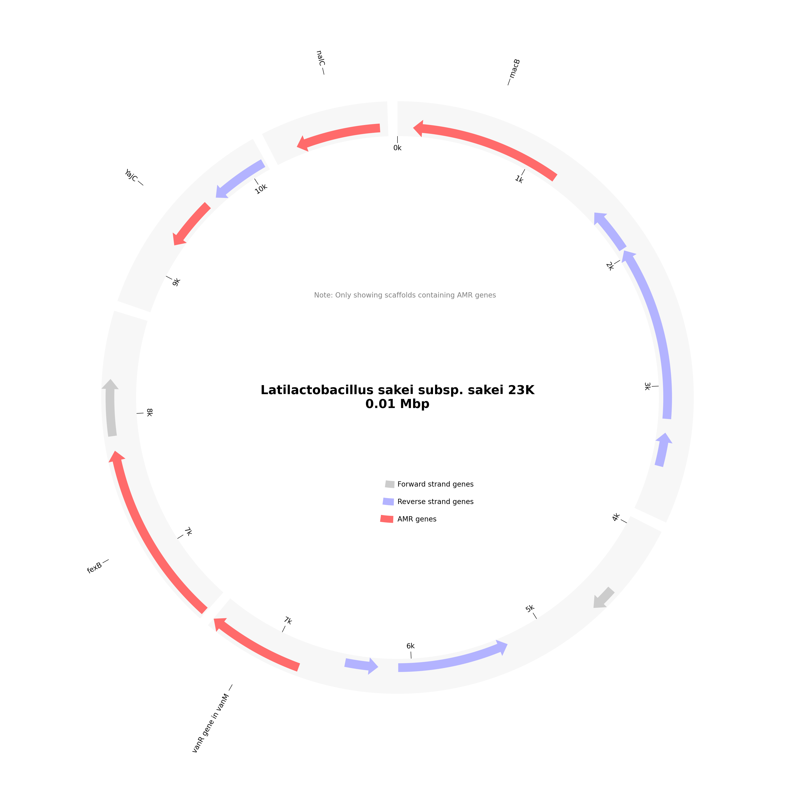

### YajC
- **Mechanism**: antibiotic efflux
- **Drug Classes**: fluoroquinolone antibiotic; cephalosporin; glycylcycline; penam; tetracycline antibiotic; oxazolidinone antibiotic; glycopeptide antibiotic; rifamycin antibiotic; phenicol antibiotic; disinfecting agents and antiseptics
- **AMR Family**: resistance-nodulation-cell division (RND) antibiotic efflux pump
- **Locations**:
  - gnl|SPADES|NKELHLDI_3780_2 : position 487-843

### fexB
- **Mechanism**: antibiotic efflux
- **Drug Classes**: phenicol antibiotic
- **AMR Family**: major facilitator superfamily (MFS) antibiotic efflux pump
- **Locations**:
  - gnl|SPADES|NKELHLDI_2268_1 : position 10-1200

### macB
- **Mechanism**: antibiotic efflux
- **Drug Classes**: macrolide antibiotic
- **AMR Family**: ATP-binding cassette (ABC) antibiotic efflux pump
- **Locations**:
  - gnl|SPADES|NKELHLDI_1407_2 : position 105-1139

### nalC
- **Mechanism**: antibiotic efflux
- **Drug Classes**: macrolide antibiotic; fluoroquinolone antibiotic; monobactam; carbapenem; cephalosporin; cephamycin; penam; tetracycline antibiotic; peptide antibiotic; aminocoumarin antibiotic; diaminopyrimidine antibiotic; sulfonamide antibiotic; phenicol antibiotic; penem
- **AMR Family**: resistance-nodulation-cell division (RND) antibiotic efflux pump
- **Locations**:
  - gnl|SPADES|NKELHLDI_7633_2 : position 170-751

### vanR gene in vanM cluster
- **Mechanism**: antibiotic target alteration
- **Drug Classes**: glycopeptide antibiotic
- **AMR Family**: glycopeptide resistance gene cluster; vanR
- **Locations**:
  - gnl|SPADES|NKELHLDI_1525_4 : position 2657-3283

## Lelliottia amnigena
**Strain Statistics:**
- Total genome length: 0.9 kbp
- Total scaffolds: 18
- Scaffolds with AMR genes: 2
- Total genes annotated: 0
- Total AMR genes: 2
- Unique AMR genes: 2
- Distinct AMR mechanisms: 2
- Distinct AMR families: 2
- Distinct drug classes: 6

**Circos Plot:**

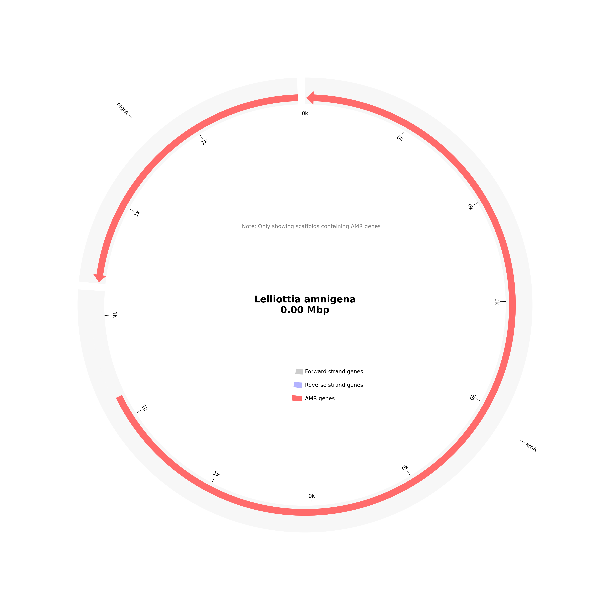

### arnA
- **Mechanism**: antibiotic target alteration
- **Drug Classes**: peptide antibiotic
- **AMR Family**: pmr phosphoethanolamine transferase
- **Locations**:
  - gnl|SPADES|NKELHLDI_9285_1 : position 1-624

### mgrA
- **Mechanism**: antibiotic efflux
- **Drug Classes**: fluoroquinolone antibiotic; cephalosporin; penam; tetracycline antibiotic; peptide antibiotic; disinfecting agents and antiseptics
- **AMR Family**: ATP-binding cassette (ABC) antibiotic efflux pump; major facilitator superfamily (MFS) antibiotic efflux pump
- **Locations**:
  - gnl|SPADES|NKELHLDI_115575_1 : position 1-210

## Lelliottia sp. JS-SCA-14
**Strain Statistics:**
- Total genome length: 0.9 kbp
- Total scaffolds: 5
- Scaffolds with AMR genes: 3
- Total genes annotated: 0
- Total AMR genes: 3
- Unique AMR genes: 3
- Distinct AMR mechanisms: 1
- Distinct AMR families: 2
- Distinct drug classes: 7

**Circos Plot:**

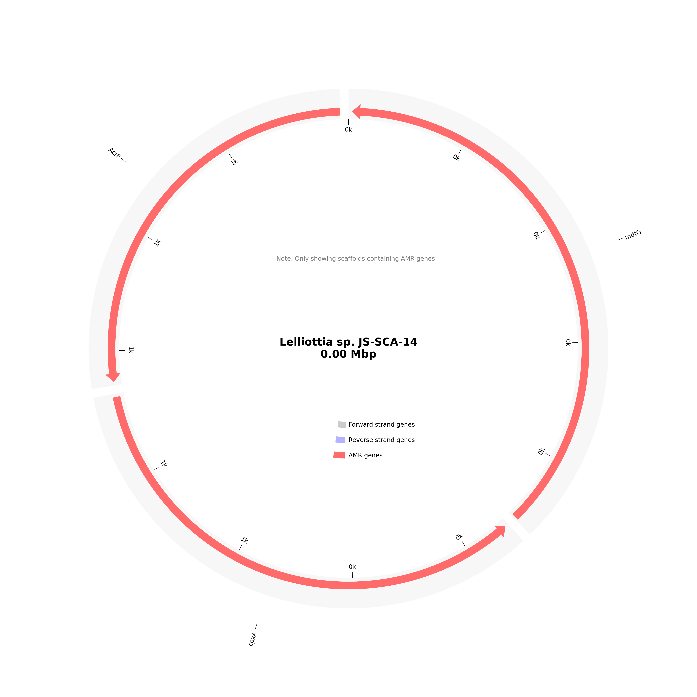

### AcrF
- **Mechanism**: antibiotic efflux
- **Drug Classes**: fluoroquinolone antibiotic; cephalosporin; cephamycin; penam
- **AMR Family**: resistance-nodulation-cell division (RND) antibiotic efflux pump
- **Locations**:
  - gnl|SPADES|NKELHLDI_88288_1 : position 2-235

### cpxA
- **Mechanism**: antibiotic efflux
- **Drug Classes**: aminoglycoside antibiotic; aminocoumarin antibiotic
- **AMR Family**: resistance-nodulation-cell division (RND) antibiotic efflux pump
- **Locations**:
  - gnl|SPADES|NKELHLDI_34688_1 : position 2-292

### mdtG
- **Mechanism**: antibiotic efflux
- **Drug Classes**: phosphonic acid antibiotic
- **AMR Family**: major facilitator superfamily (MFS) antibiotic efflux pump
- **Locations**:
  - gnl|SPADES|NKELHLDI_29054_1 : position 2-328

## Lelliottia sp. WB101
**Strain Statistics:**
- Total genome length: 0.5 kbp
- Total scaffolds: 10
- Scaffolds with AMR genes: 2
- Total genes annotated: 0
- Total AMR genes: 2
- Unique AMR genes: 2
- Distinct AMR mechanisms: 2
- Distinct AMR families: 2
- Distinct drug classes: 2

**Circos Plot:**

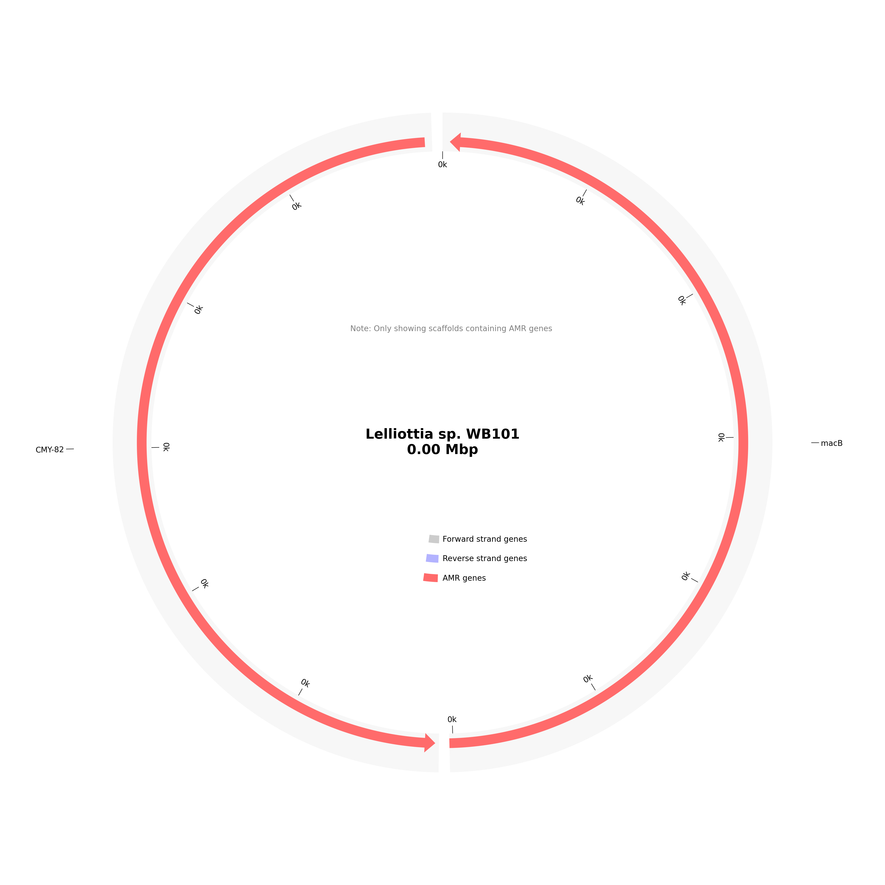

### CMY-82
- **Mechanism**: antibiotic inactivation
- **Drug Classes**: cephamycin
- **AMR Family**: CMY beta-lactamase
- **Locations**:
  - gnl|SPADES|NKELHLDI_63282_1 : position 1-255

### macB
- **Mechanism**: antibiotic efflux
- **Drug Classes**: macrolide antibiotic
- **AMR Family**: ATP-binding cassette (ABC) antibiotic efflux pump
- **Locations**:
  - gnl|SPADES|NKELHLDI_60838_1 : position 2-259

## Raoultella planticola
**Strain Statistics:**
- Total genome length: 0.3 kbp
- Total scaffolds: 5
- Scaffolds with AMR genes: 1
- Total genes annotated: 0
- Total AMR genes: 1
- Unique AMR genes: 1
- Distinct AMR mechanisms: 1
- Distinct AMR families: 1
- Distinct drug classes: 1

**Circos Plot:**

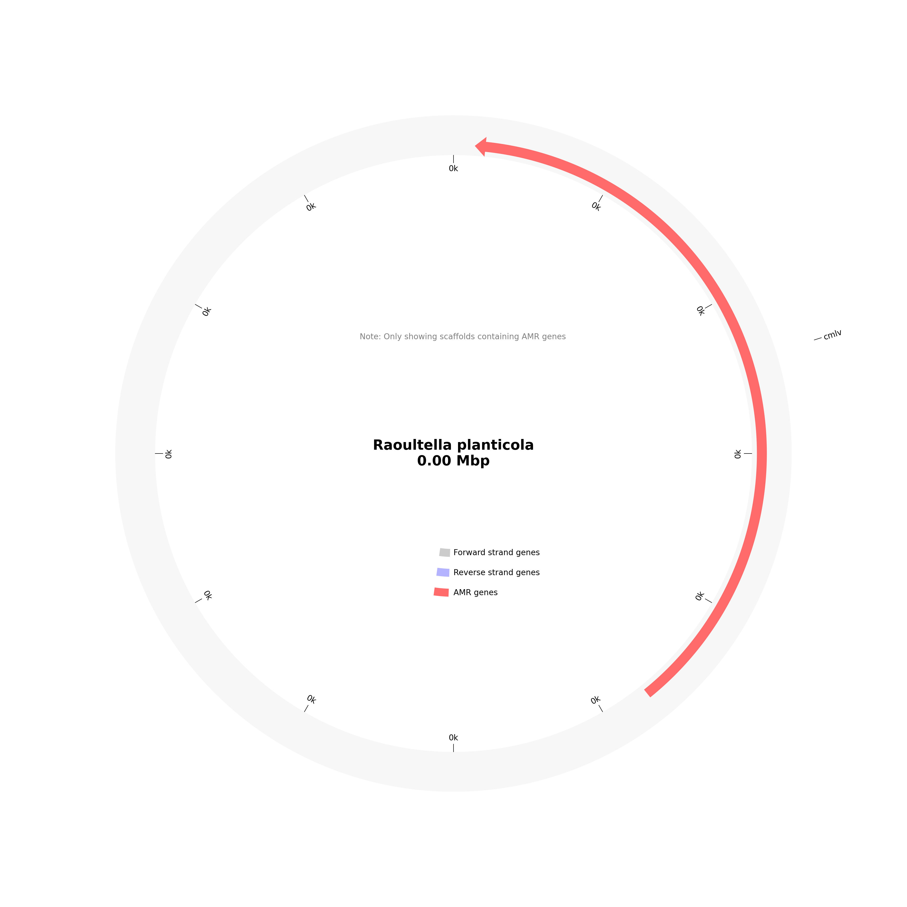

### cmlv
- **Mechanism**: antibiotic inactivation
- **Drug Classes**: phenicol antibiotic
- **AMR Family**: chloramphenicol phosphotransferase
- **Locations**:
  - gnl|SPADES|NKELHLDI_46279_1 : position 3-107

## Serratia fonticola
**Strain Statistics:**
- Total genome length: 65.2 kbp
- Total scaffolds: 3295
- Scaffolds with AMR genes: 189
- Total genes annotated: 52
- Total AMR genes: 191
- Unique AMR genes: 115
- Distinct AMR mechanisms: 8
- Distinct AMR families: 44
- Distinct drug classes: 31

**Circos Plot:**

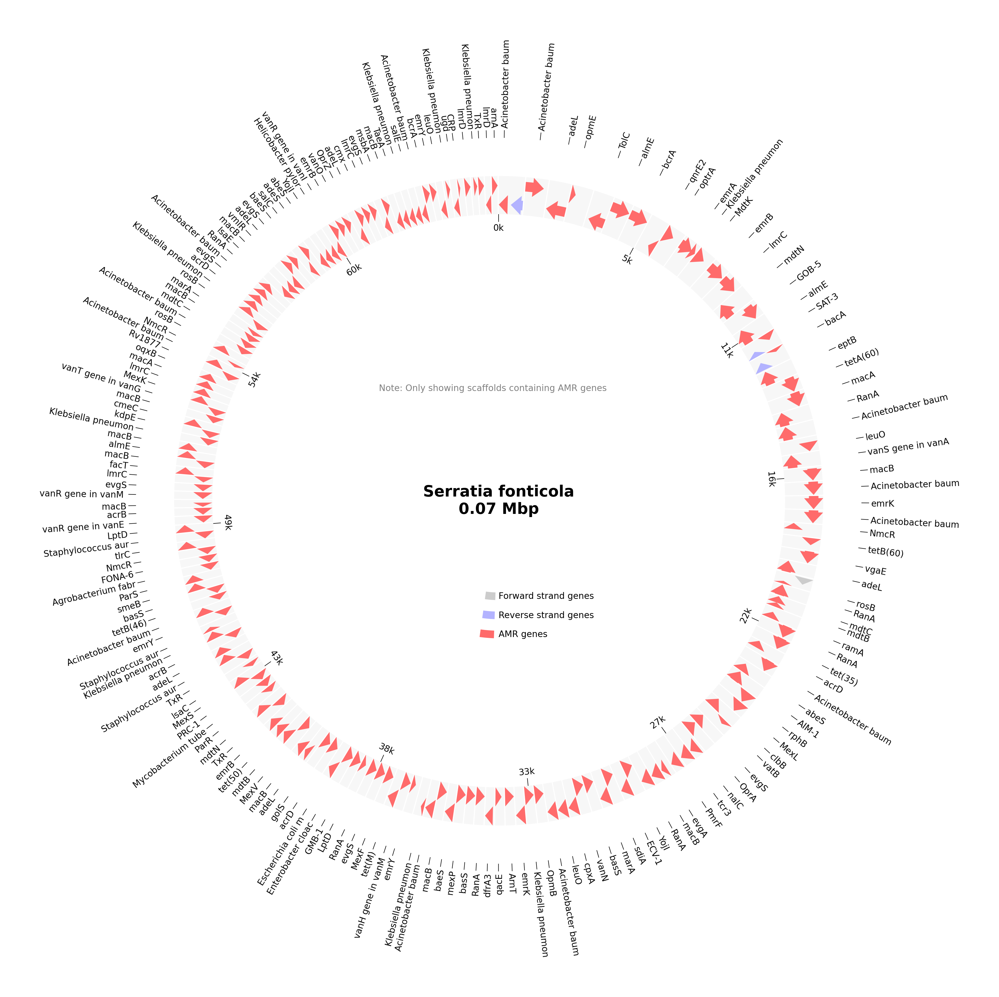

### AIM-1
- **Mechanism**: antibiotic inactivation
- **Drug Classes**: cephalosporin; cephamycin; penam
- **AMR Family**: AIM beta-lactamase
- **Locations**:
  - gnl|SPADES|NKELHLDI_19100_1 : position 1-426

### Acinetobacter baumannii AbaF (found in 5 locations)
- **Mechanism**: antibiotic efflux
- **Drug Classes**: phosphonic acid antibiotic
- **AMR Family**: major facilitator superfamily (MFS) antibiotic efflux pump
- **Locations**:
  - gnl|SPADES|NKELHLDI_16209_1 : position 2-475
  - gnl|SPADES|NKELHLDI_25926_1 : position 2-352
  - gnl|SPADES|NKELHLDI_29849_1 : position 1-324
  - gnl|SPADES|NKELHLDI_73743_1 : position 2-247
  - gnl|SPADES|NKELHLDI_83130_1 : position 2-238

### Acinetobacter baumannii AbaQ (found in 7 locations)
- **Mechanism**: antibiotic efflux
- **Drug Classes**: fluoroquinolone antibiotic
- **AMR Family**: major facilitator superfamily (MFS) antibiotic efflux pump
- **Locations**:
  - gnl|SPADES|NKELHLDI_108480_1 : position 2-214
  - gnl|SPADES|NKELHLDI_14072_1 : position 2-526
  - gnl|SPADES|NKELHLDI_15568_1 : position 3-488
  - gnl|SPADES|NKELHLDI_18734_1 : position 2-430
  - gnl|SPADES|NKELHLDI_6063_1 : position 3-350
  - gnl|SPADES|NKELHLDI_70559_1 : position 3-248
  - gnl|SPADES|NKELHLDI_7546_1 : position 1-681

### Acinetobacter baumannii AmvA
- **Mechanism**: antibiotic efflux
- **Drug Classes**: macrolide antibiotic; disinfecting agents and antiseptics
- **AMR Family**: major facilitator superfamily (MFS) antibiotic efflux pump
- **Locations**:
  - gnl|SPADES|NKELHLDI_45939_1 : position 2-271

### Agrobacterium fabrum chloramphenicol acetyltransferase
- **Mechanism**: antibiotic inactivation
- **Drug Classes**: phenicol antibiotic
- **AMR Family**: chloramphenicol acetyltransferase (CAT)
- **Locations**:
  - gnl|SPADES|NKELHLDI_47180_1 : position 1-270

### ArnT
- **Mechanism**: antibiotic target alteration
- **Drug Classes**: peptide antibiotic
- **AMR Family**: pmr phosphoethanolamine transferase
- **Locations**:
  - gnl|SPADES|NKELHLDI_26872_1 : position 1-345

### CRP
- **Mechanism**: antibiotic efflux
- **Drug Classes**: macrolide antibiotic; fluoroquinolone antibiotic; penam
- **AMR Family**: resistance-nodulation-cell division (RND) antibiotic efflux pump
- **Locations**:
  - gnl|SPADES|NKELHLDI_113682_1 : position 2-82

### ECV-1
- **Mechanism**: antibiotic inactivation
- **Drug Classes**: carbapenem
- **AMR Family**: ECV beta-lactamase
- **Locations**:
  - gnl|SPADES|NKELHLDI_23595_1 : position 3-371

### Enterobacter cloacae acrA
- **Mechanism**: antibiotic efflux
- **Drug Classes**: fluoroquinolone antibiotic; cephalosporin; glycylcycline; penam; tetracycline antibiotic; rifamycin antibiotic; phenicol antibiotic; disinfecting agents and antiseptics
- **AMR Family**: resistance-nodulation-cell division (RND) antibiotic efflux pump
- **Locations**:
  - gnl|SPADES|NKELHLDI_32159_1 : position 2-307

### Escherichia coli mdfA
- **Mechanism**: antibiotic efflux
- **Drug Classes**: tetracycline antibiotic; phenicol antibiotic; disinfecting agents and antiseptics
- **AMR Family**: major facilitator superfamily (MFS) antibiotic efflux pump
- **Locations**:
  - gnl|SPADES|NKELHLDI_32542_1 : position 2-271

### FONA-6
- **Mechanism**: antibiotic inactivation
- **Drug Classes**: penam
- **AMR Family**: FONA beta-lactamase
- **Locations**:
  - gnl|SPADES|NKELHLDI_46934_1 : position 1-270

### GMB-1
- **Mechanism**: antibiotic inactivation
- **Drug Classes**: carbapenem
- **AMR Family**: GMB beta-lactamase
- **Locations**:
  - gnl|SPADES|NKELHLDI_32171_1 : position 1-309

### GOB-5
- **Mechanism**: antibiotic inactivation
- **Drug Classes**: carbapenem; cephalosporin; penam
- **AMR Family**: GOB beta-lactamase
- **Locations**:
  - gnl|SPADES|NKELHLDI_11800_1 : position 64-591

### Helicobacter pylori pbp1 mutants conferring resistance to amoxicillin
- **Mechanism**: antibiotic target alteration
- **Drug Classes**: cephalosporin; cephamycin; penam
- **AMR Family**: Penicillin-binding protein mutations conferring resistance to beta-lactam antibiotics
- **Locations**:
  - gnl|SPADES|NKELHLDI_100281_1 : position 3-224

### Klebsiella pneumoniae KpnE
- **Mechanism**: antibiotic efflux
- **Drug Classes**: macrolide antibiotic; aminoglycoside antibiotic; cephalosporin; tetracycline antibiotic; peptide antibiotic; rifamycin antibiotic; disinfecting agents and antiseptics
- **AMR Family**: small multidrug resistance (SMR) antibiotic efflux pump
- **Locations**:
  - gnl|SPADES|NKELHLDI_111878_1 : position 80-211

### Klebsiella pneumoniae KpnG
- **Mechanism**: antibiotic efflux
- **Drug Classes**: macrolide antibiotic; fluoroquinolone antibiotic; aminoglycoside antibiotic; carbapenem; cephalosporin; penam; peptide antibiotic; penem
- **AMR Family**: major facilitator superfamily (MFS) antibiotic efflux pump
- **Locations**:
  - gnl|SPADES|NKELHLDI_10470_2 : position 459-644

### Klebsiella pneumoniae OmpK37 (found in 7 locations)
- **Mechanism**: reduced permeability to antibiotic
- **Drug Classes**: monobactam; carbapenem; cephalosporin; cephamycin; penam; penem
- **AMR Family**: General Bacterial Porin with reduced permeability to beta-lactams
- **Locations**:
  - gnl|SPADES|NKELHLDI_108462_1 : position 1-216
  - gnl|SPADES|NKELHLDI_116140_1 : position 82-207
  - gnl|SPADES|NKELHLDI_26364_1 : position 1-348
  - gnl|SPADES|NKELHLDI_29814_1 : position 2-124
  - gnl|SPADES|NKELHLDI_41943_1 : position 3-278
  - gnl|SPADES|NKELHLDI_60956_1 : position 3-257
  - gnl|SPADES|NKELHLDI_81651_1 : position 2-238

### LptD (found in 2 locations)
- **Mechanism**: antibiotic efflux
- **Drug Classes**: carbapenem; peptide antibiotic; aminocoumarin antibiotic; rifamycin antibiotic
- **AMR Family**: ATP-binding cassette (ABC) antibiotic efflux pump
- **Locations**:
  - gnl|SPADES|NKELHLDI_31847_1 : position 118-309
  - gnl|SPADES|NKELHLDI_48808_1 : position 1-270

### MdtK
- **Mechanism**: antibiotic efflux
- **Drug Classes**: fluoroquinolone antibiotic
- **AMR Family**: multidrug and toxic compound extrusion (MATE) transporter
- **Locations**:
  - gnl|SPADES|NKELHLDI_10500_1 : position 2-388

### MexF
- **Mechanism**: antibiotic efflux
- **Drug Classes**: fluoroquinolone antibiotic; diaminopyrimidine antibiotic; phenicol antibiotic
- **AMR Family**: resistance-nodulation-cell division (RND) antibiotic efflux pump
- **Locations**:
  - gnl|SPADES|NKELHLDI_30988_1 : position 3-314

### MexK
- **Mechanism**: antibiotic efflux
- **Drug Classes**: macrolide antibiotic; tetracycline antibiotic; disinfecting agents and antiseptics
- **AMR Family**: resistance-nodulation-cell division (RND) antibiotic efflux pump
- **Locations**:
  - gnl|SPADES|NKELHLDI_64850_1 : position 3-254

### MexL
- **Mechanism**: antibiotic efflux
- **Drug Classes**: macrolide antibiotic; tetracycline antibiotic; disinfecting agents and antiseptics
- **AMR Family**: resistance-nodulation-cell division (RND) antibiotic efflux pump
- **Locations**:
  - gnl|SPADES|NKELHLDI_20786_1 : position 1-402

### MexS
- **Mechanism**: antibiotic efflux
- **Drug Classes**: fluoroquinolone antibiotic; diaminopyrimidine antibiotic; phenicol antibiotic
- **AMR Family**: resistance-nodulation-cell division (RND) antibiotic efflux pump
- **Locations**:
  - gnl|SPADES|NKELHLDI_38273_1 : position 3-284

### MexV
- **Mechanism**: antibiotic efflux
- **Drug Classes**: macrolide antibiotic; fluoroquinolone antibiotic; tetracycline antibiotic; phenicol antibiotic; disinfecting agents and antiseptics
- **AMR Family**: resistance-nodulation-cell division (RND) antibiotic efflux pump
- **Locations**:
  - gnl|SPADES|NKELHLDI_33510_1 : position 3-299

### Mycobacterium tuberculosis intrinsic murA conferring resistance to fosfomycin
- **Mechanism**: antibiotic target alteration
- **Drug Classes**: phosphonic acid antibiotic
- **AMR Family**: antibiotic-resistant murA transferase
- **Locations**:
  - gnl|SPADES|NKELHLDI_37478_1 : position 2-286

### NmcR (found in 3 locations)
- **Mechanism**: antibiotic inactivation
- **Drug Classes**: carbapenem; cephalosporin; cephamycin; penam
- **AMR Family**: NmcA beta-lactamase
- **Locations**:
  - gnl|SPADES|NKELHLDI_16644_1 : position 1-240
  - gnl|SPADES|NKELHLDI_48508_1 : position 3-269
  - gnl|SPADES|NKELHLDI_73333_1 : position 2-121

### OpmB
- **Mechanism**: antibiotic efflux
- **Drug Classes**: macrolide antibiotic; monobactam; tetracycline antibiotic; aminocoumarin antibiotic
- **AMR Family**: resistance-nodulation-cell division (RND) antibiotic efflux pump
- **Locations**:
  - gnl|SPADES|NKELHLDI_26072_1 : position 3-350

### OprA
- **Mechanism**: antibiotic efflux
- **Drug Classes**: macrolide antibiotic; fluoroquinolone antibiotic; aminoglycoside antibiotic; carbapenem; tetracycline antibiotic
- **AMR Family**: resistance-nodulation-cell division (RND) antibiotic efflux pump
- **Locations**:
  - gnl|SPADES|NKELHLDI_21496_1 : position 3-392

### OprZ
- **Mechanism**: antibiotic efflux
- **Drug Classes**: macrolide antibiotic; fluoroquinolone antibiotic; aminoglycoside antibiotic; cephalosporin
- **AMR Family**: resistance-nodulation-cell division (RND) antibiotic efflux pump
- **Locations**:
  - gnl|SPADES|NKELHLDI_103813_1 : position 3-221

### PRC-1
- **Mechanism**: antibiotic inactivation
- **Drug Classes**: cephalosporin; penam
- **AMR Family**: PRC beta-lactamase
- **Locations**:
  - gnl|SPADES|NKELHLDI_38538_1 : position 3-284

### ParR
- **Mechanism**: antibiotic efflux; reduced permeability to antibiotic
- **Drug Classes**: macrolide antibiotic; fluoroquinolone antibiotic; monobactam; aminoglycoside antibiotic; carbapenem; cephalosporin; cephamycin; penam; tetracycline antibiotic; phenicol antibiotic; penem; disinfecting agents and antiseptics
- **AMR Family**: resistance-nodulation-cell division (RND) antibiotic efflux pump; Outer Membrane Porin (Opr)
- **Locations**:
  - gnl|SPADES|NKELHLDI_37467_1 : position 57-284

### ParS
- **Mechanism**: antibiotic efflux; reduced permeability to antibiotic
- **Drug Classes**: macrolide antibiotic; fluoroquinolone antibiotic; monobactam; aminoglycoside antibiotic; carbapenem; cephalosporin; cephamycin; penam; tetracycline antibiotic; phenicol antibiotic; penem; disinfecting agents and antiseptics
- **AMR Family**: resistance-nodulation-cell division (RND) antibiotic efflux pump; Outer Membrane Porin (Opr)
- **Locations**:
  - gnl|SPADES|NKELHLDI_46093_1 : position 2-271

### PmrF
- **Mechanism**: antibiotic target alteration
- **Drug Classes**: peptide antibiotic
- **AMR Family**: pmr phosphoethanolamine transferase
- **Locations**:
  - gnl|SPADES|NKELHLDI_21988_1 : position 51-389

### RanA (found in 7 locations)
- **Mechanism**: antibiotic efflux
- **Drug Classes**: aminoglycoside antibiotic
- **AMR Family**: ATP-binding cassette (ABC) antibiotic efflux pump
- **Locations**:
  - gnl|SPADES|NKELHLDI_13865_1 : position 1-531
  - gnl|SPADES|NKELHLDI_18232_1 : position 1-423
  - gnl|SPADES|NKELHLDI_18457_1 : position 1-435
  - gnl|SPADES|NKELHLDI_23070_1 : position 2-376
  - gnl|SPADES|NKELHLDI_28273_1 : position 2-334
  - gnl|SPADES|NKELHLDI_31749_1 : position 3-311
  - gnl|SPADES|NKELHLDI_83166_1 : position 2-238

### Rv1877
- **Mechanism**: antibiotic efflux
- **Drug Classes**: fluoroquinolone antibiotic
- **AMR Family**: major facilitator superfamily (MFS) antibiotic efflux pump
- **Locations**:
  - gnl|SPADES|NKELHLDI_68507_1 : position 1-252

### SAT-3
- **Mechanism**: antibiotic inactivation
- **Drug Classes**: nucleoside antibiotic
- **AMR Family**: streptothricin acetyltransferase (SAT)
- **Locations**:
  - gnl|SPADES|NKELHLDI_12027_1 : position 1-261

### Staphylococcus aureus FosB
- **Mechanism**: antibiotic inactivation
- **Drug Classes**: phosphonic acid antibiotic
- **AMR Family**: fosfomycin thiol transferase
- **Locations**:
  - gnl|SPADES|NKELHLDI_42690_1 : position 3-146

### Staphylococcus aureus GlpT with mutation conferring resistance to fosfomycin
- **Mechanism**: antibiotic target alteration
- **Drug Classes**: phosphonic acid antibiotic
- **AMR Family**: antibiotic-resistant GlpT
- **Locations**:
  - gnl|SPADES|NKELHLDI_39505_1 : position 1-279

### Staphylococcus aureus pgsA mutations conferring resistance to daptomycin
- **Mechanism**: antibiotic target alteration
- **Drug Classes**: peptide antibiotic
- **AMR Family**: daptomycin resistant pgsA
- **Locations**:
  - gnl|SPADES|NKELHLDI_48162_1 : position 2-271

### TaeA
- **Mechanism**: antibiotic efflux
- **Drug Classes**: pleuromutilin antibiotic
- **AMR Family**: ATP-binding cassette (ABC) antibiotic efflux pump
- **Locations**:
  - gnl|SPADES|NKELHLDI_108535_1 : position 2-214

### TolC
- **Mechanism**: antibiotic efflux
- **Drug Classes**: macrolide antibiotic; fluoroquinolone antibiotic; aminoglycoside antibiotic; carbapenem; cephalosporin; glycylcycline; cephamycin; penam; tetracycline antibiotic; peptide antibiotic; aminocoumarin antibiotic; rifamycin antibiotic; phenicol antibiotic; penem; disinfecting agents and antiseptics
- **AMR Family**: ATP-binding cassette (ABC) antibiotic efflux pump; major facilitator superfamily (MFS) antibiotic efflux pump; resistance-nodulation-cell division (RND) antibiotic efflux pump
- **Locations**:
  - gnl|SPADES|NKELHLDI_8702_2 : position 98-736

### TxR (found in 3 locations)
- **Mechanism**: antibiotic efflux
- **Drug Classes**: tetracycline antibiotic
- **AMR Family**: ATP-binding cassette (ABC) antibiotic efflux pump
- **Locations**:
  - gnl|SPADES|NKELHLDI_116519_1 : position 3-209
  - gnl|SPADES|NKELHLDI_36524_1 : position 3-287
  - gnl|SPADES|NKELHLDI_39212_1 : position 3-281

### YojI (found in 2 locations)
- **Mechanism**: antibiotic efflux
- **Drug Classes**: peptide antibiotic
- **AMR Family**: ATP-binding cassette (ABC) antibiotic efflux pump
- **Locations**:
  - gnl|SPADES|NKELHLDI_100392_1 : position 3-224
  - gnl|SPADES|NKELHLDI_23495_1 : position 3-374

### abeS (found in 2 locations)
- **Mechanism**: antibiotic efflux
- **Drug Classes**: macrolide antibiotic; aminocoumarin antibiotic
- **AMR Family**: small multidrug resistance (SMR) antibiotic efflux pump
- **Locations**:
  - gnl|SPADES|NKELHLDI_18872_2 : position 99-428
  - gnl|SPADES|NKELHLDI_99545_1 : position 1-225

### acrB (found in 2 locations)
- **Mechanism**: antibiotic efflux
- **Drug Classes**: fluoroquinolone antibiotic; cephalosporin; glycylcycline; penam; tetracycline antibiotic; rifamycin antibiotic; phenicol antibiotic; disinfecting agents and antiseptics
- **AMR Family**: resistance-nodulation-cell division (RND) antibiotic efflux pump
- **Locations**:
  - gnl|SPADES|NKELHLDI_42009_1 : position 2-277
  - gnl|SPADES|NKELHLDI_51930_1 : position 2-265

### acrD (found in 3 locations)
- **Mechanism**: antibiotic efflux
- **Drug Classes**: aminoglycoside antibiotic
- **AMR Family**: resistance-nodulation-cell division (RND) antibiotic efflux pump
- **Locations**:
  - gnl|SPADES|NKELHLDI_18716_1 : position 2-286
  - gnl|SPADES|NKELHLDI_32864_1 : position 1-303
  - gnl|SPADES|NKELHLDI_81980_1 : position 1-240

### adeL (found in 6 locations)
- **Mechanism**: antibiotic efflux
- **Drug Classes**: fluoroquinolone antibiotic; tetracycline antibiotic
- **AMR Family**: resistance-nodulation-cell division (RND) antibiotic efflux pump
- **Locations**:
  - gnl|SPADES|NKELHLDI_103291_1 : position 3-221
  - gnl|SPADES|NKELHLDI_17878_1 : position 3-443
  - gnl|SPADES|NKELHLDI_32910_1 : position 100-303
  - gnl|SPADES|NKELHLDI_40900_1 : position 3-278
  - gnl|SPADES|NKELHLDI_7841_1 : position 23-790
  - gnl|SPADES|NKELHLDI_86558_1 : position 3-236

### adeS
- **Mechanism**: antibiotic efflux
- **Drug Classes**: glycylcycline; tetracycline antibiotic
- **AMR Family**: resistance-nodulation-cell division (RND) antibiotic efflux pump
- **Locations**:
  - gnl|SPADES|NKELHLDI_98402_1 : position 2-226

### almE (found in 3 locations)
- **Mechanism**: antibiotic target alteration
- **Drug Classes**: peptide antibiotic
- **AMR Family**: polymyxin resistance operon; alm glycyltransferase
- **Locations**:
  - gnl|SPADES|NKELHLDI_11894_1 : position 2-589
  - gnl|SPADES|NKELHLDI_60620_1 : position 2-259
  - gnl|SPADES|NKELHLDI_9222_1 : position 2-703

### arnA
- **Mechanism**: antibiotic target alteration
- **Drug Classes**: peptide antibiotic
- **AMR Family**: pmr phosphoethanolamine transferase
- **Locations**:
  - gnl|SPADES|NKELHLDI_117925_1 : position 2-208

### bacA
- **Mechanism**: antibiotic target alteration
- **Drug Classes**: peptide antibiotic
- **AMR Family**: undecaprenyl pyrophosphate related proteins
- **Locations**:
  - gnl|SPADES|NKELHLDI_12070_1 : position 2-133

### baeS (found in 2 locations)
- **Mechanism**: antibiotic efflux
- **Drug Classes**: aminoglycoside antibiotic; aminocoumarin antibiotic
- **AMR Family**: resistance-nodulation-cell division (RND) antibiotic efflux pump
- **Locations**:
  - gnl|SPADES|NKELHLDI_29111_1 : position 2-328
  - gnl|SPADES|NKELHLDI_93007_1 : position 43-231

### basS (found in 3 locations)
- **Mechanism**: antibiotic target alteration; antibiotic efflux
- **Drug Classes**: peptide antibiotic
- **AMR Family**: pmr phosphoethanolamine transferase
- **Locations**:
  - gnl|SPADES|NKELHLDI_23976_1 : position 2-367
  - gnl|SPADES|NKELHLDI_28470_1 : position 1-333
  - gnl|SPADES|NKELHLDI_46312_1 : position 1-273

### bcrA (found in 2 locations)
- **Mechanism**: antibiotic efflux
- **Drug Classes**: peptide antibiotic
- **AMR Family**: ATP-binding cassette (ABC) antibiotic efflux pump
- **Locations**:
  - gnl|SPADES|NKELHLDI_110480_1 : position 3-215
  - gnl|SPADES|NKELHLDI_9546_1 : position 1-687

### clbB
- **Mechanism**: antibiotic target alteration
- **Drug Classes**: lincosamide antibiotic; streptogramin antibiotic; streptogramin A antibiotic; oxazolidinone antibiotic; phenicol antibiotic; pleuromutilin antibiotic
- **AMR Family**: Cfr 23S ribosomal RNA methyltransferase
- **Locations**:
  - gnl|SPADES|NKELHLDI_21090_1 : position 2-397

### cmeC
- **Mechanism**: antibiotic efflux
- **Drug Classes**: macrolide antibiotic; fluoroquinolone antibiotic; cephalosporin; fusidane antibiotic
- **AMR Family**: resistance-nodulation-cell division (RND) antibiotic efflux pump
- **Locations**:
  - gnl|SPADES|NKELHLDI_62784_1 : position 2-256

### cmx
- **Mechanism**: antibiotic efflux
- **Drug Classes**: phenicol antibiotic
- **AMR Family**: major facilitator superfamily (MFS) antibiotic efflux pump
- **Locations**:
  - gnl|SPADES|NKELHLDI_105823_1 : position 2-217

### cpxA
- **Mechanism**: antibiotic efflux
- **Drug Classes**: aminoglycoside antibiotic; aminocoumarin antibiotic
- **AMR Family**: resistance-nodulation-cell division (RND) antibiotic efflux pump
- **Locations**:
  - gnl|SPADES|NKELHLDI_25257_1 : position 2-358

### dfrA3
- **Mechanism**: antibiotic target replacement
- **Drug Classes**: diaminopyrimidine antibiotic
- **AMR Family**: trimethoprim resistant dihydrofolate reductase dfr
- **Locations**:
  - gnl|SPADES|NKELHLDI_28109_1 : position 50-334

### emrA
- **Mechanism**: antibiotic efflux
- **Drug Classes**: fluoroquinolone antibiotic
- **AMR Family**: major facilitator superfamily (MFS) antibiotic efflux pump
- **Locations**:
  - gnl|SPADES|NKELHLDI_10470_1 : position 2-505

### emrB (found in 3 locations)
- **Mechanism**: antibiotic efflux
- **Drug Classes**: fluoroquinolone antibiotic
- **AMR Family**: major facilitator superfamily (MFS) antibiotic efflux pump
- **Locations**:
  - gnl|SPADES|NKELHLDI_101030_1 : position 3-221
  - gnl|SPADES|NKELHLDI_10961_1 : position 1-624
  - gnl|SPADES|NKELHLDI_35333_1 : position 3-290

### emrK (found in 2 locations)
- **Mechanism**: antibiotic efflux
- **Drug Classes**: tetracycline antibiotic
- **AMR Family**: major facilitator superfamily (MFS) antibiotic efflux pump
- **Locations**:
  - gnl|SPADES|NKELHLDI_15676_1 : position 1-486
  - gnl|SPADES|NKELHLDI_26428_1 : position 2-346

### emrY (found in 3 locations)
- **Mechanism**: antibiotic efflux
- **Drug Classes**: tetracycline antibiotic
- **AMR Family**: major facilitator superfamily (MFS) antibiotic efflux pump
- **Locations**:
  - gnl|SPADES|NKELHLDI_110851_1 : position 3-212
  - gnl|SPADES|NKELHLDI_29812_2 : position 154-324
  - gnl|SPADES|NKELHLDI_45346_1 : position 1-273

### eptB
- **Mechanism**: antibiotic target alteration
- **Drug Classes**: peptide antibiotic
- **AMR Family**: pmr phosphoethanolamine transferase
- **Locations**:
  - gnl|SPADES|NKELHLDI_13471_1 : position 3-542

### evgA
- **Mechanism**: antibiotic efflux
- **Drug Classes**: macrolide antibiotic; fluoroquinolone antibiotic; penam; tetracycline antibiotic
- **AMR Family**: major facilitator superfamily (MFS) antibiotic efflux pump; resistance-nodulation-cell division (RND) antibiotic efflux pump
- **Locations**:
  - gnl|SPADES|NKELHLDI_22266_2 : position 179-385

### evgS (found in 6 locations)
- **Mechanism**: antibiotic efflux
- **Drug Classes**: macrolide antibiotic; fluoroquinolone antibiotic; penam; tetracycline antibiotic
- **AMR Family**: major facilitator superfamily (MFS) antibiotic efflux pump; resistance-nodulation-cell division (RND) antibiotic efflux pump
- **Locations**:
  - gnl|SPADES|NKELHLDI_107194_1 : position 2-217
  - gnl|SPADES|NKELHLDI_21472_1 : position 3-392
  - gnl|SPADES|NKELHLDI_31270_1 : position 2-313
  - gnl|SPADES|NKELHLDI_58117_1 : position 2-259
  - gnl|SPADES|NKELHLDI_81960_1 : position 1-240
  - gnl|SPADES|NKELHLDI_91510_1 : position 3-230

### facT
- **Mechanism**: antibiotic efflux
- **Drug Classes**: elfamycin antibiotic
- **AMR Family**: major facilitator superfamily (MFS) antibiotic efflux pump
- **Locations**:
  - gnl|SPADES|NKELHLDI_59547_1 : position 1-258

### golS
- **Mechanism**: antibiotic efflux
- **Drug Classes**: monobactam; carbapenem; cephalosporin; cephamycin; penam; phenicol antibiotic; penem
- **AMR Family**: resistance-nodulation-cell division (RND) antibiotic efflux pump
- **Locations**:
  - gnl|SPADES|NKELHLDI_32779_1 : position 3-305

### kdpE
- **Mechanism**: antibiotic efflux
- **Drug Classes**: aminoglycoside antibiotic
- **AMR Family**: kdpDE
- **Locations**:
  - gnl|SPADES|NKELHLDI_61876_1 : position 3-257

### leuO (found in 3 locations)
- **Mechanism**: antibiotic efflux
- **Drug Classes**: nucleoside antibiotic; disinfecting agents and antiseptics
- **AMR Family**: major facilitator superfamily (MFS) antibiotic efflux pump
- **Locations**:
  - gnl|SPADES|NKELHLDI_111615_1 : position 2-214
  - gnl|SPADES|NKELHLDI_14336_1 : position 181-519
  - gnl|SPADES|NKELHLDI_25609_1 : position 3-353

### lmrC (found in 4 locations)
- **Mechanism**: antibiotic target protection
- **Drug Classes**: lincosamide antibiotic
- **AMR Family**: Miscellaneous ABC-F subfamily ATP-binding cassette ribosomal protection proteins
- **Locations**:
  - gnl|SPADES|NKELHLDI_105310_1 : position 1-219
  - gnl|SPADES|NKELHLDI_11047_1 : position 2-619
  - gnl|SPADES|NKELHLDI_58621_1 : position 47-259
  - gnl|SPADES|NKELHLDI_66212_1 : position 1-252

### lmrD (found in 2 locations)
- **Mechanism**: antibiotic efflux
- **Drug Classes**: lincosamide antibiotic
- **AMR Family**: ATP-binding cassette (ABC) antibiotic efflux pump
- **Locations**:
  - gnl|SPADES|NKELHLDI_115446_1 : position 2-208
  - gnl|SPADES|NKELHLDI_116402_1 : position 3-209

### lsaC
- **Mechanism**: antibiotic target protection
- **Drug Classes**: lincosamide antibiotic; streptogramin antibiotic; pleuromutilin antibiotic
- **AMR Family**: lsa-type ABC-F protein
- **Locations**:
  - gnl|SPADES|NKELHLDI_38789_1 : position 2-178

### lsaE
- **Mechanism**: antibiotic target protection
- **Drug Classes**: lincosamide antibiotic; streptogramin antibiotic; pleuromutilin antibiotic
- **AMR Family**: lsa-type ABC-F protein
- **Locations**:
  - gnl|SPADES|NKELHLDI_84757_1 : position 2-238

### macA (found in 2 locations)
- **Mechanism**: antibiotic efflux
- **Drug Classes**: macrolide antibiotic
- **AMR Family**: ATP-binding cassette (ABC) antibiotic efflux pump
- **Locations**:
  - gnl|SPADES|NKELHLDI_13755_1 : position 1-534
  - gnl|SPADES|NKELHLDI_67957_1 : position 2-253

### macB (found in 11 locations)
- **Mechanism**: antibiotic efflux
- **Drug Classes**: macrolide antibiotic
- **AMR Family**: ATP-binding cassette (ABC) antibiotic efflux pump
- **Locations**:
  - gnl|SPADES|NKELHLDI_106920_1 : position 1-216
  - gnl|SPADES|NKELHLDI_15327_1 : position 53-493
  - gnl|SPADES|NKELHLDI_22735_1 : position 3-380
  - gnl|SPADES|NKELHLDI_29331_1 : position 3-326
  - gnl|SPADES|NKELHLDI_33109_1 : position 3-302
  - gnl|SPADES|NKELHLDI_54156_1 : position 1-162
  - gnl|SPADES|NKELHLDI_60636_1 : position 2-259
  - gnl|SPADES|NKELHLDI_60940_1 : position 1-258
  - gnl|SPADES|NKELHLDI_63540_1 : position 2-256
  - gnl|SPADES|NKELHLDI_79520_1 : position 3-242
  - gnl|SPADES|NKELHLDI_85849_1 : position 1-237

### marA (found in 2 locations)
- **Mechanism**: antibiotic efflux; reduced permeability to antibiotic
- **Drug Classes**: fluoroquinolone antibiotic; monobactam; carbapenem; cephalosporin; glycylcycline; cephamycin; penam; tetracycline antibiotic; rifamycin antibiotic; phenicol antibiotic; penem; disinfecting agents and antiseptics
- **AMR Family**: resistance-nodulation-cell division (RND) antibiotic efflux pump; General Bacterial Porin with reduced permeability to beta-lactams
- **Locations**:
  - gnl|SPADES|NKELHLDI_23783_1 : position 1-369
  - gnl|SPADES|NKELHLDI_81391_1 : position 1-165

### mdtB (found in 2 locations)
- **Mechanism**: antibiotic efflux
- **Drug Classes**: aminocoumarin antibiotic
- **AMR Family**: resistance-nodulation-cell division (RND) antibiotic efflux pump
- **Locations**:
  - gnl|SPADES|NKELHLDI_18268_2 : position 261-437
  - gnl|SPADES|NKELHLDI_34387_1 : position 3-296

### mdtC (found in 2 locations)
- **Mechanism**: antibiotic efflux
- **Drug Classes**: aminocoumarin antibiotic
- **AMR Family**: resistance-nodulation-cell division (RND) antibiotic efflux pump
- **Locations**:
  - gnl|SPADES|NKELHLDI_18268_1 : position 1-264
  - gnl|SPADES|NKELHLDI_75323_1 : position 3-245

### mdtN (found in 2 locations)
- **Mechanism**: antibiotic efflux
- **Drug Classes**: nucleoside antibiotic; disinfecting agents and antiseptics
- **AMR Family**: major facilitator superfamily (MFS) antibiotic efflux pump
- **Locations**:
  - gnl|SPADES|NKELHLDI_11669_1 : position 2-595
  - gnl|SPADES|NKELHLDI_37433_1 : position 1-285

### mexP
- **Mechanism**: antibiotic efflux
- **Drug Classes**: macrolide antibiotic; carbapenem; tetracycline antibiotic; diaminopyrimidine antibiotic; phenicol antibiotic; disinfecting agents and antiseptics
- **AMR Family**: resistance-nodulation-cell division (RND) antibiotic efflux pump
- **Locations**:
  - gnl|SPADES|NKELHLDI_28499_1 : position 1-333

### msbA
- **Mechanism**: antibiotic efflux
- **Drug Classes**: nitroimidazole antibiotic
- **AMR Family**: ATP-binding cassette (ABC) antibiotic efflux pump
- **Locations**:
  - gnl|SPADES|NKELHLDI_106960_1 : position 2-217

### nalC
- **Mechanism**: antibiotic efflux
- **Drug Classes**: macrolide antibiotic; fluoroquinolone antibiotic; monobactam; carbapenem; cephalosporin; cephamycin; penam; tetracycline antibiotic; peptide antibiotic; aminocoumarin antibiotic; diaminopyrimidine antibiotic; sulfonamide antibiotic; phenicol antibiotic; penem
- **AMR Family**: resistance-nodulation-cell division (RND) antibiotic efflux pump
- **Locations**:
  - gnl|SPADES|NKELHLDI_21613_2 : position 72-392

### opmE
- **Mechanism**: antibiotic efflux
- **Drug Classes**: macrolide antibiotic; carbapenem; tetracycline antibiotic; diaminopyrimidine antibiotic; phenicol antibiotic; disinfecting agents and antiseptics
- **AMR Family**: resistance-nodulation-cell division (RND) antibiotic efflux pump
- **Locations**:
  - gnl|SPADES|NKELHLDI_8309_1 : position 1-189

### optrA
- **Mechanism**: antibiotic target protection
- **Drug Classes**: oxazolidinone antibiotic; phenicol antibiotic
- **AMR Family**: Miscellaneous ABC-F subfamily ATP-binding cassette ribosomal protection proteins
- **Locations**:
  - gnl|SPADES|NKELHLDI_10178_1 : position 1-363

### oqxB
- **Mechanism**: antibiotic efflux
- **Drug Classes**: fluoroquinolone antibiotic; glycylcycline; tetracycline antibiotic; diaminopyrimidine antibiotic; nitrofuran antibiotic
- **AMR Family**: resistance-nodulation-cell division (RND) antibiotic efflux pump
- **Locations**:
  - gnl|SPADES|NKELHLDI_67299_1 : position 2-253

### qacE
- **Mechanism**: antibiotic efflux
- **Drug Classes**: disinfecting agents and antiseptics
- **AMR Family**: major facilitator superfamily (MFS) antibiotic efflux pump
- **Locations**:
  - gnl|SPADES|NKELHLDI_27969_1 : position 97-336

### qnrE2
- **Mechanism**: antibiotic target protection
- **Drug Classes**: fluoroquinolone antibiotic
- **AMR Family**: quinolone resistance protein (qnr)
- **Locations**:
  - gnl|SPADES|NKELHLDI_9782_2 : position 415-675

### ramA
- **Mechanism**: antibiotic efflux; reduced permeability to antibiotic
- **Drug Classes**: fluoroquinolone antibiotic; monobactam; carbapenem; cephalosporin; glycylcycline; cephamycin; penam; tetracycline antibiotic; rifamycin antibiotic; phenicol antibiotic; penem; disinfecting agents and antiseptics
- **AMR Family**: resistance-nodulation-cell division (RND) antibiotic efflux pump; General Bacterial Porin with reduced permeability to beta-lactams
- **Locations**:
  - gnl|SPADES|NKELHLDI_18305_2 : position 176-436

### rosB (found in 3 locations)
- **Mechanism**: antibiotic efflux
- **Drug Classes**: peptide antibiotic
- **AMR Family**: major facilitator superfamily (MFS) antibiotic efflux pump
- **Locations**:
  - gnl|SPADES|NKELHLDI_18136_2 : position 334-441
  - gnl|SPADES|NKELHLDI_74005_1 : position 3-245
  - gnl|SPADES|NKELHLDI_81856_1 : position 2-238

### rphB
- **Mechanism**: antibiotic inactivation
- **Drug Classes**: rifamycin antibiotic
- **AMR Family**: rifampin phosphotransferase
- **Locations**:
  - gnl|SPADES|NKELHLDI_20173_1 : position 3-410

### salC
- **Mechanism**: antibiotic target protection
- **Drug Classes**: lincosamide antibiotic; streptogramin antibiotic; streptogramin A antibiotic; pleuromutilin antibiotic
- **AMR Family**: sal-type ABC-F protein
- **Locations**:
  - gnl|SPADES|NKELHLDI_94000_1 : position 2-229

### salE
- **Mechanism**: antibiotic target protection
- **Drug Classes**: lincosamide antibiotic; streptogramin antibiotic; streptogramin A antibiotic; pleuromutilin antibiotic
- **AMR Family**: sal-type ABC-F protein
- **Locations**:
  - gnl|SPADES|NKELHLDI_109324_1 : position 1-216

### sdiA
- **Mechanism**: antibiotic efflux
- **Drug Classes**: fluoroquinolone antibiotic; cephalosporin; glycylcycline; penam; tetracycline antibiotic; rifamycin antibiotic; phenicol antibiotic; disinfecting agents and antiseptics
- **AMR Family**: resistance-nodulation-cell division (RND) antibiotic efflux pump
- **Locations**:
  - gnl|SPADES|NKELHLDI_23636_1 : position 8-370

### smeB
- **Mechanism**: antibiotic efflux
- **Drug Classes**: aminoglycoside antibiotic; cephalosporin; cephamycin; penam
- **AMR Family**: resistance-nodulation-cell division (RND) antibiotic efflux pump
- **Locations**:
  - gnl|SPADES|NKELHLDI_46442_1 : position 2-271

### tcr3
- **Mechanism**: antibiotic efflux
- **Drug Classes**: tetracycline antibiotic
- **AMR Family**: major facilitator superfamily (MFS) antibiotic efflux pump
- **Locations**:
  - gnl|SPADES|NKELHLDI_21944_1 : position 1-387

### tet(35)
- **Mechanism**: antibiotic efflux
- **Drug Classes**: tetracycline antibiotic
- **AMR Family**: ATP-binding cassette (ABC) antibiotic efflux pump
- **Locations**:
  - gnl|SPADES|NKELHLDI_18723_1 : position 1-432

### tet(50)
- **Mechanism**: antibiotic inactivation
- **Drug Classes**: tetracycline antibiotic
- **AMR Family**: tetracycline inactivation enzyme
- **Locations**:
  - gnl|SPADES|NKELHLDI_34530_1 : position 1-294

### tet(M)
- **Mechanism**: antibiotic target protection
- **Drug Classes**: tetracycline antibiotic
- **AMR Family**: tetracycline-resistant ribosomal protection protein
- **Locations**:
  - gnl|SPADES|NKELHLDI_30911_1 : position 3-317

### tetA(60)
- **Mechanism**: antibiotic efflux
- **Drug Classes**: tetracycline antibiotic
- **AMR Family**: ATP-binding cassette (ABC) antibiotic efflux pump
- **Locations**:
  - gnl|SPADES|NKELHLDI_13661_1 : position 2-535

### tetB(46)
- **Mechanism**: antibiotic efflux
- **Drug Classes**: tetracycline antibiotic
- **AMR Family**: ATP-binding cassette (ABC) antibiotic efflux pump
- **Locations**:
  - gnl|SPADES|NKELHLDI_46309_1 : position 37-273

### tetB(60)
- **Mechanism**: antibiotic efflux
- **Drug Classes**: tetracycline antibiotic
- **AMR Family**: ATP-binding cassette (ABC) antibiotic efflux pump
- **Locations**:
  - gnl|SPADES|NKELHLDI_17288_1 : position 2-262

### tlrC
- **Mechanism**: antibiotic target protection
- **Drug Classes**: macrolide antibiotic; lincosamide antibiotic
- **AMR Family**: Miscellaneous ABC-F subfamily ATP-binding cassette ribosomal protection proteins
- **Locations**:
  - gnl|SPADES|NKELHLDI_47899_1 : position 2-271

### ugd
- **Mechanism**: antibiotic target alteration
- **Drug Classes**: peptide antibiotic
- **AMR Family**: pmr phosphoethanolamine transferase
- **Locations**:
  - gnl|SPADES|NKELHLDI_113770_1 : position 3-212

### vanH gene in vanM cluster
- **Mechanism**: antibiotic target alteration
- **Drug Classes**: glycopeptide antibiotic
- **AMR Family**: vanH; glycopeptide resistance gene cluster
- **Locations**:
  - gnl|SPADES|NKELHLDI_30693_1 : position 3-317

### vanN
- **Mechanism**: antibiotic target alteration
- **Drug Classes**: glycopeptide antibiotic
- **AMR Family**: glycopeptide resistance gene cluster; Van ligase
- **Locations**:
  - gnl|SPADES|NKELHLDI_24641_1 : position 1-363

### vanO
- **Mechanism**: antibiotic target alteration
- **Drug Classes**: glycopeptide antibiotic
- **AMR Family**: glycopeptide resistance gene cluster; Van ligase
- **Locations**:
  - gnl|SPADES|NKELHLDI_102574_1 : position 2-220

### vanR gene in vanE cluster
- **Mechanism**: antibiotic target alteration
- **Drug Classes**: glycopeptide antibiotic
- **AMR Family**: glycopeptide resistance gene cluster; vanR
- **Locations**:
  - gnl|SPADES|NKELHLDI_49140_1 : position 3-269

### vanR gene in vanI cluster
- **Mechanism**: antibiotic target alteration
- **Drug Classes**: glycopeptide antibiotic
- **AMR Family**: glycopeptide resistance gene cluster; vanR
- **Locations**:
  - gnl|SPADES|NKELHLDI_100763_1 : position 2-223

### vanR gene in vanM cluster
- **Mechanism**: antibiotic target alteration
- **Drug Classes**: glycopeptide antibiotic
- **AMR Family**: glycopeptide resistance gene cluster; vanR
- **Locations**:
  - gnl|SPADES|NKELHLDI_57924_1 : position 1-261

### vanS gene in vanA cluster
- **Mechanism**: antibiotic target alteration
- **Drug Classes**: glycopeptide antibiotic
- **AMR Family**: vanS; glycopeptide resistance gene cluster
- **Locations**:
  - gnl|SPADES|NKELHLDI_14782_1 : position 3-506

### vanT gene in vanG cluster
- **Mechanism**: antibiotic target alteration
- **Drug Classes**: glycopeptide antibiotic
- **AMR Family**: glycopeptide resistance gene cluster; vanT
- **Locations**:
  - gnl|SPADES|NKELHLDI_63625_1 : position 1-255

### vatB
- **Mechanism**: antibiotic inactivation
- **Drug Classes**: streptogramin antibiotic; streptogramin A antibiotic
- **AMR Family**: streptogramin vat acetyltransferase
- **Locations**:
  - gnl|SPADES|NKELHLDI_21285_1 : position 2-172

### vgaE
- **Mechanism**: antibiotic target protection
- **Drug Classes**: lincosamide antibiotic; streptogramin antibiotic; streptogramin A antibiotic; pleuromutilin antibiotic
- **AMR Family**: vga-type ABC-F protein
- **Locations**:
  - gnl|SPADES|NKELHLDI_17874_1 : position 1-444

### vmlR
- **Mechanism**: antibiotic target protection
- **Drug Classes**: lincosamide antibiotic; streptogramin antibiotic; streptogramin A antibiotic; streptogramin B antibiotic; nucleoside antibiotic; pleuromutilin antibiotic
- **AMR Family**: Miscellaneous ABC-F subfamily ATP-binding cassette ribosomal protection proteins
- **Locations**:
  - gnl|SPADES|NKELHLDI_85086_1 : position 2-235

## Serratia liquefaciens
**Strain Statistics:**
- Total genome length: 204.9 kbp
- Total scaffolds: 505
- Scaffolds with AMR genes: 44
- Total genes annotated: 357
- Total AMR genes: 63
- Unique AMR genes: 44
- Distinct AMR mechanisms: 9
- Distinct AMR families: 21
- Distinct drug classes: 24

**Circos Plot:**

### Acinetobacter baumannii AbaF (found in 3 locations)
- **Mechanism**: antibiotic efflux
- **Drug Classes**: phosphonic acid antibiotic
- **AMR Family**: major facilitator superfamily (MFS) antibiotic efflux pump
- **Locations**:
  - gnl|SPADES|NKELHLDI_2483_2 : position 378-1688
  - gnl|SPADES|NKELHLDI_3922_1 : position 117-1295
  - gnl|SPADES|NKELHLDI_9743_1 : position 3-677

### Acinetobacter baumannii AbaQ (found in 3 locations)
- **Mechanism**: antibiotic efflux
- **Drug Classes**: fluoroquinolone antibiotic
- **AMR Family**: major facilitator superfamily (MFS) antibiotic efflux pump
- **Locations**:
  - gnl|SPADES|NKELHLDI_62606_1 : position 2-256
  - gnl|SPADES|NKELHLDI_981_1 : position 30-1322
  - gnl|SPADES|NKELHLDI_981_2 : position 1395-2744

### CAR-1
- **Mechanism**: antibiotic inactivation
- **Drug Classes**: carbapenem
- **AMR Family**: CAR beta-lactamase
- **Locations**:
  - gnl|SPADES|NKELHLDI_5119_1 : position 152-952

### Escherichia coli EF-Tu mutants conferring resistance to Enacyloxin IIa
- **Mechanism**: antibiotic target alteration
- **Drug Classes**: elfamycin antibiotic
- **AMR Family**: elfamycin resistant EF-Tu
- **Locations**:
  - gnl|SPADES|NKELHLDI_536_16 : position 14731-17286

### Escherichia coli EF-Tu mutants conferring resistance to Pulvomycin
- **Mechanism**: antibiotic target alteration
- **Drug Classes**: elfamycin antibiotic
- **AMR Family**: elfamycin resistant EF-Tu
- **Locations**:
  - gnl|SPADES|NKELHLDI_1852_4 : position 1461-2573

### Klebsiella aerogenes Omp36
- **Mechanism**: reduced permeability to antibiotic
- **Drug Classes**: monobactam; carbapenem; cephalosporin; cephamycin; penam; penem
- **AMR Family**: General Bacterial Porin with reduced permeability to beta-lactams
- **Locations**:
  - gnl|SPADES|NKELHLDI_860_1 : position 457-1587

### LlmA 23S ribosomal RNA methyltransferase
- **Mechanism**: antibiotic target alteration
- **Drug Classes**: lincosamide antibiotic
- **AMR Family**: Llm 23S ribosomal RNA methyltransferase
- **Locations**:
  - gnl|SPADES|NKELHLDI_1496_1 : position 2-1174

### MexS
- **Mechanism**: antibiotic efflux
- **Drug Classes**: fluoroquinolone antibiotic; diaminopyrimidine antibiotic; phenicol antibiotic
- **AMR Family**: resistance-nodulation-cell division (RND) antibiotic efflux pump
- **Locations**:
  - gnl|SPADES|NKELHLDI_1599_1 : position 248-1183

### MexT
- **Mechanism**: antibiotic efflux
- **Drug Classes**: fluoroquinolone antibiotic; diaminopyrimidine antibiotic; phenicol antibiotic
- **AMR Family**: resistance-nodulation-cell division (RND) antibiotic efflux pump
- **Locations**:
  - gnl|SPADES|NKELHLDI_860_5 : position 3316-4218

### Mycobacterium tuberculosis rpoB mutations conferring resistance to rifampicin
- **Mechanism**: antibiotic target alteration; antibiotic target replacement
- **Drug Classes**: rifamycin antibiotic
- **AMR Family**: rifamycin-resistant beta-subunit of RNA polymerase (rpoB)
- **Locations**:
  - gnl|SPADES|NKELHLDI_6607_1 : position 1-888

### NmcR (found in 3 locations)
- **Mechanism**: antibiotic inactivation
- **Drug Classes**: carbapenem; cephalosporin; cephamycin; penam
- **AMR Family**: NmcA beta-lactamase
- **Locations**:
  - gnl|SPADES|NKELHLDI_1279_1 : position 1-840
  - gnl|SPADES|NKELHLDI_1367_3 : position 2947-3789
  - gnl|SPADES|NKELHLDI_384_1 : position 577-1518

### Pseudomonas aeruginosa ampR with mutation conferring resistance to aztreonam
- **Mechanism**: antibiotic target alteration; antibiotic inactivation
- **Drug Classes**: monobactam; carbapenem; cephalosporin
- **AMR Family**: PDC beta-lactamase; ampR transcriptional regulator with mutation conferring resistance to monobactam antibiotics
- **Locations**:
  - gnl|SPADES|NKELHLDI_1229_1 : position 1-918

### QepA4
- **Mechanism**: antibiotic efflux
- **Drug Classes**: fluoroquinolone antibiotic
- **AMR Family**: major facilitator superfamily (MFS) antibiotic efflux pump
- **Locations**:
  - gnl|SPADES|NKELHLDI_1208_2 : position 1243-2775

### RanA
- **Mechanism**: antibiotic efflux
- **Drug Classes**: aminoglycoside antibiotic
- **AMR Family**: ATP-binding cassette (ABC) antibiotic efflux pump
- **Locations**:
  - gnl|SPADES|NKELHLDI_384_15 : position 15445-16218

### Rhodococcus fascians cmr
- **Mechanism**: antibiotic efflux
- **Drug Classes**: phenicol antibiotic
- **AMR Family**: major facilitator superfamily (MFS) antibiotic efflux pump
- **Locations**:
  - gnl|SPADES|NKELHLDI_1487_2 : position 90-1268

### Rv1877
- **Mechanism**: antibiotic efflux
- **Drug Classes**: fluoroquinolone antibiotic
- **AMR Family**: major facilitator superfamily (MFS) antibiotic efflux pump
- **Locations**:
  - gnl|SPADES|NKELHLDI_3003_1 : position 146-943

### SPR-1
- **Mechanism**: antibiotic inactivation
- **Drug Classes**: carbapenem
- **AMR Family**: SPR beta-lactamase
- **Locations**:
  - gnl|SPADES|NKELHLDI_860_6 : position 4298-5194

### SRT-2
- **Mechanism**: antibiotic inactivation
- **Drug Classes**: cephalosporin
- **AMR Family**: SRT beta-lactamase
- **Locations**:
  - gnl|SPADES|NKELHLDI_1487_3 : position 1268-2437

### Staphylococcus aureus FosB
- **Mechanism**: antibiotic inactivation
- **Drug Classes**: phosphonic acid antibiotic
- **AMR Family**: fosfomycin thiol transferase
- **Locations**:
  - gnl|SPADES|NKELHLDI_860_2 : position 1741-2157

### Streptomyces rimosus otr(A)
- **Mechanism**: antibiotic target protection
- **Drug Classes**: tetracycline antibiotic
- **AMR Family**: tetracycline-resistant ribosomal protection protein
- **Locations**:
  - gnl|SPADES|NKELHLDI_868_3 : position 3296-4855

### TolC
- **Mechanism**: antibiotic efflux
- **Drug Classes**: macrolide antibiotic; fluoroquinolone antibiotic; aminoglycoside antibiotic; carbapenem; cephalosporin; glycylcycline; cephamycin; penam; tetracycline antibiotic; peptide antibiotic; aminocoumarin antibiotic; rifamycin antibiotic; phenicol antibiotic; penem; disinfecting agents and antiseptics
- **AMR Family**: ATP-binding cassette (ABC) antibiotic efflux pump; major facilitator superfamily (MFS) antibiotic efflux pump; resistance-nodulation-cell division (RND) antibiotic efflux pump
- **Locations**:
  - gnl|SPADES|NKELHLDI_26767_1 : position 2-343

### adeL (found in 7 locations)
- **Mechanism**: antibiotic efflux
- **Drug Classes**: fluoroquinolone antibiotic; tetracycline antibiotic
- **AMR Family**: resistance-nodulation-cell division (RND) antibiotic efflux pump
- **Locations**:
  - gnl|SPADES|NKELHLDI_1109_3 : position 1882-2895
  - gnl|SPADES|NKELHLDI_1208_1 : position 180-1067
  - gnl|SPADES|NKELHLDI_1223_1 : position 229-1122
  - gnl|SPADES|NKELHLDI_1487_4 : position 2561-3415
  - gnl|SPADES|NKELHLDI_1599_2 : position 1287-2174
  - gnl|SPADES|NKELHLDI_2677_1 : position 107-991
  - gnl|SPADES|NKELHLDI_92342_1 : position 1-231

### adeN
- **Mechanism**: antibiotic efflux
- **Drug Classes**: macrolide antibiotic; fluoroquinolone antibiotic; lincosamide antibiotic; carbapenem; cephalosporin; tetracycline antibiotic; rifamycin antibiotic; diaminopyrimidine antibiotic; phenicol antibiotic; penem
- **AMR Family**: resistance-nodulation-cell division (RND) antibiotic efflux pump
- **Locations**:
  - gnl|SPADES|NKELHLDI_860_3 : position 2151-2729

### arlR
- **Mechanism**: antibiotic efflux
- **Drug Classes**: fluoroquinolone antibiotic; disinfecting agents and antiseptics
- **AMR Family**: major facilitator superfamily (MFS) antibiotic efflux pump
- **Locations**:
  - gnl|SPADES|NKELHLDI_19558_1 : position 1-417

### arnA
- **Mechanism**: antibiotic target alteration
- **Drug Classes**: peptide antibiotic
- **AMR Family**: pmr phosphoethanolamine transferase
- **Locations**:
  - gnl|SPADES|NKELHLDI_910_8 : position 4876-5820

### basS
- **Mechanism**: antibiotic target alteration; antibiotic efflux
- **Drug Classes**: peptide antibiotic
- **AMR Family**: pmr phosphoethanolamine transferase
- **Locations**:
  - gnl|SPADES|NKELHLDI_536_4 : position 2537-3601

### cmlv
- **Mechanism**: antibiotic inactivation
- **Drug Classes**: phenicol antibiotic
- **AMR Family**: chloramphenicol phosphotransferase
- **Locations**:
  - gnl|SPADES|NKELHLDI_1535_3 : position 1575-2768

### cprR
- **Mechanism**: antibiotic target alteration; antibiotic efflux
- **Drug Classes**: peptide antibiotic
- **AMR Family**: pmr phosphoethanolamine transferase
- **Locations**:
  - gnl|SPADES|NKELHLDI_536_5 : position 3598-4260

### cpxA
- **Mechanism**: antibiotic efflux
- **Drug Classes**: aminoglycoside antibiotic; aminocoumarin antibiotic
- **AMR Family**: resistance-nodulation-cell division (RND) antibiotic efflux pump
- **Locations**:
  - gnl|SPADES|NKELHLDI_868_1 : position 13-1062

### evgS (found in 3 locations)
- **Mechanism**: antibiotic efflux
- **Drug Classes**: macrolide antibiotic; fluoroquinolone antibiotic; penam; tetracycline antibiotic
- **AMR Family**: major facilitator superfamily (MFS) antibiotic efflux pump; resistance-nodulation-cell division (RND) antibiotic efflux pump
- **Locations**:
  - gnl|SPADES|NKELHLDI_1123_2 : position 188-577
  - gnl|SPADES|NKELHLDI_117954_1 : position 1-207
  - gnl|SPADES|NKELHLDI_797_5 : position 6610-9342

### golS (found in 2 locations)
- **Mechanism**: antibiotic efflux
- **Drug Classes**: monobactam; carbapenem; cephalosporin; cephamycin; penam; phenicol antibiotic; penem
- **AMR Family**: resistance-nodulation-cell division (RND) antibiotic efflux pump
- **Locations**:
  - gnl|SPADES|NKELHLDI_1229_4 : position 3926-4324
  - gnl|SPADES|NKELHLDI_910_3 : position 717-1148

### hp1181
- **Mechanism**: antibiotic efflux
- **Drug Classes**: fluoroquinolone antibiotic; tetracycline antibiotic; nitroimidazole antibiotic
- **AMR Family**: major facilitator superfamily (MFS) antibiotic efflux pump
- **Locations**:
  - gnl|SPADES|NKELHLDI_1321_1 : position 184-1548

### macB (found in 2 locations)
- **Mechanism**: antibiotic efflux
- **Drug Classes**: macrolide antibiotic
- **AMR Family**: ATP-binding cassette (ABC) antibiotic efflux pump
- **Locations**:
  - gnl|SPADES|NKELHLDI_2079_2 : position 1582-2292
  - gnl|SPADES|NKELHLDI_955_5 : position 3809-5350

### mdtG (found in 2 locations)
- **Mechanism**: antibiotic efflux
- **Drug Classes**: phosphonic acid antibiotic
- **AMR Family**: major facilitator superfamily (MFS) antibiotic efflux pump
- **Locations**:
  - gnl|SPADES|NKELHLDI_11910_1 : position 3-587
  - gnl|SPADES|NKELHLDI_11911_1 : position 3-587

### mtrA (found in 2 locations)
- **Mechanism**: antibiotic efflux
- **Drug Classes**: macrolide antibiotic; penam
- **AMR Family**: resistance-nodulation-cell division (RND) antibiotic efflux pump
- **Locations**:
  - gnl|SPADES|NKELHLDI_1275_1 : position 100-1278
  - gnl|SPADES|NKELHLDI_955_3 : position 1150-2328

### oleC
- **Mechanism**: antibiotic efflux
- **Drug Classes**: macrolide antibiotic
- **AMR Family**: ATP-binding cassette (ABC) antibiotic efflux pump
- **Locations**:
  - gnl|SPADES|NKELHLDI_739_2 : position 3684-5000

### opmE
- **Mechanism**: antibiotic efflux
- **Drug Classes**: macrolide antibiotic; carbapenem; tetracycline antibiotic; diaminopyrimidine antibiotic; phenicol antibiotic; disinfecting agents and antiseptics
- **AMR Family**: resistance-nodulation-cell division (RND) antibiotic efflux pump
- **Locations**:
  - gnl|SPADES|NKELHLDI_5101_1 : position 3-1067

### optrA
- **Mechanism**: antibiotic target protection
- **Drug Classes**: oxazolidinone antibiotic; phenicol antibiotic
- **AMR Family**: Miscellaneous ABC-F subfamily ATP-binding cassette ribosomal protection proteins
- **Locations**:
  - gnl|SPADES|NKELHLDI_5518_1 : position 36-1010

### sdiA (found in 2 locations)
- **Mechanism**: antibiotic efflux
- **Drug Classes**: fluoroquinolone antibiotic; cephalosporin; glycylcycline; penam; tetracycline antibiotic; rifamycin antibiotic; phenicol antibiotic; disinfecting agents and antiseptics
- **AMR Family**: resistance-nodulation-cell division (RND) antibiotic efflux pump
- **Locations**:
  - gnl|SPADES|NKELHLDI_3477_2 : position 637-1431
  - gnl|SPADES|NKELHLDI_6475_1 : position 118-855

### sul4
- **Mechanism**: antibiotic target replacement
- **Drug Classes**: sulfonamide antibiotic
- **AMR Family**: sulfonamide resistant sul
- **Locations**:
  - gnl|SPADES|NKELHLDI_536_11 : position 9653-10486

### tet(35)
- **Mechanism**: antibiotic efflux
- **Drug Classes**: tetracycline antibiotic
- **AMR Family**: ATP-binding cassette (ABC) antibiotic efflux pump
- **Locations**:
  - gnl|SPADES|NKELHLDI_1275_3 : position 2668-4119

### tet(J)
- **Mechanism**: antibiotic efflux
- **Drug Classes**: tetracycline antibiotic
- **AMR Family**: major facilitator superfamily (MFS) antibiotic efflux pump
- **Locations**:
  - gnl|SPADES|NKELHLDI_1208_4 : position 2999-4216

### tet(T)
- **Mechanism**: antibiotic target protection
- **Drug Classes**: tetracycline antibiotic
- **AMR Family**: tetracycline-resistant ribosomal protection protein
- **Locations**:
  - gnl|SPADES|NKELHLDI_4981_1 : position 2-1084

### vanE
- **Mechanism**: antibiotic target alteration
- **Drug Classes**: glycopeptide antibiotic
- **AMR Family**: glycopeptide resistance gene cluster; Van ligase
- **Locations**:
  - gnl|SPADES|NKELHLDI_325_20 : position 29528-30163

## Serratia liquefaciens ATCC 27592
**Strain Statistics:**
- Total genome length: 4341.4 kbp
- Total scaffolds: 247
- Scaffolds with AMR genes: 110
- Total genes annotated: 8020
- Total AMR genes: 578
- Unique AMR genes: 229
- Distinct AMR mechanisms: 10
- Distinct AMR families: 82
- Distinct drug classes: 37

**Circos Plot:**

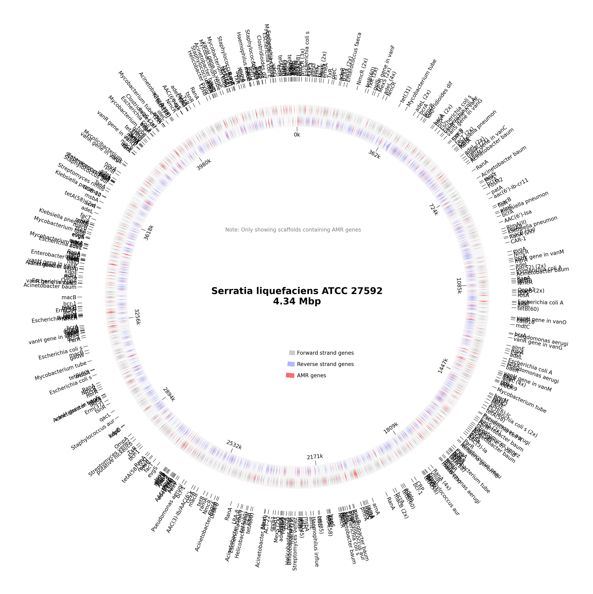

### AAC(3)-Ia
- **Mechanism**: antibiotic inactivation
- **Drug Classes**: aminoglycoside antibiotic
- **AMR Family**: AAC(3)
- **Locations**:
  - gnl|SPADES|NKELHLDI_104_1 : position 105-653

### AAC(3)-Ib/AAC(6')-Ib3 bifunctional protein
- **Mechanism**: antibiotic inactivation
- **Drug Classes**: aminoglycoside antibiotic
- **AMR Family**: aminoglycoside bifunctional resistance protein
- **Locations**:
  - gnl|SPADES|NKELHLDI_153_40 : position 44615-45067

### AAC(6')-Iai
- **Mechanism**: antibiotic inactivation
- **Drug Classes**: aminoglycoside antibiotic
- **AMR Family**: AAC(6')
- **Locations**:
  - gnl|SPADES|NKELHLDI_176_7 : position 5405-5857

### AAC(6')-Iak
- **Mechanism**: antibiotic inactivation
- **Drug Classes**: aminoglycoside antibiotic
- **AMR Family**: AAC(6')
- **Locations**:
  - gnl|SPADES|NKELHLDI_509_2 : position 689-1135

### AAC(6')-Isa
- **Mechanism**: antibiotic inactivation
- **Drug Classes**: aminoglycoside antibiotic
- **AMR Family**: AAC(6')
- **Locations**:
  - gnl|SPADES|NKELHLDI_64_71 : position 73019-73603

### ACT-22
- **Mechanism**: antibiotic inactivation
- **Drug Classes**: carbapenem; cephalosporin; cephamycin; penam
- **AMR Family**: ACT beta-lactamase
- **Locations**:
  - gnl|SPADES|NKELHLDI_134_27 : position 24474-26009

### AIM-1
- **Mechanism**: antibiotic inactivation
- **Drug Classes**: cephalosporin; cephamycin; penam
- **AMR Family**: AIM beta-lactamase
- **Locations**:
  - gnl|SPADES|NKELHLDI_176_33 : position 24975-25919

### APH(6)-Ic
- **Mechanism**: antibiotic inactivation
- **Drug Classes**: aminoglycoside antibiotic
- **AMR Family**: APH(6)
- **Locations**:
  - gnl|SPADES|NKELHLDI_95_40 : position 35824-36678

### AQU-2
- **Mechanism**: antibiotic inactivation
- **Drug Classes**: cephalosporin
- **AMR Family**: AQU beta-lactamase
- **Locations**:
  - gnl|SPADES|NKELHLDI_95_85 : position 80455-81600

### Acinetobacter baumannii AbaF (found in 7 locations)
- **Mechanism**: antibiotic efflux
- **Drug Classes**: phosphonic acid antibiotic
- **AMR Family**: major facilitator superfamily (MFS) antibiotic efflux pump
- **Locations**:
  - gnl|SPADES|NKELHLDI_101_16 : position 14847-16172
  - gnl|SPADES|NKELHLDI_122_3 : position 3085-4587
  - gnl|SPADES|NKELHLDI_134_36 : position 35347-36657
  - gnl|SPADES|NKELHLDI_329_7 : position 6981-8288
  - gnl|SPADES|NKELHLDI_492_9 : position 8051-9283
  - gnl|SPADES|NKELHLDI_61_50 : position 48544-49926
  - gnl|SPADES|NKELHLDI_62_6 : position 5309-6631

### Acinetobacter baumannii AbaQ (found in 10 locations)
- **Mechanism**: antibiotic efflux
- **Drug Classes**: fluoroquinolone antibiotic
- **AMR Family**: major facilitator superfamily (MFS) antibiotic efflux pump
- **Locations**:
  - gnl|SPADES|NKELHLDI_101_50 : position 52781-54076
  - gnl|SPADES|NKELHLDI_122_41 : position 38913-40226
  - gnl|SPADES|NKELHLDI_136_48 : position 52772-54034
  - gnl|SPADES|NKELHLDI_146_15 : position 13797-15167
  - gnl|SPADES|NKELHLDI_245_25 : position 26981-28249
  - gnl|SPADES|NKELHLDI_339_5 : position 5026-6333
  - gnl|SPADES|NKELHLDI_584_13 : position 13969-15369
  - gnl|SPADES|NKELHLDI_67_48 : position 53343-54650
  - gnl|SPADES|NKELHLDI_88_69 : position 82656-83993
  - gnl|SPADES|NKELHLDI_88_7 : position 6714-8027

### Acinetobacter baumannii AmvA
- **Mechanism**: antibiotic efflux
- **Drug Classes**: macrolide antibiotic; disinfecting agents and antiseptics
- **AMR Family**: major facilitator superfamily (MFS) antibiotic efflux pump
- **Locations**:
  - gnl|SPADES|NKELHLDI_37_27 : position 31654-33126

### ArnT
- **Mechanism**: antibiotic target alteration
- **Drug Classes**: peptide antibiotic
- **AMR Family**: pmr phosphoethanolamine transferase
- **Locations**:
  - gnl|SPADES|NKELHLDI_447_11: position 9272-10936

### Bifidobacterium bifidum ileS conferring resistance to mupirocin
- **Mechanism**: antibiotic target alteration
- **Drug Classes**: mupirocin-like antibiotic
- **AMR Family**: antibiotic-resistant isoleucyl-tRNA synthetase (ileS)
- **Locations**:
  - gnl|SPADES|NKELHLDI_133_15 : position 14345-16927

### CAR-1
- **Mechanism**: antibiotic inactivation
- **Drug Classes**: carbapenem
- **AMR Family**: CAR beta-lactamase
- **Locations**:
  - gnl|SPADES|NKELHLDI_65_50 : position 44897-45703

### CRP (found in 2 locations)
- **Mechanism**: antibiotic efflux
- **Drug Classes**: macrolide antibiotic; fluoroquinolone antibiotic; penam
- **AMR Family**: resistance-nodulation-cell division (RND) antibiotic efflux pump
- **Locations**:
  - gnl|SPADES|NKELHLDI_104_56: position 62576-63208
  - gnl|SPADES|NKELHLDI_108_68 : position 71385-72149

### Clostridioides difficile gyrA conferring resistance to fluoroquinolones
- **Mechanism**: antibiotic target alteration
- **Drug Classes**: fluoroquinolone antibiotic
- **AMR Family**: fluoroquinolone resistant gyrA
- **Locations**:
  - gnl|SPADES|NKELHLDI_480_10 : position 9093-11744

### Clostridioides difficile gyrB conferring resistance to fluoroquinolones (found in 2 locations)
- **Mechanism**: antibiotic target alteration
- **Drug Classes**: fluoroquinolone antibiotic
- **AMR Family**: fluoroquinolone resistant gyrB
- **Locations**:
  - gnl|SPADES|NKELHLDI_46_52 : position 64415-66310
  - gnl|SPADES|NKELHLDI_782_4 : position 2953-5367

### CrcB
- **Mechanism**: antibiotic efflux
- **Drug Classes**: aminoglycoside antibiotic
- **AMR Family**: multidrug and toxic compound extrusion (MATE) transporter
- **Locations**:
  - gnl|SPADES|NKELHLDI_133_30 : position 29779-30162

### DHA-6
- **Mechanism**: antibiotic inactivation
- **Drug Classes**: cephalosporin; cephamycin
- **AMR Family**: DHA beta-lactamase
- **Locations**:
  - gnl|SPADES|NKELHLDI_146_11 : position 9263-10405

### Enterobacter cloacae acrA (found in 2 locations)
- **Mechanism**: antibiotic efflux
- **Drug Classes**: fluoroquinolone antibiotic; cephalosporin; glycylcycline; penam; tetracycline antibiotic; rifamycin antibiotic; phenicol antibiotic; disinfecting agents and antiseptics
- **AMR Family**: resistance-nodulation-cell division (RND) antibiotic efflux pump
- **Locations**:
  - gnl|SPADES|NKELHLDI_340_4 : position 3746-4948
  - gnl|SPADES|NKELHLDI_68_45 : position 48186-49373

### Enterococcus faecalis cls with mutation conferring resistance to daptomycin
- **Mechanism**: antibiotic target alteration
- **Drug Classes**: peptide antibiotic
- **AMR Family**: daptomycin resistant cls
- **Locations**:
  - gnl|SPADES|NKELHLDI_37_25 : position 29027-30487

### Enterococcus faecium liaS mutant conferring daptomycin resistance
- **Mechanism**: antibiotic target alteration; antibiotic efflux
- **Drug Classes**: peptide antibiotic
- **AMR Family**: daptomycin resistant liaS
- **Locations**:
  - gnl|SPADES|NKELHLDI_417_2 : position 1603-3138

### Erm(34)
- **Mechanism**: antibiotic target alteration
- **Drug Classes**: macrolide antibiotic; lincosamide antibiotic; streptogramin antibiotic; streptogramin A antibiotic; streptogramin B antibiotic
- **AMR Family**: Erm 23S ribosomal RNA methyltransferase
- **Locations**:
  - gnl|SPADES|NKELHLDI_312_1 : position 340-966

### Erm(37)
- **Mechanism**: antibiotic target alteration
- **Drug Classes**: macrolide antibiotic; lincosamide antibiotic; streptogramin antibiotic; streptogramin A antibiotic; streptogramin B antibiotic
- **AMR Family**: Erm 23S ribosomal RNA methyltransferase
- **Locations**:
  - gnl|SPADES|NKELHLDI_245_7 : position 5086-5865

### Escherichia coli AcrAB-TolC with AcrR mutation conferring resistance to ciprofloxacin, tetracycline, and ceftazidime (found in 5 locations)
- **Mechanism**: antibiotic target alteration; antibiotic efflux
- **Drug Classes**: fluoroquinolone antibiotic; cephalosporin; glycylcycline; penam; tetracycline antibiotic; rifamycin antibiotic; phenicol antibiotic; disinfecting agents and antiseptics
- **AMR Family**: resistance-nodulation-cell division (RND) antibiotic efflux pump
- **Locations**:
  - gnl|SPADES|NKELHLDI_308_9 : position 9769-10473
  - gnl|SPADES|NKELHLDI_52_25 : position 24568-25149
  - gnl|SPADES|NKELHLDI_68_44 : position 47354-48043
  - gnl|SPADES|NKELHLDI_81_49 : position 52761-53348
  - gnl|SPADES|NKELHLDI_95_83 : position 78661-79263

### Escherichia coli AcrAB-TolC with MarR mutations conferring resistance to ciprofloxacin and tetracycline (found in 2 locations)
- **Mechanism**: antibiotic target alteration; antibiotic efflux
- **Drug Classes**: fluoroquinolone antibiotic; cephalosporin; glycylcycline; penam; tetracycline antibiotic; rifamycin antibiotic; phenicol antibiotic; disinfecting agents and antiseptics
- **AMR Family**: resistance-nodulation-cell division (RND) antibiotic efflux pump
- **Locations**:
  - gnl|SPADES|NKELHLDI_67_42 : position 47935-48408
  - gnl|SPADES|NKELHLDI_95_26 : position 25370-25804

### Escherichia coli EF-Tu mutants conferring resistance to Pulvomycin
- **Mechanism**: antibiotic target alteration
- **Drug Classes**: elfamycin antibiotic
- **AMR Family**: elfamycin resistant EF-Tu
- **Locations**:
  - gnl|SPADES|NKELHLDI_789_8 : position 7873-9669

### Escherichia coli fabI mutations conferring resistance to isoniazid and triclosan (found in 2 locations)
- **Mechanism**: antibiotic target alteration
- **Drug Classes**: disinfecting agents and antiseptics; isoniazid-like antibiotic
- **AMR Family**: antibiotic resistant fabI
- **Locations**:
  - gnl|SPADES|NKELHLDI_136_44 : position 48854-49609
  - gnl|SPADES|NKELHLDI_348_16 : position 13126-13872

### Escherichia coli mdfA
- **Mechanism**: antibiotic efflux
- **Drug Classes**: tetracycline antibiotic; phenicol antibiotic; disinfecting agents and antiseptics
- **AMR Family**: major facilitator superfamily (MFS) antibiotic efflux pump
- **Locations**:
  - gnl|SPADES|NKELHLDI_819_7 : position 7130-8377

### Escherichia coli soxS with mutation conferring antibiotic resistance (found in 9 locations)
- **Mechanism**: antibiotic target alteration; antibiotic efflux; reduced permeability to antibiotic
- **Drug Classes**: fluoroquinolone antibiotic; monobactam; carbapenem; cephalosporin; glycylcycline; cephamycin; penam; tetracycline antibiotic; rifamycin antibiotic; phenicol antibiotic; penem; disinfecting agents and antiseptics
- **AMR Family**: ATP-binding cassette (ABC) antibiotic efflux pump; major facilitator superfamily (MFS) antibiotic efflux pump; resistance-nodulation-cell division (RND) antibiotic efflux pump; General Bacterial Porin with reduced permeability to beta-lactams
- **Locations**:
  - gnl|SPADES|NKELHLDI_122_28 : position 24237-25082
  - gnl|SPADES|NKELHLDI_265_25 : position 21300-22073
  - gnl|SPADES|NKELHLDI_285_9 : position 11452-12318
  - gnl|SPADES|NKELHLDI_30_28 : position 28087-29034
  - gnl|SPADES|NKELHLDI_329_18 : position 20802-21671
  - gnl|SPADES|NKELHLDI_464_16 : position 18962-19384
  - gnl|SPADES|NKELHLDI_52_14 : position 11896-12354
  - gnl|SPADES|NKELHLDI_95_50 : position 47052-47945
  - gnl|SPADES|NKELHLDI_95_62 : position 59455-60372

### EstT (found in 3 locations)
- **Mechanism**: antibiotic inactivation
- **Drug Classes**: macrolide antibiotic
- **AMR Family**: macrolide esterase
- **Locations**:
  - gnl|SPADES|NKELHLDI_122_51 : position 47856-48659
  - gnl|SPADES|NKELHLDI_199_1 : position 60-890
  - gnl|SPADES|NKELHLDI_81_18 : position 25039-25881

### FosA8
- **Mechanism**: antibiotic inactivation
- **Drug Classes**: phosphonic acid antibiotic
- **AMR Family**: fosfomycin thiol transferase
- **Locations**:
  - gnl|SPADES|NKELHLDI_65_6: position 4776-5183

### FosC2
- **Mechanism**: antibiotic inactivation
- **Drug Classes**: phosphonic acid antibiotic
- **AMR Family**: fosC phosphotransferase family
- **Locations**:
  - gnl|SPADES|NKELHLDI_95_13 : position 11350-11757

### FosM2 (found in 2 locations)
- **Mechanism**: antibiotic inactivation
- **Drug Classes**: phosphonic acid antibiotic
- **AMR Family**: fosfomycin thiol transferase
- **Locations**:
  - gnl|SPADES|NKELHLDI_133_41 : position 38855-39364
  - gnl|SPADES|NKELHLDI_62_38 : position 48611-49021

### GOB-12
- **Mechanism**: antibiotic inactivation
- **Drug Classes**: carbapenem; cephalosporin; penam
- **AMR Family**: GOB beta-lactamase
- **Locations**:
  - gnl|SPADES|NKELHLDI_394_18 : position 22590-23237

### H-NS
- **Mechanism**: antibiotic efflux
- **Drug Classes**: macrolide antibiotic; fluoroquinolone antibiotic; cephalosporin; cephamycin; penam; tetracycline antibiotic
- **AMR Family**: major facilitator superfamily (MFS) antibiotic efflux pump; resistance-nodulation-cell division (RND) antibiotic efflux pump
- **Locations**:
  - gnl|SPADES|NKELHLDI_37_8 : position 7679-8086

### Haemophilus influenzae PBP3 conferring resistance to beta-lactam antibiotics (found in 2 locations)
- **Mechanism**: antibiotic target alteration
- **Drug Classes**: cephalosporin; cephamycin; penam
- **AMR Family**: Penicillin-binding protein mutations conferring resistance to beta-lactam antibiotics
- **Locations**:
  - gnl|SPADES|NKELHLDI_132_4 : position 3892-5655
  - gnl|SPADES|NKELHLDI_677_4 : position 3782-5500

### Helicobacter pylori pbp1 mutants conferring resistance to amoxicillin (found in 2 locations)
- **Mechanism**: antibiotic target alteration
- **Drug Classes**: cephalosporin; cephamycin; penam
- **AMR Family**: Penicillin-binding protein mutations conferring resistance to beta-lactam antibiotics
- **Locations**:
  - gnl|SPADES|NKELHLDI_136_29 : position 28908-31409
  - gnl|SPADES|NKELHLDI_569_8 : position 6790-9138

### Helicobacter pylori pbp2 mutants conferring resistance to amoxicillin
- **Mechanism**: antibiotic target alteration
- **Drug Classes**: cephalosporin; cephamycin; penam
- **AMR Family**: Penicillin-binding protein mutations conferring resistance to beta-lactam antibiotics
- **Locations**:
  - gnl|SPADES|NKELHLDI_133_21 : position 20205-22100

### Klebsiella pneumoniae KpnE
- **Mechanism**: antibiotic efflux
- **Drug Classes**: macrolide antibiotic; aminoglycoside antibiotic; cephalosporin; tetracycline antibiotic; peptide antibiotic; rifamycin antibiotic; disinfecting agents and antiseptics
- **AMR Family**: small multidrug resistance (SMR) antibiotic efflux pump
- **Locations**:
  - gnl|SPADES|NKELHLDI_64_41 : position 41554-41922

### Klebsiella pneumoniae KpnF
- **Mechanism**: antibiotic efflux
- **Drug Classes**: macrolide antibiotic; aminoglycoside antibiotic; cephalosporin; tetracycline antibiotic; peptide antibiotic; rifamycin antibiotic; disinfecting agents and antiseptics
- **AMR Family**: small multidrug resistance (SMR) antibiotic efflux pump
- **Locations**:
  - gnl|SPADES|NKELHLDI_64_40: position 41238-41567

### Klebsiella pneumoniae KpnH
- **Mechanism**: antibiotic efflux
- **Drug Classes**: macrolide antibiotic; fluoroquinolone antibiotic; aminoglycoside antibiotic; carbapenem; cephalosporin; penam; peptide antibiotic; penem
- **AMR Family**: major facilitator superfamily (MFS) antibiotic efflux pump
- **Locations**:
  - gnl|SPADES|NKELHLDI_176_48: position 41659-43194

### Klebsiella pneumoniae OmpK37 (found in 4 locations)
- **Mechanism**: reduced permeability to antibiotic
- **Drug Classes**: monobactam; carbapenem; cephalosporin; cephamycin; penam; penem
- **AMR Family**: General Bacterial Porin with reduced permeability to beta-lactams
- **Locations**:
  - gnl|SPADES|NKELHLDI_373_22 : position 26433-26687
  - gnl|SPADES|NKELHLDI_394_20 : position 24744-24869
  - gnl|SPADES|NKELHLDI_52_91 : position 90786-91883
  - gnl|SPADES|NKELHLDI_65_20 : position 11476-12558

### LRA-8
- **Mechanism**: antibiotic inactivation
- **Drug Classes**: cephalosporin; penam
- **AMR Family**: subclass B3 LRA beta-lactamase
- **Locations**:
  - gnl|SPADES|NKELHLDI_143_1 : position 76-831

### LpsB (found in 2 locations)
- **Mechanism**: reduced permeability to antibiotic
- **Drug Classes**: peptide antibiotic
- **AMR Family**: Intrinsic peptide antibiotic resistant Lps
- **Locations**:
  - gnl|SPADES|NKELHLDI_165_48 : position 47287-48378
  - gnl|SPADES|NKELHLDI_537_14 : position 16261-17277

### LptD
- **Mechanism**: antibiotic efflux
- **Drug Classes**: carbapenem; peptide antibiotic; aminocoumarin antibiotic; rifamycin antibiotic
- **AMR Family**: ATP-binding cassette (ABC) antibiotic efflux pump
- **Locations**:
  - gnl|SPADES|NKELHLDI_132_32 : position 40756-43119

### MdtK
- **Mechanism**: antibiotic efflux
- **Drug Classes**: fluoroquinolone antibiotic
- **AMR Family**: multidrug and toxic compound extrusion (MATE) transporter
- **Locations**:
  - gnl|SPADES|NKELHLDI_40_99 : position 96704-98167

### MexA
- **Mechanism**: antibiotic efflux
- **Drug Classes**: macrolide antibiotic; fluoroquinolone antibiotic; monobactam; carbapenem; cephalosporin; cephamycin; penam; tetracycline antibiotic; peptide antibiotic; aminocoumarin antibiotic; diaminopyrimidine antibiotic; sulfonamide antibiotic; phenicol antibiotic; penem
- **AMR Family**: resistance-nodulation-cell division (RND) antibiotic efflux pump
- **Locations**:
  - gnl|SPADES|NKELHLDI_308_11 : position 12183-13325

### MexE
- **Mechanism**: antibiotic efflux
- **Drug Classes**: fluoroquinolone antibiotic; diaminopyrimidine antibiotic; phenicol antibiotic
- **AMR Family**: resistance-nodulation-cell division (RND) antibiotic efflux pump
- **Locations**:
  - gnl|SPADES|NKELHLDI_95_25 : position 24092-24949

### MexG
- **Mechanism**: antibiotic efflux
- **Drug Classes**: fluoroquinolone antibiotic; tetracycline antibiotic; disinfecting agents and antiseptics
- **AMR Family**: resistance-nodulation-cell division (RND) antibiotic efflux pump
- **Locations**:
  - gnl|SPADES|NKELHLDI_176_11 : position 7972-8385

### MexH
- **Mechanism**: antibiotic efflux
- **Drug Classes**: fluoroquinolone antibiotic; tetracycline antibiotic; disinfecting agents and antiseptics
- **AMR Family**: resistance-nodulation-cell division (RND) antibiotic efflux pump
- **Locations**:
  - gnl|SPADES|NKELHLDI_79_28 : position 29687-31138

### MexL (found in 4 locations)
- **Mechanism**: antibiotic efflux
- **Drug Classes**: macrolide antibiotic; tetracycline antibiotic; disinfecting agents and antiseptics
- **AMR Family**: resistance-nodulation-cell division (RND) antibiotic efflux pump
- **Locations**:
  - gnl|SPADES|NKELHLDI_108_30 : position 33613-34197
  - gnl|SPADES|NKELHLDI_122_47 : position 44625-45263
  - gnl|SPADES|NKELHLDI_134_39 : position 38013-38669
  - gnl|SPADES|NKELHLDI_30_82 : position 76346-76990

### MexS (found in 10 locations)
- **Mechanism**: antibiotic efflux
- **Drug Classes**: fluoroquinolone antibiotic; diaminopyrimidine antibiotic; phenicol antibiotic
- **AMR Family**: resistance-nodulation-cell division (RND) antibiotic efflux pump
- **Locations**:
  - gnl|SPADES|NKELHLDI_133_60 : position 57127-58062
  - gnl|SPADES|NKELHLDI_133_61 : position 58155-59144
  - gnl|SPADES|NKELHLDI_262_21 : position 23672-24799
  - gnl|SPADES|NKELHLDI_30_88 : position 81304-82284
  - gnl|SPADES|NKELHLDI_30_98 : position 91681-92706
  - gnl|SPADES|NKELHLDI_40_13 : position 13271-14305
  - gnl|SPADES|NKELHLDI_40_51 : position 50228-51235
  - gnl|SPADES|NKELHLDI_46_20 : position 27189-28217
  - gnl|SPADES|NKELHLDI_522_4 : position 3239-4225
  - gnl|SPADES|NKELHLDI_61_35 : position 34935-35924

### MexT (found in 3 locations)
- **Mechanism**: antibiotic efflux
- **Drug Classes**: fluoroquinolone antibiotic; diaminopyrimidine antibiotic; phenicol antibiotic
- **AMR Family**: resistance-nodulation-cell division (RND) antibiotic efflux pump
- **Locations**:
  - gnl|SPADES|NKELHLDI_308_23 : position 27340-28236
  - gnl|SPADES|NKELHLDI_40_15 : position 15096-16025
  - gnl|SPADES|NKELHLDI_62_20 : position 25990-26940

### MexZ
- **Mechanism**: antibiotic efflux
- **Drug Classes**: macrolide antibiotic; fluoroquinolone antibiotic; aminoglycoside antibiotic; carbapenem; cephalosporin; cephamycin; penam; tetracycline antibiotic; phenicol antibiotic; disinfecting agents and antiseptics
- **AMR Family**: resistance-nodulation-cell division (RND) antibiotic efflux pump
- **Locations**:
  - gnl|SPADES|NKELHLDI_52_66 : position 65370-65936

### Mycobacterium tuberculosis gidB mutation conferring resistance to streptomycin
- **Mechanism**: antibiotic target alteration
- **Drug Classes**: aminoglycoside antibiotic
- **AMR Family**: antibiotic resistant gidB
- **Locations**:
  - gnl|SPADES|NKELHLDI_452_16 : position 18097-18717

### Mycobacterium tuberculosis inhA mutations conferring resistance to isoniazid
- **Mechanism**: antibiotic target alteration
- **Drug Classes**: isoniazid-like antibiotic
- **AMR Family**: isoniazid resistant inhA
- **Locations**:
  - gnl|SPADES|NKELHLDI_107_1 : position 523-1281

### Mycobacterium tuberculosis kasA mutant conferring resistance to isoniazid (found in 3 locations)
- **Mechanism**: antibiotic target alteration
- **Drug Classes**: isoniazid-like antibiotic
- **AMR Family**: antibiotic resistant kasA
- **Locations**:
  - gnl|SPADES|NKELHLDI_373_3 : position 1303-2577
  - gnl|SPADES|NKELHLDI_486_14 : position 10857-12026
  - gnl|SPADES|NKELHLDI_486_17 : position 13221-14450

### Mycobacterium tuberculosis katG mutations conferring resistance to isoniazid
- **Mechanism**: antibiotic target alteration
- **Drug Classes**: isoniazid-like antibiotic
- **AMR Family**: isoniazid resistant katG
- **Locations**:
  - gnl|SPADES|NKELHLDI_639_1 : position 245-2443

### Mycobacterium tuberculosis ndh with mutation conferring resistance to isoniazid
- **Mechanism**: antibiotic target alteration
- **Drug Classes**: isoniazid-like antibiotic
- **AMR Family**: antibiotic resistant ndh
- **Locations**:
  - gnl|SPADES|NKELHLDI_348_25 : position 19830-21134

### Mycobacterium tuberculosis pncA mutations conferring resistance to pyrazinamide (found in 3 locations)
- **Mechanism**: antibiotic target alteration
- **Drug Classes**: pyrazine antibiotic
- **AMR Family**: Pyrazinamide resistant pncA
- **Locations**:
  - gnl|SPADES|NKELHLDI_40_119 : position 118943-119629
  - gnl|SPADES|NKELHLDI_621_11 : position 10833-11465
  - gnl|SPADES|NKELHLDI_819_4 : position 4446-4997

### Mycobacterium tuberculosis rpsA mutations conferring resistance to pyrazinamide
- **Mechanism**: antibiotic target alteration
- **Drug Classes**: pyrazine antibiotic
- **AMR Family**: pyrazinamide resistant rpsA
- **Locations**:
  - gnl|SPADES|NKELHLDI_275_26 : position 33662-34549

### Mycobacterium tuberculosis thyA with mutation conferring resistance to para-aminosalicylic acid
- **Mechanism**: antibiotic target alteration
- **Drug Classes**: salicylic acid antibiotic
- **AMR Family**: aminosalicylate resistant thymidylate synthase
- **Locations**:
  - gnl|SPADES|NKELHLDI_88_57 : position 64367-65161

### Mycolicibacterium smegmatis ndh with mutation conferring resistance to isoniazid
- **Mechanism**: antibiotic target alteration
- **Drug Classes**: isoniazid-like antibiotic
- **AMR Family**: antibiotic resistant ndh
- **Locations**:
  - gnl|SPADES|NKELHLDI_430_4 : position 2918-4126

### Neisseria gonorrhoeae pilQ gene conferring resistance to beta-lactam
- **Mechanism**: antibiotic target alteration
- **Drug Classes**: cephalosporin; cephamycin; penam
- **AMR Family**: Penicillin-binding protein mutations conferring resistance to beta-lactam antibiotics
- **Locations**:
  - gnl|SPADES|NKELHLDI_104_29 : position 33240-34481

### NmcR (found in 26 locations)
- **Mechanism**: antibiotic inactivation
- **Drug Classes**: carbapenem; cephalosporin; cephamycin; penam
- **AMR Family**: NmcA beta-lactamase
- **Locations**:
  - gnl|SPADES|NKELHLDI_101_40 : position 42438-43331
  - gnl|SPADES|NKELHLDI_107_22 : position 27844-28764
  - gnl|SPADES|NKELHLDI_108_33 : position 36568-37476
  - gnl|SPADES|NKELHLDI_122_57 : position 52743-53666
  - gnl|SPADES|NKELHLDI_133_50 : position 48714-49703
  - gnl|SPADES|NKELHLDI_146_38 : position 35209-36138
  - gnl|SPADES|NKELHLDI_176_41 : position 34893-35771
  - gnl|SPADES|NKELHLDI_262_20 : position 22726-23643
  - gnl|SPADES|NKELHLDI_308_6 : position 6377-7240
  - gnl|SPADES|NKELHLDI_30_15 : position 15234-16172
  - gnl|SPADES|NKELHLDI_30_20 : position 20678-21580
  - gnl|SPADES|NKELHLDI_30_57 : position 54109-55038
  - gnl|SPADES|NKELHLDI_37_60 : position 65742-66716
  - gnl|SPADES|NKELHLDI_37_80 : position 87782-88636
  - gnl|SPADES|NKELHLDI_40_42 : position 42928-43800
  - gnl|SPADES|NKELHLDI_46_45 : position 56280-57113
  - gnl|SPADES|NKELHLDI_492_16 : position 16844-17743
  - gnl|SPADES|NKELHLDI_492_6 : position 4873-5700
  - gnl|SPADES|NKELHLDI_504_5 : position 5378-6274
  - gnl|SPADES|NKELHLDI_5061_1 : position 2-490
  - gnl|SPADES|NKELHLDI_52_3 : position 1352-2233
  - gnl|SPADES|NKELHLDI_52_51 : position 52351-53238
  - gnl|SPADES|NKELHLDI_65_84 : position 87787-88740
  - gnl|SPADES|NKELHLDI_665_13 : position 10963-11844
  - gnl|SPADES|NKELHLDI_67_73 : position 83468-84358
  - gnl|SPADES|NKELHLDI_81_19 : position 25990-26862

### OmpA (found in 4 locations)
- **Mechanism**: reduced permeability to antibiotic
- **Drug Classes**: peptide antibiotic
- **AMR Family**: General Bacterial Porin with reduced permeability to peptide antibiotics
- **Locations**:
  - gnl|SPADES|NKELHLDI_1423_1 : position 20-1096
  - gnl|SPADES|NKELHLDI_204_2 : position 865-1458
  - gnl|SPADES|NKELHLDI_245_21 : position 23143-23805
  - gnl|SPADES|NKELHLDI_329_25 : position 27933-28430

### OpmH
- **Mechanism**: antibiotic efflux
- **Drug Classes**: disinfecting agents and antiseptics
- **AMR Family**: resistance-nodulation-cell division (RND) antibiotic efflux pump
- **Locations**:
  - gnl|SPADES|NKELHLDI_1095_3 : position 3958-5298

### OprM
- **Mechanism**: antibiotic efflux
- **Drug Classes**: macrolide antibiotic; fluoroquinolone antibiotic; monobactam; aminoglycoside antibiotic; carbapenem; cephalosporin; cephamycin; penam; tetracycline antibiotic; peptide antibiotic; aminocoumarin antibiotic; diaminopyrimidine antibiotic; sulfonamide antibiotic; phenicol antibiotic; penem; disinfecting agents and antiseptics
- **AMR Family**: resistance-nodulation-cell division (RND) antibiotic efflux pump
- **Locations**:
  - gnl|SPADES|NKELHLDI_308_13 : position 16482-17936

### ParR (found in 2 locations)
- **Mechanism**: antibiotic efflux; reduced permeability to antibiotic
- **Drug Classes**: macrolide antibiotic; fluoroquinolone antibiotic; monobactam; aminoglycoside antibiotic; carbapenem; cephalosporin; cephamycin; penam; tetracycline antibiotic; phenicol antibiotic; penem; disinfecting agents and antiseptics
- **AMR Family**: resistance-nodulation-cell division (RND) antibiotic efflux pump; Outer Membrane Porin (Opr)
- **Locations**:
  - gnl|SPADES|NKELHLDI_104_14 : position 18227-18946
  - gnl|SPADES|NKELHLDI_288_6 : position 5993-6754

### ParS (found in 3 locations)
- **Mechanism**: antibiotic efflux; reduced permeability to antibiotic
- **Drug Classes**: macrolide antibiotic; fluoroquinolone antibiotic; monobactam; aminoglycoside antibiotic; carbapenem; cephalosporin; cephamycin; penam; tetracycline antibiotic; phenicol antibiotic; penem; disinfecting agents and antiseptics
- **AMR Family**: resistance-nodulation-cell division (RND) antibiotic efflux pump; Outer Membrane Porin (Opr)
- **Locations**:
  - gnl|SPADES|NKELHLDI_176_35 : position 27736-29334
  - gnl|SPADES|NKELHLDI_288_7 : position 6751-8055
  - gnl|SPADES|NKELHLDI_758_6 : position 5380-7161

### PmrF (found in 2 locations)
- **Mechanism**: antibiotic target alteration
- **Drug Classes**: peptide antibiotic
- **AMR Family**: pmr phosphoethanolamine transferase
- **Locations**:
  - gnl|SPADES|NKELHLDI_165_43 : position 41826-42809
  - gnl|SPADES|NKELHLDI_447_8 : position 5411-6391

### Pseudomonas aeruginosa CpxR (found in 5 locations)
- **Mechanism**: antibiotic efflux
- **Drug Classes**: macrolide antibiotic; fluoroquinolone antibiotic; monobactam; aminoglycoside antibiotic; carbapenem; cephalosporin; cephamycin; penam; tetracycline antibiotic; peptide antibiotic; aminocoumarin antibiotic; diaminopyrimidine antibiotic; sulfonamide antibiotic; phenicol antibiotic; penem
- **AMR Family**: resistance-nodulation-cell division (RND) antibiotic efflux pump
- **Locations**:
  - gnl|SPADES|NKELHLDI_107_33 : position 39906-40586
  - gnl|SPADES|NKELHLDI_165_23 : position 22293-22991
  - gnl|SPADES|NKELHLDI_176_36 : position 29343-30032
  - gnl|SPADES|NKELHLDI_79_8 : position 6808-7482
  - gnl|SPADES|NKELHLDI_81_66 : position 70288-71028

### Pseudomonas aeruginosa ampR with mutation conferring resistance to aztreonam (found in 2 locations)
- **Mechanism**: antibiotic target alteration; antibiotic inactivation
- **Drug Classes**: monobactam; carbapenem; cephalosporin
- **AMR Family**: PDC beta-lactamase; ampR transcriptional regulator with mutation conferring resistance to monobactam antibiotics
- **Locations**:
  - gnl|SPADES|NKELHLDI_79_59 : position 59959-60888
  - gnl|SPADES|NKELHLDI_95_80 : position 75168-76043

### QepA2
- **Mechanism**: antibiotic efflux
- **Drug Classes**: fluoroquinolone antibiotic
- **AMR Family**: major facilitator superfamily (MFS) antibiotic efflux pump
- **Locations**:
  - gnl|SPADES|NKELHLDI_68_11 : position 7895-9301

### QepA4
- **Mechanism**: antibiotic efflux
- **Drug Classes**: fluoroquinolone antibiotic
- **AMR Family**: major facilitator superfamily (MFS) antibiotic efflux pump
- **Locations**:
  - gnl|SPADES|NKELHLDI_67_74 : position 84458-85753

### RanA (found in 24 locations)
- **Mechanism**: antibiotic efflux
- **Drug Classes**: aminoglycoside antibiotic
- **AMR Family**: ATP-binding cassette (ABC) antibiotic efflux pump
- **Locations**:
  - gnl|SPADES|NKELHLDI_101_68 : position 73682-74752
  - gnl|SPADES|NKELHLDI_108_2 : position 1559-2674
  - gnl|SPADES|NKELHLDI_108_22 : position 23549-24586
  - gnl|SPADES|NKELHLDI_108_37 : position 40481-41194
  - gnl|SPADES|NKELHLDI_108_59 : position 63068-64180
  - gnl|SPADES|NKELHLDI_109_9 : position 7906-9498
  - gnl|SPADES|NKELHLDI_113_28 : position 28523-29656
  - gnl|SPADES|NKELHLDI_143_26 : position 25125-25868
  - gnl|SPADES|NKELHLDI_176_37 : position 30439-31641
  - gnl|SPADES|NKELHLDI_182_16 : position 16848-17924
  - gnl|SPADES|NKELHLDI_262_27 : position 30194-32071
  - gnl|SPADES|NKELHLDI_315_6 : position 7308-8297
  - gnl|SPADES|NKELHLDI_336_6 : position 5680-7356
  - gnl|SPADES|NKELHLDI_340_19 : position 23132-24193
  - gnl|SPADES|NKELHLDI_37_16 : position 19401-20417
  - gnl|SPADES|NKELHLDI_37_17 : position 20414-21415
  - gnl|SPADES|NKELHLDI_526_7 : position 7307-8083
  - gnl|SPADES|NKELHLDI_52_101 : position 100674-101609
  - gnl|SPADES|NKELHLDI_61_69 : position 78090-79082
  - gnl|SPADES|NKELHLDI_642_12 : position 8464-9279
  - gnl|SPADES|NKELHLDI_65_34 : position 29204-30172
  - gnl|SPADES|NKELHLDI_65_79 : position 82780-83616
  - gnl|SPADES|NKELHLDI_677_7 : position 6678-7439
  - gnl|SPADES|NKELHLDI_67_59 : position 68678-69757

### RanB
- **Mechanism**: antibiotic efflux
- **Drug Classes**: aminoglycoside antibiotic
- **AMR Family**: ATP-binding cassette (ABC) antibiotic efflux pump
- **Locations**:
  - gnl|SPADES|NKELHLDI_642_13 : position 9284-10066

### Rhodococcus fascians cmr
- **Mechanism**: antibiotic efflux
- **Drug Classes**: phenicol antibiotic
- **AMR Family**: major facilitator superfamily (MFS) antibiotic efflux pump
- **Locations**:
  - gnl|SPADES|NKELHLDI_62_60 : position 72374-73801

### RlmA(II)
- **Mechanism**: antibiotic target alteration
- **Drug Classes**: macrolide antibiotic; lincosamide antibiotic
- **AMR Family**: non-erm 23S ribosomal RNA methyltransferase (G748)
- **Locations**:
  - gnl|SPADES|NKELHLDI_64_95 : position 96659-97480

### Rv1877
- **Mechanism**: antibiotic efflux
- **Drug Classes**: fluoroquinolone antibiotic
- **AMR Family**: major facilitator superfamily (MFS) antibiotic efflux pump
- **Locations**:
  - gnl|SPADES|NKELHLDI_308_10 : position 10517-12031

### SAT-2
- **Mechanism**: antibiotic inactivation
- **Drug Classes**: nucleoside antibiotic
- **AMR Family**: streptothricin acetyltransferase (SAT)
- **Locations**:
  - gnl|SPADES|NKELHLDI_52_65 : position 64725-65354

### SAT-3
- **Mechanism**: antibiotic inactivation
- **Drug Classes**: nucleoside antibiotic
- **AMR Family**: streptothricin acetyltransferase (SAT)
- **Locations**:
  - gnl|SPADES|NKELHLDI_30_44 : position 42494-43036

### SRT-3
- **Mechanism**: antibiotic inactivation
- **Drug Classes**: cephalosporin
- **AMR Family**: SRT beta-lactamase
- **Locations**:
  - gnl|SPADES|NKELHLDI_95_81 : position 76248-77384

### Salmonella serovars soxS with mutation conferring antibiotic resistance
- **Mechanism**: antibiotic target alteration; antibiotic efflux; reduced permeability to antibiotic
- **Drug Classes**: fluoroquinolone antibiotic; monobactam; carbapenem; cephalosporin; glycylcycline; cephamycin; penam; tetracycline antibiotic; rifamycin antibiotic; phenicol antibiotic; penem; disinfecting agents and antiseptics
- **AMR Family**: ATP-binding cassette (ABC) antibiotic efflux pump; major facilitator superfamily (MFS) antibiotic efflux pump; resistance-nodulation-cell division (RND) antibiotic efflux pump; General Bacterial Porin with reduced permeability to beta-lactams
- **Locations**:
  - gnl|SPADES|NKELHLDI_65_12 : position 7313-7699

### SatA
- **Mechanism**: antibiotic inactivation
- **Drug Classes**: nucleoside antibiotic
- **AMR Family**: streptothricin acetyltransferase (SAT)
- **Locations**:
  - gnl|SPADES|NKELHLDI_245_20 : position 22480-22875

### Staphylococcus aureus GlpT with mutation conferring resistance to fosfomycin
- **Mechanism**: antibiotic target alteration
- **Drug Classes**: phosphonic acid antibiotic
- **AMR Family**: antibiotic-resistant GlpT
- **Locations**:
  - gnl|SPADES|NKELHLDI_209_27 : position 25234-26589

### Staphylococcus aureus fusA with mutation conferring resistance to fusidic acid (found in 2 locations)
- **Mechanism**: antibiotic target alteration
- **Drug Classes**: fusidane antibiotic
- **AMR Family**: antibiotic resistant fusA
- **Locations**:
  - gnl|SPADES|NKELHLDI_108_23 : position 24859-26964
  - gnl|SPADES|NKELHLDI_414_20 : position 17402-18991

### Staphylococcus aureus mupA conferring resistance to mupirocin
- **Mechanism**: antibiotic target alteration
- **Drug Classes**: mupirocin-like antibiotic
- **AMR Family**: antibiotic-resistant isoleucyl-tRNA synthetase (ileS)
- **Locations**:
  - gnl|SPADES|NKELHLDI_584_2 : position 1133-3949

### Staphylococcus aureus murA with mutation conferring resistance to fosfomycin
- **Mechanism**: antibiotic target alteration
- **Drug Classes**: phosphonic acid antibiotic
- **AMR Family**: antibiotic-resistant murA transferase
- **Locations**:
  - gnl|SPADES|NKELHLDI_642_18 : position 12019-13278

### Staphylococcus aureus norA (found in 2 locations)
- **Mechanism**: antibiotic efflux
- **Drug Classes**: fluoroquinolone antibiotic
- **AMR Family**: major facilitator superfamily (MFS) antibiotic efflux pump
- **Locations**:
  - gnl|SPADES|NKELHLDI_417_1 : position 171-1502
  - gnl|SPADES|NKELHLDI_758_1 : position 365-1711

### Staphylococcus aureus pgsA mutations conferring resistance to daptomycin
- **Mechanism**: antibiotic target alteration
- **Drug Classes**: peptide antibiotic
- **AMR Family**: daptomycin resistant pgsA
- **Locations**:
  - gnl|SPADES|NKELHLDI_122_15 : position 13649-14197

### Streptococcus pneumoniae PBP2x conferring resistance to amoxicillin
- **Mechanism**: antibiotic target alteration
- **Drug Classes**: cephalosporin; cephamycin; penam
- **AMR Family**: Penicillin-binding protein mutations conferring resistance to beta-lactam antibiotics
- **Locations**:
  - gnl|SPADES|NKELHLDI_104_24 : position 28320-30878

### Streptomyces rimosus otr(A)
- **Mechanism**: antibiotic target protection
- **Drug Classes**: tetracycline antibiotic
- **AMR Family**: tetracycline-resistant ribosomal protection protein
- **Locations**:
  - gnl|SPADES|NKELHLDI_411_20 : position 16945-18744

### Streptomyces venezuelae rox (found in 3 locations)
- **Mechanism**: antibiotic inactivation
- **Drug Classes**: rifamycin antibiotic
- **AMR Family**: rifampin monooxygenase
- **Locations**:
  - gnl|SPADES|NKELHLDI_101_32 : position 34032-35234
  - gnl|SPADES|NKELHLDI_133_1 : position 280-1413
  - gnl|SPADES|NKELHLDI_199_37 : position 35935-37647

### TaeA (found in 3 locations)
- **Mechanism**: antibiotic efflux
- **Drug Classes**: pleuromutilin antibiotic
- **AMR Family**: ATP-binding cassette (ABC) antibiotic efflux pump
- **Locations**:
  - gnl|SPADES|NKELHLDI_329_26 : position 28571-29716
  - gnl|SPADES|NKELHLDI_373_8 : position 6659-8563
  - gnl|SPADES|NKELHLDI_414_1 : position 3-575

### TolC (found in 2 locations)
- **Mechanism**: antibiotic efflux
- **Drug Classes**: macrolide antibiotic; fluoroquinolone antibiotic; aminoglycoside antibiotic; carbapenem; cephalosporin; glycylcycline; cephamycin; penam; tetracycline antibiotic; peptide antibiotic; aminocoumarin antibiotic; rifamycin antibiotic; phenicol antibiotic; penem; disinfecting agents and antiseptics
- **AMR Family**: ATP-binding cassette (ABC) antibiotic efflux pump; major facilitator superfamily (MFS) antibiotic efflux pump; resistance-nodulation-cell division (RND) antibiotic efflux pump
- **Locations**:
  - gnl|SPADES|NKELHLDI_24235_1 : position 3-365
  - gnl|SPADES|NKELHLDI_46_57 : position 70098-70508

### TxR (found in 9 locations)
- **Mechanism**: antibiotic efflux
- **Drug Classes**: tetracycline antibiotic
- **AMR Family**: ATP-binding cassette (ABC) antibiotic efflux pump
- **Locations**:
  - gnl|SPADES|NKELHLDI_130_12 : position 15620-16957
  - gnl|SPADES|NKELHLDI_199_9 : position 6905-8971
  - gnl|SPADES|NKELHLDI_30_109 : position 106122-108008
  - gnl|SPADES|NKELHLDI_374_12 : position 10149-12107
  - gnl|SPADES|NKELHLDI_37_100 : position 109427-110998
  - gnl|SPADES|NKELHLDI_37_93 : position 103695-104702
  - gnl|SPADES|NKELHLDI_46_59 : position 71952-73898
  - gnl|SPADES|NKELHLDI_522_10 : position 12503-14293
  - gnl|SPADES|NKELHLDI_650_12 : position 11803-13206

### VIM-69
- **Mechanism**: antibiotic inactivation
- **Drug Classes**: carbapenem; cephalosporin; cephamycin; penam; penem
- **AMR Family**: VIM beta-lactamase
- **Locations**:
  - gnl|SPADES|NKELHLDI_88_38 : position 40986-41870

### YajC
- **Mechanism**: antibiotic efflux
- **Drug Classes**: fluoroquinolone antibiotic; cephalosporin; glycylcycline; penam; tetracycline antibiotic; oxazolidinone antibiotic; glycopeptide antibiotic; rifamycin antibiotic; phenicol antibiotic; disinfecting agents and antiseptics
- **AMR Family**: resistance-nodulation-cell division (RND) antibiotic efflux pump
- **Locations**:
  - gnl|SPADES|NKELHLDI_358_20 : position 21089-21421

### YojI
- **Mechanism**: antibiotic efflux
- **Drug Classes**: peptide antibiotic
- **AMR Family**: ATP-binding cassette (ABC) antibiotic efflux pump
- **Locations**:
  - gnl|SPADES|NKELHLDI_88_26 : position 28882-30534

### aac(6')-Ib-cr11
- **Mechanism**: antibiotic inactivation
- **Drug Classes**: fluoroquinolone antibiotic; aminoglycoside antibiotic
- **AMR Family**: AAC(6'); AAC(6')-Ib-cr
- **Locations**:
  - gnl|SPADES|NKELHLDI_62_70 : position 86551-87069

### aadT
- **Mechanism**: antibiotic efflux
- **Drug Classes**: macrolide antibiotic; tetracycline antibiotic; disinfecting agents and antiseptics
- **AMR Family**: major facilitator superfamily (MFS) antibiotic efflux pump
- **Locations**:
  - gnl|SPADES|NKELHLDI_134_2 : position 1299-2510

### abeM
- **Mechanism**: antibiotic efflux
- **Drug Classes**: fluoroquinolone antibiotic; disinfecting agents and antiseptics
- **AMR Family**: multidrug and toxic compound extrusion (MATE) transporter
- **Locations**:
  - gnl|SPADES|NKELHLDI_61_44 : position 41499-42863

### acrB
- **Mechanism**: antibiotic efflux
- **Drug Classes**: fluoroquinolone antibiotic; cephalosporin; glycylcycline; penam; tetracycline antibiotic; rifamycin antibiotic; phenicol antibiotic; disinfecting agents and antiseptics
- **AMR Family**: resistance-nodulation-cell division (RND) antibiotic efflux pump
- **Locations**:
  - gnl|SPADES|NKELHLDI_308_12 : position 13328-16480

### adeF (found in 5 locations)
- **Mechanism**: antibiotic efflux
- **Drug Classes**: fluoroquinolone antibiotic; tetracycline antibiotic
- **AMR Family**: resistance-nodulation-cell division (RND) antibiotic efflux pump
- **Locations**:
  - gnl|SPADES|NKELHLDI_288_24: position 29725-32910
  - gnl|SPADES|NKELHLDI_340_5: position 4941-8114
  - gnl|SPADES|NKELHLDI_348_28: position 23192-26335
  - gnl|SPADES|NKELHLDI_464_6: position 7258-10371
  - gnl|SPADES|NKELHLDI_68_46: position 49391-52537

### adeH
- **Mechanism**: antibiotic efflux
- **Drug Classes**: fluoroquinolone antibiotic; tetracycline antibiotic
- **AMR Family**: resistance-nodulation-cell division (RND) antibiotic efflux pump
- **Locations**:
  - gnl|SPADES|NKELHLDI_122_2 : position 1313-2677

### adeL (found in 46 locations)
- **Mechanism**: antibiotic efflux
- **Drug Classes**: fluoroquinolone antibiotic; tetracycline antibiotic
- **AMR Family**: resistance-nodulation-cell division (RND) antibiotic efflux pump
- **Locations**:
  - gnl|SPADES|NKELHLDI_101_62 : position 65867-66838
  - gnl|SPADES|NKELHLDI_107_17 : position 23491-24393
  - gnl|SPADES|NKELHLDI_109_32 : position 36602-37474
  - gnl|SPADES|NKELHLDI_130_15 : position 19449-20372
  - gnl|SPADES|NKELHLDI_133_46 : position 43076-43969
  - gnl|SPADES|NKELHLDI_133_59 : position 56143-57042
  - gnl|SPADES|NKELHLDI_176_18 : position 12809-13705
  - gnl|SPADES|NKELHLDI_176_32 : position 24076-24969
  - gnl|SPADES|NKELHLDI_176_4 : position 2531-3466
  - gnl|SPADES|NKELHLDI_199_39 : position 37843-38769
  - gnl|SPADES|NKELHLDI_2718_1 : position 228-1145
  - gnl|SPADES|NKELHLDI_30_67 : position 63322-64215
  - gnl|SPADES|NKELHLDI_30_87 : position 80293-81183
  - gnl|SPADES|NKELHLDI_30_94 : position 86913-87848
  - gnl|SPADES|NKELHLDI_336_12 : position 11959-12909
  - gnl|SPADES|NKELHLDI_348_14 : position 11484-12395
  - gnl|SPADES|NKELHLDI_374_7 : position 4732-5631
  - gnl|SPADES|NKELHLDI_383_16 : position 17811-18728
  - gnl|SPADES|NKELHLDI_40_33 : position 31709-32626
  - gnl|SPADES|NKELHLDI_40_54 : position 53628-54560
  - gnl|SPADES|NKELHLDI_40_59 : position 55815-56717
  - gnl|SPADES|NKELHLDI_40_86 : position 83004-83903
  - gnl|SPADES|NKELHLDI_414_2 : position 606-1517
  - gnl|SPADES|NKELHLDI_414_25 : position 22499-23443
  - gnl|SPADES|NKELHLDI_417_12 : position 13714-14577
  - gnl|SPADES|NKELHLDI_434_22 : position 18854-19765
  - gnl|SPADES|NKELHLDI_46_19 : position 26160-27080
  - gnl|SPADES|NKELHLDI_46_51 : position 63438-64334
  - gnl|SPADES|NKELHLDI_486_19 : position 15442-16329
  - gnl|SPADES|NKELHLDI_522_1 : position 5-892
  - gnl|SPADES|NKELHLDI_522_5 : position 4358-5245
  - gnl|SPADES|NKELHLDI_52_84 : position 83612-84526
  - gnl|SPADES|NKELHLDI_584_6 : position 6171-7094
  - gnl|SPADES|NKELHLDI_61_16 : position 14742-15644
  - gnl|SPADES|NKELHLDI_61_22 : position 21025-21942
  - gnl|SPADES|NKELHLDI_665_5 : position 3761-4693
  - gnl|SPADES|NKELHLDI_67_26 : position 24892-25812
  - gnl|SPADES|NKELHLDI_68_55 : position 57372-58304
  - gnl|SPADES|NKELHLDI_81_28 : position 33804-34712
  - gnl|SPADES|NKELHLDI_88_17 : position 19311-20207
  - gnl|SPADES|NKELHLDI_88_22 : position 23731-24675
  - gnl|SPADES|NKELHLDI_88_25 : position 27808-28728
  - gnl|SPADES|NKELHLDI_88_39 : position 41979-42887
  - gnl|SPADES|NKELHLDI_95_19 : position 17185-18114
  - gnl|SPADES|NKELHLDI_95_6 : position 5729-6637
  - gnl|SPADES|NKELHLDI_95_84 : position 79424-80353

### adeR
- **Mechanism**: antibiotic efflux
- **Drug Classes**: glycylcycline; tetracycline antibiotic
- **AMR Family**: resistance-nodulation-cell division (RND) antibiotic efflux pump
- **Locations**:
  - gnl|SPADES|NKELHLDI_37_4 : position 2783-3796

### almE (found in 5 locations)
- **Mechanism**: antibiotic target alteration
- **Drug Classes**: peptide antibiotic
- **AMR Family**: polymyxin resistance operon; alm glycyltransferase
- **Locations**:
  - gnl|SPADES|NKELHLDI_107_10 : position 10505-14449
  - gnl|SPADES|NKELHLDI_107_3 : position 2139-3767
  - gnl|SPADES|NKELHLDI_132_12 : position 12530-14221
  - gnl|SPADES|NKELHLDI_64_35 : position 35434-37122
  - gnl|SPADES|NKELHLDI_81_6 : position 5650-8745

### arlR (found in 2 locations)
- **Mechanism**: antibiotic efflux
- **Drug Classes**: fluoroquinolone antibiotic; disinfecting agents and antiseptics
- **AMR Family**: major facilitator superfamily (MFS) antibiotic efflux pump
- **Locations**:
  - gnl|SPADES|NKELHLDI_340_3 : position 2750-3457
  - gnl|SPADES|NKELHLDI_52_40 : position 42761-43432

### arnA (found in 2 locations)
- **Mechanism**: antibiotic target alteration
- **Drug Classes**: peptide antibiotic
- **AMR Family**: pmr phosphoethanolamine transferase
- **Locations**:
  - gnl|SPADES|NKELHLDI_114_10 : position 6412-7050
  - gnl|SPADES|NKELHLDI_447_9 : position 6388-8373

### bacA
- **Mechanism**: antibiotic target alteration
- **Drug Classes**: peptide antibiotic
- **AMR Family**: undecaprenyl pyrophosphate related proteins
- **Locations**:
  - gnl|SPADES|NKELHLDI_46_84 : position 100163-100987

### baeR (found in 2 locations)
- **Mechanism**: antibiotic efflux
- **Drug Classes**: aminoglycoside antibiotic; aminocoumarin antibiotic
- **AMR Family**: resistance-nodulation-cell division (RND) antibiotic efflux pump
- **Locations**:
  - gnl|SPADES|NKELHLDI_114_30 : position 40208-40924
  - gnl|SPADES|NKELHLDI_81_71 : position 78213-78902

### baeS (found in 4 locations)
- **Mechanism**: antibiotic efflux
- **Drug Classes**: aminoglycoside antibiotic; aminocoumarin antibiotic
- **AMR Family**: resistance-nodulation-cell division (RND) antibiotic efflux pump
- **Locations**:
  - gnl|SPADES|NKELHLDI_114_29 : position 38826-40208
  - gnl|SPADES|NKELHLDI_130_10 : position 13315-14751
  - gnl|SPADES|NKELHLDI_340_2 : position 1296-2750
  - gnl|SPADES|NKELHLDI_81_72 : position 78927-80243

### basS (found in 4 locations)
- **Mechanism**: antibiotic target alteration; antibiotic efflux
- **Drug Classes**: peptide antibiotic
- **AMR Family**: pmr phosphoethanolamine transferase
- **Locations**:
  - gnl|SPADES|NKELHLDI_101_25 : position 22414-23820
  - gnl|SPADES|NKELHLDI_101_8 : position 8532-9950
  - gnl|SPADES|NKELHLDI_136_21 : position 19733-21091
  - gnl|SPADES|NKELHLDI_79_7 : position 5403-6821

### bcr-1 (found in 9 locations)
- **Mechanism**: antibiotic efflux
- **Drug Classes**: bicyclomycin-like antibiotic
- **AMR Family**: major facilitator superfamily (MFS) antibiotic efflux pump
- **Locations**:
  - gnl|SPADES|NKELHLDI_109_7 : position 5740-6948
  - gnl|SPADES|NKELHLDI_133_33 : position 31063-32253
  - gnl|SPADES|NKELHLDI_165_13 : position 13033-14217
  - gnl|SPADES|NKELHLDI_182_42 : position 44256-45452
  - gnl|SPADES|NKELHLDI_245_17 : position 18333-19673
  - gnl|SPADES|NKELHLDI_288_12 : position 12316-13464
  - gnl|SPADES|NKELHLDI_312_21 : position 19627-20973
  - gnl|SPADES|NKELHLDI_46_37 : position 43880-45301
  - gnl|SPADES|NKELHLDI_95_5 : position 4394-5605

### bcrA (found in 10 locations)
- **Mechanism**: antibiotic efflux
- **Drug Classes**: peptide antibiotic
- **AMR Family**: ATP-binding cassette (ABC) antibiotic efflux pump
- **Locations**:
  - gnl|SPADES|NKELHLDI_109_64 : position 69889-71421
  - gnl|SPADES|NKELHLDI_262_14 : position 15208-16716
  - gnl|SPADES|NKELHLDI_300_16 : position 11662-13146
  - gnl|SPADES|NKELHLDI_30_118 : position 119448-120146
  - gnl|SPADES|NKELHLDI_385_10 : position 8247-9314
  - gnl|SPADES|NKELHLDI_46_35 : position 41048-42586
  - gnl|SPADES|NKELHLDI_62_30 : position 38390-39889
  - gnl|SPADES|NKELHLDI_64_50 : position 52246-53004
  - gnl|SPADES|NKELHLDI_67_1 : position 3-941
  - gnl|SPADES|NKELHLDI_79_56 : position 56953-57585

### catB10
- **Mechanism**: antibiotic inactivation
- **Drug Classes**: phenicol antibiotic
- **AMR Family**: chloramphenicol acetyltransferase (CAT)
- **Locations**:
  - gnl|SPADES|NKELHLDI_79_13 : position 11319-11948

### clbB
- **Mechanism**: antibiotic target alteration
- **Drug Classes**: lincosamide antibiotic; streptogramin antibiotic; streptogramin A antibiotic; oxazolidinone antibiotic; phenicol antibiotic; pleuromutilin antibiotic
- **AMR Family**: Cfr 23S ribosomal RNA methyltransferase
- **Locations**:
  - gnl|SPADES|NKELHLDI_130_46 : position 53286-54482

### cmlv (found in 6 locations)
- **Mechanism**: antibiotic inactivation
- **Drug Classes**: phenicol antibiotic
- **AMR Family**: chloramphenicol phosphotransferase
- **Locations**:
  - gnl|SPADES|NKELHLDI_122_38 : position 36218-37390
  - gnl|SPADES|NKELHLDI_30_68 : position 64431-65615
  - gnl|SPADES|NKELHLDI_486_20 : position 16436-17611
  - gnl|SPADES|NKELHLDI_639_3 : position 4186-5376
  - gnl|SPADES|NKELHLDI_88_40 : position 43205-44359
  - gnl|SPADES|NKELHLDI_95_82 : position 77430-78584

### cmx
- **Mechanism**: antibiotic efflux
- **Drug Classes**: phenicol antibiotic
- **AMR Family**: major facilitator superfamily (MFS) antibiotic efflux pump
- **Locations**:
  - gnl|SPADES|NKELHLDI_176_42 : position 35873-37072

### cprR (found in 2 locations)
- **Mechanism**: antibiotic target alteration; antibiotic efflux
- **Drug Classes**: peptide antibiotic
- **AMR Family**: pmr phosphoethanolamine transferase
- **Locations**:
  - gnl|SPADES|NKELHLDI_101_24 : position 21749-22417
  - gnl|SPADES|NKELHLDI_136_20 : position 19074-19736

### cpxA (found in 6 locations)
- **Mechanism**: antibiotic efflux
- **Drug Classes**: aminoglycoside antibiotic; aminocoumarin antibiotic
- **AMR Family**: resistance-nodulation-cell division (RND) antibiotic efflux pump
- **Locations**:
  - gnl|SPADES|NKELHLDI_104_15 : position 18943-20313
  - gnl|SPADES|NKELHLDI_107_32 : position 38584-39906
  - gnl|SPADES|NKELHLDI_153_34 : position 36383-37849
  - gnl|SPADES|NKELHLDI_165_24 : position 22988-24361
  - gnl|SPADES|NKELHLDI_30_33 : position 32315-33640
  - gnl|SPADES|NKELHLDI_81_59 : position 61294-63906

### dfrA3
- **Mechanism**: antibiotic target replacement
- **Drug Classes**: diaminopyrimidine antibiotic
- **AMR Family**: trimethoprim resistant dihydrofolate reductase dfr
- **Locations**:
  - gnl|SPADES|NKELHLDI_132_39 : position 49641-50123

### efrB
- **Mechanism**: antibiotic efflux
- **Drug Classes**: macrolide antibiotic; fluoroquinolone antibiotic; rifamycin antibiotic
- **AMR Family**: ATP-binding cassette (ABC) antibiotic efflux pump
- **Locations**:
  - gnl|SPADES|NKELHLDI_1095_2 : position 805-2571

### emeA
- **Mechanism**: antibiotic efflux
- **Drug Classes**: disinfecting agents and antiseptics
- **AMR Family**: multidrug and toxic compound extrusion (MATE) transporter
- **Locations**:
  - gnl|SPADES|NKELHLDI_30_96 : position 89057-90415

### emrA (found in 2 locations)
- **Mechanism**: antibiotic efflux
- **Drug Classes**: fluoroquinolone antibiotic
- **AMR Family**: major facilitator superfamily (MFS) antibiotic efflux pump
- **Locations**:
  - gnl|SPADES|NKELHLDI_176_47 : position 40469-41641
  - gnl|SPADES|NKELHLDI_30_7 : position 7541-8569

### emrB
- **Mechanism**: antibiotic efflux
- **Drug Classes**: fluoroquinolone antibiotic
- **AMR Family**: major facilitator superfamily (MFS) antibiotic efflux pump
- **Locations**:
  - gnl|SPADES|NKELHLDI_452_2 : position 887-2302

### emrR (found in 2 locations)
- **Mechanism**: antibiotic efflux
- **Drug Classes**: fluoroquinolone antibiotic
- **AMR Family**: major facilitator superfamily (MFS) antibiotic efflux pump
- **Locations**:
  - gnl|SPADES|NKELHLDI_176_45 : position 38446-38967
  - gnl|SPADES|NKELHLDI_435_20 : position 18637-19185

### emrY (found in 2 locations)
- **Mechanism**: antibiotic efflux
- **Drug Classes**: tetracycline antibiotic
- **AMR Family**: major facilitator superfamily (MFS) antibiotic efflux pump
- **Locations**:
  - gnl|SPADES|NKELHLDI_114_28 : position 37396-38826
  - gnl|SPADES|NKELHLDI_30_8 : position 8572-10176

### eptA (found in 2 locations)
- **Mechanism**: antibiotic target alteration
- **Drug Classes**: peptide antibiotic
- **AMR Family**: pmr phosphoethanolamine transferase
- **Locations**:
  - gnl|SPADES|NKELHLDI_900_8 : position 5820-7358
  - gnl|SPADES|NKELHLDI_95_17 : position 14613-16250

### eptB (found in 2 locations)
- **Mechanism**: antibiotic target alteration
- **Drug Classes**: peptide antibiotic
- **AMR Family**: pmr phosphoethanolamine transferase
- **Locations**:
  - gnl|SPADES|NKELHLDI_122_5 : position 5050-6702
  - gnl|SPADES|NKELHLDI_417_4 : position 4094-5788

### erm(45)
- **Mechanism**: antibiotic target alteration
- **Drug Classes**: macrolide antibiotic; lincosamide antibiotic; streptogramin antibiotic; streptogramin B antibiotic
- **AMR Family**: Erm 23S ribosomal RNA methyltransferase
- **Locations**:
  - gnl|SPADES|NKELHLDI_132_35 : position 45455-46273

### evgA (found in 10 locations)
- **Mechanism**: antibiotic efflux
- **Drug Classes**: macrolide antibiotic; fluoroquinolone antibiotic; penam; tetracycline antibiotic
- **AMR Family**: major facilitator superfamily (MFS) antibiotic efflux pump; resistance-nodulation-cell division (RND) antibiotic efflux pump
- **Locations**:
  - gnl|SPADES|NKELHLDI_104_49 : position 55230-55955
  - gnl|SPADES|NKELHLDI_122_17 : position 16081-16737
  - gnl|SPADES|NKELHLDI_30_34 : position 33640-34260
  - gnl|SPADES|NKELHLDI_358_17 : position 17568-18167
  - gnl|SPADES|NKELHLDI_417_3 : position 3138-3728
  - gnl|SPADES|NKELHLDI_464_8 : position 10957-11589
  - gnl|SPADES|NKELHLDI_65_73 : position 76325-76975
  - gnl|SPADES|NKELHLDI_758_7 : position 7158-7790
  - gnl|SPADES|NKELHLDI_762_5 : position 6703-7308
  - gnl|SPADES|NKELHLDI_88_10 : position 14480-15106

### evgS (found in 9 locations)
- **Mechanism**: antibiotic efflux
- **Drug Classes**: macrolide antibiotic; fluoroquinolone antibiotic; penam; tetracycline antibiotic
- **AMR Family**: major facilitator superfamily (MFS) antibiotic efflux pump; resistance-nodulation-cell division (RND) antibiotic efflux pump
- **Locations**:
  - gnl|SPADES|NKELHLDI_179_13 : position 15501-17840
  - gnl|SPADES|NKELHLDI_358_16 : position 15836-17590
  - gnl|SPADES|NKELHLDI_429_17 : position 19655-22396
  - gnl|SPADES|NKELHLDI_480_11 : position 11977-14778
  - gnl|SPADES|NKELHLDI_480_13 : position 15472-18174
  - gnl|SPADES|NKELHLDI_509_4 : position 1601-2893
  - gnl|SPADES|NKELHLDI_62_15 : position 20696-22480
  - gnl|SPADES|NKELHLDI_762_4 : position 3491-6706
  - gnl|SPADES|NKELHLDI_88_9 : position 9411-13790

### facT (found in 4 locations)
- **Mechanism**: antibiotic efflux
- **Drug Classes**: elfamycin antibiotic
- **AMR Family**: major facilitator superfamily (MFS) antibiotic efflux pump
- **Locations**:
  - gnl|SPADES|NKELHLDI_179_34 : position 34044-35342
  - gnl|SPADES|NKELHLDI_374_25 : position 24241-25677
  - gnl|SPADES|NKELHLDI_52_81 : position 80545-81969
  - gnl|SPADES|NKELHLDI_52_85 : position 84639-85991

### farA
- **Mechanism**: antibiotic efflux
- **Drug Classes**: antibacterial free fatty acids
- **AMR Family**: major facilitator superfamily (MFS) antibiotic efflux pump
- **Locations**:
  - gnl|SPADES|NKELHLDI_434_20 : position 17267-18202

### farB
- **Mechanism**: antibiotic efflux
- **Drug Classes**: antibacterial free fatty acids
- **AMR Family**: major facilitator superfamily (MFS) antibiotic efflux pump
- **Locations**:
  - gnl|SPADES|NKELHLDI_67_63 : position 73939-75381

### floR
- **Mechanism**: antibiotic efflux
- **Drug Classes**: phenicol antibiotic
- **AMR Family**: major facilitator superfamily (MFS) antibiotic efflux pump
- **Locations**:
  - gnl|SPADES|NKELHLDI_64_19 : position 19250-20443

### gadW
- **Mechanism**: antibiotic efflux
- **Drug Classes**: macrolide antibiotic; fluoroquinolone antibiotic; penam
- **AMR Family**: resistance-nodulation-cell division (RND) antibiotic efflux pump
- **Locations**:
  - gnl|SPADES|NKELHLDI_276_28 : position 24487-25353

### golS (found in 3 locations)
- **Mechanism**: antibiotic efflux
- **Drug Classes**: monobactam; carbapenem; cephalosporin; cephamycin; penam; phenicol antibiotic; penem
- **AMR Family**: resistance-nodulation-cell division (RND) antibiotic efflux pump
- **Locations**:
  - gnl|SPADES|NKELHLDI_30_39 : position 37051-38076
  - gnl|SPADES|NKELHLDI_37_113 : position 121269-121769
  - gnl|SPADES|NKELHLDI_68_20 : position 18199-18600

### hmrM
- **Mechanism**: antibiotic efflux
- **Drug Classes**: fluoroquinolone antibiotic; disinfecting agents and antiseptics
- **AMR Family**: multidrug and toxic compound extrusion (MATE) transporter
- **Locations**:
  - gnl|SPADES|NKELHLDI_95_1 : position 241-1617

### iri
- **Mechanism**: antibiotic inactivation
- **Drug Classes**: rifamycin antibiotic
- **AMR Family**: rifampin monooxygenase
- **Locations**:
  - gnl|SPADES|NKELHLDI_30_124 : position 124377-125591

### kdpD
- **Mechanism**: antibiotic efflux
- **Drug Classes**: aminoglycoside antibiotic
- **AMR Family**: kdpDE
- **Locations**:
  - gnl|SPADES|NKELHLDI_204_36 : position 37380-40073

### kdpE (found in 3 locations)
- **Mechanism**: antibiotic efflux
- **Drug Classes**: aminoglycoside antibiotic
- **AMR Family**: kdpDE
- **Locations**:
  - gnl|SPADES|NKELHLDI_153_35 : position 37846-38517
  - gnl|SPADES|NKELHLDI_204_37 : position 40092-40781
  - gnl|SPADES|NKELHLDI_336_24 : position 23869-24555

### leuO (found in 3 locations)
- **Mechanism**: antibiotic efflux
- **Drug Classes**: nucleoside antibiotic; disinfecting agents and antiseptics
- **AMR Family**: major facilitator superfamily (MFS) antibiotic efflux pump
- **Locations**:
  - gnl|SPADES|NKELHLDI_132_13 : position 14794-15741
  - gnl|SPADES|NKELHLDI_522_2 : position 1218-2138
  - gnl|SPADES|NKELHLDI_88_41 : position 44349-45272

### lfrA
- **Mechanism**: antibiotic efflux
- **Drug Classes**: fluoroquinolone antibiotic
- **AMR Family**: major facilitator superfamily (MFS) antibiotic efflux pump
- **Locations**:
  - gnl|SPADES|NKELHLDI_1468_3 : position 1946-3406

### lmrB
- **Mechanism**: antibiotic efflux
- **Drug Classes**: lincosamide antibiotic; nucleoside antibiotic
- **AMR Family**: ATP-binding cassette (ABC) antibiotic efflux pump
- **Locations**:
  - gnl|SPADES|NKELHLDI_176_19 : position 13812-15194

### lmrC (found in 2 locations)
- **Mechanism**: antibiotic target protection
- **Drug Classes**: lincosamide antibiotic
- **AMR Family**: Miscellaneous ABC-F subfamily ATP-binding cassette ribosomal protection proteins
- **Locations**:
  - gnl|SPADES|NKELHLDI_179_46 : position 48258-49877
  - gnl|SPADES|NKELHLDI_30_61 : position 59667-60446

### macA (found in 3 locations)
- **Mechanism**: antibiotic efflux
- **Drug Classes**: macrolide antibiotic
- **AMR Family**: ATP-binding cassette (ABC) antibiotic efflux pump
- **Locations**:
  - gnl|SPADES|NKELHLDI_107_34 : position 40761-41954
  - gnl|SPADES|NKELHLDI_113_4 : position 2727-3806
  - gnl|SPADES|NKELHLDI_2307_2 : position 684-1868

### macB (found in 32 locations)
- **Mechanism**: antibiotic efflux
- **Drug Classes**: macrolide antibiotic
- **AMR Family**: ATP-binding cassette (ABC) antibiotic efflux pump
- **Locations**:
  - gnl|SPADES|NKELHLDI_104_64 : position 69010-69777
  - gnl|SPADES|NKELHLDI_107_35 : position 41954-43909
  - gnl|SPADES|NKELHLDI_107_37 : position 44879-45967
  - gnl|SPADES|NKELHLDI_109_36 : position 41738-42526
  - gnl|SPADES|NKELHLDI_113_19 : position 20741-21469
  - gnl|SPADES|NKELHLDI_113_3 : position 781-2727
  - gnl|SPADES|NKELHLDI_122_1 : position 2-1309
  - gnl|SPADES|NKELHLDI_133_11 : position 10729-11454
  - gnl|SPADES|NKELHLDI_133_40 : position 37997-38824
  - gnl|SPADES|NKELHLDI_153_24 : position 24782-25486
  - gnl|SPADES|NKELHLDI_182_1 : position 3-683
  - gnl|SPADES|NKELHLDI_2307_1 : position 1-687
  - gnl|SPADES|NKELHLDI_276_38 : position 33594-34346
  - gnl|SPADES|NKELHLDI_30_85 : position 78542-79567
  - gnl|SPADES|NKELHLDI_30_99 : position 92827-93660
  - gnl|SPADES|NKELHLDI_312_9 : position 6493-7215
  - gnl|SPADES|NKELHLDI_315_5 : position 6331-7311
  - gnl|SPADES|NKELHLDI_373_17 : position 17435-18211
  - gnl|SPADES|NKELHLDI_37_86 : position 96132-97124
  - gnl|SPADES|NKELHLDI_4333_1 : position 2-1198
  - gnl|SPADES|NKELHLDI_435_2 : position 876-1907
  - gnl|SPADES|NKELHLDI_452_7 : position 6178-7683
  - gnl|SPADES|NKELHLDI_52_62 : position 60618-61340
  - gnl|SPADES|NKELHLDI_61_25 : position 23696-26527
  - gnl|SPADES|NKELHLDI_61_55 : position 54335-55444
  - gnl|SPADES|NKELHLDI_64_14 : position 13667-14476
  - gnl|SPADES|NKELHLDI_65_30 : position 24753-25889
  - gnl|SPADES|NKELHLDI_65_35 : position 30162-31148
  - gnl|SPADES|NKELHLDI_65_78 : position 82112-82783
  - gnl|SPADES|NKELHLDI_68_13 : position 12137-12823
  - gnl|SPADES|NKELHLDI_68_51 : position 54984-55706
  - gnl|SPADES|NKELHLDI_81_60 : position 64048-65568

### marA (found in 4 locations)
- **Mechanism**: antibiotic efflux; reduced permeability to antibiotic
- **Drug Classes**: fluoroquinolone antibiotic; monobactam; carbapenem; cephalosporin; glycylcycline; cephamycin; penam; tetracycline antibiotic; rifamycin antibiotic; phenicol antibiotic; penem; disinfecting agents and antiseptics
- **AMR Family**: resistance-nodulation-cell division (RND) antibiotic efflux pump; General Bacterial Porin with reduced permeability to beta-lactams
- **Locations**:
  - gnl|SPADES|NKELHLDI_176_16 : position 10666-11673
  - gnl|SPADES|NKELHLDI_340_16 : position 20182-21156
  - gnl|SPADES|NKELHLDI_348_30 : position 27842-28198
  - gnl|SPADES|NKELHLDI_40_120 : position 119792-120754

### mdsC
- **Mechanism**: antibiotic efflux
- **Drug Classes**: monobactam; carbapenem; cephalosporin; cephamycin; penam; phenicol antibiotic; penem
- **AMR Family**: resistance-nodulation-cell division (RND) antibiotic efflux pump
- **Locations**:
  - gnl|SPADES|NKELHLDI_340_6 : position 8111-9514

### mdtA
- **Mechanism**: antibiotic efflux
- **Drug Classes**: aminocoumarin antibiotic
- **AMR Family**: resistance-nodulation-cell division (RND) antibiotic efflux pump
- **Locations**:
  - gnl|SPADES|NKELHLDI_114_25 : position 29942-31189

### mdtB
- **Mechanism**: antibiotic efflux
- **Drug Classes**: aminocoumarin antibiotic
- **AMR Family**: resistance-nodulation-cell division (RND) antibiotic efflux pump
- **Locations**:
  - gnl|SPADES|NKELHLDI_114_26 : position 31189-34308

### mdtC (found in 2 locations)
- **Mechanism**: antibiotic efflux
- **Drug Classes**: aminocoumarin antibiotic
- **AMR Family**: resistance-nodulation-cell division (RND) antibiotic efflux pump
- **Locations**:
  - gnl|SPADES|NKELHLDI_114_27 : position 34305-37385
  - gnl|SPADES|NKELHLDI_79_27 : position 26571-29690

### mdtG
- **Mechanism**: antibiotic efflux
- **Drug Classes**: phosphonic acid antibiotic
- **AMR Family**: major facilitator superfamily (MFS) antibiotic efflux pump
- **Locations**:
  - gnl|SPADES|NKELHLDI_67_9 : position 8292-9488

### mdtH
- **Mechanism**: antibiotic efflux
- **Drug Classes**: fluoroquinolone antibiotic
- **AMR Family**: major facilitator superfamily (MFS) antibiotic efflux pump
- **Locations**:
  - gnl|SPADES|NKELHLDI_64_72 : position 73949-75154

### mdtN (found in 2 locations)
- **Mechanism**: antibiotic efflux
- **Drug Classes**: nucleoside antibiotic; disinfecting agents and antiseptics
- **AMR Family**: major facilitator superfamily (MFS) antibiotic efflux pump
- **Locations**:
  - gnl|SPADES|NKELHLDI_176_1 : position 207-1343
  - gnl|SPADES|NKELHLDI_30_4 : position 4089-5075

### mdtP
- **Mechanism**: antibiotic efflux
- **Drug Classes**: nucleoside antibiotic; disinfecting agents and antiseptics
- **AMR Family**: major facilitator superfamily (MFS) antibiotic efflux pump
- **Locations**:
  - gnl|SPADES|NKELHLDI_176_46 : position 38992-40443

### mecC
- **Mechanism**: antibiotic target replacement
- **Drug Classes**: penam
- **AMR Family**: methicillin resistant PBP2
- **Locations**:
  - gnl|SPADES|NKELHLDI_677_3 : position 1754-3679

### mexP
- **Mechanism**: antibiotic efflux
- **Drug Classes**: macrolide antibiotic; carbapenem; tetracycline antibiotic; diaminopyrimidine antibiotic; phenicol antibiotic; disinfecting agents and antiseptics
- **AMR Family**: resistance-nodulation-cell division (RND) antibiotic efflux pump
- **Locations**:
  - gnl|SPADES|NKELHLDI_288_23 : position 28571-29725

### mgrA (found in 2 locations)
- **Mechanism**: antibiotic efflux
- **Drug Classes**: fluoroquinolone antibiotic; cephalosporin; penam; tetracycline antibiotic; peptide antibiotic; disinfecting agents and antiseptics
- **AMR Family**: ATP-binding cassette (ABC) antibiotic efflux pump; major facilitator superfamily (MFS) antibiotic efflux pump
- **Locations**:
  - gnl|SPADES|NKELHLDI_146_23 : position 21606-22058
  - gnl|SPADES|NKELHLDI_417_6 : position 6595-7059

### mphH
- **Mechanism**: antibiotic inactivation
- **Drug Classes**: macrolide antibiotic
- **AMR Family**: macrolide phosphotransferase (MPH)
- **Locations**:
  - gnl|SPADES|NKELHLDI_300_3 : position 1552-2463

### mreA
- **Mechanism**: antibiotic efflux
- **Drug Classes**: macrolide antibiotic
- **AMR Family**: major facilitator superfamily (MFS) antibiotic efflux pump
- **Locations**:
  - gnl|SPADES|NKELHLDI_584_1 : position 38-976

### msbA (found in 6 locations)
- **Mechanism**: antibiotic efflux
- **Drug Classes**: nitroimidazole antibiotic
- **AMR Family**: ATP-binding cassette (ABC) antibiotic efflux pump
- **Locations**:
  - gnl|SPADES|NKELHLDI_132_24 : position 29218-29979
  - gnl|SPADES|NKELHLDI_275_2 : position 839-2575
  - gnl|SPADES|NKELHLDI_394_2 : position 2619-4367
  - gnl|SPADES|NKELHLDI_447_6 : position 3114-3869
  - gnl|SPADES|NKELHLDI_64_15 : position 14481-15272
  - gnl|SPADES|NKELHLDI_88_20 : position 21384-23150

### mtrA (found in 5 locations)
- **Mechanism**: antibiotic efflux
- **Drug Classes**: macrolide antibiotic; penam
- **AMR Family**: resistance-nodulation-cell division (RND) antibiotic efflux pump
- **Locations**:
  - gnl|SPADES|NKELHLDI_108_25 : position 28066-28893
  - gnl|SPADES|NKELHLDI_30_72 : position 68572-69384
  - gnl|SPADES|NKELHLDI_40_98 : position 95843-96700
  - gnl|SPADES|NKELHLDI_67_13 : position 11242-12111
  - gnl|SPADES|NKELHLDI_81_12 : position 18571-19485

### nalD
- **Mechanism**: antibiotic efflux
- **Drug Classes**: macrolide antibiotic; fluoroquinolone antibiotic; monobactam; carbapenem; cephalosporin; cephamycin; penam; tetracycline antibiotic; peptide antibiotic; aminocoumarin antibiotic; diaminopyrimidine antibiotic; sulfonamide antibiotic; phenicol antibiotic; penem
- **AMR Family**: resistance-nodulation-cell division (RND) antibiotic efflux pump
- **Locations**:
  - gnl|SPADES|NKELHLDI_339_21 : position 24051-24692

### norA
- **Mechanism**: antibiotic efflux
- **Drug Classes**: fluoroquinolone antibiotic; disinfecting agents and antiseptics
- **AMR Family**: major facilitator superfamily (MFS) antibiotic efflux pump
- **Locations**:
  - gnl|SPADES|NKELHLDI_262_7 : position 7814-9037

### novA (found in 6 locations)
- **Mechanism**: antibiotic efflux
- **Drug Classes**: aminocoumarin antibiotic
- **AMR Family**: ATP-binding cassette (ABC) antibiotic efflux pump
- **Locations**:
  - gnl|SPADES|NKELHLDI_114_12 : position 7818-8630
  - gnl|SPADES|NKELHLDI_423_12 : position 15008-15754
  - gnl|SPADES|NKELHLDI_46_88 : position 104813-106609
  - gnl|SPADES|NKELHLDI_46_89 : position 106603-108345
  - gnl|SPADES|NKELHLDI_67_36 : position 37991-40126
  - gnl|SPADES|NKELHLDI_88_35 : position 37573-39309

### oleC (found in 3 locations)
- **Mechanism**: antibiotic efflux
- **Drug Classes**: macrolide antibiotic
- **AMR Family**: ATP-binding cassette (ABC) antibiotic efflux pump
- **Locations**:
  - gnl|SPADES|NKELHLDI_30_117 : position 118632-119438
  - gnl|SPADES|NKELHLDI_340_13 : position 17333-18088
  - gnl|SPADES|NKELHLDI_489_8 : position 7990-8880

### oleD
- **Mechanism**: antibiotic inactivation
- **Drug Classes**: macrolide antibiotic
- **AMR Family**: ole glycosyltransferase
- **Locations**:
  - gnl|SPADES|NKELHLDI_584_9 : position 9212-10486

### opmE (found in 2 locations)
- **Mechanism**: antibiotic efflux
- **Drug Classes**: macrolide antibiotic; carbapenem; tetracycline antibiotic; diaminopyrimidine antibiotic; phenicol antibiotic; disinfecting agents and antiseptics
- **AMR Family**: resistance-nodulation-cell division (RND) antibiotic efflux pump
- **Locations**:
  - gnl|SPADES|NKELHLDI_288_25 : position 32907-33206
  - gnl|SPADES|NKELHLDI_37_116 : position 124748-124981

### optrA
- **Mechanism**: antibiotic target protection
- **Drug Classes**: oxazolidinone antibiotic; phenicol antibiotic
- **AMR Family**: Miscellaneous ABC-F subfamily ATP-binding cassette ribosomal protection proteins
- **Locations**:
  - gnl|SPADES|NKELHLDI_104_67 : position 71487-73400

### oqxA
- **Mechanism**: antibiotic efflux
- **Drug Classes**: fluoroquinolone antibiotic; glycylcycline; tetracycline antibiotic; diaminopyrimidine antibiotic; nitrofuran antibiotic
- **AMR Family**: resistance-nodulation-cell division (RND) antibiotic efflux pump
- **Locations**:
  - gnl|SPADES|NKELHLDI_348_29 : position 26358-27545

### otr(B)
- **Mechanism**: antibiotic efflux
- **Drug Classes**: tetracycline antibiotic
- **AMR Family**: major facilitator superfamily (MFS) antibiotic efflux pump
- **Locations**:
  - gnl|SPADES|NKELHLDI_67_69 : position 78228-79715

### patA
- **Mechanism**: antibiotic efflux
- **Drug Classes**: fluoroquinolone antibiotic
- **AMR Family**: ATP-binding cassette (ABC) antibiotic efflux pump
- **Locations**:
  - gnl|SPADES|NKELHLDI_62_57 : position 69985-70662

### pmrA (found in 2 locations)
- **Mechanism**: antibiotic efflux
- **Drug Classes**: fluoroquinolone antibiotic
- **AMR Family**: major facilitator superfamily (MFS) antibiotic efflux pump
- **Locations**:
  - gnl|SPADES|NKELHLDI_114_38 : position 48203-49450
  - gnl|SPADES|NKELHLDI_374_8 : position 5767-6993

### putative nickel/cobalt transporter
- **Mechanism**: antibiotic efflux
- **Drug Classes**: fluoroquinolone antibiotic; aminoglycoside antibiotic; isoniazid-like antibiotic
- **AMR Family**: metal transporters with antibiotic efflux
- **Locations**:
  - gnl|SPADES|NKELHLDI_199_27 : position 26205-27236

### qacA
- **Mechanism**: antibiotic efflux
- **Drug Classes**: fluoroquinolone antibiotic
- **AMR Family**: major facilitator superfamily (MFS) antibiotic efflux pump
- **Locations**:
  - gnl|SPADES|NKELHLDI_133_48 : position 45655-47019

### qacG
- **Mechanism**: antibiotic efflux
- **Drug Classes**: disinfecting agents and antiseptics
- **AMR Family**: small multidrug resistance (SMR) antibiotic efflux pump
- **Locations**:
  - gnl|SPADES|NKELHLDI_288_21: position 24239-24559

### qacL
- **Mechanism**: antibiotic efflux
- **Drug Classes**: disinfecting agents and antiseptics
- **AMR Family**: small multidrug resistance (SMR) antibiotic efflux pump
- **Locations**:
  - gnl|SPADES|NKELHLDI_241_6 : position 3840-4157

### qnrE1
- **Mechanism**: antibiotic target protection
- **Drug Classes**: fluoroquinolone antibiotic
- **AMR Family**: quinolone resistance protein (qnr)
- **Locations**:
  - gnl|SPADES|NKELHLDI_134_10 : position 8442-9086

### ramA (found in 2 locations)
- **Mechanism**: antibiotic efflux; reduced permeability to antibiotic
- **Drug Classes**: fluoroquinolone antibiotic; monobactam; carbapenem; cephalosporin; glycylcycline; cephamycin; penam; tetracycline antibiotic; rifamycin antibiotic; phenicol antibiotic; penem; disinfecting agents and antiseptics
- **AMR Family**: resistance-nodulation-cell division (RND) antibiotic efflux pump; General Bacterial Porin with reduced permeability to beta-lactams
- **Locations**:
  - gnl|SPADES|NKELHLDI_114_21 : position 25084-26580
  - gnl|SPADES|NKELHLDI_146_50 : position 50175-51053

### rosA
- **Mechanism**: antibiotic efflux
- **Drug Classes**: peptide antibiotic
- **AMR Family**: major facilitator superfamily (MFS) antibiotic efflux pump
- **Locations**:
  - gnl|SPADES|NKELHLDI_68_26 : position 25866-27161

### rosB (found in 3 locations)
- **Mechanism**: antibiotic efflux
- **Drug Classes**: peptide antibiotic
- **AMR Family**: major facilitator superfamily (MFS) antibiotic efflux pump
- **Locations**:
  - gnl|SPADES|NKELHLDI_104_69 : position 74088-75896
  - gnl|SPADES|NKELHLDI_132_43 : position 52316-54169
  - gnl|SPADES|NKELHLDI_68_27 : position 27409-29100

### rphB (found in 2 locations)
- **Mechanism**: antibiotic inactivation
- **Drug Classes**: rifamycin antibiotic
- **AMR Family**: rifampin phosphotransferase
- **Locations**:
  - gnl|SPADES|NKELHLDI_107_30 : position 36037-37764
  - gnl|SPADES|NKELHLDI_423_5 : position 4393-6771

### rsmA
- **Mechanism**: antibiotic efflux
- **Drug Classes**: fluoroquinolone antibiotic; diaminopyrimidine antibiotic; phenicol antibiotic
- **AMR Family**: resistance-nodulation-cell division (RND) antibiotic efflux pump
- **Locations**:
  - gnl|SPADES|NKELHLDI_667_1: position 331-516

### sdiA
- **Mechanism**: antibiotic efflux
- **Drug Classes**: fluoroquinolone antibiotic; cephalosporin; glycylcycline; penam; tetracycline antibiotic; rifamycin antibiotic; phenicol antibiotic; disinfecting agents and antiseptics
- **AMR Family**: resistance-nodulation-cell division (RND) antibiotic efflux pump
- **Locations**:
  - gnl|SPADES|NKELHLDI_122_34 : position 31182-31898

### sdrM
- **Mechanism**: antibiotic efflux
- **Drug Classes**: fluoroquinolone antibiotic; disinfecting agents and antiseptics
- **AMR Family**: major facilitator superfamily (MFS) antibiotic efflux pump
- **Locations**:
  - gnl|SPADES|NKELHLDI_52_96 : position 95111-96607

### smeR (found in 2 locations)
- **Mechanism**: antibiotic efflux
- **Drug Classes**: aminoglycoside antibiotic; cephalosporin; cephamycin; penam
- **AMR Family**: resistance-nodulation-cell division (RND) antibiotic efflux pump
- **Locations**:
  - gnl|SPADES|NKELHLDI_101_9 : position 9947-10642
  - gnl|SPADES|NKELHLDI_300_12 : position 6817-7530

### tcr3
- **Mechanism**: antibiotic efflux
- **Drug Classes**: tetracycline antibiotic
- **AMR Family**: major facilitator superfamily (MFS) antibiotic efflux pump
- **Locations**:
  - gnl|SPADES|NKELHLDI_101_56 : position 58855-60204

### tet(31)
- **Mechanism**: antibiotic efflux
- **Drug Classes**: tetracycline antibiotic
- **AMR Family**: major facilitator superfamily (MFS) antibiotic efflux pump
- **Locations**:
  - gnl|SPADES|NKELHLDI_40_96 : position 92842-94098

### tet(35)
- **Mechanism**: antibiotic efflux
- **Drug Classes**: tetracycline antibiotic
- **AMR Family**: ATP-binding cassette (ABC) antibiotic efflux pump
- **Locations**:
  - gnl|SPADES|NKELHLDI_130_43 : position 49651-51090

### tet(50)
- **Mechanism**: antibiotic inactivation
- **Drug Classes**: tetracycline antibiotic
- **AMR Family**: tetracycline inactivation enzyme
- **Locations**:
  - gnl|SPADES|NKELHLDI_758_2 : position 1752-2888

### tet(52) (found in 2 locations)
- **Mechanism**: antibiotic inactivation
- **Drug Classes**: tetracycline antibiotic
- **AMR Family**: tetracycline inactivation enzyme
- **Locations**:
  - gnl|SPADES|NKELHLDI_67_35 : position 36801-37958
  - gnl|SPADES|NKELHLDI_67_44 : position 49863-51014

### tet(54)
- **Mechanism**: antibiotic inactivation
- **Drug Classes**: tetracycline antibiotic
- **AMR Family**: tetracycline inactivation enzyme
- **Locations**:
  - gnl|SPADES|NKELHLDI_101_33 : position 35321-36499

### tet(L)
- **Mechanism**: antibiotic efflux
- **Drug Classes**: tetracycline antibiotic
- **AMR Family**: major facilitator superfamily (MFS) antibiotic efflux pump
- **Locations**:
  - gnl|SPADES|NKELHLDI_754_2 : position 1465-2772

### tet(S)
- **Mechanism**: antibiotic target protection
- **Drug Classes**: tetracycline antibiotic
- **AMR Family**: tetracycline-resistant ribosomal protection protein
- **Locations**:
  - gnl|SPADES|NKELHLDI_312_12 : position 8302-9729

### tet(V)
- **Mechanism**: antibiotic efflux
- **Drug Classes**: tetracycline antibiotic
- **AMR Family**: major facilitator superfamily (MFS) antibiotic efflux pump
- **Locations**:
  - gnl|SPADES|NKELHLDI_107_6 : position 6129-7397

### tetA(58) (found in 17 locations)
- **Mechanism**: antibiotic efflux
- **Drug Classes**: tetracycline antibiotic
- **AMR Family**: major facilitator superfamily (MFS) antibiotic efflux pump
- **Locations**:
  - gnl|SPADES|NKELHLDI_101_44 : position 46305-47858
  - gnl|SPADES|NKELHLDI_107_9 : position 9627-10427
  - gnl|SPADES|NKELHLDI_108_36 : position 39718-40488
  - gnl|SPADES|NKELHLDI_130_18 : position 23410-24438
  - gnl|SPADES|NKELHLDI_136_14 : position 13414-14337
  - gnl|SPADES|NKELHLDI_182_10 : position 10542-11309
  - gnl|SPADES|NKELHLDI_182_11 : position 11313-12014
  - gnl|SPADES|NKELHLDI_30_3 : position 2348-4078
  - gnl|SPADES|NKELHLDI_385_14 : position 11412-12197
  - gnl|SPADES|NKELHLDI_385_20 : position 18233-19705
  - gnl|SPADES|NKELHLDI_447_19 : position 16414-17199
  - gnl|SPADES|NKELHLDI_492_3 : position 1346-2860
  - gnl|SPADES|NKELHLDI_639_9 : position 10471-11346
  - gnl|SPADES|NKELHLDI_642_6 : position 3670-4395
  - gnl|SPADES|NKELHLDI_67_2 : position 931-1935
  - gnl|SPADES|NKELHLDI_95_60 : position 56814-58349
  - gnl|SPADES|NKELHLDI_961_3 : position 2476-3969

### tetA(60) (found in 4 locations)
- **Mechanism**: antibiotic efflux
- **Drug Classes**: tetracycline antibiotic
- **AMR Family**: ATP-binding cassette (ABC) antibiotic efflux pump
- **Locations**:
  - gnl|SPADES|NKELHLDI_136_31 : position 33909-34706
  - gnl|SPADES|NKELHLDI_1605_4 : position 1386-3068
  - gnl|SPADES|NKELHLDI_639_8 : position 9758-10474
  - gnl|SPADES|NKELHLDI_68_67 : position 70303-72078

### tetB(60) (found in 4 locations)
- **Mechanism**: antibiotic efflux
- **Drug Classes**: tetracycline antibiotic
- **AMR Family**: ATP-binding cassette (ABC) antibiotic efflux pump
- **Locations**:
  - gnl|SPADES|NKELHLDI_109_40 : position 46815-48326
  - gnl|SPADES|NKELHLDI_275_3 : position 2578-4446
  - gnl|SPADES|NKELHLDI_37_85 : position 95318-96130
  - gnl|SPADES|NKELHLDI_68_66 : position 68532-70310

### tetR (found in 2 locations)
- **Mechanism**: antibiotic target alteration; antibiotic efflux
- **Drug Classes**: tetracycline antibiotic
- **AMR Family**: major facilitator superfamily (MFS) antibiotic efflux pump
- **Locations**:
  - gnl|SPADES|NKELHLDI_153_1 : position 3-548
  - gnl|SPADES|NKELHLDI_30_5 : position 5094-5783

### tlrC
- **Mechanism**: antibiotic target protection
- **Drug Classes**: macrolide antibiotic; lincosamide antibiotic
- **AMR Family**: Miscellaneous ABC-F subfamily ATP-binding cassette ribosomal protection proteins
- **Locations**:
  - gnl|SPADES|NKELHLDI_52_1 : position 1-672

### tsnR (found in 3 locations)
- **Mechanism**: antibiotic target alteration
- **Drug Classes**: peptide antibiotic
- **AMR Family**: non-erm 23S ribosomal RNA methyltransferase (A1067)
- **Locations**:
  - gnl|SPADES|NKELHLDI_176_49 : position 43267-44367
  - gnl|SPADES|NKELHLDI_241_31 : position 33032-33763
  - gnl|SPADES|NKELHLDI_524_7 : position 8437-9099

### ugd
- **Mechanism**: antibiotic target alteration
- **Drug Classes**: peptide antibiotic
- **AMR Family**: pmr phosphoethanolamine transferase
- **Locations**:
  - gnl|SPADES|NKELHLDI_37_6 : position 5110-6453

### vanG (found in 2 locations)
- **Mechanism**: antibiotic target alteration
- **Drug Classes**: glycopeptide antibiotic
- **AMR Family**: glycopeptide resistance gene cluster; Van ligase
- **Locations**:
  - gnl|SPADES|NKELHLDI_30_54: position 50727-51830
  - gnl|SPADES|NKELHLDI_852_3 : position 2110-3030

### vanH gene in vanA cluster
- **Mechanism**: antibiotic target alteration
- **Drug Classes**: glycopeptide antibiotic
- **AMR Family**: vanH; glycopeptide resistance gene cluster
- **Locations**:
  - gnl|SPADES|NKELHLDI_339_4 : position 3984-4934

### vanH gene in vanB cluster
- **Mechanism**: antibiotic target alteration
- **Drug Classes**: glycopeptide antibiotic
- **AMR Family**: vanH; glycopeptide resistance gene cluster
- **Locations**:
  - gnl|SPADES|NKELHLDI_101_38 : position 40016-41254

### vanH gene in vanD cluster (found in 2 locations)
- **Mechanism**: antibiotic target alteration
- **Drug Classes**: glycopeptide antibiotic
- **AMR Family**: vanH; glycopeptide resistance gene cluster
- **Locations**:
  - gnl|SPADES|NKELHLDI_288_18 : position 22023-23015
  - gnl|SPADES|NKELHLDI_30_11 : position 11604-12563

### vanH gene in vanF cluster
- **Mechanism**: antibiotic target alteration
- **Drug Classes**: glycopeptide antibiotic
- **AMR Family**: vanH; glycopeptide resistance gene cluster
- **Locations**:
  - gnl|SPADES|NKELHLDI_245_26 : position 28416-29393

### vanH gene in vanM cluster
- **Mechanism**: antibiotic target alteration
- **Drug Classes**: glycopeptide antibiotic
- **AMR Family**: vanH; glycopeptide resistance gene cluster
- **Locations**:
  - gnl|SPADES|NKELHLDI_88_6 : position 5766-6704

### vanH gene in vanO cluster
- **Mechanism**: antibiotic target alteration
- **Drug Classes**: glycopeptide antibiotic
- **AMR Family**: vanH; glycopeptide resistance gene cluster
- **Locations**:
  - gnl|SPADES|NKELHLDI_79_4 : position 2314-3435

### vanH gene in vanP cluster (found in 2 locations)
- **Mechanism**: antibiotic target alteration
- **Drug Classes**: glycopeptide antibiotic
- **AMR Family**: vanH; glycopeptide resistance gene cluster
- **Locations**:
  - gnl|SPADES|NKELHLDI_339_11 : position 12080-13060
  - gnl|SPADES|NKELHLDI_636_2 : position 2093-3034

### vanR gene in vanE cluster
- **Mechanism**: antibiotic target alteration
- **Drug Classes**: glycopeptide antibiotic
- **AMR Family**: glycopeptide resistance gene cluster; vanR
- **Locations**:
  - gnl|SPADES|NKELHLDI_329_16 : position 19219-19935

### vanR gene in vanF cluster (found in 2 locations)
- **Mechanism**: antibiotic target alteration
- **Drug Classes**: glycopeptide antibiotic
- **AMR Family**: glycopeptide resistance gene cluster; vanR
- **Locations**:
  - gnl|SPADES|NKELHLDI_40_1 : position 45-1094
  - gnl|SPADES|NKELHLDI_52_30 : position 30238-30951

### vanR gene in vanG cluster (found in 2 locations)
- **Mechanism**: antibiotic target alteration
- **Drug Classes**: glycopeptide antibiotic
- **AMR Family**: glycopeptide resistance gene cluster; vanR
- **Locations**:
  - gnl|SPADES|NKELHLDI_435_17 : position 16098-17654
  - gnl|SPADES|NKELHLDI_79_73 : position 72936-73670

### vanR gene in vanP cluster
- **Mechanism**: antibiotic target alteration
- **Drug Classes**: glycopeptide antibiotic
- **AMR Family**: glycopeptide resistance gene cluster; vanR
- **Locations**:
  - gnl|SPADES|NKELHLDI_429_15 : position 17849-18544

### vanS gene in vanF cluster
- **Mechanism**: antibiotic target alteration
- **Drug Classes**: glycopeptide antibiotic
- **AMR Family**: vanS; glycopeptide resistance gene cluster
- **Locations**:
  - gnl|SPADES|NKELHLDI_52_31 : position 30955-32421

### vanS gene in vanG cluster
- **Mechanism**: antibiotic target alteration
- **Drug Classes**: glycopeptide antibiotic
- **AMR Family**: vanS; glycopeptide resistance gene cluster
- **Locations**:
  - gnl|SPADES|NKELHLDI_52_39 : position 41340-42764

### vanT gene in vanC cluster
- **Mechanism**: antibiotic target alteration
- **Drug Classes**: glycopeptide antibiotic
- **AMR Family**: glycopeptide resistance gene cluster; vanT
- **Locations**:
  - gnl|SPADES|NKELHLDI_61_33 : position 32233-33312

### vanT gene in vanG cluster
- **Mechanism**: antibiotic target alteration
- **Drug Classes**: glycopeptide antibiotic
- **AMR Family**: glycopeptide resistance gene cluster; vanT
- **Locations**:
  - gnl|SPADES|NKELHLDI_64_20 : position 20447-21520

### vanX gene in vanM cluster
- **Mechanism**: antibiotic target alteration
- **Drug Classes**: glycopeptide antibiotic
- **AMR Family**: vanX; glycopeptide resistance gene cluster
- **Locations**:
  - gnl|SPADES|NKELHLDI_67_6 : position 5479-6042

### vatC
- **Mechanism**: antibiotic inactivation
- **Drug Classes**: streptogramin antibiotic; streptogramin A antibiotic
- **AMR Family**: streptogramin vat acetyltransferase
- **Locations**:
  - gnl|SPADES|NKELHLDI_30_45 : position 43033-43503

### vatH
- **Mechanism**: antibiotic inactivation
- **Drug Classes**: streptogramin antibiotic; streptogramin A antibiotic
- **AMR Family**: streptogramin vat acetyltransferase
- **Locations**:
  - gnl|SPADES|NKELHLDI_61_27 : position 27839-28396

### vmlR
- **Mechanism**: antibiotic target protection
- **Drug Classes**: lincosamide antibiotic; streptogramin antibiotic; streptogramin A antibiotic; streptogramin B antibiotic; nucleoside antibiotic; pleuromutilin antibiotic
- **AMR Family**: Miscellaneous ABC-F subfamily ATP-binding cassette ribosomal protection proteins
- **Locations**:
  - gnl|SPADES|NKELHLDI_108_13 : position 13150-14877

## Yersinia alsatica
**Strain Statistics:**
- Total genome length: 4967.9 kbp
- Total scaffolds: 36
- Scaffolds with AMR genes: 22
- Total genes annotated: 8996
- Total AMR genes: 471
- Unique AMR genes: 203
- Distinct AMR mechanisms: 11
- Distinct AMR families: 70
- Distinct drug classes: 36

**Circos Plot:**

### AAC(6')-Ir
- **Mechanism**: antibiotic inactivation
- **Drug Classes**: aminoglycoside antibiotic
- **AMR Family**: AAC(6')
- **Locations**:
  - gnl|SPADES|NKELHLDI_3_67 : position 77164-77658

### Acinetobacter baumannii AbaF (found in 6 locations)
- **Mechanism**: antibiotic efflux
- **Drug Classes**: phosphonic acid antibiotic
- **AMR Family**: major facilitator superfamily (MFS) antibiotic efflux pump
- **Locations**:
  - gnl|SPADES|NKELHLDI_151_22 : position 22608-24134
  - gnl|SPADES|NKELHLDI_1_984 : position 1051265-1052671
  - gnl|SPADES|NKELHLDI_5_282 : position 303244-304746
  - gnl|SPADES|NKELHLDI_5_290 : position 313125-314528
  - gnl|SPADES|NKELHLDI_6_56 : position 59763-61127
  - gnl|SPADES|NKELHLDI_7_188 : position 217529-218851

### Acinetobacter baumannii AbaQ
- **Mechanism**: antibiotic efflux
- **Drug Classes**: fluoroquinolone antibiotic
- **AMR Family**: major facilitator superfamily (MFS) antibiotic efflux pump
- **Locations**:
  - gnl|SPADES|NKELHLDI_2_178 : position 195420-196730

### Acinetobacter baumannii AmvA
- **Mechanism**: antibiotic efflux
- **Drug Classes**: macrolide antibiotic; disinfecting agents and antiseptics
- **AMR Family**: major facilitator superfamily (MFS) antibiotic efflux pump
- **Locations**:
  - gnl|SPADES|NKELHLDI_2_48 : position 54777-56309

### AcrS
- **Mechanism**: antibiotic efflux
- **Drug Classes**: fluoroquinolone antibiotic; cephalosporin; glycylcycline; cephamycin; penam; tetracycline antibiotic; rifamycin antibiotic; phenicol antibiotic; disinfecting agents and antiseptics
- **AMR Family**: resistance-nodulation-cell division (RND) antibiotic efflux pump
- **Locations**:
  - gnl|SPADES|NKELHLDI_6_38 : position 37335-37883

### ArnT
- **Mechanism**: antibiotic target alteration
- **Drug Classes**: peptide antibiotic
- **AMR Family**: pmr phosphoethanolamine transferase
- **Locations**:
  - gnl|SPADES|NKELHLDI_25_22: position 25820-27484

### Bifidobacterium bifidum ileS conferring resistance to mupirocin
- **Mechanism**: antibiotic target alteration
- **Drug Classes**: mupirocin-like antibiotic
- **AMR Family**: antibiotic-resistant isoleucyl-tRNA synthetase (ileS)
- **Locations**:
  - gnl|SPADES|NKELHLDI_3_318 : position 346659-349241

### CAR-1
- **Mechanism**: antibiotic inactivation
- **Drug Classes**: carbapenem
- **AMR Family**: CAR beta-lactamase
- **Locations**:
  - gnl|SPADES|NKELHLDI_8_24 : position 21870-22625

### CRP (found in 2 locations)
- **Mechanism**: antibiotic efflux
- **Drug Classes**: macrolide antibiotic; fluoroquinolone antibiotic; penam
- **AMR Family**: resistance-nodulation-cell division (RND) antibiotic efflux pump
- **Locations**:
  - gnl|SPADES|NKELHLDI_1_88 : position 93988-94740
  - gnl|SPADES|NKELHLDI_58_46: position 53104-53736

### Clostridioides difficile gyrA conferring resistance to fluoroquinolones
- **Mechanism**: antibiotic target alteration
- **Drug Classes**: fluoroquinolone antibiotic
- **AMR Family**: fluoroquinolone resistant gyrA
- **Locations**:
  - gnl|SPADES|NKELHLDI_2_197 : position 218318-220972

### Clostridioides difficile gyrB conferring resistance to fluoroquinolones (found in 2 locations)
- **Mechanism**: antibiotic target alteration
- **Drug Classes**: fluoroquinolone antibiotic
- **AMR Family**: fluoroquinolone resistant gyrB
- **Locations**:
  - gnl|SPADES|NKELHLDI_5_152 : position 153875-155770
  - gnl|SPADES|NKELHLDI_7_61 : position 65634-68048

### CrcB (found in 2 locations)
- **Mechanism**: antibiotic efflux
- **Drug Classes**: aminoglycoside antibiotic
- **AMR Family**: multidrug and toxic compound extrusion (MATE) transporter
- **Locations**:
  - gnl|SPADES|NKELHLDI_3_303 : position 332622-333005
  - gnl|SPADES|NKELHLDI_8_72 : position 67616-68020

### D-Ala-D-Ala ligase
- **Mechanism**: antibiotic target alteration
- **Drug Classes**: glycopeptide antibiotic
- **AMR Family**: Van ligase
- **Locations**:
  - gnl|SPADES|NKELHLDI_6_121 : position 144006-144926

### DHA-6
- **Mechanism**: antibiotic inactivation
- **Drug Classes**: cephalosporin; cephamycin
- **AMR Family**: DHA beta-lactamase
- **Locations**:
  - gnl|SPADES|NKELHLDI_2_207 : position 249234-250376

### EC-14 (found in 2 locations)
- **Mechanism**: antibiotic inactivation
- **Drug Classes**: cephalosporin
- **AMR Family**: EC beta-lactamase
- **Locations**:
  - gnl|SPADES|NKELHLDI_1_845 : position 902740-903918
  - gnl|SPADES|NKELHLDI_7_203 : position 239301-240467

### EVM-1
- **Mechanism**: antibiotic inactivation
- **Drug Classes**: carbapenem
- **AMR Family**: EVM beta-lactamase
- **Locations**:
  - gnl|SPADES|NKELHLDI_2_384 : position 439691-441844

### EdeQ
- **Mechanism**: antibiotic inactivation
- **Drug Classes**: peptide antibiotic; polyamine antibiotic
- **AMR Family**: Edeine acetyltransferase
- **Locations**:
  - gnl|SPADES|NKELHLDI_6_7 : position 4440-4883

### Enterococcus faecalis cls with mutation conferring resistance to daptomycin
- **Mechanism**: antibiotic target alteration
- **Drug Classes**: peptide antibiotic
- **AMR Family**: daptomycin resistant cls
- **Locations**:
  - gnl|SPADES|NKELHLDI_1_264 : position 298540-300000

### Erm(34)
- **Mechanism**: antibiotic target alteration
- **Drug Classes**: macrolide antibiotic; lincosamide antibiotic; streptogramin antibiotic; streptogramin A antibiotic; streptogramin B antibiotic
- **AMR Family**: Erm 23S ribosomal RNA methyltransferase
- **Locations**:
  - gnl|SPADES|NKELHLDI_6_218 : position 261166-261792

### Escherichia coli AcrAB-TolC with AcrR mutation conferring resistance to ciprofloxacin, tetracycline, and ceftazidime (found in 3 locations)
- **Mechanism**: antibiotic target alteration; antibiotic efflux
- **Drug Classes**: fluoroquinolone antibiotic; cephalosporin; glycylcycline; penam; tetracycline antibiotic; rifamycin antibiotic; phenicol antibiotic; disinfecting agents and antiseptics
- **AMR Family**: resistance-nodulation-cell division (RND) antibiotic efflux pump
- **Locations**:
  - gnl|SPADES|NKELHLDI_25_125 : position 133808-134371
  - gnl|SPADES|NKELHLDI_2_172 : position 190005-190643
  - gnl|SPADES|NKELHLDI_3_158 : position 183099-183755

### Escherichia coli AcrAB-TolC with MarR mutations conferring resistance to ciprofloxacin and tetracycline
- **Mechanism**: antibiotic target alteration; antibiotic efflux
- **Drug Classes**: fluoroquinolone antibiotic; cephalosporin; glycylcycline; penam; tetracycline antibiotic; rifamycin antibiotic; phenicol antibiotic; disinfecting agents and antiseptics
- **AMR Family**: resistance-nodulation-cell division (RND) antibiotic efflux pump
- **Locations**:
  - gnl|SPADES|NKELHLDI_1_21 : position 20411-20842

### Escherichia coli EF-Tu mutants conferring resistance to Pulvomycin (found in 2 locations)
- **Mechanism**: antibiotic target alteration
- **Drug Classes**: elfamycin antibiotic
- **AMR Family**: elfamycin resistant EF-Tu
- **Locations**:
  - gnl|SPADES|NKELHLDI_290_24 : position 26934-28118
  - gnl|SPADES|NKELHLDI_58_72 : position 75728-76912

### Escherichia coli EF-Tu mutants conferring resistance to kirromycin
- **Mechanism**: antibiotic target alteration
- **Drug Classes**: elfamycin antibiotic
- **AMR Family**: elfamycin resistant EF-Tu
- **Locations**:
  - gnl|SPADES|NKELHLDI_14_60 : position 63553-66231

### Escherichia coli GlpT with mutation conferring resistance to fosfomycin
- **Mechanism**: antibiotic target alteration
- **Drug Classes**: phosphonic acid antibiotic
- **AMR Family**: antibiotic-resistant GlpT
- **Locations**:
  - gnl|SPADES|NKELHLDI_28_63 : position 65227-66582

### Escherichia coli acrA (found in 2 locations)
- **Mechanism**: antibiotic efflux
- **Drug Classes**: fluoroquinolone antibiotic; cephalosporin; glycylcycline; penam; tetracycline antibiotic; rifamycin antibiotic; phenicol antibiotic; disinfecting agents and antiseptics
- **AMR Family**: resistance-nodulation-cell division (RND) antibiotic efflux pump
- **Locations**:
  - gnl|SPADES|NKELHLDI_3_157 : position 181767-182954
  - gnl|SPADES|NKELHLDI_5_277 : position 294756-295979

### Escherichia coli mdfA
- **Mechanism**: antibiotic efflux
- **Drug Classes**: tetracycline antibiotic; phenicol antibiotic; disinfecting agents and antiseptics
- **AMR Family**: major facilitator superfamily (MFS) antibiotic efflux pump
- **Locations**:
  - gnl|SPADES|NKELHLDI_7_118 : position 131163-132392

### Escherichia coli murA with mutation conferring resistance to fosfomycin
- **Mechanism**: antibiotic target alteration
- **Drug Classes**: phosphonic acid antibiotic
- **AMR Family**: antibiotic-resistant murA transferase
- **Locations**:
  - gnl|SPADES|NKELHLDI_2_380 : position 434705-435985

### Escherichia coli soxS with mutation conferring antibiotic resistance (found in 8 locations)
- **Mechanism**: antibiotic target alteration; antibiotic efflux; reduced permeability to antibiotic
- **Drug Classes**: fluoroquinolone antibiotic; monobactam; carbapenem; cephalosporin; glycylcycline; cephamycin; penam; tetracycline antibiotic; rifamycin antibiotic; phenicol antibiotic; penem; disinfecting agents and antiseptics
- **AMR Family**: ATP-binding cassette (ABC) antibiotic efflux pump; major facilitator superfamily (MFS) antibiotic efflux pump; resistance-nodulation-cell division (RND) antibiotic efflux pump; General Bacterial Porin with reduced permeability to beta-lactams
- **Locations**:
  - gnl|SPADES|NKELHLDI_149_20 : position 20270-20977
  - gnl|SPADES|NKELHLDI_1_183 : position 200539-201471
  - gnl|SPADES|NKELHLDI_1_394 : position 440316-441215
  - gnl|SPADES|NKELHLDI_2_547 : position 635506-636381
  - gnl|SPADES|NKELHLDI_6_30 : position 30471-31292
  - gnl|SPADES|NKELHLDI_6_31 : position 31402-32295
  - gnl|SPADES|NKELHLDI_6_47 : position 48333-49199
  - gnl|SPADES|NKELHLDI_8_46 : position 43312-44334

### FosA4
- **Mechanism**: antibiotic inactivation
- **Drug Classes**: phosphonic acid antibiotic
- **AMR Family**: fosfomycin thiol transferase
- **Locations**:
  - gnl|SPADES|NKELHLDI_1_949 : position 1010227-1010682

### FosB6
- **Mechanism**: antibiotic inactivation
- **Drug Classes**: phosphonic acid antibiotic
- **AMR Family**: fosfomycin thiol transferase
- **Locations**:
  - gnl|SPADES|NKELHLDI_1_133 : position 144866-145336

### FosM2
- **Mechanism**: antibiotic inactivation
- **Drug Classes**: phosphonic acid antibiotic
- **AMR Family**: fosfomycin thiol transferase
- **Locations**:
  - gnl|SPADES|NKELHLDI_1_12 : position 11491-11898

### H-NS
- **Mechanism**: antibiotic efflux
- **Drug Classes**: macrolide antibiotic; fluoroquinolone antibiotic; cephalosporin; cephamycin; penam; tetracycline antibiotic
- **AMR Family**: major facilitator superfamily (MFS) antibiotic efflux pump; resistance-nodulation-cell division (RND) antibiotic efflux pump
- **Locations**:
  - gnl|SPADES|NKELHLDI_1_276 : position 314704-315114

### Haemophilus influenzae PBP3 conferring resistance to beta-lactam antibiotics
- **Mechanism**: antibiotic target alteration
- **Drug Classes**: cephalosporin; cephamycin; penam
- **AMR Family**: Penicillin-binding protein mutations conferring resistance to beta-lactam antibiotics
- **Locations**:
  - gnl|SPADES|NKELHLDI_6_113 : position 133196-134959

### Helicobacter pylori pbp1 mutants conferring resistance to amoxicillin (found in 2 locations)
- **Mechanism**: antibiotic target alteration
- **Drug Classes**: cephalosporin; cephamycin; penam
- **AMR Family**: Penicillin-binding protein mutations conferring resistance to beta-lactam antibiotics
- **Locations**:
  - gnl|SPADES|NKELHLDI_6_177 : position 212278-214764
  - gnl|SPADES|NKELHLDI_8_200 : position 189974-192292

### Helicobacter pylori pbp2 mutants conferring resistance to amoxicillin
- **Mechanism**: antibiotic target alteration
- **Drug Classes**: cephalosporin; cephamycin; penam
- **AMR Family**: Penicillin-binding protein mutations conferring resistance to beta-lactam antibiotics
- **Locations**:
  - gnl|SPADES|NKELHLDI_3_312 : position 341379-343274

### Helicobacter pylori rpoB mutation conferring resistance to rifampicin
- **Mechanism**: antibiotic target alteration; antibiotic target replacement
- **Drug Classes**: fluoroquinolone antibiotic; rifamycin antibiotic
- **AMR Family**: rifamycin-resistant beta-subunit of RNA polymerase (rpoB)
- **Locations**:
  - gnl|SPADES|NKELHLDI_290_16 : position 14439-18659

### Klebsiella pneumoniae KpnE
- **Mechanism**: antibiotic efflux
- **Drug Classes**: macrolide antibiotic; aminoglycoside antibiotic; cephalosporin; tetracycline antibiotic; peptide antibiotic; rifamycin antibiotic; disinfecting agents and antiseptics
- **AMR Family**: small multidrug resistance (SMR) antibiotic efflux pump
- **Locations**:
  - gnl|SPADES|NKELHLDI_1_331 : position 374026-374409

### Klebsiella pneumoniae KpnF
- **Mechanism**: antibiotic efflux
- **Drug Classes**: macrolide antibiotic; aminoglycoside antibiotic; cephalosporin; tetracycline antibiotic; peptide antibiotic; rifamycin antibiotic; disinfecting agents and antiseptics
- **AMR Family**: small multidrug resistance (SMR) antibiotic efflux pump
- **Locations**:
  - gnl|SPADES|NKELHLDI_1_330: position 373710-374039

### Klebsiella pneumoniae KpnH (found in 2 locations)
- **Mechanism**: antibiotic efflux
- **Drug Classes**: macrolide antibiotic; fluoroquinolone antibiotic; aminoglycoside antibiotic; carbapenem; cephalosporin; penam; peptide antibiotic; penem
- **AMR Family**: major facilitator superfamily (MFS) antibiotic efflux pump
- **Locations**:
  - gnl|SPADES|NKELHLDI_3_7: position 8049-9584
  - gnl|SPADES|NKELHLDI_7_2 : position 937-2361

### Klebsiella pneumoniae OmpK37 (found in 4 locations)
- **Mechanism**: reduced permeability to antibiotic
- **Drug Classes**: monobactam; carbapenem; cephalosporin; cephamycin; penam; penem
- **AMR Family**: General Bacterial Porin with reduced permeability to beta-lactams
- **Locations**:
  - gnl|SPADES|NKELHLDI_1_1014 : position 1083722-1084837
  - gnl|SPADES|NKELHLDI_1_427 : position 476788-477873
  - gnl|SPADES|NKELHLDI_2_206 : position 247593-248705
  - gnl|SPADES|NKELHLDI_2_403 : position 464822-465946

### LRA-19
- **Mechanism**: antibiotic inactivation
- **Drug Classes**: cephalosporin; penam
- **AMR Family**: subclass B3 LRA beta-lactamase
- **Locations**:
  - gnl|SPADES|NKELHLDI_2_400 : position 460824-461471

### LlmA 23S ribosomal RNA methyltransferase
- **Mechanism**: antibiotic target alteration
- **Drug Classes**: lincosamide antibiotic
- **AMR Family**: Llm 23S ribosomal RNA methyltransferase
- **Locations**:
  - gnl|SPADES|NKELHLDI_2_431 : position 499557-500747

### LptD
- **Mechanism**: antibiotic efflux
- **Drug Classes**: carbapenem; peptide antibiotic; aminocoumarin antibiotic; rifamycin antibiotic
- **AMR Family**: ATP-binding cassette (ABC) antibiotic efflux pump
- **Locations**:
  - gnl|SPADES|NKELHLDI_6_83 : position 91271-93667

### MdtK
- **Mechanism**: antibiotic efflux
- **Drug Classes**: fluoroquinolone antibiotic
- **AMR Family**: multidrug and toxic compound extrusion (MATE) transporter
- **Locations**:
  - gnl|SPADES|NKELHLDI_1_851 : position 909903-911333

### MexF
- **Mechanism**: antibiotic efflux
- **Drug Classes**: fluoroquinolone antibiotic; diaminopyrimidine antibiotic; phenicol antibiotic
- **AMR Family**: resistance-nodulation-cell division (RND) antibiotic efflux pump
- **Locations**:
  - gnl|SPADES|NKELHLDI_5_278 : position 295992-299117

### MexJ
- **Mechanism**: antibiotic efflux
- **Drug Classes**: macrolide antibiotic; tetracycline antibiotic; disinfecting agents and antiseptics
- **AMR Family**: resistance-nodulation-cell division (RND) antibiotic efflux pump
- **Locations**:
  - gnl|SPADES|NKELHLDI_14_162 : position 189142-190224

### MexS (found in 5 locations)
- **Mechanism**: antibiotic efflux
- **Drug Classes**: fluoroquinolone antibiotic; diaminopyrimidine antibiotic; phenicol antibiotic
- **AMR Family**: resistance-nodulation-cell division (RND) antibiotic efflux pump
- **Locations**:
  - gnl|SPADES|NKELHLDI_1_668 : position 708920-709954
  - gnl|SPADES|NKELHLDI_1_677 : position 723676-724686
  - gnl|SPADES|NKELHLDI_1_977 : position 1042935-1044074
  - gnl|SPADES|NKELHLDI_32_30 : position 43606-44589
  - gnl|SPADES|NKELHLDI_5_275 : position 292411-293400

### MexT (found in 3 locations)
- **Mechanism**: antibiotic efflux
- **Drug Classes**: fluoroquinolone antibiotic; diaminopyrimidine antibiotic; phenicol antibiotic
- **AMR Family**: resistance-nodulation-cell division (RND) antibiotic efflux pump
- **Locations**:
  - gnl|SPADES|NKELHLDI_1_815 : position 871644-872540
  - gnl|SPADES|NKELHLDI_1_948 : position 1009176-1010096
  - gnl|SPADES|NKELHLDI_25_81 : position 89949-90857

### MexV
- **Mechanism**: antibiotic efflux
- **Drug Classes**: macrolide antibiotic; fluoroquinolone antibiotic; tetracycline antibiotic; phenicol antibiotic; disinfecting agents and antiseptics
- **AMR Family**: resistance-nodulation-cell division (RND) antibiotic efflux pump
- **Locations**:
  - gnl|SPADES|NKELHLDI_5_191 : position 195065-196588

### MuxB
- **Mechanism**: antibiotic efflux
- **Drug Classes**: macrolide antibiotic; monobactam; tetracycline antibiotic; aminocoumarin antibiotic
- **AMR Family**: resistance-nodulation-cell division (RND) antibiotic efflux pump
- **Locations**:
  - gnl|SPADES|NKELHLDI_5_190 : position 191937-195068

### Mycobacterium tuberculosis gidB mutation conferring resistance to streptomycin
- **Mechanism**: antibiotic target alteration
- **Drug Classes**: aminoglycoside antibiotic
- **AMR Family**: antibiotic resistant gidB
- **Locations**:
  - gnl|SPADES|NKELHLDI_7_19 : position 22844-23467

### Mycobacterium tuberculosis kasA mutant conferring resistance to isoniazid (found in 2 locations)
- **Mechanism**: antibiotic target alteration
- **Drug Classes**: isoniazid-like antibiotic
- **AMR Family**: antibiotic resistant kasA
- **Locations**:
  - gnl|SPADES|NKELHLDI_2_416 : position 484183-485451
  - gnl|SPADES|NKELHLDI_8_15 : position 12453-13637

### Mycobacterium tuberculosis ndh with mutation conferring resistance to isoniazid
- **Mechanism**: antibiotic target alteration
- **Drug Classes**: isoniazid-like antibiotic
- **AMR Family**: antibiotic resistant ndh
- **Locations**:
  - gnl|SPADES|NKELHLDI_2_507 : position 589621-590925

### Mycobacterium tuberculosis pncA mutations conferring resistance to pyrazinamide
- **Mechanism**: antibiotic target alteration
- **Drug Classes**: pyrazine antibiotic
- **AMR Family**: Pyrazinamide resistant pncA
- **Locations**:
  - gnl|SPADES|NKELHLDI_1_294 : position 333375-334007

### Mycobacterium tuberculosis rpoB mutations conferring resistance to rifampicin
- **Mechanism**: antibiotic target alteration; antibiotic target replacement
- **Drug Classes**: rifamycin antibiotic
- **AMR Family**: rifamycin-resistant beta-subunit of RNA polymerase (rpoB)
- **Locations**:
  - gnl|SPADES|NKELHLDI_290_17 : position 18780-22808

### Mycobacterium tuberculosis rpsA mutations conferring resistance to pyrazinamide
- **Mechanism**: antibiotic target alteration
- **Drug Classes**: pyrazine antibiotic
- **AMR Family**: pyrazinamide resistant rpsA
- **Locations**:
  - gnl|SPADES|NKELHLDI_2_382 : position 437164-438837

### Mycobacterium tuberculosis thyA with mutation conferring resistance to para-aminosalicylic acid
- **Mechanism**: antibiotic target alteration
- **Drug Classes**: salicylic acid antibiotic
- **AMR Family**: aminosalicylate resistant thymidylate synthase
- **Locations**:
  - gnl|SPADES|NKELHLDI_18_158 : position 163895-164689

### Neisseria gonorrhoeae pilQ gene conferring resistance to beta-lactam
- **Mechanism**: antibiotic target alteration
- **Drug Classes**: cephalosporin; cephamycin; penam
- **AMR Family**: Penicillin-binding protein mutations conferring resistance to beta-lactam antibiotics
- **Locations**:
  - gnl|SPADES|NKELHLDI_18_127 : position 127803-129779

### NmcR (found in 18 locations)
- **Mechanism**: antibiotic inactivation
- **Drug Classes**: carbapenem; cephalosporin; cephamycin; penam
- **AMR Family**: NmcA beta-lactamase
- **Locations**:
  - gnl|SPADES|NKELHLDI_163_47 : position 47253-48170
  - gnl|SPADES|NKELHLDI_18_109 : position 111084-111980
  - gnl|SPADES|NKELHLDI_18_78 : position 76163-77056
  - gnl|SPADES|NKELHLDI_1_100 : position 105839-106741
  - gnl|SPADES|NKELHLDI_1_113 : position 124400-125254
  - gnl|SPADES|NKELHLDI_1_160 : position 172628-173539
  - gnl|SPADES|NKELHLDI_1_172 : position 186900-187814
  - gnl|SPADES|NKELHLDI_1_226 : position 255208-256182
  - gnl|SPADES|NKELHLDI_1_856 : position 916534-917427
  - gnl|SPADES|NKELHLDI_28_111 : position 124007-124888
  - gnl|SPADES|NKELHLDI_28_120 : position 136349-137230
  - gnl|SPADES|NKELHLDI_2_10 : position 10813-11733
  - gnl|SPADES|NKELHLDI_2_150 : position 163086-164018
  - gnl|SPADES|NKELHLDI_2_19 : position 20787-21650
  - gnl|SPADES|NKELHLDI_2_447 : position 524241-525473
  - gnl|SPADES|NKELHLDI_2_62 : position 69439-70362
  - gnl|SPADES|NKELHLDI_7_204 : position 240604-241494
  - gnl|SPADES|NKELHLDI_7_228 : position 268900-269793

### Nocardia farcinica rox
- **Mechanism**: antibiotic inactivation
- **Drug Classes**: rifamycin antibiotic
- **AMR Family**: rifampin monooxygenase
- **Locations**:
  - gnl|SPADES|NKELHLDI_1_129 : position 140369-141997

### OmpA (found in 4 locations)
- **Mechanism**: reduced permeability to antibiotic
- **Drug Classes**: peptide antibiotic
- **AMR Family**: General Bacterial Porin with reduced permeability to peptide antibiotics
- **Locations**:
  - gnl|SPADES|NKELHLDI_2_421 : position 489320-490393
  - gnl|SPADES|NKELHLDI_3_389 : position 440583-441089
  - gnl|SPADES|NKELHLDI_5_320 : position 346352-348079
  - gnl|SPADES|NKELHLDI_6_39 : position 38695-39201

### OprN
- **Mechanism**: antibiotic efflux
- **Drug Classes**: fluoroquinolone antibiotic; diaminopyrimidine antibiotic; phenicol antibiotic
- **AMR Family**: resistance-nodulation-cell division (RND) antibiotic efflux pump
- **Locations**:
  - gnl|SPADES|NKELHLDI_1_817 : position 873801-875297

### PJM-1
- **Mechanism**: antibiotic inactivation
- **Drug Classes**: carbapenem; cephalosporin; cephamycin; penam
- **AMR Family**: PJM beta-lactamase
- **Locations**:
  - gnl|SPADES|NKELHLDI_1_32 : position 29212-30219

### ParR (found in 2 locations)
- **Mechanism**: antibiotic efflux; reduced permeability to antibiotic
- **Drug Classes**: macrolide antibiotic; fluoroquinolone antibiotic; monobactam; aminoglycoside antibiotic; carbapenem; cephalosporin; cephamycin; penam; tetracycline antibiotic; phenicol antibiotic; penem; disinfecting agents and antiseptics
- **AMR Family**: resistance-nodulation-cell division (RND) antibiotic efflux pump; Outer Membrane Porin (Opr)
- **Locations**:
  - gnl|SPADES|NKELHLDI_1_81 : position 85064-85792
  - gnl|SPADES|NKELHLDI_58_10 : position 9745-10464

### ParS
- **Mechanism**: antibiotic efflux; reduced permeability to antibiotic
- **Drug Classes**: macrolide antibiotic; fluoroquinolone antibiotic; monobactam; aminoglycoside antibiotic; carbapenem; cephalosporin; cephamycin; penam; tetracycline antibiotic; phenicol antibiotic; penem; disinfecting agents and antiseptics
- **AMR Family**: resistance-nodulation-cell division (RND) antibiotic efflux pump; Outer Membrane Porin (Opr)
- **Locations**:
  - gnl|SPADES|NKELHLDI_1_80 : position 83754-85067

### Planobispora rosea EF-Tu mutants conferring resistance to inhibitor GE2270A
- **Mechanism**: antibiotic target alteration
- **Drug Classes**: elfamycin antibiotic
- **AMR Family**: elfamycin resistant EF-Tu
- **Locations**:
  - gnl|SPADES|NKELHLDI_7_115 : position 127425-129326

### PmrF (found in 3 locations)
- **Mechanism**: antibiotic target alteration
- **Drug Classes**: peptide antibiotic
- **AMR Family**: pmr phosphoethanolamine transferase
- **Locations**:
  - gnl|SPADES|NKELHLDI_1_447 : position 499360-500733
  - gnl|SPADES|NKELHLDI_25_25 : position 30383-31366
  - gnl|SPADES|NKELHLDI_3_195 : position 228131-229102

### Pseudomonas aeruginosa CpxR (found in 3 locations)
- **Mechanism**: antibiotic efflux
- **Drug Classes**: macrolide antibiotic; fluoroquinolone antibiotic; monobactam; aminoglycoside antibiotic; carbapenem; cephalosporin; cephamycin; penam; tetracycline antibiotic; peptide antibiotic; aminocoumarin antibiotic; diaminopyrimidine antibiotic; sulfonamide antibiotic; phenicol antibiotic; penem
- **AMR Family**: resistance-nodulation-cell division (RND) antibiotic efflux pump
- **Locations**:
  - gnl|SPADES|NKELHLDI_151_14 : position 13288-13971
  - gnl|SPADES|NKELHLDI_34_75 : position 76790-77488
  - gnl|SPADES|NKELHLDI_3_280 : position 310989-311663

### Pseudomonas aeruginosa ampR with mutation conferring resistance to aztreonam
- **Mechanism**: antibiotic target alteration; antibiotic inactivation
- **Drug Classes**: monobactam; carbapenem; cephalosporin
- **AMR Family**: PDC beta-lactamase; ampR transcriptional regulator with mutation conferring resistance to monobactam antibiotics
- **Locations**:
  - gnl|SPADES|NKELHLDI_6_253 : position 300718-301659

### QepA4 (found in 3 locations)
- **Mechanism**: antibiotic efflux
- **Drug Classes**: fluoroquinolone antibiotic
- **AMR Family**: major facilitator superfamily (MFS) antibiotic efflux pump
- **Locations**:
  - gnl|SPADES|NKELHLDI_1_161 : position 173612-174964
  - gnl|SPADES|NKELHLDI_1_464 : position 519726-521366
  - gnl|SPADES|NKELHLDI_2_168 : position 185489-186724

### RanA (found in 19 locations)
- **Mechanism**: antibiotic efflux
- **Drug Classes**: aminoglycoside antibiotic
- **AMR Family**: ATP-binding cassette (ABC) antibiotic efflux pump
- **Locations**:
  - gnl|SPADES|NKELHLDI_14_85 : position 94530-95624
  - gnl|SPADES|NKELHLDI_1_266 : position 300671-301672
  - gnl|SPADES|NKELHLDI_1_267 : position 301669-302688
  - gnl|SPADES|NKELHLDI_1_658 : position 699059-699832
  - gnl|SPADES|NKELHLDI_1_735 : position 789107-790252
  - gnl|SPADES|NKELHLDI_25_65 : position 68948-70075
  - gnl|SPADES|NKELHLDI_28_31 : position 32275-33348
  - gnl|SPADES|NKELHLDI_2_131 : position 142635-143453
  - gnl|SPADES|NKELHLDI_2_244 : position 285426-287018
  - gnl|SPADES|NKELHLDI_2_313 : position 358170-359303
  - gnl|SPADES|NKELHLDI_2_41 : position 45435-46484
  - gnl|SPADES|NKELHLDI_2_50 : position 57603-58409
  - gnl|SPADES|NKELHLDI_3_296 : position 325717-326394
  - gnl|SPADES|NKELHLDI_5_10 : position 7154-7963
  - gnl|SPADES|NKELHLDI_5_309 : position 333132-333890
  - gnl|SPADES|NKELHLDI_6_298 : position 347919-349433
  - gnl|SPADES|NKELHLDI_7_167 : position 187442-188464
  - gnl|SPADES|NKELHLDI_7_34 : position 38597-39373
  - gnl|SPADES|NKELHLDI_8_34 : position 31615-32814

### RanB (found in 2 locations)
- **Mechanism**: antibiotic efflux
- **Drug Classes**: aminoglycoside antibiotic
- **AMR Family**: ATP-binding cassette (ABC) antibiotic efflux pump
- **Locations**:
  - gnl|SPADES|NKELHLDI_2_49 : position 56464-57609
  - gnl|SPADES|NKELHLDI_5_11 : position 7974-8756

### Rhodococcus fascians cmr
- **Mechanism**: antibiotic efflux
- **Drug Classes**: phenicol antibiotic
- **AMR Family**: major facilitator superfamily (MFS) antibiotic efflux pump
- **Locations**:
  - gnl|SPADES|NKELHLDI_7_210 : position 245850-247289

### Rv1877
- **Mechanism**: antibiotic efflux
- **Drug Classes**: fluoroquinolone antibiotic
- **AMR Family**: major facilitator superfamily (MFS) antibiotic efflux pump
- **Locations**:
  - gnl|SPADES|NKELHLDI_7_86 : position 94302-95729

### SAT-3
- **Mechanism**: antibiotic inactivation
- **Drug Classes**: nucleoside antibiotic
- **AMR Family**: streptothricin acetyltransferase (SAT)
- **Locations**:
  - gnl|SPADES|NKELHLDI_1_280 : position 319447-319914

### Salmonella serovars soxS with mutation conferring antibiotic resistance
- **Mechanism**: antibiotic target alteration; antibiotic efflux; reduced permeability to antibiotic
- **Drug Classes**: fluoroquinolone antibiotic; monobactam; carbapenem; cephalosporin; glycylcycline; cephamycin; penam; tetracycline antibiotic; rifamycin antibiotic; phenicol antibiotic; penem; disinfecting agents and antiseptics
- **AMR Family**: ATP-binding cassette (ABC) antibiotic efflux pump; major facilitator superfamily (MFS) antibiotic efflux pump; resistance-nodulation-cell division (RND) antibiotic efflux pump; General Bacterial Porin with reduced permeability to beta-lactams
- **Locations**:
  - gnl|SPADES|NKELHLDI_2_557 : position 645413-645799

### Staphylococcus aureus GlpT with mutation conferring resistance to fosfomycin
- **Mechanism**: antibiotic target alteration
- **Drug Classes**: phosphonic acid antibiotic
- **AMR Family**: antibiotic-resistant GlpT
- **Locations**:
  - gnl|SPADES|NKELHLDI_7_159 : position 175638-176975

### Staphylococcus aureus fusA with mutation conferring resistance to fusidic acid (found in 3 locations)
- **Mechanism**: antibiotic target alteration
- **Drug Classes**: fusidane antibiotic
- **AMR Family**: antibiotic resistant fusA
- **Locations**:
  - gnl|SPADES|NKELHLDI_58_71 : position 73548-75656
  - gnl|SPADES|NKELHLDI_6_267 : position 315853-317961
  - gnl|SPADES|NKELHLDI_6_8 : position 5029-6618

### Staphylococcus aureus mupA conferring resistance to mupirocin
- **Mechanism**: antibiotic target alteration
- **Drug Classes**: mupirocin-like antibiotic
- **AMR Family**: antibiotic-resistant isoleucyl-tRNA synthetase (ileS)
- **Locations**:
  - gnl|SPADES|NKELHLDI_6_65 : position 72279-75095

### Staphylococcus aureus mupB conferring resistance to mupirocin
- **Mechanism**: antibiotic target alteration
- **Drug Classes**: mupirocin-like antibiotic
- **AMR Family**: antibiotic-resistant isoleucyl-tRNA synthetase (ileS)
- **Locations**:
  - gnl|SPADES|NKELHLDI_14_117 : position 126718-129615

### Staphylococcus aureus murA with mutation conferring resistance to fosfomycin
- **Mechanism**: antibiotic target alteration
- **Drug Classes**: phosphonic acid antibiotic
- **AMR Family**: antibiotic-resistant murA transferase
- **Locations**:
  - gnl|SPADES|NKELHLDI_5_16 : position 10851-12116

### Staphylococcus aureus pgsA mutations conferring resistance to daptomycin
- **Mechanism**: antibiotic target alteration
- **Drug Classes**: peptide antibiotic
- **AMR Family**: daptomycin resistant pgsA
- **Locations**:
  - gnl|SPADES|NKELHLDI_1_528 : position 573567-574115

### Streptococcus pneumoniae PBP2x conferring resistance to amoxicillin (found in 2 locations)
- **Mechanism**: antibiotic target alteration
- **Drug Classes**: cephalosporin; cephamycin; penam
- **AMR Family**: Penicillin-binding protein mutations conferring resistance to beta-lactam antibiotics
- **Locations**:
  - gnl|SPADES|NKELHLDI_2_568 : position 653477-655186
  - gnl|SPADES|NKELHLDI_58_18 : position 19445-22000

### Streptomyces lividans cmlR
- **Mechanism**: antibiotic efflux
- **Drug Classes**: phenicol antibiotic
- **AMR Family**: major facilitator superfamily (MFS) antibiotic efflux pump
- **Locations**:
  - gnl|SPADES|NKELHLDI_7_208 : position 243648-244862

### Streptomyces rimosus otr(A)
- **Mechanism**: antibiotic target protection
- **Drug Classes**: tetracycline antibiotic
- **AMR Family**: tetracycline-resistant ribosomal protection protein
- **Locations**:
  - gnl|SPADES|NKELHLDI_34_13 : position 15472-17295

### Streptomyces venezuelae rox (found in 2 locations)
- **Mechanism**: antibiotic inactivation
- **Drug Classes**: rifamycin antibiotic
- **AMR Family**: rifampin monooxygenase
- **Locations**:
  - gnl|SPADES|NKELHLDI_18_86 : position 84612-85826
  - gnl|SPADES|NKELHLDI_3_331 : position 361964-363145

### TaeA (found in 3 locations)
- **Mechanism**: antibiotic efflux
- **Drug Classes**: pleuromutilin antibiotic
- **AMR Family**: ATP-binding cassette (ABC) antibiotic efflux pump
- **Locations**:
  - gnl|SPADES|NKELHLDI_2_411 : position 477813-479726
  - gnl|SPADES|NKELHLDI_6_33 : position 33749-35416
  - gnl|SPADES|NKELHLDI_8_60 : position 55459-56124

### TolC (found in 2 locations)
- **Mechanism**: antibiotic efflux
- **Drug Classes**: macrolide antibiotic; fluoroquinolone antibiotic; aminoglycoside antibiotic; carbapenem; cephalosporin; glycylcycline; cephamycin; penam; tetracycline antibiotic; peptide antibiotic; aminocoumarin antibiotic; rifamycin antibiotic; phenicol antibiotic; penem; disinfecting agents and antiseptics
- **AMR Family**: ATP-binding cassette (ABC) antibiotic efflux pump; major facilitator superfamily (MFS) antibiotic efflux pump; resistance-nodulation-cell division (RND) antibiotic efflux pump
- **Locations**:
  - gnl|SPADES|NKELHLDI_2_203 : position 242142-243527
  - gnl|SPADES|NKELHLDI_5_147 : position 149216-150688

### TriC
- **Mechanism**: antibiotic efflux
- **Drug Classes**: disinfecting agents and antiseptics
- **AMR Family**: resistance-nodulation-cell division (RND) antibiotic efflux pump
- **Locations**:
  - gnl|SPADES|NKELHLDI_14_163 : position 190224-193310

### TxR (found in 8 locations)
- **Mechanism**: antibiotic efflux
- **Drug Classes**: tetracycline antibiotic
- **AMR Family**: ATP-binding cassette (ABC) antibiotic efflux pump
- **Locations**:
  - gnl|SPADES|NKELHLDI_14_175 : position 208075-209994
  - gnl|SPADES|NKELHLDI_1_42 : position 41660-42688
  - gnl|SPADES|NKELHLDI_1_51 : position 48339-49916
  - gnl|SPADES|NKELHLDI_1_967 : position 1029652-1031811
  - gnl|SPADES|NKELHLDI_34_10 : position 10902-12314
  - gnl|SPADES|NKELHLDI_3_106 : position 124533-125801
  - gnl|SPADES|NKELHLDI_5_225 : position 244712-245755
  - gnl|SPADES|NKELHLDI_8_171 : position 153495-154832

### YajC
- **Mechanism**: antibiotic efflux
- **Drug Classes**: fluoroquinolone antibiotic; cephalosporin; glycylcycline; penam; tetracycline antibiotic; oxazolidinone antibiotic; glycopeptide antibiotic; rifamycin antibiotic; phenicol antibiotic; disinfecting agents and antiseptics
- **AMR Family**: resistance-nodulation-cell division (RND) antibiotic efflux pump
- **Locations**:
  - gnl|SPADES|NKELHLDI_3_92 : position 108895-109227

### adeF (found in 2 locations)
- **Mechanism**: antibiotic efflux
- **Drug Classes**: fluoroquinolone antibiotic; tetracycline antibiotic
- **AMR Family**: resistance-nodulation-cell division (RND) antibiotic efflux pump
- **Locations**:
  - gnl|SPADES|NKELHLDI_151_44: position 43784-46909
  - gnl|SPADES|NKELHLDI_3_156: position 178598-181750

### adeH
- **Mechanism**: antibiotic efflux
- **Drug Classes**: fluoroquinolone antibiotic; tetracycline antibiotic
- **AMR Family**: resistance-nodulation-cell division (RND) antibiotic efflux pump
- **Locations**:
  - gnl|SPADES|NKELHLDI_5_315 : position 339928-341439

### adeK
- **Mechanism**: antibiotic efflux
- **Drug Classes**: macrolide antibiotic; fluoroquinolone antibiotic; lincosamide antibiotic; carbapenem; cephalosporin; tetracycline antibiotic; rifamycin antibiotic; diaminopyrimidine antibiotic; phenicol antibiotic; penem
- **AMR Family**: resistance-nodulation-cell division (RND) antibiotic efflux pump
- **Locations**:
  - gnl|SPADES|NKELHLDI_6_239 : position 285270-286667

### adeL (found in 23 locations)
- **Mechanism**: antibiotic efflux
- **Drug Classes**: fluoroquinolone antibiotic; tetracycline antibiotic
- **AMR Family**: resistance-nodulation-cell division (RND) antibiotic efflux pump
- **Locations**:
  - gnl|SPADES|NKELHLDI_14_105 : position 114380-115288
  - gnl|SPADES|NKELHLDI_18_143 : position 142618-143511
  - gnl|SPADES|NKELHLDI_1_1010 : position 1077878-1078792
  - gnl|SPADES|NKELHLDI_1_139 : position 151782-152678
  - gnl|SPADES|NKELHLDI_1_304 : position 344087-344992
  - gnl|SPADES|NKELHLDI_1_386 : position 431458-432348
  - gnl|SPADES|NKELHLDI_1_413 : position 461937-462887
  - gnl|SPADES|NKELHLDI_1_453 : position 508801-509733
  - gnl|SPADES|NKELHLDI_1_5 : position 5640-6578
  - gnl|SPADES|NKELHLDI_1_844 : position 901716-902606
  - gnl|SPADES|NKELHLDI_1_93 : position 97785-98735
  - gnl|SPADES|NKELHLDI_2_275 : position 321663-322535
  - gnl|SPADES|NKELHLDI_32_42 : position 59654-60589
  - gnl|SPADES|NKELHLDI_32_80 : position 100413-101324
  - gnl|SPADES|NKELHLDI_34_120 : position 127959-128891
  - gnl|SPADES|NKELHLDI_34_41 : position 45931-46818
  - gnl|SPADES|NKELHLDI_5_153 : position 155774-156685
  - gnl|SPADES|NKELHLDI_5_276 : position 293555-294448
  - gnl|SPADES|NKELHLDI_5_45 : position 45685-46581
  - gnl|SPADES|NKELHLDI_6_1 : position 89-1015
  - gnl|SPADES|NKELHLDI_6_24 : position 24022-24924
  - gnl|SPADES|NKELHLDI_7_207 : position 242593-243633
  - gnl|SPADES|NKELHLDI_8_20 : position 17135-18037

### almE (found in 4 locations)
- **Mechanism**: antibiotic target alteration
- **Drug Classes**: peptide antibiotic
- **AMR Family**: polymyxin resistance operon; alm glycyltransferase
- **Locations**:
  - gnl|SPADES|NKELHLDI_1_325 : position 367404-369101
  - gnl|SPADES|NKELHLDI_5_198 : position 203333-210562
  - gnl|SPADES|NKELHLDI_5_212 : position 229287-230921
  - gnl|SPADES|NKELHLDI_5_215 : position 232739-234244

### arlR (found in 2 locations)
- **Mechanism**: antibiotic efflux
- **Drug Classes**: fluoroquinolone antibiotic; disinfecting agents and antiseptics
- **AMR Family**: major facilitator superfamily (MFS) antibiotic efflux pump
- **Locations**:
  - gnl|SPADES|NKELHLDI_1_467 : position 525016-525702
  - gnl|SPADES|NKELHLDI_413_15 : position 12728-13468

### arlS
- **Mechanism**: antibiotic efflux
- **Drug Classes**: fluoroquinolone antibiotic; disinfecting agents and antiseptics
- **AMR Family**: major facilitator superfamily (MFS) antibiotic efflux pump
- **Locations**:
  - gnl|SPADES|NKELHLDI_1_728 : position 779621-781198

### arnA (found in 2 locations)
- **Mechanism**: antibiotic target alteration
- **Drug Classes**: peptide antibiotic
- **AMR Family**: pmr phosphoethanolamine transferase
- **Locations**:
  - gnl|SPADES|NKELHLDI_25_24 : position 28383-30386
  - gnl|SPADES|NKELHLDI_58_110 : position 96515-97462

### bacA
- **Mechanism**: antibiotic target alteration
- **Drug Classes**: peptide antibiotic
- **AMR Family**: undecaprenyl pyrophosphate related proteins
- **Locations**:
  - gnl|SPADES|NKELHLDI_5_135 : position 133823-134641

### baeR (found in 3 locations)
- **Mechanism**: antibiotic efflux
- **Drug Classes**: aminoglycoside antibiotic; aminocoumarin antibiotic
- **AMR Family**: resistance-nodulation-cell division (RND) antibiotic efflux pump
- **Locations**:
  - gnl|SPADES|NKELHLDI_14_138 : position 163131-163838
  - gnl|SPADES|NKELHLDI_3_79 : position 93236-93925
  - gnl|SPADES|NKELHLDI_8_235 : position 230782-231501

### baeS (found in 2 locations)
- **Mechanism**: antibiotic efflux
- **Drug Classes**: aminoglycoside antibiotic; aminocoumarin antibiotic
- **AMR Family**: resistance-nodulation-cell division (RND) antibiotic efflux pump
- **Locations**:
  - gnl|SPADES|NKELHLDI_8_169 : position 150962-152398
  - gnl|SPADES|NKELHLDI_8_236 : position 231511-232902

### basS (found in 3 locations)
- **Mechanism**: antibiotic target alteration; antibiotic efflux
- **Drug Classes**: peptide antibiotic
- **AMR Family**: pmr phosphoethanolamine transferase
- **Locations**:
  - gnl|SPADES|NKELHLDI_14_48 : position 51078-52142
  - gnl|SPADES|NKELHLDI_18_97 : position 96255-97682
  - gnl|SPADES|NKELHLDI_3_281 : position 311650-313080

### bcr-1 (found in 2 locations)
- **Mechanism**: antibiotic efflux
- **Drug Classes**: bicyclomycin-like antibiotic
- **AMR Family**: major facilitator superfamily (MFS) antibiotic efflux pump
- **Locations**:
  - gnl|SPADES|NKELHLDI_1_4 : position 4240-5457
  - gnl|SPADES|NKELHLDI_2_241 : position 283055-284275

### bcrA (found in 12 locations)
- **Mechanism**: antibiotic efflux
- **Drug Classes**: peptide antibiotic
- **AMR Family**: ATP-binding cassette (ABC) antibiotic efflux pump
- **Locations**:
  - gnl|SPADES|NKELHLDI_14_107 : position 116554-117294
  - gnl|SPADES|NKELHLDI_14_154 : position 177170-178735
  - gnl|SPADES|NKELHLDI_1_1029 : position 1100538-1101236
  - gnl|SPADES|NKELHLDI_1_1030 : position 1101361-1102197
  - gnl|SPADES|NKELHLDI_1_1064 : position 1136468-1137178
  - gnl|SPADES|NKELHLDI_1_1073 : position 1147767-1148831
  - gnl|SPADES|NKELHLDI_1_339 : position 384268-385026
  - gnl|SPADES|NKELHLDI_1_420 : position 468428-469912
  - gnl|SPADES|NKELHLDI_1_862 : position 922254-923069
  - gnl|SPADES|NKELHLDI_1_905 : position 958987-960519
  - gnl|SPADES|NKELHLDI_1_970 : position 1034299-1035819
  - gnl|SPADES|NKELHLDI_2_75 : position 82857-83483

### chrB
- **Mechanism**: antibiotic target alteration
- **Drug Classes**: macrolide antibiotic; lincosamide antibiotic
- **AMR Family**: non-erm 23S ribosomal RNA methyltransferase (G748)
- **Locations**:
  - gnl|SPADES|NKELHLDI_2_569 : position 655307-656161

### clbB
- **Mechanism**: antibiotic target alteration
- **Drug Classes**: lincosamide antibiotic; streptogramin antibiotic; streptogramin A antibiotic; oxazolidinone antibiotic; phenicol antibiotic; pleuromutilin antibiotic
- **AMR Family**: Cfr 23S ribosomal RNA methyltransferase
- **Locations**:
  - gnl|SPADES|NKELHLDI_8_203 : position 195893-197089

### cmlA9
- **Mechanism**: antibiotic efflux
- **Drug Classes**: phenicol antibiotic
- **AMR Family**: major facilitator superfamily (MFS) antibiotic efflux pump
- **Locations**:
  - gnl|SPADES|NKELHLDI_1_307 : position 349222-350415

### cmlB
- **Mechanism**: antibiotic efflux
- **Drug Classes**: phenicol antibiotic
- **AMR Family**: major facilitator superfamily (MFS) antibiotic efflux pump
- **Locations**:
  - gnl|SPADES|NKELHLDI_1_732 : position 784391-785755

### cmlB1
- **Mechanism**: antibiotic efflux
- **Drug Classes**: phenicol antibiotic
- **AMR Family**: major facilitator superfamily (MFS) antibiotic efflux pump
- **Locations**:
  - gnl|SPADES|NKELHLDI_34_86 : position 86016-87167

### cmlv (found in 3 locations)
- **Mechanism**: antibiotic inactivation
- **Drug Classes**: phenicol antibiotic
- **AMR Family**: chloramphenicol phosphotransferase
- **Locations**:
  - gnl|SPADES|NKELHLDI_18_144 : position 144390-145550
  - gnl|SPADES|NKELHLDI_1_440 : position 492843-494009
  - gnl|SPADES|NKELHLDI_8_21 : position 18158-19339

### cmx (found in 2 locations)
- **Mechanism**: antibiotic efflux
- **Drug Classes**: phenicol antibiotic
- **AMR Family**: major facilitator superfamily (MFS) antibiotic efflux pump
- **Locations**:
  - gnl|SPADES|NKELHLDI_1_846 : position 903915-905117
  - gnl|SPADES|NKELHLDI_3_13 : position 14447-15649

### cprR
- **Mechanism**: antibiotic target alteration; antibiotic efflux
- **Drug Classes**: peptide antibiotic
- **AMR Family**: pmr phosphoethanolamine transferase
- **Locations**:
  - gnl|SPADES|NKELHLDI_14_49 : position 52139-52798

### cpxA (found in 7 locations)
- **Mechanism**: antibiotic efflux
- **Drug Classes**: aminoglycoside antibiotic; aminocoumarin antibiotic
- **AMR Family**: resistance-nodulation-cell division (RND) antibiotic efflux pump
- **Locations**:
  - gnl|SPADES|NKELHLDI_151_13 : position 11895-13262
  - gnl|SPADES|NKELHLDI_2_517 : position 603778-605232
  - gnl|SPADES|NKELHLDI_34_11 : position 12322-13374
  - gnl|SPADES|NKELHLDI_34_74 : position 75420-76793
  - gnl|SPADES|NKELHLDI_58_11 : position 10461-11822
  - gnl|SPADES|NKELHLDI_5_157 : position 158724-160184
  - gnl|SPADES|NKELHLDI_7_46 : position 48831-50180

### dfrA3
- **Mechanism**: antibiotic target replacement
- **Drug Classes**: diaminopyrimidine antibiotic
- **AMR Family**: trimethoprim resistant dihydrofolate reductase dfr
- **Locations**:
  - gnl|SPADES|NKELHLDI_6_75 : position 85530-86012

### efpA (found in 2 locations)
- **Mechanism**: antibiotic efflux
- **Drug Classes**: rifamycin antibiotic; isoniazid-like antibiotic
- **AMR Family**: major facilitator superfamily (MFS) antibiotic efflux pump
- **Locations**:
  - gnl|SPADES|NKELHLDI_18_108 : position 109605-110954
  - gnl|SPADES|NKELHLDI_7_77 : position 82840-84129

### efrA
- **Mechanism**: antibiotic efflux
- **Drug Classes**: macrolide antibiotic; fluoroquinolone antibiotic; rifamycin antibiotic
- **AMR Family**: ATP-binding cassette (ABC) antibiotic efflux pump
- **Locations**:
  - gnl|SPADES|NKELHLDI_32_17 : position 28208-29317

### emrA
- **Mechanism**: antibiotic efflux
- **Drug Classes**: fluoroquinolone antibiotic
- **AMR Family**: major facilitator superfamily (MFS) antibiotic efflux pump
- **Locations**:
  - gnl|SPADES|NKELHLDI_3_8 : position 9624-10796

### emrK
- **Mechanism**: antibiotic efflux
- **Drug Classes**: tetracycline antibiotic
- **AMR Family**: major facilitator superfamily (MFS) antibiotic efflux pump
- **Locations**:
  - gnl|SPADES|NKELHLDI_32_82 : position 101864-102799

### emrR
- **Mechanism**: antibiotic efflux
- **Drug Classes**: fluoroquinolone antibiotic
- **AMR Family**: major facilitator superfamily (MFS) antibiotic efflux pump
- **Locations**:
  - gnl|SPADES|NKELHLDI_3_10 : position 12461-12973

### emrY
- **Mechanism**: antibiotic efflux
- **Drug Classes**: tetracycline antibiotic
- **AMR Family**: major facilitator superfamily (MFS) antibiotic efflux pump
- **Locations**:
  - gnl|SPADES|NKELHLDI_8_237 : position 232918-234318

### eptA
- **Mechanism**: antibiotic target alteration
- **Drug Classes**: peptide antibiotic
- **AMR Family**: pmr phosphoethanolamine transferase
- **Locations**:
  - gnl|SPADES|NKELHLDI_1_15 : position 13983-15623

### eptB
- **Mechanism**: antibiotic target alteration
- **Drug Classes**: peptide antibiotic
- **AMR Family**: pmr phosphoethanolamine transferase
- **Locations**:
  - gnl|SPADES|NKELHLDI_7_156 : position 171623-173314

### erm(56)
- **Mechanism**: antibiotic target alteration
- **Drug Classes**: macrolide antibiotic; lincosamide antibiotic; streptogramin antibiotic; streptogramin B antibiotic
- **AMR Family**: Erm 23S ribosomal RNA methyltransferase
- **Locations**:
  - gnl|SPADES|NKELHLDI_6_80 : position 88109-88927

### evgA (found in 10 locations)
- **Mechanism**: antibiotic efflux
- **Drug Classes**: macrolide antibiotic; fluoroquinolone antibiotic; penam; tetracycline antibiotic
- **AMR Family**: major facilitator superfamily (MFS) antibiotic efflux pump; resistance-nodulation-cell division (RND) antibiotic efflux pump
- **Locations**:
  - gnl|SPADES|NKELHLDI_149_6 : position 7784-8413
  - gnl|SPADES|NKELHLDI_151_42 : position 42493-43191
  - gnl|SPADES|NKELHLDI_1_236 : position 268858-269514
  - gnl|SPADES|NKELHLDI_1_530 : position 575999-576655
  - gnl|SPADES|NKELHLDI_1_730 : position 782096-782725
  - gnl|SPADES|NKELHLDI_1_806 : position 859846-860238
  - gnl|SPADES|NKELHLDI_1_807 : position 860235-860477
  - gnl|SPADES|NKELHLDI_2_61 : position 68376-69023
  - gnl|SPADES|NKELHLDI_673_3 : position 2616-3245
  - gnl|SPADES|NKELHLDI_7_157 : position 173427-174017

### evgS (found in 9 locations)
- **Mechanism**: antibiotic efflux
- **Drug Classes**: macrolide antibiotic; fluoroquinolone antibiotic; penam; tetracycline antibiotic
- **AMR Family**: major facilitator superfamily (MFS) antibiotic efflux pump; resistance-nodulation-cell division (RND) antibiotic efflux pump
- **Locations**:
  - gnl|SPADES|NKELHLDI_149_7 : position 8438-11248
  - gnl|SPADES|NKELHLDI_1_646 : position 685666-686055
  - gnl|SPADES|NKELHLDI_1_808 : position 860452-864297
  - gnl|SPADES|NKELHLDI_2_198 : position 221157-223937
  - gnl|SPADES|NKELHLDI_2_200 : position 224700-227393
  - gnl|SPADES|NKELHLDI_2_468 : position 548494-550266
  - gnl|SPADES|NKELHLDI_3_107 : position 125791-127773
  - gnl|SPADES|NKELHLDI_5_29 : position 28151-30487
  - gnl|SPADES|NKELHLDI_6_191 : position 229993-232755

### facT (found in 2 locations)
- **Mechanism**: antibiotic efflux
- **Drug Classes**: elfamycin antibiotic
- **AMR Family**: major facilitator superfamily (MFS) antibiotic efflux pump
- **Locations**:
  - gnl|SPADES|NKELHLDI_1_1011 : position 1079010-1080341
  - gnl|SPADES|NKELHLDI_5_63 : position 59678-60982

### fexA (found in 2 locations)
- **Mechanism**: antibiotic efflux
- **Drug Classes**: phenicol antibiotic
- **AMR Family**: major facilitator superfamily (MFS) antibiotic efflux pump
- **Locations**:
  - gnl|SPADES|NKELHLDI_25_82 : position 90984-92408
  - gnl|SPADES|NKELHLDI_8_47 : position 44430-45665

### gadW (found in 4 locations)
- **Mechanism**: antibiotic efflux
- **Drug Classes**: macrolide antibiotic; fluoroquinolone antibiotic; penam
- **AMR Family**: resistance-nodulation-cell division (RND) antibiotic efflux pump
- **Locations**:
  - gnl|SPADES|NKELHLDI_1_586 : position 622103-622912
  - gnl|SPADES|NKELHLDI_1_608 : position 646716-647606
  - gnl|SPADES|NKELHLDI_1_879 : position 935826-936728
  - gnl|SPADES|NKELHLDI_2_117 : position 128961-129731

### gadX
- **Mechanism**: antibiotic efflux
- **Drug Classes**: macrolide antibiotic; fluoroquinolone antibiotic; penam
- **AMR Family**: resistance-nodulation-cell division (RND) antibiotic efflux pump
- **Locations**:
  - gnl|SPADES|NKELHLDI_1_741 : position 797199-798029

### golS (found in 2 locations)
- **Mechanism**: antibiotic efflux
- **Drug Classes**: monobactam; carbapenem; cephalosporin; cephamycin; penam; phenicol antibiotic; penem
- **AMR Family**: resistance-nodulation-cell division (RND) antibiotic efflux pump
- **Locations**:
  - gnl|SPADES|NKELHLDI_3_216 : position 251136-251576
  - gnl|SPADES|NKELHLDI_58_105 : position 92375-92800

### hmrM
- **Mechanism**: antibiotic efflux
- **Drug Classes**: fluoroquinolone antibiotic; disinfecting agents and antiseptics
- **AMR Family**: multidrug and toxic compound extrusion (MATE) transporter
- **Locations**:
  - gnl|SPADES|NKELHLDI_1_1 : position 267-1640

### hp1181
- **Mechanism**: antibiotic efflux
- **Drug Classes**: fluoroquinolone antibiotic; tetracycline antibiotic; nitroimidazole antibiotic
- **AMR Family**: major facilitator superfamily (MFS) antibiotic efflux pump
- **Locations**:
  - gnl|SPADES|NKELHLDI_3_113 : position 133113-134477

### kdpD (found in 2 locations)
- **Mechanism**: antibiotic efflux
- **Drug Classes**: aminoglycoside antibiotic
- **AMR Family**: kdpDE
- **Locations**:
  - gnl|SPADES|NKELHLDI_1_466 : position 523314-524990
  - gnl|SPADES|NKELHLDI_3_352 : position 390536-393238

### kdpE (found in 3 locations)
- **Mechanism**: antibiotic efflux
- **Drug Classes**: aminoglycoside antibiotic
- **AMR Family**: kdpDE
- **Locations**:
  - gnl|SPADES|NKELHLDI_1_729 : position 781220-781906
  - gnl|SPADES|NKELHLDI_2_518 : position 605238-605909
  - gnl|SPADES|NKELHLDI_3_351 : position 389850-390539

### leuO (found in 3 locations)
- **Mechanism**: antibiotic efflux
- **Drug Classes**: nucleoside antibiotic; disinfecting agents and antiseptics
- **AMR Family**: major facilitator superfamily (MFS) antibiotic efflux pump
- **Locations**:
  - gnl|SPADES|NKELHLDI_18_145 : position 145565-146506
  - gnl|SPADES|NKELHLDI_1_400 : position 447947-448849
  - gnl|SPADES|NKELHLDI_6_104 : position 122745-123701

### lfrA
- **Mechanism**: antibiotic efflux
- **Drug Classes**: fluoroquinolone antibiotic
- **AMR Family**: major facilitator superfamily (MFS) antibiotic efflux pump
- **Locations**:
  - gnl|SPADES|NKELHLDI_25_73 : position 78660-80027

### lmrP
- **Mechanism**: antibiotic efflux
- **Drug Classes**: macrolide antibiotic; lincosamide antibiotic; streptogramin antibiotic; streptogramin A antibiotic; tetracycline antibiotic
- **AMR Family**: major facilitator superfamily (MFS) antibiotic efflux pump
- **Locations**:
  - gnl|SPADES|NKELHLDI_1_944 : position 1005671-1006894

### lsaE
- **Mechanism**: antibiotic target protection
- **Drug Classes**: lincosamide antibiotic; streptogramin antibiotic; pleuromutilin antibiotic
- **AMR Family**: lsa-type ABC-F protein
- **Locations**:
  - gnl|SPADES|NKELHLDI_1_1078 : position 1151775-1153268

### macA (found in 3 locations)
- **Mechanism**: antibiotic efflux
- **Drug Classes**: macrolide antibiotic
- **AMR Family**: ATP-binding cassette (ABC) antibiotic efflux pump
- **Locations**:
  - gnl|SPADES|NKELHLDI_151_15 : position 14161-15369
  - gnl|SPADES|NKELHLDI_2_335 : position 383121-384233
  - gnl|SPADES|NKELHLDI_6_237 : position 282114-283307

### macB (found in 37 locations)
- **Mechanism**: antibiotic efflux
- **Drug Classes**: macrolide antibiotic
- **AMR Family**: ATP-binding cassette (ABC) antibiotic efflux pump
- **Locations**:
  - gnl|SPADES|NKELHLDI_14_108 : position 117257-118135
  - gnl|SPADES|NKELHLDI_14_94 : position 102658-103377
  - gnl|SPADES|NKELHLDI_151_16 : position 15373-17382
  - gnl|SPADES|NKELHLDI_151_18 : position 18465-19556
  - gnl|SPADES|NKELHLDI_163_2 : position 850-1881
  - gnl|SPADES|NKELHLDI_1_1003 : position 1069628-1070350
  - gnl|SPADES|NKELHLDI_1_1038 : position 1110136-1110972
  - gnl|SPADES|NKELHLDI_1_38 : position 36731-37723
  - gnl|SPADES|NKELHLDI_1_457 : position 511640-512353
  - gnl|SPADES|NKELHLDI_1_459 : position 513504-514796
  - gnl|SPADES|NKELHLDI_1_598 : position 637149-637904
  - gnl|SPADES|NKELHLDI_1_653 : position 693768-694775
  - gnl|SPADES|NKELHLDI_1_918 : position 974493-976004
  - gnl|SPADES|NKELHLDI_1_982 : position 1049224-1049883
  - gnl|SPADES|NKELHLDI_28_49 : position 51065-51733
  - gnl|SPADES|NKELHLDI_2_285 : position 332881-333867
  - gnl|SPADES|NKELHLDI_2_322 : position 366749-367528
  - gnl|SPADES|NKELHLDI_2_336 : position 384233-386182
  - gnl|SPADES|NKELHLDI_2_511 : position 596967-597671
  - gnl|SPADES|NKELHLDI_2_544 : position 630281-631066
  - gnl|SPADES|NKELHLDI_32_35 : position 49408-52239
  - gnl|SPADES|NKELHLDI_32_46 : position 62531-63292
  - gnl|SPADES|NKELHLDI_3_146 : position 170456-171190
  - gnl|SPADES|NKELHLDI_3_22 : position 22897-23631
  - gnl|SPADES|NKELHLDI_3_222 : position 255598-256284
  - gnl|SPADES|NKELHLDI_3_321 : position 351233-351958
  - gnl|SPADES|NKELHLDI_5_201 : position 212319-213131
  - gnl|SPADES|NKELHLDI_6_210 : position 255032-255766
  - gnl|SPADES|NKELHLDI_6_238 : position 283297-285273
  - gnl|SPADES|NKELHLDI_6_251 : position 299012-299878
  - gnl|SPADES|NKELHLDI_6_252 : position 299889-300680
  - gnl|SPADES|NKELHLDI_6_263 : position 310286-311098
  - gnl|SPADES|NKELHLDI_6_90 : position 103096-103800
  - gnl|SPADES|NKELHLDI_7_125 : position 140181-141713
  - gnl|SPADES|NKELHLDI_7_166 : position 186465-187445
  - gnl|SPADES|NKELHLDI_7_50 : position 53748-54764
  - gnl|SPADES|NKELHLDI_7_7 : position 6456-8003

### marA (found in 4 locations)
- **Mechanism**: antibiotic efflux; reduced permeability to antibiotic
- **Drug Classes**: fluoroquinolone antibiotic; monobactam; carbapenem; cephalosporin; glycylcycline; cephamycin; penam; tetracycline antibiotic; rifamycin antibiotic; phenicol antibiotic; penem; disinfecting agents and antiseptics
- **AMR Family**: resistance-nodulation-cell division (RND) antibiotic efflux pump; General Bacterial Porin with reduced permeability to beta-lactams
- **Locations**:
  - gnl|SPADES|NKELHLDI_1_142 : position 154277-154621
  - gnl|SPADES|NKELHLDI_1_143 : position 154673-155071
  - gnl|SPADES|NKELHLDI_1_202 : position 229746-230636
  - gnl|SPADES|NKELHLDI_1_841 : position 895643-896617

### mdtA (found in 2 locations)
- **Mechanism**: antibiotic efflux
- **Drug Classes**: aminocoumarin antibiotic
- **AMR Family**: resistance-nodulation-cell division (RND) antibiotic efflux pump
- **Locations**:
  - gnl|SPADES|NKELHLDI_1_981 : position 1047960-1049222
  - gnl|SPADES|NKELHLDI_8_240 : position 240684-242018

### mdtB
- **Mechanism**: antibiotic efflux
- **Drug Classes**: aminocoumarin antibiotic
- **AMR Family**: resistance-nodulation-cell division (RND) antibiotic efflux pump
- **Locations**:
  - gnl|SPADES|NKELHLDI_8_239 : position 237514-240684

### mdtC
- **Mechanism**: antibiotic efflux
- **Drug Classes**: aminocoumarin antibiotic
- **AMR Family**: resistance-nodulation-cell division (RND) antibiotic efflux pump
- **Locations**:
  - gnl|SPADES|NKELHLDI_8_238 : position 234443-237517

### mdtG
- **Mechanism**: antibiotic efflux
- **Drug Classes**: phosphonic acid antibiotic
- **AMR Family**: major facilitator superfamily (MFS) antibiotic efflux pump
- **Locations**:
  - gnl|SPADES|NKELHLDI_2_464 : position 544588-545832

### mdtH
- **Mechanism**: antibiotic efflux
- **Drug Classes**: fluoroquinolone antibiotic
- **AMR Family**: major facilitator superfamily (MFS) antibiotic efflux pump
- **Locations**:
  - gnl|SPADES|NKELHLDI_1_360 : position 406023-407228

### mdtN (found in 7 locations)
- **Mechanism**: antibiotic efflux
- **Drug Classes**: nucleoside antibiotic; disinfecting agents and antiseptics
- **AMR Family**: major facilitator superfamily (MFS) antibiotic efflux pump
- **Locations**:
  - gnl|SPADES|NKELHLDI_14_70 : position 75793-76764
  - gnl|SPADES|NKELHLDI_18_110 : position 112088-113224
  - gnl|SPADES|NKELHLDI_1_1051 : position 1122914-1123900
  - gnl|SPADES|NKELHLDI_1_19 : position 19130-19900
  - gnl|SPADES|NKELHLDI_1_821 : position 879321-880343
  - gnl|SPADES|NKELHLDI_2_205 : position 245754-246923
  - gnl|SPADES|NKELHLDI_5_313 : position 337025-338038

### mdtO
- **Mechanism**: antibiotic efflux
- **Drug Classes**: nucleoside antibiotic; disinfecting agents and antiseptics
- **AMR Family**: major facilitator superfamily (MFS) antibiotic efflux pump
- **Locations**:
  - gnl|SPADES|NKELHLDI_5_314 : position 338022-339923

### mdtP
- **Mechanism**: antibiotic efflux
- **Drug Classes**: nucleoside antibiotic; disinfecting agents and antiseptics
- **AMR Family**: major facilitator superfamily (MFS) antibiotic efflux pump
- **Locations**:
  - gnl|SPADES|NKELHLDI_3_9 : position 10949-12415

### mgrA
- **Mechanism**: antibiotic efflux
- **Drug Classes**: fluoroquinolone antibiotic; cephalosporin; penam; tetracycline antibiotic; peptide antibiotic; disinfecting agents and antiseptics
- **AMR Family**: ATP-binding cassette (ABC) antibiotic efflux pump; major facilitator superfamily (MFS) antibiotic efflux pump
- **Locations**:
  - gnl|SPADES|NKELHLDI_7_154 : position 170278-170682

### mreA
- **Mechanism**: antibiotic efflux
- **Drug Classes**: macrolide antibiotic
- **AMR Family**: major facilitator superfamily (MFS) antibiotic efflux pump
- **Locations**:
  - gnl|SPADES|NKELHLDI_6_64 : position 71309-72247

### msbA (found in 8 locations)
- **Mechanism**: antibiotic efflux
- **Drug Classes**: nitroimidazole antibiotic
- **AMR Family**: ATP-binding cassette (ABC) antibiotic efflux pump
- **Locations**:
  - gnl|SPADES|NKELHLDI_1_195 : position 217935-220055
  - gnl|SPADES|NKELHLDI_2_278 : position 325738-326526
  - gnl|SPADES|NKELHLDI_2_342 : position 391243-392967
  - gnl|SPADES|NKELHLDI_2_343 : position 392970-394736
  - gnl|SPADES|NKELHLDI_2_385 : position 441880-443628
  - gnl|SPADES|NKELHLDI_2_553 : position 640642-642360
  - gnl|SPADES|NKELHLDI_3_290 : position 321676-323448
  - gnl|SPADES|NKELHLDI_8_249 : position 257842-258654

### mtrA (found in 4 locations)
- **Mechanism**: antibiotic efflux
- **Drug Classes**: macrolide antibiotic; penam
- **AMR Family**: resistance-nodulation-cell division (RND) antibiotic efflux pump
- **Locations**:
  - gnl|SPADES|NKELHLDI_3_265 : position 290743-291597
  - gnl|SPADES|NKELHLDI_3_283 : position 313907-314710
  - gnl|SPADES|NKELHLDI_6_149 : position 178121-179167
  - gnl|SPADES|NKELHLDI_7_127 : position 142975-144168

### nalC
- **Mechanism**: antibiotic efflux
- **Drug Classes**: macrolide antibiotic; fluoroquinolone antibiotic; monobactam; carbapenem; cephalosporin; cephamycin; penam; tetracycline antibiotic; peptide antibiotic; aminocoumarin antibiotic; diaminopyrimidine antibiotic; sulfonamide antibiotic; phenicol antibiotic; penem
- **AMR Family**: resistance-nodulation-cell division (RND) antibiotic efflux pump
- **Locations**:
  - gnl|SPADES|NKELHLDI_1_1050 : position 1122182-1122880

### nalD
- **Mechanism**: antibiotic efflux
- **Drug Classes**: macrolide antibiotic; fluoroquinolone antibiotic; monobactam; carbapenem; cephalosporin; cephamycin; penam; tetracycline antibiotic; peptide antibiotic; aminocoumarin antibiotic; diaminopyrimidine antibiotic; sulfonamide antibiotic; phenicol antibiotic; penem
- **AMR Family**: resistance-nodulation-cell division (RND) antibiotic efflux pump
- **Locations**:
  - gnl|SPADES|NKELHLDI_1_822 : position 880455-881093

### novA (found in 3 locations)
- **Mechanism**: antibiotic efflux
- **Drug Classes**: aminocoumarin antibiotic
- **AMR Family**: ATP-binding cassette (ABC) antibiotic efflux pump
- **Locations**:
  - gnl|SPADES|NKELHLDI_1_197 : position 221448-223574
  - gnl|SPADES|NKELHLDI_25_5 : position 3502-4248
  - gnl|SPADES|NKELHLDI_2_204 : position 243606-245741

### oleC (found in 4 locations)
- **Mechanism**: antibiotic efflux
- **Drug Classes**: macrolide antibiotic
- **AMR Family**: ATP-binding cassette (ABC) antibiotic efflux pump
- **Locations**:
  - gnl|SPADES|NKELHLDI_25_48 : position 50479-51369
  - gnl|SPADES|NKELHLDI_3_192 : position 221967-223277
  - gnl|SPADES|NKELHLDI_6_288 : position 336250-336969
  - gnl|SPADES|NKELHLDI_6_289 : position 336966-337700

### optrA (found in 2 locations)
- **Mechanism**: antibiotic target protection
- **Drug Classes**: oxazolidinone antibiotic; phenicol antibiotic
- **AMR Family**: Miscellaneous ABC-F subfamily ATP-binding cassette ribosomal protection proteins
- **Locations**:
  - gnl|SPADES|NKELHLDI_1_988 : position 1055763-1057469
  - gnl|SPADES|NKELHLDI_58_58 : position 63292-65208

### patB
- **Mechanism**: antibiotic efflux
- **Drug Classes**: fluoroquinolone antibiotic
- **AMR Family**: ATP-binding cassette (ABC) antibiotic efflux pump
- **Locations**:
  - gnl|SPADES|NKELHLDI_1_1022 : position 1093482-1094426

### putative nickel/cobalt transporter
- **Mechanism**: antibiotic efflux
- **Drug Classes**: fluoroquinolone antibiotic; aminoglycoside antibiotic; isoniazid-like antibiotic
- **AMR Family**: metal transporters with antibiotic efflux
- **Locations**:
  - gnl|SPADES|NKELHLDI_8_69 : position 64465-65523

### qacJ
- **Mechanism**: antibiotic efflux
- **Drug Classes**: disinfecting agents and antiseptics
- **AMR Family**: small multidrug resistance (SMR) antibiotic efflux pump
- **Locations**:
  - gnl|SPADES|NKELHLDI_1_62: position 62583-62915

### rosA
- **Mechanism**: antibiotic efflux
- **Drug Classes**: peptide antibiotic
- **AMR Family**: major facilitator superfamily (MFS) antibiotic efflux pump
- **Locations**:
  - gnl|SPADES|NKELHLDI_3_211 : position 243101-244315

### rosB (found in 2 locations)
- **Mechanism**: antibiotic efflux
- **Drug Classes**: peptide antibiotic
- **AMR Family**: major facilitator superfamily (MFS) antibiotic efflux pump
- **Locations**:
  - gnl|SPADES|NKELHLDI_3_210 : position 241012-242703
  - gnl|SPADES|NKELHLDI_58_60 : position 66009-67817

### rphB (found in 2 locations)
- **Mechanism**: antibiotic inactivation
- **Drug Classes**: rifamycin antibiotic
- **AMR Family**: rifampin phosphotransferase
- **Locations**:
  - gnl|SPADES|NKELHLDI_151_11 : position 9544-11271
  - gnl|SPADES|NKELHLDI_25_11 : position 12556-14940

### rsmA
- **Mechanism**: antibiotic efflux
- **Drug Classes**: fluoroquinolone antibiotic; diaminopyrimidine antibiotic; phenicol antibiotic
- **AMR Family**: resistance-nodulation-cell division (RND) antibiotic efflux pump
- **Locations**:
  - gnl|SPADES|NKELHLDI_6162_1: position 96-281

### sdiA (found in 2 locations)
- **Mechanism**: antibiotic efflux
- **Drug Classes**: fluoroquinolone antibiotic; cephalosporin; glycylcycline; penam; tetracycline antibiotic; rifamycin antibiotic; phenicol antibiotic; disinfecting agents and antiseptics
- **AMR Family**: resistance-nodulation-cell division (RND) antibiotic efflux pump
- **Locations**:
  - gnl|SPADES|NKELHLDI_2_452 : position 530462-531199
  - gnl|SPADES|NKELHLDI_3_259 : position 283816-284559

### smeR
- **Mechanism**: antibiotic efflux
- **Drug Classes**: aminoglycoside antibiotic; cephalosporin; cephamycin; penam
- **AMR Family**: resistance-nodulation-cell division (RND) antibiotic efflux pump
- **Locations**:
  - gnl|SPADES|NKELHLDI_18_96 : position 95546-96244

### smeS
- **Mechanism**: antibiotic efflux
- **Drug Classes**: aminoglycoside antibiotic; cephalosporin; cephamycin; penam
- **AMR Family**: resistance-nodulation-cell division (RND) antibiotic efflux pump
- **Locations**:
  - gnl|SPADES|NKELHLDI_3_80 : position 93950-95266

### sta
- **Mechanism**: antibiotic inactivation
- **Drug Classes**: nucleoside antibiotic
- **AMR Family**: streptothricin acetyltransferase (SAT)
- **Locations**:
  - gnl|SPADES|NKELHLDI_14_116 : position 126028-126531

### sul4
- **Mechanism**: antibiotic target replacement
- **Drug Classes**: sulfonamide antibiotic
- **AMR Family**: sulfonamide resistant sul
- **Locations**:
  - gnl|SPADES|NKELHLDI_14_55 : position 58295-59128

### tet(35) (found in 2 locations)
- **Mechanism**: antibiotic efflux
- **Drug Classes**: tetracycline antibiotic
- **AMR Family**: ATP-binding cassette (ABC) antibiotic efflux pump
- **Locations**:
  - gnl|SPADES|NKELHLDI_25_128 : position 136723-138231
  - gnl|SPADES|NKELHLDI_2_56 : position 64220-65629

### tet(44)
- **Mechanism**: antibiotic target protection
- **Drug Classes**: tetracycline antibiotic
- **AMR Family**: tetracycline-resistant ribosomal protection protein
- **Locations**:
  - gnl|SPADES|NKELHLDI_6_207 : position 252322-253821

### tet(50)
- **Mechanism**: antibiotic inactivation
- **Drug Classes**: tetracycline antibiotic
- **AMR Family**: tetracycline inactivation enzyme
- **Locations**:
  - gnl|SPADES|NKELHLDI_18_85 : position 83277-84446

### tet(C)
- **Mechanism**: antibiotic efflux
- **Drug Classes**: tetracycline antibiotic
- **AMR Family**: major facilitator superfamily (MFS) antibiotic efflux pump
- **Locations**:
  - gnl|SPADES|NKELHLDI_2_22 : position 23606-24850

### tet(V) (found in 2 locations)
- **Mechanism**: antibiotic efflux
- **Drug Classes**: tetracycline antibiotic
- **AMR Family**: major facilitator superfamily (MFS) antibiotic efflux pump
- **Locations**:
  - gnl|SPADES|NKELHLDI_25_110 : position 118312-119556
  - gnl|SPADES|NKELHLDI_5_204 : position 215417-216685

### tet(W)
- **Mechanism**: antibiotic target protection
- **Drug Classes**: tetracycline antibiotic
- **AMR Family**: tetracycline-resistant ribosomal protection protein
- **Locations**:
  - gnl|SPADES|NKELHLDI_8_151 : position 129689-131488

### tetA(58) (found in 13 locations)
- **Mechanism**: antibiotic efflux
- **Drug Classes**: tetracycline antibiotic
- **AMR Family**: major facilitator superfamily (MFS) antibiotic efflux pump
- **Locations**:
  - gnl|SPADES|NKELHLDI_149_47 : position 43829-44647
  - gnl|SPADES|NKELHLDI_14_95 : position 103426-104223
  - gnl|SPADES|NKELHLDI_1_1052 : position 1123914-1125665
  - gnl|SPADES|NKELHLDI_1_185 : position 202663-204234
  - gnl|SPADES|NKELHLDI_1_820 : position 877553-879334
  - gnl|SPADES|NKELHLDI_25_27 : position 32878-33636
  - gnl|SPADES|NKELHLDI_28_123 : position 139240-140730
  - gnl|SPADES|NKELHLDI_28_41 : position 43068-43769
  - gnl|SPADES|NKELHLDI_28_42 : position 43795-44562
  - gnl|SPADES|NKELHLDI_58_54 : position 59480-60247
  - gnl|SPADES|NKELHLDI_5_4 : position 2479-3204
  - gnl|SPADES|NKELHLDI_6_164 : position 198599-199525
  - gnl|SPADES|NKELHLDI_6_257 : position 305478-306119

### tetA(60) (found in 4 locations)
- **Mechanism**: antibiotic efflux
- **Drug Classes**: tetracycline antibiotic
- **AMR Family**: ATP-binding cassette (ABC) antibiotic efflux pump
- **Locations**:
  - gnl|SPADES|NKELHLDI_34_113 : position 120617-122419
  - gnl|SPADES|NKELHLDI_3_136 : position 159966-161732
  - gnl|SPADES|NKELHLDI_6_178 : position 215001-215858
  - gnl|SPADES|NKELHLDI_8_59 : position 54660-55466

### tetB(46)
- **Mechanism**: antibiotic efflux
- **Drug Classes**: tetracycline antibiotic
- **AMR Family**: ATP-binding cassette (ABC) antibiotic efflux pump
- **Locations**:
  - gnl|SPADES|NKELHLDI_6_236 : position 279964-282114

### tetB(60) (found in 2 locations)
- **Mechanism**: antibiotic efflux
- **Drug Classes**: tetracycline antibiotic
- **AMR Family**: ATP-binding cassette (ABC) antibiotic efflux pump
- **Locations**:
  - gnl|SPADES|NKELHLDI_1_37 : position 35916-36731
  - gnl|SPADES|NKELHLDI_3_137 : position 161698-163521

### tsnR (found in 3 locations)
- **Mechanism**: antibiotic target alteration
- **Drug Classes**: peptide antibiotic
- **AMR Family**: non-erm 23S ribosomal RNA methyltransferase (A1067)
- **Locations**:
  - gnl|SPADES|NKELHLDI_14_14 : position 16430-17170
  - gnl|SPADES|NKELHLDI_34_27 : position 31173-31832
  - gnl|SPADES|NKELHLDI_3_6 : position 6765-7856

### ugd
- **Mechanism**: antibiotic target alteration
- **Drug Classes**: peptide antibiotic
- **AMR Family**: pmr phosphoethanolamine transferase
- **Locations**:
  - gnl|SPADES|NKELHLDI_1_277 : position 315527-316873

### vanE
- **Mechanism**: antibiotic target alteration
- **Drug Classes**: glycopeptide antibiotic
- **AMR Family**: glycopeptide resistance gene cluster; Van ligase
- **Locations**:
  - gnl|SPADES|NKELHLDI_32_65 : position 81256-82605

### vanF
- **Mechanism**: antibiotic target alteration
- **Drug Classes**: glycopeptide antibiotic
- **AMR Family**: glycopeptide resistance gene cluster; Van ligase
- **Locations**:
  - gnl|SPADES|NKELHLDI_2_584 : position 673055-674236

### vanH gene in vanB cluster (found in 2 locations)
- **Mechanism**: antibiotic target alteration
- **Drug Classes**: glycopeptide antibiotic
- **AMR Family**: vanH; glycopeptide resistance gene cluster
- **Locations**:
  - gnl|SPADES|NKELHLDI_18_80 : position 78252-79493
  - gnl|SPADES|NKELHLDI_2_118 : position 129818-130945

### vanH gene in vanD cluster (found in 2 locations)
- **Mechanism**: antibiotic target alteration
- **Drug Classes**: glycopeptide antibiotic
- **AMR Family**: vanH; glycopeptide resistance gene cluster
- **Locations**:
  - gnl|SPADES|NKELHLDI_1_65 : position 64337-65332
  - gnl|SPADES|NKELHLDI_2_177 : position 194327-195280

### vanH gene in vanF cluster
- **Mechanism**: antibiotic target alteration
- **Drug Classes**: glycopeptide antibiotic
- **AMR Family**: vanH; glycopeptide resistance gene cluster
- **Locations**:
  - gnl|SPADES|NKELHLDI_7_85 : position 93164-94144

### vanH gene in vanP cluster
- **Mechanism**: antibiotic target alteration
- **Drug Classes**: glycopeptide antibiotic
- **AMR Family**: vanH; glycopeptide resistance gene cluster
- **Locations**:
  - gnl|SPADES|NKELHLDI_1_364 : position 409575-410516

### vanL
- **Mechanism**: antibiotic target alteration
- **Drug Classes**: glycopeptide antibiotic
- **AMR Family**: glycopeptide resistance gene cluster; Van ligase
- **Locations**:
  - gnl|SPADES|NKELHLDI_3_48 : position 56769-57869

### vanR gene in vanC cluster
- **Mechanism**: antibiotic target alteration
- **Drug Classes**: glycopeptide antibiotic
- **AMR Family**: glycopeptide resistance gene cluster; vanR
- **Locations**:
  - gnl|SPADES|NKELHLDI_2_23 : position 25074-25814

### vanR gene in vanE cluster
- **Mechanism**: antibiotic target alteration
- **Drug Classes**: glycopeptide antibiotic
- **AMR Family**: glycopeptide resistance gene cluster; vanR
- **Locations**:
  - gnl|SPADES|NKELHLDI_6_49 : position 49962-50678

### vanR gene in vanF cluster
- **Mechanism**: antibiotic target alteration
- **Drug Classes**: glycopeptide antibiotic
- **AMR Family**: glycopeptide resistance gene cluster; vanR
- **Locations**:
  - gnl|SPADES|NKELHLDI_1_647 : position 686208-687257

### vanR gene in vanI cluster
- **Mechanism**: antibiotic target alteration
- **Drug Classes**: glycopeptide antibiotic
- **AMR Family**: glycopeptide resistance gene cluster; vanR
- **Locations**:
  - gnl|SPADES|NKELHLDI_5_156 : position 158027-158734

### vanR gene in vanL cluster (found in 3 locations)
- **Mechanism**: antibiotic target alteration
- **Drug Classes**: glycopeptide antibiotic
- **AMR Family**: glycopeptide resistance gene cluster; vanR
- **Locations**:
  - gnl|SPADES|NKELHLDI_18_138 : position 137980-138639
  - gnl|SPADES|NKELHLDI_1_766 : position 825515-825961
  - gnl|SPADES|NKELHLDI_7_45 : position 48218-48856

### vanR gene in vanN cluster (found in 2 locations)
- **Mechanism**: antibiotic target alteration
- **Drug Classes**: glycopeptide antibiotic
- **AMR Family**: glycopeptide resistance gene cluster; vanR
- **Locations**:
  - gnl|SPADES|NKELHLDI_2_467 : position 547932-548516
  - gnl|SPADES|NKELHLDI_5_248 : position 263648-264673

### vanR gene in vanO cluster
- **Mechanism**: antibiotic target alteration
- **Drug Classes**: glycopeptide antibiotic
- **AMR Family**: glycopeptide resistance gene cluster; vanR
- **Locations**:
  - gnl|SPADES|NKELHLDI_1_278 : position 317158-318180

### vanS gene in vanA cluster
- **Mechanism**: antibiotic target alteration
- **Drug Classes**: glycopeptide antibiotic
- **AMR Family**: vanS; glycopeptide resistance gene cluster
- **Locations**:
  - gnl|SPADES|NKELHLDI_14_137 : position 161590-163134

### vanT gene in vanC cluster (found in 2 locations)
- **Mechanism**: antibiotic target alteration
- **Drug Classes**: glycopeptide antibiotic
- **AMR Family**: glycopeptide resistance gene cluster; vanT
- **Locations**:
  - gnl|SPADES|NKELHLDI_1_308 : position 350525-351598
  - gnl|SPADES|NKELHLDI_32_32 : position 46270-47349

### vatF
- **Mechanism**: antibiotic inactivation
- **Drug Classes**: streptogramin antibiotic; streptogramin A antibiotic
- **AMR Family**: streptogramin vat acetyltransferase
- **Locations**:
  - gnl|SPADES|NKELHLDI_1_381 : position 427925-428551

### vgbC
- **Mechanism**: antibiotic inactivation
- **Drug Classes**: streptogramin antibiotic; streptogramin B antibiotic
- **AMR Family**: streptogramin vgb lyase
- **Locations**:
  - gnl|SPADES|NKELHLDI_1_173 : position 187930-188757

### y56 beta-lactamase
- **Mechanism**: antibiotic inactivation
- **Drug Classes**: cephalosporin; penam; penem
- **AMR Family**: BlaA beta-lactamase
- **Locations**:
  - gnl|SPADES|NKELHLDI_1_163 : position 175694-176590

### ykkD
- **Mechanism**: antibiotic efflux
- **Drug Classes**: aminoglycoside antibiotic; tetracycline antibiotic; phenicol antibiotic
- **AMR Family**: small multidrug resistance (SMR) antibiotic efflux pump
- **Locations**:
  - gnl|SPADES|NKELHLDI_238_22 : position 25637-25951

## Yersinia enterocolitica
**Strain Statistics:**
- Total genome length: 253.7 kbp
- Total scaffolds: 173
- Scaffolds with AMR genes: 25
- Total genes annotated: 462
- Total AMR genes: 41
- Unique AMR genes: 35
- Distinct AMR mechanisms: 6
- Distinct AMR families: 17
- Distinct drug classes: 24

**Circos Plot:**

### Bifidobacterium adolescentis rpoB mutants conferring resistance to rifampicin
- **Mechanism**: antibiotic target alteration; antibiotic target replacement
- **Drug Classes**: rifamycin antibiotic
- **AMR Family**: rifamycin-resistant beta-subunit of RNA polymerase (rpoB)
- **Locations**:
  - gnl|SPADES|NKELHLDI_20575_1 : position 3-404

### CrcB
- **Mechanism**: antibiotic efflux
- **Drug Classes**: aminoglycoside antibiotic
- **AMR Family**: multidrug and toxic compound extrusion (MATE) transporter
- **Locations**:
  - gnl|SPADES|NKELHLDI_619_9 : position 7611-8015

### Escherichia coli EF-Tu mutants conferring resistance to Pulvomycin
- **Mechanism**: antibiotic target alteration
- **Drug Classes**: elfamycin antibiotic
- **AMR Family**: elfamycin resistant EF-Tu
- **Locations**:
  - gnl|SPADES|NKELHLDI_2213_4 : position 1112-2131

### H-NS
- **Mechanism**: antibiotic efflux
- **Drug Classes**: macrolide antibiotic; fluoroquinolone antibiotic; cephalosporin; cephamycin; penam; tetracycline antibiotic
- **AMR Family**: major facilitator superfamily (MFS) antibiotic efflux pump; resistance-nodulation-cell division (RND) antibiotic efflux pump
- **Locations**:
  - gnl|SPADES|NKELHLDI_786_7 : position 7073-7483

### Klebsiella pneumoniae KpnH
- **Mechanism**: antibiotic efflux
- **Drug Classes**: macrolide antibiotic; fluoroquinolone antibiotic; aminoglycoside antibiotic; carbapenem; cephalosporin; penam; peptide antibiotic; penem
- **AMR Family**: major facilitator superfamily (MFS) antibiotic efflux pump
- **Locations**:
  - gnl|SPADES|NKELHLDI_473_7: position 7586-9121

### Mycobacterium tuberculosis pncA mutations conferring resistance to pyrazinamide
- **Mechanism**: antibiotic target alteration
- **Drug Classes**: pyrazine antibiotic
- **AMR Family**: Pyrazinamide resistant pncA
- **Locations**:
  - gnl|SPADES|NKELHLDI_1451_1 : position 109-762

### NmcR (found in 3 locations)
- **Mechanism**: antibiotic inactivation
- **Drug Classes**: carbapenem; cephalosporin; cephamycin; penam
- **AMR Family**: NmcA beta-lactamase
- **Locations**:
  - gnl|SPADES|NKELHLDI_523_13 : position 12376-13293
  - gnl|SPADES|NKELHLDI_542_8 : position 15751-16617
  - gnl|SPADES|NKELHLDI_7699_1 : position 1-651

### Pseudomonas aeruginosa CpxR
- **Mechanism**: antibiotic efflux
- **Drug Classes**: macrolide antibiotic; fluoroquinolone antibiotic; monobactam; aminoglycoside antibiotic; carbapenem; cephalosporin; cephamycin; penam; tetracycline antibiotic; peptide antibiotic; aminocoumarin antibiotic; diaminopyrimidine antibiotic; sulfonamide antibiotic; phenicol antibiotic; penem
- **AMR Family**: resistance-nodulation-cell division (RND) antibiotic efflux pump
- **Locations**:
  - gnl|SPADES|NKELHLDI_345_21 : position 20342-21040

### RanA (found in 2 locations)
- **Mechanism**: antibiotic efflux
- **Drug Classes**: aminoglycoside antibiotic
- **AMR Family**: ATP-binding cassette (ABC) antibiotic efflux pump
- **Locations**:
  - gnl|SPADES|NKELHLDI_1641_2 : position 929-1930
  - gnl|SPADES|NKELHLDI_1641_3 : position 1927-2928

### SAT-3
- **Mechanism**: antibiotic inactivation
- **Drug Classes**: nucleoside antibiotic
- **AMR Family**: streptothricin acetyltransferase (SAT)
- **Locations**:
  - gnl|SPADES|NKELHLDI_786_3 : position 2262-2690

### Streptomyces rimosus otr(A)
- **Mechanism**: antibiotic target protection
- **Drug Classes**: tetracycline antibiotic
- **AMR Family**: tetracycline-resistant ribosomal protection protein
- **Locations**:
  - gnl|SPADES|NKELHLDI_2021_1 : position 295-2118

### TxR
- **Mechanism**: antibiotic efflux
- **Drug Classes**: tetracycline antibiotic
- **AMR Family**: ATP-binding cassette (ABC) antibiotic efflux pump
- **Locations**:
  - gnl|SPADES|NKELHLDI_298_8 : position 5002-6114

### adeL
- **Mechanism**: antibiotic efflux
- **Drug Classes**: fluoroquinolone antibiotic; tetracycline antibiotic
- **AMR Family**: resistance-nodulation-cell division (RND) antibiotic efflux pump
- **Locations**:
  - gnl|SPADES|NKELHLDI_971_1 : position 3-836

### bcr-1
- **Mechanism**: antibiotic efflux
- **Drug Classes**: bicyclomycin-like antibiotic
- **AMR Family**: major facilitator superfamily (MFS) antibiotic efflux pump
- **Locations**:
  - gnl|SPADES|NKELHLDI_35472_1 : position 3-290

### cmlB1
- **Mechanism**: antibiotic efflux
- **Drug Classes**: phenicol antibiotic
- **AMR Family**: major facilitator superfamily (MFS) antibiotic efflux pump
- **Locations**:
  - gnl|SPADES|NKELHLDI_1881_2 : position 1264-2448

### cmx
- **Mechanism**: antibiotic efflux
- **Drug Classes**: phenicol antibiotic
- **AMR Family**: major facilitator superfamily (MFS) antibiotic efflux pump
- **Locations**:
  - gnl|SPADES|NKELHLDI_473_13 : position 13859-15061

### cpxA
- **Mechanism**: antibiotic efflux
- **Drug Classes**: aminoglycoside antibiotic; aminocoumarin antibiotic
- **AMR Family**: resistance-nodulation-cell division (RND) antibiotic efflux pump
- **Locations**:
  - gnl|SPADES|NKELHLDI_345_20 : position 18969-20345

### emrA
- **Mechanism**: antibiotic efflux
- **Drug Classes**: fluoroquinolone antibiotic
- **AMR Family**: major facilitator superfamily (MFS) antibiotic efflux pump
- **Locations**:
  - gnl|SPADES|NKELHLDI_473_8 : position 9161-10333

### emrB
- **Mechanism**: antibiotic efflux
- **Drug Classes**: fluoroquinolone antibiotic
- **AMR Family**: major facilitator superfamily (MFS) antibiotic efflux pump
- **Locations**:
  - gnl|SPADES|NKELHLDI_502_15 : position 16636-18060

### emrR
- **Mechanism**: antibiotic efflux
- **Drug Classes**: fluoroquinolone antibiotic
- **AMR Family**: major facilitator superfamily (MFS) antibiotic efflux pump
- **Locations**:
  - gnl|SPADES|NKELHLDI_473_10 : position 11862-12374

### evgA (found in 2 locations)
- **Mechanism**: antibiotic efflux
- **Drug Classes**: macrolide antibiotic; fluoroquinolone antibiotic; penam; tetracycline antibiotic
- **AMR Family**: major facilitator superfamily (MFS) antibiotic efflux pump; resistance-nodulation-cell division (RND) antibiotic efflux pump
- **Locations**:
  - gnl|SPADES|NKELHLDI_1135_3 : position 3000-3704
  - gnl|SPADES|NKELHLDI_573_3 : position 3594-4238

### leuO (found in 2 locations)
- **Mechanism**: antibiotic efflux
- **Drug Classes**: nucleoside antibiotic; disinfecting agents and antiseptics
- **AMR Family**: major facilitator superfamily (MFS) antibiotic efflux pump
- **Locations**:
  - gnl|SPADES|NKELHLDI_1135_4 : position 3932-4879
  - gnl|SPADES|NKELHLDI_573_4 : position 4245-5147

### macB (found in 2 locations)
- **Mechanism**: antibiotic efflux
- **Drug Classes**: macrolide antibiotic
- **AMR Family**: ATP-binding cassette (ABC) antibiotic efflux pump
- **Locations**:
  - gnl|SPADES|NKELHLDI_502_10 : position 11134-12666
  - gnl|SPADES|NKELHLDI_530_5 : position 3460-4215

### mdtN
- **Mechanism**: antibiotic efflux
- **Drug Classes**: nucleoside antibiotic; disinfecting agents and antiseptics
- **AMR Family**: major facilitator superfamily (MFS) antibiotic efflux pump
- **Locations**:
  - gnl|SPADES|NKELHLDI_971_3 : position 1360-2295

### mdtP
- **Mechanism**: antibiotic efflux
- **Drug Classes**: nucleoside antibiotic; disinfecting agents and antiseptics
- **AMR Family**: major facilitator superfamily (MFS) antibiotic efflux pump
- **Locations**:
  - gnl|SPADES|NKELHLDI_473_9 : position 10348-11814

### oleC
- **Mechanism**: antibiotic efflux
- **Drug Classes**: macrolide antibiotic
- **AMR Family**: ATP-binding cassette (ABC) antibiotic efflux pump
- **Locations**:
  - gnl|SPADES|NKELHLDI_431_15 : position 15688-16578

### putative nickel/cobalt transporter
- **Mechanism**: antibiotic efflux
- **Drug Classes**: fluoroquinolone antibiotic; aminoglycoside antibiotic; isoniazid-like antibiotic
- **AMR Family**: metal transporters with antibiotic efflux
- **Locations**:
  - gnl|SPADES|NKELHLDI_619_12 : position 10113-11171

### sdiA
- **Mechanism**: antibiotic efflux
- **Drug Classes**: fluoroquinolone antibiotic; cephalosporin; glycylcycline; penam; tetracycline antibiotic; rifamycin antibiotic; phenicol antibiotic; disinfecting agents and antiseptics
- **AMR Family**: resistance-nodulation-cell division (RND) antibiotic efflux pump
- **Locations**:
  - gnl|SPADES|NKELHLDI_1531_3 : position 2139-2867

### sul4
- **Mechanism**: antibiotic target replacement
- **Drug Classes**: sulfonamide antibiotic
- **AMR Family**: sulfonamide resistant sul
- **Locations**:
  - gnl|SPADES|NKELHLDI_1482_2 : position 1520-2353

### tsnR
- **Mechanism**: antibiotic target alteration
- **Drug Classes**: peptide antibiotic
- **AMR Family**: non-erm 23S ribosomal RNA methyltransferase (A1067)
- **Locations**:
  - gnl|SPADES|NKELHLDI_473_6 : position 6291-7379

### ugd
- **Mechanism**: antibiotic target alteration
- **Drug Classes**: peptide antibiotic
- **AMR Family**: pmr phosphoethanolamine transferase
- **Locations**:
  - gnl|SPADES|NKELHLDI_786_6 : position 5340-6689

### vanE
- **Mechanism**: antibiotic target alteration
- **Drug Classes**: glycopeptide antibiotic
- **AMR Family**: glycopeptide resistance gene cluster; Van ligase
- **Locations**:
  - gnl|SPADES|NKELHLDI_19472_1 : position 3-419

### vanR gene in vanB cluster
- **Mechanism**: antibiotic target alteration
- **Drug Classes**: glycopeptide antibiotic
- **AMR Family**: glycopeptide resistance gene cluster; vanR
- **Locations**:
  - gnl|SPADES|NKELHLDI_1149_1 : position 368-1084

### vanR gene in vanC cluster
- **Mechanism**: antibiotic target alteration
- **Drug Classes**: glycopeptide antibiotic
- **AMR Family**: glycopeptide resistance gene cluster; vanR
- **Locations**:
  - gnl|SPADES|NKELHLDI_298_31 : position 23865-24899

### vanR gene in vanO cluster
- **Mechanism**: antibiotic target alteration
- **Drug Classes**: glycopeptide antibiotic
- **AMR Family**: glycopeptide resistance gene cluster; vanR
- **Locations**:
  - gnl|SPADES|NKELHLDI_786_5 : position 4002-5018

## Yersinia enterocolitica (type O:5) str. YE53/03
**Strain Statistics:**
- Total genome length: 3839.3 kbp
- Total scaffolds: 132
- Scaffolds with AMR genes: 90
- Total genes annotated: 6869
- Total AMR genes: 388
- Unique AMR genes: 178
- Distinct AMR mechanisms: 10
- Distinct AMR families: 67
- Distinct drug classes: 35

**Circos Plot:**

_str._YE53_03.png)

### AAC(6')-Ib8
- **Mechanism**: antibiotic inactivation
- **Drug Classes**: aminoglycoside antibiotic
- **AMR Family**: AAC(6')
- **Locations**:
  - gnl|SPADES|NKELHLDI_244_36 : position 35306-35407

### ALI-1
- **Mechanism**: antibiotic inactivation
- **Drug Classes**: carbapenem
- **AMR Family**: ALI beta-lactamase
- **Locations**:
  - gnl|SPADES|NKELHLDI_382_19 : position 22886-25066

### Acinetobacter baumannii AbaF (found in 4 locations)
- **Mechanism**: antibiotic efflux
- **Drug Classes**: phosphonic acid antibiotic
- **AMR Family**: major facilitator superfamily (MFS) antibiotic efflux pump
- **Locations**:
  - gnl|SPADES|NKELHLDI_128_5 : position 4528-5931
  - gnl|SPADES|NKELHLDI_186_40 : position 45474-46841
  - gnl|SPADES|NKELHLDI_301_23 : position 19535-21061
  - gnl|SPADES|NKELHLDI_352_22 : position 25598-27100

### Acinetobacter baumannii AbaQ (found in 4 locations)
- **Mechanism**: antibiotic efflux
- **Drug Classes**: fluoroquinolone antibiotic
- **AMR Family**: major facilitator superfamily (MFS) antibiotic efflux pump
- **Locations**:
  - gnl|SPADES|NKELHLDI_129_31 : position 29605-30963
  - gnl|SPADES|NKELHLDI_247_30 : position 30008-31318
  - gnl|SPADES|NKELHLDI_360_11 : position 9683-10999
  - gnl|SPADES|NKELHLDI_99_88 : position 76341-77657

### Acinetobacter baumannii AmvA
- **Mechanism**: antibiotic efflux
- **Drug Classes**: macrolide antibiotic; disinfecting agents and antiseptics
- **AMR Family**: major facilitator superfamily (MFS) antibiotic efflux pump
- **Locations**:
  - gnl|SPADES|NKELHLDI_189_29 : position 34147-35640

### ArnT
- **Mechanism**: antibiotic target alteration
- **Drug Classes**: peptide antibiotic
- **AMR Family**: pmr phosphoethanolamine transferase
- **Locations**:
  - gnl|SPADES|NKELHLDI_251_12: position 9870-11534

### Bifidobacterium bifidum ileS conferring resistance to mupirocin
- **Mechanism**: antibiotic target alteration
- **Drug Classes**: mupirocin-like antibiotic
- **AMR Family**: antibiotic-resistant isoleucyl-tRNA synthetase (ileS)
- **Locations**:
  - gnl|SPADES|NKELHLDI_86_40 : position 45091-47673

### CMY-70
- **Mechanism**: antibiotic inactivation
- **Drug Classes**: cephamycin
- **AMR Family**: CMY beta-lactamase
- **Locations**:
  - gnl|SPADES|NKELHLDI_99_83 : position 71243-72409

### CRP (found in 2 locations)
- **Mechanism**: antibiotic efflux
- **Drug Classes**: macrolide antibiotic; fluoroquinolone antibiotic; penam
- **AMR Family**: resistance-nodulation-cell division (RND) antibiotic efflux pump
- **Locations**:
  - gnl|SPADES|NKELHLDI_16_81 : position 95628-96383
  - gnl|SPADES|NKELHLDI_467_1 : position 3-131

### Clostridioides difficile gyrA conferring resistance to fluoroquinolones
- **Mechanism**: antibiotic target alteration
- **Drug Classes**: fluoroquinolone antibiotic
- **AMR Family**: fluoroquinolone resistant gyrA
- **Locations**:
  - gnl|SPADES|NKELHLDI_511_8 : position 12283-14907

### Clostridioides difficile gyrB conferring resistance to fluoroquinolones
- **Mechanism**: antibiotic target alteration
- **Drug Classes**: fluoroquinolone antibiotic
- **AMR Family**: fluoroquinolone resistant gyrB
- **Locations**:
  - gnl|SPADES|NKELHLDI_557_6 : position 5481-7376

### CrcB
- **Mechanism**: antibiotic efflux
- **Drug Classes**: aminoglycoside antibiotic
- **AMR Family**: multidrug and toxic compound extrusion (MATE) transporter
- **Locations**:
  - gnl|SPADES|NKELHLDI_86_55 : position 60797-61180

### D-Ala-D-Ala ligase
- **Mechanism**: antibiotic target alteration
- **Drug Classes**: glycopeptide antibiotic
- **AMR Family**: Van ligase
- **Locations**:
  - gnl|SPADES|NKELHLDI_102_2 : position 594-1514

### DHA-6
- **Mechanism**: antibiotic inactivation
- **Drug Classes**: cephalosporin; cephamycin
- **AMR Family**: DHA beta-lactamase
- **Locations**:
  - gnl|SPADES|NKELHLDI_293_7 : position 7782-8924

### Enterobacter cloacae acrA (found in 2 locations)
- **Mechanism**: antibiotic efflux
- **Drug Classes**: fluoroquinolone antibiotic; cephalosporin; glycylcycline; penam; tetracycline antibiotic; rifamycin antibiotic; phenicol antibiotic; disinfecting agents and antiseptics
- **AMR Family**: resistance-nodulation-cell division (RND) antibiotic efflux pump
- **Locations**:
  - gnl|SPADES|NKELHLDI_150_46 : position 51043-52203
  - gnl|SPADES|NKELHLDI_295_16 : position 21580-22563

### Enterococcus faecalis cls with mutation conferring resistance to daptomycin
- **Mechanism**: antibiotic target alteration
- **Drug Classes**: peptide antibiotic
- **AMR Family**: daptomycin resistant cls
- **Locations**:
  - gnl|SPADES|NKELHLDI_365_31 : position 25191-26651

### Erm(34)
- **Mechanism**: antibiotic target alteration
- **Drug Classes**: macrolide antibiotic; lincosamide antibiotic; streptogramin antibiotic; streptogramin A antibiotic; streptogramin B antibiotic
- **AMR Family**: Erm 23S ribosomal RNA methyltransferase
- **Locations**:
  - gnl|SPADES|NKELHLDI_244_29 : position 25632-26258

### Escherichia coli AcrAB-TolC with AcrR mutation conferring resistance to ciprofloxacin, tetracycline, and ceftazidime (found in 2 locations)
- **Mechanism**: antibiotic target alteration; antibiotic efflux
- **Drug Classes**: fluoroquinolone antibiotic; cephalosporin; glycylcycline; penam; tetracycline antibiotic; rifamycin antibiotic; phenicol antibiotic; disinfecting agents and antiseptics
- **AMR Family**: resistance-nodulation-cell division (RND) antibiotic efflux pump
- **Locations**:
  - gnl|SPADES|NKELHLDI_175_14 : position 12997-13581
  - gnl|SPADES|NKELHLDI_74_63 : position 58370-59026

### Escherichia coli AcrAB-TolC with MarR mutations conferring resistance to ciprofloxacin and tetracycline
- **Mechanism**: antibiotic target alteration; antibiotic efflux
- **Drug Classes**: fluoroquinolone antibiotic; cephalosporin; glycylcycline; penam; tetracycline antibiotic; rifamycin antibiotic; phenicol antibiotic; disinfecting agents and antiseptics
- **AMR Family**: resistance-nodulation-cell division (RND) antibiotic efflux pump
- **Locations**:
  - gnl|SPADES|NKELHLDI_16_150 : position 172753-173184

### Escherichia coli EF-Tu mutants conferring resistance to Pulvomycin
- **Mechanism**: antibiotic target alteration
- **Drug Classes**: elfamycin antibiotic
- **AMR Family**: elfamycin resistant EF-Tu
- **Locations**:
  - gnl|SPADES|NKELHLDI_999_1 : position 2-1093

### Escherichia coli acrA (found in 2 locations)
- **Mechanism**: antibiotic efflux
- **Drug Classes**: fluoroquinolone antibiotic; cephalosporin; glycylcycline; penam; tetracycline antibiotic; rifamycin antibiotic; phenicol antibiotic; disinfecting agents and antiseptics
- **AMR Family**: resistance-nodulation-cell division (RND) antibiotic efflux pump
- **Locations**:
  - gnl|SPADES|NKELHLDI_352_18 : position 19013-20215
  - gnl|SPADES|NKELHLDI_74_64 : position 59171-60358

### Escherichia coli mdfA
- **Mechanism**: antibiotic efflux
- **Drug Classes**: tetracycline antibiotic; phenicol antibiotic; disinfecting agents and antiseptics
- **AMR Family**: major facilitator superfamily (MFS) antibiotic efflux pump
- **Locations**:
  - gnl|SPADES|NKELHLDI_49_82 : position 102976-104205

### Escherichia coli murA with mutation conferring resistance to fosfomycin
- **Mechanism**: antibiotic target alteration
- **Drug Classes**: phosphonic acid antibiotic
- **AMR Family**: antibiotic-resistant murA transferase
- **Locations**:
  - gnl|SPADES|NKELHLDI_363_18 : position 25560-26846

### Escherichia coli parE conferring resistance to fluoroquinolones
- **Mechanism**: antibiotic target alteration
- **Drug Classes**: fluoroquinolone antibiotic
- **AMR Family**: fluoroquinolone resistant parE
- **Locations**:
  - gnl|SPADES|NKELHLDI_225_1 : position 3-1079

### Escherichia coli soxS with mutation conferring antibiotic resistance (found in 4 locations)
- **Mechanism**: antibiotic target alteration; antibiotic efflux; reduced permeability to antibiotic
- **Drug Classes**: fluoroquinolone antibiotic; monobactam; carbapenem; cephalosporin; glycylcycline; cephamycin; penam; tetracycline antibiotic; rifamycin antibiotic; phenicol antibiotic; penem; disinfecting agents and antiseptics
- **AMR Family**: ATP-binding cassette (ABC) antibiotic efflux pump; major facilitator superfamily (MFS) antibiotic efflux pump; resistance-nodulation-cell division (RND) antibiotic efflux pump; General Bacterial Porin with reduced permeability to beta-lactams
- **Locations**:
  - gnl|SPADES|NKELHLDI_16_11 : position 16237-17169
  - gnl|SPADES|NKELHLDI_186_31 : position 34122-34988
  - gnl|SPADES|NKELHLDI_328_15 : position 12925-13932
  - gnl|SPADES|NKELHLDI_73_20 : position 20345-21052

### Escherichia coli uhpA with mutation conferring resistance to fosfomycin
- **Mechanism**: antibiotic target alteration
- **Drug Classes**: phosphonic acid antibiotic
- **AMR Family**: antibiotic-resistant UhpT
- **Locations**:
  - gnl|SPADES|NKELHLDI_148_15 : position 18198-18782

### EstT
- **Mechanism**: antibiotic inactivation
- **Drug Classes**: macrolide antibiotic
- **AMR Family**: macrolide esterase
- **Locations**:
  - gnl|SPADES|NKELHLDI_86_11 : position 8797-9591

### FosM2
- **Mechanism**: antibiotic inactivation
- **Drug Classes**: phosphonic acid antibiotic
- **AMR Family**: fosfomycin thiol transferase
- **Locations**:
  - gnl|SPADES|NKELHLDI_16_159 : position 181798-182205

### Haemophilus influenzae PBP3 conferring resistance to beta-lactam antibiotics
- **Mechanism**: antibiotic target alteration
- **Drug Classes**: cephalosporin; cephamycin; penam
- **AMR Family**: Penicillin-binding protein mutations conferring resistance to beta-lactam antibiotics
- **Locations**:
  - gnl|SPADES|NKELHLDI_102_10 : position 10567-12330

### Helicobacter pylori pbp1 mutants conferring resistance to amoxicillin (found in 2 locations)
- **Mechanism**: antibiotic target alteration
- **Drug Classes**: cephalosporin; cephamycin; penam
- **AMR Family**: Penicillin-binding protein mutations conferring resistance to beta-lactam antibiotics
- **Locations**:
  - gnl|SPADES|NKELHLDI_144_2 : position 5103-7439
  - gnl|SPADES|NKELHLDI_281_11 : position 10151-12637

### Helicobacter pylori pbp2 mutants conferring resistance to amoxicillin
- **Mechanism**: antibiotic target alteration
- **Drug Classes**: cephalosporin; cephamycin; penam
- **AMR Family**: Penicillin-binding protein mutations conferring resistance to beta-lactam antibiotics
- **Locations**:
  - gnl|SPADES|NKELHLDI_86_46 : position 51078-52973

### Helicobacter pylori pbp3 conferring resistance to amoxicillin
- **Mechanism**: antibiotic target alteration
- **Drug Classes**: cephalosporin; cephamycin; penam
- **AMR Family**: Penicillin-binding protein mutations conferring resistance to beta-lactam antibiotics
- **Locations**:
  - gnl|SPADES|NKELHLDI_129_6 : position 7296-9005

### Klebsiella pneumoniae KpnE
- **Mechanism**: antibiotic efflux
- **Drug Classes**: macrolide antibiotic; aminoglycoside antibiotic; cephalosporin; tetracycline antibiotic; peptide antibiotic; rifamycin antibiotic; disinfecting agents and antiseptics
- **AMR Family**: small multidrug resistance (SMR) antibiotic efflux pump
- **Locations**:
  - gnl|SPADES|NKELHLDI_867_2 : position 1064-1441

### Klebsiella pneumoniae KpnF
- **Mechanism**: antibiotic efflux
- **Drug Classes**: macrolide antibiotic; aminoglycoside antibiotic; cephalosporin; tetracycline antibiotic; peptide antibiotic; rifamycin antibiotic; disinfecting agents and antiseptics
- **AMR Family**: small multidrug resistance (SMR) antibiotic efflux pump
- **Locations**:
  - gnl|SPADES|NKELHLDI_867_3: position 1428-1757

### Klebsiella pneumoniae KpnG
- **Mechanism**: antibiotic efflux
- **Drug Classes**: macrolide antibiotic; fluoroquinolone antibiotic; aminoglycoside antibiotic; carbapenem; cephalosporin; penam; peptide antibiotic; penem
- **AMR Family**: major facilitator superfamily (MFS) antibiotic efflux pump
- **Locations**:
  - gnl|SPADES|NKELHLDI_210_8 : position 7964-9256

### Klebsiella pneumoniae OmpK37 (found in 4 locations)
- **Mechanism**: reduced permeability to antibiotic
- **Drug Classes**: monobactam; carbapenem; cephalosporin; cephamycin; penam; penem
- **AMR Family**: General Bacterial Porin with reduced permeability to beta-lactams
- **Locations**:
  - gnl|SPADES|NKELHLDI_293_8 : position 9417-10517
  - gnl|SPADES|NKELHLDI_295_15 : position 20219-21334
  - gnl|SPADES|NKELHLDI_41_73 : position 74987-76102
  - gnl|SPADES|NKELHLDI_66_50 : position 61191-62273

### LRA-19
- **Mechanism**: antibiotic inactivation
- **Drug Classes**: cephalosporin; penam
- **AMR Family**: subclass B3 LRA beta-lactamase
- **Locations**:
  - gnl|SPADES|NKELHLDI_382_3 : position 3245-3892

### LlmA 23S ribosomal RNA methyltransferase
- **Mechanism**: antibiotic target alteration
- **Drug Classes**: lincosamide antibiotic
- **AMR Family**: Llm 23S ribosomal RNA methyltransferase
- **Locations**:
  - gnl|SPADES|NKELHLDI_148_44 : position 48744-49934

### LpsB
- **Mechanism**: reduced permeability to antibiotic
- **Drug Classes**: peptide antibiotic
- **AMR Family**: Intrinsic peptide antibiotic resistant Lps
- **Locations**:
  - gnl|SPADES|NKELHLDI_74_46 : position 39035-40138

### LptD
- **Mechanism**: antibiotic efflux
- **Drug Classes**: carbapenem; peptide antibiotic; aminocoumarin antibiotic; rifamycin antibiotic
- **AMR Family**: ATP-binding cassette (ABC) antibiotic efflux pump
- **Locations**:
  - gnl|SPADES|NKELHLDI_102_42 : position 56064-58460

### MSI-1
- **Mechanism**: antibiotic inactivation
- **Drug Classes**: carbapenem
- **AMR Family**: MSI beta-lactamase
- **Locations**:
  - gnl|SPADES|NKELHLDI_328_32 : position 28977-29732

### MdtK
- **Mechanism**: antibiotic efflux
- **Drug Classes**: fluoroquinolone antibiotic
- **AMR Family**: multidrug and toxic compound extrusion (MATE) transporter
- **Locations**:
  - gnl|SPADES|NKELHLDI_175_7 : position 4399-5796

### MexF
- **Mechanism**: antibiotic efflux
- **Drug Classes**: fluoroquinolone antibiotic; diaminopyrimidine antibiotic; phenicol antibiotic
- **AMR Family**: resistance-nodulation-cell division (RND) antibiotic efflux pump
- **Locations**:
  - gnl|SPADES|NKELHLDI_352_19 : position 20228-23353

### MexH
- **Mechanism**: antibiotic efflux
- **Drug Classes**: fluoroquinolone antibiotic; tetracycline antibiotic; disinfecting agents and antiseptics
- **AMR Family**: resistance-nodulation-cell division (RND) antibiotic efflux pump
- **Locations**:
  - gnl|SPADES|NKELHLDI_247_20 : position 17341-18879

### MexJ
- **Mechanism**: antibiotic efflux
- **Drug Classes**: macrolide antibiotic; tetracycline antibiotic; disinfecting agents and antiseptics
- **AMR Family**: resistance-nodulation-cell division (RND) antibiotic efflux pump
- **Locations**:
  - gnl|SPADES|NKELHLDI_48_21 : position 27792-28874

### MexS (found in 5 locations)
- **Mechanism**: antibiotic efflux
- **Drug Classes**: fluoroquinolone antibiotic; diaminopyrimidine antibiotic; phenicol antibiotic
- **AMR Family**: resistance-nodulation-cell division (RND) antibiotic efflux pump
- **Locations**:
  - gnl|SPADES|NKELHLDI_112_29 : position 41115-42191
  - gnl|SPADES|NKELHLDI_175_17 : position 15772-16782
  - gnl|SPADES|NKELHLDI_210_36 : position 38039-39049
  - gnl|SPADES|NKELHLDI_243_7 : position 8272-9306
  - gnl|SPADES|NKELHLDI_41_107 : position 111914-113068

### MexT
- **Mechanism**: antibiotic efflux
- **Drug Classes**: fluoroquinolone antibiotic; diaminopyrimidine antibiotic; phenicol antibiotic
- **AMR Family**: resistance-nodulation-cell division (RND) antibiotic efflux pump
- **Locations**:
  - gnl|SPADES|NKELHLDI_1005_3 : position 2521-3441

### Mycobacterium tuberculosis kasA mutant conferring resistance to isoniazid (found in 2 locations)
- **Mechanism**: antibiotic target alteration
- **Drug Classes**: isoniazid-like antibiotic
- **AMR Family**: antibiotic resistant kasA
- **Locations**:
  - gnl|SPADES|NKELHLDI_506_4 : position 3016-4290
  - gnl|SPADES|NKELHLDI_525_6 : position 4462-5637

### Mycobacterium tuberculosis ndh with mutation conferring resistance to isoniazid
- **Mechanism**: antibiotic target alteration
- **Drug Classes**: isoniazid-like antibiotic
- **AMR Family**: antibiotic resistant ndh
- **Locations**:
  - gnl|SPADES|NKELHLDI_372_14 : position 17279-18583

### Mycobacterium tuberculosis thyA with mutation conferring resistance to para-aminosalicylic acid
- **Mechanism**: antibiotic target alteration
- **Drug Classes**: salicylic acid antibiotic
- **AMR Family**: aminosalicylate resistant thymidylate synthase
- **Locations**:
  - gnl|SPADES|NKELHLDI_448_11 : position 17378-18172

### Neisseria gonorrhoeae pilQ gene conferring resistance to beta-lactam
- **Mechanism**: antibiotic target alteration
- **Drug Classes**: cephalosporin; cephamycin; penam
- **AMR Family**: Penicillin-binding protein mutations conferring resistance to beta-lactam antibiotics
- **Locations**:
  - gnl|SPADES|NKELHLDI_140_27 : position 28441-30387

### NmcR (found in 8 locations)
- **Mechanism**: antibiotic inactivation
- **Drug Classes**: carbapenem; cephalosporin; cephamycin; penam
- **AMR Family**: NmcA beta-lactamase
- **Locations**:
  - gnl|SPADES|NKELHLDI_103_47 : position 39927-40820
  - gnl|SPADES|NKELHLDI_152_69 : position 52245-53219
  - gnl|SPADES|NKELHLDI_16_58 : position 65343-66197
  - gnl|SPADES|NKELHLDI_189_6 : position 6832-7719
  - gnl|SPADES|NKELHLDI_260_15 : position 19050-19931
  - gnl|SPADES|NKELHLDI_260_24 : position 30389-31270
  - gnl|SPADES|NKELHLDI_93_46 : position 54545-55465
  - gnl|SPADES|NKELHLDI_99_82 : position 70224-71108

### OXA-152
- **Mechanism**: antibiotic inactivation
- **Drug Classes**: carbapenem; penam
- **AMR Family**: OXA beta-lactamase; OXA-62-like beta-lactamase
- **Locations**:
  - gnl|SPADES|NKELHLDI_229_14 : position 13995-14699

### OmpA (found in 4 locations)
- **Mechanism**: reduced permeability to antibiotic
- **Drug Classes**: peptide antibiotic
- **AMR Family**: General Bacterial Porin with reduced permeability to peptide antibiotics
- **Locations**:
  - gnl|SPADES|NKELHLDI_103_53 : position 46328-47998
  - gnl|SPADES|NKELHLDI_103_70 : position 68619-69995
  - gnl|SPADES|NKELHLDI_186_23 : position 24312-24821
  - gnl|SPADES|NKELHLDI_225_17 : position 17389-18048

### OprJ
- **Mechanism**: antibiotic efflux
- **Drug Classes**: macrolide antibiotic; fluoroquinolone antibiotic; aminoglycoside antibiotic; cephalosporin; penam; tetracycline antibiotic; aminocoumarin antibiotic; diaminopyrimidine antibiotic; phenicol antibiotic
- **AMR Family**: resistance-nodulation-cell division (RND) antibiotic efflux pump
- **Locations**:
  - gnl|SPADES|NKELHLDI_128_21 : position 22795-24315

### OprM
- **Mechanism**: antibiotic efflux
- **Drug Classes**: macrolide antibiotic; fluoroquinolone antibiotic; monobactam; aminoglycoside antibiotic; carbapenem; cephalosporin; cephamycin; penam; tetracycline antibiotic; peptide antibiotic; aminocoumarin antibiotic; diaminopyrimidine antibiotic; sulfonamide antibiotic; phenicol antibiotic; penem; disinfecting agents and antiseptics
- **AMR Family**: resistance-nodulation-cell division (RND) antibiotic efflux pump
- **Locations**:
  - gnl|SPADES|NKELHLDI_150_44 : position 46506-47912

### PDC-382
- **Mechanism**: antibiotic inactivation
- **Drug Classes**: monobactam; carbapenem; cephalosporin
- **AMR Family**: PDC beta-lactamase
- **Locations**:
  - gnl|SPADES|NKELHLDI_175_12 : position 10592-11764

### ParR (found in 3 locations)
- **Mechanism**: antibiotic efflux; reduced permeability to antibiotic
- **Drug Classes**: macrolide antibiotic; fluoroquinolone antibiotic; monobactam; aminoglycoside antibiotic; carbapenem; cephalosporin; cephamycin; penam; tetracycline antibiotic; phenicol antibiotic; penem; disinfecting agents and antiseptics
- **AMR Family**: resistance-nodulation-cell division (RND) antibiotic efflux pump; Outer Membrane Porin (Opr)
- **Locations**:
  - gnl|SPADES|NKELHLDI_128_30 : position 34775-35503
  - gnl|SPADES|NKELHLDI_16_88 : position 104732-105460
  - gnl|SPADES|NKELHLDI_367_6 : position 5694-6413

### ParS (found in 2 locations)
- **Mechanism**: antibiotic efflux; reduced permeability to antibiotic
- **Drug Classes**: macrolide antibiotic; fluoroquinolone antibiotic; monobactam; aminoglycoside antibiotic; carbapenem; cephalosporin; cephamycin; penam; tetracycline antibiotic; phenicol antibiotic; penem; disinfecting agents and antiseptics
- **AMR Family**: resistance-nodulation-cell division (RND) antibiotic efflux pump; Outer Membrane Porin (Opr)
- **Locations**:
  - gnl|SPADES|NKELHLDI_128_28 : position 33405-34295
  - gnl|SPADES|NKELHLDI_16_89 : position 105457-106770

### Planobispora rosea EF-Tu mutants conferring resistance to inhibitor GE2270A (found in 2 locations)
- **Mechanism**: antibiotic target alteration
- **Drug Classes**: elfamycin antibiotic
- **AMR Family**: elfamycin resistant EF-Tu
- **Locations**:
  - gnl|SPADES|NKELHLDI_244_18 : position 16822-18321
  - gnl|SPADES|NKELHLDI_49_83 : position 104271-106163

### PmrF (found in 3 locations)
- **Mechanism**: antibiotic target alteration
- **Drug Classes**: peptide antibiotic
- **AMR Family**: pmr phosphoethanolamine transferase
- **Locations**:
  - gnl|SPADES|NKELHLDI_251_9 : position 5973-6956
  - gnl|SPADES|NKELHLDI_500_12 : position 9015-10004
  - gnl|SPADES|NKELHLDI_66_33 : position 38430-39803

### Pseudomonas aeruginosa CpxR
- **Mechanism**: antibiotic efflux
- **Drug Classes**: macrolide antibiotic; fluoroquinolone antibiotic; monobactam; aminoglycoside antibiotic; carbapenem; cephalosporin; cephamycin; penam; tetracycline antibiotic; peptide antibiotic; aminocoumarin antibiotic; diaminopyrimidine antibiotic; sulfonamide antibiotic; phenicol antibiotic; penem
- **AMR Family**: resistance-nodulation-cell division (RND) antibiotic efflux pump
- **Locations**:
  - gnl|SPADES|NKELHLDI_301_31 : position 29658-30341

### Pseudomonas aeruginosa ampR with mutation conferring resistance to aztreonam
- **Mechanism**: antibiotic target alteration; antibiotic inactivation
- **Drug Classes**: monobactam; carbapenem; cephalosporin
- **AMR Family**: PDC beta-lactamase; ampR transcriptional regulator with mutation conferring resistance to monobactam antibiotics
- **Locations**:
  - gnl|SPADES|NKELHLDI_70_25 : position 25844-26785

### QepA4 (found in 3 locations)
- **Mechanism**: antibiotic efflux
- **Drug Classes**: fluoroquinolone antibiotic
- **AMR Family**: major facilitator superfamily (MFS) antibiotic efflux pump
- **Locations**:
  - gnl|SPADES|NKELHLDI_1005_2 : position 968-2392
  - gnl|SPADES|NKELHLDI_16_26 : position 34365-35657
  - gnl|SPADES|NKELHLDI_66_16 : position 17903-19543

### RanA (found in 17 locations)
- **Mechanism**: antibiotic efflux
- **Drug Classes**: aminoglycoside antibiotic
- **AMR Family**: ATP-binding cassette (ABC) antibiotic efflux pump
- **Locations**:
  - gnl|SPADES|NKELHLDI_150_29 : position 26874-27989
  - gnl|SPADES|NKELHLDI_150_5 : position 4203-5081
  - gnl|SPADES|NKELHLDI_157_26 : position 24039-24848
  - gnl|SPADES|NKELHLDI_16_135 : position 158933-159748
  - gnl|SPADES|NKELHLDI_175_28 : position 32318-33409
  - gnl|SPADES|NKELHLDI_188_36 : position 30521-32113
  - gnl|SPADES|NKELHLDI_189_22 : position 24763-25812
  - gnl|SPADES|NKELHLDI_189_31 : position 36988-37794
  - gnl|SPADES|NKELHLDI_197_16 : position 16135-17238
  - gnl|SPADES|NKELHLDI_215_33 : position 40149-40883
  - gnl|SPADES|NKELHLDI_328_26 : position 22903-24102
  - gnl|SPADES|NKELHLDI_355_8 : position 9026-9802
  - gnl|SPADES|NKELHLDI_49_17 : position 23876-24898
  - gnl|SPADES|NKELHLDI_70_31 : position 32132-32947
  - gnl|SPADES|NKELHLDI_70_58 : position 61635-63149
  - gnl|SPADES|NKELHLDI_91_60 : position 61996-62814
  - gnl|SPADES|NKELHLDI_98_45 : position 48341-49474

### RanB (found in 2 locations)
- **Mechanism**: antibiotic efflux
- **Drug Classes**: aminoglycoside antibiotic
- **AMR Family**: ATP-binding cassette (ABC) antibiotic efflux pump
- **Locations**:
  - gnl|SPADES|NKELHLDI_157_27 : position 24859-25641
  - gnl|SPADES|NKELHLDI_189_30 : position 35849-36994

### Rv1877 (found in 2 locations)
- **Mechanism**: antibiotic efflux
- **Drug Classes**: fluoroquinolone antibiotic
- **AMR Family**: major facilitator superfamily (MFS) antibiotic efflux pump
- **Locations**:
  - gnl|SPADES|NKELHLDI_210_6 : position 5983-7371
  - gnl|SPADES|NKELHLDI_225_15 : position 15039-16487

### Salmonella serovars soxS with mutation conferring antibiotic resistance
- **Mechanism**: antibiotic target alteration; antibiotic efflux; reduced permeability to antibiotic
- **Drug Classes**: fluoroquinolone antibiotic; monobactam; carbapenem; cephalosporin; glycylcycline; cephamycin; penam; tetracycline antibiotic; rifamycin antibiotic; phenicol antibiotic; penem; disinfecting agents and antiseptics
- **AMR Family**: ATP-binding cassette (ABC) antibiotic efflux pump; major facilitator superfamily (MFS) antibiotic efflux pump; resistance-nodulation-cell division (RND) antibiotic efflux pump; General Bacterial Porin with reduced permeability to beta-lactams
- **Locations**:
  - gnl|SPADES|NKELHLDI_129_17 : position 16696-17082

### SatA
- **Mechanism**: antibiotic inactivation
- **Drug Classes**: nucleoside antibiotic
- **AMR Family**: streptothricin acetyltransferase (SAT)
- **Locations**:
  - gnl|SPADES|NKELHLDI_175_19 : position 18506-18964

### Staphylococcus aureus GlpT with mutation conferring resistance to fosfomycin (found in 2 locations)
- **Mechanism**: antibiotic target alteration
- **Drug Classes**: phosphonic acid antibiotic
- **AMR Family**: antibiotic-resistant GlpT
- **Locations**:
  - gnl|SPADES|NKELHLDI_222_24 : position 24982-26346
  - gnl|SPADES|NKELHLDI_49_25 : position 35096-36460

### Staphylococcus aureus fusA with mutation conferring resistance to fusidic acid (found in 2 locations)
- **Mechanism**: antibiotic target alteration
- **Drug Classes**: fusidane antibiotic
- **AMR Family**: antibiotic resistant fusA
- **Locations**:
  - gnl|SPADES|NKELHLDI_186_6 : position 4375-5964
  - gnl|SPADES|NKELHLDI_70_36 : position 37113-39221

### Staphylococcus aureus mupA conferring resistance to mupirocin
- **Mechanism**: antibiotic target alteration
- **Drug Classes**: mupirocin-like antibiotic
- **AMR Family**: antibiotic-resistant isoleucyl-tRNA synthetase (ileS)
- **Locations**:
  - gnl|SPADES|NKELHLDI_102_58 : position 73817-76453

### Staphylococcus aureus mupB conferring resistance to mupirocin
- **Mechanism**: antibiotic target alteration
- **Drug Classes**: mupirocin-like antibiotic
- **AMR Family**: antibiotic-resistant isoleucyl-tRNA synthetase (ileS)
- **Locations**:
  - gnl|SPADES|NKELHLDI_48_77 : position 106000-108897

### Staphylococcus aureus murA with mutation conferring resistance to fosfomycin
- **Mechanism**: antibiotic target alteration
- **Drug Classes**: phosphonic acid antibiotic
- **AMR Family**: antibiotic-resistant murA transferase
- **Locations**:
  - gnl|SPADES|NKELHLDI_157_32 : position 27755-29023

### Streptococcus pneumoniae PBP2x conferring resistance to amoxicillin
- **Mechanism**: antibiotic target alteration
- **Drug Classes**: cephalosporin; cephamycin; penam
- **AMR Family**: Penicillin-binding protein mutations conferring resistance to beta-lactam antibiotics
- **Locations**:
  - gnl|SPADES|NKELHLDI_780_6 : position 3976-6531

### Streptomyces lividans cmlR
- **Mechanism**: antibiotic efflux
- **Drug Classes**: phenicol antibiotic
- **AMR Family**: major facilitator superfamily (MFS) antibiotic efflux pump
- **Locations**:
  - gnl|SPADES|NKELHLDI_93_52 : position 61413-62627

### Streptomyces venezuelae rox (found in 2 locations)
- **Mechanism**: antibiotic inactivation
- **Drug Classes**: rifamycin antibiotic
- **AMR Family**: rifampin monooxygenase
- **Locations**:
  - gnl|SPADES|NKELHLDI_570_6 : position 4679-5848
  - gnl|SPADES|NKELHLDI_86_27 : position 30570-31751

### TaeA (found in 3 locations)
- **Mechanism**: antibiotic efflux
- **Drug Classes**: pleuromutilin antibiotic
- **AMR Family**: ATP-binding cassette (ABC) antibiotic efflux pump
- **Locations**:
  - gnl|SPADES|NKELHLDI_186_22 : position 22355-24022
  - gnl|SPADES|NKELHLDI_328_1 : position 1163-1828
  - gnl|SPADES|NKELHLDI_506_9 : position 8417-10330

### TolC (found in 2 locations)
- **Mechanism**: antibiotic efflux
- **Drug Classes**: macrolide antibiotic; fluoroquinolone antibiotic; aminoglycoside antibiotic; carbapenem; cephalosporin; glycylcycline; cephamycin; penam; tetracycline antibiotic; peptide antibiotic; aminocoumarin antibiotic; rifamycin antibiotic; phenicol antibiotic; penem; disinfecting agents and antiseptics
- **AMR Family**: ATP-binding cassette (ABC) antibiotic efflux pump; major facilitator superfamily (MFS) antibiotic efflux pump; resistance-nodulation-cell division (RND) antibiotic efflux pump
- **Locations**:
  - gnl|SPADES|NKELHLDI_293_11 : position 14677-16062
  - gnl|SPADES|NKELHLDI_557_11 : position 10563-12035

### TriC
- **Mechanism**: antibiotic efflux
- **Drug Classes**: disinfecting agents and antiseptics
- **AMR Family**: resistance-nodulation-cell division (RND) antibiotic efflux pump
- **Locations**:
  - gnl|SPADES|NKELHLDI_48_20 : position 24706-27792

### TxR (found in 7 locations)
- **Mechanism**: antibiotic efflux
- **Drug Classes**: tetracycline antibiotic
- **AMR Family**: ATP-binding cassette (ABC) antibiotic efflux pump
- **Locations**:
  - gnl|SPADES|NKELHLDI_118_3 : position 2419-4578
  - gnl|SPADES|NKELHLDI_16_119 : position 144300-145883
  - gnl|SPADES|NKELHLDI_16_128 : position 151591-152601
  - gnl|SPADES|NKELHLDI_16_47 : position 54910-56451
  - gnl|SPADES|NKELHLDI_248_5 : position 7565-8902
  - gnl|SPADES|NKELHLDI_48_7 : position 8270-10189
  - gnl|SPADES|NKELHLDI_685_1 : position 3-1409

### YajC
- **Mechanism**: antibiotic efflux
- **Drug Classes**: fluoroquinolone antibiotic; cephalosporin; glycylcycline; penam; tetracycline antibiotic; oxazolidinone antibiotic; glycopeptide antibiotic; rifamycin antibiotic; phenicol antibiotic; disinfecting agents and antiseptics
- **AMR Family**: resistance-nodulation-cell division (RND) antibiotic efflux pump
- **Locations**:
  - gnl|SPADES|NKELHLDI_139_20 : position 18564-18896

### acrB
- **Mechanism**: antibiotic efflux
- **Drug Classes**: fluoroquinolone antibiotic; cephalosporin; glycylcycline; penam; tetracycline antibiotic; rifamycin antibiotic; phenicol antibiotic; disinfecting agents and antiseptics
- **AMR Family**: resistance-nodulation-cell division (RND) antibiotic efflux pump
- **Locations**:
  - gnl|SPADES|NKELHLDI_150_45 : position 47914-51039

### adeF (found in 2 locations)
- **Mechanism**: antibiotic efflux
- **Drug Classes**: fluoroquinolone antibiotic; tetracycline antibiotic
- **AMR Family**: resistance-nodulation-cell division (RND) antibiotic efflux pump
- **Locations**:
  - gnl|SPADES|NKELHLDI_229_8: position 6373-9504
  - gnl|SPADES|NKELHLDI_74_65: position 60375-63527

### adeK
- **Mechanism**: antibiotic efflux
- **Drug Classes**: macrolide antibiotic; fluoroquinolone antibiotic; lincosamide antibiotic; carbapenem; cephalosporin; tetracycline antibiotic; rifamycin antibiotic; diaminopyrimidine antibiotic; phenicol antibiotic; penem
- **AMR Family**: resistance-nodulation-cell division (RND) antibiotic efflux pump
- **Locations**:
  - gnl|SPADES|NKELHLDI_70_18 : position 18215-19621

### adeL (found in 19 locations)
- **Mechanism**: antibiotic efflux
- **Drug Classes**: fluoroquinolone antibiotic; tetracycline antibiotic
- **AMR Family**: resistance-nodulation-cell division (RND) antibiotic efflux pump
- **Locations**:
  - gnl|SPADES|NKELHLDI_112_39 : position 55107-56024
  - gnl|SPADES|NKELHLDI_1392_4 : position 2767-3699
  - gnl|SPADES|NKELHLDI_140_11 : position 14791-15687
  - gnl|SPADES|NKELHLDI_150_10 : position 7186-8094
  - gnl|SPADES|NKELHLDI_16_166 : position 187179-188117
  - gnl|SPADES|NKELHLDI_16_76 : position 91635-92579
  - gnl|SPADES|NKELHLDI_175_16 : position 14700-15596
  - gnl|SPADES|NKELHLDI_186_1 : position 65-1015
  - gnl|SPADES|NKELHLDI_186_21 : position 21334-22245
  - gnl|SPADES|NKELHLDI_350_27 : position 27011-27904
  - gnl|SPADES|NKELHLDI_412_7 : position 7525-8430
  - gnl|SPADES|NKELHLDI_41_69 : position 71212-72126
  - gnl|SPADES|NKELHLDI_525_1 : position 58-960
  - gnl|SPADES|NKELHLDI_534_3 : position 2791-3687
  - gnl|SPADES|NKELHLDI_557_5 : position 4554-5477
  - gnl|SPADES|NKELHLDI_66_27 : position 29454-30386
  - gnl|SPADES|NKELHLDI_86_78 : position 82790-83701
  - gnl|SPADES|NKELHLDI_93_51 : position 60358-61317
  - gnl|SPADES|NKELHLDI_98_16 : position 17119-17991

### almE (found in 2 locations)
- **Mechanism**: antibiotic target alteration
- **Drug Classes**: peptide antibiotic
- **AMR Family**: polymyxin resistance operon; alm glycyltransferase
- **Locations**:
  - gnl|SPADES|NKELHLDI_140_5 : position 4644-6800
  - gnl|SPADES|NKELHLDI_867_8 : position 6088-7782

### arlR (found in 2 locations)
- **Mechanism**: antibiotic efflux
- **Drug Classes**: fluoroquinolone antibiotic; disinfecting agents and antiseptics
- **AMR Family**: major facilitator superfamily (MFS) antibiotic efflux pump
- **Locations**:
  - gnl|SPADES|NKELHLDI_66_9 : position 9915-10634
  - gnl|SPADES|NKELHLDI_86_71 : position 76456-77145

### arlS
- **Mechanism**: antibiotic efflux
- **Drug Classes**: fluoroquinolone antibiotic; disinfecting agents and antiseptics
- **AMR Family**: major facilitator superfamily (MFS) antibiotic efflux pump
- **Locations**:
  - gnl|SPADES|NKELHLDI_175_35 : position 41315-42892

### arnA (found in 2 locations)
- **Mechanism**: antibiotic target alteration
- **Drug Classes**: peptide antibiotic
- **AMR Family**: pmr phosphoethanolamine transferase
- **Locations**:
  - gnl|SPADES|NKELHLDI_251_10 : position 6953-8971
  - gnl|SPADES|NKELHLDI_794_5 : position 3481-4428

### bacA
- **Mechanism**: antibiotic target alteration
- **Drug Classes**: peptide antibiotic
- **AMR Family**: undecaprenyl pyrophosphate related proteins
- **Locations**:
  - gnl|SPADES|NKELHLDI_676_3 : position 1441-2259

### baeR (found in 3 locations)
- **Mechanism**: antibiotic efflux
- **Drug Classes**: aminoglycoside antibiotic; aminocoumarin antibiotic
- **AMR Family**: resistance-nodulation-cell division (RND) antibiotic efflux pump
- **Locations**:
  - gnl|SPADES|NKELHLDI_139_33 : position 34668-35357
  - gnl|SPADES|NKELHLDI_144_40 : position 47225-47947
  - gnl|SPADES|NKELHLDI_189_10 : position 10993-11733

### baeS (found in 2 locations)
- **Mechanism**: antibiotic efflux
- **Drug Classes**: aminoglycoside antibiotic; aminocoumarin antibiotic
- **AMR Family**: resistance-nodulation-cell division (RND) antibiotic efflux pump
- **Locations**:
  - gnl|SPADES|NKELHLDI_144_41 : position 47953-49329
  - gnl|SPADES|NKELHLDI_248_3 : position 5050-6486

### basS (found in 4 locations)
- **Mechanism**: antibiotic target alteration; antibiotic efflux
- **Drug Classes**: peptide antibiotic
- **AMR Family**: pmr phosphoethanolamine transferase
- **Locations**:
  - gnl|SPADES|NKELHLDI_1219_3 : position 2014-3078
  - gnl|SPADES|NKELHLDI_140_55 : position 57966-59393
  - gnl|SPADES|NKELHLDI_355_18 : position 17787-19136
  - gnl|SPADES|NKELHLDI_66_10 : position 10627-12303

### bcr-1 (found in 2 locations)
- **Mechanism**: antibiotic efflux
- **Drug Classes**: bicyclomycin-like antibiotic
- **AMR Family**: major facilitator superfamily (MFS) antibiotic efflux pump
- **Locations**:
  - gnl|SPADES|NKELHLDI_16_167 : position 188281-189498
  - gnl|SPADES|NKELHLDI_188_34 : position 28162-29385

### bcrA (found in 9 locations)
- **Mechanism**: antibiotic efflux
- **Drug Classes**: peptide antibiotic
- **AMR Family**: ATP-binding cassette (ABC) antibiotic efflux pump
- **Locations**:
  - gnl|SPADES|NKELHLDI_103_41 : position 34369-35184
  - gnl|SPADES|NKELHLDI_118_59 : position 66898-68379
  - gnl|SPADES|NKELHLDI_242_36 : position 37323-38081
  - gnl|SPADES|NKELHLDI_41_18 : position 17699-18763
  - gnl|SPADES|NKELHLDI_41_26 : position 26288-26995
  - gnl|SPADES|NKELHLDI_41_59 : position 60603-61301
  - gnl|SPADES|NKELHLDI_48_28 : position 39128-40693
  - gnl|SPADES|NKELHLDI_91_3 : position 2989-3615
  - gnl|SPADES|NKELHLDI_93_21 : position 23271-23996

### blt
- **Mechanism**: antibiotic efflux
- **Drug Classes**: fluoroquinolone antibiotic; disinfecting agents and antiseptics
- **AMR Family**: major facilitator superfamily (MFS) antibiotic efflux pump
- **Locations**:
  - gnl|SPADES|NKELHLDI_118_25 : position 26194-27414

### catB11
- **Mechanism**: antibiotic inactivation
- **Drug Classes**: phenicol antibiotic
- **AMR Family**: chloramphenicol acetyltransferase (CAT)
- **Locations**:
  - gnl|SPADES|NKELHLDI_99_73 : position 65064-65708

### chrB
- **Mechanism**: antibiotic target alteration
- **Drug Classes**: macrolide antibiotic; lincosamide antibiotic
- **AMR Family**: non-erm 23S ribosomal RNA methyltransferase (G748)
- **Locations**:
  - gnl|SPADES|NKELHLDI_129_5 : position 6318-7178

### clbB
- **Mechanism**: antibiotic target alteration
- **Drug Classes**: lincosamide antibiotic; streptogramin antibiotic; streptogramin A antibiotic; oxazolidinone antibiotic; phenicol antibiotic; pleuromutilin antibiotic
- **AMR Family**: Cfr 23S ribosomal RNA methyltransferase
- **Locations**:
  - gnl|SPADES|NKELHLDI_144_5 : position 10937-12133

### cmeC
- **Mechanism**: antibiotic efflux
- **Drug Classes**: macrolide antibiotic; fluoroquinolone antibiotic; cephalosporin; fusidane antibiotic
- **AMR Family**: resistance-nodulation-cell division (RND) antibiotic efflux pump
- **Locations**:
  - gnl|SPADES|NKELHLDI_210_11 : position 10965-12452

### cmlA9
- **Mechanism**: antibiotic efflux
- **Drug Classes**: phenicol antibiotic
- **AMR Family**: major facilitator superfamily (MFS) antibiotic efflux pump
- **Locations**:
  - gnl|SPADES|NKELHLDI_412_10 : position 12582-13772

### cmlB
- **Mechanism**: antibiotic efflux
- **Drug Classes**: phenicol antibiotic
- **AMR Family**: major facilitator superfamily (MFS) antibiotic efflux pump
- **Locations**:
  - gnl|SPADES|NKELHLDI_175_31 : position 36777-38108

### cmlv (found in 2 locations)
- **Mechanism**: antibiotic inactivation
- **Drug Classes**: phenicol antibiotic
- **AMR Family**: chloramphenicol phosphotransferase
- **Locations**:
  - gnl|SPADES|NKELHLDI_140_10 : position 13168-14328
  - gnl|SPADES|NKELHLDI_66_39 : position 44977-46143

### cmrA
- **Mechanism**: antibiotic efflux
- **Drug Classes**: phenicol antibiotic
- **AMR Family**: major facilitator superfamily (MFS) antibiotic efflux pump
- **Locations**:
  - gnl|SPADES|NKELHLDI_166_60 : position 51436-52638

### cprR
- **Mechanism**: antibiotic target alteration; antibiotic efflux
- **Drug Classes**: peptide antibiotic
- **AMR Family**: pmr phosphoethanolamine transferase
- **Locations**:
  - gnl|SPADES|NKELHLDI_1219_2 : position 1358-2017

### cpxA (found in 3 locations)
- **Mechanism**: antibiotic efflux
- **Drug Classes**: aminoglycoside antibiotic; aminocoumarin antibiotic
- **AMR Family**: resistance-nodulation-cell division (RND) antibiotic efflux pump
- **Locations**:
  - gnl|SPADES|NKELHLDI_301_32 : position 30367-31734
  - gnl|SPADES|NKELHLDI_367_5 : position 4345-5697
  - gnl|SPADES|NKELHLDI_372_4 : position 2831-4237

### dfrA3
- **Mechanism**: antibiotic target replacement
- **Drug Classes**: diaminopyrimidine antibiotic
- **AMR Family**: trimethoprim resistant dihydrofolate reductase dfr
- **Locations**:
  - gnl|SPADES|NKELHLDI_102_48 : position 62986-63468

### efrA
- **Mechanism**: antibiotic efflux
- **Drug Classes**: macrolide antibiotic; fluoroquinolone antibiotic; rifamycin antibiotic
- **AMR Family**: ATP-binding cassette (ABC) antibiotic efflux pump
- **Locations**:
  - gnl|SPADES|NKELHLDI_112_16 : position 28245-29354

### emrY
- **Mechanism**: antibiotic efflux
- **Drug Classes**: tetracycline antibiotic
- **AMR Family**: major facilitator superfamily (MFS) antibiotic efflux pump
- **Locations**:
  - gnl|SPADES|NKELHLDI_144_42 : position 49346-50755

### eptA
- **Mechanism**: antibiotic target alteration
- **Drug Classes**: peptide antibiotic
- **AMR Family**: pmr phosphoethanolamine transferase
- **Locations**:
  - gnl|SPADES|NKELHLDI_16_156 : position 178071-179711

### eptB
- **Mechanism**: antibiotic target alteration
- **Drug Classes**: peptide antibiotic
- **AMR Family**: pmr phosphoethanolamine transferase
- **Locations**:
  - gnl|SPADES|NKELHLDI_49_28 : position 38752-40443

### erm(56)
- **Mechanism**: antibiotic target alteration
- **Drug Classes**: macrolide antibiotic; lincosamide antibiotic; streptogramin antibiotic; streptogramin B antibiotic
- **AMR Family**: Erm 23S ribosomal RNA methyltransferase
- **Locations**:
  - gnl|SPADES|NKELHLDI_102_45 : position 60804-61622

### evgA (found in 8 locations)
- **Mechanism**: antibiotic efflux
- **Drug Classes**: macrolide antibiotic; fluoroquinolone antibiotic; penam; tetracycline antibiotic
- **AMR Family**: major facilitator superfamily (MFS) antibiotic efflux pump; resistance-nodulation-cell division (RND) antibiotic efflux pump
- **Locations**:
  - gnl|SPADES|NKELHLDI_16_22 : position 30823-31542
  - gnl|SPADES|NKELHLDI_175_27 : position 30827-31459
  - gnl|SPADES|NKELHLDI_175_33 : position 39776-40405
  - gnl|SPADES|NKELHLDI_229_6 : position 5088-5786
  - gnl|SPADES|NKELHLDI_355_17 : position 17204-17812
  - gnl|SPADES|NKELHLDI_49_27 : position 38050-38640
  - gnl|SPADES|NKELHLDI_73_6 : position 7871-8503
  - gnl|SPADES|NKELHLDI_753_11 : position 7847-8503

### evgS (found in 8 locations)
- **Mechanism**: antibiotic efflux
- **Drug Classes**: macrolide antibiotic; fluoroquinolone antibiotic; penam; tetracycline antibiotic
- **AMR Family**: major facilitator superfamily (MFS) antibiotic efflux pump; resistance-nodulation-cell division (RND) antibiotic efflux pump
- **Locations**:
  - gnl|SPADES|NKELHLDI_148_14 : position 16460-18220
  - gnl|SPADES|NKELHLDI_157_45 : position 45076-47412
  - gnl|SPADES|NKELHLDI_175_26 : position 27028-30852
  - gnl|SPADES|NKELHLDI_243_20 : position 22736-23125
  - gnl|SPADES|NKELHLDI_281_24 : position 26486-29302
  - gnl|SPADES|NKELHLDI_293_15 : position 30659-32971
  - gnl|SPADES|NKELHLDI_511_9 : position 14978-17899
  - gnl|SPADES|NKELHLDI_73_7 : position 8528-11341

### facT
- **Mechanism**: antibiotic efflux
- **Drug Classes**: elfamycin antibiotic
- **AMR Family**: major facilitator superfamily (MFS) antibiotic efflux pump
- **Locations**:
  - gnl|SPADES|NKELHLDI_350_12 : position 14902-16206

### farB
- **Mechanism**: antibiotic efflux
- **Drug Classes**: antibacterial free fatty acids
- **AMR Family**: major facilitator superfamily (MFS) antibiotic efflux pump
- **Locations**:
  - gnl|SPADES|NKELHLDI_16_37 : position 44048-45478

### fexA
- **Mechanism**: antibiotic efflux
- **Drug Classes**: phenicol antibiotic
- **AMR Family**: major facilitator superfamily (MFS) antibiotic efflux pump
- **Locations**:
  - gnl|SPADES|NKELHLDI_328_14 : position 11602-12837

### gadW (found in 4 locations)
- **Mechanism**: antibiotic efflux
- **Drug Classes**: macrolide antibiotic; fluoroquinolone antibiotic; penam
- **AMR Family**: resistance-nodulation-cell division (RND) antibiotic efflux pump
- **Locations**:
  - gnl|SPADES|NKELHLDI_103_25 : position 20714-21616
  - gnl|SPADES|NKELHLDI_2890_2 : position 753-1562
  - gnl|SPADES|NKELHLDI_597_5 : position 3841-4710
  - gnl|SPADES|NKELHLDI_91_46 : position 48022-48810

### golS
- **Mechanism**: antibiotic efflux
- **Drug Classes**: monobactam; carbapenem; cephalosporin; cephamycin; penam; phenicol antibiotic; penem
- **AMR Family**: resistance-nodulation-cell division (RND) antibiotic efflux pump
- **Locations**:
  - gnl|SPADES|NKELHLDI_74_33 : position 21642-22061

### hmrM
- **Mechanism**: antibiotic efflux
- **Drug Classes**: fluoroquinolone antibiotic; disinfecting agents and antiseptics
- **AMR Family**: multidrug and toxic compound extrusion (MATE) transporter
- **Locations**:
  - gnl|SPADES|NKELHLDI_16_170 : position 191933-193345

### hp1181
- **Mechanism**: antibiotic efflux
- **Drug Classes**: fluoroquinolone antibiotic; tetracycline antibiotic; nitroimidazole antibiotic
- **AMR Family**: major facilitator superfamily (MFS) antibiotic efflux pump
- **Locations**:
  - gnl|SPADES|NKELHLDI_139_2 : position 854-2218

### kdpD
- **Mechanism**: antibiotic efflux
- **Drug Classes**: aminoglycoside antibiotic
- **AMR Family**: kdpDE
- **Locations**:
  - gnl|SPADES|NKELHLDI_191_29 : position 39969-42668

### kdpE (found in 3 locations)
- **Mechanism**: antibiotic efflux
- **Drug Classes**: aminoglycoside antibiotic
- **AMR Family**: kdpDE
- **Locations**:
  - gnl|SPADES|NKELHLDI_175_34 : position 40607-41293
  - gnl|SPADES|NKELHLDI_191_30 : position 42665-43354
  - gnl|SPADES|NKELHLDI_372_3 : position 2106-2777

### leuO (found in 2 locations)
- **Mechanism**: antibiotic efflux
- **Drug Classes**: nucleoside antibiotic; disinfecting agents and antiseptics
- **AMR Family**: major facilitator superfamily (MFS) antibiotic efflux pump
- **Locations**:
  - gnl|SPADES|NKELHLDI_102_19 : position 21626-22582
  - gnl|SPADES|NKELHLDI_140_9 : position 12218-13171

### lfrA
- **Mechanism**: antibiotic efflux
- **Drug Classes**: fluoroquinolone antibiotic
- **AMR Family**: major facilitator superfamily (MFS) antibiotic efflux pump
- **Locations**:
  - gnl|SPADES|NKELHLDI_870_4 : position 3704-5071

### macA (found in 3 locations)
- **Mechanism**: antibiotic efflux
- **Drug Classes**: macrolide antibiotic
- **AMR Family**: ATP-binding cassette (ABC) antibiotic efflux pump
- **Locations**:
  - gnl|SPADES|NKELHLDI_301_30 : position 28261-29469
  - gnl|SPADES|NKELHLDI_70_16 : position 15077-16252
  - gnl|SPADES|NKELHLDI_98_66 : position 72492-73520

### macB (found in 32 locations)
- **Mechanism**: antibiotic efflux
- **Drug Classes**: macrolide antibiotic
- **AMR Family**: ATP-binding cassette (ABC) antibiotic efflux pump
- **Locations**:
  - gnl|SPADES|NKELHLDI_102_35 : position 42776-43480
  - gnl|SPADES|NKELHLDI_112_34 : position 46838-49669
  - gnl|SPADES|NKELHLDI_112_42 : position 57331-58092
  - gnl|SPADES|NKELHLDI_118_49 : position 55411-56922
  - gnl|SPADES|NKELHLDI_129_37 : position 38097-38879
  - gnl|SPADES|NKELHLDI_150_21 : position 19159-19893
  - gnl|SPADES|NKELHLDI_16_134 : position 157941-158933
  - gnl|SPADES|NKELHLDI_210_12 : position 12445-13659
  - gnl|SPADES|NKELHLDI_210_13 : position 13652-14359
  - gnl|SPADES|NKELHLDI_222_38 : position 40000-40668
  - gnl|SPADES|NKELHLDI_244_21 : position 19460-20194
  - gnl|SPADES|NKELHLDI_301_27 : position 24062-25153
  - gnl|SPADES|NKELHLDI_301_29 : position 26275-28257
  - gnl|SPADES|NKELHLDI_355_22 : position 22796-23812
  - gnl|SPADES|NKELHLDI_372_10 : position 10369-11073
  - gnl|SPADES|NKELHLDI_392_2 : position 850-1881
  - gnl|SPADES|NKELHLDI_41_102 : position 106140-106799
  - gnl|SPADES|NKELHLDI_41_50 : position 50916-51752
  - gnl|SPADES|NKELHLDI_41_82 : position 87132-87854
  - gnl|SPADES|NKELHLDI_49_18 : position 24895-25875
  - gnl|SPADES|NKELHLDI_49_74 : position 92760-94292
  - gnl|SPADES|NKELHLDI_500_16 : position 12834-13601
  - gnl|SPADES|NKELHLDI_518_4 : position 3506-4234
  - gnl|SPADES|NKELHLDI_66_21 : position 24441-25733
  - gnl|SPADES|NKELHLDI_66_23 : position 26884-27597
  - gnl|SPADES|NKELHLDI_70_17 : position 16242-18218
  - gnl|SPADES|NKELHLDI_74_27 : position 16853-17539
  - gnl|SPADES|NKELHLDI_74_75 : position 70925-71653
  - gnl|SPADES|NKELHLDI_86_37 : position 41647-42372
  - gnl|SPADES|NKELHLDI_98_26 : position 28015-29001
  - gnl|SPADES|NKELHLDI_98_54 : position 56958-57737
  - gnl|SPADES|NKELHLDI_98_67 : position 73520-75469

### marA (found in 3 locations)
- **Mechanism**: antibiotic efflux; reduced permeability to antibiotic
- **Drug Classes**: fluoroquinolone antibiotic; monobactam; carbapenem; cephalosporin; glycylcycline; cephamycin; penam; tetracycline antibiotic; rifamycin antibiotic; phenicol antibiotic; penem; disinfecting agents and antiseptics
- **AMR Family**: resistance-nodulation-cell division (RND) antibiotic efflux pump; General Bacterial Porin with reduced permeability to beta-lactams
- **Locations**:
  - gnl|SPADES|NKELHLDI_129_29 : position 27552-28427
  - gnl|SPADES|NKELHLDI_295_13 : position 18417-19397
  - gnl|SPADES|NKELHLDI_443_19 : position 18700-19587

### mdtA (found in 2 locations)
- **Mechanism**: antibiotic efflux
- **Drug Classes**: aminocoumarin antibiotic
- **AMR Family**: resistance-nodulation-cell division (RND) antibiotic efflux pump
- **Locations**:
  - gnl|SPADES|NKELHLDI_144_46 : position 57151-58485
  - gnl|SPADES|NKELHLDI_41_103 : position 106801-108063

### mdtB
- **Mechanism**: antibiotic efflux
- **Drug Classes**: aminocoumarin antibiotic
- **AMR Family**: resistance-nodulation-cell division (RND) antibiotic efflux pump
- **Locations**:
  - gnl|SPADES|NKELHLDI_144_45 : position 54008-57151

### mdtC (found in 2 locations)
- **Mechanism**: antibiotic efflux
- **Drug Classes**: aminocoumarin antibiotic
- **AMR Family**: resistance-nodulation-cell division (RND) antibiotic efflux pump
- **Locations**:
  - gnl|SPADES|NKELHLDI_144_44 : position 50937-54011
  - gnl|SPADES|NKELHLDI_247_19 : position 14213-17344

### mdtG
- **Mechanism**: antibiotic efflux
- **Drug Classes**: phosphonic acid antibiotic
- **AMR Family**: major facilitator superfamily (MFS) antibiotic efflux pump
- **Locations**:
  - gnl|SPADES|NKELHLDI_148_18 : position 20860-22104

### mdtH (found in 2 locations)
- **Mechanism**: antibiotic efflux
- **Drug Classes**: fluoroquinolone antibiotic
- **AMR Family**: major facilitator superfamily (MFS) antibiotic efflux pump
- **Locations**:
  - gnl|SPADES|NKELHLDI_242_13 : position 12686-13891
  - gnl|SPADES|NKELHLDI_242_34 : position 34802-36283

### mdtN (found in 4 locations)
- **Mechanism**: antibiotic efflux
- **Drug Classes**: nucleoside antibiotic; disinfecting agents and antiseptics
- **AMR Family**: major facilitator superfamily (MFS) antibiotic efflux pump
- **Locations**:
  - gnl|SPADES|NKELHLDI_128_19 : position 19850-20905
  - gnl|SPADES|NKELHLDI_16_152 : position 173695-174465
  - gnl|SPADES|NKELHLDI_293_9 : position 11184-12353
  - gnl|SPADES|NKELHLDI_41_38 : position 38953-39939

### mdtO (found in 2 locations)
- **Mechanism**: antibiotic efflux
- **Drug Classes**: nucleoside antibiotic; disinfecting agents and antiseptics
- **AMR Family**: major facilitator superfamily (MFS) antibiotic efflux pump
- **Locations**:
  - gnl|SPADES|NKELHLDI_128_20 : position 20889-22793
  - gnl|SPADES|NKELHLDI_148_51 : position 55264-57399

### msbA (found in 7 locations)
- **Mechanism**: antibiotic efflux
- **Drug Classes**: nitroimidazole antibiotic
- **AMR Family**: ATP-binding cassette (ABC) antibiotic efflux pump
- **Locations**:
  - gnl|SPADES|NKELHLDI_128_14 : position 15664-16422
  - gnl|SPADES|NKELHLDI_16_3 : position 2806-4932
  - gnl|SPADES|NKELHLDI_229_36 : position 35234-36046
  - gnl|SPADES|NKELHLDI_363_2 : position 950-2674
  - gnl|SPADES|NKELHLDI_363_3 : position 2677-4443
  - gnl|SPADES|NKELHLDI_382_18 : position 21102-22850
  - gnl|SPADES|NKELHLDI_86_63 : position 66437-68209

### msr(I)
- **Mechanism**: antibiotic target protection
- **Drug Classes**: macrolide antibiotic; streptogramin antibiotic; phosphonic acid antibiotic
- **AMR Family**: msr-type ABC-F protein
- **Locations**:
  - gnl|SPADES|NKELHLDI_73_43 : position 40890-42635

### mtrA (found in 3 locations)
- **Mechanism**: antibiotic efflux
- **Drug Classes**: macrolide antibiotic; penam
- **AMR Family**: resistance-nodulation-cell division (RND) antibiotic efflux pump
- **Locations**:
  - gnl|SPADES|NKELHLDI_166_59 : position 50351-51373
  - gnl|SPADES|NKELHLDI_277_23 : position 26549-27556
  - gnl|SPADES|NKELHLDI_49_72 : position 90305-91498

### nalC
- **Mechanism**: antibiotic efflux
- **Drug Classes**: macrolide antibiotic; fluoroquinolone antibiotic; monobactam; carbapenem; cephalosporin; cephamycin; penam; tetracycline antibiotic; peptide antibiotic; aminocoumarin antibiotic; diaminopyrimidine antibiotic; sulfonamide antibiotic; phenicol antibiotic; penem
- **AMR Family**: resistance-nodulation-cell division (RND) antibiotic efflux pump
- **Locations**:
  - gnl|SPADES|NKELHLDI_41_39 : position 39973-40671

### novA (found in 4 locations)
- **Mechanism**: antibiotic efflux
- **Drug Classes**: aminocoumarin antibiotic
- **AMR Family**: ATP-binding cassette (ABC) antibiotic efflux pump
- **Locations**:
  - gnl|SPADES|NKELHLDI_129_21 : position 20130-21848
  - gnl|SPADES|NKELHLDI_16_5 : position 6326-8458
  - gnl|SPADES|NKELHLDI_251_30 : position 33010-33756
  - gnl|SPADES|NKELHLDI_293_10 : position 12366-14501

### oleC (found in 2 locations)
- **Mechanism**: antibiotic efflux
- **Drug Classes**: macrolide antibiotic
- **AMR Family**: ATP-binding cassette (ABC) antibiotic efflux pump
- **Locations**:
  - gnl|SPADES|NKELHLDI_70_48 : position 50093-50812
  - gnl|SPADES|NKELHLDI_70_49 : position 50809-51543

### optrA (found in 2 locations)
- **Mechanism**: antibiotic target protection
- **Drug Classes**: oxazolidinone antibiotic; phenicol antibiotic
- **AMR Family**: Miscellaneous ABC-F subfamily ATP-binding cassette ribosomal protection proteins
- **Locations**:
  - gnl|SPADES|NKELHLDI_41_97 : position 100164-101870
  - gnl|SPADES|NKELHLDI_500_11 : position 7057-8973

### qacJ
- **Mechanism**: antibiotic efflux
- **Drug Classes**: disinfecting agents and antiseptics
- **AMR Family**: small multidrug resistance (SMR) antibiotic efflux pump
- **Locations**:
  - gnl|SPADES|NKELHLDI_16_107: position 127874-128206

### qacL
- **Mechanism**: antibiotic efflux
- **Drug Classes**: disinfecting agents and antiseptics
- **AMR Family**: small multidrug resistance (SMR) antibiotic efflux pump
- **Locations**:
  - gnl|SPADES|NKELHLDI_73_76 : position 81311-81625

### rosA
- **Mechanism**: antibiotic efflux
- **Drug Classes**: peptide antibiotic
- **AMR Family**: major facilitator superfamily (MFS) antibiotic efflux pump
- **Locations**:
  - gnl|SPADES|NKELHLDI_74_39 : position 29132-30364

### rosB (found in 2 locations)
- **Mechanism**: antibiotic efflux
- **Drug Classes**: peptide antibiotic
- **AMR Family**: major facilitator superfamily (MFS) antibiotic efflux pump
- **Locations**:
  - gnl|SPADES|NKELHLDI_500_9 : position 4405-6213
  - gnl|SPADES|NKELHLDI_74_40 : position 30601-32292

### rphA
- **Mechanism**: antibiotic inactivation
- **Drug Classes**: rifamycin antibiotic
- **AMR Family**: rifampin phosphotransferase
- **Locations**:
  - gnl|SPADES|NKELHLDI_251_24 : position 22568-24949

### salE
- **Mechanism**: antibiotic target protection
- **Drug Classes**: lincosamide antibiotic; streptogramin antibiotic; streptogramin A antibiotic; pleuromutilin antibiotic
- **AMR Family**: sal-type ABC-F protein
- **Locations**:
  - gnl|SPADES|NKELHLDI_41_13 : position 13248-14741

### sdiA (found in 2 locations)
- **Mechanism**: antibiotic efflux
- **Drug Classes**: fluoroquinolone antibiotic; cephalosporin; glycylcycline; penam; tetracycline antibiotic; rifamycin antibiotic; phenicol antibiotic; disinfecting agents and antiseptics
- **AMR Family**: resistance-nodulation-cell division (RND) antibiotic efflux pump
- **Locations**:
  - gnl|SPADES|NKELHLDI_103_51 : position 45101-45703
  - gnl|SPADES|NKELHLDI_148_29 : position 35348-36082

### smeR
- **Mechanism**: antibiotic efflux
- **Drug Classes**: aminoglycoside antibiotic; cephalosporin; cephamycin; penam
- **AMR Family**: resistance-nodulation-cell division (RND) antibiotic efflux pump
- **Locations**:
  - gnl|SPADES|NKELHLDI_140_56 : position 59404-60102

### smeS
- **Mechanism**: antibiotic efflux
- **Drug Classes**: aminoglycoside antibiotic; cephalosporin; cephamycin; penam
- **AMR Family**: resistance-nodulation-cell division (RND) antibiotic efflux pump
- **Locations**:
  - gnl|SPADES|NKELHLDI_139_32 : position 33327-34643

### sta
- **Mechanism**: antibiotic inactivation
- **Drug Classes**: nucleoside antibiotic
- **AMR Family**: streptothricin acetyltransferase (SAT)
- **Locations**:
  - gnl|SPADES|NKELHLDI_48_78 : position 109032-109535

### tet(39)
- **Mechanism**: antibiotic efflux
- **Drug Classes**: tetracycline antibiotic
- **AMR Family**: major facilitator superfamily (MFS) antibiotic efflux pump
- **Locations**:
  - gnl|SPADES|NKELHLDI_189_9 : position 9525-10769

### tet(V)
- **Mechanism**: antibiotic efflux
- **Drug Classes**: tetracycline antibiotic
- **AMR Family**: major facilitator superfamily (MFS) antibiotic efflux pump
- **Locations**:
  - gnl|SPADES|NKELHLDI_16_40 : position 46402-47655

### tet(W)
- **Mechanism**: antibiotic target protection
- **Drug Classes**: tetracycline antibiotic
- **AMR Family**: tetracycline-resistant ribosomal protection protein
- **Locations**:
  - gnl|SPADES|NKELHLDI_389_12 : position 10488-12287

### tet(X1)
- **Mechanism**: antibiotic inactivation
- **Drug Classes**: tetracycline antibiotic
- **AMR Family**: tetracycline inactivation enzyme
- **Locations**:
  - gnl|SPADES|NKELHLDI_570_7 : position 5936-7150

### tetA(46) (found in 2 locations)
- **Mechanism**: antibiotic efflux
- **Drug Classes**: tetracycline antibiotic
- **AMR Family**: ATP-binding cassette (ABC) antibiotic efflux pump
- **Locations**:
  - gnl|SPADES|NKELHLDI_70_15 : position 12927-15077
  - gnl|SPADES|NKELHLDI_70_77 : position 82257-83780

### tetA(58) (found in 15 locations)
- **Mechanism**: antibiotic efflux
- **Drug Classes**: tetracycline antibiotic
- **AMR Family**: major facilitator superfamily (MFS) antibiotic efflux pump
- **Locations**:
  - gnl|SPADES|NKELHLDI_150_20 : position 18339-19145
  - gnl|SPADES|NKELHLDI_150_6 : position 5068-5784
  - gnl|SPADES|NKELHLDI_157_20 : position 19336-20061
  - gnl|SPADES|NKELHLDI_16_9 : position 13480-15051
  - gnl|SPADES|NKELHLDI_197_6 : position 5596-6363
  - gnl|SPADES|NKELHLDI_197_7 : position 6408-7109
  - gnl|SPADES|NKELHLDI_210_18 : position 18714-20249
  - gnl|SPADES|NKELHLDI_251_7 : position 3731-4489
  - gnl|SPADES|NKELHLDI_260_27 : position 33280-34770
  - gnl|SPADES|NKELHLDI_277_4 : position 2731-3657
  - gnl|SPADES|NKELHLDI_41_37 : position 37188-38939
  - gnl|SPADES|NKELHLDI_41_58 : position 59639-60475
  - gnl|SPADES|NKELHLDI_41_65 : position 67467-68411
  - gnl|SPADES|NKELHLDI_73_49 : position 52286-53071
  - gnl|SPADES|NKELHLDI_98_19 : position 21115-21903

### tetA(60) (found in 4 locations)
- **Mechanism**: antibiotic efflux
- **Drug Classes**: tetracycline antibiotic
- **AMR Family**: ATP-binding cassette (ABC) antibiotic efflux pump
- **Locations**:
  - gnl|SPADES|NKELHLDI_281_12 : position 12894-13688
  - gnl|SPADES|NKELHLDI_328_2 : position 1821-2627
  - gnl|SPADES|NKELHLDI_653_4 : position 3650-5455
  - gnl|SPADES|NKELHLDI_74_85 : position 80503-82269

### tetB(60)
- **Mechanism**: antibiotic efflux
- **Drug Classes**: tetracycline antibiotic
- **AMR Family**: ATP-binding cassette (ABC) antibiotic efflux pump
- **Locations**:
  - gnl|SPADES|NKELHLDI_74_84 : position 78732-80537

### tlrC
- **Mechanism**: antibiotic target protection
- **Drug Classes**: macrolide antibiotic; lincosamide antibiotic
- **AMR Family**: Miscellaneous ABC-F subfamily ATP-binding cassette ribosomal protection proteins
- **Locations**:
  - gnl|SPADES|NKELHLDI_247_26 : position 25209-26027

### tsnR
- **Mechanism**: antibiotic target alteration
- **Drug Classes**: peptide antibiotic
- **AMR Family**: non-erm 23S ribosomal RNA methyltransferase (A1067)
- **Locations**:
  - gnl|SPADES|NKELHLDI_671_8 : position 7592-8332

### vanG
- **Mechanism**: antibiotic target alteration
- **Drug Classes**: glycopeptide antibiotic
- **AMR Family**: glycopeptide resistance gene cluster; Van ligase
- **Locations**:
  - gnl|SPADES|NKELHLDI_466_7 : position 7226-8407

### vanH gene in vanB cluster (found in 4 locations)
- **Mechanism**: antibiotic target alteration
- **Drug Classes**: glycopeptide antibiotic
- **AMR Family**: vanH; glycopeptide resistance gene cluster
- **Locations**:
  - gnl|SPADES|NKELHLDI_210_22 : position 23251-24267
  - gnl|SPADES|NKELHLDI_570_1 : position 3-950
  - gnl|SPADES|NKELHLDI_91_47 : position 48856-49989
  - gnl|SPADES|NKELHLDI_99_89 : position 77667-78617

### vanH gene in vanD cluster
- **Mechanism**: antibiotic target alteration
- **Drug Classes**: glycopeptide antibiotic
- **AMR Family**: vanH; glycopeptide resistance gene cluster
- **Locations**:
  - gnl|SPADES|NKELHLDI_16_104 : position 125382-126377

### vanH gene in vanF cluster
- **Mechanism**: antibiotic target alteration
- **Drug Classes**: glycopeptide antibiotic
- **AMR Family**: vanH; glycopeptide resistance gene cluster
- **Locations**:
  - gnl|SPADES|NKELHLDI_225_14 : position 13904-14884

### vanH gene in vanP cluster (found in 2 locations)
- **Mechanism**: antibiotic target alteration
- **Drug Classes**: glycopeptide antibiotic
- **AMR Family**: vanH; glycopeptide resistance gene cluster
- **Locations**:
  - gnl|SPADES|NKELHLDI_242_9 : position 9433-10374
  - gnl|SPADES|NKELHLDI_360_10 : position 8549-9514

### vanL
- **Mechanism**: antibiotic target alteration
- **Drug Classes**: glycopeptide antibiotic
- **AMR Family**: glycopeptide resistance gene cluster; Van ligase
- **Locations**:
  - gnl|SPADES|NKELHLDI_215_6 : position 4825-5925

### vanR gene in vanE cluster
- **Mechanism**: antibiotic target alteration
- **Drug Classes**: glycopeptide antibiotic
- **AMR Family**: glycopeptide resistance gene cluster; vanR
- **Locations**:
  - gnl|SPADES|NKELHLDI_186_33 : position 35751-36467

### vanR gene in vanF cluster (found in 2 locations)
- **Mechanism**: antibiotic target alteration
- **Drug Classes**: glycopeptide antibiotic
- **AMR Family**: glycopeptide resistance gene cluster; vanR
- **Locations**:
  - gnl|SPADES|NKELHLDI_175_13 : position 11838-12917
  - gnl|SPADES|NKELHLDI_243_19 : position 21534-22583

### vanR gene in vanM cluster
- **Mechanism**: antibiotic target alteration
- **Drug Classes**: glycopeptide antibiotic
- **AMR Family**: glycopeptide resistance gene cluster; vanR
- **Locations**:
  - gnl|SPADES|NKELHLDI_140_16 : position 19602-20300

### vanS gene in vanG cluster
- **Mechanism**: antibiotic target alteration
- **Drug Classes**: glycopeptide antibiotic
- **AMR Family**: vanS; glycopeptide resistance gene cluster
- **Locations**:
  - gnl|SPADES|NKELHLDI_86_72 : position 77161-78654

### vanT gene in vanC cluster
- **Mechanism**: antibiotic target alteration
- **Drug Classes**: glycopeptide antibiotic
- **AMR Family**: glycopeptide resistance gene cluster; vanT
- **Locations**:
  - gnl|SPADES|NKELHLDI_112_31 : position 43778-44857

### vanT gene in vanG cluster
- **Mechanism**: antibiotic target alteration
- **Drug Classes**: glycopeptide antibiotic
- **AMR Family**: glycopeptide resistance gene cluster; vanT
- **Locations**:
  - gnl|SPADES|NKELHLDI_412_11 : position 13780-14856

### vatF
- **Mechanism**: antibiotic inactivation
- **Drug Classes**: streptogramin antibiotic; streptogramin A antibiotic
- **AMR Family**: streptogramin vat acetyltransferase
- **Locations**:
  - gnl|SPADES|NKELHLDI_16_18: position 25165-25830

### vmlR
- **Mechanism**: antibiotic target protection
- **Drug Classes**: lincosamide antibiotic; streptogramin antibiotic; streptogramin A antibiotic; streptogramin B antibiotic; nucleoside antibiotic; pleuromutilin antibiotic
- **AMR Family**: Miscellaneous ABC-F subfamily ATP-binding cassette ribosomal protection proteins
- **Locations**:
  - gnl|SPADES|NKELHLDI_99_71 : position 61994-63757

### y56 beta-lactamase
- **Mechanism**: antibiotic inactivation
- **Drug Classes**: cephalosporin; penam; penem
- **AMR Family**: BlaA beta-lactamase
- **Locations**:
  - gnl|SPADES|NKELHLDI_16_24: position 32719-33603

