# AMR Analysis Report for LB03_Bolton_QG_A2_S28

# Organism Classifications:

## Aeromonas salmonicida
**Strain Statistics:**
- Total genome length: 352.8 kbp
- Total scaffolds: 6564
- Scaffolds with AMR genes: 501
- Total genes annotated: 696
- Total AMR genes: 522
- Unique AMR genes: 214
- Distinct AMR mechanisms: 10
- Distinct AMR families: 67
- Distinct drug classes: 36

**Circos Plot:**

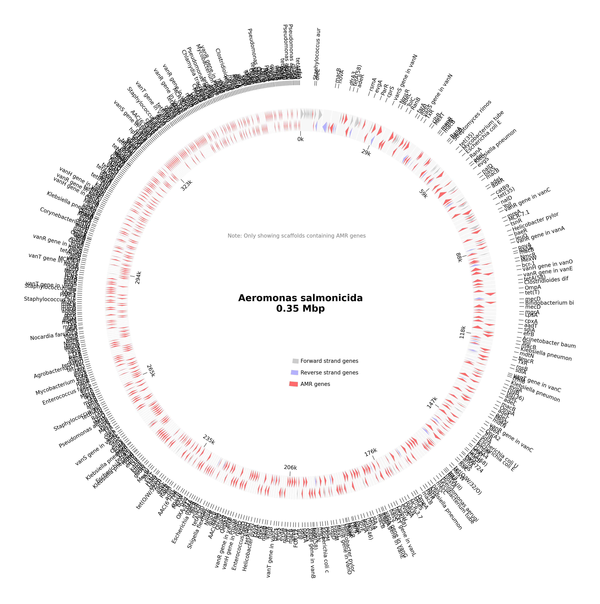

### AAC(3)-IId
- **Mechanism**: antibiotic inactivation
- **Drug Classes**: aminoglycoside antibiotic
- **AMR Family**: AAC(3)
- **Locations**:
  - gnl|SPADES|CPJJBIBK_9762_2 : position 101-667

### AAC(6')-I-48
- **Mechanism**: antibiotic inactivation
- **Drug Classes**: aminoglycoside antibiotic
- **AMR Family**: AAC(6')
- **Locations**:
  - gnl|SPADES|CPJJBIBK_29239_1 : position 2-325

### AAC(6')-Iak
- **Mechanism**: antibiotic inactivation
- **Drug Classes**: aminoglycoside antibiotic
- **AMR Family**: AAC(6')
- **Locations**:
  - gnl|SPADES|CPJJBIBK_10488_1 : position 3-278

### Acinetobacter baumannii AbaF
- **Mechanism**: antibiotic efflux
- **Drug Classes**: phosphonic acid antibiotic
- **AMR Family**: major facilitator superfamily (MFS) antibiotic efflux pump
- **Locations**:
  - gnl|SPADES|CPJJBIBK_4063_2 : position 514-1230

### AcrF (found in 2 locations)
- **Mechanism**: antibiotic efflux
- **Drug Classes**: fluoroquinolone antibiotic; cephalosporin; cephamycin; penam
- **AMR Family**: resistance-nodulation-cell division (RND) antibiotic efflux pump
- **Locations**:
  - gnl|SPADES|CPJJBIBK_16000_1 : position 2-472
  - gnl|SPADES|CPJJBIBK_7228_1 : position 1-825

### Agrobacterium fabrum chloramphenicol acetyltransferase
- **Mechanism**: antibiotic inactivation
- **Drug Classes**: phenicol antibiotic
- **AMR Family**: chloramphenicol acetyltransferase (CAT)
- **Locations**:
  - gnl|SPADES|CPJJBIBK_14101_1 : position 3-512

### ArnT (found in 3 locations)
- **Mechanism**: antibiotic target alteration
- **Drug Classes**: peptide antibiotic
- **AMR Family**: pmr phosphoethanolamine transferase
- **Locations**:
  - gnl|SPADES|CPJJBIBK_32945_1 : position 2-301
  - gnl|SPADES|CPJJBIBK_48823_1 : position 1-216
  - gnl|SPADES|CPJJBIBK_67017_1 : position 3-251

### Bifidobacterium bifidum ileS conferring resistance to mupirocin
- **Mechanism**: antibiotic target alteration
- **Drug Classes**: mupirocin-like antibiotic
- **AMR Family**: antibiotic-resistant isoleucyl-tRNA synthetase (ileS)
- **Locations**:
  - gnl|SPADES|CPJJBIBK_3797_2 : position 492-1295

### CRD3-1
- **Mechanism**: antibiotic inactivation
- **Drug Classes**: carbapenem
- **AMR Family**: CRD3 beta-lactamase
- **Locations**:
  - gnl|SPADES|CPJJBIBK_45244_1 : position 2-271

### CRP (found in 2 locations)
- **Mechanism**: antibiotic efflux
- **Drug Classes**: macrolide antibiotic; fluoroquinolone antibiotic; penam
- **AMR Family**: resistance-nodulation-cell division (RND) antibiotic efflux pump
- **Locations**:
  - gnl|SPADES|CPJJBIBK_16205_1 : position 2-466
  - gnl|SPADES|CPJJBIBK_5684_1 : position 1-201

### Chlamydia trachomatis intrinsic murA conferring resistance to fosfomycin
- **Mechanism**: antibiotic target alteration
- **Drug Classes**: phosphonic acid antibiotic
- **AMR Family**: antibiotic-resistant murA transferase
- **Locations**:
  - gnl|SPADES|CPJJBIBK_47538_1 : position 3-269

### Clostridioides difficile gyrB conferring resistance to fluoroquinolones (found in 2 locations)
- **Mechanism**: antibiotic target alteration
- **Drug Classes**: fluoroquinolone antibiotic
- **AMR Family**: fluoroquinolone resistant gyrB
- **Locations**:
  - gnl|SPADES|CPJJBIBK_3618_1 : position 1-441
  - gnl|SPADES|CPJJBIBK_67123_1 : position 3-251

### Corynebacterium striatum tetA
- **Mechanism**: antibiotic efflux
- **Drug Classes**: penam; tetracycline antibiotic
- **AMR Family**: major facilitator superfamily (MFS) antibiotic efflux pump
- **Locations**:
  - gnl|SPADES|CPJJBIBK_18983_1 : position 15-422

### EdeQ
- **Mechanism**: antibiotic inactivation
- **Drug Classes**: peptide antibiotic; polyamine antibiotic
- **AMR Family**: Edeine acetyltransferase
- **Locations**:
  - gnl|SPADES|CPJJBIBK_9271_1 : position 397-690

### Enterococcus faecalis cls with mutation conferring resistance to daptomycin
- **Mechanism**: antibiotic target alteration
- **Drug Classes**: peptide antibiotic
- **AMR Family**: daptomycin resistant cls
- **Locations**:
  - gnl|SPADES|CPJJBIBK_13582_1 : position 3-527

### Enterococcus faecium liaR mutant conferring daptomycin resistance
- **Mechanism**: antibiotic target alteration; antibiotic efflux
- **Drug Classes**: peptide antibiotic
- **AMR Family**: daptomycin resistant liaR
- **Locations**:
  - gnl|SPADES|CPJJBIBK_9333_1 : position 2-688

### Escherichia coli AcrAB-TolC with AcrR mutation conferring resistance to ciprofloxacin, tetracycline, and ceftazidime
- **Mechanism**: antibiotic target alteration; antibiotic efflux
- **Drug Classes**: fluoroquinolone antibiotic; cephalosporin; glycylcycline; penam; tetracycline antibiotic; rifamycin antibiotic; phenicol antibiotic; disinfecting agents and antiseptics
- **AMR Family**: resistance-nodulation-cell division (RND) antibiotic efflux pump
- **Locations**:
  - gnl|SPADES|CPJJBIBK_10211_2 : position 239-643

### Escherichia coli EF-Tu mutants conferring resistance to Pulvomycin
- **Mechanism**: antibiotic target alteration
- **Drug Classes**: elfamycin antibiotic
- **AMR Family**: elfamycin resistant EF-Tu
- **Locations**:
  - gnl|SPADES|CPJJBIBK_2666_1 : position 1-1095

### Escherichia coli EF-Tu mutants conferring resistance to kirromycin
- **Mechanism**: antibiotic target alteration
- **Drug Classes**: elfamycin antibiotic
- **AMR Family**: elfamycin resistant EF-Tu
- **Locations**:
  - gnl|SPADES|CPJJBIBK_5270_1 : position 1-1020

### Escherichia coli UhpT with mutation conferring resistance to fosfomycin
- **Mechanism**: antibiotic target alteration
- **Drug Classes**: phosphonic acid antibiotic
- **AMR Family**: antibiotic-resistant UhpT
- **Locations**:
  - gnl|SPADES|CPJJBIBK_5269_1 : position 102-1022

### Escherichia coli acrA
- **Mechanism**: antibiotic efflux
- **Drug Classes**: fluoroquinolone antibiotic; cephalosporin; glycylcycline; penam; tetracycline antibiotic; rifamycin antibiotic; phenicol antibiotic; disinfecting agents and antiseptics
- **AMR Family**: resistance-nodulation-cell division (RND) antibiotic efflux pump
- **Locations**:
  - gnl|SPADES|CPJJBIBK_11972_1 : position 2-577

### Escherichia coli cyaA with mutation conferring resistance to fosfomycin
- **Mechanism**: antibiotic target alteration
- **Drug Classes**: phosphonic acid antibiotic
- **AMR Family**: antibiotic-resistant cya adenylate cyclase
- **Locations**:
  - gnl|SPADES|CPJJBIBK_8003_1 : position 2-766

### EstT
- **Mechanism**: antibiotic inactivation
- **Drug Classes**: macrolide antibiotic
- **AMR Family**: macrolide esterase
- **Locations**:
  - gnl|SPADES|CPJJBIBK_11174_1 : position 2-397

### FOX-17
- **Mechanism**: antibiotic inactivation
- **Drug Classes**: cephalosporin; cephamycin
- **AMR Family**: FOX beta-lactamase
- **Locations**:
  - gnl|SPADES|CPJJBIBK_8506_2 : position 473-733

### H-NS (found in 2 locations)
- **Mechanism**: antibiotic efflux
- **Drug Classes**: macrolide antibiotic; fluoroquinolone antibiotic; cephalosporin; cephamycin; penam; tetracycline antibiotic
- **AMR Family**: major facilitator superfamily (MFS) antibiotic efflux pump; resistance-nodulation-cell division (RND) antibiotic efflux pump
- **Locations**:
  - gnl|SPADES|CPJJBIBK_11120_1 : position 3-314
  - gnl|SPADES|CPJJBIBK_16885_1 : position 3-92

### Helicobacter pylori pbp1 mutants conferring resistance to amoxicillin (found in 3 locations)
- **Mechanism**: antibiotic target alteration
- **Drug Classes**: cephalosporin; cephamycin; penam
- **AMR Family**: Penicillin-binding protein mutations conferring resistance to beta-lactam antibiotics
- **Locations**:
  - gnl|SPADES|CPJJBIBK_3377_2 : position 978-1412
  - gnl|SPADES|CPJJBIBK_7477_1 : position 1-804
  - gnl|SPADES|CPJJBIBK_9128_1 : position 2-526

### Klebsiella pneumoniae KpnE
- **Mechanism**: antibiotic efflux
- **Drug Classes**: macrolide antibiotic; aminoglycoside antibiotic; cephalosporin; tetracycline antibiotic; peptide antibiotic; rifamycin antibiotic; disinfecting agents and antiseptics
- **AMR Family**: small multidrug resistance (SMR) antibiotic efflux pump
- **Locations**:
  - gnl|SPADES|CPJJBIBK_2852_2 : position 1065-1469

### Klebsiella pneumoniae KpnF
- **Mechanism**: antibiotic efflux
- **Drug Classes**: macrolide antibiotic; aminoglycoside antibiotic; cephalosporin; tetracycline antibiotic; peptide antibiotic; rifamycin antibiotic; disinfecting agents and antiseptics
- **AMR Family**: small multidrug resistance (SMR) antibiotic efflux pump
- **Locations**:
  - gnl|SPADES|CPJJBIBK_20556_2 : position 264-401

### Klebsiella pneumoniae KpnG
- **Mechanism**: antibiotic efflux
- **Drug Classes**: macrolide antibiotic; fluoroquinolone antibiotic; aminoglycoside antibiotic; carbapenem; cephalosporin; penam; peptide antibiotic; penem
- **AMR Family**: major facilitator superfamily (MFS) antibiotic efflux pump
- **Locations**:
  - gnl|SPADES|CPJJBIBK_11988_1 : position 3-344

### Klebsiella pneumoniae OmpK37 (found in 4 locations)
- **Mechanism**: reduced permeability to antibiotic
- **Drug Classes**: monobactam; carbapenem; cephalosporin; cephamycin; penam; penem
- **AMR Family**: General Bacterial Porin with reduced permeability to beta-lactams
- **Locations**:
  - gnl|SPADES|CPJJBIBK_11786_2 : position 384-584
  - gnl|SPADES|CPJJBIBK_4329_1 : position 3-242
  - gnl|SPADES|CPJJBIBK_4703_2 : position 658-1110
  - gnl|SPADES|CPJJBIBK_5947_1 : position 1-870

### LpeB (found in 5 locations)
- **Mechanism**: antibiotic efflux
- **Drug Classes**: macrolide antibiotic
- **AMR Family**: resistance-nodulation-cell division (RND) antibiotic efflux pump
- **Locations**:
  - gnl|SPADES|CPJJBIBK_11153_2 : position 397-606
  - gnl|SPADES|CPJJBIBK_27932_1 : position 1-333
  - gnl|SPADES|CPJJBIBK_40487_1 : position 10-279
  - gnl|SPADES|CPJJBIBK_7388_2 : position 411-809
  - gnl|SPADES|CPJJBIBK_98990_1 : position 2-223

### LpsA
- **Mechanism**: reduced permeability to antibiotic
- **Drug Classes**: peptide antibiotic
- **AMR Family**: Intrinsic peptide antibiotic resistant Lps
- **Locations**:
  - gnl|SPADES|CPJJBIBK_3889_1 : position 3-497

### LptD (found in 3 locations)
- **Mechanism**: antibiotic efflux
- **Drug Classes**: carbapenem; peptide antibiotic; aminocoumarin antibiotic; rifamycin antibiotic
- **AMR Family**: ATP-binding cassette (ABC) antibiotic efflux pump
- **Locations**:
  - gnl|SPADES|CPJJBIBK_12887_1 : position 3-344
  - gnl|SPADES|CPJJBIBK_17276_1 : position 3-449
  - gnl|SPADES|CPJJBIBK_24169_1 : position 1-363

### MCR-3.17
- **Mechanism**: antibiotic target alteration
- **Drug Classes**: peptide antibiotic
- **AMR Family**: MCR phosphoethanolamine transferase
- **Locations**:
  - gnl|SPADES|CPJJBIBK_35808_1 : position 3-287

### MCR-3.7
- **Mechanism**: antibiotic target alteration
- **Drug Classes**: peptide antibiotic
- **AMR Family**: MCR phosphoethanolamine transferase
- **Locations**:
  - gnl|SPADES|CPJJBIBK_6379_2 : position 601-897

### MCR-4.6
- **Mechanism**: antibiotic target alteration
- **Drug Classes**: peptide antibiotic
- **AMR Family**: MCR phosphoethanolamine transferase
- **Locations**:
  - gnl|SPADES|CPJJBIBK_17572_1 : position 2-442

### MCR-7.1
- **Mechanism**: antibiotic target alteration
- **Drug Classes**: peptide antibiotic
- **AMR Family**: MCR phosphoethanolamine transferase
- **Locations**:
  - gnl|SPADES|CPJJBIBK_3354_2 : position 381-1421

### MexB
- **Mechanism**: antibiotic efflux
- **Drug Classes**: macrolide antibiotic; fluoroquinolone antibiotic; monobactam; carbapenem; cephalosporin; cephamycin; penam; tetracycline antibiotic; peptide antibiotic; aminocoumarin antibiotic; diaminopyrimidine antibiotic; sulfonamide antibiotic; phenicol antibiotic; penem
- **AMR Family**: resistance-nodulation-cell division (RND) antibiotic efflux pump
- **Locations**:
  - gnl|SPADES|CPJJBIBK_76802_1 : position 1-243

### MexF (found in 2 locations)
- **Mechanism**: antibiotic efflux
- **Drug Classes**: fluoroquinolone antibiotic; diaminopyrimidine antibiotic; phenicol antibiotic
- **AMR Family**: resistance-nodulation-cell division (RND) antibiotic efflux pump
- **Locations**:
  - gnl|SPADES|CPJJBIBK_27232_1 : position 1-339
  - gnl|SPADES|CPJJBIBK_32304_1 : position 2-304

### MexH
- **Mechanism**: antibiotic efflux
- **Drug Classes**: fluoroquinolone antibiotic; tetracycline antibiotic; disinfecting agents and antiseptics
- **AMR Family**: resistance-nodulation-cell division (RND) antibiotic efflux pump
- **Locations**:
  - gnl|SPADES|CPJJBIBK_25516_1 : position 2-214

### MexK
- **Mechanism**: antibiotic efflux
- **Drug Classes**: macrolide antibiotic; tetracycline antibiotic; disinfecting agents and antiseptics
- **AMR Family**: resistance-nodulation-cell division (RND) antibiotic efflux pump
- **Locations**:
  - gnl|SPADES|CPJJBIBK_12872_1 : position 3-521

### MexL
- **Mechanism**: antibiotic efflux
- **Drug Classes**: macrolide antibiotic; tetracycline antibiotic; disinfecting agents and antiseptics
- **AMR Family**: resistance-nodulation-cell division (RND) antibiotic efflux pump
- **Locations**:
  - gnl|SPADES|CPJJBIBK_7612_2 : position 548-796

### MexR
- **Mechanism**: antibiotic target alteration; antibiotic efflux
- **Drug Classes**: macrolide antibiotic; fluoroquinolone antibiotic; monobactam; carbapenem; cephalosporin; cephamycin; penam; tetracycline antibiotic; peptide antibiotic; aminocoumarin antibiotic; diaminopyrimidine antibiotic; sulfonamide antibiotic; phenicol antibiotic; penem
- **AMR Family**: resistance-nodulation-cell division (RND) antibiotic efflux pump
- **Locations**:
  - gnl|SPADES|CPJJBIBK_15117_1 : position 100-489

### MexS (found in 2 locations)
- **Mechanism**: antibiotic efflux
- **Drug Classes**: fluoroquinolone antibiotic; diaminopyrimidine antibiotic; phenicol antibiotic
- **AMR Family**: resistance-nodulation-cell division (RND) antibiotic efflux pump
- **Locations**:
  - gnl|SPADES|CPJJBIBK_13520_1 : position 1-336
  - gnl|SPADES|CPJJBIBK_16132_1 : position 2-469

### MexT (found in 3 locations)
- **Mechanism**: antibiotic efflux
- **Drug Classes**: fluoroquinolone antibiotic; diaminopyrimidine antibiotic; phenicol antibiotic
- **AMR Family**: resistance-nodulation-cell division (RND) antibiotic efflux pump
- **Locations**:
  - gnl|SPADES|CPJJBIBK_12488_1 : position 1-561
  - gnl|SPADES|CPJJBIBK_17219_1 : position 2-448
  - gnl|SPADES|CPJJBIBK_2384_1 : position 1-708

### MexV (found in 2 locations)
- **Mechanism**: antibiotic efflux
- **Drug Classes**: macrolide antibiotic; fluoroquinolone antibiotic; tetracycline antibiotic; phenicol antibiotic; disinfecting agents and antiseptics
- **AMR Family**: resistance-nodulation-cell division (RND) antibiotic efflux pump
- **Locations**:
  - gnl|SPADES|CPJJBIBK_23871_1 : position 2-364
  - gnl|SPADES|CPJJBIBK_4990_2 : position 90-1061

### MexW (found in 8 locations)
- **Mechanism**: antibiotic efflux
- **Drug Classes**: macrolide antibiotic; fluoroquinolone antibiotic; tetracycline antibiotic; phenicol antibiotic; disinfecting agents and antiseptics
- **AMR Family**: resistance-nodulation-cell division (RND) antibiotic efflux pump
- **Locations**:
  - gnl|SPADES|CPJJBIBK_10484_1 : position 1-633
  - gnl|SPADES|CPJJBIBK_11181_1 : position 1-606
  - gnl|SPADES|CPJJBIBK_14474_1 : position 1-504
  - gnl|SPADES|CPJJBIBK_19963_1 : position 2-409
  - gnl|SPADES|CPJJBIBK_25516_2 : position 230-352
  - gnl|SPADES|CPJJBIBK_3526_1 : position 3-1367
  - gnl|SPADES|CPJJBIBK_42995_1 : position 3-275
  - gnl|SPADES|CPJJBIBK_5527_1 : position 1-987

### MuxA
- **Mechanism**: antibiotic efflux
- **Drug Classes**: macrolide antibiotic; monobactam; tetracycline antibiotic; aminocoumarin antibiotic
- **AMR Family**: resistance-nodulation-cell division (RND) antibiotic efflux pump
- **Locations**:
  - gnl|SPADES|CPJJBIBK_7388_1 : position 1-411

### MuxC
- **Mechanism**: antibiotic efflux
- **Drug Classes**: macrolide antibiotic; monobactam; tetracycline antibiotic; aminocoumarin antibiotic
- **AMR Family**: resistance-nodulation-cell division (RND) antibiotic efflux pump
- **Locations**:
  - gnl|SPADES|CPJJBIBK_15945_1 : position 1-471

### Mycobacterium tuberculosis intrinsic murA conferring resistance to fosfomycin
- **Mechanism**: antibiotic target alteration
- **Drug Classes**: phosphonic acid antibiotic
- **AMR Family**: antibiotic-resistant murA transferase
- **Locations**:
  - gnl|SPADES|CPJJBIBK_13719_1 : position 68-523

### Mycobacterium tuberculosis katG mutations conferring resistance to isoniazid (found in 2 locations)
- **Mechanism**: antibiotic target alteration
- **Drug Classes**: isoniazid-like antibiotic
- **AMR Family**: isoniazid resistant katG
- **Locations**:
  - gnl|SPADES|CPJJBIBK_52869_1 : position 2-265
  - gnl|SPADES|CPJJBIBK_5838_1 : position 1-714

### Mycobacterium tuberculosis pncA mutations conferring resistance to pyrazinamide
- **Mechanism**: antibiotic target alteration
- **Drug Classes**: pyrazine antibiotic
- **AMR Family**: Pyrazinamide resistant pncA
- **Locations**:
  - gnl|SPADES|CPJJBIBK_2658_2 : position 663-1298

### NmcR (found in 9 locations)
- **Mechanism**: antibiotic inactivation
- **Drug Classes**: carbapenem; cephalosporin; cephamycin; penam
- **AMR Family**: NmcA beta-lactamase
- **Locations**:
  - gnl|SPADES|CPJJBIBK_14550_1 : position 3-227
  - gnl|SPADES|CPJJBIBK_17343_1 : position 1-375
  - gnl|SPADES|CPJJBIBK_20794_1 : position 1-399
  - gnl|SPADES|CPJJBIBK_2134_1 : position 107-1081
  - gnl|SPADES|CPJJBIBK_3480_3 : position 1015-1380
  - gnl|SPADES|CPJJBIBK_4467_2 : position 174-1085
  - gnl|SPADES|CPJJBIBK_7375_2 : position 461-811
  - gnl|SPADES|CPJJBIBK_82833_1 : position 3-236
  - gnl|SPADES|CPJJBIBK_9858_2 : position 243-662

### Nocardia farcinica rox
- **Mechanism**: antibiotic inactivation
- **Drug Classes**: rifamycin antibiotic
- **AMR Family**: rifampin monooxygenase
- **Locations**:
  - gnl|SPADES|CPJJBIBK_15190_1 : position 2-418

### OXA-724
- **Mechanism**: antibiotic inactivation
- **Drug Classes**: penam
- **AMR Family**: OXA beta-lactamase; OXA-12-like beta-lactamase
- **Locations**:
  - gnl|SPADES|CPJJBIBK_5428_2 : position 473-997

### OXA-917
- **Mechanism**: antibiotic inactivation
- **Drug Classes**: carbapenem; penam
- **AMR Family**: OXA beta-lactamase; OXA-427-like beta-lactamase
- **Locations**:
  - gnl|SPADES|CPJJBIBK_10305_1 : position 1-330

### OmpA (found in 12 locations)
- **Mechanism**: reduced permeability to antibiotic
- **Drug Classes**: peptide antibiotic
- **AMR Family**: General Bacterial Porin with reduced permeability to peptide antibiotics
- **Locations**:
  - gnl|SPADES|CPJJBIBK_12210_1 : position 56-571
  - gnl|SPADES|CPJJBIBK_18262_1 : position 2-433
  - gnl|SPADES|CPJJBIBK_18721_1 : position 1-177
  - gnl|SPADES|CPJJBIBK_20352_1 : position 1-276
  - gnl|SPADES|CPJJBIBK_20829_1 : position 2-346
  - gnl|SPADES|CPJJBIBK_3629_1 : position 1-972
  - gnl|SPADES|CPJJBIBK_4959_2 : position 500-1066
  - gnl|SPADES|CPJJBIBK_6208_2 : position 771-914
  - gnl|SPADES|CPJJBIBK_6483_2 : position 315-815
  - gnl|SPADES|CPJJBIBK_82513_1 : position 2-238
  - gnl|SPADES|CPJJBIBK_83898_1 : position 2-235
  - gnl|SPADES|CPJJBIBK_9739_1 : position 2-667

### OpmH
- **Mechanism**: antibiotic efflux
- **Drug Classes**: disinfecting agents and antiseptics
- **AMR Family**: resistance-nodulation-cell division (RND) antibiotic efflux pump
- **Locations**:
  - gnl|SPADES|CPJJBIBK_6539_2 : position 513-881

### OprA
- **Mechanism**: antibiotic efflux
- **Drug Classes**: macrolide antibiotic; fluoroquinolone antibiotic; aminoglycoside antibiotic; carbapenem; tetracycline antibiotic
- **AMR Family**: resistance-nodulation-cell division (RND) antibiotic efflux pump
- **Locations**:
  - gnl|SPADES|CPJJBIBK_18508_2 : position 237-428

### OprM (found in 3 locations)
- **Mechanism**: antibiotic efflux
- **Drug Classes**: macrolide antibiotic; fluoroquinolone antibiotic; monobactam; aminoglycoside antibiotic; carbapenem; cephalosporin; cephamycin; penam; tetracycline antibiotic; peptide antibiotic; aminocoumarin antibiotic; diaminopyrimidine antibiotic; sulfonamide antibiotic; phenicol antibiotic; penem; disinfecting agents and antiseptics
- **AMR Family**: resistance-nodulation-cell division (RND) antibiotic efflux pump
- **Locations**:
  - gnl|SPADES|CPJJBIBK_49302_1 : position 1-267
  - gnl|SPADES|CPJJBIBK_8001_1 : position 3-767
  - gnl|SPADES|CPJJBIBK_85636_1 : position 2-235

### PAM-1
- **Mechanism**: antibiotic inactivation
- **Drug Classes**: carbapenem; cephalosporin
- **AMR Family**: PAM beta-lactamase
- **Locations**:
  - gnl|SPADES|CPJJBIBK_16021_1 : position 60-470

### ParR (found in 4 locations)
- **Mechanism**: antibiotic efflux; reduced permeability to antibiotic
- **Drug Classes**: macrolide antibiotic; fluoroquinolone antibiotic; monobactam; aminoglycoside antibiotic; carbapenem; cephalosporin; cephamycin; penam; tetracycline antibiotic; phenicol antibiotic; penem; disinfecting agents and antiseptics
- **AMR Family**: resistance-nodulation-cell division (RND) antibiotic efflux pump; Outer Membrane Porin (Opr)
- **Locations**:
  - gnl|SPADES|CPJJBIBK_2024_2 : position 552-1271
  - gnl|SPADES|CPJJBIBK_46273_1 : position 1-186
  - gnl|SPADES|CPJJBIBK_6122_1 : position 1-165
  - gnl|SPADES|CPJJBIBK_7343_1 : position 3-140

### ParS (found in 3 locations)
- **Mechanism**: antibiotic efflux; reduced permeability to antibiotic
- **Drug Classes**: macrolide antibiotic; fluoroquinolone antibiotic; monobactam; aminoglycoside antibiotic; carbapenem; cephalosporin; cephamycin; penam; tetracycline antibiotic; phenicol antibiotic; penem; disinfecting agents and antiseptics
- **AMR Family**: resistance-nodulation-cell division (RND) antibiotic efflux pump; Outer Membrane Porin (Opr)
- **Locations**:
  - gnl|SPADES|CPJJBIBK_12648_1 : position 1-555
  - gnl|SPADES|CPJJBIBK_6110_1 : position 89-754
  - gnl|SPADES|CPJJBIBK_7343_2 : position 227-814

### PmpM (found in 3 locations)
- **Mechanism**: antibiotic efflux
- **Drug Classes**: fluoroquinolone antibiotic; aminoglycoside antibiotic; disinfecting agents and antiseptics
- **AMR Family**: multidrug and toxic compound extrusion (MATE) transporter
- **Locations**:
  - gnl|SPADES|CPJJBIBK_5325_1 : position 1-321
  - gnl|SPADES|CPJJBIBK_90690_1 : position 1-231
  - gnl|SPADES|CPJJBIBK_9493_1 : position 1-648

### PmrF (found in 4 locations)
- **Mechanism**: antibiotic target alteration
- **Drug Classes**: peptide antibiotic
- **AMR Family**: pmr phosphoethanolamine transferase
- **Locations**:
  - gnl|SPADES|CPJJBIBK_105710_1 : position 3-215
  - gnl|SPADES|CPJJBIBK_18931_2 : position 255-422
  - gnl|SPADES|CPJJBIBK_33830_1 : position 1-297
  - gnl|SPADES|CPJJBIBK_8633_1 : position 2-727

### Pseudomonas aeruginosa CpxR (found in 3 locations)
- **Mechanism**: antibiotic efflux
- **Drug Classes**: macrolide antibiotic; fluoroquinolone antibiotic; monobactam; aminoglycoside antibiotic; carbapenem; cephalosporin; cephamycin; penam; tetracycline antibiotic; peptide antibiotic; aminocoumarin antibiotic; diaminopyrimidine antibiotic; sulfonamide antibiotic; phenicol antibiotic; penem
- **AMR Family**: resistance-nodulation-cell division (RND) antibiotic efflux pump
- **Locations**:
  - gnl|SPADES|CPJJBIBK_104935_1 : position 1-216
  - gnl|SPADES|CPJJBIBK_5799_1 : position 1-786
  - gnl|SPADES|CPJJBIBK_84464_1 : position 3-236

### Pseudomonas aeruginosa ampR with mutation conferring resistance to aztreonam
- **Mechanism**: antibiotic target alteration; antibiotic inactivation
- **Drug Classes**: monobactam; carbapenem; cephalosporin
- **AMR Family**: PDC beta-lactamase; ampR transcriptional regulator with mutation conferring resistance to monobactam antibiotics
- **Locations**:
  - gnl|SPADES|CPJJBIBK_12680_1 : position 1-555

### Pseudomonas aeruginosa soxR (found in 2 locations)
- **Mechanism**: antibiotic target alteration; antibiotic efflux
- **Drug Classes**: fluoroquinolone antibiotic; cephalosporin; glycylcycline; penam; tetracycline antibiotic; rifamycin antibiotic; phenicol antibiotic; disinfecting agents and antiseptics
- **AMR Family**: ATP-binding cassette (ABC) antibiotic efflux pump; major facilitator superfamily (MFS) antibiotic efflux pump; resistance-nodulation-cell division (RND) antibiotic efflux pump
- **Locations**:
  - gnl|SPADES|CPJJBIBK_108582_2 : position 75-215
  - gnl|SPADES|CPJJBIBK_49951_1 : position 1-267

### QepA2
- **Mechanism**: antibiotic efflux
- **Drug Classes**: fluoroquinolone antibiotic
- **AMR Family**: major facilitator superfamily (MFS) antibiotic efflux pump
- **Locations**:
  - gnl|SPADES|CPJJBIBK_9670_1 : position 3-671

### QepA4
- **Mechanism**: antibiotic efflux
- **Drug Classes**: fluoroquinolone antibiotic
- **AMR Family**: major facilitator superfamily (MFS) antibiotic efflux pump
- **Locations**:
  - gnl|SPADES|CPJJBIBK_5382_1 : position 1-339

### QnrA2
- **Mechanism**: antibiotic target protection
- **Drug Classes**: fluoroquinolone antibiotic
- **AMR Family**: quinolone resistance protein (qnr)
- **Locations**:
  - gnl|SPADES|CPJJBIBK_5141_2 : position 802-1038

### QnrAS (found in 2 locations)
- **Mechanism**: antibiotic target protection
- **Drug Classes**: fluoroquinolone antibiotic
- **AMR Family**: quinolone resistance protein (qnr)
- **Locations**:
  - gnl|SPADES|CPJJBIBK_24712_1 : position 3-359
  - gnl|SPADES|CPJJBIBK_25533_1 : position 3-350

### RanA (found in 13 locations)
- **Mechanism**: antibiotic efflux
- **Drug Classes**: aminoglycoside antibiotic
- **AMR Family**: ATP-binding cassette (ABC) antibiotic efflux pump
- **Locations**:
  - gnl|SPADES|CPJJBIBK_104826_1 : position 1-216
  - gnl|SPADES|CPJJBIBK_10670_1 : position 3-521
  - gnl|SPADES|CPJJBIBK_12926_1 : position 2-547
  - gnl|SPADES|CPJJBIBK_13597_1 : position 75-527
  - gnl|SPADES|CPJJBIBK_14245_2 : position 183-509
  - gnl|SPADES|CPJJBIBK_2577_2 : position 708-1508
  - gnl|SPADES|CPJJBIBK_2803_2 : position 263-1045
  - gnl|SPADES|CPJJBIBK_3481_1 : position 1-903
  - gnl|SPADES|CPJJBIBK_7108_1 : position 2-808
  - gnl|SPADES|CPJJBIBK_88396_1 : position 2-232
  - gnl|SPADES|CPJJBIBK_9055_1 : position 3-701
  - gnl|SPADES|CPJJBIBK_9838_1 : position 2-661
  - gnl|SPADES|CPJJBIBK_98926_1 : position 2-223

### RanB (found in 2 locations)
- **Mechanism**: antibiotic efflux
- **Drug Classes**: aminoglycoside antibiotic
- **AMR Family**: ATP-binding cassette (ABC) antibiotic efflux pump
- **Locations**:
  - gnl|SPADES|CPJJBIBK_2149_1 : position 2-394
  - gnl|SPADES|CPJJBIBK_2577_3 : position 1508-1777

### RlmA(II)
- **Mechanism**: antibiotic target alteration
- **Drug Classes**: macrolide antibiotic; lincosamide antibiotic
- **AMR Family**: non-erm 23S ribosomal RNA methyltransferase (G748)
- **Locations**:
  - gnl|SPADES|CPJJBIBK_5684_2 : position 324-968

### Shigella flexneri acrA
- **Mechanism**: antibiotic efflux
- **Drug Classes**: fluoroquinolone antibiotic; cephalosporin; glycylcycline; penam; tetracycline antibiotic; rifamycin antibiotic; phenicol antibiotic; disinfecting agents and antiseptics
- **AMR Family**: resistance-nodulation-cell division (RND) antibiotic efflux pump
- **Locations**:
  - gnl|SPADES|CPJJBIBK_9933_1 : position 2-658

### Staphylococcus aureus fusA with mutation conferring resistance to fusidic acid (found in 2 locations)
- **Mechanism**: antibiotic target alteration
- **Drug Classes**: fusidane antibiotic
- **AMR Family**: antibiotic resistant fusA
- **Locations**:
  - gnl|SPADES|CPJJBIBK_1076_9 : position 4860-5180
  - gnl|SPADES|CPJJBIBK_30819_1 : position 1-315

### Staphylococcus aureus mupA conferring resistance to mupirocin (found in 2 locations)
- **Mechanism**: antibiotic target alteration
- **Drug Classes**: mupirocin-like antibiotic
- **AMR Family**: antibiotic-resistant isoleucyl-tRNA synthetase (ileS)
- **Locations**:
  - gnl|SPADES|CPJJBIBK_13102_1 : position 2-541
  - gnl|SPADES|CPJJBIBK_16204_1 : position 3-467

### Staphylococcus aureus mupB conferring resistance to mupirocin
- **Mechanism**: antibiotic target alteration
- **Drug Classes**: mupirocin-like antibiotic
- **AMR Family**: antibiotic-resistant isoleucyl-tRNA synthetase (ileS)
- **Locations**:
  - gnl|SPADES|CPJJBIBK_16009_1 : position 3-470

### Streptomyces rimosus otr(A)
- **Mechanism**: antibiotic target protection
- **Drug Classes**: tetracycline antibiotic
- **AMR Family**: tetracycline-resistant ribosomal protection protein
- **Locations**:
  - gnl|SPADES|CPJJBIBK_2605_1 : position 2-925

### TaeA (found in 5 locations)
- **Mechanism**: antibiotic efflux
- **Drug Classes**: pleuromutilin antibiotic
- **AMR Family**: ATP-binding cassette (ABC) antibiotic efflux pump
- **Locations**:
  - gnl|SPADES|CPJJBIBK_10197_1 : position 435-644
  - gnl|SPADES|CPJJBIBK_13628_1 : position 2-526
  - gnl|SPADES|CPJJBIBK_28779_1 : position 3-329
  - gnl|SPADES|CPJJBIBK_5076_2 : position 193-1047
  - gnl|SPADES|CPJJBIBK_88070_1 : position 1-231

### TolC
- **Mechanism**: antibiotic efflux
- **Drug Classes**: macrolide antibiotic; fluoroquinolone antibiotic; aminoglycoside antibiotic; carbapenem; cephalosporin; glycylcycline; cephamycin; penam; tetracycline antibiotic; peptide antibiotic; aminocoumarin antibiotic; rifamycin antibiotic; phenicol antibiotic; penem; disinfecting agents and antiseptics
- **AMR Family**: ATP-binding cassette (ABC) antibiotic efflux pump; major facilitator superfamily (MFS) antibiotic efflux pump; resistance-nodulation-cell division (RND) antibiotic efflux pump
- **Locations**:
  - gnl|SPADES|CPJJBIBK_2137_2 : position 570-1895

### TriB
- **Mechanism**: antibiotic efflux
- **Drug Classes**: disinfecting agents and antiseptics
- **AMR Family**: resistance-nodulation-cell division (RND) antibiotic efflux pump
- **Locations**:
  - gnl|SPADES|CPJJBIBK_5160_2 : position 236-1036

### TriC
- **Mechanism**: antibiotic efflux
- **Drug Classes**: disinfecting agents and antiseptics
- **AMR Family**: resistance-nodulation-cell division (RND) antibiotic efflux pump
- **Locations**:
  - gnl|SPADES|CPJJBIBK_96106_1 : position 2-226

### TxR (found in 13 locations)
- **Mechanism**: antibiotic efflux
- **Drug Classes**: tetracycline antibiotic
- **AMR Family**: ATP-binding cassette (ABC) antibiotic efflux pump
- **Locations**:
  - gnl|SPADES|CPJJBIBK_10497_1 : position 2-634
  - gnl|SPADES|CPJJBIBK_11415_1 : position 3-596
  - gnl|SPADES|CPJJBIBK_12499_1 : position 3-473
  - gnl|SPADES|CPJJBIBK_12930_1 : position 3-545
  - gnl|SPADES|CPJJBIBK_13446_1 : position 3-530
  - gnl|SPADES|CPJJBIBK_14323_1 : position 2-508
  - gnl|SPADES|CPJJBIBK_15389_1 : position 1-330
  - gnl|SPADES|CPJJBIBK_21957_1 : position 3-383
  - gnl|SPADES|CPJJBIBK_2197_3 : position 1024-2073
  - gnl|SPADES|CPJJBIBK_22126_1 : position 1-381
  - gnl|SPADES|CPJJBIBK_23680_1 : position 3-368
  - gnl|SPADES|CPJJBIBK_34798_1 : position 1-291
  - gnl|SPADES|CPJJBIBK_4484_1 : position 1-390

### YajC
- **Mechanism**: antibiotic efflux
- **Drug Classes**: fluoroquinolone antibiotic; cephalosporin; glycylcycline; penam; tetracycline antibiotic; oxazolidinone antibiotic; glycopeptide antibiotic; rifamycin antibiotic; phenicol antibiotic; disinfecting agents and antiseptics
- **AMR Family**: resistance-nodulation-cell division (RND) antibiotic efflux pump
- **Locations**:
  - gnl|SPADES|CPJJBIBK_11182_2 : position 321-605

### YojI (found in 3 locations)
- **Mechanism**: antibiotic efflux
- **Drug Classes**: peptide antibiotic
- **AMR Family**: ATP-binding cassette (ABC) antibiotic efflux pump
- **Locations**:
  - gnl|SPADES|CPJJBIBK_10587_2 : position 404-631
  - gnl|SPADES|CPJJBIBK_3262_2 : position 1148-1450
  - gnl|SPADES|CPJJBIBK_4106_2 : position 131-1222

### aadT
- **Mechanism**: antibiotic efflux
- **Drug Classes**: macrolide antibiotic; tetracycline antibiotic; disinfecting agents and antiseptics
- **AMR Family**: major facilitator superfamily (MFS) antibiotic efflux pump
- **Locations**:
  - gnl|SPADES|CPJJBIBK_3972_2 : position 345-1253

### abeM (found in 2 locations)
- **Mechanism**: antibiotic efflux
- **Drug Classes**: fluoroquinolone antibiotic; disinfecting agents and antiseptics
- **AMR Family**: multidrug and toxic compound extrusion (MATE) transporter
- **Locations**:
  - gnl|SPADES|CPJJBIBK_15529_1 : position 3-392
  - gnl|SPADES|CPJJBIBK_15781_1 : position 2-475

### acrB (found in 3 locations)
- **Mechanism**: antibiotic efflux
- **Drug Classes**: fluoroquinolone antibiotic; cephalosporin; glycylcycline; penam; tetracycline antibiotic; rifamycin antibiotic; phenicol antibiotic; disinfecting agents and antiseptics
- **AMR Family**: resistance-nodulation-cell division (RND) antibiotic efflux pump
- **Locations**:
  - gnl|SPADES|CPJJBIBK_18508_1 : position 2-244
  - gnl|SPADES|CPJJBIBK_26962_1 : position 2-340
  - gnl|SPADES|CPJJBIBK_31616_1 : position 1-309

### adeB (found in 2 locations)
- **Mechanism**: antibiotic efflux
- **Drug Classes**: glycylcycline; tetracycline antibiotic
- **AMR Family**: resistance-nodulation-cell division (RND) antibiotic efflux pump
- **Locations**:
  - gnl|SPADES|CPJJBIBK_14354_1 : position 3-506
  - gnl|SPADES|CPJJBIBK_54206_1 : position 1-264

### adeF
- **Mechanism**: antibiotic efflux
- **Drug Classes**: fluoroquinolone antibiotic; tetracycline antibiotic
- **AMR Family**: resistance-nodulation-cell division (RND) antibiotic efflux pump
- **Locations**:
  - gnl|SPADES|CPJJBIBK_101260_1 : position 1-222

### adeK
- **Mechanism**: antibiotic efflux
- **Drug Classes**: macrolide antibiotic; fluoroquinolone antibiotic; lincosamide antibiotic; carbapenem; cephalosporin; tetracycline antibiotic; rifamycin antibiotic; diaminopyrimidine antibiotic; phenicol antibiotic; penem
- **AMR Family**: resistance-nodulation-cell division (RND) antibiotic efflux pump
- **Locations**:
  - gnl|SPADES|CPJJBIBK_16596_1 : position 3-461

### adeL (found in 23 locations)
- **Mechanism**: antibiotic efflux
- **Drug Classes**: fluoroquinolone antibiotic; tetracycline antibiotic
- **AMR Family**: resistance-nodulation-cell division (RND) antibiotic efflux pump
- **Locations**:
  - gnl|SPADES|CPJJBIBK_10117_1 : position 3-257
  - gnl|SPADES|CPJJBIBK_10544_1 : position 3-632
  - gnl|SPADES|CPJJBIBK_10951_1 : position 1-336
  - gnl|SPADES|CPJJBIBK_12420_1 : position 1-243
  - gnl|SPADES|CPJJBIBK_13560_2 : position 278-529
  - gnl|SPADES|CPJJBIBK_13930_1 : position 138-518
  - gnl|SPADES|CPJJBIBK_14785_1 : position 3-497
  - gnl|SPADES|CPJJBIBK_2134_2 : position 1155-2030
  - gnl|SPADES|CPJJBIBK_2166_2 : position 821-1723
  - gnl|SPADES|CPJJBIBK_27026_1 : position 3-341
  - gnl|SPADES|CPJJBIBK_2852_1 : position 25-906
  - gnl|SPADES|CPJJBIBK_3016_2 : position 602-1483
  - gnl|SPADES|CPJJBIBK_33604_1 : position 3-296
  - gnl|SPADES|CPJJBIBK_36425_1 : position 1-288
  - gnl|SPADES|CPJJBIBK_4856_1 : position 1-795
  - gnl|SPADES|CPJJBIBK_4857_1 : position 2-700
  - gnl|SPADES|CPJJBIBK_4979_1 : position 238-1062
  - gnl|SPADES|CPJJBIBK_4991_2 : position 410-1060
  - gnl|SPADES|CPJJBIBK_50316_1 : position 1-237
  - gnl|SPADES|CPJJBIBK_51724_1 : position 1-258
  - gnl|SPADES|CPJJBIBK_6774_1 : position 2-859
  - gnl|SPADES|CPJJBIBK_74297_1 : position 2-244
  - gnl|SPADES|CPJJBIBK_82234_1 : position 2-238

### adeR (found in 2 locations)
- **Mechanism**: antibiotic efflux
- **Drug Classes**: glycylcycline; tetracycline antibiotic
- **AMR Family**: resistance-nodulation-cell division (RND) antibiotic efflux pump
- **Locations**:
  - gnl|SPADES|CPJJBIBK_1671_1 : position 100-1113
  - gnl|SPADES|CPJJBIBK_3114_1 : position 3-323

### adeS
- **Mechanism**: antibiotic efflux
- **Drug Classes**: glycylcycline; tetracycline antibiotic
- **AMR Family**: resistance-nodulation-cell division (RND) antibiotic efflux pump
- **Locations**:
  - gnl|SPADES|CPJJBIBK_29661_1 : position 2-322

### almE (found in 4 locations)
- **Mechanism**: antibiotic target alteration
- **Drug Classes**: peptide antibiotic
- **AMR Family**: polymyxin resistance operon; alm glycyltransferase
- **Locations**:
  - gnl|SPADES|CPJJBIBK_13244_1 : position 1-537
  - gnl|SPADES|CPJJBIBK_31154_1 : position 2-313
  - gnl|SPADES|CPJJBIBK_37940_1 : position 2-283
  - gnl|SPADES|CPJJBIBK_8502_1 : position 3-734

### arlR
- **Mechanism**: antibiotic efflux
- **Drug Classes**: fluoroquinolone antibiotic; disinfecting agents and antiseptics
- **AMR Family**: major facilitator superfamily (MFS) antibiotic efflux pump
- **Locations**:
  - gnl|SPADES|CPJJBIBK_8287_2 : position 377-748

### arlS
- **Mechanism**: antibiotic efflux
- **Drug Classes**: fluoroquinolone antibiotic; disinfecting agents and antiseptics
- **AMR Family**: major facilitator superfamily (MFS) antibiotic efflux pump
- **Locations**:
  - gnl|SPADES|CPJJBIBK_28419_1 : position 3-311

### arnA (found in 4 locations)
- **Mechanism**: antibiotic target alteration
- **Drug Classes**: peptide antibiotic
- **AMR Family**: pmr phosphoethanolamine transferase
- **Locations**:
  - gnl|SPADES|CPJJBIBK_20807_1 : position 2-397
  - gnl|SPADES|CPJJBIBK_27845_1 : position 3-335
  - gnl|SPADES|CPJJBIBK_32044_1 : position 3-308
  - gnl|SPADES|CPJJBIBK_5452_1 : position 2-997

### bacA (found in 2 locations)
- **Mechanism**: antibiotic target alteration
- **Drug Classes**: peptide antibiotic
- **AMR Family**: undecaprenyl pyrophosphate related proteins
- **Locations**:
  - gnl|SPADES|CPJJBIBK_14240_1 : position 21-509
  - gnl|SPADES|CPJJBIBK_19707_1 : position 3-95

### baeR
- **Mechanism**: antibiotic efflux
- **Drug Classes**: aminoglycoside antibiotic; aminocoumarin antibiotic
- **AMR Family**: resistance-nodulation-cell division (RND) antibiotic efflux pump
- **Locations**:
  - gnl|SPADES|CPJJBIBK_3390_2 : position 930-1409

### baeS
- **Mechanism**: antibiotic efflux
- **Drug Classes**: aminoglycoside antibiotic; aminocoumarin antibiotic
- **AMR Family**: resistance-nodulation-cell division (RND) antibiotic efflux pump
- **Locations**:
  - gnl|SPADES|CPJJBIBK_21604_1 : position 3-389

### basS (found in 3 locations)
- **Mechanism**: antibiotic target alteration; antibiotic efflux
- **Drug Classes**: peptide antibiotic
- **AMR Family**: pmr phosphoethanolamine transferase
- **Locations**:
  - gnl|SPADES|CPJJBIBK_2965_1 : position 145-1494
  - gnl|SPADES|CPJJBIBK_5428_1 : position 1-417
  - gnl|SPADES|CPJJBIBK_6669_1 : position 1-396

### bcr-1 (found in 5 locations)
- **Mechanism**: antibiotic efflux
- **Drug Classes**: bicyclomycin-like antibiotic
- **AMR Family**: major facilitator superfamily (MFS) antibiotic efflux pump
- **Locations**:
  - gnl|SPADES|CPJJBIBK_26322_1 : position 1-345
  - gnl|SPADES|CPJJBIBK_30390_1 : position 2-316
  - gnl|SPADES|CPJJBIBK_3534_1 : position 152-1315
  - gnl|SPADES|CPJJBIBK_74697_1 : position 3-245
  - gnl|SPADES|CPJJBIBK_8825_1 : position 3-716

### bcrA (found in 4 locations)
- **Mechanism**: antibiotic efflux
- **Drug Classes**: peptide antibiotic
- **AMR Family**: ATP-binding cassette (ABC) antibiotic efflux pump
- **Locations**:
  - gnl|SPADES|CPJJBIBK_13502_1 : position 2-529
  - gnl|SPADES|CPJJBIBK_13789_1 : position 1-522
  - gnl|SPADES|CPJJBIBK_22725_1 : position 3-377
  - gnl|SPADES|CPJJBIBK_24829_1 : position 2-358

### bcrC
- **Mechanism**: antibiotic target alteration
- **Drug Classes**: peptide antibiotic
- **AMR Family**: undecaprenyl pyrophosphate related proteins
- **Locations**:
  - gnl|SPADES|CPJJBIBK_10398_1 : position 1-582

### catB9
- **Mechanism**: antibiotic inactivation
- **Drug Classes**: phenicol antibiotic
- **AMR Family**: chloramphenicol acetyltransferase (CAT)
- **Locations**:
  - gnl|SPADES|CPJJBIBK_3142_2 : position 510-1502

### cdeA (found in 2 locations)
- **Mechanism**: antibiotic efflux
- **Drug Classes**: fluoroquinolone antibiotic; disinfecting agents and antiseptics
- **AMR Family**: multidrug and toxic compound extrusion (MATE) transporter
- **Locations**:
  - gnl|SPADES|CPJJBIBK_12470_1 : position 1-561
  - gnl|SPADES|CPJJBIBK_7259_1 : position 2-823

### ceoB
- **Mechanism**: antibiotic efflux
- **Drug Classes**: fluoroquinolone antibiotic; aminoglycoside antibiotic
- **AMR Family**: resistance-nodulation-cell division (RND) antibiotic efflux pump
- **Locations**:
  - gnl|SPADES|CPJJBIBK_35095_1 : position 1-291

### cfrE
- **Mechanism**: antibiotic target alteration
- **Drug Classes**: lincosamide antibiotic; streptogramin antibiotic; oxazolidinone antibiotic; phenicol antibiotic; pleuromutilin antibiotic
- **AMR Family**: Cfr 23S ribosomal RNA methyltransferase
- **Locations**:
  - gnl|SPADES|CPJJBIBK_74672_1 : position 1-243

### clbB
- **Mechanism**: antibiotic target alteration
- **Drug Classes**: lincosamide antibiotic; streptogramin antibiotic; streptogramin A antibiotic; oxazolidinone antibiotic; phenicol antibiotic; pleuromutilin antibiotic
- **AMR Family**: Cfr 23S ribosomal RNA methyltransferase
- **Locations**:
  - gnl|SPADES|CPJJBIBK_2301_3 : position 1424-1963

### cmlB
- **Mechanism**: antibiotic efflux
- **Drug Classes**: phenicol antibiotic
- **AMR Family**: major facilitator superfamily (MFS) antibiotic efflux pump
- **Locations**:
  - gnl|SPADES|CPJJBIBK_4685_2 : position 267-1112

### cmx
- **Mechanism**: antibiotic efflux
- **Drug Classes**: phenicol antibiotic
- **AMR Family**: major facilitator superfamily (MFS) antibiotic efflux pump
- **Locations**:
  - gnl|SPADES|CPJJBIBK_13991_1 : position 1-516

### cphA3
- **Mechanism**: antibiotic inactivation
- **Drug Classes**: carbapenem
- **AMR Family**: CphA beta-lactamase
- **Locations**:
  - gnl|SPADES|CPJJBIBK_94792_1 : position 1-156

### cphA4
- **Mechanism**: antibiotic inactivation
- **Drug Classes**: carbapenem
- **AMR Family**: CphA beta-lactamase
- **Locations**:
  - gnl|SPADES|CPJJBIBK_29517_2 : position 206-322

### cprR (found in 3 locations)
- **Mechanism**: antibiotic target alteration; antibiotic efflux
- **Drug Classes**: peptide antibiotic
- **AMR Family**: pmr phosphoethanolamine transferase
- **Locations**:
  - gnl|SPADES|CPJJBIBK_11665_1 : position 3-587
  - gnl|SPADES|CPJJBIBK_15623_2 : position 179-478
  - gnl|SPADES|CPJJBIBK_37562_1 : position 1-285

### cprS (found in 2 locations)
- **Mechanism**: antibiotic target alteration; antibiotic efflux
- **Drug Classes**: peptide antibiotic
- **AMR Family**: pmr phosphoethanolamine transferase
- **Locations**:
  - gnl|SPADES|CPJJBIBK_2100_1 : position 1-1017
  - gnl|SPADES|CPJJBIBK_6291_1 : position 1-906

### cpxA (found in 7 locations)
- **Mechanism**: antibiotic efflux
- **Drug Classes**: aminoglycoside antibiotic; aminocoumarin antibiotic
- **AMR Family**: resistance-nodulation-cell division (RND) antibiotic efflux pump
- **Locations**:
  - gnl|SPADES|CPJJBIBK_10286_1 : position 2-499
  - gnl|SPADES|CPJJBIBK_16727_1 : position 3-458
  - gnl|SPADES|CPJJBIBK_34205_1 : position 3-233
  - gnl|SPADES|CPJJBIBK_3958_2 : position 352-1257
  - gnl|SPADES|CPJJBIBK_6925_1 : position 3-848
  - gnl|SPADES|CPJJBIBK_9120_1 : position 1-699
  - gnl|SPADES|CPJJBIBK_91714_1 : position 3-230

### dfrA3
- **Mechanism**: antibiotic target replacement
- **Drug Classes**: diaminopyrimidine antibiotic
- **AMR Family**: trimethoprim resistant dihydrofolate reductase dfr
- **Locations**:
  - gnl|SPADES|CPJJBIBK_1530_3 : position 1009-1503

### efrA
- **Mechanism**: antibiotic efflux
- **Drug Classes**: macrolide antibiotic; fluoroquinolone antibiotic; rifamycin antibiotic
- **AMR Family**: ATP-binding cassette (ABC) antibiotic efflux pump
- **Locations**:
  - gnl|SPADES|CPJJBIBK_115829_1 : position 3-206

### efrB (found in 2 locations)
- **Mechanism**: antibiotic efflux
- **Drug Classes**: macrolide antibiotic; fluoroquinolone antibiotic; rifamycin antibiotic
- **AMR Family**: ATP-binding cassette (ABC) antibiotic efflux pump
- **Locations**:
  - gnl|SPADES|CPJJBIBK_4065_1 : position 3-1232
  - gnl|SPADES|CPJJBIBK_9608_1 : position 1-675

### emrA
- **Mechanism**: antibiotic efflux
- **Drug Classes**: fluoroquinolone antibiotic
- **AMR Family**: major facilitator superfamily (MFS) antibiotic efflux pump
- **Locations**:
  - gnl|SPADES|CPJJBIBK_73487_1 : position 2-244

### emrB (found in 2 locations)
- **Mechanism**: antibiotic efflux
- **Drug Classes**: fluoroquinolone antibiotic
- **AMR Family**: major facilitator superfamily (MFS) antibiotic efflux pump
- **Locations**:
  - gnl|SPADES|CPJJBIBK_11593_1 : position 1-591
  - gnl|SPADES|CPJJBIBK_11988_2 : position 380-577

### evgA (found in 3 locations)
- **Mechanism**: antibiotic efflux
- **Drug Classes**: macrolide antibiotic; fluoroquinolone antibiotic; penam; tetracycline antibiotic
- **AMR Family**: major facilitator superfamily (MFS) antibiotic efflux pump; resistance-nodulation-cell division (RND) antibiotic efflux pump
- **Locations**:
  - gnl|SPADES|CPJJBIBK_1996_2 : position 854-1477
  - gnl|SPADES|CPJJBIBK_4744_2 : position 730-1101
  - gnl|SPADES|CPJJBIBK_8757_1 : position 151-684

### evgS (found in 22 locations)
- **Mechanism**: antibiotic efflux
- **Drug Classes**: macrolide antibiotic; fluoroquinolone antibiotic; penam; tetracycline antibiotic
- **AMR Family**: major facilitator superfamily (MFS) antibiotic efflux pump; resistance-nodulation-cell division (RND) antibiotic efflux pump
- **Locations**:
  - gnl|SPADES|CPJJBIBK_111197_1 : position 1-210
  - gnl|SPADES|CPJJBIBK_11305_1 : position 3-599
  - gnl|SPADES|CPJJBIBK_12109_2 : position 385-573
  - gnl|SPADES|CPJJBIBK_12234_1 : position 3-569
  - gnl|SPADES|CPJJBIBK_12287_1 : position 1-567
  - gnl|SPADES|CPJJBIBK_13849_1 : position 1-519
  - gnl|SPADES|CPJJBIBK_15591_1 : position 3-479
  - gnl|SPADES|CPJJBIBK_16420_1 : position 2-463
  - gnl|SPADES|CPJJBIBK_16990_1 : position 1-453
  - gnl|SPADES|CPJJBIBK_18009_1 : position 2-436
  - gnl|SPADES|CPJJBIBK_18186_1 : position 2-433
  - gnl|SPADES|CPJJBIBK_19894_1 : position 3-410
  - gnl|SPADES|CPJJBIBK_23007_1 : position 3-344
  - gnl|SPADES|CPJJBIBK_25498_1 : position 3-353
  - gnl|SPADES|CPJJBIBK_2854_1 : position 2-1627
  - gnl|SPADES|CPJJBIBK_31839_1 : position 2-307
  - gnl|SPADES|CPJJBIBK_32498_1 : position 2-304
  - gnl|SPADES|CPJJBIBK_5451_1 : position 3-995
  - gnl|SPADES|CPJJBIBK_56607_1 : position 2-262
  - gnl|SPADES|CPJJBIBK_6525_1 : position 1-579
  - gnl|SPADES|CPJJBIBK_8150_1 : position 1-756
  - gnl|SPADES|CPJJBIBK_8779_2 : position 465-719

### farA
- **Mechanism**: antibiotic efflux
- **Drug Classes**: antibacterial free fatty acids
- **AMR Family**: major facilitator superfamily (MFS) antibiotic efflux pump
- **Locations**:
  - gnl|SPADES|CPJJBIBK_2166_1 : position 2-724

### gadW (found in 2 locations)
- **Mechanism**: antibiotic efflux
- **Drug Classes**: macrolide antibiotic; fluoroquinolone antibiotic; penam
- **AMR Family**: resistance-nodulation-cell division (RND) antibiotic efflux pump
- **Locations**:
  - gnl|SPADES|CPJJBIBK_11265_1 : position 310-600
  - gnl|SPADES|CPJJBIBK_20609_1 : position 1-399

### gadX
- **Mechanism**: antibiotic efflux
- **Drug Classes**: macrolide antibiotic; fluoroquinolone antibiotic; penam
- **AMR Family**: resistance-nodulation-cell division (RND) antibiotic efflux pump
- **Locations**:
  - gnl|SPADES|CPJJBIBK_8953_2 : position 535-708

### golS (found in 2 locations)
- **Mechanism**: antibiotic efflux
- **Drug Classes**: monobactam; carbapenem; cephalosporin; cephamycin; penam; phenicol antibiotic; penem
- **AMR Family**: resistance-nodulation-cell division (RND) antibiotic efflux pump
- **Locations**:
  - gnl|SPADES|CPJJBIBK_15621_1 : position 3-305
  - gnl|SPADES|CPJJBIBK_17821_1 : position 3-239

### hmrM (found in 2 locations)
- **Mechanism**: antibiotic efflux
- **Drug Classes**: fluoroquinolone antibiotic; disinfecting agents and antiseptics
- **AMR Family**: multidrug and toxic compound extrusion (MATE) transporter
- **Locations**:
  - gnl|SPADES|CPJJBIBK_24519_1 : position 2-361
  - gnl|SPADES|CPJJBIBK_7651_2 : position 521-793

### hp1181
- **Mechanism**: antibiotic efflux
- **Drug Classes**: fluoroquinolone antibiotic; tetracycline antibiotic; nitroimidazole antibiotic
- **AMR Family**: major facilitator superfamily (MFS) antibiotic efflux pump
- **Locations**:
  - gnl|SPADES|CPJJBIBK_27996_1 : position 2-334

### iri
- **Mechanism**: antibiotic inactivation
- **Drug Classes**: rifamycin antibiotic
- **AMR Family**: rifampin monooxygenase
- **Locations**:
  - gnl|SPADES|CPJJBIBK_11234_1 : position 1-405

### kdpD (found in 2 locations)
- **Mechanism**: antibiotic efflux
- **Drug Classes**: aminoglycoside antibiotic
- **AMR Family**: kdpDE
- **Locations**:
  - gnl|SPADES|CPJJBIBK_7769_1 : position 3-785
  - gnl|SPADES|CPJJBIBK_9383_1 : position 2-685

### kdpE (found in 5 locations)
- **Mechanism**: antibiotic efflux
- **Drug Classes**: aminoglycoside antibiotic
- **AMR Family**: kdpDE
- **Locations**:
  - gnl|SPADES|CPJJBIBK_11334_2 : position 187-600
  - gnl|SPADES|CPJJBIBK_11381_1 : position 3-596
  - gnl|SPADES|CPJJBIBK_11982_1 : position 2-319
  - gnl|SPADES|CPJJBIBK_21934_2 : position 169-384
  - gnl|SPADES|CPJJBIBK_9060_2 : position 143-703

### leuO (found in 5 locations)
- **Mechanism**: antibiotic efflux
- **Drug Classes**: nucleoside antibiotic; disinfecting agents and antiseptics
- **AMR Family**: major facilitator superfamily (MFS) antibiotic efflux pump
- **Locations**:
  - gnl|SPADES|CPJJBIBK_15303_2 : position 400-486
  - gnl|SPADES|CPJJBIBK_27695_1 : position 170-334
  - gnl|SPADES|CPJJBIBK_3426_3 : position 767-1399
  - gnl|SPADES|CPJJBIBK_4685_1 : position 3-248
  - gnl|SPADES|CPJJBIBK_5382_2 : position 530-1006

### lmrC
- **Mechanism**: antibiotic target protection
- **Drug Classes**: lincosamide antibiotic
- **AMR Family**: Miscellaneous ABC-F subfamily ATP-binding cassette ribosomal protection proteins
- **Locations**:
  - gnl|SPADES|CPJJBIBK_84537_1 : position 2-235

### lsaC (found in 3 locations)
- **Mechanism**: antibiotic target protection
- **Drug Classes**: lincosamide antibiotic; streptogramin antibiotic; pleuromutilin antibiotic
- **AMR Family**: lsa-type ABC-F protein
- **Locations**:
  - gnl|SPADES|CPJJBIBK_20710_1 : position 3-167
  - gnl|SPADES|CPJJBIBK_5459_1 : position 2-169
  - gnl|SPADES|CPJJBIBK_8126_2 : position 591-758

### macA (found in 4 locations)
- **Mechanism**: antibiotic efflux
- **Drug Classes**: macrolide antibiotic
- **AMR Family**: ATP-binding cassette (ABC) antibiotic efflux pump
- **Locations**:
  - gnl|SPADES|CPJJBIBK_108001_1 : position 1-213
  - gnl|SPADES|CPJJBIBK_14241_1 : position 2-511
  - gnl|SPADES|CPJJBIBK_14418_2 : position 286-504
  - gnl|SPADES|CPJJBIBK_19942_2 : position 215-409

### macB (found in 33 locations)
- **Mechanism**: antibiotic efflux
- **Drug Classes**: macrolide antibiotic
- **AMR Family**: ATP-binding cassette (ABC) antibiotic efflux pump
- **Locations**:
  - gnl|SPADES|CPJJBIBK_10221_2 : position 431-643
  - gnl|SPADES|CPJJBIBK_10480_1 : position 1-219
  - gnl|SPADES|CPJJBIBK_1424_5 : position 2985-3368
  - gnl|SPADES|CPJJBIBK_15828_1 : position 1-474
  - gnl|SPADES|CPJJBIBK_15947_2 : position 134-472
  - gnl|SPADES|CPJJBIBK_17800_1 : position 1-438
  - gnl|SPADES|CPJJBIBK_18139_1 : position 1-435
  - gnl|SPADES|CPJJBIBK_18323_1 : position 1-432
  - gnl|SPADES|CPJJBIBK_18917_1 : position 2-421
  - gnl|SPADES|CPJJBIBK_19942_1 : position 3-212
  - gnl|SPADES|CPJJBIBK_21287_1 : position 2-391
  - gnl|SPADES|CPJJBIBK_22837_1 : position 1-375
  - gnl|SPADES|CPJJBIBK_24737_1 : position 1-357
  - gnl|SPADES|CPJJBIBK_2502_1 : position 3-467
  - gnl|SPADES|CPJJBIBK_2973_1 : position 2-427
  - gnl|SPADES|CPJJBIBK_32851_1 : position 1-237
  - gnl|SPADES|CPJJBIBK_3481_2 : position 891-1379
  - gnl|SPADES|CPJJBIBK_4161_1 : position 1-606
  - gnl|SPADES|CPJJBIBK_4884_2 : position 468-1082
  - gnl|SPADES|CPJJBIBK_53243_1 : position 2-265
  - gnl|SPADES|CPJJBIBK_5437_1 : position 2-481
  - gnl|SPADES|CPJJBIBK_6157_1 : position 1-282
  - gnl|SPADES|CPJJBIBK_62865_1 : position 3-254
  - gnl|SPADES|CPJJBIBK_6469_2 : position 553-888
  - gnl|SPADES|CPJJBIBK_6805_1 : position 3-602
  - gnl|SPADES|CPJJBIBK_69311_1 : position 2-250
  - gnl|SPADES|CPJJBIBK_84657_1 : position 3-236
  - gnl|SPADES|CPJJBIBK_8614_1 : position 3-728
  - gnl|SPADES|CPJJBIBK_8665_1 : position 2-538
  - gnl|SPADES|CPJJBIBK_9022_1 : position 1-639
  - gnl|SPADES|CPJJBIBK_95404_1 : position 3-227
  - gnl|SPADES|CPJJBIBK_9743_1 : position 2-634
  - gnl|SPADES|CPJJBIBK_9837_1 : position 3-662

### mdtB (found in 2 locations)
- **Mechanism**: antibiotic efflux
- **Drug Classes**: aminocoumarin antibiotic
- **AMR Family**: resistance-nodulation-cell division (RND) antibiotic efflux pump
- **Locations**:
  - gnl|SPADES|CPJJBIBK_13441_1 : position 64-306
  - gnl|SPADES|CPJJBIBK_29447_1 : position 2-325

### mdtH (found in 2 locations)
- **Mechanism**: antibiotic efflux
- **Drug Classes**: fluoroquinolone antibiotic
- **AMR Family**: major facilitator superfamily (MFS) antibiotic efflux pump
- **Locations**:
  - gnl|SPADES|CPJJBIBK_11786_1 : position 1-321
  - gnl|SPADES|CPJJBIBK_18998_1 : position 2-421

### mdtN (found in 4 locations)
- **Mechanism**: antibiotic efflux
- **Drug Classes**: nucleoside antibiotic; disinfecting agents and antiseptics
- **AMR Family**: major facilitator superfamily (MFS) antibiotic efflux pump
- **Locations**:
  - gnl|SPADES|CPJJBIBK_2413_3 : position 1247-1882
  - gnl|SPADES|CPJJBIBK_4340_1 : position 1-498
  - gnl|SPADES|CPJJBIBK_5006_1 : position 2-727
  - gnl|SPADES|CPJJBIBK_8094_1 : position 1-588

### mecC
- **Mechanism**: antibiotic target replacement
- **Drug Classes**: penam
- **AMR Family**: methicillin resistant PBP2
- **Locations**:
  - gnl|SPADES|CPJJBIBK_5843_1 : position 2-760

### mecD (found in 2 locations)
- **Mechanism**: antibiotic target replacement
- **Drug Classes**: penam
- **AMR Family**: methicillin resistant PBP2
- **Locations**:
  - gnl|SPADES|CPJJBIBK_3732_3 : position 967-1314
  - gnl|SPADES|CPJJBIBK_3815_1 : position 3-1289

### mepR
- **Mechanism**: antibiotic efflux
- **Drug Classes**: glycylcycline; tetracycline antibiotic
- **AMR Family**: multidrug and toxic compound extrusion (MATE) transporter
- **Locations**:
  - gnl|SPADES|CPJJBIBK_2413_2 : position 772-1245

### mexP
- **Mechanism**: antibiotic efflux
- **Drug Classes**: macrolide antibiotic; carbapenem; tetracycline antibiotic; diaminopyrimidine antibiotic; phenicol antibiotic; disinfecting agents and antiseptics
- **AMR Family**: resistance-nodulation-cell division (RND) antibiotic efflux pump
- **Locations**:
  - gnl|SPADES|CPJJBIBK_72488_1 : position 2-247

### mexQ
- **Mechanism**: antibiotic efflux
- **Drug Classes**: macrolide antibiotic; carbapenem; tetracycline antibiotic; diaminopyrimidine antibiotic; phenicol antibiotic; disinfecting agents and antiseptics
- **AMR Family**: resistance-nodulation-cell division (RND) antibiotic efflux pump
- **Locations**:
  - gnl|SPADES|CPJJBIBK_76621_1 : position 1-243

### mgrA (found in 2 locations)
- **Mechanism**: antibiotic efflux
- **Drug Classes**: fluoroquinolone antibiotic; cephalosporin; penam; tetracycline antibiotic; peptide antibiotic; disinfecting agents and antiseptics
- **AMR Family**: ATP-binding cassette (ABC) antibiotic efflux pump; major facilitator superfamily (MFS) antibiotic efflux pump
- **Locations**:
  - gnl|SPADES|CPJJBIBK_15421_1 : position 161-484
  - gnl|SPADES|CPJJBIBK_3852_3 : position 665-1090

### mreA (found in 2 locations)
- **Mechanism**: antibiotic efflux
- **Drug Classes**: macrolide antibiotic
- **AMR Family**: major facilitator superfamily (MFS) antibiotic efflux pump
- **Locations**:
  - gnl|SPADES|CPJJBIBK_3306_2 : position 1180-1440
  - gnl|SPADES|CPJJBIBK_97236_1 : position 2-223

### msbA (found in 9 locations)
- **Mechanism**: antibiotic efflux
- **Drug Classes**: nitroimidazole antibiotic
- **AMR Family**: ATP-binding cassette (ABC) antibiotic efflux pump
- **Locations**:
  - gnl|SPADES|CPJJBIBK_10244_1 : position 194-643
  - gnl|SPADES|CPJJBIBK_15378_2 : position 209-484
  - gnl|SPADES|CPJJBIBK_15990_1 : position 3-473
  - gnl|SPADES|CPJJBIBK_28128_1 : position 2-289
  - gnl|SPADES|CPJJBIBK_28325_1 : position 2-331
  - gnl|SPADES|CPJJBIBK_37540_1 : position 3-284
  - gnl|SPADES|CPJJBIBK_55564_1 : position 69-263
  - gnl|SPADES|CPJJBIBK_6695_2 : position 440-868
  - gnl|SPADES|CPJJBIBK_98138_1 : position 1-222

### msrF
- **Mechanism**: antibiotic target protection
- **Drug Classes**: macrolide antibiotic; streptogramin antibiotic
- **AMR Family**: msr-type ABC-F protein
- **Locations**:
  - gnl|SPADES|CPJJBIBK_8058_1 : position 3-182

### nalC
- **Mechanism**: antibiotic efflux
- **Drug Classes**: macrolide antibiotic; fluoroquinolone antibiotic; monobactam; carbapenem; cephalosporin; cephamycin; penam; tetracycline antibiotic; peptide antibiotic; aminocoumarin antibiotic; diaminopyrimidine antibiotic; sulfonamide antibiotic; phenicol antibiotic; penem
- **AMR Family**: resistance-nodulation-cell division (RND) antibiotic efflux pump
- **Locations**:
  - gnl|SPADES|CPJJBIBK_5867_2 : position 301-867

### nalD (found in 2 locations)
- **Mechanism**: antibiotic efflux
- **Drug Classes**: macrolide antibiotic; fluoroquinolone antibiotic; monobactam; carbapenem; cephalosporin; cephamycin; penam; tetracycline antibiotic; peptide antibiotic; aminocoumarin antibiotic; diaminopyrimidine antibiotic; sulfonamide antibiotic; phenicol antibiotic; penem
- **AMR Family**: resistance-nodulation-cell division (RND) antibiotic efflux pump
- **Locations**:
  - gnl|SPADES|CPJJBIBK_2885_2 : position 1340-1612
  - gnl|SPADES|CPJJBIBK_3162_2 : position 960-1493

### novA (found in 4 locations)
- **Mechanism**: antibiotic efflux
- **Drug Classes**: aminocoumarin antibiotic
- **AMR Family**: ATP-binding cassette (ABC) antibiotic efflux pump
- **Locations**:
  - gnl|SPADES|CPJJBIBK_1471_1 : position 1-1254
  - gnl|SPADES|CPJJBIBK_29467_1 : position 2-322
  - gnl|SPADES|CPJJBIBK_3469_2 : position 838-1140
  - gnl|SPADES|CPJJBIBK_6940_1 : position 3-845

### oleB
- **Mechanism**: antibiotic target protection
- **Drug Classes**: macrolide antibiotic
- **AMR Family**: Miscellaneous ABC-F subfamily ATP-binding cassette ribosomal protection proteins
- **Locations**:
  - gnl|SPADES|CPJJBIBK_13499_1 : position 8-529

### oleC (found in 5 locations)
- **Mechanism**: antibiotic efflux
- **Drug Classes**: macrolide antibiotic
- **AMR Family**: ATP-binding cassette (ABC) antibiotic efflux pump
- **Locations**:
  - gnl|SPADES|CPJJBIBK_10968_1 : position 1-615
  - gnl|SPADES|CPJJBIBK_12246_1 : position 18-569
  - gnl|SPADES|CPJJBIBK_12457_1 : position 1-204
  - gnl|SPADES|CPJJBIBK_1402_1 : position 1-261
  - gnl|SPADES|CPJJBIBK_81677_1 : position 3-239

### optrA (found in 3 locations)
- **Mechanism**: antibiotic target protection
- **Drug Classes**: oxazolidinone antibiotic; phenicol antibiotic
- **AMR Family**: Miscellaneous ABC-F subfamily ATP-binding cassette ribosomal protection proteins
- **Locations**:
  - gnl|SPADES|CPJJBIBK_22732_1 : position 3-377
  - gnl|SPADES|CPJJBIBK_74310_1 : position 2-244
  - gnl|SPADES|CPJJBIBK_8186_1 : position 1-753

### otr(B)
- **Mechanism**: antibiotic efflux
- **Drug Classes**: tetracycline antibiotic
- **AMR Family**: major facilitator superfamily (MFS) antibiotic efflux pump
- **Locations**:
  - gnl|SPADES|CPJJBIBK_19536_1 : position 2-412

### otr(C)
- **Mechanism**: antibiotic efflux
- **Drug Classes**: tetracycline antibiotic
- **AMR Family**: ATP-binding cassette (ABC) antibiotic efflux pump
- **Locations**:
  - gnl|SPADES|CPJJBIBK_27741_1 : position 5-334

### patB
- **Mechanism**: antibiotic efflux
- **Drug Classes**: fluoroquinolone antibiotic
- **AMR Family**: ATP-binding cassette (ABC) antibiotic efflux pump
- **Locations**:
  - gnl|SPADES|CPJJBIBK_39749_1 : position 1-279

### poxtA
- **Mechanism**: antibiotic target protection
- **Drug Classes**: tetracycline antibiotic; oxazolidinone antibiotic; phenicol antibiotic
- **AMR Family**: Miscellaneous ABC-F subfamily ATP-binding cassette ribosomal protection proteins
- **Locations**:
  - gnl|SPADES|CPJJBIBK_5704_1 : position 3-968

### ramA (found in 2 locations)
- **Mechanism**: antibiotic efflux; reduced permeability to antibiotic
- **Drug Classes**: fluoroquinolone antibiotic; monobactam; carbapenem; cephalosporin; glycylcycline; cephamycin; penam; tetracycline antibiotic; rifamycin antibiotic; phenicol antibiotic; penem; disinfecting agents and antiseptics
- **AMR Family**: resistance-nodulation-cell division (RND) antibiotic efflux pump; General Bacterial Porin with reduced permeability to beta-lactams
- **Locations**:
  - gnl|SPADES|CPJJBIBK_11048_1 : position 1-441
  - gnl|SPADES|CPJJBIBK_14458_1 : position 3-503

### rosB (found in 5 locations)
- **Mechanism**: antibiotic efflux
- **Drug Classes**: peptide antibiotic
- **AMR Family**: major facilitator superfamily (MFS) antibiotic efflux pump
- **Locations**:
  - gnl|SPADES|CPJJBIBK_12669_1 : position 3-554
  - gnl|SPADES|CPJJBIBK_4563_1 : position 198-1133
  - gnl|SPADES|CPJJBIBK_4759_2 : position 413-1099
  - gnl|SPADES|CPJJBIBK_8933_1 : position 93-710
  - gnl|SPADES|CPJJBIBK_9881_1 : position 2-508

### rphB (found in 2 locations)
- **Mechanism**: antibiotic inactivation
- **Drug Classes**: rifamycin antibiotic
- **AMR Family**: rifampin phosphotransferase
- **Locations**:
  - gnl|SPADES|CPJJBIBK_13409_1 : position 3-533
  - gnl|SPADES|CPJJBIBK_37362_1 : position 3-284

### rpoB2
- **Mechanism**: antibiotic target alteration; antibiotic target replacement
- **Drug Classes**: rifamycin antibiotic
- **AMR Family**: rifamycin-resistant beta-subunit of RNA polymerase (rpoB)
- **Locations**:
  - gnl|SPADES|CPJJBIBK_9378_1 : position 1-684

### rsmA
- **Mechanism**: antibiotic efflux
- **Drug Classes**: fluoroquinolone antibiotic; diaminopyrimidine antibiotic; phenicol antibiotic
- **AMR Family**: resistance-nodulation-cell division (RND) antibiotic efflux pump
- **Locations**:
  - gnl|SPADES|CPJJBIBK_1840_3 : position 1735-1923

### salC
- **Mechanism**: antibiotic target protection
- **Drug Classes**: lincosamide antibiotic; streptogramin antibiotic; streptogramin A antibiotic; pleuromutilin antibiotic
- **AMR Family**: sal-type ABC-F protein
- **Locations**:
  - gnl|SPADES|CPJJBIBK_7945_2 : position 529-771

### salD
- **Mechanism**: antibiotic target protection
- **Drug Classes**: lincosamide antibiotic; streptogramin antibiotic; streptogramin A antibiotic; pleuromutilin antibiotic
- **AMR Family**: sal-type ABC-F protein
- **Locations**:
  - gnl|SPADES|CPJJBIBK_75430_1 : position 1-243

### sdiA (found in 6 locations)
- **Mechanism**: antibiotic efflux
- **Drug Classes**: fluoroquinolone antibiotic; cephalosporin; glycylcycline; penam; tetracycline antibiotic; rifamycin antibiotic; phenicol antibiotic; disinfecting agents and antiseptics
- **AMR Family**: resistance-nodulation-cell division (RND) antibiotic efflux pump
- **Locations**:
  - gnl|SPADES|CPJJBIBK_15363_1 : position 1-291
  - gnl|SPADES|CPJJBIBK_17285_2 : position 260-448
  - gnl|SPADES|CPJJBIBK_4030_2 : position 293-1075
  - gnl|SPADES|CPJJBIBK_4566_1 : position 118-759
  - gnl|SPADES|CPJJBIBK_5189_2 : position 365-1033
  - gnl|SPADES|CPJJBIBK_8249_1 : position 3-542

### smeR (found in 3 locations)
- **Mechanism**: antibiotic efflux
- **Drug Classes**: aminoglycoside antibiotic; cephalosporin; cephamycin; penam
- **AMR Family**: resistance-nodulation-cell division (RND) antibiotic efflux pump
- **Locations**:
  - gnl|SPADES|CPJJBIBK_18870_1 : position 7-423
  - gnl|SPADES|CPJJBIBK_20743_1 : position 2-400
  - gnl|SPADES|CPJJBIBK_27475_1 : position 3-338

### smeS
- **Mechanism**: antibiotic efflux
- **Drug Classes**: aminoglycoside antibiotic; cephalosporin; cephamycin; penam
- **AMR Family**: resistance-nodulation-cell division (RND) antibiotic efflux pump
- **Locations**:
  - gnl|SPADES|CPJJBIBK_6353_1 : position 1-447

### srmB
- **Mechanism**: antibiotic target protection
- **Drug Classes**: macrolide antibiotic
- **AMR Family**: Miscellaneous ABC-F subfamily ATP-binding cassette ribosomal protection proteins
- **Locations**:
  - gnl|SPADES|CPJJBIBK_16646_1 : position 3-458

### sta (found in 2 locations)
- **Mechanism**: antibiotic inactivation
- **Drug Classes**: nucleoside antibiotic
- **AMR Family**: streptothricin acetyltransferase (SAT)
- **Locations**:
  - gnl|SPADES|CPJJBIBK_109706_1 : position 3-212
  - gnl|SPADES|CPJJBIBK_6853_2 : position 506-853

### sul4 (found in 2 locations)
- **Mechanism**: antibiotic target replacement
- **Drug Classes**: sulfonamide antibiotic
- **AMR Family**: sulfonamide resistant sul
- **Locations**:
  - gnl|SPADES|CPJJBIBK_13168_1 : position 1-225
  - gnl|SPADES|CPJJBIBK_93777_1 : position 1-228

### tcr3
- **Mechanism**: antibiotic efflux
- **Drug Classes**: tetracycline antibiotic
- **AMR Family**: major facilitator superfamily (MFS) antibiotic efflux pump
- **Locations**:
  - gnl|SPADES|CPJJBIBK_5678_2 : position 552-971

### tet(30)
- **Mechanism**: antibiotic efflux
- **Drug Classes**: tetracycline antibiotic
- **AMR Family**: major facilitator superfamily (MFS) antibiotic efflux pump
- **Locations**:
  - gnl|SPADES|CPJJBIBK_47406_1 : position 2-271

### tet(35) (found in 4 locations)
- **Mechanism**: antibiotic efflux
- **Drug Classes**: tetracycline antibiotic
- **AMR Family**: ATP-binding cassette (ABC) antibiotic efflux pump
- **Locations**:
  - gnl|SPADES|CPJJBIBK_14053_1 : position 3-302
  - gnl|SPADES|CPJJBIBK_23792_1 : position 2-367
  - gnl|SPADES|CPJJBIBK_2647_3 : position 1108-1734
  - gnl|SPADES|CPJJBIBK_3154_1 : position 278-1495

### tet(36)
- **Mechanism**: antibiotic target protection
- **Drug Classes**: tetracycline antibiotic
- **AMR Family**: tetracycline-resistant ribosomal protection protein
- **Locations**:
  - gnl|SPADES|CPJJBIBK_4798_1 : position 2-1093

### tet(43) (found in 2 locations)
- **Mechanism**: antibiotic efflux
- **Drug Classes**: tetracycline antibiotic
- **AMR Family**: major facilitator superfamily (MFS) antibiotic efflux pump
- **Locations**:
  - gnl|SPADES|CPJJBIBK_11998_1 : position 2-505
  - gnl|SPADES|CPJJBIBK_27297_1 : position 1-339

### tet(B)
- **Mechanism**: antibiotic efflux
- **Drug Classes**: tetracycline antibiotic
- **AMR Family**: major facilitator superfamily (MFS) antibiotic efflux pump
- **Locations**:
  - gnl|SPADES|CPJJBIBK_104919_1 : position 3-218

### tet(E)
- **Mechanism**: antibiotic efflux
- **Drug Classes**: tetracycline antibiotic
- **AMR Family**: major facilitator superfamily (MFS) antibiotic efflux pump
- **Locations**:
  - gnl|SPADES|CPJJBIBK_21207_1 : position 3-305

### tet(O/W/32/O) (found in 2 locations)
- **Mechanism**: antibiotic target protection
- **Drug Classes**: tetracycline antibiotic
- **AMR Family**: tetracycline-resistant ribosomal protection protein
- **Locations**:
  - gnl|SPADES|CPJJBIBK_10983_1 : position 2-613
  - gnl|SPADES|CPJJBIBK_5530_2 : position 638-988

### tet(T)
- **Mechanism**: antibiotic target protection
- **Drug Classes**: tetracycline antibiotic
- **AMR Family**: tetracycline-resistant ribosomal protection protein
- **Locations**:
  - gnl|SPADES|CPJJBIBK_3688_1 : position 2-1126

### tetA(46) (found in 4 locations)
- **Mechanism**: antibiotic efflux
- **Drug Classes**: tetracycline antibiotic
- **AMR Family**: ATP-binding cassette (ABC) antibiotic efflux pump
- **Locations**:
  - gnl|SPADES|CPJJBIBK_101717_1 : position 1-219
  - gnl|SPADES|CPJJBIBK_113037_1 : position 1-210
  - gnl|SPADES|CPJJBIBK_33775_1 : position 3-296
  - gnl|SPADES|CPJJBIBK_82498_1 : position 1-237

### tetA(58) (found in 10 locations)
- **Mechanism**: antibiotic efflux
- **Drug Classes**: tetracycline antibiotic
- **AMR Family**: major facilitator superfamily (MFS) antibiotic efflux pump
- **Locations**:
  - gnl|SPADES|CPJJBIBK_10118_1 : position 2-322
  - gnl|SPADES|CPJJBIBK_1530_4 : position 1996-3075
  - gnl|SPADES|CPJJBIBK_17936_1 : position 2-175
  - gnl|SPADES|CPJJBIBK_23430_1 : position 3-368
  - gnl|SPADES|CPJJBIBK_25763_1 : position 3-350
  - gnl|SPADES|CPJJBIBK_3567_2 : position 272-1132
  - gnl|SPADES|CPJJBIBK_5404_2 : position 717-1001
  - gnl|SPADES|CPJJBIBK_6585_1 : position 2-859
  - gnl|SPADES|CPJJBIBK_8126_1 : position 2-574
  - gnl|SPADES|CPJJBIBK_9167_2 : position 212-694

### tetA(60)
- **Mechanism**: antibiotic efflux
- **Drug Classes**: tetracycline antibiotic
- **AMR Family**: ATP-binding cassette (ABC) antibiotic efflux pump
- **Locations**:
  - gnl|SPADES|CPJJBIBK_14116_1 : position 1-513

### tetB(46) (found in 6 locations)
- **Mechanism**: antibiotic efflux
- **Drug Classes**: tetracycline antibiotic
- **AMR Family**: ATP-binding cassette (ABC) antibiotic efflux pump
- **Locations**:
  - gnl|SPADES|CPJJBIBK_13079_1 : position 1-543
  - gnl|SPADES|CPJJBIBK_21301_1 : position 2-391
  - gnl|SPADES|CPJJBIBK_22712_1 : position 1-375
  - gnl|SPADES|CPJJBIBK_28668_1 : position 3-329
  - gnl|SPADES|CPJJBIBK_50254_1 : position 93-266
  - gnl|SPADES|CPJJBIBK_6988_2 : position 265-843

### tetB(60) (found in 2 locations)
- **Mechanism**: antibiotic efflux
- **Drug Classes**: tetracycline antibiotic
- **AMR Family**: ATP-binding cassette (ABC) antibiotic efflux pump
- **Locations**:
  - gnl|SPADES|CPJJBIBK_27326_1 : position 2-337
  - gnl|SPADES|CPJJBIBK_32081_1 : position 3-305

### tlrC
- **Mechanism**: antibiotic target protection
- **Drug Classes**: macrolide antibiotic; lincosamide antibiotic
- **AMR Family**: Miscellaneous ABC-F subfamily ATP-binding cassette ribosomal protection proteins
- **Locations**:
  - gnl|SPADES|CPJJBIBK_42087_1 : position 74-277

### tsnR
- **Mechanism**: antibiotic target alteration
- **Drug Classes**: peptide antibiotic
- **AMR Family**: non-erm 23S ribosomal RNA methyltransferase (A1067)
- **Locations**:
  - gnl|SPADES|CPJJBIBK_3358_2 : position 539-1288

### ugd (found in 6 locations)
- **Mechanism**: antibiotic target alteration
- **Drug Classes**: peptide antibiotic
- **AMR Family**: pmr phosphoethanolamine transferase
- **Locations**:
  - gnl|SPADES|CPJJBIBK_10397_1 : position 3-638
  - gnl|SPADES|CPJJBIBK_107978_1 : position 3-215
  - gnl|SPADES|CPJJBIBK_18363_1 : position 2-430
  - gnl|SPADES|CPJJBIBK_32045_2 : position 233-307
  - gnl|SPADES|CPJJBIBK_60812_1 : position 1-258
  - gnl|SPADES|CPJJBIBK_71885_1 : position 3-248

### vanH gene in vanB cluster (found in 3 locations)
- **Mechanism**: antibiotic target alteration
- **Drug Classes**: glycopeptide antibiotic
- **AMR Family**: vanH; glycopeptide resistance gene cluster
- **Locations**:
  - gnl|SPADES|CPJJBIBK_21418_1 : position 2-274
  - gnl|SPADES|CPJJBIBK_8141_1 : position 2-685
  - gnl|SPADES|CPJJBIBK_9442_1 : position 1-495

### vanH gene in vanD cluster
- **Mechanism**: antibiotic target alteration
- **Drug Classes**: glycopeptide antibiotic
- **AMR Family**: vanH; glycopeptide resistance gene cluster
- **Locations**:
  - gnl|SPADES|CPJJBIBK_20955_1 : position 2-319

### vanH gene in vanO cluster
- **Mechanism**: antibiotic target alteration
- **Drug Classes**: glycopeptide antibiotic
- **AMR Family**: vanH; glycopeptide resistance gene cluster
- **Locations**:
  - gnl|SPADES|CPJJBIBK_3557_1 : position 3-857

### vanO
- **Mechanism**: antibiotic target alteration
- **Drug Classes**: glycopeptide antibiotic
- **AMR Family**: glycopeptide resistance gene cluster; Van ligase
- **Locations**:
  - gnl|SPADES|CPJJBIBK_17769_1 : position 1-441

### vanR gene in vanA cluster
- **Mechanism**: antibiotic target alteration
- **Drug Classes**: glycopeptide antibiotic
- **AMR Family**: glycopeptide resistance gene cluster; vanR
- **Locations**:
  - gnl|SPADES|CPJJBIBK_3465_1 : position 187-906

### vanR gene in vanC cluster (found in 2 locations)
- **Mechanism**: antibiotic target alteration
- **Drug Classes**: glycopeptide antibiotic
- **AMR Family**: glycopeptide resistance gene cluster; vanR
- **Locations**:
  - gnl|SPADES|CPJJBIBK_3285_2 : position 320-1051
  - gnl|SPADES|CPJJBIBK_5010_2 : position 795-1058

### vanR gene in vanE cluster (found in 4 locations)
- **Mechanism**: antibiotic target alteration
- **Drug Classes**: glycopeptide antibiotic
- **AMR Family**: glycopeptide resistance gene cluster; vanR
- **Locations**:
  - gnl|SPADES|CPJJBIBK_18216_1 : position 2-145
  - gnl|SPADES|CPJJBIBK_21151_1 : position 1-357
  - gnl|SPADES|CPJJBIBK_3562_2 : position 205-1326
  - gnl|SPADES|CPJJBIBK_6695_1 : position 2-325

### vanR gene in vanF cluster
- **Mechanism**: antibiotic target alteration
- **Drug Classes**: glycopeptide antibiotic
- **AMR Family**: glycopeptide resistance gene cluster; vanR
- **Locations**:
  - gnl|SPADES|CPJJBIBK_36819_1 : position 2-286

### vanR gene in vanG cluster
- **Mechanism**: antibiotic target alteration
- **Drug Classes**: glycopeptide antibiotic
- **AMR Family**: glycopeptide resistance gene cluster; vanR
- **Locations**:
  - gnl|SPADES|CPJJBIBK_34518_1 : position 1-258

### vanR gene in vanM cluster
- **Mechanism**: antibiotic target alteration
- **Drug Classes**: glycopeptide antibiotic
- **AMR Family**: glycopeptide resistance gene cluster; vanR
- **Locations**:
  - gnl|SPADES|CPJJBIBK_9551_2 : position 222-677

### vanR gene in vanN cluster
- **Mechanism**: antibiotic target alteration
- **Drug Classes**: glycopeptide antibiotic
- **AMR Family**: glycopeptide resistance gene cluster; vanR
- **Locations**:
  - gnl|SPADES|CPJJBIBK_53267_1 : position 2-265

### vanR gene in vanO cluster
- **Mechanism**: antibiotic target alteration
- **Drug Classes**: glycopeptide antibiotic
- **AMR Family**: glycopeptide resistance gene cluster; vanR
- **Locations**:
  - gnl|SPADES|CPJJBIBK_7508_2 : position 119-775

### vanS gene in vanL cluster
- **Mechanism**: antibiotic target alteration
- **Drug Classes**: glycopeptide antibiotic
- **AMR Family**: vanS; glycopeptide resistance gene cluster
- **Locations**:
  - gnl|SPADES|CPJJBIBK_28602_1 : position 3-329

### vanS gene in vanN cluster (found in 3 locations)
- **Mechanism**: antibiotic target alteration
- **Drug Classes**: glycopeptide antibiotic
- **AMR Family**: vanS; glycopeptide resistance gene cluster
- **Locations**:
  - gnl|SPADES|CPJJBIBK_12357_1 : position 3-566
  - gnl|SPADES|CPJJBIBK_2112_1 : position 1-1431
  - gnl|SPADES|CPJJBIBK_2197_1 : position 3-503

### vanT gene in vanC cluster (found in 2 locations)
- **Mechanism**: antibiotic target alteration
- **Drug Classes**: glycopeptide antibiotic
- **AMR Family**: glycopeptide resistance gene cluster; vanT
- **Locations**:
  - gnl|SPADES|CPJJBIBK_4613_1 : position 836-1123
  - gnl|SPADES|CPJJBIBK_8868_1 : position 1-354

### vanT gene in vanE cluster
- **Mechanism**: antibiotic target alteration
- **Drug Classes**: glycopeptide antibiotic
- **AMR Family**: glycopeptide resistance gene cluster; vanT
- **Locations**:
  - gnl|SPADES|CPJJBIBK_16404_1 : position 1-465

### vanT gene in vanG cluster (found in 3 locations)
- **Mechanism**: antibiotic target alteration
- **Drug Classes**: glycopeptide antibiotic
- **AMR Family**: glycopeptide resistance gene cluster; vanT
- **Locations**:
  - gnl|SPADES|CPJJBIBK_17455_1 : position 4-444
  - gnl|SPADES|CPJJBIBK_31982_1 : position 1-306
  - gnl|SPADES|CPJJBIBK_6674_1 : position 30-869

### vanXY gene in vanL cluster
- **Mechanism**: antibiotic target alteration
- **Drug Classes**: glycopeptide antibiotic
- **AMR Family**: glycopeptide resistance gene cluster; vanXY
- **Locations**:
  - gnl|SPADES|CPJJBIBK_6624_1 : position 1-648

### vatB
- **Mechanism**: antibiotic inactivation
- **Drug Classes**: streptogramin antibiotic; streptogramin A antibiotic
- **AMR Family**: streptogramin vat acetyltransferase
- **Locations**:
  - gnl|SPADES|CPJJBIBK_10752_1 : position 3-524

### vatF (found in 4 locations)
- **Mechanism**: antibiotic inactivation
- **Drug Classes**: streptogramin antibiotic; streptogramin A antibiotic
- **AMR Family**: streptogramin vat acetyltransferase
- **Locations**:
  - gnl|SPADES|CPJJBIBK_13627_2 : position 384-527
  - gnl|SPADES|CPJJBIBK_53132_1 : position 3-263
  - gnl|SPADES|CPJJBIBK_58299_1 : position 1-258
  - gnl|SPADES|CPJJBIBK_75448_1 : position 3-242

### vgaD
- **Mechanism**: antibiotic target protection
- **Drug Classes**: streptogramin antibiotic; streptogramin A antibiotic; pleuromutilin antibiotic
- **AMR Family**: vga-type ABC-F protein
- **Locations**:
  - gnl|SPADES|CPJJBIBK_23852_1 : position 3-365

### vmlR
- **Mechanism**: antibiotic target protection
- **Drug Classes**: lincosamide antibiotic; streptogramin antibiotic; streptogramin A antibiotic; streptogramin B antibiotic; nucleoside antibiotic; pleuromutilin antibiotic
- **AMR Family**: Miscellaneous ABC-F subfamily ATP-binding cassette ribosomal protection proteins
- **Locations**:
  - gnl|SPADES|CPJJBIBK_15032_1 : position 1-132

## Aeromonas salmonicida subsp. masoucida
**Strain Statistics:**
- Total genome length: 10.7 kbp
- Total scaffolds: 192
- Scaffolds with AMR genes: 12
- Total genes annotated: 24
- Total AMR genes: 13
- Unique AMR genes: 12
- Distinct AMR mechanisms: 3
- Distinct AMR families: 7
- Distinct drug classes: 21

**Circos Plot:**

### AAC(6')-Ia
- **Mechanism**: antibiotic inactivation
- **Drug Classes**: aminoglycoside antibiotic
- **AMR Family**: AAC(6')
- **Locations**:
  - gnl|SPADES|CPJJBIBK_8589_1 : position 2-343

### LptD
- **Mechanism**: antibiotic efflux
- **Drug Classes**: carbapenem; peptide antibiotic; aminocoumarin antibiotic; rifamycin antibiotic
- **AMR Family**: ATP-binding cassette (ABC) antibiotic efflux pump
- **Locations**:
  - gnl|SPADES|CPJJBIBK_11679_1 : position 3-449

### MexB
- **Mechanism**: antibiotic efflux
- **Drug Classes**: macrolide antibiotic; fluoroquinolone antibiotic; monobactam; carbapenem; cephalosporin; cephamycin; penam; tetracycline antibiotic; peptide antibiotic; aminocoumarin antibiotic; diaminopyrimidine antibiotic; sulfonamide antibiotic; phenicol antibiotic; penem
- **AMR Family**: resistance-nodulation-cell division (RND) antibiotic efflux pump
- **Locations**:
  - gnl|SPADES|CPJJBIBK_99345_1 : position 3-221

### NmcR
- **Mechanism**: antibiotic inactivation
- **Drug Classes**: carbapenem; cephalosporin; cephamycin; penam
- **AMR Family**: NmcA beta-lactamase
- **Locations**:
  - gnl|SPADES|CPJJBIBK_6621_1 : position 2-631

### TxR
- **Mechanism**: antibiotic efflux
- **Drug Classes**: tetracycline antibiotic
- **AMR Family**: ATP-binding cassette (ABC) antibiotic efflux pump
- **Locations**:
  - gnl|SPADES|CPJJBIBK_2002_2 : position 163-1581

### adeL (found in 2 locations)
- **Mechanism**: antibiotic efflux
- **Drug Classes**: fluoroquinolone antibiotic; tetracycline antibiotic
- **AMR Family**: resistance-nodulation-cell division (RND) antibiotic efflux pump
- **Locations**:
  - gnl|SPADES|CPJJBIBK_23522_1 : position 2-370
  - gnl|SPADES|CPJJBIBK_2918_3 : position 729-1595

### macB
- **Mechanism**: antibiotic efflux
- **Drug Classes**: macrolide antibiotic
- **AMR Family**: ATP-binding cassette (ABC) antibiotic efflux pump
- **Locations**:
  - gnl|SPADES|CPJJBIBK_11966_2 : position 94-579

### mtrA
- **Mechanism**: antibiotic efflux
- **Drug Classes**: macrolide antibiotic; penam
- **AMR Family**: resistance-nodulation-cell division (RND) antibiotic efflux pump
- **Locations**:
  - gnl|SPADES|CPJJBIBK_6649_1 : position 3-308

### sdiA
- **Mechanism**: antibiotic efflux
- **Drug Classes**: fluoroquinolone antibiotic; cephalosporin; glycylcycline; penam; tetracycline antibiotic; rifamycin antibiotic; phenicol antibiotic; disinfecting agents and antiseptics
- **AMR Family**: resistance-nodulation-cell division (RND) antibiotic efflux pump
- **Locations**:
  - gnl|SPADES|CPJJBIBK_3099_1 : position 553-1260

### tetA(58)
- **Mechanism**: antibiotic efflux
- **Drug Classes**: tetracycline antibiotic
- **AMR Family**: major facilitator superfamily (MFS) antibiotic efflux pump
- **Locations**:
  - gnl|SPADES|CPJJBIBK_10230_1 : position 1-474

### vanS gene in vanM cluster
- **Mechanism**: antibiotic target alteration
- **Drug Classes**: glycopeptide antibiotic
- **AMR Family**: vanS; glycopeptide resistance gene cluster
- **Locations**:
  - gnl|SPADES|CPJJBIBK_2002_1 : position 1-153

### vatF
- **Mechanism**: antibiotic inactivation
- **Drug Classes**: streptogramin antibiotic; streptogramin A antibiotic
- **AMR Family**: streptogramin vat acetyltransferase
- **Locations**:
  - gnl|SPADES|CPJJBIBK_18882_2 : position 239-424

## Aeromonas salmonicida subsp. pectinolytica 34mel
**Strain Statistics:**
- Total genome length: 21.3 kbp
- Total scaffolds: 265
- Scaffolds with AMR genes: 23
- Total genes annotated: 54
- Total AMR genes: 24
- Unique AMR genes: 20
- Distinct AMR mechanisms: 7
- Distinct AMR families: 13
- Distinct drug classes: 20

**Circos Plot:**

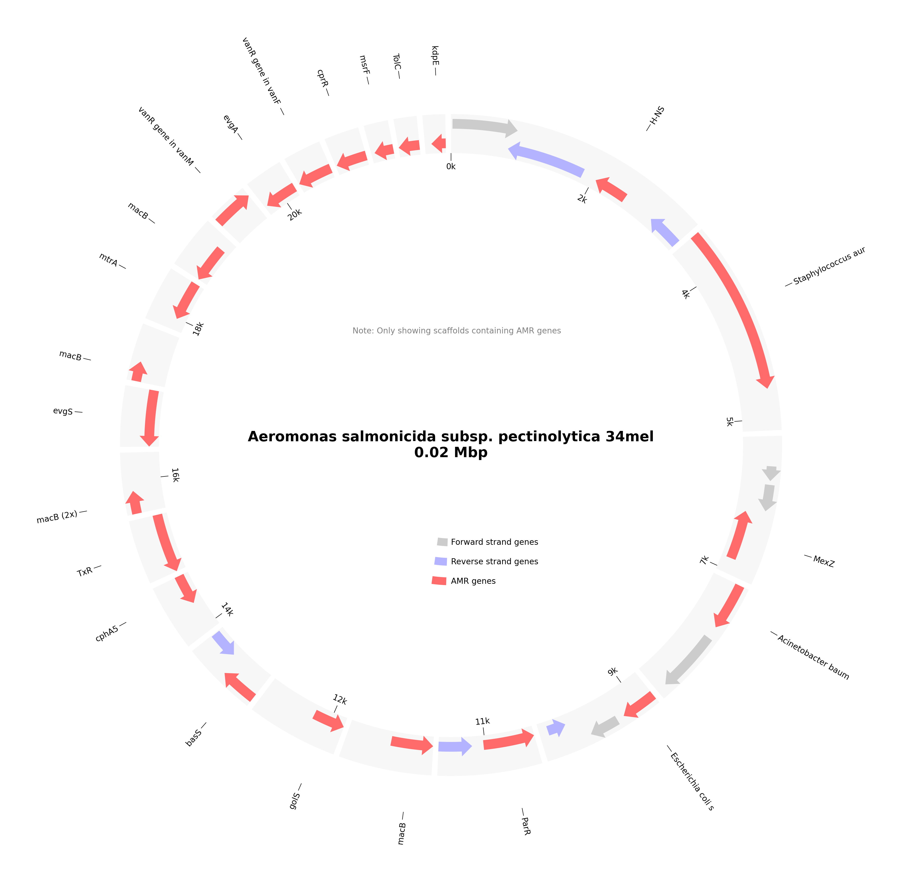

### Acinetobacter baumannii AbaF
- **Mechanism**: antibiotic efflux
- **Drug Classes**: phosphonic acid antibiotic
- **AMR Family**: major facilitator superfamily (MFS) antibiotic efflux pump
- **Locations**:
  - gnl|SPADES|CPJJBIBK_3093_1 : position 2-544

### Escherichia coli soxS with mutation conferring antibiotic resistance
- **Mechanism**: antibiotic target alteration; antibiotic efflux; reduced permeability to antibiotic
- **Drug Classes**: fluoroquinolone antibiotic; monobactam; carbapenem; cephalosporin; glycylcycline; cephamycin; penam; tetracycline antibiotic; rifamycin antibiotic; phenicol antibiotic; penem; disinfecting agents and antiseptics
- **AMR Family**: ATP-binding cassette (ABC) antibiotic efflux pump; major facilitator superfamily (MFS) antibiotic efflux pump; resistance-nodulation-cell division (RND) antibiotic efflux pump; General Bacterial Porin with reduced permeability to beta-lactams
- **Locations**:
  - gnl|SPADES|CPJJBIBK_3458_1 : position 3-410

### H-NS
- **Mechanism**: antibiotic efflux
- **Drug Classes**: macrolide antibiotic; fluoroquinolone antibiotic; cephalosporin; cephamycin; penam; tetracycline antibiotic
- **AMR Family**: major facilitator superfamily (MFS) antibiotic efflux pump; resistance-nodulation-cell division (RND) antibiotic efflux pump
- **Locations**:
  - gnl|SPADES|CPJJBIBK_1542_3 : position 1808-2218

### MexZ
- **Mechanism**: antibiotic efflux
- **Drug Classes**: macrolide antibiotic; fluoroquinolone antibiotic; aminoglycoside antibiotic; carbapenem; cephalosporin; cephamycin; penam; tetracycline antibiotic; phenicol antibiotic; disinfecting agents and antiseptics
- **AMR Family**: resistance-nodulation-cell division (RND) antibiotic efflux pump
- **Locations**:
  - gnl|SPADES|CPJJBIBK_2765_2 : position 898-1491

### ParR
- **Mechanism**: antibiotic efflux; reduced permeability to antibiotic
- **Drug Classes**: macrolide antibiotic; fluoroquinolone antibiotic; monobactam; aminoglycoside antibiotic; carbapenem; cephalosporin; cephamycin; penam; tetracycline antibiotic; phenicol antibiotic; penem; disinfecting agents and antiseptics
- **AMR Family**: resistance-nodulation-cell division (RND) antibiotic efflux pump; Outer Membrane Porin (Opr)
- **Locations**:
  - gnl|SPADES|CPJJBIBK_4426_1 : position 3-620

### Staphylococcus aureus mupA conferring resistance to mupirocin
- **Mechanism**: antibiotic target alteration
- **Drug Classes**: mupirocin-like antibiotic
- **AMR Family**: antibiotic-resistant isoleucyl-tRNA synthetase (ileS)
- **Locations**:
  - gnl|SPADES|CPJJBIBK_1894_1 : position 1-1938

### TolC
- **Mechanism**: antibiotic efflux
- **Drug Classes**: macrolide antibiotic; fluoroquinolone antibiotic; aminoglycoside antibiotic; carbapenem; cephalosporin; glycylcycline; cephamycin; penam; tetracycline antibiotic; peptide antibiotic; aminocoumarin antibiotic; rifamycin antibiotic; phenicol antibiotic; penem; disinfecting agents and antiseptics
- **AMR Family**: ATP-binding cassette (ABC) antibiotic efflux pump; major facilitator superfamily (MFS) antibiotic efflux pump; resistance-nodulation-cell division (RND) antibiotic efflux pump
- **Locations**:
  - gnl|SPADES|CPJJBIBK_63907_1 : position 2-253

### TxR
- **Mechanism**: antibiotic efflux
- **Drug Classes**: tetracycline antibiotic
- **AMR Family**: ATP-binding cassette (ABC) antibiotic efflux pump
- **Locations**:
  - gnl|SPADES|CPJJBIBK_8802_1 : position 1-717

### basS
- **Mechanism**: antibiotic target alteration; antibiotic efflux
- **Drug Classes**: peptide antibiotic
- **AMR Family**: pmr phosphoethanolamine transferase
- **Locations**:
  - gnl|SPADES|CPJJBIBK_6893_1 : position 1-429

### cphA5
- **Mechanism**: antibiotic inactivation
- **Drug Classes**: carbapenem
- **AMR Family**: CphA beta-lactamase
- **Locations**:
  - gnl|SPADES|CPJJBIBK_8349_2 : position 377-745

### cprR
- **Mechanism**: antibiotic target alteration; antibiotic efflux
- **Drug Classes**: peptide antibiotic
- **AMR Family**: pmr phosphoethanolamine transferase
- **Locations**:
  - gnl|SPADES|CPJJBIBK_21585_1 : position 14-388

### evgA
- **Mechanism**: antibiotic efflux
- **Drug Classes**: macrolide antibiotic; fluoroquinolone antibiotic; penam; tetracycline antibiotic
- **AMR Family**: major facilitator superfamily (MFS) antibiotic efflux pump; resistance-nodulation-cell division (RND) antibiotic efflux pump
- **Locations**:
  - gnl|SPADES|CPJJBIBK_18460_1 : position 31-429

### evgS
- **Mechanism**: antibiotic efflux
- **Drug Classes**: macrolide antibiotic; fluoroquinolone antibiotic; penam; tetracycline antibiotic
- **AMR Family**: major facilitator superfamily (MFS) antibiotic efflux pump; resistance-nodulation-cell division (RND) antibiotic efflux pump
- **Locations**:
  - gnl|SPADES|CPJJBIBK_9520_1 : position 2-679

### golS
- **Mechanism**: antibiotic efflux
- **Drug Classes**: monobactam; carbapenem; cephalosporin; cephamycin; penam; phenicol antibiotic; penem
- **AMR Family**: resistance-nodulation-cell division (RND) antibiotic efflux pump
- **Locations**:
  - gnl|SPADES|CPJJBIBK_5260_1 : position 1-384

### kdpE
- **Mechanism**: antibiotic efflux
- **Drug Classes**: aminoglycoside antibiotic
- **AMR Family**: kdpDE
- **Locations**:
  - gnl|SPADES|CPJJBIBK_67938_2 : position 78-251

### macB (found in 5 locations)
- **Mechanism**: antibiotic efflux
- **Drug Classes**: macrolide antibiotic
- **AMR Family**: ATP-binding cassette (ABC) antibiotic efflux pump
- **Locations**:
  - gnl|SPADES|CPJJBIBK_10353_1 : position 3-230
  - gnl|SPADES|CPJJBIBK_11439_1 : position 1-450
  - gnl|SPADES|CPJJBIBK_5155_1 : position 1-507
  - gnl|SPADES|CPJJBIBK_9170_1 : position 1-261
  - gnl|SPADES|CPJJBIBK_9170_2 : position 261-587

### msrF
- **Mechanism**: antibiotic target protection
- **Drug Classes**: macrolide antibiotic; streptogramin antibiotic
- **AMR Family**: msr-type ABC-F protein
- **Locations**:
  - gnl|SPADES|CPJJBIBK_47464_2 : position 40-270

### mtrA
- **Mechanism**: antibiotic efflux
- **Drug Classes**: macrolide antibiotic; penam
- **AMR Family**: resistance-nodulation-cell division (RND) antibiotic efflux pump
- **Locations**:
  - gnl|SPADES|CPJJBIBK_11024_1 : position 137-613

### vanR gene in vanF cluster
- **Mechanism**: antibiotic target alteration
- **Drug Classes**: glycopeptide antibiotic
- **AMR Family**: glycopeptide resistance gene cluster; vanR
- **Locations**:
  - gnl|SPADES|CPJJBIBK_18718_1 : position 2-424

### vanR gene in vanM cluster
- **Mechanism**: antibiotic target alteration
- **Drug Classes**: glycopeptide antibiotic
- **AMR Family**: glycopeptide resistance gene cluster; vanR
- **Locations**:
  - gnl|SPADES|CPJJBIBK_16666_1 : position 2-460

## Buttiauxella agrestis
**Strain Statistics:**
- Total genome length: 3900.2 kbp
- Total scaffolds: 468
- Scaffolds with AMR genes: 138
- Total genes annotated: 7105
- Total AMR genes: 484
- Unique AMR genes: 215
- Distinct AMR mechanisms: 11
- Distinct AMR families: 80
- Distinct drug classes: 36

**Circos Plot:**

### ACT-8
- **Mechanism**: antibiotic inactivation
- **Drug Classes**: carbapenem; cephalosporin; cephamycin; penam
- **AMR Family**: ACT beta-lactamase
- **Locations**:
  - gnl|SPADES|CPJJBIBK_490_10: position 11265-12416

### AIM-1
- **Mechanism**: antibiotic inactivation
- **Drug Classes**: cephalosporin; cephamycin; penam
- **AMR Family**: AIM beta-lactamase
- **Locations**:
  - gnl|SPADES|CPJJBIBK_161_9 : position 9774-10733

### APH(6)-Ic
- **Mechanism**: antibiotic inactivation
- **Drug Classes**: aminoglycoside antibiotic
- **AMR Family**: APH(6)
- **Locations**:
  - gnl|SPADES|CPJJBIBK_79_45 : position 44097-44924

### Acinetobacter baumannii AbaF (found in 7 locations)
- **Mechanism**: antibiotic efflux
- **Drug Classes**: phosphonic acid antibiotic
- **AMR Family**: major facilitator superfamily (MFS) antibiotic efflux pump
- **Locations**:
  - gnl|SPADES|CPJJBIBK_2802_1 : position 79-1383
  - gnl|SPADES|CPJJBIBK_311_13 : position 15226-16560
  - gnl|SPADES|CPJJBIBK_311_6 : position 5265-6770
  - gnl|SPADES|CPJJBIBK_359_3 : position 1655-2980
  - gnl|SPADES|CPJJBIBK_41_77 : position 79660-80985
  - gnl|SPADES|CPJJBIBK_720_5 : position 3641-5140
  - gnl|SPADES|CPJJBIBK_79_82 : position 80938-82272

### Acinetobacter baumannii AbaQ (found in 10 locations)
- **Mechanism**: antibiotic efflux
- **Drug Classes**: fluoroquinolone antibiotic
- **AMR Family**: major facilitator superfamily (MFS) antibiotic efflux pump
- **Locations**:
  - gnl|SPADES|CPJJBIBK_169_3 : position 1391-2707
  - gnl|SPADES|CPJJBIBK_1940_1 : position 2-655
  - gnl|SPADES|CPJJBIBK_20_116 : position 134418-135608
  - gnl|SPADES|CPJJBIBK_270_10 : position 14207-15568
  - gnl|SPADES|CPJJBIBK_2758_1 : position 1-822
  - gnl|SPADES|CPJJBIBK_28123_1 : position 2-277
  - gnl|SPADES|CPJJBIBK_47167_1 : position 3-269
  - gnl|SPADES|CPJJBIBK_472_19 : position 17847-19145
  - gnl|SPADES|CPJJBIBK_541_2 : position 766-2079
  - gnl|SPADES|CPJJBIBK_76734_1 : position 2-241

### AcrE
- **Mechanism**: antibiotic efflux
- **Drug Classes**: fluoroquinolone antibiotic; cephalosporin; cephamycin; penam
- **AMR Family**: resistance-nodulation-cell division (RND) antibiotic efflux pump
- **Locations**:
  - gnl|SPADES|CPJJBIBK_107_25 : position 27614-28768

### AcrF
- **Mechanism**: antibiotic efflux
- **Drug Classes**: fluoroquinolone antibiotic; cephalosporin; cephamycin; penam
- **AMR Family**: resistance-nodulation-cell division (RND) antibiotic efflux pump
- **Locations**:
  - gnl|SPADES|CPJJBIBK_107_26 : position 28779-31889

### AcrS (found in 2 locations)
- **Mechanism**: antibiotic efflux
- **Drug Classes**: fluoroquinolone antibiotic; cephalosporin; glycylcycline; cephamycin; penam; tetracycline antibiotic; rifamycin antibiotic; phenicol antibiotic; disinfecting agents and antiseptics
- **AMR Family**: resistance-nodulation-cell division (RND) antibiotic efflux pump
- **Locations**:
  - gnl|SPADES|CPJJBIBK_107_23 : position 23554-24171
  - gnl|SPADES|CPJJBIBK_32_37 : position 37921-38466

### Brucella suis mprF
- **Mechanism**: antibiotic target alteration
- **Drug Classes**: peptide antibiotic
- **AMR Family**: defensin resistant mprF
- **Locations**:
  - gnl|SPADES|CPJJBIBK_161_24 : position 27086-28054

### CRD3-1
- **Mechanism**: antibiotic inactivation
- **Drug Classes**: carbapenem
- **AMR Family**: CRD3 beta-lactamase
- **Locations**:
  - gnl|SPADES|CPJJBIBK_67_28 : position 30265-31107

### CRP (found in 3 locations)
- **Mechanism**: antibiotic efflux
- **Drug Classes**: macrolide antibiotic; fluoroquinolone antibiotic; penam
- **AMR Family**: resistance-nodulation-cell division (RND) antibiotic efflux pump
- **Locations**:
  - gnl|SPADES|CPJJBIBK_122_19: position 13484-14116
  - gnl|SPADES|CPJJBIBK_384_24 : position 21707-22459
  - gnl|SPADES|CPJJBIBK_402_13 : position 13000-13692

### Clostridioides difficile gyrA conferring resistance to fluoroquinolones
- **Mechanism**: antibiotic target alteration
- **Drug Classes**: fluoroquinolone antibiotic
- **AMR Family**: fluoroquinolone resistant gyrA
- **Locations**:
  - gnl|SPADES|CPJJBIBK_216_6 : position 7919-10567

### Clostridioides difficile gyrB conferring resistance to fluoroquinolones
- **Mechanism**: antibiotic target alteration
- **Drug Classes**: fluoroquinolone antibiotic
- **AMR Family**: fluoroquinolone resistant gyrB
- **Locations**:
  - gnl|SPADES|CPJJBIBK_113_39 : position 38899-40794

### CrcB
- **Mechanism**: antibiotic efflux
- **Drug Classes**: aminoglycoside antibiotic
- **AMR Family**: multidrug and toxic compound extrusion (MATE) transporter
- **Locations**:
  - gnl|SPADES|CPJJBIBK_231_12 : position 10938-11321

### DHA-28
- **Mechanism**: antibiotic inactivation
- **Drug Classes**: cephalosporin; cephamycin
- **AMR Family**: DHA beta-lactamase
- **Locations**:
  - gnl|SPADES|CPJJBIBK_94_45 : position 46718-47725

### Enterococcus faecalis cls with mutation conferring resistance to daptomycin (found in 2 locations)
- **Mechanism**: antibiotic target alteration
- **Drug Classes**: peptide antibiotic
- **AMR Family**: daptomycin resistant cls
- **Locations**:
  - gnl|SPADES|CPJJBIBK_107_59 : position 59487-60938
  - gnl|SPADES|CPJJBIBK_39_49 : position 56570-58030

### Enterococcus faecium liaR mutant conferring daptomycin resistance
- **Mechanism**: antibiotic target alteration; antibiotic efflux
- **Drug Classes**: peptide antibiotic
- **AMR Family**: daptomycin resistant liaR
- **Locations**:
  - gnl|SPADES|CPJJBIBK_490_13 : position 13667-14251

### Enterococcus faecium liaS mutant conferring daptomycin resistance
- **Mechanism**: antibiotic target alteration; antibiotic efflux
- **Drug Classes**: peptide antibiotic
- **AMR Family**: daptomycin resistant liaS
- **Locations**:
  - gnl|SPADES|CPJJBIBK_9711_1 : position 1-669

### ErmB
- **Mechanism**: antibiotic target alteration
- **Drug Classes**: macrolide antibiotic; lincosamide antibiotic; streptogramin antibiotic; streptogramin A antibiotic; streptogramin B antibiotic
- **AMR Family**: Erm 23S ribosomal RNA methyltransferase
- **Locations**:
  - gnl|SPADES|CPJJBIBK_41_45 : position 46310-47134

### Escherichia coli AcrAB-TolC with AcrR mutation conferring resistance to ciprofloxacin, tetracycline, and ceftazidime (found in 2 locations)
- **Mechanism**: antibiotic target alteration; antibiotic efflux
- **Drug Classes**: fluoroquinolone antibiotic; cephalosporin; glycylcycline; penam; tetracycline antibiotic; rifamycin antibiotic; phenicol antibiotic; disinfecting agents and antiseptics
- **AMR Family**: resistance-nodulation-cell division (RND) antibiotic efflux pump
- **Locations**:
  - gnl|SPADES|CPJJBIBK_316_10 : position 8603-9298
  - gnl|SPADES|CPJJBIBK_67_3 : position 947-1531

### Escherichia coli AcrAB-TolC with MarR mutations conferring resistance to ciprofloxacin and tetracycline (found in 2 locations)
- **Mechanism**: antibiotic target alteration; antibiotic efflux
- **Drug Classes**: fluoroquinolone antibiotic; cephalosporin; glycylcycline; penam; tetracycline antibiotic; rifamycin antibiotic; phenicol antibiotic; disinfecting agents and antiseptics
- **AMR Family**: resistance-nodulation-cell division (RND) antibiotic efflux pump
- **Locations**:
  - gnl|SPADES|CPJJBIBK_67_53: position 53888-54322
  - gnl|SPADES|CPJJBIBK_94_52 : position 54336-54791

### Escherichia coli EF-Tu mutants conferring resistance to Pulvomycin
- **Mechanism**: antibiotic target alteration
- **Drug Classes**: elfamycin antibiotic
- **AMR Family**: elfamycin resistant EF-Tu
- **Locations**:
  - gnl|SPADES|CPJJBIBK_472_7 : position 5593-7440

### Escherichia coli EF-Tu mutants conferring resistance to kirromycin
- **Mechanism**: antibiotic target alteration
- **Drug Classes**: elfamycin antibiotic
- **AMR Family**: elfamycin resistant EF-Tu
- **Locations**:
  - gnl|SPADES|CPJJBIBK_132_42 : position 36410-39094

### Escherichia coli UhpT with mutation conferring resistance to fosfomycin
- **Mechanism**: antibiotic target alteration
- **Drug Classes**: phosphonic acid antibiotic
- **AMR Family**: antibiotic-resistant UhpT
- **Locations**:
  - gnl|SPADES|CPJJBIBK_209_14 : position 14091-15482

### Escherichia coli mdfA
- **Mechanism**: antibiotic efflux
- **Drug Classes**: tetracycline antibiotic; phenicol antibiotic; disinfecting agents and antiseptics
- **AMR Family**: major facilitator superfamily (MFS) antibiotic efflux pump
- **Locations**:
  - gnl|SPADES|CPJJBIBK_162_30 : position 32462-33682

### Escherichia coli soxR with mutation conferring antibiotic resistance
- **Mechanism**: antibiotic target alteration; antibiotic efflux
- **Drug Classes**: fluoroquinolone antibiotic; cephalosporin; glycylcycline; penam; tetracycline antibiotic; rifamycin antibiotic; phenicol antibiotic; disinfecting agents and antiseptics
- **AMR Family**: ATP-binding cassette (ABC) antibiotic efflux pump; major facilitator superfamily (MFS) antibiotic efflux pump; resistance-nodulation-cell division (RND) antibiotic efflux pump
- **Locations**:
  - gnl|SPADES|CPJJBIBK_531_3 : position 976-1434

### Escherichia coli soxS with mutation conferring antibiotic resistance (found in 9 locations)
- **Mechanism**: antibiotic target alteration; antibiotic efflux; reduced permeability to antibiotic
- **Drug Classes**: fluoroquinolone antibiotic; monobactam; carbapenem; cephalosporin; glycylcycline; cephamycin; penam; tetracycline antibiotic; rifamycin antibiotic; phenicol antibiotic; penem; disinfecting agents and antiseptics
- **AMR Family**: ATP-binding cassette (ABC) antibiotic efflux pump; major facilitator superfamily (MFS) antibiotic efflux pump; resistance-nodulation-cell division (RND) antibiotic efflux pump; General Bacterial Porin with reduced permeability to beta-lactams
- **Locations**:
  - gnl|SPADES|CPJJBIBK_161_4 : position 3063-3887
  - gnl|SPADES|CPJJBIBK_175_19 : position 15881-16729
  - gnl|SPADES|CPJJBIBK_336_21 : position 25124-25984
  - gnl|SPADES|CPJJBIBK_373_5 : position 6492-7364
  - gnl|SPADES|CPJJBIBK_41_33 : position 28437-29282
  - gnl|SPADES|CPJJBIBK_41_93 : position 98753-99622
  - gnl|SPADES|CPJJBIBK_4989_1 : position 2-943
  - gnl|SPADES|CPJJBIBK_531_2 : position 574-897
  - gnl|SPADES|CPJJBIBK_78_36 : position 42458-43324

### Escherichia coli uhpA with mutation conferring resistance to fosfomycin
- **Mechanism**: antibiotic target alteration
- **Drug Classes**: phosphonic acid antibiotic
- **AMR Family**: antibiotic-resistant UhpT
- **Locations**:
  - gnl|SPADES|CPJJBIBK_979_2 : position 1931-2659

### FosG
- **Mechanism**: antibiotic inactivation
- **Drug Classes**: phosphonic acid antibiotic
- **AMR Family**: fosfomycin thiol transferase
- **Locations**:
  - gnl|SPADES|CPJJBIBK_288_25 : position 27427-27834

### GMB-1
- **Mechanism**: antibiotic inactivation
- **Drug Classes**: carbapenem
- **AMR Family**: GMB beta-lactamase
- **Locations**:
  - gnl|SPADES|CPJJBIBK_162_3 : position 1810-2676

### H-NS
- **Mechanism**: antibiotic efflux
- **Drug Classes**: macrolide antibiotic; fluoroquinolone antibiotic; cephalosporin; cephamycin; penam; tetracycline antibiotic
- **AMR Family**: major facilitator superfamily (MFS) antibiotic efflux pump; resistance-nodulation-cell division (RND) antibiotic efflux pump
- **Locations**:
  - gnl|SPADES|CPJJBIBK_39_60 : position 70902-71312

### Haemophilus influenzae PBP3 conferring resistance to beta-lactam antibiotics
- **Mechanism**: antibiotic target alteration
- **Drug Classes**: cephalosporin; cephamycin; penam
- **AMR Family**: Penicillin-binding protein mutations conferring resistance to beta-lactam antibiotics
- **Locations**:
  - gnl|SPADES|CPJJBIBK_194_20 : position 21293-23059

### Helicobacter pylori pbp1 mutants conferring resistance to amoxicillin (found in 2 locations)
- **Mechanism**: antibiotic target alteration
- **Drug Classes**: cephalosporin; cephamycin; penam
- **AMR Family**: Penicillin-binding protein mutations conferring resistance to beta-lactam antibiotics
- **Locations**:
  - gnl|SPADES|CPJJBIBK_166_20 : position 22878-25433
  - gnl|SPADES|CPJJBIBK_52_52 : position 58578-60899

### Helicobacter pylori pbp2 mutants conferring resistance to amoxicillin
- **Mechanism**: antibiotic target alteration
- **Drug Classes**: cephalosporin; cephamycin; penam
- **AMR Family**: Penicillin-binding protein mutations conferring resistance to beta-lactam antibiotics
- **Locations**:
  - gnl|SPADES|CPJJBIBK_231_21 : position 18622-20523

### Helicobacter pylori rdxA mutation conferring resistance to metronidazole
- **Mechanism**: antibiotic target alteration
- **Drug Classes**: nitroimidazole antibiotic
- **AMR Family**: Antibiotic resistant Helicobacter pylori nitroreductase
- **Locations**:
  - gnl|SPADES|CPJJBIBK_727_6 : position 3568-4221

### Helicobacter pylori rpoB mutation conferring resistance to rifampicin
- **Mechanism**: antibiotic target alteration; antibiotic target replacement
- **Drug Classes**: fluoroquinolone antibiotic; rifamycin antibiotic
- **AMR Family**: rifamycin-resistant beta-subunit of RNA polymerase (rpoB)
- **Locations**:
  - gnl|SPADES|CPJJBIBK_1063_1 : position 1-2700

### IreK
- **Mechanism**: reduced permeability to antibiotic
- **Drug Classes**: cephalosporin
- **AMR Family**: Serine/threonine kinases
- **Locations**:
  - gnl|SPADES|CPJJBIBK_254_36 : position 31241-32014

### Klebsiella pneumoniae KpnE
- **Mechanism**: antibiotic efflux
- **Drug Classes**: macrolide antibiotic; aminoglycoside antibiotic; cephalosporin; tetracycline antibiotic; peptide antibiotic; rifamycin antibiotic; disinfecting agents and antiseptics
- **AMR Family**: small multidrug resistance (SMR) antibiotic efflux pump
- **Locations**:
  - gnl|SPADES|CPJJBIBK_39_35: position 41202-41576

### Klebsiella pneumoniae KpnF
- **Mechanism**: antibiotic efflux
- **Drug Classes**: macrolide antibiotic; aminoglycoside antibiotic; cephalosporin; tetracycline antibiotic; peptide antibiotic; rifamycin antibiotic; disinfecting agents and antiseptics
- **AMR Family**: small multidrug resistance (SMR) antibiotic efflux pump
- **Locations**:
  - gnl|SPADES|CPJJBIBK_39_34: position 40886-41215

### Klebsiella pneumoniae KpnG
- **Mechanism**: antibiotic efflux
- **Drug Classes**: macrolide antibiotic; fluoroquinolone antibiotic; aminoglycoside antibiotic; carbapenem; cephalosporin; penam; peptide antibiotic; penem
- **AMR Family**: major facilitator superfamily (MFS) antibiotic efflux pump
- **Locations**:
  - gnl|SPADES|CPJJBIBK_254_7 : position 5387-6559

### Klebsiella pneumoniae KpnH (found in 2 locations)
- **Mechanism**: antibiotic efflux
- **Drug Classes**: macrolide antibiotic; fluoroquinolone antibiotic; aminoglycoside antibiotic; carbapenem; cephalosporin; penam; peptide antibiotic; penem
- **AMR Family**: major facilitator superfamily (MFS) antibiotic efflux pump
- **Locations**:
  - gnl|SPADES|CPJJBIBK_1916_2 : position 961-2343
  - gnl|SPADES|CPJJBIBK_254_6: position 3833-5371

### Klebsiella pneumoniae OmpK37 (found in 4 locations)
- **Mechanism**: reduced permeability to antibiotic
- **Drug Classes**: monobactam; carbapenem; cephalosporin; cephamycin; penam; penem
- **AMR Family**: General Bacterial Porin with reduced permeability to beta-lactams
- **Locations**:
  - gnl|SPADES|CPJJBIBK_161_54 : position 56213-57217
  - gnl|SPADES|CPJJBIBK_216_1 : position 1-144
  - gnl|SPADES|CPJJBIBK_94_40 : position 38733-39833
  - gnl|SPADES|CPJJBIBK_95_20 : position 23351-24451

### Klebsiella pneumoniae acrR with mutation conferring multidrug antibiotic resistance
- **Mechanism**: antibiotic target alteration; antibiotic efflux
- **Drug Classes**: fluoroquinolone antibiotic; cephalosporin; glycylcycline; penam; tetracycline antibiotic; rifamycin antibiotic; phenicol antibiotic; disinfecting agents and antiseptics
- **AMR Family**: resistance-nodulation-cell division (RND) antibiotic efflux pump
- **Locations**:
  - gnl|SPADES|CPJJBIBK_256_16 : position 16002-16643

### LRA-13
- **Mechanism**: antibiotic inactivation
- **Drug Classes**: cephalosporin; penam
- **AMR Family**: class C LRA beta-lactamase; class D LRA beta-lactamase
- **Locations**:
  - gnl|SPADES|CPJJBIBK_162_37 : position 39222-40430

### LRA-2
- **Mechanism**: antibiotic inactivation
- **Drug Classes**: cephalosporin; penam
- **AMR Family**: subclass B3 LRA beta-lactamase
- **Locations**:
  - gnl|SPADES|CPJJBIBK_67_79 : position 84985-85782

### LlmA 23S ribosomal RNA methyltransferase
- **Mechanism**: antibiotic target alteration
- **Drug Classes**: lincosamide antibiotic
- **AMR Family**: Llm 23S ribosomal RNA methyltransferase
- **Locations**:
  - gnl|SPADES|CPJJBIBK_95_51 : position 59488-60663

### LpsA
- **Mechanism**: reduced permeability to antibiotic
- **Drug Classes**: peptide antibiotic
- **AMR Family**: Intrinsic peptide antibiotic resistant Lps
- **Locations**:
  - gnl|SPADES|CPJJBIBK_209_35 : position 41139-41915

### LptD
- **Mechanism**: antibiotic efflux
- **Drug Classes**: carbapenem; peptide antibiotic; aminocoumarin antibiotic; rifamycin antibiotic
- **AMR Family**: ATP-binding cassette (ABC) antibiotic efflux pump
- **Locations**:
  - gnl|SPADES|CPJJBIBK_41_42 : position 41598-43985

### MCR-9.1
- **Mechanism**: antibiotic target alteration
- **Drug Classes**: peptide antibiotic
- **AMR Family**: MCR phosphoethanolamine transferase
- **Locations**:
  - gnl|SPADES|CPJJBIBK_20_27 : position 30013-31632

### MdtK
- **Mechanism**: antibiotic efflux
- **Drug Classes**: fluoroquinolone antibiotic
- **AMR Family**: multidrug and toxic compound extrusion (MATE) transporter
- **Locations**:
  - gnl|SPADES|CPJJBIBK_727_10 : position 8085-9527

### MdtQ
- **Mechanism**: reduced permeability to antibiotic
- **Drug Classes**: monobactam; carbapenem; cephalosporin; cephamycin; penam; penem
- **AMR Family**: Outer Membrane Porin (Opr)
- **Locations**:
  - gnl|SPADES|CPJJBIBK_161_3 : position 1448-2893

### MexH (found in 2 locations)
- **Mechanism**: antibiotic efflux
- **Drug Classes**: fluoroquinolone antibiotic; tetracycline antibiotic; disinfecting agents and antiseptics
- **AMR Family**: resistance-nodulation-cell division (RND) antibiotic efflux pump
- **Locations**:
  - gnl|SPADES|CPJJBIBK_231_7 : position 4993-6450
  - gnl|SPADES|CPJJBIBK_415_3 : position 7675-8502

### MexS (found in 2 locations)
- **Mechanism**: antibiotic efflux
- **Drug Classes**: fluoroquinolone antibiotic; diaminopyrimidine antibiotic; phenicol antibiotic
- **AMR Family**: resistance-nodulation-cell division (RND) antibiotic efflux pump
- **Locations**:
  - gnl|SPADES|CPJJBIBK_311_8 : position 8681-9712
  - gnl|SPADES|CPJJBIBK_421_17 : position 18151-19134

### MexT (found in 3 locations)
- **Mechanism**: antibiotic efflux
- **Drug Classes**: fluoroquinolone antibiotic; diaminopyrimidine antibiotic; phenicol antibiotic
- **AMR Family**: resistance-nodulation-cell division (RND) antibiotic efflux pump
- **Locations**:
  - gnl|SPADES|CPJJBIBK_161_10 : position 10812-11726
  - gnl|SPADES|CPJJBIBK_78_76 : position 88672-89589
  - gnl|SPADES|CPJJBIBK_86_83 : position 81450-82397

### MexW
- **Mechanism**: antibiotic efflux
- **Drug Classes**: macrolide antibiotic; fluoroquinolone antibiotic; tetracycline antibiotic; phenicol antibiotic; disinfecting agents and antiseptics
- **AMR Family**: resistance-nodulation-cell division (RND) antibiotic efflux pump
- **Locations**:
  - gnl|SPADES|CPJJBIBK_231_8 : position 6447-9566

### Morganella morganii gyrB conferring resistance to fluoroquinolones
- **Mechanism**: antibiotic target alteration
- **Drug Classes**: fluoroquinolone antibiotic
- **AMR Family**: fluoroquinolone resistant gyrB
- **Locations**:
  - gnl|SPADES|CPJJBIBK_186_19 : position 19248-21662

### Mycobacterium tuberculosis folC with mutation conferring resistance to para-aminosalicylic acid
- **Mechanism**: antibiotic target alteration
- **Drug Classes**: salicylic acid antibiotic
- **AMR Family**: aminosalicylate resistant dihydrofolate synthase
- **Locations**:
  - gnl|SPADES|CPJJBIBK_225_31 : position 30497-31765

### Mycobacterium tuberculosis gidB mutation conferring resistance to streptomycin
- **Mechanism**: antibiotic target alteration
- **Drug Classes**: aminoglycoside antibiotic
- **AMR Family**: antibiotic resistant gidB
- **Locations**:
  - gnl|SPADES|CPJJBIBK_505_14 : position 14893-15516

### Mycobacterium tuberculosis inhA mutations conferring resistance to isoniazid
- **Mechanism**: antibiotic target alteration
- **Drug Classes**: isoniazid-like antibiotic
- **AMR Family**: isoniazid resistant inhA
- **Locations**:
  - gnl|SPADES|CPJJBIBK_116_41 : position 47927-48670

### Mycobacterium tuberculosis katG mutations conferring resistance to isoniazid
- **Mechanism**: antibiotic target alteration
- **Drug Classes**: isoniazid-like antibiotic
- **AMR Family**: isoniazid resistant katG
- **Locations**:
  - gnl|SPADES|CPJJBIBK_336_12 : position 13325-15505

### Mycobacterium tuberculosis ndh with mutation conferring resistance to isoniazid
- **Mechanism**: antibiotic target alteration
- **Drug Classes**: isoniazid-like antibiotic
- **AMR Family**: antibiotic resistant ndh
- **Locations**:
  - gnl|SPADES|CPJJBIBK_262_16 : position 14614-15918

### Mycobacterium tuberculosis rpoB mutations conferring resistance to rifampicin
- **Mechanism**: antibiotic target alteration; antibiotic target replacement
- **Drug Classes**: rifamycin antibiotic
- **AMR Family**: rifamycin-resistant beta-subunit of RNA polymerase (rpoB)
- **Locations**:
  - gnl|SPADES|CPJJBIBK_2218_1 : position 3-2048

### Mycobacterium tuberculosis thyA with mutation conferring resistance to para-aminosalicylic acid
- **Mechanism**: antibiotic target alteration
- **Drug Classes**: salicylic acid antibiotic
- **AMR Family**: aminosalicylate resistant thymidylate synthase
- **Locations**:
  - gnl|SPADES|CPJJBIBK_115_48 : position 56722-57516

### Neisseria gonorrhoeae pilQ gene conferring resistance to beta-lactam
- **Mechanism**: antibiotic target alteration
- **Drug Classes**: cephalosporin; cephamycin; penam
- **AMR Family**: Penicillin-binding protein mutations conferring resistance to beta-lactam antibiotics
- **Locations**:
  - gnl|SPADES|CPJJBIBK_122_39 : position 35135-36382

### NmcR (found in 10 locations)
- **Mechanism**: antibiotic inactivation
- **Drug Classes**: carbapenem; cephalosporin; cephamycin; penam
- **AMR Family**: NmcA beta-lactamase
- **Locations**:
  - gnl|SPADES|CPJJBIBK_225_7 : position 6780-7715
  - gnl|SPADES|CPJJBIBK_270_25 : position 30505-31422
  - gnl|SPADES|CPJJBIBK_373_1 : position 78-941
  - gnl|SPADES|CPJJBIBK_39_29 : position 35171-36079
  - gnl|SPADES|CPJJBIBK_402_1 : position 128-952
  - gnl|SPADES|CPJJBIBK_508_3 : position 2047-2946
  - gnl|SPADES|CPJJBIBK_67_27 : position 29195-30094
  - gnl|SPADES|CPJJBIBK_78_75 : position 87622-88566
  - gnl|SPADES|CPJJBIBK_79_19 : position 18766-19740
  - gnl|SPADES|CPJJBIBK_79_3 : position 2547-3464

### OmpA (found in 5 locations)
- **Mechanism**: reduced permeability to antibiotic
- **Drug Classes**: peptide antibiotic
- **AMR Family**: General Bacterial Porin with reduced permeability to peptide antibiotics
- **Locations**:
  - gnl|SPADES|CPJJBIBK_20_8 : position 6267-7991
  - gnl|SPADES|CPJJBIBK_261_2 : position 1033-1554
  - gnl|SPADES|CPJJBIBK_472_4 : position 1710-2756
  - gnl|SPADES|CPJJBIBK_638_6 : position 3290-3952
  - gnl|SPADES|CPJJBIBK_95_41 : position 49687-50766

### OpmD
- **Mechanism**: antibiotic efflux
- **Drug Classes**: fluoroquinolone antibiotic; tetracycline antibiotic; disinfecting agents and antiseptics
- **AMR Family**: resistance-nodulation-cell division (RND) antibiotic efflux pump
- **Locations**:
  - gnl|SPADES|CPJJBIBK_2118_2 : position 269-1675

### OprN
- **Mechanism**: antibiotic efflux
- **Drug Classes**: fluoroquinolone antibiotic; diaminopyrimidine antibiotic; phenicol antibiotic
- **AMR Family**: resistance-nodulation-cell division (RND) antibiotic efflux pump
- **Locations**:
  - gnl|SPADES|CPJJBIBK_341_19 : position 23387-24910

### OprZ
- **Mechanism**: antibiotic efflux
- **Drug Classes**: macrolide antibiotic; fluoroquinolone antibiotic; aminoglycoside antibiotic; cephalosporin
- **AMR Family**: resistance-nodulation-cell division (RND) antibiotic efflux pump
- **Locations**:
  - gnl|SPADES|CPJJBIBK_714_3 : position 3667-5112

### PEDO-1
- **Mechanism**: antibiotic inactivation
- **Drug Classes**: carbapenem
- **AMR Family**: subclass B3 PEDO beta-lactamase
- **Locations**:
  - gnl|SPADES|CPJJBIBK_95_18 : position 21265-21912

### ParR (found in 3 locations)
- **Mechanism**: antibiotic efflux; reduced permeability to antibiotic
- **Drug Classes**: macrolide antibiotic; fluoroquinolone antibiotic; monobactam; aminoglycoside antibiotic; carbapenem; cephalosporin; cephamycin; penam; tetracycline antibiotic; phenicol antibiotic; penem; disinfecting agents and antiseptics
- **AMR Family**: resistance-nodulation-cell division (RND) antibiotic efflux pump; Outer Membrane Porin (Opr)
- **Locations**:
  - gnl|SPADES|CPJJBIBK_122_52 : position 49692-50411
  - gnl|SPADES|CPJJBIBK_32060_1 : position 112-306
  - gnl|SPADES|CPJJBIBK_39_7 : position 8221-8949

### ParS
- **Mechanism**: antibiotic efflux; reduced permeability to antibiotic
- **Drug Classes**: macrolide antibiotic; fluoroquinolone antibiotic; monobactam; aminoglycoside antibiotic; carbapenem; cephalosporin; cephamycin; penam; tetracycline antibiotic; phenicol antibiotic; penem; disinfecting agents and antiseptics
- **AMR Family**: resistance-nodulation-cell division (RND) antibiotic efflux pump; Outer Membrane Porin (Opr)
- **Locations**:
  - gnl|SPADES|CPJJBIBK_39_9 : position 11722-12984

### PmrF
- **Mechanism**: antibiotic target alteration
- **Drug Classes**: peptide antibiotic
- **AMR Family**: pmr phosphoethanolamine transferase
- **Locations**:
  - gnl|SPADES|CPJJBIBK_20_89 : position 106971-107894

### Pseudomonas aeruginosa CpxR
- **Mechanism**: antibiotic efflux
- **Drug Classes**: macrolide antibiotic; fluoroquinolone antibiotic; monobactam; aminoglycoside antibiotic; carbapenem; cephalosporin; cephamycin; penam; tetracycline antibiotic; peptide antibiotic; aminocoumarin antibiotic; diaminopyrimidine antibiotic; sulfonamide antibiotic; phenicol antibiotic; penem
- **AMR Family**: resistance-nodulation-cell division (RND) antibiotic efflux pump
- **Locations**:
  - gnl|SPADES|CPJJBIBK_223_29 : position 29497-30195

### Pseudomonas aeruginosa ampR with mutation conferring resistance to aztreonam (found in 2 locations)
- **Mechanism**: antibiotic target alteration; antibiotic inactivation
- **Drug Classes**: monobactam; carbapenem; cephalosporin
- **AMR Family**: PDC beta-lactamase; ampR transcriptional regulator with mutation conferring resistance to monobactam antibiotics
- **Locations**:
  - gnl|SPADES|CPJJBIBK_186_4 : position 2363-3286
  - gnl|SPADES|CPJJBIBK_373_19 : position 19057-19914

### QepA4
- **Mechanism**: antibiotic efflux
- **Drug Classes**: fluoroquinolone antibiotic
- **AMR Family**: major facilitator superfamily (MFS) antibiotic efflux pump
- **Locations**:
  - gnl|SPADES|CPJJBIBK_20_133 : position 151500-152876

### QnrB9
- **Mechanism**: antibiotic target protection
- **Drug Classes**: fluoroquinolone antibiotic
- **AMR Family**: quinolone resistance protein (qnr)
- **Locations**:
  - gnl|SPADES|CPJJBIBK_254_30 : position 26063-26707

### RanA (found in 27 locations)
- **Mechanism**: antibiotic efflux
- **Drug Classes**: aminoglycoside antibiotic
- **AMR Family**: ATP-binding cassette (ABC) antibiotic efflux pump
- **Locations**:
  - gnl|SPADES|CPJJBIBK_115_23 : position 28382-29509
  - gnl|SPADES|CPJJBIBK_116_5 : position 5255-6061
  - gnl|SPADES|CPJJBIBK_11912_1 : position 3-509
  - gnl|SPADES|CPJJBIBK_132_17 : position 14657-15472
  - gnl|SPADES|CPJJBIBK_140_43 : position 46994-48583
  - gnl|SPADES|CPJJBIBK_162_29 : position 31324-32382
  - gnl|SPADES|CPJJBIBK_162_43 : position 45845-47695
  - gnl|SPADES|CPJJBIBK_186_35 : position 37192-37983
  - gnl|SPADES|CPJJBIBK_20_28 : position 31739-32776
  - gnl|SPADES|CPJJBIBK_225_22 : position 22420-23193
  - gnl|SPADES|CPJJBIBK_232_27 : position 30738-31808
  - gnl|SPADES|CPJJBIBK_254_14 : position 11981-13180
  - gnl|SPADES|CPJJBIBK_311_2 : position 607-1443
  - gnl|SPADES|CPJJBIBK_32_85 : position 78023-79156
  - gnl|SPADES|CPJJBIBK_353_13 : position 13867-14601
  - gnl|SPADES|CPJJBIBK_384_3 : position 2589-3638
  - gnl|SPADES|CPJJBIBK_39_52 : position 59329-60333
  - gnl|SPADES|CPJJBIBK_39_53 : position 60330-61343
  - gnl|SPADES|CPJJBIBK_39_83 : position 103450-104238
  - gnl|SPADES|CPJJBIBK_441_17 : position 18683-19777
  - gnl|SPADES|CPJJBIBK_543_3 : position 1284-2420
  - gnl|SPADES|CPJJBIBK_652_9 : position 8423-9061
  - gnl|SPADES|CPJJBIBK_78_39 : position 45386-46474
  - gnl|SPADES|CPJJBIBK_78_48 : position 56117-57094
  - gnl|SPADES|CPJJBIBK_900_2 : position 778-1542
  - gnl|SPADES|CPJJBIBK_95_58 : position 66769-67839
  - gnl|SPADES|CPJJBIBK_997_1 : position 3-704

### RanB
- **Mechanism**: antibiotic efflux
- **Drug Classes**: aminoglycoside antibiotic
- **AMR Family**: ATP-binding cassette (ABC) antibiotic efflux pump
- **Locations**:
  - gnl|SPADES|CPJJBIBK_132_18 : position 15480-16262

### Rm3
- **Mechanism**: antibiotic inactivation
- **Drug Classes**: carbapenem; cephalosporin; penam
- **AMR Family**: Rm3 family beta-lactamase
- **Locations**:
  - gnl|SPADES|CPJJBIBK_94_8 : position 6645-7400

### Rv1877 (found in 2 locations)
- **Mechanism**: antibiotic efflux
- **Drug Classes**: fluoroquinolone antibiotic
- **AMR Family**: major facilitator superfamily (MFS) antibiotic efflux pump
- **Locations**:
  - gnl|SPADES|CPJJBIBK_316_9 : position 7021-8520
  - gnl|SPADES|CPJJBIBK_86_82 : position 79923-81317

### SAT-4
- **Mechanism**: antibiotic inactivation
- **Drug Classes**: nucleoside antibiotic
- **AMR Family**: streptothricin acetyltransferase (SAT)
- **Locations**:
  - gnl|SPADES|CPJJBIBK_67_58 : position 57357-58526

### Shigella flexneri acrA
- **Mechanism**: antibiotic efflux
- **Drug Classes**: fluoroquinolone antibiotic; cephalosporin; glycylcycline; penam; tetracycline antibiotic; rifamycin antibiotic; phenicol antibiotic; disinfecting agents and antiseptics
- **AMR Family**: resistance-nodulation-cell division (RND) antibiotic efflux pump
- **Locations**:
  - gnl|SPADES|CPJJBIBK_256_17: position 16787-17986

### Staphylococcus aureus GlpT with mutation conferring resistance to fosfomycin
- **Mechanism**: antibiotic target alteration
- **Drug Classes**: phosphonic acid antibiotic
- **AMR Family**: antibiotic-resistant GlpT
- **Locations**:
  - gnl|SPADES|CPJJBIBK_216_11 : position 15568-16926

### Staphylococcus aureus LmrS
- **Mechanism**: antibiotic efflux
- **Drug Classes**: macrolide antibiotic; aminoglycoside antibiotic; oxazolidinone antibiotic; diaminopyrimidine antibiotic; phenicol antibiotic
- **AMR Family**: major facilitator superfamily (MFS) antibiotic efflux pump
- **Locations**:
  - gnl|SPADES|CPJJBIBK_727_3 : position 803-2185

### Staphylococcus aureus fusA with mutation conferring resistance to fusidic acid
- **Mechanism**: antibiotic target alteration
- **Drug Classes**: fusidane antibiotic
- **AMR Family**: antibiotic resistant fusA
- **Locations**:
  - gnl|SPADES|CPJJBIBK_851_5 : position 3073-4662

### Staphylococcus aureus mupA conferring resistance to mupirocin (found in 2 locations)
- **Mechanism**: antibiotic target alteration
- **Drug Classes**: mupirocin-like antibiotic
- **AMR Family**: antibiotic-resistant isoleucyl-tRNA synthetase (ileS)
- **Locations**:
  - gnl|SPADES|CPJJBIBK_231_29 : position 25668-28250
  - gnl|SPADES|CPJJBIBK_41_68 : position 68778-71594

### Staphylococcus aureus mupB conferring resistance to mupirocin
- **Mechanism**: antibiotic target alteration
- **Drug Classes**: mupirocin-like antibiotic
- **AMR Family**: antibiotic-resistant isoleucyl-tRNA synthetase (ileS)
- **Locations**:
  - gnl|SPADES|CPJJBIBK_209_17 : position 17467-20322

### Staphylococcus aureus murA with mutation conferring resistance to fosfomycin
- **Mechanism**: antibiotic target alteration
- **Drug Classes**: phosphonic acid antibiotic
- **AMR Family**: antibiotic-resistant murA transferase
- **Locations**:
  - gnl|SPADES|CPJJBIBK_132_23 : position 18202-19470

### Staphylococcus aureus pgsA mutations conferring resistance to daptomycin
- **Mechanism**: antibiotic target alteration
- **Drug Classes**: peptide antibiotic
- **AMR Family**: daptomycin resistant pgsA
- **Locations**:
  - gnl|SPADES|CPJJBIBK_229_46 : position 40835-41392

### Streptococcus pneumoniae PBP2x conferring resistance to amoxicillin
- **Mechanism**: antibiotic target alteration
- **Drug Classes**: cephalosporin; cephamycin; penam
- **AMR Family**: Penicillin-binding protein mutations conferring resistance to beta-lactam antibiotics
- **Locations**:
  - gnl|SPADES|CPJJBIBK_20_126 : position 145663-147408

### Streptomyces rimosus otr(A)
- **Mechanism**: antibiotic target protection
- **Drug Classes**: tetracycline antibiotic
- **AMR Family**: tetracycline-resistant ribosomal protection protein
- **Locations**:
  - gnl|SPADES|CPJJBIBK_243_23 : position 22327-24153

### Streptomyces venezuelae rox (found in 3 locations)
- **Mechanism**: antibiotic inactivation
- **Drug Classes**: rifamycin antibiotic
- **AMR Family**: rifampin monooxygenase
- **Locations**:
  - gnl|SPADES|CPJJBIBK_291_27 : position 26506-27708
  - gnl|SPADES|CPJJBIBK_291_28 : position 27733-28911
  - gnl|SPADES|CPJJBIBK_311_20 : position 21824-23008

### TaeA (found in 4 locations)
- **Mechanism**: antibiotic efflux
- **Drug Classes**: pleuromutilin antibiotic
- **AMR Family**: ATP-binding cassette (ABC) antibiotic efflux pump
- **Locations**:
  - gnl|SPADES|CPJJBIBK_140_1 : position 3-683
  - gnl|SPADES|CPJJBIBK_41_97 : position 103690-105357
  - gnl|SPADES|CPJJBIBK_810_10 : position 6960-7616
  - gnl|SPADES|CPJJBIBK_95_33 : position 40615-42522

### TolC (found in 3 locations)
- **Mechanism**: antibiotic efflux
- **Drug Classes**: macrolide antibiotic; fluoroquinolone antibiotic; aminoglycoside antibiotic; carbapenem; cephalosporin; glycylcycline; cephamycin; penam; tetracycline antibiotic; peptide antibiotic; aminocoumarin antibiotic; rifamycin antibiotic; phenicol antibiotic; penem; disinfecting agents and antiseptics
- **AMR Family**: ATP-binding cassette (ABC) antibiotic efflux pump; major facilitator superfamily (MFS) antibiotic efflux pump; resistance-nodulation-cell division (RND) antibiotic efflux pump
- **Locations**:
  - gnl|SPADES|CPJJBIBK_113_34 : position 34669-36156
  - gnl|SPADES|CPJJBIBK_17766_1 : position 3-440
  - gnl|SPADES|CPJJBIBK_747_6 : position 7005-8348

### TxR (found in 5 locations)
- **Mechanism**: antibiotic efflux
- **Drug Classes**: tetracycline antibiotic
- **AMR Family**: ATP-binding cassette (ABC) antibiotic efflux pump
- **Locations**:
  - gnl|SPADES|CPJJBIBK_116_10 : position 10707-11690
  - gnl|SPADES|CPJJBIBK_116_17 : position 16233-17795
  - gnl|SPADES|CPJJBIBK_243_26 : position 27225-28634
  - gnl|SPADES|CPJJBIBK_256_32 : position 32965-34479
  - gnl|SPADES|CPJJBIBK_52_82 : position 95489-96826

### YajC
- **Mechanism**: antibiotic efflux
- **Drug Classes**: fluoroquinolone antibiotic; cephalosporin; glycylcycline; penam; tetracycline antibiotic; oxazolidinone antibiotic; glycopeptide antibiotic; rifamycin antibiotic; phenicol antibiotic; disinfecting agents and antiseptics
- **AMR Family**: resistance-nodulation-cell division (RND) antibiotic efflux pump
- **Locations**:
  - gnl|SPADES|CPJJBIBK_314_28 : position 25801-26133

### YojI (found in 2 locations)
- **Mechanism**: antibiotic efflux
- **Drug Classes**: peptide antibiotic
- **AMR Family**: ATP-binding cassette (ABC) antibiotic efflux pump
- **Locations**:
  - gnl|SPADES|CPJJBIBK_161_50 : position 51512-53143
  - gnl|SPADES|CPJJBIBK_999_5 : position 3607-5118

### acrB
- **Mechanism**: antibiotic efflux
- **Drug Classes**: fluoroquinolone antibiotic; cephalosporin; glycylcycline; penam; tetracycline antibiotic; rifamycin antibiotic; phenicol antibiotic; disinfecting agents and antiseptics
- **AMR Family**: resistance-nodulation-cell division (RND) antibiotic efflux pump
- **Locations**:
  - gnl|SPADES|CPJJBIBK_107_24 : position 24279-27533

### acrD (found in 2 locations)
- **Mechanism**: antibiotic efflux
- **Drug Classes**: aminoglycoside antibiotic
- **AMR Family**: resistance-nodulation-cell division (RND) antibiotic efflux pump
- **Locations**:
  - gnl|SPADES|CPJJBIBK_5194_1 : position 2-727
  - gnl|SPADES|CPJJBIBK_5194_2 : position 714-1031

### adeF (found in 2 locations)
- **Mechanism**: antibiotic efflux
- **Drug Classes**: fluoroquinolone antibiotic; tetracycline antibiotic
- **AMR Family**: resistance-nodulation-cell division (RND) antibiotic efflux pump
- **Locations**:
  - gnl|SPADES|CPJJBIBK_256_18: position 18009-21158
  - gnl|SPADES|CPJJBIBK_52_7: position 7807-10923

### adeL (found in 29 locations)
- **Mechanism**: antibiotic efflux
- **Drug Classes**: fluoroquinolone antibiotic; tetracycline antibiotic
- **AMR Family**: resistance-nodulation-cell division (RND) antibiotic efflux pump
- **Locations**:
  - gnl|SPADES|CPJJBIBK_140_19 : position 20273-21139
  - gnl|SPADES|CPJJBIBK_162_2 : position 796-1704
  - gnl|SPADES|CPJJBIBK_162_5 : position 3336-4265
  - gnl|SPADES|CPJJBIBK_175_57 : position 53681-54358
  - gnl|SPADES|CPJJBIBK_20_18 : position 19799-20734
  - gnl|SPADES|CPJJBIBK_218_30 : position 32288-33280
  - gnl|SPADES|CPJJBIBK_218_35 : position 37330-38235
  - gnl|SPADES|CPJJBIBK_256_8 : position 7066-7971
  - gnl|SPADES|CPJJBIBK_269_7 : position 5189-6082
  - gnl|SPADES|CPJJBIBK_288_18 : position 21890-22801
  - gnl|SPADES|CPJJBIBK_311_12 : position 14120-15055
  - gnl|SPADES|CPJJBIBK_316_22 : position 22651-23556
  - gnl|SPADES|CPJJBIBK_353_24 : position 25109-26038
  - gnl|SPADES|CPJJBIBK_359_1 : position 1-276
  - gnl|SPADES|CPJJBIBK_384_19 : position 15502-16398
  - gnl|SPADES|CPJJBIBK_419_20 : position 17975-18895
  - gnl|SPADES|CPJJBIBK_419_7 : position 6253-7173
  - gnl|SPADES|CPJJBIBK_440_15 : position 13096-14037
  - gnl|SPADES|CPJJBIBK_472_10 : position 9543-10439
  - gnl|SPADES|CPJJBIBK_508_11 : position 11798-12736
  - gnl|SPADES|CPJJBIBK_52_33 : position 38287-39198
  - gnl|SPADES|CPJJBIBK_531_7 : position 6223-7113
  - gnl|SPADES|CPJJBIBK_564_7 : position 7047-7973
  - gnl|SPADES|CPJJBIBK_727_4 : position 2293-3192
  - gnl|SPADES|CPJJBIBK_727_8 : position 5367-6278
  - gnl|SPADES|CPJJBIBK_79_37 : position 37252-38151
  - gnl|SPADES|CPJJBIBK_79_59 : position 55101-55988
  - gnl|SPADES|CPJJBIBK_94_3 : position 1181-2083
  - gnl|SPADES|CPJJBIBK_98_29 : position 25952-26866

### adeR
- **Mechanism**: antibiotic efflux
- **Drug Classes**: glycylcycline; tetracycline antibiotic
- **AMR Family**: resistance-nodulation-cell division (RND) antibiotic efflux pump
- **Locations**:
  - gnl|SPADES|CPJJBIBK_39_64 : position 75088-76101

### almE (found in 5 locations)
- **Mechanism**: antibiotic target alteration
- **Drug Classes**: peptide antibiotic
- **AMR Family**: polymyxin resistance operon; alm glycyltransferase
- **Locations**:
  - gnl|SPADES|CPJJBIBK_107_44 : position 43675-44991
  - gnl|SPADES|CPJJBIBK_20_106 : position 123480-125231
  - gnl|SPADES|CPJJBIBK_214_28 : position 41366-43870
  - gnl|SPADES|CPJJBIBK_269_32 : position 26368-27984
  - gnl|SPADES|CPJJBIBK_269_39 : position 34681-36150

### apmA (found in 2 locations)
- **Mechanism**: antibiotic inactivation
- **Drug Classes**: aminoglycoside antibiotic
- **AMR Family**: AAC(2')
- **Locations**:
  - gnl|SPADES|CPJJBIBK_223_26 : position 26749-27570
  - gnl|SPADES|CPJJBIBK_98_51 : position 49233-49865

### arnA (found in 4 locations)
- **Mechanism**: antibiotic target alteration
- **Drug Classes**: peptide antibiotic
- **AMR Family**: pmr phosphoethanolamine transferase
- **Locations**:
  - gnl|SPADES|CPJJBIBK_35015_1 : position 1-291
  - gnl|SPADES|CPJJBIBK_39_61 : position 71464-72474
  - gnl|SPADES|CPJJBIBK_52_28 : position 30940-31581
  - gnl|SPADES|CPJJBIBK_692_9 : position 5206-6153

### bacA
- **Mechanism**: antibiotic target alteration
- **Drug Classes**: peptide antibiotic
- **AMR Family**: undecaprenyl pyrophosphate related proteins
- **Locations**:
  - gnl|SPADES|CPJJBIBK_113_20 : position 17739-18557

### baeR (found in 5 locations)
- **Mechanism**: antibiotic efflux
- **Drug Classes**: aminoglycoside antibiotic; aminocoumarin antibiotic
- **AMR Family**: resistance-nodulation-cell division (RND) antibiotic efflux pump
- **Locations**:
  - gnl|SPADES|CPJJBIBK_316_14 : position 14660-15391
  - gnl|SPADES|CPJJBIBK_379_1 : position 3-623
  - gnl|SPADES|CPJJBIBK_415_13 : position 21793-22386
  - gnl|SPADES|CPJJBIBK_600_10 : position 13666-13818
  - gnl|SPADES|CPJJBIBK_94_73 : position 72831-73520

### baeS (found in 3 locations)
- **Mechanism**: antibiotic efflux
- **Drug Classes**: aminoglycoside antibiotic; aminocoumarin antibiotic
- **AMR Family**: resistance-nodulation-cell division (RND) antibiotic efflux pump
- **Locations**:
  - gnl|SPADES|CPJJBIBK_52_84 : position 97546-98928
  - gnl|SPADES|CPJJBIBK_600_9 : position 12275-13669
  - gnl|SPADES|CPJJBIBK_94_74 : position 73543-74850

### basR
- **Mechanism**: antibiotic target alteration; antibiotic efflux
- **Drug Classes**: peptide antibiotic
- **AMR Family**: pmr phosphoethanolamine transferase
- **Locations**:
  - gnl|SPADES|CPJJBIBK_113_51 : position 51225-51884

### basS (found in 3 locations)
- **Mechanism**: antibiotic target alteration; antibiotic efflux
- **Drug Classes**: peptide antibiotic
- **AMR Family**: pmr phosphoethanolamine transferase
- **Locations**:
  - gnl|SPADES|CPJJBIBK_113_50 : position 49873-51228
  - gnl|SPADES|CPJJBIBK_132_30 : position 24162-25220
  - gnl|SPADES|CPJJBIBK_95_62 : position 71784-73415

### bcr-1 (found in 4 locations)
- **Mechanism**: antibiotic efflux
- **Drug Classes**: bicyclomycin-like antibiotic
- **AMR Family**: major facilitator superfamily (MFS) antibiotic efflux pump
- **Locations**:
  - gnl|SPADES|CPJJBIBK_140_45 : position 49294-50490
  - gnl|SPADES|CPJJBIBK_288_17 : position 20581-21774
  - gnl|SPADES|CPJJBIBK_316_3 : position 2788-3990
  - gnl|SPADES|CPJJBIBK_638_2 : position 247-1431

### bcrA (found in 8 locations)
- **Mechanism**: antibiotic efflux
- **Drug Classes**: peptide antibiotic
- **AMR Family**: ATP-binding cassette (ABC) antibiotic efflux pump
- **Locations**:
  - gnl|SPADES|CPJJBIBK_140_8 : position 6082-7602
  - gnl|SPADES|CPJJBIBK_161_46 : position 47347-48405
  - gnl|SPADES|CPJJBIBK_209_29 : position 35273-36772
  - gnl|SPADES|CPJJBIBK_39_25 : position 30450-31589
  - gnl|SPADES|CPJJBIBK_441_8 : position 7008-8525
  - gnl|SPADES|CPJJBIBK_67_39 : position 39662-40453
  - gnl|SPADES|CPJJBIBK_67_59 : position 58630-59328
  - gnl|SPADES|CPJJBIBK_67_60 : position 59330-60127

### bmr
- **Mechanism**: antibiotic efflux
- **Drug Classes**: fluoroquinolone antibiotic; nucleoside antibiotic; phenicol antibiotic; disinfecting agents and antiseptics
- **AMR Family**: major facilitator superfamily (MFS) antibiotic efflux pump
- **Locations**:
  - gnl|SPADES|CPJJBIBK_313_18 : position 12493-13788

### catA4
- **Mechanism**: antibiotic inactivation
- **Drug Classes**: phenicol antibiotic
- **AMR Family**: chloramphenicol acetyltransferase (CAT)
- **Locations**:
  - gnl|SPADES|CPJJBIBK_419_6 : position 4897-5565

### chrB
- **Mechanism**: antibiotic target alteration
- **Drug Classes**: macrolide antibiotic; lincosamide antibiotic
- **AMR Family**: non-erm 23S ribosomal RNA methyltransferase (G748)
- **Locations**:
  - gnl|SPADES|CPJJBIBK_20_125 : position 144788-145600

### clbB
- **Mechanism**: antibiotic target alteration
- **Drug Classes**: lincosamide antibiotic; streptogramin antibiotic; streptogramin A antibiotic; oxazolidinone antibiotic; phenicol antibiotic; pleuromutilin antibiotic
- **AMR Family**: Cfr 23S ribosomal RNA methyltransferase
- **Locations**:
  - gnl|SPADES|CPJJBIBK_52_50 : position 56623-57792

### cmlB (found in 2 locations)
- **Mechanism**: antibiotic efflux
- **Drug Classes**: phenicol antibiotic
- **AMR Family**: major facilitator superfamily (MFS) antibiotic efflux pump
- **Locations**:
  - gnl|SPADES|CPJJBIBK_39_30 : position 36182-37432
  - gnl|SPADES|CPJJBIBK_6465_1 : position 681-890

### cmlv (found in 5 locations)
- **Mechanism**: antibiotic inactivation
- **Drug Classes**: phenicol antibiotic
- **AMR Family**: chloramphenicol phosphotransferase
- **Locations**:
  - gnl|SPADES|CPJJBIBK_115_29 : position 34573-35739
  - gnl|SPADES|CPJJBIBK_262_18 : position 16739-17893
  - gnl|SPADES|CPJJBIBK_67_51 : position 51779-52972
  - gnl|SPADES|CPJJBIBK_79_61 : position 57489-58679
  - gnl|SPADES|CPJJBIBK_94_4 : position 2188-3363

### cmrA
- **Mechanism**: antibiotic efflux
- **Drug Classes**: phenicol antibiotic
- **AMR Family**: major facilitator superfamily (MFS) antibiotic efflux pump
- **Locations**:
  - gnl|SPADES|CPJJBIBK_113_8 : position 5444-6628

### cmx
- **Mechanism**: antibiotic efflux
- **Drug Classes**: phenicol antibiotic
- **AMR Family**: major facilitator superfamily (MFS) antibiotic efflux pump
- **Locations**:
  - gnl|SPADES|CPJJBIBK_254_11 : position 8513-9688

### cprR
- **Mechanism**: antibiotic target alteration; antibiotic efflux
- **Drug Classes**: peptide antibiotic
- **AMR Family**: pmr phosphoethanolamine transferase
- **Locations**:
  - gnl|SPADES|CPJJBIBK_132_31 : position 25217-25879

### cpxA (found in 3 locations)
- **Mechanism**: antibiotic efflux
- **Drug Classes**: aminoglycoside antibiotic; aminocoumarin antibiotic
- **AMR Family**: resistance-nodulation-cell division (RND) antibiotic efflux pump
- **Locations**:
  - gnl|SPADES|CPJJBIBK_122_51 : position 48343-49695
  - gnl|SPADES|CPJJBIBK_223_28 : position 28130-29500
  - gnl|SPADES|CPJJBIBK_9906_1 : position 2-349

### dfrA3
- **Mechanism**: antibiotic target replacement
- **Drug Classes**: diaminopyrimidine antibiotic
- **AMR Family**: trimethoprim resistant dihydrofolate reductase dfr
- **Locations**:
  - gnl|SPADES|CPJJBIBK_41_48 : position 48543-49022

### emrA (found in 2 locations)
- **Mechanism**: antibiotic efflux
- **Drug Classes**: fluoroquinolone antibiotic
- **AMR Family**: major facilitator superfamily (MFS) antibiotic efflux pump
- **Locations**:
  - gnl|SPADES|CPJJBIBK_254_39 : position 34623-35813
  - gnl|SPADES|CPJJBIBK_94_51 : position 53134-54315

### emrB
- **Mechanism**: antibiotic efflux
- **Drug Classes**: fluoroquinolone antibiotic
- **AMR Family**: major facilitator superfamily (MFS) antibiotic efflux pump
- **Locations**:
  - gnl|SPADES|CPJJBIBK_94_50 : position 51588-53123

### emrR (found in 2 locations)
- **Mechanism**: antibiotic efflux
- **Drug Classes**: fluoroquinolone antibiotic
- **AMR Family**: major facilitator superfamily (MFS) antibiotic efflux pump
- **Locations**:
  - gnl|SPADES|CPJJBIBK_254_8: position 6694-7224
  - gnl|SPADES|CPJJBIBK_645_10 : position 8925-9359

### emrY
- **Mechanism**: antibiotic efflux
- **Drug Classes**: tetracycline antibiotic
- **AMR Family**: major facilitator superfamily (MFS) antibiotic efflux pump
- **Locations**:
  - gnl|SPADES|CPJJBIBK_600_8 : position 10875-12278

### eptA
- **Mechanism**: antibiotic target alteration
- **Drug Classes**: peptide antibiotic
- **AMR Family**: pmr phosphoethanolamine transferase
- **Locations**:
  - gnl|SPADES|CPJJBIBK_288_28 : position 29797-31425

### eptB (found in 2 locations)
- **Mechanism**: antibiotic target alteration
- **Drug Classes**: peptide antibiotic
- **AMR Family**: pmr phosphoethanolamine transferase
- **Locations**:
  - gnl|SPADES|CPJJBIBK_216_27 : position 32308-33858
  - gnl|SPADES|CPJJBIBK_638_13 : position 10587-12272

### evgA (found in 10 locations)
- **Mechanism**: antibiotic efflux
- **Drug Classes**: macrolide antibiotic; fluoroquinolone antibiotic; penam; tetracycline antibiotic
- **AMR Family**: major facilitator superfamily (MFS) antibiotic efflux pump; resistance-nodulation-cell division (RND) antibiotic efflux pump
- **Locations**:
  - gnl|SPADES|CPJJBIBK_107_34 : position 37664-38329
  - gnl|SPADES|CPJJBIBK_169_23 : position 22837-23451
  - gnl|SPADES|CPJJBIBK_175_23 : position 19609-20283
  - gnl|SPADES|CPJJBIBK_209_11 : position 10522-11112
  - gnl|SPADES|CPJJBIBK_229_44 : position 38293-38952
  - gnl|SPADES|CPJJBIBK_373_20 : position 20614-21243
  - gnl|SPADES|CPJJBIBK_3942_1 : position 803-1258
  - gnl|SPADES|CPJJBIBK_39_79 : position 94604-95254
  - gnl|SPADES|CPJJBIBK_52_6 : position 7013-7657
  - gnl|SPADES|CPJJBIBK_79_66 : position 61450-62085

### evgS (found in 9 locations)
- **Mechanism**: antibiotic efflux
- **Drug Classes**: macrolide antibiotic; fluoroquinolone antibiotic; penam; tetracycline antibiotic
- **AMR Family**: major facilitator superfamily (MFS) antibiotic efflux pump; resistance-nodulation-cell division (RND) antibiotic efflux pump
- **Locations**:
  - gnl|SPADES|CPJJBIBK_115_11 : position 14562-16706
  - gnl|SPADES|CPJJBIBK_132_3 : position 2474-4822
  - gnl|SPADES|CPJJBIBK_169_22 : position 19590-22832
  - gnl|SPADES|CPJJBIBK_216_2 : position 1025-3664
  - gnl|SPADES|CPJJBIBK_216_4 : position 4418-7264
  - gnl|SPADES|CPJJBIBK_270_6 : position 7220-9979
  - gnl|SPADES|CPJJBIBK_415_6 : position 12189-14753
  - gnl|SPADES|CPJJBIBK_41_90 : position 95939-97366
  - gnl|SPADES|CPJJBIBK_78_13 : position 15074-15463

### facT (found in 2 locations)
- **Mechanism**: antibiotic efflux
- **Drug Classes**: elfamycin antibiotic
- **AMR Family**: major facilitator superfamily (MFS) antibiotic efflux pump
- **Locations**:
  - gnl|SPADES|CPJJBIBK_579_2 : position 1238-2677
  - gnl|SPADES|CPJJBIBK_79_38 : position 38250-39659

### farA (found in 2 locations)
- **Mechanism**: antibiotic efflux
- **Drug Classes**: antibacterial free fatty acids
- **AMR Family**: major facilitator superfamily (MFS) antibiotic efflux pump
- **Locations**:
  - gnl|SPADES|CPJJBIBK_161_17 : position 19484-20482
  - gnl|SPADES|CPJJBIBK_645_12 : position 9780-10637

### farB (found in 3 locations)
- **Mechanism**: antibiotic efflux
- **Drug Classes**: antibacterial free fatty acids
- **AMR Family**: major facilitator superfamily (MFS) antibiotic efflux pump
- **Locations**:
  - gnl|SPADES|CPJJBIBK_186_40 : position 42273-43544
  - gnl|SPADES|CPJJBIBK_32448_1 : position 3-305
  - gnl|SPADES|CPJJBIBK_78_54 : position 62050-63468

### fexB
- **Mechanism**: antibiotic efflux
- **Drug Classes**: phenicol antibiotic
- **AMR Family**: major facilitator superfamily (MFS) antibiotic efflux pump
- **Locations**:
  - gnl|SPADES|CPJJBIBK_175_11 : position 8877-10103

### golS (found in 2 locations)
- **Mechanism**: antibiotic efflux
- **Drug Classes**: monobactam; carbapenem; cephalosporin; cephamycin; penam; phenicol antibiotic; penem
- **AMR Family**: resistance-nodulation-cell division (RND) antibiotic efflux pump
- **Locations**:
  - gnl|SPADES|CPJJBIBK_214_3 : position 12245-12646
  - gnl|SPADES|CPJJBIBK_692_14 : position 9803-10222

### hmrM
- **Mechanism**: antibiotic efflux
- **Drug Classes**: fluoroquinolone antibiotic; disinfecting agents and antiseptics
- **AMR Family**: multidrug and toxic compound extrusion (MATE) transporter
- **Locations**:
  - gnl|SPADES|CPJJBIBK_288_11 : position 12732-14105

### hp1181 (found in 2 locations)
- **Mechanism**: antibiotic efflux
- **Drug Classes**: fluoroquinolone antibiotic; tetracycline antibiotic; nitroimidazole antibiotic
- **AMR Family**: major facilitator superfamily (MFS) antibiotic efflux pump
- **Locations**:
  - gnl|SPADES|CPJJBIBK_218_17 : position 15936-17186
  - gnl|SPADES|CPJJBIBK_314_5 : position 2705-4069

### iri
- **Mechanism**: antibiotic inactivation
- **Drug Classes**: rifamycin antibiotic
- **AMR Family**: rifampin monooxygenase
- **Locations**:
  - gnl|SPADES|CPJJBIBK_231_41 : position 39885-41060

### kdpD
- **Mechanism**: antibiotic efflux
- **Drug Classes**: aminoglycoside antibiotic
- **AMR Family**: kdpDE
- **Locations**:
  - gnl|SPADES|CPJJBIBK_216_32 : position 39015-41702

### kdpE (found in 2 locations)
- **Mechanism**: antibiotic efflux
- **Drug Classes**: aminoglycoside antibiotic
- **AMR Family**: kdpDE
- **Locations**:
  - gnl|SPADES|CPJJBIBK_216_33 : position 41699-42376
  - gnl|SPADES|CPJJBIBK_543_11 : position 9025-9696

### leuO (found in 6 locations)
- **Mechanism**: antibiotic efflux
- **Drug Classes**: nucleoside antibiotic; disinfecting agents and antiseptics
- **AMR Family**: major facilitator superfamily (MFS) antibiotic efflux pump
- **Locations**:
  - gnl|SPADES|CPJJBIBK_115_30 : position 35741-36664
  - gnl|SPADES|CPJJBIBK_175_26 : position 21010-21921
  - gnl|SPADES|CPJJBIBK_194_13 : position 14194-15138
  - gnl|SPADES|CPJJBIBK_20515_1 : position 83-400
  - gnl|SPADES|CPJJBIBK_67_7 : position 4962-5876
  - gnl|SPADES|CPJJBIBK_86_49 : position 48357-49295

### lfrA (found in 2 locations)
- **Mechanism**: antibiotic efflux
- **Drug Classes**: fluoroquinolone antibiotic
- **AMR Family**: major facilitator superfamily (MFS) antibiotic efflux pump
- **Locations**:
  - gnl|SPADES|CPJJBIBK_341_14 : position 17714-19138
  - gnl|SPADES|CPJJBIBK_41_10 : position 9872-11266

### lmrB
- **Mechanism**: antibiotic efflux
- **Drug Classes**: lincosamide antibiotic; nucleoside antibiotic
- **AMR Family**: ATP-binding cassette (ABC) antibiotic efflux pump
- **Locations**:
  - gnl|SPADES|CPJJBIBK_8994_1 : position 2-706

### lmrC (found in 3 locations)
- **Mechanism**: antibiotic target protection
- **Drug Classes**: lincosamide antibiotic
- **AMR Family**: Miscellaneous ABC-F subfamily ATP-binding cassette ribosomal protection proteins
- **Locations**:
  - gnl|SPADES|CPJJBIBK_140_57 : position 61399-62868
  - gnl|SPADES|CPJJBIBK_18727_2 : position 233-424
  - gnl|SPADES|CPJJBIBK_67_25 : position 26685-28298

### lsaC
- **Mechanism**: antibiotic target protection
- **Drug Classes**: lincosamide antibiotic; streptogramin antibiotic; pleuromutilin antibiotic
- **AMR Family**: lsa-type ABC-F protein
- **Locations**:
  - gnl|SPADES|CPJJBIBK_1018_3 : position 1683-2438

### lsaD
- **Mechanism**: antibiotic target protection
- **Drug Classes**: lincosamide antibiotic; streptogramin antibiotic; streptogramin A antibiotic; pleuromutilin antibiotic
- **AMR Family**: lsa-type ABC-F protein
- **Locations**:
  - gnl|SPADES|CPJJBIBK_67_36 : position 36723-37475

### macA
- **Mechanism**: antibiotic efflux
- **Drug Classes**: macrolide antibiotic
- **AMR Family**: ATP-binding cassette (ABC) antibiotic efflux pump
- **Locations**:
  - gnl|SPADES|CPJJBIBK_32_108 : position 101836-102951

### macB (found in 33 locations)
- **Mechanism**: antibiotic efflux
- **Drug Classes**: macrolide antibiotic
- **AMR Family**: ATP-binding cassette (ABC) antibiotic efflux pump
- **Locations**:
  - gnl|SPADES|CPJJBIBK_113_11 : position 8481-9305
  - gnl|SPADES|CPJJBIBK_113_5 : position 2955-3722
  - gnl|SPADES|CPJJBIBK_116_6 : position 6061-7053
  - gnl|SPADES|CPJJBIBK_1400_2 : position 260-1039
  - gnl|SPADES|CPJJBIBK_169_33 : position 33980-34762
  - gnl|SPADES|CPJJBIBK_169_42 : position 41110-41811
  - gnl|SPADES|CPJJBIBK_186_1 : position 2-586
  - gnl|SPADES|CPJJBIBK_214_9 : position 16537-17223
  - gnl|SPADES|CPJJBIBK_229_41 : position 35891-36643
  - gnl|SPADES|CPJJBIBK_231_32 : position 30110-30835
  - gnl|SPADES|CPJJBIBK_232_14 : position 15201-16733
  - gnl|SPADES|CPJJBIBK_256_26 : position 26123-26914
  - gnl|SPADES|CPJJBIBK_262_29 : position 31746-32450
  - gnl|SPADES|CPJJBIBK_311_1 : position 3-620
  - gnl|SPADES|CPJJBIBK_32_109 : position 102948-104894
  - gnl|SPADES|CPJJBIBK_32_24 : position 26517-27239
  - gnl|SPADES|CPJJBIBK_32_9 : position 10765-11724
  - gnl|SPADES|CPJJBIBK_32_94 : position 85856-86590
  - gnl|SPADES|CPJJBIBK_379_12 : position 12237-13019
  - gnl|SPADES|CPJJBIBK_379_13 : position 13030-13896
  - gnl|SPADES|CPJJBIBK_421_3 : position 3245-4354
  - gnl|SPADES|CPJJBIBK_426_14 : position 13169-13861
  - gnl|SPADES|CPJJBIBK_432_23 : position 20410-21189
  - gnl|SPADES|CPJJBIBK_447_23 : position 19473-20231
  - gnl|SPADES|CPJJBIBK_505_5 : position 3246-4760
  - gnl|SPADES|CPJJBIBK_548_12 : position 11387-12133
  - gnl|SPADES|CPJJBIBK_585_10 : position 11515-14271
  - gnl|SPADES|CPJJBIBK_6732_2 : position 478-864
  - gnl|SPADES|CPJJBIBK_78_49 : position 57081-58064
  - gnl|SPADES|CPJJBIBK_807_2 : position 849-1880
  - gnl|SPADES|CPJJBIBK_95_24 : position 30901-31674
  - gnl|SPADES|CPJJBIBK_976_3 : position 2392-3060
  - gnl|SPADES|CPJJBIBK_997_2 : position 701-1684

### marA
- **Mechanism**: antibiotic efflux; reduced permeability to antibiotic
- **Drug Classes**: fluoroquinolone antibiotic; monobactam; carbapenem; cephalosporin; glycylcycline; cephamycin; penam; tetracycline antibiotic; rifamycin antibiotic; phenicol antibiotic; penem; disinfecting agents and antiseptics
- **AMR Family**: resistance-nodulation-cell division (RND) antibiotic efflux pump; General Bacterial Porin with reduced permeability to beta-lactams
- **Locations**:
  - gnl|SPADES|CPJJBIBK_67_54 : position 54344-54718

### mdtA
- **Mechanism**: antibiotic efflux
- **Drug Classes**: aminocoumarin antibiotic
- **AMR Family**: resistance-nodulation-cell division (RND) antibiotic efflux pump
- **Locations**:
  - gnl|SPADES|CPJJBIBK_600_5 : position 3276-4526

### mdtB
- **Mechanism**: antibiotic efflux
- **Drug Classes**: aminocoumarin antibiotic
- **AMR Family**: resistance-nodulation-cell division (RND) antibiotic efflux pump
- **Locations**:
  - gnl|SPADES|CPJJBIBK_600_6 : position 4526-7651

### mdtC
- **Mechanism**: antibiotic efflux
- **Drug Classes**: aminocoumarin antibiotic
- **AMR Family**: resistance-nodulation-cell division (RND) antibiotic efflux pump
- **Locations**:
  - gnl|SPADES|CPJJBIBK_600_7 : position 7648-10728

### mdtG (found in 3 locations)
- **Mechanism**: antibiotic efflux
- **Drug Classes**: phosphonic acid antibiotic
- **AMR Family**: major facilitator superfamily (MFS) antibiotic efflux pump
- **Locations**:
  - gnl|SPADES|CPJJBIBK_107_65 : position 67239-68468
  - gnl|SPADES|CPJJBIBK_20_19 : position 20829-22037
  - gnl|SPADES|CPJJBIBK_94_59 : position 59021-60241

### mdtH
- **Mechanism**: antibiotic efflux
- **Drug Classes**: fluoroquinolone antibiotic
- **AMR Family**: major facilitator superfamily (MFS) antibiotic efflux pump
- **Locations**:
  - gnl|SPADES|CPJJBIBK_107_74 : position 75813-77021

### mdtN (found in 4 locations)
- **Mechanism**: antibiotic efflux
- **Drug Classes**: nucleoside antibiotic; disinfecting agents and antiseptics
- **AMR Family**: major facilitator superfamily (MFS) antibiotic efflux pump
- **Locations**:
  - gnl|SPADES|CPJJBIBK_100200_1 : position 3-221
  - gnl|SPADES|CPJJBIBK_169_12 : position 9596-10735
  - gnl|SPADES|CPJJBIBK_341_18 : position 22296-23390
  - gnl|SPADES|CPJJBIBK_432_2 : position 1467-2603

### mef(E)
- **Mechanism**: antibiotic efflux
- **Drug Classes**: macrolide antibiotic
- **AMR Family**: major facilitator superfamily (MFS) antibiotic efflux pump
- **Locations**:
  - gnl|SPADES|CPJJBIBK_269_35 : position 30379-31611

### mepA
- **Mechanism**: antibiotic efflux
- **Drug Classes**: glycylcycline; tetracycline antibiotic
- **AMR Family**: multidrug and toxic compound extrusion (MATE) transporter
- **Locations**:
  - gnl|SPADES|CPJJBIBK_421_11 : position 12454-13785

### mreA
- **Mechanism**: antibiotic efflux
- **Drug Classes**: macrolide antibiotic
- **AMR Family**: major facilitator superfamily (MFS) antibiotic efflux pump
- **Locations**:
  - gnl|SPADES|CPJJBIBK_41_69 : position 71623-72555

### msbA (found in 7 locations)
- **Mechanism**: antibiotic efflux
- **Drug Classes**: nitroimidazole antibiotic
- **AMR Family**: ATP-binding cassette (ABC) antibiotic efflux pump
- **Locations**:
  - gnl|SPADES|CPJJBIBK_254_40 : position 35794-37716
  - gnl|SPADES|CPJJBIBK_32_115 : position 109496-111217
  - gnl|SPADES|CPJJBIBK_32_116 : position 111217-112983
  - gnl|SPADES|CPJJBIBK_41_31 : position 26888-27592
  - gnl|SPADES|CPJJBIBK_548_7 : position 6533-7312
  - gnl|SPADES|CPJJBIBK_714_5 : position 6496-8664
  - gnl|SPADES|CPJJBIBK_95_5 : position 4291-6039

### mtrA (found in 2 locations)
- **Mechanism**: antibiotic efflux
- **Drug Classes**: macrolide antibiotic; penam
- **AMR Family**: resistance-nodulation-cell division (RND) antibiotic efflux pump
- **Locations**:
  - gnl|SPADES|CPJJBIBK_232_12 : position 12681-13859
  - gnl|SPADES|CPJJBIBK_4660_1 : position 2-802

### nalC
- **Mechanism**: antibiotic efflux
- **Drug Classes**: macrolide antibiotic; fluoroquinolone antibiotic; monobactam; carbapenem; cephalosporin; cephamycin; penam; tetracycline antibiotic; peptide antibiotic; aminocoumarin antibiotic; diaminopyrimidine antibiotic; sulfonamide antibiotic; phenicol antibiotic; penem
- **AMR Family**: resistance-nodulation-cell division (RND) antibiotic efflux pump
- **Locations**:
  - gnl|SPADES|CPJJBIBK_262_23 : position 23188-23820

### nalD
- **Mechanism**: antibiotic efflux
- **Drug Classes**: macrolide antibiotic; fluoroquinolone antibiotic; monobactam; carbapenem; cephalosporin; cephamycin; penam; tetracycline antibiotic; peptide antibiotic; aminocoumarin antibiotic; diaminopyrimidine antibiotic; sulfonamide antibiotic; phenicol antibiotic; penem
- **AMR Family**: resistance-nodulation-cell division (RND) antibiotic efflux pump
- **Locations**:
  - gnl|SPADES|CPJJBIBK_311_17 : position 19531-20172

### norB
- **Mechanism**: antibiotic efflux
- **Drug Classes**: fluoroquinolone antibiotic
- **AMR Family**: major facilitator superfamily (MFS) antibiotic efflux pump
- **Locations**:
  - gnl|SPADES|CPJJBIBK_225_38 : position 37760-38941

### novA (found in 3 locations)
- **Mechanism**: antibiotic efflux
- **Drug Classes**: aminocoumarin antibiotic
- **AMR Family**: ATP-binding cassette (ABC) antibiotic efflux pump
- **Locations**:
  - gnl|SPADES|CPJJBIBK_218_5 : position 3458-4204
  - gnl|SPADES|CPJJBIBK_67_11 : position 10288-12027
  - gnl|SPADES|CPJJBIBK_747_5 : position 4718-6910

### oleC (found in 2 locations)
- **Mechanism**: antibiotic efflux
- **Drug Classes**: macrolide antibiotic
- **AMR Family**: ATP-binding cassette (ABC) antibiotic efflux pump
- **Locations**:
  - gnl|SPADES|CPJJBIBK_161_33 : position 35723-36433
  - gnl|SPADES|CPJJBIBK_232_32 : position 35533-36234

### optrA (found in 3 locations)
- **Mechanism**: antibiotic target protection
- **Drug Classes**: oxazolidinone antibiotic; phenicol antibiotic
- **AMR Family**: Miscellaneous ABC-F subfamily ATP-binding cassette ribosomal protection proteins
- **Locations**:
  - gnl|SPADES|CPJJBIBK_122_12 : position 7411-8646
  - gnl|SPADES|CPJJBIBK_162_50 : position 56053-57018
  - gnl|SPADES|CPJJBIBK_19115_1 : position 2-418

### oqxA
- **Mechanism**: antibiotic efflux
- **Drug Classes**: fluoroquinolone antibiotic; glycylcycline; tetracycline antibiotic; diaminopyrimidine antibiotic; nitrofuran antibiotic
- **AMR Family**: resistance-nodulation-cell division (RND) antibiotic efflux pump
- **Locations**:
  - gnl|SPADES|CPJJBIBK_440_13 : position 11793-12725

### otr(B)
- **Mechanism**: antibiotic efflux
- **Drug Classes**: tetracycline antibiotic
- **AMR Family**: major facilitator superfamily (MFS) antibiotic efflux pump
- **Locations**:
  - gnl|SPADES|CPJJBIBK_52_75 : position 85797-87236

### patB
- **Mechanism**: antibiotic efflux
- **Drug Classes**: fluoroquinolone antibiotic
- **AMR Family**: ATP-binding cassette (ABC) antibiotic efflux pump
- **Locations**:
  - gnl|SPADES|CPJJBIBK_33788_1 : position 3-296

### putative nickel/cobalt transporter
- **Mechanism**: antibiotic efflux
- **Drug Classes**: fluoroquinolone antibiotic; aminoglycoside antibiotic; isoniazid-like antibiotic
- **AMR Family**: metal transporters with antibiotic efflux
- **Locations**:
  - gnl|SPADES|CPJJBIBK_232_8 : position 6926-7948

### qacJ (found in 2 locations)
- **Mechanism**: antibiotic efflux
- **Drug Classes**: disinfecting agents and antiseptics
- **AMR Family**: small multidrug resistance (SMR) antibiotic efflux pump
- **Locations**:
  - gnl|SPADES|CPJJBIBK_116_43: position 49196-49525
  - gnl|SPADES|CPJJBIBK_490_12 : position 13047-13364

### ramA (found in 3 locations)
- **Mechanism**: antibiotic efflux; reduced permeability to antibiotic
- **Drug Classes**: fluoroquinolone antibiotic; monobactam; carbapenem; cephalosporin; glycylcycline; cephamycin; penam; tetracycline antibiotic; rifamycin antibiotic; phenicol antibiotic; penem; disinfecting agents and antiseptics
- **AMR Family**: resistance-nodulation-cell division (RND) antibiotic efflux pump; General Bacterial Porin with reduced permeability to beta-lactams
- **Locations**:
  - gnl|SPADES|CPJJBIBK_186_31 : position 33770-34102
  - gnl|SPADES|CPJJBIBK_768_2 : position 929-1816
  - gnl|SPADES|CPJJBIBK_842_4 : position 3205-4062

### rosA
- **Mechanism**: antibiotic efflux
- **Drug Classes**: peptide antibiotic
- **AMR Family**: major facilitator superfamily (MFS) antibiotic efflux pump
- **Locations**:
  - gnl|SPADES|CPJJBIBK_768_4 : position 3714-4922

### rosB (found in 3 locations)
- **Mechanism**: antibiotic efflux
- **Drug Classes**: peptide antibiotic
- **AMR Family**: major facilitator superfamily (MFS) antibiotic efflux pump
- **Locations**:
  - gnl|SPADES|CPJJBIBK_122_10 : position 4467-6275
  - gnl|SPADES|CPJJBIBK_41_50 : position 49963-51819
  - gnl|SPADES|CPJJBIBK_768_5 : position 5138-6799

### rphB (found in 2 locations)
- **Mechanism**: antibiotic inactivation
- **Drug Classes**: rifamycin antibiotic
- **AMR Family**: rifampin phosphotransferase
- **Locations**:
  - gnl|SPADES|CPJJBIBK_1335_1 : position 2-1669
  - gnl|SPADES|CPJJBIBK_353_16 : position 16197-17924

### rsmA
- **Mechanism**: antibiotic efflux
- **Drug Classes**: fluoroquinolone antibiotic; diaminopyrimidine antibiotic; phenicol antibiotic
- **AMR Family**: resistance-nodulation-cell division (RND) antibiotic efflux pump
- **Locations**:
  - gnl|SPADES|CPJJBIBK_426_20: position 21054-21239

### sdiA
- **Mechanism**: antibiotic efflux
- **Drug Classes**: fluoroquinolone antibiotic; cephalosporin; glycylcycline; penam; tetracycline antibiotic; rifamycin antibiotic; phenicol antibiotic; disinfecting agents and antiseptics
- **AMR Family**: resistance-nodulation-cell division (RND) antibiotic efflux pump
- **Locations**:
  - gnl|SPADES|CPJJBIBK_229_42 : position 36851-37573

### smeR (found in 2 locations)
- **Mechanism**: antibiotic efflux
- **Drug Classes**: aminoglycoside antibiotic; cephalosporin; cephamycin; penam
- **AMR Family**: resistance-nodulation-cell division (RND) antibiotic efflux pump
- **Locations**:
  - gnl|SPADES|CPJJBIBK_41_91 : position 97366-98061
  - gnl|SPADES|CPJJBIBK_95_61 : position 71075-71770

### smeS
- **Mechanism**: antibiotic efflux
- **Drug Classes**: aminoglycoside antibiotic; cephalosporin; cephamycin; penam
- **AMR Family**: resistance-nodulation-cell division (RND) antibiotic efflux pump
- **Locations**:
  - gnl|SPADES|CPJJBIBK_543_10 : position 7562-9022

### sta
- **Mechanism**: antibiotic inactivation
- **Drug Classes**: nucleoside antibiotic
- **AMR Family**: streptothricin acetyltransferase (SAT)
- **Locations**:
  - gnl|SPADES|CPJJBIBK_781_2 : position 426-1244

### sul4
- **Mechanism**: antibiotic target replacement
- **Drug Classes**: sulfonamide antibiotic
- **AMR Family**: sulfonamide resistant sul
- **Locations**:
  - gnl|SPADES|CPJJBIBK_132_37 : position 31297-32145

### tet(35)
- **Mechanism**: antibiotic efflux
- **Drug Classes**: tetracycline antibiotic
- **AMR Family**: ATP-binding cassette (ABC) antibiotic efflux pump
- **Locations**:
  - gnl|SPADES|CPJJBIBK_970_4 : position 2896-4356

### tet(47)
- **Mechanism**: antibiotic inactivation
- **Drug Classes**: tetracycline antibiotic
- **AMR Family**: tetracycline inactivation enzyme
- **Locations**:
  - gnl|SPADES|CPJJBIBK_373_13 : position 13109-14266

### tet(B)
- **Mechanism**: antibiotic efflux
- **Drug Classes**: tetracycline antibiotic
- **AMR Family**: major facilitator superfamily (MFS) antibiotic efflux pump
- **Locations**:
  - gnl|SPADES|CPJJBIBK_67_57 : position 56063-57316

### tet(M)
- **Mechanism**: antibiotic target protection
- **Drug Classes**: tetracycline antibiotic
- **AMR Family**: tetracycline-resistant ribosomal protection protein
- **Locations**:
  - gnl|SPADES|CPJJBIBK_10500_2 : position 373-633

### tet(V)
- **Mechanism**: antibiotic efflux
- **Drug Classes**: tetracycline antibiotic
- **AMR Family**: major facilitator superfamily (MFS) antibiotic efflux pump
- **Locations**:
  - gnl|SPADES|CPJJBIBK_175_20 : position 16733-17977

### tetA(58) (found in 11 locations)
- **Mechanism**: antibiotic efflux
- **Drug Classes**: tetracycline antibiotic
- **AMR Family**: major facilitator superfamily (MFS) antibiotic efflux pump
- **Locations**:
  - gnl|SPADES|CPJJBIBK_1079_2 : position 248-1123
  - gnl|SPADES|CPJJBIBK_116_63 : position 71370-72395
  - gnl|SPADES|CPJJBIBK_132_11 : position 10035-10760
  - gnl|SPADES|CPJJBIBK_161_18 : position 20475-22223
  - gnl|SPADES|CPJJBIBK_166_34 : position 37832-38758
  - gnl|SPADES|CPJJBIBK_169_41 : position 40342-41100
  - gnl|SPADES|CPJJBIBK_269_38 : position 33726-34526
  - gnl|SPADES|CPJJBIBK_727_11 : position 9738-10256
  - gnl|SPADES|CPJJBIBK_78_30 : position 34404-35951
  - gnl|SPADES|CPJJBIBK_86_28 : position 29207-30706
  - gnl|SPADES|CPJJBIBK_98_5 : position 3384-4193

### tetA(60) (found in 3 locations)
- **Mechanism**: antibiotic efflux
- **Drug Classes**: tetracycline antibiotic
- **AMR Family**: ATP-binding cassette (ABC) antibiotic efflux pump
- **Locations**:
  - gnl|SPADES|CPJJBIBK_1079_1 : position 3-251
  - gnl|SPADES|CPJJBIBK_166_18 : position 19619-20416
  - gnl|SPADES|CPJJBIBK_929_6 : position 4668-6446

### tetB(60)
- **Mechanism**: antibiotic efflux
- **Drug Classes**: tetracycline antibiotic
- **AMR Family**: ATP-binding cassette (ABC) antibiotic efflux pump
- **Locations**:
  - gnl|SPADES|CPJJBIBK_781_10 : position 7772-9223

### tetB(P) (found in 2 locations)
- **Mechanism**: antibiotic target protection
- **Drug Classes**: tetracycline antibiotic
- **AMR Family**: tetracycline-resistant ribosomal protection protein
- **Locations**:
  - gnl|SPADES|CPJJBIBK_3240_1 : position 3-1457
  - gnl|SPADES|CPJJBIBK_388_10 : position 6034-7833

### tsnR (found in 3 locations)
- **Mechanism**: antibiotic target alteration
- **Drug Classes**: peptide antibiotic
- **AMR Family**: non-erm 23S ribosomal RNA methyltransferase (A1067)
- **Locations**:
  - gnl|SPADES|CPJJBIBK_243_14 : position 11818-12543
  - gnl|SPADES|CPJJBIBK_329_15 : position 16748-17479
  - gnl|SPADES|CPJJBIBK_388_20 : position 16569-17630

### ugd
- **Mechanism**: antibiotic target alteration
- **Drug Classes**: peptide antibiotic
- **AMR Family**: pmr phosphoethanolamine transferase
- **Locations**:
  - gnl|SPADES|CPJJBIBK_39_62 : position 72614-73954

### vanE
- **Mechanism**: antibiotic target alteration
- **Drug Classes**: glycopeptide antibiotic
- **AMR Family**: glycopeptide resistance gene cluster; Van ligase
- **Locations**:
  - gnl|SPADES|CPJJBIBK_447_11 : position 8788-10134

### vanG (found in 2 locations)
- **Mechanism**: antibiotic target alteration
- **Drug Classes**: glycopeptide antibiotic
- **AMR Family**: glycopeptide resistance gene cluster; Van ligase
- **Locations**:
  - gnl|SPADES|CPJJBIBK_194_28 : position 32135-33055
  - gnl|SPADES|CPJJBIBK_94_56: position 57018-58118

### vanH gene in vanA cluster
- **Mechanism**: antibiotic target alteration
- **Drug Classes**: glycopeptide antibiotic
- **AMR Family**: vanH; glycopeptide resistance gene cluster
- **Locations**:
  - gnl|SPADES|CPJJBIBK_541_3 : position 2137-3129

### vanH gene in vanB cluster
- **Mechanism**: antibiotic target alteration
- **Drug Classes**: glycopeptide antibiotic
- **AMR Family**: vanH; glycopeptide resistance gene cluster
- **Locations**:
  - gnl|SPADES|CPJJBIBK_508_1 : position 3-938

### vanH gene in vanD cluster (found in 2 locations)
- **Mechanism**: antibiotic target alteration
- **Drug Classes**: glycopeptide antibiotic
- **AMR Family**: vanH; glycopeptide resistance gene cluster
- **Locations**:
  - gnl|SPADES|CPJJBIBK_107_27 : position 32994-33935
  - gnl|SPADES|CPJJBIBK_409_4 : position 4487-5476

### vanH gene in vanF cluster
- **Mechanism**: antibiotic target alteration
- **Drug Classes**: glycopeptide antibiotic
- **AMR Family**: vanH; glycopeptide resistance gene cluster
- **Locations**:
  - gnl|SPADES|CPJJBIBK_472_18 : position 16814-17788

### vanH gene in vanO cluster
- **Mechanism**: antibiotic target alteration
- **Drug Classes**: glycopeptide antibiotic
- **AMR Family**: vanH; glycopeptide resistance gene cluster
- **Locations**:
  - gnl|SPADES|CPJJBIBK_225_36 : position 35484-36671

### vanR gene in vanB cluster
- **Mechanism**: antibiotic target alteration
- **Drug Classes**: glycopeptide antibiotic
- **AMR Family**: glycopeptide resistance gene cluster; vanR
- **Locations**:
  - gnl|SPADES|CPJJBIBK_48158_2 : position 90-269

### vanR gene in vanE cluster
- **Mechanism**: antibiotic target alteration
- **Drug Classes**: glycopeptide antibiotic
- **AMR Family**: glycopeptide resistance gene cluster; vanR
- **Locations**:
  - gnl|SPADES|CPJJBIBK_41_88 : position 93705-94421

### vanR gene in vanF cluster (found in 3 locations)
- **Mechanism**: antibiotic target alteration
- **Drug Classes**: glycopeptide antibiotic
- **AMR Family**: glycopeptide resistance gene cluster; vanR
- **Locations**:
  - gnl|SPADES|CPJJBIBK_115_13 : position 17102-18790
  - gnl|SPADES|CPJJBIBK_291_19 : position 18088-18798
  - gnl|SPADES|CPJJBIBK_78_14 : position 15618-16667

### vanR gene in vanM cluster
- **Mechanism**: antibiotic target alteration
- **Drug Classes**: glycopeptide antibiotic
- **AMR Family**: glycopeptide resistance gene cluster; vanR
- **Locations**:
  - gnl|SPADES|CPJJBIBK_2347_3 : position 827-1786

### vanR gene in vanP cluster
- **Mechanism**: antibiotic target alteration
- **Drug Classes**: glycopeptide antibiotic
- **AMR Family**: glycopeptide resistance gene cluster; vanR
- **Locations**:
  - gnl|SPADES|CPJJBIBK_115_12 : position 16730-17098

### vanS gene in vanA cluster
- **Mechanism**: antibiotic target alteration
- **Drug Classes**: glycopeptide antibiotic
- **AMR Family**: vanS; glycopeptide resistance gene cluster
- **Locations**:
  - gnl|SPADES|CPJJBIBK_243_25 : position 26167-27216

### vanS gene in vanM cluster
- **Mechanism**: antibiotic target alteration
- **Drug Classes**: glycopeptide antibiotic
- **AMR Family**: vanS; glycopeptide resistance gene cluster
- **Locations**:
  - gnl|SPADES|CPJJBIBK_291_18 : position 16618-18084

### vanT gene in vanC cluster (found in 2 locations)
- **Mechanism**: antibiotic target alteration
- **Drug Classes**: glycopeptide antibiotic
- **AMR Family**: glycopeptide resistance gene cluster; vanT
- **Locations**:
  - gnl|SPADES|CPJJBIBK_1130_4 : position 1756-2751
  - gnl|SPADES|CPJJBIBK_20_81 : position 97925-98998

### vanT gene in vanG cluster
- **Mechanism**: antibiotic target alteration
- **Drug Classes**: glycopeptide antibiotic
- **AMR Family**: glycopeptide resistance gene cluster; vanT
- **Locations**:
  - gnl|SPADES|CPJJBIBK_421_19 : position 20790-21827

### vatB
- **Mechanism**: antibiotic inactivation
- **Drug Classes**: streptogramin antibiotic; streptogramin A antibiotic
- **AMR Family**: streptogramin vat acetyltransferase
- **Locations**:
  - gnl|SPADES|CPJJBIBK_113_2 : position 959-1411

### vatE
- **Mechanism**: antibiotic inactivation
- **Drug Classes**: streptogramin antibiotic; streptogramin A antibiotic
- **AMR Family**: streptogramin vat acetyltransferase
- **Locations**:
  - gnl|SPADES|CPJJBIBK_78_47 : position 55529-56101

### vatF (found in 2 locations)
- **Mechanism**: antibiotic inactivation
- **Drug Classes**: streptogramin antibiotic; streptogramin A antibiotic
- **AMR Family**: streptogramin vat acetyltransferase
- **Locations**:
  - gnl|SPADES|CPJJBIBK_341_13 : position 16725-17306
  - gnl|SPADES|CPJJBIBK_98_64 : position 65284-65823

### vatH
- **Mechanism**: antibiotic inactivation
- **Drug Classes**: streptogramin antibiotic; streptogramin A antibiotic
- **AMR Family**: streptogramin vat acetyltransferase
- **Locations**:
  - gnl|SPADES|CPJJBIBK_256_21 : position 22657-23223

### vmlR
- **Mechanism**: antibiotic target protection
- **Drug Classes**: lincosamide antibiotic; streptogramin antibiotic; streptogramin A antibiotic; streptogramin B antibiotic; nucleoside antibiotic; pleuromutilin antibiotic
- **AMR Family**: Miscellaneous ABC-F subfamily ATP-binding cassette ribosomal protection proteins
- **Locations**:
  - gnl|SPADES|CPJJBIBK_67_83 : position 89383-91113

## Carnobacterium divergens
**Strain Statistics:**
- Total genome length: 373.7 kbp
- Total scaffolds: 4351
- Scaffolds with AMR genes: 369
- Total genes annotated: 567
- Total AMR genes: 398
- Unique AMR genes: 156
- Distinct AMR mechanisms: 11
- Distinct AMR families: 60
- Distinct drug classes: 32

**Circos Plot:**

### AAC(6')-34
- **Mechanism**: antibiotic inactivation
- **Drug Classes**: aminoglycoside antibiotic
- **AMR Family**: AAC(6')
- **Locations**:
  - gnl|SPADES|CPJJBIBK_1591_3 : position 1085-1612

### AAC(6')-Ii
- **Mechanism**: antibiotic inactivation
- **Drug Classes**: aminoglycoside antibiotic
- **AMR Family**: AAC(6')
- **Locations**:
  - gnl|SPADES|CPJJBIBK_2671_1 : position 16-474

### ANT(6)-Ia
- **Mechanism**: antibiotic inactivation
- **Drug Classes**: aminoglycoside antibiotic
- **AMR Family**: ANT(6)
- **Locations**:
  - gnl|SPADES|CPJJBIBK_19725_1 : position 3-410

### Acinetobacter baumannii AbaF
- **Mechanism**: antibiotic efflux
- **Drug Classes**: phosphonic acid antibiotic
- **AMR Family**: major facilitator superfamily (MFS) antibiotic efflux pump
- **Locations**:
  - gnl|SPADES|CPJJBIBK_1426_5 : position 2777-3364

### AcrE
- **Mechanism**: antibiotic efflux
- **Drug Classes**: fluoroquinolone antibiotic; cephalosporin; cephamycin; penam
- **AMR Family**: resistance-nodulation-cell division (RND) antibiotic efflux pump
- **Locations**:
  - gnl|SPADES|CPJJBIBK_3009_1 : position 20-1189

### AcrS
- **Mechanism**: antibiotic efflux
- **Drug Classes**: fluoroquinolone antibiotic; cephalosporin; glycylcycline; cephamycin; penam; tetracycline antibiotic; rifamycin antibiotic; phenicol antibiotic; disinfecting agents and antiseptics
- **AMR Family**: resistance-nodulation-cell division (RND) antibiotic efflux pump
- **Locations**:
  - gnl|SPADES|CPJJBIBK_1359_5 : position 2710-3291

### Agrobacterium fabrum chloramphenicol acetyltransferase
- **Mechanism**: antibiotic inactivation
- **Drug Classes**: phenicol antibiotic
- **AMR Family**: chloramphenicol acetyltransferase (CAT)
- **Locations**:
  - gnl|SPADES|CPJJBIBK_4627_1 : position 1-513

### BcI
- **Mechanism**: antibiotic inactivation
- **Drug Classes**: cephalosporin; penem
- **AMR Family**: class A Bacillus cereus Bc beta-lactamase
- **Locations**:
  - gnl|SPADES|CPJJBIBK_2343_2 : position 587-1501

### Bifidobacterium bifidum ileS conferring resistance to mupirocin
- **Mechanism**: antibiotic target alteration
- **Drug Classes**: mupirocin-like antibiotic
- **AMR Family**: antibiotic-resistant isoleucyl-tRNA synthetase (ileS)
- **Locations**:
  - gnl|SPADES|CPJJBIBK_2897_2 : position 955-1608

### CRP
- **Mechanism**: antibiotic efflux
- **Drug Classes**: macrolide antibiotic; fluoroquinolone antibiotic; penam
- **AMR Family**: resistance-nodulation-cell division (RND) antibiotic efflux pump
- **Locations**:
  - gnl|SPADES|CPJJBIBK_14355_1 : position 2-400

### Chlamydia trachomatis intrinsic murA conferring resistance to fosfomycin
- **Mechanism**: antibiotic target alteration
- **Drug Classes**: phosphonic acid antibiotic
- **AMR Family**: antibiotic-resistant murA transferase
- **Locations**:
  - gnl|SPADES|CPJJBIBK_9041_2 : position 217-702

### Clostridioides difficile gyrA conferring resistance to fluoroquinolones (found in 2 locations)
- **Mechanism**: antibiotic target alteration
- **Drug Classes**: fluoroquinolone antibiotic
- **AMR Family**: fluoroquinolone resistant gyrA
- **Locations**:
  - gnl|SPADES|CPJJBIBK_11031_1 : position 2-613
  - gnl|SPADES|CPJJBIBK_1638_1 : position 2-1729

### Clostridioides difficile gyrB conferring resistance to fluoroquinolones (found in 3 locations)
- **Mechanism**: antibiotic target alteration
- **Drug Classes**: fluoroquinolone antibiotic
- **AMR Family**: fluoroquinolone resistant gyrB
- **Locations**:
  - gnl|SPADES|CPJJBIBK_1638_2 : position 1794-2816
  - gnl|SPADES|CPJJBIBK_1659_5 : position 2180-2764
  - gnl|SPADES|CPJJBIBK_25346_1 : position 3-353

### Clostridium sporogenes cplR (found in 2 locations)
- **Mechanism**: antibiotic target protection
- **Drug Classes**: lincosamide antibiotic; pleuromutilin antibiotic
- **AMR Family**: Miscellaneous ABC-F subfamily ATP-binding cassette ribosomal protection proteins
- **Locations**:
  - gnl|SPADES|CPJJBIBK_27258_1 : position 2-337
  - gnl|SPADES|CPJJBIBK_5274_1 : position 1-1020

### Corynebacterium striatum tetA
- **Mechanism**: antibiotic efflux
- **Drug Classes**: penam; tetracycline antibiotic
- **AMR Family**: major facilitator superfamily (MFS) antibiotic efflux pump
- **Locations**:
  - gnl|SPADES|CPJJBIBK_2204_1 : position 2-400

### DfrA36 (found in 2 locations)
- **Mechanism**: antibiotic target replacement
- **Drug Classes**: diaminopyrimidine antibiotic
- **AMR Family**: trimethoprim resistant dihydrofolate reductase dfr
- **Locations**:
  - gnl|SPADES|CPJJBIBK_2042_2 : position 833-1375
  - gnl|SPADES|CPJJBIBK_3574_2 : position 119-643

### Enterococcus faecalis cls with mutation conferring resistance to daptomycin (found in 2 locations)
- **Mechanism**: antibiotic target alteration
- **Drug Classes**: peptide antibiotic
- **AMR Family**: daptomycin resistant cls
- **Locations**:
  - gnl|SPADES|CPJJBIBK_6124_1 : position 1-921
  - gnl|SPADES|CPJJBIBK_9136_1 : position 1-696

### ErmE (found in 2 locations)
- **Mechanism**: antibiotic target alteration
- **Drug Classes**: macrolide antibiotic; lincosamide antibiotic; streptogramin antibiotic; streptogramin A antibiotic; streptogramin B antibiotic
- **AMR Family**: Erm 23S ribosomal RNA methyltransferase
- **Locations**:
  - gnl|SPADES|CPJJBIBK_10472_1 : position 1-633
  - gnl|SPADES|CPJJBIBK_6773_1 : position 1-522

### Escherichia coli AcrAB-TolC with AcrR mutation conferring resistance to ciprofloxacin, tetracycline, and ceftazidime
- **Mechanism**: antibiotic target alteration; antibiotic efflux
- **Drug Classes**: fluoroquinolone antibiotic; cephalosporin; glycylcycline; penam; tetracycline antibiotic; rifamycin antibiotic; phenicol antibiotic; disinfecting agents and antiseptics
- **AMR Family**: resistance-nodulation-cell division (RND) antibiotic efflux pump
- **Locations**:
  - gnl|SPADES|CPJJBIBK_23538_1 : position 2-313

### Escherichia coli AcrAB-TolC with MarR mutations conferring resistance to ciprofloxacin and tetracycline
- **Mechanism**: antibiotic target alteration; antibiotic efflux
- **Drug Classes**: fluoroquinolone antibiotic; cephalosporin; glycylcycline; penam; tetracycline antibiotic; rifamycin antibiotic; phenicol antibiotic; disinfecting agents and antiseptics
- **AMR Family**: resistance-nodulation-cell division (RND) antibiotic efflux pump
- **Locations**:
  - gnl|SPADES|CPJJBIBK_101603_1 : position 3-221

### Escherichia coli EF-Tu mutants conferring resistance to Pulvomycin
- **Mechanism**: antibiotic target alteration
- **Drug Classes**: elfamycin antibiotic
- **AMR Family**: elfamycin resistant EF-Tu
- **Locations**:
  - gnl|SPADES|CPJJBIBK_103848_1 : position 1-219

### Escherichia coli EF-Tu mutants conferring resistance to kirromycin
- **Mechanism**: antibiotic target alteration
- **Drug Classes**: elfamycin antibiotic
- **AMR Family**: elfamycin resistant EF-Tu
- **Locations**:
  - gnl|SPADES|CPJJBIBK_27995_1 : position 3-332

### Escherichia coli fabI mutations conferring resistance to isoniazid and triclosan
- **Mechanism**: antibiotic target alteration
- **Drug Classes**: disinfecting agents and antiseptics; isoniazid-like antibiotic
- **AMR Family**: antibiotic resistant fabI
- **Locations**:
  - gnl|SPADES|CPJJBIBK_1486_2 : position 779-1537

### Escherichia coli soxS with mutation conferring antibiotic resistance
- **Mechanism**: antibiotic target alteration; antibiotic efflux; reduced permeability to antibiotic
- **Drug Classes**: fluoroquinolone antibiotic; monobactam; carbapenem; cephalosporin; glycylcycline; cephamycin; penam; tetracycline antibiotic; rifamycin antibiotic; phenicol antibiotic; penem; disinfecting agents and antiseptics
- **AMR Family**: ATP-binding cassette (ABC) antibiotic efflux pump; major facilitator superfamily (MFS) antibiotic efflux pump; resistance-nodulation-cell division (RND) antibiotic efflux pump; General Bacterial Porin with reduced permeability to beta-lactams
- **Locations**:
  - gnl|SPADES|CPJJBIBK_4805_1 : position 1-924

### EstT (found in 2 locations)
- **Mechanism**: antibiotic inactivation
- **Drug Classes**: macrolide antibiotic
- **AMR Family**: macrolide esterase
- **Locations**:
  - gnl|SPADES|CPJJBIBK_2744_1 : position 3-635
  - gnl|SPADES|CPJJBIBK_4373_1 : position 1-639

### HelR
- **Mechanism**: antibiotic target protection
- **Drug Classes**: rifamycin antibiotic
- **AMR Family**: helicase-like RNA polymerase protection protein
- **Locations**:
  - gnl|SPADES|CPJJBIBK_17825_1 : position 1-438

### Helicobacter pylori pbp1 mutants conferring resistance to amoxicillin (found in 2 locations)
- **Mechanism**: antibiotic target alteration
- **Drug Classes**: cephalosporin; cephamycin; penam
- **AMR Family**: Penicillin-binding protein mutations conferring resistance to beta-lactam antibiotics
- **Locations**:
  - gnl|SPADES|CPJJBIBK_21502_1 : position 3-389
  - gnl|SPADES|CPJJBIBK_3452_2 : position 307-1392

### Helicobacter pylori rdxA mutation conferring resistance to metronidazole
- **Mechanism**: antibiotic target alteration
- **Drug Classes**: nitroimidazole antibiotic
- **AMR Family**: Antibiotic resistant Helicobacter pylori nitroreductase
- **Locations**:
  - gnl|SPADES|CPJJBIBK_2162_3 : position 914-1552

### Helicobacter pylori rpoB mutation conferring resistance to rifampicin
- **Mechanism**: antibiotic target alteration; antibiotic target replacement
- **Drug Classes**: fluoroquinolone antibiotic; rifamycin antibiotic
- **AMR Family**: rifamycin-resistant beta-subunit of RNA polymerase (rpoB)
- **Locations**:
  - gnl|SPADES|CPJJBIBK_1578_2 : position 453-2870

### IreK (found in 4 locations)
- **Mechanism**: reduced permeability to antibiotic
- **Drug Classes**: cephalosporin
- **AMR Family**: Serine/threonine kinases
- **Locations**:
  - gnl|SPADES|CPJJBIBK_18538_1 : position 59-427
  - gnl|SPADES|CPJJBIBK_59491_1 : position 1-258
  - gnl|SPADES|CPJJBIBK_6511_1 : position 3-587
  - gnl|SPADES|CPJJBIBK_8558_1 : position 2-730

### L1 beta-lactamase
- **Mechanism**: antibiotic inactivation
- **Drug Classes**: cephalosporin
- **AMR Family**: L1 family beta-lactamase
- **Locations**:
  - gnl|SPADES|CPJJBIBK_3395_2 : position 656-1336

### LRA-9
- **Mechanism**: antibiotic inactivation
- **Drug Classes**: cephalosporin; penam
- **AMR Family**: subclass B3 LRA beta-lactamase
- **Locations**:
  - gnl|SPADES|CPJJBIBK_47806_1 : position 2-271

### Listeria monocytogenes mprF (found in 5 locations)
- **Mechanism**: antibiotic target alteration
- **Drug Classes**: peptide antibiotic
- **AMR Family**: defensin resistant mprF
- **Locations**:
  - gnl|SPADES|CPJJBIBK_14013_1 : position 1-516
  - gnl|SPADES|CPJJBIBK_19823_1 : position 2-409
  - gnl|SPADES|CPJJBIBK_4781_1 : position 1-1095
  - gnl|SPADES|CPJJBIBK_8867_1 : position 1-429
  - gnl|SPADES|CPJJBIBK_9607_2 : position 151-675

### LlmA 23S ribosomal RNA methyltransferase
- **Mechanism**: antibiotic target alteration
- **Drug Classes**: lincosamide antibiotic
- **AMR Family**: Llm 23S ribosomal RNA methyltransferase
- **Locations**:
  - gnl|SPADES|CPJJBIBK_3596_2 : position 338-961

### LpeA
- **Mechanism**: antibiotic efflux
- **Drug Classes**: macrolide antibiotic
- **AMR Family**: resistance-nodulation-cell division (RND) antibiotic efflux pump
- **Locations**:
  - gnl|SPADES|CPJJBIBK_36059_1 : position 125-289

### MexS (found in 2 locations)
- **Mechanism**: antibiotic efflux
- **Drug Classes**: fluoroquinolone antibiotic; diaminopyrimidine antibiotic; phenicol antibiotic
- **AMR Family**: resistance-nodulation-cell division (RND) antibiotic efflux pump
- **Locations**:
  - gnl|SPADES|CPJJBIBK_3837_1 : position 2-817
  - gnl|SPADES|CPJJBIBK_9937_1 : position 1-657

### Mycobacterium tuberculosis intrinsic murA conferring resistance to fosfomycin
- **Mechanism**: antibiotic target alteration
- **Drug Classes**: phosphonic acid antibiotic
- **AMR Family**: antibiotic-resistant murA transferase
- **Locations**:
  - gnl|SPADES|CPJJBIBK_19255_1 : position 2-418

### Mycoplasma genitalium parC mutations confers resistance to Moxifloxacin
- **Mechanism**: antibiotic target alteration
- **Drug Classes**: fluoroquinolone antibiotic
- **AMR Family**: fluoroquinolone resistant parC
- **Locations**:
  - gnl|SPADES|CPJJBIBK_25773_1 : position 1-348

### Neisseria gonorrhoeae mtrR with mutation conferring resistance
- **Mechanism**: antibiotic efflux
- **Drug Classes**: macrolide antibiotic
- **AMR Family**: resistance-nodulation-cell division (RND) antibiotic efflux pump
- **Locations**:
  - gnl|SPADES|CPJJBIBK_8445_1 : position 86-679

### NmcR (found in 2 locations)
- **Mechanism**: antibiotic inactivation
- **Drug Classes**: carbapenem; cephalosporin; cephamycin; penam
- **AMR Family**: NmcA beta-lactamase
- **Locations**:
  - gnl|SPADES|CPJJBIBK_3327_1 : position 2-781
  - gnl|SPADES|CPJJBIBK_35718_1 : position 78-287

### PmrF (found in 5 locations)
- **Mechanism**: antibiotic target alteration
- **Drug Classes**: peptide antibiotic
- **AMR Family**: pmr phosphoethanolamine transferase
- **Locations**:
  - gnl|SPADES|CPJJBIBK_114326_1 : position 2-208
  - gnl|SPADES|CPJJBIBK_2377_2 : position 266-1483
  - gnl|SPADES|CPJJBIBK_3052_2 : position 443-1393
  - gnl|SPADES|CPJJBIBK_74947_1 : position 3-245
  - gnl|SPADES|CPJJBIBK_8197_1 : position 3-719

### Pseudomonas mutant PhoP conferring resistance to colistin
- **Mechanism**: antibiotic target alteration; antibiotic efflux; resistance by absence
- **Drug Classes**: macrolide antibiotic; peptide antibiotic
- **AMR Family**: ATP-binding cassette (ABC) antibiotic efflux pump; pmr phosphoethanolamine transferase; transmembrane protein conferring colistin resistance
- **Locations**:
  - gnl|SPADES|CPJJBIBK_1596_2 : position 453-1139

### QnrB39
- **Mechanism**: antibiotic target protection
- **Drug Classes**: fluoroquinolone antibiotic
- **AMR Family**: quinolone resistance protein (qnr)
- **Locations**:
  - gnl|SPADES|CPJJBIBK_4148_2 : position 387-1022

### QnrVC1
- **Mechanism**: antibiotic target protection
- **Drug Classes**: fluoroquinolone antibiotic
- **AMR Family**: quinolone resistance protein (qnr)
- **Locations**:
  - gnl|SPADES|CPJJBIBK_13831_1 : position 1-522

### RanA (found in 11 locations)
- **Mechanism**: antibiotic efflux
- **Drug Classes**: aminoglycoside antibiotic
- **AMR Family**: ATP-binding cassette (ABC) antibiotic efflux pump
- **Locations**:
  - gnl|SPADES|CPJJBIBK_1012_4 : position 2412-3506
  - gnl|SPADES|CPJJBIBK_14942_1 : position 3-494
  - gnl|SPADES|CPJJBIBK_1605_4 : position 1932-2684
  - gnl|SPADES|CPJJBIBK_1724_4 : position 1321-2424
  - gnl|SPADES|CPJJBIBK_1890_2 : position 448-1173
  - gnl|SPADES|CPJJBIBK_1900_1 : position 340-1377
  - gnl|SPADES|CPJJBIBK_2161_3 : position 1289-2098
  - gnl|SPADES|CPJJBIBK_2911_2 : position 792-1601
  - gnl|SPADES|CPJJBIBK_4557_1 : position 331-1134
  - gnl|SPADES|CPJJBIBK_4565_1 : position 1-420
  - gnl|SPADES|CPJJBIBK_5326_1 : position 375-1013

### RlmA(II)
- **Mechanism**: antibiotic target alteration
- **Drug Classes**: macrolide antibiotic; lincosamide antibiotic
- **AMR Family**: non-erm 23S ribosomal RNA methyltransferase (G748)
- **Locations**:
  - gnl|SPADES|CPJJBIBK_26588_1 : position 1-342

### Rv1877 (found in 3 locations)
- **Mechanism**: antibiotic efflux
- **Drug Classes**: fluoroquinolone antibiotic
- **AMR Family**: major facilitator superfamily (MFS) antibiotic efflux pump
- **Locations**:
  - gnl|SPADES|CPJJBIBK_26017_1 : position 2-346
  - gnl|SPADES|CPJJBIBK_3519_2 : position 470-1369
  - gnl|SPADES|CPJJBIBK_9415_1 : position 1-684

### SAT-2
- **Mechanism**: antibiotic inactivation
- **Drug Classes**: nucleoside antibiotic
- **AMR Family**: streptothricin acetyltransferase (SAT)
- **Locations**:
  - gnl|SPADES|CPJJBIBK_2657_3 : position 1349-1729

### SRT-1
- **Mechanism**: antibiotic inactivation
- **Drug Classes**: cephalosporin
- **AMR Family**: SRT beta-lactamase
- **Locations**:
  - gnl|SPADES|CPJJBIBK_11321_1 : position 1-600

### SatA
- **Mechanism**: antibiotic inactivation
- **Drug Classes**: nucleoside antibiotic
- **AMR Family**: streptothricin acetyltransferase (SAT)
- **Locations**:
  - gnl|SPADES|CPJJBIBK_1831_3 : position 305-739

### Staphylococcus aureus fusA with mutation conferring resistance to fusidic acid
- **Mechanism**: antibiotic target alteration
- **Drug Classes**: fusidane antibiotic
- **AMR Family**: antibiotic resistant fusA
- **Locations**:
  - gnl|SPADES|CPJJBIBK_2505_2 : position 339-1397

### Staphylococcus aureus mupA conferring resistance to mupirocin (found in 5 locations)
- **Mechanism**: antibiotic target alteration
- **Drug Classes**: mupirocin-like antibiotic
- **AMR Family**: antibiotic-resistant isoleucyl-tRNA synthetase (ileS)
- **Locations**:
  - gnl|SPADES|CPJJBIBK_2253_1 : position 2-1159
  - gnl|SPADES|CPJJBIBK_2990_1 : position 1-1560
  - gnl|SPADES|CPJJBIBK_4237_2 : position 953-1192
  - gnl|SPADES|CPJJBIBK_4443_1 : position 92-1156
  - gnl|SPADES|CPJJBIBK_9572_1 : position 3-677

### Staphylococcus aureus mupB conferring resistance to mupirocin
- **Mechanism**: antibiotic target alteration
- **Drug Classes**: mupirocin-like antibiotic
- **AMR Family**: antibiotic-resistant isoleucyl-tRNA synthetase (ileS)
- **Locations**:
  - gnl|SPADES|CPJJBIBK_22511_1 : position 1-378

### Staphylococcus aureus murA with mutation conferring resistance to fosfomycin (found in 3 locations)
- **Mechanism**: antibiotic target alteration
- **Drug Classes**: phosphonic acid antibiotic
- **AMR Family**: antibiotic-resistant murA transferase
- **Locations**:
  - gnl|SPADES|CPJJBIBK_20038_1 : position 3-404
  - gnl|SPADES|CPJJBIBK_2495_2 : position 147-1412
  - gnl|SPADES|CPJJBIBK_34788_1 : position 2-292

### Staphylococcus aureus rpoB mutants conferring resistance to rifampicin
- **Mechanism**: antibiotic target alteration; antibiotic target replacement
- **Drug Classes**: rifamycin antibiotic
- **AMR Family**: rifamycin-resistant beta-subunit of RNA polymerase (rpoB)
- **Locations**:
  - gnl|SPADES|CPJJBIBK_2105_1 : position 277-2154

### Streptococcus pneumoniae PBP2x conferring resistance to amoxicillin
- **Mechanism**: antibiotic target alteration
- **Drug Classes**: cephalosporin; cephamycin; penam
- **AMR Family**: Penicillin-binding protein mutations conferring resistance to beta-lactam antibiotics
- **Locations**:
  - gnl|SPADES|CPJJBIBK_2039_1 : position 1-1788

### Streptomyces rimosus otr(A) (found in 2 locations)
- **Mechanism**: antibiotic target protection
- **Drug Classes**: tetracycline antibiotic
- **AMR Family**: tetracycline-resistant ribosomal protection protein
- **Locations**:
  - gnl|SPADES|CPJJBIBK_12222_1 : position 1-570
  - gnl|SPADES|CPJJBIBK_2505_1 : position 1-303

### TaeA (found in 9 locations)
- **Mechanism**: antibiotic efflux
- **Drug Classes**: pleuromutilin antibiotic
- **AMR Family**: ATP-binding cassette (ABC) antibiotic efflux pump
- **Locations**:
  - gnl|SPADES|CPJJBIBK_103126_1 : position 1-219
  - gnl|SPADES|CPJJBIBK_19579_1 : position 3-413
  - gnl|SPADES|CPJJBIBK_20361_1 : position 1-402
  - gnl|SPADES|CPJJBIBK_21600_1 : position 1-387
  - gnl|SPADES|CPJJBIBK_24242_2 : position 173-361
  - gnl|SPADES|CPJJBIBK_27555_1 : position 2-337
  - gnl|SPADES|CPJJBIBK_37942_1 : position 2-283
  - gnl|SPADES|CPJJBIBK_4381_1 : position 3-386
  - gnl|SPADES|CPJJBIBK_9576_1 : position 87-677

### TxR (found in 5 locations)
- **Mechanism**: antibiotic efflux
- **Drug Classes**: tetracycline antibiotic
- **AMR Family**: ATP-binding cassette (ABC) antibiotic efflux pump
- **Locations**:
  - gnl|SPADES|CPJJBIBK_12168_1 : position 2-544
  - gnl|SPADES|CPJJBIBK_14034_1 : position 3-515
  - gnl|SPADES|CPJJBIBK_1802_1 : position 3-2507
  - gnl|SPADES|CPJJBIBK_22535_1 : position 3-377
  - gnl|SPADES|CPJJBIBK_24516_1 : position 3-359

### VatI
- **Mechanism**: antibiotic inactivation
- **Drug Classes**: streptogramin antibiotic; streptogramin A antibiotic
- **AMR Family**: streptogramin vat acetyltransferase
- **Locations**:
  - gnl|SPADES|CPJJBIBK_3528_2 : position 229-606

### aac(6')-Ib-cr11
- **Mechanism**: antibiotic inactivation
- **Drug Classes**: fluoroquinolone antibiotic; aminoglycoside antibiotic
- **AMR Family**: AAC(6'); AAC(6')-Ib-cr
- **Locations**:
  - gnl|SPADES|CPJJBIBK_1359_4 : position 2119-2691

### aad(6)
- **Mechanism**: antibiotic inactivation
- **Drug Classes**: aminoglycoside antibiotic
- **AMR Family**: ANT(6)
- **Locations**:
  - gnl|SPADES|CPJJBIBK_25899_1 : position 82-348

### aadT (found in 2 locations)
- **Mechanism**: antibiotic efflux
- **Drug Classes**: macrolide antibiotic; tetracycline antibiotic; disinfecting agents and antiseptics
- **AMR Family**: major facilitator superfamily (MFS) antibiotic efflux pump
- **Locations**:
  - gnl|SPADES|CPJJBIBK_16669_1 : position 3-458
  - gnl|SPADES|CPJJBIBK_771_1 : position 2-541

### abeM
- **Mechanism**: antibiotic efflux
- **Drug Classes**: fluoroquinolone antibiotic; disinfecting agents and antiseptics
- **AMR Family**: multidrug and toxic compound extrusion (MATE) transporter
- **Locations**:
  - gnl|SPADES|CPJJBIBK_2971_3 : position 925-1572

### abeS
- **Mechanism**: antibiotic efflux
- **Drug Classes**: macrolide antibiotic; aminocoumarin antibiotic
- **AMR Family**: small multidrug resistance (SMR) antibiotic efflux pump
- **Locations**:
  - gnl|SPADES|CPJJBIBK_4464_3 : position 958-1152

### adeL
- **Mechanism**: antibiotic efflux
- **Drug Classes**: fluoroquinolone antibiotic; tetracycline antibiotic
- **AMR Family**: resistance-nodulation-cell division (RND) antibiotic efflux pump
- **Locations**:
  - gnl|SPADES|CPJJBIBK_1961_2 : position 601-1485

### adeR (found in 2 locations)
- **Mechanism**: antibiotic efflux
- **Drug Classes**: glycylcycline; tetracycline antibiotic
- **AMR Family**: resistance-nodulation-cell division (RND) antibiotic efflux pump
- **Locations**:
  - gnl|SPADES|CPJJBIBK_4604_1 : position 3-473
  - gnl|SPADES|CPJJBIBK_94427_1 : position 2-226

### almE
- **Mechanism**: antibiotic target alteration
- **Drug Classes**: peptide antibiotic
- **AMR Family**: polymyxin resistance operon; alm glycyltransferase
- **Locations**:
  - gnl|SPADES|CPJJBIBK_3199_1 : position 147-1478

### arlR (found in 9 locations)
- **Mechanism**: antibiotic efflux
- **Drug Classes**: fluoroquinolone antibiotic; disinfecting agents and antiseptics
- **AMR Family**: major facilitator superfamily (MFS) antibiotic efflux pump
- **Locations**:
  - gnl|SPADES|CPJJBIBK_10088_2 : position 418-651
  - gnl|SPADES|CPJJBIBK_16637_1 : position 320-460
  - gnl|SPADES|CPJJBIBK_2140_2 : position 527-1201
  - gnl|SPADES|CPJJBIBK_3236_3 : position 801-1460
  - gnl|SPADES|CPJJBIBK_33452_1 : position 2-298
  - gnl|SPADES|CPJJBIBK_4072_2 : position 583-1230
  - gnl|SPADES|CPJJBIBK_4279_2 : position 625-1185
  - gnl|SPADES|CPJJBIBK_43908_1 : position 3-275
  - gnl|SPADES|CPJJBIBK_89150_1 : position 1-231

### arlS (found in 7 locations)
- **Mechanism**: antibiotic efflux
- **Drug Classes**: fluoroquinolone antibiotic; disinfecting agents and antiseptics
- **AMR Family**: major facilitator superfamily (MFS) antibiotic efflux pump
- **Locations**:
  - gnl|SPADES|CPJJBIBK_111552_1 : position 3-212
  - gnl|SPADES|CPJJBIBK_17039_2 : position 243-452
  - gnl|SPADES|CPJJBIBK_2066_1 : position 3-1685
  - gnl|SPADES|CPJJBIBK_28353_1 : position 2-247
  - gnl|SPADES|CPJJBIBK_4997_1 : position 118-870
  - gnl|SPADES|CPJJBIBK_9104_1 : position 2-700
  - gnl|SPADES|CPJJBIBK_9164_1 : position 1-696

### arnA (found in 2 locations)
- **Mechanism**: antibiotic target alteration
- **Drug Classes**: peptide antibiotic
- **AMR Family**: pmr phosphoethanolamine transferase
- **Locations**:
  - gnl|SPADES|CPJJBIBK_18132_1 : position 3-395
  - gnl|SPADES|CPJJBIBK_18298_1 : position 2-430

### bacA (found in 2 locations)
- **Mechanism**: antibiotic target alteration
- **Drug Classes**: peptide antibiotic
- **AMR Family**: undecaprenyl pyrophosphate related proteins
- **Locations**:
  - gnl|SPADES|CPJJBIBK_3353_1 : position 1-513
  - gnl|SPADES|CPJJBIBK_7794_1 : position 3-236

### baeS (found in 2 locations)
- **Mechanism**: antibiotic efflux
- **Drug Classes**: aminoglycoside antibiotic; aminocoumarin antibiotic
- **AMR Family**: resistance-nodulation-cell division (RND) antibiotic efflux pump
- **Locations**:
  - gnl|SPADES|CPJJBIBK_12884_1 : position 2-547
  - gnl|SPADES|CPJJBIBK_13176_1 : position 3-539

### basS
- **Mechanism**: antibiotic target alteration; antibiotic efflux
- **Drug Classes**: peptide antibiotic
- **AMR Family**: pmr phosphoethanolamine transferase
- **Locations**:
  - gnl|SPADES|CPJJBIBK_2140_3 : position 1214-2122

### bcrA (found in 13 locations)
- **Mechanism**: antibiotic efflux
- **Drug Classes**: peptide antibiotic
- **AMR Family**: ATP-binding cassette (ABC) antibiotic efflux pump
- **Locations**:
  - gnl|SPADES|CPJJBIBK_10682_1 : position 1-297
  - gnl|SPADES|CPJJBIBK_107676_1 : position 1-216
  - gnl|SPADES|CPJJBIBK_11973_1 : position 3-251
  - gnl|SPADES|CPJJBIBK_15265_1 : position 3-488
  - gnl|SPADES|CPJJBIBK_23106_1 : position 1-372
  - gnl|SPADES|CPJJBIBK_24248_1 : position 3-362
  - gnl|SPADES|CPJJBIBK_2585_3 : position 1501-1773
  - gnl|SPADES|CPJJBIBK_26829_1 : position 3-341
  - gnl|SPADES|CPJJBIBK_29247_1 : position 1-324
  - gnl|SPADES|CPJJBIBK_4177_2 : position 580-1206
  - gnl|SPADES|CPJJBIBK_4198_1 : position 1-1071
  - gnl|SPADES|CPJJBIBK_4434_1 : position 3-677
  - gnl|SPADES|CPJJBIBK_74379_1 : position 2-244

### carA
- **Mechanism**: antibiotic target protection
- **Drug Classes**: macrolide antibiotic
- **AMR Family**: Miscellaneous ABC-F subfamily ATP-binding cassette ribosomal protection proteins
- **Locations**:
  - gnl|SPADES|CPJJBIBK_1475_2 : position 830-1537

### catB11
- **Mechanism**: antibiotic inactivation
- **Drug Classes**: phenicol antibiotic
- **AMR Family**: chloramphenicol acetyltransferase (CAT)
- **Locations**:
  - gnl|SPADES|CPJJBIBK_3003_1 : position 60-722

### cfrA
- **Mechanism**: antibiotic target alteration
- **Drug Classes**: lincosamide antibiotic; streptogramin antibiotic; streptogramin A antibiotic; oxazolidinone antibiotic; phenicol antibiotic; pleuromutilin antibiotic
- **AMR Family**: Cfr 23S ribosomal RNA methyltransferase
- **Locations**:
  - gnl|SPADES|CPJJBIBK_1858_2 : position 1914-2456

### cipA
- **Mechanism**: antibiotic target alteration
- **Drug Classes**: lincosamide antibiotic; streptogramin antibiotic; streptogramin A antibiotic; oxazolidinone antibiotic; phenicol antibiotic; pleuromutilin antibiotic
- **AMR Family**: Cfr 23S ribosomal RNA methyltransferase
- **Locations**:
  - gnl|SPADES|CPJJBIBK_4984_1 : position 2-526

### cprR
- **Mechanism**: antibiotic target alteration; antibiotic efflux
- **Drug Classes**: peptide antibiotic
- **AMR Family**: pmr phosphoethanolamine transferase
- **Locations**:
  - gnl|SPADES|CPJJBIBK_25531_1 : position 2-352

### dfrE
- **Mechanism**: antibiotic target replacement
- **Drug Classes**: diaminopyrimidine antibiotic
- **AMR Family**: trimethoprim resistant dihydrofolate reductase dfr
- **Locations**:
  - gnl|SPADES|CPJJBIBK_3080_1 : position 22-510

### efrA (found in 16 locations)
- **Mechanism**: antibiotic efflux
- **Drug Classes**: macrolide antibiotic; fluoroquinolone antibiotic; rifamycin antibiotic
- **AMR Family**: ATP-binding cassette (ABC) antibiotic efflux pump
- **Locations**:
  - gnl|SPADES|CPJJBIBK_10853_1 : position 2-619
  - gnl|SPADES|CPJJBIBK_11699_1 : position 1-585
  - gnl|SPADES|CPJJBIBK_16015_1 : position 3-470
  - gnl|SPADES|CPJJBIBK_17770_2 : position 258-440
  - gnl|SPADES|CPJJBIBK_18935_1 : position 3-422
  - gnl|SPADES|CPJJBIBK_2387_1 : position 2-292
  - gnl|SPADES|CPJJBIBK_2711_2 : position 373-1701
  - gnl|SPADES|CPJJBIBK_28068_1 : position 3-332
  - gnl|SPADES|CPJJBIBK_4256_1 : position 2-733
  - gnl|SPADES|CPJJBIBK_4325_3 : position 959-1177
  - gnl|SPADES|CPJJBIBK_47256_1 : position 3-269
  - gnl|SPADES|CPJJBIBK_68955_1 : position 1-249
  - gnl|SPADES|CPJJBIBK_69193_1 : position 35-250
  - gnl|SPADES|CPJJBIBK_77312_1 : position 3-242
  - gnl|SPADES|CPJJBIBK_8335_1 : position 2-346
  - gnl|SPADES|CPJJBIBK_86121_1 : position 1-234

### efrB (found in 7 locations)
- **Mechanism**: antibiotic efflux
- **Drug Classes**: macrolide antibiotic; fluoroquinolone antibiotic; rifamycin antibiotic
- **AMR Family**: ATP-binding cassette (ABC) antibiotic efflux pump
- **Locations**:
  - gnl|SPADES|CPJJBIBK_13871_1 : position 3-521
  - gnl|SPADES|CPJJBIBK_16500_1 : position 3-386
  - gnl|SPADES|CPJJBIBK_24374_1 : position 2-361
  - gnl|SPADES|CPJJBIBK_26906_1 : position 2-340
  - gnl|SPADES|CPJJBIBK_42024_1 : position 2-277
  - gnl|SPADES|CPJJBIBK_76613_1 : position 1-243
  - gnl|SPADES|CPJJBIBK_98309_1 : position 2-223

### emrR
- **Mechanism**: antibiotic efflux
- **Drug Classes**: fluoroquinolone antibiotic
- **AMR Family**: major facilitator superfamily (MFS) antibiotic efflux pump
- **Locations**:
  - gnl|SPADES|CPJJBIBK_2499_4 : position 1256-1708

### evgA
- **Mechanism**: antibiotic efflux
- **Drug Classes**: macrolide antibiotic; fluoroquinolone antibiotic; penam; tetracycline antibiotic
- **AMR Family**: major facilitator superfamily (MFS) antibiotic efflux pump; resistance-nodulation-cell division (RND) antibiotic efflux pump
- **Locations**:
  - gnl|SPADES|CPJJBIBK_8389_2 : position 319-741

### evgS
- **Mechanism**: antibiotic efflux
- **Drug Classes**: macrolide antibiotic; fluoroquinolone antibiotic; penam; tetracycline antibiotic
- **AMR Family**: major facilitator superfamily (MFS) antibiotic efflux pump; resistance-nodulation-cell division (RND) antibiotic efflux pump
- **Locations**:
  - gnl|SPADES|CPJJBIBK_11557_1 : position 3-590

### floR
- **Mechanism**: antibiotic efflux
- **Drug Classes**: phenicol antibiotic
- **AMR Family**: major facilitator superfamily (MFS) antibiotic efflux pump
- **Locations**:
  - gnl|SPADES|CPJJBIBK_3268_2 : position 547-1449

### golS (found in 3 locations)
- **Mechanism**: antibiotic efflux
- **Drug Classes**: monobactam; carbapenem; cephalosporin; cephamycin; penam; phenicol antibiotic; penem
- **AMR Family**: resistance-nodulation-cell division (RND) antibiotic efflux pump
- **Locations**:
  - gnl|SPADES|CPJJBIBK_13758_2 : position 96-524
  - gnl|SPADES|CPJJBIBK_81344_1 : position 30-239
  - gnl|SPADES|CPJJBIBK_8569_2 : position 163-546

### hmrM
- **Mechanism**: antibiotic efflux
- **Drug Classes**: fluoroquinolone antibiotic; disinfecting agents and antiseptics
- **AMR Family**: multidrug and toxic compound extrusion (MATE) transporter
- **Locations**:
  - gnl|SPADES|CPJJBIBK_5567_2 : position 145-981

### kdpD (found in 4 locations)
- **Mechanism**: antibiotic efflux
- **Drug Classes**: aminoglycoside antibiotic
- **AMR Family**: kdpDE
- **Locations**:
  - gnl|SPADES|CPJJBIBK_11462_1 : position 2-595
  - gnl|SPADES|CPJJBIBK_1596_3 : position 1169-2818
  - gnl|SPADES|CPJJBIBK_3000_1 : position 2-1558
  - gnl|SPADES|CPJJBIBK_4328_1 : position 1-1065

### kdpE (found in 4 locations)
- **Mechanism**: antibiotic efflux
- **Drug Classes**: aminoglycoside antibiotic
- **AMR Family**: kdpDE
- **Locations**:
  - gnl|SPADES|CPJJBIBK_16434_1 : position 3-113
  - gnl|SPADES|CPJJBIBK_21215_1 : position 29-394
  - gnl|SPADES|CPJJBIBK_2359_1 : position 1-339
  - gnl|SPADES|CPJJBIBK_49984_1 : position 1-267

### leuO
- **Mechanism**: antibiotic efflux
- **Drug Classes**: nucleoside antibiotic; disinfecting agents and antiseptics
- **AMR Family**: major facilitator superfamily (MFS) antibiotic efflux pump
- **Locations**:
  - gnl|SPADES|CPJJBIBK_1831_4 : position 759-1574

### lmrB (found in 4 locations)
- **Mechanism**: antibiotic efflux
- **Drug Classes**: lincosamide antibiotic; nucleoside antibiotic
- **AMR Family**: ATP-binding cassette (ABC) antibiotic efflux pump
- **Locations**:
  - gnl|SPADES|CPJJBIBK_10905_2 : position 407-616
  - gnl|SPADES|CPJJBIBK_4421_1 : position 3-1160
  - gnl|SPADES|CPJJBIBK_6333_1 : position 2-628
  - gnl|SPADES|CPJJBIBK_90423_1 : position 2-229

### lmrD (found in 7 locations)
- **Mechanism**: antibiotic efflux
- **Drug Classes**: lincosamide antibiotic
- **AMR Family**: ATP-binding cassette (ABC) antibiotic efflux pump
- **Locations**:
  - gnl|SPADES|CPJJBIBK_110942_1 : position 35-211
  - gnl|SPADES|CPJJBIBK_2280_4 : position 1819-1983
  - gnl|SPADES|CPJJBIBK_3007_1 : position 1-270
  - gnl|SPADES|CPJJBIBK_30994_1 : position 1-312
  - gnl|SPADES|CPJJBIBK_31919_1 : position 3-308
  - gnl|SPADES|CPJJBIBK_4755_2 : position 873-1100
  - gnl|SPADES|CPJJBIBK_79475_1 : position 63-239

### lsaA
- **Mechanism**: antibiotic target protection
- **Drug Classes**: lincosamide antibiotic; streptogramin antibiotic; streptogramin A antibiotic; streptogramin B antibiotic; pleuromutilin antibiotic
- **AMR Family**: lsa-type ABC-F protein
- **Locations**:
  - gnl|SPADES|CPJJBIBK_11774_1 : position 1-483

### lsaC (found in 2 locations)
- **Mechanism**: antibiotic target protection
- **Drug Classes**: lincosamide antibiotic; streptogramin antibiotic; pleuromutilin antibiotic
- **AMR Family**: lsa-type ABC-F protein
- **Locations**:
  - gnl|SPADES|CPJJBIBK_22337_1 : position 1-381
  - gnl|SPADES|CPJJBIBK_25616_1 : position 3-311

### macB (found in 38 locations)
- **Mechanism**: antibiotic efflux
- **Drug Classes**: macrolide antibiotic
- **AMR Family**: ATP-binding cassette (ABC) antibiotic efflux pump
- **Locations**:
  - gnl|SPADES|CPJJBIBK_10200_1 : position 2-643
  - gnl|SPADES|CPJJBIBK_11916_1 : position 1-579
  - gnl|SPADES|CPJJBIBK_12111_2 : position 429-572
  - gnl|SPADES|CPJJBIBK_13528_1 : position 1-426
  - gnl|SPADES|CPJJBIBK_15477_2 : position 385-483
  - gnl|SPADES|CPJJBIBK_16521_1 : position 103-462
  - gnl|SPADES|CPJJBIBK_16578_1 : position 3-461
  - gnl|SPADES|CPJJBIBK_1722_3 : position 1545-2282
  - gnl|SPADES|CPJJBIBK_17888_1 : position 1-438
  - gnl|SPADES|CPJJBIBK_20859_1 : position 1-396
  - gnl|SPADES|CPJJBIBK_2140_1 : position 2-310
  - gnl|SPADES|CPJJBIBK_2205_2 : position 457-2064
  - gnl|SPADES|CPJJBIBK_2232_2 : position 416-1072
  - gnl|SPADES|CPJJBIBK_2409_2 : position 1695-1886
  - gnl|SPADES|CPJJBIBK_26052_1 : position 1-348
  - gnl|SPADES|CPJJBIBK_26881_1 : position 2-340
  - gnl|SPADES|CPJJBIBK_2774_2 : position 475-1203
  - gnl|SPADES|CPJJBIBK_28195_1 : position 1-333
  - gnl|SPADES|CPJJBIBK_3231_2 : position 378-1079
  - gnl|SPADES|CPJJBIBK_3381_1 : position 2-763
  - gnl|SPADES|CPJJBIBK_33984_1 : position 57-296
  - gnl|SPADES|CPJJBIBK_34723_1 : position 2-292
  - gnl|SPADES|CPJJBIBK_4052_1 : position 2-1234
  - gnl|SPADES|CPJJBIBK_4182_1 : position 1-567
  - gnl|SPADES|CPJJBIBK_4674_1 : position 3-608
  - gnl|SPADES|CPJJBIBK_4767_1 : position 2-232
  - gnl|SPADES|CPJJBIBK_51152_1 : position 1-267
  - gnl|SPADES|CPJJBIBK_5397_2 : position 535-1002
  - gnl|SPADES|CPJJBIBK_6116_2 : position 732-923
  - gnl|SPADES|CPJJBIBK_6371_1 : position 3-98
  - gnl|SPADES|CPJJBIBK_6371_2 : position 91-780
  - gnl|SPADES|CPJJBIBK_7218_2 : position 579-824
  - gnl|SPADES|CPJJBIBK_75442_1 : position 2-229
  - gnl|SPADES|CPJJBIBK_7611_1 : position 3-794
  - gnl|SPADES|CPJJBIBK_88944_1 : position 1-231
  - gnl|SPADES|CPJJBIBK_8954_1 : position 42-707
  - gnl|SPADES|CPJJBIBK_8985_2 : position 437-706
  - gnl|SPADES|CPJJBIBK_9629_1 : position 3-419

### marA
- **Mechanism**: antibiotic efflux; reduced permeability to antibiotic
- **Drug Classes**: fluoroquinolone antibiotic; monobactam; carbapenem; cephalosporin; glycylcycline; cephamycin; penam; tetracycline antibiotic; rifamycin antibiotic; phenicol antibiotic; penem; disinfecting agents and antiseptics
- **AMR Family**: resistance-nodulation-cell division (RND) antibiotic efflux pump; General Bacterial Porin with reduced permeability to beta-lactams
- **Locations**:
  - gnl|SPADES|CPJJBIBK_2639_1 : position 3-449

### mdeA
- **Mechanism**: antibiotic efflux
- **Drug Classes**: fluoroquinolone antibiotic; aminoglycoside antibiotic; penam; tetracycline antibiotic; disinfecting agents and antiseptics
- **AMR Family**: major facilitator superfamily (MFS) antibiotic efflux pump
- **Locations**:
  - gnl|SPADES|CPJJBIBK_4854_1 : position 1-1017

### mdtG (found in 4 locations)
- **Mechanism**: antibiotic efflux
- **Drug Classes**: phosphonic acid antibiotic
- **AMR Family**: major facilitator superfamily (MFS) antibiotic efflux pump
- **Locations**:
  - gnl|SPADES|CPJJBIBK_107881_1 : position 2-214
  - gnl|SPADES|CPJJBIBK_20398_1 : position 2-403
  - gnl|SPADES|CPJJBIBK_33360_1 : position 2-133
  - gnl|SPADES|CPJJBIBK_8525_1 : position 3-629

### mecA (found in 3 locations)
- **Mechanism**: antibiotic target replacement
- **Drug Classes**: penam
- **AMR Family**: methicillin resistant PBP2
- **Locations**:
  - gnl|SPADES|CPJJBIBK_11292_1 : position 1-600
  - gnl|SPADES|CPJJBIBK_2172_2 : position 375-1394
  - gnl|SPADES|CPJJBIBK_2172_3 : position 1425-2090

### mecI
- **Mechanism**: antibiotic target replacement
- **Drug Classes**: penam
- **AMR Family**: methicillin resistant PBP2
- **Locations**:
  - gnl|SPADES|CPJJBIBK_4608_3 : position 518-1039

### mgrA (found in 2 locations)
- **Mechanism**: antibiotic efflux
- **Drug Classes**: fluoroquinolone antibiotic; cephalosporin; penam; tetracycline antibiotic; peptide antibiotic; disinfecting agents and antiseptics
- **AMR Family**: ATP-binding cassette (ABC) antibiotic efflux pump; major facilitator superfamily (MFS) antibiotic efflux pump
- **Locations**:
  - gnl|SPADES|CPJJBIBK_1685_2 : position 1798-2448
  - gnl|SPADES|CPJJBIBK_4790_1 : position 3-338

### mreA (found in 2 locations)
- **Mechanism**: antibiotic efflux
- **Drug Classes**: macrolide antibiotic
- **AMR Family**: major facilitator superfamily (MFS) antibiotic efflux pump
- **Locations**:
  - gnl|SPADES|CPJJBIBK_10386_1 : position 3-638
  - gnl|SPADES|CPJJBIBK_10438_1 : position 3-635

### msbA (found in 4 locations)
- **Mechanism**: antibiotic efflux
- **Drug Classes**: nitroimidazole antibiotic
- **AMR Family**: ATP-binding cassette (ABC) antibiotic efflux pump
- **Locations**:
  - gnl|SPADES|CPJJBIBK_11571_1 : position 29-397
  - gnl|SPADES|CPJJBIBK_1685_1 : position 32-1801
  - gnl|SPADES|CPJJBIBK_72473_1 : position 19-246
  - gnl|SPADES|CPJJBIBK_9718_2 : position 98-667

### mtrA
- **Mechanism**: antibiotic efflux
- **Drug Classes**: macrolide antibiotic; penam
- **AMR Family**: resistance-nodulation-cell division (RND) antibiotic efflux pump
- **Locations**:
  - gnl|SPADES|CPJJBIBK_4954_2 : position 529-1068

### nalD
- **Mechanism**: antibiotic efflux
- **Drug Classes**: macrolide antibiotic; fluoroquinolone antibiotic; monobactam; carbapenem; cephalosporin; cephamycin; penam; tetracycline antibiotic; peptide antibiotic; aminocoumarin antibiotic; diaminopyrimidine antibiotic; sulfonamide antibiotic; phenicol antibiotic; penem
- **AMR Family**: resistance-nodulation-cell division (RND) antibiotic efflux pump
- **Locations**:
  - gnl|SPADES|CPJJBIBK_2642_2 : position 315-971

### norB
- **Mechanism**: antibiotic efflux
- **Drug Classes**: fluoroquinolone antibiotic
- **AMR Family**: major facilitator superfamily (MFS) antibiotic efflux pump
- **Locations**:
  - gnl|SPADES|CPJJBIBK_1720_1 : position 4-1377

### norC
- **Mechanism**: antibiotic efflux
- **Drug Classes**: fluoroquinolone antibiotic; disinfecting agents and antiseptics
- **AMR Family**: major facilitator superfamily (MFS) antibiotic efflux pump
- **Locations**:
  - gnl|SPADES|CPJJBIBK_12368_1 : position 1-474

### novA (found in 6 locations)
- **Mechanism**: antibiotic efflux
- **Drug Classes**: aminocoumarin antibiotic
- **AMR Family**: ATP-binding cassette (ABC) antibiotic efflux pump
- **Locations**:
  - gnl|SPADES|CPJJBIBK_111585_1 : position 3-212
  - gnl|SPADES|CPJJBIBK_116530_1 : position 3-206
  - gnl|SPADES|CPJJBIBK_1739_1 : position 3-971
  - gnl|SPADES|CPJJBIBK_1739_2 : position 964-2637
  - gnl|SPADES|CPJJBIBK_26795_1 : position 2-343
  - gnl|SPADES|CPJJBIBK_51880_1 : position 3-266

### oleB
- **Mechanism**: antibiotic target protection
- **Drug Classes**: macrolide antibiotic
- **AMR Family**: Miscellaneous ABC-F subfamily ATP-binding cassette ribosomal protection proteins
- **Locations**:
  - gnl|SPADES|CPJJBIBK_8439_1 : position 2-541

### oleC (found in 5 locations)
- **Mechanism**: antibiotic efflux
- **Drug Classes**: macrolide antibiotic
- **AMR Family**: ATP-binding cassette (ABC) antibiotic efflux pump
- **Locations**:
  - gnl|SPADES|CPJJBIBK_1605_3 : position 1205-1909
  - gnl|SPADES|CPJJBIBK_2293_1 : position 2-226
  - gnl|SPADES|CPJJBIBK_29335_1 : position 2-325
  - gnl|SPADES|CPJJBIBK_35703_1 : position 1-213
  - gnl|SPADES|CPJJBIBK_53954_1 : position 2-262

### optrA (found in 5 locations)
- **Mechanism**: antibiotic target protection
- **Drug Classes**: oxazolidinone antibiotic; phenicol antibiotic
- **AMR Family**: Miscellaneous ABC-F subfamily ATP-binding cassette ribosomal protection proteins
- **Locations**:
  - gnl|SPADES|CPJJBIBK_2521_1 : position 2-1768
  - gnl|SPADES|CPJJBIBK_3271_1 : position 3-1349
  - gnl|SPADES|CPJJBIBK_4303_1 : position 221-1180
  - gnl|SPADES|CPJJBIBK_5864_1 : position 3-950
  - gnl|SPADES|CPJJBIBK_6200_1 : position 3-779

### patA (found in 7 locations)
- **Mechanism**: antibiotic efflux
- **Drug Classes**: fluoroquinolone antibiotic
- **AMR Family**: ATP-binding cassette (ABC) antibiotic efflux pump
- **Locations**:
  - gnl|SPADES|CPJJBIBK_19668_1 : position 2-412
  - gnl|SPADES|CPJJBIBK_22847_1 : position 2-376
  - gnl|SPADES|CPJJBIBK_24161_1 : position 2-364
  - gnl|SPADES|CPJJBIBK_3048_1 : position 3-299
  - gnl|SPADES|CPJJBIBK_4060_1 : position 1-606
  - gnl|SPADES|CPJJBIBK_4110_1 : position 1-852
  - gnl|SPADES|CPJJBIBK_4755_1 : position 2-880

### patB (found in 11 locations)
- **Mechanism**: antibiotic efflux
- **Drug Classes**: fluoroquinolone antibiotic
- **AMR Family**: ATP-binding cassette (ABC) antibiotic efflux pump
- **Locations**:
  - gnl|SPADES|CPJJBIBK_13573_1 : position 1-117
  - gnl|SPADES|CPJJBIBK_2204_2 : position 413-1177
  - gnl|SPADES|CPJJBIBK_2244_1 : position 3-755
  - gnl|SPADES|CPJJBIBK_2387_2 : position 292-1908
  - gnl|SPADES|CPJJBIBK_3048_2 : position 292-1539
  - gnl|SPADES|CPJJBIBK_3111_2 : position 1152-1511
  - gnl|SPADES|CPJJBIBK_3326_1 : position 2-1327
  - gnl|SPADES|CPJJBIBK_34775_1 : position 4-291
  - gnl|SPADES|CPJJBIBK_36740_1 : position 1-285
  - gnl|SPADES|CPJJBIBK_40418_1 : position 2-277
  - gnl|SPADES|CPJJBIBK_4060_2 : position 599-1231

### poxtA
- **Mechanism**: antibiotic target protection
- **Drug Classes**: tetracycline antibiotic; oxazolidinone antibiotic; phenicol antibiotic
- **AMR Family**: Miscellaneous ABC-F subfamily ATP-binding cassette ribosomal protection proteins
- **Locations**:
  - gnl|SPADES|CPJJBIBK_6531_1 : position 1-882

### rosB
- **Mechanism**: antibiotic efflux
- **Drug Classes**: peptide antibiotic
- **AMR Family**: major facilitator superfamily (MFS) antibiotic efflux pump
- **Locations**:
  - gnl|SPADES|CPJJBIBK_1495_2 : position 906-2069

### rpoB2 (found in 2 locations)
- **Mechanism**: antibiotic target alteration; antibiotic target replacement
- **Drug Classes**: rifamycin antibiotic
- **AMR Family**: rifamycin-resistant beta-subunit of RNA polymerase (rpoB)
- **Locations**:
  - gnl|SPADES|CPJJBIBK_3872_1 : position 2-1012
  - gnl|SPADES|CPJJBIBK_8206_1 : position 2-751

### salD
- **Mechanism**: antibiotic target protection
- **Drug Classes**: lincosamide antibiotic; streptogramin antibiotic; streptogramin A antibiotic; pleuromutilin antibiotic
- **AMR Family**: sal-type ABC-F protein
- **Locations**:
  - gnl|SPADES|CPJJBIBK_12366_1 : position 3-566

### srmB
- **Mechanism**: antibiotic target protection
- **Drug Classes**: macrolide antibiotic
- **AMR Family**: Miscellaneous ABC-F subfamily ATP-binding cassette ribosomal protection proteins
- **Locations**:
  - gnl|SPADES|CPJJBIBK_36853_1 : position 3-284

### sta
- **Mechanism**: antibiotic inactivation
- **Drug Classes**: nucleoside antibiotic
- **AMR Family**: streptothricin acetyltransferase (SAT)
- **Locations**:
  - gnl|SPADES|CPJJBIBK_1426_4 : position 2221-2646

### tet(32)
- **Mechanism**: antibiotic target protection
- **Drug Classes**: tetracycline antibiotic
- **AMR Family**: tetracycline-resistant ribosomal protection protein
- **Locations**:
  - gnl|SPADES|CPJJBIBK_9377_1 : position 1-630

### tet(36)
- **Mechanism**: antibiotic target protection
- **Drug Classes**: tetracycline antibiotic
- **AMR Family**: tetracycline-resistant ribosomal protection protein
- **Locations**:
  - gnl|SPADES|CPJJBIBK_25779_1 : position 2-349

### tet(41)
- **Mechanism**: antibiotic efflux
- **Drug Classes**: tetracycline antibiotic
- **AMR Family**: major facilitator superfamily (MFS) antibiotic efflux pump
- **Locations**:
  - gnl|SPADES|CPJJBIBK_12529_1 : position 2-397

### tetA(46) (found in 3 locations)
- **Mechanism**: antibiotic efflux
- **Drug Classes**: tetracycline antibiotic
- **AMR Family**: ATP-binding cassette (ABC) antibiotic efflux pump
- **Locations**:
  - gnl|SPADES|CPJJBIBK_4612_2 : position 641-1123
  - gnl|SPADES|CPJJBIBK_639_1 : position 3-1169
  - gnl|SPADES|CPJJBIBK_78135_1 : position 77-241

### tetA(58) (found in 10 locations)
- **Mechanism**: antibiotic efflux
- **Drug Classes**: tetracycline antibiotic
- **AMR Family**: major facilitator superfamily (MFS) antibiotic efflux pump
- **Locations**:
  - gnl|SPADES|CPJJBIBK_10913_1 : position 1-615
  - gnl|SPADES|CPJJBIBK_12873_1 : position 3-263
  - gnl|SPADES|CPJJBIBK_13205_1 : position 2-538
  - gnl|SPADES|CPJJBIBK_19614_1 : position 60-413
  - gnl|SPADES|CPJJBIBK_2225_3 : position 1654-2043
  - gnl|SPADES|CPJJBIBK_27336_1 : position 1-339
  - gnl|SPADES|CPJJBIBK_3320_1 : position 1-753
  - gnl|SPADES|CPJJBIBK_4056_2 : position 351-1232
  - gnl|SPADES|CPJJBIBK_4353_2 : position 589-1170
  - gnl|SPADES|CPJJBIBK_93801_1 : position 2-226

### tetA(60) (found in 4 locations)
- **Mechanism**: antibiotic efflux
- **Drug Classes**: tetracycline antibiotic
- **AMR Family**: ATP-binding cassette (ABC) antibiotic efflux pump
- **Locations**:
  - gnl|SPADES|CPJJBIBK_31171_1 : position 1-312
  - gnl|SPADES|CPJJBIBK_41191_1 : position 2-277
  - gnl|SPADES|CPJJBIBK_5454_2 : position 478-996
  - gnl|SPADES|CPJJBIBK_9494_1 : position 3-251

### tetB(46) (found in 3 locations)
- **Mechanism**: antibiotic efflux
- **Drug Classes**: tetracycline antibiotic
- **AMR Family**: ATP-binding cassette (ABC) antibiotic efflux pump
- **Locations**:
  - gnl|SPADES|CPJJBIBK_12278_1 : position 289-567
  - gnl|SPADES|CPJJBIBK_18730_1 : position 1-426
  - gnl|SPADES|CPJJBIBK_19511_1 : position 2-415

### tetB(60) (found in 5 locations)
- **Mechanism**: antibiotic efflux
- **Drug Classes**: tetracycline antibiotic
- **AMR Family**: ATP-binding cassette (ABC) antibiotic efflux pump
- **Locations**:
  - gnl|SPADES|CPJJBIBK_10616_2 : position 86-628
  - gnl|SPADES|CPJJBIBK_116902_1 : position 3-206
  - gnl|SPADES|CPJJBIBK_5454_1 : position 2-478
  - gnl|SPADES|CPJJBIBK_6623_1 : position 3-875
  - gnl|SPADES|CPJJBIBK_9489_1 : position 3-680

### tetR
- **Mechanism**: antibiotic target alteration; antibiotic efflux
- **Drug Classes**: tetracycline antibiotic
- **AMR Family**: major facilitator superfamily (MFS) antibiotic efflux pump
- **Locations**:
  - gnl|SPADES|CPJJBIBK_7097_2 : position 143-712

### tsnR
- **Mechanism**: antibiotic target alteration
- **Drug Classes**: peptide antibiotic
- **AMR Family**: non-erm 23S ribosomal RNA methyltransferase (A1067)
- **Locations**:
  - gnl|SPADES|CPJJBIBK_1394_4 : position 1977-2846

### ugd
- **Mechanism**: antibiotic target alteration
- **Drug Classes**: peptide antibiotic
- **AMR Family**: pmr phosphoethanolamine transferase
- **Locations**:
  - gnl|SPADES|CPJJBIBK_11069_1 : position 1-609

### vanE
- **Mechanism**: antibiotic target alteration
- **Drug Classes**: glycopeptide antibiotic
- **AMR Family**: glycopeptide resistance gene cluster; Van ligase
- **Locations**:
  - gnl|SPADES|CPJJBIBK_16705_2 : position 309-458

### vanH gene in vanA cluster
- **Mechanism**: antibiotic target alteration
- **Drug Classes**: glycopeptide antibiotic
- **AMR Family**: vanH; glycopeptide resistance gene cluster
- **Locations**:
  - gnl|SPADES|CPJJBIBK_3433_1 : position 260-1210

### vanH gene in vanD cluster (found in 3 locations)
- **Mechanism**: antibiotic target alteration
- **Drug Classes**: glycopeptide antibiotic
- **AMR Family**: vanH; glycopeptide resistance gene cluster
- **Locations**:
  - gnl|SPADES|CPJJBIBK_1596_1 : position 3-416
  - gnl|SPADES|CPJJBIBK_6028_1 : position 3-524
  - gnl|SPADES|CPJJBIBK_9601_1 : position 2-673

### vanH gene in vanO cluster
- **Mechanism**: antibiotic target alteration
- **Drug Classes**: glycopeptide antibiotic
- **AMR Family**: vanH; glycopeptide resistance gene cluster
- **Locations**:
  - gnl|SPADES|CPJJBIBK_1359_2 : position 353-1342

### vanL (found in 2 locations)
- **Mechanism**: antibiotic target alteration
- **Drug Classes**: glycopeptide antibiotic
- **AMR Family**: glycopeptide resistance gene cluster; Van ligase
- **Locations**:
  - gnl|SPADES|CPJJBIBK_15528_1 : position 2-481
  - gnl|SPADES|CPJJBIBK_4477_1 : position 3-653

### vanP
- **Mechanism**: antibiotic target alteration
- **Drug Classes**: glycopeptide antibiotic
- **AMR Family**: glycopeptide resistance gene cluster; Van ligase
- **Locations**:
  - gnl|SPADES|CPJJBIBK_4727_3 : position 576-1106

### vanR gene in vanA cluster (found in 3 locations)
- **Mechanism**: antibiotic target alteration
- **Drug Classes**: glycopeptide antibiotic
- **AMR Family**: glycopeptide resistance gene cluster; vanR
- **Locations**:
  - gnl|SPADES|CPJJBIBK_25830_1 : position 1-312
  - gnl|SPADES|CPJJBIBK_4737_1 : position 3-155
  - gnl|SPADES|CPJJBIBK_68217_2 : position 139-249

### vanR gene in vanB cluster (found in 2 locations)
- **Mechanism**: antibiotic target alteration
- **Drug Classes**: glycopeptide antibiotic
- **AMR Family**: glycopeptide resistance gene cluster; vanR
- **Locations**:
  - gnl|SPADES|CPJJBIBK_5060_1 : position 3-731
  - gnl|SPADES|CPJJBIBK_58614_1 : position 2-259

### vanR gene in vanD cluster (found in 2 locations)
- **Mechanism**: antibiotic target alteration
- **Drug Classes**: glycopeptide antibiotic
- **AMR Family**: glycopeptide resistance gene cluster; vanR
- **Locations**:
  - gnl|SPADES|CPJJBIBK_1410_4 : position 3250-3423
  - gnl|SPADES|CPJJBIBK_15105_1 : position 1-180

### vanR gene in vanE cluster
- **Mechanism**: antibiotic target alteration
- **Drug Classes**: glycopeptide antibiotic
- **AMR Family**: glycopeptide resistance gene cluster; vanR
- **Locations**:
  - gnl|SPADES|CPJJBIBK_5065_2 : position 240-971

### vanR gene in vanF cluster (found in 3 locations)
- **Mechanism**: antibiotic target alteration
- **Drug Classes**: glycopeptide antibiotic
- **AMR Family**: glycopeptide resistance gene cluster; vanR
- **Locations**:
  - gnl|SPADES|CPJJBIBK_13321_1 : position 119-535
  - gnl|SPADES|CPJJBIBK_18795_1 : position 3-425
  - gnl|SPADES|CPJJBIBK_3821_1 : position 2-556

### vanR gene in vanI cluster (found in 3 locations)
- **Mechanism**: antibiotic target alteration
- **Drug Classes**: glycopeptide antibiotic
- **AMR Family**: glycopeptide resistance gene cluster; vanR
- **Locations**:
  - gnl|SPADES|CPJJBIBK_13525_1 : position 3-530
  - gnl|SPADES|CPJJBIBK_1663_3 : position 1754-2398
  - gnl|SPADES|CPJJBIBK_39631_1 : position 1-279

### vanR gene in vanM cluster (found in 3 locations)
- **Mechanism**: antibiotic target alteration
- **Drug Classes**: glycopeptide antibiotic
- **AMR Family**: glycopeptide resistance gene cluster; vanR
- **Locations**:
  - gnl|SPADES|CPJJBIBK_16645_1 : position 3-434
  - gnl|SPADES|CPJJBIBK_23869_1 : position 13-366
  - gnl|SPADES|CPJJBIBK_46171_1 : position 2-271

### vanS gene in vanA cluster
- **Mechanism**: antibiotic target alteration
- **Drug Classes**: glycopeptide antibiotic
- **AMR Family**: vanS; glycopeptide resistance gene cluster
- **Locations**:
  - gnl|SPADES|CPJJBIBK_4770_2 : position 559-1098

### vanS gene in vanB cluster
- **Mechanism**: antibiotic target alteration
- **Drug Classes**: glycopeptide antibiotic
- **AMR Family**: vanS; glycopeptide resistance gene cluster
- **Locations**:
  - gnl|SPADES|CPJJBIBK_2409_1 : position 195-1517

### vanS gene in vanF cluster (found in 2 locations)
- **Mechanism**: antibiotic target alteration
- **Drug Classes**: glycopeptide antibiotic
- **AMR Family**: vanS; glycopeptide resistance gene cluster
- **Locations**:
  - gnl|SPADES|CPJJBIBK_3821_2 : position 606-1286
  - gnl|SPADES|CPJJBIBK_6974_1 : position 1-843

### vanS gene in vanN cluster
- **Mechanism**: antibiotic target alteration
- **Drug Classes**: glycopeptide antibiotic
- **AMR Family**: vanS; glycopeptide resistance gene cluster
- **Locations**:
  - gnl|SPADES|CPJJBIBK_1663_2 : position 355-1764

### vanT gene in vanG cluster (found in 4 locations)
- **Mechanism**: antibiotic target alteration
- **Drug Classes**: glycopeptide antibiotic
- **AMR Family**: glycopeptide resistance gene cluster; vanT
- **Locations**:
  - gnl|SPADES|CPJJBIBK_13220_1 : position 33-539
  - gnl|SPADES|CPJJBIBK_19136_1 : position 1-285
  - gnl|SPADES|CPJJBIBK_3286_2 : position 640-1443
  - gnl|SPADES|CPJJBIBK_36895_1 : position 3-284

### vanY gene in vanB cluster
- **Mechanism**: antibiotic target alteration
- **Drug Classes**: glycopeptide antibiotic
- **AMR Family**: vanY; glycopeptide resistance gene cluster
- **Locations**:
  - gnl|SPADES|CPJJBIBK_2493_2: position 314-1054

### vatB (found in 2 locations)
- **Mechanism**: antibiotic inactivation
- **Drug Classes**: streptogramin antibiotic; streptogramin A antibiotic
- **AMR Family**: streptogramin vat acetyltransferase
- **Locations**:
  - gnl|SPADES|CPJJBIBK_17098_1 : position 1-426
  - gnl|SPADES|CPJJBIBK_91848_1 : position 60-230

### vgaC
- **Mechanism**: antibiotic target protection
- **Drug Classes**: lincosamide antibiotic; streptogramin antibiotic; streptogramin A antibiotic; pleuromutilin antibiotic
- **AMR Family**: vga-type ABC-F protein
- **Locations**:
  - gnl|SPADES|CPJJBIBK_4984_2 : position 880-1062

### vmlR (found in 3 locations)
- **Mechanism**: antibiotic target protection
- **Drug Classes**: lincosamide antibiotic; streptogramin antibiotic; streptogramin A antibiotic; streptogramin B antibiotic; nucleoside antibiotic; pleuromutilin antibiotic
- **AMR Family**: Miscellaneous ABC-F subfamily ATP-binding cassette ribosomal protection proteins
- **Locations**:
  - gnl|SPADES|CPJJBIBK_34660_1 : position 63-293
  - gnl|SPADES|CPJJBIBK_3706_2 : position 757-1140
  - gnl|SPADES|CPJJBIBK_61520_1 : position 112-255

### ykkC (found in 3 locations)
- **Mechanism**: antibiotic efflux
- **Drug Classes**: aminoglycoside antibiotic; tetracycline antibiotic; phenicol antibiotic
- **AMR Family**: small multidrug resistance (SMR) antibiotic efflux pump
- **Locations**:
  - gnl|SPADES|CPJJBIBK_2162_2 : position 566-853
  - gnl|SPADES|CPJJBIBK_4464_2 : position 632-961
  - gnl|SPADES|CPJJBIBK_4727_2 : position 98-415

### ykkD
- **Mechanism**: antibiotic efflux
- **Drug Classes**: aminoglycoside antibiotic; tetracycline antibiotic; phenicol antibiotic
- **AMR Family**: small multidrug resistance (SMR) antibiotic efflux pump
- **Locations**:
  - gnl|SPADES|CPJJBIBK_2162_1 : position 241-552

## Carnobacterium maltaromaticum
**Strain Statistics:**
- Total genome length: 1655.1 kbp
- Total scaffolds: 930
- Scaffolds with AMR genes: 110
- Total genes annotated: 3016
- Total AMR genes: 217
- Unique AMR genes: 118
- Distinct AMR mechanisms: 9
- Distinct AMR families: 56
- Distinct drug classes: 35

**Circos Plot:**

### AAC(6')-34
- **Mechanism**: antibiotic inactivation
- **Drug Classes**: aminoglycoside antibiotic
- **AMR Family**: AAC(6')
- **Locations**:
  - gnl|SPADES|CPJJBIBK_637_6 : position 5008-5541

### Acinetobacter baumannii AbaQ (found in 2 locations)
- **Mechanism**: antibiotic efflux
- **Drug Classes**: fluoroquinolone antibiotic
- **AMR Family**: major facilitator superfamily (MFS) antibiotic efflux pump
- **Locations**:
  - gnl|SPADES|CPJJBIBK_578_11 : position 13278-14534
  - gnl|SPADES|CPJJBIBK_731_5 : position 3786-5078

### Acinetobacter baumannii AmvA
- **Mechanism**: antibiotic efflux
- **Drug Classes**: macrolide antibiotic; disinfecting agents and antiseptics
- **AMR Family**: major facilitator superfamily (MFS) antibiotic efflux pump
- **Locations**:
  - gnl|SPADES|CPJJBIBK_284_25 : position 31788-33218

### BcI
- **Mechanism**: antibiotic inactivation
- **Drug Classes**: cephalosporin; penem
- **AMR Family**: class A Bacillus cereus Bc beta-lactamase
- **Locations**:
  - gnl|SPADES|CPJJBIBK_597_3 : position 5790-6689

### Clostridioides difficile gyrA conferring resistance to fluoroquinolones
- **Mechanism**: antibiotic target alteration
- **Drug Classes**: fluoroquinolone antibiotic
- **AMR Family**: fluoroquinolone resistant gyrA
- **Locations**:
  - gnl|SPADES|CPJJBIBK_446_7 : position 6924-9395

### Clostridioides difficile gyrB conferring resistance to fluoroquinolones
- **Mechanism**: antibiotic target alteration
- **Drug Classes**: fluoroquinolone antibiotic
- **AMR Family**: fluoroquinolone resistant gyrB
- **Locations**:
  - gnl|SPADES|CPJJBIBK_446_6 : position 4919-6934

### EdeQ (found in 2 locations)
- **Mechanism**: antibiotic inactivation
- **Drug Classes**: peptide antibiotic; polyamine antibiotic
- **AMR Family**: Edeine acetyltransferase
- **Locations**:
  - gnl|SPADES|CPJJBIBK_217_9 : position 7591-8043
  - gnl|SPADES|CPJJBIBK_357_16 : position 22418-22870

### Enterococcus faecalis cls with mutation conferring resistance to daptomycin
- **Mechanism**: antibiotic target alteration
- **Drug Classes**: peptide antibiotic
- **AMR Family**: daptomycin resistant cls
- **Locations**:
  - gnl|SPADES|CPJJBIBK_130_32 : position 33636-35084

### Escherichia coli AcrAB-TolC with AcrR mutation conferring resistance to ciprofloxacin, tetracycline, and ceftazidime
- **Mechanism**: antibiotic target alteration; antibiotic efflux
- **Drug Classes**: fluoroquinolone antibiotic; cephalosporin; glycylcycline; penam; tetracycline antibiotic; rifamycin antibiotic; phenicol antibiotic; disinfecting agents and antiseptics
- **AMR Family**: resistance-nodulation-cell division (RND) antibiotic efflux pump
- **Locations**:
  - gnl|SPADES|CPJJBIBK_627_9 : position 9931-10575

### Escherichia coli AcrAB-TolC with MarR mutations conferring resistance to ciprofloxacin and tetracycline
- **Mechanism**: antibiotic target alteration; antibiotic efflux
- **Drug Classes**: fluoroquinolone antibiotic; cephalosporin; glycylcycline; penam; tetracycline antibiotic; rifamycin antibiotic; phenicol antibiotic; disinfecting agents and antiseptics
- **AMR Family**: resistance-nodulation-cell division (RND) antibiotic efflux pump
- **Locations**:
  - gnl|SPADES|CPJJBIBK_114_7 : position 5112-5576

### Escherichia coli EF-Tu mutants conferring resistance to kirromycin
- **Mechanism**: antibiotic target alteration
- **Drug Classes**: elfamycin antibiotic
- **AMR Family**: elfamycin resistant EF-Tu
- **Locations**:
  - gnl|SPADES|CPJJBIBK_4083_1 : position 1-1155

### FosA7
- **Mechanism**: antibiotic inactivation
- **Drug Classes**: phosphonic acid antibiotic
- **AMR Family**: fosfomycin thiol transferase
- **Locations**:
  - gnl|SPADES|CPJJBIBK_835_1 : position 7-387

### FosXCC
- **Mechanism**: antibiotic inactivation
- **Drug Classes**: phosphonic acid antibiotic
- **AMR Family**: fosfomycin thiol transferase
- **Locations**:
  - gnl|SPADES|CPJJBIBK_1053_4: position 4133-4549

### FusF
- **Mechanism**: antibiotic target protection
- **Drug Classes**: fusidane antibiotic
- **AMR Family**: Target protecting FusB-type protein conferring resistance to Fusidic acid
- **Locations**:
  - gnl|SPADES|CPJJBIBK_331_31 : position 27123-27770

### Helicobacter pylori frxA mutation conferring resistance to metronidazole
- **Mechanism**: antibiotic target alteration
- **Drug Classes**: nitroimidazole antibiotic
- **AMR Family**: Antibiotic resistant Helicobacter pylori nitroreductase
- **Locations**:
  - gnl|SPADES|CPJJBIBK_637_2 : position 1686-2357

### Helicobacter pylori pbp1 mutants conferring resistance to amoxicillin (found in 2 locations)
- **Mechanism**: antibiotic target alteration
- **Drug Classes**: cephalosporin; cephamycin; penam
- **AMR Family**: Penicillin-binding protein mutations conferring resistance to beta-lactam antibiotics
- **Locations**:
  - gnl|SPADES|CPJJBIBK_217_25 : position 24721-27357
  - gnl|SPADES|CPJJBIBK_234_23 : position 23429-25555

### IreK
- **Mechanism**: reduced permeability to antibiotic
- **Drug Classes**: cephalosporin
- **AMR Family**: Serine/threonine kinases
- **Locations**:
  - gnl|SPADES|CPJJBIBK_130_14 : position 15157-17181

### Listeria monocytogenes mprF
- **Mechanism**: antibiotic target alteration
- **Drug Classes**: peptide antibiotic
- **AMR Family**: defensin resistant mprF
- **Locations**:
  - gnl|SPADES|CPJJBIBK_187_36 : position 40024-42597

### LlmA 23S ribosomal RNA methyltransferase
- **Mechanism**: antibiotic target alteration
- **Drug Classes**: lincosamide antibiotic
- **AMR Family**: Llm 23S ribosomal RNA methyltransferase
- **Locations**:
  - gnl|SPADES|CPJJBIBK_244_6 : position 5035-6201

### MOX-9
- **Mechanism**: antibiotic inactivation
- **Drug Classes**: cephalosporin; cephamycin; penam
- **AMR Family**: MOX beta-lactamase
- **Locations**:
  - gnl|SPADES|CPJJBIBK_909_3 : position 1513-2769

### MexS (found in 2 locations)
- **Mechanism**: antibiotic efflux
- **Drug Classes**: fluoroquinolone antibiotic; diaminopyrimidine antibiotic; phenicol antibiotic
- **AMR Family**: resistance-nodulation-cell division (RND) antibiotic efflux pump
- **Locations**:
  - gnl|SPADES|CPJJBIBK_143_56 : position 62625-63737
  - gnl|SPADES|CPJJBIBK_637_14 : position 11453-12433

### Mycobacterium tuberculosis pncA mutations conferring resistance to pyrazinamide
- **Mechanism**: antibiotic target alteration
- **Drug Classes**: pyrazine antibiotic
- **AMR Family**: Pyrazinamide resistant pncA
- **Locations**:
  - gnl|SPADES|CPJJBIBK_822_3 : position 2161-2706

### Mycolicibacterium smegmatis ndh with mutation conferring resistance to isoniazid (found in 2 locations)
- **Mechanism**: antibiotic target alteration
- **Drug Classes**: isoniazid-like antibiotic
- **AMR Family**: antibiotic resistant ndh
- **Locations**:
  - gnl|SPADES|CPJJBIBK_461_15 : position 11707-13569
  - gnl|SPADES|CPJJBIBK_949_3 : position 1801-3006

### NmcR (found in 5 locations)
- **Mechanism**: antibiotic inactivation
- **Drug Classes**: carbapenem; cephalosporin; cephamycin; penam
- **AMR Family**: NmcA beta-lactamase
- **Locations**:
  - gnl|SPADES|CPJJBIBK_1309_4 : position 1919-2785
  - gnl|SPADES|CPJJBIBK_331_1 : position 2-868
  - gnl|SPADES|CPJJBIBK_446_10 : position 13015-13962
  - gnl|SPADES|CPJJBIBK_641_6 : position 4015-4899
  - gnl|SPADES|CPJJBIBK_977_6 : position 3134-4027

### PAM-2
- **Mechanism**: antibiotic inactivation
- **Drug Classes**: carbapenem; cephalosporin
- **AMR Family**: PAM beta-lactamase
- **Locations**:
  - gnl|SPADES|CPJJBIBK_187_31 : position 32930-33610

### PmrF
- **Mechanism**: antibiotic target alteration
- **Drug Classes**: peptide antibiotic
- **AMR Family**: pmr phosphoethanolamine transferase
- **Locations**:
  - gnl|SPADES|CPJJBIBK_750_4 : position 2840-3832

### QnrB57
- **Mechanism**: antibiotic target protection
- **Drug Classes**: fluoroquinolone antibiotic
- **AMR Family**: quinolone resistance protein (qnr)
- **Locations**:
  - gnl|SPADES|CPJJBIBK_187_22 : position 23360-23995

### QnrVC1
- **Mechanism**: antibiotic target protection
- **Drug Classes**: fluoroquinolone antibiotic
- **AMR Family**: quinolone resistance protein (qnr)
- **Locations**:
  - gnl|SPADES|CPJJBIBK_758_9 : position 8434-9057

### RanA (found in 10 locations)
- **Mechanism**: antibiotic efflux
- **Drug Classes**: aminoglycoside antibiotic
- **AMR Family**: ATP-binding cassette (ABC) antibiotic efflux pump
- **Locations**:
  - gnl|SPADES|CPJJBIBK_114_44 : position 38003-38728
  - gnl|SPADES|CPJJBIBK_130_55 : position 59956-61149
  - gnl|SPADES|CPJJBIBK_143_24 : position 28305-29039
  - gnl|SPADES|CPJJBIBK_143_38 : position 42959-44053
  - gnl|SPADES|CPJJBIBK_1451_4 : position 1660-2313
  - gnl|SPADES|CPJJBIBK_242_35 : position 38455-39570
  - gnl|SPADES|CPJJBIBK_417_11 : position 8872-9549
  - gnl|SPADES|CPJJBIBK_718_6 : position 5495-6481
  - gnl|SPADES|CPJJBIBK_752_5 : position 4332-5063
  - gnl|SPADES|CPJJBIBK_835_8 : position 4727-5758

### Rv1877
- **Mechanism**: antibiotic efflux
- **Drug Classes**: fluoroquinolone antibiotic
- **AMR Family**: major facilitator superfamily (MFS) antibiotic efflux pump
- **Locations**:
  - gnl|SPADES|CPJJBIBK_284_3 : position 2587-4071

### SatA
- **Mechanism**: antibiotic inactivation
- **Drug Classes**: nucleoside antibiotic
- **AMR Family**: streptothricin acetyltransferase (SAT)
- **Locations**:
  - gnl|SPADES|CPJJBIBK_657_11 : position 10330-10782

### Staphylococcus aureus LmrS
- **Mechanism**: antibiotic efflux
- **Drug Classes**: macrolide antibiotic; aminoglycoside antibiotic; oxazolidinone antibiotic; diaminopyrimidine antibiotic; phenicol antibiotic
- **AMR Family**: major facilitator superfamily (MFS) antibiotic efflux pump
- **Locations**:
  - gnl|SPADES|CPJJBIBK_234_11 : position 9995-11419

### Staphylococcus aureus fusA with mutation conferring resistance to fusidic acid
- **Mechanism**: antibiotic target alteration
- **Drug Classes**: fusidane antibiotic
- **AMR Family**: antibiotic resistant fusA
- **Locations**:
  - gnl|SPADES|CPJJBIBK_649_2 : position 234-2318

### Staphylococcus aureus mupA conferring resistance to mupirocin
- **Mechanism**: antibiotic target alteration
- **Drug Classes**: mupirocin-like antibiotic
- **AMR Family**: antibiotic-resistant isoleucyl-tRNA synthetase (ileS)
- **Locations**:
  - gnl|SPADES|CPJJBIBK_196_10 : position 8709-11492

### Staphylococcus aureus mupB conferring resistance to mupirocin (found in 2 locations)
- **Mechanism**: antibiotic target alteration
- **Drug Classes**: mupirocin-like antibiotic
- **AMR Family**: antibiotic-resistant isoleucyl-tRNA synthetase (ileS)
- **Locations**:
  - gnl|SPADES|CPJJBIBK_1086_3 : position 2169-4838
  - gnl|SPADES|CPJJBIBK_284_21 : position 25396-27810

### Staphylococcus aureus murA with mutation conferring resistance to fosfomycin
- **Mechanism**: antibiotic target alteration
- **Drug Classes**: phosphonic acid antibiotic
- **AMR Family**: antibiotic-resistant murA transferase
- **Locations**:
  - gnl|SPADES|CPJJBIBK_244_18 : position 18170-19477

### Staphylococcus aureus rpoB mutants conferring resistance to rifampicin
- **Mechanism**: antibiotic target alteration; antibiotic target replacement
- **Drug Classes**: rifamycin antibiotic
- **AMR Family**: rifamycin-resistant beta-subunit of RNA polymerase (rpoB)
- **Locations**:
  - gnl|SPADES|CPJJBIBK_649_7 : position 8320-11892

### Streptococcus pneumoniae PBP2b conferring resistance to amoxicillin
- **Mechanism**: antibiotic target alteration
- **Drug Classes**: cephalosporin; cephamycin; penam
- **AMR Family**: Penicillin-binding protein mutations conferring resistance to beta-lactam antibiotics
- **Locations**:
  - gnl|SPADES|CPJJBIBK_187_20 : position 18303-20357

### Streptococcus pneumoniae PBP2x conferring resistance to amoxicillin
- **Mechanism**: antibiotic target alteration
- **Drug Classes**: cephalosporin; cephamycin; penam
- **AMR Family**: Penicillin-binding protein mutations conferring resistance to beta-lactam antibiotics
- **Locations**:
  - gnl|SPADES|CPJJBIBK_196_23 : position 24481-26670

### Streptomyces rimosus otr(A)
- **Mechanism**: antibiotic target protection
- **Drug Classes**: tetracycline antibiotic
- **AMR Family**: tetracycline-resistant ribosomal protection protein
- **Locations**:
  - gnl|SPADES|CPJJBIBK_290_12 : position 14524-17031

### TaeA
- **Mechanism**: antibiotic efflux
- **Drug Classes**: pleuromutilin antibiotic
- **AMR Family**: ATP-binding cassette (ABC) antibiotic efflux pump
- **Locations**:
  - gnl|SPADES|CPJJBIBK_217_41 : position 40275-42176

### TxR (found in 2 locations)
- **Mechanism**: antibiotic efflux
- **Drug Classes**: tetracycline antibiotic
- **AMR Family**: ATP-binding cassette (ABC) antibiotic efflux pump
- **Locations**:
  - gnl|SPADES|CPJJBIBK_242_29 : position 30822-33485
  - gnl|SPADES|CPJJBIBK_280_3 : position 2469-5279

### YajC
- **Mechanism**: antibiotic efflux
- **Drug Classes**: fluoroquinolone antibiotic; cephalosporin; glycylcycline; penam; tetracycline antibiotic; oxazolidinone antibiotic; glycopeptide antibiotic; rifamycin antibiotic; phenicol antibiotic; disinfecting agents and antiseptics
- **AMR Family**: resistance-nodulation-cell division (RND) antibiotic efflux pump
- **Locations**:
  - gnl|SPADES|CPJJBIBK_187_37 : position 42777-43154

### YojI
- **Mechanism**: antibiotic efflux
- **Drug Classes**: peptide antibiotic
- **AMR Family**: ATP-binding cassette (ABC) antibiotic efflux pump
- **Locations**:
  - gnl|SPADES|CPJJBIBK_244_11 : position 11790-12338

### aac(6')-Ib-cr11
- **Mechanism**: antibiotic inactivation
- **Drug Classes**: fluoroquinolone antibiotic; aminoglycoside antibiotic
- **AMR Family**: AAC(6'); AAC(6')-Ib-cr
- **Locations**:
  - gnl|SPADES|CPJJBIBK_752_8 : position 7380-7943

### aadK
- **Mechanism**: antibiotic inactivation
- **Drug Classes**: aminoglycoside antibiotic
- **AMR Family**: ANT(6)
- **Locations**:
  - gnl|SPADES|CPJJBIBK_283_22 : position 22146-22997

### adeR
- **Mechanism**: antibiotic efflux
- **Drug Classes**: glycylcycline; tetracycline antibiotic
- **AMR Family**: resistance-nodulation-cell division (RND) antibiotic efflux pump
- **Locations**:
  - gnl|SPADES|CPJJBIBK_632_5 : position 4836-5534

### apmA
- **Mechanism**: antibiotic inactivation
- **Drug Classes**: aminoglycoside antibiotic
- **AMR Family**: AAC(2')
- **Locations**:
  - gnl|SPADES|CPJJBIBK_461_4 : position 3686-4195

### arlS
- **Mechanism**: antibiotic efflux
- **Drug Classes**: fluoroquinolone antibiotic; disinfecting agents and antiseptics
- **AMR Family**: major facilitator superfamily (MFS) antibiotic efflux pump
- **Locations**:
  - gnl|SPADES|CPJJBIBK_537_4 : position 2679-3731

### arnA
- **Mechanism**: antibiotic target alteration
- **Drug Classes**: peptide antibiotic
- **AMR Family**: pmr phosphoethanolamine transferase
- **Locations**:
  - gnl|SPADES|CPJJBIBK_130_17 : position 19342-20295

### arr-1
- **Mechanism**: antibiotic inactivation
- **Drug Classes**: rifamycin antibiotic
- **AMR Family**: rifampin ADP-ribosyltransferase (Arr)
- **Locations**:
  - gnl|SPADES|CPJJBIBK_949_7 : position 6092-6505

### bacA
- **Mechanism**: antibiotic target alteration
- **Drug Classes**: peptide antibiotic
- **AMR Family**: undecaprenyl pyrophosphate related proteins
- **Locations**:
  - gnl|SPADES|CPJJBIBK_1148_4 : position 3726-4544

### baeS (found in 2 locations)
- **Mechanism**: antibiotic efflux
- **Drug Classes**: aminoglycoside antibiotic; aminocoumarin antibiotic
- **AMR Family**: resistance-nodulation-cell division (RND) antibiotic efflux pump
- **Locations**:
  - gnl|SPADES|CPJJBIBK_114_4 : position 2048-3436
  - gnl|SPADES|CPJJBIBK_244_12 : position 12453-13904

### basS
- **Mechanism**: antibiotic target alteration; antibiotic efflux
- **Drug Classes**: peptide antibiotic
- **AMR Family**: pmr phosphoethanolamine transferase
- **Locations**:
  - gnl|SPADES|CPJJBIBK_1165_1 : position 75-1139

### bcr-1
- **Mechanism**: antibiotic efflux
- **Drug Classes**: bicyclomycin-like antibiotic
- **AMR Family**: major facilitator superfamily (MFS) antibiotic efflux pump
- **Locations**:
  - gnl|SPADES|CPJJBIBK_282_21 : position 24707-25954

### bcrA (found in 10 locations)
- **Mechanism**: antibiotic efflux
- **Drug Classes**: peptide antibiotic
- **AMR Family**: ATP-binding cassette (ABC) antibiotic efflux pump
- **Locations**:
  - gnl|SPADES|CPJJBIBK_1028_5 : position 4699-5604
  - gnl|SPADES|CPJJBIBK_114_47 : position 40735-41622
  - gnl|SPADES|CPJJBIBK_114_57 : position 50193-51098
  - gnl|SPADES|CPJJBIBK_234_14 : position 13796-14545
  - gnl|SPADES|CPJJBIBK_418_1 : position 72-1004
  - gnl|SPADES|CPJJBIBK_716_5 : position 3427-4203
  - gnl|SPADES|CPJJBIBK_835_4 : position 2053-3039
  - gnl|SPADES|CPJJBIBK_863_4 : position 4430-5119
  - gnl|SPADES|CPJJBIBK_938_2 : position 590-1219
  - gnl|SPADES|CPJJBIBK_958_9 : position 5756-6532

### bcrC
- **Mechanism**: antibiotic target alteration
- **Drug Classes**: peptide antibiotic
- **AMR Family**: undecaprenyl pyrophosphate related proteins
- **Locations**:
  - gnl|SPADES|CPJJBIBK_284_7 : position 7407-8075

### catB11
- **Mechanism**: antibiotic inactivation
- **Drug Classes**: phenicol antibiotic
- **AMR Family**: chloramphenicol acetyltransferase (CAT)
- **Locations**:
  - gnl|SPADES|CPJJBIBK_7881_1 : position 135-773

### cmeR
- **Mechanism**: antibiotic efflux
- **Drug Classes**: macrolide antibiotic; fluoroquinolone antibiotic; cephalosporin; fusidane antibiotic
- **AMR Family**: resistance-nodulation-cell division (RND) antibiotic efflux pump
- **Locations**:
  - gnl|SPADES|CPJJBIBK_492_1 : position 75-257

### cmlA9
- **Mechanism**: antibiotic efflux
- **Drug Classes**: phenicol antibiotic
- **AMR Family**: major facilitator superfamily (MFS) antibiotic efflux pump
- **Locations**:
  - gnl|SPADES|CPJJBIBK_294_5 : position 6881-8083

### dfrE
- **Mechanism**: antibiotic target replacement
- **Drug Classes**: diaminopyrimidine antibiotic
- **AMR Family**: trimethoprim resistant dihydrofolate reductase dfr
- **Locations**:
  - gnl|SPADES|CPJJBIBK_217_43 : position 43165-43653

### efrA (found in 5 locations)
- **Mechanism**: antibiotic efflux
- **Drug Classes**: macrolide antibiotic; fluoroquinolone antibiotic; rifamycin antibiotic
- **AMR Family**: ATP-binding cassette (ABC) antibiotic efflux pump
- **Locations**:
  - gnl|SPADES|CPJJBIBK_29263_1 : position 1-324
  - gnl|SPADES|CPJJBIBK_49240_1 : position 2-268
  - gnl|SPADES|CPJJBIBK_619_2 : position 1863-3608
  - gnl|SPADES|CPJJBIBK_627_8 : position 8160-9881
  - gnl|SPADES|CPJJBIBK_676_8 : position 6700-8454

### efrB
- **Mechanism**: antibiotic efflux
- **Drug Classes**: macrolide antibiotic; fluoroquinolone antibiotic; rifamycin antibiotic
- **AMR Family**: ATP-binding cassette (ABC) antibiotic efflux pump
- **Locations**:
  - gnl|SPADES|CPJJBIBK_676_9 : position 8451-10229

### emrR
- **Mechanism**: antibiotic efflux
- **Drug Classes**: fluoroquinolone antibiotic
- **AMR Family**: major facilitator superfamily (MFS) antibiotic efflux pump
- **Locations**:
  - gnl|SPADES|CPJJBIBK_3408_3 : position 1127-1405

### evgA
- **Mechanism**: antibiotic efflux
- **Drug Classes**: macrolide antibiotic; fluoroquinolone antibiotic; penam; tetracycline antibiotic
- **AMR Family**: major facilitator superfamily (MFS) antibiotic efflux pump; resistance-nodulation-cell division (RND) antibiotic efflux pump
- **Locations**:
  - gnl|SPADES|CPJJBIBK_676_3 : position 2056-2688

### evgS
- **Mechanism**: antibiotic efflux
- **Drug Classes**: macrolide antibiotic; fluoroquinolone antibiotic; penam; tetracycline antibiotic
- **AMR Family**: major facilitator superfamily (MFS) antibiotic efflux pump; resistance-nodulation-cell division (RND) antibiotic efflux pump
- **Locations**:
  - gnl|SPADES|CPJJBIBK_335_11 : position 10824-11525

### golS (found in 8 locations)
- **Mechanism**: antibiotic efflux
- **Drug Classes**: monobactam; carbapenem; cephalosporin; cephamycin; penam; phenicol antibiotic; penem
- **AMR Family**: resistance-nodulation-cell division (RND) antibiotic efflux pump
- **Locations**:
  - gnl|SPADES|CPJJBIBK_114_45 : position 39018-39368
  - gnl|SPADES|CPJJBIBK_1527_2 : position 782-1210
  - gnl|SPADES|CPJJBIBK_331_18 : position 16516-17328
  - gnl|SPADES|CPJJBIBK_331_8 : position 5254-5634
  - gnl|SPADES|CPJJBIBK_575_4 : position 4551-5276
  - gnl|SPADES|CPJJBIBK_641_1 : position 140-532
  - gnl|SPADES|CPJJBIBK_641_4 : position 2496-2864
  - gnl|SPADES|CPJJBIBK_993_5 : position 4608-5366

### kdpD
- **Mechanism**: antibiotic efflux
- **Drug Classes**: aminoglycoside antibiotic
- **AMR Family**: kdpDE
- **Locations**:
  - gnl|SPADES|CPJJBIBK_909_6 : position 4336-7029

### kdpE (found in 2 locations)
- **Mechanism**: antibiotic efflux
- **Drug Classes**: aminoglycoside antibiotic
- **AMR Family**: kdpDE
- **Locations**:
  - gnl|SPADES|CPJJBIBK_446_13 : position 16826-17560
  - gnl|SPADES|CPJJBIBK_909_5 : position 3600-4304

### macA
- **Mechanism**: antibiotic efflux
- **Drug Classes**: macrolide antibiotic
- **AMR Family**: ATP-binding cassette (ABC) antibiotic efflux pump
- **Locations**:
  - gnl|SPADES|CPJJBIBK_805_3 : position 1954-2814

### macB (found in 15 locations)
- **Mechanism**: antibiotic efflux
- **Drug Classes**: macrolide antibiotic
- **AMR Family**: ATP-binding cassette (ABC) antibiotic efflux pump
- **Locations**:
  - gnl|SPADES|CPJJBIBK_114_2 : position 215-889
  - gnl|SPADES|CPJJBIBK_130_31 : position 32171-33367
  - gnl|SPADES|CPJJBIBK_143_3 : position 904-2544
  - gnl|SPADES|CPJJBIBK_143_44 : position 49628-51337
  - gnl|SPADES|CPJJBIBK_1693_1 : position 3-170
  - gnl|SPADES|CPJJBIBK_196_46 : position 47135-47902
  - gnl|SPADES|CPJJBIBK_244_4 : position 2685-3344
  - gnl|SPADES|CPJJBIBK_283_13 : position 14178-14996
  - gnl|SPADES|CPJJBIBK_322_16 : position 18232-18990
  - gnl|SPADES|CPJJBIBK_368_20 : position 19601-20302
  - gnl|SPADES|CPJJBIBK_537_6 : position 4555-6921
  - gnl|SPADES|CPJJBIBK_606_3 : position 4290-5033
  - gnl|SPADES|CPJJBIBK_718_10 : position 9068-9796
  - gnl|SPADES|CPJJBIBK_805_1 : position 4-1230
  - gnl|SPADES|CPJJBIBK_805_2 : position 1246-1938

### marA (found in 3 locations)
- **Mechanism**: antibiotic efflux; reduced permeability to antibiotic
- **Drug Classes**: fluoroquinolone antibiotic; monobactam; carbapenem; cephalosporin; glycylcycline; cephamycin; penam; tetracycline antibiotic; rifamycin antibiotic; phenicol antibiotic; penem; disinfecting agents and antiseptics
- **AMR Family**: resistance-nodulation-cell division (RND) antibiotic efflux pump; General Bacterial Porin with reduced permeability to beta-lactams
- **Locations**:
  - gnl|SPADES|CPJJBIBK_1994_3 : position 1244-2128
  - gnl|SPADES|CPJJBIBK_418_15 : position 17479-17865
  - gnl|SPADES|CPJJBIBK_474_14 : position 15584-16420

### mdtG
- **Mechanism**: antibiotic efflux
- **Drug Classes**: phosphonic acid antibiotic
- **AMR Family**: major facilitator superfamily (MFS) antibiotic efflux pump
- **Locations**:
  - gnl|SPADES|CPJJBIBK_244_7 : position 6249-7457

### mecD
- **Mechanism**: antibiotic target replacement
- **Drug Classes**: penam
- **AMR Family**: methicillin resistant PBP2
- **Locations**:
  - gnl|SPADES|CPJJBIBK_866_3 : position 1560-3590

### mecI
- **Mechanism**: antibiotic target replacement
- **Drug Classes**: penam
- **AMR Family**: methicillin resistant PBP2
- **Locations**:
  - gnl|SPADES|CPJJBIBK_114_41 : position 35601-36056

### mepR
- **Mechanism**: antibiotic efflux
- **Drug Classes**: glycylcycline; tetracycline antibiotic
- **AMR Family**: multidrug and toxic compound extrusion (MATE) transporter
- **Locations**:
  - gnl|SPADES|CPJJBIBK_2449_2 : position 815-1264

### mphO
- **Mechanism**: antibiotic inactivation
- **Drug Classes**: macrolide antibiotic
- **AMR Family**: macrolide phosphotransferase (MPH)
- **Locations**:
  - gnl|SPADES|CPJJBIBK_537_11 : position 9294-10133

### mreA
- **Mechanism**: antibiotic efflux
- **Drug Classes**: macrolide antibiotic
- **AMR Family**: major facilitator superfamily (MFS) antibiotic efflux pump
- **Locations**:
  - gnl|SPADES|CPJJBIBK_290_19 : position 21791-22735

### msbA (found in 11 locations)
- **Mechanism**: antibiotic efflux
- **Drug Classes**: nitroimidazole antibiotic
- **AMR Family**: ATP-binding cassette (ABC) antibiotic efflux pump
- **Locations**:
  - gnl|SPADES|CPJJBIBK_1040_1 : position 2-1345
  - gnl|SPADES|CPJJBIBK_1040_7 : position 5078-5518
  - gnl|SPADES|CPJJBIBK_11755_1 : position 3-488
  - gnl|SPADES|CPJJBIBK_1256_2 : position 2690-3994
  - gnl|SPADES|CPJJBIBK_1462_1 : position 1-1236
  - gnl|SPADES|CPJJBIBK_242_7 : position 6621-7403
  - gnl|SPADES|CPJJBIBK_305_4 : position 3648-5363
  - gnl|SPADES|CPJJBIBK_3292_1 : position 1-693
  - gnl|SPADES|CPJJBIBK_514_1 : position 11-850
  - gnl|SPADES|CPJJBIBK_654_8 : position 7130-7915
  - gnl|SPADES|CPJJBIBK_973_5 : position 4425-5198

### msrA
- **Mechanism**: antibiotic target protection
- **Drug Classes**: macrolide antibiotic; streptogramin antibiotic; streptogramin B antibiotic
- **AMR Family**: msr-type ABC-F protein
- **Locations**:
  - gnl|SPADES|CPJJBIBK_567_4 : position 2510-3085

### msrE
- **Mechanism**: antibiotic target protection
- **Drug Classes**: macrolide antibiotic; streptogramin antibiotic
- **AMR Family**: msr-type ABC-F protein
- **Locations**:
  - gnl|SPADES|CPJJBIBK_1256_1 : position 20-2260

### mtrA (found in 2 locations)
- **Mechanism**: antibiotic efflux
- **Drug Classes**: macrolide antibiotic; penam
- **AMR Family**: resistance-nodulation-cell division (RND) antibiotic efflux pump
- **Locations**:
  - gnl|SPADES|CPJJBIBK_10828_2 : position 373-618
  - gnl|SPADES|CPJJBIBK_11111_1 : position 1-609

### nalD (found in 2 locations)
- **Mechanism**: antibiotic efflux
- **Drug Classes**: macrolide antibiotic; fluoroquinolone antibiotic; monobactam; carbapenem; cephalosporin; cephamycin; penam; tetracycline antibiotic; peptide antibiotic; aminocoumarin antibiotic; diaminopyrimidine antibiotic; sulfonamide antibiotic; phenicol antibiotic; penem
- **AMR Family**: resistance-nodulation-cell division (RND) antibiotic efflux pump
- **Locations**:
  - gnl|SPADES|CPJJBIBK_718_3 : position 2312-2962
  - gnl|SPADES|CPJJBIBK_752_7 : position 6781-7359

### oleC
- **Mechanism**: antibiotic efflux
- **Drug Classes**: macrolide antibiotic
- **AMR Family**: ATP-binding cassette (ABC) antibiotic efflux pump
- **Locations**:
  - gnl|SPADES|CPJJBIBK_368_8 : position 6266-6970

### optrA (found in 2 locations)
- **Mechanism**: antibiotic target protection
- **Drug Classes**: oxazolidinone antibiotic; phenicol antibiotic
- **AMR Family**: Miscellaneous ABC-F subfamily ATP-binding cassette ribosomal protection proteins
- **Locations**:
  - gnl|SPADES|CPJJBIBK_331_15 : position 12803-14341
  - gnl|SPADES|CPJJBIBK_542_1 : position 167-2041

### otr(B)
- **Mechanism**: antibiotic efflux
- **Drug Classes**: tetracycline antibiotic
- **AMR Family**: major facilitator superfamily (MFS) antibiotic efflux pump
- **Locations**:
  - gnl|SPADES|CPJJBIBK_751_2 : position 1366-2646

### patA (found in 3 locations)
- **Mechanism**: antibiotic efflux
- **Drug Classes**: fluoroquinolone antibiotic
- **AMR Family**: ATP-binding cassette (ABC) antibiotic efflux pump
- **Locations**:
  - gnl|SPADES|CPJJBIBK_1142_4 : position 3131-4612
  - gnl|SPADES|CPJJBIBK_460_2 : position 1774-3495
  - gnl|SPADES|CPJJBIBK_474_13 : position 13432-15186

### patB (found in 4 locations)
- **Mechanism**: antibiotic efflux
- **Drug Classes**: fluoroquinolone antibiotic
- **AMR Family**: ATP-binding cassette (ABC) antibiotic efflux pump
- **Locations**:
  - gnl|SPADES|CPJJBIBK_460_1 : position 2-1774
  - gnl|SPADES|CPJJBIBK_619_1 : position 110-1861
  - gnl|SPADES|CPJJBIBK_627_7 : position 6260-8158
  - gnl|SPADES|CPJJBIBK_93728_1 : position 33-227

### ramA
- **Mechanism**: antibiotic efflux; reduced permeability to antibiotic
- **Drug Classes**: fluoroquinolone antibiotic; monobactam; carbapenem; cephalosporin; glycylcycline; cephamycin; penam; tetracycline antibiotic; rifamycin antibiotic; phenicol antibiotic; penem; disinfecting agents and antiseptics
- **AMR Family**: resistance-nodulation-cell division (RND) antibiotic efflux pump; General Bacterial Porin with reduced permeability to beta-lactams
- **Locations**:
  - gnl|SPADES|CPJJBIBK_130_35 : position 36775-37692

### rosB
- **Mechanism**: antibiotic efflux
- **Drug Classes**: peptide antibiotic
- **AMR Family**: major facilitator superfamily (MFS) antibiotic efflux pump
- **Locations**:
  - gnl|SPADES|CPJJBIBK_805_5 : position 3949-5109

### salC
- **Mechanism**: antibiotic target protection
- **Drug Classes**: lincosamide antibiotic; streptogramin antibiotic; streptogramin A antibiotic; pleuromutilin antibiotic
- **AMR Family**: sal-type ABC-F protein
- **Locations**:
  - gnl|SPADES|CPJJBIBK_143_22 : position 26400-27107

### sta
- **Mechanism**: antibiotic inactivation
- **Drug Classes**: nucleoside antibiotic
- **AMR Family**: streptothricin acetyltransferase (SAT)
- **Locations**:
  - gnl|SPADES|CPJJBIBK_283_30 : position 29237-29752

### tet(T)
- **Mechanism**: antibiotic target protection
- **Drug Classes**: tetracycline antibiotic
- **AMR Family**: tetracycline-resistant ribosomal protection protein
- **Locations**:
  - gnl|SPADES|CPJJBIBK_926_2 : position 150-2234

### tetA(46) (found in 5 locations)
- **Mechanism**: antibiotic efflux
- **Drug Classes**: tetracycline antibiotic
- **AMR Family**: ATP-binding cassette (ABC) antibiotic efflux pump
- **Locations**:
  - gnl|SPADES|CPJJBIBK_2712_1 : position 2-1513
  - gnl|SPADES|CPJJBIBK_2717_1 : position 2-1513
  - gnl|SPADES|CPJJBIBK_331_13 : position 10652-12343
  - gnl|SPADES|CPJJBIBK_793_2 : position 97-648
  - gnl|SPADES|CPJJBIBK_965_1 : position 2-748

### tetA(58) (found in 7 locations)
- **Mechanism**: antibiotic efflux
- **Drug Classes**: tetracycline antibiotic
- **AMR Family**: major facilitator superfamily (MFS) antibiotic efflux pump
- **Locations**:
  - gnl|SPADES|CPJJBIBK_1257_6 : position 3146-3991
  - gnl|SPADES|CPJJBIBK_196_7 : position 6537-7454
  - gnl|SPADES|CPJJBIBK_217_11 : position 8907-9824
  - gnl|SPADES|CPJJBIBK_368_9 : position 6974-7747
  - gnl|SPADES|CPJJBIBK_387_1 : position 493-1374
  - gnl|SPADES|CPJJBIBK_533_3 : position 2094-2852
  - gnl|SPADES|CPJJBIBK_716_7 : position 4867-5829

### tetA(60)
- **Mechanism**: antibiotic efflux
- **Drug Classes**: tetracycline antibiotic
- **AMR Family**: ATP-binding cassette (ABC) antibiotic efflux pump
- **Locations**:
  - gnl|SPADES|CPJJBIBK_357_6 : position 4296-6047

### tetB(58)
- **Mechanism**: antibiotic efflux
- **Drug Classes**: tetracycline antibiotic
- **AMR Family**: major facilitator superfamily (MFS) antibiotic efflux pump
- **Locations**:
  - gnl|SPADES|CPJJBIBK_217_10 : position 8144-8914

### tetB(60) (found in 3 locations)
- **Mechanism**: antibiotic efflux
- **Drug Classes**: tetracycline antibiotic
- **AMR Family**: ATP-binding cassette (ABC) antibiotic efflux pump
- **Locations**:
  - gnl|SPADES|CPJJBIBK_357_7 : position 6047-7837
  - gnl|SPADES|CPJJBIBK_474_12 : position 11658-13439
  - gnl|SPADES|CPJJBIBK_721_5 : position 3314-5404

### tsnR
- **Mechanism**: antibiotic target alteration
- **Drug Classes**: peptide antibiotic
- **AMR Family**: non-erm 23S ribosomal RNA methyltransferase (A1067)
- **Locations**:
  - gnl|SPADES|CPJJBIBK_461_7 : position 6169-7044

### tva(A)
- **Mechanism**: antibiotic target protection
- **Drug Classes**: pleuromutilin antibiotic
- **AMR Family**: Miscellaneous ABC-F subfamily ATP-binding cassette ribosomal protection proteins
- **Locations**:
  - gnl|SPADES|CPJJBIBK_1787_1 : position 840-1568

### vanD
- **Mechanism**: antibiotic target alteration
- **Drug Classes**: glycopeptide antibiotic
- **AMR Family**: glycopeptide resistance gene cluster; Van ligase
- **Locations**:
  - gnl|SPADES|CPJJBIBK_114_16 : position 11908-13272

### vanH gene in vanA cluster
- **Mechanism**: antibiotic target alteration
- **Drug Classes**: glycopeptide antibiotic
- **AMR Family**: vanH; glycopeptide resistance gene cluster
- **Locations**:
  - gnl|SPADES|CPJJBIBK_4785_1 : position 1-1005

### vanR gene in vanE cluster
- **Mechanism**: antibiotic target alteration
- **Drug Classes**: glycopeptide antibiotic
- **AMR Family**: glycopeptide resistance gene cluster; vanR
- **Locations**:
  - gnl|SPADES|CPJJBIBK_926_8 : position 6014-6703

### vanR gene in vanF cluster (found in 3 locations)
- **Mechanism**: antibiotic target alteration
- **Drug Classes**: glycopeptide antibiotic
- **AMR Family**: glycopeptide resistance gene cluster; vanR
- **Locations**:
  - gnl|SPADES|CPJJBIBK_251_6 : position 10054-10761
  - gnl|SPADES|CPJJBIBK_485_6 : position 9341-10771
  - gnl|SPADES|CPJJBIBK_537_5 : position 3728-4402

### vanR gene in vanI cluster (found in 4 locations)
- **Mechanism**: antibiotic target alteration
- **Drug Classes**: glycopeptide antibiotic
- **AMR Family**: glycopeptide resistance gene cluster; vanR
- **Locations**:
  - gnl|SPADES|CPJJBIBK_114_5 : position 3433-4104
  - gnl|SPADES|CPJJBIBK_130_52 : position 57214-57909
  - gnl|SPADES|CPJJBIBK_196_47 : position 48141-48815
  - gnl|SPADES|CPJJBIBK_699_4 : position 3607-4302

### vanR gene in vanM cluster (found in 3 locations)
- **Mechanism**: antibiotic target alteration
- **Drug Classes**: glycopeptide antibiotic
- **AMR Family**: glycopeptide resistance gene cluster; vanR
- **Locations**:
  - gnl|SPADES|CPJJBIBK_244_13 : position 13907-14626
  - gnl|SPADES|CPJJBIBK_251_18 : position 20204-20926
  - gnl|SPADES|CPJJBIBK_333_5 : position 9544-10233

### vanS gene in vanE cluster
- **Mechanism**: antibiotic target alteration
- **Drug Classes**: glycopeptide antibiotic
- **AMR Family**: vanS; glycopeptide resistance gene cluster
- **Locations**:
  - gnl|SPADES|CPJJBIBK_130_51 : position 55023-57224

### vanS gene in vanF cluster (found in 2 locations)
- **Mechanism**: antibiotic target alteration
- **Drug Classes**: glycopeptide antibiotic
- **AMR Family**: vanS; glycopeptide resistance gene cluster
- **Locations**:
  - gnl|SPADES|CPJJBIBK_333_6 : position 10287-11420
  - gnl|SPADES|CPJJBIBK_418_3 : position 1883-2791

### vanS gene in vanG cluster
- **Mechanism**: antibiotic target alteration
- **Drug Classes**: glycopeptide antibiotic
- **AMR Family**: vanS; glycopeptide resistance gene cluster
- **Locations**:
  - gnl|SPADES|CPJJBIBK_699_3 : position 2110-3600

### vanS gene in vanM cluster
- **Mechanism**: antibiotic target alteration
- **Drug Classes**: glycopeptide antibiotic
- **AMR Family**: vanS; glycopeptide resistance gene cluster
- **Locations**:
  - gnl|SPADES|CPJJBIBK_251_19 : position 20933-22735

### vanT gene in vanG cluster
- **Mechanism**: antibiotic target alteration
- **Drug Classes**: glycopeptide antibiotic
- **AMR Family**: glycopeptide resistance gene cluster; vanT
- **Locations**:
  - gnl|SPADES|CPJJBIBK_923_3 : position 829-1983

### vanY gene in vanG cluster
- **Mechanism**: antibiotic target alteration
- **Drug Classes**: glycopeptide antibiotic
- **AMR Family**: vanY; glycopeptide resistance gene cluster
- **Locations**:
  - gnl|SPADES|CPJJBIBK_368_1: position 79-852

### vanZ gene in vanF cluster
- **Mechanism**: antibiotic target alteration
- **Drug Classes**: glycopeptide antibiotic
- **AMR Family**: vanZ; glycopeptide resistance gene cluster
- **Locations**:
  - gnl|SPADES|CPJJBIBK_244_8 : position 7560-8210

### vatB (found in 3 locations)
- **Mechanism**: antibiotic inactivation
- **Drug Classes**: streptogramin antibiotic; streptogramin A antibiotic
- **AMR Family**: streptogramin vat acetyltransferase
- **Locations**:
  - gnl|SPADES|CPJJBIBK_1309_3 : position 1216-1794
  - gnl|SPADES|CPJJBIBK_331_2 : position 995-1564
  - gnl|SPADES|CPJJBIBK_788_7 : position 8455-9006

### vatE (found in 2 locations)
- **Mechanism**: antibiotic inactivation
- **Drug Classes**: streptogramin antibiotic; streptogramin A antibiotic
- **AMR Family**: streptogramin vat acetyltransferase
- **Locations**:
  - gnl|SPADES|CPJJBIBK_1270_3 : position 1797-2408
  - gnl|SPADES|CPJJBIBK_883_6 : position 5503-6072

### vatH
- **Mechanism**: antibiotic inactivation
- **Drug Classes**: streptogramin antibiotic; streptogramin A antibiotic
- **AMR Family**: streptogramin vat acetyltransferase
- **Locations**:
  - gnl|SPADES|CPJJBIBK_1777_3 : position 872-1489

### ykkC
- **Mechanism**: antibiotic efflux
- **Drug Classes**: aminoglycoside antibiotic; tetracycline antibiotic; phenicol antibiotic
- **AMR Family**: small multidrug resistance (SMR) antibiotic efflux pump
- **Locations**:
  - gnl|SPADES|CPJJBIBK_1627_2 : position 2159-2482

### ykkD
- **Mechanism**: antibiotic efflux
- **Drug Classes**: aminoglycoside antibiotic; tetracycline antibiotic; phenicol antibiotic
- **AMR Family**: small multidrug resistance (SMR) antibiotic efflux pump
- **Locations**:
  - gnl|SPADES|CPJJBIBK_1627_3 : position 2499-2816

## Carnobacterium maltaromaticum LMA28
**Strain Statistics:**
- Total genome length: 1151.9 kbp
- Total scaffolds: 250
- Scaffolds with AMR genes: 48
- Total genes annotated: 2114
- Total AMR genes: 124
- Unique AMR genes: 88
- Distinct AMR mechanisms: 9
- Distinct AMR families: 45
- Distinct drug classes: 31

**Circos Plot:**

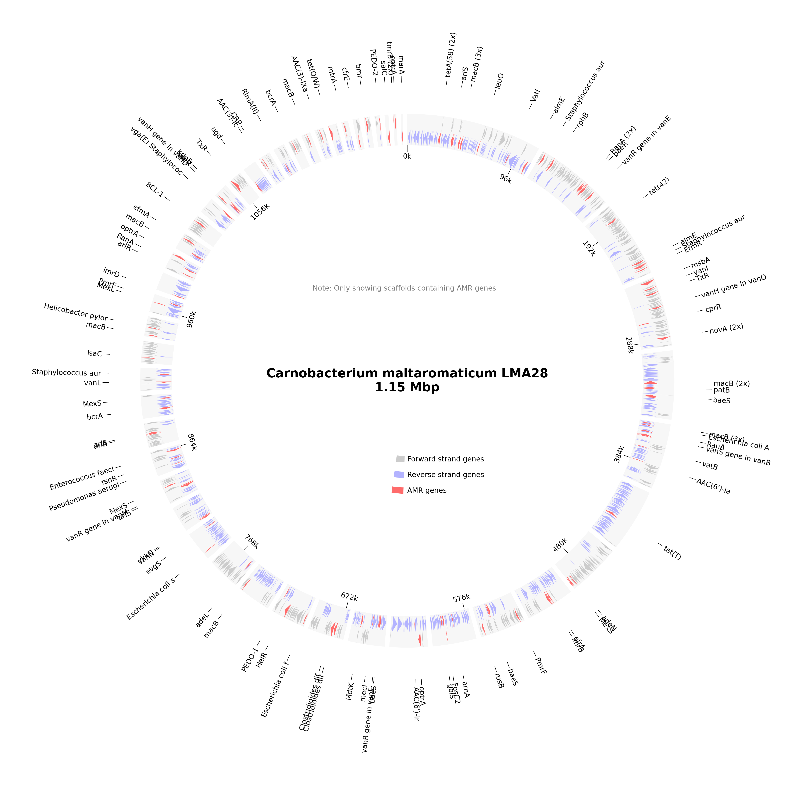

### AAC(3)-IXa
- **Mechanism**: antibiotic inactivation
- **Drug Classes**: aminoglycoside antibiotic
- **AMR Family**: AAC(3)
- **Locations**:
  - gnl|SPADES|CPJJBIBK_881_6 : position 3652-4464

### AAC(3)-Ic
- **Mechanism**: antibiotic inactivation
- **Drug Classes**: aminoglycoside antibiotic
- **AMR Family**: AAC(3)
- **Locations**:
  - gnl|SPADES|CPJJBIBK_754_1 : position 1-405

### AAC(6')-Ia
- **Mechanism**: antibiotic inactivation
- **Drug Classes**: aminoglycoside antibiotic
- **AMR Family**: AAC(6')
- **Locations**:
  - gnl|SPADES|CPJJBIBK_178_36 : position 34794-35330

### AAC(6')-Ir
- **Mechanism**: antibiotic inactivation
- **Drug Classes**: aminoglycoside antibiotic
- **AMR Family**: AAC(6')
- **Locations**:
  - gnl|SPADES|CPJJBIBK_308_11 : position 10167-10772

### BCL-1
- **Mechanism**: antibiotic inactivation
- **Drug Classes**: penam
- **AMR Family**: BCL Beta-lactamase
- **Locations**:
  - gnl|SPADES|CPJJBIBK_601_8 : position 8810-10186

### CRP
- **Mechanism**: antibiotic efflux
- **Drug Classes**: macrolide antibiotic; fluoroquinolone antibiotic; penam
- **AMR Family**: resistance-nodulation-cell division (RND) antibiotic efflux pump
- **Locations**:
  - gnl|SPADES|CPJJBIBK_754_4 : position 2076-2738

### Clostridioides difficile gyrA conferring resistance to fluoroquinolones
- **Mechanism**: antibiotic target alteration
- **Drug Classes**: fluoroquinolone antibiotic
- **AMR Family**: fluoroquinolone resistant gyrA
- **Locations**:
  - gnl|SPADES|CPJJBIBK_321_11 : position 9855-12404

### Clostridioides difficile gyrB conferring resistance to fluoroquinolones
- **Mechanism**: antibiotic target alteration
- **Drug Classes**: fluoroquinolone antibiotic
- **AMR Family**: fluoroquinolone resistant gyrB
- **Locations**:
  - gnl|SPADES|CPJJBIBK_321_10 : position 7768-9705

### Enterococcus faecium cls conferring resistance to daptomycin
- **Mechanism**: antibiotic target alteration
- **Drug Classes**: peptide antibiotic
- **AMR Family**: daptomycin resistant cls
- **Locations**:
  - gnl|SPADES|CPJJBIBK_453_19 : position 15382-16902

### ErmR
- **Mechanism**: antibiotic target alteration
- **Drug Classes**: macrolide antibiotic; lincosamide antibiotic; streptogramin antibiotic; streptogramin A antibiotic; streptogramin B antibiotic
- **AMR Family**: Erm 23S ribosomal RNA methyltransferase
- **Locations**:
  - gnl|SPADES|CPJJBIBK_150_59 : position 57566-58459

### Escherichia coli AcrAB-TolC with AcrR mutation conferring resistance to ciprofloxacin, tetracycline, and ceftazidime
- **Mechanism**: antibiotic target alteration; antibiotic efflux
- **Drug Classes**: fluoroquinolone antibiotic; cephalosporin; glycylcycline; penam; tetracycline antibiotic; rifamycin antibiotic; phenicol antibiotic; disinfecting agents and antiseptics
- **AMR Family**: resistance-nodulation-cell division (RND) antibiotic efflux pump
- **Locations**:
  - gnl|SPADES|CPJJBIBK_178_5 : position 3501-4097

### Escherichia coli EF-Tu mutants conferring resistance to kirromycin
- **Mechanism**: antibiotic target alteration
- **Drug Classes**: elfamycin antibiotic
- **AMR Family**: elfamycin resistant EF-Tu
- **Locations**:
  - gnl|SPADES|CPJJBIBK_276_20 : position 23265-24452

### Escherichia coli fabI mutations conferring resistance to isoniazid and triclosan
- **Mechanism**: antibiotic target alteration
- **Drug Classes**: disinfecting agents and antiseptics; isoniazid-like antibiotic
- **AMR Family**: antibiotic resistant fabI
- **Locations**:
  - gnl|SPADES|CPJJBIBK_334_2 : position 985-1743

### Escherichia coli soxS with mutation conferring antibiotic resistance
- **Mechanism**: antibiotic target alteration; antibiotic efflux; reduced permeability to antibiotic
- **Drug Classes**: fluoroquinolone antibiotic; monobactam; carbapenem; cephalosporin; glycylcycline; cephamycin; penam; tetracycline antibiotic; rifamycin antibiotic; phenicol antibiotic; penem; disinfecting agents and antiseptics
- **AMR Family**: ATP-binding cassette (ABC) antibiotic efflux pump; major facilitator superfamily (MFS) antibiotic efflux pump; resistance-nodulation-cell division (RND) antibiotic efflux pump; General Bacterial Porin with reduced permeability to beta-lactams
- **Locations**:
  - gnl|SPADES|CPJJBIBK_382_4 : position 5013-5540

### EstT
- **Mechanism**: antibiotic inactivation
- **Drug Classes**: macrolide antibiotic
- **AMR Family**: macrolide esterase
- **Locations**:
  - gnl|SPADES|CPJJBIBK_228_35 : position 42243-42623

### FosC2
- **Mechanism**: antibiotic inactivation
- **Drug Classes**: phosphonic acid antibiotic
- **AMR Family**: fosC phosphotransferase family
- **Locations**:
  - gnl|SPADES|CPJJBIBK_276_19 : position 22830-23210

### HelR
- **Mechanism**: antibiotic target protection
- **Drug Classes**: rifamycin antibiotic
- **AMR Family**: helicase-like RNA polymerase protection protein
- **Locations**:
  - gnl|SPADES|CPJJBIBK_334_14 : position 16942-19233

### Helicobacter pylori rdxA mutation conferring resistance to metronidazole
- **Mechanism**: antibiotic target alteration
- **Drug Classes**: nitroimidazole antibiotic
- **AMR Family**: Antibiotic resistant Helicobacter pylori nitroreductase
- **Locations**:
  - gnl|SPADES|CPJJBIBK_534_9 : position 7427-8056

### MdtK
- **Mechanism**: antibiotic efflux
- **Drug Classes**: fluoroquinolone antibiotic
- **AMR Family**: multidrug and toxic compound extrusion (MATE) transporter
- **Locations**:
  - gnl|SPADES|CPJJBIBK_320_21 : position 20508-21824

### MexL
- **Mechanism**: antibiotic efflux
- **Drug Classes**: macrolide antibiotic; tetracycline antibiotic; disinfecting agents and antiseptics
- **AMR Family**: resistance-nodulation-cell division (RND) antibiotic efflux pump
- **Locations**:
  - gnl|SPADES|CPJJBIBK_576_6 : position 8082-8699

### MexS (found in 3 locations)
- **Mechanism**: antibiotic efflux
- **Drug Classes**: fluoroquinolone antibiotic; diaminopyrimidine antibiotic; phenicol antibiotic
- **AMR Family**: resistance-nodulation-cell division (RND) antibiotic efflux pump
- **Locations**:
  - gnl|SPADES|CPJJBIBK_228_34 : position 41135-42223
  - gnl|SPADES|CPJJBIBK_448_13 : position 13318-14262
  - gnl|SPADES|CPJJBIBK_481_14 : position 14745-15683

### PEDO-1
- **Mechanism**: antibiotic inactivation
- **Drug Classes**: carbapenem
- **AMR Family**: subclass B3 PEDO beta-lactamase
- **Locations**:
  - gnl|SPADES|CPJJBIBK_334_20 : position 24397-25098

### PEDO-2
- **Mechanism**: antibiotic inactivation
- **Drug Classes**: carbapenem
- **AMR Family**: subclass B3 PEDO beta-lactamase
- **Locations**:
  - gnl|SPADES|CPJJBIBK_1188_4 : position 3641-4258

### PmrF (found in 2 locations)
- **Mechanism**: antibiotic target alteration
- **Drug Classes**: peptide antibiotic
- **AMR Family**: pmr phosphoethanolamine transferase
- **Locations**:
  - gnl|SPADES|CPJJBIBK_263_3 : position 3191-4441
  - gnl|SPADES|CPJJBIBK_576_8 : position 10780-11727

### Pseudomonas aeruginosa soxR
- **Mechanism**: antibiotic target alteration; antibiotic efflux
- **Drug Classes**: fluoroquinolone antibiotic; cephalosporin; glycylcycline; penam; tetracycline antibiotic; rifamycin antibiotic; phenicol antibiotic; disinfecting agents and antiseptics
- **AMR Family**: ATP-binding cassette (ABC) antibiotic efflux pump; major facilitator superfamily (MFS) antibiotic efflux pump; resistance-nodulation-cell division (RND) antibiotic efflux pump
- **Locations**:
  - gnl|SPADES|CPJJBIBK_453_5 : position 4515-4952

### RanA (found in 5 locations)
- **Mechanism**: antibiotic efflux
- **Drug Classes**: aminoglycoside antibiotic
- **AMR Family**: ATP-binding cassette (ABC) antibiotic efflux pump
- **Locations**:
  - gnl|SPADES|CPJJBIBK_145_37 : position 40973-42082
  - gnl|SPADES|CPJJBIBK_145_53 : position 58672-60189
  - gnl|SPADES|CPJJBIBK_172_41 : position 30507-31313
  - gnl|SPADES|CPJJBIBK_178_9 : position 8443-9483
  - gnl|SPADES|CPJJBIBK_589_5 : position 6086-7201

### RlmA(II)
- **Mechanism**: antibiotic target alteration
- **Drug Classes**: macrolide antibiotic; lincosamide antibiotic
- **AMR Family**: non-erm 23S ribosomal RNA methyltransferase (G748)
- **Locations**:
  - gnl|SPADES|CPJJBIBK_766_3 : position 2185-3042

### Staphylococcus aureus fusA with mutation conferring resistance to fusidic acid
- **Mechanism**: antibiotic target alteration
- **Drug Classes**: fusidane antibiotic
- **AMR Family**: antibiotic resistant fusA
- **Locations**:
  - gnl|SPADES|CPJJBIBK_145_3 : position 2489-4066

### Staphylococcus aureus mupA conferring resistance to mupirocin
- **Mechanism**: antibiotic target alteration
- **Drug Classes**: mupirocin-like antibiotic
- **AMR Family**: antibiotic-resistant isoleucyl-tRNA synthetase (ileS)
- **Locations**:
  - gnl|SPADES|CPJJBIBK_150_56 : position 54128-56143

### Staphylococcus aureus murA with mutation conferring resistance to fosfomycin
- **Mechanism**: antibiotic target alteration
- **Drug Classes**: phosphonic acid antibiotic
- **AMR Family**: antibiotic-resistant murA transferase
- **Locations**:
  - gnl|SPADES|CPJJBIBK_488_16 : position 12673-13941

### TxR (found in 2 locations)
- **Mechanism**: antibiotic efflux
- **Drug Classes**: tetracycline antibiotic
- **AMR Family**: ATP-binding cassette (ABC) antibiotic efflux pump
- **Locations**:
  - gnl|SPADES|CPJJBIBK_164_13 : position 11923-13284
  - gnl|SPADES|CPJJBIBK_679_2 : position 1672-4368

### VatI
- **Mechanism**: antibiotic inactivation
- **Drug Classes**: streptogramin antibiotic; streptogramin A antibiotic
- **AMR Family**: streptogramin vat acetyltransferase
- **Locations**:
  - gnl|SPADES|CPJJBIBK_50_84 : position 88948-89649

### adeL
- **Mechanism**: antibiotic efflux
- **Drug Classes**: fluoroquinolone antibiotic; tetracycline antibiotic
- **AMR Family**: resistance-nodulation-cell division (RND) antibiotic efflux pump
- **Locations**:
  - gnl|SPADES|CPJJBIBK_352_3 : position 2274-3161

### adeN
- **Mechanism**: antibiotic efflux
- **Drug Classes**: macrolide antibiotic; fluoroquinolone antibiotic; lincosamide antibiotic; carbapenem; cephalosporin; tetracycline antibiotic; rifamycin antibiotic; diaminopyrimidine antibiotic; phenicol antibiotic; penem
- **AMR Family**: resistance-nodulation-cell division (RND) antibiotic efflux pump
- **Locations**:
  - gnl|SPADES|CPJJBIBK_228_31 : position 38737-39312

### adeR
- **Mechanism**: antibiotic efflux
- **Drug Classes**: glycylcycline; tetracycline antibiotic
- **AMR Family**: resistance-nodulation-cell division (RND) antibiotic efflux pump
- **Locations**:
  - gnl|SPADES|CPJJBIBK_668_4 : position 3111-3839

### almE (found in 2 locations)
- **Mechanism**: antibiotic target alteration
- **Drug Classes**: peptide antibiotic
- **AMR Family**: polymyxin resistance operon; alm glycyltransferase
- **Locations**:
  - gnl|SPADES|CPJJBIBK_150_54 : position 51035-52477
  - gnl|SPADES|CPJJBIBK_50_96 : position 105060-106583

### arlR (found in 4 locations)
- **Mechanism**: antibiotic efflux
- **Drug Classes**: fluoroquinolone antibiotic; disinfecting agents and antiseptics
- **AMR Family**: major facilitator superfamily (MFS) antibiotic efflux pump
- **Locations**:
  - gnl|SPADES|CPJJBIBK_172_48 : position 38042-38761
  - gnl|SPADES|CPJJBIBK_463_13 : position 9862-10545
  - gnl|SPADES|CPJJBIBK_50_33 : position 39384-40070
  - gnl|SPADES|CPJJBIBK_589_2 : position 1930-2730

### arlS (found in 3 locations)
- **Mechanism**: antibiotic efflux
- **Drug Classes**: fluoroquinolone antibiotic; disinfecting agents and antiseptics
- **AMR Family**: major facilitator superfamily (MFS) antibiotic efflux pump
- **Locations**:
  - gnl|SPADES|CPJJBIBK_448_8 : position 7104-8933
  - gnl|SPADES|CPJJBIBK_463_14 : position 10542-11837
  - gnl|SPADES|CPJJBIBK_50_32 : position 37873-39387

### arnA
- **Mechanism**: antibiotic target alteration
- **Drug Classes**: peptide antibiotic
- **AMR Family**: pmr phosphoethanolamine transferase
- **Locations**:
  - gnl|SPADES|CPJJBIBK_276_12 : position 15609-16190

### baeR
- **Mechanism**: antibiotic efflux
- **Drug Classes**: aminoglycoside antibiotic; aminocoumarin antibiotic
- **AMR Family**: resistance-nodulation-cell division (RND) antibiotic efflux pump
- **Locations**:
  - gnl|SPADES|CPJJBIBK_145_40 : position 43547-44230

### baeS (found in 4 locations)
- **Mechanism**: antibiotic efflux
- **Drug Classes**: aminoglycoside antibiotic; aminocoumarin antibiotic
- **AMR Family**: resistance-nodulation-cell division (RND) antibiotic efflux pump
- **Locations**:
  - gnl|SPADES|CPJJBIBK_145_41 : position 44227-45624
  - gnl|SPADES|CPJJBIBK_172_47 : position 36276-38045
  - gnl|SPADES|CPJJBIBK_263_17 : position 23273-24634
  - gnl|SPADES|CPJJBIBK_320_5 : position 4822-6222

### bcrA (found in 3 locations)
- **Mechanism**: antibiotic efflux
- **Drug Classes**: peptide antibiotic
- **AMR Family**: ATP-binding cassette (ABC) antibiotic efflux pump
- **Locations**:
  - gnl|SPADES|CPJJBIBK_145_38 : position 42072-43013
  - gnl|SPADES|CPJJBIBK_481_6 : position 5633-7216
  - gnl|SPADES|CPJJBIBK_861_3 : position 2589-3314

### bmr
- **Mechanism**: antibiotic efflux
- **Drug Classes**: fluoroquinolone antibiotic; nucleoside antibiotic; phenicol antibiotic; disinfecting agents and antiseptics
- **AMR Family**: major facilitator superfamily (MFS) antibiotic efflux pump
- **Locations**:
  - gnl|SPADES|CPJJBIBK_1100_3 : position 1270-2493

### cfrE
- **Mechanism**: antibiotic target alteration
- **Drug Classes**: lincosamide antibiotic; streptogramin antibiotic; oxazolidinone antibiotic; phenicol antibiotic; pleuromutilin antibiotic
- **AMR Family**: Cfr 23S ribosomal RNA methyltransferase
- **Locations**:
  - gnl|SPADES|CPJJBIBK_1068_2 : position 1233-2300

### cprR
- **Mechanism**: antibiotic target alteration; antibiotic efflux
- **Drug Classes**: peptide antibiotic
- **AMR Family**: pmr phosphoethanolamine transferase
- **Locations**:
  - gnl|SPADES|CPJJBIBK_164_32 : position 34465-35184

### efmA
- **Mechanism**: antibiotic efflux
- **Drug Classes**: macrolide antibiotic; fluoroquinolone antibiotic
- **AMR Family**: major facilitator superfamily (MFS) antibiotic efflux pump
- **Locations**:
  - gnl|SPADES|CPJJBIBK_593_12 : position 9915-11183

### efrA
- **Mechanism**: antibiotic efflux
- **Drug Classes**: macrolide antibiotic; fluoroquinolone antibiotic; rifamycin antibiotic
- **AMR Family**: ATP-binding cassette (ABC) antibiotic efflux pump
- **Locations**:
  - gnl|SPADES|CPJJBIBK_245_14 : position 16073-17179

### evgS
- **Mechanism**: antibiotic efflux
- **Drug Classes**: macrolide antibiotic; fluoroquinolone antibiotic; penam; tetracycline antibiotic
- **AMR Family**: major facilitator superfamily (MFS) antibiotic efflux pump; resistance-nodulation-cell division (RND) antibiotic efflux pump
- **Locations**:
  - gnl|SPADES|CPJJBIBK_382_21 : position 20169-20741

### golS
- **Mechanism**: antibiotic efflux
- **Drug Classes**: monobactam; carbapenem; cephalosporin; cephamycin; penam; phenicol antibiotic; penem
- **AMR Family**: resistance-nodulation-cell division (RND) antibiotic efflux pump
- **Locations**:
  - gnl|SPADES|CPJJBIBK_276_22 : position 25302-26132

### kdpD
- **Mechanism**: antibiotic efflux
- **Drug Classes**: aminoglycoside antibiotic
- **AMR Family**: kdpDE
- **Locations**:
  - gnl|SPADES|CPJJBIBK_668_5 : position 3836-5482

### leuO
- **Mechanism**: antibiotic efflux
- **Drug Classes**: nucleoside antibiotic; disinfecting agents and antiseptics
- **AMR Family**: major facilitator superfamily (MFS) antibiotic efflux pump
- **Locations**:
  - gnl|SPADES|CPJJBIBK_50_59 : position 62049-62876

### lmrB
- **Mechanism**: antibiotic efflux
- **Drug Classes**: lincosamide antibiotic; nucleoside antibiotic
- **AMR Family**: ATP-binding cassette (ABC) antibiotic efflux pump
- **Locations**:
  - gnl|SPADES|CPJJBIBK_245_16 : position 17839-19239

### lmrD
- **Mechanism**: antibiotic efflux
- **Drug Classes**: lincosamide antibiotic
- **AMR Family**: ATP-binding cassette (ABC) antibiotic efflux pump
- **Locations**:
  - gnl|SPADES|CPJJBIBK_577_1 : position 118-900

### lsaC
- **Mechanism**: antibiotic target protection
- **Drug Classes**: lincosamide antibiotic; streptogramin antibiotic; pleuromutilin antibiotic
- **AMR Family**: lsa-type ABC-F protein
- **Locations**:
  - gnl|SPADES|CPJJBIBK_498_6 : position 4320-5003

### macA
- **Mechanism**: antibiotic efflux
- **Drug Classes**: macrolide antibiotic
- **AMR Family**: ATP-binding cassette (ABC) antibiotic efflux pump
- **Locations**:
  - gnl|SPADES|CPJJBIBK_50_40 : position 46612-47808

### macB (found in 12 locations)
- **Mechanism**: antibiotic efflux
- **Drug Classes**: macrolide antibiotic
- **AMR Family**: ATP-binding cassette (ABC) antibiotic efflux pump
- **Locations**:
  - gnl|SPADES|CPJJBIBK_172_36 : position 24323-27172
  - gnl|SPADES|CPJJBIBK_172_52 : position 42359-43045
  - gnl|SPADES|CPJJBIBK_178_14 : position 13741-15003
  - gnl|SPADES|CPJJBIBK_178_15 : position 14987-15685
  - gnl|SPADES|CPJJBIBK_178_3 : position 1612-2280
  - gnl|SPADES|CPJJBIBK_340_26 : position 25035-26111
  - gnl|SPADES|CPJJBIBK_50_38 : position 44647-45891
  - gnl|SPADES|CPJJBIBK_50_39 : position 45888-46595
  - gnl|SPADES|CPJJBIBK_50_72 : position 74248-75051
  - gnl|SPADES|CPJJBIBK_534_2 : position 1219-2016
  - gnl|SPADES|CPJJBIBK_593_3 : position 1925-3406
  - gnl|SPADES|CPJJBIBK_880_4 : position 4136-4951

### marA
- **Mechanism**: antibiotic efflux; reduced permeability to antibiotic
- **Drug Classes**: fluoroquinolone antibiotic; monobactam; carbapenem; cephalosporin; glycylcycline; cephamycin; penam; tetracycline antibiotic; rifamycin antibiotic; phenicol antibiotic; penem; disinfecting agents and antiseptics
- **AMR Family**: resistance-nodulation-cell division (RND) antibiotic efflux pump; General Bacterial Porin with reduced permeability to beta-lactams
- **Locations**:
  - gnl|SPADES|CPJJBIBK_3731_2 : position 423-1196

### mecI
- **Mechanism**: antibiotic target replacement
- **Drug Classes**: penam
- **AMR Family**: methicillin resistant PBP2
- **Locations**:
  - gnl|SPADES|CPJJBIBK_320_11 : position 11664-12113

### mepR
- **Mechanism**: antibiotic efflux
- **Drug Classes**: glycylcycline; tetracycline antibiotic
- **AMR Family**: multidrug and toxic compound extrusion (MATE) transporter
- **Locations**:
  - gnl|SPADES|CPJJBIBK_245_15 : position 17343-17858

### msbA
- **Mechanism**: antibiotic efflux
- **Drug Classes**: nitroimidazole antibiotic
- **AMR Family**: ATP-binding cassette (ABC) antibiotic efflux pump
- **Locations**:
  - gnl|SPADES|CPJJBIBK_164_4 : position 1882-4158

### mtrA
- **Mechanism**: antibiotic efflux
- **Drug Classes**: macrolide antibiotic; penam
- **AMR Family**: resistance-nodulation-cell division (RND) antibiotic efflux pump
- **Locations**:
  - gnl|SPADES|CPJJBIBK_1044_3 : position 1445-2272

### novA (found in 2 locations)
- **Mechanism**: antibiotic efflux
- **Drug Classes**: aminocoumarin antibiotic
- **AMR Family**: ATP-binding cassette (ABC) antibiotic efflux pump
- **Locations**:
  - gnl|SPADES|CPJJBIBK_164_45 : position 49092-50834
  - gnl|SPADES|CPJJBIBK_164_46 : position 50827-52629

### optrA (found in 3 locations)
- **Mechanism**: antibiotic target protection
- **Drug Classes**: oxazolidinone antibiotic; phenicol antibiotic
- **AMR Family**: Miscellaneous ABC-F subfamily ATP-binding cassette ribosomal protection proteins
- **Locations**:
  - gnl|SPADES|CPJJBIBK_1768_3 : position 1222-2346
  - gnl|SPADES|CPJJBIBK_308_7 : position 5572-7536
  - gnl|SPADES|CPJJBIBK_589_10 : position 12455-14083

### patB
- **Mechanism**: antibiotic efflux
- **Drug Classes**: fluoroquinolone antibiotic
- **AMR Family**: ATP-binding cassette (ABC) antibiotic efflux pump
- **Locations**:
  - gnl|SPADES|CPJJBIBK_172_40 : position 29731-30495

### qacH
- **Mechanism**: antibiotic efflux
- **Drug Classes**: disinfecting agents and antiseptics
- **AMR Family**: small multidrug resistance (SMR) antibiotic efflux pump
- **Locations**:
  - gnl|SPADES|CPJJBIBK_437_3 : position 1626-1952

### rosB
- **Mechanism**: antibiotic efflux
- **Drug Classes**: peptide antibiotic
- **AMR Family**: major facilitator superfamily (MFS) antibiotic efflux pump
- **Locations**:
  - gnl|SPADES|CPJJBIBK_263_26 : position 32736-33884

### rphB
- **Mechanism**: antibiotic inactivation
- **Drug Classes**: rifamycin antibiotic
- **AMR Family**: rifampin phosphotransferase
- **Locations**:
  - gnl|SPADES|CPJJBIBK_145_10 : position 10750-12471

### salC
- **Mechanism**: antibiotic target protection
- **Drug Classes**: lincosamide antibiotic; streptogramin antibiotic; streptogramin A antibiotic; pleuromutilin antibiotic
- **AMR Family**: sal-type ABC-F protein
- **Locations**:
  - gnl|SPADES|CPJJBIBK_1509_2 : position 1349-3052

### tet(42)
- **Mechanism**: antibiotic efflux
- **Drug Classes**: tetracycline antibiotic
- **AMR Family**: major facilitator superfamily (MFS) antibiotic efflux pump
- **Locations**:
  - gnl|SPADES|CPJJBIBK_150_16 : position 11192-12427

### tet(O/W)
- **Mechanism**: antibiotic target protection
- **Drug Classes**: tetracycline antibiotic
- **AMR Family**: tetracycline-resistant ribosomal protection protein
- **Locations**:
  - gnl|SPADES|CPJJBIBK_890_1 : position 245-2080

### tet(T)
- **Mechanism**: antibiotic target protection
- **Drug Classes**: tetracycline antibiotic
- **AMR Family**: tetracycline-resistant ribosomal protection protein
- **Locations**:
  - gnl|SPADES|CPJJBIBK_185_27 : position 29033-30874

### tetA(58) (found in 2 locations)
- **Mechanism**: antibiotic efflux
- **Drug Classes**: tetracycline antibiotic
- **AMR Family**: major facilitator superfamily (MFS) antibiotic efflux pump
- **Locations**:
  - gnl|SPADES|CPJJBIBK_50_23 : position 26942-28510
  - gnl|SPADES|CPJJBIBK_50_92 : position 101138-102070

### tmrB (found in 2 locations)
- **Mechanism**: reduced permeability to antibiotic
- **Drug Classes**: nucleoside antibiotic
- **AMR Family**: tunicamycin resistance protein
- **Locations**:
  - gnl|SPADES|CPJJBIBK_1768_1 : position 133-306
  - gnl|SPADES|CPJJBIBK_1768_2 : position 303-644

### tsnR
- **Mechanism**: antibiotic target alteration
- **Drug Classes**: peptide antibiotic
- **AMR Family**: non-erm 23S ribosomal RNA methyltransferase (A1067)
- **Locations**:
  - gnl|SPADES|CPJJBIBK_453_14 : position 9345-10109

### ugd
- **Mechanism**: antibiotic target alteration
- **Drug Classes**: peptide antibiotic
- **AMR Family**: pmr phosphoethanolamine transferase
- **Locations**:
  - gnl|SPADES|CPJJBIBK_689_1 : position 92-1384

### vanH gene in vanD cluster
- **Mechanism**: antibiotic target alteration
- **Drug Classes**: glycopeptide antibiotic
- **AMR Family**: vanH; glycopeptide resistance gene cluster
- **Locations**:
  - gnl|SPADES|CPJJBIBK_668_2 : position 1621-2634

### vanH gene in vanO cluster
- **Mechanism**: antibiotic target alteration
- **Drug Classes**: glycopeptide antibiotic
- **AMR Family**: vanH; glycopeptide resistance gene cluster
- **Locations**:
  - gnl|SPADES|CPJJBIBK_164_23 : position 23806-24999

### vanI
- **Mechanism**: antibiotic target alteration
- **Drug Classes**: glycopeptide antibiotic
- **AMR Family**: glycopeptide resistance gene cluster; Van ligase
- **Locations**:
  - gnl|SPADES|CPJJBIBK_164_10 : position 7597-8724

### vanL
- **Mechanism**: antibiotic target alteration
- **Drug Classes**: glycopeptide antibiotic
- **AMR Family**: glycopeptide resistance gene cluster; Van ligase
- **Locations**:
  - gnl|SPADES|CPJJBIBK_488_9 : position 6162-7253

### vanN
- **Mechanism**: antibiotic target alteration
- **Drug Classes**: glycopeptide antibiotic
- **AMR Family**: glycopeptide resistance gene cluster; Van ligase
- **Locations**:
  - gnl|SPADES|CPJJBIBK_437_1 : position 94-1173

### vanR gene in vanB cluster
- **Mechanism**: antibiotic target alteration
- **Drug Classes**: glycopeptide antibiotic
- **AMR Family**: glycopeptide resistance gene cluster; vanR
- **Locations**:
  - gnl|SPADES|CPJJBIBK_178_13 : position 12991-13662

### vanR gene in vanE cluster (found in 2 locations)
- **Mechanism**: antibiotic target alteration
- **Drug Classes**: glycopeptide antibiotic
- **AMR Family**: glycopeptide resistance gene cluster; vanR
- **Locations**:
  - gnl|SPADES|CPJJBIBK_145_47 : position 51715-53202
  - gnl|SPADES|CPJJBIBK_320_6 : position 6219-6902

### vanR gene in vanI cluster
- **Mechanism**: antibiotic target alteration
- **Drug Classes**: glycopeptide antibiotic
- **AMR Family**: glycopeptide resistance gene cluster; vanR
- **Locations**:
  - gnl|SPADES|CPJJBIBK_263_18 : position 24666-25304

### vanR gene in vanM cluster
- **Mechanism**: antibiotic target alteration
- **Drug Classes**: glycopeptide antibiotic
- **AMR Family**: glycopeptide resistance gene cluster; vanR
- **Locations**:
  - gnl|SPADES|CPJJBIBK_448_9 : position 8940-9647

### vanS gene in vanB cluster
- **Mechanism**: antibiotic target alteration
- **Drug Classes**: glycopeptide antibiotic
- **AMR Family**: vanS; glycopeptide resistance gene cluster
- **Locations**:
  - gnl|SPADES|CPJJBIBK_178_12 : position 11549-12994

### vatB
- **Mechanism**: antibiotic inactivation
- **Drug Classes**: streptogramin antibiotic; streptogramin A antibiotic
- **AMR Family**: streptogramin vat acetyltransferase
- **Locations**:
  - gnl|SPADES|CPJJBIBK_178_22 : position 22480-23040

### vga(E) Staphylococcus cohnii
- **Mechanism**: antibiotic target protection
- **Drug Classes**: lincosamide antibiotic; streptogramin antibiotic; streptogramin A antibiotic; pleuromutilin antibiotic
- **AMR Family**: vga-type ABC-F protein
- **Locations**:
  - gnl|SPADES|CPJJBIBK_612_10 : position 11487-13058

### ykkD
- **Mechanism**: antibiotic efflux
- **Drug Classes**: aminoglycoside antibiotic; tetracycline antibiotic; phenicol antibiotic
- **AMR Family**: small multidrug resistance (SMR) antibiotic efflux pump
- **Locations**:
  - gnl|SPADES|CPJJBIBK_437_2 : position 1309-1626

## Citrobacter
**Strain Statistics:**
- Total genome length: 0.9 kbp
- Total scaffolds: 48
- Scaffolds with AMR genes: 1
- Total genes annotated: 4
- Total AMR genes: 1
- Unique AMR genes: 1
- Distinct AMR mechanisms: 1
- Distinct AMR families: 1
- Distinct drug classes: 7

**Circos Plot:**

### golS
- **Mechanism**: antibiotic efflux
- **Drug Classes**: monobactam; carbapenem; cephalosporin; cephamycin; penam; phenicol antibiotic; penem
- **AMR Family**: resistance-nodulation-cell division (RND) antibiotic efflux pump
- **Locations**:
  - gnl|SPADES|CPJJBIBK_6726_2 : position 359-814

## Citrobacter braakii
**Strain Statistics:**
- Total genome length: 0.5 kbp
- Total scaffolds: 10
- Scaffolds with AMR genes: 1
- Total genes annotated: 0
- Total AMR genes: 1
- Unique AMR genes: 1
- Distinct AMR mechanisms: 1
- Distinct AMR families: 1
- Distinct drug classes: 6

**Circos Plot:**

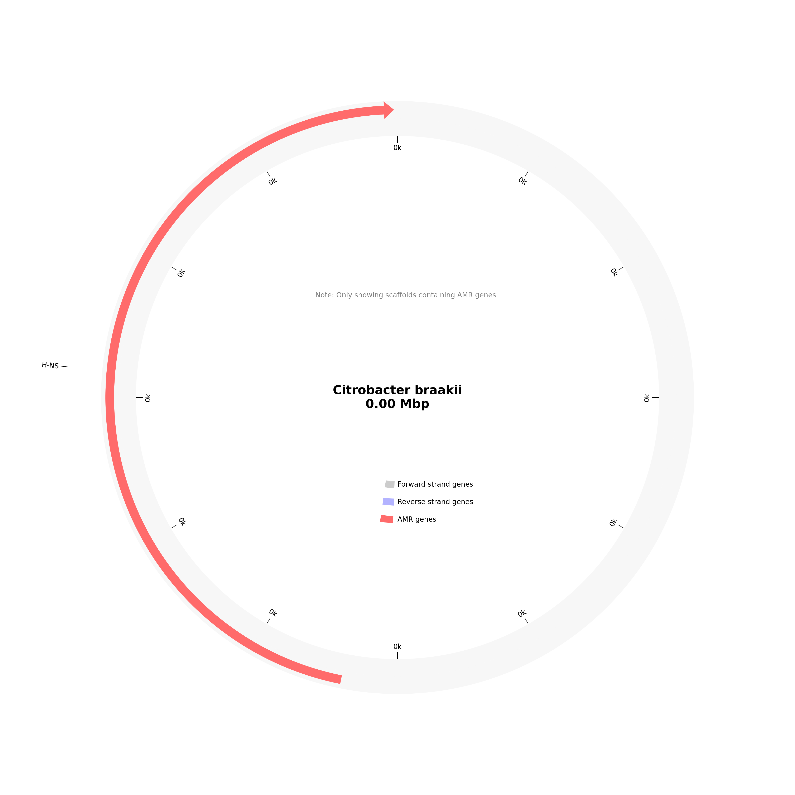

### H-NS
- **Mechanism**: antibiotic efflux
- **Drug Classes**: macrolide antibiotic; fluoroquinolone antibiotic; cephalosporin; cephamycin; penam; tetracycline antibiotic
- **AMR Family**: major facilitator superfamily (MFS) antibiotic efflux pump; resistance-nodulation-cell division (RND) antibiotic efflux pump
- **Locations**:
  - gnl|SPADES|CPJJBIBK_13724_1 : position 279-524

## Citrobacter freundii
**Strain Statistics:**
- Total genome length: 7.8 kbp
- Total scaffolds: 121
- Scaffolds with AMR genes: 3
- Total genes annotated: 14
- Total AMR genes: 3
- Unique AMR genes: 3
- Distinct AMR mechanisms: 2
- Distinct AMR families: 3
- Distinct drug classes: 4

**Circos Plot:**

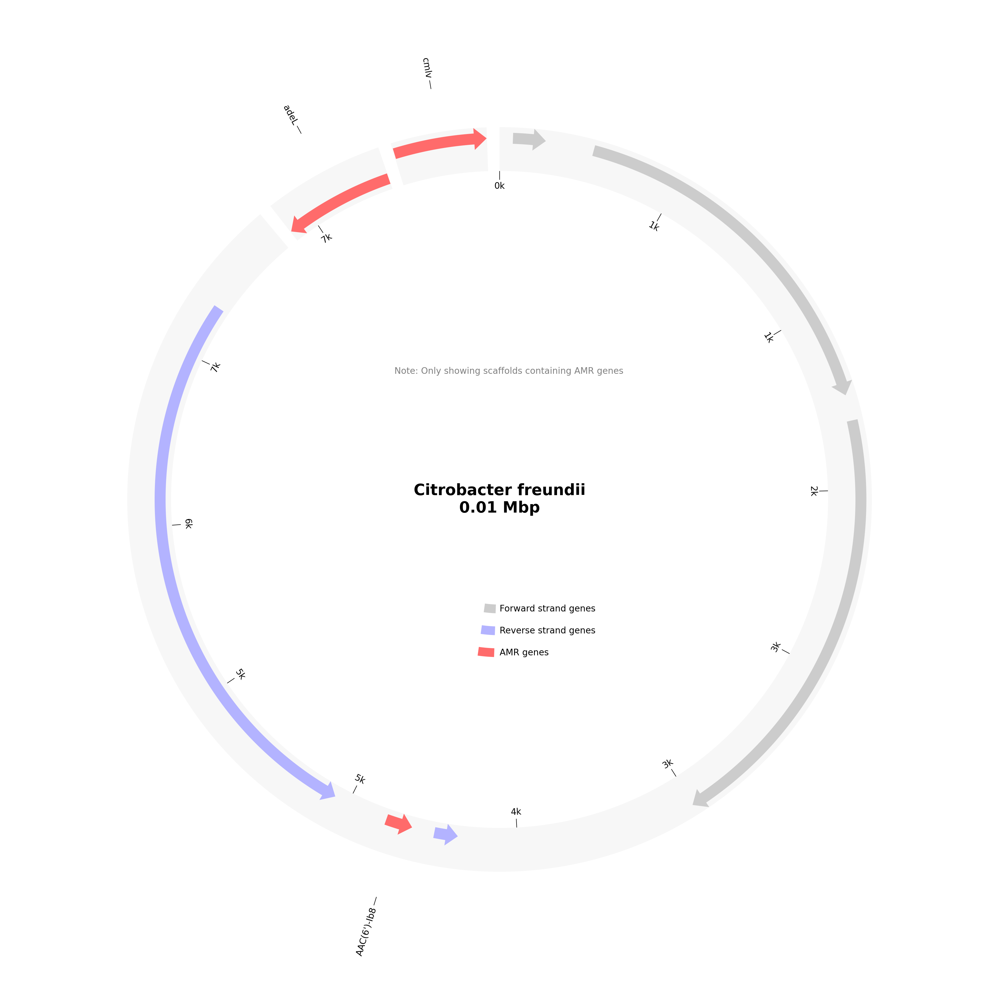

### AAC(6')-Ib8
- **Mechanism**: antibiotic inactivation
- **Drug Classes**: aminoglycoside antibiotic
- **AMR Family**: AAC(6')
- **Locations**:
  - gnl|SPADES|CPJJBIBK_911_4 : position 4311-4412

### adeL
- **Mechanism**: antibiotic efflux
- **Drug Classes**: fluoroquinolone antibiotic; tetracycline antibiotic
- **AMR Family**: resistance-nodulation-cell division (RND) antibiotic efflux pump
- **Locations**:
  - gnl|SPADES|CPJJBIBK_19160_1 : position 3-419

### cmlv
- **Mechanism**: antibiotic inactivation
- **Drug Classes**: phenicol antibiotic
- **AMR Family**: chloramphenicol phosphotransferase
- **Locations**:
  - gnl|SPADES|CPJJBIBK_28283_1 : position 2-331

## Citrobacter freundii complex
**Strain Statistics:**
- Total genome length: 0.4 kbp
- Total scaffolds: 7
- Scaffolds with AMR genes: 1
- Total genes annotated: 0
- Total AMR genes: 1
- Unique AMR genes: 1
- Distinct AMR mechanisms: 1
- Distinct AMR families: 1
- Distinct drug classes: 1

**Circos Plot:**

### bcrA
- **Mechanism**: antibiotic efflux
- **Drug Classes**: peptide antibiotic
- **AMR Family**: ATP-binding cassette (ABC) antibiotic efflux pump
- **Locations**:
  - gnl|SPADES|CPJJBIBK_22320_1 : position 3-380

## Citrobacter pasteurii
**Strain Statistics:**
- Total genome length: 17.9 kbp
- Total scaffolds: 2
- Scaffolds with AMR genes: 1
- Total genes annotated: 42
- Total AMR genes: 2
- Unique AMR genes: 2
- Distinct AMR mechanisms: 1
- Distinct AMR families: 2
- Distinct drug classes: 2

**Circos Plot:**

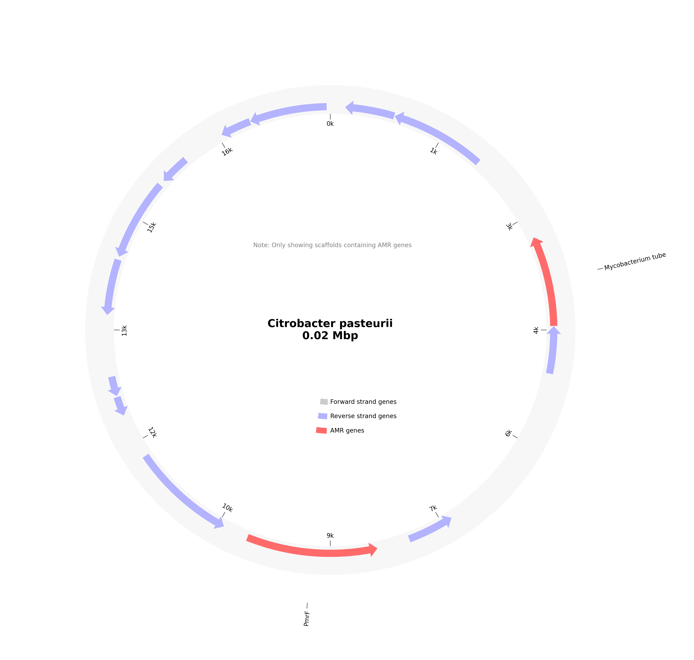

### Mycobacterium tuberculosis kasA mutant conferring resistance to isoniazid
- **Mechanism**: antibiotic target alteration
- **Drug Classes**: isoniazid-like antibiotic
- **AMR Family**: antibiotic resistant kasA
- **Locations**:
  - gnl|SPADES|CPJJBIBK_497_6 : position 3262-4431

### PmrF
- **Mechanism**: antibiotic target alteration
- **Drug Classes**: peptide antibiotic
- **AMR Family**: pmr phosphoethanolamine transferase
- **Locations**:
  - gnl|SPADES|CPJJBIBK_497_11 : position 8359-10050

## Citrobacter sp. 21OH12SH02A-Citro
**Strain Statistics:**
- Total genome length: 46.5 kbp
- Total scaffolds: 2
- Scaffolds with AMR genes: 1
- Total genes annotated: 98
- Total AMR genes: 3
- Unique AMR genes: 3
- Distinct AMR mechanisms: 1
- Distinct AMR families: 2
- Distinct drug classes: 6

**Circos Plot:**

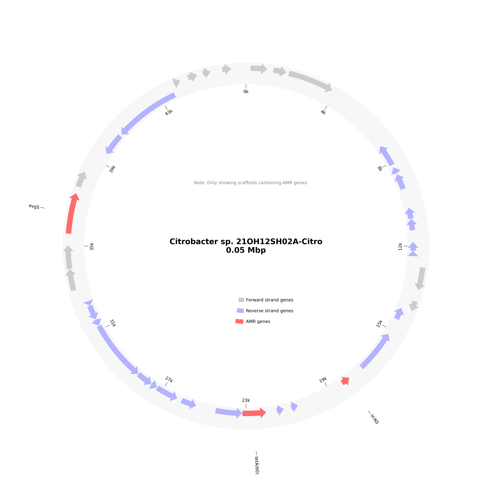

### H-NS
- **Mechanism**: antibiotic efflux
- **Drug Classes**: macrolide antibiotic; fluoroquinolone antibiotic; cephalosporin; cephamycin; penam; tetracycline antibiotic
- **AMR Family**: major facilitator superfamily (MFS) antibiotic efflux pump; resistance-nodulation-cell division (RND) antibiotic efflux pump
- **Locations**:
  - gnl|SPADES|CPJJBIBK_203_17 : position 18311-18703

### evgS
- **Mechanism**: antibiotic efflux
- **Drug Classes**: macrolide antibiotic; fluoroquinolone antibiotic; penam; tetracycline antibiotic
- **AMR Family**: major facilitator superfamily (MFS) antibiotic efflux pump; resistance-nodulation-cell division (RND) antibiotic efflux pump
- **Locations**:
  - gnl|SPADES|CPJJBIBK_203_39 : position 35368-37086

### tetA(60)
- **Mechanism**: antibiotic efflux
- **Drug Classes**: tetracycline antibiotic
- **AMR Family**: ATP-binding cassette (ABC) antibiotic efflux pump
- **Locations**:
  - gnl|SPADES|CPJJBIBK_203_23 : position 22340-23389

## Citrobacter sp. RHBSTW-00107
**Strain Statistics:**
- Total genome length: 0.4 kbp
- Total scaffolds: 1
- Scaffolds with AMR genes: 1
- Total genes annotated: 0
- Total AMR genes: 1
- Unique AMR genes: 1
- Distinct AMR mechanisms: 1
- Distinct AMR families: 1
- Distinct drug classes: 4

**Circos Plot:**

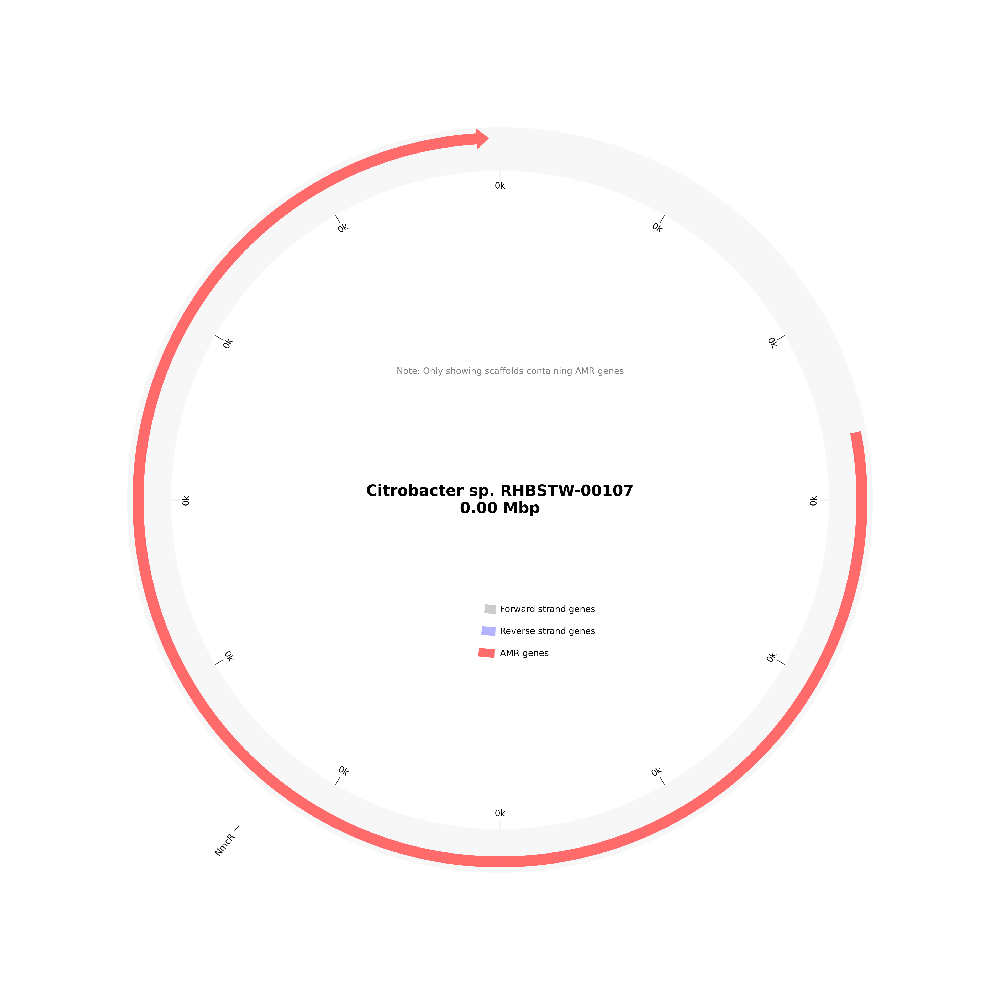

### NmcR
- **Mechanism**: antibiotic inactivation
- **Drug Classes**: carbapenem; cephalosporin; cephamycin; penam
- **AMR Family**: NmcA beta-lactamase
- **Locations**:
  - gnl|SPADES|CPJJBIBK_19954_1 : position 90-407

## Citrobacter youngae
**Strain Statistics:**
- Total genome length: 0.3 kbp
- Total scaffolds: 1
- Scaffolds with AMR genes: 1
- Total genes annotated: 0
- Total AMR genes: 1
- Unique AMR genes: 1
- Distinct AMR mechanisms: 1
- Distinct AMR families: 1
- Distinct drug classes: 6

**Circos Plot:**

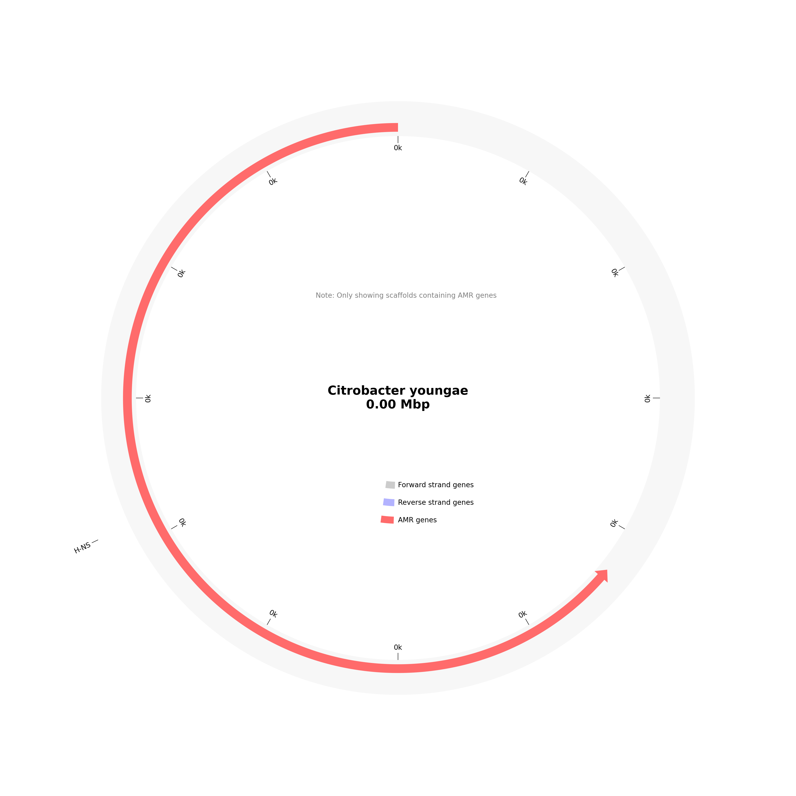

### H-NS
- **Mechanism**: antibiotic efflux
- **Drug Classes**: macrolide antibiotic; fluoroquinolone antibiotic; cephalosporin; cephamycin; penam; tetracycline antibiotic
- **AMR Family**: major facilitator superfamily (MFS) antibiotic efflux pump; resistance-nodulation-cell division (RND) antibiotic efflux pump
- **Locations**:
  - gnl|SPADES|CPJJBIBK_62740_1 : position 92-256

## Enterobacter hormaechei
**Strain Statistics:**
- Total genome length: 0.8 kbp
- Total scaffolds: 32
- Scaffolds with AMR genes: 1
- Total genes annotated: 2
- Total AMR genes: 1
- Unique AMR genes: 1
- Distinct AMR mechanisms: 1
- Distinct AMR families: 1
- Distinct drug classes: 6

**Circos Plot:**

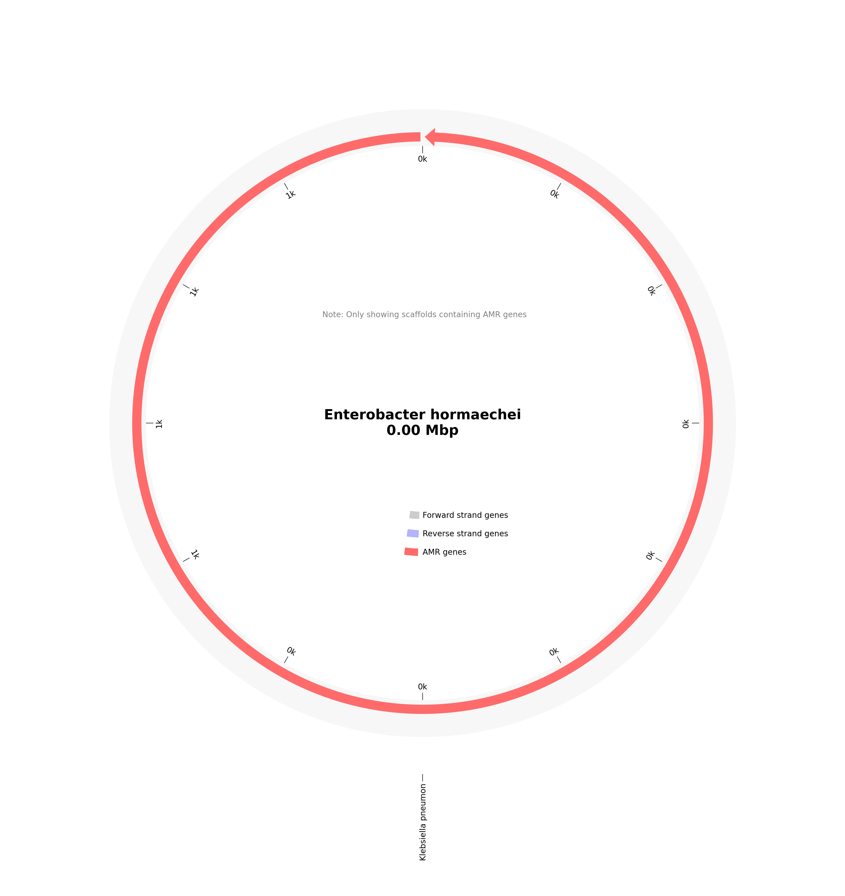

### Klebsiella pneumoniae OmpK37
- **Mechanism**: reduced permeability to antibiotic
- **Drug Classes**: monobactam; carbapenem; cephalosporin; cephamycin; penam; penem
- **AMR Family**: General Bacterial Porin with reduced permeability to beta-lactams
- **Locations**:
  - gnl|SPADES|CPJJBIBK_7055_1 : position 1-837

## Escherichia coli
**Strain Statistics:**
- Total genome length: 31.4 kbp
- Total scaffolds: 46
- Scaffolds with AMR genes: 3
- Total genes annotated: 70
- Total AMR genes: 4
- Unique AMR genes: 3
- Distinct AMR mechanisms: 2
- Distinct AMR families: 3
- Distinct drug classes: 3

**Circos Plot:**

### PmrF (found in 2 locations)
- **Mechanism**: antibiotic target alteration
- **Drug Classes**: peptide antibiotic
- **AMR Family**: pmr phosphoethanolamine transferase
- **Locations**:
  - gnl|SPADES|CPJJBIBK_506_15 : position 16119-16928
  - gnl|SPADES|CPJJBIBK_506_6 : position 5987-6796

### oleC
- **Mechanism**: antibiotic efflux
- **Drug Classes**: macrolide antibiotic
- **AMR Family**: ATP-binding cassette (ABC) antibiotic efflux pump
- **Locations**:
  - gnl|SPADES|CPJJBIBK_607_5 : position 6412-7161

### vanH gene in vanB cluster
- **Mechanism**: antibiotic target alteration
- **Drug Classes**: glycopeptide antibiotic
- **AMR Family**: vanH; glycopeptide resistance gene cluster
- **Locations**:
  - gnl|SPADES|CPJJBIBK_16693_1 : position 140-457

## Ewingella americana
**Strain Statistics:**
- Total genome length: 2.9 kbp
- Total scaffolds: 193
- Scaffolds with AMR genes: 12
- Total genes annotated: 0
- Total AMR genes: 12
- Unique AMR genes: 11
- Distinct AMR mechanisms: 4
- Distinct AMR families: 7
- Distinct drug classes: 11

**Circos Plot:**

### Acinetobacter baumannii AbaQ
- **Mechanism**: antibiotic efflux
- **Drug Classes**: fluoroquinolone antibiotic
- **AMR Family**: major facilitator superfamily (MFS) antibiotic efflux pump
- **Locations**:
  - gnl|SPADES|CPJJBIBK_103865_1 : position 2-217

### Bifidobacterium adolescentis rpoB mutants conferring resistance to rifampicin
- **Mechanism**: antibiotic target alteration; antibiotic target replacement
- **Drug Classes**: rifamycin antibiotic
- **AMR Family**: rifamycin-resistant beta-subunit of RNA polymerase (rpoB)
- **Locations**:
  - gnl|SPADES|CPJJBIBK_41185_1 : position 3-278

### Escherichia coli AcrAB-TolC with AcrR mutation conferring resistance to ciprofloxacin, tetracycline, and ceftazidime
- **Mechanism**: antibiotic target alteration; antibiotic efflux
- **Drug Classes**: fluoroquinolone antibiotic; cephalosporin; glycylcycline; penam; tetracycline antibiotic; rifamycin antibiotic; phenicol antibiotic; disinfecting agents and antiseptics
- **AMR Family**: resistance-nodulation-cell division (RND) antibiotic efflux pump
- **Locations**:
  - gnl|SPADES|CPJJBIBK_58892_1 : position 2-169

### adeL (found in 2 locations)
- **Mechanism**: antibiotic efflux
- **Drug Classes**: fluoroquinolone antibiotic; tetracycline antibiotic
- **AMR Family**: resistance-nodulation-cell division (RND) antibiotic efflux pump
- **Locations**:
  - gnl|SPADES|CPJJBIBK_111172_1 : position 3-212
  - gnl|SPADES|CPJJBIBK_45076_1 : position 1-273

### eptB
- **Mechanism**: antibiotic target alteration
- **Drug Classes**: peptide antibiotic
- **AMR Family**: pmr phosphoethanolamine transferase
- **Locations**:
  - gnl|SPADES|CPJJBIBK_68183_1 : position 1-249

### evgA
- **Mechanism**: antibiotic efflux
- **Drug Classes**: macrolide antibiotic; fluoroquinolone antibiotic; penam; tetracycline antibiotic
- **AMR Family**: major facilitator superfamily (MFS) antibiotic efflux pump; resistance-nodulation-cell division (RND) antibiotic efflux pump
- **Locations**:
  - gnl|SPADES|CPJJBIBK_112691_1 : position 2-154

### evgS
- **Mechanism**: antibiotic efflux
- **Drug Classes**: macrolide antibiotic; fluoroquinolone antibiotic; penam; tetracycline antibiotic
- **AMR Family**: major facilitator superfamily (MFS) antibiotic efflux pump; resistance-nodulation-cell division (RND) antibiotic efflux pump
- **Locations**:
  - gnl|SPADES|CPJJBIBK_53723_1 : position 2-265

### macB
- **Mechanism**: antibiotic efflux
- **Drug Classes**: macrolide antibiotic
- **AMR Family**: ATP-binding cassette (ABC) antibiotic efflux pump
- **Locations**:
  - gnl|SPADES|CPJJBIBK_32281_1 : position 3-305

### patA
- **Mechanism**: antibiotic efflux
- **Drug Classes**: fluoroquinolone antibiotic
- **AMR Family**: ATP-binding cassette (ABC) antibiotic efflux pump
- **Locations**:
  - gnl|SPADES|CPJJBIBK_100839_1 : position 3-221

### tetB(60)
- **Mechanism**: antibiotic efflux
- **Drug Classes**: tetracycline antibiotic
- **AMR Family**: ATP-binding cassette (ABC) antibiotic efflux pump
- **Locations**:
  - gnl|SPADES|CPJJBIBK_83419_1 : position 2-238

### vanD
- **Mechanism**: antibiotic target alteration
- **Drug Classes**: glycopeptide antibiotic
- **AMR Family**: glycopeptide resistance gene cluster; Van ligase
- **Locations**:
  - gnl|SPADES|CPJJBIBK_110712_1 : position 1-213

## Hafnia alvei
**Strain Statistics:**
- Total genome length: 2689.7 kbp
- Total scaffolds: 441
- Scaffolds with AMR genes: 136
- Total genes annotated: 4760
- Total AMR genes: 334
- Unique AMR genes: 176
- Distinct AMR mechanisms: 10
- Distinct AMR families: 66
- Distinct drug classes: 35

**Circos Plot:**

### AAC(6')-32
- **Mechanism**: antibiotic inactivation
- **Drug Classes**: aminoglycoside antibiotic
- **AMR Family**: AAC(6')
- **Locations**:
  - gnl|SPADES|CPJJBIBK_603_6 : position 5682-6284

### AAC(6')-Ib-SK
- **Mechanism**: antibiotic inactivation
- **Drug Classes**: aminoglycoside antibiotic
- **AMR Family**: AAC(6')
- **Locations**:
  - gnl|SPADES|CPJJBIBK_59_28 : position 28926-29426

### AAC(6')-Ib8
- **Mechanism**: antibiotic inactivation
- **Drug Classes**: aminoglycoside antibiotic
- **AMR Family**: AAC(6')
- **Locations**:
  - gnl|SPADES|CPJJBIBK_1090_6 : position 3387-3515

### AAC(6')-Iw
- **Mechanism**: antibiotic inactivation
- **Drug Classes**: aminoglycoside antibiotic
- **AMR Family**: AAC(6')
- **Locations**:
  - gnl|SPADES|CPJJBIBK_126_7 : position 8190-8630

### ACC-3
- **Mechanism**: antibiotic inactivation
- **Drug Classes**: monobactam; cephalosporin; penam
- **AMR Family**: ACC beta-lactamase
- **Locations**:
  - gnl|SPADES|CPJJBIBK_59_58: position 61246-62415

### ALI-1
- **Mechanism**: antibiotic inactivation
- **Drug Classes**: carbapenem
- **AMR Family**: ALI beta-lactamase
- **Locations**:
  - gnl|SPADES|CPJJBIBK_257_14 : position 12763-13641

### APH(6)-Ic
- **Mechanism**: antibiotic inactivation
- **Drug Classes**: aminoglycoside antibiotic
- **AMR Family**: APH(6)
- **Locations**:
  - gnl|SPADES|CPJJBIBK_1133_2 : position 2405-3208

### Acinetobacter baumannii AbaF (found in 4 locations)
- **Mechanism**: antibiotic efflux
- **Drug Classes**: phosphonic acid antibiotic
- **AMR Family**: major facilitator superfamily (MFS) antibiotic efflux pump
- **Locations**:
  - gnl|SPADES|CPJJBIBK_257_22 : position 21099-22640
  - gnl|SPADES|CPJJBIBK_390_18 : position 19285-20514
  - gnl|SPADES|CPJJBIBK_623_1 : position 252-1553
  - gnl|SPADES|CPJJBIBK_920_2 : position 746-2080

### Acinetobacter baumannii AbaQ (found in 5 locations)
- **Mechanism**: antibiotic efflux
- **Drug Classes**: fluoroquinolone antibiotic
- **AMR Family**: major facilitator superfamily (MFS) antibiotic efflux pump
- **Locations**:
  - gnl|SPADES|CPJJBIBK_193_11 : position 7479-8825
  - gnl|SPADES|CPJJBIBK_236_25 : position 27487-28692
  - gnl|SPADES|CPJJBIBK_273_3 : position 3052-4296
  - gnl|SPADES|CPJJBIBK_27_49 : position 59065-60402
  - gnl|SPADES|CPJJBIBK_860_5 : position 4385-5665

### AcrE
- **Mechanism**: antibiotic efflux
- **Drug Classes**: fluoroquinolone antibiotic; cephalosporin; cephamycin; penam
- **AMR Family**: resistance-nodulation-cell division (RND) antibiotic efflux pump
- **Locations**:
  - gnl|SPADES|CPJJBIBK_126_21 : position 22424-23587

### AcrF
- **Mechanism**: antibiotic efflux
- **Drug Classes**: fluoroquinolone antibiotic; cephalosporin; cephamycin; penam
- **AMR Family**: resistance-nodulation-cell division (RND) antibiotic efflux pump
- **Locations**:
  - gnl|SPADES|CPJJBIBK_126_22 : position 23626-26739

### ArnT
- **Mechanism**: antibiotic target alteration
- **Drug Classes**: peptide antibiotic
- **AMR Family**: pmr phosphoethanolamine transferase
- **Locations**:
  - gnl|SPADES|CPJJBIBK_393_17: position 14639-16294

### CRP
- **Mechanism**: antibiotic efflux
- **Drug Classes**: macrolide antibiotic; fluoroquinolone antibiotic; penam
- **AMR Family**: resistance-nodulation-cell division (RND) antibiotic efflux pump
- **Locations**:
  - gnl|SPADES|CPJJBIBK_236_22 : position 25222-25677

### Clostridioides difficile gyrA conferring resistance to fluoroquinolones
- **Mechanism**: antibiotic target alteration
- **Drug Classes**: fluoroquinolone antibiotic
- **AMR Family**: fluoroquinolone resistant gyrA
- **Locations**:
  - gnl|SPADES|CPJJBIBK_246_16 : position 36765-39089

### Clostridioides difficile gyrB conferring resistance to fluoroquinolones (found in 2 locations)
- **Mechanism**: antibiotic target alteration
- **Drug Classes**: fluoroquinolone antibiotic
- **AMR Family**: fluoroquinolone resistant gyrB
- **Locations**:
  - gnl|SPADES|CPJJBIBK_1101_2 : position 2955-4919
  - gnl|SPADES|CPJJBIBK_272_17 : position 21274-22947

### D-Ala-D-Ala ligase
- **Mechanism**: antibiotic target alteration
- **Drug Classes**: glycopeptide antibiotic
- **AMR Family**: Van ligase
- **Locations**:
  - gnl|SPADES|CPJJBIBK_624_11 : position 11970-12890

### EVM-1
- **Mechanism**: antibiotic inactivation
- **Drug Classes**: carbapenem
- **AMR Family**: EVM beta-lactamase
- **Locations**:
  - gnl|SPADES|CPJJBIBK_85_21 : position 21533-22246

### Enterobacter cloacae acrA
- **Mechanism**: antibiotic efflux
- **Drug Classes**: fluoroquinolone antibiotic; cephalosporin; glycylcycline; penam; tetracycline antibiotic; rifamycin antibiotic; phenicol antibiotic; disinfecting agents and antiseptics
- **AMR Family**: resistance-nodulation-cell division (RND) antibiotic efflux pump
- **Locations**:
  - gnl|SPADES|CPJJBIBK_7525_1 : position 1-801

### Erm(34)
- **Mechanism**: antibiotic target alteration
- **Drug Classes**: macrolide antibiotic; lincosamide antibiotic; streptogramin antibiotic; streptogramin A antibiotic; streptogramin B antibiotic
- **AMR Family**: Erm 23S ribosomal RNA methyltransferase
- **Locations**:
  - gnl|SPADES|CPJJBIBK_397_9 : position 6475-7092

### ErmX
- **Mechanism**: antibiotic target alteration
- **Drug Classes**: macrolide antibiotic; lincosamide antibiotic; streptogramin antibiotic; streptogramin A antibiotic; streptogramin B antibiotic
- **AMR Family**: Erm 23S ribosomal RNA methyltransferase
- **Locations**:
  - gnl|SPADES|CPJJBIBK_351_18 : position 21303-22115

### Escherichia coli AcrAB-TolC with AcrR mutation conferring resistance to ciprofloxacin, tetracycline, and ceftazidime (found in 2 locations)
- **Mechanism**: antibiotic target alteration; antibiotic efflux
- **Drug Classes**: fluoroquinolone antibiotic; cephalosporin; glycylcycline; penam; tetracycline antibiotic; rifamycin antibiotic; phenicol antibiotic; disinfecting agents and antiseptics
- **AMR Family**: resistance-nodulation-cell division (RND) antibiotic efflux pump
- **Locations**:
  - gnl|SPADES|CPJJBIBK_126_20 : position 21231-21911
  - gnl|SPADES|CPJJBIBK_693_1 : position 1-381

### Escherichia coli AcrAB-TolC with MarR mutations conferring resistance to ciprofloxacin and tetracycline
- **Mechanism**: antibiotic target alteration; antibiotic efflux
- **Drug Classes**: fluoroquinolone antibiotic; cephalosporin; glycylcycline; penam; tetracycline antibiotic; rifamycin antibiotic; phenicol antibiotic; disinfecting agents and antiseptics
- **AMR Family**: resistance-nodulation-cell division (RND) antibiotic efflux pump
- **Locations**:
  - gnl|SPADES|CPJJBIBK_1187_5 : position 3526-3957

### Escherichia coli mdfA
- **Mechanism**: antibiotic efflux
- **Drug Classes**: tetracycline antibiotic; phenicol antibiotic; disinfecting agents and antiseptics
- **AMR Family**: major facilitator superfamily (MFS) antibiotic efflux pump
- **Locations**:
  - gnl|SPADES|CPJJBIBK_603_4 : position 2458-3672

### Escherichia coli soxS with mutation conferring antibiotic resistance (found in 4 locations)
- **Mechanism**: antibiotic target alteration; antibiotic efflux; reduced permeability to antibiotic
- **Drug Classes**: fluoroquinolone antibiotic; monobactam; carbapenem; cephalosporin; glycylcycline; cephamycin; penam; tetracycline antibiotic; rifamycin antibiotic; phenicol antibiotic; penem; disinfecting agents and antiseptics
- **AMR Family**: ATP-binding cassette (ABC) antibiotic efflux pump; major facilitator superfamily (MFS) antibiotic efflux pump; resistance-nodulation-cell division (RND) antibiotic efflux pump; General Bacterial Porin with reduced permeability to beta-lactams
- **Locations**:
  - gnl|SPADES|CPJJBIBK_126_33 : position 38145-38966
  - gnl|SPADES|CPJJBIBK_239_26 : position 23205-23573
  - gnl|SPADES|CPJJBIBK_266_29 : position 31684-32520
  - gnl|SPADES|CPJJBIBK_777_6 : position 4042-4920

### Escherichia coli uhpA with mutation conferring resistance to fosfomycin
- **Mechanism**: antibiotic target alteration
- **Drug Classes**: phosphonic acid antibiotic
- **AMR Family**: antibiotic-resistant UhpT
- **Locations**:
  - gnl|SPADES|CPJJBIBK_876_4 : position 3067-3783

### FosA2
- **Mechanism**: antibiotic inactivation
- **Drug Classes**: phosphonic acid antibiotic
- **AMR Family**: fosfomycin thiol transferase
- **Locations**:
  - gnl|SPADES|CPJJBIBK_1216_2 : position 1016-1432

### FosB4
- **Mechanism**: antibiotic inactivation
- **Drug Classes**: phosphonic acid antibiotic
- **AMR Family**: fosfomycin thiol transferase
- **Locations**:
  - gnl|SPADES|CPJJBIBK_202_25 : position 27585-27971

### H-NS
- **Mechanism**: antibiotic efflux
- **Drug Classes**: macrolide antibiotic; fluoroquinolone antibiotic; cephalosporin; cephamycin; penam; tetracycline antibiotic
- **AMR Family**: major facilitator superfamily (MFS) antibiotic efflux pump; resistance-nodulation-cell division (RND) antibiotic efflux pump
- **Locations**:
  - gnl|SPADES|CPJJBIBK_212_35 : position 39321-39776

### Haemophilus influenzae PBP3 conferring resistance to beta-lactam antibiotics
- **Mechanism**: antibiotic target alteration
- **Drug Classes**: cephalosporin; cephamycin; penam
- **AMR Family**: Penicillin-binding protein mutations conferring resistance to beta-lactam antibiotics
- **Locations**:
  - gnl|SPADES|CPJJBIBK_624_3 : position 1403-2476

### Helicobacter pylori frxA mutation conferring resistance to metronidazole
- **Mechanism**: antibiotic target alteration
- **Drug Classes**: nitroimidazole antibiotic
- **AMR Family**: Antibiotic resistant Helicobacter pylori nitroreductase
- **Locations**:
  - gnl|SPADES|CPJJBIBK_315_10 : position 10493-11098

### Helicobacter pylori pbp1 mutants conferring resistance to amoxicillin (found in 2 locations)
- **Mechanism**: antibiotic target alteration
- **Drug Classes**: cephalosporin; cephamycin; penam
- **AMR Family**: Penicillin-binding protein mutations conferring resistance to beta-lactam antibiotics
- **Locations**:
  - gnl|SPADES|CPJJBIBK_241_4 : position 4064-6628
  - gnl|SPADES|CPJJBIBK_562_7 : position 9879-12200

### Helicobacter pylori pbp2 mutants conferring resistance to amoxicillin
- **Mechanism**: antibiotic target alteration
- **Drug Classes**: cephalosporin; cephamycin; penam
- **AMR Family**: Penicillin-binding protein mutations conferring resistance to beta-lactam antibiotics
- **Locations**:
  - gnl|SPADES|CPJJBIBK_962_4 : position 3706-5601

### Klebsiella pneumoniae KpnE
- **Mechanism**: antibiotic efflux
- **Drug Classes**: macrolide antibiotic; aminoglycoside antibiotic; cephalosporin; tetracycline antibiotic; peptide antibiotic; rifamycin antibiotic; disinfecting agents and antiseptics
- **AMR Family**: small multidrug resistance (SMR) antibiotic efflux pump
- **Locations**:
  - gnl|SPADES|CPJJBIBK_698_1 : position 26-454

### Klebsiella pneumoniae KpnF
- **Mechanism**: antibiotic efflux
- **Drug Classes**: macrolide antibiotic; aminoglycoside antibiotic; cephalosporin; tetracycline antibiotic; peptide antibiotic; rifamycin antibiotic; disinfecting agents and antiseptics
- **AMR Family**: small multidrug resistance (SMR) antibiotic efflux pump
- **Locations**:
  - gnl|SPADES|CPJJBIBK_698_2: position 441-770

### Klebsiella pneumoniae KpnH
- **Mechanism**: antibiotic efflux
- **Drug Classes**: macrolide antibiotic; fluoroquinolone antibiotic; aminoglycoside antibiotic; carbapenem; cephalosporin; penam; peptide antibiotic; penem
- **AMR Family**: major facilitator superfamily (MFS) antibiotic efflux pump
- **Locations**:
  - gnl|SPADES|CPJJBIBK_468_15 : position 16889-18328

### Klebsiella pneumoniae OmpK37 (found in 4 locations)
- **Mechanism**: reduced permeability to antibiotic
- **Drug Classes**: monobactam; carbapenem; cephalosporin; cephamycin; penam; penem
- **AMR Family**: General Bacterial Porin with reduced permeability to beta-lactams
- **Locations**:
  - gnl|SPADES|CPJJBIBK_241_5 : position 6810-7946
  - gnl|SPADES|CPJJBIBK_34787_1 : position 2-292
  - gnl|SPADES|CPJJBIBK_5242_1 : position 2-1024
  - gnl|SPADES|CPJJBIBK_569_4 : position 5046-6149

### LRA-19
- **Mechanism**: antibiotic inactivation
- **Drug Classes**: cephalosporin; penam
- **AMR Family**: subclass B3 LRA beta-lactamase
- **Locations**:
  - gnl|SPADES|CPJJBIBK_702_6 : position 9180-9827

### LlmA 23S ribosomal RNA methyltransferase
- **Mechanism**: antibiotic target alteration
- **Drug Classes**: lincosamide antibiotic
- **AMR Family**: Llm 23S ribosomal RNA methyltransferase
- **Locations**:
  - gnl|SPADES|CPJJBIBK_661_4 : position 1942-3057

### LptD
- **Mechanism**: antibiotic efflux
- **Drug Classes**: carbapenem; peptide antibiotic; aminocoumarin antibiotic; rifamycin antibiotic
- **AMR Family**: ATP-binding cassette (ABC) antibiotic efflux pump
- **Locations**:
  - gnl|SPADES|CPJJBIBK_351_21 : position 24518-26860

### MCR-10.4
- **Mechanism**: antibiotic target alteration
- **Drug Classes**: peptide antibiotic
- **AMR Family**: MCR phosphoethanolamine transferase
- **Locations**:
  - gnl|SPADES|CPJJBIBK_365_9 : position 6961-8595

### MCR-5.1
- **Mechanism**: antibiotic target alteration
- **Drug Classes**: peptide antibiotic
- **AMR Family**: MCR phosphoethanolamine transferase
- **Locations**:
  - gnl|SPADES|CPJJBIBK_428_16 : position 19514-21241

### MCR-8.2
- **Mechanism**: antibiotic target alteration
- **Drug Classes**: peptide antibiotic
- **AMR Family**: MCR phosphoethanolamine transferase
- **Locations**:
  - gnl|SPADES|CPJJBIBK_416_18 : position 16690-18303

### MdtK
- **Mechanism**: antibiotic efflux
- **Drug Classes**: fluoroquinolone antibiotic
- **AMR Family**: multidrug and toxic compound extrusion (MATE) transporter
- **Locations**:
  - gnl|SPADES|CPJJBIBK_126_13 : position 13812-15266

### MdtQ
- **Mechanism**: reduced permeability to antibiotic
- **Drug Classes**: monobactam; carbapenem; cephalosporin; cephamycin; penam; penem
- **AMR Family**: Outer Membrane Porin (Opr)
- **Locations**:
  - gnl|SPADES|CPJJBIBK_287_14 : position 12029-13519

### MexS (found in 3 locations)
- **Mechanism**: antibiotic efflux
- **Drug Classes**: fluoroquinolone antibiotic; diaminopyrimidine antibiotic; phenicol antibiotic
- **AMR Family**: resistance-nodulation-cell division (RND) antibiotic efflux pump
- **Locations**:
  - gnl|SPADES|CPJJBIBK_202_21 : position 23175-24299
  - gnl|SPADES|CPJJBIBK_221_34 : position 35892-36878
  - gnl|SPADES|CPJJBIBK_786_6 : position 7034-8035

### MexT
- **Mechanism**: antibiotic efflux
- **Drug Classes**: fluoroquinolone antibiotic; diaminopyrimidine antibiotic; phenicol antibiotic
- **AMR Family**: resistance-nodulation-cell division (RND) antibiotic efflux pump
- **Locations**:
  - gnl|SPADES|CPJJBIBK_27_96 : position 112370-113296

### MexV
- **Mechanism**: antibiotic efflux
- **Drug Classes**: macrolide antibiotic; fluoroquinolone antibiotic; tetracycline antibiotic; phenicol antibiotic; disinfecting agents and antiseptics
- **AMR Family**: resistance-nodulation-cell division (RND) antibiotic efflux pump
- **Locations**:
  - gnl|SPADES|CPJJBIBK_204_9 : position 9898-11415

### MexZ
- **Mechanism**: antibiotic efflux
- **Drug Classes**: macrolide antibiotic; fluoroquinolone antibiotic; aminoglycoside antibiotic; carbapenem; cephalosporin; cephamycin; penam; tetracycline antibiotic; phenicol antibiotic; disinfecting agents and antiseptics
- **AMR Family**: resistance-nodulation-cell division (RND) antibiotic efflux pump
- **Locations**:
  - gnl|SPADES|CPJJBIBK_221_31 : position 33488-34093

### Mycobacterium tuberculosis gidB mutation conferring resistance to streptomycin
- **Mechanism**: antibiotic target alteration
- **Drug Classes**: aminoglycoside antibiotic
- **AMR Family**: antibiotic resistant gidB
- **Locations**:
  - gnl|SPADES|CPJJBIBK_468_1 : position 533-1153

### Mycobacterium tuberculosis ndh with mutation conferring resistance to isoniazid
- **Mechanism**: antibiotic target alteration
- **Drug Classes**: isoniazid-like antibiotic
- **AMR Family**: antibiotic resistant ndh
- **Locations**:
  - gnl|SPADES|CPJJBIBK_812_1 : position 2-1303

### Mycobacterium tuberculosis thyA with mutation conferring resistance to para-aminosalicylic acid
- **Mechanism**: antibiotic target alteration
- **Drug Classes**: salicylic acid antibiotic
- **AMR Family**: aminosalicylate resistant thymidylate synthase
- **Locations**:
  - gnl|SPADES|CPJJBIBK_241_18 : position 22121-22876

### Mycolicibacterium smegmatis ndh with mutation conferring resistance to isoniazid
- **Mechanism**: antibiotic target alteration
- **Drug Classes**: isoniazid-like antibiotic
- **AMR Family**: antibiotic resistant ndh
- **Locations**:
  - gnl|SPADES|CPJJBIBK_126_12 : position 12245-13447

### NmcR (found in 10 locations)
- **Mechanism**: antibiotic inactivation
- **Drug Classes**: carbapenem; cephalosporin; cephamycin; penam
- **AMR Family**: NmcA beta-lactamase
- **Locations**:
  - gnl|SPADES|CPJJBIBK_200_24 : position 29222-30127
  - gnl|SPADES|CPJJBIBK_202_37 : position 40328-41197
  - gnl|SPADES|CPJJBIBK_337_9 : position 10405-11328
  - gnl|SPADES|CPJJBIBK_366_12 : position 11562-12458
  - gnl|SPADES|CPJJBIBK_390_12 : position 11610-12491
  - gnl|SPADES|CPJJBIBK_390_22 : position 22868-23716
  - gnl|SPADES|CPJJBIBK_429_21 : position 19063-20037
  - gnl|SPADES|CPJJBIBK_555_4 : position 4693-5565
  - gnl|SPADES|CPJJBIBK_871_1 : position 552-1502
  - gnl|SPADES|CPJJBIBK_980_2 : position 979-1908

### OmpA
- **Mechanism**: reduced permeability to antibiotic
- **Drug Classes**: peptide antibiotic
- **AMR Family**: General Bacterial Porin with reduced permeability to peptide antibiotics
- **Locations**:
  - gnl|SPADES|CPJJBIBK_477_1 : position 2-184

### OpmB
- **Mechanism**: antibiotic efflux
- **Drug Classes**: macrolide antibiotic; monobactam; tetracycline antibiotic; aminocoumarin antibiotic
- **AMR Family**: resistance-nodulation-cell division (RND) antibiotic efflux pump
- **Locations**:
  - gnl|SPADES|CPJJBIBK_126_50 : position 56301-57698

### OprN
- **Mechanism**: antibiotic efflux
- **Drug Classes**: fluoroquinolone antibiotic; diaminopyrimidine antibiotic; phenicol antibiotic
- **AMR Family**: resistance-nodulation-cell division (RND) antibiotic efflux pump
- **Locations**:
  - gnl|SPADES|CPJJBIBK_246_7 : position 9146-10510

### ParR
- **Mechanism**: antibiotic efflux; reduced permeability to antibiotic
- **Drug Classes**: macrolide antibiotic; fluoroquinolone antibiotic; monobactam; aminoglycoside antibiotic; carbapenem; cephalosporin; cephamycin; penam; tetracycline antibiotic; phenicol antibiotic; penem; disinfecting agents and antiseptics
- **AMR Family**: resistance-nodulation-cell division (RND) antibiotic efflux pump; Outer Membrane Porin (Opr)
- **Locations**:
  - gnl|SPADES|CPJJBIBK_674_9 : position 11000-11599

### Planobispora rosea EF-Tu mutants conferring resistance to inhibitor GE2270A
- **Mechanism**: antibiotic target alteration
- **Drug Classes**: elfamycin antibiotic
- **AMR Family**: elfamycin resistant EF-Tu
- **Locations**:
  - gnl|SPADES|CPJJBIBK_296_9 : position 10163-12031

### PmrF (found in 3 locations)
- **Mechanism**: antibiotic target alteration
- **Drug Classes**: peptide antibiotic
- **AMR Family**: pmr phosphoethanolamine transferase
- **Locations**:
  - gnl|SPADES|CPJJBIBK_326_21 : position 22326-23237
  - gnl|SPADES|CPJJBIBK_393_20 : position 19190-20206
  - gnl|SPADES|CPJJBIBK_598_7 : position 6109-7410

### Pseudomonas aeruginosa CpxR
- **Mechanism**: antibiotic efflux
- **Drug Classes**: macrolide antibiotic; fluoroquinolone antibiotic; monobactam; aminoglycoside antibiotic; carbapenem; cephalosporin; cephamycin; penam; tetracycline antibiotic; peptide antibiotic; aminocoumarin antibiotic; diaminopyrimidine antibiotic; sulfonamide antibiotic; phenicol antibiotic; penem
- **AMR Family**: resistance-nodulation-cell division (RND) antibiotic efflux pump
- **Locations**:
  - gnl|SPADES|CPJJBIBK_491_8 : position 5061-5759

### Pseudomonas aeruginosa ampR with mutation conferring resistance to aztreonam (found in 3 locations)
- **Mechanism**: antibiotic target alteration; antibiotic inactivation
- **Drug Classes**: monobactam; carbapenem; cephalosporin
- **AMR Family**: PDC beta-lactamase; ampR transcriptional regulator with mutation conferring resistance to monobactam antibiotics
- **Locations**:
  - gnl|SPADES|CPJJBIBK_59_59 : position 62642-63508
  - gnl|SPADES|CPJJBIBK_59_9 : position 7312-8259
  - gnl|SPADES|CPJJBIBK_934_8 : position 5891-6757

### QepA2 (found in 2 locations)
- **Mechanism**: antibiotic efflux
- **Drug Classes**: fluoroquinolone antibiotic
- **AMR Family**: major facilitator superfamily (MFS) antibiotic efflux pump
- **Locations**:
  - gnl|SPADES|CPJJBIBK_279_24 : position 27954-29552
  - gnl|SPADES|CPJJBIBK_744_1 : position 178-1584

### RanA (found in 15 locations)
- **Mechanism**: antibiotic efflux
- **Drug Classes**: aminoglycoside antibiotic
- **AMR Family**: ATP-binding cassette (ABC) antibiotic efflux pump
- **Locations**:
  - gnl|SPADES|CPJJBIBK_181_34 : position 41247-42323
  - gnl|SPADES|CPJJBIBK_204_31 : position 29904-30839
  - gnl|SPADES|CPJJBIBK_212_13 : position 13675-14814
  - gnl|SPADES|CPJJBIBK_212_27 : position 27648-28646
  - gnl|SPADES|CPJJBIBK_212_28 : position 28643-29629
  - gnl|SPADES|CPJJBIBK_239_13 : position 11713-12846
  - gnl|SPADES|CPJJBIBK_298_20 : position 24315-25934
  - gnl|SPADES|CPJJBIBK_365_4 : position 1930-2742
  - gnl|SPADES|CPJJBIBK_434_15 : position 13616-14242
  - gnl|SPADES|CPJJBIBK_465_5 : position 4755-5780
  - gnl|SPADES|CPJJBIBK_59_86 : position 98972-99979
  - gnl|SPADES|CPJJBIBK_631_4 : position 2836-3666
  - gnl|SPADES|CPJJBIBK_817_6 : position 6679-7455
  - gnl|SPADES|CPJJBIBK_85_70 : position 77155-78099
  - gnl|SPADES|CPJJBIBK_944_2 : position 511-1284

### RanB
- **Mechanism**: antibiotic efflux
- **Drug Classes**: aminoglycoside antibiotic
- **AMR Family**: ATP-binding cassette (ABC) antibiotic efflux pump
- **Locations**:
  - gnl|SPADES|CPJJBIBK_631_5 : position 3671-4453

### RlmA(II)
- **Mechanism**: antibiotic target alteration
- **Drug Classes**: macrolide antibiotic; lincosamide antibiotic
- **AMR Family**: non-erm 23S ribosomal RNA methyltransferase (G748)
- **Locations**:
  - gnl|SPADES|CPJJBIBK_1331_2 : position 1002-1814

### Rv1877
- **Mechanism**: antibiotic efflux
- **Drug Classes**: fluoroquinolone antibiotic
- **AMR Family**: major facilitator superfamily (MFS) antibiotic efflux pump
- **Locations**:
  - gnl|SPADES|CPJJBIBK_193_10 : position 6026-7345

### SAT-2
- **Mechanism**: antibiotic inactivation
- **Drug Classes**: nucleoside antibiotic
- **AMR Family**: streptothricin acetyltransferase (SAT)
- **Locations**:
  - gnl|SPADES|CPJJBIBK_582_8 : position 7942-8667

### SRT-2
- **Mechanism**: antibiotic inactivation
- **Drug Classes**: cephalosporin
- **AMR Family**: SRT beta-lactamase
- **Locations**:
  - gnl|SPADES|CPJJBIBK_273_26 : position 32323-33462

### SatA
- **Mechanism**: antibiotic inactivation
- **Drug Classes**: nucleoside antibiotic
- **AMR Family**: streptothricin acetyltransferase (SAT)
- **Locations**:
  - gnl|SPADES|CPJJBIBK_168_40 : position 39365-39823

### Staphylococcus aureus GlpT with mutation conferring resistance to fosfomycin
- **Mechanism**: antibiotic target alteration
- **Drug Classes**: phosphonic acid antibiotic
- **AMR Family**: antibiotic-resistant GlpT
- **Locations**:
  - gnl|SPADES|CPJJBIBK_296_4 : position 4729-6084

### Staphylococcus aureus fusA with mutation conferring resistance to fusidic acid
- **Mechanism**: antibiotic target alteration
- **Drug Classes**: fusidane antibiotic
- **AMR Family**: antibiotic resistant fusA
- **Locations**:
  - gnl|SPADES|CPJJBIBK_89_8 : position 4504-6606

### Staphylococcus aureus mupA conferring resistance to mupirocin
- **Mechanism**: antibiotic target alteration
- **Drug Classes**: mupirocin-like antibiotic
- **AMR Family**: antibiotic-resistant isoleucyl-tRNA synthetase (ileS)
- **Locations**:
  - gnl|SPADES|CPJJBIBK_351_1 : position 2-2656

### Staphylococcus aureus mupB conferring resistance to mupirocin (found in 2 locations)
- **Mechanism**: antibiotic target alteration
- **Drug Classes**: mupirocin-like antibiotic
- **AMR Family**: antibiotic-resistant isoleucyl-tRNA synthetase (ileS)
- **Locations**:
  - gnl|SPADES|CPJJBIBK_1945_1 : position 25-2343
  - gnl|SPADES|CPJJBIBK_273_19 : position 22699-25443

### Staphylococcus aureus murA with mutation conferring resistance to fosfomycin
- **Mechanism**: antibiotic target alteration
- **Drug Classes**: phosphonic acid antibiotic
- **AMR Family**: antibiotic-resistant murA transferase
- **Locations**:
  - gnl|SPADES|CPJJBIBK_631_10 : position 6480-7739

### Staphylococcus aureus pgsA mutations conferring resistance to daptomycin
- **Mechanism**: antibiotic target alteration
- **Drug Classes**: peptide antibiotic
- **AMR Family**: daptomycin resistant pgsA
- **Locations**:
  - gnl|SPADES|CPJJBIBK_1536_3 : position 2503-3051

### Staphylococcus aureus walK with mutation conferring resistance to daptomycin
- **Mechanism**: antibiotic target alteration
- **Drug Classes**: peptide antibiotic
- **AMR Family**: daptomycin resistant walK
- **Locations**:
  - gnl|SPADES|CPJJBIBK_273_13 : position 15304-17154

### Streptococcus pneumoniae PBP2x conferring resistance to amoxicillin
- **Mechanism**: antibiotic target alteration
- **Drug Classes**: cephalosporin; cephamycin; penam
- **AMR Family**: Penicillin-binding protein mutations conferring resistance to beta-lactam antibiotics
- **Locations**:
  - gnl|SPADES|CPJJBIBK_674_1 : position 2-2278

### Streptomyces venezuelae rox (found in 2 locations)
- **Mechanism**: antibiotic inactivation
- **Drug Classes**: rifamycin antibiotic
- **AMR Family**: rifampin monooxygenase
- **Locations**:
  - gnl|SPADES|CPJJBIBK_1146_1 : position 109-1284
  - gnl|SPADES|CPJJBIBK_555_9 : position 12044-13222

### TaeA (found in 2 locations)
- **Mechanism**: antibiotic efflux
- **Drug Classes**: pleuromutilin antibiotic
- **AMR Family**: ATP-binding cassette (ABC) antibiotic efflux pump
- **Locations**:
  - gnl|SPADES|CPJJBIBK_2581_1 : position 2-1681
  - gnl|SPADES|CPJJBIBK_477_10 : position 8452-10356

### TolC
- **Mechanism**: antibiotic efflux
- **Drug Classes**: macrolide antibiotic; fluoroquinolone antibiotic; aminoglycoside antibiotic; carbapenem; cephalosporin; glycylcycline; cephamycin; penam; tetracycline antibiotic; peptide antibiotic; aminocoumarin antibiotic; rifamycin antibiotic; phenicol antibiotic; penem; disinfecting agents and antiseptics
- **AMR Family**: ATP-binding cassette (ABC) antibiotic efflux pump; major facilitator superfamily (MFS) antibiotic efflux pump; resistance-nodulation-cell division (RND) antibiotic efflux pump
- **Locations**:
  - gnl|SPADES|CPJJBIBK_272_21 : position 25772-27265

### TxR (found in 10 locations)
- **Mechanism**: antibiotic efflux
- **Drug Classes**: tetracycline antibiotic
- **AMR Family**: ATP-binding cassette (ABC) antibiotic efflux pump
- **Locations**:
  - gnl|SPADES|CPJJBIBK_126_4 : position 3578-5095
  - gnl|SPADES|CPJJBIBK_153_11 : position 12706-14820
  - gnl|SPADES|CPJJBIBK_193_40 : position 46391-48169
  - gnl|SPADES|CPJJBIBK_272_22 : position 27415-29370
  - gnl|SPADES|CPJJBIBK_273_14 : position 17141-18532
  - gnl|SPADES|CPJJBIBK_273_7 : position 7410-8849
  - gnl|SPADES|CPJJBIBK_789_9 : position 7579-9057
  - gnl|SPADES|CPJJBIBK_855_3 : position 1978-3399
  - gnl|SPADES|CPJJBIBK_85_53 : position 55367-58201
  - gnl|SPADES|CPJJBIBK_891_9 : position 6228-7235

### YojI
- **Mechanism**: antibiotic efflux
- **Drug Classes**: peptide antibiotic
- **AMR Family**: ATP-binding cassette (ABC) antibiotic efflux pump
- **Locations**:
  - gnl|SPADES|CPJJBIBK_365_5 : position 2736-3389

### acrB
- **Mechanism**: antibiotic efflux
- **Drug Classes**: fluoroquinolone antibiotic; cephalosporin; glycylcycline; penam; tetracycline antibiotic; rifamycin antibiotic; phenicol antibiotic; disinfecting agents and antiseptics
- **AMR Family**: resistance-nodulation-cell division (RND) antibiotic efflux pump
- **Locations**:
  - gnl|SPADES|CPJJBIBK_459_1 : position 2-2848

### adeF
- **Mechanism**: antibiotic efflux
- **Drug Classes**: fluoroquinolone antibiotic; tetracycline antibiotic
- **AMR Family**: resistance-nodulation-cell division (RND) antibiotic efflux pump
- **Locations**:
  - gnl|SPADES|CPJJBIBK_326_13: position 13874-17020

### adeG
- **Mechanism**: antibiotic efflux
- **Drug Classes**: fluoroquinolone antibiotic; tetracycline antibiotic
- **AMR Family**: resistance-nodulation-cell division (RND) antibiotic efflux pump
- **Locations**:
  - gnl|SPADES|CPJJBIBK_434_1 : position 2-865

### adeL (found in 17 locations)
- **Mechanism**: antibiotic efflux
- **Drug Classes**: fluoroquinolone antibiotic; tetracycline antibiotic
- **AMR Family**: resistance-nodulation-cell division (RND) antibiotic efflux pump
- **Locations**:
  - gnl|SPADES|CPJJBIBK_1090_2 : position 415-798
  - gnl|SPADES|CPJJBIBK_1255_1 : position 148-1011
  - gnl|SPADES|CPJJBIBK_126_17 : position 19154-20047
  - gnl|SPADES|CPJJBIBK_137_37 : position 40647-41531
  - gnl|SPADES|CPJJBIBK_193_23 : position 20452-21366
  - gnl|SPADES|CPJJBIBK_239_24 : position 21511-22428
  - gnl|SPADES|CPJJBIBK_257_15 : position 13769-14665
  - gnl|SPADES|CPJJBIBK_296_19 : position 20995-21915
  - gnl|SPADES|CPJJBIBK_377_16 : position 15459-16394
  - gnl|SPADES|CPJJBIBK_428_7 : position 7069-7995
  - gnl|SPADES|CPJJBIBK_434_4 : position 3207-4115
  - gnl|SPADES|CPJJBIBK_465_2 : position 830-1735
  - gnl|SPADES|CPJJBIBK_59_64 : position 69037-69930
  - gnl|SPADES|CPJJBIBK_786_7 : position 8153-9058
  - gnl|SPADES|CPJJBIBK_895_5 : position 3179-4111
  - gnl|SPADES|CPJJBIBK_89_30 : position 45638-46543
  - gnl|SPADES|CPJJBIBK_89_39 : position 56535-57428

### adeN
- **Mechanism**: antibiotic efflux
- **Drug Classes**: macrolide antibiotic; fluoroquinolone antibiotic; lincosamide antibiotic; carbapenem; cephalosporin; tetracycline antibiotic; rifamycin antibiotic; diaminopyrimidine antibiotic; phenicol antibiotic; penem
- **AMR Family**: resistance-nodulation-cell division (RND) antibiotic efflux pump
- **Locations**:
  - gnl|SPADES|CPJJBIBK_246_9 : position 24255-24986

### adeR
- **Mechanism**: antibiotic efflux
- **Drug Classes**: glycylcycline; tetracycline antibiotic
- **AMR Family**: resistance-nodulation-cell division (RND) antibiotic efflux pump
- **Locations**:
  - gnl|SPADES|CPJJBIBK_212_37 : position 41702-42721

### almE
- **Mechanism**: antibiotic target alteration
- **Drug Classes**: peptide antibiotic
- **AMR Family**: polymyxin resistance operon; alm glycyltransferase
- **Locations**:
  - gnl|SPADES|CPJJBIBK_698_9 : position 6658-8343

### arlR (found in 2 locations)
- **Mechanism**: antibiotic efflux
- **Drug Classes**: fluoroquinolone antibiotic; disinfecting agents and antiseptics
- **AMR Family**: major facilitator superfamily (MFS) antibiotic efflux pump
- **Locations**:
  - gnl|SPADES|CPJJBIBK_1215_3 : position 1940-2620
  - gnl|SPADES|CPJJBIBK_598_11 : position 11906-12622

### arlS (found in 2 locations)
- **Mechanism**: antibiotic efflux
- **Drug Classes**: fluoroquinolone antibiotic; disinfecting agents and antiseptics
- **AMR Family**: major facilitator superfamily (MFS) antibiotic efflux pump
- **Locations**:
  - gnl|SPADES|CPJJBIBK_1215_2 : position 467-1924
  - gnl|SPADES|CPJJBIBK_221_23 : position 26808-28469

### arnA (found in 2 locations)
- **Mechanism**: antibiotic target alteration
- **Drug Classes**: peptide antibiotic
- **AMR Family**: pmr phosphoethanolamine transferase
- **Locations**:
  - gnl|SPADES|CPJJBIBK_393_19 : position 17208-19190
  - gnl|SPADES|CPJJBIBK_703_9 : position 5188-6135

### bacA
- **Mechanism**: antibiotic target alteration
- **Drug Classes**: peptide antibiotic
- **AMR Family**: undecaprenyl pyrophosphate related proteins
- **Locations**:
  - gnl|SPADES|CPJJBIBK_511_13 : position 13883-14701

### basS (found in 2 locations)
- **Mechanism**: antibiotic target alteration; antibiotic efflux
- **Drug Classes**: peptide antibiotic
- **AMR Family**: pmr phosphoethanolamine transferase
- **Locations**:
  - gnl|SPADES|CPJJBIBK_1065_2 : position 1189-2253
  - gnl|SPADES|CPJJBIBK_168_12 : position 12247-13602

### bcr-1 (found in 4 locations)
- **Mechanism**: antibiotic efflux
- **Drug Classes**: bicyclomycin-like antibiotic
- **AMR Family**: major facilitator superfamily (MFS) antibiotic efflux pump
- **Locations**:
  - gnl|SPADES|CPJJBIBK_298_21 : position 28292-29503
  - gnl|SPADES|CPJJBIBK_3141_3 : position 1088-1501
  - gnl|SPADES|CPJJBIBK_434_17 : position 15296-16522
  - gnl|SPADES|CPJJBIBK_569_9 : position 8261-9460

### bcrA (found in 7 locations)
- **Mechanism**: antibiotic efflux
- **Drug Classes**: peptide antibiotic
- **AMR Family**: ATP-binding cassette (ABC) antibiotic efflux pump
- **Locations**:
  - gnl|SPADES|CPJJBIBK_1147_5 : position 3164-3949
  - gnl|SPADES|CPJJBIBK_202_14 : position 14397-15989
  - gnl|SPADES|CPJJBIBK_230_29 : position 31925-32641
  - gnl|SPADES|CPJJBIBK_27_65 : position 75538-78297
  - gnl|SPADES|CPJJBIBK_684_2 : position 1825-2445
  - gnl|SPADES|CPJJBIBK_89_53 : position 74497-75600
  - gnl|SPADES|CPJJBIBK_89_58 : position 78519-79985

### cdeA
- **Mechanism**: antibiotic efflux
- **Drug Classes**: fluoroquinolone antibiotic; disinfecting agents and antiseptics
- **AMR Family**: multidrug and toxic compound extrusion (MATE) transporter
- **Locations**:
  - gnl|SPADES|CPJJBIBK_200_9 : position 10340-11689

### clbB
- **Mechanism**: antibiotic target alteration
- **Drug Classes**: lincosamide antibiotic; streptogramin antibiotic; streptogramin A antibiotic; oxazolidinone antibiotic; phenicol antibiotic; pleuromutilin antibiotic
- **AMR Family**: Cfr 23S ribosomal RNA methyltransferase
- **Locations**:
  - gnl|SPADES|CPJJBIBK_562_9 : position 13211-14482

### cmlB
- **Mechanism**: antibiotic efflux
- **Drug Classes**: phenicol antibiotic
- **AMR Family**: major facilitator superfamily (MFS) antibiotic efflux pump
- **Locations**:
  - gnl|SPADES|CPJJBIBK_491_19 : position 15438-16622

### cmlv (found in 2 locations)
- **Mechanism**: antibiotic inactivation
- **Drug Classes**: phenicol antibiotic
- **AMR Family**: chloramphenicol phosphotransferase
- **Locations**:
  - gnl|SPADES|CPJJBIBK_257_9 : position 7132-8367
  - gnl|SPADES|CPJJBIBK_59_65 : position 70084-71253

### cprR
- **Mechanism**: antibiotic target alteration; antibiotic efflux
- **Drug Classes**: peptide antibiotic
- **AMR Family**: pmr phosphoethanolamine transferase
- **Locations**:
  - gnl|SPADES|CPJJBIBK_1065_3 : position 2250-2912

### cpxA (found in 4 locations)
- **Mechanism**: antibiotic efflux
- **Drug Classes**: aminoglycoside antibiotic; aminocoumarin antibiotic
- **AMR Family**: resistance-nodulation-cell division (RND) antibiotic efflux pump
- **Locations**:
  - gnl|SPADES|CPJJBIBK_272_15 : position 18946-20334
  - gnl|SPADES|CPJJBIBK_491_7 : position 3694-5064
  - gnl|SPADES|CPJJBIBK_674_8 : position 9615-11003
  - gnl|SPADES|CPJJBIBK_855_2 : position 858-1934

### dfrA3
- **Mechanism**: antibiotic target replacement
- **Drug Classes**: diaminopyrimidine antibiotic
- **AMR Family**: trimethoprim resistant dihydrofolate reductase dfr
- **Locations**:
  - gnl|SPADES|CPJJBIBK_351_15 : position 19439-19921

### efpA
- **Mechanism**: antibiotic efflux
- **Drug Classes**: rifamycin antibiotic; isoniazid-like antibiotic
- **AMR Family**: major facilitator superfamily (MFS) antibiotic efflux pump
- **Locations**:
  - gnl|SPADES|CPJJBIBK_920_5 : position 4312-5805

### emrA
- **Mechanism**: antibiotic efflux
- **Drug Classes**: fluoroquinolone antibiotic
- **AMR Family**: major facilitator superfamily (MFS) antibiotic efflux pump
- **Locations**:
  - gnl|SPADES|CPJJBIBK_1750_1 : position 1-183

### emrB
- **Mechanism**: antibiotic efflux
- **Drug Classes**: fluoroquinolone antibiotic
- **AMR Family**: major facilitator superfamily (MFS) antibiotic efflux pump
- **Locations**:
  - gnl|SPADES|CPJJBIBK_85_34 : position 34931-36202

### emrK
- **Mechanism**: antibiotic efflux
- **Drug Classes**: tetracycline antibiotic
- **AMR Family**: major facilitator superfamily (MFS) antibiotic efflux pump
- **Locations**:
  - gnl|SPADES|CPJJBIBK_296_17 : position 19433-20368

### emrY
- **Mechanism**: antibiotic efflux
- **Drug Classes**: tetracycline antibiotic
- **AMR Family**: major facilitator superfamily (MFS) antibiotic efflux pump
- **Locations**:
  - gnl|SPADES|CPJJBIBK_800_7 : position 7450-8838

### eptB
- **Mechanism**: antibiotic target alteration
- **Drug Classes**: peptide antibiotic
- **AMR Family**: pmr phosphoethanolamine transferase
- **Locations**:
  - gnl|SPADES|CPJJBIBK_266_4 : position 4070-5737

### evgA (found in 3 locations)
- **Mechanism**: antibiotic efflux
- **Drug Classes**: macrolide antibiotic; fluoroquinolone antibiotic; penam; tetracycline antibiotic
- **AMR Family**: major facilitator superfamily (MFS) antibiotic efflux pump; resistance-nodulation-cell division (RND) antibiotic efflux pump
- **Locations**:
  - gnl|SPADES|CPJJBIBK_1536_1 : position 3-620
  - gnl|SPADES|CPJJBIBK_27_34 : position 35399-36034
  - gnl|SPADES|CPJJBIBK_326_7 : position 6923-7555

### evgS (found in 4 locations)
- **Mechanism**: antibiotic efflux
- **Drug Classes**: macrolide antibiotic; fluoroquinolone antibiotic; penam; tetracycline antibiotic
- **AMR Family**: major facilitator superfamily (MFS) antibiotic efflux pump; resistance-nodulation-cell division (RND) antibiotic efflux pump
- **Locations**:
  - gnl|SPADES|CPJJBIBK_1271_1 : position 1-2031
  - gnl|SPADES|CPJJBIBK_246_15 : position 33767-36562
  - gnl|SPADES|CPJJBIBK_279_4 : position 2062-4803
  - gnl|SPADES|CPJJBIBK_27_33 : position 31801-35178

### facT (found in 2 locations)
- **Mechanism**: antibiotic efflux
- **Drug Classes**: elfamycin antibiotic
- **AMR Family**: major facilitator superfamily (MFS) antibiotic efflux pump
- **Locations**:
  - gnl|SPADES|CPJJBIBK_279_25 : position 29638-31308
  - gnl|SPADES|CPJJBIBK_540_18 : position 14746-16041

### farA
- **Mechanism**: antibiotic efflux
- **Drug Classes**: antibacterial free fatty acids
- **AMR Family**: major facilitator superfamily (MFS) antibiotic efflux pump
- **Locations**:
  - gnl|SPADES|CPJJBIBK_27_66 : position 78294-79367

### gadW (found in 3 locations)
- **Mechanism**: antibiotic efflux
- **Drug Classes**: macrolide antibiotic; fluoroquinolone antibiotic; penam
- **AMR Family**: resistance-nodulation-cell division (RND) antibiotic efflux pump
- **Locations**:
  - gnl|SPADES|CPJJBIBK_126_63 : position 67248-68225
  - gnl|SPADES|CPJJBIBK_1750_2 : position 417-1172
  - gnl|SPADES|CPJJBIBK_957_5 : position 4256-5032

### gadX
- **Mechanism**: antibiotic efflux
- **Drug Classes**: macrolide antibiotic; fluoroquinolone antibiotic; penam
- **AMR Family**: resistance-nodulation-cell division (RND) antibiotic efflux pump
- **Locations**:
  - gnl|SPADES|CPJJBIBK_266_10 : position 10430-11191

### golS (found in 2 locations)
- **Mechanism**: antibiotic efflux
- **Drug Classes**: monobactam; carbapenem; cephalosporin; cephamycin; penam; phenicol antibiotic; penem
- **AMR Family**: resistance-nodulation-cell division (RND) antibiotic efflux pump
- **Locations**:
  - gnl|SPADES|CPJJBIBK_439_14 : position 10976-11383
  - gnl|SPADES|CPJJBIBK_703_14 : position 9831-10292

### hmrM
- **Mechanism**: antibiotic efflux
- **Drug Classes**: fluoroquinolone antibiotic; disinfecting agents and antiseptics
- **AMR Family**: multidrug and toxic compound extrusion (MATE) transporter
- **Locations**:
  - gnl|SPADES|CPJJBIBK_1351_1 : position 77-1366

### hp1181
- **Mechanism**: antibiotic efflux
- **Drug Classes**: fluoroquinolone antibiotic; tetracycline antibiotic; nitroimidazole antibiotic
- **AMR Family**: major facilitator superfamily (MFS) antibiotic efflux pump
- **Locations**:
  - gnl|SPADES|CPJJBIBK_523_2 : position 1140-2510

### kdpD
- **Mechanism**: antibiotic efflux
- **Drug Classes**: aminoglycoside antibiotic
- **AMR Family**: kdpDE
- **Locations**:
  - gnl|SPADES|CPJJBIBK_377_4 : position 1818-4523

### kdpE (found in 2 locations)
- **Mechanism**: antibiotic efflux
- **Drug Classes**: aminoglycoside antibiotic
- **AMR Family**: kdpDE
- **Locations**:
  - gnl|SPADES|CPJJBIBK_221_24 : position 28438-29136
  - gnl|SPADES|CPJJBIBK_377_3 : position 1097-1843

### leuO (found in 8 locations)
- **Mechanism**: antibiotic efflux
- **Drug Classes**: nucleoside antibiotic; disinfecting agents and antiseptics
- **AMR Family**: major facilitator superfamily (MFS) antibiotic efflux pump
- **Locations**:
  - gnl|SPADES|CPJJBIBK_153_13 : position 16493-17437
  - gnl|SPADES|CPJJBIBK_200_36 : position 39628-40518
  - gnl|SPADES|CPJJBIBK_204_24 : position 24252-25175
  - gnl|SPADES|CPJJBIBK_2308_1 : position 80-1015
  - gnl|SPADES|CPJJBIBK_236_24 : position 26384-27295
  - gnl|SPADES|CPJJBIBK_404_12 : position 15238-16191
  - gnl|SPADES|CPJJBIBK_477_5 : position 3191-4135
  - gnl|SPADES|CPJJBIBK_59_62 : position 66536-67474

### lmrC
- **Mechanism**: antibiotic target protection
- **Drug Classes**: lincosamide antibiotic
- **AMR Family**: Miscellaneous ABC-F subfamily ATP-binding cassette ribosomal protection proteins
- **Locations**:
  - gnl|SPADES|CPJJBIBK_393_22 : position 21631-22419

### macA (found in 2 locations)
- **Mechanism**: antibiotic efflux
- **Drug Classes**: macrolide antibiotic
- **AMR Family**: ATP-binding cassette (ABC) antibiotic efflux pump
- **Locations**:
  - gnl|SPADES|CPJJBIBK_126_48 : position 53186-54346
  - gnl|SPADES|CPJJBIBK_246_10 : position 24979-25977

### macB (found in 20 locations)
- **Mechanism**: antibiotic efflux
- **Drug Classes**: macrolide antibiotic
- **AMR Family**: ATP-binding cassette (ABC) antibiotic efflux pump
- **Locations**:
  - gnl|SPADES|CPJJBIBK_126_49 : position 54343-56304
  - gnl|SPADES|CPJJBIBK_1297_3 : position 2195-3274
  - gnl|SPADES|CPJJBIBK_168_28 : position 29658-30458
  - gnl|SPADES|CPJJBIBK_168_36 : position 36121-36927
  - gnl|SPADES|CPJJBIBK_168_37 : position 36937-37626
  - gnl|SPADES|CPJJBIBK_1698_3 : position 816-1847
  - gnl|SPADES|CPJJBIBK_1926_3 : position 1404-2186
  - gnl|SPADES|CPJJBIBK_204_45 : position 44069-45163
  - gnl|SPADES|CPJJBIBK_212_4 : position 3559-4554
  - gnl|SPADES|CPJJBIBK_221_9 : position 11381-12490
  - gnl|SPADES|CPJJBIBK_230_30 : position 32628-33479
  - gnl|SPADES|CPJJBIBK_236_33 : position 35909-36460
  - gnl|SPADES|CPJJBIBK_239_23 : position 20572-21300
  - gnl|SPADES|CPJJBIBK_2768_2 : position 1036-1674
  - gnl|SPADES|CPJJBIBK_298_8 : position 7844-8566
  - gnl|SPADES|CPJJBIBK_350_14 : position 15040-15726
  - gnl|SPADES|CPJJBIBK_350_24 : position 25439-26161
  - gnl|SPADES|CPJJBIBK_59_87 : position 99976-100956
  - gnl|SPADES|CPJJBIBK_775_4 : position 2603-3304
  - gnl|SPADES|CPJJBIBK_857_7 : position 5027-7852

### marA (found in 3 locations)
- **Mechanism**: antibiotic efflux; reduced permeability to antibiotic
- **Drug Classes**: fluoroquinolone antibiotic; monobactam; carbapenem; cephalosporin; glycylcycline; cephamycin; penam; tetracycline antibiotic; rifamycin antibiotic; phenicol antibiotic; penem; disinfecting agents and antiseptics
- **AMR Family**: resistance-nodulation-cell division (RND) antibiotic efflux pump; General Bacterial Porin with reduced permeability to beta-lactams
- **Locations**:
  - gnl|SPADES|CPJJBIBK_266_21 : position 24501-25439
  - gnl|SPADES|CPJJBIBK_2929_2 : position 209-1093
  - gnl|SPADES|CPJJBIBK_298_11 : position 11539-13920

### mdtC
- **Mechanism**: antibiotic efflux
- **Drug Classes**: aminocoumarin antibiotic
- **AMR Family**: resistance-nodulation-cell division (RND) antibiotic efflux pump
- **Locations**:
  - gnl|SPADES|CPJJBIBK_204_8 : position 6761-9901

### mdtH (found in 2 locations)
- **Mechanism**: antibiotic efflux
- **Drug Classes**: fluoroquinolone antibiotic
- **AMR Family**: major facilitator superfamily (MFS) antibiotic efflux pump
- **Locations**:
  - gnl|SPADES|CPJJBIBK_239_3 : position 2888-4171
  - gnl|SPADES|CPJJBIBK_358_16 : position 18612-19817

### mdtN
- **Mechanism**: antibiotic efflux
- **Drug Classes**: nucleoside antibiotic; disinfecting agents and antiseptics
- **AMR Family**: major facilitator superfamily (MFS) antibiotic efflux pump
- **Locations**:
  - gnl|SPADES|CPJJBIBK_27_37 : position 40817-41836

### mdtO
- **Mechanism**: antibiotic efflux
- **Drug Classes**: nucleoside antibiotic; disinfecting agents and antiseptics
- **AMR Family**: major facilitator superfamily (MFS) antibiotic efflux pump
- **Locations**:
  - gnl|SPADES|CPJJBIBK_27_38 : position 41848-43815

### mef(B)
- **Mechanism**: antibiotic efflux
- **Drug Classes**: macrolide antibiotic
- **AMR Family**: major facilitator superfamily (MFS) antibiotic efflux pump
- **Locations**:
  - gnl|SPADES|CPJJBIBK_85_22 : position 22758-23954

### mfpA
- **Mechanism**: antibiotic target protection
- **Drug Classes**: fluoroquinolone antibiotic
- **AMR Family**: quinolone resistance protein (qnr)
- **Locations**:
  - gnl|SPADES|CPJJBIBK_8512_1 : position 79-690

### mphJ
- **Mechanism**: antibiotic inactivation
- **Drug Classes**: macrolide antibiotic
- **AMR Family**: macrolide phosphotransferase (MPH)
- **Locations**:
  - gnl|SPADES|CPJJBIBK_212_23 : position 25163-26002

### msbA (found in 4 locations)
- **Mechanism**: antibiotic efflux
- **Drug Classes**: nitroimidazole antibiotic
- **AMR Family**: ATP-binding cassette (ABC) antibiotic efflux pump
- **Locations**:
  - gnl|SPADES|CPJJBIBK_1037_3 : position 2738-4357
  - gnl|SPADES|CPJJBIBK_404_2 : position 1157-1852
  - gnl|SPADES|CPJJBIBK_626_6 : position 8688-10460
  - gnl|SPADES|CPJJBIBK_626_7 : position 10463-12184

### mtrA (found in 2 locations)
- **Mechanism**: antibiotic efflux
- **Drug Classes**: macrolide antibiotic; penam
- **AMR Family**: resistance-nodulation-cell division (RND) antibiotic efflux pump
- **Locations**:
  - gnl|SPADES|CPJJBIBK_27_70 : position 84176-85087
  - gnl|SPADES|CPJJBIBK_678_6 : position 5590-6453

### norB
- **Mechanism**: antibiotic efflux
- **Drug Classes**: fluoroquinolone antibiotic
- **AMR Family**: major facilitator superfamily (MFS) antibiotic efflux pump
- **Locations**:
  - gnl|SPADES|CPJJBIBK_298_9 : position 8667-10073

### novA (found in 2 locations)
- **Mechanism**: antibiotic efflux
- **Drug Classes**: aminocoumarin antibiotic
- **AMR Family**: ATP-binding cassette (ABC) antibiotic efflux pump
- **Locations**:
  - gnl|SPADES|CPJJBIBK_246_6 : position 6971-9115
  - gnl|SPADES|CPJJBIBK_569_3 : position 3191-4966

### oleC (found in 3 locations)
- **Mechanism**: antibiotic efflux
- **Drug Classes**: macrolide antibiotic
- **AMR Family**: ATP-binding cassette (ABC) antibiotic efflux pump
- **Locations**:
  - gnl|SPADES|CPJJBIBK_181_38 : position 45651-46352
  - gnl|SPADES|CPJJBIBK_315_15 : position 14103-15050
  - gnl|SPADES|CPJJBIBK_468_10 : position 11484-12989

### optrA (found in 2 locations)
- **Mechanism**: antibiotic target protection
- **Drug Classes**: oxazolidinone antibiotic; phenicol antibiotic
- **AMR Family**: Miscellaneous ABC-F subfamily ATP-binding cassette ribosomal protection proteins
- **Locations**:
  - gnl|SPADES|CPJJBIBK_236_37 : position 38884-40710
  - gnl|SPADES|CPJJBIBK_89_25 : position 39390-41009

### otr(B) (found in 2 locations)
- **Mechanism**: antibiotic efflux
- **Drug Classes**: tetracycline antibiotic
- **AMR Family**: major facilitator superfamily (MFS) antibiotic efflux pump
- **Locations**:
  - gnl|SPADES|CPJJBIBK_465_13 : position 17217-18647
  - gnl|SPADES|CPJJBIBK_85_9 : position 7544-8908

### patA (found in 2 locations)
- **Mechanism**: antibiotic efflux
- **Drug Classes**: fluoroquinolone antibiotic
- **AMR Family**: ATP-binding cassette (ABC) antibiotic efflux pump
- **Locations**:
  - gnl|SPADES|CPJJBIBK_393_10 : position 9218-10039
  - gnl|SPADES|CPJJBIBK_401_4 : position 5322-5984

### patB
- **Mechanism**: antibiotic efflux
- **Drug Classes**: fluoroquinolone antibiotic
- **AMR Family**: ATP-binding cassette (ABC) antibiotic efflux pump
- **Locations**:
  - gnl|SPADES|CPJJBIBK_126_47 : position 51045-53189

### ramA (found in 4 locations)
- **Mechanism**: antibiotic efflux; reduced permeability to antibiotic
- **Drug Classes**: fluoroquinolone antibiotic; monobactam; carbapenem; cephalosporin; glycylcycline; cephamycin; penam; tetracycline antibiotic; rifamycin antibiotic; phenicol antibiotic; penem; disinfecting agents and antiseptics
- **AMR Family**: resistance-nodulation-cell division (RND) antibiotic efflux pump; General Bacterial Porin with reduced permeability to beta-lactams
- **Locations**:
  - gnl|SPADES|CPJJBIBK_126_34 : position 39104-39964
  - gnl|SPADES|CPJJBIBK_137_32 : position 34357-35214
  - gnl|SPADES|CPJJBIBK_429_8 : position 6642-7031
  - gnl|SPADES|CPJJBIBK_89_23 : position 38067-38516

### rosA
- **Mechanism**: antibiotic efflux
- **Drug Classes**: peptide antibiotic
- **AMR Family**: major facilitator superfamily (MFS) antibiotic efflux pump
- **Locations**:
  - gnl|SPADES|CPJJBIBK_439_20 : position 19290-20513

### rosB (found in 2 locations)
- **Mechanism**: antibiotic efflux
- **Drug Classes**: peptide antibiotic
- **AMR Family**: major facilitator superfamily (MFS) antibiotic efflux pump
- **Locations**:
  - gnl|SPADES|CPJJBIBK_351_11 : position 15336-17222
  - gnl|SPADES|CPJJBIBK_974_9 : position 4076-5890

### rphB (found in 2 locations)
- **Mechanism**: antibiotic inactivation
- **Drug Classes**: rifamycin antibiotic
- **AMR Family**: rifampin phosphotransferase
- **Locations**:
  - gnl|SPADES|CPJJBIBK_424_21 : position 19733-21193
  - gnl|SPADES|CPJJBIBK_4582_1 : position 1-1128

### sdiA
- **Mechanism**: antibiotic efflux
- **Drug Classes**: fluoroquinolone antibiotic; cephalosporin; glycylcycline; penam; tetracycline antibiotic; rifamycin antibiotic; phenicol antibiotic; disinfecting agents and antiseptics
- **AMR Family**: resistance-nodulation-cell division (RND) antibiotic efflux pump
- **Locations**:
  - gnl|SPADES|CPJJBIBK_401_13 : position 13885-14532

### smeR
- **Mechanism**: antibiotic efflux
- **Drug Classes**: aminoglycoside antibiotic; cephalosporin; cephamycin; penam
- **AMR Family**: resistance-nodulation-cell division (RND) antibiotic efflux pump
- **Locations**:
  - gnl|SPADES|CPJJBIBK_126_9 : position 9465-10283

### sul4
- **Mechanism**: antibiotic target replacement
- **Drug Classes**: sulfonamide antibiotic
- **AMR Family**: sulfonamide resistant sul
- **Locations**:
  - gnl|SPADES|CPJJBIBK_1228_3 : position 1927-2790

### tcr3
- **Mechanism**: antibiotic efflux
- **Drug Classes**: tetracycline antibiotic
- **AMR Family**: major facilitator superfamily (MFS) antibiotic efflux pump
- **Locations**:
  - gnl|SPADES|CPJJBIBK_780_10 : position 7503-8027

### tet(42)
- **Mechanism**: antibiotic efflux
- **Drug Classes**: tetracycline antibiotic
- **AMR Family**: major facilitator superfamily (MFS) antibiotic efflux pump
- **Locations**:
  - gnl|SPADES|CPJJBIBK_404_6 : position 6699-7877

### tet(47)
- **Mechanism**: antibiotic inactivation
- **Drug Classes**: tetracycline antibiotic
- **AMR Family**: tetracycline inactivation enzyme
- **Locations**:
  - gnl|SPADES|CPJJBIBK_168_8 : position 6575-8572

### tet(50)
- **Mechanism**: antibiotic inactivation
- **Drug Classes**: tetracycline antibiotic
- **AMR Family**: tetracycline inactivation enzyme
- **Locations**:
  - gnl|SPADES|CPJJBIBK_555_8 : position 10754-11959

### tet(57)
- **Mechanism**: antibiotic efflux
- **Drug Classes**: tetracycline antibiotic
- **AMR Family**: major facilitator superfamily (MFS) antibiotic efflux pump
- **Locations**:
  - gnl|SPADES|CPJJBIBK_202_5 : position 4209-5432

### tet(O/W/32/O)
- **Mechanism**: antibiotic target protection
- **Drug Classes**: tetracycline antibiotic
- **AMR Family**: tetracycline-resistant ribosomal protection protein
- **Locations**:
  - gnl|SPADES|CPJJBIBK_1352_3 : position 2017-3591

### tet(S)
- **Mechanism**: antibiotic target protection
- **Drug Classes**: tetracycline antibiotic
- **AMR Family**: tetracycline-resistant ribosomal protection protein
- **Locations**:
  - gnl|SPADES|CPJJBIBK_241_13 : position 17994-19439

### tet(Y)
- **Mechanism**: antibiotic efflux
- **Drug Classes**: tetracycline antibiotic
- **AMR Family**: major facilitator superfamily (MFS) antibiotic efflux pump
- **Locations**:
  - gnl|SPADES|CPJJBIBK_27_85 : position 100719-102035

### tetA(58) (found in 5 locations)
- **Mechanism**: antibiotic efflux
- **Drug Classes**: tetracycline antibiotic
- **AMR Family**: major facilitator superfamily (MFS) antibiotic efflux pump
- **Locations**:
  - gnl|SPADES|CPJJBIBK_126_24 : position 28226-29731
  - gnl|SPADES|CPJJBIBK_181_39 : position 46355-47125
  - gnl|SPADES|CPJJBIBK_246_11 : position 25986-27725
  - gnl|SPADES|CPJJBIBK_27_3 : position 1200-1925
  - gnl|SPADES|CPJJBIBK_801_4 : position 3843-4631

### tetA(60) (found in 3 locations)
- **Mechanism**: antibiotic efflux
- **Drug Classes**: tetracycline antibiotic
- **AMR Family**: ATP-binding cassette (ABC) antibiotic efflux pump
- **Locations**:
  - gnl|SPADES|CPJJBIBK_241_7 : position 10955-11752
  - gnl|SPADES|CPJJBIBK_27_90 : position 106156-106905
  - gnl|SPADES|CPJJBIBK_459_13 : position 11537-13309

### tetB(60) (found in 2 locations)
- **Mechanism**: antibiotic efflux
- **Drug Classes**: tetracycline antibiotic
- **AMR Family**: ATP-binding cassette (ABC) antibiotic efflux pump
- **Locations**:
  - gnl|SPADES|CPJJBIBK_212_5 : position 4551-5363
  - gnl|SPADES|CPJJBIBK_459_12 : position 9766-11544

### tsnR (found in 2 locations)
- **Mechanism**: antibiotic target alteration
- **Drug Classes**: peptide antibiotic
- **AMR Family**: non-erm 23S ribosomal RNA methyltransferase (A1067)
- **Locations**:
  - gnl|SPADES|CPJJBIBK_1115_6 : position 3889-4614
  - gnl|SPADES|CPJJBIBK_856_2 : position 688-1761

### ugd
- **Mechanism**: antibiotic target alteration
- **Drug Classes**: peptide antibiotic
- **AMR Family**: pmr phosphoethanolamine transferase
- **Locations**:
  - gnl|SPADES|CPJJBIBK_473_16 : position 17954-19120

### vanE
- **Mechanism**: antibiotic target alteration
- **Drug Classes**: glycopeptide antibiotic
- **AMR Family**: glycopeptide resistance gene cluster; Van ligase
- **Locations**:
  - gnl|SPADES|CPJJBIBK_1096_5 : position 3573-4922

### vanH gene in vanB cluster (found in 2 locations)
- **Mechanism**: antibiotic target alteration
- **Drug Classes**: glycopeptide antibiotic
- **AMR Family**: vanH; glycopeptide resistance gene cluster
- **Locations**:
  - gnl|SPADES|CPJJBIBK_358_20 : position 22221-23162
  - gnl|SPADES|CPJJBIBK_882_7 : position 5451-6689

### vanH gene in vanM cluster
- **Mechanism**: antibiotic target alteration
- **Drug Classes**: glycopeptide antibiotic
- **AMR Family**: vanH; glycopeptide resistance gene cluster
- **Locations**:
  - gnl|SPADES|CPJJBIBK_860_4 : position 3406-4380

### vanH gene in vanO cluster (found in 2 locations)
- **Mechanism**: antibiotic target alteration
- **Drug Classes**: glycopeptide antibiotic
- **AMR Family**: vanH; glycopeptide resistance gene cluster
- **Locations**:
  - gnl|SPADES|CPJJBIBK_855_5 : position 3856-4836
  - gnl|SPADES|CPJJBIBK_957_4 : position 3010-4137

### vanR gene in vanA cluster (found in 2 locations)
- **Mechanism**: antibiotic target alteration
- **Drug Classes**: glycopeptide antibiotic
- **AMR Family**: glycopeptide resistance gene cluster; vanR
- **Locations**:
  - gnl|SPADES|CPJJBIBK_856_1 : position 2-529
  - gnl|SPADES|CPJJBIBK_89_15 : position 19192-19935

### vanR gene in vanB cluster
- **Mechanism**: antibiotic target alteration
- **Drug Classes**: glycopeptide antibiotic
- **AMR Family**: glycopeptide resistance gene cluster; vanR
- **Locations**:
  - gnl|SPADES|CPJJBIBK_168_11 : position 11588-12250

### vanR gene in vanC cluster (found in 2 locations)
- **Mechanism**: antibiotic target alteration
- **Drug Classes**: glycopeptide antibiotic
- **AMR Family**: glycopeptide resistance gene cluster; vanR
- **Locations**:
  - gnl|SPADES|CPJJBIBK_202_32 : position 36327-37061
  - gnl|SPADES|CPJJBIBK_272_16 : position 20402-21112

### vanR gene in vanF cluster
- **Mechanism**: antibiotic target alteration
- **Drug Classes**: glycopeptide antibiotic
- **AMR Family**: glycopeptide resistance gene cluster; vanR
- **Locations**:
  - gnl|SPADES|CPJJBIBK_137_50 : position 56266-56982

### vanR gene in vanM cluster
- **Mechanism**: antibiotic target alteration
- **Drug Classes**: glycopeptide antibiotic
- **AMR Family**: glycopeptide resistance gene cluster; vanR
- **Locations**:
  - gnl|SPADES|CPJJBIBK_266_23 : position 26502-27470

### vanS gene in vanP cluster
- **Mechanism**: antibiotic target alteration
- **Drug Classes**: glycopeptide antibiotic
- **AMR Family**: vanS; glycopeptide resistance gene cluster
- **Locations**:
  - gnl|SPADES|CPJJBIBK_137_49 : position 54796-56265

### vanT gene in vanC cluster
- **Mechanism**: antibiotic target alteration
- **Drug Classes**: glycopeptide antibiotic
- **AMR Family**: glycopeptide resistance gene cluster; vanT
- **Locations**:
  - gnl|SPADES|CPJJBIBK_221_36 : position 38438-39517

### vanT gene in vanG cluster
- **Mechanism**: antibiotic target alteration
- **Drug Classes**: glycopeptide antibiotic
- **AMR Family**: glycopeptide resistance gene cluster; vanT
- **Locations**:
  - gnl|SPADES|CPJJBIBK_569_10 : position 9483-10553

### vatB
- **Mechanism**: antibiotic inactivation
- **Drug Classes**: streptogramin antibiotic; streptogramin A antibiotic
- **AMR Family**: streptogramin vat acetyltransferase
- **Locations**:
  - gnl|SPADES|CPJJBIBK_202_40 : position 44095-44661

### vatC
- **Mechanism**: antibiotic inactivation
- **Drug Classes**: streptogramin antibiotic; streptogramin A antibiotic
- **AMR Family**: streptogramin vat acetyltransferase
- **Locations**:
  - gnl|SPADES|CPJJBIBK_817_1 : position 32-1399

### ykkC
- **Mechanism**: antibiotic efflux
- **Drug Classes**: aminoglycoside antibiotic; tetracycline antibiotic; phenicol antibiotic
- **AMR Family**: small multidrug resistance (SMR) antibiotic efflux pump
- **Locations**:
  - gnl|SPADES|CPJJBIBK_1886_1 : position 2-343

## Hafnia alvei FB1
**Strain Statistics:**
- Total genome length: 752.9 kbp
- Total scaffolds: 30
- Scaffolds with AMR genes: 15
- Total genes annotated: 1453
- Total AMR genes: 84
- Unique AMR genes: 63
- Distinct AMR mechanisms: 9
- Distinct AMR families: 28
- Distinct drug classes: 24

**Circos Plot:**

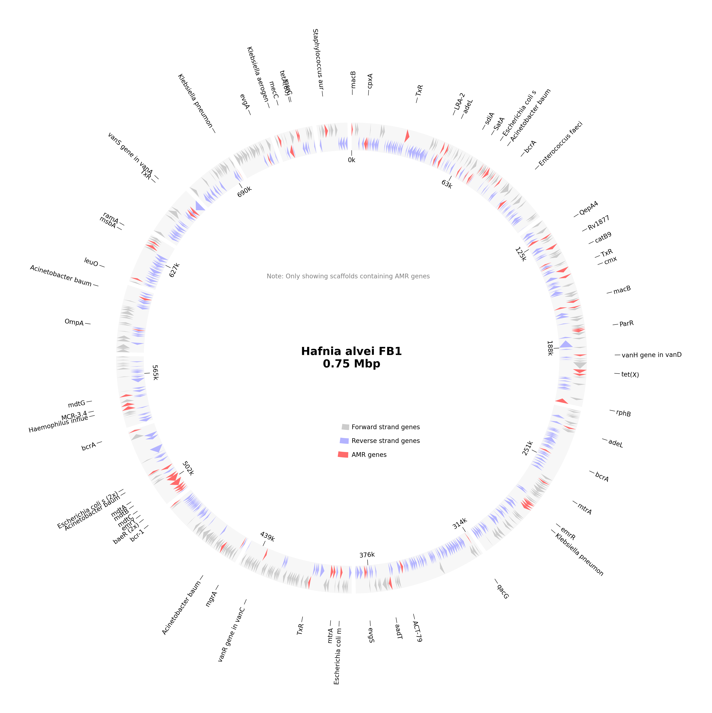

### ACT-79
- **Mechanism**: antibiotic inactivation
- **Drug Classes**: carbapenem; cephalosporin; cephamycin; penam
- **AMR Family**: ACT beta-lactamase
- **Locations**:
  - gnl|SPADES|CPJJBIBK_121_47 : position 43689-45002

### Acinetobacter baumannii AbaF (found in 2 locations)
- **Mechanism**: antibiotic efflux
- **Drug Classes**: phosphonic acid antibiotic
- **AMR Family**: major facilitator superfamily (MFS) antibiotic efflux pump
- **Locations**:
  - gnl|SPADES|CPJJBIBK_215_12 : position 15832-17157
  - gnl|SPADES|CPJJBIBK_45_87 : position 78471-79973

### Acinetobacter baumannii AbaQ (found in 2 locations)
- **Mechanism**: antibiotic efflux
- **Drug Classes**: fluoroquinolone antibiotic
- **AMR Family**: major facilitator superfamily (MFS) antibiotic efflux pump
- **Locations**:
  - gnl|SPADES|CPJJBIBK_205_11 : position 9478-10854
  - gnl|SPADES|CPJJBIBK_268_30 : position 30789-32081

### CRP
- **Mechanism**: antibiotic efflux
- **Drug Classes**: macrolide antibiotic; fluoroquinolone antibiotic; penam
- **AMR Family**: resistance-nodulation-cell division (RND) antibiotic efflux pump
- **Locations**:
  - gnl|SPADES|CPJJBIBK_58_46 : position 49931-50719

### Enterococcus faecium cls conferring resistance to daptomycin
- **Mechanism**: antibiotic target alteration
- **Drug Classes**: peptide antibiotic
- **AMR Family**: daptomycin resistant cls
- **Locations**:
  - gnl|SPADES|CPJJBIBK_45_107 : position 95776-97236

### Escherichia coli AcrAB-TolC with MarR mutations conferring resistance to ciprofloxacin and tetracycline
- **Mechanism**: antibiotic target alteration; antibiotic efflux
- **Drug Classes**: fluoroquinolone antibiotic; cephalosporin; glycylcycline; penam; tetracycline antibiotic; rifamycin antibiotic; phenicol antibiotic; disinfecting agents and antiseptics
- **AMR Family**: resistance-nodulation-cell division (RND) antibiotic efflux pump
- **Locations**:
  - gnl|SPADES|CPJJBIBK_58_22 : position 24274-24765

### Escherichia coli mdfA
- **Mechanism**: antibiotic efflux
- **Drug Classes**: tetracycline antibiotic; phenicol antibiotic; disinfecting agents and antiseptics
- **AMR Family**: major facilitator superfamily (MFS) antibiotic efflux pump
- **Locations**:
  - gnl|SPADES|CPJJBIBK_152_7 : position 5313-6545

### Escherichia coli soxS with mutation conferring antibiotic resistance (found in 3 locations)
- **Mechanism**: antibiotic target alteration; antibiotic efflux; reduced permeability to antibiotic
- **Drug Classes**: fluoroquinolone antibiotic; monobactam; carbapenem; cephalosporin; glycylcycline; cephamycin; penam; tetracycline antibiotic; rifamycin antibiotic; phenicol antibiotic; penem; disinfecting agents and antiseptics
- **AMR Family**: ATP-binding cassette (ABC) antibiotic efflux pump; major facilitator superfamily (MFS) antibiotic efflux pump; resistance-nodulation-cell division (RND) antibiotic efflux pump; General Bacterial Porin with reduced permeability to beta-lactams
- **Locations**:
  - gnl|SPADES|CPJJBIBK_215_14 : position 17969-18835
  - gnl|SPADES|CPJJBIBK_215_21 : position 26057-26410
  - gnl|SPADES|CPJJBIBK_45_83 : position 74854-75225

### Haemophilus influenzae PBP3 conferring resistance to beta-lactam antibiotics
- **Mechanism**: antibiotic target alteration
- **Drug Classes**: cephalosporin; cephamycin; penam
- **AMR Family**: Penicillin-binding protein mutations conferring resistance to beta-lactam antibiotics
- **Locations**:
  - gnl|SPADES|CPJJBIBK_249_12 : position 9213-10985

### Klebsiella aerogenes Omp36
- **Mechanism**: reduced permeability to antibiotic
- **Drug Classes**: monobactam; carbapenem; cephalosporin; cephamycin; penam; penem
- **AMR Family**: General Bacterial Porin with reduced permeability to beta-lactams
- **Locations**:
  - gnl|SPADES|CPJJBIBK_436_2 : position 1708-2856

### Klebsiella pneumoniae KpnG
- **Mechanism**: antibiotic efflux
- **Drug Classes**: macrolide antibiotic; fluoroquinolone antibiotic; aminoglycoside antibiotic; carbapenem; cephalosporin; penam; peptide antibiotic; penem
- **AMR Family**: major facilitator superfamily (MFS) antibiotic efflux pump
- **Locations**:
  - gnl|SPADES|CPJJBIBK_82_67 : position 58579-59754

### Klebsiella pneumoniae KpnH
- **Mechanism**: antibiotic efflux
- **Drug Classes**: macrolide antibiotic; fluoroquinolone antibiotic; aminoglycoside antibiotic; carbapenem; cephalosporin; penam; peptide antibiotic; penem
- **AMR Family**: major facilitator superfamily (MFS) antibiotic efflux pump
- **Locations**:
  - gnl|SPADES|CPJJBIBK_82_68: position 59772-61208

### Klebsiella pneumoniae OmpK37 (found in 2 locations)
- **Mechanism**: reduced permeability to antibiotic
- **Drug Classes**: monobactam; carbapenem; cephalosporin; cephamycin; penam; penem
- **AMR Family**: General Bacterial Porin with reduced permeability to beta-lactams
- **Locations**:
  - gnl|SPADES|CPJJBIBK_347_28 : position 27171-27284
  - gnl|SPADES|CPJJBIBK_58_74 : position 86884-88020

### LRA-2
- **Mechanism**: antibiotic inactivation
- **Drug Classes**: cephalosporin; penam
- **AMR Family**: subclass B3 LRA beta-lactamase
- **Locations**:
  - gnl|SPADES|CPJJBIBK_45_51 : position 49054-49896

### MCR-3.4
- **Mechanism**: antibiotic target alteration
- **Drug Classes**: peptide antibiotic
- **AMR Family**: MCR phosphoethanolamine transferase
- **Locations**:
  - gnl|SPADES|CPJJBIBK_249_13 : position 11349-12956

### MexG
- **Mechanism**: antibiotic efflux
- **Drug Classes**: fluoroquinolone antibiotic; tetracycline antibiotic; disinfecting agents and antiseptics
- **AMR Family**: resistance-nodulation-cell division (RND) antibiotic efflux pump
- **Locations**:
  - gnl|SPADES|CPJJBIBK_45_92 : position 82643-83059

### NmcR (found in 2 locations)
- **Mechanism**: antibiotic inactivation
- **Drug Classes**: carbapenem; cephalosporin; cephamycin; penam
- **AMR Family**: NmcA beta-lactamase
- **Locations**:
  - gnl|SPADES|CPJJBIBK_45_54 : position 50954-51856
  - gnl|SPADES|CPJJBIBK_58_45 : position 48497-49447

### OmpA (found in 2 locations)
- **Mechanism**: reduced permeability to antibiotic
- **Drug Classes**: peptide antibiotic
- **AMR Family**: General Bacterial Porin with reduced permeability to peptide antibiotics
- **Locations**:
  - gnl|SPADES|CPJJBIBK_268_12 : position 12684-13343
  - gnl|SPADES|CPJJBIBK_45_86 : position 77569-78054

### ParR
- **Mechanism**: antibiotic efflux; reduced permeability to antibiotic
- **Drug Classes**: macrolide antibiotic; fluoroquinolone antibiotic; monobactam; aminoglycoside antibiotic; carbapenem; cephalosporin; cephamycin; penam; tetracycline antibiotic; phenicol antibiotic; penem; disinfecting agents and antiseptics
- **AMR Family**: resistance-nodulation-cell division (RND) antibiotic efflux pump; Outer Membrane Porin (Opr)
- **Locations**:
  - gnl|SPADES|CPJJBIBK_58_56 : position 62123-62836

### ParS
- **Mechanism**: antibiotic efflux; reduced permeability to antibiotic
- **Drug Classes**: macrolide antibiotic; fluoroquinolone antibiotic; monobactam; aminoglycoside antibiotic; carbapenem; cephalosporin; cephamycin; penam; tetracycline antibiotic; phenicol antibiotic; penem; disinfecting agents and antiseptics
- **AMR Family**: resistance-nodulation-cell division (RND) antibiotic efflux pump; Outer Membrane Porin (Opr)
- **Locations**:
  - gnl|SPADES|CPJJBIBK_58_57 : position 62843-64162

### QepA4
- **Mechanism**: antibiotic efflux
- **Drug Classes**: fluoroquinolone antibiotic
- **AMR Family**: major facilitator superfamily (MFS) antibiotic efflux pump
- **Locations**:
  - gnl|SPADES|CPJJBIBK_58_6 : position 6921-8216

### Rv1877
- **Mechanism**: antibiotic efflux
- **Drug Classes**: fluoroquinolone antibiotic
- **AMR Family**: major facilitator superfamily (MFS) antibiotic efflux pump
- **Locations**:
  - gnl|SPADES|CPJJBIBK_58_12 : position 14679-16169

### SatA
- **Mechanism**: antibiotic inactivation
- **Drug Classes**: nucleoside antibiotic
- **AMR Family**: streptothricin acetyltransferase (SAT)
- **Locations**:
  - gnl|SPADES|CPJJBIBK_45_78 : position 69760-70203

### Staphylococcus aureus fusA with mutation conferring resistance to fusidic acid
- **Mechanism**: antibiotic target alteration
- **Drug Classes**: fusidane antibiotic
- **AMR Family**: antibiotic resistant fusA
- **Locations**:
  - gnl|SPADES|CPJJBIBK_526_6 : position 4236-5825

### TxR (found in 4 locations)
- **Mechanism**: antibiotic efflux
- **Drug Classes**: tetracycline antibiotic
- **AMR Family**: ATP-binding cassette (ABC) antibiotic efflux pump
- **Locations**:
  - gnl|SPADES|CPJJBIBK_152_22 : position 22917-23960
  - gnl|SPADES|CPJJBIBK_343_19 : position 19166-20506
  - gnl|SPADES|CPJJBIBK_45_33 : position 29989-32001
  - gnl|SPADES|CPJJBIBK_58_27 : position 28338-30254

### aadT
- **Mechanism**: antibiotic efflux
- **Drug Classes**: macrolide antibiotic; tetracycline antibiotic; disinfecting agents and antiseptics
- **AMR Family**: major facilitator superfamily (MFS) antibiotic efflux pump
- **Locations**:
  - gnl|SPADES|CPJJBIBK_121_54 : position 52056-53522

### abeS
- **Mechanism**: antibiotic efflux
- **Drug Classes**: macrolide antibiotic; aminocoumarin antibiotic
- **AMR Family**: small multidrug resistance (SMR) antibiotic efflux pump
- **Locations**:
  - gnl|SPADES|CPJJBIBK_45_81 : position 73228-73572

### adeL (found in 4 locations)
- **Mechanism**: antibiotic efflux
- **Drug Classes**: fluoroquinolone antibiotic; tetracycline antibiotic
- **AMR Family**: resistance-nodulation-cell division (RND) antibiotic efflux pump
- **Locations**:
  - gnl|SPADES|CPJJBIBK_45_56 : position 53269-54210
  - gnl|SPADES|CPJJBIBK_58_53 : position 59123-60016
  - gnl|SPADES|CPJJBIBK_58_7 : position 8385-9281
  - gnl|SPADES|CPJJBIBK_82_13 : position 10203-11084

### baeR (found in 2 locations)
- **Mechanism**: antibiotic efflux
- **Drug Classes**: aminoglycoside antibiotic; aminocoumarin antibiotic
- **AMR Family**: resistance-nodulation-cell division (RND) antibiotic efflux pump
- **Locations**:
  - gnl|SPADES|CPJJBIBK_215_2 : position 758-1489
  - gnl|SPADES|CPJJBIBK_215_25 : position 31870-32511

### baeS (found in 2 locations)
- **Mechanism**: antibiotic efflux
- **Drug Classes**: aminoglycoside antibiotic; aminocoumarin antibiotic
- **AMR Family**: resistance-nodulation-cell division (RND) antibiotic efflux pump
- **Locations**:
  - gnl|SPADES|CPJJBIBK_215_26 : position 32762-34111
  - gnl|SPADES|CPJJBIBK_215_3 : position 1500-2873

### bcr-1
- **Mechanism**: antibiotic efflux
- **Drug Classes**: bicyclomycin-like antibiotic
- **AMR Family**: major facilitator superfamily (MFS) antibiotic efflux pump
- **Locations**:
  - gnl|SPADES|CPJJBIBK_205_49 : position 45195-45788

### bcrA (found in 3 locations)
- **Mechanism**: antibiotic efflux
- **Drug Classes**: peptide antibiotic
- **AMR Family**: ATP-binding cassette (ABC) antibiotic efflux pump
- **Locations**:
  - gnl|SPADES|CPJJBIBK_215_32 : position 42831-43643
  - gnl|SPADES|CPJJBIBK_45_99 : position 86965-87726
  - gnl|SPADES|CPJJBIBK_82_30 : position 26690-27520

### blt
- **Mechanism**: antibiotic efflux
- **Drug Classes**: fluoroquinolone antibiotic; disinfecting agents and antiseptics
- **AMR Family**: major facilitator superfamily (MFS) antibiotic efflux pump
- **Locations**:
  - gnl|SPADES|CPJJBIBK_152_12 : position 10713-12188

### catB9
- **Mechanism**: antibiotic inactivation
- **Drug Classes**: phenicol antibiotic
- **AMR Family**: chloramphenicol acetyltransferase (CAT)
- **Locations**:
  - gnl|SPADES|CPJJBIBK_58_19 : position 21830-22447

### cmx (found in 2 locations)
- **Mechanism**: antibiotic efflux
- **Drug Classes**: phenicol antibiotic
- **AMR Family**: major facilitator superfamily (MFS) antibiotic efflux pump
- **Locations**:
  - gnl|SPADES|CPJJBIBK_45_55 : position 51957-53165
  - gnl|SPADES|CPJJBIBK_58_29 : position 32312-33550

### cpxA
- **Mechanism**: antibiotic efflux
- **Drug Classes**: aminoglycoside antibiotic; aminocoumarin antibiotic
- **AMR Family**: resistance-nodulation-cell division (RND) antibiotic efflux pump
- **Locations**:
  - gnl|SPADES|CPJJBIBK_45_8 : position 7233-8705

### emrR
- **Mechanism**: antibiotic efflux
- **Drug Classes**: fluoroquinolone antibiotic
- **AMR Family**: major facilitator superfamily (MFS) antibiotic efflux pump
- **Locations**:
  - gnl|SPADES|CPJJBIBK_82_65 : position 56544-57062

### emrY
- **Mechanism**: antibiotic efflux
- **Drug Classes**: tetracycline antibiotic
- **AMR Family**: major facilitator superfamily (MFS) antibiotic efflux pump
- **Locations**:
  - gnl|SPADES|CPJJBIBK_215_4 : position 2870-4294

### evgA
- **Mechanism**: antibiotic efflux
- **Drug Classes**: macrolide antibiotic; fluoroquinolone antibiotic; penam; tetracycline antibiotic
- **AMR Family**: major facilitator superfamily (MFS) antibiotic efflux pump; resistance-nodulation-cell division (RND) antibiotic efflux pump
- **Locations**:
  - gnl|SPADES|CPJJBIBK_423_14 : position 16280-16942

### evgS
- **Mechanism**: antibiotic efflux
- **Drug Classes**: macrolide antibiotic; fluoroquinolone antibiotic; penam; tetracycline antibiotic
- **AMR Family**: major facilitator superfamily (MFS) antibiotic efflux pump; resistance-nodulation-cell division (RND) antibiotic efflux pump
- **Locations**:
  - gnl|SPADES|CPJJBIBK_121_68 : position 65009-65398

### kdpE
- **Mechanism**: antibiotic efflux
- **Drug Classes**: aminoglycoside antibiotic
- **AMR Family**: kdpDE
- **Locations**:
  - gnl|SPADES|CPJJBIBK_45_9 : position 8702-9376

### leuO (found in 2 locations)
- **Mechanism**: antibiotic efflux
- **Drug Classes**: nucleoside antibiotic; disinfecting agents and antiseptics
- **AMR Family**: major facilitator superfamily (MFS) antibiotic efflux pump
- **Locations**:
  - gnl|SPADES|CPJJBIBK_342_4 : position 2004-2900
  - gnl|SPADES|CPJJBIBK_45_80 : position 71993-72940

### macB (found in 2 locations)
- **Mechanism**: antibiotic efflux
- **Drug Classes**: macrolide antibiotic
- **AMR Family**: ATP-binding cassette (ABC) antibiotic efflux pump
- **Locations**:
  - gnl|SPADES|CPJJBIBK_45_1 : position 2-712
  - gnl|SPADES|CPJJBIBK_58_43 : position 46607-47782

### mdtA
- **Mechanism**: antibiotic efflux
- **Drug Classes**: aminocoumarin antibiotic
- **AMR Family**: resistance-nodulation-cell division (RND) antibiotic efflux pump
- **Locations**:
  - gnl|SPADES|CPJJBIBK_215_7 : position 10693-11988

### mdtB
- **Mechanism**: antibiotic efflux
- **Drug Classes**: aminocoumarin antibiotic
- **AMR Family**: resistance-nodulation-cell division (RND) antibiotic efflux pump
- **Locations**:
  - gnl|SPADES|CPJJBIBK_215_6 : position 7544-10693

### mdtC
- **Mechanism**: antibiotic efflux
- **Drug Classes**: aminocoumarin antibiotic
- **AMR Family**: resistance-nodulation-cell division (RND) antibiotic efflux pump
- **Locations**:
  - gnl|SPADES|CPJJBIBK_215_5 : position 4449-7547

### mdtG
- **Mechanism**: antibiotic efflux
- **Drug Classes**: phosphonic acid antibiotic
- **AMR Family**: major facilitator superfamily (MFS) antibiotic efflux pump
- **Locations**:
  - gnl|SPADES|CPJJBIBK_249_17 : position 16468-17652

### mdtP
- **Mechanism**: antibiotic efflux
- **Drug Classes**: nucleoside antibiotic; disinfecting agents and antiseptics
- **AMR Family**: major facilitator superfamily (MFS) antibiotic efflux pump
- **Locations**:
  - gnl|SPADES|CPJJBIBK_82_66 : position 57097-58554

### mecC
- **Mechanism**: antibiotic target replacement
- **Drug Classes**: penam
- **AMR Family**: methicillin resistant PBP2
- **Locations**:
  - gnl|SPADES|CPJJBIBK_436_7 : position 5680-7593

### mgrA
- **Mechanism**: antibiotic efflux
- **Drug Classes**: fluoroquinolone antibiotic; cephalosporin; penam; tetracycline antibiotic; peptide antibiotic; disinfecting agents and antiseptics
- **AMR Family**: ATP-binding cassette (ABC) antibiotic efflux pump; major facilitator superfamily (MFS) antibiotic efflux pump
- **Locations**:
  - gnl|SPADES|CPJJBIBK_205_2 : position 1276-1719

### msbA
- **Mechanism**: antibiotic efflux
- **Drug Classes**: nitroimidazole antibiotic
- **AMR Family**: ATP-binding cassette (ABC) antibiotic efflux pump
- **Locations**:
  - gnl|SPADES|CPJJBIBK_342_21 : position 21216-22736

### msrC
- **Mechanism**: antibiotic target protection
- **Drug Classes**: macrolide antibiotic; streptogramin antibiotic; streptogramin B antibiotic
- **AMR Family**: msr-type ABC-F protein
- **Locations**:
  - gnl|SPADES|CPJJBIBK_436_13 : position 12726-13316

### mtrA (found in 2 locations)
- **Mechanism**: antibiotic efflux
- **Drug Classes**: macrolide antibiotic; penam
- **AMR Family**: resistance-nodulation-cell division (RND) antibiotic efflux pump
- **Locations**:
  - gnl|SPADES|CPJJBIBK_152_11 : position 9410-10591
  - gnl|SPADES|CPJJBIBK_82_50 : position 43018-43839

### qacG
- **Mechanism**: antibiotic efflux
- **Drug Classes**: disinfecting agents and antiseptics
- **AMR Family**: small multidrug resistance (SMR) antibiotic efflux pump
- **Locations**:
  - gnl|SPADES|CPJJBIBK_121_3: position 1903-2238

### ramA
- **Mechanism**: antibiotic efflux; reduced permeability to antibiotic
- **Drug Classes**: fluoroquinolone antibiotic; monobactam; carbapenem; cephalosporin; glycylcycline; cephamycin; penam; tetracycline antibiotic; rifamycin antibiotic; phenicol antibiotic; penem; disinfecting agents and antiseptics
- **AMR Family**: resistance-nodulation-cell division (RND) antibiotic efflux pump; General Bacterial Porin with reduced permeability to beta-lactams
- **Locations**:
  - gnl|SPADES|CPJJBIBK_342_23 : position 23929-24870

### rphB
- **Mechanism**: antibiotic inactivation
- **Drug Classes**: rifamycin antibiotic
- **AMR Family**: rifampin phosphotransferase
- **Locations**:
  - gnl|SPADES|CPJJBIBK_58_89 : position 101978-104353

### sdiA
- **Mechanism**: antibiotic efflux
- **Drug Classes**: fluoroquinolone antibiotic; cephalosporin; glycylcycline; penam; tetracycline antibiotic; rifamycin antibiotic; phenicol antibiotic; disinfecting agents and antiseptics
- **AMR Family**: resistance-nodulation-cell division (RND) antibiotic efflux pump
- **Locations**:
  - gnl|SPADES|CPJJBIBK_45_71 : position 64672-65412

### tet(X)
- **Mechanism**: antibiotic inactivation
- **Drug Classes**: glycylcycline; tetracycline antibiotic
- **AMR Family**: tetracycline inactivation enzyme
- **Locations**:
  - gnl|SPADES|CPJJBIBK_58_73 : position 84552-86534

### tetA(60)
- **Mechanism**: antibiotic efflux
- **Drug Classes**: tetracycline antibiotic
- **AMR Family**: ATP-binding cassette (ABC) antibiotic efflux pump
- **Locations**:
  - gnl|SPADES|CPJJBIBK_436_12 : position 11908-12726

### vanH gene in vanD cluster
- **Mechanism**: antibiotic target alteration
- **Drug Classes**: glycopeptide antibiotic
- **AMR Family**: vanH; glycopeptide resistance gene cluster
- **Locations**:
  - gnl|SPADES|CPJJBIBK_58_66 : position 76321-77313

### vanR gene in vanC cluster
- **Mechanism**: antibiotic target alteration
- **Drug Classes**: glycopeptide antibiotic
- **AMR Family**: glycopeptide resistance gene cluster; vanR
- **Locations**:
  - gnl|SPADES|CPJJBIBK_152_53 : position 50980-51945

### vanR gene in vanF cluster
- **Mechanism**: antibiotic target alteration
- **Drug Classes**: glycopeptide antibiotic
- **AMR Family**: glycopeptide resistance gene cluster; vanR
- **Locations**:
  - gnl|SPADES|CPJJBIBK_121_69 : position 65434-66486

### vanS gene in vanA cluster
- **Mechanism**: antibiotic target alteration
- **Drug Classes**: glycopeptide antibiotic
- **AMR Family**: vanS; glycopeptide resistance gene cluster
- **Locations**:
  - gnl|SPADES|CPJJBIBK_343_21 : position 21341-22777

## Hafnia paralvei
**Strain Statistics:**
- Total genome length: 4716.7 kbp
- Total scaffolds: 286
- Scaffolds with AMR genes: 72
- Total genes annotated: 8564
- Total AMR genes: 449
- Unique AMR genes: 212
- Distinct AMR mechanisms: 11
- Distinct AMR families: 74
- Distinct drug classes: 37

**Circos Plot:**

### AAC(6')-32
- **Mechanism**: antibiotic inactivation
- **Drug Classes**: aminoglycoside antibiotic
- **AMR Family**: AAC(6')
- **Locations**:
  - gnl|SPADES|CPJJBIBK_255_26 : position 28542-29144

### AAC(6')-Iu
- **Mechanism**: antibiotic inactivation
- **Drug Classes**: aminoglycoside antibiotic
- **AMR Family**: AAC(6')
- **Locations**:
  - gnl|SPADES|CPJJBIBK_18_77 : position 80675-81133

### ACC-1a
- **Mechanism**: antibiotic inactivation
- **Drug Classes**: monobactam; cephalosporin; cephamycin; penam; oxacephem
- **AMR Family**: ACC beta-lactamase
- **Locations**:
  - gnl|SPADES|CPJJBIBK_64_79: position 96958-98130

### ALI-2
- **Mechanism**: antibiotic inactivation
- **Drug Classes**: carbapenem
- **AMR Family**: ALI beta-lactamase
- **Locations**:
  - gnl|SPADES|CPJJBIBK_47_56 : position 57358-58236

### APH(6)-Ic
- **Mechanism**: antibiotic inactivation
- **Drug Classes**: aminoglycoside antibiotic
- **AMR Family**: APH(6)
- **Locations**:
  - gnl|SPADES|CPJJBIBK_31_96 : position 104269-105072

### Acinetobacter baumannii AbaF (found in 6 locations)
- **Mechanism**: antibiotic efflux
- **Drug Classes**: phosphonic acid antibiotic
- **AMR Family**: major facilitator superfamily (MFS) antibiotic efflux pump
- **Locations**:
  - gnl|SPADES|CPJJBIBK_11_224 : position 257305-258606
  - gnl|SPADES|CPJJBIBK_22_31 : position 26950-28452
  - gnl|SPADES|CPJJBIBK_265_4 : position 3571-4800
  - gnl|SPADES|CPJJBIBK_47_48 : position 48342-49883
  - gnl|SPADES|CPJJBIBK_48_62 : position 73470-74795
  - gnl|SPADES|CPJJBIBK_80_23 : position 28467-29801

### Acinetobacter baumannii AbaQ (found in 7 locations)
- **Mechanism**: antibiotic efflux
- **Drug Classes**: fluoroquinolone antibiotic
- **AMR Family**: major facilitator superfamily (MFS) antibiotic efflux pump
- **Locations**:
  - gnl|SPADES|CPJJBIBK_101_62 : position 70592-71920
  - gnl|SPADES|CPJJBIBK_11_16 : position 15897-17234
  - gnl|SPADES|CPJJBIBK_11_177 : position 194238-195584
  - gnl|SPADES|CPJJBIBK_11_98 : position 110501-111724
  - gnl|SPADES|CPJJBIBK_124_55 : position 64609-65904
  - gnl|SPADES|CPJJBIBK_18_57 : position 60640-61932
  - gnl|SPADES|CPJJBIBK_53_59 : position 62214-63590

### AcrE
- **Mechanism**: antibiotic efflux
- **Drug Classes**: fluoroquinolone antibiotic; cephalosporin; cephamycin; penam
- **AMR Family**: resistance-nodulation-cell division (RND) antibiotic efflux pump
- **Locations**:
  - gnl|SPADES|CPJJBIBK_25_31 : position 32503-33666

### AcrF
- **Mechanism**: antibiotic efflux
- **Drug Classes**: fluoroquinolone antibiotic; cephalosporin; cephamycin; penam
- **AMR Family**: resistance-nodulation-cell division (RND) antibiotic efflux pump
- **Locations**:
  - gnl|SPADES|CPJJBIBK_25_30 : position 29342-32464

### Agrobacterium fabrum chloramphenicol acetyltransferase
- **Mechanism**: antibiotic inactivation
- **Drug Classes**: phenicol antibiotic
- **AMR Family**: chloramphenicol acetyltransferase (CAT)
- **Locations**:
  - gnl|SPADES|CPJJBIBK_165_39 : position 41238-41792

### ArnT
- **Mechanism**: antibiotic target alteration
- **Drug Classes**: peptide antibiotic
- **AMR Family**: pmr phosphoethanolamine transferase
- **Locations**:
  - gnl|SPADES|CPJJBIBK_449_15: position 13763-15412

### Bifidobacterium bifidum ileS conferring resistance to mupirocin
- **Mechanism**: antibiotic target alteration
- **Drug Classes**: mupirocin-like antibiotic
- **AMR Family**: antibiotic-resistant isoleucyl-tRNA synthetase (ileS)
- **Locations**:
  - gnl|SPADES|CPJJBIBK_25_1 : position 466-3048

### CRP (found in 3 locations)
- **Mechanism**: antibiotic efflux
- **Drug Classes**: macrolide antibiotic; fluoroquinolone antibiotic; penam
- **AMR Family**: resistance-nodulation-cell division (RND) antibiotic efflux pump
- **Locations**:
  - gnl|SPADES|CPJJBIBK_36_75: position 87405-88037
  - gnl|SPADES|CPJJBIBK_398_7 : position 8087-8884
  - gnl|SPADES|CPJJBIBK_560_11 : position 10952-11653

### Clostridioides difficile gyrA conferring resistance to fluoroquinolones
- **Mechanism**: antibiotic target alteration
- **Drug Classes**: fluoroquinolone antibiotic
- **AMR Family**: fluoroquinolone resistant gyrA
- **Locations**:
  - gnl|SPADES|CPJJBIBK_906_2 : position 3291-5939

### Clostridioides difficile gyrB conferring resistance to fluoroquinolones (found in 2 locations)
- **Mechanism**: antibiotic target alteration
- **Drug Classes**: fluoroquinolone antibiotic
- **AMR Family**: fluoroquinolone resistant gyrB
- **Locations**:
  - gnl|SPADES|CPJJBIBK_17_13 : position 13654-15549
  - gnl|SPADES|CPJJBIBK_18_49 : position 52627-55041

### D-Ala-D-Ala ligase
- **Mechanism**: antibiotic target alteration
- **Drug Classes**: glycopeptide antibiotic
- **AMR Family**: Van ligase
- **Locations**:
  - gnl|SPADES|CPJJBIBK_182_22 : position 26875-27795

### EVM-1
- **Mechanism**: antibiotic inactivation
- **Drug Classes**: carbapenem
- **AMR Family**: EVM beta-lactamase
- **Locations**:
  - gnl|SPADES|CPJJBIBK_8_172 : position 210466-211287

### Enterobacter cloacae acrA
- **Mechanism**: antibiotic efflux
- **Drug Classes**: fluoroquinolone antibiotic; cephalosporin; glycylcycline; penam; tetracycline antibiotic; rifamycin antibiotic; phenicol antibiotic; disinfecting agents and antiseptics
- **AMR Family**: resistance-nodulation-cell division (RND) antibiotic efflux pump
- **Locations**:
  - gnl|SPADES|CPJJBIBK_226_21 : position 20156-21346

### Enterococcus faecium cls conferring resistance to daptomycin
- **Mechanism**: antibiotic target alteration
- **Drug Classes**: peptide antibiotic
- **AMR Family**: daptomycin resistant cls
- **Locations**:
  - gnl|SPADES|CPJJBIBK_22_11 : position 9413-10873

### ErmX
- **Mechanism**: antibiotic target alteration
- **Drug Classes**: macrolide antibiotic; lincosamide antibiotic; streptogramin antibiotic; streptogramin A antibiotic; streptogramin B antibiotic
- **AMR Family**: Erm 23S ribosomal RNA methyltransferase
- **Locations**:
  - gnl|SPADES|CPJJBIBK_80_65 : position 76747-77559

### Escherichia coli AcrAB-TolC with AcrR mutation conferring resistance to ciprofloxacin, tetracycline, and ceftazidime
- **Mechanism**: antibiotic target alteration; antibiotic efflux
- **Drug Classes**: fluoroquinolone antibiotic; cephalosporin; glycylcycline; penam; tetracycline antibiotic; rifamycin antibiotic; phenicol antibiotic; disinfecting agents and antiseptics
- **AMR Family**: resistance-nodulation-cell division (RND) antibiotic efflux pump
- **Locations**:
  - gnl|SPADES|CPJJBIBK_226_22 : position 21486-22190

### Escherichia coli AcrAB-TolC with MarR mutations conferring resistance to ciprofloxacin and tetracycline (found in 2 locations)
- **Mechanism**: antibiotic target alteration; antibiotic efflux
- **Drug Classes**: fluoroquinolone antibiotic; cephalosporin; glycylcycline; penam; tetracycline antibiotic; rifamycin antibiotic; phenicol antibiotic; disinfecting agents and antiseptics
- **AMR Family**: resistance-nodulation-cell division (RND) antibiotic efflux pump
- **Locations**:
  - gnl|SPADES|CPJJBIBK_318_26 : position 25853-26284
  - gnl|SPADES|CPJJBIBK_398_16 : position 18028-18519

### Escherichia coli EF-Tu mutants conferring resistance to Enacyloxin IIa
- **Mechanism**: antibiotic target alteration
- **Drug Classes**: elfamycin antibiotic
- **AMR Family**: elfamycin resistant EF-Tu
- **Locations**:
  - gnl|SPADES|CPJJBIBK_31_61 : position 65061-67763

### Escherichia coli EF-Tu mutants conferring resistance to Pulvomycin (found in 2 locations)
- **Mechanism**: antibiotic target alteration
- **Drug Classes**: elfamycin antibiotic
- **AMR Family**: elfamycin resistant EF-Tu
- **Locations**:
  - gnl|SPADES|CPJJBIBK_36_100 : position 109519-110703
  - gnl|SPADES|CPJJBIBK_527_9 : position 9332-10516

### Escherichia coli PtsI with mutation conferring resistance to fosfomycin
- **Mechanism**: antibiotic target alteration
- **Drug Classes**: phosphonic acid antibiotic
- **AMR Family**: antibiotic-resistant ptsI phosphotransferase
- **Locations**:
  - gnl|SPADES|CPJJBIBK_520_2 : position 369-2096

### Escherichia coli acrA
- **Mechanism**: antibiotic efflux
- **Drug Classes**: fluoroquinolone antibiotic; cephalosporin; glycylcycline; penam; tetracycline antibiotic; rifamycin antibiotic; phenicol antibiotic; disinfecting agents and antiseptics
- **AMR Family**: resistance-nodulation-cell division (RND) antibiotic efflux pump
- **Locations**:
  - gnl|SPADES|CPJJBIBK_83_7 : position 9308-10495

### Escherichia coli mdfA (found in 2 locations)
- **Mechanism**: antibiotic efflux
- **Drug Classes**: tetracycline antibiotic; phenicol antibiotic; disinfecting agents and antiseptics
- **AMR Family**: major facilitator superfamily (MFS) antibiotic efflux pump
- **Locations**:
  - gnl|SPADES|CPJJBIBK_255_24 : position 25258-26478
  - gnl|SPADES|CPJJBIBK_452_10 : position 13082-14314

### Escherichia coli soxS with mutation conferring antibiotic resistance (found in 4 locations)
- **Mechanism**: antibiotic target alteration; antibiotic efflux; reduced permeability to antibiotic
- **Drug Classes**: fluoroquinolone antibiotic; monobactam; carbapenem; cephalosporin; glycylcycline; cephamycin; penam; tetracycline antibiotic; rifamycin antibiotic; phenicol antibiotic; penem; disinfecting agents and antiseptics
- **AMR Family**: ATP-binding cassette (ABC) antibiotic efflux pump; major facilitator superfamily (MFS) antibiotic efflux pump; resistance-nodulation-cell division (RND) antibiotic efflux pump; General Bacterial Porin with reduced permeability to beta-lactams
- **Locations**:
  - gnl|SPADES|CPJJBIBK_22_36 : position 31835-32206
  - gnl|SPADES|CPJJBIBK_25_23 : position 22034-22855
  - gnl|SPADES|CPJJBIBK_64_13 : position 16536-17399
  - gnl|SPADES|CPJJBIBK_97_9 : position 7333-8211

### Escherichia coli uhpA with mutation conferring resistance to fosfomycin
- **Mechanism**: antibiotic target alteration
- **Drug Classes**: phosphonic acid antibiotic
- **AMR Family**: antibiotic-resistant UhpT
- **Locations**:
  - gnl|SPADES|CPJJBIBK_590_5 : position 3246-3962

### FosC2
- **Mechanism**: antibiotic inactivation
- **Drug Classes**: phosphonic acid antibiotic
- **AMR Family**: fosC phosphotransferase family
- **Locations**:
  - gnl|SPADES|CPJJBIBK_134_20 : position 20517-20981

### H-NS
- **Mechanism**: antibiotic efflux
- **Drug Classes**: macrolide antibiotic; fluoroquinolone antibiotic; cephalosporin; cephamycin; penam; tetracycline antibiotic
- **AMR Family**: major facilitator superfamily (MFS) antibiotic efflux pump; resistance-nodulation-cell division (RND) antibiotic efflux pump
- **Locations**:
  - gnl|SPADES|CPJJBIBK_154_54 : position 61368-61775

### Haemophilus influenzae PBP3 conferring resistance to beta-lactam antibiotics (found in 2 locations)
- **Mechanism**: antibiotic target alteration
- **Drug Classes**: cephalosporin; cephamycin; penam
- **AMR Family**: Penicillin-binding protein mutations conferring resistance to beta-lactam antibiotics
- **Locations**:
  - gnl|SPADES|CPJJBIBK_160_46 : position 45464-47236
  - gnl|SPADES|CPJJBIBK_182_14 : position 15971-17734

### Helicobacter pylori pbp1 mutants conferring resistance to amoxicillin (found in 3 locations)
- **Mechanism**: antibiotic target alteration
- **Drug Classes**: cephalosporin; cephamycin; penam
- **AMR Family**: Penicillin-binding protein mutations conferring resistance to beta-lactam antibiotics
- **Locations**:
  - gnl|SPADES|CPJJBIBK_19_115 : position 120214-122487
  - gnl|SPADES|CPJJBIBK_33_85 : position 100371-102950
  - gnl|SPADES|CPJJBIBK_37_89 : position 98272-100545

### Helicobacter pylori pbp2 mutants conferring resistance to amoxicillin
- **Mechanism**: antibiotic target alteration
- **Drug Classes**: cephalosporin; cephamycin; penam
- **AMR Family**: Penicillin-binding protein mutations conferring resistance to beta-lactam antibiotics
- **Locations**:
  - gnl|SPADES|CPJJBIBK_25_7 : position 6537-8432

### Helicobacter pylori rpoB mutation conferring resistance to rifampicin
- **Mechanism**: antibiotic target alteration; antibiotic target replacement
- **Drug Classes**: fluoroquinolone antibiotic; rifamycin antibiotic
- **AMR Family**: rifamycin-resistant beta-subunit of RNA polymerase (rpoB)
- **Locations**:
  - gnl|SPADES|CPJJBIBK_503_1 : position 1-3234

### Klebsiella aerogenes Omp36
- **Mechanism**: reduced permeability to antibiotic
- **Drug Classes**: monobactam; carbapenem; cephalosporin; cephamycin; penam; penem
- **AMR Family**: General Bacterial Porin with reduced permeability to beta-lactams
- **Locations**:
  - gnl|SPADES|CPJJBIBK_442_19 : position 17351-18499

### Klebsiella pneumoniae KpnE
- **Mechanism**: antibiotic efflux
- **Drug Classes**: macrolide antibiotic; aminoglycoside antibiotic; cephalosporin; tetracycline antibiotic; peptide antibiotic; rifamycin antibiotic; disinfecting agents and antiseptics
- **AMR Family**: small multidrug resistance (SMR) antibiotic efflux pump
- **Locations**:
  - gnl|SPADES|CPJJBIBK_22_127 : position 123340-123771

### Klebsiella pneumoniae KpnF
- **Mechanism**: antibiotic efflux
- **Drug Classes**: macrolide antibiotic; aminoglycoside antibiotic; cephalosporin; tetracycline antibiotic; peptide antibiotic; rifamycin antibiotic; disinfecting agents and antiseptics
- **AMR Family**: small multidrug resistance (SMR) antibiotic efflux pump
- **Locations**:
  - gnl|SPADES|CPJJBIBK_22_126: position 123024-123353

### Klebsiella pneumoniae KpnG (found in 2 locations)
- **Mechanism**: antibiotic efflux
- **Drug Classes**: macrolide antibiotic; fluoroquinolone antibiotic; aminoglycoside antibiotic; carbapenem; cephalosporin; penam; peptide antibiotic; penem
- **AMR Family**: major facilitator superfamily (MFS) antibiotic efflux pump
- **Locations**:
  - gnl|SPADES|CPJJBIBK_19_79 : position 75051-76226
  - gnl|SPADES|CPJJBIBK_37_53 : position 53109-54284

### Klebsiella pneumoniae KpnH (found in 3 locations)
- **Mechanism**: antibiotic efflux
- **Drug Classes**: macrolide antibiotic; fluoroquinolone antibiotic; aminoglycoside antibiotic; carbapenem; cephalosporin; penam; peptide antibiotic; penem
- **AMR Family**: major facilitator superfamily (MFS) antibiotic efflux pump
- **Locations**:
  - gnl|SPADES|CPJJBIBK_18_2 : position 1107-2546
  - gnl|SPADES|CPJJBIBK_19_80: position 76244-77779
  - gnl|SPADES|CPJJBIBK_37_54: position 54302-55837

### Klebsiella pneumoniae OmpK37 (found in 7 locations)
- **Mechanism**: reduced permeability to antibiotic
- **Drug Classes**: monobactam; carbapenem; cephalosporin; cephamycin; penam; penem
- **AMR Family**: General Bacterial Porin with reduced permeability to beta-lactams
- **Locations**:
  - gnl|SPADES|CPJJBIBK_101_19 : position 19720-20862
  - gnl|SPADES|CPJJBIBK_131_60 : position 67896-68024
  - gnl|SPADES|CPJJBIBK_33_84 : position 99050-100189
  - gnl|SPADES|CPJJBIBK_405_1 : position 2-1030
  - gnl|SPADES|CPJJBIBK_47_25 : position 26357-27460
  - gnl|SPADES|CPJJBIBK_8_68 : position 85172-86287
  - gnl|SPADES|CPJJBIBK_97_66 : position 68572-69672

### Klebsiella pneumoniae acrR with mutation conferring multidrug antibiotic resistance
- **Mechanism**: antibiotic target alteration; antibiotic efflux
- **Drug Classes**: fluoroquinolone antibiotic; cephalosporin; glycylcycline; penam; tetracycline antibiotic; rifamycin antibiotic; phenicol antibiotic; disinfecting agents and antiseptics
- **AMR Family**: resistance-nodulation-cell division (RND) antibiotic efflux pump
- **Locations**:
  - gnl|SPADES|CPJJBIBK_25_32 : position 34259-34873

### LRA-19
- **Mechanism**: antibiotic inactivation
- **Drug Classes**: cephalosporin; penam
- **AMR Family**: subclass B3 LRA beta-lactamase
- **Locations**:
  - gnl|SPADES|CPJJBIBK_8_70 : position 87848-88495

### LlmA 23S ribosomal RNA methyltransferase
- **Mechanism**: antibiotic target alteration
- **Drug Classes**: lincosamide antibiotic
- **AMR Family**: Llm 23S ribosomal RNA methyltransferase
- **Locations**:
  - gnl|SPADES|CPJJBIBK_8_39 : position 49058-50251

### LptD
- **Mechanism**: antibiotic efflux
- **Drug Classes**: carbapenem; peptide antibiotic; aminocoumarin antibiotic; rifamycin antibiotic
- **AMR Family**: ATP-binding cassette (ABC) antibiotic efflux pump
- **Locations**:
  - gnl|SPADES|CPJJBIBK_80_68 : position 79956-82358

### MCR-10.4
- **Mechanism**: antibiotic target alteration
- **Drug Classes**: peptide antibiotic
- **AMR Family**: MCR phosphoethanolamine transferase
- **Locations**:
  - gnl|SPADES|CPJJBIBK_133_44 : position 45014-46648

### MCR-3.4
- **Mechanism**: antibiotic target alteration
- **Drug Classes**: peptide antibiotic
- **AMR Family**: MCR phosphoethanolamine transferase
- **Locations**:
  - gnl|SPADES|CPJJBIBK_160_45 : position 43492-45099

### MCR-3.41
- **Mechanism**: antibiotic target alteration
- **Drug Classes**: peptide antibiotic
- **AMR Family**: MCR phosphoethanolamine transferase
- **Locations**:
  - gnl|SPADES|CPJJBIBK_18_131 : position 134227-135849

### MCR-5.1
- **Mechanism**: antibiotic target alteration
- **Drug Classes**: peptide antibiotic
- **AMR Family**: MCR phosphoethanolamine transferase
- **Locations**:
  - gnl|SPADES|CPJJBIBK_18_167 : position 171734-173461

### MdtK
- **Mechanism**: antibiotic efflux
- **Drug Classes**: fluoroquinolone antibiotic
- **AMR Family**: multidrug and toxic compound extrusion (MATE) transporter
- **Locations**:
  - gnl|SPADES|CPJJBIBK_25_39 : position 41044-42501

### MdtQ
- **Mechanism**: reduced permeability to antibiotic
- **Drug Classes**: monobactam; carbapenem; cephalosporin; cephamycin; penam; penem
- **AMR Family**: Outer Membrane Porin (Opr)
- **Locations**:
  - gnl|SPADES|CPJJBIBK_8_12 : position 11320-12825

### MexG
- **Mechanism**: antibiotic efflux
- **Drug Classes**: fluoroquinolone antibiotic; tetracycline antibiotic; disinfecting agents and antiseptics
- **AMR Family**: resistance-nodulation-cell division (RND) antibiotic efflux pump
- **Locations**:
  - gnl|SPADES|CPJJBIBK_22_26 : position 23864-24280

### MexS (found in 6 locations)
- **Mechanism**: antibiotic efflux
- **Drug Classes**: fluoroquinolone antibiotic; diaminopyrimidine antibiotic; phenicol antibiotic
- **AMR Family**: resistance-nodulation-cell division (RND) antibiotic efflux pump
- **Locations**:
  - gnl|SPADES|CPJJBIBK_11_138 : position 162533-163510
  - gnl|SPADES|CPJJBIBK_134_24 : position 24409-25533
  - gnl|SPADES|CPJJBIBK_17_65 : position 75940-76926
  - gnl|SPADES|CPJJBIBK_376_8 : position 8176-9207
  - gnl|SPADES|CPJJBIBK_48_77 : position 95236-96255
  - gnl|SPADES|CPJJBIBK_97_17 : position 15657-16658

### MexT
- **Mechanism**: antibiotic efflux
- **Drug Classes**: fluoroquinolone antibiotic; diaminopyrimidine antibiotic; phenicol antibiotic
- **AMR Family**: resistance-nodulation-cell division (RND) antibiotic efflux pump
- **Locations**:
  - gnl|SPADES|CPJJBIBK_11_58 : position 61984-62877

### MexV
- **Mechanism**: antibiotic efflux
- **Drug Classes**: macrolide antibiotic; fluoroquinolone antibiotic; tetracycline antibiotic; phenicol antibiotic; disinfecting agents and antiseptics
- **AMR Family**: resistance-nodulation-cell division (RND) antibiotic efflux pump
- **Locations**:
  - gnl|SPADES|CPJJBIBK_72_11 : position 12669-14186

### MexZ
- **Mechanism**: antibiotic efflux
- **Drug Classes**: macrolide antibiotic; fluoroquinolone antibiotic; aminoglycoside antibiotic; carbapenem; cephalosporin; cephamycin; penam; tetracycline antibiotic; phenicol antibiotic; disinfecting agents and antiseptics
- **AMR Family**: resistance-nodulation-cell division (RND) antibiotic efflux pump
- **Locations**:
  - gnl|SPADES|CPJJBIBK_17_61 : position 72995-73600

### Mycobacterium tuberculosis gidB mutation conferring resistance to streptomycin
- **Mechanism**: antibiotic target alteration
- **Drug Classes**: aminoglycoside antibiotic
- **AMR Family**: antibiotic resistant gidB
- **Locations**:
  - gnl|SPADES|CPJJBIBK_18_16 : position 18287-18907

### Mycobacterium tuberculosis ndh with mutation conferring resistance to isoniazid
- **Mechanism**: antibiotic target alteration
- **Drug Classes**: isoniazid-like antibiotic
- **AMR Family**: antibiotic resistant ndh
- **Locations**:
  - gnl|SPADES|CPJJBIBK_22_101 : position 97639-98943

### Mycobacterium tuberculosis pncA mutations conferring resistance to pyrazinamide
- **Mechanism**: antibiotic target alteration
- **Drug Classes**: pyrazine antibiotic
- **AMR Family**: Pyrazinamide resistant pncA
- **Locations**:
  - gnl|SPADES|CPJJBIBK_47_16 : position 15830-16465

### Mycobacterium tuberculosis rpoB mutations conferring resistance to rifampicin
- **Mechanism**: antibiotic target alteration; antibiotic target replacement
- **Drug Classes**: rifamycin antibiotic
- **AMR Family**: rifamycin-resistant beta-subunit of RNA polymerase (rpoB)
- **Locations**:
  - gnl|SPADES|CPJJBIBK_527_2 : position 1185-5213

### Mycobacterium tuberculosis rpsA mutations conferring resistance to pyrazinamide
- **Mechanism**: antibiotic target alteration
- **Drug Classes**: pyrazine antibiotic
- **AMR Family**: pyrazinamide resistant rpsA
- **Locations**:
  - gnl|SPADES|CPJJBIBK_8_95 : position 119070-120749

### Mycobacterium tuberculosis thyA with mutation conferring resistance to para-aminosalicylic acid
- **Mechanism**: antibiotic target alteration
- **Drug Classes**: salicylic acid antibiotic
- **AMR Family**: aminosalicylate resistant thymidylate synthase
- **Locations**:
  - gnl|SPADES|CPJJBIBK_33_71 : position 83671-84465

### NmcR (found in 10 locations)
- **Mechanism**: antibiotic inactivation
- **Drug Classes**: carbapenem; cephalosporin; cephamycin; penam
- **AMR Family**: NmcA beta-lactamase
- **Locations**:
  - gnl|SPADES|CPJJBIBK_1006_1 : position 82-987
  - gnl|SPADES|CPJJBIBK_101_47 : position 57656-58561
  - gnl|SPADES|CPJJBIBK_11_102 : position 115591-116520
  - gnl|SPADES|CPJJBIBK_131_26 : position 34786-35760
  - gnl|SPADES|CPJJBIBK_165_25 : position 24308-25267
  - gnl|SPADES|CPJJBIBK_265_1 : position 371-1198
  - gnl|SPADES|CPJJBIBK_55_18 : position 19065-19937
  - gnl|SPADES|CPJJBIBK_55_30 : position 34071-34964
  - gnl|SPADES|CPJJBIBK_57_37 : position 30587-31483
  - gnl|SPADES|CPJJBIBK_72_80 : position 86917-87837

### OmpA (found in 4 locations)
- **Mechanism**: reduced permeability to antibiotic
- **Drug Classes**: peptide antibiotic
- **AMR Family**: General Bacterial Porin with reduced permeability to peptide antibiotics
- **Locations**:
  - gnl|SPADES|CPJJBIBK_139_2 : position 1312-1827
  - gnl|SPADES|CPJJBIBK_18_73 : position 77625-78284
  - gnl|SPADES|CPJJBIBK_22_32 : position 29025-29516
  - gnl|SPADES|CPJJBIBK_8_49 : position 59310-60368

### OprM
- **Mechanism**: antibiotic efflux
- **Drug Classes**: macrolide antibiotic; fluoroquinolone antibiotic; monobactam; aminoglycoside antibiotic; carbapenem; cephalosporin; cephamycin; penam; tetracycline antibiotic; peptide antibiotic; aminocoumarin antibiotic; diaminopyrimidine antibiotic; sulfonamide antibiotic; phenicol antibiotic; penem; disinfecting agents and antiseptics
- **AMR Family**: resistance-nodulation-cell division (RND) antibiotic efflux pump
- **Locations**:
  - gnl|SPADES|CPJJBIBK_267_11 : position 11550-12911

### ParR (found in 2 locations)
- **Mechanism**: antibiotic efflux; reduced permeability to antibiotic
- **Drug Classes**: macrolide antibiotic; fluoroquinolone antibiotic; monobactam; aminoglycoside antibiotic; carbapenem; cephalosporin; cephamycin; penam; tetracycline antibiotic; phenicol antibiotic; penem; disinfecting agents and antiseptics
- **AMR Family**: resistance-nodulation-cell division (RND) antibiotic efflux pump; Outer Membrane Porin (Opr)
- **Locations**:
  - gnl|SPADES|CPJJBIBK_101_39 : position 47261-47974
  - gnl|SPADES|CPJJBIBK_36_36 : position 42399-43118

### ParS (found in 2 locations)
- **Mechanism**: antibiotic efflux; reduced permeability to antibiotic
- **Drug Classes**: macrolide antibiotic; fluoroquinolone antibiotic; monobactam; aminoglycoside antibiotic; carbapenem; cephalosporin; cephamycin; penam; tetracycline antibiotic; phenicol antibiotic; penem; disinfecting agents and antiseptics
- **AMR Family**: resistance-nodulation-cell division (RND) antibiotic efflux pump; Outer Membrane Porin (Opr)
- **Locations**:
  - gnl|SPADES|CPJJBIBK_101_38 : position 45926-47254
  - gnl|SPADES|CPJJBIBK_17_53 : position 66312-67973

### Planobispora rosea EF-Tu mutants conferring resistance to inhibitor GE2270A
- **Mechanism**: antibiotic target alteration
- **Drug Classes**: elfamycin antibiotic
- **AMR Family**: elfamycin resistant EF-Tu
- **Locations**:
  - gnl|SPADES|CPJJBIBK_11_118 : position 136315-138183

### PmrF
- **Mechanism**: antibiotic target alteration
- **Drug Classes**: peptide antibiotic
- **AMR Family**: pmr phosphoethanolamine transferase
- **Locations**:
  - gnl|SPADES|CPJJBIBK_449_12 : position 9851-10867

### Pseudomonas aeruginosa CpxR
- **Mechanism**: antibiotic efflux
- **Drug Classes**: macrolide antibiotic; fluoroquinolone antibiotic; monobactam; aminoglycoside antibiotic; carbapenem; cephalosporin; cephamycin; penam; tetracycline antibiotic; peptide antibiotic; aminocoumarin antibiotic; diaminopyrimidine antibiotic; sulfonamide antibiotic; phenicol antibiotic; penem
- **AMR Family**: resistance-nodulation-cell division (RND) antibiotic efflux pump
- **Locations**:
  - gnl|SPADES|CPJJBIBK_18_142 : position 145438-146136

### Pseudomonas aeruginosa ampR with mutation conferring resistance to aztreonam (found in 3 locations)
- **Mechanism**: antibiotic target alteration; antibiotic inactivation
- **Drug Classes**: monobactam; carbapenem; cephalosporin
- **AMR Family**: PDC beta-lactamase; ampR transcriptional regulator with mutation conferring resistance to monobactam antibiotics
- **Locations**:
  - gnl|SPADES|CPJJBIBK_124_43 : position 51652-52599
  - gnl|SPADES|CPJJBIBK_33_55 : position 60558-61475
  - gnl|SPADES|CPJJBIBK_64_78 : position 95877-96743

### QepA2
- **Mechanism**: antibiotic efflux
- **Drug Classes**: fluoroquinolone antibiotic
- **AMR Family**: major facilitator superfamily (MFS) antibiotic efflux pump
- **Locations**:
  - gnl|SPADES|CPJJBIBK_55_60 : position 70662-72068

### QepA4
- **Mechanism**: antibiotic efflux
- **Drug Classes**: fluoroquinolone antibiotic
- **AMR Family**: major facilitator superfamily (MFS) antibiotic efflux pump
- **Locations**:
  - gnl|SPADES|CPJJBIBK_101_46 : position 56203-57486

### RanA (found in 13 locations)
- **Mechanism**: antibiotic efflux
- **Drug Classes**: aminoglycoside antibiotic
- **AMR Family**: ATP-binding cassette (ABC) antibiotic efflux pump
- **Locations**:
  - gnl|SPADES|CPJJBIBK_124_18 : position 26982-28058
  - gnl|SPADES|CPJJBIBK_154_34 : position 37916-39055
  - gnl|SPADES|CPJJBIBK_154_46 : position 49341-50345
  - gnl|SPADES|CPJJBIBK_154_47 : position 50342-51328
  - gnl|SPADES|CPJJBIBK_18_31 : position 33452-34228
  - gnl|SPADES|CPJJBIBK_19_166 : position 181591-182616
  - gnl|SPADES|CPJJBIBK_318_9 : position 9804-10430
  - gnl|SPADES|CPJJBIBK_328_10 : position 7840-9453
  - gnl|SPADES|CPJJBIBK_57_1 : position 611-1420
  - gnl|SPADES|CPJJBIBK_64_43 : position 50523-51530
  - gnl|SPADES|CPJJBIBK_72_54 : position 59876-60811
  - gnl|SPADES|CPJJBIBK_8_151 : position 186345-187478
  - gnl|SPADES|CPJJBIBK_97_54 : position 58812-59642

### RanB
- **Mechanism**: antibiotic efflux
- **Drug Classes**: aminoglycoside antibiotic
- **AMR Family**: ATP-binding cassette (ABC) antibiotic efflux pump
- **Locations**:
  - gnl|SPADES|CPJJBIBK_97_53 : position 58025-58807

### RlmA(II)
- **Mechanism**: antibiotic target alteration
- **Drug Classes**: macrolide antibiotic; lincosamide antibiotic
- **AMR Family**: non-erm 23S ribosomal RNA methyltransferase (G748)
- **Locations**:
  - gnl|SPADES|CPJJBIBK_131_30 : position 38503-39315

### SAT-2
- **Mechanism**: antibiotic inactivation
- **Drug Classes**: nucleoside antibiotic
- **AMR Family**: streptothricin acetyltransferase (SAT)
- **Locations**:
  - gnl|SPADES|CPJJBIBK_265_26 : position 29969-30697

### SRT-2
- **Mechanism**: antibiotic inactivation
- **Drug Classes**: cephalosporin
- **AMR Family**: SRT beta-lactamase
- **Locations**:
  - gnl|SPADES|CPJJBIBK_11_76 : position 80920-82059

### SatA
- **Mechanism**: antibiotic inactivation
- **Drug Classes**: nucleoside antibiotic
- **AMR Family**: streptothricin acetyltransferase (SAT)
- **Locations**:
  - gnl|SPADES|CPJJBIBK_22_42 : position 36903-37346

### Staphylococcus aureus GlpT with mutation conferring resistance to fosfomycin
- **Mechanism**: antibiotic target alteration
- **Drug Classes**: phosphonic acid antibiotic
- **AMR Family**: antibiotic-resistant GlpT
- **Locations**:
  - gnl|SPADES|CPJJBIBK_11_113 : position 130743-132098

### Staphylococcus aureus fusA with mutation conferring resistance to fusidic acid (found in 2 locations)
- **Mechanism**: antibiotic target alteration
- **Drug Classes**: fusidane antibiotic
- **AMR Family**: antibiotic resistant fusA
- **Locations**:
  - gnl|SPADES|CPJJBIBK_36_99 : position 107334-109448
  - gnl|SPADES|CPJJBIBK_55_91 : position 102108-103697

### Staphylococcus aureus fusE with mutation conferring resistance to fusidic acid
- **Mechanism**: antibiotic target alteration
- **Drug Classes**: fusidane antibiotic
- **AMR Family**: antibiotic resistant fusE
- **Locations**:
  - gnl|SPADES|CPJJBIBK_36_120 : position 119871-120404

### Staphylococcus aureus mupA conferring resistance to mupirocin
- **Mechanism**: antibiotic target alteration
- **Drug Classes**: mupirocin-like antibiotic
- **AMR Family**: antibiotic-resistant isoleucyl-tRNA synthetase (ileS)
- **Locations**:
  - gnl|SPADES|CPJJBIBK_80_34 : position 42271-45120

### Staphylococcus aureus mupB conferring resistance to mupirocin
- **Mechanism**: antibiotic target alteration
- **Drug Classes**: mupirocin-like antibiotic
- **AMR Family**: antibiotic-resistant isoleucyl-tRNA synthetase (ileS)
- **Locations**:
  - gnl|SPADES|CPJJBIBK_11_81 : position 87098-89953

### Staphylococcus aureus murA with mutation conferring resistance to fosfomycin
- **Mechanism**: antibiotic target alteration
- **Drug Classes**: phosphonic acid antibiotic
- **AMR Family**: antibiotic-resistant murA transferase
- **Locations**:
  - gnl|SPADES|CPJJBIBK_97_48 : position 54629-55888

### Staphylococcus aureus pgsA mutations conferring resistance to daptomycin
- **Mechanism**: antibiotic target alteration
- **Drug Classes**: peptide antibiotic
- **AMR Family**: daptomycin resistant pgsA
- **Locations**:
  - gnl|SPADES|CPJJBIBK_160_32 : position 29988-30536

### Staphylococcus aureus walK with mutation conferring resistance to daptomycin
- **Mechanism**: antibiotic target alteration
- **Drug Classes**: peptide antibiotic
- **AMR Family**: daptomycin resistant walK
- **Locations**:
  - gnl|SPADES|CPJJBIBK_11_87 : position 95538-97412

### Streptococcus pneumoniae PBP2x conferring resistance to amoxicillin
- **Mechanism**: antibiotic target alteration
- **Drug Classes**: cephalosporin; cephamycin; penam
- **AMR Family**: Penicillin-binding protein mutations conferring resistance to beta-lactam antibiotics
- **Locations**:
  - gnl|SPADES|CPJJBIBK_36_44 : position 51900-54470

### Streptomyces rimosus otr(A)
- **Mechanism**: antibiotic target protection
- **Drug Classes**: tetracycline antibiotic
- **AMR Family**: tetracycline-resistant ribosomal protection protein
- **Locations**:
  - gnl|SPADES|CPJJBIBK_722_7 : position 9186-10370

### Streptomyces venezuelae rox (found in 3 locations)
- **Mechanism**: antibiotic inactivation
- **Drug Classes**: rifamycin antibiotic
- **AMR Family**: rifampin monooxygenase
- **Locations**:
  - gnl|SPADES|CPJJBIBK_55_22 : position 25188-26393
  - gnl|SPADES|CPJJBIBK_55_23 : position 26480-27658
  - gnl|SPADES|CPJJBIBK_571_1 : position 152-1327

### TaeA (found in 2 locations)
- **Mechanism**: antibiotic efflux
- **Drug Classes**: pleuromutilin antibiotic
- **AMR Family**: ATP-binding cassette (ABC) antibiotic efflux pump
- **Locations**:
  - gnl|SPADES|CPJJBIBK_8_58 : position 68810-70717
  - gnl|SPADES|CPJJBIBK_97_15 : position 12897-14564

### TolC
- **Mechanism**: antibiotic efflux
- **Drug Classes**: macrolide antibiotic; fluoroquinolone antibiotic; aminoglycoside antibiotic; carbapenem; cephalosporin; glycylcycline; cephamycin; penam; tetracycline antibiotic; peptide antibiotic; aminocoumarin antibiotic; rifamycin antibiotic; phenicol antibiotic; penem; disinfecting agents and antiseptics
- **AMR Family**: ATP-binding cassette (ABC) antibiotic efflux pump; major facilitator superfamily (MFS) antibiotic efflux pump; resistance-nodulation-cell division (RND) antibiotic efflux pump
- **Locations**:
  - gnl|SPADES|CPJJBIBK_17_8 : position 9240-10721

### TxR (found in 14 locations)
- **Mechanism**: antibiotic efflux
- **Drug Classes**: tetracycline antibiotic
- **AMR Family**: ATP-binding cassette (ABC) antibiotic efflux pump
- **Locations**:
  - gnl|SPADES|CPJJBIBK_11_206 : position 233426-235204
  - gnl|SPADES|CPJJBIBK_11_86 : position 94147-95541
  - gnl|SPADES|CPJJBIBK_11_93 : position 104055-105500
  - gnl|SPADES|CPJJBIBK_1230_2 : position 483-2165
  - gnl|SPADES|CPJJBIBK_154_11 : position 12290-13876
  - gnl|SPADES|CPJJBIBK_154_22 : position 23276-24277
  - gnl|SPADES|CPJJBIBK_17_7 : position 7124-9079
  - gnl|SPADES|CPJJBIBK_25_49 : position 52651-54183
  - gnl|SPADES|CPJJBIBK_445_4 : position 3499-4839
  - gnl|SPADES|CPJJBIBK_563_8 : position 9042-10619
  - gnl|SPADES|CPJJBIBK_57_65 : position 59044-60495
  - gnl|SPADES|CPJJBIBK_722_4 : position 4606-6027
  - gnl|SPADES|CPJJBIBK_83_50 : position 60596-62857
  - gnl|SPADES|CPJJBIBK_8_202 : position 240875-243709

### YajC
- **Mechanism**: antibiotic efflux
- **Drug Classes**: fluoroquinolone antibiotic; cephalosporin; glycylcycline; penam; tetracycline antibiotic; oxazolidinone antibiotic; glycopeptide antibiotic; rifamycin antibiotic; phenicol antibiotic; disinfecting agents and antiseptics
- **AMR Family**: resistance-nodulation-cell division (RND) antibiotic efflux pump
- **Locations**:
  - gnl|SPADES|CPJJBIBK_103_46 : position 33284-33616

### YojI
- **Mechanism**: antibiotic efflux
- **Drug Classes**: peptide antibiotic
- **AMR Family**: ATP-binding cassette (ABC) antibiotic efflux pump
- **Locations**:
  - gnl|SPADES|CPJJBIBK_442_8 : position 6939-7532

### aadT
- **Mechanism**: antibiotic efflux
- **Drug Classes**: macrolide antibiotic; tetracycline antibiotic; disinfecting agents and antiseptics
- **AMR Family**: major facilitator superfamily (MFS) antibiotic efflux pump
- **Locations**:
  - gnl|SPADES|CPJJBIBK_49_98 : position 94863-96332

### abeS
- **Mechanism**: antibiotic efflux
- **Drug Classes**: macrolide antibiotic; aminocoumarin antibiotic
- **AMR Family**: small multidrug resistance (SMR) antibiotic efflux pump
- **Locations**:
  - gnl|SPADES|CPJJBIBK_22_39 : position 33512-33856

### acrB
- **Mechanism**: antibiotic efflux
- **Drug Classes**: fluoroquinolone antibiotic; cephalosporin; glycylcycline; penam; tetracycline antibiotic; rifamycin antibiotic; phenicol antibiotic; disinfecting agents and antiseptics
- **AMR Family**: resistance-nodulation-cell division (RND) antibiotic efflux pump
- **Locations**:
  - gnl|SPADES|CPJJBIBK_226_20 : position 16958-20110

### acrD
- **Mechanism**: antibiotic efflux
- **Drug Classes**: aminoglycoside antibiotic
- **AMR Family**: resistance-nodulation-cell division (RND) antibiotic efflux pump
- **Locations**:
  - gnl|SPADES|CPJJBIBK_48_16 : position 15241-18387

### adeF
- **Mechanism**: antibiotic efflux
- **Drug Classes**: fluoroquinolone antibiotic; tetracycline antibiotic
- **AMR Family**: resistance-nodulation-cell division (RND) antibiotic efflux pump
- **Locations**:
  - gnl|SPADES|CPJJBIBK_83_6: position 6131-9241

### adeG
- **Mechanism**: antibiotic efflux
- **Drug Classes**: fluoroquinolone antibiotic; tetracycline antibiotic
- **AMR Family**: resistance-nodulation-cell division (RND) antibiotic efflux pump
- **Locations**:
  - gnl|SPADES|CPJJBIBK_318_24 : position 24574-25434

### adeL (found in 24 locations)
- **Mechanism**: antibiotic efflux
- **Drug Classes**: fluoroquinolone antibiotic; tetracycline antibiotic
- **AMR Family**: resistance-nodulation-cell division (RND) antibiotic efflux pump
- **Locations**:
  - gnl|SPADES|CPJJBIBK_101_13 : position 14419-15327
  - gnl|SPADES|CPJJBIBK_11_127 : position 147273-148193
  - gnl|SPADES|CPJJBIBK_11_189 : position 207415-208329
  - gnl|SPADES|CPJJBIBK_11_60 : position 63852-64778
  - gnl|SPADES|CPJJBIBK_139_27 : position 28318-29253
  - gnl|SPADES|CPJJBIBK_18_176 : position 185173-186099
  - gnl|SPADES|CPJJBIBK_18_89 : position 95176-96108
  - gnl|SPADES|CPJJBIBK_19_169 : position 185666-186580
  - gnl|SPADES|CPJJBIBK_19_38 : position 36982-37863
  - gnl|SPADES|CPJJBIBK_22_44 : position 37701-38606
  - gnl|SPADES|CPJJBIBK_253_3 : position 2790-3653
  - gnl|SPADES|CPJJBIBK_25_35 : position 36143-37036
  - gnl|SPADES|CPJJBIBK_318_21 : position 21322-22224
  - gnl|SPADES|CPJJBIBK_33_7 : position 8592-9491
  - gnl|SPADES|CPJJBIBK_376_15 : position 13782-14675
  - gnl|SPADES|CPJJBIBK_37_12 : position 15040-15921
  - gnl|SPADES|CPJJBIBK_47_55 : position 56333-57229
  - gnl|SPADES|CPJJBIBK_53_30 : position 29626-30522
  - gnl|SPADES|CPJJBIBK_57_88 : position 96251-97156
  - gnl|SPADES|CPJJBIBK_64_65 : position 80637-81530
  - gnl|SPADES|CPJJBIBK_72_39 : position 44926-45819
  - gnl|SPADES|CPJJBIBK_72_85 : position 91288-92373
  - gnl|SPADES|CPJJBIBK_8_120 : position 153001-153900
  - gnl|SPADES|CPJJBIBK_97_16 : position 14632-15534

### adeN
- **Mechanism**: antibiotic efflux
- **Drug Classes**: macrolide antibiotic; fluoroquinolone antibiotic; lincosamide antibiotic; carbapenem; cephalosporin; tetracycline antibiotic; rifamycin antibiotic; diaminopyrimidine antibiotic; phenicol antibiotic; penem
- **AMR Family**: resistance-nodulation-cell division (RND) antibiotic efflux pump
- **Locations**:
  - gnl|SPADES|CPJJBIBK_267_13 : position 27110-27847

### adeR
- **Mechanism**: antibiotic efflux
- **Drug Classes**: glycylcycline; tetracycline antibiotic
- **AMR Family**: resistance-nodulation-cell division (RND) antibiotic efflux pump
- **Locations**:
  - gnl|SPADES|CPJJBIBK_47_2 : position 1742-2758

### almE (found in 2 locations)
- **Mechanism**: antibiotic target alteration
- **Drug Classes**: peptide antibiotic
- **AMR Family**: polymyxin resistance operon; alm glycyltransferase
- **Locations**:
  - gnl|SPADES|CPJJBIBK_182_6 : position 7120-8922
  - gnl|SPADES|CPJJBIBK_22_116 : position 111570-113252

### arlR (found in 2 locations)
- **Mechanism**: antibiotic efflux
- **Drug Classes**: fluoroquinolone antibiotic; disinfecting agents and antiseptics
- **AMR Family**: major facilitator superfamily (MFS) antibiotic efflux pump
- **Locations**:
  - gnl|SPADES|CPJJBIBK_376_25 : position 22009-22689
  - gnl|SPADES|CPJJBIBK_520_13 : position 14634-15350

### arnA (found in 2 locations)
- **Mechanism**: antibiotic target alteration
- **Drug Classes**: peptide antibiotic
- **AMR Family**: pmr phosphoethanolamine transferase
- **Locations**:
  - gnl|SPADES|CPJJBIBK_449_13 : position 10867-12849
  - gnl|SPADES|CPJJBIBK_559_9 : position 5111-6058

### bacA
- **Mechanism**: antibiotic target alteration
- **Drug Classes**: peptide antibiotic
- **AMR Family**: undecaprenyl pyrophosphate related proteins
- **Locations**:
  - gnl|SPADES|CPJJBIBK_255_8 : position 7723-8541

### baeR (found in 4 locations)
- **Mechanism**: antibiotic efflux
- **Drug Classes**: aminoglycoside antibiotic; aminocoumarin antibiotic
- **AMR Family**: resistance-nodulation-cell division (RND) antibiotic efflux pump
- **Locations**:
  - gnl|SPADES|CPJJBIBK_17_14 : position 15715-16425
  - gnl|SPADES|CPJJBIBK_19_155 : position 170991-171692
  - gnl|SPADES|CPJJBIBK_48_50 : position 57985-58674
  - gnl|SPADES|CPJJBIBK_48_72 : position 89292-90017

### baeS
- **Mechanism**: antibiotic efflux
- **Drug Classes**: aminoglycoside antibiotic; aminocoumarin antibiotic
- **AMR Family**: resistance-nodulation-cell division (RND) antibiotic efflux pump
- **Locations**:
  - gnl|SPADES|CPJJBIBK_48_71 : position 87904-89286

### basS (found in 3 locations)
- **Mechanism**: antibiotic target alteration; antibiotic efflux
- **Drug Classes**: peptide antibiotic
- **AMR Family**: pmr phosphoethanolamine transferase
- **Locations**:
  - gnl|SPADES|CPJJBIBK_19_156 : position 171689-173125
  - gnl|SPADES|CPJJBIBK_31_12 : position 16885-18243
  - gnl|SPADES|CPJJBIBK_31_73 : position 79254-80327

### bcr-1 (found in 7 locations)
- **Mechanism**: antibiotic efflux
- **Drug Classes**: bicyclomycin-like antibiotic
- **AMR Family**: major facilitator superfamily (MFS) antibiotic efflux pump
- **Locations**:
  - gnl|SPADES|CPJJBIBK_227_4 : position 3984-5267
  - gnl|SPADES|CPJJBIBK_318_7 : position 7527-8753
  - gnl|SPADES|CPJJBIBK_328_8 : position 5240-6448
  - gnl|SPADES|CPJJBIBK_47_30 : position 29702-30901
  - gnl|SPADES|CPJJBIBK_48_78 : position 96352-97635
  - gnl|SPADES|CPJJBIBK_53_1 : position 1-843
  - gnl|SPADES|CPJJBIBK_83_64 : position 76075-77256

### bcrA (found in 9 locations)
- **Mechanism**: antibiotic efflux
- **Drug Classes**: peptide antibiotic
- **AMR Family**: ATP-binding cassette (ABC) antibiotic efflux pump
- **Locations**:
  - gnl|SPADES|CPJJBIBK_134_31 : position 32614-34191
  - gnl|SPADES|CPJJBIBK_19_19 : position 11933-13450
  - gnl|SPADES|CPJJBIBK_19_54 : position 53515-54333
  - gnl|SPADES|CPJJBIBK_22_137 : position 136052-136843
  - gnl|SPADES|CPJJBIBK_37_28 : position 31573-32391
  - gnl|SPADES|CPJJBIBK_48_41 : position 45672-46484
  - gnl|SPADES|CPJJBIBK_57_60 : position 52599-53219
  - gnl|SPADES|CPJJBIBK_72_20 : position 22424-23890
  - gnl|SPADES|CPJJBIBK_72_25 : position 26859-27917

### catB9
- **Mechanism**: antibiotic inactivation
- **Drug Classes**: phenicol antibiotic
- **AMR Family**: chloramphenicol acetyltransferase (CAT)
- **Locations**:
  - gnl|SPADES|CPJJBIBK_398_18 : position 20361-20993

### cdeA
- **Mechanism**: antibiotic efflux
- **Drug Classes**: fluoroquinolone antibiotic; disinfecting agents and antiseptics
- **AMR Family**: multidrug and toxic compound extrusion (MATE) transporter
- **Locations**:
  - gnl|SPADES|CPJJBIBK_165_44 : position 44440-45789

### clbB (found in 2 locations)
- **Mechanism**: antibiotic target alteration
- **Drug Classes**: lincosamide antibiotic; streptogramin antibiotic; streptogramin A antibiotic; oxazolidinone antibiotic; phenicol antibiotic; pleuromutilin antibiotic
- **AMR Family**: Cfr 23S ribosomal RNA methyltransferase
- **Locations**:
  - gnl|SPADES|CPJJBIBK_19_113 : position 117937-119196
  - gnl|SPADES|CPJJBIBK_37_87 : position 95995-97254

### cmlB
- **Mechanism**: antibiotic efflux
- **Drug Classes**: phenicol antibiotic
- **AMR Family**: major facilitator superfamily (MFS) antibiotic efflux pump
- **Locations**:
  - gnl|SPADES|CPJJBIBK_18_154 : position 156514-157698

### cmlv (found in 3 locations)
- **Mechanism**: antibiotic inactivation
- **Drug Classes**: phenicol antibiotic
- **AMR Family**: chloramphenicol phosphotransferase
- **Locations**:
  - gnl|SPADES|CPJJBIBK_398_11 : position 12583-13770
  - gnl|SPADES|CPJJBIBK_47_62 : position 62936-64171
  - gnl|SPADES|CPJJBIBK_64_64 : position 79313-80482

### cmx (found in 2 locations)
- **Mechanism**: antibiotic efflux
- **Drug Classes**: phenicol antibiotic
- **AMR Family**: major facilitator superfamily (MFS) antibiotic efflux pump
- **Locations**:
  - gnl|SPADES|CPJJBIBK_405_12 : position 9044-10240
  - gnl|SPADES|CPJJBIBK_53_32 : position 32054-33238

### cprR
- **Mechanism**: antibiotic target alteration; antibiotic efflux
- **Drug Classes**: peptide antibiotic
- **AMR Family**: pmr phosphoethanolamine transferase
- **Locations**:
  - gnl|SPADES|CPJJBIBK_31_72 : position 78595-79257

### cpxA (found in 4 locations)
- **Mechanism**: antibiotic efflux
- **Drug Classes**: aminoglycoside antibiotic; aminocoumarin antibiotic
- **AMR Family**: resistance-nodulation-cell division (RND) antibiotic efflux pump
- **Locations**:
  - gnl|SPADES|CPJJBIBK_18_141 : position 144071-145441
  - gnl|SPADES|CPJJBIBK_22_88 : position 78865-80337
  - gnl|SPADES|CPJJBIBK_36_37 : position 43115-44503
  - gnl|SPADES|CPJJBIBK_722_5 : position 6074-7150

### dfrA3
- **Mechanism**: antibiotic target replacement
- **Drug Classes**: diaminopyrimidine antibiotic
- **AMR Family**: trimethoprim resistant dihydrofolate reductase dfr
- **Locations**:
  - gnl|SPADES|CPJJBIBK_80_50 : position 63071-63553

### efpA (found in 2 locations)
- **Mechanism**: antibiotic efflux
- **Drug Classes**: rifamycin antibiotic; isoniazid-like antibiotic
- **AMR Family**: major facilitator superfamily (MFS) antibiotic efflux pump
- **Locations**:
  - gnl|SPADES|CPJJBIBK_11_176 : position 192804-194204
  - gnl|SPADES|CPJJBIBK_80_26 : position 31968-33461

### efrA
- **Mechanism**: antibiotic efflux
- **Drug Classes**: macrolide antibiotic; fluoroquinolone antibiotic; rifamycin antibiotic
- **AMR Family**: ATP-binding cassette (ABC) antibiotic efflux pump
- **Locations**:
  - gnl|SPADES|CPJJBIBK_11_53 : position 56605-57354

### emrK
- **Mechanism**: antibiotic efflux
- **Drug Classes**: tetracycline antibiotic
- **AMR Family**: major facilitator superfamily (MFS) antibiotic efflux pump
- **Locations**:
  - gnl|SPADES|CPJJBIBK_49_10 : position 14845-15996

### emrR (found in 2 locations)
- **Mechanism**: antibiotic efflux
- **Drug Classes**: fluoroquinolone antibiotic
- **AMR Family**: major facilitator superfamily (MFS) antibiotic efflux pump
- **Locations**:
  - gnl|SPADES|CPJJBIBK_19_77 : position 73016-73534
  - gnl|SPADES|CPJJBIBK_37_51 : position 51074-51592

### emrY (found in 2 locations)
- **Mechanism**: antibiotic efflux
- **Drug Classes**: tetracycline antibiotic
- **AMR Family**: major facilitator superfamily (MFS) antibiotic efflux pump
- **Locations**:
  - gnl|SPADES|CPJJBIBK_48_70 : position 86483-87907
  - gnl|SPADES|CPJJBIBK_49_9 : position 13298-14836

### eptB
- **Mechanism**: antibiotic target alteration
- **Drug Classes**: peptide antibiotic
- **AMR Family**: pmr phosphoethanolamine transferase
- **Locations**:
  - gnl|SPADES|CPJJBIBK_64_35 : position 41150-42817

### evgA (found in 3 locations)
- **Mechanism**: antibiotic efflux
- **Drug Classes**: macrolide antibiotic; fluoroquinolone antibiotic; penam; tetracycline antibiotic
- **AMR Family**: major facilitator superfamily (MFS) antibiotic efflux pump; resistance-nodulation-cell division (RND) antibiotic efflux pump
- **Locations**:
  - gnl|SPADES|CPJJBIBK_160_30 : position 27449-28105
  - gnl|SPADES|CPJJBIBK_227_18 : position 21600-22262
  - gnl|SPADES|CPJJBIBK_48_10 : position 8355-8987

### evgS (found in 5 locations)
- **Mechanism**: antibiotic efflux
- **Drug Classes**: macrolide antibiotic; fluoroquinolone antibiotic; penam; tetracycline antibiotic
- **AMR Family**: major facilitator superfamily (MFS) antibiotic efflux pump; resistance-nodulation-cell division (RND) antibiotic efflux pump
- **Locations**:
  - gnl|SPADES|CPJJBIBK_25_108 : position 117466-120207
  - gnl|SPADES|CPJJBIBK_267_18 : position 32964-35669
  - gnl|SPADES|CPJJBIBK_49_107 : position 103123-103512
  - gnl|SPADES|CPJJBIBK_906_1 : position 297-3086
  - gnl|SPADES|CPJJBIBK_97_31 : position 31537-33879

### facT
- **Mechanism**: antibiotic efflux
- **Drug Classes**: elfamycin antibiotic
- **AMR Family**: major facilitator superfamily (MFS) antibiotic efflux pump
- **Locations**:
  - gnl|SPADES|CPJJBIBK_55_80 : position 89716-91011

### farA
- **Mechanism**: antibiotic efflux
- **Drug Classes**: antibacterial free fatty acids
- **AMR Family**: major facilitator superfamily (MFS) antibiotic efflux pump
- **Locations**:
  - gnl|SPADES|CPJJBIBK_267_14 : position 27840-28838

### gadW (found in 3 locations)
- **Mechanism**: antibiotic efflux
- **Drug Classes**: macrolide antibiotic; fluoroquinolone antibiotic; penam
- **AMR Family**: resistance-nodulation-cell division (RND) antibiotic efflux pump
- **Locations**:
  - gnl|SPADES|CPJJBIBK_25_15 : position 14700-15677
  - gnl|SPADES|CPJJBIBK_49_12 : position 16218-16967
  - gnl|SPADES|CPJJBIBK_49_21 : position 25113-26015

### gadX (found in 8 locations)
- **Mechanism**: antibiotic efflux
- **Drug Classes**: macrolide antibiotic; fluoroquinolone antibiotic; penam
- **AMR Family**: resistance-nodulation-cell division (RND) antibiotic efflux pump
- **Locations**:
  - gnl|SPADES|CPJJBIBK_160_39 : position 36146-36892
  - gnl|SPADES|CPJJBIBK_267_5 : position 4217-4972
  - gnl|SPADES|CPJJBIBK_48_38 : position 43419-44255
  - gnl|SPADES|CPJJBIBK_48_40 : position 44770-45567
  - gnl|SPADES|CPJJBIBK_48_59 : position 71050-71931
  - gnl|SPADES|CPJJBIBK_64_29 : position 35788-36336
  - gnl|SPADES|CPJJBIBK_83_8 : position 10786-11547
  - gnl|SPADES|CPJJBIBK_8_179 : position 217549-218430

### golS (found in 2 locations)
- **Mechanism**: antibiotic efflux
- **Drug Classes**: monobactam; carbapenem; cephalosporin; cephamycin; penam; phenicol antibiotic; penem
- **AMR Family**: resistance-nodulation-cell division (RND) antibiotic efflux pump
- **Locations**:
  - gnl|SPADES|CPJJBIBK_307_17 : position 21413-21817
  - gnl|SPADES|CPJJBIBK_559_15 : position 11147-11608

### hmrM
- **Mechanism**: antibiotic efflux
- **Drug Classes**: fluoroquinolone antibiotic; disinfecting agents and antiseptics
- **AMR Family**: multidrug and toxic compound extrusion (MATE) transporter
- **Locations**:
  - gnl|SPADES|CPJJBIBK_454_20 : position 18393-19763

### hp1181
- **Mechanism**: antibiotic efflux
- **Drug Classes**: fluoroquinolone antibiotic; tetracycline antibiotic; nitroimidazole antibiotic
- **AMR Family**: major facilitator superfamily (MFS) antibiotic efflux pump
- **Locations**:
  - gnl|SPADES|CPJJBIBK_103_66 : position 53437-54804

### kdpD
- **Mechanism**: antibiotic efflux
- **Drug Classes**: aminoglycoside antibiotic
- **AMR Family**: kdpDE
- **Locations**:
  - gnl|SPADES|CPJJBIBK_139_38 : position 40180-42870

### kdpE (found in 3 locations)
- **Mechanism**: antibiotic efflux
- **Drug Classes**: aminoglycoside antibiotic
- **AMR Family**: kdpDE
- **Locations**:
  - gnl|SPADES|CPJJBIBK_139_39 : position 42881-43570
  - gnl|SPADES|CPJJBIBK_17_54 : position 67942-68640
  - gnl|SPADES|CPJJBIBK_22_87 : position 78194-78865

### leuO (found in 13 locations)
- **Mechanism**: antibiotic efflux
- **Drug Classes**: nucleoside antibiotic; disinfecting agents and antiseptics
- **AMR Family**: major facilitator superfamily (MFS) antibiotic efflux pump
- **Locations**:
  - gnl|SPADES|CPJJBIBK_135_48 : position 46974-47900
  - gnl|SPADES|CPJJBIBK_182_5 : position 5804-6757
  - gnl|SPADES|CPJJBIBK_219_10 : position 9749-10654
  - gnl|SPADES|CPJJBIBK_227_8 : position 8915-9874
  - gnl|SPADES|CPJJBIBK_22_40 : position 34167-35099
  - gnl|SPADES|CPJJBIBK_312_5 : position 3706-4596
  - gnl|SPADES|CPJJBIBK_48_83 : position 102834-103790
  - gnl|SPADES|CPJJBIBK_64_67 : position 83030-83941
  - gnl|SPADES|CPJJBIBK_80_51 : position 63625-64548
  - gnl|SPADES|CPJJBIBK_80_59 : position 72078-72983
  - gnl|SPADES|CPJJBIBK_83_52 : position 64380-65300
  - gnl|SPADES|CPJJBIBK_83_65 : position 77225-78184
  - gnl|SPADES|CPJJBIBK_8_53 : position 63560-64501

### lfrA
- **Mechanism**: antibiotic efflux
- **Drug Classes**: fluoroquinolone antibiotic
- **AMR Family**: major facilitator superfamily (MFS) antibiotic efflux pump
- **Locations**:
  - gnl|SPADES|CPJJBIBK_454_15 : position 13268-14644

### lmrC
- **Mechanism**: antibiotic target protection
- **Drug Classes**: lincosamide antibiotic
- **AMR Family**: Miscellaneous ABC-F subfamily ATP-binding cassette ribosomal protection proteins
- **Locations**:
  - gnl|SPADES|CPJJBIBK_133_42 : position 43298-43951

### lmrD
- **Mechanism**: antibiotic efflux
- **Drug Classes**: lincosamide antibiotic
- **AMR Family**: ATP-binding cassette (ABC) antibiotic efflux pump
- **Locations**:
  - gnl|SPADES|CPJJBIBK_47_24 : position 24522-26297

### lsaD
- **Mechanism**: antibiotic target protection
- **Drug Classes**: lincosamide antibiotic; streptogramin antibiotic; streptogramin A antibiotic; pleuromutilin antibiotic
- **AMR Family**: lsa-type ABC-F protein
- **Locations**:
  - gnl|SPADES|CPJJBIBK_22_19 : position 19123-19887

### macB (found in 19 locations)
- **Mechanism**: antibiotic efflux
- **Drug Classes**: macrolide antibiotic
- **AMR Family**: ATP-binding cassette (ABC) antibiotic efflux pump
- **Locations**:
  - gnl|SPADES|CPJJBIBK_11_209 : position 236830-239766
  - gnl|SPADES|CPJJBIBK_124_33 : position 43361-44029
  - gnl|SPADES|CPJJBIBK_154_26 : position 28279-29274
  - gnl|SPADES|CPJJBIBK_17_39 : position 50794-51903
  - gnl|SPADES|CPJJBIBK_22_95 : position 86871-87590
  - gnl|SPADES|CPJJBIBK_25_75 : position 80072-80758
  - gnl|SPADES|CPJJBIBK_25_82 : position 88492-89214
  - gnl|SPADES|CPJJBIBK_31_27 : position 34023-34826
  - gnl|SPADES|CPJJBIBK_31_36 : position 41296-41985
  - gnl|SPADES|CPJJBIBK_328_18 : position 19850-20572
  - gnl|SPADES|CPJJBIBK_442_9 : position 7532-8338
  - gnl|SPADES|CPJJBIBK_449_10 : position 7657-8427
  - gnl|SPADES|CPJJBIBK_494_1 : position 191-973
  - gnl|SPADES|CPJJBIBK_571_11 : position 11399-12124
  - gnl|SPADES|CPJJBIBK_64_42 : position 49546-50526
  - gnl|SPADES|CPJJBIBK_72_68 : position 74376-75470
  - gnl|SPADES|CPJJBIBK_8_140 : position 177866-178594
  - gnl|SPADES|CPJJBIBK_8_220 : position 263236-264435
  - gnl|SPADES|CPJJBIBK_97_2 : position 853-1884

### marA (found in 2 locations)
- **Mechanism**: antibiotic efflux; reduced permeability to antibiotic
- **Drug Classes**: fluoroquinolone antibiotic; monobactam; carbapenem; cephalosporin; glycylcycline; cephamycin; penam; tetracycline antibiotic; rifamycin antibiotic; phenicol antibiotic; penem; disinfecting agents and antiseptics
- **AMR Family**: resistance-nodulation-cell division (RND) antibiotic efflux pump; General Bacterial Porin with reduced permeability to beta-lactams
- **Locations**:
  - gnl|SPADES|CPJJBIBK_124_9 : position 18351-19193
  - gnl|SPADES|CPJJBIBK_17_140 : position 164308-165168

### mdtA
- **Mechanism**: antibiotic efflux
- **Drug Classes**: aminocoumarin antibiotic
- **AMR Family**: resistance-nodulation-cell division (RND) antibiotic efflux pump
- **Locations**:
  - gnl|SPADES|CPJJBIBK_48_67 : position 78852-80141

### mdtB
- **Mechanism**: antibiotic efflux
- **Drug Classes**: aminocoumarin antibiotic
- **AMR Family**: resistance-nodulation-cell division (RND) antibiotic efflux pump
- **Locations**:
  - gnl|SPADES|CPJJBIBK_48_68 : position 80141-83290

### mdtC (found in 2 locations)
- **Mechanism**: antibiotic efflux
- **Drug Classes**: aminocoumarin antibiotic
- **AMR Family**: resistance-nodulation-cell division (RND) antibiotic efflux pump
- **Locations**:
  - gnl|SPADES|CPJJBIBK_48_69 : position 83287-86385
  - gnl|SPADES|CPJJBIBK_72_10 : position 9532-12672

### mdtG
- **Mechanism**: antibiotic efflux
- **Drug Classes**: phosphonic acid antibiotic
- **AMR Family**: major facilitator superfamily (MFS) antibiotic efflux pump
- **Locations**:
  - gnl|SPADES|CPJJBIBK_160_42 : position 40543-41727

### mdtH (found in 2 locations)
- **Mechanism**: antibiotic efflux
- **Drug Classes**: fluoroquinolone antibiotic
- **AMR Family**: major facilitator superfamily (MFS) antibiotic efflux pump
- **Locations**:
  - gnl|SPADES|CPJJBIBK_22_159 : position 159130-160335
  - gnl|SPADES|CPJJBIBK_8_161 : position 195564-196808

### mdtN (found in 2 locations)
- **Mechanism**: antibiotic efflux
- **Drug Classes**: nucleoside antibiotic; disinfecting agents and antiseptics
- **AMR Family**: major facilitator superfamily (MFS) antibiotic efflux pump
- **Locations**:
  - gnl|SPADES|CPJJBIBK_11_125 : position 145713-146648
  - gnl|SPADES|CPJJBIBK_53_45 : position 45197-46183

### mdtO
- **Mechanism**: antibiotic efflux
- **Drug Classes**: nucleoside antibiotic; disinfecting agents and antiseptics
- **AMR Family**: major facilitator superfamily (MFS) antibiotic efflux pump
- **Locations**:
  - gnl|SPADES|CPJJBIBK_53_46 : position 46193-48145

### mdtP (found in 3 locations)
- **Mechanism**: antibiotic efflux
- **Drug Classes**: nucleoside antibiotic; disinfecting agents and antiseptics
- **AMR Family**: major facilitator superfamily (MFS) antibiotic efflux pump
- **Locations**:
  - gnl|SPADES|CPJJBIBK_19_78 : position 73569-75026
  - gnl|SPADES|CPJJBIBK_37_52 : position 51627-53084
  - gnl|SPADES|CPJJBIBK_53_47 : position 48142-49587

### mecC
- **Mechanism**: antibiotic target replacement
- **Drug Classes**: penam
- **AMR Family**: methicillin resistant PBP2
- **Locations**:
  - gnl|SPADES|CPJJBIBK_442_14 : position 12662-14575

### mef(B)
- **Mechanism**: antibiotic efflux
- **Drug Classes**: macrolide antibiotic
- **AMR Family**: major facilitator superfamily (MFS) antibiotic efflux pump
- **Locations**:
  - gnl|SPADES|CPJJBIBK_8_173 : position 211693-212889

### mgrA
- **Mechanism**: antibiotic efflux
- **Drug Classes**: fluoroquinolone antibiotic; cephalosporin; penam; tetracycline antibiotic; peptide antibiotic; disinfecting agents and antiseptics
- **AMR Family**: ATP-binding cassette (ABC) antibiotic efflux pump; major facilitator superfamily (MFS) antibiotic efflux pump
- **Locations**:
  - gnl|SPADES|CPJJBIBK_53_68 : position 71391-71831

### mphJ
- **Mechanism**: antibiotic inactivation
- **Drug Classes**: macrolide antibiotic
- **AMR Family**: macrolide phosphotransferase (MPH)
- **Locations**:
  - gnl|SPADES|CPJJBIBK_154_42 : position 46825-47703

### mreA
- **Mechanism**: antibiotic efflux
- **Drug Classes**: macrolide antibiotic
- **AMR Family**: major facilitator superfamily (MFS) antibiotic efflux pump
- **Locations**:
  - gnl|SPADES|CPJJBIBK_80_33 : position 41240-42178

### msbA (found in 4 locations)
- **Mechanism**: antibiotic efflux
- **Drug Classes**: nitroimidazole antibiotic
- **AMR Family**: ATP-binding cassette (ABC) antibiotic efflux pump
- **Locations**:
  - gnl|SPADES|CPJJBIBK_563_3 : position 2312-3007
  - gnl|SPADES|CPJJBIBK_8_121 : position 154211-155902
  - gnl|SPADES|CPJJBIBK_8_122 : position 155905-157626
  - gnl|SPADES|CPJJBIBK_8_92 : position 114393-116141

### mtrA (found in 4 locations)
- **Mechanism**: antibiotic efflux
- **Drug Classes**: macrolide antibiotic; penam
- **AMR Family**: resistance-nodulation-cell division (RND) antibiotic efflux pump
- **Locations**:
  - gnl|SPADES|CPJJBIBK_11_35 : position 37841-38752
  - gnl|SPADES|CPJJBIBK_19_72 : position 69024-69845
  - gnl|SPADES|CPJJBIBK_37_46 : position 47082-47903
  - gnl|SPADES|CPJJBIBK_452_8 : position 10520-11701

### nalD (found in 2 locations)
- **Mechanism**: antibiotic efflux
- **Drug Classes**: macrolide antibiotic; fluoroquinolone antibiotic; monobactam; carbapenem; cephalosporin; cephamycin; penam; tetracycline antibiotic; peptide antibiotic; aminocoumarin antibiotic; diaminopyrimidine antibiotic; sulfonamide antibiotic; phenicol antibiotic; penem
- **AMR Family**: resistance-nodulation-cell division (RND) antibiotic efflux pump
- **Locations**:
  - gnl|SPADES|CPJJBIBK_49_95 : position 91845-92480
  - gnl|SPADES|CPJJBIBK_49_97 : position 94185-94742

### novA
- **Mechanism**: antibiotic efflux
- **Drug Classes**: aminocoumarin antibiotic
- **AMR Family**: ATP-binding cassette (ABC) antibiotic efflux pump
- **Locations**:
  - gnl|SPADES|CPJJBIBK_267_10 : position 9375-11519

### oleC (found in 4 locations)
- **Mechanism**: antibiotic efflux
- **Drug Classes**: macrolide antibiotic
- **AMR Family**: ATP-binding cassette (ABC) antibiotic efflux pump
- **Locations**:
  - gnl|SPADES|CPJJBIBK_124_22 : position 31471-32172
  - gnl|SPADES|CPJJBIBK_18_7 : position 6429-7934
  - gnl|SPADES|CPJJBIBK_19_154 : position 169798-170745
  - gnl|SPADES|CPJJBIBK_49_80 : position 76022-76759

### optrA (found in 2 locations)
- **Mechanism**: antibiotic target protection
- **Drug Classes**: oxazolidinone antibiotic; phenicol antibiotic
- **AMR Family**: Miscellaneous ABC-F subfamily ATP-binding cassette ribosomal protection proteins
- **Locations**:
  - gnl|SPADES|CPJJBIBK_36_86 : position 97396-99324
  - gnl|SPADES|CPJJBIBK_57_83 : position 90014-91582

### otr(B) (found in 2 locations)
- **Mechanism**: antibiotic efflux
- **Drug Classes**: tetracycline antibiotic
- **AMR Family**: major facilitator superfamily (MFS) antibiotic efflux pump
- **Locations**:
  - gnl|SPADES|CPJJBIBK_101_52 : position 63982-65472
  - gnl|SPADES|CPJJBIBK_19_135 : position 145466-146896

### patA (found in 2 locations)
- **Mechanism**: antibiotic efflux
- **Drug Classes**: fluoroquinolone antibiotic
- **AMR Family**: ATP-binding cassette (ABC) antibiotic efflux pump
- **Locations**:
  - gnl|SPADES|CPJJBIBK_47_94 : position 93811-94473
  - gnl|SPADES|CPJJBIBK_560_1 : position 469-1290

### pp-flo
- **Mechanism**: antibiotic efflux
- **Drug Classes**: phenicol antibiotic
- **AMR Family**: major facilitator superfamily (MFS) antibiotic efflux pump
- **Locations**:
  - gnl|SPADES|CPJJBIBK_452_7 : position 8931-10406

### qacG
- **Mechanism**: antibiotic efflux
- **Drug Classes**: disinfecting agents and antiseptics
- **AMR Family**: small multidrug resistance (SMR) antibiotic efflux pump
- **Locations**:
  - gnl|SPADES|CPJJBIBK_49_16: position 19395-19763

### ramA (found in 10 locations)
- **Mechanism**: antibiotic efflux; reduced permeability to antibiotic
- **Drug Classes**: fluoroquinolone antibiotic; monobactam; carbapenem; cephalosporin; glycylcycline; cephamycin; penam; tetracycline antibiotic; rifamycin antibiotic; phenicol antibiotic; penem; disinfecting agents and antiseptics
- **AMR Family**: resistance-nodulation-cell division (RND) antibiotic efflux pump; General Bacterial Porin with reduced permeability to beta-lactams
- **Locations**:
  - gnl|SPADES|CPJJBIBK_131_10 : position 12176-12565
  - gnl|SPADES|CPJJBIBK_25_22 : position 21039-21899
  - gnl|SPADES|CPJJBIBK_25_40 : position 42860-43213
  - gnl|SPADES|CPJJBIBK_312_23 : position 25807-26748
  - gnl|SPADES|CPJJBIBK_376_12 : position 12064-12411
  - gnl|SPADES|CPJJBIBK_48_37 : position 42505-43320
  - gnl|SPADES|CPJJBIBK_49_46 : position 45993-46406
  - gnl|SPADES|CPJJBIBK_53_83 : position 82697-84130
  - gnl|SPADES|CPJJBIBK_57_81 : position 88860-89213
  - gnl|SPADES|CPJJBIBK_88_44 : position 52143-52997

### rosA
- **Mechanism**: antibiotic efflux
- **Drug Classes**: peptide antibiotic
- **AMR Family**: major facilitator superfamily (MFS) antibiotic efflux pump
- **Locations**:
  - gnl|SPADES|CPJJBIBK_307_10 : position 12051-13274

### rosB (found in 4 locations)
- **Mechanism**: antibiotic efflux
- **Drug Classes**: peptide antibiotic
- **AMR Family**: major facilitator superfamily (MFS) antibiotic efflux pump
- **Locations**:
  - gnl|SPADES|CPJJBIBK_2122_1 : position 480-2138
  - gnl|SPADES|CPJJBIBK_307_9 : position 9852-11549
  - gnl|SPADES|CPJJBIBK_36_88 : position 100027-101841
  - gnl|SPADES|CPJJBIBK_80_46 : position 58998-60884

### rphA
- **Mechanism**: antibiotic inactivation
- **Drug Classes**: rifamycin antibiotic
- **AMR Family**: rifampin phosphotransferase
- **Locations**:
  - gnl|SPADES|CPJJBIBK_101_1 : position 124-2499

### rphB (found in 2 locations)
- **Mechanism**: antibiotic inactivation
- **Drug Classes**: rifamycin antibiotic
- **AMR Family**: rifampin phosphotransferase
- **Locations**:
  - gnl|SPADES|CPJJBIBK_17_144 : position 169855-171330
  - gnl|SPADES|CPJJBIBK_72_72 : position 77926-79653

### rsmA
- **Mechanism**: antibiotic efflux
- **Drug Classes**: fluoroquinolone antibiotic; diaminopyrimidine antibiotic; phenicol antibiotic
- **AMR Family**: resistance-nodulation-cell division (RND) antibiotic efflux pump
- **Locations**:
  - gnl|SPADES|CPJJBIBK_83_1: position 620-805

### salC
- **Mechanism**: antibiotic target protection
- **Drug Classes**: lincosamide antibiotic; streptogramin antibiotic; streptogramin A antibiotic; pleuromutilin antibiotic
- **AMR Family**: sal-type ABC-F protein
- **Locations**:
  - gnl|SPADES|CPJJBIBK_15070_2 : position 277-492

### sdiA (found in 2 locations)
- **Mechanism**: antibiotic efflux
- **Drug Classes**: fluoroquinolone antibiotic; cephalosporin; glycylcycline; penam; tetracycline antibiotic; rifamycin antibiotic; phenicol antibiotic; disinfecting agents and antiseptics
- **AMR Family**: resistance-nodulation-cell division (RND) antibiotic efflux pump
- **Locations**:
  - gnl|SPADES|CPJJBIBK_47_103 : position 102451-103098
  - gnl|SPADES|CPJJBIBK_8_34 : position 45310-46050

### smeS (found in 2 locations)
- **Mechanism**: antibiotic efflux
- **Drug Classes**: aminoglycoside antibiotic; cephalosporin; cephamycin; penam
- **AMR Family**: resistance-nodulation-cell division (RND) antibiotic efflux pump
- **Locations**:
  - gnl|SPADES|CPJJBIBK_17_15 : position 16406-17884
  - gnl|SPADES|CPJJBIBK_48_49 : position 56526-57875

### sta
- **Mechanism**: antibiotic inactivation
- **Drug Classes**: nucleoside antibiotic
- **AMR Family**: streptothricin acetyltransferase (SAT)
- **Locations**:
  - gnl|SPADES|CPJJBIBK_11_88 : position 97574-98398

### sul4
- **Mechanism**: antibiotic target replacement
- **Drug Classes**: sulfonamide antibiotic
- **AMR Family**: sulfonamide resistant sul
- **Locations**:
  - gnl|SPADES|CPJJBIBK_31_66 : position 72214-73047

### tet(35) (found in 2 locations)
- **Mechanism**: antibiotic efflux
- **Drug Classes**: tetracycline antibiotic
- **AMR Family**: ATP-binding cassette (ABC) antibiotic efflux pump
- **Locations**:
  - gnl|SPADES|CPJJBIBK_22_124 : position 120335-121789
  - gnl|SPADES|CPJJBIBK_5097_1 : position 2-1045

### tet(42) (found in 2 locations)
- **Mechanism**: antibiotic efflux
- **Drug Classes**: tetracycline antibiotic
- **AMR Family**: major facilitator superfamily (MFS) antibiotic efflux pump
- **Locations**:
  - gnl|SPADES|CPJJBIBK_134_38 : position 40682-41899
  - gnl|SPADES|CPJJBIBK_563_7 : position 7855-9036

### tet(43)
- **Mechanism**: antibiotic efflux
- **Drug Classes**: tetracycline antibiotic
- **AMR Family**: major facilitator superfamily (MFS) antibiotic efflux pump
- **Locations**:
  - gnl|SPADES|CPJJBIBK_11_47 : position 51096-52412

### tet(S)
- **Mechanism**: antibiotic target protection
- **Drug Classes**: tetracycline antibiotic
- **AMR Family**: tetracycline-resistant ribosomal protection protein
- **Locations**:
  - gnl|SPADES|CPJJBIBK_33_76 : position 87395-88834

### tetA(58) (found in 6 locations)
- **Mechanism**: antibiotic efflux
- **Drug Classes**: tetracycline antibiotic
- **AMR Family**: major facilitator superfamily (MFS) antibiotic efflux pump
- **Locations**:
  - gnl|SPADES|CPJJBIBK_124_23 : position 32224-32994
  - gnl|SPADES|CPJJBIBK_253_7 : position 7880-8668
  - gnl|SPADES|CPJJBIBK_267_15 : position 28850-30586
  - gnl|SPADES|CPJJBIBK_31_35 : position 40480-41286
  - gnl|SPADES|CPJJBIBK_36_83 : position 94844-95626
  - gnl|SPADES|CPJJBIBK_97_60 : position 63912-64637

### tetA(60) (found in 2 locations)
- **Mechanism**: antibiotic efflux
- **Drug Classes**: tetracycline antibiotic
- **AMR Family**: ATP-binding cassette (ABC) antibiotic efflux pump
- **Locations**:
  - gnl|SPADES|CPJJBIBK_226_9 : position 6625-8397
  - gnl|SPADES|CPJJBIBK_33_82 : position 95297-96094

### tetB(46) (found in 2 locations)
- **Mechanism**: antibiotic efflux
- **Drug Classes**: tetracycline antibiotic
- **AMR Family**: ATP-binding cassette (ABC) antibiotic efflux pump
- **Locations**:
  - gnl|SPADES|CPJJBIBK_133_41 : position 42492-43304
  - gnl|SPADES|CPJJBIBK_312_21 : position 23092-24612

### tetB(60) (found in 2 locations)
- **Mechanism**: antibiotic efflux
- **Drug Classes**: tetracycline antibiotic
- **AMR Family**: ATP-binding cassette (ABC) antibiotic efflux pump
- **Locations**:
  - gnl|SPADES|CPJJBIBK_154_27 : position 29271-30083
  - gnl|SPADES|CPJJBIBK_226_10 : position 8390-10168

### tetB(P)
- **Mechanism**: antibiotic target protection
- **Drug Classes**: tetracycline antibiotic
- **AMR Family**: tetracycline-resistant ribosomal protection protein
- **Locations**:
  - gnl|SPADES|CPJJBIBK_25_115 : position 125216-127009

### tsnR (found in 2 locations)
- **Mechanism**: antibiotic target alteration
- **Drug Classes**: peptide antibiotic
- **AMR Family**: non-erm 23S ribosomal RNA methyltransferase (A1067)
- **Locations**:
  - gnl|SPADES|CPJJBIBK_31_110 : position 113952-114677
  - gnl|SPADES|CPJJBIBK_80_6 : position 5992-7107

### ugd
- **Mechanism**: antibiotic target alteration
- **Drug Classes**: peptide antibiotic
- **AMR Family**: pmr phosphoethanolamine transferase
- **Locations**:
  - gnl|SPADES|CPJJBIBK_253_29 : position 33743-34909

### vanE
- **Mechanism**: antibiotic target alteration
- **Drug Classes**: glycopeptide antibiotic
- **AMR Family**: glycopeptide resistance gene cluster; Van ligase
- **Locations**:
  - gnl|SPADES|CPJJBIBK_11_143 : position 166572-167921

### vanH gene in vanB cluster
- **Mechanism**: antibiotic target alteration
- **Drug Classes**: glycopeptide antibiotic
- **AMR Family**: vanH; glycopeptide resistance gene cluster
- **Locations**:
  - gnl|SPADES|CPJJBIBK_55_28 : position 31533-32771

### vanH gene in vanD cluster
- **Mechanism**: antibiotic target alteration
- **Drug Classes**: glycopeptide antibiotic
- **AMR Family**: vanH; glycopeptide resistance gene cluster
- **Locations**:
  - gnl|SPADES|CPJJBIBK_101_27 : position 30460-31452

### vanH gene in vanF cluster
- **Mechanism**: antibiotic target alteration
- **Drug Classes**: glycopeptide antibiotic
- **AMR Family**: vanH; glycopeptide resistance gene cluster
- **Locations**:
  - gnl|SPADES|CPJJBIBK_124_56 : position 65905-66882

### vanH gene in vanO cluster (found in 2 locations)
- **Mechanism**: antibiotic target alteration
- **Drug Classes**: glycopeptide antibiotic
- **AMR Family**: vanH; glycopeptide resistance gene cluster
- **Locations**:
  - gnl|SPADES|CPJJBIBK_57_16 : position 13784-14911
  - gnl|SPADES|CPJJBIBK_722_3 : position 3147-4127

### vanH gene in vanP cluster
- **Mechanism**: antibiotic target alteration
- **Drug Classes**: glycopeptide antibiotic
- **AMR Family**: vanH; glycopeptide resistance gene cluster
- **Locations**:
  - gnl|SPADES|CPJJBIBK_22_163 : position 162916-163857

### vanR gene in vanA cluster (found in 3 locations)
- **Mechanism**: antibiotic target alteration
- **Drug Classes**: glycopeptide antibiotic
- **AMR Family**: glycopeptide resistance gene cluster; vanR
- **Locations**:
  - gnl|SPADES|CPJJBIBK_19_31 : position 31339-32211
  - gnl|SPADES|CPJJBIBK_37_5 : position 9397-10269
  - gnl|SPADES|CPJJBIBK_80_7 : position 7248-7964

### vanR gene in vanB cluster (found in 2 locations)
- **Mechanism**: antibiotic target alteration
- **Drug Classes**: glycopeptide antibiotic
- **AMR Family**: glycopeptide resistance gene cluster; vanR
- **Locations**:
  - gnl|SPADES|CPJJBIBK_31_11 : position 16226-16888
  - gnl|SPADES|CPJJBIBK_9962_2 : position 342-656

### vanR gene in vanC cluster
- **Mechanism**: antibiotic target alteration
- **Drug Classes**: glycopeptide antibiotic
- **AMR Family**: glycopeptide resistance gene cluster; vanR
- **Locations**:
  - gnl|SPADES|CPJJBIBK_134_12 : position 11410-12144

### vanR gene in vanD cluster
- **Mechanism**: antibiotic target alteration
- **Drug Classes**: glycopeptide antibiotic
- **AMR Family**: glycopeptide resistance gene cluster; vanR
- **Locations**:
  - gnl|SPADES|CPJJBIBK_53_12 : position 7271-8167

### vanR gene in vanF cluster (found in 2 locations)
- **Mechanism**: antibiotic target alteration
- **Drug Classes**: glycopeptide antibiotic
- **AMR Family**: glycopeptide resistance gene cluster; vanR
- **Locations**:
  - gnl|SPADES|CPJJBIBK_49_108 : position 103547-104599
  - gnl|SPADES|CPJJBIBK_88_24 : position 26460-27176

### vanR gene in vanG cluster (found in 2 locations)
- **Mechanism**: antibiotic target alteration
- **Drug Classes**: glycopeptide antibiotic
- **AMR Family**: glycopeptide resistance gene cluster; vanR
- **Locations**:
  - gnl|SPADES|CPJJBIBK_33_22 : position 22626-24236
  - gnl|SPADES|CPJJBIBK_57_76 : position 81660-82403

### vanR gene in vanM cluster
- **Mechanism**: antibiotic target alteration
- **Drug Classes**: glycopeptide antibiotic
- **AMR Family**: glycopeptide resistance gene cluster; vanR
- **Locations**:
  - gnl|SPADES|CPJJBIBK_64_16 : position 19554-20522

### vanS gene in vanA cluster
- **Mechanism**: antibiotic target alteration
- **Drug Classes**: glycopeptide antibiotic
- **AMR Family**: vanS; glycopeptide resistance gene cluster
- **Locations**:
  - gnl|SPADES|CPJJBIBK_445_2 : position 1224-2660

### vanS gene in vanG cluster
- **Mechanism**: antibiotic target alteration
- **Drug Classes**: glycopeptide antibiotic
- **AMR Family**: vanS; glycopeptide resistance gene cluster
- **Locations**:
  - gnl|SPADES|CPJJBIBK_376_24 : position 20536-21993

### vanS gene in vanP cluster
- **Mechanism**: antibiotic target alteration
- **Drug Classes**: glycopeptide antibiotic
- **AMR Family**: vanS; glycopeptide resistance gene cluster
- **Locations**:
  - gnl|SPADES|CPJJBIBK_88_25 : position 27177-28646

### vanT gene in vanC cluster
- **Mechanism**: antibiotic target alteration
- **Drug Classes**: glycopeptide antibiotic
- **AMR Family**: glycopeptide resistance gene cluster; vanT
- **Locations**:
  - gnl|SPADES|CPJJBIBK_17_67 : position 78516-79595

### vanT gene in vanG cluster
- **Mechanism**: antibiotic target alteration
- **Drug Classes**: glycopeptide antibiotic
- **AMR Family**: glycopeptide resistance gene cluster; vanT
- **Locations**:
  - gnl|SPADES|CPJJBIBK_47_31 : position 30976-32046

### vatB
- **Mechanism**: antibiotic inactivation
- **Drug Classes**: streptogramin antibiotic; streptogramin A antibiotic
- **AMR Family**: streptogramin vat acetyltransferase
- **Locations**:
  - gnl|SPADES|CPJJBIBK_134_4 : position 3826-4392

### vatF (found in 2 locations)
- **Mechanism**: antibiotic inactivation
- **Drug Classes**: streptogramin antibiotic; streptogramin A antibiotic
- **AMR Family**: streptogramin vat acetyltransferase
- **Locations**:
  - gnl|SPADES|CPJJBIBK_26529_1 : position 3-344
  - gnl|SPADES|CPJJBIBK_405_21 : position 17836-18117

### ykkC
- **Mechanism**: antibiotic efflux
- **Drug Classes**: aminoglycoside antibiotic; tetracycline antibiotic; phenicol antibiotic
- **AMR Family**: small multidrug resistance (SMR) antibiotic efflux pump
- **Locations**:
  - gnl|SPADES|CPJJBIBK_17_170 : position 193407-193724

## Latilactobacillus sakei
**Strain Statistics:**
- Total genome length: 343.0 kbp
- Total scaffolds: 1931
- Scaffolds with AMR genes: 221
- Total genes annotated: 581
- Total AMR genes: 239
- Unique AMR genes: 132
- Distinct AMR mechanisms: 8
- Distinct AMR families: 57
- Distinct drug classes: 34

**Circos Plot:**

### AAC(6')-34
- **Mechanism**: antibiotic inactivation
- **Drug Classes**: aminoglycoside antibiotic
- **AMR Family**: AAC(6')
- **Locations**:
  - gnl|SPADES|CPJJBIBK_1717_4 : position 2061-2681

### ADC-8
- **Mechanism**: antibiotic inactivation
- **Drug Classes**: cephalosporin
- **AMR Family**: ADC beta-lactamase without carbapenemase activity
- **Locations**:
  - gnl|SPADES|CPJJBIBK_2328_2 : position 343-1494

### AER-1
- **Mechanism**: antibiotic inactivation
- **Drug Classes**: penam
- **AMR Family**: AER beta-lactamase
- **Locations**:
  - gnl|SPADES|CPJJBIBK_9177_1 : position 2-694

### Bifidobacterium adolescentis rpoB mutants conferring resistance to rifampicin (found in 2 locations)
- **Mechanism**: antibiotic target alteration; antibiotic target replacement
- **Drug Classes**: rifamycin antibiotic
- **AMR Family**: rifamycin-resistant beta-subunit of RNA polymerase (rpoB)
- **Locations**:
  - gnl|SPADES|CPJJBIBK_45323_1 : position 3-272
  - gnl|SPADES|CPJJBIBK_50201_1 : position 3-266

### CRP
- **Mechanism**: antibiotic efflux
- **Drug Classes**: macrolide antibiotic; fluoroquinolone antibiotic; penam
- **AMR Family**: resistance-nodulation-cell division (RND) antibiotic efflux pump
- **Locations**:
  - gnl|SPADES|CPJJBIBK_14188_1 : position 3-512

### Chlamydia trachomatis intrinsic murA conferring resistance to fosfomycin
- **Mechanism**: antibiotic target alteration
- **Drug Classes**: phosphonic acid antibiotic
- **AMR Family**: antibiotic-resistant murA transferase
- **Locations**:
  - gnl|SPADES|CPJJBIBK_10886_1 : position 2-616

### Clostridioides difficile gyrA conferring resistance to fluoroquinolones
- **Mechanism**: antibiotic target alteration
- **Drug Classes**: fluoroquinolone antibiotic
- **AMR Family**: fluoroquinolone resistant gyrA
- **Locations**:
  - gnl|SPADES|CPJJBIBK_1778_1 : position 2-913

### Clostridioides difficile gyrB conferring resistance to fluoroquinolones (found in 3 locations)
- **Mechanism**: antibiotic target alteration
- **Drug Classes**: fluoroquinolone antibiotic
- **AMR Family**: fluoroquinolone resistant gyrB
- **Locations**:
  - gnl|SPADES|CPJJBIBK_1778_2 : position 906-2564
  - gnl|SPADES|CPJJBIBK_3039_1 : position 3-1055
  - gnl|SPADES|CPJJBIBK_49205_1 : position 1-267

### D-Ala-D-Ala ligase
- **Mechanism**: antibiotic target alteration
- **Drug Classes**: glycopeptide antibiotic
- **AMR Family**: Van ligase
- **Locations**:
  - gnl|SPADES|CPJJBIBK_1327_2 : position 738-1790

### Enterococcus faecalis cls with mutation conferring resistance to daptomycin (found in 2 locations)
- **Mechanism**: antibiotic target alteration
- **Drug Classes**: peptide antibiotic
- **AMR Family**: daptomycin resistant cls
- **Locations**:
  - gnl|SPADES|CPJJBIBK_10467_1 : position 2-634
  - gnl|SPADES|CPJJBIBK_4292_1 : position 1-1182

### Erm(K)
- **Mechanism**: antibiotic target alteration
- **Drug Classes**: macrolide antibiotic; lincosamide antibiotic; streptogramin antibiotic
- **AMR Family**: Erm 23S ribosomal RNA methyltransferase
- **Locations**:
  - gnl|SPADES|CPJJBIBK_3777_3 : position 845-1300

### Escherichia coli AcrAB-TolC with AcrR mutation conferring resistance to ciprofloxacin, tetracycline, and ceftazidime
- **Mechanism**: antibiotic target alteration; antibiotic efflux
- **Drug Classes**: fluoroquinolone antibiotic; cephalosporin; glycylcycline; penam; tetracycline antibiotic; rifamycin antibiotic; phenicol antibiotic; disinfecting agents and antiseptics
- **AMR Family**: resistance-nodulation-cell division (RND) antibiotic efflux pump
- **Locations**:
  - gnl|SPADES|CPJJBIBK_6349_1 : position 249-890

### Escherichia coli EF-Tu mutants conferring resistance to Pulvomycin
- **Mechanism**: antibiotic target alteration
- **Drug Classes**: elfamycin antibiotic
- **AMR Family**: elfamycin resistant EF-Tu
- **Locations**:
  - gnl|SPADES|CPJJBIBK_3684_2 : position 630-1325

### Escherichia coli EF-Tu mutants conferring resistance to kirromycin
- **Mechanism**: antibiotic target alteration
- **Drug Classes**: elfamycin antibiotic
- **AMR Family**: elfamycin resistant EF-Tu
- **Locations**:
  - gnl|SPADES|CPJJBIBK_11614_1 : position 89-589

### Escherichia coli fabI mutations conferring resistance to isoniazid and triclosan
- **Mechanism**: antibiotic target alteration
- **Drug Classes**: disinfecting agents and antiseptics; isoniazid-like antibiotic
- **AMR Family**: antibiotic resistant fabI
- **Locations**:
  - gnl|SPADES|CPJJBIBK_62589_1 : position 2-205

### GES-8
- **Mechanism**: antibiotic inactivation
- **Drug Classes**: carbapenem; cephalosporin; penam
- **AMR Family**: GES beta-lactamase
- **Locations**:
  - gnl|SPADES|CPJJBIBK_1407_1 : position 1-468

### HelR (found in 3 locations)
- **Mechanism**: antibiotic target protection
- **Drug Classes**: rifamycin antibiotic
- **AMR Family**: helicase-like RNA polymerase protection protein
- **Locations**:
  - gnl|SPADES|CPJJBIBK_13506_1 : position 1-531
  - gnl|SPADES|CPJJBIBK_1363_2 : position 1779-3557
  - gnl|SPADES|CPJJBIBK_2418_2 : position 1123-1878

### Helicobacter pylori pbp1 mutants conferring resistance to amoxicillin (found in 3 locations)
- **Mechanism**: antibiotic target alteration
- **Drug Classes**: cephalosporin; cephamycin; penam
- **AMR Family**: Penicillin-binding protein mutations conferring resistance to beta-lactam antibiotics
- **Locations**:
  - gnl|SPADES|CPJJBIBK_20444_1 : position 2-403
  - gnl|SPADES|CPJJBIBK_3066_1 : position 3-1529
  - gnl|SPADES|CPJJBIBK_8060_1 : position 16-762

### IreK (found in 2 locations)
- **Mechanism**: reduced permeability to antibiotic
- **Drug Classes**: cephalosporin
- **AMR Family**: Serine/threonine kinases
- **Locations**:
  - gnl|SPADES|CPJJBIBK_3025_1 : position 123-1550
  - gnl|SPADES|CPJJBIBK_6570_1 : position 3-422

### LRA-2
- **Mechanism**: antibiotic inactivation
- **Drug Classes**: cephalosporin; penam
- **AMR Family**: subclass B3 LRA beta-lactamase
- **Locations**:
  - gnl|SPADES|CPJJBIBK_1326_3 : position 2669-3475

### Listeria monocytogenes mprF (found in 3 locations)
- **Mechanism**: antibiotic target alteration
- **Drug Classes**: peptide antibiotic
- **AMR Family**: defensin resistant mprF
- **Locations**:
  - gnl|SPADES|CPJJBIBK_10095_1 : position 1-651
  - gnl|SPADES|CPJJBIBK_4836_1 : position 3-1088
  - gnl|SPADES|CPJJBIBK_5794_2 : position 242-958

### MexR
- **Mechanism**: antibiotic target alteration; antibiotic efflux
- **Drug Classes**: macrolide antibiotic; fluoroquinolone antibiotic; monobactam; carbapenem; cephalosporin; cephamycin; penam; tetracycline antibiotic; peptide antibiotic; aminocoumarin antibiotic; diaminopyrimidine antibiotic; sulfonamide antibiotic; phenicol antibiotic; penem
- **AMR Family**: resistance-nodulation-cell division (RND) antibiotic efflux pump
- **Locations**:
  - gnl|SPADES|CPJJBIBK_2923_3 : position 826-1308

### MexS
- **Mechanism**: antibiotic efflux
- **Drug Classes**: fluoroquinolone antibiotic; diaminopyrimidine antibiotic; phenicol antibiotic
- **AMR Family**: resistance-nodulation-cell division (RND) antibiotic efflux pump
- **Locations**:
  - gnl|SPADES|CPJJBIBK_2078_4 : position 1839-2183

### Mycobacterium tuberculosis intrinsic murA conferring resistance to fosfomycin
- **Mechanism**: antibiotic target alteration
- **Drug Classes**: phosphonic acid antibiotic
- **AMR Family**: antibiotic-resistant murA transferase
- **Locations**:
  - gnl|SPADES|CPJJBIBK_11198_1 : position 3-452

### Mycobacterium tuberculosis kasA mutant conferring resistance to isoniazid
- **Mechanism**: antibiotic target alteration
- **Drug Classes**: isoniazid-like antibiotic
- **AMR Family**: antibiotic resistant kasA
- **Locations**:
  - gnl|SPADES|CPJJBIBK_4022_3 : position 693-1244

### Mycobacterium tuberculosis pncA mutations conferring resistance to pyrazinamide
- **Mechanism**: antibiotic target alteration
- **Drug Classes**: pyrazine antibiotic
- **AMR Family**: Pyrazinamide resistant pncA
- **Locations**:
  - gnl|SPADES|CPJJBIBK_5266_2 : position 389-928

### Mycoplasma genitalium parC mutations confers resistance to Moxifloxacin
- **Mechanism**: antibiotic target alteration
- **Drug Classes**: fluoroquinolone antibiotic
- **AMR Family**: fluoroquinolone resistant parC
- **Locations**:
  - gnl|SPADES|CPJJBIBK_6620_1 : position 3-332

### Neisseria meningititis PBP2 conferring resistance to beta-lactam
- **Mechanism**: antibiotic target alteration
- **Drug Classes**: cephalosporin; cephamycin; penam
- **AMR Family**: Penicillin-binding protein mutations conferring resistance to beta-lactam antibiotics
- **Locations**:
  - gnl|SPADES|CPJJBIBK_6454_1 : position 3-890

### NmcR
- **Mechanism**: antibiotic inactivation
- **Drug Classes**: carbapenem; cephalosporin; cephamycin; penam
- **AMR Family**: NmcA beta-lactamase
- **Locations**:
  - gnl|SPADES|CPJJBIBK_8040_2 : position 543-764

### PmrF
- **Mechanism**: antibiotic target alteration
- **Drug Classes**: peptide antibiotic
- **AMR Family**: pmr phosphoethanolamine transferase
- **Locations**:
  - gnl|SPADES|CPJJBIBK_986_3 : position 918-1850

### Pseudomonas aeruginosa soxR
- **Mechanism**: antibiotic target alteration; antibiotic efflux
- **Drug Classes**: fluoroquinolone antibiotic; cephalosporin; glycylcycline; penam; tetracycline antibiotic; rifamycin antibiotic; phenicol antibiotic; disinfecting agents and antiseptics
- **AMR Family**: ATP-binding cassette (ABC) antibiotic efflux pump; major facilitator superfamily (MFS) antibiotic efflux pump; resistance-nodulation-cell division (RND) antibiotic efflux pump
- **Locations**:
  - gnl|SPADES|CPJJBIBK_29758_1 : position 3-320

### RanA (found in 6 locations)
- **Mechanism**: antibiotic efflux
- **Drug Classes**: aminoglycoside antibiotic
- **AMR Family**: ATP-binding cassette (ABC) antibiotic efflux pump
- **Locations**:
  - gnl|SPADES|CPJJBIBK_14254_1 : position 3-509
  - gnl|SPADES|CPJJBIBK_1896_3 : position 1577-2407
  - gnl|SPADES|CPJJBIBK_1963_2 : position 1416-2324
  - gnl|SPADES|CPJJBIBK_2845_2 : position 707-1633
  - gnl|SPADES|CPJJBIBK_3211_2 : position 472-1230
  - gnl|SPADES|CPJJBIBK_4203_2 : position 931-1200

### Rhodococcus fascians cmr
- **Mechanism**: antibiotic efflux
- **Drug Classes**: phenicol antibiotic
- **AMR Family**: major facilitator superfamily (MFS) antibiotic efflux pump
- **Locations**:
  - gnl|SPADES|CPJJBIBK_1283_3 : position 1712-3094

### RlmA(II)
- **Mechanism**: antibiotic target alteration
- **Drug Classes**: macrolide antibiotic; lincosamide antibiotic
- **AMR Family**: non-erm 23S ribosomal RNA methyltransferase (G748)
- **Locations**:
  - gnl|SPADES|CPJJBIBK_4877_2 : position 450-1082

### Rv1877
- **Mechanism**: antibiotic efflux
- **Drug Classes**: fluoroquinolone antibiotic
- **AMR Family**: major facilitator superfamily (MFS) antibiotic efflux pump
- **Locations**:
  - gnl|SPADES|CPJJBIBK_1514_1 : position 3-1058

### SAT-3
- **Mechanism**: antibiotic inactivation
- **Drug Classes**: nucleoside antibiotic
- **AMR Family**: streptothricin acetyltransferase (SAT)
- **Locations**:
  - gnl|SPADES|CPJJBIBK_2641_2 : position 1173-1718

### SAT-4
- **Mechanism**: antibiotic inactivation
- **Drug Classes**: nucleoside antibiotic
- **AMR Family**: streptothricin acetyltransferase (SAT)
- **Locations**:
  - gnl|SPADES|CPJJBIBK_1872_1 : position 2-280

### SatA
- **Mechanism**: antibiotic inactivation
- **Drug Classes**: nucleoside antibiotic
- **AMR Family**: streptothricin acetyltransferase (SAT)
- **Locations**:
  - gnl|SPADES|CPJJBIBK_20029_1 : position 129-407

### Staphylococcus aureus LmrS (found in 2 locations)
- **Mechanism**: antibiotic efflux
- **Drug Classes**: macrolide antibiotic; aminoglycoside antibiotic; oxazolidinone antibiotic; diaminopyrimidine antibiotic; phenicol antibiotic
- **AMR Family**: major facilitator superfamily (MFS) antibiotic efflux pump
- **Locations**:
  - gnl|SPADES|CPJJBIBK_1664_2 : position 574-2049
  - gnl|SPADES|CPJJBIBK_3697_1 : position 1-834

### Staphylococcus aureus fusA with mutation conferring resistance to fusidic acid (found in 2 locations)
- **Mechanism**: antibiotic target alteration
- **Drug Classes**: fusidane antibiotic
- **AMR Family**: antibiotic resistant fusA
- **Locations**:
  - gnl|SPADES|CPJJBIBK_2796_1 : position 1-948
  - gnl|SPADES|CPJJBIBK_5661_1 : position 114-971

### Staphylococcus aureus mupA conferring resistance to mupirocin (found in 2 locations)
- **Mechanism**: antibiotic target alteration
- **Drug Classes**: mupirocin-like antibiotic
- **AMR Family**: antibiotic-resistant isoleucyl-tRNA synthetase (ileS)
- **Locations**:
  - gnl|SPADES|CPJJBIBK_1491_1 : position 1-474
  - gnl|SPADES|CPJJBIBK_3853_1 : position 3-1034

### Staphylococcus aureus mupB conferring resistance to mupirocin (found in 2 locations)
- **Mechanism**: antibiotic target alteration
- **Drug Classes**: mupirocin-like antibiotic
- **AMR Family**: antibiotic-resistant isoleucyl-tRNA synthetase (ileS)
- **Locations**:
  - gnl|SPADES|CPJJBIBK_2665_1 : position 3-1724
  - gnl|SPADES|CPJJBIBK_3902_1 : position 2-1267

### Staphylococcus aureus murA with mutation conferring resistance to fosfomycin
- **Mechanism**: antibiotic target alteration
- **Drug Classes**: phosphonic acid antibiotic
- **AMR Family**: antibiotic-resistant murA transferase
- **Locations**:
  - gnl|SPADES|CPJJBIBK_1710_1 : position 1-1134

### Staphylococcus aureus rpoB mutants conferring resistance to rifampicin
- **Mechanism**: antibiotic target alteration; antibiotic target replacement
- **Drug Classes**: rifamycin antibiotic
- **AMR Family**: rifamycin-resistant beta-subunit of RNA polymerase (rpoB)
- **Locations**:
  - gnl|SPADES|CPJJBIBK_2447_1 : position 1-1857

### Streptococcus pneumoniae PBP2x conferring resistance to amoxicillin
- **Mechanism**: antibiotic target alteration
- **Drug Classes**: cephalosporin; cephamycin; penam
- **AMR Family**: Penicillin-binding protein mutations conferring resistance to beta-lactam antibiotics
- **Locations**:
  - gnl|SPADES|CPJJBIBK_2553_3 : position 1474-1791

### Streptomyces rimosus otr(A) (found in 3 locations)
- **Mechanism**: antibiotic target protection
- **Drug Classes**: tetracycline antibiotic
- **AMR Family**: tetracycline-resistant ribosomal protection protein
- **Locations**:
  - gnl|SPADES|CPJJBIBK_2534_1 : position 1-1677
  - gnl|SPADES|CPJJBIBK_3952_1 : position 3-557
  - gnl|SPADES|CPJJBIBK_4931_2 : position 439-1071

### TaeA (found in 3 locations)
- **Mechanism**: antibiotic efflux
- **Drug Classes**: pleuromutilin antibiotic
- **AMR Family**: ATP-binding cassette (ABC) antibiotic efflux pump
- **Locations**:
  - gnl|SPADES|CPJJBIBK_2080_2 : position 703-2184
  - gnl|SPADES|CPJJBIBK_4025_2 : position 966-1241
  - gnl|SPADES|CPJJBIBK_5055_1 : position 3-179

### aadT
- **Mechanism**: antibiotic efflux
- **Drug Classes**: macrolide antibiotic; tetracycline antibiotic; disinfecting agents and antiseptics
- **AMR Family**: major facilitator superfamily (MFS) antibiotic efflux pump
- **Locations**:
  - gnl|SPADES|CPJJBIBK_2196_3 : position 994-2073

### almE (found in 2 locations)
- **Mechanism**: antibiotic target alteration
- **Drug Classes**: peptide antibiotic
- **AMR Family**: polymyxin resistance operon; alm glycyltransferase
- **Locations**:
  - gnl|SPADES|CPJJBIBK_2729_1 : position 2-991
  - gnl|SPADES|CPJJBIBK_9519_1 : position 3-617

### arlR (found in 3 locations)
- **Mechanism**: antibiotic efflux
- **Drug Classes**: fluoroquinolone antibiotic; disinfecting agents and antiseptics
- **AMR Family**: major facilitator superfamily (MFS) antibiotic efflux pump
- **Locations**:
  - gnl|SPADES|CPJJBIBK_1974_3 : position 2034-2306
  - gnl|SPADES|CPJJBIBK_52237_2 : position 99-266
  - gnl|SPADES|CPJJBIBK_6522_2 : position 558-884

### arlS (found in 5 locations)
- **Mechanism**: antibiotic efflux
- **Drug Classes**: fluoroquinolone antibiotic; disinfecting agents and antiseptics
- **AMR Family**: major facilitator superfamily (MFS) antibiotic efflux pump
- **Locations**:
  - gnl|SPADES|CPJJBIBK_10210_1 : position 2-529
  - gnl|SPADES|CPJJBIBK_14256_1 : position 122-508
  - gnl|SPADES|CPJJBIBK_1974_2 : position 126-2024
  - gnl|SPADES|CPJJBIBK_4573_1 : position 2-1132
  - gnl|SPADES|CPJJBIBK_6016_1 : position 2-268

### arnA (found in 2 locations)
- **Mechanism**: antibiotic target alteration
- **Drug Classes**: peptide antibiotic
- **AMR Family**: pmr phosphoethanolamine transferase
- **Locations**:
  - gnl|SPADES|CPJJBIBK_2617_2 : position 348-917
  - gnl|SPADES|CPJJBIBK_3036_1 : position 1-837

### bacA (found in 2 locations)
- **Mechanism**: antibiotic target alteration
- **Drug Classes**: peptide antibiotic
- **AMR Family**: undecaprenyl pyrophosphate related proteins
- **Locations**:
  - gnl|SPADES|CPJJBIBK_5512_1 : position 1-204
  - gnl|SPADES|CPJJBIBK_5734_1 : position 3-695

### baeS
- **Mechanism**: antibiotic efflux
- **Drug Classes**: aminoglycoside antibiotic; aminocoumarin antibiotic
- **AMR Family**: resistance-nodulation-cell division (RND) antibiotic efflux pump
- **Locations**:
  - gnl|SPADES|CPJJBIBK_1582_2 : position 807-2243

### basS
- **Mechanism**: antibiotic target alteration; antibiotic efflux
- **Drug Classes**: peptide antibiotic
- **AMR Family**: pmr phosphoethanolamine transferase
- **Locations**:
  - gnl|SPADES|CPJJBIBK_1719_1 : position 3-788

### bcr-1 (found in 2 locations)
- **Mechanism**: antibiotic efflux
- **Drug Classes**: bicyclomycin-like antibiotic
- **AMR Family**: major facilitator superfamily (MFS) antibiotic efflux pump
- **Locations**:
  - gnl|SPADES|CPJJBIBK_1478_5 : position 2743-3204
  - gnl|SPADES|CPJJBIBK_3296_1 : position 3-1121

### bcrA (found in 9 locations)
- **Mechanism**: antibiotic efflux
- **Drug Classes**: peptide antibiotic
- **AMR Family**: ATP-binding cassette (ABC) antibiotic efflux pump
- **Locations**:
  - gnl|SPADES|CPJJBIBK_1675_2 : position 128-985
  - gnl|SPADES|CPJJBIBK_19191_1 : position 3-419
  - gnl|SPADES|CPJJBIBK_2372_2 : position 413-1543
  - gnl|SPADES|CPJJBIBK_2891_1 : position 1-669
  - gnl|SPADES|CPJJBIBK_3211_1 : position 2-451
  - gnl|SPADES|CPJJBIBK_3652_1 : position 153-1040
  - gnl|SPADES|CPJJBIBK_4149_3 : position 749-1051
  - gnl|SPADES|CPJJBIBK_47221_1 : position 1-270
  - gnl|SPADES|CPJJBIBK_5559_1 : position 184-912

### bcrC
- **Mechanism**: antibiotic target alteration
- **Drug Classes**: peptide antibiotic
- **AMR Family**: undecaprenyl pyrophosphate related proteins
- **Locations**:
  - gnl|SPADES|CPJJBIBK_1234_2 : position 2098-2736

### blt
- **Mechanism**: antibiotic efflux
- **Drug Classes**: fluoroquinolone antibiotic; disinfecting agents and antiseptics
- **AMR Family**: major facilitator superfamily (MFS) antibiotic efflux pump
- **Locations**:
  - gnl|SPADES|CPJJBIBK_3660_1 : position 2-1162

### carA
- **Mechanism**: antibiotic target protection
- **Drug Classes**: macrolide antibiotic
- **AMR Family**: Miscellaneous ABC-F subfamily ATP-binding cassette ribosomal protection proteins
- **Locations**:
  - gnl|SPADES|CPJJBIBK_10350_1 : position 3-638

### catB3
- **Mechanism**: antibiotic inactivation
- **Drug Classes**: phenicol antibiotic
- **AMR Family**: chloramphenicol acetyltransferase (CAT)
- **Locations**:
  - gnl|SPADES|CPJJBIBK_1154_4 : position 3672-4319

### cdeA
- **Mechanism**: antibiotic efflux
- **Drug Classes**: fluoroquinolone antibiotic; disinfecting agents and antiseptics
- **AMR Family**: multidrug and toxic compound extrusion (MATE) transporter
- **Locations**:
  - gnl|SPADES|CPJJBIBK_1567_4 : position 2538-2996

### cmlv (found in 3 locations)
- **Mechanism**: antibiotic inactivation
- **Drug Classes**: phenicol antibiotic
- **AMR Family**: chloramphenicol phosphotransferase
- **Locations**:
  - gnl|SPADES|CPJJBIBK_22432_1 : position 1-378
  - gnl|SPADES|CPJJBIBK_28033_1 : position 3-332
  - gnl|SPADES|CPJJBIBK_6839_3 : position 653-856

### dfrL
- **Mechanism**: antibiotic target replacement
- **Drug Classes**: aminoglycoside antibiotic; tetracycline antibiotic; diaminopyrimidine antibiotic
- **AMR Family**: trimethoprim resistant dihydrofolate reductase dfr
- **Locations**:
  - gnl|SPADES|CPJJBIBK_5862_2 : position 529-951

### efpA (found in 2 locations)
- **Mechanism**: antibiotic efflux
- **Drug Classes**: rifamycin antibiotic; isoniazid-like antibiotic
- **AMR Family**: major facilitator superfamily (MFS) antibiotic efflux pump
- **Locations**:
  - gnl|SPADES|CPJJBIBK_2282_2 : position 1685-1978
  - gnl|SPADES|CPJJBIBK_4550_1 : position 54-1136

### efrA (found in 3 locations)
- **Mechanism**: antibiotic efflux
- **Drug Classes**: macrolide antibiotic; fluoroquinolone antibiotic; rifamycin antibiotic
- **AMR Family**: ATP-binding cassette (ABC) antibiotic efflux pump
- **Locations**:
  - gnl|SPADES|CPJJBIBK_1121_2 : position 1171-2910
  - gnl|SPADES|CPJJBIBK_2373_1 : position 1-1422
  - gnl|SPADES|CPJJBIBK_30092_1 : position 2-319

### efrB (found in 6 locations)
- **Mechanism**: antibiotic efflux
- **Drug Classes**: macrolide antibiotic; fluoroquinolone antibiotic; rifamycin antibiotic
- **AMR Family**: ATP-binding cassette (ABC) antibiotic efflux pump
- **Locations**:
  - gnl|SPADES|CPJJBIBK_1121_1 : position 3-1184
  - gnl|SPADES|CPJJBIBK_13957_1 : position 2-517
  - gnl|SPADES|CPJJBIBK_24205_1 : position 2-361
  - gnl|SPADES|CPJJBIBK_25780_1 : position 2-145
  - gnl|SPADES|CPJJBIBK_6549_1 : position 3-224
  - gnl|SPADES|CPJJBIBK_67375_1 : position 3-251

### emrY
- **Mechanism**: antibiotic efflux
- **Drug Classes**: tetracycline antibiotic
- **AMR Family**: major facilitator superfamily (MFS) antibiotic efflux pump
- **Locations**:
  - gnl|SPADES|CPJJBIBK_5409_1 : position 166-1002

### evgA (found in 2 locations)
- **Mechanism**: antibiotic efflux
- **Drug Classes**: macrolide antibiotic; fluoroquinolone antibiotic; penam; tetracycline antibiotic
- **AMR Family**: major facilitator superfamily (MFS) antibiotic efflux pump; resistance-nodulation-cell division (RND) antibiotic efflux pump
- **Locations**:
  - gnl|SPADES|CPJJBIBK_1688_3 : position 1305-1910
  - gnl|SPADES|CPJJBIBK_2887_2 : position 817-1449

### facT (found in 3 locations)
- **Mechanism**: antibiotic efflux
- **Drug Classes**: elfamycin antibiotic
- **AMR Family**: major facilitator superfamily (MFS) antibiotic efflux pump
- **Locations**:
  - gnl|SPADES|CPJJBIBK_1544_3 : position 1552-2910
  - gnl|SPADES|CPJJBIBK_2027_1 : position 1-693
  - gnl|SPADES|CPJJBIBK_2259_1 : position 3-680

### fexB
- **Mechanism**: antibiotic efflux
- **Drug Classes**: phenicol antibiotic
- **AMR Family**: major facilitator superfamily (MFS) antibiotic efflux pump
- **Locations**:
  - gnl|SPADES|CPJJBIBK_901_1 : position 6-1196

### golS (found in 6 locations)
- **Mechanism**: antibiotic efflux
- **Drug Classes**: monobactam; carbapenem; cephalosporin; cephamycin; penam; phenicol antibiotic; penem
- **AMR Family**: resistance-nodulation-cell division (RND) antibiotic efflux pump
- **Locations**:
  - gnl|SPADES|CPJJBIBK_12628_2 : position 400-555
  - gnl|SPADES|CPJJBIBK_1384_4 : position 3027-3425
  - gnl|SPADES|CPJJBIBK_1506_4 : position 1230-1649
  - gnl|SPADES|CPJJBIBK_2612_1 : position 1-414
  - gnl|SPADES|CPJJBIBK_3057_1 : position 54-452
  - gnl|SPADES|CPJJBIBK_3716_2 : position 362-679

### leuO
- **Mechanism**: antibiotic efflux
- **Drug Classes**: nucleoside antibiotic; disinfecting agents and antiseptics
- **AMR Family**: major facilitator superfamily (MFS) antibiotic efflux pump
- **Locations**:
  - gnl|SPADES|CPJJBIBK_2876_2 : position 671-1552

### lmrD (found in 2 locations)
- **Mechanism**: antibiotic efflux
- **Drug Classes**: lincosamide antibiotic
- **AMR Family**: ATP-binding cassette (ABC) antibiotic efflux pump
- **Locations**:
  - gnl|SPADES|CPJJBIBK_1363_1 : position 1-1602
  - gnl|SPADES|CPJJBIBK_3331_2 : position 1238-1429

### lsaA (found in 2 locations)
- **Mechanism**: antibiotic target protection
- **Drug Classes**: lincosamide antibiotic; streptogramin antibiotic; streptogramin A antibiotic; streptogramin B antibiotic; pleuromutilin antibiotic
- **AMR Family**: lsa-type ABC-F protein
- **Locations**:
  - gnl|SPADES|CPJJBIBK_4933_1 : position 703-1071
  - gnl|SPADES|CPJJBIBK_6168_1 : position 3-446

### lsaB
- **Mechanism**: antibiotic target protection
- **Drug Classes**: lincosamide antibiotic; streptogramin antibiotic; pleuromutilin antibiotic
- **AMR Family**: lsa-type ABC-F protein
- **Locations**:
  - gnl|SPADES|CPJJBIBK_18575_1 : position 3-428

### macB (found in 17 locations)
- **Mechanism**: antibiotic efflux
- **Drug Classes**: macrolide antibiotic
- **AMR Family**: ATP-binding cassette (ABC) antibiotic efflux pump
- **Locations**:
  - gnl|SPADES|CPJJBIBK_1397_1 : position 84-746
  - gnl|SPADES|CPJJBIBK_1719_3 : position 1612-2388
  - gnl|SPADES|CPJJBIBK_1733_1 : position 3-596
  - gnl|SPADES|CPJJBIBK_1989_2 : position 463-1122
  - gnl|SPADES|CPJJBIBK_1991_2 : position 536-1324
  - gnl|SPADES|CPJJBIBK_22893_1 : position 1-375
  - gnl|SPADES|CPJJBIBK_2344_2 : position 1088-1936
  - gnl|SPADES|CPJJBIBK_3495_3 : position 1094-1378
  - gnl|SPADES|CPJJBIBK_3702_1 : position 2-565
  - gnl|SPADES|CPJJBIBK_4458_1 : position 3-590
  - gnl|SPADES|CPJJBIBK_6619_1 : position 3-749
  - gnl|SPADES|CPJJBIBK_7276_1 : position 3-821
  - gnl|SPADES|CPJJBIBK_7297_1 : position 1-819
  - gnl|SPADES|CPJJBIBK_7479_3 : position 416-802
  - gnl|SPADES|CPJJBIBK_7816_1 : position 3-626
  - gnl|SPADES|CPJJBIBK_8740_2 : position 173-721
  - gnl|SPADES|CPJJBIBK_9987_2 : position 439-654

### mdeA
- **Mechanism**: antibiotic efflux
- **Drug Classes**: fluoroquinolone antibiotic; aminoglycoside antibiotic; penam; tetracycline antibiotic; disinfecting agents and antiseptics
- **AMR Family**: major facilitator superfamily (MFS) antibiotic efflux pump
- **Locations**:
  - gnl|SPADES|CPJJBIBK_4528_1 : position 1-1140

### mdtG
- **Mechanism**: antibiotic efflux
- **Drug Classes**: phosphonic acid antibiotic
- **AMR Family**: major facilitator superfamily (MFS) antibiotic efflux pump
- **Locations**:
  - gnl|SPADES|CPJJBIBK_2415_1 : position 46-1299

### mecC
- **Mechanism**: antibiotic target replacement
- **Drug Classes**: penam
- **AMR Family**: methicillin resistant PBP2
- **Locations**:
  - gnl|SPADES|CPJJBIBK_9860_1 : position 1-660

### mecI
- **Mechanism**: antibiotic target replacement
- **Drug Classes**: penam
- **AMR Family**: methicillin resistant PBP2
- **Locations**:
  - gnl|SPADES|CPJJBIBK_115121_1 : position 3-206

### mepA
- **Mechanism**: antibiotic efflux
- **Drug Classes**: glycylcycline; tetracycline antibiotic
- **AMR Family**: multidrug and toxic compound extrusion (MATE) transporter
- **Locations**:
  - gnl|SPADES|CPJJBIBK_1865_2 : position 178-1545

### mepR
- **Mechanism**: antibiotic efflux
- **Drug Classes**: glycylcycline; tetracycline antibiotic
- **AMR Family**: multidrug and toxic compound extrusion (MATE) transporter
- **Locations**:
  - gnl|SPADES|CPJJBIBK_1384_3 : position 2341-2892

### mgrA
- **Mechanism**: antibiotic efflux
- **Drug Classes**: fluoroquinolone antibiotic; cephalosporin; penam; tetracycline antibiotic; peptide antibiotic; disinfecting agents and antiseptics
- **AMR Family**: ATP-binding cassette (ABC) antibiotic efflux pump; major facilitator superfamily (MFS) antibiotic efflux pump
- **Locations**:
  - gnl|SPADES|CPJJBIBK_8927_1 : position 1-342

### mreA (found in 4 locations)
- **Mechanism**: antibiotic efflux
- **Drug Classes**: macrolide antibiotic
- **AMR Family**: major facilitator superfamily (MFS) antibiotic efflux pump
- **Locations**:
  - gnl|SPADES|CPJJBIBK_100475_1 : position 2-220
  - gnl|SPADES|CPJJBIBK_15149_2 : position 344-490
  - gnl|SPADES|CPJJBIBK_19713_1 : position 3-410
  - gnl|SPADES|CPJJBIBK_34890_1 : position 1-291

### msbA (found in 3 locations)
- **Mechanism**: antibiotic efflux
- **Drug Classes**: nitroimidazole antibiotic
- **AMR Family**: ATP-binding cassette (ABC) antibiotic efflux pump
- **Locations**:
  - gnl|SPADES|CPJJBIBK_1384_2 : position 577-2328
  - gnl|SPADES|CPJJBIBK_2632_1 : position 333-1175
  - gnl|SPADES|CPJJBIBK_3515_1 : position 146-1372

### msr(G)
- **Mechanism**: antibiotic target protection
- **Drug Classes**: macrolide antibiotic; streptogramin antibiotic
- **AMR Family**: msr-type ABC-F protein
- **Locations**:
  - gnl|SPADES|CPJJBIBK_1166_4 : position 2289-4541

### mtrA
- **Mechanism**: antibiotic efflux
- **Drug Classes**: macrolide antibiotic; penam
- **AMR Family**: resistance-nodulation-cell division (RND) antibiotic efflux pump
- **Locations**:
  - gnl|SPADES|CPJJBIBK_1376_3 : position 2428-3291

### novA
- **Mechanism**: antibiotic efflux
- **Drug Classes**: aminocoumarin antibiotic
- **AMR Family**: ATP-binding cassette (ABC) antibiotic efflux pump
- **Locations**:
  - gnl|SPADES|CPJJBIBK_1447_2 : position 797-1579

### oleC (found in 3 locations)
- **Mechanism**: antibiotic efflux
- **Drug Classes**: macrolide antibiotic
- **AMR Family**: ATP-binding cassette (ABC) antibiotic efflux pump
- **Locations**:
  - gnl|SPADES|CPJJBIBK_14432_1 : position 1-504
  - gnl|SPADES|CPJJBIBK_2190_1 : position 101-964
  - gnl|SPADES|CPJJBIBK_2397_3 : position 1441-1899

### optrA (found in 4 locations)
- **Mechanism**: antibiotic target protection
- **Drug Classes**: oxazolidinone antibiotic; phenicol antibiotic
- **AMR Family**: Miscellaneous ABC-F subfamily ATP-binding cassette ribosomal protection proteins
- **Locations**:
  - gnl|SPADES|CPJJBIBK_1445_1 : position 2-823
  - gnl|SPADES|CPJJBIBK_1650_2 : position 970-2595
  - gnl|SPADES|CPJJBIBK_1709_1 : position 3-1187
  - gnl|SPADES|CPJJBIBK_1786_3 : position 1838-2554

### patA (found in 4 locations)
- **Mechanism**: antibiotic efflux
- **Drug Classes**: fluoroquinolone antibiotic
- **AMR Family**: ATP-binding cassette (ABC) antibiotic efflux pump
- **Locations**:
  - gnl|SPADES|CPJJBIBK_2873_1 : position 1-354
  - gnl|SPADES|CPJJBIBK_3331_1 : position 2-1234
  - gnl|SPADES|CPJJBIBK_4441_2 : position 654-1157
  - gnl|SPADES|CPJJBIBK_69278_1 : position 2-250

### patB (found in 3 locations)
- **Mechanism**: antibiotic efflux
- **Drug Classes**: fluoroquinolone antibiotic
- **AMR Family**: ATP-binding cassette (ABC) antibiotic efflux pump
- **Locations**:
  - gnl|SPADES|CPJJBIBK_15645_1 : position 3-224
  - gnl|SPADES|CPJJBIBK_15693_1 : position 2-478
  - gnl|SPADES|CPJJBIBK_25008_1 : position 2-355

### qacH
- **Mechanism**: antibiotic efflux
- **Drug Classes**: disinfecting agents and antiseptics
- **AMR Family**: small multidrug resistance (SMR) antibiotic efflux pump
- **Locations**:
  - gnl|SPADES|CPJJBIBK_2675_1 : position 158-478

### rosB
- **Mechanism**: antibiotic efflux
- **Drug Classes**: peptide antibiotic
- **AMR Family**: major facilitator superfamily (MFS) antibiotic efflux pump
- **Locations**:
  - gnl|SPADES|CPJJBIBK_1632_2 : position 995-2155

### rphB (found in 2 locations)
- **Mechanism**: antibiotic inactivation
- **Drug Classes**: rifamycin antibiotic
- **AMR Family**: rifampin phosphotransferase
- **Locations**:
  - gnl|SPADES|CPJJBIBK_1513_1 : position 1-969
  - gnl|SPADES|CPJJBIBK_6078_1 : position 3-875

### rpoB2
- **Mechanism**: antibiotic target alteration; antibiotic target replacement
- **Drug Classes**: rifamycin antibiotic
- **AMR Family**: rifamycin-resistant beta-subunit of RNA polymerase (rpoB)
- **Locations**:
  - gnl|SPADES|CPJJBIBK_14787_1 : position 3-497

### salA
- **Mechanism**: antibiotic target protection
- **Drug Classes**: lincosamide antibiotic; streptogramin antibiotic; streptogramin A antibiotic; pleuromutilin antibiotic
- **AMR Family**: sal-type ABC-F protein
- **Locations**:
  - gnl|SPADES|CPJJBIBK_30791_1 : position 121-315

### sdrM
- **Mechanism**: antibiotic efflux
- **Drug Classes**: fluoroquinolone antibiotic; disinfecting agents and antiseptics
- **AMR Family**: major facilitator superfamily (MFS) antibiotic efflux pump
- **Locations**:
  - gnl|SPADES|CPJJBIBK_88369_1 : position 1-231

### smeR
- **Mechanism**: antibiotic efflux
- **Drug Classes**: aminoglycoside antibiotic; cephalosporin; cephamycin; penam
- **AMR Family**: resistance-nodulation-cell division (RND) antibiotic efflux pump
- **Locations**:
  - gnl|SPADES|CPJJBIBK_1719_2 : position 798-1472

### sta
- **Mechanism**: antibiotic inactivation
- **Drug Classes**: nucleoside antibiotic
- **AMR Family**: streptothricin acetyltransferase (SAT)
- **Locations**:
  - gnl|SPADES|CPJJBIBK_2608_1 : position 1-510

### sul2
- **Mechanism**: antibiotic target replacement
- **Drug Classes**: sulfonamide antibiotic
- **AMR Family**: sulfonamide resistant sul
- **Locations**:
  - gnl|SPADES|CPJJBIBK_1485_1 : position 3-836

### sul4
- **Mechanism**: antibiotic target replacement
- **Drug Classes**: sulfonamide antibiotic
- **AMR Family**: sulfonamide resistant sul
- **Locations**:
  - gnl|SPADES|CPJJBIBK_3275_3 : position 1200-1448

### tcr3
- **Mechanism**: antibiotic efflux
- **Drug Classes**: tetracycline antibiotic
- **AMR Family**: major facilitator superfamily (MFS) antibiotic efflux pump
- **Locations**:
  - gnl|SPADES|CPJJBIBK_50885_1 : position 3-266

### tet(47)
- **Mechanism**: antibiotic inactivation
- **Drug Classes**: tetracycline antibiotic
- **AMR Family**: tetracycline inactivation enzyme
- **Locations**:
  - gnl|SPADES|CPJJBIBK_8939_1 : position 1-708

### tet(T) (found in 2 locations)
- **Mechanism**: antibiotic target protection
- **Drug Classes**: tetracycline antibiotic
- **AMR Family**: tetracycline-resistant ribosomal protection protein
- **Locations**:
  - gnl|SPADES|CPJJBIBK_2589_1 : position 2-1060
  - gnl|SPADES|CPJJBIBK_3115_1 : position 36-1511

### tetA(46)
- **Mechanism**: antibiotic efflux
- **Drug Classes**: tetracycline antibiotic
- **AMR Family**: ATP-binding cassette (ABC) antibiotic efflux pump
- **Locations**:
  - gnl|SPADES|CPJJBIBK_3888_1 : position 1-426

### tetA(58) (found in 7 locations)
- **Mechanism**: antibiotic efflux
- **Drug Classes**: tetracycline antibiotic
- **AMR Family**: major facilitator superfamily (MFS) antibiotic efflux pump
- **Locations**:
  - gnl|SPADES|CPJJBIBK_1327_4 : position 2549-3445
  - gnl|SPADES|CPJJBIBK_17042_1 : position 49-453
  - gnl|SPADES|CPJJBIBK_2572_3 : position 1087-1779
  - gnl|SPADES|CPJJBIBK_40195_1 : position 1-279
  - gnl|SPADES|CPJJBIBK_4149_2 : position 196-786
  - gnl|SPADES|CPJJBIBK_4522_1 : position 3-272
  - gnl|SPADES|CPJJBIBK_5424_3 : position 783-998

### tetB(46) (found in 2 locations)
- **Mechanism**: antibiotic efflux
- **Drug Classes**: tetracycline antibiotic
- **AMR Family**: ATP-binding cassette (ABC) antibiotic efflux pump
- **Locations**:
  - gnl|SPADES|CPJJBIBK_14056_1 : position 1-396
  - gnl|SPADES|CPJJBIBK_2284_2 : position 1293-1976

### tetB(58)
- **Mechanism**: antibiotic efflux
- **Drug Classes**: tetracycline antibiotic
- **AMR Family**: major facilitator superfamily (MFS) antibiotic efflux pump
- **Locations**:
  - gnl|SPADES|CPJJBIBK_5424_1 : position 2-493

### tetB(60)
- **Mechanism**: antibiotic efflux
- **Drug Classes**: tetracycline antibiotic
- **AMR Family**: ATP-binding cassette (ABC) antibiotic efflux pump
- **Locations**:
  - gnl|SPADES|CPJJBIBK_2632_2 : position 1151-1741

### tetB(P)
- **Mechanism**: antibiotic target protection
- **Drug Classes**: tetracycline antibiotic
- **AMR Family**: tetracycline-resistant ribosomal protection protein
- **Locations**:
  - gnl|SPADES|CPJJBIBK_2260_4 : position 1046-1948

### tetR
- **Mechanism**: antibiotic target alteration; antibiotic efflux
- **Drug Classes**: tetracycline antibiotic
- **AMR Family**: major facilitator superfamily (MFS) antibiotic efflux pump
- **Locations**:
  - gnl|SPADES|CPJJBIBK_4441_1 : position 2-517

### tlrC
- **Mechanism**: antibiotic target protection
- **Drug Classes**: macrolide antibiotic; lincosamide antibiotic
- **AMR Family**: Miscellaneous ABC-F subfamily ATP-binding cassette ribosomal protection proteins
- **Locations**:
  - gnl|SPADES|CPJJBIBK_2773_3 : position 1477-1674

### tsnR (found in 2 locations)
- **Mechanism**: antibiotic target alteration
- **Drug Classes**: peptide antibiotic
- **AMR Family**: non-erm 23S ribosomal RNA methyltransferase (A1067)
- **Locations**:
  - gnl|SPADES|CPJJBIBK_1811_4 : position 1637-2398
  - gnl|SPADES|CPJJBIBK_1849_3 : position 951-1838

### vanC
- **Mechanism**: antibiotic target alteration
- **Drug Classes**: glycopeptide antibiotic
- **AMR Family**: glycopeptide resistance gene cluster; Van ligase
- **Locations**:
  - gnl|SPADES|CPJJBIBK_2755_2 : position 776-1240

### vanE
- **Mechanism**: antibiotic target alteration
- **Drug Classes**: glycopeptide antibiotic
- **AMR Family**: glycopeptide resistance gene cluster; Van ligase
- **Locations**:
  - gnl|SPADES|CPJJBIBK_2599_2 : position 630-1763

### vanH gene in vanD cluster
- **Mechanism**: antibiotic target alteration
- **Drug Classes**: glycopeptide antibiotic
- **AMR Family**: vanH; glycopeptide resistance gene cluster
- **Locations**:
  - gnl|SPADES|CPJJBIBK_56833_1 : position 2-262

### vanH gene in vanM cluster
- **Mechanism**: antibiotic target alteration
- **Drug Classes**: glycopeptide antibiotic
- **AMR Family**: vanH; glycopeptide resistance gene cluster
- **Locations**:
  - gnl|SPADES|CPJJBIBK_1166_2 : position 626-1018

### vanH gene in vanP cluster (found in 2 locations)
- **Mechanism**: antibiotic target alteration
- **Drug Classes**: glycopeptide antibiotic
- **AMR Family**: vanH; glycopeptide resistance gene cluster
- **Locations**:
  - gnl|SPADES|CPJJBIBK_13029_1 : position 1-543
  - gnl|SPADES|CPJJBIBK_1791_2 : position 1248-2201

### vanO
- **Mechanism**: antibiotic target alteration
- **Drug Classes**: glycopeptide antibiotic
- **AMR Family**: glycopeptide resistance gene cluster; Van ligase
- **Locations**:
  - gnl|SPADES|CPJJBIBK_1820_3 : position 719-2512

### vanR gene in vanF cluster (found in 2 locations)
- **Mechanism**: antibiotic target alteration
- **Drug Classes**: glycopeptide antibiotic
- **AMR Family**: glycopeptide resistance gene cluster; vanR
- **Locations**:
  - gnl|SPADES|CPJJBIBK_1289_3 : position 2799-3485
  - gnl|SPADES|CPJJBIBK_17113_1 : position 2-430

### vanR gene in vanI cluster (found in 2 locations)
- **Mechanism**: antibiotic target alteration
- **Drug Classes**: glycopeptide antibiotic
- **AMR Family**: glycopeptide resistance gene cluster; vanR
- **Locations**:
  - gnl|SPADES|CPJJBIBK_14714_2 : position 251-499
  - gnl|SPADES|CPJJBIBK_3615_2 : position 998-1342

### vanR gene in vanM cluster
- **Mechanism**: antibiotic target alteration
- **Drug Classes**: glycopeptide antibiotic
- **AMR Family**: glycopeptide resistance gene cluster; vanR
- **Locations**:
  - gnl|SPADES|CPJJBIBK_1582_3 : position 2243-2947

### vanS gene in vanF cluster
- **Mechanism**: antibiotic target alteration
- **Drug Classes**: glycopeptide antibiotic
- **AMR Family**: vanS; glycopeptide resistance gene cluster
- **Locations**:
  - gnl|SPADES|CPJJBIBK_13024_1 : position 1-543

### vanS gene in vanN cluster
- **Mechanism**: antibiotic target alteration
- **Drug Classes**: glycopeptide antibiotic
- **AMR Family**: vanS; glycopeptide resistance gene cluster
- **Locations**:
  - gnl|SPADES|CPJJBIBK_6673_2 : position 475-870

### vanT gene in vanE cluster
- **Mechanism**: antibiotic target alteration
- **Drug Classes**: glycopeptide antibiotic
- **AMR Family**: glycopeptide resistance gene cluster; vanT
- **Locations**:
  - gnl|SPADES|CPJJBIBK_28731_1 : position 2-328

### vanZ gene in vanA cluster
- **Mechanism**: antibiotic target alteration
- **Drug Classes**: glycopeptide antibiotic
- **AMR Family**: vanZ; glycopeptide resistance gene cluster
- **Locations**:
  - gnl|SPADES|CPJJBIBK_2328_3 : position 1539-1943

### vanZ gene in vanF cluster (found in 2 locations)
- **Mechanism**: antibiotic target alteration
- **Drug Classes**: glycopeptide antibiotic
- **AMR Family**: vanZ; glycopeptide resistance gene cluster
- **Locations**:
  - gnl|SPADES|CPJJBIBK_2419_3 : position 1470-1877
  - gnl|SPADES|CPJJBIBK_8280_1 : position 1-747

### vatB
- **Mechanism**: antibiotic inactivation
- **Drug Classes**: streptogramin antibiotic; streptogramin A antibiotic
- **AMR Family**: streptogramin vat acetyltransferase
- **Locations**:
  - gnl|SPADES|CPJJBIBK_3722_2 : position 936-1316

### vatE
- **Mechanism**: antibiotic inactivation
- **Drug Classes**: streptogramin antibiotic; streptogramin A antibiotic
- **AMR Family**: streptogramin vat acetyltransferase
- **Locations**:
  - gnl|SPADES|CPJJBIBK_1868_2 : position 229-690

### vatF
- **Mechanism**: antibiotic inactivation
- **Drug Classes**: streptogramin antibiotic; streptogramin A antibiotic
- **AMR Family**: streptogramin vat acetyltransferase
- **Locations**:
  - gnl|SPADES|CPJJBIBK_1164_3 : position 3062-3679

## Latilactobacillus sakei subsp. sakei
**Strain Statistics:**
- Total genome length: 12.2 kbp
- Total scaffolds: 32
- Scaffolds with AMR genes: 6
- Total genes annotated: 20
- Total AMR genes: 6
- Unique AMR genes: 4
- Distinct AMR mechanisms: 2
- Distinct AMR families: 2
- Distinct drug classes: 3

**Circos Plot:**

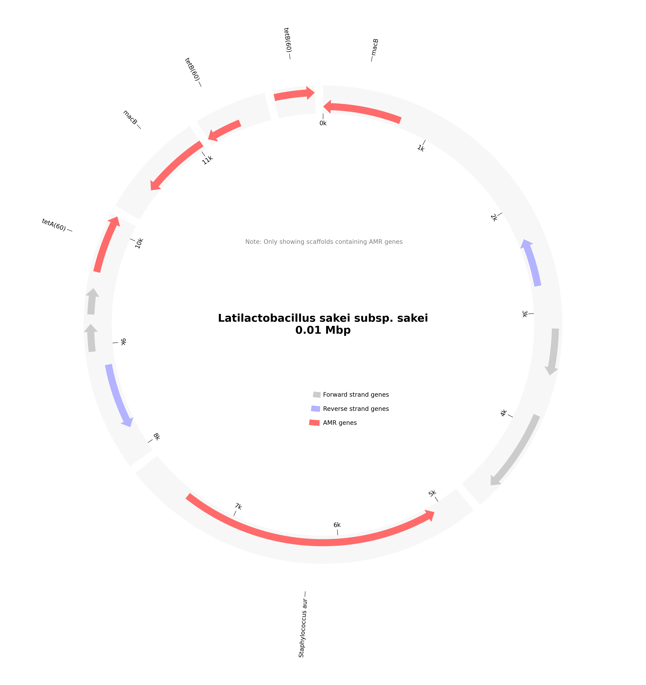

### Staphylococcus aureus mupA conferring resistance to mupirocin
- **Mechanism**: antibiotic target alteration
- **Drug Classes**: mupirocin-like antibiotic
- **AMR Family**: antibiotic-resistant isoleucyl-tRNA synthetase (ileS)
- **Locations**:
  - gnl|SPADES|CPJJBIBK_1488_1 : position 293-2716

### macB (found in 2 locations)
- **Mechanism**: antibiotic efflux
- **Drug Classes**: macrolide antibiotic
- **AMR Family**: ATP-binding cassette (ABC) antibiotic efflux pump
- **Locations**:
  - gnl|SPADES|CPJJBIBK_1104_1 : position 1-729
  - gnl|SPADES|CPJJBIBK_6095_2 : position 288-926

### tetA(60)
- **Mechanism**: antibiotic efflux
- **Drug Classes**: tetracycline antibiotic
- **AMR Family**: ATP-binding cassette (ABC) antibiotic efflux pump
- **Locations**:
  - gnl|SPADES|CPJJBIBK_2022_5 : position 1735-2250

### tetB(60) (found in 2 locations)
- **Mechanism**: antibiotic efflux
- **Drug Classes**: tetracycline antibiotic
- **AMR Family**: ATP-binding cassette (ABC) antibiotic efflux pump
- **Locations**:
  - gnl|SPADES|CPJJBIBK_10832_1 : position 1-333
  - gnl|SPADES|CPJJBIBK_24952_1 : position 3-356

## Latilactobacillus sakei subsp. sakei 23K
**Strain Statistics:**
- Total genome length: 18.0 kbp
- Total scaffolds: 26
- Scaffolds with AMR genes: 5
- Total genes annotated: 34
- Total AMR genes: 5
- Unique AMR genes: 5
- Distinct AMR mechanisms: 3
- Distinct AMR families: 4
- Distinct drug classes: 11

**Circos Plot:**

### MexS
- **Mechanism**: antibiotic efflux
- **Drug Classes**: fluoroquinolone antibiotic; diaminopyrimidine antibiotic; phenicol antibiotic
- **AMR Family**: resistance-nodulation-cell division (RND) antibiotic efflux pump
- **Locations**:
  - gnl|SPADES|CPJJBIBK_1767_1 : position 1-753

### YajC
- **Mechanism**: antibiotic efflux
- **Drug Classes**: fluoroquinolone antibiotic; cephalosporin; glycylcycline; penam; tetracycline antibiotic; oxazolidinone antibiotic; glycopeptide antibiotic; rifamycin antibiotic; phenicol antibiotic; disinfecting agents and antiseptics
- **AMR Family**: resistance-nodulation-cell division (RND) antibiotic efflux pump
- **Locations**:
  - gnl|SPADES|CPJJBIBK_1284_2 : position 872-1228

### rpoB2
- **Mechanism**: antibiotic target alteration; antibiotic target replacement
- **Drug Classes**: rifamycin antibiotic
- **AMR Family**: rifamycin-resistant beta-subunit of RNA polymerase (rpoB)
- **Locations**:
  - gnl|SPADES|CPJJBIBK_913_1 : position 3-266

### tetA(60)
- **Mechanism**: antibiotic efflux
- **Drug Classes**: tetracycline antibiotic
- **AMR Family**: ATP-binding cassette (ABC) antibiotic efflux pump
- **Locations**:
  - gnl|SPADES|CPJJBIBK_4271_2 : position 248-1186

### vanT gene in vanG cluster
- **Mechanism**: antibiotic target alteration
- **Drug Classes**: glycopeptide antibiotic
- **AMR Family**: glycopeptide resistance gene cluster; vanT
- **Locations**:
  - gnl|SPADES|CPJJBIBK_1448_4 : position 996-2156

## Lelliottia amnigena
**Strain Statistics:**
- Total genome length: 0.7 kbp
- Total scaffolds: 17
- Scaffolds with AMR genes: 1
- Total genes annotated: 2
- Total AMR genes: 1
- Unique AMR genes: 1
- Distinct AMR mechanisms: 1
- Distinct AMR families: 1
- Distinct drug classes: 6

**Circos Plot:**

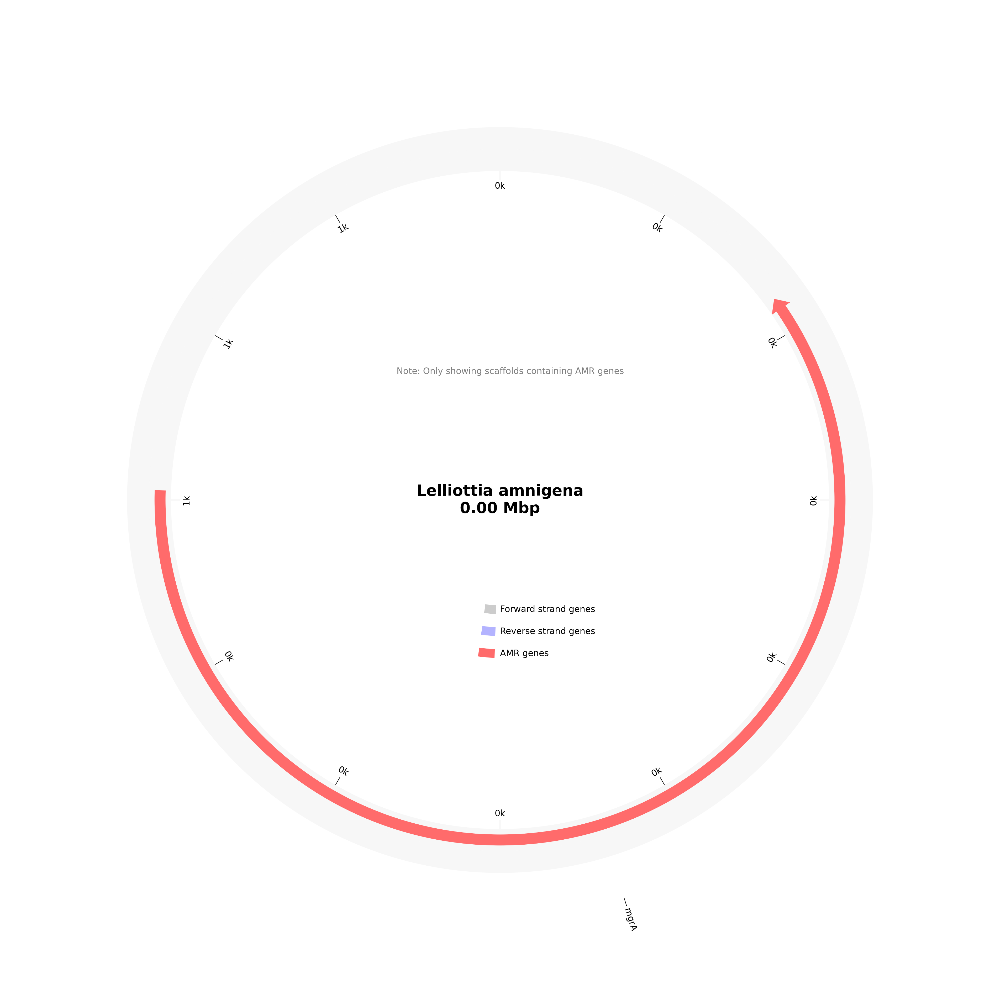

### mgrA
- **Mechanism**: antibiotic efflux
- **Drug Classes**: fluoroquinolone antibiotic; cephalosporin; penam; tetracycline antibiotic; peptide antibiotic; disinfecting agents and antiseptics
- **AMR Family**: ATP-binding cassette (ABC) antibiotic efflux pump; major facilitator superfamily (MFS) antibiotic efflux pump
- **Locations**:
  - gnl|SPADES|CPJJBIBK_8818_2 : position 107-541

## Serratia fonticola
**Strain Statistics:**
- Total genome length: 67.6 kbp
- Total scaffolds: 3165
- Scaffolds with AMR genes: 206
- Total genes annotated: 42
- Total AMR genes: 206
- Unique AMR genes: 107
- Distinct AMR mechanisms: 10
- Distinct AMR families: 39
- Distinct drug classes: 32

**Circos Plot:**

### Acinetobacter baumannii AbaF (found in 6 locations)
- **Mechanism**: antibiotic efflux
- **Drug Classes**: phosphonic acid antibiotic
- **AMR Family**: major facilitator superfamily (MFS) antibiotic efflux pump
- **Locations**:
  - gnl|SPADES|CPJJBIBK_13062_1 : position 1-543
  - gnl|SPADES|CPJJBIBK_18782_1 : position 2-424
  - gnl|SPADES|CPJJBIBK_24464_1 : position 3-359
  - gnl|SPADES|CPJJBIBK_26244_1 : position 2-346
  - gnl|SPADES|CPJJBIBK_31748_1 : position 3-308
  - gnl|SPADES|CPJJBIBK_60388_1 : position 1-258

### Acinetobacter baumannii AbaQ (found in 6 locations)
- **Mechanism**: antibiotic efflux
- **Drug Classes**: fluoroquinolone antibiotic
- **AMR Family**: major facilitator superfamily (MFS) antibiotic efflux pump
- **Locations**:
  - gnl|SPADES|CPJJBIBK_22018_1 : position 1-294
  - gnl|SPADES|CPJJBIBK_29380_1 : position 2-325
  - gnl|SPADES|CPJJBIBK_31320_1 : position 1-312
  - gnl|SPADES|CPJJBIBK_40708_1 : position 2-277
  - gnl|SPADES|CPJJBIBK_45367_1 : position 3-272
  - gnl|SPADES|CPJJBIBK_54339_1 : position 1-264

### ArnT
- **Mechanism**: antibiotic target alteration
- **Drug Classes**: peptide antibiotic
- **AMR Family**: pmr phosphoethanolamine transferase
- **Locations**:
  - gnl|SPADES|CPJJBIBK_100005_1 : position 3-221

### CAR-1
- **Mechanism**: antibiotic inactivation
- **Drug Classes**: carbapenem
- **AMR Family**: CAR beta-lactamase
- **Locations**:
  - gnl|SPADES|CPJJBIBK_115414_1 : position 3-206

### Chlamydia trachomatis intrinsic murA conferring resistance to fosfomycin (found in 2 locations)
- **Mechanism**: antibiotic target alteration
- **Drug Classes**: phosphonic acid antibiotic
- **AMR Family**: antibiotic-resistant murA transferase
- **Locations**:
  - gnl|SPADES|CPJJBIBK_29655_1 : position 1-321
  - gnl|SPADES|CPJJBIBK_37143_1 : position 3-284

### Corynebacterium striatum tetA
- **Mechanism**: antibiotic efflux
- **Drug Classes**: penam; tetracycline antibiotic
- **AMR Family**: major facilitator superfamily (MFS) antibiotic efflux pump
- **Locations**:
  - gnl|SPADES|CPJJBIBK_103748_1 : position 2-217

### Enterobacter cloacae acrA
- **Mechanism**: antibiotic efflux
- **Drug Classes**: fluoroquinolone antibiotic; cephalosporin; glycylcycline; penam; tetracycline antibiotic; rifamycin antibiotic; phenicol antibiotic; disinfecting agents and antiseptics
- **AMR Family**: resistance-nodulation-cell division (RND) antibiotic efflux pump
- **Locations**:
  - gnl|SPADES|CPJJBIBK_47856_1 : position 1-270

### Escherichia coli AcrAB-TolC with AcrR mutation conferring resistance to ciprofloxacin, tetracycline, and ceftazidime (found in 2 locations)
- **Mechanism**: antibiotic target alteration; antibiotic efflux
- **Drug Classes**: fluoroquinolone antibiotic; cephalosporin; glycylcycline; penam; tetracycline antibiotic; rifamycin antibiotic; phenicol antibiotic; disinfecting agents and antiseptics
- **AMR Family**: resistance-nodulation-cell division (RND) antibiotic efflux pump
- **Locations**:
  - gnl|SPADES|CPJJBIBK_10704_1 : position 2-352
  - gnl|SPADES|CPJJBIBK_29627_1 : position 3-212

### Escherichia coli soxS with mutation conferring antibiotic resistance (found in 2 locations)
- **Mechanism**: antibiotic target alteration; antibiotic efflux; reduced permeability to antibiotic
- **Drug Classes**: fluoroquinolone antibiotic; monobactam; carbapenem; cephalosporin; glycylcycline; cephamycin; penam; tetracycline antibiotic; rifamycin antibiotic; phenicol antibiotic; penem; disinfecting agents and antiseptics
- **AMR Family**: ATP-binding cassette (ABC) antibiotic efflux pump; major facilitator superfamily (MFS) antibiotic efflux pump; resistance-nodulation-cell division (RND) antibiotic efflux pump; General Bacterial Porin with reduced permeability to beta-lactams
- **Locations**:
  - gnl|SPADES|CPJJBIBK_15448_1 : position 1-450
  - gnl|SPADES|CPJJBIBK_84987_1 : position 8-235

### FosA8
- **Mechanism**: antibiotic inactivation
- **Drug Classes**: phosphonic acid antibiotic
- **AMR Family**: fosfomycin thiol transferase
- **Locations**:
  - gnl|SPADES|CPJJBIBK_50722_1 : position 1-150

### FosL1
- **Mechanism**: antibiotic inactivation
- **Drug Classes**: phosphonic acid antibiotic
- **AMR Family**: fosfomycin thiol transferase
- **Locations**:
  - gnl|SPADES|CPJJBIBK_107964_1 : position 2-214

### Haemophilus influenzae PBP3 conferring resistance to beta-lactam antibiotics
- **Mechanism**: antibiotic target alteration
- **Drug Classes**: cephalosporin; cephamycin; penam
- **AMR Family**: Penicillin-binding protein mutations conferring resistance to beta-lactam antibiotics
- **Locations**:
  - gnl|SPADES|CPJJBIBK_37117_1 : position 2-286

### Helicobacter pylori pbp2 mutants conferring resistance to amoxicillin
- **Mechanism**: antibiotic target alteration
- **Drug Classes**: cephalosporin; cephamycin; penam
- **AMR Family**: Penicillin-binding protein mutations conferring resistance to beta-lactam antibiotics
- **Locations**:
  - gnl|SPADES|CPJJBIBK_18924_1 : position 3-422

### Klebsiella pneumoniae KpnH
- **Mechanism**: antibiotic efflux
- **Drug Classes**: macrolide antibiotic; fluoroquinolone antibiotic; aminoglycoside antibiotic; carbapenem; cephalosporin; penam; peptide antibiotic; penem
- **AMR Family**: major facilitator superfamily (MFS) antibiotic efflux pump
- **Locations**:
  - gnl|SPADES|CPJJBIBK_20803_1 : position 76-399

### Klebsiella pneumoniae OmpK37 (found in 3 locations)
- **Mechanism**: reduced permeability to antibiotic
- **Drug Classes**: monobactam; carbapenem; cephalosporin; cephamycin; penam; penem
- **AMR Family**: General Bacterial Porin with reduced permeability to beta-lactams
- **Locations**:
  - gnl|SPADES|CPJJBIBK_41283_1 : position 2-277
  - gnl|SPADES|CPJJBIBK_80181_1 : position 2-238
  - gnl|SPADES|CPJJBIBK_94008_1 : position 3-227

### Klebsiella pneumoniae acrA
- **Mechanism**: antibiotic efflux
- **Drug Classes**: fluoroquinolone antibiotic; cephalosporin; glycylcycline; penam; tetracycline antibiotic; rifamycin antibiotic; phenicol antibiotic; disinfecting agents and antiseptics
- **AMR Family**: resistance-nodulation-cell division (RND) antibiotic efflux pump
- **Locations**:
  - gnl|SPADES|CPJJBIBK_70799_1 : position 3-248

### LptD
- **Mechanism**: antibiotic efflux
- **Drug Classes**: carbapenem; peptide antibiotic; aminocoumarin antibiotic; rifamycin antibiotic
- **AMR Family**: ATP-binding cassette (ABC) antibiotic efflux pump
- **Locations**:
  - gnl|SPADES|CPJJBIBK_81450_1 : position 1-237

### MCR-8.1
- **Mechanism**: antibiotic target alteration
- **Drug Classes**: peptide antibiotic
- **AMR Family**: MCR phosphoethanolamine transferase
- **Locations**:
  - gnl|SPADES|CPJJBIBK_95319_1 : position 1-225

### MexK
- **Mechanism**: antibiotic efflux
- **Drug Classes**: macrolide antibiotic; tetracycline antibiotic; disinfecting agents and antiseptics
- **AMR Family**: resistance-nodulation-cell division (RND) antibiotic efflux pump
- **Locations**:
  - gnl|SPADES|CPJJBIBK_101703_1 : position 2-220

### MexL
- **Mechanism**: antibiotic efflux
- **Drug Classes**: macrolide antibiotic; tetracycline antibiotic; disinfecting agents and antiseptics
- **AMR Family**: resistance-nodulation-cell division (RND) antibiotic efflux pump
- **Locations**:
  - gnl|SPADES|CPJJBIBK_89249_1 : position 2-232

### MexS (found in 2 locations)
- **Mechanism**: antibiotic efflux
- **Drug Classes**: fluoroquinolone antibiotic; diaminopyrimidine antibiotic; phenicol antibiotic
- **AMR Family**: resistance-nodulation-cell division (RND) antibiotic efflux pump
- **Locations**:
  - gnl|SPADES|CPJJBIBK_11191_2 : position 375-605
  - gnl|SPADES|CPJJBIBK_54118_1 : position 2-193

### NmcR (found in 2 locations)
- **Mechanism**: antibiotic inactivation
- **Drug Classes**: carbapenem; cephalosporin; cephamycin; penam
- **AMR Family**: NmcA beta-lactamase
- **Locations**:
  - gnl|SPADES|CPJJBIBK_110956_1 : position 3-212
  - gnl|SPADES|CPJJBIBK_12003_1 : position 214-576

### OmpA (found in 2 locations)
- **Mechanism**: reduced permeability to antibiotic
- **Drug Classes**: peptide antibiotic
- **AMR Family**: General Bacterial Porin with reduced permeability to peptide antibiotics
- **Locations**:
  - gnl|SPADES|CPJJBIBK_29804_1 : position 1-321
  - gnl|SPADES|CPJJBIBK_73474_1 : position 2-121

### PRC-1
- **Mechanism**: antibiotic inactivation
- **Drug Classes**: cephalosporin; penam
- **AMR Family**: PRC beta-lactamase
- **Locations**:
  - gnl|SPADES|CPJJBIBK_45043_1 : position 3-272

### ParS (found in 2 locations)
- **Mechanism**: antibiotic efflux; reduced permeability to antibiotic
- **Drug Classes**: macrolide antibiotic; fluoroquinolone antibiotic; monobactam; aminoglycoside antibiotic; carbapenem; cephalosporin; cephamycin; penam; tetracycline antibiotic; phenicol antibiotic; penem; disinfecting agents and antiseptics
- **AMR Family**: resistance-nodulation-cell division (RND) antibiotic efflux pump; Outer Membrane Porin (Opr)
- **Locations**:
  - gnl|SPADES|CPJJBIBK_39016_1 : position 1-279
  - gnl|SPADES|CPJJBIBK_92063_1 : position 2-229

### Pseudomonas aeruginosa CpxR (found in 2 locations)
- **Mechanism**: antibiotic efflux
- **Drug Classes**: macrolide antibiotic; fluoroquinolone antibiotic; monobactam; aminoglycoside antibiotic; carbapenem; cephalosporin; cephamycin; penam; tetracycline antibiotic; peptide antibiotic; aminocoumarin antibiotic; diaminopyrimidine antibiotic; sulfonamide antibiotic; phenicol antibiotic; penem
- **AMR Family**: resistance-nodulation-cell division (RND) antibiotic efflux pump
- **Locations**:
  - gnl|SPADES|CPJJBIBK_15639_1 : position 2-478
  - gnl|SPADES|CPJJBIBK_84335_1 : position 3-152

### Pseudomonas aeruginosa ampR with mutation conferring resistance to aztreonam
- **Mechanism**: antibiotic target alteration; antibiotic inactivation
- **Drug Classes**: monobactam; carbapenem; cephalosporin
- **AMR Family**: PDC beta-lactamase; ampR transcriptional regulator with mutation conferring resistance to monobactam antibiotics
- **Locations**:
  - gnl|SPADES|CPJJBIBK_57456_1 : position 1-261

### QepA2
- **Mechanism**: antibiotic efflux
- **Drug Classes**: fluoroquinolone antibiotic
- **AMR Family**: major facilitator superfamily (MFS) antibiotic efflux pump
- **Locations**:
  - gnl|SPADES|CPJJBIBK_41271_1 : position 1-276

### RanA (found in 3 locations)
- **Mechanism**: antibiotic efflux
- **Drug Classes**: aminoglycoside antibiotic
- **AMR Family**: ATP-binding cassette (ABC) antibiotic efflux pump
- **Locations**:
  - gnl|SPADES|CPJJBIBK_22357_1 : position 1-381
  - gnl|SPADES|CPJJBIBK_39020_1 : position 3-281
  - gnl|SPADES|CPJJBIBK_97496_1 : position 1-225

### RanB
- **Mechanism**: antibiotic efflux
- **Drug Classes**: aminoglycoside antibiotic
- **AMR Family**: ATP-binding cassette (ABC) antibiotic efflux pump
- **Locations**:
  - gnl|SPADES|CPJJBIBK_58272_1 : position 1-258

### Rv1877
- **Mechanism**: antibiotic efflux
- **Drug Classes**: fluoroquinolone antibiotic
- **AMR Family**: major facilitator superfamily (MFS) antibiotic efflux pump
- **Locations**:
  - gnl|SPADES|CPJJBIBK_70843_1 : position 1-249

### SatA
- **Mechanism**: antibiotic inactivation
- **Drug Classes**: nucleoside antibiotic
- **AMR Family**: streptothricin acetyltransferase (SAT)
- **Locations**:
  - gnl|SPADES|CPJJBIBK_17404_1 : position 2-445

### Staphylococcus aureus mupA conferring resistance to mupirocin (found in 2 locations)
- **Mechanism**: antibiotic target alteration
- **Drug Classes**: mupirocin-like antibiotic
- **AMR Family**: antibiotic-resistant isoleucyl-tRNA synthetase (ileS)
- **Locations**:
  - gnl|SPADES|CPJJBIBK_91317_1 : position 1-231
  - gnl|SPADES|CPJJBIBK_97747_1 : position 1-225

### Staphylococcus aureus pgsA mutations conferring resistance to daptomycin
- **Mechanism**: antibiotic target alteration
- **Drug Classes**: peptide antibiotic
- **AMR Family**: daptomycin resistant pgsA
- **Locations**:
  - gnl|SPADES|CPJJBIBK_22046_1 : position 2-382

### TaeA
- **Mechanism**: antibiotic efflux
- **Drug Classes**: pleuromutilin antibiotic
- **AMR Family**: ATP-binding cassette (ABC) antibiotic efflux pump
- **Locations**:
  - gnl|SPADES|CPJJBIBK_29694_1 : position 3-323

### TolC (found in 2 locations)
- **Mechanism**: antibiotic efflux
- **Drug Classes**: macrolide antibiotic; fluoroquinolone antibiotic; aminoglycoside antibiotic; carbapenem; cephalosporin; glycylcycline; cephamycin; penam; tetracycline antibiotic; peptide antibiotic; aminocoumarin antibiotic; rifamycin antibiotic; phenicol antibiotic; penem; disinfecting agents and antiseptics
- **AMR Family**: ATP-binding cassette (ABC) antibiotic efflux pump; major facilitator superfamily (MFS) antibiotic efflux pump; resistance-nodulation-cell division (RND) antibiotic efflux pump
- **Locations**:
  - gnl|SPADES|CPJJBIBK_38188_1 : position 2-166
  - gnl|SPADES|CPJJBIBK_62731_1 : position 2-256

### TriB
- **Mechanism**: antibiotic efflux
- **Drug Classes**: disinfecting agents and antiseptics
- **AMR Family**: resistance-nodulation-cell division (RND) antibiotic efflux pump
- **Locations**:
  - gnl|SPADES|CPJJBIBK_15494_1 : position 2-481

### TxR (found in 5 locations)
- **Mechanism**: antibiotic efflux
- **Drug Classes**: tetracycline antibiotic
- **AMR Family**: ATP-binding cassette (ABC) antibiotic efflux pump
- **Locations**:
  - gnl|SPADES|CPJJBIBK_110015_1 : position 3-212
  - gnl|SPADES|CPJJBIBK_30749_1 : position 3-314
  - gnl|SPADES|CPJJBIBK_44473_1 : position 2-274
  - gnl|SPADES|CPJJBIBK_7654_1 : position 1-792
  - gnl|SPADES|CPJJBIBK_79288_1 : position 3-239

### YojI (found in 4 locations)
- **Mechanism**: antibiotic efflux
- **Drug Classes**: peptide antibiotic
- **AMR Family**: ATP-binding cassette (ABC) antibiotic efflux pump
- **Locations**:
  - gnl|SPADES|CPJJBIBK_19158_1 : position 3-419
  - gnl|SPADES|CPJJBIBK_27288_1 : position 3-338
  - gnl|SPADES|CPJJBIBK_47206_1 : position 3-269
  - gnl|SPADES|CPJJBIBK_99410_1 : position 3-221

### Yrc-1
- **Mechanism**: antibiotic inactivation
- **Drug Classes**: cephalosporin; cephamycin; penam
- **AMR Family**: YRC Beta-lactamase
- **Locations**:
  - gnl|SPADES|CPJJBIBK_28915_1 : position 2-328

### acrD
- **Mechanism**: antibiotic efflux
- **Drug Classes**: aminoglycoside antibiotic
- **AMR Family**: resistance-nodulation-cell division (RND) antibiotic efflux pump
- **Locations**:
  - gnl|SPADES|CPJJBIBK_55382_1 : position 1-261

### adeL (found in 11 locations)
- **Mechanism**: antibiotic efflux
- **Drug Classes**: fluoroquinolone antibiotic; tetracycline antibiotic
- **AMR Family**: resistance-nodulation-cell division (RND) antibiotic efflux pump
- **Locations**:
  - gnl|SPADES|CPJJBIBK_104095_1 : position 2-217
  - gnl|SPADES|CPJJBIBK_15292_1 : position 2-487
  - gnl|SPADES|CPJJBIBK_17163_1 : position 1-450
  - gnl|SPADES|CPJJBIBK_19846_1 : position 65-409
  - gnl|SPADES|CPJJBIBK_28854_1 : position 3-329
  - gnl|SPADES|CPJJBIBK_52249_1 : position 2-265
  - gnl|SPADES|CPJJBIBK_6605_1 : position 2-781
  - gnl|SPADES|CPJJBIBK_68216_1 : position 2-250
  - gnl|SPADES|CPJJBIBK_7653_1 : position 3-323
  - gnl|SPADES|CPJJBIBK_79332_1 : position 2-190
  - gnl|SPADES|CPJJBIBK_9510_1 : position 338-679

### adeR
- **Mechanism**: antibiotic efflux
- **Drug Classes**: glycylcycline; tetracycline antibiotic
- **AMR Family**: resistance-nodulation-cell division (RND) antibiotic efflux pump
- **Locations**:
  - gnl|SPADES|CPJJBIBK_27423_1 : position 33-338

### almE (found in 4 locations)
- **Mechanism**: antibiotic target alteration
- **Drug Classes**: peptide antibiotic
- **AMR Family**: polymyxin resistance operon; alm glycyltransferase
- **Locations**:
  - gnl|SPADES|CPJJBIBK_111224_1 : position 3-212
  - gnl|SPADES|CPJJBIBK_34452_1 : position 2-292
  - gnl|SPADES|CPJJBIBK_58496_1 : position 3-260
  - gnl|SPADES|CPJJBIBK_92013_1 : position 3-230

### amrB
- **Mechanism**: antibiotic efflux
- **Drug Classes**: macrolide antibiotic; aminoglycoside antibiotic
- **AMR Family**: resistance-nodulation-cell division (RND) antibiotic efflux pump
- **Locations**:
  - gnl|SPADES|CPJJBIBK_105745_1 : position 2-217

### arnA
- **Mechanism**: antibiotic target alteration
- **Drug Classes**: peptide antibiotic
- **AMR Family**: pmr phosphoethanolamine transferase
- **Locations**:
  - gnl|SPADES|CPJJBIBK_59221_1 : position 2-259

### baeS (found in 2 locations)
- **Mechanism**: antibiotic efflux
- **Drug Classes**: aminoglycoside antibiotic; aminocoumarin antibiotic
- **AMR Family**: resistance-nodulation-cell division (RND) antibiotic efflux pump
- **Locations**:
  - gnl|SPADES|CPJJBIBK_28819_1 : position 3-158
  - gnl|SPADES|CPJJBIBK_46940_1 : position 2-244

### bcr-1
- **Mechanism**: antibiotic efflux
- **Drug Classes**: bicyclomycin-like antibiotic
- **AMR Family**: major facilitator superfamily (MFS) antibiotic efflux pump
- **Locations**:
  - gnl|SPADES|CPJJBIBK_87728_1 : position 1-234

### bcrA (found in 5 locations)
- **Mechanism**: antibiotic efflux
- **Drug Classes**: peptide antibiotic
- **AMR Family**: ATP-binding cassette (ABC) antibiotic efflux pump
- **Locations**:
  - gnl|SPADES|CPJJBIBK_17759_1 : position 1-441
  - gnl|SPADES|CPJJBIBK_18534_1 : position 2-427
  - gnl|SPADES|CPJJBIBK_37460_1 : position 1-285
  - gnl|SPADES|CPJJBIBK_54274_1 : position 2-262
  - gnl|SPADES|CPJJBIBK_96134_1 : position 3-224

### clbB
- **Mechanism**: antibiotic target alteration
- **Drug Classes**: lincosamide antibiotic; streptogramin antibiotic; streptogramin A antibiotic; oxazolidinone antibiotic; phenicol antibiotic; pleuromutilin antibiotic
- **AMR Family**: Cfr 23S ribosomal RNA methyltransferase
- **Locations**:
  - gnl|SPADES|CPJJBIBK_30268_1 : position 3-317

### cmeC (found in 2 locations)
- **Mechanism**: antibiotic efflux
- **Drug Classes**: macrolide antibiotic; fluoroquinolone antibiotic; cephalosporin; fusidane antibiotic
- **AMR Family**: resistance-nodulation-cell division (RND) antibiotic efflux pump
- **Locations**:
  - gnl|SPADES|CPJJBIBK_18376_2 : position 154-429
  - gnl|SPADES|CPJJBIBK_48945_1 : position 2-268

### cmx
- **Mechanism**: antibiotic efflux
- **Drug Classes**: phenicol antibiotic
- **AMR Family**: major facilitator superfamily (MFS) antibiotic efflux pump
- **Locations**:
  - gnl|SPADES|CPJJBIBK_31207_1 : position 2-313

### emrB (found in 2 locations)
- **Mechanism**: antibiotic efflux
- **Drug Classes**: fluoroquinolone antibiotic
- **AMR Family**: major facilitator superfamily (MFS) antibiotic efflux pump
- **Locations**:
  - gnl|SPADES|CPJJBIBK_28918_1 : position 2-328
  - gnl|SPADES|CPJJBIBK_97926_1 : position 1-225

### emrK
- **Mechanism**: antibiotic efflux
- **Drug Classes**: tetracycline antibiotic
- **AMR Family**: major facilitator superfamily (MFS) antibiotic efflux pump
- **Locations**:
  - gnl|SPADES|CPJJBIBK_42660_1 : position 2-274

### emrY
- **Mechanism**: antibiotic efflux
- **Drug Classes**: tetracycline antibiotic
- **AMR Family**: major facilitator superfamily (MFS) antibiotic efflux pump
- **Locations**:
  - gnl|SPADES|CPJJBIBK_5790_1 : position 3-959

### evgS (found in 9 locations)
- **Mechanism**: antibiotic efflux
- **Drug Classes**: macrolide antibiotic; fluoroquinolone antibiotic; penam; tetracycline antibiotic
- **AMR Family**: major facilitator superfamily (MFS) antibiotic efflux pump; resistance-nodulation-cell division (RND) antibiotic efflux pump
- **Locations**:
  - gnl|SPADES|CPJJBIBK_14358_1 : position 2-508
  - gnl|SPADES|CPJJBIBK_21223_1 : position 2-394
  - gnl|SPADES|CPJJBIBK_21728_1 : position 2-388
  - gnl|SPADES|CPJJBIBK_55825_1 : position 2-262
  - gnl|SPADES|CPJJBIBK_58567_1 : position 2-259
  - gnl|SPADES|CPJJBIBK_66151_1 : position 3-203
  - gnl|SPADES|CPJJBIBK_74742_1 : position 1-243
  - gnl|SPADES|CPJJBIBK_78114_1 : position 2-241
  - gnl|SPADES|CPJJBIBK_89192_1 : position 3-230

### facT
- **Mechanism**: antibiotic efflux
- **Drug Classes**: elfamycin antibiotic
- **AMR Family**: major facilitator superfamily (MFS) antibiotic efflux pump
- **Locations**:
  - gnl|SPADES|CPJJBIBK_113297_1 : position 3-209

### gadW
- **Mechanism**: antibiotic efflux
- **Drug Classes**: macrolide antibiotic; fluoroquinolone antibiotic; penam
- **AMR Family**: resistance-nodulation-cell division (RND) antibiotic efflux pump
- **Locations**:
  - gnl|SPADES|CPJJBIBK_39711_1 : position 1-279

### golS (found in 3 locations)
- **Mechanism**: antibiotic efflux
- **Drug Classes**: monobactam; carbapenem; cephalosporin; cephamycin; penam; phenicol antibiotic; penem
- **AMR Family**: resistance-nodulation-cell division (RND) antibiotic efflux pump
- **Locations**:
  - gnl|SPADES|CPJJBIBK_41886_1 : position 125-277
  - gnl|SPADES|CPJJBIBK_68742_1 : position 108-251
  - gnl|SPADES|CPJJBIBK_81416_1 : position 3-239

### hp1181
- **Mechanism**: antibiotic efflux
- **Drug Classes**: fluoroquinolone antibiotic; tetracycline antibiotic; nitroimidazole antibiotic
- **AMR Family**: major facilitator superfamily (MFS) antibiotic efflux pump
- **Locations**:
  - gnl|SPADES|CPJJBIBK_30778_1 : position 2-316

### kdpE (found in 2 locations)
- **Mechanism**: antibiotic efflux
- **Drug Classes**: aminoglycoside antibiotic
- **AMR Family**: kdpDE
- **Locations**:
  - gnl|SPADES|CPJJBIBK_108763_1 : position 2-214
  - gnl|SPADES|CPJJBIBK_25632_1 : position 2-295

### leuO (found in 2 locations)
- **Mechanism**: antibiotic efflux
- **Drug Classes**: nucleoside antibiotic; disinfecting agents and antiseptics
- **AMR Family**: major facilitator superfamily (MFS) antibiotic efflux pump
- **Locations**:
  - gnl|SPADES|CPJJBIBK_15765_1 : position 3-278
  - gnl|SPADES|CPJJBIBK_24379_1 : position 2-358

### lfrA
- **Mechanism**: antibiotic efflux
- **Drug Classes**: fluoroquinolone antibiotic
- **AMR Family**: major facilitator superfamily (MFS) antibiotic efflux pump
- **Locations**:
  - gnl|SPADES|CPJJBIBK_19902_1 : position 60-410

### lmrC (found in 2 locations)
- **Mechanism**: antibiotic target protection
- **Drug Classes**: lincosamide antibiotic
- **AMR Family**: Miscellaneous ABC-F subfamily ATP-binding cassette ribosomal protection proteins
- **Locations**:
  - gnl|SPADES|CPJJBIBK_115573_1 : position 1-207
  - gnl|SPADES|CPJJBIBK_18453_1 : position 1-429

### lsaC (found in 2 locations)
- **Mechanism**: antibiotic target protection
- **Drug Classes**: lincosamide antibiotic; streptogramin antibiotic; pleuromutilin antibiotic
- **AMR Family**: lsa-type ABC-F protein
- **Locations**:
  - gnl|SPADES|CPJJBIBK_18814_1 : position 2-385
  - gnl|SPADES|CPJJBIBK_72788_1 : position 2-247

### macA
- **Mechanism**: antibiotic efflux
- **Drug Classes**: macrolide antibiotic
- **AMR Family**: ATP-binding cassette (ABC) antibiotic efflux pump
- **Locations**:
  - gnl|SPADES|CPJJBIBK_16429_1 : position 3-464

### macB (found in 16 locations)
- **Mechanism**: antibiotic efflux
- **Drug Classes**: macrolide antibiotic
- **AMR Family**: ATP-binding cassette (ABC) antibiotic efflux pump
- **Locations**:
  - gnl|SPADES|CPJJBIBK_101677_1 : position 2-220
  - gnl|SPADES|CPJJBIBK_102244_1 : position 3-221
  - gnl|SPADES|CPJJBIBK_102830_1 : position 3-218
  - gnl|SPADES|CPJJBIBK_117095_1 : position 3-206
  - gnl|SPADES|CPJJBIBK_23288_1 : position 2-370
  - gnl|SPADES|CPJJBIBK_23291_1 : position 1-372
  - gnl|SPADES|CPJJBIBK_30608_1 : position 3-317
  - gnl|SPADES|CPJJBIBK_32105_1 : position 3-305
  - gnl|SPADES|CPJJBIBK_32425_1 : position 1-303
  - gnl|SPADES|CPJJBIBK_34560_1 : position 2-292
  - gnl|SPADES|CPJJBIBK_37194_1 : position 1-285
  - gnl|SPADES|CPJJBIBK_56053_1 : position 3-263
  - gnl|SPADES|CPJJBIBK_63982_1 : position 2-253
  - gnl|SPADES|CPJJBIBK_78167_1 : position 1-240
  - gnl|SPADES|CPJJBIBK_97245_1 : position 2-223
  - gnl|SPADES|CPJJBIBK_97458_1 : position 2-193

### mdtB (found in 2 locations)
- **Mechanism**: antibiotic efflux
- **Drug Classes**: aminocoumarin antibiotic
- **AMR Family**: resistance-nodulation-cell division (RND) antibiotic efflux pump
- **Locations**:
  - gnl|SPADES|CPJJBIBK_92820_1 : position 3-227
  - gnl|SPADES|CPJJBIBK_93904_1 : position 1-228

### mdtC (found in 4 locations)
- **Mechanism**: antibiotic efflux
- **Drug Classes**: aminocoumarin antibiotic
- **AMR Family**: resistance-nodulation-cell division (RND) antibiotic efflux pump
- **Locations**:
  - gnl|SPADES|CPJJBIBK_102812_1 : position 2-220
  - gnl|SPADES|CPJJBIBK_32601_1 : position 2-304
  - gnl|SPADES|CPJJBIBK_77204_1 : position 1-243
  - gnl|SPADES|CPJJBIBK_8392_1 : position 1-543

### mdtG
- **Mechanism**: antibiotic efflux
- **Drug Classes**: phosphonic acid antibiotic
- **AMR Family**: major facilitator superfamily (MFS) antibiotic efflux pump
- **Locations**:
  - gnl|SPADES|CPJJBIBK_76481_1 : position 3-242

### mdtM
- **Mechanism**: antibiotic efflux
- **Drug Classes**: fluoroquinolone antibiotic; lincosamide antibiotic; nucleoside antibiotic; phenicol antibiotic; disinfecting agents and antiseptics
- **AMR Family**: major facilitator superfamily (MFS) antibiotic efflux pump
- **Locations**:
  - gnl|SPADES|CPJJBIBK_76900_1 : position 3-242

### mdtN (found in 5 locations)
- **Mechanism**: antibiotic efflux
- **Drug Classes**: nucleoside antibiotic; disinfecting agents and antiseptics
- **AMR Family**: major facilitator superfamily (MFS) antibiotic efflux pump
- **Locations**:
  - gnl|SPADES|CPJJBIBK_19042_1 : position 1-420
  - gnl|SPADES|CPJJBIBK_23648_2 : position 161-367
  - gnl|SPADES|CPJJBIBK_26978_1 : position 1-339
  - gnl|SPADES|CPJJBIBK_31351_1 : position 2-310
  - gnl|SPADES|CPJJBIBK_34631_1 : position 3-293

### mdtO
- **Mechanism**: antibiotic efflux
- **Drug Classes**: nucleoside antibiotic; disinfecting agents and antiseptics
- **AMR Family**: major facilitator superfamily (MFS) antibiotic efflux pump
- **Locations**:
  - gnl|SPADES|CPJJBIBK_32573_1 : position 1-303

### mecC
- **Mechanism**: antibiotic target replacement
- **Drug Classes**: penam
- **AMR Family**: methicillin resistant PBP2
- **Locations**:
  - gnl|SPADES|CPJJBIBK_26490_1 : position 3-344

### mexQ
- **Mechanism**: antibiotic efflux
- **Drug Classes**: macrolide antibiotic; carbapenem; tetracycline antibiotic; diaminopyrimidine antibiotic; phenicol antibiotic; disinfecting agents and antiseptics
- **AMR Family**: resistance-nodulation-cell division (RND) antibiotic efflux pump
- **Locations**:
  - gnl|SPADES|CPJJBIBK_116450_1 : position 1-207

### msbA (found in 2 locations)
- **Mechanism**: antibiotic efflux
- **Drug Classes**: nitroimidazole antibiotic
- **AMR Family**: ATP-binding cassette (ABC) antibiotic efflux pump
- **Locations**:
  - gnl|SPADES|CPJJBIBK_20081_1 : position 3-407
  - gnl|SPADES|CPJJBIBK_78090_1 : position 2-241

### novA
- **Mechanism**: antibiotic efflux
- **Drug Classes**: aminocoumarin antibiotic
- **AMR Family**: ATP-binding cassette (ABC) antibiotic efflux pump
- **Locations**:
  - gnl|SPADES|CPJJBIBK_54909_1 : position 3-263

### opmE
- **Mechanism**: antibiotic efflux
- **Drug Classes**: macrolide antibiotic; carbapenem; tetracycline antibiotic; diaminopyrimidine antibiotic; phenicol antibiotic; disinfecting agents and antiseptics
- **AMR Family**: resistance-nodulation-cell division (RND) antibiotic efflux pump
- **Locations**:
  - gnl|SPADES|CPJJBIBK_25336_1 : position 76-354

### optrA (found in 2 locations)
- **Mechanism**: antibiotic target protection
- **Drug Classes**: oxazolidinone antibiotic; phenicol antibiotic
- **AMR Family**: Miscellaneous ABC-F subfamily ATP-binding cassette ribosomal protection proteins
- **Locations**:
  - gnl|SPADES|CPJJBIBK_24184_1 : position 3-362
  - gnl|SPADES|CPJJBIBK_71311_1 : position 1-246

### oqxB
- **Mechanism**: antibiotic efflux
- **Drug Classes**: fluoroquinolone antibiotic; glycylcycline; tetracycline antibiotic; diaminopyrimidine antibiotic; nitrofuran antibiotic
- **AMR Family**: resistance-nodulation-cell division (RND) antibiotic efflux pump
- **Locations**:
  - gnl|SPADES|CPJJBIBK_80892_1 : position 1-240

### otr(B)
- **Mechanism**: antibiotic efflux
- **Drug Classes**: tetracycline antibiotic
- **AMR Family**: major facilitator superfamily (MFS) antibiotic efflux pump
- **Locations**:
  - gnl|SPADES|CPJJBIBK_27768_1 : position 2-334

### patA
- **Mechanism**: antibiotic efflux
- **Drug Classes**: fluoroquinolone antibiotic
- **AMR Family**: ATP-binding cassette (ABC) antibiotic efflux pump
- **Locations**:
  - gnl|SPADES|CPJJBIBK_24255_1 : position 3-362

### patB (found in 3 locations)
- **Mechanism**: antibiotic efflux
- **Drug Classes**: fluoroquinolone antibiotic
- **AMR Family**: ATP-binding cassette (ABC) antibiotic efflux pump
- **Locations**:
  - gnl|SPADES|CPJJBIBK_22758_1 : position 1-375
  - gnl|SPADES|CPJJBIBK_54332_2 : position 117-263
  - gnl|SPADES|CPJJBIBK_76587_1 : position 1-243

### qacL (found in 2 locations)
- **Mechanism**: antibiotic efflux
- **Drug Classes**: disinfecting agents and antiseptics
- **AMR Family**: small multidrug resistance (SMR) antibiotic efflux pump
- **Locations**:
  - gnl|SPADES|CPJJBIBK_13983_1 : position 45-362
  - gnl|SPADES|CPJJBIBK_26318_1 : position 2-268

### qnrE2
- **Mechanism**: antibiotic target protection
- **Drug Classes**: fluoroquinolone antibiotic
- **AMR Family**: quinolone resistance protein (qnr)
- **Locations**:
  - gnl|SPADES|CPJJBIBK_36392_1 : position 98-286

### ramA (found in 2 locations)
- **Mechanism**: antibiotic efflux; reduced permeability to antibiotic
- **Drug Classes**: fluoroquinolone antibiotic; monobactam; carbapenem; cephalosporin; glycylcycline; cephamycin; penam; tetracycline antibiotic; rifamycin antibiotic; phenicol antibiotic; penem; disinfecting agents and antiseptics
- **AMR Family**: resistance-nodulation-cell division (RND) antibiotic efflux pump; General Bacterial Porin with reduced permeability to beta-lactams
- **Locations**:
  - gnl|SPADES|CPJJBIBK_47504_1 : position 3-269
  - gnl|SPADES|CPJJBIBK_86327_1 : position 2-235

### rosB
- **Mechanism**: antibiotic efflux
- **Drug Classes**: peptide antibiotic
- **AMR Family**: major facilitator superfamily (MFS) antibiotic efflux pump
- **Locations**:
  - gnl|SPADES|CPJJBIBK_23047_1 : position 3-374

### sdiA (found in 2 locations)
- **Mechanism**: antibiotic efflux
- **Drug Classes**: fluoroquinolone antibiotic; cephalosporin; glycylcycline; penam; tetracycline antibiotic; rifamycin antibiotic; phenicol antibiotic; disinfecting agents and antiseptics
- **AMR Family**: resistance-nodulation-cell division (RND) antibiotic efflux pump
- **Locations**:
  - gnl|SPADES|CPJJBIBK_16256_1 : position 99-467
  - gnl|SPADES|CPJJBIBK_20569_1 : position 1-402

### sdrM
- **Mechanism**: antibiotic efflux
- **Drug Classes**: fluoroquinolone antibiotic; disinfecting agents and antiseptics
- **AMR Family**: major facilitator superfamily (MFS) antibiotic efflux pump
- **Locations**:
  - gnl|SPADES|CPJJBIBK_63072_1 : position 2-256

### sta
- **Mechanism**: antibiotic inactivation
- **Drug Classes**: nucleoside antibiotic
- **AMR Family**: streptothricin acetyltransferase (SAT)
- **Locations**:
  - gnl|SPADES|CPJJBIBK_21181_1 : position 39-392

### tcr3
- **Mechanism**: antibiotic efflux
- **Drug Classes**: tetracycline antibiotic
- **AMR Family**: major facilitator superfamily (MFS) antibiotic efflux pump
- **Locations**:
  - gnl|SPADES|CPJJBIBK_67448_1 : position 2-250

### tet(43)
- **Mechanism**: antibiotic efflux
- **Drug Classes**: tetracycline antibiotic
- **AMR Family**: major facilitator superfamily (MFS) antibiotic efflux pump
- **Locations**:
  - gnl|SPADES|CPJJBIBK_92050_1 : position 2-229

### tetA(58) (found in 4 locations)
- **Mechanism**: antibiotic efflux
- **Drug Classes**: tetracycline antibiotic
- **AMR Family**: major facilitator superfamily (MFS) antibiotic efflux pump
- **Locations**:
  - gnl|SPADES|CPJJBIBK_14309_1 : position 3-509
  - gnl|SPADES|CPJJBIBK_29778_1 : position 1-321
  - gnl|SPADES|CPJJBIBK_44705_1 : position 2-274
  - gnl|SPADES|CPJJBIBK_86227_1 : position 2-235

### tetB(60)
- **Mechanism**: antibiotic efflux
- **Drug Classes**: tetracycline antibiotic
- **AMR Family**: ATP-binding cassette (ABC) antibiotic efflux pump
- **Locations**:
  - gnl|SPADES|CPJJBIBK_100508_1 : position 2-220

### tlrB conferring tylosin resistance
- **Mechanism**: antibiotic target alteration
- **Drug Classes**: macrolide antibiotic; lincosamide antibiotic
- **AMR Family**: non-erm 23S ribosomal RNA methyltransferase (G748)
- **Locations**:
  - gnl|SPADES|CPJJBIBK_30703_1 : position 202-315

### tlrC
- **Mechanism**: antibiotic target protection
- **Drug Classes**: macrolide antibiotic; lincosamide antibiotic
- **AMR Family**: Miscellaneous ABC-F subfamily ATP-binding cassette ribosomal protection proteins
- **Locations**:
  - gnl|SPADES|CPJJBIBK_23241_1 : position 60-371

### tsnR
- **Mechanism**: antibiotic target alteration
- **Drug Classes**: peptide antibiotic
- **AMR Family**: non-erm 23S ribosomal RNA methyltransferase (A1067)
- **Locations**:
  - gnl|SPADES|CPJJBIBK_9747_1 : position 2-469

### vanH gene in vanB cluster
- **Mechanism**: antibiotic target alteration
- **Drug Classes**: glycopeptide antibiotic
- **AMR Family**: vanH; glycopeptide resistance gene cluster
- **Locations**:
  - gnl|SPADES|CPJJBIBK_14213_1 : position 3-512

### vanR gene in vanA cluster
- **Mechanism**: antibiotic target alteration
- **Drug Classes**: glycopeptide antibiotic
- **AMR Family**: glycopeptide resistance gene cluster; vanR
- **Locations**:
  - gnl|SPADES|CPJJBIBK_49949_1 : position 2-268

### vanR gene in vanB cluster
- **Mechanism**: antibiotic target alteration
- **Drug Classes**: glycopeptide antibiotic
- **AMR Family**: glycopeptide resistance gene cluster; vanR
- **Locations**:
  - gnl|SPADES|CPJJBIBK_27500_1 : position 118-336

### vanR gene in vanC cluster
- **Mechanism**: antibiotic target alteration
- **Drug Classes**: glycopeptide antibiotic
- **AMR Family**: glycopeptide resistance gene cluster; vanR
- **Locations**:
  - gnl|SPADES|CPJJBIBK_12498_1 : position 3-272

### vanR gene in vanF cluster (found in 2 locations)
- **Mechanism**: antibiotic target alteration
- **Drug Classes**: glycopeptide antibiotic
- **AMR Family**: glycopeptide resistance gene cluster; vanR
- **Locations**:
  - gnl|SPADES|CPJJBIBK_27010_2 : position 81-341
  - gnl|SPADES|CPJJBIBK_27106_1 : position 1-339

### vanR gene in vanL cluster
- **Mechanism**: antibiotic target alteration
- **Drug Classes**: glycopeptide antibiotic
- **AMR Family**: glycopeptide resistance gene cluster; vanR
- **Locations**:
  - gnl|SPADES|CPJJBIBK_23915_1 : position 3-338

### vanS gene in vanA cluster
- **Mechanism**: antibiotic target alteration
- **Drug Classes**: glycopeptide antibiotic
- **AMR Family**: vanS; glycopeptide resistance gene cluster
- **Locations**:
  - gnl|SPADES|CPJJBIBK_16491_1 : position 1-462

### vanT gene in vanC cluster
- **Mechanism**: antibiotic target alteration
- **Drug Classes**: glycopeptide antibiotic
- **AMR Family**: glycopeptide resistance gene cluster; vanT
- **Locations**:
  - gnl|SPADES|CPJJBIBK_10080_1 : position 1-651

### vanU gene in vanG cluster
- **Mechanism**: antibiotic target alteration
- **Drug Classes**: glycopeptide antibiotic
- **AMR Family**: glycopeptide resistance gene cluster; vanU
- **Locations**:
  - gnl|SPADES|CPJJBIBK_80180_1 : position 13-240

### vatB
- **Mechanism**: antibiotic inactivation
- **Drug Classes**: streptogramin antibiotic; streptogramin A antibiotic
- **AMR Family**: streptogramin vat acetyltransferase
- **Locations**:
  - gnl|SPADES|CPJJBIBK_27743_1 : position 2-334

## Serratia liquefaciens
**Strain Statistics:**
- Total genome length: 173.4 kbp
- Total scaffolds: 527
- Scaffolds with AMR genes: 32
- Total genes annotated: 290
- Total AMR genes: 51
- Unique AMR genes: 36
- Distinct AMR mechanisms: 6
- Distinct AMR families: 16
- Distinct drug classes: 20

**Circos Plot:**

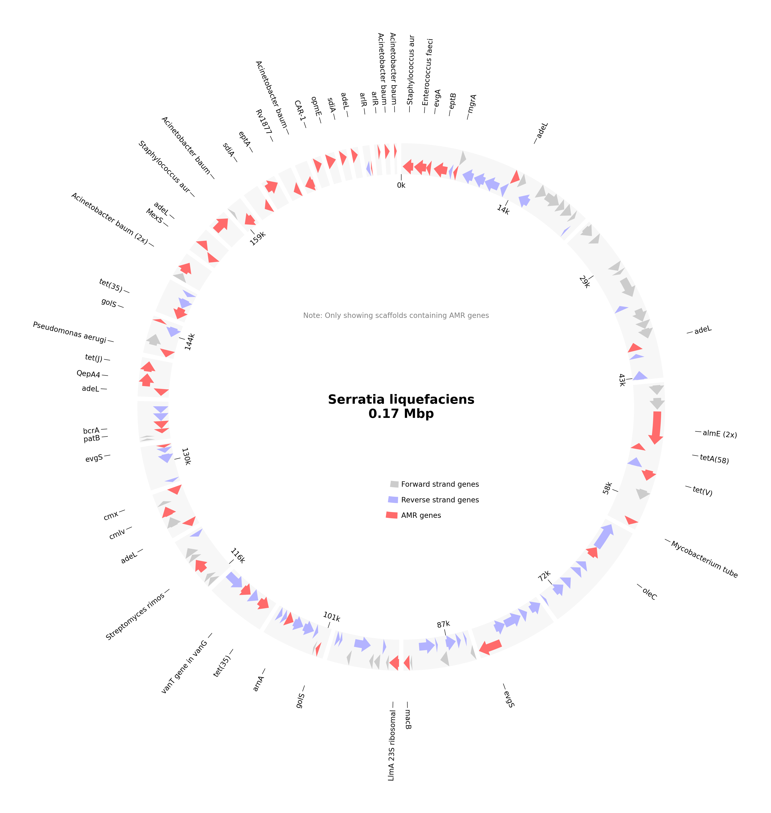

### Acinetobacter baumannii AbaF (found in 3 locations)
- **Mechanism**: antibiotic efflux
- **Drug Classes**: phosphonic acid antibiotic
- **AMR Family**: major facilitator superfamily (MFS) antibiotic efflux pump
- **Locations**:
  - gnl|SPADES|CPJJBIBK_12355_1 : position 2-565
  - gnl|SPADES|CPJJBIBK_2355_2 : position 378-1688
  - gnl|SPADES|CPJJBIBK_3225_1 : position 117-1307

### Acinetobacter baumannii AbaQ (found in 3 locations)
- **Mechanism**: antibiotic efflux
- **Drug Classes**: fluoroquinolone antibiotic
- **AMR Family**: major facilitator superfamily (MFS) antibiotic efflux pump
- **Locations**:
  - gnl|SPADES|CPJJBIBK_1563_2 : position 955-2304
  - gnl|SPADES|CPJJBIBK_1563_3 : position 2377-3000
  - gnl|SPADES|CPJJBIBK_32023_1 : position 2-307

### CAR-1
- **Mechanism**: antibiotic inactivation
- **Drug Classes**: carbapenem
- **AMR Family**: CAR beta-lactamase
- **Locations**:
  - gnl|SPADES|CPJJBIBK_4422_1 : position 210-1010

### Enterococcus faecium liaS mutant conferring daptomycin resistance
- **Mechanism**: antibiotic target alteration; antibiotic efflux
- **Drug Classes**: peptide antibiotic
- **AMR Family**: daptomycin resistant liaS
- **Locations**:
  - gnl|SPADES|CPJJBIBK_399_2 : position 1603-3138

### LlmA 23S ribosomal RNA methyltransferase
- **Mechanism**: antibiotic target alteration
- **Drug Classes**: lincosamide antibiotic
- **AMR Family**: Llm 23S ribosomal RNA methyltransferase
- **Locations**:
  - gnl|SPADES|CPJJBIBK_821_1 : position 2-1174

### MexS
- **Mechanism**: antibiotic efflux
- **Drug Classes**: fluoroquinolone antibiotic; diaminopyrimidine antibiotic; phenicol antibiotic
- **AMR Family**: resistance-nodulation-cell division (RND) antibiotic efflux pump
- **Locations**:
  - gnl|SPADES|CPJJBIBK_1565_1 : position 157-1092

### Mycobacterium tuberculosis inhA mutations conferring resistance to isoniazid
- **Mechanism**: antibiotic target alteration
- **Drug Classes**: isoniazid-like antibiotic
- **AMR Family**: isoniazid resistant inhA
- **Locations**:
  - gnl|SPADES|CPJJBIBK_504_13 : position 16559-17317

### Pseudomonas aeruginosa ampR with mutation conferring resistance to aztreonam
- **Mechanism**: antibiotic target alteration; antibiotic inactivation
- **Drug Classes**: monobactam; carbapenem; cephalosporin
- **AMR Family**: PDC beta-lactamase; ampR transcriptional regulator with mutation conferring resistance to monobactam antibiotics
- **Locations**:
  - gnl|SPADES|CPJJBIBK_1184_1 : position 1-918

### QepA4
- **Mechanism**: antibiotic efflux
- **Drug Classes**: fluoroquinolone antibiotic
- **AMR Family**: major facilitator superfamily (MFS) antibiotic efflux pump
- **Locations**:
  - gnl|SPADES|CPJJBIBK_1160_2 : position 1243-2775

### Rv1877
- **Mechanism**: antibiotic efflux
- **Drug Classes**: fluoroquinolone antibiotic
- **AMR Family**: major facilitator superfamily (MFS) antibiotic efflux pump
- **Locations**:
  - gnl|SPADES|CPJJBIBK_2895_2 : position 667-1464

### Staphylococcus aureus fusA with mutation conferring resistance to fusidic acid
- **Mechanism**: antibiotic target alteration
- **Drug Classes**: fusidane antibiotic
- **AMR Family**: antibiotic resistant fusA
- **Locations**:
  - gnl|SPADES|CPJJBIBK_1939_1 : position 150-2201

### Staphylococcus aureus norA
- **Mechanism**: antibiotic efflux
- **Drug Classes**: fluoroquinolone antibiotic
- **AMR Family**: major facilitator superfamily (MFS) antibiotic efflux pump
- **Locations**:
  - gnl|SPADES|CPJJBIBK_399_1 : position 171-1502

### Streptomyces rimosus otr(A)
- **Mechanism**: antibiotic target protection
- **Drug Classes**: tetracycline antibiotic
- **AMR Family**: tetracycline-resistant ribosomal protection protein
- **Locations**:
  - gnl|SPADES|CPJJBIBK_968_2 : position 1811-3370

### adeL (found in 6 locations)
- **Mechanism**: antibiotic efflux
- **Drug Classes**: fluoroquinolone antibiotic; tetracycline antibiotic
- **AMR Family**: resistance-nodulation-cell division (RND) antibiotic efflux pump
- **Locations**:
  - gnl|SPADES|CPJJBIBK_1041_1 : position 107-991
  - gnl|SPADES|CPJJBIBK_1160_1 : position 180-1067
  - gnl|SPADES|CPJJBIBK_1565_2 : position 1196-2083
  - gnl|SPADES|CPJJBIBK_399_12 : position 13713-14576
  - gnl|SPADES|CPJJBIBK_451_12 : position 15418-16431
  - gnl|SPADES|CPJJBIBK_7024_1 : position 3-689

### almE (found in 2 locations)
- **Mechanism**: antibiotic target alteration
- **Drug Classes**: peptide antibiotic
- **AMR Family**: polymyxin resistance operon; alm glycyltransferase
- **Locations**:
  - gnl|SPADES|CPJJBIBK_504_11 : position 14073-15701
  - gnl|SPADES|CPJJBIBK_504_4 : position 3391-7335

### arlR (found in 2 locations)
- **Mechanism**: antibiotic efflux
- **Drug Classes**: fluoroquinolone antibiotic; disinfecting agents and antiseptics
- **AMR Family**: major facilitator superfamily (MFS) antibiotic efflux pump
- **Locations**:
  - gnl|SPADES|CPJJBIBK_7367_3 : position 670-813
  - gnl|SPADES|CPJJBIBK_9473_2 : position 402-680

### arnA
- **Mechanism**: antibiotic target alteration
- **Drug Classes**: peptide antibiotic
- **AMR Family**: pmr phosphoethanolamine transferase
- **Locations**:
  - gnl|SPADES|CPJJBIBK_886_8 : position 4876-5820

### bcrA
- **Mechanism**: antibiotic efflux
- **Drug Classes**: peptide antibiotic
- **AMR Family**: ATP-binding cassette (ABC) antibiotic efflux pump
- **Locations**:
  - gnl|SPADES|CPJJBIBK_1119_3 : position 1373-2332

### cmlv
- **Mechanism**: antibiotic inactivation
- **Drug Classes**: phenicol antibiotic
- **AMR Family**: chloramphenicol phosphotransferase
- **Locations**:
  - gnl|SPADES|CPJJBIBK_1041_3 : position 2538-3665

### cmx
- **Mechanism**: antibiotic efflux
- **Drug Classes**: phenicol antibiotic
- **AMR Family**: major facilitator superfamily (MFS) antibiotic efflux pump
- **Locations**:
  - gnl|SPADES|CPJJBIBK_1041_5 : position 4471-5505

### eptA
- **Mechanism**: antibiotic target alteration
- **Drug Classes**: peptide antibiotic
- **AMR Family**: pmr phosphoethanolamine transferase
- **Locations**:
  - gnl|SPADES|CPJJBIBK_2689_1 : position 183-1712

### eptB
- **Mechanism**: antibiotic target alteration
- **Drug Classes**: peptide antibiotic
- **AMR Family**: pmr phosphoethanolamine transferase
- **Locations**:
  - gnl|SPADES|CPJJBIBK_399_4 : position 4095-5789

### evgA
- **Mechanism**: antibiotic efflux
- **Drug Classes**: macrolide antibiotic; fluoroquinolone antibiotic; penam; tetracycline antibiotic
- **AMR Family**: major facilitator superfamily (MFS) antibiotic efflux pump; resistance-nodulation-cell division (RND) antibiotic efflux pump
- **Locations**:
  - gnl|SPADES|CPJJBIBK_399_3 : position 3138-3728

### evgS (found in 2 locations)
- **Mechanism**: antibiotic efflux
- **Drug Classes**: macrolide antibiotic; fluoroquinolone antibiotic; penam; tetracycline antibiotic
- **AMR Family**: major facilitator superfamily (MFS) antibiotic efflux pump; resistance-nodulation-cell division (RND) antibiotic efflux pump
- **Locations**:
  - gnl|SPADES|CPJJBIBK_1082_5 : position 4599-4988
  - gnl|SPADES|CPJJBIBK_776_5 : position 6626-9358

### golS (found in 2 locations)
- **Mechanism**: antibiotic efflux
- **Drug Classes**: monobactam; carbapenem; cephalosporin; cephamycin; penam; phenicol antibiotic; penem
- **AMR Family**: resistance-nodulation-cell division (RND) antibiotic efflux pump
- **Locations**:
  - gnl|SPADES|CPJJBIBK_1184_4 : position 3927-4325
  - gnl|SPADES|CPJJBIBK_886_3 : position 717-1148

### macB
- **Mechanism**: antibiotic efflux
- **Drug Classes**: macrolide antibiotic
- **AMR Family**: ATP-binding cassette (ABC) antibiotic efflux pump
- **Locations**:
  - gnl|SPADES|CPJJBIBK_814_9 : position 7795-8505

### mgrA
- **Mechanism**: antibiotic efflux
- **Drug Classes**: fluoroquinolone antibiotic; cephalosporin; penam; tetracycline antibiotic; peptide antibiotic; disinfecting agents and antiseptics
- **AMR Family**: ATP-binding cassette (ABC) antibiotic efflux pump; major facilitator superfamily (MFS) antibiotic efflux pump
- **Locations**:
  - gnl|SPADES|CPJJBIBK_399_6 : position 6594-7058

### oleC
- **Mechanism**: antibiotic efflux
- **Drug Classes**: macrolide antibiotic
- **AMR Family**: ATP-binding cassette (ABC) antibiotic efflux pump
- **Locations**:
  - gnl|SPADES|CPJJBIBK_621_2 : position 3684-5000

### opmE
- **Mechanism**: antibiotic efflux
- **Drug Classes**: macrolide antibiotic; carbapenem; tetracycline antibiotic; diaminopyrimidine antibiotic; phenicol antibiotic; disinfecting agents and antiseptics
- **AMR Family**: resistance-nodulation-cell division (RND) antibiotic efflux pump
- **Locations**:
  - gnl|SPADES|CPJJBIBK_4947_1 : position 3-1067

### patB
- **Mechanism**: antibiotic efflux
- **Drug Classes**: fluoroquinolone antibiotic
- **AMR Family**: ATP-binding cassette (ABC) antibiotic efflux pump
- **Locations**:
  - gnl|SPADES|CPJJBIBK_1119_2 : position 795-1376

### sdiA (found in 2 locations)
- **Mechanism**: antibiotic efflux
- **Drug Classes**: fluoroquinolone antibiotic; cephalosporin; glycylcycline; penam; tetracycline antibiotic; rifamycin antibiotic; phenicol antibiotic; disinfecting agents and antiseptics
- **AMR Family**: resistance-nodulation-cell division (RND) antibiotic efflux pump
- **Locations**:
  - gnl|SPADES|CPJJBIBK_2404_3 : position 1099-1893
  - gnl|SPADES|CPJJBIBK_6335_1 : position 47-784

### tet(35) (found in 2 locations)
- **Mechanism**: antibiotic efflux
- **Drug Classes**: tetracycline antibiotic
- **AMR Family**: ATP-binding cassette (ABC) antibiotic efflux pump
- **Locations**:
  - gnl|SPADES|CPJJBIBK_1248_2 : position 73-1524
  - gnl|SPADES|CPJJBIBK_905_2 : position 495-1961

### tet(J)
- **Mechanism**: antibiotic efflux
- **Drug Classes**: tetracycline antibiotic
- **AMR Family**: major facilitator superfamily (MFS) antibiotic efflux pump
- **Locations**:
  - gnl|SPADES|CPJJBIBK_1160_4 : position 2999-4216

### tet(V)
- **Mechanism**: antibiotic efflux
- **Drug Classes**: tetracycline antibiotic
- **AMR Family**: major facilitator superfamily (MFS) antibiotic efflux pump
- **Locations**:
  - gnl|SPADES|CPJJBIBK_504_8 : position 10443-11711

### tetA(58)
- **Mechanism**: antibiotic efflux
- **Drug Classes**: tetracycline antibiotic
- **AMR Family**: major facilitator superfamily (MFS) antibiotic efflux pump
- **Locations**:
  - gnl|SPADES|CPJJBIBK_504_5 : position 7413-8213

### vanT gene in vanG cluster
- **Mechanism**: antibiotic target alteration
- **Drug Classes**: glycopeptide antibiotic
- **AMR Family**: glycopeptide resistance gene cluster; vanT
- **Locations**:
  - gnl|SPADES|CPJJBIBK_905_4 : position 3323-4558

## Serratia liquefaciens ATCC 27592
**Strain Statistics:**
- Total genome length: 4513.7 kbp
- Total scaffolds: 241
- Scaffolds with AMR genes: 113
- Total genes annotated: 8325
- Total AMR genes: 589
- Unique AMR genes: 236
- Distinct AMR mechanisms: 10
- Distinct AMR families: 81
- Distinct drug classes: 37

**Circos Plot:**

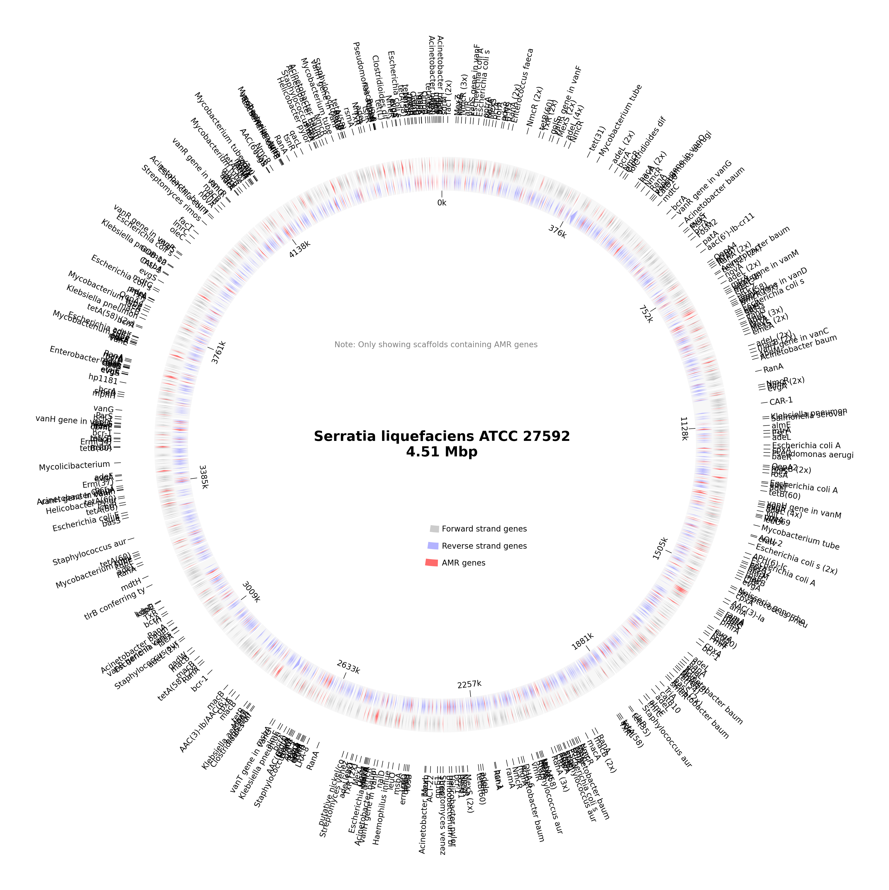

### AAC(3)-Ia
- **Mechanism**: antibiotic inactivation
- **Drug Classes**: aminoglycoside antibiotic
- **AMR Family**: AAC(3)
- **Locations**:
  - gnl|SPADES|CPJJBIBK_102_77 : position 79909-80457

### AAC(3)-Ib/AAC(6')-Ib3 bifunctional protein
- **Mechanism**: antibiotic inactivation
- **Drug Classes**: aminoglycoside antibiotic
- **AMR Family**: aminoglycoside bifunctional resistance protein
- **Locations**:
  - gnl|SPADES|CPJJBIBK_183_40 : position 44612-45064

### AAC(6')-Iai
- **Mechanism**: antibiotic inactivation
- **Drug Classes**: aminoglycoside antibiotic
- **AMR Family**: AAC(6')
- **Locations**:
  - gnl|SPADES|CPJJBIBK_176_47 : position 44371-44823

### AAC(6')-Iak
- **Mechanism**: antibiotic inactivation
- **Drug Classes**: aminoglycoside antibiotic
- **AMR Family**: AAC(6')
- **Locations**:
  - gnl|SPADES|CPJJBIBK_480_20 : position 17636-18082

### AAC(6')-Isa
- **Mechanism**: antibiotic inactivation
- **Drug Classes**: aminoglycoside antibiotic
- **AMR Family**: AAC(6')
- **Locations**:
  - gnl|SPADES|CPJJBIBK_208_27 : position 24971-25555

### ACT-22
- **Mechanism**: antibiotic inactivation
- **Drug Classes**: carbapenem; cephalosporin; cephamycin; penam
- **AMR Family**: ACT beta-lactamase
- **Locations**:
  - gnl|SPADES|CPJJBIBK_146_28 : position 25431-26966

### AIM-1
- **Mechanism**: antibiotic inactivation
- **Drug Classes**: cephalosporin; cephamycin; penam
- **AMR Family**: AIM beta-lactamase
- **Locations**:
  - gnl|SPADES|CPJJBIBK_176_21 : position 24309-25253

### APH(6)-Ic
- **Mechanism**: antibiotic inactivation
- **Drug Classes**: aminoglycoside antibiotic
- **AMR Family**: APH(6)
- **Locations**:
  - gnl|SPADES|CPJJBIBK_99_46 : position 44959-45813

### AQU-2
- **Mechanism**: antibiotic inactivation
- **Drug Classes**: cephalosporin
- **AMR Family**: AQU beta-lactamase
- **Locations**:
  - gnl|SPADES|CPJJBIBK_99_1 : position 1-1146

### Acinetobacter baumannii AbaF (found in 8 locations)
- **Mechanism**: antibiotic efflux
- **Drug Classes**: phosphonic acid antibiotic
- **AMR Family**: major facilitator superfamily (MFS) antibiotic efflux pump
- **Locations**:
  - gnl|SPADES|CPJJBIBK_108_55 : position 61833-63158
  - gnl|SPADES|CPJJBIBK_128_67 : position 62048-63550
  - gnl|SPADES|CPJJBIBK_146_37 : position 36304-37614
  - gnl|SPADES|CPJJBIBK_198_44 : position 44944-46251
  - gnl|SPADES|CPJJBIBK_54_6 : position 5309-6631
  - gnl|SPADES|CPJJBIBK_5631_2 : position 690-974
  - gnl|SPADES|CPJJBIBK_599_3 : position 2313-3545
  - gnl|SPADES|CPJJBIBK_66_50 : position 48545-49927

### Acinetobacter baumannii AbaQ (found in 11 locations)
- **Mechanism**: antibiotic efflux
- **Drug Classes**: fluoroquinolone antibiotic
- **AMR Family**: major facilitator superfamily (MFS) antibiotic efflux pump
- **Locations**:
  - gnl|SPADES|CPJJBIBK_108_21 : position 23938-25233
  - gnl|SPADES|CPJJBIBK_128_30 : position 26726-28039
  - gnl|SPADES|CPJJBIBK_136_15 : position 13797-15167
  - gnl|SPADES|CPJJBIBK_149_23 : position 25305-26612
  - gnl|SPADES|CPJJBIBK_252_9 : position 9693-10961
  - gnl|SPADES|CPJJBIBK_406_15 : position 14679-15941
  - gnl|SPADES|CPJJBIBK_545_13 : position 14124-15524
  - gnl|SPADES|CPJJBIBK_56_31 : position 35536-36843
  - gnl|SPADES|CPJJBIBK_89463_1 : position 2-232
  - gnl|SPADES|CPJJBIBK_91_69 : position 82143-83480
  - gnl|SPADES|CPJJBIBK_91_7 : position 6691-8004

### Acinetobacter baumannii AmvA
- **Mechanism**: antibiotic efflux
- **Drug Classes**: macrolide antibiotic; disinfecting agents and antiseptics
- **AMR Family**: major facilitator superfamily (MFS) antibiotic efflux pump
- **Locations**:
  - gnl|SPADES|CPJJBIBK_35_27 : position 31499-32971

### ArnT
- **Mechanism**: antibiotic target alteration
- **Drug Classes**: peptide antibiotic
- **AMR Family**: pmr phosphoethanolamine transferase
- **Locations**:
  - gnl|SPADES|CPJJBIBK_450_13: position 9362-11026

### Bifidobacterium bifidum ileS conferring resistance to mupirocin
- **Mechanism**: antibiotic target alteration
- **Drug Classes**: mupirocin-like antibiotic
- **AMR Family**: antibiotic-resistant isoleucyl-tRNA synthetase (ileS)
- **Locations**:
  - gnl|SPADES|CPJJBIBK_142_53 : position 48265-50847

### CAR-1
- **Mechanism**: antibiotic inactivation
- **Drug Classes**: carbapenem
- **AMR Family**: CAR beta-lactamase
- **Locations**:
  - gnl|SPADES|CPJJBIBK_71_43 : position 52375-53181

### CAU-1
- **Mechanism**: antibiotic inactivation
- **Drug Classes**: carbapenem; penam
- **AMR Family**: CAU beta-lactamase
- **Locations**:
  - gnl|SPADES|CPJJBIBK_372_2 : position 589-2712

### CRP (found in 2 locations)
- **Mechanism**: antibiotic efflux
- **Drug Classes**: macrolide antibiotic; fluoroquinolone antibiotic; penam
- **AMR Family**: resistance-nodulation-cell division (RND) antibiotic efflux pump
- **Locations**:
  - gnl|SPADES|CPJJBIBK_102_23: position 17598-18230
  - gnl|SPADES|CPJJBIBK_129_3 : position 2569-3333

### Clostridioides difficile gyrA conferring resistance to fluoroquinolones
- **Mechanism**: antibiotic target alteration
- **Drug Classes**: fluoroquinolone antibiotic
- **AMR Family**: fluoroquinolone resistant gyrA
- **Locations**:
  - gnl|SPADES|CPJJBIBK_179_26 : position 33991-36642

### Clostridioides difficile gyrB conferring resistance to fluoroquinolones (found in 2 locations)
- **Mechanism**: antibiotic target alteration
- **Drug Classes**: fluoroquinolone antibiotic
- **AMR Family**: fluoroquinolone resistant gyrB
- **Locations**:
  - gnl|SPADES|CPJJBIBK_43_57 : position 66175-68070
  - gnl|SPADES|CPJJBIBK_748_4 : position 4484-6898

### CrcB
- **Mechanism**: antibiotic efflux
- **Drug Classes**: aminoglycoside antibiotic
- **AMR Family**: multidrug and toxic compound extrusion (MATE) transporter
- **Locations**:
  - gnl|SPADES|CPJJBIBK_142_38 : position 35029-35412

### DHA-6
- **Mechanism**: antibiotic inactivation
- **Drug Classes**: cephalosporin; cephamycin
- **AMR Family**: DHA beta-lactamase
- **Locations**:
  - gnl|SPADES|CPJJBIBK_136_11 : position 9263-10405

### Enterobacter cloacae acrA (found in 2 locations)
- **Mechanism**: antibiotic efflux
- **Drug Classes**: fluoroquinolone antibiotic; cephalosporin; glycylcycline; penam; tetracycline antibiotic; rifamycin antibiotic; phenicol antibiotic; disinfecting agents and antiseptics
- **AMR Family**: resistance-nodulation-cell division (RND) antibiotic efflux pump
- **Locations**:
  - gnl|SPADES|CPJJBIBK_325_4 : position 3747-4949
  - gnl|SPADES|CPJJBIBK_90_45 : position 48187-49374

### Enterococcus faecalis cls with mutation conferring resistance to daptomycin
- **Mechanism**: antibiotic target alteration
- **Drug Classes**: peptide antibiotic
- **AMR Family**: daptomycin resistant cls
- **Locations**:
  - gnl|SPADES|CPJJBIBK_35_25 : position 28872-30332

### Erm(34)
- **Mechanism**: antibiotic target alteration
- **Drug Classes**: macrolide antibiotic; lincosamide antibiotic; streptogramin antibiotic; streptogramin A antibiotic; streptogramin B antibiotic
- **AMR Family**: Erm 23S ribosomal RNA methyltransferase
- **Locations**:
  - gnl|SPADES|CPJJBIBK_274_4 : position 4944-5570

### Erm(37)
- **Mechanism**: antibiotic target alteration
- **Drug Classes**: macrolide antibiotic; lincosamide antibiotic; streptogramin antibiotic; streptogramin A antibiotic; streptogramin B antibiotic
- **AMR Family**: Erm 23S ribosomal RNA methyltransferase
- **Locations**:
  - gnl|SPADES|CPJJBIBK_252_28 : position 31923-32702

### Escherichia coli AcrAB-TolC with AcrR mutation conferring resistance to ciprofloxacin, tetracycline, and ceftazidime (found in 5 locations)
- **Mechanism**: antibiotic target alteration; antibiotic efflux
- **Drug Classes**: fluoroquinolone antibiotic; cephalosporin; glycylcycline; penam; tetracycline antibiotic; rifamycin antibiotic; phenicol antibiotic; disinfecting agents and antiseptics
- **AMR Family**: resistance-nodulation-cell division (RND) antibiotic efflux pump
- **Locations**:
  - gnl|SPADES|CPJJBIBK_149_35 : position 41638-42342
  - gnl|SPADES|CPJJBIBK_30_75 : position 73758-74339
  - gnl|SPADES|CPJJBIBK_87_48 : position 51846-52433
  - gnl|SPADES|CPJJBIBK_90_44 : position 47355-48044
  - gnl|SPADES|CPJJBIBK_99_3 : position 2341-2943

### Escherichia coli AcrAB-TolC with MarR mutations conferring resistance to ciprofloxacin and tetracycline (found in 2 locations)
- **Mechanism**: antibiotic target alteration; antibiotic efflux
- **Drug Classes**: fluoroquinolone antibiotic; cephalosporin; glycylcycline; penam; tetracycline antibiotic; rifamycin antibiotic; phenicol antibiotic; disinfecting agents and antiseptics
- **AMR Family**: resistance-nodulation-cell division (RND) antibiotic efflux pump
- **Locations**:
  - gnl|SPADES|CPJJBIBK_56_37 : position 41778-42251
  - gnl|SPADES|CPJJBIBK_99_60 : position 55833-56267

### Escherichia coli EF-Tu mutants conferring resistance to Enacyloxin IIa
- **Mechanism**: antibiotic target alteration
- **Drug Classes**: elfamycin antibiotic
- **AMR Family**: elfamycin resistant EF-Tu
- **Locations**:
  - gnl|SPADES|CPJJBIBK_222_40 : position 40873-43428

### Escherichia coli EF-Tu mutants conferring resistance to Pulvomycin
- **Mechanism**: antibiotic target alteration
- **Drug Classes**: elfamycin antibiotic
- **AMR Family**: elfamycin resistant EF-Tu
- **Locations**:
  - gnl|SPADES|CPJJBIBK_484_8 : position 7873-9720

### Escherichia coli fabI mutations conferring resistance to isoniazid and triclosan (found in 2 locations)
- **Mechanism**: antibiotic target alteration
- **Drug Classes**: disinfecting agents and antiseptics; isoniazid-like antibiotic
- **AMR Family**: antibiotic resistant fabI
- **Locations**:
  - gnl|SPADES|CPJJBIBK_332_15 : position 14394-15140
  - gnl|SPADES|CPJJBIBK_406_11 : position 10761-11516

### Escherichia coli mdfA
- **Mechanism**: antibiotic efflux
- **Drug Classes**: tetracycline antibiotic; phenicol antibiotic; disinfecting agents and antiseptics
- **AMR Family**: major facilitator superfamily (MFS) antibiotic efflux pump
- **Locations**:
  - gnl|SPADES|CPJJBIBK_484_10 : position 10197-11444

### Escherichia coli soxS with mutation conferring antibiotic resistance (found in 9 locations)
- **Mechanism**: antibiotic target alteration; antibiotic efflux; reduced permeability to antibiotic
- **Drug Classes**: fluoroquinolone antibiotic; monobactam; carbapenem; cephalosporin; glycylcycline; cephamycin; penam; tetracycline antibiotic; rifamycin antibiotic; phenicol antibiotic; penem; disinfecting agents and antiseptics
- **AMR Family**: ATP-binding cassette (ABC) antibiotic efflux pump; major facilitator superfamily (MFS) antibiotic efflux pump; resistance-nodulation-cell division (RND) antibiotic efflux pump; General Bacterial Porin with reduced permeability to beta-lactams
- **Locations**:
  - gnl|SPADES|CPJJBIBK_128_43 : position 41870-42715
  - gnl|SPADES|CPJJBIBK_198_33 : position 31561-32430
  - gnl|SPADES|CPJJBIBK_30_87 : position 86553-87011
  - gnl|SPADES|CPJJBIBK_356_13 : position 13348-14121
  - gnl|SPADES|CPJJBIBK_380_25 : position 20935-21801
  - gnl|SPADES|CPJJBIBK_65_29 : position 29078-30025
  - gnl|SPADES|CPJJBIBK_917_2 : position 1298-1720
  - gnl|SPADES|CPJJBIBK_99_24 : position 21232-22149
  - gnl|SPADES|CPJJBIBK_99_36 : position 33692-34585

### EstT (found in 3 locations)
- **Mechanism**: antibiotic inactivation
- **Drug Classes**: macrolide antibiotic
- **AMR Family**: macrolide esterase
- **Locations**:
  - gnl|SPADES|CPJJBIBK_128_20 : position 18293-19096
  - gnl|SPADES|CPJJBIBK_5761_1 : position 60-890
  - gnl|SPADES|CPJJBIBK_87_17 : position 24126-24968

### FosA8
- **Mechanism**: antibiotic inactivation
- **Drug Classes**: phosphonic acid antibiotic
- **AMR Family**: fosfomycin thiol transferase
- **Locations**:
  - gnl|SPADES|CPJJBIBK_71_87: position 92756-93163

### FosC2
- **Mechanism**: antibiotic inactivation
- **Drug Classes**: phosphonic acid antibiotic
- **AMR Family**: fosC phosphotransferase family
- **Locations**:
  - gnl|SPADES|CPJJBIBK_99_73 : position 69880-70287

### FosM1
- **Mechanism**: antibiotic inactivation
- **Drug Classes**: phosphonic acid antibiotic
- **AMR Family**: fosfomycin thiol transferase
- **Locations**:
  - gnl|SPADES|CPJJBIBK_142_27 : position 25827-26336

### FosM2
- **Mechanism**: antibiotic inactivation
- **Drug Classes**: phosphonic acid antibiotic
- **AMR Family**: fosfomycin thiol transferase
- **Locations**:
  - gnl|SPADES|CPJJBIBK_54_37 : position 48464-48874

### GOB-12
- **Mechanism**: antibiotic inactivation
- **Drug Classes**: carbapenem; cephalosporin; penam
- **AMR Family**: GOB beta-lactamase
- **Locations**:
  - gnl|SPADES|CPJJBIBK_372_19 : position 22719-23366

### H-NS
- **Mechanism**: antibiotic efflux
- **Drug Classes**: macrolide antibiotic; fluoroquinolone antibiotic; cephalosporin; cephamycin; penam; tetracycline antibiotic
- **AMR Family**: major facilitator superfamily (MFS) antibiotic efflux pump; resistance-nodulation-cell division (RND) antibiotic efflux pump
- **Locations**:
  - gnl|SPADES|CPJJBIBK_35_8 : position 7524-7931

### Haemophilus influenzae PBP3 conferring resistance to beta-lactam antibiotics (found in 2 locations)
- **Mechanism**: antibiotic target alteration
- **Drug Classes**: cephalosporin; cephamycin; penam
- **AMR Family**: Penicillin-binding protein mutations conferring resistance to beta-lactam antibiotics
- **Locations**:
  - gnl|SPADES|CPJJBIBK_148_47 : position 57990-59753
  - gnl|SPADES|CPJJBIBK_56_82 : position 93759-95477

### Helicobacter pylori pbp1 mutants conferring resistance to amoxicillin (found in 2 locations)
- **Mechanism**: antibiotic target alteration
- **Drug Classes**: cephalosporin; cephamycin; penam
- **AMR Family**: Penicillin-binding protein mutations conferring resistance to beta-lactam antibiotics
- **Locations**:
  - gnl|SPADES|CPJJBIBK_250_29 : position 29640-32141
  - gnl|SPADES|CPJJBIBK_544_8 : position 6790-9138

### Helicobacter pylori pbp2 mutants conferring resistance to amoxicillin
- **Mechanism**: antibiotic target alteration
- **Drug Classes**: cephalosporin; cephamycin; penam
- **AMR Family**: Penicillin-binding protein mutations conferring resistance to beta-lactam antibiotics
- **Locations**:
  - gnl|SPADES|CPJJBIBK_142_47 : position 43092-44987

### Klebsiella aerogenes Omp36
- **Mechanism**: reduced permeability to antibiotic
- **Drug Classes**: monobactam; carbapenem; cephalosporin; cephamycin; penam; penem
- **AMR Family**: General Bacterial Porin with reduced permeability to beta-lactams
- **Locations**:
  - gnl|SPADES|CPJJBIBK_179_32 : position 45586-46716

### Klebsiella pneumoniae KpnE
- **Mechanism**: antibiotic efflux
- **Drug Classes**: macrolide antibiotic; aminoglycoside antibiotic; cephalosporin; tetracycline antibiotic; peptide antibiotic; rifamycin antibiotic; disinfecting agents and antiseptics
- **AMR Family**: small multidrug resistance (SMR) antibiotic efflux pump
- **Locations**:
  - gnl|SPADES|CPJJBIBK_177_11 : position 11873-12241

### Klebsiella pneumoniae KpnF
- **Mechanism**: antibiotic efflux
- **Drug Classes**: macrolide antibiotic; aminoglycoside antibiotic; cephalosporin; tetracycline antibiotic; peptide antibiotic; rifamycin antibiotic; disinfecting agents and antiseptics
- **AMR Family**: small multidrug resistance (SMR) antibiotic efflux pump
- **Locations**:
  - gnl|SPADES|CPJJBIBK_177_12: position 12228-12557

### Klebsiella pneumoniae KpnH
- **Mechanism**: antibiotic efflux
- **Drug Classes**: macrolide antibiotic; fluoroquinolone antibiotic; aminoglycoside antibiotic; carbapenem; cephalosporin; penam; peptide antibiotic; penem
- **AMR Family**: major facilitator superfamily (MFS) antibiotic efflux pump
- **Locations**:
  - gnl|SPADES|CPJJBIBK_176_6: position 7034-8569

### Klebsiella pneumoniae OmpK37 (found in 4 locations)
- **Mechanism**: reduced permeability to antibiotic
- **Drug Classes**: monobactam; carbapenem; cephalosporin; cephamycin; penam; penem
- **AMR Family**: General Bacterial Porin with reduced permeability to beta-lactams
- **Locations**:
  - gnl|SPADES|CPJJBIBK_30_9 : position 7025-8122
  - gnl|SPADES|CPJJBIBK_344_1 : position 1-1044
  - gnl|SPADES|CPJJBIBK_372_21 : position 24873-24998
  - gnl|SPADES|CPJJBIBK_71_73 : position 85519-86601

### LRA-8
- **Mechanism**: antibiotic inactivation
- **Drug Classes**: cephalosporin; penam
- **AMR Family**: subclass B3 LRA beta-lactamase
- **Locations**:
  - gnl|SPADES|CPJJBIBK_156_59 : position 58645-59400

### LpsB
- **Mechanism**: reduced permeability to antibiotic
- **Drug Classes**: peptide antibiotic
- **AMR Family**: Intrinsic peptide antibiotic resistant Lps
- **Locations**:
  - gnl|SPADES|CPJJBIBK_106_6 : position 4656-5747

### LptD
- **Mechanism**: antibiotic efflux
- **Drug Classes**: carbapenem; peptide antibiotic; aminocoumarin antibiotic; rifamycin antibiotic
- **AMR Family**: ATP-binding cassette (ABC) antibiotic efflux pump
- **Locations**:
  - gnl|SPADES|CPJJBIBK_148_19 : position 20421-22784

### MdtK
- **Mechanism**: antibiotic efflux
- **Drug Classes**: fluoroquinolone antibiotic
- **AMR Family**: multidrug and toxic compound extrusion (MATE) transporter
- **Locations**:
  - gnl|SPADES|CPJJBIBK_38_98 : position 96152-97615

### MexA
- **Mechanism**: antibiotic efflux
- **Drug Classes**: macrolide antibiotic; fluoroquinolone antibiotic; monobactam; carbapenem; cephalosporin; cephamycin; penam; tetracycline antibiotic; peptide antibiotic; aminocoumarin antibiotic; diaminopyrimidine antibiotic; sulfonamide antibiotic; phenicol antibiotic; penem
- **AMR Family**: resistance-nodulation-cell division (RND) antibiotic efflux pump
- **Locations**:
  - gnl|SPADES|CPJJBIBK_149_37 : position 44052-45194

### MexE
- **Mechanism**: antibiotic efflux
- **Drug Classes**: fluoroquinolone antibiotic; diaminopyrimidine antibiotic; phenicol antibiotic
- **AMR Family**: resistance-nodulation-cell division (RND) antibiotic efflux pump
- **Locations**:
  - gnl|SPADES|CPJJBIBK_99_61 : position 56688-57545

### MexG
- **Mechanism**: antibiotic efflux
- **Drug Classes**: fluoroquinolone antibiotic; tetracycline antibiotic; disinfecting agents and antiseptics
- **AMR Family**: resistance-nodulation-cell division (RND) antibiotic efflux pump
- **Locations**:
  - gnl|SPADES|CPJJBIBK_176_43 : position 41842-42255

### MexL (found in 4 locations)
- **Mechanism**: antibiotic efflux
- **Drug Classes**: macrolide antibiotic; tetracycline antibiotic; disinfecting agents and antiseptics
- **AMR Family**: resistance-nodulation-cell division (RND) antibiotic efflux pump
- **Locations**:
  - gnl|SPADES|CPJJBIBK_128_24 : position 21689-22327
  - gnl|SPADES|CPJJBIBK_129_40 : position 40521-41105
  - gnl|SPADES|CPJJBIBK_146_40 : position 38970-39626
  - gnl|SPADES|CPJJBIBK_65_83 : position 77301-77945

### MexS (found in 10 locations)
- **Mechanism**: antibiotic efflux
- **Drug Classes**: fluoroquinolone antibiotic; diaminopyrimidine antibiotic; phenicol antibiotic
- **AMR Family**: resistance-nodulation-cell division (RND) antibiotic efflux pump
- **Locations**:
  - gnl|SPADES|CPJJBIBK_142_7 : position 6044-7033
  - gnl|SPADES|CPJJBIBK_142_8 : position 7126-8061
  - gnl|SPADES|CPJJBIBK_151_11 : position 13620-14606
  - gnl|SPADES|CPJJBIBK_30_111 : position 111229-112356
  - gnl|SPADES|CPJJBIBK_38_13 : position 13281-14315
  - gnl|SPADES|CPJJBIBK_38_51 : position 50238-51245
  - gnl|SPADES|CPJJBIBK_43_25 : position 28949-29977
  - gnl|SPADES|CPJJBIBK_65_89 : position 82259-83239
  - gnl|SPADES|CPJJBIBK_65_99 : position 92636-93661
  - gnl|SPADES|CPJJBIBK_66_35 : position 34935-35924

### MexT (found in 4 locations)
- **Mechanism**: antibiotic efflux
- **Drug Classes**: fluoroquinolone antibiotic; diaminopyrimidine antibiotic; phenicol antibiotic
- **AMR Family**: resistance-nodulation-cell division (RND) antibiotic efflux pump
- **Locations**:
  - gnl|SPADES|CPJJBIBK_149_49 : position 59209-60105
  - gnl|SPADES|CPJJBIBK_179_36 : position 48445-49347
  - gnl|SPADES|CPJJBIBK_38_15 : position 15106-16035
  - gnl|SPADES|CPJJBIBK_54_19 : position 25843-26793

### MexV
- **Mechanism**: antibiotic efflux
- **Drug Classes**: macrolide antibiotic; fluoroquinolone antibiotic; tetracycline antibiotic; phenicol antibiotic; disinfecting agents and antiseptics
- **AMR Family**: resistance-nodulation-cell division (RND) antibiotic efflux pump
- **Locations**:
  - gnl|SPADES|CPJJBIBK_46_52 : position 55183-56634

### MexZ
- **Mechanism**: antibiotic efflux
- **Drug Classes**: macrolide antibiotic; fluoroquinolone antibiotic; aminoglycoside antibiotic; carbapenem; cephalosporin; cephamycin; penam; tetracycline antibiotic; phenicol antibiotic; disinfecting agents and antiseptics
- **AMR Family**: resistance-nodulation-cell division (RND) antibiotic efflux pump
- **Locations**:
  - gnl|SPADES|CPJJBIBK_30_34 : position 32973-33539

### Mycobacterium tuberculosis gidB mutation conferring resistance to streptomycin
- **Mechanism**: antibiotic target alteration
- **Drug Classes**: aminoglycoside antibiotic
- **AMR Family**: antibiotic resistant gidB
- **Locations**:
  - gnl|SPADES|CPJJBIBK_444_16 : position 18097-18717

### Mycobacterium tuberculosis kasA mutant conferring resistance to isoniazid (found in 3 locations)
- **Mechanism**: antibiotic target alteration
- **Drug Classes**: isoniazid-like antibiotic
- **AMR Family**: antibiotic resistant kasA
- **Locations**:
  - gnl|SPADES|CPJJBIBK_344_20 : position 24869-26143
  - gnl|SPADES|CPJJBIBK_462_6 : position 5280-6509
  - gnl|SPADES|CPJJBIBK_462_9 : position 7704-8873

### Mycobacterium tuberculosis katG mutations conferring resistance to isoniazid
- **Mechanism**: antibiotic target alteration
- **Drug Classes**: isoniazid-like antibiotic
- **AMR Family**: isoniazid resistant katG
- **Locations**:
  - gnl|SPADES|CPJJBIBK_210_27 : position 29441-31639

### Mycobacterium tuberculosis ndh with mutation conferring resistance to isoniazid
- **Mechanism**: antibiotic target alteration
- **Drug Classes**: isoniazid-like antibiotic
- **AMR Family**: antibiotic resistant ndh
- **Locations**:
  - gnl|SPADES|CPJJBIBK_332_6 : position 7132-8436

### Mycobacterium tuberculosis pncA mutations conferring resistance to pyrazinamide (found in 3 locations)
- **Mechanism**: antibiotic target alteration
- **Drug Classes**: pyrazine antibiotic
- **AMR Family**: Pyrazinamide resistant pncA
- **Locations**:
  - gnl|SPADES|CPJJBIBK_38_118 : position 118393-119079
  - gnl|SPADES|CPJJBIBK_484_13 : position 13577-14128
  - gnl|SPADES|CPJJBIBK_605_11 : position 10333-10965

### Mycobacterium tuberculosis thyA with mutation conferring resistance to para-aminosalicylic acid
- **Mechanism**: antibiotic target alteration
- **Drug Classes**: salicylic acid antibiotic
- **AMR Family**: aminosalicylate resistant thymidylate synthase
- **Locations**:
  - gnl|SPADES|CPJJBIBK_91_58 : position 64005-64799

### Mycolicibacterium smegmatis ndh with mutation conferring resistance to isoniazid
- **Mechanism**: antibiotic target alteration
- **Drug Classes**: isoniazid-like antibiotic
- **AMR Family**: antibiotic resistant ndh
- **Locations**:
  - gnl|SPADES|CPJJBIBK_260_30 : position 33009-34217

### Neisseria gonorrhoeae pilQ gene conferring resistance to beta-lactam
- **Mechanism**: antibiotic target alteration
- **Drug Classes**: cephalosporin; cephamycin; penam
- **AMR Family**: Penicillin-binding protein mutations conferring resistance to beta-lactam antibiotics
- **Locations**:
  - gnl|SPADES|CPJJBIBK_102_49 : position 46081-47322

### NmcR (found in 27 locations)
- **Mechanism**: antibiotic inactivation
- **Drug Classes**: carbapenem; cephalosporin; cephamycin; penam
- **AMR Family**: NmcA beta-lactamase
- **Locations**:
  - gnl|SPADES|CPJJBIBK_1021_1 : position 3-839
  - gnl|SPADES|CPJJBIBK_108_31 : position 34674-35567
  - gnl|SPADES|CPJJBIBK_1265_2 : position 149-1003
  - gnl|SPADES|CPJJBIBK_128_14 : position 13286-14209
  - gnl|SPADES|CPJJBIBK_129_37 : position 37242-38150
  - gnl|SPADES|CPJJBIBK_136_38 : position 35209-36138
  - gnl|SPADES|CPJJBIBK_142_18 : position 15485-16474
  - gnl|SPADES|CPJJBIBK_149_32 : position 38246-39109
  - gnl|SPADES|CPJJBIBK_176_13 : position 14457-15335
  - gnl|SPADES|CPJJBIBK_30_112 : position 112385-113302
  - gnl|SPADES|CPJJBIBK_30_49 : position 45671-46558
  - gnl|SPADES|CPJJBIBK_30_98 : position 96842-97723
  - gnl|SPADES|CPJJBIBK_35_60 : position 65587-66561
  - gnl|SPADES|CPJJBIBK_35_80 : position 87627-88481
  - gnl|SPADES|CPJJBIBK_38_42 : position 42938-43810
  - gnl|SPADES|CPJJBIBK_43_50 : position 58040-58873
  - gnl|SPADES|CPJJBIBK_46_1 : position 576-1517
  - gnl|SPADES|CPJJBIBK_482_5 : position 5378-6274
  - gnl|SPADES|CPJJBIBK_56_7 : position 5673-6563
  - gnl|SPADES|CPJJBIBK_599_10 : position 11106-12005
  - gnl|SPADES|CPJJBIBK_633_2 : position 765-1646
  - gnl|SPADES|CPJJBIBK_65_16 : position 16222-17160
  - gnl|SPADES|CPJJBIBK_65_21 : position 21666-22568
  - gnl|SPADES|CPJJBIBK_65_58 : position 55100-56029
  - gnl|SPADES|CPJJBIBK_71_9 : position 9003-9956
  - gnl|SPADES|CPJJBIBK_763_6 : position 5390-6307
  - gnl|SPADES|CPJJBIBK_87_18 : position 25077-25949

### OmpA (found in 3 locations)
- **Mechanism**: reduced permeability to antibiotic
- **Drug Classes**: peptide antibiotic
- **AMR Family**: General Bacterial Porin with reduced permeability to peptide antibiotics
- **Locations**:
  - gnl|SPADES|CPJJBIBK_1334_3 : position 2561-3637
  - gnl|SPADES|CPJJBIBK_198_26 : position 24802-25299
  - gnl|SPADES|CPJJBIBK_252_13 : position 14137-14799

### OpmH
- **Mechanism**: antibiotic efflux
- **Drug Classes**: disinfecting agents and antiseptics
- **AMR Family**: resistance-nodulation-cell division (RND) antibiotic efflux pump
- **Locations**:
  - gnl|SPADES|CPJJBIBK_1058_1 : position 3-1376

### OprM
- **Mechanism**: antibiotic efflux
- **Drug Classes**: macrolide antibiotic; fluoroquinolone antibiotic; monobactam; aminoglycoside antibiotic; carbapenem; cephalosporin; cephamycin; penam; tetracycline antibiotic; peptide antibiotic; aminocoumarin antibiotic; diaminopyrimidine antibiotic; sulfonamide antibiotic; phenicol antibiotic; penem; disinfecting agents and antiseptics
- **AMR Family**: resistance-nodulation-cell division (RND) antibiotic efflux pump
- **Locations**:
  - gnl|SPADES|CPJJBIBK_149_39 : position 48351-49805

### ParR (found in 2 locations)
- **Mechanism**: antibiotic efflux; reduced permeability to antibiotic
- **Drug Classes**: macrolide antibiotic; fluoroquinolone antibiotic; monobactam; aminoglycoside antibiotic; carbapenem; cephalosporin; cephamycin; penam; tetracycline antibiotic; phenicol antibiotic; penem; disinfecting agents and antiseptics
- **AMR Family**: resistance-nodulation-cell division (RND) antibiotic efflux pump; Outer Membrane Porin (Opr)
- **Locations**:
  - gnl|SPADES|CPJJBIBK_102_64 : position 61616-62335
  - gnl|SPADES|CPJJBIBK_292_20 : position 26455-27216

### ParS (found in 3 locations)
- **Mechanism**: antibiotic efflux; reduced permeability to antibiotic
- **Drug Classes**: macrolide antibiotic; fluoroquinolone antibiotic; monobactam; aminoglycoside antibiotic; carbapenem; cephalosporin; cephamycin; penam; tetracycline antibiotic; phenicol antibiotic; penem; disinfecting agents and antiseptics
- **AMR Family**: resistance-nodulation-cell division (RND) antibiotic efflux pump; Outer Membrane Porin (Opr)
- **Locations**:
  - gnl|SPADES|CPJJBIBK_104_62 : position 72369-74150
  - gnl|SPADES|CPJJBIBK_176_19 : position 20894-22492
  - gnl|SPADES|CPJJBIBK_292_19 : position 25154-26458

### PmrF (found in 2 locations)
- **Mechanism**: antibiotic target alteration
- **Drug Classes**: peptide antibiotic
- **AMR Family**: pmr phosphoethanolamine transferase
- **Locations**:
  - gnl|SPADES|CPJJBIBK_106_11 : position 10225-11208
  - gnl|SPADES|CPJJBIBK_450_16 : position 13907-14887

### Pseudomonas aeruginosa CpxR (found in 5 locations)
- **Mechanism**: antibiotic efflux
- **Drug Classes**: macrolide antibiotic; fluoroquinolone antibiotic; monobactam; aminoglycoside antibiotic; carbapenem; cephalosporin; cephamycin; penam; tetracycline antibiotic; peptide antibiotic; aminocoumarin antibiotic; diaminopyrimidine antibiotic; sulfonamide antibiotic; phenicol antibiotic; penem
- **AMR Family**: resistance-nodulation-cell division (RND) antibiotic efflux pump
- **Locations**:
  - gnl|SPADES|CPJJBIBK_106_31 : position 30043-30741
  - gnl|SPADES|CPJJBIBK_176_18 : position 20196-20885
  - gnl|SPADES|CPJJBIBK_46_32 : position 32303-32977
  - gnl|SPADES|CPJJBIBK_659_3 : position 1810-2490
  - gnl|SPADES|CPJJBIBK_87_65 : position 69533-70273

### Pseudomonas aeruginosa ampR with mutation conferring resistance to aztreonam (found in 2 locations)
- **Mechanism**: antibiotic target alteration; antibiotic inactivation
- **Drug Classes**: monobactam; carbapenem; cephalosporin
- **AMR Family**: PDC beta-lactamase; ampR transcriptional regulator with mutation conferring resistance to monobactam antibiotics
- **Locations**:
  - gnl|SPADES|CPJJBIBK_46_83 : position 85454-86383
  - gnl|SPADES|CPJJBIBK_99_6 : position 5561-6436

### QepA2
- **Mechanism**: antibiotic efflux
- **Drug Classes**: fluoroquinolone antibiotic
- **AMR Family**: major facilitator superfamily (MFS) antibiotic efflux pump
- **Locations**:
  - gnl|SPADES|CPJJBIBK_90_11 : position 7895-9301

### QepA4 (found in 2 locations)
- **Mechanism**: antibiotic efflux
- **Drug Classes**: fluoroquinolone antibiotic
- **AMR Family**: major facilitator superfamily (MFS) antibiotic efflux pump
- **Locations**:
  - gnl|SPADES|CPJJBIBK_354_2 : position 1010-2446
  - gnl|SPADES|CPJJBIBK_56_6 : position 4278-5573

### RanA (found in 25 locations)
- **Mechanism**: antibiotic efflux
- **Drug Classes**: aminoglycoside antibiotic
- **AMR Family**: ATP-binding cassette (ABC) antibiotic efflux pump
- **Locations**:
  - gnl|SPADES|CPJJBIBK_1069_4 : position 2564-3679
  - gnl|SPADES|CPJJBIBK_108_3 : position 3262-4332
  - gnl|SPADES|CPJJBIBK_125_42 : position 40749-41882
  - gnl|SPADES|CPJJBIBK_129_11 : position 10538-11650
  - gnl|SPADES|CPJJBIBK_129_33 : position 33524-34237
  - gnl|SPADES|CPJJBIBK_129_48 : position 50132-51169
  - gnl|SPADES|CPJJBIBK_141_9 : position 8984-10576
  - gnl|SPADES|CPJJBIBK_156_34 : position 33607-34350
  - gnl|SPADES|CPJJBIBK_176_17 : position 18587-19789
  - gnl|SPADES|CPJJBIBK_184_6 : position 7308-8297
  - gnl|SPADES|CPJJBIBK_190_31 : position 31682-32758
  - gnl|SPADES|CPJJBIBK_201_3 : position 1539-2474
  - gnl|SPADES|CPJJBIBK_210_6 : position 5691-7367
  - gnl|SPADES|CPJJBIBK_30_105 : position 104106-105983
  - gnl|SPADES|CPJJBIBK_325_19 : position 23133-24194
  - gnl|SPADES|CPJJBIBK_35_16 : position 19246-20262
  - gnl|SPADES|CPJJBIBK_35_17 : position 20259-21260
  - gnl|SPADES|CPJJBIBK_46_15 : position 15444-16217
  - gnl|SPADES|CPJJBIBK_486_8 : position 7998-8774
  - gnl|SPADES|CPJJBIBK_56_21 : position 20274-21353
  - gnl|SPADES|CPJJBIBK_56_85 : position 96655-97416
  - gnl|SPADES|CPJJBIBK_616_7 : position 4011-4826
  - gnl|SPADES|CPJJBIBK_66_69 : position 78091-79083
  - gnl|SPADES|CPJJBIBK_71_14 : position 14127-14963
  - gnl|SPADES|CPJJBIBK_71_59 : position 67905-68873

### RanB
- **Mechanism**: antibiotic efflux
- **Drug Classes**: aminoglycoside antibiotic
- **AMR Family**: ATP-binding cassette (ABC) antibiotic efflux pump
- **Locations**:
  - gnl|SPADES|CPJJBIBK_616_6 : position 3224-4006

### Rhodococcus fascians cmr (found in 2 locations)
- **Mechanism**: antibiotic efflux
- **Drug Classes**: phenicol antibiotic
- **AMR Family**: major facilitator superfamily (MFS) antibiotic efflux pump
- **Locations**:
  - gnl|SPADES|CPJJBIBK_54_59 : position 72227-73654
  - gnl|SPADES|CPJJBIBK_56_92 : position 104338-105516

### Rv1877
- **Mechanism**: antibiotic efflux
- **Drug Classes**: fluoroquinolone antibiotic
- **AMR Family**: major facilitator superfamily (MFS) antibiotic efflux pump
- **Locations**:
  - gnl|SPADES|CPJJBIBK_149_36 : position 42386-43900

### SAT-2
- **Mechanism**: antibiotic inactivation
- **Drug Classes**: nucleoside antibiotic
- **AMR Family**: streptothricin acetyltransferase (SAT)
- **Locations**:
  - gnl|SPADES|CPJJBIBK_30_35 : position 33555-34184

### SAT-3
- **Mechanism**: antibiotic inactivation
- **Drug Classes**: nucleoside antibiotic
- **AMR Family**: streptothricin acetyltransferase (SAT)
- **Locations**:
  - gnl|SPADES|CPJJBIBK_65_45 : position 43485-44027

### SPR-1
- **Mechanism**: antibiotic inactivation
- **Drug Classes**: carbapenem
- **AMR Family**: SPR beta-lactamase
- **Locations**:
  - gnl|SPADES|CPJJBIBK_179_37 : position 49427-50323

### SRT-2
- **Mechanism**: antibiotic inactivation
- **Drug Classes**: cephalosporin
- **AMR Family**: SRT beta-lactamase
- **Locations**:
  - gnl|SPADES|CPJJBIBK_56_91 : position 103169-104338

### SRT-3
- **Mechanism**: antibiotic inactivation
- **Drug Classes**: cephalosporin
- **AMR Family**: SRT beta-lactamase
- **Locations**:
  - gnl|SPADES|CPJJBIBK_99_5 : position 4220-5356

### Salmonella serovars soxS with mutation conferring antibiotic resistance
- **Mechanism**: antibiotic target alteration; antibiotic efflux; reduced permeability to antibiotic
- **Drug Classes**: fluoroquinolone antibiotic; monobactam; carbapenem; cephalosporin; glycylcycline; cephamycin; penam; tetracycline antibiotic; rifamycin antibiotic; phenicol antibiotic; penem; disinfecting agents and antiseptics
- **AMR Family**: ATP-binding cassette (ABC) antibiotic efflux pump; major facilitator superfamily (MFS) antibiotic efflux pump; resistance-nodulation-cell division (RND) antibiotic efflux pump; General Bacterial Porin with reduced permeability to beta-lactams
- **Locations**:
  - gnl|SPADES|CPJJBIBK_71_81 : position 90240-90626

### SatA
- **Mechanism**: antibiotic inactivation
- **Drug Classes**: nucleoside antibiotic
- **AMR Family**: streptothricin acetyltransferase (SAT)
- **Locations**:
  - gnl|SPADES|CPJJBIBK_252_14 : position 15067-15462

### Staphylococcus aureus FosB
- **Mechanism**: antibiotic inactivation
- **Drug Classes**: phosphonic acid antibiotic
- **AMR Family**: fosfomycin thiol transferase
- **Locations**:
  - gnl|SPADES|CPJJBIBK_179_33 : position 46870-47286

### Staphylococcus aureus GlpT with mutation conferring resistance to fosfomycin
- **Mechanism**: antibiotic target alteration
- **Drug Classes**: phosphonic acid antibiotic
- **AMR Family**: antibiotic-resistant GlpT
- **Locations**:
  - gnl|SPADES|CPJJBIBK_211_27 : position 25341-26696

### Staphylococcus aureus LmrS
- **Mechanism**: antibiotic efflux
- **Drug Classes**: macrolide antibiotic; aminoglycoside antibiotic; oxazolidinone antibiotic; diaminopyrimidine antibiotic; phenicol antibiotic
- **AMR Family**: major facilitator superfamily (MFS) antibiotic efflux pump
- **Locations**:
  - gnl|SPADES|CPJJBIBK_176_35 : position 35034-36416

### Staphylococcus aureus fusA with mutation conferring resistance to fusidic acid (found in 2 locations)
- **Mechanism**: antibiotic target alteration
- **Drug Classes**: fusidane antibiotic
- **AMR Family**: antibiotic resistant fusA
- **Locations**:
  - gnl|SPADES|CPJJBIBK_129_47 : position 47754-49859
  - gnl|SPADES|CPJJBIBK_198_6 : position 4578-6167

### Staphylococcus aureus mupA conferring resistance to mupirocin
- **Mechanism**: antibiotic target alteration
- **Drug Classes**: mupirocin-like antibiotic
- **AMR Family**: antibiotic-resistant isoleucyl-tRNA synthetase (ileS)
- **Locations**:
  - gnl|SPADES|CPJJBIBK_545_2 : position 1133-3949

### Staphylococcus aureus mupB conferring resistance to mupirocin
- **Mechanism**: antibiotic target alteration
- **Drug Classes**: mupirocin-like antibiotic
- **AMR Family**: antibiotic-resistant isoleucyl-tRNA synthetase (ileS)
- **Locations**:
  - gnl|SPADES|CPJJBIBK_110_65 : position 69758-72634

### Staphylococcus aureus murA with mutation conferring resistance to fosfomycin
- **Mechanism**: antibiotic target alteration
- **Drug Classes**: phosphonic acid antibiotic
- **AMR Family**: antibiotic-resistant murA transferase
- **Locations**:
  - gnl|SPADES|CPJJBIBK_616_1 : position 12-1271

### Staphylococcus aureus norA
- **Mechanism**: antibiotic efflux
- **Drug Classes**: fluoroquinolone antibiotic
- **AMR Family**: major facilitator superfamily (MFS) antibiotic efflux pump
- **Locations**:
  - gnl|SPADES|CPJJBIBK_104_67 : position 77819-79165

### Staphylococcus aureus pgsA mutations conferring resistance to daptomycin
- **Mechanism**: antibiotic target alteration
- **Drug Classes**: peptide antibiotic
- **AMR Family**: daptomycin resistant pgsA
- **Locations**:
  - gnl|SPADES|CPJJBIBK_128_56 : position 52755-53303

### Streptococcus pneumoniae PBP2x conferring resistance to amoxicillin
- **Mechanism**: antibiotic target alteration
- **Drug Classes**: cephalosporin; cephamycin; penam
- **AMR Family**: Penicillin-binding protein mutations conferring resistance to beta-lactam antibiotics
- **Locations**:
  - gnl|SPADES|CPJJBIBK_102_54 : position 49684-52242

### Streptomyces rimosus otr(A)
- **Mechanism**: antibiotic target protection
- **Drug Classes**: tetracycline antibiotic
- **AMR Family**: tetracycline-resistant ribosomal protection protein
- **Locations**:
  - gnl|SPADES|CPJJBIBK_394_20 : position 16945-18744

### Streptomyces venezuelae rox (found in 3 locations)
- **Mechanism**: antibiotic inactivation
- **Drug Classes**: rifamycin antibiotic
- **AMR Family**: rifampin monooxygenase
- **Locations**:
  - gnl|SPADES|CPJJBIBK_108_39 : position 42771-43973
  - gnl|SPADES|CPJJBIBK_142_67 : position 63780-64913
  - gnl|SPADES|CPJJBIBK_151_22 : position 26478-28190

### TaeA (found in 2 locations)
- **Mechanism**: antibiotic efflux
- **Drug Classes**: pleuromutilin antibiotic
- **AMR Family**: ATP-binding cassette (ABC) antibiotic efflux pump
- **Locations**:
  - gnl|SPADES|CPJJBIBK_198_25 : position 22994-24661
  - gnl|SPADES|CPJJBIBK_344_15 : position 18883-20787

### TolC (found in 2 locations)
- **Mechanism**: antibiotic efflux
- **Drug Classes**: macrolide antibiotic; fluoroquinolone antibiotic; aminoglycoside antibiotic; carbapenem; cephalosporin; glycylcycline; cephamycin; penam; tetracycline antibiotic; peptide antibiotic; aminocoumarin antibiotic; rifamycin antibiotic; phenicol antibiotic; penem; disinfecting agents and antiseptics
- **AMR Family**: ATP-binding cassette (ABC) antibiotic efflux pump; major facilitator superfamily (MFS) antibiotic efflux pump; resistance-nodulation-cell division (RND) antibiotic efflux pump
- **Locations**:
  - gnl|SPADES|CPJJBIBK_23848_1 : position 3-365
  - gnl|SPADES|CPJJBIBK_43_62 : position 72148-72558

### TriA
- **Mechanism**: antibiotic efflux
- **Drug Classes**: disinfecting agents and antiseptics
- **AMR Family**: resistance-nodulation-cell division (RND) antibiotic efflux pump
- **Locations**:
  - gnl|SPADES|CPJJBIBK_110_5 : position 4909-5880

### TxR (found in 9 locations)
- **Mechanism**: antibiotic efflux
- **Drug Classes**: tetracycline antibiotic
- **AMR Family**: ATP-binding cassette (ABC) antibiotic efflux pump
- **Locations**:
  - gnl|SPADES|CPJJBIBK_120_46 : position 54763-56100
  - gnl|SPADES|CPJJBIBK_151_5 : position 3552-5342
  - gnl|SPADES|CPJJBIBK_151_50 : position 55154-57220
  - gnl|SPADES|CPJJBIBK_201_39 : position 38507-40393
  - gnl|SPADES|CPJJBIBK_354_15 : position 14580-16538
  - gnl|SPADES|CPJJBIBK_35_100 : position 109116-110687
  - gnl|SPADES|CPJJBIBK_35_93 : position 103384-104391
  - gnl|SPADES|CPJJBIBK_43_64 : position 74002-75948
  - gnl|SPADES|CPJJBIBK_620_12 : position 11803-13206

### VIM-69
- **Mechanism**: antibiotic inactivation
- **Drug Classes**: carbapenem; cephalosporin; cephamycin; penam; penem
- **AMR Family**: VIM beta-lactamase
- **Locations**:
  - gnl|SPADES|CPJJBIBK_91_38 : position 40624-41508

### YajC
- **Mechanism**: antibiotic efflux
- **Drug Classes**: fluoroquinolone antibiotic; cephalosporin; glycylcycline; penam; tetracycline antibiotic; oxazolidinone antibiotic; glycopeptide antibiotic; rifamycin antibiotic; phenicol antibiotic; disinfecting agents and antiseptics
- **AMR Family**: resistance-nodulation-cell division (RND) antibiotic efflux pump
- **Locations**:
  - gnl|SPADES|CPJJBIBK_306_24 : position 24996-25328

### YojI
- **Mechanism**: antibiotic efflux
- **Drug Classes**: peptide antibiotic
- **AMR Family**: ATP-binding cassette (ABC) antibiotic efflux pump
- **Locations**:
  - gnl|SPADES|CPJJBIBK_91_26 : position 28520-30172

### aac(6')-Ib-cr11
- **Mechanism**: antibiotic inactivation
- **Drug Classes**: fluoroquinolone antibiotic; aminoglycoside antibiotic
- **AMR Family**: AAC(6'); AAC(6')-Ib-cr
- **Locations**:
  - gnl|SPADES|CPJJBIBK_54_69 : position 86357-86875

### aadT
- **Mechanism**: antibiotic efflux
- **Drug Classes**: macrolide antibiotic; tetracycline antibiotic; disinfecting agents and antiseptics
- **AMR Family**: major facilitator superfamily (MFS) antibiotic efflux pump
- **Locations**:
  - gnl|SPADES|CPJJBIBK_146_3 : position 2188-3399

### abeM
- **Mechanism**: antibiotic efflux
- **Drug Classes**: fluoroquinolone antibiotic; disinfecting agents and antiseptics
- **AMR Family**: multidrug and toxic compound extrusion (MATE) transporter
- **Locations**:
  - gnl|SPADES|CPJJBIBK_66_44 : position 41500-42864

### acrB
- **Mechanism**: antibiotic efflux
- **Drug Classes**: fluoroquinolone antibiotic; cephalosporin; glycylcycline; penam; tetracycline antibiotic; rifamycin antibiotic; phenicol antibiotic; disinfecting agents and antiseptics
- **AMR Family**: resistance-nodulation-cell division (RND) antibiotic efflux pump
- **Locations**:
  - gnl|SPADES|CPJJBIBK_149_38 : position 45197-48349

### adeF (found in 5 locations)
- **Mechanism**: antibiotic efflux
- **Drug Classes**: fluoroquinolone antibiotic; tetracycline antibiotic
- **AMR Family**: resistance-nodulation-cell division (RND) antibiotic efflux pump
- **Locations**:
  - gnl|SPADES|CPJJBIBK_260_4: position 3300-6413
  - gnl|SPADES|CPJJBIBK_292_2: position 299-3484
  - gnl|SPADES|CPJJBIBK_325_5: position 4942-8115
  - gnl|SPADES|CPJJBIBK_332_3: position 2086-5229
  - gnl|SPADES|CPJJBIBK_90_46: position 49392-52538

### adeH
- **Mechanism**: antibiotic efflux
- **Drug Classes**: fluoroquinolone antibiotic; tetracycline antibiotic
- **AMR Family**: resistance-nodulation-cell division (RND) antibiotic efflux pump
- **Locations**:
  - gnl|SPADES|CPJJBIBK_128_68 : position 63958-65322

### adeL (found in 46 locations)
- **Mechanism**: antibiotic efflux
- **Drug Classes**: fluoroquinolone antibiotic; tetracycline antibiotic
- **AMR Family**: resistance-nodulation-cell division (RND) antibiotic efflux pump
- **Locations**:
  - gnl|SPADES|CPJJBIBK_106_68 : position 70724-71641
  - gnl|SPADES|CPJJBIBK_108_9 : position 11176-12147
  - gnl|SPADES|CPJJBIBK_110_34 : position 31932-32840
  - gnl|SPADES|CPJJBIBK_120_43 : position 51209-52132
  - gnl|SPADES|CPJJBIBK_141_32 : position 37679-38551
  - gnl|SPADES|CPJJBIBK_142_22 : position 21219-22112
  - gnl|SPADES|CPJJBIBK_142_9 : position 8146-9045
  - gnl|SPADES|CPJJBIBK_151_10 : position 12600-13487
  - gnl|SPADES|CPJJBIBK_151_14 : position 16953-17840
  - gnl|SPADES|CPJJBIBK_151_20 : position 25356-26282
  - gnl|SPADES|CPJJBIBK_176_22 : position 25259-26152
  - gnl|SPADES|CPJJBIBK_176_36 : position 36523-37419
  - gnl|SPADES|CPJJBIBK_176_50 : position 46762-47697
  - gnl|SPADES|CPJJBIBK_198_1 : position 126-1070
  - gnl|SPADES|CPJJBIBK_198_24 : position 22052-22963
  - gnl|SPADES|CPJJBIBK_210_12 : position 11971-12921
  - gnl|SPADES|CPJJBIBK_30_16 : position 14383-15297
  - gnl|SPADES|CPJJBIBK_332_17 : position 15871-16782
  - gnl|SPADES|CPJJBIBK_354_20 : position 21057-21956
  - gnl|SPADES|CPJJBIBK_3755_1 : position 125-1042
  - gnl|SPADES|CPJJBIBK_38_33 : position 31719-32636
  - gnl|SPADES|CPJJBIBK_38_54 : position 53638-54570
  - gnl|SPADES|CPJJBIBK_38_58 : position 55825-56727
  - gnl|SPADES|CPJJBIBK_38_85 : position 82571-83470
  - gnl|SPADES|CPJJBIBK_425_22 : position 18700-19611
  - gnl|SPADES|CPJJBIBK_43_24 : position 27920-28840
  - gnl|SPADES|CPJJBIBK_43_56 : position 65198-66094
  - gnl|SPADES|CPJJBIBK_462_4 : position 3401-4288
  - gnl|SPADES|CPJJBIBK_545_6 : position 6171-7094
  - gnl|SPADES|CPJJBIBK_56_53 : position 64223-65143
  - gnl|SPADES|CPJJBIBK_56_90 : position 102158-103045
  - gnl|SPADES|CPJJBIBK_633_10 : position 7916-8848
  - gnl|SPADES|CPJJBIBK_65_68 : position 64312-65205
  - gnl|SPADES|CPJJBIBK_65_88 : position 81248-82138
  - gnl|SPADES|CPJJBIBK_65_95 : position 87868-88803
  - gnl|SPADES|CPJJBIBK_66_16 : position 14742-15644
  - gnl|SPADES|CPJJBIBK_66_22 : position 21025-21942
  - gnl|SPADES|CPJJBIBK_87_27 : position 32891-33799
  - gnl|SPADES|CPJJBIBK_90_55 : position 57373-58305
  - gnl|SPADES|CPJJBIBK_91_17 : position 18949-19845
  - gnl|SPADES|CPJJBIBK_91_22 : position 23369-24313
  - gnl|SPADES|CPJJBIBK_91_25 : position 27446-28366
  - gnl|SPADES|CPJJBIBK_91_39 : position 41617-42525
  - gnl|SPADES|CPJJBIBK_99_2 : position 1248-2177
  - gnl|SPADES|CPJJBIBK_99_67 : position 63523-64452
  - gnl|SPADES|CPJJBIBK_99_80 : position 75000-75908

### adeN
- **Mechanism**: antibiotic efflux
- **Drug Classes**: macrolide antibiotic; fluoroquinolone antibiotic; lincosamide antibiotic; carbapenem; cephalosporin; tetracycline antibiotic; rifamycin antibiotic; diaminopyrimidine antibiotic; phenicol antibiotic; penem
- **AMR Family**: resistance-nodulation-cell division (RND) antibiotic efflux pump
- **Locations**:
  - gnl|SPADES|CPJJBIBK_179_34 : position 47280-47858

### adeR
- **Mechanism**: antibiotic efflux
- **Drug Classes**: glycylcycline; tetracycline antibiotic
- **AMR Family**: resistance-nodulation-cell division (RND) antibiotic efflux pump
- **Locations**:
  - gnl|SPADES|CPJJBIBK_35_4 : position 2783-3796

### almE (found in 4 locations)
- **Mechanism**: antibiotic target alteration
- **Drug Classes**: peptide antibiotic
- **AMR Family**: polymyxin resistance operon; alm glycyltransferase
- **Locations**:
  - gnl|SPADES|CPJJBIBK_110_47 : position 48609-51590
  - gnl|SPADES|CPJJBIBK_148_39 : position 49424-51115
  - gnl|SPADES|CPJJBIBK_177_17 : position 16673-18361
  - gnl|SPADES|CPJJBIBK_87_5 : position 4737-7832

### arlR (found in 2 locations)
- **Mechanism**: antibiotic efflux
- **Drug Classes**: fluoroquinolone antibiotic; disinfecting agents and antiseptics
- **AMR Family**: major facilitator superfamily (MFS) antibiotic efflux pump
- **Locations**:
  - gnl|SPADES|CPJJBIBK_30_60 : position 55475-56146
  - gnl|SPADES|CPJJBIBK_325_3 : position 2751-3458

### arnA (found in 2 locations)
- **Mechanism**: antibiotic target alteration
- **Drug Classes**: peptide antibiotic
- **AMR Family**: pmr phosphoethanolamine transferase
- **Locations**:
  - gnl|SPADES|CPJJBIBK_104_7 : position 5351-5989
  - gnl|SPADES|CPJJBIBK_450_15 : position 11925-13910

### bacA
- **Mechanism**: antibiotic target alteration
- **Drug Classes**: peptide antibiotic
- **AMR Family**: undecaprenyl pyrophosphate related proteins
- **Locations**:
  - gnl|SPADES|CPJJBIBK_43_89 : position 102213-103037

### baeR (found in 2 locations)
- **Mechanism**: antibiotic efflux
- **Drug Classes**: aminoglycoside antibiotic; aminocoumarin antibiotic
- **AMR Family**: resistance-nodulation-cell division (RND) antibiotic efflux pump
- **Locations**:
  - gnl|SPADES|CPJJBIBK_104_27 : position 39147-39863
  - gnl|SPADES|CPJJBIBK_87_70 : position 77617-78306

### baeS (found in 5 locations)
- **Mechanism**: antibiotic efflux
- **Drug Classes**: aminoglycoside antibiotic; aminocoumarin antibiotic
- **AMR Family**: resistance-nodulation-cell division (RND) antibiotic efflux pump
- **Locations**:
  - gnl|SPADES|CPJJBIBK_104_26 : position 37765-39147
  - gnl|SPADES|CPJJBIBK_120_48 : position 56969-58405
  - gnl|SPADES|CPJJBIBK_30_61 : position 56143-57567
  - gnl|SPADES|CPJJBIBK_325_2 : position 1297-2751
  - gnl|SPADES|CPJJBIBK_87_71 : position 78331-79647

### basS (found in 5 locations)
- **Mechanism**: antibiotic target alteration; antibiotic efflux
- **Drug Classes**: peptide antibiotic
- **AMR Family**: pmr phosphoethanolamine transferase
- **Locations**:
  - gnl|SPADES|CPJJBIBK_108_46 : position 54185-55591
  - gnl|SPADES|CPJJBIBK_108_63 : position 68055-69473
  - gnl|SPADES|CPJJBIBK_222_28 : position 28607-29671
  - gnl|SPADES|CPJJBIBK_250_21 : position 20465-21823
  - gnl|SPADES|CPJJBIBK_46_31 : position 30898-32316

### bcr-1 (found in 9 locations)
- **Mechanism**: antibiotic efflux
- **Drug Classes**: bicyclomycin-like antibiotic
- **AMR Family**: major facilitator superfamily (MFS) antibiotic efflux pump
- **Locations**:
  - gnl|SPADES|CPJJBIBK_106_41 : position 38817-40001
  - gnl|SPADES|CPJJBIBK_141_7 : position 6818-8026
  - gnl|SPADES|CPJJBIBK_142_35 : position 32938-34128
  - gnl|SPADES|CPJJBIBK_190_5 : position 4154-5350
  - gnl|SPADES|CPJJBIBK_252_17 : position 18269-19609
  - gnl|SPADES|CPJJBIBK_274_24 : position 24231-25577
  - gnl|SPADES|CPJJBIBK_292_14 : position 19745-20893
  - gnl|SPADES|CPJJBIBK_43_42 : position 45640-47061
  - gnl|SPADES|CPJJBIBK_99_81 : position 76032-77243

### bcrA (found in 10 locations)
- **Mechanism**: antibiotic efflux
- **Drug Classes**: peptide antibiotic
- **AMR Family**: ATP-binding cassette (ABC) antibiotic efflux pump
- **Locations**:
  - gnl|SPADES|CPJJBIBK_177_2 : position 791-1549
  - gnl|SPADES|CPJJBIBK_201_31 : position 26296-26994
  - gnl|SPADES|CPJJBIBK_303_16 : position 11634-13118
  - gnl|SPADES|CPJJBIBK_30_118 : position 119312-120820
  - gnl|SPADES|CPJJBIBK_325_13 : position 17334-18089
  - gnl|SPADES|CPJJBIBK_338_10 : position 8247-9314
  - gnl|SPADES|CPJJBIBK_43_40 : position 42808-44346
  - gnl|SPADES|CPJJBIBK_46_80 : position 82449-83081
  - gnl|SPADES|CPJJBIBK_54_29 : position 38243-39742
  - gnl|SPADES|CPJJBIBK_56_78 : position 89092-90039

### catB10 (found in 2 locations)
- **Mechanism**: antibiotic inactivation
- **Drug Classes**: phenicol antibiotic
- **AMR Family**: chloramphenicol acetyltransferase (CAT)
- **Locations**:
  - gnl|SPADES|CPJJBIBK_110_19 : position 19211-19813
  - gnl|SPADES|CPJJBIBK_46_37 : position 36814-37443

### clbB
- **Mechanism**: antibiotic target alteration
- **Drug Classes**: lincosamide antibiotic; streptogramin antibiotic; streptogramin A antibiotic; oxazolidinone antibiotic; phenicol antibiotic; pleuromutilin antibiotic
- **AMR Family**: Cfr 23S ribosomal RNA methyltransferase
- **Locations**:
  - gnl|SPADES|CPJJBIBK_120_12 : position 17102-18298

### cmlv (found in 6 locations)
- **Mechanism**: antibiotic inactivation
- **Drug Classes**: phenicol antibiotic
- **AMR Family**: chloramphenicol phosphotransferase
- **Locations**:
  - gnl|SPADES|CPJJBIBK_128_33 : position 29562-30734
  - gnl|SPADES|CPJJBIBK_210_29 : position 33382-34572
  - gnl|SPADES|CPJJBIBK_462_3 : position 2119-3294
  - gnl|SPADES|CPJJBIBK_65_69 : position 65386-66570
  - gnl|SPADES|CPJJBIBK_91_40 : position 42843-43997
  - gnl|SPADES|CPJJBIBK_99_4 : position 3020-4174

### cmx
- **Mechanism**: antibiotic efflux
- **Drug Classes**: phenicol antibiotic
- **AMR Family**: major facilitator superfamily (MFS) antibiotic efflux pump
- **Locations**:
  - gnl|SPADES|CPJJBIBK_176_12 : position 13156-14355

### cprR (found in 3 locations)
- **Mechanism**: antibiotic target alteration; antibiotic efflux
- **Drug Classes**: peptide antibiotic
- **AMR Family**: pmr phosphoethanolamine transferase
- **Locations**:
  - gnl|SPADES|CPJJBIBK_108_47 : position 55588-56256
  - gnl|SPADES|CPJJBIBK_222_29 : position 29668-30330
  - gnl|SPADES|CPJJBIBK_250_20 : position 19806-20468

### cpxA (found in 6 locations)
- **Mechanism**: antibiotic efflux
- **Drug Classes**: aminoglycoside antibiotic; aminocoumarin antibiotic
- **AMR Family**: resistance-nodulation-cell division (RND) antibiotic efflux pump
- **Locations**:
  - gnl|SPADES|CPJJBIBK_102_63 : position 60249-61619
  - gnl|SPADES|CPJJBIBK_106_30 : position 28673-30046
  - gnl|SPADES|CPJJBIBK_183_34 : position 36380-37846
  - gnl|SPADES|CPJJBIBK_659_2 : position 488-1810
  - gnl|SPADES|CPJJBIBK_65_34 : position 33306-34631
  - gnl|SPADES|CPJJBIBK_87_58 : position 60539-63151

### dfrA3
- **Mechanism**: antibiotic target replacement
- **Drug Classes**: diaminopyrimidine antibiotic
- **AMR Family**: trimethoprim resistant dihydrofolate reductase dfr
- **Locations**:
  - gnl|SPADES|CPJJBIBK_148_12 : position 13417-13899

### efrB
- **Mechanism**: antibiotic efflux
- **Drug Classes**: macrolide antibiotic; fluoroquinolone antibiotic; rifamycin antibiotic
- **AMR Family**: ATP-binding cassette (ABC) antibiotic efflux pump
- **Locations**:
  - gnl|SPADES|CPJJBIBK_1058_2 : position 2763-4529

### emeA
- **Mechanism**: antibiotic efflux
- **Drug Classes**: disinfecting agents and antiseptics
- **AMR Family**: multidrug and toxic compound extrusion (MATE) transporter
- **Locations**:
  - gnl|SPADES|CPJJBIBK_65_97 : position 90012-91370

### emrA (found in 2 locations)
- **Mechanism**: antibiotic efflux
- **Drug Classes**: fluoroquinolone antibiotic
- **AMR Family**: major facilitator superfamily (MFS) antibiotic efflux pump
- **Locations**:
  - gnl|SPADES|CPJJBIBK_176_7 : position 8587-9759
  - gnl|SPADES|CPJJBIBK_65_8 : position 8529-9557

### emrB
- **Mechanism**: antibiotic efflux
- **Drug Classes**: fluoroquinolone antibiotic
- **AMR Family**: major facilitator superfamily (MFS) antibiotic efflux pump
- **Locations**:
  - gnl|SPADES|CPJJBIBK_444_2 : position 887-2302

### emrR (found in 2 locations)
- **Mechanism**: antibiotic efflux
- **Drug Classes**: fluoroquinolone antibiotic
- **AMR Family**: major facilitator superfamily (MFS) antibiotic efflux pump
- **Locations**:
  - gnl|SPADES|CPJJBIBK_176_9 : position 11261-11782
  - gnl|SPADES|CPJJBIBK_414_21 : position 18798-19346

### emrY (found in 2 locations)
- **Mechanism**: antibiotic efflux
- **Drug Classes**: tetracycline antibiotic
- **AMR Family**: major facilitator superfamily (MFS) antibiotic efflux pump
- **Locations**:
  - gnl|SPADES|CPJJBIBK_104_25 : position 36335-37765
  - gnl|SPADES|CPJJBIBK_65_9 : position 9560-11164

### eptA
- **Mechanism**: antibiotic target alteration
- **Drug Classes**: peptide antibiotic
- **AMR Family**: pmr phosphoethanolamine transferase
- **Locations**:
  - gnl|SPADES|CPJJBIBK_99_69 : position 65387-67024

### eptB
- **Mechanism**: antibiotic target alteration
- **Drug Classes**: peptide antibiotic
- **AMR Family**: pmr phosphoethanolamine transferase
- **Locations**:
  - gnl|SPADES|CPJJBIBK_128_65 : position 59933-61585

### erm(45)
- **Mechanism**: antibiotic target alteration
- **Drug Classes**: macrolide antibiotic; lincosamide antibiotic; streptogramin antibiotic; streptogramin B antibiotic
- **AMR Family**: Erm 23S ribosomal RNA methyltransferase
- **Locations**:
  - gnl|SPADES|CPJJBIBK_148_16 : position 17267-18085

### evgA (found in 9 locations)
- **Mechanism**: antibiotic efflux
- **Drug Classes**: macrolide antibiotic; fluoroquinolone antibiotic; penam; tetracycline antibiotic
- **AMR Family**: major facilitator superfamily (MFS) antibiotic efflux pump; resistance-nodulation-cell division (RND) antibiotic efflux pump
- **Locations**:
  - gnl|SPADES|CPJJBIBK_102_29 : position 24852-25577
  - gnl|SPADES|CPJJBIBK_104_61 : position 71740-72372
  - gnl|SPADES|CPJJBIBK_128_54 : position 50215-50871
  - gnl|SPADES|CPJJBIBK_260_2 : position 2082-2714
  - gnl|SPADES|CPJJBIBK_306_21 : position 21475-22074
  - gnl|SPADES|CPJJBIBK_65_35 : position 34631-35251
  - gnl|SPADES|CPJJBIBK_71_20 : position 20768-21418
  - gnl|SPADES|CPJJBIBK_819_2 : position 1256-1861
  - gnl|SPADES|CPJJBIBK_91_10 : position 14119-14745

### evgS (found in 9 locations)
- **Mechanism**: antibiotic efflux
- **Drug Classes**: macrolide antibiotic; fluoroquinolone antibiotic; penam; tetracycline antibiotic
- **AMR Family**: major facilitator superfamily (MFS) antibiotic efflux pump; resistance-nodulation-cell division (RND) antibiotic efflux pump
- **Locations**:
  - gnl|SPADES|CPJJBIBK_179_27 : position 36875-39676
  - gnl|SPADES|CPJJBIBK_179_29 : position 40370-43072
  - gnl|SPADES|CPJJBIBK_306_20 : position 19743-21497
  - gnl|SPADES|CPJJBIBK_361_9 : position 8042-10381
  - gnl|SPADES|CPJJBIBK_383_2 : position 2657-5398
  - gnl|SPADES|CPJJBIBK_480_18 : position 15878-17170
  - gnl|SPADES|CPJJBIBK_54_14 : position 20549-22333
  - gnl|SPADES|CPJJBIBK_819_3 : position 1858-5073
  - gnl|SPADES|CPJJBIBK_91_9 : position 9050-13429

### facT (found in 3 locations)
- **Mechanism**: antibiotic efflux
- **Drug Classes**: elfamycin antibiotic
- **AMR Family**: major facilitator superfamily (MFS) antibiotic efflux pump
- **Locations**:
  - gnl|SPADES|CPJJBIBK_30_15 : position 12917-14269
  - gnl|SPADES|CPJJBIBK_30_19 : position 16940-18364
  - gnl|SPADES|CPJJBIBK_386_14 : position 14664-15962

### farA
- **Mechanism**: antibiotic efflux
- **Drug Classes**: antibacterial free fatty acids
- **AMR Family**: major facilitator superfamily (MFS) antibiotic efflux pump
- **Locations**:
  - gnl|SPADES|CPJJBIBK_425_20 : position 17113-18048

### farB
- **Mechanism**: antibiotic efflux
- **Drug Classes**: antibacterial free fatty acids
- **AMR Family**: major facilitator superfamily (MFS) antibiotic efflux pump
- **Locations**:
  - gnl|SPADES|CPJJBIBK_56_17 : position 14650-16092

### floR
- **Mechanism**: antibiotic efflux
- **Drug Classes**: phenicol antibiotic
- **AMR Family**: major facilitator superfamily (MFS) antibiotic efflux pump
- **Locations**:
  - gnl|SPADES|CPJJBIBK_177_33 : position 33352-34545

### gadW
- **Mechanism**: antibiotic efflux
- **Drug Classes**: macrolide antibiotic; fluoroquinolone antibiotic; penam
- **AMR Family**: resistance-nodulation-cell division (RND) antibiotic efflux pump
- **Locations**:
  - gnl|SPADES|CPJJBIBK_195_19 : position 23492-24358

### gadX
- **Mechanism**: antibiotic efflux
- **Drug Classes**: macrolide antibiotic; fluoroquinolone antibiotic; penam
- **AMR Family**: resistance-nodulation-cell division (RND) antibiotic efflux pump
- **Locations**:
  - gnl|SPADES|CPJJBIBK_1265_1 : position 1-114

### golS (found in 4 locations)
- **Mechanism**: antibiotic efflux
- **Drug Classes**: monobactam; carbapenem; cephalosporin; cephamycin; penam; phenicol antibiotic; penem
- **AMR Family**: resistance-nodulation-cell division (RND) antibiotic efflux pump
- **Locations**:
  - gnl|SPADES|CPJJBIBK_10344_1 : position 161-565
  - gnl|SPADES|CPJJBIBK_35_113 : position 120958-121458
  - gnl|SPADES|CPJJBIBK_65_40 : position 38042-39067
  - gnl|SPADES|CPJJBIBK_90_20 : position 18200-18601

### hmrM
- **Mechanism**: antibiotic efflux
- **Drug Classes**: fluoroquinolone antibiotic; disinfecting agents and antiseptics
- **AMR Family**: multidrug and toxic compound extrusion (MATE) transporter
- **Locations**:
  - gnl|SPADES|CPJJBIBK_99_85 : position 80020-81396

### hp1181
- **Mechanism**: antibiotic efflux
- **Drug Classes**: fluoroquinolone antibiotic; tetracycline antibiotic; nitroimidazole antibiotic
- **AMR Family**: major facilitator superfamily (MFS) antibiotic efflux pump
- **Locations**:
  - gnl|SPADES|CPJJBIBK_306_1 : position 184-1548

### iri
- **Mechanism**: antibiotic inactivation
- **Drug Classes**: rifamycin antibiotic
- **AMR Family**: rifampin monooxygenase
- **Locations**:
  - gnl|SPADES|CPJJBIBK_201_24 : position 20852-22066

### kdpD
- **Mechanism**: antibiotic efflux
- **Drug Classes**: aminoglycoside antibiotic
- **AMR Family**: kdpDE
- **Locations**:
  - gnl|SPADES|CPJJBIBK_207_7 : position 5604-8297

### kdpE (found in 3 locations)
- **Mechanism**: antibiotic efflux
- **Drug Classes**: aminoglycoside antibiotic
- **AMR Family**: kdpDE
- **Locations**:
  - gnl|SPADES|CPJJBIBK_183_35 : position 37843-38514
  - gnl|SPADES|CPJJBIBK_207_6 : position 4896-5585
  - gnl|SPADES|CPJJBIBK_210_24 : position 23881-24567

### leuO (found in 3 locations)
- **Mechanism**: antibiotic efflux
- **Drug Classes**: nucleoside antibiotic; disinfecting agents and antiseptics
- **AMR Family**: major facilitator superfamily (MFS) antibiotic efflux pump
- **Locations**:
  - gnl|SPADES|CPJJBIBK_148_38 : position 47904-48851
  - gnl|SPADES|CPJJBIBK_151_13 : position 15707-16627
  - gnl|SPADES|CPJJBIBK_91_41 : position 43987-44910

### lfrA
- **Mechanism**: antibiotic efflux
- **Drug Classes**: fluoroquinolone antibiotic
- **AMR Family**: major facilitator superfamily (MFS) antibiotic efflux pump
- **Locations**:
  - gnl|SPADES|CPJJBIBK_1466_3 : position 1770-3230

### lmrC (found in 3 locations)
- **Mechanism**: antibiotic target protection
- **Drug Classes**: lincosamide antibiotic
- **AMR Family**: Miscellaneous ABC-F subfamily ATP-binding cassette ribosomal protection proteins
- **Locations**:
  - gnl|SPADES|CPJJBIBK_110_53 : position 56265-57053
  - gnl|SPADES|CPJJBIBK_386_2 : position 127-1746
  - gnl|SPADES|CPJJBIBK_65_62 : position 60658-61437

### macA (found in 3 locations)
- **Mechanism**: antibiotic efflux
- **Drug Classes**: macrolide antibiotic
- **AMR Family**: ATP-binding cassette (ABC) antibiotic efflux pump
- **Locations**:
  - gnl|SPADES|CPJJBIBK_125_66 : position 66492-67571
  - gnl|SPADES|CPJJBIBK_128_70 : position 67418-68602
  - gnl|SPADES|CPJJBIBK_659_4 : position 2665-3858

### macB (found in 31 locations)
- **Mechanism**: antibiotic efflux
- **Drug Classes**: macrolide antibiotic
- **AMR Family**: ATP-binding cassette (ABC) antibiotic efflux pump
- **Locations**:
  - gnl|SPADES|CPJJBIBK_1029_3 : position 2602-4143
  - gnl|SPADES|CPJJBIBK_102_15 : position 11029-11796
  - gnl|SPADES|CPJJBIBK_125_51 : position 48829-49557
  - gnl|SPADES|CPJJBIBK_125_67 : position 67571-69517
  - gnl|SPADES|CPJJBIBK_141_36 : position 42815-43603
  - gnl|SPADES|CPJJBIBK_142_28 : position 26367-27194
  - gnl|SPADES|CPJJBIBK_142_57 : position 53739-54464
  - gnl|SPADES|CPJJBIBK_177_38 : position 39319-40128
  - gnl|SPADES|CPJJBIBK_183_24 : position 24779-25483
  - gnl|SPADES|CPJJBIBK_184_5 : position 6331-7311
  - gnl|SPADES|CPJJBIBK_190_46 : position 48924-49604
  - gnl|SPADES|CPJJBIBK_195_9 : position 14341-15093
  - gnl|SPADES|CPJJBIBK_274_12 : position 11097-11819
  - gnl|SPADES|CPJJBIBK_30_38 : position 37569-38291
  - gnl|SPADES|CPJJBIBK_344_6 : position 9235-10011
  - gnl|SPADES|CPJJBIBK_35_86 : position 95822-96814
  - gnl|SPADES|CPJJBIBK_414_2 : position 876-1907
  - gnl|SPADES|CPJJBIBK_444_7 : position 6178-7683
  - gnl|SPADES|CPJJBIBK_659_5 : position 3858-5813
  - gnl|SPADES|CPJJBIBK_659_7 : position 6783-7871
  - gnl|SPADES|CPJJBIBK_65_100 : position 93782-94615
  - gnl|SPADES|CPJJBIBK_65_86 : position 79497-80522
  - gnl|SPADES|CPJJBIBK_66_25 : position 23696-26527
  - gnl|SPADES|CPJJBIBK_66_55 : position 54336-55445
  - gnl|SPADES|CPJJBIBK_7113_1 : position 2-832
  - gnl|SPADES|CPJJBIBK_71_15 : position 14960-15631
  - gnl|SPADES|CPJJBIBK_71_58 : position 66929-67915
  - gnl|SPADES|CPJJBIBK_71_63 : position 72188-73324
  - gnl|SPADES|CPJJBIBK_87_59 : position 63293-64813
  - gnl|SPADES|CPJJBIBK_90_13 : position 12138-12824
  - gnl|SPADES|CPJJBIBK_90_51 : position 54985-55707

### marA (found in 4 locations)
- **Mechanism**: antibiotic efflux; reduced permeability to antibiotic
- **Drug Classes**: fluoroquinolone antibiotic; monobactam; carbapenem; cephalosporin; glycylcycline; cephamycin; penam; tetracycline antibiotic; rifamycin antibiotic; phenicol antibiotic; penem; disinfecting agents and antiseptics
- **AMR Family**: resistance-nodulation-cell division (RND) antibiotic efflux pump; General Bacterial Porin with reduced permeability to beta-lactams
- **Locations**:
  - gnl|SPADES|CPJJBIBK_176_38 : position 38555-39562
  - gnl|SPADES|CPJJBIBK_325_16 : position 20183-21157
  - gnl|SPADES|CPJJBIBK_332_1 : position 223-579
  - gnl|SPADES|CPJJBIBK_38_119 : position 119242-120204

### mdsC
- **Mechanism**: antibiotic efflux
- **Drug Classes**: monobactam; carbapenem; cephalosporin; cephamycin; penam; phenicol antibiotic; penem
- **AMR Family**: resistance-nodulation-cell division (RND) antibiotic efflux pump
- **Locations**:
  - gnl|SPADES|CPJJBIBK_325_6 : position 8112-9515

### mdtA
- **Mechanism**: antibiotic efflux
- **Drug Classes**: aminocoumarin antibiotic
- **AMR Family**: resistance-nodulation-cell division (RND) antibiotic efflux pump
- **Locations**:
  - gnl|SPADES|CPJJBIBK_104_22 : position 28881-30128

### mdtB
- **Mechanism**: antibiotic efflux
- **Drug Classes**: aminocoumarin antibiotic
- **AMR Family**: resistance-nodulation-cell division (RND) antibiotic efflux pump
- **Locations**:
  - gnl|SPADES|CPJJBIBK_104_23 : position 30128-33247

### mdtC (found in 2 locations)
- **Mechanism**: antibiotic efflux
- **Drug Classes**: aminocoumarin antibiotic
- **AMR Family**: resistance-nodulation-cell division (RND) antibiotic efflux pump
- **Locations**:
  - gnl|SPADES|CPJJBIBK_104_24 : position 33244-36324
  - gnl|SPADES|CPJJBIBK_46_51 : position 52067-55186

### mdtG (found in 2 locations)
- **Mechanism**: antibiotic efflux
- **Drug Classes**: phosphonic acid antibiotic
- **AMR Family**: major facilitator superfamily (MFS) antibiotic efflux pump
- **Locations**:
  - gnl|SPADES|CPJJBIBK_356_19 : position 17891-19129
  - gnl|SPADES|CPJJBIBK_56_70 : position 80547-81743

### mdtH
- **Mechanism**: antibiotic efflux
- **Drug Classes**: fluoroquinolone antibiotic
- **AMR Family**: major facilitator superfamily (MFS) antibiotic efflux pump
- **Locations**:
  - gnl|SPADES|CPJJBIBK_208_26 : position 23420-24625

### mdtN (found in 2 locations)
- **Mechanism**: antibiotic efflux
- **Drug Classes**: nucleoside antibiotic; disinfecting agents and antiseptics
- **AMR Family**: major facilitator superfamily (MFS) antibiotic efflux pump
- **Locations**:
  - gnl|SPADES|CPJJBIBK_176_53 : position 48885-50021
  - gnl|SPADES|CPJJBIBK_65_5 : position 5013-5999

### mdtP
- **Mechanism**: antibiotic efflux
- **Drug Classes**: nucleoside antibiotic; disinfecting agents and antiseptics
- **AMR Family**: major facilitator superfamily (MFS) antibiotic efflux pump
- **Locations**:
  - gnl|SPADES|CPJJBIBK_176_8 : position 9785-11236

### mecC
- **Mechanism**: antibiotic target replacement
- **Drug Classes**: penam
- **AMR Family**: methicillin resistant PBP2
- **Locations**:
  - gnl|SPADES|CPJJBIBK_56_81 : position 91731-93656

### mexP
- **Mechanism**: antibiotic efflux
- **Drug Classes**: macrolide antibiotic; carbapenem; tetracycline antibiotic; diaminopyrimidine antibiotic; phenicol antibiotic; disinfecting agents and antiseptics
- **AMR Family**: resistance-nodulation-cell division (RND) antibiotic efflux pump
- **Locations**:
  - gnl|SPADES|CPJJBIBK_292_3 : position 3484-4638

### mgrA
- **Mechanism**: antibiotic efflux
- **Drug Classes**: fluoroquinolone antibiotic; cephalosporin; penam; tetracycline antibiotic; peptide antibiotic; disinfecting agents and antiseptics
- **AMR Family**: ATP-binding cassette (ABC) antibiotic efflux pump; major facilitator superfamily (MFS) antibiotic efflux pump
- **Locations**:
  - gnl|SPADES|CPJJBIBK_136_23 : position 21606-22058

### mphH
- **Mechanism**: antibiotic inactivation
- **Drug Classes**: macrolide antibiotic
- **AMR Family**: macrolide phosphotransferase (MPH)
- **Locations**:
  - gnl|SPADES|CPJJBIBK_303_3 : position 1523-2434

### mreA
- **Mechanism**: antibiotic efflux
- **Drug Classes**: macrolide antibiotic
- **AMR Family**: major facilitator superfamily (MFS) antibiotic efflux pump
- **Locations**:
  - gnl|SPADES|CPJJBIBK_545_1 : position 38-976

### msbA (found in 6 locations)
- **Mechanism**: antibiotic efflux
- **Drug Classes**: nitroimidazole antibiotic
- **AMR Family**: ATP-binding cassette (ABC) antibiotic efflux pump
- **Locations**:
  - gnl|SPADES|CPJJBIBK_148_27 : position 33561-34322
  - gnl|SPADES|CPJJBIBK_177_37 : position 38523-39314
  - gnl|SPADES|CPJJBIBK_271_25 : position 30995-32731
  - gnl|SPADES|CPJJBIBK_372_3 : position 2748-4496
  - gnl|SPADES|CPJJBIBK_450_18 : position 16429-17184
  - gnl|SPADES|CPJJBIBK_91_20 : position 21022-22788

### mtrA (found in 6 locations)
- **Mechanism**: antibiotic efflux
- **Drug Classes**: macrolide antibiotic; penam
- **AMR Family**: resistance-nodulation-cell division (RND) antibiotic efflux pump
- **Locations**:
  - gnl|SPADES|CPJJBIBK_1029_1 : position 2-1120
  - gnl|SPADES|CPJJBIBK_129_45 : position 45825-46652
  - gnl|SPADES|CPJJBIBK_38_97 : position 95291-96148
  - gnl|SPADES|CPJJBIBK_56_66 : position 77924-78793
  - gnl|SPADES|CPJJBIBK_65_73 : position 69527-70339
  - gnl|SPADES|CPJJBIBK_87_11 : position 17658-18572

### nalD
- **Mechanism**: antibiotic efflux
- **Drug Classes**: macrolide antibiotic; fluoroquinolone antibiotic; monobactam; carbapenem; cephalosporin; cephamycin; penam; tetracycline antibiotic; peptide antibiotic; aminocoumarin antibiotic; diaminopyrimidine antibiotic; sulfonamide antibiotic; phenicol antibiotic; penem
- **AMR Family**: resistance-nodulation-cell division (RND) antibiotic efflux pump
- **Locations**:
  - gnl|SPADES|CPJJBIBK_149_7 : position 6939-7580

### norA
- **Mechanism**: antibiotic efflux
- **Drug Classes**: fluoroquinolone antibiotic; disinfecting agents and antiseptics
- **AMR Family**: major facilitator superfamily (MFS) antibiotic efflux pump
- **Locations**:
  - gnl|SPADES|CPJJBIBK_30_125 : position 126991-128214

### novA (found in 6 locations)
- **Mechanism**: antibiotic efflux
- **Drug Classes**: aminocoumarin antibiotic
- **AMR Family**: ATP-binding cassette (ABC) antibiotic efflux pump
- **Locations**:
  - gnl|SPADES|CPJJBIBK_104_9 : position 6757-7569
  - gnl|SPADES|CPJJBIBK_407_8 : position 7384-8130
  - gnl|SPADES|CPJJBIBK_43_93 : position 106863-108659
  - gnl|SPADES|CPJJBIBK_43_94 : position 108653-110395
  - gnl|SPADES|CPJJBIBK_56_43 : position 50060-52195
  - gnl|SPADES|CPJJBIBK_91_35 : position 37211-38947

### oleC (found in 2 locations)
- **Mechanism**: antibiotic efflux
- **Drug Classes**: macrolide antibiotic
- **AMR Family**: ATP-binding cassette (ABC) antibiotic efflux pump
- **Locations**:
  - gnl|SPADES|CPJJBIBK_201_32 : position 27004-27810
  - gnl|SPADES|CPJJBIBK_385_13 : position 12517-13407

### opmE (found in 2 locations)
- **Mechanism**: antibiotic efflux
- **Drug Classes**: macrolide antibiotic; carbapenem; tetracycline antibiotic; diaminopyrimidine antibiotic; phenicol antibiotic; disinfecting agents and antiseptics
- **AMR Family**: resistance-nodulation-cell division (RND) antibiotic efflux pump
- **Locations**:
  - gnl|SPADES|CPJJBIBK_292_1 : position 3-302
  - gnl|SPADES|CPJJBIBK_35_116 : position 124437-124670

### optrA (found in 2 locations)
- **Mechanism**: antibiotic target protection
- **Drug Classes**: oxazolidinone antibiotic; phenicol antibiotic
- **AMR Family**: Miscellaneous ABC-F subfamily ATP-binding cassette ribosomal protection proteins
- **Locations**:
  - gnl|SPADES|CPJJBIBK_102_12 : position 7406-9319
  - gnl|SPADES|CPJJBIBK_30_100 : position 98403-99995

### oqxA
- **Mechanism**: antibiotic efflux
- **Drug Classes**: fluoroquinolone antibiotic; glycylcycline; tetracycline antibiotic; diaminopyrimidine antibiotic; nitrofuran antibiotic
- **AMR Family**: resistance-nodulation-cell division (RND) antibiotic efflux pump
- **Locations**:
  - gnl|SPADES|CPJJBIBK_332_2 : position 876-2063

### otr(B)
- **Mechanism**: antibiotic efflux
- **Drug Classes**: tetracycline antibiotic
- **AMR Family**: major facilitator superfamily (MFS) antibiotic efflux pump
- **Locations**:
  - gnl|SPADES|CPJJBIBK_56_11 : position 10316-11803

### patA
- **Mechanism**: antibiotic efflux
- **Drug Classes**: fluoroquinolone antibiotic
- **AMR Family**: ATP-binding cassette (ABC) antibiotic efflux pump
- **Locations**:
  - gnl|SPADES|CPJJBIBK_54_56 : position 69838-70515

### pmrA (found in 2 locations)
- **Mechanism**: antibiotic efflux
- **Drug Classes**: fluoroquinolone antibiotic
- **AMR Family**: major facilitator superfamily (MFS) antibiotic efflux pump
- **Locations**:
  - gnl|SPADES|CPJJBIBK_104_35 : position 46945-48234
  - gnl|SPADES|CPJJBIBK_354_19 : position 19695-20921

### putative nickel/cobalt transporter
- **Mechanism**: antibiotic efflux
- **Drug Classes**: fluoroquinolone antibiotic; aminoglycoside antibiotic; isoniazid-like antibiotic
- **AMR Family**: metal transporters with antibiotic efflux
- **Locations**:
  - gnl|SPADES|CPJJBIBK_151_32 : position 36889-37920

### qacA
- **Mechanism**: antibiotic efflux
- **Drug Classes**: fluoroquinolone antibiotic
- **AMR Family**: major facilitator superfamily (MFS) antibiotic efflux pump
- **Locations**:
  - gnl|SPADES|CPJJBIBK_142_20 : position 18169-19533

### qacG
- **Mechanism**: antibiotic efflux
- **Drug Classes**: disinfecting agents and antiseptics
- **AMR Family**: small multidrug resistance (SMR) antibiotic efflux pump
- **Locations**:
  - gnl|SPADES|CPJJBIBK_292_5: position 8650-8970

### qacL
- **Mechanism**: antibiotic efflux
- **Drug Classes**: disinfecting agents and antiseptics
- **AMR Family**: small multidrug resistance (SMR) antibiotic efflux pump
- **Locations**:
  - gnl|SPADES|CPJJBIBK_539_6 : position 4020-4337

### qnrE1
- **Mechanism**: antibiotic target protection
- **Drug Classes**: fluoroquinolone antibiotic
- **AMR Family**: quinolone resistance protein (qnr)
- **Locations**:
  - gnl|SPADES|CPJJBIBK_146_11 : position 9331-9975

### ramA (found in 2 locations)
- **Mechanism**: antibiotic efflux; reduced permeability to antibiotic
- **Drug Classes**: fluoroquinolone antibiotic; monobactam; carbapenem; cephalosporin; glycylcycline; cephamycin; penam; tetracycline antibiotic; rifamycin antibiotic; phenicol antibiotic; penem; disinfecting agents and antiseptics
- **AMR Family**: resistance-nodulation-cell division (RND) antibiotic efflux pump; General Bacterial Porin with reduced permeability to beta-lactams
- **Locations**:
  - gnl|SPADES|CPJJBIBK_104_18 : position 24023-25519
  - gnl|SPADES|CPJJBIBK_136_50 : position 50174-51052

### rosA
- **Mechanism**: antibiotic efflux
- **Drug Classes**: peptide antibiotic
- **AMR Family**: major facilitator superfamily (MFS) antibiotic efflux pump
- **Locations**:
  - gnl|SPADES|CPJJBIBK_90_26 : position 25867-27162

### rosB (found in 3 locations)
- **Mechanism**: antibiotic efflux
- **Drug Classes**: peptide antibiotic
- **AMR Family**: major facilitator superfamily (MFS) antibiotic efflux pump
- **Locations**:
  - gnl|SPADES|CPJJBIBK_102_10 : position 4910-6718
  - gnl|SPADES|CPJJBIBK_148_8 : position 9372-11225
  - gnl|SPADES|CPJJBIBK_90_27 : position 27410-29101

### rphB
- **Mechanism**: antibiotic inactivation
- **Drug Classes**: rifamycin antibiotic
- **AMR Family**: rifampin phosphotransferase
- **Locations**:
  - gnl|SPADES|CPJJBIBK_407_15 : position 16367-18745

### rsmA
- **Mechanism**: antibiotic efflux
- **Drug Classes**: fluoroquinolone antibiotic; diaminopyrimidine antibiotic; phenicol antibiotic
- **AMR Family**: resistance-nodulation-cell division (RND) antibiotic efflux pump
- **Locations**:
  - gnl|SPADES|CPJJBIBK_617_12: position 12702-12887

### sdiA
- **Mechanism**: antibiotic efflux
- **Drug Classes**: fluoroquinolone antibiotic; cephalosporin; glycylcycline; penam; tetracycline antibiotic; rifamycin antibiotic; phenicol antibiotic; disinfecting agents and antiseptics
- **AMR Family**: resistance-nodulation-cell division (RND) antibiotic efflux pump
- **Locations**:
  - gnl|SPADES|CPJJBIBK_128_37 : position 35054-35770

### sdrM
- **Mechanism**: antibiotic efflux
- **Drug Classes**: fluoroquinolone antibiotic; disinfecting agents and antiseptics
- **AMR Family**: major facilitator superfamily (MFS) antibiotic efflux pump
- **Locations**:
  - gnl|SPADES|CPJJBIBK_30_4 : position 2300-3796

### smeR (found in 2 locations)
- **Mechanism**: antibiotic efflux
- **Drug Classes**: aminoglycoside antibiotic; cephalosporin; cephamycin; penam
- **AMR Family**: resistance-nodulation-cell division (RND) antibiotic efflux pump
- **Locations**:
  - gnl|SPADES|CPJJBIBK_108_62 : position 67363-68058
  - gnl|SPADES|CPJJBIBK_303_12 : position 6789-7502

### sul4
- **Mechanism**: antibiotic target replacement
- **Drug Classes**: sulfonamide antibiotic
- **AMR Family**: sulfonamide resistant sul
- **Locations**:
  - gnl|SPADES|CPJJBIBK_222_35 : position 35768-36601

### tcr3
- **Mechanism**: antibiotic efflux
- **Drug Classes**: tetracycline antibiotic
- **AMR Family**: major facilitator superfamily (MFS) antibiotic efflux pump
- **Locations**:
  - gnl|SPADES|CPJJBIBK_108_15 : position 17810-19159

### tet(31)
- **Mechanism**: antibiotic efflux
- **Drug Classes**: tetracycline antibiotic
- **AMR Family**: major facilitator superfamily (MFS) antibiotic efflux pump
- **Locations**:
  - gnl|SPADES|CPJJBIBK_38_95 : position 92410-93666

### tet(35)
- **Mechanism**: antibiotic efflux
- **Drug Classes**: tetracycline antibiotic
- **AMR Family**: ATP-binding cassette (ABC) antibiotic efflux pump
- **Locations**:
  - gnl|SPADES|CPJJBIBK_120_15 : position 20491-21930

### tet(50)
- **Mechanism**: antibiotic inactivation
- **Drug Classes**: tetracycline antibiotic
- **AMR Family**: tetracycline inactivation enzyme
- **Locations**:
  - gnl|SPADES|CPJJBIBK_104_66 : position 76642-77778

### tet(52) (found in 2 locations)
- **Mechanism**: antibiotic inactivation
- **Drug Classes**: tetracycline antibiotic
- **AMR Family**: tetracycline inactivation enzyme
- **Locations**:
  - gnl|SPADES|CPJJBIBK_56_35 : position 39172-40323
  - gnl|SPADES|CPJJBIBK_56_44 : position 52228-53385

### tet(54)
- **Mechanism**: antibiotic inactivation
- **Drug Classes**: tetracycline antibiotic
- **AMR Family**: tetracycline inactivation enzyme
- **Locations**:
  - gnl|SPADES|CPJJBIBK_108_38 : position 41506-42684

### tet(L)
- **Mechanism**: antibiotic efflux
- **Drug Classes**: tetracycline antibiotic
- **AMR Family**: major facilitator superfamily (MFS) antibiotic efflux pump
- **Locations**:
  - gnl|SPADES|CPJJBIBK_740_6 : position 7219-8526

### tet(S)
- **Mechanism**: antibiotic target protection
- **Drug Classes**: tetracycline antibiotic
- **AMR Family**: tetracycline-resistant ribosomal protection protein
- **Locations**:
  - gnl|SPADES|CPJJBIBK_274_15 : position 12906-14333

### tetA(58) (found in 18 locations)
- **Mechanism**: antibiotic efflux
- **Drug Classes**: tetracycline antibiotic
- **AMR Family**: major facilitator superfamily (MFS) antibiotic efflux pump
- **Locations**:
  - gnl|SPADES|CPJJBIBK_1021_4 : position 2852-4366
  - gnl|SPADES|CPJJBIBK_108_27 : position 30156-31709
  - gnl|SPADES|CPJJBIBK_110_22 : position 21515-22219
  - gnl|SPADES|CPJJBIBK_110_23 : position 22236-23024
  - gnl|SPADES|CPJJBIBK_120_40 : position 47143-48171
  - gnl|SPADES|CPJJBIBK_129_34 : position 34230-35000
  - gnl|SPADES|CPJJBIBK_190_36 : position 37593-38294
  - gnl|SPADES|CPJJBIBK_190_37 : position 38298-39065
  - gnl|SPADES|CPJJBIBK_210_35 : position 39667-40542
  - gnl|SPADES|CPJJBIBK_250_14 : position 14147-15070
  - gnl|SPADES|CPJJBIBK_338_14 : position 11412-12197
  - gnl|SPADES|CPJJBIBK_338_20 : position 18233-19705
  - gnl|SPADES|CPJJBIBK_450_5 : position 3099-3884
  - gnl|SPADES|CPJJBIBK_56_77 : position 88098-89102
  - gnl|SPADES|CPJJBIBK_616_13 : position 8895-9620
  - gnl|SPADES|CPJJBIBK_65_4 : position 3272-5002
  - gnl|SPADES|CPJJBIBK_935_3 : position 2478-3971
  - gnl|SPADES|CPJJBIBK_99_26 : position 23255-24790

### tetA(60) (found in 4 locations)
- **Mechanism**: antibiotic efflux
- **Drug Classes**: tetracycline antibiotic
- **AMR Family**: ATP-binding cassette (ABC) antibiotic efflux pump
- **Locations**:
  - gnl|SPADES|CPJJBIBK_1499_1 : position 2-1729
  - gnl|SPADES|CPJJBIBK_210_34 : position 38954-39670
  - gnl|SPADES|CPJJBIBK_250_31 : position 34641-35438
  - gnl|SPADES|CPJJBIBK_90_67 : position 70325-72100

### tetB(60) (found in 4 locations)
- **Mechanism**: antibiotic efflux
- **Drug Classes**: tetracycline antibiotic
- **AMR Family**: ATP-binding cassette (ABC) antibiotic efflux pump
- **Locations**:
  - gnl|SPADES|CPJJBIBK_141_40 : position 47892-49403
  - gnl|SPADES|CPJJBIBK_271_24 : position 29124-30992
  - gnl|SPADES|CPJJBIBK_35_85 : position 95008-95820
  - gnl|SPADES|CPJJBIBK_90_66 : position 68554-70332

### tetR (found in 2 locations)
- **Mechanism**: antibiotic target alteration; antibiotic efflux
- **Drug Classes**: tetracycline antibiotic
- **AMR Family**: major facilitator superfamily (MFS) antibiotic efflux pump
- **Locations**:
  - gnl|SPADES|CPJJBIBK_183_1 : position 3-548
  - gnl|SPADES|CPJJBIBK_65_6 : position 6018-6707

### tlrB conferring tylosin resistance
- **Mechanism**: antibiotic target alteration
- **Drug Classes**: macrolide antibiotic; lincosamide antibiotic
- **AMR Family**: non-erm 23S ribosomal RNA methyltransferase (G748)
- **Locations**:
  - gnl|SPADES|CPJJBIBK_208_3 : position 1093-1914

### tsnR (found in 3 locations)
- **Mechanism**: antibiotic target alteration
- **Drug Classes**: peptide antibiotic
- **AMR Family**: non-erm 23S ribosomal RNA methyltransferase (A1067)
- **Locations**:
  - gnl|SPADES|CPJJBIBK_176_5 : position 5861-6961
  - gnl|SPADES|CPJJBIBK_532_5 : position 6743-7405
  - gnl|SPADES|CPJJBIBK_635_7 : position 7199-7930

### ugd
- **Mechanism**: antibiotic target alteration
- **Drug Classes**: peptide antibiotic
- **AMR Family**: pmr phosphoethanolamine transferase
- **Locations**:
  - gnl|SPADES|CPJJBIBK_35_6 : position 4955-6298

### vanE
- **Mechanism**: antibiotic target alteration
- **Drug Classes**: glycopeptide antibiotic
- **AMR Family**: glycopeptide resistance gene cluster; Van ligase
- **Locations**:
  - gnl|SPADES|CPJJBIBK_327_18 : position 28129-28764

### vanG (found in 2 locations)
- **Mechanism**: antibiotic target alteration
- **Drug Classes**: glycopeptide antibiotic
- **AMR Family**: glycopeptide resistance gene cluster; Van ligase
- **Locations**:
  - gnl|SPADES|CPJJBIBK_295_5 : position 5195-6115
  - gnl|SPADES|CPJJBIBK_65_55: position 51718-52821

### vanH gene in vanA cluster
- **Mechanism**: antibiotic target alteration
- **Drug Classes**: glycopeptide antibiotic
- **AMR Family**: vanH; glycopeptide resistance gene cluster
- **Locations**:
  - gnl|SPADES|CPJJBIBK_149_24 : position 26704-27654

### vanH gene in vanB cluster
- **Mechanism**: antibiotic target alteration
- **Drug Classes**: glycopeptide antibiotic
- **AMR Family**: vanH; glycopeptide resistance gene cluster
- **Locations**:
  - gnl|SPADES|CPJJBIBK_108_33 : position 36751-37989

### vanH gene in vanD cluster (found in 2 locations)
- **Mechanism**: antibiotic target alteration
- **Drug Classes**: glycopeptide antibiotic
- **AMR Family**: vanH; glycopeptide resistance gene cluster
- **Locations**:
  - gnl|SPADES|CPJJBIBK_292_8 : position 10194-11186
  - gnl|SPADES|CPJJBIBK_65_12 : position 12592-13551

### vanH gene in vanF cluster
- **Mechanism**: antibiotic target alteration
- **Drug Classes**: glycopeptide antibiotic
- **AMR Family**: vanH; glycopeptide resistance gene cluster
- **Locations**:
  - gnl|SPADES|CPJJBIBK_252_8 : position 8549-9526

### vanH gene in vanM cluster
- **Mechanism**: antibiotic target alteration
- **Drug Classes**: glycopeptide antibiotic
- **AMR Family**: vanH; glycopeptide resistance gene cluster
- **Locations**:
  - gnl|SPADES|CPJJBIBK_91_6 : position 5743-6681

### vanH gene in vanO cluster
- **Mechanism**: antibiotic target alteration
- **Drug Classes**: glycopeptide antibiotic
- **AMR Family**: vanH; glycopeptide resistance gene cluster
- **Locations**:
  - gnl|SPADES|CPJJBIBK_46_28 : position 27809-28930

### vanH gene in vanP cluster (found in 2 locations)
- **Mechanism**: antibiotic target alteration
- **Drug Classes**: glycopeptide antibiotic
- **AMR Family**: vanH; glycopeptide resistance gene cluster
- **Locations**:
  - gnl|SPADES|CPJJBIBK_149_17 : position 18568-19548
  - gnl|SPADES|CPJJBIBK_608_14 : position 10446-11387

### vanR gene in vanE cluster
- **Mechanism**: antibiotic target alteration
- **Drug Classes**: glycopeptide antibiotic
- **AMR Family**: glycopeptide resistance gene cluster; vanR
- **Locations**:
  - gnl|SPADES|CPJJBIBK_198_35 : position 33297-34013

### vanR gene in vanF cluster (found in 2 locations)
- **Mechanism**: antibiotic target alteration
- **Drug Classes**: glycopeptide antibiotic
- **AMR Family**: glycopeptide resistance gene cluster; vanR
- **Locations**:
  - gnl|SPADES|CPJJBIBK_30_70 : position 67956-68669
  - gnl|SPADES|CPJJBIBK_38_1 : position 45-1094

### vanR gene in vanG cluster (found in 2 locations)
- **Mechanism**: antibiotic target alteration
- **Drug Classes**: glycopeptide antibiotic
- **AMR Family**: glycopeptide resistance gene cluster; vanR
- **Locations**:
  - gnl|SPADES|CPJJBIBK_414_18 : position 16259-17815
  - gnl|SPADES|CPJJBIBK_46_97 : position 98431-99165

### vanR gene in vanP cluster
- **Mechanism**: antibiotic target alteration
- **Drug Classes**: glycopeptide antibiotic
- **AMR Family**: glycopeptide resistance gene cluster; vanR
- **Locations**:
  - gnl|SPADES|CPJJBIBK_383_4 : position 6509-7204

### vanS gene in vanF cluster
- **Mechanism**: antibiotic target alteration
- **Drug Classes**: glycopeptide antibiotic
- **AMR Family**: vanS; glycopeptide resistance gene cluster
- **Locations**:
  - gnl|SPADES|CPJJBIBK_30_69 : position 66486-67952

### vanT gene in vanC cluster (found in 2 locations)
- **Mechanism**: antibiotic target alteration
- **Drug Classes**: glycopeptide antibiotic
- **AMR Family**: glycopeptide resistance gene cluster; vanT
- **Locations**:
  - gnl|SPADES|CPJJBIBK_484_11 : position 11712-12656
  - gnl|SPADES|CPJJBIBK_66_33 : position 32233-33312

### vanT gene in vanG cluster
- **Mechanism**: antibiotic target alteration
- **Drug Classes**: glycopeptide antibiotic
- **AMR Family**: glycopeptide resistance gene cluster; vanT
- **Locations**:
  - gnl|SPADES|CPJJBIBK_177_32 : position 32275-33348

### vanX gene in vanM cluster
- **Mechanism**: antibiotic target alteration
- **Drug Classes**: glycopeptide antibiotic
- **AMR Family**: vanX; glycopeptide resistance gene cluster
- **Locations**:
  - gnl|SPADES|CPJJBIBK_56_73 : position 83991-84554

### vatC
- **Mechanism**: antibiotic inactivation
- **Drug Classes**: streptogramin antibiotic; streptogramin A antibiotic
- **AMR Family**: streptogramin vat acetyltransferase
- **Locations**:
  - gnl|SPADES|CPJJBIBK_65_46 : position 44024-44494

### vatH
- **Mechanism**: antibiotic inactivation
- **Drug Classes**: streptogramin antibiotic; streptogramin A antibiotic
- **AMR Family**: streptogramin vat acetyltransferase
- **Locations**:
  - gnl|SPADES|CPJJBIBK_66_27 : position 27839-28396

### vmlR
- **Mechanism**: antibiotic target protection
- **Drug Classes**: lincosamide antibiotic; streptogramin antibiotic; streptogramin A antibiotic; streptogramin B antibiotic; nucleoside antibiotic; pleuromutilin antibiotic
- **AMR Family**: Miscellaneous ABC-F subfamily ATP-binding cassette ribosomal protection proteins
- **Locations**:
  - gnl|SPADES|CPJJBIBK_129_57 : position 59841-61364

## Yersinia alsatica
**Strain Statistics:**
- Total genome length: 4958.3 kbp
- Total scaffolds: 41
- Scaffolds with AMR genes: 22
- Total genes annotated: 8990
- Total AMR genes: 472
- Unique AMR genes: 203
- Distinct AMR mechanisms: 11
- Distinct AMR families: 70
- Distinct drug classes: 36

**Circos Plot:**

### AAC(6')-Ir
- **Mechanism**: antibiotic inactivation
- **Drug Classes**: aminoglycoside antibiotic
- **AMR Family**: AAC(6')
- **Locations**:
  - gnl|SPADES|CPJJBIBK_3_67 : position 76813-77307

### Acinetobacter baumannii AbaF (found in 6 locations)
- **Mechanism**: antibiotic efflux
- **Drug Classes**: phosphonic acid antibiotic
- **AMR Family**: major facilitator superfamily (MFS) antibiotic efflux pump
- **Locations**:
  - gnl|SPADES|CPJJBIBK_1_106 : position 112598-114004
  - gnl|SPADES|CPJJBIBK_2_401 : position 459738-461264
  - gnl|SPADES|CPJJBIBK_5_282 : position 303367-304869
  - gnl|SPADES|CPJJBIBK_5_290 : position 313248-314651
  - gnl|SPADES|CPJJBIBK_6_262 : position 310388-311752
  - gnl|SPADES|CPJJBIBK_7_55 : position 76464-77786

### Acinetobacter baumannii AbaQ
- **Mechanism**: antibiotic efflux
- **Drug Classes**: fluoroquinolone antibiotic
- **AMR Family**: major facilitator superfamily (MFS) antibiotic efflux pump
- **Locations**:
  - gnl|SPADES|CPJJBIBK_2_204 : position 239949-241259

### Acinetobacter baumannii AmvA
- **Mechanism**: antibiotic efflux
- **Drug Classes**: macrolide antibiotic; disinfecting agents and antiseptics
- **AMR Family**: major facilitator superfamily (MFS) antibiotic efflux pump
- **Locations**:
  - gnl|SPADES|CPJJBIBK_2_333 : position 380417-381949

### AcrS
- **Mechanism**: antibiotic efflux
- **Drug Classes**: fluoroquinolone antibiotic; cephalosporin; glycylcycline; cephamycin; penam; tetracycline antibiotic; rifamycin antibiotic; phenicol antibiotic; disinfecting agents and antiseptics
- **AMR Family**: resistance-nodulation-cell division (RND) antibiotic efflux pump
- **Locations**:
  - gnl|SPADES|CPJJBIBK_6_280 : position 333837-334385

### ArnT
- **Mechanism**: antibiotic target alteration
- **Drug Classes**: peptide antibiotic
- **AMR Family**: pmr phosphoethanolamine transferase
- **Locations**:
  - gnl|SPADES|CPJJBIBK_26_116: position 123362-125026

### Bifidobacterium bifidum ileS conferring resistance to mupirocin
- **Mechanism**: antibiotic target alteration
- **Drug Classes**: mupirocin-like antibiotic
- **AMR Family**: antibiotic-resistant isoleucyl-tRNA synthetase (ileS)
- **Locations**:
  - gnl|SPADES|CPJJBIBK_3_318 : position 346408-348990

### CAR-1
- **Mechanism**: antibiotic inactivation
- **Drug Classes**: carbapenem
- **AMR Family**: CAR beta-lactamase
- **Locations**:
  - gnl|SPADES|CPJJBIBK_9_237 : position 248674-249429

### CRP (found in 2 locations)
- **Mechanism**: antibiotic efflux
- **Drug Classes**: macrolide antibiotic; fluoroquinolone antibiotic; penam
- **AMR Family**: resistance-nodulation-cell division (RND) antibiotic efflux pump
- **Locations**:
  - gnl|SPADES|CPJJBIBK_1_1005 : position 1070804-1071556
  - gnl|SPADES|CPJJBIBK_62_72: position 48781-49413

### Clostridioides difficile gyrA conferring resistance to fluoroquinolones
- **Mechanism**: antibiotic target alteration
- **Drug Classes**: fluoroquinolone antibiotic
- **AMR Family**: fluoroquinolone resistant gyrA
- **Locations**:
  - gnl|SPADES|CPJJBIBK_2_185 : position 215707-218361

### Clostridioides difficile gyrB conferring resistance to fluoroquinolones (found in 2 locations)
- **Mechanism**: antibiotic target alteration
- **Drug Classes**: fluoroquinolone antibiotic
- **AMR Family**: fluoroquinolone resistant gyrB
- **Locations**:
  - gnl|SPADES|CPJJBIBK_5_152 : position 153998-155893
  - gnl|SPADES|CPJJBIBK_7_182 : position 227267-229681

### CrcB (found in 2 locations)
- **Mechanism**: antibiotic efflux
- **Drug Classes**: aminoglycoside antibiotic
- **AMR Family**: multidrug and toxic compound extrusion (MATE) transporter
- **Locations**:
  - gnl|SPADES|CPJJBIBK_3_303 : position 332371-332754
  - gnl|SPADES|CPJJBIBK_9_189 : position 203179-203583

### D-Ala-D-Ala ligase
- **Mechanism**: antibiotic target alteration
- **Drug Classes**: glycopeptide antibiotic
- **AMR Family**: Van ligase
- **Locations**:
  - gnl|SPADES|CPJJBIBK_6_197 : position 226589-227509

### DHA-6
- **Mechanism**: antibiotic inactivation
- **Drug Classes**: cephalosporin; cephamycin
- **AMR Family**: DHA beta-lactamase
- **Locations**:
  - gnl|SPADES|CPJJBIBK_2_175 : position 186303-187445

### EC-14 (found in 2 locations)
- **Mechanism**: antibiotic inactivation
- **Drug Classes**: cephalosporin
- **AMR Family**: EC beta-lactamase
- **Locations**:
  - gnl|SPADES|CPJJBIBK_1_245 : position 261351-262529
  - gnl|SPADES|CPJJBIBK_7_40 : position 54848-56014

### EVM-1
- **Mechanism**: antibiotic inactivation
- **Drug Classes**: carbapenem
- **AMR Family**: EVM beta-lactamase
- **Locations**:
  - gnl|SPADES|CPJJBIBK_13_222 : position 250842-252995

### EdeQ
- **Mechanism**: antibiotic inactivation
- **Drug Classes**: peptide antibiotic; polyamine antibiotic
- **AMR Family**: Edeine acetyltransferase
- **Locations**:
  - gnl|SPADES|CPJJBIBK_6_311 : position 366837-367280

### Enterococcus faecalis cls with mutation conferring resistance to daptomycin
- **Mechanism**: antibiotic target alteration
- **Drug Classes**: peptide antibiotic
- **AMR Family**: daptomycin resistant cls
- **Locations**:
  - gnl|SPADES|CPJJBIBK_1_828 : position 865269-866729

### Erm(34)
- **Mechanism**: antibiotic target alteration
- **Drug Classes**: macrolide antibiotic; lincosamide antibiotic; streptogramin antibiotic; streptogramin A antibiotic; streptogramin B antibiotic
- **AMR Family**: Erm 23S ribosomal RNA methyltransferase
- **Locations**:
  - gnl|SPADES|CPJJBIBK_6_100 : position 109723-110349

### Escherichia coli AcrAB-TolC with AcrR mutation conferring resistance to ciprofloxacin, tetracycline, and ceftazidime (found in 3 locations)
- **Mechanism**: antibiotic target alteration; antibiotic efflux
- **Drug Classes**: fluoroquinolone antibiotic; cephalosporin; glycylcycline; penam; tetracycline antibiotic; rifamycin antibiotic; phenicol antibiotic; disinfecting agents and antiseptics
- **AMR Family**: resistance-nodulation-cell division (RND) antibiotic efflux pump
- **Locations**:
  - gnl|SPADES|CPJJBIBK_26_13 : position 16475-17038
  - gnl|SPADES|CPJJBIBK_2_210 : position 246036-246674
  - gnl|SPADES|CPJJBIBK_3_158 : position 182848-183504

### Escherichia coli AcrAB-TolC with MarR mutations conferring resistance to ciprofloxacin and tetracycline
- **Mechanism**: antibiotic target alteration; antibiotic efflux
- **Drug Classes**: fluoroquinolone antibiotic; cephalosporin; glycylcycline; penam; tetracycline antibiotic; rifamycin antibiotic; phenicol antibiotic; disinfecting agents and antiseptics
- **AMR Family**: resistance-nodulation-cell division (RND) antibiotic efflux pump
- **Locations**:
  - gnl|SPADES|CPJJBIBK_1_1072 : position 1144702-1145133

### Escherichia coli EF-Tu mutants conferring resistance to Pulvomycin (found in 2 locations)
- **Mechanism**: antibiotic target alteration
- **Drug Classes**: elfamycin antibiotic
- **AMR Family**: elfamycin resistant EF-Tu
- **Locations**:
  - gnl|SPADES|CPJJBIBK_289_25 : position 27296-28480
  - gnl|SPADES|CPJJBIBK_62_46 : position 25605-26789

### Escherichia coli EF-Tu mutants conferring resistance to kirromycin
- **Mechanism**: antibiotic target alteration
- **Drug Classes**: elfamycin antibiotic
- **AMR Family**: elfamycin resistant EF-Tu
- **Locations**:
  - gnl|SPADES|CPJJBIBK_16_125 : position 156837-159515

### Escherichia coli GlpT with mutation conferring resistance to fosfomycin
- **Mechanism**: antibiotic target alteration
- **Drug Classes**: phosphonic acid antibiotic
- **AMR Family**: antibiotic-resistant GlpT
- **Locations**:
  - gnl|SPADES|CPJJBIBK_92_27 : position 29614-30969

### Escherichia coli acrA (found in 2 locations)
- **Mechanism**: antibiotic efflux
- **Drug Classes**: fluoroquinolone antibiotic; cephalosporin; glycylcycline; penam; tetracycline antibiotic; rifamycin antibiotic; phenicol antibiotic; disinfecting agents and antiseptics
- **AMR Family**: resistance-nodulation-cell division (RND) antibiotic efflux pump
- **Locations**:
  - gnl|SPADES|CPJJBIBK_3_157 : position 181516-182703
  - gnl|SPADES|CPJJBIBK_5_277 : position 294879-296102

### Escherichia coli mdfA
- **Mechanism**: antibiotic efflux
- **Drug Classes**: tetracycline antibiotic; phenicol antibiotic; disinfecting agents and antiseptics
- **AMR Family**: major facilitator superfamily (MFS) antibiotic efflux pump
- **Locations**:
  - gnl|SPADES|CPJJBIBK_7_125 : position 162923-164152

### Escherichia coli murA with mutation conferring resistance to fosfomycin
- **Mechanism**: antibiotic target alteration
- **Drug Classes**: phosphonic acid antibiotic
- **AMR Family**: antibiotic-resistant murA transferase
- **Locations**:
  - gnl|SPADES|CPJJBIBK_2_2 : position 568-1848

### Escherichia coli soxS with mutation conferring antibiotic resistance (found in 8 locations)
- **Mechanism**: antibiotic target alteration; antibiotic efflux; reduced permeability to antibiotic
- **Drug Classes**: fluoroquinolone antibiotic; monobactam; carbapenem; cephalosporin; glycylcycline; cephamycin; penam; tetracycline antibiotic; rifamycin antibiotic; phenicol antibiotic; penem; disinfecting agents and antiseptics
- **AMR Family**: ATP-binding cassette (ABC) antibiotic efflux pump; major facilitator superfamily (MFS) antibiotic efflux pump; resistance-nodulation-cell division (RND) antibiotic efflux pump; General Bacterial Porin with reduced permeability to beta-lactams
- **Locations**:
  - gnl|SPADES|CPJJBIBK_13_59 : position 56305-57180
  - gnl|SPADES|CPJJBIBK_1_697 : position 724054-724953
  - gnl|SPADES|CPJJBIBK_1_910 : position 964073-965005
  - gnl|SPADES|CPJJBIBK_6_271 : position 322316-323182
  - gnl|SPADES|CPJJBIBK_6_287 : position 339425-340318
  - gnl|SPADES|CPJJBIBK_6_288 : position 340428-341249
  - gnl|SPADES|CPJJBIBK_73_66 : position 76379-77086
  - gnl|SPADES|CPJJBIBK_9_215 : position 226965-227987

### FosA4
- **Mechanism**: antibiotic inactivation
- **Drug Classes**: phosphonic acid antibiotic
- **AMR Family**: fosfomycin thiol transferase
- **Locations**:
  - gnl|SPADES|CPJJBIBK_1_141 : position 154587-155042

### FosB6
- **Mechanism**: antibiotic inactivation
- **Drug Classes**: phosphonic acid antibiotic
- **AMR Family**: fosfomycin thiol transferase
- **Locations**:
  - gnl|SPADES|CPJJBIBK_1_960 : position 1020208-1020678

### FosM2
- **Mechanism**: antibiotic inactivation
- **Drug Classes**: phosphonic acid antibiotic
- **AMR Family**: fosfomycin thiol transferase
- **Locations**:
  - gnl|SPADES|CPJJBIBK_1_1081 : position 1153646-1154053

### H-NS
- **Mechanism**: antibiotic efflux
- **Drug Classes**: macrolide antibiotic; fluoroquinolone antibiotic; cephalosporin; cephamycin; penam; tetracycline antibiotic
- **AMR Family**: major facilitator superfamily (MFS) antibiotic efflux pump; resistance-nodulation-cell division (RND) antibiotic efflux pump
- **Locations**:
  - gnl|SPADES|CPJJBIBK_1_816 : position 850155-850565

### Haemophilus influenzae PBP3 conferring resistance to beta-lactam antibiotics
- **Mechanism**: antibiotic target alteration
- **Drug Classes**: cephalosporin; cephamycin; penam
- **AMR Family**: Penicillin-binding protein mutations conferring resistance to beta-lactam antibiotics
- **Locations**:
  - gnl|SPADES|CPJJBIBK_6_205 : position 236556-238319

### Helicobacter pylori pbp1 mutants conferring resistance to amoxicillin (found in 2 locations)
- **Mechanism**: antibiotic target alteration
- **Drug Classes**: cephalosporin; cephamycin; penam
- **AMR Family**: Penicillin-binding protein mutations conferring resistance to beta-lactam antibiotics
- **Locations**:
  - gnl|SPADES|CPJJBIBK_6_141 : position 156751-159237
  - gnl|SPADES|CPJJBIBK_9_61 : position 78907-81225

### Helicobacter pylori pbp2 mutants conferring resistance to amoxicillin
- **Mechanism**: antibiotic target alteration
- **Drug Classes**: cephalosporin; cephamycin; penam
- **AMR Family**: Penicillin-binding protein mutations conferring resistance to beta-lactam antibiotics
- **Locations**:
  - gnl|SPADES|CPJJBIBK_3_312 : position 341128-343023

### Helicobacter pylori rpoB mutation conferring resistance to rifampicin
- **Mechanism**: antibiotic target alteration; antibiotic target replacement
- **Drug Classes**: fluoroquinolone antibiotic; rifamycin antibiotic
- **AMR Family**: rifamycin-resistant beta-subunit of RNA polymerase (rpoB)
- **Locations**:
  - gnl|SPADES|CPJJBIBK_289_17 : position 14801-19021

### Klebsiella pneumoniae KpnE
- **Mechanism**: antibiotic efflux
- **Drug Classes**: macrolide antibiotic; aminoglycoside antibiotic; cephalosporin; tetracycline antibiotic; peptide antibiotic; rifamycin antibiotic; disinfecting agents and antiseptics
- **AMR Family**: small multidrug resistance (SMR) antibiotic efflux pump
- **Locations**:
  - gnl|SPADES|CPJJBIBK_1_761 : position 790860-791243

### Klebsiella pneumoniae KpnF
- **Mechanism**: antibiotic efflux
- **Drug Classes**: macrolide antibiotic; aminoglycoside antibiotic; cephalosporin; tetracycline antibiotic; peptide antibiotic; rifamycin antibiotic; disinfecting agents and antiseptics
- **AMR Family**: small multidrug resistance (SMR) antibiotic efflux pump
- **Locations**:
  - gnl|SPADES|CPJJBIBK_1_762: position 791230-791559

### Klebsiella pneumoniae KpnH (found in 2 locations)
- **Mechanism**: antibiotic efflux
- **Drug Classes**: macrolide antibiotic; fluoroquinolone antibiotic; aminoglycoside antibiotic; carbapenem; cephalosporin; penam; peptide antibiotic; penem
- **AMR Family**: major facilitator superfamily (MFS) antibiotic efflux pump
- **Locations**:
  - gnl|SPADES|CPJJBIBK_3_7: position 7698-9233
  - gnl|SPADES|CPJJBIBK_7_241 : position 292954-294378

### Klebsiella pneumoniae OmpK37 (found in 4 locations)
- **Mechanism**: reduced permeability to antibiotic
- **Drug Classes**: monobactam; carbapenem; cephalosporin; cephamycin; penam; penem
- **AMR Family**: General Bacterial Porin with reduced permeability to beta-lactams
- **Locations**:
  - gnl|SPADES|CPJJBIBK_13_203 : position 226740-227864
  - gnl|SPADES|CPJJBIBK_1_664 : position 687396-688481
  - gnl|SPADES|CPJJBIBK_1_76 : position 80432-81547
  - gnl|SPADES|CPJJBIBK_2_176 : position 187974-189086

### LRA-19
- **Mechanism**: antibiotic inactivation
- **Drug Classes**: cephalosporin; penam
- **AMR Family**: subclass B3 LRA beta-lactamase
- **Locations**:
  - gnl|SPADES|CPJJBIBK_13_206 : position 231215-231862

### LlmA 23S ribosomal RNA methyltransferase
- **Mechanism**: antibiotic target alteration
- **Drug Classes**: lincosamide antibiotic
- **AMR Family**: Llm 23S ribosomal RNA methyltransferase
- **Locations**:
  - gnl|SPADES|CPJJBIBK_13_175 : position 191939-193129

### LptD
- **Mechanism**: antibiotic efflux
- **Drug Classes**: carbapenem; peptide antibiotic; aminocoumarin antibiotic; rifamycin antibiotic
- **AMR Family**: ATP-binding cassette (ABC) antibiotic efflux pump
- **Locations**:
  - gnl|SPADES|CPJJBIBK_6_235 : position 277848-280244

### MdtK
- **Mechanism**: antibiotic efflux
- **Drug Classes**: fluoroquinolone antibiotic
- **AMR Family**: multidrug and toxic compound extrusion (MATE) transporter
- **Locations**:
  - gnl|SPADES|CPJJBIBK_1_239 : position 253936-255366

### MexF
- **Mechanism**: antibiotic efflux
- **Drug Classes**: fluoroquinolone antibiotic; diaminopyrimidine antibiotic; phenicol antibiotic
- **AMR Family**: resistance-nodulation-cell division (RND) antibiotic efflux pump
- **Locations**:
  - gnl|SPADES|CPJJBIBK_5_278 : position 296115-299240

### MexJ
- **Mechanism**: antibiotic efflux
- **Drug Classes**: macrolide antibiotic; tetracycline antibiotic; disinfecting agents and antiseptics
- **AMR Family**: resistance-nodulation-cell division (RND) antibiotic efflux pump
- **Locations**:
  - gnl|SPADES|CPJJBIBK_16_23 : position 32666-33748

### MexS (found in 5 locations)
- **Mechanism**: antibiotic efflux
- **Drug Classes**: fluoroquinolone antibiotic; diaminopyrimidine antibiotic; phenicol antibiotic
- **AMR Family**: resistance-nodulation-cell division (RND) antibiotic efflux pump
- **Locations**:
  - gnl|SPADES|CPJJBIBK_1_113 : position 121195-122334
  - gnl|SPADES|CPJJBIBK_1_413 : position 440583-441593
  - gnl|SPADES|CPJJBIBK_1_422 : position 455315-456349
  - gnl|SPADES|CPJJBIBK_28_30 : position 43606-44589
  - gnl|SPADES|CPJJBIBK_5_275 : position 292534-293523

### MexT (found in 3 locations)
- **Mechanism**: antibiotic efflux
- **Drug Classes**: fluoroquinolone antibiotic; diaminopyrimidine antibiotic; phenicol antibiotic
- **AMR Family**: resistance-nodulation-cell division (RND) antibiotic efflux pump
- **Locations**:
  - gnl|SPADES|CPJJBIBK_1_142 : position 155173-156093
  - gnl|SPADES|CPJJBIBK_1_275 : position 292729-293625
  - gnl|SPADES|CPJJBIBK_26_57 : position 59989-60897

### MexV
- **Mechanism**: antibiotic efflux
- **Drug Classes**: macrolide antibiotic; fluoroquinolone antibiotic; tetracycline antibiotic; phenicol antibiotic; disinfecting agents and antiseptics
- **AMR Family**: resistance-nodulation-cell division (RND) antibiotic efflux pump
- **Locations**:
  - gnl|SPADES|CPJJBIBK_5_191 : position 195188-196711

### MuxB
- **Mechanism**: antibiotic efflux
- **Drug Classes**: macrolide antibiotic; monobactam; tetracycline antibiotic; aminocoumarin antibiotic
- **AMR Family**: resistance-nodulation-cell division (RND) antibiotic efflux pump
- **Locations**:
  - gnl|SPADES|CPJJBIBK_5_190 : position 192060-195191

### Mycobacterium tuberculosis gidB mutation conferring resistance to streptomycin
- **Mechanism**: antibiotic target alteration
- **Drug Classes**: aminoglycoside antibiotic
- **AMR Family**: antibiotic resistant gidB
- **Locations**:
  - gnl|SPADES|CPJJBIBK_7_224 : position 271848-272471

### Mycobacterium tuberculosis kasA mutant conferring resistance to isoniazid (found in 2 locations)
- **Mechanism**: antibiotic target alteration
- **Drug Classes**: isoniazid-like antibiotic
- **AMR Family**: antibiotic resistant kasA
- **Locations**:
  - gnl|SPADES|CPJJBIBK_13_190 : position 207235-208503
  - gnl|SPADES|CPJJBIBK_9_246 : position 257662-258846

### Mycobacterium tuberculosis ndh with mutation conferring resistance to isoniazid
- **Mechanism**: antibiotic target alteration
- **Drug Classes**: isoniazid-like antibiotic
- **AMR Family**: antibiotic resistant ndh
- **Locations**:
  - gnl|SPADES|CPJJBIBK_13_99 : position 101761-103065

### Mycobacterium tuberculosis pncA mutations conferring resistance to pyrazinamide
- **Mechanism**: antibiotic target alteration
- **Drug Classes**: pyrazine antibiotic
- **AMR Family**: Pyrazinamide resistant pncA
- **Locations**:
  - gnl|SPADES|CPJJBIBK_1_798 : position 831262-831894

### Mycobacterium tuberculosis rpoB mutations conferring resistance to rifampicin
- **Mechanism**: antibiotic target alteration; antibiotic target replacement
- **Drug Classes**: rifamycin antibiotic
- **AMR Family**: rifamycin-resistant beta-subunit of RNA polymerase (rpoB)
- **Locations**:
  - gnl|SPADES|CPJJBIBK_289_18 : position 19142-23170

### Mycobacterium tuberculosis rpsA mutations conferring resistance to pyrazinamide
- **Mechanism**: antibiotic target alteration
- **Drug Classes**: pyrazine antibiotic
- **AMR Family**: pyrazinamide resistant rpsA
- **Locations**:
  - gnl|SPADES|CPJJBIBK_3146_2 : position 667-1497

### Mycobacterium tuberculosis thyA with mutation conferring resistance to para-aminosalicylic acid
- **Mechanism**: antibiotic target alteration
- **Drug Classes**: salicylic acid antibiotic
- **AMR Family**: aminosalicylate resistant thymidylate synthase
- **Locations**:
  - gnl|SPADES|CPJJBIBK_15_158 : position 163935-164729

### Neisseria gonorrhoeae pilQ gene conferring resistance to beta-lactam
- **Mechanism**: antibiotic target alteration
- **Drug Classes**: cephalosporin; cephamycin; penam
- **AMR Family**: Penicillin-binding protein mutations conferring resistance to beta-lactam antibiotics
- **Locations**:
  - gnl|SPADES|CPJJBIBK_15_127 : position 127903-129879

### NmcR (found in 18 locations)
- **Mechanism**: antibiotic inactivation
- **Drug Classes**: carbapenem; cephalosporin; cephamycin; penam
- **AMR Family**: NmcA beta-lactamase
- **Locations**:
  - gnl|SPADES|CPJJBIBK_13_159 : position 167213-168445
  - gnl|SPADES|CPJJBIBK_15_109 : position 111184-112080
  - gnl|SPADES|CPJJBIBK_15_174 : position 187255-188172
  - gnl|SPADES|CPJJBIBK_15_78 : position 76263-77156
  - gnl|SPADES|CPJJBIBK_1_234 : position 247842-248735
  - gnl|SPADES|CPJJBIBK_1_866 : position 909384-910358
  - gnl|SPADES|CPJJBIBK_1_921 : position 977730-978644
  - gnl|SPADES|CPJJBIBK_1_933 : position 992005-992916
  - gnl|SPADES|CPJJBIBK_1_980 : position 1040290-1041144
  - gnl|SPADES|CPJJBIBK_1_993 : position 1058803-1059705
  - gnl|SPADES|CPJJBIBK_206_22 : position 27416-28297
  - gnl|SPADES|CPJJBIBK_206_31 : position 39758-40639
  - gnl|SPADES|CPJJBIBK_2_231 : position 272664-273596
  - gnl|SPADES|CPJJBIBK_2_319 : position 366364-367287
  - gnl|SPADES|CPJJBIBK_2_362 : position 415076-415939
  - gnl|SPADES|CPJJBIBK_2_371 : position 424993-425913
  - gnl|SPADES|CPJJBIBK_7_15 : position 25522-26415
  - gnl|SPADES|CPJJBIBK_7_39 : position 53821-54711

### Nocardia farcinica rox
- **Mechanism**: antibiotic inactivation
- **Drug Classes**: rifamycin antibiotic
- **AMR Family**: rifampin monooxygenase
- **Locations**:
  - gnl|SPADES|CPJJBIBK_1_964 : position 1023547-1025175

### OmpA (found in 4 locations)
- **Mechanism**: reduced permeability to antibiotic
- **Drug Classes**: peptide antibiotic
- **AMR Family**: General Bacterial Porin with reduced permeability to peptide antibiotics
- **Locations**:
  - gnl|SPADES|CPJJBIBK_13_185 : position 202293-203366
  - gnl|SPADES|CPJJBIBK_3_389 : position 440332-440838
  - gnl|SPADES|CPJJBIBK_5_320 : position 346475-348202
  - gnl|SPADES|CPJJBIBK_6_279 : position 332519-333025

### OprN
- **Mechanism**: antibiotic efflux
- **Drug Classes**: fluoroquinolone antibiotic; diaminopyrimidine antibiotic; phenicol antibiotic
- **AMR Family**: resistance-nodulation-cell division (RND) antibiotic efflux pump
- **Locations**:
  - gnl|SPADES|CPJJBIBK_1_273 : position 289972-291468

### PJM-1
- **Mechanism**: antibiotic inactivation
- **Drug Classes**: carbapenem; cephalosporin; cephamycin; penam
- **AMR Family**: PJM beta-lactamase
- **Locations**:
  - gnl|SPADES|CPJJBIBK_1_1061 : position 1135325-1136332

### ParR (found in 2 locations)
- **Mechanism**: antibiotic efflux; reduced permeability to antibiotic
- **Drug Classes**: macrolide antibiotic; fluoroquinolone antibiotic; monobactam; aminoglycoside antibiotic; carbapenem; cephalosporin; cephamycin; penam; tetracycline antibiotic; phenicol antibiotic; penem; disinfecting agents and antiseptics
- **AMR Family**: resistance-nodulation-cell division (RND) antibiotic efflux pump; Outer Membrane Porin (Opr)
- **Locations**:
  - gnl|SPADES|CPJJBIBK_1_1012 : position 1079752-1080480
  - gnl|SPADES|CPJJBIBK_62_108 : position 92053-92772

### ParS
- **Mechanism**: antibiotic efflux; reduced permeability to antibiotic
- **Drug Classes**: macrolide antibiotic; fluoroquinolone antibiotic; monobactam; aminoglycoside antibiotic; carbapenem; cephalosporin; cephamycin; penam; tetracycline antibiotic; phenicol antibiotic; penem; disinfecting agents and antiseptics
- **AMR Family**: resistance-nodulation-cell division (RND) antibiotic efflux pump; Outer Membrane Porin (Opr)
- **Locations**:
  - gnl|SPADES|CPJJBIBK_1_1013 : position 1080477-1081790

### Planobispora rosea EF-Tu mutants conferring resistance to inhibitor GE2270A
- **Mechanism**: antibiotic target alteration
- **Drug Classes**: elfamycin antibiotic
- **AMR Family**: elfamycin resistant EF-Tu
- **Locations**:
  - gnl|SPADES|CPJJBIBK_7_128 : position 165989-167890

### PmrF (found in 3 locations)
- **Mechanism**: antibiotic target alteration
- **Drug Classes**: peptide antibiotic
- **AMR Family**: pmr phosphoethanolamine transferase
- **Locations**:
  - gnl|SPADES|CPJJBIBK_1_644 : position 664536-665909
  - gnl|SPADES|CPJJBIBK_26_113 : position 119480-120463
  - gnl|SPADES|CPJJBIBK_3_195 : position 227880-228851

### Pseudomonas aeruginosa CpxR (found in 3 locations)
- **Mechanism**: antibiotic efflux
- **Drug Classes**: macrolide antibiotic; fluoroquinolone antibiotic; monobactam; aminoglycoside antibiotic; carbapenem; cephalosporin; cephamycin; penam; tetracycline antibiotic; peptide antibiotic; aminocoumarin antibiotic; diaminopyrimidine antibiotic; sulfonamide antibiotic; phenicol antibiotic; penem
- **AMR Family**: resistance-nodulation-cell division (RND) antibiotic efflux pump
- **Locations**:
  - gnl|SPADES|CPJJBIBK_29_75 : position 76790-77488
  - gnl|SPADES|CPJJBIBK_2_393 : position 450418-451101
  - gnl|SPADES|CPJJBIBK_3_280 : position 310738-311412

### Pseudomonas aeruginosa ampR with mutation conferring resistance to aztreonam
- **Mechanism**: antibiotic target alteration; antibiotic inactivation
- **Drug Classes**: monobactam; carbapenem; cephalosporin
- **AMR Family**: PDC beta-lactamase; ampR transcriptional regulator with mutation conferring resistance to monobactam antibiotics
- **Locations**:
  - gnl|SPADES|CPJJBIBK_6_65 : position 69856-70797

### QepA4 (found in 3 locations)
- **Mechanism**: antibiotic efflux
- **Drug Classes**: fluoroquinolone antibiotic
- **AMR Family**: major facilitator superfamily (MFS) antibiotic efflux pump
- **Locations**:
  - gnl|SPADES|CPJJBIBK_1_627 : position 643903-645543
  - gnl|SPADES|CPJJBIBK_1_932 : position 990580-991932
  - gnl|SPADES|CPJJBIBK_2_214 : position 249955-251190

### RanA (found in 19 locations)
- **Mechanism**: antibiotic efflux
- **Drug Classes**: aminoglycoside antibiotic
- **AMR Family**: ATP-binding cassette (ABC) antibiotic efflux pump
- **Locations**:
  - gnl|SPADES|CPJJBIBK_16_100 : position 127444-128538
  - gnl|SPADES|CPJJBIBK_1_355 : position 375017-376162
  - gnl|SPADES|CPJJBIBK_1_432 : position 465437-466210
  - gnl|SPADES|CPJJBIBK_1_825 : position 862581-863600
  - gnl|SPADES|CPJJBIBK_1_826 : position 863597-864598
  - gnl|SPADES|CPJJBIBK_26_73 : position 80771-81898
  - gnl|SPADES|CPJJBIBK_2_138 : position 149535-151127
  - gnl|SPADES|CPJJBIBK_2_250 : position 293229-294047
  - gnl|SPADES|CPJJBIBK_2_331 : position 378317-379123
  - gnl|SPADES|CPJJBIBK_2_340 : position 390242-391291
  - gnl|SPADES|CPJJBIBK_2_69 : position 77250-78383
  - gnl|SPADES|CPJJBIBK_3_296 : position 325466-326143
  - gnl|SPADES|CPJJBIBK_5_10 : position 7277-8086
  - gnl|SPADES|CPJJBIBK_5_309 : position 333255-334013
  - gnl|SPADES|CPJJBIBK_6_20 : position 22082-23596
  - gnl|SPADES|CPJJBIBK_7_209 : position 255942-256718
  - gnl|SPADES|CPJJBIBK_7_76 : position 106851-107873
  - gnl|SPADES|CPJJBIBK_92_59 : position 62848-63921
  - gnl|SPADES|CPJJBIBK_9_227 : position 238485-239684

### RanB (found in 2 locations)
- **Mechanism**: antibiotic efflux
- **Drug Classes**: aminoglycoside antibiotic
- **AMR Family**: ATP-binding cassette (ABC) antibiotic efflux pump
- **Locations**:
  - gnl|SPADES|CPJJBIBK_2_332 : position 379117-380262
  - gnl|SPADES|CPJJBIBK_5_11 : position 8097-8879

### Rhodococcus fascians cmr
- **Mechanism**: antibiotic efflux
- **Drug Classes**: phenicol antibiotic
- **AMR Family**: major facilitator superfamily (MFS) antibiotic efflux pump
- **Locations**:
  - gnl|SPADES|CPJJBIBK_7_33 : position 48026-49465

### Rv1877
- **Mechanism**: antibiotic efflux
- **Drug Classes**: fluoroquinolone antibiotic
- **AMR Family**: major facilitator superfamily (MFS) antibiotic efflux pump
- **Locations**:
  - gnl|SPADES|CPJJBIBK_7_157 : position 199586-201013

### SAT-3
- **Mechanism**: antibiotic inactivation
- **Drug Classes**: nucleoside antibiotic
- **AMR Family**: streptothricin acetyltransferase (SAT)
- **Locations**:
  - gnl|SPADES|CPJJBIBK_1_812 : position 845355-845822

### Salmonella serovars soxS with mutation conferring antibiotic resistance
- **Mechanism**: antibiotic target alteration; antibiotic efflux; reduced permeability to antibiotic
- **Drug Classes**: fluoroquinolone antibiotic; monobactam; carbapenem; cephalosporin; glycylcycline; cephamycin; penam; tetracycline antibiotic; rifamycin antibiotic; phenicol antibiotic; penem; disinfecting agents and antiseptics
- **AMR Family**: ATP-binding cassette (ABC) antibiotic efflux pump; major facilitator superfamily (MFS) antibiotic efflux pump; resistance-nodulation-cell division (RND) antibiotic efflux pump; General Bacterial Porin with reduced permeability to beta-lactams
- **Locations**:
  - gnl|SPADES|CPJJBIBK_13_49 : position 46887-47273

### Staphylococcus aureus GlpT with mutation conferring resistance to fosfomycin
- **Mechanism**: antibiotic target alteration
- **Drug Classes**: phosphonic acid antibiotic
- **AMR Family**: antibiotic-resistant GlpT
- **Locations**:
  - gnl|SPADES|CPJJBIBK_7_84 : position 118340-119677

### Staphylococcus aureus fusA with mutation conferring resistance to fusidic acid (found in 3 locations)
- **Mechanism**: antibiotic target alteration
- **Drug Classes**: fusidane antibiotic
- **AMR Family**: antibiotic resistant fusA
- **Locations**:
  - gnl|SPADES|CPJJBIBK_62_47 : position 26861-28969
  - gnl|SPADES|CPJJBIBK_6_310 : position 365102-366691
  - gnl|SPADES|CPJJBIBK_6_51 : position 53554-55662

### Staphylococcus aureus mupA conferring resistance to mupirocin
- **Mechanism**: antibiotic target alteration
- **Drug Classes**: mupirocin-like antibiotic
- **AMR Family**: antibiotic-resistant isoleucyl-tRNA synthetase (ileS)
- **Locations**:
  - gnl|SPADES|CPJJBIBK_6_253 : position 296420-299236

### Staphylococcus aureus mupB conferring resistance to mupirocin
- **Mechanism**: antibiotic target alteration
- **Drug Classes**: mupirocin-like antibiotic
- **AMR Family**: antibiotic-resistant isoleucyl-tRNA synthetase (ileS)
- **Locations**:
  - gnl|SPADES|CPJJBIBK_16_68 : position 93453-96350

### Staphylococcus aureus murA with mutation conferring resistance to fosfomycin
- **Mechanism**: antibiotic target alteration
- **Drug Classes**: phosphonic acid antibiotic
- **AMR Family**: antibiotic-resistant murA transferase
- **Locations**:
  - gnl|SPADES|CPJJBIBK_5_16 : position 10974-12239

### Staphylococcus aureus pgsA mutations conferring resistance to daptomycin
- **Mechanism**: antibiotic target alteration
- **Drug Classes**: peptide antibiotic
- **AMR Family**: daptomycin resistant pgsA
- **Locations**:
  - gnl|SPADES|CPJJBIBK_1_562 : position 591154-591702

### Streptococcus pneumoniae PBP2x conferring resistance to amoxicillin (found in 2 locations)
- **Mechanism**: antibiotic target alteration
- **Drug Classes**: cephalosporin; cephamycin; penam
- **AMR Family**: Penicillin-binding protein mutations conferring resistance to beta-lactam antibiotics
- **Locations**:
  - gnl|SPADES|CPJJBIBK_13_38 : position 37500-39209
  - gnl|SPADES|CPJJBIBK_62_100 : position 80517-83072

### Streptomyces lividans cmlR
- **Mechanism**: antibiotic efflux
- **Drug Classes**: phenicol antibiotic
- **AMR Family**: major facilitator superfamily (MFS) antibiotic efflux pump
- **Locations**:
  - gnl|SPADES|CPJJBIBK_7_35 : position 50453-51667

### Streptomyces rimosus otr(A)
- **Mechanism**: antibiotic target protection
- **Drug Classes**: tetracycline antibiotic
- **AMR Family**: tetracycline-resistant ribosomal protection protein
- **Locations**:
  - gnl|SPADES|CPJJBIBK_29_13 : position 15472-17295

### Streptomyces venezuelae rox (found in 2 locations)
- **Mechanism**: antibiotic inactivation
- **Drug Classes**: rifamycin antibiotic
- **AMR Family**: rifampin monooxygenase
- **Locations**:
  - gnl|SPADES|CPJJBIBK_15_86 : position 84712-85926
  - gnl|SPADES|CPJJBIBK_3_331 : position 361713-362894

### TaeA (found in 3 locations)
- **Mechanism**: antibiotic efflux
- **Drug Classes**: pleuromutilin antibiotic
- **AMR Family**: ATP-binding cassette (ABC) antibiotic efflux pump
- **Locations**:
  - gnl|SPADES|CPJJBIBK_13_195 : position 212960-214873
  - gnl|SPADES|CPJJBIBK_6_285 : position 336304-337971
  - gnl|SPADES|CPJJBIBK_9_201 : position 215175-215840

### TolC (found in 2 locations)
- **Mechanism**: antibiotic efflux
- **Drug Classes**: macrolide antibiotic; fluoroquinolone antibiotic; aminoglycoside antibiotic; carbapenem; cephalosporin; glycylcycline; cephamycin; penam; tetracycline antibiotic; peptide antibiotic; aminocoumarin antibiotic; rifamycin antibiotic; phenicol antibiotic; penem; disinfecting agents and antiseptics
- **AMR Family**: ATP-binding cassette (ABC) antibiotic efflux pump; major facilitator superfamily (MFS) antibiotic efflux pump; resistance-nodulation-cell division (RND) antibiotic efflux pump
- **Locations**:
  - gnl|SPADES|CPJJBIBK_2_179 : position 193152-194537
  - gnl|SPADES|CPJJBIBK_5_147 : position 149339-150811

### TriC
- **Mechanism**: antibiotic efflux
- **Drug Classes**: disinfecting agents and antiseptics
- **AMR Family**: resistance-nodulation-cell division (RND) antibiotic efflux pump
- **Locations**:
  - gnl|SPADES|CPJJBIBK_16_22 : position 29580-32666

### TxR (found in 8 locations)
- **Mechanism**: antibiotic efflux
- **Drug Classes**: tetracycline antibiotic
- **AMR Family**: ATP-binding cassette (ABC) antibiotic efflux pump
- **Locations**:
  - gnl|SPADES|CPJJBIBK_16_10 : position 12896-14815
  - gnl|SPADES|CPJJBIBK_1_1042 : position 1115628-1117205
  - gnl|SPADES|CPJJBIBK_1_1051 : position 1122856-1123884
  - gnl|SPADES|CPJJBIBK_1_123 : position 133458-135617
  - gnl|SPADES|CPJJBIBK_29_10 : position 10902-12314
  - gnl|SPADES|CPJJBIBK_3_106 : position 124282-125550
  - gnl|SPADES|CPJJBIBK_5_225 : position 244835-245878
  - gnl|SPADES|CPJJBIBK_9_90 : position 116367-117704

### YajC
- **Mechanism**: antibiotic efflux
- **Drug Classes**: fluoroquinolone antibiotic; cephalosporin; glycylcycline; penam; tetracycline antibiotic; oxazolidinone antibiotic; glycopeptide antibiotic; rifamycin antibiotic; phenicol antibiotic; disinfecting agents and antiseptics
- **AMR Family**: resistance-nodulation-cell division (RND) antibiotic efflux pump
- **Locations**:
  - gnl|SPADES|CPJJBIBK_3_92 : position 108644-108976

### adeF (found in 2 locations)
- **Mechanism**: antibiotic efflux
- **Drug Classes**: fluoroquinolone antibiotic; tetracycline antibiotic
- **AMR Family**: resistance-nodulation-cell division (RND) antibiotic efflux pump
- **Locations**:
  - gnl|SPADES|CPJJBIBK_2_423: position 480914-484039
  - gnl|SPADES|CPJJBIBK_3_156: position 178347-181499

### adeH
- **Mechanism**: antibiotic efflux
- **Drug Classes**: fluoroquinolone antibiotic; tetracycline antibiotic
- **AMR Family**: resistance-nodulation-cell division (RND) antibiotic efflux pump
- **Locations**:
  - gnl|SPADES|CPJJBIBK_5_315 : position 340051-341562

### adeK
- **Mechanism**: antibiotic efflux
- **Drug Classes**: macrolide antibiotic; fluoroquinolone antibiotic; lincosamide antibiotic; carbapenem; cephalosporin; tetracycline antibiotic; rifamycin antibiotic; diaminopyrimidine antibiotic; phenicol antibiotic; penem
- **AMR Family**: resistance-nodulation-cell division (RND) antibiotic efflux pump
- **Locations**:
  - gnl|SPADES|CPJJBIBK_6_79 : position 84848-86245

### adeL (found in 23 locations)
- **Mechanism**: antibiotic efflux
- **Drug Classes**: fluoroquinolone antibiotic; tetracycline antibiotic
- **AMR Family**: resistance-nodulation-cell division (RND) antibiotic efflux pump
- **Locations**:
  - gnl|SPADES|CPJJBIBK_15_143 : position 142718-143611
  - gnl|SPADES|CPJJBIBK_16_80 : position 107780-108688
  - gnl|SPADES|CPJJBIBK_1_1000 : position 1066809-1067759
  - gnl|SPADES|CPJJBIBK_1_1088 : position 1158966-1159904
  - gnl|SPADES|CPJJBIBK_1_246 : position 262663-263553
  - gnl|SPADES|CPJJBIBK_1_638 : position 655536-656468
  - gnl|SPADES|CPJJBIBK_1_678 : position 702382-703332
  - gnl|SPADES|CPJJBIBK_1_705 : position 732921-733811
  - gnl|SPADES|CPJJBIBK_1_788 : position 820277-821182
  - gnl|SPADES|CPJJBIBK_1_80 : position 86477-87391
  - gnl|SPADES|CPJJBIBK_1_954 : position 1012866-1013762
  - gnl|SPADES|CPJJBIBK_28_42 : position 59654-60589
  - gnl|SPADES|CPJJBIBK_28_80 : position 100413-101324
  - gnl|SPADES|CPJJBIBK_29_120 : position 127959-128891
  - gnl|SPADES|CPJJBIBK_29_41 : position 45931-46818
  - gnl|SPADES|CPJJBIBK_2_107 : position 114018-114890
  - gnl|SPADES|CPJJBIBK_5_153 : position 155897-156808
  - gnl|SPADES|CPJJBIBK_5_276 : position 293678-294571
  - gnl|SPADES|CPJJBIBK_5_45 : position 45808-46704
  - gnl|SPADES|CPJJBIBK_6_294 : position 346796-347698
  - gnl|SPADES|CPJJBIBK_6_317 : position 370705-371631
  - gnl|SPADES|CPJJBIBK_7_36 : position 51682-52722
  - gnl|SPADES|CPJJBIBK_9_241 : position 253262-254164

### almE (found in 4 locations)
- **Mechanism**: antibiotic target alteration
- **Drug Classes**: peptide antibiotic
- **AMR Family**: polymyxin resistance operon; alm glycyltransferase
- **Locations**:
  - gnl|SPADES|CPJJBIBK_1_767 : position 796168-797865
  - gnl|SPADES|CPJJBIBK_5_198 : position 203456-210685
  - gnl|SPADES|CPJJBIBK_5_212 : position 229410-231044
  - gnl|SPADES|CPJJBIBK_5_215 : position 232862-234367

### arlR (found in 2 locations)
- **Mechanism**: antibiotic efflux
- **Drug Classes**: fluoroquinolone antibiotic; disinfecting agents and antiseptics
- **AMR Family**: major facilitator superfamily (MFS) antibiotic efflux pump
- **Locations**:
  - gnl|SPADES|CPJJBIBK_1_624 : position 639567-640253
  - gnl|SPADES|CPJJBIBK_400_14 : position 12574-13314

### arlS
- **Mechanism**: antibiotic efflux
- **Drug Classes**: fluoroquinolone antibiotic; disinfecting agents and antiseptics
- **AMR Family**: major facilitator superfamily (MFS) antibiotic efflux pump
- **Locations**:
  - gnl|SPADES|CPJJBIBK_1_362 : position 384071-385648

### arnA (found in 2 locations)
- **Mechanism**: antibiotic target alteration
- **Drug Classes**: peptide antibiotic
- **AMR Family**: pmr phosphoethanolamine transferase
- **Locations**:
  - gnl|SPADES|CPJJBIBK_26_114 : position 120460-122463
  - gnl|SPADES|CPJJBIBK_62_8 : position 5055-6002

### bacA
- **Mechanism**: antibiotic target alteration
- **Drug Classes**: peptide antibiotic
- **AMR Family**: undecaprenyl pyrophosphate related proteins
- **Locations**:
  - gnl|SPADES|CPJJBIBK_5_135 : position 133946-134764

### baeR (found in 3 locations)
- **Mechanism**: antibiotic efflux
- **Drug Classes**: aminoglycoside antibiotic; aminocoumarin antibiotic
- **AMR Family**: resistance-nodulation-cell division (RND) antibiotic efflux pump
- **Locations**:
  - gnl|SPADES|CPJJBIBK_16_47 : position 59052-59759
  - gnl|SPADES|CPJJBIBK_3_79 : position 92985-93674
  - gnl|SPADES|CPJJBIBK_9_26 : position 39698-40417

### baeS (found in 2 locations)
- **Mechanism**: antibiotic efflux
- **Drug Classes**: aminoglycoside antibiotic; aminocoumarin antibiotic
- **AMR Family**: resistance-nodulation-cell division (RND) antibiotic efflux pump
- **Locations**:
  - gnl|SPADES|CPJJBIBK_9_25 : position 38297-39688
  - gnl|SPADES|CPJJBIBK_9_92 : position 118801-120237

### basS (found in 3 locations)
- **Mechanism**: antibiotic target alteration; antibiotic efflux
- **Drug Classes**: peptide antibiotic
- **AMR Family**: pmr phosphoethanolamine transferase
- **Locations**:
  - gnl|SPADES|CPJJBIBK_15_97 : position 96355-97782
  - gnl|SPADES|CPJJBIBK_16_137 : position 170926-171990
  - gnl|SPADES|CPJJBIBK_3_281 : position 311399-312829

### bcr-1 (found in 2 locations)
- **Mechanism**: antibiotic efflux
- **Drug Classes**: bicyclomycin-like antibiotic
- **AMR Family**: major facilitator superfamily (MFS) antibiotic efflux pump
- **Locations**:
  - gnl|SPADES|CPJJBIBK_1_1089 : position 1160087-1161304
  - gnl|SPADES|CPJJBIBK_2_141 : position 152278-153498

### bcrA (found in 12 locations)
- **Mechanism**: antibiotic efflux
- **Drug Classes**: peptide antibiotic
- **AMR Family**: ATP-binding cassette (ABC) antibiotic efflux pump
- **Locations**:
  - gnl|SPADES|CPJJBIBK_16_31 : position 44155-45720
  - gnl|SPADES|CPJJBIBK_16_78 : position 105774-106514
  - gnl|SPADES|CPJJBIBK_1_120 : position 129450-130970
  - gnl|SPADES|CPJJBIBK_1_17 : position 16338-17402
  - gnl|SPADES|CPJJBIBK_1_185 : position 204750-206282
  - gnl|SPADES|CPJJBIBK_1_228 : position 242200-243015
  - gnl|SPADES|CPJJBIBK_1_26 : position 27991-28701
  - gnl|SPADES|CPJJBIBK_1_60 : position 63072-63908
  - gnl|SPADES|CPJJBIBK_1_61 : position 64033-64731
  - gnl|SPADES|CPJJBIBK_1_671 : position 695357-696841
  - gnl|SPADES|CPJJBIBK_1_753 : position 780243-781001
  - gnl|SPADES|CPJJBIBK_2_306 : position 353243-353869

### chrB
- **Mechanism**: antibiotic target alteration
- **Drug Classes**: macrolide antibiotic; lincosamide antibiotic
- **AMR Family**: non-erm 23S ribosomal RNA methyltransferase (G748)
- **Locations**:
  - gnl|SPADES|CPJJBIBK_13_37 : position 36525-37379

### clbB
- **Mechanism**: antibiotic target alteration
- **Drug Classes**: lincosamide antibiotic; streptogramin antibiotic; streptogramin A antibiotic; oxazolidinone antibiotic; phenicol antibiotic; pleuromutilin antibiotic
- **AMR Family**: Cfr 23S ribosomal RNA methyltransferase
- **Locations**:
  - gnl|SPADES|CPJJBIBK_9_58 : position 74110-75306

### cmlA9
- **Mechanism**: antibiotic efflux
- **Drug Classes**: phenicol antibiotic
- **AMR Family**: major facilitator superfamily (MFS) antibiotic efflux pump
- **Locations**:
  - gnl|SPADES|CPJJBIBK_1_785 : position 814854-816047

### cmlB
- **Mechanism**: antibiotic efflux
- **Drug Classes**: phenicol antibiotic
- **AMR Family**: major facilitator superfamily (MFS) antibiotic efflux pump
- **Locations**:
  - gnl|SPADES|CPJJBIBK_1_358 : position 379514-380878

### cmlB1
- **Mechanism**: antibiotic efflux
- **Drug Classes**: phenicol antibiotic
- **AMR Family**: major facilitator superfamily (MFS) antibiotic efflux pump
- **Locations**:
  - gnl|SPADES|CPJJBIBK_29_86 : position 86016-87167

### cmlv (found in 4 locations)
- **Mechanism**: antibiotic inactivation
- **Drug Classes**: phenicol antibiotic
- **AMR Family**: chloramphenicol phosphotransferase
- **Locations**:
  - gnl|SPADES|CPJJBIBK_15_144 : position 144430-145590
  - gnl|SPADES|CPJJBIBK_1_651 : position 671260-672426
  - gnl|SPADES|CPJJBIBK_58466_1 : position 2-196
  - gnl|SPADES|CPJJBIBK_9_240 : position 251960-253141

### cmx (found in 2 locations)
- **Mechanism**: antibiotic efflux
- **Drug Classes**: phenicol antibiotic
- **AMR Family**: major facilitator superfamily (MFS) antibiotic efflux pump
- **Locations**:
  - gnl|SPADES|CPJJBIBK_1_244 : position 260152-261354
  - gnl|SPADES|CPJJBIBK_3_13 : position 14096-15298

### cprR
- **Mechanism**: antibiotic target alteration; antibiotic efflux
- **Drug Classes**: peptide antibiotic
- **AMR Family**: pmr phosphoethanolamine transferase
- **Locations**:
  - gnl|SPADES|CPJJBIBK_16_136 : position 170270-170929

### cpxA (found in 7 locations)
- **Mechanism**: antibiotic efflux
- **Drug Classes**: aminoglycoside antibiotic; aminocoumarin antibiotic
- **AMR Family**: resistance-nodulation-cell division (RND) antibiotic efflux pump
- **Locations**:
  - gnl|SPADES|CPJJBIBK_13_89 : position 87454-88908
  - gnl|SPADES|CPJJBIBK_29_11 : position 12322-13374
  - gnl|SPADES|CPJJBIBK_29_74 : position 75420-76793
  - gnl|SPADES|CPJJBIBK_2_392 : position 449025-450392
  - gnl|SPADES|CPJJBIBK_5_157 : position 158847-160307
  - gnl|SPADES|CPJJBIBK_62_107 : position 90695-92056
  - gnl|SPADES|CPJJBIBK_7_197 : position 245135-246484

### dfrA3
- **Mechanism**: antibiotic target replacement
- **Drug Classes**: diaminopyrimidine antibiotic
- **AMR Family**: trimethoprim resistant dihydrofolate reductase dfr
- **Locations**:
  - gnl|SPADES|CPJJBIBK_6_243 : position 285503-285985

### efpA (found in 2 locations)
- **Mechanism**: antibiotic efflux
- **Drug Classes**: rifamycin antibiotic; isoniazid-like antibiotic
- **AMR Family**: major facilitator superfamily (MFS) antibiotic efflux pump
- **Locations**:
  - gnl|SPADES|CPJJBIBK_15_108 : position 109705-111054
  - gnl|SPADES|CPJJBIBK_7_166 : position 211186-212475

### efrA
- **Mechanism**: antibiotic efflux
- **Drug Classes**: macrolide antibiotic; fluoroquinolone antibiotic; rifamycin antibiotic
- **AMR Family**: ATP-binding cassette (ABC) antibiotic efflux pump
- **Locations**:
  - gnl|SPADES|CPJJBIBK_28_17 : position 28208-29317

### emrA
- **Mechanism**: antibiotic efflux
- **Drug Classes**: fluoroquinolone antibiotic
- **AMR Family**: major facilitator superfamily (MFS) antibiotic efflux pump
- **Locations**:
  - gnl|SPADES|CPJJBIBK_3_8 : position 9273-10445

### emrK
- **Mechanism**: antibiotic efflux
- **Drug Classes**: tetracycline antibiotic
- **AMR Family**: major facilitator superfamily (MFS) antibiotic efflux pump
- **Locations**:
  - gnl|SPADES|CPJJBIBK_28_82 : position 101864-102799

### emrR
- **Mechanism**: antibiotic efflux
- **Drug Classes**: fluoroquinolone antibiotic
- **AMR Family**: major facilitator superfamily (MFS) antibiotic efflux pump
- **Locations**:
  - gnl|SPADES|CPJJBIBK_3_10 : position 12110-12622

### emrY
- **Mechanism**: antibiotic efflux
- **Drug Classes**: tetracycline antibiotic
- **AMR Family**: major facilitator superfamily (MFS) antibiotic efflux pump
- **Locations**:
  - gnl|SPADES|CPJJBIBK_9_24 : position 36881-38281

### eptA
- **Mechanism**: antibiotic target alteration
- **Drug Classes**: peptide antibiotic
- **AMR Family**: pmr phosphoethanolamine transferase
- **Locations**:
  - gnl|SPADES|CPJJBIBK_1_1078 : position 1149921-1151561

### eptB
- **Mechanism**: antibiotic target alteration
- **Drug Classes**: peptide antibiotic
- **AMR Family**: pmr phosphoethanolamine transferase
- **Locations**:
  - gnl|SPADES|CPJJBIBK_7_87 : position 122001-123692

### erm(56)
- **Mechanism**: antibiotic target alteration
- **Drug Classes**: macrolide antibiotic; lincosamide antibiotic; streptogramin antibiotic; streptogramin B antibiotic
- **AMR Family**: Erm 23S ribosomal RNA methyltransferase
- **Locations**:
  - gnl|SPADES|CPJJBIBK_6_238 : position 282588-283406

### evgA (found in 10 locations)
- **Mechanism**: antibiotic efflux
- **Drug Classes**: macrolide antibiotic; fluoroquinolone antibiotic; penam; tetracycline antibiotic
- **AMR Family**: major facilitator superfamily (MFS) antibiotic efflux pump; resistance-nodulation-cell division (RND) antibiotic efflux pump
- **Locations**:
  - gnl|SPADES|CPJJBIBK_1_283 : position 304792-305034
  - gnl|SPADES|CPJJBIBK_1_284 : position 305031-305423
  - gnl|SPADES|CPJJBIBK_1_360 : position 382544-383173
  - gnl|SPADES|CPJJBIBK_1_560 : position 588614-589270
  - gnl|SPADES|CPJJBIBK_1_856 : position 896052-896708
  - gnl|SPADES|CPJJBIBK_2_320 : position 367703-368350
  - gnl|SPADES|CPJJBIBK_2_421 : position 479623-480321
  - gnl|SPADES|CPJJBIBK_666_9 : position 9250-9879
  - gnl|SPADES|CPJJBIBK_73_80 : position 88943-89572
  - gnl|SPADES|CPJJBIBK_7_86 : position 121298-121888

### evgS (found in 9 locations)
- **Mechanism**: antibiotic efflux
- **Drug Classes**: macrolide antibiotic; fluoroquinolone antibiotic; penam; tetracycline antibiotic
- **AMR Family**: major facilitator superfamily (MFS) antibiotic efflux pump; resistance-nodulation-cell division (RND) antibiotic efflux pump
- **Locations**:
  - gnl|SPADES|CPJJBIBK_13_138 : position 142420-144192
  - gnl|SPADES|CPJJBIBK_1_282 : position 300972-304817
  - gnl|SPADES|CPJJBIBK_1_444 : position 479214-479603
  - gnl|SPADES|CPJJBIBK_2_182 : position 209286-211979
  - gnl|SPADES|CPJJBIBK_2_184 : position 212742-215522
  - gnl|SPADES|CPJJBIBK_3_107 : position 125540-127522
  - gnl|SPADES|CPJJBIBK_5_29 : position 28274-30610
  - gnl|SPADES|CPJJBIBK_6_127 : position 138760-141522
  - gnl|SPADES|CPJJBIBK_73_79 : position 86108-88918

### facT (found in 2 locations)
- **Mechanism**: antibiotic efflux
- **Drug Classes**: elfamycin antibiotic
- **AMR Family**: major facilitator superfamily (MFS) antibiotic efflux pump
- **Locations**:
  - gnl|SPADES|CPJJBIBK_1_79 : position 84928-86259
  - gnl|SPADES|CPJJBIBK_5_63 : position 59801-61105

### fexA (found in 2 locations)
- **Mechanism**: antibiotic efflux
- **Drug Classes**: phenicol antibiotic
- **AMR Family**: major facilitator superfamily (MFS) antibiotic efflux pump
- **Locations**:
  - gnl|SPADES|CPJJBIBK_26_56 : position 58438-59862
  - gnl|SPADES|CPJJBIBK_9_214 : position 225634-226869

### gadW (found in 4 locations)
- **Mechanism**: antibiotic efflux
- **Drug Classes**: macrolide antibiotic; fluoroquinolone antibiotic; penam
- **AMR Family**: resistance-nodulation-cell division (RND) antibiotic efflux pump
- **Locations**:
  - gnl|SPADES|CPJJBIBK_1_211 : position 228541-229443
  - gnl|SPADES|CPJJBIBK_1_482 : position 517663-518553
  - gnl|SPADES|CPJJBIBK_1_504 : position 542357-543166
  - gnl|SPADES|CPJJBIBK_2_264 : position 306951-307721

### gadX
- **Mechanism**: antibiotic efflux
- **Drug Classes**: macrolide antibiotic; fluoroquinolone antibiotic; penam
- **AMR Family**: resistance-nodulation-cell division (RND) antibiotic efflux pump
- **Locations**:
  - gnl|SPADES|CPJJBIBK_1_349 : position 367240-368070

### golS (found in 2 locations)
- **Mechanism**: antibiotic efflux
- **Drug Classes**: monobactam; carbapenem; cephalosporin; cephamycin; penam; phenicol antibiotic; penem
- **AMR Family**: resistance-nodulation-cell division (RND) antibiotic efflux pump
- **Locations**:
  - gnl|SPADES|CPJJBIBK_3_216 : position 250885-251325
  - gnl|SPADES|CPJJBIBK_62_13 : position 9717-10142

### hmrM
- **Mechanism**: antibiotic efflux
- **Drug Classes**: fluoroquinolone antibiotic; disinfecting agents and antiseptics
- **AMR Family**: multidrug and toxic compound extrusion (MATE) transporter
- **Locations**:
  - gnl|SPADES|CPJJBIBK_1_1092 : position 1163904-1165277

### hp1181
- **Mechanism**: antibiotic efflux
- **Drug Classes**: fluoroquinolone antibiotic; tetracycline antibiotic; nitroimidazole antibiotic
- **AMR Family**: major facilitator superfamily (MFS) antibiotic efflux pump
- **Locations**:
  - gnl|SPADES|CPJJBIBK_3_113 : position 132862-134226

### kdpD (found in 2 locations)
- **Mechanism**: antibiotic efflux
- **Drug Classes**: aminoglycoside antibiotic
- **AMR Family**: kdpDE
- **Locations**:
  - gnl|SPADES|CPJJBIBK_1_625 : position 640279-641955
  - gnl|SPADES|CPJJBIBK_3_352 : position 390285-392987

### kdpE (found in 3 locations)
- **Mechanism**: antibiotic efflux
- **Drug Classes**: aminoglycoside antibiotic
- **AMR Family**: kdpDE
- **Locations**:
  - gnl|SPADES|CPJJBIBK_13_88 : position 86777-87448
  - gnl|SPADES|CPJJBIBK_1_361 : position 383363-384049
  - gnl|SPADES|CPJJBIBK_3_351 : position 389599-390288

### leuO (found in 3 locations)
- **Mechanism**: antibiotic efflux
- **Drug Classes**: nucleoside antibiotic; disinfecting agents and antiseptics
- **AMR Family**: major facilitator superfamily (MFS) antibiotic efflux pump
- **Locations**:
  - gnl|SPADES|CPJJBIBK_15_145 : position 145605-146546
  - gnl|SPADES|CPJJBIBK_1_691 : position 716420-717322
  - gnl|SPADES|CPJJBIBK_6_214 : position 247814-248770

### lfrA
- **Mechanism**: antibiotic efflux
- **Drug Classes**: fluoroquinolone antibiotic
- **AMR Family**: major facilitator superfamily (MFS) antibiotic efflux pump
- **Locations**:
  - gnl|SPADES|CPJJBIBK_26_65 : position 70819-72186

### lmrP
- **Mechanism**: antibiotic efflux
- **Drug Classes**: macrolide antibiotic; lincosamide antibiotic; streptogramin antibiotic; streptogramin A antibiotic; tetracycline antibiotic
- **AMR Family**: major facilitator superfamily (MFS) antibiotic efflux pump
- **Locations**:
  - gnl|SPADES|CPJJBIBK_1_146 : position 158375-159598

### lsaE
- **Mechanism**: antibiotic target protection
- **Drug Classes**: lincosamide antibiotic; streptogramin antibiotic; pleuromutilin antibiotic
- **AMR Family**: lsa-type ABC-F protein
- **Locations**:
  - gnl|SPADES|CPJJBIBK_1_12 : position 11901-13394

### macA (found in 3 locations)
- **Mechanism**: antibiotic efflux
- **Drug Classes**: macrolide antibiotic
- **AMR Family**: ATP-binding cassette (ABC) antibiotic efflux pump
- **Locations**:
  - gnl|SPADES|CPJJBIBK_2_394 : position 451291-452499
  - gnl|SPADES|CPJJBIBK_2_47 : position 52320-53432
  - gnl|SPADES|CPJJBIBK_6_81 : position 88208-89401

### macB (found in 37 locations)
- **Mechanism**: antibiotic efflux
- **Drug Classes**: macrolide antibiotic
- **AMR Family**: ATP-binding cassette (ABC) antibiotic efflux pump
- **Locations**:
  - gnl|SPADES|CPJJBIBK_13_62 : position 61620-62405
  - gnl|SPADES|CPJJBIBK_13_95 : position 95015-95719
  - gnl|SPADES|CPJJBIBK_15_219 : position 233544-234575
  - gnl|SPADES|CPJJBIBK_16_77 : position 104933-105811
  - gnl|SPADES|CPJJBIBK_16_91 : position 119691-120410
  - gnl|SPADES|CPJJBIBK_1_1055 : position 1127821-1128813
  - gnl|SPADES|CPJJBIBK_1_108 : position 115386-116045
  - gnl|SPADES|CPJJBIBK_1_172 : position 189265-190776
  - gnl|SPADES|CPJJBIBK_1_437 : position 470494-471501
  - gnl|SPADES|CPJJBIBK_1_492 : position 527365-528120
  - gnl|SPADES|CPJJBIBK_1_52 : position 54297-55133
  - gnl|SPADES|CPJJBIBK_1_632 : position 650473-651765
  - gnl|SPADES|CPJJBIBK_1_634 : position 652916-653629
  - gnl|SPADES|CPJJBIBK_1_87 : position 94919-95641
  - gnl|SPADES|CPJJBIBK_28_35 : position 49408-52239
  - gnl|SPADES|CPJJBIBK_28_46 : position 62531-63292
  - gnl|SPADES|CPJJBIBK_2_395 : position 452503-454512
  - gnl|SPADES|CPJJBIBK_2_397 : position 455595-456686
  - gnl|SPADES|CPJJBIBK_2_46 : position 50371-52320
  - gnl|SPADES|CPJJBIBK_2_60 : position 69025-69804
  - gnl|SPADES|CPJJBIBK_2_97 : position 102686-103672
  - gnl|SPADES|CPJJBIBK_3_146 : position 170205-170939
  - gnl|SPADES|CPJJBIBK_3_22 : position 22546-23280
  - gnl|SPADES|CPJJBIBK_3_222 : position 255347-256033
  - gnl|SPADES|CPJJBIBK_3_321 : position 350982-351707
  - gnl|SPADES|CPJJBIBK_5_201 : position 212442-213254
  - gnl|SPADES|CPJJBIBK_6_108 : position 115749-116483
  - gnl|SPADES|CPJJBIBK_6_228 : position 267715-268419
  - gnl|SPADES|CPJJBIBK_6_55 : position 60417-61229
  - gnl|SPADES|CPJJBIBK_6_66 : position 70835-71626
  - gnl|SPADES|CPJJBIBK_6_67 : position 71637-72503
  - gnl|SPADES|CPJJBIBK_6_80 : position 86242-88218
  - gnl|SPADES|CPJJBIBK_7_118 : position 153602-155134
  - gnl|SPADES|CPJJBIBK_7_193 : position 240551-241567
  - gnl|SPADES|CPJJBIBK_7_236 : position 287312-288859
  - gnl|SPADES|CPJJBIBK_7_77 : position 107870-108850
  - gnl|SPADES|CPJJBIBK_92_41 : position 44463-45131

### marA (found in 4 locations)
- **Mechanism**: antibiotic efflux; reduced permeability to antibiotic
- **Drug Classes**: fluoroquinolone antibiotic; monobactam; carbapenem; cephalosporin; glycylcycline; cephamycin; penam; tetracycline antibiotic; rifamycin antibiotic; phenicol antibiotic; penem; disinfecting agents and antiseptics
- **AMR Family**: resistance-nodulation-cell division (RND) antibiotic efflux pump; General Bacterial Porin with reduced permeability to beta-lactams
- **Locations**:
  - gnl|SPADES|CPJJBIBK_1_249 : position 268652-269626
  - gnl|SPADES|CPJJBIBK_1_890 : position 934930-935820
  - gnl|SPADES|CPJJBIBK_1_950 : position 1010473-1010871
  - gnl|SPADES|CPJJBIBK_1_951 : position 1010923-1011267

### mdtA (found in 2 locations)
- **Mechanism**: antibiotic efflux
- **Drug Classes**: aminocoumarin antibiotic
- **AMR Family**: resistance-nodulation-cell division (RND) antibiotic efflux pump
- **Locations**:
  - gnl|SPADES|CPJJBIBK_1_109 : position 116047-117309
  - gnl|SPADES|CPJJBIBK_9_21 : position 29181-30515

### mdtB
- **Mechanism**: antibiotic efflux
- **Drug Classes**: aminocoumarin antibiotic
- **AMR Family**: resistance-nodulation-cell division (RND) antibiotic efflux pump
- **Locations**:
  - gnl|SPADES|CPJJBIBK_9_22 : position 30515-33685

### mdtC
- **Mechanism**: antibiotic efflux
- **Drug Classes**: aminocoumarin antibiotic
- **AMR Family**: resistance-nodulation-cell division (RND) antibiotic efflux pump
- **Locations**:
  - gnl|SPADES|CPJJBIBK_9_23 : position 33682-36756

### mdtG
- **Mechanism**: antibiotic efflux
- **Drug Classes**: phosphonic acid antibiotic
- **AMR Family**: major facilitator superfamily (MFS) antibiotic efflux pump
- **Locations**:
  - gnl|SPADES|CPJJBIBK_13_142 : position 146854-148098

### mdtH
- **Mechanism**: antibiotic efflux
- **Drug Classes**: fluoroquinolone antibiotic
- **AMR Family**: major facilitator superfamily (MFS) antibiotic efflux pump
- **Locations**:
  - gnl|SPADES|CPJJBIBK_1_732 : position 758041-759246

### mdtN (found in 7 locations)
- **Mechanism**: antibiotic efflux
- **Drug Classes**: nucleoside antibiotic; disinfecting agents and antiseptics
- **AMR Family**: major facilitator superfamily (MFS) antibiotic efflux pump
- **Locations**:
  - gnl|SPADES|CPJJBIBK_15_110 : position 112188-113324
  - gnl|SPADES|CPJJBIBK_16_115 : position 146304-147275
  - gnl|SPADES|CPJJBIBK_1_1074 : position 1145644-1146414
  - gnl|SPADES|CPJJBIBK_1_269 : position 284926-285948
  - gnl|SPADES|CPJJBIBK_1_39 : position 41369-42355
  - gnl|SPADES|CPJJBIBK_2_177 : position 189756-190925
  - gnl|SPADES|CPJJBIBK_5_313 : position 337148-338161

### mdtO
- **Mechanism**: antibiotic efflux
- **Drug Classes**: nucleoside antibiotic; disinfecting agents and antiseptics
- **AMR Family**: major facilitator superfamily (MFS) antibiotic efflux pump
- **Locations**:
  - gnl|SPADES|CPJJBIBK_5_314 : position 338145-340046

### mdtP
- **Mechanism**: antibiotic efflux
- **Drug Classes**: nucleoside antibiotic; disinfecting agents and antiseptics
- **AMR Family**: major facilitator superfamily (MFS) antibiotic efflux pump
- **Locations**:
  - gnl|SPADES|CPJJBIBK_3_9 : position 10598-12064

### mgrA
- **Mechanism**: antibiotic efflux
- **Drug Classes**: fluoroquinolone antibiotic; cephalosporin; penam; tetracycline antibiotic; peptide antibiotic; disinfecting agents and antiseptics
- **AMR Family**: ATP-binding cassette (ABC) antibiotic efflux pump; major facilitator superfamily (MFS) antibiotic efflux pump
- **Locations**:
  - gnl|SPADES|CPJJBIBK_7_89 : position 124633-125037

### mreA
- **Mechanism**: antibiotic efflux
- **Drug Classes**: macrolide antibiotic
- **AMR Family**: major facilitator superfamily (MFS) antibiotic efflux pump
- **Locations**:
  - gnl|SPADES|CPJJBIBK_6_254 : position 299268-300206

### msbA (found in 8 locations)
- **Mechanism**: antibiotic efflux
- **Drug Classes**: nitroimidazole antibiotic
- **AMR Family**: ATP-binding cassette (ABC) antibiotic efflux pump
- **Locations**:
  - gnl|SPADES|CPJJBIBK_13_221 : position 249058-250806
  - gnl|SPADES|CPJJBIBK_13_53 : position 50326-52044
  - gnl|SPADES|CPJJBIBK_1_898 : position 945489-947609
  - gnl|SPADES|CPJJBIBK_2_104 : position 110027-110815
  - gnl|SPADES|CPJJBIBK_2_39 : position 41817-43583
  - gnl|SPADES|CPJJBIBK_2_40 : position 43586-45310
  - gnl|SPADES|CPJJBIBK_3_290 : position 321425-323197
  - gnl|SPADES|CPJJBIBK_9_12 : position 12545-13357

### mtrA (found in 4 locations)
- **Mechanism**: antibiotic efflux
- **Drug Classes**: macrolide antibiotic; penam
- **AMR Family**: resistance-nodulation-cell division (RND) antibiotic efflux pump
- **Locations**:
  - gnl|SPADES|CPJJBIBK_3_265 : position 290492-291346
  - gnl|SPADES|CPJJBIBK_3_283 : position 313656-314459
  - gnl|SPADES|CPJJBIBK_6_169 : position 192348-193394
  - gnl|SPADES|CPJJBIBK_7_116 : position 151147-152340

### nalC
- **Mechanism**: antibiotic efflux
- **Drug Classes**: macrolide antibiotic; fluoroquinolone antibiotic; monobactam; carbapenem; cephalosporin; cephamycin; penam; tetracycline antibiotic; peptide antibiotic; aminocoumarin antibiotic; diaminopyrimidine antibiotic; sulfonamide antibiotic; phenicol antibiotic; penem
- **AMR Family**: resistance-nodulation-cell division (RND) antibiotic efflux pump
- **Locations**:
  - gnl|SPADES|CPJJBIBK_1_40 : position 42389-43087

### nalD
- **Mechanism**: antibiotic efflux
- **Drug Classes**: macrolide antibiotic; fluoroquinolone antibiotic; monobactam; carbapenem; cephalosporin; cephamycin; penam; tetracycline antibiotic; peptide antibiotic; aminocoumarin antibiotic; diaminopyrimidine antibiotic; sulfonamide antibiotic; phenicol antibiotic; penem
- **AMR Family**: resistance-nodulation-cell division (RND) antibiotic efflux pump
- **Locations**:
  - gnl|SPADES|CPJJBIBK_1_268 : position 284176-284814

### novA (found in 3 locations)
- **Mechanism**: antibiotic efflux
- **Drug Classes**: aminocoumarin antibiotic
- **AMR Family**: ATP-binding cassette (ABC) antibiotic efflux pump
- **Locations**:
  - gnl|SPADES|CPJJBIBK_1_896 : position 941970-944096
  - gnl|SPADES|CPJJBIBK_26_133 : position 146598-147344
  - gnl|SPADES|CPJJBIBK_2_178 : position 190938-193073

### oleC (found in 4 locations)
- **Mechanism**: antibiotic efflux
- **Drug Classes**: macrolide antibiotic
- **AMR Family**: ATP-binding cassette (ABC) antibiotic efflux pump
- **Locations**:
  - gnl|SPADES|CPJJBIBK_26_90 : position 99477-100367
  - gnl|SPADES|CPJJBIBK_3_192 : position 221716-223026
  - gnl|SPADES|CPJJBIBK_6_29 : position 33815-34549
  - gnl|SPADES|CPJJBIBK_6_30 : position 34546-35265

### optrA (found in 2 locations)
- **Mechanism**: antibiotic target protection
- **Drug Classes**: oxazolidinone antibiotic; phenicol antibiotic
- **AMR Family**: Miscellaneous ABC-F subfamily ATP-binding cassette ribosomal protection proteins
- **Locations**:
  - gnl|SPADES|CPJJBIBK_1_102 : position 107800-109506
  - gnl|SPADES|CPJJBIBK_62_60 : position 37309-39225

### patB
- **Mechanism**: antibiotic efflux
- **Drug Classes**: fluoroquinolone antibiotic
- **AMR Family**: ATP-binding cassette (ABC) antibiotic efflux pump
- **Locations**:
  - gnl|SPADES|CPJJBIBK_1_68 : position 70843-71787

### putative nickel/cobalt transporter
- **Mechanism**: antibiotic efflux
- **Drug Classes**: fluoroquinolone antibiotic; aminoglycoside antibiotic; isoniazid-like antibiotic
- **AMR Family**: metal transporters with antibiotic efflux
- **Locations**:
  - gnl|SPADES|CPJJBIBK_9_192 : position 205676-206734

### qacJ
- **Mechanism**: antibiotic efflux
- **Drug Classes**: disinfecting agents and antiseptics
- **AMR Family**: small multidrug resistance (SMR) antibiotic efflux pump
- **Locations**:
  - gnl|SPADES|CPJJBIBK_1_1031: position 1102629-1102961

### rosA
- **Mechanism**: antibiotic efflux
- **Drug Classes**: peptide antibiotic
- **AMR Family**: major facilitator superfamily (MFS) antibiotic efflux pump
- **Locations**:
  - gnl|SPADES|CPJJBIBK_3_211 : position 242850-244064

### rosB (found in 2 locations)
- **Mechanism**: antibiotic efflux
- **Drug Classes**: peptide antibiotic
- **AMR Family**: major facilitator superfamily (MFS) antibiotic efflux pump
- **Locations**:
  - gnl|SPADES|CPJJBIBK_3_210 : position 240761-242452
  - gnl|SPADES|CPJJBIBK_62_58 : position 34700-36508

### rphB (found in 2 locations)
- **Mechanism**: antibiotic inactivation
- **Drug Classes**: rifamycin antibiotic
- **AMR Family**: rifampin phosphotransferase
- **Locations**:
  - gnl|SPADES|CPJJBIBK_26_127 : position 135906-138290
  - gnl|SPADES|CPJJBIBK_2_390 : position 446674-448401

### rsmA
- **Mechanism**: antibiotic efflux
- **Drug Classes**: fluoroquinolone antibiotic; diaminopyrimidine antibiotic; phenicol antibiotic
- **AMR Family**: resistance-nodulation-cell division (RND) antibiotic efflux pump
- **Locations**:
  - gnl|SPADES|CPJJBIBK_6_1: position 316-501

### sdiA (found in 2 locations)
- **Mechanism**: antibiotic efflux
- **Drug Classes**: fluoroquinolone antibiotic; cephalosporin; glycylcycline; penam; tetracycline antibiotic; rifamycin antibiotic; phenicol antibiotic; disinfecting agents and antiseptics
- **AMR Family**: resistance-nodulation-cell division (RND) antibiotic efflux pump
- **Locations**:
  - gnl|SPADES|CPJJBIBK_13_154 : position 161487-162224
  - gnl|SPADES|CPJJBIBK_3_259 : position 283565-284308

### smeR
- **Mechanism**: antibiotic efflux
- **Drug Classes**: aminoglycoside antibiotic; cephalosporin; cephamycin; penam
- **AMR Family**: resistance-nodulation-cell division (RND) antibiotic efflux pump
- **Locations**:
  - gnl|SPADES|CPJJBIBK_15_96 : position 95646-96344

### smeS
- **Mechanism**: antibiotic efflux
- **Drug Classes**: aminoglycoside antibiotic; cephalosporin; cephamycin; penam
- **AMR Family**: resistance-nodulation-cell division (RND) antibiotic efflux pump
- **Locations**:
  - gnl|SPADES|CPJJBIBK_3_80 : position 93699-95015

### sta
- **Mechanism**: antibiotic inactivation
- **Drug Classes**: nucleoside antibiotic
- **AMR Family**: streptothricin acetyltransferase (SAT)
- **Locations**:
  - gnl|SPADES|CPJJBIBK_16_69 : position 96537-97040

### sul4
- **Mechanism**: antibiotic target replacement
- **Drug Classes**: sulfonamide antibiotic
- **AMR Family**: sulfonamide resistant sul
- **Locations**:
  - gnl|SPADES|CPJJBIBK_16_130 : position 163940-164773

### tet(35) (found in 2 locations)
- **Mechanism**: antibiotic efflux
- **Drug Classes**: tetracycline antibiotic
- **AMR Family**: ATP-binding cassette (ABC) antibiotic efflux pump
- **Locations**:
  - gnl|SPADES|CPJJBIBK_26_10 : position 12455-13963
  - gnl|SPADES|CPJJBIBK_2_325 : position 371097-372506

### tet(44)
- **Mechanism**: antibiotic target protection
- **Drug Classes**: tetracycline antibiotic
- **AMR Family**: tetracycline-resistant ribosomal protection protein
- **Locations**:
  - gnl|SPADES|CPJJBIBK_6_111 : position 117694-119193

### tet(50)
- **Mechanism**: antibiotic inactivation
- **Drug Classes**: tetracycline antibiotic
- **AMR Family**: tetracycline inactivation enzyme
- **Locations**:
  - gnl|SPADES|CPJJBIBK_15_85 : position 83377-84546

### tet(C)
- **Mechanism**: antibiotic efflux
- **Drug Classes**: tetracycline antibiotic
- **AMR Family**: major facilitator superfamily (MFS) antibiotic efflux pump
- **Locations**:
  - gnl|SPADES|CPJJBIBK_2_359 : position 411876-413120

### tet(V) (found in 2 locations)
- **Mechanism**: antibiotic efflux
- **Drug Classes**: tetracycline antibiotic
- **AMR Family**: major facilitator superfamily (MFS) antibiotic efflux pump
- **Locations**:
  - gnl|SPADES|CPJJBIBK_26_28 : position 31290-32534
  - gnl|SPADES|CPJJBIBK_5_204 : position 215540-216808

### tet(W)
- **Mechanism**: antibiotic target protection
- **Drug Classes**: tetracycline antibiotic
- **AMR Family**: tetracycline-resistant ribosomal protection protein
- **Locations**:
  - gnl|SPADES|CPJJBIBK_9_110 : position 139711-141510

### tetA(58) (found in 13 locations)
- **Mechanism**: antibiotic efflux
- **Drug Classes**: tetracycline antibiotic
- **AMR Family**: major facilitator superfamily (MFS) antibiotic efflux pump
- **Locations**:
  - gnl|SPADES|CPJJBIBK_16_90 : position 118845-119642
  - gnl|SPADES|CPJJBIBK_1_270 : position 285935-287716
  - gnl|SPADES|CPJJBIBK_1_38 : position 39604-41355
  - gnl|SPADES|CPJJBIBK_1_908 : position 961310-962881
  - gnl|SPADES|CPJJBIBK_206_34 : position 42649-44139
  - gnl|SPADES|CPJJBIBK_26_111 : position 117210-117968
  - gnl|SPADES|CPJJBIBK_5_4 : position 2602-3327
  - gnl|SPADES|CPJJBIBK_62_64 : position 42270-43037
  - gnl|SPADES|CPJJBIBK_6_154 : position 171990-172916
  - gnl|SPADES|CPJJBIBK_6_61 : position 65396-66037
  - gnl|SPADES|CPJJBIBK_73_39 : position 52709-53527
  - gnl|SPADES|CPJJBIBK_92_48 : position 51634-52401
  - gnl|SPADES|CPJJBIBK_92_49 : position 52427-53128

### tetA(60) (found in 4 locations)
- **Mechanism**: antibiotic efflux
- **Drug Classes**: tetracycline antibiotic
- **AMR Family**: ATP-binding cassette (ABC) antibiotic efflux pump
- **Locations**:
  - gnl|SPADES|CPJJBIBK_29_113 : position 120617-122419
  - gnl|SPADES|CPJJBIBK_3_136 : position 159715-161481
  - gnl|SPADES|CPJJBIBK_6_140 : position 155657-156514
  - gnl|SPADES|CPJJBIBK_9_202 : position 215833-216639

### tetB(46)
- **Mechanism**: antibiotic efflux
- **Drug Classes**: tetracycline antibiotic
- **AMR Family**: ATP-binding cassette (ABC) antibiotic efflux pump
- **Locations**:
  - gnl|SPADES|CPJJBIBK_6_82 : position 89401-91551

### tetB(60) (found in 2 locations)
- **Mechanism**: antibiotic efflux
- **Drug Classes**: tetracycline antibiotic
- **AMR Family**: ATP-binding cassette (ABC) antibiotic efflux pump
- **Locations**:
  - gnl|SPADES|CPJJBIBK_1_1056 : position 1128813-1129628
  - gnl|SPADES|CPJJBIBK_3_137 : position 161447-163270

### tsnR (found in 3 locations)
- **Mechanism**: antibiotic target alteration
- **Drug Classes**: peptide antibiotic
- **AMR Family**: non-erm 23S ribosomal RNA methyltransferase (A1067)
- **Locations**:
  - gnl|SPADES|CPJJBIBK_16_171 : position 205898-206638
  - gnl|SPADES|CPJJBIBK_29_27 : position 31173-31832
  - gnl|SPADES|CPJJBIBK_3_6 : position 6414-7505

### ugd
- **Mechanism**: antibiotic target alteration
- **Drug Classes**: peptide antibiotic
- **AMR Family**: pmr phosphoethanolamine transferase
- **Locations**:
  - gnl|SPADES|CPJJBIBK_1_815 : position 848396-849742

### vanE
- **Mechanism**: antibiotic target alteration
- **Drug Classes**: glycopeptide antibiotic
- **AMR Family**: glycopeptide resistance gene cluster; Van ligase
- **Locations**:
  - gnl|SPADES|CPJJBIBK_28_65 : position 81256-82605

### vanF
- **Mechanism**: antibiotic target alteration
- **Drug Classes**: glycopeptide antibiotic
- **AMR Family**: glycopeptide resistance gene cluster; Van ligase
- **Locations**:
  - gnl|SPADES|CPJJBIBK_13_22 : position 18450-19631

### vanH gene in vanB cluster (found in 2 locations)
- **Mechanism**: antibiotic target alteration
- **Drug Classes**: glycopeptide antibiotic
- **AMR Family**: vanH; glycopeptide resistance gene cluster
- **Locations**:
  - gnl|SPADES|CPJJBIBK_15_80 : position 78352-79593
  - gnl|SPADES|CPJJBIBK_2_263 : position 305737-306864

### vanH gene in vanD cluster (found in 2 locations)
- **Mechanism**: antibiotic target alteration
- **Drug Classes**: glycopeptide antibiotic
- **AMR Family**: vanH; glycopeptide resistance gene cluster
- **Locations**:
  - gnl|SPADES|CPJJBIBK_1_1028 : position 1100212-1101207
  - gnl|SPADES|CPJJBIBK_2_205 : position 241399-242352

### vanH gene in vanF cluster
- **Mechanism**: antibiotic target alteration
- **Drug Classes**: glycopeptide antibiotic
- **AMR Family**: vanH; glycopeptide resistance gene cluster
- **Locations**:
  - gnl|SPADES|CPJJBIBK_7_158 : position 201171-202151

### vanH gene in vanP cluster
- **Mechanism**: antibiotic target alteration
- **Drug Classes**: glycopeptide antibiotic
- **AMR Family**: vanH; glycopeptide resistance gene cluster
- **Locations**:
  - gnl|SPADES|CPJJBIBK_1_728 : position 754753-755694

### vanL
- **Mechanism**: antibiotic target alteration
- **Drug Classes**: glycopeptide antibiotic
- **AMR Family**: glycopeptide resistance gene cluster; Van ligase
- **Locations**:
  - gnl|SPADES|CPJJBIBK_3_48 : position 56418-57518

### vanR gene in vanC cluster
- **Mechanism**: antibiotic target alteration
- **Drug Classes**: glycopeptide antibiotic
- **AMR Family**: glycopeptide resistance gene cluster; vanR
- **Locations**:
  - gnl|SPADES|CPJJBIBK_2_358 : position 410912-411652

### vanR gene in vanE cluster
- **Mechanism**: antibiotic target alteration
- **Drug Classes**: glycopeptide antibiotic
- **AMR Family**: glycopeptide resistance gene cluster; vanR
- **Locations**:
  - gnl|SPADES|CPJJBIBK_6_269 : position 320837-321553

### vanR gene in vanF cluster
- **Mechanism**: antibiotic target alteration
- **Drug Classes**: glycopeptide antibiotic
- **AMR Family**: glycopeptide resistance gene cluster; vanR
- **Locations**:
  - gnl|SPADES|CPJJBIBK_1_443 : position 478012-479061

### vanR gene in vanI cluster
- **Mechanism**: antibiotic target alteration
- **Drug Classes**: glycopeptide antibiotic
- **AMR Family**: glycopeptide resistance gene cluster; vanR
- **Locations**:
  - gnl|SPADES|CPJJBIBK_5_156 : position 158150-158857

### vanR gene in vanL cluster (found in 3 locations)
- **Mechanism**: antibiotic target alteration
- **Drug Classes**: glycopeptide antibiotic
- **AMR Family**: glycopeptide resistance gene cluster; vanR
- **Locations**:
  - gnl|SPADES|CPJJBIBK_15_138 : position 138080-138739
  - gnl|SPADES|CPJJBIBK_1_324 : position 339308-339754
  - gnl|SPADES|CPJJBIBK_7_198 : position 246459-247097

### vanR gene in vanN cluster (found in 2 locations)
- **Mechanism**: antibiotic target alteration
- **Drug Classes**: glycopeptide antibiotic
- **AMR Family**: glycopeptide resistance gene cluster; vanR
- **Locations**:
  - gnl|SPADES|CPJJBIBK_13_139 : position 144170-144754
  - gnl|SPADES|CPJJBIBK_5_248 : position 263771-264796

### vanR gene in vanO cluster
- **Mechanism**: antibiotic target alteration
- **Drug Classes**: glycopeptide antibiotic
- **AMR Family**: glycopeptide resistance gene cluster; vanR
- **Locations**:
  - gnl|SPADES|CPJJBIBK_1_814 : position 847089-848111

### vanS gene in vanA cluster
- **Mechanism**: antibiotic target alteration
- **Drug Classes**: glycopeptide antibiotic
- **AMR Family**: vanS; glycopeptide resistance gene cluster
- **Locations**:
  - gnl|SPADES|CPJJBIBK_16_48 : position 59756-61300

### vanT gene in vanC cluster (found in 2 locations)
- **Mechanism**: antibiotic target alteration
- **Drug Classes**: glycopeptide antibiotic
- **AMR Family**: glycopeptide resistance gene cluster; vanT
- **Locations**:
  - gnl|SPADES|CPJJBIBK_1_784 : position 813671-814744
  - gnl|SPADES|CPJJBIBK_28_32 : position 46270-47349

### vatF
- **Mechanism**: antibiotic inactivation
- **Drug Classes**: streptogramin antibiotic; streptogramin A antibiotic
- **AMR Family**: streptogramin vat acetyltransferase
- **Locations**:
  - gnl|SPADES|CPJJBIBK_1_710 : position 736718-737344

### vgbC
- **Mechanism**: antibiotic inactivation
- **Drug Classes**: streptogramin antibiotic; streptogramin B antibiotic
- **AMR Family**: streptogramin vgb lyase
- **Locations**:
  - gnl|SPADES|CPJJBIBK_1_920 : position 976787-977614

### y56 beta-lactamase
- **Mechanism**: antibiotic inactivation
- **Drug Classes**: cephalosporin; penam; penem
- **AMR Family**: BlaA beta-lactamase
- **Locations**:
  - gnl|SPADES|CPJJBIBK_1_930 : position 988954-989850

### ykkD
- **Mechanism**: antibiotic efflux
- **Drug Classes**: aminoglycoside antibiotic; tetracycline antibiotic; phenicol antibiotic
- **AMR Family**: small multidrug resistance (SMR) antibiotic efflux pump
- **Locations**:
  - gnl|SPADES|CPJJBIBK_73_11 : position 13052-13366

## Yersinia enterocolitica
**Strain Statistics:**
- Total genome length: 219.2 kbp
- Total scaffolds: 194
- Scaffolds with AMR genes: 26
- Total genes annotated: 384
- Total AMR genes: 39
- Unique AMR genes: 33
- Distinct AMR mechanisms: 5
- Distinct AMR families: 15
- Distinct drug classes: 24

**Circos Plot:**

### ALI-1
- **Mechanism**: antibiotic inactivation
- **Drug Classes**: carbapenem
- **AMR Family**: ALI beta-lactamase
- **Locations**:
  - gnl|SPADES|CPJJBIBK_896_3 : position 603-2783

### Acinetobacter baumannii AbaF
- **Mechanism**: antibiotic efflux
- **Drug Classes**: phosphonic acid antibiotic
- **AMR Family**: major facilitator superfamily (MFS) antibiotic efflux pump
- **Locations**:
  - gnl|SPADES|CPJJBIBK_696_7 : position 7857-9224

### Bifidobacterium adolescentis rpoB mutants conferring resistance to rifampicin (found in 2 locations)
- **Mechanism**: antibiotic target alteration; antibiotic target replacement
- **Drug Classes**: rifamycin antibiotic
- **AMR Family**: rifamycin-resistant beta-subunit of RNA polymerase (rpoB)
- **Locations**:
  - gnl|SPADES|CPJJBIBK_20274_1 : position 3-404
  - gnl|SPADES|CPJJBIBK_98061_1 : position 2-223

### Escherichia coli EF-Tu mutants conferring resistance to Pulvomycin
- **Mechanism**: antibiotic target alteration
- **Drug Classes**: elfamycin antibiotic
- **AMR Family**: elfamycin resistant EF-Tu
- **Locations**:
  - gnl|SPADES|CPJJBIBK_2125_4 : position 1112-2131

### Klebsiella pneumoniae KpnH
- **Mechanism**: antibiotic efflux
- **Drug Classes**: macrolide antibiotic; fluoroquinolone antibiotic; aminoglycoside antibiotic; carbapenem; cephalosporin; penam; peptide antibiotic; penem
- **AMR Family**: major facilitator superfamily (MFS) antibiotic efflux pump
- **Locations**:
  - gnl|SPADES|CPJJBIBK_546_7: position 7586-9121

### MexS
- **Mechanism**: antibiotic efflux
- **Drug Classes**: fluoroquinolone antibiotic; diaminopyrimidine antibiotic; phenicol antibiotic
- **AMR Family**: resistance-nodulation-cell division (RND) antibiotic efflux pump
- **Locations**:
  - gnl|SPADES|CPJJBIBK_15142_1 : position 1-489

### Mycobacterium tuberculosis pncA mutations conferring resistance to pyrazinamide
- **Mechanism**: antibiotic target alteration
- **Drug Classes**: pyrazine antibiotic
- **AMR Family**: Pyrazinamide resistant pncA
- **Locations**:
  - gnl|SPADES|CPJJBIBK_671_10 : position 10883-11536

### NmcR (found in 3 locations)
- **Mechanism**: antibiotic inactivation
- **Drug Classes**: carbapenem; cephalosporin; cephamycin; penam
- **AMR Family**: NmcA beta-lactamase
- **Locations**:
  - gnl|SPADES|CPJJBIBK_495_6 : position 4660-5577
  - gnl|SPADES|CPJJBIBK_513_8 : position 15751-16617
  - gnl|SPADES|CPJJBIBK_7527_1 : position 1-651

### Pseudomonas aeruginosa CpxR
- **Mechanism**: antibiotic efflux
- **Drug Classes**: macrolide antibiotic; fluoroquinolone antibiotic; monobactam; aminoglycoside antibiotic; carbapenem; cephalosporin; cephamycin; penam; tetracycline antibiotic; peptide antibiotic; aminocoumarin antibiotic; diaminopyrimidine antibiotic; sulfonamide antibiotic; phenicol antibiotic; penem
- **AMR Family**: resistance-nodulation-cell division (RND) antibiotic efflux pump
- **Locations**:
  - gnl|SPADES|CPJJBIBK_435_1 : position 36-734

### RanA
- **Mechanism**: antibiotic efflux
- **Drug Classes**: aminoglycoside antibiotic
- **AMR Family**: ATP-binding cassette (ABC) antibiotic efflux pump
- **Locations**:
  - gnl|SPADES|CPJJBIBK_952_2 : position 902-2005

### Staphylococcus aureus mupA conferring resistance to mupirocin
- **Mechanism**: antibiotic target alteration
- **Drug Classes**: mupirocin-like antibiotic
- **AMR Family**: antibiotic-resistant isoleucyl-tRNA synthetase (ileS)
- **Locations**:
  - gnl|SPADES|CPJJBIBK_2978_2 : position 630-1565

### TxR
- **Mechanism**: antibiotic efflux
- **Drug Classes**: tetracycline antibiotic
- **AMR Family**: ATP-binding cassette (ABC) antibiotic efflux pump
- **Locations**:
  - gnl|SPADES|CPJJBIBK_302_8 : position 5002-6114

### adeL (found in 2 locations)
- **Mechanism**: antibiotic efflux
- **Drug Classes**: fluoroquinolone antibiotic; tetracycline antibiotic
- **AMR Family**: resistance-nodulation-cell division (RND) antibiotic efflux pump
- **Locations**:
  - gnl|SPADES|CPJJBIBK_931_1 : position 293-1186
  - gnl|SPADES|CPJJBIBK_945_1 : position 3-881

### cmlB1
- **Mechanism**: antibiotic efflux
- **Drug Classes**: phenicol antibiotic
- **AMR Family**: major facilitator superfamily (MFS) antibiotic efflux pump
- **Locations**:
  - gnl|SPADES|CPJJBIBK_1843_2 : position 1215-2399

### cmx
- **Mechanism**: antibiotic efflux
- **Drug Classes**: phenicol antibiotic
- **AMR Family**: major facilitator superfamily (MFS) antibiotic efflux pump
- **Locations**:
  - gnl|SPADES|CPJJBIBK_546_13 : position 13859-15061

### cpxA
- **Mechanism**: antibiotic efflux
- **Drug Classes**: aminoglycoside antibiotic; aminocoumarin antibiotic
- **AMR Family**: resistance-nodulation-cell division (RND) antibiotic efflux pump
- **Locations**:
  - gnl|SPADES|CPJJBIBK_435_2 : position 731-2107

### emrA
- **Mechanism**: antibiotic efflux
- **Drug Classes**: fluoroquinolone antibiotic
- **AMR Family**: major facilitator superfamily (MFS) antibiotic efflux pump
- **Locations**:
  - gnl|SPADES|CPJJBIBK_546_8 : position 9161-10333

### emrB
- **Mechanism**: antibiotic efflux
- **Drug Classes**: fluoroquinolone antibiotic
- **AMR Family**: major facilitator superfamily (MFS) antibiotic efflux pump
- **Locations**:
  - gnl|SPADES|CPJJBIBK_476_15 : position 16636-18060

### emrR
- **Mechanism**: antibiotic efflux
- **Drug Classes**: fluoroquinolone antibiotic
- **AMR Family**: major facilitator superfamily (MFS) antibiotic efflux pump
- **Locations**:
  - gnl|SPADES|CPJJBIBK_546_10 : position 11862-12374

### evgA (found in 2 locations)
- **Mechanism**: antibiotic efflux
- **Drug Classes**: macrolide antibiotic; fluoroquinolone antibiotic; penam; tetracycline antibiotic
- **AMR Family**: major facilitator superfamily (MFS) antibiotic efflux pump; resistance-nodulation-cell division (RND) antibiotic efflux pump
- **Locations**:
  - gnl|SPADES|CPJJBIBK_1094_3 : position 3000-3704
  - gnl|SPADES|CPJJBIBK_547_3 : position 3594-4238

### evgS
- **Mechanism**: antibiotic efflux
- **Drug Classes**: macrolide antibiotic; fluoroquinolone antibiotic; penam; tetracycline antibiotic
- **AMR Family**: major facilitator superfamily (MFS) antibiotic efflux pump; resistance-nodulation-cell division (RND) antibiotic efflux pump
- **Locations**:
  - gnl|SPADES|CPJJBIBK_1134_4 : position 2400-4712

### leuO (found in 2 locations)
- **Mechanism**: antibiotic efflux
- **Drug Classes**: nucleoside antibiotic; disinfecting agents and antiseptics
- **AMR Family**: major facilitator superfamily (MFS) antibiotic efflux pump
- **Locations**:
  - gnl|SPADES|CPJJBIBK_1094_4 : position 3932-4879
  - gnl|SPADES|CPJJBIBK_547_4 : position 4245-5147

### macB
- **Mechanism**: antibiotic efflux
- **Drug Classes**: macrolide antibiotic
- **AMR Family**: ATP-binding cassette (ABC) antibiotic efflux pump
- **Locations**:
  - gnl|SPADES|CPJJBIBK_476_10 : position 11134-12666

### mdtN
- **Mechanism**: antibiotic efflux
- **Drug Classes**: nucleoside antibiotic; disinfecting agents and antiseptics
- **AMR Family**: major facilitator superfamily (MFS) antibiotic efflux pump
- **Locations**:
  - gnl|SPADES|CPJJBIBK_945_3 : position 1405-2340

### mdtP
- **Mechanism**: antibiotic efflux
- **Drug Classes**: nucleoside antibiotic; disinfecting agents and antiseptics
- **AMR Family**: major facilitator superfamily (MFS) antibiotic efflux pump
- **Locations**:
  - gnl|SPADES|CPJJBIBK_546_9 : position 10348-11814

### msbA
- **Mechanism**: antibiotic efflux
- **Drug Classes**: nitroimidazole antibiotic
- **AMR Family**: ATP-binding cassette (ABC) antibiotic efflux pump
- **Locations**:
  - gnl|SPADES|CPJJBIBK_896_4 : position 2819-4567

### rsmA
- **Mechanism**: antibiotic efflux
- **Drug Classes**: fluoroquinolone antibiotic; diaminopyrimidine antibiotic; phenicol antibiotic
- **AMR Family**: resistance-nodulation-cell division (RND) antibiotic efflux pump
- **Locations**:
  - gnl|SPADES|CPJJBIBK_1208_3: position 3451-3636

### sta
- **Mechanism**: antibiotic inactivation
- **Drug Classes**: nucleoside antibiotic
- **AMR Family**: streptothricin acetyltransferase (SAT)
- **Locations**:
  - gnl|SPADES|CPJJBIBK_2978_1 : position 1-495

### sul4
- **Mechanism**: antibiotic target replacement
- **Drug Classes**: sulfonamide antibiotic
- **AMR Family**: sulfonamide resistant sul
- **Locations**:
  - gnl|SPADES|CPJJBIBK_1409_2 : position 1520-2353

### tsnR
- **Mechanism**: antibiotic target alteration
- **Drug Classes**: peptide antibiotic
- **AMR Family**: non-erm 23S ribosomal RNA methyltransferase (A1067)
- **Locations**:
  - gnl|SPADES|CPJJBIBK_546_6 : position 6291-7379

### vanE
- **Mechanism**: antibiotic target alteration
- **Drug Classes**: glycopeptide antibiotic
- **AMR Family**: glycopeptide resistance gene cluster; Van ligase
- **Locations**:
  - gnl|SPADES|CPJJBIBK_19111_1 : position 3-419

### vanR gene in vanB cluster
- **Mechanism**: antibiotic target alteration
- **Drug Classes**: glycopeptide antibiotic
- **AMR Family**: glycopeptide resistance gene cluster; vanR
- **Locations**:
  - gnl|SPADES|CPJJBIBK_1103_4 : position 3809-4525

### vanR gene in vanC cluster
- **Mechanism**: antibiotic target alteration
- **Drug Classes**: glycopeptide antibiotic
- **AMR Family**: glycopeptide resistance gene cluster; vanR
- **Locations**:
  - gnl|SPADES|CPJJBIBK_302_31 : position 23865-24899

## Yersinia enterocolitica (type O:5) str. YE53/03
**Strain Statistics:**
- Total genome length: 3740.9 kbp
- Total scaffolds: 126
- Scaffolds with AMR genes: 86
- Total genes annotated: 6663
- Total AMR genes: 390
- Unique AMR genes: 176
- Distinct AMR mechanisms: 10
- Distinct AMR families: 65
- Distinct drug classes: 35

**Circos Plot:**

_str._YE53_03.png)

### Acinetobacter baumannii AbaF (found in 3 locations)
- **Mechanism**: antibiotic efflux
- **Drug Classes**: phosphonic acid antibiotic
- **AMR Family**: major facilitator superfamily (MFS) antibiotic efflux pump
- **Locations**:
  - gnl|SPADES|CPJJBIBK_155_54 : position 54571-55974
  - gnl|SPADES|CPJJBIBK_374_15 : position 12238-13764
  - gnl|SPADES|CPJJBIBK_470_2 : position 669-2171

### Acinetobacter baumannii AbaQ (found in 4 locations)
- **Mechanism**: antibiotic efflux
- **Drug Classes**: fluoroquinolone antibiotic
- **AMR Family**: major facilitator superfamily (MFS) antibiotic efflux pump
- **Locations**:
  - gnl|SPADES|CPJJBIBK_127_11 : position 13257-14567
  - gnl|SPADES|CPJJBIBK_348_15 : position 16184-17500
  - gnl|SPADES|CPJJBIBK_60_113 : position 100480-101796
  - gnl|SPADES|CPJJBIBK_63_67 : position 70425-71783

### Acinetobacter baumannii AmvA
- **Mechanism**: antibiotic efflux
- **Drug Classes**: macrolide antibiotic; disinfecting agents and antiseptics
- **AMR Family**: major facilitator superfamily (MFS) antibiotic efflux pump
- **Locations**:
  - gnl|SPADES|CPJJBIBK_192_17 : position 13686-15179

### ArnT
- **Mechanism**: antibiotic target alteration
- **Drug Classes**: peptide antibiotic
- **AMR Family**: pmr phosphoethanolamine transferase
- **Locations**:
  - gnl|SPADES|CPJJBIBK_259_12: position 9870-11534

### Bifidobacterium bifidum ileS conferring resistance to mupirocin
- **Mechanism**: antibiotic target alteration
- **Drug Classes**: mupirocin-like antibiotic
- **AMR Family**: antibiotic-resistant isoleucyl-tRNA synthetase (ileS)
- **Locations**:
  - gnl|SPADES|CPJJBIBK_170_14 : position 14708-17290

### CMY-70
- **Mechanism**: antibiotic inactivation
- **Drug Classes**: cephamycin
- **AMR Family**: CMY beta-lactamase
- **Locations**:
  - gnl|SPADES|CPJJBIBK_60_108 : position 95382-96548

### CRP (found in 2 locations)
- **Mechanism**: antibiotic efflux
- **Drug Classes**: macrolide antibiotic; fluoroquinolone antibiotic; penam
- **AMR Family**: resistance-nodulation-cell division (RND) antibiotic efflux pump
- **Locations**:
  - gnl|SPADES|CPJJBIBK_443_17 : position 20500-20628
  - gnl|SPADES|CPJJBIBK_69_80 : position 95783-96538

### Clostridioides difficile gyrB conferring resistance to fluoroquinolones
- **Mechanism**: antibiotic target alteration
- **Drug Classes**: fluoroquinolone antibiotic
- **AMR Family**: fluoroquinolone resistant gyrB
- **Locations**:
  - gnl|SPADES|CPJJBIBK_127_53 : position 60054-61949

### CrcB (found in 2 locations)
- **Mechanism**: antibiotic efflux
- **Drug Classes**: aminoglycoside antibiotic
- **AMR Family**: multidrug and toxic compound extrusion (MATE) transporter
- **Locations**:
  - gnl|SPADES|CPJJBIBK_138_44 : position 40091-40495
  - gnl|SPADES|CPJJBIBK_170_29 : position 30414-30797

### D-Ala-D-Ala ligase
- **Mechanism**: antibiotic target alteration
- **Drug Classes**: glycopeptide antibiotic
- **AMR Family**: Van ligase
- **Locations**:
  - gnl|SPADES|CPJJBIBK_111_57 : position 74879-75799

### DHA-6
- **Mechanism**: antibiotic inactivation
- **Drug Classes**: cephalosporin; cephamycin
- **AMR Family**: DHA beta-lactamase
- **Locations**:
  - gnl|SPADES|CPJJBIBK_100_9 : position 24049-25191

### Enterobacter cloacae acrA (found in 2 locations)
- **Mechanism**: antibiotic efflux
- **Drug Classes**: fluoroquinolone antibiotic; cephalosporin; glycylcycline; penam; tetracycline antibiotic; rifamycin antibiotic; phenicol antibiotic; disinfecting agents and antiseptics
- **AMR Family**: resistance-nodulation-cell division (RND) antibiotic efflux pump
- **Locations**:
  - gnl|SPADES|CPJJBIBK_163_4 : position 4469-5629
  - gnl|SPADES|CPJJBIBK_301_16 : position 21580-22563

### Enterococcus faecalis cls with mutation conferring resistance to daptomycin
- **Mechanism**: antibiotic target alteration
- **Drug Classes**: peptide antibiotic
- **AMR Family**: daptomycin resistant cls
- **Locations**:
  - gnl|SPADES|CPJJBIBK_119_19 : position 22306-23766

### Erm(34)
- **Mechanism**: antibiotic target alteration
- **Drug Classes**: macrolide antibiotic; lincosamide antibiotic; streptogramin antibiotic; streptogramin A antibiotic; streptogramin B antibiotic
- **AMR Family**: Erm 23S ribosomal RNA methyltransferase
- **Locations**:
  - gnl|SPADES|CPJJBIBK_573_13 : position 9279-9905

### Escherichia coli AcrAB-TolC with AcrR mutation conferring resistance to ciprofloxacin, tetracycline, and ceftazidime (found in 2 locations)
- **Mechanism**: antibiotic target alteration; antibiotic efflux
- **Drug Classes**: fluoroquinolone antibiotic; cephalosporin; glycylcycline; penam; tetracycline antibiotic; rifamycin antibiotic; phenicol antibiotic; disinfecting agents and antiseptics
- **AMR Family**: resistance-nodulation-cell division (RND) antibiotic efflux pump
- **Locations**:
  - gnl|SPADES|CPJJBIBK_77_63 : position 58370-59026
  - gnl|SPADES|CPJJBIBK_84_8 : position 8865-9449

### Escherichia coli AcrAB-TolC with MarR mutations conferring resistance to ciprofloxacin and tetracycline
- **Mechanism**: antibiotic target alteration; antibiotic efflux
- **Drug Classes**: fluoroquinolone antibiotic; cephalosporin; glycylcycline; penam; tetracycline antibiotic; rifamycin antibiotic; phenicol antibiotic; disinfecting agents and antiseptics
- **AMR Family**: resistance-nodulation-cell division (RND) antibiotic efflux pump
- **Locations**:
  - gnl|SPADES|CPJJBIBK_167_10 : position 9160-9591

### Escherichia coli EF-Tu mutants conferring resistance to Pulvomycin
- **Mechanism**: antibiotic target alteration
- **Drug Classes**: elfamycin antibiotic
- **AMR Family**: elfamycin resistant EF-Tu
- **Locations**:
  - gnl|SPADES|CPJJBIBK_983_1 : position 2-1093

### Escherichia coli acrA (found in 2 locations)
- **Mechanism**: antibiotic efflux
- **Drug Classes**: fluoroquinolone antibiotic; cephalosporin; glycylcycline; penam; tetracycline antibiotic; rifamycin antibiotic; phenicol antibiotic; disinfecting agents and antiseptics
- **AMR Family**: resistance-nodulation-cell division (RND) antibiotic efflux pump
- **Locations**:
  - gnl|SPADES|CPJJBIBK_470_6 : position 7554-8756
  - gnl|SPADES|CPJJBIBK_77_64 : position 59171-60358

### Escherichia coli mdfA
- **Mechanism**: antibiotic efflux
- **Drug Classes**: tetracycline antibiotic; phenicol antibiotic; disinfecting agents and antiseptics
- **AMR Family**: major facilitator superfamily (MFS) antibiotic efflux pump
- **Locations**:
  - gnl|SPADES|CPJJBIBK_51_82 : position 103131-104360

### Escherichia coli murA with mutation conferring resistance to fosfomycin
- **Mechanism**: antibiotic target alteration
- **Drug Classes**: phosphonic acid antibiotic
- **AMR Family**: antibiotic-resistant murA transferase
- **Locations**:
  - gnl|SPADES|CPJJBIBK_345_18 : position 25560-26846

### Escherichia coli parE conferring resistance to fluoroquinolones
- **Mechanism**: antibiotic target alteration
- **Drug Classes**: fluoroquinolone antibiotic
- **AMR Family**: fluoroquinolone resistant parE
- **Locations**:
  - gnl|SPADES|CPJJBIBK_238_35 : position 39444-40520

### Escherichia coli soxS with mutation conferring antibiotic resistance (found in 4 locations)
- **Mechanism**: antibiotic target alteration; antibiotic efflux; reduced permeability to antibiotic
- **Drug Classes**: fluoroquinolone antibiotic; monobactam; carbapenem; cephalosporin; glycylcycline; cephamycin; penam; tetracycline antibiotic; rifamycin antibiotic; phenicol antibiotic; penem; disinfecting agents and antiseptics
- **AMR Family**: ATP-binding cassette (ABC) antibiotic efflux pump; major facilitator superfamily (MFS) antibiotic efflux pump; resistance-nodulation-cell division (RND) antibiotic efflux pump; General Bacterial Porin with reduced permeability to beta-lactams
- **Locations**:
  - gnl|SPADES|CPJJBIBK_138_18 : position 15896-16903
  - gnl|SPADES|CPJJBIBK_538_1 : position 3-809
  - gnl|SPADES|CPJJBIBK_69_11 : position 16237-17169
  - gnl|SPADES|CPJJBIBK_76_67 : position 72792-73499

### Escherichia coli uhpA with mutation conferring resistance to fosfomycin
- **Mechanism**: antibiotic target alteration
- **Drug Classes**: phosphonic acid antibiotic
- **AMR Family**: antibiotic-resistant UhpT
- **Locations**:
  - gnl|SPADES|CPJJBIBK_158_38 : position 39480-40064

### EstT
- **Mechanism**: antibiotic inactivation
- **Drug Classes**: macrolide antibiotic
- **AMR Family**: macrolide esterase
- **Locations**:
  - gnl|SPADES|CPJJBIBK_109_45 : position 56629-57423

### FosM2
- **Mechanism**: antibiotic inactivation
- **Drug Classes**: phosphonic acid antibiotic
- **AMR Family**: fosfomycin thiol transferase
- **Locations**:
  - gnl|SPADES|CPJJBIBK_167_1 : position 139-546

### H-NS
- **Mechanism**: antibiotic efflux
- **Drug Classes**: macrolide antibiotic; fluoroquinolone antibiotic; cephalosporin; cephamycin; penam; tetracycline antibiotic
- **AMR Family**: major facilitator superfamily (MFS) antibiotic efflux pump; resistance-nodulation-cell division (RND) antibiotic efflux pump
- **Locations**:
  - gnl|SPADES|CPJJBIBK_119_7 : position 7206-7616

### Haemophilus influenzae PBP3 conferring resistance to beta-lactam antibiotics
- **Mechanism**: antibiotic target alteration
- **Drug Classes**: cephalosporin; cephamycin; penam
- **AMR Family**: Penicillin-binding protein mutations conferring resistance to beta-lactam antibiotics
- **Locations**:
  - gnl|SPADES|CPJJBIBK_111_49 : position 64063-65826

### Helicobacter pylori pbp1 mutants conferring resistance to amoxicillin (found in 2 locations)
- **Mechanism**: antibiotic target alteration
- **Drug Classes**: cephalosporin; cephamycin; penam
- **AMR Family**: Penicillin-binding protein mutations conferring resistance to beta-lactam antibiotics
- **Locations**:
  - gnl|SPADES|CPJJBIBK_275_24 : position 27242-29578
  - gnl|SPADES|CPJJBIBK_285_17 : position 21332-23818

### Helicobacter pylori pbp2 mutants conferring resistance to amoxicillin
- **Mechanism**: antibiotic target alteration
- **Drug Classes**: cephalosporin; cephamycin; penam
- **AMR Family**: Penicillin-binding protein mutations conferring resistance to beta-lactam antibiotics
- **Locations**:
  - gnl|SPADES|CPJJBIBK_170_20 : position 20695-22590

### Helicobacter pylori pbp3 conferring resistance to amoxicillin
- **Mechanism**: antibiotic target alteration
- **Drug Classes**: cephalosporin; cephamycin; penam
- **AMR Family**: Penicillin-binding protein mutations conferring resistance to beta-lactam antibiotics
- **Locations**:
  - gnl|SPADES|CPJJBIBK_63_92 : position 92383-94092

### Klebsiella pneumoniae KpnE
- **Mechanism**: antibiotic efflux
- **Drug Classes**: macrolide antibiotic; aminoglycoside antibiotic; cephalosporin; tetracycline antibiotic; peptide antibiotic; rifamycin antibiotic; disinfecting agents and antiseptics
- **AMR Family**: small multidrug resistance (SMR) antibiotic efflux pump
- **Locations**:
  - gnl|SPADES|CPJJBIBK_853_8 : position 6489-6866

### Klebsiella pneumoniae KpnF
- **Mechanism**: antibiotic efflux
- **Drug Classes**: macrolide antibiotic; aminoglycoside antibiotic; cephalosporin; tetracycline antibiotic; peptide antibiotic; rifamycin antibiotic; disinfecting agents and antiseptics
- **AMR Family**: small multidrug resistance (SMR) antibiotic efflux pump
- **Locations**:
  - gnl|SPADES|CPJJBIBK_853_7: position 6173-6502

### Klebsiella pneumoniae KpnG
- **Mechanism**: antibiotic efflux
- **Drug Classes**: macrolide antibiotic; fluoroquinolone antibiotic; aminoglycoside antibiotic; carbapenem; cephalosporin; penam; peptide antibiotic; penem
- **AMR Family**: major facilitator superfamily (MFS) antibiotic efflux pump
- **Locations**:
  - gnl|SPADES|CPJJBIBK_84_44 : position 54081-55373

### Klebsiella pneumoniae OmpK37 (found in 5 locations)
- **Mechanism**: reduced permeability to antibiotic
- **Drug Classes**: monobactam; carbapenem; cephalosporin; cephamycin; penam; penem
- **AMR Family**: General Bacterial Porin with reduced permeability to beta-lactams
- **Locations**:
  - gnl|SPADES|CPJJBIBK_100_8 : position 22456-23556
  - gnl|SPADES|CPJJBIBK_233_15 : position 18127-19251
  - gnl|SPADES|CPJJBIBK_301_15 : position 20219-21334
  - gnl|SPADES|CPJJBIBK_40_40 : position 42623-43738
  - gnl|SPADES|CPJJBIBK_70_52 : position 63001-64083

### LRA-19
- **Mechanism**: antibiotic inactivation
- **Drug Classes**: cephalosporin; penam
- **AMR Family**: subclass B3 LRA beta-lactamase
- **Locations**:
  - gnl|SPADES|CPJJBIBK_233_12 : position 13948-14595

### LlmA 23S ribosomal RNA methyltransferase
- **Mechanism**: antibiotic target alteration
- **Drug Classes**: lincosamide antibiotic
- **AMR Family**: Llm 23S ribosomal RNA methyltransferase
- **Locations**:
  - gnl|SPADES|CPJJBIBK_158_9 : position 8328-9518

### LpsB
- **Mechanism**: reduced permeability to antibiotic
- **Drug Classes**: peptide antibiotic
- **AMR Family**: Intrinsic peptide antibiotic resistant Lps
- **Locations**:
  - gnl|SPADES|CPJJBIBK_77_46 : position 39035-40138

### LptD
- **Mechanism**: antibiotic efflux
- **Drug Classes**: carbapenem; peptide antibiotic; aminocoumarin antibiotic; rifamycin antibiotic
- **AMR Family**: ATP-binding cassette (ABC) antibiotic efflux pump
- **Locations**:
  - gnl|SPADES|CPJJBIBK_111_17 : position 17933-20329

### MSI-1
- **Mechanism**: antibiotic inactivation
- **Drug Classes**: carbapenem
- **AMR Family**: MSI beta-lactamase
- **Locations**:
  - gnl|SPADES|CPJJBIBK_138_1 : position 96-851

### MdtK
- **Mechanism**: antibiotic efflux
- **Drug Classes**: fluoroquinolone antibiotic
- **AMR Family**: multidrug and toxic compound extrusion (MATE) transporter
- **Locations**:
  - gnl|SPADES|CPJJBIBK_84_1 : position 267-1664

### MexF
- **Mechanism**: antibiotic efflux
- **Drug Classes**: fluoroquinolone antibiotic; diaminopyrimidine antibiotic; phenicol antibiotic
- **AMR Family**: resistance-nodulation-cell division (RND) antibiotic efflux pump
- **Locations**:
  - gnl|SPADES|CPJJBIBK_470_5 : position 4416-7541

### MexH
- **Mechanism**: antibiotic efflux
- **Drug Classes**: fluoroquinolone antibiotic; tetracycline antibiotic; disinfecting agents and antiseptics
- **AMR Family**: resistance-nodulation-cell division (RND) antibiotic efflux pump
- **Locations**:
  - gnl|SPADES|CPJJBIBK_127_21 : position 25696-27234

### MexJ
- **Mechanism**: antibiotic efflux
- **Drug Classes**: macrolide antibiotic; tetracycline antibiotic; disinfecting agents and antiseptics
- **AMR Family**: resistance-nodulation-cell division (RND) antibiotic efflux pump
- **Locations**:
  - gnl|SPADES|CPJJBIBK_61_21 : position 27577-28659

### MexS (found in 5 locations)
- **Mechanism**: antibiotic efflux
- **Drug Classes**: fluoroquinolone antibiotic; diaminopyrimidine antibiotic; phenicol antibiotic
- **AMR Family**: resistance-nodulation-cell division (RND) antibiotic efflux pump
- **Locations**:
  - gnl|SPADES|CPJJBIBK_123_29 : position 41115-42191
  - gnl|SPADES|CPJJBIBK_174_7 : position 8272-9306
  - gnl|SPADES|CPJJBIBK_40_6 : position 5657-6811
  - gnl|SPADES|CPJJBIBK_84_11 : position 11640-12650
  - gnl|SPADES|CPJJBIBK_84_72 : position 84156-85166

### MexT
- **Mechanism**: antibiotic efflux
- **Drug Classes**: fluoroquinolone antibiotic; diaminopyrimidine antibiotic; phenicol antibiotic
- **AMR Family**: resistance-nodulation-cell division (RND) antibiotic efflux pump
- **Locations**:
  - gnl|SPADES|CPJJBIBK_992_3 : position 2521-3441

### Mycobacterium tuberculosis kasA mutant conferring resistance to isoniazid (found in 2 locations)
- **Mechanism**: antibiotic target alteration
- **Drug Classes**: isoniazid-like antibiotic
- **AMR Family**: antibiotic resistant kasA
- **Locations**:
  - gnl|SPADES|CPJJBIBK_233_29 : position 36988-38262
  - gnl|SPADES|CPJJBIBK_496_15 : position 12304-13479

### Mycobacterium tuberculosis ndh with mutation conferring resistance to isoniazid
- **Mechanism**: antibiotic target alteration
- **Drug Classes**: isoniazid-like antibiotic
- **AMR Family**: antibiotic resistant ndh
- **Locations**:
  - gnl|SPADES|CPJJBIBK_63_16 : position 14921-16225

### Mycobacterium tuberculosis thyA with mutation conferring resistance to para-aminosalicylic acid
- **Mechanism**: antibiotic target alteration
- **Drug Classes**: salicylic acid antibiotic
- **AMR Family**: aminosalicylate resistant thymidylate synthase
- **Locations**:
  - gnl|SPADES|CPJJBIBK_96_11 : position 17335-18129

### Neisseria gonorrhoeae pilQ gene conferring resistance to beta-lactam
- **Mechanism**: antibiotic target alteration
- **Drug Classes**: cephalosporin; cephamycin; penam
- **AMR Family**: Penicillin-binding protein mutations conferring resistance to beta-lactam antibiotics
- **Locations**:
  - gnl|SPADES|CPJJBIBK_96_41 : position 50548-52494

### NmcR (found in 9 locations)
- **Mechanism**: antibiotic inactivation
- **Drug Classes**: carbapenem; cephalosporin; cephamycin; penam
- **AMR Family**: NmcA beta-lactamase
- **Locations**:
  - gnl|SPADES|CPJJBIBK_105_49 : position 43134-44027
  - gnl|SPADES|CPJJBIBK_119_53 : position 53702-54676
  - gnl|SPADES|CPJJBIBK_192_40 : position 41607-42494
  - gnl|SPADES|CPJJBIBK_375_15 : position 19050-19931
  - gnl|SPADES|CPJJBIBK_455_17 : position 17228-18121
  - gnl|SPADES|CPJJBIBK_60_107 : position 94363-95247
  - gnl|SPADES|CPJJBIBK_69_58 : position 65343-66197
  - gnl|SPADES|CPJJBIBK_815_6 : position 5111-5992
  - gnl|SPADES|CPJJBIBK_93_23 : position 27022-27942

### OXA-152
- **Mechanism**: antibiotic inactivation
- **Drug Classes**: carbapenem; penam
- **AMR Family**: OXA beta-lactamase; OXA-62-like beta-lactamase
- **Locations**:
  - gnl|SPADES|CPJJBIBK_324_16 : position 14497-15201

### OmpA (found in 4 locations)
- **Mechanism**: reduced permeability to antibiotic
- **Drug Classes**: peptide antibiotic
- **AMR Family**: General Bacterial Porin with reduced permeability to peptide antibiotics
- **Locations**:
  - gnl|SPADES|CPJJBIBK_105_55 : position 49535-51205
  - gnl|SPADES|CPJJBIBK_105_72 : position 71826-73202
  - gnl|SPADES|CPJJBIBK_238_20 : position 22476-23135
  - gnl|SPADES|CPJJBIBK_538_9 : position 10110-10619

### OprJ
- **Mechanism**: antibiotic efflux
- **Drug Classes**: macrolide antibiotic; fluoroquinolone antibiotic; aminoglycoside antibiotic; cephalosporin; penam; tetracycline antibiotic; aminocoumarin antibiotic; diaminopyrimidine antibiotic; phenicol antibiotic
- **AMR Family**: resistance-nodulation-cell division (RND) antibiotic efflux pump
- **Locations**:
  - gnl|SPADES|CPJJBIBK_155_38 : position 36187-37707

### OprM
- **Mechanism**: antibiotic efflux
- **Drug Classes**: macrolide antibiotic; fluoroquinolone antibiotic; monobactam; aminoglycoside antibiotic; carbapenem; cephalosporin; cephamycin; penam; tetracycline antibiotic; peptide antibiotic; aminocoumarin antibiotic; diaminopyrimidine antibiotic; sulfonamide antibiotic; phenicol antibiotic; penem; disinfecting agents and antiseptics
- **AMR Family**: resistance-nodulation-cell division (RND) antibiotic efflux pump
- **Locations**:
  - gnl|SPADES|CPJJBIBK_163_6 : position 8760-10166

### PDC-382
- **Mechanism**: antibiotic inactivation
- **Drug Classes**: monobactam; carbapenem; cephalosporin
- **AMR Family**: PDC beta-lactamase
- **Locations**:
  - gnl|SPADES|CPJJBIBK_84_6 : position 6460-7632

### ParR (found in 3 locations)
- **Mechanism**: antibiotic efflux; reduced permeability to antibiotic
- **Drug Classes**: macrolide antibiotic; fluoroquinolone antibiotic; monobactam; aminoglycoside antibiotic; carbapenem; cephalosporin; cephamycin; penam; tetracycline antibiotic; phenicol antibiotic; penem; disinfecting agents and antiseptics
- **AMR Family**: resistance-nodulation-cell division (RND) antibiotic efflux pump; Outer Membrane Porin (Opr)
- **Locations**:
  - gnl|SPADES|CPJJBIBK_155_29 : position 24999-25727
  - gnl|SPADES|CPJJBIBK_264_14 : position 15317-16036
  - gnl|SPADES|CPJJBIBK_362_17 : position 21014-21742

### ParS (found in 2 locations)
- **Mechanism**: antibiotic efflux; reduced permeability to antibiotic
- **Drug Classes**: macrolide antibiotic; fluoroquinolone antibiotic; monobactam; aminoglycoside antibiotic; carbapenem; cephalosporin; cephamycin; penam; tetracycline antibiotic; phenicol antibiotic; penem; disinfecting agents and antiseptics
- **AMR Family**: resistance-nodulation-cell division (RND) antibiotic efflux pump; Outer Membrane Porin (Opr)
- **Locations**:
  - gnl|SPADES|CPJJBIBK_155_31 : position 26207-27097
  - gnl|SPADES|CPJJBIBK_362_16 : position 19704-21017

### Planobispora rosea EF-Tu mutants conferring resistance to inhibitor GE2270A (found in 2 locations)
- **Mechanism**: antibiotic target alteration
- **Drug Classes**: elfamycin antibiotic
- **AMR Family**: elfamycin resistant EF-Tu
- **Locations**:
  - gnl|SPADES|CPJJBIBK_51_83 : position 104426-106318
  - gnl|SPADES|CPJJBIBK_573_2 : position 469-1968

### PmrF (found in 3 locations)
- **Mechanism**: antibiotic target alteration
- **Drug Classes**: peptide antibiotic
- **AMR Family**: pmr phosphoethanolamine transferase
- **Locations**:
  - gnl|SPADES|CPJJBIBK_259_9 : position 5973-6956
  - gnl|SPADES|CPJJBIBK_561_5 : position 4947-5936
  - gnl|SPADES|CPJJBIBK_70_35 : position 40240-41613

### Pseudomonas aeruginosa CpxR
- **Mechanism**: antibiotic efflux
- **Drug Classes**: macrolide antibiotic; fluoroquinolone antibiotic; monobactam; aminoglycoside antibiotic; carbapenem; cephalosporin; cephamycin; penam; tetracycline antibiotic; peptide antibiotic; aminocoumarin antibiotic; diaminopyrimidine antibiotic; sulfonamide antibiotic; phenicol antibiotic; penem
- **AMR Family**: resistance-nodulation-cell division (RND) antibiotic efflux pump
- **Locations**:
  - gnl|SPADES|CPJJBIBK_374_23 : position 22361-23044

### Pseudomonas aeruginosa ampR with mutation conferring resistance to aztreonam
- **Mechanism**: antibiotic target alteration; antibiotic inactivation
- **Drug Classes**: monobactam; carbapenem; cephalosporin
- **AMR Family**: PDC beta-lactamase; ampR transcriptional regulator with mutation conferring resistance to monobactam antibiotics
- **Locations**:
  - gnl|SPADES|CPJJBIBK_74_63 : position 67870-68811

### QepA4 (found in 3 locations)
- **Mechanism**: antibiotic efflux
- **Drug Classes**: fluoroquinolone antibiotic
- **AMR Family**: major facilitator superfamily (MFS) antibiotic efflux pump
- **Locations**:
  - gnl|SPADES|CPJJBIBK_69_26 : position 34365-35657
  - gnl|SPADES|CPJJBIBK_70_18 : position 19713-21353
  - gnl|SPADES|CPJJBIBK_992_2 : position 968-2392

### RanA (found in 19 locations)
- **Mechanism**: antibiotic efflux
- **Drug Classes**: aminoglycoside antibiotic
- **AMR Family**: ATP-binding cassette (ABC) antibiotic efflux pump
- **Locations**:
  - gnl|SPADES|CPJJBIBK_100_51 : position 63438-65030
  - gnl|SPADES|CPJJBIBK_117_60 : position 61996-62814
  - gnl|SPADES|CPJJBIBK_119_16 : position 19658-20659
  - gnl|SPADES|CPJJBIBK_119_17 : position 20656-21657
  - gnl|SPADES|CPJJBIBK_138_7 : position 5726-6925
  - gnl|SPADES|CPJJBIBK_144_26 : position 29722-30855
  - gnl|SPADES|CPJJBIBK_163_21 : position 28683-29798
  - gnl|SPADES|CPJJBIBK_163_45 : position 51591-52469
  - gnl|SPADES|CPJJBIBK_167_25 : position 22596-23411
  - gnl|SPADES|CPJJBIBK_192_15 : position 11532-12338
  - gnl|SPADES|CPJJBIBK_192_24 : position 23514-24563
  - gnl|SPADES|CPJJBIBK_220_33 : position 40291-41025
  - gnl|SPADES|CPJJBIBK_237_27 : position 24515-25642
  - gnl|SPADES|CPJJBIBK_310_24 : position 23266-24075
  - gnl|SPADES|CPJJBIBK_339_19 : position 18015-18791
  - gnl|SPADES|CPJJBIBK_51_17 : position 24031-25053
  - gnl|SPADES|CPJJBIBK_74_30 : position 31506-33020
  - gnl|SPADES|CPJJBIBK_74_57 : position 61708-62523
  - gnl|SPADES|CPJJBIBK_84_22 : position 28186-29277

### RanB (found in 2 locations)
- **Mechanism**: antibiotic efflux
- **Drug Classes**: aminoglycoside antibiotic
- **AMR Family**: ATP-binding cassette (ABC) antibiotic efflux pump
- **Locations**:
  - gnl|SPADES|CPJJBIBK_192_16 : position 12332-13477
  - gnl|SPADES|CPJJBIBK_310_25 : position 24086-24868

### Rv1877 (found in 2 locations)
- **Mechanism**: antibiotic efflux
- **Drug Classes**: fluoroquinolone antibiotic
- **AMR Family**: major facilitator superfamily (MFS) antibiotic efflux pump
- **Locations**:
  - gnl|SPADES|CPJJBIBK_238_22 : position 24037-25485
  - gnl|SPADES|CPJJBIBK_84_42 : position 52100-53488

### SAT-3
- **Mechanism**: antibiotic inactivation
- **Drug Classes**: nucleoside antibiotic
- **AMR Family**: streptothricin acetyltransferase (SAT)
- **Locations**:
  - gnl|SPADES|CPJJBIBK_119_3 : position 2395-2823

### Salmonella serovars soxS with mutation conferring antibiotic resistance
- **Mechanism**: antibiotic target alteration; antibiotic efflux; reduced permeability to antibiotic
- **Drug Classes**: fluoroquinolone antibiotic; monobactam; carbapenem; cephalosporin; glycylcycline; cephamycin; penam; tetracycline antibiotic; rifamycin antibiotic; phenicol antibiotic; penem; disinfecting agents and antiseptics
- **AMR Family**: ATP-binding cassette (ABC) antibiotic efflux pump; major facilitator superfamily (MFS) antibiotic efflux pump; resistance-nodulation-cell division (RND) antibiotic efflux pump; General Bacterial Porin with reduced permeability to beta-lactams
- **Locations**:
  - gnl|SPADES|CPJJBIBK_63_81 : position 84306-84692

### SatA
- **Mechanism**: antibiotic inactivation
- **Drug Classes**: nucleoside antibiotic
- **AMR Family**: streptothricin acetyltransferase (SAT)
- **Locations**:
  - gnl|SPADES|CPJJBIBK_84_13 : position 14374-14832

### Staphylococcus aureus GlpT with mutation conferring resistance to fosfomycin (found in 2 locations)
- **Mechanism**: antibiotic target alteration
- **Drug Classes**: phosphonic acid antibiotic
- **AMR Family**: antibiotic-resistant GlpT
- **Locations**:
  - gnl|SPADES|CPJJBIBK_300_16 : position 15288-16652
  - gnl|SPADES|CPJJBIBK_51_25 : position 35251-36615

### Staphylococcus aureus fusA with mutation conferring resistance to fusidic acid (found in 2 locations)
- **Mechanism**: antibiotic target alteration
- **Drug Classes**: fusidane antibiotic
- **AMR Family**: antibiotic resistant fusA
- **Locations**:
  - gnl|SPADES|CPJJBIBK_475_13 : position 12940-14529
  - gnl|SPADES|CPJJBIBK_74_52 : position 55434-57542

### Staphylococcus aureus mupA conferring resistance to mupirocin
- **Mechanism**: antibiotic target alteration
- **Drug Classes**: mupirocin-like antibiotic
- **AMR Family**: antibiotic-resistant isoleucyl-tRNA synthetase (ileS)
- **Locations**:
  - gnl|SPADES|CPJJBIBK_111_1 : position 3-2576

### Staphylococcus aureus murA with mutation conferring resistance to fosfomycin
- **Mechanism**: antibiotic target alteration
- **Drug Classes**: phosphonic acid antibiotic
- **AMR Family**: antibiotic-resistant murA transferase
- **Locations**:
  - gnl|SPADES|CPJJBIBK_310_30 : position 26982-28250

### Streptococcus pneumoniae PBP2x conferring resistance to amoxicillin
- **Mechanism**: antibiotic target alteration
- **Drug Classes**: cephalosporin; cephamycin; penam
- **AMR Family**: Penicillin-binding protein mutations conferring resistance to beta-lactam antibiotics
- **Locations**:
  - gnl|SPADES|CPJJBIBK_264_6 : position 3976-6531

### Streptomyces lividans cmlR
- **Mechanism**: antibiotic efflux
- **Drug Classes**: phenicol antibiotic
- **AMR Family**: major facilitator superfamily (MFS) antibiotic efflux pump
- **Locations**:
  - gnl|SPADES|CPJJBIBK_93_17 : position 19860-21074

### Streptomyces rimosus otr(A)
- **Mechanism**: antibiotic target protection
- **Drug Classes**: tetracycline antibiotic
- **AMR Family**: tetracycline-resistant ribosomal protection protein
- **Locations**:
  - gnl|SPADES|CPJJBIBK_317_13 : position 12855-14678

### Streptomyces venezuelae rox (found in 2 locations)
- **Mechanism**: antibiotic inactivation
- **Drug Classes**: rifamycin antibiotic
- **AMR Family**: rifampin monooxygenase
- **Locations**:
  - gnl|SPADES|CPJJBIBK_170_1 : position 187-1368
  - gnl|SPADES|CPJJBIBK_455_10 : position 9893-11062

### TaeA (found in 3 locations)
- **Mechanism**: antibiotic efflux
- **Drug Classes**: pleuromutilin antibiotic
- **AMR Family**: ATP-binding cassette (ABC) antibiotic efflux pump
- **Locations**:
  - gnl|SPADES|CPJJBIBK_138_32 : position 28001-28666
  - gnl|SPADES|CPJJBIBK_233_24 : position 30948-32861
  - gnl|SPADES|CPJJBIBK_538_10 : position 10909-12576

### TolC (found in 2 locations)
- **Mechanism**: antibiotic efflux
- **Drug Classes**: macrolide antibiotic; fluoroquinolone antibiotic; aminoglycoside antibiotic; carbapenem; cephalosporin; glycylcycline; cephamycin; penam; tetracycline antibiotic; peptide antibiotic; aminocoumarin antibiotic; rifamycin antibiotic; phenicol antibiotic; penem; disinfecting agents and antiseptics
- **AMR Family**: ATP-binding cassette (ABC) antibiotic efflux pump; major facilitator superfamily (MFS) antibiotic efflux pump; resistance-nodulation-cell division (RND) antibiotic efflux pump
- **Locations**:
  - gnl|SPADES|CPJJBIBK_100_5 : position 16911-18296
  - gnl|SPADES|CPJJBIBK_127_58 : position 65136-66617

### TriC
- **Mechanism**: antibiotic efflux
- **Drug Classes**: disinfecting agents and antiseptics
- **AMR Family**: resistance-nodulation-cell division (RND) antibiotic efflux pump
- **Locations**:
  - gnl|SPADES|CPJJBIBK_61_20 : position 24491-27577

### TxR (found in 7 locations)
- **Mechanism**: antibiotic efflux
- **Drug Classes**: tetracycline antibiotic
- **AMR Family**: ATP-binding cassette (ABC) antibiotic efflux pump
- **Locations**:
  - gnl|SPADES|CPJJBIBK_147_31 : position 33973-35310
  - gnl|SPADES|CPJJBIBK_167_32 : position 29743-30753
  - gnl|SPADES|CPJJBIBK_167_41 : position 36461-38044
  - gnl|SPADES|CPJJBIBK_171_46 : position 50779-52938
  - gnl|SPADES|CPJJBIBK_317_16 : position 17749-19161
  - gnl|SPADES|CPJJBIBK_61_7 : position 8055-9974
  - gnl|SPADES|CPJJBIBK_69_47 : position 54910-56451

### acrB
- **Mechanism**: antibiotic efflux
- **Drug Classes**: fluoroquinolone antibiotic; cephalosporin; glycylcycline; penam; tetracycline antibiotic; rifamycin antibiotic; phenicol antibiotic; disinfecting agents and antiseptics
- **AMR Family**: resistance-nodulation-cell division (RND) antibiotic efflux pump
- **Locations**:
  - gnl|SPADES|CPJJBIBK_163_5 : position 5633-8758

### adeF (found in 2 locations)
- **Mechanism**: antibiotic efflux
- **Drug Classes**: fluoroquinolone antibiotic; tetracycline antibiotic
- **AMR Family**: resistance-nodulation-cell division (RND) antibiotic efflux pump
- **Locations**:
  - gnl|SPADES|CPJJBIBK_324_22: position 19692-22823
  - gnl|SPADES|CPJJBIBK_77_65: position 60375-63527

### adeK
- **Mechanism**: antibiotic efflux
- **Drug Classes**: macrolide antibiotic; fluoroquinolone antibiotic; lincosamide antibiotic; carbapenem; cephalosporin; tetracycline antibiotic; rifamycin antibiotic; diaminopyrimidine antibiotic; phenicol antibiotic; penem
- **AMR Family**: resistance-nodulation-cell division (RND) antibiotic efflux pump
- **Locations**:
  - gnl|SPADES|CPJJBIBK_74_70 : position 75034-76440

### adeL (found in 18 locations)
- **Mechanism**: antibiotic efflux
- **Drug Classes**: fluoroquinolone antibiotic; tetracycline antibiotic
- **AMR Family**: resistance-nodulation-cell division (RND) antibiotic efflux pump
- **Locations**:
  - gnl|SPADES|CPJJBIBK_123_39 : position 55107-56024
  - gnl|SPADES|CPJJBIBK_127_52 : position 59127-60050
  - gnl|SPADES|CPJJBIBK_144_55 : position 61050-61922
  - gnl|SPADES|CPJJBIBK_163_40 : position 48578-49486
  - gnl|SPADES|CPJJBIBK_170_52 : position 52407-53318
  - gnl|SPADES|CPJJBIBK_395_7 : position 7525-8430
  - gnl|SPADES|CPJJBIBK_40_44 : position 46599-47513
  - gnl|SPADES|CPJJBIBK_475_18 : position 17889-18839
  - gnl|SPADES|CPJJBIBK_496_20 : position 16981-17883
  - gnl|SPADES|CPJJBIBK_507_3 : position 2791-3687
  - gnl|SPADES|CPJJBIBK_529_12 : position 14203-15135
  - gnl|SPADES|CPJJBIBK_538_11 : position 12686-13597
  - gnl|SPADES|CPJJBIBK_69_76 : position 91635-92579
  - gnl|SPADES|CPJJBIBK_70_29 : position 31264-32196
  - gnl|SPADES|CPJJBIBK_808_4 : position 2223-3161
  - gnl|SPADES|CPJJBIBK_84_10 : position 10568-11464
  - gnl|SPADES|CPJJBIBK_93_18 : position 21170-22129
  - gnl|SPADES|CPJJBIBK_96_25 : position 36898-37794

### almE (found in 2 locations)
- **Mechanism**: antibiotic target alteration
- **Drug Classes**: peptide antibiotic
- **AMR Family**: polymyxin resistance operon; alm glycyltransferase
- **Locations**:
  - gnl|SPADES|CPJJBIBK_853_2 : position 148-1842
  - gnl|SPADES|CPJJBIBK_96_19 : position 26751-28907

### arlR (found in 2 locations)
- **Mechanism**: antibiotic efflux
- **Drug Classes**: fluoroquinolone antibiotic; disinfecting agents and antiseptics
- **AMR Family**: major facilitator superfamily (MFS) antibiotic efflux pump
- **Locations**:
  - gnl|SPADES|CPJJBIBK_170_45 : position 46073-46762
  - gnl|SPADES|CPJJBIBK_70_11 : position 11725-12444

### arlS
- **Mechanism**: antibiotic efflux
- **Drug Classes**: fluoroquinolone antibiotic; disinfecting agents and antiseptics
- **AMR Family**: major facilitator superfamily (MFS) antibiotic efflux pump
- **Locations**:
  - gnl|SPADES|CPJJBIBK_84_29 : position 37183-38760

### arnA (found in 2 locations)
- **Mechanism**: antibiotic target alteration
- **Drug Classes**: peptide antibiotic
- **AMR Family**: pmr phosphoethanolamine transferase
- **Locations**:
  - gnl|SPADES|CPJJBIBK_259_10 : position 6953-8971
  - gnl|SPADES|CPJJBIBK_770_5 : position 3481-4428

### bacA
- **Mechanism**: antibiotic target alteration
- **Drug Classes**: peptide antibiotic
- **AMR Family**: undecaprenyl pyrophosphate related proteins
- **Locations**:
  - gnl|SPADES|CPJJBIBK_558_10 : position 12031-12849

### baeR (found in 3 locations)
- **Mechanism**: antibiotic efflux
- **Drug Classes**: aminoglycoside antibiotic; aminocoumarin antibiotic
- **AMR Family**: resistance-nodulation-cell division (RND) antibiotic efflux pump
- **Locations**:
  - gnl|SPADES|CPJJBIBK_192_36 : position 37593-38333
  - gnl|SPADES|CPJJBIBK_248_23 : position 32307-32996
  - gnl|SPADES|CPJJBIBK_378_11 : position 19743-20465

### baeS (found in 2 locations)
- **Mechanism**: antibiotic efflux
- **Drug Classes**: aminoglycoside antibiotic; aminocoumarin antibiotic
- **AMR Family**: resistance-nodulation-cell division (RND) antibiotic efflux pump
- **Locations**:
  - gnl|SPADES|CPJJBIBK_147_29 : position 31458-32894
  - gnl|SPADES|CPJJBIBK_378_10 : position 18361-19737

### basS (found in 4 locations)
- **Mechanism**: antibiotic target alteration; antibiotic efflux
- **Drug Classes**: peptide antibiotic
- **AMR Family**: pmr phosphoethanolamine transferase
- **Locations**:
  - gnl|SPADES|CPJJBIBK_1177_3 : position 2014-3078
  - gnl|SPADES|CPJJBIBK_339_9 : position 8681-10030
  - gnl|SPADES|CPJJBIBK_70_12 : position 12437-14113
  - gnl|SPADES|CPJJBIBK_96_69 : position 80073-81500

### bcr-1 (found in 2 locations)
- **Mechanism**: antibiotic efflux
- **Drug Classes**: bicyclomycin-like antibiotic
- **AMR Family**: major facilitator superfamily (MFS) antibiotic efflux pump
- **Locations**:
  - gnl|SPADES|CPJJBIBK_100_49 : position 61079-62302
  - gnl|SPADES|CPJJBIBK_808_5 : position 3325-4542

### bcrA (found in 9 locations)
- **Mechanism**: antibiotic efflux
- **Drug Classes**: peptide antibiotic
- **AMR Family**: ATP-binding cassette (ABC) antibiotic efflux pump
- **Locations**:
  - gnl|SPADES|CPJJBIBK_105_43 : position 37576-38391
  - gnl|SPADES|CPJJBIBK_117_3 : position 2989-3615
  - gnl|SPADES|CPJJBIBK_213_37 : position 37324-38082
  - gnl|SPADES|CPJJBIBK_40_54 : position 57424-58122
  - gnl|SPADES|CPJJBIBK_40_87 : position 91730-92437
  - gnl|SPADES|CPJJBIBK_40_95 : position 99962-101026
  - gnl|SPADES|CPJJBIBK_61_28 : position 38913-40478
  - gnl|SPADES|CPJJBIBK_713_8 : position 7847-9328
  - gnl|SPADES|CPJJBIBK_93_48 : position 58491-59216

### blt
- **Mechanism**: antibiotic efflux
- **Drug Classes**: fluoroquinolone antibiotic; disinfecting agents and antiseptics
- **AMR Family**: major facilitator superfamily (MFS) antibiotic efflux pump
- **Locations**:
  - gnl|SPADES|CPJJBIBK_171_24 : position 27943-29163

### catB11
- **Mechanism**: antibiotic inactivation
- **Drug Classes**: phenicol antibiotic
- **AMR Family**: chloramphenicol acetyltransferase (CAT)
- **Locations**:
  - gnl|SPADES|CPJJBIBK_60_98 : position 89203-89847

### chrB
- **Mechanism**: antibiotic target alteration
- **Drug Classes**: macrolide antibiotic; lincosamide antibiotic
- **AMR Family**: non-erm 23S ribosomal RNA methyltransferase (G748)
- **Locations**:
  - gnl|SPADES|CPJJBIBK_63_93 : position 94210-95070

### clbB
- **Mechanism**: antibiotic target alteration
- **Drug Classes**: lincosamide antibiotic; streptogramin antibiotic; streptogramin A antibiotic; oxazolidinone antibiotic; phenicol antibiotic; pleuromutilin antibiotic
- **AMR Family**: Cfr 23S ribosomal RNA methyltransferase
- **Locations**:
  - gnl|SPADES|CPJJBIBK_275_21 : position 22548-23744

### cmeC
- **Mechanism**: antibiotic efflux
- **Drug Classes**: macrolide antibiotic; fluoroquinolone antibiotic; cephalosporin; fusidane antibiotic
- **AMR Family**: resistance-nodulation-cell division (RND) antibiotic efflux pump
- **Locations**:
  - gnl|SPADES|CPJJBIBK_84_47 : position 57082-58569

### cmlA9
- **Mechanism**: antibiotic efflux
- **Drug Classes**: phenicol antibiotic
- **AMR Family**: major facilitator superfamily (MFS) antibiotic efflux pump
- **Locations**:
  - gnl|SPADES|CPJJBIBK_395_10 : position 12582-13772

### cmlB
- **Mechanism**: antibiotic efflux
- **Drug Classes**: phenicol antibiotic
- **AMR Family**: major facilitator superfamily (MFS) antibiotic efflux pump
- **Locations**:
  - gnl|SPADES|CPJJBIBK_84_25 : position 32645-33976

### cmlv (found in 2 locations)
- **Mechanism**: antibiotic inactivation
- **Drug Classes**: phenicol antibiotic
- **AMR Family**: chloramphenicol phosphotransferase
- **Locations**:
  - gnl|SPADES|CPJJBIBK_70_41 : position 46787-47953
  - gnl|SPADES|CPJJBIBK_96_24 : position 35275-36435

### cmrA
- **Mechanism**: antibiotic efflux
- **Drug Classes**: phenicol antibiotic
- **AMR Family**: major facilitator superfamily (MFS) antibiotic efflux pump
- **Locations**:
  - gnl|SPADES|CPJJBIBK_197_54 : position 46517-47719

### cprR
- **Mechanism**: antibiotic target alteration; antibiotic efflux
- **Drug Classes**: peptide antibiotic
- **AMR Family**: pmr phosphoethanolamine transferase
- **Locations**:
  - gnl|SPADES|CPJJBIBK_1177_2 : position 1358-2017

### cpxA (found in 4 locations)
- **Mechanism**: antibiotic efflux
- **Drug Classes**: aminoglycoside antibiotic; aminocoumarin antibiotic
- **AMR Family**: resistance-nodulation-cell division (RND) antibiotic efflux pump
- **Locations**:
  - gnl|SPADES|CPJJBIBK_264_13 : position 13968-15320
  - gnl|SPADES|CPJJBIBK_317_15 : position 16689-17741
  - gnl|SPADES|CPJJBIBK_374_24 : position 23070-24437
  - gnl|SPADES|CPJJBIBK_63_26 : position 29268-30674

### dfrA3
- **Mechanism**: antibiotic target replacement
- **Drug Classes**: diaminopyrimidine antibiotic
- **AMR Family**: trimethoprim resistant dihydrofolate reductase dfr
- **Locations**:
  - gnl|SPADES|CPJJBIBK_111_11 : position 12925-13407

### efrA
- **Mechanism**: antibiotic efflux
- **Drug Classes**: macrolide antibiotic; fluoroquinolone antibiotic; rifamycin antibiotic
- **AMR Family**: ATP-binding cassette (ABC) antibiotic efflux pump
- **Locations**:
  - gnl|SPADES|CPJJBIBK_123_16 : position 28245-29354

### emrY
- **Mechanism**: antibiotic efflux
- **Drug Classes**: tetracycline antibiotic
- **AMR Family**: major facilitator superfamily (MFS) antibiotic efflux pump
- **Locations**:
  - gnl|SPADES|CPJJBIBK_378_9 : position 16935-18344

### eptA
- **Mechanism**: antibiotic target alteration
- **Drug Classes**: peptide antibiotic
- **AMR Family**: pmr phosphoethanolamine transferase
- **Locations**:
  - gnl|SPADES|CPJJBIBK_167_4 : position 2633-4273

### eptB
- **Mechanism**: antibiotic target alteration
- **Drug Classes**: peptide antibiotic
- **AMR Family**: pmr phosphoethanolamine transferase
- **Locations**:
  - gnl|SPADES|CPJJBIBK_51_28 : position 38907-40598

### erm(56)
- **Mechanism**: antibiotic target alteration
- **Drug Classes**: macrolide antibiotic; lincosamide antibiotic; streptogramin antibiotic; streptogramin B antibiotic
- **AMR Family**: Erm 23S ribosomal RNA methyltransferase
- **Locations**:
  - gnl|SPADES|CPJJBIBK_111_14 : position 14771-15589

### evgA (found in 8 locations)
- **Mechanism**: antibiotic efflux
- **Drug Classes**: macrolide antibiotic; fluoroquinolone antibiotic; penam; tetracycline antibiotic
- **AMR Family**: major facilitator superfamily (MFS) antibiotic efflux pump; resistance-nodulation-cell division (RND) antibiotic efflux pump
- **Locations**:
  - gnl|SPADES|CPJJBIBK_324_24 : position 23410-24108
  - gnl|SPADES|CPJJBIBK_339_10 : position 10005-10613
  - gnl|SPADES|CPJJBIBK_51_27 : position 38205-38795
  - gnl|SPADES|CPJJBIBK_69_22 : position 30823-31542
  - gnl|SPADES|CPJJBIBK_726_11 : position 7847-8503
  - gnl|SPADES|CPJJBIBK_76_81 : position 85341-85973
  - gnl|SPADES|CPJJBIBK_84_21 : position 26695-27327
  - gnl|SPADES|CPJJBIBK_84_27 : position 35644-36273

### evgS (found in 7 locations)
- **Mechanism**: antibiotic efflux
- **Drug Classes**: macrolide antibiotic; fluoroquinolone antibiotic; penam; tetracycline antibiotic
- **AMR Family**: major facilitator superfamily (MFS) antibiotic efflux pump; resistance-nodulation-cell division (RND) antibiotic efflux pump
- **Locations**:
  - gnl|SPADES|CPJJBIBK_100_1 : position 2-2314
  - gnl|SPADES|CPJJBIBK_1083_2 : position 866-3787
  - gnl|SPADES|CPJJBIBK_158_39 : position 40042-41802
  - gnl|SPADES|CPJJBIBK_174_20 : position 22736-23125
  - gnl|SPADES|CPJJBIBK_285_4 : position 4667-7483
  - gnl|SPADES|CPJJBIBK_76_80 : position 82503-85316
  - gnl|SPADES|CPJJBIBK_84_20 : position 22896-26720

### farB
- **Mechanism**: antibiotic efflux
- **Drug Classes**: antibacterial free fatty acids
- **AMR Family**: major facilitator superfamily (MFS) antibiotic efflux pump
- **Locations**:
  - gnl|SPADES|CPJJBIBK_69_37 : position 44048-45478

### fexA
- **Mechanism**: antibiotic efflux
- **Drug Classes**: phenicol antibiotic
- **AMR Family**: major facilitator superfamily (MFS) antibiotic efflux pump
- **Locations**:
  - gnl|SPADES|CPJJBIBK_138_19 : position 16991-18226

### gadW (found in 4 locations)
- **Mechanism**: antibiotic efflux
- **Drug Classes**: macrolide antibiotic; fluoroquinolone antibiotic; penam
- **AMR Family**: resistance-nodulation-cell division (RND) antibiotic efflux pump
- **Locations**:
  - gnl|SPADES|CPJJBIBK_105_27 : position 23921-24823
  - gnl|SPADES|CPJJBIBK_117_46 : position 48022-48810
  - gnl|SPADES|CPJJBIBK_391_5 : position 4923-5792
  - gnl|SPADES|CPJJBIBK_489_9 : position 9106-9915

### golS
- **Mechanism**: antibiotic efflux
- **Drug Classes**: monobactam; carbapenem; cephalosporin; cephamycin; penam; phenicol antibiotic; penem
- **AMR Family**: resistance-nodulation-cell division (RND) antibiotic efflux pump
- **Locations**:
  - gnl|SPADES|CPJJBIBK_77_33 : position 21642-22061

### hmrM
- **Mechanism**: antibiotic efflux
- **Drug Classes**: fluoroquinolone antibiotic; disinfecting agents and antiseptics
- **AMR Family**: multidrug and toxic compound extrusion (MATE) transporter
- **Locations**:
  - gnl|SPADES|CPJJBIBK_808_8 : position 6977-8389

### hp1181
- **Mechanism**: antibiotic efflux
- **Drug Classes**: fluoroquinolone antibiotic; tetracycline antibiotic; nitroimidazole antibiotic
- **AMR Family**: major facilitator superfamily (MFS) antibiotic efflux pump
- **Locations**:
  - gnl|SPADES|CPJJBIBK_499_5 : position 2739-4103

### kdpD
- **Mechanism**: antibiotic efflux
- **Drug Classes**: aminoglycoside antibiotic
- **AMR Family**: kdpDE
- **Locations**:
  - gnl|SPADES|CPJJBIBK_109_29 : position 39969-42668

### kdpE (found in 3 locations)
- **Mechanism**: antibiotic efflux
- **Drug Classes**: aminoglycoside antibiotic
- **AMR Family**: kdpDE
- **Locations**:
  - gnl|SPADES|CPJJBIBK_109_30 : position 42665-43354
  - gnl|SPADES|CPJJBIBK_63_27 : position 30728-31399
  - gnl|SPADES|CPJJBIBK_84_28 : position 36475-37161

### leuO (found in 2 locations)
- **Mechanism**: antibiotic efflux
- **Drug Classes**: nucleoside antibiotic; disinfecting agents and antiseptics
- **AMR Family**: major facilitator superfamily (MFS) antibiotic efflux pump
- **Locations**:
  - gnl|SPADES|CPJJBIBK_111_40 : position 53811-54767
  - gnl|SPADES|CPJJBIBK_96_23 : position 34325-35278

### lfrA
- **Mechanism**: antibiotic efflux
- **Drug Classes**: fluoroquinolone antibiotic
- **AMR Family**: major facilitator superfamily (MFS) antibiotic efflux pump
- **Locations**:
  - gnl|SPADES|CPJJBIBK_237_35 : position 34176-35543

### macA (found in 3 locations)
- **Mechanism**: antibiotic efflux
- **Drug Classes**: macrolide antibiotic
- **AMR Family**: ATP-binding cassette (ABC) antibiotic efflux pump
- **Locations**:
  - gnl|SPADES|CPJJBIBK_144_5 : position 5676-6704
  - gnl|SPADES|CPJJBIBK_374_22 : position 20964-22172
  - gnl|SPADES|CPJJBIBK_74_72 : position 78403-79578

### macB (found in 32 locations)
- **Mechanism**: antibiotic efflux
- **Drug Classes**: macrolide antibiotic
- **AMR Family**: ATP-binding cassette (ABC) antibiotic efflux pump
- **Locations**:
  - gnl|SPADES|CPJJBIBK_111_24 : position 32913-33617
  - gnl|SPADES|CPJJBIBK_123_34 : position 46838-49669
  - gnl|SPADES|CPJJBIBK_123_42 : position 57331-58092
  - gnl|SPADES|CPJJBIBK_138_56 : position 51556-52284
  - gnl|SPADES|CPJJBIBK_144_17 : position 21459-22238
  - gnl|SPADES|CPJJBIBK_144_4 : position 3727-5676
  - gnl|SPADES|CPJJBIBK_144_45 : position 50195-51181
  - gnl|SPADES|CPJJBIBK_163_29 : position 36779-37513
  - gnl|SPADES|CPJJBIBK_167_26 : position 23411-24403
  - gnl|SPADES|CPJJBIBK_170_11 : position 11264-11989
  - gnl|SPADES|CPJJBIBK_300_2 : position 966-1634
  - gnl|SPADES|CPJJBIBK_339_5 : position 4005-5021
  - gnl|SPADES|CPJJBIBK_374_19 : position 16765-17856
  - gnl|SPADES|CPJJBIBK_374_21 : position 18978-20960
  - gnl|SPADES|CPJJBIBK_391_19 : position 17985-18740
  - gnl|SPADES|CPJJBIBK_40_11 : position 11926-12585
  - gnl|SPADES|CPJJBIBK_40_31 : position 30871-31593
  - gnl|SPADES|CPJJBIBK_40_63 : position 66973-67809
  - gnl|SPADES|CPJJBIBK_51_18 : position 25050-26030
  - gnl|SPADES|CPJJBIBK_51_74 : position 92915-94447
  - gnl|SPADES|CPJJBIBK_561_9 : position 8766-9533
  - gnl|SPADES|CPJJBIBK_573_5 : position 3107-3841
  - gnl|SPADES|CPJJBIBK_611_15 : position 11498-12529
  - gnl|SPADES|CPJJBIBK_63_20 : position 22431-23135
  - gnl|SPADES|CPJJBIBK_63_61 : position 62509-63291
  - gnl|SPADES|CPJJBIBK_70_23 : position 26251-27543
  - gnl|SPADES|CPJJBIBK_70_25 : position 28694-29407
  - gnl|SPADES|CPJJBIBK_74_71 : position 76437-78413
  - gnl|SPADES|CPJJBIBK_77_27 : position 16853-17539
  - gnl|SPADES|CPJJBIBK_77_75 : position 70925-71653
  - gnl|SPADES|CPJJBIBK_84_48 : position 58562-59776
  - gnl|SPADES|CPJJBIBK_84_49 : position 59769-60476

### marA (found in 3 locations)
- **Mechanism**: antibiotic efflux; reduced permeability to antibiotic
- **Drug Classes**: fluoroquinolone antibiotic; monobactam; carbapenem; cephalosporin; glycylcycline; cephamycin; penam; tetracycline antibiotic; rifamycin antibiotic; phenicol antibiotic; penem; disinfecting agents and antiseptics
- **AMR Family**: resistance-nodulation-cell division (RND) antibiotic efflux pump; General Bacterial Porin with reduced permeability to beta-lactams
- **Locations**:
  - gnl|SPADES|CPJJBIBK_301_13 : position 18417-19397
  - gnl|SPADES|CPJJBIBK_422_1 : position 2270-3157
  - gnl|SPADES|CPJJBIBK_63_69 : position 72961-73836

### mdtA (found in 2 locations)
- **Mechanism**: antibiotic efflux
- **Drug Classes**: aminocoumarin antibiotic
- **AMR Family**: resistance-nodulation-cell division (RND) antibiotic efflux pump
- **Locations**:
  - gnl|SPADES|CPJJBIBK_378_5 : position 9205-10539
  - gnl|SPADES|CPJJBIBK_40_10 : position 10662-11924

### mdtB
- **Mechanism**: antibiotic efflux
- **Drug Classes**: aminocoumarin antibiotic
- **AMR Family**: resistance-nodulation-cell division (RND) antibiotic efflux pump
- **Locations**:
  - gnl|SPADES|CPJJBIBK_378_6 : position 10539-13682

### mdtC (found in 2 locations)
- **Mechanism**: antibiotic efflux
- **Drug Classes**: aminocoumarin antibiotic
- **AMR Family**: resistance-nodulation-cell division (RND) antibiotic efflux pump
- **Locations**:
  - gnl|SPADES|CPJJBIBK_127_22 : position 27231-30362
  - gnl|SPADES|CPJJBIBK_378_7 : position 13679-16753

### mdtG
- **Mechanism**: antibiotic efflux
- **Drug Classes**: phosphonic acid antibiotic
- **AMR Family**: major facilitator superfamily (MFS) antibiotic efflux pump
- **Locations**:
  - gnl|SPADES|CPJJBIBK_158_35 : position 36158-37402

### mdtH (found in 2 locations)
- **Mechanism**: antibiotic efflux
- **Drug Classes**: fluoroquinolone antibiotic
- **AMR Family**: major facilitator superfamily (MFS) antibiotic efflux pump
- **Locations**:
  - gnl|SPADES|CPJJBIBK_213_13 : position 12686-13891
  - gnl|SPADES|CPJJBIBK_213_35 : position 34803-36284

### mdtN (found in 4 locations)
- **Mechanism**: antibiotic efflux
- **Drug Classes**: nucleoside antibiotic; disinfecting agents and antiseptics
- **AMR Family**: major facilitator superfamily (MFS) antibiotic efflux pump
- **Locations**:
  - gnl|SPADES|CPJJBIBK_100_7 : position 20620-21789
  - gnl|SPADES|CPJJBIBK_155_40 : position 39597-40652
  - gnl|SPADES|CPJJBIBK_167_8 : position 7879-8649
  - gnl|SPADES|CPJJBIBK_40_75 : position 78786-79772

### mdtO (found in 2 locations)
- **Mechanism**: antibiotic efflux
- **Drug Classes**: nucleoside antibiotic; disinfecting agents and antiseptics
- **AMR Family**: major facilitator superfamily (MFS) antibiotic efflux pump
- **Locations**:
  - gnl|SPADES|CPJJBIBK_155_39 : position 37709-39613
  - gnl|SPADES|CPJJBIBK_158_2 : position 863-2998

### msbA (found in 6 locations)
- **Mechanism**: antibiotic efflux
- **Drug Classes**: nitroimidazole antibiotic
- **AMR Family**: ATP-binding cassette (ABC) antibiotic efflux pump
- **Locations**:
  - gnl|SPADES|CPJJBIBK_155_45 : position 44080-44838
  - gnl|SPADES|CPJJBIBK_170_37 : position 36054-37826
  - gnl|SPADES|CPJJBIBK_345_2 : position 950-2674
  - gnl|SPADES|CPJJBIBK_345_3 : position 2677-4443
  - gnl|SPADES|CPJJBIBK_69_3 : position 2806-4932
  - gnl|SPADES|CPJJBIBK_730_3 : position 4140-4952

### msr(I)
- **Mechanism**: antibiotic target protection
- **Drug Classes**: macrolide antibiotic; streptogramin antibiotic; phosphonic acid antibiotic
- **AMR Family**: msr-type ABC-F protein
- **Locations**:
  - gnl|SPADES|CPJJBIBK_76_44 : position 51209-52954

### mtrA (found in 3 locations)
- **Mechanism**: antibiotic efflux
- **Drug Classes**: macrolide antibiotic; penam
- **AMR Family**: resistance-nodulation-cell division (RND) antibiotic efflux pump
- **Locations**:
  - gnl|SPADES|CPJJBIBK_197_53 : position 45432-46454
  - gnl|SPADES|CPJJBIBK_286_23 : position 26315-27322
  - gnl|SPADES|CPJJBIBK_51_72 : position 90460-91653

### nalC
- **Mechanism**: antibiotic efflux
- **Drug Classes**: macrolide antibiotic; fluoroquinolone antibiotic; monobactam; carbapenem; cephalosporin; cephamycin; penam; tetracycline antibiotic; peptide antibiotic; aminocoumarin antibiotic; diaminopyrimidine antibiotic; sulfonamide antibiotic; phenicol antibiotic; penem
- **AMR Family**: resistance-nodulation-cell division (RND) antibiotic efflux pump
- **Locations**:
  - gnl|SPADES|CPJJBIBK_40_74 : position 78054-78752

### novA (found in 4 locations)
- **Mechanism**: antibiotic efflux
- **Drug Classes**: aminocoumarin antibiotic
- **AMR Family**: ATP-binding cassette (ABC) antibiotic efflux pump
- **Locations**:
  - gnl|SPADES|CPJJBIBK_100_6 : position 18472-20607
  - gnl|SPADES|CPJJBIBK_259_30 : position 33010-33756
  - gnl|SPADES|CPJJBIBK_63_77 : position 79540-81258
  - gnl|SPADES|CPJJBIBK_69_5 : position 6326-8458

### oleC (found in 3 locations)
- **Mechanism**: antibiotic efflux
- **Drug Classes**: macrolide antibiotic
- **AMR Family**: ATP-binding cassette (ABC) antibiotic efflux pump
- **Locations**:
  - gnl|SPADES|CPJJBIBK_237_10 : position 6119-7009
  - gnl|SPADES|CPJJBIBK_74_39 : position 43112-43846
  - gnl|SPADES|CPJJBIBK_74_40 : position 43843-44562

### optrA (found in 2 locations)
- **Mechanism**: antibiotic target protection
- **Drug Classes**: oxazolidinone antibiotic; phenicol antibiotic
- **AMR Family**: Miscellaneous ABC-F subfamily ATP-binding cassette ribosomal protection proteins
- **Locations**:
  - gnl|SPADES|CPJJBIBK_40_16 : position 16855-18561
  - gnl|SPADES|CPJJBIBK_561_4 : position 2989-4905

### putative nickel/cobalt transporter
- **Mechanism**: antibiotic efflux
- **Drug Classes**: fluoroquinolone antibiotic; aminoglycoside antibiotic; isoniazid-like antibiotic
- **AMR Family**: metal transporters with antibiotic efflux
- **Locations**:
  - gnl|SPADES|CPJJBIBK_138_41 : position 36935-37993

### qacJ
- **Mechanism**: antibiotic efflux
- **Drug Classes**: disinfecting agents and antiseptics
- **AMR Family**: small multidrug resistance (SMR) antibiotic efflux pump
- **Locations**:
  - gnl|SPADES|CPJJBIBK_167_53: position 54138-54470

### qacL
- **Mechanism**: antibiotic efflux
- **Drug Classes**: disinfecting agents and antiseptics
- **AMR Family**: small multidrug resistance (SMR) antibiotic efflux pump
- **Locations**:
  - gnl|SPADES|CPJJBIBK_76_11 : position 12219-12533

### rosA
- **Mechanism**: antibiotic efflux
- **Drug Classes**: peptide antibiotic
- **AMR Family**: major facilitator superfamily (MFS) antibiotic efflux pump
- **Locations**:
  - gnl|SPADES|CPJJBIBK_77_39 : position 29132-30364

### rosB (found in 2 locations)
- **Mechanism**: antibiotic efflux
- **Drug Classes**: peptide antibiotic
- **AMR Family**: major facilitator superfamily (MFS) antibiotic efflux pump
- **Locations**:
  - gnl|SPADES|CPJJBIBK_561_2 : position 337-2145
  - gnl|SPADES|CPJJBIBK_77_40 : position 30601-32292

### rphA
- **Mechanism**: antibiotic inactivation
- **Drug Classes**: rifamycin antibiotic
- **AMR Family**: rifampin phosphotransferase
- **Locations**:
  - gnl|SPADES|CPJJBIBK_259_24 : position 22568-24949

### salE
- **Mechanism**: antibiotic target protection
- **Drug Classes**: lincosamide antibiotic; streptogramin antibiotic; streptogramin A antibiotic; pleuromutilin antibiotic
- **AMR Family**: sal-type ABC-F protein
- **Locations**:
  - gnl|SPADES|CPJJBIBK_40_100 : position 103984-105477

### sdiA (found in 3 locations)
- **Mechanism**: antibiotic efflux
- **Drug Classes**: fluoroquinolone antibiotic; cephalosporin; glycylcycline; penam; tetracycline antibiotic; rifamycin antibiotic; phenicol antibiotic; disinfecting agents and antiseptics
- **AMR Family**: resistance-nodulation-cell division (RND) antibiotic efflux pump
- **Locations**:
  - gnl|SPADES|CPJJBIBK_105_2 : position 2139-2867
  - gnl|SPADES|CPJJBIBK_105_53 : position 48308-48910
  - gnl|SPADES|CPJJBIBK_158_24 : position 22180-22914

### smeR
- **Mechanism**: antibiotic efflux
- **Drug Classes**: aminoglycoside antibiotic; cephalosporin; cephamycin; penam
- **AMR Family**: resistance-nodulation-cell division (RND) antibiotic efflux pump
- **Locations**:
  - gnl|SPADES|CPJJBIBK_96_70 : position 81511-82209

### smeS
- **Mechanism**: antibiotic efflux
- **Drug Classes**: aminoglycoside antibiotic; cephalosporin; cephamycin; penam
- **AMR Family**: resistance-nodulation-cell division (RND) antibiotic efflux pump
- **Locations**:
  - gnl|SPADES|CPJJBIBK_248_24 : position 33021-34337

### tet(39)
- **Mechanism**: antibiotic efflux
- **Drug Classes**: tetracycline antibiotic
- **AMR Family**: major facilitator superfamily (MFS) antibiotic efflux pump
- **Locations**:
  - gnl|SPADES|CPJJBIBK_192_37 : position 38557-39801

### tet(V)
- **Mechanism**: antibiotic efflux
- **Drug Classes**: tetracycline antibiotic
- **AMR Family**: major facilitator superfamily (MFS) antibiotic efflux pump
- **Locations**:
  - gnl|SPADES|CPJJBIBK_69_40 : position 46402-47655

### tet(W)
- **Mechanism**: antibiotic target protection
- **Drug Classes**: tetracycline antibiotic
- **AMR Family**: tetracycline-resistant ribosomal protection protein
- **Locations**:
  - gnl|SPADES|CPJJBIBK_147_12 : position 10488-12287

### tet(X1)
- **Mechanism**: antibiotic inactivation
- **Drug Classes**: tetracycline antibiotic
- **AMR Family**: tetracycline inactivation enzyme
- **Locations**:
  - gnl|SPADES|CPJJBIBK_455_9 : position 8591-9805

### tetA(46) (found in 2 locations)
- **Mechanism**: antibiotic efflux
- **Drug Classes**: tetracycline antibiotic
- **AMR Family**: ATP-binding cassette (ABC) antibiotic efflux pump
- **Locations**:
  - gnl|SPADES|CPJJBIBK_74_11 : position 10875-12398
  - gnl|SPADES|CPJJBIBK_74_73 : position 79578-81728

### tetA(58) (found in 15 locations)
- **Mechanism**: antibiotic efflux
- **Drug Classes**: tetracycline antibiotic
- **AMR Family**: major facilitator superfamily (MFS) antibiotic efflux pump
- **Locations**:
  - gnl|SPADES|CPJJBIBK_144_52 : position 57138-57926
  - gnl|SPADES|CPJJBIBK_163_30 : position 37527-38333
  - gnl|SPADES|CPJJBIBK_163_44 : position 50888-51604
  - gnl|SPADES|CPJJBIBK_259_7 : position 3731-4489
  - gnl|SPADES|CPJJBIBK_286_4 : position 2491-3417
  - gnl|SPADES|CPJJBIBK_310_18 : position 18563-19288
  - gnl|SPADES|CPJJBIBK_40_48 : position 50314-51258
  - gnl|SPADES|CPJJBIBK_40_55 : position 58250-59086
  - gnl|SPADES|CPJJBIBK_40_76 : position 79786-81537
  - gnl|SPADES|CPJJBIBK_69_9 : position 13480-15051
  - gnl|SPADES|CPJJBIBK_76_38 : position 40773-41558
  - gnl|SPADES|CPJJBIBK_815_3 : position 1611-3101
  - gnl|SPADES|CPJJBIBK_844_6 : position 5268-5969
  - gnl|SPADES|CPJJBIBK_844_7 : position 6014-6781
  - gnl|SPADES|CPJJBIBK_84_54 : position 64831-66366

### tetA(60) (found in 4 locations)
- **Mechanism**: antibiotic efflux
- **Drug Classes**: tetracycline antibiotic
- **AMR Family**: ATP-binding cassette (ABC) antibiotic efflux pump
- **Locations**:
  - gnl|SPADES|CPJJBIBK_138_31 : position 27202-28008
  - gnl|SPADES|CPJJBIBK_285_16 : position 20281-21075
  - gnl|SPADES|CPJJBIBK_529_7 : position 7630-9435
  - gnl|SPADES|CPJJBIBK_77_85 : position 80503-82269

### tetB(60)
- **Mechanism**: antibiotic efflux
- **Drug Classes**: tetracycline antibiotic
- **AMR Family**: ATP-binding cassette (ABC) antibiotic efflux pump
- **Locations**:
  - gnl|SPADES|CPJJBIBK_77_84 : position 78732-80537

### tlrC
- **Mechanism**: antibiotic target protection
- **Drug Classes**: macrolide antibiotic; lincosamide antibiotic
- **AMR Family**: Miscellaneous ABC-F subfamily ATP-binding cassette ribosomal protection proteins
- **Locations**:
  - gnl|SPADES|CPJJBIBK_127_15 : position 18548-19366

### tsnR
- **Mechanism**: antibiotic target alteration
- **Drug Classes**: peptide antibiotic
- **AMR Family**: non-erm 23S ribosomal RNA methyltransferase (A1067)
- **Locations**:
  - gnl|SPADES|CPJJBIBK_849_3 : position 3103-3843

### ugd
- **Mechanism**: antibiotic target alteration
- **Drug Classes**: peptide antibiotic
- **AMR Family**: pmr phosphoethanolamine transferase
- **Locations**:
  - gnl|SPADES|CPJJBIBK_119_6 : position 5473-6822

### vanG
- **Mechanism**: antibiotic target alteration
- **Drug Classes**: glycopeptide antibiotic
- **AMR Family**: glycopeptide resistance gene cluster; Van ligase
- **Locations**:
  - gnl|SPADES|CPJJBIBK_60_11 : position 10779-11960

### vanH gene in vanB cluster (found in 4 locations)
- **Mechanism**: antibiotic target alteration
- **Drug Classes**: glycopeptide antibiotic
- **AMR Family**: vanH; glycopeptide resistance gene cluster
- **Locations**:
  - gnl|SPADES|CPJJBIBK_117_47 : position 48856-49989
  - gnl|SPADES|CPJJBIBK_455_15 : position 14791-16032
  - gnl|SPADES|CPJJBIBK_60_114 : position 101806-102756
  - gnl|SPADES|CPJJBIBK_84_58 : position 69368-70384

### vanH gene in vanD cluster
- **Mechanism**: antibiotic target alteration
- **Drug Classes**: glycopeptide antibiotic
- **AMR Family**: vanH; glycopeptide resistance gene cluster
- **Locations**:
  - gnl|SPADES|CPJJBIBK_362_1 : position 97-1092

### vanH gene in vanF cluster
- **Mechanism**: antibiotic target alteration
- **Drug Classes**: glycopeptide antibiotic
- **AMR Family**: vanH; glycopeptide resistance gene cluster
- **Locations**:
  - gnl|SPADES|CPJJBIBK_238_23 : position 25640-26620

### vanH gene in vanP cluster (found in 2 locations)
- **Mechanism**: antibiotic target alteration
- **Drug Classes**: glycopeptide antibiotic
- **AMR Family**: vanH; glycopeptide resistance gene cluster
- **Locations**:
  - gnl|SPADES|CPJJBIBK_213_9 : position 9433-10374
  - gnl|SPADES|CPJJBIBK_348_16 : position 17669-18634

### vanL
- **Mechanism**: antibiotic target alteration
- **Drug Classes**: glycopeptide antibiotic
- **AMR Family**: glycopeptide resistance gene cluster; Van ligase
- **Locations**:
  - gnl|SPADES|CPJJBIBK_220_6 : position 4825-5925

### vanR gene in vanF cluster (found in 2 locations)
- **Mechanism**: antibiotic target alteration
- **Drug Classes**: glycopeptide antibiotic
- **AMR Family**: glycopeptide resistance gene cluster; vanR
- **Locations**:
  - gnl|SPADES|CPJJBIBK_174_19 : position 21534-22583
  - gnl|SPADES|CPJJBIBK_84_7 : position 7706-8785

### vanR gene in vanM cluster
- **Mechanism**: antibiotic target alteration
- **Drug Classes**: glycopeptide antibiotic
- **AMR Family**: glycopeptide resistance gene cluster; vanR
- **Locations**:
  - gnl|SPADES|CPJJBIBK_96_30 : position 41709-42407

### vanR gene in vanO cluster
- **Mechanism**: antibiotic target alteration
- **Drug Classes**: glycopeptide antibiotic
- **AMR Family**: glycopeptide resistance gene cluster; vanR
- **Locations**:
  - gnl|SPADES|CPJJBIBK_119_5 : position 4135-5151

### vanS gene in vanG cluster
- **Mechanism**: antibiotic target alteration
- **Drug Classes**: glycopeptide antibiotic
- **AMR Family**: vanS; glycopeptide resistance gene cluster
- **Locations**:
  - gnl|SPADES|CPJJBIBK_170_46 : position 46778-48271

### vanT gene in vanC cluster
- **Mechanism**: antibiotic target alteration
- **Drug Classes**: glycopeptide antibiotic
- **AMR Family**: glycopeptide resistance gene cluster; vanT
- **Locations**:
  - gnl|SPADES|CPJJBIBK_123_31 : position 43778-44857

### vanT gene in vanG cluster
- **Mechanism**: antibiotic target alteration
- **Drug Classes**: glycopeptide antibiotic
- **AMR Family**: glycopeptide resistance gene cluster; vanT
- **Locations**:
  - gnl|SPADES|CPJJBIBK_395_11 : position 13780-14856

### vatF
- **Mechanism**: antibiotic inactivation
- **Drug Classes**: streptogramin antibiotic; streptogramin A antibiotic
- **AMR Family**: streptogramin vat acetyltransferase
- **Locations**:
  - gnl|SPADES|CPJJBIBK_69_18: position 25165-25830

### vmlR
- **Mechanism**: antibiotic target protection
- **Drug Classes**: lincosamide antibiotic; streptogramin antibiotic; streptogramin A antibiotic; streptogramin B antibiotic; nucleoside antibiotic; pleuromutilin antibiotic
- **AMR Family**: Miscellaneous ABC-F subfamily ATP-binding cassette ribosomal protection proteins
- **Locations**:
  - gnl|SPADES|CPJJBIBK_60_96 : position 86133-87896

### y56 beta-lactamase
- **Mechanism**: antibiotic inactivation
- **Drug Classes**: cephalosporin; penam; penem
- **AMR Family**: BlaA beta-lactamase
- **Locations**:
  - gnl|SPADES|CPJJBIBK_69_24: position 32719-33603

