# AMR Analysis Report for LB03_CI_QG_A1_S21

# Organism Classifications:

## Aeromonas salmonicida
**Strain Statistics:**
- Total genome length: 305.1 kbp
- Total scaffolds: 5609
- Scaffolds with AMR genes: 412
- Total genes annotated: 633
- Total AMR genes: 426
- Unique AMR genes: 185
- Distinct AMR mechanisms: 10
- Distinct AMR families: 61
- Distinct drug classes: 35

**Circos Plot:**

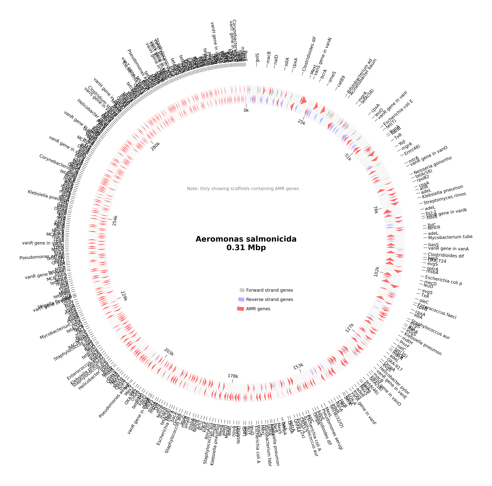

### AAC(6')-Iak
- **Mechanism**: antibiotic inactivation
- **Drug Classes**: aminoglycoside antibiotic
- **AMR Family**: AAC(6')
- **Locations**:
  - gnl|SPADES|NKBAGNNB_175742_1 : position 23-469

### Acinetobacter baumannii AbaF
- **Mechanism**: antibiotic efflux
- **Drug Classes**: phosphonic acid antibiotic
- **AMR Family**: major facilitator superfamily (MFS) antibiotic efflux pump
- **Locations**:
  - gnl|SPADES|NKBAGNNB_2046_1 : position 11-1327

### AcrF
- **Mechanism**: antibiotic efflux
- **Drug Classes**: fluoroquinolone antibiotic; cephalosporin; cephamycin; penam
- **AMR Family**: resistance-nodulation-cell division (RND) antibiotic efflux pump
- **Locations**:
  - gnl|SPADES|NKBAGNNB_37195_1 : position 3-878

### Agrobacterium fabrum chloramphenicol acetyltransferase
- **Mechanism**: antibiotic inactivation
- **Drug Classes**: phenicol antibiotic
- **AMR Family**: chloramphenicol acetyltransferase (CAT)
- **Locations**:
  - gnl|SPADES|NKBAGNNB_33571_1 : position 2-496

### ArnT (found in 2 locations)
- **Mechanism**: antibiotic target alteration
- **Drug Classes**: peptide antibiotic
- **AMR Family**: pmr phosphoethanolamine transferase
- **Locations**:
  - gnl|SPADES|NKBAGNNB_232660_1 : position 3-542
  - gnl|SPADES|NKBAGNNB_55948_1 : position 9-797

### Bifidobacterium adolescentis rpoB mutants conferring resistance to rifampicin
- **Mechanism**: antibiotic target alteration; antibiotic target replacement
- **Drug Classes**: rifamycin antibiotic
- **AMR Family**: rifamycin-resistant beta-subunit of RNA polymerase (rpoB)
- **Locations**:
  - gnl|SPADES|NKBAGNNB_1886_5 : position 2314-2610

### CRD3-1
- **Mechanism**: antibiotic inactivation
- **Drug Classes**: carbapenem
- **AMR Family**: CRD3 beta-lactamase
- **Locations**:
  - gnl|SPADES|NKBAGNNB_28292_1 : position 84-908

### CRP
- **Mechanism**: antibiotic efflux
- **Drug Classes**: macrolide antibiotic; fluoroquinolone antibiotic; penam
- **AMR Family**: resistance-nodulation-cell division (RND) antibiotic efflux pump
- **Locations**:
  - gnl|SPADES|NKBAGNNB_18696_1 : position 195-833

### Clostridioides difficile gyrB conferring resistance to fluoroquinolones (found in 3 locations)
- **Mechanism**: antibiotic target alteration
- **Drug Classes**: fluoroquinolone antibiotic
- **AMR Family**: fluoroquinolone resistant gyrB
- **Locations**:
  - gnl|SPADES|NKBAGNNB_1501_1 : position 3-1205
  - gnl|SPADES|NKBAGNNB_22263_1 : position 167-994
  - gnl|SPADES|NKBAGNNB_6071_2 : position 281-1417

### Clostridium sporogenes cplR
- **Mechanism**: antibiotic target protection
- **Drug Classes**: lincosamide antibiotic; pleuromutilin antibiotic
- **AMR Family**: Miscellaneous ABC-F subfamily ATP-binding cassette ribosomal protection proteins
- **Locations**:
  - gnl|SPADES|NKBAGNNB_905201_1 : position 1-228

### Corynebacterium striatum tetA (found in 2 locations)
- **Mechanism**: antibiotic efflux
- **Drug Classes**: penam; tetracycline antibiotic
- **AMR Family**: major facilitator superfamily (MFS) antibiotic efflux pump
- **Locations**:
  - gnl|SPADES|NKBAGNNB_1966278_1 : position 3-215
  - gnl|SPADES|NKBAGNNB_566605_1 : position 2-388

### Enterococcus faecalis cls with mutation conferring resistance to daptomycin
- **Mechanism**: antibiotic target alteration
- **Drug Classes**: peptide antibiotic
- **AMR Family**: daptomycin resistant cls
- **Locations**:
  - gnl|SPADES|NKBAGNNB_145073_1 : position 2-622

### Enterococcus faecium liaR mutant conferring daptomycin resistance
- **Mechanism**: antibiotic target alteration; antibiotic efflux
- **Drug Classes**: peptide antibiotic
- **AMR Family**: daptomycin resistant liaR
- **Locations**:
  - gnl|SPADES|NKBAGNNB_7918_2 : position 851-1297

### Erm(48)
- **Mechanism**: antibiotic target alteration
- **Drug Classes**: macrolide antibiotic; lincosamide antibiotic; streptogramin antibiotic; streptogramin B antibiotic
- **AMR Family**: Erm 23S ribosomal RNA methyltransferase
- **Locations**:
  - gnl|SPADES|NKBAGNNB_2916_2 : position 332-1174

### Escherichia coli AcrAB-TolC with AcrR mutation conferring resistance to ciprofloxacin, tetracycline, and ceftazidime (found in 3 locations)
- **Mechanism**: antibiotic target alteration; antibiotic efflux
- **Drug Classes**: fluoroquinolone antibiotic; cephalosporin; glycylcycline; penam; tetracycline antibiotic; rifamycin antibiotic; phenicol antibiotic; disinfecting agents and antiseptics
- **AMR Family**: resistance-nodulation-cell division (RND) antibiotic efflux pump
- **Locations**:
  - gnl|SPADES|NKBAGNNB_25397_1 : position 48-734
  - gnl|SPADES|NKBAGNNB_36126_1 : position 3-239
  - gnl|SPADES|NKBAGNNB_69280_2 : position 435-755

### Escherichia coli EF-Tu mutants conferring resistance to Pulvomycin (found in 2 locations)
- **Mechanism**: antibiotic target alteration
- **Drug Classes**: elfamycin antibiotic
- **AMR Family**: elfamycin resistant EF-Tu
- **Locations**:
  - gnl|SPADES|NKBAGNNB_1053382_1 : position 2-292
  - gnl|SPADES|NKBAGNNB_2269_1 : position 2-1057

### Escherichia coli parE conferring resistance to fluoroquinolones
- **Mechanism**: antibiotic target alteration
- **Drug Classes**: fluoroquinolone antibiotic
- **AMR Family**: fluoroquinolone resistant parE
- **Locations**:
  - gnl|SPADES|NKBAGNNB_6433_1 : position 3-1244

### FOX-4
- **Mechanism**: antibiotic inactivation
- **Drug Classes**: cephalosporin; cephamycin
- **AMR Family**: FOX beta-lactamase
- **Locations**:
  - gnl|SPADES|NKBAGNNB_17874_1 : position 3-1046

### H-NS
- **Mechanism**: antibiotic efflux
- **Drug Classes**: macrolide antibiotic; fluoroquinolone antibiotic; cephalosporin; cephamycin; penam; tetracycline antibiotic
- **AMR Family**: major facilitator superfamily (MFS) antibiotic efflux pump; resistance-nodulation-cell division (RND) antibiotic efflux pump
- **Locations**:
  - gnl|SPADES|NKBAGNNB_1513564_1 : position 54-245

### Helicobacter pylori pbp1 mutants conferring resistance to amoxicillin (found in 2 locations)
- **Mechanism**: antibiotic target alteration
- **Drug Classes**: cephalosporin; cephamycin; penam
- **AMR Family**: Penicillin-binding protein mutations conferring resistance to beta-lactam antibiotics
- **Locations**:
  - gnl|SPADES|NKBAGNNB_139787_1 : position 2-628
  - gnl|SPADES|NKBAGNNB_814860_1 : position 2-331

### Helicobacter pylori rpoB mutation conferring resistance to rifampicin
- **Mechanism**: antibiotic target alteration; antibiotic target replacement
- **Drug Classes**: fluoroquinolone antibiotic; rifamycin antibiotic
- **AMR Family**: rifamycin-resistant beta-subunit of RNA polymerase (rpoB)
- **Locations**:
  - gnl|SPADES|NKBAGNNB_12211_1 : position 2-1150

### Klebsiella pneumoniae KpnF
- **Mechanism**: antibiotic efflux
- **Drug Classes**: macrolide antibiotic; aminoglycoside antibiotic; cephalosporin; tetracycline antibiotic; peptide antibiotic; rifamycin antibiotic; disinfecting agents and antiseptics
- **AMR Family**: small multidrug resistance (SMR) antibiotic efflux pump
- **Locations**:
  - gnl|SPADES|NKBAGNNB_9584_2 : position 86-406

### Klebsiella pneumoniae KpnH
- **Mechanism**: antibiotic efflux
- **Drug Classes**: macrolide antibiotic; fluoroquinolone antibiotic; aminoglycoside antibiotic; carbapenem; cephalosporin; penam; peptide antibiotic; penem
- **AMR Family**: major facilitator superfamily (MFS) antibiotic efflux pump
- **Locations**:
  - gnl|SPADES|NKBAGNNB_3966_1 : position 2-1141

### Klebsiella pneumoniae OmpK37 (found in 4 locations)
- **Mechanism**: reduced permeability to antibiotic
- **Drug Classes**: monobactam; carbapenem; cephalosporin; cephamycin; penam; penem
- **AMR Family**: General Bacterial Porin with reduced permeability to beta-lactams
- **Locations**:
  - gnl|SPADES|NKBAGNNB_143680_1 : position 1-624
  - gnl|SPADES|NKBAGNNB_32343_1 : position 1-549
  - gnl|SPADES|NKBAGNNB_44712_1 : position 1-681
  - gnl|SPADES|NKBAGNNB_468244_1 : position 2-421

### LpeB (found in 4 locations)
- **Mechanism**: antibiotic efflux
- **Drug Classes**: macrolide antibiotic
- **AMR Family**: resistance-nodulation-cell division (RND) antibiotic efflux pump
- **Locations**:
  - gnl|SPADES|NKBAGNNB_1735037_1 : position 2-229
  - gnl|SPADES|NKBAGNNB_414315_1 : position 3-443
  - gnl|SPADES|NKBAGNNB_744869_1 : position 1-345
  - gnl|SPADES|NKBAGNNB_7938_1 : position 1-564

### LpsA (found in 2 locations)
- **Mechanism**: reduced permeability to antibiotic
- **Drug Classes**: peptide antibiotic
- **AMR Family**: Intrinsic peptide antibiotic resistant Lps
- **Locations**:
  - gnl|SPADES|NKBAGNNB_335991_1 : position 1-477
  - gnl|SPADES|NKBAGNNB_378615_1 : position 3-260

### LptD (found in 2 locations)
- **Mechanism**: antibiotic efflux
- **Drug Classes**: carbapenem; peptide antibiotic; aminocoumarin antibiotic; rifamycin antibiotic
- **AMR Family**: ATP-binding cassette (ABC) antibiotic efflux pump
- **Locations**:
  - gnl|SPADES|NKBAGNNB_37337_1 : position 3-356
  - gnl|SPADES|NKBAGNNB_827859_1 : position 3-329

### MCR-10.2
- **Mechanism**: antibiotic target alteration
- **Drug Classes**: peptide antibiotic
- **AMR Family**: MCR phosphoethanolamine transferase
- **Locations**:
  - gnl|SPADES|NKBAGNNB_286330_1 : position 2-505

### MCR-7.1 (found in 2 locations)
- **Mechanism**: antibiotic target alteration
- **Drug Classes**: peptide antibiotic
- **AMR Family**: MCR phosphoethanolamine transferase
- **Locations**:
  - gnl|SPADES|NKBAGNNB_372024_1 : position 1-462
  - gnl|SPADES|NKBAGNNB_663491_1 : position 2-364

### MexB (found in 2 locations)
- **Mechanism**: antibiotic efflux
- **Drug Classes**: macrolide antibiotic; fluoroquinolone antibiotic; monobactam; carbapenem; cephalosporin; cephamycin; penam; tetracycline antibiotic; peptide antibiotic; aminocoumarin antibiotic; diaminopyrimidine antibiotic; sulfonamide antibiotic; phenicol antibiotic; penem
- **AMR Family**: resistance-nodulation-cell division (RND) antibiotic efflux pump
- **Locations**:
  - gnl|SPADES|NKBAGNNB_44204_1 : position 3-815
  - gnl|SPADES|NKBAGNNB_820899_1 : position 1-330

### MexF
- **Mechanism**: antibiotic efflux
- **Drug Classes**: fluoroquinolone antibiotic; diaminopyrimidine antibiotic; phenicol antibiotic
- **AMR Family**: resistance-nodulation-cell division (RND) antibiotic efflux pump
- **Locations**:
  - gnl|SPADES|NKBAGNNB_579937_1 : position 1-384

### MexI (found in 2 locations)
- **Mechanism**: antibiotic efflux
- **Drug Classes**: fluoroquinolone antibiotic; tetracycline antibiotic; disinfecting agents and antiseptics
- **AMR Family**: resistance-nodulation-cell division (RND) antibiotic efflux pump
- **Locations**:
  - gnl|SPADES|NKBAGNNB_1021325_1 : position 2-295
  - gnl|SPADES|NKBAGNNB_1551_1 : position 2-520

### MexJ
- **Mechanism**: antibiotic efflux
- **Drug Classes**: macrolide antibiotic; tetracycline antibiotic; disinfecting agents and antiseptics
- **AMR Family**: resistance-nodulation-cell division (RND) antibiotic efflux pump
- **Locations**:
  - gnl|SPADES|NKBAGNNB_34451_1 : position 3-896

### MexL
- **Mechanism**: antibiotic efflux
- **Drug Classes**: macrolide antibiotic; tetracycline antibiotic; disinfecting agents and antiseptics
- **AMR Family**: resistance-nodulation-cell division (RND) antibiotic efflux pump
- **Locations**:
  - gnl|SPADES|NKBAGNNB_20782_2 : position 393-947

### MexS (found in 2 locations)
- **Mechanism**: antibiotic efflux
- **Drug Classes**: fluoroquinolone antibiotic; diaminopyrimidine antibiotic; phenicol antibiotic
- **AMR Family**: resistance-nodulation-cell division (RND) antibiotic efflux pump
- **Locations**:
  - gnl|SPADES|NKBAGNNB_15161_2 : position 219-1088
  - gnl|SPADES|NKBAGNNB_31936_1 : position 3-911

### MexT (found in 2 locations)
- **Mechanism**: antibiotic efflux
- **Drug Classes**: fluoroquinolone antibiotic; diaminopyrimidine antibiotic; phenicol antibiotic
- **AMR Family**: resistance-nodulation-cell division (RND) antibiotic efflux pump
- **Locations**:
  - gnl|SPADES|NKBAGNNB_108704_1 : position 3-674
  - gnl|SPADES|NKBAGNNB_119393_2 : position 232-657

### MexV (found in 5 locations)
- **Mechanism**: antibiotic efflux
- **Drug Classes**: macrolide antibiotic; fluoroquinolone antibiotic; tetracycline antibiotic; phenicol antibiotic; disinfecting agents and antiseptics
- **AMR Family**: resistance-nodulation-cell division (RND) antibiotic efflux pump
- **Locations**:
  - gnl|SPADES|NKBAGNNB_1536491_1 : position 2-244
  - gnl|SPADES|NKBAGNNB_1809941_1 : position 1-225
  - gnl|SPADES|NKBAGNNB_250380_1 : position 1-336
  - gnl|SPADES|NKBAGNNB_71475_1 : position 3-749
  - gnl|SPADES|NKBAGNNB_794324_1 : position 3-335

### MexW (found in 4 locations)
- **Mechanism**: antibiotic efflux
- **Drug Classes**: macrolide antibiotic; fluoroquinolone antibiotic; tetracycline antibiotic; phenicol antibiotic; disinfecting agents and antiseptics
- **AMR Family**: resistance-nodulation-cell division (RND) antibiotic efflux pump
- **Locations**:
  - gnl|SPADES|NKBAGNNB_117728_1 : position 1-660
  - gnl|SPADES|NKBAGNNB_121433_1 : position 1-654
  - gnl|SPADES|NKBAGNNB_137514_1 : position 2-631
  - gnl|SPADES|NKBAGNNB_40340_1 : position 2-862

### MuxA
- **Mechanism**: antibiotic efflux
- **Drug Classes**: macrolide antibiotic; monobactam; tetracycline antibiotic; aminocoumarin antibiotic
- **AMR Family**: resistance-nodulation-cell division (RND) antibiotic efflux pump
- **Locations**:
  - gnl|SPADES|NKBAGNNB_1357444_1 : position 2-220

### MuxC
- **Mechanism**: antibiotic efflux
- **Drug Classes**: macrolide antibiotic; monobactam; tetracycline antibiotic; aminocoumarin antibiotic
- **AMR Family**: resistance-nodulation-cell division (RND) antibiotic efflux pump
- **Locations**:
  - gnl|SPADES|NKBAGNNB_1157950_1 : position 1-279

### Mycobacterium tuberculosis katG mutations conferring resistance to isoniazid
- **Mechanism**: antibiotic target alteration
- **Drug Classes**: isoniazid-like antibiotic
- **AMR Family**: isoniazid resistant katG
- **Locations**:
  - gnl|SPADES|NKBAGNNB_5023_1 : position 3-494

### Mycobacterium tuberculosis pncA mutations conferring resistance to pyrazinamide
- **Mechanism**: antibiotic target alteration
- **Drug Classes**: pyrazine antibiotic
- **AMR Family**: Pyrazinamide resistant pncA
- **Locations**:
  - gnl|SPADES|NKBAGNNB_201883_1 : position 3-542

### Neisseria gonorrhoeae pilQ gene conferring resistance to beta-lactam
- **Mechanism**: antibiotic target alteration
- **Drug Classes**: cephalosporin; cephamycin; penam
- **AMR Family**: Penicillin-binding protein mutations conferring resistance to beta-lactam antibiotics
- **Locations**:
  - gnl|SPADES|NKBAGNNB_3257_2 : position 1472-1864

### NmcR (found in 8 locations)
- **Mechanism**: antibiotic inactivation
- **Drug Classes**: carbapenem; cephalosporin; cephamycin; penam
- **AMR Family**: NmcA beta-lactamase
- **Locations**:
  - gnl|SPADES|NKBAGNNB_181632_1 : position 1-279
  - gnl|SPADES|NKBAGNNB_278374_1 : position 1-510
  - gnl|SPADES|NKBAGNNB_334885_1 : position 1-480
  - gnl|SPADES|NKBAGNNB_379606_1 : position 1-297
  - gnl|SPADES|NKBAGNNB_4809_1 : position 91-771
  - gnl|SPADES|NKBAGNNB_60639_1 : position 229-780
  - gnl|SPADES|NKBAGNNB_84652_1 : position 66-665
  - gnl|SPADES|NKBAGNNB_981895_1 : position 2-160

### OXA-661
- **Mechanism**: antibiotic inactivation
- **Drug Classes**: penam
- **AMR Family**: OXA beta-lactamase; OXA-266-like beta-lactamase
- **Locations**:
  - gnl|SPADES|NKBAGNNB_103011_1 : position 2-682

### OXA-724
- **Mechanism**: antibiotic inactivation
- **Drug Classes**: penam
- **AMR Family**: OXA beta-lactamase; OXA-12-like beta-lactamase
- **Locations**:
  - gnl|SPADES|NKBAGNNB_6091_2 : position 867-1415

### OXA-917
- **Mechanism**: antibiotic inactivation
- **Drug Classes**: carbapenem; penam
- **AMR Family**: OXA beta-lactamase; OXA-427-like beta-lactamase
- **Locations**:
  - gnl|SPADES|NKBAGNNB_11313_2 : position 650-1171

### OmpA (found in 12 locations)
- **Mechanism**: reduced permeability to antibiotic
- **Drug Classes**: peptide antibiotic
- **AMR Family**: General Bacterial Porin with reduced permeability to peptide antibiotics
- **Locations**:
  - gnl|SPADES|NKBAGNNB_1041093_1 : position 1-291
  - gnl|SPADES|NKBAGNNB_116538_1 : position 2-661
  - gnl|SPADES|NKBAGNNB_11779_2 : position 907-1161
  - gnl|SPADES|NKBAGNNB_209062_2 : position 319-558
  - gnl|SPADES|NKBAGNNB_23215_1 : position 3-488
  - gnl|SPADES|NKBAGNNB_31524_1 : position 1-141
  - gnl|SPADES|NKBAGNNB_31581_1 : position 2-154
  - gnl|SPADES|NKBAGNNB_447344_1 : position 3-299
  - gnl|SPADES|NKBAGNNB_603098_1 : position 3-380
  - gnl|SPADES|NKBAGNNB_644315_1 : position 90-368
  - gnl|SPADES|NKBAGNNB_67227_1 : position 2-634
  - gnl|SPADES|NKBAGNNB_738278_1 : position 2-346

### OpmB
- **Mechanism**: antibiotic efflux
- **Drug Classes**: macrolide antibiotic; monobactam; tetracycline antibiotic; aminocoumarin antibiotic
- **AMR Family**: resistance-nodulation-cell division (RND) antibiotic efflux pump
- **Locations**:
  - gnl|SPADES|NKBAGNNB_1888570_1 : position 2-220

### OpmH
- **Mechanism**: antibiotic efflux
- **Drug Classes**: disinfecting agents and antiseptics
- **AMR Family**: resistance-nodulation-cell division (RND) antibiotic efflux pump
- **Locations**:
  - gnl|SPADES|NKBAGNNB_1234937_1 : position 3-170

### OprM (found in 2 locations)
- **Mechanism**: antibiotic efflux
- **Drug Classes**: macrolide antibiotic; fluoroquinolone antibiotic; monobactam; aminoglycoside antibiotic; carbapenem; cephalosporin; cephamycin; penam; tetracycline antibiotic; peptide antibiotic; aminocoumarin antibiotic; diaminopyrimidine antibiotic; sulfonamide antibiotic; phenicol antibiotic; penem; disinfecting agents and antiseptics
- **AMR Family**: resistance-nodulation-cell division (RND) antibiotic efflux pump
- **Locations**:
  - gnl|SPADES|NKBAGNNB_1217449_1 : position 1-270
  - gnl|SPADES|NKBAGNNB_1369193_1 : position 1-258

### ParR (found in 3 locations)
- **Mechanism**: antibiotic efflux; reduced permeability to antibiotic
- **Drug Classes**: macrolide antibiotic; fluoroquinolone antibiotic; monobactam; aminoglycoside antibiotic; carbapenem; cephalosporin; cephamycin; penam; tetracycline antibiotic; phenicol antibiotic; penem; disinfecting agents and antiseptics
- **AMR Family**: resistance-nodulation-cell division (RND) antibiotic efflux pump; Outer Membrane Porin (Opr)
- **Locations**:
  - gnl|SPADES|NKBAGNNB_1163789_1 : position 1-276
  - gnl|SPADES|NKBAGNNB_32179_2 : position 212-910
  - gnl|SPADES|NKBAGNNB_517296_1 : position 1-210

### ParS (found in 3 locations)
- **Mechanism**: antibiotic efflux; reduced permeability to antibiotic
- **Drug Classes**: macrolide antibiotic; fluoroquinolone antibiotic; monobactam; aminoglycoside antibiotic; carbapenem; cephalosporin; cephamycin; penam; tetracycline antibiotic; phenicol antibiotic; penem; disinfecting agents and antiseptics
- **AMR Family**: resistance-nodulation-cell division (RND) antibiotic efflux pump; Outer Membrane Porin (Opr)
- **Locations**:
  - gnl|SPADES|NKBAGNNB_1039714_1 : position 1-294
  - gnl|SPADES|NKBAGNNB_53162_1 : position 2-763
  - gnl|SPADES|NKBAGNNB_690475_1 : position 2-358

### PmpM (found in 2 locations)
- **Mechanism**: antibiotic efflux
- **Drug Classes**: fluoroquinolone antibiotic; aminoglycoside antibiotic; disinfecting agents and antiseptics
- **AMR Family**: multidrug and toxic compound extrusion (MATE) transporter
- **Locations**:
  - gnl|SPADES|NKBAGNNB_1635295_1 : position 1-237
  - gnl|SPADES|NKBAGNNB_49816_1 : position 1-819

### PmrF (found in 2 locations)
- **Mechanism**: antibiotic target alteration
- **Drug Classes**: peptide antibiotic
- **AMR Family**: pmr phosphoethanolamine transferase
- **Locations**:
  - gnl|SPADES|NKBAGNNB_2091667_1 : position 3-206
  - gnl|SPADES|NKBAGNNB_9819_2 : position 134-1168

### Pseudomonas aeruginosa CpxR (found in 2 locations)
- **Mechanism**: antibiotic efflux
- **Drug Classes**: macrolide antibiotic; fluoroquinolone antibiotic; monobactam; aminoglycoside antibiotic; carbapenem; cephalosporin; cephamycin; penam; tetracycline antibiotic; peptide antibiotic; aminocoumarin antibiotic; diaminopyrimidine antibiotic; sulfonamide antibiotic; phenicol antibiotic; penem
- **AMR Family**: resistance-nodulation-cell division (RND) antibiotic efflux pump
- **Locations**:
  - gnl|SPADES|NKBAGNNB_1111357_1 : position 3-284
  - gnl|SPADES|NKBAGNNB_21685_2 : position 236-931

### Pseudomonas aeruginosa ampR with mutation conferring resistance to aztreonam
- **Mechanism**: antibiotic target alteration; antibiotic inactivation
- **Drug Classes**: monobactam; carbapenem; cephalosporin
- **AMR Family**: PDC beta-lactamase; ampR transcriptional regulator with mutation conferring resistance to monobactam antibiotics
- **Locations**:
  - gnl|SPADES|NKBAGNNB_319065_1 : position 3-488

### Pseudomonas aeruginosa soxR
- **Mechanism**: antibiotic target alteration; antibiotic efflux
- **Drug Classes**: fluoroquinolone antibiotic; cephalosporin; glycylcycline; penam; tetracycline antibiotic; rifamycin antibiotic; phenicol antibiotic; disinfecting agents and antiseptics
- **AMR Family**: ATP-binding cassette (ABC) antibiotic efflux pump; major facilitator superfamily (MFS) antibiotic efflux pump; resistance-nodulation-cell division (RND) antibiotic efflux pump
- **Locations**:
  - gnl|SPADES|NKBAGNNB_112818_1 : position 2-331

### QepA4 (found in 2 locations)
- **Mechanism**: antibiotic efflux
- **Drug Classes**: fluoroquinolone antibiotic
- **AMR Family**: major facilitator superfamily (MFS) antibiotic efflux pump
- **Locations**:
  - gnl|SPADES|NKBAGNNB_122624_1 : position 3-653
  - gnl|SPADES|NKBAGNNB_179815_1 : position 1-309

### QnrA4
- **Mechanism**: antibiotic target protection
- **Drug Classes**: fluoroquinolone antibiotic
- **AMR Family**: quinolone resistance protein (qnr)
- **Locations**:
  - gnl|SPADES|NKBAGNNB_29785_1 : position 2-277

### QnrAS
- **Mechanism**: antibiotic target protection
- **Drug Classes**: fluoroquinolone antibiotic
- **AMR Family**: quinolone resistance protein (qnr)
- **Locations**:
  - gnl|SPADES|NKBAGNNB_302270_1 : position 2-373

### RanA (found in 11 locations)
- **Mechanism**: antibiotic efflux
- **Drug Classes**: aminoglycoside antibiotic
- **AMR Family**: ATP-binding cassette (ABC) antibiotic efflux pump
- **Locations**:
  - gnl|SPADES|NKBAGNNB_1080142_1 : position 3-287
  - gnl|SPADES|NKBAGNNB_1169429_1 : position 1-276
  - gnl|SPADES|NKBAGNNB_161920_1 : position 3-548
  - gnl|SPADES|NKBAGNNB_17895_1 : position 3-281
  - gnl|SPADES|NKBAGNNB_19013_1 : position 2-787
  - gnl|SPADES|NKBAGNNB_2273_2 : position 964-1764
  - gnl|SPADES|NKBAGNNB_414526_1 : position 2-442
  - gnl|SPADES|NKBAGNNB_471767_1 : position 3-341
  - gnl|SPADES|NKBAGNNB_645306_1 : position 2-367
  - gnl|SPADES|NKBAGNNB_825002_1 : position 1-330
  - gnl|SPADES|NKBAGNNB_8905_2 : position 496-1251

### RanB
- **Mechanism**: antibiotic efflux
- **Drug Classes**: aminoglycoside antibiotic
- **AMR Family**: ATP-binding cassette (ABC) antibiotic efflux pump
- **Locations**:
  - gnl|SPADES|NKBAGNNB_2273_3 : position 1764-2312

### RlmA(II)
- **Mechanism**: antibiotic target alteration
- **Drug Classes**: macrolide antibiotic; lincosamide antibiotic
- **AMR Family**: non-erm 23S ribosomal RNA methyltransferase (G748)
- **Locations**:
  - gnl|SPADES|NKBAGNNB_52407_1 : position 2-649

### Shigella flexneri acrA
- **Mechanism**: antibiotic efflux
- **Drug Classes**: fluoroquinolone antibiotic; cephalosporin; glycylcycline; penam; tetracycline antibiotic; rifamycin antibiotic; phenicol antibiotic; disinfecting agents and antiseptics
- **AMR Family**: resistance-nodulation-cell division (RND) antibiotic efflux pump
- **Locations**:
  - gnl|SPADES|NKBAGNNB_242005_1 : position 3-272

### Staphylococcus aureus fusA with mutation conferring resistance to fusidic acid
- **Mechanism**: antibiotic target alteration
- **Drug Classes**: fusidane antibiotic
- **AMR Family**: antibiotic resistant fusA
- **Locations**:
  - gnl|SPADES|NKBAGNNB_8276_3 : position 906-1277

### Staphylococcus aureus mupA conferring resistance to mupirocin (found in 4 locations)
- **Mechanism**: antibiotic target alteration
- **Drug Classes**: mupirocin-like antibiotic
- **AMR Family**: antibiotic-resistant isoleucyl-tRNA synthetase (ileS)
- **Locations**:
  - gnl|SPADES|NKBAGNNB_1294240_1 : position 1-264
  - gnl|SPADES|NKBAGNNB_141325_1 : position 3-626
  - gnl|SPADES|NKBAGNNB_171900_1 : position 3-593
  - gnl|SPADES|NKBAGNNB_65678_2 : position 162-767

### Staphylococcus aureus mupB conferring resistance to mupirocin
- **Mechanism**: antibiotic target alteration
- **Drug Classes**: mupirocin-like antibiotic
- **AMR Family**: antibiotic-resistant isoleucyl-tRNA synthetase (ileS)
- **Locations**:
  - gnl|SPADES|NKBAGNNB_51853_1 : position 1-609

### Staphylococcus aureus murA with mutation conferring resistance to fosfomycin
- **Mechanism**: antibiotic target alteration
- **Drug Classes**: phosphonic acid antibiotic
- **AMR Family**: antibiotic-resistant murA transferase
- **Locations**:
  - gnl|SPADES|NKBAGNNB_25446_1 : position 2-961

### Streptomyces rimosus otr(A)
- **Mechanism**: antibiotic target protection
- **Drug Classes**: tetracycline antibiotic
- **AMR Family**: tetracycline-resistant ribosomal protection protein
- **Locations**:
  - gnl|SPADES|NKBAGNNB_3983_1 : position 1-1674

### TaeA
- **Mechanism**: antibiotic efflux
- **Drug Classes**: pleuromutilin antibiotic
- **AMR Family**: ATP-binding cassette (ABC) antibiotic efflux pump
- **Locations**:
  - gnl|SPADES|NKBAGNNB_932497_1 : position 2-310

### TolC (found in 3 locations)
- **Mechanism**: antibiotic efflux
- **Drug Classes**: macrolide antibiotic; fluoroquinolone antibiotic; aminoglycoside antibiotic; carbapenem; cephalosporin; glycylcycline; cephamycin; penam; tetracycline antibiotic; peptide antibiotic; aminocoumarin antibiotic; rifamycin antibiotic; phenicol antibiotic; penem; disinfecting agents and antiseptics
- **AMR Family**: ATP-binding cassette (ABC) antibiotic efflux pump; major facilitator superfamily (MFS) antibiotic efflux pump; resistance-nodulation-cell division (RND) antibiotic efflux pump
- **Locations**:
  - gnl|SPADES|NKBAGNNB_1312991_1 : position 1-261
  - gnl|SPADES|NKBAGNNB_439225_1 : position 3-431
  - gnl|SPADES|NKBAGNNB_4701_3 : position 1061-1561

### TriA
- **Mechanism**: antibiotic efflux
- **Drug Classes**: disinfecting agents and antiseptics
- **AMR Family**: resistance-nodulation-cell division (RND) antibiotic efflux pump
- **Locations**:
  - gnl|SPADES|NKBAGNNB_678181_1 : position 3-359

### TriC
- **Mechanism**: antibiotic efflux
- **Drug Classes**: disinfecting agents and antiseptics
- **AMR Family**: resistance-nodulation-cell division (RND) antibiotic efflux pump
- **Locations**:
  - gnl|SPADES|NKBAGNNB_109249_2 : position 472-672

### TxR (found in 10 locations)
- **Mechanism**: antibiotic efflux
- **Drug Classes**: tetracycline antibiotic
- **AMR Family**: ATP-binding cassette (ABC) antibiotic efflux pump
- **Locations**:
  - gnl|SPADES|NKBAGNNB_1353110_1 : position 3-260
  - gnl|SPADES|NKBAGNNB_1611466_1 : position 3-239
  - gnl|SPADES|NKBAGNNB_1724349_1 : position 2-229
  - gnl|SPADES|NKBAGNNB_2313_3 : position 909-2285
  - gnl|SPADES|NKBAGNNB_302613_1 : position 1-495
  - gnl|SPADES|NKBAGNNB_430169_1 : position 3-437
  - gnl|SPADES|NKBAGNNB_619494_1 : position 1-375
  - gnl|SPADES|NKBAGNNB_657890_1 : position 2-364
  - gnl|SPADES|NKBAGNNB_7575_1 : position 2-1315
  - gnl|SPADES|NKBAGNNB_89395_1 : position 2-706

### YojI (found in 2 locations)
- **Mechanism**: antibiotic efflux
- **Drug Classes**: peptide antibiotic
- **AMR Family**: ATP-binding cassette (ABC) antibiotic efflux pump
- **Locations**:
  - gnl|SPADES|NKBAGNNB_2608_2 : position 1004-2125
  - gnl|SPADES|NKBAGNNB_8905_1 : position 3-449

### aadT
- **Mechanism**: antibiotic efflux
- **Drug Classes**: macrolide antibiotic; tetracycline antibiotic; disinfecting agents and antiseptics
- **AMR Family**: major facilitator superfamily (MFS) antibiotic efflux pump
- **Locations**:
  - gnl|SPADES|NKBAGNNB_312515_1 : position 3-491

### acrB (found in 2 locations)
- **Mechanism**: antibiotic efflux
- **Drug Classes**: fluoroquinolone antibiotic; cephalosporin; glycylcycline; penam; tetracycline antibiotic; rifamycin antibiotic; phenicol antibiotic; disinfecting agents and antiseptics
- **AMR Family**: resistance-nodulation-cell division (RND) antibiotic efflux pump
- **Locations**:
  - gnl|SPADES|NKBAGNNB_485513_1 : position 3-416
  - gnl|SPADES|NKBAGNNB_567557_1 : position 2-373

### adeI
- **Mechanism**: antibiotic efflux
- **Drug Classes**: macrolide antibiotic; fluoroquinolone antibiotic; lincosamide antibiotic; carbapenem; cephalosporin; tetracycline antibiotic; rifamycin antibiotic; diaminopyrimidine antibiotic; phenicol antibiotic; penem
- **AMR Family**: resistance-nodulation-cell division (RND) antibiotic efflux pump
- **Locations**:
  - gnl|SPADES|NKBAGNNB_1750233_1 : position 1-228

### adeJ
- **Mechanism**: antibiotic efflux
- **Drug Classes**: macrolide antibiotic; fluoroquinolone antibiotic; lincosamide antibiotic; carbapenem; cephalosporin; tetracycline antibiotic; rifamycin antibiotic; diaminopyrimidine antibiotic; phenicol antibiotic; penem
- **AMR Family**: resistance-nodulation-cell division (RND) antibiotic efflux pump
- **Locations**:
  - gnl|SPADES|NKBAGNNB_1341488_1 : position 1-261

### adeK
- **Mechanism**: antibiotic efflux
- **Drug Classes**: macrolide antibiotic; fluoroquinolone antibiotic; lincosamide antibiotic; carbapenem; cephalosporin; tetracycline antibiotic; rifamycin antibiotic; diaminopyrimidine antibiotic; phenicol antibiotic; penem
- **AMR Family**: resistance-nodulation-cell division (RND) antibiotic efflux pump
- **Locations**:
  - gnl|SPADES|NKBAGNNB_1864769_1 : position 2-220

### adeL (found in 16 locations)
- **Mechanism**: antibiotic efflux
- **Drug Classes**: fluoroquinolone antibiotic; tetracycline antibiotic
- **AMR Family**: resistance-nodulation-cell division (RND) antibiotic efflux pump
- **Locations**:
  - gnl|SPADES|NKBAGNNB_1098497_1 : position 1-198
  - gnl|SPADES|NKBAGNNB_11149_2 : position 278-1177
  - gnl|SPADES|NKBAGNNB_1193034_1 : position 1-273
  - gnl|SPADES|NKBAGNNB_1352853_1 : position 2-259
  - gnl|SPADES|NKBAGNNB_138336_1 : position 2-631
  - gnl|SPADES|NKBAGNNB_1566986_1 : position 1-243
  - gnl|SPADES|NKBAGNNB_1764780_1 : position 1-228
  - gnl|SPADES|NKBAGNNB_1869289_1 : position 2-220
  - gnl|SPADES|NKBAGNNB_3791_2 : position 489-1403
  - gnl|SPADES|NKBAGNNB_4015_3 : position 516-1418
  - gnl|SPADES|NKBAGNNB_40204_2 : position 493-861
  - gnl|SPADES|NKBAGNNB_491840_1 : position 3-413
  - gnl|SPADES|NKBAGNNB_5018_1 : position 73-981
  - gnl|SPADES|NKBAGNNB_528245_1 : position 3-353
  - gnl|SPADES|NKBAGNNB_640864_1 : position 2-370
  - gnl|SPADES|NKBAGNNB_758203_1 : position 2-343

### adeR (found in 5 locations)
- **Mechanism**: antibiotic efflux
- **Drug Classes**: glycylcycline; tetracycline antibiotic
- **AMR Family**: resistance-nodulation-cell division (RND) antibiotic efflux pump
- **Locations**:
  - gnl|SPADES|NKBAGNNB_15283_1 : position 156-1085
  - gnl|SPADES|NKBAGNNB_1558909_1 : position 2-241
  - gnl|SPADES|NKBAGNNB_19103_1 : position 141-470
  - gnl|SPADES|NKBAGNNB_42064_1 : position 158-658
  - gnl|SPADES|NKBAGNNB_653503_1 : position 2-367

### almE
- **Mechanism**: antibiotic target alteration
- **Drug Classes**: peptide antibiotic
- **AMR Family**: polymyxin resistance operon; alm glycyltransferase
- **Locations**:
  - gnl|SPADES|NKBAGNNB_394096_1 : position 3-452

### arlR (found in 2 locations)
- **Mechanism**: antibiotic efflux
- **Drug Classes**: fluoroquinolone antibiotic; disinfecting agents and antiseptics
- **AMR Family**: major facilitator superfamily (MFS) antibiotic efflux pump
- **Locations**:
  - gnl|SPADES|NKBAGNNB_3778_3 : position 1378-1683
  - gnl|SPADES|NKBAGNNB_416395_2 : position 130-441

### arnA (found in 6 locations)
- **Mechanism**: antibiotic target alteration
- **Drug Classes**: peptide antibiotic
- **AMR Family**: pmr phosphoethanolamine transferase
- **Locations**:
  - gnl|SPADES|NKBAGNNB_1229507_1 : position 2-271
  - gnl|SPADES|NKBAGNNB_1825672_1 : position 3-224
  - gnl|SPADES|NKBAGNNB_322275_1 : position 1-282
  - gnl|SPADES|NKBAGNNB_448782_1 : position 3-428
  - gnl|SPADES|NKBAGNNB_647056_1 : position 1-369
  - gnl|SPADES|NKBAGNNB_850582_1 : position 3-323

### bacA (found in 2 locations)
- **Mechanism**: antibiotic target alteration
- **Drug Classes**: peptide antibiotic
- **AMR Family**: undecaprenyl pyrophosphate related proteins
- **Locations**:
  - gnl|SPADES|NKBAGNNB_198193_1 : position 158-568
  - gnl|SPADES|NKBAGNNB_68977_2 : position 347-757

### baeR
- **Mechanism**: antibiotic efflux
- **Drug Classes**: aminoglycoside antibiotic; aminocoumarin antibiotic
- **AMR Family**: resistance-nodulation-cell division (RND) antibiotic efflux pump
- **Locations**:
  - gnl|SPADES|NKBAGNNB_459645_1 : position 2-424

### basS (found in 3 locations)
- **Mechanism**: antibiotic target alteration; antibiotic efflux
- **Drug Classes**: peptide antibiotic
- **AMR Family**: pmr phosphoethanolamine transferase
- **Locations**:
  - gnl|SPADES|NKBAGNNB_1121512_1 : position 3-281
  - gnl|SPADES|NKBAGNNB_5552_2 : position 279-1463
  - gnl|SPADES|NKBAGNNB_6091_1 : position 2-811

### bcr-1 (found in 5 locations)
- **Mechanism**: antibiotic efflux
- **Drug Classes**: bicyclomycin-like antibiotic
- **AMR Family**: major facilitator superfamily (MFS) antibiotic efflux pump
- **Locations**:
  - gnl|SPADES|NKBAGNNB_1036057_1 : position 3-293
  - gnl|SPADES|NKBAGNNB_112370_1 : position 152-667
  - gnl|SPADES|NKBAGNNB_1314436_1 : position 2-262
  - gnl|SPADES|NKBAGNNB_4107_2 : position 342-1049
  - gnl|SPADES|NKBAGNNB_626029_1 : position 3-374

### bcrA (found in 3 locations)
- **Mechanism**: antibiotic efflux
- **Drug Classes**: peptide antibiotic
- **AMR Family**: ATP-binding cassette (ABC) antibiotic efflux pump
- **Locations**:
  - gnl|SPADES|NKBAGNNB_1575_2 : position 455-1114
  - gnl|SPADES|NKBAGNNB_17895_2 : position 298-999
  - gnl|SPADES|NKBAGNNB_886367_1 : position 3-317

### bcrC
- **Mechanism**: antibiotic target alteration
- **Drug Classes**: peptide antibiotic
- **AMR Family**: undecaprenyl pyrophosphate related proteins
- **Locations**:
  - gnl|SPADES|NKBAGNNB_922950_2 : position 181-312

### carA
- **Mechanism**: antibiotic target protection
- **Drug Classes**: macrolide antibiotic
- **AMR Family**: Miscellaneous ABC-F subfamily ATP-binding cassette ribosomal protection proteins
- **Locations**:
  - gnl|SPADES|NKBAGNNB_244480_1 : position 1-225

### catB9
- **Mechanism**: antibiotic inactivation
- **Drug Classes**: phenicol antibiotic
- **AMR Family**: chloramphenicol acetyltransferase (CAT)
- **Locations**:
  - gnl|SPADES|NKBAGNNB_1843_2 : position 396-1757

### cdeA (found in 2 locations)
- **Mechanism**: antibiotic efflux
- **Drug Classes**: fluoroquinolone antibiotic; disinfecting agents and antiseptics
- **AMR Family**: multidrug and toxic compound extrusion (MATE) transporter
- **Locations**:
  - gnl|SPADES|NKBAGNNB_1556747_1 : position 1-243
  - gnl|SPADES|NKBAGNNB_1987873_1 : position 1-213

### ceoB (found in 2 locations)
- **Mechanism**: antibiotic efflux
- **Drug Classes**: fluoroquinolone antibiotic; aminoglycoside antibiotic
- **AMR Family**: resistance-nodulation-cell division (RND) antibiotic efflux pump
- **Locations**:
  - gnl|SPADES|NKBAGNNB_2004658_1 : position 1-210
  - gnl|SPADES|NKBAGNNB_242005_2 : position 282-533

### clbB
- **Mechanism**: antibiotic target alteration
- **Drug Classes**: lincosamide antibiotic; streptogramin antibiotic; streptogramin A antibiotic; oxazolidinone antibiotic; phenicol antibiotic; pleuromutilin antibiotic
- **AMR Family**: Cfr 23S ribosomal RNA methyltransferase
- **Locations**:
  - gnl|SPADES|NKBAGNNB_228498_1 : position 1-543

### cmeB (found in 2 locations)
- **Mechanism**: antibiotic efflux
- **Drug Classes**: macrolide antibiotic; fluoroquinolone antibiotic; cephalosporin; fusidane antibiotic
- **AMR Family**: resistance-nodulation-cell division (RND) antibiotic efflux pump
- **Locations**:
  - gnl|SPADES|NKBAGNNB_102242_1 : position 3-683
  - gnl|SPADES|NKBAGNNB_960176_1 : position 3-305

### cmlv (found in 2 locations)
- **Mechanism**: antibiotic inactivation
- **Drug Classes**: phenicol antibiotic
- **AMR Family**: chloramphenicol phosphotransferase
- **Locations**:
  - gnl|SPADES|NKBAGNNB_1004780_1 : position 2-298
  - gnl|SPADES|NKBAGNNB_234200_1 : position 191-541

### cphA5 (found in 2 locations)
- **Mechanism**: antibiotic inactivation
- **Drug Classes**: carbapenem
- **AMR Family**: CphA beta-lactamase
- **Locations**:
  - gnl|SPADES|NKBAGNNB_1872579_1 : position 115-219
  - gnl|SPADES|NKBAGNNB_959329_1 : position 2-304

### cprR (found in 5 locations)
- **Mechanism**: antibiotic target alteration; antibiotic efflux
- **Drug Classes**: peptide antibiotic
- **AMR Family**: pmr phosphoethanolamine transferase
- **Locations**:
  - gnl|SPADES|NKBAGNNB_18257_3 : position 854-1039
  - gnl|SPADES|NKBAGNNB_416253_1 : position 2-415
  - gnl|SPADES|NKBAGNNB_440102_1 : position 3-431
  - gnl|SPADES|NKBAGNNB_462733_1 : position 1-423
  - gnl|SPADES|NKBAGNNB_613756_1 : position 1-375

### cpxA (found in 9 locations)
- **Mechanism**: antibiotic efflux
- **Drug Classes**: aminoglycoside antibiotic; aminocoumarin antibiotic
- **AMR Family**: resistance-nodulation-cell division (RND) antibiotic efflux pump
- **Locations**:
  - gnl|SPADES|NKBAGNNB_1470_1 : position 1-450
  - gnl|SPADES|NKBAGNNB_2080886_1 : position 1-207
  - gnl|SPADES|NKBAGNNB_2129_2 : position 1669-2412
  - gnl|SPADES|NKBAGNNB_355850_1 : position 1-468
  - gnl|SPADES|NKBAGNNB_360127_1 : position 2-466
  - gnl|SPADES|NKBAGNNB_3778_1 : position 3-857
  - gnl|SPADES|NKBAGNNB_38955_1 : position 3-869
  - gnl|SPADES|NKBAGNNB_617652_1 : position 2-337
  - gnl|SPADES|NKBAGNNB_8074_1 : position 2-1234

### dfrA3 (found in 2 locations)
- **Mechanism**: antibiotic target replacement
- **Drug Classes**: diaminopyrimidine antibiotic
- **AMR Family**: trimethoprim resistant dihydrofolate reductase dfr
- **Locations**:
  - gnl|SPADES|NKBAGNNB_1045895_1 : position 9-293
  - gnl|SPADES|NKBAGNNB_608558_1 : position 39-377

### efrA
- **Mechanism**: antibiotic efflux
- **Drug Classes**: macrolide antibiotic; fluoroquinolone antibiotic; rifamycin antibiotic
- **AMR Family**: ATP-binding cassette (ABC) antibiotic efflux pump
- **Locations**:
  - gnl|SPADES|NKBAGNNB_86445_1 : position 3-713

### efrB (found in 3 locations)
- **Mechanism**: antibiotic efflux
- **Drug Classes**: macrolide antibiotic; fluoroquinolone antibiotic; rifamycin antibiotic
- **AMR Family**: ATP-binding cassette (ABC) antibiotic efflux pump
- **Locations**:
  - gnl|SPADES|NKBAGNNB_1016440_1 : position 2-295
  - gnl|SPADES|NKBAGNNB_772789_1 : position 1-339
  - gnl|SPADES|NKBAGNNB_789223_1 : position 132-335

### emrA
- **Mechanism**: antibiotic efflux
- **Drug Classes**: fluoroquinolone antibiotic
- **AMR Family**: major facilitator superfamily (MFS) antibiotic efflux pump
- **Locations**:
  - gnl|SPADES|NKBAGNNB_1088774_1 : position 2-286

### emrB (found in 2 locations)
- **Mechanism**: antibiotic efflux
- **Drug Classes**: fluoroquinolone antibiotic
- **AMR Family**: major facilitator superfamily (MFS) antibiotic efflux pump
- **Locations**:
  - gnl|SPADES|NKBAGNNB_13623_2 : position 700-1119
  - gnl|SPADES|NKBAGNNB_542296_1 : position 3-395

### evgA (found in 2 locations)
- **Mechanism**: antibiotic efflux
- **Drug Classes**: macrolide antibiotic; fluoroquinolone antibiotic; penam; tetracycline antibiotic
- **AMR Family**: major facilitator superfamily (MFS) antibiotic efflux pump; resistance-nodulation-cell division (RND) antibiotic efflux pump
- **Locations**:
  - gnl|SPADES|NKBAGNNB_1870340_1 : position 2-220
  - gnl|SPADES|NKBAGNNB_217392_1 : position 3-350

### evgS (found in 23 locations)
- **Mechanism**: antibiotic efflux
- **Drug Classes**: macrolide antibiotic; fluoroquinolone antibiotic; penam; tetracycline antibiotic
- **AMR Family**: major facilitator superfamily (MFS) antibiotic efflux pump; resistance-nodulation-cell division (RND) antibiotic efflux pump
- **Locations**:
  - gnl|SPADES|NKBAGNNB_1007161_1 : position 3-296
  - gnl|SPADES|NKBAGNNB_11875_1 : position 2-991
  - gnl|SPADES|NKBAGNNB_1342639_1 : position 2-259
  - gnl|SPADES|NKBAGNNB_1549413_1 : position 3-242
  - gnl|SPADES|NKBAGNNB_16344_1 : position 3-1067
  - gnl|SPADES|NKBAGNNB_171195_1 : position 1-594
  - gnl|SPADES|NKBAGNNB_1792167_1 : position 1-225
  - gnl|SPADES|NKBAGNNB_257494_1 : position 1-525
  - gnl|SPADES|NKBAGNNB_28485_1 : position 1-495
  - gnl|SPADES|NKBAGNNB_28485_2 : position 554-937
  - gnl|SPADES|NKBAGNNB_331574_1 : position 3-479
  - gnl|SPADES|NKBAGNNB_448858_1 : position 87-428
  - gnl|SPADES|NKBAGNNB_490671_1 : position 1-414
  - gnl|SPADES|NKBAGNNB_513277_1 : position 2-205
  - gnl|SPADES|NKBAGNNB_565029_1 : position 1-390
  - gnl|SPADES|NKBAGNNB_619784_1 : position 2-376
  - gnl|SPADES|NKBAGNNB_6221_1 : position 3-1403
  - gnl|SPADES|NKBAGNNB_7486_1 : position 3-1319
  - gnl|SPADES|NKBAGNNB_760720_1 : position 1-342
  - gnl|SPADES|NKBAGNNB_8680_1 : position 1-771
  - gnl|SPADES|NKBAGNNB_913115_1 : position 1-312
  - gnl|SPADES|NKBAGNNB_9319_1 : position 3-758
  - gnl|SPADES|NKBAGNNB_93556_1 : position 1-699

### facT
- **Mechanism**: antibiotic efflux
- **Drug Classes**: elfamycin antibiotic
- **AMR Family**: major facilitator superfamily (MFS) antibiotic efflux pump
- **Locations**:
  - gnl|SPADES|NKBAGNNB_189671_1 : position 2-577

### farA
- **Mechanism**: antibiotic efflux
- **Drug Classes**: antibacterial free fatty acids
- **AMR Family**: major facilitator superfamily (MFS) antibiotic efflux pump
- **Locations**:
  - gnl|SPADES|NKBAGNNB_13623_1 : position 2-700

### golS
- **Mechanism**: antibiotic efflux
- **Drug Classes**: monobactam; carbapenem; cephalosporin; cephamycin; penam; phenicol antibiotic; penem
- **AMR Family**: resistance-nodulation-cell division (RND) antibiotic efflux pump
- **Locations**:
  - gnl|SPADES|NKBAGNNB_980_5 : position 3398-3787

### hmrM
- **Mechanism**: antibiotic efflux
- **Drug Classes**: fluoroquinolone antibiotic; disinfecting agents and antiseptics
- **AMR Family**: multidrug and toxic compound extrusion (MATE) transporter
- **Locations**:
  - gnl|SPADES|NKBAGNNB_1445631_1 : position 2-250

### kdpD (found in 2 locations)
- **Mechanism**: antibiotic efflux
- **Drug Classes**: aminoglycoside antibiotic
- **AMR Family**: kdpDE
- **Locations**:
  - gnl|SPADES|NKBAGNNB_344467_1 : position 1-474
  - gnl|SPADES|NKBAGNNB_98773_1 : position 2-460

### kdpE (found in 3 locations)
- **Mechanism**: antibiotic efflux
- **Drug Classes**: aminoglycoside antibiotic
- **AMR Family**: kdpDE
- **Locations**:
  - gnl|SPADES|NKBAGNNB_1939886_1 : position 2-217
  - gnl|SPADES|NKBAGNNB_22325_2 : position 819-992
  - gnl|SPADES|NKBAGNNB_53231_1 : position 183-806

### leuO (found in 5 locations)
- **Mechanism**: antibiotic efflux
- **Drug Classes**: nucleoside antibiotic; disinfecting agents and antiseptics
- **AMR Family**: major facilitator superfamily (MFS) antibiotic efflux pump
- **Locations**:
  - gnl|SPADES|NKBAGNNB_155426_1 : position 324-611
  - gnl|SPADES|NKBAGNNB_2237_2 : position 818-1729
  - gnl|SPADES|NKBAGNNB_37144_2 : position 498-878
  - gnl|SPADES|NKBAGNNB_64378_1 : position 3-620
  - gnl|SPADES|NKBAGNNB_7299_1 : position 3-467

### lmrC
- **Mechanism**: antibiotic target protection
- **Drug Classes**: lincosamide antibiotic
- **AMR Family**: Miscellaneous ABC-F subfamily ATP-binding cassette ribosomal protection proteins
- **Locations**:
  - gnl|SPADES|NKBAGNNB_1344055_1 : position 2-202

### lsaA
- **Mechanism**: antibiotic target protection
- **Drug Classes**: lincosamide antibiotic; streptogramin antibiotic; streptogramin A antibiotic; streptogramin B antibiotic; pleuromutilin antibiotic
- **AMR Family**: lsa-type ABC-F protein
- **Locations**:
  - gnl|SPADES|NKBAGNNB_31541_2 : position 803-913

### lsaC
- **Mechanism**: antibiotic target protection
- **Drug Classes**: lincosamide antibiotic; streptogramin antibiotic; pleuromutilin antibiotic
- **AMR Family**: lsa-type ABC-F protein
- **Locations**:
  - gnl|SPADES|NKBAGNNB_466273_2 : position 242-421

### macA (found in 3 locations)
- **Mechanism**: antibiotic efflux
- **Drug Classes**: macrolide antibiotic
- **AMR Family**: ATP-binding cassette (ABC) antibiotic efflux pump
- **Locations**:
  - gnl|SPADES|NKBAGNNB_10897_2 : position 401-1183
  - gnl|SPADES|NKBAGNNB_971933_1 : position 15-302
  - gnl|SPADES|NKBAGNNB_97619_2 : position 342-692

### macB (found in 21 locations)
- **Mechanism**: antibiotic efflux
- **Drug Classes**: macrolide antibiotic
- **AMR Family**: ATP-binding cassette (ABC) antibiotic efflux pump
- **Locations**:
  - gnl|SPADES|NKBAGNNB_1055_5 : position 2605-3339
  - gnl|SPADES|NKBAGNNB_10897_1 : position 3-398
  - gnl|SPADES|NKBAGNNB_1131378_1 : position 2-280
  - gnl|SPADES|NKBAGNNB_1200763_1 : position 1-273
  - gnl|SPADES|NKBAGNNB_126252_1 : position 2-412
  - gnl|SPADES|NKBAGNNB_13189_2 : position 741-1127
  - gnl|SPADES|NKBAGNNB_139950_1 : position 1-627
  - gnl|SPADES|NKBAGNNB_150995_1 : position 3-614
  - gnl|SPADES|NKBAGNNB_1583176_1 : position 1-240
  - gnl|SPADES|NKBAGNNB_1608257_2 : position 94-240
  - gnl|SPADES|NKBAGNNB_1833652_1 : position 2-223
  - gnl|SPADES|NKBAGNNB_1964045_1 : position 3-215
  - gnl|SPADES|NKBAGNNB_273692_1 : position 2-514
  - gnl|SPADES|NKBAGNNB_35982_2 : position 150-818
  - gnl|SPADES|NKBAGNNB_368420_2 : position 126-461
  - gnl|SPADES|NKBAGNNB_488511_1 : position 3-413
  - gnl|SPADES|NKBAGNNB_494727_1 : position 2-247
  - gnl|SPADES|NKBAGNNB_543489_1 : position 1-396
  - gnl|SPADES|NKBAGNNB_61942_1 : position 2-778
  - gnl|SPADES|NKBAGNNB_63684_1 : position 503-772
  - gnl|SPADES|NKBAGNNB_77092_1 : position 1-735

### mdsC
- **Mechanism**: antibiotic efflux
- **Drug Classes**: monobactam; carbapenem; cephalosporin; cephamycin; penam; phenicol antibiotic; penem
- **AMR Family**: resistance-nodulation-cell division (RND) antibiotic efflux pump
- **Locations**:
  - gnl|SPADES|NKBAGNNB_1376697_1 : position 1-258

### mdtA
- **Mechanism**: antibiotic efflux
- **Drug Classes**: aminocoumarin antibiotic
- **AMR Family**: resistance-nodulation-cell division (RND) antibiotic efflux pump
- **Locations**:
  - gnl|SPADES|NKBAGNNB_189676_1 : position 3-575

### mdtH (found in 2 locations)
- **Mechanism**: antibiotic efflux
- **Drug Classes**: fluoroquinolone antibiotic
- **AMR Family**: major facilitator superfamily (MFS) antibiotic efflux pump
- **Locations**:
  - gnl|SPADES|NKBAGNNB_32343_2 : position 612-908
  - gnl|SPADES|NKBAGNNB_9690_1 : position 2-880

### mdtN
- **Mechanism**: antibiotic efflux
- **Drug Classes**: nucleoside antibiotic; disinfecting agents and antiseptics
- **AMR Family**: major facilitator superfamily (MFS) antibiotic efflux pump
- **Locations**:
  - gnl|SPADES|NKBAGNNB_2003248_1 : position 1-210

### mecD
- **Mechanism**: antibiotic target replacement
- **Drug Classes**: penam
- **AMR Family**: methicillin resistant PBP2
- **Locations**:
  - gnl|SPADES|NKBAGNNB_7037_1 : position 2-1345

### mexQ
- **Mechanism**: antibiotic efflux
- **Drug Classes**: macrolide antibiotic; carbapenem; tetracycline antibiotic; diaminopyrimidine antibiotic; phenicol antibiotic; disinfecting agents and antiseptics
- **AMR Family**: resistance-nodulation-cell division (RND) antibiotic efflux pump
- **Locations**:
  - gnl|SPADES|NKBAGNNB_966226_1 : position 1-303

### mgrA (found in 2 locations)
- **Mechanism**: antibiotic efflux
- **Drug Classes**: fluoroquinolone antibiotic; cephalosporin; penam; tetracycline antibiotic; peptide antibiotic; disinfecting agents and antiseptics
- **AMR Family**: ATP-binding cassette (ABC) antibiotic efflux pump; major facilitator superfamily (MFS) antibiotic efflux pump
- **Locations**:
  - gnl|SPADES|NKBAGNNB_2113_3 : position 1260-1739
  - gnl|SPADES|NKBAGNNB_2817_3 : position 802-1227

### mreA
- **Mechanism**: antibiotic efflux
- **Drug Classes**: macrolide antibiotic
- **AMR Family**: major facilitator superfamily (MFS) antibiotic efflux pump
- **Locations**:
  - gnl|SPADES|NKBAGNNB_665723_1 : position 2-364

### msbA (found in 12 locations)
- **Mechanism**: antibiotic efflux
- **Drug Classes**: nitroimidazole antibiotic
- **AMR Family**: ATP-binding cassette (ABC) antibiotic efflux pump
- **Locations**:
  - gnl|SPADES|NKBAGNNB_135169_1 : position 503-634
  - gnl|SPADES|NKBAGNNB_1491582_1 : position 2-247
  - gnl|SPADES|NKBAGNNB_150001_2 : position 83-616
  - gnl|SPADES|NKBAGNNB_1538612_1 : position 2-199
  - gnl|SPADES|NKBAGNNB_213321_1 : position 3-557
  - gnl|SPADES|NKBAGNNB_223134_1 : position 1-549
  - gnl|SPADES|NKBAGNNB_290314_1 : position 1-474
  - gnl|SPADES|NKBAGNNB_536497_1 : position 2-331
  - gnl|SPADES|NKBAGNNB_62434_1 : position 2-481
  - gnl|SPADES|NKBAGNNB_6329_1 : position 1-276
  - gnl|SPADES|NKBAGNNB_90415_1 : position 1-705
  - gnl|SPADES|NKBAGNNB_92942_1 : position 1-279

### msr(G)
- **Mechanism**: antibiotic target protection
- **Drug Classes**: macrolide antibiotic; streptogramin antibiotic
- **AMR Family**: msr-type ABC-F protein
- **Locations**:
  - gnl|SPADES|NKBAGNNB_2028071_1 : position 3-209

### mtrA (found in 2 locations)
- **Mechanism**: antibiotic efflux
- **Drug Classes**: macrolide antibiotic; penam
- **AMR Family**: resistance-nodulation-cell division (RND) antibiotic efflux pump
- **Locations**:
  - gnl|SPADES|NKBAGNNB_3085_4 : position 1276-1920
  - gnl|SPADES|NKBAGNNB_988194_1 : position 3-251

### nalC
- **Mechanism**: antibiotic efflux
- **Drug Classes**: macrolide antibiotic; fluoroquinolone antibiotic; monobactam; carbapenem; cephalosporin; cephamycin; penam; tetracycline antibiotic; peptide antibiotic; aminocoumarin antibiotic; diaminopyrimidine antibiotic; sulfonamide antibiotic; phenicol antibiotic; penem
- **AMR Family**: resistance-nodulation-cell division (RND) antibiotic efflux pump
- **Locations**:
  - gnl|SPADES|NKBAGNNB_10466_2 : position 510-1076

### nalD (found in 2 locations)
- **Mechanism**: antibiotic efflux
- **Drug Classes**: macrolide antibiotic; fluoroquinolone antibiotic; monobactam; carbapenem; cephalosporin; cephamycin; penam; tetracycline antibiotic; peptide antibiotic; aminocoumarin antibiotic; diaminopyrimidine antibiotic; sulfonamide antibiotic; phenicol antibiotic; penem
- **AMR Family**: resistance-nodulation-cell division (RND) antibiotic efflux pump
- **Locations**:
  - gnl|SPADES|NKBAGNNB_1088_2 : position 1129-1773
  - gnl|SPADES|NKBAGNNB_633545_1 : position 1-372

### novA (found in 3 locations)
- **Mechanism**: antibiotic efflux
- **Drug Classes**: aminocoumarin antibiotic
- **AMR Family**: ATP-binding cassette (ABC) antibiotic efflux pump
- **Locations**:
  - gnl|SPADES|NKBAGNNB_198428_2 : position 168-569
  - gnl|SPADES|NKBAGNNB_39946_1 : position 1-864
  - gnl|SPADES|NKBAGNNB_4647_1 : position 2-802

### oleB (found in 2 locations)
- **Mechanism**: antibiotic target protection
- **Drug Classes**: macrolide antibiotic
- **AMR Family**: Miscellaneous ABC-F subfamily ATP-binding cassette ribosomal protection proteins
- **Locations**:
  - gnl|SPADES|NKBAGNNB_37183_2 : position 377-877
  - gnl|SPADES|NKBAGNNB_438872_1 : position 2-265

### oleC (found in 2 locations)
- **Mechanism**: antibiotic efflux
- **Drug Classes**: macrolide antibiotic
- **AMR Family**: ATP-binding cassette (ABC) antibiotic efflux pump
- **Locations**:
  - gnl|SPADES|NKBAGNNB_105711_1 : position 1-282
  - gnl|SPADES|NKBAGNNB_7687_2 : position 798-1307

### optrA (found in 2 locations)
- **Mechanism**: antibiotic target protection
- **Drug Classes**: oxazolidinone antibiotic; phenicol antibiotic
- **AMR Family**: Miscellaneous ABC-F subfamily ATP-binding cassette ribosomal protection proteins
- **Locations**:
  - gnl|SPADES|NKBAGNNB_30015_2 : position 132-926
  - gnl|SPADES|NKBAGNNB_6318_1 : position 2-1396

### patA
- **Mechanism**: antibiotic efflux
- **Drug Classes**: fluoroquinolone antibiotic
- **AMR Family**: ATP-binding cassette (ABC) antibiotic efflux pump
- **Locations**:
  - gnl|SPADES|NKBAGNNB_101498_1 : position 3-263

### patB
- **Mechanism**: antibiotic efflux
- **Drug Classes**: fluoroquinolone antibiotic
- **AMR Family**: ATP-binding cassette (ABC) antibiotic efflux pump
- **Locations**:
  - gnl|SPADES|NKBAGNNB_165940_2 : position 240-599

### ramA
- **Mechanism**: antibiotic efflux; reduced permeability to antibiotic
- **Drug Classes**: fluoroquinolone antibiotic; monobactam; carbapenem; cephalosporin; glycylcycline; cephamycin; penam; tetracycline antibiotic; rifamycin antibiotic; phenicol antibiotic; penem; disinfecting agents and antiseptics
- **AMR Family**: resistance-nodulation-cell division (RND) antibiotic efflux pump; General Bacterial Porin with reduced permeability to beta-lactams
- **Locations**:
  - gnl|SPADES|NKBAGNNB_33565_2 : position 259-900

### rosB (found in 3 locations)
- **Mechanism**: antibiotic efflux
- **Drug Classes**: peptide antibiotic
- **AMR Family**: major facilitator superfamily (MFS) antibiotic efflux pump
- **Locations**:
  - gnl|SPADES|NKBAGNNB_1539718_1 : position 3-242
  - gnl|SPADES|NKBAGNNB_780082_1 : position 1-339
  - gnl|SPADES|NKBAGNNB_98192_1 : position 2-388

### rphA
- **Mechanism**: antibiotic inactivation
- **Drug Classes**: rifamycin antibiotic
- **AMR Family**: rifampin phosphotransferase
- **Locations**:
  - gnl|SPADES|NKBAGNNB_955265_1 : position 2-307

### rphB
- **Mechanism**: antibiotic inactivation
- **Drug Classes**: rifamycin antibiotic
- **AMR Family**: rifampin phosphotransferase
- **Locations**:
  - gnl|SPADES|NKBAGNNB_819094_1 : position 3-329

### rpoB2
- **Mechanism**: antibiotic target alteration; antibiotic target replacement
- **Drug Classes**: rifamycin antibiotic
- **AMR Family**: rifamycin-resistant beta-subunit of RNA polymerase (rpoB)
- **Locations**:
  - gnl|SPADES|NKBAGNNB_3767_1 : position 2-757

### salC (found in 2 locations)
- **Mechanism**: antibiotic target protection
- **Drug Classes**: lincosamide antibiotic; streptogramin antibiotic; streptogramin A antibiotic; pleuromutilin antibiotic
- **AMR Family**: sal-type ABC-F protein
- **Locations**:
  - gnl|SPADES|NKBAGNNB_1488009_1 : position 3-248
  - gnl|SPADES|NKBAGNNB_24981_2 : position 703-966

### sdiA (found in 4 locations)
- **Mechanism**: antibiotic efflux
- **Drug Classes**: fluoroquinolone antibiotic; cephalosporin; glycylcycline; penam; tetracycline antibiotic; rifamycin antibiotic; phenicol antibiotic; disinfecting agents and antiseptics
- **AMR Family**: resistance-nodulation-cell division (RND) antibiotic efflux pump
- **Locations**:
  - gnl|SPADES|NKBAGNNB_1223_2 : position 805-1581
  - gnl|SPADES|NKBAGNNB_221276_1 : position 2-301
  - gnl|SPADES|NKBAGNNB_260548_1 : position 2-523
  - gnl|SPADES|NKBAGNNB_8172_1 : position 3-608

### sdrM
- **Mechanism**: antibiotic efflux
- **Drug Classes**: fluoroquinolone antibiotic; disinfecting agents and antiseptics
- **AMR Family**: major facilitator superfamily (MFS) antibiotic efflux pump
- **Locations**:
  - gnl|SPADES|NKBAGNNB_809851_1 : position 1-333

### smeR
- **Mechanism**: antibiotic efflux
- **Drug Classes**: aminoglycoside antibiotic; cephalosporin; cephamycin; penam
- **AMR Family**: resistance-nodulation-cell division (RND) antibiotic efflux pump
- **Locations**:
  - gnl|SPADES|NKBAGNNB_63030_2 : position 365-772

### smeS (found in 2 locations)
- **Mechanism**: antibiotic efflux
- **Drug Classes**: aminoglycoside antibiotic; cephalosporin; cephamycin; penam
- **AMR Family**: resistance-nodulation-cell division (RND) antibiotic efflux pump
- **Locations**:
  - gnl|SPADES|NKBAGNNB_1761_1 : position 3-1319
  - gnl|SPADES|NKBAGNNB_1794300_1 : position 1-225

### srmB (found in 3 locations)
- **Mechanism**: antibiotic target protection
- **Drug Classes**: macrolide antibiotic
- **AMR Family**: Miscellaneous ABC-F subfamily ATP-binding cassette ribosomal protection proteins
- **Locations**:
  - gnl|SPADES|NKBAGNNB_1312667_1 : position 2-262
  - gnl|SPADES|NKBAGNNB_1640520_1 : position 1-237
  - gnl|SPADES|NKBAGNNB_297171_1 : position 2-499

### sul4 (found in 2 locations)
- **Mechanism**: antibiotic target replacement
- **Drug Classes**: sulfonamide antibiotic
- **AMR Family**: sulfonamide resistant sul
- **Locations**:
  - gnl|SPADES|NKBAGNNB_2018155_1 : position 2-211
  - gnl|SPADES|NKBAGNNB_486230_1 : position 1-228

### tcr3
- **Mechanism**: antibiotic efflux
- **Drug Classes**: tetracycline antibiotic
- **AMR Family**: major facilitator superfamily (MFS) antibiotic efflux pump
- **Locations**:
  - gnl|SPADES|NKBAGNNB_1286998_1 : position 1-264

### tet(35) (found in 2 locations)
- **Mechanism**: antibiotic efflux
- **Drug Classes**: tetracycline antibiotic
- **AMR Family**: ATP-binding cassette (ABC) antibiotic efflux pump
- **Locations**:
  - gnl|SPADES|NKBAGNNB_10825_1 : position 278-1186
  - gnl|SPADES|NKBAGNNB_934369_1 : position 1-273

### tet(B)
- **Mechanism**: antibiotic efflux
- **Drug Classes**: tetracycline antibiotic
- **AMR Family**: major facilitator superfamily (MFS) antibiotic efflux pump
- **Locations**:
  - gnl|SPADES|NKBAGNNB_720287_1 : position 1-351

### tet(E)
- **Mechanism**: antibiotic efflux
- **Drug Classes**: tetracycline antibiotic
- **AMR Family**: major facilitator superfamily (MFS) antibiotic efflux pump
- **Locations**:
  - gnl|SPADES|NKBAGNNB_941616_1 : position 2-307

### tet(O/W)
- **Mechanism**: antibiotic target protection
- **Drug Classes**: tetracycline antibiotic
- **AMR Family**: tetracycline-resistant ribosomal protection protein
- **Locations**:
  - gnl|SPADES|NKBAGNNB_1039463_1 : position 2-292

### tet(T)
- **Mechanism**: antibiotic target protection
- **Drug Classes**: tetracycline antibiotic
- **AMR Family**: tetracycline-resistant ribosomal protection protein
- **Locations**:
  - gnl|SPADES|NKBAGNNB_2269_3 : position 1411-2313

### tet(W/32/O)
- **Mechanism**: antibiotic target protection
- **Drug Classes**: tetracycline antibiotic
- **AMR Family**: tetracycline-resistant ribosomal protection protein
- **Locations**:
  - gnl|SPADES|NKBAGNNB_20000_1 : position 3-92

### tetA(46) (found in 3 locations)
- **Mechanism**: antibiotic efflux
- **Drug Classes**: tetracycline antibiotic
- **AMR Family**: ATP-binding cassette (ABC) antibiotic efflux pump
- **Locations**:
  - gnl|SPADES|NKBAGNNB_13513_1 : position 1-1122
  - gnl|SPADES|NKBAGNNB_1368153_1 : position 3-257
  - gnl|SPADES|NKBAGNNB_316008_1 : position 21-488

### tetA(58) (found in 12 locations)
- **Mechanism**: antibiotic efflux
- **Drug Classes**: tetracycline antibiotic
- **AMR Family**: major facilitator superfamily (MFS) antibiotic efflux pump
- **Locations**:
  - gnl|SPADES|NKBAGNNB_1075490_1 : position 2-289
  - gnl|SPADES|NKBAGNNB_1122084_1 : position 12-281
  - gnl|SPADES|NKBAGNNB_13431_1 : position 3-398
  - gnl|SPADES|NKBAGNNB_143181_2 : position 74-625
  - gnl|SPADES|NKBAGNNB_1612356_1 : position 2-238
  - gnl|SPADES|NKBAGNNB_197355_1 : position 1-327
  - gnl|SPADES|NKBAGNNB_2120_1 : position 3-293
  - gnl|SPADES|NKBAGNNB_3679_2 : position 407-1567
  - gnl|SPADES|NKBAGNNB_38287_2 : position 714-872
  - gnl|SPADES|NKBAGNNB_556954_1 : position 3-392
  - gnl|SPADES|NKBAGNNB_71910_1 : position 3-344
  - gnl|SPADES|NKBAGNNB_738445_1 : position 1-345

### tetA(60) (found in 2 locations)
- **Mechanism**: antibiotic efflux
- **Drug Classes**: tetracycline antibiotic
- **AMR Family**: ATP-binding cassette (ABC) antibiotic efflux pump
- **Locations**:
  - gnl|SPADES|NKBAGNNB_1338234_1 : position 26-259
  - gnl|SPADES|NKBAGNNB_295979_1 : position 1-384

### tetB(46) (found in 2 locations)
- **Mechanism**: antibiotic efflux
- **Drug Classes**: tetracycline antibiotic
- **AMR Family**: ATP-binding cassette (ABC) antibiotic efflux pump
- **Locations**:
  - gnl|SPADES|NKBAGNNB_249470_1 : position 2-529
  - gnl|SPADES|NKBAGNNB_99253_1 : position 1-690

### tetB(60) (found in 2 locations)
- **Mechanism**: antibiotic efflux
- **Drug Classes**: tetracycline antibiotic
- **AMR Family**: ATP-binding cassette (ABC) antibiotic efflux pump
- **Locations**:
  - gnl|SPADES|NKBAGNNB_152458_1 : position 1-615
  - gnl|SPADES|NKBAGNNB_278714_1 : position 1-510

### tlrC
- **Mechanism**: antibiotic target protection
- **Drug Classes**: macrolide antibiotic; lincosamide antibiotic
- **AMR Family**: Miscellaneous ABC-F subfamily ATP-binding cassette ribosomal protection proteins
- **Locations**:
  - gnl|SPADES|NKBAGNNB_296957_1 : position 231-500

### vanH gene in vanB cluster
- **Mechanism**: antibiotic target alteration
- **Drug Classes**: glycopeptide antibiotic
- **AMR Family**: vanH; glycopeptide resistance gene cluster
- **Locations**:
  - gnl|SPADES|NKBAGNNB_1235831_1 : position 2-226

### vanH gene in vanD cluster (found in 2 locations)
- **Mechanism**: antibiotic target alteration
- **Drug Classes**: glycopeptide antibiotic
- **AMR Family**: vanH; glycopeptide resistance gene cluster
- **Locations**:
  - gnl|SPADES|NKBAGNNB_1764516_1 : position 1-228
  - gnl|SPADES|NKBAGNNB_944472_1 : position 1-309

### vanH gene in vanO cluster
- **Mechanism**: antibiotic target alteration
- **Drug Classes**: glycopeptide antibiotic
- **AMR Family**: vanH; glycopeptide resistance gene cluster
- **Locations**:
  - gnl|SPADES|NKBAGNNB_13234_1 : position 59-1048

### vanH gene in vanP cluster
- **Mechanism**: antibiotic target alteration
- **Drug Classes**: glycopeptide antibiotic
- **AMR Family**: vanH; glycopeptide resistance gene cluster
- **Locations**:
  - gnl|SPADES|NKBAGNNB_1282501_1 : position 2-265

### vanN
- **Mechanism**: antibiotic target alteration
- **Drug Classes**: glycopeptide antibiotic
- **AMR Family**: glycopeptide resistance gene cluster; Van ligase
- **Locations**:
  - gnl|SPADES|NKBAGNNB_836538_1 : position 2-328

### vanR gene in vanA cluster
- **Mechanism**: antibiotic target alteration
- **Drug Classes**: glycopeptide antibiotic
- **AMR Family**: glycopeptide resistance gene cluster; vanR
- **Locations**:
  - gnl|SPADES|NKBAGNNB_5823_1 : position 1-705

### vanR gene in vanC cluster (found in 2 locations)
- **Mechanism**: antibiotic target alteration
- **Drug Classes**: glycopeptide antibiotic
- **AMR Family**: glycopeptide resistance gene cluster; vanR
- **Locations**:
  - gnl|SPADES|NKBAGNNB_354916_1 : position 1-468
  - gnl|SPADES|NKBAGNNB_635775_1 : position 3-266

### vanR gene in vanE cluster (found in 3 locations)
- **Mechanism**: antibiotic target alteration
- **Drug Classes**: glycopeptide antibiotic
- **AMR Family**: glycopeptide resistance gene cluster; vanR
- **Locations**:
  - gnl|SPADES|NKBAGNNB_13166_2 : position 313-1128
  - gnl|SPADES|NKBAGNNB_294902_2 : position 322-501
  - gnl|SPADES|NKBAGNNB_97619_1 : position 1-192

### vanR gene in vanF cluster
- **Mechanism**: antibiotic target alteration
- **Drug Classes**: glycopeptide antibiotic
- **AMR Family**: glycopeptide resistance gene cluster; vanR
- **Locations**:
  - gnl|SPADES|NKBAGNNB_16437_1 : position 1-450

### vanR gene in vanI cluster
- **Mechanism**: antibiotic target alteration
- **Drug Classes**: glycopeptide antibiotic
- **AMR Family**: glycopeptide resistance gene cluster; vanR
- **Locations**:
  - gnl|SPADES|NKBAGNNB_2244_1 : position 1-264

### vanR gene in vanM cluster
- **Mechanism**: antibiotic target alteration
- **Drug Classes**: glycopeptide antibiotic
- **AMR Family**: glycopeptide resistance gene cluster; vanR
- **Locations**:
  - gnl|SPADES|NKBAGNNB_739157_2 : position 116-346

### vanR gene in vanN cluster
- **Mechanism**: antibiotic target alteration
- **Drug Classes**: glycopeptide antibiotic
- **AMR Family**: glycopeptide resistance gene cluster; vanR
- **Locations**:
  - gnl|SPADES|NKBAGNNB_4107_4 : position 1561-1656

### vanR gene in vanO cluster
- **Mechanism**: antibiotic target alteration
- **Drug Classes**: glycopeptide antibiotic
- **AMR Family**: glycopeptide resistance gene cluster; vanR
- **Locations**:
  - gnl|SPADES|NKBAGNNB_3149_2 : position 323-979

### vanS gene in vanM cluster
- **Mechanism**: antibiotic target alteration
- **Drug Classes**: glycopeptide antibiotic
- **AMR Family**: vanS; glycopeptide resistance gene cluster
- **Locations**:
  - gnl|SPADES|NKBAGNNB_872336_1 : position 2-319

### vanS gene in vanN cluster (found in 2 locations)
- **Mechanism**: antibiotic target alteration
- **Drug Classes**: glycopeptide antibiotic
- **AMR Family**: vanS; glycopeptide resistance gene cluster
- **Locations**:
  - gnl|SPADES|NKBAGNNB_1254406_1 : position 1-267
  - gnl|SPADES|NKBAGNNB_1551_2 : position 613-2610

### vanT gene in vanC cluster (found in 2 locations)
- **Mechanism**: antibiotic target alteration
- **Drug Classes**: glycopeptide antibiotic
- **AMR Family**: glycopeptide resistance gene cluster; vanT
- **Locations**:
  - gnl|SPADES|NKBAGNNB_1250396_1 : position 1-267
  - gnl|SPADES|NKBAGNNB_1946570_1 : position 3-215

### vanT gene in vanE cluster
- **Mechanism**: antibiotic target alteration
- **Drug Classes**: glycopeptide antibiotic
- **AMR Family**: glycopeptide resistance gene cluster; vanT
- **Locations**:
  - gnl|SPADES|NKBAGNNB_236868_1 : position 382-537

### vanT gene in vanG cluster
- **Mechanism**: antibiotic target alteration
- **Drug Classes**: glycopeptide antibiotic
- **AMR Family**: glycopeptide resistance gene cluster; vanT
- **Locations**:
  - gnl|SPADES|NKBAGNNB_1056735_1 : position 3-290

### vatF
- **Mechanism**: antibiotic inactivation
- **Drug Classes**: streptogramin antibiotic; streptogramin A antibiotic
- **AMR Family**: streptogramin vat acetyltransferase
- **Locations**:
  - gnl|SPADES|NKBAGNNB_252850_1 : position 1-255

### vgaD
- **Mechanism**: antibiotic target protection
- **Drug Classes**: streptogramin antibiotic; streptogramin A antibiotic; pleuromutilin antibiotic
- **AMR Family**: vga-type ABC-F protein
- **Locations**:
  - gnl|SPADES|NKBAGNNB_222974_1 : position 1-549

## Aeromonas salmonicida subsp. masoucida
**Strain Statistics:**
- Total genome length: 11.0 kbp
- Total scaffolds: 152
- Scaffolds with AMR genes: 13
- Total genes annotated: 18
- Total AMR genes: 14
- Unique AMR genes: 13
- Distinct AMR mechanisms: 5
- Distinct AMR families: 9
- Distinct drug classes: 21

**Circos Plot:**

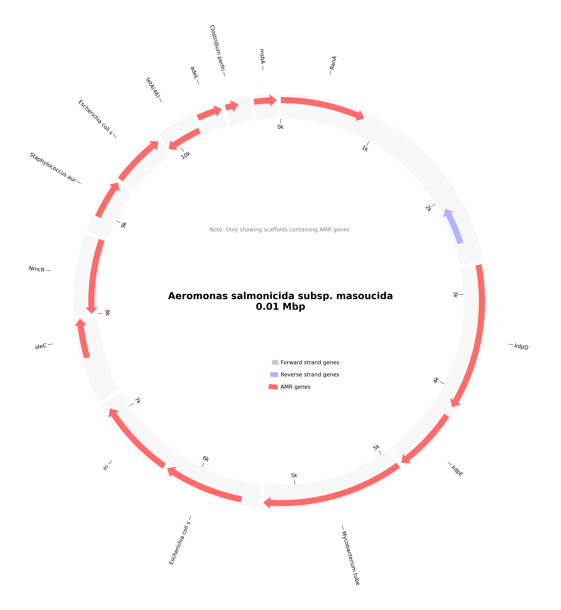

### Clostridium perfringes cplR
- **Mechanism**: antibiotic target protection
- **Drug Classes**: lincosamide antibiotic; streptogramin antibiotic; streptogramin A antibiotic; pleuromutilin antibiotic
- **AMR Family**: Miscellaneous ABC-F subfamily ATP-binding cassette ribosomal protection proteins
- **Locations**:
  - gnl|SPADES|NKBAGNNB_1764207_1 : position 3-122

### Escherichia coli soxS with mutation conferring antibiotic resistance (found in 2 locations)
- **Mechanism**: antibiotic target alteration; antibiotic efflux; reduced permeability to antibiotic
- **Drug Classes**: fluoroquinolone antibiotic; monobactam; carbapenem; cephalosporin; glycylcycline; cephamycin; penam; tetracycline antibiotic; rifamycin antibiotic; phenicol antibiotic; penem; disinfecting agents and antiseptics
- **AMR Family**: ATP-binding cassette (ABC) antibiotic efflux pump; major facilitator superfamily (MFS) antibiotic efflux pump; resistance-nodulation-cell division (RND) antibiotic efflux pump; General Bacterial Porin with reduced permeability to beta-lactams
- **Locations**:
  - gnl|SPADES|NKBAGNNB_319831_1 : position 1-486
  - gnl|SPADES|NKBAGNNB_35022_2 : position 164-892

### Mycobacterium tuberculosis katG mutations conferring resistance to isoniazid
- **Mechanism**: antibiotic target alteration
- **Drug Classes**: isoniazid-like antibiotic
- **AMR Family**: isoniazid resistant katG
- **Locations**:
  - gnl|SPADES|NKBAGNNB_8057_1 : position 3-1289

### NmcR
- **Mechanism**: antibiotic inactivation
- **Drug Classes**: carbapenem; cephalosporin; cephamycin; penam
- **AMR Family**: NmcA beta-lactamase
- **Locations**:
  - gnl|SPADES|NKBAGNNB_84509_1 : position 1-720

### RanA
- **Mechanism**: antibiotic efflux
- **Drug Classes**: aminoglycoside antibiotic
- **AMR Family**: ATP-binding cassette (ABC) antibiotic efflux pump
- **Locations**:
  - gnl|SPADES|NKBAGNNB_2037_1 : position 2-775

### Staphylococcus aureus mupA conferring resistance to mupirocin
- **Mechanism**: antibiotic target alteration
- **Drug Classes**: mupirocin-like antibiotic
- **AMR Family**: antibiotic-resistant isoleucyl-tRNA synthetase (ileS)
- **Locations**:
  - gnl|SPADES|NKBAGNNB_275323_2 : position 154-513

### adeL
- **Mechanism**: antibiotic efflux
- **Drug Classes**: fluoroquinolone antibiotic; tetracycline antibiotic
- **AMR Family**: resistance-nodulation-cell division (RND) antibiotic efflux pump
- **Locations**:
  - gnl|SPADES|NKBAGNNB_1692045_1 : position 2-232

### iri
- **Mechanism**: antibiotic inactivation
- **Drug Classes**: rifamycin antibiotic
- **AMR Family**: rifampin monooxygenase
- **Locations**:
  - gnl|SPADES|NKBAGNNB_59160_1 : position 2-718

### kdpD
- **Mechanism**: antibiotic efflux
- **Drug Classes**: aminoglycoside antibiotic
- **AMR Family**: kdpDE
- **Locations**:
  - gnl|SPADES|NKBAGNNB_2825_1 : position 1-1332

### kdpE
- **Mechanism**: antibiotic efflux
- **Drug Classes**: aminoglycoside antibiotic
- **AMR Family**: kdpDE
- **Locations**:
  - gnl|SPADES|NKBAGNNB_2825_2 : position 1419-2012

### msbA
- **Mechanism**: antibiotic efflux
- **Drug Classes**: nitroimidazole antibiotic
- **AMR Family**: ATP-binding cassette (ABC) antibiotic efflux pump
- **Locations**:
  - gnl|SPADES|NKBAGNNB_2043417_1 : position 2-208

### oleC
- **Mechanism**: antibiotic efflux
- **Drug Classes**: macrolide antibiotic
- **AMR Family**: ATP-binding cassette (ABC) antibiotic efflux pump
- **Locations**:
  - gnl|SPADES|NKBAGNNB_68099_2 : position 400-759

### tetA(46)
- **Mechanism**: antibiotic efflux
- **Drug Classes**: tetracycline antibiotic
- **AMR Family**: ATP-binding cassette (ABC) antibiotic efflux pump
- **Locations**:
  - gnl|SPADES|NKBAGNNB_738863_1 : position 1-345

## Aeromonas salmonicida subsp. pectinolytica 34mel
**Strain Statistics:**
- Total genome length: 12.1 kbp
- Total scaffolds: 217
- Scaffolds with AMR genes: 17
- Total genes annotated: 26
- Total AMR genes: 17
- Unique AMR genes: 17
- Distinct AMR mechanisms: 4
- Distinct AMR families: 9
- Distinct drug classes: 19

**Circos Plot:**

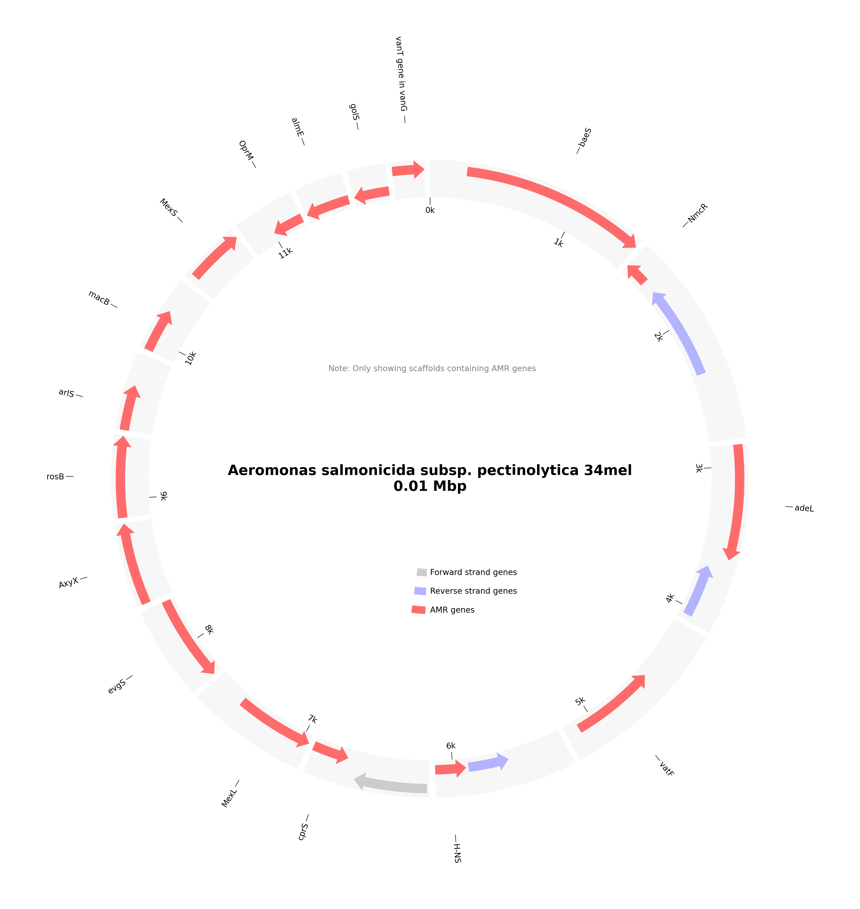

### AxyX
- **Mechanism**: antibiotic efflux
- **Drug Classes**: macrolide antibiotic; fluoroquinolone antibiotic; aminoglycoside antibiotic; cephalosporin
- **AMR Family**: resistance-nodulation-cell division (RND) antibiotic efflux pump
- **Locations**:
  - gnl|SPADES|NKBAGNNB_230564_1 : position 3-542

### H-NS
- **Mechanism**: antibiotic efflux
- **Drug Classes**: macrolide antibiotic; fluoroquinolone antibiotic; cephalosporin; cephamycin; penam; tetracycline antibiotic
- **AMR Family**: major facilitator superfamily (MFS) antibiotic efflux pump; resistance-nodulation-cell division (RND) antibiotic efflux pump
- **Locations**:
  - gnl|SPADES|NKBAGNNB_31723_1 : position 699-914

### MexL
- **Mechanism**: antibiotic efflux
- **Drug Classes**: macrolide antibiotic; tetracycline antibiotic; disinfecting agents and antiseptics
- **AMR Family**: resistance-nodulation-cell division (RND) antibiotic efflux pump
- **Locations**:
  - gnl|SPADES|NKBAGNNB_59966_1 : position 1-549

### MexS
- **Mechanism**: antibiotic efflux
- **Drug Classes**: fluoroquinolone antibiotic; diaminopyrimidine antibiotic; phenicol antibiotic
- **AMR Family**: resistance-nodulation-cell division (RND) antibiotic efflux pump
- **Locations**:
  - gnl|SPADES|NKBAGNNB_487791_1 : position 39-413

### NmcR
- **Mechanism**: antibiotic inactivation
- **Drug Classes**: carbapenem; cephalosporin; cephamycin; penam
- **AMR Family**: NmcA beta-lactamase
- **Locations**:
  - gnl|SPADES|NKBAGNNB_6287_1 : position 1-168

### OprM
- **Mechanism**: antibiotic efflux
- **Drug Classes**: macrolide antibiotic; fluoroquinolone antibiotic; monobactam; aminoglycoside antibiotic; carbapenem; cephalosporin; cephamycin; penam; tetracycline antibiotic; peptide antibiotic; aminocoumarin antibiotic; diaminopyrimidine antibiotic; sulfonamide antibiotic; phenicol antibiotic; penem; disinfecting agents and antiseptics
- **AMR Family**: resistance-nodulation-cell division (RND) antibiotic efflux pump
- **Locations**:
  - gnl|SPADES|NKBAGNNB_525872_1 : position 182-403

### adeL
- **Mechanism**: antibiotic efflux
- **Drug Classes**: fluoroquinolone antibiotic; tetracycline antibiotic
- **AMR Family**: resistance-nodulation-cell division (RND) antibiotic efflux pump
- **Locations**:
  - gnl|SPADES|NKBAGNNB_9191_1 : position 3-764

### almE
- **Mechanism**: antibiotic target alteration
- **Drug Classes**: peptide antibiotic
- **AMR Family**: polymyxin resistance operon; alm glycyltransferase
- **Locations**:
  - gnl|SPADES|NKBAGNNB_912318_1 : position 2-313

### arlS
- **Mechanism**: antibiotic efflux
- **Drug Classes**: fluoroquinolone antibiotic; disinfecting agents and antiseptics
- **AMR Family**: major facilitator superfamily (MFS) antibiotic efflux pump
- **Locations**:
  - gnl|SPADES|NKBAGNNB_284099_1 : position 2-301

### baeS
- **Mechanism**: antibiotic efflux
- **Drug Classes**: aminoglycoside antibiotic; aminocoumarin antibiotic
- **AMR Family**: resistance-nodulation-cell division (RND) antibiotic efflux pump
- **Locations**:
  - gnl|SPADES|NKBAGNNB_5547_1 : position 242-1465

### cprS
- **Mechanism**: antibiotic target alteration; antibiotic efflux
- **Drug Classes**: peptide antibiotic
- **AMR Family**: pmr phosphoethanolamine transferase
- **Locations**:
  - gnl|SPADES|NKBAGNNB_47989_2 : position 573-827

### evgS
- **Mechanism**: antibiotic efflux
- **Drug Classes**: macrolide antibiotic; fluoroquinolone antibiotic; penam; tetracycline antibiotic
- **AMR Family**: major facilitator superfamily (MFS) antibiotic efflux pump; resistance-nodulation-cell division (RND) antibiotic efflux pump
- **Locations**:
  - gnl|SPADES|NKBAGNNB_154610_1 : position 2-610

### golS
- **Mechanism**: antibiotic efflux
- **Drug Classes**: monobactam; carbapenem; cephalosporin; cephamycin; penam; phenicol antibiotic; penem
- **AMR Family**: resistance-nodulation-cell division (RND) antibiotic efflux pump
- **Locations**:
  - gnl|SPADES|NKBAGNNB_1479335_1 : position 1-249

### macB
- **Mechanism**: antibiotic efflux
- **Drug Classes**: macrolide antibiotic
- **AMR Family**: ATP-binding cassette (ABC) antibiotic efflux pump
- **Locations**:
  - gnl|SPADES|NKBAGNNB_305415_1 : position 3-293

### rosB
- **Mechanism**: antibiotic efflux
- **Drug Classes**: peptide antibiotic
- **AMR Family**: major facilitator superfamily (MFS) antibiotic efflux pump
- **Locations**:
  - gnl|SPADES|NKBAGNNB_238944_1 : position 1-537

### vanT gene in vanG cluster
- **Mechanism**: antibiotic target alteration
- **Drug Classes**: glycopeptide antibiotic
- **AMR Family**: glycopeptide resistance gene cluster; vanT
- **Locations**:
  - gnl|SPADES|NKBAGNNB_1970698_1 : position 2-214

### vatF
- **Mechanism**: antibiotic inactivation
- **Drug Classes**: streptogramin antibiotic; streptogramin A antibiotic
- **AMR Family**: streptogramin vat acetyltransferase
- **Locations**:
  - gnl|SPADES|NKBAGNNB_13212_2 : position 440-1030

## Buttiauxella agrestis
**Strain Statistics:**
- Total genome length: 1266.7 kbp
- Total scaffolds: 1141
- Scaffolds with AMR genes: 266
- Total genes annotated: 2414
- Total AMR genes: 362
- Unique AMR genes: 184
- Distinct AMR mechanisms: 11
- Distinct AMR families: 71
- Distinct drug classes: 36

**Circos Plot:**

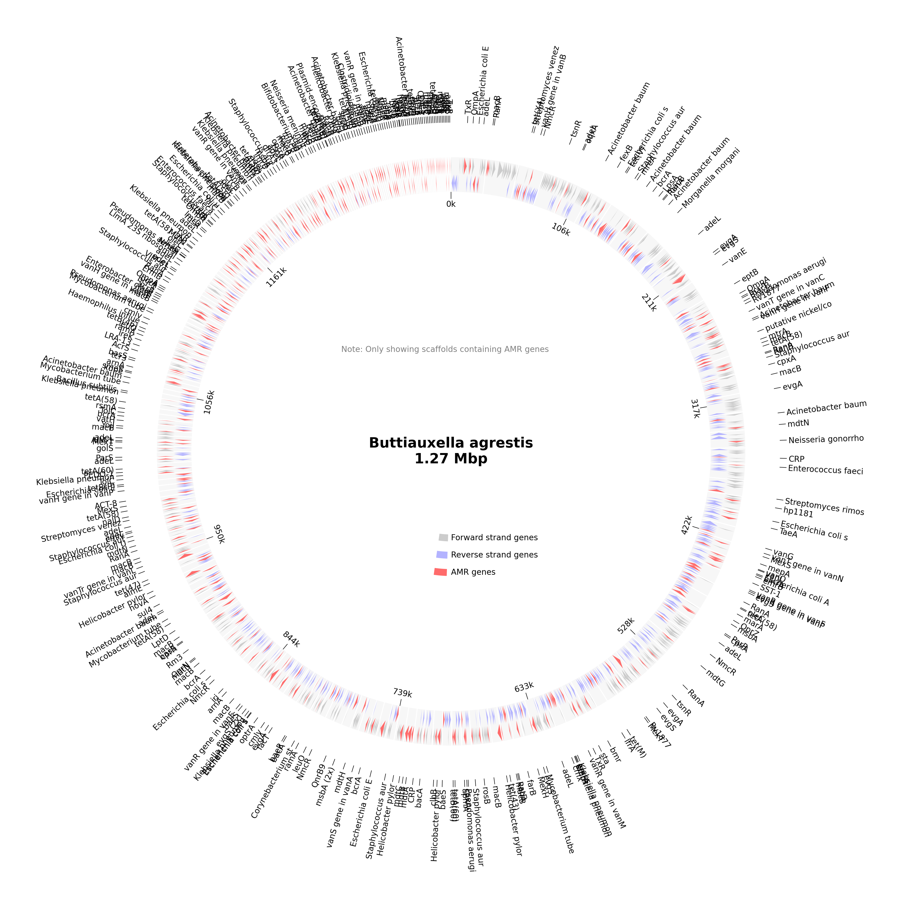

### ACT-8
- **Mechanism**: antibiotic inactivation
- **Drug Classes**: carbapenem; cephalosporin; cephamycin; penam
- **AMR Family**: ACT beta-lactamase
- **Locations**:
  - gnl|SPADES|NKBAGNNB_1078_1: position 8-1159

### AIM-1
- **Mechanism**: antibiotic inactivation
- **Drug Classes**: cephalosporin; cephamycin; penam
- **AMR Family**: AIM beta-lactamase
- **Locations**:
  - gnl|SPADES|NKBAGNNB_1158_4 : position 2670-3629

### Acinetobacter baumannii AbaF (found in 5 locations)
- **Mechanism**: antibiotic efflux
- **Drug Classes**: phosphonic acid antibiotic
- **AMR Family**: major facilitator superfamily (MFS) antibiotic efflux pump
- **Locations**:
  - gnl|SPADES|NKBAGNNB_180_23 : position 17860-19359
  - gnl|SPADES|NKBAGNNB_198_13 : position 13287-14612
  - gnl|SPADES|NKBAGNNB_201_16 : position 15211-16716
  - gnl|SPADES|NKBAGNNB_7157_1 : position 1-1269
  - gnl|SPADES|NKBAGNNB_856_2 : position 1013-2347

### Acinetobacter baumannii AbaQ (found in 6 locations)
- **Mechanism**: antibiotic efflux
- **Drug Classes**: fluoroquinolone antibiotic
- **AMR Family**: major facilitator superfamily (MFS) antibiotic efflux pump
- **Locations**:
  - gnl|SPADES|NKBAGNNB_1375_2 : position 1362-2723
  - gnl|SPADES|NKBAGNNB_14397_2 : position 440-1102
  - gnl|SPADES|NKBAGNNB_180363_1 : position 50-586
  - gnl|SPADES|NKBAGNNB_225_13 : position 11840-13138
  - gnl|SPADES|NKBAGNNB_264_5 : position 3186-4502
  - gnl|SPADES|NKBAGNNB_3358_3 : position 1240-1827

### AcrS
- **Mechanism**: antibiotic efflux
- **Drug Classes**: fluoroquinolone antibiotic; cephalosporin; glycylcycline; cephamycin; penam; tetracycline antibiotic; rifamycin antibiotic; phenicol antibiotic; disinfecting agents and antiseptics
- **AMR Family**: resistance-nodulation-cell division (RND) antibiotic efflux pump
- **Locations**:
  - gnl|SPADES|NKBAGNNB_1495_3 : position 2114-2731

### Bacillus subtilis mprF
- **Mechanism**: antibiotic target alteration
- **Drug Classes**: peptide antibiotic
- **AMR Family**: defensin resistant mprF
- **Locations**:
  - gnl|SPADES|NKBAGNNB_1331_1 : position 2-868

### Bifidobacterium adolescentis rpoB mutants conferring resistance to rifampicin
- **Mechanism**: antibiotic target alteration; antibiotic target replacement
- **Drug Classes**: rifamycin antibiotic
- **AMR Family**: rifamycin-resistant beta-subunit of RNA polymerase (rpoB)
- **Locations**:
  - gnl|SPADES|NKBAGNNB_4118_1 : position 410-1651

### CDA-1
- **Mechanism**: antibiotic inactivation
- **Drug Classes**: carbapenem; cephalosporin; cephamycin; penem
- **AMR Family**: CDA beta-lactamase
- **Locations**:
  - gnl|SPADES|NKBAGNNB_386472_1 : position 3-101

### CRP (found in 2 locations)
- **Mechanism**: antibiotic efflux
- **Drug Classes**: macrolide antibiotic; fluoroquinolone antibiotic; penam
- **AMR Family**: resistance-nodulation-cell division (RND) antibiotic efflux pump
- **Locations**:
  - gnl|SPADES|NKBAGNNB_291_8: position 7076-7708
  - gnl|SPADES|NKBAGNNB_536_5 : position 3404-4096

### Clostridioides difficile gyrB conferring resistance to fluoroquinolones
- **Mechanism**: antibiotic target alteration
- **Drug Classes**: fluoroquinolone antibiotic
- **AMR Family**: fluoroquinolone resistant gyrB
- **Locations**:
  - gnl|SPADES|NKBAGNNB_23373_1 : position 2-982

### Corynebacterium striatum tetA
- **Mechanism**: antibiotic efflux
- **Drug Classes**: penam; tetracycline antibiotic
- **AMR Family**: major facilitator superfamily (MFS) antibiotic efflux pump
- **Locations**:
  - gnl|SPADES|NKBAGNNB_625_8 : position 5505-5852

### CrcB
- **Mechanism**: antibiotic efflux
- **Drug Classes**: aminoglycoside antibiotic
- **AMR Family**: multidrug and toxic compound extrusion (MATE) transporter
- **Locations**:
  - gnl|SPADES|NKBAGNNB_3069_2 : position 543-926

### Enterobacter cloacae acrA (found in 2 locations)
- **Mechanism**: antibiotic efflux
- **Drug Classes**: fluoroquinolone antibiotic; cephalosporin; glycylcycline; penam; tetracycline antibiotic; rifamycin antibiotic; phenicol antibiotic; disinfecting agents and antiseptics
- **AMR Family**: resistance-nodulation-cell division (RND) antibiotic efflux pump
- **Locations**:
  - gnl|SPADES|NKBAGNNB_1752_1 : position 2-658
  - gnl|SPADES|NKBAGNNB_2620_3 : position 1499-2119

### Enterococcus faecalis cls with mutation conferring resistance to daptomycin
- **Mechanism**: antibiotic target alteration
- **Drug Classes**: peptide antibiotic
- **AMR Family**: daptomycin resistant cls
- **Locations**:
  - gnl|SPADES|NKBAGNNB_2366_1 : position 153-1613

### Enterococcus faecium liaR mutant conferring daptomycin resistance
- **Mechanism**: antibiotic target alteration; antibiotic efflux
- **Drug Classes**: peptide antibiotic
- **AMR Family**: daptomycin resistant liaR
- **Locations**:
  - gnl|SPADES|NKBAGNNB_292_1 : position 308-892

### ErmB
- **Mechanism**: antibiotic target alteration
- **Drug Classes**: macrolide antibiotic; lincosamide antibiotic; streptogramin antibiotic; streptogramin A antibiotic; streptogramin B antibiotic
- **AMR Family**: Erm 23S ribosomal RNA methyltransferase
- **Locations**:
  - gnl|SPADES|NKBAGNNB_1786_3 : position 1185-2009

### Escherichia coli AcrAB-TolC with MarR mutations conferring resistance to ciprofloxacin and tetracycline
- **Mechanism**: antibiotic target alteration; antibiotic efflux
- **Drug Classes**: fluoroquinolone antibiotic; cephalosporin; glycylcycline; penam; tetracycline antibiotic; rifamycin antibiotic; phenicol antibiotic; disinfecting agents and antiseptics
- **AMR Family**: resistance-nodulation-cell division (RND) antibiotic efflux pump
- **Locations**:
  - gnl|SPADES|NKBAGNNB_321_7 : position 3462-3917

### Escherichia coli EF-Tu mutants conferring resistance to Pulvomycin (found in 2 locations)
- **Mechanism**: antibiotic target alteration
- **Drug Classes**: elfamycin antibiotic
- **AMR Family**: elfamycin resistant EF-Tu
- **Locations**:
  - gnl|SPADES|NKBAGNNB_1085_4 : position 1526-2710
  - gnl|SPADES|NKBAGNNB_114_20 : position 19218-21065

### Escherichia coli EF-Tu mutants conferring resistance to kirromycin
- **Mechanism**: antibiotic target alteration
- **Drug Classes**: elfamycin antibiotic
- **AMR Family**: elfamycin resistant EF-Tu
- **Locations**:
  - gnl|SPADES|NKBAGNNB_551_3 : position 2258-4942

### Escherichia coli UhpT with mutation conferring resistance to fosfomycin
- **Mechanism**: antibiotic target alteration
- **Drug Classes**: phosphonic acid antibiotic
- **AMR Family**: antibiotic-resistant UhpT
- **Locations**:
  - gnl|SPADES|NKBAGNNB_1015_1 : position 2-571

### Escherichia coli mdfA
- **Mechanism**: antibiotic efflux
- **Drug Classes**: tetracycline antibiotic; phenicol antibiotic; disinfecting agents and antiseptics
- **AMR Family**: major facilitator superfamily (MFS) antibiotic efflux pump
- **Locations**:
  - gnl|SPADES|NKBAGNNB_48422_2 : position 553-825

### Escherichia coli soxR with mutation conferring antibiotic resistance
- **Mechanism**: antibiotic target alteration; antibiotic efflux
- **Drug Classes**: fluoroquinolone antibiotic; cephalosporin; glycylcycline; penam; tetracycline antibiotic; rifamycin antibiotic; phenicol antibiotic; disinfecting agents and antiseptics
- **AMR Family**: ATP-binding cassette (ABC) antibiotic efflux pump; major facilitator superfamily (MFS) antibiotic efflux pump; resistance-nodulation-cell division (RND) antibiotic efflux pump
- **Locations**:
  - gnl|SPADES|NKBAGNNB_691_4 : position 3928-4386

### Escherichia coli soxS with mutation conferring antibiotic resistance (found in 4 locations)
- **Mechanism**: antibiotic target alteration; antibiotic efflux; reduced permeability to antibiotic
- **Drug Classes**: fluoroquinolone antibiotic; monobactam; carbapenem; cephalosporin; glycylcycline; cephamycin; penam; tetracycline antibiotic; rifamycin antibiotic; phenicol antibiotic; penem; disinfecting agents and antiseptics
- **AMR Family**: ATP-binding cassette (ABC) antibiotic efflux pump; major facilitator superfamily (MFS) antibiotic efflux pump; resistance-nodulation-cell division (RND) antibiotic efflux pump; General Bacterial Porin with reduced permeability to beta-lactams
- **Locations**:
  - gnl|SPADES|NKBAGNNB_191_19 : position 14223-15071
  - gnl|SPADES|NKBAGNNB_310_3 : position 774-1643
  - gnl|SPADES|NKBAGNNB_691_5 : position 4465-4788
  - gnl|SPADES|NKBAGNNB_740_3 : position 947-1792

### Escherichia coli uhpA with mutation conferring resistance to fosfomycin
- **Mechanism**: antibiotic target alteration
- **Drug Classes**: phosphonic acid antibiotic
- **AMR Family**: antibiotic-resistant UhpT
- **Locations**:
  - gnl|SPADES|NKBAGNNB_2441_2 : position 168-755

### H-NS
- **Mechanism**: antibiotic efflux
- **Drug Classes**: macrolide antibiotic; fluoroquinolone antibiotic; cephalosporin; cephamycin; penam; tetracycline antibiotic
- **AMR Family**: major facilitator superfamily (MFS) antibiotic efflux pump; resistance-nodulation-cell division (RND) antibiotic efflux pump
- **Locations**:
  - gnl|SPADES|NKBAGNNB_148198_1 : position 281-619

### Haemophilus influenzae PBP3 conferring resistance to beta-lactam antibiotics
- **Mechanism**: antibiotic target alteration
- **Drug Classes**: cephalosporin; cephamycin; penam
- **AMR Family**: Penicillin-binding protein mutations conferring resistance to beta-lactam antibiotics
- **Locations**:
  - gnl|SPADES|NKBAGNNB_1653_1 : position 1-1122

### Helicobacter pylori pbp1 mutants conferring resistance to amoxicillin (found in 2 locations)
- **Mechanism**: antibiotic target alteration
- **Drug Classes**: cephalosporin; cephamycin; penam
- **AMR Family**: Penicillin-binding protein mutations conferring resistance to beta-lactam antibiotics
- **Locations**:
  - gnl|SPADES|NKBAGNNB_519_2 : position 1117-3438
  - gnl|SPADES|NKBAGNNB_896_2 : position 957-3464

### Helicobacter pylori pbp2 mutants conferring resistance to amoxicillin
- **Mechanism**: antibiotic target alteration
- **Drug Classes**: cephalosporin; cephamycin; penam
- **AMR Family**: Penicillin-binding protein mutations conferring resistance to beta-lactam antibiotics
- **Locations**:
  - gnl|SPADES|NKBAGNNB_545_4 : position 1510-3411

### Helicobacter pylori rdxA mutation conferring resistance to metronidazole
- **Mechanism**: antibiotic target alteration
- **Drug Classes**: nitroimidazole antibiotic
- **AMR Family**: Antibiotic resistant Helicobacter pylori nitroreductase
- **Locations**:
  - gnl|SPADES|NKBAGNNB_13383_2 : position 359-1012

### Helicobacter pylori rpoB mutation conferring resistance to rifampicin
- **Mechanism**: antibiotic target alteration; antibiotic target replacement
- **Drug Classes**: fluoroquinolone antibiotic; rifamycin antibiotic
- **AMR Family**: rifamycin-resistant beta-subunit of RNA polymerase (rpoB)
- **Locations**:
  - gnl|SPADES|NKBAGNNB_477_1 : position 1-2700

### IreK
- **Mechanism**: reduced permeability to antibiotic
- **Drug Classes**: cephalosporin
- **AMR Family**: Serine/threonine kinases
- **Locations**:
  - gnl|SPADES|NKBAGNNB_1610_3 : position 2493-2897

### Klebsiella pneumoniae KpnF
- **Mechanism**: antibiotic efflux
- **Drug Classes**: macrolide antibiotic; aminoglycoside antibiotic; cephalosporin; tetracycline antibiotic; peptide antibiotic; rifamycin antibiotic; disinfecting agents and antiseptics
- **AMR Family**: small multidrug resistance (SMR) antibiotic efflux pump
- **Locations**:
  - gnl|SPADES|NKBAGNNB_3327_3 : position 1574-1840

### Klebsiella pneumoniae KpnG
- **Mechanism**: antibiotic efflux
- **Drug Classes**: macrolide antibiotic; fluoroquinolone antibiotic; aminoglycoside antibiotic; carbapenem; cephalosporin; penam; peptide antibiotic; penem
- **AMR Family**: major facilitator superfamily (MFS) antibiotic efflux pump
- **Locations**:
  - gnl|SPADES|NKBAGNNB_436_4 : position 2850-3200

### Klebsiella pneumoniae KpnH
- **Mechanism**: antibiotic efflux
- **Drug Classes**: macrolide antibiotic; fluoroquinolone antibiotic; aminoglycoside antibiotic; carbapenem; cephalosporin; penam; peptide antibiotic; penem
- **AMR Family**: major facilitator superfamily (MFS) antibiotic efflux pump
- **Locations**:
  - gnl|SPADES|NKBAGNNB_436_2: position 478-2016

### Klebsiella pneumoniae OmpK37 (found in 6 locations)
- **Mechanism**: reduced permeability to antibiotic
- **Drug Classes**: monobactam; carbapenem; cephalosporin; cephamycin; penam; penem
- **AMR Family**: General Bacterial Porin with reduced permeability to beta-lactams
- **Locations**:
  - gnl|SPADES|NKBAGNNB_1114_1 : position 1-1071
  - gnl|SPADES|NKBAGNNB_1311_3 : position 3168-3314
  - gnl|SPADES|NKBAGNNB_21807_2 : position 393-998
  - gnl|SPADES|NKBAGNNB_2196_1 : position 1-855
  - gnl|SPADES|NKBAGNNB_3308_1 : position 2-217
  - gnl|SPADES|NKBAGNNB_703_1 : position 2-505

### Klebsiella pneumoniae acrR with mutation conferring multidrug antibiotic resistance
- **Mechanism**: antibiotic target alteration; antibiotic efflux
- **Drug Classes**: fluoroquinolone antibiotic; cephalosporin; glycylcycline; penam; tetracycline antibiotic; rifamycin antibiotic; phenicol antibiotic; disinfecting agents and antiseptics
- **AMR Family**: resistance-nodulation-cell division (RND) antibiotic efflux pump
- **Locations**:
  - gnl|SPADES|NKBAGNNB_2620_2 : position 714-1355

### LRA-13
- **Mechanism**: antibiotic inactivation
- **Drug Classes**: cephalosporin; penam
- **AMR Family**: class C LRA beta-lactamase; class D LRA beta-lactamase
- **Locations**:
  - gnl|SPADES|NKBAGNNB_1497_3 : position 1859-3031

### LlmA 23S ribosomal RNA methyltransferase
- **Mechanism**: antibiotic target alteration
- **Drug Classes**: lincosamide antibiotic
- **AMR Family**: Llm 23S ribosomal RNA methyltransferase
- **Locations**:
  - gnl|SPADES|NKBAGNNB_1913_4 : position 1418-2521

### LpsA
- **Mechanism**: reduced permeability to antibiotic
- **Drug Classes**: peptide antibiotic
- **AMR Family**: Intrinsic peptide antibiotic resistant Lps
- **Locations**:
  - gnl|SPADES|NKBAGNNB_201_8 : position 6296-7072

### LptD
- **Mechanism**: antibiotic efflux
- **Drug Classes**: carbapenem; peptide antibiotic; aminocoumarin antibiotic; rifamycin antibiotic
- **AMR Family**: ATP-binding cassette (ABC) antibiotic efflux pump
- **Locations**:
  - gnl|SPADES|NKBAGNNB_809_2 : position 1106-3493

### MdtK (found in 2 locations)
- **Mechanism**: antibiotic efflux
- **Drug Classes**: fluoroquinolone antibiotic
- **AMR Family**: multidrug and toxic compound extrusion (MATE) transporter
- **Locations**:
  - gnl|SPADES|NKBAGNNB_107624_1 : position 2-676
  - gnl|SPADES|NKBAGNNB_2062_1 : position 2-328

### MexH
- **Mechanism**: antibiotic efflux
- **Drug Classes**: fluoroquinolone antibiotic; tetracycline antibiotic; disinfecting agents and antiseptics
- **AMR Family**: resistance-nodulation-cell division (RND) antibiotic efflux pump
- **Locations**:
  - gnl|SPADES|NKBAGNNB_456_4 : position 4211-5038

### MexS (found in 2 locations)
- **Mechanism**: antibiotic efflux
- **Drug Classes**: fluoroquinolone antibiotic; diaminopyrimidine antibiotic; phenicol antibiotic
- **AMR Family**: resistance-nodulation-cell division (RND) antibiotic efflux pump
- **Locations**:
  - gnl|SPADES|NKBAGNNB_1073_2 : position 1128-2159
  - gnl|SPADES|NKBAGNNB_316_3 : position 2377-3360

### MexT (found in 2 locations)
- **Mechanism**: antibiotic efflux
- **Drug Classes**: fluoroquinolone antibiotic; diaminopyrimidine antibiotic; phenicol antibiotic
- **AMR Family**: resistance-nodulation-cell division (RND) antibiotic efflux pump
- **Locations**:
  - gnl|SPADES|NKBAGNNB_1158_3 : position 1677-2591
  - gnl|SPADES|NKBAGNNB_397_4 : position 3047-3994

### Morganella morganii gyrB conferring resistance to fluoroquinolones
- **Mechanism**: antibiotic target alteration
- **Drug Classes**: fluoroquinolone antibiotic
- **AMR Family**: fluoroquinolone resistant gyrB
- **Locations**:
  - gnl|SPADES|NKBAGNNB_202_6 : position 5107-7521

### Mycobacterium tuberculosis folC with mutation conferring resistance to para-aminosalicylic acid
- **Mechanism**: antibiotic target alteration
- **Drug Classes**: salicylic acid antibiotic
- **AMR Family**: aminosalicylate resistant dihydrofolate synthase
- **Locations**:
  - gnl|SPADES|NKBAGNNB_1664_3 : position 1160-2428

### Mycobacterium tuberculosis gidB mutation conferring resistance to streptomycin
- **Mechanism**: antibiotic target alteration
- **Drug Classes**: aminoglycoside antibiotic
- **AMR Family**: antibiotic resistant gidB
- **Locations**:
  - gnl|SPADES|NKBAGNNB_1344_3 : position 1914-2537

### Mycobacterium tuberculosis katG mutations conferring resistance to isoniazid
- **Mechanism**: antibiotic target alteration
- **Drug Classes**: isoniazid-like antibiotic
- **AMR Family**: isoniazid resistant katG
- **Locations**:
  - gnl|SPADES|NKBAGNNB_454_5 : position 5836-8016

### Mycobacterium tuberculosis ndh with mutation conferring resistance to isoniazid
- **Mechanism**: antibiotic target alteration
- **Drug Classes**: isoniazid-like antibiotic
- **AMR Family**: antibiotic resistant ndh
- **Locations**:
  - gnl|SPADES|NKBAGNNB_850_2 : position 464-1768

### Neisseria gonorrhoeae pilQ gene conferring resistance to beta-lactam
- **Mechanism**: antibiotic target alteration
- **Drug Classes**: cephalosporin; cephamycin; penam
- **AMR Family**: Penicillin-binding protein mutations conferring resistance to beta-lactam antibiotics
- **Locations**:
  - gnl|SPADES|NKBAGNNB_266_9 : position 8306-9553

### Neisseria meningititis PBP2 conferring resistance to beta-lactam
- **Mechanism**: antibiotic target alteration
- **Drug Classes**: cephalosporin; cephamycin; penam
- **AMR Family**: Penicillin-binding protein mutations conferring resistance to beta-lactam antibiotics
- **Locations**:
  - gnl|SPADES|NKBAGNNB_4780_2 : position 1286-1549

### NmcR (found in 6 locations)
- **Mechanism**: antibiotic inactivation
- **Drug Classes**: carbapenem; cephalosporin; cephamycin; penam
- **AMR Family**: NmcA beta-lactamase
- **Locations**:
  - gnl|SPADES|NKBAGNNB_168_15 : position 11590-12489
  - gnl|SPADES|NKBAGNNB_1932_3 : position 1581-1949
  - gnl|SPADES|NKBAGNNB_356_1 : position 460-1284
  - gnl|SPADES|NKBAGNNB_598_6 : position 5120-6037
  - gnl|SPADES|NKBAGNNB_70484_1 : position 3-725
  - gnl|SPADES|NKBAGNNB_735_4 : position 3090-4025

### OmpA (found in 4 locations)
- **Mechanism**: reduced permeability to antibiotic
- **Drug Classes**: peptide antibiotic
- **AMR Family**: General Bacterial Porin with reduced permeability to peptide antibiotics
- **Locations**:
  - gnl|SPADES|NKBAGNNB_114_17 : position 15335-16381
  - gnl|SPADES|NKBAGNNB_1755_2 : position 142-663
  - gnl|SPADES|NKBAGNNB_224_8 : position 8472-9134
  - gnl|SPADES|NKBAGNNB_2250_3 : position 1255-2322

### OprN
- **Mechanism**: antibiotic efflux
- **Drug Classes**: fluoroquinolone antibiotic; diaminopyrimidine antibiotic; phenicol antibiotic
- **AMR Family**: resistance-nodulation-cell division (RND) antibiotic efflux pump
- **Locations**:
  - gnl|SPADES|NKBAGNNB_766_2 : position 253-1776

### OprZ
- **Mechanism**: antibiotic efflux
- **Drug Classes**: macrolide antibiotic; fluoroquinolone antibiotic; aminoglycoside antibiotic; cephalosporin
- **AMR Family**: resistance-nodulation-cell division (RND) antibiotic efflux pump
- **Locations**:
  - gnl|SPADES|NKBAGNNB_340_5 : position 4676-6121

### PEDO-1
- **Mechanism**: antibiotic inactivation
- **Drug Classes**: carbapenem
- **AMR Family**: subclass B3 PEDO beta-lactamase
- **Locations**:
  - gnl|SPADES|NKBAGNNB_1114_3 : position 2510-3157

### ParR
- **Mechanism**: antibiotic efflux; reduced permeability to antibiotic
- **Drug Classes**: macrolide antibiotic; fluoroquinolone antibiotic; monobactam; aminoglycoside antibiotic; carbapenem; cephalosporin; cephamycin; penam; tetracycline antibiotic; phenicol antibiotic; penem; disinfecting agents and antiseptics
- **AMR Family**: resistance-nodulation-cell division (RND) antibiotic efflux pump; Outer Membrane Porin (Opr)
- **Locations**:
  - gnl|SPADES|NKBAGNNB_348_5 : position 4729-5448

### ParS
- **Mechanism**: antibiotic efflux; reduced permeability to antibiotic
- **Drug Classes**: macrolide antibiotic; fluoroquinolone antibiotic; monobactam; aminoglycoside antibiotic; carbapenem; cephalosporin; cephamycin; penam; tetracycline antibiotic; phenicol antibiotic; penem; disinfecting agents and antiseptics
- **AMR Family**: resistance-nodulation-cell division (RND) antibiotic efflux pump; Outer Membrane Porin (Opr)
- **Locations**:
  - gnl|SPADES|NKBAGNNB_1145_1 : position 2-466

### Plasmid-encoded cat (pp-cat)
- **Mechanism**: antibiotic inactivation
- **Drug Classes**: phenicol antibiotic
- **AMR Family**: chloramphenicol acetyltransferase (CAT)
- **Locations**:
  - gnl|SPADES|NKBAGNNB_8668_3 : position 1131-1259

### PmrF
- **Mechanism**: antibiotic target alteration
- **Drug Classes**: peptide antibiotic
- **AMR Family**: pmr phosphoethanolamine transferase
- **Locations**:
  - gnl|SPADES|NKBAGNNB_1456317_1 : position 3-251

### Pseudomonas aeruginosa CpxR (found in 2 locations)
- **Mechanism**: antibiotic efflux
- **Drug Classes**: macrolide antibiotic; fluoroquinolone antibiotic; monobactam; aminoglycoside antibiotic; carbapenem; cephalosporin; cephamycin; penam; tetracycline antibiotic; peptide antibiotic; aminocoumarin antibiotic; diaminopyrimidine antibiotic; sulfonamide antibiotic; phenicol antibiotic; penem
- **AMR Family**: resistance-nodulation-cell division (RND) antibiotic efflux pump
- **Locations**:
  - gnl|SPADES|NKBAGNNB_1689_1 : position 3-527
  - gnl|SPADES|NKBAGNNB_513_5 : position 3416-4114

### Pseudomonas aeruginosa ampR with mutation conferring resistance to aztreonam (found in 2 locations)
- **Mechanism**: antibiotic target alteration; antibiotic inactivation
- **Drug Classes**: monobactam; carbapenem; cephalosporin
- **AMR Family**: PDC beta-lactamase; ampR transcriptional regulator with mutation conferring resistance to monobactam antibiotics
- **Locations**:
  - gnl|SPADES|NKBAGNNB_1932_4 : position 1906-2454
  - gnl|SPADES|NKBAGNNB_224_16 : position 14731-15654

### QnrB9
- **Mechanism**: antibiotic target protection
- **Drug Classes**: fluoroquinolone antibiotic
- **AMR Family**: quinolone resistance protein (qnr)
- **Locations**:
  - gnl|SPADES|NKBAGNNB_587_2 : position 1196-1840

### RanA (found in 11 locations)
- **Mechanism**: antibiotic efflux
- **Drug Classes**: aminoglycoside antibiotic
- **AMR Family**: ATP-binding cassette (ABC) antibiotic efflux pump
- **Locations**:
  - gnl|SPADES|NKBAGNNB_10583_1 : position 2-523
  - gnl|SPADES|NKBAGNNB_133_3 : position 1223-2227
  - gnl|SPADES|NKBAGNNB_169390_1 : position 3-419
  - gnl|SPADES|NKBAGNNB_1793_1 : position 41-1240
  - gnl|SPADES|NKBAGNNB_201_12 : position 10553-11389
  - gnl|SPADES|NKBAGNNB_239_8 : position 5005-5820
  - gnl|SPADES|NKBAGNNB_338_3 : position 1304-2374
  - gnl|SPADES|NKBAGNNB_3683_1 : position 3-446
  - gnl|SPADES|NKBAGNNB_368_11 : position 8321-9085
  - gnl|SPADES|NKBAGNNB_468_4 : position 1449-2426
  - gnl|SPADES|NKBAGNNB_994_3 : position 1846-2973

### RanB
- **Mechanism**: antibiotic efflux
- **Drug Classes**: aminoglycoside antibiotic
- **AMR Family**: ATP-binding cassette (ABC) antibiotic efflux pump
- **Locations**:
  - gnl|SPADES|NKBAGNNB_239_9 : position 5828-6610

### Rm3
- **Mechanism**: antibiotic inactivation
- **Drug Classes**: carbapenem; cephalosporin; penam
- **AMR Family**: Rm3 family beta-lactamase
- **Locations**:
  - gnl|SPADES|NKBAGNNB_793_3 : position 2228-2983

### Rv1877 (found in 2 locations)
- **Mechanism**: antibiotic efflux
- **Drug Classes**: fluoroquinolone antibiotic
- **AMR Family**: major facilitator superfamily (MFS) antibiotic efflux pump
- **Locations**:
  - gnl|SPADES|NKBAGNNB_225_1 : position 17-1399
  - gnl|SPADES|NKBAGNNB_397_3 : position 1520-2914

### SST-1
- **Mechanism**: antibiotic inactivation
- **Drug Classes**: cephalosporin
- **AMR Family**: SST beta-lactamase
- **Locations**:
  - gnl|SPADES|NKBAGNNB_321_14 : position 10528-11322

### Staphylococcus aureus GlpT with mutation conferring resistance to fosfomycin
- **Mechanism**: antibiotic target alteration
- **Drug Classes**: phosphonic acid antibiotic
- **AMR Family**: antibiotic-resistant GlpT
- **Locations**:
  - gnl|SPADES|NKBAGNNB_1797_1 : position 61-1419

### Staphylococcus aureus fusA with mutation conferring resistance to fusidic acid (found in 2 locations)
- **Mechanism**: antibiotic target alteration
- **Drug Classes**: fusidane antibiotic
- **AMR Family**: antibiotic resistant fusA
- **Locations**:
  - gnl|SPADES|NKBAGNNB_2355_1 : position 2-1039
  - gnl|SPADES|NKBAGNNB_487_12 : position 6510-7472

### Staphylococcus aureus mupA conferring resistance to mupirocin (found in 2 locations)
- **Mechanism**: antibiotic target alteration
- **Drug Classes**: mupirocin-like antibiotic
- **AMR Family**: antibiotic-resistant isoleucyl-tRNA synthetase (ileS)
- **Locations**:
  - gnl|SPADES|NKBAGNNB_198_5 : position 2392-5208
  - gnl|SPADES|NKBAGNNB_909_2 : position 575-3157

### Staphylococcus aureus mupB conferring resistance to mupirocin (found in 2 locations)
- **Mechanism**: antibiotic target alteration
- **Drug Classes**: mupirocin-like antibiotic
- **AMR Family**: antibiotic-resistant isoleucyl-tRNA synthetase (ileS)
- **Locations**:
  - gnl|SPADES|NKBAGNNB_1015_4 : position 2556-3992
  - gnl|SPADES|NKBAGNNB_546_1 : position 3-1406

### Staphylococcus aureus murA with mutation conferring resistance to fosfomycin
- **Mechanism**: antibiotic target alteration
- **Drug Classes**: phosphonic acid antibiotic
- **AMR Family**: antibiotic-resistant murA transferase
- **Locations**:
  - gnl|SPADES|NKBAGNNB_239_14 : position 8563-9831

### Staphylococcus aureus pgsA mutations conferring resistance to daptomycin
- **Mechanism**: antibiotic target alteration
- **Drug Classes**: peptide antibiotic
- **AMR Family**: daptomycin resistant pgsA
- **Locations**:
  - gnl|SPADES|NKBAGNNB_3550_2 : position 505-1062

### Streptomyces rimosus otr(A)
- **Mechanism**: antibiotic target protection
- **Drug Classes**: tetracycline antibiotic
- **AMR Family**: tetracycline-resistant ribosomal protection protein
- **Locations**:
  - gnl|SPADES|NKBAGNNB_299_9 : position 9551-11377

### Streptomyces venezuelae rox (found in 2 locations)
- **Mechanism**: antibiotic inactivation
- **Drug Classes**: rifamycin antibiotic
- **AMR Family**: rifampin monooxygenase
- **Locations**:
  - gnl|SPADES|NKBAGNNB_1042_1 : position 74-1258
  - gnl|SPADES|NKBAGNNB_168_6 : position 4074-5252

### TaeA (found in 4 locations)
- **Mechanism**: antibiotic efflux
- **Drug Classes**: pleuromutilin antibiotic
- **AMR Family**: ATP-binding cassette (ABC) antibiotic efflux pump
- **Locations**:
  - gnl|SPADES|NKBAGNNB_310_8 : position 5556-7223
  - gnl|SPADES|NKBAGNNB_46762_1 : position 1-831
  - gnl|SPADES|NKBAGNNB_713613_1 : position 2-352
  - gnl|SPADES|NKBAGNNB_88889_1 : position 2-709

### TolC (found in 2 locations)
- **Mechanism**: antibiotic efflux
- **Drug Classes**: macrolide antibiotic; fluoroquinolone antibiotic; aminoglycoside antibiotic; carbapenem; cephalosporin; glycylcycline; cephamycin; penam; tetracycline antibiotic; peptide antibiotic; aminocoumarin antibiotic; rifamycin antibiotic; phenicol antibiotic; penem; disinfecting agents and antiseptics
- **AMR Family**: ATP-binding cassette (ABC) antibiotic efflux pump; major facilitator superfamily (MFS) antibiotic efflux pump; resistance-nodulation-cell division (RND) antibiotic efflux pump
- **Locations**:
  - gnl|SPADES|NKBAGNNB_1099_3 : position 1568-3055
  - gnl|SPADES|NKBAGNNB_1264_2 : position 1014-2357

### TxR (found in 5 locations)
- **Mechanism**: antibiotic efflux
- **Drug Classes**: tetracycline antibiotic
- **AMR Family**: ATP-binding cassette (ABC) antibiotic efflux pump
- **Locations**:
  - gnl|SPADES|NKBAGNNB_114_12 : position 10792-12876
  - gnl|SPADES|NKBAGNNB_2060474_1 : position 3-209
  - gnl|SPADES|NKBAGNNB_2105_1 : position 2-661
  - gnl|SPADES|NKBAGNNB_429_8 : position 6763-8277
  - gnl|SPADES|NKBAGNNB_90936_2 : position 370-705

### VIM-61
- **Mechanism**: antibiotic inactivation
- **Drug Classes**: carbapenem; cephalosporin; cephamycin; penam; penem
- **AMR Family**: VIM beta-lactamase
- **Locations**:
  - gnl|SPADES|NKBAGNNB_1831_1 : position 2-367

### YajC
- **Mechanism**: antibiotic efflux
- **Drug Classes**: fluoroquinolone antibiotic; cephalosporin; glycylcycline; penam; tetracycline antibiotic; oxazolidinone antibiotic; glycopeptide antibiotic; rifamycin antibiotic; phenicol antibiotic; disinfecting agents and antiseptics
- **AMR Family**: resistance-nodulation-cell division (RND) antibiotic efflux pump
- **Locations**:
  - gnl|SPADES|NKBAGNNB_2396_2 : position 1065-1397

### YojI
- **Mechanism**: antibiotic efflux
- **Drug Classes**: peptide antibiotic
- **AMR Family**: ATP-binding cassette (ABC) antibiotic efflux pump
- **Locations**:
  - gnl|SPADES|NKBAGNNB_1244_1 : position 2-958

### acrB (found in 2 locations)
- **Mechanism**: antibiotic efflux
- **Drug Classes**: fluoroquinolone antibiotic; cephalosporin; glycylcycline; penam; tetracycline antibiotic; rifamycin antibiotic; phenicol antibiotic; disinfecting agents and antiseptics
- **AMR Family**: resistance-nodulation-cell division (RND) antibiotic efflux pump
- **Locations**:
  - gnl|SPADES|NKBAGNNB_1752_2 : position 681-2738
  - gnl|SPADES|NKBAGNNB_318421_1 : position 3-488

### adeL (found in 19 locations)
- **Mechanism**: antibiotic efflux
- **Drug Classes**: fluoroquinolone antibiotic; tetracycline antibiotic
- **AMR Family**: resistance-nodulation-cell division (RND) antibiotic efflux pump
- **Locations**:
  - gnl|SPADES|NKBAGNNB_1028_3 : position 1893-2795
  - gnl|SPADES|NKBAGNNB_1030_2 : position 404-1297
  - gnl|SPADES|NKBAGNNB_1139_4 : position 2173-3102
  - gnl|SPADES|NKBAGNNB_114_23 : position 23168-24064
  - gnl|SPADES|NKBAGNNB_1174_2 : position 285-1151
  - gnl|SPADES|NKBAGNNB_1515816_1 : position 1-246
  - gnl|SPADES|NKBAGNNB_1771843_1 : position 1-228
  - gnl|SPADES|NKBAGNNB_180_1 : position 2-406
  - gnl|SPADES|NKBAGNNB_1831_3 : position 1027-1956
  - gnl|SPADES|NKBAGNNB_1874_3 : position 2062-2616
  - gnl|SPADES|NKBAGNNB_207_8 : position 9130-10056
  - gnl|SPADES|NKBAGNNB_2195_2 : position 1149-2054
  - gnl|SPADES|NKBAGNNB_2748_2 : position 792-1694
  - gnl|SPADES|NKBAGNNB_3475_2 : position 238-1146
  - gnl|SPADES|NKBAGNNB_349_2 : position 1166-2065
  - gnl|SPADES|NKBAGNNB_3571_2 : position 837-1727
  - gnl|SPADES|NKBAGNNB_44636_1 : position 1-732
  - gnl|SPADES|NKBAGNNB_451_5 : position 3596-4507
  - gnl|SPADES|NKBAGNNB_856_3 : position 2518-3453

### almE (found in 2 locations)
- **Mechanism**: antibiotic target alteration
- **Drug Classes**: peptide antibiotic
- **AMR Family**: polymyxin resistance operon; alm glycyltransferase
- **Locations**:
  - gnl|SPADES|NKBAGNNB_38819_1 : position 3-869
  - gnl|SPADES|NKBAGNNB_900_4 : position 2250-3866

### apmA
- **Mechanism**: antibiotic inactivation
- **Drug Classes**: aminoglycoside antibiotic
- **AMR Family**: AAC(2')
- **Locations**:
  - gnl|SPADES|NKBAGNNB_513_8 : position 6041-6862

### arnA (found in 3 locations)
- **Mechanism**: antibiotic target alteration
- **Drug Classes**: peptide antibiotic
- **AMR Family**: pmr phosphoethanolamine transferase
- **Locations**:
  - gnl|SPADES|NKBAGNNB_1111715_1 : position 3-284
  - gnl|SPADES|NKBAGNNB_1465_3 : position 1649-2290
  - gnl|SPADES|NKBAGNNB_727_3 : position 2688-3635

### bacA (found in 2 locations)
- **Mechanism**: antibiotic target alteration
- **Drug Classes**: peptide antibiotic
- **AMR Family**: undecaprenyl pyrophosphate related proteins
- **Locations**:
  - gnl|SPADES|NKBAGNNB_529_7 : position 6421-7017
  - gnl|SPADES|NKBAGNNB_653_5 : position 5452-5673

### baeR
- **Mechanism**: antibiotic efflux
- **Drug Classes**: aminoglycoside antibiotic; aminocoumarin antibiotic
- **AMR Family**: resistance-nodulation-cell division (RND) antibiotic efflux pump
- **Locations**:
  - gnl|SPADES|NKBAGNNB_659_1 : position 2-550

### baeS (found in 3 locations)
- **Mechanism**: antibiotic efflux
- **Drug Classes**: aminoglycoside antibiotic; aminocoumarin antibiotic
- **AMR Family**: resistance-nodulation-cell division (RND) antibiotic efflux pump
- **Locations**:
  - gnl|SPADES|NKBAGNNB_515_6 : position 5829-7106
  - gnl|SPADES|NKBAGNNB_517080_1 : position 3-404
  - gnl|SPADES|NKBAGNNB_715_1 : position 1-255

### basR
- **Mechanism**: antibiotic target alteration; antibiotic efflux
- **Drug Classes**: peptide antibiotic
- **AMR Family**: pmr phosphoethanolamine transferase
- **Locations**:
  - gnl|SPADES|NKBAGNNB_6956_2 : position 635-1351

### basS (found in 2 locations)
- **Mechanism**: antibiotic target alteration; antibiotic efflux
- **Drug Classes**: peptide antibiotic
- **AMR Family**: pmr phosphoethanolamine transferase
- **Locations**:
  - gnl|SPADES|NKBAGNNB_1480_1 : position 3-974
  - gnl|SPADES|NKBAGNNB_794_6 : position 4045-4836

### bcr-1 (found in 2 locations)
- **Mechanism**: antibiotic efflux
- **Drug Classes**: bicyclomycin-like antibiotic
- **AMR Family**: major facilitator superfamily (MFS) antibiotic efflux pump
- **Locations**:
  - gnl|SPADES|NKBAGNNB_1756_2 : position 452-1648
  - gnl|SPADES|NKBAGNNB_224_12 : position 10993-12177

### bcrA (found in 7 locations)
- **Mechanism**: antibiotic efflux
- **Drug Classes**: peptide antibiotic
- **AMR Family**: ATP-binding cassette (ABC) antibiotic efflux pump
- **Locations**:
  - gnl|SPADES|NKBAGNNB_105056_1 : position 3-515
  - gnl|SPADES|NKBAGNNB_1250_6 : position 3204-3446
  - gnl|SPADES|NKBAGNNB_1756_4 : position 2359-2736
  - gnl|SPADES|NKBAGNNB_201_2 : position 430-1929
  - gnl|SPADES|NKBAGNNB_263180_1 : position 1-444
  - gnl|SPADES|NKBAGNNB_569_4 : position 3569-5089
  - gnl|SPADES|NKBAGNNB_741_3 : position 921-1679

### bmr
- **Mechanism**: antibiotic efflux
- **Drug Classes**: fluoroquinolone antibiotic; nucleoside antibiotic; phenicol antibiotic; disinfecting agents and antiseptics
- **AMR Family**: major facilitator superfamily (MFS) antibiotic efflux pump
- **Locations**:
  - gnl|SPADES|NKBAGNNB_426_5 : position 4408-5703

### clbB
- **Mechanism**: antibiotic target alteration
- **Drug Classes**: lincosamide antibiotic; streptogramin antibiotic; streptogramin A antibiotic; oxazolidinone antibiotic; phenicol antibiotic; pleuromutilin antibiotic
- **AMR Family**: Cfr 23S ribosomal RNA methyltransferase
- **Locations**:
  - gnl|SPADES|NKBAGNNB_519_4 : position 4224-5393

### cmlv (found in 3 locations)
- **Mechanism**: antibiotic inactivation
- **Drug Classes**: phenicol antibiotic
- **AMR Family**: chloramphenicol phosphotransferase
- **Locations**:
  - gnl|SPADES|NKBAGNNB_1028_2 : position 613-1788
  - gnl|SPADES|NKBAGNNB_1658_1 : position 3-836
  - gnl|SPADES|NKBAGNNB_679_8 : position 4490-5470

### cmx
- **Mechanism**: antibiotic efflux
- **Drug Classes**: phenicol antibiotic
- **AMR Family**: major facilitator superfamily (MFS) antibiotic efflux pump
- **Locations**:
  - gnl|SPADES|NKBAGNNB_436_8 : position 5154-6329

### cprR
- **Mechanism**: antibiotic target alteration; antibiotic efflux
- **Drug Classes**: peptide antibiotic
- **AMR Family**: pmr phosphoethanolamine transferase
- **Locations**:
  - gnl|SPADES|NKBAGNNB_794_5 : position 3386-4048

### cpxA (found in 3 locations)
- **Mechanism**: antibiotic efflux
- **Drug Classes**: aminoglycoside antibiotic; aminocoumarin antibiotic
- **AMR Family**: resistance-nodulation-cell division (RND) antibiotic efflux pump
- **Locations**:
  - gnl|SPADES|NKBAGNNB_239_21 : position 14504-14794
  - gnl|SPADES|NKBAGNNB_348_6 : position 5445-6797
  - gnl|SPADES|NKBAGNNB_513_6 : position 4111-5481

### dfrA3
- **Mechanism**: antibiotic target replacement
- **Drug Classes**: diaminopyrimidine antibiotic
- **AMR Family**: trimethoprim resistant dihydrofolate reductase dfr
- **Locations**:
  - gnl|SPADES|NKBAGNNB_3569_2 : position 769-1248

### emrA (found in 2 locations)
- **Mechanism**: antibiotic efflux
- **Drug Classes**: fluoroquinolone antibiotic
- **AMR Family**: major facilitator superfamily (MFS) antibiotic efflux pump
- **Locations**:
  - gnl|SPADES|NKBAGNNB_321_8 : position 3938-5119
  - gnl|SPADES|NKBAGNNB_436_3 : position 2032-2850

### emrB (found in 2 locations)
- **Mechanism**: antibiotic efflux
- **Drug Classes**: fluoroquinolone antibiotic
- **AMR Family**: major facilitator superfamily (MFS) antibiotic efflux pump
- **Locations**:
  - gnl|SPADES|NKBAGNNB_182412_2 : position 252-584
  - gnl|SPADES|NKBAGNNB_321_9 : position 5130-6665

### emrR (found in 2 locations)
- **Mechanism**: antibiotic efflux
- **Drug Classes**: fluoroquinolone antibiotic
- **AMR Family**: major facilitator superfamily (MFS) antibiotic efflux pump
- **Locations**:
  - gnl|SPADES|NKBAGNNB_20123_2 : position 362-802
  - gnl|SPADES|NKBAGNNB_436_5: position 3335-3865

### emrY (found in 3 locations)
- **Mechanism**: antibiotic efflux
- **Drug Classes**: tetracycline antibiotic
- **AMR Family**: major facilitator superfamily (MFS) antibiotic efflux pump
- **Locations**:
  - gnl|SPADES|NKBAGNNB_3270_2 : position 961-1860
  - gnl|SPADES|NKBAGNNB_3364_1 : position 1-1320
  - gnl|SPADES|NKBAGNNB_360680_1 : position 3-467

### eptB
- **Mechanism**: antibiotic target alteration
- **Drug Classes**: peptide antibiotic
- **AMR Family**: pmr phosphoethanolamine transferase
- **Locations**:
  - gnl|SPADES|NKBAGNNB_224_1 : position 152-1837

### evgA (found in 5 locations)
- **Mechanism**: antibiotic efflux
- **Drug Classes**: macrolide antibiotic; fluoroquinolone antibiotic; penam; tetracycline antibiotic
- **AMR Family**: major facilitator superfamily (MFS) antibiotic efflux pump; resistance-nodulation-cell division (RND) antibiotic efflux pump
- **Locations**:
  - gnl|SPADES|NKBAGNNB_216_9 : position 8184-8798
  - gnl|SPADES|NKBAGNNB_256_2 : position 904-1494
  - gnl|SPADES|NKBAGNNB_394_11 : position 6224-6889
  - gnl|SPADES|NKBAGNNB_679_3 : position 1110-1724
  - gnl|SPADES|NKBAGNNB_905953_1 : position 2-313

### evgS (found in 7 locations)
- **Mechanism**: antibiotic efflux
- **Drug Classes**: macrolide antibiotic; fluoroquinolone antibiotic; penam; tetracycline antibiotic
- **AMR Family**: major facilitator superfamily (MFS) antibiotic efflux pump; resistance-nodulation-cell division (RND) antibiotic efflux pump
- **Locations**:
  - gnl|SPADES|NKBAGNNB_216_10 : position 8803-12045
  - gnl|SPADES|NKBAGNNB_240273_2 : position 244-534
  - gnl|SPADES|NKBAGNNB_326_7 : position 5438-7582
  - gnl|SPADES|NKBAGNNB_396_2 : position 1179-3938
  - gnl|SPADES|NKBAGNNB_456_1 : position 3-524
  - gnl|SPADES|NKBAGNNB_703_2 : position 1386-4025
  - gnl|SPADES|NKBAGNNB_703_4 : position 4779-5291

### facT
- **Mechanism**: antibiotic efflux
- **Drug Classes**: elfamycin antibiotic
- **AMR Family**: major facilitator superfamily (MFS) antibiotic efflux pump
- **Locations**:
  - gnl|SPADES|NKBAGNNB_665_7 : position 3935-5374

### farA
- **Mechanism**: antibiotic efflux
- **Drug Classes**: antibacterial free fatty acids
- **AMR Family**: major facilitator superfamily (MFS) antibiotic efflux pump
- **Locations**:
  - gnl|SPADES|NKBAGNNB_2321_2 : position 447-1445

### farB
- **Mechanism**: antibiotic efflux
- **Drug Classes**: antibacterial free fatty acids
- **AMR Family**: major facilitator superfamily (MFS) antibiotic efflux pump
- **Locations**:
  - gnl|SPADES|NKBAGNNB_462_4 : position 2502-3773

### fexB
- **Mechanism**: antibiotic efflux
- **Drug Classes**: phenicol antibiotic
- **AMR Family**: major facilitator superfamily (MFS) antibiotic efflux pump
- **Locations**:
  - gnl|SPADES|NKBAGNNB_191_11 : position 7348-8574

### golS
- **Mechanism**: antibiotic efflux
- **Drug Classes**: monobactam; carbapenem; cephalosporin; cephamycin; penam; phenicol antibiotic; penem
- **AMR Family**: resistance-nodulation-cell division (RND) antibiotic efflux pump
- **Locations**:
  - gnl|SPADES|NKBAGNNB_1150_2 : position 2191-2592

### hmrM
- **Mechanism**: antibiotic efflux
- **Drug Classes**: fluoroquinolone antibiotic; disinfecting agents and antiseptics
- **AMR Family**: multidrug and toxic compound extrusion (MATE) transporter
- **Locations**:
  - gnl|SPADES|NKBAGNNB_160828_1 : position 2-268

### hp1181
- **Mechanism**: antibiotic efflux
- **Drug Classes**: fluoroquinolone antibiotic; tetracycline antibiotic; nitroimidazole antibiotic
- **AMR Family**: major facilitator superfamily (MFS) antibiotic efflux pump
- **Locations**:
  - gnl|SPADES|NKBAGNNB_307_5 : position 3181-4545

### iri
- **Mechanism**: antibiotic inactivation
- **Drug Classes**: rifamycin antibiotic
- **AMR Family**: rifampin monooxygenase
- **Locations**:
  - gnl|SPADES|NKBAGNNB_730_1 : position 1-1029

### kdpE
- **Mechanism**: antibiotic efflux
- **Drug Classes**: aminoglycoside antibiotic
- **AMR Family**: kdpDE
- **Locations**:
  - gnl|SPADES|NKBAGNNB_1460_2 : position 1130-1801

### leuO (found in 3 locations)
- **Mechanism**: antibiotic efflux
- **Drug Classes**: nucleoside antibiotic; disinfecting agents and antiseptics
- **AMR Family**: major facilitator superfamily (MFS) antibiotic efflux pump
- **Locations**:
  - gnl|SPADES|NKBAGNNB_16197_2 : position 341-1069
  - gnl|SPADES|NKBAGNNB_1642_3 : position 1213-2151
  - gnl|SPADES|NKBAGNNB_612_3 : position 2571-3515

### lfrA (found in 2 locations)
- **Mechanism**: antibiotic efflux
- **Drug Classes**: fluoroquinolone antibiotic
- **AMR Family**: major facilitator superfamily (MFS) antibiotic efflux pump
- **Locations**:
  - gnl|SPADES|NKBAGNNB_11526_1 : position 2-925
  - gnl|SPADES|NKBAGNNB_413_4 : position 2257-3651

### lmrB
- **Mechanism**: antibiotic efflux
- **Drug Classes**: lincosamide antibiotic; nucleoside antibiotic
- **AMR Family**: ATP-binding cassette (ABC) antibiotic efflux pump
- **Locations**:
  - gnl|SPADES|NKBAGNNB_3506_2 : position 701-1783

### lmrD
- **Mechanism**: antibiotic efflux
- **Drug Classes**: lincosamide antibiotic
- **AMR Family**: ATP-binding cassette (ABC) antibiotic efflux pump
- **Locations**:
  - gnl|SPADES|NKBAGNNB_2224_1 : position 3-497

### lsaC
- **Mechanism**: antibiotic target protection
- **Drug Classes**: lincosamide antibiotic; streptogramin antibiotic; pleuromutilin antibiotic
- **AMR Family**: lsa-type ABC-F protein
- **Locations**:
  - gnl|SPADES|NKBAGNNB_1952_1 : position 2-223

### macA (found in 2 locations)
- **Mechanism**: antibiotic efflux
- **Drug Classes**: macrolide antibiotic
- **AMR Family**: ATP-binding cassette (ABC) antibiotic efflux pump
- **Locations**:
  - gnl|SPADES|NKBAGNNB_171557_1 : position 1-594
  - gnl|SPADES|NKBAGNNB_67845_2 : position 92-760

### macB (found in 25 locations)
- **Mechanism**: antibiotic efflux
- **Drug Classes**: macrolide antibiotic
- **AMR Family**: ATP-binding cassette (ABC) antibiotic efflux pump
- **Locations**:
  - gnl|SPADES|NKBAGNNB_1235_5 : position 2918-3475
  - gnl|SPADES|NKBAGNNB_1302022_1 : position 3-263
  - gnl|SPADES|NKBAGNNB_133_2 : position 243-1226
  - gnl|SPADES|NKBAGNNB_1737_4 : position 2078-2752
  - gnl|SPADES|NKBAGNNB_201_11 : position 9844-10566
  - gnl|SPADES|NKBAGNNB_224_13 : position 12232-12954
  - gnl|SPADES|NKBAGNNB_227_11 : position 13826-15358
  - gnl|SPADES|NKBAGNNB_240_6 : position 5731-6840
  - gnl|SPADES|NKBAGNNB_2540_3 : position 1322-2068
  - gnl|SPADES|NKBAGNNB_28443_1 : position 1-636
  - gnl|SPADES|NKBAGNNB_31961_2 : position 204-911
  - gnl|SPADES|NKBAGNNB_3647_3 : position 1271-1747
  - gnl|SPADES|NKBAGNNB_3685_1 : position 127-1740
  - gnl|SPADES|NKBAGNNB_468_5 : position 2413-3396
  - gnl|SPADES|NKBAGNNB_479_3 : position 1593-2375
  - gnl|SPADES|NKBAGNNB_548914_1 : position 1-393
  - gnl|SPADES|NKBAGNNB_6622_1 : position 2-541
  - gnl|SPADES|NKBAGNNB_676358_2 : position 84-359
  - gnl|SPADES|NKBAGNNB_723_2 : position 1685-2353
  - gnl|SPADES|NKBAGNNB_751347_1 : position 1-270
  - gnl|SPADES|NKBAGNNB_753_3 : position 1699-2187
  - gnl|SPADES|NKBAGNNB_795_3 : position 1709-3235
  - gnl|SPADES|NKBAGNNB_929_5 : position 3784-4329
  - gnl|SPADES|NKBAGNNB_9629_1 : position 3-644
  - gnl|SPADES|NKBAGNNB_971_2 : position 1336-2040

### marA
- **Mechanism**: antibiotic efflux; reduced permeability to antibiotic
- **Drug Classes**: fluoroquinolone antibiotic; monobactam; carbapenem; cephalosporin; glycylcycline; cephamycin; penam; tetracycline antibiotic; rifamycin antibiotic; phenicol antibiotic; penem; disinfecting agents and antiseptics
- **AMR Family**: resistance-nodulation-cell division (RND) antibiotic efflux pump; General Bacterial Porin with reduced permeability to beta-lactams
- **Locations**:
  - gnl|SPADES|NKBAGNNB_340_1 : position 1-258

### mdtA
- **Mechanism**: antibiotic efflux
- **Drug Classes**: aminocoumarin antibiotic
- **AMR Family**: resistance-nodulation-cell division (RND) antibiotic efflux pump
- **Locations**:
  - gnl|SPADES|NKBAGNNB_542_1 : position 259-1509

### mdtB
- **Mechanism**: antibiotic efflux
- **Drug Classes**: aminocoumarin antibiotic
- **AMR Family**: resistance-nodulation-cell division (RND) antibiotic efflux pump
- **Locations**:
  - gnl|SPADES|NKBAGNNB_542_2 : position 1903-4584

### mdtC (found in 3 locations)
- **Mechanism**: antibiotic efflux
- **Drug Classes**: aminocoumarin antibiotic
- **AMR Family**: resistance-nodulation-cell division (RND) antibiotic efflux pump
- **Locations**:
  - gnl|SPADES|NKBAGNNB_1720534_1 : position 2-232
  - gnl|SPADES|NKBAGNNB_3364_2 : position 1467-1820
  - gnl|SPADES|NKBAGNNB_542_3 : position 4581-6911

### mdtG (found in 2 locations)
- **Mechanism**: antibiotic efflux
- **Drug Classes**: phosphonic acid antibiotic
- **AMR Family**: major facilitator superfamily (MFS) antibiotic efflux pump
- **Locations**:
  - gnl|SPADES|NKBAGNNB_366_1 : position 3-956
  - gnl|SPADES|NKBAGNNB_5535_1 : position 2-1018

### mdtH
- **Mechanism**: antibiotic efflux
- **Drug Classes**: fluoroquinolone antibiotic
- **AMR Family**: major facilitator superfamily (MFS) antibiotic efflux pump
- **Locations**:
  - gnl|SPADES|NKBAGNNB_581_2 : position 564-1772

### mdtN (found in 4 locations)
- **Mechanism**: antibiotic efflux
- **Drug Classes**: nucleoside antibiotic; disinfecting agents and antiseptics
- **AMR Family**: major facilitator superfamily (MFS) antibiotic efflux pump
- **Locations**:
  - gnl|SPADES|NKBAGNNB_1013_2 : position 532-1668
  - gnl|SPADES|NKBAGNNB_180_4 : position 1320-1799
  - gnl|SPADES|NKBAGNNB_264_16 : position 11617-12756
  - gnl|SPADES|NKBAGNNB_766_1 : position 2-256

### mepA
- **Mechanism**: antibiotic efflux
- **Drug Classes**: glycylcycline; tetracycline antibiotic
- **AMR Family**: multidrug and toxic compound extrusion (MATE) transporter
- **Locations**:
  - gnl|SPADES|NKBAGNNB_316_9 : position 7726-9057

### mreA
- **Mechanism**: antibiotic efflux
- **Drug Classes**: macrolide antibiotic
- **AMR Family**: major facilitator superfamily (MFS) antibiotic efflux pump
- **Locations**:
  - gnl|SPADES|NKBAGNNB_198_6 : position 5237-6169

### msbA (found in 7 locations)
- **Mechanism**: antibiotic efflux
- **Drug Classes**: nitroimidazole antibiotic
- **AMR Family**: ATP-binding cassette (ABC) antibiotic efflux pump
- **Locations**:
  - gnl|SPADES|NKBAGNNB_340_7 : position 7505-9673
  - gnl|SPADES|NKBAGNNB_3536_2 : position 414-1193
  - gnl|SPADES|NKBAGNNB_46066_2 : position 398-835
  - gnl|SPADES|NKBAGNNB_582_2 : position 1124-2845
  - gnl|SPADES|NKBAGNNB_582_3 : position 2845-4611
  - gnl|SPADES|NKBAGNNB_86444_1 : position 58-714
  - gnl|SPADES|NKBAGNNB_86457_1 : position 58-714

### mtrA (found in 2 locations)
- **Mechanism**: antibiotic efflux
- **Drug Classes**: macrolide antibiotic; penam
- **AMR Family**: resistance-nodulation-cell division (RND) antibiotic efflux pump
- **Locations**:
  - gnl|SPADES|NKBAGNNB_227_9 : position 11306-12484
  - gnl|SPADES|NKBAGNNB_880845_1 : position 3-320

### nalD
- **Mechanism**: antibiotic efflux
- **Drug Classes**: macrolide antibiotic; fluoroquinolone antibiotic; monobactam; carbapenem; cephalosporin; cephamycin; penam; tetracycline antibiotic; peptide antibiotic; aminocoumarin antibiotic; diaminopyrimidine antibiotic; sulfonamide antibiotic; phenicol antibiotic; penem
- **AMR Family**: resistance-nodulation-cell division (RND) antibiotic efflux pump
- **Locations**:
  - gnl|SPADES|NKBAGNNB_1042_4 : position 2910-3551

### norB
- **Mechanism**: antibiotic efflux
- **Drug Classes**: fluoroquinolone antibiotic
- **AMR Family**: major facilitator superfamily (MFS) antibiotic efflux pump
- **Locations**:
  - gnl|SPADES|NKBAGNNB_1751_3 : position 1685-2740

### novA
- **Mechanism**: antibiotic efflux
- **Drug Classes**: aminocoumarin antibiotic
- **AMR Family**: ATP-binding cassette (ABC) antibiotic efflux pump
- **Locations**:
  - gnl|SPADES|NKBAGNNB_892_4 : position 3291-4466

### oleC (found in 3 locations)
- **Mechanism**: antibiotic efflux
- **Drug Classes**: macrolide antibiotic
- **AMR Family**: ATP-binding cassette (ABC) antibiotic efflux pump
- **Locations**:
  - gnl|SPADES|NKBAGNNB_2017_1 : position 2-583
  - gnl|SPADES|NKBAGNNB_2804_1 : position 1-195
  - gnl|SPADES|NKBAGNNB_338_8 : position 6099-6812

### optrA (found in 2 locations)
- **Mechanism**: antibiotic target protection
- **Drug Classes**: oxazolidinone antibiotic; phenicol antibiotic
- **AMR Family**: Miscellaneous ABC-F subfamily ATP-binding cassette ribosomal protection proteins
- **Locations**:
  - gnl|SPADES|NKBAGNNB_3619_1 : position 3-836
  - gnl|SPADES|NKBAGNNB_689_6 : position 3824-5401

### oqxA
- **Mechanism**: antibiotic efflux
- **Drug Classes**: fluoroquinolone antibiotic; glycylcycline; tetracycline antibiotic; diaminopyrimidine antibiotic; nitrofuran antibiotic
- **AMR Family**: resistance-nodulation-cell division (RND) antibiotic efflux pump
- **Locations**:
  - gnl|SPADES|NKBAGNNB_180_3 : position 777-1232

### putative nickel/cobalt transporter
- **Mechanism**: antibiotic efflux
- **Drug Classes**: fluoroquinolone antibiotic; aminoglycoside antibiotic; isoniazid-like antibiotic
- **AMR Family**: metal transporters with antibiotic efflux
- **Locations**:
  - gnl|SPADES|NKBAGNNB_227_5 : position 5551-6573

### qacJ
- **Mechanism**: antibiotic efflux
- **Drug Classes**: disinfecting agents and antiseptics
- **AMR Family**: small multidrug resistance (SMR) antibiotic efflux pump
- **Locations**:
  - gnl|SPADES|NKBAGNNB_14668_2 : position 640-957

### ramA (found in 2 locations)
- **Mechanism**: antibiotic efflux; reduced permeability to antibiotic
- **Drug Classes**: fluoroquinolone antibiotic; monobactam; carbapenem; cephalosporin; glycylcycline; cephamycin; penam; tetracycline antibiotic; rifamycin antibiotic; phenicol antibiotic; penem; disinfecting agents and antiseptics
- **AMR Family**: resistance-nodulation-cell division (RND) antibiotic efflux pump; General Bacterial Porin with reduced permeability to beta-lactams
- **Locations**:
  - gnl|SPADES|NKBAGNNB_1641_4 : position 2593-2796
  - gnl|SPADES|NKBAGNNB_625_4 : position 2083-2415

### rosA (found in 2 locations)
- **Mechanism**: antibiotic efflux
- **Drug Classes**: peptide antibiotic
- **AMR Family**: major facilitator superfamily (MFS) antibiotic efflux pump
- **Locations**:
  - gnl|SPADES|NKBAGNNB_132279_2 : position 400-639
  - gnl|SPADES|NKBAGNNB_2208_3 : position 1761-2351

### rosB (found in 2 locations)
- **Mechanism**: antibiotic efflux
- **Drug Classes**: peptide antibiotic
- **AMR Family**: major facilitator superfamily (MFS) antibiotic efflux pump
- **Locations**:
  - gnl|SPADES|NKBAGNNB_132279_1 : position 2-184
  - gnl|SPADES|NKBAGNNB_487_1 : position 1-1179

### rphB
- **Mechanism**: antibiotic inactivation
- **Drug Classes**: rifamycin antibiotic
- **AMR Family**: rifampin phosphotransferase
- **Locations**:
  - gnl|SPADES|NKBAGNNB_6972_1 : position 1-918

### rsmA
- **Mechanism**: antibiotic efflux
- **Drug Classes**: fluoroquinolone antibiotic; diaminopyrimidine antibiotic; phenicol antibiotic
- **AMR Family**: resistance-nodulation-cell division (RND) antibiotic efflux pump
- **Locations**:
  - gnl|SPADES|NKBAGNNB_1273_1: position 274-459

### salE
- **Mechanism**: antibiotic target protection
- **Drug Classes**: lincosamide antibiotic; streptogramin antibiotic; streptogramin A antibiotic; pleuromutilin antibiotic
- **AMR Family**: sal-type ABC-F protein
- **Locations**:
  - gnl|SPADES|NKBAGNNB_1581804_1 : position 3-239

### sdiA
- **Mechanism**: antibiotic efflux
- **Drug Classes**: fluoroquinolone antibiotic; cephalosporin; glycylcycline; penam; tetracycline antibiotic; rifamycin antibiotic; phenicol antibiotic; disinfecting agents and antiseptics
- **AMR Family**: resistance-nodulation-cell division (RND) antibiotic efflux pump
- **Locations**:
  - gnl|SPADES|NKBAGNNB_4531_1 : position 79-801

### smeS
- **Mechanism**: antibiotic efflux
- **Drug Classes**: aminoglycoside antibiotic; cephalosporin; cephamycin; penam
- **AMR Family**: resistance-nodulation-cell division (RND) antibiotic efflux pump
- **Locations**:
  - gnl|SPADES|NKBAGNNB_1460_3 : position 1804-3087

### srmB
- **Mechanism**: antibiotic target protection
- **Drug Classes**: macrolide antibiotic
- **AMR Family**: Miscellaneous ABC-F subfamily ATP-binding cassette ribosomal protection proteins
- **Locations**:
  - gnl|SPADES|NKBAGNNB_17756_1 : position 1-264

### sta
- **Mechanism**: antibiotic inactivation
- **Drug Classes**: nucleoside antibiotic
- **AMR Family**: streptothricin acetyltransferase (SAT)
- **Locations**:
  - gnl|SPADES|NKBAGNNB_429_4 : position 2653-3471

### sul4
- **Mechanism**: antibiotic target replacement
- **Drug Classes**: sulfonamide antibiotic
- **AMR Family**: sulfonamide resistant sul
- **Locations**:
  - gnl|SPADES|NKBAGNNB_879_3 : position 1999-2847

### tcr3
- **Mechanism**: antibiotic efflux
- **Drug Classes**: tetracycline antibiotic
- **AMR Family**: major facilitator superfamily (MFS) antibiotic efflux pump
- **Locations**:
  - gnl|SPADES|NKBAGNNB_1469_5 : position 2701-3075

### tet(43)
- **Mechanism**: antibiotic efflux
- **Drug Classes**: tetracycline antibiotic
- **AMR Family**: major facilitator superfamily (MFS) antibiotic efflux pump
- **Locations**:
  - gnl|SPADES|NKBAGNNB_468_10 : position 7382-7819

### tet(47)
- **Mechanism**: antibiotic inactivation
- **Drug Classes**: tetracycline antibiotic
- **AMR Family**: tetracycline inactivation enzyme
- **Locations**:
  - gnl|SPADES|NKBAGNNB_906_1 : position 16-1173

### tet(M)
- **Mechanism**: antibiotic target protection
- **Drug Classes**: tetracycline antibiotic
- **AMR Family**: tetracycline-resistant ribosomal protection protein
- **Locations**:
  - gnl|SPADES|NKBAGNNB_401_11 : position 7879-9153

### tet(V)
- **Mechanism**: antibiotic efflux
- **Drug Classes**: tetracycline antibiotic
- **AMR Family**: major facilitator superfamily (MFS) antibiotic efflux pump
- **Locations**:
  - gnl|SPADES|NKBAGNNB_191_20 : position 15075-16319

### tet(X4)
- **Mechanism**: antibiotic inactivation
- **Drug Classes**: glycylcycline; tetracycline antibiotic
- **AMR Family**: tetracycline inactivation enzyme
- **Locations**:
  - gnl|SPADES|NKBAGNNB_168_4 : position 2858-3820

### tetA(58) (found in 13 locations)
- **Mechanism**: antibiotic efflux
- **Drug Classes**: tetracycline antibiotic
- **AMR Family**: major facilitator superfamily (MFS) antibiotic efflux pump
- **Locations**:
  - gnl|SPADES|NKBAGNNB_1072_4 : position 2394-3194
  - gnl|SPADES|NKBAGNNB_1288_1 : position 1-1464
  - gnl|SPADES|NKBAGNNB_17781_2 : position 242-856
  - gnl|SPADES|NKBAGNNB_2062_2 : position 539-1255
  - gnl|SPADES|NKBAGNNB_2062_3 : position 1252-2127
  - gnl|SPADES|NKBAGNNB_2321_1 : position 2-454
  - gnl|SPADES|NKBAGNNB_239_2 : position 383-1108
  - gnl|SPADES|NKBAGNNB_2692_1 : position 3-1334
  - gnl|SPADES|NKBAGNNB_338_9 : position 6831-7598
  - gnl|SPADES|NKBAGNNB_3439_2 : position 619-1428
  - gnl|SPADES|NKBAGNNB_823840_1 : position 1-330
  - gnl|SPADES|NKBAGNNB_828_4 : position 2462-3388
  - gnl|SPADES|NKBAGNNB_8538_2 : position 299-1057

### tetA(60) (found in 2 locations)
- **Mechanism**: antibiotic efflux
- **Drug Classes**: tetracycline antibiotic
- **AMR Family**: ATP-binding cassette (ABC) antibiotic efflux pump
- **Locations**:
  - gnl|SPADES|NKBAGNNB_1126_2 : position 358-1155
  - gnl|SPADES|NKBAGNNB_514_5 : position 4396-6174

### tetB(46) (found in 2 locations)
- **Mechanism**: antibiotic efflux
- **Drug Classes**: tetracycline antibiotic
- **AMR Family**: ATP-binding cassette (ABC) antibiotic efflux pump
- **Locations**:
  - gnl|SPADES|NKBAGNNB_1650_1 : position 2-706
  - gnl|SPADES|NKBAGNNB_8538_3 : position 1067-1264

### tetB(60) (found in 2 locations)
- **Mechanism**: antibiotic efflux
- **Drug Classes**: tetracycline antibiotic
- **AMR Family**: ATP-binding cassette (ABC) antibiotic efflux pump
- **Locations**:
  - gnl|SPADES|NKBAGNNB_514_6 : position 6167-7111
  - gnl|SPADES|NKBAGNNB_53909_2 : position 348-803

### tetB(P) (found in 2 locations)
- **Mechanism**: antibiotic target protection
- **Drug Classes**: tetracycline antibiotic
- **AMR Family**: tetracycline-resistant ribosomal protection protein
- **Locations**:
  - gnl|SPADES|NKBAGNNB_1085_5 : position 2784-3818
  - gnl|SPADES|NKBAGNNB_225701_1 : position 268-546

### tlrC (found in 2 locations)
- **Mechanism**: antibiotic target protection
- **Drug Classes**: macrolide antibiotic; lincosamide antibiotic
- **AMR Family**: Miscellaneous ABC-F subfamily ATP-binding cassette ribosomal protection proteins
- **Locations**:
  - gnl|SPADES|NKBAGNNB_529565_2 : position 230-400
  - gnl|SPADES|NKBAGNNB_5435_2 : position 1230-1475

### tsnR (found in 3 locations)
- **Mechanism**: antibiotic target alteration
- **Drug Classes**: peptide antibiotic
- **AMR Family**: non-erm 23S ribosomal RNA methyltransferase (A1067)
- **Locations**:
  - gnl|SPADES|NKBAGNNB_179_10 : position 9924-10655
  - gnl|SPADES|NKBAGNNB_3615_2 : position 858-1757
  - gnl|SPADES|NKBAGNNB_380_9 : position 8381-9106

### vanE
- **Mechanism**: antibiotic target alteration
- **Drug Classes**: glycopeptide antibiotic
- **AMR Family**: glycopeptide resistance gene cluster; Van ligase
- **Locations**:
  - gnl|SPADES|NKBAGNNB_219_3 : position 1652-2998

### vanG
- **Mechanism**: antibiotic target alteration
- **Drug Classes**: glycopeptide antibiotic
- **AMR Family**: glycopeptide resistance gene cluster; Van ligase
- **Locations**:
  - gnl|SPADES|NKBAGNNB_315_9 : position 8466-9386

### vanH gene in vanB cluster (found in 2 locations)
- **Mechanism**: antibiotic target alteration
- **Drug Classes**: glycopeptide antibiotic
- **AMR Family**: vanH; glycopeptide resistance gene cluster
- **Locations**:
  - gnl|SPADES|NKBAGNNB_168_13 : position 9243-10481
  - gnl|SPADES|NKBAGNNB_1751_1 : position 3-596

### vanH gene in vanF cluster
- **Mechanism**: antibiotic target alteration
- **Drug Classes**: glycopeptide antibiotic
- **AMR Family**: vanH; glycopeptide resistance gene cluster
- **Locations**:
  - gnl|SPADES|NKBAGNNB_225_14 : position 13197-14171

### vanH gene in vanP cluster
- **Mechanism**: antibiotic target alteration
- **Drug Classes**: glycopeptide antibiotic
- **AMR Family**: vanH; glycopeptide resistance gene cluster
- **Locations**:
  - gnl|SPADES|NKBAGNNB_1082_6 : position 3160-3822

### vanL
- **Mechanism**: antibiotic target alteration
- **Drug Classes**: glycopeptide antibiotic
- **AMR Family**: glycopeptide resistance gene cluster; Van ligase
- **Locations**:
  - gnl|SPADES|NKBAGNNB_321_3 : position 498-1235

### vanO
- **Mechanism**: antibiotic target alteration
- **Drug Classes**: glycopeptide antibiotic
- **AMR Family**: glycopeptide resistance gene cluster; Van ligase
- **Locations**:
  - gnl|SPADES|NKBAGNNB_321_2 : position 163-396

### vanR gene in vanE cluster
- **Mechanism**: antibiotic target alteration
- **Drug Classes**: glycopeptide antibiotic
- **AMR Family**: glycopeptide resistance gene cluster; vanR
- **Locations**:
  - gnl|SPADES|NKBAGNNB_715_3 : position 1773-2489

### vanR gene in vanF cluster (found in 3 locations)
- **Mechanism**: antibiotic target alteration
- **Drug Classes**: glycopeptide antibiotic
- **AMR Family**: glycopeptide resistance gene cluster; vanR
- **Locations**:
  - gnl|SPADES|NKBAGNNB_3233_2 : position 645-1355
  - gnl|SPADES|NKBAGNNB_326_5 : position 3354-5042
  - gnl|SPADES|NKBAGNNB_37873_2 : position 383-874

### vanR gene in vanM cluster
- **Mechanism**: antibiotic target alteration
- **Drug Classes**: glycopeptide antibiotic
- **AMR Family**: glycopeptide resistance gene cluster; vanR
- **Locations**:
  - gnl|SPADES|NKBAGNNB_433_3 : position 1539-2498

### vanR gene in vanP cluster
- **Mechanism**: antibiotic target alteration
- **Drug Classes**: glycopeptide antibiotic
- **AMR Family**: glycopeptide resistance gene cluster; vanR
- **Locations**:
  - gnl|SPADES|NKBAGNNB_326_6 : position 5046-5414

### vanS gene in vanA cluster
- **Mechanism**: antibiotic target alteration
- **Drug Classes**: glycopeptide antibiotic
- **AMR Family**: vanS; glycopeptide resistance gene cluster
- **Locations**:
  - gnl|SPADES|NKBAGNNB_578_2 : position 1473-2522

### vanT gene in vanC cluster
- **Mechanism**: antibiotic target alteration
- **Drug Classes**: glycopeptide antibiotic
- **AMR Family**: glycopeptide resistance gene cluster; vanT
- **Locations**:
  - gnl|SPADES|NKBAGNNB_225_7 : position 6324-7319

### vanT gene in vanN cluster
- **Mechanism**: antibiotic target alteration
- **Drug Classes**: glycopeptide antibiotic
- **AMR Family**: glycopeptide resistance gene cluster; vanT
- **Locations**:
  - gnl|SPADES|NKBAGNNB_316_1 : position 2-721

### vanTr gene in vanL cluster
- **Mechanism**: antibiotic target alteration
- **Drug Classes**: glycopeptide antibiotic
- **AMR Family**: glycopeptide resistance gene cluster; vanT
- **Locations**:
  - gnl|SPADES|NKBAGNNB_929_1 : position 3-791

### vatE
- **Mechanism**: antibiotic inactivation
- **Drug Classes**: streptogramin antibiotic; streptogramin A antibiotic
- **AMR Family**: streptogramin vat acetyltransferase
- **Locations**:
  - gnl|SPADES|NKBAGNNB_468_3 : position 842-1429

### vatH
- **Mechanism**: antibiotic inactivation
- **Drug Classes**: streptogramin antibiotic; streptogramin A antibiotic
- **AMR Family**: streptogramin vat acetyltransferase
- **Locations**:
  - gnl|SPADES|NKBAGNNB_1250_1 : position 2-304

## Carnobacterium divergens
**Strain Statistics:**
- Total genome length: 165.5 kbp
- Total scaffolds: 3775
- Scaffolds with AMR genes: 274
- Total genes annotated: 237
- Total AMR genes: 283
- Unique AMR genes: 140
- Distinct AMR mechanisms: 8
- Distinct AMR families: 57
- Distinct drug classes: 32

**Circos Plot:**

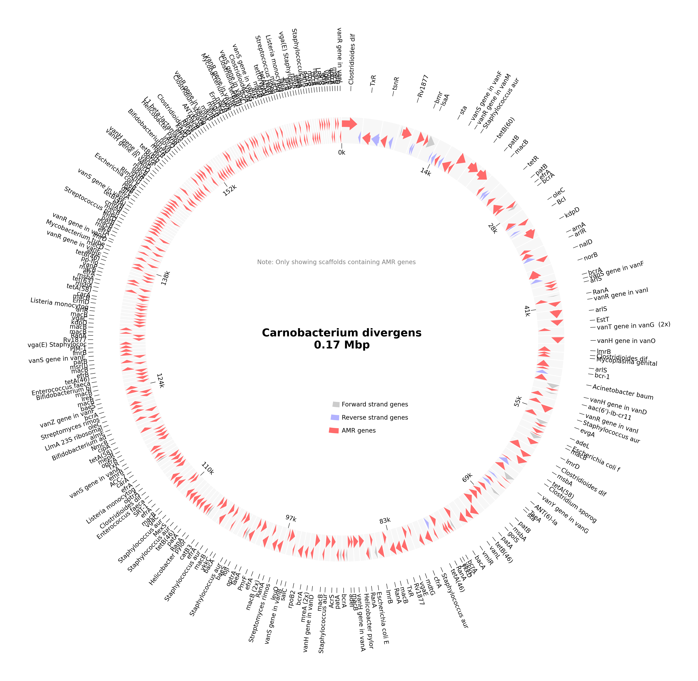

### ACC-7
- **Mechanism**: antibiotic inactivation
- **Drug Classes**: monobactam; cephalosporin; penam
- **AMR Family**: ACC beta-lactamase
- **Locations**:
  - gnl|SPADES|NKBAGNNB_302366_1 : position 80-496

### ANT(6)-Ia (found in 2 locations)
- **Mechanism**: antibiotic inactivation
- **Drug Classes**: aminoglycoside antibiotic
- **AMR Family**: ANT(6)
- **Locations**:
  - gnl|SPADES|NKBAGNNB_1037193_1 : position 3-293
  - gnl|SPADES|NKBAGNNB_33194_2 : position 781-903

### Acinetobacter baumannii AbaF
- **Mechanism**: antibiotic efflux
- **Drug Classes**: phosphonic acid antibiotic
- **AMR Family**: major facilitator superfamily (MFS) antibiotic efflux pump
- **Locations**:
  - gnl|SPADES|NKBAGNNB_19680_1 : position 3-833

### AcrS
- **Mechanism**: antibiotic efflux
- **Drug Classes**: fluoroquinolone antibiotic; cephalosporin; glycylcycline; cephamycin; penam; tetracycline antibiotic; rifamycin antibiotic; phenicol antibiotic; disinfecting agents and antiseptics
- **AMR Family**: resistance-nodulation-cell division (RND) antibiotic efflux pump
- **Locations**:
  - gnl|SPADES|NKBAGNNB_82381_2 : position 71-652

### BcI (found in 2 locations)
- **Mechanism**: antibiotic inactivation
- **Drug Classes**: cephalosporin; penem
- **AMR Family**: class A Bacillus cereus Bc beta-lactamase
- **Locations**:
  - gnl|SPADES|NKBAGNNB_1736407_1 : position 2-229
  - gnl|SPADES|NKBAGNNB_6787_1 : position 3-563

### Bifidobacterium adolescentis rpoB mutants conferring resistance to rifampicin (found in 2 locations)
- **Mechanism**: antibiotic target alteration; antibiotic target replacement
- **Drug Classes**: rifamycin antibiotic
- **AMR Family**: rifamycin-resistant beta-subunit of RNA polymerase (rpoB)
- **Locations**:
  - gnl|SPADES|NKBAGNNB_335475_1 : position 3-479
  - gnl|SPADES|NKBAGNNB_985812_1 : position 59-301

### Bifidobacterium bifidum ileS conferring resistance to mupirocin
- **Mechanism**: antibiotic target alteration
- **Drug Classes**: mupirocin-like antibiotic
- **AMR Family**: antibiotic-resistant isoleucyl-tRNA synthetase (ileS)
- **Locations**:
  - gnl|SPADES|NKBAGNNB_416818_1 : position 3-440

### Clostridioides difficile cplR
- **Mechanism**: antibiotic target protection
- **Drug Classes**: lincosamide antibiotic; streptogramin antibiotic; streptogramin A antibiotic; nucleoside antibiotic
- **AMR Family**: Miscellaneous ABC-F subfamily ATP-binding cassette ribosomal protection proteins
- **Locations**:
  - gnl|SPADES|NKBAGNNB_1505037_1 : position 3-245

### Clostridioides difficile gyrA conferring resistance to fluoroquinolones (found in 3 locations)
- **Mechanism**: antibiotic target alteration
- **Drug Classes**: fluoroquinolone antibiotic
- **AMR Family**: fluoroquinolone resistant gyrA
- **Locations**:
  - gnl|SPADES|NKBAGNNB_1517_1 : position 2-2230
  - gnl|SPADES|NKBAGNNB_17552_1 : position 1-282
  - gnl|SPADES|NKBAGNNB_261870_1 : position 3-521

### Clostridioides difficile gyrB conferring resistance to fluoroquinolones (found in 2 locations)
- **Mechanism**: antibiotic target alteration
- **Drug Classes**: fluoroquinolone antibiotic
- **AMR Family**: fluoroquinolone resistant gyrB
- **Locations**:
  - gnl|SPADES|NKBAGNNB_1020240_1 : position 1-297
  - gnl|SPADES|NKBAGNNB_30047_1 : position 1-924

### Clostridium perfringes cplR
- **Mechanism**: antibiotic target protection
- **Drug Classes**: lincosamide antibiotic; streptogramin antibiotic; streptogramin A antibiotic; pleuromutilin antibiotic
- **AMR Family**: Miscellaneous ABC-F subfamily ATP-binding cassette ribosomal protection proteins
- **Locations**:
  - gnl|SPADES|NKBAGNNB_1471633_1 : position 3-248

### Clostridium sporogenes cplR (found in 2 locations)
- **Mechanism**: antibiotic target protection
- **Drug Classes**: lincosamide antibiotic; pleuromutilin antibiotic
- **AMR Family**: Miscellaneous ABC-F subfamily ATP-binding cassette ribosomal protection proteins
- **Locations**:
  - gnl|SPADES|NKBAGNNB_1051339_1 : position 2-292
  - gnl|SPADES|NKBAGNNB_32321_1 : position 1-171

### Enterococcus faecalis cls with mutation conferring resistance to daptomycin (found in 2 locations)
- **Mechanism**: antibiotic target alteration
- **Drug Classes**: peptide antibiotic
- **AMR Family**: daptomycin resistant cls
- **Locations**:
  - gnl|SPADES|NKBAGNNB_259660_1 : position 3-521
  - gnl|SPADES|NKBAGNNB_427925_1 : position 3-437

### Erm(34)
- **Mechanism**: antibiotic target alteration
- **Drug Classes**: macrolide antibiotic; lincosamide antibiotic; streptogramin antibiotic; streptogramin A antibiotic; streptogramin B antibiotic
- **AMR Family**: Erm 23S ribosomal RNA methyltransferase
- **Locations**:
  - gnl|SPADES|NKBAGNNB_1222690_1 : position 1-270

### ErmD
- **Mechanism**: antibiotic target alteration
- **Drug Classes**: macrolide antibiotic; lincosamide antibiotic; streptogramin antibiotic; streptogramin A antibiotic; streptogramin B antibiotic
- **AMR Family**: Erm 23S ribosomal RNA methyltransferase
- **Locations**:
  - gnl|SPADES|NKBAGNNB_567030_1 : position 2-388

### Escherichia coli EF-Tu mutants conferring resistance to Pulvomycin
- **Mechanism**: antibiotic target alteration
- **Drug Classes**: elfamycin antibiotic
- **AMR Family**: elfamycin resistant EF-Tu
- **Locations**:
  - gnl|SPADES|NKBAGNNB_809400_1 : position 1-333

### Escherichia coli EF-Tu mutants conferring resistance to kirromycin
- **Mechanism**: antibiotic target alteration
- **Drug Classes**: elfamycin antibiotic
- **AMR Family**: elfamycin resistant EF-Tu
- **Locations**:
  - gnl|SPADES|NKBAGNNB_68561_2 : position 419-757

### Escherichia coli fabI mutations conferring resistance to isoniazid and triclosan
- **Mechanism**: antibiotic target alteration
- **Drug Classes**: disinfecting agents and antiseptics; isoniazid-like antibiotic
- **AMR Family**: antibiotic resistant fabI
- **Locations**:
  - gnl|SPADES|NKBAGNNB_29520_2 : position 429-929

### EstT
- **Mechanism**: antibiotic inactivation
- **Drug Classes**: macrolide antibiotic
- **AMR Family**: macrolide esterase
- **Locations**:
  - gnl|SPADES|NKBAGNNB_12921_2 : position 170-982

### Helicobacter pylori pbp1 mutants conferring resistance to amoxicillin
- **Mechanism**: antibiotic target alteration
- **Drug Classes**: cephalosporin; cephamycin; penam
- **AMR Family**: Penicillin-binding protein mutations conferring resistance to beta-lactam antibiotics
- **Locations**:
  - gnl|SPADES|NKBAGNNB_1004709_1 : position 2-298

### Helicobacter pylori rdxA mutation conferring resistance to metronidazole
- **Mechanism**: antibiotic target alteration
- **Drug Classes**: nitroimidazole antibiotic
- **AMR Family**: Antibiotic resistant Helicobacter pylori nitroreductase
- **Locations**:
  - gnl|SPADES|NKBAGNNB_202035_2 : position 318-566

### Helicobacter pylori rpoB mutation conferring resistance to rifampicin
- **Mechanism**: antibiotic target alteration; antibiotic target replacement
- **Drug Classes**: fluoroquinolone antibiotic; rifamycin antibiotic
- **AMR Family**: rifamycin-resistant beta-subunit of RNA polymerase (rpoB)
- **Locations**:
  - gnl|SPADES|NKBAGNNB_69291_1 : position 3-755

### IreK (found in 2 locations)
- **Mechanism**: reduced permeability to antibiotic
- **Drug Classes**: cephalosporin
- **AMR Family**: Serine/threonine kinases
- **Locations**:
  - gnl|SPADES|NKBAGNNB_1456479_1 : position 3-251
  - gnl|SPADES|NKBAGNNB_400083_1 : position 1-447

### L1 beta-lactamase
- **Mechanism**: antibiotic inactivation
- **Drug Classes**: cephalosporin
- **AMR Family**: L1 family beta-lactamase
- **Locations**:
  - gnl|SPADES|NKBAGNNB_1004805_1 : position 3-299

### LRA-9
- **Mechanism**: antibiotic inactivation
- **Drug Classes**: cephalosporin; penam
- **AMR Family**: subclass B3 LRA beta-lactamase
- **Locations**:
  - gnl|SPADES|NKBAGNNB_1981241_1 : position 2-214

### Listeria monocytogenes mprF (found in 3 locations)
- **Mechanism**: antibiotic target alteration
- **Drug Classes**: peptide antibiotic
- **AMR Family**: defensin resistant mprF
- **Locations**:
  - gnl|SPADES|NKBAGNNB_1765201_1 : position 3-227
  - gnl|SPADES|NKBAGNNB_282670_1 : position 2-508
  - gnl|SPADES|NKBAGNNB_564907_1 : position 3-206

### LlmA 23S ribosomal RNA methyltransferase
- **Mechanism**: antibiotic target alteration
- **Drug Classes**: lincosamide antibiotic
- **AMR Family**: Llm 23S ribosomal RNA methyltransferase
- **Locations**:
  - gnl|SPADES|NKBAGNNB_345338_1 : position 2-472

### MexS
- **Mechanism**: antibiotic efflux
- **Drug Classes**: fluoroquinolone antibiotic; diaminopyrimidine antibiotic; phenicol antibiotic
- **AMR Family**: resistance-nodulation-cell division (RND) antibiotic efflux pump
- **Locations**:
  - gnl|SPADES|NKBAGNNB_230640_1 : position 2-544

### Mycobacterium tuberculosis intrinsic murA conferring resistance to fosfomycin (found in 2 locations)
- **Mechanism**: antibiotic target alteration
- **Drug Classes**: phosphonic acid antibiotic
- **AMR Family**: antibiotic-resistant murA transferase
- **Locations**:
  - gnl|SPADES|NKBAGNNB_1375909_1 : position 3-257
  - gnl|SPADES|NKBAGNNB_662204_1 : position 2-364

### Mycoplasma genitalium parC mutations confers resistance to Moxifloxacin
- **Mechanism**: antibiotic target alteration
- **Drug Classes**: fluoroquinolone antibiotic
- **AMR Family**: fluoroquinolone resistant parC
- **Locations**:
  - gnl|SPADES|NKBAGNNB_17552_2 : position 275-760

### NmcR
- **Mechanism**: antibiotic inactivation
- **Drug Classes**: carbapenem; cephalosporin; cephamycin; penam
- **AMR Family**: NmcA beta-lactamase
- **Locations**:
  - gnl|SPADES|NKBAGNNB_336132_1 : position 2-346

### PJM-1
- **Mechanism**: antibiotic inactivation
- **Drug Classes**: carbapenem; cephalosporin; cephamycin; penam
- **AMR Family**: PJM beta-lactamase
- **Locations**:
  - gnl|SPADES|NKBAGNNB_501679_1 : position 1-411

### PmrF
- **Mechanism**: antibiotic target alteration
- **Drug Classes**: peptide antibiotic
- **AMR Family**: pmr phosphoethanolamine transferase
- **Locations**:
  - gnl|SPADES|NKBAGNNB_139261_1 : position 2-628

### RanA (found in 9 locations)
- **Mechanism**: antibiotic efflux
- **Drug Classes**: aminoglycoside antibiotic
- **AMR Family**: ATP-binding cassette (ABC) antibiotic efflux pump
- **Locations**:
  - gnl|SPADES|NKBAGNNB_1021237_1 : position 2-295
  - gnl|SPADES|NKBAGNNB_12453_2 : position 656-1144
  - gnl|SPADES|NKBAGNNB_125855_1 : position 51-647
  - gnl|SPADES|NKBAGNNB_1922685_1 : position 3-218
  - gnl|SPADES|NKBAGNNB_221122_1 : position 3-551
  - gnl|SPADES|NKBAGNNB_50580_1 : position 3-629
  - gnl|SPADES|NKBAGNNB_516395_1 : position 2-406
  - gnl|SPADES|NKBAGNNB_66806_1 : position 3-446
  - gnl|SPADES|NKBAGNNB_69069_3 : position 336-755

### RlmA(II)
- **Mechanism**: antibiotic target alteration
- **Drug Classes**: macrolide antibiotic; lincosamide antibiotic
- **AMR Family**: non-erm 23S ribosomal RNA methyltransferase (G748)
- **Locations**:
  - gnl|SPADES|NKBAGNNB_825229_1 : position 2-328

### Rv1877 (found in 3 locations)
- **Mechanism**: antibiotic efflux
- **Drug Classes**: fluoroquinolone antibiotic
- **AMR Family**: major facilitator superfamily (MFS) antibiotic efflux pump
- **Locations**:
  - gnl|SPADES|NKBAGNNB_3134_2 : position 520-1908
  - gnl|SPADES|NKBAGNNB_512023_1 : position 2-406
  - gnl|SPADES|NKBAGNNB_60648_2 : position 82-780

### SRT-1
- **Mechanism**: antibiotic inactivation
- **Drug Classes**: cephalosporin
- **AMR Family**: SRT beta-lactamase
- **Locations**:
  - gnl|SPADES|NKBAGNNB_256948_1 : position 3-524

### Staphylococcus aureus LmrS
- **Mechanism**: antibiotic efflux
- **Drug Classes**: macrolide antibiotic; aminoglycoside antibiotic; oxazolidinone antibiotic; diaminopyrimidine antibiotic; phenicol antibiotic
- **AMR Family**: major facilitator superfamily (MFS) antibiotic efflux pump
- **Locations**:
  - gnl|SPADES|NKBAGNNB_178357_1 : position 2-316

### Staphylococcus aureus mupA conferring resistance to mupirocin (found in 2 locations)
- **Mechanism**: antibiotic target alteration
- **Drug Classes**: mupirocin-like antibiotic
- **AMR Family**: antibiotic-resistant isoleucyl-tRNA synthetase (ileS)
- **Locations**:
  - gnl|SPADES|NKBAGNNB_1887792_1 : position 2-220
  - gnl|SPADES|NKBAGNNB_55340_1 : position 2-799

### Staphylococcus aureus mupB conferring resistance to mupirocin (found in 3 locations)
- **Mechanism**: antibiotic target alteration
- **Drug Classes**: mupirocin-like antibiotic
- **AMR Family**: antibiotic-resistant isoleucyl-tRNA synthetase (ileS)
- **Locations**:
  - gnl|SPADES|NKBAGNNB_227147_1 : position 1-546
  - gnl|SPADES|NKBAGNNB_4271_1 : position 1-1125
  - gnl|SPADES|NKBAGNNB_92325_1 : position 3-701

### Staphylococcus aureus murA with mutation conferring resistance to fosfomycin (found in 2 locations)
- **Mechanism**: antibiotic target alteration
- **Drug Classes**: phosphonic acid antibiotic
- **AMR Family**: antibiotic-resistant murA transferase
- **Locations**:
  - gnl|SPADES|NKBAGNNB_187470_1 : position 3-578
  - gnl|SPADES|NKBAGNNB_242868_1 : position 2-535

### Staphylococcus aureus rpoB mutants conferring resistance to rifampicin
- **Mechanism**: antibiotic target alteration; antibiotic target replacement
- **Drug Classes**: rifamycin antibiotic
- **AMR Family**: rifamycin-resistant beta-subunit of RNA polymerase (rpoB)
- **Locations**:
  - gnl|SPADES|NKBAGNNB_23072_1 : position 1-984

### Streptococcus pneumoniae PBP2b conferring resistance to amoxicillin
- **Mechanism**: antibiotic target alteration
- **Drug Classes**: cephalosporin; cephamycin; penam
- **AMR Family**: Penicillin-binding protein mutations conferring resistance to beta-lactam antibiotics
- **Locations**:
  - gnl|SPADES|NKBAGNNB_1701832_1 : position 2-232

### Streptococcus pneumoniae PBP2x conferring resistance to amoxicillin
- **Mechanism**: antibiotic target alteration
- **Drug Classes**: cephalosporin; cephamycin; penam
- **AMR Family**: Penicillin-binding protein mutations conferring resistance to beta-lactam antibiotics
- **Locations**:
  - gnl|SPADES|NKBAGNNB_750887_1 : position 3-344

### Streptomyces rimosus otr(A) (found in 2 locations)
- **Mechanism**: antibiotic target protection
- **Drug Classes**: tetracycline antibiotic
- **AMR Family**: tetracycline-resistant ribosomal protection protein
- **Locations**:
  - gnl|SPADES|NKBAGNNB_123024_1 : position 3-650
  - gnl|SPADES|NKBAGNNB_365343_1 : position 3-464

### TaeA (found in 4 locations)
- **Mechanism**: antibiotic efflux
- **Drug Classes**: pleuromutilin antibiotic
- **AMR Family**: ATP-binding cassette (ABC) antibiotic efflux pump
- **Locations**:
  - gnl|SPADES|NKBAGNNB_152791_2 : position 249-614
  - gnl|SPADES|NKBAGNNB_1756267_1 : position 2-229
  - gnl|SPADES|NKBAGNNB_1868542_1 : position 1-219
  - gnl|SPADES|NKBAGNNB_33827_3 : position 726-899

### TxR (found in 3 locations)
- **Mechanism**: antibiotic efflux
- **Drug Classes**: tetracycline antibiotic
- **AMR Family**: ATP-binding cassette (ABC) antibiotic efflux pump
- **Locations**:
  - gnl|SPADES|NKBAGNNB_1858_1 : position 2-1255
  - gnl|SPADES|NKBAGNNB_317602_1 : position 2-487
  - gnl|SPADES|NKBAGNNB_64304_1 : position 2-769

### YojI
- **Mechanism**: antibiotic efflux
- **Drug Classes**: peptide antibiotic
- **AMR Family**: ATP-binding cassette (ABC) antibiotic efflux pump
- **Locations**:
  - gnl|SPADES|NKBAGNNB_163846_2 : position 405-602

### aac(6')-Ib-cr11
- **Mechanism**: antibiotic inactivation
- **Drug Classes**: fluoroquinolone antibiotic; aminoglycoside antibiotic
- **AMR Family**: AAC(6'); AAC(6')-Ib-cr
- **Locations**:
  - gnl|SPADES|NKBAGNNB_22069_2 : position 400-972

### adeI
- **Mechanism**: antibiotic efflux
- **Drug Classes**: macrolide antibiotic; fluoroquinolone antibiotic; lincosamide antibiotic; carbapenem; cephalosporin; tetracycline antibiotic; rifamycin antibiotic; diaminopyrimidine antibiotic; phenicol antibiotic; penem
- **AMR Family**: resistance-nodulation-cell division (RND) antibiotic efflux pump
- **Locations**:
  - gnl|SPADES|NKBAGNNB_72489_2 : position 293-748

### adeL
- **Mechanism**: antibiotic efflux
- **Drug Classes**: fluoroquinolone antibiotic; tetracycline antibiotic
- **AMR Family**: resistance-nodulation-cell division (RND) antibiotic efflux pump
- **Locations**:
  - gnl|SPADES|NKBAGNNB_28306_2 : position 603-938

### almE (found in 2 locations)
- **Mechanism**: antibiotic target alteration
- **Drug Classes**: peptide antibiotic
- **AMR Family**: polymyxin resistance operon; alm glycyltransferase
- **Locations**:
  - gnl|SPADES|NKBAGNNB_343658_1 : position 3-404
  - gnl|SPADES|NKBAGNNB_639160_1 : position 1-369

### arlR (found in 5 locations)
- **Mechanism**: antibiotic efflux
- **Drug Classes**: fluoroquinolone antibiotic; disinfecting agents and antiseptics
- **AMR Family**: major facilitator superfamily (MFS) antibiotic efflux pump
- **Locations**:
  - gnl|SPADES|NKBAGNNB_1086954_1 : position 1-285
  - gnl|SPADES|NKBAGNNB_1989416_1 : position 1-213
  - gnl|SPADES|NKBAGNNB_564226_1 : position 15-389
  - gnl|SPADES|NKBAGNNB_7737_1 : position 2-718
  - gnl|SPADES|NKBAGNNB_989744_1 : position 2-301

### arlS (found in 4 locations)
- **Mechanism**: antibiotic efflux
- **Drug Classes**: fluoroquinolone antibiotic; disinfecting agents and antiseptics
- **AMR Family**: major facilitator superfamily (MFS) antibiotic efflux pump
- **Locations**:
  - gnl|SPADES|NKBAGNNB_10886_2 : position 611-868
  - gnl|SPADES|NKBAGNNB_12611_1 : position 1-1140
  - gnl|SPADES|NKBAGNNB_1629757_1 : position 3-236
  - gnl|SPADES|NKBAGNNB_18258_1 : position 128-1039

### arnA
- **Mechanism**: antibiotic target alteration
- **Drug Classes**: peptide antibiotic
- **AMR Family**: pmr phosphoethanolamine transferase
- **Locations**:
  - gnl|SPADES|NKBAGNNB_7557_2 : position 856-1317

### bacA (found in 2 locations)
- **Mechanism**: antibiotic target alteration
- **Drug Classes**: peptide antibiotic
- **AMR Family**: undecaprenyl pyrophosphate related proteins
- **Locations**:
  - gnl|SPADES|NKBAGNNB_179753_2 : position 390-584
  - gnl|SPADES|NKBAGNNB_44927_2 : position 262-840

### baeR
- **Mechanism**: antibiotic efflux
- **Drug Classes**: aminoglycoside antibiotic; aminocoumarin antibiotic
- **AMR Family**: resistance-nodulation-cell division (RND) antibiotic efflux pump
- **Locations**:
  - gnl|SPADES|NKBAGNNB_1028833_1 : position 3-293

### baeS (found in 2 locations)
- **Mechanism**: antibiotic efflux
- **Drug Classes**: aminoglycoside antibiotic; aminocoumarin antibiotic
- **AMR Family**: resistance-nodulation-cell division (RND) antibiotic efflux pump
- **Locations**:
  - gnl|SPADES|NKBAGNNB_174187_1 : position 1-591
  - gnl|SPADES|NKBAGNNB_381527_1 : position 2-457

### bcr-1
- **Mechanism**: antibiotic efflux
- **Drug Classes**: bicyclomycin-like antibiotic
- **AMR Family**: major facilitator superfamily (MFS) antibiotic efflux pump
- **Locations**:
  - gnl|SPADES|NKBAGNNB_19589_1 : position 2-292

### bcrA (found in 8 locations)
- **Mechanism**: antibiotic efflux
- **Drug Classes**: peptide antibiotic
- **AMR Family**: ATP-binding cassette (ABC) antibiotic efflux pump
- **Locations**:
  - gnl|SPADES|NKBAGNNB_110551_1 : position 2-433
  - gnl|SPADES|NKBAGNNB_1506831_1 : position 1-246
  - gnl|SPADES|NKBAGNNB_1943869_1 : position 3-215
  - gnl|SPADES|NKBAGNNB_373572_1 : position 3-461
  - gnl|SPADES|NKBAGNNB_48309_2 : position 429-824
  - gnl|SPADES|NKBAGNNB_5373_1 : position 2-484
  - gnl|SPADES|NKBAGNNB_76802_2 : position 442-735
  - gnl|SPADES|NKBAGNNB_9299_3 : position 989-1237

### bmr
- **Mechanism**: antibiotic efflux
- **Drug Classes**: fluoroquinolone antibiotic; nucleoside antibiotic; phenicol antibiotic; disinfecting agents and antiseptics
- **AMR Family**: major facilitator superfamily (MFS) antibiotic efflux pump
- **Locations**:
  - gnl|SPADES|NKBAGNNB_3330_4 : position 909-1838

### carA (found in 2 locations)
- **Mechanism**: antibiotic target protection
- **Drug Classes**: macrolide antibiotic
- **AMR Family**: Miscellaneous ABC-F subfamily ATP-binding cassette ribosomal protection proteins
- **Locations**:
  - gnl|SPADES|NKBAGNNB_302541_2 : position 295-495
  - gnl|SPADES|NKBAGNNB_575035_1 : position 1-114

### catB3
- **Mechanism**: antibiotic inactivation
- **Drug Classes**: phenicol antibiotic
- **AMR Family**: chloramphenicol acetyltransferase (CAT)
- **Locations**:
  - gnl|SPADES|NKBAGNNB_196380_1 : position 1-423

### cfrA
- **Mechanism**: antibiotic target alteration
- **Drug Classes**: lincosamide antibiotic; streptogramin antibiotic; streptogramin A antibiotic; oxazolidinone antibiotic; phenicol antibiotic; pleuromutilin antibiotic
- **AMR Family**: Cfr 23S ribosomal RNA methyltransferase
- **Locations**:
  - gnl|SPADES|NKBAGNNB_56105_1 : position 307-795

### cipA
- **Mechanism**: antibiotic target alteration
- **Drug Classes**: lincosamide antibiotic; streptogramin antibiotic; streptogramin A antibiotic; oxazolidinone antibiotic; phenicol antibiotic; pleuromutilin antibiotic
- **AMR Family**: Cfr 23S ribosomal RNA methyltransferase
- **Locations**:
  - gnl|SPADES|NKBAGNNB_330206_1 : position 3-482

### cmlA9
- **Mechanism**: antibiotic efflux
- **Drug Classes**: phenicol antibiotic
- **AMR Family**: major facilitator superfamily (MFS) antibiotic efflux pump
- **Locations**:
  - gnl|SPADES|NKBAGNNB_761245_1 : position 1-342

### cprR
- **Mechanism**: antibiotic target alteration; antibiotic efflux
- **Drug Classes**: peptide antibiotic
- **AMR Family**: pmr phosphoethanolamine transferase
- **Locations**:
  - gnl|SPADES|NKBAGNNB_1913704_1 : position 3-218

### dfrE
- **Mechanism**: antibiotic target replacement
- **Drug Classes**: diaminopyrimidine antibiotic
- **AMR Family**: trimethoprim resistant dihydrofolate reductase dfr
- **Locations**:
  - gnl|SPADES|NKBAGNNB_791373_1 : position 131-337

### efrA (found in 14 locations)
- **Mechanism**: antibiotic efflux
- **Drug Classes**: macrolide antibiotic; fluoroquinolone antibiotic; rifamycin antibiotic
- **AMR Family**: ATP-binding cassette (ABC) antibiotic efflux pump
- **Locations**:
  - gnl|SPADES|NKBAGNNB_1005822_1 : position 1-297
  - gnl|SPADES|NKBAGNNB_1354328_1 : position 3-260
  - gnl|SPADES|NKBAGNNB_136947_1 : position 2-631
  - gnl|SPADES|NKBAGNNB_1644164_1 : position 1-237
  - gnl|SPADES|NKBAGNNB_1787807_1 : position 3-227
  - gnl|SPADES|NKBAGNNB_1816973_1 : position 2-223
  - gnl|SPADES|NKBAGNNB_189955_1 : position 2-577
  - gnl|SPADES|NKBAGNNB_1987122_1 : position 50-211
  - gnl|SPADES|NKBAGNNB_250420_1 : position 3-527
  - gnl|SPADES|NKBAGNNB_283895_1 : position 1-507
  - gnl|SPADES|NKBAGNNB_5203_2 : position 1076-1498
  - gnl|SPADES|NKBAGNNB_585272_2 : position 114-383
  - gnl|SPADES|NKBAGNNB_673682_1 : position 3-362
  - gnl|SPADES|NKBAGNNB_774234_1 : position 20-340

### efrB (found in 3 locations)
- **Mechanism**: antibiotic efflux
- **Drug Classes**: macrolide antibiotic; fluoroquinolone antibiotic; rifamycin antibiotic
- **AMR Family**: ATP-binding cassette (ABC) antibiotic efflux pump
- **Locations**:
  - gnl|SPADES|NKBAGNNB_1706740_1 : position 2-232
  - gnl|SPADES|NKBAGNNB_436302_1 : position 1-435
  - gnl|SPADES|NKBAGNNB_760447_1 : position 1-324

### emrB
- **Mechanism**: antibiotic efflux
- **Drug Classes**: fluoroquinolone antibiotic
- **AMR Family**: major facilitator superfamily (MFS) antibiotic efflux pump
- **Locations**:
  - gnl|SPADES|NKBAGNNB_309586_2 : position 222-491

### evgA
- **Mechanism**: antibiotic efflux
- **Drug Classes**: macrolide antibiotic; fluoroquinolone antibiotic; penam; tetracycline antibiotic
- **AMR Family**: major facilitator superfamily (MFS) antibiotic efflux pump; resistance-nodulation-cell division (RND) antibiotic efflux pump
- **Locations**:
  - gnl|SPADES|NKBAGNNB_24575_2 : position 77-721

### golS
- **Mechanism**: antibiotic efflux
- **Drug Classes**: monobactam; carbapenem; cephalosporin; cephamycin; penam; phenicol antibiotic; penem
- **AMR Family**: resistance-nodulation-cell division (RND) antibiotic efflux pump
- **Locations**:
  - gnl|SPADES|NKBAGNNB_40174_1 : position 3-749

### kdpD (found in 3 locations)
- **Mechanism**: antibiotic efflux
- **Drug Classes**: aminoglycoside antibiotic
- **AMR Family**: kdpDE
- **Locations**:
  - gnl|SPADES|NKBAGNNB_1008414_1 : position 3-296
  - gnl|SPADES|NKBAGNNB_535621_1 : position 1-399
  - gnl|SPADES|NKBAGNNB_6814_1 : position 1-1359

### kdpE
- **Mechanism**: antibiotic efflux
- **Drug Classes**: aminoglycoside antibiotic
- **AMR Family**: kdpDE
- **Locations**:
  - gnl|SPADES|NKBAGNNB_2002984_1 : position 45-212

### leuO
- **Mechanism**: antibiotic efflux
- **Drug Classes**: nucleoside antibiotic; disinfecting agents and antiseptics
- **AMR Family**: major facilitator superfamily (MFS) antibiotic efflux pump
- **Locations**:
  - gnl|SPADES|NKBAGNNB_120524_1 : position 2-220

### lmrB (found in 4 locations)
- **Mechanism**: antibiotic efflux
- **Drug Classes**: lincosamide antibiotic; nucleoside antibiotic
- **AMR Family**: ATP-binding cassette (ABC) antibiotic efflux pump
- **Locations**:
  - gnl|SPADES|NKBAGNNB_16034_2 : position 378-1073
  - gnl|SPADES|NKBAGNNB_491094_1 : position 3-413
  - gnl|SPADES|NKBAGNNB_67303_1 : position 1-762
  - gnl|SPADES|NKBAGNNB_840677_1 : position 37-327

### lmrD (found in 5 locations)
- **Mechanism**: antibiotic efflux
- **Drug Classes**: lincosamide antibiotic
- **AMR Family**: ATP-binding cassette (ABC) antibiotic efflux pump
- **Locations**:
  - gnl|SPADES|NKBAGNNB_29896_1 : position 1-714
  - gnl|SPADES|NKBAGNNB_662489_2 : position 218-364
  - gnl|SPADES|NKBAGNNB_740152_1 : position 2-346
  - gnl|SPADES|NKBAGNNB_866859_1 : position 1-321
  - gnl|SPADES|NKBAGNNB_989781_1 : position 1-300

### lsaA
- **Mechanism**: antibiotic target protection
- **Drug Classes**: lincosamide antibiotic; streptogramin antibiotic; streptogramin A antibiotic; streptogramin B antibiotic; pleuromutilin antibiotic
- **AMR Family**: lsa-type ABC-F protein
- **Locations**:
  - gnl|SPADES|NKBAGNNB_3563_1 : position 3-467

### macB (found in 29 locations)
- **Mechanism**: antibiotic efflux
- **Drug Classes**: macrolide antibiotic
- **AMR Family**: ATP-binding cassette (ABC) antibiotic efflux pump
- **Locations**:
  - gnl|SPADES|NKBAGNNB_100058_1 : position 1-273
  - gnl|SPADES|NKBAGNNB_1033047_1 : position 108-293
  - gnl|SPADES|NKBAGNNB_1074437_1 : position 3-287
  - gnl|SPADES|NKBAGNNB_1094796_1 : position 2-286
  - gnl|SPADES|NKBAGNNB_1218459_1 : position 3-272
  - gnl|SPADES|NKBAGNNB_136230_1 : position 2-313
  - gnl|SPADES|NKBAGNNB_136230_2 : position 329-634
  - gnl|SPADES|NKBAGNNB_1638073_1 : position 2-235
  - gnl|SPADES|NKBAGNNB_1714505_1 : position 2-196
  - gnl|SPADES|NKBAGNNB_185211_1 : position 2-535
  - gnl|SPADES|NKBAGNNB_1940699_1 : position 3-215
  - gnl|SPADES|NKBAGNNB_2003001_1 : position 2-211
  - gnl|SPADES|NKBAGNNB_245535_1 : position 1-342
  - gnl|SPADES|NKBAGNNB_29662_1 : position 2-130
  - gnl|SPADES|NKBAGNNB_396531_1 : position 3-449
  - gnl|SPADES|NKBAGNNB_409735_1 : position 66-443
  - gnl|SPADES|NKBAGNNB_447616_2 : position 127-429
  - gnl|SPADES|NKBAGNNB_4913_1 : position 3-413
  - gnl|SPADES|NKBAGNNB_516090_1 : position 3-266
  - gnl|SPADES|NKBAGNNB_523139_1 : position 2-394
  - gnl|SPADES|NKBAGNNB_552338_1 : position 1-273
  - gnl|SPADES|NKBAGNNB_566791_1 : position 3-353
  - gnl|SPADES|NKBAGNNB_588653_1 : position 2-382
  - gnl|SPADES|NKBAGNNB_66630_1 : position 1-762
  - gnl|SPADES|NKBAGNNB_693150_1 : position 3-356
  - gnl|SPADES|NKBAGNNB_709215_1 : position 3-353
  - gnl|SPADES|NKBAGNNB_72489_1 : position 1-279
  - gnl|SPADES|NKBAGNNB_848837_1 : position 1-324
  - gnl|SPADES|NKBAGNNB_966523_1 : position 2-304

### mdtG
- **Mechanism**: antibiotic efflux
- **Drug Classes**: phosphonic acid antibiotic
- **AMR Family**: major facilitator superfamily (MFS) antibiotic efflux pump
- **Locations**:
  - gnl|SPADES|NKBAGNNB_58143_2 : position 573-788

### mecB
- **Mechanism**: antibiotic target replacement
- **Drug Classes**: penam
- **AMR Family**: methicillin resistant PBP2
- **Locations**:
  - gnl|SPADES|NKBAGNNB_756766_1 : position 3-344

### mecD
- **Mechanism**: antibiotic target replacement
- **Drug Classes**: penam
- **AMR Family**: methicillin resistant PBP2
- **Locations**:
  - gnl|SPADES|NKBAGNNB_646026_1 : position 2-367

### mepR
- **Mechanism**: antibiotic efflux
- **Drug Classes**: glycylcycline; tetracycline antibiotic
- **AMR Family**: multidrug and toxic compound extrusion (MATE) transporter
- **Locations**:
  - gnl|SPADES|NKBAGNNB_320237_1 : position 3-389

### mgrA
- **Mechanism**: antibiotic efflux
- **Drug Classes**: fluoroquinolone antibiotic; cephalosporin; penam; tetracycline antibiotic; peptide antibiotic; disinfecting agents and antiseptics
- **AMR Family**: ATP-binding cassette (ABC) antibiotic efflux pump; major facilitator superfamily (MFS) antibiotic efflux pump
- **Locations**:
  - gnl|SPADES|NKBAGNNB_1150813_1 : position 3-278

### mreA (found in 2 locations)
- **Mechanism**: antibiotic efflux
- **Drug Classes**: macrolide antibiotic
- **AMR Family**: major facilitator superfamily (MFS) antibiotic efflux pump
- **Locations**:
  - gnl|SPADES|NKBAGNNB_103474_1 : position 2-376
  - gnl|SPADES|NKBAGNNB_103474_2 : position 437-682

### msbA (found in 4 locations)
- **Mechanism**: antibiotic efflux
- **Drug Classes**: nitroimidazole antibiotic
- **AMR Family**: ATP-binding cassette (ABC) antibiotic efflux pump
- **Locations**:
  - gnl|SPADES|NKBAGNNB_31254_1 : position 2-754
  - gnl|SPADES|NKBAGNNB_36266_2 : position 300-884
  - gnl|SPADES|NKBAGNNB_580610_1 : position 2-385
  - gnl|SPADES|NKBAGNNB_585655_1 : position 1-384

### msr(I)
- **Mechanism**: antibiotic target protection
- **Drug Classes**: macrolide antibiotic; streptogramin antibiotic; phosphonic acid antibiotic
- **AMR Family**: msr-type ABC-F protein
- **Locations**:
  - gnl|SPADES|NKBAGNNB_449138_1 : position 1-429

### nalD
- **Mechanism**: antibiotic efflux
- **Drug Classes**: macrolide antibiotic; fluoroquinolone antibiotic; monobactam; carbapenem; cephalosporin; cephamycin; penam; tetracycline antibiotic; peptide antibiotic; aminocoumarin antibiotic; diaminopyrimidine antibiotic; sulfonamide antibiotic; phenicol antibiotic; penem
- **AMR Family**: resistance-nodulation-cell division (RND) antibiotic efflux pump
- **Locations**:
  - gnl|SPADES|NKBAGNNB_8153_1 : position 62-733

### norB
- **Mechanism**: antibiotic efflux
- **Drug Classes**: fluoroquinolone antibiotic
- **AMR Family**: major facilitator superfamily (MFS) antibiotic efflux pump
- **Locations**:
  - gnl|SPADES|NKBAGNNB_8605_1 : position 3-1262

### novA (found in 4 locations)
- **Mechanism**: antibiotic efflux
- **Drug Classes**: aminocoumarin antibiotic
- **AMR Family**: ATP-binding cassette (ABC) antibiotic efflux pump
- **Locations**:
  - gnl|SPADES|NKBAGNNB_1851998_1 : position 1-222
  - gnl|SPADES|NKBAGNNB_1925770_1 : position 1-216
  - gnl|SPADES|NKBAGNNB_850194_1 : position 2-325
  - gnl|SPADES|NKBAGNNB_987640_1 : position 3-302

### oleB
- **Mechanism**: antibiotic target protection
- **Drug Classes**: macrolide antibiotic
- **AMR Family**: Miscellaneous ABC-F subfamily ATP-binding cassette ribosomal protection proteins
- **Locations**:
  - gnl|SPADES|NKBAGNNB_799570_1 : position 2-256

### oleC (found in 2 locations)
- **Mechanism**: antibiotic efflux
- **Drug Classes**: macrolide antibiotic
- **AMR Family**: ATP-binding cassette (ABC) antibiotic efflux pump
- **Locations**:
  - gnl|SPADES|NKBAGNNB_350375_1 : position 3-392
  - gnl|SPADES|NKBAGNNB_6774_2 : position 453-1157

### optrA (found in 6 locations)
- **Mechanism**: antibiotic target protection
- **Drug Classes**: oxazolidinone antibiotic; phenicol antibiotic
- **AMR Family**: Miscellaneous ABC-F subfamily ATP-binding cassette ribosomal protection proteins
- **Locations**:
  - gnl|SPADES|NKBAGNNB_163015_1 : position 2-601
  - gnl|SPADES|NKBAGNNB_2004122_1 : position 3-212
  - gnl|SPADES|NKBAGNNB_270016_1 : position 2-514
  - gnl|SPADES|NKBAGNNB_317122_1 : position 2-487
  - gnl|SPADES|NKBAGNNB_922381_1 : position 2-310
  - gnl|SPADES|NKBAGNNB_963235_1 : position 1-303

### patA (found in 3 locations)
- **Mechanism**: antibiotic efflux
- **Drug Classes**: fluoroquinolone antibiotic
- **AMR Family**: ATP-binding cassette (ABC) antibiotic efflux pump
- **Locations**:
  - gnl|SPADES|NKBAGNNB_222534_1 : position 158-550
  - gnl|SPADES|NKBAGNNB_41109_1 : position 3-857
  - gnl|SPADES|NKBAGNNB_77792_2 : position 414-734

### patB (found in 6 locations)
- **Mechanism**: antibiotic efflux
- **Drug Classes**: fluoroquinolone antibiotic
- **AMR Family**: ATP-binding cassette (ABC) antibiotic efflux pump
- **Locations**:
  - gnl|SPADES|NKBAGNNB_1056388_1 : position 3-290
  - gnl|SPADES|NKBAGNNB_35357_2 : position 368-889
  - gnl|SPADES|NKBAGNNB_4405_1 : position 1-1605
  - gnl|SPADES|NKBAGNNB_471845_1 : position 3-419
  - gnl|SPADES|NKBAGNNB_5203_1 : position 1-1083
  - gnl|SPADES|NKBAGNNB_739303_1 : position 1-345

### pp-flo
- **Mechanism**: antibiotic efflux
- **Drug Classes**: phenicol antibiotic
- **AMR Family**: major facilitator superfamily (MFS) antibiotic efflux pump
- **Locations**:
  - gnl|SPADES|NKBAGNNB_624405_1 : position 2-373

### rosB
- **Mechanism**: antibiotic efflux
- **Drug Classes**: peptide antibiotic
- **AMR Family**: major facilitator superfamily (MFS) antibiotic efflux pump
- **Locations**:
  - gnl|SPADES|NKBAGNNB_795570_1 : position 1-336

### rpoB2
- **Mechanism**: antibiotic target alteration; antibiotic target replacement
- **Drug Classes**: rifamycin antibiotic
- **AMR Family**: rifamycin-resistant beta-subunit of RNA polymerase (rpoB)
- **Locations**:
  - gnl|SPADES|NKBAGNNB_111036_1 : position 2-670

### salC
- **Mechanism**: antibiotic target protection
- **Drug Classes**: lincosamide antibiotic; streptogramin antibiotic; streptogramin A antibiotic; pleuromutilin antibiotic
- **AMR Family**: sal-type ABC-F protein
- **Locations**:
  - gnl|SPADES|NKBAGNNB_119568_2 : position 462-656

### salD
- **Mechanism**: antibiotic target protection
- **Drug Classes**: lincosamide antibiotic; streptogramin antibiotic; streptogramin A antibiotic; pleuromutilin antibiotic
- **AMR Family**: sal-type ABC-F protein
- **Locations**:
  - gnl|SPADES|NKBAGNNB_2022014_1 : position 1-210

### sta (found in 2 locations)
- **Mechanism**: antibiotic inactivation
- **Drug Classes**: nucleoside antibiotic
- **AMR Family**: streptothricin acetyltransferase (SAT)
- **Locations**:
  - gnl|SPADES|NKBAGNNB_34550_1 : position 3-335
  - gnl|SPADES|NKBAGNNB_3579_2 : position 628-1107

### tet(63)
- **Mechanism**: antibiotic efflux
- **Drug Classes**: tetracycline antibiotic
- **AMR Family**: major facilitator superfamily (MFS) antibiotic efflux pump
- **Locations**:
  - gnl|SPADES|NKBAGNNB_586053_1 : position 3-383

### tet(O/W/O)
- **Mechanism**: antibiotic target protection
- **Drug Classes**: tetracycline antibiotic
- **AMR Family**: tetracycline-resistant ribosomal protection protein
- **Locations**:
  - gnl|SPADES|NKBAGNNB_1656675_1 : position 2-235

### tetA(46) (found in 2 locations)
- **Mechanism**: antibiotic efflux
- **Drug Classes**: tetracycline antibiotic
- **AMR Family**: ATP-binding cassette (ABC) antibiotic efflux pump
- **Locations**:
  - gnl|SPADES|NKBAGNNB_430630_1 : position 2-436
  - gnl|SPADES|NKBAGNNB_54579_1 : position 2-244

### tetA(58) (found in 4 locations)
- **Mechanism**: antibiotic efflux
- **Drug Classes**: tetracycline antibiotic
- **AMR Family**: major facilitator superfamily (MFS) antibiotic efflux pump
- **Locations**:
  - gnl|SPADES|NKBAGNNB_1706451_1 : position 1-231
  - gnl|SPADES|NKBAGNNB_32205_1 : position 3-908
  - gnl|SPADES|NKBAGNNB_329509_1 : position 2-262
  - gnl|SPADES|NKBAGNNB_579931_1 : position 1-384

### tetB(46) (found in 4 locations)
- **Mechanism**: antibiotic efflux
- **Drug Classes**: tetracycline antibiotic
- **AMR Family**: ATP-binding cassette (ABC) antibiotic efflux pump
- **Locations**:
  - gnl|SPADES|NKBAGNNB_226587_1 : position 2-547
  - gnl|SPADES|NKBAGNNB_41612_1 : position 2-856
  - gnl|SPADES|NKBAGNNB_627590_1 : position 127-372
  - gnl|SPADES|NKBAGNNB_763821_1 : position 1-342

### tetB(60) (found in 2 locations)
- **Mechanism**: antibiotic efflux
- **Drug Classes**: tetracycline antibiotic
- **AMR Family**: ATP-binding cassette (ABC) antibiotic efflux pump
- **Locations**:
  - gnl|SPADES|NKBAGNNB_4339_2 : position 75-1613
  - gnl|SPADES|NKBAGNNB_921941_1 : position 1-312

### tetB(P)
- **Mechanism**: antibiotic target protection
- **Drug Classes**: tetracycline antibiotic
- **AMR Family**: tetracycline-resistant ribosomal protection protein
- **Locations**:
  - gnl|SPADES|NKBAGNNB_1467752_1 : position 1-249

### tetR
- **Mechanism**: antibiotic target alteration; antibiotic efflux
- **Drug Classes**: tetracycline antibiotic
- **AMR Family**: major facilitator superfamily (MFS) antibiotic efflux pump
- **Locations**:
  - gnl|SPADES|NKBAGNNB_5174_2 : position 499-1068

### tlrC
- **Mechanism**: antibiotic target protection
- **Drug Classes**: macrolide antibiotic; lincosamide antibiotic
- **AMR Family**: Miscellaneous ABC-F subfamily ATP-binding cassette ribosomal protection proteins
- **Locations**:
  - gnl|SPADES|NKBAGNNB_933235_1 : position 1-309

### tsnR
- **Mechanism**: antibiotic target alteration
- **Drug Classes**: peptide antibiotic
- **AMR Family**: non-erm 23S ribosomal RNA methyltransferase (A1067)
- **Locations**:
  - gnl|SPADES|NKBAGNNB_2176_2 : position 108-977

### vanG
- **Mechanism**: antibiotic target alteration
- **Drug Classes**: glycopeptide antibiotic
- **AMR Family**: glycopeptide resistance gene cluster; Van ligase
- **Locations**:
  - gnl|SPADES|NKBAGNNB_1539285_1 : position 1-243

### vanH gene in vanA cluster
- **Mechanism**: antibiotic target alteration
- **Drug Classes**: glycopeptide antibiotic
- **AMR Family**: vanH; glycopeptide resistance gene cluster
- **Locations**:
  - gnl|SPADES|NKBAGNNB_70670_1 : position 16-753

### vanH gene in vanD cluster (found in 3 locations)
- **Mechanism**: antibiotic target alteration
- **Drug Classes**: glycopeptide antibiotic
- **AMR Family**: vanH; glycopeptide resistance gene cluster
- **Locations**:
  - gnl|SPADES|NKBAGNNB_101616_1 : position 1-684
  - gnl|SPADES|NKBAGNNB_19903_2 : position 736-1020
  - gnl|SPADES|NKBAGNNB_889152_1 : position 3-317

### vanH gene in vanO cluster
- **Mechanism**: antibiotic target alteration
- **Drug Classes**: glycopeptide antibiotic
- **AMR Family**: vanH; glycopeptide resistance gene cluster
- **Locations**:
  - gnl|SPADES|NKBAGNNB_15609_1 : position 196-1080

### vanH gene in vanP cluster
- **Mechanism**: antibiotic target alteration
- **Drug Classes**: glycopeptide antibiotic
- **AMR Family**: vanH; glycopeptide resistance gene cluster
- **Locations**:
  - gnl|SPADES|NKBAGNNB_923897_1 : position 2-310

### vanL
- **Mechanism**: antibiotic target alteration
- **Drug Classes**: glycopeptide antibiotic
- **AMR Family**: glycopeptide resistance gene cluster; Van ligase
- **Locations**:
  - gnl|SPADES|NKBAGNNB_41828_1 : position 2-661

### vanP
- **Mechanism**: antibiotic target alteration
- **Drug Classes**: glycopeptide antibiotic
- **AMR Family**: glycopeptide resistance gene cluster; Van ligase
- **Locations**:
  - gnl|SPADES|NKBAGNNB_621374_1 : position 1-306

### vanR gene in vanB cluster
- **Mechanism**: antibiotic target alteration
- **Drug Classes**: glycopeptide antibiotic
- **AMR Family**: glycopeptide resistance gene cluster; vanR
- **Locations**:
  - gnl|SPADES|NKBAGNNB_1414582_1 : position 1-255

### vanR gene in vanD cluster
- **Mechanism**: antibiotic target alteration
- **Drug Classes**: glycopeptide antibiotic
- **AMR Family**: glycopeptide resistance gene cluster; vanR
- **Locations**:
  - gnl|SPADES|NKBAGNNB_666287_1 : position 2-253

### vanR gene in vanF cluster
- **Mechanism**: antibiotic target alteration
- **Drug Classes**: glycopeptide antibiotic
- **AMR Family**: glycopeptide resistance gene cluster; vanR
- **Locations**:
  - gnl|SPADES|NKBAGNNB_644391_1 : position 2-361

### vanR gene in vanI cluster (found in 3 locations)
- **Mechanism**: antibiotic target alteration
- **Drug Classes**: glycopeptide antibiotic
- **AMR Family**: glycopeptide resistance gene cluster; vanR
- **Locations**:
  - gnl|SPADES|NKBAGNNB_12584_1 : position 91-735
  - gnl|SPADES|NKBAGNNB_2069646_1 : position 2-208
  - gnl|SPADES|NKBAGNNB_22645_2 : position 402-989

### vanR gene in vanM cluster (found in 2 locations)
- **Mechanism**: antibiotic target alteration
- **Drug Classes**: glycopeptide antibiotic
- **AMR Family**: glycopeptide resistance gene cluster; vanR
- **Locations**:
  - gnl|SPADES|NKBAGNNB_1049188_1 : position 3-248
  - gnl|SPADES|NKBAGNNB_4044_2 : position 1204-1665

### vanS gene in vanA cluster
- **Mechanism**: antibiotic target alteration
- **Drug Classes**: glycopeptide antibiotic
- **AMR Family**: vanS; glycopeptide resistance gene cluster
- **Locations**:
  - gnl|SPADES|NKBAGNNB_314333_1 : position 1-489

### vanS gene in vanB cluster
- **Mechanism**: antibiotic target alteration
- **Drug Classes**: glycopeptide antibiotic
- **AMR Family**: vanS; glycopeptide resistance gene cluster
- **Locations**:
  - gnl|SPADES|NKBAGNNB_119551_1 : position 1-657

### vanS gene in vanE cluster
- **Mechanism**: antibiotic target alteration
- **Drug Classes**: glycopeptide antibiotic
- **AMR Family**: vanS; glycopeptide resistance gene cluster
- **Locations**:
  - gnl|SPADES|NKBAGNNB_482904_1 : position 1-417

### vanS gene in vanF cluster (found in 3 locations)
- **Mechanism**: antibiotic target alteration
- **Drug Classes**: glycopeptide antibiotic
- **AMR Family**: vanS; glycopeptide resistance gene cluster
- **Locations**:
  - gnl|SPADES|NKBAGNNB_10886_1 : position 3-545
  - gnl|SPADES|NKBAGNNB_4044_1 : position 12-1118
  - gnl|SPADES|NKBAGNNB_768006_1 : position 3-341

### vanS gene in vanL cluster
- **Mechanism**: antibiotic target alteration
- **Drug Classes**: glycopeptide antibiotic
- **AMR Family**: vanS; glycopeptide resistance gene cluster
- **Locations**:
  - gnl|SPADES|NKBAGNNB_1485488_1 : position 56-247

### vanS gene in vanN cluster
- **Mechanism**: antibiotic target alteration
- **Drug Classes**: glycopeptide antibiotic
- **AMR Family**: vanS; glycopeptide resistance gene cluster
- **Locations**:
  - gnl|SPADES|NKBAGNNB_1558333_1 : position 1-243

### vanT gene in vanG cluster (found in 2 locations)
- **Mechanism**: antibiotic target alteration
- **Drug Classes**: glycopeptide antibiotic
- **AMR Family**: glycopeptide resistance gene cluster; vanT
- **Locations**:
  - gnl|SPADES|NKBAGNNB_15133_1 : position 2-421
  - gnl|SPADES|NKBAGNNB_15133_2 : position 439-1089

### vanY gene in vanG cluster
- **Mechanism**: antibiotic target alteration
- **Drug Classes**: glycopeptide antibiotic
- **AMR Family**: vanY; glycopeptide resistance gene cluster
- **Locations**:
  - gnl|SPADES|NKBAGNNB_33120_1: position 73-828

### vanZ gene in vanF cluster
- **Mechanism**: antibiotic target alteration
- **Drug Classes**: glycopeptide antibiotic
- **AMR Family**: vanZ; glycopeptide resistance gene cluster
- **Locations**:
  - gnl|SPADES|NKBAGNNB_381346_1 : position 76-444

### vatB
- **Mechanism**: antibiotic inactivation
- **Drug Classes**: streptogramin antibiotic; streptogramin A antibiotic
- **AMR Family**: streptogramin vat acetyltransferase
- **Locations**:
  - gnl|SPADES|NKBAGNNB_1871891_1 : position 68-220

### vga(E) Staphylococcus cohnii (found in 2 locations)
- **Mechanism**: antibiotic target protection
- **Drug Classes**: lincosamide antibiotic; streptogramin antibiotic; streptogramin A antibiotic; pleuromutilin antibiotic
- **AMR Family**: vga-type ABC-F protein
- **Locations**:
  - gnl|SPADES|NKBAGNNB_1853435_1 : position 53-220
  - gnl|SPADES|NKBAGNNB_508624_1 : position 1-408

### vgaC (found in 2 locations)
- **Mechanism**: antibiotic target protection
- **Drug Classes**: lincosamide antibiotic; streptogramin antibiotic; streptogramin A antibiotic; pleuromutilin antibiotic
- **AMR Family**: vga-type ABC-F protein
- **Locations**:
  - gnl|SPADES|NKBAGNNB_241702_1 : position 153-533
  - gnl|SPADES|NKBAGNNB_545089_1 : position 2-397

### vgaE (found in 2 locations)
- **Mechanism**: antibiotic target protection
- **Drug Classes**: lincosamide antibiotic; streptogramin antibiotic; streptogramin A antibiotic; pleuromutilin antibiotic
- **AMR Family**: vga-type ABC-F protein
- **Locations**:
  - gnl|SPADES|NKBAGNNB_1997777_1 : position 3-212
  - gnl|SPADES|NKBAGNNB_60220_2 : position 324-782

### vmlR
- **Mechanism**: antibiotic target protection
- **Drug Classes**: lincosamide antibiotic; streptogramin antibiotic; streptogramin A antibiotic; streptogramin B antibiotic; nucleoside antibiotic; pleuromutilin antibiotic
- **AMR Family**: Miscellaneous ABC-F subfamily ATP-binding cassette ribosomal protection proteins
- **Locations**:
  - gnl|SPADES|NKBAGNNB_42756_1 : position 3-848

### ykkC (found in 2 locations)
- **Mechanism**: antibiotic efflux
- **Drug Classes**: aminoglycoside antibiotic; tetracycline antibiotic; phenicol antibiotic
- **AMR Family**: small multidrug resistance (SMR) antibiotic efflux pump
- **Locations**:
  - gnl|SPADES|NKBAGNNB_182836_2 : position 69-398
  - gnl|SPADES|NKBAGNNB_49997_1 : position 1-324

### ykkD
- **Mechanism**: antibiotic efflux
- **Drug Classes**: aminoglycoside antibiotic; tetracycline antibiotic; phenicol antibiotic
- **AMR Family**: small multidrug resistance (SMR) antibiotic efflux pump
- **Locations**:
  - gnl|SPADES|NKBAGNNB_49997_2 : position 338-649

## Carnobacterium maltaromaticum
**Strain Statistics:**
- Total genome length: 1703.6 kbp
- Total scaffolds: 933
- Scaffolds with AMR genes: 114
- Total genes annotated: 3163
- Total AMR genes: 225
- Unique AMR genes: 122
- Distinct AMR mechanisms: 9
- Distinct AMR families: 60
- Distinct drug classes: 34

**Circos Plot:**

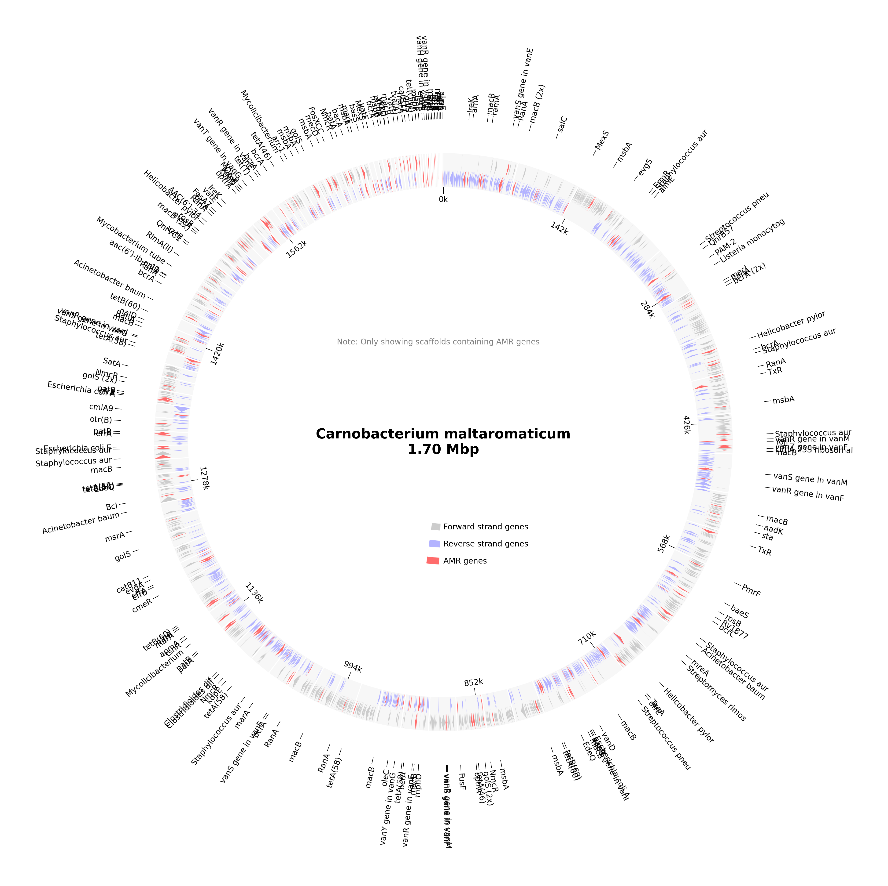

### AAC(6')-34
- **Mechanism**: antibiotic inactivation
- **Drug Classes**: aminoglycoside antibiotic
- **AMR Family**: AAC(6')
- **Locations**:
  - gnl|SPADES|NKBAGNNB_438_6 : position 5008-5541

### Acinetobacter baumannii AbaQ (found in 2 locations)
- **Mechanism**: antibiotic efflux
- **Drug Classes**: fluoroquinolone antibiotic
- **AMR Family**: major facilitator superfamily (MFS) antibiotic efflux pump
- **Locations**:
  - gnl|SPADES|NKBAGNNB_249_11 : position 13104-14360
  - gnl|SPADES|NKBAGNNB_355_5 : position 3786-5078

### Acinetobacter baumannii AmvA
- **Mechanism**: antibiotic efflux
- **Drug Classes**: macrolide antibiotic; disinfecting agents and antiseptics
- **AMR Family**: major facilitator superfamily (MFS) antibiotic efflux pump
- **Locations**:
  - gnl|SPADES|NKBAGNNB_92_25 : position 32067-33497

### BcI
- **Mechanism**: antibiotic inactivation
- **Drug Classes**: cephalosporin; penem
- **AMR Family**: class A Bacillus cereus Bc beta-lactamase
- **Locations**:
  - gnl|SPADES|NKBAGNNB_260_3 : position 5876-6775

### Clostridioides difficile gyrA conferring resistance to fluoroquinolones
- **Mechanism**: antibiotic target alteration
- **Drug Classes**: fluoroquinolone antibiotic
- **AMR Family**: fluoroquinolone resistant gyrA
- **Locations**:
  - gnl|SPADES|NKBAGNNB_169_10 : position 11035-13506

### Clostridioides difficile gyrB conferring resistance to fluoroquinolones
- **Mechanism**: antibiotic target alteration
- **Drug Classes**: fluoroquinolone antibiotic
- **AMR Family**: fluoroquinolone resistant gyrB
- **Locations**:
  - gnl|SPADES|NKBAGNNB_169_11 : position 13496-15511

### EdeQ (found in 2 locations)
- **Mechanism**: antibiotic inactivation
- **Drug Classes**: peptide antibiotic; polyamine antibiotic
- **AMR Family**: Edeine acetyltransferase
- **Locations**:
  - gnl|SPADES|NKBAGNNB_111_7 : position 5261-5713
  - gnl|SPADES|NKBAGNNB_267_9 : position 7591-8043

### Enterococcus faecalis cls with mutation conferring resistance to daptomycin
- **Mechanism**: antibiotic target alteration
- **Drug Classes**: peptide antibiotic
- **AMR Family**: daptomycin resistant cls
- **Locations**:
  - gnl|SPADES|NKBAGNNB_28_42 : position 40305-41753

### ErmR
- **Mechanism**: antibiotic target alteration
- **Drug Classes**: macrolide antibiotic; lincosamide antibiotic; streptogramin antibiotic; streptogramin A antibiotic; streptogramin B antibiotic
- **AMR Family**: Erm 23S ribosomal RNA methyltransferase
- **Locations**:
  - gnl|SPADES|NKBAGNNB_53_6 : position 4634-5527

### Escherichia coli AcrAB-TolC with AcrR mutation conferring resistance to ciprofloxacin, tetracycline, and ceftazidime
- **Mechanism**: antibiotic target alteration; antibiotic efflux
- **Drug Classes**: fluoroquinolone antibiotic; cephalosporin; glycylcycline; penam; tetracycline antibiotic; rifamycin antibiotic; phenicol antibiotic; disinfecting agents and antiseptics
- **AMR Family**: resistance-nodulation-cell division (RND) antibiotic efflux pump
- **Locations**:
  - gnl|SPADES|NKBAGNNB_284_3 : position 2282-2926

### Escherichia coli AcrAB-TolC with MarR mutations conferring resistance to ciprofloxacin and tetracycline
- **Mechanism**: antibiotic target alteration; antibiotic efflux
- **Drug Classes**: fluoroquinolone antibiotic; cephalosporin; glycylcycline; penam; tetracycline antibiotic; rifamycin antibiotic; phenicol antibiotic; disinfecting agents and antiseptics
- **AMR Family**: resistance-nodulation-cell division (RND) antibiotic efflux pump
- **Locations**:
  - gnl|SPADES|NKBAGNNB_110_27 : position 23810-24274

### Escherichia coli EF-Tu mutants conferring resistance to kirromycin
- **Mechanism**: antibiotic target alteration
- **Drug Classes**: elfamycin antibiotic
- **AMR Family**: elfamycin resistant EF-Tu
- **Locations**:
  - gnl|SPADES|NKBAGNNB_274_7 : position 12102-13289

### FosA7
- **Mechanism**: antibiotic inactivation
- **Drug Classes**: phosphonic acid antibiotic
- **AMR Family**: fosfomycin thiol transferase
- **Locations**:
  - gnl|SPADES|NKBAGNNB_442_11 : position 7830-8210

### FosXCC
- **Mechanism**: antibiotic inactivation
- **Drug Classes**: phosphonic acid antibiotic
- **AMR Family**: fosfomycin thiol transferase
- **Locations**:
  - gnl|SPADES|NKBAGNNB_688_3: position 858-1274

### FusF
- **Mechanism**: antibiotic target protection
- **Drug Classes**: fusidane antibiotic
- **AMR Family**: Target protecting FusB-type protein conferring resistance to Fusidic acid
- **Locations**:
  - gnl|SPADES|NKBAGNNB_117_31 : position 27124-27771

### Helicobacter pylori frxA mutation conferring resistance to metronidazole
- **Mechanism**: antibiotic target alteration
- **Drug Classes**: nitroimidazole antibiotic
- **AMR Family**: Antibiotic resistant Helicobacter pylori nitroreductase
- **Locations**:
  - gnl|SPADES|NKBAGNNB_438_2 : position 1686-2357

### Helicobacter pylori pbp1 mutants conferring resistance to amoxicillin (found in 2 locations)
- **Mechanism**: antibiotic target alteration
- **Drug Classes**: cephalosporin; cephamycin; penam
- **AMR Family**: Penicillin-binding protein mutations conferring resistance to beta-lactam antibiotics
- **Locations**:
  - gnl|SPADES|NKBAGNNB_103_11 : position 11167-13803
  - gnl|SPADES|NKBAGNNB_76_13 : position 15741-17867

### IreK (found in 2 locations)
- **Mechanism**: reduced permeability to antibiotic
- **Drug Classes**: cephalosporin
- **AMR Family**: Serine/threonine kinases
- **Locations**:
  - gnl|SPADES|NKBAGNNB_28_24 : position 21826-23850
  - gnl|SPADES|NKBAGNNB_488_1 : position 726-3017

### Listeria monocytogenes mprF
- **Mechanism**: antibiotic target alteration
- **Drug Classes**: peptide antibiotic
- **AMR Family**: defensin resistant mprF
- **Locations**:
  - gnl|SPADES|NKBAGNNB_56_37 : position 39848-42421

### LlmA 23S ribosomal RNA methyltransferase
- **Mechanism**: antibiotic target alteration
- **Drug Classes**: lincosamide antibiotic
- **AMR Family**: Llm 23S ribosomal RNA methyltransferase
- **Locations**:
  - gnl|SPADES|NKBAGNNB_79_33 : position 33472-34638

### MOX-9
- **Mechanism**: antibiotic inactivation
- **Drug Classes**: cephalosporin; cephamycin; penam
- **AMR Family**: MOX beta-lactamase
- **Locations**:
  - gnl|SPADES|NKBAGNNB_520_4 : position 4329-5585

### MexS (found in 2 locations)
- **Mechanism**: antibiotic efflux
- **Drug Classes**: fluoroquinolone antibiotic; diaminopyrimidine antibiotic; phenicol antibiotic
- **AMR Family**: resistance-nodulation-cell division (RND) antibiotic efflux pump
- **Locations**:
  - gnl|SPADES|NKBAGNNB_32_56 : position 62444-63556
  - gnl|SPADES|NKBAGNNB_960_6 : position 3172-4137

### Mycobacterium tuberculosis pncA mutations conferring resistance to pyrazinamide
- **Mechanism**: antibiotic target alteration
- **Drug Classes**: pyrazine antibiotic
- **AMR Family**: Pyrazinamide resistant pncA
- **Locations**:
  - gnl|SPADES|NKBAGNNB_382_9 : position 5727-6272

### Mycolicibacterium smegmatis ndh with mutation conferring resistance to isoniazid (found in 2 locations)
- **Mechanism**: antibiotic target alteration
- **Drug Classes**: isoniazid-like antibiotic
- **AMR Family**: antibiotic resistant ndh
- **Locations**:
  - gnl|SPADES|NKBAGNNB_178_7 : position 6029-7891
  - gnl|SPADES|NKBAGNNB_571_3 : position 1715-2920

### NmcR (found in 4 locations)
- **Mechanism**: antibiotic inactivation
- **Drug Classes**: carbapenem; cephalosporin; cephamycin; penam
- **AMR Family**: NmcA beta-lactamase
- **Locations**:
  - gnl|SPADES|NKBAGNNB_117_1 : position 2-868
  - gnl|SPADES|NKBAGNNB_169_7 : position 6468-7415
  - gnl|SPADES|NKBAGNNB_288_6 : position 4144-5028
  - gnl|SPADES|NKBAGNNB_762_4 : position 2263-3156

### PAM-2
- **Mechanism**: antibiotic inactivation
- **Drug Classes**: carbapenem; cephalosporin
- **AMR Family**: PAM beta-lactamase
- **Locations**:
  - gnl|SPADES|NKBAGNNB_56_32 : position 32773-33453

### PmrF
- **Mechanism**: antibiotic target alteration
- **Drug Classes**: peptide antibiotic
- **AMR Family**: pmr phosphoethanolamine transferase
- **Locations**:
  - gnl|SPADES|NKBAGNNB_91_3 : position 3191-4441

### QnrB57
- **Mechanism**: antibiotic target protection
- **Drug Classes**: fluoroquinolone antibiotic
- **AMR Family**: quinolone resistance protein (qnr)
- **Locations**:
  - gnl|SPADES|NKBAGNNB_56_23 : position 23206-23841

### QnrVC1
- **Mechanism**: antibiotic target protection
- **Drug Classes**: fluoroquinolone antibiotic
- **AMR Family**: quinolone resistance protein (qnr)
- **Locations**:
  - gnl|SPADES|NKBAGNNB_392_9 : position 8434-9057

### RanA (found in 10 locations)
- **Mechanism**: antibiotic efflux
- **Drug Classes**: aminoglycoside antibiotic
- **AMR Family**: ATP-binding cassette (ABC) antibiotic efflux pump
- **Locations**:
  - gnl|SPADES|NKBAGNNB_148_11 : position 8822-9499
  - gnl|SPADES|NKBAGNNB_150_14 : position 11022-11675
  - gnl|SPADES|NKBAGNNB_28_65 : position 66624-67817
  - gnl|SPADES|NKBAGNNB_32_24 : position 28125-28859
  - gnl|SPADES|NKBAGNNB_32_38 : position 42779-43873
  - gnl|SPADES|NKBAGNNB_350_6 : position 3920-4906
  - gnl|SPADES|NKBAGNNB_372_5 : position 4281-5012
  - gnl|SPADES|NKBAGNNB_442_4 : position 2459-3490
  - gnl|SPADES|NKBAGNNB_64_12 : position 8673-9398
  - gnl|SPADES|NKBAGNNB_78_1 : position 196-1311

### RlmA(II)
- **Mechanism**: antibiotic target alteration
- **Drug Classes**: macrolide antibiotic; lincosamide antibiotic
- **AMR Family**: non-erm 23S ribosomal RNA methyltransferase (G748)
- **Locations**:
  - gnl|SPADES|NKBAGNNB_383_7 : position 6541-7398

### Rv1877
- **Mechanism**: antibiotic efflux
- **Drug Classes**: fluoroquinolone antibiotic
- **AMR Family**: major facilitator superfamily (MFS) antibiotic efflux pump
- **Locations**:
  - gnl|SPADES|NKBAGNNB_92_3 : position 2957-4441

### SatA
- **Mechanism**: antibiotic inactivation
- **Drug Classes**: nucleoside antibiotic
- **AMR Family**: streptothricin acetyltransferase (SAT)
- **Locations**:
  - gnl|SPADES|NKBAGNNB_301_2 : position 1139-1591

### Staphylococcus aureus LmrS
- **Mechanism**: antibiotic efflux
- **Drug Classes**: macrolide antibiotic; aminoglycoside antibiotic; oxazolidinone antibiotic; diaminopyrimidine antibiotic; phenicol antibiotic
- **AMR Family**: major facilitator superfamily (MFS) antibiotic efflux pump
- **Locations**:
  - gnl|SPADES|NKBAGNNB_76_25 : position 29877-31301

### Staphylococcus aureus fusA with mutation conferring resistance to fusidic acid
- **Mechanism**: antibiotic target alteration
- **Drug Classes**: fusidane antibiotic
- **AMR Family**: antibiotic resistant fusA
- **Locations**:
  - gnl|SPADES|NKBAGNNB_274_6 : position 9872-11956

### Staphylococcus aureus mupA conferring resistance to mupirocin (found in 2 locations)
- **Mechanism**: antibiotic target alteration
- **Drug Classes**: mupirocin-like antibiotic
- **AMR Family**: antibiotic-resistant isoleucyl-tRNA synthetase (ileS)
- **Locations**:
  - gnl|SPADES|NKBAGNNB_308_10 : position 8709-11492
  - gnl|SPADES|NKBAGNNB_53_9 : position 6950-8965

### Staphylococcus aureus mupB conferring resistance to mupirocin (found in 2 locations)
- **Mechanism**: antibiotic target alteration
- **Drug Classes**: mupirocin-like antibiotic
- **AMR Family**: antibiotic-resistant isoleucyl-tRNA synthetase (ileS)
- **Locations**:
  - gnl|SPADES|NKBAGNNB_155_3 : position 2219-4888
  - gnl|SPADES|NKBAGNNB_92_21 : position 25675-28089

### Staphylococcus aureus murA with mutation conferring resistance to fosfomycin
- **Mechanism**: antibiotic target alteration
- **Drug Classes**: phosphonic acid antibiotic
- **AMR Family**: antibiotic-resistant murA transferase
- **Locations**:
  - gnl|SPADES|NKBAGNNB_79_21 : position 20196-21503

### Staphylococcus aureus rpoB mutants conferring resistance to rifampicin
- **Mechanism**: antibiotic target alteration; antibiotic target replacement
- **Drug Classes**: rifamycin antibiotic
- **AMR Family**: rifamycin-resistant beta-subunit of RNA polymerase (rpoB)
- **Locations**:
  - gnl|SPADES|NKBAGNNB_274_1 : position 298-3870

### Streptococcus pneumoniae PBP2b conferring resistance to amoxicillin
- **Mechanism**: antibiotic target alteration
- **Drug Classes**: cephalosporin; cephamycin; penam
- **AMR Family**: Penicillin-binding protein mutations conferring resistance to beta-lactam antibiotics
- **Locations**:
  - gnl|SPADES|NKBAGNNB_56_21 : position 18149-20203

### Streptococcus pneumoniae PBP2x conferring resistance to amoxicillin
- **Mechanism**: antibiotic target alteration
- **Drug Classes**: cephalosporin; cephamycin; penam
- **AMR Family**: Penicillin-binding protein mutations conferring resistance to beta-lactam antibiotics
- **Locations**:
  - gnl|SPADES|NKBAGNNB_105_6 : position 5308-7497

### Streptomyces rimosus otr(A)
- **Mechanism**: antibiotic target protection
- **Drug Classes**: tetracycline antibiotic
- **AMR Family**: tetracycline-resistant ribosomal protection protein
- **Locations**:
  - gnl|SPADES|NKBAGNNB_98_18 : position 16348-18855

### TaeA
- **Mechanism**: antibiotic efflux
- **Drug Classes**: pleuromutilin antibiotic
- **AMR Family**: ATP-binding cassette (ABC) antibiotic efflux pump
- **Locations**:
  - gnl|SPADES|NKBAGNNB_103_27 : position 26721-28622

### TxR (found in 2 locations)
- **Mechanism**: antibiotic efflux
- **Drug Classes**: tetracycline antibiotic
- **AMR Family**: ATP-binding cassette (ABC) antibiotic efflux pump
- **Locations**:
  - gnl|SPADES|NKBAGNNB_78_7 : position 6281-8944
  - gnl|SPADES|NKBAGNNB_89_4 : position 2595-5405

### YajC
- **Mechanism**: antibiotic efflux
- **Drug Classes**: fluoroquinolone antibiotic; cephalosporin; glycylcycline; penam; tetracycline antibiotic; oxazolidinone antibiotic; glycopeptide antibiotic; rifamycin antibiotic; phenicol antibiotic; disinfecting agents and antiseptics
- **AMR Family**: resistance-nodulation-cell division (RND) antibiotic efflux pump
- **Locations**:
  - gnl|SPADES|NKBAGNNB_56_38 : position 42601-42978

### YojI
- **Mechanism**: antibiotic efflux
- **Drug Classes**: peptide antibiotic
- **AMR Family**: ATP-binding cassette (ABC) antibiotic efflux pump
- **Locations**:
  - gnl|SPADES|NKBAGNNB_79_28 : position 27335-27883

### aac(6')-Ib-cr11
- **Mechanism**: antibiotic inactivation
- **Drug Classes**: fluoroquinolone antibiotic; aminoglycoside antibiotic
- **AMR Family**: AAC(6'); AAC(6')-Ib-cr
- **Locations**:
  - gnl|SPADES|NKBAGNNB_372_8 : position 7329-7892

### aadK
- **Mechanism**: antibiotic inactivation
- **Drug Classes**: aminoglycoside antibiotic
- **AMR Family**: ANT(6)
- **Locations**:
  - gnl|SPADES|NKBAGNNB_81_23 : position 22616-23467

### almE (found in 2 locations)
- **Mechanism**: antibiotic target alteration
- **Drug Classes**: peptide antibiotic
- **AMR Family**: polymyxin resistance operon; alm glycyltransferase
- **Locations**:
  - gnl|SPADES|NKBAGNNB_1889590_1 : position 2-220
  - gnl|SPADES|NKBAGNNB_53_11 : position 10616-12058

### apmA
- **Mechanism**: antibiotic inactivation
- **Drug Classes**: aminoglycoside antibiotic
- **AMR Family**: AAC(2')
- **Locations**:
  - gnl|SPADES|NKBAGNNB_178_18 : position 15403-15912

### arlS
- **Mechanism**: antibiotic efflux
- **Drug Classes**: fluoroquinolone antibiotic; disinfecting agents and antiseptics
- **AMR Family**: major facilitator superfamily (MFS) antibiotic efflux pump
- **Locations**:
  - gnl|SPADES|NKBAGNNB_128_13 : position 12503-13555

### arnA
- **Mechanism**: antibiotic target alteration
- **Drug Classes**: peptide antibiotic
- **AMR Family**: pmr phosphoethanolamine transferase
- **Locations**:
  - gnl|SPADES|NKBAGNNB_28_27 : position 26011-26964

### arr-1
- **Mechanism**: antibiotic inactivation
- **Drug Classes**: rifamycin antibiotic
- **AMR Family**: rifampin ADP-ribosyltransferase (Arr)
- **Locations**:
  - gnl|SPADES|NKBAGNNB_571_7 : position 6006-6419

### bacA
- **Mechanism**: antibiotic target alteration
- **Drug Classes**: peptide antibiotic
- **AMR Family**: undecaprenyl pyrophosphate related proteins
- **Locations**:
  - gnl|SPADES|NKBAGNNB_843_1 : position 102-920

### baeS (found in 3 locations)
- **Mechanism**: antibiotic efflux
- **Drug Classes**: aminoglycoside antibiotic; aminocoumarin antibiotic
- **AMR Family**: resistance-nodulation-cell division (RND) antibiotic efflux pump
- **Locations**:
  - gnl|SPADES|NKBAGNNB_110_30 : position 25950-27338
  - gnl|SPADES|NKBAGNNB_79_27 : position 25769-27220
  - gnl|SPADES|NKBAGNNB_91_16 : position 23363-24724

### basS
- **Mechanism**: antibiotic target alteration; antibiotic efflux
- **Drug Classes**: peptide antibiotic
- **AMR Family**: pmr phosphoethanolamine transferase
- **Locations**:
  - gnl|SPADES|NKBAGNNB_881_3 : position 3371-4435

### bcrA (found in 10 locations)
- **Mechanism**: antibiotic efflux
- **Drug Classes**: peptide antibiotic
- **AMR Family**: ATP-binding cassette (ABC) antibiotic efflux pump
- **Locations**:
  - gnl|SPADES|NKBAGNNB_1254_3 : position 2722-3432
  - gnl|SPADES|NKBAGNNB_128_21 : position 19615-20391
  - gnl|SPADES|NKBAGNNB_151_1 : position 69-1001
  - gnl|SPADES|NKBAGNNB_369_8 : position 8944-9849
  - gnl|SPADES|NKBAGNNB_442_8 : position 5178-6164
  - gnl|SPADES|NKBAGNNB_553_2 : position 590-1219
  - gnl|SPADES|NKBAGNNB_562_1 : position 1-777
  - gnl|SPADES|NKBAGNNB_64_15 : position 11405-12292
  - gnl|SPADES|NKBAGNNB_64_25 : position 20864-21769
  - gnl|SPADES|NKBAGNNB_76_22 : position 26751-27500

### bcrC
- **Mechanism**: antibiotic target alteration
- **Drug Classes**: peptide antibiotic
- **AMR Family**: undecaprenyl pyrophosphate related proteins
- **Locations**:
  - gnl|SPADES|NKBAGNNB_92_7 : position 7688-8356

### catB11 (found in 2 locations)
- **Mechanism**: antibiotic inactivation
- **Drug Classes**: phenicol antibiotic
- **AMR Family**: chloramphenicol acetyltransferase (CAT)
- **Locations**:
  - gnl|SPADES|NKBAGNNB_238_1 : position 174-824
  - gnl|SPADES|NKBAGNNB_2409_2 : position 436-1086

### cmeR
- **Mechanism**: antibiotic efflux
- **Drug Classes**: macrolide antibiotic; fluoroquinolone antibiotic; cephalosporin; fusidane antibiotic
- **AMR Family**: resistance-nodulation-cell division (RND) antibiotic efflux pump
- **Locations**:
  - gnl|SPADES|NKBAGNNB_192_17 : position 17832-18014

### cmlA9
- **Mechanism**: antibiotic efflux
- **Drug Classes**: phenicol antibiotic
- **AMR Family**: major facilitator superfamily (MFS) antibiotic efflux pump
- **Locations**:
  - gnl|SPADES|NKBAGNNB_280_4 : position 3312-4514

### dfrE
- **Mechanism**: antibiotic target replacement
- **Drug Classes**: diaminopyrimidine antibiotic
- **AMR Family**: trimethoprim resistant dihydrofolate reductase dfr
- **Locations**:
  - gnl|SPADES|NKBAGNNB_103_29 : position 29611-30090

### efrA (found in 7 locations)
- **Mechanism**: antibiotic efflux
- **Drug Classes**: macrolide antibiotic; fluoroquinolone antibiotic; rifamycin antibiotic
- **AMR Family**: ATP-binding cassette (ABC) antibiotic efflux pump
- **Locations**:
  - gnl|SPADES|NKBAGNNB_1015383_1 : position 3-296
  - gnl|SPADES|NKBAGNNB_206_12 : position 8610-10364
  - gnl|SPADES|NKBAGNNB_278_10 : position 9605-11350
  - gnl|SPADES|NKBAGNNB_284_4 : position 2976-4697
  - gnl|SPADES|NKBAGNNB_517087_2 : position 221-403
  - gnl|SPADES|NKBAGNNB_707783_1 : position 1-354
  - gnl|SPADES|NKBAGNNB_721177_1 : position 3-350

### efrB (found in 2 locations)
- **Mechanism**: antibiotic efflux
- **Drug Classes**: macrolide antibiotic; fluoroquinolone antibiotic; rifamycin antibiotic
- **AMR Family**: ATP-binding cassette (ABC) antibiotic efflux pump
- **Locations**:
  - gnl|SPADES|NKBAGNNB_206_11 : position 6835-8613
  - gnl|SPADES|NKBAGNNB_650331_1 : position 3-368

### emrR
- **Mechanism**: antibiotic efflux
- **Drug Classes**: fluoroquinolone antibiotic
- **AMR Family**: major facilitator superfamily (MFS) antibiotic efflux pump
- **Locations**:
  - gnl|SPADES|NKBAGNNB_4756_3 : position 1127-1552

### evgA
- **Mechanism**: antibiotic efflux
- **Drug Classes**: macrolide antibiotic; fluoroquinolone antibiotic; penam; tetracycline antibiotic
- **AMR Family**: major facilitator superfamily (MFS) antibiotic efflux pump; resistance-nodulation-cell division (RND) antibiotic efflux pump
- **Locations**:
  - gnl|SPADES|NKBAGNNB_206_17 : position 14377-15009

### evgS
- **Mechanism**: antibiotic efflux
- **Drug Classes**: macrolide antibiotic; fluoroquinolone antibiotic; penam; tetracycline antibiotic
- **AMR Family**: major facilitator superfamily (MFS) antibiotic efflux pump; resistance-nodulation-cell division (RND) antibiotic efflux pump
- **Locations**:
  - gnl|SPADES|NKBAGNNB_49_55 : position 41118-41819

### golS (found in 8 locations)
- **Mechanism**: antibiotic efflux
- **Drug Classes**: monobactam; carbapenem; cephalosporin; cephamycin; penam; phenicol antibiotic; penem
- **AMR Family**: resistance-nodulation-cell division (RND) antibiotic efflux pump
- **Locations**:
  - gnl|SPADES|NKBAGNNB_117_18 : position 16516-17328
  - gnl|SPADES|NKBAGNNB_117_8 : position 5254-5634
  - gnl|SPADES|NKBAGNNB_242_9 : position 9389-10114
  - gnl|SPADES|NKBAGNNB_2555_2 : position 938-1366
  - gnl|SPADES|NKBAGNNB_288_1 : position 269-661
  - gnl|SPADES|NKBAGNNB_288_4 : position 2625-2993
  - gnl|SPADES|NKBAGNNB_609_2 : position 724-1482
  - gnl|SPADES|NKBAGNNB_64_13 : position 9688-10038

### kdpD
- **Mechanism**: antibiotic efflux
- **Drug Classes**: aminoglycoside antibiotic
- **AMR Family**: kdpDE
- **Locations**:
  - gnl|SPADES|NKBAGNNB_520_1 : position 68-2761

### kdpE (found in 2 locations)
- **Mechanism**: antibiotic efflux
- **Drug Classes**: aminoglycoside antibiotic
- **AMR Family**: kdpDE
- **Locations**:
  - gnl|SPADES|NKBAGNNB_169_4 : position 2870-3604
  - gnl|SPADES|NKBAGNNB_520_2 : position 2793-3497

### lsaE
- **Mechanism**: antibiotic target protection
- **Drug Classes**: lincosamide antibiotic; streptogramin antibiotic; pleuromutilin antibiotic
- **AMR Family**: lsa-type ABC-F protein
- **Locations**:
  - gnl|SPADES|NKBAGNNB_4726_2 : position 270-1556

### macA
- **Mechanism**: antibiotic efflux
- **Drug Classes**: macrolide antibiotic
- **AMR Family**: ATP-binding cassette (ABC) antibiotic efflux pump
- **Locations**:
  - gnl|SPADES|NKBAGNNB_411_3 : position 1954-2814

### macB (found in 17 locations)
- **Mechanism**: antibiotic efflux
- **Drug Classes**: macrolide antibiotic
- **AMR Family**: ATP-binding cassette (ABC) antibiotic efflux pump
- **Locations**:
  - gnl|SPADES|NKBAGNNB_105_29 : position 27961-28728
  - gnl|SPADES|NKBAGNNB_110_32 : position 28497-29054
  - gnl|SPADES|NKBAGNNB_128_11 : position 9313-11679
  - gnl|SPADES|NKBAGNNB_132_20 : position 19577-20278
  - gnl|SPADES|NKBAGNNB_149_10 : position 11341-12099
  - gnl|SPADES|NKBAGNNB_1783_1 : position 3-170
  - gnl|SPADES|NKBAGNNB_269_8 : position 8536-9279
  - gnl|SPADES|NKBAGNNB_28_41 : position 38840-40036
  - gnl|SPADES|NKBAGNNB_32_3 : position 876-2516
  - gnl|SPADES|NKBAGNNB_32_44 : position 49448-51157
  - gnl|SPADES|NKBAGNNB_350_2 : position 605-1333
  - gnl|SPADES|NKBAGNNB_411_1 : position 4-1230
  - gnl|SPADES|NKBAGNNB_411_2 : position 1246-1938
  - gnl|SPADES|NKBAGNNB_586322_1 : position 3-170
  - gnl|SPADES|NKBAGNNB_79_35 : position 36329-36988
  - gnl|SPADES|NKBAGNNB_81_13 : position 14262-15080
  - gnl|SPADES|NKBAGNNB_847719_1 : position 64-324

### marA (found in 3 locations)
- **Mechanism**: antibiotic efflux; reduced permeability to antibiotic
- **Drug Classes**: fluoroquinolone antibiotic; monobactam; carbapenem; cephalosporin; glycylcycline; cephamycin; penam; tetracycline antibiotic; rifamycin antibiotic; phenicol antibiotic; penem; disinfecting agents and antiseptics
- **AMR Family**: resistance-nodulation-cell division (RND) antibiotic efflux pump; General Bacterial Porin with reduced permeability to beta-lactams
- **Locations**:
  - gnl|SPADES|NKBAGNNB_151_15 : position 17476-17862
  - gnl|SPADES|NKBAGNNB_182_4 : position 2778-3614
  - gnl|SPADES|NKBAGNNB_2319_3 : position 1244-2128

### mdtG
- **Mechanism**: antibiotic efflux
- **Drug Classes**: phosphonic acid antibiotic
- **AMR Family**: major facilitator superfamily (MFS) antibiotic efflux pump
- **Locations**:
  - gnl|SPADES|NKBAGNNB_79_32 : position 32216-33424

### mecD
- **Mechanism**: antibiotic target replacement
- **Drug Classes**: penam
- **AMR Family**: methicillin resistant PBP2
- **Locations**:
  - gnl|SPADES|NKBAGNNB_687_3 : position 1560-3590

### mecI
- **Mechanism**: antibiotic target replacement
- **Drug Classes**: penam
- **AMR Family**: methicillin resistant PBP2
- **Locations**:
  - gnl|SPADES|NKBAGNNB_64_9 : position 6271-6726

### mepR
- **Mechanism**: antibiotic efflux
- **Drug Classes**: glycylcycline; tetracycline antibiotic
- **AMR Family**: multidrug and toxic compound extrusion (MATE) transporter
- **Locations**:
  - gnl|SPADES|NKBAGNNB_3262_2 : position 815-1264

### mphO
- **Mechanism**: antibiotic inactivation
- **Drug Classes**: macrolide antibiotic
- **AMR Family**: macrolide phosphotransferase (MPH)
- **Locations**:
  - gnl|SPADES|NKBAGNNB_128_6 : position 6101-6940

### mreA
- **Mechanism**: antibiotic efflux
- **Drug Classes**: macrolide antibiotic
- **AMR Family**: major facilitator superfamily (MFS) antibiotic efflux pump
- **Locations**:
  - gnl|SPADES|NKBAGNNB_98_11 : position 10644-11588

### msbA (found in 10 locations)
- **Mechanism**: antibiotic efflux
- **Drug Classes**: nitroimidazole antibiotic
- **AMR Family**: ATP-binding cassette (ABC) antibiotic efflux pump
- **Locations**:
  - gnl|SPADES|NKBAGNNB_112_4 : position 3648-5363
  - gnl|SPADES|NKBAGNNB_113_21 : position 20823-21608
  - gnl|SPADES|NKBAGNNB_1408_4 : position 1919-3154
  - gnl|SPADES|NKBAGNNB_1600_1 : position 1-1530
  - gnl|SPADES|NKBAGNNB_49_35 : position 19126-19965
  - gnl|SPADES|NKBAGNNB_584_5 : position 4425-5198
  - gnl|SPADES|NKBAGNNB_605_4 : position 1882-4158
  - gnl|SPADES|NKBAGNNB_669_2 : position 2105-3844
  - gnl|SPADES|NKBAGNNB_78_30 : position 32363-33145
  - gnl|SPADES|NKBAGNNB_853_1 : position 180-1919

### msrA
- **Mechanism**: antibiotic target protection
- **Drug Classes**: macrolide antibiotic; streptogramin antibiotic; streptogramin B antibiotic
- **AMR Family**: msr-type ABC-F protein
- **Locations**:
  - gnl|SPADES|NKBAGNNB_247_16 : position 11493-12068

### msrE
- **Mechanism**: antibiotic target protection
- **Drug Classes**: macrolide antibiotic; streptogramin antibiotic
- **AMR Family**: msr-type ABC-F protein
- **Locations**:
  - gnl|SPADES|NKBAGNNB_853_2 : position 2349-4589

### nalD (found in 2 locations)
- **Mechanism**: antibiotic efflux
- **Drug Classes**: macrolide antibiotic; fluoroquinolone antibiotic; monobactam; carbapenem; cephalosporin; cephamycin; penam; tetracycline antibiotic; peptide antibiotic; aminocoumarin antibiotic; diaminopyrimidine antibiotic; sulfonamide antibiotic; phenicol antibiotic; penem
- **AMR Family**: resistance-nodulation-cell division (RND) antibiotic efflux pump
- **Locations**:
  - gnl|SPADES|NKBAGNNB_350_9 : position 7439-8089
  - gnl|SPADES|NKBAGNNB_372_7 : position 6730-7308

### oleC
- **Mechanism**: antibiotic efflux
- **Drug Classes**: macrolide antibiotic
- **AMR Family**: ATP-binding cassette (ABC) antibiotic efflux pump
- **Locations**:
  - gnl|SPADES|NKBAGNNB_132_8 : position 6242-6946

### optrA (found in 2 locations)
- **Mechanism**: antibiotic target protection
- **Drug Classes**: oxazolidinone antibiotic; phenicol antibiotic
- **AMR Family**: Miscellaneous ABC-F subfamily ATP-binding cassette ribosomal protection proteins
- **Locations**:
  - gnl|SPADES|NKBAGNNB_117_15 : position 12803-14341
  - gnl|SPADES|NKBAGNNB_497_8 : position 5342-7216

### otr(B)
- **Mechanism**: antibiotic efflux
- **Drug Classes**: tetracycline antibiotic
- **AMR Family**: major facilitator superfamily (MFS) antibiotic efflux pump
- **Locations**:
  - gnl|SPADES|NKBAGNNB_279_6 : position 7240-8520

### patA (found in 3 locations)
- **Mechanism**: antibiotic efflux
- **Drug Classes**: fluoroquinolone antibiotic
- **AMR Family**: ATP-binding cassette (ABC) antibiotic efflux pump
- **Locations**:
  - gnl|SPADES|NKBAGNNB_176_18 : position 16248-17969
  - gnl|SPADES|NKBAGNNB_182_5 : position 4012-5766
  - gnl|SPADES|NKBAGNNB_833_1 : position 75-1556

### patB (found in 4 locations)
- **Mechanism**: antibiotic efflux
- **Drug Classes**: fluoroquinolone antibiotic
- **AMR Family**: ATP-binding cassette (ABC) antibiotic efflux pump
- **Locations**:
  - gnl|SPADES|NKBAGNNB_176_19 : position 17969-19711
  - gnl|SPADES|NKBAGNNB_278_11 : position 11352-13103
  - gnl|SPADES|NKBAGNNB_284_5 : position 4699-6597
  - gnl|SPADES|NKBAGNNB_912301_1 : position 2-313

### ramA
- **Mechanism**: antibiotic efflux; reduced permeability to antibiotic
- **Drug Classes**: fluoroquinolone antibiotic; monobactam; carbapenem; cephalosporin; glycylcycline; cephamycin; penam; tetracycline antibiotic; rifamycin antibiotic; phenicol antibiotic; penem; disinfecting agents and antiseptics
- **AMR Family**: resistance-nodulation-cell division (RND) antibiotic efflux pump; General Bacterial Porin with reduced permeability to beta-lactams
- **Locations**:
  - gnl|SPADES|NKBAGNNB_28_45 : position 43443-44360

### rosB (found in 2 locations)
- **Mechanism**: antibiotic efflux
- **Drug Classes**: peptide antibiotic
- **AMR Family**: major facilitator superfamily (MFS) antibiotic efflux pump
- **Locations**:
  - gnl|SPADES|NKBAGNNB_411_5 : position 3949-5109
  - gnl|SPADES|NKBAGNNB_91_25 : position 32826-33974

### salC
- **Mechanism**: antibiotic target protection
- **Drug Classes**: lincosamide antibiotic; streptogramin antibiotic; streptogramin A antibiotic; pleuromutilin antibiotic
- **AMR Family**: sal-type ABC-F protein
- **Locations**:
  - gnl|SPADES|NKBAGNNB_32_22 : position 26220-26927

### sta
- **Mechanism**: antibiotic inactivation
- **Drug Classes**: nucleoside antibiotic
- **AMR Family**: streptothricin acetyltransferase (SAT)
- **Locations**:
  - gnl|SPADES|NKBAGNNB_81_31 : position 29707-30222

### tet(O/W)
- **Mechanism**: antibiotic target protection
- **Drug Classes**: tetracycline antibiotic
- **AMR Family**: tetracycline-resistant ribosomal protection protein
- **Locations**:
  - gnl|SPADES|NKBAGNNB_3073_1 : position 95-1924

### tet(T)
- **Mechanism**: antibiotic target protection
- **Drug Classes**: tetracycline antibiotic
- **AMR Family**: tetracycline-resistant ribosomal protection protein
- **Locations**:
  - gnl|SPADES|NKBAGNNB_544_2 : position 150-2234

### tetA(46) (found in 2 locations)
- **Mechanism**: antibiotic efflux
- **Drug Classes**: tetracycline antibiotic
- **AMR Family**: ATP-binding cassette (ABC) antibiotic efflux pump
- **Locations**:
  - gnl|SPADES|NKBAGNNB_117_13 : position 10652-12343
  - gnl|SPADES|NKBAGNNB_563_1 : position 2-748

### tetA(58) (found in 7 locations)
- **Mechanism**: antibiotic efflux
- **Drug Classes**: tetracycline antibiotic
- **AMR Family**: major facilitator superfamily (MFS) antibiotic efflux pump
- **Locations**:
  - gnl|SPADES|NKBAGNNB_128_23 : position 21055-22017
  - gnl|SPADES|NKBAGNNB_132_9 : position 6950-7723
  - gnl|SPADES|NKBAGNNB_138_19 : position 22657-23538
  - gnl|SPADES|NKBAGNNB_155_17 : position 18622-19380
  - gnl|SPADES|NKBAGNNB_267_11 : position 8907-9824
  - gnl|SPADES|NKBAGNNB_308_7 : position 6537-7454
  - gnl|SPADES|NKBAGNNB_49_36 : position 19941-20822

### tetA(60)
- **Mechanism**: antibiotic efflux
- **Drug Classes**: tetracycline antibiotic
- **AMR Family**: ATP-binding cassette (ABC) antibiotic efflux pump
- **Locations**:
  - gnl|SPADES|NKBAGNNB_111_18 : position 22946-24697

### tetB(58)
- **Mechanism**: antibiotic efflux
- **Drug Classes**: tetracycline antibiotic
- **AMR Family**: major facilitator superfamily (MFS) antibiotic efflux pump
- **Locations**:
  - gnl|SPADES|NKBAGNNB_267_10 : position 8144-8914

### tetB(60) (found in 3 locations)
- **Mechanism**: antibiotic efflux
- **Drug Classes**: tetracycline antibiotic
- **AMR Family**: ATP-binding cassette (ABC) antibiotic efflux pump
- **Locations**:
  - gnl|SPADES|NKBAGNNB_111_17 : position 21156-22946
  - gnl|SPADES|NKBAGNNB_182_6 : position 5759-7540
  - gnl|SPADES|NKBAGNNB_352_5 : position 3314-5404

### tsnR
- **Mechanism**: antibiotic target alteration
- **Drug Classes**: peptide antibiotic
- **AMR Family**: non-erm 23S ribosomal RNA methyltransferase (A1067)
- **Locations**:
  - gnl|SPADES|NKBAGNNB_178_15 : position 12554-13429

### tva(A)
- **Mechanism**: antibiotic target protection
- **Drug Classes**: pleuromutilin antibiotic
- **AMR Family**: Miscellaneous ABC-F subfamily ATP-binding cassette ribosomal protection proteins
- **Locations**:
  - gnl|SPADES|NKBAGNNB_1944_1 : position 840-1568

### ugd
- **Mechanism**: antibiotic target alteration
- **Drug Classes**: peptide antibiotic
- **AMR Family**: pmr phosphoethanolamine transferase
- **Locations**:
  - gnl|SPADES|NKBAGNNB_29345_1 : position 2-931

### vanD
- **Mechanism**: antibiotic target alteration
- **Drug Classes**: glycopeptide antibiotic
- **AMR Family**: glycopeptide resistance gene cluster; Van ligase
- **Locations**:
  - gnl|SPADES|NKBAGNNB_110_18 : position 16114-17478

### vanH gene in vanA cluster
- **Mechanism**: antibiotic target alteration
- **Drug Classes**: glycopeptide antibiotic
- **AMR Family**: vanH; glycopeptide resistance gene cluster
- **Locations**:
  - gnl|SPADES|NKBAGNNB_14761_1 : position 92-1096

### vanR gene in vanB cluster
- **Mechanism**: antibiotic target alteration
- **Drug Classes**: glycopeptide antibiotic
- **AMR Family**: glycopeptide resistance gene cluster; vanR
- **Locations**:
  - gnl|SPADES|NKBAGNNB_281973_1 : position 121-507

### vanR gene in vanE cluster
- **Mechanism**: antibiotic target alteration
- **Drug Classes**: glycopeptide antibiotic
- **AMR Family**: glycopeptide resistance gene cluster; vanR
- **Locations**:
  - gnl|SPADES|NKBAGNNB_544_8 : position 6014-6703

### vanR gene in vanF cluster (found in 2 locations)
- **Mechanism**: antibiotic target alteration
- **Drug Classes**: glycopeptide antibiotic
- **AMR Family**: glycopeptide resistance gene cluster; vanR
- **Locations**:
  - gnl|SPADES|NKBAGNNB_128_12 : position 11832-12506
  - gnl|SPADES|NKBAGNNB_80_32 : position 27606-28301

### vanR gene in vanI cluster (found in 5 locations)
- **Mechanism**: antibiotic target alteration
- **Drug Classes**: glycopeptide antibiotic
- **AMR Family**: glycopeptide resistance gene cluster; vanR
- **Locations**:
  - gnl|SPADES|NKBAGNNB_105_30 : position 28967-29641
  - gnl|SPADES|NKBAGNNB_110_29 : position 25282-25953
  - gnl|SPADES|NKBAGNNB_28_62 : position 63882-64577
  - gnl|SPADES|NKBAGNNB_329_4 : position 3648-4343
  - gnl|SPADES|NKBAGNNB_91_17 : position 24756-25394

### vanR gene in vanM cluster (found in 3 locations)
- **Mechanism**: antibiotic target alteration
- **Drug Classes**: glycopeptide antibiotic
- **AMR Family**: glycopeptide resistance gene cluster; vanR
- **Locations**:
  - gnl|SPADES|NKBAGNNB_120_5 : position 9544-10233
  - gnl|SPADES|NKBAGNNB_79_26 : position 25047-25766
  - gnl|SPADES|NKBAGNNB_80_20 : position 17428-18150

### vanS gene in vanE cluster
- **Mechanism**: antibiotic target alteration
- **Drug Classes**: glycopeptide antibiotic
- **AMR Family**: vanS; glycopeptide resistance gene cluster
- **Locations**:
  - gnl|SPADES|NKBAGNNB_28_61 : position 61691-63892

### vanS gene in vanF cluster (found in 2 locations)
- **Mechanism**: antibiotic target alteration
- **Drug Classes**: glycopeptide antibiotic
- **AMR Family**: vanS; glycopeptide resistance gene cluster
- **Locations**:
  - gnl|SPADES|NKBAGNNB_120_6 : position 10287-11420
  - gnl|SPADES|NKBAGNNB_151_3 : position 1880-2788

### vanS gene in vanG cluster
- **Mechanism**: antibiotic target alteration
- **Drug Classes**: glycopeptide antibiotic
- **AMR Family**: vanS; glycopeptide resistance gene cluster
- **Locations**:
  - gnl|SPADES|NKBAGNNB_329_3 : position 2151-3641

### vanS gene in vanM cluster
- **Mechanism**: antibiotic target alteration
- **Drug Classes**: glycopeptide antibiotic
- **AMR Family**: vanS; glycopeptide resistance gene cluster
- **Locations**:
  - gnl|SPADES|NKBAGNNB_80_19 : position 15619-17421

### vanT gene in vanG cluster
- **Mechanism**: antibiotic target alteration
- **Drug Classes**: glycopeptide antibiotic
- **AMR Family**: glycopeptide resistance gene cluster; vanT
- **Locations**:
  - gnl|SPADES|NKBAGNNB_524_3 : position 912-2066

### vanY gene in vanG cluster
- **Mechanism**: antibiotic target alteration
- **Drug Classes**: glycopeptide antibiotic
- **AMR Family**: vanY; glycopeptide resistance gene cluster
- **Locations**:
  - gnl|SPADES|NKBAGNNB_132_1: position 55-828

### vanZ gene in vanF cluster
- **Mechanism**: antibiotic target alteration
- **Drug Classes**: glycopeptide antibiotic
- **AMR Family**: vanZ; glycopeptide resistance gene cluster
- **Locations**:
  - gnl|SPADES|NKBAGNNB_79_31 : position 31463-32113

### vatB (found in 2 locations)
- **Mechanism**: antibiotic inactivation
- **Drug Classes**: streptogramin antibiotic; streptogramin A antibiotic
- **AMR Family**: streptogramin vat acetyltransferase
- **Locations**:
  - gnl|SPADES|NKBAGNNB_117_2 : position 995-1564
  - gnl|SPADES|NKBAGNNB_405_1 : position 112-663

### vatE (found in 2 locations)
- **Mechanism**: antibiotic inactivation
- **Drug Classes**: streptogramin antibiotic; streptogramin A antibiotic
- **AMR Family**: streptogramin vat acetyltransferase
- **Locations**:
  - gnl|SPADES|NKBAGNNB_1146_2 : position 1514-2125
  - gnl|SPADES|NKBAGNNB_485_6 : position 5503-6072

### vatH
- **Mechanism**: antibiotic inactivation
- **Drug Classes**: streptogramin antibiotic; streptogramin A antibiotic
- **AMR Family**: streptogramin vat acetyltransferase
- **Locations**:
  - gnl|SPADES|NKBAGNNB_1925_3 : position 863-1489

### ykkC
- **Mechanism**: antibiotic efflux
- **Drug Classes**: aminoglycoside antibiotic; tetracycline antibiotic; phenicol antibiotic
- **AMR Family**: small multidrug resistance (SMR) antibiotic efflux pump
- **Locations**:
  - gnl|SPADES|NKBAGNNB_1704_2 : position 353-676

### ykkD
- **Mechanism**: antibiotic efflux
- **Drug Classes**: aminoglycoside antibiotic; tetracycline antibiotic; phenicol antibiotic
- **AMR Family**: small multidrug resistance (SMR) antibiotic efflux pump
- **Locations**:
  - gnl|SPADES|NKBAGNNB_1704_1 : position 19-336

## Carnobacterium maltaromaticum LMA28
**Strain Statistics:**
- Total genome length: 1070.3 kbp
- Total scaffolds: 283
- Scaffolds with AMR genes: 43
- Total genes annotated: 1948
- Total AMR genes: 117
- Unique AMR genes: 83
- Distinct AMR mechanisms: 9
- Distinct AMR families: 41
- Distinct drug classes: 30

**Circos Plot:**

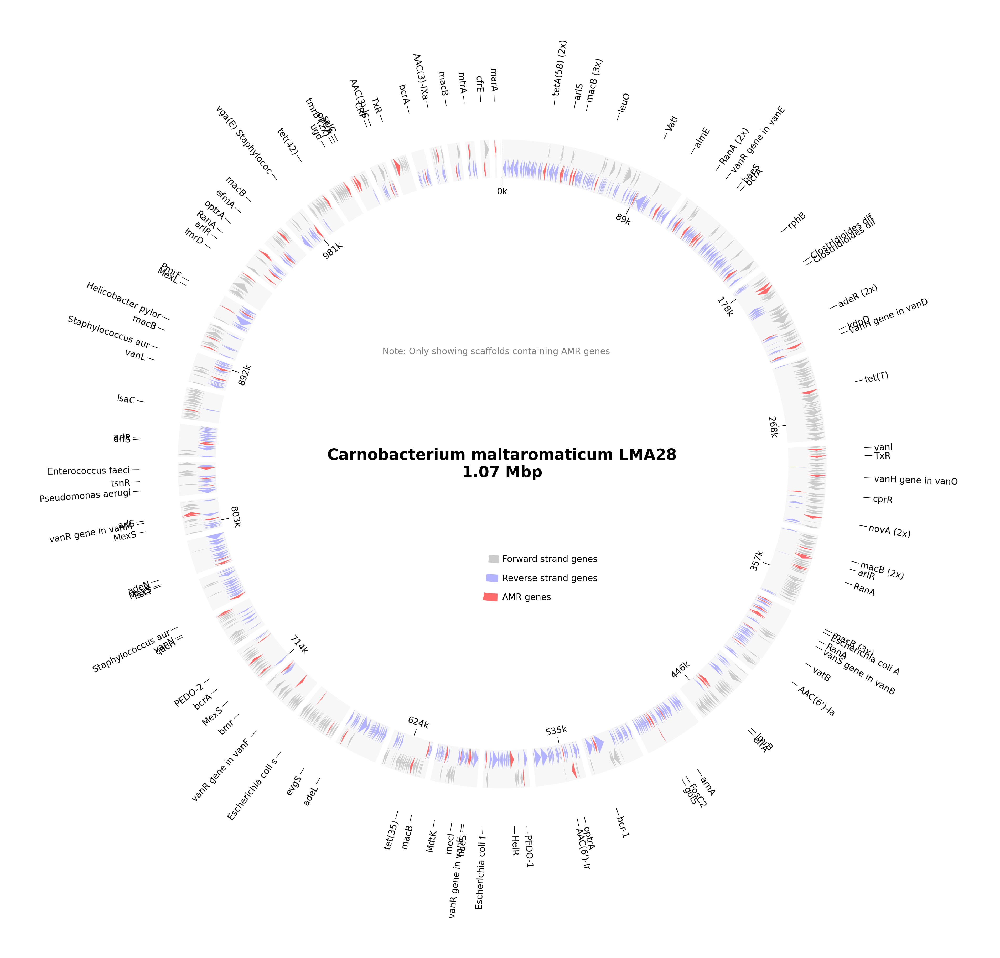

### AAC(3)-IXa
- **Mechanism**: antibiotic inactivation
- **Drug Classes**: aminoglycoside antibiotic
- **AMR Family**: AAC(3)
- **Locations**:
  - gnl|SPADES|NKBAGNNB_484_6 : position 3652-4464

### AAC(3)-Ic
- **Mechanism**: antibiotic inactivation
- **Drug Classes**: aminoglycoside antibiotic
- **AMR Family**: AAC(3)
- **Locations**:
  - gnl|SPADES|NKBAGNNB_373_12 : position 9304-9726

### AAC(6')-Ia
- **Mechanism**: antibiotic inactivation
- **Drug Classes**: aminoglycoside antibiotic
- **AMR Family**: AAC(6')
- **Locations**:
  - gnl|SPADES|NKBAGNNB_74_35 : position 33743-34279

### AAC(6')-Ir
- **Mechanism**: antibiotic inactivation
- **Drug Classes**: aminoglycoside antibiotic
- **AMR Family**: AAC(6')
- **Locations**:
  - gnl|SPADES|NKBAGNNB_99_11 : position 10167-10772

### CRP
- **Mechanism**: antibiotic efflux
- **Drug Classes**: macrolide antibiotic; fluoroquinolone antibiotic; penam
- **AMR Family**: resistance-nodulation-cell division (RND) antibiotic efflux pump
- **Locations**:
  - gnl|SPADES|NKBAGNNB_373_9 : position 6971-7633

### Clostridioides difficile gyrA conferring resistance to fluoroquinolones
- **Mechanism**: antibiotic target alteration
- **Drug Classes**: fluoroquinolone antibiotic
- **AMR Family**: fluoroquinolone resistant gyrA
- **Locations**:
  - gnl|SPADES|NKBAGNNB_43_11 : position 9908-12457

### Clostridioides difficile gyrB conferring resistance to fluoroquinolones
- **Mechanism**: antibiotic target alteration
- **Drug Classes**: fluoroquinolone antibiotic
- **AMR Family**: fluoroquinolone resistant gyrB
- **Locations**:
  - gnl|SPADES|NKBAGNNB_43_10 : position 7821-9758

### Enterococcus faecium cls conferring resistance to daptomycin
- **Mechanism**: antibiotic target alteration
- **Drug Classes**: peptide antibiotic
- **AMR Family**: daptomycin resistant cls
- **Locations**:
  - gnl|SPADES|NKBAGNNB_173_19 : position 15382-16902

### Escherichia coli AcrAB-TolC with AcrR mutation conferring resistance to ciprofloxacin, tetracycline, and ceftazidime
- **Mechanism**: antibiotic target alteration; antibiotic efflux
- **Drug Classes**: fluoroquinolone antibiotic; cephalosporin; glycylcycline; penam; tetracycline antibiotic; rifamycin antibiotic; phenicol antibiotic; disinfecting agents and antiseptics
- **AMR Family**: resistance-nodulation-cell division (RND) antibiotic efflux pump
- **Locations**:
  - gnl|SPADES|NKBAGNNB_74_4 : position 2450-3046

### Escherichia coli EF-Tu mutants conferring resistance to kirromycin
- **Mechanism**: antibiotic target alteration
- **Drug Classes**: elfamycin antibiotic
- **AMR Family**: elfamycin resistant EF-Tu
- **Locations**:
  - gnl|SPADES|NKBAGNNB_87_20 : position 23264-24451

### Escherichia coli fabI mutations conferring resistance to isoniazid and triclosan
- **Mechanism**: antibiotic target alteration
- **Drug Classes**: disinfecting agents and antiseptics; isoniazid-like antibiotic
- **AMR Family**: antibiotic resistant fabI
- **Locations**:
  - gnl|SPADES|NKBAGNNB_116_21 : position 26546-27304

### Escherichia coli soxS with mutation conferring antibiotic resistance
- **Mechanism**: antibiotic target alteration; antibiotic efflux; reduced permeability to antibiotic
- **Drug Classes**: fluoroquinolone antibiotic; monobactam; carbapenem; cephalosporin; glycylcycline; cephamycin; penam; tetracycline antibiotic; rifamycin antibiotic; phenicol antibiotic; penem; disinfecting agents and antiseptics
- **AMR Family**: ATP-binding cassette (ABC) antibiotic efflux pump; major facilitator superfamily (MFS) antibiotic efflux pump; resistance-nodulation-cell division (RND) antibiotic efflux pump; General Bacterial Porin with reduced permeability to beta-lactams
- **Locations**:
  - gnl|SPADES|NKBAGNNB_136_22 : position 18734-19261

### EstT
- **Mechanism**: antibiotic inactivation
- **Drug Classes**: macrolide antibiotic
- **AMR Family**: macrolide esterase
- **Locations**:
  - gnl|SPADES|NKBAGNNB_170_1 : position 1-381

### FosC2
- **Mechanism**: antibiotic inactivation
- **Drug Classes**: phosphonic acid antibiotic
- **AMR Family**: fosC phosphotransferase family
- **Locations**:
  - gnl|SPADES|NKBAGNNB_87_19 : position 22829-23209

### HelR
- **Mechanism**: antibiotic target protection
- **Drug Classes**: rifamycin antibiotic
- **AMR Family**: helicase-like RNA polymerase protection protein
- **Locations**:
  - gnl|SPADES|NKBAGNNB_116_9 : position 9058-11349

### Helicobacter pylori rdxA mutation conferring resistance to metronidazole
- **Mechanism**: antibiotic target alteration
- **Drug Classes**: nitroimidazole antibiotic
- **AMR Family**: Antibiotic resistant Helicobacter pylori nitroreductase
- **Locations**:
  - gnl|SPADES|NKBAGNNB_218_9 : position 7630-8259

### MdtK
- **Mechanism**: antibiotic efflux
- **Drug Classes**: fluoroquinolone antibiotic
- **AMR Family**: multidrug and toxic compound extrusion (MATE) transporter
- **Locations**:
  - gnl|SPADES|NKBAGNNB_121_21 : position 20508-21824

### MexL
- **Mechanism**: antibiotic efflux
- **Drug Classes**: macrolide antibiotic; tetracycline antibiotic; disinfecting agents and antiseptics
- **AMR Family**: resistance-nodulation-cell division (RND) antibiotic efflux pump
- **Locations**:
  - gnl|SPADES|NKBAGNNB_243_6 : position 8082-8699

### MexS (found in 3 locations)
- **Mechanism**: antibiotic efflux
- **Drug Classes**: fluoroquinolone antibiotic; diaminopyrimidine antibiotic; phenicol antibiotic
- **AMR Family**: resistance-nodulation-cell division (RND) antibiotic efflux pump
- **Locations**:
  - gnl|SPADES|NKBAGNNB_146_4 : position 3001-3939
  - gnl|SPADES|NKBAGNNB_170_2 : position 401-1489
  - gnl|SPADES|NKBAGNNB_172_9 : position 6088-7032

### PEDO-1
- **Mechanism**: antibiotic inactivation
- **Drug Classes**: carbapenem
- **AMR Family**: subclass B3 PEDO beta-lactamase
- **Locations**:
  - gnl|SPADES|NKBAGNNB_116_3 : position 3193-3894

### PEDO-2
- **Mechanism**: antibiotic inactivation
- **Drug Classes**: carbapenem
- **AMR Family**: subclass B3 PEDO beta-lactamase
- **Locations**:
  - gnl|SPADES|NKBAGNNB_146_18 : position 18731-19348

### PmrF
- **Mechanism**: antibiotic target alteration
- **Drug Classes**: peptide antibiotic
- **AMR Family**: pmr phosphoethanolamine transferase
- **Locations**:
  - gnl|SPADES|NKBAGNNB_243_8 : position 10780-11727

### Pseudomonas aeruginosa soxR
- **Mechanism**: antibiotic target alteration; antibiotic efflux
- **Drug Classes**: fluoroquinolone antibiotic; cephalosporin; glycylcycline; penam; tetracycline antibiotic; rifamycin antibiotic; phenicol antibiotic; disinfecting agents and antiseptics
- **AMR Family**: ATP-binding cassette (ABC) antibiotic efflux pump; major facilitator superfamily (MFS) antibiotic efflux pump; resistance-nodulation-cell division (RND) antibiotic efflux pump
- **Locations**:
  - gnl|SPADES|NKBAGNNB_173_5 : position 4515-4952

### RanA (found in 5 locations)
- **Mechanism**: antibiotic efflux
- **Drug Classes**: aminoglycoside antibiotic
- **AMR Family**: ATP-binding cassette (ABC) antibiotic efflux pump
- **Locations**:
  - gnl|SPADES|NKBAGNNB_257_5 : position 6060-7175
  - gnl|SPADES|NKBAGNNB_36_21 : position 22204-23313
  - gnl|SPADES|NKBAGNNB_36_5 : position 4097-5614
  - gnl|SPADES|NKBAGNNB_70_20 : position 21097-21903
  - gnl|SPADES|NKBAGNNB_74_8 : position 7392-8432

### Staphylococcus aureus fusA with mutation conferring resistance to fusidic acid
- **Mechanism**: antibiotic target alteration
- **Drug Classes**: fusidane antibiotic
- **AMR Family**: antibiotic resistant fusA
- **Locations**:
  - gnl|SPADES|NKBAGNNB_164_1 : position 1-1545

### Staphylococcus aureus murA with mutation conferring resistance to fosfomycin
- **Mechanism**: antibiotic target alteration
- **Drug Classes**: phosphonic acid antibiotic
- **AMR Family**: antibiotic-resistant murA transferase
- **Locations**:
  - gnl|SPADES|NKBAGNNB_193_16 : position 12410-13678

### TxR (found in 2 locations)
- **Mechanism**: antibiotic efflux
- **Drug Classes**: tetracycline antibiotic
- **AMR Family**: ATP-binding cassette (ABC) antibiotic efflux pump
- **Locations**:
  - gnl|SPADES|NKBAGNNB_377_2 : position 1672-4368
  - gnl|SPADES|NKBAGNNB_52_7 : position 5708-7069

### VatI
- **Mechanism**: antibiotic inactivation
- **Drug Classes**: streptogramin antibiotic; streptogramin A antibiotic
- **AMR Family**: streptogramin vat acetyltransferase
- **Locations**:
  - gnl|SPADES|NKBAGNNB_16_85 : position 89013-89714

### adeL
- **Mechanism**: antibiotic efflux
- **Drug Classes**: fluoroquinolone antibiotic; tetracycline antibiotic
- **AMR Family**: resistance-nodulation-cell division (RND) antibiotic efflux pump
- **Locations**:
  - gnl|SPADES|NKBAGNNB_129_19 : position 23557-24444

### adeN
- **Mechanism**: antibiotic efflux
- **Drug Classes**: macrolide antibiotic; fluoroquinolone antibiotic; lincosamide antibiotic; carbapenem; cephalosporin; tetracycline antibiotic; rifamycin antibiotic; diaminopyrimidine antibiotic; phenicol antibiotic; penem
- **AMR Family**: resistance-nodulation-cell division (RND) antibiotic efflux pump
- **Locations**:
  - gnl|SPADES|NKBAGNNB_170_5 : position 3312-3887

### adeR (found in 2 locations)
- **Mechanism**: antibiotic efflux
- **Drug Classes**: glycylcycline; tetracycline antibiotic
- **AMR Family**: resistance-nodulation-cell division (RND) antibiotic efflux pump
- **Locations**:
  - gnl|SPADES|NKBAGNNB_43_30 : position 37151-37849
  - gnl|SPADES|NKBAGNNB_43_43 : position 50492-51220

### almE
- **Mechanism**: antibiotic target alteration
- **Drug Classes**: peptide antibiotic
- **AMR Family**: polymyxin resistance operon; alm glycyltransferase
- **Locations**:
  - gnl|SPADES|NKBAGNNB_16_97 : position 105125-106648

### arlR (found in 4 locations)
- **Mechanism**: antibiotic efflux
- **Drug Classes**: fluoroquinolone antibiotic; disinfecting agents and antiseptics
- **AMR Family**: major facilitator superfamily (MFS) antibiotic efflux pump
- **Locations**:
  - gnl|SPADES|NKBAGNNB_16_33 : position 39447-40133
  - gnl|SPADES|NKBAGNNB_177_8 : position 9138-9821
  - gnl|SPADES|NKBAGNNB_257_2 : position 1904-2704
  - gnl|SPADES|NKBAGNNB_70_13 : position 13649-14368

### arlS (found in 3 locations)
- **Mechanism**: antibiotic efflux
- **Drug Classes**: fluoroquinolone antibiotic; disinfecting agents and antiseptics
- **AMR Family**: major facilitator superfamily (MFS) antibiotic efflux pump
- **Locations**:
  - gnl|SPADES|NKBAGNNB_16_32 : position 37936-39450
  - gnl|SPADES|NKBAGNNB_172_14 : position 11417-13246
  - gnl|SPADES|NKBAGNNB_177_7 : position 7846-9141

### arnA
- **Mechanism**: antibiotic target alteration
- **Drug Classes**: peptide antibiotic
- **AMR Family**: pmr phosphoethanolamine transferase
- **Locations**:
  - gnl|SPADES|NKBAGNNB_87_12 : position 15609-16190

### baeR
- **Mechanism**: antibiotic efflux
- **Drug Classes**: aminoglycoside antibiotic; aminocoumarin antibiotic
- **AMR Family**: resistance-nodulation-cell division (RND) antibiotic efflux pump
- **Locations**:
  - gnl|SPADES|NKBAGNNB_36_18 : position 20056-20739

### baeS (found in 3 locations)
- **Mechanism**: antibiotic efflux
- **Drug Classes**: aminoglycoside antibiotic; aminocoumarin antibiotic
- **AMR Family**: resistance-nodulation-cell division (RND) antibiotic efflux pump
- **Locations**:
  - gnl|SPADES|NKBAGNNB_121_5 : position 4822-6222
  - gnl|SPADES|NKBAGNNB_36_17 : position 18662-20059
  - gnl|SPADES|NKBAGNNB_70_14 : position 14365-16134

### bcr-1
- **Mechanism**: antibiotic efflux
- **Drug Classes**: bicyclomycin-like antibiotic
- **AMR Family**: major facilitator superfamily (MFS) antibiotic efflux pump
- **Locations**:
  - gnl|SPADES|NKBAGNNB_94_21 : position 24717-25964

### bcrA (found in 3 locations)
- **Mechanism**: antibiotic efflux
- **Drug Classes**: peptide antibiotic
- **AMR Family**: ATP-binding cassette (ABC) antibiotic efflux pump
- **Locations**:
  - gnl|SPADES|NKBAGNNB_146_12 : position 11477-13060
  - gnl|SPADES|NKBAGNNB_36_20 : position 21273-22214
  - gnl|SPADES|NKBAGNNB_467_8 : position 4509-5234

### bmr
- **Mechanism**: antibiotic efflux
- **Drug Classes**: fluoroquinolone antibiotic; nucleoside antibiotic; phenicol antibiotic; disinfecting agents and antiseptics
- **AMR Family**: major facilitator superfamily (MFS) antibiotic efflux pump
- **Locations**:
  - gnl|SPADES|NKBAGNNB_144_15 : position 20907-22130

### cfrE
- **Mechanism**: antibiotic target alteration
- **Drug Classes**: lincosamide antibiotic; streptogramin antibiotic; oxazolidinone antibiotic; phenicol antibiotic; pleuromutilin antibiotic
- **AMR Family**: Cfr 23S ribosomal RNA methyltransferase
- **Locations**:
  - gnl|SPADES|NKBAGNNB_719_2 : position 1233-2300

### cprR
- **Mechanism**: antibiotic target alteration; antibiotic efflux
- **Drug Classes**: peptide antibiotic
- **AMR Family**: pmr phosphoethanolamine transferase
- **Locations**:
  - gnl|SPADES|NKBAGNNB_52_26 : position 28250-28969

### efmA
- **Mechanism**: antibiotic efflux
- **Drug Classes**: macrolide antibiotic; fluoroquinolone antibiotic
- **AMR Family**: major facilitator superfamily (MFS) antibiotic efflux pump
- **Locations**:
  - gnl|SPADES|NKBAGNNB_259_4 : position 2878-4146

### efrA
- **Mechanism**: antibiotic efflux
- **Drug Classes**: macrolide antibiotic; fluoroquinolone antibiotic; rifamycin antibiotic
- **AMR Family**: ATP-binding cassette (ABC) antibiotic efflux pump
- **Locations**:
  - gnl|SPADES|NKBAGNNB_82_19 : position 22286-23392

### evgS
- **Mechanism**: antibiotic efflux
- **Drug Classes**: macrolide antibiotic; fluoroquinolone antibiotic; penam; tetracycline antibiotic
- **AMR Family**: major facilitator superfamily (MFS) antibiotic efflux pump; resistance-nodulation-cell division (RND) antibiotic efflux pump
- **Locations**:
  - gnl|SPADES|NKBAGNNB_136_5 : position 3533-4105

### golS
- **Mechanism**: antibiotic efflux
- **Drug Classes**: monobactam; carbapenem; cephalosporin; cephamycin; penam; phenicol antibiotic; penem
- **AMR Family**: resistance-nodulation-cell division (RND) antibiotic efflux pump
- **Locations**:
  - gnl|SPADES|NKBAGNNB_87_22 : position 25301-26131

### kdpD
- **Mechanism**: antibiotic efflux
- **Drug Classes**: aminoglycoside antibiotic
- **AMR Family**: kdpDE
- **Locations**:
  - gnl|SPADES|NKBAGNNB_43_42 : position 48849-50495

### leuO
- **Mechanism**: antibiotic efflux
- **Drug Classes**: nucleoside antibiotic; disinfecting agents and antiseptics
- **AMR Family**: major facilitator superfamily (MFS) antibiotic efflux pump
- **Locations**:
  - gnl|SPADES|NKBAGNNB_16_59 : position 62063-62890

### lmrB
- **Mechanism**: antibiotic efflux
- **Drug Classes**: lincosamide antibiotic; nucleoside antibiotic
- **AMR Family**: ATP-binding cassette (ABC) antibiotic efflux pump
- **Locations**:
  - gnl|SPADES|NKBAGNNB_82_17 : position 20226-21626

### lmrD
- **Mechanism**: antibiotic efflux
- **Drug Classes**: lincosamide antibiotic
- **AMR Family**: ATP-binding cassette (ABC) antibiotic efflux pump
- **Locations**:
  - gnl|SPADES|NKBAGNNB_244_10 : position 13716-14498

### lsaC
- **Mechanism**: antibiotic target protection
- **Drug Classes**: lincosamide antibiotic; streptogramin antibiotic; pleuromutilin antibiotic
- **AMR Family**: lsa-type ABC-F protein
- **Locations**:
  - gnl|SPADES|NKBAGNNB_183_7 : position 5503-6186

### macA
- **Mechanism**: antibiotic efflux
- **Drug Classes**: macrolide antibiotic
- **AMR Family**: ATP-binding cassette (ABC) antibiotic efflux pump
- **Locations**:
  - gnl|SPADES|NKBAGNNB_16_40 : position 46626-47822

### macB (found in 12 locations)
- **Mechanism**: antibiotic efflux
- **Drug Classes**: macrolide antibiotic
- **AMR Family**: ATP-binding cassette (ABC) antibiotic efflux pump
- **Locations**:
  - gnl|SPADES|NKBAGNNB_123_3 : position 1610-2686
  - gnl|SPADES|NKBAGNNB_16_38 : position 44661-45905
  - gnl|SPADES|NKBAGNNB_16_39 : position 45902-46609
  - gnl|SPADES|NKBAGNNB_16_73 : position 74435-75238
  - gnl|SPADES|NKBAGNNB_218_2 : position 1422-2219
  - gnl|SPADES|NKBAGNNB_259_13 : position 10655-12136
  - gnl|SPADES|NKBAGNNB_489_2 : position 2578-3393
  - gnl|SPADES|NKBAGNNB_70_25 : position 25238-28087
  - gnl|SPADES|NKBAGNNB_70_9 : position 9365-10051
  - gnl|SPADES|NKBAGNNB_74_13 : position 12690-13952
  - gnl|SPADES|NKBAGNNB_74_14 : position 13936-14634
  - gnl|SPADES|NKBAGNNB_74_2 : position 561-1229

### marA
- **Mechanism**: antibiotic efflux; reduced permeability to antibiotic
- **Drug Classes**: fluoroquinolone antibiotic; monobactam; carbapenem; cephalosporin; glycylcycline; cephamycin; penam; tetracycline antibiotic; rifamycin antibiotic; phenicol antibiotic; penem; disinfecting agents and antiseptics
- **AMR Family**: resistance-nodulation-cell division (RND) antibiotic efflux pump; General Bacterial Porin with reduced permeability to beta-lactams
- **Locations**:
  - gnl|SPADES|NKBAGNNB_9420_1 : position 3-812

### mecI
- **Mechanism**: antibiotic target replacement
- **Drug Classes**: penam
- **AMR Family**: methicillin resistant PBP2
- **Locations**:
  - gnl|SPADES|NKBAGNNB_121_11 : position 11664-12113

### mepR
- **Mechanism**: antibiotic efflux
- **Drug Classes**: glycylcycline; tetracycline antibiotic
- **AMR Family**: multidrug and toxic compound extrusion (MATE) transporter
- **Locations**:
  - gnl|SPADES|NKBAGNNB_82_18 : position 21607-22122

### mtrA
- **Mechanism**: antibiotic efflux
- **Drug Classes**: macrolide antibiotic; penam
- **AMR Family**: resistance-nodulation-cell division (RND) antibiotic efflux pump
- **Locations**:
  - gnl|SPADES|NKBAGNNB_675_3 : position 1445-2272

### novA (found in 2 locations)
- **Mechanism**: antibiotic efflux
- **Drug Classes**: aminocoumarin antibiotic
- **AMR Family**: ATP-binding cassette (ABC) antibiotic efflux pump
- **Locations**:
  - gnl|SPADES|NKBAGNNB_52_39 : position 42877-44619
  - gnl|SPADES|NKBAGNNB_52_40 : position 44612-46414

### optrA (found in 3 locations)
- **Mechanism**: antibiotic target protection
- **Drug Classes**: oxazolidinone antibiotic; phenicol antibiotic
- **AMR Family**: Miscellaneous ABC-F subfamily ATP-binding cassette ribosomal protection proteins
- **Locations**:
  - gnl|SPADES|NKBAGNNB_257_10 : position 12429-14057
  - gnl|SPADES|NKBAGNNB_358_3 : position 1222-2346
  - gnl|SPADES|NKBAGNNB_99_7 : position 5572-7536

### patB
- **Mechanism**: antibiotic efflux
- **Drug Classes**: fluoroquinolone antibiotic
- **AMR Family**: ATP-binding cassette (ABC) antibiotic efflux pump
- **Locations**:
  - gnl|SPADES|NKBAGNNB_70_21 : position 21915-22679

### qacH
- **Mechanism**: antibiotic efflux
- **Drug Classes**: disinfecting agents and antiseptics
- **AMR Family**: small multidrug resistance (SMR) antibiotic efflux pump
- **Locations**:
  - gnl|SPADES|NKBAGNNB_162_24 : position 19010-19336

### rphB
- **Mechanism**: antibiotic inactivation
- **Drug Classes**: rifamycin antibiotic
- **AMR Family**: rifampin phosphotransferase
- **Locations**:
  - gnl|SPADES|NKBAGNNB_36_48 : position 51815-53536

### salC
- **Mechanism**: antibiotic target protection
- **Drug Classes**: lincosamide antibiotic; streptogramin antibiotic; streptogramin A antibiotic; pleuromutilin antibiotic
- **AMR Family**: sal-type ABC-F protein
- **Locations**:
  - gnl|SPADES|NKBAGNNB_358_4 : position 2608-4311

### tet(35)
- **Mechanism**: antibiotic efflux
- **Drug Classes**: tetracycline antibiotic
- **AMR Family**: ATP-binding cassette (ABC) antibiotic efflux pump
- **Locations**:
  - gnl|SPADES|NKBAGNNB_123_9 : position 9120-10517

### tet(42)
- **Mechanism**: antibiotic efflux
- **Drug Classes**: tetracycline antibiotic
- **AMR Family**: major facilitator superfamily (MFS) antibiotic efflux pump
- **Locations**:
  - gnl|SPADES|NKBAGNNB_287_16 : position 11192-12427

### tet(T)
- **Mechanism**: antibiotic target protection
- **Drug Classes**: tetracycline antibiotic
- **AMR Family**: tetracycline-resistant ribosomal protection protein
- **Locations**:
  - gnl|SPADES|NKBAGNNB_50_14 : position 20271-22112

### tetA(58) (found in 2 locations)
- **Mechanism**: antibiotic efflux
- **Drug Classes**: tetracycline antibiotic
- **AMR Family**: major facilitator superfamily (MFS) antibiotic efflux pump
- **Locations**:
  - gnl|SPADES|NKBAGNNB_16_23 : position 27005-28573
  - gnl|SPADES|NKBAGNNB_16_93 : position 101203-102135

### tmrB (found in 2 locations)
- **Mechanism**: reduced permeability to antibiotic
- **Drug Classes**: nucleoside antibiotic
- **AMR Family**: tunicamycin resistance protein
- **Locations**:
  - gnl|SPADES|NKBAGNNB_358_1 : position 133-306
  - gnl|SPADES|NKBAGNNB_358_2 : position 303-644

### tsnR
- **Mechanism**: antibiotic target alteration
- **Drug Classes**: peptide antibiotic
- **AMR Family**: non-erm 23S ribosomal RNA methyltransferase (A1067)
- **Locations**:
  - gnl|SPADES|NKBAGNNB_173_14 : position 9345-10109

### ugd
- **Mechanism**: antibiotic target alteration
- **Drug Classes**: peptide antibiotic
- **AMR Family**: pmr phosphoethanolamine transferase
- **Locations**:
  - gnl|SPADES|NKBAGNNB_324_11 : position 9822-11114

### vanH gene in vanD cluster
- **Mechanism**: antibiotic target alteration
- **Drug Classes**: glycopeptide antibiotic
- **AMR Family**: vanH; glycopeptide resistance gene cluster
- **Locations**:
  - gnl|SPADES|NKBAGNNB_43_45 : position 51697-52710

### vanH gene in vanO cluster
- **Mechanism**: antibiotic target alteration
- **Drug Classes**: glycopeptide antibiotic
- **AMR Family**: vanH; glycopeptide resistance gene cluster
- **Locations**:
  - gnl|SPADES|NKBAGNNB_52_17 : position 17591-18784

### vanI
- **Mechanism**: antibiotic target alteration
- **Drug Classes**: glycopeptide antibiotic
- **AMR Family**: glycopeptide resistance gene cluster; Van ligase
- **Locations**:
  - gnl|SPADES|NKBAGNNB_52_4 : position 1537-2664

### vanL
- **Mechanism**: antibiotic target alteration
- **Drug Classes**: glycopeptide antibiotic
- **AMR Family**: glycopeptide resistance gene cluster; Van ligase
- **Locations**:
  - gnl|SPADES|NKBAGNNB_193_9 : position 5900-6991

### vanN
- **Mechanism**: antibiotic target alteration
- **Drug Classes**: glycopeptide antibiotic
- **AMR Family**: glycopeptide resistance gene cluster; Van ligase
- **Locations**:
  - gnl|SPADES|NKBAGNNB_162_26 : position 19789-20868

### vanR gene in vanB cluster
- **Mechanism**: antibiotic target alteration
- **Drug Classes**: glycopeptide antibiotic
- **AMR Family**: glycopeptide resistance gene cluster; vanR
- **Locations**:
  - gnl|SPADES|NKBAGNNB_74_12 : position 11940-12611

### vanR gene in vanE cluster (found in 2 locations)
- **Mechanism**: antibiotic target alteration
- **Drug Classes**: glycopeptide antibiotic
- **AMR Family**: glycopeptide resistance gene cluster; vanR
- **Locations**:
  - gnl|SPADES|NKBAGNNB_121_6 : position 6219-6902
  - gnl|SPADES|NKBAGNNB_36_11 : position 11084-12571

### vanR gene in vanF cluster
- **Mechanism**: antibiotic target alteration
- **Drug Classes**: glycopeptide antibiotic
- **AMR Family**: glycopeptide resistance gene cluster; vanR
- **Locations**:
  - gnl|SPADES|NKBAGNNB_144_7 : position 7762-9192

### vanR gene in vanM cluster
- **Mechanism**: antibiotic target alteration
- **Drug Classes**: glycopeptide antibiotic
- **AMR Family**: glycopeptide resistance gene cluster; vanR
- **Locations**:
  - gnl|SPADES|NKBAGNNB_172_13 : position 10703-11410

### vanS gene in vanB cluster
- **Mechanism**: antibiotic target alteration
- **Drug Classes**: glycopeptide antibiotic
- **AMR Family**: vanS; glycopeptide resistance gene cluster
- **Locations**:
  - gnl|SPADES|NKBAGNNB_74_11 : position 10498-11943

### vatB
- **Mechanism**: antibiotic inactivation
- **Drug Classes**: streptogramin antibiotic; streptogramin A antibiotic
- **AMR Family**: streptogramin vat acetyltransferase
- **Locations**:
  - gnl|SPADES|NKBAGNNB_74_21 : position 21429-21989

### vga(E) Staphylococcus cohnii
- **Mechanism**: antibiotic target protection
- **Drug Classes**: lincosamide antibiotic; streptogramin antibiotic; streptogramin A antibiotic; pleuromutilin antibiotic
- **AMR Family**: vga-type ABC-F protein
- **Locations**:
  - gnl|SPADES|NKBAGNNB_275_10 : position 11487-13058

### ykkD
- **Mechanism**: antibiotic efflux
- **Drug Classes**: aminoglycoside antibiotic; tetracycline antibiotic; phenicol antibiotic
- **AMR Family**: small multidrug resistance (SMR) antibiotic efflux pump
- **Locations**:
  - gnl|SPADES|NKBAGNNB_162_25 : position 19336-19653

## Citrobacter
**Strain Statistics:**
- Total genome length: 6.1 kbp
- Total scaffolds: 36
- Scaffolds with AMR genes: 6
- Total genes annotated: 10
- Total AMR genes: 7
- Unique AMR genes: 6
- Distinct AMR mechanisms: 3
- Distinct AMR families: 4
- Distinct drug classes: 8

**Circos Plot:**

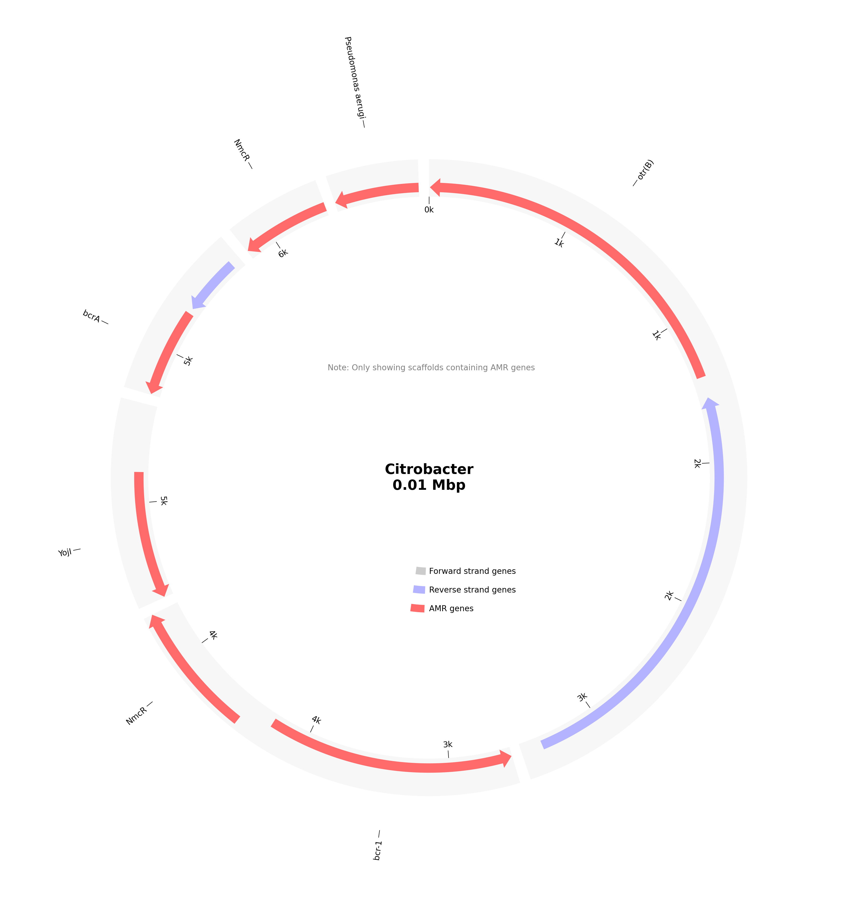

### NmcR (found in 2 locations)
- **Mechanism**: antibiotic inactivation
- **Drug Classes**: carbapenem; cephalosporin; cephamycin; penam
- **AMR Family**: NmcA beta-lactamase
- **Locations**:
  - gnl|SPADES|NKBAGNNB_6113_2 : position 968-1414
  - gnl|SPADES|NKBAGNNB_906473_1 : position 3-314

### Pseudomonas aeruginosa ampR with mutation conferring resistance to aztreonam
- **Mechanism**: antibiotic target alteration; antibiotic inactivation
- **Drug Classes**: monobactam; carbapenem; cephalosporin
- **AMR Family**: PDC beta-lactamase; ampR transcriptional regulator with mutation conferring resistance to monobactam antibiotics
- **Locations**:
  - gnl|SPADES|NKBAGNNB_1010140_1 : position 1-297

### YojI
- **Mechanism**: antibiotic efflux
- **Drug Classes**: peptide antibiotic
- **AMR Family**: ATP-binding cassette (ABC) antibiotic efflux pump
- **Locations**:
  - gnl|SPADES|NKBAGNNB_102018_1 : position 2-448

### bcr-1
- **Mechanism**: antibiotic efflux
- **Drug Classes**: bicyclomycin-like antibiotic
- **AMR Family**: major facilitator superfamily (MFS) antibiotic efflux pump
- **Locations**:
  - gnl|SPADES|NKBAGNNB_6113_1 : position 2-865

### bcrA
- **Mechanism**: antibiotic efflux
- **Drug Classes**: peptide antibiotic
- **AMR Family**: ATP-binding cassette (ABC) antibiotic efflux pump
- **Locations**:
  - gnl|SPADES|NKBAGNNB_192675_1 : position 3-314

### otr(B)
- **Mechanism**: antibiotic efflux
- **Drug Classes**: tetracycline antibiotic
- **AMR Family**: major facilitator superfamily (MFS) antibiotic efflux pump
- **Locations**:
  - gnl|SPADES|NKBAGNNB_1662_1 : position 3-1229

## Citrobacter freundii
**Strain Statistics:**
- Total genome length: 7.3 kbp
- Total scaffolds: 57
- Scaffolds with AMR genes: 2
- Total genes annotated: 18
- Total AMR genes: 2
- Unique AMR genes: 2
- Distinct AMR mechanisms: 2
- Distinct AMR families: 2
- Distinct drug classes: 2

**Circos Plot:**

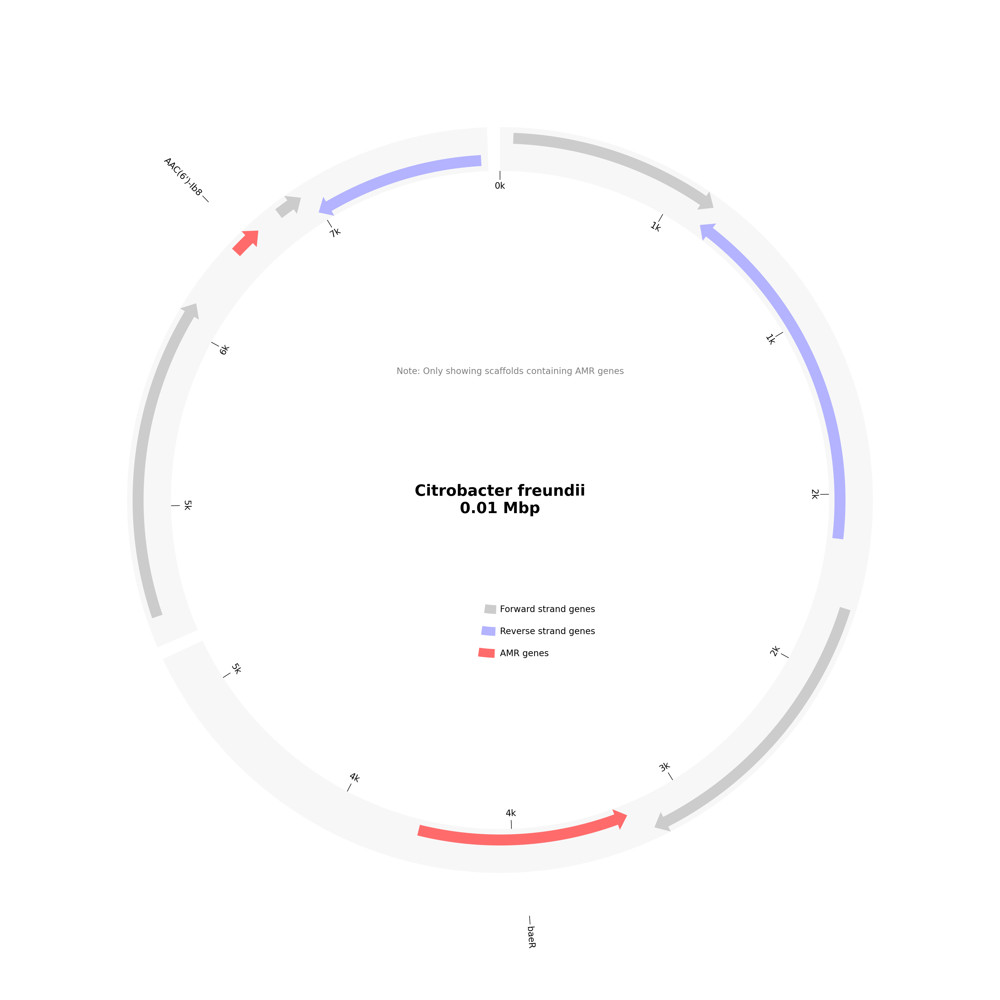

### AAC(6')-Ib8
- **Mechanism**: antibiotic inactivation
- **Drug Classes**: aminoglycoside antibiotic
- **AMR Family**: AAC(6')
- **Locations**:
  - gnl|SPADES|NKBAGNNB_2335_2 : position 1356-1457

### baeR
- **Mechanism**: antibiotic efflux
- **Drug Classes**: aminoglycoside antibiotic; aminocoumarin antibiotic
- **AMR Family**: resistance-nodulation-cell division (RND) antibiotic efflux pump
- **Locations**:
  - gnl|SPADES|NKBAGNNB_763_4 : position 3225-3956

## Citrobacter freundii complex
**Strain Statistics:**
- Total genome length: 0.2 kbp
- Total scaffolds: 10
- Scaffolds with AMR genes: 1
- Total genes annotated: 0
- Total AMR genes: 1
- Unique AMR genes: 1
- Distinct AMR mechanisms: 1
- Distinct AMR families: 1
- Distinct drug classes: 1

**Circos Plot:**

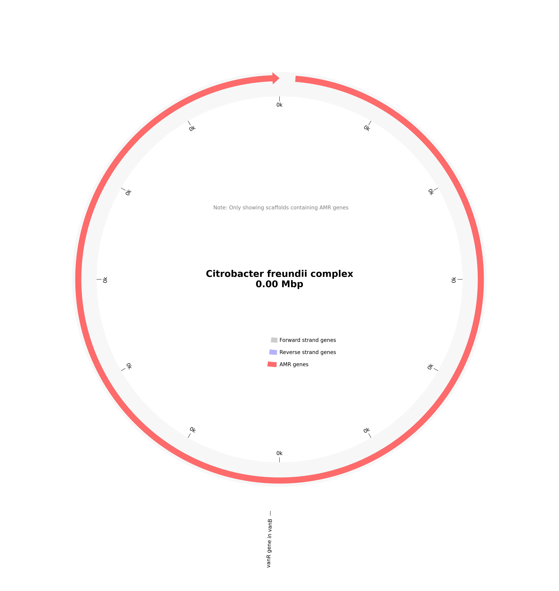

### vanR gene in vanB cluster
- **Mechanism**: antibiotic target alteration
- **Drug Classes**: glycopeptide antibiotic
- **AMR Family**: glycopeptide resistance gene cluster; vanR
- **Locations**:
  - gnl|SPADES|NKBAGNNB_1613301_1 : position 3-239

## Citrobacter portucalensis
**Strain Statistics:**
- Total genome length: 0.8 kbp
- Total scaffolds: 9
- Scaffolds with AMR genes: 1
- Total genes annotated: 2
- Total AMR genes: 1
- Unique AMR genes: 1
- Distinct AMR mechanisms: 1
- Distinct AMR families: 1
- Distinct drug classes: 1

**Circos Plot:**

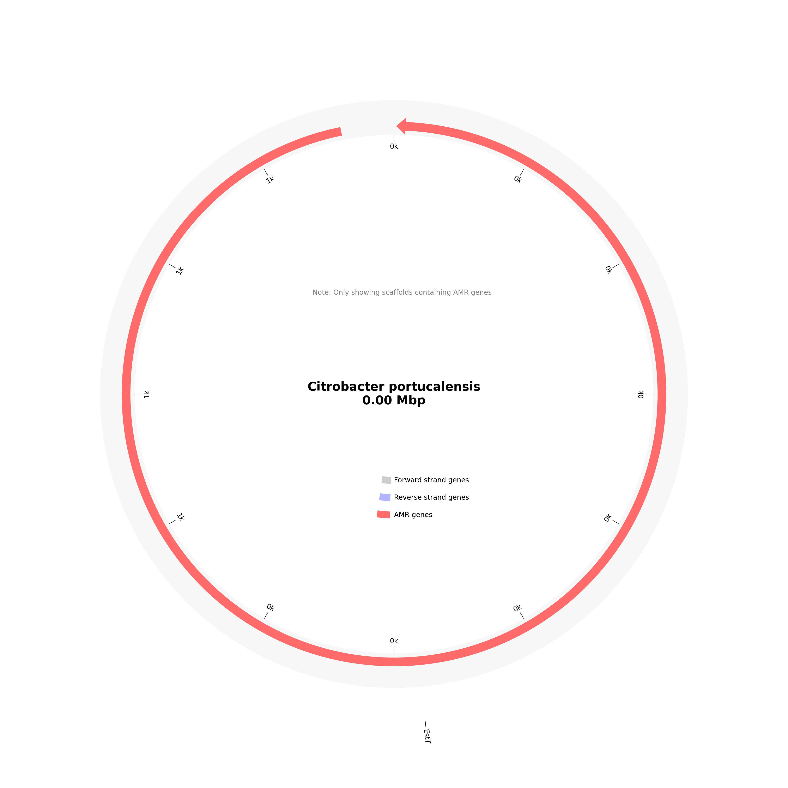

### EstT
- **Mechanism**: antibiotic inactivation
- **Drug Classes**: macrolide antibiotic
- **AMR Family**: macrolide esterase
- **Locations**:
  - gnl|SPADES|NKBAGNNB_68229_1 : position 1-735

## Citrobacter sp. 21OH12SH02A-Citro
**Strain Statistics:**
- Total genome length: 50.0 kbp
- Total scaffolds: 1
- Scaffolds with AMR genes: 1
- Total genes annotated: 104
- Total AMR genes: 3
- Unique AMR genes: 3
- Distinct AMR mechanisms: 1
- Distinct AMR families: 2
- Distinct drug classes: 6

**Circos Plot:**

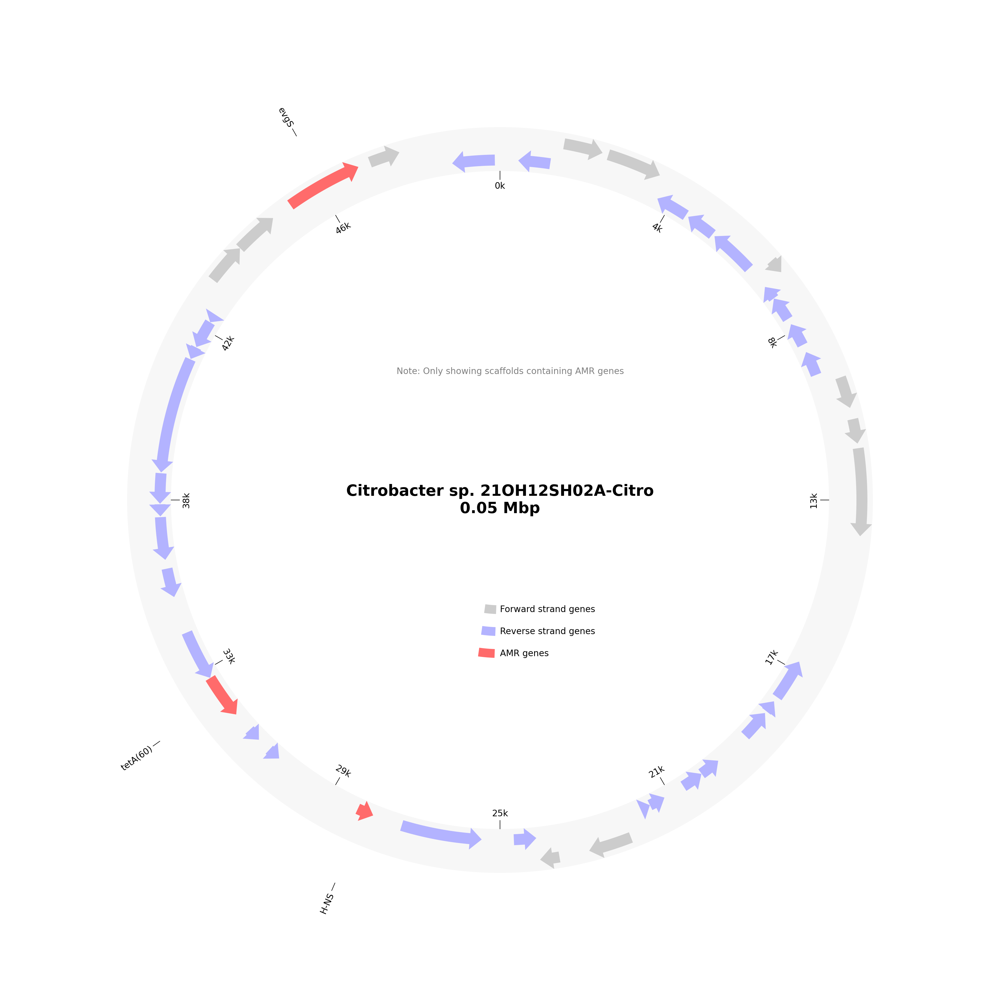

### H-NS
- **Mechanism**: antibiotic efflux
- **Drug Classes**: macrolide antibiotic; fluoroquinolone antibiotic; cephalosporin; cephamycin; penam; tetracycline antibiotic
- **AMR Family**: major facilitator superfamily (MFS) antibiotic efflux pump; resistance-nodulation-cell division (RND) antibiotic efflux pump
- **Locations**:
  - gnl|SPADES|NKBAGNNB_54_28 : position 28067-28459

### evgS
- **Mechanism**: antibiotic efflux
- **Drug Classes**: macrolide antibiotic; fluoroquinolone antibiotic; penam; tetracycline antibiotic
- **AMR Family**: major facilitator superfamily (MFS) antibiotic efflux pump; resistance-nodulation-cell division (RND) antibiotic efflux pump
- **Locations**:
  - gnl|SPADES|NKBAGNNB_54_50 : position 45124-46842

### tetA(60)
- **Mechanism**: antibiotic efflux
- **Drug Classes**: tetracycline antibiotic
- **AMR Family**: ATP-binding cassette (ABC) antibiotic efflux pump
- **Locations**:
  - gnl|SPADES|NKBAGNNB_54_34 : position 32096-33145

## Clostridium novyi NT
**Strain Statistics:**
- Total genome length: 1.7 kbp
- Total scaffolds: 4
- Scaffolds with AMR genes: 1
- Total genes annotated: 2
- Total AMR genes: 1
- Unique AMR genes: 1
- Distinct AMR mechanisms: 1
- Distinct AMR families: 1
- Distinct drug classes: 1

**Circos Plot:**

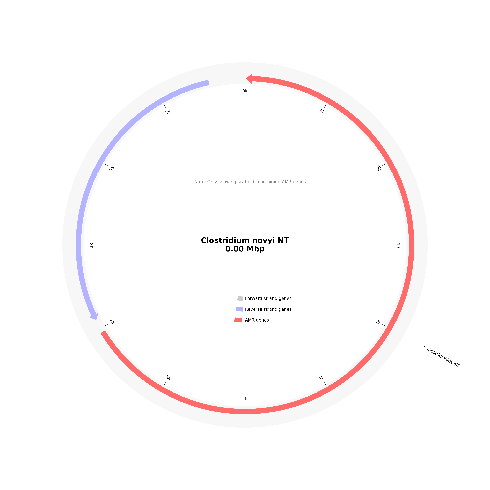

### Clostridioides difficile gyrA conferring resistance to fluoroquinolones
- **Mechanism**: antibiotic target alteration
- **Drug Classes**: fluoroquinolone antibiotic
- **AMR Family**: fluoroquinolone resistant gyrA
- **Locations**:
  - gnl|SPADES|NKBAGNNB_3737_1 : position 2-1144

## Escherichia coli
**Strain Statistics:**
- Total genome length: 2.3 kbp
- Total scaffolds: 25
- Scaffolds with AMR genes: 3
- Total genes annotated: 6
- Total AMR genes: 3
- Unique AMR genes: 3
- Distinct AMR mechanisms: 2
- Distinct AMR families: 3
- Distinct drug classes: 2

**Circos Plot:**

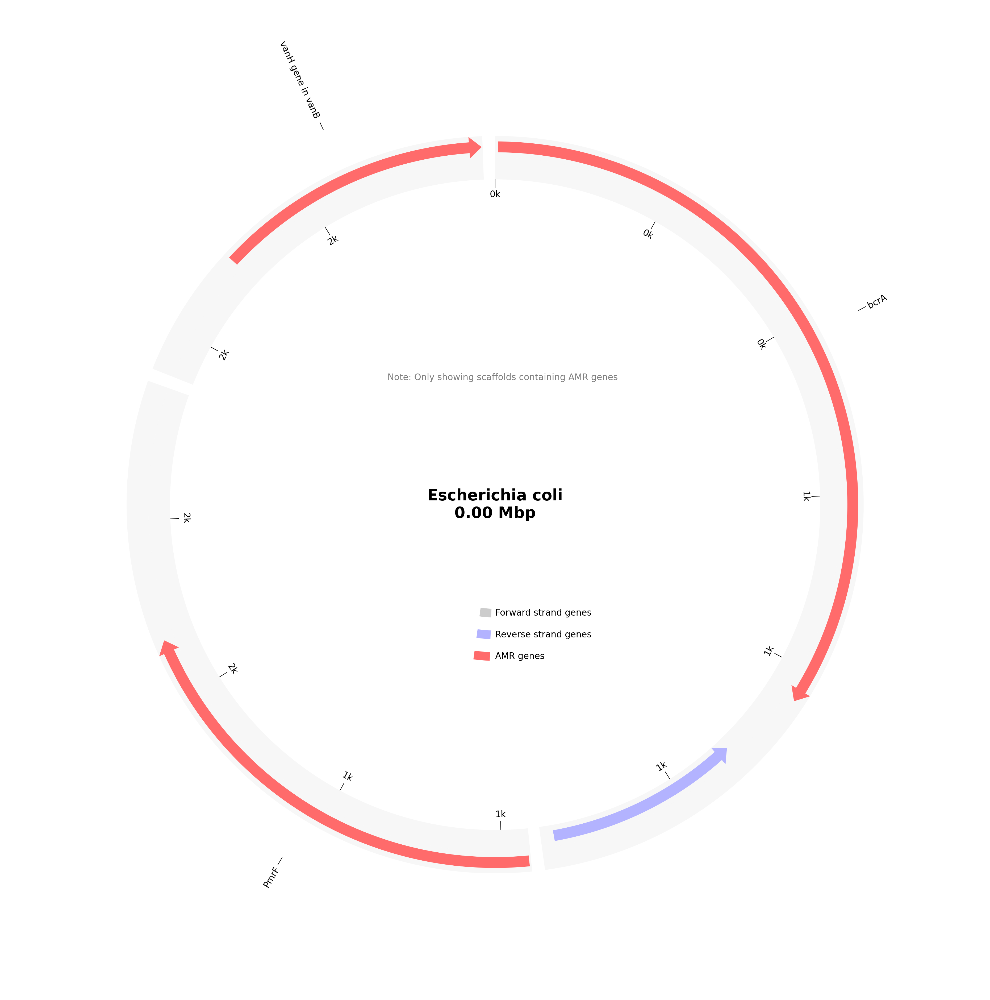

### PmrF
- **Mechanism**: antibiotic target alteration
- **Drug Classes**: peptide antibiotic
- **AMR Family**: pmr phosphoethanolamine transferase
- **Locations**:
  - gnl|SPADES|NKBAGNNB_67943_1 : position 2-484

### bcrA
- **Mechanism**: antibiotic efflux
- **Drug Classes**: peptide antibiotic
- **AMR Family**: ATP-binding cassette (ABC) antibiotic efflux pump
- **Locations**:
  - gnl|SPADES|NKBAGNNB_12904_1 : position 3-812

### vanH gene in vanB cluster
- **Mechanism**: antibiotic target alteration
- **Drug Classes**: glycopeptide antibiotic
- **AMR Family**: vanH; glycopeptide resistance gene cluster
- **Locations**:
  - gnl|SPADES|NKBAGNNB_428812_1 : position 140-436

## Ewingella americana
**Strain Statistics:**
- Total genome length: 5.5 kbp
- Total scaffolds: 225
- Scaffolds with AMR genes: 21
- Total genes annotated: 2
- Total AMR genes: 21
- Unique AMR genes: 20
- Distinct AMR mechanisms: 4
- Distinct AMR families: 10
- Distinct drug classes: 21

**Circos Plot:**

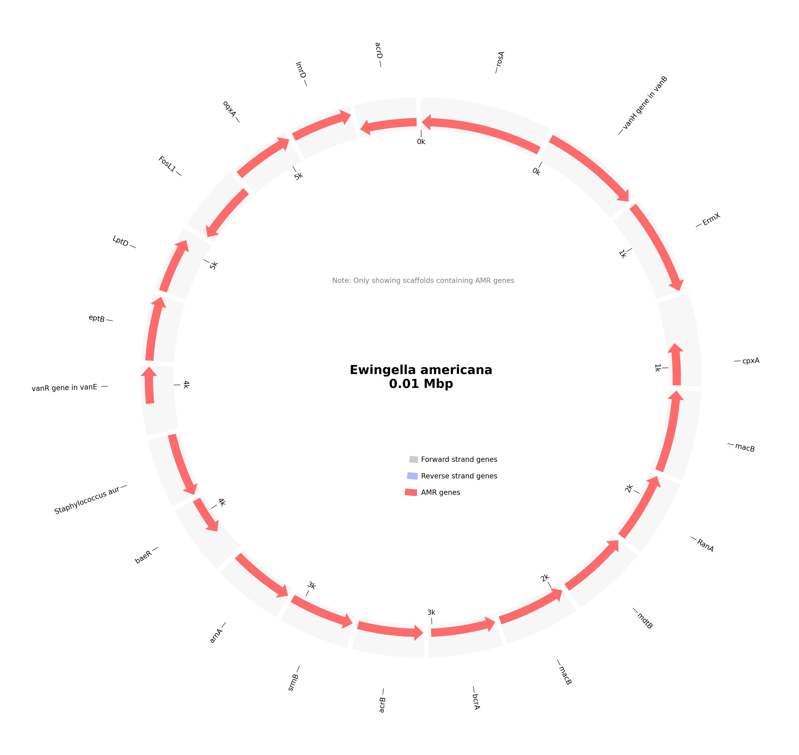

### ErmX
- **Mechanism**: antibiotic target alteration
- **Drug Classes**: macrolide antibiotic; lincosamide antibiotic; streptogramin antibiotic; streptogramin A antibiotic; streptogramin B antibiotic
- **AMR Family**: Erm 23S ribosomal RNA methyltransferase
- **Locations**:
  - gnl|SPADES|NKBAGNNB_784810_1 : position 3-338

### FosL1
- **Mechanism**: antibiotic inactivation
- **Drug Classes**: phosphonic acid antibiotic
- **AMR Family**: fosfomycin thiol transferase
- **Locations**:
  - gnl|SPADES|NKBAGNNB_1812588_1 : position 2-223

### LptD
- **Mechanism**: antibiotic efflux
- **Drug Classes**: carbapenem; peptide antibiotic; aminocoumarin antibiotic; rifamycin antibiotic
- **AMR Family**: ATP-binding cassette (ABC) antibiotic efflux pump
- **Locations**:
  - gnl|SPADES|NKBAGNNB_1803092_1 : position 2-196

### RanA
- **Mechanism**: antibiotic efflux
- **Drug Classes**: aminoglycoside antibiotic
- **AMR Family**: ATP-binding cassette (ABC) antibiotic efflux pump
- **Locations**:
  - gnl|SPADES|NKBAGNNB_1343793_1 : position 3-260

### Staphylococcus aureus pgsA mutations conferring resistance to daptomycin
- **Mechanism**: antibiotic target alteration
- **Drug Classes**: peptide antibiotic
- **AMR Family**: daptomycin resistant pgsA
- **Locations**:
  - gnl|SPADES|NKBAGNNB_1641472_1 : position 1-237

### acrB
- **Mechanism**: antibiotic efflux
- **Drug Classes**: fluoroquinolone antibiotic; cephalosporin; glycylcycline; penam; tetracycline antibiotic; rifamycin antibiotic; phenicol antibiotic; disinfecting agents and antiseptics
- **AMR Family**: resistance-nodulation-cell division (RND) antibiotic efflux pump
- **Locations**:
  - gnl|SPADES|NKBAGNNB_1549406_1 : position 1-243

### acrD
- **Mechanism**: antibiotic efflux
- **Drug Classes**: aminoglycoside antibiotic
- **AMR Family**: resistance-nodulation-cell division (RND) antibiotic efflux pump
- **Locations**:
  - gnl|SPADES|NKBAGNNB_2019406_1 : position 2-211

### arnA
- **Mechanism**: antibiotic target alteration
- **Drug Classes**: peptide antibiotic
- **AMR Family**: pmr phosphoethanolamine transferase
- **Locations**:
  - gnl|SPADES|NKBAGNNB_1591335_1 : position 3-239

### baeR
- **Mechanism**: antibiotic efflux
- **Drug Classes**: aminoglycoside antibiotic; aminocoumarin antibiotic
- **AMR Family**: resistance-nodulation-cell division (RND) antibiotic efflux pump
- **Locations**:
  - gnl|SPADES|NKBAGNNB_1605681_1 : position 98-238

### bcrA
- **Mechanism**: antibiotic efflux
- **Drug Classes**: peptide antibiotic
- **AMR Family**: ATP-binding cassette (ABC) antibiotic efflux pump
- **Locations**:
  - gnl|SPADES|NKBAGNNB_1456888_1 : position 1-240

### cpxA
- **Mechanism**: antibiotic efflux
- **Drug Classes**: aminoglycoside antibiotic; aminocoumarin antibiotic
- **AMR Family**: resistance-nodulation-cell division (RND) antibiotic efflux pump
- **Locations**:
  - gnl|SPADES|NKBAGNNB_893834_2 : position 160-315

### eptB
- **Mechanism**: antibiotic target alteration
- **Drug Classes**: peptide antibiotic
- **AMR Family**: pmr phosphoethanolamine transferase
- **Locations**:
  - gnl|SPADES|NKBAGNNB_1779027_1 : position 2-226

### lmrD
- **Mechanism**: antibiotic efflux
- **Drug Classes**: lincosamide antibiotic
- **AMR Family**: ATP-binding cassette (ABC) antibiotic efflux pump
- **Locations**:
  - gnl|SPADES|NKBAGNNB_1995471_1 : position 1-213

### macB (found in 2 locations)
- **Mechanism**: antibiotic efflux
- **Drug Classes**: macrolide antibiotic
- **AMR Family**: ATP-binding cassette (ABC) antibiotic efflux pump
- **Locations**:
  - gnl|SPADES|NKBAGNNB_1391477_1 : position 2-256
  - gnl|SPADES|NKBAGNNB_967268_1 : position 1-303

### mdtB
- **Mechanism**: antibiotic efflux
- **Drug Classes**: aminocoumarin antibiotic
- **AMR Family**: resistance-nodulation-cell division (RND) antibiotic efflux pump
- **Locations**:
  - gnl|SPADES|NKBAGNNB_1365455_1 : position 1-258

### oqxA
- **Mechanism**: antibiotic efflux
- **Drug Classes**: fluoroquinolone antibiotic; glycylcycline; tetracycline antibiotic; diaminopyrimidine antibiotic; nitrofuran antibiotic
- **AMR Family**: resistance-nodulation-cell division (RND) antibiotic efflux pump
- **Locations**:
  - gnl|SPADES|NKBAGNNB_1980266_1 : position 2-214

### rosA
- **Mechanism**: antibiotic efflux
- **Drug Classes**: peptide antibiotic
- **AMR Family**: major facilitator superfamily (MFS) antibiotic efflux pump
- **Locations**:
  - gnl|SPADES|NKBAGNNB_403731_1 : position 2-448

### srmB
- **Mechanism**: antibiotic target protection
- **Drug Classes**: macrolide antibiotic
- **AMR Family**: Miscellaneous ABC-F subfamily ATP-binding cassette ribosomal protection proteins
- **Locations**:
  - gnl|SPADES|NKBAGNNB_1579563_1 : position 3-242

### vanH gene in vanB cluster
- **Mechanism**: antibiotic target alteration
- **Drug Classes**: glycopeptide antibiotic
- **AMR Family**: vanH; glycopeptide resistance gene cluster
- **Locations**:
  - gnl|SPADES|NKBAGNNB_726771_1 : position 1-348

### vanR gene in vanE cluster
- **Mechanism**: antibiotic target alteration
- **Drug Classes**: glycopeptide antibiotic
- **AMR Family**: glycopeptide resistance gene cluster; vanR
- **Locations**:
  - gnl|SPADES|NKBAGNNB_1671563_1 : position 105-233

## Hafnia alvei
**Strain Statistics:**
- Total genome length: 4.5 kbp
- Total scaffolds: 329
- Scaffolds with AMR genes: 9
- Total genes annotated: 6
- Total AMR genes: 9
- Unique AMR genes: 9
- Distinct AMR mechanisms: 1
- Distinct AMR families: 3
- Distinct drug classes: 13

**Circos Plot:**

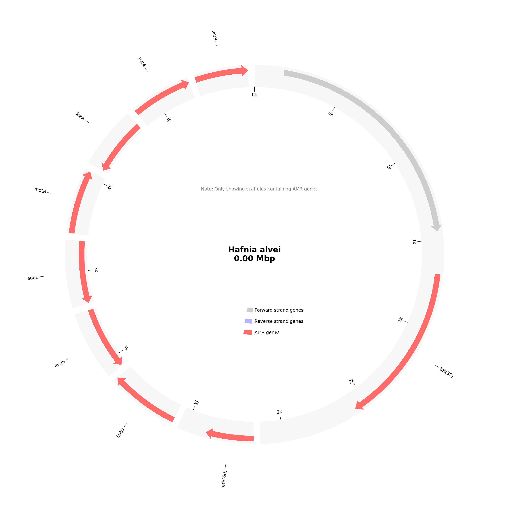

### LptD
- **Mechanism**: antibiotic efflux
- **Drug Classes**: carbapenem; peptide antibiotic; aminocoumarin antibiotic; rifamycin antibiotic
- **AMR Family**: ATP-binding cassette (ABC) antibiotic efflux pump
- **Locations**:
  - gnl|SPADES|NKBAGNNB_1082726_1 : position 1-288

### TaeA
- **Mechanism**: antibiotic efflux
- **Drug Classes**: pleuromutilin antibiotic
- **AMR Family**: ATP-binding cassette (ABC) antibiotic efflux pump
- **Locations**:
  - gnl|SPADES|NKBAGNNB_1473719_1 : position 1-249

### acrB
- **Mechanism**: antibiotic efflux
- **Drug Classes**: fluoroquinolone antibiotic; cephalosporin; glycylcycline; penam; tetracycline antibiotic; rifamycin antibiotic; phenicol antibiotic; disinfecting agents and antiseptics
- **AMR Family**: resistance-nodulation-cell division (RND) antibiotic efflux pump
- **Locations**:
  - gnl|SPADES|NKBAGNNB_1893519_1 : position 2-220

### adeL
- **Mechanism**: antibiotic efflux
- **Drug Classes**: fluoroquinolone antibiotic; tetracycline antibiotic
- **AMR Family**: resistance-nodulation-cell division (RND) antibiotic efflux pump
- **Locations**:
  - gnl|SPADES|NKBAGNNB_1210335_1 : position 3-272

### evgS
- **Mechanism**: antibiotic efflux
- **Drug Classes**: macrolide antibiotic; fluoroquinolone antibiotic; penam; tetracycline antibiotic
- **AMR Family**: major facilitator superfamily (MFS) antibiotic efflux pump; resistance-nodulation-cell division (RND) antibiotic efflux pump
- **Locations**:
  - gnl|SPADES|NKBAGNNB_1148727_1 : position 3-278

### mdtB
- **Mechanism**: antibiotic efflux
- **Drug Classes**: aminocoumarin antibiotic
- **AMR Family**: resistance-nodulation-cell division (RND) antibiotic efflux pump
- **Locations**:
  - gnl|SPADES|NKBAGNNB_1269727_1 : position 2-265

### patA
- **Mechanism**: antibiotic efflux
- **Drug Classes**: fluoroquinolone antibiotic
- **AMR Family**: ATP-binding cassette (ABC) antibiotic efflux pump
- **Locations**:
  - gnl|SPADES|NKBAGNNB_1484844_1 : position 1-249

### tet(35)
- **Mechanism**: antibiotic efflux
- **Drug Classes**: tetracycline antibiotic
- **AMR Family**: ATP-binding cassette (ABC) antibiotic efflux pump
- **Locations**:
  - gnl|SPADES|NKBAGNNB_2245_2 : position 1255-1917

### tetB(60)
- **Mechanism**: antibiotic efflux
- **Drug Classes**: tetracycline antibiotic
- **AMR Family**: ATP-binding cassette (ABC) antibiotic efflux pump
- **Locations**:
  - gnl|SPADES|NKBAGNNB_928442_1 : position 1-198

## Hafnia paralvei
**Strain Statistics:**
- Total genome length: 27.4 kbp
- Total scaffolds: 1285
- Scaffolds with AMR genes: 75
- Total genes annotated: 26
- Total AMR genes: 75
- Unique AMR genes: 55
- Distinct AMR mechanisms: 6
- Distinct AMR families: 24
- Distinct drug classes: 28

**Circos Plot:**

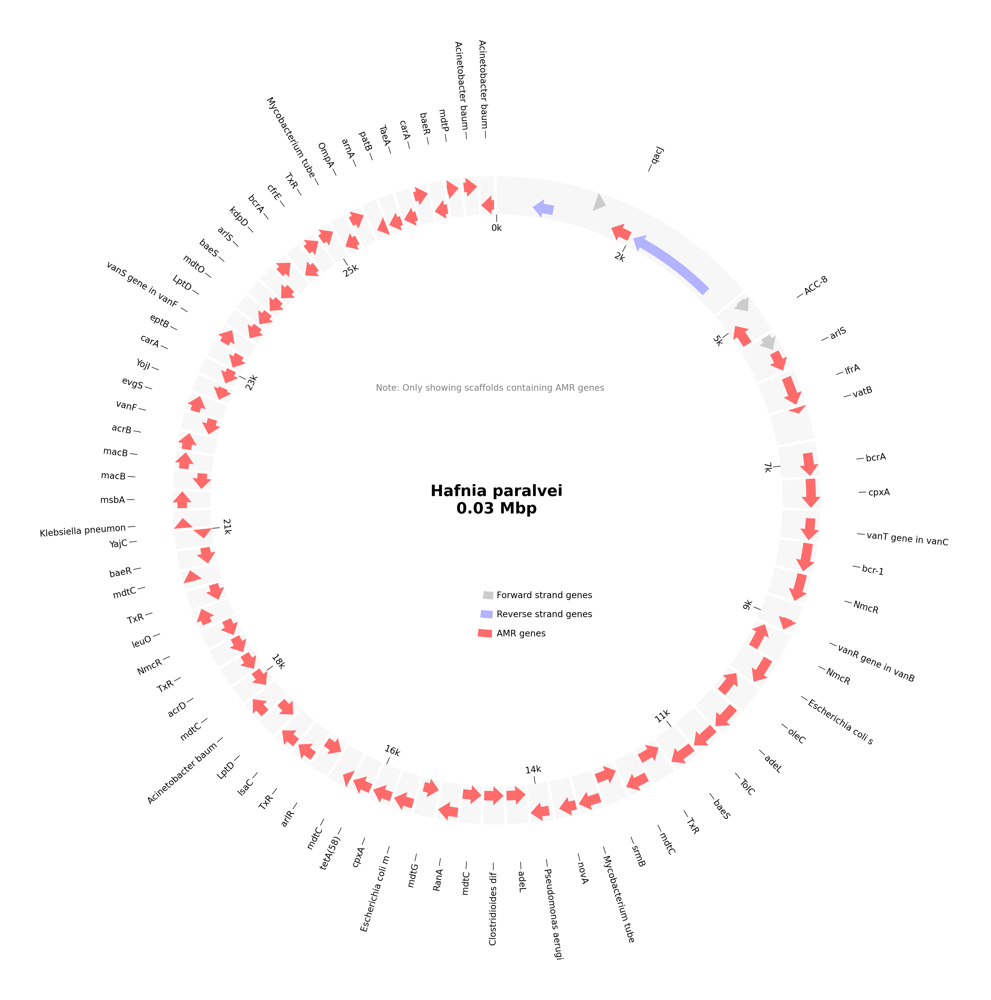

### ACC-8
- **Mechanism**: antibiotic inactivation
- **Drug Classes**: monobactam; cephalosporin; penam
- **AMR Family**: ACC beta-lactamase
- **Locations**:
  - gnl|SPADES|NKBAGNNB_104719_2 : position 315-680

### Acinetobacter baumannii AbaF (found in 2 locations)
- **Mechanism**: antibiotic efflux
- **Drug Classes**: phosphonic acid antibiotic
- **AMR Family**: major facilitator superfamily (MFS) antibiotic efflux pump
- **Locations**:
  - gnl|SPADES|NKBAGNNB_1074454_1 : position 1-288
  - gnl|SPADES|NKBAGNNB_1983647_1 : position 3-212

### Acinetobacter baumannii AbaQ
- **Mechanism**: antibiotic efflux
- **Drug Classes**: fluoroquinolone antibiotic
- **AMR Family**: major facilitator superfamily (MFS) antibiotic efflux pump
- **Locations**:
  - gnl|SPADES|NKBAGNNB_1995676_1 : position 1-213

### Clostridioides difficile gyrB conferring resistance to fluoroquinolones
- **Mechanism**: antibiotic target alteration
- **Drug Classes**: fluoroquinolone antibiotic
- **AMR Family**: fluoroquinolone resistant gyrB
- **Locations**:
  - gnl|SPADES|NKBAGNNB_870392_1 : position 2-322

### Escherichia coli mdfA
- **Mechanism**: antibiotic efflux
- **Drug Classes**: tetracycline antibiotic; phenicol antibiotic; disinfecting agents and antiseptics
- **AMR Family**: major facilitator superfamily (MFS) antibiotic efflux pump
- **Locations**:
  - gnl|SPADES|NKBAGNNB_950559_1 : position 1-306

### Escherichia coli soxS with mutation conferring antibiotic resistance
- **Mechanism**: antibiotic target alteration; antibiotic efflux; reduced permeability to antibiotic
- **Drug Classes**: fluoroquinolone antibiotic; monobactam; carbapenem; cephalosporin; glycylcycline; cephamycin; penam; tetracycline antibiotic; rifamycin antibiotic; phenicol antibiotic; penem; disinfecting agents and antiseptics
- **AMR Family**: ATP-binding cassette (ABC) antibiotic efflux pump; major facilitator superfamily (MFS) antibiotic efflux pump; resistance-nodulation-cell division (RND) antibiotic efflux pump; General Bacterial Porin with reduced permeability to beta-lactams
- **Locations**:
  - gnl|SPADES|NKBAGNNB_477417_1 : position 2-418

### Klebsiella pneumoniae OmpK37
- **Mechanism**: reduced permeability to antibiotic
- **Drug Classes**: monobactam; carbapenem; cephalosporin; cephamycin; penam; penem
- **AMR Family**: General Bacterial Porin with reduced permeability to beta-lactams
- **Locations**:
  - gnl|SPADES|NKBAGNNB_1308730_1 : position 1-156

### LptD (found in 2 locations)
- **Mechanism**: antibiotic efflux
- **Drug Classes**: carbapenem; peptide antibiotic; aminocoumarin antibiotic; rifamycin antibiotic
- **AMR Family**: ATP-binding cassette (ABC) antibiotic efflux pump
- **Locations**:
  - gnl|SPADES|NKBAGNNB_1064927_1 : position 2-289
  - gnl|SPADES|NKBAGNNB_1661261_1 : position 1-234

### Mycobacterium tuberculosis gidB mutation conferring resistance to streptomycin
- **Mechanism**: antibiotic target alteration
- **Drug Classes**: aminoglycoside antibiotic
- **AMR Family**: antibiotic resistant gidB
- **Locations**:
  - gnl|SPADES|NKBAGNNB_735186_1 : position 3-347

### Mycobacterium tuberculosis intrinsic murA conferring resistance to fosfomycin
- **Mechanism**: antibiotic target alteration
- **Drug Classes**: phosphonic acid antibiotic
- **AMR Family**: antibiotic-resistant murA transferase
- **Locations**:
  - gnl|SPADES|NKBAGNNB_1774502_1 : position 2-226

### NmcR (found in 3 locations)
- **Mechanism**: antibiotic inactivation
- **Drug Classes**: carbapenem; cephalosporin; cephamycin; penam
- **AMR Family**: NmcA beta-lactamase
- **Locations**:
  - gnl|SPADES|NKBAGNNB_1194926_1 : position 1-273
  - gnl|SPADES|NKBAGNNB_440175_1 : position 2-433
  - gnl|SPADES|NKBAGNNB_462079_1 : position 1-423

### OmpA
- **Mechanism**: reduced permeability to antibiotic
- **Drug Classes**: peptide antibiotic
- **AMR Family**: General Bacterial Porin with reduced permeability to peptide antibiotics
- **Locations**:
  - gnl|SPADES|NKBAGNNB_1826786_1 : position 2-223

### Pseudomonas aeruginosa CpxR
- **Mechanism**: antibiotic efflux
- **Drug Classes**: macrolide antibiotic; fluoroquinolone antibiotic; monobactam; aminoglycoside antibiotic; carbapenem; cephalosporin; cephamycin; penam; tetracycline antibiotic; peptide antibiotic; aminocoumarin antibiotic; diaminopyrimidine antibiotic; sulfonamide antibiotic; phenicol antibiotic; penem
- **AMR Family**: resistance-nodulation-cell division (RND) antibiotic efflux pump
- **Locations**:
  - gnl|SPADES|NKBAGNNB_820961_1 : position 43-330

### RanA
- **Mechanism**: antibiotic efflux
- **Drug Classes**: aminoglycoside antibiotic
- **AMR Family**: ATP-binding cassette (ABC) antibiotic efflux pump
- **Locations**:
  - gnl|SPADES|NKBAGNNB_922126_1 : position 2-310

### TaeA
- **Mechanism**: antibiotic efflux
- **Drug Classes**: pleuromutilin antibiotic
- **AMR Family**: ATP-binding cassette (ABC) antibiotic efflux pump
- **Locations**:
  - gnl|SPADES|NKBAGNNB_1904561_1 : position 2-217

### TolC
- **Mechanism**: antibiotic efflux
- **Drug Classes**: macrolide antibiotic; fluoroquinolone antibiotic; aminoglycoside antibiotic; carbapenem; cephalosporin; glycylcycline; cephamycin; penam; tetracycline antibiotic; peptide antibiotic; aminocoumarin antibiotic; rifamycin antibiotic; phenicol antibiotic; penem; disinfecting agents and antiseptics
- **AMR Family**: ATP-binding cassette (ABC) antibiotic efflux pump; major facilitator superfamily (MFS) antibiotic efflux pump; resistance-nodulation-cell division (RND) antibiotic efflux pump
- **Locations**:
  - gnl|SPADES|NKBAGNNB_527447_1 : position 3-401

### TxR (found in 5 locations)
- **Mechanism**: antibiotic efflux
- **Drug Classes**: tetracycline antibiotic
- **AMR Family**: ATP-binding cassette (ABC) antibiotic efflux pump
- **Locations**:
  - gnl|SPADES|NKBAGNNB_1053861_1 : position 1-291
  - gnl|SPADES|NKBAGNNB_1149005_1 : position 2-280
  - gnl|SPADES|NKBAGNNB_1262874_1 : position 2-268
  - gnl|SPADES|NKBAGNNB_1760562_1 : position 3-227
  - gnl|SPADES|NKBAGNNB_693008_1 : position 1-357

### YajC
- **Mechanism**: antibiotic efflux
- **Drug Classes**: fluoroquinolone antibiotic; cephalosporin; glycylcycline; penam; tetracycline antibiotic; oxazolidinone antibiotic; glycopeptide antibiotic; rifamycin antibiotic; phenicol antibiotic; disinfecting agents and antiseptics
- **AMR Family**: resistance-nodulation-cell division (RND) antibiotic efflux pump
- **Locations**:
  - gnl|SPADES|NKBAGNNB_1277272_1 : position 109-264

### YojI
- **Mechanism**: antibiotic efflux
- **Drug Classes**: peptide antibiotic
- **AMR Family**: ATP-binding cassette (ABC) antibiotic efflux pump
- **Locations**:
  - gnl|SPADES|NKBAGNNB_1512291_1 : position 2-205

### acrB
- **Mechanism**: antibiotic efflux
- **Drug Classes**: fluoroquinolone antibiotic; cephalosporin; glycylcycline; penam; tetracycline antibiotic; rifamycin antibiotic; phenicol antibiotic; disinfecting agents and antiseptics
- **AMR Family**: resistance-nodulation-cell division (RND) antibiotic efflux pump
- **Locations**:
  - gnl|SPADES|NKBAGNNB_1361484_1 : position 2-259

### acrD
- **Mechanism**: antibiotic efflux
- **Drug Classes**: aminoglycoside antibiotic
- **AMR Family**: resistance-nodulation-cell division (RND) antibiotic efflux pump
- **Locations**:
  - gnl|SPADES|NKBAGNNB_1112833_1 : position 2-283

### adeL (found in 2 locations)
- **Mechanism**: antibiotic efflux
- **Drug Classes**: fluoroquinolone antibiotic; tetracycline antibiotic
- **AMR Family**: resistance-nodulation-cell division (RND) antibiotic efflux pump
- **Locations**:
  - gnl|SPADES|NKBAGNNB_515416_1 : position 1-405
  - gnl|SPADES|NKBAGNNB_869229_1 : position 3-320

### arlR
- **Mechanism**: antibiotic efflux
- **Drug Classes**: fluoroquinolone antibiotic; disinfecting agents and antiseptics
- **AMR Family**: major facilitator superfamily (MFS) antibiotic efflux pump
- **Locations**:
  - gnl|SPADES|NKBAGNNB_1042780_1 : position 3-293

### arlS (found in 2 locations)
- **Mechanism**: antibiotic efflux
- **Drug Classes**: fluoroquinolone antibiotic; disinfecting agents and antiseptics
- **AMR Family**: major facilitator superfamily (MFS) antibiotic efflux pump
- **Locations**:
  - gnl|SPADES|NKBAGNNB_1717284_1 : position 2-232
  - gnl|SPADES|NKBAGNNB_171804_2 : position 282-593

### arnA
- **Mechanism**: antibiotic target alteration
- **Drug Classes**: peptide antibiotic
- **AMR Family**: pmr phosphoethanolamine transferase
- **Locations**:
  - gnl|SPADES|NKBAGNNB_1878054_1 : position 53-220

### baeR (found in 2 locations)
- **Mechanism**: antibiotic efflux
- **Drug Classes**: aminoglycoside antibiotic; aminocoumarin antibiotic
- **AMR Family**: resistance-nodulation-cell division (RND) antibiotic efflux pump
- **Locations**:
  - gnl|SPADES|NKBAGNNB_1260006_1 : position 1-267
  - gnl|SPADES|NKBAGNNB_1926749_1 : position 2-217

### baeS (found in 2 locations)
- **Mechanism**: antibiotic efflux
- **Drug Classes**: aminoglycoside antibiotic; aminocoumarin antibiotic
- **AMR Family**: resistance-nodulation-cell division (RND) antibiotic efflux pump
- **Locations**:
  - gnl|SPADES|NKBAGNNB_1679434_1 : position 1-234
  - gnl|SPADES|NKBAGNNB_567610_1 : position 2-388

### bcr-1
- **Mechanism**: antibiotic efflux
- **Drug Classes**: bicyclomycin-like antibiotic
- **AMR Family**: major facilitator superfamily (MFS) antibiotic efflux pump
- **Locations**:
  - gnl|SPADES|NKBAGNNB_410681_1 : position 3-443

### bcrA (found in 2 locations)
- **Mechanism**: antibiotic efflux
- **Drug Classes**: peptide antibiotic
- **AMR Family**: ATP-binding cassette (ABC) antibiotic efflux pump
- **Locations**:
  - gnl|SPADES|NKBAGNNB_1737534_1 : position 2-229
  - gnl|SPADES|NKBAGNNB_268254_1 : position 161-517

### carA (found in 2 locations)
- **Mechanism**: antibiotic target protection
- **Drug Classes**: macrolide antibiotic
- **AMR Family**: Miscellaneous ABC-F subfamily ATP-binding cassette ribosomal protection proteins
- **Locations**:
  - gnl|SPADES|NKBAGNNB_1608050_1 : position 1-240
  - gnl|SPADES|NKBAGNNB_1918737_1 : position 2-217

### cfrE
- **Mechanism**: antibiotic target alteration
- **Drug Classes**: lincosamide antibiotic; streptogramin antibiotic; oxazolidinone antibiotic; phenicol antibiotic; pleuromutilin antibiotic
- **AMR Family**: Cfr 23S ribosomal RNA methyltransferase
- **Locations**:
  - gnl|SPADES|NKBAGNNB_1748368_1 : position 2-229

### cpxA (found in 2 locations)
- **Mechanism**: antibiotic efflux
- **Drug Classes**: aminoglycoside antibiotic; aminocoumarin antibiotic
- **AMR Family**: resistance-nodulation-cell division (RND) antibiotic efflux pump
- **Locations**:
  - gnl|SPADES|NKBAGNNB_382095_1 : position 1-450
  - gnl|SPADES|NKBAGNNB_977859_1 : position 1-303

### eptB
- **Mechanism**: antibiotic target alteration
- **Drug Classes**: peptide antibiotic
- **AMR Family**: pmr phosphoethanolamine transferase
- **Locations**:
  - gnl|SPADES|NKBAGNNB_1617568_1 : position 3-239

### evgS
- **Mechanism**: antibiotic efflux
- **Drug Classes**: macrolide antibiotic; fluoroquinolone antibiotic; penam; tetracycline antibiotic
- **AMR Family**: major facilitator superfamily (MFS) antibiotic efflux pump; resistance-nodulation-cell division (RND) antibiotic efflux pump
- **Locations**:
  - gnl|SPADES|NKBAGNNB_1435108_1 : position 1-252

### kdpD
- **Mechanism**: antibiotic efflux
- **Drug Classes**: aminoglycoside antibiotic
- **AMR Family**: kdpDE
- **Locations**:
  - gnl|SPADES|NKBAGNNB_1733457_1 : position 3-230

### leuO
- **Mechanism**: antibiotic efflux
- **Drug Classes**: nucleoside antibiotic; disinfecting agents and antiseptics
- **AMR Family**: major facilitator superfamily (MFS) antibiotic efflux pump
- **Locations**:
  - gnl|SPADES|NKBAGNNB_1213984_1 : position 28-273

### lfrA
- **Mechanism**: antibiotic efflux
- **Drug Classes**: fluoroquinolone antibiotic
- **AMR Family**: major facilitator superfamily (MFS) antibiotic efflux pump
- **Locations**:
  - gnl|SPADES|NKBAGNNB_258616_1 : position 76-522

### lsaC
- **Mechanism**: antibiotic target protection
- **Drug Classes**: lincosamide antibiotic; streptogramin antibiotic; pleuromutilin antibiotic
- **AMR Family**: lsa-type ABC-F protein
- **Locations**:
  - gnl|SPADES|NKBAGNNB_1068607_1 : position 3-290

### macB (found in 2 locations)
- **Mechanism**: antibiotic efflux
- **Drug Classes**: macrolide antibiotic
- **AMR Family**: ATP-binding cassette (ABC) antibiotic efflux pump
- **Locations**:
  - gnl|SPADES|NKBAGNNB_1344197_1 : position 3-260
  - gnl|SPADES|NKBAGNNB_1351359_1 : position 2-259

### mdtC (found in 5 locations)
- **Mechanism**: antibiotic efflux
- **Drug Classes**: aminocoumarin antibiotic
- **AMR Family**: resistance-nodulation-cell division (RND) antibiotic efflux pump
- **Locations**:
  - gnl|SPADES|NKBAGNNB_1003361_1 : position 1-135
  - gnl|SPADES|NKBAGNNB_1088828_1 : position 1-285
  - gnl|SPADES|NKBAGNNB_1264099_1 : position 95-268
  - gnl|SPADES|NKBAGNNB_701597_1 : position 2-355
  - gnl|SPADES|NKBAGNNB_923303_1 : position 3-311

### mdtG
- **Mechanism**: antibiotic efflux
- **Drug Classes**: phosphonic acid antibiotic
- **AMR Family**: major facilitator superfamily (MFS) antibiotic efflux pump
- **Locations**:
  - gnl|SPADES|NKBAGNNB_933486_1 : position 1-255

### mdtO
- **Mechanism**: antibiotic efflux
- **Drug Classes**: nucleoside antibiotic; disinfecting agents and antiseptics
- **AMR Family**: major facilitator superfamily (MFS) antibiotic efflux pump
- **Locations**:
  - gnl|SPADES|NKBAGNNB_1664616_1 : position 2-235

### mdtP
- **Mechanism**: antibiotic efflux
- **Drug Classes**: nucleoside antibiotic; disinfecting agents and antiseptics
- **AMR Family**: major facilitator superfamily (MFS) antibiotic efflux pump
- **Locations**:
  - gnl|SPADES|NKBAGNNB_1961497_1 : position 2-181

### msbA
- **Mechanism**: antibiotic efflux
- **Drug Classes**: nitroimidazole antibiotic
- **AMR Family**: ATP-binding cassette (ABC) antibiotic efflux pump
- **Locations**:
  - gnl|SPADES|NKBAGNNB_1318533_1 : position 2-262

### novA
- **Mechanism**: antibiotic efflux
- **Drug Classes**: aminocoumarin antibiotic
- **AMR Family**: ATP-binding cassette (ABC) antibiotic efflux pump
- **Locations**:
  - gnl|SPADES|NKBAGNNB_768667_1 : position 2-268

### oleC
- **Mechanism**: antibiotic efflux
- **Drug Classes**: macrolide antibiotic
- **AMR Family**: ATP-binding cassette (ABC) antibiotic efflux pump
- **Locations**:
  - gnl|SPADES|NKBAGNNB_482737_1 : position 3-401

### patB
- **Mechanism**: antibiotic efflux
- **Drug Classes**: fluoroquinolone antibiotic
- **AMR Family**: ATP-binding cassette (ABC) antibiotic efflux pump
- **Locations**:
  - gnl|SPADES|NKBAGNNB_1891551_1 : position 3-218

### qacJ
- **Mechanism**: antibiotic efflux
- **Drug Classes**: disinfecting agents and antiseptics
- **AMR Family**: small multidrug resistance (SMR) antibiotic efflux pump
- **Locations**:
  - gnl|SPADES|NKBAGNNB_957_4: position 1936-2268

### srmB
- **Mechanism**: antibiotic target protection
- **Drug Classes**: macrolide antibiotic
- **AMR Family**: Miscellaneous ABC-F subfamily ATP-binding cassette ribosomal protection proteins
- **Locations**:
  - gnl|SPADES|NKBAGNNB_730886_1 : position 2-349

### tetA(58)
- **Mechanism**: antibiotic efflux
- **Drug Classes**: tetracycline antibiotic
- **AMR Family**: major facilitator superfamily (MFS) antibiotic efflux pump
- **Locations**:
  - gnl|SPADES|NKBAGNNB_994002_1 : position 1-300

### vanF
- **Mechanism**: antibiotic target alteration
- **Drug Classes**: glycopeptide antibiotic
- **AMR Family**: glycopeptide resistance gene cluster; Van ligase
- **Locations**:
  - gnl|SPADES|NKBAGNNB_1367406_1 : position 2-259

### vanR gene in vanB cluster
- **Mechanism**: antibiotic target alteration
- **Drug Classes**: glycopeptide antibiotic
- **AMR Family**: glycopeptide resistance gene cluster; vanR
- **Locations**:
  - gnl|SPADES|NKBAGNNB_444005_2 : position 249-431

### vanS gene in vanF cluster
- **Mechanism**: antibiotic target alteration
- **Drug Classes**: glycopeptide antibiotic
- **AMR Family**: vanS; glycopeptide resistance gene cluster
- **Locations**:
  - gnl|SPADES|NKBAGNNB_1610679_1 : position 2-238

### vanT gene in vanC cluster
- **Mechanism**: antibiotic target alteration
- **Drug Classes**: glycopeptide antibiotic
- **AMR Family**: glycopeptide resistance gene cluster; vanT
- **Locations**:
  - gnl|SPADES|NKBAGNNB_387960_1 : position 112-453

### vatB
- **Mechanism**: antibiotic inactivation
- **Drug Classes**: streptogramin antibiotic; streptogramin A antibiotic
- **AMR Family**: streptogramin vat acetyltransferase
- **Locations**:
  - gnl|SPADES|NKBAGNNB_266142_1 : position 2-97

## Latilactobacillus sakei
**Strain Statistics:**
- Total genome length: 495.0 kbp
- Total scaffolds: 1483
- Scaffolds with AMR genes: 194
- Total genes annotated: 959
- Total AMR genes: 226
- Unique AMR genes: 126
- Distinct AMR mechanisms: 9
- Distinct AMR families: 56
- Distinct drug classes: 34

**Circos Plot:**

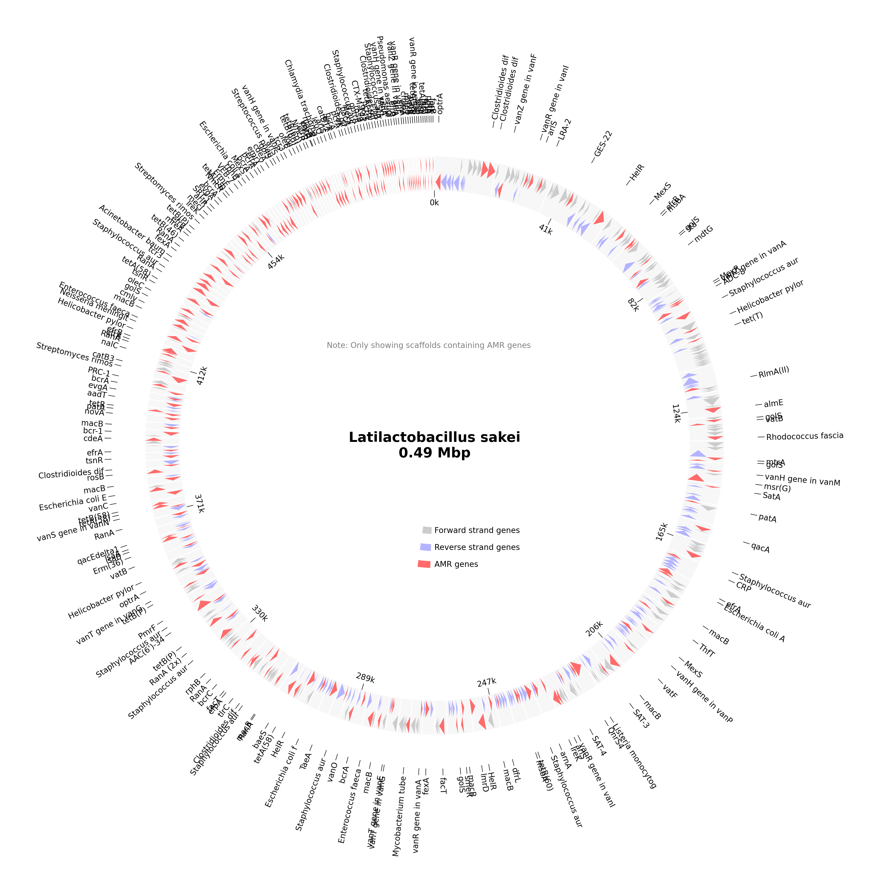

### AAC(6')-34
- **Mechanism**: antibiotic inactivation
- **Drug Classes**: aminoglycoside antibiotic
- **AMR Family**: AAC(6')
- **Locations**:
  - gnl|SPADES|NKBAGNNB_1739_4 : position 2187-2750

### ADC-8
- **Mechanism**: antibiotic inactivation
- **Drug Classes**: cephalosporin
- **AMR Family**: ADC beta-lactamase without carbapenemase activity
- **Locations**:
  - gnl|SPADES|NKBAGNNB_408_11 : position 6052-7203

### Acinetobacter baumannii AmvA
- **Mechanism**: antibiotic efflux
- **Drug Classes**: macrolide antibiotic; disinfecting agents and antiseptics
- **AMR Family**: major facilitator superfamily (MFS) antibiotic efflux pump
- **Locations**:
  - gnl|SPADES|NKBAGNNB_6089_1 : position 50-916

### CRP
- **Mechanism**: antibiotic efflux
- **Drug Classes**: macrolide antibiotic; fluoroquinolone antibiotic; penam
- **AMR Family**: resistance-nodulation-cell division (RND) antibiotic efflux pump
- **Locations**:
  - gnl|SPADES|NKBAGNNB_652_2 : position 681-1382

### CTX-M-141
- **Mechanism**: antibiotic inactivation
- **Drug Classes**: cephalosporin
- **AMR Family**: CTX-M beta-lactamase
- **Locations**:
  - gnl|SPADES|NKBAGNNB_303903_2 : position 118-495

### Chlamydia trachomatis intrinsic murA conferring resistance to fosfomycin
- **Mechanism**: antibiotic target alteration
- **Drug Classes**: phosphonic acid antibiotic
- **AMR Family**: antibiotic-resistant murA transferase
- **Locations**:
  - gnl|SPADES|NKBAGNNB_94515_1 : position 2-697

### Clostridioides difficile gyrA conferring resistance to fluoroquinolones (found in 2 locations)
- **Mechanism**: antibiotic target alteration
- **Drug Classes**: fluoroquinolone antibiotic
- **AMR Family**: fluoroquinolone resistant gyrA
- **Locations**:
  - gnl|SPADES|NKBAGNNB_152620_1 : position 2-613
  - gnl|SPADES|NKBAGNNB_181_15 : position 17051-19288

### Clostridioides difficile gyrB conferring resistance to fluoroquinolones (found in 3 locations)
- **Mechanism**: antibiotic target alteration
- **Drug Classes**: fluoroquinolone antibiotic
- **AMR Family**: fluoroquinolone resistant gyrB
- **Locations**:
  - gnl|SPADES|NKBAGNNB_1619_1 : position 1-984
  - gnl|SPADES|NKBAGNNB_181_14 : position 15012-17003
  - gnl|SPADES|NKBAGNNB_387259_1 : position 3-455

### Clostridioides difficile murG with mutation conferring resistance to vancomycin
- **Mechanism**: antibiotic target alteration
- **Drug Classes**: glycopeptide antibiotic
- **AMR Family**: murG transferase
- **Locations**:
  - gnl|SPADES|NKBAGNNB_2458_1 : position 2-577

### Enterococcus faecalis cls with mutation conferring resistance to daptomycin (found in 2 locations)
- **Mechanism**: antibiotic target alteration
- **Drug Classes**: peptide antibiotic
- **AMR Family**: daptomycin resistant cls
- **Locations**:
  - gnl|SPADES|NKBAGNNB_1290_2 : position 675-2111
  - gnl|SPADES|NKBAGNNB_3835_1 : position 3-701

### Erm(36)
- **Mechanism**: antibiotic target alteration
- **Drug Classes**: macrolide antibiotic; lincosamide antibiotic; streptogramin antibiotic; streptogramin A antibiotic; streptogramin B antibiotic
- **AMR Family**: Erm 23S ribosomal RNA methyltransferase
- **Locations**:
  - gnl|SPADES|NKBAGNNB_2033_4 : position 1992-2480

### ErmE
- **Mechanism**: antibiotic target alteration
- **Drug Classes**: macrolide antibiotic; lincosamide antibiotic; streptogramin antibiotic; streptogramin A antibiotic; streptogramin B antibiotic
- **AMR Family**: Erm 23S ribosomal RNA methyltransferase
- **Locations**:
  - gnl|SPADES|NKBAGNNB_18329_1 : position 3-290

### Escherichia coli AcrAB-TolC with AcrR mutation conferring resistance to ciprofloxacin, tetracycline, and ceftazidime
- **Mechanism**: antibiotic target alteration; antibiotic efflux
- **Drug Classes**: fluoroquinolone antibiotic; cephalosporin; glycylcycline; penam; tetracycline antibiotic; rifamycin antibiotic; phenicol antibiotic; disinfecting agents and antiseptics
- **AMR Family**: resistance-nodulation-cell division (RND) antibiotic efflux pump
- **Locations**:
  - gnl|SPADES|NKBAGNNB_678_2 : position 1502-2143

### Escherichia coli EF-Tu mutants conferring resistance to Pulvomycin
- **Mechanism**: antibiotic target alteration
- **Drug Classes**: elfamycin antibiotic
- **AMR Family**: elfamycin resistant EF-Tu
- **Locations**:
  - gnl|SPADES|NKBAGNNB_2417_1 : position 227-1417

### Escherichia coli fabI mutations conferring resistance to isoniazid and triclosan
- **Mechanism**: antibiotic target alteration
- **Drug Classes**: disinfecting agents and antiseptics; isoniazid-like antibiotic
- **AMR Family**: antibiotic resistant fabI
- **Locations**:
  - gnl|SPADES|NKBAGNNB_1485_3 : position 1049-1798

### Escherichia coli soxS with mutation conferring antibiotic resistance
- **Mechanism**: antibiotic target alteration; antibiotic efflux; reduced permeability to antibiotic
- **Drug Classes**: fluoroquinolone antibiotic; monobactam; carbapenem; cephalosporin; glycylcycline; cephamycin; penam; tetracycline antibiotic; rifamycin antibiotic; phenicol antibiotic; penem; disinfecting agents and antiseptics
- **AMR Family**: ATP-binding cassette (ABC) antibiotic efflux pump; major facilitator superfamily (MFS) antibiotic efflux pump; resistance-nodulation-cell division (RND) antibiotic efflux pump; General Bacterial Porin with reduced permeability to beta-lactams
- **Locations**:
  - gnl|SPADES|NKBAGNNB_22357_2 : position 219-794

### GES-22
- **Mechanism**: antibiotic inactivation
- **Drug Classes**: carbapenem; cephalosporin; penam
- **AMR Family**: GES beta-lactamase
- **Locations**:
  - gnl|SPADES|NKBAGNNB_328_8 : position 6992-7975

### HelR (found in 3 locations)
- **Mechanism**: antibiotic target protection
- **Drug Classes**: rifamycin antibiotic
- **AMR Family**: helicase-like RNA polymerase protection protein
- **Locations**:
  - gnl|SPADES|NKBAGNNB_1086_1 : position 71-2119
  - gnl|SPADES|NKBAGNNB_1504_2 : position 1439-3022
  - gnl|SPADES|NKBAGNNB_391_8 : position 6221-8512

### Helicobacter pylori pbp1 mutants conferring resistance to amoxicillin (found in 3 locations)
- **Mechanism**: antibiotic target alteration
- **Drug Classes**: cephalosporin; cephamycin; penam
- **AMR Family**: Penicillin-binding protein mutations conferring resistance to beta-lactam antibiotics
- **Locations**:
  - gnl|SPADES|NKBAGNNB_1978_1 : position 2-898
  - gnl|SPADES|NKBAGNNB_3717_1 : position 378-1733
  - gnl|SPADES|NKBAGNNB_417_6 : position 5656-6231

### IreK (found in 4 locations)
- **Mechanism**: reduced permeability to antibiotic
- **Drug Classes**: cephalosporin
- **AMR Family**: Serine/threonine kinases
- **Locations**:
  - gnl|SPADES|NKBAGNNB_148336_1 : position 2-619
  - gnl|SPADES|NKBAGNNB_1792361_1 : position 1-225
  - gnl|SPADES|NKBAGNNB_931_1 : position 1-609
  - gnl|SPADES|NKBAGNNB_9474_2 : position 736-1230

### LRA-2
- **Mechanism**: antibiotic inactivation
- **Drug Classes**: cephalosporin; penam
- **AMR Family**: subclass B3 LRA beta-lactamase
- **Locations**:
  - gnl|SPADES|NKBAGNNB_203_16 : position 14210-15016

### Listeria monocytogenes mprF
- **Mechanism**: antibiotic target alteration
- **Drug Classes**: peptide antibiotic
- **AMR Family**: defensin resistant mprF
- **Locations**:
  - gnl|SPADES|NKBAGNNB_837_2 : position 565-3186

### MexL
- **Mechanism**: antibiotic efflux
- **Drug Classes**: macrolide antibiotic; tetracycline antibiotic; disinfecting agents and antiseptics
- **AMR Family**: resistance-nodulation-cell division (RND) antibiotic efflux pump
- **Locations**:
  - gnl|SPADES|NKBAGNNB_487414_1 : position 3-416

### MexR
- **Mechanism**: antibiotic target alteration; antibiotic efflux
- **Drug Classes**: macrolide antibiotic; fluoroquinolone antibiotic; monobactam; carbapenem; cephalosporin; cephamycin; penam; tetracycline antibiotic; peptide antibiotic; aminocoumarin antibiotic; diaminopyrimidine antibiotic; sulfonamide antibiotic; phenicol antibiotic; penem
- **AMR Family**: resistance-nodulation-cell division (RND) antibiotic efflux pump
- **Locations**:
  - gnl|SPADES|NKBAGNNB_408_9 : position 4903-5385

### MexS (found in 4 locations)
- **Mechanism**: antibiotic efflux
- **Drug Classes**: fluoroquinolone antibiotic; diaminopyrimidine antibiotic; phenicol antibiotic
- **AMR Family**: resistance-nodulation-cell division (RND) antibiotic efflux pump
- **Locations**:
  - gnl|SPADES|NKBAGNNB_218261_1 : position 3-269
  - gnl|SPADES|NKBAGNNB_28655_1 : position 88-936
  - gnl|SPADES|NKBAGNNB_402_6 : position 5396-6349
  - gnl|SPADES|NKBAGNNB_710_5 : position 2762-3697

### Mycobacterium tuberculosis kasA mutant conferring resistance to isoniazid
- **Mechanism**: antibiotic target alteration
- **Drug Classes**: isoniazid-like antibiotic
- **AMR Family**: antibiotic resistant kasA
- **Locations**:
  - gnl|SPADES|NKBAGNNB_1221_1 : position 1-1107

### Neisseria meningititis PBP2 conferring resistance to beta-lactam
- **Mechanism**: antibiotic target alteration
- **Drug Classes**: cephalosporin; cephamycin; penam
- **AMR Family**: Penicillin-binding protein mutations conferring resistance to beta-lactam antibiotics
- **Locations**:
  - gnl|SPADES|NKBAGNNB_3820_3 : position 606-1706

### NmcR (found in 2 locations)
- **Mechanism**: antibiotic inactivation
- **Drug Classes**: carbapenem; cephalosporin; cephamycin; penam
- **AMR Family**: NmcA beta-lactamase
- **Locations**:
  - gnl|SPADES|NKBAGNNB_15729_2 : position 522-1079
  - gnl|SPADES|NKBAGNNB_71778_2 : position 339-749

### PRC-1
- **Mechanism**: antibiotic inactivation
- **Drug Classes**: cephalosporin; penam
- **AMR Family**: PRC beta-lactamase
- **Locations**:
  - gnl|SPADES|NKBAGNNB_3230_1 : position 1-795

### PmrF
- **Mechanism**: antibiotic target alteration
- **Drug Classes**: peptide antibiotic
- **AMR Family**: pmr phosphoethanolamine transferase
- **Locations**:
  - gnl|SPADES|NKBAGNNB_1784_1 : position 3-431

### Pseudomonas aeruginosa soxR
- **Mechanism**: antibiotic target alteration; antibiotic efflux
- **Drug Classes**: fluoroquinolone antibiotic; cephalosporin; glycylcycline; penam; tetracycline antibiotic; rifamycin antibiotic; phenicol antibiotic; disinfecting agents and antiseptics
- **AMR Family**: ATP-binding cassette (ABC) antibiotic efflux pump; major facilitator superfamily (MFS) antibiotic efflux pump; resistance-nodulation-cell division (RND) antibiotic efflux pump
- **Locations**:
  - gnl|SPADES|NKBAGNNB_559467_1 : position 2-391

### QnrS4
- **Mechanism**: antibiotic target protection
- **Drug Classes**: fluoroquinolone antibiotic
- **AMR Family**: quinolone resistance protein (qnr)
- **Locations**:
  - gnl|SPADES|NKBAGNNB_837_3 : position 3273-3908

### RanA (found in 8 locations)
- **Mechanism**: antibiotic efflux
- **Drug Classes**: aminoglycoside antibiotic
- **AMR Family**: ATP-binding cassette (ABC) antibiotic efflux pump
- **Locations**:
  - gnl|SPADES|NKBAGNNB_1570_2 : position 1510-1809
  - gnl|SPADES|NKBAGNNB_1672_2 : position 764-1702
  - gnl|SPADES|NKBAGNNB_1719_2 : position 1128-1886
  - gnl|SPADES|NKBAGNNB_1719_3 : position 1907-2716
  - gnl|SPADES|NKBAGNNB_2152_3 : position 1530-2393
  - gnl|SPADES|NKBAGNNB_3403_2 : position 1277-1810
  - gnl|SPADES|NKBAGNNB_5385_2 : position 300-1478
  - gnl|SPADES|NKBAGNNB_6736_2 : position 128-1219

### Rhodococcus fascians cmr
- **Mechanism**: antibiotic efflux
- **Drug Classes**: phenicol antibiotic
- **AMR Family**: major facilitator superfamily (MFS) antibiotic efflux pump
- **Locations**:
  - gnl|SPADES|NKBAGNNB_506_8 : position 6099-7223

### RlmA(II)
- **Mechanism**: antibiotic target alteration
- **Drug Classes**: macrolide antibiotic; lincosamide antibiotic
- **AMR Family**: non-erm 23S ribosomal RNA methyltransferase (G748)
- **Locations**:
  - gnl|SPADES|NKBAGNNB_455_6 : position 5690-6526

### SAT-3
- **Mechanism**: antibiotic inactivation
- **Drug Classes**: nucleoside antibiotic
- **AMR Family**: streptothricin acetyltransferase (SAT)
- **Locations**:
  - gnl|SPADES|NKBAGNNB_836_2 : position 88-639

### SAT-4
- **Mechanism**: antibiotic inactivation
- **Drug Classes**: nucleoside antibiotic
- **AMR Family**: streptothricin acetyltransferase (SAT)
- **Locations**:
  - gnl|SPADES|NKBAGNNB_904_5 : position 3131-3568

### SRT-1
- **Mechanism**: antibiotic inactivation
- **Drug Classes**: cephalosporin
- **AMR Family**: SRT beta-lactamase
- **Locations**:
  - gnl|SPADES|NKBAGNNB_13953_1 : position 2-850

### SatA
- **Mechanism**: antibiotic inactivation
- **Drug Classes**: nucleoside antibiotic
- **AMR Family**: streptothricin acetyltransferase (SAT)
- **Locations**:
  - gnl|SPADES|NKBAGNNB_610_2 : position 640-1101

### Staphylococcus aureus LmrS
- **Mechanism**: antibiotic efflux
- **Drug Classes**: macrolide antibiotic; aminoglycoside antibiotic; oxazolidinone antibiotic; diaminopyrimidine antibiotic; phenicol antibiotic
- **AMR Family**: major facilitator superfamily (MFS) antibiotic efflux pump
- **Locations**:
  - gnl|SPADES|NKBAGNNB_417_2 : position 308-1783

### Staphylococcus aureus fusA with mutation conferring resistance to fusidic acid (found in 2 locations)
- **Mechanism**: antibiotic target alteration
- **Drug Classes**: fusidane antibiotic
- **AMR Family**: antibiotic resistant fusA
- **Locations**:
  - gnl|SPADES|NKBAGNNB_1703_3 : position 1172-2794
  - gnl|SPADES|NKBAGNNB_954_2 : position 349-1926

### Staphylococcus aureus mupA conferring resistance to mupirocin (found in 4 locations)
- **Mechanism**: antibiotic target alteration
- **Drug Classes**: mupirocin-like antibiotic
- **AMR Family**: antibiotic-resistant isoleucyl-tRNA synthetase (ileS)
- **Locations**:
  - gnl|SPADES|NKBAGNNB_1384_1 : position 3-380
  - gnl|SPADES|NKBAGNNB_1748_1 : position 2-2257
  - gnl|SPADES|NKBAGNNB_233588_1 : position 1-540
  - gnl|SPADES|NKBAGNNB_648_8 : position 3921-5456

### Staphylococcus aureus mupB conferring resistance to mupirocin (found in 3 locations)
- **Mechanism**: antibiotic target alteration
- **Drug Classes**: mupirocin-like antibiotic
- **AMR Family**: antibiotic-resistant isoleucyl-tRNA synthetase (ileS)
- **Locations**:
  - gnl|SPADES|NKBAGNNB_1597_5 : position 2487-2918
  - gnl|SPADES|NKBAGNNB_428295_1 : position 1-438
  - gnl|SPADES|NKBAGNNB_5665_1 : position 2-1192

### Streptococcus pneumoniae PBP2x conferring resistance to amoxicillin
- **Mechanism**: antibiotic target alteration
- **Drug Classes**: cephalosporin; cephamycin; penam
- **AMR Family**: Penicillin-binding protein mutations conferring resistance to beta-lactam antibiotics
- **Locations**:
  - gnl|SPADES|NKBAGNNB_40579_1 : position 1-861

### Streptomyces rimosus otr(A) (found in 2 locations)
- **Mechanism**: antibiotic target protection
- **Drug Classes**: tetracycline antibiotic
- **AMR Family**: tetracycline-resistant ribosomal protection protein
- **Locations**:
  - gnl|SPADES|NKBAGNNB_3266_2 : position 156-1862
  - gnl|SPADES|NKBAGNNB_8907_1 : position 176-1252

### TaeA
- **Mechanism**: antibiotic efflux
- **Drug Classes**: pleuromutilin antibiotic
- **AMR Family**: ATP-binding cassette (ABC) antibiotic efflux pump
- **Locations**:
  - gnl|SPADES|NKBAGNNB_1399_1 : position 15-1688

### ThfT
- **Mechanism**: resistance by host-dependent nutrient acquisition
- **Drug Classes**: sulfonamide antibiotic
- **AMR Family**: ECF transporter S component
- **Locations**:
  - gnl|SPADES|NKBAGNNB_709_4 : position 2463-3071

### VEB-7
- **Mechanism**: antibiotic inactivation
- **Drug Classes**: monobactam; cephalosporin
- **AMR Family**: VEB beta-lactamase
- **Locations**:
  - gnl|SPADES|NKBAGNNB_19728_1 : position 108-1022

### YojI
- **Mechanism**: antibiotic efflux
- **Drug Classes**: peptide antibiotic
- **AMR Family**: ATP-binding cassette (ABC) antibiotic efflux pump
- **Locations**:
  - gnl|SPADES|NKBAGNNB_59012_2 : position 536-787

### aadT
- **Mechanism**: antibiotic efflux
- **Drug Classes**: macrolide antibiotic; tetracycline antibiotic; disinfecting agents and antiseptics
- **AMR Family**: major facilitator superfamily (MFS) antibiotic efflux pump
- **Locations**:
  - gnl|SPADES|NKBAGNNB_3045_2 : position 889-1932

### almE
- **Mechanism**: antibiotic target alteration
- **Drug Classes**: peptide antibiotic
- **AMR Family**: polymyxin resistance operon; alm glycyltransferase
- **Locations**:
  - gnl|SPADES|NKBAGNNB_486_6 : position 4936-6462

### arlR (found in 2 locations)
- **Mechanism**: antibiotic efflux
- **Drug Classes**: fluoroquinolone antibiotic; disinfecting agents and antiseptics
- **AMR Family**: major facilitator superfamily (MFS) antibiotic efflux pump
- **Locations**:
  - gnl|SPADES|NKBAGNNB_13325_2 : position 579-1124
  - gnl|SPADES|NKBAGNNB_1680716_1 : position 2-145

### arlS (found in 5 locations)
- **Mechanism**: antibiotic efflux
- **Drug Classes**: fluoroquinolone antibiotic; disinfecting agents and antiseptics
- **AMR Family**: major facilitator superfamily (MFS) antibiotic efflux pump
- **Locations**:
  - gnl|SPADES|NKBAGNNB_100385_1 : position 1-687
  - gnl|SPADES|NKBAGNNB_1359201_1 : position 2-193
  - gnl|SPADES|NKBAGNNB_203_12 : position 11051-12028
  - gnl|SPADES|NKBAGNNB_41450_1 : position 2-856
  - gnl|SPADES|NKBAGNNB_910_4 : position 2623-4284

### arnA
- **Mechanism**: antibiotic target alteration
- **Drug Classes**: peptide antibiotic
- **AMR Family**: pmr phosphoethanolamine transferase
- **Locations**:
  - gnl|SPADES|NKBAGNNB_931_4 : position 2707-3663

### bacA
- **Mechanism**: antibiotic target alteration
- **Drug Classes**: peptide antibiotic
- **AMR Family**: undecaprenyl pyrophosphate related proteins
- **Locations**:
  - gnl|SPADES|NKBAGNNB_158955_1 : position 3-560

### baeS
- **Mechanism**: antibiotic efflux
- **Drug Classes**: aminoglycoside antibiotic; aminocoumarin antibiotic
- **AMR Family**: resistance-nodulation-cell division (RND) antibiotic efflux pump
- **Locations**:
  - gnl|SPADES|NKBAGNNB_1516_1 : position 2-1393

### bcr-1 (found in 2 locations)
- **Mechanism**: antibiotic efflux
- **Drug Classes**: bicyclomycin-like antibiotic
- **AMR Family**: major facilitator superfamily (MFS) antibiotic efflux pump
- **Locations**:
  - gnl|SPADES|NKBAGNNB_2766_2 : position 492-1673
  - gnl|SPADES|NKBAGNNB_361966_1 : position 2-334

### bcrA (found in 7 locations)
- **Mechanism**: antibiotic efflux
- **Drug Classes**: peptide antibiotic
- **AMR Family**: ATP-binding cassette (ABC) antibiotic efflux pump
- **Locations**:
  - gnl|SPADES|NKBAGNNB_118359_1 : position 2-268
  - gnl|SPADES|NKBAGNNB_125591_2 : position 522-647
  - gnl|SPADES|NKBAGNNB_1293_2 : position 798-1478
  - gnl|SPADES|NKBAGNNB_15463_1 : position 3-671
  - gnl|SPADES|NKBAGNNB_29444_1 : position 236-844
  - gnl|SPADES|NKBAGNNB_30179_2 : position 516-923
  - gnl|SPADES|NKBAGNNB_3119_2 : position 456-1184

### bcrC
- **Mechanism**: antibiotic target alteration
- **Drug Classes**: peptide antibiotic
- **AMR Family**: undecaprenyl pyrophosphate related proteins
- **Locations**:
  - gnl|SPADES|NKBAGNNB_1651_2 : position 1851-2489

### catB11
- **Mechanism**: antibiotic inactivation
- **Drug Classes**: phenicol antibiotic
- **AMR Family**: chloramphenicol acetyltransferase (CAT)
- **Locations**:
  - gnl|SPADES|NKBAGNNB_110999_2 : position 489-668

### catB3
- **Mechanism**: antibiotic inactivation
- **Drug Classes**: phenicol antibiotic
- **AMR Family**: chloramphenicol acetyltransferase (CAT)
- **Locations**:
  - gnl|SPADES|NKBAGNNB_3307_1 : position 2-535

### cdeA (found in 2 locations)
- **Mechanism**: antibiotic efflux
- **Drug Classes**: fluoroquinolone antibiotic; disinfecting agents and antiseptics
- **AMR Family**: multidrug and toxic compound extrusion (MATE) transporter
- **Locations**:
  - gnl|SPADES|NKBAGNNB_2740_3 : position 1036-2055
  - gnl|SPADES|NKBAGNNB_35033_2 : position 420-890

### cmlB1
- **Mechanism**: antibiotic efflux
- **Drug Classes**: phenicol antibiotic
- **AMR Family**: major facilitator superfamily (MFS) antibiotic efflux pump
- **Locations**:
  - gnl|SPADES|NKBAGNNB_865194_1 : position 2-322

### cmlv
- **Mechanism**: antibiotic inactivation
- **Drug Classes**: phenicol antibiotic
- **AMR Family**: chloramphenicol phosphotransferase
- **Locations**:
  - gnl|SPADES|NKBAGNNB_4153_1 : position 184-1356

### dfrL
- **Mechanism**: antibiotic target replacement
- **Drug Classes**: aminoglycoside antibiotic; tetracycline antibiotic; diaminopyrimidine antibiotic
- **AMR Family**: trimethoprim resistant dihydrofolate reductase dfr
- **Locations**:
  - gnl|SPADES|NKBAGNNB_1009_6 : position 2886-3386

### efpA
- **Mechanism**: antibiotic efflux
- **Drug Classes**: rifamycin antibiotic; isoniazid-like antibiotic
- **AMR Family**: major facilitator superfamily (MFS) antibiotic efflux pump
- **Locations**:
  - gnl|SPADES|NKBAGNNB_1624_2 : position 1474-2514

### efrA (found in 9 locations)
- **Mechanism**: antibiotic efflux
- **Drug Classes**: macrolide antibiotic; fluoroquinolone antibiotic; rifamycin antibiotic
- **AMR Family**: ATP-binding cassette (ABC) antibiotic efflux pump
- **Locations**:
  - gnl|SPADES|NKBAGNNB_112339_1 : position 1-270
  - gnl|SPADES|NKBAGNNB_1395752_1 : position 2-256
  - gnl|SPADES|NKBAGNNB_2599_1 : position 2-565
  - gnl|SPADES|NKBAGNNB_30500_1 : position 1-921
  - gnl|SPADES|NKBAGNNB_3551_1 : position 1-339
  - gnl|SPADES|NKBAGNNB_663428_2 : position 201-365
  - gnl|SPADES|NKBAGNNB_678_1 : position 3-1478
  - gnl|SPADES|NKBAGNNB_686533_1 : position 1-357
  - gnl|SPADES|NKBAGNNB_794600_1 : position 3-335

### efrB (found in 5 locations)
- **Mechanism**: antibiotic efflux
- **Drug Classes**: macrolide antibiotic; fluoroquinolone antibiotic; rifamycin antibiotic
- **AMR Family**: ATP-binding cassette (ABC) antibiotic efflux pump
- **Locations**:
  - gnl|SPADES|NKBAGNNB_3551_2 : position 326-1771
  - gnl|SPADES|NKBAGNNB_403_1 : position 1-840
  - gnl|SPADES|NKBAGNNB_407288_1 : position 3-446
  - gnl|SPADES|NKBAGNNB_73087_1 : position 3-470
  - gnl|SPADES|NKBAGNNB_7396_1 : position 1-888

### emrY
- **Mechanism**: antibiotic efflux
- **Drug Classes**: tetracycline antibiotic
- **AMR Family**: major facilitator superfamily (MFS) antibiotic efflux pump
- **Locations**:
  - gnl|SPADES|NKBAGNNB_31836_1 : position 1-588

### evgA (found in 2 locations)
- **Mechanism**: antibiotic efflux
- **Drug Classes**: macrolide antibiotic; fluoroquinolone antibiotic; penam; tetracycline antibiotic
- **AMR Family**: major facilitator superfamily (MFS) antibiotic efflux pump; resistance-nodulation-cell division (RND) antibiotic efflux pump
- **Locations**:
  - gnl|SPADES|NKBAGNNB_14516_2 : position 349-954
  - gnl|SPADES|NKBAGNNB_3105_3 : position 861-1493

### facT (found in 2 locations)
- **Mechanism**: antibiotic efflux
- **Drug Classes**: elfamycin antibiotic
- **AMR Family**: major facilitator superfamily (MFS) antibiotic efflux pump
- **Locations**:
  - gnl|SPADES|NKBAGNNB_1166_2 : position 759-2309
  - gnl|SPADES|NKBAGNNB_1624_3 : position 2545-2832

### farB (found in 2 locations)
- **Mechanism**: antibiotic efflux
- **Drug Classes**: antibacterial free fatty acids
- **AMR Family**: major facilitator superfamily (MFS) antibiotic efflux pump
- **Locations**:
  - gnl|SPADES|NKBAGNNB_1615025_1 : position 1-237
  - gnl|SPADES|NKBAGNNB_1955216_1 : position 2-214

### fexA (found in 2 locations)
- **Mechanism**: antibiotic efflux
- **Drug Classes**: phenicol antibiotic
- **AMR Family**: major facilitator superfamily (MFS) antibiotic efflux pump
- **Locations**:
  - gnl|SPADES|NKBAGNNB_1181_3 : position 1647-2843
  - gnl|SPADES|NKBAGNNB_6165_1 : position 312-1409

### golS (found in 7 locations)
- **Mechanism**: antibiotic efflux
- **Drug Classes**: monobactam; carbapenem; cephalosporin; cephamycin; penam; phenicol antibiotic; penem
- **AMR Family**: resistance-nodulation-cell division (RND) antibiotic efflux pump
- **Locations**:
  - gnl|SPADES|NKBAGNNB_1138_2 : position 589-990
  - gnl|SPADES|NKBAGNNB_312689_2 : position 227-490
  - gnl|SPADES|NKBAGNNB_35353_2 : position 674-889
  - gnl|SPADES|NKBAGNNB_403_9 : position 7558-7983
  - gnl|SPADES|NKBAGNNB_4325_2 : position 630-1031
  - gnl|SPADES|NKBAGNNB_506_2 : position 838-1602
  - gnl|SPADES|NKBAGNNB_556_6 : position 6120-6539

### leuO
- **Mechanism**: antibiotic efflux
- **Drug Classes**: nucleoside antibiotic; disinfecting agents and antiseptics
- **AMR Family**: major facilitator superfamily (MFS) antibiotic efflux pump
- **Locations**:
  - gnl|SPADES|NKBAGNNB_98211_1 : position 3-554

### lmrD (found in 2 locations)
- **Mechanism**: antibiotic efflux
- **Drug Classes**: lincosamide antibiotic
- **AMR Family**: ATP-binding cassette (ABC) antibiotic efflux pump
- **Locations**:
  - gnl|SPADES|NKBAGNNB_1086_2 : position 2296-3816
  - gnl|SPADES|NKBAGNNB_73649_3 : position 461-601

### lsaA
- **Mechanism**: antibiotic target protection
- **Drug Classes**: lincosamide antibiotic; streptogramin antibiotic; streptogramin A antibiotic; streptogramin B antibiotic; pleuromutilin antibiotic
- **AMR Family**: lsa-type ABC-F protein
- **Locations**:
  - gnl|SPADES|NKBAGNNB_2071_2 : position 1450-1836

### lsaB
- **Mechanism**: antibiotic target protection
- **Drug Classes**: lincosamide antibiotic; streptogramin antibiotic; pleuromutilin antibiotic
- **AMR Family**: lsa-type ABC-F protein
- **Locations**:
  - gnl|SPADES|NKBAGNNB_2071_1 : position 324-1475

### macB (found in 11 locations)
- **Mechanism**: antibiotic efflux
- **Drug Classes**: macrolide antibiotic
- **AMR Family**: ATP-binding cassette (ABC) antibiotic efflux pump
- **Locations**:
  - gnl|SPADES|NKBAGNNB_1012_2 : position 864-1622
  - gnl|SPADES|NKBAGNNB_1113_2 : position 1872-2648
  - gnl|SPADES|NKBAGNNB_1289_3 : position 1793-2518
  - gnl|SPADES|NKBAGNNB_1570_3 : position 1751-2227
  - gnl|SPADES|NKBAGNNB_2419_2 : position 296-1330
  - gnl|SPADES|NKBAGNNB_2778_2 : position 325-1011
  - gnl|SPADES|NKBAGNNB_3927_2 : position 527-1552
  - gnl|SPADES|NKBAGNNB_708_5 : position 3234-4022
  - gnl|SPADES|NKBAGNNB_804_2 : position 894-2834
  - gnl|SPADES|NKBAGNNB_905856_1 : position 3-314
  - gnl|SPADES|NKBAGNNB_92875_1 : position 2-619

### mdtG
- **Mechanism**: antibiotic efflux
- **Drug Classes**: phosphonic acid antibiotic
- **AMR Family**: major facilitator superfamily (MFS) antibiotic efflux pump
- **Locations**:
  - gnl|SPADES|NKBAGNNB_404_3 : position 1697-2950

### mecI
- **Mechanism**: antibiotic target replacement
- **Drug Classes**: penam
- **AMR Family**: methicillin resistant PBP2
- **Locations**:
  - gnl|SPADES|NKBAGNNB_12136_2 : position 624-1064

### mreA
- **Mechanism**: antibiotic efflux
- **Drug Classes**: macrolide antibiotic
- **AMR Family**: major facilitator superfamily (MFS) antibiotic efflux pump
- **Locations**:
  - gnl|SPADES|NKBAGNNB_6971_2 : position 809-1348

### msbA (found in 2 locations)
- **Mechanism**: antibiotic efflux
- **Drug Classes**: nitroimidazole antibiotic
- **AMR Family**: ATP-binding cassette (ABC) antibiotic efflux pump
- **Locations**:
  - gnl|SPADES|NKBAGNNB_1005_2 : position 473-1315
  - gnl|SPADES|NKBAGNNB_403_2 : position 857-1213

### msr(G)
- **Mechanism**: antibiotic target protection
- **Drug Classes**: macrolide antibiotic; streptogramin antibiotic
- **AMR Family**: msr-type ABC-F protein
- **Locations**:
  - gnl|SPADES|NKBAGNNB_576_5 : position 4016-6283

### mtrA
- **Mechanism**: antibiotic efflux
- **Drug Classes**: macrolide antibiotic; penam
- **AMR Family**: resistance-nodulation-cell division (RND) antibiotic efflux pump
- **Locations**:
  - gnl|SPADES|NKBAGNNB_556_5 : position 5232-6095

### nalC
- **Mechanism**: antibiotic efflux
- **Drug Classes**: macrolide antibiotic; fluoroquinolone antibiotic; monobactam; carbapenem; cephalosporin; cephamycin; penam; tetracycline antibiotic; peptide antibiotic; aminocoumarin antibiotic; diaminopyrimidine antibiotic; sulfonamide antibiotic; phenicol antibiotic; penem
- **AMR Family**: resistance-nodulation-cell division (RND) antibiotic efflux pump
- **Locations**:
  - gnl|SPADES|NKBAGNNB_3362_3 : position 1583-1822

### novA (found in 2 locations)
- **Mechanism**: antibiotic efflux
- **Drug Classes**: aminocoumarin antibiotic
- **AMR Family**: ATP-binding cassette (ABC) antibiotic efflux pump
- **Locations**:
  - gnl|SPADES|NKBAGNNB_1040184_1 : position 1-294
  - gnl|SPADES|NKBAGNNB_2806_2 : position 937-1719

### oleB
- **Mechanism**: antibiotic target protection
- **Drug Classes**: macrolide antibiotic
- **AMR Family**: Miscellaneous ABC-F subfamily ATP-binding cassette ribosomal protection proteins
- **Locations**:
  - gnl|SPADES|NKBAGNNB_54871_2 : position 638-799

### oleC
- **Mechanism**: antibiotic efflux
- **Drug Classes**: macrolide antibiotic
- **AMR Family**: ATP-binding cassette (ABC) antibiotic efflux pump
- **Locations**:
  - gnl|SPADES|NKBAGNNB_4438_2 : position 234-1106

### optrA (found in 3 locations)
- **Mechanism**: antibiotic target protection
- **Drug Classes**: oxazolidinone antibiotic; phenicol antibiotic
- **AMR Family**: Miscellaneous ABC-F subfamily ATP-binding cassette ribosomal protection proteins
- **Locations**:
  - gnl|SPADES|NKBAGNNB_181_1 : position 349-1974
  - gnl|SPADES|NKBAGNNB_1938_1 : position 3-1073
  - gnl|SPADES|NKBAGNNB_260810_1 : position 2-520

### patA (found in 4 locations)
- **Mechanism**: antibiotic efflux
- **Drug Classes**: fluoroquinolone antibiotic
- **AMR Family**: ATP-binding cassette (ABC) antibiotic efflux pump
- **Locations**:
  - gnl|SPADES|NKBAGNNB_1710264_1 : position 3-230
  - gnl|SPADES|NKBAGNNB_3038_1 : position 2-730
  - gnl|SPADES|NKBAGNNB_624_1 : position 3-476
  - gnl|SPADES|NKBAGNNB_73649_2 : position 185-457

### patB
- **Mechanism**: antibiotic efflux
- **Drug Classes**: fluoroquinolone antibiotic
- **AMR Family**: ATP-binding cassette (ABC) antibiotic efflux pump
- **Locations**:
  - gnl|SPADES|NKBAGNNB_1157685_1 : position 1-279

### qacA
- **Mechanism**: antibiotic efflux
- **Drug Classes**: fluoroquinolone antibiotic
- **AMR Family**: major facilitator superfamily (MFS) antibiotic efflux pump
- **Locations**:
  - gnl|SPADES|NKBAGNNB_635_2 : position 1321-2544

### qacEdelta1
- **Mechanism**: antibiotic efflux
- **Drug Classes**: disinfecting agents and antiseptics
- **AMR Family**: major facilitator superfamily (MFS) antibiotic efflux pump
- **Locations**:
  - gnl|SPADES|NKBAGNNB_2122_1 : position 2-235

### rosB (found in 2 locations)
- **Mechanism**: antibiotic efflux
- **Drug Classes**: peptide antibiotic
- **AMR Family**: major facilitator superfamily (MFS) antibiotic efflux pump
- **Locations**:
  - gnl|SPADES|NKBAGNNB_2448_2 : position 782-1942
  - gnl|SPADES|NKBAGNNB_281432_1 : position 3-509

### rphB (found in 2 locations)
- **Mechanism**: antibiotic inactivation
- **Drug Classes**: rifamycin antibiotic
- **AMR Family**: rifampin phosphotransferase
- **Locations**:
  - gnl|SPADES|NKBAGNNB_1701_1 : position 3-515
  - gnl|SPADES|NKBAGNNB_20907_2 : position 148-1008

### smeR
- **Mechanism**: antibiotic efflux
- **Drug Classes**: aminoglycoside antibiotic; cephalosporin; cephamycin; penam
- **AMR Family**: resistance-nodulation-cell division (RND) antibiotic efflux pump
- **Locations**:
  - gnl|SPADES|NKBAGNNB_1113_3 : position 2788-3462

### sta
- **Mechanism**: antibiotic inactivation
- **Drug Classes**: nucleoside antibiotic
- **AMR Family**: streptothricin acetyltransferase (SAT)
- **Locations**:
  - gnl|SPADES|NKBAGNNB_403_10 : position 8038-8556

### sul4
- **Mechanism**: antibiotic target replacement
- **Drug Classes**: sulfonamide antibiotic
- **AMR Family**: sulfonamide resistant sul
- **Locations**:
  - gnl|SPADES|NKBAGNNB_508260_1 : position 1-408

### tcr3 (found in 2 locations)
- **Mechanism**: antibiotic efflux
- **Drug Classes**: tetracycline antibiotic
- **AMR Family**: major facilitator superfamily (MFS) antibiotic efflux pump
- **Locations**:
  - gnl|SPADES|NKBAGNNB_42498_1 : position 3-566
  - gnl|SPADES|NKBAGNNB_6067_2 : position 177-1418

### tet(T)
- **Mechanism**: antibiotic target protection
- **Drug Classes**: tetracycline antibiotic
- **AMR Family**: tetracycline-resistant ribosomal protection protein
- **Locations**:
  - gnl|SPADES|NKBAGNNB_422_1 : position 3-464

### tetA(46)
- **Mechanism**: antibiotic efflux
- **Drug Classes**: tetracycline antibiotic
- **AMR Family**: ATP-binding cassette (ABC) antibiotic efflux pump
- **Locations**:
  - gnl|SPADES|NKBAGNNB_376069_1 : position 3-398

### tetA(58) (found in 6 locations)
- **Mechanism**: antibiotic efflux
- **Drug Classes**: tetracycline antibiotic
- **AMR Family**: major facilitator superfamily (MFS) antibiotic efflux pump
- **Locations**:
  - gnl|SPADES|NKBAGNNB_1204748_1 : position 1-273
  - gnl|SPADES|NKBAGNNB_1508_3 : position 1379-2269
  - gnl|SPADES|NKBAGNNB_1557041_1 : position 3-242
  - gnl|SPADES|NKBAGNNB_18284_1 : position 170-346
  - gnl|SPADES|NKBAGNNB_2252_1 : position 109-1050
  - gnl|SPADES|NKBAGNNB_4782_1 : position 2-1012

### tetB(46)
- **Mechanism**: antibiotic efflux
- **Drug Classes**: tetracycline antibiotic
- **AMR Family**: ATP-binding cassette (ABC) antibiotic efflux pump
- **Locations**:
  - gnl|SPADES|NKBAGNNB_6799_2 : position 412-1170

### tetB(58)
- **Mechanism**: antibiotic efflux
- **Drug Classes**: tetracycline antibiotic
- **AMR Family**: major facilitator superfamily (MFS) antibiotic efflux pump
- **Locations**:
  - gnl|SPADES|NKBAGNNB_2252_2 : position 1063-1836

### tetB(60) (found in 3 locations)
- **Mechanism**: antibiotic efflux
- **Drug Classes**: tetracycline antibiotic
- **AMR Family**: ATP-binding cassette (ABC) antibiotic efflux pump
- **Locations**:
  - gnl|SPADES|NKBAGNNB_1005_1 : position 3-497
  - gnl|SPADES|NKBAGNNB_64425_2 : position 517-768
  - gnl|SPADES|NKBAGNNB_68732_2 : position 210-758

### tetB(P) (found in 3 locations)
- **Mechanism**: antibiotic target protection
- **Drug Classes**: tetracycline antibiotic
- **AMR Family**: tetracycline-resistant ribosomal protection protein
- **Locations**:
  - gnl|SPADES|NKBAGNNB_1734_1 : position 1-1359
  - gnl|SPADES|NKBAGNNB_1810_5 : position 2113-2676
  - gnl|SPADES|NKBAGNNB_7859_1 : position 1-294

### tetR
- **Mechanism**: antibiotic target alteration; antibiotic efflux
- **Drug Classes**: tetracycline antibiotic
- **AMR Family**: major facilitator superfamily (MFS) antibiotic efflux pump
- **Locations**:
  - gnl|SPADES|NKBAGNNB_3038_2 : position 873-1544

### tlrC
- **Mechanism**: antibiotic target protection
- **Drug Classes**: macrolide antibiotic; lincosamide antibiotic
- **AMR Family**: Miscellaneous ABC-F subfamily ATP-binding cassette ribosomal protection proteins
- **Locations**:
  - gnl|SPADES|NKBAGNNB_1619_4 : position 2574-2888

### tsnR (found in 2 locations)
- **Mechanism**: antibiotic target alteration
- **Drug Classes**: peptide antibiotic
- **AMR Family**: non-erm 23S ribosomal RNA methyltransferase (A1067)
- **Locations**:
  - gnl|SPADES|NKBAGNNB_2571_2 : position 264-1151
  - gnl|SPADES|NKBAGNNB_4624_2 : position 657-1418

### vanC
- **Mechanism**: antibiotic target alteration
- **Drug Classes**: glycopeptide antibiotic
- **AMR Family**: glycopeptide resistance gene cluster; Van ligase
- **Locations**:
  - gnl|SPADES|NKBAGNNB_2322_2 : position 654-1805

### vanH gene in vanA cluster
- **Mechanism**: antibiotic target alteration
- **Drug Classes**: glycopeptide antibiotic
- **AMR Family**: vanH; glycopeptide resistance gene cluster
- **Locations**:
  - gnl|SPADES|NKBAGNNB_508450_1 : position 3-359

### vanH gene in vanM cluster
- **Mechanism**: antibiotic target alteration
- **Drug Classes**: glycopeptide antibiotic
- **AMR Family**: vanH; glycopeptide resistance gene cluster
- **Locations**:
  - gnl|SPADES|NKBAGNNB_576_3 : position 2352-2795

### vanH gene in vanP cluster (found in 2 locations)
- **Mechanism**: antibiotic target alteration
- **Drug Classes**: glycopeptide antibiotic
- **AMR Family**: vanH; glycopeptide resistance gene cluster
- **Locations**:
  - gnl|SPADES|NKBAGNNB_41298_2 : position 151-855
  - gnl|SPADES|NKBAGNNB_717_2 : position 336-1289

### vanO
- **Mechanism**: antibiotic target alteration
- **Drug Classes**: glycopeptide antibiotic
- **AMR Family**: glycopeptide resistance gene cluster; Van ligase
- **Locations**:
  - gnl|SPADES|NKBAGNNB_1383_1 : position 1-942

### vanR gene in vanA cluster
- **Mechanism**: antibiotic target alteration
- **Drug Classes**: glycopeptide antibiotic
- **AMR Family**: glycopeptide resistance gene cluster; vanR
- **Locations**:
  - gnl|SPADES|NKBAGNNB_1214_1 : position 1-489

### vanR gene in vanF cluster
- **Mechanism**: antibiotic target alteration
- **Drug Classes**: glycopeptide antibiotic
- **AMR Family**: glycopeptide resistance gene cluster; vanR
- **Locations**:
  - gnl|SPADES|NKBAGNNB_786595_2 : position 217-336

### vanR gene in vanI cluster (found in 2 locations)
- **Mechanism**: antibiotic target alteration
- **Drug Classes**: glycopeptide antibiotic
- **AMR Family**: glycopeptide resistance gene cluster; vanR
- **Locations**:
  - gnl|SPADES|NKBAGNNB_203_10 : position 9453-10166
  - gnl|SPADES|NKBAGNNB_910_3 : position 1923-2636

### vanR gene in vanM cluster
- **Mechanism**: antibiotic target alteration
- **Drug Classes**: glycopeptide antibiotic
- **AMR Family**: glycopeptide resistance gene cluster; vanR
- **Locations**:
  - gnl|SPADES|NKBAGNNB_1355102_1 : position 2-259

### vanS gene in vanN cluster
- **Mechanism**: antibiotic target alteration
- **Drug Classes**: glycopeptide antibiotic
- **AMR Family**: vanS; glycopeptide resistance gene cluster
- **Locations**:
  - gnl|SPADES|NKBAGNNB_2219_3 : position 1917-2342

### vanT gene in vanE cluster
- **Mechanism**: antibiotic target alteration
- **Drug Classes**: glycopeptide antibiotic
- **AMR Family**: glycopeptide resistance gene cluster; vanT
- **Locations**:
  - gnl|SPADES|NKBAGNNB_1252_3 : position 2452-2862

### vanT gene in vanG cluster (found in 2 locations)
- **Mechanism**: antibiotic target alteration
- **Drug Classes**: glycopeptide antibiotic
- **AMR Family**: glycopeptide resistance gene cluster; vanT
- **Locations**:
  - gnl|SPADES|NKBAGNNB_1252_2 : position 1844-2401
  - gnl|SPADES|NKBAGNNB_1851_1 : position 1-984

### vanZ gene in vanA cluster
- **Mechanism**: antibiotic target alteration
- **Drug Classes**: glycopeptide antibiotic
- **AMR Family**: vanZ; glycopeptide resistance gene cluster
- **Locations**:
  - gnl|SPADES|NKBAGNNB_408_10 : position 5411-6007

### vanZ gene in vanF cluster (found in 2 locations)
- **Mechanism**: antibiotic target alteration
- **Drug Classes**: glycopeptide antibiotic
- **AMR Family**: vanZ; glycopeptide resistance gene cluster
- **Locations**:
  - gnl|SPADES|NKBAGNNB_203_3 : position 1827-2975
  - gnl|SPADES|NKBAGNNB_747526_1 : position 1-345

### vatB (found in 2 locations)
- **Mechanism**: antibiotic inactivation
- **Drug Classes**: streptogramin antibiotic; streptogramin A antibiotic
- **AMR Family**: streptogramin vat acetyltransferase
- **Locations**:
  - gnl|SPADES|NKBAGNNB_1982_3 : position 1990-2520
  - gnl|SPADES|NKBAGNNB_506_3 : position 1635-2201

### vatF
- **Mechanism**: antibiotic inactivation
- **Drug Classes**: streptogramin antibiotic; streptogramin A antibiotic
- **AMR Family**: streptogramin vat acetyltransferase
- **Locations**:
  - gnl|SPADES|NKBAGNNB_796_1 : position 38-655

## Latilactobacillus sakei subsp. sakei
**Strain Statistics:**
- Total genome length: 25.5 kbp
- Total scaffolds: 39
- Scaffolds with AMR genes: 6
- Total genes annotated: 50
- Total AMR genes: 7
- Unique AMR genes: 7
- Distinct AMR mechanisms: 2
- Distinct AMR families: 5
- Distinct drug classes: 5

**Circos Plot:**

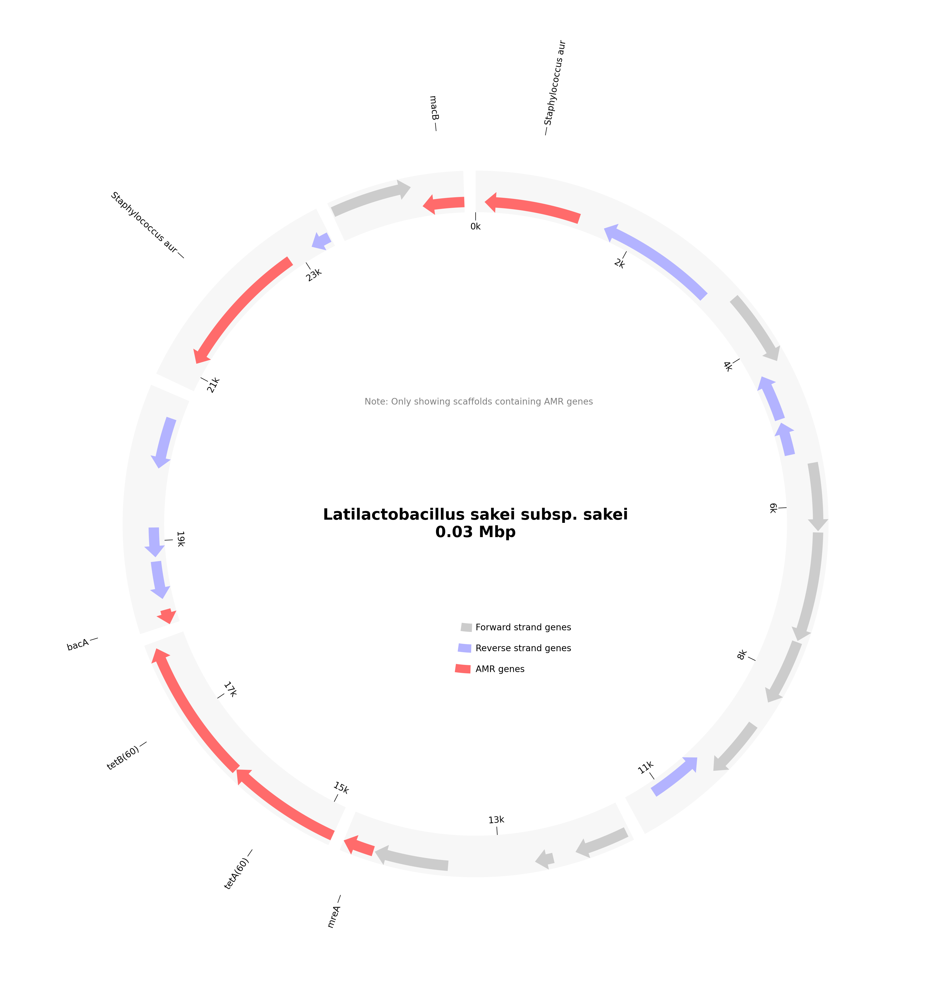

### Staphylococcus aureus mupA conferring resistance to mupirocin
- **Mechanism**: antibiotic target alteration
- **Drug Classes**: mupirocin-like antibiotic
- **AMR Family**: antibiotic-resistant isoleucyl-tRNA synthetase (ileS)
- **Locations**:
  - gnl|SPADES|NKBAGNNB_1715_2 : position 338-2170

### Staphylococcus aureus murA with mutation conferring resistance to fosfomycin
- **Mechanism**: antibiotic target alteration
- **Drug Classes**: phosphonic acid antibiotic
- **AMR Family**: antibiotic-resistant murA transferase
- **Locations**:
  - gnl|SPADES|NKBAGNNB_327_1 : position 117-1376

### bacA
- **Mechanism**: antibiotic target alteration
- **Drug Classes**: peptide antibiotic
- **AMR Family**: undecaprenyl pyrophosphate related proteins
- **Locations**:
  - gnl|SPADES|NKBAGNNB_1498_1 : position 3-200

### macB
- **Mechanism**: antibiotic efflux
- **Drug Classes**: macrolide antibiotic
- **AMR Family**: ATP-binding cassette (ABC) antibiotic efflux pump
- **Locations**:
  - gnl|SPADES|NKBAGNNB_3998_2 : position 1126-1674

### mreA
- **Mechanism**: antibiotic efflux
- **Drug Classes**: macrolide antibiotic
- **AMR Family**: major facilitator superfamily (MFS) antibiotic efflux pump
- **Locations**:
  - gnl|SPADES|NKBAGNNB_1167_6 : position 3228-3614

### tetA(60)
- **Mechanism**: antibiotic efflux
- **Drug Classes**: tetracycline antibiotic
- **AMR Family**: ATP-binding cassette (ABC) antibiotic efflux pump
- **Locations**:
  - gnl|SPADES|NKBAGNNB_1315_1 : position 2-1438

### tetB(60)
- **Mechanism**: antibiotic efflux
- **Drug Classes**: tetracycline antibiotic
- **AMR Family**: ATP-binding cassette (ABC) antibiotic efflux pump
- **Locations**:
  - gnl|SPADES|NKBAGNNB_1315_2 : position 1440-3230

## Latilactobacillus sakei subsp. sakei 23K
**Strain Statistics:**
- Total genome length: 62.5 kbp
- Total scaffolds: 44
- Scaffolds with AMR genes: 10
- Total genes annotated: 114
- Total AMR genes: 16
- Unique AMR genes: 14
- Distinct AMR mechanisms: 4
- Distinct AMR families: 10
- Distinct drug classes: 14

**Circos Plot:**

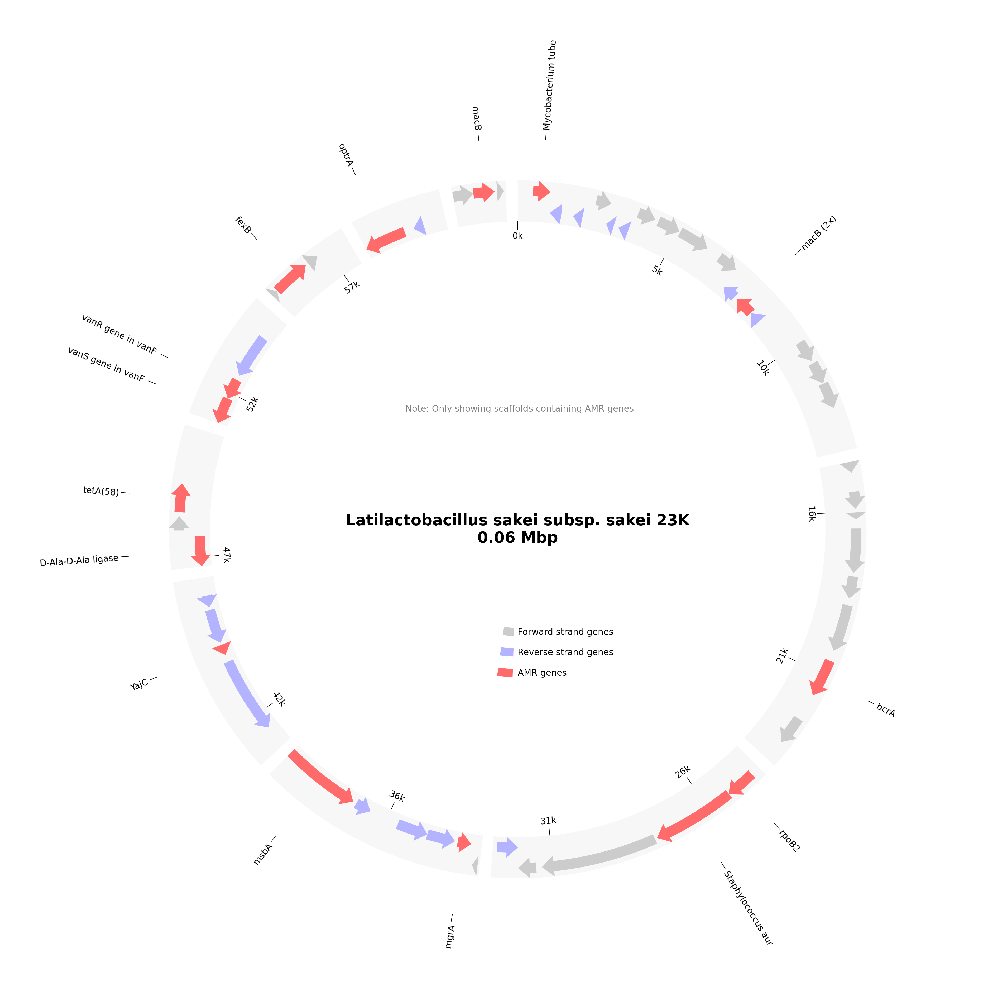

### D-Ala-D-Ala ligase
- **Mechanism**: antibiotic target alteration
- **Drug Classes**: glycopeptide antibiotic
- **AMR Family**: Van ligase
- **Locations**:
  - gnl|SPADES|NKBAGNNB_898_1 : position 2-1003

### Mycobacterium tuberculosis pncA mutations conferring resistance to pyrazinamide
- **Mechanism**: antibiotic target alteration
- **Drug Classes**: pyrazine antibiotic
- **AMR Family**: Pyrazinamide resistant pncA
- **Locations**:
  - gnl|SPADES|NKBAGNNB_258_2 : position 483-1022

### Staphylococcus aureus rpoB mutants conferring resistance to rifampicin
- **Mechanism**: antibiotic target alteration; antibiotic target replacement
- **Drug Classes**: rifamycin antibiotic
- **AMR Family**: rifamycin-resistant beta-subunit of RNA polymerase (rpoB)
- **Locations**:
  - gnl|SPADES|NKBAGNNB_400_2 : position 1246-3873

### YajC
- **Mechanism**: antibiotic efflux
- **Drug Classes**: fluoroquinolone antibiotic; cephalosporin; glycylcycline; penam; tetracycline antibiotic; oxazolidinone antibiotic; glycopeptide antibiotic; rifamycin antibiotic; phenicol antibiotic; disinfecting agents and antiseptics
- **AMR Family**: resistance-nodulation-cell division (RND) antibiotic efflux pump
- **Locations**:
  - gnl|SPADES|NKBAGNNB_595_3 : position 3553-3909

### bcrA
- **Mechanism**: antibiotic efflux
- **Drug Classes**: peptide antibiotic
- **AMR Family**: ATP-binding cassette (ABC) antibiotic efflux pump
- **Locations**:
  - gnl|SPADES|NKBAGNNB_364_8 : position 6305-7504

### fexB
- **Mechanism**: antibiotic efflux
- **Drug Classes**: phenicol antibiotic
- **AMR Family**: major facilitator superfamily (MFS) antibiotic efflux pump
- **Locations**:
  - gnl|SPADES|NKBAGNNB_1561_2 : position 224-1414

### macB (found in 3 locations)
- **Mechanism**: antibiotic efflux
- **Drug Classes**: macrolide antibiotic
- **AMR Family**: ATP-binding cassette (ABC) antibiotic efflux pump
- **Locations**:
  - gnl|SPADES|NKBAGNNB_258_14 : position 8004-8666
  - gnl|SPADES|NKBAGNNB_258_21 : position 13510-14064
  - gnl|SPADES|NKBAGNNB_4029_2 : position 652-1317

### mgrA
- **Mechanism**: antibiotic efflux
- **Drug Classes**: fluoroquinolone antibiotic; cephalosporin; penam; tetracycline antibiotic; peptide antibiotic; disinfecting agents and antiseptics
- **AMR Family**: ATP-binding cassette (ABC) antibiotic efflux pump; major facilitator superfamily (MFS) antibiotic efflux pump
- **Locations**:
  - gnl|SPADES|NKBAGNNB_510_2 : position 351-806

### msbA
- **Mechanism**: antibiotic efflux
- **Drug Classes**: nitroimidazole antibiotic
- **AMR Family**: ATP-binding cassette (ABC) antibiotic efflux pump
- **Locations**:
  - gnl|SPADES|NKBAGNNB_510_7 : position 4536-7160

### optrA
- **Mechanism**: antibiotic target protection
- **Drug Classes**: oxazolidinone antibiotic; phenicol antibiotic
- **AMR Family**: Miscellaneous ABC-F subfamily ATP-binding cassette ribosomal protection proteins
- **Locations**:
  - gnl|SPADES|NKBAGNNB_1676_1 : position 2-1396

### rpoB2
- **Mechanism**: antibiotic target alteration; antibiotic target replacement
- **Drug Classes**: rifamycin antibiotic
- **AMR Family**: rifamycin-resistant beta-subunit of RNA polymerase (rpoB)
- **Locations**:
  - gnl|SPADES|NKBAGNNB_400_1 : position 299-1261

### tetA(58)
- **Mechanism**: antibiotic efflux
- **Drug Classes**: tetracycline antibiotic
- **AMR Family**: major facilitator superfamily (MFS) antibiotic efflux pump
- **Locations**:
  - gnl|SPADES|NKBAGNNB_898_3 : position 1762-2658

### vanR gene in vanF cluster
- **Mechanism**: antibiotic target alteration
- **Drug Classes**: glycopeptide antibiotic
- **AMR Family**: glycopeptide resistance gene cluster; vanR
- **Locations**:
  - gnl|SPADES|NKBAGNNB_1000_2 : position 877-1563

### vanS gene in vanF cluster
- **Mechanism**: antibiotic target alteration
- **Drug Classes**: glycopeptide antibiotic
- **AMR Family**: vanS; glycopeptide resistance gene cluster
- **Locations**:
  - gnl|SPADES|NKBAGNNB_1000_1 : position 2-877

## Lelliottia amnigena
**Strain Statistics:**
- Total genome length: 1.2 kbp
- Total scaffolds: 11
- Scaffolds with AMR genes: 2
- Total genes annotated: 2
- Total AMR genes: 2
- Unique AMR genes: 2
- Distinct AMR mechanisms: 1
- Distinct AMR families: 2
- Distinct drug classes: 8

**Circos Plot:**

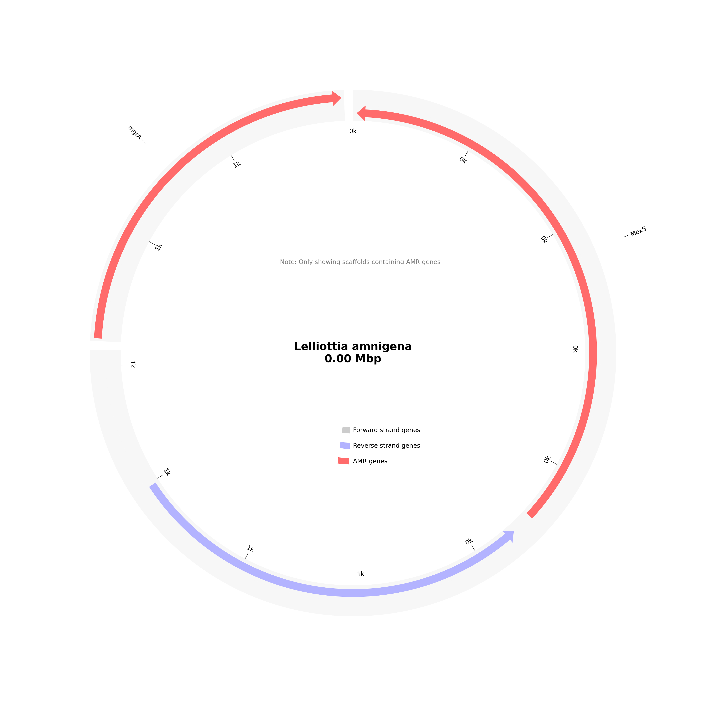

### MexS
- **Mechanism**: antibiotic efflux
- **Drug Classes**: fluoroquinolone antibiotic; diaminopyrimidine antibiotic; phenicol antibiotic
- **AMR Family**: resistance-nodulation-cell division (RND) antibiotic efflux pump
- **Locations**:
  - gnl|SPADES|NKBAGNNB_36143_1 : position 3-434

### mgrA
- **Mechanism**: antibiotic efflux
- **Drug Classes**: fluoroquinolone antibiotic; cephalosporin; penam; tetracycline antibiotic; peptide antibiotic; disinfecting agents and antiseptics
- **AMR Family**: ATP-binding cassette (ABC) antibiotic efflux pump; major facilitator superfamily (MFS) antibiotic efflux pump
- **Locations**:
  - gnl|SPADES|NKBAGNNB_1155301_1 : position 2-277

## Lelliottia sp. JS-SCA-14
**Strain Statistics:**
- Total genome length: 0.2 kbp
- Total scaffolds: 3
- Scaffolds with AMR genes: 1
- Total genes annotated: 0
- Total AMR genes: 1
- Unique AMR genes: 1
- Distinct AMR mechanisms: 1
- Distinct AMR families: 1
- Distinct drug classes: 4

**Circos Plot:**

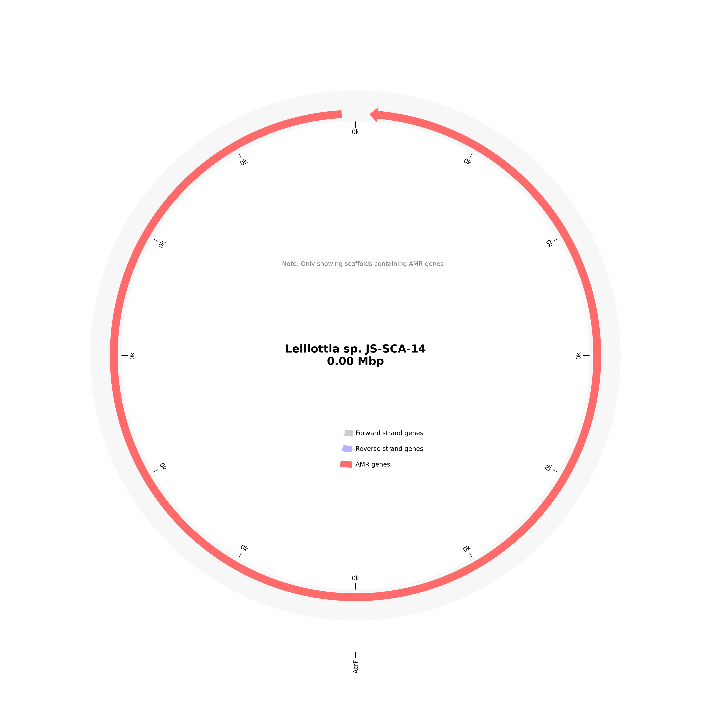

### AcrF
- **Mechanism**: antibiotic efflux
- **Drug Classes**: fluoroquinolone antibiotic; cephalosporin; cephamycin; penam
- **AMR Family**: resistance-nodulation-cell division (RND) antibiotic efflux pump
- **Locations**:
  - gnl|SPADES|NKBAGNNB_1908757_1 : position 2-217

## Serratia fonticola
**Strain Statistics:**
- Total genome length: 4.3 kbp
- Total scaffolds: 280
- Scaffolds with AMR genes: 14
- Total genes annotated: 0
- Total AMR genes: 14
- Unique AMR genes: 14
- Distinct AMR mechanisms: 3
- Distinct AMR families: 7
- Distinct drug classes: 13

**Circos Plot:**

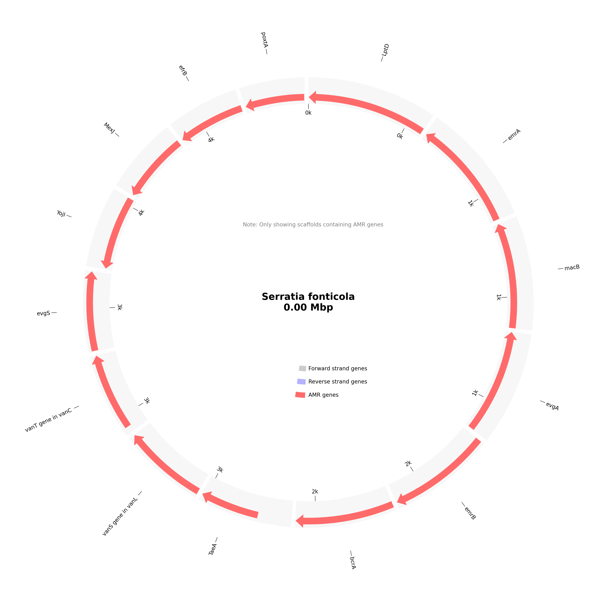

### LptD
- **Mechanism**: antibiotic efflux
- **Drug Classes**: carbapenem; peptide antibiotic; aminocoumarin antibiotic; rifamycin antibiotic
- **AMR Family**: ATP-binding cassette (ABC) antibiotic efflux pump
- **Locations**:
  - gnl|SPADES|NKBAGNNB_478691_1 : position 1-417

### MexJ
- **Mechanism**: antibiotic efflux
- **Drug Classes**: macrolide antibiotic; tetracycline antibiotic; disinfecting agents and antiseptics
- **AMR Family**: resistance-nodulation-cell division (RND) antibiotic efflux pump
- **Locations**:
  - gnl|SPADES|NKBAGNNB_1513195_1 : position 2-244

### TaeA
- **Mechanism**: antibiotic efflux
- **Drug Classes**: pleuromutilin antibiotic
- **AMR Family**: ATP-binding cassette (ABC) antibiotic efflux pump
- **Locations**:
  - gnl|SPADES|NKBAGNNB_955647_2 : position 111-305

### YojI
- **Mechanism**: antibiotic efflux
- **Drug Classes**: peptide antibiotic
- **AMR Family**: ATP-binding cassette (ABC) antibiotic efflux pump
- **Locations**:
  - gnl|SPADES|NKBAGNNB_1333515_1 : position 3-260

### bcrA
- **Mechanism**: antibiotic efflux
- **Drug Classes**: peptide antibiotic
- **AMR Family**: ATP-binding cassette (ABC) antibiotic efflux pump
- **Locations**:
  - gnl|SPADES|NKBAGNNB_850936_1 : position 1-324

### efrB
- **Mechanism**: antibiotic efflux
- **Drug Classes**: macrolide antibiotic; fluoroquinolone antibiotic; rifamycin antibiotic
- **AMR Family**: ATP-binding cassette (ABC) antibiotic efflux pump
- **Locations**:
  - gnl|SPADES|NKBAGNNB_1671003_1 : position 1-234

### emrA
- **Mechanism**: antibiotic efflux
- **Drug Classes**: fluoroquinolone antibiotic
- **AMR Family**: major facilitator superfamily (MFS) antibiotic efflux pump
- **Locations**:
  - gnl|SPADES|NKBAGNNB_555488_1 : position 3-392

### emrB
- **Mechanism**: antibiotic efflux
- **Drug Classes**: fluoroquinolone antibiotic
- **AMR Family**: major facilitator superfamily (MFS) antibiotic efflux pump
- **Locations**:
  - gnl|SPADES|NKBAGNNB_769939_1 : position 1-339

### evgA
- **Mechanism**: antibiotic efflux
- **Drug Classes**: macrolide antibiotic; fluoroquinolone antibiotic; penam; tetracycline antibiotic
- **AMR Family**: major facilitator superfamily (MFS) antibiotic efflux pump; resistance-nodulation-cell division (RND) antibiotic efflux pump
- **Locations**:
  - gnl|SPADES|NKBAGNNB_651028_1 : position 1-366

### evgS
- **Mechanism**: antibiotic efflux
- **Drug Classes**: macrolide antibiotic; fluoroquinolone antibiotic; penam; tetracycline antibiotic
- **AMR Family**: major facilitator superfamily (MFS) antibiotic efflux pump; resistance-nodulation-cell division (RND) antibiotic efflux pump
- **Locations**:
  - gnl|SPADES|NKBAGNNB_1307534_1 : position 3-263

### macB
- **Mechanism**: antibiotic efflux
- **Drug Classes**: macrolide antibiotic
- **AMR Family**: ATP-binding cassette (ABC) antibiotic efflux pump
- **Locations**:
  - gnl|SPADES|NKBAGNNB_644525_1 : position 1-369

### poxtA
- **Mechanism**: antibiotic target protection
- **Drug Classes**: tetracycline antibiotic; oxazolidinone antibiotic; phenicol antibiotic
- **AMR Family**: Miscellaneous ABC-F subfamily ATP-binding cassette ribosomal protection proteins
- **Locations**:
  - gnl|SPADES|NKBAGNNB_2041164_1 : position 2-208

### vanS gene in vanL cluster
- **Mechanism**: antibiotic target alteration
- **Drug Classes**: glycopeptide antibiotic
- **AMR Family**: vanS; glycopeptide resistance gene cluster
- **Locations**:
  - gnl|SPADES|NKBAGNNB_1135628_1 : position 1-279

### vanT gene in vanC cluster
- **Mechanism**: antibiotic target alteration
- **Drug Classes**: glycopeptide antibiotic
- **AMR Family**: glycopeptide resistance gene cluster; vanT
- **Locations**:
  - gnl|SPADES|NKBAGNNB_1185711_1 : position 21-275

## Serratia liquefaciens
**Strain Statistics:**
- Total genome length: 574.6 kbp
- Total scaffolds: 3873
- Scaffolds with AMR genes: 512
- Total genes annotated: 1166
- Total AMR genes: 554
- Unique AMR genes: 232
- Distinct AMR mechanisms: 12
- Distinct AMR families: 77
- Distinct drug classes: 36

**Circos Plot:**

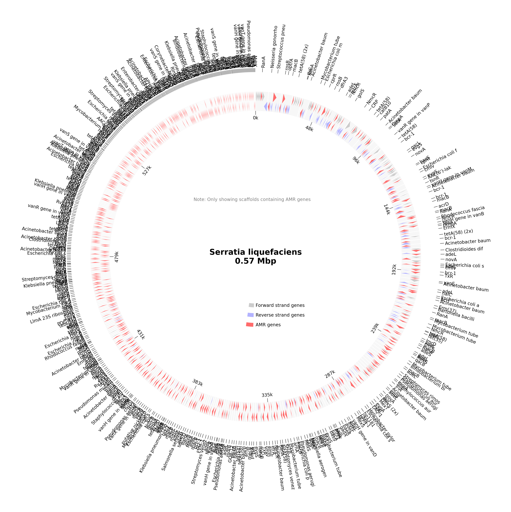

### AAC(3)-Ia
- **Mechanism**: antibiotic inactivation
- **Drug Classes**: aminoglycoside antibiotic
- **AMR Family**: AAC(3)
- **Locations**:
  - gnl|SPADES|NKBAGNNB_390623_1 : position 1-423

### AAC(6')-Iak
- **Mechanism**: antibiotic inactivation
- **Drug Classes**: aminoglycoside antibiotic
- **AMR Family**: AAC(6')
- **Locations**:
  - gnl|SPADES|NKBAGNNB_1348_5 : position 2475-2921

### APH(6)-Ic
- **Mechanism**: antibiotic inactivation
- **Drug Classes**: aminoglycoside antibiotic
- **AMR Family**: APH(6)
- **Locations**:
  - gnl|SPADES|NKBAGNNB_715777_1 : position 3-350

### AQU-1
- **Mechanism**: antibiotic inactivation
- **Drug Classes**: cephalosporin
- **AMR Family**: AQU beta-lactamase
- **Locations**:
  - gnl|SPADES|NKBAGNNB_240206_1 : position 1-366

### Acinetobacter baumannii AbaF (found in 5 locations)
- **Mechanism**: antibiotic efflux
- **Drug Classes**: phosphonic acid antibiotic
- **AMR Family**: major facilitator superfamily (MFS) antibiotic efflux pump
- **Locations**:
  - gnl|SPADES|NKBAGNNB_295485_1 : position 1-501
  - gnl|SPADES|NKBAGNNB_305971_1 : position 2-493
  - gnl|SPADES|NKBAGNNB_640_3 : position 1223-2515
  - gnl|SPADES|NKBAGNNB_8836_1 : position 3-1253
  - gnl|SPADES|NKBAGNNB_973_2 : position 1464-2786

### Acinetobacter baumannii AbaQ (found in 15 locations)
- **Mechanism**: antibiotic efflux
- **Drug Classes**: fluoroquinolone antibiotic
- **AMR Family**: major facilitator superfamily (MFS) antibiotic efflux pump
- **Locations**:
  - gnl|SPADES|NKBAGNNB_1062364_1 : position 2-289
  - gnl|SPADES|NKBAGNNB_109645_1 : position 2-673
  - gnl|SPADES|NKBAGNNB_119366_1 : position 193-657
  - gnl|SPADES|NKBAGNNB_129750_1 : position 66-641
  - gnl|SPADES|NKBAGNNB_1421_3 : position 1342-2616
  - gnl|SPADES|NKBAGNNB_1705_2 : position 158-1282
  - gnl|SPADES|NKBAGNNB_1959_1 : position 2-292
  - gnl|SPADES|NKBAGNNB_2165_1 : position 3-1208
  - gnl|SPADES|NKBAGNNB_267070_1 : position 3-437
  - gnl|SPADES|NKBAGNNB_29028_1 : position 1-846
  - gnl|SPADES|NKBAGNNB_3514_3 : position 1335-1781
  - gnl|SPADES|NKBAGNNB_45374_1 : position 2-727
  - gnl|SPADES|NKBAGNNB_6291_1 : position 2-1204
  - gnl|SPADES|NKBAGNNB_700550_1 : position 2-355
  - gnl|SPADES|NKBAGNNB_9157_2 : position 255-1241

### Acinetobacter baumannii AmvA (found in 2 locations)
- **Mechanism**: antibiotic efflux
- **Drug Classes**: macrolide antibiotic; disinfecting agents and antiseptics
- **AMR Family**: major facilitator superfamily (MFS) antibiotic efflux pump
- **Locations**:
  - gnl|SPADES|NKBAGNNB_1016275_1 : position 1-297
  - gnl|SPADES|NKBAGNNB_714556_1 : position 3-353

### AcrF (found in 2 locations)
- **Mechanism**: antibiotic efflux
- **Drug Classes**: fluoroquinolone antibiotic; cephalosporin; cephamycin; penam
- **AMR Family**: resistance-nodulation-cell division (RND) antibiotic efflux pump
- **Locations**:
  - gnl|SPADES|NKBAGNNB_2162_2 : position 1151-2383
  - gnl|SPADES|NKBAGNNB_364707_1 : position 1-465

### ArnT
- **Mechanism**: antibiotic target alteration
- **Drug Classes**: peptide antibiotic
- **AMR Family**: pmr phosphoethanolamine transferase
- **Locations**:
  - gnl|SPADES|NKBAGNNB_2003825_1 : position 2-211

### Bartonella bacilliformis gyrB conferring resistance to aminocoumarin
- **Mechanism**: antibiotic target alteration
- **Drug Classes**: aminocoumarin antibiotic
- **AMR Family**: aminocoumarin resistant gyrB
- **Locations**:
  - gnl|SPADES|NKBAGNNB_2220_1 : position 2-850

### Bifidobacterium adolescentis rpoB mutants conferring resistance to rifampicin
- **Mechanism**: antibiotic target alteration; antibiotic target replacement
- **Drug Classes**: rifamycin antibiotic
- **AMR Family**: rifamycin-resistant beta-subunit of RNA polymerase (rpoB)
- **Locations**:
  - gnl|SPADES|NKBAGNNB_990689_1 : position 1-300

### Bifidobacterium bifidum ileS conferring resistance to mupirocin
- **Mechanism**: antibiotic target alteration
- **Drug Classes**: mupirocin-like antibiotic
- **AMR Family**: antibiotic-resistant isoleucyl-tRNA synthetase (ileS)
- **Locations**:
  - gnl|SPADES|NKBAGNNB_2918_1 : position 68-1975

### CAR-1
- **Mechanism**: antibiotic inactivation
- **Drug Classes**: carbapenem
- **AMR Family**: CAR beta-lactamase
- **Locations**:
  - gnl|SPADES|NKBAGNNB_636770_1 : position 3-371

### CRP (found in 2 locations)
- **Mechanism**: antibiotic efflux
- **Drug Classes**: macrolide antibiotic; fluoroquinolone antibiotic; penam
- **AMR Family**: resistance-nodulation-cell division (RND) antibiotic efflux pump
- **Locations**:
  - gnl|SPADES|NKBAGNNB_390863_1 : position 3-452
  - gnl|SPADES|NKBAGNNB_852_3: position 1314-1946

### Clostridioides difficile gyrB conferring resistance to fluoroquinolones (found in 2 locations)
- **Mechanism**: antibiotic target alteration
- **Drug Classes**: fluoroquinolone antibiotic
- **AMR Family**: fluoroquinolone resistant gyrB
- **Locations**:
  - gnl|SPADES|NKBAGNNB_119381_1 : position 1-657
  - gnl|SPADES|NKBAGNNB_1736_2 : position 1221-2753

### Corynebacterium striatum tetA
- **Mechanism**: antibiotic efflux
- **Drug Classes**: penam; tetracycline antibiotic
- **AMR Family**: major facilitator superfamily (MFS) antibiotic efflux pump
- **Locations**:
  - gnl|SPADES|NKBAGNNB_857094_1 : position 1-324

### CrcB
- **Mechanism**: antibiotic efflux
- **Drug Classes**: aminoglycoside antibiotic
- **AMR Family**: multidrug and toxic compound extrusion (MATE) transporter
- **Locations**:
  - gnl|SPADES|NKBAGNNB_9983_1 : position 156-539

### EVM-1
- **Mechanism**: antibiotic inactivation
- **Drug Classes**: carbapenem
- **AMR Family**: EVM beta-lactamase
- **Locations**:
  - gnl|SPADES|NKBAGNNB_11527_2 : position 841-1167

### Enterobacter cloacae acrA
- **Mechanism**: antibiotic efflux
- **Drug Classes**: fluoroquinolone antibiotic; cephalosporin; glycylcycline; penam; tetracycline antibiotic; rifamycin antibiotic; phenicol antibiotic; disinfecting agents and antiseptics
- **AMR Family**: resistance-nodulation-cell division (RND) antibiotic efflux pump
- **Locations**:
  - gnl|SPADES|NKBAGNNB_660587_1 : position 1-363

### Enterococcus faecium cls conferring resistance to daptomycin
- **Mechanism**: antibiotic target alteration
- **Drug Classes**: peptide antibiotic
- **AMR Family**: daptomycin resistant cls
- **Locations**:
  - gnl|SPADES|NKBAGNNB_808346_1 : position 1-333

### Erm(34)
- **Mechanism**: antibiotic target alteration
- **Drug Classes**: macrolide antibiotic; lincosamide antibiotic; streptogramin antibiotic; streptogramin A antibiotic; streptogramin B antibiotic
- **AMR Family**: Erm 23S ribosomal RNA methyltransferase
- **Locations**:
  - gnl|SPADES|NKBAGNNB_41467_1 : position 340-855

### Erm(37)
- **Mechanism**: antibiotic target alteration
- **Drug Classes**: macrolide antibiotic; lincosamide antibiotic; streptogramin antibiotic; streptogramin A antibiotic; streptogramin B antibiotic
- **AMR Family**: Erm 23S ribosomal RNA methyltransferase
- **Locations**:
  - gnl|SPADES|NKBAGNNB_2206_3 : position 1178-1957

### ErmX
- **Mechanism**: antibiotic target alteration
- **Drug Classes**: macrolide antibiotic; lincosamide antibiotic; streptogramin antibiotic; streptogramin A antibiotic; streptogramin B antibiotic
- **AMR Family**: Erm 23S ribosomal RNA methyltransferase
- **Locations**:
  - gnl|SPADES|NKBAGNNB_1640_1 : position 3-458

### Escherichia coli AcrAB-TolC with AcrR mutation conferring resistance to ciprofloxacin, tetracycline, and ceftazidime (found in 5 locations)
- **Mechanism**: antibiotic target alteration; antibiotic efflux
- **Drug Classes**: fluoroquinolone antibiotic; cephalosporin; glycylcycline; penam; tetracycline antibiotic; rifamycin antibiotic; phenicol antibiotic; disinfecting agents and antiseptics
- **AMR Family**: resistance-nodulation-cell division (RND) antibiotic efflux pump
- **Locations**:
  - gnl|SPADES|NKBAGNNB_1237773_1 : position 1-225
  - gnl|SPADES|NKBAGNNB_260571_1 : position 255-521
  - gnl|SPADES|NKBAGNNB_54611_1 : position 1-147
  - gnl|SPADES|NKBAGNNB_58409_1 : position 72-761
  - gnl|SPADES|NKBAGNNB_9983_2 : position 838-1212

### Escherichia coli AcrAB-TolC with MarR mutations conferring resistance to ciprofloxacin and tetracycline
- **Mechanism**: antibiotic target alteration; antibiotic efflux
- **Drug Classes**: fluoroquinolone antibiotic; cephalosporin; glycylcycline; penam; tetracycline antibiotic; rifamycin antibiotic; phenicol antibiotic; disinfecting agents and antiseptics
- **AMR Family**: resistance-nodulation-cell division (RND) antibiotic efflux pump
- **Locations**:
  - gnl|SPADES|NKBAGNNB_77188_1 : position 3-368

### Escherichia coli acrA
- **Mechanism**: antibiotic efflux
- **Drug Classes**: fluoroquinolone antibiotic; cephalosporin; glycylcycline; penam; tetracycline antibiotic; rifamycin antibiotic; phenicol antibiotic; disinfecting agents and antiseptics
- **AMR Family**: resistance-nodulation-cell division (RND) antibiotic efflux pump
- **Locations**:
  - gnl|SPADES|NKBAGNNB_2162_1 : position 3-1133

### Escherichia coli fabI mutations conferring resistance to isoniazid and triclosan
- **Mechanism**: antibiotic target alteration
- **Drug Classes**: disinfecting agents and antiseptics; isoniazid-like antibiotic
- **AMR Family**: antibiotic resistant fabI
- **Locations**:
  - gnl|SPADES|NKBAGNNB_1283_5 : position 2732-3376

### Escherichia coli mdfA (found in 2 locations)
- **Mechanism**: antibiotic efflux
- **Drug Classes**: tetracycline antibiotic; phenicol antibiotic; disinfecting agents and antiseptics
- **AMR Family**: major facilitator superfamily (MFS) antibiotic efflux pump
- **Locations**:
  - gnl|SPADES|NKBAGNNB_1911687_1 : position 2-217
  - gnl|SPADES|NKBAGNNB_655_6 : position 5059-5640

### Escherichia coli parE conferring resistance to fluoroquinolones
- **Mechanism**: antibiotic target alteration
- **Drug Classes**: fluoroquinolone antibiotic
- **AMR Family**: fluoroquinolone resistant parE
- **Locations**:
  - gnl|SPADES|NKBAGNNB_5456_2 : position 476-1471

### Escherichia coli soxS with mutation conferring antibiotic resistance (found in 6 locations)
- **Mechanism**: antibiotic target alteration; antibiotic efflux; reduced permeability to antibiotic
- **Drug Classes**: fluoroquinolone antibiotic; monobactam; carbapenem; cephalosporin; glycylcycline; cephamycin; penam; tetracycline antibiotic; rifamycin antibiotic; phenicol antibiotic; penem; disinfecting agents and antiseptics
- **AMR Family**: ATP-binding cassette (ABC) antibiotic efflux pump; major facilitator superfamily (MFS) antibiotic efflux pump; resistance-nodulation-cell division (RND) antibiotic efflux pump; General Bacterial Porin with reduced permeability to beta-lactams
- **Locations**:
  - gnl|SPADES|NKBAGNNB_107940_1 : position 3-662
  - gnl|SPADES|NKBAGNNB_1849_2 : position 1993-2643
  - gnl|SPADES|NKBAGNNB_20337_2 : position 781-1014
  - gnl|SPADES|NKBAGNNB_3894_1 : position 158-382
  - gnl|SPADES|NKBAGNNB_536235_1 : position 2-355
  - gnl|SPADES|NKBAGNNB_816149_1 : position 3-332

### Escherichia coli uhpA with mutation conferring resistance to fosfomycin
- **Mechanism**: antibiotic target alteration
- **Drug Classes**: phosphonic acid antibiotic
- **AMR Family**: antibiotic-resistant UhpT
- **Locations**:
  - gnl|SPADES|NKBAGNNB_409417_1 : position 1-396

### GMB-1
- **Mechanism**: antibiotic inactivation
- **Drug Classes**: carbapenem
- **AMR Family**: GMB beta-lactamase
- **Locations**:
  - gnl|SPADES|NKBAGNNB_4202_3 : position 1059-1637

### GOB-12
- **Mechanism**: antibiotic inactivation
- **Drug Classes**: carbapenem; cephalosporin; penam
- **AMR Family**: GOB beta-lactamase
- **Locations**:
  - gnl|SPADES|NKBAGNNB_9425_1 : position 21-668

### H-NS
- **Mechanism**: antibiotic efflux
- **Drug Classes**: macrolide antibiotic; fluoroquinolone antibiotic; cephalosporin; cephamycin; penam; tetracycline antibiotic
- **AMR Family**: major facilitator superfamily (MFS) antibiotic efflux pump; resistance-nodulation-cell division (RND) antibiotic efflux pump
- **Locations**:
  - gnl|SPADES|NKBAGNNB_2011128_1 : position 1-210

### Helicobacter pylori pbp1 mutants conferring resistance to amoxicillin
- **Mechanism**: antibiotic target alteration
- **Drug Classes**: cephalosporin; cephamycin; penam
- **AMR Family**: Penicillin-binding protein mutations conferring resistance to beta-lactam antibiotics
- **Locations**:
  - gnl|SPADES|NKBAGNNB_3891_1 : position 2-1693

### Klebsiella aerogenes Omp36
- **Mechanism**: reduced permeability to antibiotic
- **Drug Classes**: monobactam; carbapenem; cephalosporin; cephamycin; penam; penem
- **AMR Family**: General Bacterial Porin with reduced permeability to beta-lactams
- **Locations**:
  - gnl|SPADES|NKBAGNNB_5177_2 : position 356-1486

### Klebsiella pneumoniae KpnF
- **Mechanism**: antibiotic efflux
- **Drug Classes**: macrolide antibiotic; aminoglycoside antibiotic; cephalosporin; tetracycline antibiotic; peptide antibiotic; rifamycin antibiotic; disinfecting agents and antiseptics
- **AMR Family**: small multidrug resistance (SMR) antibiotic efflux pump
- **Locations**:
  - gnl|SPADES|NKBAGNNB_930200_1 : position 1-198

### Klebsiella pneumoniae OmpK37 (found in 5 locations)
- **Mechanism**: reduced permeability to antibiotic
- **Drug Classes**: monobactam; carbapenem; cephalosporin; cephamycin; penam; penem
- **AMR Family**: General Bacterial Porin with reduced permeability to beta-lactams
- **Locations**:
  - gnl|SPADES|NKBAGNNB_17689_2 : position 316-564
  - gnl|SPADES|NKBAGNNB_17689_3 : position 597-1049
  - gnl|SPADES|NKBAGNNB_210413_1 : position 2-559
  - gnl|SPADES|NKBAGNNB_293346_1 : position 62-502
  - gnl|SPADES|NKBAGNNB_627392_1 : position 2-373

### Klebsiella pneumoniae acrA
- **Mechanism**: antibiotic efflux
- **Drug Classes**: fluoroquinolone antibiotic; cephalosporin; glycylcycline; penam; tetracycline antibiotic; rifamycin antibiotic; phenicol antibiotic; disinfecting agents and antiseptics
- **AMR Family**: resistance-nodulation-cell division (RND) antibiotic efflux pump
- **Locations**:
  - gnl|SPADES|NKBAGNNB_90397_1 : position 1-516

### LAQ-1
- **Mechanism**: antibiotic inactivation
- **Drug Classes**: cephalosporin; cephamycin; penam
- **AMR Family**: LAQ beta lactamase
- **Locations**:
  - gnl|SPADES|NKBAGNNB_3887_1 : position 3-335

### LRA-2
- **Mechanism**: antibiotic inactivation
- **Drug Classes**: cephalosporin; penam
- **AMR Family**: subclass B3 LRA beta-lactamase
- **Locations**:
  - gnl|SPADES|NKBAGNNB_143446_1 : position 1-273

### LlmA 23S ribosomal RNA methyltransferase
- **Mechanism**: antibiotic target alteration
- **Drug Classes**: lincosamide antibiotic
- **AMR Family**: Llm 23S ribosomal RNA methyltransferase
- **Locations**:
  - gnl|SPADES|NKBAGNNB_70051_1 : position 65-754

### MdtK (found in 3 locations)
- **Mechanism**: antibiotic efflux
- **Drug Classes**: fluoroquinolone antibiotic
- **AMR Family**: multidrug and toxic compound extrusion (MATE) transporter
- **Locations**:
  - gnl|SPADES|NKBAGNNB_2088583_1 : position 1-207
  - gnl|SPADES|NKBAGNNB_300932_1 : position 1-498
  - gnl|SPADES|NKBAGNNB_96069_2 : position 304-696

### MexA
- **Mechanism**: antibiotic efflux
- **Drug Classes**: macrolide antibiotic; fluoroquinolone antibiotic; monobactam; carbapenem; cephalosporin; cephamycin; penam; tetracycline antibiotic; peptide antibiotic; aminocoumarin antibiotic; diaminopyrimidine antibiotic; sulfonamide antibiotic; phenicol antibiotic; penem
- **AMR Family**: resistance-nodulation-cell division (RND) antibiotic efflux pump
- **Locations**:
  - gnl|SPADES|NKBAGNNB_12264_1 : position 10-1119

### MexB (found in 6 locations)
- **Mechanism**: antibiotic efflux
- **Drug Classes**: macrolide antibiotic; fluoroquinolone antibiotic; monobactam; carbapenem; cephalosporin; cephamycin; penam; tetracycline antibiotic; peptide antibiotic; aminocoumarin antibiotic; diaminopyrimidine antibiotic; sulfonamide antibiotic; phenicol antibiotic; penem
- **AMR Family**: resistance-nodulation-cell division (RND) antibiotic efflux pump
- **Locations**:
  - gnl|SPADES|NKBAGNNB_211702_1 : position 2-556
  - gnl|SPADES|NKBAGNNB_303701_1 : position 25-495
  - gnl|SPADES|NKBAGNNB_33532_1 : position 1-843
  - gnl|SPADES|NKBAGNNB_35912_1 : position 2-886
  - gnl|SPADES|NKBAGNNB_90397_2 : position 509-706
  - gnl|SPADES|NKBAGNNB_9374_1 : position 13-1236

### MexE
- **Mechanism**: antibiotic efflux
- **Drug Classes**: fluoroquinolone antibiotic; diaminopyrimidine antibiotic; phenicol antibiotic
- **AMR Family**: resistance-nodulation-cell division (RND) antibiotic efflux pump
- **Locations**:
  - gnl|SPADES|NKBAGNNB_498641_1 : position 2-412

### MexG
- **Mechanism**: antibiotic efflux
- **Drug Classes**: fluoroquinolone antibiotic; tetracycline antibiotic; disinfecting agents and antiseptics
- **AMR Family**: resistance-nodulation-cell division (RND) antibiotic efflux pump
- **Locations**:
  - gnl|SPADES|NKBAGNNB_59589_2 : position 355-768

### MexL (found in 2 locations)
- **Mechanism**: antibiotic efflux
- **Drug Classes**: macrolide antibiotic; tetracycline antibiotic; disinfecting agents and antiseptics
- **AMR Family**: resistance-nodulation-cell division (RND) antibiotic efflux pump
- **Locations**:
  - gnl|SPADES|NKBAGNNB_1023767_1 : position 1-294
  - gnl|SPADES|NKBAGNNB_18446_1 : position 2-490

### MexS (found in 9 locations)
- **Mechanism**: antibiotic efflux
- **Drug Classes**: fluoroquinolone antibiotic; diaminopyrimidine antibiotic; phenicol antibiotic
- **AMR Family**: resistance-nodulation-cell division (RND) antibiotic efflux pump
- **Locations**:
  - gnl|SPADES|NKBAGNNB_26519_1 : position 3-953
  - gnl|SPADES|NKBAGNNB_2788_2 : position 580-1608
  - gnl|SPADES|NKBAGNNB_3662_2 : position 105-416
  - gnl|SPADES|NKBAGNNB_3662_3 : position 496-1122
  - gnl|SPADES|NKBAGNNB_4343_1 : position 3-842
  - gnl|SPADES|NKBAGNNB_5195_1 : position 1-309
  - gnl|SPADES|NKBAGNNB_5339_1 : position 1-795
  - gnl|SPADES|NKBAGNNB_58708_1 : position 1-624
  - gnl|SPADES|NKBAGNNB_849590_1 : position 97-324

### MexT (found in 3 locations)
- **Mechanism**: antibiotic efflux
- **Drug Classes**: fluoroquinolone antibiotic; diaminopyrimidine antibiotic; phenicol antibiotic
- **AMR Family**: resistance-nodulation-cell division (RND) antibiotic efflux pump
- **Locations**:
  - gnl|SPADES|NKBAGNNB_153582_1 : position 114-611
  - gnl|SPADES|NKBAGNNB_3816_1 : position 98-1048
  - gnl|SPADES|NKBAGNNB_4990_2 : position 427-1329

### MexW
- **Mechanism**: antibiotic efflux
- **Drug Classes**: macrolide antibiotic; fluoroquinolone antibiotic; tetracycline antibiotic; phenicol antibiotic; disinfecting agents and antiseptics
- **AMR Family**: resistance-nodulation-cell division (RND) antibiotic efflux pump
- **Locations**:
  - gnl|SPADES|NKBAGNNB_84058_1 : position 1-720

### Mycobacterium tuberculosis gidB mutation conferring resistance to streptomycin
- **Mechanism**: antibiotic target alteration
- **Drug Classes**: aminoglycoside antibiotic
- **AMR Family**: antibiotic resistant gidB
- **Locations**:
  - gnl|SPADES|NKBAGNNB_2397_1 : position 3-584

### Mycobacterium tuberculosis kasA mutant conferring resistance to isoniazid
- **Mechanism**: antibiotic target alteration
- **Drug Classes**: isoniazid-like antibiotic
- **AMR Family**: antibiotic resistant kasA
- **Locations**:
  - gnl|SPADES|NKBAGNNB_4952_2 : position 202-1431

### Mycobacterium tuberculosis katG mutations conferring resistance to isoniazid (found in 2 locations)
- **Mechanism**: antibiotic target alteration
- **Drug Classes**: isoniazid-like antibiotic
- **AMR Family**: isoniazid resistant katG
- **Locations**:
  - gnl|SPADES|NKBAGNNB_2850_2 : position 1165-2001
  - gnl|SPADES|NKBAGNNB_5590_1 : position 3-1328

### Mycobacterium tuberculosis ndh with mutation conferring resistance to isoniazid
- **Mechanism**: antibiotic target alteration
- **Drug Classes**: isoniazid-like antibiotic
- **AMR Family**: antibiotic resistant ndh
- **Locations**:
  - gnl|SPADES|NKBAGNNB_373375_1 : position 1-459

### Mycobacterium tuberculosis pncA mutations conferring resistance to pyrazinamide (found in 3 locations)
- **Mechanism**: antibiotic target alteration
- **Drug Classes**: pyrazine antibiotic
- **AMR Family**: Pyrazinamide resistant pncA
- **Locations**:
  - gnl|SPADES|NKBAGNNB_39394_1 : position 2-574
  - gnl|SPADES|NKBAGNNB_655_3 : position 2375-2926
  - gnl|SPADES|NKBAGNNB_73489_1 : position 26-712

### Mycobacterium tuberculosis thyA with mutation conferring resistance to para-aminosalicylic acid
- **Mechanism**: antibiotic target alteration
- **Drug Classes**: salicylic acid antibiotic
- **AMR Family**: aminosalicylate resistant thymidylate synthase
- **Locations**:
  - gnl|SPADES|NKBAGNNB_2418_2 : position 747-1541

### Mycolicibacterium smegmatis ndh with mutation conferring resistance to isoniazid
- **Mechanism**: antibiotic target alteration
- **Drug Classes**: isoniazid-like antibiotic
- **AMR Family**: antibiotic resistant ndh
- **Locations**:
  - gnl|SPADES|NKBAGNNB_21002_1 : position 2-1006

### Neisseria gonorrhoeae pilQ gene conferring resistance to beta-lactam
- **Mechanism**: antibiotic target alteration
- **Drug Classes**: cephalosporin; cephamycin; penam
- **AMR Family**: Penicillin-binding protein mutations conferring resistance to beta-lactam antibiotics
- **Locations**:
  - gnl|SPADES|NKBAGNNB_381_2 : position 284-1525

### NmcR (found in 13 locations)
- **Mechanism**: antibiotic inactivation
- **Drug Classes**: carbapenem; cephalosporin; cephamycin; penam
- **AMR Family**: NmcA beta-lactamase
- **Locations**:
  - gnl|SPADES|NKBAGNNB_102243_1 : position 2-685
  - gnl|SPADES|NKBAGNNB_11217_1 : position 1-870
  - gnl|SPADES|NKBAGNNB_1538517_1 : position 1-243
  - gnl|SPADES|NKBAGNNB_1615_1 : position 1-666
  - gnl|SPADES|NKBAGNNB_1858574_1 : position 1-222
  - gnl|SPADES|NKBAGNNB_19325_1 : position 1-909
  - gnl|SPADES|NKBAGNNB_19579_2 : position 355-972
  - gnl|SPADES|NKBAGNNB_2425_2 : position 514-1392
  - gnl|SPADES|NKBAGNNB_516267_1 : position 1-216
  - gnl|SPADES|NKBAGNNB_7125_1 : position 1-432
  - gnl|SPADES|NKBAGNNB_773_2 : position 1063-1917
  - gnl|SPADES|NKBAGNNB_824_3 : position 2397-3293
  - gnl|SPADES|NKBAGNNB_87479_1 : position 1-459

### OmpA (found in 2 locations)
- **Mechanism**: reduced permeability to antibiotic
- **Drug Classes**: peptide antibiotic
- **AMR Family**: General Bacterial Porin with reduced permeability to peptide antibiotics
- **Locations**:
  - gnl|SPADES|NKBAGNNB_1043_1 : position 62-724
  - gnl|SPADES|NKBAGNNB_1631_2 : position 1338-1835

### OprM
- **Mechanism**: antibiotic efflux
- **Drug Classes**: macrolide antibiotic; fluoroquinolone antibiotic; monobactam; aminoglycoside antibiotic; carbapenem; cephalosporin; cephamycin; penam; tetracycline antibiotic; peptide antibiotic; aminocoumarin antibiotic; diaminopyrimidine antibiotic; sulfonamide antibiotic; phenicol antibiotic; penem; disinfecting agents and antiseptics
- **AMR Family**: resistance-nodulation-cell division (RND) antibiotic efflux pump
- **Locations**:
  - gnl|SPADES|NKBAGNNB_1312655_1 : position 1-261

### OprN
- **Mechanism**: antibiotic efflux
- **Drug Classes**: fluoroquinolone antibiotic; diaminopyrimidine antibiotic; phenicol antibiotic
- **AMR Family**: resistance-nodulation-cell division (RND) antibiotic efflux pump
- **Locations**:
  - gnl|SPADES|NKBAGNNB_716426_1 : position 3-350

### OprZ
- **Mechanism**: antibiotic efflux
- **Drug Classes**: macrolide antibiotic; fluoroquinolone antibiotic; aminoglycoside antibiotic; cephalosporin
- **AMR Family**: resistance-nodulation-cell division (RND) antibiotic efflux pump
- **Locations**:
  - gnl|SPADES|NKBAGNNB_89642_2 : position 255-707

### PAC-1
- **Mechanism**: antibiotic inactivation
- **Drug Classes**: cephalosporin
- **AMR Family**: PAC beta-lactamase
- **Locations**:
  - gnl|SPADES|NKBAGNNB_26747_1 : position 163-951

### PDC-413
- **Mechanism**: antibiotic inactivation
- **Drug Classes**: monobactam; carbapenem; cephalosporin
- **AMR Family**: PDC beta-lactamase
- **Locations**:
  - gnl|SPADES|NKBAGNNB_68713_2 : position 192-758

### ParR (found in 3 locations)
- **Mechanism**: antibiotic efflux; reduced permeability to antibiotic
- **Drug Classes**: macrolide antibiotic; fluoroquinolone antibiotic; monobactam; aminoglycoside antibiotic; carbapenem; cephalosporin; cephamycin; penam; tetracycline antibiotic; phenicol antibiotic; penem; disinfecting agents and antiseptics
- **AMR Family**: resistance-nodulation-cell division (RND) antibiotic efflux pump; Outer Membrane Porin (Opr)
- **Locations**:
  - gnl|SPADES|NKBAGNNB_102247_1 : position 1-144
  - gnl|SPADES|NKBAGNNB_110416_1 : position 1-429
  - gnl|SPADES|NKBAGNNB_821663_1 : position 2-331

### ParS (found in 4 locations)
- **Mechanism**: antibiotic efflux; reduced permeability to antibiotic
- **Drug Classes**: macrolide antibiotic; fluoroquinolone antibiotic; monobactam; aminoglycoside antibiotic; carbapenem; cephalosporin; cephamycin; penam; tetracycline antibiotic; phenicol antibiotic; penem; disinfecting agents and antiseptics
- **AMR Family**: resistance-nodulation-cell division (RND) antibiotic efflux pump; Outer Membrane Porin (Opr)
- **Locations**:
  - gnl|SPADES|NKBAGNNB_102247_2 : position 141-683
  - gnl|SPADES|NKBAGNNB_33489_1 : position 1-900
  - gnl|SPADES|NKBAGNNB_340018_2 : position 211-477
  - gnl|SPADES|NKBAGNNB_74259_2 : position 149-742

### PmrF
- **Mechanism**: antibiotic target alteration
- **Drug Classes**: peptide antibiotic
- **AMR Family**: pmr phosphoethanolamine transferase
- **Locations**:
  - gnl|SPADES|NKBAGNNB_4655_2 : position 578-1570

### Pseudomonas aeruginosa CpxR (found in 4 locations)
- **Mechanism**: antibiotic efflux
- **Drug Classes**: macrolide antibiotic; fluoroquinolone antibiotic; monobactam; aminoglycoside antibiotic; carbapenem; cephalosporin; cephamycin; penam; tetracycline antibiotic; peptide antibiotic; aminocoumarin antibiotic; diaminopyrimidine antibiotic; sulfonamide antibiotic; phenicol antibiotic; penem
- **AMR Family**: resistance-nodulation-cell division (RND) antibiotic efflux pump
- **Locations**:
  - gnl|SPADES|NKBAGNNB_1321699_1 : position 6-263
  - gnl|SPADES|NKBAGNNB_2006916_1 : position 2-211
  - gnl|SPADES|NKBAGNNB_3243_1 : position 1-570
  - gnl|SPADES|NKBAGNNB_9845_2 : position 907-1218

### Pseudomonas aeruginosa ampR with mutation conferring resistance to aztreonam (found in 2 locations)
- **Mechanism**: antibiotic target alteration; antibiotic inactivation
- **Drug Classes**: monobactam; carbapenem; cephalosporin
- **AMR Family**: PDC beta-lactamase; ampR transcriptional regulator with mutation conferring resistance to monobactam antibiotics
- **Locations**:
  - gnl|SPADES|NKBAGNNB_23192_1 : position 2-838
  - gnl|SPADES|NKBAGNNB_5457_3 : position 538-1473

### Pseudomonas mutant PhoQ conferring resistance to colistin
- **Mechanism**: antibiotic target alteration; antibiotic efflux; resistance by absence
- **Drug Classes**: macrolide antibiotic; peptide antibiotic
- **AMR Family**: ATP-binding cassette (ABC) antibiotic efflux pump; pmr phosphoethanolamine transferase; transmembrane protein conferring colistin resistance
- **Locations**:
  - gnl|SPADES|NKBAGNNB_32631_1 : position 25-906

### QepA4
- **Mechanism**: antibiotic efflux
- **Drug Classes**: fluoroquinolone antibiotic
- **AMR Family**: major facilitator superfamily (MFS) antibiotic efflux pump
- **Locations**:
  - gnl|SPADES|NKBAGNNB_92584_1 : position 70-702

### QnrB25
- **Mechanism**: antibiotic target protection
- **Drug Classes**: fluoroquinolone antibiotic
- **AMR Family**: quinolone resistance protein (qnr)
- **Locations**:
  - gnl|SPADES|NKBAGNNB_110174_1 : position 1-291

### RanA (found in 22 locations)
- **Mechanism**: antibiotic efflux
- **Drug Classes**: aminoglycoside antibiotic
- **AMR Family**: ATP-binding cassette (ABC) antibiotic efflux pump
- **Locations**:
  - gnl|SPADES|NKBAGNNB_11110_2 : position 483-1178
  - gnl|SPADES|NKBAGNNB_1183482_1 : position 2-274
  - gnl|SPADES|NKBAGNNB_119118_1 : position 1-657
  - gnl|SPADES|NKBAGNNB_12752_2 : position 508-1137
  - gnl|SPADES|NKBAGNNB_1411900_1 : position 3-254
  - gnl|SPADES|NKBAGNNB_1595_5 : position 1993-2919
  - gnl|SPADES|NKBAGNNB_162673_1 : position 2-601
  - gnl|SPADES|NKBAGNNB_219443_1 : position 1-552
  - gnl|SPADES|NKBAGNNB_222149_1 : position 3-548
  - gnl|SPADES|NKBAGNNB_2271_2 : position 280-1284
  - gnl|SPADES|NKBAGNNB_2578_4 : position 1084-1887
  - gnl|SPADES|NKBAGNNB_28994_1 : position 3-932
  - gnl|SPADES|NKBAGNNB_29064_1 : position 1-792
  - gnl|SPADES|NKBAGNNB_31881_1 : position 1-384
  - gnl|SPADES|NKBAGNNB_322744_1 : position 1-486
  - gnl|SPADES|NKBAGNNB_324497_1 : position 84-485
  - gnl|SPADES|NKBAGNNB_36673_1 : position 2-748
  - gnl|SPADES|NKBAGNNB_376_6 : position 4167-5165
  - gnl|SPADES|NKBAGNNB_495_10 : position 7017-7391
  - gnl|SPADES|NKBAGNNB_6104_1 : position 1-618
  - gnl|SPADES|NKBAGNNB_7715_1 : position 3-443
  - gnl|SPADES|NKBAGNNB_941360_1 : position 3-308

### Rhodococcus fascians cmr (found in 2 locations)
- **Mechanism**: antibiotic efflux
- **Drug Classes**: phenicol antibiotic
- **AMR Family**: major facilitator superfamily (MFS) antibiotic efflux pump
- **Locations**:
  - gnl|SPADES|NKBAGNNB_1608_4 : position 2008-2898
  - gnl|SPADES|NKBAGNNB_53174_2 : position 511-807

### RlmA(II)
- **Mechanism**: antibiotic target alteration
- **Drug Classes**: macrolide antibiotic; lincosamide antibiotic
- **AMR Family**: non-erm 23S ribosomal RNA methyltransferase (G748)
- **Locations**:
  - gnl|SPADES|NKBAGNNB_892650_1 : position 2-316

### Rv1877 (found in 3 locations)
- **Mechanism**: antibiotic efflux
- **Drug Classes**: fluoroquinolone antibiotic
- **AMR Family**: major facilitator superfamily (MFS) antibiotic efflux pump
- **Locations**:
  - gnl|SPADES|NKBAGNNB_108821_1 : position 3-578
  - gnl|SPADES|NKBAGNNB_162266_1 : position 3-602
  - gnl|SPADES|NKBAGNNB_33291_1 : position 1-903

### SPR-1 (found in 3 locations)
- **Mechanism**: antibiotic inactivation
- **Drug Classes**: carbapenem
- **AMR Family**: SPR beta-lactamase
- **Locations**:
  - gnl|SPADES|NKBAGNNB_1140846_1 : position 2-280
  - gnl|SPADES|NKBAGNNB_134600_2 : position 480-635
  - gnl|SPADES|NKBAGNNB_4990_1 : position 3-347

### SRT-1
- **Mechanism**: antibiotic inactivation
- **Drug Classes**: cephalosporin
- **AMR Family**: SRT beta-lactamase
- **Locations**:
  - gnl|SPADES|NKBAGNNB_1538405_1 : position 1-243

### SRT-3
- **Mechanism**: antibiotic inactivation
- **Drug Classes**: cephalosporin
- **AMR Family**: SRT beta-lactamase
- **Locations**:
  - gnl|SPADES|NKBAGNNB_77610_2 : position 287-733

### SST-1
- **Mechanism**: antibiotic inactivation
- **Drug Classes**: cephalosporin
- **AMR Family**: SST beta-lactamase
- **Locations**:
  - gnl|SPADES|NKBAGNNB_1836206_1 : position 3-224

### Salmonella serovars soxS with mutation conferring antibiotic resistance
- **Mechanism**: antibiotic target alteration; antibiotic efflux; reduced permeability to antibiotic
- **Drug Classes**: fluoroquinolone antibiotic; monobactam; carbapenem; cephalosporin; glycylcycline; cephamycin; penam; tetracycline antibiotic; rifamycin antibiotic; phenicol antibiotic; penem; disinfecting agents and antiseptics
- **AMR Family**: ATP-binding cassette (ABC) antibiotic efflux pump; major facilitator superfamily (MFS) antibiotic efflux pump; resistance-nodulation-cell division (RND) antibiotic efflux pump; General Bacterial Porin with reduced permeability to beta-lactams
- **Locations**:
  - gnl|SPADES|NKBAGNNB_13758_2 : position 594-980

### SatA (found in 2 locations)
- **Mechanism**: antibiotic inactivation
- **Drug Classes**: nucleoside antibiotic
- **AMR Family**: streptothricin acetyltransferase (SAT)
- **Locations**:
  - gnl|SPADES|NKBAGNNB_1043_2 : position 992-1387
  - gnl|SPADES|NKBAGNNB_123624_1 : position 1-462

### Staphylococcus aureus FosB
- **Mechanism**: antibiotic inactivation
- **Drug Classes**: phosphonic acid antibiotic
- **AMR Family**: fosfomycin thiol transferase
- **Locations**:
  - gnl|SPADES|NKBAGNNB_1346738_1 : position 1-219

### Staphylococcus aureus mupA conferring resistance to mupirocin
- **Mechanism**: antibiotic target alteration
- **Drug Classes**: mupirocin-like antibiotic
- **AMR Family**: antibiotic-resistant isoleucyl-tRNA synthetase (ileS)
- **Locations**:
  - gnl|SPADES|NKBAGNNB_3349_2 : position 1133-1831

### Staphylococcus aureus mupB conferring resistance to mupirocin
- **Mechanism**: antibiotic target alteration
- **Drug Classes**: mupirocin-like antibiotic
- **AMR Family**: antibiotic-resistant isoleucyl-tRNA synthetase (ileS)
- **Locations**:
  - gnl|SPADES|NKBAGNNB_26909_1 : position 1-948

### Staphylococcus aureus murA with mutation conferring resistance to fosfomycin
- **Mechanism**: antibiotic target alteration
- **Drug Classes**: phosphonic acid antibiotic
- **AMR Family**: antibiotic-resistant murA transferase
- **Locations**:
  - gnl|SPADES|NKBAGNNB_3235_1 : position 179-1438

### Streptococcus pneumoniae PBP2x conferring resistance to amoxicillin
- **Mechanism**: antibiotic target alteration
- **Drug Classes**: cephalosporin; cephamycin; penam
- **AMR Family**: Penicillin-binding protein mutations conferring resistance to beta-lactam antibiotics
- **Locations**:
  - gnl|SPADES|NKBAGNNB_381_7 : position 3887-6445

### Streptomyces rimosus otr(A) (found in 3 locations)
- **Mechanism**: antibiotic target protection
- **Drug Classes**: tetracycline antibiotic
- **AMR Family**: tetracycline-resistant ribosomal protection protein
- **Locations**:
  - gnl|SPADES|NKBAGNNB_3107_2 : position 726-1916
  - gnl|SPADES|NKBAGNNB_555857_1 : position 2-391
  - gnl|SPADES|NKBAGNNB_93130_1 : position 3-701

### Streptomyces venezuelae rox (found in 3 locations)
- **Mechanism**: antibiotic inactivation
- **Drug Classes**: rifamycin antibiotic
- **AMR Family**: rifampin monooxygenase
- **Locations**:
  - gnl|SPADES|NKBAGNNB_11393_1 : position 3-1121
  - gnl|SPADES|NKBAGNNB_460925_1 : position 1-423
  - gnl|SPADES|NKBAGNNB_6090_1 : position 20-874

### TaeA
- **Mechanism**: antibiotic efflux
- **Drug Classes**: pleuromutilin antibiotic
- **AMR Family**: ATP-binding cassette (ABC) antibiotic efflux pump
- **Locations**:
  - gnl|SPADES|NKBAGNNB_1631_1 : position 1-1197

### TolC (found in 2 locations)
- **Mechanism**: antibiotic efflux
- **Drug Classes**: macrolide antibiotic; fluoroquinolone antibiotic; aminoglycoside antibiotic; carbapenem; cephalosporin; glycylcycline; cephamycin; penam; tetracycline antibiotic; peptide antibiotic; aminocoumarin antibiotic; rifamycin antibiotic; phenicol antibiotic; penem; disinfecting agents and antiseptics
- **AMR Family**: ATP-binding cassette (ABC) antibiotic efflux pump; major facilitator superfamily (MFS) antibiotic efflux pump; resistance-nodulation-cell division (RND) antibiotic efflux pump
- **Locations**:
  - gnl|SPADES|NKBAGNNB_19901_1 : position 3-443
  - gnl|SPADES|NKBAGNNB_3638_2 : position 739-1749

### TriA
- **Mechanism**: antibiotic efflux
- **Drug Classes**: disinfecting agents and antiseptics
- **AMR Family**: resistance-nodulation-cell division (RND) antibiotic efflux pump
- **Locations**:
  - gnl|SPADES|NKBAGNNB_3356_2 : position 733-1704

### TxR (found in 11 locations)
- **Mechanism**: antibiotic efflux
- **Drug Classes**: tetracycline antibiotic
- **AMR Family**: ATP-binding cassette (ABC) antibiotic efflux pump
- **Locations**:
  - gnl|SPADES|NKBAGNNB_1032561_1 : position 3-293
  - gnl|SPADES|NKBAGNNB_1367099_1 : position 2-259
  - gnl|SPADES|NKBAGNNB_1682975_1 : position 1-234
  - gnl|SPADES|NKBAGNNB_1917_1 : position 3-1406
  - gnl|SPADES|NKBAGNNB_509891_1 : position 2-406
  - gnl|SPADES|NKBAGNNB_5260_1 : position 3-1199
  - gnl|SPADES|NKBAGNNB_54358_1 : position 3-803
  - gnl|SPADES|NKBAGNNB_757882_1 : position 3-341
  - gnl|SPADES|NKBAGNNB_7590_1 : position 1-1284
  - gnl|SPADES|NKBAGNNB_7794_2 : position 525-1304
  - gnl|SPADES|NKBAGNNB_837270_1 : position 3-326

### YojI (found in 3 locations)
- **Mechanism**: antibiotic efflux
- **Drug Classes**: peptide antibiotic
- **AMR Family**: ATP-binding cassette (ABC) antibiotic efflux pump
- **Locations**:
  - gnl|SPADES|NKBAGNNB_1380800_1 : position 1-255
  - gnl|SPADES|NKBAGNNB_51892_1 : position 1-768
  - gnl|SPADES|NKBAGNNB_802030_1 : position 1-333

### aadT
- **Mechanism**: antibiotic efflux
- **Drug Classes**: macrolide antibiotic; tetracycline antibiotic; disinfecting agents and antiseptics
- **AMR Family**: major facilitator superfamily (MFS) antibiotic efflux pump
- **Locations**:
  - gnl|SPADES|NKBAGNNB_665569_1 : position 3-362

### abeM (found in 2 locations)
- **Mechanism**: antibiotic efflux
- **Drug Classes**: fluoroquinolone antibiotic; disinfecting agents and antiseptics
- **AMR Family**: multidrug and toxic compound extrusion (MATE) transporter
- **Locations**:
  - gnl|SPADES|NKBAGNNB_13601_1 : position 86-1120
  - gnl|SPADES|NKBAGNNB_1593481_1 : position 3-239

### acrB (found in 3 locations)
- **Mechanism**: antibiotic efflux
- **Drug Classes**: fluoroquinolone antibiotic; cephalosporin; glycylcycline; penam; tetracycline antibiotic; rifamycin antibiotic; phenicol antibiotic; disinfecting agents and antiseptics
- **AMR Family**: resistance-nodulation-cell division (RND) antibiotic efflux pump
- **Locations**:
  - gnl|SPADES|NKBAGNNB_1987809_1 : position 1-213
  - gnl|SPADES|NKBAGNNB_5690_1 : position 3-1388
  - gnl|SPADES|NKBAGNNB_929016_1 : position 2-310

### acrD (found in 3 locations)
- **Mechanism**: antibiotic efflux
- **Drug Classes**: aminoglycoside antibiotic
- **AMR Family**: resistance-nodulation-cell division (RND) antibiotic efflux pump
- **Locations**:
  - gnl|SPADES|NKBAGNNB_1581_2 : position 994-2931
  - gnl|SPADES|NKBAGNNB_47031_1 : position 1-240
  - gnl|SPADES|NKBAGNNB_849439_1 : position 2-325

### adeH
- **Mechanism**: antibiotic efflux
- **Drug Classes**: fluoroquinolone antibiotic; tetracycline antibiotic
- **AMR Family**: resistance-nodulation-cell division (RND) antibiotic efflux pump
- **Locations**:
  - gnl|SPADES|NKBAGNNB_62794_1 : position 2-427

### adeL (found in 40 locations)
- **Mechanism**: antibiotic efflux
- **Drug Classes**: fluoroquinolone antibiotic; tetracycline antibiotic
- **AMR Family**: resistance-nodulation-cell division (RND) antibiotic efflux pump
- **Locations**:
  - gnl|SPADES|NKBAGNNB_1057301_1 : position 1-291
  - gnl|SPADES|NKBAGNNB_106227_1 : position 3-380
  - gnl|SPADES|NKBAGNNB_107369_1 : position 1-675
  - gnl|SPADES|NKBAGNNB_11241_1 : position 3-866
  - gnl|SPADES|NKBAGNNB_1134826_1 : position 3-281
  - gnl|SPADES|NKBAGNNB_12212_1 : position 152-1063
  - gnl|SPADES|NKBAGNNB_135000_1 : position 141-635
  - gnl|SPADES|NKBAGNNB_142552_1 : position 3-626
  - gnl|SPADES|NKBAGNNB_144029_2 : position 373-624
  - gnl|SPADES|NKBAGNNB_15414_2 : position 686-1084
  - gnl|SPADES|NKBAGNNB_15984_2 : position 489-1073
  - gnl|SPADES|NKBAGNNB_180984_1 : position 1-585
  - gnl|SPADES|NKBAGNNB_18108_1 : position 45-1043
  - gnl|SPADES|NKBAGNNB_1814_3 : position 1166-2251
  - gnl|SPADES|NKBAGNNB_18180_2 : position 318-1040
  - gnl|SPADES|NKBAGNNB_1860_1 : position 1-636
  - gnl|SPADES|NKBAGNNB_2022_3 : position 1525-2436
  - gnl|SPADES|NKBAGNNB_218694_1 : position 3-551
  - gnl|SPADES|NKBAGNNB_2559_1 : position 3-254
  - gnl|SPADES|NKBAGNNB_2727_2 : position 1005-1913
  - gnl|SPADES|NKBAGNNB_2788_1 : position 3-413
  - gnl|SPADES|NKBAGNNB_3020_1 : position 3-860
  - gnl|SPADES|NKBAGNNB_316656_1 : position 1-489
  - gnl|SPADES|NKBAGNNB_328694_2 : position 275-481
  - gnl|SPADES|NKBAGNNB_344700_1 : position 1-474
  - gnl|SPADES|NKBAGNNB_347463_1 : position 1-471
  - gnl|SPADES|NKBAGNNB_3602_1 : position 63-974
  - gnl|SPADES|NKBAGNNB_3858_1 : position 289-1197
  - gnl|SPADES|NKBAGNNB_41301_1 : position 155-856
  - gnl|SPADES|NKBAGNNB_4368_3 : position 840-1610
  - gnl|SPADES|NKBAGNNB_4403_1 : position 1-660
  - gnl|SPADES|NKBAGNNB_4464_1 : position 1-765
  - gnl|SPADES|NKBAGNNB_454901_1 : position 3-296
  - gnl|SPADES|NKBAGNNB_5195_2 : position 394-1293
  - gnl|SPADES|NKBAGNNB_630159_1 : position 3-371
  - gnl|SPADES|NKBAGNNB_69730_1 : position 1-669
  - gnl|SPADES|NKBAGNNB_71954_1 : position 2-295
  - gnl|SPADES|NKBAGNNB_728_5 : position 3563-4471
  - gnl|SPADES|NKBAGNNB_884230_1 : position 1-318
  - gnl|SPADES|NKBAGNNB_9652_1 : position 632-1225

### adeN
- **Mechanism**: antibiotic efflux
- **Drug Classes**: macrolide antibiotic; fluoroquinolone antibiotic; lincosamide antibiotic; carbapenem; cephalosporin; tetracycline antibiotic; rifamycin antibiotic; diaminopyrimidine antibiotic; phenicol antibiotic; penem
- **AMR Family**: resistance-nodulation-cell division (RND) antibiotic efflux pump
- **Locations**:
  - gnl|SPADES|NKBAGNNB_494237_1 : position 1-411

### adeR
- **Mechanism**: antibiotic efflux
- **Drug Classes**: glycylcycline; tetracycline antibiotic
- **AMR Family**: resistance-nodulation-cell division (RND) antibiotic efflux pump
- **Locations**:
  - gnl|SPADES|NKBAGNNB_94722_1 : position 1-444

### adeS
- **Mechanism**: antibiotic efflux
- **Drug Classes**: glycylcycline; tetracycline antibiotic
- **AMR Family**: resistance-nodulation-cell division (RND) antibiotic efflux pump
- **Locations**:
  - gnl|SPADES|NKBAGNNB_2595_1 : position 2-1300

### almE (found in 3 locations)
- **Mechanism**: antibiotic target alteration
- **Drug Classes**: peptide antibiotic
- **AMR Family**: polymyxin resistance operon; alm glycyltransferase
- **Locations**:
  - gnl|SPADES|NKBAGNNB_22160_1 : position 3-995
  - gnl|SPADES|NKBAGNNB_646277_1 : position 2-367
  - gnl|SPADES|NKBAGNNB_7491_1 : position 3-1319

### amrB (found in 2 locations)
- **Mechanism**: antibiotic efflux
- **Drug Classes**: macrolide antibiotic; aminoglycoside antibiotic
- **AMR Family**: resistance-nodulation-cell division (RND) antibiotic efflux pump
- **Locations**:
  - gnl|SPADES|NKBAGNNB_1183709_1 : position 1-276
  - gnl|SPADES|NKBAGNNB_1421315_1 : position 1-252

### arlR (found in 3 locations)
- **Mechanism**: antibiotic efflux
- **Drug Classes**: fluoroquinolone antibiotic; disinfecting agents and antiseptics
- **AMR Family**: major facilitator superfamily (MFS) antibiotic efflux pump
- **Locations**:
  - gnl|SPADES|NKBAGNNB_1220451_1 : position 1-270
  - gnl|SPADES|NKBAGNNB_60300_2 : position 426-782
  - gnl|SPADES|NKBAGNNB_63535_2 : position 337-771

### arnA (found in 4 locations)
- **Mechanism**: antibiotic target alteration
- **Drug Classes**: peptide antibiotic
- **AMR Family**: pmr phosphoethanolamine transferase
- **Locations**:
  - gnl|SPADES|NKBAGNNB_1196063_1 : position 1-273
  - gnl|SPADES|NKBAGNNB_4655_1 : position 3-581
  - gnl|SPADES|NKBAGNNB_5549_1 : position 2-409
  - gnl|SPADES|NKBAGNNB_8469_2 : position 395-1033

### bacA
- **Mechanism**: antibiotic target alteration
- **Drug Classes**: peptide antibiotic
- **AMR Family**: undecaprenyl pyrophosphate related proteins
- **Locations**:
  - gnl|SPADES|NKBAGNNB_4688_2 : position 506-1330

### baeR (found in 4 locations)
- **Mechanism**: antibiotic efflux
- **Drug Classes**: aminoglycoside antibiotic; aminocoumarin antibiotic
- **AMR Family**: resistance-nodulation-cell division (RND) antibiotic efflux pump
- **Locations**:
  - gnl|SPADES|NKBAGNNB_1040611_1 : position 1-219
  - gnl|SPADES|NKBAGNNB_1795629_1 : position 1-225
  - gnl|SPADES|NKBAGNNB_4640_2 : position 312-1001
  - gnl|SPADES|NKBAGNNB_781506_1 : position 96-338

### baeS (found in 3 locations)
- **Mechanism**: antibiotic efflux
- **Drug Classes**: aminoglycoside antibiotic; aminocoumarin antibiotic
- **AMR Family**: resistance-nodulation-cell division (RND) antibiotic efflux pump
- **Locations**:
  - gnl|SPADES|NKBAGNNB_158168_1 : position 3-608
  - gnl|SPADES|NKBAGNNB_615069_1 : position 2-376
  - gnl|SPADES|NKBAGNNB_665657_1 : position 1-363

### basS (found in 5 locations)
- **Mechanism**: antibiotic target alteration; antibiotic efflux
- **Drug Classes**: peptide antibiotic
- **AMR Family**: pmr phosphoethanolamine transferase
- **Locations**:
  - gnl|SPADES|NKBAGNNB_1236_3 : position 1828-2892
  - gnl|SPADES|NKBAGNNB_147523_1 : position 1-618
  - gnl|SPADES|NKBAGNNB_226165_1 : position 2-547
  - gnl|SPADES|NKBAGNNB_382053_1 : position 1-456
  - gnl|SPADES|NKBAGNNB_4736_1 : position 3-356

### bcr-1 (found in 10 locations)
- **Mechanism**: antibiotic efflux
- **Drug Classes**: bicyclomycin-like antibiotic
- **AMR Family**: major facilitator superfamily (MFS) antibiotic efflux pump
- **Locations**:
  - gnl|SPADES|NKBAGNNB_1115_1 : position 1-858
  - gnl|SPADES|NKBAGNNB_11705_3 : position 780-1163
  - gnl|SPADES|NKBAGNNB_12053_2 : position 133-1152
  - gnl|SPADES|NKBAGNNB_1451_2 : position 637-1983
  - gnl|SPADES|NKBAGNNB_1484_5 : position 2371-3051
  - gnl|SPADES|NKBAGNNB_16261_1 : position 200-1069
  - gnl|SPADES|NKBAGNNB_1648_1 : position 1-1038
  - gnl|SPADES|NKBAGNNB_1905_2 : position 969-2309
  - gnl|SPADES|NKBAGNNB_335566_1 : position 1-396
  - gnl|SPADES|NKBAGNNB_4258_1 : position 3-1073

### bcrA (found in 7 locations)
- **Mechanism**: antibiotic efflux
- **Drug Classes**: peptide antibiotic
- **AMR Family**: ATP-binding cassette (ABC) antibiotic efflux pump
- **Locations**:
  - gnl|SPADES|NKBAGNNB_10131_2 : position 271-870
  - gnl|SPADES|NKBAGNNB_135273_1 : position 3-476
  - gnl|SPADES|NKBAGNNB_1451962_1 : position 3-251
  - gnl|SPADES|NKBAGNNB_151780_2 : position 293-613
  - gnl|SPADES|NKBAGNNB_357046_1 : position 3-467
  - gnl|SPADES|NKBAGNNB_50265_2 : position 594-818
  - gnl|SPADES|NKBAGNNB_537623_1 : position 2-397

### carA
- **Mechanism**: antibiotic target protection
- **Drug Classes**: macrolide antibiotic
- **AMR Family**: Miscellaneous ABC-F subfamily ATP-binding cassette ribosomal protection proteins
- **Locations**:
  - gnl|SPADES|NKBAGNNB_344016_1 : position 2-166

### catB10
- **Mechanism**: antibiotic inactivation
- **Drug Classes**: phenicol antibiotic
- **AMR Family**: chloramphenicol acetyltransferase (CAT)
- **Locations**:
  - gnl|SPADES|NKBAGNNB_890_5 : position 3111-3713

### cfr(D)
- **Mechanism**: antibiotic target alteration
- **Drug Classes**: lincosamide antibiotic; streptogramin antibiotic; oxazolidinone antibiotic; glycopeptide antibiotic; phenicol antibiotic
- **AMR Family**: Cfr 23S ribosomal RNA methyltransferase
- **Locations**:
  - gnl|SPADES|NKBAGNNB_23673_1 : position 1-204

### chrB
- **Mechanism**: antibiotic target alteration
- **Drug Classes**: macrolide antibiotic; lincosamide antibiotic
- **AMR Family**: non-erm 23S ribosomal RNA methyltransferase (G748)
- **Locations**:
  - gnl|SPADES|NKBAGNNB_691273_1 : position 7-357

### clbB
- **Mechanism**: antibiotic target alteration
- **Drug Classes**: lincosamide antibiotic; streptogramin antibiotic; streptogramin A antibiotic; oxazolidinone antibiotic; phenicol antibiotic; pleuromutilin antibiotic
- **AMR Family**: Cfr 23S ribosomal RNA methyltransferase
- **Locations**:
  - gnl|SPADES|NKBAGNNB_757214_1 : position 3-341

### cmlv (found in 6 locations)
- **Mechanism**: antibiotic inactivation
- **Drug Classes**: phenicol antibiotic
- **AMR Family**: chloramphenicol phosphotransferase
- **Locations**:
  - gnl|SPADES|NKBAGNNB_1349_2 : position 306-1460
  - gnl|SPADES|NKBAGNNB_1860_2 : position 743-1918
  - gnl|SPADES|NKBAGNNB_2559_2 : position 465-1649
  - gnl|SPADES|NKBAGNNB_441337_1 : position 2-433
  - gnl|SPADES|NKBAGNNB_68996_1 : position 3-437
  - gnl|SPADES|NKBAGNNB_7550_2 : position 267-1316

### cprR (found in 2 locations)
- **Mechanism**: antibiotic target alteration; antibiotic efflux
- **Drug Classes**: peptide antibiotic
- **AMR Family**: pmr phosphoethanolamine transferase
- **Locations**:
  - gnl|SPADES|NKBAGNNB_1236_4 : position 2889-3476
  - gnl|SPADES|NKBAGNNB_657_3 : position 2680-3405

### cpxA (found in 3 locations)
- **Mechanism**: antibiotic efflux
- **Drug Classes**: aminoglycoside antibiotic; aminocoumarin antibiotic
- **AMR Family**: resistance-nodulation-cell division (RND) antibiotic efflux pump
- **Locations**:
  - gnl|SPADES|NKBAGNNB_1576967_1 : position 3-242
  - gnl|SPADES|NKBAGNNB_2005444_1 : position 3-212
  - gnl|SPADES|NKBAGNNB_21105_2 : position 111-1004

### dfrA3
- **Mechanism**: antibiotic target replacement
- **Drug Classes**: diaminopyrimidine antibiotic
- **AMR Family**: trimethoprim resistant dihydrofolate reductase dfr
- **Locations**:
  - gnl|SPADES|NKBAGNNB_685_5 : position 3985-4467

### efrA (found in 3 locations)
- **Mechanism**: antibiotic efflux
- **Drug Classes**: macrolide antibiotic; fluoroquinolone antibiotic; rifamycin antibiotic
- **AMR Family**: ATP-binding cassette (ABC) antibiotic efflux pump
- **Locations**:
  - gnl|SPADES|NKBAGNNB_1557399_1 : position 3-242
  - gnl|SPADES|NKBAGNNB_268591_1 : position 3-515
  - gnl|SPADES|NKBAGNNB_7326_1 : position 2-472

### efrB
- **Mechanism**: antibiotic efflux
- **Drug Classes**: macrolide antibiotic; fluoroquinolone antibiotic; rifamycin antibiotic
- **AMR Family**: ATP-binding cassette (ABC) antibiotic efflux pump
- **Locations**:
  - gnl|SPADES|NKBAGNNB_71161_1 : position 2-751

### emeA
- **Mechanism**: antibiotic efflux
- **Drug Classes**: disinfecting agents and antiseptics
- **AMR Family**: multidrug and toxic compound extrusion (MATE) transporter
- **Locations**:
  - gnl|SPADES|NKBAGNNB_19032_1 : position 3-554

### emrA
- **Mechanism**: antibiotic efflux
- **Drug Classes**: fluoroquinolone antibiotic
- **AMR Family**: major facilitator superfamily (MFS) antibiotic efflux pump
- **Locations**:
  - gnl|SPADES|NKBAGNNB_569801_1 : position 1-387

### emrB
- **Mechanism**: antibiotic efflux
- **Drug Classes**: fluoroquinolone antibiotic
- **AMR Family**: major facilitator superfamily (MFS) antibiotic efflux pump
- **Locations**:
  - gnl|SPADES|NKBAGNNB_18180_1 : position 1-204

### emrR (found in 2 locations)
- **Mechanism**: antibiotic efflux
- **Drug Classes**: fluoroquinolone antibiotic
- **AMR Family**: major facilitator superfamily (MFS) antibiotic efflux pump
- **Locations**:
  - gnl|SPADES|NKBAGNNB_62794_2 : position 452-775
  - gnl|SPADES|NKBAGNNB_813040_1 : position 177-332

### emrY (found in 2 locations)
- **Mechanism**: antibiotic efflux
- **Drug Classes**: tetracycline antibiotic
- **AMR Family**: major facilitator superfamily (MFS) antibiotic efflux pump
- **Locations**:
  - gnl|SPADES|NKBAGNNB_229620_1 : position 2-544
  - gnl|SPADES|NKBAGNNB_577190_1 : position 2-385

### eptB (found in 3 locations)
- **Mechanism**: antibiotic target alteration
- **Drug Classes**: peptide antibiotic
- **AMR Family**: pmr phosphoethanolamine transferase
- **Locations**:
  - gnl|SPADES|NKBAGNNB_1441332_1 : position 1-252
  - gnl|SPADES|NKBAGNNB_1883849_1 : position 2-220
  - gnl|SPADES|NKBAGNNB_3557_2 : position 1361-1771

### evgA (found in 4 locations)
- **Mechanism**: antibiotic efflux
- **Drug Classes**: macrolide antibiotic; fluoroquinolone antibiotic; penam; tetracycline antibiotic
- **AMR Family**: major facilitator superfamily (MFS) antibiotic efflux pump; resistance-nodulation-cell division (RND) antibiotic efflux pump
- **Locations**:
  - gnl|SPADES|NKBAGNNB_311042_1 : position 2-490
  - gnl|SPADES|NKBAGNNB_3817_2 : position 706-1338
  - gnl|SPADES|NKBAGNNB_90850_1 : position 183-704
  - gnl|SPADES|NKBAGNNB_9980_2 : position 828-1214

### evgS (found in 7 locations)
- **Mechanism**: antibiotic efflux
- **Drug Classes**: macrolide antibiotic; fluoroquinolone antibiotic; penam; tetracycline antibiotic
- **AMR Family**: major facilitator superfamily (MFS) antibiotic efflux pump; resistance-nodulation-cell division (RND) antibiotic efflux pump
- **Locations**:
  - gnl|SPADES|NKBAGNNB_1162_1 : position 3-1367
  - gnl|SPADES|NKBAGNNB_1348_3 : position 717-2009
  - gnl|SPADES|NKBAGNNB_28849_1 : position 2-934
  - gnl|SPADES|NKBAGNNB_33385_1 : position 3-902
  - gnl|SPADES|NKBAGNNB_43152_1 : position 2-847
  - gnl|SPADES|NKBAGNNB_4804_2 : position 496-1548
  - gnl|SPADES|NKBAGNNB_7796_1 : position 3-1271

### facT (found in 2 locations)
- **Mechanism**: antibiotic efflux
- **Drug Classes**: elfamycin antibiotic
- **AMR Family**: major facilitator superfamily (MFS) antibiotic efflux pump
- **Locations**:
  - gnl|SPADES|NKBAGNNB_146667_2 : position 181-621
  - gnl|SPADES|NKBAGNNB_254115_1 : position 2-526

### farA (found in 2 locations)
- **Mechanism**: antibiotic efflux
- **Drug Classes**: antibacterial free fatty acids
- **AMR Family**: major facilitator superfamily (MFS) antibiotic efflux pump
- **Locations**:
  - gnl|SPADES|NKBAGNNB_195103_2 : position 361-570
  - gnl|SPADES|NKBAGNNB_940634_1 : position 3-308

### floR
- **Mechanism**: antibiotic efflux
- **Drug Classes**: phenicol antibiotic
- **AMR Family**: major facilitator superfamily (MFS) antibiotic efflux pump
- **Locations**:
  - gnl|SPADES|NKBAGNNB_207324_1 : position 3-560

### gadW
- **Mechanism**: antibiotic efflux
- **Drug Classes**: macrolide antibiotic; fluoroquinolone antibiotic; penam
- **AMR Family**: resistance-nodulation-cell division (RND) antibiotic efflux pump
- **Locations**:
  - gnl|SPADES|NKBAGNNB_24793_1 : position 2-349

### gadX
- **Mechanism**: antibiotic efflux
- **Drug Classes**: macrolide antibiotic; fluoroquinolone antibiotic; penam
- **AMR Family**: resistance-nodulation-cell division (RND) antibiotic efflux pump
- **Locations**:
  - gnl|SPADES|NKBAGNNB_4638_2 : position 179-937

### golS (found in 2 locations)
- **Mechanism**: antibiotic efflux
- **Drug Classes**: monobactam; carbapenem; cephalosporin; cephamycin; penam; phenicol antibiotic; penem
- **AMR Family**: resistance-nodulation-cell division (RND) antibiotic efflux pump
- **Locations**:
  - gnl|SPADES|NKBAGNNB_460011_1 : position 143-424
  - gnl|SPADES|NKBAGNNB_790_2 : position 240-671

### hmrM (found in 2 locations)
- **Mechanism**: antibiotic efflux
- **Drug Classes**: fluoroquinolone antibiotic; disinfecting agents and antiseptics
- **AMR Family**: multidrug and toxic compound extrusion (MATE) transporter
- **Locations**:
  - gnl|SPADES|NKBAGNNB_1938959_1 : position 1-216
  - gnl|SPADES|NKBAGNNB_1980699_1 : position 3-212

### hp1181
- **Mechanism**: antibiotic efflux
- **Drug Classes**: fluoroquinolone antibiotic; tetracycline antibiotic; nitroimidazole antibiotic
- **AMR Family**: major facilitator superfamily (MFS) antibiotic efflux pump
- **Locations**:
  - gnl|SPADES|NKBAGNNB_4120_2 : position 418-1653

### kdpD (found in 2 locations)
- **Mechanism**: antibiotic efflux
- **Drug Classes**: aminoglycoside antibiotic
- **AMR Family**: kdpDE
- **Locations**:
  - gnl|SPADES|NKBAGNNB_146349_1 : position 3-620
  - gnl|SPADES|NKBAGNNB_226929_1 : position 1-546

### kdpE
- **Mechanism**: antibiotic efflux
- **Drug Classes**: aminoglycoside antibiotic
- **AMR Family**: kdpDE
- **Locations**:
  - gnl|SPADES|NKBAGNNB_14104_1 : position 291-977

### leuO (found in 2 locations)
- **Mechanism**: antibiotic efflux
- **Drug Classes**: nucleoside antibiotic; disinfecting agents and antiseptics
- **AMR Family**: major facilitator superfamily (MFS) antibiotic efflux pump
- **Locations**:
  - gnl|SPADES|NKBAGNNB_610652_1 : position 2-175
  - gnl|SPADES|NKBAGNNB_98222_1 : position 1-393

### lmrB
- **Mechanism**: antibiotic efflux
- **Drug Classes**: lincosamide antibiotic; nucleoside antibiotic
- **AMR Family**: ATP-binding cassette (ABC) antibiotic efflux pump
- **Locations**:
  - gnl|SPADES|NKBAGNNB_85980_1 : position 2-715

### lmrC (found in 2 locations)
- **Mechanism**: antibiotic target protection
- **Drug Classes**: lincosamide antibiotic
- **AMR Family**: Miscellaneous ABC-F subfamily ATP-binding cassette ribosomal protection proteins
- **Locations**:
  - gnl|SPADES|NKBAGNNB_172355_1 : position 3-593
  - gnl|SPADES|NKBAGNNB_926471_1 : position 1-264

### lmrD
- **Mechanism**: antibiotic efflux
- **Drug Classes**: lincosamide antibiotic
- **AMR Family**: ATP-binding cassette (ABC) antibiotic efflux pump
- **Locations**:
  - gnl|SPADES|NKBAGNNB_2527_2 : position 558-2156

### lsaC
- **Mechanism**: antibiotic target protection
- **Drug Classes**: lincosamide antibiotic; streptogramin antibiotic; pleuromutilin antibiotic
- **AMR Family**: lsa-type ABC-F protein
- **Locations**:
  - gnl|SPADES|NKBAGNNB_10131_3 : position 867-1208

### macA (found in 5 locations)
- **Mechanism**: antibiotic efflux
- **Drug Classes**: macrolide antibiotic
- **AMR Family**: ATP-binding cassette (ABC) antibiotic efflux pump
- **Locations**:
  - gnl|SPADES|NKBAGNNB_1032704_1 : position 43-294
  - gnl|SPADES|NKBAGNNB_1045786_1 : position 3-293
  - gnl|SPADES|NKBAGNNB_1049818_1 : position 3-290
  - gnl|SPADES|NKBAGNNB_50969_2 : position 257-814
  - gnl|SPADES|NKBAGNNB_68622_1 : position 3-653

### macB (found in 24 locations)
- **Mechanism**: antibiotic efflux
- **Drug Classes**: macrolide antibiotic
- **AMR Family**: ATP-binding cassette (ABC) antibiotic efflux pump
- **Locations**:
  - gnl|SPADES|NKBAGNNB_12108_1 : position 3-1151
  - gnl|SPADES|NKBAGNNB_1368878_1 : position 3-257
  - gnl|SPADES|NKBAGNNB_1533_2 : position 451-1971
  - gnl|SPADES|NKBAGNNB_15885_3 : position 781-1074
  - gnl|SPADES|NKBAGNNB_1595_4 : position 1016-1996
  - gnl|SPADES|NKBAGNNB_1865864_1 : position 2-220
  - gnl|SPADES|NKBAGNNB_22065_1 : position 3-995
  - gnl|SPADES|NKBAGNNB_238251_2 : position 111-536
  - gnl|SPADES|NKBAGNNB_2389_3 : position 1559-2239
  - gnl|SPADES|NKBAGNNB_2578_2 : position 136-702
  - gnl|SPADES|NKBAGNNB_2932_4 : position 1160-1969
  - gnl|SPADES|NKBAGNNB_324752_1 : position 3-461
  - gnl|SPADES|NKBAGNNB_356090_1 : position 22-468
  - gnl|SPADES|NKBAGNNB_425_7 : position 5166-5933
  - gnl|SPADES|NKBAGNNB_5074_2 : position 534-1262
  - gnl|SPADES|NKBAGNNB_55015_1 : position 3-275
  - gnl|SPADES|NKBAGNNB_5538_1 : position 2-280
  - gnl|SPADES|NKBAGNNB_583097_1 : position 2-385
  - gnl|SPADES|NKBAGNNB_7719_2 : position 985-1308
  - gnl|SPADES|NKBAGNNB_80225_2 : position 153-728
  - gnl|SPADES|NKBAGNNB_82174_1 : position 2-724
  - gnl|SPADES|NKBAGNNB_824820_1 : position 1-330
  - gnl|SPADES|NKBAGNNB_834684_1 : position 2-328
  - gnl|SPADES|NKBAGNNB_89642_1 : position 3-251

### marA (found in 2 locations)
- **Mechanism**: antibiotic efflux; reduced permeability to antibiotic
- **Drug Classes**: fluoroquinolone antibiotic; monobactam; carbapenem; cephalosporin; glycylcycline; cephamycin; penam; tetracycline antibiotic; rifamycin antibiotic; phenicol antibiotic; penem; disinfecting agents and antiseptics
- **AMR Family**: resistance-nodulation-cell division (RND) antibiotic efflux pump; General Bacterial Porin with reduced permeability to beta-lactams
- **Locations**:
  - gnl|SPADES|NKBAGNNB_153694_1 : position 3-611
  - gnl|SPADES|NKBAGNNB_2026202_1 : position 3-209

### mdsC
- **Mechanism**: antibiotic efflux
- **Drug Classes**: monobactam; carbapenem; cephalosporin; cephamycin; penam; phenicol antibiotic; penem
- **AMR Family**: resistance-nodulation-cell division (RND) antibiotic efflux pump
- **Locations**:
  - gnl|SPADES|NKBAGNNB_14368_2 : position 223-1104

### mdtA (found in 2 locations)
- **Mechanism**: antibiotic efflux
- **Drug Classes**: aminocoumarin antibiotic
- **AMR Family**: resistance-nodulation-cell division (RND) antibiotic efflux pump
- **Locations**:
  - gnl|SPADES|NKBAGNNB_235043_1 : position 3-539
  - gnl|SPADES|NKBAGNNB_812127_1 : position 52-330

### mdtB (found in 3 locations)
- **Mechanism**: antibiotic efflux
- **Drug Classes**: aminocoumarin antibiotic
- **AMR Family**: resistance-nodulation-cell division (RND) antibiotic efflux pump
- **Locations**:
  - gnl|SPADES|NKBAGNNB_1724803_1 : position 3-230
  - gnl|SPADES|NKBAGNNB_460509_1 : position 1-423
  - gnl|SPADES|NKBAGNNB_9555_1 : position 1-1227

### mdtC (found in 2 locations)
- **Mechanism**: antibiotic efflux
- **Drug Classes**: aminocoumarin antibiotic
- **AMR Family**: resistance-nodulation-cell division (RND) antibiotic efflux pump
- **Locations**:
  - gnl|SPADES|NKBAGNNB_1610321_1 : position 3-239
  - gnl|SPADES|NKBAGNNB_98466_1 : position 3-692

### mdtG (found in 3 locations)
- **Mechanism**: antibiotic efflux
- **Drug Classes**: phosphonic acid antibiotic
- **AMR Family**: major facilitator superfamily (MFS) antibiotic efflux pump
- **Locations**:
  - gnl|SPADES|NKBAGNNB_102091_2 : position 120-683
  - gnl|SPADES|NKBAGNNB_1340238_1 : position 1-240
  - gnl|SPADES|NKBAGNNB_767066_1 : position 2-340

### mdtH (found in 2 locations)
- **Mechanism**: antibiotic efflux
- **Drug Classes**: fluoroquinolone antibiotic
- **AMR Family**: major facilitator superfamily (MFS) antibiotic efflux pump
- **Locations**:
  - gnl|SPADES|NKBAGNNB_212233_1 : position 2-481
  - gnl|SPADES|NKBAGNNB_32451_2 : position 486-908

### mdtN
- **Mechanism**: antibiotic efflux
- **Drug Classes**: nucleoside antibiotic; disinfecting agents and antiseptics
- **AMR Family**: major facilitator superfamily (MFS) antibiotic efflux pump
- **Locations**:
  - gnl|SPADES|NKBAGNNB_41112_1 : position 1-744

### mecA
- **Mechanism**: antibiotic target replacement
- **Drug Classes**: penam
- **AMR Family**: methicillin resistant PBP2
- **Locations**:
  - gnl|SPADES|NKBAGNNB_665550_1 : position 3-362

### mecB
- **Mechanism**: antibiotic target replacement
- **Drug Classes**: penam
- **AMR Family**: methicillin resistant PBP2
- **Locations**:
  - gnl|SPADES|NKBAGNNB_8227_1 : position 1-627

### mecD
- **Mechanism**: antibiotic target replacement
- **Drug Classes**: penam
- **AMR Family**: methicillin resistant PBP2
- **Locations**:
  - gnl|SPADES|NKBAGNNB_78926_1 : position 1-732

### mexP
- **Mechanism**: antibiotic efflux
- **Drug Classes**: macrolide antibiotic; carbapenem; tetracycline antibiotic; diaminopyrimidine antibiotic; phenicol antibiotic; disinfecting agents and antiseptics
- **AMR Family**: resistance-nodulation-cell division (RND) antibiotic efflux pump
- **Locations**:
  - gnl|SPADES|NKBAGNNB_40201_2 : position 292-861

### mexQ (found in 4 locations)
- **Mechanism**: antibiotic efflux
- **Drug Classes**: macrolide antibiotic; carbapenem; tetracycline antibiotic; diaminopyrimidine antibiotic; phenicol antibiotic; disinfecting agents and antiseptics
- **AMR Family**: resistance-nodulation-cell division (RND) antibiotic efflux pump
- **Locations**:
  - gnl|SPADES|NKBAGNNB_103313_1 : position 3-683
  - gnl|SPADES|NKBAGNNB_1878817_1 : position 2-220
  - gnl|SPADES|NKBAGNNB_40201_1 : position 2-292
  - gnl|SPADES|NKBAGNNB_584207_1 : position 3-383

### mphO
- **Mechanism**: antibiotic inactivation
- **Drug Classes**: macrolide antibiotic
- **AMR Family**: macrolide phosphotransferase (MPH)
- **Locations**:
  - gnl|SPADES|NKBAGNNB_34352_1 : position 3-317

### mreA
- **Mechanism**: antibiotic efflux
- **Drug Classes**: macrolide antibiotic
- **AMR Family**: major facilitator superfamily (MFS) antibiotic efflux pump
- **Locations**:
  - gnl|SPADES|NKBAGNNB_3349_1 : position 38-976

### msbA (found in 7 locations)
- **Mechanism**: antibiotic efflux
- **Drug Classes**: nitroimidazole antibiotic
- **AMR Family**: ATP-binding cassette (ABC) antibiotic efflux pump
- **Locations**:
  - gnl|SPADES|NKBAGNNB_1561537_1 : position 3-242
  - gnl|SPADES|NKBAGNNB_1681740_2 : position 148-234
  - gnl|SPADES|NKBAGNNB_331871_1 : position 1-480
  - gnl|SPADES|NKBAGNNB_445504_1 : position 1-429
  - gnl|SPADES|NKBAGNNB_49819_1 : position 3-818
  - gnl|SPADES|NKBAGNNB_4983_1 : position 1-1377
  - gnl|SPADES|NKBAGNNB_633990_1 : position 1-372

### mtrA (found in 6 locations)
- **Mechanism**: antibiotic efflux
- **Drug Classes**: macrolide antibiotic; penam
- **AMR Family**: resistance-nodulation-cell division (RND) antibiotic efflux pump
- **Locations**:
  - gnl|SPADES|NKBAGNNB_398717_1 : position 1-372
  - gnl|SPADES|NKBAGNNB_54534_1 : position 75-455
  - gnl|SPADES|NKBAGNNB_60568_2 : position 515-781
  - gnl|SPADES|NKBAGNNB_69800_2 : position 163-753
  - gnl|SPADES|NKBAGNNB_773_1 : position 3-1028
  - gnl|SPADES|NKBAGNNB_96069_1 : position 1-300

### nalC
- **Mechanism**: antibiotic efflux
- **Drug Classes**: macrolide antibiotic; fluoroquinolone antibiotic; monobactam; carbapenem; cephalosporin; cephamycin; penam; tetracycline antibiotic; peptide antibiotic; aminocoumarin antibiotic; diaminopyrimidine antibiotic; sulfonamide antibiotic; phenicol antibiotic; penem
- **AMR Family**: resistance-nodulation-cell division (RND) antibiotic efflux pump
- **Locations**:
  - gnl|SPADES|NKBAGNNB_2040_2 : position 263-907

### novA (found in 4 locations)
- **Mechanism**: antibiotic efflux
- **Drug Classes**: aminocoumarin antibiotic
- **AMR Family**: ATP-binding cassette (ABC) antibiotic efflux pump
- **Locations**:
  - gnl|SPADES|NKBAGNNB_1209_1 : position 3-521
  - gnl|SPADES|NKBAGNNB_1842_2 : position 1340-2647
  - gnl|SPADES|NKBAGNNB_284716_1 : position 1-507
  - gnl|SPADES|NKBAGNNB_3624_2 : position 809-1753

### oleC (found in 3 locations)
- **Mechanism**: antibiotic efflux
- **Drug Classes**: macrolide antibiotic
- **AMR Family**: ATP-binding cassette (ABC) antibiotic efflux pump
- **Locations**:
  - gnl|SPADES|NKBAGNNB_2438_3 : position 1155-1793
  - gnl|SPADES|NKBAGNNB_50969_1 : position 1-246
  - gnl|SPADES|NKBAGNNB_81994_1 : position 2-235

### opmE
- **Mechanism**: antibiotic efflux
- **Drug Classes**: macrolide antibiotic; carbapenem; tetracycline antibiotic; diaminopyrimidine antibiotic; phenicol antibiotic; disinfecting agents and antiseptics
- **AMR Family**: resistance-nodulation-cell division (RND) antibiotic efflux pump
- **Locations**:
  - gnl|SPADES|NKBAGNNB_1501386_1 : position 2-247

### optrA (found in 2 locations)
- **Mechanism**: antibiotic target protection
- **Drug Classes**: oxazolidinone antibiotic; phenicol antibiotic
- **AMR Family**: Miscellaneous ABC-F subfamily ATP-binding cassette ribosomal protection proteins
- **Locations**:
  - gnl|SPADES|NKBAGNNB_230483_1 : position 3-338
  - gnl|SPADES|NKBAGNNB_425_3 : position 1526-3439

### oqxA (found in 3 locations)
- **Mechanism**: antibiotic efflux
- **Drug Classes**: fluoroquinolone antibiotic; glycylcycline; tetracycline antibiotic; diaminopyrimidine antibiotic; nitrofuran antibiotic
- **AMR Family**: resistance-nodulation-cell division (RND) antibiotic efflux pump
- **Locations**:
  - gnl|SPADES|NKBAGNNB_103046_1 : position 305-682
  - gnl|SPADES|NKBAGNNB_509826_1 : position 3-407
  - gnl|SPADES|NKBAGNNB_946247_1 : position 1-306

### oqxB (found in 5 locations)
- **Mechanism**: antibiotic efflux
- **Drug Classes**: fluoroquinolone antibiotic; glycylcycline; tetracycline antibiotic; diaminopyrimidine antibiotic; nitrofuran antibiotic
- **AMR Family**: resistance-nodulation-cell division (RND) antibiotic efflux pump
- **Locations**:
  - gnl|SPADES|NKBAGNNB_121771_1 : position 3-653
  - gnl|SPADES|NKBAGNNB_12333_1 : position 3-1148
  - gnl|SPADES|NKBAGNNB_223633_1 : position 1-549
  - gnl|SPADES|NKBAGNNB_264112_1 : position 2-520
  - gnl|SPADES|NKBAGNNB_387098_1 : position 3-455

### otr(B) (found in 3 locations)
- **Mechanism**: antibiotic efflux
- **Drug Classes**: tetracycline antibiotic
- **AMR Family**: major facilitator superfamily (MFS) antibiotic efflux pump
- **Locations**:
  - gnl|SPADES|NKBAGNNB_28567_2 : position 459-935
  - gnl|SPADES|NKBAGNNB_33330_1 : position 3-902
  - gnl|SPADES|NKBAGNNB_945877_1 : position 2-307

### otr(C)
- **Mechanism**: antibiotic efflux
- **Drug Classes**: tetracycline antibiotic
- **AMR Family**: ATP-binding cassette (ABC) antibiotic efflux pump
- **Locations**:
  - gnl|SPADES|NKBAGNNB_386562_1 : position 3-455

### patA (found in 3 locations)
- **Mechanism**: antibiotic efflux
- **Drug Classes**: fluoroquinolone antibiotic
- **AMR Family**: ATP-binding cassette (ABC) antibiotic efflux pump
- **Locations**:
  - gnl|SPADES|NKBAGNNB_127627_2 : position 269-646
  - gnl|SPADES|NKBAGNNB_144801_1 : position 3-611
  - gnl|SPADES|NKBAGNNB_917_3 : position 1520-2206

### patB (found in 3 locations)
- **Mechanism**: antibiotic efflux
- **Drug Classes**: fluoroquinolone antibiotic
- **AMR Family**: ATP-binding cassette (ABC) antibiotic efflux pump
- **Locations**:
  - gnl|SPADES|NKBAGNNB_307959_2 : position 160-492
  - gnl|SPADES|NKBAGNNB_913573_1 : position 1-312
  - gnl|SPADES|NKBAGNNB_96610_2 : position 324-695

### pmrA
- **Mechanism**: antibiotic efflux
- **Drug Classes**: fluoroquinolone antibiotic
- **AMR Family**: major facilitator superfamily (MFS) antibiotic efflux pump
- **Locations**:
  - gnl|SPADES|NKBAGNNB_7849_1 : position 3-1013

### putative nickel/cobalt transporter
- **Mechanism**: antibiotic efflux
- **Drug Classes**: fluoroquinolone antibiotic; aminoglycoside antibiotic; isoniazid-like antibiotic
- **AMR Family**: metal transporters with antibiotic efflux
- **Locations**:
  - gnl|SPADES|NKBAGNNB_21027_2 : position 350-1006

### qacB
- **Mechanism**: antibiotic efflux
- **Drug Classes**: fluoroquinolone antibiotic
- **AMR Family**: major facilitator superfamily (MFS) antibiotic efflux pump
- **Locations**:
  - gnl|SPADES|NKBAGNNB_2845_1 : position 342-1148

### qacL
- **Mechanism**: antibiotic efflux
- **Drug Classes**: disinfecting agents and antiseptics
- **AMR Family**: small multidrug resistance (SMR) antibiotic efflux pump
- **Locations**:
  - gnl|SPADES|NKBAGNNB_1142_6 : position 3131-3448

### qnrE1
- **Mechanism**: antibiotic target protection
- **Drug Classes**: fluoroquinolone antibiotic
- **AMR Family**: quinolone resistance protein (qnr)
- **Locations**:
  - gnl|SPADES|NKBAGNNB_110174_2 : position 348-671

### rosA
- **Mechanism**: antibiotic efflux
- **Drug Classes**: peptide antibiotic
- **AMR Family**: major facilitator superfamily (MFS) antibiotic efflux pump
- **Locations**:
  - gnl|SPADES|NKBAGNNB_169920_2 : position 358-594

### rosB (found in 3 locations)
- **Mechanism**: antibiotic efflux
- **Drug Classes**: peptide antibiotic
- **AMR Family**: major facilitator superfamily (MFS) antibiotic efflux pump
- **Locations**:
  - gnl|SPADES|NKBAGNNB_425_1 : position 2-838
  - gnl|SPADES|NKBAGNNB_481031_1 : position 3-416
  - gnl|SPADES|NKBAGNNB_685_1 : position 2-1792

### rphA (found in 2 locations)
- **Mechanism**: antibiotic inactivation
- **Drug Classes**: rifamycin antibiotic
- **AMR Family**: rifampin phosphotransferase
- **Locations**:
  - gnl|SPADES|NKBAGNNB_1976447_1 : position 1-213
  - gnl|SPADES|NKBAGNNB_853871_1 : position 2-325

### salA
- **Mechanism**: antibiotic target protection
- **Drug Classes**: lincosamide antibiotic; streptogramin antibiotic; streptogramin A antibiotic; pleuromutilin antibiotic
- **AMR Family**: sal-type ABC-F protein
- **Locations**:
  - gnl|SPADES|NKBAGNNB_674569_1 : position 2-361

### salC
- **Mechanism**: antibiotic target protection
- **Drug Classes**: lincosamide antibiotic; streptogramin antibiotic; streptogramin A antibiotic; pleuromutilin antibiotic
- **AMR Family**: sal-type ABC-F protein
- **Locations**:
  - gnl|SPADES|NKBAGNNB_33141_2 : position 521-904

### salE
- **Mechanism**: antibiotic target protection
- **Drug Classes**: lincosamide antibiotic; streptogramin antibiotic; streptogramin A antibiotic; pleuromutilin antibiotic
- **AMR Family**: sal-type ABC-F protein
- **Locations**:
  - gnl|SPADES|NKBAGNNB_4641_3 : position 1125-1571

### sdrM
- **Mechanism**: antibiotic efflux
- **Drug Classes**: fluoroquinolone antibiotic; disinfecting agents and antiseptics
- **AMR Family**: major facilitator superfamily (MFS) antibiotic efflux pump
- **Locations**:
  - gnl|SPADES|NKBAGNNB_70427_1 : position 1-753

### smeC
- **Mechanism**: antibiotic efflux
- **Drug Classes**: aminoglycoside antibiotic; cephalosporin; cephamycin; penam
- **AMR Family**: resistance-nodulation-cell division (RND) antibiotic efflux pump
- **Locations**:
  - gnl|SPADES|NKBAGNNB_333185_1 : position 3-176

### smeD
- **Mechanism**: antibiotic efflux
- **Drug Classes**: macrolide antibiotic; fluoroquinolone antibiotic; tetracycline antibiotic; phenicol antibiotic
- **AMR Family**: resistance-nodulation-cell division (RND) antibiotic efflux pump
- **Locations**:
  - gnl|SPADES|NKBAGNNB_48306_1 : position 3-824

### smeS (found in 3 locations)
- **Mechanism**: antibiotic efflux
- **Drug Classes**: aminoglycoside antibiotic; cephalosporin; cephamycin; penam
- **AMR Family**: resistance-nodulation-cell division (RND) antibiotic efflux pump
- **Locations**:
  - gnl|SPADES|NKBAGNNB_1386256_1 : position 2-256
  - gnl|SPADES|NKBAGNNB_1799009_1 : position 1-225
  - gnl|SPADES|NKBAGNNB_403795_1 : position 2-367

### tcr3 (found in 2 locations)
- **Mechanism**: antibiotic efflux
- **Drug Classes**: tetracycline antibiotic
- **AMR Family**: major facilitator superfamily (MFS) antibiotic efflux pump
- **Locations**:
  - gnl|SPADES|NKBAGNNB_23578_1 : position 203-979
  - gnl|SPADES|NKBAGNNB_919281_1 : position 1-312

### tet(35)
- **Mechanism**: antibiotic efflux
- **Drug Classes**: tetracycline antibiotic
- **AMR Family**: ATP-binding cassette (ABC) antibiotic efflux pump
- **Locations**:
  - gnl|SPADES|NKBAGNNB_2457_1 : position 1-933

### tet(47)
- **Mechanism**: antibiotic inactivation
- **Drug Classes**: tetracycline antibiotic
- **AMR Family**: tetracycline inactivation enzyme
- **Locations**:
  - gnl|SPADES|NKBAGNNB_88510_1 : position 3-656

### tet(52) (found in 2 locations)
- **Mechanism**: antibiotic inactivation
- **Drug Classes**: tetracycline antibiotic
- **AMR Family**: tetracycline inactivation enzyme
- **Locations**:
  - gnl|SPADES|NKBAGNNB_13115_2 : position 544-1128
  - gnl|SPADES|NKBAGNNB_710080_1 : position 1-354

### tet(54) (found in 2 locations)
- **Mechanism**: antibiotic inactivation
- **Drug Classes**: tetracycline antibiotic
- **AMR Family**: tetracycline inactivation enzyme
- **Locations**:
  - gnl|SPADES|NKBAGNNB_859950_1 : position 2-322
  - gnl|SPADES|NKBAGNNB_9131_1 : position 3-1106

### tet(55)
- **Mechanism**: antibiotic inactivation
- **Drug Classes**: tetracycline antibiotic
- **AMR Family**: tetracycline inactivation enzyme
- **Locations**:
  - gnl|SPADES|NKBAGNNB_227652_1 : position 66-545

### tet(L)
- **Mechanism**: antibiotic efflux
- **Drug Classes**: tetracycline antibiotic
- **AMR Family**: major facilitator superfamily (MFS) antibiotic efflux pump
- **Locations**:
  - gnl|SPADES|NKBAGNNB_25057_1 : position 1-492

### tet(S)
- **Mechanism**: antibiotic target protection
- **Drug Classes**: tetracycline antibiotic
- **AMR Family**: tetracycline-resistant ribosomal protection protein
- **Locations**:
  - gnl|SPADES|NKBAGNNB_989750_1 : position 1-300

### tetA(46)
- **Mechanism**: antibiotic efflux
- **Drug Classes**: tetracycline antibiotic
- **AMR Family**: ATP-binding cassette (ABC) antibiotic efflux pump
- **Locations**:
  - gnl|SPADES|NKBAGNNB_334624_1 : position 2-373

### tetA(58) (found in 14 locations)
- **Mechanism**: antibiotic efflux
- **Drug Classes**: tetracycline antibiotic
- **AMR Family**: major facilitator superfamily (MFS) antibiotic efflux pump
- **Locations**:
  - gnl|SPADES|NKBAGNNB_1104_2 : position 985-2406
  - gnl|SPADES|NKBAGNNB_1646_2 : position 811-1524
  - gnl|SPADES|NKBAGNNB_1646_3 : position 1563-1880
  - gnl|SPADES|NKBAGNNB_18625_1 : position 2-481
  - gnl|SPADES|NKBAGNNB_2438_2 : position 898-1155
  - gnl|SPADES|NKBAGNNB_245893_1 : position 2-523
  - gnl|SPADES|NKBAGNNB_308175_2 : position 229-492
  - gnl|SPADES|NKBAGNNB_478029_2 : position 247-417
  - gnl|SPADES|NKBAGNNB_495_2 : position 493-1260
  - gnl|SPADES|NKBAGNNB_495_3 : position 1361-1924
  - gnl|SPADES|NKBAGNNB_546097_1 : position 37-396
  - gnl|SPADES|NKBAGNNB_6108_2 : position 133-1413
  - gnl|SPADES|NKBAGNNB_890_2 : position 705-1409
  - gnl|SPADES|NKBAGNNB_9050_2 : position 536-1246

### tetA(60) (found in 3 locations)
- **Mechanism**: antibiotic efflux
- **Drug Classes**: tetracycline antibiotic
- **AMR Family**: ATP-binding cassette (ABC) antibiotic efflux pump
- **Locations**:
  - gnl|SPADES|NKBAGNNB_116619_1 : position 2-373
  - gnl|SPADES|NKBAGNNB_1396717_1 : position 1-255
  - gnl|SPADES|NKBAGNNB_66556_1 : position 3-341

### tetB(46)
- **Mechanism**: antibiotic efflux
- **Drug Classes**: tetracycline antibiotic
- **AMR Family**: ATP-binding cassette (ABC) antibiotic efflux pump
- **Locations**:
  - gnl|SPADES|NKBAGNNB_146298_1 : position 3-620

### tetB(60) (found in 2 locations)
- **Mechanism**: antibiotic efflux
- **Drug Classes**: tetracycline antibiotic
- **AMR Family**: ATP-binding cassette (ABC) antibiotic efflux pump
- **Locations**:
  - gnl|SPADES|NKBAGNNB_134700_1 : position 2-634
  - gnl|SPADES|NKBAGNNB_539946_1 : position 2-253

### tetB(P)
- **Mechanism**: antibiotic target protection
- **Drug Classes**: tetracycline antibiotic
- **AMR Family**: tetracycline-resistant ribosomal protection protein
- **Locations**:
  - gnl|SPADES|NKBAGNNB_40919_1 : position 3-299

### tetR
- **Mechanism**: antibiotic target alteration; antibiotic efflux
- **Drug Classes**: tetracycline antibiotic
- **AMR Family**: major facilitator superfamily (MFS) antibiotic efflux pump
- **Locations**:
  - gnl|SPADES|NKBAGNNB_1966557_1 : position 1-213

### tlrC
- **Mechanism**: antibiotic target protection
- **Drug Classes**: macrolide antibiotic; lincosamide antibiotic
- **AMR Family**: Miscellaneous ABC-F subfamily ATP-binding cassette ribosomal protection proteins
- **Locations**:
  - gnl|SPADES|NKBAGNNB_495_9 : position 6676-6978

### tsnR
- **Mechanism**: antibiotic target alteration
- **Drug Classes**: peptide antibiotic
- **AMR Family**: non-erm 23S ribosomal RNA methyltransferase (A1067)
- **Locations**:
  - gnl|SPADES|NKBAGNNB_1367_2 : position 1500-2162

### ugd
- **Mechanism**: antibiotic target alteration
- **Drug Classes**: peptide antibiotic
- **AMR Family**: pmr phosphoethanolamine transferase
- **Locations**:
  - gnl|SPADES|NKBAGNNB_886395_1 : position 3-317

### vanE
- **Mechanism**: antibiotic target alteration
- **Drug Classes**: glycopeptide antibiotic
- **AMR Family**: glycopeptide resistance gene cluster; Van ligase
- **Locations**:
  - gnl|SPADES|NKBAGNNB_1927_5 : position 1929-2564

### vanG
- **Mechanism**: antibiotic target alteration
- **Drug Classes**: glycopeptide antibiotic
- **AMR Family**: glycopeptide resistance gene cluster; Van ligase
- **Locations**:
  - gnl|SPADES|NKBAGNNB_21222_1 : position 2-1003

### vanH gene in vanA cluster
- **Mechanism**: antibiotic target alteration
- **Drug Classes**: glycopeptide antibiotic
- **AMR Family**: vanH; glycopeptide resistance gene cluster
- **Locations**:
  - gnl|SPADES|NKBAGNNB_1879601_1 : position 1-219

### vanH gene in vanB cluster (found in 2 locations)
- **Mechanism**: antibiotic target alteration
- **Drug Classes**: glycopeptide antibiotic
- **AMR Family**: vanH; glycopeptide resistance gene cluster
- **Locations**:
  - gnl|SPADES|NKBAGNNB_1615_3 : position 1850-2893
  - gnl|SPADES|NKBAGNNB_1917961_1 : position 1-216

### vanH gene in vanD cluster
- **Mechanism**: antibiotic target alteration
- **Drug Classes**: glycopeptide antibiotic
- **AMR Family**: vanH; glycopeptide resistance gene cluster
- **Locations**:
  - gnl|SPADES|NKBAGNNB_4341_2 : position 894-1613

### vanH gene in vanM cluster
- **Mechanism**: antibiotic target alteration
- **Drug Classes**: glycopeptide antibiotic
- **AMR Family**: vanH; glycopeptide resistance gene cluster
- **Locations**:
  - gnl|SPADES|NKBAGNNB_1421_2 : position 394-1332

### vanH gene in vanO cluster (found in 2 locations)
- **Mechanism**: antibiotic target alteration
- **Drug Classes**: glycopeptide antibiotic
- **AMR Family**: vanH; glycopeptide resistance gene cluster
- **Locations**:
  - gnl|SPADES|NKBAGNNB_10742_2 : position 389-1189
  - gnl|SPADES|NKBAGNNB_24793_2 : position 539-967

### vanH gene in vanP cluster
- **Mechanism**: antibiotic target alteration
- **Drug Classes**: glycopeptide antibiotic
- **AMR Family**: vanH; glycopeptide resistance gene cluster
- **Locations**:
  - gnl|SPADES|NKBAGNNB_197193_2 : position 170-568

### vanR gene in vanB cluster
- **Mechanism**: antibiotic target alteration
- **Drug Classes**: glycopeptide antibiotic
- **AMR Family**: glycopeptide resistance gene cluster; vanR
- **Locations**:
  - gnl|SPADES|NKBAGNNB_146836_2 : position 384-620

### vanR gene in vanF cluster
- **Mechanism**: antibiotic target alteration
- **Drug Classes**: glycopeptide antibiotic
- **AMR Family**: glycopeptide resistance gene cluster; vanR
- **Locations**:
  - gnl|SPADES|NKBAGNNB_1255570_1 : position 1-267

### vanR gene in vanL cluster
- **Mechanism**: antibiotic target alteration
- **Drug Classes**: glycopeptide antibiotic
- **AMR Family**: glycopeptide resistance gene cluster; vanR
- **Locations**:
  - gnl|SPADES|NKBAGNNB_36824_1 : position 3-881

### vanR gene in vanP cluster
- **Mechanism**: antibiotic target alteration
- **Drug Classes**: glycopeptide antibiotic
- **AMR Family**: glycopeptide resistance gene cluster; vanR
- **Locations**:
  - gnl|SPADES|NKBAGNNB_1048_3 : position 1672-2367

### vanS gene in vanA cluster
- **Mechanism**: antibiotic target alteration
- **Drug Classes**: glycopeptide antibiotic
- **AMR Family**: vanS; glycopeptide resistance gene cluster
- **Locations**:
  - gnl|SPADES|NKBAGNNB_1440517_2 : position 93-251

### vanS gene in vanB cluster
- **Mechanism**: antibiotic target alteration
- **Drug Classes**: glycopeptide antibiotic
- **AMR Family**: vanS; glycopeptide resistance gene cluster
- **Locations**:
  - gnl|SPADES|NKBAGNNB_846175_1 : position 1-324

### vanS gene in vanG cluster
- **Mechanism**: antibiotic target alteration
- **Drug Classes**: glycopeptide antibiotic
- **AMR Family**: vanS; glycopeptide resistance gene cluster
- **Locations**:
  - gnl|SPADES|NKBAGNNB_317208_2 : position 105-488

### vanS gene in vanN cluster
- **Mechanism**: antibiotic target alteration
- **Drug Classes**: glycopeptide antibiotic
- **AMR Family**: vanS; glycopeptide resistance gene cluster
- **Locations**:
  - gnl|SPADES|NKBAGNNB_591309_1 : position 215-382

### vanT gene in vanC cluster
- **Mechanism**: antibiotic target alteration
- **Drug Classes**: glycopeptide antibiotic
- **AMR Family**: glycopeptide resistance gene cluster; vanT
- **Locations**:
  - gnl|SPADES|NKBAGNNB_298026_2 : position 210-500

### vanT gene in vanG cluster
- **Mechanism**: antibiotic target alteration
- **Drug Classes**: glycopeptide antibiotic
- **AMR Family**: glycopeptide resistance gene cluster; vanT
- **Locations**:
  - gnl|SPADES|NKBAGNNB_1939477_1 : position 3-215

### vanX gene in vanM cluster
- **Mechanism**: antibiotic target alteration
- **Drug Classes**: glycopeptide antibiotic
- **AMR Family**: vanX; glycopeptide resistance gene cluster
- **Locations**:
  - gnl|SPADES|NKBAGNNB_22481_2 : position 218-781

### vmlR
- **Mechanism**: antibiotic target protection
- **Drug Classes**: lincosamide antibiotic; streptogramin antibiotic; streptogramin A antibiotic; streptogramin B antibiotic; nucleoside antibiotic; pleuromutilin antibiotic
- **AMR Family**: Miscellaneous ABC-F subfamily ATP-binding cassette ribosomal protection proteins
- **Locations**:
  - gnl|SPADES|NKBAGNNB_23877_2 : position 768-977

## Serratia liquefaciens ATCC 27592
**Strain Statistics:**
- Total genome length: 246.3 kbp
- Total scaffolds: 587
- Scaffolds with AMR genes: 100
- Total genes annotated: 548
- Total AMR genes: 118
- Unique AMR genes: 78
- Distinct AMR mechanisms: 8
- Distinct AMR families: 34
- Distinct drug classes: 32

**Circos Plot:**

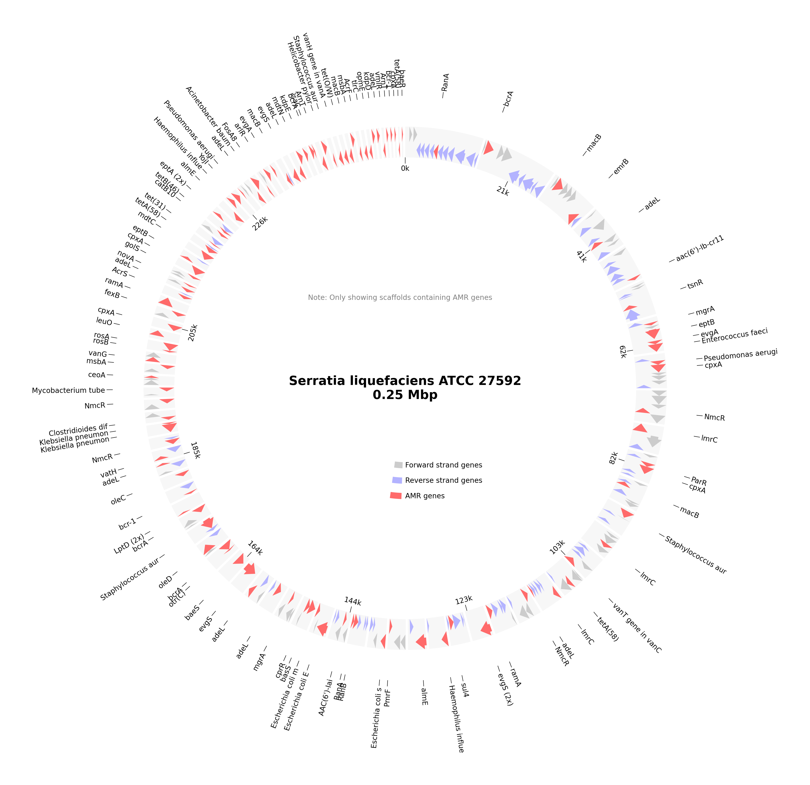

### AAC(6')-Iai
- **Mechanism**: antibiotic inactivation
- **Drug Classes**: aminoglycoside antibiotic
- **AMR Family**: AAC(6')
- **Locations**:
  - gnl|SPADES|NKBAGNNB_1452_2 : position 684-1136

### Acinetobacter baumannii AbaF
- **Mechanism**: antibiotic efflux
- **Drug Classes**: phosphonic acid antibiotic
- **AMR Family**: major facilitator superfamily (MFS) antibiotic efflux pump
- **Locations**:
  - gnl|SPADES|NKBAGNNB_22793_1 : position 2-988

### AcrF
- **Mechanism**: antibiotic efflux
- **Drug Classes**: fluoroquinolone antibiotic; cephalosporin; cephamycin; penam
- **AMR Family**: resistance-nodulation-cell division (RND) antibiotic efflux pump
- **Locations**:
  - gnl|SPADES|NKBAGNNB_213063_1 : position 3-374

### AcrS
- **Mechanism**: antibiotic efflux
- **Drug Classes**: fluoroquinolone antibiotic; cephalosporin; glycylcycline; cephamycin; penam; tetracycline antibiotic; rifamycin antibiotic; phenicol antibiotic; disinfecting agents and antiseptics
- **AMR Family**: resistance-nodulation-cell division (RND) antibiotic efflux pump
- **Locations**:
  - gnl|SPADES|NKBAGNNB_5445_2 : position 451-1020

### ArnT (found in 2 locations)
- **Mechanism**: antibiotic target alteration
- **Drug Classes**: peptide antibiotic
- **AMR Family**: pmr phosphoethanolamine transferase
- **Locations**:
  - gnl|SPADES|NKBAGNNB_758018_1 : position 3-341
  - gnl|SPADES|NKBAGNNB_81109_1 : position 1-681

### Clostridioides difficile gyrA conferring resistance to fluoroquinolones
- **Mechanism**: antibiotic target alteration
- **Drug Classes**: fluoroquinolone antibiotic
- **AMR Family**: fluoroquinolone resistant gyrA
- **Locations**:
  - gnl|SPADES|NKBAGNNB_3108_2 : position 124-726

### Enterococcus faecium liaS mutant conferring daptomycin resistance
- **Mechanism**: antibiotic target alteration; antibiotic efflux
- **Drug Classes**: peptide antibiotic
- **AMR Family**: daptomycin resistant liaS
- **Locations**:
  - gnl|SPADES|NKBAGNNB_600_7 : position 4800-6173

### Escherichia coli EF-Tu mutants conferring resistance to Pulvomycin
- **Mechanism**: antibiotic target alteration
- **Drug Classes**: elfamycin antibiotic
- **AMR Family**: elfamycin resistant EF-Tu
- **Locations**:
  - gnl|SPADES|NKBAGNNB_1471_2 : position 188-2035

### Escherichia coli mdfA
- **Mechanism**: antibiotic efflux
- **Drug Classes**: tetracycline antibiotic; phenicol antibiotic; disinfecting agents and antiseptics
- **AMR Family**: major facilitator superfamily (MFS) antibiotic efflux pump
- **Locations**:
  - gnl|SPADES|NKBAGNNB_1471_4 : position 2512-3075

### Escherichia coli soxS with mutation conferring antibiotic resistance
- **Mechanism**: antibiotic target alteration; antibiotic efflux; reduced permeability to antibiotic
- **Drug Classes**: fluoroquinolone antibiotic; monobactam; carbapenem; cephalosporin; glycylcycline; cephamycin; penam; tetracycline antibiotic; rifamycin antibiotic; phenicol antibiotic; penem; disinfecting agents and antiseptics
- **AMR Family**: ATP-binding cassette (ABC) antibiotic efflux pump; major facilitator superfamily (MFS) antibiotic efflux pump; resistance-nodulation-cell division (RND) antibiotic efflux pump; General Bacterial Porin with reduced permeability to beta-lactams
- **Locations**:
  - gnl|SPADES|NKBAGNNB_1389_1 : position 14-883

### FosA8
- **Mechanism**: antibiotic inactivation
- **Drug Classes**: phosphonic acid antibiotic
- **AMR Family**: fosfomycin thiol transferase
- **Locations**:
  - gnl|SPADES|NKBAGNNB_27006_1: position 3-275

### Haemophilus influenzae PBP3 conferring resistance to beta-lactam antibiotics (found in 2 locations)
- **Mechanism**: antibiotic target alteration
- **Drug Classes**: cephalosporin; cephamycin; penam
- **AMR Family**: Penicillin-binding protein mutations conferring resistance to beta-lactam antibiotics
- **Locations**:
  - gnl|SPADES|NKBAGNNB_1262_1 : position 1-1083
  - gnl|SPADES|NKBAGNNB_17534_2 : position 356-1051

### Helicobacter pylori pbp1 mutants conferring resistance to amoxicillin
- **Mechanism**: antibiotic target alteration
- **Drug Classes**: cephalosporin; cephamycin; penam
- **AMR Family**: Penicillin-binding protein mutations conferring resistance to beta-lactam antibiotics
- **Locations**:
  - gnl|SPADES|NKBAGNNB_83259_1 : position 1-720

### Klebsiella pneumoniae KpnG
- **Mechanism**: antibiotic efflux
- **Drug Classes**: macrolide antibiotic; fluoroquinolone antibiotic; aminoglycoside antibiotic; carbapenem; cephalosporin; penam; peptide antibiotic; penem
- **AMR Family**: major facilitator superfamily (MFS) antibiotic efflux pump
- **Locations**:
  - gnl|SPADES|NKBAGNNB_3031_2 : position 1637-1936

### Klebsiella pneumoniae KpnH
- **Mechanism**: antibiotic efflux
- **Drug Classes**: macrolide antibiotic; fluoroquinolone antibiotic; aminoglycoside antibiotic; carbapenem; cephalosporin; penam; peptide antibiotic; penem
- **AMR Family**: major facilitator superfamily (MFS) antibiotic efflux pump
- **Locations**:
  - gnl|SPADES|NKBAGNNB_3031_1: position 84-1619

### LptD (found in 2 locations)
- **Mechanism**: antibiotic efflux
- **Drug Classes**: carbapenem; peptide antibiotic; aminocoumarin antibiotic; rifamycin antibiotic
- **AMR Family**: ATP-binding cassette (ABC) antibiotic efflux pump
- **Locations**:
  - gnl|SPADES|NKBAGNNB_2413_1 : position 1-273
  - gnl|SPADES|NKBAGNNB_2413_2 : position 257-2230

### Mycobacterium tuberculosis kasA mutant conferring resistance to isoniazid
- **Mechanism**: antibiotic target alteration
- **Drug Classes**: isoniazid-like antibiotic
- **AMR Family**: antibiotic resistant kasA
- **Locations**:
  - gnl|SPADES|NKBAGNNB_3528_3 : position 1053-1778

### NmcR (found in 4 locations)
- **Mechanism**: antibiotic inactivation
- **Drug Classes**: carbapenem; cephalosporin; cephamycin; penam
- **AMR Family**: NmcA beta-lactamase
- **Locations**:
  - gnl|SPADES|NKBAGNNB_2994_2 : position 97-1017
  - gnl|SPADES|NKBAGNNB_3476_2 : position 953-1789
  - gnl|SPADES|NKBAGNNB_620_4 : position 3372-4271
  - gnl|SPADES|NKBAGNNB_965_2 : position 291-1124

### ParR
- **Mechanism**: antibiotic efflux; reduced permeability to antibiotic
- **Drug Classes**: macrolide antibiotic; fluoroquinolone antibiotic; monobactam; aminoglycoside antibiotic; carbapenem; cephalosporin; cephamycin; penam; tetracycline antibiotic; phenicol antibiotic; penem; disinfecting agents and antiseptics
- **AMR Family**: resistance-nodulation-cell division (RND) antibiotic efflux pump; Outer Membrane Porin (Opr)
- **Locations**:
  - gnl|SPADES|NKBAGNNB_775_3 : position 1458-2177

### PmrF
- **Mechanism**: antibiotic target alteration
- **Drug Classes**: peptide antibiotic
- **AMR Family**: pmr phosphoethanolamine transferase
- **Locations**:
  - gnl|SPADES|NKBAGNNB_1350_4 : position 2564-3088

### Pseudomonas aeruginosa CpxR
- **Mechanism**: antibiotic efflux
- **Drug Classes**: macrolide antibiotic; fluoroquinolone antibiotic; monobactam; aminoglycoside antibiotic; carbapenem; cephalosporin; cephamycin; penam; tetracycline antibiotic; peptide antibiotic; aminocoumarin antibiotic; diaminopyrimidine antibiotic; sulfonamide antibiotic; phenicol antibiotic; penem
- **AMR Family**: resistance-nodulation-cell division (RND) antibiotic efflux pump
- **Locations**:
  - gnl|SPADES|NKBAGNNB_601_3 : position 1246-1944

### Pseudomonas aeruginosa emrE
- **Mechanism**: antibiotic efflux
- **Drug Classes**: aminoglycoside antibiotic
- **AMR Family**: small multidrug resistance (SMR) antibiotic efflux pump
- **Locations**:
  - gnl|SPADES|NKBAGNNB_18973_1 : position 3-215

### RanA (found in 2 locations)
- **Mechanism**: antibiotic efflux
- **Drug Classes**: aminoglycoside antibiotic
- **AMR Family**: ATP-binding cassette (ABC) antibiotic efflux pump
- **Locations**:
  - gnl|SPADES|NKBAGNNB_1441_6 : position 2691-3113
  - gnl|SPADES|NKBAGNNB_263_7 : position 5432-6208

### RanB
- **Mechanism**: antibiotic efflux
- **Drug Classes**: aminoglycoside antibiotic
- **AMR Family**: ATP-binding cassette (ABC) antibiotic efflux pump
- **Locations**:
  - gnl|SPADES|NKBAGNNB_1441_5 : position 1904-2686

### Staphylococcus aureus fusA with mutation conferring resistance to fusidic acid
- **Mechanism**: antibiotic target alteration
- **Drug Classes**: fusidane antibiotic
- **AMR Family**: antibiotic resistant fusA
- **Locations**:
  - gnl|SPADES|NKBAGNNB_107371_1 : position 1-315

### Staphylococcus aureus mupA conferring resistance to mupirocin
- **Mechanism**: antibiotic target alteration
- **Drug Classes**: mupirocin-like antibiotic
- **AMR Family**: antibiotic-resistant isoleucyl-tRNA synthetase (ileS)
- **Locations**:
  - gnl|SPADES|NKBAGNNB_2056_2 : position 545-2464

### Staphylococcus aureus norA
- **Mechanism**: antibiotic efflux
- **Drug Classes**: fluoroquinolone antibiotic
- **AMR Family**: major facilitator superfamily (MFS) antibiotic efflux pump
- **Locations**:
  - gnl|SPADES|NKBAGNNB_859_2 : position 323-1654

### YojI
- **Mechanism**: antibiotic efflux
- **Drug Classes**: peptide antibiotic
- **AMR Family**: ATP-binding cassette (ABC) antibiotic efflux pump
- **Locations**:
  - gnl|SPADES|NKBAGNNB_18030_1 : position 3-887

### aac(6')-Ib-cr11
- **Mechanism**: antibiotic inactivation
- **Drug Classes**: fluoroquinolone antibiotic; aminoglycoside antibiotic
- **AMR Family**: AAC(6'); AAC(6')-Ib-cr
- **Locations**:
  - gnl|SPADES|NKBAGNNB_585_7 : position 5590-6108

### adeL (found in 9 locations)
- **Mechanism**: antibiotic efflux
- **Drug Classes**: fluoroquinolone antibiotic; tetracycline antibiotic
- **AMR Family**: resistance-nodulation-cell division (RND) antibiotic efflux pump
- **Locations**:
  - gnl|SPADES|NKBAGNNB_1747_2 : position 657-1628
  - gnl|SPADES|NKBAGNNB_1781_4 : position 1860-2708
  - gnl|SPADES|NKBAGNNB_20181_2 : position 364-1017
  - gnl|SPADES|NKBAGNNB_2741_3 : position 1655-2053
  - gnl|SPADES|NKBAGNNB_358407_1 : position 1-468
  - gnl|SPADES|NKBAGNNB_463_5 : position 4608-5471
  - gnl|SPADES|NKBAGNNB_52550_2 : position 114-809
  - gnl|SPADES|NKBAGNNB_5517_1 : position 1-591
  - gnl|SPADES|NKBAGNNB_948_7 : position 3937-4257

### almE (found in 2 locations)
- **Mechanism**: antibiotic target alteration
- **Drug Classes**: peptide antibiotic
- **AMR Family**: polymyxin resistance operon; alm glycyltransferase
- **Locations**:
  - gnl|SPADES|NKBAGNNB_1319_1 : position 2-1954
  - gnl|SPADES|NKBAGNNB_13811_2 : position 290-1114

### arlR
- **Mechanism**: antibiotic efflux
- **Drug Classes**: fluoroquinolone antibiotic; disinfecting agents and antiseptics
- **AMR Family**: major facilitator superfamily (MFS) antibiotic efflux pump
- **Locations**:
  - gnl|SPADES|NKBAGNNB_27732_1 : position 2-649

### baeR
- **Mechanism**: antibiotic efflux
- **Drug Classes**: aminoglycoside antibiotic; aminocoumarin antibiotic
- **AMR Family**: resistance-nodulation-cell division (RND) antibiotic efflux pump
- **Locations**:
  - gnl|SPADES|NKBAGNNB_1953319_1 : position 2-214

### baeS
- **Mechanism**: antibiotic efflux
- **Drug Classes**: aminoglycoside antibiotic; aminocoumarin antibiotic
- **AMR Family**: resistance-nodulation-cell division (RND) antibiotic efflux pump
- **Locations**:
  - gnl|SPADES|NKBAGNNB_1848_2 : position 313-1749

### basS
- **Mechanism**: antibiotic target alteration; antibiotic efflux
- **Drug Classes**: peptide antibiotic
- **AMR Family**: pmr phosphoethanolamine transferase
- **Locations**:
  - gnl|SPADES|NKBAGNNB_1542_1 : position 2-1177

### bcr-1 (found in 2 locations)
- **Mechanism**: antibiotic efflux
- **Drug Classes**: bicyclomycin-like antibiotic
- **AMR Family**: major facilitator superfamily (MFS) antibiotic efflux pump
- **Locations**:
  - gnl|SPADES|NKBAGNNB_2468_1 : position 2-358
  - gnl|SPADES|NKBAGNNB_886293_1 : position 2-319

### bcrA (found in 4 locations)
- **Mechanism**: antibiotic efflux
- **Drug Classes**: peptide antibiotic
- **AMR Family**: ATP-binding cassette (ABC) antibiotic efflux pump
- **Locations**:
  - gnl|SPADES|NKBAGNNB_1957_3 : position 1110-2435
  - gnl|SPADES|NKBAGNNB_2218_3 : position 1320-2345
  - gnl|SPADES|NKBAGNNB_276_2 : position 425-1924
  - gnl|SPADES|NKBAGNNB_61949_1 : position 1-546

### catB10
- **Mechanism**: antibiotic inactivation
- **Drug Classes**: phenicol antibiotic
- **AMR Family**: chloramphenicol acetyltransferase (CAT)
- **Locations**:
  - gnl|SPADES|NKBAGNNB_11786_2 : position 700-1161

### ceoA
- **Mechanism**: antibiotic efflux
- **Drug Classes**: fluoroquinolone antibiotic; aminoglycoside antibiotic
- **AMR Family**: resistance-nodulation-cell division (RND) antibiotic efflux pump
- **Locations**:
  - gnl|SPADES|NKBAGNNB_3687_4 : position 1326-1739

### cprR
- **Mechanism**: antibiotic target alteration; antibiotic efflux
- **Drug Classes**: peptide antibiotic
- **AMR Family**: pmr phosphoethanolamine transferase
- **Locations**:
  - gnl|SPADES|NKBAGNNB_1542_2 : position 1174-1842

### cpxA (found in 5 locations)
- **Mechanism**: antibiotic efflux
- **Drug Classes**: aminoglycoside antibiotic; aminocoumarin antibiotic
- **AMR Family**: resistance-nodulation-cell division (RND) antibiotic efflux pump
- **Locations**:
  - gnl|SPADES|NKBAGNNB_1370996_1 : position 1-258
  - gnl|SPADES|NKBAGNNB_4225_1 : position 58-1107
  - gnl|SPADES|NKBAGNNB_601_4 : position 1941-3314
  - gnl|SPADES|NKBAGNNB_7501_1 : position 3-1319
  - gnl|SPADES|NKBAGNNB_775_4 : position 2174-3544

### emrB
- **Mechanism**: antibiotic efflux
- **Drug Classes**: fluoroquinolone antibiotic
- **AMR Family**: major facilitator superfamily (MFS) antibiotic efflux pump
- **Locations**:
  - gnl|SPADES|NKBAGNNB_415_8 : position 6400-7779

### eptA (found in 2 locations)
- **Mechanism**: antibiotic target alteration
- **Drug Classes**: peptide antibiotic
- **AMR Family**: pmr phosphoethanolamine transferase
- **Locations**:
  - gnl|SPADES|NKBAGNNB_13610_1 : position 2-520
  - gnl|SPADES|NKBAGNNB_13610_2 : position 520-705

### eptB (found in 2 locations)
- **Mechanism**: antibiotic target alteration
- **Drug Classes**: peptide antibiotic
- **AMR Family**: pmr phosphoethanolamine transferase
- **Locations**:
  - gnl|SPADES|NKBAGNNB_600_5 : position 2144-3838
  - gnl|SPADES|NKBAGNNB_8723_1 : position 3-494

### evgA (found in 2 locations)
- **Mechanism**: antibiotic efflux
- **Drug Classes**: macrolide antibiotic; fluoroquinolone antibiotic; penam; tetracycline antibiotic
- **AMR Family**: major facilitator superfamily (MFS) antibiotic efflux pump; resistance-nodulation-cell division (RND) antibiotic efflux pump
- **Locations**:
  - gnl|SPADES|NKBAGNNB_28220_1 : position 2-340
  - gnl|SPADES|NKBAGNNB_600_6 : position 4205-4795

### evgS (found in 4 locations)
- **Mechanism**: antibiotic efflux
- **Drug Classes**: macrolide antibiotic; fluoroquinolone antibiotic; penam; tetracycline antibiotic
- **AMR Family**: major facilitator superfamily (MFS) antibiotic efflux pump; resistance-nodulation-cell division (RND) antibiotic efflux pump
- **Locations**:
  - gnl|SPADES|NKBAGNNB_1101_1 : position 1-1959
  - gnl|SPADES|NKBAGNNB_1101_2 : position 1904-3754
  - gnl|SPADES|NKBAGNNB_1800_1 : position 420-2687
  - gnl|SPADES|NKBAGNNB_34364_1 : position 3-896

### fexB
- **Mechanism**: antibiotic efflux
- **Drug Classes**: phenicol antibiotic
- **AMR Family**: major facilitator superfamily (MFS) antibiotic efflux pump
- **Locations**:
  - gnl|SPADES|NKBAGNNB_4326_2 : position 901-1617

### golS
- **Mechanism**: antibiotic efflux
- **Drug Classes**: monobactam; carbapenem; cephalosporin; cephamycin; penam; phenicol antibiotic; penem
- **AMR Family**: resistance-nodulation-cell division (RND) antibiotic efflux pump
- **Locations**:
  - gnl|SPADES|NKBAGNNB_6435_3 : position 960-1388

### kdpD
- **Mechanism**: antibiotic efflux
- **Drug Classes**: aminoglycoside antibiotic
- **AMR Family**: kdpDE
- **Locations**:
  - gnl|SPADES|NKBAGNNB_325922_1 : position 1-483

### kdpE
- **Mechanism**: antibiotic efflux
- **Drug Classes**: aminoglycoside antibiotic
- **AMR Family**: kdpDE
- **Locations**:
  - gnl|SPADES|NKBAGNNB_58396_1 : position 3-524

### leuO
- **Mechanism**: antibiotic efflux
- **Drug Classes**: nucleoside antibiotic; disinfecting agents and antiseptics
- **AMR Family**: major facilitator superfamily (MFS) antibiotic efflux pump
- **Locations**:
  - gnl|SPADES|NKBAGNNB_4101_1 : position 585-1532

### lmrC (found in 3 locations)
- **Mechanism**: antibiotic target protection
- **Drug Classes**: lincosamide antibiotic
- **AMR Family**: Miscellaneous ABC-F subfamily ATP-binding cassette ribosomal protection proteins
- **Locations**:
  - gnl|SPADES|NKBAGNNB_767_1 : position 2-1489
  - gnl|SPADES|NKBAGNNB_882_3 : position 2266-3054
  - gnl|SPADES|NKBAGNNB_948_1 : position 272-1060

### lsaC
- **Mechanism**: antibiotic target protection
- **Drug Classes**: lincosamide antibiotic; streptogramin antibiotic; pleuromutilin antibiotic
- **AMR Family**: lsa-type ABC-F protein
- **Locations**:
  - gnl|SPADES|NKBAGNNB_61949_2 : position 556-777

### macB (found in 4 locations)
- **Mechanism**: antibiotic efflux
- **Drug Classes**: macrolide antibiotic
- **AMR Family**: ATP-binding cassette (ABC) antibiotic efflux pump
- **Locations**:
  - gnl|SPADES|NKBAGNNB_179485_1 : position 2-586
  - gnl|SPADES|NKBAGNNB_28686_1 : position 1-522
  - gnl|SPADES|NKBAGNNB_415_3 : position 1019-2524
  - gnl|SPADES|NKBAGNNB_789_3 : position 900-1622

### mdtC
- **Mechanism**: antibiotic efflux
- **Drug Classes**: aminocoumarin antibiotic
- **AMR Family**: resistance-nodulation-cell division (RND) antibiotic efflux pump
- **Locations**:
  - gnl|SPADES|NKBAGNNB_9390_1 : position 3-1235

### mdtN
- **Mechanism**: antibiotic efflux
- **Drug Classes**: nucleoside antibiotic; disinfecting agents and antiseptics
- **AMR Family**: major facilitator superfamily (MFS) antibiotic efflux pump
- **Locations**:
  - gnl|SPADES|NKBAGNNB_52665_1 : position 3-728

### mgrA (found in 2 locations)
- **Mechanism**: antibiotic efflux
- **Drug Classes**: fluoroquinolone antibiotic; cephalosporin; penam; tetracycline antibiotic; peptide antibiotic; disinfecting agents and antiseptics
- **AMR Family**: ATP-binding cassette (ABC) antibiotic efflux pump; major facilitator superfamily (MFS) antibiotic efflux pump
- **Locations**:
  - gnl|SPADES|NKBAGNNB_1593_3 : position 1263-1715
  - gnl|SPADES|NKBAGNNB_600_3 : position 875-1339

### msbA (found in 2 locations)
- **Mechanism**: antibiotic efflux
- **Drug Classes**: nitroimidazole antibiotic
- **AMR Family**: ATP-binding cassette (ABC) antibiotic efflux pump
- **Locations**:
  - gnl|SPADES|NKBAGNNB_183802_1 : position 2-580
  - gnl|SPADES|NKBAGNNB_3863_2 : position 997-1698

### novA
- **Mechanism**: antibiotic efflux
- **Drug Classes**: aminocoumarin antibiotic
- **AMR Family**: ATP-binding cassette (ABC) antibiotic efflux pump
- **Locations**:
  - gnl|SPADES|NKBAGNNB_5517_3 : position 1172-1465

### oleC
- **Mechanism**: antibiotic efflux
- **Drug Classes**: macrolide antibiotic
- **AMR Family**: ATP-binding cassette (ABC) antibiotic efflux pump
- **Locations**:
  - gnl|SPADES|NKBAGNNB_2603_3 : position 1034-1789

### oleD
- **Mechanism**: antibiotic inactivation
- **Drug Classes**: macrolide antibiotic
- **AMR Family**: ole glycosyltransferase
- **Locations**:
  - gnl|SPADES|NKBAGNNB_2041_2 : position 419-1693

### opmE
- **Mechanism**: antibiotic efflux
- **Drug Classes**: macrolide antibiotic; carbapenem; tetracycline antibiotic; diaminopyrimidine antibiotic; phenicol antibiotic; disinfecting agents and antiseptics
- **AMR Family**: resistance-nodulation-cell division (RND) antibiotic efflux pump
- **Locations**:
  - gnl|SPADES|NKBAGNNB_284481_1 : position 3-506

### otr(C)
- **Mechanism**: antibiotic efflux
- **Drug Classes**: tetracycline antibiotic
- **AMR Family**: ATP-binding cassette (ABC) antibiotic efflux pump
- **Locations**:
  - gnl|SPADES|NKBAGNNB_1957_2 : position 887-1120

### ramA (found in 2 locations)
- **Mechanism**: antibiotic efflux; reduced permeability to antibiotic
- **Drug Classes**: fluoroquinolone antibiotic; monobactam; carbapenem; cephalosporin; glycylcycline; cephamycin; penam; tetracycline antibiotic; rifamycin antibiotic; phenicol antibiotic; penem; disinfecting agents and antiseptics
- **AMR Family**: resistance-nodulation-cell division (RND) antibiotic efflux pump; General Bacterial Porin with reduced permeability to beta-lactams
- **Locations**:
  - gnl|SPADES|NKBAGNNB_4561_1 : position 195-1583
  - gnl|SPADES|NKBAGNNB_966_5 : position 3190-4068

### rosA
- **Mechanism**: antibiotic efflux
- **Drug Classes**: peptide antibiotic
- **AMR Family**: major facilitator superfamily (MFS) antibiotic efflux pump
- **Locations**:
  - gnl|SPADES|NKBAGNNB_4010_2 : position 332-1672

### rosB
- **Mechanism**: antibiotic efflux
- **Drug Classes**: peptide antibiotic
- **AMR Family**: major facilitator superfamily (MFS) antibiotic efflux pump
- **Locations**:
  - gnl|SPADES|NKBAGNNB_4010_1 : position 2-316

### sul4
- **Mechanism**: antibiotic target replacement
- **Drug Classes**: sulfonamide antibiotic
- **AMR Family**: sulfonamide resistant sul
- **Locations**:
  - gnl|SPADES|NKBAGNNB_1238_3 : position 2187-3020

### tet(31)
- **Mechanism**: antibiotic efflux
- **Drug Classes**: tetracycline antibiotic
- **AMR Family**: major facilitator superfamily (MFS) antibiotic efflux pump
- **Locations**:
  - gnl|SPADES|NKBAGNNB_11355_1 : position 2-226

### tet(O/W)
- **Mechanism**: antibiotic target protection
- **Drug Classes**: tetracycline antibiotic
- **AMR Family**: tetracycline-resistant ribosomal protection protein
- **Locations**:
  - gnl|SPADES|NKBAGNNB_127639_1 : position 3-644

### tetA(58) (found in 3 locations)
- **Mechanism**: antibiotic efflux
- **Drug Classes**: tetracycline antibiotic
- **AMR Family**: major facilitator superfamily (MFS) antibiotic efflux pump
- **Locations**:
  - gnl|SPADES|NKBAGNNB_1469675_1 : position 2-250
  - gnl|SPADES|NKBAGNNB_942_4 : position 1878-2603
  - gnl|SPADES|NKBAGNNB_9735_1 : position 1-837

### tetB(46)
- **Mechanism**: antibiotic efflux
- **Drug Classes**: tetracycline antibiotic
- **AMR Family**: ATP-binding cassette (ABC) antibiotic efflux pump
- **Locations**:
  - gnl|SPADES|NKBAGNNB_12613_1 : position 1-387

### tlrC
- **Mechanism**: antibiotic target protection
- **Drug Classes**: macrolide antibiotic; lincosamide antibiotic
- **AMR Family**: Miscellaneous ABC-F subfamily ATP-binding cassette ribosomal protection proteins
- **Locations**:
  - gnl|SPADES|NKBAGNNB_228643_1 : position 1-543

### tsnR
- **Mechanism**: antibiotic target alteration
- **Drug Classes**: peptide antibiotic
- **AMR Family**: non-erm 23S ribosomal RNA methyltransferase (A1067)
- **Locations**:
  - gnl|SPADES|NKBAGNNB_589_7 : position 3303-4034

### vanG
- **Mechanism**: antibiotic target alteration
- **Drug Classes**: glycopeptide antibiotic
- **AMR Family**: glycopeptide resistance gene cluster; Van ligase
- **Locations**:
  - gnl|SPADES|NKBAGNNB_3940_1 : position 1-831

### vanH gene in vanA cluster
- **Mechanism**: antibiotic target alteration
- **Drug Classes**: glycopeptide antibiotic
- **AMR Family**: vanH; glycopeptide resistance gene cluster
- **Locations**:
  - gnl|SPADES|NKBAGNNB_120113_1 : position 3-656

### vanT gene in vanC cluster
- **Mechanism**: antibiotic target alteration
- **Drug Classes**: glycopeptide antibiotic
- **AMR Family**: glycopeptide resistance gene cluster; vanT
- **Locations**:
  - gnl|SPADES|NKBAGNNB_902_6 : position 3409-4443

### vatH
- **Mechanism**: antibiotic inactivation
- **Drug Classes**: streptogramin antibiotic; streptogramin A antibiotic
- **AMR Family**: streptogramin vat acetyltransferase
- **Locations**:
  - gnl|SPADES|NKBAGNNB_2876_2 : position 306-863

### vmlR
- **Mechanism**: antibiotic target protection
- **Drug Classes**: lincosamide antibiotic; streptogramin antibiotic; streptogramin A antibiotic; streptogramin B antibiotic; nucleoside antibiotic; pleuromutilin antibiotic
- **AMR Family**: Miscellaneous ABC-F subfamily ATP-binding cassette ribosomal protection proteins
- **Locations**:
  - gnl|SPADES|NKBAGNNB_487974_1 : position 3-413

## Yersinia alsatica
**Strain Statistics:**
- Total genome length: 4930.4 kbp
- Total scaffolds: 36
- Scaffolds with AMR genes: 24
- Total genes annotated: 8980
- Total AMR genes: 469
- Unique AMR genes: 202
- Distinct AMR mechanisms: 11
- Distinct AMR families: 69
- Distinct drug classes: 36

**Circos Plot:**

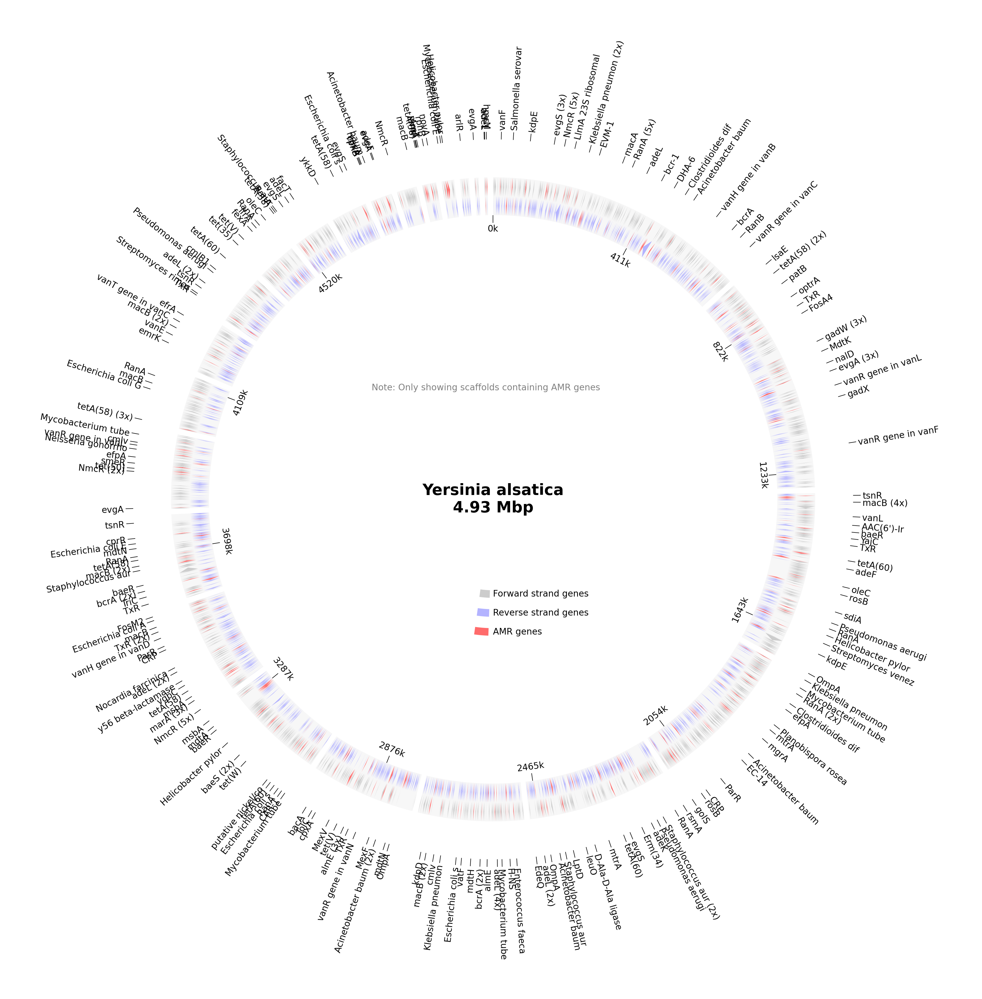

### AAC(6')-Ir
- **Mechanism**: antibiotic inactivation
- **Drug Classes**: aminoglycoside antibiotic
- **AMR Family**: AAC(6')
- **Locations**:
  - gnl|SPADES|NKBAGNNB_3_67 : position 76813-77307

### Acinetobacter baumannii AbaF (found in 6 locations)
- **Mechanism**: antibiotic efflux
- **Drug Classes**: phosphonic acid antibiotic
- **AMR Family**: major facilitator superfamily (MFS) antibiotic efflux pump
- **Locations**:
  - gnl|SPADES|NKBAGNNB_2_106 : position 112498-113904
  - gnl|SPADES|NKBAGNNB_40_20 : position 20574-22100
  - gnl|SPADES|NKBAGNNB_4_188 : position 217529-218851
  - gnl|SPADES|NKBAGNNB_5_262 : position 310388-311752
  - gnl|SPADES|NKBAGNNB_7_53 : position 65528-66931
  - gnl|SPADES|NKBAGNNB_7_61 : position 75310-76812

### Acinetobacter baumannii AbaQ
- **Mechanism**: antibiotic efflux
- **Drug Classes**: fluoroquinolone antibiotic
- **AMR Family**: major facilitator superfamily (MFS) antibiotic efflux pump
- **Locations**:
  - gnl|SPADES|NKBAGNNB_1_428 : position 496080-497390

### Acinetobacter baumannii AmvA
- **Mechanism**: antibiotic efflux
- **Drug Classes**: macrolide antibiotic; disinfecting agents and antiseptics
- **AMR Family**: major facilitator superfamily (MFS) antibiotic efflux pump
- **Locations**:
  - gnl|SPADES|NKBAGNNB_1_557 : position 636702-638234

### AcrS
- **Mechanism**: antibiotic efflux
- **Drug Classes**: fluoroquinolone antibiotic; cephalosporin; glycylcycline; cephamycin; penam; tetracycline antibiotic; rifamycin antibiotic; phenicol antibiotic; disinfecting agents and antiseptics
- **AMR Family**: resistance-nodulation-cell division (RND) antibiotic efflux pump
- **Locations**:
  - gnl|SPADES|NKBAGNNB_5_280 : position 333837-334385

### ArnT
- **Mechanism**: antibiotic target alteration
- **Drug Classes**: peptide antibiotic
- **AMR Family**: pmr phosphoethanolamine transferase
- **Locations**:
  - gnl|SPADES|NKBAGNNB_83_11: position 10039-11703

### Bifidobacterium bifidum ileS conferring resistance to mupirocin
- **Mechanism**: antibiotic target alteration
- **Drug Classes**: mupirocin-like antibiotic
- **AMR Family**: antibiotic-resistant isoleucyl-tRNA synthetase (ileS)
- **Locations**:
  - gnl|SPADES|NKBAGNNB_3_318 : position 346208-348790

### CAR-1
- **Mechanism**: antibiotic inactivation
- **Drug Classes**: carbapenem
- **AMR Family**: CAR beta-lactamase
- **Locations**:
  - gnl|SPADES|NKBAGNNB_8_24 : position 21870-22625

### CRP (found in 2 locations)
- **Mechanism**: antibiotic efflux
- **Drug Classes**: macrolide antibiotic; fluoroquinolone antibiotic; penam
- **AMR Family**: resistance-nodulation-cell division (RND) antibiotic efflux pump
- **Locations**:
  - gnl|SPADES|NKBAGNNB_4_288: position 348462-349094
  - gnl|SPADES|NKBAGNNB_9_143 : position 166531-167283

### Clostridioides difficile gyrA conferring resistance to fluoroquinolones
- **Mechanism**: antibiotic target alteration
- **Drug Classes**: fluoroquinolone antibiotic
- **AMR Family**: fluoroquinolone resistant gyrA
- **Locations**:
  - gnl|SPADES|NKBAGNNB_1_409 : position 471838-474492

### Clostridioides difficile gyrB conferring resistance to fluoroquinolones (found in 2 locations)
- **Mechanism**: antibiotic target alteration
- **Drug Classes**: fluoroquinolone antibiotic
- **AMR Family**: fluoroquinolone resistant gyrB
- **Locations**:
  - gnl|SPADES|NKBAGNNB_4_61 : position 65634-68048
  - gnl|SPADES|NKBAGNNB_7_191 : position 224286-226181

### CrcB (found in 2 locations)
- **Mechanism**: antibiotic efflux
- **Drug Classes**: aminoglycoside antibiotic
- **AMR Family**: multidrug and toxic compound extrusion (MATE) transporter
- **Locations**:
  - gnl|SPADES|NKBAGNNB_3_303 : position 332171-332554
  - gnl|SPADES|NKBAGNNB_8_72 : position 67616-68020

### D-Ala-D-Ala ligase
- **Mechanism**: antibiotic target alteration
- **Drug Classes**: glycopeptide antibiotic
- **AMR Family**: Van ligase
- **Locations**:
  - gnl|SPADES|NKBAGNNB_5_197 : position 226589-227509

### DHA-6
- **Mechanism**: antibiotic inactivation
- **Drug Classes**: cephalosporin; cephamycin
- **AMR Family**: DHA beta-lactamase
- **Locations**:
  - gnl|SPADES|NKBAGNNB_1_399 : position 442434-443576

### EC-14 (found in 2 locations)
- **Mechanism**: antibiotic inactivation
- **Drug Classes**: cephalosporin
- **AMR Family**: EC beta-lactamase
- **Locations**:
  - gnl|SPADES|NKBAGNNB_2_245 : position 261251-262429
  - gnl|SPADES|NKBAGNNB_4_203 : position 239301-240467

### EVM-1
- **Mechanism**: antibiotic inactivation
- **Drug Classes**: carbapenem
- **AMR Family**: EVM beta-lactamase
- **Locations**:
  - gnl|SPADES|NKBAGNNB_1_222 : position 250840-252993

### EdeQ
- **Mechanism**: antibiotic inactivation
- **Drug Classes**: peptide antibiotic; polyamine antibiotic
- **AMR Family**: Edeine acetyltransferase
- **Locations**:
  - gnl|SPADES|NKBAGNNB_5_311 : position 366837-367280

### Enterococcus faecalis cls with mutation conferring resistance to daptomycin
- **Mechanism**: antibiotic target alteration
- **Drug Classes**: peptide antibiotic
- **AMR Family**: daptomycin resistant cls
- **Locations**:
  - gnl|SPADES|NKBAGNNB_6_26 : position 25556-27016

### Erm(34)
- **Mechanism**: antibiotic target alteration
- **Drug Classes**: macrolide antibiotic; lincosamide antibiotic; streptogramin antibiotic; streptogramin A antibiotic; streptogramin B antibiotic
- **AMR Family**: Erm 23S ribosomal RNA methyltransferase
- **Locations**:
  - gnl|SPADES|NKBAGNNB_5_100 : position 109723-110349

### Escherichia coli AcrAB-TolC with AcrR mutation conferring resistance to ciprofloxacin, tetracycline, and ceftazidime (found in 3 locations)
- **Mechanism**: antibiotic target alteration; antibiotic efflux
- **Drug Classes**: fluoroquinolone antibiotic; cephalosporin; glycylcycline; penam; tetracycline antibiotic; rifamycin antibiotic; phenicol antibiotic; disinfecting agents and antiseptics
- **AMR Family**: resistance-nodulation-cell division (RND) antibiotic efflux pump
- **Locations**:
  - gnl|SPADES|NKBAGNNB_18_13 : position 16475-17038
  - gnl|SPADES|NKBAGNNB_1_434 : position 502167-502805
  - gnl|SPADES|NKBAGNNB_3_158 : position 182648-183304

### Escherichia coli AcrAB-TolC with MarR mutations conferring resistance to ciprofloxacin and tetracycline
- **Mechanism**: antibiotic target alteration; antibiotic efflux
- **Drug Classes**: fluoroquinolone antibiotic; cephalosporin; glycylcycline; penam; tetracycline antibiotic; rifamycin antibiotic; phenicol antibiotic; disinfecting agents and antiseptics
- **AMR Family**: resistance-nodulation-cell division (RND) antibiotic efflux pump
- **Locations**:
  - gnl|SPADES|NKBAGNNB_9_210 : position 240429-240860

### Escherichia coli EF-Tu mutants conferring resistance to Pulvomycin (found in 2 locations)
- **Mechanism**: antibiotic target alteration
- **Drug Classes**: elfamycin antibiotic
- **AMR Family**: elfamycin resistant EF-Tu
- **Locations**:
  - gnl|SPADES|NKBAGNNB_4_314 : position 371086-372270
  - gnl|SPADES|NKBAGNNB_95_5 : position 5001-6185

### Escherichia coli EF-Tu mutants conferring resistance to kirromycin
- **Mechanism**: antibiotic target alteration
- **Drug Classes**: elfamycin antibiotic
- **AMR Family**: elfamycin resistant EF-Tu
- **Locations**:
  - gnl|SPADES|NKBAGNNB_10_125 : position 156658-159336

### Escherichia coli GlpT with mutation conferring resistance to fosfomycin
- **Mechanism**: antibiotic target alteration
- **Drug Classes**: phosphonic acid antibiotic
- **AMR Family**: antibiotic-resistant GlpT
- **Locations**:
  - gnl|SPADES|NKBAGNNB_12_63 : position 75675-77030

### Escherichia coli acrA (found in 2 locations)
- **Mechanism**: antibiotic efflux
- **Drug Classes**: fluoroquinolone antibiotic; cephalosporin; glycylcycline; penam; tetracycline antibiotic; rifamycin antibiotic; phenicol antibiotic; disinfecting agents and antiseptics
- **AMR Family**: resistance-nodulation-cell division (RND) antibiotic efflux pump
- **Locations**:
  - gnl|SPADES|NKBAGNNB_3_157 : position 181316-182503
  - gnl|SPADES|NKBAGNNB_7_66 : position 84077-85300

### Escherichia coli mdfA
- **Mechanism**: antibiotic efflux
- **Drug Classes**: tetracycline antibiotic; phenicol antibiotic; disinfecting agents and antiseptics
- **AMR Family**: major facilitator superfamily (MFS) antibiotic efflux pump
- **Locations**:
  - gnl|SPADES|NKBAGNNB_4_118 : position 131163-132392

### Escherichia coli murA with mutation conferring resistance to fosfomycin
- **Mechanism**: antibiotic target alteration
- **Drug Classes**: phosphonic acid antibiotic
- **AMR Family**: antibiotic-resistant murA transferase
- **Locations**:
  - gnl|SPADES|NKBAGNNB_1_226 : position 256699-257979

### Escherichia coli soxS with mutation conferring antibiotic resistance (found in 8 locations)
- **Mechanism**: antibiotic target alteration; antibiotic efflux; reduced permeability to antibiotic
- **Drug Classes**: fluoroquinolone antibiotic; monobactam; carbapenem; cephalosporin; glycylcycline; cephamycin; penam; tetracycline antibiotic; rifamycin antibiotic; phenicol antibiotic; penem; disinfecting agents and antiseptics
- **AMR Family**: ATP-binding cassette (ABC) antibiotic efflux pump; major facilitator superfamily (MFS) antibiotic efflux pump; resistance-nodulation-cell division (RND) antibiotic efflux pump; General Bacterial Porin with reduced permeability to beta-lactams
- **Locations**:
  - gnl|SPADES|NKBAGNNB_1_59 : position 56305-57180
  - gnl|SPADES|NKBAGNNB_21_66 : position 76269-76976
  - gnl|SPADES|NKBAGNNB_5_271 : position 322316-323182
  - gnl|SPADES|NKBAGNNB_5_287 : position 339425-340318
  - gnl|SPADES|NKBAGNNB_5_288 : position 340428-341249
  - gnl|SPADES|NKBAGNNB_6_156 : position 167332-168231
  - gnl|SPADES|NKBAGNNB_8_46 : position 43312-44334
  - gnl|SPADES|NKBAGNNB_9_48 : position 59800-60732

### FosA4
- **Mechanism**: antibiotic inactivation
- **Drug Classes**: phosphonic acid antibiotic
- **AMR Family**: fosfomycin thiol transferase
- **Locations**:
  - gnl|SPADES|NKBAGNNB_2_141 : position 154487-154942

### FosB6
- **Mechanism**: antibiotic inactivation
- **Drug Classes**: phosphonic acid antibiotic
- **AMR Family**: fosfomycin thiol transferase
- **Locations**:
  - gnl|SPADES|NKBAGNNB_9_98 : position 115935-116405

### FosM2
- **Mechanism**: antibiotic inactivation
- **Drug Classes**: phosphonic acid antibiotic
- **AMR Family**: fosfomycin thiol transferase
- **Locations**:
  - gnl|SPADES|NKBAGNNB_9_219 : position 249373-249780

### H-NS
- **Mechanism**: antibiotic efflux
- **Drug Classes**: macrolide antibiotic; fluoroquinolone antibiotic; cephalosporin; cephamycin; penam; tetracycline antibiotic
- **AMR Family**: major facilitator superfamily (MFS) antibiotic efflux pump; resistance-nodulation-cell division (RND) antibiotic efflux pump
- **Locations**:
  - gnl|SPADES|NKBAGNNB_6_38 : position 41720-42130

### Haemophilus influenzae PBP3 conferring resistance to beta-lactam antibiotics
- **Mechanism**: antibiotic target alteration
- **Drug Classes**: cephalosporin; cephamycin; penam
- **AMR Family**: Penicillin-binding protein mutations conferring resistance to beta-lactam antibiotics
- **Locations**:
  - gnl|SPADES|NKBAGNNB_5_205 : position 236556-238319

### Helicobacter pylori pbp1 mutants conferring resistance to amoxicillin (found in 2 locations)
- **Mechanism**: antibiotic target alteration
- **Drug Classes**: cephalosporin; cephamycin; penam
- **AMR Family**: Penicillin-binding protein mutations conferring resistance to beta-lactam antibiotics
- **Locations**:
  - gnl|SPADES|NKBAGNNB_5_141 : position 156751-159237
  - gnl|SPADES|NKBAGNNB_8_200 : position 189974-192292

### Helicobacter pylori pbp2 mutants conferring resistance to amoxicillin
- **Mechanism**: antibiotic target alteration
- **Drug Classes**: cephalosporin; cephamycin; penam
- **AMR Family**: Penicillin-binding protein mutations conferring resistance to beta-lactam antibiotics
- **Locations**:
  - gnl|SPADES|NKBAGNNB_3_312 : position 340928-342823

### Helicobacter pylori rpoB mutation conferring resistance to rifampicin
- **Mechanism**: antibiotic target alteration; antibiotic target replacement
- **Drug Classes**: fluoroquinolone antibiotic; rifamycin antibiotic
- **AMR Family**: rifamycin-resistant beta-subunit of RNA polymerase (rpoB)
- **Locations**:
  - gnl|SPADES|NKBAGNNB_95_13 : position 14460-18680

### Klebsiella pneumoniae KpnE
- **Mechanism**: antibiotic efflux
- **Drug Classes**: macrolide antibiotic; aminoglycoside antibiotic; cephalosporin; tetracycline antibiotic; peptide antibiotic; rifamycin antibiotic; disinfecting agents and antiseptics
- **AMR Family**: small multidrug resistance (SMR) antibiotic efflux pump
- **Locations**:
  - gnl|SPADES|NKBAGNNB_6_93 : position 101042-101425

### Klebsiella pneumoniae KpnF
- **Mechanism**: antibiotic efflux
- **Drug Classes**: macrolide antibiotic; aminoglycoside antibiotic; cephalosporin; tetracycline antibiotic; peptide antibiotic; rifamycin antibiotic; disinfecting agents and antiseptics
- **AMR Family**: small multidrug resistance (SMR) antibiotic efflux pump
- **Locations**:
  - gnl|SPADES|NKBAGNNB_6_92: position 100726-101055

### Klebsiella pneumoniae KpnH (found in 2 locations)
- **Mechanism**: antibiotic efflux
- **Drug Classes**: macrolide antibiotic; fluoroquinolone antibiotic; aminoglycoside antibiotic; carbapenem; cephalosporin; penam; peptide antibiotic; penem
- **AMR Family**: major facilitator superfamily (MFS) antibiotic efflux pump
- **Locations**:
  - gnl|SPADES|NKBAGNNB_3_7: position 7698-9233
  - gnl|SPADES|NKBAGNNB_4_2 : position 937-2361

### Klebsiella pneumoniae OmpK37 (found in 4 locations)
- **Mechanism**: reduced permeability to antibiotic
- **Drug Classes**: monobactam; carbapenem; cephalosporin; cephamycin; penam; penem
- **AMR Family**: General Bacterial Porin with reduced permeability to beta-lactams
- **Locations**:
  - gnl|SPADES|NKBAGNNB_1_203 : position 226738-227862
  - gnl|SPADES|NKBAGNNB_1_400 : position 444105-445217
  - gnl|SPADES|NKBAGNNB_2_76 : position 80332-81447
  - gnl|SPADES|NKBAGNNB_6_189 : position 203804-204889

### LRA-19
- **Mechanism**: antibiotic inactivation
- **Drug Classes**: cephalosporin; penam
- **AMR Family**: subclass B3 LRA beta-lactamase
- **Locations**:
  - gnl|SPADES|NKBAGNNB_1_206 : position 231213-231860

### LlmA 23S ribosomal RNA methyltransferase
- **Mechanism**: antibiotic target alteration
- **Drug Classes**: lincosamide antibiotic
- **AMR Family**: Llm 23S ribosomal RNA methyltransferase
- **Locations**:
  - gnl|SPADES|NKBAGNNB_1_175 : position 191937-193127

### LptD
- **Mechanism**: antibiotic efflux
- **Drug Classes**: carbapenem; peptide antibiotic; aminocoumarin antibiotic; rifamycin antibiotic
- **AMR Family**: ATP-binding cassette (ABC) antibiotic efflux pump
- **Locations**:
  - gnl|SPADES|NKBAGNNB_5_235 : position 277848-280244

### MdtK
- **Mechanism**: antibiotic efflux
- **Drug Classes**: fluoroquinolone antibiotic
- **AMR Family**: multidrug and toxic compound extrusion (MATE) transporter
- **Locations**:
  - gnl|SPADES|NKBAGNNB_2_239 : position 253836-255266

### MexF
- **Mechanism**: antibiotic efflux
- **Drug Classes**: fluoroquinolone antibiotic; diaminopyrimidine antibiotic; phenicol antibiotic
- **AMR Family**: resistance-nodulation-cell division (RND) antibiotic efflux pump
- **Locations**:
  - gnl|SPADES|NKBAGNNB_7_65 : position 80939-84064

### MexJ
- **Mechanism**: antibiotic efflux
- **Drug Classes**: macrolide antibiotic; tetracycline antibiotic; disinfecting agents and antiseptics
- **AMR Family**: resistance-nodulation-cell division (RND) antibiotic efflux pump
- **Locations**:
  - gnl|SPADES|NKBAGNNB_10_23 : position 32666-33748

### MexS (found in 5 locations)
- **Mechanism**: antibiotic efflux
- **Drug Classes**: fluoroquinolone antibiotic; diaminopyrimidine antibiotic; phenicol antibiotic
- **AMR Family**: resistance-nodulation-cell division (RND) antibiotic efflux pump
- **Locations**:
  - gnl|SPADES|NKBAGNNB_13_87 : position 93030-94013
  - gnl|SPADES|NKBAGNNB_2_113 : position 121095-122234
  - gnl|SPADES|NKBAGNNB_2_413 : position 440483-441493
  - gnl|SPADES|NKBAGNNB_2_422 : position 455215-456249
  - gnl|SPADES|NKBAGNNB_7_68 : position 86656-87645

### MexT (found in 3 locations)
- **Mechanism**: antibiotic efflux
- **Drug Classes**: fluoroquinolone antibiotic; diaminopyrimidine antibiotic; phenicol antibiotic
- **AMR Family**: resistance-nodulation-cell division (RND) antibiotic efflux pump
- **Locations**:
  - gnl|SPADES|NKBAGNNB_18_57 : position 59989-60897
  - gnl|SPADES|NKBAGNNB_2_142 : position 155073-155993
  - gnl|SPADES|NKBAGNNB_2_275 : position 292629-293525

### MexV
- **Mechanism**: antibiotic efflux
- **Drug Classes**: macrolide antibiotic; fluoroquinolone antibiotic; tetracycline antibiotic; phenicol antibiotic; disinfecting agents and antiseptics
- **AMR Family**: resistance-nodulation-cell division (RND) antibiotic efflux pump
- **Locations**:
  - gnl|SPADES|NKBAGNNB_7_152 : position 183468-184991

### MuxB
- **Mechanism**: antibiotic efflux
- **Drug Classes**: macrolide antibiotic; monobactam; tetracycline antibiotic; aminocoumarin antibiotic
- **AMR Family**: resistance-nodulation-cell division (RND) antibiotic efflux pump
- **Locations**:
  - gnl|SPADES|NKBAGNNB_7_153 : position 184988-188119

### Mycobacterium tuberculosis gidB mutation conferring resistance to streptomycin
- **Mechanism**: antibiotic target alteration
- **Drug Classes**: aminoglycoside antibiotic
- **AMR Family**: antibiotic resistant gidB
- **Locations**:
  - gnl|SPADES|NKBAGNNB_4_19 : position 22844-23467

### Mycobacterium tuberculosis kasA mutant conferring resistance to isoniazid (found in 2 locations)
- **Mechanism**: antibiotic target alteration
- **Drug Classes**: isoniazid-like antibiotic
- **AMR Family**: antibiotic resistant kasA
- **Locations**:
  - gnl|SPADES|NKBAGNNB_1_190 : position 207233-208501
  - gnl|SPADES|NKBAGNNB_8_15 : position 12453-13637

### Mycobacterium tuberculosis ndh with mutation conferring resistance to isoniazid
- **Mechanism**: antibiotic target alteration
- **Drug Classes**: isoniazid-like antibiotic
- **AMR Family**: antibiotic resistant ndh
- **Locations**:
  - gnl|SPADES|NKBAGNNB_1_99 : position 101761-103065

### Mycobacterium tuberculosis pncA mutations conferring resistance to pyrazinamide
- **Mechanism**: antibiotic target alteration
- **Drug Classes**: pyrazine antibiotic
- **AMR Family**: Pyrazinamide resistant pncA
- **Locations**:
  - gnl|SPADES|NKBAGNNB_6_56 : position 60391-61023

### Mycobacterium tuberculosis rpoB mutations conferring resistance to rifampicin
- **Mechanism**: antibiotic target alteration; antibiotic target replacement
- **Drug Classes**: rifamycin antibiotic
- **AMR Family**: rifamycin-resistant beta-subunit of RNA polymerase (rpoB)
- **Locations**:
  - gnl|SPADES|NKBAGNNB_95_12 : position 10311-14339

### Mycobacterium tuberculosis rpsA mutations conferring resistance to pyrazinamide
- **Mechanism**: antibiotic target alteration
- **Drug Classes**: pyrazine antibiotic
- **AMR Family**: pyrazinamide resistant rpsA
- **Locations**:
  - gnl|SPADES|NKBAGNNB_1_224 : position 253847-255520

### Mycobacterium tuberculosis thyA with mutation conferring resistance to para-aminosalicylic acid
- **Mechanism**: antibiotic target alteration
- **Drug Classes**: salicylic acid antibiotic
- **AMR Family**: aminosalicylate resistant thymidylate synthase
- **Locations**:
  - gnl|SPADES|NKBAGNNB_11_169 : position 177073-177867

### Neisseria gonorrhoeae pilQ gene conferring resistance to beta-lactam
- **Mechanism**: antibiotic target alteration
- **Drug Classes**: cephalosporin; cephamycin; penam
- **AMR Family**: Penicillin-binding protein mutations conferring resistance to beta-lactam antibiotics
- **Locations**:
  - gnl|SPADES|NKBAGNNB_11_138 : position 140981-142957

### NmcR (found in 18 locations)
- **Mechanism**: antibiotic inactivation
- **Drug Classes**: carbapenem; cephalosporin; cephamycin; penam
- **AMR Family**: NmcA beta-lactamase
- **Locations**:
  - gnl|SPADES|NKBAGNNB_11_120 : position 124262-125158
  - gnl|SPADES|NKBAGNNB_11_89 : position 89341-90234
  - gnl|SPADES|NKBAGNNB_12_14 : position 17463-18344
  - gnl|SPADES|NKBAGNNB_12_5 : position 5121-6002
  - gnl|SPADES|NKBAGNNB_1_159 : position 167211-168443
  - gnl|SPADES|NKBAGNNB_1_455 : position 528792-529724
  - gnl|SPADES|NKBAGNNB_1_543 : position 622649-623572
  - gnl|SPADES|NKBAGNNB_1_586 : position 671361-672224
  - gnl|SPADES|NKBAGNNB_1_595 : position 681278-682198
  - gnl|SPADES|NKBAGNNB_2_234 : position 247742-248635
  - gnl|SPADES|NKBAGNNB_48_6 : position 4690-5607
  - gnl|SPADES|NKBAGNNB_4_204 : position 240604-241494
  - gnl|SPADES|NKBAGNNB_4_228 : position 268900-269793
  - gnl|SPADES|NKBAGNNB_9_118 : position 136017-136871
  - gnl|SPADES|NKBAGNNB_9_131 : position 154530-155432
  - gnl|SPADES|NKBAGNNB_9_4 : position 5111-6085
  - gnl|SPADES|NKBAGNNB_9_59 : position 73457-74371
  - gnl|SPADES|NKBAGNNB_9_71 : position 87732-88643

### Nocardia farcinica rox
- **Mechanism**: antibiotic inactivation
- **Drug Classes**: rifamycin antibiotic
- **AMR Family**: rifampin monooxygenase
- **Locations**:
  - gnl|SPADES|NKBAGNNB_9_102 : position 119274-120902

### OmpA (found in 4 locations)
- **Mechanism**: reduced permeability to antibiotic
- **Drug Classes**: peptide antibiotic
- **AMR Family**: General Bacterial Porin with reduced permeability to peptide antibiotics
- **Locations**:
  - gnl|SPADES|NKBAGNNB_1_185 : position 202291-203364
  - gnl|SPADES|NKBAGNNB_3_389 : position 440138-440644
  - gnl|SPADES|NKBAGNNB_5_279 : position 332519-333025
  - gnl|SPADES|NKBAGNNB_7_23 : position 31977-33704

### OprN
- **Mechanism**: antibiotic efflux
- **Drug Classes**: fluoroquinolone antibiotic; diaminopyrimidine antibiotic; phenicol antibiotic
- **AMR Family**: resistance-nodulation-cell division (RND) antibiotic efflux pump
- **Locations**:
  - gnl|SPADES|NKBAGNNB_2_273 : position 289872-291368

### PJM-1
- **Mechanism**: antibiotic inactivation
- **Drug Classes**: carbapenem; cephalosporin; cephamycin; penam
- **AMR Family**: PJM beta-lactamase
- **Locations**:
  - gnl|SPADES|NKBAGNNB_9_199 : position 231052-232059

### ParR (found in 2 locations)
- **Mechanism**: antibiotic efflux; reduced permeability to antibiotic
- **Drug Classes**: macrolide antibiotic; fluoroquinolone antibiotic; monobactam; aminoglycoside antibiotic; carbapenem; cephalosporin; cephamycin; penam; tetracycline antibiotic; phenicol antibiotic; penem; disinfecting agents and antiseptics
- **AMR Family**: resistance-nodulation-cell division (RND) antibiotic efflux pump; Outer Membrane Porin (Opr)
- **Locations**:
  - gnl|SPADES|NKBAGNNB_4_252 : position 305104-305823
  - gnl|SPADES|NKBAGNNB_9_150 : position 175479-176207

### ParS
- **Mechanism**: antibiotic efflux; reduced permeability to antibiotic
- **Drug Classes**: macrolide antibiotic; fluoroquinolone antibiotic; monobactam; aminoglycoside antibiotic; carbapenem; cephalosporin; cephamycin; penam; tetracycline antibiotic; phenicol antibiotic; penem; disinfecting agents and antiseptics
- **AMR Family**: resistance-nodulation-cell division (RND) antibiotic efflux pump; Outer Membrane Porin (Opr)
- **Locations**:
  - gnl|SPADES|NKBAGNNB_9_151 : position 176204-177517

### Planobispora rosea EF-Tu mutants conferring resistance to inhibitor GE2270A
- **Mechanism**: antibiotic target alteration
- **Drug Classes**: elfamycin antibiotic
- **AMR Family**: elfamycin resistant EF-Tu
- **Locations**:
  - gnl|SPADES|NKBAGNNB_4_115 : position 127425-129326

### PmrF (found in 3 locations)
- **Mechanism**: antibiotic target alteration
- **Drug Classes**: peptide antibiotic
- **AMR Family**: pmr phosphoethanolamine transferase
- **Locations**:
  - gnl|SPADES|NKBAGNNB_3_195 : position 227680-228651
  - gnl|SPADES|NKBAGNNB_6_209 : position 226376-227749
  - gnl|SPADES|NKBAGNNB_83_8 : position 6157-7140

### Pseudomonas aeruginosa CpxR (found in 3 locations)
- **Mechanism**: antibiotic efflux
- **Drug Classes**: macrolide antibiotic; fluoroquinolone antibiotic; monobactam; aminoglycoside antibiotic; carbapenem; cephalosporin; cephamycin; penam; tetracycline antibiotic; peptide antibiotic; aminocoumarin antibiotic; diaminopyrimidine antibiotic; sulfonamide antibiotic; phenicol antibiotic; penem
- **AMR Family**: resistance-nodulation-cell division (RND) antibiotic efflux pump
- **Locations**:
  - gnl|SPADES|NKBAGNNB_14_75 : position 76790-77488
  - gnl|SPADES|NKBAGNNB_3_280 : position 310538-311212
  - gnl|SPADES|NKBAGNNB_40_12 : position 11254-11937

### Pseudomonas aeruginosa ampR with mutation conferring resistance to aztreonam
- **Mechanism**: antibiotic target alteration; antibiotic inactivation
- **Drug Classes**: monobactam; carbapenem; cephalosporin
- **AMR Family**: PDC beta-lactamase; ampR transcriptional regulator with mutation conferring resistance to monobactam antibiotics
- **Locations**:
  - gnl|SPADES|NKBAGNNB_5_65 : position 69856-70797

### QepA4 (found in 3 locations)
- **Mechanism**: antibiotic efflux
- **Drug Classes**: fluoroquinolone antibiotic
- **AMR Family**: major facilitator superfamily (MFS) antibiotic efflux pump
- **Locations**:
  - gnl|SPADES|NKBAGNNB_1_438 : position 506086-507321
  - gnl|SPADES|NKBAGNNB_6_226 : position 246742-248382
  - gnl|SPADES|NKBAGNNB_9_70 : position 86307-87659

### RanA (found in 19 locations)
- **Mechanism**: antibiotic efflux
- **Drug Classes**: aminoglycoside antibiotic
- **AMR Family**: ATP-binding cassette (ABC) antibiotic efflux pump
- **Locations**:
  - gnl|SPADES|NKBAGNNB_10_100 : position 127265-128359
  - gnl|SPADES|NKBAGNNB_12_95 : position 108909-109982
  - gnl|SPADES|NKBAGNNB_18_73 : position 80771-81898
  - gnl|SPADES|NKBAGNNB_19_10 : position 7421-8230
  - gnl|SPADES|NKBAGNNB_1_293 : position 333381-334514
  - gnl|SPADES|NKBAGNNB_1_362 : position 405666-407258
  - gnl|SPADES|NKBAGNNB_1_474 : position 549357-550175
  - gnl|SPADES|NKBAGNNB_1_555 : position 634602-635408
  - gnl|SPADES|NKBAGNNB_1_564 : position 646527-647576
  - gnl|SPADES|NKBAGNNB_2_355 : position 374917-376062
  - gnl|SPADES|NKBAGNNB_2_432 : position 465337-466110
  - gnl|SPADES|NKBAGNNB_3_296 : position 325266-325943
  - gnl|SPADES|NKBAGNNB_4_167 : position 187442-188464
  - gnl|SPADES|NKBAGNNB_4_34 : position 38597-39373
  - gnl|SPADES|NKBAGNNB_5_20 : position 22082-23596
  - gnl|SPADES|NKBAGNNB_6_28 : position 27687-28688
  - gnl|SPADES|NKBAGNNB_6_29 : position 28685-29704
  - gnl|SPADES|NKBAGNNB_7_34 : position 46166-46924
  - gnl|SPADES|NKBAGNNB_8_34 : position 31615-32814

### RanB (found in 2 locations)
- **Mechanism**: antibiotic efflux
- **Drug Classes**: aminoglycoside antibiotic
- **AMR Family**: ATP-binding cassette (ABC) antibiotic efflux pump
- **Locations**:
  - gnl|SPADES|NKBAGNNB_19_11 : position 8241-9023
  - gnl|SPADES|NKBAGNNB_1_556 : position 635402-636547

### Rhodococcus fascians cmr
- **Mechanism**: antibiotic efflux
- **Drug Classes**: phenicol antibiotic
- **AMR Family**: major facilitator superfamily (MFS) antibiotic efflux pump
- **Locations**:
  - gnl|SPADES|NKBAGNNB_4_210 : position 245850-247289

### Rv1877
- **Mechanism**: antibiotic efflux
- **Drug Classes**: fluoroquinolone antibiotic
- **AMR Family**: major facilitator superfamily (MFS) antibiotic efflux pump
- **Locations**:
  - gnl|SPADES|NKBAGNNB_4_86 : position 94302-95729

### SAT-3
- **Mechanism**: antibiotic inactivation
- **Drug Classes**: nucleoside antibiotic
- **AMR Family**: streptothricin acetyltransferase (SAT)
- **Locations**:
  - gnl|SPADES|NKBAGNNB_6_42 : position 46463-46930

### Salmonella serovars soxS with mutation conferring antibiotic resistance
- **Mechanism**: antibiotic target alteration; antibiotic efflux; reduced permeability to antibiotic
- **Drug Classes**: fluoroquinolone antibiotic; monobactam; carbapenem; cephalosporin; glycylcycline; cephamycin; penam; tetracycline antibiotic; rifamycin antibiotic; phenicol antibiotic; penem; disinfecting agents and antiseptics
- **AMR Family**: ATP-binding cassette (ABC) antibiotic efflux pump; major facilitator superfamily (MFS) antibiotic efflux pump; resistance-nodulation-cell division (RND) antibiotic efflux pump; General Bacterial Porin with reduced permeability to beta-lactams
- **Locations**:
  - gnl|SPADES|NKBAGNNB_1_49 : position 46887-47273

### Staphylococcus aureus GlpT with mutation conferring resistance to fosfomycin
- **Mechanism**: antibiotic target alteration
- **Drug Classes**: phosphonic acid antibiotic
- **AMR Family**: antibiotic-resistant GlpT
- **Locations**:
  - gnl|SPADES|NKBAGNNB_4_159 : position 175638-176975

### Staphylococcus aureus fusA with mutation conferring resistance to fusidic acid (found in 3 locations)
- **Mechanism**: antibiotic target alteration
- **Drug Classes**: fusidane antibiotic
- **AMR Family**: antibiotic resistant fusA
- **Locations**:
  - gnl|SPADES|NKBAGNNB_4_313 : position 368906-371014
  - gnl|SPADES|NKBAGNNB_5_310 : position 365102-366691
  - gnl|SPADES|NKBAGNNB_5_51 : position 53554-55662

### Staphylococcus aureus mupA conferring resistance to mupirocin
- **Mechanism**: antibiotic target alteration
- **Drug Classes**: mupirocin-like antibiotic
- **AMR Family**: antibiotic-resistant isoleucyl-tRNA synthetase (ileS)
- **Locations**:
  - gnl|SPADES|NKBAGNNB_5_253 : position 296420-299236

### Staphylococcus aureus mupB conferring resistance to mupirocin
- **Mechanism**: antibiotic target alteration
- **Drug Classes**: mupirocin-like antibiotic
- **AMR Family**: antibiotic-resistant isoleucyl-tRNA synthetase (ileS)
- **Locations**:
  - gnl|SPADES|NKBAGNNB_10_68 : position 93274-96171

### Staphylococcus aureus murA with mutation conferring resistance to fosfomycin
- **Mechanism**: antibiotic target alteration
- **Drug Classes**: phosphonic acid antibiotic
- **AMR Family**: antibiotic-resistant murA transferase
- **Locations**:
  - gnl|SPADES|NKBAGNNB_19_16 : position 11118-12383

### Streptococcus pneumoniae PBP2x conferring resistance to amoxicillin (found in 2 locations)
- **Mechanism**: antibiotic target alteration
- **Drug Classes**: cephalosporin; cephamycin; penam
- **AMR Family**: Penicillin-binding protein mutations conferring resistance to beta-lactam antibiotics
- **Locations**:
  - gnl|SPADES|NKBAGNNB_1_38 : position 37500-39209
  - gnl|SPADES|NKBAGNNB_4_260 : position 314804-317359

### Streptomyces lividans cmlR
- **Mechanism**: antibiotic efflux
- **Drug Classes**: phenicol antibiotic
- **AMR Family**: major facilitator superfamily (MFS) antibiotic efflux pump
- **Locations**:
  - gnl|SPADES|NKBAGNNB_4_208 : position 243648-244862

### Streptomyces rimosus otr(A)
- **Mechanism**: antibiotic target protection
- **Drug Classes**: tetracycline antibiotic
- **AMR Family**: tetracycline-resistant ribosomal protection protein
- **Locations**:
  - gnl|SPADES|NKBAGNNB_14_13 : position 15472-17295

### Streptomyces venezuelae rox (found in 2 locations)
- **Mechanism**: antibiotic inactivation
- **Drug Classes**: rifamycin antibiotic
- **AMR Family**: rifampin monooxygenase
- **Locations**:
  - gnl|SPADES|NKBAGNNB_11_97 : position 97790-99004
  - gnl|SPADES|NKBAGNNB_3_331 : position 361513-362694

### TaeA (found in 3 locations)
- **Mechanism**: antibiotic efflux
- **Drug Classes**: pleuromutilin antibiotic
- **AMR Family**: ATP-binding cassette (ABC) antibiotic efflux pump
- **Locations**:
  - gnl|SPADES|NKBAGNNB_1_195 : position 212958-214871
  - gnl|SPADES|NKBAGNNB_5_285 : position 336304-337971
  - gnl|SPADES|NKBAGNNB_8_60 : position 55459-56124

### TolC (found in 2 locations)
- **Mechanism**: antibiotic efflux
- **Drug Classes**: macrolide antibiotic; fluoroquinolone antibiotic; aminoglycoside antibiotic; carbapenem; cephalosporin; glycylcycline; cephamycin; penam; tetracycline antibiotic; peptide antibiotic; aminocoumarin antibiotic; rifamycin antibiotic; phenicol antibiotic; penem; disinfecting agents and antiseptics
- **AMR Family**: ATP-binding cassette (ABC) antibiotic efflux pump; major facilitator superfamily (MFS) antibiotic efflux pump; resistance-nodulation-cell division (RND) antibiotic efflux pump
- **Locations**:
  - gnl|SPADES|NKBAGNNB_1_403 : position 449283-450668
  - gnl|SPADES|NKBAGNNB_7_196 : position 229368-230840

### TriC
- **Mechanism**: antibiotic efflux
- **Drug Classes**: disinfecting agents and antiseptics
- **AMR Family**: resistance-nodulation-cell division (RND) antibiotic efflux pump
- **Locations**:
  - gnl|SPADES|NKBAGNNB_10_22 : position 29580-32666

### TxR (found in 8 locations)
- **Mechanism**: antibiotic efflux
- **Drug Classes**: tetracycline antibiotic
- **AMR Family**: ATP-binding cassette (ABC) antibiotic efflux pump
- **Locations**:
  - gnl|SPADES|NKBAGNNB_10_10 : position 12896-14815
  - gnl|SPADES|NKBAGNNB_14_10 : position 10902-12314
  - gnl|SPADES|NKBAGNNB_2_123 : position 133358-135517
  - gnl|SPADES|NKBAGNNB_3_106 : position 124082-125350
  - gnl|SPADES|NKBAGNNB_7_118 : position 134301-135344
  - gnl|SPADES|NKBAGNNB_8_171 : position 153495-154832
  - gnl|SPADES|NKBAGNNB_9_180 : position 211355-212932
  - gnl|SPADES|NKBAGNNB_9_189 : position 218583-219611

### YajC
- **Mechanism**: antibiotic efflux
- **Drug Classes**: fluoroquinolone antibiotic; cephalosporin; glycylcycline; penam; tetracycline antibiotic; oxazolidinone antibiotic; glycopeptide antibiotic; rifamycin antibiotic; phenicol antibiotic; disinfecting agents and antiseptics
- **AMR Family**: resistance-nodulation-cell division (RND) antibiotic efflux pump
- **Locations**:
  - gnl|SPADES|NKBAGNNB_3_92 : position 108444-108776

### adeF (found in 2 locations)
- **Mechanism**: antibiotic efflux
- **Drug Classes**: fluoroquinolone antibiotic; tetracycline antibiotic
- **AMR Family**: resistance-nodulation-cell division (RND) antibiotic efflux pump
- **Locations**:
  - gnl|SPADES|NKBAGNNB_3_156: position 178147-181299
  - gnl|SPADES|NKBAGNNB_40_42: position 41693-44818

### adeH
- **Mechanism**: antibiotic efflux
- **Drug Classes**: fluoroquinolone antibiotic; tetracycline antibiotic
- **AMR Family**: resistance-nodulation-cell division (RND) antibiotic efflux pump
- **Locations**:
  - gnl|SPADES|NKBAGNNB_7_28 : position 38617-40128

### adeK
- **Mechanism**: antibiotic efflux
- **Drug Classes**: macrolide antibiotic; fluoroquinolone antibiotic; lincosamide antibiotic; carbapenem; cephalosporin; tetracycline antibiotic; rifamycin antibiotic; diaminopyrimidine antibiotic; phenicol antibiotic; penem
- **AMR Family**: resistance-nodulation-cell division (RND) antibiotic efflux pump
- **Locations**:
  - gnl|SPADES|NKBAGNNB_5_79 : position 84848-86245

### adeL (found in 23 locations)
- **Mechanism**: antibiotic efflux
- **Drug Classes**: fluoroquinolone antibiotic; tetracycline antibiotic
- **AMR Family**: resistance-nodulation-cell division (RND) antibiotic efflux pump
- **Locations**:
  - gnl|SPADES|NKBAGNNB_10_80 : position 107601-108509
  - gnl|SPADES|NKBAGNNB_11_154 : position 155796-156689
  - gnl|SPADES|NKBAGNNB_13_37 : position 36295-37206
  - gnl|SPADES|NKBAGNNB_13_75 : position 77030-77965
  - gnl|SPADES|NKBAGNNB_14_120 : position 127959-128891
  - gnl|SPADES|NKBAGNNB_14_41 : position 45931-46818
  - gnl|SPADES|NKBAGNNB_19_45 : position 45952-46848
  - gnl|SPADES|NKBAGNNB_1_331 : position 370149-371021
  - gnl|SPADES|NKBAGNNB_2_246 : position 262563-263453
  - gnl|SPADES|NKBAGNNB_2_80 : position 86377-87291
  - gnl|SPADES|NKBAGNNB_414_4 : position 2162-3100
  - gnl|SPADES|NKBAGNNB_4_207 : position 242593-243633
  - gnl|SPADES|NKBAGNNB_5_294 : position 346796-347698
  - gnl|SPADES|NKBAGNNB_5_317 : position 370705-371631
  - gnl|SPADES|NKBAGNNB_6_148 : position 158474-159364
  - gnl|SPADES|NKBAGNNB_6_175 : position 188953-189903
  - gnl|SPADES|NKBAGNNB_6_215 : position 235817-236749
  - gnl|SPADES|NKBAGNNB_6_66 : position 71103-72008
  - gnl|SPADES|NKBAGNNB_7_190 : position 223371-224282
  - gnl|SPADES|NKBAGNNB_7_67 : position 85608-86501
  - gnl|SPADES|NKBAGNNB_8_20 : position 17135-18037
  - gnl|SPADES|NKBAGNNB_9_138 : position 162536-163486
  - gnl|SPADES|NKBAGNNB_9_92 : position 108593-109489

### almE (found in 4 locations)
- **Mechanism**: antibiotic target alteration
- **Drug Classes**: peptide antibiotic
- **AMR Family**: polymyxin resistance operon; alm glycyltransferase
- **Locations**:
  - gnl|SPADES|NKBAGNNB_6_87 : position 94420-96117
  - gnl|SPADES|NKBAGNNB_7_128 : position 145812-147317
  - gnl|SPADES|NKBAGNNB_7_131 : position 149135-150769
  - gnl|SPADES|NKBAGNNB_7_145 : position 169494-176723

### arlR (found in 2 locations)
- **Mechanism**: antibiotic efflux
- **Drug Classes**: fluoroquinolone antibiotic; disinfecting agents and antiseptics
- **AMR Family**: major facilitator superfamily (MFS) antibiotic efflux pump
- **Locations**:
  - gnl|SPADES|NKBAGNNB_142_9 : position 10146-10886
  - gnl|SPADES|NKBAGNNB_6_229 : position 252032-252718

### arlS
- **Mechanism**: antibiotic efflux
- **Drug Classes**: fluoroquinolone antibiotic; disinfecting agents and antiseptics
- **AMR Family**: major facilitator superfamily (MFS) antibiotic efflux pump
- **Locations**:
  - gnl|SPADES|NKBAGNNB_2_362 : position 383971-385548

### arnA (found in 2 locations)
- **Mechanism**: antibiotic target alteration
- **Drug Classes**: peptide antibiotic
- **AMR Family**: pmr phosphoethanolamine transferase
- **Locations**:
  - gnl|SPADES|NKBAGNNB_4_352 : position 391873-392820
  - gnl|SPADES|NKBAGNNB_83_9 : position 7137-9140

### bacA
- **Mechanism**: antibiotic target alteration
- **Drug Classes**: peptide antibiotic
- **AMR Family**: undecaprenyl pyrophosphate related proteins
- **Locations**:
  - gnl|SPADES|NKBAGNNB_7_208 : position 245415-246233

### baeR (found in 3 locations)
- **Mechanism**: antibiotic efflux
- **Drug Classes**: aminoglycoside antibiotic; aminocoumarin antibiotic
- **AMR Family**: resistance-nodulation-cell division (RND) antibiotic efflux pump
- **Locations**:
  - gnl|SPADES|NKBAGNNB_10_47 : position 59052-59759
  - gnl|SPADES|NKBAGNNB_3_79 : position 92785-93474
  - gnl|SPADES|NKBAGNNB_8_235 : position 230782-231501

### baeS (found in 2 locations)
- **Mechanism**: antibiotic efflux
- **Drug Classes**: aminoglycoside antibiotic; aminocoumarin antibiotic
- **AMR Family**: resistance-nodulation-cell division (RND) antibiotic efflux pump
- **Locations**:
  - gnl|SPADES|NKBAGNNB_8_169 : position 150962-152398
  - gnl|SPADES|NKBAGNNB_8_236 : position 231511-232902

### basS (found in 3 locations)
- **Mechanism**: antibiotic target alteration; antibiotic efflux
- **Drug Classes**: peptide antibiotic
- **AMR Family**: pmr phosphoethanolamine transferase
- **Locations**:
  - gnl|SPADES|NKBAGNNB_10_137 : position 170747-171811
  - gnl|SPADES|NKBAGNNB_11_108 : position 109433-110860
  - gnl|SPADES|NKBAGNNB_3_281 : position 311199-312629

### bcr-1 (found in 2 locations)
- **Mechanism**: antibiotic efflux
- **Drug Classes**: bicyclomycin-like antibiotic
- **AMR Family**: major facilitator superfamily (MFS) antibiotic efflux pump
- **Locations**:
  - gnl|SPADES|NKBAGNNB_1_365 : position 408409-409629
  - gnl|SPADES|NKBAGNNB_414_5 : position 3283-4500

### bcrA (found in 12 locations)
- **Mechanism**: antibiotic efflux
- **Drug Classes**: peptide antibiotic
- **AMR Family**: ATP-binding cassette (ABC) antibiotic efflux pump
- **Locations**:
  - gnl|SPADES|NKBAGNNB_10_31 : position 44155-45720
  - gnl|SPADES|NKBAGNNB_10_78 : position 105595-106335
  - gnl|SPADES|NKBAGNNB_1_530 : position 609528-610154
  - gnl|SPADES|NKBAGNNB_2_120 : position 129350-130870
  - gnl|SPADES|NKBAGNNB_2_17 : position 16338-17402
  - gnl|SPADES|NKBAGNNB_2_185 : position 204650-206182
  - gnl|SPADES|NKBAGNNB_2_228 : position 242100-242915
  - gnl|SPADES|NKBAGNNB_2_26 : position 27991-28701
  - gnl|SPADES|NKBAGNNB_2_60 : position 62972-63808
  - gnl|SPADES|NKBAGNNB_2_61 : position 63933-64631
  - gnl|SPADES|NKBAGNNB_6_101 : position 111284-112042
  - gnl|SPADES|NKBAGNNB_6_182 : position 195444-196928

### chrB
- **Mechanism**: antibiotic target alteration
- **Drug Classes**: macrolide antibiotic; lincosamide antibiotic
- **AMR Family**: non-erm 23S ribosomal RNA methyltransferase (G748)
- **Locations**:
  - gnl|SPADES|NKBAGNNB_1_37 : position 36525-37379

### clbB
- **Mechanism**: antibiotic target alteration
- **Drug Classes**: lincosamide antibiotic; streptogramin antibiotic; streptogramin A antibiotic; oxazolidinone antibiotic; phenicol antibiotic; pleuromutilin antibiotic
- **AMR Family**: Cfr 23S ribosomal RNA methyltransferase
- **Locations**:
  - gnl|SPADES|NKBAGNNB_8_203 : position 195893-197089

### cmlA9
- **Mechanism**: antibiotic efflux
- **Drug Classes**: phenicol antibiotic
- **AMR Family**: major facilitator superfamily (MFS) antibiotic efflux pump
- **Locations**:
  - gnl|SPADES|NKBAGNNB_6_69 : position 76238-77431

### cmlB
- **Mechanism**: antibiotic efflux
- **Drug Classes**: phenicol antibiotic
- **AMR Family**: major facilitator superfamily (MFS) antibiotic efflux pump
- **Locations**:
  - gnl|SPADES|NKBAGNNB_2_358 : position 379414-380778

### cmlB1
- **Mechanism**: antibiotic efflux
- **Drug Classes**: phenicol antibiotic
- **AMR Family**: major facilitator superfamily (MFS) antibiotic efflux pump
- **Locations**:
  - gnl|SPADES|NKBAGNNB_14_86 : position 86016-87167

### cmlv (found in 3 locations)
- **Mechanism**: antibiotic inactivation
- **Drug Classes**: phenicol antibiotic
- **AMR Family**: chloramphenicol phosphotransferase
- **Locations**:
  - gnl|SPADES|NKBAGNNB_11_155 : position 157568-158728
  - gnl|SPADES|NKBAGNNB_6_202 : position 219859-221025
  - gnl|SPADES|NKBAGNNB_8_21 : position 18158-19339

### cmx (found in 2 locations)
- **Mechanism**: antibiotic efflux
- **Drug Classes**: phenicol antibiotic
- **AMR Family**: major facilitator superfamily (MFS) antibiotic efflux pump
- **Locations**:
  - gnl|SPADES|NKBAGNNB_2_244 : position 260052-261254
  - gnl|SPADES|NKBAGNNB_3_13 : position 14096-15298

### cprR
- **Mechanism**: antibiotic target alteration; antibiotic efflux
- **Drug Classes**: peptide antibiotic
- **AMR Family**: pmr phosphoethanolamine transferase
- **Locations**:
  - gnl|SPADES|NKBAGNNB_10_136 : position 170091-170750

### cpxA (found in 7 locations)
- **Mechanism**: antibiotic efflux
- **Drug Classes**: aminoglycoside antibiotic; aminocoumarin antibiotic
- **AMR Family**: resistance-nodulation-cell division (RND) antibiotic efflux pump
- **Locations**:
  - gnl|SPADES|NKBAGNNB_14_11 : position 12322-13374
  - gnl|SPADES|NKBAGNNB_14_74 : position 75420-76793
  - gnl|SPADES|NKBAGNNB_1_89 : position 87454-88908
  - gnl|SPADES|NKBAGNNB_40_11 : position 9861-11228
  - gnl|SPADES|NKBAGNNB_4_253 : position 305820-307181
  - gnl|SPADES|NKBAGNNB_4_46 : position 48831-50180
  - gnl|SPADES|NKBAGNNB_7_186 : position 219872-221332

### dfrA3
- **Mechanism**: antibiotic target replacement
- **Drug Classes**: diaminopyrimidine antibiotic
- **AMR Family**: trimethoprim resistant dihydrofolate reductase dfr
- **Locations**:
  - gnl|SPADES|NKBAGNNB_5_243 : position 285503-285985

### efpA (found in 2 locations)
- **Mechanism**: antibiotic efflux
- **Drug Classes**: rifamycin antibiotic; isoniazid-like antibiotic
- **AMR Family**: major facilitator superfamily (MFS) antibiotic efflux pump
- **Locations**:
  - gnl|SPADES|NKBAGNNB_11_119 : position 122783-124132
  - gnl|SPADES|NKBAGNNB_4_77 : position 82840-84129

### efrA
- **Mechanism**: antibiotic efflux
- **Drug Classes**: macrolide antibiotic; fluoroquinolone antibiotic; rifamycin antibiotic
- **AMR Family**: ATP-binding cassette (ABC) antibiotic efflux pump
- **Locations**:
  - gnl|SPADES|NKBAGNNB_13_100 : position 108302-109411

### emrA
- **Mechanism**: antibiotic efflux
- **Drug Classes**: fluoroquinolone antibiotic
- **AMR Family**: major facilitator superfamily (MFS) antibiotic efflux pump
- **Locations**:
  - gnl|SPADES|NKBAGNNB_3_8 : position 9273-10445

### emrK
- **Mechanism**: antibiotic efflux
- **Drug Classes**: tetracycline antibiotic
- **AMR Family**: major facilitator superfamily (MFS) antibiotic efflux pump
- **Locations**:
  - gnl|SPADES|NKBAGNNB_13_35 : position 34820-35755

### emrR
- **Mechanism**: antibiotic efflux
- **Drug Classes**: fluoroquinolone antibiotic
- **AMR Family**: major facilitator superfamily (MFS) antibiotic efflux pump
- **Locations**:
  - gnl|SPADES|NKBAGNNB_3_10 : position 12110-12622

### emrY
- **Mechanism**: antibiotic efflux
- **Drug Classes**: tetracycline antibiotic
- **AMR Family**: major facilitator superfamily (MFS) antibiotic efflux pump
- **Locations**:
  - gnl|SPADES|NKBAGNNB_8_237 : position 232918-234318

### eptA
- **Mechanism**: antibiotic target alteration
- **Drug Classes**: peptide antibiotic
- **AMR Family**: pmr phosphoethanolamine transferase
- **Locations**:
  - gnl|SPADES|NKBAGNNB_9_216 : position 245648-247288

### eptB
- **Mechanism**: antibiotic target alteration
- **Drug Classes**: peptide antibiotic
- **AMR Family**: pmr phosphoethanolamine transferase
- **Locations**:
  - gnl|SPADES|NKBAGNNB_4_156 : position 171623-173314

### erm(56)
- **Mechanism**: antibiotic target alteration
- **Drug Classes**: macrolide antibiotic; lincosamide antibiotic; streptogramin antibiotic; streptogramin B antibiotic
- **AMR Family**: Erm 23S ribosomal RNA methyltransferase
- **Locations**:
  - gnl|SPADES|NKBAGNNB_5_238 : position 282588-283406

### evgA (found in 9 locations)
- **Mechanism**: antibiotic efflux
- **Drug Classes**: macrolide antibiotic; fluoroquinolone antibiotic; penam; tetracycline antibiotic
- **AMR Family**: major facilitator superfamily (MFS) antibiotic efflux pump; resistance-nodulation-cell division (RND) antibiotic efflux pump
- **Locations**:
  - gnl|SPADES|NKBAGNNB_11_3 : position 2691-3320
  - gnl|SPADES|NKBAGNNB_1_544 : position 623988-624635
  - gnl|SPADES|NKBAGNNB_21_80 : position 88833-89462
  - gnl|SPADES|NKBAGNNB_2_283 : position 304692-304934
  - gnl|SPADES|NKBAGNNB_2_284 : position 304931-305323
  - gnl|SPADES|NKBAGNNB_2_360 : position 382444-383073
  - gnl|SPADES|NKBAGNNB_331_4 : position 2639-3295
  - gnl|SPADES|NKBAGNNB_40_40 : position 40402-41100
  - gnl|SPADES|NKBAGNNB_4_157 : position 173427-174017

### evgS (found in 9 locations)
- **Mechanism**: antibiotic efflux
- **Drug Classes**: macrolide antibiotic; fluoroquinolone antibiotic; penam; tetracycline antibiotic
- **AMR Family**: major facilitator superfamily (MFS) antibiotic efflux pump; resistance-nodulation-cell division (RND) antibiotic efflux pump
- **Locations**:
  - gnl|SPADES|NKBAGNNB_19_29 : position 28418-30754
  - gnl|SPADES|NKBAGNNB_1_138 : position 142418-144190
  - gnl|SPADES|NKBAGNNB_1_406 : position 465417-468110
  - gnl|SPADES|NKBAGNNB_1_408 : position 468873-471653
  - gnl|SPADES|NKBAGNNB_21_79 : position 85998-88808
  - gnl|SPADES|NKBAGNNB_2_282 : position 300872-304717
  - gnl|SPADES|NKBAGNNB_2_444 : position 479114-479503
  - gnl|SPADES|NKBAGNNB_3_107 : position 125340-127322
  - gnl|SPADES|NKBAGNNB_5_127 : position 138760-141522

### facT (found in 2 locations)
- **Mechanism**: antibiotic efflux
- **Drug Classes**: elfamycin antibiotic
- **AMR Family**: major facilitator superfamily (MFS) antibiotic efflux pump
- **Locations**:
  - gnl|SPADES|NKBAGNNB_19_63 : position 59945-61249
  - gnl|SPADES|NKBAGNNB_2_79 : position 84828-86159

### fexA (found in 2 locations)
- **Mechanism**: antibiotic efflux
- **Drug Classes**: phenicol antibiotic
- **AMR Family**: major facilitator superfamily (MFS) antibiotic efflux pump
- **Locations**:
  - gnl|SPADES|NKBAGNNB_18_56 : position 58438-59862
  - gnl|SPADES|NKBAGNNB_8_47 : position 44430-45665

### gadW (found in 4 locations)
- **Mechanism**: antibiotic efflux
- **Drug Classes**: macrolide antibiotic; fluoroquinolone antibiotic; penam
- **AMR Family**: resistance-nodulation-cell division (RND) antibiotic efflux pump
- **Locations**:
  - gnl|SPADES|NKBAGNNB_1_488 : position 563079-563849
  - gnl|SPADES|NKBAGNNB_2_211 : position 228441-229343
  - gnl|SPADES|NKBAGNNB_2_482 : position 517563-518453
  - gnl|SPADES|NKBAGNNB_2_504 : position 542257-543066

### gadX
- **Mechanism**: antibiotic efflux
- **Drug Classes**: macrolide antibiotic; fluoroquinolone antibiotic; penam
- **AMR Family**: resistance-nodulation-cell division (RND) antibiotic efflux pump
- **Locations**:
  - gnl|SPADES|NKBAGNNB_2_349 : position 367140-367970

### golS (found in 2 locations)
- **Mechanism**: antibiotic efflux
- **Drug Classes**: monobactam; carbapenem; cephalosporin; cephamycin; penam; phenicol antibiotic; penem
- **AMR Family**: resistance-nodulation-cell division (RND) antibiotic efflux pump
- **Locations**:
  - gnl|SPADES|NKBAGNNB_3_216 : position 250685-251125
  - gnl|SPADES|NKBAGNNB_4_347 : position 387733-388158

### hmrM
- **Mechanism**: antibiotic efflux
- **Drug Classes**: fluoroquinolone antibiotic; disinfecting agents and antiseptics
- **AMR Family**: multidrug and toxic compound extrusion (MATE) transporter
- **Locations**:
  - gnl|SPADES|NKBAGNNB_414_8 : position 7100-8473

### hp1181
- **Mechanism**: antibiotic efflux
- **Drug Classes**: fluoroquinolone antibiotic; tetracycline antibiotic; nitroimidazole antibiotic
- **AMR Family**: major facilitator superfamily (MFS) antibiotic efflux pump
- **Locations**:
  - gnl|SPADES|NKBAGNNB_3_113 : position 132662-134026

### kdpD (found in 2 locations)
- **Mechanism**: antibiotic efflux
- **Drug Classes**: aminoglycoside antibiotic
- **AMR Family**: kdpDE
- **Locations**:
  - gnl|SPADES|NKBAGNNB_3_352 : position 390091-392793
  - gnl|SPADES|NKBAGNNB_6_228 : position 250330-252006

### kdpE (found in 3 locations)
- **Mechanism**: antibiotic efflux
- **Drug Classes**: aminoglycoside antibiotic
- **AMR Family**: kdpDE
- **Locations**:
  - gnl|SPADES|NKBAGNNB_1_88 : position 86777-87448
  - gnl|SPADES|NKBAGNNB_2_361 : position 383263-383949
  - gnl|SPADES|NKBAGNNB_3_351 : position 389405-390094

### leuO (found in 3 locations)
- **Mechanism**: antibiotic efflux
- **Drug Classes**: nucleoside antibiotic; disinfecting agents and antiseptics
- **AMR Family**: major facilitator superfamily (MFS) antibiotic efflux pump
- **Locations**:
  - gnl|SPADES|NKBAGNNB_11_156 : position 158743-159684
  - gnl|SPADES|NKBAGNNB_5_214 : position 247814-248770
  - gnl|SPADES|NKBAGNNB_6_162 : position 174963-175865

### lfrA
- **Mechanism**: antibiotic efflux
- **Drug Classes**: fluoroquinolone antibiotic
- **AMR Family**: major facilitator superfamily (MFS) antibiotic efflux pump
- **Locations**:
  - gnl|SPADES|NKBAGNNB_18_65 : position 70819-72186

### lmrP
- **Mechanism**: antibiotic efflux
- **Drug Classes**: macrolide antibiotic; lincosamide antibiotic; streptogramin antibiotic; streptogramin A antibiotic; tetracycline antibiotic
- **AMR Family**: major facilitator superfamily (MFS) antibiotic efflux pump
- **Locations**:
  - gnl|SPADES|NKBAGNNB_2_146 : position 158275-159498

### lsaE
- **Mechanism**: antibiotic target protection
- **Drug Classes**: lincosamide antibiotic; streptogramin antibiotic; pleuromutilin antibiotic
- **AMR Family**: lsa-type ABC-F protein
- **Locations**:
  - gnl|SPADES|NKBAGNNB_2_12 : position 11901-13394

### macA (found in 3 locations)
- **Mechanism**: antibiotic efflux
- **Drug Classes**: macrolide antibiotic
- **AMR Family**: ATP-binding cassette (ABC) antibiotic efflux pump
- **Locations**:
  - gnl|SPADES|NKBAGNNB_1_271 : position 308451-309563
  - gnl|SPADES|NKBAGNNB_40_13 : position 12127-13335
  - gnl|SPADES|NKBAGNNB_5_81 : position 88208-89401

### macB (found in 37 locations)
- **Mechanism**: antibiotic efflux
- **Drug Classes**: macrolide antibiotic
- **AMR Family**: ATP-binding cassette (ABC) antibiotic efflux pump
- **Locations**:
  - gnl|SPADES|NKBAGNNB_10_77 : position 104754-105632
  - gnl|SPADES|NKBAGNNB_10_91 : position 119512-120231
  - gnl|SPADES|NKBAGNNB_12_77 : position 90524-91192
  - gnl|SPADES|NKBAGNNB_13_71 : position 74327-75088
  - gnl|SPADES|NKBAGNNB_13_82 : position 85380-88211
  - gnl|SPADES|NKBAGNNB_1_270 : position 306502-308451
  - gnl|SPADES|NKBAGNNB_1_284 : position 325156-325935
  - gnl|SPADES|NKBAGNNB_1_321 : position 358817-359803
  - gnl|SPADES|NKBAGNNB_1_62 : position 61620-62405
  - gnl|SPADES|NKBAGNNB_1_95 : position 95015-95719
  - gnl|SPADES|NKBAGNNB_2_108 : position 115286-115945
  - gnl|SPADES|NKBAGNNB_2_172 : position 189165-190676
  - gnl|SPADES|NKBAGNNB_2_437 : position 470394-471401
  - gnl|SPADES|NKBAGNNB_2_492 : position 527265-528020
  - gnl|SPADES|NKBAGNNB_2_52 : position 54197-55033
  - gnl|SPADES|NKBAGNNB_2_87 : position 94819-95541
  - gnl|SPADES|NKBAGNNB_3_146 : position 170005-170739
  - gnl|SPADES|NKBAGNNB_3_22 : position 22546-23280
  - gnl|SPADES|NKBAGNNB_3_222 : position 255147-255833
  - gnl|SPADES|NKBAGNNB_3_321 : position 350782-351507
  - gnl|SPADES|NKBAGNNB_40_14 : position 13339-15348
  - gnl|SPADES|NKBAGNNB_40_16 : position 16431-17522
  - gnl|SPADES|NKBAGNNB_48_51 : position 50979-52010
  - gnl|SPADES|NKBAGNNB_4_125 : position 140181-141713
  - gnl|SPADES|NKBAGNNB_4_166 : position 186465-187445
  - gnl|SPADES|NKBAGNNB_4_50 : position 53748-54764
  - gnl|SPADES|NKBAGNNB_4_7 : position 6456-8003
  - gnl|SPADES|NKBAGNNB_5_108 : position 115749-116483
  - gnl|SPADES|NKBAGNNB_5_228 : position 267715-268419
  - gnl|SPADES|NKBAGNNB_5_55 : position 60417-61229
  - gnl|SPADES|NKBAGNNB_5_66 : position 70835-71626
  - gnl|SPADES|NKBAGNNB_5_67 : position 71637-72503
  - gnl|SPADES|NKBAGNNB_5_80 : position 86242-88218
  - gnl|SPADES|NKBAGNNB_6_219 : position 238656-239369
  - gnl|SPADES|NKBAGNNB_6_221 : position 240520-241812
  - gnl|SPADES|NKBAGNNB_7_142 : position 166925-167737
  - gnl|SPADES|NKBAGNNB_9_193 : position 223548-224540

### marA (found in 4 locations)
- **Mechanism**: antibiotic efflux; reduced permeability to antibiotic
- **Drug Classes**: fluoroquinolone antibiotic; monobactam; carbapenem; cephalosporin; glycylcycline; cephamycin; penam; tetracycline antibiotic; rifamycin antibiotic; phenicol antibiotic; penem; disinfecting agents and antiseptics
- **AMR Family**: resistance-nodulation-cell division (RND) antibiotic efflux pump; General Bacterial Porin with reduced permeability to beta-lactams
- **Locations**:
  - gnl|SPADES|NKBAGNNB_2_249 : position 268552-269526
  - gnl|SPADES|NKBAGNNB_9_28 : position 30657-31547
  - gnl|SPADES|NKBAGNNB_9_88 : position 106200-106598
  - gnl|SPADES|NKBAGNNB_9_89 : position 106650-106994

### mdtA (found in 2 locations)
- **Mechanism**: antibiotic efflux
- **Drug Classes**: aminocoumarin antibiotic
- **AMR Family**: resistance-nodulation-cell division (RND) antibiotic efflux pump
- **Locations**:
  - gnl|SPADES|NKBAGNNB_2_109 : position 115947-117209
  - gnl|SPADES|NKBAGNNB_8_240 : position 240684-242018

### mdtB
- **Mechanism**: antibiotic efflux
- **Drug Classes**: aminocoumarin antibiotic
- **AMR Family**: resistance-nodulation-cell division (RND) antibiotic efflux pump
- **Locations**:
  - gnl|SPADES|NKBAGNNB_8_239 : position 237514-240684

### mdtC
- **Mechanism**: antibiotic efflux
- **Drug Classes**: aminocoumarin antibiotic
- **AMR Family**: resistance-nodulation-cell division (RND) antibiotic efflux pump
- **Locations**:
  - gnl|SPADES|NKBAGNNB_8_238 : position 234443-237517

### mdtG
- **Mechanism**: antibiotic efflux
- **Drug Classes**: phosphonic acid antibiotic
- **AMR Family**: major facilitator superfamily (MFS) antibiotic efflux pump
- **Locations**:
  - gnl|SPADES|NKBAGNNB_1_142 : position 146852-148096

### mdtH
- **Mechanism**: antibiotic efflux
- **Drug Classes**: fluoroquinolone antibiotic
- **AMR Family**: major facilitator superfamily (MFS) antibiotic efflux pump
- **Locations**:
  - gnl|SPADES|NKBAGNNB_6_122 : position 133039-134244

### mdtN (found in 7 locations)
- **Mechanism**: antibiotic efflux
- **Drug Classes**: nucleoside antibiotic; disinfecting agents and antiseptics
- **AMR Family**: major facilitator superfamily (MFS) antibiotic efflux pump
- **Locations**:
  - gnl|SPADES|NKBAGNNB_10_115 : position 146125-147096
  - gnl|SPADES|NKBAGNNB_11_121 : position 125266-126402
  - gnl|SPADES|NKBAGNNB_1_401 : position 445887-447056
  - gnl|SPADES|NKBAGNNB_2_269 : position 284826-285848
  - gnl|SPADES|NKBAGNNB_2_39 : position 41269-42255
  - gnl|SPADES|NKBAGNNB_7_30 : position 42018-43031
  - gnl|SPADES|NKBAGNNB_9_212 : position 241371-242141

### mdtO
- **Mechanism**: antibiotic efflux
- **Drug Classes**: nucleoside antibiotic; disinfecting agents and antiseptics
- **AMR Family**: major facilitator superfamily (MFS) antibiotic efflux pump
- **Locations**:
  - gnl|SPADES|NKBAGNNB_7_29 : position 40133-42034

### mdtP
- **Mechanism**: antibiotic efflux
- **Drug Classes**: nucleoside antibiotic; disinfecting agents and antiseptics
- **AMR Family**: major facilitator superfamily (MFS) antibiotic efflux pump
- **Locations**:
  - gnl|SPADES|NKBAGNNB_3_9 : position 10598-12064

### mgrA
- **Mechanism**: antibiotic efflux
- **Drug Classes**: fluoroquinolone antibiotic; cephalosporin; penam; tetracycline antibiotic; peptide antibiotic; disinfecting agents and antiseptics
- **AMR Family**: ATP-binding cassette (ABC) antibiotic efflux pump; major facilitator superfamily (MFS) antibiotic efflux pump
- **Locations**:
  - gnl|SPADES|NKBAGNNB_4_154 : position 170278-170682

### mreA
- **Mechanism**: antibiotic efflux
- **Drug Classes**: macrolide antibiotic
- **AMR Family**: major facilitator superfamily (MFS) antibiotic efflux pump
- **Locations**:
  - gnl|SPADES|NKBAGNNB_5_254 : position 299268-300206

### msbA (found in 8 locations)
- **Mechanism**: antibiotic efflux
- **Drug Classes**: nitroimidazole antibiotic
- **AMR Family**: ATP-binding cassette (ABC) antibiotic efflux pump
- **Locations**:
  - gnl|SPADES|NKBAGNNB_1_221 : position 249056-250804
  - gnl|SPADES|NKBAGNNB_1_263 : position 297948-299714
  - gnl|SPADES|NKBAGNNB_1_264 : position 299717-301441
  - gnl|SPADES|NKBAGNNB_1_328 : position 366158-366946
  - gnl|SPADES|NKBAGNNB_1_53 : position 50326-52044
  - gnl|SPADES|NKBAGNNB_3_290 : position 321225-322997
  - gnl|SPADES|NKBAGNNB_8_249 : position 257842-258654
  - gnl|SPADES|NKBAGNNB_9_36 : position 41216-43336

### mtrA (found in 4 locations)
- **Mechanism**: antibiotic efflux
- **Drug Classes**: macrolide antibiotic; penam
- **AMR Family**: resistance-nodulation-cell division (RND) antibiotic efflux pump
- **Locations**:
  - gnl|SPADES|NKBAGNNB_3_265 : position 290292-291146
  - gnl|SPADES|NKBAGNNB_3_283 : position 313456-314259
  - gnl|SPADES|NKBAGNNB_4_127 : position 142975-144168
  - gnl|SPADES|NKBAGNNB_5_169 : position 192348-193394

### nalC
- **Mechanism**: antibiotic efflux
- **Drug Classes**: macrolide antibiotic; fluoroquinolone antibiotic; monobactam; carbapenem; cephalosporin; cephamycin; penam; tetracycline antibiotic; peptide antibiotic; aminocoumarin antibiotic; diaminopyrimidine antibiotic; sulfonamide antibiotic; phenicol antibiotic; penem
- **AMR Family**: resistance-nodulation-cell division (RND) antibiotic efflux pump
- **Locations**:
  - gnl|SPADES|NKBAGNNB_2_40 : position 42289-42987

### nalD
- **Mechanism**: antibiotic efflux
- **Drug Classes**: macrolide antibiotic; fluoroquinolone antibiotic; monobactam; carbapenem; cephalosporin; cephamycin; penam; tetracycline antibiotic; peptide antibiotic; aminocoumarin antibiotic; diaminopyrimidine antibiotic; sulfonamide antibiotic; phenicol antibiotic; penem
- **AMR Family**: resistance-nodulation-cell division (RND) antibiotic efflux pump
- **Locations**:
  - gnl|SPADES|NKBAGNNB_2_268 : position 284076-284714

### novA (found in 3 locations)
- **Mechanism**: antibiotic efflux
- **Drug Classes**: aminocoumarin antibiotic
- **AMR Family**: ATP-binding cassette (ABC) antibiotic efflux pump
- **Locations**:
  - gnl|SPADES|NKBAGNNB_1_402 : position 447069-449204
  - gnl|SPADES|NKBAGNNB_83_28 : position 33275-34021
  - gnl|SPADES|NKBAGNNB_9_34 : position 37697-39823

### oleC (found in 4 locations)
- **Mechanism**: antibiotic efflux
- **Drug Classes**: macrolide antibiotic
- **AMR Family**: ATP-binding cassette (ABC) antibiotic efflux pump
- **Locations**:
  - gnl|SPADES|NKBAGNNB_18_90 : position 99477-100367
  - gnl|SPADES|NKBAGNNB_3_192 : position 221516-222826
  - gnl|SPADES|NKBAGNNB_5_29 : position 33815-34549
  - gnl|SPADES|NKBAGNNB_5_30 : position 34546-35265

### optrA (found in 2 locations)
- **Mechanism**: antibiotic target protection
- **Drug Classes**: oxazolidinone antibiotic; phenicol antibiotic
- **AMR Family**: Miscellaneous ABC-F subfamily ATP-binding cassette ribosomal protection proteins
- **Locations**:
  - gnl|SPADES|NKBAGNNB_2_102 : position 107700-109406
  - gnl|SPADES|NKBAGNNB_4_300 : position 358650-360566

### patB
- **Mechanism**: antibiotic efflux
- **Drug Classes**: fluoroquinolone antibiotic
- **AMR Family**: ATP-binding cassette (ABC) antibiotic efflux pump
- **Locations**:
  - gnl|SPADES|NKBAGNNB_2_68 : position 70743-71687

### putative nickel/cobalt transporter
- **Mechanism**: antibiotic efflux
- **Drug Classes**: fluoroquinolone antibiotic; aminoglycoside antibiotic; isoniazid-like antibiotic
- **AMR Family**: metal transporters with antibiotic efflux
- **Locations**:
  - gnl|SPADES|NKBAGNNB_8_69 : position 64465-65523

### qacJ
- **Mechanism**: antibiotic efflux
- **Drug Classes**: disinfecting agents and antiseptics
- **AMR Family**: small multidrug resistance (SMR) antibiotic efflux pump
- **Locations**:
  - gnl|SPADES|NKBAGNNB_9_169: position 198356-198688

### rosA
- **Mechanism**: antibiotic efflux
- **Drug Classes**: peptide antibiotic
- **AMR Family**: major facilitator superfamily (MFS) antibiotic efflux pump
- **Locations**:
  - gnl|SPADES|NKBAGNNB_3_211 : position 242650-243864

### rosB (found in 2 locations)
- **Mechanism**: antibiotic efflux
- **Drug Classes**: peptide antibiotic
- **AMR Family**: major facilitator superfamily (MFS) antibiotic efflux pump
- **Locations**:
  - gnl|SPADES|NKBAGNNB_3_210 : position 240561-242252
  - gnl|SPADES|NKBAGNNB_4_302 : position 361367-363175

### rphB (found in 2 locations)
- **Mechanism**: antibiotic inactivation
- **Drug Classes**: rifamycin antibiotic
- **AMR Family**: rifampin phosphotransferase
- **Locations**:
  - gnl|SPADES|NKBAGNNB_40_9 : position 7510-9237
  - gnl|SPADES|NKBAGNNB_83_22 : position 22583-24967

### rsmA
- **Mechanism**: antibiotic efflux
- **Drug Classes**: fluoroquinolone antibiotic; diaminopyrimidine antibiotic; phenicol antibiotic
- **AMR Family**: resistance-nodulation-cell division (RND) antibiotic efflux pump
- **Locations**:
  - gnl|SPADES|NKBAGNNB_5_1: position 316-501

### sdiA (found in 2 locations)
- **Mechanism**: antibiotic efflux
- **Drug Classes**: fluoroquinolone antibiotic; cephalosporin; glycylcycline; penam; tetracycline antibiotic; rifamycin antibiotic; phenicol antibiotic; disinfecting agents and antiseptics
- **AMR Family**: resistance-nodulation-cell division (RND) antibiotic efflux pump
- **Locations**:
  - gnl|SPADES|NKBAGNNB_1_154 : position 161485-162222
  - gnl|SPADES|NKBAGNNB_3_259 : position 283365-284108

### smeR
- **Mechanism**: antibiotic efflux
- **Drug Classes**: aminoglycoside antibiotic; cephalosporin; cephamycin; penam
- **AMR Family**: resistance-nodulation-cell division (RND) antibiotic efflux pump
- **Locations**:
  - gnl|SPADES|NKBAGNNB_11_107 : position 108724-109422

### smeS
- **Mechanism**: antibiotic efflux
- **Drug Classes**: aminoglycoside antibiotic; cephalosporin; cephamycin; penam
- **AMR Family**: resistance-nodulation-cell division (RND) antibiotic efflux pump
- **Locations**:
  - gnl|SPADES|NKBAGNNB_3_80 : position 93499-94815

### sta
- **Mechanism**: antibiotic inactivation
- **Drug Classes**: nucleoside antibiotic
- **AMR Family**: streptothricin acetyltransferase (SAT)
- **Locations**:
  - gnl|SPADES|NKBAGNNB_10_69 : position 96358-96861

### sul4
- **Mechanism**: antibiotic target replacement
- **Drug Classes**: sulfonamide antibiotic
- **AMR Family**: sulfonamide resistant sul
- **Locations**:
  - gnl|SPADES|NKBAGNNB_10_130 : position 163761-164594

### tet(35) (found in 2 locations)
- **Mechanism**: antibiotic efflux
- **Drug Classes**: tetracycline antibiotic
- **AMR Family**: ATP-binding cassette (ABC) antibiotic efflux pump
- **Locations**:
  - gnl|SPADES|NKBAGNNB_18_10 : position 12455-13963
  - gnl|SPADES|NKBAGNNB_1_549 : position 627382-628791

### tet(44)
- **Mechanism**: antibiotic target protection
- **Drug Classes**: tetracycline antibiotic
- **AMR Family**: tetracycline-resistant ribosomal protection protein
- **Locations**:
  - gnl|SPADES|NKBAGNNB_5_111 : position 117694-119193

### tet(50)
- **Mechanism**: antibiotic inactivation
- **Drug Classes**: tetracycline antibiotic
- **AMR Family**: tetracycline inactivation enzyme
- **Locations**:
  - gnl|SPADES|NKBAGNNB_11_96 : position 96455-97624

### tet(C)
- **Mechanism**: antibiotic efflux
- **Drug Classes**: tetracycline antibiotic
- **AMR Family**: major facilitator superfamily (MFS) antibiotic efflux pump
- **Locations**:
  - gnl|SPADES|NKBAGNNB_1_583 : position 668161-669405

### tet(V) (found in 2 locations)
- **Mechanism**: antibiotic efflux
- **Drug Classes**: tetracycline antibiotic
- **AMR Family**: major facilitator superfamily (MFS) antibiotic efflux pump
- **Locations**:
  - gnl|SPADES|NKBAGNNB_18_28 : position 31290-32534
  - gnl|SPADES|NKBAGNNB_7_139 : position 163371-164639

### tet(W)
- **Mechanism**: antibiotic target protection
- **Drug Classes**: tetracycline antibiotic
- **AMR Family**: tetracycline-resistant ribosomal protection protein
- **Locations**:
  - gnl|SPADES|NKBAGNNB_8_151 : position 129689-131488

### tetA(58) (found in 13 locations)
- **Mechanism**: antibiotic efflux
- **Drug Classes**: tetracycline antibiotic
- **AMR Family**: major facilitator superfamily (MFS) antibiotic efflux pump
- **Locations**:
  - gnl|SPADES|NKBAGNNB_10_90 : position 118666-119463
  - gnl|SPADES|NKBAGNNB_12_2 : position 1621-3111
  - gnl|SPADES|NKBAGNNB_12_84 : position 97695-98462
  - gnl|SPADES|NKBAGNNB_12_85 : position 98488-99189
  - gnl|SPADES|NKBAGNNB_19_4 : position 2746-3471
  - gnl|SPADES|NKBAGNNB_21_39 : position 52599-53417
  - gnl|SPADES|NKBAGNNB_2_270 : position 285835-287616
  - gnl|SPADES|NKBAGNNB_2_38 : position 39504-41255
  - gnl|SPADES|NKBAGNNB_4_296 : position 354838-355605
  - gnl|SPADES|NKBAGNNB_5_154 : position 171990-172916
  - gnl|SPADES|NKBAGNNB_5_61 : position 65396-66037
  - gnl|SPADES|NKBAGNNB_83_6 : position 3887-4645
  - gnl|SPADES|NKBAGNNB_9_46 : position 57037-58608

### tetA(60) (found in 4 locations)
- **Mechanism**: antibiotic efflux
- **Drug Classes**: tetracycline antibiotic
- **AMR Family**: ATP-binding cassette (ABC) antibiotic efflux pump
- **Locations**:
  - gnl|SPADES|NKBAGNNB_14_113 : position 120617-122419
  - gnl|SPADES|NKBAGNNB_3_136 : position 159515-161281
  - gnl|SPADES|NKBAGNNB_5_140 : position 155657-156514
  - gnl|SPADES|NKBAGNNB_8_59 : position 54660-55466

### tetB(46)
- **Mechanism**: antibiotic efflux
- **Drug Classes**: tetracycline antibiotic
- **AMR Family**: ATP-binding cassette (ABC) antibiotic efflux pump
- **Locations**:
  - gnl|SPADES|NKBAGNNB_5_82 : position 89401-91551

### tetB(60) (found in 2 locations)
- **Mechanism**: antibiotic efflux
- **Drug Classes**: tetracycline antibiotic
- **AMR Family**: ATP-binding cassette (ABC) antibiotic efflux pump
- **Locations**:
  - gnl|SPADES|NKBAGNNB_3_137 : position 161247-163070
  - gnl|SPADES|NKBAGNNB_9_194 : position 224540-225355

### tsnR (found in 3 locations)
- **Mechanism**: antibiotic target alteration
- **Drug Classes**: peptide antibiotic
- **AMR Family**: non-erm 23S ribosomal RNA methyltransferase (A1067)
- **Locations**:
  - gnl|SPADES|NKBAGNNB_10_171 : position 205719-206459
  - gnl|SPADES|NKBAGNNB_14_27 : position 31173-31832
  - gnl|SPADES|NKBAGNNB_3_6 : position 6414-7505

### ugd
- **Mechanism**: antibiotic target alteration
- **Drug Classes**: peptide antibiotic
- **AMR Family**: pmr phosphoethanolamine transferase
- **Locations**:
  - gnl|SPADES|NKBAGNNB_6_39 : position 42543-43889

### vanE
- **Mechanism**: antibiotic target alteration
- **Drug Classes**: glycopeptide antibiotic
- **AMR Family**: glycopeptide resistance gene cluster; Van ligase
- **Locations**:
  - gnl|SPADES|NKBAGNNB_13_52 : position 55014-56363

### vanF
- **Mechanism**: antibiotic target alteration
- **Drug Classes**: glycopeptide antibiotic
- **AMR Family**: glycopeptide resistance gene cluster; Van ligase
- **Locations**:
  - gnl|SPADES|NKBAGNNB_1_22 : position 18450-19631

### vanH gene in vanB cluster (found in 2 locations)
- **Mechanism**: antibiotic target alteration
- **Drug Classes**: glycopeptide antibiotic
- **AMR Family**: vanH; glycopeptide resistance gene cluster
- **Locations**:
  - gnl|SPADES|NKBAGNNB_11_91 : position 91430-92671
  - gnl|SPADES|NKBAGNNB_1_487 : position 561865-562992

### vanH gene in vanD cluster (found in 2 locations)
- **Mechanism**: antibiotic target alteration
- **Drug Classes**: glycopeptide antibiotic
- **AMR Family**: vanH; glycopeptide resistance gene cluster
- **Locations**:
  - gnl|SPADES|NKBAGNNB_1_429 : position 497530-498483
  - gnl|SPADES|NKBAGNNB_9_166 : position 195939-196934

### vanH gene in vanF cluster
- **Mechanism**: antibiotic target alteration
- **Drug Classes**: glycopeptide antibiotic
- **AMR Family**: vanH; glycopeptide resistance gene cluster
- **Locations**:
  - gnl|SPADES|NKBAGNNB_4_85 : position 93164-94144

### vanH gene in vanP cluster
- **Mechanism**: antibiotic target alteration
- **Drug Classes**: glycopeptide antibiotic
- **AMR Family**: vanH; glycopeptide resistance gene cluster
- **Locations**:
  - gnl|SPADES|NKBAGNNB_6_126 : position 136591-137532

### vanL
- **Mechanism**: antibiotic target alteration
- **Drug Classes**: glycopeptide antibiotic
- **AMR Family**: glycopeptide resistance gene cluster; Van ligase
- **Locations**:
  - gnl|SPADES|NKBAGNNB_3_48 : position 56418-57518

### vanR gene in vanC cluster
- **Mechanism**: antibiotic target alteration
- **Drug Classes**: glycopeptide antibiotic
- **AMR Family**: glycopeptide resistance gene cluster; vanR
- **Locations**:
  - gnl|SPADES|NKBAGNNB_1_582 : position 667197-667937

### vanR gene in vanE cluster
- **Mechanism**: antibiotic target alteration
- **Drug Classes**: glycopeptide antibiotic
- **AMR Family**: glycopeptide resistance gene cluster; vanR
- **Locations**:
  - gnl|SPADES|NKBAGNNB_5_269 : position 320837-321553

### vanR gene in vanF cluster
- **Mechanism**: antibiotic target alteration
- **Drug Classes**: glycopeptide antibiotic
- **AMR Family**: glycopeptide resistance gene cluster; vanR
- **Locations**:
  - gnl|SPADES|NKBAGNNB_2_443 : position 477912-478961

### vanR gene in vanI cluster
- **Mechanism**: antibiotic target alteration
- **Drug Classes**: glycopeptide antibiotic
- **AMR Family**: glycopeptide resistance gene cluster; vanR
- **Locations**:
  - gnl|SPADES|NKBAGNNB_7_187 : position 221322-222029

### vanR gene in vanL cluster (found in 3 locations)
- **Mechanism**: antibiotic target alteration
- **Drug Classes**: glycopeptide antibiotic
- **AMR Family**: glycopeptide resistance gene cluster; vanR
- **Locations**:
  - gnl|SPADES|NKBAGNNB_11_149 : position 151158-151817
  - gnl|SPADES|NKBAGNNB_2_324 : position 339208-339654
  - gnl|SPADES|NKBAGNNB_4_45 : position 48218-48856

### vanR gene in vanN cluster (found in 2 locations)
- **Mechanism**: antibiotic target alteration
- **Drug Classes**: glycopeptide antibiotic
- **AMR Family**: glycopeptide resistance gene cluster; vanR
- **Locations**:
  - gnl|SPADES|NKBAGNNB_1_139 : position 144168-144752
  - gnl|SPADES|NKBAGNNB_7_95 : position 115383-116408

### vanR gene in vanO cluster
- **Mechanism**: antibiotic target alteration
- **Drug Classes**: glycopeptide antibiotic
- **AMR Family**: glycopeptide resistance gene cluster; vanR
- **Locations**:
  - gnl|SPADES|NKBAGNNB_6_40 : position 44174-45196

### vanS gene in vanA cluster
- **Mechanism**: antibiotic target alteration
- **Drug Classes**: glycopeptide antibiotic
- **AMR Family**: vanS; glycopeptide resistance gene cluster
- **Locations**:
  - gnl|SPADES|NKBAGNNB_10_48 : position 59756-61300

### vanT gene in vanC cluster (found in 2 locations)
- **Mechanism**: antibiotic target alteration
- **Drug Classes**: glycopeptide antibiotic
- **AMR Family**: glycopeptide resistance gene cluster; vanT
- **Locations**:
  - gnl|SPADES|NKBAGNNB_13_85 : position 90270-91349
  - gnl|SPADES|NKBAGNNB_6_70 : position 77541-78614

### vatF
- **Mechanism**: antibiotic inactivation
- **Drug Classes**: streptogramin antibiotic; streptogramin A antibiotic
- **AMR Family**: streptogramin vat acetyltransferase
- **Locations**:
  - gnl|SPADES|NKBAGNNB_6_143 : position 154941-155567

### vgbC
- **Mechanism**: antibiotic inactivation
- **Drug Classes**: streptogramin antibiotic; streptogramin B antibiotic
- **AMR Family**: streptogramin vgb lyase
- **Locations**:
  - gnl|SPADES|NKBAGNNB_9_58 : position 72514-73341

### y56 beta-lactamase
- **Mechanism**: antibiotic inactivation
- **Drug Classes**: cephalosporin; penam; penem
- **AMR Family**: BlaA beta-lactamase
- **Locations**:
  - gnl|SPADES|NKBAGNNB_9_68 : position 84681-85577

### ykkD
- **Mechanism**: antibiotic efflux
- **Drug Classes**: aminoglycoside antibiotic; tetracycline antibiotic; phenicol antibiotic
- **AMR Family**: small multidrug resistance (SMR) antibiotic efflux pump
- **Locations**:
  - gnl|SPADES|NKBAGNNB_21_11 : position 12942-13256

## Yersinia enterocolitica
**Strain Statistics:**
- Total genome length: 288.9 kbp
- Total scaffolds: 298
- Scaffolds with AMR genes: 33
- Total genes annotated: 497
- Total AMR genes: 55
- Unique AMR genes: 46
- Distinct AMR mechanisms: 7
- Distinct AMR families: 21
- Distinct drug classes: 23

**Circos Plot:**

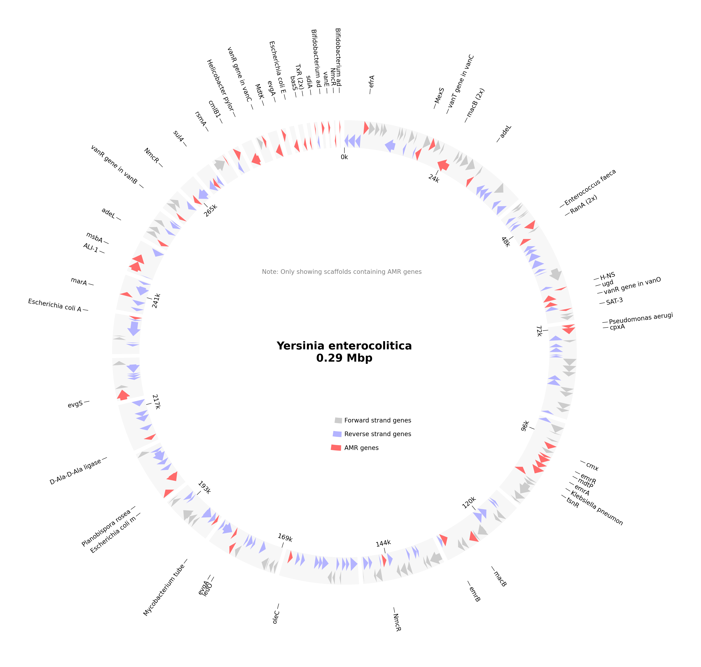

### ALI-1
- **Mechanism**: antibiotic inactivation
- **Drug Classes**: carbapenem
- **AMR Family**: ALI beta-lactamase
- **Locations**:
  - gnl|SPADES|NKBAGNNB_502_3 : position 627-2807

### Bifidobacterium adolescentis rpoB mutants conferring resistance to rifampicin (found in 2 locations)
- **Mechanism**: antibiotic target alteration; antibiotic target replacement
- **Drug Classes**: rifamycin antibiotic
- **AMR Family**: rifamycin-resistant beta-subunit of RNA polymerase (rpoB)
- **Locations**:
  - gnl|SPADES|NKBAGNNB_1822665_1 : position 2-223
  - gnl|SPADES|NKBAGNNB_186940_1 : position 3-578

### D-Ala-D-Ala ligase
- **Mechanism**: antibiotic target alteration
- **Drug Classes**: glycopeptide antibiotic
- **AMR Family**: Van ligase
- **Locations**:
  - gnl|SPADES|NKBAGNNB_346_2 : position 594-1514

### Enterococcus faecalis cls with mutation conferring resistance to daptomycin
- **Mechanism**: antibiotic target alteration
- **Drug Classes**: peptide antibiotic
- **AMR Family**: daptomycin resistant cls
- **Locations**:
  - gnl|SPADES|NKBAGNNB_115_8 : position 4880-6340

### Escherichia coli AcrAB-TolC with AcrR mutation conferring resistance to ciprofloxacin, tetracycline, and ceftazidime
- **Mechanism**: antibiotic target alteration; antibiotic efflux
- **Drug Classes**: fluoroquinolone antibiotic; cephalosporin; glycylcycline; penam; tetracycline antibiotic; rifamycin antibiotic; phenicol antibiotic; disinfecting agents and antiseptics
- **AMR Family**: resistance-nodulation-cell division (RND) antibiotic efflux pump
- **Locations**:
  - gnl|SPADES|NKBAGNNB_406_8 : position 8278-8904

### Escherichia coli EF-Tu mutants conferring resistance to Pulvomycin
- **Mechanism**: antibiotic target alteration
- **Drug Classes**: elfamycin antibiotic
- **AMR Family**: elfamycin resistant EF-Tu
- **Locations**:
  - gnl|SPADES|NKBAGNNB_17404_1 : position 2-1051

### Escherichia coli mdfA
- **Mechanism**: antibiotic efflux
- **Drug Classes**: tetracycline antibiotic; phenicol antibiotic; disinfecting agents and antiseptics
- **AMR Family**: major facilitator superfamily (MFS) antibiotic efflux pump
- **Locations**:
  - gnl|SPADES|NKBAGNNB_311_1 : position 253-1482

### H-NS
- **Mechanism**: antibiotic efflux
- **Drug Classes**: macrolide antibiotic; fluoroquinolone antibiotic; cephalosporin; cephamycin; penam; tetracycline antibiotic
- **AMR Family**: major facilitator superfamily (MFS) antibiotic efflux pump; resistance-nodulation-cell division (RND) antibiotic efflux pump
- **Locations**:
  - gnl|SPADES|NKBAGNNB_115_20 : position 21030-21440

### Helicobacter pylori pbp1 mutants conferring resistance to amoxicillin
- **Mechanism**: antibiotic target alteration
- **Drug Classes**: cephalosporin; cephamycin; penam
- **AMR Family**: Penicillin-binding protein mutations conferring resistance to beta-lactam antibiotics
- **Locations**:
  - gnl|SPADES|NKBAGNNB_2242_1 : position 217-2325

### Klebsiella pneumoniae KpnH
- **Mechanism**: antibiotic efflux
- **Drug Classes**: macrolide antibiotic; fluoroquinolone antibiotic; aminoglycoside antibiotic; carbapenem; cephalosporin; penam; peptide antibiotic; penem
- **AMR Family**: major facilitator superfamily (MFS) antibiotic efflux pump
- **Locations**:
  - gnl|SPADES|NKBAGNNB_167_12: position 11391-12926

### MdtK
- **Mechanism**: antibiotic efflux
- **Drug Classes**: fluoroquinolone antibiotic
- **AMR Family**: multidrug and toxic compound extrusion (MATE) transporter
- **Locations**:
  - gnl|SPADES|NKBAGNNB_2798_1 : position 367-1764

### MexS
- **Mechanism**: antibiotic efflux
- **Drug Classes**: fluoroquinolone antibiotic; diaminopyrimidine antibiotic; phenicol antibiotic
- **AMR Family**: resistance-nodulation-cell division (RND) antibiotic efflux pump
- **Locations**:
  - gnl|SPADES|NKBAGNNB_73_17 : position 17274-18350

### Mycobacterium tuberculosis pncA mutations conferring resistance to pyrazinamide
- **Mechanism**: antibiotic target alteration
- **Drug Classes**: pyrazine antibiotic
- **AMR Family**: Pyrazinamide resistant pncA
- **Locations**:
  - gnl|SPADES|NKBAGNNB_309_1 : position 162-815

### NmcR (found in 3 locations)
- **Mechanism**: antibiotic inactivation
- **Drug Classes**: carbapenem; cephalosporin; cephamycin; penam
- **AMR Family**: NmcA beta-lactamase
- **Locations**:
  - gnl|SPADES|NKBAGNNB_1081_1 : position 1-960
  - gnl|SPADES|NKBAGNNB_189_13 : position 12376-13293
  - gnl|SPADES|NKBAGNNB_970789_1 : position 2-304

### Planobispora rosea EF-Tu mutants conferring resistance to inhibitor GE2270A
- **Mechanism**: antibiotic target alteration
- **Drug Classes**: elfamycin antibiotic
- **AMR Family**: elfamycin resistant EF-Tu
- **Locations**:
  - gnl|SPADES|NKBAGNNB_311_2 : position 1548-3440

### Pseudomonas aeruginosa CpxR
- **Mechanism**: antibiotic efflux
- **Drug Classes**: macrolide antibiotic; fluoroquinolone antibiotic; monobactam; aminoglycoside antibiotic; carbapenem; cephalosporin; cephamycin; penam; tetracycline antibiotic; peptide antibiotic; aminocoumarin antibiotic; diaminopyrimidine antibiotic; sulfonamide antibiotic; phenicol antibiotic; penem
- **AMR Family**: resistance-nodulation-cell division (RND) antibiotic efflux pump
- **Locations**:
  - gnl|SPADES|NKBAGNNB_161_1 : position 36-734

### RanA (found in 2 locations)
- **Mechanism**: antibiotic efflux
- **Drug Classes**: aminoglycoside antibiotic
- **AMR Family**: ATP-binding cassette (ABC) antibiotic efflux pump
- **Locations**:
  - gnl|SPADES|NKBAGNNB_115_10 : position 6989-7990
  - gnl|SPADES|NKBAGNNB_115_11 : position 7987-8988

### SAT-3
- **Mechanism**: antibiotic inactivation
- **Drug Classes**: nucleoside antibiotic
- **AMR Family**: streptothricin acetyltransferase (SAT)
- **Locations**:
  - gnl|SPADES|NKBAGNNB_115_24 : position 25823-26251

### TxR (found in 2 locations)
- **Mechanism**: antibiotic efflux
- **Drug Classes**: tetracycline antibiotic
- **AMR Family**: ATP-binding cassette (ABC) antibiotic efflux pump
- **Locations**:
  - gnl|SPADES|NKBAGNNB_66820_1 : position 2-322
  - gnl|SPADES|NKBAGNNB_66820_2 : position 379-762

### adeL (found in 2 locations)
- **Mechanism**: antibiotic efflux
- **Drug Classes**: fluoroquinolone antibiotic; tetracycline antibiotic
- **AMR Family**: resistance-nodulation-cell division (RND) antibiotic efflux pump
- **Locations**:
  - gnl|SPADES|NKBAGNNB_543_1 : position 293-1186
  - gnl|SPADES|NKBAGNNB_73_27 : position 31266-32183

### basS
- **Mechanism**: antibiotic target alteration; antibiotic efflux
- **Drug Classes**: peptide antibiotic
- **AMR Family**: pmr phosphoethanolamine transferase
- **Locations**:
  - gnl|SPADES|NKBAGNNB_18924_2 : position 439-1032

### cmlB1
- **Mechanism**: antibiotic efflux
- **Drug Classes**: phenicol antibiotic
- **AMR Family**: major facilitator superfamily (MFS) antibiotic efflux pump
- **Locations**:
  - gnl|SPADES|NKBAGNNB_1969_2 : position 1264-2448

### cmx
- **Mechanism**: antibiotic efflux
- **Drug Classes**: phenicol antibiotic
- **AMR Family**: major facilitator superfamily (MFS) antibiotic efflux pump
- **Locations**:
  - gnl|SPADES|NKBAGNNB_167_6 : position 5451-6653

### cpxA
- **Mechanism**: antibiotic efflux
- **Drug Classes**: aminoglycoside antibiotic; aminocoumarin antibiotic
- **AMR Family**: resistance-nodulation-cell division (RND) antibiotic efflux pump
- **Locations**:
  - gnl|SPADES|NKBAGNNB_161_2 : position 731-2107

### efrA
- **Mechanism**: antibiotic efflux
- **Drug Classes**: macrolide antibiotic; fluoroquinolone antibiotic; rifamycin antibiotic
- **AMR Family**: ATP-binding cassette (ABC) antibiotic efflux pump
- **Locations**:
  - gnl|SPADES|NKBAGNNB_73_4 : position 4404-5513

### emrA
- **Mechanism**: antibiotic efflux
- **Drug Classes**: fluoroquinolone antibiotic
- **AMR Family**: major facilitator superfamily (MFS) antibiotic efflux pump
- **Locations**:
  - gnl|SPADES|NKBAGNNB_167_11 : position 10179-11351

### emrB
- **Mechanism**: antibiotic efflux
- **Drug Classes**: fluoroquinolone antibiotic
- **AMR Family**: major facilitator superfamily (MFS) antibiotic efflux pump
- **Locations**:
  - gnl|SPADES|NKBAGNNB_185_15 : position 16636-18060

### emrR
- **Mechanism**: antibiotic efflux
- **Drug Classes**: fluoroquinolone antibiotic
- **AMR Family**: major facilitator superfamily (MFS) antibiotic efflux pump
- **Locations**:
  - gnl|SPADES|NKBAGNNB_167_9 : position 8138-8650

### evgA (found in 2 locations)
- **Mechanism**: antibiotic efflux
- **Drug Classes**: macrolide antibiotic; fluoroquinolone antibiotic; penam; tetracycline antibiotic
- **AMR Family**: major facilitator superfamily (MFS) antibiotic efflux pump; resistance-nodulation-cell division (RND) antibiotic efflux pump
- **Locations**:
  - gnl|SPADES|NKBAGNNB_13995_1 : position 157-861
  - gnl|SPADES|NKBAGNNB_223_13 : position 11774-12418

### evgS
- **Mechanism**: antibiotic efflux
- **Drug Classes**: macrolide antibiotic; fluoroquinolone antibiotic; penam; tetracycline antibiotic
- **AMR Family**: major facilitator superfamily (MFS) antibiotic efflux pump; resistance-nodulation-cell division (RND) antibiotic efflux pump
- **Locations**:
  - gnl|SPADES|NKBAGNNB_388_1 : position 3-2315

### leuO
- **Mechanism**: antibiotic efflux
- **Drug Classes**: nucleoside antibiotic; disinfecting agents and antiseptics
- **AMR Family**: major facilitator superfamily (MFS) antibiotic efflux pump
- **Locations**:
  - gnl|SPADES|NKBAGNNB_223_12 : position 10865-11767

### macB (found in 3 locations)
- **Mechanism**: antibiotic efflux
- **Drug Classes**: macrolide antibiotic
- **AMR Family**: ATP-binding cassette (ABC) antibiotic efflux pump
- **Locations**:
  - gnl|SPADES|NKBAGNNB_185_10 : position 11134-12666
  - gnl|SPADES|NKBAGNNB_73_22 : position 22997-25828
  - gnl|SPADES|NKBAGNNB_73_30 : position 33490-34251

### marA
- **Mechanism**: antibiotic efflux; reduced permeability to antibiotic
- **Drug Classes**: fluoroquinolone antibiotic; monobactam; carbapenem; cephalosporin; glycylcycline; cephamycin; penam; tetracycline antibiotic; rifamycin antibiotic; phenicol antibiotic; penem; disinfecting agents and antiseptics
- **AMR Family**: resistance-nodulation-cell division (RND) antibiotic efflux pump; General Bacterial Porin with reduced permeability to beta-lactams
- **Locations**:
  - gnl|SPADES|NKBAGNNB_464_5 : position 3414-4301

### mdtP
- **Mechanism**: antibiotic efflux
- **Drug Classes**: nucleoside antibiotic; disinfecting agents and antiseptics
- **AMR Family**: major facilitator superfamily (MFS) antibiotic efflux pump
- **Locations**:
  - gnl|SPADES|NKBAGNNB_167_10 : position 8698-10164

### msbA
- **Mechanism**: antibiotic efflux
- **Drug Classes**: nitroimidazole antibiotic
- **AMR Family**: ATP-binding cassette (ABC) antibiotic efflux pump
- **Locations**:
  - gnl|SPADES|NKBAGNNB_502_4 : position 2843-4591

### oleC
- **Mechanism**: antibiotic efflux
- **Drug Classes**: macrolide antibiotic
- **AMR Family**: ATP-binding cassette (ABC) antibiotic efflux pump
- **Locations**:
  - gnl|SPADES|NKBAGNNB_200_15 : position 15688-16578

### rsmA
- **Mechanism**: antibiotic efflux
- **Drug Classes**: fluoroquinolone antibiotic; diaminopyrimidine antibiotic; phenicol antibiotic
- **AMR Family**: resistance-nodulation-cell division (RND) antibiotic efflux pump
- **Locations**:
  - gnl|SPADES|NKBAGNNB_1379_2: position 2698-2883

### sdiA
- **Mechanism**: antibiotic efflux
- **Drug Classes**: fluoroquinolone antibiotic; cephalosporin; glycylcycline; penam; tetracycline antibiotic; rifamycin antibiotic; phenicol antibiotic; disinfecting agents and antiseptics
- **AMR Family**: resistance-nodulation-cell division (RND) antibiotic efflux pump
- **Locations**:
  - gnl|SPADES|NKBAGNNB_97684_1 : position 3-182

### sul4
- **Mechanism**: antibiotic target replacement
- **Drug Classes**: sulfonamide antibiotic
- **AMR Family**: sulfonamide resistant sul
- **Locations**:
  - gnl|SPADES|NKBAGNNB_1258_2 : position 1520-2353

### tsnR
- **Mechanism**: antibiotic target alteration
- **Drug Classes**: peptide antibiotic
- **AMR Family**: non-erm 23S ribosomal RNA methyltransferase (A1067)
- **Locations**:
  - gnl|SPADES|NKBAGNNB_167_13 : position 13133-14224

### ugd
- **Mechanism**: antibiotic target alteration
- **Drug Classes**: peptide antibiotic
- **AMR Family**: pmr phosphoethanolamine transferase
- **Locations**:
  - gnl|SPADES|NKBAGNNB_115_21 : position 21824-23173

### vanE
- **Mechanism**: antibiotic target alteration
- **Drug Classes**: glycopeptide antibiotic
- **AMR Family**: glycopeptide resistance gene cluster; Van ligase
- **Locations**:
  - gnl|SPADES|NKBAGNNB_473480_1 : position 3-419

### vanR gene in vanB cluster
- **Mechanism**: antibiotic target alteration
- **Drug Classes**: glycopeptide antibiotic
- **AMR Family**: glycopeptide resistance gene cluster; vanR
- **Locations**:
  - gnl|SPADES|NKBAGNNB_781_1 : position 368-1084

### vanR gene in vanC cluster
- **Mechanism**: antibiotic target alteration
- **Drug Classes**: glycopeptide antibiotic
- **AMR Family**: glycopeptide resistance gene cluster; vanR
- **Locations**:
  - gnl|SPADES|NKBAGNNB_2698_2 : position 1513-2079

### vanR gene in vanO cluster
- **Mechanism**: antibiotic target alteration
- **Drug Classes**: glycopeptide antibiotic
- **AMR Family**: glycopeptide resistance gene cluster; vanR
- **Locations**:
  - gnl|SPADES|NKBAGNNB_115_22 : position 23495-24511

### vanT gene in vanC cluster
- **Mechanism**: antibiotic target alteration
- **Drug Classes**: glycopeptide antibiotic
- **AMR Family**: glycopeptide resistance gene cluster; vanT
- **Locations**:
  - gnl|SPADES|NKBAGNNB_73_19 : position 19937-21016

## Yersinia enterocolitica (type O:5) str. YE53/03
**Strain Statistics:**
- Total genome length: 3441.7 kbp
- Total scaffolds: 146
- Scaffolds with AMR genes: 93
- Total genes annotated: 6170
- Total AMR genes: 368
- Unique AMR genes: 169
- Distinct AMR mechanisms: 10
- Distinct AMR families: 63
- Distinct drug classes: 35

**Circos Plot:**

_str._YE53_03.png)

### Acinetobacter baumannii AbaF (found in 4 locations)
- **Mechanism**: antibiotic efflux
- **Drug Classes**: phosphonic acid antibiotic
- **AMR Family**: major facilitator superfamily (MFS) antibiotic efflux pump
- **Locations**:
  - gnl|SPADES|NKBAGNNB_135_15 : position 12238-13764
  - gnl|SPADES|NKBAGNNB_20_28 : position 34606-36108
  - gnl|SPADES|NKBAGNNB_20_34 : position 41585-42988
  - gnl|SPADES|NKBAGNNB_273_4 : position 4222-5589

### Acinetobacter baumannii AbaQ (found in 4 locations)
- **Mechanism**: antibiotic efflux
- **Drug Classes**: fluoroquinolone antibiotic
- **AMR Family**: major facilitator superfamily (MFS) antibiotic efflux pump
- **Locations**:
  - gnl|SPADES|NKBAGNNB_101_19 : position 19364-20680
  - gnl|SPADES|NKBAGNNB_20_2 : position 1553-2863
  - gnl|SPADES|NKBAGNNB_23_23 : position 19177-20535
  - gnl|SPADES|NKBAGNNB_66_5 : position 4302-5618

### Acinetobacter baumannii AmvA
- **Mechanism**: antibiotic efflux
- **Drug Classes**: macrolide antibiotic; disinfecting agents and antiseptics
- **AMR Family**: major facilitator superfamily (MFS) antibiotic efflux pump
- **Locations**:
  - gnl|SPADES|NKBAGNNB_58_29 : position 34011-35504

### ArnT
- **Mechanism**: antibiotic target alteration
- **Drug Classes**: peptide antibiotic
- **AMR Family**: pmr phosphoethanolamine transferase
- **Locations**:
  - gnl|SPADES|NKBAGNNB_84_22: position 25572-27236

### Bifidobacterium bifidum ileS conferring resistance to mupirocin
- **Mechanism**: antibiotic target alteration
- **Drug Classes**: mupirocin-like antibiotic
- **AMR Family**: antibiotic-resistant isoleucyl-tRNA synthetase (ileS)
- **Locations**:
  - gnl|SPADES|NKBAGNNB_27_41 : position 38146-40728

### CMY-70
- **Mechanism**: antibiotic inactivation
- **Drug Classes**: cephamycin
- **AMR Family**: CMY beta-lactamase
- **Locations**:
  - gnl|SPADES|NKBAGNNB_66_10 : position 9550-10716

### CRP
- **Mechanism**: antibiotic efflux
- **Drug Classes**: macrolide antibiotic; fluoroquinolone antibiotic; penam
- **AMR Family**: resistance-nodulation-cell division (RND) antibiotic efflux pump
- **Locations**:
  - gnl|SPADES|NKBAGNNB_30_9 : position 7762-8517

### Clostridioides difficile gyrB conferring resistance to fluoroquinolones
- **Mechanism**: antibiotic target alteration
- **Drug Classes**: fluoroquinolone antibiotic
- **AMR Family**: fluoroquinolone resistant gyrB
- **Locations**:
  - gnl|SPADES|NKBAGNNB_65_41 : position 43990-45795

### CrcB (found in 2 locations)
- **Mechanism**: antibiotic efflux
- **Drug Classes**: aminoglycoside antibiotic
- **AMR Family**: multidrug and toxic compound extrusion (MATE) transporter
- **Locations**:
  - gnl|SPADES|NKBAGNNB_27_26 : position 24639-25022
  - gnl|SPADES|NKBAGNNB_60_44 : position 40091-40495

### DHA-6
- **Mechanism**: antibiotic inactivation
- **Drug Classes**: cephalosporin; cephamycin
- **AMR Family**: DHA beta-lactamase
- **Locations**:
  - gnl|SPADES|NKBAGNNB_68_9 : position 24049-25191

### Enterobacter cloacae acrA (found in 2 locations)
- **Mechanism**: antibiotic efflux
- **Drug Classes**: fluoroquinolone antibiotic; cephalosporin; glycylcycline; penam; tetracycline antibiotic; rifamycin antibiotic; phenicol antibiotic; disinfecting agents and antiseptics
- **AMR Family**: resistance-nodulation-cell division (RND) antibiotic efflux pump
- **Locations**:
  - gnl|SPADES|NKBAGNNB_119_16 : position 22683-23666
  - gnl|SPADES|NKBAGNNB_31_52 : position 58518-59678

### Erm(34)
- **Mechanism**: antibiotic target alteration
- **Drug Classes**: macrolide antibiotic; lincosamide antibiotic; streptogramin antibiotic; streptogramin A antibiotic; streptogramin B antibiotic
- **AMR Family**: Erm 23S ribosomal RNA methyltransferase
- **Locations**:
  - gnl|SPADES|NKBAGNNB_100_29 : position 24944-25570

### Escherichia coli AcrAB-TolC with AcrR mutation conferring resistance to ciprofloxacin, tetracycline, and ceftazidime
- **Mechanism**: antibiotic target alteration; antibiotic efflux
- **Drug Classes**: fluoroquinolone antibiotic; cephalosporin; glycylcycline; penam; tetracycline antibiotic; rifamycin antibiotic; phenicol antibiotic; disinfecting agents and antiseptics
- **AMR Family**: resistance-nodulation-cell division (RND) antibiotic efflux pump
- **Locations**:
  - gnl|SPADES|NKBAGNNB_38_6 : position 5220-5804

### Escherichia coli AcrAB-TolC with MarR mutations conferring resistance to ciprofloxacin and tetracycline
- **Mechanism**: antibiotic target alteration; antibiotic efflux
- **Drug Classes**: fluoroquinolone antibiotic; cephalosporin; glycylcycline; penam; tetracycline antibiotic; rifamycin antibiotic; phenicol antibiotic; disinfecting agents and antiseptics
- **AMR Family**: resistance-nodulation-cell division (RND) antibiotic efflux pump
- **Locations**:
  - gnl|SPADES|NKBAGNNB_140_15 : position 12872-13303

### Escherichia coli acrA
- **Mechanism**: antibiotic efflux
- **Drug Classes**: fluoroquinolone antibiotic; cephalosporin; glycylcycline; penam; tetracycline antibiotic; rifamycin antibiotic; phenicol antibiotic; disinfecting agents and antiseptics
- **AMR Family**: resistance-nodulation-cell division (RND) antibiotic efflux pump
- **Locations**:
  - gnl|SPADES|NKBAGNNB_20_24 : position 28021-29223

### Escherichia coli murA with mutation conferring resistance to fosfomycin
- **Mechanism**: antibiotic target alteration
- **Drug Classes**: phosphonic acid antibiotic
- **AMR Family**: antibiotic-resistant murA transferase
- **Locations**:
  - gnl|SPADES|NKBAGNNB_126_2 : position 490-1776

### Escherichia coli parE conferring resistance to fluoroquinolones
- **Mechanism**: antibiotic target alteration
- **Drug Classes**: fluoroquinolone antibiotic
- **AMR Family**: fluoroquinolone resistant parE
- **Locations**:
  - gnl|SPADES|NKBAGNNB_118_23 : position 27173-28249

### Escherichia coli soxS with mutation conferring antibiotic resistance (found in 4 locations)
- **Mechanism**: antibiotic target alteration; antibiotic efflux; reduced permeability to antibiotic
- **Drug Classes**: fluoroquinolone antibiotic; monobactam; carbapenem; cephalosporin; glycylcycline; cephamycin; penam; tetracycline antibiotic; rifamycin antibiotic; phenicol antibiotic; penem; disinfecting agents and antiseptics
- **AMR Family**: ATP-binding cassette (ABC) antibiotic efflux pump; major facilitator superfamily (MFS) antibiotic efflux pump; resistance-nodulation-cell division (RND) antibiotic efflux pump; General Bacterial Porin with reduced permeability to beta-lactams
- **Locations**:
  - gnl|SPADES|NKBAGNNB_22_20 : position 20345-21052
  - gnl|SPADES|NKBAGNNB_24_11 : position 16184-17116
  - gnl|SPADES|NKBAGNNB_60_18 : position 15896-16903
  - gnl|SPADES|NKBAGNNB_90_1 : position 3-809

### Escherichia coli uhpA with mutation conferring resistance to fosfomycin
- **Mechanism**: antibiotic target alteration
- **Drug Classes**: phosphonic acid antibiotic
- **AMR Family**: antibiotic-resistant UhpT
- **Locations**:
  - gnl|SPADES|NKBAGNNB_141_5 : position 5338-5922

### FosM2
- **Mechanism**: antibiotic inactivation
- **Drug Classes**: phosphonic acid antibiotic
- **AMR Family**: fosfomycin thiol transferase
- **Locations**:
  - gnl|SPADES|NKBAGNNB_140_24 : position 21917-22324

### Helicobacter pylori pbp1 mutants conferring resistance to amoxicillin
- **Mechanism**: antibiotic target alteration
- **Drug Classes**: cephalosporin; cephamycin; penam
- **AMR Family**: Penicillin-binding protein mutations conferring resistance to beta-lactam antibiotics
- **Locations**:
  - gnl|SPADES|NKBAGNNB_77_6 : position 11975-14311

### Helicobacter pylori pbp2 mutants conferring resistance to amoxicillin
- **Mechanism**: antibiotic target alteration
- **Drug Classes**: cephalosporin; cephamycin; penam
- **AMR Family**: Penicillin-binding protein mutations conferring resistance to beta-lactam antibiotics
- **Locations**:
  - gnl|SPADES|NKBAGNNB_27_35 : position 32846-34741

### Helicobacter pylori pbp3 conferring resistance to amoxicillin
- **Mechanism**: antibiotic target alteration
- **Drug Classes**: cephalosporin; cephamycin; penam
- **AMR Family**: Penicillin-binding protein mutations conferring resistance to beta-lactam antibiotics
- **Locations**:
  - gnl|SPADES|NKBAGNNB_336_7 : position 8145-9854

### Klebsiella pneumoniae KpnE
- **Mechanism**: antibiotic efflux
- **Drug Classes**: macrolide antibiotic; aminoglycoside antibiotic; cephalosporin; tetracycline antibiotic; peptide antibiotic; rifamycin antibiotic; disinfecting agents and antiseptics
- **AMR Family**: small multidrug resistance (SMR) antibiotic efflux pump
- **Locations**:
  - gnl|SPADES|NKBAGNNB_459_2 : position 1064-1441

### Klebsiella pneumoniae KpnF
- **Mechanism**: antibiotic efflux
- **Drug Classes**: macrolide antibiotic; aminoglycoside antibiotic; cephalosporin; tetracycline antibiotic; peptide antibiotic; rifamycin antibiotic; disinfecting agents and antiseptics
- **AMR Family**: small multidrug resistance (SMR) antibiotic efflux pump
- **Locations**:
  - gnl|SPADES|NKBAGNNB_459_3: position 1428-1757

### Klebsiella pneumoniae KpnG
- **Mechanism**: antibiotic efflux
- **Drug Classes**: macrolide antibiotic; fluoroquinolone antibiotic; aminoglycoside antibiotic; carbapenem; cephalosporin; penam; peptide antibiotic; penem
- **AMR Family**: major facilitator superfamily (MFS) antibiotic efflux pump
- **Locations**:
  - gnl|SPADES|NKBAGNNB_38_42 : position 50436-51728

### Klebsiella pneumoniae OmpK37 (found in 4 locations)
- **Mechanism**: reduced permeability to antibiotic
- **Drug Classes**: monobactam; carbapenem; cephalosporin; cephamycin; penam; penem
- **AMR Family**: General Bacterial Porin with reduced permeability to beta-lactams
- **Locations**:
  - gnl|SPADES|NKBAGNNB_119_15 : position 21322-22437
  - gnl|SPADES|NKBAGNNB_15_73 : position 75331-76446
  - gnl|SPADES|NKBAGNNB_17_37 : position 34256-35338
  - gnl|SPADES|NKBAGNNB_68_8 : position 22456-23556

### LRA-19
- **Mechanism**: antibiotic inactivation
- **Drug Classes**: cephalosporin; penam
- **AMR Family**: subclass B3 LRA beta-lactamase
- **Locations**:
  - gnl|SPADES|NKBAGNNB_195_3 : position 3206-3853

### LlmA 23S ribosomal RNA methyltransferase
- **Mechanism**: antibiotic target alteration
- **Drug Classes**: lincosamide antibiotic
- **AMR Family**: Llm 23S ribosomal RNA methyltransferase
- **Locations**:
  - gnl|SPADES|NKBAGNNB_93_9 : position 8328-9518

### LpsB
- **Mechanism**: reduced permeability to antibiotic
- **Drug Classes**: peptide antibiotic
- **AMR Family**: Intrinsic peptide antibiotic resistant Lps
- **Locations**:
  - gnl|SPADES|NKBAGNNB_59_8 : position 8404-9507

### LptD
- **Mechanism**: antibiotic efflux
- **Drug Classes**: carbapenem; peptide antibiotic; aminocoumarin antibiotic; rifamycin antibiotic
- **AMR Family**: ATP-binding cassette (ABC) antibiotic efflux pump
- **Locations**:
  - gnl|SPADES|NKBAGNNB_33_22 : position 23566-25962

### MSI-1
- **Mechanism**: antibiotic inactivation
- **Drug Classes**: carbapenem
- **AMR Family**: MSI beta-lactamase
- **Locations**:
  - gnl|SPADES|NKBAGNNB_60_1 : position 96-851

### MexF
- **Mechanism**: antibiotic efflux
- **Drug Classes**: fluoroquinolone antibiotic; diaminopyrimidine antibiotic; phenicol antibiotic
- **AMR Family**: resistance-nodulation-cell division (RND) antibiotic efflux pump
- **Locations**:
  - gnl|SPADES|NKBAGNNB_20_25 : position 29236-32361

### MexH
- **Mechanism**: antibiotic efflux
- **Drug Classes**: fluoroquinolone antibiotic; tetracycline antibiotic; disinfecting agents and antiseptics
- **AMR Family**: resistance-nodulation-cell division (RND) antibiotic efflux pump
- **Locations**:
  - gnl|SPADES|NKBAGNNB_65_9 : position 9632-11170

### MexJ
- **Mechanism**: antibiotic efflux
- **Drug Classes**: macrolide antibiotic; tetracycline antibiotic; disinfecting agents and antiseptics
- **AMR Family**: resistance-nodulation-cell division (RND) antibiotic efflux pump
- **Locations**:
  - gnl|SPADES|NKBAGNNB_37_23 : position 31562-32644

### MexS (found in 4 locations)
- **Mechanism**: antibiotic efflux
- **Drug Classes**: fluoroquinolone antibiotic; diaminopyrimidine antibiotic; phenicol antibiotic
- **AMR Family**: resistance-nodulation-cell division (RND) antibiotic efflux pump
- **Locations**:
  - gnl|SPADES|NKBAGNNB_122_21 : position 21899-22909
  - gnl|SPADES|NKBAGNNB_15_107 : position 112258-113412
  - gnl|SPADES|NKBAGNNB_332_7 : position 8272-9306
  - gnl|SPADES|NKBAGNNB_38_9 : position 7995-9005

### MexT
- **Mechanism**: antibiotic efflux
- **Drug Classes**: fluoroquinolone antibiotic; diaminopyrimidine antibiotic; phenicol antibiotic
- **AMR Family**: resistance-nodulation-cell division (RND) antibiotic efflux pump
- **Locations**:
  - gnl|SPADES|NKBAGNNB_165_4 : position 2659-3579

### Mycobacterium tuberculosis kasA mutant conferring resistance to isoniazid (found in 2 locations)
- **Mechanism**: antibiotic target alteration
- **Drug Classes**: isoniazid-like antibiotic
- **AMR Family**: antibiotic resistant kasA
- **Locations**:
  - gnl|SPADES|NKBAGNNB_186_12 : position 14574-15848
  - gnl|SPADES|NKBAGNNB_194_15 : position 12304-13479

### Mycobacterium tuberculosis ndh with mutation conferring resistance to isoniazid
- **Mechanism**: antibiotic target alteration
- **Drug Classes**: isoniazid-like antibiotic
- **AMR Family**: antibiotic resistant ndh
- **Locations**:
  - gnl|SPADES|NKBAGNNB_23_74 : position 74734-76038

### Mycobacterium tuberculosis thyA with mutation conferring resistance to para-aminosalicylic acid
- **Mechanism**: antibiotic target alteration
- **Drug Classes**: salicylic acid antibiotic
- **AMR Family**: aminosalicylate resistant thymidylate synthase
- **Locations**:
  - gnl|SPADES|NKBAGNNB_157_11 : position 17335-18129

### Neisseria gonorrhoeae pilQ gene conferring resistance to beta-lactam
- **Mechanism**: antibiotic target alteration
- **Drug Classes**: cephalosporin; cephamycin; penam
- **AMR Family**: Penicillin-binding protein mutations conferring resistance to beta-lactam antibiotics
- **Locations**:
  - gnl|SPADES|NKBAGNNB_26_47 : position 47141-49087

### NmcR (found in 7 locations)
- **Mechanism**: antibiotic inactivation
- **Drug Classes**: carbapenem; cephalosporin; cephamycin; penam
- **AMR Family**: NmcA beta-lactamase
- **Locations**:
  - gnl|SPADES|NKBAGNNB_102_3 : position 2243-3163
  - gnl|SPADES|NKBAGNNB_24_58 : position 65290-66144
  - gnl|SPADES|NKBAGNNB_25_26 : position 35475-36368
  - gnl|SPADES|NKBAGNNB_58_6 : position 6696-7583
  - gnl|SPADES|NKBAGNNB_66_11 : position 10851-11735
  - gnl|SPADES|NKBAGNNB_86_15 : position 16450-17331
  - gnl|SPADES|NKBAGNNB_86_6 : position 5111-5992

### OXA-152
- **Mechanism**: antibiotic inactivation
- **Drug Classes**: carbapenem; penam
- **AMR Family**: OXA beta-lactamase; OXA-62-like beta-lactamase
- **Locations**:
  - gnl|SPADES|NKBAGNNB_57_12 : position 12540-13244

### OmpA (found in 4 locations)
- **Mechanism**: reduced permeability to antibiotic
- **Drug Classes**: peptide antibiotic
- **AMR Family**: General Bacterial Porin with reduced permeability to peptide antibiotics
- **Locations**:
  - gnl|SPADES|NKBAGNNB_118_8 : position 10205-10864
  - gnl|SPADES|NKBAGNNB_25_20 : position 28297-29967
  - gnl|SPADES|NKBAGNNB_25_3 : position 6300-7676
  - gnl|SPADES|NKBAGNNB_90_9 : position 10110-10619

### OprJ
- **Mechanism**: antibiotic efflux
- **Drug Classes**: macrolide antibiotic; fluoroquinolone antibiotic; aminoglycoside antibiotic; cephalosporin; penam; tetracycline antibiotic; aminocoumarin antibiotic; diaminopyrimidine antibiotic; phenicol antibiotic
- **AMR Family**: resistance-nodulation-cell division (RND) antibiotic efflux pump
- **Locations**:
  - gnl|SPADES|NKBAGNNB_20_50 : position 59852-61372

### OprM
- **Mechanism**: antibiotic efflux
- **Drug Classes**: macrolide antibiotic; fluoroquinolone antibiotic; monobactam; aminoglycoside antibiotic; carbapenem; cephalosporin; cephamycin; penam; tetracycline antibiotic; peptide antibiotic; aminocoumarin antibiotic; diaminopyrimidine antibiotic; sulfonamide antibiotic; phenicol antibiotic; penem; disinfecting agents and antiseptics
- **AMR Family**: resistance-nodulation-cell division (RND) antibiotic efflux pump
- **Locations**:
  - gnl|SPADES|NKBAGNNB_31_50 : position 53981-55387

### PDC-382
- **Mechanism**: antibiotic inactivation
- **Drug Classes**: monobactam; carbapenem; cephalosporin
- **AMR Family**: PDC beta-lactamase
- **Locations**:
  - gnl|SPADES|NKBAGNNB_38_4 : position 2815-3987

### ParR (found in 2 locations)
- **Mechanism**: antibiotic efflux; reduced permeability to antibiotic
- **Drug Classes**: macrolide antibiotic; fluoroquinolone antibiotic; monobactam; aminoglycoside antibiotic; carbapenem; cephalosporin; cephamycin; penam; tetracycline antibiotic; phenicol antibiotic; penem; disinfecting agents and antiseptics
- **AMR Family**: resistance-nodulation-cell division (RND) antibiotic efflux pump; Outer Membrane Porin (Opr)
- **Locations**:
  - gnl|SPADES|NKBAGNNB_20_59 : position 71832-72560
  - gnl|SPADES|NKBAGNNB_30_16 : position 16866-17594

### ParS (found in 2 locations)
- **Mechanism**: antibiotic efflux; reduced permeability to antibiotic
- **Drug Classes**: macrolide antibiotic; fluoroquinolone antibiotic; monobactam; aminoglycoside antibiotic; carbapenem; cephalosporin; cephamycin; penam; tetracycline antibiotic; phenicol antibiotic; penem; disinfecting agents and antiseptics
- **AMR Family**: resistance-nodulation-cell division (RND) antibiotic efflux pump; Outer Membrane Porin (Opr)
- **Locations**:
  - gnl|SPADES|NKBAGNNB_20_57 : position 70462-71352
  - gnl|SPADES|NKBAGNNB_30_17 : position 17591-18904

### Planobispora rosea EF-Tu mutants conferring resistance to inhibitor GE2270A
- **Mechanism**: antibiotic target alteration
- **Drug Classes**: elfamycin antibiotic
- **AMR Family**: elfamycin resistant EF-Tu
- **Locations**:
  - gnl|SPADES|NKBAGNNB_100_18 : position 16134-17633

### PmrF (found in 3 locations)
- **Mechanism**: antibiotic target alteration
- **Drug Classes**: peptide antibiotic
- **AMR Family**: pmr phosphoethanolamine transferase
- **Locations**:
  - gnl|SPADES|NKBAGNNB_17_54 : position 56726-58099
  - gnl|SPADES|NKBAGNNB_235_12 : position 9090-10079
  - gnl|SPADES|NKBAGNNB_84_25 : position 30150-31133

### Pseudomonas aeruginosa CpxR
- **Mechanism**: antibiotic efflux
- **Drug Classes**: macrolide antibiotic; fluoroquinolone antibiotic; monobactam; aminoglycoside antibiotic; carbapenem; cephalosporin; cephamycin; penam; tetracycline antibiotic; peptide antibiotic; aminocoumarin antibiotic; diaminopyrimidine antibiotic; sulfonamide antibiotic; phenicol antibiotic; penem
- **AMR Family**: resistance-nodulation-cell division (RND) antibiotic efflux pump
- **Locations**:
  - gnl|SPADES|NKBAGNNB_135_23 : position 22361-23044

### Pseudomonas aeruginosa ampR with mutation conferring resistance to aztreonam
- **Mechanism**: antibiotic target alteration; antibiotic inactivation
- **Drug Classes**: monobactam; carbapenem; cephalosporin
- **AMR Family**: PDC beta-lactamase; ampR transcriptional regulator with mutation conferring resistance to monobactam antibiotics
- **Locations**:
  - gnl|SPADES|NKBAGNNB_47_25 : position 25770-26711

### QepA4 (found in 3 locations)
- **Mechanism**: antibiotic efflux
- **Drug Classes**: fluoroquinolone antibiotic
- **AMR Family**: major facilitator superfamily (MFS) antibiotic efflux pump
- **Locations**:
  - gnl|SPADES|NKBAGNNB_165_3 : position 1106-2530
  - gnl|SPADES|NKBAGNNB_17_71 : position 76986-78626
  - gnl|SPADES|NKBAGNNB_24_26 : position 34312-35604

### RanA (found in 17 locations)
- **Mechanism**: antibiotic efflux
- **Drug Classes**: aminoglycoside antibiotic
- **AMR Family**: ATP-binding cassette (ABC) antibiotic efflux pump
- **Locations**:
  - gnl|SPADES|NKBAGNNB_130_2 : position 1013-2035
  - gnl|SPADES|NKBAGNNB_131_20 : position 20232-21050
  - gnl|SPADES|NKBAGNNB_137_5 : position 5330-6106
  - gnl|SPADES|NKBAGNNB_184_16 : position 16521-18113
  - gnl|SPADES|NKBAGNNB_30_63 : position 71067-71882
  - gnl|SPADES|NKBAGNNB_31_11 : position 11678-12556
  - gnl|SPADES|NKBAGNNB_31_35 : position 34349-35464
  - gnl|SPADES|NKBAGNNB_34_24 : position 26456-27589
  - gnl|SPADES|NKBAGNNB_365_9 : position 6463-7266
  - gnl|SPADES|NKBAGNNB_38_20 : position 24541-25632
  - gnl|SPADES|NKBAGNNB_47_31 : position 32058-32873
  - gnl|SPADES|NKBAGNNB_58_22 : position 24627-25676
  - gnl|SPADES|NKBAGNNB_58_31 : position 36852-37658
  - gnl|SPADES|NKBAGNNB_60_7 : position 5726-6925
  - gnl|SPADES|NKBAGNNB_69_15 : position 14077-15180
  - gnl|SPADES|NKBAGNNB_72_33 : position 40291-41025
  - gnl|SPADES|NKBAGNNB_75_30 : position 31960-33474

### RanB (found in 2 locations)
- **Mechanism**: antibiotic efflux
- **Drug Classes**: aminoglycoside antibiotic
- **AMR Family**: ATP-binding cassette (ABC) antibiotic efflux pump
- **Locations**:
  - gnl|SPADES|NKBAGNNB_365_8 : position 5670-6452
  - gnl|SPADES|NKBAGNNB_58_30 : position 35713-36858

### Rv1877 (found in 2 locations)
- **Mechanism**: antibiotic efflux
- **Drug Classes**: fluoroquinolone antibiotic
- **AMR Family**: major facilitator superfamily (MFS) antibiotic efflux pump
- **Locations**:
  - gnl|SPADES|NKBAGNNB_118_10 : position 11766-13214
  - gnl|SPADES|NKBAGNNB_38_40 : position 48455-49843

### Salmonella serovars soxS with mutation conferring antibiotic resistance
- **Mechanism**: antibiotic target alteration; antibiotic efflux; reduced permeability to antibiotic
- **Drug Classes**: fluoroquinolone antibiotic; monobactam; carbapenem; cephalosporin; glycylcycline; cephamycin; penam; tetracycline antibiotic; rifamycin antibiotic; phenicol antibiotic; penem; disinfecting agents and antiseptics
- **AMR Family**: ATP-binding cassette (ABC) antibiotic efflux pump; major facilitator superfamily (MFS) antibiotic efflux pump; resistance-nodulation-cell division (RND) antibiotic efflux pump; General Bacterial Porin with reduced permeability to beta-lactams
- **Locations**:
  - gnl|SPADES|NKBAGNNB_23_9 : position 6268-6654

### SatA
- **Mechanism**: antibiotic inactivation
- **Drug Classes**: nucleoside antibiotic
- **AMR Family**: streptothricin acetyltransferase (SAT)
- **Locations**:
  - gnl|SPADES|NKBAGNNB_38_11 : position 10729-11187

### Staphylococcus aureus GlpT with mutation conferring resistance to fosfomycin
- **Mechanism**: antibiotic target alteration
- **Drug Classes**: phosphonic acid antibiotic
- **AMR Family**: antibiotic-resistant GlpT
- **Locations**:
  - gnl|SPADES|NKBAGNNB_29_57 : position 66319-67683

### Staphylococcus aureus fusA with mutation conferring resistance to fusidic acid (found in 2 locations)
- **Mechanism**: antibiotic target alteration
- **Drug Classes**: fusidane antibiotic
- **AMR Family**: antibiotic resistant fusA
- **Locations**:
  - gnl|SPADES|NKBAGNNB_47_36 : position 37039-39147
  - gnl|SPADES|NKBAGNNB_90_26 : position 28967-30556

### Staphylococcus aureus mupA conferring resistance to mupirocin
- **Mechanism**: antibiotic target alteration
- **Drug Classes**: mupirocin-like antibiotic
- **AMR Family**: antibiotic-resistant isoleucyl-tRNA synthetase (ileS)
- **Locations**:
  - gnl|SPADES|NKBAGNNB_33_6 : position 5393-8209

### Staphylococcus aureus mupB conferring resistance to mupirocin
- **Mechanism**: antibiotic target alteration
- **Drug Classes**: mupirocin-like antibiotic
- **AMR Family**: antibiotic-resistant isoleucyl-tRNA synthetase (ileS)
- **Locations**:
  - gnl|SPADES|NKBAGNNB_31_3 : position 1958-4855

### Staphylococcus aureus murA with mutation conferring resistance to fosfomycin
- **Mechanism**: antibiotic target alteration
- **Drug Classes**: phosphonic acid antibiotic
- **AMR Family**: antibiotic-resistant murA transferase
- **Locations**:
  - gnl|SPADES|NKBAGNNB_365_3 : position 2288-3556

### Staphylococcus aureus pgsA mutations conferring resistance to daptomycin (found in 2 locations)
- **Mechanism**: antibiotic target alteration
- **Drug Classes**: peptide antibiotic
- **AMR Family**: daptomycin resistant pgsA
- **Locations**:
  - gnl|SPADES|NKBAGNNB_17_89 : position 98797-99345
  - gnl|SPADES|NKBAGNNB_46_41 : position 39928-40476

### Streptococcus pneumoniae PBP2x conferring resistance to amoxicillin
- **Mechanism**: antibiotic target alteration
- **Drug Classes**: cephalosporin; cephamycin; penam
- **AMR Family**: Penicillin-binding protein mutations conferring resistance to beta-lactam antibiotics
- **Locations**:
  - gnl|SPADES|NKBAGNNB_363_3 : position 3430-5985

### Streptomyces lividans cmlR
- **Mechanism**: antibiotic efflux
- **Drug Classes**: phenicol antibiotic
- **AMR Family**: major facilitator superfamily (MFS) antibiotic efflux pump
- **Locations**:
  - gnl|SPADES|NKBAGNNB_102_9 : position 9111-10325

### Streptomyces rimosus otr(A)
- **Mechanism**: antibiotic target protection
- **Drug Classes**: tetracycline antibiotic
- **AMR Family**: tetracycline-resistant ribosomal protection protein
- **Locations**:
  - gnl|SPADES|NKBAGNNB_166_13 : position 13010-14833

### Streptomyces venezuelae rox (found in 2 locations)
- **Mechanism**: antibiotic inactivation
- **Drug Classes**: rifamycin antibiotic
- **AMR Family**: rifampin monooxygenase
- **Locations**:
  - gnl|SPADES|NKBAGNNB_26_6 : position 4802-5971
  - gnl|SPADES|NKBAGNNB_27_54 : position 54068-55249

### TaeA (found in 3 locations)
- **Mechanism**: antibiotic efflux
- **Drug Classes**: pleuromutilin antibiotic
- **AMR Family**: ATP-binding cassette (ABC) antibiotic efflux pump
- **Locations**:
  - gnl|SPADES|NKBAGNNB_186_7 : position 8534-10447
  - gnl|SPADES|NKBAGNNB_60_32 : position 28001-28666
  - gnl|SPADES|NKBAGNNB_90_10 : position 10909-12576

### TolC
- **Mechanism**: antibiotic efflux
- **Drug Classes**: macrolide antibiotic; fluoroquinolone antibiotic; aminoglycoside antibiotic; carbapenem; cephalosporin; glycylcycline; cephamycin; penam; tetracycline antibiotic; peptide antibiotic; aminocoumarin antibiotic; rifamycin antibiotic; phenicol antibiotic; penem; disinfecting agents and antiseptics
- **AMR Family**: ATP-binding cassette (ABC) antibiotic efflux pump; major facilitator superfamily (MFS) antibiotic efflux pump; resistance-nodulation-cell division (RND) antibiotic efflux pump
- **Locations**:
  - gnl|SPADES|NKBAGNNB_68_5 : position 16911-18296

### TriC
- **Mechanism**: antibiotic efflux
- **Drug Classes**: disinfecting agents and antiseptics
- **AMR Family**: resistance-nodulation-cell division (RND) antibiotic efflux pump
- **Locations**:
  - gnl|SPADES|NKBAGNNB_37_22 : position 28476-31562

### TxR (found in 7 locations)
- **Mechanism**: antibiotic efflux
- **Drug Classes**: tetracycline antibiotic
- **AMR Family**: ATP-binding cassette (ABC) antibiotic efflux pump
- **Locations**:
  - gnl|SPADES|NKBAGNNB_166_16 : position 17904-19316
  - gnl|SPADES|NKBAGNNB_24_47 : position 54857-56398
  - gnl|SPADES|NKBAGNNB_30_47 : position 56434-58017
  - gnl|SPADES|NKBAGNNB_30_56 : position 63725-64735
  - gnl|SPADES|NKBAGNNB_37_9 : position 12040-13959
  - gnl|SPADES|NKBAGNNB_42_46 : position 50784-52943
  - gnl|SPADES|NKBAGNNB_45_26 : position 30176-31513

### YajC
- **Mechanism**: antibiotic efflux
- **Drug Classes**: fluoroquinolone antibiotic; cephalosporin; glycylcycline; penam; tetracycline antibiotic; oxazolidinone antibiotic; glycopeptide antibiotic; rifamycin antibiotic; phenicol antibiotic; disinfecting agents and antiseptics
- **AMR Family**: resistance-nodulation-cell division (RND) antibiotic efflux pump
- **Locations**:
  - gnl|SPADES|NKBAGNNB_35_30 : position 41954-42286

### acrB (found in 2 locations)
- **Mechanism**: antibiotic efflux
- **Drug Classes**: fluoroquinolone antibiotic; cephalosporin; glycylcycline; penam; tetracycline antibiotic; rifamycin antibiotic; phenicol antibiotic; disinfecting agents and antiseptics
- **AMR Family**: resistance-nodulation-cell division (RND) antibiotic efflux pump
- **Locations**:
  - gnl|SPADES|NKBAGNNB_31_51 : position 55389-58514
  - gnl|SPADES|NKBAGNNB_97_32 : position 30054-31949

### adeF
- **Mechanism**: antibiotic efflux
- **Drug Classes**: fluoroquinolone antibiotic; tetracycline antibiotic
- **AMR Family**: resistance-nodulation-cell division (RND) antibiotic efflux pump
- **Locations**:
  - gnl|SPADES|NKBAGNNB_57_6: position 4918-8049

### adeK
- **Mechanism**: antibiotic efflux
- **Drug Classes**: macrolide antibiotic; fluoroquinolone antibiotic; lincosamide antibiotic; carbapenem; cephalosporin; tetracycline antibiotic; rifamycin antibiotic; diaminopyrimidine antibiotic; phenicol antibiotic; penem
- **AMR Family**: resistance-nodulation-cell division (RND) antibiotic efflux pump
- **Locations**:
  - gnl|SPADES|NKBAGNNB_47_18 : position 18141-19547

### adeL (found in 18 locations)
- **Mechanism**: antibiotic efflux
- **Drug Classes**: fluoroquinolone antibiotic; tetracycline antibiotic
- **AMR Family**: resistance-nodulation-cell division (RND) antibiotic efflux pump
- **Locations**:
  - gnl|SPADES|NKBAGNNB_102_8 : position 8056-9015
  - gnl|SPADES|NKBAGNNB_125_7 : position 7525-8430
  - gnl|SPADES|NKBAGNNB_156_8 : position 9985-10896
  - gnl|SPADES|NKBAGNNB_15_69 : position 71556-72470
  - gnl|SPADES|NKBAGNNB_17_60 : position 66143-67075
  - gnl|SPADES|NKBAGNNB_194_20 : position 16981-17883
  - gnl|SPADES|NKBAGNNB_205_3 : position 2791-3687
  - gnl|SPADES|NKBAGNNB_215_2 : position 1338-2270
  - gnl|SPADES|NKBAGNNB_26_63 : position 61841-62737
  - gnl|SPADES|NKBAGNNB_27_3 : position 2118-3029
  - gnl|SPADES|NKBAGNNB_30_4 : position 3769-4713
  - gnl|SPADES|NKBAGNNB_31_16 : position 14661-15569
  - gnl|SPADES|NKBAGNNB_34_53 : position 57784-58656
  - gnl|SPADES|NKBAGNNB_38_8 : position 6923-7819
  - gnl|SPADES|NKBAGNNB_419_5 : position 5504-6442
  - gnl|SPADES|NKBAGNNB_65_40 : position 43063-43986
  - gnl|SPADES|NKBAGNNB_90_11 : position 12686-13597
  - gnl|SPADES|NKBAGNNB_90_31 : position 33916-34866

### almE (found in 2 locations)
- **Mechanism**: antibiotic target alteration
- **Drug Classes**: peptide antibiotic
- **AMR Family**: polymyxin resistance operon; alm glycyltransferase
- **Locations**:
  - gnl|SPADES|NKBAGNNB_26_69 : position 70728-72884
  - gnl|SPADES|NKBAGNNB_459_8 : position 6088-7782

### arlR (found in 2 locations)
- **Mechanism**: antibiotic efflux
- **Drug Classes**: fluoroquinolone antibiotic; disinfecting agents and antiseptics
- **AMR Family**: major facilitator superfamily (MFS) antibiotic efflux pump
- **Locations**:
  - gnl|SPADES|NKBAGNNB_17_78 : position 85895-86614
  - gnl|SPADES|NKBAGNNB_27_10 : position 8674-9363

### arlS
- **Mechanism**: antibiotic efflux
- **Drug Classes**: fluoroquinolone antibiotic; disinfecting agents and antiseptics
- **AMR Family**: major facilitator superfamily (MFS) antibiotic efflux pump
- **Locations**:
  - gnl|SPADES|NKBAGNNB_38_27 : position 33538-35115

### arnA (found in 2 locations)
- **Mechanism**: antibiotic target alteration
- **Drug Classes**: peptide antibiotic
- **AMR Family**: pmr phosphoethanolamine transferase
- **Locations**:
  - gnl|SPADES|NKBAGNNB_390_5 : position 3481-4428
  - gnl|SPADES|NKBAGNNB_84_24 : position 28135-30153

### bacA
- **Mechanism**: antibiotic target alteration
- **Drug Classes**: peptide antibiotic
- **AMR Family**: undecaprenyl pyrophosphate related proteins
- **Locations**:
  - gnl|SPADES|NKBAGNNB_220_10 : position 12031-12849

### baeR (found in 3 locations)
- **Mechanism**: antibiotic efflux
- **Drug Classes**: aminoglycoside antibiotic; aminocoumarin antibiotic
- **AMR Family**: resistance-nodulation-cell division (RND) antibiotic efflux pump
- **Locations**:
  - gnl|SPADES|NKBAGNNB_232_7 : position 10871-11593
  - gnl|SPADES|NKBAGNNB_35_17 : position 25493-26182
  - gnl|SPADES|NKBAGNNB_58_10 : position 10857-11597

### baeS (found in 2 locations)
- **Mechanism**: antibiotic efflux
- **Drug Classes**: aminoglycoside antibiotic; aminocoumarin antibiotic
- **AMR Family**: resistance-nodulation-cell division (RND) antibiotic efflux pump
- **Locations**:
  - gnl|SPADES|NKBAGNNB_232_6 : position 9489-10865
  - gnl|SPADES|NKBAGNNB_45_25 : position 27594-29030

### basS (found in 4 locations)
- **Mechanism**: antibiotic target alteration; antibiotic efflux
- **Drug Classes**: peptide antibiotic
- **AMR Family**: pmr phosphoethanolamine transferase
- **Locations**:
  - gnl|SPADES|NKBAGNNB_137_15 : position 14091-15440
  - gnl|SPADES|NKBAGNNB_17_77 : position 84226-85902
  - gnl|SPADES|NKBAGNNB_26_19 : position 18135-19562
  - gnl|SPADES|NKBAGNNB_895_3 : position 2014-3078

### bcr-1 (found in 2 locations)
- **Mechanism**: antibiotic efflux
- **Drug Classes**: bicyclomycin-like antibiotic
- **AMR Family**: major facilitator superfamily (MFS) antibiotic efflux pump
- **Locations**:
  - gnl|SPADES|NKBAGNNB_233_12 : position 13683-14906
  - gnl|SPADES|NKBAGNNB_419_4 : position 4123-5340

### bcrA (found in 9 locations)
- **Mechanism**: antibiotic efflux
- **Drug Classes**: peptide antibiotic
- **AMR Family**: ATP-binding cassette (ABC) antibiotic efflux pump
- **Locations**:
  - gnl|SPADES|NKBAGNNB_15_18 : position 18043-19107
  - gnl|SPADES|NKBAGNNB_15_26 : position 26632-27339
  - gnl|SPADES|NKBAGNNB_15_59 : position 60947-61645
  - gnl|SPADES|NKBAGNNB_25_32 : position 41111-41926
  - gnl|SPADES|NKBAGNNB_25_74 : position 77749-79230
  - gnl|SPADES|NKBAGNNB_283_6 : position 5841-6599
  - gnl|SPADES|NKBAGNNB_37_30 : position 42898-44463
  - gnl|SPADES|NKBAGNNB_41_51 : position 52805-53431
  - gnl|SPADES|NKBAGNNB_71_15 : position 17753-18478

### blt
- **Mechanism**: antibiotic efflux
- **Drug Classes**: fluoroquinolone antibiotic; disinfecting agents and antiseptics
- **AMR Family**: major facilitator superfamily (MFS) antibiotic efflux pump
- **Locations**:
  - gnl|SPADES|NKBAGNNB_42_24 : position 27948-29168

### catB11
- **Mechanism**: antibiotic inactivation
- **Drug Classes**: phenicol antibiotic
- **AMR Family**: chloramphenicol acetyltransferase (CAT)
- **Locations**:
  - gnl|SPADES|NKBAGNNB_66_19 : position 16292-16936

### chrB
- **Mechanism**: antibiotic target alteration
- **Drug Classes**: macrolide antibiotic; lincosamide antibiotic
- **AMR Family**: non-erm 23S ribosomal RNA methyltransferase (G748)
- **Locations**:
  - gnl|SPADES|NKBAGNNB_336_6 : position 7167-8027

### clbB
- **Mechanism**: antibiotic target alteration
- **Drug Classes**: lincosamide antibiotic; streptogramin antibiotic; streptogramin A antibiotic; oxazolidinone antibiotic; phenicol antibiotic; pleuromutilin antibiotic
- **AMR Family**: Cfr 23S ribosomal RNA methyltransferase
- **Locations**:
  - gnl|SPADES|NKBAGNNB_77_9 : position 17809-19005

### cmeC
- **Mechanism**: antibiotic efflux
- **Drug Classes**: macrolide antibiotic; fluoroquinolone antibiotic; cephalosporin; fusidane antibiotic
- **AMR Family**: resistance-nodulation-cell division (RND) antibiotic efflux pump
- **Locations**:
  - gnl|SPADES|NKBAGNNB_38_45 : position 53437-54924

### cmlA9
- **Mechanism**: antibiotic efflux
- **Drug Classes**: phenicol antibiotic
- **AMR Family**: major facilitator superfamily (MFS) antibiotic efflux pump
- **Locations**:
  - gnl|SPADES|NKBAGNNB_125_10 : position 12582-13772

### cmlB
- **Mechanism**: antibiotic efflux
- **Drug Classes**: phenicol antibiotic
- **AMR Family**: major facilitator superfamily (MFS) antibiotic efflux pump
- **Locations**:
  - gnl|SPADES|NKBAGNNB_38_23 : position 29000-30331

### cmlv (found in 2 locations)
- **Mechanism**: antibiotic inactivation
- **Drug Classes**: phenicol antibiotic
- **AMR Family**: chloramphenicol phosphotransferase
- **Locations**:
  - gnl|SPADES|NKBAGNNB_17_48 : position 50386-51552
  - gnl|SPADES|NKBAGNNB_26_64 : position 63200-64360

### cmrA
- **Mechanism**: antibiotic efflux
- **Drug Classes**: phenicol antibiotic
- **AMR Family**: major facilitator superfamily (MFS) antibiotic efflux pump
- **Locations**:
  - gnl|SPADES|NKBAGNNB_883_1 : position 216-1418

### cprR
- **Mechanism**: antibiotic target alteration; antibiotic efflux
- **Drug Classes**: peptide antibiotic
- **AMR Family**: pmr phosphoethanolamine transferase
- **Locations**:
  - gnl|SPADES|NKBAGNNB_895_2 : position 1358-2017

### cpxA (found in 4 locations)
- **Mechanism**: antibiotic efflux
- **Drug Classes**: aminoglycoside antibiotic; aminocoumarin antibiotic
- **AMR Family**: resistance-nodulation-cell division (RND) antibiotic efflux pump
- **Locations**:
  - gnl|SPADES|NKBAGNNB_135_24 : position 23070-24437
  - gnl|SPADES|NKBAGNNB_166_15 : position 16844-17896
  - gnl|SPADES|NKBAGNNB_23_64 : position 60286-61692
  - gnl|SPADES|NKBAGNNB_647_5 : position 4345-5700

### dfrA3
- **Mechanism**: antibiotic target replacement
- **Drug Classes**: diaminopyrimidine antibiotic
- **AMR Family**: trimethoprim resistant dihydrofolate reductase dfr
- **Locations**:
  - gnl|SPADES|NKBAGNNB_33_16 : position 18558-19040

### emrY
- **Mechanism**: antibiotic efflux
- **Drug Classes**: tetracycline antibiotic
- **AMR Family**: major facilitator superfamily (MFS) antibiotic efflux pump
- **Locations**:
  - gnl|SPADES|NKBAGNNB_232_5 : position 8063-9472

### eptA
- **Mechanism**: antibiotic target alteration
- **Drug Classes**: peptide antibiotic
- **AMR Family**: pmr phosphoethanolamine transferase
- **Locations**:
  - gnl|SPADES|NKBAGNNB_140_21 : position 18190-19830

### eptB
- **Mechanism**: antibiotic target alteration
- **Drug Classes**: peptide antibiotic
- **AMR Family**: pmr phosphoethanolamine transferase
- **Locations**:
  - gnl|SPADES|NKBAGNNB_29_54 : position 62336-64027

### erm(56)
- **Mechanism**: antibiotic target alteration
- **Drug Classes**: macrolide antibiotic; lincosamide antibiotic; streptogramin antibiotic; streptogramin B antibiotic
- **AMR Family**: Erm 23S ribosomal RNA methyltransferase
- **Locations**:
  - gnl|SPADES|NKBAGNNB_33_19 : position 20404-21222

### evgA (found in 9 locations)
- **Mechanism**: antibiotic efflux
- **Drug Classes**: macrolide antibiotic; fluoroquinolone antibiotic; penam; tetracycline antibiotic
- **AMR Family**: major facilitator superfamily (MFS) antibiotic efflux pump; resistance-nodulation-cell division (RND) antibiotic efflux pump
- **Locations**:
  - gnl|SPADES|NKBAGNNB_137_14 : position 13508-14116
  - gnl|SPADES|NKBAGNNB_17_91 : position 101229-101885
  - gnl|SPADES|NKBAGNNB_22_6 : position 7871-8503
  - gnl|SPADES|NKBAGNNB_24_22 : position 30770-31489
  - gnl|SPADES|NKBAGNNB_29_55 : position 64139-64729
  - gnl|SPADES|NKBAGNNB_38_19 : position 23050-23682
  - gnl|SPADES|NKBAGNNB_38_25 : position 31999-32628
  - gnl|SPADES|NKBAGNNB_46_39 : position 37388-38044
  - gnl|SPADES|NKBAGNNB_57_4 : position 3633-4331

### evgS (found in 7 locations)
- **Mechanism**: antibiotic efflux
- **Drug Classes**: macrolide antibiotic; fluoroquinolone antibiotic; penam; tetracycline antibiotic
- **AMR Family**: major facilitator superfamily (MFS) antibiotic efflux pump; resistance-nodulation-cell division (RND) antibiotic efflux pump
- **Locations**:
  - gnl|SPADES|NKBAGNNB_141_6 : position 5900-7660
  - gnl|SPADES|NKBAGNNB_160_4 : position 4667-7483
  - gnl|SPADES|NKBAGNNB_22_7 : position 8528-11341
  - gnl|SPADES|NKBAGNNB_38_18 : position 19251-23075
  - gnl|SPADES|NKBAGNNB_51_7 : position 8641-9030
  - gnl|SPADES|NKBAGNNB_68_1 : position 2-2314
  - gnl|SPADES|NKBAGNNB_745_2 : position 1309-4230

### facT
- **Mechanism**: antibiotic efflux
- **Drug Classes**: elfamycin antibiotic
- **AMR Family**: major facilitator superfamily (MFS) antibiotic efflux pump
- **Locations**:
  - gnl|SPADES|NKBAGNNB_85_2 : position 1140-2444

### farB
- **Mechanism**: antibiotic efflux
- **Drug Classes**: antibacterial free fatty acids
- **AMR Family**: major facilitator superfamily (MFS) antibiotic efflux pump
- **Locations**:
  - gnl|SPADES|NKBAGNNB_24_37 : position 43995-45425

### fexA
- **Mechanism**: antibiotic efflux
- **Drug Classes**: phenicol antibiotic
- **AMR Family**: major facilitator superfamily (MFS) antibiotic efflux pump
- **Locations**:
  - gnl|SPADES|NKBAGNNB_60_19 : position 16991-18226

### gadW (found in 4 locations)
- **Mechanism**: antibiotic efflux
- **Drug Classes**: macrolide antibiotic; fluoroquinolone antibiotic; penam
- **AMR Family**: resistance-nodulation-cell division (RND) antibiotic efflux pump
- **Locations**:
  - gnl|SPADES|NKBAGNNB_25_48 : position 54679-55581
  - gnl|SPADES|NKBAGNNB_41_8 : position 7610-8398
  - gnl|SPADES|NKBAGNNB_46_19 : position 20010-20819
  - gnl|SPADES|NKBAGNNB_51_44 : position 47151-48020

### golS
- **Mechanism**: antibiotic efflux
- **Drug Classes**: monobactam; carbapenem; cephalosporin; cephamycin; penam; phenicol antibiotic; penem
- **AMR Family**: resistance-nodulation-cell division (RND) antibiotic efflux pump
- **Locations**:
  - gnl|SPADES|NKBAGNNB_59_21 : position 26481-26900

### hmrM
- **Mechanism**: antibiotic efflux
- **Drug Classes**: fluoroquinolone antibiotic; disinfecting agents and antiseptics
- **AMR Family**: multidrug and toxic compound extrusion (MATE) transporter
- **Locations**:
  - gnl|SPADES|NKBAGNNB_419_1 : position 276-1688

### hp1181
- **Mechanism**: antibiotic efflux
- **Drug Classes**: fluoroquinolone antibiotic; tetracycline antibiotic; nitroimidazole antibiotic
- **AMR Family**: major facilitator superfamily (MFS) antibiotic efflux pump
- **Locations**:
  - gnl|SPADES|NKBAGNNB_35_48 : position 58632-59996

### kdpD
- **Mechanism**: antibiotic efflux
- **Drug Classes**: aminoglycoside antibiotic
- **AMR Family**: kdpDE
- **Locations**:
  - gnl|SPADES|NKBAGNNB_61_16 : position 13980-16679

### kdpE (found in 3 locations)
- **Mechanism**: antibiotic efflux
- **Drug Classes**: aminoglycoside antibiotic
- **AMR Family**: kdpDE
- **Locations**:
  - gnl|SPADES|NKBAGNNB_23_63 : position 59561-60232
  - gnl|SPADES|NKBAGNNB_38_26 : position 32830-33516
  - gnl|SPADES|NKBAGNNB_61_15 : position 13294-13983

### leuO (found in 2 locations)
- **Mechanism**: antibiotic efflux
- **Drug Classes**: nucleoside antibiotic; disinfecting agents and antiseptics
- **AMR Family**: major facilitator superfamily (MFS) antibiotic efflux pump
- **Locations**:
  - gnl|SPADES|NKBAGNNB_26_65 : position 64357-65310
  - gnl|SPADES|NKBAGNNB_33_45 : position 59446-60402

### lfrA
- **Mechanism**: antibiotic efflux
- **Drug Classes**: fluoroquinolone antibiotic
- **AMR Family**: major facilitator superfamily (MFS) antibiotic efflux pump
- **Locations**:
  - gnl|SPADES|NKBAGNNB_165_15 : position 14268-15635

### macA (found in 3 locations)
- **Mechanism**: antibiotic efflux
- **Drug Classes**: macrolide antibiotic
- **AMR Family**: ATP-binding cassette (ABC) antibiotic efflux pump
- **Locations**:
  - gnl|SPADES|NKBAGNNB_135_22 : position 20964-22172
  - gnl|SPADES|NKBAGNNB_34_3 : position 2378-3406
  - gnl|SPADES|NKBAGNNB_47_16 : position 15003-16178

### macB (found in 30 locations)
- **Mechanism**: antibiotic efflux
- **Drug Classes**: macrolide antibiotic
- **AMR Family**: ATP-binding cassette (ABC) antibiotic efflux pump
- **Locations**:
  - gnl|SPADES|NKBAGNNB_100_21 : position 18772-19506
  - gnl|SPADES|NKBAGNNB_130_1 : position 36-1016
  - gnl|SPADES|NKBAGNNB_134_2 : position 850-1881
  - gnl|SPADES|NKBAGNNB_135_19 : position 16765-17856
  - gnl|SPADES|NKBAGNNB_135_21 : position 18978-20960
  - gnl|SPADES|NKBAGNNB_137_19 : position 19100-20116
  - gnl|SPADES|NKBAGNNB_15_102 : position 106484-107143
  - gnl|SPADES|NKBAGNNB_15_50 : position 51260-52096
  - gnl|SPADES|NKBAGNNB_15_82 : position 87476-88198
  - gnl|SPADES|NKBAGNNB_17_64 : position 68932-69645
  - gnl|SPADES|NKBAGNNB_17_66 : position 70796-72088
  - gnl|SPADES|NKBAGNNB_199_9 : position 13495-14223
  - gnl|SPADES|NKBAGNNB_235_8 : position 5493-6260
  - gnl|SPADES|NKBAGNNB_236_14 : position 13259-13927
  - gnl|SPADES|NKBAGNNB_23_29 : position 27669-28451
  - gnl|SPADES|NKBAGNNB_23_70 : position 67824-68528
  - gnl|SPADES|NKBAGNNB_27_44 : position 43447-44172
  - gnl|SPADES|NKBAGNNB_29_8 : position 8487-10019
  - gnl|SPADES|NKBAGNNB_30_62 : position 70075-71067
  - gnl|SPADES|NKBAGNNB_31_27 : position 26634-27368
  - gnl|SPADES|NKBAGNNB_33_29 : position 38546-39250
  - gnl|SPADES|NKBAGNNB_34_15 : position 18161-18940
  - gnl|SPADES|NKBAGNNB_34_2 : position 429-2378
  - gnl|SPADES|NKBAGNNB_34_43 : position 46929-47915
  - gnl|SPADES|NKBAGNNB_38_46 : position 54917-56131
  - gnl|SPADES|NKBAGNNB_38_47 : position 56124-56831
  - gnl|SPADES|NKBAGNNB_46_7 : position 5096-5851
  - gnl|SPADES|NKBAGNNB_47_17 : position 16168-18144
  - gnl|SPADES|NKBAGNNB_59_27 : position 31003-31689
  - gnl|SPADES|NKBAGNNB_97_22 : position 21928-22656

### marA (found in 2 locations)
- **Mechanism**: antibiotic efflux; reduced permeability to antibiotic
- **Drug Classes**: fluoroquinolone antibiotic; monobactam; carbapenem; cephalosporin; glycylcycline; cephamycin; penam; tetracycline antibiotic; rifamycin antibiotic; phenicol antibiotic; penem; disinfecting agents and antiseptics
- **AMR Family**: resistance-nodulation-cell division (RND) antibiotic efflux pump; General Bacterial Porin with reduced permeability to beta-lactams
- **Locations**:
  - gnl|SPADES|NKBAGNNB_119_13 : position 19520-20500
  - gnl|SPADES|NKBAGNNB_23_21 : position 17124-17999

### mdtA (found in 2 locations)
- **Mechanism**: antibiotic efflux
- **Drug Classes**: aminocoumarin antibiotic
- **AMR Family**: resistance-nodulation-cell division (RND) antibiotic efflux pump
- **Locations**:
  - gnl|SPADES|NKBAGNNB_15_103 : position 107145-108407
  - gnl|SPADES|NKBAGNNB_232_1 : position 333-1667

### mdtB
- **Mechanism**: antibiotic efflux
- **Drug Classes**: aminocoumarin antibiotic
- **AMR Family**: resistance-nodulation-cell division (RND) antibiotic efflux pump
- **Locations**:
  - gnl|SPADES|NKBAGNNB_232_2 : position 1667-4810

### mdtC (found in 2 locations)
- **Mechanism**: antibiotic efflux
- **Drug Classes**: aminocoumarin antibiotic
- **AMR Family**: resistance-nodulation-cell division (RND) antibiotic efflux pump
- **Locations**:
  - gnl|SPADES|NKBAGNNB_232_3 : position 4807-7881
  - gnl|SPADES|NKBAGNNB_65_10 : position 11167-14298

### mdtG
- **Mechanism**: antibiotic efflux
- **Drug Classes**: phosphonic acid antibiotic
- **AMR Family**: major facilitator superfamily (MFS) antibiotic efflux pump
- **Locations**:
  - gnl|SPADES|NKBAGNNB_141_2 : position 2016-3260

### mdtH (found in 2 locations)
- **Mechanism**: antibiotic efflux
- **Drug Classes**: fluoroquinolone antibiotic
- **AMR Family**: major facilitator superfamily (MFS) antibiotic efflux pump
- **Locations**:
  - gnl|SPADES|NKBAGNNB_221_4 : position 2481-3686
  - gnl|SPADES|NKBAGNNB_283_8 : position 7639-9120

### mdtN (found in 5 locations)
- **Mechanism**: antibiotic efflux
- **Drug Classes**: nucleoside antibiotic; disinfecting agents and antiseptics
- **AMR Family**: major facilitator superfamily (MFS) antibiotic efflux pump
- **Locations**:
  - gnl|SPADES|NKBAGNNB_140_17 : position 13814-14584
  - gnl|SPADES|NKBAGNNB_156_10 : position 11420-12355
  - gnl|SPADES|NKBAGNNB_15_38 : position 39297-40283
  - gnl|SPADES|NKBAGNNB_20_48 : position 56907-57962
  - gnl|SPADES|NKBAGNNB_68_7 : position 20620-21789

### mdtO (found in 2 locations)
- **Mechanism**: antibiotic efflux
- **Drug Classes**: nucleoside antibiotic; disinfecting agents and antiseptics
- **AMR Family**: major facilitator superfamily (MFS) antibiotic efflux pump
- **Locations**:
  - gnl|SPADES|NKBAGNNB_20_49 : position 57946-59850
  - gnl|SPADES|NKBAGNNB_93_2 : position 863-2998

### mreA
- **Mechanism**: antibiotic efflux
- **Drug Classes**: macrolide antibiotic
- **AMR Family**: major facilitator superfamily (MFS) antibiotic efflux pump
- **Locations**:
  - gnl|SPADES|NKBAGNNB_33_5 : position 4423-5361

### msbA (found in 6 locations)
- **Mechanism**: antibiotic efflux
- **Drug Classes**: nitroimidazole antibiotic
- **AMR Family**: ATP-binding cassette (ABC) antibiotic efflux pump
- **Locations**:
  - gnl|SPADES|NKBAGNNB_126_17 : position 22841-24607
  - gnl|SPADES|NKBAGNNB_126_18 : position 24610-26334
  - gnl|SPADES|NKBAGNNB_20_43 : position 52721-53479
  - gnl|SPADES|NKBAGNNB_24_3 : position 2753-4879
  - gnl|SPADES|NKBAGNNB_27_18 : position 17610-19382
  - gnl|SPADES|NKBAGNNB_57_34 : position 33779-34591

### msr(I)
- **Mechanism**: antibiotic target protection
- **Drug Classes**: macrolide antibiotic; streptogramin antibiotic; phosphonic acid antibiotic
- **AMR Family**: msr-type ABC-F protein
- **Locations**:
  - gnl|SPADES|NKBAGNNB_22_43 : position 40890-42635

### mtrA (found in 3 locations)
- **Mechanism**: antibiotic efflux
- **Drug Classes**: macrolide antibiotic; penam
- **AMR Family**: resistance-nodulation-cell division (RND) antibiotic efflux pump
- **Locations**:
  - gnl|SPADES|NKBAGNNB_29_10 : position 11281-12474
  - gnl|SPADES|NKBAGNNB_389_2 : position 3094-4101
  - gnl|SPADES|NKBAGNNB_883_2 : position 1481-2503

### nalC
- **Mechanism**: antibiotic efflux
- **Drug Classes**: macrolide antibiotic; fluoroquinolone antibiotic; monobactam; carbapenem; cephalosporin; cephamycin; penam; tetracycline antibiotic; peptide antibiotic; aminocoumarin antibiotic; diaminopyrimidine antibiotic; sulfonamide antibiotic; phenicol antibiotic; penem
- **AMR Family**: resistance-nodulation-cell division (RND) antibiotic efflux pump
- **Locations**:
  - gnl|SPADES|NKBAGNNB_15_39 : position 40317-41015

### novA (found in 4 locations)
- **Mechanism**: antibiotic efflux
- **Drug Classes**: aminocoumarin antibiotic
- **AMR Family**: ATP-binding cassette (ABC) antibiotic efflux pump
- **Locations**:
  - gnl|SPADES|NKBAGNNB_23_13 : position 9702-11420
  - gnl|SPADES|NKBAGNNB_24_5 : position 6273-8405
  - gnl|SPADES|NKBAGNNB_68_6 : position 18472-20607
  - gnl|SPADES|NKBAGNNB_84_4 : position 3350-4096

### oleC (found in 2 locations)
- **Mechanism**: antibiotic efflux
- **Drug Classes**: macrolide antibiotic
- **AMR Family**: ATP-binding cassette (ABC) antibiotic efflux pump
- **Locations**:
  - gnl|SPADES|NKBAGNNB_47_48 : position 50029-50748
  - gnl|SPADES|NKBAGNNB_47_49 : position 50745-51479

### optrA (found in 2 locations)
- **Mechanism**: antibiotic target protection
- **Drug Classes**: oxazolidinone antibiotic; phenicol antibiotic
- **AMR Family**: Miscellaneous ABC-F subfamily ATP-binding cassette ribosomal protection proteins
- **Locations**:
  - gnl|SPADES|NKBAGNNB_15_97 : position 100508-102214
  - gnl|SPADES|NKBAGNNB_235_13 : position 10121-12037

### putative nickel/cobalt transporter
- **Mechanism**: antibiotic efflux
- **Drug Classes**: fluoroquinolone antibiotic; aminoglycoside antibiotic; isoniazid-like antibiotic
- **AMR Family**: metal transporters with antibiotic efflux
- **Locations**:
  - gnl|SPADES|NKBAGNNB_60_41 : position 36935-37993

### qacJ
- **Mechanism**: antibiotic efflux
- **Drug Classes**: disinfecting agents and antiseptics
- **AMR Family**: small multidrug resistance (SMR) antibiotic efflux pump
- **Locations**:
  - gnl|SPADES|NKBAGNNB_30_35: position 40008-40340

### qacL
- **Mechanism**: antibiotic efflux
- **Drug Classes**: disinfecting agents and antiseptics
- **AMR Family**: small multidrug resistance (SMR) antibiotic efflux pump
- **Locations**:
  - gnl|SPADES|NKBAGNNB_22_76 : position 81311-81625

### rosA
- **Mechanism**: antibiotic efflux
- **Drug Classes**: peptide antibiotic
- **AMR Family**: major facilitator superfamily (MFS) antibiotic efflux pump
- **Locations**:
  - gnl|SPADES|NKBAGNNB_59_15 : position 18178-19410

### rosB (found in 2 locations)
- **Mechanism**: antibiotic efflux
- **Drug Classes**: peptide antibiotic
- **AMR Family**: major facilitator superfamily (MFS) antibiotic efflux pump
- **Locations**:
  - gnl|SPADES|NKBAGNNB_235_15 : position 12881-14689
  - gnl|SPADES|NKBAGNNB_59_14 : position 16250-17941

### rphA
- **Mechanism**: antibiotic inactivation
- **Drug Classes**: rifamycin antibiotic
- **AMR Family**: rifampin phosphotransferase
- **Locations**:
  - gnl|SPADES|NKBAGNNB_84_10 : position 12157-14538

### salE
- **Mechanism**: antibiotic target protection
- **Drug Classes**: lincosamide antibiotic; streptogramin antibiotic; streptogramin A antibiotic; pleuromutilin antibiotic
- **AMR Family**: sal-type ABC-F protein
- **Locations**:
  - gnl|SPADES|NKBAGNNB_15_13 : position 13592-15085

### sdiA (found in 2 locations)
- **Mechanism**: antibiotic efflux
- **Drug Classes**: fluoroquinolone antibiotic; cephalosporin; glycylcycline; penam; tetracycline antibiotic; rifamycin antibiotic; phenicol antibiotic; disinfecting agents and antiseptics
- **AMR Family**: resistance-nodulation-cell division (RND) antibiotic efflux pump
- **Locations**:
  - gnl|SPADES|NKBAGNNB_25_22 : position 30592-31194
  - gnl|SPADES|NKBAGNNB_93_24 : position 22180-22914

### smeR
- **Mechanism**: antibiotic efflux
- **Drug Classes**: aminoglycoside antibiotic; cephalosporin; cephamycin; penam
- **AMR Family**: resistance-nodulation-cell division (RND) antibiotic efflux pump
- **Locations**:
  - gnl|SPADES|NKBAGNNB_26_18 : position 17426-18124

### smeS
- **Mechanism**: antibiotic efflux
- **Drug Classes**: aminoglycoside antibiotic; cephalosporin; cephamycin; penam
- **AMR Family**: resistance-nodulation-cell division (RND) antibiotic efflux pump
- **Locations**:
  - gnl|SPADES|NKBAGNNB_35_18 : position 26207-27523

### sta
- **Mechanism**: antibiotic inactivation
- **Drug Classes**: nucleoside antibiotic
- **AMR Family**: streptothricin acetyltransferase (SAT)
- **Locations**:
  - gnl|SPADES|NKBAGNNB_31_4 : position 4990-5493

### tet(39)
- **Mechanism**: antibiotic efflux
- **Drug Classes**: tetracycline antibiotic
- **AMR Family**: major facilitator superfamily (MFS) antibiotic efflux pump
- **Locations**:
  - gnl|SPADES|NKBAGNNB_58_9 : position 9389-10633

### tet(V)
- **Mechanism**: antibiotic efflux
- **Drug Classes**: tetracycline antibiotic
- **AMR Family**: major facilitator superfamily (MFS) antibiotic efflux pump
- **Locations**:
  - gnl|SPADES|NKBAGNNB_24_40 : position 46349-47602

### tet(W)
- **Mechanism**: antibiotic target protection
- **Drug Classes**: tetracycline antibiotic
- **AMR Family**: tetracycline-resistant ribosomal protection protein
- **Locations**:
  - gnl|SPADES|NKBAGNNB_45_8 : position 6624-8423

### tet(X1)
- **Mechanism**: antibiotic inactivation
- **Drug Classes**: tetracycline antibiotic
- **AMR Family**: tetracycline inactivation enzyme
- **Locations**:
  - gnl|SPADES|NKBAGNNB_26_7 : position 6059-7273

### tetA(46) (found in 2 locations)
- **Mechanism**: antibiotic efflux
- **Drug Classes**: tetracycline antibiotic
- **AMR Family**: ATP-binding cassette (ABC) antibiotic efflux pump
- **Locations**:
  - gnl|SPADES|NKBAGNNB_47_15 : position 12853-15003
  - gnl|SPADES|NKBAGNNB_75_11 : position 11329-12852

### tetA(58) (found in 15 locations)
- **Mechanism**: antibiotic efflux
- **Drug Classes**: tetracycline antibiotic
- **AMR Family**: major facilitator superfamily (MFS) antibiotic efflux pump
- **Locations**:
  - gnl|SPADES|NKBAGNNB_104_13 : position 9759-10685
  - gnl|SPADES|NKBAGNNB_122_3 : position 2574-4109
  - gnl|SPADES|NKBAGNNB_15_37 : position 37532-39283
  - gnl|SPADES|NKBAGNNB_15_58 : position 59983-60819
  - gnl|SPADES|NKBAGNNB_15_65 : position 67811-68755
  - gnl|SPADES|NKBAGNNB_175_2 : position 586-1311
  - gnl|SPADES|NKBAGNNB_22_49 : position 52286-53071
  - gnl|SPADES|NKBAGNNB_24_9 : position 13427-14998
  - gnl|SPADES|NKBAGNNB_31_12 : position 12543-13259
  - gnl|SPADES|NKBAGNNB_31_26 : position 25814-26620
  - gnl|SPADES|NKBAGNNB_34_50 : position 53872-54660
  - gnl|SPADES|NKBAGNNB_69_4 : position 2797-3564
  - gnl|SPADES|NKBAGNNB_69_5 : position 3609-4310
  - gnl|SPADES|NKBAGNNB_84_27 : position 32617-33375
  - gnl|SPADES|NKBAGNNB_86_3 : position 1611-3101

### tetA(60) (found in 4 locations)
- **Mechanism**: antibiotic efflux
- **Drug Classes**: tetracycline antibiotic
- **AMR Family**: ATP-binding cassette (ABC) antibiotic efflux pump
- **Locations**:
  - gnl|SPADES|NKBAGNNB_160_16 : position 20281-21081
  - gnl|SPADES|NKBAGNNB_215_7 : position 7022-8827
  - gnl|SPADES|NKBAGNNB_60_31 : position 27202-28008
  - gnl|SPADES|NKBAGNNB_97_12 : position 11312-13078

### tetB(60)
- **Mechanism**: antibiotic efflux
- **Drug Classes**: tetracycline antibiotic
- **AMR Family**: ATP-binding cassette (ABC) antibiotic efflux pump
- **Locations**:
  - gnl|SPADES|NKBAGNNB_97_13 : position 13044-14849

### tlrC
- **Mechanism**: antibiotic target protection
- **Drug Classes**: macrolide antibiotic; lincosamide antibiotic
- **AMR Family**: Miscellaneous ABC-F subfamily ATP-binding cassette ribosomal protection proteins
- **Locations**:
  - gnl|SPADES|NKBAGNNB_65_3 : position 2484-3302

### tsnR
- **Mechanism**: antibiotic target alteration
- **Drug Classes**: peptide antibiotic
- **AMR Family**: non-erm 23S ribosomal RNA methyltransferase (A1067)
- **Locations**:
  - gnl|SPADES|NKBAGNNB_296_8 : position 7592-8332

### vanG
- **Mechanism**: antibiotic target alteration
- **Drug Classes**: glycopeptide antibiotic
- **AMR Family**: glycopeptide resistance gene cluster; Van ligase
- **Locations**:
  - gnl|SPADES|NKBAGNNB_63_50 : position 35537-36718

### vanH gene in vanB cluster (found in 4 locations)
- **Mechanism**: antibiotic target alteration
- **Drug Classes**: glycopeptide antibiotic
- **AMR Family**: vanH; glycopeptide resistance gene cluster
- **Locations**:
  - gnl|SPADES|NKBAGNNB_122_7 : position 7111-8127
  - gnl|SPADES|NKBAGNNB_26_1 : position 3-1073
  - gnl|SPADES|NKBAGNNB_41_7 : position 6431-7564
  - gnl|SPADES|NKBAGNNB_66_4 : position 3342-4292

### vanH gene in vanD cluster
- **Mechanism**: antibiotic target alteration
- **Drug Classes**: glycopeptide antibiotic
- **AMR Family**: vanH; glycopeptide resistance gene cluster
- **Locations**:
  - gnl|SPADES|NKBAGNNB_30_32 : position 37516-38511

### vanH gene in vanF cluster
- **Mechanism**: antibiotic target alteration
- **Drug Classes**: glycopeptide antibiotic
- **AMR Family**: vanH; glycopeptide resistance gene cluster
- **Locations**:
  - gnl|SPADES|NKBAGNNB_118_11 : position 13369-14349

### vanH gene in vanP cluster (found in 2 locations)
- **Mechanism**: antibiotic target alteration
- **Drug Classes**: glycopeptide antibiotic
- **AMR Family**: vanH; glycopeptide resistance gene cluster
- **Locations**:
  - gnl|SPADES|NKBAGNNB_101_20 : position 20849-21814
  - gnl|SPADES|NKBAGNNB_221_8 : position 5998-6939

### vanL
- **Mechanism**: antibiotic target alteration
- **Drug Classes**: glycopeptide antibiotic
- **AMR Family**: glycopeptide resistance gene cluster; Van ligase
- **Locations**:
  - gnl|SPADES|NKBAGNNB_72_6 : position 4825-5925

### vanR gene in vanF cluster (found in 2 locations)
- **Mechanism**: antibiotic target alteration
- **Drug Classes**: glycopeptide antibiotic
- **AMR Family**: glycopeptide resistance gene cluster; vanR
- **Locations**:
  - gnl|SPADES|NKBAGNNB_38_5 : position 4061-5140
  - gnl|SPADES|NKBAGNNB_51_6 : position 7439-8488

### vanR gene in vanM cluster
- **Mechanism**: antibiotic target alteration
- **Drug Classes**: glycopeptide antibiotic
- **AMR Family**: glycopeptide resistance gene cluster; vanR
- **Locations**:
  - gnl|SPADES|NKBAGNNB_26_58 : position 57228-57926

### vanS gene in vanG cluster
- **Mechanism**: antibiotic target alteration
- **Drug Classes**: glycopeptide antibiotic
- **AMR Family**: vanS; glycopeptide resistance gene cluster
- **Locations**:
  - gnl|SPADES|NKBAGNNB_27_9 : position 7165-8658

### vanT gene in vanG cluster
- **Mechanism**: antibiotic target alteration
- **Drug Classes**: glycopeptide antibiotic
- **AMR Family**: glycopeptide resistance gene cluster; vanT
- **Locations**:
  - gnl|SPADES|NKBAGNNB_125_11 : position 13780-14856

### vatF
- **Mechanism**: antibiotic inactivation
- **Drug Classes**: streptogramin antibiotic; streptogramin A antibiotic
- **AMR Family**: streptogramin vat acetyltransferase
- **Locations**:
  - gnl|SPADES|NKBAGNNB_24_18: position 25112-25777

### vmlR
- **Mechanism**: antibiotic target protection
- **Drug Classes**: lincosamide antibiotic; streptogramin antibiotic; streptogramin A antibiotic; streptogramin B antibiotic; nucleoside antibiotic; pleuromutilin antibiotic
- **AMR Family**: Miscellaneous ABC-F subfamily ATP-binding cassette ribosomal protection proteins
- **Locations**:
  - gnl|SPADES|NKBAGNNB_66_21 : position 18243-20006

### y56 beta-lactamase
- **Mechanism**: antibiotic inactivation
- **Drug Classes**: cephalosporin; penam; penem
- **AMR Family**: BlaA beta-lactamase
- **Locations**:
  - gnl|SPADES|NKBAGNNB_24_24: position 32666-33550

