# AMR Analysis Report for LB03_CI_QG_A2_S22

# Organism Classifications:

## Aeromonas salmonicida
**Strain Statistics:**
- Total genome length: 295.0 kbp
- Total scaffolds: 5651
- Scaffolds with AMR genes: 420
- Total genes annotated: 584
- Total AMR genes: 437
- Unique AMR genes: 189
- Distinct AMR mechanisms: 11
- Distinct AMR families: 61
- Distinct drug classes: 35

**Circos Plot:**

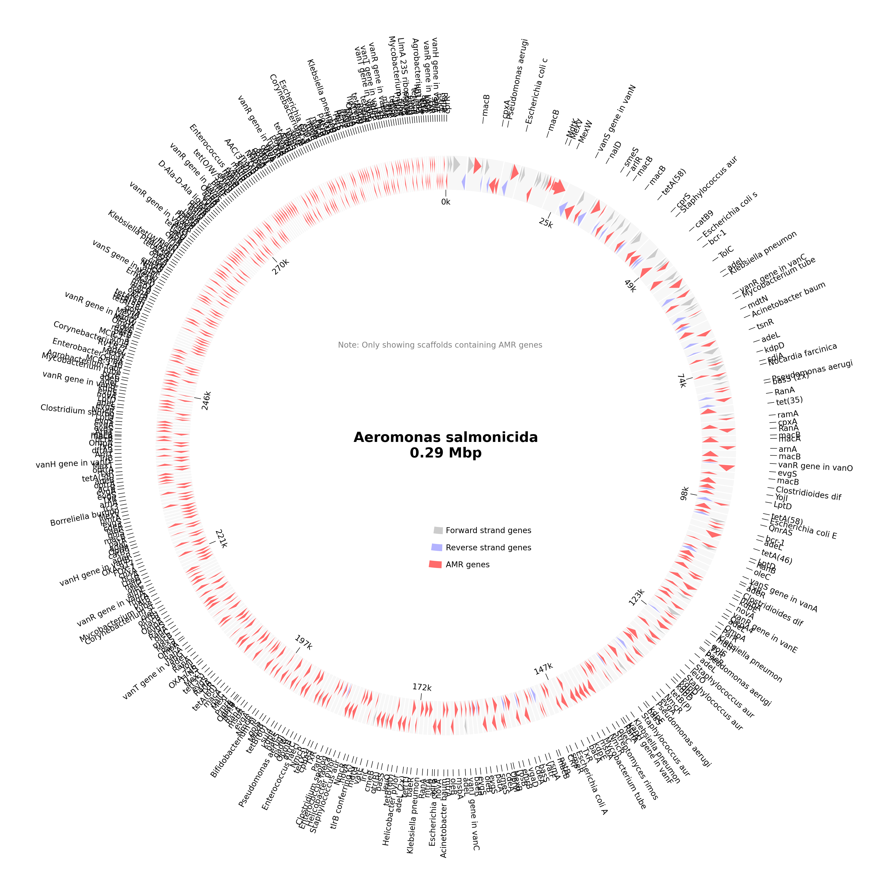

### AAC(3)-VIIa
- **Mechanism**: antibiotic inactivation
- **Drug Classes**: aminoglycoside antibiotic
- **AMR Family**: AAC(3)
- **Locations**:
  - gnl|SPADES|LFDBGJIL_1051622_1 : position 2-289

### Acinetobacter baumannii AbaF (found in 2 locations)
- **Mechanism**: antibiotic efflux
- **Drug Classes**: phosphonic acid antibiotic
- **AMR Family**: major facilitator superfamily (MFS) antibiotic efflux pump
- **Locations**:
  - gnl|SPADES|LFDBGJIL_3523_1 : position 2-871
  - gnl|SPADES|LFDBGJIL_65359_1 : position 2-517

### AcrE
- **Mechanism**: antibiotic efflux
- **Drug Classes**: fluoroquinolone antibiotic; cephalosporin; cephamycin; penam
- **AMR Family**: resistance-nodulation-cell division (RND) antibiotic efflux pump
- **Locations**:
  - gnl|SPADES|LFDBGJIL_613892_1 : position 2-373

### AcrS
- **Mechanism**: antibiotic efflux
- **Drug Classes**: fluoroquinolone antibiotic; cephalosporin; glycylcycline; cephamycin; penam; tetracycline antibiotic; rifamycin antibiotic; phenicol antibiotic; disinfecting agents and antiseptics
- **AMR Family**: resistance-nodulation-cell division (RND) antibiotic efflux pump
- **Locations**:
  - gnl|SPADES|LFDBGJIL_1421009_1 : position 1-252

### Agrobacterium fabrum chloramphenicol acetyltransferase (found in 2 locations)
- **Mechanism**: antibiotic inactivation
- **Drug Classes**: phenicol antibiotic
- **AMR Family**: chloramphenicol acetyltransferase (CAT)
- **Locations**:
  - gnl|SPADES|LFDBGJIL_1949845_1 : position 28-213
  - gnl|SPADES|LFDBGJIL_475898_1 : position 2-415

### ArnT (found in 4 locations)
- **Mechanism**: antibiotic target alteration
- **Drug Classes**: peptide antibiotic
- **AMR Family**: pmr phosphoethanolamine transferase
- **Locations**:
  - gnl|SPADES|LFDBGJIL_1156103_1 : position 1-243
  - gnl|SPADES|LFDBGJIL_364843_1 : position 2-460
  - gnl|SPADES|LFDBGJIL_394323_1 : position 3-449
  - gnl|SPADES|LFDBGJIL_849206_1 : position 1-321

### Bifidobacterium bifidum ileS conferring resistance to mupirocin
- **Mechanism**: antibiotic target alteration
- **Drug Classes**: mupirocin-like antibiotic
- **AMR Family**: antibiotic-resistant isoleucyl-tRNA synthetase (ileS)
- **Locations**:
  - gnl|SPADES|LFDBGJIL_144198_1 : position 3-620

### Borreliella burgdorferi murA with mutation conferring resistance to fosfomycin
- **Mechanism**: antibiotic target alteration
- **Drug Classes**: phosphonic acid antibiotic
- **AMR Family**: antibiotic-resistant murA transferase
- **Locations**:
  - gnl|SPADES|LFDBGJIL_307428_1 : position 2-355

### CRP
- **Mechanism**: antibiotic efflux
- **Drug Classes**: macrolide antibiotic; fluoroquinolone antibiotic; penam
- **AMR Family**: resistance-nodulation-cell division (RND) antibiotic efflux pump
- **Locations**:
  - gnl|SPADES|LFDBGJIL_40764_1 : position 2-469

### Clostridioides difficile gyrB conferring resistance to fluoroquinolones (found in 2 locations)
- **Mechanism**: antibiotic target alteration
- **Drug Classes**: fluoroquinolone antibiotic
- **AMR Family**: fluoroquinolone resistant gyrB
- **Locations**:
  - gnl|SPADES|LFDBGJIL_11531_2 : position 350-1165
  - gnl|SPADES|LFDBGJIL_7647_1 : position 2-1210

### Clostridium sporogenes cplR (found in 2 locations)
- **Mechanism**: antibiotic target protection
- **Drug Classes**: lincosamide antibiotic; pleuromutilin antibiotic
- **AMR Family**: Miscellaneous ABC-F subfamily ATP-binding cassette ribosomal protection proteins
- **Locations**:
  - gnl|SPADES|LFDBGJIL_107960_1 : position 2-184
  - gnl|SPADES|LFDBGJIL_411143_2 : position 125-442

### Corynebacterium striatum tetA (found in 3 locations)
- **Mechanism**: antibiotic efflux
- **Drug Classes**: penam; tetracycline antibiotic
- **AMR Family**: major facilitator superfamily (MFS) antibiotic efflux pump
- **Locations**:
  - gnl|SPADES|LFDBGJIL_1335552_1 : position 2-259
  - gnl|SPADES|LFDBGJIL_237266_1 : position 1-534
  - gnl|SPADES|LFDBGJIL_518662_1 : position 2-400

### D-Ala-D-Ala ligase
- **Mechanism**: antibiotic target alteration
- **Drug Classes**: glycopeptide antibiotic
- **AMR Family**: Van ligase
- **Locations**:
  - gnl|SPADES|LFDBGJIL_919766_1 : position 2-310

### Enterobacter cloacae acrA
- **Mechanism**: antibiotic efflux
- **Drug Classes**: fluoroquinolone antibiotic; cephalosporin; glycylcycline; penam; tetracycline antibiotic; rifamycin antibiotic; phenicol antibiotic; disinfecting agents and antiseptics
- **AMR Family**: resistance-nodulation-cell division (RND) antibiotic efflux pump
- **Locations**:
  - gnl|SPADES|LFDBGJIL_486171_1 : position 2-412

### Enterococcus faecalis cls with mutation conferring resistance to daptomycin (found in 2 locations)
- **Mechanism**: antibiotic target alteration
- **Drug Classes**: peptide antibiotic
- **AMR Family**: daptomycin resistant cls
- **Locations**:
  - gnl|SPADES|LFDBGJIL_1014740_1 : position 3-293
  - gnl|SPADES|LFDBGJIL_106486_1 : position 1-672

### Enterococcus faecium liaR mutant conferring daptomycin resistance
- **Mechanism**: antibiotic target alteration; antibiotic efflux
- **Drug Classes**: peptide antibiotic
- **AMR Family**: daptomycin resistant liaR
- **Locations**:
  - gnl|SPADES|LFDBGJIL_121268_2 : position 237-650

### Erm(30)
- **Mechanism**: antibiotic target alteration
- **Drug Classes**: macrolide antibiotic; lincosamide antibiotic; streptogramin antibiotic
- **AMR Family**: Erm 23S ribosomal RNA methyltransferase
- **Locations**:
  - gnl|SPADES|LFDBGJIL_670998_1 : position 2-175

### Escherichia coli AcrAB-TolC with AcrR mutation conferring resistance to ciprofloxacin, tetracycline, and ceftazidime
- **Mechanism**: antibiotic target alteration; antibiotic efflux
- **Drug Classes**: fluoroquinolone antibiotic; cephalosporin; glycylcycline; penam; tetracycline antibiotic; rifamycin antibiotic; phenicol antibiotic; disinfecting agents and antiseptics
- **AMR Family**: resistance-nodulation-cell division (RND) antibiotic efflux pump
- **Locations**:
  - gnl|SPADES|LFDBGJIL_37942_2 : position 340-870

### Escherichia coli EF-Tu mutants conferring resistance to Pulvomycin
- **Mechanism**: antibiotic target alteration
- **Drug Classes**: elfamycin antibiotic
- **AMR Family**: elfamycin resistant EF-Tu
- **Locations**:
  - gnl|SPADES|LFDBGJIL_8265_1 : position 1-1080

### Escherichia coli acrA (found in 2 locations)
- **Mechanism**: antibiotic efflux
- **Drug Classes**: fluoroquinolone antibiotic; cephalosporin; glycylcycline; penam; tetracycline antibiotic; rifamycin antibiotic; phenicol antibiotic; disinfecting agents and antiseptics
- **AMR Family**: resistance-nodulation-cell division (RND) antibiotic efflux pump
- **Locations**:
  - gnl|SPADES|LFDBGJIL_1358915_1 : position 2-256
  - gnl|SPADES|LFDBGJIL_66190_1 : position 1-129

### Escherichia coli cyaA with mutation conferring resistance to fosfomycin
- **Mechanism**: antibiotic target alteration
- **Drug Classes**: phosphonic acid antibiotic
- **AMR Family**: antibiotic-resistant cya adenylate cyclase
- **Locations**:
  - gnl|SPADES|LFDBGJIL_1222_4 : position 2064-3518

### Escherichia coli soxS with mutation conferring antibiotic resistance
- **Mechanism**: antibiotic target alteration; antibiotic efflux; reduced permeability to antibiotic
- **Drug Classes**: fluoroquinolone antibiotic; monobactam; carbapenem; cephalosporin; glycylcycline; cephamycin; penam; tetracycline antibiotic; rifamycin antibiotic; phenicol antibiotic; penem; disinfecting agents and antiseptics
- **AMR Family**: ATP-binding cassette (ABC) antibiotic efflux pump; major facilitator superfamily (MFS) antibiotic efflux pump; resistance-nodulation-cell division (RND) antibiotic efflux pump; General Bacterial Porin with reduced permeability to beta-lactams
- **Locations**:
  - gnl|SPADES|LFDBGJIL_2392_3 : position 1035-1820

### FOX-7
- **Mechanism**: antibiotic inactivation
- **Drug Classes**: cephalosporin; cephamycin
- **AMR Family**: FOX beta-lactamase
- **Locations**:
  - gnl|SPADES|LFDBGJIL_270378_1 : position 3-512

### H-NS
- **Mechanism**: antibiotic efflux
- **Drug Classes**: macrolide antibiotic; fluoroquinolone antibiotic; cephalosporin; cephamycin; penam; tetracycline antibiotic
- **AMR Family**: major facilitator superfamily (MFS) antibiotic efflux pump; resistance-nodulation-cell division (RND) antibiotic efflux pump
- **Locations**:
  - gnl|SPADES|LFDBGJIL_173552_1 : position 427-588

### Helicobacter pylori pbp1 mutants conferring resistance to amoxicillin (found in 2 locations)
- **Mechanism**: antibiotic target alteration
- **Drug Classes**: cephalosporin; cephamycin; penam
- **AMR Family**: Penicillin-binding protein mutations conferring resistance to beta-lactam antibiotics
- **Locations**:
  - gnl|SPADES|LFDBGJIL_104068_1 : position 1-675
  - gnl|SPADES|LFDBGJIL_74564_1 : position 1-738

### Klebsiella pneumoniae KpnE
- **Mechanism**: antibiotic efflux
- **Drug Classes**: macrolide antibiotic; aminoglycoside antibiotic; cephalosporin; tetracycline antibiotic; peptide antibiotic; rifamycin antibiotic; disinfecting agents and antiseptics
- **AMR Family**: small multidrug resistance (SMR) antibiotic efflux pump
- **Locations**:
  - gnl|SPADES|LFDBGJIL_788893_1 : position 1-333

### Klebsiella pneumoniae KpnH
- **Mechanism**: antibiotic efflux
- **Drug Classes**: macrolide antibiotic; fluoroquinolone antibiotic; aminoglycoside antibiotic; carbapenem; cephalosporin; penam; peptide antibiotic; penem
- **AMR Family**: major facilitator superfamily (MFS) antibiotic efflux pump
- **Locations**:
  - gnl|SPADES|LFDBGJIL_70066_1 : position 84-749

### Klebsiella pneumoniae OmpK37 (found in 4 locations)
- **Mechanism**: reduced permeability to antibiotic
- **Drug Classes**: monobactam; carbapenem; cephalosporin; cephamycin; penam; penem
- **AMR Family**: General Bacterial Porin with reduced permeability to beta-lactams
- **Locations**:
  - gnl|SPADES|LFDBGJIL_1466375_1 : position 2-247
  - gnl|SPADES|LFDBGJIL_15233_1 : position 3-623
  - gnl|SPADES|LFDBGJIL_2731_1 : position 2-703
  - gnl|SPADES|LFDBGJIL_28852_2 : position 703-930

### LlmA 23S ribosomal RNA methyltransferase
- **Mechanism**: antibiotic target alteration
- **Drug Classes**: lincosamide antibiotic
- **AMR Family**: Llm 23S ribosomal RNA methyltransferase
- **Locations**:
  - gnl|SPADES|LFDBGJIL_1888721_1 : position 1-219

### LpeB (found in 2 locations)
- **Mechanism**: antibiotic efflux
- **Drug Classes**: macrolide antibiotic
- **AMR Family**: resistance-nodulation-cell division (RND) antibiotic efflux pump
- **Locations**:
  - gnl|SPADES|LFDBGJIL_259718_1 : position 3-437
  - gnl|SPADES|LFDBGJIL_881200_1 : position 1-219

### LpsA
- **Mechanism**: reduced permeability to antibiotic
- **Drug Classes**: peptide antibiotic
- **AMR Family**: Intrinsic peptide antibiotic resistant Lps
- **Locations**:
  - gnl|SPADES|LFDBGJIL_1971254_1 : position 3-212

### LptD (found in 5 locations)
- **Mechanism**: antibiotic efflux
- **Drug Classes**: carbapenem; peptide antibiotic; aminocoumarin antibiotic; rifamycin antibiotic
- **AMR Family**: ATP-binding cassette (ABC) antibiotic efflux pump
- **Locations**:
  - gnl|SPADES|LFDBGJIL_411127_1 : position 1-441
  - gnl|SPADES|LFDBGJIL_417386_1 : position 2-439
  - gnl|SPADES|LFDBGJIL_8015_1 : position 2-670
  - gnl|SPADES|LFDBGJIL_844324_1 : position 3-323
  - gnl|SPADES|LFDBGJIL_9917_2 : position 941-1216

### MCR-3.36
- **Mechanism**: antibiotic target alteration
- **Drug Classes**: peptide antibiotic
- **AMR Family**: MCR phosphoethanolamine transferase
- **Locations**:
  - gnl|SPADES|LFDBGJIL_478267_1 : position 2-415

### MCR-7.1
- **Mechanism**: antibiotic target alteration
- **Drug Classes**: peptide antibiotic
- **AMR Family**: MCR phosphoethanolamine transferase
- **Locations**:
  - gnl|SPADES|LFDBGJIL_533261_1 : position 1-396

### MdtK
- **Mechanism**: antibiotic efflux
- **Drug Classes**: fluoroquinolone antibiotic
- **AMR Family**: multidrug and toxic compound extrusion (MATE) transporter
- **Locations**:
  - gnl|SPADES|LFDBGJIL_1251_5 : position 2802-3461

### MexB
- **Mechanism**: antibiotic efflux
- **Drug Classes**: macrolide antibiotic; fluoroquinolone antibiotic; monobactam; carbapenem; cephalosporin; cephamycin; penam; tetracycline antibiotic; peptide antibiotic; aminocoumarin antibiotic; diaminopyrimidine antibiotic; sulfonamide antibiotic; phenicol antibiotic; penem
- **AMR Family**: resistance-nodulation-cell division (RND) antibiotic efflux pump
- **Locations**:
  - gnl|SPADES|LFDBGJIL_47985_1 : position 3-383

### MexI
- **Mechanism**: antibiotic efflux
- **Drug Classes**: fluoroquinolone antibiotic; tetracycline antibiotic; disinfecting agents and antiseptics
- **AMR Family**: resistance-nodulation-cell division (RND) antibiotic efflux pump
- **Locations**:
  - gnl|SPADES|LFDBGJIL_155859_2 : position 372-605

### MexS
- **Mechanism**: antibiotic efflux
- **Drug Classes**: fluoroquinolone antibiotic; diaminopyrimidine antibiotic; phenicol antibiotic
- **AMR Family**: resistance-nodulation-cell division (RND) antibiotic efflux pump
- **Locations**:
  - gnl|SPADES|LFDBGJIL_199393_1 : position 1-513

### MexT (found in 2 locations)
- **Mechanism**: antibiotic efflux
- **Drug Classes**: fluoroquinolone antibiotic; diaminopyrimidine antibiotic; phenicol antibiotic
- **AMR Family**: resistance-nodulation-cell division (RND) antibiotic efflux pump
- **Locations**:
  - gnl|SPADES|LFDBGJIL_170257_1 : position 2-592
  - gnl|SPADES|LFDBGJIL_360541_1 : position 3-464

### MexV (found in 3 locations)
- **Mechanism**: antibiotic efflux
- **Drug Classes**: macrolide antibiotic; fluoroquinolone antibiotic; tetracycline antibiotic; phenicol antibiotic; disinfecting agents and antiseptics
- **AMR Family**: resistance-nodulation-cell division (RND) antibiotic efflux pump
- **Locations**:
  - gnl|SPADES|LFDBGJIL_1382_1 : position 2-349
  - gnl|SPADES|LFDBGJIL_304755_1 : position 1-492
  - gnl|SPADES|LFDBGJIL_669950_1 : position 2-358

### MexW (found in 6 locations)
- **Mechanism**: antibiotic efflux
- **Drug Classes**: macrolide antibiotic; fluoroquinolone antibiotic; tetracycline antibiotic; phenicol antibiotic; disinfecting agents and antiseptics
- **AMR Family**: resistance-nodulation-cell division (RND) antibiotic efflux pump
- **Locations**:
  - gnl|SPADES|LFDBGJIL_1382_2 : position 365-3223
  - gnl|SPADES|LFDBGJIL_1864525_1 : position 2-220
  - gnl|SPADES|LFDBGJIL_492797_1 : position 2-409
  - gnl|SPADES|LFDBGJIL_567603_1 : position 3-386
  - gnl|SPADES|LFDBGJIL_585739_1 : position 1-381
  - gnl|SPADES|LFDBGJIL_677065_1 : position 1-357

### MuxB
- **Mechanism**: antibiotic efflux
- **Drug Classes**: macrolide antibiotic; monobactam; tetracycline antibiotic; aminocoumarin antibiotic
- **AMR Family**: resistance-nodulation-cell division (RND) antibiotic efflux pump
- **Locations**:
  - gnl|SPADES|LFDBGJIL_139221_1 : position 3-626

### Mycobacterium tuberculosis intrinsic murA conferring resistance to fosfomycin
- **Mechanism**: antibiotic target alteration
- **Drug Classes**: phosphonic acid antibiotic
- **AMR Family**: antibiotic-resistant murA transferase
- **Locations**:
  - gnl|SPADES|LFDBGJIL_1845662_1 : position 2-220

### Mycobacterium tuberculosis katG mutations conferring resistance to isoniazid (found in 2 locations)
- **Mechanism**: antibiotic target alteration
- **Drug Classes**: isoniazid-like antibiotic
- **AMR Family**: isoniazid resistant katG
- **Locations**:
  - gnl|SPADES|LFDBGJIL_33815_1 : position 1-894
  - gnl|SPADES|LFDBGJIL_460860_1 : position 1-420

### Mycobacterium tuberculosis pncA mutations conferring resistance to pyrazinamide
- **Mechanism**: antibiotic target alteration
- **Drug Classes**: pyrazine antibiotic
- **AMR Family**: Pyrazinamide resistant pncA
- **Locations**:
  - gnl|SPADES|LFDBGJIL_3027_2 : position 378-1013

### Mycobacterium tuberculosis rpoB mutations conferring resistance to rifampicin
- **Mechanism**: antibiotic target alteration; antibiotic target replacement
- **Drug Classes**: rifamycin antibiotic
- **AMR Family**: rifamycin-resistant beta-subunit of RNA polymerase (rpoB)
- **Locations**:
  - gnl|SPADES|LFDBGJIL_239036_1 : position 2-532

### NmcR (found in 8 locations)
- **Mechanism**: antibiotic inactivation
- **Drug Classes**: carbapenem; cephalosporin; cephamycin; penam
- **AMR Family**: NmcA beta-lactamase
- **Locations**:
  - gnl|SPADES|LFDBGJIL_1106903_1 : position 101-283
  - gnl|SPADES|LFDBGJIL_121207_1 : position 2-649
  - gnl|SPADES|LFDBGJIL_144752_1 : position 2-220
  - gnl|SPADES|LFDBGJIL_18850_2 : position 875-1030
  - gnl|SPADES|LFDBGJIL_33532_2 : position 224-898
  - gnl|SPADES|LFDBGJIL_412785_1 : position 1-180
  - gnl|SPADES|LFDBGJIL_714897_1 : position 2-349
  - gnl|SPADES|LFDBGJIL_99384_1 : position 1-342

### Nocardia farcinica rox
- **Mechanism**: antibiotic inactivation
- **Drug Classes**: rifamycin antibiotic
- **AMR Family**: rifampin monooxygenase
- **Locations**:
  - gnl|SPADES|LFDBGJIL_4363_1 : position 1-513

### OXA-726
- **Mechanism**: antibiotic inactivation
- **Drug Classes**: penam
- **AMR Family**: OXA beta-lactamase; OXA-12-like beta-lactamase
- **Locations**:
  - gnl|SPADES|LFDBGJIL_175834_1 : position 3-365

### OXA-917
- **Mechanism**: antibiotic inactivation
- **Drug Classes**: carbapenem; penam
- **AMR Family**: OXA beta-lactamase; OXA-427-like beta-lactamase
- **Locations**:
  - gnl|SPADES|LFDBGJIL_270438_1 : position 3-446

### OmpA (found in 8 locations)
- **Mechanism**: reduced permeability to antibiotic
- **Drug Classes**: peptide antibiotic
- **AMR Family**: General Bacterial Porin with reduced permeability to peptide antibiotics
- **Locations**:
  - gnl|SPADES|LFDBGJIL_14614_2 : position 581-1096
  - gnl|SPADES|LFDBGJIL_1529901_1 : position 3-197
  - gnl|SPADES|LFDBGJIL_197256_2 : position 440-565
  - gnl|SPADES|LFDBGJIL_217772_1 : position 3-398
  - gnl|SPADES|LFDBGJIL_386863_1 : position 2-451
  - gnl|SPADES|LFDBGJIL_481280_1 : position 1-414
  - gnl|SPADES|LFDBGJIL_542327_1 : position 1-393
  - gnl|SPADES|LFDBGJIL_956942_1 : position 3-302

### OpmB (found in 2 locations)
- **Mechanism**: antibiotic efflux
- **Drug Classes**: macrolide antibiotic; monobactam; tetracycline antibiotic; aminocoumarin antibiotic
- **AMR Family**: resistance-nodulation-cell division (RND) antibiotic efflux pump
- **Locations**:
  - gnl|SPADES|LFDBGJIL_124310_1 : position 2-646
  - gnl|SPADES|LFDBGJIL_151950_1 : position 3-98

### OprM (found in 2 locations)
- **Mechanism**: antibiotic efflux
- **Drug Classes**: macrolide antibiotic; fluoroquinolone antibiotic; monobactam; aminoglycoside antibiotic; carbapenem; cephalosporin; cephamycin; penam; tetracycline antibiotic; peptide antibiotic; aminocoumarin antibiotic; diaminopyrimidine antibiotic; sulfonamide antibiotic; phenicol antibiotic; penem; disinfecting agents and antiseptics
- **AMR Family**: resistance-nodulation-cell division (RND) antibiotic efflux pump
- **Locations**:
  - gnl|SPADES|LFDBGJIL_275051_1 : position 74-508
  - gnl|SPADES|LFDBGJIL_47985_2 : position 376-825

### ParR (found in 4 locations)
- **Mechanism**: antibiotic efflux; reduced permeability to antibiotic
- **Drug Classes**: macrolide antibiotic; fluoroquinolone antibiotic; monobactam; aminoglycoside antibiotic; carbapenem; cephalosporin; cephamycin; penam; tetracycline antibiotic; phenicol antibiotic; penem; disinfecting agents and antiseptics
- **AMR Family**: resistance-nodulation-cell division (RND) antibiotic efflux pump; Outer Membrane Porin (Opr)
- **Locations**:
  - gnl|SPADES|LFDBGJIL_108427_1 : position 3-398
  - gnl|SPADES|LFDBGJIL_1406294_1 : position 2-253
  - gnl|SPADES|LFDBGJIL_14701_1 : position 65-787
  - gnl|SPADES|LFDBGJIL_197123_1 : position 2-220

### ParS
- **Mechanism**: antibiotic efflux; reduced permeability to antibiotic
- **Drug Classes**: macrolide antibiotic; fluoroquinolone antibiotic; monobactam; aminoglycoside antibiotic; carbapenem; cephalosporin; cephamycin; penam; tetracycline antibiotic; phenicol antibiotic; penem; disinfecting agents and antiseptics
- **AMR Family**: resistance-nodulation-cell division (RND) antibiotic efflux pump; Outer Membrane Porin (Opr)
- **Locations**:
  - gnl|SPADES|LFDBGJIL_1463673_1 : position 2-247

### PmpM (found in 2 locations)
- **Mechanism**: antibiotic efflux
- **Drug Classes**: fluoroquinolone antibiotic; aminoglycoside antibiotic; disinfecting agents and antiseptics
- **AMR Family**: multidrug and toxic compound extrusion (MATE) transporter
- **Locations**:
  - gnl|SPADES|LFDBGJIL_1820016_1 : position 2-169
  - gnl|SPADES|LFDBGJIL_854083_1 : position 1-321

### PmrF (found in 4 locations)
- **Mechanism**: antibiotic target alteration
- **Drug Classes**: peptide antibiotic
- **AMR Family**: pmr phosphoethanolamine transferase
- **Locations**:
  - gnl|SPADES|LFDBGJIL_1484187_1 : position 2-166
  - gnl|SPADES|LFDBGJIL_153582_1 : position 1-336
  - gnl|SPADES|LFDBGJIL_975766_1 : position 3-299
  - gnl|SPADES|LFDBGJIL_980386_1 : position 3-299

### Pseudomonas aeruginosa CpxR (found in 3 locations)
- **Mechanism**: antibiotic efflux
- **Drug Classes**: macrolide antibiotic; fluoroquinolone antibiotic; monobactam; aminoglycoside antibiotic; carbapenem; cephalosporin; cephamycin; penam; tetracycline antibiotic; peptide antibiotic; aminocoumarin antibiotic; diaminopyrimidine antibiotic; sulfonamide antibiotic; phenicol antibiotic; penem
- **AMR Family**: resistance-nodulation-cell division (RND) antibiotic efflux pump
- **Locations**:
  - gnl|SPADES|LFDBGJIL_1172_4 : position 2703-3398
  - gnl|SPADES|LFDBGJIL_127016_1 : position 3-575
  - gnl|SPADES|LFDBGJIL_15917_2 : position 175-546

### Pseudomonas aeruginosa ampR with mutation conferring resistance to aztreonam
- **Mechanism**: antibiotic target alteration; antibiotic inactivation
- **Drug Classes**: monobactam; carbapenem; cephalosporin
- **AMR Family**: PDC beta-lactamase; ampR transcriptional regulator with mutation conferring resistance to monobactam antibiotics
- **Locations**:
  - gnl|SPADES|LFDBGJIL_21977_1 : position 10-930

### Pseudomonas aeruginosa catB6
- **Mechanism**: antibiotic inactivation
- **Drug Classes**: phenicol antibiotic
- **AMR Family**: chloramphenicol acetyltransferase (CAT)
- **Locations**:
  - gnl|SPADES|LFDBGJIL_4516_3 : position 1305-1583

### QepA4
- **Mechanism**: antibiotic efflux
- **Drug Classes**: fluoroquinolone antibiotic
- **AMR Family**: major facilitator superfamily (MFS) antibiotic efflux pump
- **Locations**:
  - gnl|SPADES|LFDBGJIL_14351_1 : position 2-469

### QnrAS
- **Mechanism**: antibiotic target protection
- **Drug Classes**: fluoroquinolone antibiotic
- **AMR Family**: quinolone resistance protein (qnr)
- **Locations**:
  - gnl|SPADES|LFDBGJIL_9470_1 : position 1-525

### RanA (found in 12 locations)
- **Mechanism**: antibiotic efflux
- **Drug Classes**: aminoglycoside antibiotic
- **AMR Family**: ATP-binding cassette (ABC) antibiotic efflux pump
- **Locations**:
  - gnl|SPADES|LFDBGJIL_150190_1 : position 3-533
  - gnl|SPADES|LFDBGJIL_1563638_1 : position 3-242
  - gnl|SPADES|LFDBGJIL_166966_2 : position 216-596
  - gnl|SPADES|LFDBGJIL_182627_1 : position 1-579
  - gnl|SPADES|LFDBGJIL_191179_1 : position 2-571
  - gnl|SPADES|LFDBGJIL_2055559_1 : position 3-206
  - gnl|SPADES|LFDBGJIL_206545_1 : position 1-558
  - gnl|SPADES|LFDBGJIL_31954_2 : position 614-907
  - gnl|SPADES|LFDBGJIL_4981_1 : position 59-823
  - gnl|SPADES|LFDBGJIL_6281_1 : position 1-861
  - gnl|SPADES|LFDBGJIL_644485_1 : position 1-258
  - gnl|SPADES|LFDBGJIL_69428_1 : position 2-712

### RanB
- **Mechanism**: antibiotic efflux
- **Drug Classes**: aminoglycoside antibiotic
- **AMR Family**: ATP-binding cassette (ABC) antibiotic efflux pump
- **Locations**:
  - gnl|SPADES|LFDBGJIL_10235_1 : position 2-550

### Rv1877
- **Mechanism**: antibiotic efflux
- **Drug Classes**: fluoroquinolone antibiotic
- **AMR Family**: major facilitator superfamily (MFS) antibiotic efflux pump
- **Locations**:
  - gnl|SPADES|LFDBGJIL_518262_1 : position 1-402

### Staphylococcus aureus LmrS
- **Mechanism**: antibiotic efflux
- **Drug Classes**: macrolide antibiotic; aminoglycoside antibiotic; oxazolidinone antibiotic; diaminopyrimidine antibiotic; phenicol antibiotic
- **AMR Family**: major facilitator superfamily (MFS) antibiotic efflux pump
- **Locations**:
  - gnl|SPADES|LFDBGJIL_26891_1 : position 3-461

### Staphylococcus aureus fusA with mutation conferring resistance to fusidic acid
- **Mechanism**: antibiotic target alteration
- **Drug Classes**: fusidane antibiotic
- **AMR Family**: antibiotic resistant fusA
- **Locations**:
  - gnl|SPADES|LFDBGJIL_2068_1 : position 2-1192

### Staphylococcus aureus mupB conferring resistance to mupirocin
- **Mechanism**: antibiotic target alteration
- **Drug Classes**: mupirocin-like antibiotic
- **AMR Family**: antibiotic-resistant isoleucyl-tRNA synthetase (ileS)
- **Locations**:
  - gnl|SPADES|LFDBGJIL_16764_2 : position 420-1058

### Staphylococcus aureus murA with mutation conferring resistance to fosfomycin
- **Mechanism**: antibiotic target alteration
- **Drug Classes**: phosphonic acid antibiotic
- **AMR Family**: antibiotic-resistant murA transferase
- **Locations**:
  - gnl|SPADES|LFDBGJIL_16672_2 : position 444-1061

### Staphylococcus aureus norA
- **Mechanism**: antibiotic efflux
- **Drug Classes**: fluoroquinolone antibiotic
- **AMR Family**: major facilitator superfamily (MFS) antibiotic efflux pump
- **Locations**:
  - gnl|SPADES|LFDBGJIL_100670_1 : position 3-683

### Streptomyces rimosus otr(A)
- **Mechanism**: antibiotic target protection
- **Drug Classes**: tetracycline antibiotic
- **AMR Family**: tetracycline-resistant ribosomal protection protein
- **Locations**:
  - gnl|SPADES|LFDBGJIL_33011_1 : position 3-899

### TaeA (found in 5 locations)
- **Mechanism**: antibiotic efflux
- **Drug Classes**: pleuromutilin antibiotic
- **AMR Family**: ATP-binding cassette (ABC) antibiotic efflux pump
- **Locations**:
  - gnl|SPADES|LFDBGJIL_1179465_1 : position 2-274
  - gnl|SPADES|LFDBGJIL_1768394_1 : position 2-226
  - gnl|SPADES|LFDBGJIL_1825969_1 : position 2-223
  - gnl|SPADES|LFDBGJIL_293689_1 : position 3-497
  - gnl|SPADES|LFDBGJIL_897512_1 : position 2-313

### TolC
- **Mechanism**: antibiotic efflux
- **Drug Classes**: macrolide antibiotic; fluoroquinolone antibiotic; aminoglycoside antibiotic; carbapenem; cephalosporin; glycylcycline; cephamycin; penam; tetracycline antibiotic; peptide antibiotic; aminocoumarin antibiotic; rifamycin antibiotic; phenicol antibiotic; penem; disinfecting agents and antiseptics
- **AMR Family**: ATP-binding cassette (ABC) antibiotic efflux pump; major facilitator superfamily (MFS) antibiotic efflux pump; resistance-nodulation-cell division (RND) antibiotic efflux pump
- **Locations**:
  - gnl|SPADES|LFDBGJIL_2589_2 : position 829-2118

### TriA
- **Mechanism**: antibiotic efflux
- **Drug Classes**: disinfecting agents and antiseptics
- **AMR Family**: resistance-nodulation-cell division (RND) antibiotic efflux pump
- **Locations**:
  - gnl|SPADES|LFDBGJIL_835386_1 : position 2-325

### TriB
- **Mechanism**: antibiotic efflux
- **Drug Classes**: disinfecting agents and antiseptics
- **AMR Family**: resistance-nodulation-cell division (RND) antibiotic efflux pump
- **Locations**:
  - gnl|SPADES|LFDBGJIL_364685_1 : position 3-383

### TriC
- **Mechanism**: antibiotic efflux
- **Drug Classes**: disinfecting agents and antiseptics
- **AMR Family**: resistance-nodulation-cell division (RND) antibiotic efflux pump
- **Locations**:
  - gnl|SPADES|LFDBGJIL_84231_1 : position 3-716

### TxR (found in 17 locations)
- **Mechanism**: antibiotic efflux
- **Drug Classes**: tetracycline antibiotic
- **AMR Family**: ATP-binding cassette (ABC) antibiotic efflux pump
- **Locations**:
  - gnl|SPADES|LFDBGJIL_1097894_1 : position 3-284
  - gnl|SPADES|LFDBGJIL_11243_1 : position 3-467
  - gnl|SPADES|LFDBGJIL_114397_2 : position 288-659
  - gnl|SPADES|LFDBGJIL_1225546_1 : position 2-268
  - gnl|SPADES|LFDBGJIL_1423425_1 : position 1-252
  - gnl|SPADES|LFDBGJIL_1464198_1 : position 1-249
  - gnl|SPADES|LFDBGJIL_15622_1 : position 3-407
  - gnl|SPADES|LFDBGJIL_166051_1 : position 1-597
  - gnl|SPADES|LFDBGJIL_1685055_1 : position 1-231
  - gnl|SPADES|LFDBGJIL_1688347_1 : position 1-231
  - gnl|SPADES|LFDBGJIL_1985840_1 : position 2-211
  - gnl|SPADES|LFDBGJIL_329912_1 : position 2-478
  - gnl|SPADES|LFDBGJIL_354956_1 : position 1-363
  - gnl|SPADES|LFDBGJIL_37379_1 : position 2-874
  - gnl|SPADES|LFDBGJIL_377720_1 : position 3-455
  - gnl|SPADES|LFDBGJIL_908684_1 : position 2-310
  - gnl|SPADES|LFDBGJIL_915107_1 : position 2-310

### YajC
- **Mechanism**: antibiotic efflux
- **Drug Classes**: fluoroquinolone antibiotic; cephalosporin; glycylcycline; penam; tetracycline antibiotic; oxazolidinone antibiotic; glycopeptide antibiotic; rifamycin antibiotic; phenicol antibiotic; disinfecting agents and antiseptics
- **AMR Family**: resistance-nodulation-cell division (RND) antibiotic efflux pump
- **Locations**:
  - gnl|SPADES|LFDBGJIL_974590_1 : position 1-216

### YojI (found in 3 locations)
- **Mechanism**: antibiotic efflux
- **Drug Classes**: peptide antibiotic
- **AMR Family**: ATP-binding cassette (ABC) antibiotic efflux pump
- **Locations**:
  - gnl|SPADES|LFDBGJIL_179699_1 : position 1-582
  - gnl|SPADES|LFDBGJIL_723342_1 : position 3-176
  - gnl|SPADES|LFDBGJIL_7777_1 : position 1-930

### acrB (found in 3 locations)
- **Mechanism**: antibiotic efflux
- **Drug Classes**: fluoroquinolone antibiotic; cephalosporin; glycylcycline; penam; tetracycline antibiotic; rifamycin antibiotic; phenicol antibiotic; disinfecting agents and antiseptics
- **AMR Family**: resistance-nodulation-cell division (RND) antibiotic efflux pump
- **Locations**:
  - gnl|SPADES|LFDBGJIL_151950_2 : position 91-612
  - gnl|SPADES|LFDBGJIL_343961_1 : position 3-470
  - gnl|SPADES|LFDBGJIL_66190_2 : position 147-761

### adeB (found in 3 locations)
- **Mechanism**: antibiotic efflux
- **Drug Classes**: glycylcycline; tetracycline antibiotic
- **AMR Family**: resistance-nodulation-cell division (RND) antibiotic efflux pump
- **Locations**:
  - gnl|SPADES|LFDBGJIL_1645862_1 : position 1-234
  - gnl|SPADES|LFDBGJIL_350305_1 : position 2-469
  - gnl|SPADES|LFDBGJIL_453223_1 : position 1-423

### adeL (found in 18 locations)
- **Mechanism**: antibiotic efflux
- **Drug Classes**: fluoroquinolone antibiotic; tetracycline antibiotic
- **AMR Family**: resistance-nodulation-cell division (RND) antibiotic efflux pump
- **Locations**:
  - gnl|SPADES|LFDBGJIL_1136867_1 : position 1-279
  - gnl|SPADES|LFDBGJIL_1389457_1 : position 2-253
  - gnl|SPADES|LFDBGJIL_14351_2 : position 563-1102
  - gnl|SPADES|LFDBGJIL_16043_1 : position 2-913
  - gnl|SPADES|LFDBGJIL_184586_2 : position 196-579
  - gnl|SPADES|LFDBGJIL_1966995_1 : position 3-212
  - gnl|SPADES|LFDBGJIL_2636_3 : position 1352-2098
  - gnl|SPADES|LFDBGJIL_277180_1 : position 2-370
  - gnl|SPADES|LFDBGJIL_3872_3 : position 1184-1696
  - gnl|SPADES|LFDBGJIL_418804_1 : position 3-257
  - gnl|SPADES|LFDBGJIL_450393_1 : position 2-178
  - gnl|SPADES|LFDBGJIL_506229_1 : position 3-404
  - gnl|SPADES|LFDBGJIL_540625_1 : position 2-331
  - gnl|SPADES|LFDBGJIL_61996_1 : position 2-310
  - gnl|SPADES|LFDBGJIL_707655_1 : position 121-351
  - gnl|SPADES|LFDBGJIL_73944_1 : position 3-284
  - gnl|SPADES|LFDBGJIL_73944_2 : position 259-738
  - gnl|SPADES|LFDBGJIL_9711_1 : position 1-486

### adeR (found in 2 locations)
- **Mechanism**: antibiotic efflux
- **Drug Classes**: glycylcycline; tetracycline antibiotic
- **AMR Family**: resistance-nodulation-cell division (RND) antibiotic efflux pump
- **Locations**:
  - gnl|SPADES|LFDBGJIL_11243_2 : position 496-924
  - gnl|SPADES|LFDBGJIL_275973_1 : position 2-343

### almE (found in 3 locations)
- **Mechanism**: antibiotic target alteration
- **Drug Classes**: peptide antibiotic
- **AMR Family**: polymyxin resistance operon; alm glycyltransferase
- **Locations**:
  - gnl|SPADES|LFDBGJIL_1019451_1 : position 2-295
  - gnl|SPADES|LFDBGJIL_1037540_1 : position 1-291
  - gnl|SPADES|LFDBGJIL_254814_1 : position 1-522

### arlR (found in 2 locations)
- **Mechanism**: antibiotic efflux
- **Drug Classes**: fluoroquinolone antibiotic; disinfecting agents and antiseptics
- **AMR Family**: major facilitator superfamily (MFS) antibiotic efflux pump
- **Locations**:
  - gnl|SPADES|LFDBGJIL_1034137_1 : position 2-292
  - gnl|SPADES|LFDBGJIL_1720_5 : position 2510-2776

### arnA (found in 4 locations)
- **Mechanism**: antibiotic target alteration
- **Drug Classes**: peptide antibiotic
- **AMR Family**: pmr phosphoethanolamine transferase
- **Locations**:
  - gnl|SPADES|LFDBGJIL_322012_1 : position 3-482
  - gnl|SPADES|LFDBGJIL_590919_1 : position 2-379
  - gnl|SPADES|LFDBGJIL_6644_2 : position 612-1373
  - gnl|SPADES|LFDBGJIL_935958_1 : position 1-306

### bacA
- **Mechanism**: antibiotic target alteration
- **Drug Classes**: peptide antibiotic
- **AMR Family**: undecaprenyl pyrophosphate related proteins
- **Locations**:
  - gnl|SPADES|LFDBGJIL_36176_1 : position 3-602

### baeR (found in 4 locations)
- **Mechanism**: antibiotic efflux
- **Drug Classes**: aminoglycoside antibiotic; aminocoumarin antibiotic
- **AMR Family**: resistance-nodulation-cell division (RND) antibiotic efflux pump
- **Locations**:
  - gnl|SPADES|LFDBGJIL_15917_1 : position 1-171
  - gnl|SPADES|LFDBGJIL_60765_1 : position 1-327
  - gnl|SPADES|LFDBGJIL_71218_2 : position 465-746
  - gnl|SPADES|LFDBGJIL_850727_1 : position 3-323

### baeS
- **Mechanism**: antibiotic efflux
- **Drug Classes**: aminoglycoside antibiotic; aminocoumarin antibiotic
- **AMR Family**: resistance-nodulation-cell division (RND) antibiotic efflux pump
- **Locations**:
  - gnl|SPADES|LFDBGJIL_128069_1 : position 3-641

### basS (found in 6 locations)
- **Mechanism**: antibiotic target alteration; antibiotic efflux
- **Drug Classes**: peptide antibiotic
- **AMR Family**: pmr phosphoethanolamine transferase
- **Locations**:
  - gnl|SPADES|LFDBGJIL_1524785_1 : position 3-242
  - gnl|SPADES|LFDBGJIL_26620_1 : position 2-343
  - gnl|SPADES|LFDBGJIL_43912_1 : position 1-840
  - gnl|SPADES|LFDBGJIL_4906_1 : position 3-380
  - gnl|SPADES|LFDBGJIL_4906_2 : position 408-758
  - gnl|SPADES|LFDBGJIL_78001_1 : position 3-728

### bcr-1 (found in 6 locations)
- **Mechanism**: antibiotic efflux
- **Drug Classes**: bicyclomycin-like antibiotic
- **AMR Family**: major facilitator superfamily (MFS) antibiotic efflux pump
- **Locations**:
  - gnl|SPADES|LFDBGJIL_1348508_1 : position 1-258
  - gnl|SPADES|LFDBGJIL_1495384_1 : position 1-246
  - gnl|SPADES|LFDBGJIL_151574_1 : position 2-610
  - gnl|SPADES|LFDBGJIL_2004376_1 : position 3-209
  - gnl|SPADES|LFDBGJIL_2575_1 : position 44-1171
  - gnl|SPADES|LFDBGJIL_9504_2 : position 719-1033

### bcrA (found in 3 locations)
- **Mechanism**: antibiotic efflux
- **Drug Classes**: peptide antibiotic
- **AMR Family**: ATP-binding cassette (ABC) antibiotic efflux pump
- **Locations**:
  - gnl|SPADES|LFDBGJIL_269461_1 : position 2-502
  - gnl|SPADES|LFDBGJIL_31954_1 : position 1-603
  - gnl|SPADES|LFDBGJIL_387300_1 : position 3-452

### bcrC
- **Mechanism**: antibiotic target alteration
- **Drug Classes**: peptide antibiotic
- **AMR Family**: undecaprenyl pyrophosphate related proteins
- **Locations**:
  - gnl|SPADES|LFDBGJIL_452967_1 : position 1-123

### catB9 (found in 2 locations)
- **Mechanism**: antibiotic inactivation
- **Drug Classes**: phenicol antibiotic
- **AMR Family**: chloramphenicol acetyltransferase (CAT)
- **Locations**:
  - gnl|SPADES|LFDBGJIL_2244_2 : position 968-2335
  - gnl|SPADES|LFDBGJIL_276202_1 : position 350-508

### cdeA (found in 3 locations)
- **Mechanism**: antibiotic efflux
- **Drug Classes**: fluoroquinolone antibiotic; disinfecting agents and antiseptics
- **AMR Family**: multidrug and toxic compound extrusion (MATE) transporter
- **Locations**:
  - gnl|SPADES|LFDBGJIL_295445_1 : position 1-498
  - gnl|SPADES|LFDBGJIL_44532_1 : position 1-330
  - gnl|SPADES|LFDBGJIL_48811_1 : position 2-820

### clbB
- **Mechanism**: antibiotic target alteration
- **Drug Classes**: lincosamide antibiotic; streptogramin antibiotic; streptogramin A antibiotic; oxazolidinone antibiotic; phenicol antibiotic; pleuromutilin antibiotic
- **AMR Family**: Cfr 23S ribosomal RNA methyltransferase
- **Locations**:
  - gnl|SPADES|LFDBGJIL_838362_1 : position 2-325

### cmeB (found in 2 locations)
- **Mechanism**: antibiotic efflux
- **Drug Classes**: macrolide antibiotic; fluoroquinolone antibiotic; cephalosporin; fusidane antibiotic
- **AMR Family**: resistance-nodulation-cell division (RND) antibiotic efflux pump
- **Locations**:
  - gnl|SPADES|LFDBGJIL_81019_1 : position 1-723
  - gnl|SPADES|LFDBGJIL_980940_1 : position 1-300

### cmlv
- **Mechanism**: antibiotic inactivation
- **Drug Classes**: phenicol antibiotic
- **AMR Family**: chloramphenicol phosphotransferase
- **Locations**:
  - gnl|SPADES|LFDBGJIL_1109625_1 : position 3-281

### cphA5 (found in 2 locations)
- **Mechanism**: antibiotic inactivation
- **Drug Classes**: carbapenem
- **AMR Family**: CphA beta-lactamase
- **Locations**:
  - gnl|SPADES|LFDBGJIL_114001_1 : position 254-661
  - gnl|SPADES|LFDBGJIL_720201_1 : position 2-349

### cprR (found in 2 locations)
- **Mechanism**: antibiotic target alteration; antibiotic efflux
- **Drug Classes**: peptide antibiotic
- **AMR Family**: pmr phosphoethanolamine transferase
- **Locations**:
  - gnl|SPADES|LFDBGJIL_725411_1 : position 56-346
  - gnl|SPADES|LFDBGJIL_887_1 : position 2-319

### cprS
- **Mechanism**: antibiotic target alteration; antibiotic efflux
- **Drug Classes**: peptide antibiotic
- **AMR Family**: pmr phosphoethanolamine transferase
- **Locations**:
  - gnl|SPADES|LFDBGJIL_2051_3 : position 1550-2479

### cpxA (found in 5 locations)
- **Mechanism**: antibiotic efflux
- **Drug Classes**: aminoglycoside antibiotic; aminocoumarin antibiotic
- **AMR Family**: resistance-nodulation-cell division (RND) antibiotic efflux pump
- **Locations**:
  - gnl|SPADES|LFDBGJIL_1172_3 : position 1351-2706
  - gnl|SPADES|LFDBGJIL_1893926_1 : position 3-218
  - gnl|SPADES|LFDBGJIL_268653_1 : position 52-513
  - gnl|SPADES|LFDBGJIL_6139_2 : position 521-1408
  - gnl|SPADES|LFDBGJIL_832397_1 : position 2-325

### dfrA3
- **Mechanism**: antibiotic target replacement
- **Drug Classes**: diaminopyrimidine antibiotic
- **AMR Family**: trimethoprim resistant dihydrofolate reductase dfr
- **Locations**:
  - gnl|SPADES|LFDBGJIL_369400_1 : position 52-459

### efrA
- **Mechanism**: antibiotic efflux
- **Drug Classes**: macrolide antibiotic; fluoroquinolone antibiotic; rifamycin antibiotic
- **AMR Family**: ATP-binding cassette (ABC) antibiotic efflux pump
- **Locations**:
  - gnl|SPADES|LFDBGJIL_1961621_1 : position 2-214

### efrB
- **Mechanism**: antibiotic efflux
- **Drug Classes**: macrolide antibiotic; fluoroquinolone antibiotic; rifamycin antibiotic
- **AMR Family**: ATP-binding cassette (ABC) antibiotic efflux pump
- **Locations**:
  - gnl|SPADES|LFDBGJIL_1850782_1 : position 3-221

### emrB
- **Mechanism**: antibiotic efflux
- **Drug Classes**: fluoroquinolone antibiotic
- **AMR Family**: major facilitator superfamily (MFS) antibiotic efflux pump
- **Locations**:
  - gnl|SPADES|LFDBGJIL_47065_1 : position 3-827

### evgA (found in 4 locations)
- **Mechanism**: antibiotic efflux
- **Drug Classes**: macrolide antibiotic; fluoroquinolone antibiotic; penam; tetracycline antibiotic
- **AMR Family**: major facilitator superfamily (MFS) antibiotic efflux pump; resistance-nodulation-cell division (RND) antibiotic efflux pump
- **Locations**:
  - gnl|SPADES|LFDBGJIL_145025_1 : position 3-416
  - gnl|SPADES|LFDBGJIL_20690_2 : position 271-915
  - gnl|SPADES|LFDBGJIL_340168_1 : position 248-472
  - gnl|SPADES|LFDBGJIL_399070_2 : position 108-446

### evgS (found in 19 locations)
- **Mechanism**: antibiotic efflux
- **Drug Classes**: macrolide antibiotic; fluoroquinolone antibiotic; penam; tetracycline antibiotic
- **AMR Family**: major facilitator superfamily (MFS) antibiotic efflux pump; resistance-nodulation-cell division (RND) antibiotic efflux pump
- **Locations**:
  - gnl|SPADES|LFDBGJIL_1041386_1 : position 2-292
  - gnl|SPADES|LFDBGJIL_1278832_1 : position 1-264
  - gnl|SPADES|LFDBGJIL_1286899_1 : position 1-264
  - gnl|SPADES|LFDBGJIL_1300271_1 : position 3-263
  - gnl|SPADES|LFDBGJIL_1368179_1 : position 3-257
  - gnl|SPADES|LFDBGJIL_1512613_1 : position 1-243
  - gnl|SPADES|LFDBGJIL_168035_1 : position 1-594
  - gnl|SPADES|LFDBGJIL_215089_1 : position 3-551
  - gnl|SPADES|LFDBGJIL_298774_1 : position 3-494
  - gnl|SPADES|LFDBGJIL_335408_1 : position 2-475
  - gnl|SPADES|LFDBGJIL_398460_1 : position 1-447
  - gnl|SPADES|LFDBGJIL_405265_1 : position 2-442
  - gnl|SPADES|LFDBGJIL_416969_1 : position 1-438
  - gnl|SPADES|LFDBGJIL_434509_1 : position 3-431
  - gnl|SPADES|LFDBGJIL_52997_1 : position 3-803
  - gnl|SPADES|LFDBGJIL_56333_1 : position 2-598
  - gnl|SPADES|LFDBGJIL_7315_1 : position 3-1331
  - gnl|SPADES|LFDBGJIL_776858_1 : position 1-336
  - gnl|SPADES|LFDBGJIL_963544_1 : position 3-302

### gadW
- **Mechanism**: antibiotic efflux
- **Drug Classes**: macrolide antibiotic; fluoroquinolone antibiotic; penam
- **AMR Family**: resistance-nodulation-cell division (RND) antibiotic efflux pump
- **Locations**:
  - gnl|SPADES|LFDBGJIL_124760_1 : position 3-644

### golS (found in 4 locations)
- **Mechanism**: antibiotic efflux
- **Drug Classes**: monobactam; carbapenem; cephalosporin; cephamycin; penam; phenicol antibiotic; penem
- **AMR Family**: resistance-nodulation-cell division (RND) antibiotic efflux pump
- **Locations**:
  - gnl|SPADES|LFDBGJIL_140429_1 : position 2-256
  - gnl|SPADES|LFDBGJIL_15262_2 : position 967-1083
  - gnl|SPADES|LFDBGJIL_293091_1 : position 128-499
  - gnl|SPADES|LFDBGJIL_594388_1 : position 1-273

### hmrM
- **Mechanism**: antibiotic efflux
- **Drug Classes**: fluoroquinolone antibiotic; disinfecting agents and antiseptics
- **AMR Family**: multidrug and toxic compound extrusion (MATE) transporter
- **Locations**:
  - gnl|SPADES|LFDBGJIL_1371557_1 : position 1-153

### hp1181 (found in 2 locations)
- **Mechanism**: antibiotic efflux
- **Drug Classes**: fluoroquinolone antibiotic; tetracycline antibiotic; nitroimidazole antibiotic
- **AMR Family**: major facilitator superfamily (MFS) antibiotic efflux pump
- **Locations**:
  - gnl|SPADES|LFDBGJIL_1542590_1 : position 2-241
  - gnl|SPADES|LFDBGJIL_1946696_1 : position 35-214

### iri
- **Mechanism**: antibiotic inactivation
- **Drug Classes**: rifamycin antibiotic
- **AMR Family**: rifampin monooxygenase
- **Locations**:
  - gnl|SPADES|LFDBGJIL_827713_1 : position 1-327

### kdpD (found in 3 locations)
- **Mechanism**: antibiotic efflux
- **Drug Classes**: aminoglycoside antibiotic
- **AMR Family**: kdpDE
- **Locations**:
  - gnl|SPADES|LFDBGJIL_17076_1 : position 1-1053
  - gnl|SPADES|LFDBGJIL_18300_2 : position 210-1037
  - gnl|SPADES|LFDBGJIL_3891_3 : position 1315-1692

### kdpE (found in 6 locations)
- **Mechanism**: antibiotic efflux
- **Drug Classes**: aminoglycoside antibiotic
- **AMR Family**: kdpDE
- **Locations**:
  - gnl|SPADES|LFDBGJIL_12610_2 : position 564-1136
  - gnl|SPADES|LFDBGJIL_128748_1 : position 1-639
  - gnl|SPADES|LFDBGJIL_18300_1 : position 1-123
  - gnl|SPADES|LFDBGJIL_25292_2 : position 785-958
  - gnl|SPADES|LFDBGJIL_36222_1 : position 2-880
  - gnl|SPADES|LFDBGJIL_438639_1 : position 1-366

### leuO (found in 2 locations)
- **Mechanism**: antibiotic efflux
- **Drug Classes**: nucleoside antibiotic; disinfecting agents and antiseptics
- **AMR Family**: major facilitator superfamily (MFS) antibiotic efflux pump
- **Locations**:
  - gnl|SPADES|LFDBGJIL_16685_2 : position 305-1060
  - gnl|SPADES|LFDBGJIL_75045_1 : position 3-350

### macA (found in 3 locations)
- **Mechanism**: antibiotic efflux
- **Drug Classes**: macrolide antibiotic
- **AMR Family**: ATP-binding cassette (ABC) antibiotic efflux pump
- **Locations**:
  - gnl|SPADES|LFDBGJIL_161500_1 : position 3-599
  - gnl|SPADES|LFDBGJIL_393818_1 : position 1-285
  - gnl|SPADES|LFDBGJIL_6465_2 : position 150-1304

### macB (found in 21 locations)
- **Mechanism**: antibiotic efflux
- **Drug Classes**: macrolide antibiotic
- **AMR Family**: ATP-binding cassette (ABC) antibiotic efflux pump
- **Locations**:
  - gnl|SPADES|LFDBGJIL_1041636_1 : position 1-219
  - gnl|SPADES|LFDBGJIL_1058608_1 : position 1-288
  - gnl|SPADES|LFDBGJIL_1138_2 : position 1459-3039
  - gnl|SPADES|LFDBGJIL_1236_4 : position 2751-3488
  - gnl|SPADES|LFDBGJIL_1288998_1 : position 2-262
  - gnl|SPADES|LFDBGJIL_1408775_1 : position 1-252
  - gnl|SPADES|LFDBGJIL_1436942_1 : position 3-251
  - gnl|SPADES|LFDBGJIL_1555021_1 : position 3-242
  - gnl|SPADES|LFDBGJIL_1762_3 : position 783-1517
  - gnl|SPADES|LFDBGJIL_1933_2 : position 630-1370
  - gnl|SPADES|LFDBGJIL_199889_1 : position 1-564
  - gnl|SPADES|LFDBGJIL_221466_1 : position 1-546
  - gnl|SPADES|LFDBGJIL_293057_1 : position 1-498
  - gnl|SPADES|LFDBGJIL_393818_2 : position 282-449
  - gnl|SPADES|LFDBGJIL_42094_1 : position 2-247
  - gnl|SPADES|LFDBGJIL_540849_1 : position 1-393
  - gnl|SPADES|LFDBGJIL_6465_1 : position 1-147
  - gnl|SPADES|LFDBGJIL_646606_1 : position 3-365
  - gnl|SPADES|LFDBGJIL_6928_2 : position 102-1352
  - gnl|SPADES|LFDBGJIL_7425_2 : position 255-731
  - gnl|SPADES|LFDBGJIL_869020_1 : position 1-318

### mdtB
- **Mechanism**: antibiotic efflux
- **Drug Classes**: aminocoumarin antibiotic
- **AMR Family**: resistance-nodulation-cell division (RND) antibiotic efflux pump
- **Locations**:
  - gnl|SPADES|LFDBGJIL_900262_1 : position 1-312

### mdtH (found in 3 locations)
- **Mechanism**: antibiotic efflux
- **Drug Classes**: fluoroquinolone antibiotic
- **AMR Family**: major facilitator superfamily (MFS) antibiotic efflux pump
- **Locations**:
  - gnl|SPADES|LFDBGJIL_1014733_1 : position 2-295
  - gnl|SPADES|LFDBGJIL_15233_2 : position 686-1084
  - gnl|SPADES|LFDBGJIL_90423_2 : position 556-702

### mdtN (found in 2 locations)
- **Mechanism**: antibiotic efflux
- **Drug Classes**: nucleoside antibiotic; disinfecting agents and antiseptics
- **AMR Family**: major facilitator superfamily (MFS) antibiotic efflux pump
- **Locations**:
  - gnl|SPADES|LFDBGJIL_3207_2 : position 271-1275
  - gnl|SPADES|LFDBGJIL_802658_1 : position 2-292

### mecC
- **Mechanism**: antibiotic target replacement
- **Drug Classes**: penam
- **AMR Family**: methicillin resistant PBP2
- **Locations**:
  - gnl|SPADES|LFDBGJIL_1326816_1 : position 1-261

### mgrA
- **Mechanism**: antibiotic efflux
- **Drug Classes**: fluoroquinolone antibiotic; cephalosporin; penam; tetracycline antibiotic; peptide antibiotic; disinfecting agents and antiseptics
- **AMR Family**: ATP-binding cassette (ABC) antibiotic efflux pump; major facilitator superfamily (MFS) antibiotic efflux pump
- **Locations**:
  - gnl|SPADES|LFDBGJIL_245902_2 : position 340-528

### msbA (found in 7 locations)
- **Mechanism**: antibiotic efflux
- **Drug Classes**: nitroimidazole antibiotic
- **AMR Family**: ATP-binding cassette (ABC) antibiotic efflux pump
- **Locations**:
  - gnl|SPADES|LFDBGJIL_1212676_1 : position 3-269
  - gnl|SPADES|LFDBGJIL_12610_1 : position 3-449
  - gnl|SPADES|LFDBGJIL_148328_2 : position 231-614
  - gnl|SPADES|LFDBGJIL_1734903_1 : position 2-229
  - gnl|SPADES|LFDBGJIL_34002_1 : position 1-759
  - gnl|SPADES|LFDBGJIL_64024_1 : position 3-767
  - gnl|SPADES|LFDBGJIL_656430_1 : position 3-362

### mtrA (found in 2 locations)
- **Mechanism**: antibiotic efflux
- **Drug Classes**: macrolide antibiotic; penam
- **AMR Family**: resistance-nodulation-cell division (RND) antibiotic efflux pump
- **Locations**:
  - gnl|SPADES|LFDBGJIL_64725_2 : position 254-739
  - gnl|SPADES|LFDBGJIL_68729_1 : position 20-754

### mtrC
- **Mechanism**: antibiotic efflux
- **Drug Classes**: macrolide antibiotic; penam
- **AMR Family**: resistance-nodulation-cell division (RND) antibiotic efflux pump
- **Locations**:
  - gnl|SPADES|LFDBGJIL_121301_2 : position 189-650

### nalC
- **Mechanism**: antibiotic efflux
- **Drug Classes**: macrolide antibiotic; fluoroquinolone antibiotic; monobactam; carbapenem; cephalosporin; cephamycin; penam; tetracycline antibiotic; peptide antibiotic; aminocoumarin antibiotic; diaminopyrimidine antibiotic; sulfonamide antibiotic; phenicol antibiotic; penem
- **AMR Family**: resistance-nodulation-cell division (RND) antibiotic efflux pump
- **Locations**:
  - gnl|SPADES|LFDBGJIL_160373_1 : position 2-532

### nalD (found in 3 locations)
- **Mechanism**: antibiotic efflux
- **Drug Classes**: macrolide antibiotic; fluoroquinolone antibiotic; monobactam; carbapenem; cephalosporin; cephamycin; penam; tetracycline antibiotic; peptide antibiotic; aminocoumarin antibiotic; diaminopyrimidine antibiotic; sulfonamide antibiotic; phenicol antibiotic; penem
- **AMR Family**: resistance-nodulation-cell division (RND) antibiotic efflux pump
- **Locations**:
  - gnl|SPADES|LFDBGJIL_1590_2 : position 914-1558
  - gnl|SPADES|LFDBGJIL_257131_1 : position 3-521
  - gnl|SPADES|LFDBGJIL_898351_1 : position 151-312

### novA (found in 4 locations)
- **Mechanism**: antibiotic efflux
- **Drug Classes**: aminocoumarin antibiotic
- **AMR Family**: ATP-binding cassette (ABC) antibiotic efflux pump
- **Locations**:
  - gnl|SPADES|LFDBGJIL_13003_2 : position 351-1127
  - gnl|SPADES|LFDBGJIL_419468_1 : position 2-418
  - gnl|SPADES|LFDBGJIL_66059_1 : position 3-761
  - gnl|SPADES|LFDBGJIL_94944_2 : position 178-693

### oleB (found in 2 locations)
- **Mechanism**: antibiotic target protection
- **Drug Classes**: macrolide antibiotic
- **AMR Family**: Miscellaneous ABC-F subfamily ATP-binding cassette ribosomal protection proteins
- **Locations**:
  - gnl|SPADES|LFDBGJIL_54392_1 : position 1-408
  - gnl|SPADES|LFDBGJIL_64189_1 : position 192-767

### oleC (found in 5 locations)
- **Mechanism**: antibiotic efflux
- **Drug Classes**: macrolide antibiotic
- **AMR Family**: ATP-binding cassette (ABC) antibiotic efflux pump
- **Locations**:
  - gnl|SPADES|LFDBGJIL_10683_1 : position 2-397
  - gnl|SPADES|LFDBGJIL_204420_1 : position 2-559
  - gnl|SPADES|LFDBGJIL_231343_1 : position 1-273
  - gnl|SPADES|LFDBGJIL_254441_1 : position 1-453
  - gnl|SPADES|LFDBGJIL_32301_2 : position 548-904

### optrA (found in 6 locations)
- **Mechanism**: antibiotic target protection
- **Drug Classes**: oxazolidinone antibiotic; phenicol antibiotic
- **AMR Family**: Miscellaneous ABC-F subfamily ATP-binding cassette ribosomal protection proteins
- **Locations**:
  - gnl|SPADES|LFDBGJIL_1126558_1 : position 3-278
  - gnl|SPADES|LFDBGJIL_349571_1 : position 1-468
  - gnl|SPADES|LFDBGJIL_360019_1 : position 2-463
  - gnl|SPADES|LFDBGJIL_628734_1 : position 3-371
  - gnl|SPADES|LFDBGJIL_728570_1 : position 3-347
  - gnl|SPADES|LFDBGJIL_905274_1 : position 3-311

### oqxA
- **Mechanism**: antibiotic efflux
- **Drug Classes**: fluoroquinolone antibiotic; glycylcycline; tetracycline antibiotic; diaminopyrimidine antibiotic; nitrofuran antibiotic
- **AMR Family**: resistance-nodulation-cell division (RND) antibiotic efflux pump
- **Locations**:
  - gnl|SPADES|LFDBGJIL_1154479_1 : position 1-276

### otr(B) (found in 2 locations)
- **Mechanism**: antibiotic efflux
- **Drug Classes**: tetracycline antibiotic
- **AMR Family**: major facilitator superfamily (MFS) antibiotic efflux pump
- **Locations**:
  - gnl|SPADES|LFDBGJIL_225137_1 : position 3-545
  - gnl|SPADES|LFDBGJIL_79271_1 : position 2-397

### patA (found in 2 locations)
- **Mechanism**: antibiotic efflux
- **Drug Classes**: fluoroquinolone antibiotic
- **AMR Family**: ATP-binding cassette (ABC) antibiotic efflux pump
- **Locations**:
  - gnl|SPADES|LFDBGJIL_283773_1 : position 3-503
  - gnl|SPADES|LFDBGJIL_50978_1 : position 2-460

### patB (found in 3 locations)
- **Mechanism**: antibiotic efflux
- **Drug Classes**: fluoroquinolone antibiotic
- **AMR Family**: ATP-binding cassette (ABC) antibiotic efflux pump
- **Locations**:
  - gnl|SPADES|LFDBGJIL_241765_2 : position 235-531
  - gnl|SPADES|LFDBGJIL_41833_2 : position 624-851
  - gnl|SPADES|LFDBGJIL_536696_2 : position 288-395

### pmrA
- **Mechanism**: antibiotic efflux
- **Drug Classes**: fluoroquinolone antibiotic
- **AMR Family**: major facilitator superfamily (MFS) antibiotic efflux pump
- **Locations**:
  - gnl|SPADES|LFDBGJIL_303312_1 : position 3-494

### poxtA (found in 2 locations)
- **Mechanism**: antibiotic target protection
- **Drug Classes**: tetracycline antibiotic; oxazolidinone antibiotic; phenicol antibiotic
- **AMR Family**: Miscellaneous ABC-F subfamily ATP-binding cassette ribosomal protection proteins
- **Locations**:
  - gnl|SPADES|LFDBGJIL_1265746_1 : position 3-266
  - gnl|SPADES|LFDBGJIL_1422249_1 : position 1-252

### ramA
- **Mechanism**: antibiotic efflux; reduced permeability to antibiotic
- **Drug Classes**: fluoroquinolone antibiotic; monobactam; carbapenem; cephalosporin; glycylcycline; cephamycin; penam; tetracycline antibiotic; rifamycin antibiotic; phenicol antibiotic; penem; disinfecting agents and antiseptics
- **AMR Family**: resistance-nodulation-cell division (RND) antibiotic efflux pump; General Bacterial Porin with reduced permeability to beta-lactams
- **Locations**:
  - gnl|SPADES|LFDBGJIL_5883_3 : position 996-1424

### rosB (found in 3 locations)
- **Mechanism**: antibiotic efflux
- **Drug Classes**: peptide antibiotic
- **AMR Family**: major facilitator superfamily (MFS) antibiotic efflux pump
- **Locations**:
  - gnl|SPADES|LFDBGJIL_1365007_1 : position 2-256
  - gnl|SPADES|LFDBGJIL_1487390_1 : position 2-247
  - gnl|SPADES|LFDBGJIL_47594_1 : position 3-248

### rsmA
- **Mechanism**: antibiotic efflux
- **Drug Classes**: fluoroquinolone antibiotic; diaminopyrimidine antibiotic; phenicol antibiotic
- **AMR Family**: resistance-nodulation-cell division (RND) antibiotic efflux pump
- **Locations**:
  - gnl|SPADES|LFDBGJIL_42399_1 : position 477-665

### sdiA (found in 2 locations)
- **Mechanism**: antibiotic efflux
- **Drug Classes**: fluoroquinolone antibiotic; cephalosporin; glycylcycline; penam; tetracycline antibiotic; rifamycin antibiotic; phenicol antibiotic; disinfecting agents and antiseptics
- **AMR Family**: resistance-nodulation-cell division (RND) antibiotic efflux pump
- **Locations**:
  - gnl|SPADES|LFDBGJIL_1988952_1 : position 3-212
  - gnl|SPADES|LFDBGJIL_4355_2 : position 1123-1608

### sdrM
- **Mechanism**: antibiotic efflux
- **Drug Classes**: fluoroquinolone antibiotic; disinfecting agents and antiseptics
- **AMR Family**: major facilitator superfamily (MFS) antibiotic efflux pump
- **Locations**:
  - gnl|SPADES|LFDBGJIL_1321949_1 : position 2-259

### smeA
- **Mechanism**: antibiotic efflux
- **Drug Classes**: aminoglycoside antibiotic; cephalosporin; cephamycin; penam
- **AMR Family**: resistance-nodulation-cell division (RND) antibiotic efflux pump
- **Locations**:
  - gnl|SPADES|LFDBGJIL_1124014_1 : position 2-280

### smeR
- **Mechanism**: antibiotic efflux
- **Drug Classes**: aminoglycoside antibiotic; cephalosporin; cephamycin; penam
- **AMR Family**: resistance-nodulation-cell division (RND) antibiotic efflux pump
- **Locations**:
  - gnl|SPADES|LFDBGJIL_39220_2 : position 395-865

### smeS (found in 2 locations)
- **Mechanism**: antibiotic efflux
- **Drug Classes**: aminoglycoside antibiotic; cephalosporin; cephamycin; penam
- **AMR Family**: resistance-nodulation-cell division (RND) antibiotic efflux pump
- **Locations**:
  - gnl|SPADES|LFDBGJIL_1720_3 : position 589-1989
  - gnl|SPADES|LFDBGJIL_51044_1 : position 2-811

### srmB
- **Mechanism**: antibiotic target protection
- **Drug Classes**: macrolide antibiotic
- **AMR Family**: Miscellaneous ABC-F subfamily ATP-binding cassette ribosomal protection proteins
- **Locations**:
  - gnl|SPADES|LFDBGJIL_531493_2 : position 178-396

### sul4 (found in 2 locations)
- **Mechanism**: antibiotic target replacement
- **Drug Classes**: sulfonamide antibiotic
- **AMR Family**: sulfonamide resistant sul
- **Locations**:
  - gnl|SPADES|LFDBGJIL_129791_1 : position 2-265
  - gnl|SPADES|LFDBGJIL_1564170_1 : position 1-240

### tcr3
- **Mechanism**: antibiotic efflux
- **Drug Classes**: tetracycline antibiotic
- **AMR Family**: major facilitator superfamily (MFS) antibiotic efflux pump
- **Locations**:
  - gnl|SPADES|LFDBGJIL_314494_1 : position 3-374

### tet(35) (found in 4 locations)
- **Mechanism**: antibiotic efflux
- **Drug Classes**: tetracycline antibiotic
- **AMR Family**: ATP-binding cassette (ABC) antibiotic efflux pump
- **Locations**:
  - gnl|SPADES|LFDBGJIL_170090_1 : position 2-592
  - gnl|SPADES|LFDBGJIL_1922114_1 : position 1-216
  - gnl|SPADES|LFDBGJIL_5627_1 : position 2-1147
  - gnl|SPADES|LFDBGJIL_841002_1 : position 3-323

### tet(O/W/32/O)
- **Mechanism**: antibiotic target protection
- **Drug Classes**: tetracycline antibiotic
- **AMR Family**: tetracycline-resistant ribosomal protection protein
- **Locations**:
  - gnl|SPADES|LFDBGJIL_976582_1 : position 2-301

### tet(S)
- **Mechanism**: antibiotic target protection
- **Drug Classes**: tetracycline antibiotic
- **AMR Family**: tetracycline-resistant ribosomal protection protein
- **Locations**:
  - gnl|SPADES|LFDBGJIL_1818440_1 : position 2-223

### tet(T)
- **Mechanism**: antibiotic target protection
- **Drug Classes**: tetracycline antibiotic
- **AMR Family**: tetracycline-resistant ribosomal protection protein
- **Locations**:
  - gnl|SPADES|LFDBGJIL_72664_1 : position 3-743

### tet(W/N/W)
- **Mechanism**: antibiotic target protection
- **Drug Classes**: tetracycline antibiotic
- **AMR Family**: tetracycline-resistant ribosomal protection protein
- **Locations**:
  - gnl|SPADES|LFDBGJIL_789495_1 : position 1-333

### tet(X3) (found in 2 locations)
- **Mechanism**: antibiotic inactivation
- **Drug Classes**: glycylcycline; tetracycline antibiotic
- **AMR Family**: tetracycline inactivation enzyme
- **Locations**:
  - gnl|SPADES|LFDBGJIL_116683_1 : position 2-349
  - gnl|SPADES|LFDBGJIL_1578046_1 : position 2-241

### tetA(46) (found in 2 locations)
- **Mechanism**: antibiotic efflux
- **Drug Classes**: tetracycline antibiotic
- **AMR Family**: ATP-binding cassette (ABC) antibiotic efflux pump
- **Locations**:
  - gnl|SPADES|LFDBGJIL_1287597_1 : position 2-262
  - gnl|SPADES|LFDBGJIL_9835_1 : position 1-1218

### tetA(58) (found in 7 locations)
- **Mechanism**: antibiotic efflux
- **Drug Classes**: tetracycline antibiotic
- **AMR Family**: major facilitator superfamily (MFS) antibiotic efflux pump
- **Locations**:
  - gnl|SPADES|LFDBGJIL_2044_2 : position 957-1682
  - gnl|SPADES|LFDBGJIL_352986_1 : position 1-468
  - gnl|SPADES|LFDBGJIL_602849_2 : position 180-377
  - gnl|SPADES|LFDBGJIL_604598_1 : position 1-375
  - gnl|SPADES|LFDBGJIL_605994_1 : position 1-375
  - gnl|SPADES|LFDBGJIL_781738_1 : position 3-230
  - gnl|SPADES|LFDBGJIL_8223_2 : position 799-1284

### tetA(60)
- **Mechanism**: antibiotic efflux
- **Drug Classes**: tetracycline antibiotic
- **AMR Family**: ATP-binding cassette (ABC) antibiotic efflux pump
- **Locations**:
  - gnl|SPADES|LFDBGJIL_163712_1 : position 51-599

### tetB(46)
- **Mechanism**: antibiotic efflux
- **Drug Classes**: tetracycline antibiotic
- **AMR Family**: ATP-binding cassette (ABC) antibiotic efflux pump
- **Locations**:
  - gnl|SPADES|LFDBGJIL_1563819_1 : position 78-242

### tetB(60) (found in 2 locations)
- **Mechanism**: antibiotic efflux
- **Drug Classes**: tetracycline antibiotic
- **AMR Family**: ATP-binding cassette (ABC) antibiotic efflux pump
- **Locations**:
  - gnl|SPADES|LFDBGJIL_132195_1 : position 1-636
  - gnl|SPADES|LFDBGJIL_75256_1 : position 3-737

### tetB(P)
- **Mechanism**: antibiotic target protection
- **Drug Classes**: tetracycline antibiotic
- **AMR Family**: tetracycline-resistant ribosomal protection protein
- **Locations**:
  - gnl|SPADES|LFDBGJIL_18465_2 : position 425-1033

### tlrB conferring tylosin resistance
- **Mechanism**: antibiotic target alteration
- **Drug Classes**: macrolide antibiotic; lincosamide antibiotic
- **AMR Family**: non-erm 23S ribosomal RNA methyltransferase (G748)
- **Locations**:
  - gnl|SPADES|LFDBGJIL_90412_1 : position 1-702

### tlrC (found in 2 locations)
- **Mechanism**: antibiotic target protection
- **Drug Classes**: macrolide antibiotic; lincosamide antibiotic
- **AMR Family**: Miscellaneous ABC-F subfamily ATP-binding cassette ribosomal protection proteins
- **Locations**:
  - gnl|SPADES|LFDBGJIL_1753604_1 : position 17-226
  - gnl|SPADES|LFDBGJIL_2028497_1 : position 3-209

### tsnR
- **Mechanism**: antibiotic target alteration
- **Drug Classes**: peptide antibiotic
- **AMR Family**: non-erm 23S ribosomal RNA methyltransferase (A1067)
- **Locations**:
  - gnl|SPADES|LFDBGJIL_3755_2 : position 506-1255

### ugd
- **Mechanism**: antibiotic target alteration
- **Drug Classes**: peptide antibiotic
- **AMR Family**: pmr phosphoethanolamine transferase
- **Locations**:
  - gnl|SPADES|LFDBGJIL_919665_1 : position 3-311

### vanE
- **Mechanism**: antibiotic target alteration
- **Drug Classes**: glycopeptide antibiotic
- **AMR Family**: glycopeptide resistance gene cluster; Van ligase
- **Locations**:
  - gnl|SPADES|LFDBGJIL_1020274_1 : position 27-293

### vanH gene in vanB cluster
- **Mechanism**: antibiotic target alteration
- **Drug Classes**: glycopeptide antibiotic
- **AMR Family**: vanH; glycopeptide resistance gene cluster
- **Locations**:
  - gnl|SPADES|LFDBGJIL_271120_1 : position 105-512

### vanH gene in vanD cluster
- **Mechanism**: antibiotic target alteration
- **Drug Classes**: glycopeptide antibiotic
- **AMR Family**: vanH; glycopeptide resistance gene cluster
- **Locations**:
  - gnl|SPADES|LFDBGJIL_363156_1 : position 2-463

### vanH gene in vanF cluster
- **Mechanism**: antibiotic target alteration
- **Drug Classes**: glycopeptide antibiotic
- **AMR Family**: vanH; glycopeptide resistance gene cluster
- **Locations**:
  - gnl|SPADES|LFDBGJIL_29140_2 : position 625-927

### vanH gene in vanP cluster
- **Mechanism**: antibiotic target alteration
- **Drug Classes**: glycopeptide antibiotic
- **AMR Family**: vanH; glycopeptide resistance gene cluster
- **Locations**:
  - gnl|SPADES|LFDBGJIL_2010298_1 : position 2-211

### vanR gene in vanA cluster
- **Mechanism**: antibiotic target alteration
- **Drug Classes**: glycopeptide antibiotic
- **AMR Family**: glycopeptide resistance gene cluster; vanR
- **Locations**:
  - gnl|SPADES|LFDBGJIL_251446_1 : position 1-525

### vanR gene in vanB cluster
- **Mechanism**: antibiotic target alteration
- **Drug Classes**: glycopeptide antibiotic
- **AMR Family**: glycopeptide resistance gene cluster; vanR
- **Locations**:
  - gnl|SPADES|LFDBGJIL_444572_1 : position 1-225

### vanR gene in vanC cluster
- **Mechanism**: antibiotic target alteration
- **Drug Classes**: glycopeptide antibiotic
- **AMR Family**: glycopeptide resistance gene cluster; vanR
- **Locations**:
  - gnl|SPADES|LFDBGJIL_3024_3 : position 1723-1935

### vanR gene in vanD cluster
- **Mechanism**: antibiotic target alteration
- **Drug Classes**: glycopeptide antibiotic
- **AMR Family**: glycopeptide resistance gene cluster; vanR
- **Locations**:
  - gnl|SPADES|LFDBGJIL_572397_1 : position 2-226

### vanR gene in vanE cluster
- **Mechanism**: antibiotic target alteration
- **Drug Classes**: glycopeptide antibiotic
- **AMR Family**: glycopeptide resistance gene cluster; vanR
- **Locations**:
  - gnl|SPADES|LFDBGJIL_13247_2 : position 178-1122

### vanR gene in vanF cluster
- **Mechanism**: antibiotic target alteration
- **Drug Classes**: glycopeptide antibiotic
- **AMR Family**: glycopeptide resistance gene cluster; vanR
- **Locations**:
  - gnl|SPADES|LFDBGJIL_974326_1 : position 2-301

### vanR gene in vanI cluster (found in 2 locations)
- **Mechanism**: antibiotic target alteration
- **Drug Classes**: glycopeptide antibiotic
- **AMR Family**: glycopeptide resistance gene cluster; vanR
- **Locations**:
  - gnl|SPADES|LFDBGJIL_1175394_1 : position 1-273
  - gnl|SPADES|LFDBGJIL_1989819_1 : position 2-211

### vanR gene in vanM cluster (found in 2 locations)
- **Mechanism**: antibiotic target alteration
- **Drug Classes**: glycopeptide antibiotic
- **AMR Family**: glycopeptide resistance gene cluster; vanR
- **Locations**:
  - gnl|SPADES|LFDBGJIL_1719314_1 : position 1-231
  - gnl|SPADES|LFDBGJIL_850190_1 : position 1-321

### vanR gene in vanO cluster
- **Mechanism**: antibiotic target alteration
- **Drug Classes**: glycopeptide antibiotic
- **AMR Family**: glycopeptide resistance gene cluster; vanR
- **Locations**:
  - gnl|SPADES|LFDBGJIL_7017_2 : position 365-1021

### vanS gene in vanA cluster
- **Mechanism**: antibiotic target alteration
- **Drug Classes**: glycopeptide antibiotic
- **AMR Family**: vanS; glycopeptide resistance gene cluster
- **Locations**:
  - gnl|SPADES|LFDBGJIL_11169_1 : position 31-1086

### vanS gene in vanL cluster
- **Mechanism**: antibiotic target alteration
- **Drug Classes**: glycopeptide antibiotic
- **AMR Family**: vanS; glycopeptide resistance gene cluster
- **Locations**:
  - gnl|SPADES|LFDBGJIL_695559_1 : position 3-353

### vanS gene in vanN cluster
- **Mechanism**: antibiotic target alteration
- **Drug Classes**: glycopeptide antibiotic
- **AMR Family**: vanS; glycopeptide resistance gene cluster
- **Locations**:
  - gnl|SPADES|LFDBGJIL_1477_2 : position 1444-3096

### vanT gene in vanC cluster
- **Mechanism**: antibiotic target alteration
- **Drug Classes**: glycopeptide antibiotic
- **AMR Family**: glycopeptide resistance gene cluster; vanT
- **Locations**:
  - gnl|SPADES|LFDBGJIL_61580_1 : position 2-310

### vanT gene in vanG cluster (found in 3 locations)
- **Mechanism**: antibiotic target alteration
- **Drug Classes**: glycopeptide antibiotic
- **AMR Family**: glycopeptide resistance gene cluster; vanT
- **Locations**:
  - gnl|SPADES|LFDBGJIL_1593846_1 : position 2-238
  - gnl|SPADES|LFDBGJIL_1666243_1 : position 3-233
  - gnl|SPADES|LFDBGJIL_189018_1 : position 2-574

### vatE
- **Mechanism**: antibiotic inactivation
- **Drug Classes**: streptogramin antibiotic; streptogramin A antibiotic
- **AMR Family**: streptogramin vat acetyltransferase
- **Locations**:
  - gnl|SPADES|LFDBGJIL_84859_2 : position 490-714

### vatF (found in 2 locations)
- **Mechanism**: antibiotic inactivation
- **Drug Classes**: streptogramin antibiotic; streptogramin A antibiotic
- **AMR Family**: streptogramin vat acetyltransferase
- **Locations**:
  - gnl|SPADES|LFDBGJIL_1319454_1 : position 2-145
  - gnl|SPADES|LFDBGJIL_42625_1 : position 3-413

### vgaC
- **Mechanism**: antibiotic target protection
- **Drug Classes**: lincosamide antibiotic; streptogramin antibiotic; streptogramin A antibiotic; pleuromutilin antibiotic
- **AMR Family**: vga-type ABC-F protein
- **Locations**:
  - gnl|SPADES|LFDBGJIL_1578564_1 : position 2-241

### vgaD
- **Mechanism**: antibiotic target protection
- **Drug Classes**: streptogramin antibiotic; streptogramin A antibiotic; pleuromutilin antibiotic
- **AMR Family**: vga-type ABC-F protein
- **Locations**:
  - gnl|SPADES|LFDBGJIL_46877_1 : position 3-647

### vmlR
- **Mechanism**: antibiotic target protection
- **Drug Classes**: lincosamide antibiotic; streptogramin antibiotic; streptogramin A antibiotic; streptogramin B antibiotic; nucleoside antibiotic; pleuromutilin antibiotic
- **AMR Family**: Miscellaneous ABC-F subfamily ATP-binding cassette ribosomal protection proteins
- **Locations**:
  - gnl|SPADES|LFDBGJIL_1905336_1 : position 78-218

## Aeromonas salmonicida subsp. masoucida
**Strain Statistics:**
- Total genome length: 14.3 kbp
- Total scaffolds: 123
- Scaffolds with AMR genes: 14
- Total genes annotated: 28
- Total AMR genes: 16
- Unique AMR genes: 15
- Distinct AMR mechanisms: 6
- Distinct AMR families: 11
- Distinct drug classes: 17

**Circos Plot:**

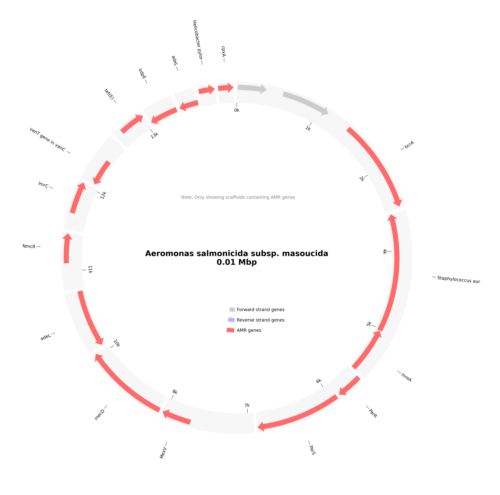

### Helicobacter pylori pbp1 mutants conferring resistance to amoxicillin
- **Mechanism**: antibiotic target alteration
- **Drug Classes**: cephalosporin; cephamycin; penam
- **AMR Family**: Penicillin-binding protein mutations conferring resistance to beta-lactam antibiotics
- **Locations**:
  - gnl|SPADES|LFDBGJIL_1747395_1 : position 2-229

### MexV
- **Mechanism**: antibiotic efflux
- **Drug Classes**: macrolide antibiotic; fluoroquinolone antibiotic; tetracycline antibiotic; phenicol antibiotic; disinfecting agents and antiseptics
- **AMR Family**: resistance-nodulation-cell division (RND) antibiotic efflux pump
- **Locations**:
  - gnl|SPADES|LFDBGJIL_7617_2 : position 899-1315

### NmcR
- **Mechanism**: antibiotic inactivation
- **Drug Classes**: carbapenem; cephalosporin; cephamycin; penam
- **AMR Family**: NmcA beta-lactamase
- **Locations**:
  - gnl|SPADES|LFDBGJIL_55657_2 : position 376-795

### ParR
- **Mechanism**: antibiotic efflux; reduced permeability to antibiotic
- **Drug Classes**: macrolide antibiotic; fluoroquinolone antibiotic; monobactam; aminoglycoside antibiotic; carbapenem; cephalosporin; cephamycin; penam; tetracycline antibiotic; phenicol antibiotic; penem; disinfecting agents and antiseptics
- **AMR Family**: resistance-nodulation-cell division (RND) antibiotic efflux pump; Outer Membrane Porin (Opr)
- **Locations**:
  - gnl|SPADES|LFDBGJIL_4405_1 : position 2-367

### ParS
- **Mechanism**: antibiotic efflux; reduced permeability to antibiotic
- **Drug Classes**: macrolide antibiotic; fluoroquinolone antibiotic; monobactam; aminoglycoside antibiotic; carbapenem; cephalosporin; cephamycin; penam; tetracycline antibiotic; phenicol antibiotic; penem; disinfecting agents and antiseptics
- **AMR Family**: resistance-nodulation-cell division (RND) antibiotic efflux pump; Outer Membrane Porin (Opr)
- **Locations**:
  - gnl|SPADES|LFDBGJIL_4405_2 : position 406-1602

### Staphylococcus aureus mupA conferring resistance to mupirocin
- **Mechanism**: antibiotic target alteration
- **Drug Classes**: mupirocin-like antibiotic
- **AMR Family**: antibiotic-resistant isoleucyl-tRNA synthetase (ileS)
- **Locations**:
  - gnl|SPADES|LFDBGJIL_2083_1 : position 2-1768

### adeL (found in 2 locations)
- **Mechanism**: antibiotic efflux
- **Drug Classes**: fluoroquinolone antibiotic; tetracycline antibiotic
- **AMR Family**: resistance-nodulation-cell division (RND) antibiotic efflux pump
- **Locations**:
  - gnl|SPADES|LFDBGJIL_1026916_1 : position 1-291
  - gnl|SPADES|LFDBGJIL_36796_1 : position 13-879

### bcrA
- **Mechanism**: antibiotic efflux
- **Drug Classes**: peptide antibiotic
- **AMR Family**: ATP-binding cassette (ABC) antibiotic efflux pump
- **Locations**:
  - gnl|SPADES|LFDBGJIL_1530_3 : position 1682-2995

### cpxA
- **Mechanism**: antibiotic efflux
- **Drug Classes**: aminoglycoside antibiotic; aminocoumarin antibiotic
- **AMR Family**: resistance-nodulation-cell division (RND) antibiotic efflux pump
- **Locations**:
  - gnl|SPADES|LFDBGJIL_1836968_1 : position 3-221

### kdpE
- **Mechanism**: antibiotic efflux
- **Drug Classes**: aminoglycoside antibiotic
- **AMR Family**: kdpDE
- **Locations**:
  - gnl|SPADES|LFDBGJIL_439930_1 : position 3-428

### lmrC
- **Mechanism**: antibiotic target protection
- **Drug Classes**: lincosamide antibiotic
- **AMR Family**: Miscellaneous ABC-F subfamily ATP-binding cassette ribosomal protection proteins
- **Locations**:
  - gnl|SPADES|LFDBGJIL_92607_2 : position 243-698

### mecD
- **Mechanism**: antibiotic target replacement
- **Drug Classes**: penam
- **AMR Family**: methicillin resistant PBP2
- **Locations**:
  - gnl|SPADES|LFDBGJIL_10373_1 : position 2-1198

### mreA
- **Mechanism**: antibiotic efflux
- **Drug Classes**: macrolide antibiotic
- **AMR Family**: major facilitator superfamily (MFS) antibiotic efflux pump
- **Locations**:
  - gnl|SPADES|LFDBGJIL_2083_2 : position 1768-2445

### tet(E)
- **Mechanism**: antibiotic efflux
- **Drug Classes**: tetracycline antibiotic
- **AMR Family**: major facilitator superfamily (MFS) antibiotic efflux pump
- **Locations**:
  - gnl|SPADES|LFDBGJIL_325227_1 : position 111-482

### vanT gene in vanC cluster
- **Mechanism**: antibiotic target alteration
- **Drug Classes**: glycopeptide antibiotic
- **AMR Family**: glycopeptide resistance gene cluster; vanT
- **Locations**:
  - gnl|SPADES|LFDBGJIL_97154_1 : position 2-400

## Aeromonas salmonicida subsp. pectinolytica 34mel
**Strain Statistics:**
- Total genome length: 18.8 kbp
- Total scaffolds: 210
- Scaffolds with AMR genes: 17
- Total genes annotated: 48
- Total AMR genes: 18
- Unique AMR genes: 12
- Distinct AMR mechanisms: 4
- Distinct AMR families: 7
- Distinct drug classes: 13

**Circos Plot:**

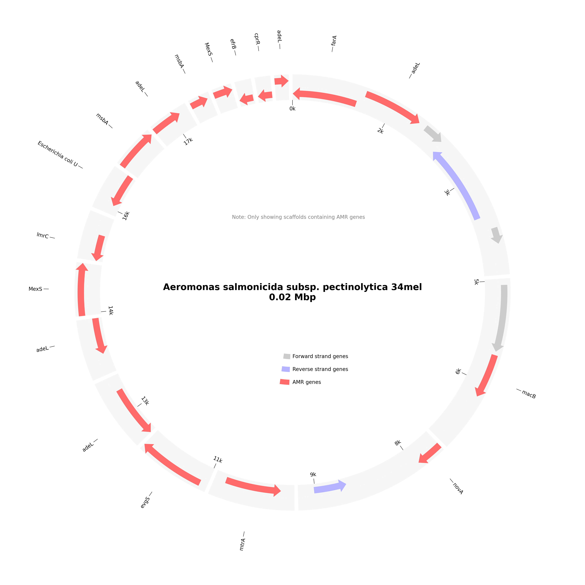

### Escherichia coli UhpT with mutation conferring resistance to fosfomycin
- **Mechanism**: antibiotic target alteration
- **Drug Classes**: phosphonic acid antibiotic
- **AMR Family**: antibiotic-resistant UhpT
- **Locations**:
  - gnl|SPADES|LFDBGJIL_108116_1 : position 141-671

### MexS (found in 2 locations)
- **Mechanism**: antibiotic efflux
- **Drug Classes**: fluoroquinolone antibiotic; diaminopyrimidine antibiotic; phenicol antibiotic
- **AMR Family**: resistance-nodulation-cell division (RND) antibiotic efflux pump
- **Locations**:
  - gnl|SPADES|LFDBGJIL_1049862_1 : position 3-290
  - gnl|SPADES|LFDBGJIL_56979_1 : position 1-789

### adeL (found in 5 locations)
- **Mechanism**: antibiotic efflux
- **Drug Classes**: fluoroquinolone antibiotic; tetracycline antibiotic
- **AMR Family**: resistance-nodulation-cell division (RND) antibiotic efflux pump
- **Locations**:
  - gnl|SPADES|LFDBGJIL_15663_1 : position 2-835
  - gnl|SPADES|LFDBGJIL_157541_1 : position 2-463
  - gnl|SPADES|LFDBGJIL_1995781_1 : position 1-210
  - gnl|SPADES|LFDBGJIL_32847_2 : position 325-900
  - gnl|SPADES|LFDBGJIL_858_2 : position 1113-2015

### cprR
- **Mechanism**: antibiotic target alteration; antibiotic efflux
- **Drug Classes**: peptide antibiotic
- **AMR Family**: pmr phosphoethanolamine transferase
- **Locations**:
  - gnl|SPADES|LFDBGJIL_1755901_1 : position 1-228

### efrB
- **Mechanism**: antibiotic efflux
- **Drug Classes**: macrolide antibiotic; fluoroquinolone antibiotic; rifamycin antibiotic
- **AMR Family**: ATP-binding cassette (ABC) antibiotic efflux pump
- **Locations**:
  - gnl|SPADES|LFDBGJIL_1549859_1 : position 1-222

### evgS
- **Mechanism**: antibiotic efflux
- **Drug Classes**: macrolide antibiotic; fluoroquinolone antibiotic; penam; tetracycline antibiotic
- **AMR Family**: major facilitator superfamily (MFS) antibiotic efflux pump; resistance-nodulation-cell division (RND) antibiotic efflux pump
- **Locations**:
  - gnl|SPADES|LFDBGJIL_13091_1 : position 118-1125

### farA
- **Mechanism**: antibiotic efflux
- **Drug Classes**: antibacterial free fatty acids
- **AMR Family**: major facilitator superfamily (MFS) antibiotic efflux pump
- **Locations**:
  - gnl|SPADES|LFDBGJIL_858_1 : position 3-1016

### lmrC
- **Mechanism**: antibiotic target protection
- **Drug Classes**: lincosamide antibiotic
- **AMR Family**: Miscellaneous ABC-F subfamily ATP-binding cassette ribosomal protection proteins
- **Locations**:
  - gnl|SPADES|LFDBGJIL_82845_1 : position 2-415

### macB
- **Mechanism**: antibiotic efflux
- **Drug Classes**: macrolide antibiotic
- **AMR Family**: ATP-binding cassette (ABC) antibiotic efflux pump
- **Locations**:
  - gnl|SPADES|LFDBGJIL_1812_2 : position 1149-1817

### msbA (found in 2 locations)
- **Mechanism**: antibiotic efflux
- **Drug Classes**: nitroimidazole antibiotic
- **AMR Family**: ATP-binding cassette (ABC) antibiotic efflux pump
- **Locations**:
  - gnl|SPADES|LFDBGJIL_123374_1 : position 2-646
  - gnl|SPADES|LFDBGJIL_877181_1 : position 3-272

### mtrA
- **Mechanism**: antibiotic efflux
- **Drug Classes**: macrolide antibiotic; penam
- **AMR Family**: resistance-nodulation-cell division (RND) antibiotic efflux pump
- **Locations**:
  - gnl|SPADES|LFDBGJIL_8358_2 : position 212-1096

### novA
- **Mechanism**: antibiotic efflux
- **Drug Classes**: aminocoumarin antibiotic
- **AMR Family**: ATP-binding cassette (ABC) antibiotic efflux pump
- **Locations**:
  - gnl|SPADES|LFDBGJIL_2271_1 : position 3-407

## Aeromonas salmonicida subsp. salmonicida
**Strain Statistics:**
- Total genome length: 0.9 kbp
- Total scaffolds: 10
- Scaffolds with AMR genes: 1
- Total genes annotated: 2
- Total AMR genes: 1
- Unique AMR genes: 1
- Distinct AMR mechanisms: 1
- Distinct AMR families: 1
- Distinct drug classes: 1

**Circos Plot:**

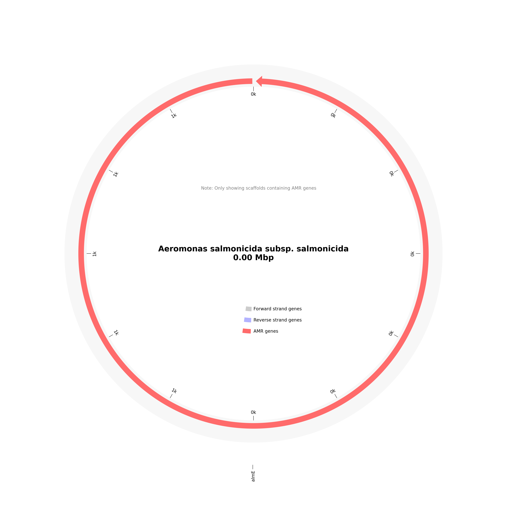

### almE
- **Mechanism**: antibiotic target alteration
- **Drug Classes**: peptide antibiotic
- **AMR Family**: polymyxin resistance operon; alm glycyltransferase
- **Locations**:
  - gnl|SPADES|LFDBGJIL_31073_1 : position 2-913

## Buttiauxella agrestis
**Strain Statistics:**
- Total genome length: 1250.0 kbp
- Total scaffolds: 1092
- Scaffolds with AMR genes: 252
- Total genes annotated: 2374
- Total AMR genes: 353
- Unique AMR genes: 177
- Distinct AMR mechanisms: 11
- Distinct AMR families: 69
- Distinct drug classes: 36

**Circos Plot:**

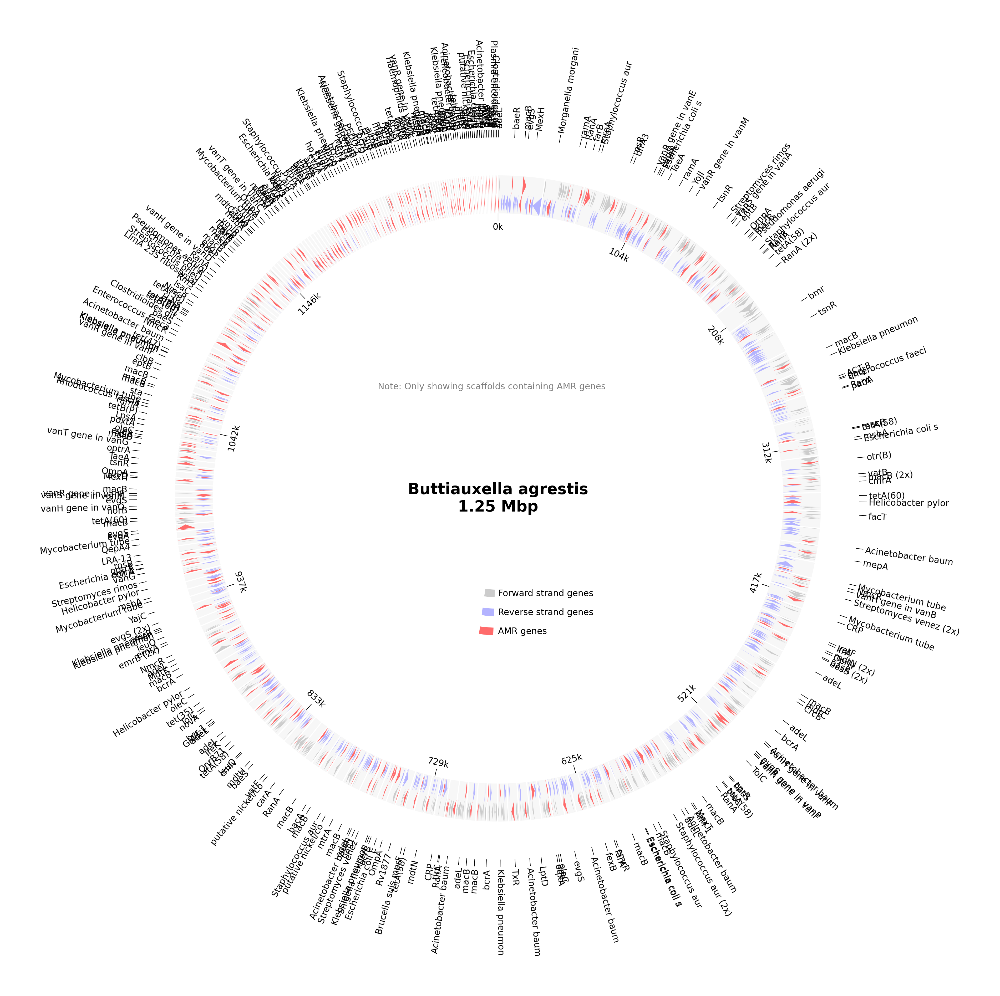

### ACT-8
- **Mechanism**: antibiotic inactivation
- **Drug Classes**: carbapenem; cephalosporin; cephamycin; penam
- **AMR Family**: ACT beta-lactamase
- **Locations**:
  - gnl|SPADES|LFDBGJIL_223_10: position 11265-12416

### AIM-1
- **Mechanism**: antibiotic inactivation
- **Drug Classes**: cephalosporin; cephamycin; penam
- **AMR Family**: AIM beta-lactamase
- **Locations**:
  - gnl|SPADES|LFDBGJIL_404_6 : position 6413-7372

### Acinetobacter baumannii AbaF (found in 6 locations)
- **Mechanism**: antibiotic efflux
- **Drug Classes**: phosphonic acid antibiotic
- **AMR Family**: major facilitator superfamily (MFS) antibiotic efflux pump
- **Locations**:
  - gnl|SPADES|LFDBGJIL_1501_2 : position 973-2298
  - gnl|SPADES|LFDBGJIL_417_4 : position 1620-2945
  - gnl|SPADES|LFDBGJIL_455_5 : position 3502-5001
  - gnl|SPADES|LFDBGJIL_531_2 : position 23-1528
  - gnl|SPADES|LFDBGJIL_609_1 : position 3-890
  - gnl|SPADES|LFDBGJIL_6369_1 : position 3-389

### Acinetobacter baumannii AbaQ (found in 5 locations)
- **Mechanism**: antibiotic efflux
- **Drug Classes**: fluoroquinolone antibiotic
- **AMR Family**: major facilitator superfamily (MFS) antibiotic efflux pump
- **Locations**:
  - gnl|SPADES|LFDBGJIL_1061272_1 : position 2-289
  - gnl|SPADES|LFDBGJIL_119133_1 : position 1-654
  - gnl|SPADES|LFDBGJIL_304_11 : position 9542-10903
  - gnl|SPADES|LFDBGJIL_381_6 : position 4004-5302
  - gnl|SPADES|LFDBGJIL_491_2 : position 1877-3193

### AcrS
- **Mechanism**: antibiotic efflux
- **Drug Classes**: fluoroquinolone antibiotic; cephalosporin; glycylcycline; cephamycin; penam; tetracycline antibiotic; rifamycin antibiotic; phenicol antibiotic; disinfecting agents and antiseptics
- **AMR Family**: resistance-nodulation-cell division (RND) antibiotic efflux pump
- **Locations**:
  - gnl|SPADES|LFDBGJIL_9773_2 : position 454-1071

### Brucella suis mprF
- **Mechanism**: antibiotic target alteration
- **Drug Classes**: peptide antibiotic
- **AMR Family**: defensin resistant mprF
- **Locations**:
  - gnl|SPADES|LFDBGJIL_589_2 : position 491-1459

### CRP (found in 2 locations)
- **Mechanism**: antibiotic efflux
- **Drug Classes**: macrolide antibiotic; fluoroquinolone antibiotic; penam
- **AMR Family**: resistance-nodulation-cell division (RND) antibiotic efflux pump
- **Locations**:
  - gnl|SPADES|LFDBGJIL_337_1 : position 3-311
  - gnl|SPADES|LFDBGJIL_534_3: position 3011-3643

### Clostridioides difficile gyrA conferring resistance to fluoroquinolones
- **Mechanism**: antibiotic target alteration
- **Drug Classes**: fluoroquinolone antibiotic
- **AMR Family**: fluoroquinolone resistant gyrA
- **Locations**:
  - gnl|SPADES|LFDBGJIL_1601_1 : position 20-2668

### Clostridioides difficile gyrB conferring resistance to fluoroquinolones
- **Mechanism**: antibiotic target alteration
- **Drug Classes**: fluoroquinolone antibiotic
- **AMR Family**: fluoroquinolone resistant gyrB
- **Locations**:
  - gnl|SPADES|LFDBGJIL_1979629_1 : position 2-211

### CrcB
- **Mechanism**: antibiotic efflux
- **Drug Classes**: aminoglycoside antibiotic
- **AMR Family**: multidrug and toxic compound extrusion (MATE) transporter
- **Locations**:
  - gnl|SPADES|LFDBGJIL_368_5 : position 2891-3274

### Enterococcus faecalis cls with mutation conferring resistance to daptomycin
- **Mechanism**: antibiotic target alteration
- **Drug Classes**: peptide antibiotic
- **AMR Family**: daptomycin resistant cls
- **Locations**:
  - gnl|SPADES|LFDBGJIL_1571_2 : position 752-2203

### Enterococcus faecium liaR mutant conferring daptomycin resistance
- **Mechanism**: antibiotic target alteration; antibiotic efflux
- **Drug Classes**: peptide antibiotic
- **AMR Family**: daptomycin resistant liaR
- **Locations**:
  - gnl|SPADES|LFDBGJIL_223_13 : position 13667-14251

### ErmB
- **Mechanism**: antibiotic target alteration
- **Drug Classes**: macrolide antibiotic; lincosamide antibiotic; streptogramin antibiotic; streptogramin A antibiotic; streptogramin B antibiotic
- **AMR Family**: Erm 23S ribosomal RNA methyltransferase
- **Locations**:
  - gnl|SPADES|LFDBGJIL_7555_1 : position 59-883

### Escherichia coli AcrAB-TolC with AcrR mutation conferring resistance to ciprofloxacin, tetracycline, and ceftazidime
- **Mechanism**: antibiotic target alteration; antibiotic efflux
- **Drug Classes**: fluoroquinolone antibiotic; cephalosporin; glycylcycline; penam; tetracycline antibiotic; rifamycin antibiotic; phenicol antibiotic; disinfecting agents and antiseptics
- **AMR Family**: resistance-nodulation-cell division (RND) antibiotic efflux pump
- **Locations**:
  - gnl|SPADES|LFDBGJIL_2002_3 : position 997-1494

### Escherichia coli AcrAB-TolC with MarR mutations conferring resistance to ciprofloxacin and tetracycline
- **Mechanism**: antibiotic target alteration; antibiotic efflux
- **Drug Classes**: fluoroquinolone antibiotic; cephalosporin; glycylcycline; penam; tetracycline antibiotic; rifamycin antibiotic; phenicol antibiotic; disinfecting agents and antiseptics
- **AMR Family**: resistance-nodulation-cell division (RND) antibiotic efflux pump
- **Locations**:
  - gnl|SPADES|LFDBGJIL_913_6 : position 3571-4026

### Escherichia coli EF-Tu mutants conferring resistance to Pulvomycin
- **Mechanism**: antibiotic target alteration
- **Drug Classes**: elfamycin antibiotic
- **AMR Family**: elfamycin resistant EF-Tu
- **Locations**:
  - gnl|SPADES|LFDBGJIL_591_4 : position 3266-5113

### Escherichia coli mdfA
- **Mechanism**: antibiotic efflux
- **Drug Classes**: tetracycline antibiotic; phenicol antibiotic; disinfecting agents and antiseptics
- **AMR Family**: major facilitator superfamily (MFS) antibiotic efflux pump
- **Locations**:
  - gnl|SPADES|LFDBGJIL_768030_1 : position 206-337

### Escherichia coli soxR with mutation conferring antibiotic resistance
- **Mechanism**: antibiotic target alteration; antibiotic efflux
- **Drug Classes**: fluoroquinolone antibiotic; cephalosporin; glycylcycline; penam; tetracycline antibiotic; rifamycin antibiotic; phenicol antibiotic; disinfecting agents and antiseptics
- **AMR Family**: ATP-binding cassette (ABC) antibiotic efflux pump; major facilitator superfamily (MFS) antibiotic efflux pump; resistance-nodulation-cell division (RND) antibiotic efflux pump
- **Locations**:
  - gnl|SPADES|LFDBGJIL_431_5 : position 2841-3299

### Escherichia coli soxS with mutation conferring antibiotic resistance (found in 5 locations)
- **Mechanism**: antibiotic target alteration; antibiotic efflux; reduced permeability to antibiotic
- **Drug Classes**: fluoroquinolone antibiotic; monobactam; carbapenem; cephalosporin; glycylcycline; cephamycin; penam; tetracycline antibiotic; rifamycin antibiotic; phenicol antibiotic; penem; disinfecting agents and antiseptics
- **AMR Family**: ATP-binding cassette (ABC) antibiotic efflux pump; major facilitator superfamily (MFS) antibiotic efflux pump; resistance-nodulation-cell division (RND) antibiotic efflux pump; General Bacterial Porin with reduced permeability to beta-lactams
- **Locations**:
  - gnl|SPADES|LFDBGJIL_126_17 : position 16969-17838
  - gnl|SPADES|LFDBGJIL_269_7 : position 5720-6565
  - gnl|SPADES|LFDBGJIL_3033_2 : position 558-1019
  - gnl|SPADES|LFDBGJIL_431_4 : position 2439-2762
  - gnl|SPADES|LFDBGJIL_579477_2 : position 72-383

### GMB-1
- **Mechanism**: antibiotic inactivation
- **Drug Classes**: carbapenem
- **AMR Family**: GMB beta-lactamase
- **Locations**:
  - gnl|SPADES|LFDBGJIL_719_5 : position 4299-5165

### H-NS
- **Mechanism**: antibiotic efflux
- **Drug Classes**: macrolide antibiotic; fluoroquinolone antibiotic; cephalosporin; cephamycin; penam; tetracycline antibiotic
- **AMR Family**: major facilitator superfamily (MFS) antibiotic efflux pump; resistance-nodulation-cell division (RND) antibiotic efflux pump
- **Locations**:
  - gnl|SPADES|LFDBGJIL_1687_2 : position 1196-1606

### Haemophilus influenzae PBP3 conferring resistance to beta-lactam antibiotics
- **Mechanism**: antibiotic target alteration
- **Drug Classes**: cephalosporin; cephamycin; penam
- **AMR Family**: Penicillin-binding protein mutations conferring resistance to beta-lactam antibiotics
- **Locations**:
  - gnl|SPADES|LFDBGJIL_15303_1 : position 3-1028

### Helicobacter pylori pbp1 mutants conferring resistance to amoxicillin
- **Mechanism**: antibiotic target alteration
- **Drug Classes**: cephalosporin; cephamycin; penam
- **AMR Family**: Penicillin-binding protein mutations conferring resistance to beta-lactam antibiotics
- **Locations**:
  - gnl|SPADES|LFDBGJIL_284_5 : position 4699-7263

### Helicobacter pylori pbp2 mutants conferring resistance to amoxicillin
- **Mechanism**: antibiotic target alteration
- **Drug Classes**: cephalosporin; cephamycin; penam
- **AMR Family**: Penicillin-binding protein mutations conferring resistance to beta-lactam antibiotics
- **Locations**:
  - gnl|SPADES|LFDBGJIL_862_2 : position 311-2179

### Helicobacter pylori rdxA mutation conferring resistance to metronidazole
- **Mechanism**: antibiotic target alteration
- **Drug Classes**: nitroimidazole antibiotic
- **AMR Family**: Antibiotic resistant Helicobacter pylori nitroreductase
- **Locations**:
  - gnl|SPADES|LFDBGJIL_98795_2 : position 218-685

### Helicobacter pylori rpoB mutation conferring resistance to rifampicin
- **Mechanism**: antibiotic target alteration; antibiotic target replacement
- **Drug Classes**: fluoroquinolone antibiotic; rifamycin antibiotic
- **AMR Family**: rifamycin-resistant beta-subunit of RNA polymerase (rpoB)
- **Locations**:
  - gnl|SPADES|LFDBGJIL_756_1 : position 3-1913

### IreK
- **Mechanism**: reduced permeability to antibiotic
- **Drug Classes**: cephalosporin
- **AMR Family**: Serine/threonine kinases
- **Locations**:
  - gnl|SPADES|LFDBGJIL_708_7 : position 4695-5354

### Klebsiella pneumoniae KpnE
- **Mechanism**: antibiotic efflux
- **Drug Classes**: macrolide antibiotic; aminoglycoside antibiotic; cephalosporin; tetracycline antibiotic; peptide antibiotic; rifamycin antibiotic; disinfecting agents and antiseptics
- **AMR Family**: small multidrug resistance (SMR) antibiotic efflux pump
- **Locations**:
  - gnl|SPADES|LFDBGJIL_1446_4: position 1802-2176

### Klebsiella pneumoniae KpnF
- **Mechanism**: antibiotic efflux
- **Drug Classes**: macrolide antibiotic; aminoglycoside antibiotic; cephalosporin; tetracycline antibiotic; peptide antibiotic; rifamycin antibiotic; disinfecting agents and antiseptics
- **AMR Family**: small multidrug resistance (SMR) antibiotic efflux pump
- **Locations**:
  - gnl|SPADES|LFDBGJIL_1446_5: position 2163-2492

### Klebsiella pneumoniae KpnG
- **Mechanism**: antibiotic efflux
- **Drug Classes**: macrolide antibiotic; fluoroquinolone antibiotic; aminoglycoside antibiotic; carbapenem; cephalosporin; penam; peptide antibiotic; penem
- **AMR Family**: major facilitator superfamily (MFS) antibiotic efflux pump
- **Locations**:
  - gnl|SPADES|LFDBGJIL_809_2 : position 1256-2428

### Klebsiella pneumoniae KpnH (found in 3 locations)
- **Mechanism**: antibiotic efflux
- **Drug Classes**: macrolide antibiotic; fluoroquinolone antibiotic; aminoglycoside antibiotic; carbapenem; cephalosporin; penam; peptide antibiotic; penem
- **AMR Family**: major facilitator superfamily (MFS) antibiotic efflux pump
- **Locations**:
  - gnl|SPADES|LFDBGJIL_216_14 : position 13832-15214
  - gnl|SPADES|LFDBGJIL_53852_2 : position 403-801
  - gnl|SPADES|LFDBGJIL_809_1: position 2-1240

### Klebsiella pneumoniae OmpK37 (found in 3 locations)
- **Mechanism**: reduced permeability to antibiotic
- **Drug Classes**: monobactam; carbapenem; cephalosporin; cephamycin; penam; penem
- **AMR Family**: General Bacterial Porin with reduced permeability to beta-lactams
- **Locations**:
  - gnl|SPADES|LFDBGJIL_22180_1 : position 3-116
  - gnl|SPADES|LFDBGJIL_497_6 : position 4597-5697
  - gnl|SPADES|LFDBGJIL_5286_1 : position 3-878

### Klebsiella pneumoniae acrR with mutation conferring multidrug antibiotic resistance
- **Mechanism**: antibiotic target alteration; antibiotic efflux
- **Drug Classes**: fluoroquinolone antibiotic; cephalosporin; glycylcycline; penam; tetracycline antibiotic; rifamycin antibiotic; phenicol antibiotic; disinfecting agents and antiseptics
- **AMR Family**: resistance-nodulation-cell division (RND) antibiotic efflux pump
- **Locations**:
  - gnl|SPADES|LFDBGJIL_602_3 : position 2705-3355

### LRA-13
- **Mechanism**: antibiotic inactivation
- **Drug Classes**: cephalosporin; penam
- **AMR Family**: class C LRA beta-lactamase; class D LRA beta-lactamase
- **Locations**:
  - gnl|SPADES|LFDBGJIL_940_3 : position 1725-2933

### LlmA 23S ribosomal RNA methyltransferase
- **Mechanism**: antibiotic target alteration
- **Drug Classes**: lincosamide antibiotic
- **AMR Family**: Llm 23S ribosomal RNA methyltransferase
- **Locations**:
  - gnl|SPADES|LFDBGJIL_1815_3 : position 770-1945

### LpsA
- **Mechanism**: reduced permeability to antibiotic
- **Drug Classes**: peptide antibiotic
- **AMR Family**: Intrinsic peptide antibiotic resistant Lps
- **Locations**:
  - gnl|SPADES|LFDBGJIL_1175_4 : position 3019-3618

### LptD
- **Mechanism**: antibiotic efflux
- **Drug Classes**: carbapenem; peptide antibiotic; aminocoumarin antibiotic; rifamycin antibiotic
- **AMR Family**: ATP-binding cassette (ABC) antibiotic efflux pump
- **Locations**:
  - gnl|SPADES|LFDBGJIL_482_3 : position 2146-4533

### MdtK
- **Mechanism**: antibiotic efflux
- **Drug Classes**: fluoroquinolone antibiotic
- **AMR Family**: multidrug and toxic compound extrusion (MATE) transporter
- **Locations**:
  - gnl|SPADES|LFDBGJIL_777_1 : position 2-1381

### MdtQ
- **Mechanism**: reduced permeability to antibiotic
- **Drug Classes**: monobactam; carbapenem; cephalosporin; cephamycin; penam; penem
- **AMR Family**: Outer Membrane Porin (Opr)
- **Locations**:
  - gnl|SPADES|LFDBGJIL_3033_1 : position 2-388

### MexH (found in 2 locations)
- **Mechanism**: antibiotic efflux
- **Drug Classes**: fluoroquinolone antibiotic; tetracycline antibiotic; disinfecting agents and antiseptics
- **AMR Family**: resistance-nodulation-cell division (RND) antibiotic efflux pump
- **Locations**:
  - gnl|SPADES|LFDBGJIL_1054_4 : position 2109-3566
  - gnl|SPADES|LFDBGJIL_88_20 : position 24513-25340

### MexS (found in 2 locations)
- **Mechanism**: antibiotic efflux
- **Drug Classes**: fluoroquinolone antibiotic; diaminopyrimidine antibiotic; phenicol antibiotic
- **AMR Family**: resistance-nodulation-cell division (RND) antibiotic efflux pump
- **Locations**:
  - gnl|SPADES|LFDBGJIL_5134_2 : position 178-1209
  - gnl|SPADES|LFDBGJIL_5769_1 : position 2-652

### MexT
- **Mechanism**: antibiotic efflux
- **Drug Classes**: fluoroquinolone antibiotic; diaminopyrimidine antibiotic; phenicol antibiotic
- **AMR Family**: resistance-nodulation-cell division (RND) antibiotic efflux pump
- **Locations**:
  - gnl|SPADES|LFDBGJIL_404_5 : position 5420-6334

### Morganella morganii gyrB conferring resistance to fluoroquinolones
- **Mechanism**: antibiotic target alteration
- **Drug Classes**: fluoroquinolone antibiotic
- **AMR Family**: fluoroquinolone resistant gyrB
- **Locations**:
  - gnl|SPADES|LFDBGJIL_119_5 : position 3972-6386

### Mycobacterium tuberculosis folC with mutation conferring resistance to para-aminosalicylic acid
- **Mechanism**: antibiotic target alteration
- **Drug Classes**: salicylic acid antibiotic
- **AMR Family**: aminosalicylate resistant dihydrofolate synthase
- **Locations**:
  - gnl|SPADES|LFDBGJIL_842_5 : position 3512-4702

### Mycobacterium tuberculosis gidB mutation conferring resistance to streptomycin
- **Mechanism**: antibiotic target alteration
- **Drug Classes**: aminoglycoside antibiotic
- **AMR Family**: antibiotic resistant gidB
- **Locations**:
  - gnl|SPADES|LFDBGJIL_950_3 : position 1914-2537

### Mycobacterium tuberculosis katG mutations conferring resistance to isoniazid
- **Mechanism**: antibiotic target alteration
- **Drug Classes**: isoniazid-like antibiotic
- **AMR Family**: isoniazid resistant katG
- **Locations**:
  - gnl|SPADES|LFDBGJIL_334_5 : position 5733-7913

### Mycobacterium tuberculosis ndh with mutation conferring resistance to isoniazid
- **Mechanism**: antibiotic target alteration
- **Drug Classes**: isoniazid-like antibiotic
- **AMR Family**: antibiotic resistant ndh
- **Locations**:
  - gnl|SPADES|LFDBGJIL_1211_3 : position 1880-3184

### Mycobacterium tuberculosis rpoB mutations conferring resistance to rifampicin
- **Mechanism**: antibiotic target alteration; antibiotic target replacement
- **Drug Classes**: rifamycin antibiotic
- **AMR Family**: rifamycin-resistant beta-subunit of RNA polymerase (rpoB)
- **Locations**:
  - gnl|SPADES|LFDBGJIL_2800_1 : position 2-2023

### Mycobacterium tuberculosis thyA with mutation conferring resistance to para-aminosalicylic acid
- **Mechanism**: antibiotic target alteration
- **Drug Classes**: salicylic acid antibiotic
- **AMR Family**: aminosalicylate resistant thymidylate synthase
- **Locations**:
  - gnl|SPADES|LFDBGJIL_327_9 : position 8586-9380

### Neisseria gonorrhoeae PBP2 conferring resistance to beta-lactam antibiotics
- **Mechanism**: antibiotic target alteration
- **Drug Classes**: cephalosporin; cephamycin; penam
- **AMR Family**: Penicillin-binding protein mutations conferring resistance to beta-lactam antibiotics
- **Locations**:
  - gnl|SPADES|LFDBGJIL_6292_2 : position 880-1395

### NmcR (found in 5 locations)
- **Mechanism**: antibiotic inactivation
- **Drug Classes**: carbapenem; cephalosporin; cephamycin; penam
- **AMR Family**: NmcA beta-lactamase
- **Locations**:
  - gnl|SPADES|LFDBGJIL_1524_5 : position 2230-3033
  - gnl|SPADES|LFDBGJIL_1738_1 : position 6-830
  - gnl|SPADES|LFDBGJIL_3185_1 : position 129-1103
  - gnl|SPADES|LFDBGJIL_333_1 : position 3-389
  - gnl|SPADES|LFDBGJIL_795_1 : position 675-1610

### OmpA (found in 5 locations)
- **Mechanism**: reduced permeability to antibiotic
- **Drug Classes**: peptide antibiotic
- **AMR Family**: General Bacterial Porin with reduced permeability to peptide antibiotics
- **Locations**:
  - gnl|SPADES|LFDBGJIL_1063_2 : position 948-1469
  - gnl|SPADES|LFDBGJIL_18516_1 : position 2-694
  - gnl|SPADES|LFDBGJIL_187_8 : position 8472-9134
  - gnl|SPADES|LFDBGJIL_2820_1 : position 2-463
  - gnl|SPADES|LFDBGJIL_591_1 : position 1-429

### OprN
- **Mechanism**: antibiotic efflux
- **Drug Classes**: fluoroquinolone antibiotic; diaminopyrimidine antibiotic; phenicol antibiotic
- **AMR Family**: resistance-nodulation-cell division (RND) antibiotic efflux pump
- **Locations**:
  - gnl|SPADES|LFDBGJIL_338_10 : position 9322-10428

### PEDO-1
- **Mechanism**: antibiotic inactivation
- **Drug Classes**: carbapenem
- **AMR Family**: subclass B3 PEDO beta-lactamase
- **Locations**:
  - gnl|SPADES|LFDBGJIL_6461_1 : position 55-702

### ParR
- **Mechanism**: antibiotic efflux; reduced permeability to antibiotic
- **Drug Classes**: macrolide antibiotic; fluoroquinolone antibiotic; monobactam; aminoglycoside antibiotic; carbapenem; cephalosporin; cephamycin; penam; tetracycline antibiotic; phenicol antibiotic; penem; disinfecting agents and antiseptics
- **AMR Family**: resistance-nodulation-cell division (RND) antibiotic efflux pump; Outer Membrane Porin (Opr)
- **Locations**:
  - gnl|SPADES|LFDBGJIL_2498_1 : position 3-683

### Plasmid-encoded cat (pp-cat)
- **Mechanism**: antibiotic inactivation
- **Drug Classes**: phenicol antibiotic
- **AMR Family**: chloramphenicol acetyltransferase (CAT)
- **Locations**:
  - gnl|SPADES|LFDBGJIL_1706892_1 : position 3-230

### PmrF
- **Mechanism**: antibiotic target alteration
- **Drug Classes**: peptide antibiotic
- **AMR Family**: pmr phosphoethanolamine transferase
- **Locations**:
  - gnl|SPADES|LFDBGJIL_1160222_1 : position 3-275

### Pseudomonas aeruginosa ampR with mutation conferring resistance to aztreonam (found in 2 locations)
- **Mechanism**: antibiotic target alteration; antibiotic inactivation
- **Drug Classes**: monobactam; carbapenem; cephalosporin
- **AMR Family**: PDC beta-lactamase; ampR transcriptional regulator with mutation conferring resistance to monobactam antibiotics
- **Locations**:
  - gnl|SPADES|LFDBGJIL_187_16 : position 14731-15654
  - gnl|SPADES|LFDBGJIL_2011_1 : position 90-947

### QepA4
- **Mechanism**: antibiotic efflux
- **Drug Classes**: fluoroquinolone antibiotic
- **AMR Family**: major facilitator superfamily (MFS) antibiotic efflux pump
- **Locations**:
  - gnl|SPADES|LFDBGJIL_942_5 : position 3300-4295

### QnrB71
- **Mechanism**: antibiotic target protection
- **Drug Classes**: fluoroquinolone antibiotic
- **AMR Family**: quinolone resistance protein (qnr)
- **Locations**:
  - gnl|SPADES|LFDBGJIL_708_1 : position 2-151

### RanA (found in 13 locations)
- **Mechanism**: antibiotic efflux
- **Drug Classes**: aminoglycoside antibiotic
- **AMR Family**: ATP-binding cassette (ABC) antibiotic efflux pump
- **Locations**:
  - gnl|SPADES|LFDBGJIL_10016_1 : position 62-835
  - gnl|SPADES|LFDBGJIL_119_23 : position 21775-22566
  - gnl|SPADES|LFDBGJIL_12132_2 : position 734-1147
  - gnl|SPADES|LFDBGJIL_14693_1 : position 3-869
  - gnl|SPADES|LFDBGJIL_194_12 : position 6828-7643
  - gnl|SPADES|LFDBGJIL_197_1 : position 2-553
  - gnl|SPADES|LFDBGJIL_197_2 : position 550-1554
  - gnl|SPADES|LFDBGJIL_2023_1 : position 2-760
  - gnl|SPADES|LFDBGJIL_233_3 : position 2315-3187
  - gnl|SPADES|LFDBGJIL_395_8 : position 6493-7563
  - gnl|SPADES|LFDBGJIL_531_6 : position 5350-6186
  - gnl|SPADES|LFDBGJIL_673_5 : position 4079-5521
  - gnl|SPADES|LFDBGJIL_68341_1 : position 1-753

### RanB
- **Mechanism**: antibiotic efflux
- **Drug Classes**: aminoglycoside antibiotic
- **AMR Family**: ATP-binding cassette (ABC) antibiotic efflux pump
- **Locations**:
  - gnl|SPADES|LFDBGJIL_194_11 : position 6038-6820

### Rhodococcus fascians cmr
- **Mechanism**: antibiotic efflux
- **Drug Classes**: phenicol antibiotic
- **AMR Family**: major facilitator superfamily (MFS) antibiotic efflux pump
- **Locations**:
  - gnl|SPADES|LFDBGJIL_1211_1 : position 1-1059

### Rm3
- **Mechanism**: antibiotic inactivation
- **Drug Classes**: carbapenem; cephalosporin; penam
- **AMR Family**: Rm3 family beta-lactamase
- **Locations**:
  - gnl|SPADES|LFDBGJIL_1797_4 : position 2124-2684

### Rv1877
- **Mechanism**: antibiotic efflux
- **Drug Classes**: fluoroquinolone antibiotic
- **AMR Family**: major facilitator superfamily (MFS) antibiotic efflux pump
- **Locations**:
  - gnl|SPADES|LFDBGJIL_590_2 : position 858-2240

### Shigella flexneri acrA
- **Mechanism**: antibiotic efflux
- **Drug Classes**: fluoroquinolone antibiotic; cephalosporin; glycylcycline; penam; tetracycline antibiotic; rifamycin antibiotic; phenicol antibiotic; disinfecting agents and antiseptics
- **AMR Family**: resistance-nodulation-cell division (RND) antibiotic efflux pump
- **Locations**:
  - gnl|SPADES|LFDBGJIL_602_2: position 1362-2561

### Staphylococcus aureus LmrS
- **Mechanism**: antibiotic efflux
- **Drug Classes**: macrolide antibiotic; aminoglycoside antibiotic; oxazolidinone antibiotic; diaminopyrimidine antibiotic; phenicol antibiotic
- **AMR Family**: major facilitator superfamily (MFS) antibiotic efflux pump
- **Locations**:
  - gnl|SPADES|LFDBGJIL_3221_3 : position 817-1863

### Staphylococcus aureus fusA with mutation conferring resistance to fusidic acid
- **Mechanism**: antibiotic target alteration
- **Drug Classes**: fusidane antibiotic
- **AMR Family**: antibiotic resistant fusA
- **Locations**:
  - gnl|SPADES|LFDBGJIL_649_4 : position 1616-3205

### Staphylococcus aureus mupA conferring resistance to mupirocin (found in 2 locations)
- **Mechanism**: antibiotic target alteration
- **Drug Classes**: mupirocin-like antibiotic
- **AMR Family**: antibiotic-resistant isoleucyl-tRNA synthetase (ileS)
- **Locations**:
  - gnl|SPADES|LFDBGJIL_124_5 : position 2795-5611
  - gnl|SPADES|LFDBGJIL_426_3 : position 1677-4277

### Staphylococcus aureus mupB conferring resistance to mupirocin (found in 2 locations)
- **Mechanism**: antibiotic target alteration
- **Drug Classes**: mupirocin-like antibiotic
- **AMR Family**: antibiotic-resistant isoleucyl-tRNA synthetase (ileS)
- **Locations**:
  - gnl|SPADES|LFDBGJIL_419_1 : position 2-2407
  - gnl|SPADES|LFDBGJIL_419_2 : position 2400-2807

### Staphylococcus aureus murA with mutation conferring resistance to fosfomycin
- **Mechanism**: antibiotic target alteration
- **Drug Classes**: phosphonic acid antibiotic
- **AMR Family**: antibiotic-resistant murA transferase
- **Locations**:
  - gnl|SPADES|LFDBGJIL_194_6 : position 2830-4098

### Staphylococcus aureus pgsA mutations conferring resistance to daptomycin
- **Mechanism**: antibiotic target alteration
- **Drug Classes**: peptide antibiotic
- **AMR Family**: daptomycin resistant pgsA
- **Locations**:
  - gnl|SPADES|LFDBGJIL_7478_2 : position 1056-1322

### Streptococcus pneumoniae PBP2x conferring resistance to amoxicillin
- **Mechanism**: antibiotic target alteration
- **Drug Classes**: cephalosporin; cephamycin; penam
- **AMR Family**: Penicillin-binding protein mutations conferring resistance to beta-lactam antibiotics
- **Locations**:
  - gnl|SPADES|LFDBGJIL_1871_4 : position 819-1952

### Streptomyces rimosus otr(A) (found in 2 locations)
- **Mechanism**: antibiotic target protection
- **Drug Classes**: tetracycline antibiotic
- **AMR Family**: tetracycline-resistant ribosomal protection protein
- **Locations**:
  - gnl|SPADES|LFDBGJIL_154_14 : position 14725-16551
  - gnl|SPADES|LFDBGJIL_879_1 : position 1-1410

### Streptomyces venezuelae rox (found in 3 locations)
- **Mechanism**: antibiotic inactivation
- **Drug Classes**: rifamycin antibiotic
- **AMR Family**: rifampin monooxygenase
- **Locations**:
  - gnl|SPADES|LFDBGJIL_333_10 : position 6727-7905
  - gnl|SPADES|LFDBGJIL_333_11 : position 7930-9132
  - gnl|SPADES|LFDBGJIL_608_4 : position 2013-3197

### TaeA (found in 2 locations)
- **Mechanism**: antibiotic efflux
- **Drug Classes**: pleuromutilin antibiotic
- **AMR Family**: ATP-binding cassette (ABC) antibiotic efflux pump
- **Locations**:
  - gnl|SPADES|LFDBGJIL_1068_2 : position 335-2230
  - gnl|SPADES|LFDBGJIL_126_22 : position 21751-23418

### TolC (found in 2 locations)
- **Mechanism**: antibiotic efflux
- **Drug Classes**: macrolide antibiotic; fluoroquinolone antibiotic; aminoglycoside antibiotic; carbapenem; cephalosporin; glycylcycline; cephamycin; penam; tetracycline antibiotic; peptide antibiotic; aminocoumarin antibiotic; rifamycin antibiotic; phenicol antibiotic; penem; disinfecting agents and antiseptics
- **AMR Family**: ATP-binding cassette (ABC) antibiotic efflux pump; major facilitator superfamily (MFS) antibiotic efflux pump; resistance-nodulation-cell division (RND) antibiotic efflux pump
- **Locations**:
  - gnl|SPADES|LFDBGJIL_391_2 : position 714-2201
  - gnl|SPADES|LFDBGJIL_724_3 : position 2895-4238

### TriA
- **Mechanism**: antibiotic efflux
- **Drug Classes**: disinfecting agents and antiseptics
- **AMR Family**: resistance-nodulation-cell division (RND) antibiotic efflux pump
- **Locations**:
  - gnl|SPADES|LFDBGJIL_3009_1 : position 3-479

### TxR (found in 4 locations)
- **Mechanism**: antibiotic efflux
- **Drug Classes**: tetracycline antibiotic
- **AMR Family**: ATP-binding cassette (ABC) antibiotic efflux pump
- **Locations**:
  - gnl|SPADES|LFDBGJIL_154_17 : position 19623-21032
  - gnl|SPADES|LFDBGJIL_36528_1 : position 3-791
  - gnl|SPADES|LFDBGJIL_493_5 : position 2957-5041
  - gnl|SPADES|LFDBGJIL_8583_2 : position 235-1266

### YajC
- **Mechanism**: antibiotic efflux
- **Drug Classes**: fluoroquinolone antibiotic; cephalosporin; glycylcycline; penam; tetracycline antibiotic; oxazolidinone antibiotic; glycopeptide antibiotic; rifamycin antibiotic; phenicol antibiotic; disinfecting agents and antiseptics
- **AMR Family**: resistance-nodulation-cell division (RND) antibiotic efflux pump
- **Locations**:
  - gnl|SPADES|LFDBGJIL_825_3 : position 2333-2665

### YojI
- **Mechanism**: antibiotic efflux
- **Drug Classes**: peptide antibiotic
- **AMR Family**: ATP-binding cassette (ABC) antibiotic efflux pump
- **Locations**:
  - gnl|SPADES|LFDBGJIL_136_9 : position 9876-11387

### acrB (found in 2 locations)
- **Mechanism**: antibiotic efflux
- **Drug Classes**: fluoroquinolone antibiotic; cephalosporin; glycylcycline; penam; tetracycline antibiotic; rifamycin antibiotic; phenicol antibiotic; disinfecting agents and antiseptics
- **AMR Family**: resistance-nodulation-cell division (RND) antibiotic efflux pump
- **Locations**:
  - gnl|SPADES|LFDBGJIL_1500419_1 : position 1-246
  - gnl|SPADES|LFDBGJIL_602_1 : position 2-1339

### acrD
- **Mechanism**: antibiotic efflux
- **Drug Classes**: aminoglycoside antibiotic
- **AMR Family**: resistance-nodulation-cell division (RND) antibiotic efflux pump
- **Locations**:
  - gnl|SPADES|LFDBGJIL_1054_5 : position 3563-3889

### adeL (found in 18 locations)
- **Mechanism**: antibiotic efflux
- **Drug Classes**: fluoroquinolone antibiotic; tetracycline antibiotic
- **AMR Family**: resistance-nodulation-cell division (RND) antibiotic efflux pump
- **Locations**:
  - gnl|SPADES|LFDBGJIL_10671_1 : position 2-628
  - gnl|SPADES|LFDBGJIL_2322_3 : position 1546-2289
  - gnl|SPADES|LFDBGJIL_2976_2 : position 400-1329
  - gnl|SPADES|LFDBGJIL_31662_2 : position 606-908
  - gnl|SPADES|LFDBGJIL_3395_4 : position 1423-1818
  - gnl|SPADES|LFDBGJIL_361_3 : position 1212-2117
  - gnl|SPADES|LFDBGJIL_3626_1 : position 1-762
  - gnl|SPADES|LFDBGJIL_372_7 : position 6994-7920
  - gnl|SPADES|LFDBGJIL_417_6 : position 4324-5223
  - gnl|SPADES|LFDBGJIL_4212_1 : position 2-886
  - gnl|SPADES|LFDBGJIL_475_1 : position 3-770
  - gnl|SPADES|LFDBGJIL_530_2 : position 279-1184
  - gnl|SPADES|LFDBGJIL_53852_1 : position 2-295
  - gnl|SPADES|LFDBGJIL_609_2 : position 1061-1996
  - gnl|SPADES|LFDBGJIL_710_3 : position 1436-2374
  - gnl|SPADES|LFDBGJIL_719_4 : position 3285-4193
  - gnl|SPADES|LFDBGJIL_777_3 : position 3188-4099
  - gnl|SPADES|LFDBGJIL_88_1 : position 2-769

### almE (found in 2 locations)
- **Mechanism**: antibiotic target alteration
- **Drug Classes**: peptide antibiotic
- **AMR Family**: polymyxin resistance operon; alm glycyltransferase
- **Locations**:
  - gnl|SPADES|LFDBGJIL_4932_1 : position 3-1037
  - gnl|SPADES|LFDBGJIL_7821_2 : position 453-1304

### arnA
- **Mechanism**: antibiotic target alteration
- **Drug Classes**: peptide antibiotic
- **AMR Family**: pmr phosphoethanolamine transferase
- **Locations**:
  - gnl|SPADES|LFDBGJIL_1687_1 : position 34-1044

### bacA
- **Mechanism**: antibiotic target alteration
- **Drug Classes**: peptide antibiotic
- **AMR Family**: undecaprenyl pyrophosphate related proteins
- **Locations**:
  - gnl|SPADES|LFDBGJIL_657_1 : position 2-226

### baeR (found in 2 locations)
- **Mechanism**: antibiotic efflux
- **Drug Classes**: aminoglycoside antibiotic; aminocoumarin antibiotic
- **AMR Family**: resistance-nodulation-cell division (RND) antibiotic efflux pump
- **Locations**:
  - gnl|SPADES|LFDBGJIL_2923_1 : position 2-196
  - gnl|SPADES|LFDBGJIL_88_10 : position 10305-11039

### baeS (found in 3 locations)
- **Mechanism**: antibiotic efflux
- **Drug Classes**: aminoglycoside antibiotic; aminocoumarin antibiotic
- **AMR Family**: resistance-nodulation-cell division (RND) antibiotic efflux pump
- **Locations**:
  - gnl|SPADES|LFDBGJIL_1582_3 : position 801-2183
  - gnl|SPADES|LFDBGJIL_2923_2 : position 193-1587
  - gnl|SPADES|LFDBGJIL_686_5 : position 4201-5457

### basR
- **Mechanism**: antibiotic target alteration; antibiotic efflux
- **Drug Classes**: peptide antibiotic
- **AMR Family**: pmr phosphoethanolamine transferase
- **Locations**:
  - gnl|SPADES|LFDBGJIL_347_3 : position 1881-2540

### basS (found in 3 locations)
- **Mechanism**: antibiotic target alteration; antibiotic efflux
- **Drug Classes**: peptide antibiotic
- **AMR Family**: pmr phosphoethanolamine transferase
- **Locations**:
  - gnl|SPADES|LFDBGJIL_347_4 : position 2537-3460
  - gnl|SPADES|LFDBGJIL_347_5 : position 3475-3903
  - gnl|SPADES|LFDBGJIL_393_7 : position 6103-7161

### bcr-1 (found in 4 locations)
- **Mechanism**: antibiotic efflux
- **Drug Classes**: bicyclomycin-like antibiotic
- **AMR Family**: major facilitator superfamily (MFS) antibiotic efflux pump
- **Locations**:
  - gnl|SPADES|LFDBGJIL_187_12 : position 10993-12177
  - gnl|SPADES|LFDBGJIL_3626_2 : position 878-1750
  - gnl|SPADES|LFDBGJIL_5485_1 : position 2-550
  - gnl|SPADES|LFDBGJIL_723_1 : position 3-641

### bcrA (found in 7 locations)
- **Mechanism**: antibiotic efflux
- **Drug Classes**: peptide antibiotic
- **AMR Family**: ATP-binding cassette (ABC) antibiotic efflux pump
- **Locations**:
  - gnl|SPADES|LFDBGJIL_3264_2 : position 599-1738
  - gnl|SPADES|LFDBGJIL_378_6 : position 4508-6007
  - gnl|SPADES|LFDBGJIL_38692_2 : position 419-868
  - gnl|SPADES|LFDBGJIL_417134_1 : position 3-437
  - gnl|SPADES|LFDBGJIL_504_7 : position 6030-7001
  - gnl|SPADES|LFDBGJIL_7322_1 : position 2-1234
  - gnl|SPADES|LFDBGJIL_764_7 : position 4099-5103

### bmr
- **Mechanism**: antibiotic efflux
- **Drug Classes**: fluoroquinolone antibiotic; nucleoside antibiotic; phenicol antibiotic; disinfecting agents and antiseptics
- **AMR Family**: major facilitator superfamily (MFS) antibiotic efflux pump
- **Locations**:
  - gnl|SPADES|LFDBGJIL_209_15 : position 9057-10352

### carA
- **Mechanism**: antibiotic target protection
- **Drug Classes**: macrolide antibiotic
- **AMR Family**: Miscellaneous ABC-F subfamily ATP-binding cassette ribosomal protection proteins
- **Locations**:
  - gnl|SPADES|LFDBGJIL_676_8 : position 5323-5514

### chrB
- **Mechanism**: antibiotic target alteration
- **Drug Classes**: macrolide antibiotic; lincosamide antibiotic
- **AMR Family**: non-erm 23S ribosomal RNA methyltransferase (G748)
- **Locations**:
  - gnl|SPADES|LFDBGJIL_98206_1 : position 1-687

### clbB
- **Mechanism**: antibiotic target alteration
- **Drug Classes**: lincosamide antibiotic; streptogramin antibiotic; streptogramin A antibiotic; oxazolidinone antibiotic; phenicol antibiotic; pleuromutilin antibiotic
- **AMR Family**: Cfr 23S ribosomal RNA methyltransferase
- **Locations**:
  - gnl|SPADES|LFDBGJIL_1388_2 : position 832-2001

### cmlv (found in 2 locations)
- **Mechanism**: antibiotic inactivation
- **Drug Classes**: phenicol antibiotic
- **AMR Family**: chloramphenicol phosphotransferase
- **Locations**:
  - gnl|SPADES|LFDBGJIL_2785_1 : position 2-1144
  - gnl|SPADES|LFDBGJIL_691_4 : position 1576-2742

### cmrA
- **Mechanism**: antibiotic efflux
- **Drug Classes**: phenicol antibiotic
- **AMR Family**: major facilitator superfamily (MFS) antibiotic efflux pump
- **Locations**:
  - gnl|SPADES|LFDBGJIL_283_8 : position 5267-6301

### cprR
- **Mechanism**: antibiotic target alteration; antibiotic efflux
- **Drug Classes**: peptide antibiotic
- **AMR Family**: pmr phosphoethanolamine transferase
- **Locations**:
  - gnl|SPADES|LFDBGJIL_393_6 : position 5444-6106

### cpxA
- **Mechanism**: antibiotic efflux
- **Drug Classes**: aminoglycoside antibiotic; aminocoumarin antibiotic
- **AMR Family**: resistance-nodulation-cell division (RND) antibiotic efflux pump
- **Locations**:
  - gnl|SPADES|LFDBGJIL_2498_2 : position 680-2032

### dfrA3
- **Mechanism**: antibiotic target replacement
- **Drug Classes**: diaminopyrimidine antibiotic
- **AMR Family**: trimethoprim resistant dihydrofolate reductase dfr
- **Locations**:
  - gnl|SPADES|LFDBGJIL_124_26 : position 25640-26119

### emrA (found in 2 locations)
- **Mechanism**: antibiotic efflux
- **Drug Classes**: fluoroquinolone antibiotic
- **AMR Family**: major facilitator superfamily (MFS) antibiotic efflux pump
- **Locations**:
  - gnl|SPADES|LFDBGJIL_797_7 : position 3921-4910
  - gnl|SPADES|LFDBGJIL_913_7 : position 4047-4403

### emrB (found in 3 locations)
- **Mechanism**: antibiotic efflux
- **Drug Classes**: fluoroquinolone antibiotic
- **AMR Family**: major facilitator superfamily (MFS) antibiotic efflux pump
- **Locations**:
  - gnl|SPADES|LFDBGJIL_1347840_1 : position 3-257
  - gnl|SPADES|LFDBGJIL_797_5 : position 2388-3134
  - gnl|SPADES|LFDBGJIL_797_6 : position 3092-3910

### emrR (found in 2 locations)
- **Mechanism**: antibiotic efflux
- **Drug Classes**: fluoroquinolone antibiotic
- **AMR Family**: major facilitator superfamily (MFS) antibiotic efflux pump
- **Locations**:
  - gnl|SPADES|LFDBGJIL_449_7 : position 5195-5629
  - gnl|SPADES|LFDBGJIL_809_3: position 2563-3093

### emrY
- **Mechanism**: antibiotic efflux
- **Drug Classes**: tetracycline antibiotic
- **AMR Family**: major facilitator superfamily (MFS) antibiotic efflux pump
- **Locations**:
  - gnl|SPADES|LFDBGJIL_2676_1 : position 1-1056

### eptB (found in 2 locations)
- **Mechanism**: antibiotic target alteration
- **Drug Classes**: peptide antibiotic
- **AMR Family**: pmr phosphoethanolamine transferase
- **Locations**:
  - gnl|SPADES|LFDBGJIL_1375_3 : position 1160-2710
  - gnl|SPADES|LFDBGJIL_187_1 : position 152-1837

### evgA (found in 5 locations)
- **Mechanism**: antibiotic efflux
- **Drug Classes**: macrolide antibiotic; fluoroquinolone antibiotic; penam; tetracycline antibiotic
- **AMR Family**: major facilitator superfamily (MFS) antibiotic efflux pump; resistance-nodulation-cell division (RND) antibiotic efflux pump
- **Locations**:
  - gnl|SPADES|LFDBGJIL_1156_4 : position 2239-2898
  - gnl|SPADES|LFDBGJIL_4284_2 : position 1360-1623
  - gnl|SPADES|LFDBGJIL_4435_2 : position 918-1319
  - gnl|SPADES|LFDBGJIL_530296_2 : position 183-398
  - gnl|SPADES|LFDBGJIL_964_1 : position 492-1106

### evgS (found in 9 locations)
- **Mechanism**: antibiotic efflux
- **Drug Classes**: macrolide antibiotic; fluoroquinolone antibiotic; penam; tetracycline antibiotic
- **AMR Family**: major facilitator superfamily (MFS) antibiotic efflux pump; resistance-nodulation-cell division (RND) antibiotic efflux pump
- **Locations**:
  - gnl|SPADES|LFDBGJIL_1031_5 : position 2662-3048
  - gnl|SPADES|LFDBGJIL_126_14 : position 14155-15582
  - gnl|SPADES|LFDBGJIL_2326_1 : position 2-1501
  - gnl|SPADES|LFDBGJIL_384_3 : position 1790-3934
  - gnl|SPADES|LFDBGJIL_457_5 : position 5913-7793
  - gnl|SPADES|LFDBGJIL_819_1 : position 1-1362
  - gnl|SPADES|LFDBGJIL_819_3 : position 2160-4778
  - gnl|SPADES|LFDBGJIL_88_17 : position 18262-20826
  - gnl|SPADES|LFDBGJIL_964_2 : position 1111-4200

### facT
- **Mechanism**: antibiotic efflux
- **Drug Classes**: elfamycin antibiotic
- **AMR Family**: major facilitator superfamily (MFS) antibiotic efflux pump
- **Locations**:
  - gnl|SPADES|LFDBGJIL_301_2 : position 782-2221

### farA
- **Mechanism**: antibiotic efflux
- **Drug Classes**: antibacterial free fatty acids
- **AMR Family**: major facilitator superfamily (MFS) antibiotic efflux pump
- **Locations**:
  - gnl|SPADES|LFDBGJIL_449_9 : position 6137-6907

### farB
- **Mechanism**: antibiotic efflux
- **Drug Classes**: antibacterial free fatty acids
- **AMR Family**: major facilitator superfamily (MFS) antibiotic efflux pump
- **Locations**:
  - gnl|SPADES|LFDBGJIL_119_28 : position 26856-28010

### fexB
- **Mechanism**: antibiotic efflux
- **Drug Classes**: phenicol antibiotic
- **AMR Family**: major facilitator superfamily (MFS) antibiotic efflux pump
- **Locations**:
  - gnl|SPADES|LFDBGJIL_450_5 : position 3236-4462

### hmrM
- **Mechanism**: antibiotic efflux
- **Drug Classes**: fluoroquinolone antibiotic; disinfecting agents and antiseptics
- **AMR Family**: multidrug and toxic compound extrusion (MATE) transporter
- **Locations**:
  - gnl|SPADES|LFDBGJIL_2866_2 : position 635-1939

### hp1181 (found in 2 locations)
- **Mechanism**: antibiotic efflux
- **Drug Classes**: fluoroquinolone antibiotic; tetracycline antibiotic; nitroimidazole antibiotic
- **AMR Family**: major facilitator superfamily (MFS) antibiotic efflux pump
- **Locations**:
  - gnl|SPADES|LFDBGJIL_4307_2 : position 265-1617
  - gnl|SPADES|LFDBGJIL_5890_1 : position 258-1424

### kdpE (found in 2 locations)
- **Mechanism**: antibiotic efflux
- **Drug Classes**: aminoglycoside antibiotic
- **AMR Family**: kdpDE
- **Locations**:
  - gnl|SPADES|LFDBGJIL_1353974_1 : position 3-209
  - gnl|SPADES|LFDBGJIL_43099_2 : position 535-846

### leuO (found in 4 locations)
- **Mechanism**: antibiotic efflux
- **Drug Classes**: nucleoside antibiotic; disinfecting agents and antiseptics
- **AMR Family**: major facilitator superfamily (MFS) antibiotic efflux pump
- **Locations**:
  - gnl|SPADES|LFDBGJIL_300679_1 : position 1-342
  - gnl|SPADES|LFDBGJIL_35428_2 : position 506-886
  - gnl|SPADES|LFDBGJIL_691_5 : position 2744-3667
  - gnl|SPADES|LFDBGJIL_798_2 : position 1820-2764

### lfrA
- **Mechanism**: antibiotic efflux
- **Drug Classes**: fluoroquinolone antibiotic
- **AMR Family**: major facilitator superfamily (MFS) antibiotic efflux pump
- **Locations**:
  - gnl|SPADES|LFDBGJIL_338_4 : position 3707-5131

### lmrC (found in 4 locations)
- **Mechanism**: antibiotic target protection
- **Drug Classes**: lincosamide antibiotic
- **AMR Family**: Miscellaneous ABC-F subfamily ATP-binding cassette ribosomal protection proteins
- **Locations**:
  - gnl|SPADES|LFDBGJIL_1167490_2 : position 87-275
  - gnl|SPADES|LFDBGJIL_16297_2 : position 237-746
  - gnl|SPADES|LFDBGJIL_3350_1 : position 222-1652
  - gnl|SPADES|LFDBGJIL_871188_1 : position 2-214

### lmrD
- **Mechanism**: antibiotic efflux
- **Drug Classes**: lincosamide antibiotic
- **AMR Family**: ATP-binding cassette (ABC) antibiotic efflux pump
- **Locations**:
  - gnl|SPADES|LFDBGJIL_7304_1 : position 1-462

### lsaC
- **Mechanism**: antibiotic target protection
- **Drug Classes**: lincosamide antibiotic; streptogramin antibiotic; pleuromutilin antibiotic
- **AMR Family**: lsa-type ABC-F protein
- **Locations**:
  - gnl|SPADES|LFDBGJIL_1750_2 : position 820-1575

### macA
- **Mechanism**: antibiotic efflux
- **Drug Classes**: macrolide antibiotic
- **AMR Family**: ATP-binding cassette (ABC) antibiotic efflux pump
- **Locations**:
  - gnl|SPADES|LFDBGJIL_24164_2 : position 207-968

### macB (found in 30 locations)
- **Mechanism**: antibiotic efflux
- **Drug Classes**: macrolide antibiotic
- **AMR Family**: ATP-binding cassette (ABC) antibiotic efflux pump
- **Locations**:
  - gnl|SPADES|LFDBGJIL_1053_1 : position 1-438
  - gnl|SPADES|LFDBGJIL_1156_1 : position 2-589
  - gnl|SPADES|LFDBGJIL_1250_4 : position 2692-3462
  - gnl|SPADES|LFDBGJIL_1261_1 : position 2-307
  - gnl|SPADES|LFDBGJIL_1315_1 : position 2-979
  - gnl|SPADES|LFDBGJIL_187_13 : position 12232-12954
  - gnl|SPADES|LFDBGJIL_216_9 : position 8447-9961
  - gnl|SPADES|LFDBGJIL_2372_2 : position 277-1377
  - gnl|SPADES|LFDBGJIL_238_9 : position 13332-14033
  - gnl|SPADES|LFDBGJIL_24164_1 : position 1-210
  - gnl|SPADES|LFDBGJIL_2461_1 : position 3-650
  - gnl|SPADES|LFDBGJIL_2535_1 : position 1-450
  - gnl|SPADES|LFDBGJIL_283_11 : position 8317-9141
  - gnl|SPADES|LFDBGJIL_283_5 : position 2778-3545
  - gnl|SPADES|LFDBGJIL_367_7 : position 7678-8370
  - gnl|SPADES|LFDBGJIL_401_10 : position 7707-8375
  - gnl|SPADES|LFDBGJIL_426_6 : position 6059-6784
  - gnl|SPADES|LFDBGJIL_446_3 : position 2201-3733
  - gnl|SPADES|LFDBGJIL_513_8 : position 5779-6501
  - gnl|SPADES|LFDBGJIL_519_3 : position 3008-4117
  - gnl|SPADES|LFDBGJIL_628_1 : position 151-909
  - gnl|SPADES|LFDBGJIL_654_4 : position 2969-3760
  - gnl|SPADES|LFDBGJIL_670_2 : position 687-1718
  - gnl|SPADES|LFDBGJIL_775_2 : position 2896-3669
  - gnl|SPADES|LFDBGJIL_821559_1 : position 1-219
  - gnl|SPADES|LFDBGJIL_827414_1 : position 2-325
  - gnl|SPADES|LFDBGJIL_8729_2 : position 633-1259
  - gnl|SPADES|LFDBGJIL_88_16 : position 16583-18109
  - gnl|SPADES|LFDBGJIL_9026_1 : position 1-552
  - gnl|SPADES|LFDBGJIL_981_4 : position 3683-4132

### mdtC (found in 5 locations)
- **Mechanism**: antibiotic efflux
- **Drug Classes**: aminocoumarin antibiotic
- **AMR Family**: resistance-nodulation-cell division (RND) antibiotic efflux pump
- **Locations**:
  - gnl|SPADES|LFDBGJIL_145138_1 : position 1-618
  - gnl|SPADES|LFDBGJIL_153166_1 : position 1-609
  - gnl|SPADES|LFDBGJIL_2676_2 : position 1203-1739
  - gnl|SPADES|LFDBGJIL_2676_3 : position 1808-2080
  - gnl|SPADES|LFDBGJIL_368_1 : position 2-1519

### mdtH
- **Mechanism**: antibiotic efflux
- **Drug Classes**: fluoroquinolone antibiotic
- **AMR Family**: major facilitator superfamily (MFS) antibiotic efflux pump
- **Locations**:
  - gnl|SPADES|LFDBGJIL_689_2 : position 622-1830

### mdtN (found in 4 locations)
- **Mechanism**: antibiotic efflux
- **Drug Classes**: nucleoside antibiotic; disinfecting agents and antiseptics
- **AMR Family**: major facilitator superfamily (MFS) antibiotic efflux pump
- **Locations**:
  - gnl|SPADES|LFDBGJIL_12285_1 : position 110-1144
  - gnl|SPADES|LFDBGJIL_338_8 : position 8289-8873
  - gnl|SPADES|LFDBGJIL_338_9 : position 8816-9325
  - gnl|SPADES|LFDBGJIL_545_10 : position 5388-6527

### mef(E)
- **Mechanism**: antibiotic efflux
- **Drug Classes**: macrolide antibiotic
- **AMR Family**: major facilitator superfamily (MFS) antibiotic efflux pump
- **Locations**:
  - gnl|SPADES|LFDBGJIL_2871_1 : position 5-1261

### mepA
- **Mechanism**: antibiotic efflux
- **Drug Classes**: glycylcycline; tetracycline antibiotic
- **AMR Family**: multidrug and toxic compound extrusion (MATE) transporter
- **Locations**:
  - gnl|SPADES|LFDBGJIL_309_6 : position 5322-6653

### mreA
- **Mechanism**: antibiotic efflux
- **Drug Classes**: macrolide antibiotic
- **AMR Family**: major facilitator superfamily (MFS) antibiotic efflux pump
- **Locations**:
  - gnl|SPADES|LFDBGJIL_124_4 : position 1834-2766

### msbA (found in 4 locations)
- **Mechanism**: antibiotic efflux
- **Drug Classes**: nitroimidazole antibiotic
- **AMR Family**: ATP-binding cassette (ABC) antibiotic efflux pump
- **Locations**:
  - gnl|SPADES|LFDBGJIL_16765_2 : position 507-1058
  - gnl|SPADES|LFDBGJIL_2619_2 : position 918-2108
  - gnl|SPADES|LFDBGJIL_269_5 : position 4171-4875
  - gnl|SPADES|LFDBGJIL_852_1 : position 2-1693

### mtrA
- **Mechanism**: antibiotic efflux
- **Drug Classes**: macrolide antibiotic; penam
- **AMR Family**: resistance-nodulation-cell division (RND) antibiotic efflux pump
- **Locations**:
  - gnl|SPADES|LFDBGJIL_631_1 : position 2-415

### nalD
- **Mechanism**: antibiotic efflux
- **Drug Classes**: macrolide antibiotic; fluoroquinolone antibiotic; monobactam; carbapenem; cephalosporin; cephamycin; penam; tetracycline antibiotic; peptide antibiotic; aminocoumarin antibiotic; diaminopyrimidine antibiotic; sulfonamide antibiotic; phenicol antibiotic; penem
- **AMR Family**: resistance-nodulation-cell division (RND) antibiotic efflux pump
- **Locations**:
  - gnl|SPADES|LFDBGJIL_608_7 : position 4849-5490

### norB
- **Mechanism**: antibiotic efflux
- **Drug Classes**: fluoroquinolone antibiotic
- **AMR Family**: major facilitator superfamily (MFS) antibiotic efflux pump
- **Locations**:
  - gnl|SPADES|LFDBGJIL_1004_2 : position 995-2176

### novA (found in 2 locations)
- **Mechanism**: antibiotic efflux
- **Drug Classes**: aminocoumarin antibiotic
- **AMR Family**: ATP-binding cassette (ABC) antibiotic efflux pump
- **Locations**:
  - gnl|SPADES|LFDBGJIL_28844_2 : position 495-929
  - gnl|SPADES|LFDBGJIL_724_2 : position 608-2800

### oleC (found in 4 locations)
- **Mechanism**: antibiotic efflux
- **Drug Classes**: macrolide antibiotic
- **AMR Family**: ATP-binding cassette (ABC) antibiotic efflux pump
- **Locations**:
  - gnl|SPADES|LFDBGJIL_1164_1 : position 3-230
  - gnl|SPADES|LFDBGJIL_395_3 : position 2044-2757
  - gnl|SPADES|LFDBGJIL_468_10 : position 7493-7627
  - gnl|SPADES|LFDBGJIL_748_2 : position 1565-2275

### optrA (found in 2 locations)
- **Mechanism**: antibiotic target protection
- **Drug Classes**: oxazolidinone antibiotic; phenicol antibiotic
- **AMR Family**: Miscellaneous ABC-F subfamily ATP-binding cassette ribosomal protection proteins
- **Locations**:
  - gnl|SPADES|LFDBGJIL_1084_2 : position 400-1995
  - gnl|SPADES|LFDBGJIL_933_2 : position 412-2316

### oqxA
- **Mechanism**: antibiotic efflux
- **Drug Classes**: fluoroquinolone antibiotic; glycylcycline; tetracycline antibiotic; diaminopyrimidine antibiotic; nitrofuran antibiotic
- **AMR Family**: resistance-nodulation-cell division (RND) antibiotic efflux pump
- **Locations**:
  - gnl|SPADES|LFDBGJIL_475_3 : position 1141-2073

### otr(B)
- **Mechanism**: antibiotic efflux
- **Drug Classes**: tetracycline antibiotic
- **AMR Family**: major facilitator superfamily (MFS) antibiotic efflux pump
- **Locations**:
  - gnl|SPADES|LFDBGJIL_270_2 : position 3604-5043

### patA
- **Mechanism**: antibiotic efflux
- **Drug Classes**: fluoroquinolone antibiotic
- **AMR Family**: ATP-binding cassette (ABC) antibiotic efflux pump
- **Locations**:
  - gnl|SPADES|LFDBGJIL_233_4 : position 3163-3525

### patB
- **Mechanism**: antibiotic efflux
- **Drug Classes**: fluoroquinolone antibiotic
- **AMR Family**: ATP-binding cassette (ABC) antibiotic efflux pump
- **Locations**:
  - gnl|SPADES|LFDBGJIL_1395701_1 : position 3-254

### poxtA
- **Mechanism**: antibiotic target protection
- **Drug Classes**: tetracycline antibiotic; oxazolidinone antibiotic; phenicol antibiotic
- **AMR Family**: Miscellaneous ABC-F subfamily ATP-binding cassette ribosomal protection proteins
- **Locations**:
  - gnl|SPADES|LFDBGJIL_1175_1 : position 2-247

### putative nickel/cobalt transporter (found in 3 locations)
- **Mechanism**: antibiotic efflux
- **Drug Classes**: fluoroquinolone antibiotic; aminoglycoside antibiotic; isoniazid-like antibiotic
- **AMR Family**: metal transporters with antibiotic efflux
- **Locations**:
  - gnl|SPADES|LFDBGJIL_430957_1 : position 1-396
  - gnl|SPADES|LFDBGJIL_631_5 : position 5148-5876
  - gnl|SPADES|LFDBGJIL_675_4 : position 5252-5515

### qacJ
- **Mechanism**: antibiotic efflux
- **Drug Classes**: disinfecting agents and antiseptics
- **AMR Family**: small multidrug resistance (SMR) antibiotic efflux pump
- **Locations**:
  - gnl|SPADES|LFDBGJIL_223_12 : position 13047-13364

### ramA (found in 3 locations)
- **Mechanism**: antibiotic efflux; reduced permeability to antibiotic
- **Drug Classes**: fluoroquinolone antibiotic; monobactam; carbapenem; cephalosporin; glycylcycline; cephamycin; penam; tetracycline antibiotic; rifamycin antibiotic; phenicol antibiotic; penem; disinfecting agents and antiseptics
- **AMR Family**: resistance-nodulation-cell division (RND) antibiotic efflux pump; General Bacterial Porin with reduced permeability to beta-lactams
- **Locations**:
  - gnl|SPADES|LFDBGJIL_1192_4 : position 2569-3456
  - gnl|SPADES|LFDBGJIL_119_19 : position 18353-18685
  - gnl|SPADES|LFDBGJIL_136_3 : position 2699-3556

### rosA
- **Mechanism**: antibiotic efflux
- **Drug Classes**: peptide antibiotic
- **AMR Family**: major facilitator superfamily (MFS) antibiotic efflux pump
- **Locations**:
  - gnl|SPADES|LFDBGJIL_2402_2 : position 846-2054

### rosB (found in 2 locations)
- **Mechanism**: antibiotic efflux
- **Drug Classes**: peptide antibiotic
- **AMR Family**: major facilitator superfamily (MFS) antibiotic efflux pump
- **Locations**:
  - gnl|SPADES|LFDBGJIL_124_24 : position 22843-24699
  - gnl|SPADES|LFDBGJIL_933_4 : position 2993-4339

### rphB
- **Mechanism**: antibiotic inactivation
- **Drug Classes**: rifamycin antibiotic
- **AMR Family**: rifampin phosphotransferase
- **Locations**:
  - gnl|SPADES|LFDBGJIL_3920_1 : position 2-1606

### rsmA
- **Mechanism**: antibiotic efflux
- **Drug Classes**: fluoroquinolone antibiotic; diaminopyrimidine antibiotic; phenicol antibiotic
- **AMR Family**: resistance-nodulation-cell division (RND) antibiotic efflux pump
- **Locations**:
  - gnl|SPADES|LFDBGJIL_2780_1: position 274-459

### sdiA
- **Mechanism**: antibiotic efflux
- **Drug Classes**: fluoroquinolone antibiotic; cephalosporin; glycylcycline; penam; tetracycline antibiotic; rifamycin antibiotic; phenicol antibiotic; disinfecting agents and antiseptics
- **AMR Family**: resistance-nodulation-cell division (RND) antibiotic efflux pump
- **Locations**:
  - gnl|SPADES|LFDBGJIL_1156_2 : position 797-1519

### smeR
- **Mechanism**: antibiotic efflux
- **Drug Classes**: aminoglycoside antibiotic; cephalosporin; cephamycin; penam
- **AMR Family**: resistance-nodulation-cell division (RND) antibiotic efflux pump
- **Locations**:
  - gnl|SPADES|LFDBGJIL_126_15 : position 15582-16277

### sta
- **Mechanism**: antibiotic inactivation
- **Drug Classes**: nucleoside antibiotic
- **AMR Family**: streptothricin acetyltransferase (SAT)
- **Locations**:
  - gnl|SPADES|LFDBGJIL_1221_3 : position 1611-2429

### sul4
- **Mechanism**: antibiotic target replacement
- **Drug Classes**: sulfonamide antibiotic
- **AMR Family**: sulfonamide resistant sul
- **Locations**:
  - gnl|SPADES|LFDBGJIL_5631_1 : position 2-607

### tet(35)
- **Mechanism**: antibiotic efflux
- **Drug Classes**: tetracycline antibiotic
- **AMR Family**: ATP-binding cassette (ABC) antibiotic efflux pump
- **Locations**:
  - gnl|SPADES|LFDBGJIL_730_2 : position 708-2168

### tet(47)
- **Mechanism**: antibiotic inactivation
- **Drug Classes**: tetracycline antibiotic
- **AMR Family**: tetracycline inactivation enzyme
- **Locations**:
  - gnl|SPADES|LFDBGJIL_1471_1 : position 3-851

### tetA(58) (found in 7 locations)
- **Mechanism**: antibiotic efflux
- **Drug Classes**: tetracycline antibiotic
- **AMR Family**: major facilitator superfamily (MFS) antibiotic efflux pump
- **Locations**:
  - gnl|SPADES|LFDBGJIL_11024_1 : position 1-1179
  - gnl|SPADES|LFDBGJIL_1736_4 : position 1556-2365
  - gnl|SPADES|LFDBGJIL_194_18 : position 11540-12265
  - gnl|SPADES|LFDBGJIL_238_10 : position 14043-14561
  - gnl|SPADES|LFDBGJIL_395_2 : position 1258-2025
  - gnl|SPADES|LFDBGJIL_585_7 : position 5766-6248
  - gnl|SPADES|LFDBGJIL_700_4 : position 2672-3598

### tetA(60) (found in 4 locations)
- **Mechanism**: antibiotic efflux
- **Drug Classes**: tetracycline antibiotic
- **AMR Family**: ATP-binding cassette (ABC) antibiotic efflux pump
- **Locations**:
  - gnl|SPADES|LFDBGJIL_1652_4 : position 2519-2839
  - gnl|SPADES|LFDBGJIL_284_3 : position 1440-2237
  - gnl|SPADES|LFDBGJIL_38692_1 : position 3-422
  - gnl|SPADES|LFDBGJIL_993_1 : position 2-1417

### tetB(60) (found in 2 locations)
- **Mechanism**: antibiotic efflux
- **Drug Classes**: tetracycline antibiotic
- **AMR Family**: ATP-binding cassette (ABC) antibiotic efflux pump
- **Locations**:
  - gnl|SPADES|LFDBGJIL_128460_1 : position 3-281
  - gnl|SPADES|LFDBGJIL_1652_3 : position 748-2526

### tetB(P)
- **Mechanism**: antibiotic target protection
- **Drug Classes**: tetracycline antibiotic
- **AMR Family**: tetracycline-resistant ribosomal protection protein
- **Locations**:
  - gnl|SPADES|LFDBGJIL_1189_5 : position 2745-3584

### tlrC
- **Mechanism**: antibiotic target protection
- **Drug Classes**: macrolide antibiotic; lincosamide antibiotic
- **AMR Family**: Miscellaneous ABC-F subfamily ATP-binding cassette ribosomal protection proteins
- **Locations**:
  - gnl|SPADES|LFDBGJIL_531_7 : position 6173-6706

### tsnR (found in 3 locations)
- **Mechanism**: antibiotic target alteration
- **Drug Classes**: peptide antibiotic
- **AMR Family**: non-erm 23S ribosomal RNA methyltransferase (A1067)
- **Locations**:
  - gnl|SPADES|LFDBGJIL_1064_3 : position 1686-2747
  - gnl|SPADES|LFDBGJIL_154_5 : position 4252-4941
  - gnl|SPADES|LFDBGJIL_213_6 : position 3879-4610

### vanG (found in 2 locations)
- **Mechanism**: antibiotic target alteration
- **Drug Classes**: glycopeptide antibiotic
- **AMR Family**: glycopeptide resistance gene cluster; Van ligase
- **Locations**:
  - gnl|SPADES|LFDBGJIL_3810_3 : position 1230-1709
  - gnl|SPADES|LFDBGJIL_913_2: position 244-1344

### vanH gene in vanB cluster
- **Mechanism**: antibiotic target alteration
- **Drug Classes**: glycopeptide antibiotic
- **AMR Family**: vanH; glycopeptide resistance gene cluster
- **Locations**:
  - gnl|SPADES|LFDBGJIL_333_3 : position 1498-2736

### vanH gene in vanD cluster
- **Mechanism**: antibiotic target alteration
- **Drug Classes**: glycopeptide antibiotic
- **AMR Family**: vanH; glycopeptide resistance gene cluster
- **Locations**:
  - gnl|SPADES|LFDBGJIL_2041_2 : position 1168-2157

### vanH gene in vanF cluster
- **Mechanism**: antibiotic target alteration
- **Drug Classes**: glycopeptide antibiotic
- **AMR Family**: vanH; glycopeptide resistance gene cluster
- **Locations**:
  - gnl|SPADES|LFDBGJIL_381_7 : position 5361-6335

### vanH gene in vanO cluster
- **Mechanism**: antibiotic target alteration
- **Drug Classes**: glycopeptide antibiotic
- **AMR Family**: vanH; glycopeptide resistance gene cluster
- **Locations**:
  - gnl|SPADES|LFDBGJIL_1004_4 : position 3265-4053

### vanR gene in vanE cluster
- **Mechanism**: antibiotic target alteration
- **Drug Classes**: glycopeptide antibiotic
- **AMR Family**: glycopeptide resistance gene cluster; vanR
- **Locations**:
  - gnl|SPADES|LFDBGJIL_126_12 : position 11921-12637

### vanR gene in vanF cluster (found in 3 locations)
- **Mechanism**: antibiotic target alteration
- **Drug Classes**: glycopeptide antibiotic
- **AMR Family**: glycopeptide resistance gene cluster; vanR
- **Locations**:
  - gnl|SPADES|LFDBGJIL_1041_3 : position 1689-2399
  - gnl|SPADES|LFDBGJIL_1394_5 : position 2940-3212
  - gnl|SPADES|LFDBGJIL_384_5 : position 4330-6018

### vanR gene in vanM cluster
- **Mechanism**: antibiotic target alteration
- **Drug Classes**: glycopeptide antibiotic
- **AMR Family**: glycopeptide resistance gene cluster; vanR
- **Locations**:
  - gnl|SPADES|LFDBGJIL_136_14 : position 15088-16047

### vanR gene in vanN cluster
- **Mechanism**: antibiotic target alteration
- **Drug Classes**: glycopeptide antibiotic
- **AMR Family**: glycopeptide resistance gene cluster; vanR
- **Locations**:
  - gnl|SPADES|LFDBGJIL_16172_2 : position 738-1067

### vanR gene in vanP cluster
- **Mechanism**: antibiotic target alteration
- **Drug Classes**: glycopeptide antibiotic
- **AMR Family**: glycopeptide resistance gene cluster; vanR
- **Locations**:
  - gnl|SPADES|LFDBGJIL_384_4 : position 3958-4326

### vanS gene in vanA cluster
- **Mechanism**: antibiotic target alteration
- **Drug Classes**: glycopeptide antibiotic
- **AMR Family**: vanS; glycopeptide resistance gene cluster
- **Locations**:
  - gnl|SPADES|LFDBGJIL_154_16 : position 18565-19614

### vanS gene in vanM cluster
- **Mechanism**: antibiotic target alteration
- **Drug Classes**: glycopeptide antibiotic
- **AMR Family**: vanS; glycopeptide resistance gene cluster
- **Locations**:
  - gnl|SPADES|LFDBGJIL_1041_2 : position 219-1685

### vanT gene in vanC cluster
- **Mechanism**: antibiotic target alteration
- **Drug Classes**: glycopeptide antibiotic
- **AMR Family**: glycopeptide resistance gene cluster; vanT
- **Locations**:
  - gnl|SPADES|LFDBGJIL_2826_3 : position 981-1976

### vanT gene in vanG cluster
- **Mechanism**: antibiotic target alteration
- **Drug Classes**: glycopeptide antibiotic
- **AMR Family**: glycopeptide resistance gene cluster; vanT
- **Locations**:
  - gnl|SPADES|LFDBGJIL_1148_2 : position 872-1951

### vatB
- **Mechanism**: antibiotic inactivation
- **Drug Classes**: streptogramin antibiotic; streptogramin A antibiotic
- **AMR Family**: streptogramin vat acetyltransferase
- **Locations**:
  - gnl|SPADES|LFDBGJIL_283_2 : position 782-1234

### vatF (found in 2 locations)
- **Mechanism**: antibiotic inactivation
- **Drug Classes**: streptogramin antibiotic; streptogramin A antibiotic
- **AMR Family**: streptogramin vat acetyltransferase
- **Locations**:
  - gnl|SPADES|LFDBGJIL_338_3 : position 2718-3299
  - gnl|SPADES|LFDBGJIL_679_2 : position 1075-1614

### vmlR (found in 2 locations)
- **Mechanism**: antibiotic target protection
- **Drug Classes**: lincosamide antibiotic; streptogramin antibiotic; streptogramin A antibiotic; streptogramin B antibiotic; nucleoside antibiotic; pleuromutilin antibiotic
- **AMR Family**: Miscellaneous ABC-F subfamily ATP-binding cassette ribosomal protection proteins
- **Locations**:
  - gnl|SPADES|LFDBGJIL_2574_1 : position 1-189
  - gnl|SPADES|LFDBGJIL_598382_2 : position 210-377

## Carnobacterium divergens
**Strain Statistics:**
- Total genome length: 177.8 kbp
- Total scaffolds: 3739
- Scaffolds with AMR genes: 272
- Total genes annotated: 279
- Total AMR genes: 284
- Unique AMR genes: 130
- Distinct AMR mechanisms: 9
- Distinct AMR families: 52
- Distinct drug classes: 32

**Circos Plot:**

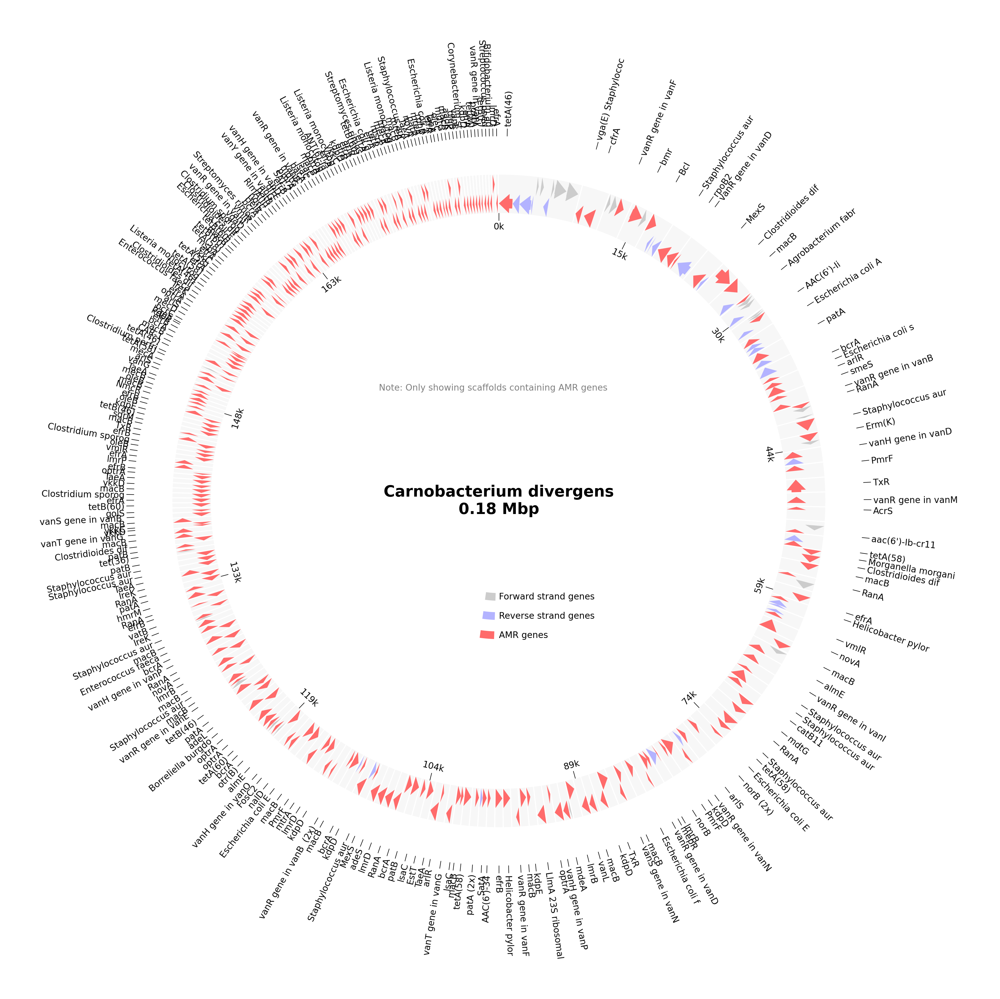

### AAC(6')-34
- **Mechanism**: antibiotic inactivation
- **Drug Classes**: aminoglycoside antibiotic
- **AMR Family**: AAC(6')
- **Locations**:
  - gnl|SPADES|LFDBGJIL_68104_2 : position 442-756

### AAC(6')-Ii
- **Mechanism**: antibiotic inactivation
- **Drug Classes**: aminoglycoside antibiotic
- **AMR Family**: AAC(6')
- **Locations**:
  - gnl|SPADES|LFDBGJIL_3360_3 : position 475-933

### ANT(6)-Ia
- **Mechanism**: antibiotic inactivation
- **Drug Classes**: aminoglycoside antibiotic
- **AMR Family**: ANT(6)
- **Locations**:
  - gnl|SPADES|LFDBGJIL_1278276_1 : position 2-265

### AcrS
- **Mechanism**: antibiotic efflux
- **Drug Classes**: fluoroquinolone antibiotic; cephalosporin; glycylcycline; cephamycin; penam; tetracycline antibiotic; rifamycin antibiotic; phenicol antibiotic; disinfecting agents and antiseptics
- **AMR Family**: resistance-nodulation-cell division (RND) antibiotic efflux pump
- **Locations**:
  - gnl|SPADES|LFDBGJIL_6379_1 : position 2-319

### Agrobacterium fabrum chloramphenicol acetyltransferase
- **Mechanism**: antibiotic inactivation
- **Drug Classes**: phenicol antibiotic
- **AMR Family**: chloramphenicol acetyltransferase (CAT)
- **Locations**:
  - gnl|SPADES|LFDBGJIL_3317_1 : position 2-268

### BcI
- **Mechanism**: antibiotic inactivation
- **Drug Classes**: cephalosporin; penem
- **AMR Family**: class A Bacillus cereus Bc beta-lactamase
- **Locations**:
  - gnl|SPADES|LFDBGJIL_2480_1 : position 1-822

### Bifidobacterium adolescentis rpoB mutants conferring resistance to rifampicin
- **Mechanism**: antibiotic target alteration; antibiotic target replacement
- **Drug Classes**: rifamycin antibiotic
- **AMR Family**: rifamycin-resistant beta-subunit of RNA polymerase (rpoB)
- **Locations**:
  - gnl|SPADES|LFDBGJIL_2037850_1 : position 1-207

### Borreliella burgdorferi murA with mutation conferring resistance to fosfomycin
- **Mechanism**: antibiotic target alteration
- **Drug Classes**: phosphonic acid antibiotic
- **AMR Family**: antibiotic-resistant murA transferase
- **Locations**:
  - gnl|SPADES|LFDBGJIL_171553_1 : position 2-589

### CAR-1
- **Mechanism**: antibiotic inactivation
- **Drug Classes**: carbapenem
- **AMR Family**: CAR beta-lactamase
- **Locations**:
  - gnl|SPADES|LFDBGJIL_714098_1 : position 2-349

### Clostridioides difficile gyrA conferring resistance to fluoroquinolones (found in 2 locations)
- **Mechanism**: antibiotic target alteration
- **Drug Classes**: fluoroquinolone antibiotic
- **AMR Family**: fluoroquinolone resistant gyrA
- **Locations**:
  - gnl|SPADES|LFDBGJIL_6865_2 : position 601-1356
  - gnl|SPADES|LFDBGJIL_865968_1 : position 2-319

### Clostridioides difficile gyrB conferring resistance to fluoroquinolones (found in 3 locations)
- **Mechanism**: antibiotic target alteration
- **Drug Classes**: fluoroquinolone antibiotic
- **AMR Family**: fluoroquinolone resistant gyrB
- **Locations**:
  - gnl|SPADES|LFDBGJIL_1015619_1 : position 2-295
  - gnl|SPADES|LFDBGJIL_3061_1 : position 260-1918
  - gnl|SPADES|LFDBGJIL_431285_1 : position 2-433

### Clostridium perfringes cplR
- **Mechanism**: antibiotic target protection
- **Drug Classes**: lincosamide antibiotic; streptogramin antibiotic; streptogramin A antibiotic; pleuromutilin antibiotic
- **AMR Family**: Miscellaneous ABC-F subfamily ATP-binding cassette ribosomal protection proteins
- **Locations**:
  - gnl|SPADES|LFDBGJIL_707104_1 : position 2-157

### Clostridium sporogenes cplR (found in 3 locations)
- **Mechanism**: antibiotic target protection
- **Drug Classes**: lincosamide antibiotic; pleuromutilin antibiotic
- **AMR Family**: Miscellaneous ABC-F subfamily ATP-binding cassette ribosomal protection proteins
- **Locations**:
  - gnl|SPADES|LFDBGJIL_1030360_1 : position 2-292
  - gnl|SPADES|LFDBGJIL_530399_1 : position 1-396
  - gnl|SPADES|LFDBGJIL_626779_1 : position 2-265

### Corynebacterium striatum tetA
- **Mechanism**: antibiotic efflux
- **Drug Classes**: penam; tetracycline antibiotic
- **AMR Family**: major facilitator superfamily (MFS) antibiotic efflux pump
- **Locations**:
  - gnl|SPADES|LFDBGJIL_1936375_1 : position 16-216

### Enterococcus faecalis cls with mutation conferring resistance to daptomycin (found in 2 locations)
- **Mechanism**: antibiotic target alteration
- **Drug Classes**: peptide antibiotic
- **AMR Family**: daptomycin resistant cls
- **Locations**:
  - gnl|SPADES|LFDBGJIL_267072_1 : position 3-500
  - gnl|SPADES|LFDBGJIL_856424_1 : position 3-320

### Erm(K)
- **Mechanism**: antibiotic target alteration
- **Drug Classes**: macrolide antibiotic; lincosamide antibiotic; streptogramin antibiotic
- **AMR Family**: Erm 23S ribosomal RNA methyltransferase
- **Locations**:
  - gnl|SPADES|LFDBGJIL_5481_1 : position 3-779

### Escherichia coli AcrAB-TolC with AcrR mutation conferring resistance to ciprofloxacin, tetracycline, and ceftazidime (found in 2 locations)
- **Mechanism**: antibiotic target alteration; antibiotic efflux
- **Drug Classes**: fluoroquinolone antibiotic; cephalosporin; glycylcycline; penam; tetracycline antibiotic; rifamycin antibiotic; phenicol antibiotic; disinfecting agents and antiseptics
- **AMR Family**: resistance-nodulation-cell division (RND) antibiotic efflux pump
- **Locations**:
  - gnl|SPADES|LFDBGJIL_1719153_1 : position 1-231
  - gnl|SPADES|LFDBGJIL_3895_1 : position 14-622

### Escherichia coli EF-Tu mutants conferring resistance to Pulvomycin
- **Mechanism**: antibiotic target alteration
- **Drug Classes**: elfamycin antibiotic
- **AMR Family**: elfamycin resistant EF-Tu
- **Locations**:
  - gnl|SPADES|LFDBGJIL_131959_1 : position 2-634

### Escherichia coli EF-Tu mutants conferring resistance to kirromycin (found in 2 locations)
- **Mechanism**: antibiotic target alteration
- **Drug Classes**: elfamycin antibiotic
- **AMR Family**: elfamycin resistant EF-Tu
- **Locations**:
  - gnl|SPADES|LFDBGJIL_1009215_1 : position 1-294
  - gnl|SPADES|LFDBGJIL_20314_1 : position 2-265

### Escherichia coli fabI mutations conferring resistance to isoniazid and triclosan
- **Mechanism**: antibiotic target alteration
- **Drug Classes**: disinfecting agents and antiseptics; isoniazid-like antibiotic
- **AMR Family**: antibiotic resistant fabI
- **Locations**:
  - gnl|SPADES|LFDBGJIL_30078_1 : position 2-523

### Escherichia coli gyrA conferring resistance to fluoroquinolones
- **Mechanism**: antibiotic target alteration
- **Drug Classes**: fluoroquinolone antibiotic
- **AMR Family**: fluoroquinolone resistant gyrA
- **Locations**:
  - gnl|SPADES|LFDBGJIL_1455136_1 : position 3-248

### Escherichia coli soxS with mutation conferring antibiotic resistance
- **Mechanism**: antibiotic target alteration; antibiotic efflux; reduced permeability to antibiotic
- **Drug Classes**: fluoroquinolone antibiotic; monobactam; carbapenem; cephalosporin; glycylcycline; cephamycin; penam; tetracycline antibiotic; rifamycin antibiotic; phenicol antibiotic; penem; disinfecting agents and antiseptics
- **AMR Family**: ATP-binding cassette (ABC) antibiotic efflux pump; major facilitator superfamily (MFS) antibiotic efflux pump; resistance-nodulation-cell division (RND) antibiotic efflux pump; General Bacterial Porin with reduced permeability to beta-lactams
- **Locations**:
  - gnl|SPADES|LFDBGJIL_4278_1 : position 140-619

### EstT
- **Mechanism**: antibiotic inactivation
- **Drug Classes**: macrolide antibiotic
- **AMR Family**: macrolide esterase
- **Locations**:
  - gnl|SPADES|LFDBGJIL_82132_1 : position 2-601

### FosC2
- **Mechanism**: antibiotic inactivation
- **Drug Classes**: phosphonic acid antibiotic
- **AMR Family**: fosC phosphotransferase family
- **Locations**:
  - gnl|SPADES|LFDBGJIL_152862_1 : position 144-524

### HelR
- **Mechanism**: antibiotic target protection
- **Drug Classes**: rifamycin antibiotic
- **AMR Family**: helicase-like RNA polymerase protection protein
- **Locations**:
  - gnl|SPADES|LFDBGJIL_1062356_1 : position 1-288

### Helicobacter pylori pbp1 mutants conferring resistance to amoxicillin
- **Mechanism**: antibiotic target alteration
- **Drug Classes**: cephalosporin; cephamycin; penam
- **AMR Family**: Penicillin-binding protein mutations conferring resistance to beta-lactam antibiotics
- **Locations**:
  - gnl|SPADES|LFDBGJIL_8224_1 : position 3-341

### Helicobacter pylori rpoB mutation conferring resistance to rifampicin
- **Mechanism**: antibiotic target alteration; antibiotic target replacement
- **Drug Classes**: fluoroquinolone antibiotic; rifamycin antibiotic
- **AMR Family**: rifamycin-resistant beta-subunit of RNA polymerase (rpoB)
- **Locations**:
  - gnl|SPADES|LFDBGJIL_65034_1 : position 3-764

### IreK (found in 3 locations)
- **Mechanism**: reduced permeability to antibiotic
- **Drug Classes**: cephalosporin
- **AMR Family**: Serine/threonine kinases
- **Locations**:
  - gnl|SPADES|LFDBGJIL_277531_2 : position 191-508
  - gnl|SPADES|LFDBGJIL_323792_1 : position 2-481
  - gnl|SPADES|LFDBGJIL_844216_1 : position 2-322

### Listeria monocytogenes mprF (found in 4 locations)
- **Mechanism**: antibiotic target alteration
- **Drug Classes**: peptide antibiotic
- **AMR Family**: defensin resistant mprF
- **Locations**:
  - gnl|SPADES|LFDBGJIL_1262517_1 : position 2-265
  - gnl|SPADES|LFDBGJIL_1289949_1 : position 2-262
  - gnl|SPADES|LFDBGJIL_1555895_1 : position 1-240
  - gnl|SPADES|LFDBGJIL_893555_1 : position 1-315

### LlmA 23S ribosomal RNA methyltransferase
- **Mechanism**: antibiotic target alteration
- **Drug Classes**: lincosamide antibiotic
- **AMR Family**: Llm 23S ribosomal RNA methyltransferase
- **Locations**:
  - gnl|SPADES|LFDBGJIL_53695_1 : position 1-801

### MexS (found in 2 locations)
- **Mechanism**: antibiotic efflux
- **Drug Classes**: fluoroquinolone antibiotic; diaminopyrimidine antibiotic; phenicol antibiotic
- **AMR Family**: resistance-nodulation-cell division (RND) antibiotic efflux pump
- **Locations**:
  - gnl|SPADES|LFDBGJIL_2919_2 : position 527-1510
  - gnl|SPADES|LFDBGJIL_93446_1 : position 3-695

### Morganella morganii gyrB conferring resistance to fluoroquinolones
- **Mechanism**: antibiotic target alteration
- **Drug Classes**: fluoroquinolone antibiotic
- **AMR Family**: fluoroquinolone resistant gyrB
- **Locations**:
  - gnl|SPADES|LFDBGJIL_6865_1 : position 3-536

### NmcR
- **Mechanism**: antibiotic inactivation
- **Drug Classes**: carbapenem; cephalosporin; cephamycin; penam
- **AMR Family**: NmcA beta-lactamase
- **Locations**:
  - gnl|SPADES|LFDBGJIL_684078_2 : position 167-355

### PmrF (found in 3 locations)
- **Mechanism**: antibiotic target alteration
- **Drug Classes**: peptide antibiotic
- **AMR Family**: pmr phosphoethanolamine transferase
- **Locations**:
  - gnl|SPADES|LFDBGJIL_121285_1 : position 3-443
  - gnl|SPADES|LFDBGJIL_25511_1 : position 1-264
  - gnl|SPADES|LFDBGJIL_5833_1 : position 3-557

### RanA (found in 7 locations)
- **Mechanism**: antibiotic efflux
- **Drug Classes**: aminoglycoside antibiotic
- **AMR Family**: ATP-binding cassette (ABC) antibiotic efflux pump
- **Locations**:
  - gnl|SPADES|LFDBGJIL_18297_1 : position 1-591
  - gnl|SPADES|LFDBGJIL_251084_1 : position 1-387
  - gnl|SPADES|LFDBGJIL_295478_1 : position 3-422
  - gnl|SPADES|LFDBGJIL_312050_1 : position 3-488
  - gnl|SPADES|LFDBGJIL_5087_1 : position 2-424
  - gnl|SPADES|LFDBGJIL_7877_1 : position 1-306
  - gnl|SPADES|LFDBGJIL_89119_1 : position 3-602

### RlmA(II)
- **Mechanism**: antibiotic target alteration
- **Drug Classes**: macrolide antibiotic; lincosamide antibiotic
- **AMR Family**: non-erm 23S ribosomal RNA methyltransferase (G748)
- **Locations**:
  - gnl|SPADES|LFDBGJIL_1082269_1 : position 2-286

### SAT-2
- **Mechanism**: antibiotic inactivation
- **Drug Classes**: nucleoside antibiotic
- **AMR Family**: streptothricin acetyltransferase (SAT)
- **Locations**:
  - gnl|SPADES|LFDBGJIL_1189673_1 : position 1-273

### SatA
- **Mechanism**: antibiotic inactivation
- **Drug Classes**: nucleoside antibiotic
- **AMR Family**: streptothricin acetyltransferase (SAT)
- **Locations**:
  - gnl|SPADES|LFDBGJIL_68308_1 : position 11-445

### Staphylococcus aureus LmrS
- **Mechanism**: antibiotic efflux
- **Drug Classes**: macrolide antibiotic; aminoglycoside antibiotic; oxazolidinone antibiotic; diaminopyrimidine antibiotic; phenicol antibiotic
- **AMR Family**: major facilitator superfamily (MFS) antibiotic efflux pump
- **Locations**:
  - gnl|SPADES|LFDBGJIL_206023_1 : position 3-413

### Staphylococcus aureus fusA with mutation conferring resistance to fusidic acid
- **Mechanism**: antibiotic target alteration
- **Drug Classes**: fusidane antibiotic
- **AMR Family**: antibiotic resistant fusA
- **Locations**:
  - gnl|SPADES|LFDBGJIL_273506_1 : position 2-511

### Staphylococcus aureus mupA conferring resistance to mupirocin (found in 6 locations)
- **Mechanism**: antibiotic target alteration
- **Drug Classes**: mupirocin-like antibiotic
- **AMR Family**: antibiotic-resistant isoleucyl-tRNA synthetase (ileS)
- **Locations**:
  - gnl|SPADES|LFDBGJIL_14456_2 : position 83-1099
  - gnl|SPADES|LFDBGJIL_18653_1 : position 190-1032
  - gnl|SPADES|LFDBGJIL_398942_1 : position 1-447
  - gnl|SPADES|LFDBGJIL_409852_1 : position 2-442
  - gnl|SPADES|LFDBGJIL_5185_1 : position 149-1237
  - gnl|SPADES|LFDBGJIL_99563_1 : position 3-209

### Staphylococcus aureus murA with mutation conferring resistance to fosfomycin (found in 2 locations)
- **Mechanism**: antibiotic target alteration
- **Drug Classes**: phosphonic acid antibiotic
- **AMR Family**: antibiotic-resistant murA transferase
- **Locations**:
  - gnl|SPADES|LFDBGJIL_13728_3 : position 794-1111
  - gnl|SPADES|LFDBGJIL_1665981_1 : position 1-234

### Staphylococcus aureus rpoB mutants conferring resistance to rifampicin
- **Mechanism**: antibiotic target alteration; antibiotic target replacement
- **Drug Classes**: rifamycin antibiotic
- **AMR Family**: rifamycin-resistant beta-subunit of RNA polymerase (rpoB)
- **Locations**:
  - gnl|SPADES|LFDBGJIL_2591_1 : position 2-1138

### Streptococcus pneumoniae PBP2x conferring resistance to amoxicillin
- **Mechanism**: antibiotic target alteration
- **Drug Classes**: cephalosporin; cephamycin; penam
- **AMR Family**: Penicillin-binding protein mutations conferring resistance to beta-lactam antibiotics
- **Locations**:
  - gnl|SPADES|LFDBGJIL_2028663_1 : position 2-208

### Streptomyces rimosus otr(A) (found in 2 locations)
- **Mechanism**: antibiotic target protection
- **Drug Classes**: tetracycline antibiotic
- **AMR Family**: tetracycline-resistant ribosomal protection protein
- **Locations**:
  - gnl|SPADES|LFDBGJIL_1048868_1 : position 1-291
  - gnl|SPADES|LFDBGJIL_1405859_1 : position 3-254

### TaeA (found in 6 locations)
- **Mechanism**: antibiotic efflux
- **Drug Classes**: pleuromutilin antibiotic
- **AMR Family**: ATP-binding cassette (ABC) antibiotic efflux pump
- **Locations**:
  - gnl|SPADES|LFDBGJIL_1666492_1 : position 3-233
  - gnl|SPADES|LFDBGJIL_1749384_1 : position 2-202
  - gnl|SPADES|LFDBGJIL_371340_1 : position 3-458
  - gnl|SPADES|LFDBGJIL_564697_1 : position 2-388
  - gnl|SPADES|LFDBGJIL_697281_1 : position 1-189
  - gnl|SPADES|LFDBGJIL_77425_1 : position 1-729

### TxR (found in 3 locations)
- **Mechanism**: antibiotic efflux
- **Drug Classes**: tetracycline antibiotic
- **AMR Family**: ATP-binding cassette (ABC) antibiotic efflux pump
- **Locations**:
  - gnl|SPADES|LFDBGJIL_34364_1 : position 1-891
  - gnl|SPADES|LFDBGJIL_6138_1 : position 1-1407
  - gnl|SPADES|LFDBGJIL_651537_1 : position 3-365

### aac(6')-Ib-cr11
- **Mechanism**: antibiotic inactivation
- **Drug Classes**: fluoroquinolone antibiotic; aminoglycoside antibiotic
- **AMR Family**: AAC(6'); AAC(6')-Ib-cr
- **Locations**:
  - gnl|SPADES|LFDBGJIL_6570_3 : position 992-1375

### aadK
- **Mechanism**: antibiotic inactivation
- **Drug Classes**: aminoglycoside antibiotic
- **AMR Family**: ANT(6)
- **Locations**:
  - gnl|SPADES|LFDBGJIL_1809293_1 : position 2-223

### adeL
- **Mechanism**: antibiotic efflux
- **Drug Classes**: fluoroquinolone antibiotic; tetracycline antibiotic
- **AMR Family**: resistance-nodulation-cell division (RND) antibiotic efflux pump
- **Locations**:
  - gnl|SPADES|LFDBGJIL_171303_1 : position 2-538

### adeS
- **Mechanism**: antibiotic efflux
- **Drug Classes**: glycylcycline; tetracycline antibiotic
- **AMR Family**: resistance-nodulation-cell division (RND) antibiotic efflux pump
- **Locations**:
  - gnl|SPADES|LFDBGJIL_91099_1 : position 2-700

### almE (found in 2 locations)
- **Mechanism**: antibiotic target alteration
- **Drug Classes**: peptide antibiotic
- **AMR Family**: polymyxin resistance operon; alm glycyltransferase
- **Locations**:
  - gnl|SPADES|LFDBGJIL_10894_2 : position 566-1183
  - gnl|SPADES|LFDBGJIL_154879_1 : position 52-609

### arlR (found in 3 locations)
- **Mechanism**: antibiotic efflux
- **Drug Classes**: fluoroquinolone antibiotic; disinfecting agents and antiseptics
- **AMR Family**: major facilitator superfamily (MFS) antibiotic efflux pump
- **Locations**:
  - gnl|SPADES|LFDBGJIL_1383698_1 : position 1-213
  - gnl|SPADES|LFDBGJIL_4278_2 : position 630-1532
  - gnl|SPADES|LFDBGJIL_77429_2 : position 493-729

### arlS (found in 3 locations)
- **Mechanism**: antibiotic efflux
- **Drug Classes**: fluoroquinolone antibiotic; disinfecting agents and antiseptics
- **AMR Family**: major facilitator superfamily (MFS) antibiotic efflux pump
- **Locations**:
  - gnl|SPADES|LFDBGJIL_22761_2 : position 513-983
  - gnl|SPADES|LFDBGJIL_705452_1 : position 2-352
  - gnl|SPADES|LFDBGJIL_778114_1 : position 3-335

### bacA
- **Mechanism**: antibiotic target alteration
- **Drug Classes**: peptide antibiotic
- **AMR Family**: undecaprenyl pyrophosphate related proteins
- **Locations**:
  - gnl|SPADES|LFDBGJIL_1229693_1 : position 1-267

### baeS
- **Mechanism**: antibiotic efflux
- **Drug Classes**: aminoglycoside antibiotic; aminocoumarin antibiotic
- **AMR Family**: resistance-nodulation-cell division (RND) antibiotic efflux pump
- **Locations**:
  - gnl|SPADES|LFDBGJIL_757463_2 : position 180-341

### bcrA (found in 7 locations)
- **Mechanism**: antibiotic efflux
- **Drug Classes**: peptide antibiotic
- **AMR Family**: ATP-binding cassette (ABC) antibiotic efflux pump
- **Locations**:
  - gnl|SPADES|LFDBGJIL_1049333_1 : position 1-291
  - gnl|SPADES|LFDBGJIL_108735_1 : position 3-233
  - gnl|SPADES|LFDBGJIL_157914_2 : position 281-604
  - gnl|SPADES|LFDBGJIL_265317_1 : position 1-513
  - gnl|SPADES|LFDBGJIL_3983_3 : position 1331-1672
  - gnl|SPADES|LFDBGJIL_735192_1 : position 2-346
  - gnl|SPADES|LFDBGJIL_85821_1 : position 1-573

### bcrC
- **Mechanism**: antibiotic target alteration
- **Drug Classes**: peptide antibiotic
- **AMR Family**: undecaprenyl pyrophosphate related proteins
- **Locations**:
  - gnl|SPADES|LFDBGJIL_761940_1 : position 1-255

### bmr
- **Mechanism**: antibiotic efflux
- **Drug Classes**: fluoroquinolone antibiotic; nucleoside antibiotic; phenicol antibiotic; disinfecting agents and antiseptics
- **AMR Family**: major facilitator superfamily (MFS) antibiotic efflux pump
- **Locations**:
  - gnl|SPADES|LFDBGJIL_2360_2 : position 280-1503

### catB11
- **Mechanism**: antibiotic inactivation
- **Drug Classes**: phenicol antibiotic
- **AMR Family**: chloramphenicol acetyltransferase (CAT)
- **Locations**:
  - gnl|SPADES|LFDBGJIL_15099_1 : position 2-541

### cfrA
- **Mechanism**: antibiotic target alteration
- **Drug Classes**: lincosamide antibiotic; streptogramin antibiotic; streptogramin A antibiotic; oxazolidinone antibiotic; phenicol antibiotic; pleuromutilin antibiotic
- **AMR Family**: Cfr 23S ribosomal RNA methyltransferase
- **Locations**:
  - gnl|SPADES|LFDBGJIL_1717_2 : position 973-2031

### dfrE
- **Mechanism**: antibiotic target replacement
- **Drug Classes**: diaminopyrimidine antibiotic
- **AMR Family**: trimethoprim resistant dihydrofolate reductase dfr
- **Locations**:
  - gnl|SPADES|LFDBGJIL_1116487_1 : position 3-281

### efrA (found in 13 locations)
- **Mechanism**: antibiotic efflux
- **Drug Classes**: macrolide antibiotic; fluoroquinolone antibiotic; rifamycin antibiotic
- **AMR Family**: ATP-binding cassette (ABC) antibiotic efflux pump
- **Locations**:
  - gnl|SPADES|LFDBGJIL_1292083_1 : position 3-263
  - gnl|SPADES|LFDBGJIL_1364210_1 : position 3-257
  - gnl|SPADES|LFDBGJIL_1435289_1 : position 2-250
  - gnl|SPADES|LFDBGJIL_1465926_1 : position 2-247
  - gnl|SPADES|LFDBGJIL_1738586_2 : position 97-228
  - gnl|SPADES|LFDBGJIL_1958442_1 : position 1-213
  - gnl|SPADES|LFDBGJIL_2067340_1 : position 29-205
  - gnl|SPADES|LFDBGJIL_520779_1 : position 2-400
  - gnl|SPADES|LFDBGJIL_599654_1 : position 2-376
  - gnl|SPADES|LFDBGJIL_8022_2 : position 580-1293
  - gnl|SPADES|LFDBGJIL_831537_1 : position 1-324
  - gnl|SPADES|LFDBGJIL_905701_1 : position 1-312
  - gnl|SPADES|LFDBGJIL_937306_1 : position 3-308

### efrB (found in 8 locations)
- **Mechanism**: antibiotic efflux
- **Drug Classes**: macrolide antibiotic; fluoroquinolone antibiotic; rifamycin antibiotic
- **AMR Family**: ATP-binding cassette (ABC) antibiotic efflux pump
- **Locations**:
  - gnl|SPADES|LFDBGJIL_1141777_1 : position 1-279
  - gnl|SPADES|LFDBGJIL_1361987_1 : position 3-257
  - gnl|SPADES|LFDBGJIL_295016_2 : position 348-497
  - gnl|SPADES|LFDBGJIL_574227_1 : position 3-149
  - gnl|SPADES|LFDBGJIL_625143_1 : position 2-370
  - gnl|SPADES|LFDBGJIL_670687_1 : position 1-360
  - gnl|SPADES|LFDBGJIL_67605_1 : position 1-756
  - gnl|SPADES|LFDBGJIL_731501_1 : position 3-344

### golS
- **Mechanism**: antibiotic efflux
- **Drug Classes**: monobactam; carbapenem; cephalosporin; cephamycin; penam; phenicol antibiotic; penem
- **AMR Family**: resistance-nodulation-cell division (RND) antibiotic efflux pump
- **Locations**:
  - gnl|SPADES|LFDBGJIL_509875_1 : position 1-222

### hmrM
- **Mechanism**: antibiotic efflux
- **Drug Classes**: fluoroquinolone antibiotic; disinfecting agents and antiseptics
- **AMR Family**: multidrug and toxic compound extrusion (MATE) transporter
- **Locations**:
  - gnl|SPADES|LFDBGJIL_297261_1 : position 3-497

### kdpD (found in 6 locations)
- **Mechanism**: antibiotic efflux
- **Drug Classes**: aminoglycoside antibiotic
- **AMR Family**: kdpDE
- **Locations**:
  - gnl|SPADES|LFDBGJIL_100856_1 : position 3-683
  - gnl|SPADES|LFDBGJIL_113383_2 : position 452-661
  - gnl|SPADES|LFDBGJIL_1349020_1 : position 2-259
  - gnl|SPADES|LFDBGJIL_1950173_1 : position 3-215
  - gnl|SPADES|LFDBGJIL_25313_1 : position 1-960
  - gnl|SPADES|LFDBGJIL_43297_1 : position 3-557

### kdpE (found in 3 locations)
- **Mechanism**: antibiotic efflux
- **Drug Classes**: aminoglycoside antibiotic
- **AMR Family**: kdpDE
- **Locations**:
  - gnl|SPADES|LFDBGJIL_57542_2 : position 421-786
  - gnl|SPADES|LFDBGJIL_664375_1 : position 1-360
  - gnl|SPADES|LFDBGJIL_757463_1 : position 1-183

### lmrB (found in 3 locations)
- **Mechanism**: antibiotic efflux
- **Drug Classes**: lincosamide antibiotic; nucleoside antibiotic
- **AMR Family**: ATP-binding cassette (ABC) antibiotic efflux pump
- **Locations**:
  - gnl|SPADES|LFDBGJIL_245566_1 : position 15-530
  - gnl|SPADES|LFDBGJIL_29513_1 : position 1-297
  - gnl|SPADES|LFDBGJIL_47214_1 : position 65-826

### lmrD (found in 3 locations)
- **Mechanism**: antibiotic efflux
- **Drug Classes**: lincosamide antibiotic
- **AMR Family**: ATP-binding cassette (ABC) antibiotic efflux pump
- **Locations**:
  - gnl|SPADES|LFDBGJIL_119442_2 : position 323-652
  - gnl|SPADES|LFDBGJIL_2045123_1 : position 1-207
  - gnl|SPADES|LFDBGJIL_89983_1 : position 3-701

### lmrP
- **Mechanism**: antibiotic efflux
- **Drug Classes**: macrolide antibiotic; lincosamide antibiotic; streptogramin antibiotic; streptogramin A antibiotic; tetracycline antibiotic
- **AMR Family**: major facilitator superfamily (MFS) antibiotic efflux pump
- **Locations**:
  - gnl|SPADES|LFDBGJIL_576297_1 : position 2-385

### lsaC (found in 4 locations)
- **Mechanism**: antibiotic target protection
- **Drug Classes**: lincosamide antibiotic; streptogramin antibiotic; pleuromutilin antibiotic
- **AMR Family**: lsa-type ABC-F protein
- **Locations**:
  - gnl|SPADES|LFDBGJIL_1250189_1 : position 3-266
  - gnl|SPADES|LFDBGJIL_1250593_1 : position 18-266
  - gnl|SPADES|LFDBGJIL_69516_2 : position 276-752
  - gnl|SPADES|LFDBGJIL_83055_1 : position 89-469

### macB (found in 23 locations)
- **Mechanism**: antibiotic efflux
- **Drug Classes**: macrolide antibiotic
- **AMR Family**: ATP-binding cassette (ABC) antibiotic efflux pump
- **Locations**:
  - gnl|SPADES|LFDBGJIL_10564_3 : position 514-1194
  - gnl|SPADES|LFDBGJIL_110936_1 : position 2-664
  - gnl|SPADES|LFDBGJIL_1255456_1 : position 3-266
  - gnl|SPADES|LFDBGJIL_127175_1 : position 1-474
  - gnl|SPADES|LFDBGJIL_1557070_1 : position 1-240
  - gnl|SPADES|LFDBGJIL_1581269_1 : position 2-238
  - gnl|SPADES|LFDBGJIL_1780378_1 : position 1-225
  - gnl|SPADES|LFDBGJIL_202629_1 : position 29-562
  - gnl|SPADES|LFDBGJIL_209254_1 : position 3-365
  - gnl|SPADES|LFDBGJIL_272030_1 : position 2-421
  - gnl|SPADES|LFDBGJIL_3119_1 : position 3-1100
  - gnl|SPADES|LFDBGJIL_31481_2 : position 430-912
  - gnl|SPADES|LFDBGJIL_433915_1 : position 36-431
  - gnl|SPADES|LFDBGJIL_449651_1 : position 1-426
  - gnl|SPADES|LFDBGJIL_46299_2 : position 244-831
  - gnl|SPADES|LFDBGJIL_540794_1 : position 2-394
  - gnl|SPADES|LFDBGJIL_61455_1 : position 2-634
  - gnl|SPADES|LFDBGJIL_655101_2 : position 184-363
  - gnl|SPADES|LFDBGJIL_682169_2 : position 139-357
  - gnl|SPADES|LFDBGJIL_69516_1 : position 1-276
  - gnl|SPADES|LFDBGJIL_713754_1 : position 1-348
  - gnl|SPADES|LFDBGJIL_7770_1 : position 3-686
  - gnl|SPADES|LFDBGJIL_997819_1 : position 2-298

### mdeA
- **Mechanism**: antibiotic efflux
- **Drug Classes**: fluoroquinolone antibiotic; aminoglycoside antibiotic; penam; tetracycline antibiotic; disinfecting agents and antiseptics
- **AMR Family**: major facilitator superfamily (MFS) antibiotic efflux pump
- **Locations**:
  - gnl|SPADES|LFDBGJIL_48706_2 : position 253-822

### mdtG (found in 3 locations)
- **Mechanism**: antibiotic efflux
- **Drug Classes**: phosphonic acid antibiotic
- **AMR Family**: major facilitator superfamily (MFS) antibiotic efflux pump
- **Locations**:
  - gnl|SPADES|LFDBGJIL_1226540_1 : position 1-270
  - gnl|SPADES|LFDBGJIL_17604_1 : position 3-689
  - gnl|SPADES|LFDBGJIL_1786756_1 : position 1-225

### mecA (found in 2 locations)
- **Mechanism**: antibiotic target replacement
- **Drug Classes**: penam
- **AMR Family**: methicillin resistant PBP2
- **Locations**:
  - gnl|SPADES|LFDBGJIL_1526428_1 : position 2-244
  - gnl|SPADES|LFDBGJIL_706353_1 : position 1-351

### mecB
- **Mechanism**: antibiotic target replacement
- **Drug Classes**: penam
- **AMR Family**: methicillin resistant PBP2
- **Locations**:
  - gnl|SPADES|LFDBGJIL_692121_1 : position 2-355

### mecD
- **Mechanism**: antibiotic target replacement
- **Drug Classes**: penam
- **AMR Family**: methicillin resistant PBP2
- **Locations**:
  - gnl|SPADES|LFDBGJIL_771018_1 : position 3-338

### mepR
- **Mechanism**: antibiotic efflux
- **Drug Classes**: glycylcycline; tetracycline antibiotic
- **AMR Family**: multidrug and toxic compound extrusion (MATE) transporter
- **Locations**:
  - gnl|SPADES|LFDBGJIL_29513_2 : position 284-796

### mreA (found in 2 locations)
- **Mechanism**: antibiotic efflux
- **Drug Classes**: macrolide antibiotic
- **AMR Family**: major facilitator superfamily (MFS) antibiotic efflux pump
- **Locations**:
  - gnl|SPADES|LFDBGJIL_1597681_1 : position 3-239
  - gnl|SPADES|LFDBGJIL_1702427_1 : position 3-230

### msbA
- **Mechanism**: antibiotic efflux
- **Drug Classes**: nitroimidazole antibiotic
- **AMR Family**: ATP-binding cassette (ABC) antibiotic efflux pump
- **Locations**:
  - gnl|SPADES|LFDBGJIL_949186_1 : position 2-220

### msrF
- **Mechanism**: antibiotic target protection
- **Drug Classes**: macrolide antibiotic; streptogramin antibiotic
- **AMR Family**: msr-type ABC-F protein
- **Locations**:
  - gnl|SPADES|LFDBGJIL_1531156_1 : position 2-244

### mtrA
- **Mechanism**: antibiotic efflux
- **Drug Classes**: macrolide antibiotic; penam
- **AMR Family**: resistance-nodulation-cell division (RND) antibiotic efflux pump
- **Locations**:
  - gnl|SPADES|LFDBGJIL_121618_1 : position 105-650

### nalD
- **Mechanism**: antibiotic efflux
- **Drug Classes**: macrolide antibiotic; fluoroquinolone antibiotic; monobactam; carbapenem; cephalosporin; cephamycin; penam; tetracycline antibiotic; peptide antibiotic; aminocoumarin antibiotic; diaminopyrimidine antibiotic; sulfonamide antibiotic; phenicol antibiotic; penem
- **AMR Family**: resistance-nodulation-cell division (RND) antibiotic efflux pump
- **Locations**:
  - gnl|SPADES|LFDBGJIL_141010_1 : position 3-623

### norB (found in 3 locations)
- **Mechanism**: antibiotic efflux
- **Drug Classes**: fluoroquinolone antibiotic
- **AMR Family**: major facilitator superfamily (MFS) antibiotic efflux pump
- **Locations**:
  - gnl|SPADES|LFDBGJIL_21803_1 : position 2-442
  - gnl|SPADES|LFDBGJIL_21803_2 : position 569-994
  - gnl|SPADES|LFDBGJIL_27890_1 : position 3-98

### norC
- **Mechanism**: antibiotic efflux
- **Drug Classes**: fluoroquinolone antibiotic; disinfecting agents and antiseptics
- **AMR Family**: major facilitator superfamily (MFS) antibiotic efflux pump
- **Locations**:
  - gnl|SPADES|LFDBGJIL_1063593_1 : position 3-287

### novA (found in 3 locations)
- **Mechanism**: antibiotic efflux
- **Drug Classes**: aminocoumarin antibiotic
- **AMR Family**: ATP-binding cassette (ABC) antibiotic efflux pump
- **Locations**:
  - gnl|SPADES|LFDBGJIL_10397_1 : position 25-1140
  - gnl|SPADES|LFDBGJIL_1699976_1 : position 2-232
  - gnl|SPADES|LFDBGJIL_245778_1 : position 1-528

### oleB (found in 4 locations)
- **Mechanism**: antibiotic target protection
- **Drug Classes**: macrolide antibiotic
- **AMR Family**: Miscellaneous ABC-F subfamily ATP-binding cassette ribosomal protection proteins
- **Locations**:
  - gnl|SPADES|LFDBGJIL_1893092_1 : position 3-218
  - gnl|SPADES|LFDBGJIL_617615_1 : position 3-371
  - gnl|SPADES|LFDBGJIL_665764_1 : position 110-361
  - gnl|SPADES|LFDBGJIL_687360_1 : position 2-355

### oleC
- **Mechanism**: antibiotic efflux
- **Drug Classes**: macrolide antibiotic
- **AMR Family**: ATP-binding cassette (ABC) antibiotic efflux pump
- **Locations**:
  - gnl|SPADES|LFDBGJIL_1764247_1 : position 2-226

### optrA (found in 6 locations)
- **Mechanism**: antibiotic target protection
- **Drug Classes**: oxazolidinone antibiotic; phenicol antibiotic
- **AMR Family**: Miscellaneous ABC-F subfamily ATP-binding cassette ribosomal protection proteins
- **Locations**:
  - gnl|SPADES|LFDBGJIL_1261877_1 : position 1-264
  - gnl|SPADES|LFDBGJIL_165755_1 : position 1-597
  - gnl|SPADES|LFDBGJIL_170288_1 : position 3-590
  - gnl|SPADES|LFDBGJIL_53548_1 : position 2-238
  - gnl|SPADES|LFDBGJIL_566306_1 : position 3-386
  - gnl|SPADES|LFDBGJIL_806063_1 : position 3-329

### otr(B)
- **Mechanism**: antibiotic efflux
- **Drug Classes**: tetracycline antibiotic
- **AMR Family**: major facilitator superfamily (MFS) antibiotic efflux pump
- **Locations**:
  - gnl|SPADES|LFDBGJIL_155377_2 : position 325-606

### patA (found in 6 locations)
- **Mechanism**: antibiotic efflux
- **Drug Classes**: fluoroquinolone antibiotic
- **AMR Family**: ATP-binding cassette (ABC) antibiotic efflux pump
- **Locations**:
  - gnl|SPADES|LFDBGJIL_1698314_1 : position 3-230
  - gnl|SPADES|LFDBGJIL_177643_1 : position 2-418
  - gnl|SPADES|LFDBGJIL_304717_1 : position 169-492
  - gnl|SPADES|LFDBGJIL_3913_1 : position 3-836
  - gnl|SPADES|LFDBGJIL_68223_1 : position 2-361
  - gnl|SPADES|LFDBGJIL_68223_2 : position 424-753

### patB (found in 4 locations)
- **Mechanism**: antibiotic efflux
- **Drug Classes**: fluoroquinolone antibiotic
- **AMR Family**: ATP-binding cassette (ABC) antibiotic efflux pump
- **Locations**:
  - gnl|SPADES|LFDBGJIL_1080674_1 : position 1-285
  - gnl|SPADES|LFDBGJIL_414099_1 : position 3-440
  - gnl|SPADES|LFDBGJIL_415711_2 : position 122-439
  - gnl|SPADES|LFDBGJIL_84355_1 : position 2-697

### pmrA
- **Mechanism**: antibiotic efflux
- **Drug Classes**: fluoroquinolone antibiotic
- **AMR Family**: major facilitator superfamily (MFS) antibiotic efflux pump
- **Locations**:
  - gnl|SPADES|LFDBGJIL_1188791_1 : position 2-274

### poxtA
- **Mechanism**: antibiotic target protection
- **Drug Classes**: tetracycline antibiotic; oxazolidinone antibiotic; phenicol antibiotic
- **AMR Family**: Miscellaneous ABC-F subfamily ATP-binding cassette ribosomal protection proteins
- **Locations**:
  - gnl|SPADES|LFDBGJIL_1978531_1 : position 1-213

### rphB
- **Mechanism**: antibiotic inactivation
- **Drug Classes**: rifamycin antibiotic
- **AMR Family**: rifampin phosphotransferase
- **Locations**:
  - gnl|SPADES|LFDBGJIL_1707166_1 : position 2-229

### rpoB2
- **Mechanism**: antibiotic target alteration; antibiotic target replacement
- **Drug Classes**: rifamycin antibiotic
- **AMR Family**: rifamycin-resistant beta-subunit of RNA polymerase (rpoB)
- **Locations**:
  - gnl|SPADES|LFDBGJIL_2591_2 : position 1222-2118

### sdrM
- **Mechanism**: antibiotic efflux
- **Drug Classes**: fluoroquinolone antibiotic; disinfecting agents and antiseptics
- **AMR Family**: major facilitator superfamily (MFS) antibiotic efflux pump
- **Locations**:
  - gnl|SPADES|LFDBGJIL_663550_1 : position 3-362

### smeS
- **Mechanism**: antibiotic efflux
- **Drug Classes**: aminoglycoside antibiotic; cephalosporin; cephamycin; penam
- **AMR Family**: resistance-nodulation-cell division (RND) antibiotic efflux pump
- **Locations**:
  - gnl|SPADES|LFDBGJIL_4796_1 : position 3-362

### tet(36)
- **Mechanism**: antibiotic target protection
- **Drug Classes**: tetracycline antibiotic
- **AMR Family**: tetracycline-resistant ribosomal protection protein
- **Locations**:
  - gnl|SPADES|LFDBGJIL_415988_1 : position 298-438

### tet(M)
- **Mechanism**: antibiotic target protection
- **Drug Classes**: tetracycline antibiotic
- **AMR Family**: tetracycline-resistant ribosomal protection protein
- **Locations**:
  - gnl|SPADES|LFDBGJIL_1980852_1 : position 3-212

### tetA(46) (found in 3 locations)
- **Mechanism**: antibiotic efflux
- **Drug Classes**: tetracycline antibiotic
- **AMR Family**: ATP-binding cassette (ABC) antibiotic efflux pump
- **Locations**:
  - gnl|SPADES|LFDBGJIL_416_1 : position 2-1513
  - gnl|SPADES|LFDBGJIL_709050_1 : position 111-350
  - gnl|SPADES|LFDBGJIL_880623_1 : position 3-317

### tetA(58) (found in 7 locations)
- **Mechanism**: antibiotic efflux
- **Drug Classes**: tetracycline antibiotic
- **AMR Family**: major facilitator superfamily (MFS) antibiotic efflux pump
- **Locations**:
  - gnl|SPADES|LFDBGJIL_20149_1 : position 2-511
  - gnl|SPADES|LFDBGJIL_6584_3 : position 832-1374
  - gnl|SPADES|LFDBGJIL_69093_1 : position 2-751
  - gnl|SPADES|LFDBGJIL_705813_1 : position 119-352
  - gnl|SPADES|LFDBGJIL_897008_1 : position 2-313
  - gnl|SPADES|LFDBGJIL_904944_1 : position 2-313
  - gnl|SPADES|LFDBGJIL_948826_1 : position 3-305

### tetA(60)
- **Mechanism**: antibiotic efflux
- **Drug Classes**: tetracycline antibiotic
- **AMR Family**: ATP-binding cassette (ABC) antibiotic efflux pump
- **Locations**:
  - gnl|SPADES|LFDBGJIL_161837_1 : position 1-576

### tetB(46) (found in 2 locations)
- **Mechanism**: antibiotic efflux
- **Drug Classes**: tetracycline antibiotic
- **AMR Family**: ATP-binding cassette (ABC) antibiotic efflux pump
- **Locations**:
  - gnl|SPADES|LFDBGJIL_183329_1 : position 1-579
  - gnl|SPADES|LFDBGJIL_663711_1 : position 2-361

### tetB(60) (found in 4 locations)
- **Mechanism**: antibiotic efflux
- **Drug Classes**: tetracycline antibiotic
- **AMR Family**: ATP-binding cassette (ABC) antibiotic efflux pump
- **Locations**:
  - gnl|SPADES|LFDBGJIL_1405444_1 : position 1-252
  - gnl|SPADES|LFDBGJIL_518552_1 : position 2-400
  - gnl|SPADES|LFDBGJIL_966200_1 : position 190-303
  - gnl|SPADES|LFDBGJIL_998480_1 : position 3-296

### tetB(P)
- **Mechanism**: antibiotic target protection
- **Drug Classes**: tetracycline antibiotic
- **AMR Family**: tetracycline-resistant ribosomal protection protein
- **Locations**:
  - gnl|SPADES|LFDBGJIL_1993733_1 : position 1-210

### tetR
- **Mechanism**: antibiotic target alteration; antibiotic efflux
- **Drug Classes**: tetracycline antibiotic
- **AMR Family**: major facilitator superfamily (MFS) antibiotic efflux pump
- **Locations**:
  - gnl|SPADES|LFDBGJIL_1505665_1 : position 86-244

### vanG
- **Mechanism**: antibiotic target alteration
- **Drug Classes**: glycopeptide antibiotic
- **AMR Family**: glycopeptide resistance gene cluster; Van ligase
- **Locations**:
  - gnl|SPADES|LFDBGJIL_695783_1 : position 125-352

### vanH gene in vanD cluster (found in 2 locations)
- **Mechanism**: antibiotic target alteration
- **Drug Classes**: glycopeptide antibiotic
- **AMR Family**: vanH; glycopeptide resistance gene cluster
- **Locations**:
  - gnl|SPADES|LFDBGJIL_1129012_1 : position 3-278
  - gnl|SPADES|LFDBGJIL_5509_1 : position 2-706

### vanH gene in vanO cluster
- **Mechanism**: antibiotic target alteration
- **Drug Classes**: glycopeptide antibiotic
- **AMR Family**: vanH; glycopeptide resistance gene cluster
- **Locations**:
  - gnl|SPADES|LFDBGJIL_152531_1 : position 2-307

### vanH gene in vanP cluster (found in 2 locations)
- **Mechanism**: antibiotic target alteration
- **Drug Classes**: glycopeptide antibiotic
- **AMR Family**: vanH; glycopeptide resistance gene cluster
- **Locations**:
  - gnl|SPADES|LFDBGJIL_258291_1 : position 1-519
  - gnl|SPADES|LFDBGJIL_52209_1 : position 1-807

### vanL (found in 2 locations)
- **Mechanism**: antibiotic target alteration
- **Drug Classes**: glycopeptide antibiotic
- **AMR Family**: glycopeptide resistance gene cluster; Van ligase
- **Locations**:
  - gnl|SPADES|LFDBGJIL_1909251_1 : position 2-217
  - gnl|SPADES|LFDBGJIL_46531_1 : position 3-704

### vanR gene in vanB cluster (found in 4 locations)
- **Mechanism**: antibiotic target alteration
- **Drug Classes**: glycopeptide antibiotic
- **AMR Family**: glycopeptide resistance gene cluster; vanR
- **Locations**:
  - gnl|SPADES|LFDBGJIL_112964_1 : position 3-251
  - gnl|SPADES|LFDBGJIL_112964_2 : position 308-661
  - gnl|SPADES|LFDBGJIL_1234798_1 : position 13-267
  - gnl|SPADES|LFDBGJIL_4796_3 : position 1004-1540

### vanR gene in vanD cluster (found in 2 locations)
- **Mechanism**: antibiotic target alteration
- **Drug Classes**: glycopeptide antibiotic
- **AMR Family**: glycopeptide resistance gene cluster; vanR
- **Locations**:
  - gnl|SPADES|LFDBGJIL_2725_1 : position 2-199
  - gnl|SPADES|LFDBGJIL_29837_1 : position 2-205

### vanR gene in vanE cluster
- **Mechanism**: antibiotic target alteration
- **Drug Classes**: glycopeptide antibiotic
- **AMR Family**: glycopeptide resistance gene cluster; vanR
- **Locations**:
  - gnl|SPADES|LFDBGJIL_196186_2 : position 350-568

### vanR gene in vanF cluster (found in 2 locations)
- **Mechanism**: antibiotic target alteration
- **Drug Classes**: glycopeptide antibiotic
- **AMR Family**: glycopeptide resistance gene cluster; vanR
- **Locations**:
  - gnl|SPADES|LFDBGJIL_2151_3 : position 1221-1910
  - gnl|SPADES|LFDBGJIL_62871_1 : position 1-339

### vanR gene in vanI cluster (found in 3 locations)
- **Mechanism**: antibiotic target alteration
- **Drug Classes**: glycopeptide antibiotic
- **AMR Family**: glycopeptide resistance gene cluster; vanR
- **Locations**:
  - gnl|SPADES|LFDBGJIL_1039595_1 : position 2-292
  - gnl|SPADES|LFDBGJIL_11397_2 : position 553-1170
  - gnl|SPADES|LFDBGJIL_1991155_1 : position 3-149

### vanR gene in vanM cluster
- **Mechanism**: antibiotic target alteration
- **Drug Classes**: glycopeptide antibiotic
- **AMR Family**: glycopeptide resistance gene cluster; vanR
- **Locations**:
  - gnl|SPADES|LFDBGJIL_6159_2 : position 395-1087

### vanR gene in vanN cluster
- **Mechanism**: antibiotic target alteration
- **Drug Classes**: glycopeptide antibiotic
- **AMR Family**: glycopeptide resistance gene cluster; vanR
- **Locations**:
  - gnl|SPADES|LFDBGJIL_23045_2 : position 692-982

### vanS gene in vanB cluster
- **Mechanism**: antibiotic target alteration
- **Drug Classes**: glycopeptide antibiotic
- **AMR Family**: vanS; glycopeptide resistance gene cluster
- **Locations**:
  - gnl|SPADES|LFDBGJIL_494906_1 : position 2-409

### vanS gene in vanN cluster
- **Mechanism**: antibiotic target alteration
- **Drug Classes**: glycopeptide antibiotic
- **AMR Family**: vanS; glycopeptide resistance gene cluster
- **Locations**:
  - gnl|SPADES|LFDBGJIL_32176_1 : position 2-361

### vanT gene in vanG cluster (found in 2 locations)
- **Mechanism**: antibiotic target alteration
- **Drug Classes**: glycopeptide antibiotic
- **AMR Family**: glycopeptide resistance gene cluster; vanT
- **Locations**:
  - gnl|SPADES|LFDBGJIL_436322_1 : position 3-431
  - gnl|SPADES|LFDBGJIL_75727_1 : position 228-734

### vanY gene in vanG cluster
- **Mechanism**: antibiotic target alteration
- **Drug Classes**: glycopeptide antibiotic
- **AMR Family**: vanY; glycopeptide resistance gene cluster
- **Locations**:
  - gnl|SPADES|LFDBGJIL_1092119_1: position 2-283

### vatB
- **Mechanism**: antibiotic inactivation
- **Drug Classes**: streptogramin antibiotic; streptogramin A antibiotic
- **AMR Family**: streptogramin vat acetyltransferase
- **Locations**:
  - gnl|SPADES|LFDBGJIL_285526_2 : position 169-504

### vga(E) Staphylococcus cohnii
- **Mechanism**: antibiotic target protection
- **Drug Classes**: lincosamide antibiotic; streptogramin antibiotic; streptogramin A antibiotic; pleuromutilin antibiotic
- **AMR Family**: vga-type ABC-F protein
- **Locations**:
  - gnl|SPADES|LFDBGJIL_1717_1 : position 3-620

### vgaD
- **Mechanism**: antibiotic target protection
- **Drug Classes**: streptogramin antibiotic; streptogramin A antibiotic; pleuromutilin antibiotic
- **AMR Family**: vga-type ABC-F protein
- **Locations**:
  - gnl|SPADES|LFDBGJIL_1036515_1 : position 3-290

### vmlR (found in 3 locations)
- **Mechanism**: antibiotic target protection
- **Drug Classes**: lincosamide antibiotic; streptogramin antibiotic; streptogramin A antibiotic; streptogramin B antibiotic; nucleoside antibiotic; pleuromutilin antibiotic
- **AMR Family**: Miscellaneous ABC-F subfamily ATP-binding cassette ribosomal protection proteins
- **Locations**:
  - gnl|SPADES|LFDBGJIL_1038471_1 : position 2-292
  - gnl|SPADES|LFDBGJIL_603751_1 : position 3-377
  - gnl|SPADES|LFDBGJIL_9557_3 : position 487-870

### ykkC (found in 3 locations)
- **Mechanism**: antibiotic efflux
- **Drug Classes**: aminoglycoside antibiotic; tetracycline antibiotic; phenicol antibiotic
- **AMR Family**: small multidrug resistance (SMR) antibiotic efflux pump
- **Locations**:
  - gnl|SPADES|LFDBGJIL_1324480_1 : position 1-261
  - gnl|SPADES|LFDBGJIL_437713_2 : position 191-430
  - gnl|SPADES|LFDBGJIL_909751_1 : position 2-301

### ykkD (found in 2 locations)
- **Mechanism**: antibiotic efflux
- **Drug Classes**: aminoglycoside antibiotic; tetracycline antibiotic; phenicol antibiotic
- **AMR Family**: small multidrug resistance (SMR) antibiotic efflux pump
- **Locations**:
  - gnl|SPADES|LFDBGJIL_437713_1 : position 1-177
  - gnl|SPADES|LFDBGJIL_546406_1 : position 20-337

## Carnobacterium maltaromaticum
**Strain Statistics:**
- Total genome length: 1669.2 kbp
- Total scaffolds: 939
- Scaffolds with AMR genes: 116
- Total genes annotated: 3096
- Total AMR genes: 225
- Unique AMR genes: 124
- Distinct AMR mechanisms: 9
- Distinct AMR families: 59
- Distinct drug classes: 35

**Circos Plot:**

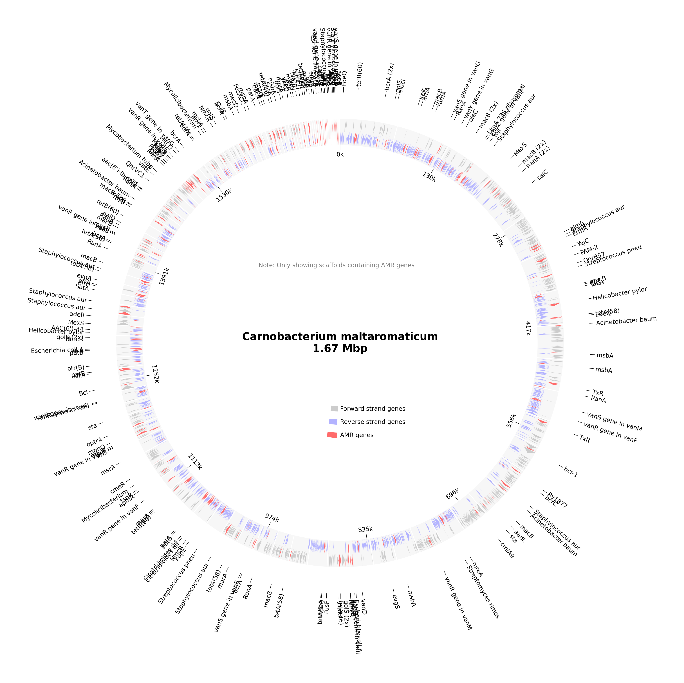

### AAC(6')-34
- **Mechanism**: antibiotic inactivation
- **Drug Classes**: aminoglycoside antibiotic
- **AMR Family**: AAC(6')
- **Locations**:
  - gnl|SPADES|LFDBGJIL_279_6 : position 4925-5458

### Acinetobacter baumannii AbaQ (found in 2 locations)
- **Mechanism**: antibiotic efflux
- **Drug Classes**: fluoroquinolone antibiotic
- **AMR Family**: major facilitator superfamily (MFS) antibiotic efflux pump
- **Locations**:
  - gnl|SPADES|LFDBGJIL_346_5 : position 3786-5078
  - gnl|SPADES|LFDBGJIL_59_1 : position 69-1325

### Acinetobacter baumannii AmvA
- **Mechanism**: antibiotic efflux
- **Drug Classes**: macrolide antibiotic; disinfecting agents and antiseptics
- **AMR Family**: major facilitator superfamily (MFS) antibiotic efflux pump
- **Locations**:
  - gnl|SPADES|LFDBGJIL_84_27 : position 32579-34009

### BcI
- **Mechanism**: antibiotic inactivation
- **Drug Classes**: cephalosporin; penem
- **AMR Family**: class A Bacillus cereus Bc beta-lactamase
- **Locations**:
  - gnl|SPADES|LFDBGJIL_249_3 : position 5819-6718

### Clostridioides difficile gyrA conferring resistance to fluoroquinolones
- **Mechanism**: antibiotic target alteration
- **Drug Classes**: fluoroquinolone antibiotic
- **AMR Family**: fluoroquinolone resistant gyrA
- **Locations**:
  - gnl|SPADES|LFDBGJIL_158_10 : position 11041-13512

### Clostridioides difficile gyrB conferring resistance to fluoroquinolones
- **Mechanism**: antibiotic target alteration
- **Drug Classes**: fluoroquinolone antibiotic
- **AMR Family**: fluoroquinolone resistant gyrB
- **Locations**:
  - gnl|SPADES|LFDBGJIL_158_11 : position 13502-15517

### EdeQ (found in 2 locations)
- **Mechanism**: antibiotic inactivation
- **Drug Classes**: peptide antibiotic; polyamine antibiotic
- **AMR Family**: Edeine acetyltransferase
- **Locations**:
  - gnl|SPADES|LFDBGJIL_31_5 : position 3597-4049
  - gnl|SPADES|LFDBGJIL_58_35 : position 35608-36060

### Enterococcus faecalis cls with mutation conferring resistance to daptomycin
- **Mechanism**: antibiotic target alteration
- **Drug Classes**: peptide antibiotic
- **AMR Family**: daptomycin resistant cls
- **Locations**:
  - gnl|SPADES|LFDBGJIL_32_32 : position 33635-35083

### ErmR
- **Mechanism**: antibiotic target alteration
- **Drug Classes**: macrolide antibiotic; lincosamide antibiotic; streptogramin antibiotic; streptogramin A antibiotic; streptogramin B antibiotic
- **AMR Family**: Erm 23S ribosomal RNA methyltransferase
- **Locations**:
  - gnl|SPADES|LFDBGJIL_50_43 : position 44578-45471

### Escherichia coli AcrAB-TolC with AcrR mutation conferring resistance to ciprofloxacin, tetracycline, and ceftazidime
- **Mechanism**: antibiotic target alteration; antibiotic efflux
- **Drug Classes**: fluoroquinolone antibiotic; cephalosporin; glycylcycline; penam; tetracycline antibiotic; rifamycin antibiotic; phenicol antibiotic; disinfecting agents and antiseptics
- **AMR Family**: resistance-nodulation-cell division (RND) antibiotic efflux pump
- **Locations**:
  - gnl|SPADES|LFDBGJIL_268_9 : position 9963-10607

### Escherichia coli AcrAB-TolC with MarR mutations conferring resistance to ciprofloxacin and tetracycline
- **Mechanism**: antibiotic target alteration; antibiotic efflux
- **Drug Classes**: fluoroquinolone antibiotic; cephalosporin; glycylcycline; penam; tetracycline antibiotic; rifamycin antibiotic; phenicol antibiotic; disinfecting agents and antiseptics
- **AMR Family**: resistance-nodulation-cell division (RND) antibiotic efflux pump
- **Locations**:
  - gnl|SPADES|LFDBGJIL_114_27 : position 23810-24274

### Escherichia coli EF-Tu mutants conferring resistance to kirromycin
- **Mechanism**: antibiotic target alteration
- **Drug Classes**: elfamycin antibiotic
- **AMR Family**: elfamycin resistant EF-Tu
- **Locations**:
  - gnl|SPADES|LFDBGJIL_9562_1 : position 1-1155

### FosA7
- **Mechanism**: antibiotic inactivation
- **Drug Classes**: phosphonic acid antibiotic
- **AMR Family**: fosfomycin thiol transferase
- **Locations**:
  - gnl|SPADES|LFDBGJIL_432_11 : position 7830-8210

### FosXCC
- **Mechanism**: antibiotic inactivation
- **Drug Classes**: phosphonic acid antibiotic
- **AMR Family**: fosfomycin thiol transferase
- **Locations**:
  - gnl|SPADES|LFDBGJIL_704_4: position 4133-4549

### FusF
- **Mechanism**: antibiotic target protection
- **Drug Classes**: fusidane antibiotic
- **AMR Family**: Target protecting FusB-type protein conferring resistance to Fusidic acid
- **Locations**:
  - gnl|SPADES|LFDBGJIL_116_31 : position 27125-27772

### Helicobacter pylori frxA mutation conferring resistance to metronidazole
- **Mechanism**: antibiotic target alteration
- **Drug Classes**: nitroimidazole antibiotic
- **AMR Family**: Antibiotic resistant Helicobacter pylori nitroreductase
- **Locations**:
  - gnl|SPADES|LFDBGJIL_279_2 : position 1603-2274

### Helicobacter pylori pbp1 mutants conferring resistance to amoxicillin
- **Mechanism**: antibiotic target alteration
- **Drug Classes**: cephalosporin; cephamycin; penam
- **AMR Family**: Penicillin-binding protein mutations conferring resistance to beta-lactam antibiotics
- **Locations**:
  - gnl|SPADES|LFDBGJIL_58_19 : position 16295-18931

### IreK
- **Mechanism**: reduced permeability to antibiotic
- **Drug Classes**: cephalosporin
- **AMR Family**: Serine/threonine kinases
- **Locations**:
  - gnl|SPADES|LFDBGJIL_32_14 : position 15156-17180

### Listeria monocytogenes mprF
- **Mechanism**: antibiotic target alteration
- **Drug Classes**: peptide antibiotic
- **AMR Family**: defensin resistant mprF
- **Locations**:
  - gnl|SPADES|LFDBGJIL_51_9 : position 7301-9874

### LlmA 23S ribosomal RNA methyltransferase
- **Mechanism**: antibiotic target alteration
- **Drug Classes**: lincosamide antibiotic
- **AMR Family**: Llm 23S ribosomal RNA methyltransferase
- **Locations**:
  - gnl|SPADES|LFDBGJIL_34_32 : position 31244-32410

### MOX-9
- **Mechanism**: antibiotic inactivation
- **Drug Classes**: cephalosporin; cephamycin; penam
- **AMR Family**: MOX beta-lactamase
- **Locations**:
  - gnl|SPADES|LFDBGJIL_492_4 : position 4385-5641

### MexS (found in 2 locations)
- **Mechanism**: antibiotic efflux
- **Drug Classes**: fluoroquinolone antibiotic; diaminopyrimidine antibiotic; phenicol antibiotic
- **AMR Family**: resistance-nodulation-cell division (RND) antibiotic efflux pump
- **Locations**:
  - gnl|SPADES|LFDBGJIL_279_14 : position 11370-12350
  - gnl|SPADES|LFDBGJIL_36_2 : position 1121-2233

### Mycobacterium tuberculosis pncA mutations conferring resistance to pyrazinamide
- **Mechanism**: antibiotic target alteration
- **Drug Classes**: pyrazine antibiotic
- **AMR Family**: Pyrazinamide resistant pncA
- **Locations**:
  - gnl|SPADES|LFDBGJIL_415_3 : position 2316-2861

### Mycolicibacterium smegmatis ndh with mutation conferring resistance to isoniazid (found in 2 locations)
- **Mechanism**: antibiotic target alteration
- **Drug Classes**: isoniazid-like antibiotic
- **AMR Family**: antibiotic resistant ndh
- **Locations**:
  - gnl|SPADES|LFDBGJIL_185_13 : position 10072-11934
  - gnl|SPADES|LFDBGJIL_563_3 : position 1715-2920

### NmcR (found in 4 locations)
- **Mechanism**: antibiotic inactivation
- **Drug Classes**: carbapenem; cephalosporin; cephamycin; penam
- **AMR Family**: NmcA beta-lactamase
- **Locations**:
  - gnl|SPADES|LFDBGJIL_116_1 : position 2-868
  - gnl|SPADES|LFDBGJIL_158_7 : position 6474-7421
  - gnl|SPADES|LFDBGJIL_274_11 : position 7605-8489
  - gnl|SPADES|LFDBGJIL_582_7 : position 3472-4026

### PAM-2
- **Mechanism**: antibiotic inactivation
- **Drug Classes**: carbapenem; cephalosporin
- **AMR Family**: PAM beta-lactamase
- **Locations**:
  - gnl|SPADES|LFDBGJIL_51_14 : position 16011-16691

### QnrB57
- **Mechanism**: antibiotic target protection
- **Drug Classes**: fluoroquinolone antibiotic
- **AMR Family**: quinolone resistance protein (qnr)
- **Locations**:
  - gnl|SPADES|LFDBGJIL_51_23 : position 25624-26259

### QnrVC1
- **Mechanism**: antibiotic target protection
- **Drug Classes**: fluoroquinolone antibiotic
- **AMR Family**: quinolone resistance protein (qnr)
- **Locations**:
  - gnl|SPADES|LFDBGJIL_379_9 : position 8434-9057

### RanA (found in 10 locations)
- **Mechanism**: antibiotic efflux
- **Drug Classes**: aminoglycoside antibiotic
- **AMR Family**: ATP-binding cassette (ABC) antibiotic efflux pump
- **Locations**:
  - gnl|SPADES|LFDBGJIL_147_14 : position 11022-11675
  - gnl|SPADES|LFDBGJIL_31_60 : position 63583-64308
  - gnl|SPADES|LFDBGJIL_324_11 : position 8822-9499
  - gnl|SPADES|LFDBGJIL_32_55 : position 59955-61148
  - gnl|SPADES|LFDBGJIL_341_6 : position 3920-4906
  - gnl|SPADES|LFDBGJIL_359_5 : position 4332-5063
  - gnl|SPADES|LFDBGJIL_36_20 : position 20804-21898
  - gnl|SPADES|LFDBGJIL_36_34 : position 35818-36552
  - gnl|SPADES|LFDBGJIL_432_4 : position 2459-3490
  - gnl|SPADES|LFDBGJIL_67_35 : position 38456-39571

### Rv1877
- **Mechanism**: antibiotic efflux
- **Drug Classes**: fluoroquinolone antibiotic
- **AMR Family**: major facilitator superfamily (MFS) antibiotic efflux pump
- **Locations**:
  - gnl|SPADES|LFDBGJIL_84_5 : position 3378-4862

### SatA
- **Mechanism**: antibiotic inactivation
- **Drug Classes**: nucleoside antibiotic
- **AMR Family**: streptothricin acetyltransferase (SAT)
- **Locations**:
  - gnl|SPADES|LFDBGJIL_291_11 : position 10330-10782

### Staphylococcus aureus fusA with mutation conferring resistance to fusidic acid
- **Mechanism**: antibiotic target alteration
- **Drug Classes**: fusidane antibiotic
- **AMR Family**: antibiotic resistant fusA
- **Locations**:
  - gnl|SPADES|LFDBGJIL_285_6 : position 9872-11956

### Staphylococcus aureus mupA conferring resistance to mupirocin (found in 3 locations)
- **Mechanism**: antibiotic target alteration
- **Drug Classes**: mupirocin-like antibiotic
- **AMR Family**: antibiotic-resistant isoleucyl-tRNA synthetase (ileS)
- **Locations**:
  - gnl|SPADES|LFDBGJIL_214347_1 : position 56-340
  - gnl|SPADES|LFDBGJIL_303_10 : position 8709-11492
  - gnl|SPADES|LFDBGJIL_50_40 : position 41140-43155

### Staphylococcus aureus mupB conferring resistance to mupirocin (found in 3 locations)
- **Mechanism**: antibiotic target alteration
- **Drug Classes**: mupirocin-like antibiotic
- **AMR Family**: antibiotic-resistant isoleucyl-tRNA synthetase (ileS)
- **Locations**:
  - gnl|SPADES|LFDBGJIL_151_17 : position 16585-19254
  - gnl|SPADES|LFDBGJIL_84_23 : position 26187-28601
  - gnl|SPADES|LFDBGJIL_982313_1 : position 1-300

### Staphylococcus aureus murA with mutation conferring resistance to fosfomycin
- **Mechanism**: antibiotic target alteration
- **Drug Classes**: phosphonic acid antibiotic
- **AMR Family**: antibiotic-resistant murA transferase
- **Locations**:
  - gnl|SPADES|LFDBGJIL_34_44 : position 44379-45686

### Staphylococcus aureus rpoB mutants conferring resistance to rifampicin
- **Mechanism**: antibiotic target alteration; antibiotic target replacement
- **Drug Classes**: rifamycin antibiotic
- **AMR Family**: rifamycin-resistant beta-subunit of RNA polymerase (rpoB)
- **Locations**:
  - gnl|SPADES|LFDBGJIL_285_1 : position 298-3870

### Streptococcus pneumoniae PBP2b conferring resistance to amoxicillin
- **Mechanism**: antibiotic target alteration
- **Drug Classes**: cephalosporin; cephamycin; penam
- **AMR Family**: Penicillin-binding protein mutations conferring resistance to beta-lactam antibiotics
- **Locations**:
  - gnl|SPADES|LFDBGJIL_51_25 : position 29262-31316

### Streptococcus pneumoniae PBP2x conferring resistance to amoxicillin
- **Mechanism**: antibiotic target alteration
- **Drug Classes**: cephalosporin; cephamycin; penam
- **AMR Family**: Penicillin-binding protein mutations conferring resistance to beta-lactam antibiotics
- **Locations**:
  - gnl|SPADES|LFDBGJIL_152_13 : position 12341-14530

### Streptomyces rimosus otr(A)
- **Mechanism**: antibiotic target protection
- **Drug Classes**: tetracycline antibiotic
- **AMR Family**: tetracycline-resistant ribosomal protection protein
- **Locations**:
  - gnl|SPADES|LFDBGJIL_97_18 : position 16348-18855

### TaeA
- **Mechanism**: antibiotic efflux
- **Drug Classes**: pleuromutilin antibiotic
- **AMR Family**: ATP-binding cassette (ABC) antibiotic efflux pump
- **Locations**:
  - gnl|SPADES|LFDBGJIL_58_3 : position 1476-3377

### TxR (found in 2 locations)
- **Mechanism**: antibiotic efflux
- **Drug Classes**: tetracycline antibiotic
- **AMR Family**: ATP-binding cassette (ABC) antibiotic efflux pump
- **Locations**:
  - gnl|SPADES|LFDBGJIL_67_29 : position 30823-33486
  - gnl|SPADES|LFDBGJIL_81_4 : position 2595-5405

### VatI
- **Mechanism**: antibiotic inactivation
- **Drug Classes**: streptogramin antibiotic; streptogramin A antibiotic
- **AMR Family**: streptogramin vat acetyltransferase
- **Locations**:
  - gnl|SPADES|LFDBGJIL_4491_1 : position 130-831

### YajC
- **Mechanism**: antibiotic efflux
- **Drug Classes**: fluoroquinolone antibiotic; cephalosporin; glycylcycline; penam; tetracycline antibiotic; oxazolidinone antibiotic; glycopeptide antibiotic; rifamycin antibiotic; phenicol antibiotic; disinfecting agents and antiseptics
- **AMR Family**: resistance-nodulation-cell division (RND) antibiotic efflux pump
- **Locations**:
  - gnl|SPADES|LFDBGJIL_51_8 : position 6744-7121

### YojI
- **Mechanism**: antibiotic efflux
- **Drug Classes**: peptide antibiotic
- **AMR Family**: ATP-binding cassette (ABC) antibiotic efflux pump
- **Locations**:
  - gnl|SPADES|LFDBGJIL_34_37 : position 37999-38547

### aac(6')-Ib-cr11
- **Mechanism**: antibiotic inactivation
- **Drug Classes**: fluoroquinolone antibiotic; aminoglycoside antibiotic
- **AMR Family**: AAC(6'); AAC(6')-Ib-cr
- **Locations**:
  - gnl|SPADES|LFDBGJIL_359_8 : position 7380-7943

### aadK
- **Mechanism**: antibiotic inactivation
- **Drug Classes**: aminoglycoside antibiotic
- **AMR Family**: ANT(6)
- **Locations**:
  - gnl|SPADES|LFDBGJIL_86_22 : position 22546-23397

### adeR (found in 2 locations)
- **Mechanism**: antibiotic efflux
- **Drug Classes**: glycylcycline; tetracycline antibiotic
- **AMR Family**: resistance-nodulation-cell division (RND) antibiotic efflux pump
- **Locations**:
  - gnl|SPADES|LFDBGJIL_1984911_1 : position 3-212
  - gnl|SPADES|LFDBGJIL_280_5 : position 7086-7784

### almE
- **Mechanism**: antibiotic target alteration
- **Drug Classes**: peptide antibiotic
- **AMR Family**: polymyxin resistance operon; alm glycyltransferase
- **Locations**:
  - gnl|SPADES|LFDBGJIL_50_38 : position 38047-39489

### apmA
- **Mechanism**: antibiotic inactivation
- **Drug Classes**: aminoglycoside antibiotic
- **AMR Family**: AAC(2')
- **Locations**:
  - gnl|SPADES|LFDBGJIL_185_2 : position 2051-2560

### arlS
- **Mechanism**: antibiotic efflux
- **Drug Classes**: fluoroquinolone antibiotic; disinfecting agents and antiseptics
- **AMR Family**: major facilitator superfamily (MFS) antibiotic efflux pump
- **Locations**:
  - gnl|SPADES|LFDBGJIL_219_4 : position 2679-3731

### arnA
- **Mechanism**: antibiotic target alteration
- **Drug Classes**: peptide antibiotic
- **AMR Family**: pmr phosphoethanolamine transferase
- **Locations**:
  - gnl|SPADES|LFDBGJIL_32_17 : position 19341-20294

### arr-1
- **Mechanism**: antibiotic inactivation
- **Drug Classes**: rifamycin antibiotic
- **AMR Family**: rifampin ADP-ribosyltransferase (Arr)
- **Locations**:
  - gnl|SPADES|LFDBGJIL_563_7 : position 6006-6419

### bacA
- **Mechanism**: antibiotic target alteration
- **Drug Classes**: peptide antibiotic
- **AMR Family**: undecaprenyl pyrophosphate related proteins
- **Locations**:
  - gnl|SPADES|LFDBGJIL_860_4 : position 3726-4544

### baeS (found in 2 locations)
- **Mechanism**: antibiotic efflux
- **Drug Classes**: aminoglycoside antibiotic; aminocoumarin antibiotic
- **AMR Family**: resistance-nodulation-cell division (RND) antibiotic efflux pump
- **Locations**:
  - gnl|SPADES|LFDBGJIL_114_30 : position 25950-27338
  - gnl|SPADES|LFDBGJIL_34_38 : position 38662-40113

### basS
- **Mechanism**: antibiotic target alteration; antibiotic efflux
- **Drug Classes**: peptide antibiotic
- **AMR Family**: pmr phosphoethanolamine transferase
- **Locations**:
  - gnl|SPADES|LFDBGJIL_340_3 : position 3403-4467

### bcr-1
- **Mechanism**: antibiotic efflux
- **Drug Classes**: bicyclomycin-like antibiotic
- **AMR Family**: major facilitator superfamily (MFS) antibiotic efflux pump
- **Locations**:
  - gnl|SPADES|LFDBGJIL_83_5 : position 6100-7347

### bcrA (found in 9 locations)
- **Mechanism**: antibiotic efflux
- **Drug Classes**: peptide antibiotic
- **AMR Family**: ATP-binding cassette (ABC) antibiotic efflux pump
- **Locations**:
  - gnl|SPADES|LFDBGJIL_148_1 : position 90-1022
  - gnl|SPADES|LFDBGJIL_31_47 : position 51212-52117
  - gnl|SPADES|LFDBGJIL_31_57 : position 60689-61576
  - gnl|SPADES|LFDBGJIL_336_8 : position 6259-7035
  - gnl|SPADES|LFDBGJIL_432_8 : position 5178-6164
  - gnl|SPADES|LFDBGJIL_538_2 : position 590-1219
  - gnl|SPADES|LFDBGJIL_555_9 : position 5756-6532
  - gnl|SPADES|LFDBGJIL_614_5 : position 4879-5805
  - gnl|SPADES|LFDBGJIL_983_2 : position 654-1343

### bcrC
- **Mechanism**: antibiotic target alteration
- **Drug Classes**: peptide antibiotic
- **AMR Family**: undecaprenyl pyrophosphate related proteins
- **Locations**:
  - gnl|SPADES|LFDBGJIL_84_9 : position 8198-8866

### catB11
- **Mechanism**: antibiotic inactivation
- **Drug Classes**: phenicol antibiotic
- **AMR Family**: chloramphenicol acetyltransferase (CAT)
- **Locations**:
  - gnl|SPADES|LFDBGJIL_59525_1 : position 3-641

### cmeR
- **Mechanism**: antibiotic efflux
- **Drug Classes**: macrolide antibiotic; fluoroquinolone antibiotic; cephalosporin; fusidane antibiotic
- **AMR Family**: resistance-nodulation-cell division (RND) antibiotic efflux pump
- **Locations**:
  - gnl|SPADES|LFDBGJIL_186_1 : position 75-257

### cmlA9
- **Mechanism**: antibiotic efflux
- **Drug Classes**: phenicol antibiotic
- **AMR Family**: major facilitator superfamily (MFS) antibiotic efflux pump
- **Locations**:
  - gnl|SPADES|LFDBGJIL_89_5 : position 6928-8130

### dfrE
- **Mechanism**: antibiotic target replacement
- **Drug Classes**: diaminopyrimidine antibiotic
- **AMR Family**: trimethoprim resistant dihydrofolate reductase dfr
- **Locations**:
  - gnl|SPADES|LFDBGJIL_58_1 : position 2-487

### efrA (found in 6 locations)
- **Mechanism**: antibiotic efflux
- **Drug Classes**: macrolide antibiotic; fluoroquinolone antibiotic; rifamycin antibiotic
- **AMR Family**: ATP-binding cassette (ABC) antibiotic efflux pump
- **Locations**:
  - gnl|SPADES|LFDBGJIL_146226_1 : position 1-300
  - gnl|SPADES|LFDBGJIL_1855434_1 : position 2-220
  - gnl|SPADES|LFDBGJIL_262_10 : position 9605-11350
  - gnl|SPADES|LFDBGJIL_268_8 : position 8192-9913
  - gnl|SPADES|LFDBGJIL_302_4 : position 3103-4857
  - gnl|SPADES|LFDBGJIL_594141_2 : position 257-379

### efrB (found in 3 locations)
- **Mechanism**: antibiotic efflux
- **Drug Classes**: macrolide antibiotic; fluoroquinolone antibiotic; rifamycin antibiotic
- **AMR Family**: ATP-binding cassette (ABC) antibiotic efflux pump
- **Locations**:
  - gnl|SPADES|LFDBGJIL_282062_1 : position 3-506
  - gnl|SPADES|LFDBGJIL_302_3 : position 1328-3106
  - gnl|SPADES|LFDBGJIL_911964_1 : position 1-312

### emrR
- **Mechanism**: antibiotic efflux
- **Drug Classes**: fluoroquinolone antibiotic
- **AMR Family**: major facilitator superfamily (MFS) antibiotic efflux pump
- **Locations**:
  - gnl|SPADES|LFDBGJIL_4718_1 : position 2-427

### evgA
- **Mechanism**: antibiotic efflux
- **Drug Classes**: macrolide antibiotic; fluoroquinolone antibiotic; penam; tetracycline antibiotic
- **AMR Family**: major facilitator superfamily (MFS) antibiotic efflux pump; resistance-nodulation-cell division (RND) antibiotic efflux pump
- **Locations**:
  - gnl|SPADES|LFDBGJIL_302_9 : position 8869-9501

### evgS
- **Mechanism**: antibiotic efflux
- **Drug Classes**: macrolide antibiotic; fluoroquinolone antibiotic; penam; tetracycline antibiotic
- **AMR Family**: major facilitator superfamily (MFS) antibiotic efflux pump; resistance-nodulation-cell division (RND) antibiotic efflux pump
- **Locations**:
  - gnl|SPADES|LFDBGJIL_113_11 : position 11493-12194

### golS (found in 8 locations)
- **Mechanism**: antibiotic efflux
- **Drug Classes**: monobactam; carbapenem; cephalosporin; cephamycin; penam; phenicol antibiotic; penem
- **AMR Family**: resistance-nodulation-cell division (RND) antibiotic efflux pump
- **Locations**:
  - gnl|SPADES|LFDBGJIL_116_18 : position 16516-17328
  - gnl|SPADES|LFDBGJIL_116_8 : position 5254-5634
  - gnl|SPADES|LFDBGJIL_1491_4 : position 1875-2303
  - gnl|SPADES|LFDBGJIL_274_13 : position 9640-10008
  - gnl|SPADES|LFDBGJIL_274_16 : position 11973-12365
  - gnl|SPADES|LFDBGJIL_31_59 : position 62943-63293
  - gnl|SPADES|LFDBGJIL_610_2 : position 724-1482
  - gnl|SPADES|LFDBGJIL_641_2 : position 491-1216

### kdpD
- **Mechanism**: antibiotic efflux
- **Drug Classes**: aminoglycoside antibiotic
- **AMR Family**: kdpDE
- **Locations**:
  - gnl|SPADES|LFDBGJIL_492_1 : position 125-2818

### kdpE (found in 2 locations)
- **Mechanism**: antibiotic efflux
- **Drug Classes**: aminoglycoside antibiotic
- **AMR Family**: kdpDE
- **Locations**:
  - gnl|SPADES|LFDBGJIL_158_4 : position 2876-3610
  - gnl|SPADES|LFDBGJIL_492_2 : position 2850-3554

### lsaE
- **Mechanism**: antibiotic target protection
- **Drug Classes**: lincosamide antibiotic; streptogramin antibiotic; pleuromutilin antibiotic
- **AMR Family**: lsa-type ABC-F protein
- **Locations**:
  - gnl|SPADES|LFDBGJIL_4696_2 : position 270-1556

### macA
- **Mechanism**: antibiotic efflux
- **Drug Classes**: macrolide antibiotic
- **AMR Family**: ATP-binding cassette (ABC) antibiotic efflux pump
- **Locations**:
  - gnl|SPADES|LFDBGJIL_343_7 : position 7436-8296

### macB (found in 18 locations)
- **Mechanism**: antibiotic efflux
- **Drug Classes**: macrolide antibiotic
- **AMR Family**: ATP-binding cassette (ABC) antibiotic efflux pump
- **Locations**:
  - gnl|SPADES|LFDBGJIL_1141980_1 : position 1-279
  - gnl|SPADES|LFDBGJIL_114_32 : position 28497-29054
  - gnl|SPADES|LFDBGJIL_145_10 : position 11341-12099
  - gnl|SPADES|LFDBGJIL_1775_3 : position 2536-2703
  - gnl|SPADES|LFDBGJIL_219_6 : position 4555-6921
  - gnl|SPADES|LFDBGJIL_323_3 : position 4278-5021
  - gnl|SPADES|LFDBGJIL_32_31 : position 32170-33366
  - gnl|SPADES|LFDBGJIL_340_5 : position 5508-6275
  - gnl|SPADES|LFDBGJIL_341_2 : position 605-1333
  - gnl|SPADES|LFDBGJIL_343_8 : position 8312-9004
  - gnl|SPADES|LFDBGJIL_343_9 : position 9020-10246
  - gnl|SPADES|LFDBGJIL_34_20 : position 19601-20302
  - gnl|SPADES|LFDBGJIL_34_30 : position 28894-29553
  - gnl|SPADES|LFDBGJIL_36_14 : position 13520-15229
  - gnl|SPADES|LFDBGJIL_36_55 : position 62285-63925
  - gnl|SPADES|LFDBGJIL_51_45 : position 49779-49946
  - gnl|SPADES|LFDBGJIL_6091_2 : position 355-1092
  - gnl|SPADES|LFDBGJIL_86_13 : position 14192-15010

### marA (found in 3 locations)
- **Mechanism**: antibiotic efflux; reduced permeability to antibiotic
- **Drug Classes**: fluoroquinolone antibiotic; monobactam; carbapenem; cephalosporin; glycylcycline; cephamycin; penam; tetracycline antibiotic; rifamycin antibiotic; phenicol antibiotic; penem; disinfecting agents and antiseptics
- **AMR Family**: resistance-nodulation-cell division (RND) antibiotic efflux pump; General Bacterial Porin with reduced permeability to beta-lactams
- **Locations**:
  - gnl|SPADES|LFDBGJIL_148_15 : position 17497-17883
  - gnl|SPADES|LFDBGJIL_1581_1 : position 180-1064
  - gnl|SPADES|LFDBGJIL_173_14 : position 15593-16429

### mdtG
- **Mechanism**: antibiotic efflux
- **Drug Classes**: phosphonic acid antibiotic
- **AMR Family**: major facilitator superfamily (MFS) antibiotic efflux pump
- **Locations**:
  - gnl|SPADES|LFDBGJIL_34_33 : position 32458-33666

### mecD
- **Mechanism**: antibiotic target replacement
- **Drug Classes**: penam
- **AMR Family**: methicillin resistant PBP2
- **Locations**:
  - gnl|SPADES|LFDBGJIL_695_3 : position 1560-3590

### mecI
- **Mechanism**: antibiotic target replacement
- **Drug Classes**: penam
- **AMR Family**: methicillin resistant PBP2
- **Locations**:
  - gnl|SPADES|LFDBGJIL_31_63 : position 66255-66710

### mepR
- **Mechanism**: antibiotic efflux
- **Drug Classes**: glycylcycline; tetracycline antibiotic
- **AMR Family**: multidrug and toxic compound extrusion (MATE) transporter
- **Locations**:
  - gnl|SPADES|LFDBGJIL_3239_2 : position 595-1044

### mphO
- **Mechanism**: antibiotic inactivation
- **Drug Classes**: macrolide antibiotic
- **AMR Family**: macrolide phosphotransferase (MPH)
- **Locations**:
  - gnl|SPADES|LFDBGJIL_219_11 : position 9294-10133

### mreA
- **Mechanism**: antibiotic efflux
- **Drug Classes**: macrolide antibiotic
- **AMR Family**: major facilitator superfamily (MFS) antibiotic efflux pump
- **Locations**:
  - gnl|SPADES|LFDBGJIL_97_11 : position 10644-11588

### msbA (found in 10 locations)
- **Mechanism**: antibiotic efflux
- **Drug Classes**: nitroimidazole antibiotic
- **AMR Family**: ATP-binding cassette (ABC) antibiotic efflux pump
- **Locations**:
  - gnl|SPADES|LFDBGJIL_112_20 : position 23767-25482
  - gnl|SPADES|LFDBGJIL_1223_1 : position 71-1291
  - gnl|SPADES|LFDBGJIL_134_7 : position 4125-4964
  - gnl|SPADES|LFDBGJIL_2692_3 : position 1382-2074
  - gnl|SPADES|LFDBGJIL_581_2 : position 1132-1905
  - gnl|SPADES|LFDBGJIL_59_32 : position 35517-36302
  - gnl|SPADES|LFDBGJIL_660_2 : position 2112-3851
  - gnl|SPADES|LFDBGJIL_67_7 : position 6622-7404
  - gnl|SPADES|LFDBGJIL_820_3 : position 539-2815
  - gnl|SPADES|LFDBGJIL_868_1 : position 182-1921

### msrA
- **Mechanism**: antibiotic target protection
- **Drug Classes**: macrolide antibiotic; streptogramin antibiotic; streptogramin B antibiotic
- **AMR Family**: msr-type ABC-F protein
- **Locations**:
  - gnl|SPADES|LFDBGJIL_200_4 : position 2510-3085

### msrE
- **Mechanism**: antibiotic target protection
- **Drug Classes**: macrolide antibiotic; streptogramin antibiotic
- **AMR Family**: msr-type ABC-F protein
- **Locations**:
  - gnl|SPADES|LFDBGJIL_868_2 : position 2351-4591

### mtrA
- **Mechanism**: antibiotic efflux
- **Drug Classes**: macrolide antibiotic; penam
- **AMR Family**: resistance-nodulation-cell division (RND) antibiotic efflux pump
- **Locations**:
  - gnl|SPADES|LFDBGJIL_138468_1 : position 1-627

### nalD (found in 2 locations)
- **Mechanism**: antibiotic efflux
- **Drug Classes**: macrolide antibiotic; fluoroquinolone antibiotic; monobactam; carbapenem; cephalosporin; cephamycin; penam; tetracycline antibiotic; peptide antibiotic; aminocoumarin antibiotic; diaminopyrimidine antibiotic; sulfonamide antibiotic; phenicol antibiotic; penem
- **AMR Family**: resistance-nodulation-cell division (RND) antibiotic efflux pump
- **Locations**:
  - gnl|SPADES|LFDBGJIL_341_9 : position 7439-8089
  - gnl|SPADES|LFDBGJIL_359_7 : position 6781-7359

### oleC
- **Mechanism**: antibiotic efflux
- **Drug Classes**: macrolide antibiotic
- **AMR Family**: ATP-binding cassette (ABC) antibiotic efflux pump
- **Locations**:
  - gnl|SPADES|LFDBGJIL_34_8 : position 6266-6970

### optrA (found in 2 locations)
- **Mechanism**: antibiotic target protection
- **Drug Classes**: oxazolidinone antibiotic; phenicol antibiotic
- **AMR Family**: Miscellaneous ABC-F subfamily ATP-binding cassette ribosomal protection proteins
- **Locations**:
  - gnl|SPADES|LFDBGJIL_116_15 : position 12803-14341
  - gnl|SPADES|LFDBGJIL_221_1 : position 167-2041

### otr(B)
- **Mechanism**: antibiotic efflux
- **Drug Classes**: tetracycline antibiotic
- **AMR Family**: major facilitator superfamily (MFS) antibiotic efflux pump
- **Locations**:
  - gnl|SPADES|LFDBGJIL_265_6 : position 4427-5707

### patA (found in 4 locations)
- **Mechanism**: antibiotic efflux
- **Drug Classes**: fluoroquinolone antibiotic
- **AMR Family**: ATP-binding cassette (ABC) antibiotic efflux pump
- **Locations**:
  - gnl|SPADES|LFDBGJIL_170_2 : position 1774-3495
  - gnl|SPADES|LFDBGJIL_173_13 : position 13441-15195
  - gnl|SPADES|LFDBGJIL_783783_1 : position 1-336
  - gnl|SPADES|LFDBGJIL_835_4 : position 3127-4608

### patB (found in 3 locations)
- **Mechanism**: antibiotic efflux
- **Drug Classes**: fluoroquinolone antibiotic
- **AMR Family**: ATP-binding cassette (ABC) antibiotic efflux pump
- **Locations**:
  - gnl|SPADES|LFDBGJIL_170_1 : position 2-1774
  - gnl|SPADES|LFDBGJIL_262_11 : position 11352-13103
  - gnl|SPADES|LFDBGJIL_268_7 : position 6292-8190

### ramA
- **Mechanism**: antibiotic efflux; reduced permeability to antibiotic
- **Drug Classes**: fluoroquinolone antibiotic; monobactam; carbapenem; cephalosporin; glycylcycline; cephamycin; penam; tetracycline antibiotic; rifamycin antibiotic; phenicol antibiotic; penem; disinfecting agents and antiseptics
- **AMR Family**: resistance-nodulation-cell division (RND) antibiotic efflux pump; General Bacterial Porin with reduced permeability to beta-lactams
- **Locations**:
  - gnl|SPADES|LFDBGJIL_32_35 : position 36774-37691

### rosB
- **Mechanism**: antibiotic efflux
- **Drug Classes**: peptide antibiotic
- **AMR Family**: major facilitator superfamily (MFS) antibiotic efflux pump
- **Locations**:
  - gnl|SPADES|LFDBGJIL_343_5 : position 5141-6301

### salC
- **Mechanism**: antibiotic target protection
- **Drug Classes**: lincosamide antibiotic; streptogramin antibiotic; streptogramin A antibiotic; pleuromutilin antibiotic
- **AMR Family**: sal-type ABC-F protein
- **Locations**:
  - gnl|SPADES|LFDBGJIL_36_36 : position 37750-38457

### sta (found in 2 locations)
- **Mechanism**: antibiotic inactivation
- **Drug Classes**: nucleoside antibiotic
- **AMR Family**: streptothricin acetyltransferase (SAT)
- **Locations**:
  - gnl|SPADES|LFDBGJIL_231_1 : position 1-879
  - gnl|SPADES|LFDBGJIL_86_30 : position 29637-30152

### tet(42)
- **Mechanism**: antibiotic efflux
- **Drug Classes**: tetracycline antibiotic
- **AMR Family**: major facilitator superfamily (MFS) antibiotic efflux pump
- **Locations**:
  - gnl|SPADES|LFDBGJIL_2496_2 : position 710-1945

### tet(O/W)
- **Mechanism**: antibiotic target protection
- **Drug Classes**: tetracycline antibiotic
- **AMR Family**: tetracycline-resistant ribosomal protection protein
- **Locations**:
  - gnl|SPADES|LFDBGJIL_3045_1 : position 95-1924

### tet(T)
- **Mechanism**: antibiotic target protection
- **Drug Classes**: tetracycline antibiotic
- **AMR Family**: tetracycline-resistant ribosomal protection protein
- **Locations**:
  - gnl|SPADES|LFDBGJIL_515_7 : position 4647-6731

### tetA(46) (found in 3 locations)
- **Mechanism**: antibiotic efflux
- **Drug Classes**: tetracycline antibiotic
- **AMR Family**: ATP-binding cassette (ABC) antibiotic efflux pump
- **Locations**:
  - gnl|SPADES|LFDBGJIL_116_13 : position 10652-12343
  - gnl|SPADES|LFDBGJIL_561_1 : position 2-748
  - gnl|SPADES|LFDBGJIL_936_5 : position 2812-4323

### tetA(58) (found in 7 locations)
- **Mechanism**: antibiotic efflux
- **Drug Classes**: tetracycline antibiotic
- **AMR Family**: major facilitator superfamily (MFS) antibiotic efflux pump
- **Locations**:
  - gnl|SPADES|LFDBGJIL_134_6 : position 3268-4149
  - gnl|SPADES|LFDBGJIL_135_19 : position 22657-23538
  - gnl|SPADES|LFDBGJIL_151_3 : position 2094-2852
  - gnl|SPADES|LFDBGJIL_303_7 : position 6537-7454
  - gnl|SPADES|LFDBGJIL_336_6 : position 4633-5595
  - gnl|SPADES|LFDBGJIL_34_9 : position 6974-7747
  - gnl|SPADES|LFDBGJIL_58_33 : position 33827-34744

### tetA(60)
- **Mechanism**: antibiotic efflux
- **Drug Classes**: tetracycline antibiotic
- **AMR Family**: ATP-binding cassette (ABC) antibiotic efflux pump
- **Locations**:
  - gnl|SPADES|LFDBGJIL_31_16 : position 21128-22879

### tetB(58)
- **Mechanism**: antibiotic efflux
- **Drug Classes**: tetracycline antibiotic
- **AMR Family**: major facilitator superfamily (MFS) antibiotic efflux pump
- **Locations**:
  - gnl|SPADES|LFDBGJIL_58_34 : position 34737-35507

### tetB(60) (found in 3 locations)
- **Mechanism**: antibiotic efflux
- **Drug Classes**: tetracycline antibiotic
- **AMR Family**: ATP-binding cassette (ABC) antibiotic efflux pump
- **Locations**:
  - gnl|SPADES|LFDBGJIL_173_12 : position 11667-13448
  - gnl|SPADES|LFDBGJIL_31_15 : position 19338-21128
  - gnl|SPADES|LFDBGJIL_342_5 : position 3314-5404

### tsnR
- **Mechanism**: antibiotic target alteration
- **Drug Classes**: peptide antibiotic
- **AMR Family**: non-erm 23S ribosomal RNA methyltransferase (A1067)
- **Locations**:
  - gnl|SPADES|LFDBGJIL_185_5 : position 4534-5409

### tva(A)
- **Mechanism**: antibiotic target protection
- **Drug Classes**: pleuromutilin antibiotic
- **AMR Family**: Miscellaneous ABC-F subfamily ATP-binding cassette ribosomal protection proteins
- **Locations**:
  - gnl|SPADES|LFDBGJIL_1939_2 : position 986-1714

### ugd
- **Mechanism**: antibiotic target alteration
- **Drug Classes**: peptide antibiotic
- **AMR Family**: pmr phosphoethanolamine transferase
- **Locations**:
  - gnl|SPADES|LFDBGJIL_353932_1 : position 2-466

### vanD
- **Mechanism**: antibiotic target alteration
- **Drug Classes**: glycopeptide antibiotic
- **AMR Family**: glycopeptide resistance gene cluster; Van ligase
- **Locations**:
  - gnl|SPADES|LFDBGJIL_114_18 : position 16114-17478

### vanH gene in vanA cluster
- **Mechanism**: antibiotic target alteration
- **Drug Classes**: glycopeptide antibiotic
- **AMR Family**: vanH; glycopeptide resistance gene cluster
- **Locations**:
  - gnl|SPADES|LFDBGJIL_14628_1 : position 92-1096

### vanR gene in vanB cluster
- **Mechanism**: antibiotic target alteration
- **Drug Classes**: glycopeptide antibiotic
- **AMR Family**: glycopeptide resistance gene cluster; vanR
- **Locations**:
  - gnl|SPADES|LFDBGJIL_618673_1 : position 1-282

### vanR gene in vanE cluster
- **Mechanism**: antibiotic target alteration
- **Drug Classes**: glycopeptide antibiotic
- **AMR Family**: glycopeptide resistance gene cluster; vanR
- **Locations**:
  - gnl|SPADES|LFDBGJIL_515_1 : position 178-867

### vanR gene in vanF cluster (found in 3 locations)
- **Mechanism**: antibiotic target alteration
- **Drug Classes**: glycopeptide antibiotic
- **AMR Family**: glycopeptide resistance gene cluster; vanR
- **Locations**:
  - gnl|SPADES|LFDBGJIL_180_6 : position 9341-10771
  - gnl|SPADES|LFDBGJIL_219_5 : position 3728-4402
  - gnl|SPADES|LFDBGJIL_73_32 : position 27606-28301

### vanR gene in vanI cluster (found in 4 locations)
- **Mechanism**: antibiotic target alteration
- **Drug Classes**: glycopeptide antibiotic
- **AMR Family**: glycopeptide resistance gene cluster; vanR
- **Locations**:
  - gnl|SPADES|LFDBGJIL_114_29 : position 25282-25953
  - gnl|SPADES|LFDBGJIL_235_7 : position 6781-7476
  - gnl|SPADES|LFDBGJIL_32_52 : position 57213-57908
  - gnl|SPADES|LFDBGJIL_340_4 : position 4595-5269

### vanR gene in vanM cluster (found in 3 locations)
- **Mechanism**: antibiotic target alteration
- **Drug Classes**: glycopeptide antibiotic
- **AMR Family**: glycopeptide resistance gene cluster; vanR
- **Locations**:
  - gnl|SPADES|LFDBGJIL_103_6 : position 11720-12409
  - gnl|SPADES|LFDBGJIL_34_39 : position 40116-40835
  - gnl|SPADES|LFDBGJIL_73_20 : position 17428-18150

### vanS gene in vanB cluster
- **Mechanism**: antibiotic target alteration
- **Drug Classes**: glycopeptide antibiotic
- **AMR Family**: vanS; glycopeptide resistance gene cluster
- **Locations**:
  - gnl|SPADES|LFDBGJIL_1231390_1 : position 2-268

### vanS gene in vanF cluster (found in 2 locations)
- **Mechanism**: antibiotic target alteration
- **Drug Classes**: glycopeptide antibiotic
- **AMR Family**: vanS; glycopeptide resistance gene cluster
- **Locations**:
  - gnl|SPADES|LFDBGJIL_103_7 : position 12463-13596
  - gnl|SPADES|LFDBGJIL_148_3 : position 1901-2809

### vanS gene in vanG cluster (found in 2 locations)
- **Mechanism**: antibiotic target alteration
- **Drug Classes**: glycopeptide antibiotic
- **AMR Family**: vanS; glycopeptide resistance gene cluster
- **Locations**:
  - gnl|SPADES|LFDBGJIL_235_8 : position 7483-8973
  - gnl|SPADES|LFDBGJIL_32_51 : position 55022-57223

### vanS gene in vanM cluster
- **Mechanism**: antibiotic target alteration
- **Drug Classes**: glycopeptide antibiotic
- **AMR Family**: vanS; glycopeptide resistance gene cluster
- **Locations**:
  - gnl|SPADES|LFDBGJIL_73_19 : position 15619-17421

### vanT gene in vanG cluster
- **Mechanism**: antibiotic target alteration
- **Drug Classes**: glycopeptide antibiotic
- **AMR Family**: glycopeptide resistance gene cluster; vanT
- **Locations**:
  - gnl|SPADES|LFDBGJIL_516_3 : position 829-1983

### vanY gene in vanG cluster
- **Mechanism**: antibiotic target alteration
- **Drug Classes**: glycopeptide antibiotic
- **AMR Family**: vanY; glycopeptide resistance gene cluster
- **Locations**:
  - gnl|SPADES|LFDBGJIL_34_1: position 79-852

### vanZ gene in vanF cluster
- **Mechanism**: antibiotic target alteration
- **Drug Classes**: glycopeptide antibiotic
- **AMR Family**: vanZ; glycopeptide resistance gene cluster
- **Locations**:
  - gnl|SPADES|LFDBGJIL_34_34 : position 33769-34419

### vatB
- **Mechanism**: antibiotic inactivation
- **Drug Classes**: streptogramin antibiotic; streptogramin A antibiotic
- **AMR Family**: streptogramin vat acetyltransferase
- **Locations**:
  - gnl|SPADES|LFDBGJIL_116_2 : position 995-1564

### vatE
- **Mechanism**: antibiotic inactivation
- **Drug Classes**: streptogramin antibiotic; streptogramin A antibiotic
- **AMR Family**: streptogramin vat acetyltransferase
- **Locations**:
  - gnl|SPADES|LFDBGJIL_410_7 : position 6687-7256

### vatH
- **Mechanism**: antibiotic inactivation
- **Drug Classes**: streptogramin antibiotic; streptogramin A antibiotic
- **AMR Family**: streptogramin vat acetyltransferase
- **Locations**:
  - gnl|SPADES|LFDBGJIL_1917_3 : position 872-1489

### ykkC
- **Mechanism**: antibiotic efflux
- **Drug Classes**: aminoglycoside antibiotic; tetracycline antibiotic; phenicol antibiotic
- **AMR Family**: small multidrug resistance (SMR) antibiotic efflux pump
- **Locations**:
  - gnl|SPADES|LFDBGJIL_1703_2 : position 2118-2441

### ykkD
- **Mechanism**: antibiotic efflux
- **Drug Classes**: aminoglycoside antibiotic; tetracycline antibiotic; phenicol antibiotic
- **AMR Family**: small multidrug resistance (SMR) antibiotic efflux pump
- **Locations**:
  - gnl|SPADES|LFDBGJIL_1703_3 : position 2458-2775

## Carnobacterium maltaromaticum LMA28
**Strain Statistics:**
- Total genome length: 1044.6 kbp
- Total scaffolds: 294
- Scaffolds with AMR genes: 47
- Total genes annotated: 1900
- Total AMR genes: 120
- Unique AMR genes: 83
- Distinct AMR mechanisms: 9
- Distinct AMR families: 43
- Distinct drug classes: 29

**Circos Plot:**

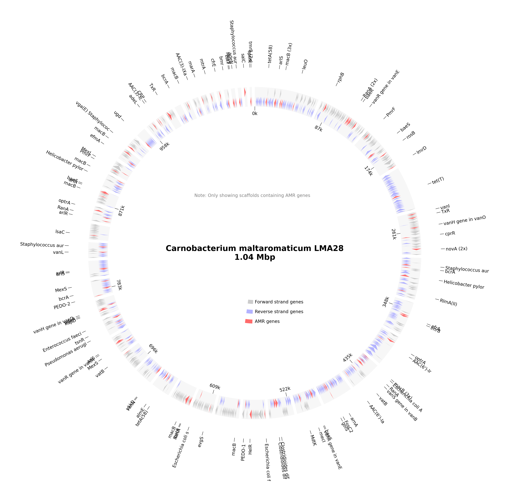

### AAC(3)-IXa
- **Mechanism**: antibiotic inactivation
- **Drug Classes**: aminoglycoside antibiotic
- **AMR Family**: AAC(3)
- **Locations**:
  - gnl|SPADES|LFDBGJIL_474_4 : position 3044-3856

### AAC(3)-Ic
- **Mechanism**: antibiotic inactivation
- **Drug Classes**: aminoglycoside antibiotic
- **AMR Family**: AAC(3)
- **Locations**:
  - gnl|SPADES|LFDBGJIL_363_1 : position 1-405

### AAC(6')-Ia
- **Mechanism**: antibiotic inactivation
- **Drug Classes**: aminoglycoside antibiotic
- **AMR Family**: AAC(6')
- **Locations**:
  - gnl|SPADES|LFDBGJIL_76_35 : position 33743-34279

### AAC(6')-Ir
- **Mechanism**: antibiotic inactivation
- **Drug Classes**: aminoglycoside antibiotic
- **AMR Family**: AAC(6')
- **Locations**:
  - gnl|SPADES|LFDBGJIL_74_12 : position 12442-13047

### CRP
- **Mechanism**: antibiotic efflux
- **Drug Classes**: macrolide antibiotic; fluoroquinolone antibiotic; penam
- **AMR Family**: resistance-nodulation-cell division (RND) antibiotic efflux pump
- **Locations**:
  - gnl|SPADES|LFDBGJIL_363_4 : position 2076-2738

### Clostridioides difficile gyrA conferring resistance to fluoroquinolones
- **Mechanism**: antibiotic target alteration
- **Drug Classes**: fluoroquinolone antibiotic
- **AMR Family**: fluoroquinolone resistant gyrA
- **Locations**:
  - gnl|SPADES|LFDBGJIL_111_16 : position 17056-19605

### Clostridioides difficile gyrB conferring resistance to fluoroquinolones
- **Mechanism**: antibiotic target alteration
- **Drug Classes**: fluoroquinolone antibiotic
- **AMR Family**: fluoroquinolone resistant gyrB
- **Locations**:
  - gnl|SPADES|LFDBGJIL_111_17 : position 19755-21692

### Enterococcus faecium cls conferring resistance to daptomycin
- **Mechanism**: antibiotic target alteration
- **Drug Classes**: peptide antibiotic
- **AMR Family**: daptomycin resistant cls
- **Locations**:
  - gnl|SPADES|LFDBGJIL_163_19 : position 15382-16902

### Escherichia coli AcrAB-TolC with AcrR mutation conferring resistance to ciprofloxacin, tetracycline, and ceftazidime
- **Mechanism**: antibiotic target alteration; antibiotic efflux
- **Drug Classes**: fluoroquinolone antibiotic; cephalosporin; glycylcycline; penam; tetracycline antibiotic; rifamycin antibiotic; phenicol antibiotic; disinfecting agents and antiseptics
- **AMR Family**: resistance-nodulation-cell division (RND) antibiotic efflux pump
- **Locations**:
  - gnl|SPADES|LFDBGJIL_76_4 : position 2450-3046

### Escherichia coli EF-Tu mutants conferring resistance to kirromycin
- **Mechanism**: antibiotic target alteration
- **Drug Classes**: elfamycin antibiotic
- **AMR Family**: elfamycin resistant EF-Tu
- **Locations**:
  - gnl|SPADES|LFDBGJIL_79_20 : position 23264-24451

### Escherichia coli fabI mutations conferring resistance to isoniazid and triclosan
- **Mechanism**: antibiotic target alteration
- **Drug Classes**: disinfecting agents and antiseptics; isoniazid-like antibiotic
- **AMR Family**: antibiotic resistant fabI
- **Locations**:
  - gnl|SPADES|LFDBGJIL_117_2 : position 985-1743

### Escherichia coli soxS with mutation conferring antibiotic resistance
- **Mechanism**: antibiotic target alteration; antibiotic efflux; reduced permeability to antibiotic
- **Drug Classes**: fluoroquinolone antibiotic; monobactam; carbapenem; cephalosporin; glycylcycline; cephamycin; penam; tetracycline antibiotic; rifamycin antibiotic; phenicol antibiotic; penem; disinfecting agents and antiseptics
- **AMR Family**: ATP-binding cassette (ABC) antibiotic efflux pump; major facilitator superfamily (MFS) antibiotic efflux pump; resistance-nodulation-cell division (RND) antibiotic efflux pump; General Bacterial Porin with reduced permeability to beta-lactams
- **Locations**:
  - gnl|SPADES|LFDBGJIL_132_22 : position 18734-19261

### EstT
- **Mechanism**: antibiotic inactivation
- **Drug Classes**: macrolide antibiotic
- **AMR Family**: macrolide esterase
- **Locations**:
  - gnl|SPADES|LFDBGJIL_877_1 : position 114-947

### FosC2
- **Mechanism**: antibiotic inactivation
- **Drug Classes**: phosphonic acid antibiotic
- **AMR Family**: fosC phosphotransferase family
- **Locations**:
  - gnl|SPADES|LFDBGJIL_79_19 : position 22829-23209

### HelR
- **Mechanism**: antibiotic target protection
- **Drug Classes**: rifamycin antibiotic
- **AMR Family**: helicase-like RNA polymerase protection protein
- **Locations**:
  - gnl|SPADES|LFDBGJIL_117_14 : position 16941-19232

### Helicobacter pylori pbp1 mutants conferring resistance to amoxicillin
- **Mechanism**: antibiotic target alteration
- **Drug Classes**: cephalosporin; cephamycin; penam
- **AMR Family**: Penicillin-binding protein mutations conferring resistance to beta-lactam antibiotics
- **Locations**:
  - gnl|SPADES|LFDBGJIL_54_21 : position 21700-23826

### Helicobacter pylori rdxA mutation conferring resistance to metronidazole
- **Mechanism**: antibiotic target alteration
- **Drug Classes**: nitroimidazole antibiotic
- **AMR Family**: Antibiotic resistant Helicobacter pylori nitroreductase
- **Locations**:
  - gnl|SPADES|LFDBGJIL_211_8 : position 8241-8870

### MdtK
- **Mechanism**: antibiotic efflux
- **Drug Classes**: fluoroquinolone antibiotic
- **AMR Family**: multidrug and toxic compound extrusion (MATE) transporter
- **Locations**:
  - gnl|SPADES|LFDBGJIL_110_21 : position 20508-21824

### MexL
- **Mechanism**: antibiotic efflux
- **Drug Classes**: macrolide antibiotic; tetracycline antibiotic; disinfecting agents and antiseptics
- **AMR Family**: resistance-nodulation-cell division (RND) antibiotic efflux pump
- **Locations**:
  - gnl|SPADES|LFDBGJIL_237_6 : position 5948-6565

### MexS (found in 3 locations)
- **Mechanism**: antibiotic efflux
- **Drug Classes**: fluoroquinolone antibiotic; diaminopyrimidine antibiotic; phenicol antibiotic
- **AMR Family**: resistance-nodulation-cell division (RND) antibiotic efflux pump
- **Locations**:
  - gnl|SPADES|LFDBGJIL_161_9 : position 6088-7032
  - gnl|SPADES|LFDBGJIL_168_16 : position 15999-16937
  - gnl|SPADES|LFDBGJIL_877_2 : position 967-2055

### PEDO-1
- **Mechanism**: antibiotic inactivation
- **Drug Classes**: carbapenem
- **AMR Family**: subclass B3 PEDO beta-lactamase
- **Locations**:
  - gnl|SPADES|LFDBGJIL_117_20 : position 24396-25097

### PEDO-2
- **Mechanism**: antibiotic inactivation
- **Drug Classes**: carbapenem
- **AMR Family**: subclass B3 PEDO beta-lactamase
- **Locations**:
  - gnl|SPADES|LFDBGJIL_168_2 : position 892-1509

### PmrF (found in 2 locations)
- **Mechanism**: antibiotic target alteration
- **Drug Classes**: peptide antibiotic
- **AMR Family**: pmr phosphoethanolamine transferase
- **Locations**:
  - gnl|SPADES|LFDBGJIL_237_4 : position 2920-3867
  - gnl|SPADES|LFDBGJIL_47_3 : position 3191-4441

### Pseudomonas aeruginosa soxR
- **Mechanism**: antibiotic target alteration; antibiotic efflux
- **Drug Classes**: fluoroquinolone antibiotic; cephalosporin; glycylcycline; penam; tetracycline antibiotic; rifamycin antibiotic; phenicol antibiotic; disinfecting agents and antiseptics
- **AMR Family**: ATP-binding cassette (ABC) antibiotic efflux pump; major facilitator superfamily (MFS) antibiotic efflux pump; resistance-nodulation-cell division (RND) antibiotic efflux pump
- **Locations**:
  - gnl|SPADES|LFDBGJIL_163_5 : position 4515-4952

### RanA (found in 5 locations)
- **Mechanism**: antibiotic efflux
- **Drug Classes**: aminoglycoside antibiotic
- **AMR Family**: ATP-binding cassette (ABC) antibiotic efflux pump
- **Locations**:
  - gnl|SPADES|LFDBGJIL_137_1 : position 113-919
  - gnl|SPADES|LFDBGJIL_193_5 : position 6086-7201
  - gnl|SPADES|LFDBGJIL_40_34 : position 36960-38069
  - gnl|SPADES|LFDBGJIL_40_50 : position 54659-56176
  - gnl|SPADES|LFDBGJIL_76_8 : position 7392-8432

### RlmA(II)
- **Mechanism**: antibiotic target alteration
- **Drug Classes**: macrolide antibiotic; lincosamide antibiotic
- **AMR Family**: non-erm 23S ribosomal RNA methyltransferase (G748)
- **Locations**:
  - gnl|SPADES|LFDBGJIL_54_36 : position 41637-42494

### Staphylococcus aureus LmrS
- **Mechanism**: antibiotic efflux
- **Drug Classes**: macrolide antibiotic; aminoglycoside antibiotic; oxazolidinone antibiotic; diaminopyrimidine antibiotic; phenicol antibiotic
- **AMR Family**: major facilitator superfamily (MFS) antibiotic efflux pump
- **Locations**:
  - gnl|SPADES|LFDBGJIL_54_9 : position 8266-9690

### Staphylococcus aureus fusA with mutation conferring resistance to fusidic acid
- **Mechanism**: antibiotic target alteration
- **Drug Classes**: fusidane antibiotic
- **AMR Family**: antibiotic resistant fusA
- **Locations**:
  - gnl|SPADES|LFDBGJIL_1021_1 : position 1-1545

### Staphylococcus aureus murA with mutation conferring resistance to fosfomycin
- **Mechanism**: antibiotic target alteration
- **Drug Classes**: phosphonic acid antibiotic
- **AMR Family**: antibiotic-resistant murA transferase
- **Locations**:
  - gnl|SPADES|LFDBGJIL_182_16 : position 12676-13944

### TxR (found in 2 locations)
- **Mechanism**: antibiotic efflux
- **Drug Classes**: tetracycline antibiotic
- **AMR Family**: ATP-binding cassette (ABC) antibiotic efflux pump
- **Locations**:
  - gnl|SPADES|LFDBGJIL_400_2 : position 1627-4323
  - gnl|SPADES|LFDBGJIL_49_7 : position 5708-7069

### adeL
- **Mechanism**: antibiotic efflux
- **Drug Classes**: fluoroquinolone antibiotic; tetracycline antibiotic
- **AMR Family**: resistance-nodulation-cell division (RND) antibiotic efflux pump
- **Locations**:
  - gnl|SPADES|LFDBGJIL_335_7 : position 7346-8233

### adeN
- **Mechanism**: antibiotic efflux
- **Drug Classes**: macrolide antibiotic; fluoroquinolone antibiotic; lincosamide antibiotic; carbapenem; cephalosporin; tetracycline antibiotic; rifamycin antibiotic; diaminopyrimidine antibiotic; phenicol antibiotic; penem
- **AMR Family**: resistance-nodulation-cell division (RND) antibiotic efflux pump
- **Locations**:
  - gnl|SPADES|LFDBGJIL_877_5 : position 3878-4453

### adeR
- **Mechanism**: antibiotic efflux
- **Drug Classes**: glycylcycline; tetracycline antibiotic
- **AMR Family**: resistance-nodulation-cell division (RND) antibiotic efflux pump
- **Locations**:
  - gnl|SPADES|LFDBGJIL_164_10 : position 8042-8770

### almE
- **Mechanism**: antibiotic target alteration
- **Drug Classes**: peptide antibiotic
- **AMR Family**: polymyxin resistance operon; alm glycyltransferase
- **Locations**:
  - gnl|SPADES|LFDBGJIL_146_11 : position 13967-15490

### arlR (found in 4 locations)
- **Mechanism**: antibiotic efflux
- **Drug Classes**: fluoroquinolone antibiotic; disinfecting agents and antiseptics
- **AMR Family**: major facilitator superfamily (MFS) antibiotic efflux pump
- **Locations**:
  - gnl|SPADES|LFDBGJIL_171_8 : position 9138-9821
  - gnl|SPADES|LFDBGJIL_193_2 : position 1930-2730
  - gnl|SPADES|LFDBGJIL_207_13 : position 13649-14368
  - gnl|SPADES|LFDBGJIL_29_23 : position 26014-26700

### arlS (found in 3 locations)
- **Mechanism**: antibiotic efflux
- **Drug Classes**: fluoroquinolone antibiotic; disinfecting agents and antiseptics
- **AMR Family**: major facilitator superfamily (MFS) antibiotic efflux pump
- **Locations**:
  - gnl|SPADES|LFDBGJIL_161_14 : position 11417-13246
  - gnl|SPADES|LFDBGJIL_171_7 : position 7846-9141
  - gnl|SPADES|LFDBGJIL_29_22 : position 24503-26017

### arnA
- **Mechanism**: antibiotic target alteration
- **Drug Classes**: peptide antibiotic
- **AMR Family**: pmr phosphoethanolamine transferase
- **Locations**:
  - gnl|SPADES|LFDBGJIL_79_12 : position 15609-16190

### baeR
- **Mechanism**: antibiotic efflux
- **Drug Classes**: aminoglycoside antibiotic; aminocoumarin antibiotic
- **AMR Family**: resistance-nodulation-cell division (RND) antibiotic efflux pump
- **Locations**:
  - gnl|SPADES|LFDBGJIL_40_37 : position 39534-40217

### baeS (found in 4 locations)
- **Mechanism**: antibiotic efflux
- **Drug Classes**: aminoglycoside antibiotic; aminocoumarin antibiotic
- **AMR Family**: resistance-nodulation-cell division (RND) antibiotic efflux pump
- **Locations**:
  - gnl|SPADES|LFDBGJIL_110_5 : position 4822-6222
  - gnl|SPADES|LFDBGJIL_207_14 : position 14365-16134
  - gnl|SPADES|LFDBGJIL_40_38 : position 40214-41611
  - gnl|SPADES|LFDBGJIL_47_16 : position 23363-24724

### bcrA (found in 4 locations)
- **Mechanism**: antibiotic efflux
- **Drug Classes**: peptide antibiotic
- **AMR Family**: ATP-binding cassette (ABC) antibiotic efflux pump
- **Locations**:
  - gnl|SPADES|LFDBGJIL_168_8 : position 7068-8651
  - gnl|SPADES|LFDBGJIL_40_35 : position 38059-39000
  - gnl|SPADES|LFDBGJIL_454_8 : position 4509-5234
  - gnl|SPADES|LFDBGJIL_54_12 : position 12067-12816

### bmr
- **Mechanism**: antibiotic efflux
- **Drug Classes**: fluoroquinolone antibiotic; nucleoside antibiotic; phenicol antibiotic; disinfecting agents and antiseptics
- **AMR Family**: major facilitator superfamily (MFS) antibiotic efflux pump
- **Locations**:
  - gnl|SPADES|LFDBGJIL_791_3 : position 2430-3653

### cfrE
- **Mechanism**: antibiotic target alteration
- **Drug Classes**: lincosamide antibiotic; streptogramin antibiotic; oxazolidinone antibiotic; phenicol antibiotic; pleuromutilin antibiotic
- **AMR Family**: Cfr 23S ribosomal RNA methyltransferase
- **Locations**:
  - gnl|SPADES|LFDBGJIL_728_2 : position 2938-4005

### cprR
- **Mechanism**: antibiotic target alteration; antibiotic efflux
- **Drug Classes**: peptide antibiotic
- **AMR Family**: pmr phosphoethanolamine transferase
- **Locations**:
  - gnl|SPADES|LFDBGJIL_49_26 : position 28250-28969

### efmA
- **Mechanism**: antibiotic efflux
- **Drug Classes**: macrolide antibiotic; fluoroquinolone antibiotic
- **AMR Family**: major facilitator superfamily (MFS) antibiotic efflux pump
- **Locations**:
  - gnl|SPADES|LFDBGJIL_247_4 : position 2878-4146

### efrA
- **Mechanism**: antibiotic efflux
- **Drug Classes**: macrolide antibiotic; fluoroquinolone antibiotic; rifamycin antibiotic
- **AMR Family**: ATP-binding cassette (ABC) antibiotic efflux pump
- **Locations**:
  - gnl|SPADES|LFDBGJIL_69_14 : position 16073-17179

### evgS
- **Mechanism**: antibiotic efflux
- **Drug Classes**: macrolide antibiotic; fluoroquinolone antibiotic; penam; tetracycline antibiotic
- **AMR Family**: major facilitator superfamily (MFS) antibiotic efflux pump; resistance-nodulation-cell division (RND) antibiotic efflux pump
- **Locations**:
  - gnl|SPADES|LFDBGJIL_132_5 : position 3533-4105

### golS
- **Mechanism**: antibiotic efflux
- **Drug Classes**: monobactam; carbapenem; cephalosporin; cephamycin; penam; phenicol antibiotic; penem
- **AMR Family**: resistance-nodulation-cell division (RND) antibiotic efflux pump
- **Locations**:
  - gnl|SPADES|LFDBGJIL_79_22 : position 25301-26131

### kdpD
- **Mechanism**: antibiotic efflux
- **Drug Classes**: aminoglycoside antibiotic
- **AMR Family**: kdpDE
- **Locations**:
  - gnl|SPADES|LFDBGJIL_164_9 : position 6399-8045

### leuO
- **Mechanism**: antibiotic efflux
- **Drug Classes**: nucleoside antibiotic; disinfecting agents and antiseptics
- **AMR Family**: major facilitator superfamily (MFS) antibiotic efflux pump
- **Locations**:
  - gnl|SPADES|LFDBGJIL_29_49 : position 48671-49498

### lmrB
- **Mechanism**: antibiotic efflux
- **Drug Classes**: lincosamide antibiotic; nucleoside antibiotic
- **AMR Family**: ATP-binding cassette (ABC) antibiotic efflux pump
- **Locations**:
  - gnl|SPADES|LFDBGJIL_69_16 : position 17839-19239

### lmrD
- **Mechanism**: antibiotic efflux
- **Drug Classes**: lincosamide antibiotic
- **AMR Family**: ATP-binding cassette (ABC) antibiotic efflux pump
- **Locations**:
  - gnl|SPADES|LFDBGJIL_47_38 : position 51267-52049

### lsaC
- **Mechanism**: antibiotic target protection
- **Drug Classes**: lincosamide antibiotic; streptogramin antibiotic; pleuromutilin antibiotic
- **AMR Family**: lsa-type ABC-F protein
- **Locations**:
  - gnl|SPADES|LFDBGJIL_183_6 : position 4729-5412

### macA
- **Mechanism**: antibiotic efflux
- **Drug Classes**: macrolide antibiotic
- **AMR Family**: ATP-binding cassette (ABC) antibiotic efflux pump
- **Locations**:
  - gnl|SPADES|LFDBGJIL_29_30 : position 33348-34544

### macB (found in 12 locations)
- **Mechanism**: antibiotic efflux
- **Drug Classes**: macrolide antibiotic
- **AMR Family**: ATP-binding cassette (ABC) antibiotic efflux pump
- **Locations**:
  - gnl|SPADES|LFDBGJIL_118_4 : position 1836-2912
  - gnl|SPADES|LFDBGJIL_137_6 : position 4254-7103
  - gnl|SPADES|LFDBGJIL_207_9 : position 9365-10051
  - gnl|SPADES|LFDBGJIL_211_15 : position 14281-15078
  - gnl|SPADES|LFDBGJIL_247_13 : position 10655-12136
  - gnl|SPADES|LFDBGJIL_29_28 : position 31383-32627
  - gnl|SPADES|LFDBGJIL_29_29 : position 32624-33331
  - gnl|SPADES|LFDBGJIL_29_62 : position 60871-61674
  - gnl|SPADES|LFDBGJIL_465_4 : position 4284-5099
  - gnl|SPADES|LFDBGJIL_76_13 : position 12690-13952
  - gnl|SPADES|LFDBGJIL_76_14 : position 13936-14634
  - gnl|SPADES|LFDBGJIL_76_2 : position 561-1229

### marA
- **Mechanism**: antibiotic efflux; reduced permeability to antibiotic
- **Drug Classes**: fluoroquinolone antibiotic; monobactam; carbapenem; cephalosporin; glycylcycline; cephamycin; penam; tetracycline antibiotic; rifamycin antibiotic; phenicol antibiotic; penem; disinfecting agents and antiseptics
- **AMR Family**: resistance-nodulation-cell division (RND) antibiotic efflux pump; General Bacterial Porin with reduced permeability to beta-lactams
- **Locations**:
  - gnl|SPADES|LFDBGJIL_568_1 : position 119-892

### mecI
- **Mechanism**: antibiotic target replacement
- **Drug Classes**: penam
- **AMR Family**: methicillin resistant PBP2
- **Locations**:
  - gnl|SPADES|LFDBGJIL_110_11 : position 11664-12113

### mepR
- **Mechanism**: antibiotic efflux
- **Drug Classes**: glycylcycline; tetracycline antibiotic
- **AMR Family**: multidrug and toxic compound extrusion (MATE) transporter
- **Locations**:
  - gnl|SPADES|LFDBGJIL_69_15 : position 17343-17858

### mtrA
- **Mechanism**: antibiotic efflux
- **Drug Classes**: macrolide antibiotic; penam
- **AMR Family**: resistance-nodulation-cell division (RND) antibiotic efflux pump
- **Locations**:
  - gnl|SPADES|LFDBGJIL_671_3 : position 1445-2272

### novA (found in 2 locations)
- **Mechanism**: antibiotic efflux
- **Drug Classes**: aminocoumarin antibiotic
- **AMR Family**: ATP-binding cassette (ABC) antibiotic efflux pump
- **Locations**:
  - gnl|SPADES|LFDBGJIL_49_39 : position 42877-44619
  - gnl|SPADES|LFDBGJIL_49_40 : position 44612-46414

### optrA (found in 3 locations)
- **Mechanism**: antibiotic target protection
- **Drug Classes**: oxazolidinone antibiotic; phenicol antibiotic
- **AMR Family**: Miscellaneous ABC-F subfamily ATP-binding cassette ribosomal protection proteins
- **Locations**:
  - gnl|SPADES|LFDBGJIL_1896_1 : position 244-1368
  - gnl|SPADES|LFDBGJIL_193_10 : position 12455-14083
  - gnl|SPADES|LFDBGJIL_74_8 : position 7847-9811

### patB
- **Mechanism**: antibiotic efflux
- **Drug Classes**: fluoroquinolone antibiotic
- **AMR Family**: ATP-binding cassette (ABC) antibiotic efflux pump
- **Locations**:
  - gnl|SPADES|LFDBGJIL_137_2 : position 931-1695

### qacH
- **Mechanism**: antibiotic efflux
- **Drug Classes**: disinfecting agents and antiseptics
- **AMR Family**: small multidrug resistance (SMR) antibiotic efflux pump
- **Locations**:
  - gnl|SPADES|LFDBGJIL_157_3 : position 1626-1952

### rosB
- **Mechanism**: antibiotic efflux
- **Drug Classes**: peptide antibiotic
- **AMR Family**: major facilitator superfamily (MFS) antibiotic efflux pump
- **Locations**:
  - gnl|SPADES|LFDBGJIL_47_24 : position 32826-33974

### rphB
- **Mechanism**: antibiotic inactivation
- **Drug Classes**: rifamycin antibiotic
- **AMR Family**: rifampin phosphotransferase
- **Locations**:
  - gnl|SPADES|LFDBGJIL_40_7 : position 6737-8458

### salC
- **Mechanism**: antibiotic target protection
- **Drug Classes**: lincosamide antibiotic; streptogramin antibiotic; streptogramin A antibiotic; pleuromutilin antibiotic
- **AMR Family**: sal-type ABC-F protein
- **Locations**:
  - gnl|SPADES|LFDBGJIL_1452_1 : position 74-1777

### tet(T)
- **Mechanism**: antibiotic target protection
- **Drug Classes**: tetracycline antibiotic
- **AMR Family**: tetracycline-resistant ribosomal protection protein
- **Locations**:
  - gnl|SPADES|LFDBGJIL_48_27 : position 29033-30874

### tetA(58) (found in 2 locations)
- **Mechanism**: antibiotic efflux
- **Drug Classes**: tetracycline antibiotic
- **AMR Family**: major facilitator superfamily (MFS) antibiotic efflux pump
- **Locations**:
  - gnl|SPADES|LFDBGJIL_146_7 : position 10045-10977
  - gnl|SPADES|LFDBGJIL_29_13 : position 13572-15140

### tmrB (found in 2 locations)
- **Mechanism**: reduced permeability to antibiotic
- **Drug Classes**: nucleoside antibiotic
- **AMR Family**: tunicamycin resistance protein
- **Locations**:
  - gnl|SPADES|LFDBGJIL_1896_2 : position 1946-2287
  - gnl|SPADES|LFDBGJIL_1896_3 : position 2284-2457

### tsnR
- **Mechanism**: antibiotic target alteration
- **Drug Classes**: peptide antibiotic
- **AMR Family**: non-erm 23S ribosomal RNA methyltransferase (A1067)
- **Locations**:
  - gnl|SPADES|LFDBGJIL_163_14 : position 9345-10109

### ugd
- **Mechanism**: antibiotic target alteration
- **Drug Classes**: peptide antibiotic
- **AMR Family**: pmr phosphoethanolamine transferase
- **Locations**:
  - gnl|SPADES|LFDBGJIL_316_1 : position 92-1384

### vanH gene in vanD cluster
- **Mechanism**: antibiotic target alteration
- **Drug Classes**: glycopeptide antibiotic
- **AMR Family**: vanH; glycopeptide resistance gene cluster
- **Locations**:
  - gnl|SPADES|LFDBGJIL_164_12 : position 9247-10260

### vanH gene in vanO cluster
- **Mechanism**: antibiotic target alteration
- **Drug Classes**: glycopeptide antibiotic
- **AMR Family**: vanH; glycopeptide resistance gene cluster
- **Locations**:
  - gnl|SPADES|LFDBGJIL_49_17 : position 17591-18784

### vanI
- **Mechanism**: antibiotic target alteration
- **Drug Classes**: glycopeptide antibiotic
- **AMR Family**: glycopeptide resistance gene cluster; Van ligase
- **Locations**:
  - gnl|SPADES|LFDBGJIL_49_4 : position 1537-2664

### vanL
- **Mechanism**: antibiotic target alteration
- **Drug Classes**: glycopeptide antibiotic
- **AMR Family**: glycopeptide resistance gene cluster; Van ligase
- **Locations**:
  - gnl|SPADES|LFDBGJIL_182_9 : position 6165-7256

### vanN
- **Mechanism**: antibiotic target alteration
- **Drug Classes**: glycopeptide antibiotic
- **AMR Family**: glycopeptide resistance gene cluster; Van ligase
- **Locations**:
  - gnl|SPADES|LFDBGJIL_157_1 : position 94-1173

### vanR gene in vanB cluster
- **Mechanism**: antibiotic target alteration
- **Drug Classes**: glycopeptide antibiotic
- **AMR Family**: glycopeptide resistance gene cluster; vanR
- **Locations**:
  - gnl|SPADES|LFDBGJIL_76_12 : position 11940-12611

### vanR gene in vanE cluster (found in 2 locations)
- **Mechanism**: antibiotic target alteration
- **Drug Classes**: glycopeptide antibiotic
- **AMR Family**: glycopeptide resistance gene cluster; vanR
- **Locations**:
  - gnl|SPADES|LFDBGJIL_110_6 : position 6219-6902
  - gnl|SPADES|LFDBGJIL_40_44 : position 47702-49189

### vanR gene in vanI cluster
- **Mechanism**: antibiotic target alteration
- **Drug Classes**: glycopeptide antibiotic
- **AMR Family**: glycopeptide resistance gene cluster; vanR
- **Locations**:
  - gnl|SPADES|LFDBGJIL_47_17 : position 24756-25394

### vanR gene in vanM cluster
- **Mechanism**: antibiotic target alteration
- **Drug Classes**: glycopeptide antibiotic
- **AMR Family**: glycopeptide resistance gene cluster; vanR
- **Locations**:
  - gnl|SPADES|LFDBGJIL_161_13 : position 10703-11410

### vanS gene in vanB cluster
- **Mechanism**: antibiotic target alteration
- **Drug Classes**: glycopeptide antibiotic
- **AMR Family**: vanS; glycopeptide resistance gene cluster
- **Locations**:
  - gnl|SPADES|LFDBGJIL_76_11 : position 10498-11943

### vatB (found in 2 locations)
- **Mechanism**: antibiotic inactivation
- **Drug Classes**: streptogramin antibiotic; streptogramin A antibiotic
- **AMR Family**: streptogramin vat acetyltransferase
- **Locations**:
  - gnl|SPADES|LFDBGJIL_160_17 : position 19699-20250
  - gnl|SPADES|LFDBGJIL_76_21 : position 21429-21989

### vga(E) Staphylococcus cohnii
- **Mechanism**: antibiotic target protection
- **Drug Classes**: lincosamide antibiotic; streptogramin antibiotic; streptogramin A antibiotic; pleuromutilin antibiotic
- **AMR Family**: vga-type ABC-F protein
- **Locations**:
  - gnl|SPADES|LFDBGJIL_258_1 : position 293-1864

### ykkD
- **Mechanism**: antibiotic efflux
- **Drug Classes**: aminoglycoside antibiotic; tetracycline antibiotic; phenicol antibiotic
- **AMR Family**: small multidrug resistance (SMR) antibiotic efflux pump
- **Locations**:
  - gnl|SPADES|LFDBGJIL_157_2 : position 1309-1626

## Citrobacter
**Strain Statistics:**
- Total genome length: 5.0 kbp
- Total scaffolds: 29
- Scaffolds with AMR genes: 3
- Total genes annotated: 10
- Total AMR genes: 3
- Unique AMR genes: 3
- Distinct AMR mechanisms: 2
- Distinct AMR families: 2
- Distinct drug classes: 2

**Circos Plot:**

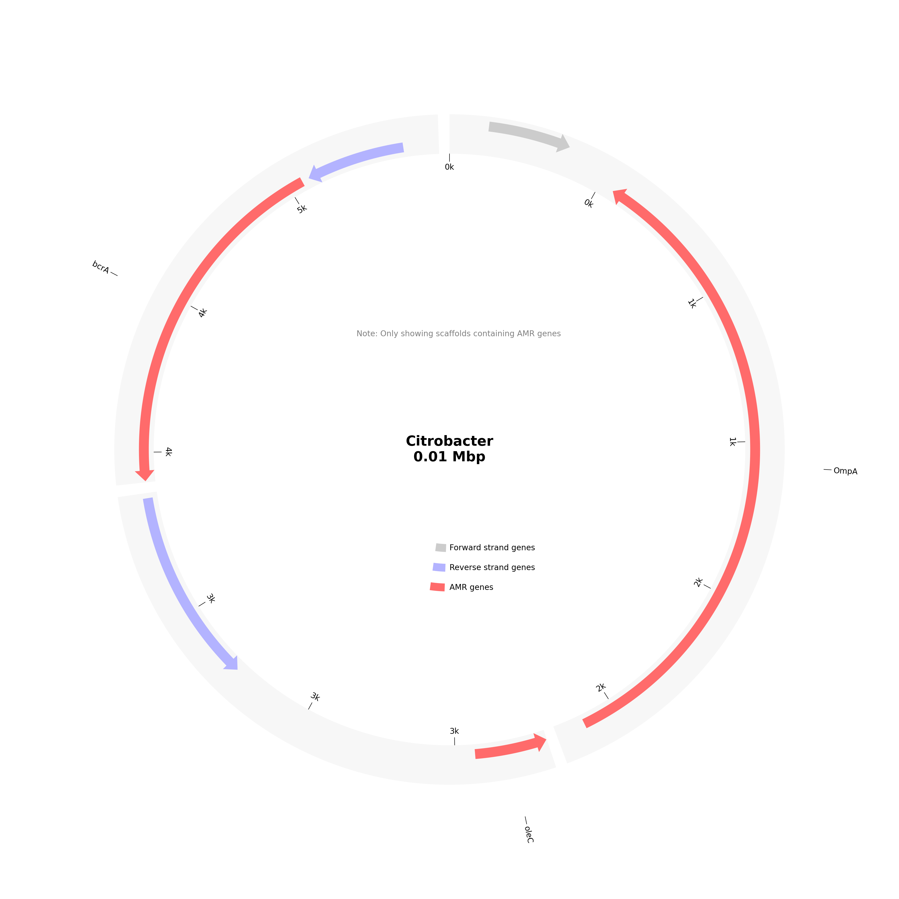

### OmpA
- **Mechanism**: reduced permeability to antibiotic
- **Drug Classes**: peptide antibiotic
- **AMR Family**: General Bacterial Porin with reduced permeability to peptide antibiotics
- **Locations**:
  - gnl|SPADES|LFDBGJIL_2364_2 : position 458-2182

### bcrA
- **Mechanism**: antibiotic efflux
- **Drug Classes**: peptide antibiotic
- **AMR Family**: ATP-binding cassette (ABC) antibiotic efflux pump
- **Locations**:
  - gnl|SPADES|LFDBGJIL_7208_1 : position 3-956

### oleC
- **Mechanism**: antibiotic efflux
- **Drug Classes**: macrolide antibiotic
- **AMR Family**: ATP-binding cassette (ABC) antibiotic efflux pump
- **Locations**:
  - gnl|SPADES|LFDBGJIL_5904_1 : position 1-195

## Citrobacter amalonaticus Y19
**Strain Statistics:**
- Total genome length: 0.2 kbp
- Total scaffolds: 1
- Scaffolds with AMR genes: 1
- Total genes annotated: 0
- Total AMR genes: 1
- Unique AMR genes: 1
- Distinct AMR mechanisms: 1
- Distinct AMR families: 1
- Distinct drug classes: 1

**Circos Plot:**

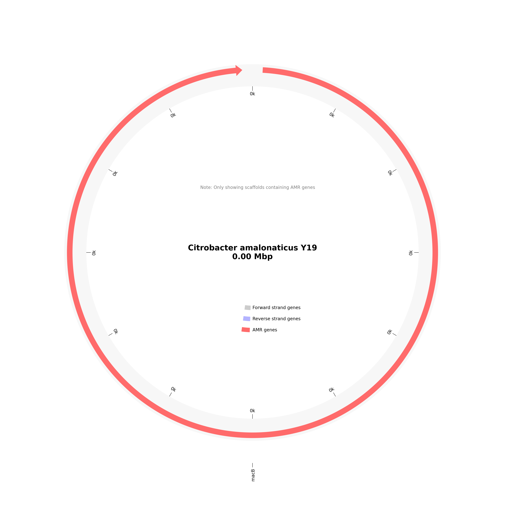

### macB
- **Mechanism**: antibiotic efflux
- **Drug Classes**: macrolide antibiotic
- **AMR Family**: ATP-binding cassette (ABC) antibiotic efflux pump
- **Locations**:
  - gnl|SPADES|LFDBGJIL_1801864_1 : position 2-223

## Citrobacter farmeri
**Strain Statistics:**
- Total genome length: 4.2 kbp
- Total scaffolds: 3
- Scaffolds with AMR genes: 2
- Total genes annotated: 8
- Total AMR genes: 2
- Unique AMR genes: 2
- Distinct AMR mechanisms: 2
- Distinct AMR families: 2
- Distinct drug classes: 12

**Circos Plot:**

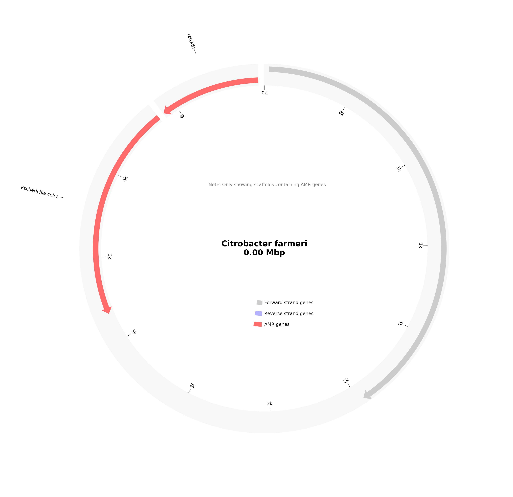

### Escherichia coli soxS with mutation conferring antibiotic resistance
- **Mechanism**: antibiotic target alteration; antibiotic efflux; reduced permeability to antibiotic
- **Drug Classes**: fluoroquinolone antibiotic; monobactam; carbapenem; cephalosporin; glycylcycline; cephamycin; penam; tetracycline antibiotic; rifamycin antibiotic; phenicol antibiotic; penem; disinfecting agents and antiseptics
- **AMR Family**: ATP-binding cassette (ABC) antibiotic efflux pump; major facilitator superfamily (MFS) antibiotic efflux pump; resistance-nodulation-cell division (RND) antibiotic efflux pump; General Bacterial Porin with reduced permeability to beta-lactams
- **Locations**:
  - gnl|SPADES|LFDBGJIL_1090_4 : position 2932-3810

### tet(X6)
- **Mechanism**: antibiotic inactivation
- **Drug Classes**: tetracycline antibiotic
- **AMR Family**: tetracycline inactivation enzyme
- **Locations**:
  - gnl|SPADES|LFDBGJIL_485617_1 : position 2-412

## Citrobacter freundii
**Strain Statistics:**
- Total genome length: 5.5 kbp
- Total scaffolds: 65
- Scaffolds with AMR genes: 2
- Total genes annotated: 12
- Total AMR genes: 2
- Unique AMR genes: 2
- Distinct AMR mechanisms: 1
- Distinct AMR families: 2
- Distinct drug classes: 2

**Circos Plot:**

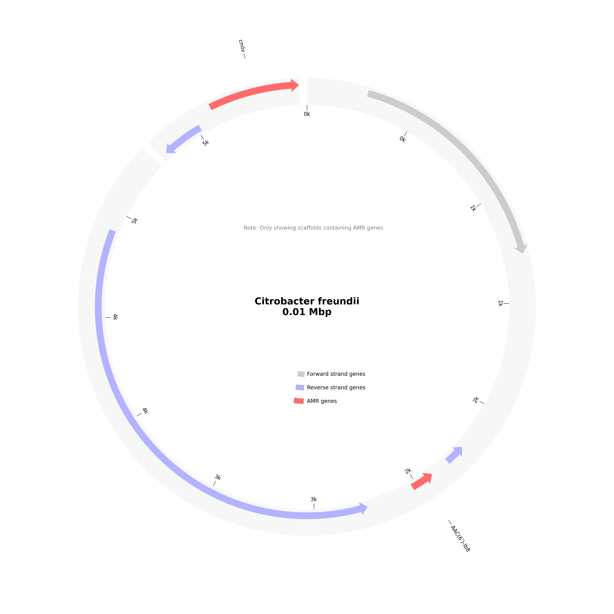

### AAC(6')-Ib8
- **Mechanism**: antibiotic inactivation
- **Drug Classes**: aminoglycoside antibiotic
- **AMR Family**: AAC(6')
- **Locations**:
  - gnl|SPADES|LFDBGJIL_801_3 : position 2230-2331

### cmlv
- **Mechanism**: antibiotic inactivation
- **Drug Classes**: phenicol antibiotic
- **AMR Family**: chloramphenicol phosphotransferase
- **Locations**:
  - gnl|SPADES|LFDBGJIL_118313_2 : position 283-654

## Citrobacter gillenii
**Strain Statistics:**
- Total genome length: 1.1 kbp
- Total scaffolds: 2
- Scaffolds with AMR genes: 1
- Total genes annotated: 4
- Total AMR genes: 1
- Unique AMR genes: 1
- Distinct AMR mechanisms: 1
- Distinct AMR families: 1
- Distinct drug classes: 1

**Circos Plot:**

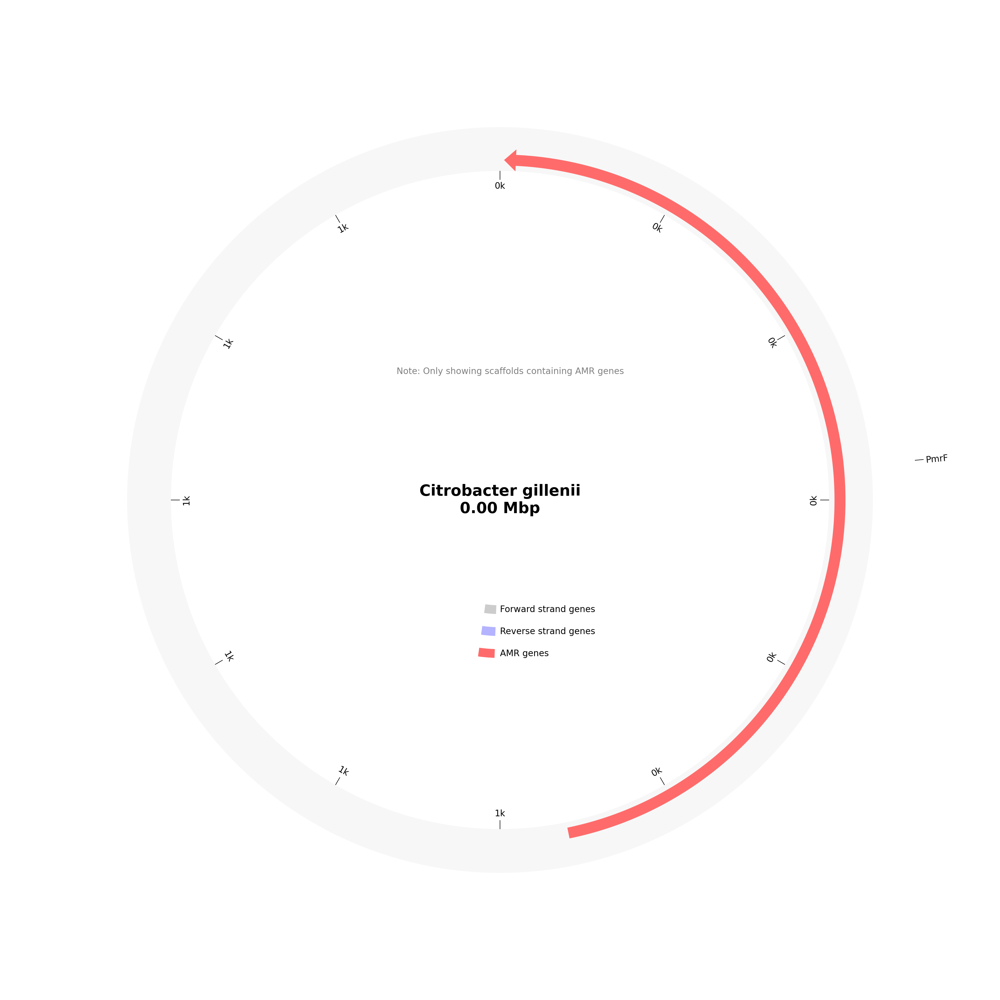

### PmrF
- **Mechanism**: antibiotic target alteration
- **Drug Classes**: peptide antibiotic
- **AMR Family**: pmr phosphoethanolamine transferase
- **Locations**:
  - gnl|SPADES|LFDBGJIL_17147_1 : position 2-493

## Citrobacter portucalensis
**Strain Statistics:**
- Total genome length: 1.3 kbp
- Total scaffolds: 9
- Scaffolds with AMR genes: 1
- Total genes annotated: 2
- Total AMR genes: 1
- Unique AMR genes: 1
- Distinct AMR mechanisms: 1
- Distinct AMR families: 1
- Distinct drug classes: 1

**Circos Plot:**

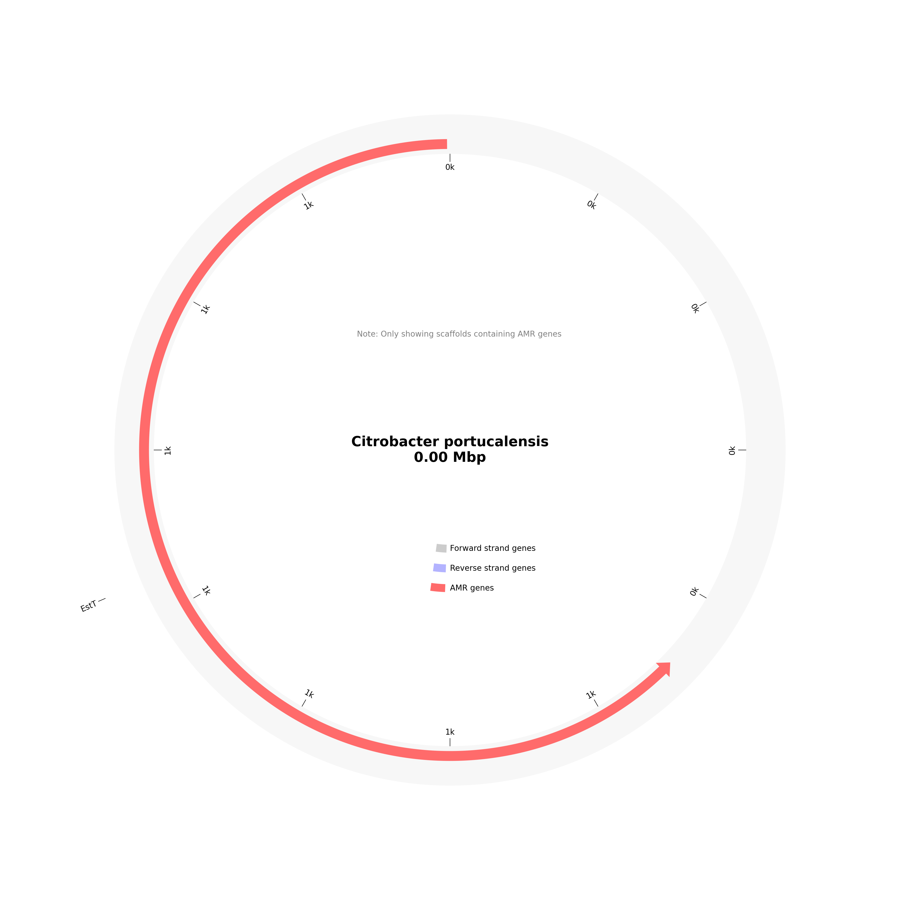

### EstT
- **Mechanism**: antibiotic inactivation
- **Drug Classes**: macrolide antibiotic
- **AMR Family**: macrolide esterase
- **Locations**:
  - gnl|SPADES|LFDBGJIL_7806_2 : position 486-1304

## Citrobacter sp. 21OH12SH02A-Citro
**Strain Statistics:**
- Total genome length: 52.9 kbp
- Total scaffolds: 2
- Scaffolds with AMR genes: 1
- Total genes annotated: 112
- Total AMR genes: 3
- Unique AMR genes: 3
- Distinct AMR mechanisms: 1
- Distinct AMR families: 2
- Distinct drug classes: 6

**Circos Plot:**

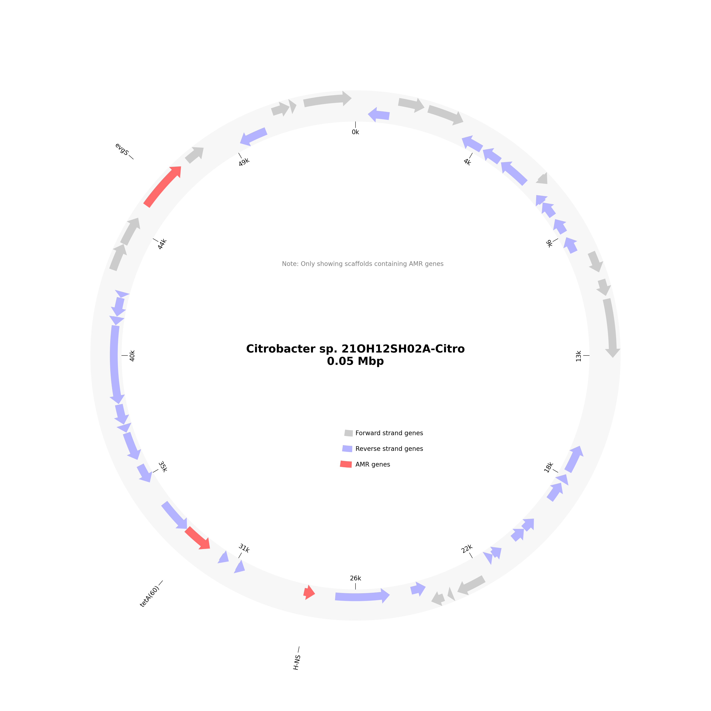

### H-NS
- **Mechanism**: antibiotic efflux
- **Drug Classes**: macrolide antibiotic; fluoroquinolone antibiotic; cephalosporin; cephamycin; penam; tetracycline antibiotic
- **AMR Family**: major facilitator superfamily (MFS) antibiotic efflux pump; resistance-nodulation-cell division (RND) antibiotic efflux pump
- **Locations**:
  - gnl|SPADES|LFDBGJIL_46_28 : position 27879-28271

### evgS
- **Mechanism**: antibiotic efflux
- **Drug Classes**: macrolide antibiotic; fluoroquinolone antibiotic; penam; tetracycline antibiotic
- **AMR Family**: major facilitator superfamily (MFS) antibiotic efflux pump; resistance-nodulation-cell division (RND) antibiotic efflux pump
- **Locations**:
  - gnl|SPADES|LFDBGJIL_46_50 : position 44936-46654

### tetA(60)
- **Mechanism**: antibiotic efflux
- **Drug Classes**: tetracycline antibiotic
- **AMR Family**: ATP-binding cassette (ABC) antibiotic efflux pump
- **Locations**:
  - gnl|SPADES|LFDBGJIL_46_34 : position 31908-32957

## Citrobacter sp. R56
**Strain Statistics:**
- Total genome length: 0.3 kbp
- Total scaffolds: 4
- Scaffolds with AMR genes: 1
- Total genes annotated: 0
- Total AMR genes: 1
- Unique AMR genes: 1
- Distinct AMR mechanisms: 1
- Distinct AMR families: 1
- Distinct drug classes: 1

**Circos Plot:**

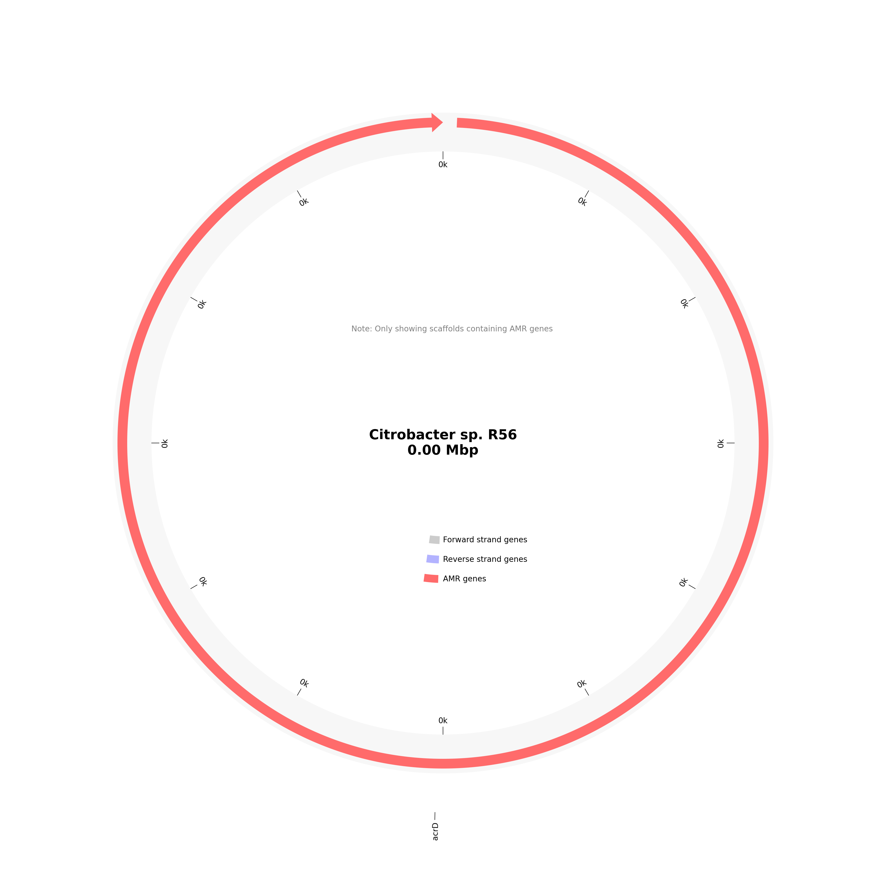

### acrD
- **Mechanism**: antibiotic efflux
- **Drug Classes**: aminoglycoside antibiotic
- **AMR Family**: resistance-nodulation-cell division (RND) antibiotic efflux pump
- **Locations**:
  - gnl|SPADES|LFDBGJIL_1063341_1 : position 2-289

## Clostridium novyi NT
**Strain Statistics:**
- Total genome length: 0.4 kbp
- Total scaffolds: 4
- Scaffolds with AMR genes: 1
- Total genes annotated: 0
- Total AMR genes: 1
- Unique AMR genes: 1
- Distinct AMR mechanisms: 1
- Distinct AMR families: 1
- Distinct drug classes: 1

**Circos Plot:**

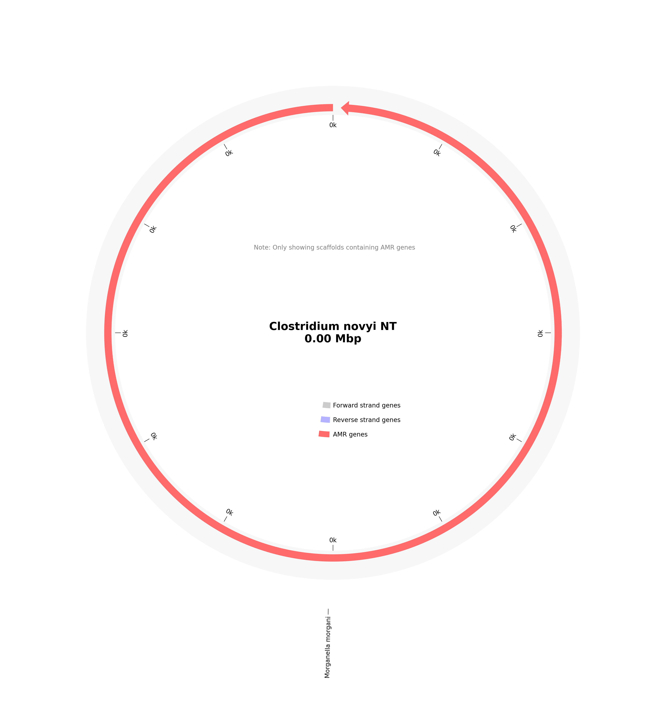

### Morganella morganii gyrB conferring resistance to fluoroquinolones
- **Mechanism**: antibiotic target alteration
- **Drug Classes**: fluoroquinolone antibiotic
- **AMR Family**: fluoroquinolone resistant gyrB
- **Locations**:
  - gnl|SPADES|LFDBGJIL_654815_1 : position 2-364

## Escherichia coli
**Strain Statistics:**
- Total genome length: 0.9 kbp
- Total scaffolds: 34
- Scaffolds with AMR genes: 2
- Total genes annotated: 2
- Total AMR genes: 2
- Unique AMR genes: 2
- Distinct AMR mechanisms: 1
- Distinct AMR families: 2
- Distinct drug classes: 2

**Circos Plot:**

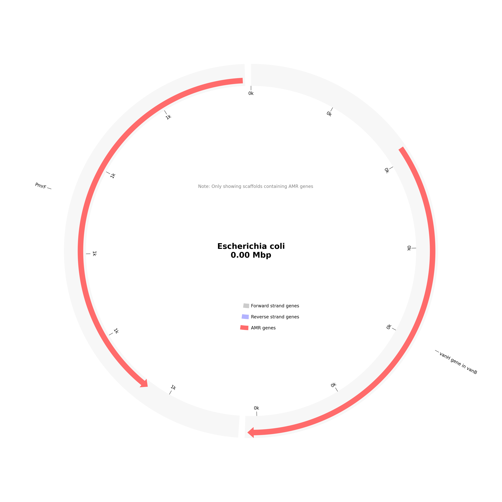

### PmrF
- **Mechanism**: antibiotic target alteration
- **Drug Classes**: peptide antibiotic
- **AMR Family**: pmr phosphoethanolamine transferase
- **Locations**:
  - gnl|SPADES|LFDBGJIL_417720_2 : position 84-437

### vanH gene in vanB cluster
- **Mechanism**: antibiotic target alteration
- **Drug Classes**: glycopeptide antibiotic
- **AMR Family**: vanH; glycopeptide resistance gene cluster
- **Locations**:
  - gnl|SPADES|LFDBGJIL_370864_1 : position 140-457

## Ewingella americana
**Strain Statistics:**
- Total genome length: 5.1 kbp
- Total scaffolds: 242
- Scaffolds with AMR genes: 18
- Total genes annotated: 4
- Total AMR genes: 18
- Unique AMR genes: 16
- Distinct AMR mechanisms: 6
- Distinct AMR families: 11
- Distinct drug classes: 17

**Circos Plot:**

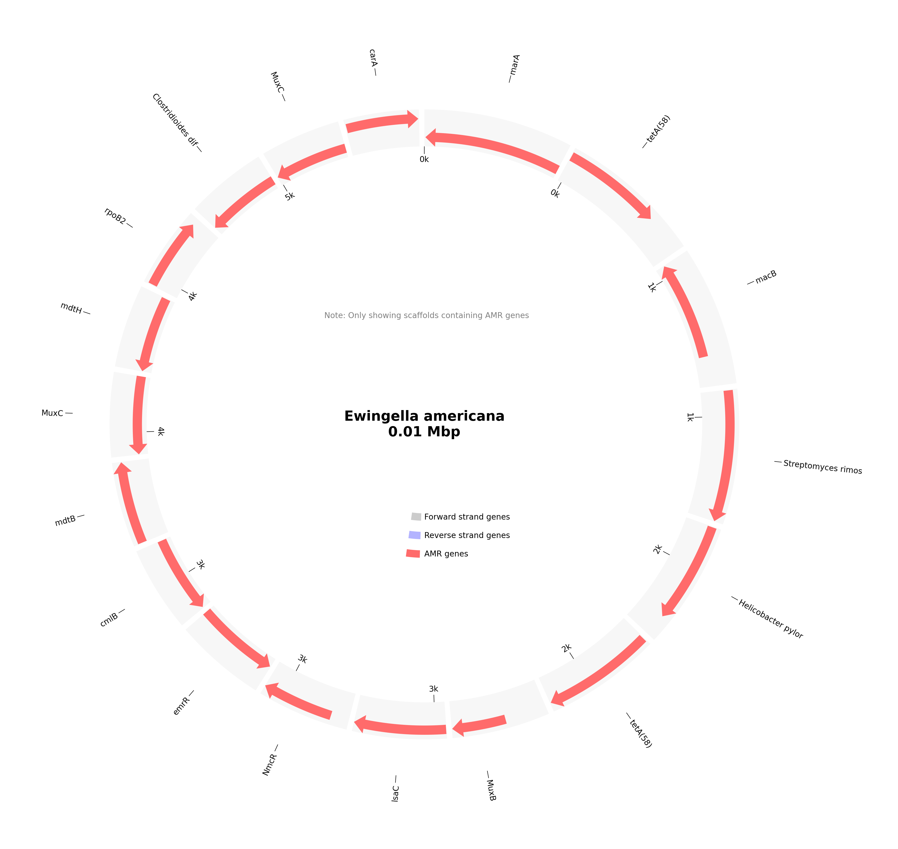

### Clostridioides difficile gyrB conferring resistance to fluoroquinolones
- **Mechanism**: antibiotic target alteration
- **Drug Classes**: fluoroquinolone antibiotic
- **AMR Family**: fluoroquinolone resistant gyrB
- **Locations**:
  - gnl|SPADES|LFDBGJIL_1802646_1 : position 1-225

### Helicobacter pylori pbp2 mutants conferring resistance to amoxicillin
- **Mechanism**: antibiotic target alteration
- **Drug Classes**: cephalosporin; cephamycin; penam
- **AMR Family**: Penicillin-binding protein mutations conferring resistance to beta-lactam antibiotics
- **Locations**:
  - gnl|SPADES|LFDBGJIL_703528_1 : position 2-289

### MuxB
- **Mechanism**: antibiotic efflux
- **Drug Classes**: macrolide antibiotic; monobactam; tetracycline antibiotic; aminocoumarin antibiotic
- **AMR Family**: resistance-nodulation-cell division (RND) antibiotic efflux pump
- **Locations**:
  - gnl|SPADES|LFDBGJIL_1216905_2 : position 118-270

### MuxC (found in 2 locations)
- **Mechanism**: antibiotic efflux
- **Drug Classes**: macrolide antibiotic; monobactam; tetracycline antibiotic; aminocoumarin antibiotic
- **AMR Family**: resistance-nodulation-cell division (RND) antibiotic efflux pump
- **Locations**:
  - gnl|SPADES|LFDBGJIL_1674744_1 : position 1-234
  - gnl|SPADES|LFDBGJIL_1845649_1 : position 1-222

### NmcR
- **Mechanism**: antibiotic inactivation
- **Drug Classes**: carbapenem; cephalosporin; cephamycin; penam
- **AMR Family**: NmcA beta-lactamase
- **Locations**:
  - gnl|SPADES|LFDBGJIL_1396908_1 : position 52-255

### Streptomyces rimosus otr(A)
- **Mechanism**: antibiotic target protection
- **Drug Classes**: tetracycline antibiotic
- **AMR Family**: tetracycline-resistant ribosomal protection protein
- **Locations**:
  - gnl|SPADES|LFDBGJIL_616167_1 : position 2-373

### carA
- **Mechanism**: antibiotic target protection
- **Drug Classes**: macrolide antibiotic
- **AMR Family**: Miscellaneous ABC-F subfamily ATP-binding cassette ribosomal protection proteins
- **Locations**:
  - gnl|SPADES|LFDBGJIL_2053788_1 : position 3-206

### cmlB
- **Mechanism**: antibiotic efflux
- **Drug Classes**: phenicol antibiotic
- **AMR Family**: major facilitator superfamily (MFS) antibiotic efflux pump
- **Locations**:
  - gnl|SPADES|LFDBGJIL_1632112_1 : position 3-236

### emrR
- **Mechanism**: antibiotic efflux
- **Drug Classes**: fluoroquinolone antibiotic
- **AMR Family**: major facilitator superfamily (MFS) antibiotic efflux pump
- **Locations**:
  - gnl|SPADES|LFDBGJIL_1418086_1 : position 2-253

### lsaC
- **Mechanism**: antibiotic target protection
- **Drug Classes**: lincosamide antibiotic; streptogramin antibiotic; pleuromutilin antibiotic
- **AMR Family**: lsa-type ABC-F protein
- **Locations**:
  - gnl|SPADES|LFDBGJIL_1327468_1 : position 1-261

### macB
- **Mechanism**: antibiotic efflux
- **Drug Classes**: macrolide antibiotic
- **AMR Family**: ATP-binding cassette (ABC) antibiotic efflux pump
- **Locations**:
  - gnl|SPADES|LFDBGJIL_566264_1 : position 2-298

### marA
- **Mechanism**: antibiotic efflux; reduced permeability to antibiotic
- **Drug Classes**: fluoroquinolone antibiotic; monobactam; carbapenem; cephalosporin; glycylcycline; cephamycin; penam; tetracycline antibiotic; rifamycin antibiotic; phenicol antibiotic; penem; disinfecting agents and antiseptics
- **AMR Family**: resistance-nodulation-cell division (RND) antibiotic efflux pump; General Bacterial Porin with reduced permeability to beta-lactams
- **Locations**:
  - gnl|SPADES|LFDBGJIL_487243_1 : position 3-413

### mdtB
- **Mechanism**: antibiotic efflux
- **Drug Classes**: aminocoumarin antibiotic
- **AMR Family**: resistance-nodulation-cell division (RND) antibiotic efflux pump
- **Locations**:
  - gnl|SPADES|LFDBGJIL_1659839_1 : position 1-234

### mdtH
- **Mechanism**: antibiotic efflux
- **Drug Classes**: fluoroquinolone antibiotic
- **AMR Family**: major facilitator superfamily (MFS) antibiotic efflux pump
- **Locations**:
  - gnl|SPADES|LFDBGJIL_1730323_1 : position 1-228

### rpoB2
- **Mechanism**: antibiotic target alteration; antibiotic target replacement
- **Drug Classes**: rifamycin antibiotic
- **AMR Family**: rifamycin-resistant beta-subunit of RNA polymerase (rpoB)
- **Locations**:
  - gnl|SPADES|LFDBGJIL_1779251_1 : position 3-206

### tetA(58) (found in 2 locations)
- **Mechanism**: antibiotic efflux
- **Drug Classes**: tetracycline antibiotic
- **AMR Family**: major facilitator superfamily (MFS) antibiotic efflux pump
- **Locations**:
  - gnl|SPADES|LFDBGJIL_523967_1 : position 2-286
  - gnl|SPADES|LFDBGJIL_856458_1 : position 3-320

## Hafnia alvei
**Strain Statistics:**
- Total genome length: 4.4 kbp
- Total scaffolds: 309
- Scaffolds with AMR genes: 15
- Total genes annotated: 4
- Total AMR genes: 15
- Unique AMR genes: 13
- Distinct AMR mechanisms: 2
- Distinct AMR families: 6
- Distinct drug classes: 8

**Circos Plot:**

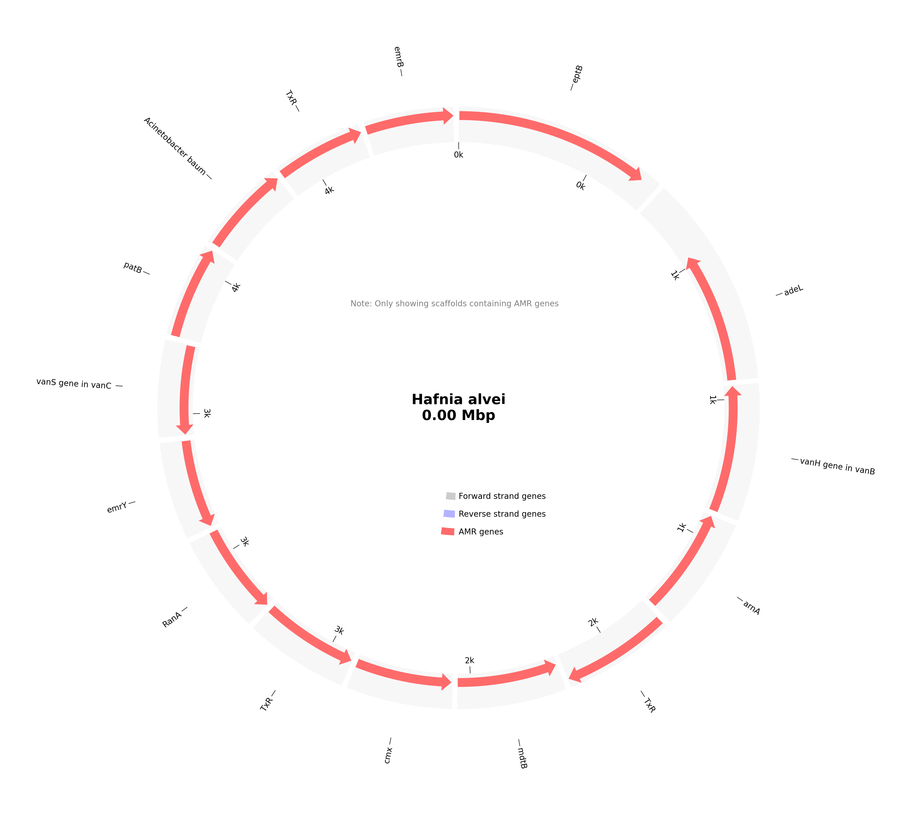

### Acinetobacter baumannii AbaF
- **Mechanism**: antibiotic efflux
- **Drug Classes**: phosphonic acid antibiotic
- **AMR Family**: major facilitator superfamily (MFS) antibiotic efflux pump
- **Locations**:
  - gnl|SPADES|LFDBGJIL_1673229_1 : position 3-233

### RanA
- **Mechanism**: antibiotic efflux
- **Drug Classes**: aminoglycoside antibiotic
- **AMR Family**: ATP-binding cassette (ABC) antibiotic efflux pump
- **Locations**:
  - gnl|SPADES|LFDBGJIL_1491611_1 : position 1-246

### TxR (found in 3 locations)
- **Mechanism**: antibiotic efflux
- **Drug Classes**: tetracycline antibiotic
- **AMR Family**: ATP-binding cassette (ABC) antibiotic efflux pump
- **Locations**:
  - gnl|SPADES|LFDBGJIL_1133738_1 : position 3-278
  - gnl|SPADES|LFDBGJIL_1327560_1 : position 2-259
  - gnl|SPADES|LFDBGJIL_1756944_1 : position 1-228

### adeL
- **Mechanism**: antibiotic efflux
- **Drug Classes**: fluoroquinolone antibiotic; tetracycline antibiotic
- **AMR Family**: resistance-nodulation-cell division (RND) antibiotic efflux pump
- **Locations**:
  - gnl|SPADES|LFDBGJIL_244548_1 : position 177-530

### arnA
- **Mechanism**: antibiotic target alteration
- **Drug Classes**: peptide antibiotic
- **AMR Family**: pmr phosphoethanolamine transferase
- **Locations**:
  - gnl|SPADES|LFDBGJIL_1076493_1 : position 2-286

### cmx
- **Mechanism**: antibiotic efflux
- **Drug Classes**: phenicol antibiotic
- **AMR Family**: major facilitator superfamily (MFS) antibiotic efflux pump
- **Locations**:
  - gnl|SPADES|LFDBGJIL_1281875_1 : position 3-263

### emrB
- **Mechanism**: antibiotic efflux
- **Drug Classes**: fluoroquinolone antibiotic
- **AMR Family**: major facilitator superfamily (MFS) antibiotic efflux pump
- **Locations**:
  - gnl|SPADES|LFDBGJIL_1794422_1 : position 1-225

### emrY
- **Mechanism**: antibiotic efflux
- **Drug Classes**: tetracycline antibiotic
- **AMR Family**: major facilitator superfamily (MFS) antibiotic efflux pump
- **Locations**:
  - gnl|SPADES|LFDBGJIL_1535317_1 : position 3-242

### eptB
- **Mechanism**: antibiotic target alteration
- **Drug Classes**: peptide antibiotic
- **AMR Family**: pmr phosphoethanolamine transferase
- **Locations**:
  - gnl|SPADES|LFDBGJIL_230531_1 : position 2-499

### mdtB
- **Mechanism**: antibiotic efflux
- **Drug Classes**: aminocoumarin antibiotic
- **AMR Family**: resistance-nodulation-cell division (RND) antibiotic efflux pump
- **Locations**:
  - gnl|SPADES|LFDBGJIL_1194399_1 : position 3-272

### patB
- **Mechanism**: antibiotic efflux
- **Drug Classes**: fluoroquinolone antibiotic
- **AMR Family**: ATP-binding cassette (ABC) antibiotic efflux pump
- **Locations**:
  - gnl|SPADES|LFDBGJIL_1613436_1 : position 1-237

### vanH gene in vanB cluster
- **Mechanism**: antibiotic target alteration
- **Drug Classes**: glycopeptide antibiotic
- **AMR Family**: vanH; glycopeptide resistance gene cluster
- **Locations**:
  - gnl|SPADES|LFDBGJIL_744554_1 : position 2-343

### vanS gene in vanC cluster
- **Mechanism**: antibiotic target alteration
- **Drug Classes**: glycopeptide antibiotic
- **AMR Family**: vanS; glycopeptide resistance gene cluster
- **Locations**:
  - gnl|SPADES|LFDBGJIL_1548834_1 : position 2-241

## Hafnia paralvei
**Strain Statistics:**
- Total genome length: 22.1 kbp
- Total scaffolds: 1303
- Scaffolds with AMR genes: 71
- Total genes annotated: 10
- Total AMR genes: 71
- Unique AMR genes: 61
- Distinct AMR mechanisms: 6
- Distinct AMR families: 22
- Distinct drug classes: 30

**Circos Plot:**

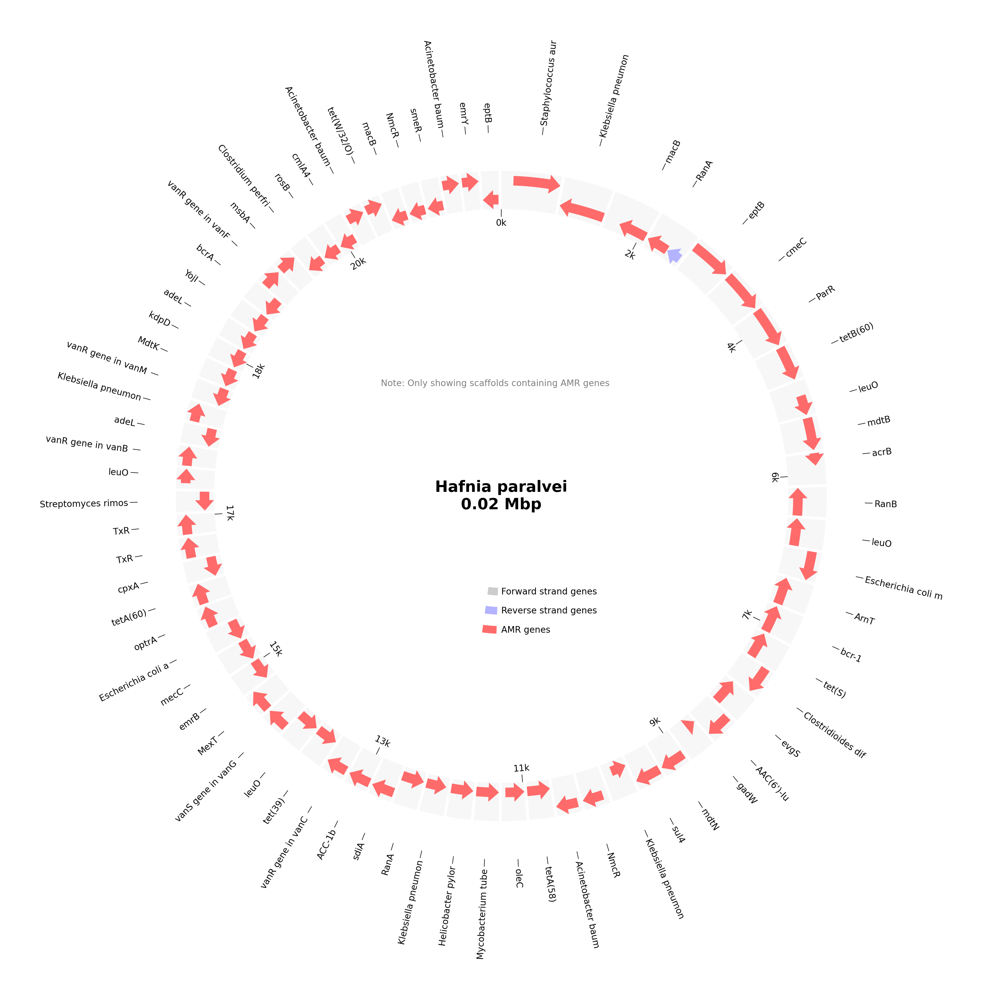

### AAC(6')-Iu
- **Mechanism**: antibiotic inactivation
- **Drug Classes**: aminoglycoside antibiotic
- **AMR Family**: AAC(6')
- **Locations**:
  - gnl|SPADES|LFDBGJIL_806578_1 : position 21-329

### ACC-1b
- **Mechanism**: antibiotic inactivation
- **Drug Classes**: monobactam; cephalosporin; cephamycin; penam; oxacephem
- **AMR Family**: ACC beta-lactamase
- **Locations**:
  - gnl|SPADES|LFDBGJIL_1112522_1 : position 3-281

### Acinetobacter baumannii AbaF
- **Mechanism**: antibiotic efflux
- **Drug Classes**: phosphonic acid antibiotic
- **AMR Family**: major facilitator superfamily (MFS) antibiotic efflux pump
- **Locations**:
  - gnl|SPADES|LFDBGJIL_2007632_1 : position 3-209

### Acinetobacter baumannii AbaQ (found in 2 locations)
- **Mechanism**: antibiotic efflux
- **Drug Classes**: fluoroquinolone antibiotic
- **AMR Family**: major facilitator superfamily (MFS) antibiotic efflux pump
- **Locations**:
  - gnl|SPADES|LFDBGJIL_1905956_1 : position 2-217
  - gnl|SPADES|LFDBGJIL_948428_1 : position 32-304

### ArnT
- **Mechanism**: antibiotic target alteration
- **Drug Classes**: peptide antibiotic
- **AMR Family**: pmr phosphoethanolamine transferase
- **Locations**:
  - gnl|SPADES|LFDBGJIL_663015_1 : position 2-361

### Clostridioides difficile gyrB conferring resistance to fluoroquinolones
- **Mechanism**: antibiotic target alteration
- **Drug Classes**: fluoroquinolone antibiotic
- **AMR Family**: fluoroquinolone resistant gyrB
- **Locations**:
  - gnl|SPADES|LFDBGJIL_750606_1 : position 2-340

### Clostridium perfringes cplR
- **Mechanism**: antibiotic target protection
- **Drug Classes**: lincosamide antibiotic; streptogramin antibiotic; streptogramin A antibiotic; pleuromutilin antibiotic
- **AMR Family**: Miscellaneous ABC-F subfamily ATP-binding cassette ribosomal protection proteins
- **Locations**:
  - gnl|SPADES|LFDBGJIL_1786880_1 : position 2-226

### Escherichia coli acrA
- **Mechanism**: antibiotic efflux
- **Drug Classes**: fluoroquinolone antibiotic; cephalosporin; glycylcycline; penam; tetracycline antibiotic; rifamycin antibiotic; phenicol antibiotic; disinfecting agents and antiseptics
- **AMR Family**: resistance-nodulation-cell division (RND) antibiotic efflux pump
- **Locations**:
  - gnl|SPADES|LFDBGJIL_1250087_1 : position 3-266

### Escherichia coli mdfA
- **Mechanism**: antibiotic efflux
- **Drug Classes**: tetracycline antibiotic; phenicol antibiotic; disinfecting agents and antiseptics
- **AMR Family**: major facilitator superfamily (MFS) antibiotic efflux pump
- **Locations**:
  - gnl|SPADES|LFDBGJIL_655357_1 : position 1-363

### Helicobacter pylori pbp2 mutants conferring resistance to amoxicillin
- **Mechanism**: antibiotic target alteration
- **Drug Classes**: cephalosporin; cephamycin; penam
- **AMR Family**: Penicillin-binding protein mutations conferring resistance to beta-lactam antibiotics
- **Locations**:
  - gnl|SPADES|LFDBGJIL_994132_1 : position 3-296

### Klebsiella pneumoniae KpnE
- **Mechanism**: antibiotic efflux
- **Drug Classes**: macrolide antibiotic; aminoglycoside antibiotic; cephalosporin; tetracycline antibiotic; peptide antibiotic; rifamycin antibiotic; disinfecting agents and antiseptics
- **AMR Family**: small multidrug resistance (SMR) antibiotic efflux pump
- **Locations**:
  - gnl|SPADES|LFDBGJIL_1010129_1 : position 30-296

### Klebsiella pneumoniae KpnG
- **Mechanism**: antibiotic efflux
- **Drug Classes**: macrolide antibiotic; fluoroquinolone antibiotic; aminoglycoside antibiotic; carbapenem; cephalosporin; penam; peptide antibiotic; penem
- **AMR Family**: major facilitator superfamily (MFS) antibiotic efflux pump
- **Locations**:
  - gnl|SPADES|LFDBGJIL_881570_1 : position 2-208

### Klebsiella pneumoniae KpnH
- **Mechanism**: antibiotic efflux
- **Drug Classes**: macrolide antibiotic; fluoroquinolone antibiotic; aminoglycoside antibiotic; carbapenem; cephalosporin; penam; peptide antibiotic; penem
- **AMR Family**: major facilitator superfamily (MFS) antibiotic efflux pump
- **Locations**:
  - gnl|SPADES|LFDBGJIL_163932_1 : position 3-599

### Klebsiella pneumoniae acrA
- **Mechanism**: antibiotic efflux
- **Drug Classes**: fluoroquinolone antibiotic; cephalosporin; glycylcycline; penam; tetracycline antibiotic; rifamycin antibiotic; phenicol antibiotic; disinfecting agents and antiseptics
- **AMR Family**: resistance-nodulation-cell division (RND) antibiotic efflux pump
- **Locations**:
  - gnl|SPADES|LFDBGJIL_1558854_1 : position 3-233

### MdtK
- **Mechanism**: antibiotic efflux
- **Drug Classes**: fluoroquinolone antibiotic
- **AMR Family**: multidrug and toxic compound extrusion (MATE) transporter
- **Locations**:
  - gnl|SPADES|LFDBGJIL_1602756_1 : position 2-238

### MexT
- **Mechanism**: antibiotic efflux
- **Drug Classes**: fluoroquinolone antibiotic; diaminopyrimidine antibiotic; phenicol antibiotic
- **AMR Family**: resistance-nodulation-cell division (RND) antibiotic efflux pump
- **Locations**:
  - gnl|SPADES|LFDBGJIL_1160332_1 : position 2-277

### Mycobacterium tuberculosis intrinsic murA conferring resistance to fosfomycin
- **Mechanism**: antibiotic target alteration
- **Drug Classes**: phosphonic acid antibiotic
- **AMR Family**: antibiotic-resistant murA transferase
- **Locations**:
  - gnl|SPADES|LFDBGJIL_970927_1 : position 1-300

### NmcR (found in 2 locations)
- **Mechanism**: antibiotic inactivation
- **Drug Classes**: carbapenem; cephalosporin; cephamycin; penam
- **AMR Family**: NmcA beta-lactamase
- **Locations**:
  - gnl|SPADES|LFDBGJIL_1978000_1 : position 1-213
  - gnl|SPADES|LFDBGJIL_885221_1 : position 60-317

### ParR
- **Mechanism**: antibiotic efflux; reduced permeability to antibiotic
- **Drug Classes**: macrolide antibiotic; fluoroquinolone antibiotic; monobactam; aminoglycoside antibiotic; carbapenem; cephalosporin; cephamycin; penam; tetracycline antibiotic; phenicol antibiotic; penem; disinfecting agents and antiseptics
- **AMR Family**: resistance-nodulation-cell division (RND) antibiotic efflux pump; Outer Membrane Porin (Opr)
- **Locations**:
  - gnl|SPADES|LFDBGJIL_280936_1 : position 1-507

### RanA (found in 2 locations)
- **Mechanism**: antibiotic efflux
- **Drug Classes**: aminoglycoside antibiotic
- **AMR Family**: ATP-binding cassette (ABC) antibiotic efflux pump
- **Locations**:
  - gnl|SPADES|LFDBGJIL_1018801_1 : position 2-295
  - gnl|SPADES|LFDBGJIL_259120_1 : position 1-294

### RanB
- **Mechanism**: antibiotic efflux
- **Drug Classes**: aminoglycoside antibiotic
- **AMR Family**: ATP-binding cassette (ABC) antibiotic efflux pump
- **Locations**:
  - gnl|SPADES|LFDBGJIL_647037_1 : position 1-366

### Staphylococcus aureus GlpT with mutation conferring resistance to fosfomycin
- **Mechanism**: antibiotic target alteration
- **Drug Classes**: phosphonic acid antibiotic
- **AMR Family**: antibiotic-resistant GlpT
- **Locations**:
  - gnl|SPADES|LFDBGJIL_75471_1 : position 151-735

### Streptomyces rimosus otr(A)
- **Mechanism**: antibiotic target protection
- **Drug Classes**: tetracycline antibiotic
- **AMR Family**: tetracycline-resistant ribosomal protection protein
- **Locations**:
  - gnl|SPADES|LFDBGJIL_1440439_1 : position 2-250

### TxR (found in 2 locations)
- **Mechanism**: antibiotic efflux
- **Drug Classes**: tetracycline antibiotic
- **AMR Family**: ATP-binding cassette (ABC) antibiotic efflux pump
- **Locations**:
  - gnl|SPADES|LFDBGJIL_1370308_1 : position 1-255
  - gnl|SPADES|LFDBGJIL_1417470_1 : position 3-251

### YojI
- **Mechanism**: antibiotic efflux
- **Drug Classes**: peptide antibiotic
- **AMR Family**: ATP-binding cassette (ABC) antibiotic efflux pump
- **Locations**:
  - gnl|SPADES|LFDBGJIL_1618058_1 : position 1-237

### acrB
- **Mechanism**: antibiotic efflux
- **Drug Classes**: fluoroquinolone antibiotic; cephalosporin; glycylcycline; penam; tetracycline antibiotic; rifamycin antibiotic; phenicol antibiotic; disinfecting agents and antiseptics
- **AMR Family**: resistance-nodulation-cell division (RND) antibiotic efflux pump
- **Locations**:
  - gnl|SPADES|LFDBGJIL_555129_1 : position 2-157

### adeL (found in 2 locations)
- **Mechanism**: antibiotic efflux
- **Drug Classes**: fluoroquinolone antibiotic; tetracycline antibiotic
- **AMR Family**: resistance-nodulation-cell division (RND) antibiotic efflux pump
- **Locations**:
  - gnl|SPADES|LFDBGJIL_1538741_1 : position 2-241
  - gnl|SPADES|LFDBGJIL_1604395_1 : position 1-237

### bcr-1
- **Mechanism**: antibiotic efflux
- **Drug Classes**: bicyclomycin-like antibiotic
- **AMR Family**: major facilitator superfamily (MFS) antibiotic efflux pump
- **Locations**:
  - gnl|SPADES|LFDBGJIL_662857_1 : position 1-360

### bcrA
- **Mechanism**: antibiotic efflux
- **Drug Classes**: peptide antibiotic
- **AMR Family**: ATP-binding cassette (ABC) antibiotic efflux pump
- **Locations**:
  - gnl|SPADES|LFDBGJIL_1611240_1 : position 2-238

### cmeC
- **Mechanism**: antibiotic efflux
- **Drug Classes**: macrolide antibiotic; fluoroquinolone antibiotic; cephalosporin; fusidane antibiotic
- **AMR Family**: resistance-nodulation-cell division (RND) antibiotic efflux pump
- **Locations**:
  - gnl|SPADES|LFDBGJIL_261460_1 : position 2-517

### cmlA4
- **Mechanism**: antibiotic efflux
- **Drug Classes**: phenicol antibiotic
- **AMR Family**: major facilitator superfamily (MFS) antibiotic efflux pump
- **Locations**:
  - gnl|SPADES|LFDBGJIL_1880140_1 : position 1-219

### cpxA
- **Mechanism**: antibiotic efflux
- **Drug Classes**: aminoglycoside antibiotic; aminocoumarin antibiotic
- **AMR Family**: resistance-nodulation-cell division (RND) antibiotic efflux pump
- **Locations**:
  - gnl|SPADES|LFDBGJIL_1351059_1 : position 2-259

### emrB
- **Mechanism**: antibiotic efflux
- **Drug Classes**: fluoroquinolone antibiotic
- **AMR Family**: major facilitator superfamily (MFS) antibiotic efflux pump
- **Locations**:
  - gnl|SPADES|LFDBGJIL_1183977_1 : position 2-274

### emrY
- **Mechanism**: antibiotic efflux
- **Drug Classes**: tetracycline antibiotic
- **AMR Family**: major facilitator superfamily (MFS) antibiotic efflux pump
- **Locations**:
  - gnl|SPADES|LFDBGJIL_2021886_1 : position 2-208

### eptB (found in 2 locations)
- **Mechanism**: antibiotic target alteration
- **Drug Classes**: peptide antibiotic
- **AMR Family**: pmr phosphoethanolamine transferase
- **Locations**:
  - gnl|SPADES|LFDBGJIL_2021720_1 : position 2-208
  - gnl|SPADES|LFDBGJIL_260804_1 : position 3-518

### evgS
- **Mechanism**: antibiotic efflux
- **Drug Classes**: macrolide antibiotic; fluoroquinolone antibiotic; penam; tetracycline antibiotic
- **AMR Family**: major facilitator superfamily (MFS) antibiotic efflux pump; resistance-nodulation-cell division (RND) antibiotic efflux pump
- **Locations**:
  - gnl|SPADES|LFDBGJIL_788297_1 : position 1-333

### gadW
- **Mechanism**: antibiotic efflux
- **Drug Classes**: macrolide antibiotic; fluoroquinolone antibiotic; penam
- **AMR Family**: resistance-nodulation-cell division (RND) antibiotic efflux pump
- **Locations**:
  - gnl|SPADES|LFDBGJIL_840523_1 : position 1-132

### kdpD
- **Mechanism**: antibiotic efflux
- **Drug Classes**: aminoglycoside antibiotic
- **AMR Family**: kdpDE
- **Locations**:
  - gnl|SPADES|LFDBGJIL_1598002_1 : position 2-238

### leuO (found in 4 locations)
- **Mechanism**: antibiotic efflux
- **Drug Classes**: nucleoside antibiotic; disinfecting agents and antiseptics
- **AMR Family**: major facilitator superfamily (MFS) antibiotic efflux pump
- **Locations**:
  - gnl|SPADES|LFDBGJIL_1148953_1 : position 1-276
  - gnl|SPADES|LFDBGJIL_1484096_1 : position 67-246
  - gnl|SPADES|LFDBGJIL_442757_1 : position 179-427
  - gnl|SPADES|LFDBGJIL_650542_1 : position 1-363

### macB (found in 2 locations)
- **Mechanism**: antibiotic efflux
- **Drug Classes**: macrolide antibiotic
- **AMR Family**: ATP-binding cassette (ABC) antibiotic efflux pump
- **Locations**:
  - gnl|SPADES|LFDBGJIL_183613_2 : position 195-578
  - gnl|SPADES|LFDBGJIL_1922772_1 : position 3-215

### mdtB
- **Mechanism**: antibiotic efflux
- **Drug Classes**: aminocoumarin antibiotic
- **AMR Family**: resistance-nodulation-cell division (RND) antibiotic efflux pump
- **Locations**:
  - gnl|SPADES|LFDBGJIL_499416_1 : position 3-407

### mdtN
- **Mechanism**: antibiotic efflux
- **Drug Classes**: nucleoside antibiotic; disinfecting agents and antiseptics
- **AMR Family**: major facilitator superfamily (MFS) antibiotic efflux pump
- **Locations**:
  - gnl|SPADES|LFDBGJIL_837960_1 : position 11-325

### mecC
- **Mechanism**: antibiotic target replacement
- **Drug Classes**: penam
- **AMR Family**: methicillin resistant PBP2
- **Locations**:
  - gnl|SPADES|LFDBGJIL_1188324_1 : position 2-274

### msbA
- **Mechanism**: antibiotic efflux
- **Drug Classes**: nitroimidazole antibiotic
- **AMR Family**: ATP-binding cassette (ABC) antibiotic efflux pump
- **Locations**:
  - gnl|SPADES|LFDBGJIL_1674046_1 : position 3-233

### oleC
- **Mechanism**: antibiotic efflux
- **Drug Classes**: macrolide antibiotic
- **AMR Family**: ATP-binding cassette (ABC) antibiotic efflux pump
- **Locations**:
  - gnl|SPADES|LFDBGJIL_973894_1 : position 2-253

### optrA
- **Mechanism**: antibiotic target protection
- **Drug Classes**: oxazolidinone antibiotic; phenicol antibiotic
- **AMR Family**: Miscellaneous ABC-F subfamily ATP-binding cassette ribosomal protection proteins
- **Locations**:
  - gnl|SPADES|LFDBGJIL_1305169_1 : position 1-261

### rosB
- **Mechanism**: antibiotic efflux
- **Drug Classes**: peptide antibiotic
- **AMR Family**: major facilitator superfamily (MFS) antibiotic efflux pump
- **Locations**:
  - gnl|SPADES|LFDBGJIL_1829987_1 : position 2-223

### sdiA
- **Mechanism**: antibiotic efflux
- **Drug Classes**: fluoroquinolone antibiotic; cephalosporin; glycylcycline; penam; tetracycline antibiotic; rifamycin antibiotic; phenicol antibiotic; disinfecting agents and antiseptics
- **AMR Family**: resistance-nodulation-cell division (RND) antibiotic efflux pump
- **Locations**:
  - gnl|SPADES|LFDBGJIL_1083834_1 : position 2-286

### smeR
- **Mechanism**: antibiotic efflux
- **Drug Classes**: aminoglycoside antibiotic; cephalosporin; cephamycin; penam
- **AMR Family**: resistance-nodulation-cell division (RND) antibiotic efflux pump
- **Locations**:
  - gnl|SPADES|LFDBGJIL_1982901_1 : position 2-211

### sul4
- **Mechanism**: antibiotic target replacement
- **Drug Classes**: sulfonamide antibiotic
- **AMR Family**: sulfonamide resistant sul
- **Locations**:
  - gnl|SPADES|LFDBGJIL_849487_1 : position 2-322

### tet(39)
- **Mechanism**: antibiotic efflux
- **Drug Classes**: tetracycline antibiotic
- **AMR Family**: major facilitator superfamily (MFS) antibiotic efflux pump
- **Locations**:
  - gnl|SPADES|LFDBGJIL_1143158_1 : position 1-279

### tet(S)
- **Mechanism**: antibiotic target protection
- **Drug Classes**: tetracycline antibiotic
- **AMR Family**: tetracycline-resistant ribosomal protection protein
- **Locations**:
  - gnl|SPADES|LFDBGJIL_752445_1 : position 2-340

### tet(W/32/O)
- **Mechanism**: antibiotic target protection
- **Drug Classes**: tetracycline antibiotic
- **AMR Family**: tetracycline-resistant ribosomal protection protein
- **Locations**:
  - gnl|SPADES|LFDBGJIL_1916820_1 : position 3-215

### tetA(58)
- **Mechanism**: antibiotic efflux
- **Drug Classes**: tetracycline antibiotic
- **AMR Family**: major facilitator superfamily (MFS) antibiotic efflux pump
- **Locations**:
  - gnl|SPADES|LFDBGJIL_957426_1 : position 2-304

### tetA(60)
- **Mechanism**: antibiotic efflux
- **Drug Classes**: tetracycline antibiotic
- **AMR Family**: ATP-binding cassette (ABC) antibiotic efflux pump
- **Locations**:
  - gnl|SPADES|LFDBGJIL_1304899_1 : position 2-262

### tetB(60)
- **Mechanism**: antibiotic efflux
- **Drug Classes**: tetracycline antibiotic
- **AMR Family**: ATP-binding cassette (ABC) antibiotic efflux pump
- **Locations**:
  - gnl|SPADES|LFDBGJIL_428315_1 : position 3-434

### vanR gene in vanB cluster
- **Mechanism**: antibiotic target alteration
- **Drug Classes**: glycopeptide antibiotic
- **AMR Family**: glycopeptide resistance gene cluster; vanR
- **Locations**:
  - gnl|SPADES|LFDBGJIL_1541846_1 : position 2-241

### vanR gene in vanC cluster
- **Mechanism**: antibiotic target alteration
- **Drug Classes**: glycopeptide antibiotic
- **AMR Family**: glycopeptide resistance gene cluster; vanR
- **Locations**:
  - gnl|SPADES|LFDBGJIL_1128876_1 : position 13-279

### vanR gene in vanF cluster
- **Mechanism**: antibiotic target alteration
- **Drug Classes**: glycopeptide antibiotic
- **AMR Family**: glycopeptide resistance gene cluster; vanR
- **Locations**:
  - gnl|SPADES|LFDBGJIL_1644151_1 : position 3-236

### vanR gene in vanM cluster
- **Mechanism**: antibiotic target alteration
- **Drug Classes**: glycopeptide antibiotic
- **AMR Family**: glycopeptide resistance gene cluster; vanR
- **Locations**:
  - gnl|SPADES|LFDBGJIL_1589943_1 : position 2-238

### vanS gene in vanG cluster
- **Mechanism**: antibiotic target alteration
- **Drug Classes**: glycopeptide antibiotic
- **AMR Family**: vanS; glycopeptide resistance gene cluster
- **Locations**:
  - gnl|SPADES|LFDBGJIL_1151457_1 : position 3-278

## Latilactobacillus sakei
**Strain Statistics:**
- Total genome length: 534.8 kbp
- Total scaffolds: 1495
- Scaffolds with AMR genes: 183
- Total genes annotated: 1033
- Total AMR genes: 221
- Unique AMR genes: 124
- Distinct AMR mechanisms: 9
- Distinct AMR families: 60
- Distinct drug classes: 34

**Circos Plot:**

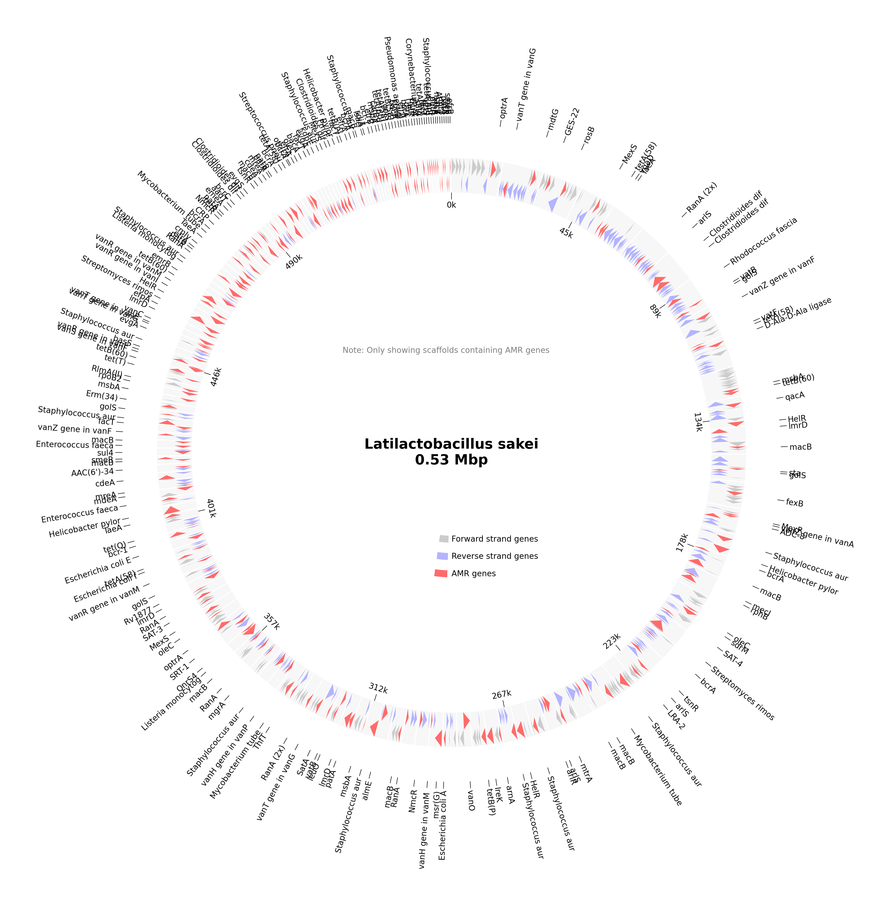

### AAC(6')-34
- **Mechanism**: antibiotic inactivation
- **Drug Classes**: aminoglycoside antibiotic
- **AMR Family**: AAC(6')
- **Locations**:
  - gnl|SPADES|LFDBGJIL_2194_2 : position 1027-1587

### ADC-8
- **Mechanism**: antibiotic inactivation
- **Drug Classes**: cephalosporin
- **AMR Family**: ADC beta-lactamase without carbapenemase activity
- **Locations**:
  - gnl|SPADES|LFDBGJIL_436_6 : position 3174-4325

### AER-1
- **Mechanism**: antibiotic inactivation
- **Drug Classes**: penam
- **AMR Family**: AER beta-lactamase
- **Locations**:
  - gnl|SPADES|LFDBGJIL_1211151_1 : position 3-269

### CRP
- **Mechanism**: antibiotic efflux
- **Drug Classes**: macrolide antibiotic; fluoroquinolone antibiotic; penam
- **AMR Family**: resistance-nodulation-cell division (RND) antibiotic efflux pump
- **Locations**:
  - gnl|SPADES|LFDBGJIL_5424_2 : position 343-1011

### Clostridioides difficile gyrA conferring resistance to fluoroquinolones (found in 2 locations)
- **Mechanism**: antibiotic target alteration
- **Drug Classes**: fluoroquinolone antibiotic
- **AMR Family**: fluoroquinolone resistant gyrA
- **Locations**:
  - gnl|SPADES|LFDBGJIL_331_5 : position 2892-5465
  - gnl|SPADES|LFDBGJIL_7779_1 : position 1-1170

### Clostridioides difficile gyrB conferring resistance to fluoroquinolones (found in 2 locations)
- **Mechanism**: antibiotic target alteration
- **Drug Classes**: fluoroquinolone antibiotic
- **AMR Family**: fluoroquinolone resistant gyrB
- **Locations**:
  - gnl|SPADES|LFDBGJIL_31667_1 : position 3-908
  - gnl|SPADES|LFDBGJIL_331_6 : position 5513-7504

### Clostridioides difficile murG with mutation conferring resistance to vancomycin
- **Mechanism**: antibiotic target alteration
- **Drug Classes**: glycopeptide antibiotic
- **AMR Family**: murG transferase
- **Locations**:
  - gnl|SPADES|LFDBGJIL_7389_2 : position 771-1325

### Corynebacterium striatum tetA
- **Mechanism**: antibiotic efflux
- **Drug Classes**: penam; tetracycline antibiotic
- **AMR Family**: major facilitator superfamily (MFS) antibiotic efflux pump
- **Locations**:
  - gnl|SPADES|LFDBGJIL_543335_2 : position 134-394

### D-Ala-D-Ala ligase
- **Mechanism**: antibiotic target alteration
- **Drug Classes**: glycopeptide antibiotic
- **AMR Family**: Van ligase
- **Locations**:
  - gnl|SPADES|LFDBGJIL_352_3 : position 1475-2527

### Enterococcus faecalis cls with mutation conferring resistance to daptomycin (found in 2 locations)
- **Mechanism**: antibiotic target alteration
- **Drug Classes**: peptide antibiotic
- **AMR Family**: daptomycin resistant cls
- **Locations**:
  - gnl|SPADES|LFDBGJIL_2055_5 : position 1666-2475
  - gnl|SPADES|LFDBGJIL_2356_1 : position 2-769

### Erm(34)
- **Mechanism**: antibiotic target alteration
- **Drug Classes**: macrolide antibiotic; lincosamide antibiotic; streptogramin antibiotic; streptogramin A antibiotic; streptogramin B antibiotic
- **AMR Family**: Erm 23S ribosomal RNA methyltransferase
- **Locations**:
  - gnl|SPADES|LFDBGJIL_2597_2 : position 608-1501

### Escherichia coli AcrAB-TolC with AcrR mutation conferring resistance to ciprofloxacin, tetracycline, and ceftazidime
- **Mechanism**: antibiotic target alteration; antibiotic efflux
- **Drug Classes**: fluoroquinolone antibiotic; cephalosporin; glycylcycline; penam; tetracycline antibiotic; rifamycin antibiotic; phenicol antibiotic; disinfecting agents and antiseptics
- **AMR Family**: resistance-nodulation-cell division (RND) antibiotic efflux pump
- **Locations**:
  - gnl|SPADES|LFDBGJIL_910_7 : position 3584-4225

### Escherichia coli EF-Tu mutants conferring resistance to Pulvomycin
- **Mechanism**: antibiotic target alteration
- **Drug Classes**: elfamycin antibiotic
- **AMR Family**: elfamycin resistant EF-Tu
- **Locations**:
  - gnl|SPADES|LFDBGJIL_1931_2 : position 717-1907

### Escherichia coli fabI mutations conferring resistance to isoniazid and triclosan
- **Mechanism**: antibiotic target alteration
- **Drug Classes**: disinfecting agents and antiseptics; isoniazid-like antibiotic
- **AMR Family**: antibiotic resistant fabI
- **Locations**:
  - gnl|SPADES|LFDBGJIL_1911_5 : position 1949-2572

### GES-22
- **Mechanism**: antibiotic inactivation
- **Drug Classes**: carbapenem; cephalosporin; penam
- **AMR Family**: GES beta-lactamase
- **Locations**:
  - gnl|SPADES|LFDBGJIL_266_3 : position 2164-3147

### HelR (found in 4 locations)
- **Mechanism**: antibiotic target protection
- **Drug Classes**: rifamycin antibiotic
- **AMR Family**: helicase-like RNA polymerase protection protein
- **Locations**:
  - gnl|SPADES|LFDBGJIL_376_8 : position 7983-9488
  - gnl|SPADES|LFDBGJIL_4361_1 : position 2-1609
  - gnl|SPADES|LFDBGJIL_445450_1 : position 2-427
  - gnl|SPADES|LFDBGJIL_823_4 : position 2629-4761

### Helicobacter pylori pbp1 mutants conferring resistance to amoxicillin (found in 3 locations)
- **Mechanism**: antibiotic target alteration
- **Drug Classes**: cephalosporin; cephamycin; penam
- **AMR Family**: Penicillin-binding protein mutations conferring resistance to beta-lactam antibiotics
- **Locations**:
  - gnl|SPADES|LFDBGJIL_2054_1 : position 71-2374
  - gnl|SPADES|LFDBGJIL_33457_1 : position 3-785
  - gnl|SPADES|LFDBGJIL_500_6 : position 4878-7043

### IreK
- **Mechanism**: reduced permeability to antibiotic
- **Drug Classes**: cephalosporin
- **AMR Family**: Serine/threonine kinases
- **Locations**:
  - gnl|SPADES|LFDBGJIL_847_4 : position 2701-4614

### LRA-2
- **Mechanism**: antibiotic inactivation
- **Drug Classes**: cephalosporin; penam
- **AMR Family**: subclass B3 LRA beta-lactamase
- **Locations**:
  - gnl|SPADES|LFDBGJIL_702_4 : position 2993-3799

### Listeria monocytogenes mprF (found in 2 locations)
- **Mechanism**: antibiotic target alteration
- **Drug Classes**: peptide antibiotic
- **AMR Family**: defensin resistant mprF
- **Locations**:
  - gnl|SPADES|LFDBGJIL_1415_1 : position 1-2295
  - gnl|SPADES|LFDBGJIL_4642_4 : position 1265-1564

### MexR
- **Mechanism**: antibiotic target alteration; antibiotic efflux
- **Drug Classes**: macrolide antibiotic; fluoroquinolone antibiotic; monobactam; carbapenem; cephalosporin; cephamycin; penam; tetracycline antibiotic; peptide antibiotic; aminocoumarin antibiotic; diaminopyrimidine antibiotic; sulfonamide antibiotic; phenicol antibiotic; penem
- **AMR Family**: resistance-nodulation-cell division (RND) antibiotic efflux pump
- **Locations**:
  - gnl|SPADES|LFDBGJIL_436_4 : position 2025-2507

### MexS (found in 3 locations)
- **Mechanism**: antibiotic efflux
- **Drug Classes**: fluoroquinolone antibiotic; diaminopyrimidine antibiotic; phenicol antibiotic
- **AMR Family**: resistance-nodulation-cell division (RND) antibiotic efflux pump
- **Locations**:
  - gnl|SPADES|LFDBGJIL_1519_4 : position 1417-2424
  - gnl|SPADES|LFDBGJIL_306_8 : position 6752-7705
  - gnl|SPADES|LFDBGJIL_30902_1 : position 3-689

### Mycobacterium tuberculosis intrinsic murA conferring resistance to fosfomycin
- **Mechanism**: antibiotic target alteration
- **Drug Classes**: phosphonic acid antibiotic
- **AMR Family**: antibiotic-resistant murA transferase
- **Locations**:
  - gnl|SPADES|LFDBGJIL_741_6 : position 2965-4266

### Mycobacterium tuberculosis kasA mutant conferring resistance to isoniazid
- **Mechanism**: antibiotic target alteration
- **Drug Classes**: isoniazid-like antibiotic
- **AMR Family**: antibiotic resistant kasA
- **Locations**:
  - gnl|SPADES|LFDBGJIL_1276_2 : position 227-1459

### Mycobacterium tuberculosis pncA mutations conferring resistance to pyrazinamide
- **Mechanism**: antibiotic target alteration
- **Drug Classes**: pyrazine antibiotic
- **AMR Family**: Pyrazinamide resistant pncA
- **Locations**:
  - gnl|SPADES|LFDBGJIL_5367_3 : position 842-1381

### NmcR (found in 2 locations)
- **Mechanism**: antibiotic inactivation
- **Drug Classes**: carbapenem; cephalosporin; cephamycin; penam
- **AMR Family**: NmcA beta-lactamase
- **Locations**:
  - gnl|SPADES|LFDBGJIL_5751_2 : position 743-1435
  - gnl|SPADES|LFDBGJIL_988_5 : position 2592-3464

### PmrF
- **Mechanism**: antibiotic target alteration
- **Drug Classes**: peptide antibiotic
- **AMR Family**: pmr phosphoethanolamine transferase
- **Locations**:
  - gnl|SPADES|LFDBGJIL_31813_1 : position 2-523

### Pseudomonas aeruginosa soxR
- **Mechanism**: antibiotic target alteration; antibiotic efflux
- **Drug Classes**: fluoroquinolone antibiotic; cephalosporin; glycylcycline; penam; tetracycline antibiotic; rifamycin antibiotic; phenicol antibiotic; disinfecting agents and antiseptics
- **AMR Family**: ATP-binding cassette (ABC) antibiotic efflux pump; major facilitator superfamily (MFS) antibiotic efflux pump; resistance-nodulation-cell division (RND) antibiotic efflux pump
- **Locations**:
  - gnl|SPADES|LFDBGJIL_348055_1 : position 3-428

### QnrS4
- **Mechanism**: antibiotic target protection
- **Drug Classes**: fluoroquinolone antibiotic
- **AMR Family**: quinolone resistance protein (qnr)
- **Locations**:
  - gnl|SPADES|LFDBGJIL_1415_2 : position 2382-3017

### RanA (found in 8 locations)
- **Mechanism**: antibiotic efflux
- **Drug Classes**: aminoglycoside antibiotic
- **AMR Family**: ATP-binding cassette (ABC) antibiotic efflux pump
- **Locations**:
  - gnl|SPADES|LFDBGJIL_1245_1 : position 1-822
  - gnl|SPADES|LFDBGJIL_1245_2 : position 851-1801
  - gnl|SPADES|LFDBGJIL_1361_2 : position 1416-2147
  - gnl|SPADES|LFDBGJIL_1575_1 : position 1-909
  - gnl|SPADES|LFDBGJIL_321_8 : position 5907-6665
  - gnl|SPADES|LFDBGJIL_321_9 : position 6686-7495
  - gnl|SPADES|LFDBGJIL_4863_2 : position 902-1531
  - gnl|SPADES|LFDBGJIL_991_4 : position 3096-3899

### Rhodococcus fascians cmr
- **Mechanism**: antibiotic efflux
- **Drug Classes**: phenicol antibiotic
- **AMR Family**: major facilitator superfamily (MFS) antibiotic efflux pump
- **Locations**:
  - gnl|SPADES|LFDBGJIL_349_3 : position 2109-3491

### RlmA(II)
- **Mechanism**: antibiotic target alteration
- **Drug Classes**: macrolide antibiotic; lincosamide antibiotic
- **AMR Family**: non-erm 23S ribosomal RNA methyltransferase (G748)
- **Locations**:
  - gnl|SPADES|LFDBGJIL_2842_1 : position 2-736

### Rv1877
- **Mechanism**: antibiotic efflux
- **Drug Classes**: fluoroquinolone antibiotic
- **AMR Family**: major facilitator superfamily (MFS) antibiotic efflux pump
- **Locations**:
  - gnl|SPADES|LFDBGJIL_1748_2 : position 429-1847

### SAT-3
- **Mechanism**: antibiotic inactivation
- **Drug Classes**: nucleoside antibiotic
- **AMR Family**: streptothricin acetyltransferase (SAT)
- **Locations**:
  - gnl|SPADES|LFDBGJIL_1544_3 : position 1329-1874

### SAT-4
- **Mechanism**: antibiotic inactivation
- **Drug Classes**: nucleoside antibiotic
- **AMR Family**: streptothricin acetyltransferase (SAT)
- **Locations**:
  - gnl|SPADES|LFDBGJIL_640_6 : position 4261-4698

### SRT-1
- **Mechanism**: antibiotic inactivation
- **Drug Classes**: cephalosporin
- **AMR Family**: SRT beta-lactamase
- **Locations**:
  - gnl|SPADES|LFDBGJIL_1427_3 : position 2149-3156

### SatA
- **Mechanism**: antibiotic inactivation
- **Drug Classes**: nucleoside antibiotic
- **AMR Family**: streptothricin acetyltransferase (SAT)
- **Locations**:
  - gnl|SPADES|LFDBGJIL_1219_1 : position 282-743

### Staphylococcus aureus LmrS
- **Mechanism**: antibiotic efflux
- **Drug Classes**: macrolide antibiotic; aminoglycoside antibiotic; oxazolidinone antibiotic; diaminopyrimidine antibiotic; phenicol antibiotic
- **AMR Family**: major facilitator superfamily (MFS) antibiotic efflux pump
- **Locations**:
  - gnl|SPADES|LFDBGJIL_500_3 : position 1516-2991

### Staphylococcus aureus fusA with mutation conferring resistance to fusidic acid (found in 2 locations)
- **Mechanism**: antibiotic target alteration
- **Drug Classes**: fusidane antibiotic
- **AMR Family**: antibiotic resistant fusA
- **Locations**:
  - gnl|SPADES|LFDBGJIL_1313_1 : position 1-1419
  - gnl|SPADES|LFDBGJIL_832_1 : position 3-1499

### Staphylococcus aureus mupA conferring resistance to mupirocin (found in 5 locations)
- **Mechanism**: antibiotic target alteration
- **Drug Classes**: mupirocin-like antibiotic
- **AMR Family**: antibiotic-resistant isoleucyl-tRNA synthetase (ileS)
- **Locations**:
  - gnl|SPADES|LFDBGJIL_1066_1 : position 2-2287
  - gnl|SPADES|LFDBGJIL_29251_1 : position 3-926
  - gnl|SPADES|LFDBGJIL_52469_2 : position 582-806
  - gnl|SPADES|LFDBGJIL_731_5 : position 2103-4148
  - gnl|SPADES|LFDBGJIL_910174_1 : position 1-312

### Staphylococcus aureus mupB conferring resistance to mupirocin (found in 3 locations)
- **Mechanism**: antibiotic target alteration
- **Drug Classes**: mupirocin-like antibiotic
- **AMR Family**: antibiotic-resistant isoleucyl-tRNA synthetase (ileS)
- **Locations**:
  - gnl|SPADES|LFDBGJIL_2502_1 : position 1-1329
  - gnl|SPADES|LFDBGJIL_3299_1 : position 3-680
  - gnl|SPADES|LFDBGJIL_4726_1 : position 3-1550

### Staphylococcus aureus murA with mutation conferring resistance to fosfomycin
- **Mechanism**: antibiotic target alteration
- **Drug Classes**: phosphonic acid antibiotic
- **AMR Family**: antibiotic-resistant murA transferase
- **Locations**:
  - gnl|SPADES|LFDBGJIL_812_3 : position 3042-4301

### Streptococcus pneumoniae PBP2x conferring resistance to amoxicillin
- **Mechanism**: antibiotic target alteration
- **Drug Classes**: cephalosporin; cephamycin; penam
- **AMR Family**: Penicillin-binding protein mutations conferring resistance to beta-lactam antibiotics
- **Locations**:
  - gnl|SPADES|LFDBGJIL_10994_1 : position 2-1180

### Streptomyces rimosus otr(A) (found in 2 locations)
- **Mechanism**: antibiotic target protection
- **Drug Classes**: tetracycline antibiotic
- **AMR Family**: tetracycline-resistant ribosomal protection protein
- **Locations**:
  - gnl|SPADES|LFDBGJIL_3935_1 : position 3-1616
  - gnl|SPADES|LFDBGJIL_645_4 : position 2401-5190

### TaeA (found in 3 locations)
- **Mechanism**: antibiotic efflux
- **Drug Classes**: pleuromutilin antibiotic
- **AMR Family**: ATP-binding cassette (ABC) antibiotic efflux pump
- **Locations**:
  - gnl|SPADES|LFDBGJIL_2026_3 : position 1601-2500
  - gnl|SPADES|LFDBGJIL_307_2 : position 1250-1978
  - gnl|SPADES|LFDBGJIL_5116_2 : position 731-1501

### ThfT
- **Mechanism**: resistance by host-dependent nutrient acquisition
- **Drug Classes**: sulfonamide antibiotic
- **AMR Family**: ECF transporter S component
- **Locations**:
  - gnl|SPADES|LFDBGJIL_1262_5 : position 2220-2828

### aadT
- **Mechanism**: antibiotic efflux
- **Drug Classes**: macrolide antibiotic; tetracycline antibiotic; disinfecting agents and antiseptics
- **AMR Family**: major facilitator superfamily (MFS) antibiotic efflux pump
- **Locations**:
  - gnl|SPADES|LFDBGJIL_6873_1 : position 185-1357

### almE
- **Mechanism**: antibiotic target alteration
- **Drug Classes**: peptide antibiotic
- **AMR Family**: polymyxin resistance operon; alm glycyltransferase
- **Locations**:
  - gnl|SPADES|LFDBGJIL_1040_4 : position 1859-3379

### arlR
- **Mechanism**: antibiotic efflux
- **Drug Classes**: fluoroquinolone antibiotic; disinfecting agents and antiseptics
- **AMR Family**: major facilitator superfamily (MFS) antibiotic efflux pump
- **Locations**:
  - gnl|SPADES|LFDBGJIL_810_4 : position 2983-3669

### arlS (found in 4 locations)
- **Mechanism**: antibiotic efflux
- **Drug Classes**: fluoroquinolone antibiotic; disinfecting agents and antiseptics
- **AMR Family**: major facilitator superfamily (MFS) antibiotic efflux pump
- **Locations**:
  - gnl|SPADES|LFDBGJIL_321_13 : position 10275-11009
  - gnl|SPADES|LFDBGJIL_702_1 : position 2-811
  - gnl|SPADES|LFDBGJIL_799129_1 : position 1-330
  - gnl|SPADES|LFDBGJIL_810_3 : position 1484-2986

### arnA (found in 2 locations)
- **Mechanism**: antibiotic target alteration
- **Drug Classes**: peptide antibiotic
- **AMR Family**: pmr phosphoethanolamine transferase
- **Locations**:
  - gnl|SPADES|LFDBGJIL_1050113_1 : position 2-289
  - gnl|SPADES|LFDBGJIL_847_1 : position 2-607

### bacA (found in 2 locations)
- **Mechanism**: antibiotic target alteration
- **Drug Classes**: peptide antibiotic
- **AMR Family**: undecaprenyl pyrophosphate related proteins
- **Locations**:
  - gnl|SPADES|LFDBGJIL_22458_1 : position 2-316
  - gnl|SPADES|LFDBGJIL_282160_1 : position 64-504

### basS
- **Mechanism**: antibiotic target alteration; antibiotic efflux
- **Drug Classes**: peptide antibiotic
- **AMR Family**: pmr phosphoethanolamine transferase
- **Locations**:
  - gnl|SPADES|LFDBGJIL_3289_1 : position 2-850

### bcr-1 (found in 2 locations)
- **Mechanism**: antibiotic efflux
- **Drug Classes**: bicyclomycin-like antibiotic
- **AMR Family**: major facilitator superfamily (MFS) antibiotic efflux pump
- **Locations**:
  - gnl|SPADES|LFDBGJIL_1973_2 : position 859-2040
  - gnl|SPADES|LFDBGJIL_56856_1 : position 230-790

### bcrA (found in 8 locations)
- **Mechanism**: antibiotic efflux
- **Drug Classes**: peptide antibiotic
- **AMR Family**: ATP-binding cassette (ABC) antibiotic efflux pump
- **Locations**:
  - gnl|SPADES|LFDBGJIL_14811_2 : position 298-525
  - gnl|SPADES|LFDBGJIL_354538_1 : position 3-467
  - gnl|SPADES|LFDBGJIL_505_1 : position 1-645
  - gnl|SPADES|LFDBGJIL_51235_2 : position 420-809
  - gnl|SPADES|LFDBGJIL_519771_1 : position 2-400
  - gnl|SPADES|LFDBGJIL_5396_2 : position 414-1142
  - gnl|SPADES|LFDBGJIL_664_4 : position 2127-2501
  - gnl|SPADES|LFDBGJIL_9393_2 : position 779-1234

### bcrC
- **Mechanism**: antibiotic target alteration
- **Drug Classes**: peptide antibiotic
- **AMR Family**: undecaprenyl pyrophosphate related proteins
- **Locations**:
  - gnl|SPADES|LFDBGJIL_7192_1 : position 2-496

### catB9
- **Mechanism**: antibiotic inactivation
- **Drug Classes**: phenicol antibiotic
- **AMR Family**: chloramphenicol acetyltransferase (CAT)
- **Locations**:
  - gnl|SPADES|LFDBGJIL_108232_1 : position 3-401

### cdeA (found in 2 locations)
- **Mechanism**: antibiotic efflux
- **Drug Classes**: fluoroquinolone antibiotic; disinfecting agents and antiseptics
- **AMR Family**: multidrug and toxic compound extrusion (MATE) transporter
- **Locations**:
  - gnl|SPADES|LFDBGJIL_2176_2 : position 247-1563
  - gnl|SPADES|LFDBGJIL_8522_1 : position 2-1270

### cmlv
- **Mechanism**: antibiotic inactivation
- **Drug Classes**: phenicol antibiotic
- **AMR Family**: chloramphenicol phosphotransferase
- **Locations**:
  - gnl|SPADES|LFDBGJIL_5027_1 : position 118-1296

### dfrL
- **Mechanism**: antibiotic target replacement
- **Drug Classes**: aminoglycoside antibiotic; tetracycline antibiotic; diaminopyrimidine antibiotic
- **AMR Family**: trimethoprim resistant dihydrofolate reductase dfr
- **Locations**:
  - gnl|SPADES|LFDBGJIL_380001_1 : position 2-310

### efpA
- **Mechanism**: antibiotic efflux
- **Drug Classes**: rifamycin antibiotic; isoniazid-like antibiotic
- **AMR Family**: major facilitator superfamily (MFS) antibiotic efflux pump
- **Locations**:
  - gnl|SPADES|LFDBGJIL_3884_2 : position 479-1693

### efrA (found in 4 locations)
- **Mechanism**: antibiotic efflux
- **Drug Classes**: macrolide antibiotic; fluoroquinolone antibiotic; rifamycin antibiotic
- **AMR Family**: ATP-binding cassette (ABC) antibiotic efflux pump
- **Locations**:
  - gnl|SPADES|LFDBGJIL_15307_1 : position 1-1083
  - gnl|SPADES|LFDBGJIL_350043_1 : position 2-469
  - gnl|SPADES|LFDBGJIL_48600_2 : position 378-821
  - gnl|SPADES|LFDBGJIL_4956_2 : position 830-1519

### efrB (found in 2 locations)
- **Mechanism**: antibiotic efflux
- **Drug Classes**: macrolide antibiotic; fluoroquinolone antibiotic; rifamycin antibiotic
- **AMR Family**: ATP-binding cassette (ABC) antibiotic efflux pump
- **Locations**:
  - gnl|SPADES|LFDBGJIL_2052046_1 : position 2-208
  - gnl|SPADES|LFDBGJIL_66769_1 : position 1-759

### emeA
- **Mechanism**: antibiotic efflux
- **Drug Classes**: disinfecting agents and antiseptics
- **AMR Family**: multidrug and toxic compound extrusion (MATE) transporter
- **Locations**:
  - gnl|SPADES|LFDBGJIL_6774_2 : position 816-1361

### emrB
- **Mechanism**: antibiotic efflux
- **Drug Classes**: fluoroquinolone antibiotic
- **AMR Family**: major facilitator superfamily (MFS) antibiotic efflux pump
- **Locations**:
  - gnl|SPADES|LFDBGJIL_4493_1 : position 1-1107

### evgA (found in 2 locations)
- **Mechanism**: antibiotic efflux
- **Drug Classes**: macrolide antibiotic; fluoroquinolone antibiotic; penam; tetracycline antibiotic
- **AMR Family**: major facilitator superfamily (MFS) antibiotic efflux pump; resistance-nodulation-cell division (RND) antibiotic efflux pump
- **Locations**:
  - gnl|SPADES|LFDBGJIL_23713_1 : position 3-434
  - gnl|SPADES|LFDBGJIL_3558_3 : position 1431-1769

### evgS
- **Mechanism**: antibiotic efflux
- **Drug Classes**: macrolide antibiotic; fluoroquinolone antibiotic; penam; tetracycline antibiotic
- **AMR Family**: major facilitator superfamily (MFS) antibiotic efflux pump; resistance-nodulation-cell division (RND) antibiotic efflux pump
- **Locations**:
  - gnl|SPADES|LFDBGJIL_7977_1 : position 1-342

### facT (found in 4 locations)
- **Mechanism**: antibiotic efflux
- **Drug Classes**: elfamycin antibiotic
- **AMR Family**: major facilitator superfamily (MFS) antibiotic efflux pump
- **Locations**:
  - gnl|SPADES|LFDBGJIL_23452_1 : position 1-702
  - gnl|SPADES|LFDBGJIL_2436_3 : position 1340-2212
  - gnl|SPADES|LFDBGJIL_34971_2 : position 338-889
  - gnl|SPADES|LFDBGJIL_782991_1 : position 34-336

### fexB
- **Mechanism**: antibiotic efflux
- **Drug Classes**: phenicol antibiotic
- **AMR Family**: major facilitator superfamily (MFS) antibiotic efflux pump
- **Locations**:
  - gnl|SPADES|LFDBGJIL_428_5 : position 3319-4509

### golS (found in 5 locations)
- **Mechanism**: antibiotic efflux
- **Drug Classes**: monobactam; carbapenem; cephalosporin; cephamycin; penam; phenicol antibiotic; penem
- **AMR Family**: resistance-nodulation-cell division (RND) antibiotic efflux pump
- **Locations**:
  - gnl|SPADES|LFDBGJIL_154923_1 : position 120-566
  - gnl|SPADES|LFDBGJIL_1816_3 : position 596-1015
  - gnl|SPADES|LFDBGJIL_2541_2 : position 588-989
  - gnl|SPADES|LFDBGJIL_349_9 : position 7973-8737
  - gnl|SPADES|LFDBGJIL_412_6 : position 5096-5521

### kdpE
- **Mechanism**: antibiotic efflux
- **Drug Classes**: aminoglycoside antibiotic
- **AMR Family**: kdpDE
- **Locations**:
  - gnl|SPADES|LFDBGJIL_28070_1 : position 3-386

### leuO
- **Mechanism**: antibiotic efflux
- **Drug Classes**: nucleoside antibiotic; disinfecting agents and antiseptics
- **AMR Family**: major facilitator superfamily (MFS) antibiotic efflux pump
- **Locations**:
  - gnl|SPADES|LFDBGJIL_1162_2 : position 959-1846

### lmrD (found in 4 locations)
- **Mechanism**: antibiotic efflux
- **Drug Classes**: lincosamide antibiotic
- **AMR Family**: ATP-binding cassette (ABC) antibiotic efflux pump
- **Locations**:
  - gnl|SPADES|LFDBGJIL_1146_2 : position 1108-2901
  - gnl|SPADES|LFDBGJIL_1575_4 : position 2596-2952
  - gnl|SPADES|LFDBGJIL_3880_2 : position 1032-1694
  - gnl|SPADES|LFDBGJIL_407_1 : position 1-1428

### lsaA
- **Mechanism**: antibiotic target protection
- **Drug Classes**: lincosamide antibiotic; streptogramin antibiotic; streptogramin A antibiotic; streptogramin B antibiotic; pleuromutilin antibiotic
- **AMR Family**: lsa-type ABC-F protein
- **Locations**:
  - gnl|SPADES|LFDBGJIL_54903_1 : position 644-796

### macB (found in 11 locations)
- **Mechanism**: antibiotic efflux
- **Drug Classes**: macrolide antibiotic
- **AMR Family**: ATP-binding cassette (ABC) antibiotic efflux pump
- **Locations**:
  - gnl|SPADES|LFDBGJIL_1012_2 : position 494-1228
  - gnl|SPADES|LFDBGJIL_1184600_1 : position 1-138
  - gnl|SPADES|LFDBGJIL_1402_4 : position 1687-2412
  - gnl|SPADES|LFDBGJIL_2199_2 : position 745-1326
  - gnl|SPADES|LFDBGJIL_2356_3 : position 1582-2223
  - gnl|SPADES|LFDBGJIL_407_6 : position 6287-6949
  - gnl|SPADES|LFDBGJIL_505_5 : position 4309-6249
  - gnl|SPADES|LFDBGJIL_54299_1 : position 1-330
  - gnl|SPADES|LFDBGJIL_766_3 : position 2625-3383
  - gnl|SPADES|LFDBGJIL_786_1 : position 1-627
  - gnl|SPADES|LFDBGJIL_8507_2 : position 283-1011

### mdeA
- **Mechanism**: antibiotic efflux
- **Drug Classes**: fluoroquinolone antibiotic; aminoglycoside antibiotic; penam; tetracycline antibiotic; disinfecting agents and antiseptics
- **AMR Family**: major facilitator superfamily (MFS) antibiotic efflux pump
- **Locations**:
  - gnl|SPADES|LFDBGJIL_2080_2 : position 1196-2449

### mdtG
- **Mechanism**: antibiotic efflux
- **Drug Classes**: phosphonic acid antibiotic
- **AMR Family**: major facilitator superfamily (MFS) antibiotic efflux pump
- **Locations**:
  - gnl|SPADES|LFDBGJIL_264_13 : position 10262-11515

### mecI
- **Mechanism**: antibiotic target replacement
- **Drug Classes**: penam
- **AMR Family**: methicillin resistant PBP2
- **Locations**:
  - gnl|SPADES|LFDBGJIL_506_3 : position 2605-3045

### mgrA
- **Mechanism**: antibiotic efflux
- **Drug Classes**: fluoroquinolone antibiotic; cephalosporin; penam; tetracycline antibiotic; peptide antibiotic; disinfecting agents and antiseptics
- **AMR Family**: ATP-binding cassette (ABC) antibiotic efflux pump; major facilitator superfamily (MFS) antibiotic efflux pump
- **Locations**:
  - gnl|SPADES|LFDBGJIL_1354_4 : position 2165-2620

### mreA (found in 2 locations)
- **Mechanism**: antibiotic efflux
- **Drug Classes**: macrolide antibiotic
- **AMR Family**: major facilitator superfamily (MFS) antibiotic efflux pump
- **Locations**:
  - gnl|SPADES|LFDBGJIL_2157_1 : position 1-345
  - gnl|SPADES|LFDBGJIL_8922_1 : position 3-752

### msbA (found in 4 locations)
- **Mechanism**: antibiotic efflux
- **Drug Classes**: nitroimidazole antibiotic
- **AMR Family**: ATP-binding cassette (ABC) antibiotic efflux pump
- **Locations**:
  - gnl|SPADES|LFDBGJIL_1112_1 : position 1-189
  - gnl|SPADES|LFDBGJIL_2667_2 : position 1265-2083
  - gnl|SPADES|LFDBGJIL_370_13 : position 7093-7935
  - gnl|SPADES|LFDBGJIL_73817_1 : position 143-739

### msr(G)
- **Mechanism**: antibiotic target protection
- **Drug Classes**: macrolide antibiotic; streptogramin antibiotic
- **AMR Family**: msr-type ABC-F protein
- **Locations**:
  - gnl|SPADES|LFDBGJIL_965_1 : position 127-2394

### mtrA
- **Mechanism**: antibiotic efflux
- **Drug Classes**: macrolide antibiotic; penam
- **AMR Family**: resistance-nodulation-cell division (RND) antibiotic efflux pump
- **Locations**:
  - gnl|SPADES|LFDBGJIL_803_4 : position 3973-4836

### oleC (found in 3 locations)
- **Mechanism**: antibiotic efflux
- **Drug Classes**: macrolide antibiotic
- **AMR Family**: ATP-binding cassette (ABC) antibiotic efflux pump
- **Locations**:
  - gnl|SPADES|LFDBGJIL_1512_3 : position 2682-3056
  - gnl|SPADES|LFDBGJIL_20869_1 : position 3-347
  - gnl|SPADES|LFDBGJIL_593_7 : position 5698-6204

### optrA (found in 2 locations)
- **Mechanism**: antibiotic target protection
- **Drug Classes**: oxazolidinone antibiotic; phenicol antibiotic
- **AMR Family**: Miscellaneous ABC-F subfamily ATP-binding cassette ribosomal protection proteins
- **Locations**:
  - gnl|SPADES|LFDBGJIL_1488_3 : position 1493-3031
  - gnl|SPADES|LFDBGJIL_210_15 : position 13242-14786

### otr(C)
- **Mechanism**: antibiotic efflux
- **Drug Classes**: tetracycline antibiotic
- **AMR Family**: ATP-binding cassette (ABC) antibiotic efflux pump
- **Locations**:
  - gnl|SPADES|LFDBGJIL_14811_3 : position 622-1092

### patA (found in 5 locations)
- **Mechanism**: antibiotic efflux
- **Drug Classes**: fluoroquinolone antibiotic
- **AMR Family**: ATP-binding cassette (ABC) antibiotic efflux pump
- **Locations**:
  - gnl|SPADES|LFDBGJIL_1146_1 : position 1-1104
  - gnl|SPADES|LFDBGJIL_1337538_1 : position 3-260
  - gnl|SPADES|LFDBGJIL_6259_2 : position 864-1397
  - gnl|SPADES|LFDBGJIL_8920_1 : position 1-120
  - gnl|SPADES|LFDBGJIL_940348_1 : position 2-307

### patB (found in 2 locations)
- **Mechanism**: antibiotic efflux
- **Drug Classes**: fluoroquinolone antibiotic
- **AMR Family**: ATP-binding cassette (ABC) antibiotic efflux pump
- **Locations**:
  - gnl|SPADES|LFDBGJIL_4956_1 : position 1-843
  - gnl|SPADES|LFDBGJIL_8920_2 : position 120-1253

### qacA
- **Mechanism**: antibiotic efflux
- **Drug Classes**: fluoroquinolone antibiotic
- **AMR Family**: major facilitator superfamily (MFS) antibiotic efflux pump
- **Locations**:
  - gnl|SPADES|LFDBGJIL_376_2 : position 1856-3079

### rosB
- **Mechanism**: antibiotic efflux
- **Drug Classes**: peptide antibiotic
- **AMR Family**: major facilitator superfamily (MFS) antibiotic efflux pump
- **Locations**:
  - gnl|SPADES|LFDBGJIL_266_7 : position 7641-8747

### rphB (found in 2 locations)
- **Mechanism**: antibiotic inactivation
- **Drug Classes**: rifamycin antibiotic
- **AMR Family**: rifampin phosphotransferase
- **Locations**:
  - gnl|SPADES|LFDBGJIL_334158_1 : position 207-476
  - gnl|SPADES|LFDBGJIL_506_4 : position 3195-4919

### rpoB2
- **Mechanism**: antibiotic target alteration; antibiotic target replacement
- **Drug Classes**: rifamycin antibiotic
- **AMR Family**: rifamycin-resistant beta-subunit of RNA polymerase (rpoB)
- **Locations**:
  - gnl|SPADES|LFDBGJIL_2670_2 : position 1079-2083

### salA
- **Mechanism**: antibiotic target protection
- **Drug Classes**: lincosamide antibiotic; streptogramin antibiotic; streptogramin A antibiotic; pleuromutilin antibiotic
- **AMR Family**: sal-type ABC-F protein
- **Locations**:
  - gnl|SPADES|LFDBGJIL_567158_1 : position 3-386

### sdiA
- **Mechanism**: antibiotic efflux
- **Drug Classes**: fluoroquinolone antibiotic; cephalosporin; glycylcycline; penam; tetracycline antibiotic; rifamycin antibiotic; phenicol antibiotic; disinfecting agents and antiseptics
- **AMR Family**: resistance-nodulation-cell division (RND) antibiotic efflux pump
- **Locations**:
  - gnl|SPADES|LFDBGJIL_55712_1 : position 1-336

### sdrM
- **Mechanism**: antibiotic efflux
- **Drug Classes**: fluoroquinolone antibiotic; disinfecting agents and antiseptics
- **AMR Family**: major facilitator superfamily (MFS) antibiotic efflux pump
- **Locations**:
  - gnl|SPADES|LFDBGJIL_640_1 : position 1-1437

### smeR
- **Mechanism**: antibiotic efflux
- **Drug Classes**: aminoglycoside antibiotic; cephalosporin; cephamycin; penam
- **AMR Family**: resistance-nodulation-cell division (RND) antibiotic efflux pump
- **Locations**:
  - gnl|SPADES|LFDBGJIL_2199_3 : position 1466-2140

### smeS
- **Mechanism**: antibiotic efflux
- **Drug Classes**: aminoglycoside antibiotic; cephalosporin; cephamycin; penam
- **AMR Family**: resistance-nodulation-cell division (RND) antibiotic efflux pump
- **Locations**:
  - gnl|SPADES|LFDBGJIL_1834092_1 : position 1-222

### sta
- **Mechanism**: antibiotic inactivation
- **Drug Classes**: nucleoside antibiotic
- **AMR Family**: streptothricin acetyltransferase (SAT)
- **Locations**:
  - gnl|SPADES|LFDBGJIL_412_5 : position 4523-5041

### sul4
- **Mechanism**: antibiotic target replacement
- **Drug Classes**: sulfonamide antibiotic
- **AMR Family**: sulfonamide resistant sul
- **Locations**:
  - gnl|SPADES|LFDBGJIL_2295_2 : position 395-1576

### tcr3
- **Mechanism**: antibiotic efflux
- **Drug Classes**: tetracycline antibiotic
- **AMR Family**: major facilitator superfamily (MFS) antibiotic efflux pump
- **Locations**:
  - gnl|SPADES|LFDBGJIL_1300336_1 : position 2-262

### tet(Q)
- **Mechanism**: antibiotic target protection
- **Drug Classes**: tetracycline antibiotic
- **AMR Family**: tetracycline-resistant ribosomal protection protein
- **Locations**:
  - gnl|SPADES|LFDBGJIL_1990_1 : position 2-238

### tet(T)
- **Mechanism**: antibiotic target protection
- **Drug Classes**: tetracycline antibiotic
- **AMR Family**: tetracycline-resistant ribosomal protection protein
- **Locations**:
  - gnl|SPADES|LFDBGJIL_2986_3 : position 1393-1944

### tetA(58) (found in 5 locations)
- **Mechanism**: antibiotic efflux
- **Drug Classes**: tetracycline antibiotic
- **AMR Family**: major facilitator superfamily (MFS) antibiotic efflux pump
- **Locations**:
  - gnl|SPADES|LFDBGJIL_153485_2 : position 87-608
  - gnl|SPADES|LFDBGJIL_1920_1 : position 3-545
  - gnl|SPADES|LFDBGJIL_306_13 : position 11054-11530
  - gnl|SPADES|LFDBGJIL_352_1 : position 3-716
  - gnl|SPADES|LFDBGJIL_9800_3 : position 889-1065

### tetA(60) (found in 3 locations)
- **Mechanism**: antibiotic efflux
- **Drug Classes**: tetracycline antibiotic
- **AMR Family**: ATP-binding cassette (ABC) antibiotic efflux pump
- **Locations**:
  - gnl|SPADES|LFDBGJIL_146673_1 : position 3-617
  - gnl|SPADES|LFDBGJIL_704226_1 : position 3-350
  - gnl|SPADES|LFDBGJIL_869104_1 : position 3-317

### tetB(58)
- **Mechanism**: antibiotic efflux
- **Drug Classes**: tetracycline antibiotic
- **AMR Family**: major facilitator superfamily (MFS) antibiotic efflux pump
- **Locations**:
  - gnl|SPADES|LFDBGJIL_186838_1 : position 2-574

### tetB(60) (found in 3 locations)
- **Mechanism**: antibiotic efflux
- **Drug Classes**: tetracycline antibiotic
- **AMR Family**: ATP-binding cassette (ABC) antibiotic efflux pump
- **Locations**:
  - gnl|SPADES|LFDBGJIL_2990_3 : position 946-1944
  - gnl|SPADES|LFDBGJIL_370_14 : position 7911-8786
  - gnl|SPADES|LFDBGJIL_4441_1 : position 2-1561

### tetB(P) (found in 2 locations)
- **Mechanism**: antibiotic target protection
- **Drug Classes**: tetracycline antibiotic
- **AMR Family**: tetracycline-resistant ribosomal protection protein
- **Locations**:
  - gnl|SPADES|LFDBGJIL_47320_1 : position 2-328
  - gnl|SPADES|LFDBGJIL_869_1 : position 3-1505

### tetR (found in 2 locations)
- **Mechanism**: antibiotic target alteration; antibiotic efflux
- **Drug Classes**: tetracycline antibiotic
- **AMR Family**: major facilitator superfamily (MFS) antibiotic efflux pump
- **Locations**:
  - gnl|SPADES|LFDBGJIL_1382602_1 : position 2-256
  - gnl|SPADES|LFDBGJIL_6259_1 : position 74-727

### tsnR (found in 2 locations)
- **Mechanism**: antibiotic target alteration
- **Drug Classes**: peptide antibiotic
- **AMR Family**: non-erm 23S ribosomal RNA methyltransferase (A1067)
- **Locations**:
  - gnl|SPADES|LFDBGJIL_692_6 : position 2678-3565
  - gnl|SPADES|LFDBGJIL_8386_3 : position 826-1275

### vanC
- **Mechanism**: antibiotic target alteration
- **Drug Classes**: glycopeptide antibiotic
- **AMR Family**: glycopeptide resistance gene cluster; Van ligase
- **Locations**:
  - gnl|SPADES|LFDBGJIL_3702_1 : position 2-1093

### vanH gene in vanM cluster
- **Mechanism**: antibiotic target alteration
- **Drug Classes**: glycopeptide antibiotic
- **AMR Family**: vanH; glycopeptide resistance gene cluster
- **Locations**:
  - gnl|SPADES|LFDBGJIL_965_3 : position 3609-4052

### vanH gene in vanP cluster
- **Mechanism**: antibiotic target alteration
- **Drug Classes**: glycopeptide antibiotic
- **AMR Family**: vanH; glycopeptide resistance gene cluster
- **Locations**:
  - gnl|SPADES|LFDBGJIL_1298_1 : position 18-971

### vanO
- **Mechanism**: antibiotic target alteration
- **Drug Classes**: glycopeptide antibiotic
- **AMR Family**: glycopeptide resistance gene cluster; Van ligase
- **Locations**:
  - gnl|SPADES|LFDBGJIL_888_1 : position 2-2242

### vanR gene in vanF cluster
- **Mechanism**: antibiotic target alteration
- **Drug Classes**: glycopeptide antibiotic
- **AMR Family**: glycopeptide resistance gene cluster; vanR
- **Locations**:
  - gnl|SPADES|LFDBGJIL_3272_3 : position 1554-1847

### vanR gene in vanI cluster
- **Mechanism**: antibiotic target alteration
- **Drug Classes**: glycopeptide antibiotic
- **AMR Family**: glycopeptide resistance gene cluster; vanR
- **Locations**:
  - gnl|SPADES|LFDBGJIL_4381_2 : position 684-1397

### vanR gene in vanM cluster (found in 2 locations)
- **Mechanism**: antibiotic target alteration
- **Drug Classes**: glycopeptide antibiotic
- **AMR Family**: glycopeptide resistance gene cluster; vanR
- **Locations**:
  - gnl|SPADES|LFDBGJIL_1863_3 : position 1290-1922
  - gnl|SPADES|LFDBGJIL_4423_2 : position 495-1235

### vanS gene in vanF cluster
- **Mechanism**: antibiotic target alteration
- **Drug Classes**: glycopeptide antibiotic
- **AMR Family**: vanS; glycopeptide resistance gene cluster
- **Locations**:
  - gnl|SPADES|LFDBGJIL_3272_2 : position 355-1554

### vanT gene in vanE cluster
- **Mechanism**: antibiotic target alteration
- **Drug Classes**: glycopeptide antibiotic
- **AMR Family**: glycopeptide resistance gene cluster; vanT
- **Locations**:
  - gnl|SPADES|LFDBGJIL_3657_3 : position 1367-1747

### vanT gene in vanG cluster (found in 3 locations)
- **Mechanism**: antibiotic target alteration
- **Drug Classes**: glycopeptide antibiotic
- **AMR Family**: glycopeptide resistance gene cluster; vanT
- **Locations**:
  - gnl|SPADES|LFDBGJIL_1242_1 : position 46-1095
  - gnl|SPADES|LFDBGJIL_264_4 : position 1439-2581
  - gnl|SPADES|LFDBGJIL_3657_2 : position 759-1316

### vanZ gene in vanA cluster
- **Mechanism**: antibiotic target alteration
- **Drug Classes**: glycopeptide antibiotic
- **AMR Family**: vanZ; glycopeptide resistance gene cluster
- **Locations**:
  - gnl|SPADES|LFDBGJIL_436_5 : position 2533-3129

### vanZ gene in vanF cluster (found in 2 locations)
- **Mechanism**: antibiotic target alteration
- **Drug Classes**: glycopeptide antibiotic
- **AMR Family**: vanZ; glycopeptide resistance gene cluster
- **Locations**:
  - gnl|SPADES|LFDBGJIL_2423_2 : position 1415-2023
  - gnl|SPADES|LFDBGJIL_351_2 : position 1711-2859

### vatB (found in 2 locations)
- **Mechanism**: antibiotic inactivation
- **Drug Classes**: streptogramin antibiotic; streptogramin A antibiotic
- **AMR Family**: streptogramin vat acetyltransferase
- **Locations**:
  - gnl|SPADES|LFDBGJIL_1162_3 : position 1969-2544
  - gnl|SPADES|LFDBGJIL_349_8 : position 7374-7940

### vatF
- **Mechanism**: antibiotic inactivation
- **Drug Classes**: streptogramin antibiotic; streptogramin A antibiotic
- **AMR Family**: streptogramin vat acetyltransferase
- **Locations**:
  - gnl|SPADES|LFDBGJIL_351_9 : position 9815-10114

### vgaD
- **Mechanism**: antibiotic target protection
- **Drug Classes**: streptogramin antibiotic; streptogramin A antibiotic; pleuromutilin antibiotic
- **AMR Family**: vga-type ABC-F protein
- **Locations**:
  - gnl|SPADES|LFDBGJIL_307_1 : position 348-1238

## Latilactobacillus sakei subsp. sakei
**Strain Statistics:**
- Total genome length: 4.9 kbp
- Total scaffolds: 39
- Scaffolds with AMR genes: 3
- Total genes annotated: 12
- Total AMR genes: 3
- Unique AMR genes: 3
- Distinct AMR mechanisms: 1
- Distinct AMR families: 2
- Distinct drug classes: 3

**Circos Plot:**

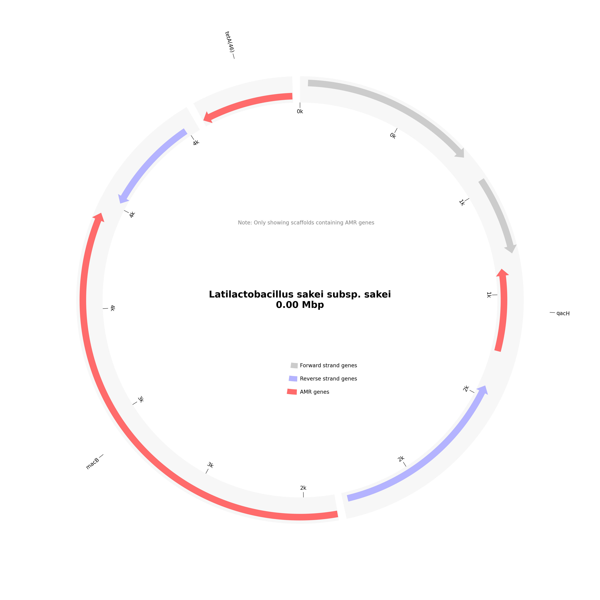

### macB
- **Mechanism**: antibiotic efflux
- **Drug Classes**: macrolide antibiotic
- **AMR Family**: ATP-binding cassette (ABC) antibiotic efflux pump
- **Locations**:
  - gnl|SPADES|LFDBGJIL_2471_1 : position 1-1698

### qacH
- **Mechanism**: antibiotic efflux
- **Drug Classes**: disinfecting agents and antiseptics
- **AMR Family**: small multidrug resistance (SMR) antibiotic efflux pump
- **Locations**:
  - gnl|SPADES|LFDBGJIL_2297_3 : position 1114-1434

### tetA(46)
- **Mechanism**: antibiotic efflux
- **Drug Classes**: tetracycline antibiotic
- **AMR Family**: ATP-binding cassette (ABC) antibiotic efflux pump
- **Locations**:
  - gnl|SPADES|LFDBGJIL_660498_1 : position 2-361

## Latilactobacillus sakei subsp. sakei 23K
**Strain Statistics:**
- Total genome length: 24.7 kbp
- Total scaffolds: 48
- Scaffolds with AMR genes: 7
- Total genes annotated: 44
- Total AMR genes: 9
- Unique AMR genes: 9
- Distinct AMR mechanisms: 4
- Distinct AMR families: 5
- Distinct drug classes: 19

**Circos Plot:**

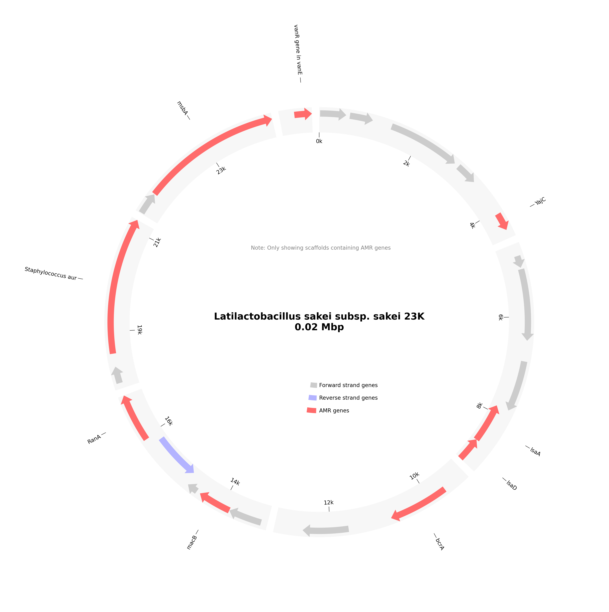

### RanA
- **Mechanism**: antibiotic efflux
- **Drug Classes**: aminoglycoside antibiotic
- **AMR Family**: ATP-binding cassette (ABC) antibiotic efflux pump
- **Locations**:
  - gnl|SPADES|LFDBGJIL_1045_5 : position 2958-3926

### Staphylococcus aureus rpoB mutants conferring resistance to rifampicin
- **Mechanism**: antibiotic target alteration; antibiotic target replacement
- **Drug Classes**: rifamycin antibiotic
- **AMR Family**: rifamycin-resistant beta-subunit of RNA polymerase (rpoB)
- **Locations**:
  - gnl|SPADES|LFDBGJIL_1272_2 : position 704-3418

### YajC
- **Mechanism**: antibiotic efflux
- **Drug Classes**: fluoroquinolone antibiotic; cephalosporin; glycylcycline; penam; tetracycline antibiotic; oxazolidinone antibiotic; glycopeptide antibiotic; rifamycin antibiotic; phenicol antibiotic; disinfecting agents and antiseptics
- **AMR Family**: resistance-nodulation-cell division (RND) antibiotic efflux pump
- **Locations**:
  - gnl|SPADES|LFDBGJIL_837_7 : position 4196-4552

### bcrA
- **Mechanism**: antibiotic efflux
- **Drug Classes**: peptide antibiotic
- **AMR Family**: ATP-binding cassette (ABC) antibiotic efflux pump
- **Locations**:
  - gnl|SPADES|LFDBGJIL_1008_2 : position 508-1707

### lsaA
- **Mechanism**: antibiotic target protection
- **Drug Classes**: lincosamide antibiotic; streptogramin antibiotic; streptogramin A antibiotic; streptogramin B antibiotic; pleuromutilin antibiotic
- **AMR Family**: lsa-type ABC-F protein
- **Locations**:
  - gnl|SPADES|LFDBGJIL_843_4 : position 3355-4185

### lsaD
- **Mechanism**: antibiotic target protection
- **Drug Classes**: lincosamide antibiotic; streptogramin antibiotic; streptogramin A antibiotic; pleuromutilin antibiotic
- **AMR Family**: lsa-type ABC-F protein
- **Locations**:
  - gnl|SPADES|LFDBGJIL_843_5 : position 4182-4700

### macB
- **Mechanism**: antibiotic efflux
- **Drug Classes**: macrolide antibiotic
- **AMR Family**: ATP-binding cassette (ABC) antibiotic efflux pump
- **Locations**:
  - gnl|SPADES|LFDBGJIL_1045_2 : position 794-1459

### msbA
- **Mechanism**: antibiotic efflux
- **Drug Classes**: nitroimidazole antibiotic
- **AMR Family**: ATP-binding cassette (ABC) antibiotic efflux pump
- **Locations**:
  - gnl|SPADES|LFDBGJIL_1363_2 : position 468-3254

### vanR gene in vanE cluster
- **Mechanism**: antibiotic target alteration
- **Drug Classes**: glycopeptide antibiotic
- **AMR Family**: glycopeptide resistance gene cluster; vanR
- **Locations**:
  - gnl|SPADES|LFDBGJIL_124826_2 : position 298-645

## Lelliottia amnigena
**Strain Statistics:**
- Total genome length: 1.7 kbp
- Total scaffolds: 7
- Scaffolds with AMR genes: 3
- Total genes annotated: 2
- Total AMR genes: 4
- Unique AMR genes: 3
- Distinct AMR mechanisms: 1
- Distinct AMR families: 3
- Distinct drug classes: 9

**Circos Plot:**

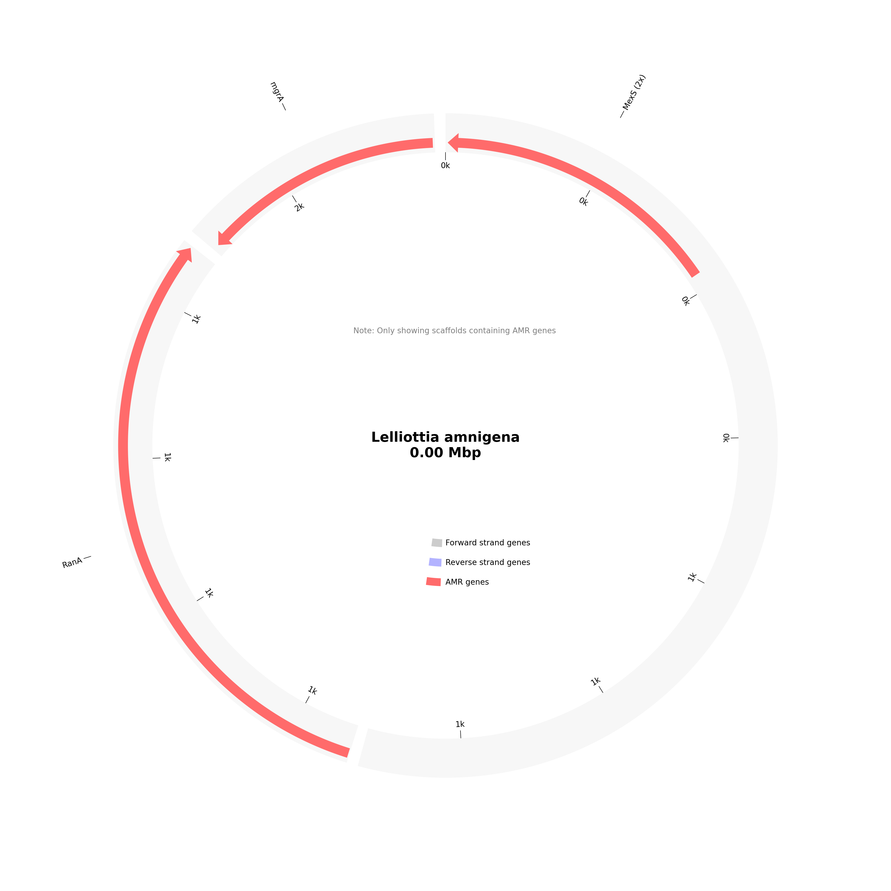

### MexS (found in 2 locations)
- **Mechanism**: antibiotic efflux
- **Drug Classes**: fluoroquinolone antibiotic; diaminopyrimidine antibiotic; phenicol antibiotic
- **AMR Family**: resistance-nodulation-cell division (RND) antibiotic efflux pump
- **Locations**:
  - gnl|SPADES|LFDBGJIL_25288_1 : position 2-274
  - gnl|SPADES|LFDBGJIL_25288_2 : position 262-960

### RanA
- **Mechanism**: antibiotic efflux
- **Drug Classes**: aminoglycoside antibiotic
- **AMR Family**: ATP-binding cassette (ABC) antibiotic efflux pump
- **Locations**:
  - gnl|SPADES|LFDBGJIL_224212_1 : position 1-543

### mgrA
- **Mechanism**: antibiotic efflux
- **Drug Classes**: fluoroquinolone antibiotic; cephalosporin; penam; tetracycline antibiotic; peptide antibiotic; disinfecting agents and antiseptics
- **AMR Family**: ATP-binding cassette (ABC) antibiotic efflux pump; major facilitator superfamily (MFS) antibiotic efflux pump
- **Locations**:
  - gnl|SPADES|LFDBGJIL_1652040_1 : position 6-233

## Lelliottia sp. JS-SCA-14
**Strain Statistics:**
- Total genome length: 0.8 kbp
- Total scaffolds: 6
- Scaffolds with AMR genes: 2
- Total genes annotated: 0
- Total AMR genes: 2
- Unique AMR genes: 2
- Distinct AMR mechanisms: 2
- Distinct AMR families: 2
- Distinct drug classes: 12

**Circos Plot:**

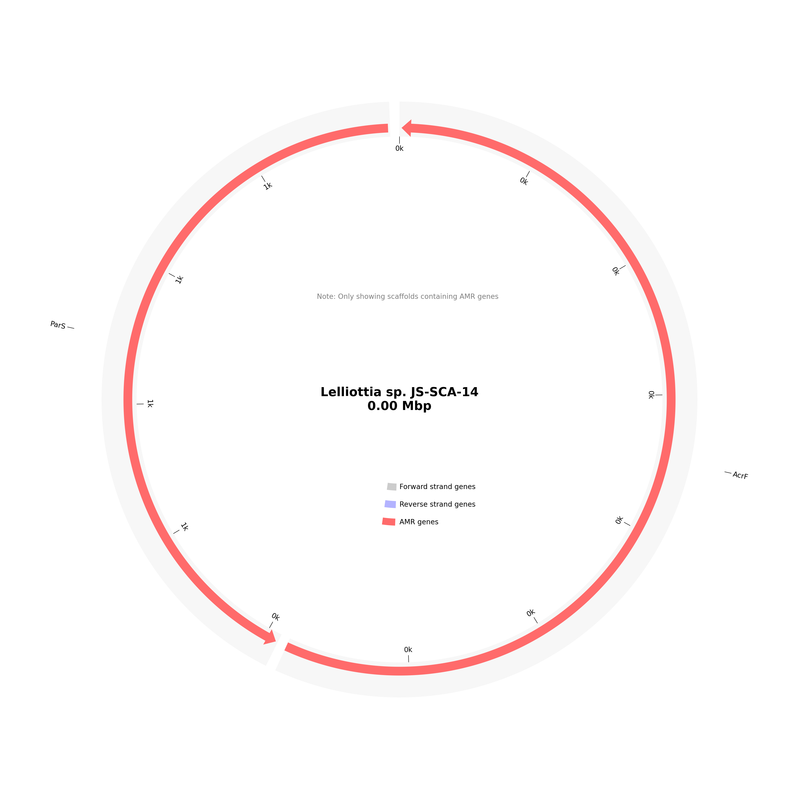

### AcrF
- **Mechanism**: antibiotic efflux
- **Drug Classes**: fluoroquinolone antibiotic; cephalosporin; cephamycin; penam
- **AMR Family**: resistance-nodulation-cell division (RND) antibiotic efflux pump
- **Locations**:
  - gnl|SPADES|LFDBGJIL_329493_1 : position 1-480

### ParS
- **Mechanism**: antibiotic efflux; reduced permeability to antibiotic
- **Drug Classes**: macrolide antibiotic; fluoroquinolone antibiotic; monobactam; aminoglycoside antibiotic; carbapenem; cephalosporin; cephamycin; penam; tetracycline antibiotic; phenicol antibiotic; penem; disinfecting agents and antiseptics
- **AMR Family**: resistance-nodulation-cell division (RND) antibiotic efflux pump; Outer Membrane Porin (Opr)
- **Locations**:
  - gnl|SPADES|LFDBGJIL_693032_1 : position 1-354

## Serratia fonticola
**Strain Statistics:**
- Total genome length: 2.9 kbp
- Total scaffolds: 253
- Scaffolds with AMR genes: 9
- Total genes annotated: 4
- Total AMR genes: 9
- Unique AMR genes: 8
- Distinct AMR mechanisms: 2
- Distinct AMR families: 4
- Distinct drug classes: 12

**Circos Plot:**

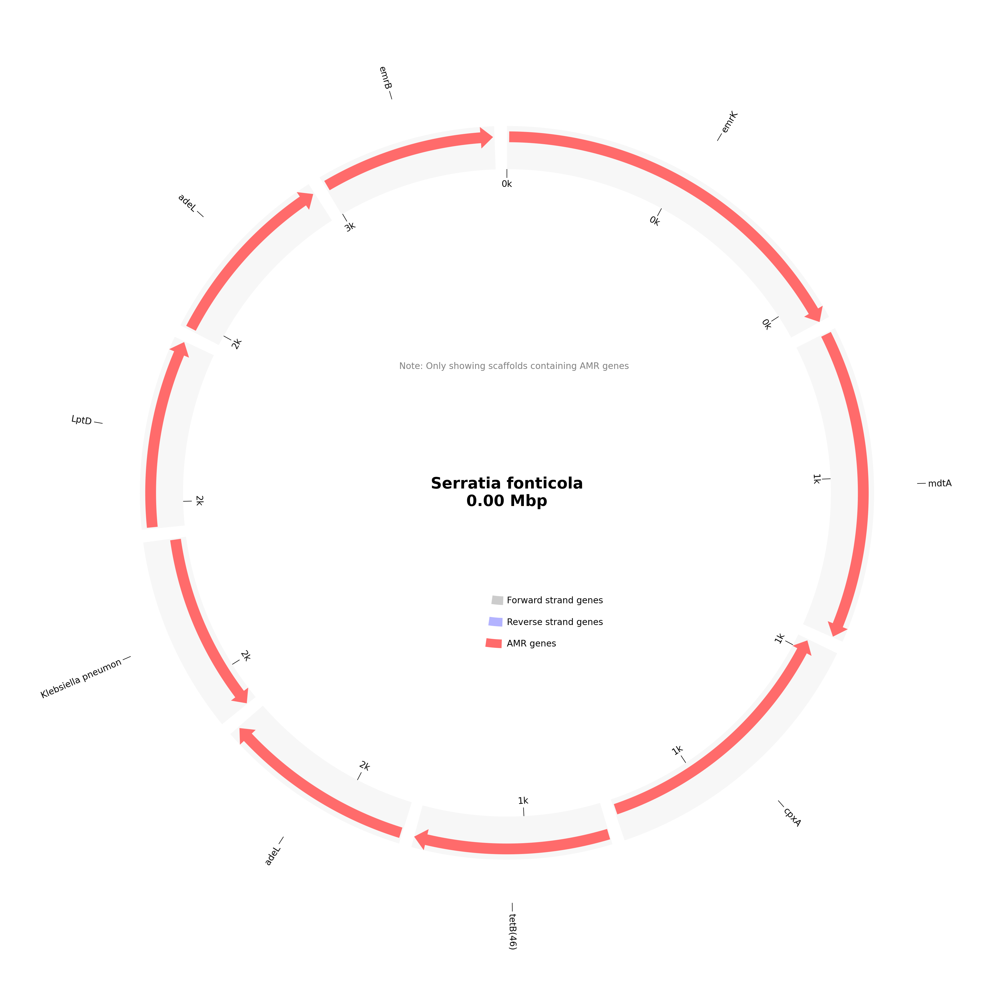

### Klebsiella pneumoniae OmpK37
- **Mechanism**: reduced permeability to antibiotic
- **Drug Classes**: monobactam; carbapenem; cephalosporin; cephamycin; penam; penem
- **AMR Family**: General Bacterial Porin with reduced permeability to beta-lactams
- **Locations**:
  - gnl|SPADES|LFDBGJIL_1302522_1 : position 1-261

### LptD
- **Mechanism**: antibiotic efflux
- **Drug Classes**: carbapenem; peptide antibiotic; aminocoumarin antibiotic; rifamycin antibiotic
- **AMR Family**: ATP-binding cassette (ABC) antibiotic efflux pump
- **Locations**:
  - gnl|SPADES|LFDBGJIL_1335915_1 : position 2-259

### adeL (found in 2 locations)
- **Mechanism**: antibiotic efflux
- **Drug Classes**: fluoroquinolone antibiotic; tetracycline antibiotic
- **AMR Family**: resistance-nodulation-cell division (RND) antibiotic efflux pump
- **Locations**:
  - gnl|SPADES|LFDBGJIL_1258118_1 : position 2-265
  - gnl|SPADES|LFDBGJIL_1421513_1 : position 3-251

### cpxA
- **Mechanism**: antibiotic efflux
- **Drug Classes**: aminoglycoside antibiotic; aminocoumarin antibiotic
- **AMR Family**: resistance-nodulation-cell division (RND) antibiotic efflux pump
- **Locations**:
  - gnl|SPADES|LFDBGJIL_590825_1 : position 2-379

### emrB
- **Mechanism**: antibiotic efflux
- **Drug Classes**: fluoroquinolone antibiotic
- **AMR Family**: major facilitator superfamily (MFS) antibiotic efflux pump
- **Locations**:
  - gnl|SPADES|LFDBGJIL_1577677_1 : position 3-239

### emrK
- **Mechanism**: antibiotic efflux
- **Drug Classes**: tetracycline antibiotic
- **AMR Family**: major facilitator superfamily (MFS) antibiotic efflux pump
- **Locations**:
  - gnl|SPADES|LFDBGJIL_268156_1 : position 3-515

### mdtA
- **Mechanism**: antibiotic efflux
- **Drug Classes**: aminocoumarin antibiotic
- **AMR Family**: resistance-nodulation-cell division (RND) antibiotic efflux pump
- **Locations**:
  - gnl|SPADES|LFDBGJIL_454287_1 : position 2-424

### tetB(46)
- **Mechanism**: antibiotic efflux
- **Drug Classes**: tetracycline antibiotic
- **AMR Family**: ATP-binding cassette (ABC) antibiotic efflux pump
- **Locations**:
  - gnl|SPADES|LFDBGJIL_1258587_1 : position 1-267

## Serratia liquefaciens
**Strain Statistics:**
- Total genome length: 557.4 kbp
- Total scaffolds: 3863
- Scaffolds with AMR genes: 502
- Total genes annotated: 1119
- Total AMR genes: 542
- Unique AMR genes: 213
- Distinct AMR mechanisms: 10
- Distinct AMR families: 72
- Distinct drug classes: 36

**Circos Plot:**

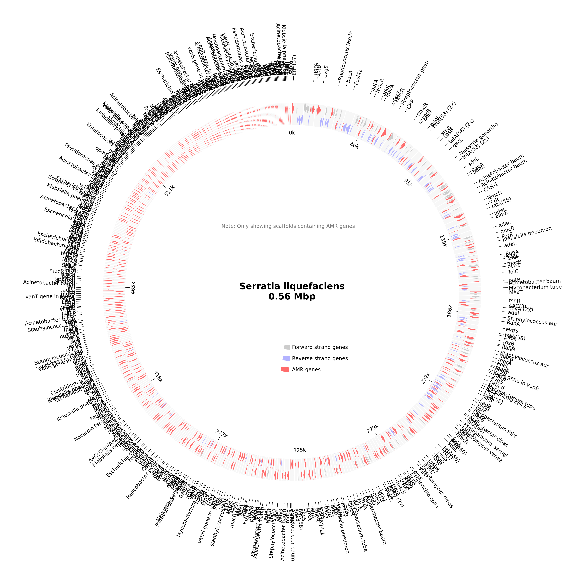

### AAC(3)-Ia
- **Mechanism**: antibiotic inactivation
- **Drug Classes**: aminoglycoside antibiotic
- **AMR Family**: AAC(3)
- **Locations**:
  - gnl|SPADES|LFDBGJIL_2172_4 : position 1923-2387

### AAC(3)-Ib/AAC(6')-Ib3 bifunctional protein
- **Mechanism**: antibiotic inactivation
- **Drug Classes**: aminoglycoside antibiotic
- **AMR Family**: aminoglycoside bifunctional resistance protein
- **Locations**:
  - gnl|SPADES|LFDBGJIL_30431_1 : position 23-475

### AAC(6')-Iak
- **Mechanism**: antibiotic inactivation
- **Drug Classes**: aminoglycoside antibiotic
- **AMR Family**: AAC(6')
- **Locations**:
  - gnl|SPADES|LFDBGJIL_6030_2 : position 316-762

### AIM-1
- **Mechanism**: antibiotic inactivation
- **Drug Classes**: cephalosporin; cephamycin; penam
- **AMR Family**: AIM beta-lactamase
- **Locations**:
  - gnl|SPADES|LFDBGJIL_152323_1 : position 1-609

### AQU-1
- **Mechanism**: antibiotic inactivation
- **Drug Classes**: cephalosporin
- **AMR Family**: AQU beta-lactamase
- **Locations**:
  - gnl|SPADES|LFDBGJIL_64810_1 : position 2-763

### Acinetobacter baumannii AbaF (found in 3 locations)
- **Mechanism**: antibiotic efflux
- **Drug Classes**: phosphonic acid antibiotic
- **AMR Family**: major facilitator superfamily (MFS) antibiotic efflux pump
- **Locations**:
  - gnl|SPADES|LFDBGJIL_1315416_1 : position 3-260
  - gnl|SPADES|LFDBGJIL_1994_2 : position 146-1471
  - gnl|SPADES|LFDBGJIL_7161_2 : position 453-1337

### Acinetobacter baumannii AbaQ (found in 13 locations)
- **Mechanism**: antibiotic efflux
- **Drug Classes**: fluoroquinolone antibiotic
- **AMR Family**: major facilitator superfamily (MFS) antibiotic efflux pump
- **Locations**:
  - gnl|SPADES|LFDBGJIL_1009392_1 : position 2-295
  - gnl|SPADES|LFDBGJIL_117903_2 : position 239-646
  - gnl|SPADES|LFDBGJIL_1426_4 : position 1956-3155
  - gnl|SPADES|LFDBGJIL_1433_3 : position 1115-2410
  - gnl|SPADES|LFDBGJIL_1859461_1 : position 3-221
  - gnl|SPADES|LFDBGJIL_194172_1 : position 1-432
  - gnl|SPADES|LFDBGJIL_461528_1 : position 1-420
  - gnl|SPADES|LFDBGJIL_4746_2 : position 672-1550
  - gnl|SPADES|LFDBGJIL_7618_2 : position 161-1315
  - gnl|SPADES|LFDBGJIL_792844_1 : position 3-332
  - gnl|SPADES|LFDBGJIL_8712_2 : position 884-1261
  - gnl|SPADES|LFDBGJIL_88050_1 : position 2-505
  - gnl|SPADES|LFDBGJIL_917475_1 : position 3-311

### Acinetobacter baumannii AmvA
- **Mechanism**: antibiotic efflux
- **Drug Classes**: macrolide antibiotic; disinfecting agents and antiseptics
- **AMR Family**: major facilitator superfamily (MFS) antibiotic efflux pump
- **Locations**:
  - gnl|SPADES|LFDBGJIL_250395_1 : position 2-526

### AcrE
- **Mechanism**: antibiotic efflux
- **Drug Classes**: fluoroquinolone antibiotic; cephalosporin; cephamycin; penam
- **AMR Family**: resistance-nodulation-cell division (RND) antibiotic efflux pump
- **Locations**:
  - gnl|SPADES|LFDBGJIL_821207_1 : position 1-327

### AcrF (found in 2 locations)
- **Mechanism**: antibiotic efflux
- **Drug Classes**: fluoroquinolone antibiotic; cephalosporin; cephamycin; penam
- **AMR Family**: resistance-nodulation-cell division (RND) antibiotic efflux pump
- **Locations**:
  - gnl|SPADES|LFDBGJIL_1129658_1 : position 1-279
  - gnl|SPADES|LFDBGJIL_3002_1 : position 2-421

### Agrobacterium fabrum chloramphenicol acetyltransferase
- **Mechanism**: antibiotic inactivation
- **Drug Classes**: phenicol antibiotic
- **AMR Family**: chloramphenicol acetyltransferase (CAT)
- **Locations**:
  - gnl|SPADES|LFDBGJIL_2978_1 : position 3-245

### ArnT (found in 2 locations)
- **Mechanism**: antibiotic target alteration
- **Drug Classes**: peptide antibiotic
- **AMR Family**: pmr phosphoethanolamine transferase
- **Locations**:
  - gnl|SPADES|LFDBGJIL_1798188_1 : position 3-224
  - gnl|SPADES|LFDBGJIL_232055_1 : position 54-380

### Bifidobacterium bifidum ileS conferring resistance to mupirocin
- **Mechanism**: antibiotic target alteration
- **Drug Classes**: mupirocin-like antibiotic
- **AMR Family**: antibiotic-resistant isoleucyl-tRNA synthetase (ileS)
- **Locations**:
  - gnl|SPADES|LFDBGJIL_154057_1 : position 236-607

### CAR-1
- **Mechanism**: antibiotic inactivation
- **Drug Classes**: carbapenem
- **AMR Family**: CAR beta-lactamase
- **Locations**:
  - gnl|SPADES|LFDBGJIL_1443_2 : position 917-1723

### CRP
- **Mechanism**: antibiotic efflux
- **Drug Classes**: macrolide antibiotic; fluoroquinolone antibiotic; penam
- **AMR Family**: resistance-nodulation-cell division (RND) antibiotic efflux pump
- **Locations**:
  - gnl|SPADES|LFDBGJIL_938_1: position 274-906

### Clostridium perfringes cplR
- **Mechanism**: antibiotic target protection
- **Drug Classes**: lincosamide antibiotic; streptogramin antibiotic; streptogramin A antibiotic; pleuromutilin antibiotic
- **AMR Family**: Miscellaneous ABC-F subfamily ATP-binding cassette ribosomal protection proteins
- **Locations**:
  - gnl|SPADES|LFDBGJIL_51222_1 : position 1-810

### DHA-6
- **Mechanism**: antibiotic inactivation
- **Drug Classes**: cephalosporin; cephamycin
- **AMR Family**: DHA beta-lactamase
- **Locations**:
  - gnl|SPADES|LFDBGJIL_2741_3 : position 1163-2050

### EVM-1
- **Mechanism**: antibiotic inactivation
- **Drug Classes**: carbapenem
- **AMR Family**: EVM beta-lactamase
- **Locations**:
  - gnl|SPADES|LFDBGJIL_276736_1 : position 1-507

### Enterobacter cloacae acrA
- **Mechanism**: antibiotic efflux
- **Drug Classes**: fluoroquinolone antibiotic; cephalosporin; glycylcycline; penam; tetracycline antibiotic; rifamycin antibiotic; phenicol antibiotic; disinfecting agents and antiseptics
- **AMR Family**: resistance-nodulation-cell division (RND) antibiotic efflux pump
- **Locations**:
  - gnl|SPADES|LFDBGJIL_3002_2 : position 439-1626

### Enterococcus faecium cls conferring resistance to daptomycin
- **Mechanism**: antibiotic target alteration
- **Drug Classes**: peptide antibiotic
- **AMR Family**: daptomycin resistant cls
- **Locations**:
  - gnl|SPADES|LFDBGJIL_362673_1 : position 2-463

### Erm(37)
- **Mechanism**: antibiotic target alteration
- **Drug Classes**: macrolide antibiotic; lincosamide antibiotic; streptogramin antibiotic; streptogramin A antibiotic; streptogramin B antibiotic
- **AMR Family**: Erm 23S ribosomal RNA methyltransferase
- **Locations**:
  - gnl|SPADES|LFDBGJIL_471_2 : position 232-1548

### ErmC
- **Mechanism**: antibiotic target alteration
- **Drug Classes**: macrolide antibiotic; lincosamide antibiotic; streptogramin antibiotic; streptogramin A antibiotic; streptogramin B antibiotic
- **AMR Family**: Erm 23S ribosomal RNA methyltransferase
- **Locations**:
  - gnl|SPADES|LFDBGJIL_13002_3 : position 513-1127

### ErmX
- **Mechanism**: antibiotic target alteration
- **Drug Classes**: macrolide antibiotic; lincosamide antibiotic; streptogramin antibiotic; streptogramin A antibiotic; streptogramin B antibiotic
- **AMR Family**: Erm 23S ribosomal RNA methyltransferase
- **Locations**:
  - gnl|SPADES|LFDBGJIL_23970_2 : position 793-972

### Escherichia coli AcrAB-TolC with AcrR mutation conferring resistance to ciprofloxacin, tetracycline, and ceftazidime (found in 2 locations)
- **Mechanism**: antibiotic target alteration; antibiotic efflux
- **Drug Classes**: fluoroquinolone antibiotic; cephalosporin; glycylcycline; penam; tetracycline antibiotic; rifamycin antibiotic; phenicol antibiotic; disinfecting agents and antiseptics
- **AMR Family**: resistance-nodulation-cell division (RND) antibiotic efflux pump
- **Locations**:
  - gnl|SPADES|LFDBGJIL_1390294_1 : position 2-253
  - gnl|SPADES|LFDBGJIL_223266_1 : position 1-267

### Escherichia coli fabI mutations conferring resistance to isoniazid and triclosan
- **Mechanism**: antibiotic target alteration
- **Drug Classes**: disinfecting agents and antiseptics; isoniazid-like antibiotic
- **AMR Family**: antibiotic resistant fabI
- **Locations**:
  - gnl|SPADES|LFDBGJIL_4125_1 : position 16-771

### Escherichia coli soxS with mutation conferring antibiotic resistance (found in 6 locations)
- **Mechanism**: antibiotic target alteration; antibiotic efflux; reduced permeability to antibiotic
- **Drug Classes**: fluoroquinolone antibiotic; monobactam; carbapenem; cephalosporin; glycylcycline; cephamycin; penam; tetracycline antibiotic; rifamycin antibiotic; phenicol antibiotic; penem; disinfecting agents and antiseptics
- **AMR Family**: ATP-binding cassette (ABC) antibiotic efflux pump; major facilitator superfamily (MFS) antibiotic efflux pump; resistance-nodulation-cell division (RND) antibiotic efflux pump; General Bacterial Porin with reduced permeability to beta-lactams
- **Locations**:
  - gnl|SPADES|LFDBGJIL_157419_1 : position 333-605
  - gnl|SPADES|LFDBGJIL_183143_1 : position 1-126
  - gnl|SPADES|LFDBGJIL_26266_1 : position 25-447
  - gnl|SPADES|LFDBGJIL_2822_1 : position 2-739
  - gnl|SPADES|LFDBGJIL_47270_1 : position 2-382
  - gnl|SPADES|LFDBGJIL_666877_1 : position 2-358

### EstT (found in 2 locations)
- **Mechanism**: antibiotic inactivation
- **Drug Classes**: macrolide antibiotic
- **AMR Family**: macrolide esterase
- **Locations**:
  - gnl|SPADES|LFDBGJIL_147377_1 : position 3-419
  - gnl|SPADES|LFDBGJIL_834_3 : position 1389-2231

### FosM1
- **Mechanism**: antibiotic inactivation
- **Drug Classes**: phosphonic acid antibiotic
- **AMR Family**: fosfomycin thiol transferase
- **Locations**:
  - gnl|SPADES|LFDBGJIL_9419_2 : position 128-637

### FosM2
- **Mechanism**: antibiotic inactivation
- **Drug Classes**: phosphonic acid antibiotic
- **AMR Family**: fosfomycin thiol transferase
- **Locations**:
  - gnl|SPADES|LFDBGJIL_643_1 : position 143-553

### GMB-1
- **Mechanism**: antibiotic inactivation
- **Drug Classes**: carbapenem
- **AMR Family**: GMB beta-lactamase
- **Locations**:
  - gnl|SPADES|LFDBGJIL_14921_2 : position 497-1090

### H-NS
- **Mechanism**: antibiotic efflux
- **Drug Classes**: macrolide antibiotic; fluoroquinolone antibiotic; cephalosporin; cephamycin; penam; tetracycline antibiotic
- **AMR Family**: major facilitator superfamily (MFS) antibiotic efflux pump; resistance-nodulation-cell division (RND) antibiotic efflux pump
- **Locations**:
  - gnl|SPADES|LFDBGJIL_800077_1 : position 155-331

### Helicobacter pylori pbp1 mutants conferring resistance to amoxicillin
- **Mechanism**: antibiotic target alteration
- **Drug Classes**: cephalosporin; cephamycin; penam
- **AMR Family**: Penicillin-binding protein mutations conferring resistance to beta-lactam antibiotics
- **Locations**:
  - gnl|SPADES|LFDBGJIL_22778_1 : position 2-922

### Klebsiella aerogenes Omp36
- **Mechanism**: reduced permeability to antibiotic
- **Drug Classes**: monobactam; carbapenem; cephalosporin; cephamycin; penam; penem
- **AMR Family**: General Bacterial Porin with reduced permeability to beta-lactams
- **Locations**:
  - gnl|SPADES|LFDBGJIL_28253_1 : position 2-505

### Klebsiella pneumoniae KpnE
- **Mechanism**: antibiotic efflux
- **Drug Classes**: macrolide antibiotic; aminoglycoside antibiotic; cephalosporin; tetracycline antibiotic; peptide antibiotic; rifamycin antibiotic; disinfecting agents and antiseptics
- **AMR Family**: small multidrug resistance (SMR) antibiotic efflux pump
- **Locations**:
  - gnl|SPADES|LFDBGJIL_49096_1 : position 2-229

### Klebsiella pneumoniae KpnF
- **Mechanism**: antibiotic efflux
- **Drug Classes**: macrolide antibiotic; aminoglycoside antibiotic; cephalosporin; tetracycline antibiotic; peptide antibiotic; rifamycin antibiotic; disinfecting agents and antiseptics
- **AMR Family**: small multidrug resistance (SMR) antibiotic efflux pump
- **Locations**:
  - gnl|SPADES|LFDBGJIL_49096_2: position 216-545

### Klebsiella pneumoniae KpnG
- **Mechanism**: antibiotic efflux
- **Drug Classes**: macrolide antibiotic; fluoroquinolone antibiotic; aminoglycoside antibiotic; carbapenem; cephalosporin; penam; peptide antibiotic; penem
- **AMR Family**: major facilitator superfamily (MFS) antibiotic efflux pump
- **Locations**:
  - gnl|SPADES|LFDBGJIL_5271_2 : position 1053-1484

### Klebsiella pneumoniae KpnH
- **Mechanism**: antibiotic efflux
- **Drug Classes**: macrolide antibiotic; fluoroquinolone antibiotic; aminoglycoside antibiotic; carbapenem; cephalosporin; penam; peptide antibiotic; penem
- **AMR Family**: major facilitator superfamily (MFS) antibiotic efflux pump
- **Locations**:
  - gnl|SPADES|LFDBGJIL_210274_1 : position 3-554

### Klebsiella pneumoniae OmpK37 (found in 5 locations)
- **Mechanism**: reduced permeability to antibiotic
- **Drug Classes**: monobactam; carbapenem; cephalosporin; cephamycin; penam; penem
- **AMR Family**: General Bacterial Porin with reduced permeability to beta-lactams
- **Locations**:
  - gnl|SPADES|LFDBGJIL_1102458_1 : position 1-282
  - gnl|SPADES|LFDBGJIL_1696_1 : position 397-1494
  - gnl|SPADES|LFDBGJIL_1951149_1 : position 2-214
  - gnl|SPADES|LFDBGJIL_412191_1 : position 1-201
  - gnl|SPADES|LFDBGJIL_41912_2 : position 608-850

### Klebsiella pneumoniae acrR with mutation conferring multidrug antibiotic resistance
- **Mechanism**: antibiotic target alteration; antibiotic efflux
- **Drug Classes**: fluoroquinolone antibiotic; cephalosporin; glycylcycline; penam; tetracycline antibiotic; rifamycin antibiotic; phenicol antibiotic; disinfecting agents and antiseptics
- **AMR Family**: resistance-nodulation-cell division (RND) antibiotic efflux pump
- **Locations**:
  - gnl|SPADES|LFDBGJIL_396947_1 : position 1-222

### LRA-8
- **Mechanism**: antibiotic inactivation
- **Drug Classes**: cephalosporin; penam
- **AMR Family**: subclass B3 LRA beta-lactamase
- **Locations**:
  - gnl|SPADES|LFDBGJIL_27303_2 : position 528-941

### LpsB
- **Mechanism**: reduced permeability to antibiotic
- **Drug Classes**: peptide antibiotic
- **AMR Family**: Intrinsic peptide antibiotic resistant Lps
- **Locations**:
  - gnl|SPADES|LFDBGJIL_1220_2 : position 558-1655

### LptD (found in 3 locations)
- **Mechanism**: antibiotic efflux
- **Drug Classes**: carbapenem; peptide antibiotic; aminocoumarin antibiotic; rifamycin antibiotic
- **AMR Family**: ATP-binding cassette (ABC) antibiotic efflux pump
- **Locations**:
  - gnl|SPADES|LFDBGJIL_12531_1 : position 2-1138
  - gnl|SPADES|LFDBGJIL_289900_2 : position 362-499
  - gnl|SPADES|LFDBGJIL_97122_1 : position 1-687

### MCR-8.1
- **Mechanism**: antibiotic target alteration
- **Drug Classes**: peptide antibiotic
- **AMR Family**: MCR phosphoethanolamine transferase
- **Locations**:
  - gnl|SPADES|LFDBGJIL_1327303_1 : position 2-259

### MdtK
- **Mechanism**: antibiotic efflux
- **Drug Classes**: fluoroquinolone antibiotic
- **AMR Family**: multidrug and toxic compound extrusion (MATE) transporter
- **Locations**:
  - gnl|SPADES|LFDBGJIL_158859_2 : position 286-603

### MexA
- **Mechanism**: antibiotic efflux
- **Drug Classes**: macrolide antibiotic; fluoroquinolone antibiotic; monobactam; carbapenem; cephalosporin; cephamycin; penam; tetracycline antibiotic; peptide antibiotic; aminocoumarin antibiotic; diaminopyrimidine antibiotic; sulfonamide antibiotic; phenicol antibiotic; penem
- **AMR Family**: resistance-nodulation-cell division (RND) antibiotic efflux pump
- **Locations**:
  - gnl|SPADES|LFDBGJIL_9302_1 : position 2-754

### MexB (found in 4 locations)
- **Mechanism**: antibiotic efflux
- **Drug Classes**: macrolide antibiotic; fluoroquinolone antibiotic; monobactam; carbapenem; cephalosporin; cephamycin; penam; tetracycline antibiotic; peptide antibiotic; aminocoumarin antibiotic; diaminopyrimidine antibiotic; sulfonamide antibiotic; phenicol antibiotic; penem
- **AMR Family**: resistance-nodulation-cell division (RND) antibiotic efflux pump
- **Locations**:
  - gnl|SPADES|LFDBGJIL_122698_1 : position 3-647
  - gnl|SPADES|LFDBGJIL_22124_1 : position 3-989
  - gnl|SPADES|LFDBGJIL_644248_1 : position 1-366
  - gnl|SPADES|LFDBGJIL_9302_2 : position 747-1238

### MexH
- **Mechanism**: antibiotic efflux
- **Drug Classes**: fluoroquinolone antibiotic; tetracycline antibiotic; disinfecting agents and antiseptics
- **AMR Family**: resistance-nodulation-cell division (RND) antibiotic efflux pump
- **Locations**:
  - gnl|SPADES|LFDBGJIL_41773_1 : position 1-672

### MexL (found in 2 locations)
- **Mechanism**: antibiotic efflux
- **Drug Classes**: macrolide antibiotic; tetracycline antibiotic; disinfecting agents and antiseptics
- **AMR Family**: resistance-nodulation-cell division (RND) antibiotic efflux pump
- **Locations**:
  - gnl|SPADES|LFDBGJIL_10099_1 : position 102-740
  - gnl|SPADES|LFDBGJIL_632885_1 : position 1-369

### MexS (found in 6 locations)
- **Mechanism**: antibiotic efflux
- **Drug Classes**: fluoroquinolone antibiotic; diaminopyrimidine antibiotic; phenicol antibiotic
- **AMR Family**: resistance-nodulation-cell division (RND) antibiotic efflux pump
- **Locations**:
  - gnl|SPADES|LFDBGJIL_11589_2 : position 220-1164
  - gnl|SPADES|LFDBGJIL_186861_2 : position 248-574
  - gnl|SPADES|LFDBGJIL_382638_1 : position 3-425
  - gnl|SPADES|LFDBGJIL_38476_2 : position 586-867
  - gnl|SPADES|LFDBGJIL_45198_1 : position 3-836
  - gnl|SPADES|LFDBGJIL_567756_1 : position 2-385

### MexT (found in 2 locations)
- **Mechanism**: antibiotic efflux
- **Drug Classes**: fluoroquinolone antibiotic; diaminopyrimidine antibiotic; phenicol antibiotic
- **AMR Family**: resistance-nodulation-cell division (RND) antibiotic efflux pump
- **Locations**:
  - gnl|SPADES|LFDBGJIL_2116_1 : position 2-808
  - gnl|SPADES|LFDBGJIL_526975_1 : position 80-400

### Mycobacterium tuberculosis inhA mutations conferring resistance to isoniazid
- **Mechanism**: antibiotic target alteration
- **Drug Classes**: isoniazid-like antibiotic
- **AMR Family**: isoniazid resistant inhA
- **Locations**:
  - gnl|SPADES|LFDBGJIL_4930_1 : position 346-1104

### Mycobacterium tuberculosis kasA mutant conferring resistance to isoniazid
- **Mechanism**: antibiotic target alteration
- **Drug Classes**: isoniazid-like antibiotic
- **AMR Family**: antibiotic resistant kasA
- **Locations**:
  - gnl|SPADES|LFDBGJIL_13630_2 : position 575-1114

### Mycobacterium tuberculosis katG mutations conferring resistance to isoniazid (found in 2 locations)
- **Mechanism**: antibiotic target alteration
- **Drug Classes**: isoniazid-like antibiotic
- **AMR Family**: isoniazid resistant katG
- **Locations**:
  - gnl|SPADES|LFDBGJIL_1059986_1 : position 3-287
  - gnl|SPADES|LFDBGJIL_2784_2 : position 874-2031

### Mycobacterium tuberculosis thyA with mutation conferring resistance to para-aminosalicylic acid
- **Mechanism**: antibiotic target alteration
- **Drug Classes**: salicylic acid antibiotic
- **AMR Family**: aminosalicylate resistant thymidylate synthase
- **Locations**:
  - gnl|SPADES|LFDBGJIL_2081_2 : position 270-1064

### Neisseria gonorrhoeae PBP2 conferring resistance to beta-lactam antibiotics
- **Mechanism**: antibiotic target alteration
- **Drug Classes**: cephalosporin; cephamycin; penam
- **AMR Family**: Penicillin-binding protein mutations conferring resistance to beta-lactam antibiotics
- **Locations**:
  - gnl|SPADES|LFDBGJIL_16026_1 : position 3-518

### Neisseria gonorrhoeae pilQ gene conferring resistance to beta-lactam
- **Mechanism**: antibiotic target alteration
- **Drug Classes**: cephalosporin; cephamycin; penam
- **AMR Family**: Penicillin-binding protein mutations conferring resistance to beta-lactam antibiotics
- **Locations**:
  - gnl|SPADES|LFDBGJIL_1292_5 : position 1980-3221

### NmcR (found in 19 locations)
- **Mechanism**: antibiotic inactivation
- **Drug Classes**: carbapenem; cephalosporin; cephamycin; penam
- **AMR Family**: NmcA beta-lactamase
- **Locations**:
  - gnl|SPADES|LFDBGJIL_1010_3 : position 2249-3145
  - gnl|SPADES|LFDBGJIL_125179_1 : position 2-241
  - gnl|SPADES|LFDBGJIL_13625_2 : position 840-1115
  - gnl|SPADES|LFDBGJIL_145754_2 : position 445-618
  - gnl|SPADES|LFDBGJIL_1487_5 : position 2288-3085
  - gnl|SPADES|LFDBGJIL_314940_1 : position 2-451
  - gnl|SPADES|LFDBGJIL_3154_2 : position 290-1162
  - gnl|SPADES|LFDBGJIL_32446_1 : position 1-450
  - gnl|SPADES|LFDBGJIL_34576_1 : position 1-336
  - gnl|SPADES|LFDBGJIL_387664_1 : position 2-451
  - gnl|SPADES|LFDBGJIL_4445_1 : position 3-563
  - gnl|SPADES|LFDBGJIL_5014_1 : position 2-838
  - gnl|SPADES|LFDBGJIL_509738_1 : position 3-119
  - gnl|SPADES|LFDBGJIL_690243_1 : position 2-241
  - gnl|SPADES|LFDBGJIL_794_3 : position 935-1864
  - gnl|SPADES|LFDBGJIL_8335_1 : position 246-1139
  - gnl|SPADES|LFDBGJIL_834_4 : position 2340-3212
  - gnl|SPADES|LFDBGJIL_95194_2 : position 499-693
  - gnl|SPADES|LFDBGJIL_99325_2 : position 554-685

### Nocardia farcinica rox
- **Mechanism**: antibiotic inactivation
- **Drug Classes**: rifamycin antibiotic
- **AMR Family**: rifampin monooxygenase
- **Locations**:
  - gnl|SPADES|LFDBGJIL_33808_1 : position 3-371

### OmpA
- **Mechanism**: reduced permeability to antibiotic
- **Drug Classes**: peptide antibiotic
- **AMR Family**: General Bacterial Porin with reduced permeability to peptide antibiotics
- **Locations**:
  - gnl|SPADES|LFDBGJIL_650830_1 : position 3-182

### OpmH
- **Mechanism**: antibiotic efflux
- **Drug Classes**: disinfecting agents and antiseptics
- **AMR Family**: resistance-nodulation-cell division (RND) antibiotic efflux pump
- **Locations**:
  - gnl|SPADES|LFDBGJIL_22861_1 : position 2-874

### OprM (found in 2 locations)
- **Mechanism**: antibiotic efflux
- **Drug Classes**: macrolide antibiotic; fluoroquinolone antibiotic; monobactam; aminoglycoside antibiotic; carbapenem; cephalosporin; cephamycin; penam; tetracycline antibiotic; peptide antibiotic; aminocoumarin antibiotic; diaminopyrimidine antibiotic; sulfonamide antibiotic; phenicol antibiotic; penem; disinfecting agents and antiseptics
- **AMR Family**: resistance-nodulation-cell division (RND) antibiotic efflux pump
- **Locations**:
  - gnl|SPADES|LFDBGJIL_215108_1 : position 2-553
  - gnl|SPADES|LFDBGJIL_298952_1 : position 2-214

### ParR (found in 4 locations)
- **Mechanism**: antibiotic efflux; reduced permeability to antibiotic
- **Drug Classes**: macrolide antibiotic; fluoroquinolone antibiotic; monobactam; aminoglycoside antibiotic; carbapenem; cephalosporin; cephamycin; penam; tetracycline antibiotic; phenicol antibiotic; penem; disinfecting agents and antiseptics
- **AMR Family**: resistance-nodulation-cell division (RND) antibiotic efflux pump; Outer Membrane Porin (Opr)
- **Locations**:
  - gnl|SPADES|LFDBGJIL_1240070_1 : position 2-268
  - gnl|SPADES|LFDBGJIL_1676_3 : position 1938-2657
  - gnl|SPADES|LFDBGJIL_2822_3 : position 1606-1818
  - gnl|SPADES|LFDBGJIL_716930_1 : position 1-348

### ParS (found in 2 locations)
- **Mechanism**: antibiotic efflux; reduced permeability to antibiotic
- **Drug Classes**: macrolide antibiotic; fluoroquinolone antibiotic; monobactam; aminoglycoside antibiotic; carbapenem; cephalosporin; cephamycin; penam; tetracycline antibiotic; phenicol antibiotic; penem; disinfecting agents and antiseptics
- **AMR Family**: resistance-nodulation-cell division (RND) antibiotic efflux pump; Outer Membrane Porin (Opr)
- **Locations**:
  - gnl|SPADES|LFDBGJIL_15619_2 : position 395-787
  - gnl|SPADES|LFDBGJIL_4135_1 : position 1-1257

### Pseudomonas aeruginosa CpxR (found in 2 locations)
- **Mechanism**: antibiotic efflux
- **Drug Classes**: macrolide antibiotic; fluoroquinolone antibiotic; monobactam; aminoglycoside antibiotic; carbapenem; cephalosporin; cephamycin; penam; tetracycline antibiotic; peptide antibiotic; aminocoumarin antibiotic; diaminopyrimidine antibiotic; sulfonamide antibiotic; phenicol antibiotic; penem
- **AMR Family**: resistance-nodulation-cell division (RND) antibiotic efflux pump
- **Locations**:
  - gnl|SPADES|LFDBGJIL_15619_3 : position 796-1077
  - gnl|SPADES|LFDBGJIL_3057_1 : position 83-823

### Pseudomonas aeruginosa ampR with mutation conferring resistance to aztreonam (found in 2 locations)
- **Mechanism**: antibiotic target alteration; antibiotic inactivation
- **Drug Classes**: monobactam; carbapenem; cephalosporin
- **AMR Family**: PDC beta-lactamase; ampR transcriptional regulator with mutation conferring resistance to monobactam antibiotics
- **Locations**:
  - gnl|SPADES|LFDBGJIL_1259391_1 : position 2-265
  - gnl|SPADES|LFDBGJIL_298751_1 : position 2-496

### Pseudomonas aeruginosa emrE
- **Mechanism**: antibiotic efflux
- **Drug Classes**: aminoglycoside antibiotic
- **AMR Family**: small multidrug resistance (SMR) antibiotic efflux pump
- **Locations**:
  - gnl|SPADES|LFDBGJIL_766127_1 : position 206-337

### RanA (found in 15 locations)
- **Mechanism**: antibiotic efflux
- **Drug Classes**: aminoglycoside antibiotic
- **AMR Family**: ATP-binding cassette (ABC) antibiotic efflux pump
- **Locations**:
  - gnl|SPADES|LFDBGJIL_12100_1 : position 21-764
  - gnl|SPADES|LFDBGJIL_1332_7 : position 2516-3307
  - gnl|SPADES|LFDBGJIL_146152_1 : position 1-363
  - gnl|SPADES|LFDBGJIL_1747768_1 : position 3-227
  - gnl|SPADES|LFDBGJIL_1759_4 : position 2443-2727
  - gnl|SPADES|LFDBGJIL_180890_1 : position 3-581
  - gnl|SPADES|LFDBGJIL_2017061_1 : position 1-210
  - gnl|SPADES|LFDBGJIL_219389_1 : position 2-547
  - gnl|SPADES|LFDBGJIL_2240_1 : position 26-1045
  - gnl|SPADES|LFDBGJIL_2377_1 : position 2-547
  - gnl|SPADES|LFDBGJIL_33856_1 : position 3-725
  - gnl|SPADES|LFDBGJIL_40398_1 : position 1-858
  - gnl|SPADES|LFDBGJIL_4165_2 : position 783-1640
  - gnl|SPADES|LFDBGJIL_49691_1 : position 3-818
  - gnl|SPADES|LFDBGJIL_661060_1 : position 2-361

### RanB
- **Mechanism**: antibiotic efflux
- **Drug Classes**: aminoglycoside antibiotic
- **AMR Family**: ATP-binding cassette (ABC) antibiotic efflux pump
- **Locations**:
  - gnl|SPADES|LFDBGJIL_2377_2 : position 552-1334

### Rhodococcus fascians cmr
- **Mechanism**: antibiotic efflux
- **Drug Classes**: phenicol antibiotic
- **AMR Family**: major facilitator superfamily (MFS) antibiotic efflux pump
- **Locations**:
  - gnl|SPADES|LFDBGJIL_577_5 : position 3924-5351

### Rv1877 (found in 2 locations)
- **Mechanism**: antibiotic efflux
- **Drug Classes**: fluoroquinolone antibiotic
- **AMR Family**: major facilitator superfamily (MFS) antibiotic efflux pump
- **Locations**:
  - gnl|SPADES|LFDBGJIL_288274_1 : position 2-502
  - gnl|SPADES|LFDBGJIL_537051_1 : position 1-396

### SAT-3
- **Mechanism**: antibiotic inactivation
- **Drug Classes**: nucleoside antibiotic
- **AMR Family**: streptothricin acetyltransferase (SAT)
- **Locations**:
  - gnl|SPADES|LFDBGJIL_205613_1 : position 3-350

### SPR-1 (found in 2 locations)
- **Mechanism**: antibiotic inactivation
- **Drug Classes**: carbapenem
- **AMR Family**: SPR beta-lactamase
- **Locations**:
  - gnl|SPADES|LFDBGJIL_135239_2 : position 341-631
  - gnl|SPADES|LFDBGJIL_174524_1 : position 3-476

### SRT-2 (found in 2 locations)
- **Mechanism**: antibiotic inactivation
- **Drug Classes**: cephalosporin
- **AMR Family**: SRT beta-lactamase
- **Locations**:
  - gnl|SPADES|LFDBGJIL_172311_1 : position 3-590
  - gnl|SPADES|LFDBGJIL_304117_1 : position 2-493

### SST-1
- **Mechanism**: antibiotic inactivation
- **Drug Classes**: cephalosporin
- **AMR Family**: SST beta-lactamase
- **Locations**:
  - gnl|SPADES|LFDBGJIL_99325_1 : position 1-333

### Staphylococcus aureus FosB
- **Mechanism**: antibiotic inactivation
- **Drug Classes**: phosphonic acid antibiotic
- **AMR Family**: fosfomycin thiol transferase
- **Locations**:
  - gnl|SPADES|LFDBGJIL_83845_1 : position 324-716

### Staphylococcus aureus GlpT with mutation conferring resistance to fosfomycin
- **Mechanism**: antibiotic target alteration
- **Drug Classes**: phosphonic acid antibiotic
- **AMR Family**: antibiotic-resistant GlpT
- **Locations**:
  - gnl|SPADES|LFDBGJIL_8062_1 : position 298-1290

### Staphylococcus aureus LmrS
- **Mechanism**: antibiotic efflux
- **Drug Classes**: macrolide antibiotic; aminoglycoside antibiotic; oxazolidinone antibiotic; diaminopyrimidine antibiotic; phenicol antibiotic
- **AMR Family**: major facilitator superfamily (MFS) antibiotic efflux pump
- **Locations**:
  - gnl|SPADES|LFDBGJIL_64495_1 : position 2-733

### Staphylococcus aureus fusA with mutation conferring resistance to fusidic acid
- **Mechanism**: antibiotic target alteration
- **Drug Classes**: fusidane antibiotic
- **AMR Family**: antibiotic resistant fusA
- **Locations**:
  - gnl|SPADES|LFDBGJIL_8711_1 : position 2-1261

### Staphylococcus aureus mupA conferring resistance to mupirocin
- **Mechanism**: antibiotic target alteration
- **Drug Classes**: mupirocin-like antibiotic
- **AMR Family**: antibiotic-resistant isoleucyl-tRNA synthetase (ileS)
- **Locations**:
  - gnl|SPADES|LFDBGJIL_2237_1 : position 3-1745

### Staphylococcus aureus mupB conferring resistance to mupirocin
- **Mechanism**: antibiotic target alteration
- **Drug Classes**: mupirocin-like antibiotic
- **AMR Family**: antibiotic-resistant isoleucyl-tRNA synthetase (ileS)
- **Locations**:
  - gnl|SPADES|LFDBGJIL_2501_2 : position 938-2170

### Staphylococcus aureus norA
- **Mechanism**: antibiotic efflux
- **Drug Classes**: fluoroquinolone antibiotic
- **AMR Family**: major facilitator superfamily (MFS) antibiotic efflux pump
- **Locations**:
  - gnl|SPADES|LFDBGJIL_11887_1 : position 2-1036

### Staphylococcus aureus pgsA mutations conferring resistance to daptomycin
- **Mechanism**: antibiotic target alteration
- **Drug Classes**: peptide antibiotic
- **AMR Family**: daptomycin resistant pgsA
- **Locations**:
  - gnl|SPADES|LFDBGJIL_1047092_1 : position 1-291

### Streptococcus pneumoniae PBP2x conferring resistance to amoxicillin
- **Mechanism**: antibiotic target alteration
- **Drug Classes**: cephalosporin; cephamycin; penam
- **AMR Family**: Penicillin-binding protein mutations conferring resistance to beta-lactam antibiotics
- **Locations**:
  - gnl|SPADES|LFDBGJIL_892_2 : position 278-2821

### Streptomyces rimosus otr(A)
- **Mechanism**: antibiotic target protection
- **Drug Classes**: tetracycline antibiotic
- **AMR Family**: tetracycline-resistant ribosomal protection protein
- **Locations**:
  - gnl|SPADES|LFDBGJIL_3957_2 : position 95-1675

### Streptomyces venezuelae rox (found in 2 locations)
- **Mechanism**: antibiotic inactivation
- **Drug Classes**: rifamycin antibiotic
- **AMR Family**: rifampin monooxygenase
- **Locations**:
  - gnl|SPADES|LFDBGJIL_222416_1 : position 3-173
  - gnl|SPADES|LFDBGJIL_3129_2 : position 846-1901

### TaeA (found in 3 locations)
- **Mechanism**: antibiotic efflux
- **Drug Classes**: pleuromutilin antibiotic
- **AMR Family**: ATP-binding cassette (ABC) antibiotic efflux pump
- **Locations**:
  - gnl|SPADES|LFDBGJIL_1819_3 : position 1584-2666
  - gnl|SPADES|LFDBGJIL_876476_1 : position 2-316
  - gnl|SPADES|LFDBGJIL_88360_1 : position 113-706

### TolC
- **Mechanism**: antibiotic efflux
- **Drug Classes**: macrolide antibiotic; fluoroquinolone antibiotic; aminoglycoside antibiotic; carbapenem; cephalosporin; glycylcycline; cephamycin; penam; tetracycline antibiotic; peptide antibiotic; aminocoumarin antibiotic; rifamycin antibiotic; phenicol antibiotic; penem; disinfecting agents and antiseptics
- **AMR Family**: ATP-binding cassette (ABC) antibiotic efflux pump; major facilitator superfamily (MFS) antibiotic efflux pump; resistance-nodulation-cell division (RND) antibiotic efflux pump
- **Locations**:
  - gnl|SPADES|LFDBGJIL_1890_1 : position 1-1335

### TriA
- **Mechanism**: antibiotic efflux
- **Drug Classes**: disinfecting agents and antiseptics
- **AMR Family**: resistance-nodulation-cell division (RND) antibiotic efflux pump
- **Locations**:
  - gnl|SPADES|LFDBGJIL_11972_1 : position 178-1149

### TxR (found in 9 locations)
- **Mechanism**: antibiotic efflux
- **Drug Classes**: tetracycline antibiotic
- **AMR Family**: ATP-binding cassette (ABC) antibiotic efflux pump
- **Locations**:
  - gnl|SPADES|LFDBGJIL_110466_1 : position 2-667
  - gnl|SPADES|LFDBGJIL_124914_1 : position 1-432
  - gnl|SPADES|LFDBGJIL_1376130_1 : position 3-254
  - gnl|SPADES|LFDBGJIL_1438931_1 : position 92-250
  - gnl|SPADES|LFDBGJIL_1525_2 : position 1244-3031
  - gnl|SPADES|LFDBGJIL_22858_2 : position 688-981
  - gnl|SPADES|LFDBGJIL_65987_1 : position 2-760
  - gnl|SPADES|LFDBGJIL_714884_1 : position 2-349
  - gnl|SPADES|LFDBGJIL_75996_1 : position 1-150

### YojI (found in 3 locations)
- **Mechanism**: antibiotic efflux
- **Drug Classes**: peptide antibiotic
- **AMR Family**: ATP-binding cassette (ABC) antibiotic efflux pump
- **Locations**:
  - gnl|SPADES|LFDBGJIL_109075_2 : position 410-667
  - gnl|SPADES|LFDBGJIL_44603_1 : position 29-838
  - gnl|SPADES|LFDBGJIL_816091_1 : position 1-327

### aac(6')-Ib-cr11
- **Mechanism**: antibiotic inactivation
- **Drug Classes**: fluoroquinolone antibiotic; aminoglycoside antibiotic
- **AMR Family**: AAC(6'); AAC(6')-Ib-cr
- **Locations**:
  - gnl|SPADES|LFDBGJIL_398177_2 : position 89-445

### aadT
- **Mechanism**: antibiotic efflux
- **Drug Classes**: macrolide antibiotic; tetracycline antibiotic; disinfecting agents and antiseptics
- **AMR Family**: major facilitator superfamily (MFS) antibiotic efflux pump
- **Locations**:
  - gnl|SPADES|LFDBGJIL_324788_1 : position 1-480

### abeM
- **Mechanism**: antibiotic efflux
- **Drug Classes**: fluoroquinolone antibiotic; disinfecting agents and antiseptics
- **AMR Family**: multidrug and toxic compound extrusion (MATE) transporter
- **Locations**:
  - gnl|SPADES|LFDBGJIL_8161_1 : position 66-1286

### acrB (found in 4 locations)
- **Mechanism**: antibiotic efflux
- **Drug Classes**: fluoroquinolone antibiotic; cephalosporin; glycylcycline; penam; tetracycline antibiotic; rifamycin antibiotic; phenicol antibiotic; disinfecting agents and antiseptics
- **AMR Family**: resistance-nodulation-cell division (RND) antibiotic efflux pump
- **Locations**:
  - gnl|SPADES|LFDBGJIL_298952_2 : position 216-479
  - gnl|SPADES|LFDBGJIL_4080_4 : position 1297-1656
  - gnl|SPADES|LFDBGJIL_408142_1 : position 1-441
  - gnl|SPADES|LFDBGJIL_4488_1 : position 1-1416

### acrD (found in 4 locations)
- **Mechanism**: antibiotic efflux
- **Drug Classes**: aminoglycoside antibiotic
- **AMR Family**: resistance-nodulation-cell division (RND) antibiotic efflux pump
- **Locations**:
  - gnl|SPADES|LFDBGJIL_1675511_1 : position 1-234
  - gnl|SPADES|LFDBGJIL_5709_1 : position 2-1441
  - gnl|SPADES|LFDBGJIL_59280_1 : position 3-782
  - gnl|SPADES|LFDBGJIL_654015_1 : position 146-364

### adeH (found in 2 locations)
- **Mechanism**: antibiotic efflux
- **Drug Classes**: fluoroquinolone antibiotic; tetracycline antibiotic
- **AMR Family**: resistance-nodulation-cell division (RND) antibiotic efflux pump
- **Locations**:
  - gnl|SPADES|LFDBGJIL_14022_2 : position 772-1107
  - gnl|SPADES|LFDBGJIL_2655_2 : position 93-1448

### adeJ
- **Mechanism**: antibiotic efflux
- **Drug Classes**: macrolide antibiotic; fluoroquinolone antibiotic; lincosamide antibiotic; carbapenem; cephalosporin; tetracycline antibiotic; rifamycin antibiotic; diaminopyrimidine antibiotic; phenicol antibiotic; penem
- **AMR Family**: resistance-nodulation-cell division (RND) antibiotic efflux pump
- **Locations**:
  - gnl|SPADES|LFDBGJIL_1068677_1 : position 2-286

### adeL (found in 39 locations)
- **Mechanism**: antibiotic efflux
- **Drug Classes**: fluoroquinolone antibiotic; tetracycline antibiotic
- **AMR Family**: resistance-nodulation-cell division (RND) antibiotic efflux pump
- **Locations**:
  - gnl|SPADES|LFDBGJIL_108539_1 : position 16-669
  - gnl|SPADES|LFDBGJIL_10924_4 : position 908-1114
  - gnl|SPADES|LFDBGJIL_1149_5 : position 2798-3706
  - gnl|SPADES|LFDBGJIL_1150668_1 : position 2-238
  - gnl|SPADES|LFDBGJIL_1314_3 : position 2306-3214
  - gnl|SPADES|LFDBGJIL_1351_1 : position 2-772
  - gnl|SPADES|LFDBGJIL_1422737_1 : position 2-253
  - gnl|SPADES|LFDBGJIL_150955_1 : position 3-611
  - gnl|SPADES|LFDBGJIL_1576_2 : position 1051-1947
  - gnl|SPADES|LFDBGJIL_1657_3 : position 1934-2830
  - gnl|SPADES|LFDBGJIL_1753_2 : position 715-1647
  - gnl|SPADES|LFDBGJIL_181516_1 : position 2-580
  - gnl|SPADES|LFDBGJIL_1819_2 : position 643-1554
  - gnl|SPADES|LFDBGJIL_182018_1 : position 1-204
  - gnl|SPADES|LFDBGJIL_2214_1 : position 1-807
  - gnl|SPADES|LFDBGJIL_23261_1 : position 126-977
  - gnl|SPADES|LFDBGJIL_2588_1 : position 2-427
  - gnl|SPADES|LFDBGJIL_26394_2 : position 113-949
  - gnl|SPADES|LFDBGJIL_31296_1 : position 1-594
  - gnl|SPADES|LFDBGJIL_3133_2 : position 310-1260
  - gnl|SPADES|LFDBGJIL_32359_2 : position 625-906
  - gnl|SPADES|LFDBGJIL_3263_1 : position 147-1067
  - gnl|SPADES|LFDBGJIL_370400_1 : position 2-460
  - gnl|SPADES|LFDBGJIL_3738_1 : position 1-849
  - gnl|SPADES|LFDBGJIL_424895_1 : position 2-361
  - gnl|SPADES|LFDBGJIL_429265_1 : position 3-224
  - gnl|SPADES|LFDBGJIL_512542_1 : position 2-403
  - gnl|SPADES|LFDBGJIL_5568_2 : position 227-472
  - gnl|SPADES|LFDBGJIL_59100_3 : position 275-781
  - gnl|SPADES|LFDBGJIL_605758_1 : position 2-376
  - gnl|SPADES|LFDBGJIL_662346_1 : position 2-307
  - gnl|SPADES|LFDBGJIL_668713_1 : position 2-361
  - gnl|SPADES|LFDBGJIL_795621_1 : position 3-332
  - gnl|SPADES|LFDBGJIL_7956_3 : position 907-1296
  - gnl|SPADES|LFDBGJIL_802_1 : position 1-639
  - gnl|SPADES|LFDBGJIL_84481_1 : position 1-429
  - gnl|SPADES|LFDBGJIL_845229_1 : position 3-323
  - gnl|SPADES|LFDBGJIL_8697_1 : position 1-867
  - gnl|SPADES|LFDBGJIL_9854_2 : position 311-1216

### adeR
- **Mechanism**: antibiotic efflux
- **Drug Classes**: glycylcycline; tetracycline antibiotic
- **AMR Family**: resistance-nodulation-cell division (RND) antibiotic efflux pump
- **Locations**:
  - gnl|SPADES|LFDBGJIL_7169_2 : position 618-1151

### almE (found in 3 locations)
- **Mechanism**: antibiotic target alteration
- **Drug Classes**: peptide antibiotic
- **AMR Family**: polymyxin resistance operon; alm glycyltransferase
- **Locations**:
  - gnl|SPADES|LFDBGJIL_1599_1 : position 3-308
  - gnl|SPADES|LFDBGJIL_240767_1 : position 3-533
  - gnl|SPADES|LFDBGJIL_671740_1 : position 3-359

### arlR (found in 3 locations)
- **Mechanism**: antibiotic efflux
- **Drug Classes**: fluoroquinolone antibiotic; disinfecting agents and antiseptics
- **AMR Family**: major facilitator superfamily (MFS) antibiotic efflux pump
- **Locations**:
  - gnl|SPADES|LFDBGJIL_1224276_1 : position 1-270
  - gnl|SPADES|LFDBGJIL_244327_2 : position 81-530
  - gnl|SPADES|LFDBGJIL_358160_2 : position 244-465

### arnA (found in 4 locations)
- **Mechanism**: antibiotic target alteration
- **Drug Classes**: peptide antibiotic
- **AMR Family**: pmr phosphoethanolamine transferase
- **Locations**:
  - gnl|SPADES|LFDBGJIL_1186_3 : position 2563-3507
  - gnl|SPADES|LFDBGJIL_166511_1 : position 3-596
  - gnl|SPADES|LFDBGJIL_20073_2 : position 126-764
  - gnl|SPADES|LFDBGJIL_909261_1 : position 1-312

### bacA
- **Mechanism**: antibiotic target alteration
- **Drug Classes**: peptide antibiotic
- **AMR Family**: undecaprenyl pyrophosphate related proteins
- **Locations**:
  - gnl|SPADES|LFDBGJIL_611_4 : position 1804-2628

### baeR (found in 2 locations)
- **Mechanism**: antibiotic efflux
- **Drug Classes**: aminoglycoside antibiotic; aminocoumarin antibiotic
- **AMR Family**: resistance-nodulation-cell division (RND) antibiotic efflux pump
- **Locations**:
  - gnl|SPADES|LFDBGJIL_2927_2 : position 1502-1969
  - gnl|SPADES|LFDBGJIL_4345_3 : position 1381-1611

### baeS (found in 5 locations)
- **Mechanism**: antibiotic efflux
- **Drug Classes**: aminoglycoside antibiotic; aminocoumarin antibiotic
- **AMR Family**: resistance-nodulation-cell division (RND) antibiotic efflux pump
- **Locations**:
  - gnl|SPADES|LFDBGJIL_155516_1 : position 2-367
  - gnl|SPADES|LFDBGJIL_189226_1 : position 2-574
  - gnl|SPADES|LFDBGJIL_4345_1 : position 3-995
  - gnl|SPADES|LFDBGJIL_4345_2 : position 992-1381
  - gnl|SPADES|LFDBGJIL_6930_1 : position 2-829

### basS (found in 4 locations)
- **Mechanism**: antibiotic target alteration; antibiotic efflux
- **Drug Classes**: peptide antibiotic
- **AMR Family**: pmr phosphoethanolamine transferase
- **Locations**:
  - gnl|SPADES|LFDBGJIL_1048_4 : position 1907-3265
  - gnl|SPADES|LFDBGJIL_28010_1 : position 3-773
  - gnl|SPADES|LFDBGJIL_3552_2 : position 770-1771
  - gnl|SPADES|LFDBGJIL_5991_1 : position 1-1044

### bcr-1 (found in 6 locations)
- **Mechanism**: antibiotic efflux
- **Drug Classes**: bicyclomycin-like antibiotic
- **AMR Family**: major facilitator superfamily (MFS) antibiotic efflux pump
- **Locations**:
  - gnl|SPADES|LFDBGJIL_1876_1 : position 2-913
  - gnl|SPADES|LFDBGJIL_22481_1 : position 2-328
  - gnl|SPADES|LFDBGJIL_310192_2 : position 190-489
  - gnl|SPADES|LFDBGJIL_41198_1 : position 1-855
  - gnl|SPADES|LFDBGJIL_4450_3 : position 1224-1595
  - gnl|SPADES|LFDBGJIL_57414_1 : position 2-229

### bcrA (found in 12 locations)
- **Mechanism**: antibiotic efflux
- **Drug Classes**: peptide antibiotic
- **AMR Family**: ATP-binding cassette (ABC) antibiotic efflux pump
- **Locations**:
  - gnl|SPADES|LFDBGJIL_1267000_1 : position 3-266
  - gnl|SPADES|LFDBGJIL_130273_1 : position 2-637
  - gnl|SPADES|LFDBGJIL_1354541_1 : position 3-257
  - gnl|SPADES|LFDBGJIL_1526464_1 : position 3-242
  - gnl|SPADES|LFDBGJIL_1730359_1 : position 1-228
  - gnl|SPADES|LFDBGJIL_1924025_1 : position 1-216
  - gnl|SPADES|LFDBGJIL_19931_1 : position 231-929
  - gnl|SPADES|LFDBGJIL_247544_1 : position 1-405
  - gnl|SPADES|LFDBGJIL_3225_1 : position 2-553
  - gnl|SPADES|LFDBGJIL_4129_2 : position 668-1456
  - gnl|SPADES|LFDBGJIL_56524_2 : position 345-791
  - gnl|SPADES|LFDBGJIL_980202_1 : position 1-300

### carA
- **Mechanism**: antibiotic target protection
- **Drug Classes**: macrolide antibiotic
- **AMR Family**: Miscellaneous ABC-F subfamily ATP-binding cassette ribosomal protection proteins
- **Locations**:
  - gnl|SPADES|LFDBGJIL_46512_1 : position 2-517

### catB3
- **Mechanism**: antibiotic inactivation
- **Drug Classes**: phenicol antibiotic
- **AMR Family**: chloramphenicol acetyltransferase (CAT)
- **Locations**:
  - gnl|SPADES|LFDBGJIL_3734_2 : position 768-1364

### clbB
- **Mechanism**: antibiotic target alteration
- **Drug Classes**: lincosamide antibiotic; streptogramin antibiotic; streptogramin A antibiotic; oxazolidinone antibiotic; phenicol antibiotic; pleuromutilin antibiotic
- **AMR Family**: Cfr 23S ribosomal RNA methyltransferase
- **Locations**:
  - gnl|SPADES|LFDBGJIL_359300_1 : position 3-464

### cmeC
- **Mechanism**: antibiotic efflux
- **Drug Classes**: macrolide antibiotic; fluoroquinolone antibiotic; cephalosporin; fusidane antibiotic
- **AMR Family**: resistance-nodulation-cell division (RND) antibiotic efflux pump
- **Locations**:
  - gnl|SPADES|LFDBGJIL_680217_1 : position 3-356

### cmlB1
- **Mechanism**: antibiotic efflux
- **Drug Classes**: phenicol antibiotic
- **AMR Family**: major facilitator superfamily (MFS) antibiotic efflux pump
- **Locations**:
  - gnl|SPADES|LFDBGJIL_95194_1 : position 1-399

### cmlv (found in 7 locations)
- **Mechanism**: antibiotic inactivation
- **Drug Classes**: phenicol antibiotic
- **AMR Family**: chloramphenicol phosphotransferase
- **Locations**:
  - gnl|SPADES|LFDBGJIL_1063731_1 : position 2-289
  - gnl|SPADES|LFDBGJIL_12866_1 : position 3-374
  - gnl|SPADES|LFDBGJIL_1579642_1 : position 44-238
  - gnl|SPADES|LFDBGJIL_160642_1 : position 50-601
  - gnl|SPADES|LFDBGJIL_19351_1 : position 2-1024
  - gnl|SPADES|LFDBGJIL_1940933_1 : position 2-214
  - gnl|SPADES|LFDBGJIL_381882_1 : position 3-452

### cmx (found in 2 locations)
- **Mechanism**: antibiotic efflux
- **Drug Classes**: phenicol antibiotic
- **AMR Family**: major facilitator superfamily (MFS) antibiotic efflux pump
- **Locations**:
  - gnl|SPADES|LFDBGJIL_1170331_1 : position 1-276
  - gnl|SPADES|LFDBGJIL_13625_1 : position 1-738

### cprR (found in 2 locations)
- **Mechanism**: antibiotic target alteration; antibiotic efflux
- **Drug Classes**: peptide antibiotic
- **AMR Family**: pmr phosphoethanolamine transferase
- **Locations**:
  - gnl|SPADES|LFDBGJIL_1048_3 : position 1260-1910
  - gnl|SPADES|LFDBGJIL_2934_2 : position 395-1057

### cpxA (found in 2 locations)
- **Mechanism**: antibiotic efflux
- **Drug Classes**: aminoglycoside antibiotic; aminocoumarin antibiotic
- **AMR Family**: resistance-nodulation-cell division (RND) antibiotic efflux pump
- **Locations**:
  - gnl|SPADES|LFDBGJIL_4875_1 : position 1-1038
  - gnl|SPADES|LFDBGJIL_6550_2 : position 378-1376

### dfrA3
- **Mechanism**: antibiotic target replacement
- **Drug Classes**: diaminopyrimidine antibiotic
- **AMR Family**: trimethoprim resistant dihydrofolate reductase dfr
- **Locations**:
  - gnl|SPADES|LFDBGJIL_755045_1 : position 2-340

### efpA
- **Mechanism**: antibiotic efflux
- **Drug Classes**: rifamycin antibiotic; isoniazid-like antibiotic
- **AMR Family**: major facilitator superfamily (MFS) antibiotic efflux pump
- **Locations**:
  - gnl|SPADES|LFDBGJIL_997809_1 : position 1-297

### efrA (found in 2 locations)
- **Mechanism**: antibiotic efflux
- **Drug Classes**: macrolide antibiotic; fluoroquinolone antibiotic; rifamycin antibiotic
- **AMR Family**: ATP-binding cassette (ABC) antibiotic efflux pump
- **Locations**:
  - gnl|SPADES|LFDBGJIL_1054841_1 : position 1-288
  - gnl|SPADES|LFDBGJIL_6476_1 : position 3-1382

### efrB
- **Mechanism**: antibiotic efflux
- **Drug Classes**: macrolide antibiotic; fluoroquinolone antibiotic; rifamycin antibiotic
- **AMR Family**: ATP-binding cassette (ABC) antibiotic efflux pump
- **Locations**:
  - gnl|SPADES|LFDBGJIL_1784100_1 : position 1-225

### emrA
- **Mechanism**: antibiotic efflux
- **Drug Classes**: fluoroquinolone antibiotic
- **AMR Family**: major facilitator superfamily (MFS) antibiotic efflux pump
- **Locations**:
  - gnl|SPADES|LFDBGJIL_14022_1 : position 3-746

### emrB (found in 2 locations)
- **Mechanism**: antibiotic efflux
- **Drug Classes**: fluoroquinolone antibiotic
- **AMR Family**: major facilitator superfamily (MFS) antibiotic efflux pump
- **Locations**:
  - gnl|SPADES|LFDBGJIL_449611_1 : position 3-425
  - gnl|SPADES|LFDBGJIL_5271_1 : position 1-1035

### emrR
- **Mechanism**: antibiotic efflux
- **Drug Classes**: fluoroquinolone antibiotic
- **AMR Family**: major facilitator superfamily (MFS) antibiotic efflux pump
- **Locations**:
  - gnl|SPADES|LFDBGJIL_7261_2 : position 304-825

### emrY
- **Mechanism**: antibiotic efflux
- **Drug Classes**: tetracycline antibiotic
- **AMR Family**: major facilitator superfamily (MFS) antibiotic efflux pump
- **Locations**:
  - gnl|SPADES|LFDBGJIL_60256_1 : position 3-503

### eptA
- **Mechanism**: antibiotic target alteration
- **Drug Classes**: peptide antibiotic
- **AMR Family**: pmr phosphoethanolamine transferase
- **Locations**:
  - gnl|SPADES|LFDBGJIL_972821_1 : position 2-301

### eptB (found in 2 locations)
- **Mechanism**: antibiotic target alteration
- **Drug Classes**: peptide antibiotic
- **AMR Family**: pmr phosphoethanolamine transferase
- **Locations**:
  - gnl|SPADES|LFDBGJIL_476_7 : position 5611-7305
  - gnl|SPADES|LFDBGJIL_5037_2 : position 605-1510

### evgA (found in 7 locations)
- **Mechanism**: antibiotic efflux
- **Drug Classes**: macrolide antibiotic; fluoroquinolone antibiotic; penam; tetracycline antibiotic
- **AMR Family**: major facilitator superfamily (MFS) antibiotic efflux pump; resistance-nodulation-cell division (RND) antibiotic efflux pump
- **Locations**:
  - gnl|SPADES|LFDBGJIL_156922_2 : position 377-604
  - gnl|SPADES|LFDBGJIL_39258_2 : position 434-865
  - gnl|SPADES|LFDBGJIL_4135_2 : position 1254-1646
  - gnl|SPADES|LFDBGJIL_4205_2 : position 918-1544
  - gnl|SPADES|LFDBGJIL_4404_2 : position 894-1544
  - gnl|SPADES|LFDBGJIL_65695_2 : position 162-761
  - gnl|SPADES|LFDBGJIL_75228_1 : position 1-453

### evgS (found in 9 locations)
- **Mechanism**: antibiotic efflux
- **Drug Classes**: macrolide antibiotic; fluoroquinolone antibiotic; penam; tetracycline antibiotic
- **AMR Family**: major facilitator superfamily (MFS) antibiotic efflux pump; resistance-nodulation-cell division (RND) antibiotic efflux pump
- **Locations**:
  - gnl|SPADES|LFDBGJIL_1823886_1 : position 2-223
  - gnl|SPADES|LFDBGJIL_209056_1 : position 2-556
  - gnl|SPADES|LFDBGJIL_2247_3 : position 937-2334
  - gnl|SPADES|LFDBGJIL_2724_2 : position 918-2060
  - gnl|SPADES|LFDBGJIL_45032_1 : position 1-837
  - gnl|SPADES|LFDBGJIL_483531_1 : position 1-414
  - gnl|SPADES|LFDBGJIL_4920_1 : position 2-1525
  - gnl|SPADES|LFDBGJIL_567_2 : position 1089-3830
  - gnl|SPADES|LFDBGJIL_6010_2 : position 728-1417

### facT (found in 6 locations)
- **Mechanism**: antibiotic efflux
- **Drug Classes**: elfamycin antibiotic
- **AMR Family**: major facilitator superfamily (MFS) antibiotic efflux pump
- **Locations**:
  - gnl|SPADES|LFDBGJIL_11720_1 : position 3-965
  - gnl|SPADES|LFDBGJIL_13885_1 : position 26-460
  - gnl|SPADES|LFDBGJIL_3160_2 : position 935-1888
  - gnl|SPADES|LFDBGJIL_360219_1 : position 2-463
  - gnl|SPADES|LFDBGJIL_64407_1 : position 3-764
  - gnl|SPADES|LFDBGJIL_930111_1 : position 2-307

### farA (found in 2 locations)
- **Mechanism**: antibiotic efflux
- **Drug Classes**: antibacterial free fatty acids
- **AMR Family**: major facilitator superfamily (MFS) antibiotic efflux pump
- **Locations**:
  - gnl|SPADES|LFDBGJIL_4901_2 : position 219-1154
  - gnl|SPADES|LFDBGJIL_51294_1 : position 3-809

### farB
- **Mechanism**: antibiotic efflux
- **Drug Classes**: antibacterial free fatty acids
- **AMR Family**: major facilitator superfamily (MFS) antibiotic efflux pump
- **Locations**:
  - gnl|SPADES|LFDBGJIL_53626_1 : position 3-800

### fexB
- **Mechanism**: antibiotic efflux
- **Drug Classes**: phenicol antibiotic
- **AMR Family**: major facilitator superfamily (MFS) antibiotic efflux pump
- **Locations**:
  - gnl|SPADES|LFDBGJIL_664145_1 : position 3-362

### floR
- **Mechanism**: antibiotic efflux
- **Drug Classes**: phenicol antibiotic
- **AMR Family**: major facilitator superfamily (MFS) antibiotic efflux pump
- **Locations**:
  - gnl|SPADES|LFDBGJIL_353262_1 : position 3-371

### golS (found in 3 locations)
- **Mechanism**: antibiotic efflux
- **Drug Classes**: monobactam; carbapenem; cephalosporin; cephamycin; penam; phenicol antibiotic; penem
- **AMR Family**: resistance-nodulation-cell division (RND) antibiotic efflux pump
- **Locations**:
  - gnl|SPADES|LFDBGJIL_15127_3 : position 681-1088
  - gnl|SPADES|LFDBGJIL_1997028_1 : position 2-211
  - gnl|SPADES|LFDBGJIL_2892_2 : position 429-860

### hp1181 (found in 2 locations)
- **Mechanism**: antibiotic efflux
- **Drug Classes**: fluoroquinolone antibiotic; tetracycline antibiotic; nitroimidazole antibiotic
- **AMR Family**: major facilitator superfamily (MFS) antibiotic efflux pump
- **Locations**:
  - gnl|SPADES|LFDBGJIL_73995_2 : position 565-738
  - gnl|SPADES|LFDBGJIL_9693_1 : position 2-1129

### iri
- **Mechanism**: antibiotic inactivation
- **Drug Classes**: rifamycin antibiotic
- **AMR Family**: rifampin monooxygenase
- **Locations**:
  - gnl|SPADES|LFDBGJIL_6565_1 : position 2-1024

### kdpD (found in 4 locations)
- **Mechanism**: antibiotic efflux
- **Drug Classes**: aminoglycoside antibiotic
- **AMR Family**: kdpDE
- **Locations**:
  - gnl|SPADES|LFDBGJIL_348498_1 : position 2-469
  - gnl|SPADES|LFDBGJIL_374106_1 : position 2-457
  - gnl|SPADES|LFDBGJIL_775254_1 : position 3-335
  - gnl|SPADES|LFDBGJIL_98318_1 : position 3-686

### kdpE (found in 3 locations)
- **Mechanism**: antibiotic efflux
- **Drug Classes**: aminoglycoside antibiotic
- **AMR Family**: kdpDE
- **Locations**:
  - gnl|SPADES|LFDBGJIL_1971943_2 : position 120-212
  - gnl|SPADES|LFDBGJIL_207647_1 : position 333-557
  - gnl|SPADES|LFDBGJIL_240326_1 : position 1-531

### leuO (found in 5 locations)
- **Mechanism**: antibiotic efflux
- **Drug Classes**: nucleoside antibiotic; disinfecting agents and antiseptics
- **AMR Family**: major facilitator superfamily (MFS) antibiotic efflux pump
- **Locations**:
  - gnl|SPADES|LFDBGJIL_22813_1 : position 3-443
  - gnl|SPADES|LFDBGJIL_283546_1 : position 204-503
  - gnl|SPADES|LFDBGJIL_3566_2 : position 1372-1767
  - gnl|SPADES|LFDBGJIL_404681_2 : position 117-443
  - gnl|SPADES|LFDBGJIL_4730_2 : position 992-1552

### lmrC (found in 3 locations)
- **Mechanism**: antibiotic target protection
- **Drug Classes**: lincosamide antibiotic
- **AMR Family**: Miscellaneous ABC-F subfamily ATP-binding cassette ribosomal protection proteins
- **Locations**:
  - gnl|SPADES|LFDBGJIL_14487_1 : position 1-543
  - gnl|SPADES|LFDBGJIL_31814_2 : position 588-908
  - gnl|SPADES|LFDBGJIL_32705_1 : position 2-457

### lmrD
- **Mechanism**: antibiotic efflux
- **Drug Classes**: lincosamide antibiotic
- **AMR Family**: ATP-binding cassette (ABC) antibiotic efflux pump
- **Locations**:
  - gnl|SPADES|LFDBGJIL_1826508_1 : position 2-223

### lsaC (found in 2 locations)
- **Mechanism**: antibiotic target protection
- **Drug Classes**: lincosamide antibiotic; streptogramin antibiotic; pleuromutilin antibiotic
- **AMR Family**: lsa-type ABC-F protein
- **Locations**:
  - gnl|SPADES|LFDBGJIL_497317_1 : position 3-293
  - gnl|SPADES|LFDBGJIL_498605_1 : position 3-407

### macA (found in 5 locations)
- **Mechanism**: antibiotic efflux
- **Drug Classes**: macrolide antibiotic
- **AMR Family**: ATP-binding cassette (ABC) antibiotic efflux pump
- **Locations**:
  - gnl|SPADES|LFDBGJIL_1292743_1 : position 2-262
  - gnl|SPADES|LFDBGJIL_138558_1 : position 2-625
  - gnl|SPADES|LFDBGJIL_1778363_1 : position 1-225
  - gnl|SPADES|LFDBGJIL_18947_2 : position 174-1028
  - gnl|SPADES|LFDBGJIL_2669_2 : position 511-1686

### macB (found in 36 locations)
- **Mechanism**: antibiotic efflux
- **Drug Classes**: macrolide antibiotic
- **AMR Family**: ATP-binding cassette (ABC) antibiotic efflux pump
- **Locations**:
  - gnl|SPADES|LFDBGJIL_106068_1 : position 4-672
  - gnl|SPADES|LFDBGJIL_10637_1 : position 2-577
  - gnl|SPADES|LFDBGJIL_10637_2 : position 582-1190
  - gnl|SPADES|LFDBGJIL_129033_2 : position 157-375
  - gnl|SPADES|LFDBGJIL_129033_3 : position 380-640
  - gnl|SPADES|LFDBGJIL_1400139_1 : position 1-252
  - gnl|SPADES|LFDBGJIL_14314_1 : position 3-908
  - gnl|SPADES|LFDBGJIL_163490_2 : position 333-599
  - gnl|SPADES|LFDBGJIL_1666_3 : position 2436-2822
  - gnl|SPADES|LFDBGJIL_1827234_1 : position 1-150
  - gnl|SPADES|LFDBGJIL_183755_2 : position 226-579
  - gnl|SPADES|LFDBGJIL_1842_3 : position 1546-2313
  - gnl|SPADES|LFDBGJIL_18947_1 : position 1-174
  - gnl|SPADES|LFDBGJIL_1900822_1 : position 3-218
  - gnl|SPADES|LFDBGJIL_1997288_1 : position 3-212
  - gnl|SPADES|LFDBGJIL_22267_2 : position 640-987
  - gnl|SPADES|LFDBGJIL_243700_1 : position 6-530
  - gnl|SPADES|LFDBGJIL_2518_2 : position 456-1289
  - gnl|SPADES|LFDBGJIL_2655_1 : position 3-89
  - gnl|SPADES|LFDBGJIL_2669_3 : position 1628-2083
  - gnl|SPADES|LFDBGJIL_272064_1 : position 1-510
  - gnl|SPADES|LFDBGJIL_28318_1 : position 3-413
  - gnl|SPADES|LFDBGJIL_2978_3 : position 1557-1946
  - gnl|SPADES|LFDBGJIL_2983_1 : position 2-460
  - gnl|SPADES|LFDBGJIL_315128_1 : position 2-487
  - gnl|SPADES|LFDBGJIL_358034_1 : position 2-466
  - gnl|SPADES|LFDBGJIL_4182_2 : position 98-1516
  - gnl|SPADES|LFDBGJIL_440824_1 : position 3-428
  - gnl|SPADES|LFDBGJIL_5199_1 : position 3-353
  - gnl|SPADES|LFDBGJIL_63796_1 : position 2-712
  - gnl|SPADES|LFDBGJIL_655844_1 : position 3-362
  - gnl|SPADES|LFDBGJIL_767942_1 : position 1-339
  - gnl|SPADES|LFDBGJIL_80528_1 : position 1-510
  - gnl|SPADES|LFDBGJIL_92829_1 : position 2-550
  - gnl|SPADES|LFDBGJIL_9509_1 : position 1-1080
  - gnl|SPADES|LFDBGJIL_961918_1 : position 2-301

### marA (found in 3 locations)
- **Mechanism**: antibiotic efflux; reduced permeability to antibiotic
- **Drug Classes**: fluoroquinolone antibiotic; monobactam; carbapenem; cephalosporin; glycylcycline; cephamycin; penam; tetracycline antibiotic; rifamycin antibiotic; phenicol antibiotic; penem; disinfecting agents and antiseptics
- **AMR Family**: resistance-nodulation-cell division (RND) antibiotic efflux pump; General Bacterial Porin with reduced permeability to beta-lactams
- **Locations**:
  - gnl|SPADES|LFDBGJIL_1261259_1 : position 3-266
  - gnl|SPADES|LFDBGJIL_802_3 : position 1775-2782
  - gnl|SPADES|LFDBGJIL_9749_2 : position 225-581

### mdsC (found in 4 locations)
- **Mechanism**: antibiotic efflux
- **Drug Classes**: monobactam; carbapenem; cephalosporin; cephamycin; penam; phenicol antibiotic; penem
- **AMR Family**: resistance-nodulation-cell division (RND) antibiotic efflux pump
- **Locations**:
  - gnl|SPADES|LFDBGJIL_1083197_1 : position 1-285
  - gnl|SPADES|LFDBGJIL_1275205_1 : position 1-264
  - gnl|SPADES|LFDBGJIL_237961_1 : position 3-533
  - gnl|SPADES|LFDBGJIL_788048_1 : position 3-110

### mdtA
- **Mechanism**: antibiotic efflux
- **Drug Classes**: aminocoumarin antibiotic
- **AMR Family**: resistance-nodulation-cell division (RND) antibiotic efflux pump
- **Locations**:
  - gnl|SPADES|LFDBGJIL_16690_1 : position 1-927

### mdtB (found in 3 locations)
- **Mechanism**: antibiotic efflux
- **Drug Classes**: aminocoumarin antibiotic
- **AMR Family**: resistance-nodulation-cell division (RND) antibiotic efflux pump
- **Locations**:
  - gnl|SPADES|LFDBGJIL_16690_2 : position 927-1061
  - gnl|SPADES|LFDBGJIL_7516_1 : position 3-1319
  - gnl|SPADES|LFDBGJIL_795971_1 : position 3-332

### mdtC (found in 4 locations)
- **Mechanism**: antibiotic efflux
- **Drug Classes**: aminocoumarin antibiotic
- **AMR Family**: resistance-nodulation-cell division (RND) antibiotic efflux pump
- **Locations**:
  - gnl|SPADES|LFDBGJIL_154064_1 : position 2-607
  - gnl|SPADES|LFDBGJIL_2064082_1 : position 1-207
  - gnl|SPADES|LFDBGJIL_587536_1 : position 1-381
  - gnl|SPADES|LFDBGJIL_870973_1 : position 2-319

### mdtG (found in 3 locations)
- **Mechanism**: antibiotic efflux
- **Drug Classes**: phosphonic acid antibiotic
- **AMR Family**: major facilitator superfamily (MFS) antibiotic efflux pump
- **Locations**:
  - gnl|SPADES|LFDBGJIL_104613_1 : position 1-675
  - gnl|SPADES|LFDBGJIL_1803073_1 : position 1-225
  - gnl|SPADES|LFDBGJIL_82301_1 : position 2-625

### mdtH
- **Mechanism**: antibiotic efflux
- **Drug Classes**: fluoroquinolone antibiotic
- **AMR Family**: major facilitator superfamily (MFS) antibiotic efflux pump
- **Locations**:
  - gnl|SPADES|LFDBGJIL_97895_1 : position 1-687

### mdtN
- **Mechanism**: antibiotic efflux
- **Drug Classes**: nucleoside antibiotic; disinfecting agents and antiseptics
- **AMR Family**: major facilitator superfamily (MFS) antibiotic efflux pump
- **Locations**:
  - gnl|SPADES|LFDBGJIL_373953_1 : position 3-458

### mdtP
- **Mechanism**: antibiotic efflux
- **Drug Classes**: nucleoside antibiotic; disinfecting agents and antiseptics
- **AMR Family**: major facilitator superfamily (MFS) antibiotic efflux pump
- **Locations**:
  - gnl|SPADES|LFDBGJIL_7261_1 : position 1-279

### mecA
- **Mechanism**: antibiotic target replacement
- **Drug Classes**: penam
- **AMR Family**: methicillin resistant PBP2
- **Locations**:
  - gnl|SPADES|LFDBGJIL_456931_1 : position 3-422

### mecB
- **Mechanism**: antibiotic target replacement
- **Drug Classes**: penam
- **AMR Family**: methicillin resistant PBP2
- **Locations**:
  - gnl|SPADES|LFDBGJIL_838307_1 : position 2-325

### mecC (found in 2 locations)
- **Mechanism**: antibiotic target replacement
- **Drug Classes**: penam
- **AMR Family**: methicillin resistant PBP2
- **Locations**:
  - gnl|SPADES|LFDBGJIL_71130_1 : position 1-747
  - gnl|SPADES|LFDBGJIL_92827_1 : position 2-697

### mexN
- **Mechanism**: antibiotic efflux
- **Drug Classes**: phenicol antibiotic
- **AMR Family**: resistance-nodulation-cell division (RND) antibiotic efflux pump
- **Locations**:
  - gnl|SPADES|LFDBGJIL_159221_1 : position 3-410

### mexP
- **Mechanism**: antibiotic efflux
- **Drug Classes**: macrolide antibiotic; carbapenem; tetracycline antibiotic; diaminopyrimidine antibiotic; phenicol antibiotic; disinfecting agents and antiseptics
- **AMR Family**: resistance-nodulation-cell division (RND) antibiotic efflux pump
- **Locations**:
  - gnl|SPADES|LFDBGJIL_1089356_1 : position 3-284

### mexQ (found in 2 locations)
- **Mechanism**: antibiotic efflux
- **Drug Classes**: macrolide antibiotic; carbapenem; tetracycline antibiotic; diaminopyrimidine antibiotic; phenicol antibiotic; disinfecting agents and antiseptics
- **AMR Family**: resistance-nodulation-cell division (RND) antibiotic efflux pump
- **Locations**:
  - gnl|SPADES|LFDBGJIL_673562_1 : position 3-359
  - gnl|SPADES|LFDBGJIL_913984_1 : position 3-311

### mgrA (found in 2 locations)
- **Mechanism**: antibiotic efflux
- **Drug Classes**: fluoroquinolone antibiotic; cephalosporin; penam; tetracycline antibiotic; peptide antibiotic; disinfecting agents and antiseptics
- **AMR Family**: ATP-binding cassette (ABC) antibiotic efflux pump; major facilitator superfamily (MFS) antibiotic efflux pump
- **Locations**:
  - gnl|SPADES|LFDBGJIL_2549_2 : position 315-848
  - gnl|SPADES|LFDBGJIL_476_5 : position 4342-4806

### msbA (found in 6 locations)
- **Mechanism**: antibiotic efflux
- **Drug Classes**: nitroimidazole antibiotic
- **AMR Family**: ATP-binding cassette (ABC) antibiotic efflux pump
- **Locations**:
  - gnl|SPADES|LFDBGJIL_31844_1 : position 1-453
  - gnl|SPADES|LFDBGJIL_3716_2 : position 1340-1732
  - gnl|SPADES|LFDBGJIL_56012_1 : position 3-791
  - gnl|SPADES|LFDBGJIL_614647_1 : position 3-374
  - gnl|SPADES|LFDBGJIL_627575_1 : position 2-370
  - gnl|SPADES|LFDBGJIL_846272_1 : position 2-322

### mtrA (found in 4 locations)
- **Mechanism**: antibiotic efflux
- **Drug Classes**: macrolide antibiotic; penam
- **AMR Family**: resistance-nodulation-cell division (RND) antibiotic efflux pump
- **Locations**:
  - gnl|SPADES|LFDBGJIL_141045_1 : position 3-287
  - gnl|SPADES|LFDBGJIL_158859_1 : position 1-282
  - gnl|SPADES|LFDBGJIL_30620_2 : position 180-917
  - gnl|SPADES|LFDBGJIL_4662_2 : position 787-1560

### nalD
- **Mechanism**: antibiotic efflux
- **Drug Classes**: macrolide antibiotic; fluoroquinolone antibiotic; monobactam; carbapenem; cephalosporin; cephamycin; penam; tetracycline antibiotic; peptide antibiotic; aminocoumarin antibiotic; diaminopyrimidine antibiotic; sulfonamide antibiotic; phenicol antibiotic; penem
- **AMR Family**: resistance-nodulation-cell division (RND) antibiotic efflux pump
- **Locations**:
  - gnl|SPADES|LFDBGJIL_11964_1 : position 336-977

### novA (found in 5 locations)
- **Mechanism**: antibiotic efflux
- **Drug Classes**: aminocoumarin antibiotic
- **AMR Family**: ATP-binding cassette (ABC) antibiotic efflux pump
- **Locations**:
  - gnl|SPADES|LFDBGJIL_18229_1 : position 91-1038
  - gnl|SPADES|LFDBGJIL_2179_2 : position 236-1432
  - gnl|SPADES|LFDBGJIL_2179_3 : position 1416-2048
  - gnl|SPADES|LFDBGJIL_491439_1 : position 2-148
  - gnl|SPADES|LFDBGJIL_59274_1 : position 2-781

### oleB
- **Mechanism**: antibiotic target protection
- **Drug Classes**: macrolide antibiotic
- **AMR Family**: Miscellaneous ABC-F subfamily ATP-binding cassette ribosomal protection proteins
- **Locations**:
  - gnl|SPADES|LFDBGJIL_558180_1 : position 3-182

### oleC (found in 3 locations)
- **Mechanism**: antibiotic efflux
- **Drug Classes**: macrolide antibiotic
- **AMR Family**: ATP-binding cassette (ABC) antibiotic efflux pump
- **Locations**:
  - gnl|SPADES|LFDBGJIL_34268_2 : position 126-893
  - gnl|SPADES|LFDBGJIL_387173_1 : position 1-450
  - gnl|SPADES|LFDBGJIL_67454_1 : position 36-755

### opmE (found in 2 locations)
- **Mechanism**: antibiotic efflux
- **Drug Classes**: macrolide antibiotic; carbapenem; tetracycline antibiotic; diaminopyrimidine antibiotic; phenicol antibiotic; disinfecting agents and antiseptics
- **AMR Family**: resistance-nodulation-cell division (RND) antibiotic efflux pump
- **Locations**:
  - gnl|SPADES|LFDBGJIL_329071_1 : position 3-86
  - gnl|SPADES|LFDBGJIL_329071_2 : position 114-479

### optrA (found in 3 locations)
- **Mechanism**: antibiotic target protection
- **Drug Classes**: oxazolidinone antibiotic; phenicol antibiotic
- **AMR Family**: Miscellaneous ABC-F subfamily ATP-binding cassette ribosomal protection proteins
- **Locations**:
  - gnl|SPADES|LFDBGJIL_132950_1 : position 2-634
  - gnl|SPADES|LFDBGJIL_23207_1 : position 2-979
  - gnl|SPADES|LFDBGJIL_582179_1 : position 2-382

### oqxA (found in 3 locations)
- **Mechanism**: antibiotic efflux
- **Drug Classes**: fluoroquinolone antibiotic; glycylcycline; tetracycline antibiotic; diaminopyrimidine antibiotic; nitrofuran antibiotic
- **AMR Family**: resistance-nodulation-cell division (RND) antibiotic efflux pump
- **Locations**:
  - gnl|SPADES|LFDBGJIL_1307973_1 : position 1-240
  - gnl|SPADES|LFDBGJIL_508016_1 : position 1-405
  - gnl|SPADES|LFDBGJIL_9749_3 : position 878-1222

### oqxB (found in 2 locations)
- **Mechanism**: antibiotic efflux
- **Drug Classes**: fluoroquinolone antibiotic; glycylcycline; tetracycline antibiotic; diaminopyrimidine antibiotic; nitrofuran antibiotic
- **AMR Family**: resistance-nodulation-cell division (RND) antibiotic efflux pump
- **Locations**:
  - gnl|SPADES|LFDBGJIL_1106142_1 : position 1-282
  - gnl|SPADES|LFDBGJIL_23402_1 : position 3-977

### otr(B)
- **Mechanism**: antibiotic efflux
- **Drug Classes**: tetracycline antibiotic
- **AMR Family**: major facilitator superfamily (MFS) antibiotic efflux pump
- **Locations**:
  - gnl|SPADES|LFDBGJIL_20995_2 : position 786-1004

### otr(C)
- **Mechanism**: antibiotic efflux
- **Drug Classes**: tetracycline antibiotic
- **AMR Family**: ATP-binding cassette (ABC) antibiotic efflux pump
- **Locations**:
  - gnl|SPADES|LFDBGJIL_594284_1 : position 2-379

### patA (found in 3 locations)
- **Mechanism**: antibiotic efflux
- **Drug Classes**: fluoroquinolone antibiotic
- **AMR Family**: ATP-binding cassette (ABC) antibiotic efflux pump
- **Locations**:
  - gnl|SPADES|LFDBGJIL_2304_1 : position 3-905
  - gnl|SPADES|LFDBGJIL_4184_1 : position 1-705
  - gnl|SPADES|LFDBGJIL_761_6 : position 3817-4494

### patB
- **Mechanism**: antibiotic efflux
- **Drug Classes**: fluoroquinolone antibiotic
- **AMR Family**: ATP-binding cassette (ABC) antibiotic efflux pump
- **Locations**:
  - gnl|SPADES|LFDBGJIL_1962_3 : position 2064-2537

### pmrA
- **Mechanism**: antibiotic efflux
- **Drug Classes**: fluoroquinolone antibiotic
- **AMR Family**: major facilitator superfamily (MFS) antibiotic efflux pump
- **Locations**:
  - gnl|SPADES|LFDBGJIL_1346089_1 : position 1-258

### qacB
- **Mechanism**: antibiotic efflux
- **Drug Classes**: fluoroquinolone antibiotic
- **AMR Family**: major facilitator superfamily (MFS) antibiotic efflux pump
- **Locations**:
  - gnl|SPADES|LFDBGJIL_13523_1 : position 1-783

### qacL
- **Mechanism**: antibiotic efflux
- **Drug Classes**: disinfecting agents and antiseptics
- **AMR Family**: small multidrug resistance (SMR) antibiotic efflux pump
- **Locations**:
  - gnl|SPADES|LFDBGJIL_1259_2 : position 521-838

### qnrE2
- **Mechanism**: antibiotic target protection
- **Drug Classes**: fluoroquinolone antibiotic
- **AMR Family**: quinolone resistance protein (qnr)
- **Locations**:
  - gnl|SPADES|LFDBGJIL_970574_1 : position 2-301

### ramA
- **Mechanism**: antibiotic efflux; reduced permeability to antibiotic
- **Drug Classes**: fluoroquinolone antibiotic; monobactam; carbapenem; cephalosporin; glycylcycline; cephamycin; penam; tetracycline antibiotic; rifamycin antibiotic; phenicol antibiotic; penem; disinfecting agents and antiseptics
- **AMR Family**: resistance-nodulation-cell division (RND) antibiotic efflux pump; General Bacterial Porin with reduced permeability to beta-lactams
- **Locations**:
  - gnl|SPADES|LFDBGJIL_29076_2 : position 266-508

### rosA
- **Mechanism**: antibiotic efflux
- **Drug Classes**: peptide antibiotic
- **AMR Family**: major facilitator superfamily (MFS) antibiotic efflux pump
- **Locations**:
  - gnl|SPADES|LFDBGJIL_83617_1 : position 2-715

### rosB (found in 5 locations)
- **Mechanism**: antibiotic efflux
- **Drug Classes**: peptide antibiotic
- **AMR Family**: major facilitator superfamily (MFS) antibiotic efflux pump
- **Locations**:
  - gnl|SPADES|LFDBGJIL_2331_1 : position 3-1346
  - gnl|SPADES|LFDBGJIL_24927_1 : position 346-963
  - gnl|SPADES|LFDBGJIL_311133_1 : position 2-130
  - gnl|SPADES|LFDBGJIL_3567_2 : position 247-1767
  - gnl|SPADES|LFDBGJIL_43988_1 : position 1-840

### rphB (found in 3 locations)
- **Mechanism**: antibiotic inactivation
- **Drug Classes**: rifamycin antibiotic
- **AMR Family**: rifampin phosphotransferase
- **Locations**:
  - gnl|SPADES|LFDBGJIL_1529701_1 : position 2-244
  - gnl|SPADES|LFDBGJIL_630396_1 : position 2-370
  - gnl|SPADES|LFDBGJIL_68325_1 : position 1-753

### sdiA (found in 2 locations)
- **Mechanism**: antibiotic efflux
- **Drug Classes**: fluoroquinolone antibiotic; cephalosporin; glycylcycline; penam; tetracycline antibiotic; rifamycin antibiotic; phenicol antibiotic; disinfecting agents and antiseptics
- **AMR Family**: resistance-nodulation-cell division (RND) antibiotic efflux pump
- **Locations**:
  - gnl|SPADES|LFDBGJIL_5361_2 : position 649-1365
  - gnl|SPADES|LFDBGJIL_98352_1 : position 3-551

### smeR
- **Mechanism**: antibiotic efflux
- **Drug Classes**: aminoglycoside antibiotic; cephalosporin; cephamycin; penam
- **AMR Family**: resistance-nodulation-cell division (RND) antibiotic efflux pump
- **Locations**:
  - gnl|SPADES|LFDBGJIL_6152_1 : position 42-737

### srmB
- **Mechanism**: antibiotic target protection
- **Drug Classes**: macrolide antibiotic
- **AMR Family**: Miscellaneous ABC-F subfamily ATP-binding cassette ribosomal protection proteins
- **Locations**:
  - gnl|SPADES|LFDBGJIL_163490_1 : position 17-313

### sul4 (found in 2 locations)
- **Mechanism**: antibiotic target replacement
- **Drug Classes**: sulfonamide antibiotic
- **AMR Family**: sulfonamide resistant sul
- **Locations**:
  - gnl|SPADES|LFDBGJIL_160752_2 : position 200-601
  - gnl|SPADES|LFDBGJIL_3997_1 : position 2-361

### tcr3 (found in 2 locations)
- **Mechanism**: antibiotic efflux
- **Drug Classes**: tetracycline antibiotic
- **AMR Family**: major facilitator superfamily (MFS) antibiotic efflux pump
- **Locations**:
  - gnl|SPADES|LFDBGJIL_209467_1 : position 1-555
  - gnl|SPADES|LFDBGJIL_4763_2 : position 360-1547

### tet(54)
- **Mechanism**: antibiotic inactivation
- **Drug Classes**: tetracycline antibiotic
- **AMR Family**: tetracycline inactivation enzyme
- **Locations**:
  - gnl|SPADES|LFDBGJIL_3129_1 : position 1-759

### tet(55)
- **Mechanism**: antibiotic inactivation
- **Drug Classes**: tetracycline antibiotic
- **AMR Family**: tetracycline inactivation enzyme
- **Locations**:
  - gnl|SPADES|LFDBGJIL_149755_2 : position 223-612

### tet(56)
- **Mechanism**: antibiotic inactivation
- **Drug Classes**: tetracycline antibiotic
- **AMR Family**: tetracycline inactivation enzyme
- **Locations**:
  - gnl|SPADES|LFDBGJIL_585650_1 : position 1-381

### tet(T)
- **Mechanism**: antibiotic target protection
- **Drug Classes**: tetracycline antibiotic
- **AMR Family**: tetracycline-resistant ribosomal protection protein
- **Locations**:
  - gnl|SPADES|LFDBGJIL_3469_2 : position 194-1792

### tetA(46)
- **Mechanism**: antibiotic efflux
- **Drug Classes**: tetracycline antibiotic
- **AMR Family**: ATP-binding cassette (ABC) antibiotic efflux pump
- **Locations**:
  - gnl|SPADES|LFDBGJIL_3047_1 : position 3-389

### tetA(58) (found in 19 locations)
- **Mechanism**: antibiotic efflux
- **Drug Classes**: tetracycline antibiotic
- **AMR Family**: major facilitator superfamily (MFS) antibiotic efflux pump
- **Locations**:
  - gnl|SPADES|LFDBGJIL_1179_2 : position 558-1262
  - gnl|SPADES|LFDBGJIL_1179_3 : position 1279-2067
  - gnl|SPADES|LFDBGJIL_1184756_1 : position 2-274
  - gnl|SPADES|LFDBGJIL_119265_2 : position 223-651
  - gnl|SPADES|LFDBGJIL_120543_1 : position 45-650
  - gnl|SPADES|LFDBGJIL_1225_2 : position 1077-1778
  - gnl|SPADES|LFDBGJIL_1225_3 : position 1782-2549
  - gnl|SPADES|LFDBGJIL_1306_3 : position 1203-1751
  - gnl|SPADES|LFDBGJIL_1306_4 : position 1748-2698
  - gnl|SPADES|LFDBGJIL_1563_2 : position 549-1472
  - gnl|SPADES|LFDBGJIL_1837349_1 : position 3-221
  - gnl|SPADES|LFDBGJIL_192849_1 : position 1-204
  - gnl|SPADES|LFDBGJIL_2263_5 : position 2083-2325
  - gnl|SPADES|LFDBGJIL_237513_1 : position 2-535
  - gnl|SPADES|LFDBGJIL_2874_4 : position 1030-1626
  - gnl|SPADES|LFDBGJIL_3381_3 : position 1601-1819
  - gnl|SPADES|LFDBGJIL_363739_1 : position 3-461
  - gnl|SPADES|LFDBGJIL_6941_1 : position 1-786
  - gnl|SPADES|LFDBGJIL_766073_1 : position 1-339

### tetA(60)
- **Mechanism**: antibiotic efflux
- **Drug Classes**: tetracycline antibiotic
- **AMR Family**: ATP-binding cassette (ABC) antibiotic efflux pump
- **Locations**:
  - gnl|SPADES|LFDBGJIL_467918_1 : position 36-419

### tetB(60) (found in 2 locations)
- **Mechanism**: antibiotic efflux
- **Drug Classes**: tetracycline antibiotic
- **AMR Family**: ATP-binding cassette (ABC) antibiotic efflux pump
- **Locations**:
  - gnl|SPADES|LFDBGJIL_3225_2 : position 555-1382
  - gnl|SPADES|LFDBGJIL_37857_1 : position 3-872

### tetB(P) (found in 2 locations)
- **Mechanism**: antibiotic target protection
- **Drug Classes**: tetracycline antibiotic
- **AMR Family**: tetracycline-resistant ribosomal protection protein
- **Locations**:
  - gnl|SPADES|LFDBGJIL_220570_1 : position 302-547
  - gnl|SPADES|LFDBGJIL_25989_2 : position 427-954

### tetR
- **Mechanism**: antibiotic target alteration; antibiotic efflux
- **Drug Classes**: tetracycline antibiotic
- **AMR Family**: major facilitator superfamily (MFS) antibiotic efflux pump
- **Locations**:
  - gnl|SPADES|LFDBGJIL_26257_1 : position 3-623

### tlrC (found in 5 locations)
- **Mechanism**: antibiotic target protection
- **Drug Classes**: macrolide antibiotic; lincosamide antibiotic
- **AMR Family**: Miscellaneous ABC-F subfamily ATP-binding cassette ribosomal protection proteins
- **Locations**:
  - gnl|SPADES|LFDBGJIL_1255268_1 : position 2-265
  - gnl|SPADES|LFDBGJIL_1488093_1 : position 3-245
  - gnl|SPADES|LFDBGJIL_205417_1 : position 2-211
  - gnl|SPADES|LFDBGJIL_25980_1 : position 1-252
  - gnl|SPADES|LFDBGJIL_92472_1 : position 2-697

### tsnR
- **Mechanism**: antibiotic target alteration
- **Drug Classes**: peptide antibiotic
- **AMR Family**: non-erm 23S ribosomal RNA methyltransferase (A1067)
- **Locations**:
  - gnl|SPADES|LFDBGJIL_2152_3 : position 1903-2403

### vanG (found in 2 locations)
- **Mechanism**: antibiotic target alteration
- **Drug Classes**: glycopeptide antibiotic
- **AMR Family**: glycopeptide resistance gene cluster; Van ligase
- **Locations**:
  - gnl|SPADES|LFDBGJIL_2936_2: position 316-1419
  - gnl|SPADES|LFDBGJIL_7759_2 : position 371-1291

### vanH gene in vanB cluster
- **Mechanism**: antibiotic target alteration
- **Drug Classes**: glycopeptide antibiotic
- **AMR Family**: vanH; glycopeptide resistance gene cluster
- **Locations**:
  - gnl|SPADES|LFDBGJIL_62418_1 : position 116-772

### vanH gene in vanD cluster (found in 2 locations)
- **Mechanism**: antibiotic target alteration
- **Drug Classes**: glycopeptide antibiotic
- **AMR Family**: vanH; glycopeptide resistance gene cluster
- **Locations**:
  - gnl|SPADES|LFDBGJIL_12500_1 : position 2-322
  - gnl|SPADES|LFDBGJIL_777883_1 : position 2-337

### vanH gene in vanO cluster
- **Mechanism**: antibiotic target alteration
- **Drug Classes**: glycopeptide antibiotic
- **AMR Family**: vanH; glycopeptide resistance gene cluster
- **Locations**:
  - gnl|SPADES|LFDBGJIL_1141097_1 : position 2-277

### vanR gene in vanA cluster
- **Mechanism**: antibiotic target alteration
- **Drug Classes**: glycopeptide antibiotic
- **AMR Family**: glycopeptide resistance gene cluster; vanR
- **Locations**:
  - gnl|SPADES|LFDBGJIL_950856_1 : position 3-305

### vanR gene in vanE cluster
- **Mechanism**: antibiotic target alteration
- **Drug Classes**: glycopeptide antibiotic
- **AMR Family**: glycopeptide resistance gene cluster; vanR
- **Locations**:
  - gnl|SPADES|LFDBGJIL_2669_1 : position 3-314

### vanR gene in vanI cluster
- **Mechanism**: antibiotic target alteration
- **Drug Classes**: glycopeptide antibiotic
- **AMR Family**: glycopeptide resistance gene cluster; vanR
- **Locations**:
  - gnl|SPADES|LFDBGJIL_61877_3 : position 403-774

### vanS gene in vanF cluster
- **Mechanism**: antibiotic target alteration
- **Drug Classes**: glycopeptide antibiotic
- **AMR Family**: vanS; glycopeptide resistance gene cluster
- **Locations**:
  - gnl|SPADES|LFDBGJIL_867023_1 : position 3-320

### vanT gene in vanC cluster
- **Mechanism**: antibiotic target alteration
- **Drug Classes**: glycopeptide antibiotic
- **AMR Family**: glycopeptide resistance gene cluster; vanT
- **Locations**:
  - gnl|SPADES|LFDBGJIL_99255_1 : position 2-466

### vanX gene in vanF cluster
- **Mechanism**: antibiotic target alteration
- **Drug Classes**: glycopeptide antibiotic
- **AMR Family**: vanX; glycopeptide resistance gene cluster
- **Locations**:
  - gnl|SPADES|LFDBGJIL_411268_2 : position 152-442

### vatC
- **Mechanism**: antibiotic inactivation
- **Drug Classes**: streptogramin antibiotic; streptogramin A antibiotic
- **AMR Family**: streptogramin vat acetyltransferase
- **Locations**:
  - gnl|SPADES|LFDBGJIL_205613_2 : position 347-559

### vgaE
- **Mechanism**: antibiotic target protection
- **Drug Classes**: lincosamide antibiotic; streptogramin antibiotic; streptogramin A antibiotic; pleuromutilin antibiotic
- **AMR Family**: vga-type ABC-F protein
- **Locations**:
  - gnl|SPADES|LFDBGJIL_278732_1 : position 2-508

### vmlR
- **Mechanism**: antibiotic target protection
- **Drug Classes**: lincosamide antibiotic; streptogramin antibiotic; streptogramin A antibiotic; streptogramin B antibiotic; nucleoside antibiotic; pleuromutilin antibiotic
- **AMR Family**: Miscellaneous ABC-F subfamily ATP-binding cassette ribosomal protection proteins
- **Locations**:
  - gnl|SPADES|LFDBGJIL_38327_1 : position 80-868

## Serratia liquefaciens ATCC 27592
**Strain Statistics:**
- Total genome length: 231.9 kbp
- Total scaffolds: 572
- Scaffolds with AMR genes: 98
- Total genes annotated: 473
- Total AMR genes: 117
- Unique AMR genes: 70
- Distinct AMR mechanisms: 8
- Distinct AMR families: 34
- Distinct drug classes: 33

**Circos Plot:**

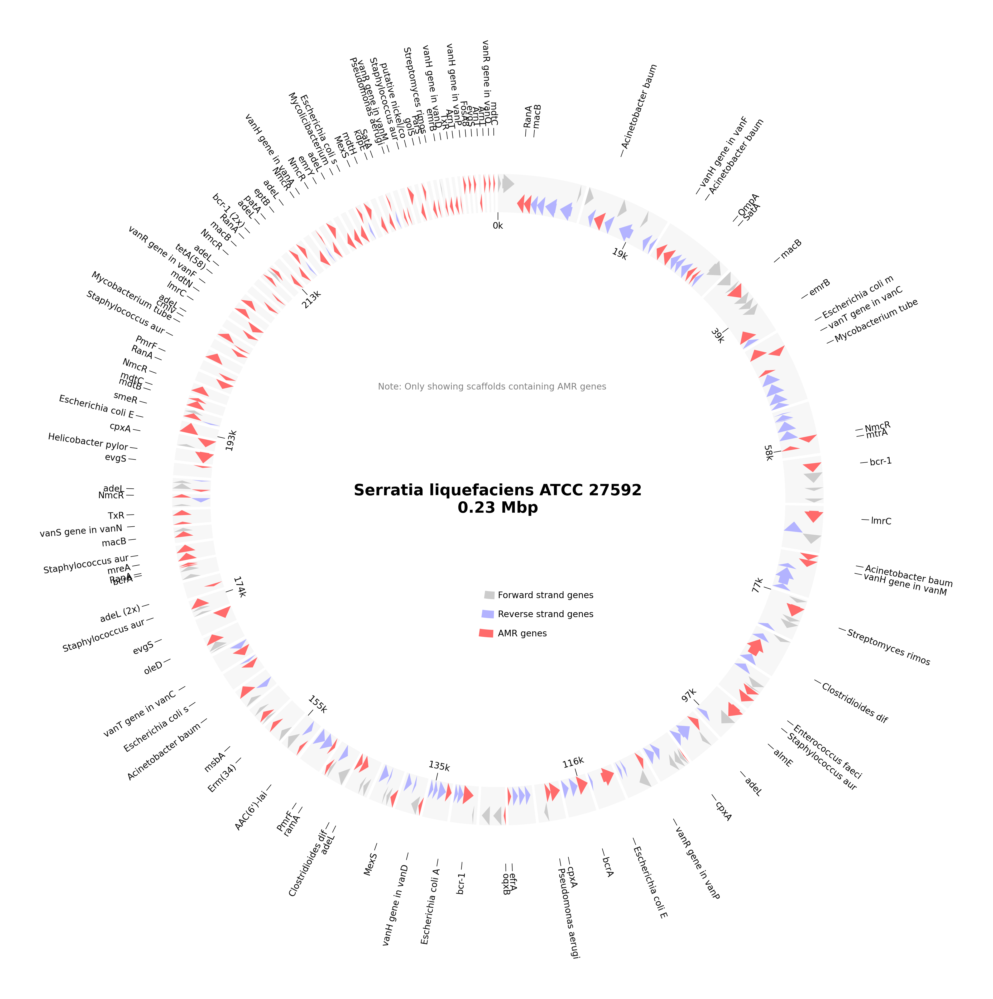

### AAC(6')-Iai
- **Mechanism**: antibiotic inactivation
- **Drug Classes**: aminoglycoside antibiotic
- **AMR Family**: AAC(6')
- **Locations**:
  - gnl|SPADES|LFDBGJIL_1727_2 : position 210-650

### Acinetobacter baumannii AbaF (found in 2 locations)
- **Mechanism**: antibiotic efflux
- **Drug Classes**: phosphonic acid antibiotic
- **AMR Family**: major facilitator superfamily (MFS) antibiotic efflux pump
- **Locations**:
  - gnl|SPADES|LFDBGJIL_1857_3 : position 1497-2633
  - gnl|SPADES|LFDBGJIL_314_3 : position 1881-3203

### Acinetobacter baumannii AbaQ (found in 2 locations)
- **Mechanism**: antibiotic efflux
- **Drug Classes**: fluoroquinolone antibiotic
- **AMR Family**: major facilitator superfamily (MFS) antibiotic efflux pump
- **Locations**:
  - gnl|SPADES|LFDBGJIL_360_3 : position 1466-2653
  - gnl|SPADES|LFDBGJIL_652_1 : position 3-812

### ArnT (found in 3 locations)
- **Mechanism**: antibiotic target alteration
- **Drug Classes**: peptide antibiotic
- **AMR Family**: pmr phosphoethanolamine transferase
- **Locations**:
  - gnl|SPADES|LFDBGJIL_1012407_1 : position 3-296
  - gnl|SPADES|LFDBGJIL_704469_1 : position 2-130
  - gnl|SPADES|LFDBGJIL_989302_1 : position 2-298

### Clostridioides difficile gyrB conferring resistance to fluoroquinolones (found in 2 locations)
- **Mechanism**: antibiotic target alteration
- **Drug Classes**: fluoroquinolone antibiotic
- **AMR Family**: fluoroquinolone resistant gyrB
- **Locations**:
  - gnl|SPADES|LFDBGJIL_1419_5 : position 2475-3164
  - gnl|SPADES|LFDBGJIL_758_3 : position 1532-3946

### Enterococcus faecium liaS mutant conferring daptomycin resistance
- **Mechanism**: antibiotic target alteration; antibiotic efflux
- **Drug Classes**: peptide antibiotic
- **AMR Family**: daptomycin resistant liaS
- **Locations**:
  - gnl|SPADES|LFDBGJIL_796_3 : position 2550-3473

### Erm(34)
- **Mechanism**: antibiotic target alteration
- **Drug Classes**: macrolide antibiotic; lincosamide antibiotic; streptogramin antibiotic; streptogramin A antibiotic; streptogramin B antibiotic
- **AMR Family**: Erm 23S ribosomal RNA methyltransferase
- **Locations**:
  - gnl|SPADES|LFDBGJIL_1794_3 : position 1723-2349

### Escherichia coli AcrAB-TolC with AcrR mutation conferring resistance to ciprofloxacin, tetracycline, and ceftazidime
- **Mechanism**: antibiotic target alteration; antibiotic efflux
- **Drug Classes**: fluoroquinolone antibiotic; cephalosporin; glycylcycline; penam; tetracycline antibiotic; rifamycin antibiotic; phenicol antibiotic; disinfecting agents and antiseptics
- **AMR Family**: resistance-nodulation-cell division (RND) antibiotic efflux pump
- **Locations**:
  - gnl|SPADES|LFDBGJIL_1311_1 : position 1-747

### Escherichia coli EF-Tu mutants conferring resistance to Enacyloxin IIa
- **Mechanism**: antibiotic target alteration
- **Drug Classes**: elfamycin antibiotic
- **AMR Family**: elfamycin resistant EF-Tu
- **Locations**:
  - gnl|SPADES|LFDBGJIL_5972_1 : position 3-1418

### Escherichia coli EF-Tu mutants conferring resistance to Pulvomycin
- **Mechanism**: antibiotic target alteration
- **Drug Classes**: elfamycin antibiotic
- **AMR Family**: elfamycin resistant EF-Tu
- **Locations**:
  - gnl|SPADES|LFDBGJIL_1134_1 : position 65-1912

### Escherichia coli mdfA
- **Mechanism**: antibiotic efflux
- **Drug Classes**: tetracycline antibiotic; phenicol antibiotic; disinfecting agents and antiseptics
- **AMR Family**: major facilitator superfamily (MFS) antibiotic efflux pump
- **Locations**:
  - gnl|SPADES|LFDBGJIL_371_1 : position 407-1654

### Escherichia coli soxS with mutation conferring antibiotic resistance (found in 2 locations)
- **Mechanism**: antibiotic target alteration; antibiotic efflux; reduced permeability to antibiotic
- **Drug Classes**: fluoroquinolone antibiotic; monobactam; carbapenem; cephalosporin; glycylcycline; cephamycin; penam; tetracycline antibiotic; rifamycin antibiotic; phenicol antibiotic; penem; disinfecting agents and antiseptics
- **AMR Family**: ATP-binding cassette (ABC) antibiotic efflux pump; major facilitator superfamily (MFS) antibiotic efflux pump; resistance-nodulation-cell division (RND) antibiotic efflux pump; General Bacterial Porin with reduced permeability to beta-lactams
- **Locations**:
  - gnl|SPADES|LFDBGJIL_2134_2 : position 972-1838
  - gnl|SPADES|LFDBGJIL_83209_1 : position 2-367

### FosA8
- **Mechanism**: antibiotic inactivation
- **Drug Classes**: phosphonic acid antibiotic
- **AMR Family**: fosfomycin thiol transferase
- **Locations**:
  - gnl|SPADES|LFDBGJIL_901266_1: position 3-314

### Helicobacter pylori pbp1 mutants conferring resistance to amoxicillin
- **Mechanism**: antibiotic target alteration
- **Drug Classes**: cephalosporin; cephamycin; penam
- **AMR Family**: Penicillin-binding protein mutations conferring resistance to beta-lactam antibiotics
- **Locations**:
  - gnl|SPADES|LFDBGJIL_4429_1 : position 18-1598

### MexS (found in 2 locations)
- **Mechanism**: antibiotic efflux
- **Drug Classes**: fluoroquinolone antibiotic; diaminopyrimidine antibiotic; phenicol antibiotic
- **AMR Family**: resistance-nodulation-cell division (RND) antibiotic efflux pump
- **Locations**:
  - gnl|SPADES|LFDBGJIL_1349_1 : position 3-719
  - gnl|SPADES|LFDBGJIL_91963_1 : position 78-698

### Mycobacterium tuberculosis pncA mutations conferring resistance to pyrazinamide (found in 2 locations)
- **Mechanism**: antibiotic target alteration
- **Drug Classes**: pyrazine antibiotic
- **AMR Family**: Pyrazinamide resistant pncA
- **Locations**:
  - gnl|SPADES|LFDBGJIL_11241_2 : position 579-1172
  - gnl|SPADES|LFDBGJIL_371_4 : position 3787-4338

### Mycolicibacterium smegmatis ndh with mutation conferring resistance to isoniazid
- **Mechanism**: antibiotic target alteration
- **Drug Classes**: isoniazid-like antibiotic
- **AMR Family**: antibiotic resistant ndh
- **Locations**:
  - gnl|SPADES|LFDBGJIL_79941_1 : position 3-725

### NmcR (found in 6 locations)
- **Mechanism**: antibiotic inactivation
- **Drug Classes**: carbapenem; cephalosporin; cephamycin; penam
- **AMR Family**: NmcA beta-lactamase
- **Locations**:
  - gnl|SPADES|LFDBGJIL_30768_2 : position 473-724
  - gnl|SPADES|LFDBGJIL_3516_3 : position 1321-1779
  - gnl|SPADES|LFDBGJIL_44188_3 : position 670-840
  - gnl|SPADES|LFDBGJIL_512_4 : position 4460-5314
  - gnl|SPADES|LFDBGJIL_69655_1 : position 2-751
  - gnl|SPADES|LFDBGJIL_7010_1 : position 313-1302

### OmpA
- **Mechanism**: reduced permeability to antibiotic
- **Drug Classes**: peptide antibiotic
- **AMR Family**: General Bacterial Porin with reduced permeability to peptide antibiotics
- **Locations**:
  - gnl|SPADES|LFDBGJIL_360_7 : position 5829-6491

### ParS
- **Mechanism**: antibiotic efflux; reduced permeability to antibiotic
- **Drug Classes**: macrolide antibiotic; fluoroquinolone antibiotic; monobactam; aminoglycoside antibiotic; carbapenem; cephalosporin; cephamycin; penam; tetracycline antibiotic; phenicol antibiotic; penem; disinfecting agents and antiseptics
- **AMR Family**: resistance-nodulation-cell division (RND) antibiotic efflux pump; Outer Membrane Porin (Opr)
- **Locations**:
  - gnl|SPADES|LFDBGJIL_360965_1 : position 45-464

### PmrF (found in 2 locations)
- **Mechanism**: antibiotic target alteration
- **Drug Classes**: peptide antibiotic
- **AMR Family**: pmr phosphoethanolamine transferase
- **Locations**:
  - gnl|SPADES|LFDBGJIL_1497_1 : position 1-459
  - gnl|SPADES|LFDBGJIL_9452_1 : position 2-502

### Pseudomonas aeruginosa CpxR (found in 2 locations)
- **Mechanism**: antibiotic efflux
- **Drug Classes**: macrolide antibiotic; fluoroquinolone antibiotic; monobactam; aminoglycoside antibiotic; carbapenem; cephalosporin; cephamycin; penam; tetracycline antibiotic; peptide antibiotic; aminocoumarin antibiotic; diaminopyrimidine antibiotic; sulfonamide antibiotic; phenicol antibiotic; penem
- **AMR Family**: resistance-nodulation-cell division (RND) antibiotic efflux pump
- **Locations**:
  - gnl|SPADES|LFDBGJIL_1173_2 : position 1397-2095
  - gnl|SPADES|LFDBGJIL_132954_2 : position 363-632

### RanA (found in 4 locations)
- **Mechanism**: antibiotic efflux
- **Drug Classes**: aminoglycoside antibiotic
- **AMR Family**: ATP-binding cassette (ABC) antibiotic efflux pump
- **Locations**:
  - gnl|SPADES|LFDBGJIL_2601_5 : position 1818-2114
  - gnl|SPADES|LFDBGJIL_293_4 : position 2735-3724
  - gnl|SPADES|LFDBGJIL_33014_2 : position 443-901
  - gnl|SPADES|LFDBGJIL_8653_2 : position 278-1264

### SatA (found in 2 locations)
- **Mechanism**: antibiotic inactivation
- **Drug Classes**: nucleoside antibiotic
- **AMR Family**: streptothricin acetyltransferase (SAT)
- **Locations**:
  - gnl|SPADES|LFDBGJIL_123011_1 : position 2-202
  - gnl|SPADES|LFDBGJIL_360_8 : position 6759-7154

### Staphylococcus aureus fusA with mutation conferring resistance to fusidic acid
- **Mechanism**: antibiotic target alteration
- **Drug Classes**: fusidane antibiotic
- **AMR Family**: antibiotic resistant fusA
- **Locations**:
  - gnl|SPADES|LFDBGJIL_185563_1 : position 1-576

### Staphylococcus aureus mupA conferring resistance to mupirocin
- **Mechanism**: antibiotic target alteration
- **Drug Classes**: mupirocin-like antibiotic
- **AMR Family**: antibiotic-resistant isoleucyl-tRNA synthetase (ileS)
- **Locations**:
  - gnl|SPADES|LFDBGJIL_2635_2 : position 1133-2098

### Staphylococcus aureus murA with mutation conferring resistance to fosfomycin
- **Mechanism**: antibiotic target alteration
- **Drug Classes**: phosphonic acid antibiotic
- **AMR Family**: antibiotic-resistant murA transferase
- **Locations**:
  - gnl|SPADES|LFDBGJIL_2415_4 : position 1093-2226

### Staphylococcus aureus norA (found in 2 locations)
- **Mechanism**: antibiotic efflux
- **Drug Classes**: fluoroquinolone antibiotic
- **AMR Family**: major facilitator superfamily (MFS) antibiotic efflux pump
- **Locations**:
  - gnl|SPADES|LFDBGJIL_796_4 : position 3574-4728
  - gnl|SPADES|LFDBGJIL_9812_1 : position 136-1218

### Streptomyces rimosus otr(A) (found in 2 locations)
- **Mechanism**: antibiotic target protection
- **Drug Classes**: tetracycline antibiotic
- **AMR Family**: tetracycline-resistant ribosomal protection protein
- **Locations**:
  - gnl|SPADES|LFDBGJIL_373312_1 : position 1-192
  - gnl|SPADES|LFDBGJIL_669_2 : position 1160-2719

### TxR (found in 2 locations)
- **Mechanism**: antibiotic efflux
- **Drug Classes**: tetracycline antibiotic
- **AMR Family**: ATP-binding cassette (ABC) antibiotic efflux pump
- **Locations**:
  - gnl|SPADES|LFDBGJIL_3084_3 : position 1216-1911
  - gnl|SPADES|LFDBGJIL_496204_1 : position 3-410

### adeL (found in 10 locations)
- **Mechanism**: antibiotic efflux
- **Drug Classes**: fluoroquinolone antibiotic; tetracycline antibiotic
- **AMR Family**: resistance-nodulation-cell division (RND) antibiotic efflux pump
- **Locations**:
  - gnl|SPADES|LFDBGJIL_11238_2 : position 356-1174
  - gnl|SPADES|LFDBGJIL_1419_4 : position 1498-2394
  - gnl|SPADES|LFDBGJIL_2555_2 : position 554-907
  - gnl|SPADES|LFDBGJIL_2555_3 : position 922-1488
  - gnl|SPADES|LFDBGJIL_26051_1 : position 1-435
  - gnl|SPADES|LFDBGJIL_35138_2 : position 311-886
  - gnl|SPADES|LFDBGJIL_3723_1 : position 3-317
  - gnl|SPADES|LFDBGJIL_40441_1 : position 38-859
  - gnl|SPADES|LFDBGJIL_80168_1 : position 37-723
  - gnl|SPADES|LFDBGJIL_880_1 : position 218-1126

### almE
- **Mechanism**: antibiotic target alteration
- **Drug Classes**: peptide antibiotic
- **AMR Family**: polymyxin resistance operon; alm glycyltransferase
- **Locations**:
  - gnl|SPADES|LFDBGJIL_817_2 : position 452-2089

### bcr-1 (found in 4 locations)
- **Mechanism**: antibiotic efflux
- **Drug Classes**: bicyclomycin-like antibiotic
- **AMR Family**: major facilitator superfamily (MFS) antibiotic efflux pump
- **Locations**:
  - gnl|SPADES|LFDBGJIL_1248_2 : position 655-2091
  - gnl|SPADES|LFDBGJIL_33529_1 : position 70-612
  - gnl|SPADES|LFDBGJIL_33529_2 : position 627-896
  - gnl|SPADES|LFDBGJIL_588_2 : position 871-2067

### bcrA (found in 2 locations)
- **Mechanism**: antibiotic efflux
- **Drug Classes**: peptide antibiotic
- **AMR Family**: ATP-binding cassette (ABC) antibiotic efflux pump
- **Locations**:
  - gnl|SPADES|LFDBGJIL_1135_1 : position 3-1409
  - gnl|SPADES|LFDBGJIL_2601_4 : position 1625-1804

### cmlv
- **Mechanism**: antibiotic inactivation
- **Drug Classes**: phenicol antibiotic
- **AMR Family**: chloramphenicol phosphotransferase
- **Locations**:
  - gnl|SPADES|LFDBGJIL_11238_1 : position 1-249

### cpxA (found in 3 locations)
- **Mechanism**: antibiotic efflux
- **Drug Classes**: aminoglycoside antibiotic; aminocoumarin antibiotic
- **AMR Family**: resistance-nodulation-cell division (RND) antibiotic efflux pump
- **Locations**:
  - gnl|SPADES|LFDBGJIL_1173_1 : position 27-1400
  - gnl|SPADES|LFDBGJIL_5224_2 : position 387-1490
  - gnl|SPADES|LFDBGJIL_884_1 : position 3-119

### efrA
- **Mechanism**: antibiotic efflux
- **Drug Classes**: macrolide antibiotic; fluoroquinolone antibiotic; rifamycin antibiotic
- **AMR Family**: ATP-binding cassette (ABC) antibiotic efflux pump
- **Locations**:
  - gnl|SPADES|LFDBGJIL_1182_6 : position 3115-3606

### emrB (found in 2 locations)
- **Mechanism**: antibiotic efflux
- **Drug Classes**: fluoroquinolone antibiotic
- **AMR Family**: major facilitator superfamily (MFS) antibiotic efflux pump
- **Locations**:
  - gnl|SPADES|LFDBGJIL_362_8 : position 7424-8839
  - gnl|SPADES|LFDBGJIL_395776_2 : position 192-446

### emrY
- **Mechanism**: antibiotic efflux
- **Drug Classes**: tetracycline antibiotic
- **AMR Family**: major facilitator superfamily (MFS) antibiotic efflux pump
- **Locations**:
  - gnl|SPADES|LFDBGJIL_78760_1 : position 3-728

### eptB
- **Mechanism**: antibiotic target alteration
- **Drug Classes**: peptide antibiotic
- **AMR Family**: pmr phosphoethanolamine transferase
- **Locations**:
  - gnl|SPADES|LFDBGJIL_40175_1 : position 1-597

### evgS (found in 3 locations)
- **Mechanism**: antibiotic efflux
- **Drug Classes**: macrolide antibiotic; fluoroquinolone antibiotic; penam; tetracycline antibiotic
- **AMR Family**: major facilitator superfamily (MFS) antibiotic efflux pump; resistance-nodulation-cell division (RND) antibiotic efflux pump
- **Locations**:
  - gnl|SPADES|LFDBGJIL_2350_2 : position 940-2268
  - gnl|SPADES|LFDBGJIL_4301_2 : position 1338-1619
  - gnl|SPADES|LFDBGJIL_953369_1 : position 3-305

### golS
- **Mechanism**: antibiotic efflux
- **Drug Classes**: monobactam; carbapenem; cephalosporin; cephamycin; penam; phenicol antibiotic; penem
- **AMR Family**: resistance-nodulation-cell division (RND) antibiotic efflux pump
- **Locations**:
  - gnl|SPADES|LFDBGJIL_359076_2 : position 147-464

### kdpE
- **Mechanism**: antibiotic efflux
- **Drug Classes**: aminoglycoside antibiotic
- **AMR Family**: kdpDE
- **Locations**:
  - gnl|SPADES|LFDBGJIL_110957_2 : position 217-666

### lmrC (found in 2 locations)
- **Mechanism**: antibiotic target protection
- **Drug Classes**: lincosamide antibiotic
- **AMR Family**: Miscellaneous ABC-F subfamily ATP-binding cassette ribosomal protection proteins
- **Locations**:
  - gnl|SPADES|LFDBGJIL_14824_2 : position 526-1092
  - gnl|SPADES|LFDBGJIL_595_2 : position 687-2306

### macB (found in 4 locations)
- **Mechanism**: antibiotic efflux
- **Drug Classes**: macrolide antibiotic
- **AMR Family**: ATP-binding cassette (ABC) antibiotic efflux pump
- **Locations**:
  - gnl|SPADES|LFDBGJIL_2779_2 : position 719-1441
  - gnl|SPADES|LFDBGJIL_293_5 : position 3721-4701
  - gnl|SPADES|LFDBGJIL_31979_2 : position 482-907
  - gnl|SPADES|LFDBGJIL_362_3 : position 2049-3554

### mdtB
- **Mechanism**: antibiotic efflux
- **Drug Classes**: aminocoumarin antibiotic
- **AMR Family**: resistance-nodulation-cell division (RND) antibiotic efflux pump
- **Locations**:
  - gnl|SPADES|LFDBGJIL_6894_1 : position 3-929

### mdtC (found in 2 locations)
- **Mechanism**: antibiotic efflux
- **Drug Classes**: aminocoumarin antibiotic
- **AMR Family**: resistance-nodulation-cell division (RND) antibiotic efflux pump
- **Locations**:
  - gnl|SPADES|LFDBGJIL_1718560_1 : position 3-230
  - gnl|SPADES|LFDBGJIL_6894_2 : position 926-1354

### mdtH
- **Mechanism**: antibiotic efflux
- **Drug Classes**: fluoroquinolone antibiotic
- **AMR Family**: major facilitator superfamily (MFS) antibiotic efflux pump
- **Locations**:
  - gnl|SPADES|LFDBGJIL_94589_1 : position 2-526

### mdtN
- **Mechanism**: antibiotic efflux
- **Drug Classes**: nucleoside antibiotic; disinfecting agents and antiseptics
- **AMR Family**: major facilitator superfamily (MFS) antibiotic efflux pump
- **Locations**:
  - gnl|SPADES|LFDBGJIL_19355_1 : position 154-1023

### mreA
- **Mechanism**: antibiotic efflux
- **Drug Classes**: macrolide antibiotic
- **AMR Family**: major facilitator superfamily (MFS) antibiotic efflux pump
- **Locations**:
  - gnl|SPADES|LFDBGJIL_2635_1 : position 38-976

### msbA
- **Mechanism**: antibiotic efflux
- **Drug Classes**: nitroimidazole antibiotic
- **AMR Family**: ATP-binding cassette (ABC) antibiotic efflux pump
- **Locations**:
  - gnl|SPADES|LFDBGJIL_1853_2 : position 445-1206

### mtrA
- **Mechanism**: antibiotic efflux
- **Drug Classes**: macrolide antibiotic; penam
- **AMR Family**: resistance-nodulation-cell division (RND) antibiotic efflux pump
- **Locations**:
  - gnl|SPADES|LFDBGJIL_512_5 : position 5349-5903

### oleD
- **Mechanism**: antibiotic inactivation
- **Drug Classes**: macrolide antibiotic
- **AMR Family**: ole glycosyltransferase
- **Locations**:
  - gnl|SPADES|LFDBGJIL_2303_3 : position 1225-2301

### oqxB
- **Mechanism**: antibiotic efflux
- **Drug Classes**: fluoroquinolone antibiotic; glycylcycline; tetracycline antibiotic; diaminopyrimidine antibiotic; nitrofuran antibiotic
- **AMR Family**: resistance-nodulation-cell division (RND) antibiotic efflux pump
- **Locations**:
  - gnl|SPADES|LFDBGJIL_1227_1 : position 2-262

### patA
- **Mechanism**: antibiotic efflux
- **Drug Classes**: fluoroquinolone antibiotic
- **AMR Family**: ATP-binding cassette (ABC) antibiotic efflux pump
- **Locations**:
  - gnl|SPADES|LFDBGJIL_39272_1 : position 2-535

### putative nickel/cobalt transporter
- **Mechanism**: antibiotic efflux
- **Drug Classes**: fluoroquinolone antibiotic; aminoglycoside antibiotic; isoniazid-like antibiotic
- **AMR Family**: metal transporters with antibiotic efflux
- **Locations**:
  - gnl|SPADES|LFDBGJIL_306435_1 : position 2-490

### ramA
- **Mechanism**: antibiotic efflux; reduced permeability to antibiotic
- **Drug Classes**: fluoroquinolone antibiotic; monobactam; carbapenem; cephalosporin; glycylcycline; cephamycin; penam; tetracycline antibiotic; rifamycin antibiotic; phenicol antibiotic; penem; disinfecting agents and antiseptics
- **AMR Family**: resistance-nodulation-cell division (RND) antibiotic efflux pump; General Bacterial Porin with reduced permeability to beta-lactams
- **Locations**:
  - gnl|SPADES|LFDBGJIL_1425_4 : position 2676-3161

### smeR
- **Mechanism**: antibiotic efflux
- **Drug Classes**: aminoglycoside antibiotic; cephalosporin; cephamycin; penam
- **AMR Family**: resistance-nodulation-cell division (RND) antibiotic efflux pump
- **Locations**:
  - gnl|SPADES|LFDBGJIL_6596_2 : position 253-966

### tetA(58)
- **Mechanism**: antibiotic efflux
- **Drug Classes**: tetracycline antibiotic
- **AMR Family**: major facilitator superfamily (MFS) antibiotic efflux pump
- **Locations**:
  - gnl|SPADES|LFDBGJIL_22064_1 : position 2-787

### vanH gene in vanA cluster
- **Mechanism**: antibiotic target alteration
- **Drug Classes**: glycopeptide antibiotic
- **AMR Family**: vanH; glycopeptide resistance gene cluster
- **Locations**:
  - gnl|SPADES|LFDBGJIL_65878_1 : position 3-584

### vanH gene in vanD cluster (found in 2 locations)
- **Mechanism**: antibiotic target alteration
- **Drug Classes**: glycopeptide antibiotic
- **AMR Family**: vanH; glycopeptide resistance gene cluster
- **Locations**:
  - gnl|SPADES|LFDBGJIL_1321_1 : position 3-461
  - gnl|SPADES|LFDBGJIL_458604_1 : position 3-422

### vanH gene in vanF cluster
- **Mechanism**: antibiotic target alteration
- **Drug Classes**: glycopeptide antibiotic
- **AMR Family**: vanH; glycopeptide resistance gene cluster
- **Locations**:
  - gnl|SPADES|LFDBGJIL_360_2 : position 272-1249

### vanH gene in vanM cluster
- **Mechanism**: antibiotic target alteration
- **Drug Classes**: glycopeptide antibiotic
- **AMR Family**: vanH; glycopeptide resistance gene cluster
- **Locations**:
  - gnl|SPADES|LFDBGJIL_652_2 : position 822-1760

### vanH gene in vanP cluster
- **Mechanism**: antibiotic target alteration
- **Drug Classes**: glycopeptide antibiotic
- **AMR Family**: vanH; glycopeptide resistance gene cluster
- **Locations**:
  - gnl|SPADES|LFDBGJIL_823499_1 : position 2-328

### vanR gene in vanF cluster
- **Mechanism**: antibiotic target alteration
- **Drug Classes**: glycopeptide antibiotic
- **AMR Family**: glycopeptide resistance gene cluster; vanR
- **Locations**:
  - gnl|SPADES|LFDBGJIL_21191_1 : position 2-757

### vanR gene in vanM cluster
- **Mechanism**: antibiotic target alteration
- **Drug Classes**: glycopeptide antibiotic
- **AMR Family**: glycopeptide resistance gene cluster; vanR
- **Locations**:
  - gnl|SPADES|LFDBGJIL_150831_1 : position 1-192

### vanR gene in vanO cluster
- **Mechanism**: antibiotic target alteration
- **Drug Classes**: glycopeptide antibiotic
- **AMR Family**: glycopeptide resistance gene cluster; vanR
- **Locations**:
  - gnl|SPADES|LFDBGJIL_1521332_1 : position 3-245

### vanR gene in vanP cluster
- **Mechanism**: antibiotic target alteration
- **Drug Classes**: glycopeptide antibiotic
- **AMR Family**: glycopeptide resistance gene cluster; vanR
- **Locations**:
  - gnl|SPADES|LFDBGJIL_920_2 : position 155-850

### vanS gene in vanN cluster
- **Mechanism**: antibiotic target alteration
- **Drug Classes**: glycopeptide antibiotic
- **AMR Family**: vanS; glycopeptide resistance gene cluster
- **Locations**:
  - gnl|SPADES|LFDBGJIL_3084_1 : position 3-347

### vanT gene in vanC cluster (found in 2 locations)
- **Mechanism**: antibiotic target alteration
- **Drug Classes**: glycopeptide antibiotic
- **AMR Family**: glycopeptide resistance gene cluster; vanT
- **Locations**:
  - gnl|SPADES|LFDBGJIL_2234_2 : position 289-1368
  - gnl|SPADES|LFDBGJIL_371_2 : position 1922-2866

## Yersinia alsatica
**Strain Statistics:**
- Total genome length: 4967.3 kbp
- Total scaffolds: 39
- Scaffolds with AMR genes: 22
- Total genes annotated: 9074
- Total AMR genes: 471
- Unique AMR genes: 203
- Distinct AMR mechanisms: 11
- Distinct AMR families: 70
- Distinct drug classes: 36

**Circos Plot:**

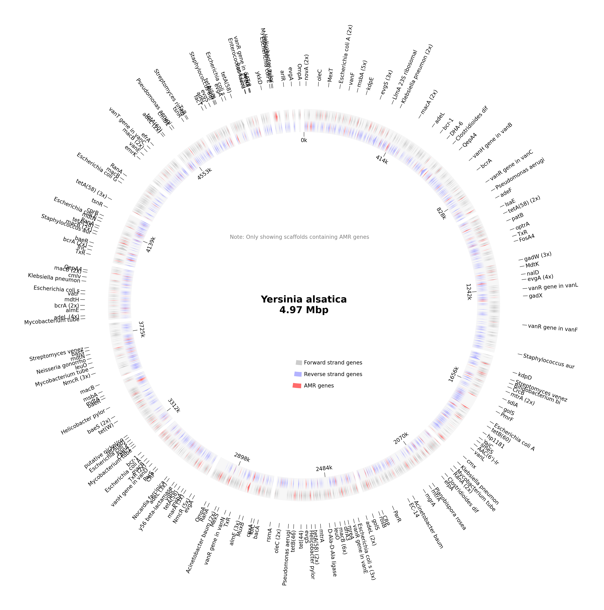

### AAC(6')-Ir
- **Mechanism**: antibiotic inactivation
- **Drug Classes**: aminoglycoside antibiotic
- **AMR Family**: AAC(6')
- **Locations**:
  - gnl|SPADES|LFDBGJIL_3_313 : position 355115-355609

### Acinetobacter baumannii AbaF (found in 6 locations)
- **Mechanism**: antibiotic efflux
- **Drug Classes**: phosphonic acid antibiotic
- **AMR Family**: major facilitator superfamily (MFS) antibiotic efflux pump
- **Locations**:
  - gnl|SPADES|LFDBGJIL_1_765 : position 870405-871931
  - gnl|SPADES|LFDBGJIL_2_106 : position 113178-114584
  - gnl|SPADES|LFDBGJIL_4_188 : position 217529-218851
  - gnl|SPADES|LFDBGJIL_5_56 : position 59968-61332
  - gnl|SPADES|LFDBGJIL_6_183 : position 200704-202206
  - gnl|SPADES|LFDBGJIL_6_191 : position 210585-211988

### Acinetobacter baumannii AbaQ
- **Mechanism**: antibiotic efflux
- **Drug Classes**: fluoroquinolone antibiotic
- **AMR Family**: major facilitator superfamily (MFS) antibiotic efflux pump
- **Locations**:
  - gnl|SPADES|LFDBGJIL_1_568 : position 650722-652032

### Acinetobacter baumannii AmvA
- **Mechanism**: antibiotic efflux
- **Drug Classes**: macrolide antibiotic; disinfecting agents and antiseptics
- **AMR Family**: major facilitator superfamily (MFS) antibiotic efflux pump
- **Locations**:
  - gnl|SPADES|LFDBGJIL_1_697 : position 791083-792615

### AcrS
- **Mechanism**: antibiotic efflux
- **Drug Classes**: fluoroquinolone antibiotic; cephalosporin; glycylcycline; cephamycin; penam; tetracycline antibiotic; rifamycin antibiotic; phenicol antibiotic; disinfecting agents and antiseptics
- **AMR Family**: resistance-nodulation-cell division (RND) antibiotic efflux pump
- **Locations**:
  - gnl|SPADES|LFDBGJIL_5_38 : position 37335-37883

### ArnT
- **Mechanism**: antibiotic target alteration
- **Drug Classes**: peptide antibiotic
- **AMR Family**: pmr phosphoethanolamine transferase
- **Locations**:
  - gnl|SPADES|LFDBGJIL_1_25: position 29597-31261

### Bifidobacterium bifidum ileS conferring resistance to mupirocin
- **Mechanism**: antibiotic target alteration
- **Drug Classes**: mupirocin-like antibiotic
- **AMR Family**: antibiotic-resistant isoleucyl-tRNA synthetase (ileS)
- **Locations**:
  - gnl|SPADES|LFDBGJIL_3_62 : position 83660-86242

### CAR-1
- **Mechanism**: antibiotic inactivation
- **Drug Classes**: carbapenem
- **AMR Family**: CAR beta-lactamase
- **Locations**:
  - gnl|SPADES|LFDBGJIL_8_24 : position 21873-22628

### CRP (found in 2 locations)
- **Mechanism**: antibiotic efflux
- **Drug Classes**: macrolide antibiotic; fluoroquinolone antibiotic; penam
- **AMR Family**: resistance-nodulation-cell division (RND) antibiotic efflux pump
- **Locations**:
  - gnl|SPADES|LFDBGJIL_4_288: position 348462-349094
  - gnl|SPADES|LFDBGJIL_7_153 : position 177877-178629

### Clostridioides difficile gyrA conferring resistance to fluoroquinolones
- **Mechanism**: antibiotic target alteration
- **Drug Classes**: fluoroquinolone antibiotic
- **AMR Family**: fluoroquinolone resistant gyrA
- **Locations**:
  - gnl|SPADES|LFDBGJIL_1_549 : position 626480-629134

### Clostridioides difficile gyrB conferring resistance to fluoroquinolones (found in 2 locations)
- **Mechanism**: antibiotic target alteration
- **Drug Classes**: fluoroquinolone antibiotic
- **AMR Family**: fluoroquinolone resistant gyrB
- **Locations**:
  - gnl|SPADES|LFDBGJIL_4_61 : position 65634-68048
  - gnl|SPADES|LFDBGJIL_6_53 : position 51335-53230

### CrcB (found in 2 locations)
- **Mechanism**: antibiotic efflux
- **Drug Classes**: aminoglycoside antibiotic
- **AMR Family**: multidrug and toxic compound extrusion (MATE) transporter
- **Locations**:
  - gnl|SPADES|LFDBGJIL_3_77 : position 99896-100279
  - gnl|SPADES|LFDBGJIL_8_72 : position 67619-68023

### D-Ala-D-Ala ligase
- **Mechanism**: antibiotic target alteration
- **Drug Classes**: glycopeptide antibiotic
- **AMR Family**: Van ligase
- **Locations**:
  - gnl|SPADES|LFDBGJIL_5_121 : position 144211-145131

### DHA-6
- **Mechanism**: antibiotic inactivation
- **Drug Classes**: cephalosporin; cephamycin
- **AMR Family**: DHA beta-lactamase
- **Locations**:
  - gnl|SPADES|LFDBGJIL_1_539 : position 597076-598218

### EC-14 (found in 2 locations)
- **Mechanism**: antibiotic inactivation
- **Drug Classes**: cephalosporin
- **AMR Family**: EC beta-lactamase
- **Locations**:
  - gnl|SPADES|LFDBGJIL_2_245 : position 262031-263209
  - gnl|SPADES|LFDBGJIL_4_203 : position 239301-240467

### EVM-1
- **Mechanism**: antibiotic inactivation
- **Drug Classes**: carbapenem
- **AMR Family**: EVM beta-lactamase
- **Locations**:
  - gnl|SPADES|LFDBGJIL_1_362 : position 405482-407635

### EdeQ
- **Mechanism**: antibiotic inactivation
- **Drug Classes**: peptide antibiotic; polyamine antibiotic
- **AMR Family**: Edeine acetyltransferase
- **Locations**:
  - gnl|SPADES|LFDBGJIL_5_7 : position 4440-4883

### Enterococcus faecalis cls with mutation conferring resistance to daptomycin
- **Mechanism**: antibiotic target alteration
- **Drug Classes**: peptide antibiotic
- **AMR Family**: daptomycin resistant cls
- **Locations**:
  - gnl|SPADES|LFDBGJIL_52_26 : position 25853-27313

### Erm(34)
- **Mechanism**: antibiotic target alteration
- **Drug Classes**: macrolide antibiotic; lincosamide antibiotic; streptogramin antibiotic; streptogramin A antibiotic; streptogramin B antibiotic
- **AMR Family**: Erm 23S ribosomal RNA methyltransferase
- **Locations**:
  - gnl|SPADES|LFDBGJIL_5_218 : position 261464-262090

### Escherichia coli AcrAB-TolC with AcrR mutation conferring resistance to ciprofloxacin, tetracycline, and ceftazidime (found in 3 locations)
- **Mechanism**: antibiotic target alteration; antibiotic efflux
- **Drug Classes**: fluoroquinolone antibiotic; cephalosporin; glycylcycline; penam; tetracycline antibiotic; rifamycin antibiotic; phenicol antibiotic; disinfecting agents and antiseptics
- **AMR Family**: resistance-nodulation-cell division (RND) antibiotic efflux pump
- **Locations**:
  - gnl|SPADES|LFDBGJIL_1_128 : position 137585-138148
  - gnl|SPADES|LFDBGJIL_1_574 : position 656809-657447
  - gnl|SPADES|LFDBGJIL_3_222 : position 249146-249802

### Escherichia coli AcrAB-TolC with MarR mutations conferring resistance to ciprofloxacin and tetracycline
- **Mechanism**: antibiotic target alteration; antibiotic efflux
- **Drug Classes**: fluoroquinolone antibiotic; cephalosporin; glycylcycline; penam; tetracycline antibiotic; rifamycin antibiotic; phenicol antibiotic; disinfecting agents and antiseptics
- **AMR Family**: resistance-nodulation-cell division (RND) antibiotic efflux pump
- **Locations**:
  - gnl|SPADES|LFDBGJIL_7_220 : position 251775-252206

### Escherichia coli EF-Tu mutants conferring resistance to Pulvomycin (found in 2 locations)
- **Mechanism**: antibiotic target alteration
- **Drug Classes**: elfamycin antibiotic
- **AMR Family**: elfamycin resistant EF-Tu
- **Locations**:
  - gnl|SPADES|LFDBGJIL_4_314 : position 371086-372270
  - gnl|SPADES|LFDBGJIL_91_5 : position 5001-6185

### Escherichia coli EF-Tu mutants conferring resistance to kirromycin
- **Mechanism**: antibiotic target alteration
- **Drug Classes**: elfamycin antibiotic
- **AMR Family**: elfamycin resistant EF-Tu
- **Locations**:
  - gnl|SPADES|LFDBGJIL_11_124 : position 155834-158512

### Escherichia coli GlpT with mutation conferring resistance to fosfomycin
- **Mechanism**: antibiotic target alteration
- **Drug Classes**: phosphonic acid antibiotic
- **AMR Family**: antibiotic-resistant GlpT
- **Locations**:
  - gnl|SPADES|LFDBGJIL_13_63 : position 75801-77156

### Escherichia coli acrA (found in 2 locations)
- **Mechanism**: antibiotic efflux
- **Drug Classes**: fluoroquinolone antibiotic; cephalosporin; glycylcycline; penam; tetracycline antibiotic; rifamycin antibiotic; phenicol antibiotic; disinfecting agents and antiseptics
- **AMR Family**: resistance-nodulation-cell division (RND) antibiotic efflux pump
- **Locations**:
  - gnl|SPADES|LFDBGJIL_3_223 : position 249947-251134
  - gnl|SPADES|LFDBGJIL_6_178 : position 192216-193439

### Escherichia coli mdfA
- **Mechanism**: antibiotic efflux
- **Drug Classes**: tetracycline antibiotic; phenicol antibiotic; disinfecting agents and antiseptics
- **AMR Family**: major facilitator superfamily (MFS) antibiotic efflux pump
- **Locations**:
  - gnl|SPADES|LFDBGJIL_4_118 : position 131163-132392

### Escherichia coli murA with mutation conferring resistance to fosfomycin
- **Mechanism**: antibiotic target alteration
- **Drug Classes**: phosphonic acid antibiotic
- **AMR Family**: antibiotic-resistant murA transferase
- **Locations**:
  - gnl|SPADES|LFDBGJIL_1_366 : position 411341-412621

### Escherichia coli soxS with mutation conferring antibiotic resistance (found in 8 locations)
- **Mechanism**: antibiotic target alteration; antibiotic efflux; reduced permeability to antibiotic
- **Drug Classes**: fluoroquinolone antibiotic; monobactam; carbapenem; cephalosporin; glycylcycline; cephamycin; penam; tetracycline antibiotic; rifamycin antibiotic; phenicol antibiotic; penem; disinfecting agents and antiseptics
- **AMR Family**: ATP-binding cassette (ABC) antibiotic efflux pump; major facilitator superfamily (MFS) antibiotic efflux pump; resistance-nodulation-cell division (RND) antibiotic efflux pump; General Bacterial Porin with reduced permeability to beta-lactams
- **Locations**:
  - gnl|SPADES|LFDBGJIL_10_110 : position 117870-118769
  - gnl|SPADES|LFDBGJIL_1_199 : position 210945-211820
  - gnl|SPADES|LFDBGJIL_42_20 : position 20270-20977
  - gnl|SPADES|LFDBGJIL_5_30 : position 30471-31292
  - gnl|SPADES|LFDBGJIL_5_31 : position 31402-32295
  - gnl|SPADES|LFDBGJIL_5_47 : position 48538-49404
  - gnl|SPADES|LFDBGJIL_7_58 : position 71146-72078
  - gnl|SPADES|LFDBGJIL_8_46 : position 43315-44337

### FosA4
- **Mechanism**: antibiotic inactivation
- **Drug Classes**: phosphonic acid antibiotic
- **AMR Family**: fosfomycin thiol transferase
- **Locations**:
  - gnl|SPADES|LFDBGJIL_2_141 : position 155267-155722

### FosB6
- **Mechanism**: antibiotic inactivation
- **Drug Classes**: phosphonic acid antibiotic
- **AMR Family**: fosfomycin thiol transferase
- **Locations**:
  - gnl|SPADES|LFDBGJIL_7_108 : position 127281-127751

### FosM2
- **Mechanism**: antibiotic inactivation
- **Drug Classes**: phosphonic acid antibiotic
- **AMR Family**: fosfomycin thiol transferase
- **Locations**:
  - gnl|SPADES|LFDBGJIL_7_229 : position 260719-261126

### H-NS
- **Mechanism**: antibiotic efflux
- **Drug Classes**: macrolide antibiotic; fluoroquinolone antibiotic; cephalosporin; cephamycin; penam; tetracycline antibiotic
- **AMR Family**: major facilitator superfamily (MFS) antibiotic efflux pump; resistance-nodulation-cell division (RND) antibiotic efflux pump
- **Locations**:
  - gnl|SPADES|LFDBGJIL_52_38 : position 42017-42427

### Haemophilus influenzae PBP3 conferring resistance to beta-lactam antibiotics
- **Mechanism**: antibiotic target alteration
- **Drug Classes**: cephalosporin; cephamycin; penam
- **AMR Family**: Penicillin-binding protein mutations conferring resistance to beta-lactam antibiotics
- **Locations**:
  - gnl|SPADES|LFDBGJIL_5_113 : position 133401-135164

### Helicobacter pylori pbp1 mutants conferring resistance to amoxicillin (found in 2 locations)
- **Mechanism**: antibiotic target alteration
- **Drug Classes**: cephalosporin; cephamycin; penam
- **AMR Family**: Penicillin-binding protein mutations conferring resistance to beta-lactam antibiotics
- **Locations**:
  - gnl|SPADES|LFDBGJIL_5_177 : position 212483-214969
  - gnl|SPADES|LFDBGJIL_8_200 : position 189977-192295

### Helicobacter pylori pbp2 mutants conferring resistance to amoxicillin
- **Mechanism**: antibiotic target alteration
- **Drug Classes**: cephalosporin; cephamycin; penam
- **AMR Family**: Penicillin-binding protein mutations conferring resistance to beta-lactam antibiotics
- **Locations**:
  - gnl|SPADES|LFDBGJIL_3_68 : position 89627-91522

### Helicobacter pylori rpoB mutation conferring resistance to rifampicin
- **Mechanism**: antibiotic target alteration; antibiotic target replacement
- **Drug Classes**: fluoroquinolone antibiotic; rifamycin antibiotic
- **AMR Family**: rifamycin-resistant beta-subunit of RNA polymerase (rpoB)
- **Locations**:
  - gnl|SPADES|LFDBGJIL_91_13 : position 14460-18680

### Klebsiella pneumoniae KpnE
- **Mechanism**: antibiotic efflux
- **Drug Classes**: macrolide antibiotic; aminoglycoside antibiotic; cephalosporin; tetracycline antibiotic; peptide antibiotic; rifamycin antibiotic; disinfecting agents and antiseptics
- **AMR Family**: small multidrug resistance (SMR) antibiotic efflux pump
- **Locations**:
  - gnl|SPADES|LFDBGJIL_10_47 : position 51580-51963

### Klebsiella pneumoniae KpnF
- **Mechanism**: antibiotic efflux
- **Drug Classes**: macrolide antibiotic; aminoglycoside antibiotic; cephalosporin; tetracycline antibiotic; peptide antibiotic; rifamycin antibiotic; disinfecting agents and antiseptics
- **AMR Family**: small multidrug resistance (SMR) antibiotic efflux pump
- **Locations**:
  - gnl|SPADES|LFDBGJIL_10_46: position 51264-51593

### Klebsiella pneumoniae KpnH (found in 2 locations)
- **Mechanism**: antibiotic efflux
- **Drug Classes**: macrolide antibiotic; fluoroquinolone antibiotic; aminoglycoside antibiotic; carbapenem; cephalosporin; penam; peptide antibiotic; penem
- **AMR Family**: major facilitator superfamily (MFS) antibiotic efflux pump
- **Locations**:
  - gnl|SPADES|LFDBGJIL_3_373: position 423189-424724
  - gnl|SPADES|LFDBGJIL_4_2 : position 937-2361

### Klebsiella pneumoniae OmpK37 (found in 4 locations)
- **Mechanism**: reduced permeability to antibiotic
- **Drug Classes**: monobactam; carbapenem; cephalosporin; cephamycin; penam; penem
- **AMR Family**: General Bacterial Porin with reduced permeability to beta-lactams
- **Locations**:
  - gnl|SPADES|LFDBGJIL_10_143 : position 154342-155427
  - gnl|SPADES|LFDBGJIL_1_343 : position 381380-382504
  - gnl|SPADES|LFDBGJIL_1_540 : position 598747-599859
  - gnl|SPADES|LFDBGJIL_2_76 : position 81012-82127

### LRA-19
- **Mechanism**: antibiotic inactivation
- **Drug Classes**: cephalosporin; penam
- **AMR Family**: subclass B3 LRA beta-lactamase
- **Locations**:
  - gnl|SPADES|LFDBGJIL_1_346 : position 385855-386502

### LlmA 23S ribosomal RNA methyltransferase
- **Mechanism**: antibiotic target alteration
- **Drug Classes**: lincosamide antibiotic
- **AMR Family**: Llm 23S ribosomal RNA methyltransferase
- **Locations**:
  - gnl|SPADES|LFDBGJIL_1_315 : position 346579-347769

### LptD
- **Mechanism**: antibiotic efflux
- **Drug Classes**: carbapenem; peptide antibiotic; aminocoumarin antibiotic; rifamycin antibiotic
- **AMR Family**: ATP-binding cassette (ABC) antibiotic efflux pump
- **Locations**:
  - gnl|SPADES|LFDBGJIL_5_83 : position 91476-93872

### MdtK
- **Mechanism**: antibiotic efflux
- **Drug Classes**: fluoroquinolone antibiotic
- **AMR Family**: multidrug and toxic compound extrusion (MATE) transporter
- **Locations**:
  - gnl|SPADES|LFDBGJIL_2_239 : position 254616-256046

### MexF
- **Mechanism**: antibiotic efflux
- **Drug Classes**: fluoroquinolone antibiotic; diaminopyrimidine antibiotic; phenicol antibiotic
- **AMR Family**: resistance-nodulation-cell division (RND) antibiotic efflux pump
- **Locations**:
  - gnl|SPADES|LFDBGJIL_6_179 : position 193452-196577

### MexJ
- **Mechanism**: antibiotic efflux
- **Drug Classes**: macrolide antibiotic; tetracycline antibiotic; disinfecting agents and antiseptics
- **AMR Family**: resistance-nodulation-cell division (RND) antibiotic efflux pump
- **Locations**:
  - gnl|SPADES|LFDBGJIL_11_22 : position 31842-32924

### MexS (found in 5 locations)
- **Mechanism**: antibiotic efflux
- **Drug Classes**: fluoroquinolone antibiotic; diaminopyrimidine antibiotic; phenicol antibiotic
- **AMR Family**: resistance-nodulation-cell division (RND) antibiotic efflux pump
- **Locations**:
  - gnl|SPADES|LFDBGJIL_14_87 : position 93149-94132
  - gnl|SPADES|LFDBGJIL_2_113 : position 121775-122914
  - gnl|SPADES|LFDBGJIL_2_413 : position 441263-442273
  - gnl|SPADES|LFDBGJIL_2_422 : position 455995-457029
  - gnl|SPADES|LFDBGJIL_6_176 : position 189871-190860

### MexT (found in 3 locations)
- **Mechanism**: antibiotic efflux
- **Drug Classes**: fluoroquinolone antibiotic; diaminopyrimidine antibiotic; phenicol antibiotic
- **AMR Family**: resistance-nodulation-cell division (RND) antibiotic efflux pump
- **Locations**:
  - gnl|SPADES|LFDBGJIL_1_84 : position 93726-94634
  - gnl|SPADES|LFDBGJIL_2_142 : position 155853-156773
  - gnl|SPADES|LFDBGJIL_2_275 : position 293409-294305

### MexV
- **Mechanism**: antibiotic efflux
- **Drug Classes**: macrolide antibiotic; fluoroquinolone antibiotic; tetracycline antibiotic; phenicol antibiotic; disinfecting agents and antiseptics
- **AMR Family**: resistance-nodulation-cell division (RND) antibiotic efflux pump
- **Locations**:
  - gnl|SPADES|LFDBGJIL_6_92 : position 92525-94048

### MuxB
- **Mechanism**: antibiotic efflux
- **Drug Classes**: macrolide antibiotic; monobactam; tetracycline antibiotic; aminocoumarin antibiotic
- **AMR Family**: resistance-nodulation-cell division (RND) antibiotic efflux pump
- **Locations**:
  - gnl|SPADES|LFDBGJIL_6_91 : position 89397-92528

### Mycobacterium tuberculosis gidB mutation conferring resistance to streptomycin
- **Mechanism**: antibiotic target alteration
- **Drug Classes**: aminoglycoside antibiotic
- **AMR Family**: antibiotic resistant gidB
- **Locations**:
  - gnl|SPADES|LFDBGJIL_4_19 : position 22844-23467

### Mycobacterium tuberculosis kasA mutant conferring resistance to isoniazid (found in 2 locations)
- **Mechanism**: antibiotic target alteration
- **Drug Classes**: isoniazid-like antibiotic
- **AMR Family**: antibiotic resistant kasA
- **Locations**:
  - gnl|SPADES|LFDBGJIL_1_330 : position 361875-363143
  - gnl|SPADES|LFDBGJIL_8_15 : position 12456-13640

### Mycobacterium tuberculosis ndh with mutation conferring resistance to isoniazid
- **Mechanism**: antibiotic target alteration
- **Drug Classes**: isoniazid-like antibiotic
- **AMR Family**: antibiotic resistant ndh
- **Locations**:
  - gnl|SPADES|LFDBGJIL_1_239 : position 256401-257705

### Mycobacterium tuberculosis pncA mutations conferring resistance to pyrazinamide
- **Mechanism**: antibiotic target alteration
- **Drug Classes**: pyrazine antibiotic
- **AMR Family**: Pyrazinamide resistant pncA
- **Locations**:
  - gnl|SPADES|LFDBGJIL_10_10 : position 10929-11561

### Mycobacterium tuberculosis rpoB mutations conferring resistance to rifampicin
- **Mechanism**: antibiotic target alteration; antibiotic target replacement
- **Drug Classes**: rifamycin antibiotic
- **AMR Family**: rifamycin-resistant beta-subunit of RNA polymerase (rpoB)
- **Locations**:
  - gnl|SPADES|LFDBGJIL_91_12 : position 10311-14339

### Mycobacterium tuberculosis rpsA mutations conferring resistance to pyrazinamide
- **Mechanism**: antibiotic target alteration
- **Drug Classes**: pyrazine antibiotic
- **AMR Family**: pyrazinamide resistant rpsA
- **Locations**:
  - gnl|SPADES|LFDBGJIL_1_364 : position 408489-410162

### Mycobacterium tuberculosis thyA with mutation conferring resistance to para-aminosalicylic acid
- **Mechanism**: antibiotic target alteration
- **Drug Classes**: salicylic acid antibiotic
- **AMR Family**: aminosalicylate resistant thymidylate synthase
- **Locations**:
  - gnl|SPADES|LFDBGJIL_9_63 : position 70827-71621

### Neisseria gonorrhoeae pilQ gene conferring resistance to beta-lactam
- **Mechanism**: antibiotic target alteration
- **Drug Classes**: cephalosporin; cephamycin; penam
- **AMR Family**: Penicillin-binding protein mutations conferring resistance to beta-lactam antibiotics
- **Locations**:
  - gnl|SPADES|LFDBGJIL_9_94 : position 105677-107653

### NmcR (found in 18 locations)
- **Mechanism**: antibiotic inactivation
- **Drug Classes**: carbapenem; cephalosporin; cephamycin; penam
- **AMR Family**: NmcA beta-lactamase
- **Locations**:
  - gnl|SPADES|LFDBGJIL_13_14 : position 17589-18470
  - gnl|SPADES|LFDBGJIL_13_5 : position 5247-6128
  - gnl|SPADES|LFDBGJIL_1_299 : position 321853-323085
  - gnl|SPADES|LFDBGJIL_1_595 : position 683434-684366
  - gnl|SPADES|LFDBGJIL_1_683 : position 777030-777953
  - gnl|SPADES|LFDBGJIL_1_726 : position 825742-826605
  - gnl|SPADES|LFDBGJIL_1_735 : position 835659-836579
  - gnl|SPADES|LFDBGJIL_2_234 : position 248522-249415
  - gnl|SPADES|LFDBGJIL_4_204 : position 240604-241494
  - gnl|SPADES|LFDBGJIL_4_228 : position 268900-269793
  - gnl|SPADES|LFDBGJIL_7_128 : position 147363-148217
  - gnl|SPADES|LFDBGJIL_7_14 : position 16457-17431
  - gnl|SPADES|LFDBGJIL_7_141 : position 165876-166778
  - gnl|SPADES|LFDBGJIL_7_69 : position 84803-85717
  - gnl|SPADES|LFDBGJIL_7_81 : position 99078-99989
  - gnl|SPADES|LFDBGJIL_9_112 : position 123476-124372
  - gnl|SPADES|LFDBGJIL_9_143 : position 158400-159293
  - gnl|SPADES|LFDBGJIL_9_47 : position 47253-48170

### Nocardia farcinica rox
- **Mechanism**: antibiotic inactivation
- **Drug Classes**: rifamycin antibiotic
- **AMR Family**: rifampin monooxygenase
- **Locations**:
  - gnl|SPADES|LFDBGJIL_7_112 : position 130620-132248

### OmpA (found in 4 locations)
- **Mechanism**: reduced permeability to antibiotic
- **Drug Classes**: peptide antibiotic
- **AMR Family**: General Bacterial Porin with reduced permeability to peptide antibiotics
- **Locations**:
  - gnl|SPADES|LFDBGJIL_1_325 : position 356933-358006
  - gnl|SPADES|LFDBGJIL_385_10 : position 7744-8250
  - gnl|SPADES|LFDBGJIL_5_39 : position 38695-39201
  - gnl|SPADES|LFDBGJIL_6_221 : position 243812-245539

### OprN
- **Mechanism**: antibiotic efflux
- **Drug Classes**: fluoroquinolone antibiotic; diaminopyrimidine antibiotic; phenicol antibiotic
- **AMR Family**: resistance-nodulation-cell division (RND) antibiotic efflux pump
- **Locations**:
  - gnl|SPADES|LFDBGJIL_2_273 : position 290652-292148

### PJM-1
- **Mechanism**: antibiotic inactivation
- **Drug Classes**: carbapenem; cephalosporin; cephamycin; penam
- **AMR Family**: PJM beta-lactamase
- **Locations**:
  - gnl|SPADES|LFDBGJIL_7_209 : position 242398-243405

### ParR (found in 2 locations)
- **Mechanism**: antibiotic efflux; reduced permeability to antibiotic
- **Drug Classes**: macrolide antibiotic; fluoroquinolone antibiotic; monobactam; aminoglycoside antibiotic; carbapenem; cephalosporin; cephamycin; penam; tetracycline antibiotic; phenicol antibiotic; penem; disinfecting agents and antiseptics
- **AMR Family**: resistance-nodulation-cell division (RND) antibiotic efflux pump; Outer Membrane Porin (Opr)
- **Locations**:
  - gnl|SPADES|LFDBGJIL_4_252 : position 305104-305823
  - gnl|SPADES|LFDBGJIL_7_160 : position 186825-187553

### ParS
- **Mechanism**: antibiotic efflux; reduced permeability to antibiotic
- **Drug Classes**: macrolide antibiotic; fluoroquinolone antibiotic; monobactam; aminoglycoside antibiotic; carbapenem; cephalosporin; cephamycin; penam; tetracycline antibiotic; phenicol antibiotic; penem; disinfecting agents and antiseptics
- **AMR Family**: resistance-nodulation-cell division (RND) antibiotic efflux pump; Outer Membrane Porin (Opr)
- **Locations**:
  - gnl|SPADES|LFDBGJIL_7_161 : position 187550-188863

### Planobispora rosea EF-Tu mutants conferring resistance to inhibitor GE2270A
- **Mechanism**: antibiotic target alteration
- **Drug Classes**: elfamycin antibiotic
- **AMR Family**: elfamycin resistant EF-Tu
- **Locations**:
  - gnl|SPADES|LFDBGJIL_4_115 : position 127425-129326

### PmrF (found in 3 locations)
- **Mechanism**: antibiotic target alteration
- **Drug Classes**: peptide antibiotic
- **AMR Family**: pmr phosphoethanolamine transferase
- **Locations**:
  - gnl|SPADES|LFDBGJIL_10_163 : position 176914-178287
  - gnl|SPADES|LFDBGJIL_1_28 : position 34160-35143
  - gnl|SPADES|LFDBGJIL_3_185 : position 203799-204770

### Pseudomonas aeruginosa CpxR (found in 3 locations)
- **Mechanism**: antibiotic efflux
- **Drug Classes**: macrolide antibiotic; fluoroquinolone antibiotic; monobactam; aminoglycoside antibiotic; carbapenem; cephalosporin; cephamycin; penam; tetracycline antibiotic; peptide antibiotic; aminocoumarin antibiotic; diaminopyrimidine antibiotic; sulfonamide antibiotic; phenicol antibiotic; penem
- **AMR Family**: resistance-nodulation-cell division (RND) antibiotic efflux pump
- **Locations**:
  - gnl|SPADES|LFDBGJIL_15_52 : position 58527-59225
  - gnl|SPADES|LFDBGJIL_1_757 : position 861085-861768
  - gnl|SPADES|LFDBGJIL_3_100 : position 121238-121912

### Pseudomonas aeruginosa ampR with mutation conferring resistance to aztreonam
- **Mechanism**: antibiotic target alteration; antibiotic inactivation
- **Drug Classes**: monobactam; carbapenem; cephalosporin
- **AMR Family**: PDC beta-lactamase; ampR transcriptional regulator with mutation conferring resistance to monobactam antibiotics
- **Locations**:
  - gnl|SPADES|LFDBGJIL_5_253 : position 301016-301957

### QepA4 (found in 3 locations)
- **Mechanism**: antibiotic efflux
- **Drug Classes**: fluoroquinolone antibiotic
- **AMR Family**: major facilitator superfamily (MFS) antibiotic efflux pump
- **Locations**:
  - gnl|SPADES|LFDBGJIL_10_180 : position 197280-198920
  - gnl|SPADES|LFDBGJIL_1_578 : position 660728-661963
  - gnl|SPADES|LFDBGJIL_7_80 : position 97653-99005

### RanA (found in 19 locations)
- **Mechanism**: antibiotic efflux
- **Drug Classes**: aminoglycoside antibiotic
- **AMR Family**: ATP-binding cassette (ABC) antibiotic efflux pump
- **Locations**:
  - gnl|SPADES|LFDBGJIL_11_99 : position 126441-127535
  - gnl|SPADES|LFDBGJIL_13_95 : position 109035-110108
  - gnl|SPADES|LFDBGJIL_18_90 : position 92286-93095
  - gnl|SPADES|LFDBGJIL_1_433 : position 488023-489156
  - gnl|SPADES|LFDBGJIL_1_502 : position 560308-561900
  - gnl|SPADES|LFDBGJIL_1_614 : position 703999-704817
  - gnl|SPADES|LFDBGJIL_1_68 : position 72725-73852
  - gnl|SPADES|LFDBGJIL_1_695 : position 788983-789789
  - gnl|SPADES|LFDBGJIL_1_704 : position 800908-801957
  - gnl|SPADES|LFDBGJIL_2_355 : position 375697-376842
  - gnl|SPADES|LFDBGJIL_2_432 : position 466117-466890
  - gnl|SPADES|LFDBGJIL_3_84 : position 106507-107184
  - gnl|SPADES|LFDBGJIL_4_167 : position 187442-188464
  - gnl|SPADES|LFDBGJIL_4_34 : position 38597-39373
  - gnl|SPADES|LFDBGJIL_52_28 : position 27984-28985
  - gnl|SPADES|LFDBGJIL_52_29 : position 28982-30001
  - gnl|SPADES|LFDBGJIL_5_298 : position 348217-349731
  - gnl|SPADES|LFDBGJIL_6_210 : position 230592-231350
  - gnl|SPADES|LFDBGJIL_8_34 : position 31618-32817

### RanB (found in 2 locations)
- **Mechanism**: antibiotic efflux
- **Drug Classes**: aminoglycoside antibiotic
- **AMR Family**: ATP-binding cassette (ABC) antibiotic efflux pump
- **Locations**:
  - gnl|SPADES|LFDBGJIL_18_89 : position 91493-92275
  - gnl|SPADES|LFDBGJIL_1_696 : position 789783-790928

### Rhodococcus fascians cmr
- **Mechanism**: antibiotic efflux
- **Drug Classes**: phenicol antibiotic
- **AMR Family**: major facilitator superfamily (MFS) antibiotic efflux pump
- **Locations**:
  - gnl|SPADES|LFDBGJIL_4_210 : position 245850-247289

### Rv1877
- **Mechanism**: antibiotic efflux
- **Drug Classes**: fluoroquinolone antibiotic
- **AMR Family**: major facilitator superfamily (MFS) antibiotic efflux pump
- **Locations**:
  - gnl|SPADES|LFDBGJIL_4_86 : position 94302-95729

### SAT-3
- **Mechanism**: antibiotic inactivation
- **Drug Classes**: nucleoside antibiotic
- **AMR Family**: streptothricin acetyltransferase (SAT)
- **Locations**:
  - gnl|SPADES|LFDBGJIL_52_42 : position 46760-47227

### Salmonella serovars soxS with mutation conferring antibiotic resistance
- **Mechanism**: antibiotic target alteration; antibiotic efflux; reduced permeability to antibiotic
- **Drug Classes**: fluoroquinolone antibiotic; monobactam; carbapenem; cephalosporin; glycylcycline; cephamycin; penam; tetracycline antibiotic; rifamycin antibiotic; phenicol antibiotic; penem; disinfecting agents and antiseptics
- **AMR Family**: ATP-binding cassette (ABC) antibiotic efflux pump; major facilitator superfamily (MFS) antibiotic efflux pump; resistance-nodulation-cell division (RND) antibiotic efflux pump; General Bacterial Porin with reduced permeability to beta-lactams
- **Locations**:
  - gnl|SPADES|LFDBGJIL_1_189 : position 201527-201913

### Staphylococcus aureus GlpT with mutation conferring resistance to fosfomycin
- **Mechanism**: antibiotic target alteration
- **Drug Classes**: phosphonic acid antibiotic
- **AMR Family**: antibiotic-resistant GlpT
- **Locations**:
  - gnl|SPADES|LFDBGJIL_4_159 : position 175638-176975

### Staphylococcus aureus fusA with mutation conferring resistance to fusidic acid (found in 3 locations)
- **Mechanism**: antibiotic target alteration
- **Drug Classes**: fusidane antibiotic
- **AMR Family**: antibiotic resistant fusA
- **Locations**:
  - gnl|SPADES|LFDBGJIL_4_313 : position 368906-371014
  - gnl|SPADES|LFDBGJIL_5_267 : position 316151-318259
  - gnl|SPADES|LFDBGJIL_5_8 : position 5029-6618

### Staphylococcus aureus mupA conferring resistance to mupirocin
- **Mechanism**: antibiotic target alteration
- **Drug Classes**: mupirocin-like antibiotic
- **AMR Family**: antibiotic-resistant isoleucyl-tRNA synthetase (ileS)
- **Locations**:
  - gnl|SPADES|LFDBGJIL_5_65 : position 72484-75300

### Staphylococcus aureus mupB conferring resistance to mupirocin
- **Mechanism**: antibiotic target alteration
- **Drug Classes**: mupirocin-like antibiotic
- **AMR Family**: antibiotic-resistant isoleucyl-tRNA synthetase (ileS)
- **Locations**:
  - gnl|SPADES|LFDBGJIL_11_67 : position 92450-95347

### Staphylococcus aureus murA with mutation conferring resistance to fosfomycin
- **Mechanism**: antibiotic target alteration
- **Drug Classes**: phosphonic acid antibiotic
- **AMR Family**: antibiotic-resistant murA transferase
- **Locations**:
  - gnl|SPADES|LFDBGJIL_18_84 : position 88133-89398

### Staphylococcus aureus pgsA mutations conferring resistance to daptomycin
- **Mechanism**: antibiotic target alteration
- **Drug Classes**: peptide antibiotic
- **AMR Family**: daptomycin resistant pgsA
- **Locations**:
  - gnl|SPADES|LFDBGJIL_2_562 : position 591834-592382

### Streptococcus pneumoniae PBP2x conferring resistance to amoxicillin (found in 2 locations)
- **Mechanism**: antibiotic target alteration
- **Drug Classes**: cephalosporin; cephamycin; penam
- **AMR Family**: Penicillin-binding protein mutations conferring resistance to beta-lactam antibiotics
- **Locations**:
  - gnl|SPADES|LFDBGJIL_1_178 : position 192140-193849
  - gnl|SPADES|LFDBGJIL_4_260 : position 314804-317359

### Streptomyces lividans cmlR
- **Mechanism**: antibiotic efflux
- **Drug Classes**: phenicol antibiotic
- **AMR Family**: major facilitator superfamily (MFS) antibiotic efflux pump
- **Locations**:
  - gnl|SPADES|LFDBGJIL_4_208 : position 243648-244862

### Streptomyces rimosus otr(A)
- **Mechanism**: antibiotic target protection
- **Drug Classes**: tetracycline antibiotic
- **AMR Family**: tetracycline-resistant ribosomal protection protein
- **Locations**:
  - gnl|SPADES|LFDBGJIL_15_114 : position 118720-120543

### Streptomyces venezuelae rox (found in 2 locations)
- **Mechanism**: antibiotic inactivation
- **Drug Classes**: rifamycin antibiotic
- **AMR Family**: rifampin monooxygenase
- **Locations**:
  - gnl|SPADES|LFDBGJIL_3_49 : position 69756-70937
  - gnl|SPADES|LFDBGJIL_9_135 : position 149630-150844

### TaeA (found in 3 locations)
- **Mechanism**: antibiotic efflux
- **Drug Classes**: pleuromutilin antibiotic
- **AMR Family**: ATP-binding cassette (ABC) antibiotic efflux pump
- **Locations**:
  - gnl|SPADES|LFDBGJIL_1_335 : position 367600-369513
  - gnl|SPADES|LFDBGJIL_5_33 : position 33749-35416
  - gnl|SPADES|LFDBGJIL_8_60 : position 55462-56127

### TolC (found in 2 locations)
- **Mechanism**: antibiotic efflux
- **Drug Classes**: macrolide antibiotic; fluoroquinolone antibiotic; aminoglycoside antibiotic; carbapenem; cephalosporin; glycylcycline; cephamycin; penam; tetracycline antibiotic; peptide antibiotic; aminocoumarin antibiotic; rifamycin antibiotic; phenicol antibiotic; penem; disinfecting agents and antiseptics
- **AMR Family**: ATP-binding cassette (ABC) antibiotic efflux pump; major facilitator superfamily (MFS) antibiotic efflux pump; resistance-nodulation-cell division (RND) antibiotic efflux pump
- **Locations**:
  - gnl|SPADES|LFDBGJIL_1_543 : position 603925-605310
  - gnl|SPADES|LFDBGJIL_6_48 : position 46676-48148

### TriC
- **Mechanism**: antibiotic efflux
- **Drug Classes**: disinfecting agents and antiseptics
- **AMR Family**: resistance-nodulation-cell division (RND) antibiotic efflux pump
- **Locations**:
  - gnl|SPADES|LFDBGJIL_11_21 : position 28756-31842

### TxR (found in 8 locations)
- **Mechanism**: antibiotic efflux
- **Drug Classes**: tetracycline antibiotic
- **AMR Family**: ATP-binding cassette (ABC) antibiotic efflux pump
- **Locations**:
  - gnl|SPADES|LFDBGJIL_11_9 : position 12072-13991
  - gnl|SPADES|LFDBGJIL_15_117 : position 123701-125113
  - gnl|SPADES|LFDBGJIL_2_123 : position 134038-136197
  - gnl|SPADES|LFDBGJIL_3_274 : position 307100-308368
  - gnl|SPADES|LFDBGJIL_6_126 : position 142172-143215
  - gnl|SPADES|LFDBGJIL_7_190 : position 222701-224278
  - gnl|SPADES|LFDBGJIL_7_199 : position 229929-230957
  - gnl|SPADES|LFDBGJIL_8_171 : position 153498-154835

### YajC
- **Mechanism**: antibiotic efflux
- **Drug Classes**: fluoroquinolone antibiotic; cephalosporin; glycylcycline; penam; tetracycline antibiotic; oxazolidinone antibiotic; glycopeptide antibiotic; rifamycin antibiotic; phenicol antibiotic; disinfecting agents and antiseptics
- **AMR Family**: resistance-nodulation-cell division (RND) antibiotic efflux pump
- **Locations**:
  - gnl|SPADES|LFDBGJIL_3_288 : position 323674-324006

### adeF (found in 2 locations)
- **Mechanism**: antibiotic efflux
- **Drug Classes**: fluoroquinolone antibiotic; tetracycline antibiotic
- **AMR Family**: resistance-nodulation-cell division (RND) antibiotic efflux pump
- **Locations**:
  - gnl|SPADES|LFDBGJIL_1_787: position 891647-894772
  - gnl|SPADES|LFDBGJIL_3_224: position 251151-254303

### adeH
- **Mechanism**: antibiotic efflux
- **Drug Classes**: fluoroquinolone antibiotic; tetracycline antibiotic
- **AMR Family**: resistance-nodulation-cell division (RND) antibiotic efflux pump
- **Locations**:
  - gnl|SPADES|LFDBGJIL_6_216 : position 237388-238899

### adeK
- **Mechanism**: antibiotic efflux
- **Drug Classes**: macrolide antibiotic; fluoroquinolone antibiotic; lincosamide antibiotic; carbapenem; cephalosporin; tetracycline antibiotic; rifamycin antibiotic; diaminopyrimidine antibiotic; phenicol antibiotic; penem
- **AMR Family**: resistance-nodulation-cell division (RND) antibiotic efflux pump
- **Locations**:
  - gnl|SPADES|LFDBGJIL_5_239 : position 285568-286965

### adeL (found in 23 locations)
- **Mechanism**: antibiotic efflux
- **Drug Classes**: fluoroquinolone antibiotic; tetracycline antibiotic
- **AMR Family**: resistance-nodulation-cell division (RND) antibiotic efflux pump
- **Locations**:
  - gnl|SPADES|LFDBGJIL_10_102 : position 109012-109902
  - gnl|SPADES|LFDBGJIL_10_129 : position 139491-140441
  - gnl|SPADES|LFDBGJIL_10_169 : position 186355-187287
  - gnl|SPADES|LFDBGJIL_10_20 : position 21641-22546
  - gnl|SPADES|LFDBGJIL_11_79 : position 106777-107685
  - gnl|SPADES|LFDBGJIL_14_37 : position 36414-37325
  - gnl|SPADES|LFDBGJIL_14_75 : position 77149-78084
  - gnl|SPADES|LFDBGJIL_15_8 : position 7124-8056
  - gnl|SPADES|LFDBGJIL_15_86 : position 89197-90084
  - gnl|SPADES|LFDBGJIL_18_55 : position 53668-54564
  - gnl|SPADES|LFDBGJIL_1_471 : position 524791-525663
  - gnl|SPADES|LFDBGJIL_2_246 : position 263343-264233
  - gnl|SPADES|LFDBGJIL_2_80 : position 87057-87971
  - gnl|SPADES|LFDBGJIL_4_207 : position 242593-243633
  - gnl|SPADES|LFDBGJIL_5_1 : position 89-1015
  - gnl|SPADES|LFDBGJIL_5_24 : position 24022-24924
  - gnl|SPADES|LFDBGJIL_6_177 : position 191015-191908
  - gnl|SPADES|LFDBGJIL_6_54 : position 53234-54145
  - gnl|SPADES|LFDBGJIL_7_102 : position 119939-120835
  - gnl|SPADES|LFDBGJIL_7_148 : position 173882-174832
  - gnl|SPADES|LFDBGJIL_7_236 : position 266039-266977
  - gnl|SPADES|LFDBGJIL_8_20 : position 17138-18040
  - gnl|SPADES|LFDBGJIL_9_78 : position 91945-92838

### almE (found in 4 locations)
- **Mechanism**: antibiotic target alteration
- **Drug Classes**: peptide antibiotic
- **AMR Family**: polymyxin resistance operon; alm glycyltransferase
- **Locations**:
  - gnl|SPADES|LFDBGJIL_10_41 : position 44958-46655
  - gnl|SPADES|LFDBGJIL_6_113 : position 126747-128381
  - gnl|SPADES|LFDBGJIL_6_116 : position 130199-131704
  - gnl|SPADES|LFDBGJIL_6_99 : position 100793-108022

### arlR (found in 2 locations)
- **Mechanism**: antibiotic efflux
- **Drug Classes**: fluoroquinolone antibiotic; disinfecting agents and antiseptics
- **AMR Family**: major facilitator superfamily (MFS) antibiotic efflux pump
- **Locations**:
  - gnl|SPADES|LFDBGJIL_10_183 : position 202570-203256
  - gnl|SPADES|LFDBGJIL_138_9 : position 10146-10886

### arlS
- **Mechanism**: antibiotic efflux
- **Drug Classes**: fluoroquinolone antibiotic; disinfecting agents and antiseptics
- **AMR Family**: major facilitator superfamily (MFS) antibiotic efflux pump
- **Locations**:
  - gnl|SPADES|LFDBGJIL_2_362 : position 384751-386328

### arnA (found in 2 locations)
- **Mechanism**: antibiotic target alteration
- **Drug Classes**: peptide antibiotic
- **AMR Family**: pmr phosphoethanolamine transferase
- **Locations**:
  - gnl|SPADES|LFDBGJIL_1_27 : position 32160-34163
  - gnl|SPADES|LFDBGJIL_4_352 : position 391873-392820

### bacA
- **Mechanism**: antibiotic target alteration
- **Drug Classes**: peptide antibiotic
- **AMR Family**: undecaprenyl pyrophosphate related proteins
- **Locations**:
  - gnl|SPADES|LFDBGJIL_6_36 : position 31283-32101

### baeR (found in 3 locations)
- **Mechanism**: antibiotic efflux
- **Drug Classes**: aminoglycoside antibiotic; aminocoumarin antibiotic
- **AMR Family**: resistance-nodulation-cell division (RND) antibiotic efflux pump
- **Locations**:
  - gnl|SPADES|LFDBGJIL_11_46 : position 58228-58935
  - gnl|SPADES|LFDBGJIL_3_301 : position 338976-339665
  - gnl|SPADES|LFDBGJIL_8_235 : position 230785-231504

### baeS (found in 2 locations)
- **Mechanism**: antibiotic efflux
- **Drug Classes**: aminoglycoside antibiotic; aminocoumarin antibiotic
- **AMR Family**: resistance-nodulation-cell division (RND) antibiotic efflux pump
- **Locations**:
  - gnl|SPADES|LFDBGJIL_8_169 : position 150965-152401
  - gnl|SPADES|LFDBGJIL_8_236 : position 231514-232905

### basS (found in 3 locations)
- **Mechanism**: antibiotic target alteration; antibiotic efflux
- **Drug Classes**: peptide antibiotic
- **AMR Family**: pmr phosphoethanolamine transferase
- **Locations**:
  - gnl|SPADES|LFDBGJIL_11_136 : position 169923-170987
  - gnl|SPADES|LFDBGJIL_3_99 : position 119821-121251
  - gnl|SPADES|LFDBGJIL_9_124 : position 137774-139201

### bcr-1 (found in 2 locations)
- **Mechanism**: antibiotic efflux
- **Drug Classes**: bicyclomycin-like antibiotic
- **AMR Family**: major facilitator superfamily (MFS) antibiotic efflux pump
- **Locations**:
  - gnl|SPADES|LFDBGJIL_1_505 : position 563051-564271
  - gnl|SPADES|LFDBGJIL_7_237 : position 267160-268377

### bcrA (found in 12 locations)
- **Mechanism**: antibiotic efflux
- **Drug Classes**: peptide antibiotic
- **AMR Family**: ATP-binding cassette (ABC) antibiotic efflux pump
- **Locations**:
  - gnl|SPADES|LFDBGJIL_10_136 : position 145982-147466
  - gnl|SPADES|LFDBGJIL_10_55 : position 61822-62580
  - gnl|SPADES|LFDBGJIL_11_30 : position 43331-44896
  - gnl|SPADES|LFDBGJIL_11_77 : position 104771-105511
  - gnl|SPADES|LFDBGJIL_1_670 : position 763909-764535
  - gnl|SPADES|LFDBGJIL_2_120 : position 130030-131550
  - gnl|SPADES|LFDBGJIL_2_17 : position 17018-18082
  - gnl|SPADES|LFDBGJIL_2_185 : position 205430-206962
  - gnl|SPADES|LFDBGJIL_2_228 : position 242880-243695
  - gnl|SPADES|LFDBGJIL_2_26 : position 28671-29381
  - gnl|SPADES|LFDBGJIL_2_60 : position 63652-64488
  - gnl|SPADES|LFDBGJIL_2_61 : position 64613-65311

### chrB
- **Mechanism**: antibiotic target alteration
- **Drug Classes**: macrolide antibiotic; lincosamide antibiotic
- **AMR Family**: non-erm 23S ribosomal RNA methyltransferase (G748)
- **Locations**:
  - gnl|SPADES|LFDBGJIL_1_177 : position 191165-192019

### clbB
- **Mechanism**: antibiotic target alteration
- **Drug Classes**: lincosamide antibiotic; streptogramin antibiotic; streptogramin A antibiotic; oxazolidinone antibiotic; phenicol antibiotic; pleuromutilin antibiotic
- **AMR Family**: Cfr 23S ribosomal RNA methyltransferase
- **Locations**:
  - gnl|SPADES|LFDBGJIL_8_203 : position 195896-197092

### cmlA9
- **Mechanism**: antibiotic efflux
- **Drug Classes**: phenicol antibiotic
- **AMR Family**: major facilitator superfamily (MFS) antibiotic efflux pump
- **Locations**:
  - gnl|SPADES|LFDBGJIL_10_23 : position 26776-27969

### cmlB
- **Mechanism**: antibiotic efflux
- **Drug Classes**: phenicol antibiotic
- **AMR Family**: major facilitator superfamily (MFS) antibiotic efflux pump
- **Locations**:
  - gnl|SPADES|LFDBGJIL_2_358 : position 380194-381558

### cmlB1
- **Mechanism**: antibiotic efflux
- **Drug Classes**: phenicol antibiotic
- **AMR Family**: major facilitator superfamily (MFS) antibiotic efflux pump
- **Locations**:
  - gnl|SPADES|LFDBGJIL_15_42 : position 48848-49999

### cmlv (found in 3 locations)
- **Mechanism**: antibiotic inactivation
- **Drug Classes**: phenicol antibiotic
- **AMR Family**: chloramphenicol phosphotransferase
- **Locations**:
  - gnl|SPADES|LFDBGJIL_10_156 : position 170397-171563
  - gnl|SPADES|LFDBGJIL_8_21 : position 18161-19342
  - gnl|SPADES|LFDBGJIL_9_77 : position 89966-91126

### cmx (found in 2 locations)
- **Mechanism**: antibiotic efflux
- **Drug Classes**: phenicol antibiotic
- **AMR Family**: major facilitator superfamily (MFS) antibiotic efflux pump
- **Locations**:
  - gnl|SPADES|LFDBGJIL_2_244 : position 260832-262034
  - gnl|SPADES|LFDBGJIL_3_367 : position 417124-418326

### cprR
- **Mechanism**: antibiotic target alteration; antibiotic efflux
- **Drug Classes**: peptide antibiotic
- **AMR Family**: pmr phosphoethanolamine transferase
- **Locations**:
  - gnl|SPADES|LFDBGJIL_11_135 : position 169267-169926

### cpxA (found in 7 locations)
- **Mechanism**: antibiotic efflux
- **Drug Classes**: aminoglycoside antibiotic; aminocoumarin antibiotic
- **AMR Family**: resistance-nodulation-cell division (RND) antibiotic efflux pump
- **Locations**:
  - gnl|SPADES|LFDBGJIL_15_116 : position 122641-123693
  - gnl|SPADES|LFDBGJIL_15_53 : position 59222-60595
  - gnl|SPADES|LFDBGJIL_1_229 : position 242094-243548
  - gnl|SPADES|LFDBGJIL_1_756 : position 859692-861059
  - gnl|SPADES|LFDBGJIL_4_253 : position 305820-307181
  - gnl|SPADES|LFDBGJIL_4_46 : position 48831-50180
  - gnl|SPADES|LFDBGJIL_6_58 : position 56184-57644

### dfrA3
- **Mechanism**: antibiotic target replacement
- **Drug Classes**: diaminopyrimidine antibiotic
- **AMR Family**: trimethoprim resistant dihydrofolate reductase dfr
- **Locations**:
  - gnl|SPADES|LFDBGJIL_5_75 : position 85735-86217

### efpA (found in 2 locations)
- **Mechanism**: antibiotic efflux
- **Drug Classes**: rifamycin antibiotic; isoniazid-like antibiotic
- **AMR Family**: major facilitator superfamily (MFS) antibiotic efflux pump
- **Locations**:
  - gnl|SPADES|LFDBGJIL_4_77 : position 82840-84129
  - gnl|SPADES|LFDBGJIL_9_113 : position 124502-125851

### efrA
- **Mechanism**: antibiotic efflux
- **Drug Classes**: macrolide antibiotic; fluoroquinolone antibiotic; rifamycin antibiotic
- **AMR Family**: ATP-binding cassette (ABC) antibiotic efflux pump
- **Locations**:
  - gnl|SPADES|LFDBGJIL_14_100 : position 108421-109530

### emrA
- **Mechanism**: antibiotic efflux
- **Drug Classes**: fluoroquinolone antibiotic
- **AMR Family**: major facilitator superfamily (MFS) antibiotic efflux pump
- **Locations**:
  - gnl|SPADES|LFDBGJIL_3_372 : position 421977-423149

### emrK
- **Mechanism**: antibiotic efflux
- **Drug Classes**: tetracycline antibiotic
- **AMR Family**: major facilitator superfamily (MFS) antibiotic efflux pump
- **Locations**:
  - gnl|SPADES|LFDBGJIL_14_35 : position 34939-35874

### emrR
- **Mechanism**: antibiotic efflux
- **Drug Classes**: fluoroquinolone antibiotic
- **AMR Family**: major facilitator superfamily (MFS) antibiotic efflux pump
- **Locations**:
  - gnl|SPADES|LFDBGJIL_3_370 : position 419800-420312

### emrY
- **Mechanism**: antibiotic efflux
- **Drug Classes**: tetracycline antibiotic
- **AMR Family**: major facilitator superfamily (MFS) antibiotic efflux pump
- **Locations**:
  - gnl|SPADES|LFDBGJIL_8_237 : position 232921-234321

### eptA
- **Mechanism**: antibiotic target alteration
- **Drug Classes**: peptide antibiotic
- **AMR Family**: pmr phosphoethanolamine transferase
- **Locations**:
  - gnl|SPADES|LFDBGJIL_7_226 : position 256994-258634

### eptB
- **Mechanism**: antibiotic target alteration
- **Drug Classes**: peptide antibiotic
- **AMR Family**: pmr phosphoethanolamine transferase
- **Locations**:
  - gnl|SPADES|LFDBGJIL_4_156 : position 171623-173314

### erm(56)
- **Mechanism**: antibiotic target alteration
- **Drug Classes**: macrolide antibiotic; lincosamide antibiotic; streptogramin antibiotic; streptogramin B antibiotic
- **AMR Family**: Erm 23S ribosomal RNA methyltransferase
- **Locations**:
  - gnl|SPADES|LFDBGJIL_5_80 : position 88314-89132

### evgA (found in 10 locations)
- **Mechanism**: antibiotic efflux
- **Drug Classes**: macrolide antibiotic; fluoroquinolone antibiotic; penam; tetracycline antibiotic
- **AMR Family**: major facilitator superfamily (MFS) antibiotic efflux pump; resistance-nodulation-cell division (RND) antibiotic efflux pump
- **Locations**:
  - gnl|SPADES|LFDBGJIL_1_684 : position 778369-779016
  - gnl|SPADES|LFDBGJIL_1_785 : position 890356-891054
  - gnl|SPADES|LFDBGJIL_296_3 : position 1881-2510
  - gnl|SPADES|LFDBGJIL_2_283 : position 305472-305714
  - gnl|SPADES|LFDBGJIL_2_284 : position 305711-306103
  - gnl|SPADES|LFDBGJIL_2_360 : position 383224-383853
  - gnl|SPADES|LFDBGJIL_2_560 : position 589294-589950
  - gnl|SPADES|LFDBGJIL_42_6 : position 7784-8413
  - gnl|SPADES|LFDBGJIL_4_157 : position 173427-174017
  - gnl|SPADES|LFDBGJIL_7_4 : position 3125-3781

### evgS (found in 9 locations)
- **Mechanism**: antibiotic efflux
- **Drug Classes**: macrolide antibiotic; fluoroquinolone antibiotic; penam; tetracycline antibiotic
- **AMR Family**: major facilitator superfamily (MFS) antibiotic efflux pump; resistance-nodulation-cell division (RND) antibiotic efflux pump
- **Locations**:
  - gnl|SPADES|LFDBGJIL_18_71 : position 69762-72098
  - gnl|SPADES|LFDBGJIL_1_278 : position 297060-298832
  - gnl|SPADES|LFDBGJIL_1_546 : position 620059-622752
  - gnl|SPADES|LFDBGJIL_1_548 : position 623515-626295
  - gnl|SPADES|LFDBGJIL_2_282 : position 301652-305497
  - gnl|SPADES|LFDBGJIL_2_444 : position 479894-480283
  - gnl|SPADES|LFDBGJIL_3_273 : position 305128-307110
  - gnl|SPADES|LFDBGJIL_42_7 : position 8438-11248
  - gnl|SPADES|LFDBGJIL_5_191 : position 230291-233053

### facT (found in 2 locations)
- **Mechanism**: antibiotic efflux
- **Drug Classes**: elfamycin antibiotic
- **AMR Family**: major facilitator superfamily (MFS) antibiotic efflux pump
- **Locations**:
  - gnl|SPADES|LFDBGJIL_18_37 : position 39267-40571
  - gnl|SPADES|LFDBGJIL_2_79 : position 85508-86839

### fexA (found in 2 locations)
- **Mechanism**: antibiotic efflux
- **Drug Classes**: phenicol antibiotic
- **AMR Family**: major facilitator superfamily (MFS) antibiotic efflux pump
- **Locations**:
  - gnl|SPADES|LFDBGJIL_1_85 : position 94761-96185
  - gnl|SPADES|LFDBGJIL_8_47 : position 44433-45668

### gadW (found in 4 locations)
- **Mechanism**: antibiotic efflux
- **Drug Classes**: macrolide antibiotic; fluoroquinolone antibiotic; penam
- **AMR Family**: resistance-nodulation-cell division (RND) antibiotic efflux pump
- **Locations**:
  - gnl|SPADES|LFDBGJIL_1_628 : position 717721-718491
  - gnl|SPADES|LFDBGJIL_2_211 : position 229221-230123
  - gnl|SPADES|LFDBGJIL_2_482 : position 518343-519233
  - gnl|SPADES|LFDBGJIL_2_504 : position 543037-543846

### gadX
- **Mechanism**: antibiotic efflux
- **Drug Classes**: macrolide antibiotic; fluoroquinolone antibiotic; penam
- **AMR Family**: resistance-nodulation-cell division (RND) antibiotic efflux pump
- **Locations**:
  - gnl|SPADES|LFDBGJIL_2_349 : position 367920-368750

### golS (found in 2 locations)
- **Mechanism**: antibiotic efflux
- **Drug Classes**: monobactam; carbapenem; cephalosporin; cephamycin; penam; phenicol antibiotic; penem
- **AMR Family**: resistance-nodulation-cell division (RND) antibiotic efflux pump
- **Locations**:
  - gnl|SPADES|LFDBGJIL_3_164 : position 181325-181765
  - gnl|SPADES|LFDBGJIL_4_347 : position 387733-388158

### hmrM
- **Mechanism**: antibiotic efflux
- **Drug Classes**: fluoroquinolone antibiotic; disinfecting agents and antiseptics
- **AMR Family**: multidrug and toxic compound extrusion (MATE) transporter
- **Locations**:
  - gnl|SPADES|LFDBGJIL_7_240 : position 270977-272350

### hp1181
- **Mechanism**: antibiotic efflux
- **Drug Classes**: fluoroquinolone antibiotic; tetracycline antibiotic; nitroimidazole antibiotic
- **AMR Family**: major facilitator superfamily (MFS) antibiotic efflux pump
- **Locations**:
  - gnl|SPADES|LFDBGJIL_3_267 : position 298424-299788

### kdpD (found in 2 locations)
- **Mechanism**: antibiotic efflux
- **Drug Classes**: aminoglycoside antibiotic
- **AMR Family**: kdpDE
- **Locations**:
  - gnl|SPADES|LFDBGJIL_10_182 : position 200868-202544
  - gnl|SPADES|LFDBGJIL_3_28 : position 39657-42359

### kdpE (found in 3 locations)
- **Mechanism**: antibiotic efflux
- **Drug Classes**: aminoglycoside antibiotic
- **AMR Family**: kdpDE
- **Locations**:
  - gnl|SPADES|LFDBGJIL_1_228 : position 241417-242088
  - gnl|SPADES|LFDBGJIL_2_361 : position 384043-384729
  - gnl|SPADES|LFDBGJIL_3_29 : position 42356-43045

### leuO (found in 3 locations)
- **Mechanism**: antibiotic efflux
- **Drug Classes**: nucleoside antibiotic; disinfecting agents and antiseptics
- **AMR Family**: major facilitator superfamily (MFS) antibiotic efflux pump
- **Locations**:
  - gnl|SPADES|LFDBGJIL_10_116 : position 125501-126403
  - gnl|SPADES|LFDBGJIL_5_104 : position 122950-123906
  - gnl|SPADES|LFDBGJIL_9_76 : position 89010-89951

### lfrA
- **Mechanism**: antibiotic efflux
- **Drug Classes**: fluoroquinolone antibiotic
- **AMR Family**: major facilitator superfamily (MFS) antibiotic efflux pump
- **Locations**:
  - gnl|SPADES|LFDBGJIL_1_76 : position 82437-83804

### lmrP
- **Mechanism**: antibiotic efflux
- **Drug Classes**: macrolide antibiotic; lincosamide antibiotic; streptogramin antibiotic; streptogramin A antibiotic; tetracycline antibiotic
- **AMR Family**: major facilitator superfamily (MFS) antibiotic efflux pump
- **Locations**:
  - gnl|SPADES|LFDBGJIL_2_146 : position 159055-160278

### lsaE
- **Mechanism**: antibiotic target protection
- **Drug Classes**: lincosamide antibiotic; streptogramin antibiotic; pleuromutilin antibiotic
- **AMR Family**: lsa-type ABC-F protein
- **Locations**:
  - gnl|SPADES|LFDBGJIL_2_12 : position 12581-14074

### macA (found in 3 locations)
- **Mechanism**: antibiotic efflux
- **Drug Classes**: macrolide antibiotic
- **AMR Family**: ATP-binding cassette (ABC) antibiotic efflux pump
- **Locations**:
  - gnl|SPADES|LFDBGJIL_1_411 : position 463093-464205
  - gnl|SPADES|LFDBGJIL_1_758 : position 861958-863166
  - gnl|SPADES|LFDBGJIL_5_237 : position 282412-283605

### macB (found in 37 locations)
- **Mechanism**: antibiotic efflux
- **Drug Classes**: macrolide antibiotic
- **AMR Family**: ATP-binding cassette (ABC) antibiotic efflux pump
- **Locations**:
  - gnl|SPADES|LFDBGJIL_10_173 : position 189194-189907
  - gnl|SPADES|LFDBGJIL_10_175 : position 191058-192350
  - gnl|SPADES|LFDBGJIL_11_76 : position 103930-104808
  - gnl|SPADES|LFDBGJIL_11_90 : position 118688-119407
  - gnl|SPADES|LFDBGJIL_13_77 : position 90650-91318
  - gnl|SPADES|LFDBGJIL_14_71 : position 74446-75207
  - gnl|SPADES|LFDBGJIL_14_82 : position 85499-88330
  - gnl|SPADES|LFDBGJIL_1_202 : position 216260-217045
  - gnl|SPADES|LFDBGJIL_1_235 : position 249655-250359
  - gnl|SPADES|LFDBGJIL_1_410 : position 461144-463093
  - gnl|SPADES|LFDBGJIL_1_424 : position 479798-480577
  - gnl|SPADES|LFDBGJIL_1_461 : position 513459-514445
  - gnl|SPADES|LFDBGJIL_1_759 : position 863170-865179
  - gnl|SPADES|LFDBGJIL_1_761 : position 866262-867353
  - gnl|SPADES|LFDBGJIL_2_108 : position 115966-116625
  - gnl|SPADES|LFDBGJIL_2_172 : position 189945-191456
  - gnl|SPADES|LFDBGJIL_2_437 : position 471174-472181
  - gnl|SPADES|LFDBGJIL_2_492 : position 528045-528800
  - gnl|SPADES|LFDBGJIL_2_52 : position 54877-55713
  - gnl|SPADES|LFDBGJIL_2_87 : position 95499-96221
  - gnl|SPADES|LFDBGJIL_3_158 : position 176617-177303
  - gnl|SPADES|LFDBGJIL_3_234 : position 261711-262445
  - gnl|SPADES|LFDBGJIL_3_358 : position 409142-409876
  - gnl|SPADES|LFDBGJIL_3_59 : position 80943-81668
  - gnl|SPADES|LFDBGJIL_4_125 : position 140181-141713
  - gnl|SPADES|LFDBGJIL_4_166 : position 186465-187445
  - gnl|SPADES|LFDBGJIL_4_50 : position 53748-54764
  - gnl|SPADES|LFDBGJIL_4_7 : position 6456-8003
  - gnl|SPADES|LFDBGJIL_5_210 : position 255330-256064
  - gnl|SPADES|LFDBGJIL_5_238 : position 283595-285571
  - gnl|SPADES|LFDBGJIL_5_251 : position 299310-300176
  - gnl|SPADES|LFDBGJIL_5_252 : position 300187-300978
  - gnl|SPADES|LFDBGJIL_5_263 : position 310584-311396
  - gnl|SPADES|LFDBGJIL_5_90 : position 103301-104005
  - gnl|SPADES|LFDBGJIL_6_102 : position 109779-110591
  - gnl|SPADES|LFDBGJIL_7_203 : position 234894-235886
  - gnl|SPADES|LFDBGJIL_9_2 : position 850-1881

### marA (found in 4 locations)
- **Mechanism**: antibiotic efflux; reduced permeability to antibiotic
- **Drug Classes**: fluoroquinolone antibiotic; monobactam; carbapenem; cephalosporin; glycylcycline; cephamycin; penam; tetracycline antibiotic; rifamycin antibiotic; phenicol antibiotic; penem; disinfecting agents and antiseptics
- **AMR Family**: resistance-nodulation-cell division (RND) antibiotic efflux pump; General Bacterial Porin with reduced permeability to beta-lactams
- **Locations**:
  - gnl|SPADES|LFDBGJIL_2_249 : position 269332-270306
  - gnl|SPADES|LFDBGJIL_7_38 : position 42003-42893
  - gnl|SPADES|LFDBGJIL_7_98 : position 117546-117944
  - gnl|SPADES|LFDBGJIL_7_99 : position 117996-118340

### mdtA (found in 2 locations)
- **Mechanism**: antibiotic efflux
- **Drug Classes**: aminocoumarin antibiotic
- **AMR Family**: resistance-nodulation-cell division (RND) antibiotic efflux pump
- **Locations**:
  - gnl|SPADES|LFDBGJIL_2_109 : position 116627-117889
  - gnl|SPADES|LFDBGJIL_8_240 : position 240687-242021

### mdtB
- **Mechanism**: antibiotic efflux
- **Drug Classes**: aminocoumarin antibiotic
- **AMR Family**: resistance-nodulation-cell division (RND) antibiotic efflux pump
- **Locations**:
  - gnl|SPADES|LFDBGJIL_8_239 : position 237517-240687

### mdtC
- **Mechanism**: antibiotic efflux
- **Drug Classes**: aminocoumarin antibiotic
- **AMR Family**: resistance-nodulation-cell division (RND) antibiotic efflux pump
- **Locations**:
  - gnl|SPADES|LFDBGJIL_8_238 : position 234446-237520

### mdtG
- **Mechanism**: antibiotic efflux
- **Drug Classes**: phosphonic acid antibiotic
- **AMR Family**: major facilitator superfamily (MFS) antibiotic efflux pump
- **Locations**:
  - gnl|SPADES|LFDBGJIL_1_282 : position 301494-302738

### mdtH
- **Mechanism**: antibiotic efflux
- **Drug Classes**: fluoroquinolone antibiotic
- **AMR Family**: major facilitator superfamily (MFS) antibiotic efflux pump
- **Locations**:
  - gnl|SPADES|LFDBGJIL_10_76 : position 83577-84782

### mdtN (found in 7 locations)
- **Mechanism**: antibiotic efflux
- **Drug Classes**: nucleoside antibiotic; disinfecting agents and antiseptics
- **AMR Family**: major facilitator superfamily (MFS) antibiotic efflux pump
- **Locations**:
  - gnl|SPADES|LFDBGJIL_11_114 : position 145301-146272
  - gnl|SPADES|LFDBGJIL_1_541 : position 600529-601698
  - gnl|SPADES|LFDBGJIL_2_269 : position 285606-286628
  - gnl|SPADES|LFDBGJIL_2_39 : position 41949-42935
  - gnl|SPADES|LFDBGJIL_6_214 : position 234485-235498
  - gnl|SPADES|LFDBGJIL_7_222 : position 252717-253487
  - gnl|SPADES|LFDBGJIL_9_111 : position 122232-123368

### mdtO
- **Mechanism**: antibiotic efflux
- **Drug Classes**: nucleoside antibiotic; disinfecting agents and antiseptics
- **AMR Family**: major facilitator superfamily (MFS) antibiotic efflux pump
- **Locations**:
  - gnl|SPADES|LFDBGJIL_6_215 : position 235482-237383

### mdtP
- **Mechanism**: antibiotic efflux
- **Drug Classes**: nucleoside antibiotic; disinfecting agents and antiseptics
- **AMR Family**: major facilitator superfamily (MFS) antibiotic efflux pump
- **Locations**:
  - gnl|SPADES|LFDBGJIL_3_371 : position 420358-421824

### mgrA
- **Mechanism**: antibiotic efflux
- **Drug Classes**: fluoroquinolone antibiotic; cephalosporin; penam; tetracycline antibiotic; peptide antibiotic; disinfecting agents and antiseptics
- **AMR Family**: ATP-binding cassette (ABC) antibiotic efflux pump; major facilitator superfamily (MFS) antibiotic efflux pump
- **Locations**:
  - gnl|SPADES|LFDBGJIL_4_154 : position 170278-170682

### mreA
- **Mechanism**: antibiotic efflux
- **Drug Classes**: macrolide antibiotic
- **AMR Family**: major facilitator superfamily (MFS) antibiotic efflux pump
- **Locations**:
  - gnl|SPADES|LFDBGJIL_5_64 : position 71514-72452

### msbA (found in 8 locations)
- **Mechanism**: antibiotic efflux
- **Drug Classes**: nitroimidazole antibiotic
- **AMR Family**: ATP-binding cassette (ABC) antibiotic efflux pump
- **Locations**:
  - gnl|SPADES|LFDBGJIL_1_193 : position 204966-206684
  - gnl|SPADES|LFDBGJIL_1_361 : position 403698-405446
  - gnl|SPADES|LFDBGJIL_1_403 : position 452590-454356
  - gnl|SPADES|LFDBGJIL_1_404 : position 454359-456083
  - gnl|SPADES|LFDBGJIL_1_468 : position 520800-521588
  - gnl|SPADES|LFDBGJIL_3_90 : position 109453-111225
  - gnl|SPADES|LFDBGJIL_7_46 : position 52562-54682
  - gnl|SPADES|LFDBGJIL_8_249 : position 257845-258657

### mtrA (found in 4 locations)
- **Mechanism**: antibiotic efflux
- **Drug Classes**: macrolide antibiotic; penam
- **AMR Family**: resistance-nodulation-cell division (RND) antibiotic efflux pump
- **Locations**:
  - gnl|SPADES|LFDBGJIL_3_115 : position 141304-142158
  - gnl|SPADES|LFDBGJIL_3_97 : position 118191-118994
  - gnl|SPADES|LFDBGJIL_4_127 : position 142975-144168
  - gnl|SPADES|LFDBGJIL_5_149 : position 178326-179372

### nalC
- **Mechanism**: antibiotic efflux
- **Drug Classes**: macrolide antibiotic; fluoroquinolone antibiotic; monobactam; carbapenem; cephalosporin; cephamycin; penam; tetracycline antibiotic; peptide antibiotic; aminocoumarin antibiotic; diaminopyrimidine antibiotic; sulfonamide antibiotic; phenicol antibiotic; penem
- **AMR Family**: resistance-nodulation-cell division (RND) antibiotic efflux pump
- **Locations**:
  - gnl|SPADES|LFDBGJIL_2_40 : position 42969-43667

### nalD
- **Mechanism**: antibiotic efflux
- **Drug Classes**: macrolide antibiotic; fluoroquinolone antibiotic; monobactam; carbapenem; cephalosporin; cephamycin; penam; tetracycline antibiotic; peptide antibiotic; aminocoumarin antibiotic; diaminopyrimidine antibiotic; sulfonamide antibiotic; phenicol antibiotic; penem
- **AMR Family**: resistance-nodulation-cell division (RND) antibiotic efflux pump
- **Locations**:
  - gnl|SPADES|LFDBGJIL_2_268 : position 284856-285494

### novA (found in 3 locations)
- **Mechanism**: antibiotic efflux
- **Drug Classes**: aminocoumarin antibiotic
- **AMR Family**: ATP-binding cassette (ABC) antibiotic efflux pump
- **Locations**:
  - gnl|SPADES|LFDBGJIL_1_542 : position 601711-603846
  - gnl|SPADES|LFDBGJIL_1_8 : position 7279-8025
  - gnl|SPADES|LFDBGJIL_7_44 : position 49043-51169

### oleC (found in 4 locations)
- **Mechanism**: antibiotic efflux
- **Drug Classes**: macrolide antibiotic
- **AMR Family**: ATP-binding cassette (ABC) antibiotic efflux pump
- **Locations**:
  - gnl|SPADES|LFDBGJIL_1_51 : position 54256-55146
  - gnl|SPADES|LFDBGJIL_3_188 : position 209624-210934
  - gnl|SPADES|LFDBGJIL_5_288 : position 336548-337267
  - gnl|SPADES|LFDBGJIL_5_289 : position 337264-337998

### optrA (found in 2 locations)
- **Mechanism**: antibiotic target protection
- **Drug Classes**: oxazolidinone antibiotic; phenicol antibiotic
- **AMR Family**: Miscellaneous ABC-F subfamily ATP-binding cassette ribosomal protection proteins
- **Locations**:
  - gnl|SPADES|LFDBGJIL_2_102 : position 108380-110086
  - gnl|SPADES|LFDBGJIL_4_300 : position 358650-360566

### patB
- **Mechanism**: antibiotic efflux
- **Drug Classes**: fluoroquinolone antibiotic
- **AMR Family**: ATP-binding cassette (ABC) antibiotic efflux pump
- **Locations**:
  - gnl|SPADES|LFDBGJIL_2_68 : position 71423-72367

### putative nickel/cobalt transporter
- **Mechanism**: antibiotic efflux
- **Drug Classes**: fluoroquinolone antibiotic; aminoglycoside antibiotic; isoniazid-like antibiotic
- **AMR Family**: metal transporters with antibiotic efflux
- **Locations**:
  - gnl|SPADES|LFDBGJIL_8_69 : position 64468-65526

### qacJ
- **Mechanism**: antibiotic efflux
- **Drug Classes**: disinfecting agents and antiseptics
- **AMR Family**: small multidrug resistance (SMR) antibiotic efflux pump
- **Locations**:
  - gnl|SPADES|LFDBGJIL_7_179: position 209702-210034

### rosA
- **Mechanism**: antibiotic efflux
- **Drug Classes**: peptide antibiotic
- **AMR Family**: major facilitator superfamily (MFS) antibiotic efflux pump
- **Locations**:
  - gnl|SPADES|LFDBGJIL_3_169 : position 188586-189800

### rosB (found in 2 locations)
- **Mechanism**: antibiotic efflux
- **Drug Classes**: peptide antibiotic
- **AMR Family**: major facilitator superfamily (MFS) antibiotic efflux pump
- **Locations**:
  - gnl|SPADES|LFDBGJIL_3_170 : position 190198-191889
  - gnl|SPADES|LFDBGJIL_4_302 : position 361367-363175

### rphB (found in 2 locations)
- **Mechanism**: antibiotic inactivation
- **Drug Classes**: rifamycin antibiotic
- **AMR Family**: rifampin phosphotransferase
- **Locations**:
  - gnl|SPADES|LFDBGJIL_1_14 : position 16333-18717
  - gnl|SPADES|LFDBGJIL_1_754 : position 857341-859068

### rsmA
- **Mechanism**: antibiotic efflux
- **Drug Classes**: fluoroquinolone antibiotic; diaminopyrimidine antibiotic; phenicol antibiotic
- **AMR Family**: resistance-nodulation-cell division (RND) antibiotic efflux pump
- **Locations**:
  - gnl|SPADES|LFDBGJIL_5_317: position 371212-371397

### sdiA (found in 2 locations)
- **Mechanism**: antibiotic efflux
- **Drug Classes**: fluoroquinolone antibiotic; cephalosporin; glycylcycline; penam; tetracycline antibiotic; rifamycin antibiotic; phenicol antibiotic; disinfecting agents and antiseptics
- **AMR Family**: resistance-nodulation-cell division (RND) antibiotic efflux pump
- **Locations**:
  - gnl|SPADES|LFDBGJIL_1_294 : position 316127-316864
  - gnl|SPADES|LFDBGJIL_3_121 : position 148342-149085

### smeR
- **Mechanism**: antibiotic efflux
- **Drug Classes**: aminoglycoside antibiotic; cephalosporin; cephamycin; penam
- **AMR Family**: resistance-nodulation-cell division (RND) antibiotic efflux pump
- **Locations**:
  - gnl|SPADES|LFDBGJIL_9_125 : position 139212-139910

### smeS
- **Mechanism**: antibiotic efflux
- **Drug Classes**: aminoglycoside antibiotic; cephalosporin; cephamycin; penam
- **AMR Family**: resistance-nodulation-cell division (RND) antibiotic efflux pump
- **Locations**:
  - gnl|SPADES|LFDBGJIL_3_300 : position 337635-338951

### sta
- **Mechanism**: antibiotic inactivation
- **Drug Classes**: nucleoside antibiotic
- **AMR Family**: streptothricin acetyltransferase (SAT)
- **Locations**:
  - gnl|SPADES|LFDBGJIL_11_68 : position 95534-96037

### sul4
- **Mechanism**: antibiotic target replacement
- **Drug Classes**: sulfonamide antibiotic
- **AMR Family**: sulfonamide resistant sul
- **Locations**:
  - gnl|SPADES|LFDBGJIL_11_129 : position 162937-163770

### tet(35) (found in 2 locations)
- **Mechanism**: antibiotic efflux
- **Drug Classes**: tetracycline antibiotic
- **AMR Family**: ATP-binding cassette (ABC) antibiotic efflux pump
- **Locations**:
  - gnl|SPADES|LFDBGJIL_1_131 : position 140660-142168
  - gnl|SPADES|LFDBGJIL_1_689 : position 781763-783172

### tet(44)
- **Mechanism**: antibiotic target protection
- **Drug Classes**: tetracycline antibiotic
- **AMR Family**: tetracycline-resistant ribosomal protection protein
- **Locations**:
  - gnl|SPADES|LFDBGJIL_5_207 : position 252620-254119

### tet(50)
- **Mechanism**: antibiotic inactivation
- **Drug Classes**: tetracycline antibiotic
- **AMR Family**: tetracycline inactivation enzyme
- **Locations**:
  - gnl|SPADES|LFDBGJIL_9_136 : position 151010-152179

### tet(C)
- **Mechanism**: antibiotic efflux
- **Drug Classes**: tetracycline antibiotic
- **AMR Family**: major facilitator superfamily (MFS) antibiotic efflux pump
- **Locations**:
  - gnl|SPADES|LFDBGJIL_1_723 : position 822542-823786

### tet(V) (found in 2 locations)
- **Mechanism**: antibiotic efflux
- **Drug Classes**: tetracycline antibiotic
- **AMR Family**: major facilitator superfamily (MFS) antibiotic efflux pump
- **Locations**:
  - gnl|SPADES|LFDBGJIL_1_113 : position 122089-123333
  - gnl|SPADES|LFDBGJIL_6_105 : position 112877-114145

### tet(W)
- **Mechanism**: antibiotic target protection
- **Drug Classes**: tetracycline antibiotic
- **AMR Family**: tetracycline-resistant ribosomal protection protein
- **Locations**:
  - gnl|SPADES|LFDBGJIL_8_151 : position 129692-131491

### tetA(58) (found in 13 locations)
- **Mechanism**: antibiotic efflux
- **Drug Classes**: tetracycline antibiotic
- **AMR Family**: major facilitator superfamily (MFS) antibiotic efflux pump
- **Locations**:
  - gnl|SPADES|LFDBGJIL_11_89 : position 117842-118639
  - gnl|SPADES|LFDBGJIL_13_2 : position 1747-3237
  - gnl|SPADES|LFDBGJIL_13_84 : position 97821-98588
  - gnl|SPADES|LFDBGJIL_13_85 : position 98614-99315
  - gnl|SPADES|LFDBGJIL_18_96 : position 97045-97770
  - gnl|SPADES|LFDBGJIL_1_30 : position 36655-37413
  - gnl|SPADES|LFDBGJIL_2_270 : position 286615-288396
  - gnl|SPADES|LFDBGJIL_2_38 : position 40184-41935
  - gnl|SPADES|LFDBGJIL_42_47 : position 43829-44647
  - gnl|SPADES|LFDBGJIL_4_296 : position 354838-355605
  - gnl|SPADES|LFDBGJIL_5_164 : position 198804-199730
  - gnl|SPADES|LFDBGJIL_5_257 : position 305776-306417
  - gnl|SPADES|LFDBGJIL_7_56 : position 68383-69954

### tetA(60) (found in 4 locations)
- **Mechanism**: antibiotic efflux
- **Drug Classes**: tetracycline antibiotic
- **AMR Family**: ATP-binding cassette (ABC) antibiotic efflux pump
- **Locations**:
  - gnl|SPADES|LFDBGJIL_15_15 : position 13596-15398
  - gnl|SPADES|LFDBGJIL_3_244 : position 271169-272935
  - gnl|SPADES|LFDBGJIL_5_178 : position 215206-216063
  - gnl|SPADES|LFDBGJIL_8_59 : position 54663-55469

### tetB(46)
- **Mechanism**: antibiotic efflux
- **Drug Classes**: tetracycline antibiotic
- **AMR Family**: ATP-binding cassette (ABC) antibiotic efflux pump
- **Locations**:
  - gnl|SPADES|LFDBGJIL_5_236 : position 280262-282412

### tetB(60) (found in 2 locations)
- **Mechanism**: antibiotic efflux
- **Drug Classes**: tetracycline antibiotic
- **AMR Family**: ATP-binding cassette (ABC) antibiotic efflux pump
- **Locations**:
  - gnl|SPADES|LFDBGJIL_3_243 : position 269380-271203
  - gnl|SPADES|LFDBGJIL_7_204 : position 235886-236701

### tsnR (found in 3 locations)
- **Mechanism**: antibiotic target alteration
- **Drug Classes**: peptide antibiotic
- **AMR Family**: non-erm 23S ribosomal RNA methyltransferase (A1067)
- **Locations**:
  - gnl|SPADES|LFDBGJIL_11_170 : position 204895-205635
  - gnl|SPADES|LFDBGJIL_15_100 : position 104183-104842
  - gnl|SPADES|LFDBGJIL_3_374 : position 424917-426008

### ugd
- **Mechanism**: antibiotic target alteration
- **Drug Classes**: peptide antibiotic
- **AMR Family**: pmr phosphoethanolamine transferase
- **Locations**:
  - gnl|SPADES|LFDBGJIL_52_39 : position 42840-44186

### vanE
- **Mechanism**: antibiotic target alteration
- **Drug Classes**: glycopeptide antibiotic
- **AMR Family**: glycopeptide resistance gene cluster; Van ligase
- **Locations**:
  - gnl|SPADES|LFDBGJIL_14_52 : position 55133-56482

### vanF
- **Mechanism**: antibiotic target alteration
- **Drug Classes**: glycopeptide antibiotic
- **AMR Family**: glycopeptide resistance gene cluster; Van ligase
- **Locations**:
  - gnl|SPADES|LFDBGJIL_1_162 : position 173090-174271

### vanH gene in vanB cluster (found in 2 locations)
- **Mechanism**: antibiotic target alteration
- **Drug Classes**: glycopeptide antibiotic
- **AMR Family**: vanH; glycopeptide resistance gene cluster
- **Locations**:
  - gnl|SPADES|LFDBGJIL_1_627 : position 716507-717634
  - gnl|SPADES|LFDBGJIL_9_141 : position 155963-157204

### vanH gene in vanD cluster (found in 2 locations)
- **Mechanism**: antibiotic target alteration
- **Drug Classes**: glycopeptide antibiotic
- **AMR Family**: vanH; glycopeptide resistance gene cluster
- **Locations**:
  - gnl|SPADES|LFDBGJIL_1_569 : position 652172-653125
  - gnl|SPADES|LFDBGJIL_7_176 : position 207285-208280

### vanH gene in vanF cluster
- **Mechanism**: antibiotic target alteration
- **Drug Classes**: glycopeptide antibiotic
- **AMR Family**: vanH; glycopeptide resistance gene cluster
- **Locations**:
  - gnl|SPADES|LFDBGJIL_4_85 : position 93164-94144

### vanH gene in vanP cluster
- **Mechanism**: antibiotic target alteration
- **Drug Classes**: glycopeptide antibiotic
- **AMR Family**: vanH; glycopeptide resistance gene cluster
- **Locations**:
  - gnl|SPADES|LFDBGJIL_10_80 : position 87129-88070

### vanL
- **Mechanism**: antibiotic target alteration
- **Drug Classes**: glycopeptide antibiotic
- **AMR Family**: glycopeptide resistance gene cluster; Van ligase
- **Locations**:
  - gnl|SPADES|LFDBGJIL_3_332 : position 374904-376004

### vanR gene in vanC cluster
- **Mechanism**: antibiotic target alteration
- **Drug Classes**: glycopeptide antibiotic
- **AMR Family**: glycopeptide resistance gene cluster; vanR
- **Locations**:
  - gnl|SPADES|LFDBGJIL_1_722 : position 821578-822318

### vanR gene in vanE cluster
- **Mechanism**: antibiotic target alteration
- **Drug Classes**: glycopeptide antibiotic
- **AMR Family**: glycopeptide resistance gene cluster; vanR
- **Locations**:
  - gnl|SPADES|LFDBGJIL_5_49 : position 50167-50883

### vanR gene in vanF cluster
- **Mechanism**: antibiotic target alteration
- **Drug Classes**: glycopeptide antibiotic
- **AMR Family**: glycopeptide resistance gene cluster; vanR
- **Locations**:
  - gnl|SPADES|LFDBGJIL_2_443 : position 478692-479741

### vanR gene in vanI cluster
- **Mechanism**: antibiotic target alteration
- **Drug Classes**: glycopeptide antibiotic
- **AMR Family**: glycopeptide resistance gene cluster; vanR
- **Locations**:
  - gnl|SPADES|LFDBGJIL_6_57 : position 55487-56194

### vanR gene in vanL cluster (found in 3 locations)
- **Mechanism**: antibiotic target alteration
- **Drug Classes**: glycopeptide antibiotic
- **AMR Family**: glycopeptide resistance gene cluster; vanR
- **Locations**:
  - gnl|SPADES|LFDBGJIL_2_324 : position 339988-340434
  - gnl|SPADES|LFDBGJIL_4_45 : position 48218-48856
  - gnl|SPADES|LFDBGJIL_9_83 : position 96817-97476

### vanR gene in vanN cluster (found in 2 locations)
- **Mechanism**: antibiotic target alteration
- **Drug Classes**: glycopeptide antibiotic
- **AMR Family**: glycopeptide resistance gene cluster; vanR
- **Locations**:
  - gnl|SPADES|LFDBGJIL_1_279 : position 298810-299394
  - gnl|SPADES|LFDBGJIL_6_149 : position 161108-162133

### vanR gene in vanO cluster
- **Mechanism**: antibiotic target alteration
- **Drug Classes**: glycopeptide antibiotic
- **AMR Family**: glycopeptide resistance gene cluster; vanR
- **Locations**:
  - gnl|SPADES|LFDBGJIL_52_40 : position 44471-45493

### vanS gene in vanA cluster
- **Mechanism**: antibiotic target alteration
- **Drug Classes**: glycopeptide antibiotic
- **AMR Family**: vanS; glycopeptide resistance gene cluster
- **Locations**:
  - gnl|SPADES|LFDBGJIL_11_47 : position 58932-60476

### vanT gene in vanC cluster (found in 2 locations)
- **Mechanism**: antibiotic target alteration
- **Drug Classes**: glycopeptide antibiotic
- **AMR Family**: glycopeptide resistance gene cluster; vanT
- **Locations**:
  - gnl|SPADES|LFDBGJIL_10_24 : position 28079-29152
  - gnl|SPADES|LFDBGJIL_14_85 : position 90389-91468

### vatF
- **Mechanism**: antibiotic inactivation
- **Drug Classes**: streptogramin antibiotic; streptogramin A antibiotic
- **AMR Family**: streptogramin vat acetyltransferase
- **Locations**:
  - gnl|SPADES|LFDBGJIL_10_97 : position 105479-106105

### vgbC
- **Mechanism**: antibiotic inactivation
- **Drug Classes**: streptogramin antibiotic; streptogramin B antibiotic
- **AMR Family**: streptogramin vgb lyase
- **Locations**:
  - gnl|SPADES|LFDBGJIL_7_68 : position 83860-84687

### y56 beta-lactamase
- **Mechanism**: antibiotic inactivation
- **Drug Classes**: cephalosporin; penam; penem
- **AMR Family**: BlaA beta-lactamase
- **Locations**:
  - gnl|SPADES|LFDBGJIL_7_78 : position 96027-96923

### ykkD
- **Mechanism**: antibiotic efflux
- **Drug Classes**: aminoglycoside antibiotic; tetracycline antibiotic; phenicol antibiotic
- **AMR Family**: small multidrug resistance (SMR) antibiotic efflux pump
- **Locations**:
  - gnl|SPADES|LFDBGJIL_71_22 : position 25637-25951

## Yersinia enterocolitica
**Strain Statistics:**
- Total genome length: 216.5 kbp
- Total scaffolds: 278
- Scaffolds with AMR genes: 35
- Total genes annotated: 373
- Total AMR genes: 54
- Unique AMR genes: 42
- Distinct AMR mechanisms: 4
- Distinct AMR families: 19
- Distinct drug classes: 29

**Circos Plot:**

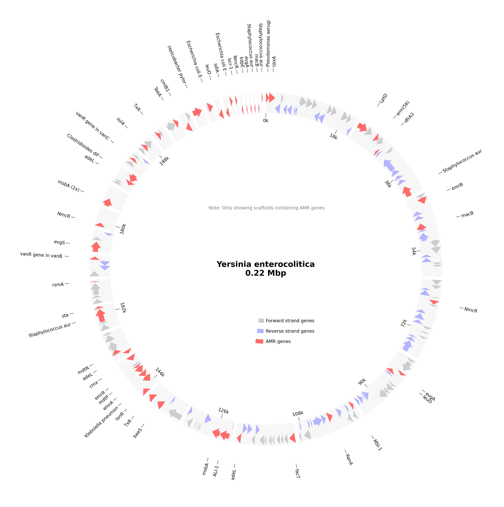

### ALI-1
- **Mechanism**: antibiotic inactivation
- **Drug Classes**: carbapenem
- **AMR Family**: ALI beta-lactamase
- **Locations**:
  - gnl|SPADES|LFDBGJIL_308_3 : position 627-2807

### Clostridioides difficile gyrB conferring resistance to fluoroquinolones
- **Mechanism**: antibiotic target alteration
- **Drug Classes**: fluoroquinolone antibiotic
- **AMR Family**: fluoroquinolone resistant gyrB
- **Locations**:
  - gnl|SPADES|LFDBGJIL_980_5 : position 2330-4135

### Escherichia coli EF-Tu mutants conferring resistance to Pulvomycin (found in 2 locations)
- **Mechanism**: antibiotic target alteration
- **Drug Classes**: elfamycin antibiotic
- **AMR Family**: elfamycin resistant EF-Tu
- **Locations**:
  - gnl|SPADES|LFDBGJIL_240301_1 : position 2-532
  - gnl|SPADES|LFDBGJIL_3769_1 : position 628-1719

### Helicobacter pylori pbp1 mutants conferring resistance to amoxicillin
- **Mechanism**: antibiotic target alteration
- **Drug Classes**: cephalosporin; cephamycin; penam
- **AMR Family**: Penicillin-binding protein mutations conferring resistance to beta-lactam antibiotics
- **Locations**:
  - gnl|SPADES|LFDBGJIL_2259_1 : position 3-2111

### Klebsiella pneumoniae KpnH
- **Mechanism**: antibiotic efflux
- **Drug Classes**: macrolide antibiotic; fluoroquinolone antibiotic; aminoglycoside antibiotic; carbapenem; cephalosporin; penam; peptide antibiotic; penem
- **AMR Family**: major facilitator superfamily (MFS) antibiotic efflux pump
- **Locations**:
  - gnl|SPADES|LFDBGJIL_397_2: position 1331-2866

### LptD
- **Mechanism**: antibiotic efflux
- **Drug Classes**: carbapenem; peptide antibiotic; aminocoumarin antibiotic; rifamycin antibiotic
- **AMR Family**: ATP-binding cassette (ABC) antibiotic efflux pump
- **Locations**:
  - gnl|SPADES|LFDBGJIL_162_1 : position 3-2354

### MSI-1
- **Mechanism**: antibiotic inactivation
- **Drug Classes**: carbapenem
- **AMR Family**: MSI beta-lactamase
- **Locations**:
  - gnl|SPADES|LFDBGJIL_239_1 : position 96-851

### NmcR (found in 3 locations)
- **Mechanism**: antibiotic inactivation
- **Drug Classes**: carbapenem; cephalosporin; cephamycin; penam
- **AMR Family**: NmcA beta-lactamase
- **Locations**:
  - gnl|SPADES|LFDBGJIL_189_6 : position 4660-5577
  - gnl|SPADES|LFDBGJIL_602668_1 : position 1-327
  - gnl|SPADES|LFDBGJIL_876_2 : position 385-1251

### Pseudomonas aeruginosa CpxR
- **Mechanism**: antibiotic efflux
- **Drug Classes**: macrolide antibiotic; fluoroquinolone antibiotic; monobactam; aminoglycoside antibiotic; carbapenem; cephalosporin; cephamycin; penam; tetracycline antibiotic; peptide antibiotic; aminocoumarin antibiotic; diaminopyrimidine antibiotic; sulfonamide antibiotic; phenicol antibiotic; penem
- **AMR Family**: resistance-nodulation-cell division (RND) antibiotic efflux pump
- **Locations**:
  - gnl|SPADES|LFDBGJIL_156_1 : position 36-734

### RanA
- **Mechanism**: antibiotic efflux
- **Drug Classes**: aminoglycoside antibiotic
- **AMR Family**: ATP-binding cassette (ABC) antibiotic efflux pump
- **Locations**:
  - gnl|SPADES|LFDBGJIL_239_7 : position 5726-6925

### Staphylococcus aureus GlpT with mutation conferring resistance to fosfomycin (found in 2 locations)
- **Mechanism**: antibiotic target alteration
- **Drug Classes**: phosphonic acid antibiotic
- **AMR Family**: antibiotic-resistant GlpT
- **Locations**:
  - gnl|SPADES|LFDBGJIL_1550666_1 : position 2-232
  - gnl|SPADES|LFDBGJIL_1705181_1 : position 3-230

### Staphylococcus aureus mupA conferring resistance to mupirocin
- **Mechanism**: antibiotic target alteration
- **Drug Classes**: mupirocin-like antibiotic
- **AMR Family**: antibiotic-resistant isoleucyl-tRNA synthetase (ileS)
- **Locations**:
  - gnl|SPADES|LFDBGJIL_162_17 : position 17711-20284

### Staphylococcus aureus mupB conferring resistance to mupirocin
- **Mechanism**: antibiotic target alteration
- **Drug Classes**: mupirocin-like antibiotic
- **AMR Family**: antibiotic-resistant isoleucyl-tRNA synthetase (ileS)
- **Locations**:
  - gnl|SPADES|LFDBGJIL_682_3 : position 1958-4855

### TaeA
- **Mechanism**: antibiotic efflux
- **Drug Classes**: pleuromutilin antibiotic
- **AMR Family**: ATP-binding cassette (ABC) antibiotic efflux pump
- **Locations**:
  - gnl|SPADES|LFDBGJIL_1627_2 : position 2027-2869

### TxR (found in 2 locations)
- **Mechanism**: antibiotic efflux
- **Drug Classes**: tetracycline antibiotic
- **AMR Family**: ATP-binding cassette (ABC) antibiotic efflux pump
- **Locations**:
  - gnl|SPADES|LFDBGJIL_1515_2 : position 929-1804
  - gnl|SPADES|LFDBGJIL_396_5 : position 7565-8902

### adeL (found in 3 locations)
- **Mechanism**: antibiotic efflux
- **Drug Classes**: fluoroquinolone antibiotic; tetracycline antibiotic
- **AMR Family**: resistance-nodulation-cell division (RND) antibiotic efflux pump
- **Locations**:
  - gnl|SPADES|LFDBGJIL_251_17 : position 12413-13306
  - gnl|SPADES|LFDBGJIL_552_1 : position 3-836
  - gnl|SPADES|LFDBGJIL_980_4 : position 1403-2326

### baeS
- **Mechanism**: antibiotic efflux
- **Drug Classes**: aminoglycoside antibiotic; aminocoumarin antibiotic
- **AMR Family**: resistance-nodulation-cell division (RND) antibiotic efflux pump
- **Locations**:
  - gnl|SPADES|LFDBGJIL_396_3 : position 5050-6486

### bcr-1
- **Mechanism**: antibiotic efflux
- **Drug Classes**: bicyclomycin-like antibiotic
- **AMR Family**: major facilitator superfamily (MFS) antibiotic efflux pump
- **Locations**:
  - gnl|SPADES|LFDBGJIL_537914_1 : position 2-394

### cmlB1
- **Mechanism**: antibiotic efflux
- **Drug Classes**: phenicol antibiotic
- **AMR Family**: major facilitator superfamily (MFS) antibiotic efflux pump
- **Locations**:
  - gnl|SPADES|LFDBGJIL_2150_1 : position 7-1191

### cmx
- **Mechanism**: antibiotic efflux
- **Drug Classes**: phenicol antibiotic
- **AMR Family**: major facilitator superfamily (MFS) antibiotic efflux pump
- **Locations**:
  - gnl|SPADES|LFDBGJIL_397_8 : position 7604-8806

### cpxA
- **Mechanism**: antibiotic efflux
- **Drug Classes**: aminoglycoside antibiotic; aminocoumarin antibiotic
- **AMR Family**: resistance-nodulation-cell division (RND) antibiotic efflux pump
- **Locations**:
  - gnl|SPADES|LFDBGJIL_156_2 : position 731-2107

### dfrA3
- **Mechanism**: antibiotic target replacement
- **Drug Classes**: diaminopyrimidine antibiotic
- **AMR Family**: trimethoprim resistant dihydrofolate reductase dfr
- **Locations**:
  - gnl|SPADES|LFDBGJIL_162_7 : position 6880-7362

### emrA
- **Mechanism**: antibiotic efflux
- **Drug Classes**: fluoroquinolone antibiotic
- **AMR Family**: major facilitator superfamily (MFS) antibiotic efflux pump
- **Locations**:
  - gnl|SPADES|LFDBGJIL_397_3 : position 2906-4078

### emrB
- **Mechanism**: antibiotic efflux
- **Drug Classes**: fluoroquinolone antibiotic
- **AMR Family**: major facilitator superfamily (MFS) antibiotic efflux pump
- **Locations**:
  - gnl|SPADES|LFDBGJIL_175_2 : position 940-2364

### emrR
- **Mechanism**: antibiotic efflux
- **Drug Classes**: fluoroquinolone antibiotic
- **AMR Family**: major facilitator superfamily (MFS) antibiotic efflux pump
- **Locations**:
  - gnl|SPADES|LFDBGJIL_397_5 : position 5607-6119

### erm(56)
- **Mechanism**: antibiotic target alteration
- **Drug Classes**: macrolide antibiotic; lincosamide antibiotic; streptogramin antibiotic; streptogramin B antibiotic
- **AMR Family**: Erm 23S ribosomal RNA methyltransferase
- **Locations**:
  - gnl|SPADES|LFDBGJIL_162_4 : position 4698-5516

### evgA (found in 2 locations)
- **Mechanism**: antibiotic efflux
- **Drug Classes**: macrolide antibiotic; fluoroquinolone antibiotic; penam; tetracycline antibiotic
- **AMR Family**: major facilitator superfamily (MFS) antibiotic efflux pump; resistance-nodulation-cell division (RND) antibiotic efflux pump
- **Locations**:
  - gnl|SPADES|LFDBGJIL_214_3 : position 3794-4438
  - gnl|SPADES|LFDBGJIL_976811_1 : position 62-301

### evgS
- **Mechanism**: antibiotic efflux
- **Drug Classes**: macrolide antibiotic; fluoroquinolone antibiotic; penam; tetracycline antibiotic
- **AMR Family**: major facilitator superfamily (MFS) antibiotic efflux pump; resistance-nodulation-cell division (RND) antibiotic efflux pump
- **Locations**:
  - gnl|SPADES|LFDBGJIL_838_1 : position 3-2315

### facT
- **Mechanism**: antibiotic efflux
- **Drug Classes**: elfamycin antibiotic
- **AMR Family**: major facilitator superfamily (MFS) antibiotic efflux pump
- **Locations**:
  - gnl|SPADES|LFDBGJIL_251_2 : position 304-1608

### kdpE
- **Mechanism**: antibiotic efflux
- **Drug Classes**: aminoglycoside antibiotic
- **AMR Family**: kdpDE
- **Locations**:
  - gnl|SPADES|LFDBGJIL_794000_2 : position 176-331

### leuO (found in 2 locations)
- **Mechanism**: antibiotic efflux
- **Drug Classes**: nucleoside antibiotic; disinfecting agents and antiseptics
- **AMR Family**: major facilitator superfamily (MFS) antibiotic efflux pump
- **Locations**:
  - gnl|SPADES|LFDBGJIL_13721_1 : position 54-1001
  - gnl|SPADES|LFDBGJIL_214_4 : position 4445-5347

### macB (found in 2 locations)
- **Mechanism**: antibiotic efflux
- **Drug Classes**: macrolide antibiotic
- **AMR Family**: ATP-binding cassette (ABC) antibiotic efflux pump
- **Locations**:
  - gnl|SPADES|LFDBGJIL_1690933_1 : position 3-230
  - gnl|SPADES|LFDBGJIL_175_7 : position 6334-7866

### mdtN
- **Mechanism**: antibiotic efflux
- **Drug Classes**: nucleoside antibiotic; disinfecting agents and antiseptics
- **AMR Family**: major facilitator superfamily (MFS) antibiotic efflux pump
- **Locations**:
  - gnl|SPADES|LFDBGJIL_552_3 : position 1360-2295

### mdtP
- **Mechanism**: antibiotic efflux
- **Drug Classes**: nucleoside antibiotic; disinfecting agents and antiseptics
- **AMR Family**: major facilitator superfamily (MFS) antibiotic efflux pump
- **Locations**:
  - gnl|SPADES|LFDBGJIL_397_4 : position 4093-5559

### msbA (found in 3 locations)
- **Mechanism**: antibiotic efflux
- **Drug Classes**: nitroimidazole antibiotic
- **AMR Family**: ATP-binding cassette (ABC) antibiotic efflux pump
- **Locations**:
  - gnl|SPADES|LFDBGJIL_308_4 : position 2843-4591
  - gnl|SPADES|LFDBGJIL_901_1 : position 3-1766
  - gnl|SPADES|LFDBGJIL_901_2 : position 1769-3493

### rsmA
- **Mechanism**: antibiotic efflux
- **Drug Classes**: fluoroquinolone antibiotic; diaminopyrimidine antibiotic; phenicol antibiotic
- **AMR Family**: resistance-nodulation-cell division (RND) antibiotic efflux pump
- **Locations**:
  - gnl|SPADES|LFDBGJIL_716_4: position 4821-5006

### sdiA
- **Mechanism**: antibiotic efflux
- **Drug Classes**: fluoroquinolone antibiotic; cephalosporin; glycylcycline; penam; tetracycline antibiotic; rifamycin antibiotic; phenicol antibiotic; disinfecting agents and antiseptics
- **AMR Family**: resistance-nodulation-cell division (RND) antibiotic efflux pump
- **Locations**:
  - gnl|SPADES|LFDBGJIL_36338_1 : position 1-723

### sta
- **Mechanism**: antibiotic inactivation
- **Drug Classes**: nucleoside antibiotic
- **AMR Family**: streptothricin acetyltransferase (SAT)
- **Locations**:
  - gnl|SPADES|LFDBGJIL_682_4 : position 4990-5484

### sul4
- **Mechanism**: antibiotic target replacement
- **Drug Classes**: sulfonamide antibiotic
- **AMR Family**: sulfonamide resistant sul
- **Locations**:
  - gnl|SPADES|LFDBGJIL_1265_2 : position 1076-1909

### tsnR
- **Mechanism**: antibiotic target alteration
- **Drug Classes**: peptide antibiotic
- **AMR Family**: non-erm 23S ribosomal RNA methyltransferase (A1067)
- **Locations**:
  - gnl|SPADES|LFDBGJIL_397_1 : position 33-1124

### vanR gene in vanB cluster
- **Mechanism**: antibiotic target alteration
- **Drug Classes**: glycopeptide antibiotic
- **AMR Family**: glycopeptide resistance gene cluster; vanR
- **Locations**:
  - gnl|SPADES|LFDBGJIL_800_4 : position 3809-4525

### vanR gene in vanC cluster
- **Mechanism**: antibiotic target alteration
- **Drug Classes**: glycopeptide antibiotic
- **AMR Family**: glycopeptide resistance gene cluster; vanR
- **Locations**:
  - gnl|SPADES|LFDBGJIL_1065_2 : position 1772-2425

## Yersinia enterocolitica (type O:5) str. YE53/03
**Strain Statistics:**
- Total genome length: 3450.7 kbp
- Total scaffolds: 146
- Scaffolds with AMR genes: 91
- Total genes annotated: 6186
- Total AMR genes: 371
- Unique AMR genes: 170
- Distinct AMR mechanisms: 9
- Distinct AMR families: 63
- Distinct drug classes: 36

**Circos Plot:**

_str._YE53_03.png)

### Acinetobacter baumannii AbaF (found in 4 locations)
- **Mechanism**: antibiotic efflux
- **Drug Classes**: phosphonic acid antibiotic
- **AMR Family**: major facilitator superfamily (MFS) antibiotic efflux pump
- **Locations**:
  - gnl|SPADES|LFDBGJIL_227_5 : position 4491-5858
  - gnl|SPADES|LFDBGJIL_60_26 : position 29971-31374
  - gnl|SPADES|LFDBGJIL_60_32 : position 36851-38353
  - gnl|SPADES|LFDBGJIL_95_11 : position 10976-12502

### Acinetobacter baumannii AbaQ (found in 4 locations)
- **Mechanism**: antibiotic efflux
- **Drug Classes**: fluoroquinolone antibiotic
- **AMR Family**: major facilitator superfamily (MFS) antibiotic efflux pump
- **Locations**:
  - gnl|SPADES|LFDBGJIL_102_19 : position 19364-20680
  - gnl|SPADES|LFDBGJIL_20_67 : position 70424-71782
  - gnl|SPADES|LFDBGJIL_27_23 : position 22167-23483
  - gnl|SPADES|LFDBGJIL_53_5 : position 6201-7511

### Acinetobacter baumannii AmvA
- **Mechanism**: antibiotic efflux
- **Drug Classes**: macrolide antibiotic; disinfecting agents and antiseptics
- **AMR Family**: major facilitator superfamily (MFS) antibiotic efflux pump
- **Locations**:
  - gnl|SPADES|LFDBGJIL_55_29 : position 33907-35400

### ArnT
- **Mechanism**: antibiotic target alteration
- **Drug Classes**: peptide antibiotic
- **AMR Family**: pmr phosphoethanolamine transferase
- **Locations**:
  - gnl|SPADES|LFDBGJIL_77_22: position 25572-27236

### Bifidobacterium bifidum ileS conferring resistance to mupirocin
- **Mechanism**: antibiotic target alteration
- **Drug Classes**: mupirocin-like antibiotic
- **AMR Family**: antibiotic-resistant isoleucyl-tRNA synthetase (ileS)
- **Locations**:
  - gnl|SPADES|LFDBGJIL_37_41 : position 38192-40774

### CMY-70
- **Mechanism**: antibiotic inactivation
- **Drug Classes**: cephamycin
- **AMR Family**: CMY beta-lactamase
- **Locations**:
  - gnl|SPADES|LFDBGJIL_27_28 : position 27415-28581

### CRP
- **Mechanism**: antibiotic efflux
- **Drug Classes**: macrolide antibiotic; fluoroquinolone antibiotic; penam
- **AMR Family**: resistance-nodulation-cell division (RND) antibiotic efflux pump
- **Locations**:
  - gnl|SPADES|LFDBGJIL_19_3 : position 1763-2518

### CrcB (found in 2 locations)
- **Mechanism**: antibiotic efflux
- **Drug Classes**: aminoglycoside antibiotic
- **AMR Family**: multidrug and toxic compound extrusion (MATE) transporter
- **Locations**:
  - gnl|SPADES|LFDBGJIL_17_30 : position 25786-26190
  - gnl|SPADES|LFDBGJIL_37_26 : position 24639-25022

### D-Ala-D-Ala ligase
- **Mechanism**: antibiotic target alteration
- **Drug Classes**: glycopeptide antibiotic
- **AMR Family**: Van ligase
- **Locations**:
  - gnl|SPADES|LFDBGJIL_101_2 : position 594-1514

### DHA-6
- **Mechanism**: antibiotic inactivation
- **Drug Classes**: cephalosporin; cephamycin
- **AMR Family**: DHA beta-lactamase
- **Locations**:
  - gnl|SPADES|LFDBGJIL_140_2 : position 1623-2765

### Enterobacter cloacae acrA (found in 2 locations)
- **Mechanism**: antibiotic efflux
- **Drug Classes**: fluoroquinolone antibiotic; cephalosporin; glycylcycline; penam; tetracycline antibiotic; rifamycin antibiotic; phenicol antibiotic; disinfecting agents and antiseptics
- **AMR Family**: resistance-nodulation-cell division (RND) antibiotic efflux pump
- **Locations**:
  - gnl|SPADES|LFDBGJIL_123_16 : position 21691-22674
  - gnl|SPADES|LFDBGJIL_44_46 : position 51095-52255

### Enterococcus faecalis cls with mutation conferring resistance to daptomycin
- **Mechanism**: antibiotic target alteration
- **Drug Classes**: peptide antibiotic
- **AMR Family**: daptomycin resistant cls
- **Locations**:
  - gnl|SPADES|LFDBGJIL_39_31 : position 25036-26496

### Erm(34)
- **Mechanism**: antibiotic target alteration
- **Drug Classes**: macrolide antibiotic; lincosamide antibiotic; streptogramin antibiotic; streptogramin A antibiotic; streptogramin B antibiotic
- **AMR Family**: Erm 23S ribosomal RNA methyltransferase
- **Locations**:
  - gnl|SPADES|LFDBGJIL_26_20 : position 18074-18700

### Escherichia coli AcrAB-TolC with AcrR mutation conferring resistance to ciprofloxacin, tetracycline, and ceftazidime (found in 2 locations)
- **Mechanism**: antibiotic target alteration; antibiotic efflux
- **Drug Classes**: fluoroquinolone antibiotic; cephalosporin; glycylcycline; penam; tetracycline antibiotic; rifamycin antibiotic; phenicol antibiotic; disinfecting agents and antiseptics
- **AMR Family**: resistance-nodulation-cell division (RND) antibiotic efflux pump
- **Locations**:
  - gnl|SPADES|LFDBGJIL_21_8 : position 8865-9449
  - gnl|SPADES|LFDBGJIL_30_63 : position 58370-59026

### Escherichia coli AcrAB-TolC with MarR mutations conferring resistance to ciprofloxacin and tetracycline
- **Mechanism**: antibiotic target alteration; antibiotic efflux
- **Drug Classes**: fluoroquinolone antibiotic; cephalosporin; glycylcycline; penam; tetracycline antibiotic; rifamycin antibiotic; phenicol antibiotic; disinfecting agents and antiseptics
- **AMR Family**: resistance-nodulation-cell division (RND) antibiotic efflux pump
- **Locations**:
  - gnl|SPADES|LFDBGJIL_19_72 : position 78987-79418

### Escherichia coli acrA (found in 2 locations)
- **Mechanism**: antibiotic efflux
- **Drug Classes**: fluoroquinolone antibiotic; cephalosporin; glycylcycline; penam; tetracycline antibiotic; rifamycin antibiotic; phenicol antibiotic; disinfecting agents and antiseptics
- **AMR Family**: resistance-nodulation-cell division (RND) antibiotic efflux pump
- **Locations**:
  - gnl|SPADES|LFDBGJIL_288_2 : position 378-1580
  - gnl|SPADES|LFDBGJIL_30_64 : position 59171-60358

### Escherichia coli mdfA
- **Mechanism**: antibiotic efflux
- **Drug Classes**: tetracycline antibiotic; phenicol antibiotic; disinfecting agents and antiseptics
- **AMR Family**: major facilitator superfamily (MFS) antibiotic efflux pump
- **Locations**:
  - gnl|SPADES|LFDBGJIL_12_43 : position 49476-50705

### Escherichia coli murA with mutation conferring resistance to fosfomycin
- **Mechanism**: antibiotic target alteration
- **Drug Classes**: phosphonic acid antibiotic
- **AMR Family**: antibiotic-resistant murA transferase
- **Locations**:
  - gnl|SPADES|LFDBGJIL_469_2 : position 490-1776

### Escherichia coli parE conferring resistance to fluoroquinolones
- **Mechanism**: antibiotic target alteration
- **Drug Classes**: fluoroquinolone antibiotic
- **AMR Family**: fluoroquinolone resistant parE
- **Locations**:
  - gnl|SPADES|LFDBGJIL_12_1 : position 3-1079

### Escherichia coli soxS with mutation conferring antibiotic resistance (found in 4 locations)
- **Mechanism**: antibiotic target alteration; antibiotic efflux; reduced permeability to antibiotic
- **Drug Classes**: fluoroquinolone antibiotic; monobactam; carbapenem; cephalosporin; glycylcycline; cephamycin; penam; tetracycline antibiotic; rifamycin antibiotic; phenicol antibiotic; penem; disinfecting agents and antiseptics
- **AMR Family**: ATP-binding cassette (ABC) antibiotic efflux pump; major facilitator superfamily (MFS) antibiotic efflux pump; resistance-nodulation-cell division (RND) antibiotic efflux pump; General Bacterial Porin with reduced permeability to beta-lactams
- **Locations**:
  - gnl|SPADES|LFDBGJIL_17_4 : position 1591-2598
  - gnl|SPADES|LFDBGJIL_22_48 : position 49125-50057
  - gnl|SPADES|LFDBGJIL_28_48 : position 54653-55360
  - gnl|SPADES|LFDBGJIL_82_1 : position 3-809

### Escherichia coli uhpA with mutation conferring resistance to fosfomycin
- **Mechanism**: antibiotic target alteration
- **Drug Classes**: phosphonic acid antibiotic
- **AMR Family**: antibiotic-resistant UhpT
- **Locations**:
  - gnl|SPADES|LFDBGJIL_242_7 : position 8427-9011

### FosM2
- **Mechanism**: antibiotic inactivation
- **Drug Classes**: phosphonic acid antibiotic
- **AMR Family**: fosfomycin thiol transferase
- **Locations**:
  - gnl|SPADES|LFDBGJIL_19_81 : position 88031-88438

### H-NS
- **Mechanism**: antibiotic efflux
- **Drug Classes**: macrolide antibiotic; fluoroquinolone antibiotic; cephalosporin; cephamycin; penam; tetracycline antibiotic
- **AMR Family**: major facilitator superfamily (MFS) antibiotic efflux pump; resistance-nodulation-cell division (RND) antibiotic efflux pump
- **Locations**:
  - gnl|SPADES|LFDBGJIL_39_43 : position 41186-41596

### Haemophilus influenzae PBP3 conferring resistance to beta-lactam antibiotics
- **Mechanism**: antibiotic target alteration
- **Drug Classes**: cephalosporin; cephamycin; penam
- **AMR Family**: Penicillin-binding protein mutations conferring resistance to beta-lactam antibiotics
- **Locations**:
  - gnl|SPADES|LFDBGJIL_101_10 : position 10567-12330

### Helicobacter pylori pbp1 mutants conferring resistance to amoxicillin
- **Mechanism**: antibiotic target alteration
- **Drug Classes**: cephalosporin; cephamycin; penam
- **AMR Family**: Penicillin-binding protein mutations conferring resistance to beta-lactam antibiotics
- **Locations**:
  - gnl|SPADES|LFDBGJIL_24_58 : position 72216-74552

### Helicobacter pylori pbp2 mutants conferring resistance to amoxicillin
- **Mechanism**: antibiotic target alteration
- **Drug Classes**: cephalosporin; cephamycin; penam
- **AMR Family**: Penicillin-binding protein mutations conferring resistance to beta-lactam antibiotics
- **Locations**:
  - gnl|SPADES|LFDBGJIL_37_35 : position 32892-34787

### Helicobacter pylori pbp3 conferring resistance to amoxicillin
- **Mechanism**: antibiotic target alteration
- **Drug Classes**: cephalosporin; cephamycin; penam
- **AMR Family**: Penicillin-binding protein mutations conferring resistance to beta-lactam antibiotics
- **Locations**:
  - gnl|SPADES|LFDBGJIL_62_43 : position 40094-41803

### Klebsiella pneumoniae KpnE
- **Mechanism**: antibiotic efflux
- **Drug Classes**: macrolide antibiotic; aminoglycoside antibiotic; cephalosporin; tetracycline antibiotic; peptide antibiotic; rifamycin antibiotic; disinfecting agents and antiseptics
- **AMR Family**: small multidrug resistance (SMR) antibiotic efflux pump
- **Locations**:
  - gnl|SPADES|LFDBGJIL_445_2 : position 1064-1441

### Klebsiella pneumoniae KpnF
- **Mechanism**: antibiotic efflux
- **Drug Classes**: macrolide antibiotic; aminoglycoside antibiotic; cephalosporin; tetracycline antibiotic; peptide antibiotic; rifamycin antibiotic; disinfecting agents and antiseptics
- **AMR Family**: small multidrug resistance (SMR) antibiotic efflux pump
- **Locations**:
  - gnl|SPADES|LFDBGJIL_445_3: position 1428-1757

### Klebsiella pneumoniae KpnG
- **Mechanism**: antibiotic efflux
- **Drug Classes**: macrolide antibiotic; fluoroquinolone antibiotic; aminoglycoside antibiotic; carbapenem; cephalosporin; penam; peptide antibiotic; penem
- **AMR Family**: major facilitator superfamily (MFS) antibiotic efflux pump
- **Locations**:
  - gnl|SPADES|LFDBGJIL_21_44 : position 54081-55373

### Klebsiella pneumoniae OmpK37 (found in 4 locations)
- **Mechanism**: reduced permeability to antibiotic
- **Drug Classes**: monobactam; carbapenem; cephalosporin; cephamycin; penam; penem
- **AMR Family**: General Bacterial Porin with reduced permeability to beta-lactams
- **Locations**:
  - gnl|SPADES|LFDBGJIL_123_15 : position 20330-21445
  - gnl|SPADES|LFDBGJIL_140_1 : position 30-1130
  - gnl|SPADES|LFDBGJIL_16_41 : position 40461-41543
  - gnl|SPADES|LFDBGJIL_41_34 : position 33478-34593

### LRA-19
- **Mechanism**: antibiotic inactivation
- **Drug Classes**: cephalosporin; penam
- **AMR Family**: subclass B3 LRA beta-lactamase
- **Locations**:
  - gnl|SPADES|LFDBGJIL_286_3 : position 3296-3943

### LlmA 23S ribosomal RNA methyltransferase
- **Mechanism**: antibiotic target alteration
- **Drug Classes**: lincosamide antibiotic
- **AMR Family**: Llm 23S ribosomal RNA methyltransferase
- **Locations**:
  - gnl|SPADES|LFDBGJIL_87_25 : position 24680-25870

### LpsB
- **Mechanism**: reduced permeability to antibiotic
- **Drug Classes**: peptide antibiotic
- **AMR Family**: Intrinsic peptide antibiotic resistant Lps
- **Locations**:
  - gnl|SPADES|LFDBGJIL_30_46 : position 39035-40138

### MdtK
- **Mechanism**: antibiotic efflux
- **Drug Classes**: fluoroquinolone antibiotic
- **AMR Family**: multidrug and toxic compound extrusion (MATE) transporter
- **Locations**:
  - gnl|SPADES|LFDBGJIL_21_1 : position 267-1664

### MexF
- **Mechanism**: antibiotic efflux
- **Drug Classes**: fluoroquinolone antibiotic; diaminopyrimidine antibiotic; phenicol antibiotic
- **AMR Family**: resistance-nodulation-cell division (RND) antibiotic efflux pump
- **Locations**:
  - gnl|SPADES|LFDBGJIL_60_35 : position 40598-43411

### MexH
- **Mechanism**: antibiotic efflux
- **Drug Classes**: fluoroquinolone antibiotic; tetracycline antibiotic; disinfecting agents and antiseptics
- **AMR Family**: resistance-nodulation-cell division (RND) antibiotic efflux pump
- **Locations**:
  - gnl|SPADES|LFDBGJIL_53_15 : position 18640-20178

### MexJ
- **Mechanism**: antibiotic efflux
- **Drug Classes**: macrolide antibiotic; tetracycline antibiotic; disinfecting agents and antiseptics
- **AMR Family**: resistance-nodulation-cell division (RND) antibiotic efflux pump
- **Locations**:
  - gnl|SPADES|LFDBGJIL_35_24 : position 32386-33468

### MexS (found in 5 locations)
- **Mechanism**: antibiotic efflux
- **Drug Classes**: fluoroquinolone antibiotic; diaminopyrimidine antibiotic; phenicol antibiotic
- **AMR Family**: resistance-nodulation-cell division (RND) antibiotic efflux pump
- **Locations**:
  - gnl|SPADES|LFDBGJIL_130_7 : position 8272-9306
  - gnl|SPADES|LFDBGJIL_199_6 : position 5657-6811
  - gnl|SPADES|LFDBGJIL_21_11 : position 11640-12650
  - gnl|SPADES|LFDBGJIL_21_72 : position 84156-85166
  - gnl|SPADES|LFDBGJIL_33_29 : position 41115-42191

### MexT
- **Mechanism**: antibiotic efflux
- **Drug Classes**: fluoroquinolone antibiotic; diaminopyrimidine antibiotic; phenicol antibiotic
- **AMR Family**: resistance-nodulation-cell division (RND) antibiotic efflux pump
- **Locations**:
  - gnl|SPADES|LFDBGJIL_16_2 : position 2682-3602

### Mycobacterium tuberculosis kasA mutant conferring resistance to isoniazid (found in 2 locations)
- **Mechanism**: antibiotic target alteration
- **Drug Classes**: isoniazid-like antibiotic
- **AMR Family**: antibiotic resistant kasA
- **Locations**:
  - gnl|SPADES|LFDBGJIL_190_6 : position 4462-5637
  - gnl|SPADES|LFDBGJIL_375_6 : position 5206-6480

### Mycobacterium tuberculosis ndh with mutation conferring resistance to isoniazid
- **Mechanism**: antibiotic target alteration
- **Drug Classes**: isoniazid-like antibiotic
- **AMR Family**: antibiotic resistant ndh
- **Locations**:
  - gnl|SPADES|LFDBGJIL_20_16 : position 14921-16225

### Mycobacterium tuberculosis pncA mutations conferring resistance to pyrazinamide
- **Mechanism**: antibiotic target alteration
- **Drug Classes**: pyrazine antibiotic
- **AMR Family**: Pyrazinamide resistant pncA
- **Locations**:
  - gnl|SPADES|LFDBGJIL_39_59 : position 59755-60408

### Mycobacterium tuberculosis thyA with mutation conferring resistance to para-aminosalicylic acid
- **Mechanism**: antibiotic target alteration
- **Drug Classes**: salicylic acid antibiotic
- **AMR Family**: aminosalicylate resistant thymidylate synthase
- **Locations**:
  - gnl|SPADES|LFDBGJIL_153_11 : position 17335-18129

### Neisseria gonorrhoeae pilQ gene conferring resistance to beta-lactam
- **Mechanism**: antibiotic target alteration
- **Drug Classes**: cephalosporin; cephamycin; penam
- **AMR Family**: Penicillin-binding protein mutations conferring resistance to beta-lactam antibiotics
- **Locations**:
  - gnl|SPADES|LFDBGJIL_38_32 : position 30390-32336

### NmcR (found in 8 locations)
- **Mechanism**: antibiotic inactivation
- **Drug Classes**: carbapenem; cephalosporin; cephamycin; penam
- **AMR Family**: NmcA beta-lactamase
- **Locations**:
  - gnl|SPADES|LFDBGJIL_115_30 : position 24645-25619
  - gnl|SPADES|LFDBGJIL_215_11 : position 11826-12707
  - gnl|SPADES|LFDBGJIL_215_2 : position 332-1213
  - gnl|SPADES|LFDBGJIL_22_1 : position 97-951
  - gnl|SPADES|LFDBGJIL_23_26 : position 35385-36278
  - gnl|SPADES|LFDBGJIL_27_29 : position 28716-29600
  - gnl|SPADES|LFDBGJIL_55_6 : position 6592-7479
  - gnl|SPADES|LFDBGJIL_68_18 : position 21059-21979

### OXA-152
- **Mechanism**: antibiotic inactivation
- **Drug Classes**: carbapenem; penam
- **AMR Family**: OXA beta-lactamase; OXA-62-like beta-lactamase
- **Locations**:
  - gnl|SPADES|LFDBGJIL_108_14 : position 13795-14499

### OmpA (found in 4 locations)
- **Mechanism**: reduced permeability to antibiotic
- **Drug Classes**: peptide antibiotic
- **AMR Family**: General Bacterial Porin with reduced permeability to peptide antibiotics
- **Locations**:
  - gnl|SPADES|LFDBGJIL_12_16 : position 17388-18047
  - gnl|SPADES|LFDBGJIL_23_20 : position 28207-29877
  - gnl|SPADES|LFDBGJIL_23_3 : position 6210-7586
  - gnl|SPADES|LFDBGJIL_82_9 : position 10110-10619

### OprJ
- **Mechanism**: antibiotic efflux
- **Drug Classes**: macrolide antibiotic; fluoroquinolone antibiotic; aminoglycoside antibiotic; cephalosporin; penam; tetracycline antibiotic; aminocoumarin antibiotic; diaminopyrimidine antibiotic; phenicol antibiotic
- **AMR Family**: resistance-nodulation-cell division (RND) antibiotic efflux pump
- **Locations**:
  - gnl|SPADES|LFDBGJIL_60_10 : position 11587-13107

### OprM
- **Mechanism**: antibiotic efflux
- **Drug Classes**: macrolide antibiotic; fluoroquinolone antibiotic; monobactam; aminoglycoside antibiotic; carbapenem; cephalosporin; cephamycin; penam; tetracycline antibiotic; peptide antibiotic; aminocoumarin antibiotic; diaminopyrimidine antibiotic; sulfonamide antibiotic; phenicol antibiotic; penem; disinfecting agents and antiseptics
- **AMR Family**: resistance-nodulation-cell division (RND) antibiotic efflux pump
- **Locations**:
  - gnl|SPADES|LFDBGJIL_44_44 : position 46558-47964

### PDC-382
- **Mechanism**: antibiotic inactivation
- **Drug Classes**: monobactam; carbapenem; cephalosporin
- **AMR Family**: PDC beta-lactamase
- **Locations**:
  - gnl|SPADES|LFDBGJIL_21_6 : position 6460-7632

### ParR (found in 3 locations)
- **Mechanism**: antibiotic efflux; reduced permeability to antibiotic
- **Drug Classes**: macrolide antibiotic; fluoroquinolone antibiotic; monobactam; aminoglycoside antibiotic; carbapenem; cephalosporin; cephamycin; penam; tetracycline antibiotic; phenicol antibiotic; penem; disinfecting agents and antiseptics
- **AMR Family**: resistance-nodulation-cell division (RND) antibiotic efflux pump; Outer Membrane Porin (Opr)
- **Locations**:
  - gnl|SPADES|LFDBGJIL_19_10 : position 10867-11595
  - gnl|SPADES|LFDBGJIL_217_6 : position 5694-6413
  - gnl|SPADES|LFDBGJIL_60_1 : position 399-1127

### ParS (found in 2 locations)
- **Mechanism**: antibiotic efflux; reduced permeability to antibiotic
- **Drug Classes**: macrolide antibiotic; fluoroquinolone antibiotic; monobactam; aminoglycoside antibiotic; carbapenem; cephalosporin; cephamycin; penam; tetracycline antibiotic; phenicol antibiotic; penem; disinfecting agents and antiseptics
- **AMR Family**: resistance-nodulation-cell division (RND) antibiotic efflux pump; Outer Membrane Porin (Opr)
- **Locations**:
  - gnl|SPADES|LFDBGJIL_19_11 : position 11592-12905
  - gnl|SPADES|LFDBGJIL_60_3 : position 1607-2497

### Planobispora rosea EF-Tu mutants conferring resistance to inhibitor GE2270A (found in 2 locations)
- **Mechanism**: antibiotic target alteration
- **Drug Classes**: elfamycin antibiotic
- **AMR Family**: elfamycin resistant EF-Tu
- **Locations**:
  - gnl|SPADES|LFDBGJIL_12_42 : position 47518-49410
  - gnl|SPADES|LFDBGJIL_26_9 : position 9264-10763

### PmrF (found in 3 locations)
- **Mechanism**: antibiotic target alteration
- **Drug Classes**: peptide antibiotic
- **AMR Family**: pmr phosphoethanolamine transferase
- **Locations**:
  - gnl|SPADES|LFDBGJIL_16_58 : position 62932-64305
  - gnl|SPADES|LFDBGJIL_232_5 : position 4947-5936
  - gnl|SPADES|LFDBGJIL_77_25 : position 30150-31133

### Pseudomonas aeruginosa CpxR
- **Mechanism**: antibiotic efflux
- **Drug Classes**: macrolide antibiotic; fluoroquinolone antibiotic; monobactam; aminoglycoside antibiotic; carbapenem; cephalosporin; cephamycin; penam; tetracycline antibiotic; peptide antibiotic; aminocoumarin antibiotic; diaminopyrimidine antibiotic; sulfonamide antibiotic; phenicol antibiotic; penem
- **AMR Family**: resistance-nodulation-cell division (RND) antibiotic efflux pump
- **Locations**:
  - gnl|SPADES|LFDBGJIL_95_3 : position 1696-2379

### Pseudomonas aeruginosa ampR with mutation conferring resistance to aztreonam
- **Mechanism**: antibiotic target alteration; antibiotic inactivation
- **Drug Classes**: monobactam; carbapenem; cephalosporin
- **AMR Family**: PDC beta-lactamase; ampR transcriptional regulator with mutation conferring resistance to monobactam antibiotics
- **Locations**:
  - gnl|SPADES|LFDBGJIL_26_48 : position 49281-50222

### QepA4 (found in 3 locations)
- **Mechanism**: antibiotic efflux
- **Drug Classes**: fluoroquinolone antibiotic
- **AMR Family**: major facilitator superfamily (MFS) antibiotic efflux pump
- **Locations**:
  - gnl|SPADES|LFDBGJIL_16_3 : position 3731-5155
  - gnl|SPADES|LFDBGJIL_16_75 : position 83192-84832
  - gnl|SPADES|LFDBGJIL_22_33 : position 30637-31929

### RanA (found in 19 locations)
- **Mechanism**: antibiotic efflux
- **Drug Classes**: aminoglycoside antibiotic
- **AMR Family**: ATP-binding cassette (ABC) antibiotic efflux pump
- **Locations**:
  - gnl|SPADES|LFDBGJIL_104_20 : position 20644-22158
  - gnl|SPADES|LFDBGJIL_12_108 : position 128783-129805
  - gnl|SPADES|LFDBGJIL_133_19 : position 18129-18905
  - gnl|SPADES|LFDBGJIL_19_57 : position 65167-65982
  - gnl|SPADES|LFDBGJIL_21_22 : position 28186-29277
  - gnl|SPADES|LFDBGJIL_25_20 : position 20232-21050
  - gnl|SPADES|LFDBGJIL_26_54 : position 55569-56384
  - gnl|SPADES|LFDBGJIL_348_4 : position 2876-3679
  - gnl|SPADES|LFDBGJIL_39_33 : position 27145-28146
  - gnl|SPADES|LFDBGJIL_39_34 : position 28143-29144
  - gnl|SPADES|LFDBGJIL_44_29 : position 26926-28041
  - gnl|SPADES|LFDBGJIL_44_5 : position 4255-5133
  - gnl|SPADES|LFDBGJIL_55_22 : position 24523-25572
  - gnl|SPADES|LFDBGJIL_55_31 : position 36748-37554
  - gnl|SPADES|LFDBGJIL_61_4 : position 2460-3194
  - gnl|SPADES|LFDBGJIL_70_26 : position 29754-30887
  - gnl|SPADES|LFDBGJIL_72_14 : position 12672-13799
  - gnl|SPADES|LFDBGJIL_78_16 : position 16521-18113
  - gnl|SPADES|LFDBGJIL_94_10 : position 9545-10648

### RanB (found in 2 locations)
- **Mechanism**: antibiotic efflux
- **Drug Classes**: aminoglycoside antibiotic
- **AMR Family**: ATP-binding cassette (ABC) antibiotic efflux pump
- **Locations**:
  - gnl|SPADES|LFDBGJIL_348_5 : position 3690-4472
  - gnl|SPADES|LFDBGJIL_55_30 : position 35609-36754

### Rv1877 (found in 2 locations)
- **Mechanism**: antibiotic efflux
- **Drug Classes**: fluoroquinolone antibiotic
- **AMR Family**: major facilitator superfamily (MFS) antibiotic efflux pump
- **Locations**:
  - gnl|SPADES|LFDBGJIL_12_14 : position 15038-16486
  - gnl|SPADES|LFDBGJIL_21_42 : position 52100-53488

### SAT-3
- **Mechanism**: antibiotic inactivation
- **Drug Classes**: nucleoside antibiotic
- **AMR Family**: streptothricin acetyltransferase (SAT)
- **Locations**:
  - gnl|SPADES|LFDBGJIL_39_47 : position 45979-46407

### Salmonella serovars soxS with mutation conferring antibiotic resistance
- **Mechanism**: antibiotic target alteration; antibiotic efflux; reduced permeability to antibiotic
- **Drug Classes**: fluoroquinolone antibiotic; monobactam; carbapenem; cephalosporin; glycylcycline; cephamycin; penam; tetracycline antibiotic; rifamycin antibiotic; phenicol antibiotic; penem; disinfecting agents and antiseptics
- **AMR Family**: ATP-binding cassette (ABC) antibiotic efflux pump; major facilitator superfamily (MFS) antibiotic efflux pump; resistance-nodulation-cell division (RND) antibiotic efflux pump; General Bacterial Porin with reduced permeability to beta-lactams
- **Locations**:
  - gnl|SPADES|LFDBGJIL_20_81 : position 84305-84691

### SatA
- **Mechanism**: antibiotic inactivation
- **Drug Classes**: nucleoside antibiotic
- **AMR Family**: streptothricin acetyltransferase (SAT)
- **Locations**:
  - gnl|SPADES|LFDBGJIL_21_13 : position 14374-14832

### Staphylococcus aureus GlpT with mutation conferring resistance to fosfomycin
- **Mechanism**: antibiotic target alteration
- **Drug Classes**: phosphonic acid antibiotic
- **AMR Family**: antibiotic-resistant GlpT
- **Locations**:
  - gnl|SPADES|LFDBGJIL_12_100 : position 117221-118585

### Staphylococcus aureus fusA with mutation conferring resistance to fusidic acid (found in 2 locations)
- **Mechanism**: antibiotic target alteration
- **Drug Classes**: fusidane antibiotic
- **AMR Family**: antibiotic resistant fusA
- **Locations**:
  - gnl|SPADES|LFDBGJIL_26_59 : position 60550-62658
  - gnl|SPADES|LFDBGJIL_82_26 : position 29122-30711

### Staphylococcus aureus murA with mutation conferring resistance to fosfomycin
- **Mechanism**: antibiotic target alteration
- **Drug Classes**: phosphonic acid antibiotic
- **AMR Family**: antibiotic-resistant murA transferase
- **Locations**:
  - gnl|SPADES|LFDBGJIL_348_10 : position 6586-7854

### Staphylococcus aureus pgsA mutations conferring resistance to daptomycin
- **Mechanism**: antibiotic target alteration
- **Drug Classes**: peptide antibiotic
- **AMR Family**: daptomycin resistant pgsA
- **Locations**:
  - gnl|SPADES|LFDBGJIL_16_93 : position 105014-105562

### Streptococcus pneumoniae PBP2x conferring resistance to amoxicillin
- **Mechanism**: antibiotic target alteration
- **Drug Classes**: cephalosporin; cephamycin; penam
- **AMR Family**: Penicillin-binding protein mutations conferring resistance to beta-lactam antibiotics
- **Locations**:
  - gnl|SPADES|LFDBGJIL_357_6 : position 3976-6531

### Streptomyces lividans cmlR
- **Mechanism**: antibiotic efflux
- **Drug Classes**: phenicol antibiotic
- **AMR Family**: major facilitator superfamily (MFS) antibiotic efflux pump
- **Locations**:
  - gnl|SPADES|LFDBGJIL_68_24 : position 27927-29141

### Streptomyces rimosus otr(A)
- **Mechanism**: antibiotic target protection
- **Drug Classes**: tetracycline antibiotic
- **AMR Family**: tetracycline-resistant ribosomal protection protein
- **Locations**:
  - gnl|SPADES|LFDBGJIL_107_13 : position 12855-14678

### Streptomyces venezuelae rox (found in 2 locations)
- **Mechanism**: antibiotic inactivation
- **Drug Classes**: rifamycin antibiotic
- **AMR Family**: rifampin monooxygenase
- **Locations**:
  - gnl|SPADES|LFDBGJIL_225_6 : position 4802-5971
  - gnl|SPADES|LFDBGJIL_37_54 : position 54114-55295

### TaeA (found in 3 locations)
- **Mechanism**: antibiotic efflux
- **Drug Classes**: pleuromutilin antibiotic
- **AMR Family**: ATP-binding cassette (ABC) antibiotic efflux pump
- **Locations**:
  - gnl|SPADES|LFDBGJIL_17_18 : position 13696-14361
  - gnl|SPADES|LFDBGJIL_375_1 : position 3-1079
  - gnl|SPADES|LFDBGJIL_82_10 : position 10909-12576

### TolC
- **Mechanism**: antibiotic efflux
- **Drug Classes**: macrolide antibiotic; fluoroquinolone antibiotic; aminoglycoside antibiotic; carbapenem; cephalosporin; glycylcycline; cephamycin; penam; tetracycline antibiotic; peptide antibiotic; aminocoumarin antibiotic; rifamycin antibiotic; phenicol antibiotic; penem; disinfecting agents and antiseptics
- **AMR Family**: ATP-binding cassette (ABC) antibiotic efflux pump; major facilitator superfamily (MFS) antibiotic efflux pump; resistance-nodulation-cell division (RND) antibiotic efflux pump
- **Locations**:
  - gnl|SPADES|LFDBGJIL_120_3 : position 4150-5535

### TriC
- **Mechanism**: antibiotic efflux
- **Drug Classes**: disinfecting agents and antiseptics
- **AMR Family**: resistance-nodulation-cell division (RND) antibiotic efflux pump
- **Locations**:
  - gnl|SPADES|LFDBGJIL_35_23 : position 29300-32386

### TxR (found in 6 locations)
- **Mechanism**: antibiotic efflux
- **Drug Classes**: tetracycline antibiotic
- **AMR Family**: ATP-binding cassette (ABC) antibiotic efflux pump
- **Locations**:
  - gnl|SPADES|LFDBGJIL_107_16 : position 17749-19161
  - gnl|SPADES|LFDBGJIL_19_41 : position 50435-52018
  - gnl|SPADES|LFDBGJIL_19_50 : position 57825-58835
  - gnl|SPADES|LFDBGJIL_22_12 : position 9843-11384
  - gnl|SPADES|LFDBGJIL_35_10 : position 12864-14783
  - gnl|SPADES|LFDBGJIL_45_3 : position 2419-4578

### acrB
- **Mechanism**: antibiotic efflux
- **Drug Classes**: fluoroquinolone antibiotic; cephalosporin; glycylcycline; penam; tetracycline antibiotic; rifamycin antibiotic; phenicol antibiotic; disinfecting agents and antiseptics
- **AMR Family**: resistance-nodulation-cell division (RND) antibiotic efflux pump
- **Locations**:
  - gnl|SPADES|LFDBGJIL_44_45 : position 47966-51091

### adeF (found in 2 locations)
- **Mechanism**: antibiotic efflux
- **Drug Classes**: fluoroquinolone antibiotic; tetracycline antibiotic
- **AMR Family**: resistance-nodulation-cell division (RND) antibiotic efflux pump
- **Locations**:
  - gnl|SPADES|LFDBGJIL_108_8: position 6173-9304
  - gnl|SPADES|LFDBGJIL_30_65: position 60375-63527

### adeK
- **Mechanism**: antibiotic efflux
- **Drug Classes**: macrolide antibiotic; fluoroquinolone antibiotic; lincosamide antibiotic; carbapenem; cephalosporin; tetracycline antibiotic; rifamycin antibiotic; diaminopyrimidine antibiotic; phenicol antibiotic; penem
- **AMR Family**: resistance-nodulation-cell division (RND) antibiotic efflux pump
- **Locations**:
  - gnl|SPADES|LFDBGJIL_26_41 : position 41652-43058

### adeL (found in 17 locations)
- **Mechanism**: antibiotic efflux
- **Drug Classes**: fluoroquinolone antibiotic; tetracycline antibiotic
- **AMR Family**: resistance-nodulation-cell division (RND) antibiotic efflux pump
- **Locations**:
  - gnl|SPADES|LFDBGJIL_121_18 : position 25393-26337
  - gnl|SPADES|LFDBGJIL_169_12 : position 15294-16199
  - gnl|SPADES|LFDBGJIL_16_64 : position 72349-73281
  - gnl|SPADES|LFDBGJIL_190_1 : position 58-960
  - gnl|SPADES|LFDBGJIL_195_3 : position 2837-3733
  - gnl|SPADES|LFDBGJIL_19_88 : position 93412-94350
  - gnl|SPADES|LFDBGJIL_212_12 : position 14203-15135
  - gnl|SPADES|LFDBGJIL_21_10 : position 10568-11464
  - gnl|SPADES|LFDBGJIL_33_39 : position 55107-56024
  - gnl|SPADES|LFDBGJIL_37_3 : position 2118-3029
  - gnl|SPADES|LFDBGJIL_38_48 : position 45090-45986
  - gnl|SPADES|LFDBGJIL_41_30 : position 29703-30617
  - gnl|SPADES|LFDBGJIL_44_10 : position 7238-8146
  - gnl|SPADES|LFDBGJIL_66_16 : position 17012-17884
  - gnl|SPADES|LFDBGJIL_68_23 : position 26872-27831
  - gnl|SPADES|LFDBGJIL_82_11 : position 12686-13597
  - gnl|SPADES|LFDBGJIL_82_31 : position 34071-35021

### almE (found in 2 locations)
- **Mechanism**: antibiotic target alteration
- **Drug Classes**: peptide antibiotic
- **AMR Family**: polymyxin resistance operon; alm glycyltransferase
- **Locations**:
  - gnl|SPADES|LFDBGJIL_38_54 : position 53969-56125
  - gnl|SPADES|LFDBGJIL_445_8 : position 6088-7782

### arlR (found in 2 locations)
- **Mechanism**: antibiotic efflux
- **Drug Classes**: fluoroquinolone antibiotic; disinfecting agents and antiseptics
- **AMR Family**: major facilitator superfamily (MFS) antibiotic efflux pump
- **Locations**:
  - gnl|SPADES|LFDBGJIL_16_82 : position 92112-92831
  - gnl|SPADES|LFDBGJIL_37_10 : position 8674-9363

### arlS
- **Mechanism**: antibiotic efflux
- **Drug Classes**: fluoroquinolone antibiotic; disinfecting agents and antiseptics
- **AMR Family**: major facilitator superfamily (MFS) antibiotic efflux pump
- **Locations**:
  - gnl|SPADES|LFDBGJIL_21_29 : position 37183-38760

### arnA (found in 2 locations)
- **Mechanism**: antibiotic target alteration
- **Drug Classes**: peptide antibiotic
- **AMR Family**: pmr phosphoethanolamine transferase
- **Locations**:
  - gnl|SPADES|LFDBGJIL_377_5 : position 3498-4445
  - gnl|SPADES|LFDBGJIL_77_24 : position 28135-30153

### bacA
- **Mechanism**: antibiotic target alteration
- **Drug Classes**: peptide antibiotic
- **AMR Family**: undecaprenyl pyrophosphate related proteins
- **Locations**:
  - gnl|SPADES|LFDBGJIL_228_10 : position 12335-13153

### baeR (found in 3 locations)
- **Mechanism**: antibiotic efflux
- **Drug Classes**: aminoglycoside antibiotic; aminocoumarin antibiotic
- **AMR Family**: resistance-nodulation-cell division (RND) antibiotic efflux pump
- **Locations**:
  - gnl|SPADES|LFDBGJIL_127_1 : position 35-724
  - gnl|SPADES|LFDBGJIL_24_20 : position 31708-32430
  - gnl|SPADES|LFDBGJIL_55_10 : position 10753-11493

### baeS
- **Mechanism**: antibiotic efflux
- **Drug Classes**: aminoglycoside antibiotic; aminocoumarin antibiotic
- **AMR Family**: resistance-nodulation-cell division (RND) antibiotic efflux pump
- **Locations**:
  - gnl|SPADES|LFDBGJIL_24_19 : position 30326-31702

### basS (found in 4 locations)
- **Mechanism**: antibiotic target alteration; antibiotic efflux
- **Drug Classes**: peptide antibiotic
- **AMR Family**: pmr phosphoethanolamine transferase
- **Locations**:
  - gnl|SPADES|LFDBGJIL_133_9 : position 8795-10144
  - gnl|SPADES|LFDBGJIL_16_81 : position 90443-92119
  - gnl|SPADES|LFDBGJIL_38_4 : position 1384-2811
  - gnl|SPADES|LFDBGJIL_898_2 : position 1383-2447

### bcr-1 (found in 2 locations)
- **Mechanism**: antibiotic efflux
- **Drug Classes**: bicyclomycin-like antibiotic
- **AMR Family**: major facilitator superfamily (MFS) antibiotic efflux pump
- **Locations**:
  - gnl|SPADES|LFDBGJIL_19_89 : position 94514-95731
  - gnl|SPADES|LFDBGJIL_78_18 : position 19249-20472

### bcrA (found in 9 locations)
- **Mechanism**: antibiotic efflux
- **Drug Classes**: peptide antibiotic
- **AMR Family**: ATP-binding cassette (ABC) antibiotic efflux pump
- **Locations**:
  - gnl|SPADES|LFDBGJIL_23_32 : position 41021-41836
  - gnl|SPADES|LFDBGJIL_23_74 : position 77659-79140
  - gnl|SPADES|LFDBGJIL_25_77 : position 79431-80057
  - gnl|SPADES|LFDBGJIL_35_31 : position 43722-45287
  - gnl|SPADES|LFDBGJIL_41_20 : position 19094-19792
  - gnl|SPADES|LFDBGJIL_63_15 : position 14570-15277
  - gnl|SPADES|LFDBGJIL_63_23 : position 22802-23866
  - gnl|SPADES|LFDBGJIL_90_8 : position 9294-10019
  - gnl|SPADES|LFDBGJIL_99_25 : position 24187-24945

### blt
- **Mechanism**: antibiotic efflux
- **Drug Classes**: fluoroquinolone antibiotic; disinfecting agents and antiseptics
- **AMR Family**: major facilitator superfamily (MFS) antibiotic efflux pump
- **Locations**:
  - gnl|SPADES|LFDBGJIL_45_25 : position 26194-27414

### catB11
- **Mechanism**: antibiotic inactivation
- **Drug Classes**: phenicol antibiotic
- **AMR Family**: chloramphenicol acetyltransferase (CAT)
- **Locations**:
  - gnl|SPADES|LFDBGJIL_27_38 : position 34116-34760

### chrB
- **Mechanism**: antibiotic target alteration
- **Drug Classes**: macrolide antibiotic; lincosamide antibiotic
- **AMR Family**: non-erm 23S ribosomal RNA methyltransferase (G748)
- **Locations**:
  - gnl|SPADES|LFDBGJIL_62_42 : position 39116-39976

### clbB
- **Mechanism**: antibiotic target alteration
- **Drug Classes**: lincosamide antibiotic; streptogramin antibiotic; streptogramin A antibiotic; oxazolidinone antibiotic; phenicol antibiotic; pleuromutilin antibiotic
- **AMR Family**: Cfr 23S ribosomal RNA methyltransferase
- **Locations**:
  - gnl|SPADES|LFDBGJIL_24_55 : position 67522-68718

### cmeB
- **Mechanism**: antibiotic efflux
- **Drug Classes**: macrolide antibiotic; fluoroquinolone antibiotic; cephalosporin; fusidane antibiotic
- **AMR Family**: resistance-nodulation-cell division (RND) antibiotic efflux pump
- **Locations**:
  - gnl|SPADES|LFDBGJIL_288_1 : position 3-365

### cmeC
- **Mechanism**: antibiotic efflux
- **Drug Classes**: macrolide antibiotic; fluoroquinolone antibiotic; cephalosporin; fusidane antibiotic
- **AMR Family**: resistance-nodulation-cell division (RND) antibiotic efflux pump
- **Locations**:
  - gnl|SPADES|LFDBGJIL_21_47 : position 57082-58569

### cmlA9
- **Mechanism**: antibiotic efflux
- **Drug Classes**: phenicol antibiotic
- **AMR Family**: major facilitator superfamily (MFS) antibiotic efflux pump
- **Locations**:
  - gnl|SPADES|LFDBGJIL_169_9 : position 9952-11142

### cmlB
- **Mechanism**: antibiotic efflux
- **Drug Classes**: phenicol antibiotic
- **AMR Family**: major facilitator superfamily (MFS) antibiotic efflux pump
- **Locations**:
  - gnl|SPADES|LFDBGJIL_21_25 : position 32645-33976

### cmlv (found in 2 locations)
- **Mechanism**: antibiotic inactivation
- **Drug Classes**: phenicol antibiotic
- **AMR Family**: chloramphenicol phosphotransferase
- **Locations**:
  - gnl|SPADES|LFDBGJIL_16_52 : position 56592-57758
  - gnl|SPADES|LFDBGJIL_38_49 : position 46441-47601

### cmrA
- **Mechanism**: antibiotic efflux
- **Drug Classes**: phenicol antibiotic
- **AMR Family**: major facilitator superfamily (MFS) antibiotic efflux pump
- **Locations**:
  - gnl|SPADES|LFDBGJIL_17_55 : position 53338-54540

### cprR
- **Mechanism**: antibiotic target alteration; antibiotic efflux
- **Drug Classes**: peptide antibiotic
- **AMR Family**: pmr phosphoethanolamine transferase
- **Locations**:
  - gnl|SPADES|LFDBGJIL_898_3 : position 2444-3103

### cpxA (found in 4 locations)
- **Mechanism**: antibiotic efflux
- **Drug Classes**: aminoglycoside antibiotic; aminocoumarin antibiotic
- **AMR Family**: resistance-nodulation-cell division (RND) antibiotic efflux pump
- **Locations**:
  - gnl|SPADES|LFDBGJIL_107_15 : position 16689-17741
  - gnl|SPADES|LFDBGJIL_20_26 : position 29267-30673
  - gnl|SPADES|LFDBGJIL_217_5 : position 4345-5697
  - gnl|SPADES|LFDBGJIL_95_2 : position 303-1670

### efrA
- **Mechanism**: antibiotic efflux
- **Drug Classes**: macrolide antibiotic; fluoroquinolone antibiotic; rifamycin antibiotic
- **AMR Family**: ATP-binding cassette (ABC) antibiotic efflux pump
- **Locations**:
  - gnl|SPADES|LFDBGJIL_33_16 : position 28245-29354

### emrY
- **Mechanism**: antibiotic efflux
- **Drug Classes**: tetracycline antibiotic
- **AMR Family**: major facilitator superfamily (MFS) antibiotic efflux pump
- **Locations**:
  - gnl|SPADES|LFDBGJIL_24_18 : position 28900-30309

### eptA
- **Mechanism**: antibiotic target alteration
- **Drug Classes**: peptide antibiotic
- **AMR Family**: pmr phosphoethanolamine transferase
- **Locations**:
  - gnl|SPADES|LFDBGJIL_19_78 : position 84305-85945

### eptB
- **Mechanism**: antibiotic target alteration
- **Drug Classes**: peptide antibiotic
- **AMR Family**: pmr phosphoethanolamine transferase
- **Locations**:
  - gnl|SPADES|LFDBGJIL_12_97 : position 113238-114929

### evgA (found in 8 locations)
- **Mechanism**: antibiotic efflux
- **Drug Classes**: macrolide antibiotic; fluoroquinolone antibiotic; penam; tetracycline antibiotic
- **AMR Family**: major facilitator superfamily (MFS) antibiotic efflux pump; resistance-nodulation-cell division (RND) antibiotic efflux pump
- **Locations**:
  - gnl|SPADES|LFDBGJIL_108_6 : position 4888-5586
  - gnl|SPADES|LFDBGJIL_12_98 : position 115041-115631
  - gnl|SPADES|LFDBGJIL_133_10 : position 10119-10727
  - gnl|SPADES|LFDBGJIL_16_95 : position 107446-108102
  - gnl|SPADES|LFDBGJIL_21_21 : position 26695-27327
  - gnl|SPADES|LFDBGJIL_21_27 : position 35644-36273
  - gnl|SPADES|LFDBGJIL_22_37 : position 34752-35471
  - gnl|SPADES|LFDBGJIL_28_62 : position 67202-67834

### evgS (found in 7 locations)
- **Mechanism**: antibiotic efflux
- **Drug Classes**: macrolide antibiotic; fluoroquinolone antibiotic; penam; tetracycline antibiotic
- **AMR Family**: major facilitator superfamily (MFS) antibiotic efflux pump; resistance-nodulation-cell division (RND) antibiotic efflux pump
- **Locations**:
  - gnl|SPADES|LFDBGJIL_120_7 : position 20132-22825
  - gnl|SPADES|LFDBGJIL_120_9 : position 23703-26624
  - gnl|SPADES|LFDBGJIL_130_20 : position 22736-23125
  - gnl|SPADES|LFDBGJIL_21_20 : position 22896-26720
  - gnl|SPADES|LFDBGJIL_242_6 : position 6689-8449
  - gnl|SPADES|LFDBGJIL_256_4 : position 4667-7483
  - gnl|SPADES|LFDBGJIL_28_61 : position 64364-67177

### farB
- **Mechanism**: antibiotic efflux
- **Drug Classes**: antibacterial free fatty acids
- **AMR Family**: major facilitator superfamily (MFS) antibiotic efflux pump
- **Locations**:
  - gnl|SPADES|LFDBGJIL_22_22 : position 20816-22246

### fexA
- **Mechanism**: antibiotic efflux
- **Drug Classes**: phenicol antibiotic
- **AMR Family**: major facilitator superfamily (MFS) antibiotic efflux pump
- **Locations**:
  - gnl|SPADES|LFDBGJIL_17_5 : position 2686-3921

### gadW (found in 4 locations)
- **Mechanism**: antibiotic efflux
- **Drug Classes**: macrolide antibiotic; fluoroquinolone antibiotic; penam
- **AMR Family**: resistance-nodulation-cell division (RND) antibiotic efflux pump
- **Locations**:
  - gnl|SPADES|LFDBGJIL_184_10 : position 8273-9082
  - gnl|SPADES|LFDBGJIL_23_48 : position 54589-55491
  - gnl|SPADES|LFDBGJIL_25_34 : position 34236-35024
  - gnl|SPADES|LFDBGJIL_64_36 : position 36482-37351

### golS
- **Mechanism**: antibiotic efflux
- **Drug Classes**: monobactam; carbapenem; cephalosporin; cephamycin; penam; phenicol antibiotic; penem
- **AMR Family**: resistance-nodulation-cell division (RND) antibiotic efflux pump
- **Locations**:
  - gnl|SPADES|LFDBGJIL_30_33 : position 21642-22061

### hmrM
- **Mechanism**: antibiotic efflux
- **Drug Classes**: fluoroquinolone antibiotic; disinfecting agents and antiseptics
- **AMR Family**: multidrug and toxic compound extrusion (MATE) transporter
- **Locations**:
  - gnl|SPADES|LFDBGJIL_19_92 : position 98166-99578

### hp1181
- **Mechanism**: antibiotic efflux
- **Drug Classes**: fluoroquinolone antibiotic; tetracycline antibiotic; nitroimidazole antibiotic
- **AMR Family**: major facilitator superfamily (MFS) antibiotic efflux pump
- **Locations**:
  - gnl|SPADES|LFDBGJIL_224_17 : position 13697-15061

### kdpD
- **Mechanism**: antibiotic efflux
- **Drug Classes**: aminoglycoside antibiotic
- **AMR Family**: kdpDE
- **Locations**:
  - gnl|SPADES|LFDBGJIL_80_20 : position 27185-29884

### kdpE (found in 2 locations)
- **Mechanism**: antibiotic efflux
- **Drug Classes**: aminoglycoside antibiotic
- **AMR Family**: kdpDE
- **Locations**:
  - gnl|SPADES|LFDBGJIL_20_27 : position 30727-31398
  - gnl|SPADES|LFDBGJIL_21_28 : position 36475-37161

### leuO (found in 2 locations)
- **Mechanism**: antibiotic efflux
- **Drug Classes**: nucleoside antibiotic; disinfecting agents and antiseptics
- **AMR Family**: major facilitator superfamily (MFS) antibiotic efflux pump
- **Locations**:
  - gnl|SPADES|LFDBGJIL_101_19 : position 21626-22582
  - gnl|SPADES|LFDBGJIL_38_50 : position 47598-48551

### lfrA
- **Mechanism**: antibiotic efflux
- **Drug Classes**: fluoroquinolone antibiotic
- **AMR Family**: major facilitator superfamily (MFS) antibiotic efflux pump
- **Locations**:
  - gnl|SPADES|LFDBGJIL_72_6 : position 2771-4138

### macA (found in 3 locations)
- **Mechanism**: antibiotic efflux
- **Drug Classes**: macrolide antibiotic
- **AMR Family**: ATP-binding cassette (ABC) antibiotic efflux pump
- **Locations**:
  - gnl|SPADES|LFDBGJIL_26_39 : position 38514-39689
  - gnl|SPADES|LFDBGJIL_70_5 : position 5676-6704
  - gnl|SPADES|LFDBGJIL_95_4 : position 2568-3776

### macB (found in 31 locations)
- **Mechanism**: antibiotic efflux
- **Drug Classes**: macrolide antibiotic
- **AMR Family**: ATP-binding cassette (ABC) antibiotic efflux pump
- **Locations**:
  - gnl|SPADES|LFDBGJIL_128_7 : position 12321-13025
  - gnl|SPADES|LFDBGJIL_129_2 : position 850-1881
  - gnl|SPADES|LFDBGJIL_12_107 : position 127806-128786
  - gnl|SPADES|LFDBGJIL_12_51 : position 59389-60921
  - gnl|SPADES|LFDBGJIL_133_5 : position 4119-5135
  - gnl|SPADES|LFDBGJIL_16_68 : position 75138-75851
  - gnl|SPADES|LFDBGJIL_16_70 : position 77002-78294
  - gnl|SPADES|LFDBGJIL_17_42 : position 37251-37979
  - gnl|SPADES|LFDBGJIL_199_11 : position 11926-12585
  - gnl|SPADES|LFDBGJIL_19_56 : position 64175-65167
  - gnl|SPADES|LFDBGJIL_20_20 : position 22431-23135
  - gnl|SPADES|LFDBGJIL_20_61 : position 62508-63290
  - gnl|SPADES|LFDBGJIL_21_48 : position 58562-59776
  - gnl|SPADES|LFDBGJIL_21_49 : position 59769-60476
  - gnl|SPADES|LFDBGJIL_232_9 : position 8766-9533
  - gnl|SPADES|LFDBGJIL_26_12 : position 11902-12636
  - gnl|SPADES|LFDBGJIL_26_40 : position 39679-41655
  - gnl|SPADES|LFDBGJIL_272_4 : position 5058-5813
  - gnl|SPADES|LFDBGJIL_30_27 : position 16853-17539
  - gnl|SPADES|LFDBGJIL_30_75 : position 70925-71653
  - gnl|SPADES|LFDBGJIL_33_34 : position 46838-49669
  - gnl|SPADES|LFDBGJIL_33_42 : position 57331-58092
  - gnl|SPADES|LFDBGJIL_37_44 : position 43493-44218
  - gnl|SPADES|LFDBGJIL_41_11 : position 9407-10243
  - gnl|SPADES|LFDBGJIL_41_43 : position 45623-46345
  - gnl|SPADES|LFDBGJIL_44_21 : position 19211-19945
  - gnl|SPADES|LFDBGJIL_66_26 : position 27753-28739
  - gnl|SPADES|LFDBGJIL_70_17 : position 21459-22238
  - gnl|SPADES|LFDBGJIL_70_4 : position 3727-5676
  - gnl|SPADES|LFDBGJIL_95_5 : position 3780-5762
  - gnl|SPADES|LFDBGJIL_95_7 : position 6884-7975

### marA (found in 3 locations)
- **Mechanism**: antibiotic efflux; reduced permeability to antibiotic
- **Drug Classes**: fluoroquinolone antibiotic; monobactam; carbapenem; cephalosporin; glycylcycline; cephamycin; penam; tetracycline antibiotic; rifamycin antibiotic; phenicol antibiotic; penem; disinfecting agents and antiseptics
- **AMR Family**: resistance-nodulation-cell division (RND) antibiotic efflux pump; General Bacterial Porin with reduced permeability to beta-lactams
- **Locations**:
  - gnl|SPADES|LFDBGJIL_123_13 : position 18528-19508
  - gnl|SPADES|LFDBGJIL_20_69 : position 72960-73835
  - gnl|SPADES|LFDBGJIL_22_61 : position 69970-70857

### mdtA (found in 2 locations)
- **Mechanism**: antibiotic efflux
- **Drug Classes**: aminocoumarin antibiotic
- **AMR Family**: resistance-nodulation-cell division (RND) antibiotic efflux pump
- **Locations**:
  - gnl|SPADES|LFDBGJIL_199_10 : position 10662-11924
  - gnl|SPADES|LFDBGJIL_24_14 : position 21170-22504

### mdtB
- **Mechanism**: antibiotic efflux
- **Drug Classes**: aminocoumarin antibiotic
- **AMR Family**: resistance-nodulation-cell division (RND) antibiotic efflux pump
- **Locations**:
  - gnl|SPADES|LFDBGJIL_24_15 : position 22504-25647

### mdtC (found in 2 locations)
- **Mechanism**: antibiotic efflux
- **Drug Classes**: aminocoumarin antibiotic
- **AMR Family**: resistance-nodulation-cell division (RND) antibiotic efflux pump
- **Locations**:
  - gnl|SPADES|LFDBGJIL_24_16 : position 25644-28718
  - gnl|SPADES|LFDBGJIL_53_16 : position 20175-23306

### mdtG
- **Mechanism**: antibiotic efflux
- **Drug Classes**: phosphonic acid antibiotic
- **AMR Family**: major facilitator superfamily (MFS) antibiotic efflux pump
- **Locations**:
  - gnl|SPADES|LFDBGJIL_242_10 : position 11089-12333

### mdtH (found in 3 locations)
- **Mechanism**: antibiotic efflux
- **Drug Classes**: fluoroquinolone antibiotic
- **AMR Family**: major facilitator superfamily (MFS) antibiotic efflux pump
- **Locations**:
  - gnl|SPADES|LFDBGJIL_27_1 : position 2-328
  - gnl|SPADES|LFDBGJIL_99_1 : position 2-931
  - gnl|SPADES|LFDBGJIL_99_23 : position 21666-23147

### mdtN (found in 4 locations)
- **Mechanism**: antibiotic efflux
- **Drug Classes**: nucleoside antibiotic; disinfecting agents and antiseptics
- **AMR Family**: major facilitator superfamily (MFS) antibiotic efflux pump
- **Locations**:
  - gnl|SPADES|LFDBGJIL_120_1 : position 657-1826
  - gnl|SPADES|LFDBGJIL_19_74 : position 79929-80699
  - gnl|SPADES|LFDBGJIL_60_12 : position 14997-16052
  - gnl|SPADES|LFDBGJIL_63_3 : position 1626-2612

### mdtO (found in 2 locations)
- **Mechanism**: antibiotic efflux
- **Drug Classes**: nucleoside antibiotic; disinfecting agents and antiseptics
- **AMR Family**: major facilitator superfamily (MFS) antibiotic efflux pump
- **Locations**:
  - gnl|SPADES|LFDBGJIL_60_11 : position 13109-15013
  - gnl|SPADES|LFDBGJIL_87_32 : position 31200-33335

### msbA (found in 4 locations)
- **Mechanism**: antibiotic efflux
- **Drug Classes**: nitroimidazole antibiotic
- **AMR Family**: ATP-binding cassette (ABC) antibiotic efflux pump
- **Locations**:
  - gnl|SPADES|LFDBGJIL_22_56 : position 61362-63488
  - gnl|SPADES|LFDBGJIL_24_6 : position 4831-5643
  - gnl|SPADES|LFDBGJIL_37_18 : position 17610-19382
  - gnl|SPADES|LFDBGJIL_60_17 : position 19480-20238

### msr(I)
- **Mechanism**: antibiotic target protection
- **Drug Classes**: macrolide antibiotic; streptogramin antibiotic; phosphonic acid antibiotic
- **AMR Family**: msr-type ABC-F protein
- **Locations**:
  - gnl|SPADES|LFDBGJIL_28_25 : position 33070-34815

### mtrA (found in 3 locations)
- **Mechanism**: antibiotic efflux
- **Drug Classes**: macrolide antibiotic; penam
- **AMR Family**: resistance-nodulation-cell division (RND) antibiotic efflux pump
- **Locations**:
  - gnl|SPADES|LFDBGJIL_12_53 : position 62183-63376
  - gnl|SPADES|LFDBGJIL_17_56 : position 54603-55625
  - gnl|SPADES|LFDBGJIL_96_4 : position 4123-5130

### nalC
- **Mechanism**: antibiotic efflux
- **Drug Classes**: macrolide antibiotic; fluoroquinolone antibiotic; monobactam; carbapenem; cephalosporin; cephamycin; penam; tetracycline antibiotic; peptide antibiotic; aminocoumarin antibiotic; diaminopyrimidine antibiotic; sulfonamide antibiotic; phenicol antibiotic; penem
- **AMR Family**: resistance-nodulation-cell division (RND) antibiotic efflux pump
- **Locations**:
  - gnl|SPADES|LFDBGJIL_63_2 : position 894-1592

### novA (found in 4 locations)
- **Mechanism**: antibiotic efflux
- **Drug Classes**: aminocoumarin antibiotic
- **AMR Family**: ATP-binding cassette (ABC) antibiotic efflux pump
- **Locations**:
  - gnl|SPADES|LFDBGJIL_120_2 : position 1839-3974
  - gnl|SPADES|LFDBGJIL_20_77 : position 79539-81257
  - gnl|SPADES|LFDBGJIL_22_54 : position 57836-59968
  - gnl|SPADES|LFDBGJIL_77_4 : position 3350-4096

### oleC (found in 3 locations)
- **Mechanism**: antibiotic efflux
- **Drug Classes**: macrolide antibiotic
- **AMR Family**: ATP-binding cassette (ABC) antibiotic efflux pump
- **Locations**:
  - gnl|SPADES|LFDBGJIL_26_71 : position 73540-74259
  - gnl|SPADES|LFDBGJIL_26_72 : position 74256-74990
  - gnl|SPADES|LFDBGJIL_72_31 : position 31305-32195

### optrA
- **Mechanism**: antibiotic target protection
- **Drug Classes**: oxazolidinone antibiotic; phenicol antibiotic
- **AMR Family**: Miscellaneous ABC-F subfamily ATP-binding cassette ribosomal protection proteins
- **Locations**:
  - gnl|SPADES|LFDBGJIL_232_4 : position 2989-4905

### putative nickel/cobalt transporter
- **Mechanism**: antibiotic efflux
- **Drug Classes**: fluoroquinolone antibiotic; aminoglycoside antibiotic; isoniazid-like antibiotic
- **AMR Family**: metal transporters with antibiotic efflux
- **Locations**:
  - gnl|SPADES|LFDBGJIL_17_27 : position 22630-23688

### qacJ
- **Mechanism**: antibiotic efflux
- **Drug Classes**: disinfecting agents and antiseptics
- **AMR Family**: small multidrug resistance (SMR) antibiotic efflux pump
- **Locations**:
  - gnl|SPADES|LFDBGJIL_19_29: position 34009-34341

### qacL
- **Mechanism**: antibiotic efflux
- **Drug Classes**: disinfecting agents and antiseptics
- **AMR Family**: small multidrug resistance (SMR) antibiotic efflux pump
- **Locations**:
  - gnl|SPADES|LFDBGJIL_234_11 : position 12051-12365

### rosA
- **Mechanism**: antibiotic efflux
- **Drug Classes**: peptide antibiotic
- **AMR Family**: major facilitator superfamily (MFS) antibiotic efflux pump
- **Locations**:
  - gnl|SPADES|LFDBGJIL_30_39 : position 29132-30364

### rosB (found in 2 locations)
- **Mechanism**: antibiotic efflux
- **Drug Classes**: peptide antibiotic
- **AMR Family**: major facilitator superfamily (MFS) antibiotic efflux pump
- **Locations**:
  - gnl|SPADES|LFDBGJIL_232_2 : position 337-2145
  - gnl|SPADES|LFDBGJIL_30_40 : position 30601-32292

### rphA
- **Mechanism**: antibiotic inactivation
- **Drug Classes**: rifamycin antibiotic
- **AMR Family**: rifampin phosphotransferase
- **Locations**:
  - gnl|SPADES|LFDBGJIL_77_10 : position 12157-14538

### salE
- **Mechanism**: antibiotic target protection
- **Drug Classes**: lincosamide antibiotic; streptogramin antibiotic; streptogramin A antibiotic; pleuromutilin antibiotic
- **AMR Family**: sal-type ABC-F protein
- **Locations**:
  - gnl|SPADES|LFDBGJIL_63_28 : position 26824-28317

### sdiA (found in 2 locations)
- **Mechanism**: antibiotic efflux
- **Drug Classes**: fluoroquinolone antibiotic; cephalosporin; glycylcycline; penam; tetracycline antibiotic; rifamycin antibiotic; phenicol antibiotic; disinfecting agents and antiseptics
- **AMR Family**: resistance-nodulation-cell division (RND) antibiotic efflux pump
- **Locations**:
  - gnl|SPADES|LFDBGJIL_23_22 : position 30502-31104
  - gnl|SPADES|LFDBGJIL_87_10 : position 11284-12018

### smeR
- **Mechanism**: antibiotic efflux
- **Drug Classes**: aminoglycoside antibiotic; cephalosporin; cephamycin; penam
- **AMR Family**: resistance-nodulation-cell division (RND) antibiotic efflux pump
- **Locations**:
  - gnl|SPADES|LFDBGJIL_38_3 : position 675-1373

### tet(39)
- **Mechanism**: antibiotic efflux
- **Drug Classes**: tetracycline antibiotic
- **AMR Family**: major facilitator superfamily (MFS) antibiotic efflux pump
- **Locations**:
  - gnl|SPADES|LFDBGJIL_55_9 : position 9285-10529

### tet(V)
- **Mechanism**: antibiotic efflux
- **Drug Classes**: tetracycline antibiotic
- **AMR Family**: major facilitator superfamily (MFS) antibiotic efflux pump
- **Locations**:
  - gnl|SPADES|LFDBGJIL_22_19 : position 18639-19892

### tet(W)
- **Mechanism**: antibiotic target protection
- **Drug Classes**: tetracycline antibiotic
- **AMR Family**: tetracycline-resistant ribosomal protection protein
- **Locations**:
  - gnl|SPADES|LFDBGJIL_106_15 : position 13229-15028

### tet(X1)
- **Mechanism**: antibiotic inactivation
- **Drug Classes**: tetracycline antibiotic
- **AMR Family**: tetracycline inactivation enzyme
- **Locations**:
  - gnl|SPADES|LFDBGJIL_225_7 : position 6059-7273

### tetA(46) (found in 2 locations)
- **Mechanism**: antibiotic efflux
- **Drug Classes**: tetracycline antibiotic
- **AMR Family**: ATP-binding cassette (ABC) antibiotic efflux pump
- **Locations**:
  - gnl|SPADES|LFDBGJIL_104_1 : position 13-1536
  - gnl|SPADES|LFDBGJIL_26_38 : position 36364-38514

### tetA(58) (found in 15 locations)
- **Mechanism**: antibiotic efflux
- **Drug Classes**: tetracycline antibiotic
- **AMR Family**: major facilitator superfamily (MFS) antibiotic efflux pump
- **Locations**:
  - gnl|SPADES|LFDBGJIL_1444_3 : position 1826-2551
  - gnl|SPADES|LFDBGJIL_1473_2 : position 278-979
  - gnl|SPADES|LFDBGJIL_1473_3 : position 1024-1791
  - gnl|SPADES|LFDBGJIL_215_14 : position 14717-16198
  - gnl|SPADES|LFDBGJIL_21_54 : position 64831-66366
  - gnl|SPADES|LFDBGJIL_22_50 : position 51243-52814
  - gnl|SPADES|LFDBGJIL_28_19 : position 22634-23419
  - gnl|SPADES|LFDBGJIL_41_19 : position 18130-18966
  - gnl|SPADES|LFDBGJIL_41_26 : position 25958-26902
  - gnl|SPADES|LFDBGJIL_44_20 : position 18391-19197
  - gnl|SPADES|LFDBGJIL_44_6 : position 5120-5836
  - gnl|SPADES|LFDBGJIL_63_4 : position 2626-4377
  - gnl|SPADES|LFDBGJIL_66_19 : position 21008-21796
  - gnl|SPADES|LFDBGJIL_77_27 : position 32617-33375
  - gnl|SPADES|LFDBGJIL_96_23 : position 28022-28948

### tetA(60) (found in 4 locations)
- **Mechanism**: antibiotic efflux
- **Drug Classes**: tetracycline antibiotic
- **AMR Family**: ATP-binding cassette (ABC) antibiotic efflux pump
- **Locations**:
  - gnl|SPADES|LFDBGJIL_166_7 : position 6961-8727
  - gnl|SPADES|LFDBGJIL_17_17 : position 12897-13703
  - gnl|SPADES|LFDBGJIL_212_7 : position 7630-9435
  - gnl|SPADES|LFDBGJIL_466_7 : position 6775-7569

### tetB(60)
- **Mechanism**: antibiotic efflux
- **Drug Classes**: tetracycline antibiotic
- **AMR Family**: ATP-binding cassette (ABC) antibiotic efflux pump
- **Locations**:
  - gnl|SPADES|LFDBGJIL_166_6 : position 5190-6995

### tlrC
- **Mechanism**: antibiotic target protection
- **Drug Classes**: macrolide antibiotic; lincosamide antibiotic
- **AMR Family**: Miscellaneous ABC-F subfamily ATP-binding cassette ribosomal protection proteins
- **Locations**:
  - gnl|SPADES|LFDBGJIL_53_9 : position 11492-12310

### tsnR
- **Mechanism**: antibiotic target alteration
- **Drug Classes**: peptide antibiotic
- **AMR Family**: non-erm 23S ribosomal RNA methyltransferase (A1067)
- **Locations**:
  - gnl|SPADES|LFDBGJIL_459_3 : position 3103-3843

### ugd
- **Mechanism**: antibiotic target alteration
- **Drug Classes**: peptide antibiotic
- **AMR Family**: pmr phosphoethanolamine transferase
- **Locations**:
  - gnl|SPADES|LFDBGJIL_39_44 : position 41980-43329

### vanG
- **Mechanism**: antibiotic target alteration
- **Drug Classes**: glycopeptide antibiotic
- **AMR Family**: glycopeptide resistance gene cluster; Van ligase
- **Locations**:
  - gnl|SPADES|LFDBGJIL_62_26 : position 20070-21251

### vanH gene in vanB cluster (found in 4 locations)
- **Mechanism**: antibiotic target alteration
- **Drug Classes**: glycopeptide antibiotic
- **AMR Family**: vanH; glycopeptide resistance gene cluster
- **Locations**:
  - gnl|SPADES|LFDBGJIL_21_58 : position 69368-70384
  - gnl|SPADES|LFDBGJIL_225_1 : position 3-1073
  - gnl|SPADES|LFDBGJIL_25_33 : position 33057-34190
  - gnl|SPADES|LFDBGJIL_27_22 : position 21207-22157

### vanH gene in vanD cluster
- **Mechanism**: antibiotic target alteration
- **Drug Classes**: glycopeptide antibiotic
- **AMR Family**: vanH; glycopeptide resistance gene cluster
- **Locations**:
  - gnl|SPADES|LFDBGJIL_19_26 : position 31517-32512

### vanH gene in vanF cluster
- **Mechanism**: antibiotic target alteration
- **Drug Classes**: glycopeptide antibiotic
- **AMR Family**: vanH; glycopeptide resistance gene cluster
- **Locations**:
  - gnl|SPADES|LFDBGJIL_12_13 : position 13903-14883

### vanH gene in vanP cluster (found in 2 locations)
- **Mechanism**: antibiotic target alteration
- **Drug Classes**: glycopeptide antibiotic
- **AMR Family**: vanH; glycopeptide resistance gene cluster
- **Locations**:
  - gnl|SPADES|LFDBGJIL_102_20 : position 20849-21814
  - gnl|SPADES|LFDBGJIL_27_5 : position 2640-3581

### vanL
- **Mechanism**: antibiotic target alteration
- **Drug Classes**: glycopeptide antibiotic
- **AMR Family**: glycopeptide resistance gene cluster; Van ligase
- **Locations**:
  - gnl|SPADES|LFDBGJIL_61_31 : position 37418-38518

### vanR gene in vanF cluster (found in 2 locations)
- **Mechanism**: antibiotic target alteration
- **Drug Classes**: glycopeptide antibiotic
- **AMR Family**: glycopeptide resistance gene cluster; vanR
- **Locations**:
  - gnl|SPADES|LFDBGJIL_130_19 : position 21534-22583
  - gnl|SPADES|LFDBGJIL_21_7 : position 7706-8785

### vanR gene in vanM cluster
- **Mechanism**: antibiotic target alteration
- **Drug Classes**: glycopeptide antibiotic
- **AMR Family**: glycopeptide resistance gene cluster; vanR
- **Locations**:
  - gnl|SPADES|LFDBGJIL_38_43 : position 40477-41175

### vanR gene in vanO cluster
- **Mechanism**: antibiotic target alteration
- **Drug Classes**: glycopeptide antibiotic
- **AMR Family**: glycopeptide resistance gene cluster; vanR
- **Locations**:
  - gnl|SPADES|LFDBGJIL_39_45 : position 43651-44667

### vanS gene in vanG cluster
- **Mechanism**: antibiotic target alteration
- **Drug Classes**: glycopeptide antibiotic
- **AMR Family**: vanS; glycopeptide resistance gene cluster
- **Locations**:
  - gnl|SPADES|LFDBGJIL_37_9 : position 7165-8658

### vanT gene in vanC cluster
- **Mechanism**: antibiotic target alteration
- **Drug Classes**: glycopeptide antibiotic
- **AMR Family**: glycopeptide resistance gene cluster; vanT
- **Locations**:
  - gnl|SPADES|LFDBGJIL_33_31 : position 43778-44857

### vanT gene in vanG cluster
- **Mechanism**: antibiotic target alteration
- **Drug Classes**: glycopeptide antibiotic
- **AMR Family**: glycopeptide resistance gene cluster; vanT
- **Locations**:
  - gnl|SPADES|LFDBGJIL_169_8 : position 8868-9944

### vatF
- **Mechanism**: antibiotic inactivation
- **Drug Classes**: streptogramin antibiotic; streptogramin A antibiotic
- **AMR Family**: streptogramin vat acetyltransferase
- **Locations**:
  - gnl|SPADES|LFDBGJIL_22_41: position 40464-41129

### vmlR
- **Mechanism**: antibiotic target protection
- **Drug Classes**: lincosamide antibiotic; streptogramin antibiotic; streptogramin A antibiotic; streptogramin B antibiotic; nucleoside antibiotic; pleuromutilin antibiotic
- **AMR Family**: Miscellaneous ABC-F subfamily ATP-binding cassette ribosomal protection proteins
- **Locations**:
  - gnl|SPADES|LFDBGJIL_27_40 : position 36067-37830

### y56 beta-lactamase
- **Mechanism**: antibiotic inactivation
- **Drug Classes**: cephalosporin; penam; penem
- **AMR Family**: BlaA beta-lactamase
- **Locations**:
  - gnl|SPADES|LFDBGJIL_22_35: position 32691-33575

