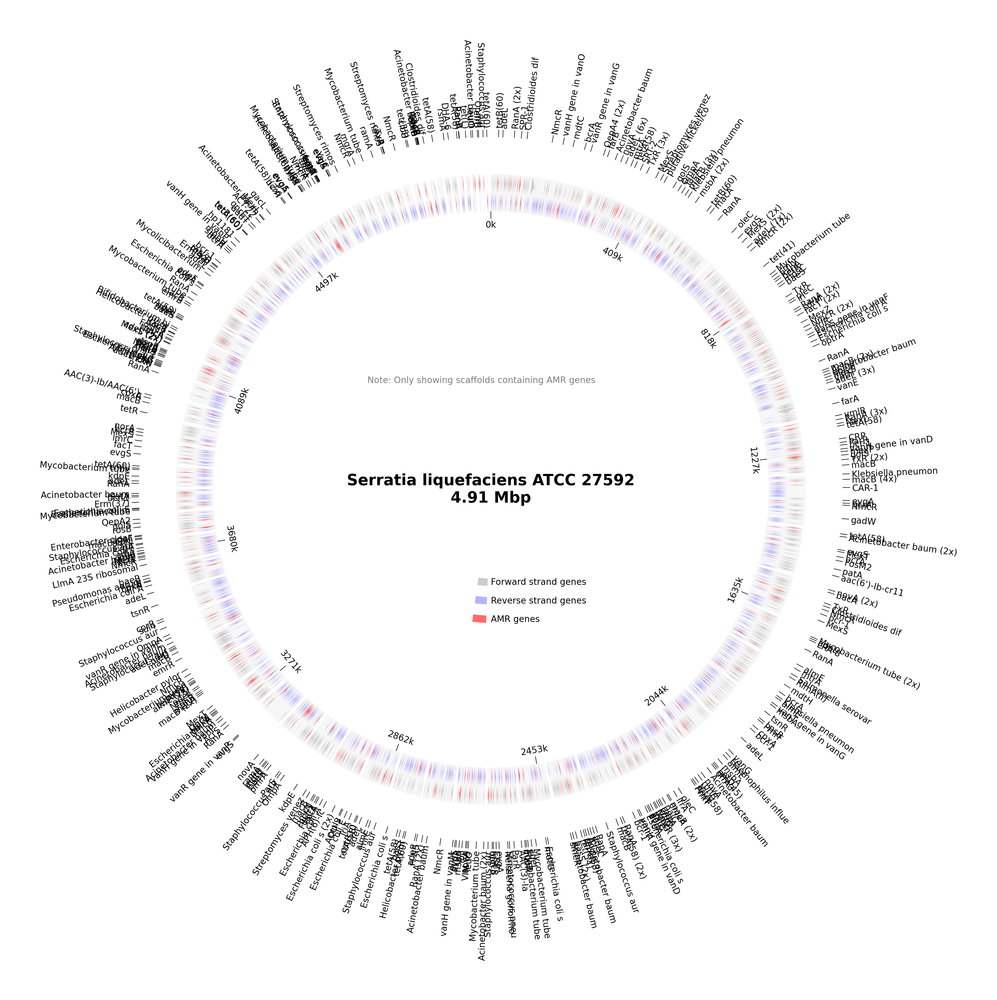

# AMR Analysis Report for LB03_MacConkey_QG_A1_S29

# Organism Classifications:

## Aeromonas salmonicida
**Strain Statistics:**
- Total genome length: 488.3 kbp
- Total scaffolds: 1386
- Scaffolds with AMR genes: 107
- Total genes annotated: 1011
- Total AMR genes: 126
- Unique AMR genes: 75
- Distinct AMR mechanisms: 9
- Distinct AMR families: 30
- Distinct drug classes: 27

**Circos Plot:**

### AAC(6')-Ie-APH(2'')-Ia bifunctional protein
- **Mechanism**: antibiotic inactivation
- **Drug Classes**: aminoglycoside antibiotic
- **AMR Family**: aminoglycoside bifunctional resistance protein
- **Locations**:
  - gnl|SPADES|DIJPHIDF_1069_1 : position 310-876

### AcrS
- **Mechanism**: antibiotic efflux
- **Drug Classes**: fluoroquinolone antibiotic; cephalosporin; glycylcycline; cephamycin; penam; tetracycline antibiotic; rifamycin antibiotic; phenicol antibiotic; disinfecting agents and antiseptics
- **AMR Family**: resistance-nodulation-cell division (RND) antibiotic efflux pump
- **Locations**:
  - gnl|SPADES|DIJPHIDF_1004_2 : position 401-1009

### Agrobacterium fabrum chloramphenicol acetyltransferase (found in 2 locations)
- **Mechanism**: antibiotic inactivation
- **Drug Classes**: phenicol antibiotic
- **AMR Family**: chloramphenicol acetyltransferase (CAT)
- **Locations**:
  - gnl|SPADES|DIJPHIDF_1082_2 : position 392-1009
  - gnl|SPADES|DIJPHIDF_631_15 : position 12775-13437

### Bifidobacterium adolescentis rpoB mutants conferring resistance to rifampicin
- **Mechanism**: antibiotic target alteration; antibiotic target replacement
- **Drug Classes**: rifamycin antibiotic
- **AMR Family**: rifamycin-resistant beta-subunit of RNA polymerase (rpoB)
- **Locations**:
  - gnl|SPADES|DIJPHIDF_3624_1 : position 1-1056

### CARB-51
- **Mechanism**: antibiotic inactivation
- **Drug Classes**: penam
- **AMR Family**: CARB beta-lactamase
- **Locations**:
  - gnl|SPADES|DIJPHIDF_1933_3 : position 1980-2852

### Helicobacter pylori pbp1 mutants conferring resistance to amoxicillin
- **Mechanism**: antibiotic target alteration
- **Drug Classes**: cephalosporin; cephamycin; penam
- **AMR Family**: Penicillin-binding protein mutations conferring resistance to beta-lactam antibiotics
- **Locations**:
  - gnl|SPADES|DIJPHIDF_2614_2 : position 862-2451

### Helicobacter pylori rpoB mutation conferring resistance to rifampicin
- **Mechanism**: antibiotic target alteration; antibiotic target replacement
- **Drug Classes**: fluoroquinolone antibiotic; rifamycin antibiotic
- **AMR Family**: rifamycin-resistant beta-subunit of RNA polymerase (rpoB)
- **Locations**:
  - gnl|SPADES|DIJPHIDF_1151_1 : position 2-2632

### LpsA (found in 2 locations)
- **Mechanism**: reduced permeability to antibiotic
- **Drug Classes**: peptide antibiotic
- **AMR Family**: Intrinsic peptide antibiotic resistant Lps
- **Locations**:
  - gnl|SPADES|DIJPHIDF_3958_1 : position 3-674
  - gnl|SPADES|DIJPHIDF_600_5 : position 4371-5054

### MCR-7.1
- **Mechanism**: antibiotic target alteration
- **Drug Classes**: peptide antibiotic
- **AMR Family**: MCR phosphoethanolamine transferase
- **Locations**:
  - gnl|SPADES|DIJPHIDF_2095_3 : position 1389-3017

### MOX-13 (found in 2 locations)
- **Mechanism**: antibiotic inactivation
- **Drug Classes**: cephalosporin; cephamycin; penam
- **AMR Family**: MOX beta-lactamase
- **Locations**:
  - gnl|SPADES|DIJPHIDF_16135_1 : position 3-158
  - gnl|SPADES|DIJPHIDF_16339_1 : position 3-122

### MexH
- **Mechanism**: antibiotic efflux
- **Drug Classes**: fluoroquinolone antibiotic; tetracycline antibiotic; disinfecting agents and antiseptics
- **AMR Family**: resistance-nodulation-cell division (RND) antibiotic efflux pump
- **Locations**:
  - gnl|SPADES|DIJPHIDF_4701_2 : position 157-1509

### MexL
- **Mechanism**: antibiotic efflux
- **Drug Classes**: macrolide antibiotic; tetracycline antibiotic; disinfecting agents and antiseptics
- **AMR Family**: resistance-nodulation-cell division (RND) antibiotic efflux pump
- **Locations**:
  - gnl|SPADES|DIJPHIDF_3650_1 : position 219-860

### MexV
- **Mechanism**: antibiotic efflux
- **Drug Classes**: macrolide antibiotic; fluoroquinolone antibiotic; tetracycline antibiotic; phenicol antibiotic; disinfecting agents and antiseptics
- **AMR Family**: resistance-nodulation-cell division (RND) antibiotic efflux pump
- **Locations**:
  - gnl|SPADES|DIJPHIDF_27058_1 : position 2-295

### Mycobacterium tuberculosis rpoB mutations conferring resistance to rifampicin
- **Mechanism**: antibiotic target alteration; antibiotic target replacement
- **Drug Classes**: rifamycin antibiotic
- **AMR Family**: rifamycin-resistant beta-subunit of RNA polymerase (rpoB)
- **Locations**:
  - gnl|SPADES|DIJPHIDF_1151_2 : position 2724-5750

### NmcR (found in 3 locations)
- **Mechanism**: antibiotic inactivation
- **Drug Classes**: carbapenem; cephalosporin; cephamycin; penam
- **AMR Family**: NmcA beta-lactamase
- **Locations**:
  - gnl|SPADES|DIJPHIDF_21390_1 : position 3-377
  - gnl|SPADES|DIJPHIDF_502_16 : position 16638-17516
  - gnl|SPADES|DIJPHIDF_653_3 : position 2074-2964

### OmpA (found in 2 locations)
- **Mechanism**: reduced permeability to antibiotic
- **Drug Classes**: peptide antibiotic
- **AMR Family**: General Bacterial Porin with reduced permeability to peptide antibiotics
- **Locations**:
  - gnl|SPADES|DIJPHIDF_15776_1 : position 2-514
  - gnl|SPADES|DIJPHIDF_6888_1 : position 2-607

### OprA
- **Mechanism**: antibiotic efflux
- **Drug Classes**: macrolide antibiotic; fluoroquinolone antibiotic; aminoglycoside antibiotic; carbapenem; tetracycline antibiotic
- **AMR Family**: resistance-nodulation-cell division (RND) antibiotic efflux pump
- **Locations**:
  - gnl|SPADES|DIJPHIDF_1004_8 : position 5396-6046

### ParR (found in 2 locations)
- **Mechanism**: antibiotic efflux; reduced permeability to antibiotic
- **Drug Classes**: macrolide antibiotic; fluoroquinolone antibiotic; monobactam; aminoglycoside antibiotic; carbapenem; cephalosporin; cephamycin; penam; tetracycline antibiotic; phenicol antibiotic; penem; disinfecting agents and antiseptics
- **AMR Family**: resistance-nodulation-cell division (RND) antibiotic efflux pump; Outer Membrane Porin (Opr)
- **Locations**:
  - gnl|SPADES|DIJPHIDF_1041_3 : position 2474-3193
  - gnl|SPADES|DIJPHIDF_5510_1 : position 94-801

### PmrF
- **Mechanism**: antibiotic target alteration
- **Drug Classes**: peptide antibiotic
- **AMR Family**: pmr phosphoethanolamine transferase
- **Locations**:
  - gnl|SPADES|DIJPHIDF_1702_4 : position 2684-3676

### Pseudomonas aeruginosa ampR with mutation conferring resistance to aztreonam
- **Mechanism**: antibiotic target alteration; antibiotic inactivation
- **Drug Classes**: monobactam; carbapenem; cephalosporin
- **AMR Family**: PDC beta-lactamase; ampR transcriptional regulator with mutation conferring resistance to monobactam antibiotics
- **Locations**:
  - gnl|SPADES|DIJPHIDF_280_32 : position 34546-35490

### Pseudomonas aeruginosa soxR
- **Mechanism**: antibiotic target alteration; antibiotic efflux
- **Drug Classes**: fluoroquinolone antibiotic; cephalosporin; glycylcycline; penam; tetracycline antibiotic; rifamycin antibiotic; phenicol antibiotic; disinfecting agents and antiseptics
- **AMR Family**: ATP-binding cassette (ABC) antibiotic efflux pump; major facilitator superfamily (MFS) antibiotic efflux pump; resistance-nodulation-cell division (RND) antibiotic efflux pump
- **Locations**:
  - gnl|SPADES|DIJPHIDF_770_11 : position 9278-9757

### RanA (found in 5 locations)
- **Mechanism**: antibiotic efflux
- **Drug Classes**: aminoglycoside antibiotic
- **AMR Family**: ATP-binding cassette (ABC) antibiotic efflux pump
- **Locations**:
  - gnl|SPADES|DIJPHIDF_1045_3 : position 3069-4070
  - gnl|SPADES|DIJPHIDF_12517_1 : position 78-647
  - gnl|SPADES|DIJPHIDF_1688_2 : position 427-1509
  - gnl|SPADES|DIJPHIDF_280_12 : position 11457-12452
  - gnl|SPADES|DIJPHIDF_7678_2 : position 116-877

### Staphylococcus aureus fusA with mutation conferring resistance to fusidic acid
- **Mechanism**: antibiotic target alteration
- **Drug Classes**: fusidane antibiotic
- **AMR Family**: antibiotic resistant fusA
- **Locations**:
  - gnl|SPADES|DIJPHIDF_1121_1 : position 2-1909

### Staphylococcus aureus fusE with mutation conferring resistance to fusidic acid
- **Mechanism**: antibiotic target alteration
- **Drug Classes**: fusidane antibiotic
- **AMR Family**: antibiotic resistant fusE
- **Locations**:
  - gnl|SPADES|DIJPHIDF_859_15 : position 5726-6259

### TaeA
- **Mechanism**: antibiotic efflux
- **Drug Classes**: pleuromutilin antibiotic
- **AMR Family**: ATP-binding cassette (ABC) antibiotic efflux pump
- **Locations**:
  - gnl|SPADES|DIJPHIDF_689_6 : position 5559-7469

### TolC
- **Mechanism**: antibiotic efflux
- **Drug Classes**: macrolide antibiotic; fluoroquinolone antibiotic; aminoglycoside antibiotic; carbapenem; cephalosporin; glycylcycline; cephamycin; penam; tetracycline antibiotic; peptide antibiotic; aminocoumarin antibiotic; rifamycin antibiotic; phenicol antibiotic; penem; disinfecting agents and antiseptics
- **AMR Family**: ATP-binding cassette (ABC) antibiotic efflux pump; major facilitator superfamily (MFS) antibiotic efflux pump; resistance-nodulation-cell division (RND) antibiotic efflux pump
- **Locations**:
  - gnl|SPADES|DIJPHIDF_30561_1 : position 1-267

### TriC
- **Mechanism**: antibiotic efflux
- **Drug Classes**: disinfecting agents and antiseptics
- **AMR Family**: resistance-nodulation-cell division (RND) antibiotic efflux pump
- **Locations**:
  - gnl|SPADES|DIJPHIDF_8873_1 : position 3-896

### TxR (found in 2 locations)
- **Mechanism**: antibiotic efflux
- **Drug Classes**: tetracycline antibiotic
- **AMR Family**: ATP-binding cassette (ABC) antibiotic efflux pump
- **Locations**:
  - gnl|SPADES|DIJPHIDF_17217_1 : position 2-472
  - gnl|SPADES|DIJPHIDF_913_5 : position 5445-6863

### adeL (found in 10 locations)
- **Mechanism**: antibiotic efflux
- **Drug Classes**: fluoroquinolone antibiotic; tetracycline antibiotic
- **AMR Family**: resistance-nodulation-cell division (RND) antibiotic efflux pump
- **Locations**:
  - gnl|SPADES|DIJPHIDF_26640_1 : position 3-299
  - gnl|SPADES|DIJPHIDF_27806_1 : position 2-286
  - gnl|SPADES|DIJPHIDF_280_29 : position 32337-33245
  - gnl|SPADES|DIJPHIDF_34333_1 : position 1-246
  - gnl|SPADES|DIJPHIDF_502_12 : position 12969-13256
  - gnl|SPADES|DIJPHIDF_536_8 : position 5776-6657
  - gnl|SPADES|DIJPHIDF_671_2 : position 2638-3546
  - gnl|SPADES|DIJPHIDF_6917_1 : position 1-933
  - gnl|SPADES|DIJPHIDF_696_14 : position 9382-10290
  - gnl|SPADES|DIJPHIDF_9340_1 : position 1-855

### adeR
- **Mechanism**: antibiotic efflux
- **Drug Classes**: glycylcycline; tetracycline antibiotic
- **AMR Family**: resistance-nodulation-cell division (RND) antibiotic efflux pump
- **Locations**:
  - gnl|SPADES|DIJPHIDF_4580_2 : position 1112-1537

### almG
- **Mechanism**: antibiotic target alteration
- **Drug Classes**: peptide antibiotic
- **AMR Family**: lipid A acyltransferase; polymyxin resistance operon
- **Locations**:
  - gnl|SPADES|DIJPHIDF_502_7 : position 7564-8586

### amrB
- **Mechanism**: antibiotic efflux
- **Drug Classes**: macrolide antibiotic; aminoglycoside antibiotic
- **AMR Family**: resistance-nodulation-cell division (RND) antibiotic efflux pump
- **Locations**:
  - gnl|SPADES|DIJPHIDF_13906_2 : position 338-583

### baeS
- **Mechanism**: antibiotic efflux
- **Drug Classes**: aminoglycoside antibiotic; aminocoumarin antibiotic
- **AMR Family**: resistance-nodulation-cell division (RND) antibiotic efflux pump
- **Locations**:
  - gnl|SPADES|DIJPHIDF_454_18 : position 18331-20220

### bcr-1 (found in 2 locations)
- **Mechanism**: antibiotic efflux
- **Drug Classes**: bicyclomycin-like antibiotic
- **AMR Family**: major facilitator superfamily (MFS) antibiotic efflux pump
- **Locations**:
  - gnl|SPADES|DIJPHIDF_33645_1 : position 2-250
  - gnl|SPADES|DIJPHIDF_714_7 : position 8422-9624

### bcrA
- **Mechanism**: antibiotic efflux
- **Drug Classes**: peptide antibiotic
- **AMR Family**: ATP-binding cassette (ABC) antibiotic efflux pump
- **Locations**:
  - gnl|SPADES|DIJPHIDF_454_2 : position 1019-2563

### catB9
- **Mechanism**: antibiotic inactivation
- **Drug Classes**: phenicol antibiotic
- **AMR Family**: chloramphenicol acetyltransferase (CAT)
- **Locations**:
  - gnl|SPADES|DIJPHIDF_535_11 : position 5528-6163

### cphA5 (found in 2 locations)
- **Mechanism**: antibiotic inactivation
- **Drug Classes**: carbapenem
- **AMR Family**: CphA beta-lactamase
- **Locations**:
  - gnl|SPADES|DIJPHIDF_3695_2: position 1112-1834
  - gnl|SPADES|DIJPHIDF_38687_1 : position 3-92

### cpxA (found in 2 locations)
- **Mechanism**: antibiotic efflux
- **Drug Classes**: aminoglycoside antibiotic; aminocoumarin antibiotic
- **AMR Family**: resistance-nodulation-cell division (RND) antibiotic efflux pump
- **Locations**:
  - gnl|SPADES|DIJPHIDF_1041_2 : position 1167-2477
  - gnl|SPADES|DIJPHIDF_913_6 : position 6970-8004

### evgA
- **Mechanism**: antibiotic efflux
- **Drug Classes**: macrolide antibiotic; fluoroquinolone antibiotic; penam; tetracycline antibiotic
- **AMR Family**: major facilitator superfamily (MFS) antibiotic efflux pump; resistance-nodulation-cell division (RND) antibiotic efflux pump
- **Locations**:
  - gnl|SPADES|DIJPHIDF_1584_1 : position 3-608

### evgS (found in 2 locations)
- **Mechanism**: antibiotic efflux
- **Drug Classes**: macrolide antibiotic; fluoroquinolone antibiotic; penam; tetracycline antibiotic
- **AMR Family**: major facilitator superfamily (MFS) antibiotic efflux pump; resistance-nodulation-cell division (RND) antibiotic efflux pump
- **Locations**:
  - gnl|SPADES|DIJPHIDF_1460_3 : position 1559-4294
  - gnl|SPADES|DIJPHIDF_5122_1 : position 2-1405

### gadW
- **Mechanism**: antibiotic efflux
- **Drug Classes**: macrolide antibiotic; fluoroquinolone antibiotic; penam
- **AMR Family**: resistance-nodulation-cell division (RND) antibiotic efflux pump
- **Locations**:
  - gnl|SPADES|DIJPHIDF_3945_1 : position 132-935

### gadX
- **Mechanism**: antibiotic efflux
- **Drug Classes**: macrolide antibiotic; fluoroquinolone antibiotic; penam
- **AMR Family**: resistance-nodulation-cell division (RND) antibiotic efflux pump
- **Locations**:
  - gnl|SPADES|DIJPHIDF_653_10 : position 11107-12018

### hmrM
- **Mechanism**: antibiotic efflux
- **Drug Classes**: fluoroquinolone antibiotic; disinfecting agents and antiseptics
- **AMR Family**: multidrug and toxic compound extrusion (MATE) transporter
- **Locations**:
  - gnl|SPADES|DIJPHIDF_1642_3 : position 1220-2572

### kdpE
- **Mechanism**: antibiotic efflux
- **Drug Classes**: aminoglycoside antibiotic
- **AMR Family**: kdpDE
- **Locations**:
  - gnl|SPADES|DIJPHIDF_38305_2 : position 65-226

### leuO
- **Mechanism**: antibiotic efflux
- **Drug Classes**: nucleoside antibiotic; disinfecting agents and antiseptics
- **AMR Family**: major facilitator superfamily (MFS) antibiotic efflux pump
- **Locations**:
  - gnl|SPADES|DIJPHIDF_8163_1 : position 2-850

### lmrC
- **Mechanism**: antibiotic target protection
- **Drug Classes**: lincosamide antibiotic
- **AMR Family**: Miscellaneous ABC-F subfamily ATP-binding cassette ribosomal protection proteins
- **Locations**:
  - gnl|SPADES|DIJPHIDF_6716_2 : position 85-726

### macB (found in 12 locations)
- **Mechanism**: antibiotic efflux
- **Drug Classes**: macrolide antibiotic
- **AMR Family**: ATP-binding cassette (ABC) antibiotic efflux pump
- **Locations**:
  - gnl|SPADES|DIJPHIDF_1004_5 : position 3361-4071
  - gnl|SPADES|DIJPHIDF_1045_4 : position 4067-5062
  - gnl|SPADES|DIJPHIDF_11193_1 : position 1-474
  - gnl|SPADES|DIJPHIDF_1147_4 : position 2908-4488
  - gnl|SPADES|DIJPHIDF_1277_5 : position 4644-5024
  - gnl|SPADES|DIJPHIDF_12882_2 : position 286-627
  - gnl|SPADES|DIJPHIDF_15745_1 : position 1-516
  - gnl|SPADES|DIJPHIDF_2092_2 : position 824-1594
  - gnl|SPADES|DIJPHIDF_280_13 : position 12453-13433
  - gnl|SPADES|DIJPHIDF_499_9 : position 13439-14149
  - gnl|SPADES|DIJPHIDF_7132_1 : position 1-423
  - gnl|SPADES|DIJPHIDF_8813_1 : position 1-600

### mdtN (found in 2 locations)
- **Mechanism**: antibiotic efflux
- **Drug Classes**: nucleoside antibiotic; disinfecting agents and antiseptics
- **AMR Family**: major facilitator superfamily (MFS) antibiotic efflux pump
- **Locations**:
  - gnl|SPADES|DIJPHIDF_2960_1 : position 2-886
  - gnl|SPADES|DIJPHIDF_991_5 : position 3801-4805

### mexM (found in 2 locations)
- **Mechanism**: antibiotic efflux
- **Drug Classes**: phenicol antibiotic
- **AMR Family**: resistance-nodulation-cell division (RND) antibiotic efflux pump
- **Locations**:
  - gnl|SPADES|DIJPHIDF_1004_3 : position 1006-2157
  - gnl|SPADES|DIJPHIDF_821_3 : position 3623-4648

### mexP
- **Mechanism**: antibiotic efflux
- **Drug Classes**: macrolide antibiotic; carbapenem; tetracycline antibiotic; diaminopyrimidine antibiotic; phenicol antibiotic; disinfecting agents and antiseptics
- **AMR Family**: resistance-nodulation-cell division (RND) antibiotic efflux pump
- **Locations**:
  - gnl|SPADES|DIJPHIDF_15142_1 : position 3-536

### mexQ
- **Mechanism**: antibiotic efflux
- **Drug Classes**: macrolide antibiotic; carbapenem; tetracycline antibiotic; diaminopyrimidine antibiotic; phenicol antibiotic; disinfecting agents and antiseptics
- **AMR Family**: resistance-nodulation-cell division (RND) antibiotic efflux pump
- **Locations**:
  - gnl|SPADES|DIJPHIDF_821_2 : position 466-3630

### msbA
- **Mechanism**: antibiotic efflux
- **Drug Classes**: nitroimidazole antibiotic
- **AMR Family**: ATP-binding cassette (ABC) antibiotic efflux pump
- **Locations**:
  - gnl|SPADES|DIJPHIDF_8651_1 : position 134-916

### mtrA (found in 3 locations)
- **Mechanism**: antibiotic efflux
- **Drug Classes**: macrolide antibiotic; penam
- **AMR Family**: resistance-nodulation-cell division (RND) antibiotic efflux pump
- **Locations**:
  - gnl|SPADES|DIJPHIDF_1224_4 : position 1969-2811
  - gnl|SPADES|DIJPHIDF_38459_1 : position 3-227
  - gnl|SPADES|DIJPHIDF_8130_1 : position 2-775

### oleB
- **Mechanism**: antibiotic target protection
- **Drug Classes**: macrolide antibiotic
- **AMR Family**: Miscellaneous ABC-F subfamily ATP-binding cassette ribosomal protection proteins
- **Locations**:
  - gnl|SPADES|DIJPHIDF_3737_1 : position 3-464

### oleC
- **Mechanism**: antibiotic efflux
- **Drug Classes**: macrolide antibiotic
- **AMR Family**: ATP-binding cassette (ABC) antibiotic efflux pump
- **Locations**:
  - gnl|SPADES|DIJPHIDF_944_1 : position 116-1432

### opmE
- **Mechanism**: antibiotic efflux
- **Drug Classes**: macrolide antibiotic; carbapenem; tetracycline antibiotic; diaminopyrimidine antibiotic; phenicol antibiotic; disinfecting agents and antiseptics
- **AMR Family**: resistance-nodulation-cell division (RND) antibiotic efflux pump
- **Locations**:
  - gnl|SPADES|DIJPHIDF_1004_7 : position 4560-5402

### optrA (found in 2 locations)
- **Mechanism**: antibiotic target protection
- **Drug Classes**: oxazolidinone antibiotic; phenicol antibiotic
- **AMR Family**: Miscellaneous ABC-F subfamily ATP-binding cassette ribosomal protection proteins
- **Locations**:
  - gnl|SPADES|DIJPHIDF_13451_1 : position 1-549
  - gnl|SPADES|DIJPHIDF_17325_1 : position 3-470

### ramA
- **Mechanism**: antibiotic efflux; reduced permeability to antibiotic
- **Drug Classes**: fluoroquinolone antibiotic; monobactam; carbapenem; cephalosporin; glycylcycline; cephamycin; penam; tetracycline antibiotic; rifamycin antibiotic; phenicol antibiotic; penem; disinfecting agents and antiseptics
- **AMR Family**: resistance-nodulation-cell division (RND) antibiotic efflux pump; General Bacterial Porin with reduced permeability to beta-lactams
- **Locations**:
  - gnl|SPADES|DIJPHIDF_3020_3 : position 1122-1982

### rosB (found in 2 locations)
- **Mechanism**: antibiotic efflux
- **Drug Classes**: peptide antibiotic
- **AMR Family**: major facilitator superfamily (MFS) antibiotic efflux pump
- **Locations**:
  - gnl|SPADES|DIJPHIDF_1163_1 : position 384-2045
  - gnl|SPADES|DIJPHIDF_5911_1 : position 3-1253

### sdiA (found in 2 locations)
- **Mechanism**: antibiotic efflux
- **Drug Classes**: fluoroquinolone antibiotic; cephalosporin; glycylcycline; penam; tetracycline antibiotic; rifamycin antibiotic; phenicol antibiotic; disinfecting agents and antiseptics
- **AMR Family**: resistance-nodulation-cell division (RND) antibiotic efflux pump
- **Locations**:
  - gnl|SPADES|DIJPHIDF_2238_3 : position 1359-2141
  - gnl|SPADES|DIJPHIDF_3110_3 : position 1414-2112

### tet(35)
- **Mechanism**: antibiotic efflux
- **Drug Classes**: tetracycline antibiotic
- **AMR Family**: ATP-binding cassette (ABC) antibiotic efflux pump
- **Locations**:
  - gnl|SPADES|DIJPHIDF_5009_1 : position 1-1287

### tet(44)
- **Mechanism**: antibiotic target protection
- **Drug Classes**: tetracycline antibiotic
- **AMR Family**: tetracycline-resistant ribosomal protection protein
- **Locations**:
  - gnl|SPADES|DIJPHIDF_1241_3 : position 2213-3643

### tet(O/W)
- **Mechanism**: antibiotic target protection
- **Drug Classes**: tetracycline antibiotic
- **AMR Family**: tetracycline-resistant ribosomal protection protein
- **Locations**:
  - gnl|SPADES|DIJPHIDF_536_17 : position 13212-15005

### tetA(58) (found in 4 locations)
- **Mechanism**: antibiotic efflux
- **Drug Classes**: tetracycline antibiotic
- **AMR Family**: major facilitator superfamily (MFS) antibiotic efflux pump
- **Locations**:
  - gnl|SPADES|DIJPHIDF_2077_2 : position 953-2107
  - gnl|SPADES|DIJPHIDF_35046_1 : position 2-241
  - gnl|SPADES|DIJPHIDF_42433_1 : position 3-206
  - gnl|SPADES|DIJPHIDF_653_8 : position 8403-9902

### tetB(58)
- **Mechanism**: antibiotic efflux
- **Drug Classes**: tetracycline antibiotic
- **AMR Family**: major facilitator superfamily (MFS) antibiotic efflux pump
- **Locations**:
  - gnl|SPADES|DIJPHIDF_4799_2 : position 654-1463

### tlrC
- **Mechanism**: antibiotic target protection
- **Drug Classes**: macrolide antibiotic; lincosamide antibiotic
- **AMR Family**: Miscellaneous ABC-F subfamily ATP-binding cassette ribosomal protection proteins
- **Locations**:
  - gnl|SPADES|DIJPHIDF_762_10 : position 9954-10544

### ugd (found in 3 locations)
- **Mechanism**: antibiotic target alteration
- **Drug Classes**: peptide antibiotic
- **AMR Family**: pmr phosphoethanolamine transferase
- **Locations**:
  - gnl|SPADES|DIJPHIDF_18215_1 : position 48-449
  - gnl|SPADES|DIJPHIDF_21059_2 : position 157-387
  - gnl|SPADES|DIJPHIDF_7118_1 : position 3-1046

### vanH gene in vanA cluster
- **Mechanism**: antibiotic target alteration
- **Drug Classes**: glycopeptide antibiotic
- **AMR Family**: vanH; glycopeptide resistance gene cluster
- **Locations**:
  - gnl|SPADES|DIJPHIDF_1337_2 : position 97-564

### vanH gene in vanB cluster
- **Mechanism**: antibiotic target alteration
- **Drug Classes**: glycopeptide antibiotic
- **AMR Family**: vanH; glycopeptide resistance gene cluster
- **Locations**:
  - gnl|SPADES|DIJPHIDF_3186_3 : position 1077-2033

### vanH gene in vanO cluster
- **Mechanism**: antibiotic target alteration
- **Drug Classes**: glycopeptide antibiotic
- **AMR Family**: vanH; glycopeptide resistance gene cluster
- **Locations**:
  - gnl|SPADES|DIJPHIDF_414_15 : position 15615-16604

### vanR gene in vanB cluster
- **Mechanism**: antibiotic target alteration
- **Drug Classes**: glycopeptide antibiotic
- **AMR Family**: glycopeptide resistance gene cluster; vanR
- **Locations**:
  - gnl|SPADES|DIJPHIDF_29672_1 : position 2-271

### vanR gene in vanC cluster
- **Mechanism**: antibiotic target alteration
- **Drug Classes**: glycopeptide antibiotic
- **AMR Family**: glycopeptide resistance gene cluster; vanR
- **Locations**:
  - gnl|SPADES|DIJPHIDF_2613_2 : position 1291-2022

### vanR gene in vanM cluster
- **Mechanism**: antibiotic target alteration
- **Drug Classes**: glycopeptide antibiotic
- **AMR Family**: glycopeptide resistance gene cluster; vanR
- **Locations**:
  - gnl|SPADES|DIJPHIDF_913_7 : position 8001-8228

### vatB (found in 2 locations)
- **Mechanism**: antibiotic inactivation
- **Drug Classes**: streptogramin antibiotic; streptogramin A antibiotic
- **AMR Family**: streptogramin vat acetyltransferase
- **Locations**:
  - gnl|SPADES|DIJPHIDF_31205_1 : position 2-262
  - gnl|SPADES|DIJPHIDF_977_6 : position 4736-5341

### vatF (found in 3 locations)
- **Mechanism**: antibiotic inactivation
- **Drug Classes**: streptogramin antibiotic; streptogramin A antibiotic
- **AMR Family**: streptogramin vat acetyltransferase
- **Locations**:
  - gnl|SPADES|DIJPHIDF_1671_3 : position 3264-3731
  - gnl|SPADES|DIJPHIDF_3970_3 : position 1491-1730
  - gnl|SPADES|DIJPHIDF_6854_2 : position 439-1110

## Aeromonas salmonicida subsp. masoucida
**Strain Statistics:**
- Total genome length: 721.3 kbp
- Total scaffolds: 148
- Scaffolds with AMR genes: 50
- Total genes annotated: 1335
- Total AMR genes: 87
- Unique AMR genes: 61
- Distinct AMR mechanisms: 8
- Distinct AMR families: 32
- Distinct drug classes: 30

**Circos Plot:**

### AAC(6')-Iak
- **Mechanism**: antibiotic inactivation
- **Drug Classes**: aminoglycoside antibiotic
- **AMR Family**: AAC(6')
- **Locations**:
  - gnl|SPADES|DIJPHIDF_761_13 : position 8997-9443

### CRP
- **Mechanism**: antibiotic efflux
- **Drug Classes**: macrolide antibiotic; fluoroquinolone antibiotic; penam
- **AMR Family**: resistance-nodulation-cell division (RND) antibiotic efflux pump
- **Locations**:
  - gnl|SPADES|DIJPHIDF_272_20 : position 20888-21643

### Clostridioides difficile gyrB conferring resistance to fluoroquinolones
- **Mechanism**: antibiotic target alteration
- **Drug Classes**: fluoroquinolone antibiotic
- **AMR Family**: fluoroquinolone resistant gyrB
- **Locations**:
  - gnl|SPADES|DIJPHIDF_731_8 : position 8066-9961

### Enterococcus faecalis cls with mutation conferring resistance to daptomycin
- **Mechanism**: antibiotic target alteration
- **Drug Classes**: peptide antibiotic
- **AMR Family**: daptomycin resistant cls
- **Locations**:
  - gnl|SPADES|DIJPHIDF_534_10 : position 7777-9258

### Escherichia coli AcrAB-TolC with AcrR mutation conferring resistance to ciprofloxacin, tetracycline, and ceftazidime
- **Mechanism**: antibiotic target alteration; antibiotic efflux
- **Drug Classes**: fluoroquinolone antibiotic; cephalosporin; glycylcycline; penam; tetracycline antibiotic; rifamycin antibiotic; phenicol antibiotic; disinfecting agents and antiseptics
- **AMR Family**: resistance-nodulation-cell division (RND) antibiotic efflux pump
- **Locations**:
  - gnl|SPADES|DIJPHIDF_709_11 : position 8591-9193

### Escherichia coli EF-Tu mutants conferring resistance to Pulvomycin
- **Mechanism**: antibiotic target alteration
- **Drug Classes**: elfamycin antibiotic
- **AMR Family**: elfamycin resistant EF-Tu
- **Locations**:
  - gnl|SPADES|DIJPHIDF_737_9 : position 8024-9934

### Escherichia coli UhpT with mutation conferring resistance to fosfomycin
- **Mechanism**: antibiotic target alteration
- **Drug Classes**: phosphonic acid antibiotic
- **AMR Family**: antibiotic-resistant UhpT
- **Locations**:
  - gnl|SPADES|DIJPHIDF_1070_5 : position 2711-4117

### Escherichia coli soxS with mutation conferring antibiotic resistance
- **Mechanism**: antibiotic target alteration; antibiotic efflux; reduced permeability to antibiotic
- **Drug Classes**: fluoroquinolone antibiotic; monobactam; carbapenem; cephalosporin; glycylcycline; cephamycin; penam; tetracycline antibiotic; rifamycin antibiotic; phenicol antibiotic; penem; disinfecting agents and antiseptics
- **AMR Family**: ATP-binding cassette (ABC) antibiotic efflux pump; major facilitator superfamily (MFS) antibiotic efflux pump; resistance-nodulation-cell division (RND) antibiotic efflux pump; General Bacterial Porin with reduced permeability to beta-lactams
- **Locations**:
  - gnl|SPADES|DIJPHIDF_2106_3 : position 759-1544

### Helicobacter pylori pbp1 mutants conferring resistance to amoxicillin
- **Mechanism**: antibiotic target alteration
- **Drug Classes**: cephalosporin; cephamycin; penam
- **AMR Family**: Penicillin-binding protein mutations conferring resistance to beta-lactam antibiotics
- **Locations**:
  - gnl|SPADES|DIJPHIDF_184_2 : position 3101-5374

### MdtK
- **Mechanism**: antibiotic efflux
- **Drug Classes**: fluoroquinolone antibiotic
- **AMR Family**: multidrug and toxic compound extrusion (MATE) transporter
- **Locations**:
  - gnl|SPADES|DIJPHIDF_709_3 : position 1140-2486

### MexS (found in 2 locations)
- **Mechanism**: antibiotic efflux
- **Drug Classes**: fluoroquinolone antibiotic; diaminopyrimidine antibiotic; phenicol antibiotic
- **AMR Family**: resistance-nodulation-cell division (RND) antibiotic efflux pump
- **Locations**:
  - gnl|SPADES|DIJPHIDF_761_10 : position 5867-6871
  - gnl|SPADES|DIJPHIDF_851_7 : position 6890-8017

### MexT
- **Mechanism**: antibiotic efflux
- **Drug Classes**: fluoroquinolone antibiotic; diaminopyrimidine antibiotic; phenicol antibiotic
- **AMR Family**: resistance-nodulation-cell division (RND) antibiotic efflux pump
- **Locations**:
  - gnl|SPADES|DIJPHIDF_753_4 : position 3136-4056

### Mycobacterium tuberculosis ndh with mutation conferring resistance to isoniazid
- **Mechanism**: antibiotic target alteration
- **Drug Classes**: isoniazid-like antibiotic
- **AMR Family**: antibiotic resistant ndh
- **Locations**:
  - gnl|SPADES|DIJPHIDF_869_8 : position 6248-7540

### Neisseria gonorrhoeae pilQ gene conferring resistance to beta-lactam
- **Mechanism**: antibiotic target alteration
- **Drug Classes**: cephalosporin; cephamycin; penam
- **AMR Family**: Penicillin-binding protein mutations conferring resistance to beta-lactam antibiotics
- **Locations**:
  - gnl|SPADES|DIJPHIDF_1399_2 : position 248-2284

### NmcR (found in 2 locations)
- **Mechanism**: antibiotic inactivation
- **Drug Classes**: carbapenem; cephalosporin; cephamycin; penam
- **AMR Family**: NmcA beta-lactamase
- **Locations**:
  - gnl|SPADES|DIJPHIDF_173_36 : position 44741-45661
  - gnl|SPADES|DIJPHIDF_424_14 : position 13127-14035

### OmpA (found in 2 locations)
- **Mechanism**: reduced permeability to antibiotic
- **Drug Classes**: peptide antibiotic
- **AMR Family**: General Bacterial Porin with reduced permeability to peptide antibiotics
- **Locations**:
  - gnl|SPADES|DIJPHIDF_311_12 : position 12957-13988
  - gnl|SPADES|DIJPHIDF_872_6 : position 5017-5505

### OpmH
- **Mechanism**: antibiotic efflux
- **Drug Classes**: disinfecting agents and antiseptics
- **AMR Family**: resistance-nodulation-cell division (RND) antibiotic efflux pump
- **Locations**:
  - gnl|SPADES|DIJPHIDF_419_7 : position 11620-12945

### ParR
- **Mechanism**: antibiotic efflux; reduced permeability to antibiotic
- **Drug Classes**: macrolide antibiotic; fluoroquinolone antibiotic; monobactam; aminoglycoside antibiotic; carbapenem; cephalosporin; cephamycin; penam; tetracycline antibiotic; phenicol antibiotic; penem; disinfecting agents and antiseptics
- **AMR Family**: resistance-nodulation-cell division (RND) antibiotic efflux pump; Outer Membrane Porin (Opr)
- **Locations**:
  - gnl|SPADES|DIJPHIDF_812_5 : position 3745-4467

### Pseudomonas aeruginosa CpxR
- **Mechanism**: antibiotic efflux
- **Drug Classes**: macrolide antibiotic; fluoroquinolone antibiotic; monobactam; aminoglycoside antibiotic; carbapenem; cephalosporin; cephamycin; penam; tetracycline antibiotic; peptide antibiotic; aminocoumarin antibiotic; diaminopyrimidine antibiotic; sulfonamide antibiotic; phenicol antibiotic; penem
- **AMR Family**: resistance-nodulation-cell division (RND) antibiotic efflux pump
- **Locations**:
  - gnl|SPADES|DIJPHIDF_340_7 : position 6187-6882

### QepA4
- **Mechanism**: antibiotic efflux
- **Drug Classes**: fluoroquinolone antibiotic
- **AMR Family**: major facilitator superfamily (MFS) antibiotic efflux pump
- **Locations**:
  - gnl|SPADES|DIJPHIDF_753_3 : position 1551-2945

### RanA (found in 4 locations)
- **Mechanism**: antibiotic efflux
- **Drug Classes**: aminoglycoside antibiotic
- **AMR Family**: ATP-binding cassette (ABC) antibiotic efflux pump
- **Locations**:
  - gnl|SPADES|DIJPHIDF_1128_2 : position 1511-2503
  - gnl|SPADES|DIJPHIDF_12516_1 : position 3-572
  - gnl|SPADES|DIJPHIDF_457_15 : position 12123-12923
  - gnl|SPADES|DIJPHIDF_892_1 : position 65-1201

### RanB
- **Mechanism**: antibiotic efflux
- **Drug Classes**: aminoglycoside antibiotic
- **AMR Family**: ATP-binding cassette (ABC) antibiotic efflux pump
- **Locations**:
  - gnl|SPADES|DIJPHIDF_457_16 : position 12923-13702

### Staphylococcus aureus mupB conferring resistance to mupirocin
- **Mechanism**: antibiotic target alteration
- **Drug Classes**: mupirocin-like antibiotic
- **AMR Family**: antibiotic-resistant isoleucyl-tRNA synthetase (ileS)
- **Locations**:
  - gnl|SPADES|DIJPHIDF_2048_3 : position 1940-3082

### Staphylococcus aureus murA with mutation conferring resistance to fosfomycin
- **Mechanism**: antibiotic target alteration
- **Drug Classes**: phosphonic acid antibiotic
- **AMR Family**: antibiotic-resistant murA transferase
- **Locations**:
  - gnl|SPADES|DIJPHIDF_457_21 : position 15385-16641

### Streptomyces venezuelae rox
- **Mechanism**: antibiotic inactivation
- **Drug Classes**: rifamycin antibiotic
- **AMR Family**: rifampin monooxygenase
- **Locations**:
  - gnl|SPADES|DIJPHIDF_1008_5 : position 4770-5993

### TolC
- **Mechanism**: antibiotic efflux
- **Drug Classes**: macrolide antibiotic; fluoroquinolone antibiotic; aminoglycoside antibiotic; carbapenem; cephalosporin; glycylcycline; cephamycin; penam; tetracycline antibiotic; peptide antibiotic; aminocoumarin antibiotic; rifamycin antibiotic; phenicol antibiotic; penem; disinfecting agents and antiseptics
- **AMR Family**: ATP-binding cassette (ABC) antibiotic efflux pump; major facilitator superfamily (MFS) antibiotic efflux pump; resistance-nodulation-cell division (RND) antibiotic efflux pump
- **Locations**:
  - gnl|SPADES|DIJPHIDF_311_28 : position 29923-31248

### TxR (found in 2 locations)
- **Mechanism**: antibiotic efflux
- **Drug Classes**: tetracycline antibiotic
- **AMR Family**: ATP-binding cassette (ABC) antibiotic efflux pump
- **Locations**:
  - gnl|SPADES|DIJPHIDF_642_13 : position 10834-12240
  - gnl|SPADES|DIJPHIDF_872_3 : position 1454-3001

### abeM
- **Mechanism**: antibiotic efflux
- **Drug Classes**: fluoroquinolone antibiotic; disinfecting agents and antiseptics
- **AMR Family**: multidrug and toxic compound extrusion (MATE) transporter
- **Locations**:
  - gnl|SPADES|DIJPHIDF_340_10 : position 8762-10147

### adeL (found in 7 locations)
- **Mechanism**: antibiotic efflux
- **Drug Classes**: fluoroquinolone antibiotic; tetracycline antibiotic
- **AMR Family**: resistance-nodulation-cell division (RND) antibiotic efflux pump
- **Locations**:
  - gnl|SPADES|DIJPHIDF_13885_1 : position 1-585
  - gnl|SPADES|DIJPHIDF_170_8 : position 7566-8468
  - gnl|SPADES|DIJPHIDF_173_30 : position 38494-39399
  - gnl|SPADES|DIJPHIDF_25661_1 : position 3-311
  - gnl|SPADES|DIJPHIDF_5707_2 : position 1026-1289
  - gnl|SPADES|DIJPHIDF_731_5 : position 3447-4355
  - gnl|SPADES|DIJPHIDF_851_8 : position 8138-9043

### almE
- **Mechanism**: antibiotic target alteration
- **Drug Classes**: peptide antibiotic
- **AMR Family**: polymyxin resistance operon; alm glycyltransferase
- **Locations**:
  - gnl|SPADES|DIJPHIDF_184_23 : position 23524-24882

### bacA
- **Mechanism**: antibiotic target alteration
- **Drug Classes**: peptide antibiotic
- **AMR Family**: undecaprenyl pyrophosphate related proteins
- **Locations**:
  - gnl|SPADES|DIJPHIDF_1873_1 : position 85-900

### bcr-1 (found in 2 locations)
- **Mechanism**: antibiotic efflux
- **Drug Classes**: bicyclomycin-like antibiotic
- **AMR Family**: major facilitator superfamily (MFS) antibiotic efflux pump
- **Locations**:
  - gnl|SPADES|DIJPHIDF_445_5 : position 4989-6227
  - gnl|SPADES|DIJPHIDF_580_12 : position 11878-13041

### bcrA
- **Mechanism**: antibiotic efflux
- **Drug Classes**: peptide antibiotic
- **AMR Family**: ATP-binding cassette (ABC) antibiotic efflux pump
- **Locations**:
  - gnl|SPADES|DIJPHIDF_1128_3 : position 2515-3534

### cmlv
- **Mechanism**: antibiotic inactivation
- **Drug Classes**: phenicol antibiotic
- **AMR Family**: chloramphenicol phosphotransferase
- **Locations**:
  - gnl|SPADES|DIJPHIDF_21271_1 : position 32-382

### cmrA
- **Mechanism**: antibiotic efflux
- **Drug Classes**: phenicol antibiotic
- **AMR Family**: major facilitator superfamily (MFS) antibiotic efflux pump
- **Locations**:
  - gnl|SPADES|DIJPHIDF_731_4 : position 2115-3344

### cpxA (found in 2 locations)
- **Mechanism**: antibiotic efflux
- **Drug Classes**: aminoglycoside antibiotic; aminocoumarin antibiotic
- **AMR Family**: resistance-nodulation-cell division (RND) antibiotic efflux pump
- **Locations**:
  - gnl|SPADES|DIJPHIDF_340_8 : position 6879-8234
  - gnl|SPADES|DIJPHIDF_812_6 : position 4478-5863

### efrA
- **Mechanism**: antibiotic efflux
- **Drug Classes**: macrolide antibiotic; fluoroquinolone antibiotic; rifamycin antibiotic
- **AMR Family**: ATP-binding cassette (ABC) antibiotic efflux pump
- **Locations**:
  - gnl|SPADES|DIJPHIDF_445_1 : position 1-789

### evgA
- **Mechanism**: antibiotic efflux
- **Drug Classes**: macrolide antibiotic; fluoroquinolone antibiotic; penam; tetracycline antibiotic
- **AMR Family**: major facilitator superfamily (MFS) antibiotic efflux pump; resistance-nodulation-cell division (RND) antibiotic efflux pump
- **Locations**:
  - gnl|SPADES|DIJPHIDF_170_32 : position 31127-31765

### evgS (found in 6 locations)
- **Mechanism**: antibiotic efflux
- **Drug Classes**: macrolide antibiotic; fluoroquinolone antibiotic; penam; tetracycline antibiotic
- **AMR Family**: major facilitator superfamily (MFS) antibiotic efflux pump; resistance-nodulation-cell division (RND) antibiotic efflux pump
- **Locations**:
  - gnl|SPADES|DIJPHIDF_1552_2 : position 1709-4042
  - gnl|SPADES|DIJPHIDF_170_34 : position 32673-34769
  - gnl|SPADES|DIJPHIDF_272_3 : position 1207-5187
  - gnl|SPADES|DIJPHIDF_350_24 : position 24744-26840
  - gnl|SPADES|DIJPHIDF_5123_1 : position 2-1381
  - gnl|SPADES|DIJPHIDF_749_2 : position 450-3968

### golS
- **Mechanism**: antibiotic efflux
- **Drug Classes**: monobactam; carbapenem; cephalosporin; cephamycin; penam; phenicol antibiotic; penem
- **AMR Family**: resistance-nodulation-cell division (RND) antibiotic efflux pump
- **Locations**:
  - gnl|SPADES|DIJPHIDF_580_7 : position 8160-8600

### iri
- **Mechanism**: antibiotic inactivation
- **Drug Classes**: rifamycin antibiotic
- **AMR Family**: rifampin monooxygenase
- **Locations**:
  - gnl|SPADES|DIJPHIDF_1008_4 : position 3432-4667

### leuO
- **Mechanism**: antibiotic efflux
- **Drug Classes**: nucleoside antibiotic; disinfecting agents and antiseptics
- **AMR Family**: major facilitator superfamily (MFS) antibiotic efflux pump
- **Locations**:
  - gnl|SPADES|DIJPHIDF_1758_2 : position 312-1223

### lmrC
- **Mechanism**: antibiotic target protection
- **Drug Classes**: lincosamide antibiotic
- **AMR Family**: Miscellaneous ABC-F subfamily ATP-binding cassette ribosomal protection proteins
- **Locations**:
  - gnl|SPADES|DIJPHIDF_424_12 : position 11454-12218

### macB
- **Mechanism**: antibiotic efflux
- **Drug Classes**: macrolide antibiotic
- **AMR Family**: ATP-binding cassette (ABC) antibiotic efflux pump
- **Locations**:
  - gnl|SPADES|DIJPHIDF_1057_2 : position 419-1099

### mgrA (found in 2 locations)
- **Mechanism**: antibiotic efflux
- **Drug Classes**: fluoroquinolone antibiotic; cephalosporin; penam; tetracycline antibiotic; peptide antibiotic; disinfecting agents and antiseptics
- **AMR Family**: ATP-binding cassette (ABC) antibiotic efflux pump; major facilitator superfamily (MFS) antibiotic efflux pump
- **Locations**:
  - gnl|SPADES|DIJPHIDF_424_4 : position 3527-4006
  - gnl|SPADES|DIJPHIDF_761_8 : position 4855-5280

### msbA (found in 2 locations)
- **Mechanism**: antibiotic efflux
- **Drug Classes**: nitroimidazole antibiotic
- **AMR Family**: ATP-binding cassette (ABC) antibiotic efflux pump
- **Locations**:
  - gnl|SPADES|DIJPHIDF_419_5 : position 8029-10173
  - gnl|SPADES|DIJPHIDF_434_10 : position 5674-8502

### mtrA (found in 3 locations)
- **Mechanism**: antibiotic efflux
- **Drug Classes**: macrolide antibiotic; penam
- **AMR Family**: resistance-nodulation-cell division (RND) antibiotic efflux pump
- **Locations**:
  - gnl|SPADES|DIJPHIDF_1131_1 : position 213-1049
  - gnl|SPADES|DIJPHIDF_503_4 : position 3208-4026
  - gnl|SPADES|DIJPHIDF_827_7 : position 5340-6326

### oleC
- **Mechanism**: antibiotic efflux
- **Drug Classes**: macrolide antibiotic
- **AMR Family**: ATP-binding cassette (ABC) antibiotic efflux pump
- **Locations**:
  - gnl|SPADES|DIJPHIDF_170_16 : position 16938-18038

### optrA
- **Mechanism**: antibiotic target protection
- **Drug Classes**: oxazolidinone antibiotic; phenicol antibiotic
- **AMR Family**: Miscellaneous ABC-F subfamily ATP-binding cassette ribosomal protection proteins
- **Locations**:
  - gnl|SPADES|DIJPHIDF_2123_2 : position 1301-2860

### ramA
- **Mechanism**: antibiotic efflux; reduced permeability to antibiotic
- **Drug Classes**: fluoroquinolone antibiotic; monobactam; carbapenem; cephalosporin; glycylcycline; cephamycin; penam; tetracycline antibiotic; rifamycin antibiotic; phenicol antibiotic; penem; disinfecting agents and antiseptics
- **AMR Family**: resistance-nodulation-cell division (RND) antibiotic efflux pump; General Bacterial Porin with reduced permeability to beta-lactams
- **Locations**:
  - gnl|SPADES|DIJPHIDF_173_32 : position 40517-41428

### rosB
- **Mechanism**: antibiotic efflux
- **Drug Classes**: peptide antibiotic
- **AMR Family**: major facilitator superfamily (MFS) antibiotic efflux pump
- **Locations**:
  - gnl|SPADES|DIJPHIDF_372_5 : position 4452-6104

### rphA
- **Mechanism**: antibiotic inactivation
- **Drug Classes**: rifamycin antibiotic
- **AMR Family**: rifampin phosphotransferase
- **Locations**:
  - gnl|SPADES|DIJPHIDF_184_46 : position 46924-49308

### rphB
- **Mechanism**: antibiotic inactivation
- **Drug Classes**: rifamycin antibiotic
- **AMR Family**: rifampin phosphotransferase
- **Locations**:
  - gnl|SPADES|DIJPHIDF_839_7 : position 7732-9228

### sdiA (found in 2 locations)
- **Mechanism**: antibiotic efflux
- **Drug Classes**: fluoroquinolone antibiotic; cephalosporin; glycylcycline; penam; tetracycline antibiotic; rifamycin antibiotic; phenicol antibiotic; disinfecting agents and antiseptics
- **AMR Family**: resistance-nodulation-cell division (RND) antibiotic efflux pump
- **Locations**:
  - gnl|SPADES|DIJPHIDF_434_9 : position 4937-5578
  - gnl|SPADES|DIJPHIDF_461_11 : position 19813-20583

### sta
- **Mechanism**: antibiotic inactivation
- **Drug Classes**: nucleoside antibiotic
- **AMR Family**: streptothricin acetyltransferase (SAT)
- **Locations**:
  - gnl|SPADES|DIJPHIDF_173_10 : position 11145-11639

### tet(41)
- **Mechanism**: antibiotic efflux
- **Drug Classes**: tetracycline antibiotic
- **AMR Family**: major facilitator superfamily (MFS) antibiotic efflux pump
- **Locations**:
  - gnl|SPADES|DIJPHIDF_761_2 : position 1131-2369

### tet(X4)
- **Mechanism**: antibiotic inactivation
- **Drug Classes**: glycylcycline; tetracycline antibiotic
- **AMR Family**: tetracycline inactivation enzyme
- **Locations**:
  - gnl|SPADES|DIJPHIDF_445_9 : position 9212-10861

### tetA(58) (found in 2 locations)
- **Mechanism**: antibiotic efflux
- **Drug Classes**: tetracycline antibiotic
- **AMR Family**: major facilitator superfamily (MFS) antibiotic efflux pump
- **Locations**:
  - gnl|SPADES|DIJPHIDF_272_13 : position 14109-15674
  - gnl|SPADES|DIJPHIDF_457_10 : position 8566-9291

### vanH gene in vanB cluster
- **Mechanism**: antibiotic target alteration
- **Drug Classes**: glycopeptide antibiotic
- **AMR Family**: vanH; glycopeptide resistance gene cluster
- **Locations**:
  - gnl|SPADES|DIJPHIDF_424_6 : position 4829-5773

### vanT gene in vanG cluster
- **Mechanism**: antibiotic target alteration
- **Drug Classes**: glycopeptide antibiotic
- **AMR Family**: glycopeptide resistance gene cluster; vanT
- **Locations**:
  - gnl|SPADES|DIJPHIDF_642_3 : position 953-2026

### vatF
- **Mechanism**: antibiotic inactivation
- **Drug Classes**: streptogramin antibiotic; streptogramin A antibiotic
- **AMR Family**: streptogramin vat acetyltransferase
- **Locations**:
  - gnl|SPADES|DIJPHIDF_2776_1 : position 1-450

## Aeromonas salmonicida subsp. pectinolytica 34mel
**Strain Statistics:**
- Total genome length: 2475.2 kbp
- Total scaffolds: 380
- Scaffolds with AMR genes: 131
- Total genes annotated: 4711
- Total AMR genes: 310
- Unique AMR genes: 163
- Distinct AMR mechanisms: 9
- Distinct AMR families: 64
- Distinct drug classes: 37

**Circos Plot:**

### AAC(3)-Ib/AAC(6')-Ib3 bifunctional protein
- **Mechanism**: antibiotic inactivation
- **Drug Classes**: aminoglycoside antibiotic
- **AMR Family**: aminoglycoside bifunctional resistance protein
- **Locations**:
  - gnl|SPADES|DIJPHIDF_175_53 : position 53814-54257

### AAC(6')-I-48
- **Mechanism**: antibiotic inactivation
- **Drug Classes**: aminoglycoside antibiotic
- **AMR Family**: AAC(6')
- **Locations**:
  - gnl|SPADES|DIJPHIDF_93_54 : position 66685-67191

### AAC(6')-Isa
- **Mechanism**: antibiotic inactivation
- **Drug Classes**: aminoglycoside antibiotic
- **AMR Family**: AAC(6')
- **Locations**:
  - gnl|SPADES|DIJPHIDF_526_2 : position 560-1114

### Acinetobacter baumannii AbaF
- **Mechanism**: antibiotic efflux
- **Drug Classes**: phosphonic acid antibiotic
- **AMR Family**: major facilitator superfamily (MFS) antibiotic efflux pump
- **Locations**:
  - gnl|SPADES|DIJPHIDF_204_23 : position 23664-24980

### Agrobacterium fabrum chloramphenicol acetyltransferase
- **Mechanism**: antibiotic inactivation
- **Drug Classes**: phenicol antibiotic
- **AMR Family**: chloramphenicol acetyltransferase (CAT)
- **Locations**:
  - gnl|SPADES|DIJPHIDF_330_26 : position 30351-31001

### ArnT
- **Mechanism**: antibiotic target alteration
- **Drug Classes**: peptide antibiotic
- **AMR Family**: pmr phosphoethanolamine transferase
- **Locations**:
  - gnl|SPADES|DIJPHIDF_46_11: position 11579-13222

### Bifidobacterium bifidum ileS conferring resistance to mupirocin
- **Mechanism**: antibiotic target alteration
- **Drug Classes**: mupirocin-like antibiotic
- **AMR Family**: antibiotic-resistant isoleucyl-tRNA synthetase (ileS)
- **Locations**:
  - gnl|SPADES|DIJPHIDF_1591_4 : position 3159-3905

### CRD3-1
- **Mechanism**: antibiotic inactivation
- **Drug Classes**: carbapenem
- **AMR Family**: CRD3 beta-lactamase
- **Locations**:
  - gnl|SPADES|DIJPHIDF_481_4 : position 4629-5453

### CRP
- **Mechanism**: antibiotic efflux
- **Drug Classes**: macrolide antibiotic; fluoroquinolone antibiotic; penam
- **AMR Family**: resistance-nodulation-cell division (RND) antibiotic efflux pump
- **Locations**:
  - gnl|SPADES|DIJPHIDF_46_18 : position 16784-17422

### Clostridioides difficile gyrA conferring resistance to fluoroquinolones
- **Mechanism**: antibiotic target alteration
- **Drug Classes**: fluoroquinolone antibiotic
- **AMR Family**: fluoroquinolone resistant gyrA
- **Locations**:
  - gnl|SPADES|DIJPHIDF_211_23 : position 23746-26538

### Clostridioides difficile gyrB conferring resistance to fluoroquinolones
- **Mechanism**: antibiotic target alteration
- **Drug Classes**: fluoroquinolone antibiotic
- **AMR Family**: fluoroquinolone resistant gyrB
- **Locations**:
  - gnl|SPADES|DIJPHIDF_505_14 : position 14829-17243

### D-Ala-D-Ala ligase
- **Mechanism**: antibiotic target alteration
- **Drug Classes**: glycopeptide antibiotic
- **AMR Family**: Van ligase
- **Locations**:
  - gnl|SPADES|DIJPHIDF_93_65 : position 75087-76076

### ELM-1
- **Mechanism**: antibiotic inactivation
- **Drug Classes**: carbapenem
- **AMR Family**: ELM beta-lactamase
- **Locations**:
  - gnl|SPADES|DIJPHIDF_743_1 : position 65-709

### Enterobacter cloacae acrA
- **Mechanism**: antibiotic efflux
- **Drug Classes**: fluoroquinolone antibiotic; cephalosporin; glycylcycline; penam; tetracycline antibiotic; rifamycin antibiotic; phenicol antibiotic; disinfecting agents and antiseptics
- **AMR Family**: resistance-nodulation-cell division (RND) antibiotic efflux pump
- **Locations**:
  - gnl|SPADES|DIJPHIDF_244_20 : position 21289-22470

### Enterococcus faecalis cls with mutation conferring resistance to daptomycin
- **Mechanism**: antibiotic target alteration
- **Drug Classes**: peptide antibiotic
- **AMR Family**: daptomycin resistant cls
- **Locations**:
  - gnl|SPADES|DIJPHIDF_341_23 : position 24689-25942

### Enterococcus faecium liaR mutant conferring daptomycin resistance
- **Mechanism**: antibiotic target alteration; antibiotic efflux
- **Drug Classes**: peptide antibiotic
- **AMR Family**: daptomycin resistant liaR
- **Locations**:
  - gnl|SPADES|DIJPHIDF_226_23 : position 22638-23753

### ErmE
- **Mechanism**: antibiotic target alteration
- **Drug Classes**: macrolide antibiotic; lincosamide antibiotic; streptogramin antibiotic; streptogramin A antibiotic; streptogramin B antibiotic
- **AMR Family**: Erm 23S ribosomal RNA methyltransferase
- **Locations**:
  - gnl|SPADES|DIJPHIDF_46_49 : position 56533-57360

### Escherichia coli AcrAB-TolC with AcrR mutation conferring resistance to ciprofloxacin, tetracycline, and ceftazidime
- **Mechanism**: antibiotic target alteration; antibiotic efflux
- **Drug Classes**: fluoroquinolone antibiotic; cephalosporin; glycylcycline; penam; tetracycline antibiotic; rifamycin antibiotic; phenicol antibiotic; disinfecting agents and antiseptics
- **AMR Family**: resistance-nodulation-cell division (RND) antibiotic efflux pump
- **Locations**:
  - gnl|SPADES|DIJPHIDF_244_21 : position 22614-23255

### Escherichia coli EF-Tu mutants conferring resistance to Enacyloxin IIa
- **Mechanism**: antibiotic target alteration
- **Drug Classes**: elfamycin antibiotic
- **AMR Family**: elfamycin resistant EF-Tu
- **Locations**:
  - gnl|SPADES|DIJPHIDF_108_38 : position 37428-40124

### Escherichia coli acrA
- **Mechanism**: antibiotic efflux
- **Drug Classes**: fluoroquinolone antibiotic; cephalosporin; glycylcycline; penam; tetracycline antibiotic; rifamycin antibiotic; phenicol antibiotic; disinfecting agents and antiseptics
- **AMR Family**: resistance-nodulation-cell division (RND) antibiotic efflux pump
- **Locations**:
  - gnl|SPADES|DIJPHIDF_699_7 : position 5803-7002

### Escherichia coli cyaA with mutation conferring resistance to fosfomycin
- **Mechanism**: antibiotic target alteration
- **Drug Classes**: phosphonic acid antibiotic
- **AMR Family**: antibiotic-resistant cya adenylate cyclase
- **Locations**:
  - gnl|SPADES|DIJPHIDF_230_27 : position 23551-26082

### Escherichia coli uhpA with mutation conferring resistance to fosfomycin
- **Mechanism**: antibiotic target alteration
- **Drug Classes**: phosphonic acid antibiotic
- **AMR Family**: antibiotic-resistant UhpT
- **Locations**:
  - gnl|SPADES|DIJPHIDF_724_3 : position 2013-2717

### FosM2
- **Mechanism**: antibiotic inactivation
- **Drug Classes**: phosphonic acid antibiotic
- **AMR Family**: fosfomycin thiol transferase
- **Locations**:
  - gnl|SPADES|DIJPHIDF_276_30 : position 34996-35409

### GMB-1
- **Mechanism**: antibiotic inactivation
- **Drug Classes**: carbapenem
- **AMR Family**: GMB beta-lactamase
- **Locations**:
  - gnl|SPADES|DIJPHIDF_246_25 : position 27109-27969

### H-NS (found in 5 locations)
- **Mechanism**: antibiotic efflux
- **Drug Classes**: macrolide antibiotic; fluoroquinolone antibiotic; cephalosporin; cephamycin; penam; tetracycline antibiotic
- **AMR Family**: major facilitator superfamily (MFS) antibiotic efflux pump; resistance-nodulation-cell division (RND) antibiotic efflux pump
- **Locations**:
  - gnl|SPADES|DIJPHIDF_21981_2 : position 183-368
  - gnl|SPADES|DIJPHIDF_26543_1 : position 2-226
  - gnl|SPADES|DIJPHIDF_351_11 : position 6337-6744
  - gnl|SPADES|DIJPHIDF_601_10 : position 12113-12523
  - gnl|SPADES|DIJPHIDF_868_1 : position 6-404

### Helicobacter pylori pbp1 mutants conferring resistance to amoxicillin
- **Mechanism**: antibiotic target alteration
- **Drug Classes**: cephalosporin; cephamycin; penam
- **AMR Family**: Penicillin-binding protein mutations conferring resistance to beta-lactam antibiotics
- **Locations**:
  - gnl|SPADES|DIJPHIDF_213_32 : position 37736-40051

### Klebsiella pneumoniae KpnE
- **Mechanism**: antibiotic efflux
- **Drug Classes**: macrolide antibiotic; aminoglycoside antibiotic; cephalosporin; tetracycline antibiotic; peptide antibiotic; rifamycin antibiotic; disinfecting agents and antiseptics
- **AMR Family**: small multidrug resistance (SMR) antibiotic efflux pump
- **Locations**:
  - gnl|SPADES|DIJPHIDF_213_35 : position 40896-41300

### Klebsiella pneumoniae KpnF
- **Mechanism**: antibiotic efflux
- **Drug Classes**: macrolide antibiotic; aminoglycoside antibiotic; cephalosporin; tetracycline antibiotic; peptide antibiotic; rifamycin antibiotic; disinfecting agents and antiseptics
- **AMR Family**: small multidrug resistance (SMR) antibiotic efflux pump
- **Locations**:
  - gnl|SPADES|DIJPHIDF_213_34 : position 40579-40899

### Klebsiella pneumoniae KpnH
- **Mechanism**: antibiotic efflux
- **Drug Classes**: macrolide antibiotic; fluoroquinolone antibiotic; aminoglycoside antibiotic; carbapenem; cephalosporin; penam; peptide antibiotic; penem
- **AMR Family**: major facilitator superfamily (MFS) antibiotic efflux pump
- **Locations**:
  - gnl|SPADES|DIJPHIDF_341_12 : position 14306-15859

### Klebsiella pneumoniae OmpK37 (found in 3 locations)
- **Mechanism**: reduced permeability to antibiotic
- **Drug Classes**: monobactam; carbapenem; cephalosporin; cephamycin; penam; penem
- **AMR Family**: General Bacterial Porin with reduced permeability to beta-lactams
- **Locations**:
  - gnl|SPADES|DIJPHIDF_230_20 : position 16560-17621
  - gnl|SPADES|DIJPHIDF_526_6 : position 5648-6733
  - gnl|SPADES|DIJPHIDF_567_2 : position 1272-2333

### LlmA 23S ribosomal RNA methyltransferase
- **Mechanism**: antibiotic target alteration
- **Drug Classes**: lincosamide antibiotic
- **AMR Family**: Llm 23S ribosomal RNA methyltransferase
- **Locations**:
  - gnl|SPADES|DIJPHIDF_743_6 : position 5625-6815

### LpeB
- **Mechanism**: antibiotic efflux
- **Drug Classes**: macrolide antibiotic
- **AMR Family**: resistance-nodulation-cell division (RND) antibiotic efflux pump
- **Locations**:
  - gnl|SPADES|DIJPHIDF_162_32 : position 28938-32003

### LpsA
- **Mechanism**: reduced permeability to antibiotic
- **Drug Classes**: peptide antibiotic
- **AMR Family**: Intrinsic peptide antibiotic resistant Lps
- **Locations**:
  - gnl|SPADES|DIJPHIDF_484_6 : position 4660-5325

### LptD
- **Mechanism**: antibiotic efflux
- **Drug Classes**: carbapenem; peptide antibiotic; aminocoumarin antibiotic; rifamycin antibiotic
- **AMR Family**: ATP-binding cassette (ABC) antibiotic efflux pump
- **Locations**:
  - gnl|SPADES|DIJPHIDF_46_46 : position 51787-54219

### MCR-10.2
- **Mechanism**: antibiotic target alteration
- **Drug Classes**: peptide antibiotic
- **AMR Family**: MCR phosphoethanolamine transferase
- **Locations**:
  - gnl|SPADES|DIJPHIDF_467_12 : position 14008-15858

### MCR-4.2
- **Mechanism**: antibiotic target alteration
- **Drug Classes**: peptide antibiotic
- **AMR Family**: MCR phosphoethanolamine transferase
- **Locations**:
  - gnl|SPADES|DIJPHIDF_695_1 : position 3-92

### MexH
- **Mechanism**: antibiotic efflux
- **Drug Classes**: fluoroquinolone antibiotic; tetracycline antibiotic; disinfecting agents and antiseptics
- **AMR Family**: resistance-nodulation-cell division (RND) antibiotic efflux pump
- **Locations**:
  - gnl|SPADES|DIJPHIDF_1197_1 : position 2-1012

### MexL (found in 2 locations)
- **Mechanism**: antibiotic efflux
- **Drug Classes**: macrolide antibiotic; tetracycline antibiotic; disinfecting agents and antiseptics
- **AMR Family**: resistance-nodulation-cell division (RND) antibiotic efflux pump
- **Locations**:
  - gnl|SPADES|DIJPHIDF_506_3 : position 3738-4331
  - gnl|SPADES|DIJPHIDF_778_3 : position 1174-1728

### MexS (found in 2 locations)
- **Mechanism**: antibiotic efflux
- **Drug Classes**: fluoroquinolone antibiotic; diaminopyrimidine antibiotic; phenicol antibiotic
- **AMR Family**: resistance-nodulation-cell division (RND) antibiotic efflux pump
- **Locations**:
  - gnl|SPADES|DIJPHIDF_1052_4 : position 3684-4700
  - gnl|SPADES|DIJPHIDF_175_37 : position 32765-33751

### MexT (found in 4 locations)
- **Mechanism**: antibiotic efflux
- **Drug Classes**: fluoroquinolone antibiotic; diaminopyrimidine antibiotic; phenicol antibiotic
- **AMR Family**: resistance-nodulation-cell division (RND) antibiotic efflux pump
- **Locations**:
  - gnl|SPADES|DIJPHIDF_1665_2 : position 959-1879
  - gnl|SPADES|DIJPHIDF_2261_2 : position 334-1251
  - gnl|SPADES|DIJPHIDF_273_13 : position 14615-15556
  - gnl|SPADES|DIJPHIDF_304_4 : position 1905-2816

### MexV
- **Mechanism**: antibiotic efflux
- **Drug Classes**: macrolide antibiotic; fluoroquinolone antibiotic; tetracycline antibiotic; phenicol antibiotic; disinfecting agents and antiseptics
- **AMR Family**: resistance-nodulation-cell division (RND) antibiotic efflux pump
- **Locations**:
  - gnl|SPADES|DIJPHIDF_327_25 : position 24438-25544

### MexW (found in 2 locations)
- **Mechanism**: antibiotic efflux
- **Drug Classes**: macrolide antibiotic; fluoroquinolone antibiotic; tetracycline antibiotic; phenicol antibiotic; disinfecting agents and antiseptics
- **AMR Family**: resistance-nodulation-cell division (RND) antibiotic efflux pump
- **Locations**:
  - gnl|SPADES|DIJPHIDF_327_26 : position 25560-28640
  - gnl|SPADES|DIJPHIDF_420_16 : position 17219-20338

### MexZ
- **Mechanism**: antibiotic efflux
- **Drug Classes**: macrolide antibiotic; fluoroquinolone antibiotic; aminoglycoside antibiotic; carbapenem; cephalosporin; cephamycin; penam; tetracycline antibiotic; phenicol antibiotic; disinfecting agents and antiseptics
- **AMR Family**: resistance-nodulation-cell division (RND) antibiotic efflux pump
- **Locations**:
  - gnl|SPADES|DIJPHIDF_162_30 : position 25737-26390

### MuxA
- **Mechanism**: antibiotic efflux
- **Drug Classes**: macrolide antibiotic; monobactam; tetracycline antibiotic; aminocoumarin antibiotic
- **AMR Family**: resistance-nodulation-cell division (RND) antibiotic efflux pump
- **Locations**:
  - gnl|SPADES|DIJPHIDF_420_15 : position 16170-17219

### Mycobacterium tuberculosis katG mutations conferring resistance to isoniazid
- **Mechanism**: antibiotic target alteration
- **Drug Classes**: isoniazid-like antibiotic
- **AMR Family**: isoniazid resistant katG
- **Locations**:
  - gnl|SPADES|DIJPHIDF_546_11 : position 10849-12984

### Mycobacterium tuberculosis pncA mutations conferring resistance to pyrazinamide
- **Mechanism**: antibiotic target alteration
- **Drug Classes**: pyrazine antibiotic
- **AMR Family**: Pyrazinamide resistant pncA
- **Locations**:
  - gnl|SPADES|DIJPHIDF_607_12 : position 11865-12500

### Mycobacterium tuberculosis thyA with mutation conferring resistance to para-aminosalicylic acid
- **Mechanism**: antibiotic target alteration
- **Drug Classes**: salicylic acid antibiotic
- **AMR Family**: aminosalicylate resistant thymidylate synthase
- **Locations**:
  - gnl|SPADES|DIJPHIDF_854_2 : position 1752-2585

### NmcR (found in 8 locations)
- **Mechanism**: antibiotic inactivation
- **Drug Classes**: carbapenem; cephalosporin; cephamycin; penam
- **AMR Family**: NmcA beta-lactamase
- **Locations**:
  - gnl|SPADES|DIJPHIDF_1249_4 : position 2062-2904
  - gnl|SPADES|DIJPHIDF_202_5 : position 4000-4911
  - gnl|SPADES|DIJPHIDF_2878_1 : position 320-1222
  - gnl|SPADES|DIJPHIDF_373_2 : position 317-1225
  - gnl|SPADES|DIJPHIDF_467_3 : position 2771-3646
  - gnl|SPADES|DIJPHIDF_616_12 : position 11636-12610
  - gnl|SPADES|DIJPHIDF_661_9 : position 9103-10011
  - gnl|SPADES|DIJPHIDF_734_3 : position 791-1753

### OXA-917
- **Mechanism**: antibiotic inactivation
- **Drug Classes**: carbapenem; penam
- **AMR Family**: OXA beta-lactamase; OXA-427-like beta-lactamase
- **Locations**:
  - gnl|SPADES|DIJPHIDF_407_19 : position 18503-19297

### OmpA (found in 8 locations)
- **Mechanism**: reduced permeability to antibiotic
- **Drug Classes**: peptide antibiotic
- **AMR Family**: General Bacterial Porin with reduced permeability to peptide antibiotics
- **Locations**:
  - gnl|SPADES|DIJPHIDF_226_25 : position 24496-25413
  - gnl|SPADES|DIJPHIDF_276_29 : position 34048-34923
  - gnl|SPADES|DIJPHIDF_370_20 : position 18766-19422
  - gnl|SPADES|DIJPHIDF_420_7 : position 6724-7782
  - gnl|SPADES|DIJPHIDF_420_8 : position 7981-8982
  - gnl|SPADES|DIJPHIDF_420_9 : position 9413-10432
  - gnl|SPADES|DIJPHIDF_578_14 : position 13363-13887
  - gnl|SPADES|DIJPHIDF_778_1 : position 1-588

### OprM
- **Mechanism**: antibiotic efflux
- **Drug Classes**: macrolide antibiotic; fluoroquinolone antibiotic; monobactam; aminoglycoside antibiotic; carbapenem; cephalosporin; cephamycin; penam; tetracycline antibiotic; peptide antibiotic; aminocoumarin antibiotic; diaminopyrimidine antibiotic; sulfonamide antibiotic; phenicol antibiotic; penem; disinfecting agents and antiseptics
- **AMR Family**: resistance-nodulation-cell division (RND) antibiotic efflux pump
- **Locations**:
  - gnl|SPADES|DIJPHIDF_244_18 : position 16714-18129

### ParS
- **Mechanism**: antibiotic efflux; reduced permeability to antibiotic
- **Drug Classes**: macrolide antibiotic; fluoroquinolone antibiotic; monobactam; aminoglycoside antibiotic; carbapenem; cephalosporin; cephamycin; penam; tetracycline antibiotic; phenicol antibiotic; penem; disinfecting agents and antiseptics
- **AMR Family**: resistance-nodulation-cell division (RND) antibiotic efflux pump; Outer Membrane Porin (Opr)
- **Locations**:
  - gnl|SPADES|DIJPHIDF_778_10 : position 8898-10223

### Planobispora rosea EF-Tu mutants conferring resistance to inhibitor GE2270A
- **Mechanism**: antibiotic target alteration
- **Drug Classes**: elfamycin antibiotic
- **AMR Family**: elfamycin resistant EF-Tu
- **Locations**:
  - gnl|SPADES|DIJPHIDF_12914_1 : position 1-627

### PmpM
- **Mechanism**: antibiotic efflux
- **Drug Classes**: fluoroquinolone antibiotic; aminoglycoside antibiotic; disinfecting agents and antiseptics
- **AMR Family**: multidrug and toxic compound extrusion (MATE) transporter
- **Locations**:
  - gnl|SPADES|DIJPHIDF_420_4 : position 2519-3898

### PmrF
- **Mechanism**: antibiotic target alteration
- **Drug Classes**: peptide antibiotic
- **AMR Family**: pmr phosphoethanolamine transferase
- **Locations**:
  - gnl|SPADES|DIJPHIDF_46_8 : position 7653-8630

### Pseudomonas aeruginosa CpxR (found in 2 locations)
- **Mechanism**: antibiotic efflux
- **Drug Classes**: macrolide antibiotic; fluoroquinolone antibiotic; monobactam; aminoglycoside antibiotic; carbapenem; cephalosporin; cephamycin; penam; tetracycline antibiotic; peptide antibiotic; aminocoumarin antibiotic; diaminopyrimidine antibiotic; sulfonamide antibiotic; phenicol antibiotic; penem
- **AMR Family**: resistance-nodulation-cell division (RND) antibiotic efflux pump
- **Locations**:
  - gnl|SPADES|DIJPHIDF_370_26 : position 23527-24249
  - gnl|SPADES|DIJPHIDF_632_10 : position 10341-11021

### Pseudomonas aeruginosa ampR with mutation conferring resistance to aztreonam (found in 3 locations)
- **Mechanism**: antibiotic target alteration; antibiotic inactivation
- **Drug Classes**: monobactam; carbapenem; cephalosporin
- **AMR Family**: PDC beta-lactamase; ampR transcriptional regulator with mutation conferring resistance to monobactam antibiotics
- **Locations**:
  - gnl|SPADES|DIJPHIDF_1133_6 : position 2928-3872
  - gnl|SPADES|DIJPHIDF_243_22 : position 20267-21187
  - gnl|SPADES|DIJPHIDF_313_18 : position 24181-25128

### QepA2
- **Mechanism**: antibiotic efflux
- **Drug Classes**: fluoroquinolone antibiotic
- **AMR Family**: major facilitator superfamily (MFS) antibiotic efflux pump
- **Locations**:
  - gnl|SPADES|DIJPHIDF_577_10 : position 8372-9769

### QepA4
- **Mechanism**: antibiotic efflux
- **Drug Classes**: fluoroquinolone antibiotic
- **AMR Family**: major facilitator superfamily (MFS) antibiotic efflux pump
- **Locations**:
  - gnl|SPADES|DIJPHIDF_1665_3 : position 2076-3518

### QnrAS
- **Mechanism**: antibiotic target protection
- **Drug Classes**: fluoroquinolone antibiotic
- **AMR Family**: quinolone resistance protein (qnr)
- **Locations**:
  - gnl|SPADES|DIJPHIDF_867_7 : position 5476-6126

### RanA (found in 8 locations)
- **Mechanism**: antibiotic efflux
- **Drug Classes**: aminoglycoside antibiotic
- **AMR Family**: ATP-binding cassette (ABC) antibiotic efflux pump
- **Locations**:
  - gnl|SPADES|DIJPHIDF_262_25 : position 27128-28162
  - gnl|SPADES|DIJPHIDF_313_19 : position 25314-26381
  - gnl|SPADES|DIJPHIDF_354_20 : position 23107-24102
  - gnl|SPADES|DIJPHIDF_46_121 : position 131073-131768
  - gnl|SPADES|DIJPHIDF_545_2 : position 1072-1836
  - gnl|SPADES|DIJPHIDF_545_8 : position 8605-9387
  - gnl|SPADES|DIJPHIDF_591_5 : position 4103-5110
  - gnl|SPADES|DIJPHIDF_730_11 : position 8822-9820

### Rv1877
- **Mechanism**: antibiotic efflux
- **Drug Classes**: fluoroquinolone antibiotic
- **AMR Family**: major facilitator superfamily (MFS) antibiotic efflux pump
- **Locations**:
  - gnl|SPADES|DIJPHIDF_650_7 : position 6629-7993

### Staphylococcus aureus fusA with mutation conferring resistance to fusidic acid
- **Mechanism**: antibiotic target alteration
- **Drug Classes**: fusidane antibiotic
- **AMR Family**: antibiotic resistant fusA
- **Locations**:
  - gnl|SPADES|DIJPHIDF_175_52 : position 52016-53602

### Staphylococcus aureus mupA conferring resistance to mupirocin (found in 2 locations)
- **Mechanism**: antibiotic target alteration
- **Drug Classes**: mupirocin-like antibiotic
- **AMR Family**: antibiotic-resistant isoleucyl-tRNA synthetase (ileS)
- **Locations**:
  - gnl|SPADES|DIJPHIDF_175_1 : position 3-2027
  - gnl|SPADES|DIJPHIDF_624_15 : position 12798-13685

### Streptomyces rimosus otr(A)
- **Mechanism**: antibiotic target protection
- **Drug Classes**: tetracycline antibiotic
- **AMR Family**: tetracycline-resistant ribosomal protection protein
- **Locations**:
  - gnl|SPADES|DIJPHIDF_287_26 : position 25100-26911

### TRU-1
- **Mechanism**: antibiotic inactivation
- **Drug Classes**: cephalosporin; penam
- **AMR Family**: TRU beta-lactamase
- **Locations**:
  - gnl|SPADES|DIJPHIDF_1115_3: position 382-1533

### TaeA
- **Mechanism**: antibiotic efflux
- **Drug Classes**: pleuromutilin antibiotic
- **AMR Family**: ATP-binding cassette (ABC) antibiotic efflux pump
- **Locations**:
  - gnl|SPADES|DIJPHIDF_46_40 : position 45300-46967

### TolC (found in 2 locations)
- **Mechanism**: antibiotic efflux
- **Drug Classes**: macrolide antibiotic; fluoroquinolone antibiotic; aminoglycoside antibiotic; carbapenem; cephalosporin; glycylcycline; cephamycin; penam; tetracycline antibiotic; peptide antibiotic; aminocoumarin antibiotic; rifamycin antibiotic; phenicol antibiotic; penem; disinfecting agents and antiseptics
- **AMR Family**: ATP-binding cassette (ABC) antibiotic efflux pump; major facilitator superfamily (MFS) antibiotic efflux pump; resistance-nodulation-cell division (RND) antibiotic efflux pump
- **Locations**:
  - gnl|SPADES|DIJPHIDF_1197_3 : position 4233-5426
  - gnl|SPADES|DIJPHIDF_6540_1 : position 2-166

### TriB
- **Mechanism**: antibiotic efflux
- **Drug Classes**: disinfecting agents and antiseptics
- **AMR Family**: resistance-nodulation-cell division (RND) antibiotic efflux pump
- **Locations**:
  - gnl|SPADES|DIJPHIDF_162_33 : position 32019-33065

### TxR (found in 8 locations)
- **Mechanism**: antibiotic efflux
- **Drug Classes**: tetracycline antibiotic
- **AMR Family**: ATP-binding cassette (ABC) antibiotic efflux pump
- **Locations**:
  - gnl|SPADES|DIJPHIDF_2020_1 : position 3-1013
  - gnl|SPADES|DIJPHIDF_225_1 : position 2-1345
  - gnl|SPADES|DIJPHIDF_267_3 : position 2389-4503
  - gnl|SPADES|DIJPHIDF_287_22 : position 20102-21520
  - gnl|SPADES|DIJPHIDF_370_3 : position 889-2418
  - gnl|SPADES|DIJPHIDF_373_8 : position 6497-8158
  - gnl|SPADES|DIJPHIDF_554_13 : position 14835-15947
  - gnl|SPADES|DIJPHIDF_730_6 : position 3985-5019

### YajC
- **Mechanism**: antibiotic efflux
- **Drug Classes**: fluoroquinolone antibiotic; cephalosporin; glycylcycline; penam; tetracycline antibiotic; oxazolidinone antibiotic; glycopeptide antibiotic; rifamycin antibiotic; phenicol antibiotic; disinfecting agents and antiseptics
- **AMR Family**: resistance-nodulation-cell division (RND) antibiotic efflux pump
- **Locations**:
  - gnl|SPADES|DIJPHIDF_752_5 : position 4431-4766

### YojI (found in 2 locations)
- **Mechanism**: antibiotic efflux
- **Drug Classes**: peptide antibiotic
- **AMR Family**: ATP-binding cassette (ABC) antibiotic efflux pump
- **Locations**:
  - gnl|SPADES|DIJPHIDF_407_1 : position 3-677
  - gnl|SPADES|DIJPHIDF_545_1 : position 3-1025

### adeB (found in 2 locations)
- **Mechanism**: antibiotic efflux
- **Drug Classes**: glycylcycline; tetracycline antibiotic
- **AMR Family**: resistance-nodulation-cell division (RND) antibiotic efflux pump
- **Locations**:
  - gnl|SPADES|DIJPHIDF_1197_2 : position 1009-4149
  - gnl|SPADES|DIJPHIDF_990_4 : position 3922-7020

### adeF (found in 2 locations)
- **Mechanism**: antibiotic efflux
- **Drug Classes**: fluoroquinolone antibiotic; tetracycline antibiotic
- **AMR Family**: resistance-nodulation-cell division (RND) antibiotic efflux pump
- **Locations**:
  - gnl|SPADES|DIJPHIDF_244_19: position 18122-21271
  - gnl|SPADES|DIJPHIDF_699_8: position 7012-10116

### adeK
- **Mechanism**: antibiotic efflux
- **Drug Classes**: macrolide antibiotic; fluoroquinolone antibiotic; lincosamide antibiotic; carbapenem; cephalosporin; tetracycline antibiotic; rifamycin antibiotic; diaminopyrimidine antibiotic; phenicol antibiotic; penem
- **AMR Family**: resistance-nodulation-cell division (RND) antibiotic efflux pump
- **Locations**:
  - gnl|SPADES|DIJPHIDF_601_7 : position 7804-9171

### adeL (found in 14 locations)
- **Mechanism**: antibiotic efflux
- **Drug Classes**: fluoroquinolone antibiotic; tetracycline antibiotic
- **AMR Family**: resistance-nodulation-cell division (RND) antibiotic efflux pump
- **Locations**:
  - gnl|SPADES|DIJPHIDF_1052_3 : position 2711-3583
  - gnl|SPADES|DIJPHIDF_202_6 : position 4983-5906
  - gnl|SPADES|DIJPHIDF_243_46 : position 43649-44527
  - gnl|SPADES|DIJPHIDF_246_24 : position 26081-26980
  - gnl|SPADES|DIJPHIDF_246_28 : position 30712-31608
  - gnl|SPADES|DIJPHIDF_262_18 : position 20000-20935
  - gnl|SPADES|DIJPHIDF_341_14 : position 17008-17910
  - gnl|SPADES|DIJPHIDF_456_15 : position 15295-16170
  - gnl|SPADES|DIJPHIDF_46_94 : position 104505-105404
  - gnl|SPADES|DIJPHIDF_470_14 : position 10952-11854
  - gnl|SPADES|DIJPHIDF_591_12 : position 11013-11927
  - gnl|SPADES|DIJPHIDF_595_6 : position 8030-8938
  - gnl|SPADES|DIJPHIDF_616_11 : position 10687-11562
  - gnl|SPADES|DIJPHIDF_616_4 : position 3199-4137

### adeR (found in 2 locations)
- **Mechanism**: antibiotic efflux
- **Drug Classes**: glycylcycline; tetracycline antibiotic
- **AMR Family**: resistance-nodulation-cell division (RND) antibiotic efflux pump
- **Locations**:
  - gnl|SPADES|DIJPHIDF_440_17 : position 17012-18025
  - gnl|SPADES|DIJPHIDF_529_16 : position 12347-13258

### almE (found in 5 locations)
- **Mechanism**: antibiotic target alteration
- **Drug Classes**: peptide antibiotic
- **AMR Family**: polymyxin resistance operon; alm glycyltransferase
- **Locations**:
  - gnl|SPADES|DIJPHIDF_267_19 : position 22523-24193
  - gnl|SPADES|DIJPHIDF_267_21 : position 25113-28202
  - gnl|SPADES|DIJPHIDF_267_23 : position 28981-35217
  - gnl|SPADES|DIJPHIDF_267_24 : position 35214-36824
  - gnl|SPADES|DIJPHIDF_518_14 : position 12044-13756

### arlR (found in 3 locations)
- **Mechanism**: antibiotic efflux
- **Drug Classes**: fluoroquinolone antibiotic; disinfecting agents and antiseptics
- **AMR Family**: major facilitator superfamily (MFS) antibiotic efflux pump
- **Locations**:
  - gnl|SPADES|DIJPHIDF_162_38 : position 38649-39338
  - gnl|SPADES|DIJPHIDF_26865_1 : position 2-220
  - gnl|SPADES|DIJPHIDF_373_12 : position 10459-11148

### arnA (found in 3 locations)
- **Mechanism**: antibiotic target alteration
- **Drug Classes**: peptide antibiotic
- **AMR Family**: pmr phosphoethanolamine transferase
- **Locations**:
  - gnl|SPADES|DIJPHIDF_287_5 : position 5081-6025
  - gnl|SPADES|DIJPHIDF_46_9 : position 8627-10618
  - gnl|SPADES|DIJPHIDF_554_11 : position 12928-13602

### bacA
- **Mechanism**: antibiotic target alteration
- **Drug Classes**: peptide antibiotic
- **AMR Family**: undecaprenyl pyrophosphate related proteins
- **Locations**:
  - gnl|SPADES|DIJPHIDF_1899_2 : position 513-1310

### basS (found in 3 locations)
- **Mechanism**: antibiotic target alteration; antibiotic efflux
- **Drug Classes**: peptide antibiotic
- **AMR Family**: pmr phosphoethanolamine transferase
- **Locations**:
  - gnl|SPADES|DIJPHIDF_246_3 : position 2079-3524
  - gnl|SPADES|DIJPHIDF_407_20 : position 19374-20795
  - gnl|SPADES|DIJPHIDF_481_21 : position 17966-19315

### bcr-1 (found in 2 locations)
- **Mechanism**: antibiotic efflux
- **Drug Classes**: bicyclomycin-like antibiotic
- **AMR Family**: major facilitator superfamily (MFS) antibiotic efflux pump
- **Locations**:
  - gnl|SPADES|DIJPHIDF_661_8 : position 7849-9048
  - gnl|SPADES|DIJPHIDF_845_1 : position 16-1143

### bcrA (found in 3 locations)
- **Mechanism**: antibiotic efflux
- **Drug Classes**: peptide antibiotic
- **AMR Family**: ATP-binding cassette (ABC) antibiotic efflux pump
- **Locations**:
  - gnl|SPADES|DIJPHIDF_21278_1 : position 1-381
  - gnl|SPADES|DIJPHIDF_226_31 : position 28209-28844
  - gnl|SPADES|DIJPHIDF_462_8 : position 8860-9561

### bcrC
- **Mechanism**: antibiotic target alteration
- **Drug Classes**: peptide antibiotic
- **AMR Family**: undecaprenyl pyrophosphate related proteins
- **Locations**:
  - gnl|SPADES|DIJPHIDF_550_4 : position 2267-2989

### catB3
- **Mechanism**: antibiotic inactivation
- **Drug Classes**: phenicol antibiotic
- **AMR Family**: chloramphenicol acetyltransferase (CAT)
- **Locations**:
  - gnl|SPADES|DIJPHIDF_244_6 : position 4947-5510

### catB9
- **Mechanism**: antibiotic inactivation
- **Drug Classes**: phenicol antibiotic
- **AMR Family**: chloramphenicol acetyltransferase (CAT)
- **Locations**:
  - gnl|SPADES|DIJPHIDF_407_17 : position 15618-16979

### cdeA (found in 3 locations)
- **Mechanism**: antibiotic efflux
- **Drug Classes**: fluoroquinolone antibiotic; disinfecting agents and antiseptics
- **AMR Family**: multidrug and toxic compound extrusion (MATE) transporter
- **Locations**:
  - gnl|SPADES|DIJPHIDF_246_20 : position 21864-23237
  - gnl|SPADES|DIJPHIDF_526_10 : position 10776-12227
  - gnl|SPADES|DIJPHIDF_595_5 : position 6502-7923

### clbB
- **Mechanism**: antibiotic target alteration
- **Drug Classes**: lincosamide antibiotic; streptogramin antibiotic; streptogramin A antibiotic; oxazolidinone antibiotic; phenicol antibiotic; pleuromutilin antibiotic
- **AMR Family**: Cfr 23S ribosomal RNA methyltransferase
- **Locations**:
  - gnl|SPADES|DIJPHIDF_552_16 : position 13023-14126

### cmlA1
- **Mechanism**: antibiotic efflux
- **Drug Classes**: phenicol antibiotic
- **AMR Family**: major facilitator superfamily (MFS) antibiotic efflux pump
- **Locations**:
  - gnl|SPADES|DIJPHIDF_650_9 : position 11989-13095

### cmlv
- **Mechanism**: antibiotic inactivation
- **Drug Classes**: phenicol antibiotic
- **AMR Family**: chloramphenicol phosphotransferase
- **Locations**:
  - gnl|SPADES|DIJPHIDF_470_6 : position 5402-6574

### cprR (found in 2 locations)
- **Mechanism**: antibiotic target alteration; antibiotic efflux
- **Drug Classes**: peptide antibiotic
- **AMR Family**: pmr phosphoethanolamine transferase
- **Locations**:
  - gnl|SPADES|DIJPHIDF_204_39 : position 43795-44463
  - gnl|SPADES|DIJPHIDF_246_4 : position 3601-4290

### cprS
- **Mechanism**: antibiotic target alteration; antibiotic efflux
- **Drug Classes**: peptide antibiotic
- **AMR Family**: pmr phosphoethanolamine transferase
- **Locations**:
  - gnl|SPADES|DIJPHIDF_204_38 : position 42494-43798

### cpxA (found in 3 locations)
- **Mechanism**: antibiotic efflux
- **Drug Classes**: aminoglycoside antibiotic; aminocoumarin antibiotic
- **AMR Family**: resistance-nodulation-cell division (RND) antibiotic efflux pump
- **Locations**:
  - gnl|SPADES|DIJPHIDF_162_37 : position 37264-38649
  - gnl|SPADES|DIJPHIDF_370_25 : position 22030-23475
  - gnl|SPADES|DIJPHIDF_632_11 : position 11018-12307

### dfrA3
- **Mechanism**: antibiotic target replacement
- **Drug Classes**: diaminopyrimidine antibiotic
- **AMR Family**: trimethoprim resistant dihydrofolate reductase dfr
- **Locations**:
  - gnl|SPADES|DIJPHIDF_330_3 : position 666-1160

### efpA
- **Mechanism**: antibiotic efflux
- **Drug Classes**: rifamycin antibiotic; isoniazid-like antibiotic
- **AMR Family**: major facilitator superfamily (MFS) antibiotic efflux pump
- **Locations**:
  - gnl|SPADES|DIJPHIDF_862_2 : position 202-1431

### emtA
- **Mechanism**: antibiotic target alteration
- **Drug Classes**: macrolide antibiotic; lincosamide antibiotic; orthosomycin antibiotic
- **AMR Family**: non-erm 23S ribosomal RNA methyltransferase (G748)
- **Locations**:
  - gnl|SPADES|DIJPHIDF_927_2 : position 866-1678

### evgA (found in 3 locations)
- **Mechanism**: antibiotic efflux
- **Drug Classes**: macrolide antibiotic; fluoroquinolone antibiotic; penam; tetracycline antibiotic
- **AMR Family**: major facilitator superfamily (MFS) antibiotic efflux pump; resistance-nodulation-cell division (RND) antibiotic efflux pump
- **Locations**:
  - gnl|SPADES|DIJPHIDF_4392_2 : position 893-1534
  - gnl|SPADES|DIJPHIDF_567_12 : position 13249-13839
  - gnl|SPADES|DIJPHIDF_721_10 : position 10635-11279

### evgS (found in 8 locations)
- **Mechanism**: antibiotic efflux
- **Drug Classes**: macrolide antibiotic; fluoroquinolone antibiotic; penam; tetracycline antibiotic
- **AMR Family**: major facilitator superfamily (MFS) antibiotic efflux pump; resistance-nodulation-cell division (RND) antibiotic efflux pump
- **Locations**:
  - gnl|SPADES|DIJPHIDF_204_26 : position 26971-29637
  - gnl|SPADES|DIJPHIDF_226_20 : position 19289-19672
  - gnl|SPADES|DIJPHIDF_46_86 : position 92533-96813
  - gnl|SPADES|DIJPHIDF_46_89 : position 98907-101219
  - gnl|SPADES|DIJPHIDF_616_3 : position 2113-3144
  - gnl|SPADES|DIJPHIDF_8728_1 : position 3-908
  - gnl|SPADES|DIJPHIDF_93_41 : position 51559-54360
  - gnl|SPADES|DIJPHIDF_968_3 : position 2422-6381

### facT (found in 2 locations)
- **Mechanism**: antibiotic efflux
- **Drug Classes**: elfamycin antibiotic
- **AMR Family**: major facilitator superfamily (MFS) antibiotic efflux pump
- **Locations**:
  - gnl|SPADES|DIJPHIDF_1897_5 : position 2417-3322
  - gnl|SPADES|DIJPHIDF_616_10 : position 9385-10593

### farA
- **Mechanism**: antibiotic efflux
- **Drug Classes**: antibacterial free fatty acids
- **AMR Family**: major facilitator superfamily (MFS) antibiotic efflux pump
- **Locations**:
  - gnl|SPADES|DIJPHIDF_341_13 : position 15859-16911

### gadX (found in 2 locations)
- **Mechanism**: antibiotic efflux
- **Drug Classes**: macrolide antibiotic; fluoroquinolone antibiotic; penam
- **AMR Family**: resistance-nodulation-cell division (RND) antibiotic efflux pump
- **Locations**:
  - gnl|SPADES|DIJPHIDF_1920_3 : position 2128-3003
  - gnl|SPADES|DIJPHIDF_876_4 : position 4915-5928

### golS (found in 4 locations)
- **Mechanism**: antibiotic efflux
- **Drug Classes**: monobactam; carbapenem; cephalosporin; cephamycin; penam; phenicol antibiotic; penem
- **AMR Family**: resistance-nodulation-cell division (RND) antibiotic efflux pump
- **Locations**:
  - gnl|SPADES|DIJPHIDF_281_23 : position 18433-18849
  - gnl|SPADES|DIJPHIDF_384_22 : position 21758-22168
  - gnl|SPADES|DIJPHIDF_607_2 : position 1485-1874
  - gnl|SPADES|DIJPHIDF_828_9 : position 9014-9421

### hp1181
- **Mechanism**: antibiotic efflux
- **Drug Classes**: fluoroquinolone antibiotic; tetracycline antibiotic; nitroimidazole antibiotic
- **AMR Family**: major facilitator superfamily (MFS) antibiotic efflux pump
- **Locations**:
  - gnl|SPADES|DIJPHIDF_1050_7 : position 4967-6328

### kdpD
- **Mechanism**: antibiotic efflux
- **Drug Classes**: aminoglycoside antibiotic
- **AMR Family**: kdpDE
- **Locations**:
  - gnl|SPADES|DIJPHIDF_1352_3 : position 1424-4012

### kdpE (found in 4 locations)
- **Mechanism**: antibiotic efflux
- **Drug Classes**: aminoglycoside antibiotic
- **AMR Family**: kdpDE
- **Locations**:
  - gnl|SPADES|DIJPHIDF_1352_4 : position 4099-4674
  - gnl|SPADES|DIJPHIDF_2013_3 : position 2586-3122
  - gnl|SPADES|DIJPHIDF_577_11 : position 9845-10816
  - gnl|SPADES|DIJPHIDF_699_3 : position 1842-3488

### leuO (found in 2 locations)
- **Mechanism**: antibiotic efflux
- **Drug Classes**: nucleoside antibiotic; disinfecting agents and antiseptics
- **AMR Family**: major facilitator superfamily (MFS) antibiotic efflux pump
- **Locations**:
  - gnl|SPADES|DIJPHIDF_327_9 : position 9433-10407
  - gnl|SPADES|DIJPHIDF_506_1 : position 306-1205

### lmrC (found in 2 locations)
- **Mechanism**: antibiotic target protection
- **Drug Classes**: lincosamide antibiotic
- **AMR Family**: Miscellaneous ABC-F subfamily ATP-binding cassette ribosomal protection proteins
- **Locations**:
  - gnl|SPADES|DIJPHIDF_225_60 : position 39396-40091
  - gnl|SPADES|DIJPHIDF_595_10 : position 12834-14567

### lmrP
- **Mechanism**: antibiotic efflux
- **Drug Classes**: macrolide antibiotic; lincosamide antibiotic; streptogramin antibiotic; streptogramin A antibiotic; tetracycline antibiotic
- **AMR Family**: major facilitator superfamily (MFS) antibiotic efflux pump
- **Locations**:
  - gnl|SPADES|DIJPHIDF_108_33 : position 31902-33122

### macA (found in 2 locations)
- **Mechanism**: antibiotic efflux
- **Drug Classes**: macrolide antibiotic
- **AMR Family**: ATP-binding cassette (ABC) antibiotic efflux pump
- **Locations**:
  - gnl|SPADES|DIJPHIDF_601_5 : position 4701-5864
  - gnl|SPADES|DIJPHIDF_632_9 : position 9037-10191

### macB (found in 18 locations)
- **Mechanism**: antibiotic efflux
- **Drug Classes**: macrolide antibiotic
- **AMR Family**: ATP-binding cassette (ABC) antibiotic efflux pump
- **Locations**:
  - gnl|SPADES|DIJPHIDF_108_58 : position 59061-60785
  - gnl|SPADES|DIJPHIDF_1159_2 : position 629-2020
  - gnl|SPADES|DIJPHIDF_1919_1 : position 2-676
  - gnl|SPADES|DIJPHIDF_262_28 : position 29933-30673
  - gnl|SPADES|DIJPHIDF_276_22 : position 26811-27644
  - gnl|SPADES|DIJPHIDF_354_22 : position 24213-25199
  - gnl|SPADES|DIJPHIDF_418_11 : position 11415-12188
  - gnl|SPADES|DIJPHIDF_430_6 : position 6755-7576
  - gnl|SPADES|DIJPHIDF_446_8 : position 6777-7433
  - gnl|SPADES|DIJPHIDF_46_78 : position 85883-86995
  - gnl|SPADES|DIJPHIDF_505_8 : position 8684-9418
  - gnl|SPADES|DIJPHIDF_601_6 : position 5861-7801
  - gnl|SPADES|DIJPHIDF_607_9 : position 8857-9618
  - gnl|SPADES|DIJPHIDF_621_8 : position 7450-8220
  - gnl|SPADES|DIJPHIDF_632_8 : position 7085-9034
  - gnl|SPADES|DIJPHIDF_667_4 : position 4560-5258
  - gnl|SPADES|DIJPHIDF_707_11 : position 9602-10270
  - gnl|SPADES|DIJPHIDF_800_1 : position 3-365

### marA
- **Mechanism**: antibiotic efflux; reduced permeability to antibiotic
- **Drug Classes**: fluoroquinolone antibiotic; monobactam; carbapenem; cephalosporin; glycylcycline; cephamycin; penam; tetracycline antibiotic; rifamycin antibiotic; phenicol antibiotic; penem; disinfecting agents and antiseptics
- **AMR Family**: resistance-nodulation-cell division (RND) antibiotic efflux pump; General Bacterial Porin with reduced permeability to beta-lactams
- **Locations**:
  - gnl|SPADES|DIJPHIDF_845_8 : position 5911-6870

### mdtH
- **Mechanism**: antibiotic efflux
- **Drug Classes**: fluoroquinolone antibiotic
- **AMR Family**: major facilitator superfamily (MFS) antibiotic efflux pump
- **Locations**:
  - gnl|SPADES|DIJPHIDF_526_5 : position 4392-5585

### mdtN (found in 2 locations)
- **Mechanism**: antibiotic efflux
- **Drug Classes**: nucleoside antibiotic; disinfecting agents and antiseptics
- **AMR Family**: major facilitator superfamily (MFS) antibiotic efflux pump
- **Locations**:
  - gnl|SPADES|DIJPHIDF_230_41 : position 38862-39827
  - gnl|SPADES|DIJPHIDF_431_3 : position 1561-2616

### mecC
- **Mechanism**: antibiotic target replacement
- **Drug Classes**: penam
- **AMR Family**: methicillin resistant PBP2
- **Locations**:
  - gnl|SPADES|DIJPHIDF_108_1 : position 151-2067

### mecD
- **Mechanism**: antibiotic target replacement
- **Drug Classes**: penam
- **AMR Family**: methicillin resistant PBP2
- **Locations**:
  - gnl|SPADES|DIJPHIDF_1171_4 : position 1654-3408

### mepR
- **Mechanism**: antibiotic efflux
- **Drug Classes**: glycylcycline; tetracycline antibiotic
- **AMR Family**: multidrug and toxic compound extrusion (MATE) transporter
- **Locations**:
  - gnl|SPADES|DIJPHIDF_431_2 : position 1086-1559

### mexQ
- **Mechanism**: antibiotic efflux
- **Drug Classes**: macrolide antibiotic; carbapenem; tetracycline antibiotic; diaminopyrimidine antibiotic; phenicol antibiotic; disinfecting agents and antiseptics
- **AMR Family**: resistance-nodulation-cell division (RND) antibiotic efflux pump
- **Locations**:
  - gnl|SPADES|DIJPHIDF_752_4 : position 2559-4412

### mgrA
- **Mechanism**: antibiotic efflux
- **Drug Classes**: fluoroquinolone antibiotic; cephalosporin; penam; tetracycline antibiotic; peptide antibiotic; disinfecting agents and antiseptics
- **AMR Family**: ATP-binding cassette (ABC) antibiotic efflux pump; major facilitator superfamily (MFS) antibiotic efflux pump
- **Locations**:
  - gnl|SPADES|DIJPHIDF_281_8 : position 4751-5221

### mreA
- **Mechanism**: antibiotic efflux
- **Drug Classes**: macrolide antibiotic
- **AMR Family**: major facilitator superfamily (MFS) antibiotic efflux pump
- **Locations**:
  - gnl|SPADES|DIJPHIDF_624_14 : position 11824-12798

### msbA (found in 4 locations)
- **Mechanism**: antibiotic efflux
- **Drug Classes**: nitroimidazole antibiotic
- **AMR Family**: ATP-binding cassette (ABC) antibiotic efflux pump
- **Locations**:
  - gnl|SPADES|DIJPHIDF_1024_3 : position 1583-5143
  - gnl|SPADES|DIJPHIDF_1454_1 : position 1-1311
  - gnl|SPADES|DIJPHIDF_515_18 : position 15281-17050
  - gnl|SPADES|DIJPHIDF_721_6 : position 6551-8320

### mtrA (found in 2 locations)
- **Mechanism**: antibiotic efflux
- **Drug Classes**: macrolide antibiotic; penam
- **AMR Family**: resistance-nodulation-cell division (RND) antibiotic efflux pump
- **Locations**:
  - gnl|SPADES|DIJPHIDF_462_9 : position 9643-10413
  - gnl|SPADES|DIJPHIDF_93_71 : position 80501-81388

### nalC
- **Mechanism**: antibiotic efflux
- **Drug Classes**: macrolide antibiotic; fluoroquinolone antibiotic; monobactam; carbapenem; cephalosporin; cephamycin; penam; tetracycline antibiotic; peptide antibiotic; aminocoumarin antibiotic; diaminopyrimidine antibiotic; sulfonamide antibiotic; phenicol antibiotic; penem
- **AMR Family**: resistance-nodulation-cell division (RND) antibiotic efflux pump
- **Locations**:
  - gnl|SPADES|DIJPHIDF_175_56 : position 56687-57253

### nalD
- **Mechanism**: antibiotic efflux
- **Drug Classes**: macrolide antibiotic; fluoroquinolone antibiotic; monobactam; carbapenem; cephalosporin; cephamycin; penam; tetracycline antibiotic; peptide antibiotic; aminocoumarin antibiotic; diaminopyrimidine antibiotic; sulfonamide antibiotic; phenicol antibiotic; penem
- **AMR Family**: resistance-nodulation-cell division (RND) antibiotic efflux pump
- **Locations**:
  - gnl|SPADES|DIJPHIDF_484_10 : position 9522-10166

### novA (found in 5 locations)
- **Mechanism**: antibiotic efflux
- **Drug Classes**: aminocoumarin antibiotic
- **AMR Family**: ATP-binding cassette (ABC) antibiotic efflux pump
- **Locations**:
  - gnl|SPADES|DIJPHIDF_162_39 : position 39453-41630
  - gnl|SPADES|DIJPHIDF_162_41 : position 42994-45081
  - gnl|SPADES|DIJPHIDF_353_18 : position 14181-14876
  - gnl|SPADES|DIJPHIDF_545_11 : position 11272-13041
  - gnl|SPADES|DIJPHIDF_545_12 : position 13035-14858

### oleB
- **Mechanism**: antibiotic target protection
- **Drug Classes**: macrolide antibiotic
- **AMR Family**: Miscellaneous ABC-F subfamily ATP-binding cassette ribosomal protection proteins
- **Locations**:
  - gnl|SPADES|DIJPHIDF_38682_1 : position 3-224

### oleC (found in 2 locations)
- **Mechanism**: antibiotic efflux
- **Drug Classes**: macrolide antibiotic
- **AMR Family**: ATP-binding cassette (ABC) antibiotic efflux pump
- **Locations**:
  - gnl|SPADES|DIJPHIDF_230_42 : position 39820-40749
  - gnl|SPADES|DIJPHIDF_5558_2 : position 467-1108

### optrA
- **Mechanism**: antibiotic target protection
- **Drug Classes**: oxazolidinone antibiotic; phenicol antibiotic
- **AMR Family**: Miscellaneous ABC-F subfamily ATP-binding cassette ribosomal protection proteins
- **Locations**:
  - gnl|SPADES|DIJPHIDF_1594_1 : position 1-1422

### rosB (found in 3 locations)
- **Mechanism**: antibiotic efflux
- **Drug Classes**: peptide antibiotic
- **AMR Family**: major facilitator superfamily (MFS) antibiotic efflux pump
- **Locations**:
  - gnl|SPADES|DIJPHIDF_1836_2 : position 352-2049
  - gnl|SPADES|DIJPHIDF_276_12 : position 12398-14011
  - gnl|SPADES|DIJPHIDF_341_3 : position 2895-4751

### rphA
- **Mechanism**: antibiotic inactivation
- **Drug Classes**: rifamycin antibiotic
- **AMR Family**: rifampin phosphotransferase
- **Locations**:
  - gnl|SPADES|DIJPHIDF_876_5 : position 6247-8619

### rsmA
- **Mechanism**: antibiotic efflux
- **Drug Classes**: fluoroquinolone antibiotic; diaminopyrimidine antibiotic; phenicol antibiotic
- **AMR Family**: resistance-nodulation-cell division (RND) antibiotic efflux pump
- **Locations**:
  - gnl|SPADES|DIJPHIDF_456_1 : position 542-730

### smeR
- **Mechanism**: antibiotic efflux
- **Drug Classes**: aminoglycoside antibiotic; cephalosporin; cephamycin; penam
- **AMR Family**: resistance-nodulation-cell division (RND) antibiotic efflux pump
- **Locations**:
  - gnl|SPADES|DIJPHIDF_407_21 : position 20854-21528

### smeS (found in 3 locations)
- **Mechanism**: antibiotic efflux
- **Drug Classes**: aminoglycoside antibiotic; cephalosporin; cephamycin; penam
- **AMR Family**: resistance-nodulation-cell division (RND) antibiotic efflux pump
- **Locations**:
  - gnl|SPADES|DIJPHIDF_373_13 : position 11157-12452
  - gnl|SPADES|DIJPHIDF_46_23 : position 26009-29509
  - gnl|SPADES|DIJPHIDF_481_13 : position 10743-12143

### sta
- **Mechanism**: antibiotic inactivation
- **Drug Classes**: nucleoside antibiotic
- **AMR Family**: streptothricin acetyltransferase (SAT)
- **Locations**:
  - gnl|SPADES|DIJPHIDF_93_61 : position 71388-71849

### sul4
- **Mechanism**: antibiotic target replacement
- **Drug Classes**: sulfonamide antibiotic
- **AMR Family**: sulfonamide resistant sul
- **Locations**:
  - gnl|SPADES|DIJPHIDF_108_44 : position 45125-45988

### tet(35)
- **Mechanism**: antibiotic efflux
- **Drug Classes**: tetracycline antibiotic
- **AMR Family**: ATP-binding cassette (ABC) antibiotic efflux pump
- **Locations**:
  - gnl|SPADES|DIJPHIDF_351_12 : position 7323-8903

### tet(43)
- **Mechanism**: antibiotic efflux
- **Drug Classes**: tetracycline antibiotic
- **AMR Family**: major facilitator superfamily (MFS) antibiotic efflux pump
- **Locations**:
  - gnl|SPADES|DIJPHIDF_202_1 : position 2-532

### tetA(58) (found in 7 locations)
- **Mechanism**: antibiotic efflux
- **Drug Classes**: tetracycline antibiotic
- **AMR Family**: major facilitator superfamily (MFS) antibiotic efflux pump
- **Locations**:
  - gnl|SPADES|DIJPHIDF_213_20 : position 25962-26879
  - gnl|SPADES|DIJPHIDF_330_7 : position 5141-6337
  - gnl|SPADES|DIJPHIDF_373_20 : position 17808-18689
  - gnl|SPADES|DIJPHIDF_462_7 : position 8067-8843
  - gnl|SPADES|DIJPHIDF_46_36 : position 40778-41566
  - gnl|SPADES|DIJPHIDF_661_7 : position 6125-7558
  - gnl|SPADES|DIJPHIDF_862_3 : position 1502-2272

### tetA(60)
- **Mechanism**: antibiotic efflux
- **Drug Classes**: tetracycline antibiotic
- **AMR Family**: ATP-binding cassette (ABC) antibiotic efflux pump
- **Locations**:
  - gnl|SPADES|DIJPHIDF_93_42 : position 54406-56238

### tetB(46)
- **Mechanism**: antibiotic efflux
- **Drug Classes**: tetracycline antibiotic
- **AMR Family**: ATP-binding cassette (ABC) antibiotic efflux pump
- **Locations**:
  - gnl|SPADES|DIJPHIDF_730_12 : position 9855-10640

### tetB(60)
- **Mechanism**: antibiotic efflux
- **Drug Classes**: tetracycline antibiotic
- **AMR Family**: ATP-binding cassette (ABC) antibiotic efflux pump
- **Locations**:
  - gnl|SPADES|DIJPHIDF_93_43 : position 56315-58066

### tlrB conferring tylosin resistance
- **Mechanism**: antibiotic target alteration
- **Drug Classes**: macrolide antibiotic; lincosamide antibiotic
- **AMR Family**: non-erm 23S ribosomal RNA methyltransferase (G748)
- **Locations**:
  - gnl|SPADES|DIJPHIDF_46_19 : position 17545-18345

### tsnR
- **Mechanism**: antibiotic target alteration
- **Drug Classes**: peptide antibiotic
- **AMR Family**: non-erm 23S ribosomal RNA methyltransferase (A1067)
- **Locations**:
  - gnl|SPADES|DIJPHIDF_175_22 : position 22151-22900

### ugd (found in 2 locations)
- **Mechanism**: antibiotic target alteration
- **Drug Classes**: peptide antibiotic
- **AMR Family**: pmr phosphoethanolamine transferase
- **Locations**:
  - gnl|SPADES|DIJPHIDF_46_6 : position 4883-6229
  - gnl|SPADES|DIJPHIDF_782_2 : position 292-1458

### vanH gene in vanD cluster
- **Mechanism**: antibiotic target alteration
- **Drug Classes**: glycopeptide antibiotic
- **AMR Family**: vanH; glycopeptide resistance gene cluster
- **Locations**:
  - gnl|SPADES|DIJPHIDF_353_21 : position 16832-18064

### vanH gene in vanP cluster
- **Mechanism**: antibiotic target alteration
- **Drug Classes**: glycopeptide antibiotic
- **AMR Family**: vanH; glycopeptide resistance gene cluster
- **Locations**:
  - gnl|SPADES|DIJPHIDF_550_5 : position 3515-4648

### vanI
- **Mechanism**: antibiotic target alteration
- **Drug Classes**: glycopeptide antibiotic
- **AMR Family**: glycopeptide resistance gene cluster; Van ligase
- **Locations**:
  - gnl|SPADES|DIJPHIDF_353_29 : position 25182-28250

### vanR gene in vanA cluster
- **Mechanism**: antibiotic target alteration
- **Drug Classes**: glycopeptide antibiotic
- **AMR Family**: glycopeptide resistance gene cluster; vanR
- **Locations**:
  - gnl|SPADES|DIJPHIDF_515_16 : position 13980-14699

### vanR gene in vanC cluster
- **Mechanism**: antibiotic target alteration
- **Drug Classes**: glycopeptide antibiotic
- **AMR Family**: glycopeptide resistance gene cluster; vanR
- **Locations**:
  - gnl|SPADES|DIJPHIDF_9472_1 : position 2-457

### vanR gene in vanE cluster (found in 3 locations)
- **Mechanism**: antibiotic target alteration
- **Drug Classes**: glycopeptide antibiotic
- **AMR Family**: glycopeptide resistance gene cluster; vanR
- **Locations**:
  - gnl|SPADES|DIJPHIDF_204_25 : position 25839-26960
  - gnl|SPADES|DIJPHIDF_273_10 : position 11425-11793
  - gnl|SPADES|DIJPHIDF_518_1 : position 2-892

### vanR gene in vanF cluster (found in 3 locations)
- **Mechanism**: antibiotic target alteration
- **Drug Classes**: glycopeptide antibiotic
- **AMR Family**: glycopeptide resistance gene cluster; vanR
- **Locations**:
  - gnl|SPADES|DIJPHIDF_273_2 : position 1659-2720
  - gnl|SPADES|DIJPHIDF_640_13 : position 11626-13011
  - gnl|SPADES|DIJPHIDF_640_2 : position 1181-2428

### vanR gene in vanM cluster (found in 2 locations)
- **Mechanism**: antibiotic target alteration
- **Drug Classes**: glycopeptide antibiotic
- **AMR Family**: glycopeptide resistance gene cluster; vanR
- **Locations**:
  - gnl|SPADES|DIJPHIDF_46_85 : position 91341-92552
  - gnl|SPADES|DIJPHIDF_667_6 : position 5946-6890

### vanR gene in vanO cluster
- **Mechanism**: antibiotic target alteration
- **Drug Classes**: glycopeptide antibiotic
- **AMR Family**: glycopeptide resistance gene cluster; vanR
- **Locations**:
  - gnl|SPADES|DIJPHIDF_481_20 : position 17272-17928

### vanS gene in vanA cluster
- **Mechanism**: antibiotic target alteration
- **Drug Classes**: glycopeptide antibiotic
- **AMR Family**: vanS; glycopeptide resistance gene cluster
- **Locations**:
  - gnl|SPADES|DIJPHIDF_287_23 : position 21530-22585

### vanS gene in vanC cluster
- **Mechanism**: antibiotic target alteration
- **Drug Classes**: glycopeptide antibiotic
- **AMR Family**: vanS; glycopeptide resistance gene cluster
- **Locations**:
  - gnl|SPADES|DIJPHIDF_577_13 : position 11354-12697

### vanS gene in vanM cluster
- **Mechanism**: antibiotic target alteration
- **Drug Classes**: glycopeptide antibiotic
- **AMR Family**: vanS; glycopeptide resistance gene cluster
- **Locations**:
  - gnl|SPADES|DIJPHIDF_9570_1 : position 2-769

### vanS gene in vanN cluster
- **Mechanism**: antibiotic target alteration
- **Drug Classes**: glycopeptide antibiotic
- **AMR Family**: vanS; glycopeptide resistance gene cluster
- **Locations**:
  - gnl|SPADES|DIJPHIDF_327_27 : position 28733-30730

### vanT gene in vanG cluster (found in 2 locations)
- **Mechanism**: antibiotic target alteration
- **Drug Classes**: glycopeptide antibiotic
- **AMR Family**: glycopeptide resistance gene cluster; vanT
- **Locations**:
  - gnl|SPADES|DIJPHIDF_354_18 : position 20573-21799
  - gnl|SPADES|DIJPHIDF_5819_1 : position 3-1022

### vanT gene in vanN cluster
- **Mechanism**: antibiotic target alteration
- **Drug Classes**: glycopeptide antibiotic
- **AMR Family**: glycopeptide resistance gene cluster; vanT
- **Locations**:
  - gnl|SPADES|DIJPHIDF_230_16 : position 11374-12369

### vanXY gene in vanL cluster
- **Mechanism**: antibiotic target alteration
- **Drug Classes**: glycopeptide antibiotic
- **AMR Family**: glycopeptide resistance gene cluster; vanXY
- **Locations**:
  - gnl|SPADES|DIJPHIDF_304_7 : position 4527-5216

### vatB (found in 3 locations)
- **Mechanism**: antibiotic inactivation
- **Drug Classes**: streptogramin antibiotic; streptogramin A antibiotic
- **AMR Family**: streptogramin vat acetyltransferase
- **Locations**:
  - gnl|SPADES|DIJPHIDF_3237_1 : position 3-176
  - gnl|SPADES|DIJPHIDF_440_1 : position 229-840
  - gnl|SPADES|DIJPHIDF_782_9 : position 8312-8776

### vatF (found in 2 locations)
- **Mechanism**: antibiotic inactivation
- **Drug Classes**: streptogramin antibiotic; streptogramin A antibiotic
- **AMR Family**: streptogramin vat acetyltransferase
- **Locations**:
  - gnl|SPADES|DIJPHIDF_230_5 : position 3533-4168
  - gnl|SPADES|DIJPHIDF_313_25 : position 31669-32259

### vmlR
- **Mechanism**: antibiotic target protection
- **Drug Classes**: lincosamide antibiotic; streptogramin antibiotic; streptogramin A antibiotic; streptogramin B antibiotic; nucleoside antibiotic; pleuromutilin antibiotic
- **AMR Family**: Miscellaneous ABC-F subfamily ATP-binding cassette ribosomal protection proteins
- **Locations**:
  - gnl|SPADES|DIJPHIDF_18125_2 : position 279-449

## Aeromonas salmonicida subsp. salmonicida
**Strain Statistics:**
- Total genome length: 81.1 kbp
- Total scaffolds: 34
- Scaffolds with AMR genes: 3
- Total genes annotated: 199
- Total AMR genes: 5
- Unique AMR genes: 5
- Distinct AMR mechanisms: 3
- Distinct AMR families: 5
- Distinct drug classes: 7

**Circos Plot:**

### Helicobacter pylori pbp1 mutants conferring resistance to amoxicillin
- **Mechanism**: antibiotic target alteration
- **Drug Classes**: cephalosporin; cephamycin; penam
- **AMR Family**: Penicillin-binding protein mutations conferring resistance to beta-lactam antibiotics
- **Locations**:
  - gnl|SPADES|DIJPHIDF_183_2 : position 853-3207

### Mycobacterium tuberculosis ndh with mutation conferring resistance to isoniazid
- **Mechanism**: antibiotic target alteration
- **Drug Classes**: isoniazid-like antibiotic
- **AMR Family**: antibiotic resistant ndh
- **Locations**:
  - gnl|SPADES|DIJPHIDF_551_7 : position 9446-10738

### NmcR
- **Mechanism**: antibiotic inactivation
- **Drug Classes**: carbapenem; cephalosporin; cephamycin; penam
- **AMR Family**: NmcA beta-lactamase
- **Locations**:
  - gnl|SPADES|DIJPHIDF_887_4 : position 3186-4106

### gadW
- **Mechanism**: antibiotic efflux
- **Drug Classes**: macrolide antibiotic; fluoroquinolone antibiotic; penam
- **AMR Family**: resistance-nodulation-cell division (RND) antibiotic efflux pump
- **Locations**:
  - gnl|SPADES|DIJPHIDF_887_1 : position 132-935

### pmrA
- **Mechanism**: antibiotic efflux
- **Drug Classes**: fluoroquinolone antibiotic
- **AMR Family**: major facilitator superfamily (MFS) antibiotic efflux pump
- **Locations**:
  - gnl|SPADES|DIJPHIDF_887_7 : position 7149-8321

## Buttiauxella agrestis
**Strain Statistics:**
- Total genome length: 4328.9 kbp
- Total scaffolds: 508
- Scaffolds with AMR genes: 80
- Total genes annotated: 7902
- Total AMR genes: 498
- Unique AMR genes: 210
- Distinct AMR mechanisms: 11
- Distinct AMR families: 80
- Distinct drug classes: 37

**Circos Plot:**

### ACT-8
- **Mechanism**: antibiotic inactivation
- **Drug Classes**: carbapenem; cephalosporin; cephamycin; penam
- **AMR Family**: ACT beta-lactamase
- **Locations**:
  - gnl|SPADES|DIJPHIDF_35_120: position 140908-142059

### AIM-1
- **Mechanism**: antibiotic inactivation
- **Drug Classes**: cephalosporin; cephamycin; penam
- **AMR Family**: AIM beta-lactamase
- **Locations**:
  - gnl|SPADES|DIJPHIDF_14_6 : position 6017-6976

### APH(6)-Ic (found in 2 locations)
- **Mechanism**: antibiotic inactivation
- **Drug Classes**: aminoglycoside antibiotic
- **AMR Family**: APH(6)
- **Locations**:
  - gnl|SPADES|DIJPHIDF_17793_1 : position 235-459
  - gnl|SPADES|DIJPHIDF_329_32 : position 30418-31242

### Acinetobacter baumannii AbaF (found in 7 locations)
- **Mechanism**: antibiotic efflux
- **Drug Classes**: phosphonic acid antibiotic
- **AMR Family**: major facilitator superfamily (MFS) antibiotic efflux pump
- **Locations**:
  - gnl|SPADES|DIJPHIDF_168_13 : position 12940-14265
  - gnl|SPADES|DIJPHIDF_201_6 : position 5652-6986
  - gnl|SPADES|DIJPHIDF_27_11 : position 12412-13917
  - gnl|SPADES|DIJPHIDF_27_121 : position 136795-138294
  - gnl|SPADES|DIJPHIDF_27_4 : position 2467-3801
  - gnl|SPADES|DIJPHIDF_3593_1 : position 207-1511
  - gnl|SPADES|DIJPHIDF_8_272 : position 283321-284646

### Acinetobacter baumannii AbaQ (found in 9 locations)
- **Mechanism**: antibiotic efflux
- **Drug Classes**: fluoroquinolone antibiotic
- **AMR Family**: major facilitator superfamily (MFS) antibiotic efflux pump
- **Locations**:
  - gnl|SPADES|DIJPHIDF_10646_2 : position 407-760
  - gnl|SPADES|DIJPHIDF_18901_1 : position 1-432
  - gnl|SPADES|DIJPHIDF_35_89 : position 107484-108800
  - gnl|SPADES|DIJPHIDF_3_414 : position 459104-460294
  - gnl|SPADES|DIJPHIDF_402_7 : position 5860-7221
  - gnl|SPADES|DIJPHIDF_5515_1 : position 3-1241
  - gnl|SPADES|DIJPHIDF_7_42 : position 42082-43395
  - gnl|SPADES|DIJPHIDF_8_136 : position 145345-146643
  - gnl|SPADES|DIJPHIDF_9604_1 : position 2-832

### AcrE
- **Mechanism**: antibiotic efflux
- **Drug Classes**: fluoroquinolone antibiotic; cephalosporin; cephamycin; penam
- **AMR Family**: resistance-nodulation-cell division (RND) antibiotic efflux pump
- **Locations**:
  - gnl|SPADES|DIJPHIDF_14_244 : position 266318-267472

### AcrF (found in 2 locations)
- **Mechanism**: antibiotic efflux
- **Drug Classes**: fluoroquinolone antibiotic; cephalosporin; cephamycin; penam
- **AMR Family**: resistance-nodulation-cell division (RND) antibiotic efflux pump
- **Locations**:
  - gnl|SPADES|DIJPHIDF_14_245 : position 267483-270593
  - gnl|SPADES|DIJPHIDF_20012_1 : position 2-406

### AcrS (found in 2 locations)
- **Mechanism**: antibiotic efflux
- **Drug Classes**: fluoroquinolone antibiotic; cephalosporin; glycylcycline; cephamycin; penam; tetracycline antibiotic; rifamycin antibiotic; phenicol antibiotic; disinfecting agents and antiseptics
- **AMR Family**: resistance-nodulation-cell division (RND) antibiotic efflux pump
- **Locations**:
  - gnl|SPADES|DIJPHIDF_14_242 : position 262258-262875
  - gnl|SPADES|DIJPHIDF_14_51 : position 54417-54962

### Brucella suis mprF
- **Mechanism**: antibiotic target alteration
- **Drug Classes**: peptide antibiotic
- **AMR Family**: defensin resistant mprF
- **Locations**:
  - gnl|SPADES|DIJPHIDF_71_76 : position 88034-89002

### CDA-1
- **Mechanism**: antibiotic inactivation
- **Drug Classes**: carbapenem; cephalosporin; cephamycin; penem
- **AMR Family**: CDA beta-lactamase
- **Locations**:
  - gnl|SPADES|DIJPHIDF_14872_1 : position 1-171

### CRD3-1
- **Mechanism**: antibiotic inactivation
- **Drug Classes**: carbapenem
- **AMR Family**: CRD3 beta-lactamase
- **Locations**:
  - gnl|SPADES|DIJPHIDF_2_560 : position 604212-605054

### CRP (found in 3 locations)
- **Mechanism**: antibiotic efflux
- **Drug Classes**: macrolide antibiotic; fluoroquinolone antibiotic; penam
- **AMR Family**: resistance-nodulation-cell division (RND) antibiotic efflux pump
- **Locations**:
  - gnl|SPADES|DIJPHIDF_2_396 : position 419525-420277
  - gnl|SPADES|DIJPHIDF_336_13 : position 13258-13950
  - gnl|SPADES|DIJPHIDF_8_22: position 17902-18534

### Clostridioides difficile gyrA conferring resistance to fluoroquinolones
- **Mechanism**: antibiotic target alteration
- **Drug Classes**: fluoroquinolone antibiotic
- **AMR Family**: fluoroquinolone resistant gyrA
- **Locations**:
  - gnl|SPADES|DIJPHIDF_71_42 : position 48203-50851

### Clostridioides difficile gyrB conferring resistance to fluoroquinolones
- **Mechanism**: antibiotic target alteration
- **Drug Classes**: fluoroquinolone antibiotic
- **AMR Family**: fluoroquinolone resistant gyrB
- **Locations**:
  - gnl|SPADES|DIJPHIDF_20_39 : position 38981-40876

### CrcB
- **Mechanism**: antibiotic efflux
- **Drug Classes**: aminoglycoside antibiotic
- **AMR Family**: multidrug and toxic compound extrusion (MATE) transporter
- **Locations**:
  - gnl|SPADES|DIJPHIDF_7_30 : position 30051-30434

### DHA-28
- **Mechanism**: antibiotic inactivation
- **Drug Classes**: cephalosporin; cephamycin
- **AMR Family**: DHA beta-lactamase
- **Locations**:
  - gnl|SPADES|DIJPHIDF_7_308 : position 346796-347803

### Enterococcus faecalis cls with mutation conferring resistance to daptomycin (found in 2 locations)
- **Mechanism**: antibiotic target alteration
- **Drug Classes**: peptide antibiotic
- **AMR Family**: daptomycin resistant cls
- **Locations**:
  - gnl|SPADES|DIJPHIDF_2_33 : position 27007-28458
  - gnl|SPADES|DIJPHIDF_2_346 : position 359888-361348

### Enterococcus faecium liaR mutant conferring daptomycin resistance
- **Mechanism**: antibiotic target alteration; antibiotic efflux
- **Drug Classes**: peptide antibiotic
- **AMR Family**: daptomycin resistant liaR
- **Locations**:
  - gnl|SPADES|DIJPHIDF_35_117 : position 139073-139657

### ErmB
- **Mechanism**: antibiotic target alteration
- **Drug Classes**: macrolide antibiotic; lincosamide antibiotic; streptogramin antibiotic; streptogramin A antibiotic; streptogramin B antibiotic
- **AMR Family**: Erm 23S ribosomal RNA methyltransferase
- **Locations**:
  - gnl|SPADES|DIJPHIDF_371_7 : position 6628-7452

### Escherichia coli AcrAB-TolC with AcrR mutation conferring resistance to ciprofloxacin, tetracycline, and ceftazidime (found in 2 locations)
- **Mechanism**: antibiotic target alteration; antibiotic efflux
- **Drug Classes**: fluoroquinolone antibiotic; cephalosporin; glycylcycline; penam; tetracycline antibiotic; rifamycin antibiotic; phenicol antibiotic; disinfecting agents and antiseptics
- **AMR Family**: resistance-nodulation-cell division (RND) antibiotic efflux pump
- **Locations**:
  - gnl|SPADES|DIJPHIDF_2_586 : position 633633-634217
  - gnl|SPADES|DIJPHIDF_344_17 : position 22033-22728

### Escherichia coli AcrAB-TolC with MarR mutations conferring resistance to ciprofloxacin and tetracycline (found in 3 locations)
- **Mechanism**: antibiotic target alteration; antibiotic efflux
- **Drug Classes**: fluoroquinolone antibiotic; cephalosporin; glycylcycline; penam; tetracycline antibiotic; rifamycin antibiotic; phenicol antibiotic; disinfecting agents and antiseptics
- **AMR Family**: resistance-nodulation-cell division (RND) antibiotic efflux pump
- **Locations**:
  - gnl|SPADES|DIJPHIDF_19567_2 : position 96-416
  - gnl|SPADES|DIJPHIDF_2_535: position 580997-581431
  - gnl|SPADES|DIJPHIDF_7_301 : position 339730-340185

### Escherichia coli EF-Tu mutants conferring resistance to Pulvomycin (found in 2 locations)
- **Mechanism**: antibiotic target alteration
- **Drug Classes**: elfamycin antibiotic
- **AMR Family**: elfamycin resistant EF-Tu
- **Locations**:
  - gnl|SPADES|DIJPHIDF_8_1 : position 3-1157
  - gnl|SPADES|DIJPHIDF_8_148 : position 156895-158742

### Escherichia coli EF-Tu mutants conferring resistance to kirromycin
- **Mechanism**: antibiotic target alteration
- **Drug Classes**: elfamycin antibiotic
- **AMR Family**: elfamycin resistant EF-Tu
- **Locations**:
  - gnl|SPADES|DIJPHIDF_27_78 : position 92442-95126

### Escherichia coli UhpT with mutation conferring resistance to fosfomycin
- **Mechanism**: antibiotic target alteration
- **Drug Classes**: phosphonic acid antibiotic
- **AMR Family**: antibiotic-resistant UhpT
- **Locations**:
  - gnl|SPADES|DIJPHIDF_27_40 : position 48489-49880

### Escherichia coli mdfA (found in 2 locations)
- **Mechanism**: antibiotic efflux
- **Drug Classes**: tetracycline antibiotic; phenicol antibiotic; disinfecting agents and antiseptics
- **AMR Family**: major facilitator superfamily (MFS) antibiotic efflux pump
- **Locations**:
  - gnl|SPADES|DIJPHIDF_16138_1 : position 3-128
  - gnl|SPADES|DIJPHIDF_3_36 : position 40844-42064

### Escherichia coli soxR with mutation conferring antibiotic resistance
- **Mechanism**: antibiotic target alteration; antibiotic efflux
- **Drug Classes**: fluoroquinolone antibiotic; cephalosporin; glycylcycline; penam; tetracycline antibiotic; rifamycin antibiotic; phenicol antibiotic; disinfecting agents and antiseptics
- **AMR Family**: ATP-binding cassette (ABC) antibiotic efflux pump; major facilitator superfamily (MFS) antibiotic efflux pump; resistance-nodulation-cell division (RND) antibiotic efflux pump
- **Locations**:
  - gnl|SPADES|DIJPHIDF_35_15 : position 16026-16484

### Escherichia coli soxS with mutation conferring antibiotic resistance (found in 8 locations)
- **Mechanism**: antibiotic target alteration; antibiotic efflux; reduced permeability to antibiotic
- **Drug Classes**: fluoroquinolone antibiotic; monobactam; carbapenem; cephalosporin; glycylcycline; cephamycin; penam; tetracycline antibiotic; rifamycin antibiotic; phenicol antibiotic; penem; disinfecting agents and antiseptics
- **AMR Family**: ATP-binding cassette (ABC) antibiotic efflux pump; major facilitator superfamily (MFS) antibiotic efflux pump; resistance-nodulation-cell division (RND) antibiotic efflux pump; General Bacterial Porin with reduced permeability to beta-lactams
- **Locations**:
  - gnl|SPADES|DIJPHIDF_14_11 : position 12863-13687
  - gnl|SPADES|DIJPHIDF_168_29 : position 32033-32902
  - gnl|SPADES|DIJPHIDF_2_436 : position 459433-460305
  - gnl|SPADES|DIJPHIDF_35_14 : position 15624-15947
  - gnl|SPADES|DIJPHIDF_3_312 : position 347777-348643
  - gnl|SPADES|DIJPHIDF_604_7 : position 10456-11301
  - gnl|SPADES|DIJPHIDF_8_232 : position 243398-244246
  - gnl|SPADES|DIJPHIDF_94_14 : position 17011-17871

### Escherichia coli uhpA with mutation conferring resistance to fosfomycin (found in 2 locations)
- **Mechanism**: antibiotic target alteration
- **Drug Classes**: phosphonic acid antibiotic
- **AMR Family**: antibiotic-resistant UhpT
- **Locations**:
  - gnl|SPADES|DIJPHIDF_3_267 : position 296492-297079
  - gnl|SPADES|DIJPHIDF_3_45 : position 53256-53984

### EstT
- **Mechanism**: antibiotic inactivation
- **Drug Classes**: macrolide antibiotic
- **AMR Family**: macrolide esterase
- **Locations**:
  - gnl|SPADES|DIJPHIDF_12824_1 : position 2-346

### FosA
- **Mechanism**: antibiotic inactivation
- **Drug Classes**: phosphonic acid antibiotic
- **AMR Family**: fosfomycin thiol transferase
- **Locations**:
  - gnl|SPADES|DIJPHIDF_20_189 : position 211711-212100

### FosG
- **Mechanism**: antibiotic inactivation
- **Drug Classes**: phosphonic acid antibiotic
- **AMR Family**: fosfomycin thiol transferase
- **Locations**:
  - gnl|SPADES|DIJPHIDF_201_37 : position 36276-36683

### GMB-1
- **Mechanism**: antibiotic inactivation
- **Drug Classes**: carbapenem
- **AMR Family**: GMB beta-lactamase
- **Locations**:
  - gnl|SPADES|DIJPHIDF_7_97 : position 106019-106885

### H-NS
- **Mechanism**: antibiotic efflux
- **Drug Classes**: macrolide antibiotic; fluoroquinolone antibiotic; cephalosporin; cephamycin; penam; tetracycline antibiotic
- **AMR Family**: major facilitator superfamily (MFS) antibiotic efflux pump; resistance-nodulation-cell division (RND) antibiotic efflux pump
- **Locations**:
  - gnl|SPADES|DIJPHIDF_2_335 : position 346606-347016

### Haemophilus influenzae PBP3 conferring resistance to beta-lactam antibiotics
- **Mechanism**: antibiotic target alteration
- **Drug Classes**: cephalosporin; cephamycin; penam
- **AMR Family**: Penicillin-binding protein mutations conferring resistance to beta-lactam antibiotics
- **Locations**:
  - gnl|SPADES|DIJPHIDF_20_93 : position 96578-98344

### Helicobacter pylori pbp1 mutants conferring resistance to amoxicillin (found in 2 locations)
- **Mechanism**: antibiotic target alteration
- **Drug Classes**: cephalosporin; cephamycin; penam
- **AMR Family**: Penicillin-binding protein mutations conferring resistance to beta-lactam antibiotics
- **Locations**:
  - gnl|SPADES|DIJPHIDF_20_153 : position 165566-168121
  - gnl|SPADES|DIJPHIDF_32_82 : position 89296-91617

### Helicobacter pylori pbp2 mutants conferring resistance to amoxicillin
- **Mechanism**: antibiotic target alteration
- **Drug Classes**: cephalosporin; cephamycin; penam
- **AMR Family**: Penicillin-binding protein mutations conferring resistance to beta-lactam antibiotics
- **Locations**:
  - gnl|SPADES|DIJPHIDF_7_21 : position 20849-22750

### Helicobacter pylori rdxA mutation conferring resistance to metronidazole
- **Mechanism**: antibiotic target alteration
- **Drug Classes**: nitroimidazole antibiotic
- **AMR Family**: Antibiotic resistant Helicobacter pylori nitroreductase
- **Locations**:
  - gnl|SPADES|DIJPHIDF_3_207 : position 239049-239702

### Klebsiella pneumoniae KpnE
- **Mechanism**: antibiotic efflux
- **Drug Classes**: macrolide antibiotic; aminoglycoside antibiotic; cephalosporin; tetracycline antibiotic; peptide antibiotic; rifamycin antibiotic; disinfecting agents and antiseptics
- **AMR Family**: small multidrug resistance (SMR) antibiotic efflux pump
- **Locations**:
  - gnl|SPADES|DIJPHIDF_2_360: position 376342-376716

### Klebsiella pneumoniae KpnF
- **Mechanism**: antibiotic efflux
- **Drug Classes**: macrolide antibiotic; aminoglycoside antibiotic; cephalosporin; tetracycline antibiotic; peptide antibiotic; rifamycin antibiotic; disinfecting agents and antiseptics
- **AMR Family**: small multidrug resistance (SMR) antibiotic efflux pump
- **Locations**:
  - gnl|SPADES|DIJPHIDF_2_361: position 376703-377032

### Klebsiella pneumoniae KpnG
- **Mechanism**: antibiotic efflux
- **Drug Classes**: macrolide antibiotic; fluoroquinolone antibiotic; aminoglycoside antibiotic; carbapenem; cephalosporin; penam; peptide antibiotic; penem
- **AMR Family**: major facilitator superfamily (MFS) antibiotic efflux pump
- **Locations**:
  - gnl|SPADES|DIJPHIDF_738_7 : position 4529-5701

### Klebsiella pneumoniae KpnH (found in 2 locations)
- **Mechanism**: antibiotic efflux
- **Drug Classes**: macrolide antibiotic; fluoroquinolone antibiotic; aminoglycoside antibiotic; carbapenem; cephalosporin; penam; peptide antibiotic; penem
- **AMR Family**: major facilitator superfamily (MFS) antibiotic efflux pump
- **Locations**:
  - gnl|SPADES|DIJPHIDF_5824_1 : position 3-338
  - gnl|SPADES|DIJPHIDF_738_8: position 5717-7255

### Klebsiella pneumoniae OmpK37 (found in 3 locations)
- **Mechanism**: reduced permeability to antibiotic
- **Drug Classes**: monobactam; carbapenem; cephalosporin; cephamycin; penam; penem
- **AMR Family**: General Bacterial Porin with reduced permeability to beta-lactams
- **Locations**:
  - gnl|SPADES|DIJPHIDF_14_167 : position 179279-180379
  - gnl|SPADES|DIJPHIDF_71_47 : position 58626-59720
  - gnl|SPADES|DIJPHIDF_7_313 : position 354688-355788

### Klebsiella pneumoniae acrR with mutation conferring multidrug antibiotic resistance
- **Mechanism**: antibiotic target alteration; antibiotic efflux
- **Drug Classes**: fluoroquinolone antibiotic; cephalosporin; glycylcycline; penam; tetracycline antibiotic; rifamycin antibiotic; phenicol antibiotic; disinfecting agents and antiseptics
- **AMR Family**: resistance-nodulation-cell division (RND) antibiotic efflux pump
- **Locations**:
  - gnl|SPADES|DIJPHIDF_7_193 : position 227193-227834

### LRA-13
- **Mechanism**: antibiotic inactivation
- **Drug Classes**: cephalosporin; penam
- **AMR Family**: class C LRA beta-lactamase; class D LRA beta-lactamase
- **Locations**:
  - gnl|SPADES|DIJPHIDF_3_29 : position 34096-35304

### LRA-2
- **Mechanism**: antibiotic inactivation
- **Drug Classes**: cephalosporin; penam
- **AMR Family**: subclass B3 LRA beta-lactamase
- **Locations**:
  - gnl|SPADES|DIJPHIDF_2_509 : position 549537-550334

### LlmA 23S ribosomal RNA methyltransferase
- **Mechanism**: antibiotic target alteration
- **Drug Classes**: lincosamide antibiotic
- **AMR Family**: Llm 23S ribosomal RNA methyltransferase
- **Locations**:
  - gnl|SPADES|DIJPHIDF_14_198 : position 215416-216591

### LpsA
- **Mechanism**: reduced permeability to antibiotic
- **Drug Classes**: peptide antibiotic
- **AMR Family**: Intrinsic peptide antibiotic resistant Lps
- **Locations**:
  - gnl|SPADES|DIJPHIDF_27_19 : position 22056-22832

### LptD
- **Mechanism**: antibiotic efflux
- **Drug Classes**: carbapenem; peptide antibiotic; aminocoumarin antibiotic; rifamycin antibiotic
- **AMR Family**: ATP-binding cassette (ABC) antibiotic efflux pump
- **Locations**:
  - gnl|SPADES|DIJPHIDF_371_4 : position 1916-4303

### MdtK
- **Mechanism**: antibiotic efflux
- **Drug Classes**: fluoroquinolone antibiotic
- **AMR Family**: multidrug and toxic compound extrusion (MATE) transporter
- **Locations**:
  - gnl|SPADES|DIJPHIDF_3_203 : position 233743-235185

### MdtQ
- **Mechanism**: reduced permeability to antibiotic
- **Drug Classes**: monobactam; carbapenem; cephalosporin; cephamycin; penam; penem
- **AMR Family**: Outer Membrane Porin (Opr)
- **Locations**:
  - gnl|SPADES|DIJPHIDF_14_12 : position 13857-15302

### MexH (found in 2 locations)
- **Mechanism**: antibiotic efflux
- **Drug Classes**: fluoroquinolone antibiotic; tetracycline antibiotic; disinfecting agents and antiseptics
- **AMR Family**: resistance-nodulation-cell division (RND) antibiotic efflux pump
- **Locations**:
  - gnl|SPADES|DIJPHIDF_35_38 : position 45897-46724
  - gnl|SPADES|DIJPHIDF_7_35 : position 34922-36379

### MexL
- **Mechanism**: antibiotic efflux
- **Drug Classes**: macrolide antibiotic; tetracycline antibiotic; disinfecting agents and antiseptics
- **AMR Family**: resistance-nodulation-cell division (RND) antibiotic efflux pump
- **Locations**:
  - gnl|SPADES|DIJPHIDF_6898_1 : position 85-717

### MexS (found in 4 locations)
- **Mechanism**: antibiotic efflux
- **Drug Classes**: fluoroquinolone antibiotic; diaminopyrimidine antibiotic; phenicol antibiotic
- **AMR Family**: resistance-nodulation-cell division (RND) antibiotic efflux pump
- **Locations**:
  - gnl|SPADES|DIJPHIDF_165_13 : position 16770-17753
  - gnl|SPADES|DIJPHIDF_27_9 : position 9315-10346
  - gnl|SPADES|DIJPHIDF_2_679 : position 732931-733245
  - gnl|SPADES|DIJPHIDF_2_680 : position 733233-733922

### MexT (found in 3 locations)
- **Mechanism**: antibiotic efflux
- **Drug Classes**: fluoroquinolone antibiotic; diaminopyrimidine antibiotic; phenicol antibiotic
- **AMR Family**: resistance-nodulation-cell division (RND) antibiotic efflux pump
- **Locations**:
  - gnl|SPADES|DIJPHIDF_14_5 : position 5024-5938
  - gnl|SPADES|DIJPHIDF_3_272 : position 301437-302354
  - gnl|SPADES|DIJPHIDF_75_12 : position 12041-12988

### MexW
- **Mechanism**: antibiotic efflux
- **Drug Classes**: macrolide antibiotic; fluoroquinolone antibiotic; tetracycline antibiotic; phenicol antibiotic; disinfecting agents and antiseptics
- **AMR Family**: resistance-nodulation-cell division (RND) antibiotic efflux pump
- **Locations**:
  - gnl|SPADES|DIJPHIDF_7_34 : position 31806-34925

### Morganella morganii gyrB conferring resistance to fluoroquinolones
- **Mechanism**: antibiotic target alteration
- **Drug Classes**: fluoroquinolone antibiotic
- **AMR Family**: fluoroquinolone resistant gyrB
- **Locations**:
  - gnl|SPADES|DIJPHIDF_8_325 : position 345730-348144

### Mycobacterium tuberculosis folC with mutation conferring resistance to para-aminosalicylic acid
- **Mechanism**: antibiotic target alteration
- **Drug Classes**: salicylic acid antibiotic
- **AMR Family**: aminosalicylate resistant dihydrofolate synthase
- **Locations**:
  - gnl|SPADES|DIJPHIDF_53_64 : position 66992-68260

### Mycobacterium tuberculosis gidB mutation conferring resistance to streptomycin
- **Mechanism**: antibiotic target alteration
- **Drug Classes**: aminoglycoside antibiotic
- **AMR Family**: antibiotic resistant gidB
- **Locations**:
  - gnl|SPADES|DIJPHIDF_504_14 : position 15532-16155

### Mycobacterium tuberculosis inhA mutations conferring resistance to isoniazid
- **Mechanism**: antibiotic target alteration
- **Drug Classes**: isoniazid-like antibiotic
- **AMR Family**: isoniazid resistant inhA
- **Locations**:
  - gnl|SPADES|DIJPHIDF_2_635 : position 681635-682378

### Mycobacterium tuberculosis katG mutations conferring resistance to isoniazid
- **Mechanism**: antibiotic target alteration
- **Drug Classes**: isoniazid-like antibiotic
- **AMR Family**: isoniazid resistant katG
- **Locations**:
  - gnl|SPADES|DIJPHIDF_94_23 : position 27490-29670

### Mycobacterium tuberculosis ndh with mutation conferring resistance to isoniazid
- **Mechanism**: antibiotic target alteration
- **Drug Classes**: isoniazid-like antibiotic
- **AMR Family**: antibiotic resistant ndh
- **Locations**:
  - gnl|SPADES|DIJPHIDF_2_92 : position 86039-87343

### Mycobacterium tuberculosis rpoB mutations conferring resistance to rifampicin
- **Mechanism**: antibiotic target alteration; antibiotic target replacement
- **Drug Classes**: rifamycin antibiotic
- **AMR Family**: rifamycin-resistant beta-subunit of RNA polymerase (rpoB)
- **Locations**:
  - gnl|SPADES|DIJPHIDF_860_8 : position 4292-8320

### Mycobacterium tuberculosis rpsA mutations conferring resistance to pyrazinamide
- **Mechanism**: antibiotic target alteration
- **Drug Classes**: pyrazine antibiotic
- **AMR Family**: pyrazinamide resistant rpsA
- **Locations**:
  - gnl|SPADES|DIJPHIDF_14_149 : position 155653-157329

### Mycobacterium tuberculosis thyA with mutation conferring resistance to para-aminosalicylic acid
- **Mechanism**: antibiotic target alteration
- **Drug Classes**: salicylic acid antibiotic
- **AMR Family**: aminosalicylate resistant thymidylate synthase
- **Locations**:
  - gnl|SPADES|DIJPHIDF_34_107 : position 137366-138160

### Neisseria gonorrhoeae pilQ gene conferring resistance to beta-lactam
- **Mechanism**: antibiotic target alteration
- **Drug Classes**: cephalosporin; cephamycin; penam
- **AMR Family**: Penicillin-binding protein mutations conferring resistance to beta-lactam antibiotics
- **Locations**:
  - gnl|SPADES|DIJPHIDF_8_42 : position 39553-40800

### NmcR (found in 11 locations)
- **Mechanism**: antibiotic inactivation
- **Drug Classes**: carbapenem; cephalosporin; cephamycin; penam
- **AMR Family**: NmcA beta-lactamase
- **Locations**:
  - gnl|SPADES|DIJPHIDF_14787_1 : position 1-549
  - gnl|SPADES|DIJPHIDF_2_366 : position 381914-382822
  - gnl|SPADES|DIJPHIDF_2_440 : position 465856-466719
  - gnl|SPADES|DIJPHIDF_2_561 : position 605225-606124
  - gnl|SPADES|DIJPHIDF_2_709 : position 755474-756391
  - gnl|SPADES|DIJPHIDF_2_726 : position 771584-772558
  - gnl|SPADES|DIJPHIDF_336_1 : position 261-1085
  - gnl|SPADES|DIJPHIDF_34_15 : position 17569-18468
  - gnl|SPADES|DIJPHIDF_3_273 : position 302460-303404
  - gnl|SPADES|DIJPHIDF_53_40 : position 43275-44210
  - gnl|SPADES|DIJPHIDF_597_9 : position 9133-10050

### OmpA (found in 4 locations)
- **Mechanism**: reduced permeability to antibiotic
- **Drug Classes**: peptide antibiotic
- **AMR Family**: General Bacterial Porin with reduced permeability to peptide antibiotics
- **Locations**:
  - gnl|SPADES|DIJPHIDF_14_188 : position 205615-206694
  - gnl|SPADES|DIJPHIDF_53_2 : position 1033-1554
  - gnl|SPADES|DIJPHIDF_8_151 : position 161579-162625
  - gnl|SPADES|DIJPHIDF_8_302 : position 322586-323248

### OprN
- **Mechanism**: antibiotic efflux
- **Drug Classes**: fluoroquinolone antibiotic; diaminopyrimidine antibiotic; phenicol antibiotic
- **AMR Family**: resistance-nodulation-cell division (RND) antibiotic efflux pump
- **Locations**:
  - gnl|SPADES|DIJPHIDF_7_75 : position 80630-82153

### OprZ
- **Mechanism**: antibiotic efflux
- **Drug Classes**: macrolide antibiotic; fluoroquinolone antibiotic; aminoglycoside antibiotic; cephalosporin
- **AMR Family**: resistance-nodulation-cell division (RND) antibiotic efflux pump
- **Locations**:
  - gnl|SPADES|DIJPHIDF_7_168 : position 196773-198218

### PEDO-1
- **Mechanism**: antibiotic inactivation
- **Drug Classes**: carbapenem
- **AMR Family**: subclass B3 PEDO beta-lactamase
- **Locations**:
  - gnl|SPADES|DIJPHIDF_14_165 : position 177193-177840

### ParR (found in 2 locations)
- **Mechanism**: antibiotic efflux; reduced permeability to antibiotic
- **Drug Classes**: macrolide antibiotic; fluoroquinolone antibiotic; monobactam; aminoglycoside antibiotic; carbapenem; cephalosporin; cephamycin; penam; tetracycline antibiotic; phenicol antibiotic; penem; disinfecting agents and antiseptics
- **AMR Family**: resistance-nodulation-cell division (RND) antibiotic efflux pump; Outer Membrane Porin (Opr)
- **Locations**:
  - gnl|SPADES|DIJPHIDF_2_388 : position 408889-409617
  - gnl|SPADES|DIJPHIDF_8_55 : position 54110-54829

### ParS
- **Mechanism**: antibiotic efflux; reduced permeability to antibiotic
- **Drug Classes**: macrolide antibiotic; fluoroquinolone antibiotic; monobactam; aminoglycoside antibiotic; carbapenem; cephalosporin; cephamycin; penam; tetracycline antibiotic; phenicol antibiotic; penem; disinfecting agents and antiseptics
- **AMR Family**: resistance-nodulation-cell division (RND) antibiotic efflux pump; Outer Membrane Porin (Opr)
- **Locations**:
  - gnl|SPADES|DIJPHIDF_2_386 : position 404854-406116

### PmrF (found in 2 locations)
- **Mechanism**: antibiotic target alteration
- **Drug Classes**: peptide antibiotic
- **AMR Family**: pmr phosphoethanolamine transferase
- **Locations**:
  - gnl|SPADES|DIJPHIDF_2979_2 : position 140-1123
  - gnl|SPADES|DIJPHIDF_3_441 : position 486663-487586

### Pseudomonas aeruginosa CpxR (found in 2 locations)
- **Mechanism**: antibiotic efflux
- **Drug Classes**: macrolide antibiotic; fluoroquinolone antibiotic; monobactam; aminoglycoside antibiotic; carbapenem; cephalosporin; cephamycin; penam; tetracycline antibiotic; peptide antibiotic; aminocoumarin antibiotic; diaminopyrimidine antibiotic; sulfonamide antibiotic; phenicol antibiotic; penem
- **AMR Family**: resistance-nodulation-cell division (RND) antibiotic efflux pump
- **Locations**:
  - gnl|SPADES|DIJPHIDF_3302_2 : position 529-1203
  - gnl|SPADES|DIJPHIDF_94_50 : position 56138-56836

### Pseudomonas aeruginosa ampR with mutation conferring resistance to aztreonam (found in 2 locations)
- **Mechanism**: antibiotic target alteration; antibiotic inactivation
- **Drug Classes**: monobactam; carbapenem; cephalosporin
- **AMR Family**: PDC beta-lactamase; ampR transcriptional regulator with mutation conferring resistance to monobactam antibiotics
- **Locations**:
  - gnl|SPADES|DIJPHIDF_2_422 : position 446883-447740
  - gnl|SPADES|DIJPHIDF_8_310 : position 328845-329768

### QepA4
- **Mechanism**: antibiotic efflux
- **Drug Classes**: fluoroquinolone antibiotic
- **AMR Family**: major facilitator superfamily (MFS) antibiotic efflux pump
- **Locations**:
  - gnl|SPADES|DIJPHIDF_3_397 : position 441836-443212

### RanA (found in 26 locations)
- **Mechanism**: antibiotic efflux
- **Drug Classes**: aminoglycoside antibiotic
- **AMR Family**: ATP-binding cassette (ABC) antibiotic efflux pump
- **Locations**:
  - gnl|SPADES|DIJPHIDF_10748_1 : position 1-741
  - gnl|SPADES|DIJPHIDF_14_205 : position 222696-223766
  - gnl|SPADES|DIJPHIDF_14_99 : position 94519-95652
  - gnl|SPADES|DIJPHIDF_16475_1 : position 2-496
  - gnl|SPADES|DIJPHIDF_27_103 : position 116138-116953
  - gnl|SPADES|DIJPHIDF_27_15 : position 17739-18575
  - gnl|SPADES|DIJPHIDF_2_112 : position 109731-110867
  - gnl|SPADES|DIJPHIDF_2_165 : position 158985-159623
  - gnl|SPADES|DIJPHIDF_2_312 : position 313680-314468
  - gnl|SPADES|DIJPHIDF_2_342 : position 356575-357588
  - gnl|SPADES|DIJPHIDF_2_343 : position 357585-358589
  - gnl|SPADES|DIJPHIDF_2_416 : position 438346-439395
  - gnl|SPADES|DIJPHIDF_2_469 : position 493217-494311
  - gnl|SPADES|DIJPHIDF_2_671 : position 724244-725050
  - gnl|SPADES|DIJPHIDF_310_28 : position 29710-31299
  - gnl|SPADES|DIJPHIDF_34_82 : position 109024-110151
  - gnl|SPADES|DIJPHIDF_3_23 : position 26831-28681
  - gnl|SPADES|DIJPHIDF_3_300 : position 334007-334984
  - gnl|SPADES|DIJPHIDF_3_309 : position 344627-345715
  - gnl|SPADES|DIJPHIDF_3_37 : position 42144-43202
  - gnl|SPADES|DIJPHIDF_53_55 : position 58915-59688
  - gnl|SPADES|DIJPHIDF_6601_2 : position 215-916
  - gnl|SPADES|DIJPHIDF_8_120 : position 127503-128267
  - gnl|SPADES|DIJPHIDF_8_195 : position 209492-210562
  - gnl|SPADES|DIJPHIDF_8_289 : position 307626-308630
  - gnl|SPADES|DIJPHIDF_8_342 : position 363519-364310

### RanB
- **Mechanism**: antibiotic efflux
- **Drug Classes**: aminoglycoside antibiotic
- **AMR Family**: ATP-binding cassette (ABC) antibiotic efflux pump
- **Locations**:
  - gnl|SPADES|DIJPHIDF_27_102 : position 115348-116130

### Rm3
- **Mechanism**: antibiotic inactivation
- **Drug Classes**: carbapenem; cephalosporin; penam
- **AMR Family**: Rm3 family beta-lactamase
- **Locations**:
  - gnl|SPADES|DIJPHIDF_7_345 : position 387121-387876

### Rv1877 (found in 3 locations)
- **Mechanism**: antibiotic efflux
- **Drug Classes**: fluoroquinolone antibiotic
- **AMR Family**: major facilitator superfamily (MFS) antibiotic efflux pump
- **Locations**:
  - gnl|SPADES|DIJPHIDF_344_18 : position 22811-24310
  - gnl|SPADES|DIJPHIDF_75_13 : position 13121-14515
  - gnl|SPADES|DIJPHIDF_8_124 : position 133522-134904

### SAT-4
- **Mechanism**: antibiotic inactivation
- **Drug Classes**: nucleoside antibiotic
- **AMR Family**: streptothricin acetyltransferase (SAT)
- **Locations**:
  - gnl|SPADES|DIJPHIDF_2_530 : position 576793-577962

### Shigella flexneri acrA
- **Mechanism**: antibiotic efflux
- **Drug Classes**: fluoroquinolone antibiotic; cephalosporin; glycylcycline; penam; tetracycline antibiotic; rifamycin antibiotic; phenicol antibiotic; disinfecting agents and antiseptics
- **AMR Family**: resistance-nodulation-cell division (RND) antibiotic efflux pump
- **Locations**:
  - gnl|SPADES|DIJPHIDF_7_194: position 227978-229177

### Staphylococcus aureus GlpT with mutation conferring resistance to fosfomycin (found in 2 locations)
- **Mechanism**: antibiotic target alteration
- **Drug Classes**: phosphonic acid antibiotic
- **AMR Family**: antibiotic-resistant GlpT
- **Locations**:
  - gnl|SPADES|DIJPHIDF_17033_1 : position 2-187
  - gnl|SPADES|DIJPHIDF_71_37 : position 41844-43202

### Staphylococcus aureus LmrS
- **Mechanism**: antibiotic efflux
- **Drug Classes**: macrolide antibiotic; aminoglycoside antibiotic; oxazolidinone antibiotic; diaminopyrimidine antibiotic; phenicol antibiotic
- **AMR Family**: major facilitator superfamily (MFS) antibiotic efflux pump
- **Locations**:
  - gnl|SPADES|DIJPHIDF_3_210 : position 241085-242467

### Staphylococcus aureus fusA with mutation conferring resistance to fusidic acid (found in 2 locations)
- **Mechanism**: antibiotic target alteration
- **Drug Classes**: fusidane antibiotic
- **AMR Family**: antibiotic resistant fusA
- **Locations**:
  - gnl|SPADES|DIJPHIDF_168_50 : position 54982-56571
  - gnl|SPADES|DIJPHIDF_8_2 : position 1231-3345

### Staphylococcus aureus mupA conferring resistance to mupirocin (found in 2 locations)
- **Mechanism**: antibiotic target alteration
- **Drug Classes**: mupirocin-like antibiotic
- **AMR Family**: antibiotic-resistant isoleucyl-tRNA synthetase (ileS)
- **Locations**:
  - gnl|SPADES|DIJPHIDF_168_5 : position 2057-4873
  - gnl|SPADES|DIJPHIDF_7_13 : position 13122-15704

### Staphylococcus aureus mupB conferring resistance to mupirocin
- **Mechanism**: antibiotic target alteration
- **Drug Classes**: mupirocin-like antibiotic
- **AMR Family**: antibiotic-resistant isoleucyl-tRNA synthetase (ileS)
- **Locations**:
  - gnl|SPADES|DIJPHIDF_27_37 : position 43649-46504

### Staphylococcus aureus murA with mutation conferring resistance to fosfomycin
- **Mechanism**: antibiotic target alteration
- **Drug Classes**: phosphonic acid antibiotic
- **AMR Family**: antibiotic-resistant murA transferase
- **Locations**:
  - gnl|SPADES|DIJPHIDF_27_97 : position 112140-113408

### Staphylococcus aureus pgsA mutations conferring resistance to daptomycin
- **Mechanism**: antibiotic target alteration
- **Drug Classes**: peptide antibiotic
- **AMR Family**: daptomycin resistant pgsA
- **Locations**:
  - gnl|SPADES|DIJPHIDF_3_259 : position 284437-284994

### Streptococcus pneumoniae PBP2x conferring resistance to amoxicillin
- **Mechanism**: antibiotic target alteration
- **Drug Classes**: cephalosporin; cephamycin; penam
- **AMR Family**: Penicillin-binding protein mutations conferring resistance to beta-lactam antibiotics
- **Locations**:
  - gnl|SPADES|DIJPHIDF_3_404 : position 447304-449049

### Streptomyces rimosus otr(A)
- **Mechanism**: antibiotic target protection
- **Drug Classes**: tetracycline antibiotic
- **AMR Family**: tetracycline-resistant ribosomal protection protein
- **Locations**:
  - gnl|SPADES|DIJPHIDF_274_23 : position 22328-24154

### Streptomyces venezuelae rox (found in 3 locations)
- **Mechanism**: antibiotic inactivation
- **Drug Classes**: rifamycin antibiotic
- **AMR Family**: rifampin monooxygenase
- **Locations**:
  - gnl|SPADES|DIJPHIDF_34_24 : position 24806-25984
  - gnl|SPADES|DIJPHIDF_34_25 : position 26009-27211
  - gnl|SPADES|DIJPHIDF_716_9 : position 7503-8687

### TaeA (found in 3 locations)
- **Mechanism**: antibiotic efflux
- **Drug Classes**: pleuromutilin antibiotic
- **AMR Family**: ATP-binding cassette (ABC) antibiotic efflux pump
- **Locations**:
  - gnl|SPADES|DIJPHIDF_14_180 : position 196543-198450
  - gnl|SPADES|DIJPHIDF_168_34 : position 36815-38482
  - gnl|SPADES|DIJPHIDF_53_94 : position 97455-98111

### TolC (found in 3 locations)
- **Mechanism**: antibiotic efflux
- **Drug Classes**: macrolide antibiotic; fluoroquinolone antibiotic; aminoglycoside antibiotic; carbapenem; cephalosporin; glycylcycline; cephamycin; penam; tetracycline antibiotic; peptide antibiotic; aminocoumarin antibiotic; rifamycin antibiotic; phenicol antibiotic; penem; disinfecting agents and antiseptics
- **AMR Family**: ATP-binding cassette (ABC) antibiotic efflux pump; major facilitator superfamily (MFS) antibiotic efflux pump; resistance-nodulation-cell division (RND) antibiotic efflux pump
- **Locations**:
  - gnl|SPADES|DIJPHIDF_20_34 : position 34751-36238
  - gnl|SPADES|DIJPHIDF_34_58 : position 64051-65394
  - gnl|SPADES|DIJPHIDF_6200_1 : position 60-1205

### TxR (found in 6 locations)
- **Mechanism**: antibiotic efflux
- **Drug Classes**: tetracycline antibiotic
- **AMR Family**: ATP-binding cassette (ABC) antibiotic efflux pump
- **Locations**:
  - gnl|SPADES|DIJPHIDF_274_26 : position 27226-28635
  - gnl|SPADES|DIJPHIDF_2_659 : position 712510-714072
  - gnl|SPADES|DIJPHIDF_2_666 : position 718615-719598
  - gnl|SPADES|DIJPHIDF_32_112 : position 126207-127544
  - gnl|SPADES|DIJPHIDF_7_209 : position 244156-245670
  - gnl|SPADES|DIJPHIDF_8_156 : position 165084-167168

### Vibrio cholerae varG
- **Mechanism**: antibiotic inactivation
- **Drug Classes**: carbapenem
- **AMR Family**: Subclass B1 Vibrio cholerae varG beta-lactamase
- **Locations**:
  - gnl|SPADES|DIJPHIDF_2760_2 : position 425-2329

### YajC
- **Mechanism**: antibiotic efflux
- **Drug Classes**: fluoroquinolone antibiotic; cephalosporin; glycylcycline; penam; tetracycline antibiotic; oxazolidinone antibiotic; glycopeptide antibiotic; rifamycin antibiotic; phenicol antibiotic; disinfecting agents and antiseptics
- **AMR Family**: resistance-nodulation-cell division (RND) antibiotic efflux pump
- **Locations**:
  - gnl|SPADES|DIJPHIDF_7_267 : position 306669-307001

### YojI (found in 2 locations)
- **Mechanism**: antibiotic efflux
- **Drug Classes**: peptide antibiotic
- **AMR Family**: ATP-binding cassette (ABC) antibiotic efflux pump
- **Locations**:
  - gnl|SPADES|DIJPHIDF_71_51 : position 62790-64421
  - gnl|SPADES|DIJPHIDF_8_103 : position 110171-111682

### acrB (found in 2 locations)
- **Mechanism**: antibiotic efflux
- **Drug Classes**: fluoroquinolone antibiotic; cephalosporin; glycylcycline; penam; tetracycline antibiotic; rifamycin antibiotic; phenicol antibiotic; disinfecting agents and antiseptics
- **AMR Family**: resistance-nodulation-cell division (RND) antibiotic efflux pump
- **Locations**:
  - gnl|SPADES|DIJPHIDF_14_243 : position 262983-266237
  - gnl|SPADES|DIJPHIDF_38738_1 : position 3-224

### adeF (found in 2 locations)
- **Mechanism**: antibiotic efflux
- **Drug Classes**: fluoroquinolone antibiotic; tetracycline antibiotic
- **AMR Family**: resistance-nodulation-cell division (RND) antibiotic efflux pump
- **Locations**:
  - gnl|SPADES|DIJPHIDF_32_36: position 38203-41319
  - gnl|SPADES|DIJPHIDF_7_195: position 229200-232349

### adeL (found in 28 locations)
- **Mechanism**: antibiotic efflux
- **Drug Classes**: fluoroquinolone antibiotic; tetracycline antibiotic
- **AMR Family**: resistance-nodulation-cell division (RND) antibiotic efflux pump
- **Locations**:
  - gnl|SPADES|DIJPHIDF_201_44 : position 41309-42220
  - gnl|SPADES|DIJPHIDF_27_141 : position 155639-156580
  - gnl|SPADES|DIJPHIDF_27_5 : position 3972-4907
  - gnl|SPADES|DIJPHIDF_2_281 : position 282633-283625
  - gnl|SPADES|DIJPHIDF_2_286 : position 287675-288580
  - gnl|SPADES|DIJPHIDF_2_401 : position 425586-426482
  - gnl|SPADES|DIJPHIDF_2_743 : position 790070-790969
  - gnl|SPADES|DIJPHIDF_310_4 : position 2989-3855
  - gnl|SPADES|DIJPHIDF_329_18 : position 19354-20241
  - gnl|SPADES|DIJPHIDF_32_2 : position 855-1784
  - gnl|SPADES|DIJPHIDF_32_63 : position 69005-69916
  - gnl|SPADES|DIJPHIDF_344_5 : position 7775-8680
  - gnl|SPADES|DIJPHIDF_34_7 : position 7779-8717
  - gnl|SPADES|DIJPHIDF_35_19 : position 21273-22163
  - gnl|SPADES|DIJPHIDF_3_143 : position 174705-175619
  - gnl|SPADES|DIJPHIDF_3_181 : position 212186-213106
  - gnl|SPADES|DIJPHIDF_3_194 : position 223908-224828
  - gnl|SPADES|DIJPHIDF_3_205 : position 236992-237903
  - gnl|SPADES|DIJPHIDF_3_209 : position 240078-240977
  - gnl|SPADES|DIJPHIDF_7_106 : position 115748-116641
  - gnl|SPADES|DIJPHIDF_7_185 : position 218257-219162
  - gnl|SPADES|DIJPHIDF_7_350 : position 392438-393340
  - gnl|SPADES|DIJPHIDF_7_95 : position 104430-105359
  - gnl|SPADES|DIJPHIDF_7_98 : position 106991-107899
  - gnl|SPADES|DIJPHIDF_8_145 : position 153896-154792
  - gnl|SPADES|DIJPHIDF_8_270 : position 281043-281942
  - gnl|SPADES|DIJPHIDF_94_7 : position 6981-7907
  - gnl|SPADES|DIJPHIDF_9826_2 : position 335-817

### adeR
- **Mechanism**: antibiotic efflux
- **Drug Classes**: glycylcycline; tetracycline antibiotic
- **AMR Family**: resistance-nodulation-cell division (RND) antibiotic efflux pump
- **Locations**:
  - gnl|SPADES|DIJPHIDF_2_331 : position 341817-342830

### almE (found in 4 locations)
- **Mechanism**: antibiotic target alteration
- **Drug Classes**: peptide antibiotic
- **AMR Family**: polymyxin resistance operon; alm glycyltransferase
- **Locations**:
  - gnl|SPADES|DIJPHIDF_2_18 : position 11195-12511
  - gnl|SPADES|DIJPHIDF_3_424 : position 469326-471077
  - gnl|SPADES|DIJPHIDF_7_131 : position 136927-138543
  - gnl|SPADES|DIJPHIDF_7_138 : position 145240-149163

### apmA (found in 2 locations)
- **Mechanism**: antibiotic inactivation
- **Drug Classes**: aminoglycoside antibiotic
- **AMR Family**: AAC(2')
- **Locations**:
  - gnl|SPADES|DIJPHIDF_3_121 : position 151706-152338
  - gnl|SPADES|DIJPHIDF_94_53 : position 58763-59584

### arnA (found in 5 locations)
- **Mechanism**: antibiotic target alteration
- **Drug Classes**: peptide antibiotic
- **AMR Family**: pmr phosphoethanolamine transferase
- **Locations**:
  - gnl|SPADES|DIJPHIDF_23232_1 : position 3-347
  - gnl|SPADES|DIJPHIDF_24184_1 : position 2-331
  - gnl|SPADES|DIJPHIDF_2979_1 : position 3-143
  - gnl|SPADES|DIJPHIDF_2_334 : position 345444-346454
  - gnl|SPADES|DIJPHIDF_32_58 : position 61503-62144

### bacA
- **Mechanism**: antibiotic target alteration
- **Drug Classes**: peptide antibiotic
- **AMR Family**: undecaprenyl pyrophosphate related proteins
- **Locations**:
  - gnl|SPADES|DIJPHIDF_20_20 : position 17821-18639

### baeR (found in 4 locations)
- **Mechanism**: antibiotic efflux
- **Drug Classes**: aminoglycoside antibiotic; aminocoumarin antibiotic
- **AMR Family**: resistance-nodulation-cell division (RND) antibiotic efflux pump
- **Locations**:
  - gnl|SPADES|DIJPHIDF_344_13 : position 15940-16671
  - gnl|SPADES|DIJPHIDF_35_28 : position 31701-32435
  - gnl|SPADES|DIJPHIDF_3_81 : position 98932-99654
  - gnl|SPADES|DIJPHIDF_7_280 : position 321001-321690

### baeS (found in 3 locations)
- **Mechanism**: antibiotic efflux
- **Drug Classes**: aminoglycoside antibiotic; aminocoumarin antibiotic
- **AMR Family**: resistance-nodulation-cell division (RND) antibiotic efflux pump
- **Locations**:
  - gnl|SPADES|DIJPHIDF_32_114 : position 128264-129646
  - gnl|SPADES|DIJPHIDF_3_82 : position 99651-101045
  - gnl|SPADES|DIJPHIDF_7_279 : position 319671-320978

### basR
- **Mechanism**: antibiotic target alteration; antibiotic efflux
- **Drug Classes**: peptide antibiotic
- **AMR Family**: pmr phosphoethanolamine transferase
- **Locations**:
  - gnl|SPADES|DIJPHIDF_20_51 : position 51307-51966

### basS (found in 4 locations)
- **Mechanism**: antibiotic target alteration; antibiotic efflux
- **Drug Classes**: peptide antibiotic
- **AMR Family**: pmr phosphoethanolamine transferase
- **Locations**:
  - gnl|SPADES|DIJPHIDF_14_209 : position 227711-229342
  - gnl|SPADES|DIJPHIDF_20_50 : position 49955-51310
  - gnl|SPADES|DIJPHIDF_27_90 : position 106417-107475
  - gnl|SPADES|DIJPHIDF_3302_3 : position 1190-2005

### bcr-1 (found in 4 locations)
- **Mechanism**: antibiotic efflux
- **Drug Classes**: bicyclomycin-like antibiotic
- **AMR Family**: major facilitator superfamily (MFS) antibiotic efflux pump
- **Locations**:
  - gnl|SPADES|DIJPHIDF_201_45 : position 42336-43529
  - gnl|SPADES|DIJPHIDF_310_30 : position 32010-33206
  - gnl|SPADES|DIJPHIDF_344_24 : position 27341-28543
  - gnl|SPADES|DIJPHIDF_8_306 : position 325107-326291

### bcrA (found in 9 locations)
- **Mechanism**: antibiotic efflux
- **Drug Classes**: peptide antibiotic
- **AMR Family**: ATP-binding cassette (ABC) antibiotic efflux pump
- **Locations**:
  - gnl|SPADES|DIJPHIDF_23690_1 : position 3-338
  - gnl|SPADES|DIJPHIDF_27_25 : position 27199-28698
  - gnl|SPADES|DIJPHIDF_2_370 : position 386404-387543
  - gnl|SPADES|DIJPHIDF_2_478 : position 504469-505986
  - gnl|SPADES|DIJPHIDF_2_528 : position 575192-575989
  - gnl|SPADES|DIJPHIDF_2_529 : position 575991-576689
  - gnl|SPADES|DIJPHIDF_2_549 : position 594866-595657
  - gnl|SPADES|DIJPHIDF_3_9 : position 9759-11279
  - gnl|SPADES|DIJPHIDF_71_55 : position 67528-68586

### bmr
- **Mechanism**: antibiotic efflux
- **Drug Classes**: fluoroquinolone antibiotic; nucleoside antibiotic; phenicol antibiotic; disinfecting agents and antiseptics
- **AMR Family**: major facilitator superfamily (MFS) antibiotic efflux pump
- **Locations**:
  - gnl|SPADES|DIJPHIDF_190_12 : position 7154-8449

### catA4
- **Mechanism**: antibiotic inactivation
- **Drug Classes**: phenicol antibiotic
- **AMR Family**: chloramphenicol acetyltransferase (CAT)
- **Locations**:
  - gnl|SPADES|DIJPHIDF_3_180 : position 210830-211498

### chrB
- **Mechanism**: antibiotic target alteration
- **Drug Classes**: macrolide antibiotic; lincosamide antibiotic
- **AMR Family**: non-erm 23S ribosomal RNA methyltransferase (G748)
- **Locations**:
  - gnl|SPADES|DIJPHIDF_3_405 : position 449112-449924

### clbB
- **Mechanism**: antibiotic target alteration
- **Drug Classes**: lincosamide antibiotic; streptogramin antibiotic; streptogramin A antibiotic; oxazolidinone antibiotic; phenicol antibiotic; pleuromutilin antibiotic
- **AMR Family**: Cfr 23S ribosomal RNA methyltransferase
- **Locations**:
  - gnl|SPADES|DIJPHIDF_32_80 : position 87341-88510

### cmlB
- **Mechanism**: antibiotic efflux
- **Drug Classes**: phenicol antibiotic
- **AMR Family**: major facilitator superfamily (MFS) antibiotic efflux pump
- **Locations**:
  - gnl|SPADES|DIJPHIDF_2_365 : position 380561-381811

### cmlv (found in 6 locations)
- **Mechanism**: antibiotic inactivation
- **Drug Classes**: phenicol antibiotic
- **AMR Family**: chloramphenicol phosphotransferase
- **Locations**:
  - gnl|SPADES|DIJPHIDF_15024_1 : position 3-539
  - gnl|SPADES|DIJPHIDF_2_537 : position 582347-583540
  - gnl|SPADES|DIJPHIDF_2_94 : position 88164-89318
  - gnl|SPADES|DIJPHIDF_329_16 : position 16663-17853
  - gnl|SPADES|DIJPHIDF_34_88 : position 115217-116383
  - gnl|SPADES|DIJPHIDF_7_349 : position 391158-392333

### cmrA
- **Mechanism**: antibiotic efflux
- **Drug Classes**: phenicol antibiotic
- **AMR Family**: major facilitator superfamily (MFS) antibiotic efflux pump
- **Locations**:
  - gnl|SPADES|DIJPHIDF_20_8 : position 5526-6710

### cmx
- **Mechanism**: antibiotic efflux
- **Drug Classes**: phenicol antibiotic
- **AMR Family**: major facilitator superfamily (MFS) antibiotic efflux pump
- **Locations**:
  - gnl|SPADES|DIJPHIDF_738_3 : position 1400-2575

### cprR
- **Mechanism**: antibiotic target alteration; antibiotic efflux
- **Drug Classes**: peptide antibiotic
- **AMR Family**: pmr phosphoethanolamine transferase
- **Locations**:
  - gnl|SPADES|DIJPHIDF_27_89 : position 105758-106420

### cpxA (found in 4 locations)
- **Mechanism**: antibiotic efflux
- **Drug Classes**: aminoglycoside antibiotic; aminocoumarin antibiotic
- **AMR Family**: resistance-nodulation-cell division (RND) antibiotic efflux pump
- **Locations**:
  - gnl|SPADES|DIJPHIDF_22657_1 : position 3-356
  - gnl|SPADES|DIJPHIDF_2_248 : position 247517-248818
  - gnl|SPADES|DIJPHIDF_8_54 : position 52761-54113
  - gnl|SPADES|DIJPHIDF_94_51 : position 56833-58203

### dfrA3
- **Mechanism**: antibiotic target replacement
- **Drug Classes**: diaminopyrimidine antibiotic
- **AMR Family**: trimethoprim resistant dihydrofolate reductase dfr
- **Locations**:
  - gnl|SPADES|DIJPHIDF_371_10 : position 8861-9340

### emrA
- **Mechanism**: antibiotic efflux
- **Drug Classes**: fluoroquinolone antibiotic
- **AMR Family**: major facilitator superfamily (MFS) antibiotic efflux pump
- **Locations**:
  - gnl|SPADES|DIJPHIDF_7_302 : position 340206-341387

### emrB (found in 3 locations)
- **Mechanism**: antibiotic efflux
- **Drug Classes**: fluoroquinolone antibiotic
- **AMR Family**: major facilitator superfamily (MFS) antibiotic efflux pump
- **Locations**:
  - gnl|SPADES|DIJPHIDF_14299_2 : position 221-568
  - gnl|SPADES|DIJPHIDF_7_303 : position 341398-342933
  - gnl|SPADES|DIJPHIDF_9161_1 : position 1-762

### emrR (found in 2 locations)
- **Mechanism**: antibiotic efflux
- **Drug Classes**: fluoroquinolone antibiotic
- **AMR Family**: major facilitator superfamily (MFS) antibiotic efflux pump
- **Locations**:
  - gnl|SPADES|DIJPHIDF_201_28 : position 26959-27393
  - gnl|SPADES|DIJPHIDF_738_6: position 3864-4394

### emrY
- **Mechanism**: antibiotic efflux
- **Drug Classes**: tetracycline antibiotic
- **AMR Family**: major facilitator superfamily (MFS) antibiotic efflux pump
- **Locations**:
  - gnl|SPADES|DIJPHIDF_3_83 : position 101042-102445

### eptA
- **Mechanism**: antibiotic target alteration
- **Drug Classes**: peptide antibiotic
- **AMR Family**: pmr phosphoethanolamine transferase
- **Locations**:
  - gnl|SPADES|DIJPHIDF_201_34 : position 32685-34313

### eptB (found in 2 locations)
- **Mechanism**: antibiotic target alteration
- **Drug Classes**: peptide antibiotic
- **AMR Family**: pmr phosphoethanolamine transferase
- **Locations**:
  - gnl|SPADES|DIJPHIDF_71_21 : position 24912-26462
  - gnl|SPADES|DIJPHIDF_8_295 : position 314266-315951

### evgA (found in 12 locations)
- **Mechanism**: antibiotic efflux
- **Drug Classes**: macrolide antibiotic; fluoroquinolone antibiotic; penam; tetracycline antibiotic
- **AMR Family**: major facilitator superfamily (MFS) antibiotic efflux pump; resistance-nodulation-cell division (RND) antibiotic efflux pump
- **Locations**:
  - gnl|SPADES|DIJPHIDF_13320_1 : position 131-610
  - gnl|SPADES|DIJPHIDF_27_43 : position 52859-53449
  - gnl|SPADES|DIJPHIDF_2_249 : position 248830-249444
  - gnl|SPADES|DIJPHIDF_2_316 : position 322664-323314
  - gnl|SPADES|DIJPHIDF_2_421 : position 445554-446183
  - gnl|SPADES|DIJPHIDF_2_8 : position 5184-5849
  - gnl|SPADES|DIJPHIDF_329_12 : position 13257-13892
  - gnl|SPADES|DIJPHIDF_32_35 : position 37409-38053
  - gnl|SPADES|DIJPHIDF_35_67 : position 86514-87128
  - gnl|SPADES|DIJPHIDF_3614_2 : position 1394-1867
  - gnl|SPADES|DIJPHIDF_3_257 : position 281895-282554
  - gnl|SPADES|DIJPHIDF_8_236 : position 247126-247800

### evgS (found in 10 locations)
- **Mechanism**: antibiotic efflux
- **Drug Classes**: macrolide antibiotic; fluoroquinolone antibiotic; penam; tetracycline antibiotic
- **AMR Family**: major facilitator superfamily (MFS) antibiotic efflux pump; resistance-nodulation-cell division (RND) antibiotic efflux pump
- **Locations**:
  - gnl|SPADES|DIJPHIDF_168_26 : position 29219-30646
  - gnl|SPADES|DIJPHIDF_27_117 : position 126788-129136
  - gnl|SPADES|DIJPHIDF_34_70 : position 95204-97348
  - gnl|SPADES|DIJPHIDF_35_35 : position 39646-42210
  - gnl|SPADES|DIJPHIDF_35_68 : position 87133-90375
  - gnl|SPADES|DIJPHIDF_3_266 : position 294751-296517
  - gnl|SPADES|DIJPHIDF_3_335 : position 375638-376027
  - gnl|SPADES|DIJPHIDF_402_11 : position 11449-14208
  - gnl|SPADES|DIJPHIDF_71_44 : position 51506-54352
  - gnl|SPADES|DIJPHIDF_71_46 : position 55106-57745

### facT (found in 2 locations)
- **Mechanism**: antibiotic efflux
- **Drug Classes**: elfamycin antibiotic
- **AMR Family**: major facilitator superfamily (MFS) antibiotic efflux pump
- **Locations**:
  - gnl|SPADES|DIJPHIDF_2_744 : position 791068-792477
  - gnl|SPADES|DIJPHIDF_8_78 : position 86926-88365

### farA (found in 2 locations)
- **Mechanism**: antibiotic efflux
- **Drug Classes**: antibacterial free fatty acids
- **AMR Family**: major facilitator superfamily (MFS) antibiotic efflux pump
- **Locations**:
  - gnl|SPADES|DIJPHIDF_201_30 : position 27814-28671
  - gnl|SPADES|DIJPHIDF_71_83 : position 95606-96604

### farB (found in 2 locations)
- **Mechanism**: antibiotic efflux
- **Drug Classes**: antibacterial free fatty acids
- **AMR Family**: major facilitator superfamily (MFS) antibiotic efflux pump
- **Locations**:
  - gnl|SPADES|DIJPHIDF_3_294 : position 327633-329051
  - gnl|SPADES|DIJPHIDF_8_347 : position 368600-369871

### fexB
- **Mechanism**: antibiotic efflux
- **Drug Classes**: phenicol antibiotic
- **AMR Family**: major facilitator superfamily (MFS) antibiotic efflux pump
- **Locations**:
  - gnl|SPADES|DIJPHIDF_8_224 : position 236394-237620

### golS
- **Mechanism**: antibiotic efflux
- **Drug Classes**: monobactam; carbapenem; cephalosporin; cephamycin; penam; phenicol antibiotic; penem
- **AMR Family**: resistance-nodulation-cell division (RND) antibiotic efflux pump
- **Locations**:
  - gnl|SPADES|DIJPHIDF_7_163 : position 177883-178284

### hmrM
- **Mechanism**: antibiotic efflux
- **Drug Classes**: fluoroquinolone antibiotic; disinfecting agents and antiseptics
- **AMR Family**: multidrug and toxic compound extrusion (MATE) transporter
- **Locations**:
  - gnl|SPADES|DIJPHIDF_201_51 : position 50005-51378

### hp1181 (found in 2 locations)
- **Mechanism**: antibiotic efflux
- **Drug Classes**: fluoroquinolone antibiotic; tetracycline antibiotic; nitroimidazole antibiotic
- **AMR Family**: major facilitator superfamily (MFS) antibiotic efflux pump
- **Locations**:
  - gnl|SPADES|DIJPHIDF_2_268 : position 266281-267531
  - gnl|SPADES|DIJPHIDF_7_244 : position 283573-284937

### iri
- **Mechanism**: antibiotic inactivation
- **Drug Classes**: rifamycin antibiotic
- **AMR Family**: rifampin monooxygenase
- **Locations**:
  - gnl|SPADES|DIJPHIDF_7_1 : position 467-1642

### kdpD
- **Mechanism**: antibiotic efflux
- **Drug Classes**: aminoglycoside antibiotic
- **AMR Family**: kdpDE
- **Locations**:
  - gnl|SPADES|DIJPHIDF_71_16 : position 17068-19755

### kdpE (found in 2 locations)
- **Mechanism**: antibiotic efflux
- **Drug Classes**: aminoglycoside antibiotic
- **AMR Family**: kdpDE
- **Locations**:
  - gnl|SPADES|DIJPHIDF_2_120 : position 117472-118143
  - gnl|SPADES|DIJPHIDF_71_15 : position 16394-17071

### leuO (found in 5 locations)
- **Mechanism**: antibiotic efflux
- **Drug Classes**: nucleoside antibiotic; disinfecting agents and antiseptics
- **AMR Family**: major facilitator superfamily (MFS) antibiotic efflux pump
- **Locations**:
  - gnl|SPADES|DIJPHIDF_20_86 : position 89479-90423
  - gnl|SPADES|DIJPHIDF_2_582 : position 629288-630202
  - gnl|SPADES|DIJPHIDF_34_89 : position 116385-117308
  - gnl|SPADES|DIJPHIDF_75_46 : position 44988-45926
  - gnl|SPADES|DIJPHIDF_8_239 : position 248527-249438

### lfrA (found in 2 locations)
- **Mechanism**: antibiotic efflux
- **Drug Classes**: fluoroquinolone antibiotic
- **AMR Family**: major facilitator superfamily (MFS) antibiotic efflux pump
- **Locations**:
  - gnl|SPADES|DIJPHIDF_438_19 : position 13807-15201
  - gnl|SPADES|DIJPHIDF_7_70 : position 74957-76381

### lmrC (found in 2 locations)
- **Mechanism**: antibiotic target protection
- **Drug Classes**: lincosamide antibiotic
- **AMR Family**: Miscellaneous ABC-F subfamily ATP-binding cassette ribosomal protection proteins
- **Locations**:
  - gnl|SPADES|DIJPHIDF_2_563 : position 607021-608634
  - gnl|SPADES|DIJPHIDF_441_11 : position 10658-12127

### lsaC
- **Mechanism**: antibiotic target protection
- **Drug Classes**: lincosamide antibiotic; streptogramin antibiotic; pleuromutilin antibiotic
- **AMR Family**: lsa-type ABC-F protein
- **Locations**:
  - gnl|SPADES|DIJPHIDF_3_362 : position 402747-403502

### lsaD
- **Mechanism**: antibiotic target protection
- **Drug Classes**: lincosamide antibiotic; streptogramin antibiotic; streptogramin A antibiotic; pleuromutilin antibiotic
- **AMR Family**: lsa-type ABC-F protein
- **Locations**:
  - gnl|SPADES|DIJPHIDF_2_552 : position 597844-598596

### macA
- **Mechanism**: antibiotic efflux
- **Drug Classes**: macrolide antibiotic
- **AMR Family**: ATP-binding cassette (ABC) antibiotic efflux pump
- **Locations**:
  - gnl|SPADES|DIJPHIDF_14_122 : position 118332-119447

### macB (found in 40 locations)
- **Mechanism**: antibiotic efflux
- **Drug Classes**: macrolide antibiotic
- **AMR Family**: ATP-binding cassette (ABC) antibiotic efflux pump
- **Locations**:
  - gnl|SPADES|DIJPHIDF_13388_1 : position 2-607
  - gnl|SPADES|DIJPHIDF_14_108 : position 102352-103086
  - gnl|SPADES|DIJPHIDF_14_123 : position 119444-121390
  - gnl|SPADES|DIJPHIDF_14_171 : position 186829-187602
  - gnl|SPADES|DIJPHIDF_14_23 : position 27459-28418
  - gnl|SPADES|DIJPHIDF_14_38 : position 43012-43734
  - gnl|SPADES|DIJPHIDF_165_27 : position 31551-32660
  - gnl|SPADES|DIJPHIDF_165_7 : position 8211-11042
  - gnl|SPADES|DIJPHIDF_18987_1 : position 1-429
  - gnl|SPADES|DIJPHIDF_19743_1 : position 3-413
  - gnl|SPADES|DIJPHIDF_20_11 : position 8563-9387
  - gnl|SPADES|DIJPHIDF_20_202 : position 220804-221835
  - gnl|SPADES|DIJPHIDF_20_5 : position 3037-3804
  - gnl|SPADES|DIJPHIDF_27_16 : position 18562-19284
  - gnl|SPADES|DIJPHIDF_27_166 : position 182729-183487
  - gnl|SPADES|DIJPHIDF_296_8 : position 7720-8412
  - gnl|SPADES|DIJPHIDF_2_105 : position 103171-103875
  - gnl|SPADES|DIJPHIDF_2_212 : position 209383-210129
  - gnl|SPADES|DIJPHIDF_2_588 : position 635110-635889
  - gnl|SPADES|DIJPHIDF_2_670 : position 723252-724244
  - gnl|SPADES|DIJPHIDF_32_13 : position 12292-13392
  - gnl|SPADES|DIJPHIDF_35_34 : position 37967-39493
  - gnl|SPADES|DIJPHIDF_35_48 : position 68154-68855
  - gnl|SPADES|DIJPHIDF_35_57 : position 75203-75985
  - gnl|SPADES|DIJPHIDF_3_174 : position 204950-205729
  - gnl|SPADES|DIJPHIDF_3_254 : position 279493-280245
  - gnl|SPADES|DIJPHIDF_3_299 : position 333037-334020
  - gnl|SPADES|DIJPHIDF_3_69 : position 85659-86525
  - gnl|SPADES|DIJPHIDF_3_70 : position 86536-87318
  - gnl|SPADES|DIJPHIDF_4095_1 : position 1-303
  - gnl|SPADES|DIJPHIDF_504_5 : position 3885-5399
  - gnl|SPADES|DIJPHIDF_7985_2 : position 433-978
  - gnl|SPADES|DIJPHIDF_7_10 : position 10537-11262
  - gnl|SPADES|DIJPHIDF_7_157 : position 173306-173992
  - gnl|SPADES|DIJPHIDF_7_203 : position 237314-238105
  - gnl|SPADES|DIJPHIDF_8_182 : position 193955-195487
  - gnl|SPADES|DIJPHIDF_8_209 : position 223802-224470
  - gnl|SPADES|DIJPHIDF_8_290 : position 308627-309610
  - gnl|SPADES|DIJPHIDF_8_307 : position 326346-327068
  - gnl|SPADES|DIJPHIDF_9202_1 : position 30-869

### marA
- **Mechanism**: antibiotic efflux; reduced permeability to antibiotic
- **Drug Classes**: fluoroquinolone antibiotic; monobactam; carbapenem; cephalosporin; glycylcycline; cephamycin; penam; tetracycline antibiotic; rifamycin antibiotic; phenicol antibiotic; penem; disinfecting agents and antiseptics
- **AMR Family**: resistance-nodulation-cell division (RND) antibiotic efflux pump; General Bacterial Porin with reduced permeability to beta-lactams
- **Locations**:
  - gnl|SPADES|DIJPHIDF_2_534 : position 580601-580975

### mdtA
- **Mechanism**: antibiotic efflux
- **Drug Classes**: aminocoumarin antibiotic
- **AMR Family**: resistance-nodulation-cell division (RND) antibiotic efflux pump
- **Locations**:
  - gnl|SPADES|DIJPHIDF_3_86 : position 108794-110044

### mdtB
- **Mechanism**: antibiotic efflux
- **Drug Classes**: aminocoumarin antibiotic
- **AMR Family**: resistance-nodulation-cell division (RND) antibiotic efflux pump
- **Locations**:
  - gnl|SPADES|DIJPHIDF_3_85 : position 105669-108794

### mdtC
- **Mechanism**: antibiotic efflux
- **Drug Classes**: aminocoumarin antibiotic
- **AMR Family**: resistance-nodulation-cell division (RND) antibiotic efflux pump
- **Locations**:
  - gnl|SPADES|DIJPHIDF_3_84 : position 102592-105672

### mdtG (found in 2 locations)
- **Mechanism**: antibiotic efflux
- **Drug Classes**: phosphonic acid antibiotic
- **AMR Family**: major facilitator superfamily (MFS) antibiotic efflux pump
- **Locations**:
  - gnl|SPADES|DIJPHIDF_2_39 : position 34759-35988
  - gnl|SPADES|DIJPHIDF_7_294 : position 334280-335500

### mdtH
- **Mechanism**: antibiotic efflux
- **Drug Classes**: fluoroquinolone antibiotic
- **AMR Family**: major facilitator superfamily (MFS) antibiotic efflux pump
- **Locations**:
  - gnl|SPADES|DIJPHIDF_2_48 : position 43333-44541

### mdtN (found in 3 locations)
- **Mechanism**: antibiotic efflux
- **Drug Classes**: nucleoside antibiotic; disinfecting agents and antiseptics
- **AMR Family**: major facilitator superfamily (MFS) antibiotic efflux pump
- **Locations**:
  - gnl|SPADES|DIJPHIDF_2_609 : position 653696-654832
  - gnl|SPADES|DIJPHIDF_35_78 : position 99230-100369
  - gnl|SPADES|DIJPHIDF_7_74 : position 79539-80633

### mef(E)
- **Mechanism**: antibiotic efflux
- **Drug Classes**: macrolide antibiotic
- **AMR Family**: major facilitator superfamily (MFS) antibiotic efflux pump
- **Locations**:
  - gnl|SPADES|DIJPHIDF_7_134 : position 140938-142170

### mepA
- **Mechanism**: antibiotic efflux
- **Drug Classes**: glycylcycline; tetracycline antibiotic
- **AMR Family**: multidrug and toxic compound extrusion (MATE) transporter
- **Locations**:
  - gnl|SPADES|DIJPHIDF_165_19 : position 22120-23451

### mreA
- **Mechanism**: antibiotic efflux
- **Drug Classes**: macrolide antibiotic
- **AMR Family**: major facilitator superfamily (MFS) antibiotic efflux pump
- **Locations**:
  - gnl|SPADES|DIJPHIDF_168_6 : position 4902-5834

### msbA (found in 6 locations)
- **Mechanism**: antibiotic efflux
- **Drug Classes**: nitroimidazole antibiotic
- **AMR Family**: ATP-binding cassette (ABC) antibiotic efflux pump
- **Locations**:
  - gnl|SPADES|DIJPHIDF_14_129 : position 126024-127745
  - gnl|SPADES|DIJPHIDF_14_130 : position 127745-129511
  - gnl|SPADES|DIJPHIDF_14_152 : position 160219-161967
  - gnl|SPADES|DIJPHIDF_2_217 : position 214204-214983
  - gnl|SPADES|DIJPHIDF_604_9 : position 12146-12850
  - gnl|SPADES|DIJPHIDF_7_166 : position 193221-195389

### mtrA (found in 2 locations)
- **Mechanism**: antibiotic efflux
- **Drug Classes**: macrolide antibiotic; penam
- **AMR Family**: resistance-nodulation-cell division (RND) antibiotic efflux pump
- **Locations**:
  - gnl|SPADES|DIJPHIDF_2552_2 : position 1208-2182
  - gnl|SPADES|DIJPHIDF_8_180 : position 191435-192613

### nalC
- **Mechanism**: antibiotic efflux
- **Drug Classes**: macrolide antibiotic; fluoroquinolone antibiotic; monobactam; carbapenem; cephalosporin; cephamycin; penam; tetracycline antibiotic; peptide antibiotic; aminocoumarin antibiotic; diaminopyrimidine antibiotic; sulfonamide antibiotic; phenicol antibiotic; penem
- **AMR Family**: resistance-nodulation-cell division (RND) antibiotic efflux pump
- **Locations**:
  - gnl|SPADES|DIJPHIDF_2_99 : position 94613-95245

### nalD
- **Mechanism**: antibiotic efflux
- **Drug Classes**: macrolide antibiotic; fluoroquinolone antibiotic; monobactam; carbapenem; cephalosporin; cephamycin; penam; tetracycline antibiotic; peptide antibiotic; aminocoumarin antibiotic; diaminopyrimidine antibiotic; sulfonamide antibiotic; phenicol antibiotic; penem
- **AMR Family**: resistance-nodulation-cell division (RND) antibiotic efflux pump
- **Locations**:
  - gnl|SPADES|DIJPHIDF_716_12 : position 10339-10980

### norB
- **Mechanism**: antibiotic efflux
- **Drug Classes**: fluoroquinolone antibiotic
- **AMR Family**: major facilitator superfamily (MFS) antibiotic efflux pump
- **Locations**:
  - gnl|SPADES|DIJPHIDF_53_71 : position 74255-75436

### novA (found in 4 locations)
- **Mechanism**: antibiotic efflux
- **Drug Classes**: aminocoumarin antibiotic
- **AMR Family**: ATP-binding cassette (ABC) antibiotic efflux pump
- **Locations**:
  - gnl|SPADES|DIJPHIDF_15365_2 : position 95-529
  - gnl|SPADES|DIJPHIDF_2_256 : position 253803-254549
  - gnl|SPADES|DIJPHIDF_2_577 : position 623292-625031
  - gnl|SPADES|DIJPHIDF_34_57 : position 61764-63956

### oleC (found in 3 locations)
- **Mechanism**: antibiotic efflux
- **Drug Classes**: macrolide antibiotic
- **AMR Family**: ATP-binding cassette (ABC) antibiotic efflux pump
- **Locations**:
  - gnl|SPADES|DIJPHIDF_19015_1 : position 1-318
  - gnl|SPADES|DIJPHIDF_71_67 : position 79655-80365
  - gnl|SPADES|DIJPHIDF_8_200 : position 214287-215000

### optrA (found in 2 locations)
- **Mechanism**: antibiotic target protection
- **Drug Classes**: oxazolidinone antibiotic; phenicol antibiotic
- **AMR Family**: Miscellaneous ABC-F subfamily ATP-binding cassette ribosomal protection proteins
- **Locations**:
  - gnl|SPADES|DIJPHIDF_3_16 : position 16678-18273
  - gnl|SPADES|DIJPHIDF_8_15 : position 11160-13064

### oqxA
- **Mechanism**: antibiotic efflux
- **Drug Classes**: fluoroquinolone antibiotic; glycylcycline; tetracycline antibiotic; diaminopyrimidine antibiotic; nitrofuran antibiotic
- **AMR Family**: resistance-nodulation-cell division (RND) antibiotic efflux pump
- **Locations**:
  - gnl|SPADES|DIJPHIDF_27_139 : position 154336-155268

### otr(B)
- **Mechanism**: antibiotic efflux
- **Drug Classes**: tetracycline antibiotic
- **AMR Family**: major facilitator superfamily (MFS) antibiotic efflux pump
- **Locations**:
  - gnl|SPADES|DIJPHIDF_32_105 : position 116515-117954

### putative nickel/cobalt transporter
- **Mechanism**: antibiotic efflux
- **Drug Classes**: fluoroquinolone antibiotic; aminoglycoside antibiotic; isoniazid-like antibiotic
- **AMR Family**: metal transporters with antibiotic efflux
- **Locations**:
  - gnl|SPADES|DIJPHIDF_8_176 : position 185680-186702

### qacJ (found in 2 locations)
- **Mechanism**: antibiotic efflux
- **Drug Classes**: disinfecting agents and antiseptics
- **AMR Family**: small multidrug resistance (SMR) antibiotic efflux pump
- **Locations**:
  - gnl|SPADES|DIJPHIDF_2_633: position 680780-681109
  - gnl|SPADES|DIJPHIDF_35_118 : position 139960-140277

### ramA (found in 3 locations)
- **Mechanism**: antibiotic efflux; reduced permeability to antibiotic
- **Drug Classes**: fluoroquinolone antibiotic; monobactam; carbapenem; cephalosporin; glycylcycline; cephamycin; penam; tetracycline antibiotic; rifamycin antibiotic; phenicol antibiotic; penem; disinfecting agents and antiseptics
- **AMR Family**: resistance-nodulation-cell division (RND) antibiotic efflux pump; General Bacterial Porin with reduced permeability to beta-lactams
- **Locations**:
  - gnl|SPADES|DIJPHIDF_7_172 : position 202636-203523
  - gnl|SPADES|DIJPHIDF_8_109 : position 117844-118701
  - gnl|SPADES|DIJPHIDF_8_338 : position 360097-360429

### rosA
- **Mechanism**: antibiotic efflux
- **Drug Classes**: peptide antibiotic
- **AMR Family**: major facilitator superfamily (MFS) antibiotic efflux pump
- **Locations**:
  - gnl|SPADES|DIJPHIDF_7_174 : position 205421-206629

### rosB (found in 3 locations)
- **Mechanism**: antibiotic efflux
- **Drug Classes**: peptide antibiotic
- **AMR Family**: major facilitator superfamily (MFS) antibiotic efflux pump
- **Locations**:
  - gnl|SPADES|DIJPHIDF_371_12 : position 10281-12137
  - gnl|SPADES|DIJPHIDF_7_175 : position 206845-208506
  - gnl|SPADES|DIJPHIDF_8_13 : position 8675-10483

### rphB (found in 2 locations)
- **Mechanism**: antibiotic inactivation
- **Drug Classes**: rifamycin antibiotic
- **AMR Family**: rifampin phosphotransferase
- **Locations**:
  - gnl|SPADES|DIJPHIDF_2_225 : position 222822-225194
  - gnl|SPADES|DIJPHIDF_32_10 : position 8969-10696

### rsmA
- **Mechanism**: antibiotic efflux
- **Drug Classes**: fluoroquinolone antibiotic; diaminopyrimidine antibiotic; phenicol antibiotic
- **AMR Family**: resistance-nodulation-cell division (RND) antibiotic efflux pump
- **Locations**:
  - gnl|SPADES|DIJPHIDF_296_1: position 380-565

### sdiA
- **Mechanism**: antibiotic efflux
- **Drug Classes**: fluoroquinolone antibiotic; cephalosporin; glycylcycline; penam; tetracycline antibiotic; rifamycin antibiotic; phenicol antibiotic; disinfecting agents and antiseptics
- **AMR Family**: resistance-nodulation-cell division (RND) antibiotic efflux pump
- **Locations**:
  - gnl|SPADES|DIJPHIDF_3_255 : position 280453-281175

### smeR (found in 2 locations)
- **Mechanism**: antibiotic efflux
- **Drug Classes**: aminoglycoside antibiotic; cephalosporin; cephamycin; penam
- **AMR Family**: resistance-nodulation-cell division (RND) antibiotic efflux pump
- **Locations**:
  - gnl|SPADES|DIJPHIDF_14_208 : position 227002-227697
  - gnl|SPADES|DIJPHIDF_168_27 : position 30646-31341

### smeS
- **Mechanism**: antibiotic efflux
- **Drug Classes**: aminoglycoside antibiotic; cephalosporin; cephamycin; penam
- **AMR Family**: resistance-nodulation-cell division (RND) antibiotic efflux pump
- **Locations**:
  - gnl|SPADES|DIJPHIDF_2_119 : position 116009-117469

### sta
- **Mechanism**: antibiotic inactivation
- **Drug Classes**: nucleoside antibiotic
- **AMR Family**: streptothricin acetyltransferase (SAT)
- **Locations**:
  - gnl|SPADES|DIJPHIDF_7_213 : position 248983-249801

### sul4
- **Mechanism**: antibiotic target replacement
- **Drug Classes**: sulfonamide antibiotic
- **AMR Family**: sulfonamide resistant sul
- **Locations**:
  - gnl|SPADES|DIJPHIDF_27_83 : position 99492-100340

### tet(35) (found in 2 locations)
- **Mechanism**: antibiotic efflux
- **Drug Classes**: tetracycline antibiotic
- **AMR Family**: ATP-binding cassette (ABC) antibiotic efflux pump
- **Locations**:
  - gnl|SPADES|DIJPHIDF_53_101 : position 105920-107386
  - gnl|SPADES|DIJPHIDF_53_97 : position 101125-102585

### tet(47)
- **Mechanism**: antibiotic inactivation
- **Drug Classes**: tetracycline antibiotic
- **AMR Family**: tetracycline inactivation enzyme
- **Locations**:
  - gnl|SPADES|DIJPHIDF_2_428 : position 452531-453688

### tet(B)
- **Mechanism**: antibiotic efflux
- **Drug Classes**: tetracycline antibiotic
- **AMR Family**: major facilitator superfamily (MFS) antibiotic efflux pump
- **Locations**:
  - gnl|SPADES|DIJPHIDF_2_531 : position 578003-579256

### tet(V)
- **Mechanism**: antibiotic efflux
- **Drug Classes**: tetracycline antibiotic
- **AMR Family**: major facilitator superfamily (MFS) antibiotic efflux pump
- **Locations**:
  - gnl|SPADES|DIJPHIDF_8_233 : position 244250-245494

### tetA(58) (found in 15 locations)
- **Mechanism**: antibiotic efflux
- **Drug Classes**: tetracycline antibiotic
- **AMR Family**: major facilitator superfamily (MFS) antibiotic efflux pump
- **Locations**:
  - gnl|SPADES|DIJPHIDF_15571_1 : position 113-523
  - gnl|SPADES|DIJPHIDF_20_139 : position 152241-153167
  - gnl|SPADES|DIJPHIDF_27_109 : position 120850-121575
  - gnl|SPADES|DIJPHIDF_2_613 : position 658065-659090
  - gnl|SPADES|DIJPHIDF_35_49 : position 68865-69623
  - gnl|SPADES|DIJPHIDF_3617_3 : position 1441-1866
  - gnl|SPADES|DIJPHIDF_3_167 : position 197378-198187
  - gnl|SPADES|DIJPHIDF_3_201 : position 231944-232819
  - gnl|SPADES|DIJPHIDF_3_202 : position 232816-233532
  - gnl|SPADES|DIJPHIDF_3_318 : position 355150-356697
  - gnl|SPADES|DIJPHIDF_71_82 : position 93865-95613
  - gnl|SPADES|DIJPHIDF_75_67 : position 63577-65076
  - gnl|SPADES|DIJPHIDF_7985_1 : position 3-302
  - gnl|SPADES|DIJPHIDF_7_137 : position 144285-145085
  - gnl|SPADES|DIJPHIDF_8_201 : position 215019-215786

### tetA(60) (found in 2 locations)
- **Mechanism**: antibiotic efflux
- **Drug Classes**: tetracycline antibiotic
- **AMR Family**: ATP-binding cassette (ABC) antibiotic efflux pump
- **Locations**:
  - gnl|SPADES|DIJPHIDF_20_155 : position 170583-171380
  - gnl|SPADES|DIJPHIDF_7_222 : position 258100-259878

### tetB(60)
- **Mechanism**: antibiotic efflux
- **Drug Classes**: tetracycline antibiotic
- **AMR Family**: ATP-binding cassette (ABC) antibiotic efflux pump
- **Locations**:
  - gnl|SPADES|DIJPHIDF_7_221 : position 256329-258107

### tetB(P)
- **Mechanism**: antibiotic target protection
- **Drug Classes**: tetracycline antibiotic
- **AMR Family**: tetracycline-resistant ribosomal protection protein
- **Locations**:
  - gnl|SPADES|DIJPHIDF_32_129 : position 145274-147073

### tsnR (found in 3 locations)
- **Mechanism**: antibiotic target alteration
- **Drug Classes**: peptide antibiotic
- **AMR Family**: non-erm 23S ribosomal RNA methyltransferase (A1067)
- **Locations**:
  - gnl|SPADES|DIJPHIDF_274_14 : position 11819-12544
  - gnl|SPADES|DIJPHIDF_32_139 : position 155809-156870
  - gnl|SPADES|DIJPHIDF_357_13 : position 10324-11055

### ugd
- **Mechanism**: antibiotic target alteration
- **Drug Classes**: peptide antibiotic
- **AMR Family**: pmr phosphoethanolamine transferase
- **Locations**:
  - gnl|SPADES|DIJPHIDF_2_333 : position 343964-345304

### vanE
- **Mechanism**: antibiotic target alteration
- **Drug Classes**: glycopeptide antibiotic
- **AMR Family**: glycopeptide resistance gene cluster; Van ligase
- **Locations**:
  - gnl|SPADES|DIJPHIDF_27_154 : position 172044-173390

### vanG (found in 2 locations)
- **Mechanism**: antibiotic target alteration
- **Drug Classes**: glycopeptide antibiotic
- **AMR Family**: glycopeptide resistance gene cluster; Van ligase
- **Locations**:
  - gnl|SPADES|DIJPHIDF_20_101 : position 107420-108340
  - gnl|SPADES|DIJPHIDF_7_297: position 336403-337503

### vanH gene in vanA cluster
- **Mechanism**: antibiotic target alteration
- **Drug Classes**: glycopeptide antibiotic
- **AMR Family**: vanH; glycopeptide resistance gene cluster
- **Locations**:
  - gnl|SPADES|DIJPHIDF_7_43 : position 43453-44445

### vanH gene in vanB cluster
- **Mechanism**: antibiotic target alteration
- **Drug Classes**: glycopeptide antibiotic
- **AMR Family**: vanH; glycopeptide resistance gene cluster
- **Locations**:
  - gnl|SPADES|DIJPHIDF_34_17 : position 19577-20815

### vanH gene in vanD cluster (found in 2 locations)
- **Mechanism**: antibiotic target alteration
- **Drug Classes**: glycopeptide antibiotic
- **AMR Family**: vanH; glycopeptide resistance gene cluster
- **Locations**:
  - gnl|SPADES|DIJPHIDF_2_1 : position 514-1455
  - gnl|SPADES|DIJPHIDF_2_488 : position 517425-518414

### vanH gene in vanF cluster
- **Mechanism**: antibiotic target alteration
- **Drug Classes**: glycopeptide antibiotic
- **AMR Family**: vanH; glycopeptide resistance gene cluster
- **Locations**:
  - gnl|SPADES|DIJPHIDF_8_137 : position 146702-147676

### vanH gene in vanO cluster
- **Mechanism**: antibiotic target alteration
- **Drug Classes**: glycopeptide antibiotic
- **AMR Family**: vanH; glycopeptide resistance gene cluster
- **Locations**:
  - gnl|SPADES|DIJPHIDF_53_69 : position 71979-73166

### vanR gene in vanE cluster
- **Mechanism**: antibiotic target alteration
- **Drug Classes**: glycopeptide antibiotic
- **AMR Family**: glycopeptide resistance gene cluster; vanR
- **Locations**:
  - gnl|SPADES|DIJPHIDF_168_24 : position 26985-27701

### vanR gene in vanF cluster (found in 3 locations)
- **Mechanism**: antibiotic target alteration
- **Drug Classes**: glycopeptide antibiotic
- **AMR Family**: glycopeptide resistance gene cluster; vanR
- **Locations**:
  - gnl|SPADES|DIJPHIDF_34_33 : position 34919-35629
  - gnl|SPADES|DIJPHIDF_34_72 : position 97744-99432
  - gnl|SPADES|DIJPHIDF_3_334 : position 374434-375483

### vanR gene in vanM cluster
- **Mechanism**: antibiotic target alteration
- **Drug Classes**: glycopeptide antibiotic
- **AMR Family**: glycopeptide resistance gene cluster; vanR
- **Locations**:
  - gnl|SPADES|DIJPHIDF_8_98 : position 105511-106470

### vanR gene in vanP cluster
- **Mechanism**: antibiotic target alteration
- **Drug Classes**: glycopeptide antibiotic
- **AMR Family**: glycopeptide resistance gene cluster; vanR
- **Locations**:
  - gnl|SPADES|DIJPHIDF_34_71 : position 97372-97740

### vanS gene in vanA cluster
- **Mechanism**: antibiotic target alteration
- **Drug Classes**: glycopeptide antibiotic
- **AMR Family**: vanS; glycopeptide resistance gene cluster
- **Locations**:
  - gnl|SPADES|DIJPHIDF_274_25 : position 26168-27217

### vanS gene in vanM cluster
- **Mechanism**: antibiotic target alteration
- **Drug Classes**: glycopeptide antibiotic
- **AMR Family**: vanS; glycopeptide resistance gene cluster
- **Locations**:
  - gnl|SPADES|DIJPHIDF_34_34 : position 35633-37099

### vanT gene in vanC cluster (found in 3 locations)
- **Mechanism**: antibiotic target alteration
- **Drug Classes**: glycopeptide antibiotic
- **AMR Family**: glycopeptide resistance gene cluster; vanT
- **Locations**:
  - gnl|SPADES|DIJPHIDF_3_449 : position 495559-496632
  - gnl|SPADES|DIJPHIDF_6596_2 : position 458-1147
  - gnl|SPADES|DIJPHIDF_8_130 : position 139829-140824

### vanT gene in vanG cluster (found in 2 locations)
- **Mechanism**: antibiotic target alteration
- **Drug Classes**: glycopeptide antibiotic
- **AMR Family**: glycopeptide resistance gene cluster; vanT
- **Locations**:
  - gnl|SPADES|DIJPHIDF_165_11 : position 14035-15114
  - gnl|SPADES|DIJPHIDF_53_103 : position 108748-109983

### vatB
- **Mechanism**: antibiotic inactivation
- **Drug Classes**: streptogramin antibiotic; streptogramin A antibiotic
- **AMR Family**: streptogramin vat acetyltransferase
- **Locations**:
  - gnl|SPADES|DIJPHIDF_20_2 : position 1041-1493

### vatE
- **Mechanism**: antibiotic inactivation
- **Drug Classes**: streptogramin antibiotic; streptogramin A antibiotic
- **AMR Family**: streptogramin vat acetyltransferase
- **Locations**:
  - gnl|SPADES|DIJPHIDF_3_301 : position 335000-335572

### vatF (found in 2 locations)
- **Mechanism**: antibiotic inactivation
- **Drug Classes**: streptogramin antibiotic; streptogramin A antibiotic
- **AMR Family**: streptogramin vat acetyltransferase
- **Locations**:
  - gnl|SPADES|DIJPHIDF_3_108 : position 135748-136287
  - gnl|SPADES|DIJPHIDF_7_69 : position 73968-74549

### vatH
- **Mechanism**: antibiotic inactivation
- **Drug Classes**: streptogramin antibiotic; streptogramin A antibiotic
- **AMR Family**: streptogramin vat acetyltransferase
- **Locations**:
  - gnl|SPADES|DIJPHIDF_7_198 : position 233848-234414

### vmlR
- **Mechanism**: antibiotic target protection
- **Drug Classes**: lincosamide antibiotic; streptogramin antibiotic; streptogramin A antibiotic; streptogramin B antibiotic; nucleoside antibiotic; pleuromutilin antibiotic
- **AMR Family**: Miscellaneous ABC-F subfamily ATP-binding cassette ribosomal protection proteins
- **Locations**:
  - gnl|SPADES|DIJPHIDF_2_505 : position 544206-545936

## Carnobacterium divergens
**Strain Statistics:**
- Total genome length: 0.7 kbp
- Total scaffolds: 24
- Scaffolds with AMR genes: 3
- Total genes annotated: 0
- Total AMR genes: 3
- Unique AMR genes: 3
- Distinct AMR mechanisms: 3
- Distinct AMR families: 3
- Distinct drug classes: 3

**Circos Plot:**

### ANT(6)-Ia
- **Mechanism**: antibiotic inactivation
- **Drug Classes**: aminoglycoside antibiotic
- **AMR Family**: ANT(6)
- **Locations**:
  - gnl|SPADES|DIJPHIDF_35181_1 : position 52-243

### IreK
- **Mechanism**: reduced permeability to antibiotic
- **Drug Classes**: cephalosporin
- **AMR Family**: Serine/threonine kinases
- **Locations**:
  - gnl|SPADES|DIJPHIDF_36983_1 : position 3-233

### patB
- **Mechanism**: antibiotic efflux
- **Drug Classes**: fluoroquinolone antibiotic
- **AMR Family**: ATP-binding cassette (ABC) antibiotic efflux pump
- **Locations**:
  - gnl|SPADES|DIJPHIDF_31094_1 : position 3-263

## Carnobacterium maltaromaticum
**Strain Statistics:**
- Total genome length: 254.9 kbp
- Total scaffolds: 4009
- Scaffolds with AMR genes: 324
- Total genes annotated: 348
- Total AMR genes: 338
- Unique AMR genes: 153
- Distinct AMR mechanisms: 10
- Distinct AMR families: 65
- Distinct drug classes: 33

**Circos Plot:**

### AAC(3)-IXa
- **Mechanism**: antibiotic inactivation
- **Drug Classes**: aminoglycoside antibiotic
- **AMR Family**: AAC(3)
- **Locations**:
  - gnl|SPADES|DIJPHIDF_4424_2 : position 256-1068

### AAC(6')-Ir
- **Mechanism**: antibiotic inactivation
- **Drug Classes**: aminoglycoside antibiotic
- **AMR Family**: AAC(6')
- **Locations**:
  - gnl|SPADES|DIJPHIDF_19445_1 : position 3-320

### Agrobacterium fabrum chloramphenicol acetyltransferase
- **Mechanism**: antibiotic inactivation
- **Drug Classes**: phenicol antibiotic
- **AMR Family**: chloramphenicol acetyltransferase (CAT)
- **Locations**:
  - gnl|SPADES|DIJPHIDF_5145_2 : position 934-1401

### BcI
- **Mechanism**: antibiotic inactivation
- **Drug Classes**: cephalosporin; penem
- **AMR Family**: class A Bacillus cereus Bc beta-lactamase
- **Locations**:
  - gnl|SPADES|DIJPHIDF_7480_2 : position 160-1032

### Bifidobacterium adolescentis rpoB mutants conferring resistance to rifampicin (found in 2 locations)
- **Mechanism**: antibiotic target alteration; antibiotic target replacement
- **Drug Classes**: rifamycin antibiotic
- **AMR Family**: rifamycin-resistant beta-subunit of RNA polymerase (rpoB)
- **Locations**:
  - gnl|SPADES|DIJPHIDF_2220_4 : position 2175-2582
  - gnl|SPADES|DIJPHIDF_40695_1 : position 1-216

### Bifidobacterium bifidum ileS conferring resistance to mupirocin
- **Mechanism**: antibiotic target alteration
- **Drug Classes**: mupirocin-like antibiotic
- **AMR Family**: antibiotic-resistant isoleucyl-tRNA synthetase (ileS)
- **Locations**:
  - gnl|SPADES|DIJPHIDF_10850_1 : position 139-747

### Clostridioides difficile cplR
- **Mechanism**: antibiotic target protection
- **Drug Classes**: lincosamide antibiotic; streptogramin antibiotic; streptogramin A antibiotic; nucleoside antibiotic
- **AMR Family**: Miscellaneous ABC-F subfamily ATP-binding cassette ribosomal protection proteins
- **Locations**:
  - gnl|SPADES|DIJPHIDF_5930_2 : position 1055-1252

### Clostridioides difficile gyrA conferring resistance to fluoroquinolones (found in 2 locations)
- **Mechanism**: antibiotic target alteration
- **Drug Classes**: fluoroquinolone antibiotic
- **AMR Family**: fluoroquinolone resistant gyrA
- **Locations**:
  - gnl|SPADES|DIJPHIDF_16523_1 : position 3-494
  - gnl|SPADES|DIJPHIDF_8136_2 : position 532-963

### Clostridioides difficile gyrB conferring resistance to fluoroquinolones
- **Mechanism**: antibiotic target alteration
- **Drug Classes**: fluoroquinolone antibiotic
- **AMR Family**: fluoroquinolone resistant gyrB
- **Locations**:
  - gnl|SPADES|DIJPHIDF_6310_1 : position 2-1189

### Clostridium sporogenes cplR
- **Mechanism**: antibiotic target protection
- **Drug Classes**: lincosamide antibiotic; pleuromutilin antibiotic
- **AMR Family**: Miscellaneous ABC-F subfamily ATP-binding cassette ribosomal protection proteins
- **Locations**:
  - gnl|SPADES|DIJPHIDF_13416_1 : position 1-387

### Enterococcus faecium cls conferring resistance to daptomycin
- **Mechanism**: antibiotic target alteration
- **Drug Classes**: peptide antibiotic
- **AMR Family**: daptomycin resistant cls
- **Locations**:
  - gnl|SPADES|DIJPHIDF_5943_1 : position 1-1149

### Erm(K)
- **Mechanism**: antibiotic target alteration
- **Drug Classes**: macrolide antibiotic; lincosamide antibiotic; streptogramin antibiotic
- **AMR Family**: Erm 23S ribosomal RNA methyltransferase
- **Locations**:
  - gnl|SPADES|DIJPHIDF_8520_1 : position 3-548

### ErmR
- **Mechanism**: antibiotic target alteration
- **Drug Classes**: macrolide antibiotic; lincosamide antibiotic; streptogramin antibiotic; streptogramin A antibiotic; streptogramin B antibiotic
- **AMR Family**: Erm 23S ribosomal RNA methyltransferase
- **Locations**:
  - gnl|SPADES|DIJPHIDF_3251_1 : position 2-346

### Escherichia coli AcrAB-TolC with AcrR mutation conferring resistance to ciprofloxacin, tetracycline, and ceftazidime (found in 3 locations)
- **Mechanism**: antibiotic target alteration; antibiotic efflux
- **Drug Classes**: fluoroquinolone antibiotic; cephalosporin; glycylcycline; penam; tetracycline antibiotic; rifamycin antibiotic; phenicol antibiotic; disinfecting agents and antiseptics
- **AMR Family**: resistance-nodulation-cell division (RND) antibiotic efflux pump
- **Locations**:
  - gnl|SPADES|DIJPHIDF_36736_1 : position 3-233
  - gnl|SPADES|DIJPHIDF_5479_2 : position 852-1331
  - gnl|SPADES|DIJPHIDF_6086_1 : position 3-326

### Escherichia coli EF-Tu mutants conferring resistance to Pulvomycin
- **Mechanism**: antibiotic target alteration
- **Drug Classes**: elfamycin antibiotic
- **AMR Family**: elfamycin resistant EF-Tu
- **Locations**:
  - gnl|SPADES|DIJPHIDF_15303_1 : position 2-532

### Escherichia coli EF-Tu mutants conferring resistance to kirromycin (found in 2 locations)
- **Mechanism**: antibiotic target alteration
- **Drug Classes**: elfamycin antibiotic
- **AMR Family**: elfamycin resistant EF-Tu
- **Locations**:
  - gnl|SPADES|DIJPHIDF_15797_1 : position 338-514
  - gnl|SPADES|DIJPHIDF_36934_1 : position 62-232

### Escherichia coli fabI mutations conferring resistance to isoniazid and triclosan
- **Mechanism**: antibiotic target alteration
- **Drug Classes**: disinfecting agents and antiseptics; isoniazid-like antibiotic
- **AMR Family**: antibiotic resistant fabI
- **Locations**:
  - gnl|SPADES|DIJPHIDF_11794_2 : position 368-589

### Escherichia coli gyrA conferring resistance to fluoroquinolones
- **Mechanism**: antibiotic target alteration
- **Drug Classes**: fluoroquinolone antibiotic
- **AMR Family**: fluoroquinolone resistant gyrA
- **Locations**:
  - gnl|SPADES|DIJPHIDF_25915_1 : position 1-309

### Escherichia coli soxS with mutation conferring antibiotic resistance
- **Mechanism**: antibiotic target alteration; antibiotic efflux; reduced permeability to antibiotic
- **Drug Classes**: fluoroquinolone antibiotic; monobactam; carbapenem; cephalosporin; glycylcycline; cephamycin; penam; tetracycline antibiotic; rifamycin antibiotic; phenicol antibiotic; penem; disinfecting agents and antiseptics
- **AMR Family**: ATP-binding cassette (ABC) antibiotic efflux pump; major facilitator superfamily (MFS) antibiotic efflux pump; resistance-nodulation-cell division (RND) antibiotic efflux pump; General Bacterial Porin with reduced permeability to beta-lactams
- **Locations**:
  - gnl|SPADES|DIJPHIDF_20047_1 : position 3-407

### EstT
- **Mechanism**: antibiotic inactivation
- **Drug Classes**: macrolide antibiotic
- **AMR Family**: macrolide esterase
- **Locations**:
  - gnl|SPADES|DIJPHIDF_22276_1 : position 1-363

### FusF
- **Mechanism**: antibiotic target protection
- **Drug Classes**: fusidane antibiotic
- **AMR Family**: Target protecting FusB-type protein conferring resistance to Fusidic acid
- **Locations**:
  - gnl|SPADES|DIJPHIDF_4694_1 : position 228-875

### Helicobacter pylori frxA mutation conferring resistance to metronidazole
- **Mechanism**: antibiotic target alteration
- **Drug Classes**: nitroimidazole antibiotic
- **AMR Family**: Antibiotic resistant Helicobacter pylori nitroreductase
- **Locations**:
  - gnl|SPADES|DIJPHIDF_9848_1 : position 3-500

### Helicobacter pylori pbp1 mutants conferring resistance to amoxicillin (found in 2 locations)
- **Mechanism**: antibiotic target alteration
- **Drug Classes**: cephalosporin; cephamycin; penam
- **AMR Family**: Penicillin-binding protein mutations conferring resistance to beta-lactam antibiotics
- **Locations**:
  - gnl|SPADES|DIJPHIDF_16552_1 : position 3-494
  - gnl|SPADES|DIJPHIDF_29745_1 : position 2-271

### IreK (found in 3 locations)
- **Mechanism**: reduced permeability to antibiotic
- **Drug Classes**: cephalosporin
- **AMR Family**: Serine/threonine kinases
- **Locations**:
  - gnl|SPADES|DIJPHIDF_16087_1 : position 2-508
  - gnl|SPADES|DIJPHIDF_17318_1 : position 2-472
  - gnl|SPADES|DIJPHIDF_21306_1 : position 3-227

### Listeria monocytogenes mprF (found in 4 locations)
- **Mechanism**: antibiotic target alteration
- **Drug Classes**: peptide antibiotic
- **AMR Family**: defensin resistant mprF
- **Locations**:
  - gnl|SPADES|DIJPHIDF_10556_1 : position 226-768
  - gnl|SPADES|DIJPHIDF_15865_1 : position 3-512
  - gnl|SPADES|DIJPHIDF_21579_1 : position 1-375
  - gnl|SPADES|DIJPHIDF_36520_1 : position 1-234

### LlmA 23S ribosomal RNA methyltransferase
- **Mechanism**: antibiotic target alteration
- **Drug Classes**: lincosamide antibiotic
- **AMR Family**: Llm 23S ribosomal RNA methyltransferase
- **Locations**:
  - gnl|SPADES|DIJPHIDF_4043_2 : position 997-1704

### MOX-13
- **Mechanism**: antibiotic inactivation
- **Drug Classes**: cephalosporin; cephamycin; penam
- **AMR Family**: MOX beta-lactamase
- **Locations**:
  - gnl|SPADES|DIJPHIDF_8839_2 : position 377-901

### MOX-9
- **Mechanism**: antibiotic inactivation
- **Drug Classes**: cephalosporin; cephamycin; penam
- **AMR Family**: MOX beta-lactamase
- **Locations**:
  - gnl|SPADES|DIJPHIDF_36531_1 : position 2-235

### MexS (found in 3 locations)
- **Mechanism**: antibiotic efflux
- **Drug Classes**: fluoroquinolone antibiotic; diaminopyrimidine antibiotic; phenicol antibiotic
- **AMR Family**: resistance-nodulation-cell division (RND) antibiotic efflux pump
- **Locations**:
  - gnl|SPADES|DIJPHIDF_18530_1 : position 3-440
  - gnl|SPADES|DIJPHIDF_20740_1 : position 3-392
  - gnl|SPADES|DIJPHIDF_4492_1 : position 39-1127

### Mycobacterium tuberculosis intrinsic murA conferring resistance to fosfomycin
- **Mechanism**: antibiotic target alteration
- **Drug Classes**: phosphonic acid antibiotic
- **AMR Family**: antibiotic-resistant murA transferase
- **Locations**:
  - gnl|SPADES|DIJPHIDF_14175_1 : position 3-572

### Mycobacterium tuberculosis pncA mutations conferring resistance to pyrazinamide
- **Mechanism**: antibiotic target alteration
- **Drug Classes**: pyrazine antibiotic
- **AMR Family**: Pyrazinamide resistant pncA
- **Locations**:
  - gnl|SPADES|DIJPHIDF_12907_1 : position 98-628

### Mycobacterium tuberculosis rpoB mutations conferring resistance to rifampicin
- **Mechanism**: antibiotic target alteration; antibiotic target replacement
- **Drug Classes**: rifamycin antibiotic
- **AMR Family**: rifamycin-resistant beta-subunit of RNA polymerase (rpoB)
- **Locations**:
  - gnl|SPADES|DIJPHIDF_17631_1 : position 1-462

### Mycolicibacterium smegmatis ndh with mutation conferring resistance to isoniazid
- **Mechanism**: antibiotic target alteration
- **Drug Classes**: isoniazid-like antibiotic
- **AMR Family**: antibiotic resistant ndh
- **Locations**:
  - gnl|SPADES|DIJPHIDF_5134_2 : position 291-1403

### PAM-2
- **Mechanism**: antibiotic inactivation
- **Drug Classes**: carbapenem; cephalosporin
- **AMR Family**: PAM beta-lactamase
- **Locations**:
  - gnl|SPADES|DIJPHIDF_8989_1 : position 2-670

### PEDO-2
- **Mechanism**: antibiotic inactivation
- **Drug Classes**: carbapenem
- **AMR Family**: subclass B3 PEDO beta-lactamase
- **Locations**:
  - gnl|SPADES|DIJPHIDF_13266_1 : position 1-558

### ParR
- **Mechanism**: antibiotic efflux; reduced permeability to antibiotic
- **Drug Classes**: macrolide antibiotic; fluoroquinolone antibiotic; monobactam; aminoglycoside antibiotic; carbapenem; cephalosporin; cephamycin; penam; tetracycline antibiotic; phenicol antibiotic; penem; disinfecting agents and antiseptics
- **AMR Family**: resistance-nodulation-cell division (RND) antibiotic efflux pump; Outer Membrane Porin (Opr)
- **Locations**:
  - gnl|SPADES|DIJPHIDF_29121_1 : position 3-275

### QepA1
- **Mechanism**: antibiotic efflux
- **Drug Classes**: fluoroquinolone antibiotic
- **AMR Family**: major facilitator superfamily (MFS) antibiotic efflux pump
- **Locations**:
  - gnl|SPADES|DIJPHIDF_16100_1 : position 3-506

### QnrB57
- **Mechanism**: antibiotic target protection
- **Drug Classes**: fluoroquinolone antibiotic
- **AMR Family**: quinolone resistance protein (qnr)
- **Locations**:
  - gnl|SPADES|DIJPHIDF_17386_1 : position 2-469

### RanA (found in 15 locations)
- **Mechanism**: antibiotic efflux
- **Drug Classes**: aminoglycoside antibiotic
- **AMR Family**: ATP-binding cassette (ABC) antibiotic efflux pump
- **Locations**:
  - gnl|SPADES|DIJPHIDF_10175_2 : position 67-792
  - gnl|SPADES|DIJPHIDF_10426_1 : position 1-774
  - gnl|SPADES|DIJPHIDF_14015_1 : position 3-581
  - gnl|SPADES|DIJPHIDF_15836_2 : position 189-515
  - gnl|SPADES|DIJPHIDF_19313_1 : position 1-420
  - gnl|SPADES|DIJPHIDF_2273_2 : position 1001-2116
  - gnl|SPADES|DIJPHIDF_25076_1 : position 2-319
  - gnl|SPADES|DIJPHIDF_31492_1 : position 3-263
  - gnl|SPADES|DIJPHIDF_4223_1 : position 3-755
  - gnl|SPADES|DIJPHIDF_4223_2 : position 767-1573
  - gnl|SPADES|DIJPHIDF_4997_2 : position 291-1022
  - gnl|SPADES|DIJPHIDF_5379_1 : position 105-839
  - gnl|SPADES|DIJPHIDF_7661_1 : position 1-870
  - gnl|SPADES|DIJPHIDF_9090_1 : position 1-591
  - gnl|SPADES|DIJPHIDF_9874_2 : position 352-816

### RlmA(II)
- **Mechanism**: antibiotic target alteration
- **Drug Classes**: macrolide antibiotic; lincosamide antibiotic
- **AMR Family**: non-erm 23S ribosomal RNA methyltransferase (G748)
- **Locations**:
  - gnl|SPADES|DIJPHIDF_12897_1 : position 2-574

### Staphylococcus aureus LmrS
- **Mechanism**: antibiotic efflux
- **Drug Classes**: macrolide antibiotic; aminoglycoside antibiotic; oxazolidinone antibiotic; diaminopyrimidine antibiotic; phenicol antibiotic
- **AMR Family**: major facilitator superfamily (MFS) antibiotic efflux pump
- **Locations**:
  - gnl|SPADES|DIJPHIDF_21638_1 : position 1-375

### Staphylococcus aureus fusA with mutation conferring resistance to fusidic acid (found in 2 locations)
- **Mechanism**: antibiotic target alteration
- **Drug Classes**: fusidane antibiotic
- **AMR Family**: antibiotic resistant fusA
- **Locations**:
  - gnl|SPADES|DIJPHIDF_1699_1 : position 3-1304
  - gnl|SPADES|DIJPHIDF_19415_1 : position 2-418

### Staphylococcus aureus mupA conferring resistance to mupirocin (found in 5 locations)
- **Mechanism**: antibiotic target alteration
- **Drug Classes**: mupirocin-like antibiotic
- **AMR Family**: antibiotic-resistant isoleucyl-tRNA synthetase (ileS)
- **Locations**:
  - gnl|SPADES|DIJPHIDF_15266_1 : position 2-532
  - gnl|SPADES|DIJPHIDF_18609_1 : position 1-438
  - gnl|SPADES|DIJPHIDF_20507_1 : position 2-397
  - gnl|SPADES|DIJPHIDF_4093_2 : position 161-1207
  - gnl|SPADES|DIJPHIDF_6393_1 : position 2-1174

### Staphylococcus aureus mupB conferring resistance to mupirocin (found in 3 locations)
- **Mechanism**: antibiotic target alteration
- **Drug Classes**: mupirocin-like antibiotic
- **AMR Family**: antibiotic-resistant isoleucyl-tRNA synthetase (ileS)
- **Locations**:
  - gnl|SPADES|DIJPHIDF_12009_1 : position 1-675
  - gnl|SPADES|DIJPHIDF_17999_1 : position 1-453
  - gnl|SPADES|DIJPHIDF_29848_1 : position 3-272

### Staphylococcus aureus murA with mutation conferring resistance to fosfomycin (found in 2 locations)
- **Mechanism**: antibiotic target alteration
- **Drug Classes**: phosphonic acid antibiotic
- **AMR Family**: antibiotic-resistant murA transferase
- **Locations**:
  - gnl|SPADES|DIJPHIDF_29332_1 : position 3-275
  - gnl|SPADES|DIJPHIDF_3917_1 : position 3-1046

### Staphylococcus aureus rpoB mutants conferring resistance to rifampicin
- **Mechanism**: antibiotic target alteration; antibiotic target replacement
- **Drug Classes**: rifamycin antibiotic
- **AMR Family**: rifamycin-resistant beta-subunit of RNA polymerase (rpoB)
- **Locations**:
  - gnl|SPADES|DIJPHIDF_14330_1 : position 2-568

### Streptococcus pneumoniae PBP2b conferring resistance to amoxicillin
- **Mechanism**: antibiotic target alteration
- **Drug Classes**: cephalosporin; cephamycin; penam
- **AMR Family**: Penicillin-binding protein mutations conferring resistance to beta-lactam antibiotics
- **Locations**:
  - gnl|SPADES|DIJPHIDF_16661_1 : position 3-491

### TaeA (found in 4 locations)
- **Mechanism**: antibiotic efflux
- **Drug Classes**: pleuromutilin antibiotic
- **AMR Family**: ATP-binding cassette (ABC) antibiotic efflux pump
- **Locations**:
  - gnl|SPADES|DIJPHIDF_13102_1 : position 1-192
  - gnl|SPADES|DIJPHIDF_15006_1 : position 1-540
  - gnl|SPADES|DIJPHIDF_41081_1 : position 3-212
  - gnl|SPADES|DIJPHIDF_4808_2 : position 1122-1478

### TxR (found in 4 locations)
- **Mechanism**: antibiotic efflux
- **Drug Classes**: tetracycline antibiotic
- **AMR Family**: ATP-binding cassette (ABC) antibiotic efflux pump
- **Locations**:
  - gnl|SPADES|DIJPHIDF_15017_1 : position 2-541
  - gnl|SPADES|DIJPHIDF_2642_2 : position 243-689
  - gnl|SPADES|DIJPHIDF_2642_3 : position 686-931
  - gnl|SPADES|DIJPHIDF_6881_2 : position 466-1107

### YojI
- **Mechanism**: antibiotic efflux
- **Drug Classes**: peptide antibiotic
- **AMR Family**: ATP-binding cassette (ABC) antibiotic efflux pump
- **Locations**:
  - gnl|SPADES|DIJPHIDF_8296_1 : position 68-613

### aadK
- **Mechanism**: antibiotic inactivation
- **Drug Classes**: aminoglycoside antibiotic
- **AMR Family**: ANT(6)
- **Locations**:
  - gnl|SPADES|DIJPHIDF_11928_1 : position 1-681

### aadT
- **Mechanism**: antibiotic efflux
- **Drug Classes**: macrolide antibiotic; tetracycline antibiotic; disinfecting agents and antiseptics
- **AMR Family**: major facilitator superfamily (MFS) antibiotic efflux pump
- **Locations**:
  - gnl|SPADES|DIJPHIDF_20593_1 : position 3-395

### adeR
- **Mechanism**: antibiotic efflux
- **Drug Classes**: glycylcycline; tetracycline antibiotic
- **AMR Family**: resistance-nodulation-cell division (RND) antibiotic efflux pump
- **Locations**:
  - gnl|SPADES|DIJPHIDF_15019_1 : position 25-540

### adeS
- **Mechanism**: antibiotic efflux
- **Drug Classes**: glycylcycline; tetracycline antibiotic
- **AMR Family**: resistance-nodulation-cell division (RND) antibiotic efflux pump
- **Locations**:
  - gnl|SPADES|DIJPHIDF_21386_1 : position 1-378

### apmA
- **Mechanism**: antibiotic inactivation
- **Drug Classes**: aminoglycoside antibiotic
- **AMR Family**: AAC(2')
- **Locations**:
  - gnl|SPADES|DIJPHIDF_36332_1 : position 2-217

### arlR (found in 8 locations)
- **Mechanism**: antibiotic efflux
- **Drug Classes**: fluoroquinolone antibiotic; disinfecting agents and antiseptics
- **AMR Family**: major facilitator superfamily (MFS) antibiotic efflux pump
- **Locations**:
  - gnl|SPADES|DIJPHIDF_20192_1 : position 1-405
  - gnl|SPADES|DIJPHIDF_33384_1 : position 1-252
  - gnl|SPADES|DIJPHIDF_33978_1 : position 1-249
  - gnl|SPADES|DIJPHIDF_35555_1 : position 2-187
  - gnl|SPADES|DIJPHIDF_36715_1 : position 3-233
  - gnl|SPADES|DIJPHIDF_37993_1 : position 3-227
  - gnl|SPADES|DIJPHIDF_42554_1 : position 2-205
  - gnl|SPADES|DIJPHIDF_4976_2 : position 625-1425

### arlS (found in 4 locations)
- **Mechanism**: antibiotic efflux
- **Drug Classes**: fluoroquinolone antibiotic; disinfecting agents and antiseptics
- **AMR Family**: major facilitator superfamily (MFS) antibiotic efflux pump
- **Locations**:
  - gnl|SPADES|DIJPHIDF_21718_1 : position 26-373
  - gnl|SPADES|DIJPHIDF_27015_1 : position 2-295
  - gnl|SPADES|DIJPHIDF_38133_1 : position 75-227
  - gnl|SPADES|DIJPHIDF_8296_2 : position 728-949

### arnA
- **Mechanism**: antibiotic target alteration
- **Drug Classes**: peptide antibiotic
- **AMR Family**: pmr phosphoethanolamine transferase
- **Locations**:
  - gnl|SPADES|DIJPHIDF_7192_3 : position 773-1069

### arr-1
- **Mechanism**: antibiotic inactivation
- **Drug Classes**: rifamycin antibiotic
- **AMR Family**: rifampin ADP-ribosyltransferase (Arr)
- **Locations**:
  - gnl|SPADES|DIJPHIDF_6494_1 : position 61-474

### bacA (found in 2 locations)
- **Mechanism**: antibiotic target alteration
- **Drug Classes**: peptide antibiotic
- **AMR Family**: undecaprenyl pyrophosphate related proteins
- **Locations**:
  - gnl|SPADES|DIJPHIDF_11417_1 : position 186-710
  - gnl|SPADES|DIJPHIDF_25921_1 : position 1-309

### baeR
- **Mechanism**: antibiotic efflux
- **Drug Classes**: aminoglycoside antibiotic; aminocoumarin antibiotic
- **AMR Family**: resistance-nodulation-cell division (RND) antibiotic efflux pump
- **Locations**:
  - gnl|SPADES|DIJPHIDF_6964_2 : position 69-752

### baeS (found in 4 locations)
- **Mechanism**: antibiotic efflux
- **Drug Classes**: aminoglycoside antibiotic; aminocoumarin antibiotic
- **AMR Family**: resistance-nodulation-cell division (RND) antibiotic efflux pump
- **Locations**:
  - gnl|SPADES|DIJPHIDF_16740_1 : position 1-486
  - gnl|SPADES|DIJPHIDF_3359_3 : position 937-1980
  - gnl|SPADES|DIJPHIDF_34805_1 : position 2-244
  - gnl|SPADES|DIJPHIDF_8077_1 : position 3-971

### basS
- **Mechanism**: antibiotic target alteration; antibiotic efflux
- **Drug Classes**: peptide antibiotic
- **AMR Family**: pmr phosphoethanolamine transferase
- **Locations**:
  - gnl|SPADES|DIJPHIDF_3475_3 : position 1030-1830

### bcrA (found in 12 locations)
- **Mechanism**: antibiotic efflux
- **Drug Classes**: peptide antibiotic
- **AMR Family**: ATP-binding cassette (ABC) antibiotic efflux pump
- **Locations**:
  - gnl|SPADES|DIJPHIDF_10734_1 : position 1-756
  - gnl|SPADES|DIJPHIDF_11260_1 : position 1-675
  - gnl|SPADES|DIJPHIDF_1158_4 : position 3290-3919
  - gnl|SPADES|DIJPHIDF_12003_1 : position 2-394
  - gnl|SPADES|DIJPHIDF_12231_1 : position 1-276
  - gnl|SPADES|DIJPHIDF_12899_1 : position 1-432
  - gnl|SPADES|DIJPHIDF_13025_1 : position 135-623
  - gnl|SPADES|DIJPHIDF_16620_1 : position 1-243
  - gnl|SPADES|DIJPHIDF_21560_1 : position 3-374
  - gnl|SPADES|DIJPHIDF_28984_1 : position 1-276
  - gnl|SPADES|DIJPHIDF_38224_1 : position 2-226
  - gnl|SPADES|DIJPHIDF_6795_1 : position 1-1119

### bcrC
- **Mechanism**: antibiotic target alteration
- **Drug Classes**: peptide antibiotic
- **AMR Family**: undecaprenyl pyrophosphate related proteins
- **Locations**:
  - gnl|SPADES|DIJPHIDF_17383_1 : position 2-469

### cfrE
- **Mechanism**: antibiotic target alteration
- **Drug Classes**: lincosamide antibiotic; streptogramin antibiotic; oxazolidinone antibiotic; phenicol antibiotic; pleuromutilin antibiotic
- **AMR Family**: Cfr 23S ribosomal RNA methyltransferase
- **Locations**:
  - gnl|SPADES|DIJPHIDF_16233_1 : position 3-503

### cmlA4
- **Mechanism**: antibiotic efflux
- **Drug Classes**: phenicol antibiotic
- **AMR Family**: major facilitator superfamily (MFS) antibiotic efflux pump
- **Locations**:
  - gnl|SPADES|DIJPHIDF_11755_1 : position 350-688

### cmlA9
- **Mechanism**: antibiotic efflux
- **Drug Classes**: phenicol antibiotic
- **AMR Family**: major facilitator superfamily (MFS) antibiotic efflux pump
- **Locations**:
  - gnl|SPADES|DIJPHIDF_34316_1 : position 3-245

### cprR
- **Mechanism**: antibiotic target alteration; antibiotic efflux
- **Drug Classes**: peptide antibiotic
- **AMR Family**: pmr phosphoethanolamine transferase
- **Locations**:
  - gnl|SPADES|DIJPHIDF_8231_1 : position 1-684

### dfrE
- **Mechanism**: antibiotic target replacement
- **Drug Classes**: diaminopyrimidine antibiotic
- **AMR Family**: trimethoprim resistant dihydrofolate reductase dfr
- **Locations**:
  - gnl|SPADES|DIJPHIDF_12957_2 : position 286-627

### efrA (found in 9 locations)
- **Mechanism**: antibiotic efflux
- **Drug Classes**: macrolide antibiotic; fluoroquinolone antibiotic; rifamycin antibiotic
- **AMR Family**: ATP-binding cassette (ABC) antibiotic efflux pump
- **Locations**:
  - gnl|SPADES|DIJPHIDF_12141_1 : position 3-668
  - gnl|SPADES|DIJPHIDF_13399_1 : position 3-605
  - gnl|SPADES|DIJPHIDF_13915_1 : position 2-583
  - gnl|SPADES|DIJPHIDF_17219_1 : position 3-473
  - gnl|SPADES|DIJPHIDF_22217_1 : position 3-362
  - gnl|SPADES|DIJPHIDF_31797_1 : position 1-261
  - gnl|SPADES|DIJPHIDF_6038_1 : position 1-783
  - gnl|SPADES|DIJPHIDF_6384_2 : position 230-1177
  - gnl|SPADES|DIJPHIDF_8127_1 : position 2-964

### efrB (found in 5 locations)
- **Mechanism**: antibiotic efflux
- **Drug Classes**: macrolide antibiotic; fluoroquinolone antibiotic; rifamycin antibiotic
- **AMR Family**: ATP-binding cassette (ABC) antibiotic efflux pump
- **Locations**:
  - gnl|SPADES|DIJPHIDF_12637_1 : position 2-643
  - gnl|SPADES|DIJPHIDF_21295_1 : position 9-380
  - gnl|SPADES|DIJPHIDF_38535_1 : position 1-225
  - gnl|SPADES|DIJPHIDF_7042_1 : position 1-420
  - gnl|SPADES|DIJPHIDF_8803_1 : position 1-903

### emrY
- **Mechanism**: antibiotic efflux
- **Drug Classes**: tetracycline antibiotic
- **AMR Family**: major facilitator superfamily (MFS) antibiotic efflux pump
- **Locations**:
  - gnl|SPADES|DIJPHIDF_9334_1 : position 1-252

### evgA
- **Mechanism**: antibiotic efflux
- **Drug Classes**: macrolide antibiotic; fluoroquinolone antibiotic; penam; tetracycline antibiotic
- **AMR Family**: major facilitator superfamily (MFS) antibiotic efflux pump; resistance-nodulation-cell division (RND) antibiotic efflux pump
- **Locations**:
  - gnl|SPADES|DIJPHIDF_13440_1 : position 2-403

### evgS (found in 2 locations)
- **Mechanism**: antibiotic efflux
- **Drug Classes**: macrolide antibiotic; fluoroquinolone antibiotic; penam; tetracycline antibiotic
- **AMR Family**: major facilitator superfamily (MFS) antibiotic efflux pump; resistance-nodulation-cell division (RND) antibiotic efflux pump
- **Locations**:
  - gnl|SPADES|DIJPHIDF_16896_1 : position 2-103
  - gnl|SPADES|DIJPHIDF_18189_1 : position 3-449

### golS (found in 5 locations)
- **Mechanism**: antibiotic efflux
- **Drug Classes**: monobactam; carbapenem; cephalosporin; cephamycin; penam; phenicol antibiotic; penem
- **AMR Family**: resistance-nodulation-cell division (RND) antibiotic efflux pump
- **Locations**:
  - gnl|SPADES|DIJPHIDF_10083_1 : position 8-775
  - gnl|SPADES|DIJPHIDF_26413_1 : position 2-301
  - gnl|SPADES|DIJPHIDF_32155_1 : position 1-258
  - gnl|SPADES|DIJPHIDF_3721_2 : position 1064-1825
  - gnl|SPADES|DIJPHIDF_9286_2 : position 512-862

### kdpD (found in 2 locations)
- **Mechanism**: antibiotic efflux
- **Drug Classes**: aminoglycoside antibiotic
- **AMR Family**: kdpDE
- **Locations**:
  - gnl|SPADES|DIJPHIDF_13539_1 : position 3-599
  - gnl|SPADES|DIJPHIDF_5709_1 : position 71-1288

### kdpE (found in 2 locations)
- **Mechanism**: antibiotic efflux
- **Drug Classes**: aminoglycoside antibiotic
- **AMR Family**: kdpDE
- **Locations**:
  - gnl|SPADES|DIJPHIDF_6705_1 : position 2-256
  - gnl|SPADES|DIJPHIDF_9374_1 : position 1-624

### lmrB (found in 5 locations)
- **Mechanism**: antibiotic efflux
- **Drug Classes**: lincosamide antibiotic; nucleoside antibiotic
- **AMR Family**: ATP-binding cassette (ABC) antibiotic efflux pump
- **Locations**:
  - gnl|SPADES|DIJPHIDF_15741_1 : position 1-516
  - gnl|SPADES|DIJPHIDF_22440_1 : position 2-361
  - gnl|SPADES|DIJPHIDF_32124_1 : position 1-258
  - gnl|SPADES|DIJPHIDF_34416_1 : position 3-245
  - gnl|SPADES|DIJPHIDF_4936_4 : position 985-1449

### lmrD (found in 4 locations)
- **Mechanism**: antibiotic efflux
- **Drug Classes**: lincosamide antibiotic
- **AMR Family**: ATP-binding cassette (ABC) antibiotic efflux pump
- **Locations**:
  - gnl|SPADES|DIJPHIDF_14403_1 : position 3-542
  - gnl|SPADES|DIJPHIDF_21192_1 : position 1-384
  - gnl|SPADES|DIJPHIDF_25895_1 : position 1-309
  - gnl|SPADES|DIJPHIDF_31396_1 : position 2-262

### lsaD
- **Mechanism**: antibiotic target protection
- **Drug Classes**: lincosamide antibiotic; streptogramin antibiotic; streptogramin A antibiotic; pleuromutilin antibiotic
- **AMR Family**: lsa-type ABC-F protein
- **Locations**:
  - gnl|SPADES|DIJPHIDF_24832_1 : position 3-323

### lsaE
- **Mechanism**: antibiotic target protection
- **Drug Classes**: lincosamide antibiotic; streptogramin antibiotic; pleuromutilin antibiotic
- **AMR Family**: lsa-type ABC-F protein
- **Locations**:
  - gnl|SPADES|DIJPHIDF_2646_1 : position 3-152

### macA (found in 2 locations)
- **Mechanism**: antibiotic efflux
- **Drug Classes**: macrolide antibiotic
- **AMR Family**: ATP-binding cassette (ABC) antibiotic efflux pump
- **Locations**:
  - gnl|SPADES|DIJPHIDF_24280_1 : position 2-331
  - gnl|SPADES|DIJPHIDF_3344_1 : position 136-996

### macB (found in 40 locations)
- **Mechanism**: antibiotic efflux
- **Drug Classes**: macrolide antibiotic
- **AMR Family**: ATP-binding cassette (ABC) antibiotic efflux pump
- **Locations**:
  - gnl|SPADES|DIJPHIDF_10608_2 : position 484-762
  - gnl|SPADES|DIJPHIDF_11455_1 : position 3-173
  - gnl|SPADES|DIJPHIDF_11455_2 : position 157-708
  - gnl|SPADES|DIJPHIDF_11617_1 : position 3-335
  - gnl|SPADES|DIJPHIDF_13081_1 : position 2-406
  - gnl|SPADES|DIJPHIDF_13339_1 : position 2-607
  - gnl|SPADES|DIJPHIDF_14370_2 : position 445-567
  - gnl|SPADES|DIJPHIDF_15180_1 : position 370-537
  - gnl|SPADES|DIJPHIDF_15310_1 : position 2-457
  - gnl|SPADES|DIJPHIDF_15585_1 : position 2-352
  - gnl|SPADES|DIJPHIDF_15599_2 : position 242-520
  - gnl|SPADES|DIJPHIDF_15928_1 : position 2-511
  - gnl|SPADES|DIJPHIDF_16816_1 : position 3-362
  - gnl|SPADES|DIJPHIDF_16880_1 : position 3-482
  - gnl|SPADES|DIJPHIDF_17583_1 : position 2-343
  - gnl|SPADES|DIJPHIDF_18506_1 : position 2-439
  - gnl|SPADES|DIJPHIDF_19590_1 : position 234-416
  - gnl|SPADES|DIJPHIDF_20220_1 : position 3-404
  - gnl|SPADES|DIJPHIDF_2071_3 : position 2419-3045
  - gnl|SPADES|DIJPHIDF_21116_1 : position 31-384
  - gnl|SPADES|DIJPHIDF_21480_1 : position 3-218
  - gnl|SPADES|DIJPHIDF_21744_1 : position 2-370
  - gnl|SPADES|DIJPHIDF_21963_1 : position 2-367
  - gnl|SPADES|DIJPHIDF_22186_1 : position 200-364
  - gnl|SPADES|DIJPHIDF_22935_2 : position 223-351
  - gnl|SPADES|DIJPHIDF_26175_1 : position 1-306
  - gnl|SPADES|DIJPHIDF_2867_3 : position 1602-2261
  - gnl|SPADES|DIJPHIDF_30964_1 : position 1-264
  - gnl|SPADES|DIJPHIDF_33042_1 : position 2-253
  - gnl|SPADES|DIJPHIDF_3344_2 : position 1012-1704
  - gnl|SPADES|DIJPHIDF_3344_3 : position 1720-1986
  - gnl|SPADES|DIJPHIDF_33574_1 : position 3-251
  - gnl|SPADES|DIJPHIDF_42540_1 : position 20-205
  - gnl|SPADES|DIJPHIDF_4653_2 : position 603-1304
  - gnl|SPADES|DIJPHIDF_6655_1 : position 2-688
  - gnl|SPADES|DIJPHIDF_7570_1 : position 2-481
  - gnl|SPADES|DIJPHIDF_7596_1 : position 97-1017
  - gnl|SPADES|DIJPHIDF_7689_2 : position 456-1007
  - gnl|SPADES|DIJPHIDF_8678_1 : position 1-126
  - gnl|SPADES|DIJPHIDF_8861_1 : position 1-594

### marA (found in 2 locations)
- **Mechanism**: antibiotic efflux; reduced permeability to antibiotic
- **Drug Classes**: fluoroquinolone antibiotic; monobactam; carbapenem; cephalosporin; glycylcycline; cephamycin; penam; tetracycline antibiotic; rifamycin antibiotic; phenicol antibiotic; penem; disinfecting agents and antiseptics
- **AMR Family**: resistance-nodulation-cell division (RND) antibiotic efflux pump; General Bacterial Porin with reduced permeability to beta-lactams
- **Locations**:
  - gnl|SPADES|DIJPHIDF_4192_2 : position 413-1291
  - gnl|SPADES|DIJPHIDF_6069_2 : position 781-1227

### mdeA
- **Mechanism**: antibiotic efflux
- **Drug Classes**: fluoroquinolone antibiotic; aminoglycoside antibiotic; penam; tetracycline antibiotic; disinfecting agents and antiseptics
- **AMR Family**: major facilitator superfamily (MFS) antibiotic efflux pump
- **Locations**:
  - gnl|SPADES|DIJPHIDF_27663_1 : position 2-289

### mdtG
- **Mechanism**: antibiotic efflux
- **Drug Classes**: phosphonic acid antibiotic
- **AMR Family**: major facilitator superfamily (MFS) antibiotic efflux pump
- **Locations**:
  - gnl|SPADES|DIJPHIDF_6190_2 : position 421-1209

### mecB
- **Mechanism**: antibiotic target replacement
- **Drug Classes**: penam
- **AMR Family**: methicillin resistant PBP2
- **Locations**:
  - gnl|SPADES|DIJPHIDF_15841_1 : position 1-513

### mecD
- **Mechanism**: antibiotic target replacement
- **Drug Classes**: penam
- **AMR Family**: methicillin resistant PBP2
- **Locations**:
  - gnl|SPADES|DIJPHIDF_16270_1 : position 14-502

### mepR
- **Mechanism**: antibiotic efflux
- **Drug Classes**: glycylcycline; tetracycline antibiotic
- **AMR Family**: multidrug and toxic compound extrusion (MATE) transporter
- **Locations**:
  - gnl|SPADES|DIJPHIDF_8793_1 : position 2-334

### mphO
- **Mechanism**: antibiotic inactivation
- **Drug Classes**: macrolide antibiotic
- **AMR Family**: macrolide phosphotransferase (MPH)
- **Locations**:
  - gnl|SPADES|DIJPHIDF_2070_3 : position 1780-2622

### mreA
- **Mechanism**: antibiotic efflux
- **Drug Classes**: macrolide antibiotic
- **AMR Family**: major facilitator superfamily (MFS) antibiotic efflux pump
- **Locations**:
  - gnl|SPADES|DIJPHIDF_5682_1 : position 3-902

### msbA (found in 4 locations)
- **Mechanism**: antibiotic efflux
- **Drug Classes**: nitroimidazole antibiotic
- **AMR Family**: ATP-binding cassette (ABC) antibiotic efflux pump
- **Locations**:
  - gnl|SPADES|DIJPHIDF_10295_1 : position 1-786
  - gnl|SPADES|DIJPHIDF_10983_1 : position 2-520
  - gnl|SPADES|DIJPHIDF_15070_1 : position 1-540
  - gnl|SPADES|DIJPHIDF_23178_1 : position 1-348

### msr(I)
- **Mechanism**: antibiotic target protection
- **Drug Classes**: macrolide antibiotic; streptogramin antibiotic; phosphonic acid antibiotic
- **AMR Family**: msr-type ABC-F protein
- **Locations**:
  - gnl|SPADES|DIJPHIDF_38952_1 : position 2-223

### nalD
- **Mechanism**: antibiotic efflux
- **Drug Classes**: macrolide antibiotic; fluoroquinolone antibiotic; monobactam; carbapenem; cephalosporin; cephamycin; penam; tetracycline antibiotic; peptide antibiotic; aminocoumarin antibiotic; diaminopyrimidine antibiotic; sulfonamide antibiotic; phenicol antibiotic; penem
- **AMR Family**: resistance-nodulation-cell division (RND) antibiotic efflux pump
- **Locations**:
  - gnl|SPADES|DIJPHIDF_8932_2 : position 243-893

### novA (found in 6 locations)
- **Mechanism**: antibiotic efflux
- **Drug Classes**: aminocoumarin antibiotic
- **AMR Family**: ATP-binding cassette (ABC) antibiotic efflux pump
- **Locations**:
  - gnl|SPADES|DIJPHIDF_14474_2 : position 251-562
  - gnl|SPADES|DIJPHIDF_18724_1 : position 3-434
  - gnl|SPADES|DIJPHIDF_31908_1 : position 2-259
  - gnl|SPADES|DIJPHIDF_3814_2 : position 1179-1790
  - gnl|SPADES|DIJPHIDF_8106_1 : position 3-794
  - gnl|SPADES|DIJPHIDF_8947_1 : position 3-359

### optrA (found in 6 locations)
- **Mechanism**: antibiotic target protection
- **Drug Classes**: oxazolidinone antibiotic; phenicol antibiotic
- **AMR Family**: Miscellaneous ABC-F subfamily ATP-binding cassette ribosomal protection proteins
- **Locations**:
  - gnl|SPADES|DIJPHIDF_11889_1 : position 3-554
  - gnl|SPADES|DIJPHIDF_13769_1 : position 3-590
  - gnl|SPADES|DIJPHIDF_28559_1 : position 2-280
  - gnl|SPADES|DIJPHIDF_36344_1 : position 3-236
  - gnl|SPADES|DIJPHIDF_37156_1 : position 1-231
  - gnl|SPADES|DIJPHIDF_39073_1 : position 1-222

### patA (found in 7 locations)
- **Mechanism**: antibiotic efflux
- **Drug Classes**: fluoroquinolone antibiotic
- **AMR Family**: ATP-binding cassette (ABC) antibiotic efflux pump
- **Locations**:
  - gnl|SPADES|DIJPHIDF_14327_1 : position 296-568
  - gnl|SPADES|DIJPHIDF_14829_1 : position 2-247
  - gnl|SPADES|DIJPHIDF_21399_1 : position 1-378
  - gnl|SPADES|DIJPHIDF_37608_1 : position 1-231
  - gnl|SPADES|DIJPHIDF_41408_1 : position 3-212
  - gnl|SPADES|DIJPHIDF_41876_1 : position 1-210
  - gnl|SPADES|DIJPHIDF_7287_1 : position 1-909

### patB (found in 6 locations)
- **Mechanism**: antibiotic efflux
- **Drug Classes**: fluoroquinolone antibiotic
- **AMR Family**: ATP-binding cassette (ABC) antibiotic efflux pump
- **Locations**:
  - gnl|SPADES|DIJPHIDF_11060_2 : position 445-732
  - gnl|SPADES|DIJPHIDF_12829_1 : position 2-604
  - gnl|SPADES|DIJPHIDF_15912_1 : position 1-513
  - gnl|SPADES|DIJPHIDF_25712_1 : position 3-311
  - gnl|SPADES|DIJPHIDF_3406_1 : position 3-1205
  - gnl|SPADES|DIJPHIDF_9794_1 : position 64-822

### qacH
- **Mechanism**: antibiotic efflux
- **Drug Classes**: disinfecting agents and antiseptics
- **AMR Family**: small multidrug resistance (SMR) antibiotic efflux pump
- **Locations**:
  - gnl|SPADES|DIJPHIDF_2584_3 : position 1654-1980

### qnrE1
- **Mechanism**: antibiotic target protection
- **Drug Classes**: fluoroquinolone antibiotic
- **AMR Family**: quinolone resistance protein (qnr)
- **Locations**:
  - gnl|SPADES|DIJPHIDF_36098_1 : position 2-238

### rosB
- **Mechanism**: antibiotic efflux
- **Drug Classes**: peptide antibiotic
- **AMR Family**: major facilitator superfamily (MFS) antibiotic efflux pump
- **Locations**:
  - gnl|SPADES|DIJPHIDF_5942_3 : position 490-1248

### rphB
- **Mechanism**: antibiotic inactivation
- **Drug Classes**: rifamycin antibiotic
- **AMR Family**: rifampin phosphotransferase
- **Locations**:
  - gnl|SPADES|DIJPHIDF_7067_1 : position 1-1083

### rpoB2 (found in 2 locations)
- **Mechanism**: antibiotic target alteration; antibiotic target replacement
- **Drug Classes**: rifamycin antibiotic
- **AMR Family**: rifamycin-resistant beta-subunit of RNA polymerase (rpoB)
- **Locations**:
  - gnl|SPADES|DIJPHIDF_1965_1 : position 1-1062
  - gnl|SPADES|DIJPHIDF_23753_1 : position 2-337

### salC
- **Mechanism**: antibiotic target protection
- **Drug Classes**: lincosamide antibiotic; streptogramin antibiotic; streptogramin A antibiotic; pleuromutilin antibiotic
- **AMR Family**: sal-type ABC-F protein
- **Locations**:
  - gnl|SPADES|DIJPHIDF_37284_1 : position 2-232

### salD
- **Mechanism**: antibiotic target protection
- **Drug Classes**: lincosamide antibiotic; streptogramin antibiotic; streptogramin A antibiotic; pleuromutilin antibiotic
- **AMR Family**: sal-type ABC-F protein
- **Locations**:
  - gnl|SPADES|DIJPHIDF_31616_1 : position 2-262

### sta
- **Mechanism**: antibiotic inactivation
- **Drug Classes**: nucleoside antibiotic
- **AMR Family**: streptothricin acetyltransferase (SAT)
- **Locations**:
  - gnl|SPADES|DIJPHIDF_7954_2 : position 287-802

### tcr3 (found in 2 locations)
- **Mechanism**: antibiotic efflux
- **Drug Classes**: tetracycline antibiotic
- **AMR Family**: major facilitator superfamily (MFS) antibiotic efflux pump
- **Locations**:
  - gnl|SPADES|DIJPHIDF_14665_2 : position 312-554
  - gnl|SPADES|DIJPHIDF_22430_1 : position 1-360

### tet(35)
- **Mechanism**: antibiotic efflux
- **Drug Classes**: tetracycline antibiotic
- **AMR Family**: ATP-binding cassette (ABC) antibiotic efflux pump
- **Locations**:
  - gnl|SPADES|DIJPHIDF_25988_1 : position 1-309

### tet(42) (found in 2 locations)
- **Mechanism**: antibiotic efflux
- **Drug Classes**: tetracycline antibiotic
- **AMR Family**: major facilitator superfamily (MFS) antibiotic efflux pump
- **Locations**:
  - gnl|SPADES|DIJPHIDF_7400_1 : position 1-372
  - gnl|SPADES|DIJPHIDF_7425_1 : position 1-810

### tet(O/32/O)
- **Mechanism**: antibiotic target protection
- **Drug Classes**: tetracycline antibiotic
- **AMR Family**: tetracycline-resistant ribosomal protection protein
- **Locations**:
  - gnl|SPADES|DIJPHIDF_5721_1 : position 3-1286

### tet(O/W/32/O)
- **Mechanism**: antibiotic target protection
- **Drug Classes**: tetracycline antibiotic
- **AMR Family**: tetracycline-resistant ribosomal protection protein
- **Locations**:
  - gnl|SPADES|DIJPHIDF_22150_1 : position 2-364

### tet(S)
- **Mechanism**: antibiotic target protection
- **Drug Classes**: tetracycline antibiotic
- **AMR Family**: tetracycline-resistant ribosomal protection protein
- **Locations**:
  - gnl|SPADES|DIJPHIDF_6970_1 : position 1-297

### tet(T) (found in 2 locations)
- **Mechanism**: antibiotic target protection
- **Drug Classes**: tetracycline antibiotic
- **AMR Family**: tetracycline-resistant ribosomal protection protein
- **Locations**:
  - gnl|SPADES|DIJPHIDF_26024_1 : position 1-306
  - gnl|SPADES|DIJPHIDF_8935_1 : position 1-807

### tetA(46) (found in 2 locations)
- **Mechanism**: antibiotic efflux
- **Drug Classes**: tetracycline antibiotic
- **AMR Family**: ATP-binding cassette (ABC) antibiotic efflux pump
- **Locations**:
  - gnl|SPADES|DIJPHIDF_13195_1 : position 3-614
  - gnl|SPADES|DIJPHIDF_4808_1 : position 3-662

### tetA(58) (found in 7 locations)
- **Mechanism**: antibiotic efflux
- **Drug Classes**: tetracycline antibiotic
- **AMR Family**: major facilitator superfamily (MFS) antibiotic efflux pump
- **Locations**:
  - gnl|SPADES|DIJPHIDF_10010_1 : position 1-804
  - gnl|SPADES|DIJPHIDF_10092_1 : position 2-607
  - gnl|SPADES|DIJPHIDF_12252_2 : position 104-661
  - gnl|SPADES|DIJPHIDF_15811_1 : position 3-515
  - gnl|SPADES|DIJPHIDF_19966_1 : position 2-409
  - gnl|SPADES|DIJPHIDF_21616_1 : position 2-373
  - gnl|SPADES|DIJPHIDF_8929_2 : position 248-892

### tetA(60) (found in 3 locations)
- **Mechanism**: antibiotic efflux
- **Drug Classes**: tetracycline antibiotic
- **AMR Family**: ATP-binding cassette (ABC) antibiotic efflux pump
- **Locations**:
  - gnl|SPADES|DIJPHIDF_10502_1 : position 3-770
  - gnl|SPADES|DIJPHIDF_23119_1 : position 2-349
  - gnl|SPADES|DIJPHIDF_40319_1 : position 2-217

### tetB(46) (found in 3 locations)
- **Mechanism**: antibiotic efflux
- **Drug Classes**: tetracycline antibiotic
- **AMR Family**: ATP-binding cassette (ABC) antibiotic efflux pump
- **Locations**:
  - gnl|SPADES|DIJPHIDF_13304_1 : position 3-611
  - gnl|SPADES|DIJPHIDF_21265_2 : position 191-382
  - gnl|SPADES|DIJPHIDF_25879_1 : position 2-310

### tetB(60) (found in 4 locations)
- **Mechanism**: antibiotic efflux
- **Drug Classes**: tetracycline antibiotic
- **AMR Family**: ATP-binding cassette (ABC) antibiotic efflux pump
- **Locations**:
  - gnl|SPADES|DIJPHIDF_10581_1 : position 3-764
  - gnl|SPADES|DIJPHIDF_21693_1 : position 1-372
  - gnl|SPADES|DIJPHIDF_30557_1 : position 2-268
  - gnl|SPADES|DIJPHIDF_38506_1 : position 3-224

### tetB(P)
- **Mechanism**: antibiotic target protection
- **Drug Classes**: tetracycline antibiotic
- **AMR Family**: tetracycline-resistant ribosomal protection protein
- **Locations**:
  - gnl|SPADES|DIJPHIDF_8870_1 : position 1-387

### tmrB
- **Mechanism**: reduced permeability to antibiotic
- **Drug Classes**: nucleoside antibiotic
- **AMR Family**: tunicamycin resistance protein
- **Locations**:
  - gnl|SPADES|DIJPHIDF_18354_1 : position 128-301

### tsnR
- **Mechanism**: antibiotic target alteration
- **Drug Classes**: peptide antibiotic
- **AMR Family**: non-erm 23S ribosomal RNA methyltransferase (A1067)
- **Locations**:
  - gnl|SPADES|DIJPHIDF_1915_3 : position 808-1683

### vanH gene in vanB cluster
- **Mechanism**: antibiotic target alteration
- **Drug Classes**: glycopeptide antibiotic
- **AMR Family**: vanH; glycopeptide resistance gene cluster
- **Locations**:
  - gnl|SPADES|DIJPHIDF_18978_1 : position 3-428

### vanH gene in vanD cluster
- **Mechanism**: antibiotic target alteration
- **Drug Classes**: glycopeptide antibiotic
- **AMR Family**: vanH; glycopeptide resistance gene cluster
- **Locations**:
  - gnl|SPADES|DIJPHIDF_3468_2 : position 387-1400

### vanH gene in vanO cluster
- **Mechanism**: antibiotic target alteration
- **Drug Classes**: glycopeptide antibiotic
- **AMR Family**: vanH; glycopeptide resistance gene cluster
- **Locations**:
  - gnl|SPADES|DIJPHIDF_15155_1 : position 2-535

### vanH gene in vanP cluster
- **Mechanism**: antibiotic target alteration
- **Drug Classes**: glycopeptide antibiotic
- **AMR Family**: vanH; glycopeptide resistance gene cluster
- **Locations**:
  - gnl|SPADES|DIJPHIDF_32474_1 : position 1-255

### vanL
- **Mechanism**: antibiotic target alteration
- **Drug Classes**: glycopeptide antibiotic
- **AMR Family**: glycopeptide resistance gene cluster; Van ligase
- **Locations**:
  - gnl|SPADES|DIJPHIDF_17089_2 : position 243-476

### vanN
- **Mechanism**: antibiotic target alteration
- **Drug Classes**: glycopeptide antibiotic
- **AMR Family**: glycopeptide resistance gene cluster; Van ligase
- **Locations**:
  - gnl|SPADES|DIJPHIDF_2584_1 : position 122-1201

### vanR gene in vanB cluster (found in 2 locations)
- **Mechanism**: antibiotic target alteration
- **Drug Classes**: glycopeptide antibiotic
- **AMR Family**: glycopeptide resistance gene cluster; vanR
- **Locations**:
  - gnl|SPADES|DIJPHIDF_13970_1 : position 3-260
  - gnl|SPADES|DIJPHIDF_3359_1 : position 3-380

### vanR gene in vanE cluster (found in 2 locations)
- **Mechanism**: antibiotic target alteration
- **Drug Classes**: glycopeptide antibiotic
- **AMR Family**: glycopeptide resistance gene cluster; vanR
- **Locations**:
  - gnl|SPADES|DIJPHIDF_10957_2 : position 228-485
  - gnl|SPADES|DIJPHIDF_12138_2 : position 273-668

### vanR gene in vanF cluster (found in 2 locations)
- **Mechanism**: antibiotic target alteration
- **Drug Classes**: glycopeptide antibiotic
- **AMR Family**: glycopeptide resistance gene cluster; vanR
- **Locations**:
  - gnl|SPADES|DIJPHIDF_2867_2 : position 802-1545
  - gnl|SPADES|DIJPHIDF_7088_3 : position 802-1080

### vanR gene in vanI cluster (found in 2 locations)
- **Mechanism**: antibiotic target alteration
- **Drug Classes**: glycopeptide antibiotic
- **AMR Family**: glycopeptide resistance gene cluster; vanR
- **Locations**:
  - gnl|SPADES|DIJPHIDF_4661_3 : position 1384-1518
  - gnl|SPADES|DIJPHIDF_4717_1 : position 3-203

### vanR gene in vanL cluster
- **Mechanism**: antibiotic target alteration
- **Drug Classes**: glycopeptide antibiotic
- **AMR Family**: glycopeptide resistance gene cluster; vanR
- **Locations**:
  - gnl|SPADES|DIJPHIDF_26702_1 : position 1-300

### vanR gene in vanM cluster (found in 3 locations)
- **Mechanism**: antibiotic target alteration
- **Drug Classes**: glycopeptide antibiotic
- **AMR Family**: glycopeptide resistance gene cluster; vanR
- **Locations**:
  - gnl|SPADES|DIJPHIDF_38774_1 : position 3-224
  - gnl|SPADES|DIJPHIDF_4668_1 : position 89-811
  - gnl|SPADES|DIJPHIDF_7088_2 : position 489-836

### vanS gene in vanB cluster (found in 3 locations)
- **Mechanism**: antibiotic target alteration
- **Drug Classes**: glycopeptide antibiotic
- **AMR Family**: vanS; glycopeptide resistance gene cluster
- **Locations**:
  - gnl|SPADES|DIJPHIDF_13927_1 : position 11-583
  - gnl|SPADES|DIJPHIDF_26205_1 : position 1-306
  - gnl|SPADES|DIJPHIDF_6705_2 : position 253-1131

### vanS gene in vanE cluster
- **Mechanism**: antibiotic target alteration
- **Drug Classes**: glycopeptide antibiotic
- **AMR Family**: vanS; glycopeptide resistance gene cluster
- **Locations**:
  - gnl|SPADES|DIJPHIDF_12250_2 : position 368-661

### vanS gene in vanF cluster
- **Mechanism**: antibiotic target alteration
- **Drug Classes**: glycopeptide antibiotic
- **AMR Family**: vanS; glycopeptide resistance gene cluster
- **Locations**:
  - gnl|SPADES|DIJPHIDF_8277_2 : position 234-950

### vanS gene in vanG cluster
- **Mechanism**: antibiotic target alteration
- **Drug Classes**: glycopeptide antibiotic
- **AMR Family**: vanS; glycopeptide resistance gene cluster
- **Locations**:
  - gnl|SPADES|DIJPHIDF_2867_1 : position 2-805

### vanS gene in vanL cluster
- **Mechanism**: antibiotic target alteration
- **Drug Classes**: glycopeptide antibiotic
- **AMR Family**: vanS; glycopeptide resistance gene cluster
- **Locations**:
  - gnl|SPADES|DIJPHIDF_13546_1 : position 3-440

### vanS gene in vanM cluster
- **Mechanism**: antibiotic target alteration
- **Drug Classes**: glycopeptide antibiotic
- **AMR Family**: vanS; glycopeptide resistance gene cluster
- **Locations**:
  - gnl|SPADES|DIJPHIDF_8742_1 : position 157-909

### vanS gene in vanN cluster
- **Mechanism**: antibiotic target alteration
- **Drug Classes**: glycopeptide antibiotic
- **AMR Family**: vanS; glycopeptide resistance gene cluster
- **Locations**:
  - gnl|SPADES|DIJPHIDF_7120_2 : position 383-1075

### vanS gene in vanP cluster
- **Mechanism**: antibiotic target alteration
- **Drug Classes**: glycopeptide antibiotic
- **AMR Family**: vanS; glycopeptide resistance gene cluster
- **Locations**:
  - gnl|SPADES|DIJPHIDF_11068_1 : position 3-731

### vanT gene in vanG cluster
- **Mechanism**: antibiotic target alteration
- **Drug Classes**: glycopeptide antibiotic
- **AMR Family**: glycopeptide resistance gene cluster; vanT
- **Locations**:
  - gnl|SPADES|DIJPHIDF_1764_3 : position 2542-3537

### vanY gene in vanG cluster
- **Mechanism**: antibiotic target alteration
- **Drug Classes**: glycopeptide antibiotic
- **AMR Family**: vanY; glycopeptide resistance gene cluster
- **Locations**:
  - gnl|SPADES|DIJPHIDF_5993_1: position 185-958

### vanZ gene in vanF cluster
- **Mechanism**: antibiotic target alteration
- **Drug Classes**: glycopeptide antibiotic
- **AMR Family**: vanZ; glycopeptide resistance gene cluster
- **Locations**:
  - gnl|SPADES|DIJPHIDF_6626_1 : position 66-716

### vatB
- **Mechanism**: antibiotic inactivation
- **Drug Classes**: streptogramin antibiotic; streptogramin A antibiotic
- **AMR Family**: streptogramin vat acetyltransferase
- **Locations**:
  - gnl|SPADES|DIJPHIDF_5048_2 : position 730-1290

### vatD
- **Mechanism**: antibiotic inactivation
- **Drug Classes**: streptogramin antibiotic; streptogramin A antibiotic
- **AMR Family**: streptogramin vat acetyltransferase
- **Locations**:
  - gnl|SPADES|DIJPHIDF_33940_1 : position 2-247

### vga(E) Staphylococcus cohnii (found in 2 locations)
- **Mechanism**: antibiotic target protection
- **Drug Classes**: lincosamide antibiotic; streptogramin antibiotic; streptogramin A antibiotic; pleuromutilin antibiotic
- **AMR Family**: vga-type ABC-F protein
- **Locations**:
  - gnl|SPADES|DIJPHIDF_18517_1 : position 1-441
  - gnl|SPADES|DIJPHIDF_6196_1 : position 2-685

### vgaA
- **Mechanism**: antibiotic target protection
- **Drug Classes**: lincosamide antibiotic; streptogramin antibiotic; streptogramin A antibiotic; pleuromutilin antibiotic
- **AMR Family**: vga-type ABC-F protein
- **Locations**:
  - gnl|SPADES|DIJPHIDF_5242_1 : position 1-813

### vgaC
- **Mechanism**: antibiotic target protection
- **Drug Classes**: lincosamide antibiotic; streptogramin antibiotic; streptogramin A antibiotic; pleuromutilin antibiotic
- **AMR Family**: vga-type ABC-F protein
- **Locations**:
  - gnl|SPADES|DIJPHIDF_4604_3 : position 1063-1530

### vmlR (found in 2 locations)
- **Mechanism**: antibiotic target protection
- **Drug Classes**: lincosamide antibiotic; streptogramin antibiotic; streptogramin A antibiotic; streptogramin B antibiotic; nucleoside antibiotic; pleuromutilin antibiotic
- **AMR Family**: Miscellaneous ABC-F subfamily ATP-binding cassette ribosomal protection proteins
- **Locations**:
  - gnl|SPADES|DIJPHIDF_12041_1 : position 2-673
  - gnl|SPADES|DIJPHIDF_22061_1 : position 3-188

### ykkC
- **Mechanism**: antibiotic efflux
- **Drug Classes**: aminoglycoside antibiotic; tetracycline antibiotic; phenicol antibiotic
- **AMR Family**: small multidrug resistance (SMR) antibiotic efflux pump
- **Locations**:
  - gnl|SPADES|DIJPHIDF_12806_1 : position 112-435

### ykkD
- **Mechanism**: antibiotic efflux
- **Drug Classes**: aminoglycoside antibiotic; tetracycline antibiotic; phenicol antibiotic
- **AMR Family**: small multidrug resistance (SMR) antibiotic efflux pump
- **Locations**:
  - gnl|SPADES|DIJPHIDF_2584_2 : position 1337-1654

## Carnobacterium maltaromaticum LMA28
**Strain Statistics:**
- Total genome length: 31.9 kbp
- Total scaffolds: 368
- Scaffolds with AMR genes: 21
- Total genes annotated: 56
- Total AMR genes: 22
- Unique AMR genes: 19
- Distinct AMR mechanisms: 7
- Distinct AMR families: 15
- Distinct drug classes: 25

**Circos Plot:**

### EVM-1
- **Mechanism**: antibiotic inactivation
- **Drug Classes**: carbapenem
- **AMR Family**: EVM beta-lactamase
- **Locations**:
  - gnl|SPADES|DIJPHIDF_24300_1 : position 2-331

### Escherichia coli EF-Tu mutants conferring resistance to Pulvomycin
- **Mechanism**: antibiotic target alteration
- **Drug Classes**: elfamycin antibiotic
- **AMR Family**: elfamycin resistant EF-Tu
- **Locations**:
  - gnl|SPADES|DIJPHIDF_3611_1 : position 1-984

### Escherichia coli soxS with mutation conferring antibiotic resistance
- **Mechanism**: antibiotic target alteration; antibiotic efflux; reduced permeability to antibiotic
- **Drug Classes**: fluoroquinolone antibiotic; monobactam; carbapenem; cephalosporin; glycylcycline; cephamycin; penam; tetracycline antibiotic; rifamycin antibiotic; phenicol antibiotic; penem; disinfecting agents and antiseptics
- **AMR Family**: ATP-binding cassette (ABC) antibiotic efflux pump; major facilitator superfamily (MFS) antibiotic efflux pump; resistance-nodulation-cell division (RND) antibiotic efflux pump; General Bacterial Porin with reduced permeability to beta-lactams
- **Locations**:
  - gnl|SPADES|DIJPHIDF_2461_2 : position 789-1316

### Helicobacter pylori rdxA mutation conferring resistance to metronidazole
- **Mechanism**: antibiotic target alteration
- **Drug Classes**: nitroimidazole antibiotic
- **AMR Family**: Antibiotic resistant Helicobacter pylori nitroreductase
- **Locations**:
  - gnl|SPADES|DIJPHIDF_10036_1 : position 2-544

### MecC-type methicillin resistance repressor MecI
- **Mechanism**: antibiotic target replacement
- **Drug Classes**: penam
- **AMR Family**: methicillin resistant PBP2
- **Locations**:
  - gnl|SPADES|DIJPHIDF_18456_1 : position 75-443

### MexS
- **Mechanism**: antibiotic efflux
- **Drug Classes**: fluoroquinolone antibiotic; diaminopyrimidine antibiotic; phenicol antibiotic
- **AMR Family**: resistance-nodulation-cell division (RND) antibiotic efflux pump
- **Locations**:
  - gnl|SPADES|DIJPHIDF_14153_2 : position 408-575

### NmcR
- **Mechanism**: antibiotic inactivation
- **Drug Classes**: carbapenem; cephalosporin; cephamycin; penam
- **AMR Family**: NmcA beta-lactamase
- **Locations**:
  - gnl|SPADES|DIJPHIDF_12181_1 : position 1-264

### RanA
- **Mechanism**: antibiotic efflux
- **Drug Classes**: aminoglycoside antibiotic
- **AMR Family**: ATP-binding cassette (ABC) antibiotic efflux pump
- **Locations**:
  - gnl|SPADES|DIJPHIDF_1177_2 : position 1007-1660

### adeN
- **Mechanism**: antibiotic efflux
- **Drug Classes**: macrolide antibiotic; fluoroquinolone antibiotic; lincosamide antibiotic; carbapenem; cephalosporin; tetracycline antibiotic; rifamycin antibiotic; diaminopyrimidine antibiotic; phenicol antibiotic; penem
- **AMR Family**: resistance-nodulation-cell division (RND) antibiotic efflux pump
- **Locations**:
  - gnl|SPADES|DIJPHIDF_3664_2 : position 567-1142

### almE
- **Mechanism**: antibiotic target alteration
- **Drug Classes**: peptide antibiotic
- **AMR Family**: polymyxin resistance operon; alm glycyltransferase
- **Locations**:
  - gnl|SPADES|DIJPHIDF_7362_1 : position 2-661

### arlS
- **Mechanism**: antibiotic efflux
- **Drug Classes**: fluoroquinolone antibiotic; disinfecting agents and antiseptics
- **AMR Family**: major facilitator superfamily (MFS) antibiotic efflux pump
- **Locations**:
  - gnl|SPADES|DIJPHIDF_1103_6 : position 5984-6079

### baeS
- **Mechanism**: antibiotic efflux
- **Drug Classes**: aminoglycoside antibiotic; aminocoumarin antibiotic
- **AMR Family**: resistance-nodulation-cell division (RND) antibiotic efflux pump
- **Locations**:
  - gnl|SPADES|DIJPHIDF_11127_1 : position 247-726

### bcrA (found in 2 locations)
- **Mechanism**: antibiotic efflux
- **Drug Classes**: peptide antibiotic
- **AMR Family**: ATP-binding cassette (ABC) antibiotic efflux pump
- **Locations**:
  - gnl|SPADES|DIJPHIDF_15132_2 : position 392-538
  - gnl|SPADES|DIJPHIDF_5514_1 : position 2-1324

### efmA (found in 2 locations)
- **Mechanism**: antibiotic efflux
- **Drug Classes**: macrolide antibiotic; fluoroquinolone antibiotic
- **AMR Family**: major facilitator superfamily (MFS) antibiotic efflux pump
- **Locations**:
  - gnl|SPADES|DIJPHIDF_7203_1 : position 1-429
  - gnl|SPADES|DIJPHIDF_7203_2 : position 478-1068

### marA
- **Mechanism**: antibiotic efflux; reduced permeability to antibiotic
- **Drug Classes**: fluoroquinolone antibiotic; monobactam; carbapenem; cephalosporin; glycylcycline; cephamycin; penam; tetracycline antibiotic; rifamycin antibiotic; phenicol antibiotic; penem; disinfecting agents and antiseptics
- **AMR Family**: resistance-nodulation-cell division (RND) antibiotic efflux pump; General Bacterial Porin with reduced permeability to beta-lactams
- **Locations**:
  - gnl|SPADES|DIJPHIDF_11063_1 : position 56-730

### optrA (found in 2 locations)
- **Mechanism**: antibiotic target protection
- **Drug Classes**: oxazolidinone antibiotic; phenicol antibiotic
- **AMR Family**: Miscellaneous ABC-F subfamily ATP-binding cassette ribosomal protection proteins
- **Locations**:
  - gnl|SPADES|DIJPHIDF_3036_2 : position 1127-2155
  - gnl|SPADES|DIJPHIDF_5571_1 : position 3-737

### vanG
- **Mechanism**: antibiotic target alteration
- **Drug Classes**: glycopeptide antibiotic
- **AMR Family**: glycopeptide resistance gene cluster; Van ligase
- **Locations**:
  - gnl|SPADES|DIJPHIDF_6163_1 : position 1-786

### vanR gene in vanM cluster
- **Mechanism**: antibiotic target alteration
- **Drug Classes**: glycopeptide antibiotic
- **AMR Family**: glycopeptide resistance gene cluster; vanR
- **Locations**:
  - gnl|SPADES|DIJPHIDF_39865_1 : position 2-220

### vgaE
- **Mechanism**: antibiotic target protection
- **Drug Classes**: lincosamide antibiotic; streptogramin antibiotic; streptogramin A antibiotic; pleuromutilin antibiotic
- **AMR Family**: vga-type ABC-F protein
- **Locations**:
  - gnl|SPADES|DIJPHIDF_11050_1 : position 2-544

## Citrobacter
**Strain Statistics:**
- Total genome length: 10.4 kbp
- Total scaffolds: 69
- Scaffolds with AMR genes: 3
- Total genes annotated: 32
- Total AMR genes: 3
- Unique AMR genes: 3
- Distinct AMR mechanisms: 1
- Distinct AMR families: 3
- Distinct drug classes: 11

**Circos Plot:**

### RanA
- **Mechanism**: antibiotic efflux
- **Drug Classes**: aminoglycoside antibiotic
- **AMR Family**: ATP-binding cassette (ABC) antibiotic efflux pump
- **Locations**:
  - gnl|SPADES|DIJPHIDF_9092_2 : position 275-877

### evgA
- **Mechanism**: antibiotic efflux
- **Drug Classes**: macrolide antibiotic; fluoroquinolone antibiotic; penam; tetracycline antibiotic
- **AMR Family**: major facilitator superfamily (MFS) antibiotic efflux pump; resistance-nodulation-cell division (RND) antibiotic efflux pump
- **Locations**:
  - gnl|SPADES|DIJPHIDF_12523_1 : position 1-237

### golS
- **Mechanism**: antibiotic efflux
- **Drug Classes**: monobactam; carbapenem; cephalosporin; cephamycin; penam; phenicol antibiotic; penem
- **AMR Family**: resistance-nodulation-cell division (RND) antibiotic efflux pump
- **Locations**:
  - gnl|SPADES|DIJPHIDF_863_7 : position 3554-4009

## Citrobacter braakii
**Strain Statistics:**
- Total genome length: 7.1 kbp
- Total scaffolds: 16
- Scaffolds with AMR genes: 2
- Total genes annotated: 10
- Total AMR genes: 2
- Unique AMR genes: 2
- Distinct AMR mechanisms: 2
- Distinct AMR families: 2
- Distinct drug classes: 7

**Circos Plot:**

### H-NS
- **Mechanism**: antibiotic efflux
- **Drug Classes**: macrolide antibiotic; fluoroquinolone antibiotic; cephalosporin; cephamycin; penam; tetracycline antibiotic
- **AMR Family**: major facilitator superfamily (MFS) antibiotic efflux pump; resistance-nodulation-cell division (RND) antibiotic efflux pump
- **Locations**:
  - gnl|SPADES|DIJPHIDF_2786_4 : position 2136-2315

### NmcR
- **Mechanism**: antibiotic inactivation
- **Drug Classes**: carbapenem; cephalosporin; cephamycin; penam
- **AMR Family**: NmcA beta-lactamase
- **Locations**:
  - gnl|SPADES|DIJPHIDF_1329_4 : position 4162-4785

## Citrobacter freundii
**Strain Statistics:**
- Total genome length: 16.9 kbp
- Total scaffolds: 166
- Scaffolds with AMR genes: 5
- Total genes annotated: 38
- Total AMR genes: 6
- Unique AMR genes: 6
- Distinct AMR mechanisms: 3
- Distinct AMR families: 6
- Distinct drug classes: 10

**Circos Plot:**

### AAC(6')-Ib8
- **Mechanism**: antibiotic inactivation
- **Drug Classes**: aminoglycoside antibiotic
- **AMR Family**: AAC(6')
- **Locations**:
  - gnl|SPADES|DIJPHIDF_4544_1 : position 182-283

### Clostridioides difficile cplR
- **Mechanism**: antibiotic target protection
- **Drug Classes**: lincosamide antibiotic; streptogramin antibiotic; streptogramin A antibiotic; nucleoside antibiotic
- **AMR Family**: Miscellaneous ABC-F subfamily ATP-binding cassette ribosomal protection proteins
- **Locations**:
  - gnl|SPADES|DIJPHIDF_1741_4 : position 1654-3585

### POM-1
- **Mechanism**: antibiotic inactivation
- **Drug Classes**: carbapenem
- **AMR Family**: POM beta-lactamase
- **Locations**:
  - gnl|SPADES|DIJPHIDF_32705_1 : position 1-255

### adeL
- **Mechanism**: antibiotic efflux
- **Drug Classes**: fluoroquinolone antibiotic; tetracycline antibiotic
- **AMR Family**: resistance-nodulation-cell division (RND) antibiotic efflux pump
- **Locations**:
  - gnl|SPADES|DIJPHIDF_1888_2 : position 762-1673

### cmlv
- **Mechanism**: antibiotic inactivation
- **Drug Classes**: phenicol antibiotic
- **AMR Family**: chloramphenicol phosphotransferase
- **Locations**:
  - gnl|SPADES|DIJPHIDF_1888_3 : position 1788-2963

### rosB
- **Mechanism**: antibiotic efflux
- **Drug Classes**: peptide antibiotic
- **AMR Family**: major facilitator superfamily (MFS) antibiotic efflux pump
- **Locations**:
  - gnl|SPADES|DIJPHIDF_915_8 : position 5252-6967

## Citrobacter pasteurii
**Strain Statistics:**
- Total genome length: 37.3 kbp
- Total scaffolds: 8
- Scaffolds with AMR genes: 1
- Total genes annotated: 66
- Total AMR genes: 2
- Unique AMR genes: 2
- Distinct AMR mechanisms: 1
- Distinct AMR families: 2
- Distinct drug classes: 2

**Circos Plot:**

### Mycobacterium tuberculosis kasA mutant conferring resistance to isoniazid
- **Mechanism**: antibiotic target alteration
- **Drug Classes**: isoniazid-like antibiotic
- **AMR Family**: antibiotic resistant kasA
- **Locations**:
  - gnl|SPADES|DIJPHIDF_289_26 : position 29737-30906

### PmrF
- **Mechanism**: antibiotic target alteration
- **Drug Classes**: peptide antibiotic
- **AMR Family**: pmr phosphoethanolamine transferase
- **Locations**:
  - gnl|SPADES|DIJPHIDF_289_21 : position 24118-25809

## Citrobacter portucalensis
**Strain Statistics:**
- Total genome length: 1.0 kbp
- Total scaffolds: 21
- Scaffolds with AMR genes: 1
- Total genes annotated: 2
- Total AMR genes: 1
- Unique AMR genes: 1
- Distinct AMR mechanisms: 1
- Distinct AMR families: 1
- Distinct drug classes: 1

**Circos Plot:**

### PmrF
- **Mechanism**: antibiotic target alteration
- **Drug Classes**: peptide antibiotic
- **AMR Family**: pmr phosphoethanolamine transferase
- **Locations**:
  - gnl|SPADES|DIJPHIDF_8020_2 : position 98-976

## Citrobacter rodentium
**Strain Statistics:**
- Total genome length: 0.4 kbp
- Total scaffolds: 3
- Scaffolds with AMR genes: 1
- Total genes annotated: 0
- Total AMR genes: 1
- Unique AMR genes: 1
- Distinct AMR mechanisms: 1
- Distinct AMR families: 1
- Distinct drug classes: 1

**Circos Plot:**

### vanH gene in vanF cluster
- **Mechanism**: antibiotic target alteration
- **Drug Classes**: glycopeptide antibiotic
- **AMR Family**: vanH; glycopeptide resistance gene cluster
- **Locations**:
  - gnl|SPADES|DIJPHIDF_20716_1 : position 1-393

## Citrobacter sp. 21OH12SH02A-Citro
**Strain Statistics:**
- Total genome length: 38.0 kbp
- Total scaffolds: 1
- Scaffolds with AMR genes: 1
- Total genes annotated: 82
- Total AMR genes: 3
- Unique AMR genes: 3
- Distinct AMR mechanisms: 1
- Distinct AMR families: 2
- Distinct drug classes: 6

**Circos Plot:**

### H-NS
- **Mechanism**: antibiotic efflux
- **Drug Classes**: macrolide antibiotic; fluoroquinolone antibiotic; cephalosporin; cephamycin; penam; tetracycline antibiotic
- **AMR Family**: major facilitator superfamily (MFS) antibiotic efflux pump; resistance-nodulation-cell division (RND) antibiotic efflux pump
- **Locations**:
  - gnl|SPADES|DIJPHIDF_286_16 : position 17416-17808

### evgS
- **Mechanism**: antibiotic efflux
- **Drug Classes**: macrolide antibiotic; fluoroquinolone antibiotic; penam; tetracycline antibiotic
- **AMR Family**: major facilitator superfamily (MFS) antibiotic efflux pump; resistance-nodulation-cell division (RND) antibiotic efflux pump
- **Locations**:
  - gnl|SPADES|DIJPHIDF_286_38 : position 34473-36191

### tetA(60)
- **Mechanism**: antibiotic efflux
- **Drug Classes**: tetracycline antibiotic
- **AMR Family**: ATP-binding cassette (ABC) antibiotic efflux pump
- **Locations**:
  - gnl|SPADES|DIJPHIDF_286_22 : position 21445-22494

## Enterobacter hormaechei
**Strain Statistics:**
- Total genome length: 3.4 kbp
- Total scaffolds: 39
- Scaffolds with AMR genes: 2
- Total genes annotated: 4
- Total AMR genes: 2
- Unique AMR genes: 2
- Distinct AMR mechanisms: 2
- Distinct AMR families: 2
- Distinct drug classes: 6

**Circos Plot:**

### HMB-1
- **Mechanism**: antibiotic inactivation
- **Drug Classes**: carbapenem
- **AMR Family**: HMB beta-lactamase
- **Locations**:
  - gnl|SPADES|DIJPHIDF_2917_1 : position 100-1956

### Klebsiella pneumoniae OmpK37
- **Mechanism**: reduced permeability to antibiotic
- **Drug Classes**: monobactam; carbapenem; cephalosporin; cephamycin; penam; penem
- **AMR Family**: General Bacterial Porin with reduced permeability to beta-lactams
- **Locations**:
  - gnl|SPADES|DIJPHIDF_6599_1 : position 117-1145

## Escherichia coli
**Strain Statistics:**
- Total genome length: 10.5 kbp
- Total scaffolds: 78
- Scaffolds with AMR genes: 2
- Total genes annotated: 22
- Total AMR genes: 2
- Unique AMR genes: 2
- Distinct AMR mechanisms: 1
- Distinct AMR families: 2
- Distinct drug classes: 2

**Circos Plot:**

### PmrF
- **Mechanism**: antibiotic target alteration
- **Drug Classes**: peptide antibiotic
- **AMR Family**: pmr phosphoethanolamine transferase
- **Locations**:
  - gnl|SPADES|DIJPHIDF_786_9 : position 7564-8373

### vanH gene in vanB cluster
- **Mechanism**: antibiotic target alteration
- **Drug Classes**: glycopeptide antibiotic
- **AMR Family**: vanH; glycopeptide resistance gene cluster
- **Locations**:
  - gnl|SPADES|DIJPHIDF_17841_1 : position 139-456

## Ewingella americana
**Strain Statistics:**
- Total genome length: 843.1 kbp
- Total scaffolds: 3329
- Scaffolds with AMR genes: 486
- Total genes annotated: 1847
- Total AMR genes: 571
- Unique AMR genes: 221
- Distinct AMR mechanisms: 11
- Distinct AMR families: 71
- Distinct drug classes: 37

**Circos Plot:**

### AAC(6')-34
- **Mechanism**: antibiotic inactivation
- **Drug Classes**: aminoglycoside antibiotic
- **AMR Family**: AAC(6')
- **Locations**:
  - gnl|SPADES|DIJPHIDF_2111_4 : position 2548-2991

### Acinetobacter baumannii AbaF (found in 9 locations)
- **Mechanism**: antibiotic efflux
- **Drug Classes**: phosphonic acid antibiotic
- **AMR Family**: major facilitator superfamily (MFS) antibiotic efflux pump
- **Locations**:
  - gnl|SPADES|DIJPHIDF_1804_4 : position 1957-3195
  - gnl|SPADES|DIJPHIDF_19320_1 : position 2-400
  - gnl|SPADES|DIJPHIDF_4426_2 : position 736-1578
  - gnl|SPADES|DIJPHIDF_5073_3 : position 1155-1415
  - gnl|SPADES|DIJPHIDF_5894_1 : position 1-777
  - gnl|SPADES|DIJPHIDF_6563_2 : position 589-1152
  - gnl|SPADES|DIJPHIDF_7299_1 : position 1-1053
  - gnl|SPADES|DIJPHIDF_8767_1 : position 1-894
  - gnl|SPADES|DIJPHIDF_9333_1 : position 1-456

### Acinetobacter baumannii AbaQ (found in 9 locations)
- **Mechanism**: antibiotic efflux
- **Drug Classes**: fluoroquinolone antibiotic
- **AMR Family**: major facilitator superfamily (MFS) antibiotic efflux pump
- **Locations**:
  - gnl|SPADES|DIJPHIDF_1146_3 : position 1813-3009
  - gnl|SPADES|DIJPHIDF_2028_2 : position 1047-2402
  - gnl|SPADES|DIJPHIDF_2060_4 : position 1929-3059
  - gnl|SPADES|DIJPHIDF_2097_1 : position 1-801
  - gnl|SPADES|DIJPHIDF_3828_1 : position 1-501
  - gnl|SPADES|DIJPHIDF_4249_1 : position 3-644
  - gnl|SPADES|DIJPHIDF_4795_1 : position 1-1275
  - gnl|SPADES|DIJPHIDF_6946_1 : position 3-491
  - gnl|SPADES|DIJPHIDF_918_4 : position 1819-3135

### Acinetobacter baumannii AmvA
- **Mechanism**: antibiotic efflux
- **Drug Classes**: macrolide antibiotic; disinfecting agents and antiseptics
- **AMR Family**: major facilitator superfamily (MFS) antibiotic efflux pump
- **Locations**:
  - gnl|SPADES|DIJPHIDF_4491_1 : position 3-482

### ArnT
- **Mechanism**: antibiotic target alteration
- **Drug Classes**: peptide antibiotic
- **AMR Family**: pmr phosphoethanolamine transferase
- **Locations**:
  - gnl|SPADES|DIJPHIDF_1821_3: position 1525-3195

### Bifidobacterium adolescentis rpoB mutants conferring resistance to rifampicin
- **Mechanism**: antibiotic target alteration; antibiotic target replacement
- **Drug Classes**: rifamycin antibiotic
- **AMR Family**: rifamycin-resistant beta-subunit of RNA polymerase (rpoB)
- **Locations**:
  - gnl|SPADES|DIJPHIDF_18850_1 : position 2-433

### CAR-1
- **Mechanism**: antibiotic inactivation
- **Drug Classes**: carbapenem
- **AMR Family**: CAR beta-lactamase
- **Locations**:
  - gnl|SPADES|DIJPHIDF_2665_3 : position 1254-2015

### CMY-150
- **Mechanism**: antibiotic inactivation
- **Drug Classes**: cephamycin
- **AMR Family**: CMY beta-lactamase
- **Locations**:
  - gnl|SPADES|DIJPHIDF_1590_1 : position 1-477

### CRP
- **Mechanism**: antibiotic efflux
- **Drug Classes**: macrolide antibiotic; fluoroquinolone antibiotic; penam
- **AMR Family**: resistance-nodulation-cell division (RND) antibiotic efflux pump
- **Locations**:
  - gnl|SPADES|DIJPHIDF_11839_1 : position 2-676

### Clostridioides difficile gyrA conferring resistance to fluoroquinolones
- **Mechanism**: antibiotic target alteration
- **Drug Classes**: fluoroquinolone antibiotic
- **AMR Family**: fluoroquinolone resistant gyrA
- **Locations**:
  - gnl|SPADES|DIJPHIDF_5851_1 : position 3-1265

### Clostridioides difficile gyrB conferring resistance to fluoroquinolones (found in 2 locations)
- **Mechanism**: antibiotic target alteration
- **Drug Classes**: fluoroquinolone antibiotic
- **AMR Family**: fluoroquinolone resistant gyrB
- **Locations**:
  - gnl|SPADES|DIJPHIDF_11535_1 : position 1-702
  - gnl|SPADES|DIJPHIDF_9518_1 : position 2-841

### CrcB
- **Mechanism**: antibiotic efflux
- **Drug Classes**: aminoglycoside antibiotic
- **AMR Family**: multidrug and toxic compound extrusion (MATE) transporter
- **Locations**:
  - gnl|SPADES|DIJPHIDF_3630_3 : position 1593-1859

### Enterobacter cloacae acrA (found in 2 locations)
- **Mechanism**: antibiotic efflux
- **Drug Classes**: fluoroquinolone antibiotic; cephalosporin; glycylcycline; penam; tetracycline antibiotic; rifamycin antibiotic; phenicol antibiotic; disinfecting agents and antiseptics
- **AMR Family**: resistance-nodulation-cell division (RND) antibiotic efflux pump
- **Locations**:
  - gnl|SPADES|DIJPHIDF_21729_1 : position 3-269
  - gnl|SPADES|DIJPHIDF_7273_2 : position 466-1056

### ErmC
- **Mechanism**: antibiotic target alteration
- **Drug Classes**: macrolide antibiotic; lincosamide antibiotic; streptogramin antibiotic; streptogramin A antibiotic; streptogramin B antibiotic
- **AMR Family**: Erm 23S ribosomal RNA methyltransferase
- **Locations**:
  - gnl|SPADES|DIJPHIDF_5168_3 : position 816-1394

### ErmX
- **Mechanism**: antibiotic target alteration
- **Drug Classes**: macrolide antibiotic; lincosamide antibiotic; streptogramin antibiotic; streptogramin A antibiotic; streptogramin B antibiotic
- **AMR Family**: Erm 23S ribosomal RNA methyltransferase
- **Locations**:
  - gnl|SPADES|DIJPHIDF_11736_1 : position 2-253

### Escherichia coli AcrAB-TolC with AcrR mutation conferring resistance to ciprofloxacin, tetracycline, and ceftazidime (found in 3 locations)
- **Mechanism**: antibiotic target alteration; antibiotic efflux
- **Drug Classes**: fluoroquinolone antibiotic; cephalosporin; glycylcycline; penam; tetracycline antibiotic; rifamycin antibiotic; phenicol antibiotic; disinfecting agents and antiseptics
- **AMR Family**: resistance-nodulation-cell division (RND) antibiotic efflux pump
- **Locations**:
  - gnl|SPADES|DIJPHIDF_13897_1 : position 2-475
  - gnl|SPADES|DIJPHIDF_21725_1 : position 160-372
  - gnl|SPADES|DIJPHIDF_3694_1 : position 3-242

### Escherichia coli acrA
- **Mechanism**: antibiotic efflux
- **Drug Classes**: fluoroquinolone antibiotic; cephalosporin; glycylcycline; penam; tetracycline antibiotic; rifamycin antibiotic; phenicol antibiotic; disinfecting agents and antiseptics
- **AMR Family**: resistance-nodulation-cell division (RND) antibiotic efflux pump
- **Locations**:
  - gnl|SPADES|DIJPHIDF_7273_1 : position 2-451

### Escherichia coli cyaA with mutation conferring resistance to fosfomycin
- **Mechanism**: antibiotic target alteration
- **Drug Classes**: phosphonic acid antibiotic
- **AMR Family**: antibiotic-resistant cya adenylate cyclase
- **Locations**:
  - gnl|SPADES|DIJPHIDF_911_1 : position 1-1947

### Escherichia coli fabI mutations conferring resistance to isoniazid and triclosan (found in 2 locations)
- **Mechanism**: antibiotic target alteration
- **Drug Classes**: disinfecting agents and antiseptics; isoniazid-like antibiotic
- **AMR Family**: antibiotic resistant fabI
- **Locations**:
  - gnl|SPADES|DIJPHIDF_1970_2 : position 542-1330
  - gnl|SPADES|DIJPHIDF_2166_3 : position 1669-2415

### Escherichia coli mdfA (found in 3 locations)
- **Mechanism**: antibiotic efflux
- **Drug Classes**: tetracycline antibiotic; phenicol antibiotic; disinfecting agents and antiseptics
- **AMR Family**: major facilitator superfamily (MFS) antibiotic efflux pump
- **Locations**:
  - gnl|SPADES|DIJPHIDF_2391_2 : position 392-1630
  - gnl|SPADES|DIJPHIDF_34174_1 : position 122-247
  - gnl|SPADES|DIJPHIDF_4159_1 : position 1-873

### Escherichia coli ompF with mutation conferring resistance to beta-lactam antibiotics
- **Mechanism**: reduced permeability to antibiotic
- **Drug Classes**: monobactam; carbapenem; cephalosporin; cephamycin; penam; penem
- **AMR Family**: General Bacterial Porin with reduced permeability to beta-lactams
- **Locations**:
  - gnl|SPADES|DIJPHIDF_1374_2 : position 1341-2480

### Escherichia coli parE conferring resistance to fluoroquinolones
- **Mechanism**: antibiotic target alteration
- **Drug Classes**: fluoroquinolone antibiotic
- **AMR Family**: fluoroquinolone resistant parE
- **Locations**:
  - gnl|SPADES|DIJPHIDF_5912_1 : position 1-1254

### Escherichia coli soxS with mutation conferring antibiotic resistance (found in 3 locations)
- **Mechanism**: antibiotic target alteration; antibiotic efflux; reduced permeability to antibiotic
- **Drug Classes**: fluoroquinolone antibiotic; monobactam; carbapenem; cephalosporin; glycylcycline; cephamycin; penam; tetracycline antibiotic; rifamycin antibiotic; phenicol antibiotic; penem; disinfecting agents and antiseptics
- **AMR Family**: ATP-binding cassette (ABC) antibiotic efflux pump; major facilitator superfamily (MFS) antibiotic efflux pump; resistance-nodulation-cell division (RND) antibiotic efflux pump; General Bacterial Porin with reduced permeability to beta-lactams
- **Locations**:
  - gnl|SPADES|DIJPHIDF_1698_2 : position 604-1431
  - gnl|SPADES|DIJPHIDF_3982_1 : position 2-739
  - gnl|SPADES|DIJPHIDF_982_2 : position 556-915

### EstT (found in 2 locations)
- **Mechanism**: antibiotic inactivation
- **Drug Classes**: macrolide antibiotic
- **AMR Family**: macrolide esterase
- **Locations**:
  - gnl|SPADES|DIJPHIDF_2507_3 : position 968-1807
  - gnl|SPADES|DIJPHIDF_5836_1 : position 3-857

### FosA8
- **Mechanism**: antibiotic inactivation
- **Drug Classes**: phosphonic acid antibiotic
- **AMR Family**: fosfomycin thiol transferase
- **Locations**:
  - gnl|SPADES|DIJPHIDF_1037_5: position 3665-4075

### H-NS (found in 2 locations)
- **Mechanism**: antibiotic efflux
- **Drug Classes**: macrolide antibiotic; fluoroquinolone antibiotic; cephalosporin; cephamycin; penam; tetracycline antibiotic
- **AMR Family**: major facilitator superfamily (MFS) antibiotic efflux pump; resistance-nodulation-cell division (RND) antibiotic efflux pump
- **Locations**:
  - gnl|SPADES|DIJPHIDF_15344_1 : position 2-94
  - gnl|SPADES|DIJPHIDF_7888_2 : position 676-987

### Haemophilus influenzae PBP3 conferring resistance to beta-lactam antibiotics (found in 2 locations)
- **Mechanism**: antibiotic target alteration
- **Drug Classes**: cephalosporin; cephamycin; penam
- **AMR Family**: Penicillin-binding protein mutations conferring resistance to beta-lactam antibiotics
- **Locations**:
  - gnl|SPADES|DIJPHIDF_1687_2 : position 991-2766
  - gnl|SPADES|DIJPHIDF_4293_1 : position 3-1229

### Helicobacter pylori pbp1 mutants conferring resistance to amoxicillin (found in 2 locations)
- **Mechanism**: antibiotic target alteration
- **Drug Classes**: cephalosporin; cephamycin; penam
- **AMR Family**: Penicillin-binding protein mutations conferring resistance to beta-lactam antibiotics
- **Locations**:
  - gnl|SPADES|DIJPHIDF_7892_1 : position 2-988
  - gnl|SPADES|DIJPHIDF_8977_1 : position 2-889

### Helicobacter pylori pbp2 mutants conferring resistance to amoxicillin
- **Mechanism**: antibiotic target alteration
- **Drug Classes**: cephalosporin; cephamycin; penam
- **AMR Family**: Penicillin-binding protein mutations conferring resistance to beta-lactam antibiotics
- **Locations**:
  - gnl|SPADES|DIJPHIDF_1976_2 : position 1090-2994

### Klebsiella aerogenes Omp36
- **Mechanism**: reduced permeability to antibiotic
- **Drug Classes**: monobactam; carbapenem; cephalosporin; cephamycin; penam; penem
- **AMR Family**: General Bacterial Porin with reduced permeability to beta-lactams
- **Locations**:
  - gnl|SPADES|DIJPHIDF_11758_1 : position 3-671

### Klebsiella pneumoniae KpnG
- **Mechanism**: antibiotic efflux
- **Drug Classes**: macrolide antibiotic; fluoroquinolone antibiotic; aminoglycoside antibiotic; carbapenem; cephalosporin; penam; peptide antibiotic; penem
- **AMR Family**: major facilitator superfamily (MFS) antibiotic efflux pump
- **Locations**:
  - gnl|SPADES|DIJPHIDF_4845_1 : position 1-1044

### Klebsiella pneumoniae KpnH
- **Mechanism**: antibiotic efflux
- **Drug Classes**: macrolide antibiotic; fluoroquinolone antibiotic; aminoglycoside antibiotic; carbapenem; cephalosporin; penam; peptide antibiotic; penem
- **AMR Family**: major facilitator superfamily (MFS) antibiotic efflux pump
- **Locations**:
  - gnl|SPADES|DIJPHIDF_5498_2 : position 402-995

### Klebsiella pneumoniae OmpK37 (found in 5 locations)
- **Mechanism**: reduced permeability to antibiotic
- **Drug Classes**: monobactam; carbapenem; cephalosporin; cephamycin; penam; penem
- **AMR Family**: General Bacterial Porin with reduced permeability to beta-lactams
- **Locations**:
  - gnl|SPADES|DIJPHIDF_1188_1 : position 244-1404
  - gnl|SPADES|DIJPHIDF_2198_2 : position 880-1980
  - gnl|SPADES|DIJPHIDF_2296_1 : position 3-296
  - gnl|SPADES|DIJPHIDF_2296_2 : position 364-681
  - gnl|SPADES|DIJPHIDF_4329_1 : position 2-442

### Klebsiella pneumoniae ramR mutants
- **Mechanism**: antibiotic target alteration; antibiotic efflux
- **Drug Classes**: fluoroquinolone antibiotic; cephalosporin; glycylcycline; penam; tetracycline antibiotic; rifamycin antibiotic; phenicol antibiotic; disinfecting agents and antiseptics
- **AMR Family**: resistance-nodulation-cell division (RND) antibiotic efflux pump
- **Locations**:
  - gnl|SPADES|DIJPHIDF_7178_1 : position 26-679

### LpsB
- **Mechanism**: reduced permeability to antibiotic
- **Drug Classes**: peptide antibiotic
- **AMR Family**: Intrinsic peptide antibiotic resistant Lps
- **Locations**:
  - gnl|SPADES|DIJPHIDF_1258_6 : position 4695-5117

### LptD (found in 3 locations)
- **Mechanism**: antibiotic efflux
- **Drug Classes**: carbapenem; peptide antibiotic; aminocoumarin antibiotic; rifamycin antibiotic
- **AMR Family**: ATP-binding cassette (ABC) antibiotic efflux pump
- **Locations**:
  - gnl|SPADES|DIJPHIDF_27435_1 : position 42-290
  - gnl|SPADES|DIJPHIDF_3536_1 : position 2-1903
  - gnl|SPADES|DIJPHIDF_4100_3 : position 1489-1689

### MCR-10.4
- **Mechanism**: antibiotic target alteration
- **Drug Classes**: peptide antibiotic
- **AMR Family**: MCR phosphoethanolamine transferase
- **Locations**:
  - gnl|SPADES|DIJPHIDF_16972_1 : position 77-481

### MCR-10.5 (found in 2 locations)
- **Mechanism**: antibiotic target alteration
- **Drug Classes**: peptide antibiotic
- **AMR Family**: MCR phosphoethanolamine transferase
- **Locations**:
  - gnl|SPADES|DIJPHIDF_40690_1 : position 3-215
  - gnl|SPADES|DIJPHIDF_5836_2 : position 920-1267

### MCR-3.17
- **Mechanism**: antibiotic target alteration
- **Drug Classes**: peptide antibiotic
- **AMR Family**: MCR phosphoethanolamine transferase
- **Locations**:
  - gnl|SPADES|DIJPHIDF_26811_1 : position 3-296

### MdtK (found in 3 locations)
- **Mechanism**: antibiotic efflux
- **Drug Classes**: fluoroquinolone antibiotic
- **AMR Family**: multidrug and toxic compound extrusion (MATE) transporter
- **Locations**:
  - gnl|SPADES|DIJPHIDF_12366_1 : position 3-260
  - gnl|SPADES|DIJPHIDF_12366_2 : position 333-656
  - gnl|SPADES|DIJPHIDF_14056_1 : position 51-578

### MdtQ
- **Mechanism**: reduced permeability to antibiotic
- **Drug Classes**: monobactam; carbapenem; cephalosporin; cephamycin; penam; penem
- **AMR Family**: Outer Membrane Porin (Opr)
- **Locations**:
  - gnl|SPADES|DIJPHIDF_6648_1 : position 2-412

### MexH
- **Mechanism**: antibiotic efflux
- **Drug Classes**: fluoroquinolone antibiotic; tetracycline antibiotic; disinfecting agents and antiseptics
- **AMR Family**: resistance-nodulation-cell division (RND) antibiotic efflux pump
- **Locations**:
  - gnl|SPADES|DIJPHIDF_5097_2 : position 617-1411

### MexI
- **Mechanism**: antibiotic efflux
- **Drug Classes**: fluoroquinolone antibiotic; tetracycline antibiotic; disinfecting agents and antiseptics
- **AMR Family**: resistance-nodulation-cell division (RND) antibiotic efflux pump
- **Locations**:
  - gnl|SPADES|DIJPHIDF_2806_1 : position 1-558

### MexS (found in 2 locations)
- **Mechanism**: antibiotic efflux
- **Drug Classes**: fluoroquinolone antibiotic; diaminopyrimidine antibiotic; phenicol antibiotic
- **AMR Family**: resistance-nodulation-cell division (RND) antibiotic efflux pump
- **Locations**:
  - gnl|SPADES|DIJPHIDF_12342_1 : position 2-658
  - gnl|SPADES|DIJPHIDF_2882_3 : position 1187-2251

### MexT
- **Mechanism**: antibiotic efflux
- **Drug Classes**: fluoroquinolone antibiotic; diaminopyrimidine antibiotic; phenicol antibiotic
- **AMR Family**: resistance-nodulation-cell division (RND) antibiotic efflux pump
- **Locations**:
  - gnl|SPADES|DIJPHIDF_5845_2 : position 696-1265

### MexW
- **Mechanism**: antibiotic efflux
- **Drug Classes**: macrolide antibiotic; fluoroquinolone antibiotic; tetracycline antibiotic; phenicol antibiotic; disinfecting agents and antiseptics
- **AMR Family**: resistance-nodulation-cell division (RND) antibiotic efflux pump
- **Locations**:
  - gnl|SPADES|DIJPHIDF_5097_1 : position 1-405

### MexZ (found in 2 locations)
- **Mechanism**: antibiotic efflux
- **Drug Classes**: macrolide antibiotic; fluoroquinolone antibiotic; aminoglycoside antibiotic; carbapenem; cephalosporin; cephamycin; penam; tetracycline antibiotic; phenicol antibiotic; disinfecting agents and antiseptics
- **AMR Family**: resistance-nodulation-cell division (RND) antibiotic efflux pump
- **Locations**:
  - gnl|SPADES|DIJPHIDF_12436_1 : position 193-654
  - gnl|SPADES|DIJPHIDF_4144_2 : position 483-1103

### Morganella morganii gyrB conferring resistance to fluoroquinolones
- **Mechanism**: antibiotic target alteration
- **Drug Classes**: fluoroquinolone antibiotic
- **AMR Family**: fluoroquinolone resistant gyrB
- **Locations**:
  - gnl|SPADES|DIJPHIDF_4707_3 : position 972-1508

### MuxA
- **Mechanism**: antibiotic efflux
- **Drug Classes**: macrolide antibiotic; monobactam; tetracycline antibiotic; aminocoumarin antibiotic
- **AMR Family**: resistance-nodulation-cell division (RND) antibiotic efflux pump
- **Locations**:
  - gnl|SPADES|DIJPHIDF_23777_1 : position 1-339

### MuxB (found in 2 locations)
- **Mechanism**: antibiotic efflux
- **Drug Classes**: macrolide antibiotic; monobactam; tetracycline antibiotic; aminocoumarin antibiotic
- **AMR Family**: resistance-nodulation-cell division (RND) antibiotic efflux pump
- **Locations**:
  - gnl|SPADES|DIJPHIDF_21729_2 : position 266-373
  - gnl|SPADES|DIJPHIDF_8619_1 : position 1-918

### MuxC
- **Mechanism**: antibiotic efflux
- **Drug Classes**: macrolide antibiotic; monobactam; tetracycline antibiotic; aminocoumarin antibiotic
- **AMR Family**: resistance-nodulation-cell division (RND) antibiotic efflux pump
- **Locations**:
  - gnl|SPADES|DIJPHIDF_2668_2 : position 1219-2406

### Mycobacterium tuberculosis intrinsic murA conferring resistance to fosfomycin
- **Mechanism**: antibiotic target alteration
- **Drug Classes**: phosphonic acid antibiotic
- **AMR Family**: antibiotic-resistant murA transferase
- **Locations**:
  - gnl|SPADES|DIJPHIDF_7604_2 : position 414-1016

### Mycobacterium tuberculosis kasA mutant conferring resistance to isoniazid
- **Mechanism**: antibiotic target alteration
- **Drug Classes**: isoniazid-like antibiotic
- **AMR Family**: antibiotic resistant kasA
- **Locations**:
  - gnl|SPADES|DIJPHIDF_7523_2 : position 321-1025

### Mycobacterium tuberculosis katG mutations conferring resistance to isoniazid
- **Mechanism**: antibiotic target alteration
- **Drug Classes**: isoniazid-like antibiotic
- **AMR Family**: isoniazid resistant katG
- **Locations**:
  - gnl|SPADES|DIJPHIDF_2870_2 : position 600-2258

### Mycobacterium tuberculosis pncA mutations conferring resistance to pyrazinamide
- **Mechanism**: antibiotic target alteration
- **Drug Classes**: pyrazine antibiotic
- **AMR Family**: Pyrazinamide resistant pncA
- **Locations**:
  - gnl|SPADES|DIJPHIDF_17316_2 : position 92-472

### Mycobacterium tuberculosis thyA with mutation conferring resistance to para-aminosalicylic acid
- **Mechanism**: antibiotic target alteration
- **Drug Classes**: salicylic acid antibiotic
- **AMR Family**: aminosalicylate resistant thymidylate synthase
- **Locations**:
  - gnl|SPADES|DIJPHIDF_32147_1 : position 1-207

### Neisseria gonorrhoeae PBP2 conferring resistance to beta-lactam antibiotics
- **Mechanism**: antibiotic target alteration
- **Drug Classes**: cephalosporin; cephamycin; penam
- **AMR Family**: Penicillin-binding protein mutations conferring resistance to beta-lactam antibiotics
- **Locations**:
  - gnl|SPADES|DIJPHIDF_15570_1 : position 1-483

### Neisseria gonorrhoeae pilQ gene conferring resistance to beta-lactam
- **Mechanism**: antibiotic target alteration
- **Drug Classes**: cephalosporin; cephamycin; penam
- **AMR Family**: Penicillin-binding protein mutations conferring resistance to beta-lactam antibiotics
- **Locations**:
  - gnl|SPADES|DIJPHIDF_7683_1 : position 293-541

### NmcR (found in 17 locations)
- **Mechanism**: antibiotic inactivation
- **Drug Classes**: carbapenem; cephalosporin; cephamycin; penam
- **AMR Family**: NmcA beta-lactamase
- **Locations**:
  - gnl|SPADES|DIJPHIDF_1037_1 : position 3-290
  - gnl|SPADES|DIJPHIDF_10855_1 : position 187-747
  - gnl|SPADES|DIJPHIDF_16945_1 : position 2-187
  - gnl|SPADES|DIJPHIDF_1708_4 : position 1604-2527
  - gnl|SPADES|DIJPHIDF_17415_1 : position 156-467
  - gnl|SPADES|DIJPHIDF_18799_2 : position 326-433
  - gnl|SPADES|DIJPHIDF_19063_1 : position 2-409
  - gnl|SPADES|DIJPHIDF_1970_1 : position 3-341
  - gnl|SPADES|DIJPHIDF_2170_2 : position 154-981
  - gnl|SPADES|DIJPHIDF_3503_2 : position 884-1846
  - gnl|SPADES|DIJPHIDF_4217_2 : position 284-1165
  - gnl|SPADES|DIJPHIDF_5280_2 : position 250-1149
  - gnl|SPADES|DIJPHIDF_5691_2 : position 525-1292
  - gnl|SPADES|DIJPHIDF_5732_1 : position 37-918
  - gnl|SPADES|DIJPHIDF_6585_1 : position 1-801
  - gnl|SPADES|DIJPHIDF_7585_2 : position 629-1018
  - gnl|SPADES|DIJPHIDF_7793_1 : position 2-574

### OmpA (found in 3 locations)
- **Mechanism**: reduced permeability to antibiotic
- **Drug Classes**: peptide antibiotic
- **AMR Family**: General Bacterial Porin with reduced permeability to peptide antibiotics
- **Locations**:
  - gnl|SPADES|DIJPHIDF_31916_1 : position 2-259
  - gnl|SPADES|DIJPHIDF_3204_2 : position 629-1291
  - gnl|SPADES|DIJPHIDF_4617_2 : position 1017-1529

### OpmB (found in 2 locations)
- **Mechanism**: antibiotic efflux
- **Drug Classes**: macrolide antibiotic; monobactam; tetracycline antibiotic; aminocoumarin antibiotic
- **AMR Family**: resistance-nodulation-cell division (RND) antibiotic efflux pump
- **Locations**:
  - gnl|SPADES|DIJPHIDF_2668_1 : position 3-1226
  - gnl|SPADES|DIJPHIDF_8321_2 : position 728-946

### OprM (found in 2 locations)
- **Mechanism**: antibiotic efflux
- **Drug Classes**: macrolide antibiotic; fluoroquinolone antibiotic; monobactam; aminoglycoside antibiotic; carbapenem; cephalosporin; cephamycin; penam; tetracycline antibiotic; peptide antibiotic; aminocoumarin antibiotic; diaminopyrimidine antibiotic; sulfonamide antibiotic; phenicol antibiotic; penem; disinfecting agents and antiseptics
- **AMR Family**: resistance-nodulation-cell division (RND) antibiotic efflux pump
- **Locations**:
  - gnl|SPADES|DIJPHIDF_5077_1 : position 2-1285
  - gnl|SPADES|DIJPHIDF_6648_2 : position 352-969

### OprN
- **Mechanism**: antibiotic efflux
- **Drug Classes**: fluoroquinolone antibiotic; diaminopyrimidine antibiotic; phenicol antibiotic
- **AMR Family**: resistance-nodulation-cell division (RND) antibiotic efflux pump
- **Locations**:
  - gnl|SPADES|DIJPHIDF_2643_2 : position 1120-2433

### PAC-1
- **Mechanism**: antibiotic inactivation
- **Drug Classes**: cephalosporin
- **AMR Family**: PAC beta-lactamase
- **Locations**:
  - gnl|SPADES|DIJPHIDF_18799_1 : position 2-199

### ParR (found in 5 locations)
- **Mechanism**: antibiotic efflux; reduced permeability to antibiotic
- **Drug Classes**: macrolide antibiotic; fluoroquinolone antibiotic; monobactam; aminoglycoside antibiotic; carbapenem; cephalosporin; cephamycin; penam; tetracycline antibiotic; phenicol antibiotic; penem; disinfecting agents and antiseptics
- **AMR Family**: resistance-nodulation-cell division (RND) antibiotic efflux pump; Outer Membrane Porin (Opr)
- **Locations**:
  - gnl|SPADES|DIJPHIDF_11517_2 : position 575-703
  - gnl|SPADES|DIJPHIDF_15337_1 : position 306-530
  - gnl|SPADES|DIJPHIDF_3982_3 : position 1517-1726
  - gnl|SPADES|DIJPHIDF_7345_2 : position 868-1050
  - gnl|SPADES|DIJPHIDF_9772_1 : position 3-338

### ParS (found in 4 locations)
- **Mechanism**: antibiotic efflux; reduced permeability to antibiotic
- **Drug Classes**: macrolide antibiotic; fluoroquinolone antibiotic; monobactam; aminoglycoside antibiotic; carbapenem; cephalosporin; cephamycin; penam; tetracycline antibiotic; phenicol antibiotic; penem; disinfecting agents and antiseptics
- **AMR Family**: resistance-nodulation-cell division (RND) antibiotic efflux pump; Outer Membrane Porin (Opr)
- **Locations**:
  - gnl|SPADES|DIJPHIDF_10205_1 : position 1-789
  - gnl|SPADES|DIJPHIDF_11044_2 : position 224-733
  - gnl|SPADES|DIJPHIDF_11517_1 : position 3-578
  - gnl|SPADES|DIJPHIDF_7758_2 : position 135-1001

### PmrF (found in 2 locations)
- **Mechanism**: antibiotic target alteration
- **Drug Classes**: peptide antibiotic
- **AMR Family**: pmr phosphoethanolamine transferase
- **Locations**:
  - gnl|SPADES|DIJPHIDF_23237_2 : position 66-347
  - gnl|SPADES|DIJPHIDF_30227_1 : position 3-269

### Pseudomonas aeruginosa CpxR (found in 3 locations)
- **Mechanism**: antibiotic efflux
- **Drug Classes**: macrolide antibiotic; fluoroquinolone antibiotic; monobactam; aminoglycoside antibiotic; carbapenem; cephalosporin; cephamycin; penam; tetracycline antibiotic; peptide antibiotic; aminocoumarin antibiotic; diaminopyrimidine antibiotic; sulfonamide antibiotic; phenicol antibiotic; penem
- **AMR Family**: resistance-nodulation-cell division (RND) antibiotic efflux pump
- **Locations**:
  - gnl|SPADES|DIJPHIDF_11319_1 : position 135-716
  - gnl|SPADES|DIJPHIDF_4459_3 : position 1029-1571
  - gnl|SPADES|DIJPHIDF_4598_1 : position 48-749

### Pseudomonas aeruginosa ampR with mutation conferring resistance to aztreonam
- **Mechanism**: antibiotic target alteration; antibiotic inactivation
- **Drug Classes**: monobactam; carbapenem; cephalosporin
- **AMR Family**: PDC beta-lactamase; ampR transcriptional regulator with mutation conferring resistance to monobactam antibiotics
- **Locations**:
  - gnl|SPADES|DIJPHIDF_8141_2 : position 187-963

### QepA4 (found in 2 locations)
- **Mechanism**: antibiotic efflux
- **Drug Classes**: fluoroquinolone antibiotic
- **AMR Family**: major facilitator superfamily (MFS) antibiotic efflux pump
- **Locations**:
  - gnl|SPADES|DIJPHIDF_3037_2 : position 759-2063
  - gnl|SPADES|DIJPHIDF_9522_1 : position 131-841

### QnrB65
- **Mechanism**: antibiotic target protection
- **Drug Classes**: fluoroquinolone antibiotic
- **AMR Family**: quinolone resistance protein (qnr)
- **Locations**:
  - gnl|SPADES|DIJPHIDF_1837_2 : position 2168-2815

### RanA (found in 24 locations)
- **Mechanism**: antibiotic efflux
- **Drug Classes**: aminoglycoside antibiotic
- **AMR Family**: ATP-binding cassette (ABC) antibiotic efflux pump
- **Locations**:
  - gnl|SPADES|DIJPHIDF_1178_3 : position 1231-2745
  - gnl|SPADES|DIJPHIDF_12696_1 : position 1-639
  - gnl|SPADES|DIJPHIDF_1289_6 : position 4157-4879
  - gnl|SPADES|DIJPHIDF_1421_2 : position 119-1192
  - gnl|SPADES|DIJPHIDF_1522_1 : position 1-396
  - gnl|SPADES|DIJPHIDF_16136_1 : position 1-483
  - gnl|SPADES|DIJPHIDF_16314_1 : position 1-498
  - gnl|SPADES|DIJPHIDF_1772_4 : position 1752-2555
  - gnl|SPADES|DIJPHIDF_1938_1 : position 2-529
  - gnl|SPADES|DIJPHIDF_2019_3 : position 2120-2893
  - gnl|SPADES|DIJPHIDF_2107_3 : position 1461-2606
  - gnl|SPADES|DIJPHIDF_2745_3 : position 1147-2235
  - gnl|SPADES|DIJPHIDF_27580_1 : position 2-289
  - gnl|SPADES|DIJPHIDF_2879_4 : position 1688-2254
  - gnl|SPADES|DIJPHIDF_2966_2 : position 263-1858
  - gnl|SPADES|DIJPHIDF_4119_2 : position 144-1682
  - gnl|SPADES|DIJPHIDF_4317_1 : position 3-482
  - gnl|SPADES|DIJPHIDF_6780_1 : position 1-807
  - gnl|SPADES|DIJPHIDF_7240_1 : position 2-457
  - gnl|SPADES|DIJPHIDF_7488_2 : position 161-1030
  - gnl|SPADES|DIJPHIDF_7603_2 : position 129-1016
  - gnl|SPADES|DIJPHIDF_7875_2 : position 269-988
  - gnl|SPADES|DIJPHIDF_8424_2 : position 231-935
  - gnl|SPADES|DIJPHIDF_9040_2 : position 172-882

### RanB
- **Mechanism**: antibiotic efflux
- **Drug Classes**: aminoglycoside antibiotic
- **AMR Family**: ATP-binding cassette (ABC) antibiotic efflux pump
- **Locations**:
  - gnl|SPADES|DIJPHIDF_1772_3 : position 954-1736

### Rhodococcus fascians cmr
- **Mechanism**: antibiotic efflux
- **Drug Classes**: phenicol antibiotic
- **AMR Family**: major facilitator superfamily (MFS) antibiotic efflux pump
- **Locations**:
  - gnl|SPADES|DIJPHIDF_2758_3 : position 1579-1941

### RlmA(II)
- **Mechanism**: antibiotic target alteration
- **Drug Classes**: macrolide antibiotic; lincosamide antibiotic
- **AMR Family**: non-erm 23S ribosomal RNA methyltransferase (G748)
- **Locations**:
  - gnl|SPADES|DIJPHIDF_2569_2 : position 1025-1633

### Rm3
- **Mechanism**: antibiotic inactivation
- **Drug Classes**: carbapenem; cephalosporin; penam
- **AMR Family**: Rm3 family beta-lactamase
- **Locations**:
  - gnl|SPADES|DIJPHIDF_26397_1 : position 70-303

### Rv1877 (found in 3 locations)
- **Mechanism**: antibiotic efflux
- **Drug Classes**: fluoroquinolone antibiotic
- **AMR Family**: major facilitator superfamily (MFS) antibiotic efflux pump
- **Locations**:
  - gnl|SPADES|DIJPHIDF_4491_2 : position 482-1129
  - gnl|SPADES|DIJPHIDF_4999_1 : position 3-1301
  - gnl|SPADES|DIJPHIDF_7178_2 : position 828-1070

### SRT-2
- **Mechanism**: antibiotic inactivation
- **Drug Classes**: cephalosporin
- **AMR Family**: SRT beta-lactamase
- **Locations**:
  - gnl|SPADES|DIJPHIDF_4264_1 : position 2-655

### SST-1
- **Mechanism**: antibiotic inactivation
- **Drug Classes**: cephalosporin
- **AMR Family**: SST beta-lactamase
- **Locations**:
  - gnl|SPADES|DIJPHIDF_5599_1 : position 2-700

### Salmonella serovars soxS with mutation conferring antibiotic resistance (found in 2 locations)
- **Mechanism**: antibiotic target alteration; antibiotic efflux; reduced permeability to antibiotic
- **Drug Classes**: fluoroquinolone antibiotic; monobactam; carbapenem; cephalosporin; glycylcycline; cephamycin; penam; tetracycline antibiotic; rifamycin antibiotic; phenicol antibiotic; penem; disinfecting agents and antiseptics
- **AMR Family**: ATP-binding cassette (ABC) antibiotic efflux pump; major facilitator superfamily (MFS) antibiotic efflux pump; resistance-nodulation-cell division (RND) antibiotic efflux pump; General Bacterial Porin with reduced permeability to beta-lactams
- **Locations**:
  - gnl|SPADES|DIJPHIDF_1687_3 : position 3283-3669
  - gnl|SPADES|DIJPHIDF_6286_2 : position 448-1194

### SatA
- **Mechanism**: antibiotic inactivation
- **Drug Classes**: nucleoside antibiotic
- **AMR Family**: streptothricin acetyltransferase (SAT)
- **Locations**:
  - gnl|SPADES|DIJPHIDF_1498_3 : position 742-1194

### Staphylococcus aureus GlpT with mutation conferring resistance to fosfomycin
- **Mechanism**: antibiotic target alteration
- **Drug Classes**: phosphonic acid antibiotic
- **AMR Family**: antibiotic-resistant GlpT
- **Locations**:
  - gnl|SPADES|DIJPHIDF_1048_3 : position 1444-2796

### Staphylococcus aureus fusA with mutation conferring resistance to fusidic acid
- **Mechanism**: antibiotic target alteration
- **Drug Classes**: fusidane antibiotic
- **AMR Family**: antibiotic resistant fusA
- **Locations**:
  - gnl|SPADES|DIJPHIDF_5113_3 : position 716-1405

### Staphylococcus aureus mupA conferring resistance to mupirocin (found in 5 locations)
- **Mechanism**: antibiotic target alteration
- **Drug Classes**: mupirocin-like antibiotic
- **AMR Family**: antibiotic-resistant isoleucyl-tRNA synthetase (ileS)
- **Locations**:
  - gnl|SPADES|DIJPHIDF_11414_1 : position 3-569
  - gnl|SPADES|DIJPHIDF_2707_2 : position 929-1585
  - gnl|SPADES|DIJPHIDF_2707_3 : position 1557-2372
  - gnl|SPADES|DIJPHIDF_8056_1 : position 1-972
  - gnl|SPADES|DIJPHIDF_9380_1 : position 2-853

### Staphylococcus aureus mupB conferring resistance to mupirocin
- **Mechanism**: antibiotic target alteration
- **Drug Classes**: mupirocin-like antibiotic
- **AMR Family**: antibiotic-resistant isoleucyl-tRNA synthetase (ileS)
- **Locations**:
  - gnl|SPADES|DIJPHIDF_9560_1 : position 1-837

### Staphylococcus aureus murA with mutation conferring resistance to fosfomycin
- **Mechanism**: antibiotic target alteration
- **Drug Classes**: phosphonic acid antibiotic
- **AMR Family**: antibiotic-resistant murA transferase
- **Locations**:
  - gnl|SPADES|DIJPHIDF_22807_1 : position 2-355

### Staphylococcus aureus norA
- **Mechanism**: antibiotic efflux
- **Drug Classes**: fluoroquinolone antibiotic
- **AMR Family**: major facilitator superfamily (MFS) antibiotic efflux pump
- **Locations**:
  - gnl|SPADES|DIJPHIDF_5703_2 : position 557-1288

### Streptomyces lividans otr(A)
- **Mechanism**: antibiotic target protection
- **Drug Classes**: tetracycline antibiotic
- **AMR Family**: tetracycline-resistant ribosomal protection protein
- **Locations**:
  - gnl|SPADES|DIJPHIDF_38802_1 : position 3-224

### Streptomyces venezuelae rox (found in 3 locations)
- **Mechanism**: antibiotic inactivation
- **Drug Classes**: rifamycin antibiotic
- **AMR Family**: rifampin monooxygenase
- **Locations**:
  - gnl|SPADES|DIJPHIDF_3172_3 : position 842-1894
  - gnl|SPADES|DIJPHIDF_3925_1 : position 3-851
  - gnl|SPADES|DIJPHIDF_3925_2 : position 874-1746

### TaeA (found in 2 locations)
- **Mechanism**: antibiotic efflux
- **Drug Classes**: pleuromutilin antibiotic
- **AMR Family**: ATP-binding cassette (ABC) antibiotic efflux pump
- **Locations**:
  - gnl|SPADES|DIJPHIDF_5001_1 : position 2-499
  - gnl|SPADES|DIJPHIDF_6564_1 : position 1-1152

### TolC (found in 3 locations)
- **Mechanism**: antibiotic efflux
- **Drug Classes**: macrolide antibiotic; fluoroquinolone antibiotic; aminoglycoside antibiotic; carbapenem; cephalosporin; glycylcycline; cephamycin; penam; tetracycline antibiotic; peptide antibiotic; aminocoumarin antibiotic; rifamycin antibiotic; phenicol antibiotic; penem; disinfecting agents and antiseptics
- **AMR Family**: ATP-binding cassette (ABC) antibiotic efflux pump; major facilitator superfamily (MFS) antibiotic efflux pump; resistance-nodulation-cell division (RND) antibiotic efflux pump
- **Locations**:
  - gnl|SPADES|DIJPHIDF_5080_1 : position 3-461
  - gnl|SPADES|DIJPHIDF_7265_1 : position 2-319
  - gnl|SPADES|DIJPHIDF_7265_2 : position 267-1058

### TxR (found in 9 locations)
- **Mechanism**: antibiotic efflux
- **Drug Classes**: tetracycline antibiotic
- **AMR Family**: ATP-binding cassette (ABC) antibiotic efflux pump
- **Locations**:
  - gnl|SPADES|DIJPHIDF_11229_1 : position 72-722
  - gnl|SPADES|DIJPHIDF_11395_2 : position 466-711
  - gnl|SPADES|DIJPHIDF_14037_1 : position 1-579
  - gnl|SPADES|DIJPHIDF_22356_1 : position 2-301
  - gnl|SPADES|DIJPHIDF_2737_2 : position 1096-2079
  - gnl|SPADES|DIJPHIDF_28214_1 : position 3-284
  - gnl|SPADES|DIJPHIDF_3328_1 : position 1-1995
  - gnl|SPADES|DIJPHIDF_4672_1 : position 342-1517
  - gnl|SPADES|DIJPHIDF_9419_1 : position 1-849

### YajC
- **Mechanism**: antibiotic efflux
- **Drug Classes**: fluoroquinolone antibiotic; cephalosporin; glycylcycline; penam; tetracycline antibiotic; oxazolidinone antibiotic; glycopeptide antibiotic; rifamycin antibiotic; phenicol antibiotic; disinfecting agents and antiseptics
- **AMR Family**: resistance-nodulation-cell division (RND) antibiotic efflux pump
- **Locations**:
  - gnl|SPADES|DIJPHIDF_7380_1 : position 69-401

### YojI (found in 4 locations)
- **Mechanism**: antibiotic efflux
- **Drug Classes**: peptide antibiotic
- **AMR Family**: ATP-binding cassette (ABC) antibiotic efflux pump
- **Locations**:
  - gnl|SPADES|DIJPHIDF_17371_1 : position 1-471
  - gnl|SPADES|DIJPHIDF_7891_1 : position 166-987
  - gnl|SPADES|DIJPHIDF_9818_1 : position 1-375
  - gnl|SPADES|DIJPHIDF_9818_2 : position 398-577

### acrB (found in 4 locations)
- **Mechanism**: antibiotic efflux
- **Drug Classes**: fluoroquinolone antibiotic; cephalosporin; glycylcycline; penam; tetracycline antibiotic; rifamycin antibiotic; phenicol antibiotic; disinfecting agents and antiseptics
- **AMR Family**: resistance-nodulation-cell division (RND) antibiotic efflux pump
- **Locations**:
  - gnl|SPADES|DIJPHIDF_15368_1 : position 3-530
  - gnl|SPADES|DIJPHIDF_20487_1 : position 3-398
  - gnl|SPADES|DIJPHIDF_2575_5 : position 2194-2487
  - gnl|SPADES|DIJPHIDF_8478_1 : position 3-932

### acrD (found in 4 locations)
- **Mechanism**: antibiotic efflux
- **Drug Classes**: aminoglycoside antibiotic
- **AMR Family**: resistance-nodulation-cell division (RND) antibiotic efflux pump
- **Locations**:
  - gnl|SPADES|DIJPHIDF_1359_1 : position 3-1580
  - gnl|SPADES|DIJPHIDF_16005_1 : position 98-508
  - gnl|SPADES|DIJPHIDF_18239_1 : position 1-447
  - gnl|SPADES|DIJPHIDF_18786_1 : position 3-434

### adeB
- **Mechanism**: antibiotic efflux
- **Drug Classes**: glycylcycline; tetracycline antibiotic
- **AMR Family**: resistance-nodulation-cell division (RND) antibiotic efflux pump
- **Locations**:
  - gnl|SPADES|DIJPHIDF_15087_1 : position 3-539

### adeF
- **Mechanism**: antibiotic efflux
- **Drug Classes**: fluoroquinolone antibiotic; tetracycline antibiotic
- **AMR Family**: resistance-nodulation-cell division (RND) antibiotic efflux pump
- **Locations**:
  - gnl|SPADES|DIJPHIDF_2215_1: position 3-2597

### adeL (found in 29 locations)
- **Mechanism**: antibiotic efflux
- **Drug Classes**: fluoroquinolone antibiotic; tetracycline antibiotic
- **AMR Family**: resistance-nodulation-cell division (RND) antibiotic efflux pump
- **Locations**:
  - gnl|SPADES|DIJPHIDF_1124_3 : position 3493-4425
  - gnl|SPADES|DIJPHIDF_1230_3 : position 1651-2571
  - gnl|SPADES|DIJPHIDF_1254_4 : position 2962-3855
  - gnl|SPADES|DIJPHIDF_1380_4 : position 2960-3853
  - gnl|SPADES|DIJPHIDF_1384_4 : position 4016-4570
  - gnl|SPADES|DIJPHIDF_1387_1 : position 127-1011
  - gnl|SPADES|DIJPHIDF_15253_1 : position 2-445
  - gnl|SPADES|DIJPHIDF_1952_2 : position 324-1256
  - gnl|SPADES|DIJPHIDF_2034_4 : position 1751-2599
  - gnl|SPADES|DIJPHIDF_2263_1 : position 2-559
  - gnl|SPADES|DIJPHIDF_2606_2 : position 1292-2194
  - gnl|SPADES|DIJPHIDF_2632_3 : position 1963-2439
  - gnl|SPADES|DIJPHIDF_2767_1 : position 1-798
  - gnl|SPADES|DIJPHIDF_3002_2 : position 119-1006
  - gnl|SPADES|DIJPHIDF_3213_4 : position 1302-2048
  - gnl|SPADES|DIJPHIDF_4246_2 : position 389-1261
  - gnl|SPADES|DIJPHIDF_4253_2 : position 635-1531
  - gnl|SPADES|DIJPHIDF_4391_2 : position 631-1524
  - gnl|SPADES|DIJPHIDF_4423_2 : position 444-1400
  - gnl|SPADES|DIJPHIDF_5001_2 : position 544-1434
  - gnl|SPADES|DIJPHIDF_5354_1 : position 176-1102
  - gnl|SPADES|DIJPHIDF_5620_1 : position 59-940
  - gnl|SPADES|DIJPHIDF_6139_2 : position 382-1215
  - gnl|SPADES|DIJPHIDF_6140_2 : position 166-1068
  - gnl|SPADES|DIJPHIDF_6179_1 : position 3-779
  - gnl|SPADES|DIJPHIDF_6364_1 : position 2-850
  - gnl|SPADES|DIJPHIDF_8125_2 : position 261-965
  - gnl|SPADES|DIJPHIDF_816_3 : position 1146-2087
  - gnl|SPADES|DIJPHIDF_9370_1 : position 1-420

### adeN
- **Mechanism**: antibiotic efflux
- **Drug Classes**: macrolide antibiotic; fluoroquinolone antibiotic; lincosamide antibiotic; carbapenem; cephalosporin; tetracycline antibiotic; rifamycin antibiotic; diaminopyrimidine antibiotic; phenicol antibiotic; penem
- **AMR Family**: resistance-nodulation-cell division (RND) antibiotic efflux pump
- **Locations**:
  - gnl|SPADES|DIJPHIDF_4329_2 : position 545-1132

### adeR
- **Mechanism**: antibiotic efflux
- **Drug Classes**: glycylcycline; tetracycline antibiotic
- **AMR Family**: resistance-nodulation-cell division (RND) antibiotic efflux pump
- **Locations**:
  - gnl|SPADES|DIJPHIDF_3995_2 : position 215-994

### adeS
- **Mechanism**: antibiotic efflux
- **Drug Classes**: glycylcycline; tetracycline antibiotic
- **AMR Family**: resistance-nodulation-cell division (RND) antibiotic efflux pump
- **Locations**:
  - gnl|SPADES|DIJPHIDF_3995_3 : position 991-1719

### almE
- **Mechanism**: antibiotic target alteration
- **Drug Classes**: peptide antibiotic
- **AMR Family**: polymyxin resistance operon; alm glycyltransferase
- **Locations**:
  - gnl|SPADES|DIJPHIDF_5651_1 : position 2-1297

### arlR
- **Mechanism**: antibiotic efflux
- **Drug Classes**: fluoroquinolone antibiotic; disinfecting agents and antiseptics
- **AMR Family**: major facilitator superfamily (MFS) antibiotic efflux pump
- **Locations**:
  - gnl|SPADES|DIJPHIDF_1482_2 : position 782-1453

### arnA (found in 4 locations)
- **Mechanism**: antibiotic target alteration
- **Drug Classes**: peptide antibiotic
- **AMR Family**: pmr phosphoethanolamine transferase
- **Locations**:
  - gnl|SPADES|DIJPHIDF_1821_1 : position 2-613
  - gnl|SPADES|DIJPHIDF_20013_1 : position 2-406
  - gnl|SPADES|DIJPHIDF_23237_1 : position 1-66
  - gnl|SPADES|DIJPHIDF_846_5 : position 3071-4006

### bacA
- **Mechanism**: antibiotic target alteration
- **Drug Classes**: peptide antibiotic
- **AMR Family**: undecaprenyl pyrophosphate related proteins
- **Locations**:
  - gnl|SPADES|DIJPHIDF_1690_2 : position 1022-1849

### baeR (found in 4 locations)
- **Mechanism**: antibiotic efflux
- **Drug Classes**: aminoglycoside antibiotic; aminocoumarin antibiotic
- **AMR Family**: resistance-nodulation-cell division (RND) antibiotic efflux pump
- **Locations**:
  - gnl|SPADES|DIJPHIDF_1055_5 : position 5891-6445
  - gnl|SPADES|DIJPHIDF_2148_3 : position 2796-2957
  - gnl|SPADES|DIJPHIDF_33199_1 : position 3-251
  - gnl|SPADES|DIJPHIDF_5273_1 : position 2-415

### baeS (found in 6 locations)
- **Mechanism**: antibiotic efflux
- **Drug Classes**: aminoglycoside antibiotic; aminocoumarin antibiotic
- **AMR Family**: resistance-nodulation-cell division (RND) antibiotic efflux pump
- **Locations**:
  - gnl|SPADES|DIJPHIDF_2148_2 : position 1410-2795
  - gnl|SPADES|DIJPHIDF_5813_1 : position 507-1271
  - gnl|SPADES|DIJPHIDF_5818_1 : position 1-1206
  - gnl|SPADES|DIJPHIDF_6114_1 : position 2-445
  - gnl|SPADES|DIJPHIDF_7345_1 : position 1-864
  - gnl|SPADES|DIJPHIDF_7506_2 : position 161-1027

### basR
- **Mechanism**: antibiotic target alteration; antibiotic efflux
- **Drug Classes**: peptide antibiotic
- **AMR Family**: pmr phosphoethanolamine transferase
- **Locations**:
  - gnl|SPADES|DIJPHIDF_833_4 : position 3343-4062

### basS (found in 2 locations)
- **Mechanism**: antibiotic target alteration; antibiotic efflux
- **Drug Classes**: peptide antibiotic
- **AMR Family**: pmr phosphoethanolamine transferase
- **Locations**:
  - gnl|SPADES|DIJPHIDF_1285_6 : position 3939-4988
  - gnl|SPADES|DIJPHIDF_4942_1 : position 1-771

### bcr-1 (found in 6 locations)
- **Mechanism**: antibiotic efflux
- **Drug Classes**: bicyclomycin-like antibiotic
- **AMR Family**: major facilitator superfamily (MFS) antibiotic efflux pump
- **Locations**:
  - gnl|SPADES|DIJPHIDF_2632_2 : position 589-1803
  - gnl|SPADES|DIJPHIDF_2821_1 : position 3-1118
  - gnl|SPADES|DIJPHIDF_3848_1 : position 3-1154
  - gnl|SPADES|DIJPHIDF_3878_1 : position 1-414
  - gnl|SPADES|DIJPHIDF_4249_2 : position 697-1635
  - gnl|SPADES|DIJPHIDF_9701_2 : position 492-827

### bcrA (found in 8 locations)
- **Mechanism**: antibiotic efflux
- **Drug Classes**: peptide antibiotic
- **AMR Family**: ATP-binding cassette (ABC) antibiotic efflux pump
- **Locations**:
  - gnl|SPADES|DIJPHIDF_1068_2 : position 282-1250
  - gnl|SPADES|DIJPHIDF_12304_1 : position 2-658
  - gnl|SPADES|DIJPHIDF_13771_1 : position 3-590
  - gnl|SPADES|DIJPHIDF_2670_1 : position 2-1291
  - gnl|SPADES|DIJPHIDF_2772_2 : position 394-771
  - gnl|SPADES|DIJPHIDF_3369_2 : position 1325-1972
  - gnl|SPADES|DIJPHIDF_3734_2 : position 403-1101
  - gnl|SPADES|DIJPHIDF_6156_2 : position 935-1213

### carA
- **Mechanism**: antibiotic target protection
- **Drug Classes**: macrolide antibiotic
- **AMR Family**: Miscellaneous ABC-F subfamily ATP-binding cassette ribosomal protection proteins
- **Locations**:
  - gnl|SPADES|DIJPHIDF_11421_2 : position 458-709

### catB3
- **Mechanism**: antibiotic inactivation
- **Drug Classes**: phenicol antibiotic
- **AMR Family**: chloramphenicol acetyltransferase (CAT)
- **Locations**:
  - gnl|SPADES|DIJPHIDF_1298_9 : position 4589-4900

### clbB (found in 2 locations)
- **Mechanism**: antibiotic target alteration
- **Drug Classes**: lincosamide antibiotic; streptogramin antibiotic; streptogramin A antibiotic; oxazolidinone antibiotic; phenicol antibiotic; pleuromutilin antibiotic
- **AMR Family**: Cfr 23S ribosomal RNA methyltransferase
- **Locations**:
  - gnl|SPADES|DIJPHIDF_3803_2 : position 916-1794
  - gnl|SPADES|DIJPHIDF_6141_2 : position 920-1216

### cmeR
- **Mechanism**: antibiotic efflux
- **Drug Classes**: macrolide antibiotic; fluoroquinolone antibiotic; cephalosporin; fusidane antibiotic
- **AMR Family**: resistance-nodulation-cell division (RND) antibiotic efflux pump
- **Locations**:
  - gnl|SPADES|DIJPHIDF_2821_2 : position 1171-1821

### cmlA9
- **Mechanism**: antibiotic efflux
- **Drug Classes**: phenicol antibiotic
- **AMR Family**: major facilitator superfamily (MFS) antibiotic efflux pump
- **Locations**:
  - gnl|SPADES|DIJPHIDF_3847_2 : position 821-1777

### cmlv (found in 4 locations)
- **Mechanism**: antibiotic inactivation
- **Drug Classes**: phenicol antibiotic
- **AMR Family**: chloramphenicol phosphotransferase
- **Locations**:
  - gnl|SPADES|DIJPHIDF_1188_5 : position 3274-4455
  - gnl|SPADES|DIJPHIDF_13649_1 : position 89-595
  - gnl|SPADES|DIJPHIDF_1648_2 : position 292-1506
  - gnl|SPADES|DIJPHIDF_17226_1 : position 1-474

### cmrA (found in 2 locations)
- **Mechanism**: antibiotic efflux
- **Drug Classes**: phenicol antibiotic
- **AMR Family**: major facilitator superfamily (MFS) antibiotic efflux pump
- **Locations**:
  - gnl|SPADES|DIJPHIDF_2606_3 : position 2296-2463
  - gnl|SPADES|DIJPHIDF_7934_2 : position 142-984

### cmx
- **Mechanism**: antibiotic efflux
- **Drug Classes**: phenicol antibiotic
- **AMR Family**: major facilitator superfamily (MFS) antibiotic efflux pump
- **Locations**:
  - gnl|SPADES|DIJPHIDF_1230_4 : position 2879-4027

### cpxA (found in 5 locations)
- **Mechanism**: antibiotic efflux
- **Drug Classes**: aminoglycoside antibiotic; aminocoumarin antibiotic
- **AMR Family**: resistance-nodulation-cell division (RND) antibiotic efflux pump
- **Locations**:
  - gnl|SPADES|DIJPHIDF_32997_1 : position 2-253
  - gnl|SPADES|DIJPHIDF_3778_4 : position 1562-1804
  - gnl|SPADES|DIJPHIDF_4598_2 : position 746-1531
  - gnl|SPADES|DIJPHIDF_6675_1 : position 1-948
  - gnl|SPADES|DIJPHIDF_7922_1 : position 1-807

### dfrA3
- **Mechanism**: antibiotic target replacement
- **Drug Classes**: diaminopyrimidine antibiotic
- **AMR Family**: trimethoprim resistant dihydrofolate reductase dfr
- **Locations**:
  - gnl|SPADES|DIJPHIDF_3167_3 : position 1390-1878

### efpA
- **Mechanism**: antibiotic efflux
- **Drug Classes**: rifamycin antibiotic; isoniazid-like antibiotic
- **AMR Family**: major facilitator superfamily (MFS) antibiotic efflux pump
- **Locations**:
  - gnl|SPADES|DIJPHIDF_5845_1 : position 1-552

### efrA (found in 3 locations)
- **Mechanism**: antibiotic efflux
- **Drug Classes**: macrolide antibiotic; fluoroquinolone antibiotic; rifamycin antibiotic
- **AMR Family**: ATP-binding cassette (ABC) antibiotic efflux pump
- **Locations**:
  - gnl|SPADES|DIJPHIDF_10731_2 : position 442-756
  - gnl|SPADES|DIJPHIDF_4135_1 : position 3-197
  - gnl|SPADES|DIJPHIDF_8194_1 : position 1-276

### efrB (found in 2 locations)
- **Mechanism**: antibiotic efflux
- **Drug Classes**: macrolide antibiotic; fluoroquinolone antibiotic; rifamycin antibiotic
- **AMR Family**: ATP-binding cassette (ABC) antibiotic efflux pump
- **Locations**:
  - gnl|SPADES|DIJPHIDF_19777_1 : position 3-410
  - gnl|SPADES|DIJPHIDF_3048_3 : position 936-2147

### emeA (found in 2 locations)
- **Mechanism**: antibiotic efflux
- **Drug Classes**: disinfecting agents and antiseptics
- **AMR Family**: multidrug and toxic compound extrusion (MATE) transporter
- **Locations**:
  - gnl|SPADES|DIJPHIDF_5086_1 : position 2-1129
  - gnl|SPADES|DIJPHIDF_6958_1 : position 1-330

### emrB (found in 7 locations)
- **Mechanism**: antibiotic efflux
- **Drug Classes**: fluoroquinolone antibiotic
- **AMR Family**: major facilitator superfamily (MFS) antibiotic efflux pump
- **Locations**:
  - gnl|SPADES|DIJPHIDF_10049_1 : position 1-801
  - gnl|SPADES|DIJPHIDF_12607_1 : position 2-643
  - gnl|SPADES|DIJPHIDF_13976_1 : position 3-581
  - gnl|SPADES|DIJPHIDF_14077_1 : position 1-576
  - gnl|SPADES|DIJPHIDF_2148_1 : position 1-1413
  - gnl|SPADES|DIJPHIDF_4845_2 : position 1062-1469
  - gnl|SPADES|DIJPHIDF_5498_3 : position 995-1327

### emrR (found in 2 locations)
- **Mechanism**: antibiotic efflux
- **Drug Classes**: fluoroquinolone antibiotic
- **AMR Family**: major facilitator superfamily (MFS) antibiotic efflux pump
- **Locations**:
  - gnl|SPADES|DIJPHIDF_12112_2 : position 541-669
  - gnl|SPADES|DIJPHIDF_8221_1 : position 577-957

### eptB (found in 4 locations)
- **Mechanism**: antibiotic target alteration
- **Drug Classes**: peptide antibiotic
- **AMR Family**: pmr phosphoethanolamine transferase
- **Locations**:
  - gnl|SPADES|DIJPHIDF_17683_1 : position 3-233
  - gnl|SPADES|DIJPHIDF_3134_2 : position 775-2082
  - gnl|SPADES|DIJPHIDF_4929_1 : position 1-285
  - gnl|SPADES|DIJPHIDF_5499_1 : position 3-1235

### evgA (found in 5 locations)
- **Mechanism**: antibiotic efflux
- **Drug Classes**: macrolide antibiotic; fluoroquinolone antibiotic; penam; tetracycline antibiotic
- **AMR Family**: major facilitator superfamily (MFS) antibiotic efflux pump; resistance-nodulation-cell division (RND) antibiotic efflux pump
- **Locations**:
  - gnl|SPADES|DIJPHIDF_11051_2 : position 140-733
  - gnl|SPADES|DIJPHIDF_11879_1 : position 3-434
  - gnl|SPADES|DIJPHIDF_3564_2 : position 974-1624
  - gnl|SPADES|DIJPHIDF_7247_2 : position 885-1061
  - gnl|SPADES|DIJPHIDF_8396_2 : position 261-938

### evgS (found in 15 locations)
- **Mechanism**: antibiotic efflux
- **Drug Classes**: macrolide antibiotic; fluoroquinolone antibiotic; penam; tetracycline antibiotic
- **AMR Family**: major facilitator superfamily (MFS) antibiotic efflux pump; resistance-nodulation-cell division (RND) antibiotic efflux pump
- **Locations**:
  - gnl|SPADES|DIJPHIDF_13265_1 : position 1-612
  - gnl|SPADES|DIJPHIDF_13314_1 : position 2-610
  - gnl|SPADES|DIJPHIDF_13749_1 : position 2-589
  - gnl|SPADES|DIJPHIDF_18687_1 : position 1-435
  - gnl|SPADES|DIJPHIDF_2770_3 : position 1072-2322
  - gnl|SPADES|DIJPHIDF_31510_1 : position 2-262
  - gnl|SPADES|DIJPHIDF_3517_2 : position 894-1910
  - gnl|SPADES|DIJPHIDF_5505_2 : position 880-1284
  - gnl|SPADES|DIJPHIDF_6315_1 : position 1-1188
  - gnl|SPADES|DIJPHIDF_6680_1 : position 3-806
  - gnl|SPADES|DIJPHIDF_7247_1 : position 1-888
  - gnl|SPADES|DIJPHIDF_8002_1 : position 1-975
  - gnl|SPADES|DIJPHIDF_8063_1 : position 3-272
  - gnl|SPADES|DIJPHIDF_8063_2 : position 269-970
  - gnl|SPADES|DIJPHIDF_833_5 : position 4059-5690

### facT
- **Mechanism**: antibiotic efflux
- **Drug Classes**: elfamycin antibiotic
- **AMR Family**: major facilitator superfamily (MFS) antibiotic efflux pump
- **Locations**:
  - gnl|SPADES|DIJPHIDF_3303_2 : position 315-1607

### farA (found in 2 locations)
- **Mechanism**: antibiotic efflux
- **Drug Classes**: antibacterial free fatty acids
- **AMR Family**: major facilitator superfamily (MFS) antibiotic efflux pump
- **Locations**:
  - gnl|SPADES|DIJPHIDF_4416_1 : position 3-740
  - gnl|SPADES|DIJPHIDF_6715_2 : position 188-1129

### farB (found in 3 locations)
- **Mechanism**: antibiotic efflux
- **Drug Classes**: antibacterial free fatty acids
- **AMR Family**: major facilitator superfamily (MFS) antibiotic efflux pump
- **Locations**:
  - gnl|SPADES|DIJPHIDF_10344_2 : position 266-781
  - gnl|SPADES|DIJPHIDF_2199_6 : position 1922-2887
  - gnl|SPADES|DIJPHIDF_833_8 : position 7984-8718

### gadW (found in 4 locations)
- **Mechanism**: antibiotic efflux
- **Drug Classes**: macrolide antibiotic; fluoroquinolone antibiotic; penam
- **AMR Family**: resistance-nodulation-cell division (RND) antibiotic efflux pump
- **Locations**:
  - gnl|SPADES|DIJPHIDF_1006_1 : position 1-147
  - gnl|SPADES|DIJPHIDF_10914_1 : position 2-718
  - gnl|SPADES|DIJPHIDF_12492_1 : position 2-367
  - gnl|SPADES|DIJPHIDF_3269_4 : position 1749-2021

### gadX
- **Mechanism**: antibiotic efflux
- **Drug Classes**: macrolide antibiotic; fluoroquinolone antibiotic; penam
- **AMR Family**: resistance-nodulation-cell division (RND) antibiotic efflux pump
- **Locations**:
  - gnl|SPADES|DIJPHIDF_1886_2 : position 515-1369

### golS (found in 2 locations)
- **Mechanism**: antibiotic efflux
- **Drug Classes**: monobactam; carbapenem; cephalosporin; cephamycin; penam; phenicol antibiotic; penem
- **AMR Family**: resistance-nodulation-cell division (RND) antibiotic efflux pump
- **Locations**:
  - gnl|SPADES|DIJPHIDF_1746_1 : position 68-475
  - gnl|SPADES|DIJPHIDF_7631_2 : position 357-773

### hmrM
- **Mechanism**: antibiotic efflux
- **Drug Classes**: fluoroquinolone antibiotic; disinfecting agents and antiseptics
- **AMR Family**: multidrug and toxic compound extrusion (MATE) transporter
- **Locations**:
  - gnl|SPADES|DIJPHIDF_3210_2 : position 804-2048

### hp1181
- **Mechanism**: antibiotic efflux
- **Drug Classes**: fluoroquinolone antibiotic; tetracycline antibiotic; nitroimidazole antibiotic
- **AMR Family**: major facilitator superfamily (MFS) antibiotic efflux pump
- **Locations**:
  - gnl|SPADES|DIJPHIDF_27467_1 : position 3-290

### kdpD (found in 2 locations)
- **Mechanism**: antibiotic efflux
- **Drug Classes**: aminoglycoside antibiotic
- **AMR Family**: kdpDE
- **Locations**:
  - gnl|SPADES|DIJPHIDF_2831_3 : position 2021-2284
  - gnl|SPADES|DIJPHIDF_5226_1 : position 119-1384

### kdpE (found in 2 locations)
- **Mechanism**: antibiotic efflux
- **Drug Classes**: aminoglycoside antibiotic
- **AMR Family**: kdpDE
- **Locations**:
  - gnl|SPADES|DIJPHIDF_2780_4 : position 2182-2319
  - gnl|SPADES|DIJPHIDF_7506_1 : position 3-164

### leuO (found in 8 locations)
- **Mechanism**: antibiotic efflux
- **Drug Classes**: nucleoside antibiotic; disinfecting agents and antiseptics
- **AMR Family**: major facilitator superfamily (MFS) antibiotic efflux pump
- **Locations**:
  - gnl|SPADES|DIJPHIDF_1146_2 : position 715-1620
  - gnl|SPADES|DIJPHIDF_12278_2 : position 147-659
  - gnl|SPADES|DIJPHIDF_1713_1 : position 1-672
  - gnl|SPADES|DIJPHIDF_2285_2 : position 1924-2793
  - gnl|SPADES|DIJPHIDF_2371_1 : position 148-1092
  - gnl|SPADES|DIJPHIDF_2710_3 : position 1332-2219
  - gnl|SPADES|DIJPHIDF_3157_2 : position 706-1641
  - gnl|SPADES|DIJPHIDF_40081_1 : position 2-157

### lfrA
- **Mechanism**: antibiotic efflux
- **Drug Classes**: fluoroquinolone antibiotic
- **AMR Family**: major facilitator superfamily (MFS) antibiotic efflux pump
- **Locations**:
  - gnl|SPADES|DIJPHIDF_10198_2 : position 93-791

### lmrB
- **Mechanism**: antibiotic efflux
- **Drug Classes**: lincosamide antibiotic; nucleoside antibiotic
- **AMR Family**: ATP-binding cassette (ABC) antibiotic efflux pump
- **Locations**:
  - gnl|SPADES|DIJPHIDF_11661_1 : position 2-694

### lmrC (found in 2 locations)
- **Mechanism**: antibiotic target protection
- **Drug Classes**: lincosamide antibiotic
- **AMR Family**: Miscellaneous ABC-F subfamily ATP-binding cassette ribosomal protection proteins
- **Locations**:
  - gnl|SPADES|DIJPHIDF_1442_2 : position 855-2480
  - gnl|SPADES|DIJPHIDF_7566_2 : position 226-1020

### lsaA
- **Mechanism**: antibiotic target protection
- **Drug Classes**: lincosamide antibiotic; streptogramin antibiotic; streptogramin A antibiotic; streptogramin B antibiotic; pleuromutilin antibiotic
- **AMR Family**: lsa-type ABC-F protein
- **Locations**:
  - gnl|SPADES|DIJPHIDF_21529_2 : position 191-376

### lsaC
- **Mechanism**: antibiotic target protection
- **Drug Classes**: lincosamide antibiotic; streptogramin antibiotic; pleuromutilin antibiotic
- **AMR Family**: lsa-type ABC-F protein
- **Locations**:
  - gnl|SPADES|DIJPHIDF_7610_3 : position 858-1016

### macA
- **Mechanism**: antibiotic efflux
- **Drug Classes**: macrolide antibiotic
- **AMR Family**: ATP-binding cassette (ABC) antibiotic efflux pump
- **Locations**:
  - gnl|SPADES|DIJPHIDF_3048_1 : position 3-515

### macB (found in 39 locations)
- **Mechanism**: antibiotic efflux
- **Drug Classes**: macrolide antibiotic
- **AMR Family**: ATP-binding cassette (ABC) antibiotic efflux pump
- **Locations**:
  - gnl|SPADES|DIJPHIDF_10401_1 : position 242-778
  - gnl|SPADES|DIJPHIDF_10467_1 : position 3-647
  - gnl|SPADES|DIJPHIDF_1068_3 : position 1247-2257
  - gnl|SPADES|DIJPHIDF_11085_1 : position 116-730
  - gnl|SPADES|DIJPHIDF_11788_1 : position 3-686
  - gnl|SPADES|DIJPHIDF_13454_1 : position 17-604
  - gnl|SPADES|DIJPHIDF_18780_1 : position 80-433
  - gnl|SPADES|DIJPHIDF_19067_1 : position 2-427
  - gnl|SPADES|DIJPHIDF_2327_3 : position 1106-2095
  - gnl|SPADES|DIJPHIDF_2525_2 : position 484-1341
  - gnl|SPADES|DIJPHIDF_2572_2 : position 373-1398
  - gnl|SPADES|DIJPHIDF_2652_1 : position 3-416
  - gnl|SPADES|DIJPHIDF_2702_2 : position 153-890
  - gnl|SPADES|DIJPHIDF_27250_1 : position 2-292
  - gnl|SPADES|DIJPHIDF_2824_1 : position 1-1851
  - gnl|SPADES|DIJPHIDF_2831_1 : position 3-578
  - gnl|SPADES|DIJPHIDF_2846_2 : position 135-872
  - gnl|SPADES|DIJPHIDF_2901_1 : position 60-1037
  - gnl|SPADES|DIJPHIDF_2901_2 : position 1099-2013
  - gnl|SPADES|DIJPHIDF_3043_3 : position 1378-2088
  - gnl|SPADES|DIJPHIDF_3333_2 : position 1709-1993
  - gnl|SPADES|DIJPHIDF_3337_2 : position 1340-1990
  - gnl|SPADES|DIJPHIDF_3623_2 : position 788-1495
  - gnl|SPADES|DIJPHIDF_36573_1 : position 1-234
  - gnl|SPADES|DIJPHIDF_42257_1 : position 1-207
  - gnl|SPADES|DIJPHIDF_4253_1 : position 1-579
  - gnl|SPADES|DIJPHIDF_5015_2 : position 825-1430
  - gnl|SPADES|DIJPHIDF_5465_2 : position 462-1088
  - gnl|SPADES|DIJPHIDF_5475_1 : position 119-1135
  - gnl|SPADES|DIJPHIDF_5552_2 : position 1063-1317
  - gnl|SPADES|DIJPHIDF_5638_2 : position 560-1261
  - gnl|SPADES|DIJPHIDF_6149_1 : position 1-1215
  - gnl|SPADES|DIJPHIDF_6884_2 : position 231-947
  - gnl|SPADES|DIJPHIDF_7455_1 : position 1-720
  - gnl|SPADES|DIJPHIDF_7749_2 : position 82-1002
  - gnl|SPADES|DIJPHIDF_8096_2 : position 471-968
  - gnl|SPADES|DIJPHIDF_9476_1 : position 3-845
  - gnl|SPADES|DIJPHIDF_9605_1 : position 14-685
  - gnl|SPADES|DIJPHIDF_983_3 : position 1207-1968

### marA (found in 2 locations)
- **Mechanism**: antibiotic efflux; reduced permeability to antibiotic
- **Drug Classes**: fluoroquinolone antibiotic; monobactam; carbapenem; cephalosporin; glycylcycline; cephamycin; penam; tetracycline antibiotic; rifamycin antibiotic; phenicol antibiotic; penem; disinfecting agents and antiseptics
- **AMR Family**: resistance-nodulation-cell division (RND) antibiotic efflux pump; General Bacterial Porin with reduced permeability to beta-lactams
- **Locations**:
  - gnl|SPADES|DIJPHIDF_1234_2 : position 169-1149
  - gnl|SPADES|DIJPHIDF_3072_3 : position 1694-2131

### mdtA (found in 2 locations)
- **Mechanism**: antibiotic efflux
- **Drug Classes**: aminocoumarin antibiotic
- **AMR Family**: resistance-nodulation-cell division (RND) antibiotic efflux pump
- **Locations**:
  - gnl|SPADES|DIJPHIDF_16148_1 : position 3-506
  - gnl|SPADES|DIJPHIDF_2841_1 : position 3-1289

### mdtB (found in 4 locations)
- **Mechanism**: antibiotic efflux
- **Drug Classes**: aminocoumarin antibiotic
- **AMR Family**: resistance-nodulation-cell division (RND) antibiotic efflux pump
- **Locations**:
  - gnl|SPADES|DIJPHIDF_10732_1 : position 3-755
  - gnl|SPADES|DIJPHIDF_11968_1 : position 2-676
  - gnl|SPADES|DIJPHIDF_2841_2 : position 1289-2281
  - gnl|SPADES|DIJPHIDF_4875_2 : position 848-1465

### mdtC (found in 3 locations)
- **Mechanism**: antibiotic efflux
- **Drug Classes**: aminocoumarin antibiotic
- **AMR Family**: resistance-nodulation-cell division (RND) antibiotic efflux pump
- **Locations**:
  - gnl|SPADES|DIJPHIDF_2330_1 : position 1-2649
  - gnl|SPADES|DIJPHIDF_4875_1 : position 2-847
  - gnl|SPADES|DIJPHIDF_7583_1 : position 1-1020

### mdtG (found in 2 locations)
- **Mechanism**: antibiotic efflux
- **Drug Classes**: phosphonic acid antibiotic
- **AMR Family**: major facilitator superfamily (MFS) antibiotic efflux pump
- **Locations**:
  - gnl|SPADES|DIJPHIDF_2748_3 : position 637-1764
  - gnl|SPADES|DIJPHIDF_4116_1 : position 213-1415

### mdtH (found in 3 locations)
- **Mechanism**: antibiotic efflux
- **Drug Classes**: fluoroquinolone antibiotic
- **AMR Family**: major facilitator superfamily (MFS) antibiotic efflux pump
- **Locations**:
  - gnl|SPADES|DIJPHIDF_18903_1 : position 2-430
  - gnl|SPADES|DIJPHIDF_8299_2 : position 824-949
  - gnl|SPADES|DIJPHIDF_8753_2 : position 438-908

### mdtN (found in 3 locations)
- **Mechanism**: antibiotic efflux
- **Drug Classes**: nucleoside antibiotic; disinfecting agents and antiseptics
- **AMR Family**: major facilitator superfamily (MFS) antibiotic efflux pump
- **Locations**:
  - gnl|SPADES|DIJPHIDF_3678_1 : position 1-858
  - gnl|SPADES|DIJPHIDF_7688_1 : position 3-812
  - gnl|SPADES|DIJPHIDF_7784_1 : position 3-998

### mdtP
- **Mechanism**: antibiotic efflux
- **Drug Classes**: nucleoside antibiotic; disinfecting agents and antiseptics
- **AMR Family**: major facilitator superfamily (MFS) antibiotic efflux pump
- **Locations**:
  - gnl|SPADES|DIJPHIDF_12112_1 : position 3-518

### mepA
- **Mechanism**: antibiotic efflux
- **Drug Classes**: glycylcycline; tetracycline antibiotic
- **AMR Family**: multidrug and toxic compound extrusion (MATE) transporter
- **Locations**:
  - gnl|SPADES|DIJPHIDF_2351_1 : position 2-1369

### mexP
- **Mechanism**: antibiotic efflux
- **Drug Classes**: macrolide antibiotic; carbapenem; tetracycline antibiotic; diaminopyrimidine antibiotic; phenicol antibiotic; disinfecting agents and antiseptics
- **AMR Family**: resistance-nodulation-cell division (RND) antibiotic efflux pump
- **Locations**:
  - gnl|SPADES|DIJPHIDF_26934_1 : position 2-295

### mgrA (found in 2 locations)
- **Mechanism**: antibiotic efflux
- **Drug Classes**: fluoroquinolone antibiotic; cephalosporin; penam; tetracycline antibiotic; peptide antibiotic; disinfecting agents and antiseptics
- **AMR Family**: ATP-binding cassette (ABC) antibiotic efflux pump; major facilitator superfamily (MFS) antibiotic efflux pump
- **Locations**:
  - gnl|SPADES|DIJPHIDF_4579_3 : position 1134-1538
  - gnl|SPADES|DIJPHIDF_4929_3 : position 1088-1450

### mreA
- **Mechanism**: antibiotic efflux
- **Drug Classes**: macrolide antibiotic
- **AMR Family**: major facilitator superfamily (MFS) antibiotic efflux pump
- **Locations**:
  - gnl|SPADES|DIJPHIDF_2707_1 : position 3-857

### msbA (found in 13 locations)
- **Mechanism**: antibiotic efflux
- **Drug Classes**: nitroimidazole antibiotic
- **AMR Family**: ATP-binding cassette (ABC) antibiotic efflux pump
- **Locations**:
  - gnl|SPADES|DIJPHIDF_11539_1 : position 2-589
  - gnl|SPADES|DIJPHIDF_1607_4 : position 3282-3872
  - gnl|SPADES|DIJPHIDF_2296_3 : position 1404-2780
  - gnl|SPADES|DIJPHIDF_23090_1 : position 2-349
  - gnl|SPADES|DIJPHIDF_24770_1 : position 2-325
  - gnl|SPADES|DIJPHIDF_2572_1 : position 3-383
  - gnl|SPADES|DIJPHIDF_2812_1 : position 2-1132
  - gnl|SPADES|DIJPHIDF_3233_2 : position 883-2037
  - gnl|SPADES|DIJPHIDF_3533_1 : position 514-1905
  - gnl|SPADES|DIJPHIDF_3720_2 : position 620-1825
  - gnl|SPADES|DIJPHIDF_3952_1 : position 1-192
  - gnl|SPADES|DIJPHIDF_41271_1 : position 2-211
  - gnl|SPADES|DIJPHIDF_5383_1 : position 2-490

### mtrA (found in 4 locations)
- **Mechanism**: antibiotic efflux
- **Drug Classes**: macrolide antibiotic; penam
- **AMR Family**: resistance-nodulation-cell division (RND) antibiotic efflux pump
- **Locations**:
  - gnl|SPADES|DIJPHIDF_1387_4 : position 2279-3106
  - gnl|SPADES|DIJPHIDF_1875_1 : position 90-926
  - gnl|SPADES|DIJPHIDF_1938_4 : position 1684-2580
  - gnl|SPADES|DIJPHIDF_2775_1 : position 3-272

### nalC
- **Mechanism**: antibiotic efflux
- **Drug Classes**: macrolide antibiotic; fluoroquinolone antibiotic; monobactam; carbapenem; cephalosporin; cephamycin; penam; tetracycline antibiotic; peptide antibiotic; aminocoumarin antibiotic; diaminopyrimidine antibiotic; sulfonamide antibiotic; phenicol antibiotic; penem
- **AMR Family**: resistance-nodulation-cell division (RND) antibiotic efflux pump
- **Locations**:
  - gnl|SPADES|DIJPHIDF_7355_3 : position 550-1047

### norC
- **Mechanism**: antibiotic efflux
- **Drug Classes**: fluoroquinolone antibiotic; disinfecting agents and antiseptics
- **AMR Family**: major facilitator superfamily (MFS) antibiotic efflux pump
- **Locations**:
  - gnl|SPADES|DIJPHIDF_3058_1 : position 69-1232

### novA (found in 7 locations)
- **Mechanism**: antibiotic efflux
- **Drug Classes**: aminocoumarin antibiotic
- **AMR Family**: ATP-binding cassette (ABC) antibiotic efflux pump
- **Locations**:
  - gnl|SPADES|DIJPHIDF_1652_2 : position 892-2724
  - gnl|SPADES|DIJPHIDF_19087_1 : position 2-427
  - gnl|SPADES|DIJPHIDF_19838_1 : position 2-409
  - gnl|SPADES|DIJPHIDF_27358_1 : position 3-290
  - gnl|SPADES|DIJPHIDF_3026_1 : position 199-2160
  - gnl|SPADES|DIJPHIDF_3048_2 : position 512-982
  - gnl|SPADES|DIJPHIDF_3233_1 : position 2-886

### oleB (found in 2 locations)
- **Mechanism**: antibiotic target protection
- **Drug Classes**: macrolide antibiotic
- **AMR Family**: Miscellaneous ABC-F subfamily ATP-binding cassette ribosomal protection proteins
- **Locations**:
  - gnl|SPADES|DIJPHIDF_17893_1 : position 2-397
  - gnl|SPADES|DIJPHIDF_2190_1 : position 3-1358

### oleC (found in 5 locations)
- **Mechanism**: antibiotic efflux
- **Drug Classes**: macrolide antibiotic
- **AMR Family**: ATP-binding cassette (ABC) antibiotic efflux pump
- **Locations**:
  - gnl|SPADES|DIJPHIDF_1284_3 : position 1356-2879
  - gnl|SPADES|DIJPHIDF_17392_2 : position 109-468
  - gnl|SPADES|DIJPHIDF_2940_2 : position 784-1485
  - gnl|SPADES|DIJPHIDF_3734_1 : position 1-387
  - gnl|SPADES|DIJPHIDF_5004_1 : position 1-198

### optrA (found in 2 locations)
- **Mechanism**: antibiotic target protection
- **Drug Classes**: oxazolidinone antibiotic; phenicol antibiotic
- **AMR Family**: Miscellaneous ABC-F subfamily ATP-binding cassette ribosomal protection proteins
- **Locations**:
  - gnl|SPADES|DIJPHIDF_1842_3 : position 1516-3399
  - gnl|SPADES|DIJPHIDF_3824_1 : position 3-1187

### oqxA (found in 3 locations)
- **Mechanism**: antibiotic efflux
- **Drug Classes**: fluoroquinolone antibiotic; glycylcycline; tetracycline antibiotic; diaminopyrimidine antibiotic; nitrofuran antibiotic
- **AMR Family**: resistance-nodulation-cell division (RND) antibiotic efflux pump
- **Locations**:
  - gnl|SPADES|DIJPHIDF_1124_5 : position 4932-5867
  - gnl|SPADES|DIJPHIDF_11265_1 : position 2-718
  - gnl|SPADES|DIJPHIDF_2215_2 : position 2621-2869

### oqxB
- **Mechanism**: antibiotic efflux
- **Drug Classes**: fluoroquinolone antibiotic; glycylcycline; tetracycline antibiotic; diaminopyrimidine antibiotic; nitrofuran antibiotic
- **AMR Family**: resistance-nodulation-cell division (RND) antibiotic efflux pump
- **Locations**:
  - gnl|SPADES|DIJPHIDF_5693_2 : position 1027-1290

### otr(B)
- **Mechanism**: antibiotic efflux
- **Drug Classes**: tetracycline antibiotic
- **AMR Family**: major facilitator superfamily (MFS) antibiotic efflux pump
- **Locations**:
  - gnl|SPADES|DIJPHIDF_18615_1 : position 97-438

### patA (found in 2 locations)
- **Mechanism**: antibiotic efflux
- **Drug Classes**: fluoroquinolone antibiotic
- **AMR Family**: ATP-binding cassette (ABC) antibiotic efflux pump
- **Locations**:
  - gnl|SPADES|DIJPHIDF_2772_1 : position 2-340
  - gnl|SPADES|DIJPHIDF_3172_1 : position 1-582

### poxtA (found in 2 locations)
- **Mechanism**: antibiotic target protection
- **Drug Classes**: tetracycline antibiotic; oxazolidinone antibiotic; phenicol antibiotic
- **AMR Family**: Miscellaneous ABC-F subfamily ATP-binding cassette ribosomal protection proteins
- **Locations**:
  - gnl|SPADES|DIJPHIDF_3731_2 : position 1065-1742
  - gnl|SPADES|DIJPHIDF_7384_2 : position 608-1045

### qacH
- **Mechanism**: antibiotic efflux
- **Drug Classes**: disinfecting agents and antiseptics
- **AMR Family**: small multidrug resistance (SMR) antibiotic efflux pump
- **Locations**:
  - gnl|SPADES|DIJPHIDF_1482_4 : position 2912-3229

### ramA (found in 4 locations)
- **Mechanism**: antibiotic efflux; reduced permeability to antibiotic
- **Drug Classes**: fluoroquinolone antibiotic; monobactam; carbapenem; cephalosporin; glycylcycline; cephamycin; penam; tetracycline antibiotic; rifamycin antibiotic; phenicol antibiotic; penem; disinfecting agents and antiseptics
- **AMR Family**: resistance-nodulation-cell division (RND) antibiotic efflux pump; General Bacterial Porin with reduced permeability to beta-lactams
- **Locations**:
  - gnl|SPADES|DIJPHIDF_10285_1 : position 3-785
  - gnl|SPADES|DIJPHIDF_1254_5 : position 3859-4380
  - gnl|SPADES|DIJPHIDF_4374_1 : position 2-637
  - gnl|SPADES|DIJPHIDF_8546_1 : position 3-737

### rosA (found in 2 locations)
- **Mechanism**: antibiotic efflux
- **Drug Classes**: peptide antibiotic
- **AMR Family**: major facilitator superfamily (MFS) antibiotic efflux pump
- **Locations**:
  - gnl|SPADES|DIJPHIDF_1746_5 : position 2730-3569
  - gnl|SPADES|DIJPHIDF_41150_1 : position 113-214

### rosB (found in 3 locations)
- **Mechanism**: antibiotic efflux
- **Drug Classes**: peptide antibiotic
- **AMR Family**: major facilitator superfamily (MFS) antibiotic efflux pump
- **Locations**:
  - gnl|SPADES|DIJPHIDF_12135_1 : position 2-667
  - gnl|SPADES|DIJPHIDF_2166_1 : position 3-1004
  - gnl|SPADES|DIJPHIDF_5248_2 : position 594-1379

### rphB (found in 2 locations)
- **Mechanism**: antibiotic inactivation
- **Drug Classes**: rifamycin antibiotic
- **AMR Family**: rifampin phosphotransferase
- **Locations**:
  - gnl|SPADES|DIJPHIDF_12599_1 : position 3-644
  - gnl|SPADES|DIJPHIDF_7650_1 : position 1-1011

### salC
- **Mechanism**: antibiotic target protection
- **Drug Classes**: lincosamide antibiotic; streptogramin antibiotic; streptogramin A antibiotic; pleuromutilin antibiotic
- **AMR Family**: sal-type ABC-F protein
- **Locations**:
  - gnl|SPADES|DIJPHIDF_15410_1 : position 249-527

### salE
- **Mechanism**: antibiotic target protection
- **Drug Classes**: lincosamide antibiotic; streptogramin antibiotic; streptogramin A antibiotic; pleuromutilin antibiotic
- **AMR Family**: sal-type ABC-F protein
- **Locations**:
  - gnl|SPADES|DIJPHIDF_3433_3 : position 1466-1945

### sdiA
- **Mechanism**: antibiotic efflux
- **Drug Classes**: fluoroquinolone antibiotic; cephalosporin; glycylcycline; penam; tetracycline antibiotic; rifamycin antibiotic; phenicol antibiotic; disinfecting agents and antiseptics
- **AMR Family**: resistance-nodulation-cell division (RND) antibiotic efflux pump
- **Locations**:
  - gnl|SPADES|DIJPHIDF_4573_1 : position 3-287

### smeR
- **Mechanism**: antibiotic efflux
- **Drug Classes**: aminoglycoside antibiotic; cephalosporin; cephamycin; penam
- **AMR Family**: resistance-nodulation-cell division (RND) antibiotic efflux pump
- **Locations**:
  - gnl|SPADES|DIJPHIDF_2831_2 : position 1180-1932

### smeS (found in 2 locations)
- **Mechanism**: antibiotic efflux
- **Drug Classes**: aminoglycoside antibiotic; cephalosporin; cephamycin; penam
- **AMR Family**: resistance-nodulation-cell division (RND) antibiotic efflux pump
- **Locations**:
  - gnl|SPADES|DIJPHIDF_1055_4 : position 4375-5721
  - gnl|SPADES|DIJPHIDF_1572_6 : position 3574-3978

### sul4
- **Mechanism**: antibiotic target replacement
- **Drug Classes**: sulfonamide antibiotic
- **AMR Family**: sulfonamide resistant sul
- **Locations**:
  - gnl|SPADES|DIJPHIDF_5562_1 : position 40-876

### tcr3
- **Mechanism**: antibiotic efflux
- **Drug Classes**: tetracycline antibiotic
- **AMR Family**: major facilitator superfamily (MFS) antibiotic efflux pump
- **Locations**:
  - gnl|SPADES|DIJPHIDF_4389_2 : position 375-1589

### tet(30)
- **Mechanism**: antibiotic efflux
- **Drug Classes**: tetracycline antibiotic
- **AMR Family**: major facilitator superfamily (MFS) antibiotic efflux pump
- **Locations**:
  - gnl|SPADES|DIJPHIDF_1611_1 : position 83-1249

### tet(43) (found in 2 locations)
- **Mechanism**: antibiotic efflux
- **Drug Classes**: tetracycline antibiotic
- **AMR Family**: major facilitator superfamily (MFS) antibiotic efflux pump
- **Locations**:
  - gnl|SPADES|DIJPHIDF_22102_1 : position 99-365
  - gnl|SPADES|DIJPHIDF_2263_2 : position 676-2187

### tet(S) (found in 2 locations)
- **Mechanism**: antibiotic target protection
- **Drug Classes**: tetracycline antibiotic
- **AMR Family**: tetracycline-resistant ribosomal protection protein
- **Locations**:
  - gnl|SPADES|DIJPHIDF_18387_1 : position 2-442
  - gnl|SPADES|DIJPHIDF_6365_1 : position 2-709

### tet(X6)
- **Mechanism**: antibiotic inactivation
- **Drug Classes**: tetracycline antibiotic
- **AMR Family**: tetracycline inactivation enzyme
- **Locations**:
  - gnl|SPADES|DIJPHIDF_2758_1 : position 2-952

### tet(Z)
- **Mechanism**: antibiotic efflux
- **Drug Classes**: tetracycline antibiotic
- **AMR Family**: major facilitator superfamily (MFS) antibiotic efflux pump
- **Locations**:
  - gnl|SPADES|DIJPHIDF_1753_4 : position 2287-3486

### tetA(58) (found in 11 locations)
- **Mechanism**: antibiotic efflux
- **Drug Classes**: tetracycline antibiotic
- **AMR Family**: major facilitator superfamily (MFS) antibiotic efflux pump
- **Locations**:
  - gnl|SPADES|DIJPHIDF_12870_1 : position 168-629
  - gnl|SPADES|DIJPHIDF_1459_2 : position 646-1323
  - gnl|SPADES|DIJPHIDF_14888_1 : position 1-510
  - gnl|SPADES|DIJPHIDF_2388_1 : position 231-1034
  - gnl|SPADES|DIJPHIDF_2940_1 : position 39-770
  - gnl|SPADES|DIJPHIDF_33502_1 : position 2-250
  - gnl|SPADES|DIJPHIDF_3623_3 : position 1509-1862
  - gnl|SPADES|DIJPHIDF_4589_1 : position 3-815
  - gnl|SPADES|DIJPHIDF_5233_3 : position 1143-1382
  - gnl|SPADES|DIJPHIDF_742_1 : position 2-1561
  - gnl|SPADES|DIJPHIDF_8258_2 : position 145-951

### tetA(60) (found in 4 locations)
- **Mechanism**: antibiotic efflux
- **Drug Classes**: tetracycline antibiotic
- **AMR Family**: ATP-binding cassette (ABC) antibiotic efflux pump
- **Locations**:
  - gnl|SPADES|DIJPHIDF_10327_2 : position 183-782
  - gnl|SPADES|DIJPHIDF_10381_2 : position 366-779
  - gnl|SPADES|DIJPHIDF_15379_1 : position 1-528
  - gnl|SPADES|DIJPHIDF_9238_1 : position 3-446

### tetB(60) (found in 3 locations)
- **Mechanism**: antibiotic efflux
- **Drug Classes**: tetracycline antibiotic
- **AMR Family**: ATP-binding cassette (ABC) antibiotic efflux pump
- **Locations**:
  - gnl|SPADES|DIJPHIDF_35140_2 : position 73-243
  - gnl|SPADES|DIJPHIDF_38172_1 : position 3-227
  - gnl|SPADES|DIJPHIDF_4017_1 : position 2-1420

### tetB(P)
- **Mechanism**: antibiotic target protection
- **Drug Classes**: tetracycline antibiotic
- **AMR Family**: tetracycline-resistant ribosomal protection protein
- **Locations**:
  - gnl|SPADES|DIJPHIDF_3291_1 : position 2-1087

### tlrC (found in 2 locations)
- **Mechanism**: antibiotic target protection
- **Drug Classes**: macrolide antibiotic; lincosamide antibiotic
- **AMR Family**: Miscellaneous ABC-F subfamily ATP-binding cassette ribosomal protection proteins
- **Locations**:
  - gnl|SPADES|DIJPHIDF_20407_1 : position 35-400
  - gnl|SPADES|DIJPHIDF_29572_1 : position 31-273

### tsnR
- **Mechanism**: antibiotic target alteration
- **Drug Classes**: peptide antibiotic
- **AMR Family**: non-erm 23S ribosomal RNA methyltransferase (A1067)
- **Locations**:
  - gnl|SPADES|DIJPHIDF_5498_1 : position 1-312

### ugd
- **Mechanism**: antibiotic target alteration
- **Drug Classes**: peptide antibiotic
- **AMR Family**: pmr phosphoethanolamine transferase
- **Locations**:
  - gnl|SPADES|DIJPHIDF_6015_2 : position 590-1237

### vanE
- **Mechanism**: antibiotic target alteration
- **Drug Classes**: glycopeptide antibiotic
- **AMR Family**: glycopeptide resistance gene cluster; Van ligase
- **Locations**:
  - gnl|SPADES|DIJPHIDF_9028_1 : position 1-882

### vanF (found in 2 locations)
- **Mechanism**: antibiotic target alteration
- **Drug Classes**: glycopeptide antibiotic
- **AMR Family**: glycopeptide resistance gene cluster; Van ligase
- **Locations**:
  - gnl|SPADES|DIJPHIDF_4728_2 : position 1127-1504
  - gnl|SPADES|DIJPHIDF_9174_1 : position 3-872

### vanG
- **Mechanism**: antibiotic target alteration
- **Drug Classes**: glycopeptide antibiotic
- **AMR Family**: glycopeptide resistance gene cluster; Van ligase
- **Locations**:
  - gnl|SPADES|DIJPHIDF_6016_2 : position 688-1236

### vanH gene in vanB cluster (found in 3 locations)
- **Mechanism**: antibiotic target alteration
- **Drug Classes**: glycopeptide antibiotic
- **AMR Family**: vanH; glycopeptide resistance gene cluster
- **Locations**:
  - gnl|SPADES|DIJPHIDF_1713_3 : position 1966-3204
  - gnl|SPADES|DIJPHIDF_3828_2 : position 631-1515
  - gnl|SPADES|DIJPHIDF_6740_1 : position 187-1125

### vanH gene in vanD cluster (found in 2 locations)
- **Mechanism**: antibiotic target alteration
- **Drug Classes**: glycopeptide antibiotic
- **AMR Family**: vanH; glycopeptide resistance gene cluster
- **Locations**:
  - gnl|SPADES|DIJPHIDF_25943_1 : position 1-309
  - gnl|SPADES|DIJPHIDF_7721_1 : position 3-785

### vanH gene in vanO cluster
- **Mechanism**: antibiotic target alteration
- **Drug Classes**: glycopeptide antibiotic
- **AMR Family**: vanH; glycopeptide resistance gene cluster
- **Locations**:
  - gnl|SPADES|DIJPHIDF_6946_2 : position 580-1101

### vanH gene in vanP cluster
- **Mechanism**: antibiotic target alteration
- **Drug Classes**: glycopeptide antibiotic
- **AMR Family**: vanH; glycopeptide resistance gene cluster
- **Locations**:
  - gnl|SPADES|DIJPHIDF_22875_1 : position 3-353

### vanL
- **Mechanism**: antibiotic target alteration
- **Drug Classes**: glycopeptide antibiotic
- **AMR Family**: glycopeptide resistance gene cluster; Van ligase
- **Locations**:
  - gnl|SPADES|DIJPHIDF_17191_1 : position 1-447

### vanP
- **Mechanism**: antibiotic target alteration
- **Drug Classes**: glycopeptide antibiotic
- **AMR Family**: glycopeptide resistance gene cluster; Van ligase
- **Locations**:
  - gnl|SPADES|DIJPHIDF_5344_3 : position 1032-1358

### vanR gene in vanA cluster
- **Mechanism**: antibiotic target alteration
- **Drug Classes**: glycopeptide antibiotic
- **AMR Family**: glycopeptide resistance gene cluster; vanR
- **Locations**:
  - gnl|SPADES|DIJPHIDF_2514_2 : position 392-1312

### vanR gene in vanB cluster (found in 3 locations)
- **Mechanism**: antibiotic target alteration
- **Drug Classes**: glycopeptide antibiotic
- **AMR Family**: glycopeptide resistance gene cluster; vanR
- **Locations**:
  - gnl|SPADES|DIJPHIDF_1285_5 : position 3280-3942
  - gnl|SPADES|DIJPHIDF_1297_1 : position 2-571
  - gnl|SPADES|DIJPHIDF_2191_4 : position 2265-2897

### vanR gene in vanE cluster
- **Mechanism**: antibiotic target alteration
- **Drug Classes**: glycopeptide antibiotic
- **AMR Family**: glycopeptide resistance gene cluster; vanR
- **Locations**:
  - gnl|SPADES|DIJPHIDF_24339_1 : position 1-330

### vanR gene in vanF cluster
- **Mechanism**: antibiotic target alteration
- **Drug Classes**: glycopeptide antibiotic
- **AMR Family**: glycopeptide resistance gene cluster; vanR
- **Locations**:
  - gnl|SPADES|DIJPHIDF_15891_1 : position 2-511

### vanR gene in vanP cluster
- **Mechanism**: antibiotic target alteration
- **Drug Classes**: glycopeptide antibiotic
- **AMR Family**: glycopeptide resistance gene cluster; vanR
- **Locations**:
  - gnl|SPADES|DIJPHIDF_5454_3 : position 1012-1335

### vanS gene in vanF cluster
- **Mechanism**: antibiotic target alteration
- **Drug Classes**: glycopeptide antibiotic
- **AMR Family**: vanS; glycopeptide resistance gene cluster
- **Locations**:
  - gnl|SPADES|DIJPHIDF_1482_3 : position 1450-2844

### vanS gene in vanG cluster
- **Mechanism**: antibiotic target alteration
- **Drug Classes**: glycopeptide antibiotic
- **AMR Family**: vanS; glycopeptide resistance gene cluster
- **Locations**:
  - gnl|SPADES|DIJPHIDF_3134_1 : position 1-534

### vanS gene in vanN cluster
- **Mechanism**: antibiotic target alteration
- **Drug Classes**: glycopeptide antibiotic
- **AMR Family**: vanS; glycopeptide resistance gene cluster
- **Locations**:
  - gnl|SPADES|DIJPHIDF_4459_1 : position 3-248

### vanT gene in vanC cluster (found in 2 locations)
- **Mechanism**: antibiotic target alteration
- **Drug Classes**: glycopeptide antibiotic
- **AMR Family**: glycopeptide resistance gene cluster; vanT
- **Locations**:
  - gnl|SPADES|DIJPHIDF_18403_1 : position 99-443
  - gnl|SPADES|DIJPHIDF_21462_1 : position 3-143

### vanT gene in vanG cluster
- **Mechanism**: antibiotic target alteration
- **Drug Classes**: glycopeptide antibiotic
- **AMR Family**: glycopeptide resistance gene cluster; vanT
- **Locations**:
  - gnl|SPADES|DIJPHIDF_12275_1 : position 1-330

### vanY gene in vanB cluster
- **Mechanism**: antibiotic target alteration
- **Drug Classes**: glycopeptide antibiotic
- **AMR Family**: vanY; glycopeptide resistance gene cluster
- **Locations**:
  - gnl|SPADES|DIJPHIDF_1289_3: position 1935-2468

### vatF
- **Mechanism**: antibiotic inactivation
- **Drug Classes**: streptogramin antibiotic; streptogramin A antibiotic
- **AMR Family**: streptogramin vat acetyltransferase
- **Locations**:
  - gnl|SPADES|DIJPHIDF_1534_1 : position 3-368

### vgaB
- **Mechanism**: antibiotic target protection
- **Drug Classes**: streptogramin antibiotic; streptogramin A antibiotic; pleuromutilin antibiotic
- **AMR Family**: vga-type ABC-F protein
- **Locations**:
  - gnl|SPADES|DIJPHIDF_3074_1 : position 2-814

### vmlR (found in 2 locations)
- **Mechanism**: antibiotic target protection
- **Drug Classes**: lincosamide antibiotic; streptogramin antibiotic; streptogramin A antibiotic; streptogramin B antibiotic; nucleoside antibiotic; pleuromutilin antibiotic
- **AMR Family**: Miscellaneous ABC-F subfamily ATP-binding cassette ribosomal protection proteins
- **Locations**:
  - gnl|SPADES|DIJPHIDF_2237_4 : position 2403-2846
  - gnl|SPADES|DIJPHIDF_30664_1 : position 2-265

## Hafnia alvei
**Strain Statistics:**
- Total genome length: 2640.8 kbp
- Total scaffolds: 480
- Scaffolds with AMR genes: 137
- Total genes annotated: 4683
- Total AMR genes: 325
- Unique AMR genes: 170
- Distinct AMR mechanisms: 10
- Distinct AMR families: 66
- Distinct drug classes: 35

**Circos Plot:**

### AAC(6')-32
- **Mechanism**: antibiotic inactivation
- **Drug Classes**: aminoglycoside antibiotic
- **AMR Family**: AAC(6')
- **Locations**:
  - gnl|SPADES|DIJPHIDF_622_7 : position 7443-8045

### AAC(6')-Ib-SK
- **Mechanism**: antibiotic inactivation
- **Drug Classes**: aminoglycoside antibiotic
- **AMR Family**: AAC(6')
- **Locations**:
  - gnl|SPADES|DIJPHIDF_362_11 : position 11855-12355

### AAC(6')-Ib8
- **Mechanism**: antibiotic inactivation
- **Drug Classes**: aminoglycoside antibiotic
- **AMR Family**: AAC(6')
- **Locations**:
  - gnl|SPADES|DIJPHIDF_2150_3 : position 1329-1457

### AAC(6')-Iw
- **Mechanism**: antibiotic inactivation
- **Drug Classes**: aminoglycoside antibiotic
- **AMR Family**: AAC(6')
- **Locations**:
  - gnl|SPADES|DIJPHIDF_110_71 : position 73313-73753

### ACC-3
- **Mechanism**: antibiotic inactivation
- **Drug Classes**: monobactam; cephalosporin; penam
- **AMR Family**: ACC beta-lactamase
- **Locations**:
  - gnl|SPADES|DIJPHIDF_171_33: position 41069-42238

### ALI-1
- **Mechanism**: antibiotic inactivation
- **Drug Classes**: carbapenem
- **AMR Family**: ALI beta-lactamase
- **Locations**:
  - gnl|SPADES|DIJPHIDF_228_23 : position 23707-24585

### APH(6)-Ic
- **Mechanism**: antibiotic inactivation
- **Drug Classes**: aminoglycoside antibiotic
- **AMR Family**: APH(6)
- **Locations**:
  - gnl|SPADES|DIJPHIDF_1118_2 : position 2443-3246

### Acinetobacter baumannii AbaF (found in 4 locations)
- **Mechanism**: antibiotic efflux
- **Drug Classes**: phosphonic acid antibiotic
- **AMR Family**: major facilitator superfamily (MFS) antibiotic efflux pump
- **Locations**:
  - gnl|SPADES|DIJPHIDF_228_16 : position 14708-16249
  - gnl|SPADES|DIJPHIDF_412_17 : position 19210-20439
  - gnl|SPADES|DIJPHIDF_437_1 : position 252-1553
  - gnl|SPADES|DIJPHIDF_919_3 : position 1926-3260

### Acinetobacter baumannii AbaQ (found in 6 locations)
- **Mechanism**: antibiotic efflux
- **Drug Classes**: fluoroquinolone antibiotic
- **AMR Family**: major facilitator superfamily (MFS) antibiotic efflux pump
- **Locations**:
  - gnl|SPADES|DIJPHIDF_146_47 : position 56160-57497
  - gnl|SPADES|DIJPHIDF_214_11 : position 7479-8825
  - gnl|SPADES|DIJPHIDF_482_14 : position 14318-15610
  - gnl|SPADES|DIJPHIDF_558_3 : position 2163-3458
  - gnl|SPADES|DIJPHIDF_56_88 : position 106885-109782
  - gnl|SPADES|DIJPHIDF_588_13 : position 12021-13226

### AcrE
- **Mechanism**: antibiotic efflux
- **Drug Classes**: fluoroquinolone antibiotic; cephalosporin; cephamycin; penam
- **AMR Family**: resistance-nodulation-cell division (RND) antibiotic efflux pump
- **Locations**:
  - gnl|SPADES|DIJPHIDF_110_57 : position 58356-59519

### AcrF
- **Mechanism**: antibiotic efflux
- **Drug Classes**: fluoroquinolone antibiotic; cephalosporin; cephamycin; penam
- **AMR Family**: resistance-nodulation-cell division (RND) antibiotic efflux pump
- **Locations**:
  - gnl|SPADES|DIJPHIDF_110_56 : position 55204-58317

### CRP
- **Mechanism**: antibiotic efflux
- **Drug Classes**: macrolide antibiotic; fluoroquinolone antibiotic; penam
- **AMR Family**: resistance-nodulation-cell division (RND) antibiotic efflux pump
- **Locations**:
  - gnl|SPADES|DIJPHIDF_387_22 : position 25279-25863

### Clostridioides difficile gyrA conferring resistance to fluoroquinolones
- **Mechanism**: antibiotic target alteration
- **Drug Classes**: fluoroquinolone antibiotic
- **AMR Family**: fluoroquinolone resistant gyrA
- **Locations**:
  - gnl|SPADES|DIJPHIDF_290_16 : position 34958-37282

### Clostridioides difficile gyrB conferring resistance to fluoroquinolones (found in 2 locations)
- **Mechanism**: antibiotic target alteration
- **Drug Classes**: fluoroquinolone antibiotic
- **AMR Family**: fluoroquinolone resistant gyrB
- **Locations**:
  - gnl|SPADES|DIJPHIDF_301_17 : position 21334-23007
  - gnl|SPADES|DIJPHIDF_7154_1 : position 1-1071

### D-Ala-D-Ala ligase
- **Mechanism**: antibiotic target alteration
- **Drug Classes**: glycopeptide antibiotic
- **AMR Family**: Van ligase
- **Locations**:
  - gnl|SPADES|DIJPHIDF_659_1 : position 8-928

### EVM-1
- **Mechanism**: antibiotic inactivation
- **Drug Classes**: carbapenem
- **AMR Family**: EVM beta-lactamase
- **Locations**:
  - gnl|SPADES|DIJPHIDF_150_5 : position 5012-5725

### Enterobacter cloacae acrA
- **Mechanism**: antibiotic efflux
- **Drug Classes**: fluoroquinolone antibiotic; cephalosporin; glycylcycline; penam; tetracycline antibiotic; rifamycin antibiotic; phenicol antibiotic; disinfecting agents and antiseptics
- **AMR Family**: resistance-nodulation-cell division (RND) antibiotic efflux pump
- **Locations**:
  - gnl|SPADES|DIJPHIDF_10067_1 : position 1-801

### Erm(34)
- **Mechanism**: antibiotic target alteration
- **Drug Classes**: macrolide antibiotic; lincosamide antibiotic; streptogramin antibiotic; streptogramin A antibiotic; streptogramin B antibiotic
- **AMR Family**: Erm 23S ribosomal RNA methyltransferase
- **Locations**:
  - gnl|SPADES|DIJPHIDF_483_7 : position 5575-6168

### ErmX
- **Mechanism**: antibiotic target alteration
- **Drug Classes**: macrolide antibiotic; lincosamide antibiotic; streptogramin antibiotic; streptogramin A antibiotic; streptogramin B antibiotic
- **AMR Family**: Erm 23S ribosomal RNA methyltransferase
- **Locations**:
  - gnl|SPADES|DIJPHIDF_376_19 : position 21175-21987

### Escherichia coli AcrAB-TolC with AcrR mutation conferring resistance to ciprofloxacin, tetracycline, and ceftazidime (found in 2 locations)
- **Mechanism**: antibiotic target alteration; antibiotic efflux
- **Drug Classes**: fluoroquinolone antibiotic; cephalosporin; glycylcycline; penam; tetracycline antibiotic; rifamycin antibiotic; phenicol antibiotic; disinfecting agents and antiseptics
- **AMR Family**: resistance-nodulation-cell division (RND) antibiotic efflux pump
- **Locations**:
  - gnl|SPADES|DIJPHIDF_110_58 : position 60032-60712
  - gnl|SPADES|DIJPHIDF_380_1 : position 1-381

### Escherichia coli EF-Tu mutants conferring resistance to Enacyloxin IIa
- **Mechanism**: antibiotic target alteration
- **Drug Classes**: elfamycin antibiotic
- **AMR Family**: elfamycin resistant EF-Tu
- **Locations**:
  - gnl|SPADES|DIJPHIDF_4662_1 : position 1-1518

### Escherichia coli mdfA
- **Mechanism**: antibiotic efflux
- **Drug Classes**: tetracycline antibiotic; phenicol antibiotic; disinfecting agents and antiseptics
- **AMR Family**: major facilitator superfamily (MFS) antibiotic efflux pump
- **Locations**:
  - gnl|SPADES|DIJPHIDF_622_9 : position 10055-11269

### Escherichia coli soxS with mutation conferring antibiotic resistance (found in 4 locations)
- **Mechanism**: antibiotic target alteration; antibiotic efflux; reduced permeability to antibiotic
- **Drug Classes**: fluoroquinolone antibiotic; monobactam; carbapenem; cephalosporin; glycylcycline; cephamycin; penam; tetracycline antibiotic; rifamycin antibiotic; phenicol antibiotic; penem; disinfecting agents and antiseptics
- **AMR Family**: ATP-binding cassette (ABC) antibiotic efflux pump; major facilitator superfamily (MFS) antibiotic efflux pump; resistance-nodulation-cell division (RND) antibiotic efflux pump; General Bacterial Porin with reduced permeability to beta-lactams
- **Locations**:
  - gnl|SPADES|DIJPHIDF_110_45 : position 42977-43798
  - gnl|SPADES|DIJPHIDF_150_52 : position 51721-52089
  - gnl|SPADES|DIJPHIDF_299_29 : position 31695-32531
  - gnl|SPADES|DIJPHIDF_888_9 : position 7068-7946

### Escherichia coli uhpA with mutation conferring resistance to fosfomycin
- **Mechanism**: antibiotic target alteration
- **Drug Classes**: phosphonic acid antibiotic
- **AMR Family**: antibiotic-resistant UhpT
- **Locations**:
  - gnl|SPADES|DIJPHIDF_882_6 : position 4894-5610

### FosA2
- **Mechanism**: antibiotic inactivation
- **Drug Classes**: phosphonic acid antibiotic
- **AMR Family**: fosfomycin thiol transferase
- **Locations**:
  - gnl|SPADES|DIJPHIDF_1456_3 : position 2821-3237

### FosB4
- **Mechanism**: antibiotic inactivation
- **Drug Classes**: phosphonic acid antibiotic
- **AMR Family**: fosfomycin thiol transferase
- **Locations**:
  - gnl|SPADES|DIJPHIDF_323_4 : position 4761-5147

### H-NS
- **Mechanism**: antibiotic efflux
- **Drug Classes**: macrolide antibiotic; fluoroquinolone antibiotic; cephalosporin; cephamycin; penam; tetracycline antibiotic
- **AMR Family**: major facilitator superfamily (MFS) antibiotic efflux pump; resistance-nodulation-cell division (RND) antibiotic efflux pump
- **Locations**:
  - gnl|SPADES|DIJPHIDF_675_5 : position 7564-7887

### Haemophilus influenzae PBP3 conferring resistance to beta-lactam antibiotics
- **Mechanism**: antibiotic target alteration
- **Drug Classes**: cephalosporin; cephamycin; penam
- **AMR Family**: Penicillin-binding protein mutations conferring resistance to beta-lactam antibiotics
- **Locations**:
  - gnl|SPADES|DIJPHIDF_659_10 : position 10472-11512

### Helicobacter pylori frxA mutation conferring resistance to metronidazole
- **Mechanism**: antibiotic target alteration
- **Drug Classes**: nitroimidazole antibiotic
- **AMR Family**: Antibiotic resistant Helicobacter pylori nitroreductase
- **Locations**:
  - gnl|SPADES|DIJPHIDF_339_8 : position 8680-9285

### Helicobacter pylori pbp1 mutants conferring resistance to amoxicillin (found in 2 locations)
- **Mechanism**: antibiotic target alteration
- **Drug Classes**: cephalosporin; cephamycin; penam
- **AMR Family**: Penicillin-binding protein mutations conferring resistance to beta-lactam antibiotics
- **Locations**:
  - gnl|SPADES|DIJPHIDF_270_25 : position 33455-36019
  - gnl|SPADES|DIJPHIDF_571_4 : position 2785-5106

### Helicobacter pylori pbp2 mutants conferring resistance to amoxicillin
- **Mechanism**: antibiotic target alteration
- **Drug Classes**: cephalosporin; cephamycin; penam
- **AMR Family**: Penicillin-binding protein mutations conferring resistance to beta-lactam antibiotics
- **Locations**:
  - gnl|SPADES|DIJPHIDF_110_7 : position 5643-7538

### Klebsiella pneumoniae KpnE
- **Mechanism**: antibiotic efflux
- **Drug Classes**: macrolide antibiotic; aminoglycoside antibiotic; cephalosporin; tetracycline antibiotic; peptide antibiotic; rifamycin antibiotic; disinfecting agents and antiseptics
- **AMR Family**: small multidrug resistance (SMR) antibiotic efflux pump
- **Locations**:
  - gnl|SPADES|DIJPHIDF_723_12 : position 10945-11373

### Klebsiella pneumoniae KpnF
- **Mechanism**: antibiotic efflux
- **Drug Classes**: macrolide antibiotic; aminoglycoside antibiotic; cephalosporin; tetracycline antibiotic; peptide antibiotic; rifamycin antibiotic; disinfecting agents and antiseptics
- **AMR Family**: small multidrug resistance (SMR) antibiotic efflux pump
- **Locations**:
  - gnl|SPADES|DIJPHIDF_723_11: position 10629-10958

### Klebsiella pneumoniae KpnH
- **Mechanism**: antibiotic efflux
- **Drug Classes**: macrolide antibiotic; fluoroquinolone antibiotic; aminoglycoside antibiotic; carbapenem; cephalosporin; penam; peptide antibiotic; penem
- **AMR Family**: major facilitator superfamily (MFS) antibiotic efflux pump
- **Locations**:
  - gnl|SPADES|DIJPHIDF_1053_2 : position 1109-2548

### Klebsiella pneumoniae OmpK37 (found in 5 locations)
- **Mechanism**: reduced permeability to antibiotic
- **Drug Classes**: monobactam; carbapenem; cephalosporin; cephamycin; penam; penem
- **AMR Family**: General Bacterial Porin with reduced permeability to beta-lactams
- **Locations**:
  - gnl|SPADES|DIJPHIDF_16995_1 : position 1-123
  - gnl|SPADES|DIJPHIDF_270_24 : position 32137-33273
  - gnl|SPADES|DIJPHIDF_35994_1 : position 2-238
  - gnl|SPADES|DIJPHIDF_541_1 : position 2-115
  - gnl|SPADES|DIJPHIDF_584_4 : position 5160-6263

### LRA-19
- **Mechanism**: antibiotic inactivation
- **Drug Classes**: cephalosporin; penam
- **AMR Family**: subclass B3 LRA beta-lactamase
- **Locations**:
  - gnl|SPADES|DIJPHIDF_391_2 : position 1037-1684

### LlmA 23S ribosomal RNA methyltransferase
- **Mechanism**: antibiotic target alteration
- **Drug Classes**: lincosamide antibiotic
- **AMR Family**: Llm 23S ribosomal RNA methyltransferase
- **Locations**:
  - gnl|SPADES|DIJPHIDF_708_4 : position 1868-3067

### LptD
- **Mechanism**: antibiotic efflux
- **Drug Classes**: carbapenem; peptide antibiotic; aminocoumarin antibiotic; rifamycin antibiotic
- **AMR Family**: ATP-binding cassette (ABC) antibiotic efflux pump
- **Locations**:
  - gnl|SPADES|DIJPHIDF_376_22 : position 24390-26732

### MCR-10.4
- **Mechanism**: antibiotic target alteration
- **Drug Classes**: peptide antibiotic
- **AMR Family**: MCR phosphoethanolamine transferase
- **Locations**:
  - gnl|SPADES|DIJPHIDF_394_19 : position 16926-18560

### MCR-8.2
- **Mechanism**: antibiotic target alteration
- **Drug Classes**: peptide antibiotic
- **AMR Family**: MCR phosphoethanolamine transferase
- **Locations**:
  - gnl|SPADES|DIJPHIDF_433_18 : position 16690-18303

### MdtK
- **Mechanism**: antibiotic efflux
- **Drug Classes**: fluoroquinolone antibiotic
- **AMR Family**: multidrug and toxic compound extrusion (MATE) transporter
- **Locations**:
  - gnl|SPADES|DIJPHIDF_110_65 : position 66677-68131

### MdtQ
- **Mechanism**: reduced permeability to antibiotic
- **Drug Classes**: monobactam; carbapenem; cephalosporin; cephamycin; penam; penem
- **AMR Family**: Outer Membrane Porin (Opr)
- **Locations**:
  - gnl|SPADES|DIJPHIDF_297_17 : position 20331-21821

### MexS (found in 3 locations)
- **Mechanism**: antibiotic efflux
- **Drug Classes**: fluoroquinolone antibiotic; diaminopyrimidine antibiotic; phenicol antibiotic
- **AMR Family**: resistance-nodulation-cell division (RND) antibiotic efflux pump
- **Locations**:
  - gnl|SPADES|DIJPHIDF_323_8 : position 8433-9557
  - gnl|SPADES|DIJPHIDF_358_6 : position 6581-7567
  - gnl|SPADES|DIJPHIDF_843_6 : position 7055-8056

### MexT
- **Mechanism**: antibiotic efflux
- **Drug Classes**: fluoroquinolone antibiotic; diaminopyrimidine antibiotic; phenicol antibiotic
- **AMR Family**: resistance-nodulation-cell division (RND) antibiotic efflux pump
- **Locations**:
  - gnl|SPADES|DIJPHIDF_56_40 : position 45151-46077

### MexV
- **Mechanism**: antibiotic efflux
- **Drug Classes**: macrolide antibiotic; fluoroquinolone antibiotic; tetracycline antibiotic; phenicol antibiotic; disinfecting agents and antiseptics
- **AMR Family**: resistance-nodulation-cell division (RND) antibiotic efflux pump
- **Locations**:
  - gnl|SPADES|DIJPHIDF_217_10 : position 11967-13484

### MexZ
- **Mechanism**: antibiotic efflux
- **Drug Classes**: macrolide antibiotic; fluoroquinolone antibiotic; aminoglycoside antibiotic; carbapenem; cephalosporin; cephamycin; penam; tetracycline antibiotic; phenicol antibiotic; disinfecting agents and antiseptics
- **AMR Family**: resistance-nodulation-cell division (RND) antibiotic efflux pump
- **Locations**:
  - gnl|SPADES|DIJPHIDF_358_9 : position 9366-9971

### Mycobacterium tuberculosis gidB mutation conferring resistance to streptomycin
- **Mechanism**: antibiotic target alteration
- **Drug Classes**: aminoglycoside antibiotic
- **AMR Family**: antibiotic resistant gidB
- **Locations**:
  - gnl|SPADES|DIJPHIDF_654_1 : position 603-1223

### Mycobacterium tuberculosis thyA with mutation conferring resistance to para-aminosalicylic acid
- **Mechanism**: antibiotic target alteration
- **Drug Classes**: salicylic acid antibiotic
- **AMR Family**: aminosalicylate resistant thymidylate synthase
- **Locations**:
  - gnl|SPADES|DIJPHIDF_270_11 : position 17207-17962

### Mycolicibacterium smegmatis ndh with mutation conferring resistance to isoniazid
- **Mechanism**: antibiotic target alteration
- **Drug Classes**: isoniazid-like antibiotic
- **AMR Family**: antibiotic resistant ndh
- **Locations**:
  - gnl|SPADES|DIJPHIDF_110_66 : position 68496-69698

### Neisseria gonorrhoeae PBP2 conferring resistance to beta-lactam antibiotics
- **Mechanism**: antibiotic target alteration
- **Drug Classes**: cephalosporin; cephamycin; penam
- **AMR Family**: Penicillin-binding protein mutations conferring resistance to beta-lactam antibiotics
- **Locations**:
  - gnl|SPADES|DIJPHIDF_659_9 : position 9936-10439

### NmcR (found in 10 locations)
- **Mechanism**: antibiotic inactivation
- **Drug Classes**: carbapenem; cephalosporin; cephamycin; penam
- **AMR Family**: NmcA beta-lactamase
- **Locations**:
  - gnl|SPADES|DIJPHIDF_1107_2 : position 971-1900
  - gnl|SPADES|DIJPHIDF_220_19 : position 17976-18881
  - gnl|SPADES|DIJPHIDF_356_9 : position 10424-11347
  - gnl|SPADES|DIJPHIDF_396_12 : position 11562-12458
  - gnl|SPADES|DIJPHIDF_412_11 : position 11523-12404
  - gnl|SPADES|DIJPHIDF_412_21 : position 22793-23641
  - gnl|SPADES|DIJPHIDF_465_21 : position 18415-19389
  - gnl|SPADES|DIJPHIDF_576_4 : position 4679-5551
  - gnl|SPADES|DIJPHIDF_619_9 : position 7248-8117
  - gnl|SPADES|DIJPHIDF_952_1 : position 552-1502

### OmpA
- **Mechanism**: reduced permeability to antibiotic
- **Drug Classes**: peptide antibiotic
- **AMR Family**: General Bacterial Porin with reduced permeability to peptide antibiotics
- **Locations**:
  - gnl|SPADES|DIJPHIDF_490_17 : position 18679-19266

### OpmB
- **Mechanism**: antibiotic efflux
- **Drug Classes**: macrolide antibiotic; monobactam; tetracycline antibiotic; aminocoumarin antibiotic
- **AMR Family**: resistance-nodulation-cell division (RND) antibiotic efflux pump
- **Locations**:
  - gnl|SPADES|DIJPHIDF_110_28 : position 24245-25642

### OprN
- **Mechanism**: antibiotic efflux
- **Drug Classes**: fluoroquinolone antibiotic; diaminopyrimidine antibiotic; phenicol antibiotic
- **AMR Family**: resistance-nodulation-cell division (RND) antibiotic efflux pump
- **Locations**:
  - gnl|SPADES|DIJPHIDF_290_6 : position 7286-8650

### ParR
- **Mechanism**: antibiotic efflux; reduced permeability to antibiotic
- **Drug Classes**: macrolide antibiotic; fluoroquinolone antibiotic; monobactam; aminoglycoside antibiotic; carbapenem; cephalosporin; cephamycin; penam; tetracycline antibiotic; phenicol antibiotic; penem; disinfecting agents and antiseptics
- **AMR Family**: resistance-nodulation-cell division (RND) antibiotic efflux pump; Outer Membrane Porin (Opr)
- **Locations**:
  - gnl|SPADES|DIJPHIDF_579_14 : position 14713-15312

### Planobispora rosea EF-Tu mutants conferring resistance to inhibitor GE2270A
- **Mechanism**: antibiotic target alteration
- **Drug Classes**: elfamycin antibiotic
- **AMR Family**: elfamycin resistant EF-Tu
- **Locations**:
  - gnl|SPADES|DIJPHIDF_573_9 : position 10136-12004

### PmrF (found in 2 locations)
- **Mechanism**: antibiotic target alteration
- **Drug Classes**: peptide antibiotic
- **AMR Family**: pmr phosphoethanolamine transferase
- **Locations**:
  - gnl|SPADES|DIJPHIDF_335_21 : position 22326-23237
  - gnl|SPADES|DIJPHIDF_609_7 : position 6461-7762

### Pseudomonas aeruginosa CpxR
- **Mechanism**: antibiotic efflux
- **Drug Classes**: macrolide antibiotic; fluoroquinolone antibiotic; monobactam; aminoglycoside antibiotic; carbapenem; cephalosporin; cephamycin; penam; tetracycline antibiotic; peptide antibiotic; aminocoumarin antibiotic; diaminopyrimidine antibiotic; sulfonamide antibiotic; phenicol antibiotic; penem
- **AMR Family**: resistance-nodulation-cell division (RND) antibiotic efflux pump
- **Locations**:
  - gnl|SPADES|DIJPHIDF_1083_2 : position 491-1189

### Pseudomonas aeruginosa ampR with mutation conferring resistance to aztreonam (found in 3 locations)
- **Mechanism**: antibiotic target alteration; antibiotic inactivation
- **Drug Classes**: monobactam; carbapenem; cephalosporin
- **AMR Family**: PDC beta-lactamase; ampR transcriptional regulator with mutation conferring resistance to monobactam antibiotics
- **Locations**:
  - gnl|SPADES|DIJPHIDF_1017_8 : position 5891-6757
  - gnl|SPADES|DIJPHIDF_171_32 : position 39976-40842
  - gnl|SPADES|DIJPHIDF_497_9 : position 8796-9743

### QepA2 (found in 2 locations)
- **Mechanism**: antibiotic efflux
- **Drug Classes**: fluoroquinolone antibiotic
- **AMR Family**: major facilitator superfamily (MFS) antibiotic efflux pump
- **Locations**:
  - gnl|SPADES|DIJPHIDF_258_4 : position 5367-6965
  - gnl|SPADES|DIJPHIDF_835_1 : position 178-1584

### QnrB60
- **Mechanism**: antibiotic target protection
- **Drug Classes**: fluoroquinolone antibiotic
- **AMR Family**: quinolone resistance protein (qnr)
- **Locations**:
  - gnl|SPADES|DIJPHIDF_11518_1 : position 79-660

### RanA (found in 14 locations)
- **Mechanism**: antibiotic efflux
- **Drug Classes**: aminoglycoside antibiotic
- **AMR Family**: ATP-binding cassette (ABC) antibiotic efflux pump
- **Locations**:
  - gnl|SPADES|DIJPHIDF_1000_2 : position 511-1284
  - gnl|SPADES|DIJPHIDF_150_39 : position 40229-41362
  - gnl|SPADES|DIJPHIDF_159_11 : position 11808-12752
  - gnl|SPADES|DIJPHIDF_171_5 : position 3493-4500
  - gnl|SPADES|DIJPHIDF_217_32 : position 32048-32983
  - gnl|SPADES|DIJPHIDF_2294_1 : position 1-798
  - gnl|SPADES|DIJPHIDF_2294_2 : position 795-1781
  - gnl|SPADES|DIJPHIDF_360_13 : position 13725-14864
  - gnl|SPADES|DIJPHIDF_383_20 : position 24315-25934
  - gnl|SPADES|DIJPHIDF_394_24 : position 22779-23591
  - gnl|SPADES|DIJPHIDF_572_11 : position 9647-10723
  - gnl|SPADES|DIJPHIDF_674_11 : position 8968-9798
  - gnl|SPADES|DIJPHIDF_781_3 : position 2686-3312
  - gnl|SPADES|DIJPHIDF_902_6 : position 6645-7421

### RanB
- **Mechanism**: antibiotic efflux
- **Drug Classes**: aminoglycoside antibiotic
- **AMR Family**: ATP-binding cassette (ABC) antibiotic efflux pump
- **Locations**:
  - gnl|SPADES|DIJPHIDF_674_10 : position 8181-8963

### RlmA(II)
- **Mechanism**: antibiotic target alteration
- **Drug Classes**: macrolide antibiotic; lincosamide antibiotic
- **AMR Family**: non-erm 23S ribosomal RNA methyltransferase (G748)
- **Locations**:
  - gnl|SPADES|DIJPHIDF_1502_4 : position 2371-3183

### Rv1877
- **Mechanism**: antibiotic efflux
- **Drug Classes**: fluoroquinolone antibiotic
- **AMR Family**: major facilitator superfamily (MFS) antibiotic efflux pump
- **Locations**:
  - gnl|SPADES|DIJPHIDF_214_10 : position 6026-7345

### SAT-2
- **Mechanism**: antibiotic inactivation
- **Drug Classes**: nucleoside antibiotic
- **AMR Family**: streptothricin acetyltransferase (SAT)
- **Locations**:
  - gnl|SPADES|DIJPHIDF_638_7 : position 6895-7620

### SRT-2
- **Mechanism**: antibiotic inactivation
- **Drug Classes**: cephalosporin
- **AMR Family**: SRT beta-lactamase
- **Locations**:
  - gnl|SPADES|DIJPHIDF_56_65 : position 77893-79032

### SatA
- **Mechanism**: antibiotic inactivation
- **Drug Classes**: nucleoside antibiotic
- **AMR Family**: streptothricin acetyltransferase (SAT)
- **Locations**:
  - gnl|SPADES|DIJPHIDF_188_40 : position 39374-39832

### Staphylococcus aureus GlpT with mutation conferring resistance to fosfomycin
- **Mechanism**: antibiotic target alteration
- **Drug Classes**: phosphonic acid antibiotic
- **AMR Family**: antibiotic-resistant GlpT
- **Locations**:
  - gnl|SPADES|DIJPHIDF_573_4 : position 4702-6057

### Staphylococcus aureus fusA with mutation conferring resistance to fusidic acid
- **Mechanism**: antibiotic target alteration
- **Drug Classes**: fusidane antibiotic
- **AMR Family**: antibiotic resistant fusA
- **Locations**:
  - gnl|SPADES|DIJPHIDF_359_10 : position 21044-23146

### Staphylococcus aureus mupA conferring resistance to mupirocin
- **Mechanism**: antibiotic target alteration
- **Drug Classes**: mupirocin-like antibiotic
- **AMR Family**: antibiotic-resistant isoleucyl-tRNA synthetase (ileS)
- **Locations**:
  - gnl|SPADES|DIJPHIDF_376_1 : position 2-2656

### Staphylococcus aureus mupB conferring resistance to mupirocin (found in 2 locations)
- **Mechanism**: antibiotic target alteration
- **Drug Classes**: mupirocin-like antibiotic
- **AMR Family**: antibiotic-resistant isoleucyl-tRNA synthetase (ileS)
- **Locations**:
  - gnl|SPADES|DIJPHIDF_110_1 : position 2-2281
  - gnl|SPADES|DIJPHIDF_56_72 : position 85738-88482

### Staphylococcus aureus murA with mutation conferring resistance to fosfomycin
- **Mechanism**: antibiotic target alteration
- **Drug Classes**: phosphonic acid antibiotic
- **AMR Family**: antibiotic-resistant murA transferase
- **Locations**:
  - gnl|SPADES|DIJPHIDF_674_5 : position 4895-6154

### Staphylococcus aureus pgsA mutations conferring resistance to daptomycin
- **Mechanism**: antibiotic target alteration
- **Drug Classes**: peptide antibiotic
- **AMR Family**: daptomycin resistant pgsA
- **Locations**:
  - gnl|SPADES|DIJPHIDF_297_33 : position 36348-36896

### Staphylococcus aureus walK with mutation conferring resistance to daptomycin
- **Mechanism**: antibiotic target alteration
- **Drug Classes**: peptide antibiotic
- **AMR Family**: daptomycin resistant walK
- **Locations**:
  - gnl|SPADES|DIJPHIDF_56_78 : position 94027-95877

### Streptococcus pneumoniae PBP2x conferring resistance to amoxicillin
- **Mechanism**: antibiotic target alteration
- **Drug Classes**: cephalosporin; cephamycin; penam
- **AMR Family**: Penicillin-binding protein mutations conferring resistance to beta-lactam antibiotics
- **Locations**:
  - gnl|SPADES|DIJPHIDF_579_6 : position 3712-5991

### Streptomyces venezuelae rox (found in 2 locations)
- **Mechanism**: antibiotic inactivation
- **Drug Classes**: rifamycin antibiotic
- **AMR Family**: rifampin monooxygenase
- **Locations**:
  - gnl|SPADES|DIJPHIDF_1393_4 : position 3239-4414
  - gnl|SPADES|DIJPHIDF_576_9 : position 12030-13208

### TaeA (found in 2 locations)
- **Mechanism**: antibiotic efflux
- **Drug Classes**: pleuromutilin antibiotic
- **AMR Family**: ATP-binding cassette (ABC) antibiotic efflux pump
- **Locations**:
  - gnl|SPADES|DIJPHIDF_2993_1 : position 415-2082
  - gnl|SPADES|DIJPHIDF_490_8 : position 8526-10430

### TolC
- **Mechanism**: antibiotic efflux
- **Drug Classes**: macrolide antibiotic; fluoroquinolone antibiotic; aminoglycoside antibiotic; carbapenem; cephalosporin; glycylcycline; cephamycin; penam; tetracycline antibiotic; peptide antibiotic; aminocoumarin antibiotic; rifamycin antibiotic; phenicol antibiotic; penem; disinfecting agents and antiseptics
- **AMR Family**: ATP-binding cassette (ABC) antibiotic efflux pump; major facilitator superfamily (MFS) antibiotic efflux pump; resistance-nodulation-cell division (RND) antibiotic efflux pump
- **Locations**:
  - gnl|SPADES|DIJPHIDF_301_20 : position 25899-27392

### TxR (found in 11 locations)
- **Mechanism**: antibiotic efflux
- **Drug Classes**: tetracycline antibiotic
- **AMR Family**: ATP-binding cassette (ABC) antibiotic efflux pump
- **Locations**:
  - gnl|SPADES|DIJPHIDF_110_74 : position 76848-78365
  - gnl|SPADES|DIJPHIDF_153_11 : position 12709-14823
  - gnl|SPADES|DIJPHIDF_159_28 : position 31721-34555
  - gnl|SPADES|DIJPHIDF_214_40 : position 46391-48169
  - gnl|SPADES|DIJPHIDF_301_21 : position 27542-29497
  - gnl|SPADES|DIJPHIDF_543_18 : position 15296-16303
  - gnl|SPADES|DIJPHIDF_543_9 : position 7579-9003
  - gnl|SPADES|DIJPHIDF_56_77 : position 92649-94040
  - gnl|SPADES|DIJPHIDF_56_84 : position 102332-103771
  - gnl|SPADES|DIJPHIDF_612_4 : position 6959-8299
  - gnl|SPADES|DIJPHIDF_930_3 : position 2018-3439

### YojI
- **Mechanism**: antibiotic efflux
- **Drug Classes**: peptide antibiotic
- **AMR Family**: ATP-binding cassette (ABC) antibiotic efflux pump
- **Locations**:
  - gnl|SPADES|DIJPHIDF_394_23 : position 22132-22785

### acrB
- **Mechanism**: antibiotic efflux
- **Drug Classes**: fluoroquinolone antibiotic; cephalosporin; glycylcycline; penam; tetracycline antibiotic; rifamycin antibiotic; phenicol antibiotic; disinfecting agents and antiseptics
- **AMR Family**: resistance-nodulation-cell division (RND) antibiotic efflux pump
- **Locations**:
  - gnl|SPADES|DIJPHIDF_480_20 : position 17015-19861

### adeF
- **Mechanism**: antibiotic efflux
- **Drug Classes**: fluoroquinolone antibiotic; tetracycline antibiotic
- **AMR Family**: resistance-nodulation-cell division (RND) antibiotic efflux pump
- **Locations**:
  - gnl|SPADES|DIJPHIDF_335_13: position 13874-17020

### adeL (found in 13 locations)
- **Mechanism**: antibiotic efflux
- **Drug Classes**: fluoroquinolone antibiotic; tetracycline antibiotic
- **AMR Family**: resistance-nodulation-cell division (RND) antibiotic efflux pump
- **Locations**:
  - gnl|SPADES|DIJPHIDF_1007_3 : position 2747-3679
  - gnl|SPADES|DIJPHIDF_110_61 : position 61896-62789
  - gnl|SPADES|DIJPHIDF_139_37 : position 40637-41521
  - gnl|SPADES|DIJPHIDF_150_50 : position 50027-50944
  - gnl|SPADES|DIJPHIDF_171_27 : position 33554-34447
  - gnl|SPADES|DIJPHIDF_176_14 : position 18053-18958
  - gnl|SPADES|DIJPHIDF_176_23 : position 28950-29843
  - gnl|SPADES|DIJPHIDF_214_23 : position 20452-21366
  - gnl|SPADES|DIJPHIDF_228_22 : position 22683-23579
  - gnl|SPADES|DIJPHIDF_334_19 : position 18429-19364
  - gnl|SPADES|DIJPHIDF_562_9 : position 11020-11940
  - gnl|SPADES|DIJPHIDF_693_7 : position 8536-9399
  - gnl|SPADES|DIJPHIDF_843_7 : position 8174-9079

### adeN
- **Mechanism**: antibiotic efflux
- **Drug Classes**: macrolide antibiotic; fluoroquinolone antibiotic; lincosamide antibiotic; carbapenem; cephalosporin; tetracycline antibiotic; rifamycin antibiotic; diaminopyrimidine antibiotic; phenicol antibiotic; penem
- **AMR Family**: resistance-nodulation-cell division (RND) antibiotic efflux pump
- **Locations**:
  - gnl|SPADES|DIJPHIDF_290_8 : position 22395-23126

### adeR
- **Mechanism**: antibiotic efflux
- **Drug Classes**: glycylcycline; tetracycline antibiotic
- **AMR Family**: resistance-nodulation-cell division (RND) antibiotic efflux pump
- **Locations**:
  - gnl|SPADES|DIJPHIDF_675_7 : position 9813-10832

### almE
- **Mechanism**: antibiotic target alteration
- **Drug Classes**: peptide antibiotic
- **AMR Family**: polymyxin resistance operon; alm glycyltransferase
- **Locations**:
  - gnl|SPADES|DIJPHIDF_723_4 : position 3056-4741

### arlR (found in 4 locations)
- **Mechanism**: antibiotic efflux
- **Drug Classes**: fluoroquinolone antibiotic; disinfecting agents and antiseptics
- **AMR Family**: major facilitator superfamily (MFS) antibiotic efflux pump
- **Locations**:
  - gnl|SPADES|DIJPHIDF_2945_3 : position 1636-2202
  - gnl|SPADES|DIJPHIDF_3158_3 : position 1940-2083
  - gnl|SPADES|DIJPHIDF_609_11 : position 12258-12974
  - gnl|SPADES|DIJPHIDF_928_4 : position 2792-3472

### arlS (found in 2 locations)
- **Mechanism**: antibiotic efflux
- **Drug Classes**: fluoroquinolone antibiotic; disinfecting agents and antiseptics
- **AMR Family**: major facilitator superfamily (MFS) antibiotic efflux pump
- **Locations**:
  - gnl|SPADES|DIJPHIDF_3158_2 : position 467-1924
  - gnl|SPADES|DIJPHIDF_358_17 : position 14990-16651

### arnA
- **Mechanism**: antibiotic target alteration
- **Drug Classes**: peptide antibiotic
- **AMR Family**: pmr phosphoethanolamine transferase
- **Locations**:
  - gnl|SPADES|DIJPHIDF_744_9 : position 5188-6135

### bacA
- **Mechanism**: antibiotic target alteration
- **Drug Classes**: peptide antibiotic
- **AMR Family**: undecaprenyl pyrophosphate related proteins
- **Locations**:
  - gnl|SPADES|DIJPHIDF_530_4 : position 2330-3148

### basS (found in 2 locations)
- **Mechanism**: antibiotic target alteration; antibiotic efflux
- **Drug Classes**: peptide antibiotic
- **AMR Family**: pmr phosphoethanolamine transferase
- **Locations**:
  - gnl|SPADES|DIJPHIDF_1220_2 : position 1189-2253
  - gnl|SPADES|DIJPHIDF_188_12 : position 12247-13602

### bcr-1 (found in 4 locations)
- **Mechanism**: antibiotic efflux
- **Drug Classes**: bicyclomycin-like antibiotic
- **AMR Family**: major facilitator superfamily (MFS) antibiotic efflux pump
- **Locations**:
  - gnl|SPADES|DIJPHIDF_1060_5 : position 3270-4481
  - gnl|SPADES|DIJPHIDF_4866_3 : position 1054-1467
  - gnl|SPADES|DIJPHIDF_584_9 : position 8375-9574
  - gnl|SPADES|DIJPHIDF_781_5 : position 4366-5592

### bcrA (found in 7 locations)
- **Mechanism**: antibiotic efflux
- **Drug Classes**: peptide antibiotic
- **AMR Family**: ATP-binding cassette (ABC) antibiotic efflux pump
- **Locations**:
  - gnl|SPADES|DIJPHIDF_1216_2 : position 704-1489
  - gnl|SPADES|DIJPHIDF_176_37 : position 46914-48017
  - gnl|SPADES|DIJPHIDF_176_42 : position 50936-52402
  - gnl|SPADES|DIJPHIDF_255_8 : position 9996-10712
  - gnl|SPADES|DIJPHIDF_323_15 : position 16479-18071
  - gnl|SPADES|DIJPHIDF_56_9 : position 8319-11078
  - gnl|SPADES|DIJPHIDF_794_1 : position 417-1037

### cdeA
- **Mechanism**: antibiotic efflux
- **Drug Classes**: fluoroquinolone antibiotic; disinfecting agents and antiseptics
- **AMR Family**: multidrug and toxic compound extrusion (MATE) transporter
- **Locations**:
  - gnl|SPADES|DIJPHIDF_220_34 : position 36327-37676

### clbB
- **Mechanism**: antibiotic target alteration
- **Drug Classes**: lincosamide antibiotic; streptogramin antibiotic; streptogramin A antibiotic; oxazolidinone antibiotic; phenicol antibiotic; pleuromutilin antibiotic
- **AMR Family**: Cfr 23S ribosomal RNA methyltransferase
- **Locations**:
  - gnl|SPADES|DIJPHIDF_571_2 : position 503-1774

### cmlv (found in 2 locations)
- **Mechanism**: antibiotic inactivation
- **Drug Classes**: phenicol antibiotic
- **AMR Family**: chloramphenicol phosphotransferase
- **Locations**:
  - gnl|SPADES|DIJPHIDF_171_26 : position 32231-33400
  - gnl|SPADES|DIJPHIDF_228_28 : position 28981-30216

### cprR
- **Mechanism**: antibiotic target alteration; antibiotic efflux
- **Drug Classes**: peptide antibiotic
- **AMR Family**: pmr phosphoethanolamine transferase
- **Locations**:
  - gnl|SPADES|DIJPHIDF_1220_3 : position 2250-2912

### cpxA (found in 4 locations)
- **Mechanism**: antibiotic efflux
- **Drug Classes**: aminoglycoside antibiotic; aminocoumarin antibiotic
- **AMR Family**: resistance-nodulation-cell division (RND) antibiotic efflux pump
- **Locations**:
  - gnl|SPADES|DIJPHIDF_1083_3 : position 1186-2556
  - gnl|SPADES|DIJPHIDF_301_15 : position 19006-20394
  - gnl|SPADES|DIJPHIDF_579_13 : position 13328-14716
  - gnl|SPADES|DIJPHIDF_930_2 : position 898-1974

### dfrA3
- **Mechanism**: antibiotic target replacement
- **Drug Classes**: diaminopyrimidine antibiotic
- **AMR Family**: trimethoprim resistant dihydrofolate reductase dfr
- **Locations**:
  - gnl|SPADES|DIJPHIDF_376_16 : position 19311-19793

### efpA
- **Mechanism**: antibiotic efflux
- **Drug Classes**: rifamycin antibiotic; isoniazid-like antibiotic
- **AMR Family**: major facilitator superfamily (MFS) antibiotic efflux pump
- **Locations**:
  - gnl|SPADES|DIJPHIDF_919_6 : position 5492-6985

### emrB
- **Mechanism**: antibiotic efflux
- **Drug Classes**: fluoroquinolone antibiotic
- **AMR Family**: major facilitator superfamily (MFS) antibiotic efflux pump
- **Locations**:
  - gnl|SPADES|DIJPHIDF_159_47 : position 53720-54991

### emrK
- **Mechanism**: antibiotic efflux
- **Drug Classes**: tetracycline antibiotic
- **AMR Family**: major facilitator superfamily (MFS) antibiotic efflux pump
- **Locations**:
  - gnl|SPADES|DIJPHIDF_562_11 : position 12567-13502

### eptB
- **Mechanism**: antibiotic target alteration
- **Drug Classes**: peptide antibiotic
- **AMR Family**: pmr phosphoethanolamine transferase
- **Locations**:
  - gnl|SPADES|DIJPHIDF_299_4 : position 4081-5748

### evgA (found in 3 locations)
- **Mechanism**: antibiotic efflux
- **Drug Classes**: macrolide antibiotic; fluoroquinolone antibiotic; penam; tetracycline antibiotic
- **AMR Family**: major facilitator superfamily (MFS) antibiotic efflux pump; resistance-nodulation-cell division (RND) antibiotic efflux pump
- **Locations**:
  - gnl|SPADES|DIJPHIDF_146_30 : position 31878-32513
  - gnl|SPADES|DIJPHIDF_297_31 : position 33809-34465
  - gnl|SPADES|DIJPHIDF_335_7 : position 6923-7555

### evgS (found in 5 locations)
- **Mechanism**: antibiotic efflux
- **Drug Classes**: macrolide antibiotic; fluoroquinolone antibiotic; penam; tetracycline antibiotic
- **AMR Family**: major facilitator superfamily (MFS) antibiotic efflux pump; resistance-nodulation-cell division (RND) antibiotic efflux pump
- **Locations**:
  - gnl|SPADES|DIJPHIDF_146_29 : position 28280-31657
  - gnl|SPADES|DIJPHIDF_1653_1 : position 1-2031
  - gnl|SPADES|DIJPHIDF_258_24 : position 30116-32857
  - gnl|SPADES|DIJPHIDF_290_13 : position 28627-31344
  - gnl|SPADES|DIJPHIDF_290_15 : position 31960-34755

### facT
- **Mechanism**: antibiotic efflux
- **Drug Classes**: elfamycin antibiotic
- **AMR Family**: major facilitator superfamily (MFS) antibiotic efflux pump
- **Locations**:
  - gnl|SPADES|DIJPHIDF_258_3 : position 3611-5281

### farA
- **Mechanism**: antibiotic efflux
- **Drug Classes**: antibacterial free fatty acids
- **AMR Family**: major facilitator superfamily (MFS) antibiotic efflux pump
- **Locations**:
  - gnl|SPADES|DIJPHIDF_56_10 : position 11075-12148

### gadW (found in 2 locations)
- **Mechanism**: antibiotic efflux
- **Drug Classes**: macrolide antibiotic; fluoroquinolone antibiotic; penam
- **AMR Family**: resistance-nodulation-cell division (RND) antibiotic efflux pump
- **Locations**:
  - gnl|SPADES|DIJPHIDF_1043_5 : position 4256-5032
  - gnl|SPADES|DIJPHIDF_110_15 : position 13718-14695

### gadX
- **Mechanism**: antibiotic efflux
- **Drug Classes**: macrolide antibiotic; fluoroquinolone antibiotic; penam
- **AMR Family**: resistance-nodulation-cell division (RND) antibiotic efflux pump
- **Locations**:
  - gnl|SPADES|DIJPHIDF_299_10 : position 10441-11202

### golS (found in 2 locations)
- **Mechanism**: antibiotic efflux
- **Drug Classes**: monobactam; carbapenem; cephalosporin; cephamycin; penam; phenicol antibiotic; penem
- **AMR Family**: resistance-nodulation-cell division (RND) antibiotic efflux pump
- **Locations**:
  - gnl|SPADES|DIJPHIDF_538_14 : position 10976-11383
  - gnl|SPADES|DIJPHIDF_744_14 : position 9831-10292

### hmrM
- **Mechanism**: antibiotic efflux
- **Drug Classes**: fluoroquinolone antibiotic; disinfecting agents and antiseptics
- **AMR Family**: multidrug and toxic compound extrusion (MATE) transporter
- **Locations**:
  - gnl|SPADES|DIJPHIDF_4869_1 : position 20-1390

### hp1181
- **Mechanism**: antibiotic efflux
- **Drug Classes**: fluoroquinolone antibiotic; tetracycline antibiotic; nitroimidazole antibiotic
- **AMR Family**: major facilitator superfamily (MFS) antibiotic efflux pump
- **Locations**:
  - gnl|SPADES|DIJPHIDF_647_1 : position 2-1369

### kdpD
- **Mechanism**: antibiotic efflux
- **Drug Classes**: aminoglycoside antibiotic
- **AMR Family**: kdpDE
- **Locations**:
  - gnl|SPADES|DIJPHIDF_334_7 : position 4658-7363

### kdpE (found in 2 locations)
- **Mechanism**: antibiotic efflux
- **Drug Classes**: aminoglycoside antibiotic
- **AMR Family**: kdpDE
- **Locations**:
  - gnl|SPADES|DIJPHIDF_334_6 : position 3937-4683
  - gnl|SPADES|DIJPHIDF_358_16 : position 14323-15021

### leuO (found in 8 locations)
- **Mechanism**: antibiotic efflux
- **Drug Classes**: nucleoside antibiotic; disinfecting agents and antiseptics
- **AMR Family**: major facilitator superfamily (MFS) antibiotic efflux pump
- **Locations**:
  - gnl|SPADES|DIJPHIDF_153_13 : position 16496-17440
  - gnl|SPADES|DIJPHIDF_171_29 : position 36010-36948
  - gnl|SPADES|DIJPHIDF_217_25 : position 26321-27244
  - gnl|SPADES|DIJPHIDF_220_7 : position 7585-8475
  - gnl|SPADES|DIJPHIDF_425_6 : position 7073-8026
  - gnl|SPADES|DIJPHIDF_490_13 : position 14747-15691
  - gnl|SPADES|DIJPHIDF_588_14 : position 13418-14329
  - gnl|SPADES|DIJPHIDF_858_1 : position 220-1155

### macA (found in 2 locations)
- **Mechanism**: antibiotic efflux
- **Drug Classes**: macrolide antibiotic
- **AMR Family**: ATP-binding cassette (ABC) antibiotic efflux pump
- **Locations**:
  - gnl|SPADES|DIJPHIDF_110_30 : position 27597-28757
  - gnl|SPADES|DIJPHIDF_290_9 : position 23119-24117

### macB (found in 20 locations)
- **Mechanism**: antibiotic efflux
- **Drug Classes**: macrolide antibiotic
- **AMR Family**: ATP-binding cassette (ABC) antibiotic efflux pump
- **Locations**:
  - gnl|SPADES|DIJPHIDF_110_29 : position 25639-27600
  - gnl|SPADES|DIJPHIDF_150_49 : position 49088-49816
  - gnl|SPADES|DIJPHIDF_171_4 : position 2516-3496
  - gnl|SPADES|DIJPHIDF_188_28 : position 29667-30467
  - gnl|SPADES|DIJPHIDF_188_36 : position 36130-36936
  - gnl|SPADES|DIJPHIDF_188_37 : position 36946-37635
  - gnl|SPADES|DIJPHIDF_217_46 : position 46213-47307
  - gnl|SPADES|DIJPHIDF_255_7 : position 9158-10009
  - gnl|SPADES|DIJPHIDF_3159_3 : position 1104-1886
  - gnl|SPADES|DIJPHIDF_355_19 : position 16114-17190
  - gnl|SPADES|DIJPHIDF_360_4 : position 3559-4554
  - gnl|SPADES|DIJPHIDF_383_8 : position 7844-8566
  - gnl|SPADES|DIJPHIDF_426_13 : position 12127-12813
  - gnl|SPADES|DIJPHIDF_426_3 : position 1692-2414
  - gnl|SPADES|DIJPHIDF_437_16 : position 19156-21981
  - gnl|SPADES|DIJPHIDF_497_19 : position 17171-17752
  - gnl|SPADES|DIJPHIDF_568_4 : position 3132-4241
  - gnl|SPADES|DIJPHIDF_588_5 : position 4253-4804
  - gnl|SPADES|DIJPHIDF_799_8 : position 6143-6844
  - gnl|SPADES|DIJPHIDF_888_2 : position 855-1886

### marA (found in 3 locations)
- **Mechanism**: antibiotic efflux; reduced permeability to antibiotic
- **Drug Classes**: fluoroquinolone antibiotic; monobactam; carbapenem; cephalosporin; glycylcycline; cephamycin; penam; tetracycline antibiotic; rifamycin antibiotic; phenicol antibiotic; penem; disinfecting agents and antiseptics
- **AMR Family**: resistance-nodulation-cell division (RND) antibiotic efflux pump; General Bacterial Porin with reduced permeability to beta-lactams
- **Locations**:
  - gnl|SPADES|DIJPHIDF_299_21 : position 24512-25450
  - gnl|SPADES|DIJPHIDF_383_11 : position 11539-13920
  - gnl|SPADES|DIJPHIDF_5848_1 : position 209-1093

### mdtC
- **Mechanism**: antibiotic efflux
- **Drug Classes**: aminocoumarin antibiotic
- **AMR Family**: resistance-nodulation-cell division (RND) antibiotic efflux pump
- **Locations**:
  - gnl|SPADES|DIJPHIDF_217_9 : position 8830-11970

### mdtH (found in 2 locations)
- **Mechanism**: antibiotic efflux
- **Drug Classes**: fluoroquinolone antibiotic
- **AMR Family**: major facilitator superfamily (MFS) antibiotic efflux pump
- **Locations**:
  - gnl|SPADES|DIJPHIDF_150_29 : position 31421-32704
  - gnl|SPADES|DIJPHIDF_268_25 : position 22459-23664

### mdtN
- **Mechanism**: antibiotic efflux
- **Drug Classes**: nucleoside antibiotic; disinfecting agents and antiseptics
- **AMR Family**: major facilitator superfamily (MFS) antibiotic efflux pump
- **Locations**:
  - gnl|SPADES|DIJPHIDF_146_34 : position 37296-38315

### mdtO
- **Mechanism**: antibiotic efflux
- **Drug Classes**: nucleoside antibiotic; disinfecting agents and antiseptics
- **AMR Family**: major facilitator superfamily (MFS) antibiotic efflux pump
- **Locations**:
  - gnl|SPADES|DIJPHIDF_146_35 : position 38327-40294

### mef(B)
- **Mechanism**: antibiotic efflux
- **Drug Classes**: macrolide antibiotic
- **AMR Family**: major facilitator superfamily (MFS) antibiotic efflux pump
- **Locations**:
  - gnl|SPADES|DIJPHIDF_150_4 : position 3304-4500

### mphJ
- **Mechanism**: antibiotic inactivation
- **Drug Classes**: macrolide antibiotic
- **AMR Family**: macrolide phosphotransferase (MPH)
- **Locations**:
  - gnl|SPADES|DIJPHIDF_360_23 : position 25301-26140

### msbA (found in 4 locations)
- **Mechanism**: antibiotic efflux
- **Drug Classes**: nitroimidazole antibiotic
- **AMR Family**: ATP-binding cassette (ABC) antibiotic efflux pump
- **Locations**:
  - gnl|SPADES|DIJPHIDF_1181_3 : position 2762-4381
  - gnl|SPADES|DIJPHIDF_425_16 : position 21381-22076
  - gnl|SPADES|DIJPHIDF_645_2 : position 1243-3015
  - gnl|SPADES|DIJPHIDF_645_3 : position 3018-4739

### mtrA (found in 2 locations)
- **Mechanism**: antibiotic efflux
- **Drug Classes**: macrolide antibiotic; penam
- **AMR Family**: resistance-nodulation-cell division (RND) antibiotic efflux pump
- **Locations**:
  - gnl|SPADES|DIJPHIDF_56_14 : position 16957-17868
  - gnl|SPADES|DIJPHIDF_719_4 : position 4996-5859

### norB
- **Mechanism**: antibiotic efflux
- **Drug Classes**: fluoroquinolone antibiotic
- **AMR Family**: major facilitator superfamily (MFS) antibiotic efflux pump
- **Locations**:
  - gnl|SPADES|DIJPHIDF_383_9 : position 8667-10073

### novA (found in 2 locations)
- **Mechanism**: antibiotic efflux
- **Drug Classes**: aminocoumarin antibiotic
- **AMR Family**: ATP-binding cassette (ABC) antibiotic efflux pump
- **Locations**:
  - gnl|SPADES|DIJPHIDF_290_5 : position 5111-7255
  - gnl|SPADES|DIJPHIDF_584_3 : position 3305-5080

### oleC (found in 3 locations)
- **Mechanism**: antibiotic efflux
- **Drug Classes**: macrolide antibiotic
- **AMR Family**: ATP-binding cassette (ABC) antibiotic efflux pump
- **Locations**:
  - gnl|SPADES|DIJPHIDF_339_13 : position 12290-13237
  - gnl|SPADES|DIJPHIDF_572_7 : position 5618-6319
  - gnl|SPADES|DIJPHIDF_654_10 : position 11554-13041

### optrA (found in 2 locations)
- **Mechanism**: antibiotic target protection
- **Drug Classes**: oxazolidinone antibiotic; phenicol antibiotic
- **AMR Family**: Miscellaneous ABC-F subfamily ATP-binding cassette ribosomal protection proteins
- **Locations**:
  - gnl|SPADES|DIJPHIDF_176_9 : position 11796-13388
  - gnl|SPADES|DIJPHIDF_588_1 : position 3-1829

### otr(B)
- **Mechanism**: antibiotic efflux
- **Drug Classes**: tetracycline antibiotic
- **AMR Family**: major facilitator superfamily (MFS) antibiotic efflux pump
- **Locations**:
  - gnl|SPADES|DIJPHIDF_150_17 : position 18350-19714

### patA
- **Mechanism**: antibiotic efflux
- **Drug Classes**: fluoroquinolone antibiotic
- **AMR Family**: ATP-binding cassette (ABC) antibiotic efflux pump
- **Locations**:
  - gnl|SPADES|DIJPHIDF_417_15 : position 17440-18102

### patB
- **Mechanism**: antibiotic efflux
- **Drug Classes**: fluoroquinolone antibiotic
- **AMR Family**: ATP-binding cassette (ABC) antibiotic efflux pump
- **Locations**:
  - gnl|SPADES|DIJPHIDF_110_31 : position 28754-30898

### ramA (found in 4 locations)
- **Mechanism**: antibiotic efflux; reduced permeability to antibiotic
- **Drug Classes**: fluoroquinolone antibiotic; monobactam; carbapenem; cephalosporin; glycylcycline; cephamycin; penam; tetracycline antibiotic; rifamycin antibiotic; phenicol antibiotic; penem; disinfecting agents and antiseptics
- **AMR Family**: resistance-nodulation-cell division (RND) antibiotic efflux pump; General Bacterial Porin with reduced permeability to beta-lactams
- **Locations**:
  - gnl|SPADES|DIJPHIDF_110_44 : position 41979-42839
  - gnl|SPADES|DIJPHIDF_139_32 : position 34334-35191
  - gnl|SPADES|DIJPHIDF_176_7 : position 10473-10922
  - gnl|SPADES|DIJPHIDF_465_8 : position 5938-6327

### rosA
- **Mechanism**: antibiotic efflux
- **Drug Classes**: peptide antibiotic
- **AMR Family**: major facilitator superfamily (MFS) antibiotic efflux pump
- **Locations**:
  - gnl|SPADES|DIJPHIDF_380_19 : position 22962-24185

### rosB (found in 3 locations)
- **Mechanism**: antibiotic efflux
- **Drug Classes**: peptide antibiotic
- **AMR Family**: major facilitator superfamily (MFS) antibiotic efflux pump
- **Locations**:
  - gnl|SPADES|DIJPHIDF_2496_2 : position 439-2253
  - gnl|SPADES|DIJPHIDF_376_12 : position 15208-17094
  - gnl|SPADES|DIJPHIDF_380_18 : position 20924-22609

### rphB (found in 2 locations)
- **Mechanism**: antibiotic inactivation
- **Drug Classes**: rifamycin antibiotic
- **AMR Family**: rifampin phosphotransferase
- **Locations**:
  - gnl|SPADES|DIJPHIDF_615_12 : position 12244-13704
  - gnl|SPADES|DIJPHIDF_6720_1 : position 2-1129

### sdiA
- **Mechanism**: antibiotic efflux
- **Drug Classes**: fluoroquinolone antibiotic; cephalosporin; glycylcycline; penam; tetracycline antibiotic; rifamycin antibiotic; phenicol antibiotic; disinfecting agents and antiseptics
- **AMR Family**: resistance-nodulation-cell division (RND) antibiotic efflux pump
- **Locations**:
  - gnl|SPADES|DIJPHIDF_417_6 : position 8893-9540

### smeR
- **Mechanism**: antibiotic efflux
- **Drug Classes**: aminoglycoside antibiotic; cephalosporin; cephamycin; penam
- **AMR Family**: resistance-nodulation-cell division (RND) antibiotic efflux pump
- **Locations**:
  - gnl|SPADES|DIJPHIDF_110_69 : position 71660-72478

### sul4
- **Mechanism**: antibiotic target replacement
- **Drug Classes**: sulfonamide antibiotic
- **AMR Family**: sulfonamide resistant sul
- **Locations**:
  - gnl|SPADES|DIJPHIDF_1685_3 : position 1444-2307

### tet(42)
- **Mechanism**: antibiotic efflux
- **Drug Classes**: tetracycline antibiotic
- **AMR Family**: major facilitator superfamily (MFS) antibiotic efflux pump
- **Locations**:
  - gnl|SPADES|DIJPHIDF_425_12 : position 15387-16565

### tet(47)
- **Mechanism**: antibiotic inactivation
- **Drug Classes**: tetracycline antibiotic
- **AMR Family**: tetracycline inactivation enzyme
- **Locations**:
  - gnl|SPADES|DIJPHIDF_188_8 : position 6575-8572

### tet(50)
- **Mechanism**: antibiotic inactivation
- **Drug Classes**: tetracycline antibiotic
- **AMR Family**: tetracycline inactivation enzyme
- **Locations**:
  - gnl|SPADES|DIJPHIDF_576_8 : position 10740-11945

### tet(57)
- **Mechanism**: antibiotic efflux
- **Drug Classes**: tetracycline antibiotic
- **AMR Family**: major facilitator superfamily (MFS) antibiotic efflux pump
- **Locations**:
  - gnl|SPADES|DIJPHIDF_323_24 : position 27036-28259

### tet(O/W)
- **Mechanism**: antibiotic target protection
- **Drug Classes**: tetracycline antibiotic
- **AMR Family**: tetracycline-resistant ribosomal protection protein
- **Locations**:
  - gnl|SPADES|DIJPHIDF_258_31 : position 37847-39535

### tet(S)
- **Mechanism**: antibiotic target protection
- **Drug Classes**: tetracycline antibiotic
- **AMR Family**: tetracycline-resistant ribosomal protection protein
- **Locations**:
  - gnl|SPADES|DIJPHIDF_270_16 : position 20644-22089

### tet(Y)
- **Mechanism**: antibiotic efflux
- **Drug Classes**: tetracycline antibiotic
- **AMR Family**: major facilitator superfamily (MFS) antibiotic efflux pump
- **Locations**:
  - gnl|SPADES|DIJPHIDF_56_29 : position 33500-34816

### tetA(58) (found in 5 locations)
- **Mechanism**: antibiotic efflux
- **Drug Classes**: tetracycline antibiotic
- **AMR Family**: major facilitator superfamily (MFS) antibiotic efflux pump
- **Locations**:
  - gnl|SPADES|DIJPHIDF_110_54 : position 52212-53717
  - gnl|SPADES|DIJPHIDF_2157_2 : position 1499-2224
  - gnl|SPADES|DIJPHIDF_290_10 : position 24126-25865
  - gnl|SPADES|DIJPHIDF_572_6 : position 4845-5615
  - gnl|SPADES|DIJPHIDF_693_3 : position 3554-4342

### tetA(60) (found in 3 locations)
- **Mechanism**: antibiotic efflux
- **Drug Classes**: tetracycline antibiotic
- **AMR Family**: ATP-binding cassette (ABC) antibiotic efflux pump
- **Locations**:
  - gnl|SPADES|DIJPHIDF_270_22 : position 28331-29128
  - gnl|SPADES|DIJPHIDF_480_8 : position 6554-8326
  - gnl|SPADES|DIJPHIDF_56_34 : position 38937-39686

### tetB(60) (found in 2 locations)
- **Mechanism**: antibiotic efflux
- **Drug Classes**: tetracycline antibiotic
- **AMR Family**: ATP-binding cassette (ABC) antibiotic efflux pump
- **Locations**:
  - gnl|SPADES|DIJPHIDF_360_5 : position 4551-5363
  - gnl|SPADES|DIJPHIDF_480_9 : position 8319-10097

### tsnR (found in 2 locations)
- **Mechanism**: antibiotic target alteration
- **Drug Classes**: peptide antibiotic
- **AMR Family**: non-erm 23S ribosomal RNA methyltransferase (A1067)
- **Locations**:
  - gnl|SPADES|DIJPHIDF_920_4 : position 3499-4224
  - gnl|SPADES|DIJPHIDF_938_2 : position 688-1761

### ugd
- **Mechanism**: antibiotic target alteration
- **Drug Classes**: peptide antibiotic
- **AMR Family**: pmr phosphoethanolamine transferase
- **Locations**:
  - gnl|SPADES|DIJPHIDF_1912_4 : position 2050-3216

### vanE
- **Mechanism**: antibiotic target alteration
- **Drug Classes**: glycopeptide antibiotic
- **AMR Family**: glycopeptide resistance gene cluster; Van ligase
- **Locations**:
  - gnl|SPADES|DIJPHIDF_1293_5 : position 3573-4922

### vanH gene in vanB cluster (found in 2 locations)
- **Mechanism**: antibiotic target alteration
- **Drug Classes**: glycopeptide antibiotic
- **AMR Family**: vanH; glycopeptide resistance gene cluster
- **Locations**:
  - gnl|SPADES|DIJPHIDF_268_21 : position 19114-20055
  - gnl|SPADES|DIJPHIDF_933_7 : position 5844-7082

### vanH gene in vanM cluster
- **Mechanism**: antibiotic target alteration
- **Drug Classes**: glycopeptide antibiotic
- **AMR Family**: vanH; glycopeptide resistance gene cluster
- **Locations**:
  - gnl|SPADES|DIJPHIDF_558_4 : position 3463-4437

### vanH gene in vanO cluster (found in 2 locations)
- **Mechanism**: antibiotic target alteration
- **Drug Classes**: glycopeptide antibiotic
- **AMR Family**: vanH; glycopeptide resistance gene cluster
- **Locations**:
  - gnl|SPADES|DIJPHIDF_1043_4 : position 3010-4137
  - gnl|SPADES|DIJPHIDF_930_5 : position 3896-4876

### vanR gene in vanA cluster (found in 2 locations)
- **Mechanism**: antibiotic target alteration
- **Drug Classes**: glycopeptide antibiotic
- **AMR Family**: glycopeptide resistance gene cluster; vanR
- **Locations**:
  - gnl|SPADES|DIJPHIDF_359_3 : position 7715-8458
  - gnl|SPADES|DIJPHIDF_938_1 : position 2-529

### vanR gene in vanB cluster
- **Mechanism**: antibiotic target alteration
- **Drug Classes**: glycopeptide antibiotic
- **AMR Family**: glycopeptide resistance gene cluster; vanR
- **Locations**:
  - gnl|SPADES|DIJPHIDF_188_11 : position 11588-12250

### vanR gene in vanC cluster (found in 2 locations)
- **Mechanism**: antibiotic target alteration
- **Drug Classes**: glycopeptide antibiotic
- **AMR Family**: glycopeptide resistance gene cluster; vanR
- **Locations**:
  - gnl|SPADES|DIJPHIDF_301_16 : position 20462-21172
  - gnl|SPADES|DIJPHIDF_619_4 : position 3247-3981

### vanR gene in vanF cluster
- **Mechanism**: antibiotic target alteration
- **Drug Classes**: glycopeptide antibiotic
- **AMR Family**: glycopeptide resistance gene cluster; vanR
- **Locations**:
  - gnl|SPADES|DIJPHIDF_139_50 : position 56256-56972

### vanR gene in vanM cluster
- **Mechanism**: antibiotic target alteration
- **Drug Classes**: glycopeptide antibiotic
- **AMR Family**: glycopeptide resistance gene cluster; vanR
- **Locations**:
  - gnl|SPADES|DIJPHIDF_299_23 : position 26513-27481

### vanS gene in vanA cluster
- **Mechanism**: antibiotic target alteration
- **Drug Classes**: glycopeptide antibiotic
- **AMR Family**: vanS; glycopeptide resistance gene cluster
- **Locations**:
  - gnl|SPADES|DIJPHIDF_612_2 : position 4688-6124

### vanS gene in vanM cluster
- **Mechanism**: antibiotic target alteration
- **Drug Classes**: glycopeptide antibiotic
- **AMR Family**: vanS; glycopeptide resistance gene cluster
- **Locations**:
  - gnl|SPADES|DIJPHIDF_928_3 : position 1626-2423

### vanS gene in vanP cluster
- **Mechanism**: antibiotic target alteration
- **Drug Classes**: glycopeptide antibiotic
- **AMR Family**: vanS; glycopeptide resistance gene cluster
- **Locations**:
  - gnl|SPADES|DIJPHIDF_139_49 : position 54786-56255

### vanT gene in vanC cluster
- **Mechanism**: antibiotic target alteration
- **Drug Classes**: glycopeptide antibiotic
- **AMR Family**: glycopeptide resistance gene cluster; vanT
- **Locations**:
  - gnl|SPADES|DIJPHIDF_358_4 : position 3957-5021

### vanT gene in vanG cluster
- **Mechanism**: antibiotic target alteration
- **Drug Classes**: glycopeptide antibiotic
- **AMR Family**: glycopeptide resistance gene cluster; vanT
- **Locations**:
  - gnl|SPADES|DIJPHIDF_584_10 : position 9597-10667

### vatB
- **Mechanism**: antibiotic inactivation
- **Drug Classes**: streptogramin antibiotic; streptogramin A antibiotic
- **AMR Family**: streptogramin vat acetyltransferase
- **Locations**:
  - gnl|SPADES|DIJPHIDF_619_12 : position 11015-11581

### vatC (found in 2 locations)
- **Mechanism**: antibiotic inactivation
- **Drug Classes**: streptogramin antibiotic; streptogramin A antibiotic
- **AMR Family**: streptogramin vat acetyltransferase
- **Locations**:
  - gnl|SPADES|DIJPHIDF_40334_1 : position 2-112
  - gnl|SPADES|DIJPHIDF_902_1 : position 2-1336

### ykkC
- **Mechanism**: antibiotic efflux
- **Drug Classes**: aminoglycoside antibiotic; tetracycline antibiotic; phenicol antibiotic
- **AMR Family**: small multidrug resistance (SMR) antibiotic efflux pump
- **Locations**:
  - gnl|SPADES|DIJPHIDF_668_13 : position 12385-12726

## Hafnia alvei FB1
**Strain Statistics:**
- Total genome length: 828.8 kbp
- Total scaffolds: 30
- Scaffolds with AMR genes: 15
- Total genes annotated: 1582
- Total AMR genes: 102
- Unique AMR genes: 76
- Distinct AMR mechanisms: 9
- Distinct AMR families: 30
- Distinct drug classes: 27

**Circos Plot:**

### ACT-79
- **Mechanism**: antibiotic inactivation
- **Drug Classes**: carbapenem; cephalosporin; cephamycin; penam
- **AMR Family**: ACT beta-lactamase
- **Locations**:
  - gnl|SPADES|DIJPHIDF_98_26 : position 25966-27279

### Acinetobacter baumannii AbaF (found in 2 locations)
- **Mechanism**: antibiotic efflux
- **Drug Classes**: phosphonic acid antibiotic
- **AMR Family**: major facilitator superfamily (MFS) antibiotic efflux pump
- **Locations**:
  - gnl|SPADES|DIJPHIDF_181_21 : position 26704-28029
  - gnl|SPADES|DIJPHIDF_60_21 : position 17341-18843

### Acinetobacter baumannii AbaQ
- **Mechanism**: antibiotic efflux
- **Drug Classes**: fluoroquinolone antibiotic
- **AMR Family**: major facilitator superfamily (MFS) antibiotic efflux pump
- **Locations**:
  - gnl|SPADES|DIJPHIDF_234_11 : position 9478-10854

### ArnT
- **Mechanism**: antibiotic target alteration
- **Drug Classes**: peptide antibiotic
- **AMR Family**: pmr phosphoethanolamine transferase
- **Locations**:
  - gnl|SPADES|DIJPHIDF_42_8: position 7537-9192

### CRP (found in 2 locations)
- **Mechanism**: antibiotic efflux
- **Drug Classes**: macrolide antibiotic; fluoroquinolone antibiotic; penam
- **AMR Family**: resistance-nodulation-cell division (RND) antibiotic efflux pump
- **Locations**:
  - gnl|SPADES|DIJPHIDF_42_25 : position 24250-24951
  - gnl|SPADES|DIJPHIDF_42_73 : position 82105-82566

### Enterococcus faecium cls conferring resistance to daptomycin
- **Mechanism**: antibiotic target alteration
- **Drug Classes**: peptide antibiotic
- **AMR Family**: daptomycin resistant cls
- **Locations**:
  - gnl|SPADES|DIJPHIDF_60_1 : position 67-1527

### Escherichia coli AcrAB-TolC with MarR mutations conferring resistance to ciprofloxacin and tetracycline (found in 2 locations)
- **Mechanism**: antibiotic target alteration; antibiotic efflux
- **Drug Classes**: fluoroquinolone antibiotic; cephalosporin; glycylcycline; penam; tetracycline antibiotic; rifamycin antibiotic; phenicol antibiotic; disinfecting agents and antiseptics
- **AMR Family**: resistance-nodulation-cell division (RND) antibiotic efflux pump
- **Locations**:
  - gnl|SPADES|DIJPHIDF_251_12 : position 10061-10492
  - gnl|SPADES|DIJPHIDF_42_97 : position 108039-108530

### Escherichia coli mdfA
- **Mechanism**: antibiotic efflux
- **Drug Classes**: tetracycline antibiotic; phenicol antibiotic; disinfecting agents and antiseptics
- **AMR Family**: major facilitator superfamily (MFS) antibiotic efflux pump
- **Locations**:
  - gnl|SPADES|DIJPHIDF_164_57 : position 54723-55955

### Escherichia coli soxS with mutation conferring antibiotic resistance (found in 3 locations)
- **Mechanism**: antibiotic target alteration; antibiotic efflux; reduced permeability to antibiotic
- **Drug Classes**: fluoroquinolone antibiotic; monobactam; carbapenem; cephalosporin; glycylcycline; cephamycin; penam; tetracycline antibiotic; rifamycin antibiotic; phenicol antibiotic; penem; disinfecting agents and antiseptics
- **AMR Family**: ATP-binding cassette (ABC) antibiotic efflux pump; major facilitator superfamily (MFS) antibiotic efflux pump; resistance-nodulation-cell division (RND) antibiotic efflux pump; General Bacterial Porin with reduced permeability to beta-lactams
- **Locations**:
  - gnl|SPADES|DIJPHIDF_181_12 : position 17451-17804
  - gnl|SPADES|DIJPHIDF_181_19 : position 25026-25892
  - gnl|SPADES|DIJPHIDF_60_25 : position 22089-22460

### Haemophilus influenzae PBP3 conferring resistance to beta-lactam antibiotics
- **Mechanism**: antibiotic target alteration
- **Drug Classes**: cephalosporin; cephamycin; penam
- **AMR Family**: Penicillin-binding protein mutations conferring resistance to beta-lactam antibiotics
- **Locations**:
  - gnl|SPADES|DIJPHIDF_298_11 : position 7160-8932

### Klebsiella aerogenes Omp36
- **Mechanism**: reduced permeability to antibiotic
- **Drug Classes**: monobactam; carbapenem; cephalosporin; cephamycin; penam; penem
- **AMR Family**: General Bacterial Porin with reduced permeability to beta-lactams
- **Locations**:
  - gnl|SPADES|DIJPHIDF_325_2 : position 2147-3295

### Klebsiella pneumoniae KpnG
- **Mechanism**: antibiotic efflux
- **Drug Classes**: macrolide antibiotic; fluoroquinolone antibiotic; aminoglycoside antibiotic; carbapenem; cephalosporin; penam; peptide antibiotic; penem
- **AMR Family**: major facilitator superfamily (MFS) antibiotic efflux pump
- **Locations**:
  - gnl|SPADES|DIJPHIDF_85_29 : position 32012-33187

### Klebsiella pneumoniae KpnH
- **Mechanism**: antibiotic efflux
- **Drug Classes**: macrolide antibiotic; fluoroquinolone antibiotic; aminoglycoside antibiotic; carbapenem; cephalosporin; penam; peptide antibiotic; penem
- **AMR Family**: major facilitator superfamily (MFS) antibiotic efflux pump
- **Locations**:
  - gnl|SPADES|DIJPHIDF_85_28: position 30558-31994

### Klebsiella pneumoniae OmpK37
- **Mechanism**: reduced permeability to antibiotic
- **Drug Classes**: monobactam; carbapenem; cephalosporin; cephamycin; penam; penem
- **AMR Family**: General Bacterial Porin with reduced permeability to beta-lactams
- **Locations**:
  - gnl|SPADES|DIJPHIDF_42_45 : position 44717-45853

### LRA-2
- **Mechanism**: antibiotic inactivation
- **Drug Classes**: cephalosporin; penam
- **AMR Family**: subclass B3 LRA beta-lactamase
- **Locations**:
  - gnl|SPADES|DIJPHIDF_60_57 : position 47418-48260

### MCR-3.4
- **Mechanism**: antibiotic target alteration
- **Drug Classes**: peptide antibiotic
- **AMR Family**: MCR phosphoethanolamine transferase
- **Locations**:
  - gnl|SPADES|DIJPHIDF_298_12 : position 9296-10903

### MCR-5.1
- **Mechanism**: antibiotic target alteration
- **Drug Classes**: peptide antibiotic
- **AMR Family**: MCR phosphoethanolamine transferase
- **Locations**:
  - gnl|SPADES|DIJPHIDF_338_8 : position 8618-10345

### MexG
- **Mechanism**: antibiotic efflux
- **Drug Classes**: fluoroquinolone antibiotic; tetracycline antibiotic; disinfecting agents and antiseptics
- **AMR Family**: resistance-nodulation-cell division (RND) antibiotic efflux pump
- **Locations**:
  - gnl|SPADES|DIJPHIDF_60_16 : position 14255-14671

### Mycobacterium tuberculosis ndh with mutation conferring resistance to isoniazid
- **Mechanism**: antibiotic target alteration
- **Drug Classes**: isoniazid-like antibiotic
- **AMR Family**: antibiotic resistant ndh
- **Locations**:
  - gnl|SPADES|DIJPHIDF_60_114 : position 105800-107101

### NmcR (found in 2 locations)
- **Mechanism**: antibiotic inactivation
- **Drug Classes**: carbapenem; cephalosporin; cephamycin; penam
- **AMR Family**: NmcA beta-lactamase
- **Locations**:
  - gnl|SPADES|DIJPHIDF_42_74 : position 83357-84307
  - gnl|SPADES|DIJPHIDF_60_54 : position 45458-46360

### OmpA (found in 2 locations)
- **Mechanism**: reduced permeability to antibiotic
- **Drug Classes**: peptide antibiotic
- **AMR Family**: General Bacterial Porin with reduced permeability to peptide antibiotics
- **Locations**:
  - gnl|SPADES|DIJPHIDF_569_4 : position 2119-2778
  - gnl|SPADES|DIJPHIDF_60_22 : position 19260-19745

### ParR
- **Mechanism**: antibiotic efflux; reduced permeability to antibiotic
- **Drug Classes**: macrolide antibiotic; fluoroquinolone antibiotic; monobactam; aminoglycoside antibiotic; carbapenem; cephalosporin; cephamycin; penam; tetracycline antibiotic; phenicol antibiotic; penem; disinfecting agents and antiseptics
- **AMR Family**: resistance-nodulation-cell division (RND) antibiotic efflux pump; Outer Membrane Porin (Opr)
- **Locations**:
  - gnl|SPADES|DIJPHIDF_42_63 : position 69988-70701

### ParS
- **Mechanism**: antibiotic efflux; reduced permeability to antibiotic
- **Drug Classes**: macrolide antibiotic; fluoroquinolone antibiotic; monobactam; aminoglycoside antibiotic; carbapenem; cephalosporin; cephamycin; penam; tetracycline antibiotic; phenicol antibiotic; penem; disinfecting agents and antiseptics
- **AMR Family**: resistance-nodulation-cell division (RND) antibiotic efflux pump; Outer Membrane Porin (Opr)
- **Locations**:
  - gnl|SPADES|DIJPHIDF_42_62 : position 68662-69981

### PmrF
- **Mechanism**: antibiotic target alteration
- **Drug Classes**: peptide antibiotic
- **AMR Family**: pmr phosphoethanolamine transferase
- **Locations**:
  - gnl|SPADES|DIJPHIDF_42_5 : position 3625-4641

### QepA4
- **Mechanism**: antibiotic efflux
- **Drug Classes**: fluoroquinolone antibiotic
- **AMR Family**: major facilitator superfamily (MFS) antibiotic efflux pump
- **Locations**:
  - gnl|SPADES|DIJPHIDF_42_113 : position 124588-125883

### RanA
- **Mechanism**: antibiotic efflux
- **Drug Classes**: aminoglycoside antibiotic
- **AMR Family**: ATP-binding cassette (ABC) antibiotic efflux pump
- **Locations**:
  - gnl|SPADES|DIJPHIDF_379_4 : position 4185-5210

### Rv1877
- **Mechanism**: antibiotic efflux
- **Drug Classes**: fluoroquinolone antibiotic
- **AMR Family**: major facilitator superfamily (MFS) antibiotic efflux pump
- **Locations**:
  - gnl|SPADES|DIJPHIDF_42_107 : position 116635-118125

### SatA
- **Mechanism**: antibiotic inactivation
- **Drug Classes**: nucleoside antibiotic
- **AMR Family**: streptothricin acetyltransferase (SAT)
- **Locations**:
  - gnl|SPADES|DIJPHIDF_60_30 : position 27111-27554

### Staphylococcus aureus fusA with mutation conferring resistance to fusidic acid
- **Mechanism**: antibiotic target alteration
- **Drug Classes**: fusidane antibiotic
- **AMR Family**: antibiotic resistant fusA
- **Locations**:
  - gnl|SPADES|DIJPHIDF_322_6 : position 4236-5825

### TxR (found in 3 locations)
- **Mechanism**: antibiotic efflux
- **Drug Classes**: tetracycline antibiotic
- **AMR Family**: ATP-binding cassette (ABC) antibiotic efflux pump
- **Locations**:
  - gnl|SPADES|DIJPHIDF_164_42 : position 37408-38451
  - gnl|SPADES|DIJPHIDF_42_92 : position 102550-104466
  - gnl|SPADES|DIJPHIDF_60_75 : position 65313-67325

### aadT
- **Mechanism**: antibiotic efflux
- **Drug Classes**: macrolide antibiotic; tetracycline antibiotic; disinfecting agents and antiseptics
- **AMR Family**: major facilitator superfamily (MFS) antibiotic efflux pump
- **Locations**:
  - gnl|SPADES|DIJPHIDF_98_19 : position 17446-18912

### abeS
- **Mechanism**: antibiotic efflux
- **Drug Classes**: macrolide antibiotic; aminocoumarin antibiotic
- **AMR Family**: small multidrug resistance (SMR) antibiotic efflux pump
- **Locations**:
  - gnl|SPADES|DIJPHIDF_60_27 : position 23742-24086

### adeG
- **Mechanism**: antibiotic efflux
- **Drug Classes**: fluoroquinolone antibiotic; tetracycline antibiotic
- **AMR Family**: resistance-nodulation-cell division (RND) antibiotic efflux pump
- **Locations**:
  - gnl|SPADES|DIJPHIDF_251_10 : position 8782-9555

### adeL (found in 7 locations)
- **Mechanism**: antibiotic efflux
- **Drug Classes**: fluoroquinolone antibiotic; tetracycline antibiotic
- **AMR Family**: resistance-nodulation-cell division (RND) antibiotic efflux pump
- **Locations**:
  - gnl|SPADES|DIJPHIDF_251_7 : position 5532-6440
  - gnl|SPADES|DIJPHIDF_338_17 : position 21834-22760
  - gnl|SPADES|DIJPHIDF_379_1 : position 260-1165
  - gnl|SPADES|DIJPHIDF_42_112 : position 123523-124419
  - gnl|SPADES|DIJPHIDF_42_66 : position 72808-73701
  - gnl|SPADES|DIJPHIDF_60_52 : position 43104-44045
  - gnl|SPADES|DIJPHIDF_85_83 : position 80682-81563

### arnA
- **Mechanism**: antibiotic target alteration
- **Drug Classes**: peptide antibiotic
- **AMR Family**: pmr phosphoethanolamine transferase
- **Locations**:
  - gnl|SPADES|DIJPHIDF_42_6 : position 4641-6623

### baeR (found in 2 locations)
- **Mechanism**: antibiotic efflux
- **Drug Classes**: aminoglycoside antibiotic; aminocoumarin antibiotic
- **AMR Family**: resistance-nodulation-cell division (RND) antibiotic efflux pump
- **Locations**:
  - gnl|SPADES|DIJPHIDF_181_31 : position 42372-43103
  - gnl|SPADES|DIJPHIDF_181_8 : position 11350-11991

### baeS (found in 2 locations)
- **Mechanism**: antibiotic efflux
- **Drug Classes**: aminoglycoside antibiotic; aminocoumarin antibiotic
- **AMR Family**: resistance-nodulation-cell division (RND) antibiotic efflux pump
- **Locations**:
  - gnl|SPADES|DIJPHIDF_181_30 : position 40988-42361
  - gnl|SPADES|DIJPHIDF_181_7 : position 9750-11099

### bcr-1 (found in 2 locations)
- **Mechanism**: antibiotic efflux
- **Drug Classes**: bicyclomycin-like antibiotic
- **AMR Family**: major facilitator superfamily (MFS) antibiotic efflux pump
- **Locations**:
  - gnl|SPADES|DIJPHIDF_181_37 : position 49340-50623
  - gnl|SPADES|DIJPHIDF_234_49 : position 45195-45662

### bcrA (found in 3 locations)
- **Mechanism**: antibiotic efflux
- **Drug Classes**: peptide antibiotic
- **AMR Family**: ATP-binding cassette (ABC) antibiotic efflux pump
- **Locations**:
  - gnl|SPADES|DIJPHIDF_181_1 : position 218-1030
  - gnl|SPADES|DIJPHIDF_60_9 : position 9577-10338
  - gnl|SPADES|DIJPHIDF_85_66 : position 64246-65076

### blt
- **Mechanism**: antibiotic efflux
- **Drug Classes**: fluoroquinolone antibiotic; disinfecting agents and antiseptics
- **AMR Family**: major facilitator superfamily (MFS) antibiotic efflux pump
- **Locations**:
  - gnl|SPADES|DIJPHIDF_164_52 : position 49080-50555

### catB9
- **Mechanism**: antibiotic inactivation
- **Drug Classes**: phenicol antibiotic
- **AMR Family**: chloramphenicol acetyltransferase (CAT)
- **Locations**:
  - gnl|SPADES|DIJPHIDF_42_100 : position 110357-110974

### cmx (found in 2 locations)
- **Mechanism**: antibiotic efflux
- **Drug Classes**: phenicol antibiotic
- **AMR Family**: major facilitator superfamily (MFS) antibiotic efflux pump
- **Locations**:
  - gnl|SPADES|DIJPHIDF_42_90 : position 99254-100492
  - gnl|SPADES|DIJPHIDF_60_53 : position 44149-45357

### cpxA
- **Mechanism**: antibiotic efflux
- **Drug Classes**: aminoglycoside antibiotic; aminocoumarin antibiotic
- **AMR Family**: resistance-nodulation-cell division (RND) antibiotic efflux pump
- **Locations**:
  - gnl|SPADES|DIJPHIDF_60_101 : position 88660-90132

### emrK
- **Mechanism**: antibiotic efflux
- **Drug Classes**: tetracycline antibiotic
- **AMR Family**: major facilitator superfamily (MFS) antibiotic efflux pump
- **Locations**:
  - gnl|SPADES|DIJPHIDF_98_77 : position 73388-74539

### emrR
- **Mechanism**: antibiotic efflux
- **Drug Classes**: fluoroquinolone antibiotic
- **AMR Family**: major facilitator superfamily (MFS) antibiotic efflux pump
- **Locations**:
  - gnl|SPADES|DIJPHIDF_85_31 : position 34704-35222

### emrY (found in 2 locations)
- **Mechanism**: antibiotic efflux
- **Drug Classes**: tetracycline antibiotic
- **AMR Family**: major facilitator superfamily (MFS) antibiotic efflux pump
- **Locations**:
  - gnl|SPADES|DIJPHIDF_181_29 : position 39567-40991
  - gnl|SPADES|DIJPHIDF_98_78 : position 74548-76086

### evgA
- **Mechanism**: antibiotic efflux
- **Drug Classes**: macrolide antibiotic; fluoroquinolone antibiotic; penam; tetracycline antibiotic
- **AMR Family**: major facilitator superfamily (MFS) antibiotic efflux pump; resistance-nodulation-cell division (RND) antibiotic efflux pump
- **Locations**:
  - gnl|SPADES|DIJPHIDF_369_8 : position 10296-10958

### evgS
- **Mechanism**: antibiotic efflux
- **Drug Classes**: macrolide antibiotic; fluoroquinolone antibiotic; penam; tetracycline antibiotic
- **AMR Family**: major facilitator superfamily (MFS) antibiotic efflux pump; resistance-nodulation-cell division (RND) antibiotic efflux pump
- **Locations**:
  - gnl|SPADES|DIJPHIDF_98_5 : position 5570-5959

### facT
- **Mechanism**: antibiotic efflux
- **Drug Classes**: elfamycin antibiotic
- **AMR Family**: major facilitator superfamily (MFS) antibiotic efflux pump
- **Locations**:
  - gnl|SPADES|DIJPHIDF_322_17 : position 16784-18079

### gadW
- **Mechanism**: antibiotic efflux
- **Drug Classes**: macrolide antibiotic; fluoroquinolone antibiotic; penam
- **AMR Family**: resistance-nodulation-cell division (RND) antibiotic efflux pump
- **Locations**:
  - gnl|SPADES|DIJPHIDF_98_75 : position 72399-73154

### kdpE
- **Mechanism**: antibiotic efflux
- **Drug Classes**: aminoglycoside antibiotic
- **AMR Family**: kdpDE
- **Locations**:
  - gnl|SPADES|DIJPHIDF_60_100 : position 87989-88663

### leuO (found in 3 locations)
- **Mechanism**: antibiotic efflux
- **Drug Classes**: nucleoside antibiotic; disinfecting agents and antiseptics
- **AMR Family**: major facilitator superfamily (MFS) antibiotic efflux pump
- **Locations**:
  - gnl|SPADES|DIJPHIDF_181_41 : position 54271-55230
  - gnl|SPADES|DIJPHIDF_251_20 : position 17431-18327
  - gnl|SPADES|DIJPHIDF_60_28 : position 24374-25321

### lmrC
- **Mechanism**: antibiotic target protection
- **Drug Classes**: lincosamide antibiotic
- **AMR Family**: Miscellaneous ABC-F subfamily ATP-binding cassette ribosomal protection proteins
- **Locations**:
  - gnl|SPADES|DIJPHIDF_42_3 : position 1412-2200

### macB (found in 2 locations)
- **Mechanism**: antibiotic efflux
- **Drug Classes**: macrolide antibiotic
- **AMR Family**: ATP-binding cassette (ABC) antibiotic efflux pump
- **Locations**:
  - gnl|SPADES|DIJPHIDF_42_76 : position 85022-86197
  - gnl|SPADES|DIJPHIDF_60_108 : position 96653-97372

### mdtA
- **Mechanism**: antibiotic efflux
- **Drug Classes**: aminocoumarin antibiotic
- **AMR Family**: resistance-nodulation-cell division (RND) antibiotic efflux pump
- **Locations**:
  - gnl|SPADES|DIJPHIDF_181_26 : position 31873-33168

### mdtB
- **Mechanism**: antibiotic efflux
- **Drug Classes**: aminocoumarin antibiotic
- **AMR Family**: resistance-nodulation-cell division (RND) antibiotic efflux pump
- **Locations**:
  - gnl|SPADES|DIJPHIDF_181_27 : position 33168-36317

### mdtC
- **Mechanism**: antibiotic efflux
- **Drug Classes**: aminocoumarin antibiotic
- **AMR Family**: resistance-nodulation-cell division (RND) antibiotic efflux pump
- **Locations**:
  - gnl|SPADES|DIJPHIDF_181_28 : position 36314-39412

### mdtG
- **Mechanism**: antibiotic efflux
- **Drug Classes**: phosphonic acid antibiotic
- **AMR Family**: major facilitator superfamily (MFS) antibiotic efflux pump
- **Locations**:
  - gnl|SPADES|DIJPHIDF_298_16 : position 14415-15599

### mdtP
- **Mechanism**: antibiotic efflux
- **Drug Classes**: nucleoside antibiotic; disinfecting agents and antiseptics
- **AMR Family**: major facilitator superfamily (MFS) antibiotic efflux pump
- **Locations**:
  - gnl|SPADES|DIJPHIDF_85_30 : position 33212-34669

### mecC
- **Mechanism**: antibiotic target replacement
- **Drug Classes**: penam
- **AMR Family**: methicillin resistant PBP2
- **Locations**:
  - gnl|SPADES|DIJPHIDF_325_7 : position 6119-8032

### mgrA
- **Mechanism**: antibiotic efflux
- **Drug Classes**: fluoroquinolone antibiotic; cephalosporin; penam; tetracycline antibiotic; peptide antibiotic; disinfecting agents and antiseptics
- **AMR Family**: ATP-binding cassette (ABC) antibiotic efflux pump; major facilitator superfamily (MFS) antibiotic efflux pump
- **Locations**:
  - gnl|SPADES|DIJPHIDF_234_2 : position 1276-1719

### msbA
- **Mechanism**: antibiotic efflux
- **Drug Classes**: nitroimidazole antibiotic
- **AMR Family**: ATP-binding cassette (ABC) antibiotic efflux pump
- **Locations**:
  - gnl|SPADES|DIJPHIDF_251_37 : position 36643-38163

### msrC
- **Mechanism**: antibiotic target protection
- **Drug Classes**: macrolide antibiotic; streptogramin antibiotic; streptogramin B antibiotic
- **AMR Family**: msr-type ABC-F protein
- **Locations**:
  - gnl|SPADES|DIJPHIDF_325_13 : position 13165-13755

### mtrA (found in 2 locations)
- **Mechanism**: antibiotic efflux
- **Drug Classes**: macrolide antibiotic; penam
- **AMR Family**: resistance-nodulation-cell division (RND) antibiotic efflux pump
- **Locations**:
  - gnl|SPADES|DIJPHIDF_164_53 : position 50677-51858
  - gnl|SPADES|DIJPHIDF_85_46 : position 47927-48748

### otr(B)
- **Mechanism**: antibiotic efflux
- **Drug Classes**: tetracycline antibiotic
- **AMR Family**: major facilitator superfamily (MFS) antibiotic efflux pump
- **Locations**:
  - gnl|SPADES|DIJPHIDF_379_12 : position 16647-18077

### patA
- **Mechanism**: antibiotic efflux
- **Drug Classes**: fluoroquinolone antibiotic
- **AMR Family**: ATP-binding cassette (ABC) antibiotic efflux pump
- **Locations**:
  - gnl|SPADES|DIJPHIDF_42_15 : position 13792-14613

### qacG
- **Mechanism**: antibiotic efflux
- **Drug Classes**: disinfecting agents and antiseptics
- **AMR Family**: small multidrug resistance (SMR) antibiotic efflux pump
- **Locations**:
  - gnl|SPADES|DIJPHIDF_98_71: position 68680-69048

### ramA
- **Mechanism**: antibiotic efflux; reduced permeability to antibiotic
- **Drug Classes**: fluoroquinolone antibiotic; monobactam; carbapenem; cephalosporin; glycylcycline; cephamycin; penam; tetracycline antibiotic; rifamycin antibiotic; phenicol antibiotic; penem; disinfecting agents and antiseptics
- **AMR Family**: resistance-nodulation-cell division (RND) antibiotic efflux pump; General Bacterial Porin with reduced permeability to beta-lactams
- **Locations**:
  - gnl|SPADES|DIJPHIDF_251_39 : position 39356-40297

### rphB
- **Mechanism**: antibiotic inactivation
- **Drug Classes**: rifamycin antibiotic
- **AMR Family**: rifampin phosphotransferase
- **Locations**:
  - gnl|SPADES|DIJPHIDF_42_30 : position 28384-30759

### sdiA
- **Mechanism**: antibiotic efflux
- **Drug Classes**: fluoroquinolone antibiotic; cephalosporin; glycylcycline; penam; tetracycline antibiotic; rifamycin antibiotic; phenicol antibiotic; disinfecting agents and antiseptics
- **AMR Family**: resistance-nodulation-cell division (RND) antibiotic efflux pump
- **Locations**:
  - gnl|SPADES|DIJPHIDF_60_37 : position 31902-32642

### tcr3
- **Mechanism**: antibiotic efflux
- **Drug Classes**: tetracycline antibiotic
- **AMR Family**: major facilitator superfamily (MFS) antibiotic efflux pump
- **Locations**:
  - gnl|SPADES|DIJPHIDF_325_30 : position 28990-29514

### tet(X)
- **Mechanism**: antibiotic inactivation
- **Drug Classes**: glycylcycline; tetracycline antibiotic
- **AMR Family**: tetracycline inactivation enzyme
- **Locations**:
  - gnl|SPADES|DIJPHIDF_42_46 : position 46203-48254

### tetA(60)
- **Mechanism**: antibiotic efflux
- **Drug Classes**: tetracycline antibiotic
- **AMR Family**: ATP-binding cassette (ABC) antibiotic efflux pump
- **Locations**:
  - gnl|SPADES|DIJPHIDF_325_12 : position 12347-13165

### vanH gene in vanD cluster
- **Mechanism**: antibiotic target alteration
- **Drug Classes**: glycopeptide antibiotic
- **AMR Family**: vanH; glycopeptide resistance gene cluster
- **Locations**:
  - gnl|SPADES|DIJPHIDF_42_53 : position 55513-56505

### vanR gene in vanC cluster
- **Mechanism**: antibiotic target alteration
- **Drug Classes**: glycopeptide antibiotic
- **AMR Family**: glycopeptide resistance gene cluster; vanR
- **Locations**:
  - gnl|SPADES|DIJPHIDF_164_11 : position 9423-10388

### vanR gene in vanF cluster
- **Mechanism**: antibiotic target alteration
- **Drug Classes**: glycopeptide antibiotic
- **AMR Family**: glycopeptide resistance gene cluster; vanR
- **Locations**:
  - gnl|SPADES|DIJPHIDF_98_4 : position 4482-5534

## Hafnia paralvei
**Strain Statistics:**
- Total genome length: 4640.7 kbp
- Total scaffolds: 350
- Scaffolds with AMR genes: 85
- Total genes annotated: 8503
- Total AMR genes: 444
- Unique AMR genes: 212
- Distinct AMR mechanisms: 11
- Distinct AMR families: 74
- Distinct drug classes: 37

**Circos Plot:**

### AAC(6')-32
- **Mechanism**: antibiotic inactivation
- **Drug Classes**: aminoglycoside antibiotic
- **AMR Family**: AAC(6')
- **Locations**:
  - gnl|SPADES|DIJPHIDF_292_26 : position 28514-29116

### AAC(6')-Iu
- **Mechanism**: antibiotic inactivation
- **Drug Classes**: aminoglycoside antibiotic
- **AMR Family**: AAC(6')
- **Locations**:
  - gnl|SPADES|DIJPHIDF_25_106 : position 112080-112538

### ACC-1a
- **Mechanism**: antibiotic inactivation
- **Drug Classes**: monobactam; cephalosporin; cephamycin; penam; oxacephem
- **AMR Family**: ACC beta-lactamase
- **Locations**:
  - gnl|SPADES|DIJPHIDF_48_97: position 122107-123279

### ALI-2 (found in 2 locations)
- **Mechanism**: antibiotic inactivation
- **Drug Classes**: carbapenem
- **AMR Family**: ALI beta-lactamase
- **Locations**:
  - gnl|SPADES|DIJPHIDF_79_53 : position 53574-54452
  - gnl|SPADES|DIJPHIDF_80_53 : position 53532-54410

### APH(6)-Ic
- **Mechanism**: antibiotic inactivation
- **Drug Classes**: aminoglycoside antibiotic
- **AMR Family**: APH(6)
- **Locations**:
  - gnl|SPADES|DIJPHIDF_130_40 : position 41666-42469

### Acinetobacter baumannii AbaF (found in 7 locations)
- **Mechanism**: antibiotic efflux
- **Drug Classes**: phosphonic acid antibiotic
- **AMR Family**: major facilitator superfamily (MFS) antibiotic efflux pump
- **Locations**:
  - gnl|SPADES|DIJPHIDF_125_58 : position 73379-74680
  - gnl|SPADES|DIJPHIDF_21_181 : position 189423-190925
  - gnl|SPADES|DIJPHIDF_271_29 : position 36339-37664
  - gnl|SPADES|DIJPHIDF_401_18 : position 20379-21608
  - gnl|SPADES|DIJPHIDF_460_14 : position 13683-15017
  - gnl|SPADES|DIJPHIDF_79_61 : position 61927-63468
  - gnl|SPADES|DIJPHIDF_80_61 : position 61885-63426

### Acinetobacter baumannii AbaQ (found in 7 locations)
- **Mechanism**: antibiotic efflux
- **Drug Classes**: fluoroquinolone antibiotic
- **AMR Family**: major facilitator superfamily (MFS) antibiotic efflux pump
- **Locations**:
  - gnl|SPADES|DIJPHIDF_125_11 : position 10312-11658
  - gnl|SPADES|DIJPHIDF_197_12 : position 12555-13850
  - gnl|SPADES|DIJPHIDF_25_126 : position 131281-132573
  - gnl|SPADES|DIJPHIDF_26_16 : position 15636-16973
  - gnl|SPADES|DIJPHIDF_26_98 : position 110240-111463
  - gnl|SPADES|DIJPHIDF_50_36 : position 36631-38007
  - gnl|SPADES|DIJPHIDF_76_75 : position 84301-85629

### AcrE
- **Mechanism**: antibiotic efflux
- **Drug Classes**: fluoroquinolone antibiotic; cephalosporin; cephamycin; penam
- **AMR Family**: resistance-nodulation-cell division (RND) antibiotic efflux pump
- **Locations**:
  - gnl|SPADES|DIJPHIDF_59_45 : position 47595-48758

### AcrF
- **Mechanism**: antibiotic efflux
- **Drug Classes**: fluoroquinolone antibiotic; cephalosporin; cephamycin; penam
- **AMR Family**: resistance-nodulation-cell division (RND) antibiotic efflux pump
- **Locations**:
  - gnl|SPADES|DIJPHIDF_59_44 : position 44434-47556

### Agrobacterium fabrum chloramphenicol acetyltransferase
- **Mechanism**: antibiotic inactivation
- **Drug Classes**: phenicol antibiotic
- **AMR Family**: chloramphenicol acetyltransferase (CAT)
- **Locations**:
  - gnl|SPADES|DIJPHIDF_259_23 : position 26183-26737

### ArnT
- **Mechanism**: antibiotic target alteration
- **Drug Classes**: peptide antibiotic
- **AMR Family**: pmr phosphoethanolamine transferase
- **Locations**:
  - gnl|SPADES|DIJPHIDF_531_7: position 4886-6535

### Bifidobacterium bifidum ileS conferring resistance to mupirocin
- **Mechanism**: antibiotic target alteration
- **Drug Classes**: mupirocin-like antibiotic
- **AMR Family**: antibiotic-resistant isoleucyl-tRNA synthetase (ileS)
- **Locations**:
  - gnl|SPADES|DIJPHIDF_59_15 : position 15558-18140

### CRP (found in 2 locations)
- **Mechanism**: antibiotic efflux
- **Drug Classes**: macrolide antibiotic; fluoroquinolone antibiotic; penam
- **AMR Family**: resistance-nodulation-cell division (RND) antibiotic efflux pump
- **Locations**:
  - gnl|SPADES|DIJPHIDF_343_13 : position 13462-14259
  - gnl|SPADES|DIJPHIDF_41_73: position 50488-51120

### Clostridioides difficile gyrA conferring resistance to fluoroquinolones
- **Mechanism**: antibiotic target alteration
- **Drug Classes**: fluoroquinolone antibiotic
- **AMR Family**: fluoroquinolone resistant gyrA
- **Locations**:
  - gnl|SPADES|DIJPHIDF_326_24 : position 26184-28832

### Clostridioides difficile gyrB conferring resistance to fluoroquinolones (found in 2 locations)
- **Mechanism**: antibiotic target alteration
- **Drug Classes**: fluoroquinolone antibiotic
- **AMR Family**: fluoroquinolone resistant gyrB
- **Locations**:
  - gnl|SPADES|DIJPHIDF_122_13 : position 13654-15549
  - gnl|SPADES|DIJPHIDF_25_134 : position 138172-140586

### D-Ala-D-Ala ligase
- **Mechanism**: antibiotic target alteration
- **Drug Classes**: glycopeptide antibiotic
- **AMR Family**: Van ligase
- **Locations**:
  - gnl|SPADES|DIJPHIDF_52_69 : position 87451-88371

### EVM-1
- **Mechanism**: antibiotic inactivation
- **Drug Classes**: carbapenem
- **AMR Family**: EVM beta-lactamase
- **Locations**:
  - gnl|SPADES|DIJPHIDF_22_9 : position 8630-9451

### Enterobacter cloacae acrA
- **Mechanism**: antibiotic efflux
- **Drug Classes**: fluoroquinolone antibiotic; cephalosporin; glycylcycline; penam; tetracycline antibiotic; rifamycin antibiotic; phenicol antibiotic; disinfecting agents and antiseptics
- **AMR Family**: resistance-nodulation-cell division (RND) antibiotic efflux pump
- **Locations**:
  - gnl|SPADES|DIJPHIDF_314_14 : position 12641-13831

### Enterococcus faecium cls conferring resistance to daptomycin
- **Mechanism**: antibiotic target alteration
- **Drug Classes**: peptide antibiotic
- **AMR Family**: daptomycin resistant cls
- **Locations**:
  - gnl|SPADES|DIJPHIDF_21_201 : position 207002-208462

### ErmX
- **Mechanism**: antibiotic target alteration
- **Drug Classes**: macrolide antibiotic; lincosamide antibiotic; streptogramin antibiotic; streptogramin A antibiotic; streptogramin B antibiotic
- **AMR Family**: Erm 23S ribosomal RNA methyltransferase
- **Locations**:
  - gnl|SPADES|DIJPHIDF_180_13 : position 15195-16007

### Escherichia coli AcrAB-TolC with AcrR mutation conferring resistance to ciprofloxacin, tetracycline, and ceftazidime
- **Mechanism**: antibiotic target alteration; antibiotic efflux
- **Drug Classes**: fluoroquinolone antibiotic; cephalosporin; glycylcycline; penam; tetracycline antibiotic; rifamycin antibiotic; phenicol antibiotic; disinfecting agents and antiseptics
- **AMR Family**: resistance-nodulation-cell division (RND) antibiotic efflux pump
- **Locations**:
  - gnl|SPADES|DIJPHIDF_314_13 : position 11797-12501

### Escherichia coli AcrAB-TolC with MarR mutations conferring resistance to ciprofloxacin and tetracycline (found in 2 locations)
- **Mechanism**: antibiotic target alteration; antibiotic efflux
- **Drug Classes**: fluoroquinolone antibiotic; cephalosporin; glycylcycline; penam; tetracycline antibiotic; rifamycin antibiotic; phenicol antibiotic; disinfecting agents and antiseptics
- **AMR Family**: resistance-nodulation-cell division (RND) antibiotic efflux pump
- **Locations**:
  - gnl|SPADES|DIJPHIDF_343_22 : position 23403-23894
  - gnl|SPADES|DIJPHIDF_36_32 : position 34017-34448

### Escherichia coli EF-Tu mutants conferring resistance to Enacyloxin IIa
- **Mechanism**: antibiotic target alteration
- **Drug Classes**: elfamycin antibiotic
- **AMR Family**: elfamycin resistant EF-Tu
- **Locations**:
  - gnl|SPADES|DIJPHIDF_130_5 : position 2458-5160

### Escherichia coli EF-Tu mutants conferring resistance to Pulvomycin (found in 2 locations)
- **Mechanism**: antibiotic target alteration
- **Drug Classes**: elfamycin antibiotic
- **AMR Family**: elfamycin resistant EF-Tu
- **Locations**:
  - gnl|SPADES|DIJPHIDF_312_7 : position 6115-7299
  - gnl|SPADES|DIJPHIDF_41_48 : position 27822-29006

### Escherichia coli PtsI with mutation conferring resistance to fosfomycin
- **Mechanism**: antibiotic target alteration
- **Drug Classes**: phosphonic acid antibiotic
- **AMR Family**: antibiotic-resistant ptsI phosphotransferase
- **Locations**:
  - gnl|SPADES|DIJPHIDF_263_26 : position 24351-26078

### Escherichia coli acrA
- **Mechanism**: antibiotic efflux
- **Drug Classes**: fluoroquinolone antibiotic; cephalosporin; glycylcycline; penam; tetracycline antibiotic; rifamycin antibiotic; phenicol antibiotic; disinfecting agents and antiseptics
- **AMR Family**: resistance-nodulation-cell division (RND) antibiotic efflux pump
- **Locations**:
  - gnl|SPADES|DIJPHIDF_227_32 : position 36513-37700

### Escherichia coli mdfA (found in 2 locations)
- **Mechanism**: antibiotic efflux
- **Drug Classes**: tetracycline antibiotic; phenicol antibiotic; disinfecting agents and antiseptics
- **AMR Family**: major facilitator superfamily (MFS) antibiotic efflux pump
- **Locations**:
  - gnl|SPADES|DIJPHIDF_292_24 : position 25230-26450
  - gnl|SPADES|DIJPHIDF_48_6 : position 7586-8818

### Escherichia coli soxS with mutation conferring antibiotic resistance (found in 4 locations)
- **Mechanism**: antibiotic target alteration; antibiotic efflux; reduced permeability to antibiotic
- **Drug Classes**: fluoroquinolone antibiotic; monobactam; carbapenem; cephalosporin; glycylcycline; cephamycin; penam; tetracycline antibiotic; rifamycin antibiotic; phenicol antibiotic; penem; disinfecting agents and antiseptics
- **AMR Family**: ATP-binding cassette (ABC) antibiotic efflux pump; major facilitator superfamily (MFS) antibiotic efflux pump; resistance-nodulation-cell division (RND) antibiotic efflux pump; General Bacterial Porin with reduced permeability to beta-lactams
- **Locations**:
  - gnl|SPADES|DIJPHIDF_21_176 : position 185669-186040
  - gnl|SPADES|DIJPHIDF_48_31 : position 41685-42548
  - gnl|SPADES|DIJPHIDF_59_37 : position 37126-37947
  - gnl|SPADES|DIJPHIDF_874_2 : position 534-1412

### Escherichia coli uhpA with mutation conferring resistance to fosfomycin
- **Mechanism**: antibiotic target alteration
- **Drug Classes**: phosphonic acid antibiotic
- **AMR Family**: antibiotic-resistant UhpT
- **Locations**:
  - gnl|SPADES|DIJPHIDF_410_9 : position 10199-10915

### FosC2
- **Mechanism**: antibiotic inactivation
- **Drug Classes**: phosphonic acid antibiotic
- **AMR Family**: fosC phosphotransferase family
- **Locations**:
  - gnl|SPADES|DIJPHIDF_38_131 : position 125144-125608

### H-NS
- **Mechanism**: antibiotic efflux
- **Drug Classes**: macrolide antibiotic; fluoroquinolone antibiotic; cephalosporin; cephamycin; penam; tetracycline antibiotic
- **AMR Family**: major facilitator superfamily (MFS) antibiotic efflux pump; resistance-nodulation-cell division (RND) antibiotic efflux pump
- **Locations**:
  - gnl|SPADES|DIJPHIDF_807_1 : position 293-700

### Haemophilus influenzae PBP3 conferring resistance to beta-lactam antibiotics (found in 2 locations)
- **Mechanism**: antibiotic target alteration
- **Drug Classes**: cephalosporin; cephamycin; penam
- **AMR Family**: Penicillin-binding protein mutations conferring resistance to beta-lactam antibiotics
- **Locations**:
  - gnl|SPADES|DIJPHIDF_151_59 : position 51663-53435
  - gnl|SPADES|DIJPHIDF_52_77 : position 97512-99275

### Helicobacter pylori pbp1 mutants conferring resistance to amoxicillin (found in 2 locations)
- **Mechanism**: antibiotic target alteration
- **Drug Classes**: cephalosporin; cephamycin; penam
- **AMR Family**: Penicillin-binding protein mutations conferring resistance to beta-lactam antibiotics
- **Locations**:
  - gnl|SPADES|DIJPHIDF_18_175 : position 185589-187862
  - gnl|SPADES|DIJPHIDF_52_25 : position 33905-36484

### Helicobacter pylori pbp2 mutants conferring resistance to amoxicillin
- **Mechanism**: antibiotic target alteration
- **Drug Classes**: cephalosporin; cephamycin; penam
- **AMR Family**: Penicillin-binding protein mutations conferring resistance to beta-lactam antibiotics
- **Locations**:
  - gnl|SPADES|DIJPHIDF_59_21 : position 21629-23524

### Helicobacter pylori rpoB mutation conferring resistance to rifampicin
- **Mechanism**: antibiotic target alteration; antibiotic target replacement
- **Drug Classes**: fluoroquinolone antibiotic; rifamycin antibiotic
- **AMR Family**: rifamycin-resistant beta-subunit of RNA polymerase (rpoB)
- **Locations**:
  - gnl|SPADES|DIJPHIDF_312_15 : position 15589-19809

### Klebsiella aerogenes Omp36
- **Mechanism**: reduced permeability to antibiotic
- **Drug Classes**: monobactam; carbapenem; cephalosporin; cephamycin; penam; penem
- **AMR Family**: General Bacterial Porin with reduced permeability to beta-lactams
- **Locations**:
  - gnl|SPADES|DIJPHIDF_524_12 : position 10519-11667

### Klebsiella pneumoniae KpnE
- **Mechanism**: antibiotic efflux
- **Drug Classes**: macrolide antibiotic; aminoglycoside antibiotic; cephalosporin; tetracycline antibiotic; peptide antibiotic; rifamycin antibiotic; disinfecting agents and antiseptics
- **AMR Family**: small multidrug resistance (SMR) antibiotic efflux pump
- **Locations**:
  - gnl|SPADES|DIJPHIDF_21_85 : position 94104-94535

### Klebsiella pneumoniae KpnF
- **Mechanism**: antibiotic efflux
- **Drug Classes**: macrolide antibiotic; aminoglycoside antibiotic; cephalosporin; tetracycline antibiotic; peptide antibiotic; rifamycin antibiotic; disinfecting agents and antiseptics
- **AMR Family**: small multidrug resistance (SMR) antibiotic efflux pump
- **Locations**:
  - gnl|SPADES|DIJPHIDF_21_86: position 94522-94851

### Klebsiella pneumoniae KpnG
- **Mechanism**: antibiotic efflux
- **Drug Classes**: macrolide antibiotic; fluoroquinolone antibiotic; aminoglycoside antibiotic; carbapenem; cephalosporin; penam; peptide antibiotic; penem
- **AMR Family**: major facilitator superfamily (MFS) antibiotic efflux pump
- **Locations**:
  - gnl|SPADES|DIJPHIDF_18_139 : position 140426-141601

### Klebsiella pneumoniae KpnH (found in 2 locations)
- **Mechanism**: antibiotic efflux
- **Drug Classes**: macrolide antibiotic; fluoroquinolone antibiotic; aminoglycoside antibiotic; carbapenem; cephalosporin; penam; peptide antibiotic; penem
- **AMR Family**: major facilitator superfamily (MFS) antibiotic efflux pump
- **Locations**:
  - gnl|SPADES|DIJPHIDF_1064_5 : position 3867-5306
  - gnl|SPADES|DIJPHIDF_18_140: position 141619-143154

### Klebsiella pneumoniae OmpK37 (found in 7 locations)
- **Mechanism**: reduced permeability to antibiotic
- **Drug Classes**: monobactam; carbapenem; cephalosporin; cephamycin; penam; penem
- **AMR Family**: General Bacterial Porin with reduced permeability to beta-lactams
- **Locations**:
  - gnl|SPADES|DIJPHIDF_22_113 : position 133630-134745
  - gnl|SPADES|DIJPHIDF_36_81 : position 82464-83576
  - gnl|SPADES|DIJPHIDF_52_24 : position 32584-33723
  - gnl|SPADES|DIJPHIDF_583_5 : position 2280-3380
  - gnl|SPADES|DIJPHIDF_76_32 : position 33429-34571
  - gnl|SPADES|DIJPHIDF_79_84 : position 84350-85453
  - gnl|SPADES|DIJPHIDF_80_84 : position 84308-85411

### Klebsiella pneumoniae acrR with mutation conferring multidrug antibiotic resistance
- **Mechanism**: antibiotic target alteration; antibiotic efflux
- **Drug Classes**: fluoroquinolone antibiotic; cephalosporin; glycylcycline; penam; tetracycline antibiotic; rifamycin antibiotic; phenicol antibiotic; disinfecting agents and antiseptics
- **AMR Family**: resistance-nodulation-cell division (RND) antibiotic efflux pump
- **Locations**:
  - gnl|SPADES|DIJPHIDF_59_46 : position 49351-49965

### LRA-19
- **Mechanism**: antibiotic inactivation
- **Drug Classes**: cephalosporin; penam
- **AMR Family**: subclass B3 LRA beta-lactamase
- **Locations**:
  - gnl|SPADES|DIJPHIDF_22_111 : position 131422-132069

### LlmA 23S ribosomal RNA methyltransferase
- **Mechanism**: antibiotic target alteration
- **Drug Classes**: lincosamide antibiotic
- **AMR Family**: Llm 23S ribosomal RNA methyltransferase
- **Locations**:
  - gnl|SPADES|DIJPHIDF_22_142 : position 169666-170859

### LptD
- **Mechanism**: antibiotic efflux
- **Drug Classes**: carbapenem; peptide antibiotic; aminocoumarin antibiotic; rifamycin antibiotic
- **AMR Family**: ATP-binding cassette (ABC) antibiotic efflux pump
- **Locations**:
  - gnl|SPADES|DIJPHIDF_180_10 : position 10396-12798

### MCR-10.4
- **Mechanism**: antibiotic target alteration
- **Drug Classes**: peptide antibiotic
- **AMR Family**: MCR phosphoethanolamine transferase
- **Locations**:
  - gnl|SPADES|DIJPHIDF_102_69 : position 74347-75981

### MCR-3.4
- **Mechanism**: antibiotic target alteration
- **Drug Classes**: peptide antibiotic
- **AMR Family**: MCR phosphoethanolamine transferase
- **Locations**:
  - gnl|SPADES|DIJPHIDF_151_58 : position 49691-51298

### MCR-3.41
- **Mechanism**: antibiotic target alteration
- **Drug Classes**: peptide antibiotic
- **AMR Family**: MCR phosphoethanolamine transferase
- **Locations**:
  - gnl|SPADES|DIJPHIDF_25_52 : position 57364-58986

### MCR-5.1
- **Mechanism**: antibiotic target alteration
- **Drug Classes**: peptide antibiotic
- **AMR Family**: MCR phosphoethanolamine transferase
- **Locations**:
  - gnl|SPADES|DIJPHIDF_25_16 : position 19752-21479

### MdtK
- **Mechanism**: antibiotic efflux
- **Drug Classes**: fluoroquinolone antibiotic
- **AMR Family**: multidrug and toxic compound extrusion (MATE) transporter
- **Locations**:
  - gnl|SPADES|DIJPHIDF_59_53 : position 56136-57593

### MdtQ
- **Mechanism**: reduced permeability to antibiotic
- **Drug Classes**: monobactam; carbapenem; cephalosporin; cephamycin; penam; penem
- **AMR Family**: Outer Membrane Porin (Opr)
- **Locations**:
  - gnl|SPADES|DIJPHIDF_22_169 : position 207092-208597

### MexG
- **Mechanism**: antibiotic efflux
- **Drug Classes**: fluoroquinolone antibiotic; tetracycline antibiotic; disinfecting agents and antiseptics
- **AMR Family**: resistance-nodulation-cell division (RND) antibiotic efflux pump
- **Locations**:
  - gnl|SPADES|DIJPHIDF_21_186 : position 193595-194011

### MexS (found in 6 locations)
- **Mechanism**: antibiotic efflux
- **Drug Classes**: fluoroquinolone antibiotic; diaminopyrimidine antibiotic; phenicol antibiotic
- **AMR Family**: resistance-nodulation-cell division (RND) antibiotic efflux pump
- **Locations**:
  - gnl|SPADES|DIJPHIDF_115_2 : position 232-1218
  - gnl|SPADES|DIJPHIDF_169_13 : position 18154-19173
  - gnl|SPADES|DIJPHIDF_177_46 : position 49690-50691
  - gnl|SPADES|DIJPHIDF_26_138 : position 162272-163249
  - gnl|SPADES|DIJPHIDF_38_127 : position 120592-121716
  - gnl|SPADES|DIJPHIDF_50_113 : position 115528-116559

### MexT
- **Mechanism**: antibiotic efflux
- **Drug Classes**: fluoroquinolone antibiotic; diaminopyrimidine antibiotic; phenicol antibiotic
- **AMR Family**: resistance-nodulation-cell division (RND) antibiotic efflux pump
- **Locations**:
  - gnl|SPADES|DIJPHIDF_26_58 : position 61723-62616

### MexV
- **Mechanism**: antibiotic efflux
- **Drug Classes**: macrolide antibiotic; fluoroquinolone antibiotic; tetracycline antibiotic; phenicol antibiotic; disinfecting agents and antiseptics
- **AMR Family**: resistance-nodulation-cell division (RND) antibiotic efflux pump
- **Locations**:
  - gnl|SPADES|DIJPHIDF_192_12 : position 12669-14186

### MexZ
- **Mechanism**: antibiotic efflux
- **Drug Classes**: macrolide antibiotic; fluoroquinolone antibiotic; aminoglycoside antibiotic; carbapenem; cephalosporin; cephamycin; penam; tetracycline antibiotic; phenicol antibiotic; disinfecting agents and antiseptics
- **AMR Family**: resistance-nodulation-cell division (RND) antibiotic efflux pump
- **Locations**:
  - gnl|SPADES|DIJPHIDF_122_61 : position 72995-73600

### Mycobacterium tuberculosis gidB mutation conferring resistance to streptomycin
- **Mechanism**: antibiotic target alteration
- **Drug Classes**: aminoglycoside antibiotic
- **AMR Family**: antibiotic resistant gidB
- **Locations**:
  - gnl|SPADES|DIJPHIDF_25_167 : position 174306-174926

### Mycobacterium tuberculosis ndh with mutation conferring resistance to isoniazid
- **Mechanism**: antibiotic target alteration
- **Drug Classes**: isoniazid-like antibiotic
- **AMR Family**: antibiotic resistant ndh
- **Locations**:
  - gnl|SPADES|DIJPHIDF_21_111 : position 118932-120236

### Mycobacterium tuberculosis pncA mutations conferring resistance to pyrazinamide
- **Mechanism**: antibiotic target alteration
- **Drug Classes**: pyrazine antibiotic
- **AMR Family**: Pyrazinamide resistant pncA
- **Locations**:
  - gnl|SPADES|DIJPHIDF_639_4 : position 1918-2553

### Mycobacterium tuberculosis rpoB mutations conferring resistance to rifampicin
- **Mechanism**: antibiotic target alteration; antibiotic target replacement
- **Drug Classes**: rifamycin antibiotic
- **AMR Family**: rifamycin-resistant beta-subunit of RNA polymerase (rpoB)
- **Locations**:
  - gnl|SPADES|DIJPHIDF_312_14 : position 11418-15446

### Mycobacterium tuberculosis rpsA mutations conferring resistance to pyrazinamide
- **Mechanism**: antibiotic target alteration
- **Drug Classes**: pyrazine antibiotic
- **AMR Family**: pyrazinamide resistant rpsA
- **Locations**:
  - gnl|SPADES|DIJPHIDF_22_86 : position 99168-100847

### Mycobacterium tuberculosis thyA with mutation conferring resistance to para-aminosalicylic acid
- **Mechanism**: antibiotic target alteration
- **Drug Classes**: salicylic acid antibiotic
- **AMR Family**: aminosalicylate resistant thymidylate synthase
- **Locations**:
  - gnl|SPADES|DIJPHIDF_52_11 : position 17205-17999

### NmcR (found in 9 locations)
- **Mechanism**: antibiotic inactivation
- **Drug Classes**: carbapenem; cephalosporin; cephamycin; penam
- **AMR Family**: NmcA beta-lactamase
- **Locations**:
  - gnl|SPADES|DIJPHIDF_123_36 : position 44301-45197
  - gnl|SPADES|DIJPHIDF_259_9 : position 9253-10212
  - gnl|SPADES|DIJPHIDF_26_102 : position 115330-116259
  - gnl|SPADES|DIJPHIDF_36_115 : position 115712-116686
  - gnl|SPADES|DIJPHIDF_401_21 : position 23981-24808
  - gnl|SPADES|DIJPHIDF_64_65 : position 71278-72171
  - gnl|SPADES|DIJPHIDF_64_77 : position 86305-87177
  - gnl|SPADES|DIJPHIDF_76_60 : position 71365-72270
  - gnl|SPADES|DIJPHIDF_866_1 : position 82-987

### OmpA (found in 4 locations)
- **Mechanism**: reduced permeability to antibiotic
- **Drug Classes**: peptide antibiotic
- **AMR Family**: General Bacterial Porin with reduced permeability to peptide antibiotics
- **Locations**:
  - gnl|SPADES|DIJPHIDF_142_56 : position 63989-64504
  - gnl|SPADES|DIJPHIDF_21_180 : position 188359-188850
  - gnl|SPADES|DIJPHIDF_22_132 : position 159549-160607
  - gnl|SPADES|DIJPHIDF_25_110 : position 114929-115588

### OprM
- **Mechanism**: antibiotic efflux
- **Drug Classes**: macrolide antibiotic; fluoroquinolone antibiotic; monobactam; aminoglycoside antibiotic; carbapenem; cephalosporin; cephamycin; penam; tetracycline antibiotic; peptide antibiotic; aminocoumarin antibiotic; diaminopyrimidine antibiotic; sulfonamide antibiotic; phenicol antibiotic; penem; disinfecting agents and antiseptics
- **AMR Family**: resistance-nodulation-cell division (RND) antibiotic efflux pump
- **Locations**:
  - gnl|SPADES|DIJPHIDF_282_9 : position 23582-24943

### ParR (found in 2 locations)
- **Mechanism**: antibiotic efflux; reduced permeability to antibiotic
- **Drug Classes**: macrolide antibiotic; fluoroquinolone antibiotic; monobactam; aminoglycoside antibiotic; carbapenem; cephalosporin; cephamycin; penam; tetracycline antibiotic; phenicol antibiotic; penem; disinfecting agents and antiseptics
- **AMR Family**: resistance-nodulation-cell division (RND) antibiotic efflux pump; Outer Membrane Porin (Opr)
- **Locations**:
  - gnl|SPADES|DIJPHIDF_41_112 : position 95407-96126
  - gnl|SPADES|DIJPHIDF_76_52 : position 60970-61683

### ParS (found in 2 locations)
- **Mechanism**: antibiotic efflux; reduced permeability to antibiotic
- **Drug Classes**: macrolide antibiotic; fluoroquinolone antibiotic; monobactam; aminoglycoside antibiotic; carbapenem; cephalosporin; cephamycin; penam; tetracycline antibiotic; phenicol antibiotic; penem; disinfecting agents and antiseptics
- **AMR Family**: resistance-nodulation-cell division (RND) antibiotic efflux pump; Outer Membrane Porin (Opr)
- **Locations**:
  - gnl|SPADES|DIJPHIDF_122_53 : position 66312-67973
  - gnl|SPADES|DIJPHIDF_76_51 : position 59635-60963

### Planobispora rosea EF-Tu mutants conferring resistance to inhibitor GE2270A
- **Mechanism**: antibiotic target alteration
- **Drug Classes**: elfamycin antibiotic
- **AMR Family**: elfamycin resistant EF-Tu
- **Locations**:
  - gnl|SPADES|DIJPHIDF_26_118 : position 136054-137922

### PmrF (found in 2 locations)
- **Mechanism**: antibiotic target alteration
- **Drug Classes**: peptide antibiotic
- **AMR Family**: pmr phosphoethanolamine transferase
- **Locations**:
  - gnl|SPADES|DIJPHIDF_30744_1 : position 2-265
  - gnl|SPADES|DIJPHIDF_531_10 : position 9431-10447

### Pseudomonas aeruginosa CpxR
- **Mechanism**: antibiotic efflux
- **Drug Classes**: macrolide antibiotic; fluoroquinolone antibiotic; monobactam; aminoglycoside antibiotic; carbapenem; cephalosporin; cephamycin; penam; tetracycline antibiotic; peptide antibiotic; aminocoumarin antibiotic; diaminopyrimidine antibiotic; sulfonamide antibiotic; phenicol antibiotic; penem
- **AMR Family**: resistance-nodulation-cell division (RND) antibiotic efflux pump
- **Locations**:
  - gnl|SPADES|DIJPHIDF_25_41 : position 47077-47775

### Pseudomonas aeruginosa ampR with mutation conferring resistance to aztreonam (found in 3 locations)
- **Mechanism**: antibiotic target alteration; antibiotic inactivation
- **Drug Classes**: monobactam; carbapenem; cephalosporin
- **AMR Family**: PDC beta-lactamase; ampR transcriptional regulator with mutation conferring resistance to monobactam antibiotics
- **Locations**:
  - gnl|SPADES|DIJPHIDF_197_24 : position 25860-26807
  - gnl|SPADES|DIJPHIDF_427_17 : position 16993-17910
  - gnl|SPADES|DIJPHIDF_48_96 : position 121026-121892

### QepA2
- **Mechanism**: antibiotic efflux
- **Drug Classes**: fluoroquinolone antibiotic
- **AMR Family**: major facilitator superfamily (MFS) antibiotic efflux pump
- **Locations**:
  - gnl|SPADES|DIJPHIDF_64_35 : position 34174-35580

### QepA4
- **Mechanism**: antibiotic efflux
- **Drug Classes**: fluoroquinolone antibiotic
- **AMR Family**: major facilitator superfamily (MFS) antibiotic efflux pump
- **Locations**:
  - gnl|SPADES|DIJPHIDF_76_59 : position 69912-71195

### RanA (found in 13 locations)
- **Mechanism**: antibiotic efflux
- **Drug Classes**: aminoglycoside antibiotic
- **AMR Family**: ATP-binding cassette (ABC) antibiotic efflux pump
- **Locations**:
  - gnl|SPADES|DIJPHIDF_123_72 : position 74364-75173
  - gnl|SPADES|DIJPHIDF_177_9 : position 6706-7536
  - gnl|SPADES|DIJPHIDF_197_49 : position 50401-51477
  - gnl|SPADES|DIJPHIDF_222_15 : position 13277-14416
  - gnl|SPADES|DIJPHIDF_222_2 : position 1004-1990
  - gnl|SPADES|DIJPHIDF_222_3 : position 1987-2991
  - gnl|SPADES|DIJPHIDF_22_30 : position 32439-33572
  - gnl|SPADES|DIJPHIDF_25_152 : position 158985-159761
  - gnl|SPADES|DIJPHIDF_263_8 : position 6304-7239
  - gnl|SPADES|DIJPHIDF_36_49 : position 49871-50497
  - gnl|SPADES|DIJPHIDF_378_16 : position 18958-20571
  - gnl|SPADES|DIJPHIDF_404_15 : position 13514-14539
  - gnl|SPADES|DIJPHIDF_48_61 : position 75672-76679

### RanB
- **Mechanism**: antibiotic efflux
- **Drug Classes**: aminoglycoside antibiotic
- **AMR Family**: ATP-binding cassette (ABC) antibiotic efflux pump
- **Locations**:
  - gnl|SPADES|DIJPHIDF_177_10 : position 7541-8323

### RlmA(II)
- **Mechanism**: antibiotic target alteration
- **Drug Classes**: macrolide antibiotic; lincosamide antibiotic
- **AMR Family**: non-erm 23S ribosomal RNA methyltransferase (G748)
- **Locations**:
  - gnl|SPADES|DIJPHIDF_36_111 : position 112157-112969

### SAT-2
- **Mechanism**: antibiotic inactivation
- **Drug Classes**: nucleoside antibiotic
- **AMR Family**: streptothricin acetyltransferase (SAT)
- **Locations**:
  - gnl|SPADES|DIJPHIDF_722_6 : position 5882-6610

### SRT-2
- **Mechanism**: antibiotic inactivation
- **Drug Classes**: cephalosporin
- **AMR Family**: SRT beta-lactamase
- **Locations**:
  - gnl|SPADES|DIJPHIDF_26_76 : position 80659-81798

### SatA
- **Mechanism**: antibiotic inactivation
- **Drug Classes**: nucleoside antibiotic
- **AMR Family**: streptothricin acetyltransferase (SAT)
- **Locations**:
  - gnl|SPADES|DIJPHIDF_21_170 : position 180529-180972

### Staphylococcus aureus GlpT with mutation conferring resistance to fosfomycin
- **Mechanism**: antibiotic target alteration
- **Drug Classes**: phosphonic acid antibiotic
- **AMR Family**: antibiotic-resistant GlpT
- **Locations**:
  - gnl|SPADES|DIJPHIDF_26_113 : position 130482-131837

### Staphylococcus aureus fusA with mutation conferring resistance to fusidic acid (found in 2 locations)
- **Mechanism**: antibiotic target alteration
- **Drug Classes**: fusidane antibiotic
- **AMR Family**: antibiotic resistant fusA
- **Locations**:
  - gnl|SPADES|DIJPHIDF_41_49 : position 29077-31191
  - gnl|SPADES|DIJPHIDF_64_4 : position 2545-4134

### Staphylococcus aureus fusE with mutation conferring resistance to fusidic acid
- **Mechanism**: antibiotic target alteration
- **Drug Classes**: fusidane antibiotic
- **AMR Family**: antibiotic resistant fusE
- **Locations**:
  - gnl|SPADES|DIJPHIDF_41_28 : position 18124-18657

### Staphylococcus aureus mupA conferring resistance to mupirocin
- **Mechanism**: antibiotic target alteration
- **Drug Classes**: mupirocin-like antibiotic
- **AMR Family**: antibiotic-resistant isoleucyl-tRNA synthetase (ileS)
- **Locations**:
  - gnl|SPADES|DIJPHIDF_180_44 : position 47634-50483

### Staphylococcus aureus mupB conferring resistance to mupirocin
- **Mechanism**: antibiotic target alteration
- **Drug Classes**: mupirocin-like antibiotic
- **AMR Family**: antibiotic-resistant isoleucyl-tRNA synthetase (ileS)
- **Locations**:
  - gnl|SPADES|DIJPHIDF_26_81 : position 86837-89692

### Staphylococcus aureus murA with mutation conferring resistance to fosfomycin
- **Mechanism**: antibiotic target alteration
- **Drug Classes**: phosphonic acid antibiotic
- **AMR Family**: antibiotic-resistant murA transferase
- **Locations**:
  - gnl|SPADES|DIJPHIDF_177_15 : position 10460-11719

### Staphylococcus aureus pgsA mutations conferring resistance to daptomycin
- **Mechanism**: antibiotic target alteration
- **Drug Classes**: peptide antibiotic
- **AMR Family**: daptomycin resistant pgsA
- **Locations**:
  - gnl|SPADES|DIJPHIDF_151_45 : position 36187-36735

### Staphylococcus aureus walK with mutation conferring resistance to daptomycin
- **Mechanism**: antibiotic target alteration
- **Drug Classes**: peptide antibiotic
- **AMR Family**: daptomycin resistant walK
- **Locations**:
  - gnl|SPADES|DIJPHIDF_26_87 : position 95277-97151

### Streptococcus pneumoniae PBP2x conferring resistance to amoxicillin
- **Mechanism**: antibiotic target alteration
- **Drug Classes**: cephalosporin; cephamycin; penam
- **AMR Family**: Penicillin-binding protein mutations conferring resistance to beta-lactam antibiotics
- **Locations**:
  - gnl|SPADES|DIJPHIDF_41_104 : position 84055-86625

### Streptomyces rimosus otr(A)
- **Mechanism**: antibiotic target protection
- **Drug Classes**: tetracycline antibiotic
- **AMR Family**: tetracycline-resistant ribosomal protection protein
- **Locations**:
  - gnl|SPADES|DIJPHIDF_48_12 : position 13974-15797

### Streptomyces venezuelae rox (found in 3 locations)
- **Mechanism**: antibiotic inactivation
- **Drug Classes**: rifamycin antibiotic
- **AMR Family**: rifampin monooxygenase
- **Locations**:
  - gnl|SPADES|DIJPHIDF_59_1 : position 537-1712
  - gnl|SPADES|DIJPHIDF_64_72 : position 78584-79762
  - gnl|SPADES|DIJPHIDF_64_73 : position 79849-81054

### TaeA (found in 2 locations)
- **Mechanism**: antibiotic efflux
- **Drug Classes**: pleuromutilin antibiotic
- **AMR Family**: ATP-binding cassette (ABC) antibiotic efflux pump
- **Locations**:
  - gnl|SPADES|DIJPHIDF_177_48 : position 51784-53451
  - gnl|SPADES|DIJPHIDF_22_123 : position 149200-151107

### TolC
- **Mechanism**: antibiotic efflux
- **Drug Classes**: macrolide antibiotic; fluoroquinolone antibiotic; aminoglycoside antibiotic; carbapenem; cephalosporin; glycylcycline; cephamycin; penam; tetracycline antibiotic; peptide antibiotic; aminocoumarin antibiotic; rifamycin antibiotic; phenicol antibiotic; penem; disinfecting agents and antiseptics
- **AMR Family**: ATP-binding cassette (ABC) antibiotic efflux pump; major facilitator superfamily (MFS) antibiotic efflux pump; resistance-nodulation-cell division (RND) antibiotic efflux pump
- **Locations**:
  - gnl|SPADES|DIJPHIDF_122_8 : position 9240-10721

### TxR (found in 14 locations)
- **Mechanism**: antibiotic efflux
- **Drug Classes**: tetracycline antibiotic
- **AMR Family**: ATP-binding cassette (ABC) antibiotic efflux pump
- **Locations**:
  - gnl|SPADES|DIJPHIDF_122_7 : position 7124-9079
  - gnl|SPADES|DIJPHIDF_123_8 : position 15289-16740
  - gnl|SPADES|DIJPHIDF_125_40 : position 49500-51278
  - gnl|SPADES|DIJPHIDF_1313_5 : position 2647-4329
  - gnl|SPADES|DIJPHIDF_222_27 : position 28055-29056
  - gnl|SPADES|DIJPHIDF_222_38 : position 38456-40042
  - gnl|SPADES|DIJPHIDF_236_12 : position 13333-15594
  - gnl|SPADES|DIJPHIDF_26_86 : position 93886-95280
  - gnl|SPADES|DIJPHIDF_26_93 : position 103794-105239
  - gnl|SPADES|DIJPHIDF_38_21 : position 19603-22437
  - gnl|SPADES|DIJPHIDF_48_15 : position 18956-20377
  - gnl|SPADES|DIJPHIDF_586_8 : position 9010-10587
  - gnl|SPADES|DIJPHIDF_59_63 : position 67743-69275
  - gnl|SPADES|DIJPHIDF_793_5 : position 5169-6509

### YajC
- **Mechanism**: antibiotic efflux
- **Drug Classes**: fluoroquinolone antibiotic; cephalosporin; glycylcycline; penam; tetracycline antibiotic; oxazolidinone antibiotic; glycopeptide antibiotic; rifamycin antibiotic; phenicol antibiotic; disinfecting agents and antiseptics
- **AMR Family**: resistance-nodulation-cell division (RND) antibiotic efflux pump
- **Locations**:
  - gnl|SPADES|DIJPHIDF_195_46 : position 33284-33616

### YojI
- **Mechanism**: antibiotic efflux
- **Drug Classes**: peptide antibiotic
- **AMR Family**: ATP-binding cassette (ABC) antibiotic efflux pump
- **Locations**:
  - gnl|SPADES|DIJPHIDF_524_1 : position 107-700

### aadT
- **Mechanism**: antibiotic efflux
- **Drug Classes**: macrolide antibiotic; tetracycline antibiotic; disinfecting agents and antiseptics
- **AMR Family**: major facilitator superfamily (MFS) antibiotic efflux pump
- **Locations**:
  - gnl|SPADES|DIJPHIDF_388_15 : position 13040-14509

### abeS
- **Mechanism**: antibiotic efflux
- **Drug Classes**: macrolide antibiotic; aminocoumarin antibiotic
- **AMR Family**: small multidrug resistance (SMR) antibiotic efflux pump
- **Locations**:
  - gnl|SPADES|DIJPHIDF_21_173 : position 184019-184363

### acrB
- **Mechanism**: antibiotic efflux
- **Drug Classes**: fluoroquinolone antibiotic; cephalosporin; glycylcycline; penam; tetracycline antibiotic; rifamycin antibiotic; phenicol antibiotic; disinfecting agents and antiseptics
- **AMR Family**: resistance-nodulation-cell division (RND) antibiotic efflux pump
- **Locations**:
  - gnl|SPADES|DIJPHIDF_314_15 : position 13877-17029

### acrD
- **Mechanism**: antibiotic efflux
- **Drug Classes**: aminoglycoside antibiotic
- **AMR Family**: resistance-nodulation-cell division (RND) antibiotic efflux pump
- **Locations**:
  - gnl|SPADES|DIJPHIDF_291_16 : position 15241-18387

### adeF
- **Mechanism**: antibiotic efflux
- **Drug Classes**: fluoroquinolone antibiotic; tetracycline antibiotic
- **AMR Family**: resistance-nodulation-cell division (RND) antibiotic efflux pump
- **Locations**:
  - gnl|SPADES|DIJPHIDF_227_33: position 37767-40877

### adeG
- **Mechanism**: antibiotic efflux
- **Drug Classes**: fluoroquinolone antibiotic; tetracycline antibiotic
- **AMR Family**: resistance-nodulation-cell division (RND) antibiotic efflux pump
- **Locations**:
  - gnl|SPADES|DIJPHIDF_36_34 : position 34867-35727

### adeL (found in 23 locations)
- **Mechanism**: antibiotic efflux
- **Drug Classes**: fluoroquinolone antibiotic; tetracycline antibiotic
- **AMR Family**: resistance-nodulation-cell division (RND) antibiotic efflux pump
- **Locations**:
  - gnl|SPADES|DIJPHIDF_125_23 : position 23489-24403
  - gnl|SPADES|DIJPHIDF_142_31 : position 36563-37498
  - gnl|SPADES|DIJPHIDF_177_47 : position 50814-51716
  - gnl|SPADES|DIJPHIDF_18_98 : position 102357-103238
  - gnl|SPADES|DIJPHIDF_192_40 : position 44926-45819
  - gnl|SPADES|DIJPHIDF_21_168 : position 179269-180174
  - gnl|SPADES|DIJPHIDF_22_61 : position 66017-66916
  - gnl|SPADES|DIJPHIDF_25_7 : position 7114-8040
  - gnl|SPADES|DIJPHIDF_25_94 : position 97105-98037
  - gnl|SPADES|DIJPHIDF_26_127 : position 147012-147932
  - gnl|SPADES|DIJPHIDF_26_60 : position 63591-64517
  - gnl|SPADES|DIJPHIDF_320_24 : position 23533-24432
  - gnl|SPADES|DIJPHIDF_36_37 : position 38077-38979
  - gnl|SPADES|DIJPHIDF_377_7 : position 8200-9105
  - gnl|SPADES|DIJPHIDF_404_18 : position 17589-18503
  - gnl|SPADES|DIJPHIDF_48_83 : position 105786-106679
  - gnl|SPADES|DIJPHIDF_50_106 : position 110060-110953
  - gnl|SPADES|DIJPHIDF_50_65 : position 69699-70595
  - gnl|SPADES|DIJPHIDF_59_49 : position 51235-52128
  - gnl|SPADES|DIJPHIDF_76_26 : position 28128-29036
  - gnl|SPADES|DIJPHIDF_79_54 : position 54581-55477
  - gnl|SPADES|DIJPHIDF_80_54 : position 54539-55435
  - gnl|SPADES|DIJPHIDF_891_5 : position 4955-5818

### adeN
- **Mechanism**: antibiotic efflux
- **Drug Classes**: macrolide antibiotic; fluoroquinolone antibiotic; lincosamide antibiotic; carbapenem; cephalosporin; tetracycline antibiotic; rifamycin antibiotic; diaminopyrimidine antibiotic; phenicol antibiotic; penem
- **AMR Family**: resistance-nodulation-cell division (RND) antibiotic efflux pump
- **Locations**:
  - gnl|SPADES|DIJPHIDF_282_7 : position 8646-9383

### adeR
- **Mechanism**: antibiotic efflux
- **Drug Classes**: glycylcycline; tetracycline antibiotic
- **AMR Family**: resistance-nodulation-cell division (RND) antibiotic efflux pump
- **Locations**:
  - gnl|SPADES|DIJPHIDF_1311_4 : position 2109-3125

### almE (found in 2 locations)
- **Mechanism**: antibiotic target alteration
- **Drug Classes**: peptide antibiotic
- **AMR Family**: polymyxin resistance operon; alm glycyltransferase
- **Locations**:
  - gnl|SPADES|DIJPHIDF_21_96 : position 104623-106305
  - gnl|SPADES|DIJPHIDF_52_85 : position 106324-108126

### arlR (found in 2 locations)
- **Mechanism**: antibiotic efflux
- **Drug Classes**: fluoroquinolone antibiotic; disinfecting agents and antiseptics
- **AMR Family**: major facilitator superfamily (MFS) antibiotic efflux pump
- **Locations**:
  - gnl|SPADES|DIJPHIDF_263_37 : position 38616-39332
  - gnl|SPADES|DIJPHIDF_50_96 : position 102046-102726

### arnA (found in 2 locations)
- **Mechanism**: antibiotic target alteration
- **Drug Classes**: peptide antibiotic
- **AMR Family**: pmr phosphoethanolamine transferase
- **Locations**:
  - gnl|SPADES|DIJPHIDF_41_9 : position 5111-6058
  - gnl|SPADES|DIJPHIDF_531_9 : position 7449-9431

### bacA
- **Mechanism**: antibiotic target alteration
- **Drug Classes**: peptide antibiotic
- **AMR Family**: undecaprenyl pyrophosphate related proteins
- **Locations**:
  - gnl|SPADES|DIJPHIDF_292_8 : position 7695-8513

### baeR (found in 4 locations)
- **Mechanism**: antibiotic efflux
- **Drug Classes**: aminoglycoside antibiotic; aminocoumarin antibiotic
- **AMR Family**: resistance-nodulation-cell division (RND) antibiotic efflux pump
- **Locations**:
  - gnl|SPADES|DIJPHIDF_122_14 : position 15715-16425
  - gnl|SPADES|DIJPHIDF_169_8 : position 12210-12935
  - gnl|SPADES|DIJPHIDF_271_17 : position 20854-21543
  - gnl|SPADES|DIJPHIDF_404_4 : position 2914-3615

### baeS
- **Mechanism**: antibiotic efflux
- **Drug Classes**: aminoglycoside antibiotic; aminocoumarin antibiotic
- **AMR Family**: resistance-nodulation-cell division (RND) antibiotic efflux pump
- **Locations**:
  - gnl|SPADES|DIJPHIDF_169_7 : position 10822-12204

### basS (found in 3 locations)
- **Mechanism**: antibiotic target alteration; antibiotic efflux
- **Drug Classes**: peptide antibiotic
- **AMR Family**: pmr phosphoethanolamine transferase
- **Locations**:
  - gnl|SPADES|DIJPHIDF_130_17 : position 16651-17724
  - gnl|SPADES|DIJPHIDF_158_46 : position 44507-45865
  - gnl|SPADES|DIJPHIDF_404_5 : position 3612-5048

### bcr-1 (found in 10 locations)
- **Mechanism**: antibiotic efflux
- **Drug Classes**: bicyclomycin-like antibiotic
- **AMR Family**: major facilitator superfamily (MFS) antibiotic efflux pump
- **Locations**:
  - gnl|SPADES|DIJPHIDF_11338_1 : position 2-715
  - gnl|SPADES|DIJPHIDF_11958_1 : position 2-676
  - gnl|SPADES|DIJPHIDF_169_14 : position 19270-20553
  - gnl|SPADES|DIJPHIDF_21260_1 : position 165-380
  - gnl|SPADES|DIJPHIDF_236_26 : position 28812-29993
  - gnl|SPADES|DIJPHIDF_36_51 : position 51548-52774
  - gnl|SPADES|DIJPHIDF_378_18 : position 21963-23171
  - gnl|SPADES|DIJPHIDF_50_94 : position 99376-100578
  - gnl|SPADES|DIJPHIDF_79_79 : position 80909-82108
  - gnl|SPADES|DIJPHIDF_80_79 : position 80867-82066

### bcrA (found in 8 locations)
- **Mechanism**: antibiotic efflux
- **Drug Classes**: peptide antibiotic
- **AMR Family**: ATP-binding cassette (ABC) antibiotic efflux pump
- **Locations**:
  - gnl|SPADES|DIJPHIDF_123_13 : position 22565-23185
  - gnl|SPADES|DIJPHIDF_18_114 : position 118890-119708
  - gnl|SPADES|DIJPHIDF_18_79 : position 77408-78925
  - gnl|SPADES|DIJPHIDF_192_21 : position 22424-23890
  - gnl|SPADES|DIJPHIDF_192_26 : position 26859-27917
  - gnl|SPADES|DIJPHIDF_21_75 : position 81032-81823
  - gnl|SPADES|DIJPHIDF_271_8 : position 8541-9353
  - gnl|SPADES|DIJPHIDF_38_120 : position 111934-113511

### catB9
- **Mechanism**: antibiotic inactivation
- **Drug Classes**: phenicol antibiotic
- **AMR Family**: chloramphenicol acetyltransferase (CAT)
- **Locations**:
  - gnl|SPADES|DIJPHIDF_343_24 : position 25736-26368

### cdeA
- **Mechanism**: antibiotic efflux
- **Drug Classes**: fluoroquinolone antibiotic; disinfecting agents and antiseptics
- **AMR Family**: multidrug and toxic compound extrusion (MATE) transporter
- **Locations**:
  - gnl|SPADES|DIJPHIDF_259_28 : position 29385-30734

### clbB
- **Mechanism**: antibiotic target alteration
- **Drug Classes**: lincosamide antibiotic; streptogramin antibiotic; streptogramin A antibiotic; oxazolidinone antibiotic; phenicol antibiotic; pleuromutilin antibiotic
- **AMR Family**: Cfr 23S ribosomal RNA methyltransferase
- **Locations**:
  - gnl|SPADES|DIJPHIDF_18_173 : position 183312-184571

### cmlB (found in 2 locations)
- **Mechanism**: antibiotic efflux
- **Drug Classes**: phenicol antibiotic
- **AMR Family**: major facilitator superfamily (MFS) antibiotic efflux pump
- **Locations**:
  - gnl|SPADES|DIJPHIDF_25_29 : position 35515-36699
  - gnl|SPADES|DIJPHIDF_460_10 : position 9257-10441

### cmlv (found in 4 locations)
- **Mechanism**: antibiotic inactivation
- **Drug Classes**: phenicol antibiotic
- **AMR Family**: chloramphenicol phosphotransferase
- **Locations**:
  - gnl|SPADES|DIJPHIDF_343_17 : position 17958-19145
  - gnl|SPADES|DIJPHIDF_48_82 : position 104462-105631
  - gnl|SPADES|DIJPHIDF_79_47 : position 47639-48874
  - gnl|SPADES|DIJPHIDF_80_47 : position 47597-48832

### cmx (found in 2 locations)
- **Mechanism**: antibiotic efflux
- **Drug Classes**: phenicol antibiotic
- **AMR Family**: major facilitator superfamily (MFS) antibiotic efflux pump
- **Locations**:
  - gnl|SPADES|DIJPHIDF_36_70 : position 73254-74450
  - gnl|SPADES|DIJPHIDF_50_63 : position 66983-68167

### cprR
- **Mechanism**: antibiotic target alteration; antibiotic efflux
- **Drug Classes**: peptide antibiotic
- **AMR Family**: pmr phosphoethanolamine transferase
- **Locations**:
  - gnl|SPADES|DIJPHIDF_130_16 : position 15992-16654

### cpxA (found in 4 locations)
- **Mechanism**: antibiotic efflux
- **Drug Classes**: aminoglycoside antibiotic; aminocoumarin antibiotic
- **AMR Family**: resistance-nodulation-cell division (RND) antibiotic efflux pump
- **Locations**:
  - gnl|SPADES|DIJPHIDF_21_124 : position 137538-139010
  - gnl|SPADES|DIJPHIDF_25_42 : position 47772-49142
  - gnl|SPADES|DIJPHIDF_41_111 : position 94022-95410
  - gnl|SPADES|DIJPHIDF_48_14 : position 17833-18909

### dfrA3
- **Mechanism**: antibiotic target replacement
- **Drug Classes**: diaminopyrimidine antibiotic
- **AMR Family**: trimethoprim resistant dihydrofolate reductase dfr
- **Locations**:
  - gnl|SPADES|DIJPHIDF_180_28 : position 29201-29683

### efpA (found in 2 locations)
- **Mechanism**: antibiotic efflux
- **Drug Classes**: rifamycin antibiotic; isoniazid-like antibiotic
- **AMR Family**: major facilitator superfamily (MFS) antibiotic efflux pump
- **Locations**:
  - gnl|SPADES|DIJPHIDF_125_10 : position 8878-10278
  - gnl|SPADES|DIJPHIDF_460_17 : position 17184-18677

### efrA
- **Mechanism**: antibiotic efflux
- **Drug Classes**: macrolide antibiotic; fluoroquinolone antibiotic; rifamycin antibiotic
- **AMR Family**: ATP-binding cassette (ABC) antibiotic efflux pump
- **Locations**:
  - gnl|SPADES|DIJPHIDF_26_53 : position 56344-57093

### emrK
- **Mechanism**: antibiotic efflux
- **Drug Classes**: tetracycline antibiotic
- **AMR Family**: major facilitator superfamily (MFS) antibiotic efflux pump
- **Locations**:
  - gnl|SPADES|DIJPHIDF_21_19 : position 17006-18157

### emrR
- **Mechanism**: antibiotic efflux
- **Drug Classes**: fluoroquinolone antibiotic
- **AMR Family**: major facilitator superfamily (MFS) antibiotic efflux pump
- **Locations**:
  - gnl|SPADES|DIJPHIDF_18_137 : position 138391-138909

### emrY (found in 2 locations)
- **Mechanism**: antibiotic efflux
- **Drug Classes**: tetracycline antibiotic
- **AMR Family**: major facilitator superfamily (MFS) antibiotic efflux pump
- **Locations**:
  - gnl|SPADES|DIJPHIDF_169_6 : position 9401-10825
  - gnl|SPADES|DIJPHIDF_21_20 : position 18166-19704

### eptB
- **Mechanism**: antibiotic target alteration
- **Drug Classes**: peptide antibiotic
- **AMR Family**: pmr phosphoethanolamine transferase
- **Locations**:
  - gnl|SPADES|DIJPHIDF_48_53 : position 66299-67966

### evgA (found in 3 locations)
- **Mechanism**: antibiotic efflux
- **Drug Classes**: macrolide antibiotic; fluoroquinolone antibiotic; penam; tetracycline antibiotic
- **AMR Family**: major facilitator superfamily (MFS) antibiotic efflux pump; resistance-nodulation-cell division (RND) antibiotic efflux pump
- **Locations**:
  - gnl|SPADES|DIJPHIDF_151_43 : position 33648-34304
  - gnl|SPADES|DIJPHIDF_169_29 : position 38451-39113
  - gnl|SPADES|DIJPHIDF_291_10 : position 8355-8987

### evgS (found in 5 locations)
- **Mechanism**: antibiotic efflux
- **Drug Classes**: macrolide antibiotic; fluoroquinolone antibiotic; penam; tetracycline antibiotic
- **AMR Family**: major facilitator superfamily (MFS) antibiotic efflux pump; resistance-nodulation-cell division (RND) antibiotic efflux pump
- **Locations**:
  - gnl|SPADES|DIJPHIDF_177_32 : position 32469-34811
  - gnl|SPADES|DIJPHIDF_18_24 : position 26238-28979
  - gnl|SPADES|DIJPHIDF_282_2 : position 824-3529
  - gnl|SPADES|DIJPHIDF_326_25 : position 28968-31826
  - gnl|SPADES|DIJPHIDF_388_5 : position 5860-6249

### facT
- **Mechanism**: antibiotic efflux
- **Drug Classes**: elfamycin antibiotic
- **AMR Family**: major facilitator superfamily (MFS) antibiotic efflux pump
- **Locations**:
  - gnl|SPADES|DIJPHIDF_64_15 : position 15231-16526

### farA
- **Mechanism**: antibiotic efflux
- **Drug Classes**: antibacterial free fatty acids
- **AMR Family**: major facilitator superfamily (MFS) antibiotic efflux pump
- **Locations**:
  - gnl|SPADES|DIJPHIDF_282_6 : position 7655-8653

### gadW (found in 3 locations)
- **Mechanism**: antibiotic efflux
- **Drug Classes**: macrolide antibiotic; fluoroquinolone antibiotic; penam
- **AMR Family**: resistance-nodulation-cell division (RND) antibiotic efflux pump
- **Locations**:
  - gnl|SPADES|DIJPHIDF_21_17 : position 16035-16784
  - gnl|SPADES|DIJPHIDF_21_8 : position 6987-7889
  - gnl|SPADES|DIJPHIDF_59_29 : position 29792-30769

### gadX (found in 8 locations)
- **Mechanism**: antibiotic efflux
- **Drug Classes**: macrolide antibiotic; fluoroquinolone antibiotic; penam
- **AMR Family**: resistance-nodulation-cell division (RND) antibiotic efflux pump
- **Locations**:
  - gnl|SPADES|DIJPHIDF_151_52 : position 42345-43091
  - gnl|SPADES|DIJPHIDF_227_31 : position 35461-36222
  - gnl|SPADES|DIJPHIDF_22_2 : position 1487-2368
  - gnl|SPADES|DIJPHIDF_271_26 : position 33919-34800
  - gnl|SPADES|DIJPHIDF_271_5 : position 6288-7124
  - gnl|SPADES|DIJPHIDF_271_7 : position 7639-8436
  - gnl|SPADES|DIJPHIDF_282_15 : position 31521-32276
  - gnl|SPADES|DIJPHIDF_48_47 : position 60937-61485

### golS (found in 2 locations)
- **Mechanism**: antibiotic efflux
- **Drug Classes**: monobactam; carbapenem; cephalosporin; cephamycin; penam; phenicol antibiotic; penem
- **AMR Family**: resistance-nodulation-cell division (RND) antibiotic efflux pump
- **Locations**:
  - gnl|SPADES|DIJPHIDF_41_15 : position 11147-11608
  - gnl|SPADES|DIJPHIDF_565_14 : position 9397-9801

### hmrM
- **Mechanism**: antibiotic efflux
- **Drug Classes**: fluoroquinolone antibiotic; disinfecting agents and antiseptics
- **AMR Family**: multidrug and toxic compound extrusion (MATE) transporter
- **Locations**:
  - gnl|SPADES|DIJPHIDF_400_4 : position 5184-6554

### hp1181
- **Mechanism**: antibiotic efflux
- **Drug Classes**: fluoroquinolone antibiotic; tetracycline antibiotic; nitroimidazole antibiotic
- **AMR Family**: major facilitator superfamily (MFS) antibiotic efflux pump
- **Locations**:
  - gnl|SPADES|DIJPHIDF_367_21 : position 25671-27038

### kdpD
- **Mechanism**: antibiotic efflux
- **Drug Classes**: aminoglycoside antibiotic
- **AMR Family**: kdpDE
- **Locations**:
  - gnl|SPADES|DIJPHIDF_142_20 : position 22946-25636

### kdpE (found in 3 locations)
- **Mechanism**: antibiotic efflux
- **Drug Classes**: aminoglycoside antibiotic
- **AMR Family**: kdpDE
- **Locations**:
  - gnl|SPADES|DIJPHIDF_122_54 : position 67942-68640
  - gnl|SPADES|DIJPHIDF_142_19 : position 22246-22935
  - gnl|SPADES|DIJPHIDF_21_125 : position 139010-139681

### leuO (found in 12 locations)
- **Mechanism**: antibiotic efflux
- **Drug Classes**: nucleoside antibiotic; disinfecting agents and antiseptics
- **AMR Family**: major facilitator superfamily (MFS) antibiotic efflux pump
- **Locations**:
  - gnl|SPADES|DIJPHIDF_116_38 : position 30808-31734
  - gnl|SPADES|DIJPHIDF_169_19 : position 25752-26708
  - gnl|SPADES|DIJPHIDF_180_19 : position 19771-20676
  - gnl|SPADES|DIJPHIDF_180_27 : position 28206-29129
  - gnl|SPADES|DIJPHIDF_21_172 : position 182776-183708
  - gnl|SPADES|DIJPHIDF_22_128 : position 155416-156357
  - gnl|SPADES|DIJPHIDF_236_14 : position 17117-18037
  - gnl|SPADES|DIJPHIDF_236_27 : position 29962-30921
  - gnl|SPADES|DIJPHIDF_36_23 : position 25984-26874
  - gnl|SPADES|DIJPHIDF_48_85 : position 108179-109090
  - gnl|SPADES|DIJPHIDF_495_10 : position 8206-9111
  - gnl|SPADES|DIJPHIDF_52_86 : position 108489-109442

### lfrA
- **Mechanism**: antibiotic efflux
- **Drug Classes**: fluoroquinolone antibiotic
- **AMR Family**: major facilitator superfamily (MFS) antibiotic efflux pump
- **Locations**:
  - gnl|SPADES|DIJPHIDF_400_9 : position 10303-11679

### lmrC
- **Mechanism**: antibiotic target protection
- **Drug Classes**: lincosamide antibiotic
- **AMR Family**: Miscellaneous ABC-F subfamily ATP-binding cassette ribosomal protection proteins
- **Locations**:
  - gnl|SPADES|DIJPHIDF_102_67 : position 72631-73284

### lmrD (found in 2 locations)
- **Mechanism**: antibiotic efflux
- **Drug Classes**: lincosamide antibiotic
- **AMR Family**: ATP-binding cassette (ABC) antibiotic efflux pump
- **Locations**:
  - gnl|SPADES|DIJPHIDF_79_85 : position 85513-87288
  - gnl|SPADES|DIJPHIDF_80_85 : position 85471-87246

### lsaD
- **Mechanism**: antibiotic target protection
- **Drug Classes**: lincosamide antibiotic; streptogramin antibiotic; streptogramin A antibiotic; pleuromutilin antibiotic
- **AMR Family**: lsa-type ABC-F protein
- **Locations**:
  - gnl|SPADES|DIJPHIDF_21_193 : position 197988-198752

### macB (found in 19 locations)
- **Mechanism**: antibiotic efflux
- **Drug Classes**: macrolide antibiotic
- **AMR Family**: ATP-binding cassette (ABC) antibiotic efflux pump
- **Locations**:
  - gnl|SPADES|DIJPHIDF_122_39 : position 50794-51903
  - gnl|SPADES|DIJPHIDF_125_43 : position 52904-55840
  - gnl|SPADES|DIJPHIDF_158_22 : position 20765-21454
  - gnl|SPADES|DIJPHIDF_158_31 : position 27924-28727
  - gnl|SPADES|DIJPHIDF_197_34 : position 34430-35098
  - gnl|SPADES|DIJPHIDF_21_117 : position 130285-131004
  - gnl|SPADES|DIJPHIDF_222_23 : position 23058-24053
  - gnl|SPADES|DIJPHIDF_22_41 : position 41323-42051
  - gnl|SPADES|DIJPHIDF_263_22 : position 20804-21898
  - gnl|SPADES|DIJPHIDF_378_8 : position 7839-8561
  - gnl|SPADES|DIJPHIDF_38_39 : position 41964-43163
  - gnl|SPADES|DIJPHIDF_48_60 : position 74695-75675
  - gnl|SPADES|DIJPHIDF_508_1 : position 191-973
  - gnl|SPADES|DIJPHIDF_524_2 : position 700-1506
  - gnl|SPADES|DIJPHIDF_531_12 : position 11871-12641
  - gnl|SPADES|DIJPHIDF_59_11 : position 11784-12509
  - gnl|SPADES|DIJPHIDF_59_89 : position 95164-95850
  - gnl|SPADES|DIJPHIDF_59_96 : position 103584-104306
  - gnl|SPADES|DIJPHIDF_874_9 : position 6861-7892

### marA (found in 2 locations)
- **Mechanism**: antibiotic efflux; reduced permeability to antibiotic
- **Drug Classes**: fluoroquinolone antibiotic; monobactam; carbapenem; cephalosporin; glycylcycline; cephamycin; penam; tetracycline antibiotic; rifamycin antibiotic; phenicol antibiotic; penem; disinfecting agents and antiseptics
- **AMR Family**: resistance-nodulation-cell division (RND) antibiotic efflux pump; General Bacterial Porin with reduced permeability to beta-lactams
- **Locations**:
  - gnl|SPADES|DIJPHIDF_242_37 : position 34131-34991
  - gnl|SPADES|DIJPHIDF_392_9 : position 18351-19193

### mdtA
- **Mechanism**: antibiotic efflux
- **Drug Classes**: aminocoumarin antibiotic
- **AMR Family**: resistance-nodulation-cell division (RND) antibiotic efflux pump
- **Locations**:
  - gnl|SPADES|DIJPHIDF_169_3 : position 1770-3059

### mdtB
- **Mechanism**: antibiotic efflux
- **Drug Classes**: aminocoumarin antibiotic
- **AMR Family**: resistance-nodulation-cell division (RND) antibiotic efflux pump
- **Locations**:
  - gnl|SPADES|DIJPHIDF_169_4 : position 3059-6208

### mdtC (found in 2 locations)
- **Mechanism**: antibiotic efflux
- **Drug Classes**: aminocoumarin antibiotic
- **AMR Family**: resistance-nodulation-cell division (RND) antibiotic efflux pump
- **Locations**:
  - gnl|SPADES|DIJPHIDF_169_5 : position 6205-9303
  - gnl|SPADES|DIJPHIDF_192_11 : position 9532-12672

### mdtG
- **Mechanism**: antibiotic efflux
- **Drug Classes**: phosphonic acid antibiotic
- **AMR Family**: major facilitator superfamily (MFS) antibiotic efflux pump
- **Locations**:
  - gnl|SPADES|DIJPHIDF_151_55 : position 46742-47926

### mdtH (found in 2 locations)
- **Mechanism**: antibiotic efflux
- **Drug Classes**: fluoroquinolone antibiotic
- **AMR Family**: major facilitator superfamily (MFS) antibiotic efflux pump
- **Locations**:
  - gnl|SPADES|DIJPHIDF_21_53 : position 57540-58745
  - gnl|SPADES|DIJPHIDF_22_20 : position 23109-24353

### mdtN (found in 2 locations)
- **Mechanism**: antibiotic efflux
- **Drug Classes**: nucleoside antibiotic; disinfecting agents and antiseptics
- **AMR Family**: major facilitator superfamily (MFS) antibiotic efflux pump
- **Locations**:
  - gnl|SPADES|DIJPHIDF_26_125 : position 145452-146387
  - gnl|SPADES|DIJPHIDF_50_50 : position 54038-55024

### mdtO
- **Mechanism**: antibiotic efflux
- **Drug Classes**: nucleoside antibiotic; disinfecting agents and antiseptics
- **AMR Family**: major facilitator superfamily (MFS) antibiotic efflux pump
- **Locations**:
  - gnl|SPADES|DIJPHIDF_50_49 : position 52076-54028

### mdtP (found in 2 locations)
- **Mechanism**: antibiotic efflux
- **Drug Classes**: nucleoside antibiotic; disinfecting agents and antiseptics
- **AMR Family**: major facilitator superfamily (MFS) antibiotic efflux pump
- **Locations**:
  - gnl|SPADES|DIJPHIDF_18_138 : position 138944-140401
  - gnl|SPADES|DIJPHIDF_50_48 : position 50634-52079

### mecC
- **Mechanism**: antibiotic target replacement
- **Drug Classes**: penam
- **AMR Family**: methicillin resistant PBP2
- **Locations**:
  - gnl|SPADES|DIJPHIDF_524_7 : position 5830-7743

### mef(B)
- **Mechanism**: antibiotic efflux
- **Drug Classes**: macrolide antibiotic
- **AMR Family**: major facilitator superfamily (MFS) antibiotic efflux pump
- **Locations**:
  - gnl|SPADES|DIJPHIDF_22_8 : position 7028-8224

### mgrA
- **Mechanism**: antibiotic efflux
- **Drug Classes**: fluoroquinolone antibiotic; cephalosporin; penam; tetracycline antibiotic; peptide antibiotic; disinfecting agents and antiseptics
- **AMR Family**: ATP-binding cassette (ABC) antibiotic efflux pump; major facilitator superfamily (MFS) antibiotic efflux pump
- **Locations**:
  - gnl|SPADES|DIJPHIDF_50_27 : position 28390-28830

### mphJ
- **Mechanism**: antibiotic inactivation
- **Drug Classes**: macrolide antibiotic
- **AMR Family**: macrolide phosphotransferase (MPH)
- **Locations**:
  - gnl|SPADES|DIJPHIDF_222_7 : position 4629-5507

### mreA
- **Mechanism**: antibiotic efflux
- **Drug Classes**: macrolide antibiotic
- **AMR Family**: major facilitator superfamily (MFS) antibiotic efflux pump
- **Locations**:
  - gnl|SPADES|DIJPHIDF_180_45 : position 50576-51514

### msbA (found in 4 locations)
- **Mechanism**: antibiotic efflux
- **Drug Classes**: nitroimidazole antibiotic
- **AMR Family**: ATP-binding cassette (ABC) antibiotic efflux pump
- **Locations**:
  - gnl|SPADES|DIJPHIDF_22_59 : position 62291-64012
  - gnl|SPADES|DIJPHIDF_22_60 : position 64015-65706
  - gnl|SPADES|DIJPHIDF_22_89 : position 103776-105524
  - gnl|SPADES|DIJPHIDF_586_3 : position 2280-2975

### mtrA (found in 3 locations)
- **Mechanism**: antibiotic efflux
- **Drug Classes**: macrolide antibiotic; penam
- **AMR Family**: resistance-nodulation-cell division (RND) antibiotic efflux pump
- **Locations**:
  - gnl|SPADES|DIJPHIDF_18_132 : position 134399-135220
  - gnl|SPADES|DIJPHIDF_26_35 : position 37580-38491
  - gnl|SPADES|DIJPHIDF_48_4 : position 5024-6205

### nalD (found in 2 locations)
- **Mechanism**: antibiotic efflux
- **Drug Classes**: macrolide antibiotic; fluoroquinolone antibiotic; monobactam; carbapenem; cephalosporin; cephamycin; penam; tetracycline antibiotic; peptide antibiotic; aminocoumarin antibiotic; diaminopyrimidine antibiotic; sulfonamide antibiotic; phenicol antibiotic; penem
- **AMR Family**: resistance-nodulation-cell division (RND) antibiotic efflux pump
- **Locations**:
  - gnl|SPADES|DIJPHIDF_388_16 : position 14630-15187
  - gnl|SPADES|DIJPHIDF_388_18 : position 16892-17527

### novA
- **Mechanism**: antibiotic efflux
- **Drug Classes**: aminocoumarin antibiotic
- **AMR Family**: ATP-binding cassette (ABC) antibiotic efflux pump
- **Locations**:
  - gnl|SPADES|DIJPHIDF_282_10 : position 24974-27118

### oleC (found in 4 locations)
- **Mechanism**: antibiotic efflux
- **Drug Classes**: macrolide antibiotic
- **AMR Family**: ATP-binding cassette (ABC) antibiotic efflux pump
- **Locations**:
  - gnl|SPADES|DIJPHIDF_197_45 : position 46287-46988
  - gnl|SPADES|DIJPHIDF_208_9 : position 7296-8033
  - gnl|SPADES|DIJPHIDF_25_176 : position 185279-186784
  - gnl|SPADES|DIJPHIDF_404_3 : position 1721-2668

### optrA (found in 2 locations)
- **Mechanism**: antibiotic target protection
- **Drug Classes**: oxazolidinone antibiotic; phenicol antibiotic
- **AMR Family**: Miscellaneous ABC-F subfamily ATP-binding cassette ribosomal protection proteins
- **Locations**:
  - gnl|SPADES|DIJPHIDF_377_12 : position 13774-15342
  - gnl|SPADES|DIJPHIDF_41_62 : position 39201-41129

### otr(B) (found in 2 locations)
- **Mechanism**: antibiotic efflux
- **Drug Classes**: tetracycline antibiotic
- **AMR Family**: major facilitator superfamily (MFS) antibiotic efflux pump
- **Locations**:
  - gnl|SPADES|DIJPHIDF_18_195 : position 210841-212271
  - gnl|SPADES|DIJPHIDF_76_65 : position 77691-79181

### patA (found in 3 locations)
- **Mechanism**: antibiotic efflux
- **Drug Classes**: fluoroquinolone antibiotic
- **AMR Family**: ATP-binding cassette (ABC) antibiotic efflux pump
- **Locations**:
  - gnl|SPADES|DIJPHIDF_76_1 : position 382-1203
  - gnl|SPADES|DIJPHIDF_79_15 : position 17337-17999
  - gnl|SPADES|DIJPHIDF_80_15 : position 17295-17957

### pp-flo
- **Mechanism**: antibiotic efflux
- **Drug Classes**: phenicol antibiotic
- **AMR Family**: major facilitator superfamily (MFS) antibiotic efflux pump
- **Locations**:
  - gnl|SPADES|DIJPHIDF_48_3 : position 3435-4910

### qacG
- **Mechanism**: antibiotic efflux
- **Drug Classes**: disinfecting agents and antiseptics
- **AMR Family**: small multidrug resistance (SMR) antibiotic efflux pump
- **Locations**:
  - gnl|SPADES|DIJPHIDF_21_13: position 13239-13607

### ramA (found in 10 locations)
- **Mechanism**: antibiotic efflux; reduced permeability to antibiotic
- **Drug Classes**: fluoroquinolone antibiotic; monobactam; carbapenem; cephalosporin; glycylcycline; cephamycin; penam; tetracycline antibiotic; rifamycin antibiotic; phenicol antibiotic; penem; disinfecting agents and antiseptics
- **AMR Family**: resistance-nodulation-cell division (RND) antibiotic efflux pump; General Bacterial Porin with reduced permeability to beta-lactams
- **Locations**:
  - gnl|SPADES|DIJPHIDF_208_43 : position 37649-38062
  - gnl|SPADES|DIJPHIDF_271_4 : position 5374-6189
  - gnl|SPADES|DIJPHIDF_36_131 : position 138907-139296
  - gnl|SPADES|DIJPHIDF_36_4 : position 3832-4773
  - gnl|SPADES|DIJPHIDF_377_14 : position 16143-16496
  - gnl|SPADES|DIJPHIDF_50_109 : position 112324-112671
  - gnl|SPADES|DIJPHIDF_50_12 : position 16091-17524
  - gnl|SPADES|DIJPHIDF_59_36 : position 36131-36991
  - gnl|SPADES|DIJPHIDF_59_54 : position 57952-58305
  - gnl|SPADES|DIJPHIDF_92_32 : position 34313-35167

### rosA
- **Mechanism**: antibiotic efflux
- **Drug Classes**: peptide antibiotic
- **AMR Family**: major facilitator superfamily (MFS) antibiotic efflux pump
- **Locations**:
  - gnl|SPADES|DIJPHIDF_1078_2 : position 2390-3613

### rosB (found in 3 locations)
- **Mechanism**: antibiotic efflux
- **Drug Classes**: peptide antibiotic
- **AMR Family**: major facilitator superfamily (MFS) antibiotic efflux pump
- **Locations**:
  - gnl|SPADES|DIJPHIDF_1078_3 : position 4115-5812
  - gnl|SPADES|DIJPHIDF_180_32 : position 31870-33756
  - gnl|SPADES|DIJPHIDF_41_60 : position 36684-38498

### rphA
- **Mechanism**: antibiotic inactivation
- **Drug Classes**: rifamycin antibiotic
- **AMR Family**: rifampin phosphotransferase
- **Locations**:
  - gnl|SPADES|DIJPHIDF_76_14 : position 13833-16208

### rphB
- **Mechanism**: antibiotic inactivation
- **Drug Classes**: rifamycin antibiotic
- **AMR Family**: rifampin phosphotransferase
- **Locations**:
  - gnl|SPADES|DIJPHIDF_242_33 : position 27969-29444

### rsmA
- **Mechanism**: antibiotic efflux
- **Drug Classes**: fluoroquinolone antibiotic; diaminopyrimidine antibiotic; phenicol antibiotic
- **AMR Family**: resistance-nodulation-cell division (RND) antibiotic efflux pump
- **Locations**:
  - gnl|SPADES|DIJPHIDF_227_38: position 46203-46388

### salC
- **Mechanism**: antibiotic target protection
- **Drug Classes**: lincosamide antibiotic; streptogramin antibiotic; streptogramin A antibiotic; pleuromutilin antibiotic
- **AMR Family**: sal-type ABC-F protein
- **Locations**:
  - gnl|SPADES|DIJPHIDF_16605_1 : position 1-216

### sdiA (found in 3 locations)
- **Mechanism**: antibiotic efflux
- **Drug Classes**: fluoroquinolone antibiotic; cephalosporin; glycylcycline; penam; tetracycline antibiotic; rifamycin antibiotic; phenicol antibiotic; disinfecting agents and antiseptics
- **AMR Family**: resistance-nodulation-cell division (RND) antibiotic efflux pump
- **Locations**:
  - gnl|SPADES|DIJPHIDF_22_147 : position 173867-174607
  - gnl|SPADES|DIJPHIDF_79_6 : position 8712-9359
  - gnl|SPADES|DIJPHIDF_80_6 : position 8670-9317

### smeS (found in 2 locations)
- **Mechanism**: antibiotic efflux
- **Drug Classes**: aminoglycoside antibiotic; cephalosporin; cephamycin; penam
- **AMR Family**: resistance-nodulation-cell division (RND) antibiotic efflux pump
- **Locations**:
  - gnl|SPADES|DIJPHIDF_122_15 : position 16406-17884
  - gnl|SPADES|DIJPHIDF_271_16 : position 19395-20744

### sta
- **Mechanism**: antibiotic inactivation
- **Drug Classes**: nucleoside antibiotic
- **AMR Family**: streptothricin acetyltransferase (SAT)
- **Locations**:
  - gnl|SPADES|DIJPHIDF_26_88 : position 97313-98137

### sul4
- **Mechanism**: antibiotic target replacement
- **Drug Classes**: sulfonamide antibiotic
- **AMR Family**: sulfonamide resistant sul
- **Locations**:
  - gnl|SPADES|DIJPHIDF_130_10 : position 9611-10444

### tet(35)
- **Mechanism**: antibiotic efflux
- **Drug Classes**: tetracycline antibiotic
- **AMR Family**: ATP-binding cassette (ABC) antibiotic efflux pump
- **Locations**:
  - gnl|SPADES|DIJPHIDF_21_88 : position 96086-97540

### tet(42) (found in 2 locations)
- **Mechanism**: antibiotic efflux
- **Drug Classes**: tetracycline antibiotic
- **AMR Family**: major facilitator superfamily (MFS) antibiotic efflux pump
- **Locations**:
  - gnl|SPADES|DIJPHIDF_38_113 : position 104226-105443
  - gnl|SPADES|DIJPHIDF_586_7 : position 7823-9004

### tet(43)
- **Mechanism**: antibiotic efflux
- **Drug Classes**: tetracycline antibiotic
- **AMR Family**: major facilitator superfamily (MFS) antibiotic efflux pump
- **Locations**:
  - gnl|SPADES|DIJPHIDF_26_47 : position 50835-52151

### tet(S)
- **Mechanism**: antibiotic target protection
- **Drug Classes**: tetracycline antibiotic
- **AMR Family**: tetracycline-resistant ribosomal protection protein
- **Locations**:
  - gnl|SPADES|DIJPHIDF_52_16 : position 20929-22368

### tetA(58) (found in 6 locations)
- **Mechanism**: antibiotic efflux
- **Drug Classes**: tetracycline antibiotic
- **AMR Family**: major facilitator superfamily (MFS) antibiotic efflux pump
- **Locations**:
  - gnl|SPADES|DIJPHIDF_158_23 : position 21464-22270
  - gnl|SPADES|DIJPHIDF_177_3 : position 1711-2436
  - gnl|SPADES|DIJPHIDF_197_44 : position 45465-46235
  - gnl|SPADES|DIJPHIDF_282_5 : position 5907-7643
  - gnl|SPADES|DIJPHIDF_41_65 : position 42899-43681
  - gnl|SPADES|DIJPHIDF_891_1 : position 3-728

### tetA(60) (found in 2 locations)
- **Mechanism**: antibiotic efflux
- **Drug Classes**: tetracycline antibiotic
- **AMR Family**: ATP-binding cassette (ABC) antibiotic efflux pump
- **Locations**:
  - gnl|SPADES|DIJPHIDF_314_26 : position 25590-27362
  - gnl|SPADES|DIJPHIDF_52_22 : position 28831-29628

### tetB(46) (found in 2 locations)
- **Mechanism**: antibiotic efflux
- **Drug Classes**: tetracycline antibiotic
- **AMR Family**: ATP-binding cassette (ABC) antibiotic efflux pump
- **Locations**:
  - gnl|SPADES|DIJPHIDF_102_66 : position 71825-72637
  - gnl|SPADES|DIJPHIDF_36_6 : position 5968-7488

### tetB(60) (found in 2 locations)
- **Mechanism**: antibiotic efflux
- **Drug Classes**: tetracycline antibiotic
- **AMR Family**: ATP-binding cassette (ABC) antibiotic efflux pump
- **Locations**:
  - gnl|SPADES|DIJPHIDF_222_22 : position 22249-23061
  - gnl|SPADES|DIJPHIDF_314_25 : position 23819-25597

### tetB(P)
- **Mechanism**: antibiotic target protection
- **Drug Classes**: tetracycline antibiotic
- **AMR Family**: tetracycline-resistant ribosomal protection protein
- **Locations**:
  - gnl|SPADES|DIJPHIDF_18_31 : position 33988-35781

### tsnR (found in 2 locations)
- **Mechanism**: antibiotic target alteration
- **Drug Classes**: peptide antibiotic
- **AMR Family**: non-erm 23S ribosomal RNA methyltransferase (A1067)
- **Locations**:
  - gnl|SPADES|DIJPHIDF_130_54 : position 51349-52074
  - gnl|SPADES|DIJPHIDF_375_15 : position 19665-20780

### ugd
- **Mechanism**: antibiotic target alteration
- **Drug Classes**: peptide antibiotic
- **AMR Family**: pmr phosphoethanolamine transferase
- **Locations**:
  - gnl|SPADES|DIJPHIDF_102_23 : position 25191-26357

### vanE
- **Mechanism**: antibiotic target alteration
- **Drug Classes**: glycopeptide antibiotic
- **AMR Family**: glycopeptide resistance gene cluster; Van ligase
- **Locations**:
  - gnl|SPADES|DIJPHIDF_26_143 : position 166311-167660

### vanH gene in vanB cluster
- **Mechanism**: antibiotic target alteration
- **Drug Classes**: glycopeptide antibiotic
- **AMR Family**: vanH; glycopeptide resistance gene cluster
- **Locations**:
  - gnl|SPADES|DIJPHIDF_64_67 : position 73471-74709

### vanH gene in vanD cluster
- **Mechanism**: antibiotic target alteration
- **Drug Classes**: glycopeptide antibiotic
- **AMR Family**: vanH; glycopeptide resistance gene cluster
- **Locations**:
  - gnl|SPADES|DIJPHIDF_76_40 : position 44169-45161

### vanH gene in vanF cluster
- **Mechanism**: antibiotic target alteration
- **Drug Classes**: glycopeptide antibiotic
- **AMR Family**: vanH; glycopeptide resistance gene cluster
- **Locations**:
  - gnl|SPADES|DIJPHIDF_197_11 : position 11577-12554

### vanH gene in vanO cluster (found in 2 locations)
- **Mechanism**: antibiotic target alteration
- **Drug Classes**: glycopeptide antibiotic
- **AMR Family**: vanH; glycopeptide resistance gene cluster
- **Locations**:
  - gnl|SPADES|DIJPHIDF_123_57 : position 60873-62000
  - gnl|SPADES|DIJPHIDF_48_16 : position 20856-21836

### vanH gene in vanP cluster
- **Mechanism**: antibiotic target alteration
- **Drug Classes**: glycopeptide antibiotic
- **AMR Family**: vanH; glycopeptide resistance gene cluster
- **Locations**:
  - gnl|SPADES|DIJPHIDF_21_49 : position 54018-54959

### vanR gene in vanA cluster (found in 2 locations)
- **Mechanism**: antibiotic target alteration
- **Drug Classes**: glycopeptide antibiotic
- **AMR Family**: glycopeptide resistance gene cluster; vanR
- **Locations**:
  - gnl|SPADES|DIJPHIDF_18_91 : position 96714-97586
  - gnl|SPADES|DIJPHIDF_375_14 : position 18808-19524

### vanR gene in vanB cluster
- **Mechanism**: antibiotic target alteration
- **Drug Classes**: glycopeptide antibiotic
- **AMR Family**: glycopeptide resistance gene cluster; vanR
- **Locations**:
  - gnl|SPADES|DIJPHIDF_158_47 : position 45862-46524

### vanR gene in vanC cluster
- **Mechanism**: antibiotic target alteration
- **Drug Classes**: glycopeptide antibiotic
- **AMR Family**: glycopeptide resistance gene cluster; vanR
- **Locations**:
  - gnl|SPADES|DIJPHIDF_38_139 : position 133981-134715

### vanR gene in vanD cluster
- **Mechanism**: antibiotic target alteration
- **Drug Classes**: glycopeptide antibiotic
- **AMR Family**: glycopeptide resistance gene cluster; vanR
- **Locations**:
  - gnl|SPADES|DIJPHIDF_50_83 : position 92052-92948

### vanR gene in vanF cluster (found in 2 locations)
- **Mechanism**: antibiotic target alteration
- **Drug Classes**: glycopeptide antibiotic
- **AMR Family**: glycopeptide resistance gene cluster; vanR
- **Locations**:
  - gnl|SPADES|DIJPHIDF_388_4 : position 4773-5825
  - gnl|SPADES|DIJPHIDF_92_52 : position 60134-60850

### vanR gene in vanG cluster (found in 2 locations)
- **Mechanism**: antibiotic target alteration
- **Drug Classes**: glycopeptide antibiotic
- **AMR Family**: glycopeptide resistance gene cluster; vanR
- **Locations**:
  - gnl|SPADES|DIJPHIDF_320_9 : position 8788-10398
  - gnl|SPADES|DIJPHIDF_377_19 : position 22953-23696

### vanR gene in vanM cluster
- **Mechanism**: antibiotic target alteration
- **Drug Classes**: glycopeptide antibiotic
- **AMR Family**: glycopeptide resistance gene cluster; vanR
- **Locations**:
  - gnl|SPADES|DIJPHIDF_48_34 : position 44703-45671

### vanS gene in vanA cluster
- **Mechanism**: antibiotic target alteration
- **Drug Classes**: glycopeptide antibiotic
- **AMR Family**: vanS; glycopeptide resistance gene cluster
- **Locations**:
  - gnl|SPADES|DIJPHIDF_793_7 : position 7348-8784

### vanS gene in vanG cluster
- **Mechanism**: antibiotic target alteration
- **Drug Classes**: glycopeptide antibiotic
- **AMR Family**: vanS; glycopeptide resistance gene cluster
- **Locations**:
  - gnl|SPADES|DIJPHIDF_50_97 : position 102742-104199

### vanS gene in vanP cluster
- **Mechanism**: antibiotic target alteration
- **Drug Classes**: glycopeptide antibiotic
- **AMR Family**: vanS; glycopeptide resistance gene cluster
- **Locations**:
  - gnl|SPADES|DIJPHIDF_92_51 : position 58664-60133

### vanT gene in vanC cluster
- **Mechanism**: antibiotic target alteration
- **Drug Classes**: glycopeptide antibiotic
- **AMR Family**: glycopeptide resistance gene cluster; vanT
- **Locations**:
  - gnl|SPADES|DIJPHIDF_115_4 : position 2808-3887

### vanT gene in vanG cluster (found in 2 locations)
- **Mechanism**: antibiotic target alteration
- **Drug Classes**: glycopeptide antibiotic
- **AMR Family**: glycopeptide resistance gene cluster; vanT
- **Locations**:
  - gnl|SPADES|DIJPHIDF_79_78 : position 79764-80834
  - gnl|SPADES|DIJPHIDF_80_78 : position 79722-80792

### vatB
- **Mechanism**: antibiotic inactivation
- **Drug Classes**: streptogramin antibiotic; streptogramin A antibiotic
- **AMR Family**: streptogramin vat acetyltransferase
- **Locations**:
  - gnl|SPADES|DIJPHIDF_38_147 : position 141733-142299

### vatF (found in 2 locations)
- **Mechanism**: antibiotic inactivation
- **Drug Classes**: streptogramin antibiotic; streptogramin A antibiotic
- **AMR Family**: streptogramin vat acetyltransferase
- **Locations**:
  - gnl|SPADES|DIJPHIDF_12532_1 : position 1-564
  - gnl|SPADES|DIJPHIDF_36_61 : position 65377-65658

### ykkC
- **Mechanism**: antibiotic efflux
- **Drug Classes**: aminoglycoside antibiotic; tetracycline antibiotic; phenicol antibiotic
- **AMR Family**: small multidrug resistance (SMR) antibiotic efflux pump
- **Locations**:
  - gnl|SPADES|DIJPHIDF_242_7 : position 5575-5892

## Latilactobacillus sakei
**Strain Statistics:**
- Total genome length: 5.2 kbp
- Total scaffolds: 373
- Scaffolds with AMR genes: 17
- Total genes annotated: 2
- Total AMR genes: 17
- Unique AMR genes: 16
- Distinct AMR mechanisms: 5
- Distinct AMR families: 12
- Distinct drug classes: 19

**Circos Plot:**

### ACT-40
- **Mechanism**: antibiotic inactivation
- **Drug Classes**: carbapenem; cephalosporin; cephamycin; penam
- **AMR Family**: ACT beta-lactamase
- **Locations**:
  - gnl|SPADES|DIJPHIDF_37400_1 : position 2-232

### Chlamydia trachomatis intrinsic murA conferring resistance to fosfomycin
- **Mechanism**: antibiotic target alteration
- **Drug Classes**: phosphonic acid antibiotic
- **AMR Family**: antibiotic-resistant murA transferase
- **Locations**:
  - gnl|SPADES|DIJPHIDF_33287_1 : position 36-251

### Clostridioides difficile gyrB conferring resistance to fluoroquinolones
- **Mechanism**: antibiotic target alteration
- **Drug Classes**: fluoroquinolone antibiotic
- **AMR Family**: fluoroquinolone resistant gyrB
- **Locations**:
  - gnl|SPADES|DIJPHIDF_20579_1 : position 2-397

### MexS (found in 2 locations)
- **Mechanism**: antibiotic efflux
- **Drug Classes**: fluoroquinolone antibiotic; diaminopyrimidine antibiotic; phenicol antibiotic
- **AMR Family**: resistance-nodulation-cell division (RND) antibiotic efflux pump
- **Locations**:
  - gnl|SPADES|DIJPHIDF_34698_1 : position 1-243
  - gnl|SPADES|DIJPHIDF_38886_1 : position 3-224

### RanA
- **Mechanism**: antibiotic efflux
- **Drug Classes**: aminoglycoside antibiotic
- **AMR Family**: ATP-binding cassette (ABC) antibiotic efflux pump
- **Locations**:
  - gnl|SPADES|DIJPHIDF_31395_1 : position 3-263

### YojI
- **Mechanism**: antibiotic efflux
- **Drug Classes**: peptide antibiotic
- **AMR Family**: ATP-binding cassette (ABC) antibiotic efflux pump
- **Locations**:
  - gnl|SPADES|DIJPHIDF_36960_1 : position 1-234

### bcrA
- **Mechanism**: antibiotic efflux
- **Drug Classes**: peptide antibiotic
- **AMR Family**: ATP-binding cassette (ABC) antibiotic efflux pump
- **Locations**:
  - gnl|SPADES|DIJPHIDF_40549_1 : position 2-217

### bcrC
- **Mechanism**: antibiotic target alteration
- **Drug Classes**: peptide antibiotic
- **AMR Family**: undecaprenyl pyrophosphate related proteins
- **Locations**:
  - gnl|SPADES|DIJPHIDF_22418_1 : position 2-361

### farB
- **Mechanism**: antibiotic efflux
- **Drug Classes**: antibacterial free fatty acids
- **AMR Family**: major facilitator superfamily (MFS) antibiotic efflux pump
- **Locations**:
  - gnl|SPADES|DIJPHIDF_40109_1 : position 2-217

### lsaB
- **Mechanism**: antibiotic target protection
- **Drug Classes**: lincosamide antibiotic; streptogramin antibiotic; pleuromutilin antibiotic
- **AMR Family**: lsa-type ABC-F protein
- **Locations**:
  - gnl|SPADES|DIJPHIDF_29501_1 : position 3-275

### mdtG
- **Mechanism**: antibiotic efflux
- **Drug Classes**: phosphonic acid antibiotic
- **AMR Family**: major facilitator superfamily (MFS) antibiotic efflux pump
- **Locations**:
  - gnl|SPADES|DIJPHIDF_17101_1 : position 3-476

### msr(G)
- **Mechanism**: antibiotic target protection
- **Drug Classes**: macrolide antibiotic; streptogramin antibiotic
- **AMR Family**: msr-type ABC-F protein
- **Locations**:
  - gnl|SPADES|DIJPHIDF_22879_1 : position 3-353

### optrA
- **Mechanism**: antibiotic target protection
- **Drug Classes**: oxazolidinone antibiotic; phenicol antibiotic
- **AMR Family**: Miscellaneous ABC-F subfamily ATP-binding cassette ribosomal protection proteins
- **Locations**:
  - gnl|SPADES|DIJPHIDF_26442_1 : position 3-302

### rpoB2
- **Mechanism**: antibiotic target alteration; antibiotic target replacement
- **Drug Classes**: rifamycin antibiotic
- **AMR Family**: rifamycin-resistant beta-subunit of RNA polymerase (rpoB)
- **Locations**:
  - gnl|SPADES|DIJPHIDF_22143_1 : position 23-364

### tetB(58)
- **Mechanism**: antibiotic efflux
- **Drug Classes**: tetracycline antibiotic
- **AMR Family**: major facilitator superfamily (MFS) antibiotic efflux pump
- **Locations**:
  - gnl|SPADES|DIJPHIDF_16052_1 : position 3-509

### vanR gene in vanI cluster
- **Mechanism**: antibiotic target alteration
- **Drug Classes**: glycopeptide antibiotic
- **AMR Family**: glycopeptide resistance gene cluster; vanR
- **Locations**:
  - gnl|SPADES|DIJPHIDF_28918_1 : position 2-277

## Lelliottia amnigena
**Strain Statistics:**
- Total genome length: 1.2 kbp
- Total scaffolds: 39
- Scaffolds with AMR genes: 2
- Total genes annotated: 4
- Total AMR genes: 2
- Unique AMR genes: 2
- Distinct AMR mechanisms: 2
- Distinct AMR families: 2
- Distinct drug classes: 6

**Circos Plot:**

### arnA
- **Mechanism**: antibiotic target alteration
- **Drug Classes**: peptide antibiotic
- **AMR Family**: pmr phosphoethanolamine transferase
- **Locations**:
  - gnl|SPADES|DIJPHIDF_24189_1 : position 3-332

### mgrA
- **Mechanism**: antibiotic efflux
- **Drug Classes**: fluoroquinolone antibiotic; cephalosporin; penam; tetracycline antibiotic; peptide antibiotic; disinfecting agents and antiseptics
- **AMR Family**: ATP-binding cassette (ABC) antibiotic efflux pump; major facilitator superfamily (MFS) antibiotic efflux pump
- **Locations**:
  - gnl|SPADES|DIJPHIDF_9375_1 : position 58-423

## Lelliottia sp. AC1
**Strain Statistics:**
- Total genome length: 3.1 kbp
- Total scaffolds: 161
- Scaffolds with AMR genes: 12
- Total genes annotated: 2
- Total AMR genes: 12
- Unique AMR genes: 12
- Distinct AMR mechanisms: 4
- Distinct AMR families: 6
- Distinct drug classes: 25

**Circos Plot:**

### FosA7
- **Mechanism**: antibiotic inactivation
- **Drug Classes**: phosphonic acid antibiotic
- **AMR Family**: fosfomycin thiol transferase
- **Locations**:
  - gnl|SPADES|DIJPHIDF_42462_1 : position 125-205

### LptD
- **Mechanism**: antibiotic efflux
- **Drug Classes**: carbapenem; peptide antibiotic; aminocoumarin antibiotic; rifamycin antibiotic
- **AMR Family**: ATP-binding cassette (ABC) antibiotic efflux pump
- **Locations**:
  - gnl|SPADES|DIJPHIDF_31753_1 : position 3-260

### MexA
- **Mechanism**: antibiotic efflux
- **Drug Classes**: macrolide antibiotic; fluoroquinolone antibiotic; monobactam; carbapenem; cephalosporin; cephamycin; penam; tetracycline antibiotic; peptide antibiotic; aminocoumarin antibiotic; diaminopyrimidine antibiotic; sulfonamide antibiotic; phenicol antibiotic; penem
- **AMR Family**: resistance-nodulation-cell division (RND) antibiotic efflux pump
- **Locations**:
  - gnl|SPADES|DIJPHIDF_35691_1 : position 2-238

### OprM
- **Mechanism**: antibiotic efflux
- **Drug Classes**: macrolide antibiotic; fluoroquinolone antibiotic; monobactam; aminoglycoside antibiotic; carbapenem; cephalosporin; cephamycin; penam; tetracycline antibiotic; peptide antibiotic; aminocoumarin antibiotic; diaminopyrimidine antibiotic; sulfonamide antibiotic; phenicol antibiotic; penem; disinfecting agents and antiseptics
- **AMR Family**: resistance-nodulation-cell division (RND) antibiotic efflux pump
- **Locations**:
  - gnl|SPADES|DIJPHIDF_30816_1 : position 3-266

### Pseudomonas aeruginosa CpxR
- **Mechanism**: antibiotic efflux
- **Drug Classes**: macrolide antibiotic; fluoroquinolone antibiotic; monobactam; aminoglycoside antibiotic; carbapenem; cephalosporin; cephamycin; penam; tetracycline antibiotic; peptide antibiotic; aminocoumarin antibiotic; diaminopyrimidine antibiotic; sulfonamide antibiotic; phenicol antibiotic; penem
- **AMR Family**: resistance-nodulation-cell division (RND) antibiotic efflux pump
- **Locations**:
  - gnl|SPADES|DIJPHIDF_27787_1 : position 1-288

### TaeA
- **Mechanism**: antibiotic efflux
- **Drug Classes**: pleuromutilin antibiotic
- **AMR Family**: ATP-binding cassette (ABC) antibiotic efflux pump
- **Locations**:
  - gnl|SPADES|DIJPHIDF_33085_1 : position 1-252

### acrD
- **Mechanism**: antibiotic efflux
- **Drug Classes**: aminoglycoside antibiotic
- **AMR Family**: resistance-nodulation-cell division (RND) antibiotic efflux pump
- **Locations**:
  - gnl|SPADES|DIJPHIDF_39723_1 : position 2-220

### adeL
- **Mechanism**: antibiotic efflux
- **Drug Classes**: fluoroquinolone antibiotic; tetracycline antibiotic
- **AMR Family**: resistance-nodulation-cell division (RND) antibiotic efflux pump
- **Locations**:
  - gnl|SPADES|DIJPHIDF_28380_1 : position 2-283

### cprR
- **Mechanism**: antibiotic target alteration; antibiotic efflux
- **Drug Classes**: peptide antibiotic
- **AMR Family**: pmr phosphoethanolamine transferase
- **Locations**:
  - gnl|SPADES|DIJPHIDF_33591_1 : position 2-250

### mgrA
- **Mechanism**: antibiotic efflux
- **Drug Classes**: fluoroquinolone antibiotic; cephalosporin; penam; tetracycline antibiotic; peptide antibiotic; disinfecting agents and antiseptics
- **AMR Family**: ATP-binding cassette (ABC) antibiotic efflux pump; major facilitator superfamily (MFS) antibiotic efflux pump
- **Locations**:
  - gnl|SPADES|DIJPHIDF_30130_1 : position 1-270

### msbA
- **Mechanism**: antibiotic efflux
- **Drug Classes**: nitroimidazole antibiotic
- **AMR Family**: ATP-binding cassette (ABC) antibiotic efflux pump
- **Locations**:
  - gnl|SPADES|DIJPHIDF_29368_1 : position 2-274

### vmlR
- **Mechanism**: antibiotic target protection
- **Drug Classes**: lincosamide antibiotic; streptogramin antibiotic; streptogramin A antibiotic; streptogramin B antibiotic; nucleoside antibiotic; pleuromutilin antibiotic
- **AMR Family**: Miscellaneous ABC-F subfamily ATP-binding cassette ribosomal protection proteins
- **Locations**:
  - gnl|SPADES|DIJPHIDF_33786_1 : position 3-167

## Lelliottia sp. JS-SCA-14
**Strain Statistics:**
- Total genome length: 0.3 kbp
- Total scaffolds: 8
- Scaffolds with AMR genes: 1
- Total genes annotated: 0
- Total AMR genes: 1
- Unique AMR genes: 1
- Distinct AMR mechanisms: 1
- Distinct AMR families: 1
- Distinct drug classes: 4

**Circos Plot:**

### NmcR
- **Mechanism**: antibiotic inactivation
- **Drug Classes**: carbapenem; cephalosporin; cephamycin; penam
- **AMR Family**: NmcA beta-lactamase
- **Locations**:
  - gnl|SPADES|DIJPHIDF_29892_1 : position 2-175

## Lelliottia sp. WB101
**Strain Statistics:**
- Total genome length: 1.9 kbp
- Total scaffolds: 141
- Scaffolds with AMR genes: 7
- Total genes annotated: 0
- Total AMR genes: 7
- Unique AMR genes: 7
- Distinct AMR mechanisms: 3
- Distinct AMR families: 5
- Distinct drug classes: 11

**Circos Plot:**

### MdtQ
- **Mechanism**: reduced permeability to antibiotic
- **Drug Classes**: monobactam; carbapenem; cephalosporin; cephamycin; penam; penem
- **AMR Family**: Outer Membrane Porin (Opr)
- **Locations**:
  - gnl|SPADES|DIJPHIDF_30966_1 : position 1-264

### RanB
- **Mechanism**: antibiotic efflux
- **Drug Classes**: aminoglycoside antibiotic
- **AMR Family**: ATP-binding cassette (ABC) antibiotic efflux pump
- **Locations**:
  - gnl|SPADES|DIJPHIDF_32299_1 : position 2-256

### Staphylococcus aureus mupA conferring resistance to mupirocin
- **Mechanism**: antibiotic target alteration
- **Drug Classes**: mupirocin-like antibiotic
- **AMR Family**: antibiotic-resistant isoleucyl-tRNA synthetase (ileS)
- **Locations**:
  - gnl|SPADES|DIJPHIDF_32085_1 : position 2-259

### emrY
- **Mechanism**: antibiotic efflux
- **Drug Classes**: tetracycline antibiotic
- **AMR Family**: major facilitator superfamily (MFS) antibiotic efflux pump
- **Locations**:
  - gnl|SPADES|DIJPHIDF_26107_1 : position 1-306

### mdtB
- **Mechanism**: antibiotic efflux
- **Drug Classes**: aminocoumarin antibiotic
- **AMR Family**: resistance-nodulation-cell division (RND) antibiotic efflux pump
- **Locations**:
  - gnl|SPADES|DIJPHIDF_32706_1 : position 2-256

### msbA
- **Mechanism**: antibiotic efflux
- **Drug Classes**: nitroimidazole antibiotic
- **AMR Family**: ATP-binding cassette (ABC) antibiotic efflux pump
- **Locations**:
  - gnl|SPADES|DIJPHIDF_36691_1 : position 1-234

### tetB(60)
- **Mechanism**: antibiotic efflux
- **Drug Classes**: tetracycline antibiotic
- **AMR Family**: ATP-binding cassette (ABC) antibiotic efflux pump
- **Locations**:
  - gnl|SPADES|DIJPHIDF_29661_1 : position 1-273

## Raoultella planticola
**Strain Statistics:**
- Total genome length: 363.7 kbp
- Total scaffolds: 6161
- Scaffolds with AMR genes: 594
- Total genes annotated: 716
- Total AMR genes: 621
- Unique AMR genes: 211
- Distinct AMR mechanisms: 11
- Distinct AMR families: 62
- Distinct drug classes: 34

**Circos Plot:**

### AAC(6')-Iad
- **Mechanism**: antibiotic inactivation
- **Drug Classes**: aminoglycoside antibiotic
- **AMR Family**: AAC(6')
- **Locations**:
  - gnl|SPADES|DIJPHIDF_23343_1 : position 1-333

### AAC(6')-If
- **Mechanism**: antibiotic inactivation
- **Drug Classes**: aminoglycoside antibiotic
- **AMR Family**: AAC(6')
- **Locations**:
  - gnl|SPADES|DIJPHIDF_4355_4 : position 1383-1601

### AAC(6')-Isa
- **Mechanism**: antibiotic inactivation
- **Drug Classes**: aminoglycoside antibiotic
- **AMR Family**: AAC(6')
- **Locations**:
  - gnl|SPADES|DIJPHIDF_8107_2 : position 436-966

### AIM-1
- **Mechanism**: antibiotic inactivation
- **Drug Classes**: cephalosporin; cephamycin; penam
- **AMR Family**: AIM beta-lactamase
- **Locations**:
  - gnl|SPADES|DIJPHIDF_9188_1 : position 1-753

### APH(6)-Ic (found in 2 locations)
- **Mechanism**: antibiotic inactivation
- **Drug Classes**: aminoglycoside antibiotic
- **AMR Family**: APH(6)
- **Locations**:
  - gnl|SPADES|DIJPHIDF_30015_1 : position 2-271
  - gnl|SPADES|DIJPHIDF_8493_2 : position 434-712

### Acinetobacter baumannii AbaF (found in 11 locations)
- **Mechanism**: antibiotic efflux
- **Drug Classes**: phosphonic acid antibiotic
- **AMR Family**: major facilitator superfamily (MFS) antibiotic efflux pump
- **Locations**:
  - gnl|SPADES|DIJPHIDF_10887_1 : position 294-743
  - gnl|SPADES|DIJPHIDF_13949_1 : position 319-582
  - gnl|SPADES|DIJPHIDF_16722_1 : position 203-487
  - gnl|SPADES|DIJPHIDF_17236_1 : position 1-474
  - gnl|SPADES|DIJPHIDF_17921_1 : position 3-455
  - gnl|SPADES|DIJPHIDF_22371_1 : position 3-362
  - gnl|SPADES|DIJPHIDF_26606_1 : position 1-300
  - gnl|SPADES|DIJPHIDF_28177_1 : position 3-284
  - gnl|SPADES|DIJPHIDF_29309_1 : position 1-276
  - gnl|SPADES|DIJPHIDF_37819_1 : position 3-230
  - gnl|SPADES|DIJPHIDF_4741_1 : position 1-1191

### Acinetobacter baumannii AbaQ (found in 9 locations)
- **Mechanism**: antibiotic efflux
- **Drug Classes**: fluoroquinolone antibiotic
- **AMR Family**: major facilitator superfamily (MFS) antibiotic efflux pump
- **Locations**:
  - gnl|SPADES|DIJPHIDF_12118_1 : position 3-665
  - gnl|SPADES|DIJPHIDF_12497_1 : position 3-650
  - gnl|SPADES|DIJPHIDF_14999_1 : position 1-354
  - gnl|SPADES|DIJPHIDF_16557_1 : position 2-493
  - gnl|SPADES|DIJPHIDF_20018_1 : position 3-314
  - gnl|SPADES|DIJPHIDF_26188_1 : position 1-306
  - gnl|SPADES|DIJPHIDF_26962_1 : position 3-296
  - gnl|SPADES|DIJPHIDF_2794_1 : position 130-1491
  - gnl|SPADES|DIJPHIDF_6161_3 : position 929-1213

### Acinetobacter baumannii AmvA
- **Mechanism**: antibiotic efflux
- **Drug Classes**: macrolide antibiotic; disinfecting agents and antiseptics
- **AMR Family**: major facilitator superfamily (MFS) antibiotic efflux pump
- **Locations**:
  - gnl|SPADES|DIJPHIDF_14261_1 : position 1-288

### AcrE
- **Mechanism**: antibiotic efflux
- **Drug Classes**: fluoroquinolone antibiotic; cephalosporin; cephamycin; penam
- **AMR Family**: resistance-nodulation-cell division (RND) antibiotic efflux pump
- **Locations**:
  - gnl|SPADES|DIJPHIDF_9625_1 : position 1-249

### AcrF
- **Mechanism**: antibiotic efflux
- **Drug Classes**: fluoroquinolone antibiotic; cephalosporin; cephamycin; penam
- **AMR Family**: resistance-nodulation-cell division (RND) antibiotic efflux pump
- **Locations**:
  - gnl|SPADES|DIJPHIDF_9625_3 : position 424-831

### AcrS
- **Mechanism**: antibiotic efflux
- **Drug Classes**: fluoroquinolone antibiotic; cephalosporin; glycylcycline; cephamycin; penam; tetracycline antibiotic; rifamycin antibiotic; phenicol antibiotic; disinfecting agents and antiseptics
- **AMR Family**: resistance-nodulation-cell division (RND) antibiotic efflux pump
- **Locations**:
  - gnl|SPADES|DIJPHIDF_11021_1 : position 2-496

### ArnT (found in 2 locations)
- **Mechanism**: antibiotic target alteration
- **Drug Classes**: peptide antibiotic
- **AMR Family**: pmr phosphoethanolamine transferase
- **Locations**:
  - gnl|SPADES|DIJPHIDF_3753_3: position 414-1814
  - gnl|SPADES|DIJPHIDF_6343_3 : position 987-1181

### Brucella suis mprF
- **Mechanism**: antibiotic target alteration
- **Drug Classes**: peptide antibiotic
- **AMR Family**: defensin resistant mprF
- **Locations**:
  - gnl|SPADES|DIJPHIDF_7926_2 : position 530-985

### CAR-1
- **Mechanism**: antibiotic inactivation
- **Drug Classes**: carbapenem
- **AMR Family**: CAR beta-lactamase
- **Locations**:
  - gnl|SPADES|DIJPHIDF_6164_1 : position 111-866

### CRP (found in 2 locations)
- **Mechanism**: antibiotic efflux
- **Drug Classes**: macrolide antibiotic; fluoroquinolone antibiotic; penam
- **AMR Family**: resistance-nodulation-cell division (RND) antibiotic efflux pump
- **Locations**:
  - gnl|SPADES|DIJPHIDF_18397_1 : position 162-443
  - gnl|SPADES|DIJPHIDF_20136_1 : position 144-404

### CatU
- **Mechanism**: antibiotic inactivation
- **Drug Classes**: phenicol antibiotic
- **AMR Family**: chloramphenicol acetyltransferase (CAT)
- **Locations**:
  - gnl|SPADES|DIJPHIDF_14885_1 : position 3-545

### Clostridioides difficile cplR
- **Mechanism**: antibiotic target protection
- **Drug Classes**: lincosamide antibiotic; streptogramin antibiotic; streptogramin A antibiotic; nucleoside antibiotic
- **AMR Family**: Miscellaneous ABC-F subfamily ATP-binding cassette ribosomal protection proteins
- **Locations**:
  - gnl|SPADES|DIJPHIDF_41821_1 : position 1-210

### Clostridioides difficile gyrB conferring resistance to fluoroquinolones (found in 2 locations)
- **Mechanism**: antibiotic target alteration
- **Drug Classes**: fluoroquinolone antibiotic
- **AMR Family**: fluoroquinolone resistant gyrB
- **Locations**:
  - gnl|SPADES|DIJPHIDF_12867_1 : position 1-630
  - gnl|SPADES|DIJPHIDF_18827_1 : position 3-434

### CrcB
- **Mechanism**: antibiotic efflux
- **Drug Classes**: aminoglycoside antibiotic
- **AMR Family**: multidrug and toxic compound extrusion (MATE) transporter
- **Locations**:
  - gnl|SPADES|DIJPHIDF_16535_2 : position 130-492

### EVM-1
- **Mechanism**: antibiotic inactivation
- **Drug Classes**: carbapenem
- **AMR Family**: EVM beta-lactamase
- **Locations**:
  - gnl|SPADES|DIJPHIDF_6949_1 : position 3-230

### Enterobacter cloacae acrA
- **Mechanism**: antibiotic efflux
- **Drug Classes**: fluoroquinolone antibiotic; cephalosporin; glycylcycline; penam; tetracycline antibiotic; rifamycin antibiotic; phenicol antibiotic; disinfecting agents and antiseptics
- **AMR Family**: resistance-nodulation-cell division (RND) antibiotic efflux pump
- **Locations**:
  - gnl|SPADES|DIJPHIDF_4892_1 : position 1-786

### Enterococcus faecium cls conferring resistance to daptomycin
- **Mechanism**: antibiotic target alteration
- **Drug Classes**: peptide antibiotic
- **AMR Family**: daptomycin resistant cls
- **Locations**:
  - gnl|SPADES|DIJPHIDF_18874_1 : position 1-432

### Erm(34)
- **Mechanism**: antibiotic target alteration
- **Drug Classes**: macrolide antibiotic; lincosamide antibiotic; streptogramin antibiotic; streptogramin A antibiotic; streptogramin B antibiotic
- **AMR Family**: Erm 23S ribosomal RNA methyltransferase
- **Locations**:
  - gnl|SPADES|DIJPHIDF_2421_2 : position 338-1159

### Escherichia coli AcrAB-TolC with AcrR mutation conferring resistance to ciprofloxacin, tetracycline, and ceftazidime (found in 2 locations)
- **Mechanism**: antibiotic target alteration; antibiotic efflux
- **Drug Classes**: fluoroquinolone antibiotic; cephalosporin; glycylcycline; penam; tetracycline antibiotic; rifamycin antibiotic; phenicol antibiotic; disinfecting agents and antiseptics
- **AMR Family**: resistance-nodulation-cell division (RND) antibiotic efflux pump
- **Locations**:
  - gnl|SPADES|DIJPHIDF_13244_1 : position 1-249
  - gnl|SPADES|DIJPHIDF_2557_3 : position 1755-2402

### Escherichia coli AcrAB-TolC with MarR mutations conferring resistance to ciprofloxacin and tetracycline (found in 2 locations)
- **Mechanism**: antibiotic target alteration; antibiotic efflux
- **Drug Classes**: fluoroquinolone antibiotic; cephalosporin; glycylcycline; penam; tetracycline antibiotic; rifamycin antibiotic; phenicol antibiotic; disinfecting agents and antiseptics
- **AMR Family**: resistance-nodulation-cell division (RND) antibiotic efflux pump
- **Locations**:
  - gnl|SPADES|DIJPHIDF_18022_1 : position 95-454
  - gnl|SPADES|DIJPHIDF_26888_1 : position 2-298

### Escherichia coli UhpT with mutation conferring resistance to fosfomycin
- **Mechanism**: antibiotic target alteration
- **Drug Classes**: phosphonic acid antibiotic
- **AMR Family**: antibiotic-resistant UhpT
- **Locations**:
  - gnl|SPADES|DIJPHIDF_19010_1 : position 3-419

### Escherichia coli mdfA (found in 2 locations)
- **Mechanism**: antibiotic efflux
- **Drug Classes**: tetracycline antibiotic; phenicol antibiotic; disinfecting agents and antiseptics
- **AMR Family**: major facilitator superfamily (MFS) antibiotic efflux pump
- **Locations**:
  - gnl|SPADES|DIJPHIDF_10293_1 : position 3-785
  - gnl|SPADES|DIJPHIDF_13131_2 : position 224-619

### Escherichia coli soxR with mutation conferring antibiotic resistance (found in 3 locations)
- **Mechanism**: antibiotic target alteration; antibiotic efflux
- **Drug Classes**: fluoroquinolone antibiotic; cephalosporin; glycylcycline; penam; tetracycline antibiotic; rifamycin antibiotic; phenicol antibiotic; disinfecting agents and antiseptics
- **AMR Family**: ATP-binding cassette (ABC) antibiotic efflux pump; major facilitator superfamily (MFS) antibiotic efflux pump; resistance-nodulation-cell division (RND) antibiotic efflux pump
- **Locations**:
  - gnl|SPADES|DIJPHIDF_13227_2 : position 550-612
  - gnl|SPADES|DIJPHIDF_25168_1 : position 3-215
  - gnl|SPADES|DIJPHIDF_32635_1 : position 28-255

### Escherichia coli soxS with mutation conferring antibiotic resistance (found in 10 locations)
- **Mechanism**: antibiotic target alteration; antibiotic efflux; reduced permeability to antibiotic
- **Drug Classes**: fluoroquinolone antibiotic; monobactam; carbapenem; cephalosporin; glycylcycline; cephamycin; penam; tetracycline antibiotic; rifamycin antibiotic; phenicol antibiotic; penem; disinfecting agents and antiseptics
- **AMR Family**: ATP-binding cassette (ABC) antibiotic efflux pump; major facilitator superfamily (MFS) antibiotic efflux pump; resistance-nodulation-cell division (RND) antibiotic efflux pump; General Bacterial Porin with reduced permeability to beta-lactams
- **Locations**:
  - gnl|SPADES|DIJPHIDF_13227_1 : position 135-464
  - gnl|SPADES|DIJPHIDF_13237_2 : position 371-613
  - gnl|SPADES|DIJPHIDF_13259_2 : position 426-611
  - gnl|SPADES|DIJPHIDF_20170_1 : position 193-405
  - gnl|SPADES|DIJPHIDF_22818_1 : position 5-355
  - gnl|SPADES|DIJPHIDF_4259_1 : position 17-673
  - gnl|SPADES|DIJPHIDF_4930_2 : position 1092-1451
  - gnl|SPADES|DIJPHIDF_6208_1 : position 569-925
  - gnl|SPADES|DIJPHIDF_7701_1 : position 1-702
  - gnl|SPADES|DIJPHIDF_7818_1 : position 62-997

### H-NS (found in 2 locations)
- **Mechanism**: antibiotic efflux
- **Drug Classes**: macrolide antibiotic; fluoroquinolone antibiotic; cephalosporin; cephamycin; penam; tetracycline antibiotic
- **AMR Family**: major facilitator superfamily (MFS) antibiotic efflux pump; resistance-nodulation-cell division (RND) antibiotic efflux pump
- **Locations**:
  - gnl|SPADES|DIJPHIDF_18188_2 : position 197-448
  - gnl|SPADES|DIJPHIDF_34918_1 : position 3-242

### Haemophilus influenzae PBP3 conferring resistance to beta-lactam antibiotics
- **Mechanism**: antibiotic target alteration
- **Drug Classes**: cephalosporin; cephamycin; penam
- **AMR Family**: Penicillin-binding protein mutations conferring resistance to beta-lactam antibiotics
- **Locations**:
  - gnl|SPADES|DIJPHIDF_21127_1 : position 2-385

### Helicobacter pylori pbp1 mutants conferring resistance to amoxicillin
- **Mechanism**: antibiotic target alteration
- **Drug Classes**: cephalosporin; cephamycin; penam
- **AMR Family**: Penicillin-binding protein mutations conferring resistance to beta-lactam antibiotics
- **Locations**:
  - gnl|SPADES|DIJPHIDF_16389_1 : position 2-496

### IMP-41
- **Mechanism**: antibiotic inactivation
- **Drug Classes**: carbapenem; cephalosporin; cephamycin; penam; penem
- **AMR Family**: IMP beta-lactamase
- **Locations**:
  - gnl|SPADES|DIJPHIDF_11253_1 : position 2-541

### Klebsiella pneumoniae KpnE
- **Mechanism**: antibiotic efflux
- **Drug Classes**: macrolide antibiotic; aminoglycoside antibiotic; cephalosporin; tetracycline antibiotic; peptide antibiotic; rifamycin antibiotic; disinfecting agents and antiseptics
- **AMR Family**: small multidrug resistance (SMR) antibiotic efflux pump
- **Locations**:
  - gnl|SPADES|DIJPHIDF_11324_1 : position 1-135

### Klebsiella pneumoniae KpnF
- **Mechanism**: antibiotic efflux
- **Drug Classes**: macrolide antibiotic; aminoglycoside antibiotic; cephalosporin; tetracycline antibiotic; peptide antibiotic; rifamycin antibiotic; disinfecting agents and antiseptics
- **AMR Family**: small multidrug resistance (SMR) antibiotic efflux pump
- **Locations**:
  - gnl|SPADES|DIJPHIDF_11324_2: position 122-451

### Klebsiella pneumoniae KpnG (found in 4 locations)
- **Mechanism**: antibiotic efflux
- **Drug Classes**: macrolide antibiotic; fluoroquinolone antibiotic; aminoglycoside antibiotic; carbapenem; cephalosporin; penam; peptide antibiotic; penem
- **AMR Family**: major facilitator superfamily (MFS) antibiotic efflux pump
- **Locations**:
  - gnl|SPADES|DIJPHIDF_15900_1 : position 16-513
  - gnl|SPADES|DIJPHIDF_25504_1 : position 2-313
  - gnl|SPADES|DIJPHIDF_31082_1 : position 20-265
  - gnl|SPADES|DIJPHIDF_38438_1 : position 36-227

### Klebsiella pneumoniae OmpK37 (found in 9 locations)
- **Mechanism**: reduced permeability to antibiotic
- **Drug Classes**: monobactam; carbapenem; cephalosporin; cephamycin; penam; penem
- **AMR Family**: General Bacterial Porin with reduced permeability to beta-lactams
- **Locations**:
  - gnl|SPADES|DIJPHIDF_11527_2 : position 267-704
  - gnl|SPADES|DIJPHIDF_18192_1 : position 3-134
  - gnl|SPADES|DIJPHIDF_18300_1 : position 233-445
  - gnl|SPADES|DIJPHIDF_21275_1 : position 3-380
  - gnl|SPADES|DIJPHIDF_26480_1 : position 143-301
  - gnl|SPADES|DIJPHIDF_28179_1 : position 46-285
  - gnl|SPADES|DIJPHIDF_30014_1 : position 3-269
  - gnl|SPADES|DIJPHIDF_34522_1 : position 2-244
  - gnl|SPADES|DIJPHIDF_39632_1 : position 2-220

### Klebsiella pneumoniae acrA
- **Mechanism**: antibiotic efflux
- **Drug Classes**: fluoroquinolone antibiotic; cephalosporin; glycylcycline; penam; tetracycline antibiotic; rifamycin antibiotic; phenicol antibiotic; disinfecting agents and antiseptics
- **AMR Family**: resistance-nodulation-cell division (RND) antibiotic efflux pump
- **Locations**:
  - gnl|SPADES|DIJPHIDF_9625_2 : position 209-424

### LptD (found in 5 locations)
- **Mechanism**: antibiotic efflux
- **Drug Classes**: carbapenem; peptide antibiotic; aminocoumarin antibiotic; rifamycin antibiotic
- **AMR Family**: ATP-binding cassette (ABC) antibiotic efflux pump
- **Locations**:
  - gnl|SPADES|DIJPHIDF_11866_1 : position 3-683
  - gnl|SPADES|DIJPHIDF_26330_1 : position 2-304
  - gnl|SPADES|DIJPHIDF_42297_1 : position 3-206
  - gnl|SPADES|DIJPHIDF_7032_3 : position 680-1090
  - gnl|SPADES|DIJPHIDF_7837_2 : position 721-993

### MCR-3.12
- **Mechanism**: antibiotic target alteration
- **Drug Classes**: peptide antibiotic
- **AMR Family**: MCR phosphoethanolamine transferase
- **Locations**:
  - gnl|SPADES|DIJPHIDF_16541_1 : position 1-492

### MdtK
- **Mechanism**: antibiotic efflux
- **Drug Classes**: fluoroquinolone antibiotic
- **AMR Family**: multidrug and toxic compound extrusion (MATE) transporter
- **Locations**:
  - gnl|SPADES|DIJPHIDF_27536_1 : position 1-291

### MdtQ (found in 4 locations)
- **Mechanism**: reduced permeability to antibiotic
- **Drug Classes**: monobactam; carbapenem; cephalosporin; cephamycin; penam; penem
- **AMR Family**: Outer Membrane Porin (Opr)
- **Locations**:
  - gnl|SPADES|DIJPHIDF_10884_1 : position 1-351
  - gnl|SPADES|DIJPHIDF_15209_1 : position 3-530
  - gnl|SPADES|DIJPHIDF_20317_1 : position 125-400
  - gnl|SPADES|DIJPHIDF_29614_1 : position 3-272

### MexB (found in 2 locations)
- **Mechanism**: antibiotic efflux
- **Drug Classes**: macrolide antibiotic; fluoroquinolone antibiotic; monobactam; carbapenem; cephalosporin; cephamycin; penam; tetracycline antibiotic; peptide antibiotic; aminocoumarin antibiotic; diaminopyrimidine antibiotic; sulfonamide antibiotic; phenicol antibiotic; penem
- **AMR Family**: resistance-nodulation-cell division (RND) antibiotic efflux pump
- **Locations**:
  - gnl|SPADES|DIJPHIDF_14773_1 : position 1-549
  - gnl|SPADES|DIJPHIDF_7834_1 : position 2-994

### MexD (found in 3 locations)
- **Mechanism**: antibiotic efflux
- **Drug Classes**: macrolide antibiotic; fluoroquinolone antibiotic; aminoglycoside antibiotic; cephalosporin; penam; tetracycline antibiotic; aminocoumarin antibiotic; diaminopyrimidine antibiotic; phenicol antibiotic
- **AMR Family**: resistance-nodulation-cell division (RND) antibiotic efflux pump
- **Locations**:
  - gnl|SPADES|DIJPHIDF_13756_1 : position 20-589
  - gnl|SPADES|DIJPHIDF_15038_2 : position 284-541
  - gnl|SPADES|DIJPHIDF_39817_1 : position 1-219

### MexE
- **Mechanism**: antibiotic efflux
- **Drug Classes**: fluoroquinolone antibiotic; diaminopyrimidine antibiotic; phenicol antibiotic
- **AMR Family**: resistance-nodulation-cell division (RND) antibiotic efflux pump
- **Locations**:
  - gnl|SPADES|DIJPHIDF_6023_2 : position 195-626

### MexF
- **Mechanism**: antibiotic efflux
- **Drug Classes**: fluoroquinolone antibiotic; diaminopyrimidine antibiotic; phenicol antibiotic
- **AMR Family**: resistance-nodulation-cell division (RND) antibiotic efflux pump
- **Locations**:
  - gnl|SPADES|DIJPHIDF_37558_1 : position 3-230

### MexJ
- **Mechanism**: antibiotic efflux
- **Drug Classes**: macrolide antibiotic; tetracycline antibiotic; disinfecting agents and antiseptics
- **AMR Family**: resistance-nodulation-cell division (RND) antibiotic efflux pump
- **Locations**:
  - gnl|SPADES|DIJPHIDF_8972_1 : position 1-888

### MexK (found in 8 locations)
- **Mechanism**: antibiotic efflux
- **Drug Classes**: macrolide antibiotic; tetracycline antibiotic; disinfecting agents and antiseptics
- **AMR Family**: resistance-nodulation-cell division (RND) antibiotic efflux pump
- **Locations**:
  - gnl|SPADES|DIJPHIDF_12582_1 : position 1-645
  - gnl|SPADES|DIJPHIDF_19771_1 : position 3-413
  - gnl|SPADES|DIJPHIDF_21356_1 : position 3-380
  - gnl|SPADES|DIJPHIDF_23268_1 : position 2-346
  - gnl|SPADES|DIJPHIDF_33686_1 : position 3-251
  - gnl|SPADES|DIJPHIDF_35228_1 : position 3-161
  - gnl|SPADES|DIJPHIDF_39484_1 : position 1-222
  - gnl|SPADES|DIJPHIDF_5784_2 : position 979-1278

### MexL (found in 3 locations)
- **Mechanism**: antibiotic efflux
- **Drug Classes**: macrolide antibiotic; tetracycline antibiotic; disinfecting agents and antiseptics
- **AMR Family**: resistance-nodulation-cell division (RND) antibiotic efflux pump
- **Locations**:
  - gnl|SPADES|DIJPHIDF_10409_1 : position 2-721
  - gnl|SPADES|DIJPHIDF_10595_2 : position 460-765
  - gnl|SPADES|DIJPHIDF_19466_1 : position 2-217

### MexS (found in 3 locations)
- **Mechanism**: antibiotic efflux
- **Drug Classes**: fluoroquinolone antibiotic; diaminopyrimidine antibiotic; phenicol antibiotic
- **AMR Family**: resistance-nodulation-cell division (RND) antibiotic efflux pump
- **Locations**:
  - gnl|SPADES|DIJPHIDF_10256_1 : position 2-673
  - gnl|SPADES|DIJPHIDF_11202_1 : position 2-661
  - gnl|SPADES|DIJPHIDF_40929_1 : position 2-214

### MexV
- **Mechanism**: antibiotic efflux
- **Drug Classes**: macrolide antibiotic; fluoroquinolone antibiotic; tetracycline antibiotic; phenicol antibiotic; disinfecting agents and antiseptics
- **AMR Family**: resistance-nodulation-cell division (RND) antibiotic efflux pump
- **Locations**:
  - gnl|SPADES|DIJPHIDF_14988_1 : position 1-543

### MuxA
- **Mechanism**: antibiotic efflux
- **Drug Classes**: macrolide antibiotic; monobactam; tetracycline antibiotic; aminocoumarin antibiotic
- **AMR Family**: resistance-nodulation-cell division (RND) antibiotic efflux pump
- **Locations**:
  - gnl|SPADES|DIJPHIDF_24009_1 : position 2-334

### MuxB
- **Mechanism**: antibiotic efflux
- **Drug Classes**: macrolide antibiotic; monobactam; tetracycline antibiotic; aminocoumarin antibiotic
- **AMR Family**: resistance-nodulation-cell division (RND) antibiotic efflux pump
- **Locations**:
  - gnl|SPADES|DIJPHIDF_19395_1 : position 3-419

### Mycobacterium tuberculosis kasA mutant conferring resistance to isoniazid
- **Mechanism**: antibiotic target alteration
- **Drug Classes**: isoniazid-like antibiotic
- **AMR Family**: antibiotic resistant kasA
- **Locations**:
  - gnl|SPADES|DIJPHIDF_4205_1 : position 1-1059

### Mycobacterium tuberculosis katG mutations conferring resistance to isoniazid (found in 2 locations)
- **Mechanism**: antibiotic target alteration
- **Drug Classes**: isoniazid-like antibiotic
- **AMR Family**: isoniazid resistant katG
- **Locations**:
  - gnl|SPADES|DIJPHIDF_24081_1 : position 1-333
  - gnl|SPADES|DIJPHIDF_31940_1 : position 1-258

### Neisseria gonorrhoeae pilQ gene conferring resistance to beta-lactam
- **Mechanism**: antibiotic target alteration
- **Drug Classes**: cephalosporin; cephamycin; penam
- **AMR Family**: Penicillin-binding protein mutations conferring resistance to beta-lactam antibiotics
- **Locations**:
  - gnl|SPADES|DIJPHIDF_26180_1 : position 1-306

### NmcR (found in 10 locations)
- **Mechanism**: antibiotic inactivation
- **Drug Classes**: carbapenem; cephalosporin; cephamycin; penam
- **AMR Family**: NmcA beta-lactamase
- **Locations**:
  - gnl|SPADES|DIJPHIDF_11298_1 : position 2-370
  - gnl|SPADES|DIJPHIDF_12133_1 : position 2-280
  - gnl|SPADES|DIJPHIDF_15041_1 : position 3-422
  - gnl|SPADES|DIJPHIDF_15080_1 : position 1-540
  - gnl|SPADES|DIJPHIDF_16286_1 : position 3-344
  - gnl|SPADES|DIJPHIDF_19606_1 : position 130-414
  - gnl|SPADES|DIJPHIDF_19609_1 : position 3-416
  - gnl|SPADES|DIJPHIDF_31727_1 : position 2-259
  - gnl|SPADES|DIJPHIDF_4522_3 : position 542-1441
  - gnl|SPADES|DIJPHIDF_7378_1 : position 3-410

### OmpA (found in 4 locations)
- **Mechanism**: reduced permeability to antibiotic
- **Drug Classes**: peptide antibiotic
- **AMR Family**: General Bacterial Porin with reduced permeability to peptide antibiotics
- **Locations**:
  - gnl|SPADES|DIJPHIDF_15390_2 : position 269-529
  - gnl|SPADES|DIJPHIDF_21000_1 : position 1-387
  - gnl|SPADES|DIJPHIDF_3680_1 : position 79-561
  - gnl|SPADES|DIJPHIDF_6356_2 : position 865-1179

### OpmH
- **Mechanism**: antibiotic efflux
- **Drug Classes**: disinfecting agents and antiseptics
- **AMR Family**: resistance-nodulation-cell division (RND) antibiotic efflux pump
- **Locations**:
  - gnl|SPADES|DIJPHIDF_13898_1 : position 3-584

### OprA
- **Mechanism**: antibiotic efflux
- **Drug Classes**: macrolide antibiotic; fluoroquinolone antibiotic; aminoglycoside antibiotic; carbapenem; tetracycline antibiotic
- **AMR Family**: resistance-nodulation-cell division (RND) antibiotic efflux pump
- **Locations**:
  - gnl|SPADES|DIJPHIDF_25046_1 : position 2-319

### OprM
- **Mechanism**: antibiotic efflux
- **Drug Classes**: macrolide antibiotic; fluoroquinolone antibiotic; monobactam; aminoglycoside antibiotic; carbapenem; cephalosporin; cephamycin; penam; tetracycline antibiotic; peptide antibiotic; aminocoumarin antibiotic; diaminopyrimidine antibiotic; sulfonamide antibiotic; phenicol antibiotic; penem; disinfecting agents and antiseptics
- **AMR Family**: resistance-nodulation-cell division (RND) antibiotic efflux pump
- **Locations**:
  - gnl|SPADES|DIJPHIDF_23512_1 : position 2-343

### OprN (found in 2 locations)
- **Mechanism**: antibiotic efflux
- **Drug Classes**: fluoroquinolone antibiotic; diaminopyrimidine antibiotic; phenicol antibiotic
- **AMR Family**: resistance-nodulation-cell division (RND) antibiotic efflux pump
- **Locations**:
  - gnl|SPADES|DIJPHIDF_15830_1 : position 2-514
  - gnl|SPADES|DIJPHIDF_21568_1 : position 3-344

### OprZ
- **Mechanism**: antibiotic efflux
- **Drug Classes**: macrolide antibiotic; fluoroquinolone antibiotic; aminoglycoside antibiotic; cephalosporin
- **AMR Family**: resistance-nodulation-cell division (RND) antibiotic efflux pump
- **Locations**:
  - gnl|SPADES|DIJPHIDF_19652_1 : position 3-413

### ParR (found in 4 locations)
- **Mechanism**: antibiotic efflux; reduced permeability to antibiotic
- **Drug Classes**: macrolide antibiotic; fluoroquinolone antibiotic; monobactam; aminoglycoside antibiotic; carbapenem; cephalosporin; cephamycin; penam; tetracycline antibiotic; phenicol antibiotic; penem; disinfecting agents and antiseptics
- **AMR Family**: resistance-nodulation-cell division (RND) antibiotic efflux pump; Outer Membrane Porin (Opr)
- **Locations**:
  - gnl|SPADES|DIJPHIDF_13799_1 : position 3-149
  - gnl|SPADES|DIJPHIDF_14842_1 : position 1-156
  - gnl|SPADES|DIJPHIDF_38179_1 : position 2-226
  - gnl|SPADES|DIJPHIDF_9517_1 : position 1-147

### ParS (found in 2 locations)
- **Mechanism**: antibiotic efflux; reduced permeability to antibiotic
- **Drug Classes**: macrolide antibiotic; fluoroquinolone antibiotic; monobactam; aminoglycoside antibiotic; carbapenem; cephalosporin; cephamycin; penam; tetracycline antibiotic; phenicol antibiotic; penem; disinfecting agents and antiseptics
- **AMR Family**: resistance-nodulation-cell division (RND) antibiotic efflux pump; Outer Membrane Porin (Opr)
- **Locations**:
  - gnl|SPADES|DIJPHIDF_11363_1 : position 3-713
  - gnl|SPADES|DIJPHIDF_21503_1 : position 2-376

### Planobispora rosea EF-Tu mutants conferring resistance to inhibitor GE2270A
- **Mechanism**: antibiotic target alteration
- **Drug Classes**: elfamycin antibiotic
- **AMR Family**: elfamycin resistant EF-Tu
- **Locations**:
  - gnl|SPADES|DIJPHIDF_12771_1 : position 2-634

### PmrF (found in 5 locations)
- **Mechanism**: antibiotic target alteration
- **Drug Classes**: peptide antibiotic
- **AMR Family**: pmr phosphoethanolamine transferase
- **Locations**:
  - gnl|SPADES|DIJPHIDF_13217_1 : position 2-592
  - gnl|SPADES|DIJPHIDF_16445_2 : position 292-495
  - gnl|SPADES|DIJPHIDF_23540_1 : position 1-342
  - gnl|SPADES|DIJPHIDF_24215_1 : position 2-331
  - gnl|SPADES|DIJPHIDF_6405_1 : position 2-304

### Pseudomonas aeruginosa CpxR (found in 3 locations)
- **Mechanism**: antibiotic efflux
- **Drug Classes**: macrolide antibiotic; fluoroquinolone antibiotic; monobactam; aminoglycoside antibiotic; carbapenem; cephalosporin; cephamycin; penam; tetracycline antibiotic; peptide antibiotic; aminocoumarin antibiotic; diaminopyrimidine antibiotic; sulfonamide antibiotic; phenicol antibiotic; penem
- **AMR Family**: resistance-nodulation-cell division (RND) antibiotic efflux pump
- **Locations**:
  - gnl|SPADES|DIJPHIDF_10800_2 : position 446-751
  - gnl|SPADES|DIJPHIDF_26395_1 : position 1-156
  - gnl|SPADES|DIJPHIDF_5206_1 : position 214-912

### Pseudomonas aeruginosa ampR with mutation conferring resistance to aztreonam (found in 2 locations)
- **Mechanism**: antibiotic target alteration; antibiotic inactivation
- **Drug Classes**: monobactam; carbapenem; cephalosporin
- **AMR Family**: PDC beta-lactamase; ampR transcriptional regulator with mutation conferring resistance to monobactam antibiotics
- **Locations**:
  - gnl|SPADES|DIJPHIDF_17401_1 : position 2-469
  - gnl|SPADES|DIJPHIDF_27716_1 : position 3-287

### RanA (found in 24 locations)
- **Mechanism**: antibiotic efflux
- **Drug Classes**: aminoglycoside antibiotic
- **AMR Family**: ATP-binding cassette (ABC) antibiotic efflux pump
- **Locations**:
  - gnl|SPADES|DIJPHIDF_11214_1 : position 1-723
  - gnl|SPADES|DIJPHIDF_14055_1 : position 3-578
  - gnl|SPADES|DIJPHIDF_14550_2 : position 153-560
  - gnl|SPADES|DIJPHIDF_16316_1 : position 2-424
  - gnl|SPADES|DIJPHIDF_16526_1 : position 3-281
  - gnl|SPADES|DIJPHIDF_19522_1 : position 2-418
  - gnl|SPADES|DIJPHIDF_21288_1 : position 3-380
  - gnl|SPADES|DIJPHIDF_22978_1 : position 1-351
  - gnl|SPADES|DIJPHIDF_27755_1 : position 2-289
  - gnl|SPADES|DIJPHIDF_2898_3 : position 1243-2235
  - gnl|SPADES|DIJPHIDF_30764_1 : position 1-267
  - gnl|SPADES|DIJPHIDF_32709_1 : position 3-254
  - gnl|SPADES|DIJPHIDF_34142_1 : position 1-246
  - gnl|SPADES|DIJPHIDF_34378_1 : position 1-246
  - gnl|SPADES|DIJPHIDF_36497_1 : position 1-234
  - gnl|SPADES|DIJPHIDF_37189_1 : position 2-232
  - gnl|SPADES|DIJPHIDF_5166_1 : position 2-331
  - gnl|SPADES|DIJPHIDF_6508_1 : position 3-401
  - gnl|SPADES|DIJPHIDF_6703_2 : position 323-1096
  - gnl|SPADES|DIJPHIDF_7955_2 : position 396-980
  - gnl|SPADES|DIJPHIDF_7971_1 : position 1-414
  - gnl|SPADES|DIJPHIDF_8149_1 : position 3-815
  - gnl|SPADES|DIJPHIDF_8403_2 : position 284-937
  - gnl|SPADES|DIJPHIDF_9045_3 : position 387-881

### Rhodococcus fascians cmr
- **Mechanism**: antibiotic efflux
- **Drug Classes**: phenicol antibiotic
- **AMR Family**: major facilitator superfamily (MFS) antibiotic efflux pump
- **Locations**:
  - gnl|SPADES|DIJPHIDF_20673_1 : position 1-393

### Rv1877
- **Mechanism**: antibiotic efflux
- **Drug Classes**: fluoroquinolone antibiotic
- **AMR Family**: major facilitator superfamily (MFS) antibiotic efflux pump
- **Locations**:
  - gnl|SPADES|DIJPHIDF_2557_2 : position 181-1674

### SRT-2
- **Mechanism**: antibiotic inactivation
- **Drug Classes**: cephalosporin
- **AMR Family**: SRT beta-lactamase
- **Locations**:
  - gnl|SPADES|DIJPHIDF_6321_1 : position 3-1184

### Salmonella enterica ramR mutants
- **Mechanism**: antibiotic target alteration; antibiotic efflux
- **Drug Classes**: fluoroquinolone antibiotic; cephalosporin; glycylcycline; penam; tetracycline antibiotic; rifamycin antibiotic; phenicol antibiotic; disinfecting agents and antiseptics
- **AMR Family**: resistance-nodulation-cell division (RND) antibiotic efflux pump
- **Locations**:
  - gnl|SPADES|DIJPHIDF_14085_1 : position 176-577

### Staphylococcus aureus GlpT with mutation conferring resistance to fosfomycin
- **Mechanism**: antibiotic target alteration
- **Drug Classes**: phosphonic acid antibiotic
- **AMR Family**: antibiotic-resistant GlpT
- **Locations**:
  - gnl|SPADES|DIJPHIDF_19231_1 : position 3-422

### Staphylococcus aureus mupB conferring resistance to mupirocin (found in 2 locations)
- **Mechanism**: antibiotic target alteration
- **Drug Classes**: mupirocin-like antibiotic
- **AMR Family**: antibiotic-resistant isoleucyl-tRNA synthetase (ileS)
- **Locations**:
  - gnl|SPADES|DIJPHIDF_20974_1 : position 2-388
  - gnl|SPADES|DIJPHIDF_6853_1 : position 1-390

### Staphylococcus aureus murA with mutation conferring resistance to fosfomycin
- **Mechanism**: antibiotic target alteration
- **Drug Classes**: phosphonic acid antibiotic
- **AMR Family**: antibiotic-resistant murA transferase
- **Locations**:
  - gnl|SPADES|DIJPHIDF_4666_1 : position 156-1415

### Staphylococcus aureus norA
- **Mechanism**: antibiotic efflux
- **Drug Classes**: fluoroquinolone antibiotic
- **AMR Family**: major facilitator superfamily (MFS) antibiotic efflux pump
- **Locations**:
  - gnl|SPADES|DIJPHIDF_6394_3 : position 644-1174

### Staphylococcus aureus pgsA mutations conferring resistance to daptomycin
- **Mechanism**: antibiotic target alteration
- **Drug Classes**: peptide antibiotic
- **AMR Family**: daptomycin resistant pgsA
- **Locations**:
  - gnl|SPADES|DIJPHIDF_8568_1 : position 202-750

### Streptomyces rimosus otr(A)
- **Mechanism**: antibiotic target protection
- **Drug Classes**: tetracycline antibiotic
- **AMR Family**: tetracycline-resistant ribosomal protection protein
- **Locations**:
  - gnl|SPADES|DIJPHIDF_11078_2 : position 488-730

### Streptomyces venezuelae rox
- **Mechanism**: antibiotic inactivation
- **Drug Classes**: rifamycin antibiotic
- **AMR Family**: rifampin monooxygenase
- **Locations**:
  - gnl|SPADES|DIJPHIDF_8730_1 : position 3-908

### TaeA (found in 4 locations)
- **Mechanism**: antibiotic efflux
- **Drug Classes**: pleuromutilin antibiotic
- **AMR Family**: ATP-binding cassette (ABC) antibiotic efflux pump
- **Locations**:
  - gnl|SPADES|DIJPHIDF_13638_2 : position 138-596
  - gnl|SPADES|DIJPHIDF_15054_1 : position 2-538
  - gnl|SPADES|DIJPHIDF_22899_1 : position 3-353
  - gnl|SPADES|DIJPHIDF_7658_3 : position 675-947

### TolC (found in 3 locations)
- **Mechanism**: antibiotic efflux
- **Drug Classes**: macrolide antibiotic; fluoroquinolone antibiotic; aminoglycoside antibiotic; carbapenem; cephalosporin; glycylcycline; cephamycin; penam; tetracycline antibiotic; peptide antibiotic; aminocoumarin antibiotic; rifamycin antibiotic; phenicol antibiotic; penem; disinfecting agents and antiseptics
- **AMR Family**: ATP-binding cassette (ABC) antibiotic efflux pump; major facilitator superfamily (MFS) antibiotic efflux pump; resistance-nodulation-cell division (RND) antibiotic efflux pump
- **Locations**:
  - gnl|SPADES|DIJPHIDF_22535_1 : position 3-359
  - gnl|SPADES|DIJPHIDF_26323_1 : position 2-304
  - gnl|SPADES|DIJPHIDF_7953_1 : position 2-349

### TriC
- **Mechanism**: antibiotic efflux
- **Drug Classes**: disinfecting agents and antiseptics
- **AMR Family**: resistance-nodulation-cell division (RND) antibiotic efflux pump
- **Locations**:
  - gnl|SPADES|DIJPHIDF_19839_1 : position 3-410

### TxR (found in 17 locations)
- **Mechanism**: antibiotic efflux
- **Drug Classes**: tetracycline antibiotic
- **AMR Family**: ATP-binding cassette (ABC) antibiotic efflux pump
- **Locations**:
  - gnl|SPADES|DIJPHIDF_10513_1 : position 1-771
  - gnl|SPADES|DIJPHIDF_12104_1 : position 3-629
  - gnl|SPADES|DIJPHIDF_12415_1 : position 1-654
  - gnl|SPADES|DIJPHIDF_15672_1 : position 2-520
  - gnl|SPADES|DIJPHIDF_17025_2 : position 83-478
  - gnl|SPADES|DIJPHIDF_17242_1 : position 1-474
  - gnl|SPADES|DIJPHIDF_17381_1 : position 1-468
  - gnl|SPADES|DIJPHIDF_17891_1 : position 1-456
  - gnl|SPADES|DIJPHIDF_18823_1 : position 1-432
  - gnl|SPADES|DIJPHIDF_19968_1 : position 2-409
  - gnl|SPADES|DIJPHIDF_21124_1 : position 3-383
  - gnl|SPADES|DIJPHIDF_23535_1 : position 3-341
  - gnl|SPADES|DIJPHIDF_24812_1 : position 2-325
  - gnl|SPADES|DIJPHIDF_26564_1 : position 2-301
  - gnl|SPADES|DIJPHIDF_38127_1 : position 1-228
  - gnl|SPADES|DIJPHIDF_5324_1 : position 3-1187
  - gnl|SPADES|DIJPHIDF_9553_1 : position 3-593

### YojI (found in 9 locations)
- **Mechanism**: antibiotic efflux
- **Drug Classes**: peptide antibiotic
- **AMR Family**: ATP-binding cassette (ABC) antibiotic efflux pump
- **Locations**:
  - gnl|SPADES|DIJPHIDF_13024_1 : position 1-624
  - gnl|SPADES|DIJPHIDF_22420_1 : position 3-359
  - gnl|SPADES|DIJPHIDF_24196_1 : position 1-333
  - gnl|SPADES|DIJPHIDF_25619_1 : position 2-313
  - gnl|SPADES|DIJPHIDF_26138_1 : position 2-109
  - gnl|SPADES|DIJPHIDF_28897_1 : position 2-277
  - gnl|SPADES|DIJPHIDF_29335_1 : position 2-253
  - gnl|SPADES|DIJPHIDF_37136_1 : position 2-232
  - gnl|SPADES|DIJPHIDF_5348_2 : position 354-1358

### acrB (found in 6 locations)
- **Mechanism**: antibiotic efflux
- **Drug Classes**: fluoroquinolone antibiotic; cephalosporin; glycylcycline; penam; tetracycline antibiotic; rifamycin antibiotic; phenicol antibiotic; disinfecting agents and antiseptics
- **AMR Family**: resistance-nodulation-cell division (RND) antibiotic efflux pump
- **Locations**:
  - gnl|SPADES|DIJPHIDF_18833_1 : position 2-433
  - gnl|SPADES|DIJPHIDF_19524_1 : position 1-417
  - gnl|SPADES|DIJPHIDF_19786_1 : position 3-410
  - gnl|SPADES|DIJPHIDF_28934_1 : position 2-277
  - gnl|SPADES|DIJPHIDF_4892_2 : position 868-1461
  - gnl|SPADES|DIJPHIDF_9229_1 : position 1-867

### acrD (found in 4 locations)
- **Mechanism**: antibiotic efflux
- **Drug Classes**: aminoglycoside antibiotic
- **AMR Family**: resistance-nodulation-cell division (RND) antibiotic efflux pump
- **Locations**:
  - gnl|SPADES|DIJPHIDF_14769_1 : position 3-551
  - gnl|SPADES|DIJPHIDF_34739_1 : position 3-245
  - gnl|SPADES|DIJPHIDF_41256_1 : position 1-213
  - gnl|SPADES|DIJPHIDF_4990_2 : position 990-1436

### adeG (found in 2 locations)
- **Mechanism**: antibiotic efflux
- **Drug Classes**: fluoroquinolone antibiotic; tetracycline antibiotic
- **AMR Family**: resistance-nodulation-cell division (RND) antibiotic efflux pump
- **Locations**:
  - gnl|SPADES|DIJPHIDF_10438_1 : position 185-775
  - gnl|SPADES|DIJPHIDF_22738_1 : position 3-356

### adeL (found in 32 locations)
- **Mechanism**: antibiotic efflux
- **Drug Classes**: fluoroquinolone antibiotic; tetracycline antibiotic
- **AMR Family**: resistance-nodulation-cell division (RND) antibiotic efflux pump
- **Locations**:
  - gnl|SPADES|DIJPHIDF_10090_2 : position 529-798
  - gnl|SPADES|DIJPHIDF_11900_1 : position 1-582
  - gnl|SPADES|DIJPHIDF_12368_1 : position 1-522
  - gnl|SPADES|DIJPHIDF_12869_1 : position 1-630
  - gnl|SPADES|DIJPHIDF_15086_2 : position 161-538
  - gnl|SPADES|DIJPHIDF_16358_1 : position 1-498
  - gnl|SPADES|DIJPHIDF_17060_1 : position 3-461
  - gnl|SPADES|DIJPHIDF_17487_1 : position 3-467
  - gnl|SPADES|DIJPHIDF_18361_1 : position 2-364
  - gnl|SPADES|DIJPHIDF_19314_2 : position 245-421
  - gnl|SPADES|DIJPHIDF_19896_1 : position 3-410
  - gnl|SPADES|DIJPHIDF_19995_1 : position 89-409
  - gnl|SPADES|DIJPHIDF_20854_1 : position 41-391
  - gnl|SPADES|DIJPHIDF_2096_2 : position 451-1317
  - gnl|SPADES|DIJPHIDF_22811_1 : position 3-179
  - gnl|SPADES|DIJPHIDF_22926_2 : position 116-352
  - gnl|SPADES|DIJPHIDF_23045_1 : position 2-349
  - gnl|SPADES|DIJPHIDF_23796_1 : position 1-339
  - gnl|SPADES|DIJPHIDF_25593_1 : position 3-314
  - gnl|SPADES|DIJPHIDF_26253_1 : position 94-303
  - gnl|SPADES|DIJPHIDF_26449_1 : position 1-303
  - gnl|SPADES|DIJPHIDF_26611_1 : position 1-300
  - gnl|SPADES|DIJPHIDF_28917_1 : position 2-277
  - gnl|SPADES|DIJPHIDF_32426_1 : position 3-257
  - gnl|SPADES|DIJPHIDF_38549_1 : position 1-225
  - gnl|SPADES|DIJPHIDF_38760_1 : position 1-225
  - gnl|SPADES|DIJPHIDF_41470_1 : position 3-200
  - gnl|SPADES|DIJPHIDF_5095_2 : position 1199-1411
  - gnl|SPADES|DIJPHIDF_5891_1 : position 3-278
  - gnl|SPADES|DIJPHIDF_6510_1 : position 3-641
  - gnl|SPADES|DIJPHIDF_6849_1 : position 1-366
  - gnl|SPADES|DIJPHIDF_8591_1 : position 3-365

### adeN
- **Mechanism**: antibiotic efflux
- **Drug Classes**: macrolide antibiotic; fluoroquinolone antibiotic; lincosamide antibiotic; carbapenem; cephalosporin; tetracycline antibiotic; rifamycin antibiotic; diaminopyrimidine antibiotic; phenicol antibiotic; penem
- **AMR Family**: resistance-nodulation-cell division (RND) antibiotic efflux pump
- **Locations**:
  - gnl|SPADES|DIJPHIDF_25969_1 : position 2-307

### adeS
- **Mechanism**: antibiotic efflux
- **Drug Classes**: glycylcycline; tetracycline antibiotic
- **AMR Family**: resistance-nodulation-cell division (RND) antibiotic efflux pump
- **Locations**:
  - gnl|SPADES|DIJPHIDF_24667_1 : position 2-325

### almE
- **Mechanism**: antibiotic target alteration
- **Drug Classes**: peptide antibiotic
- **AMR Family**: polymyxin resistance operon; alm glycyltransferase
- **Locations**:
  - gnl|SPADES|DIJPHIDF_9777_1 : position 3-821

### arlR (found in 6 locations)
- **Mechanism**: antibiotic efflux
- **Drug Classes**: fluoroquinolone antibiotic; disinfecting agents and antiseptics
- **AMR Family**: major facilitator superfamily (MFS) antibiotic efflux pump
- **Locations**:
  - gnl|SPADES|DIJPHIDF_15158_1 : position 1-213
  - gnl|SPADES|DIJPHIDF_22554_2 : position 80-358
  - gnl|SPADES|DIJPHIDF_22846_1 : position 2-352
  - gnl|SPADES|DIJPHIDF_23549_1 : position 2-340
  - gnl|SPADES|DIJPHIDF_29598_1 : position 2-247
  - gnl|SPADES|DIJPHIDF_3849_2 : position 1336-1776

### arlS (found in 4 locations)
- **Mechanism**: antibiotic efflux
- **Drug Classes**: fluoroquinolone antibiotic; disinfecting agents and antiseptics
- **AMR Family**: major facilitator superfamily (MFS) antibiotic efflux pump
- **Locations**:
  - gnl|SPADES|DIJPHIDF_4234_2 : position 567-1640
  - gnl|SPADES|DIJPHIDF_6107_1 : position 3-1220
  - gnl|SPADES|DIJPHIDF_6399_2 : position 769-1173
  - gnl|SPADES|DIJPHIDF_9499_1 : position 2-844

### arnA (found in 3 locations)
- **Mechanism**: antibiotic target alteration
- **Drug Classes**: peptide antibiotic
- **AMR Family**: pmr phosphoethanolamine transferase
- **Locations**:
  - gnl|SPADES|DIJPHIDF_15160_1 : position 1-537
  - gnl|SPADES|DIJPHIDF_6405_2 : position 301-1173
  - gnl|SPADES|DIJPHIDF_6690_2 : position 476-1132

### bacA (found in 2 locations)
- **Mechanism**: antibiotic target alteration
- **Drug Classes**: peptide antibiotic
- **AMR Family**: undecaprenyl pyrophosphate related proteins
- **Locations**:
  - gnl|SPADES|DIJPHIDF_18790_1 : position 1-435
  - gnl|SPADES|DIJPHIDF_33213_1 : position 3-158

### baeR (found in 2 locations)
- **Mechanism**: antibiotic efflux
- **Drug Classes**: aminoglycoside antibiotic; aminocoumarin antibiotic
- **AMR Family**: resistance-nodulation-cell division (RND) antibiotic efflux pump
- **Locations**:
  - gnl|SPADES|DIJPHIDF_12187_1 : position 2-559
  - gnl|SPADES|DIJPHIDF_21096_1 : position 3-386

### baeS (found in 2 locations)
- **Mechanism**: antibiotic efflux
- **Drug Classes**: aminoglycoside antibiotic; aminocoumarin antibiotic
- **AMR Family**: resistance-nodulation-cell division (RND) antibiotic efflux pump
- **Locations**:
  - gnl|SPADES|DIJPHIDF_16486_1 : position 3-494
  - gnl|SPADES|DIJPHIDF_28745_1 : position 1-99

### basS (found in 7 locations)
- **Mechanism**: antibiotic target alteration; antibiotic efflux
- **Drug Classes**: peptide antibiotic
- **AMR Family**: pmr phosphoethanolamine transferase
- **Locations**:
  - gnl|SPADES|DIJPHIDF_11362_1 : position 1-345
  - gnl|SPADES|DIJPHIDF_12454_1 : position 2-652
  - gnl|SPADES|DIJPHIDF_21159_1 : position 3-383
  - gnl|SPADES|DIJPHIDF_25201_1 : position 2-319
  - gnl|SPADES|DIJPHIDF_27256_1 : position 3-293
  - gnl|SPADES|DIJPHIDF_6714_2 : position 219-752
  - gnl|SPADES|DIJPHIDF_7137_1 : position 2-754

### bcr-1 (found in 9 locations)
- **Mechanism**: antibiotic efflux
- **Drug Classes**: bicyclomycin-like antibiotic
- **AMR Family**: major facilitator superfamily (MFS) antibiotic efflux pump
- **Locations**:
  - gnl|SPADES|DIJPHIDF_10561_1 : position 3-188
  - gnl|SPADES|DIJPHIDF_13789_1 : position 1-249
  - gnl|SPADES|DIJPHIDF_16608_1 : position 1-492
  - gnl|SPADES|DIJPHIDF_17165_1 : position 3-476
  - gnl|SPADES|DIJPHIDF_19503_1 : position 3-416
  - gnl|SPADES|DIJPHIDF_19635_1 : position 3-416
  - gnl|SPADES|DIJPHIDF_21844_1 : position 1-369
  - gnl|SPADES|DIJPHIDF_29557_1 : position 2-274
  - gnl|SPADES|DIJPHIDF_36838_1 : position 2-232

### bcrA (found in 5 locations)
- **Mechanism**: antibiotic efflux
- **Drug Classes**: peptide antibiotic
- **AMR Family**: ATP-binding cassette (ABC) antibiotic efflux pump
- **Locations**:
  - gnl|SPADES|DIJPHIDF_12047_1 : position 36-674
  - gnl|SPADES|DIJPHIDF_16059_1 : position 2-349
  - gnl|SPADES|DIJPHIDF_16201_1 : position 1-504
  - gnl|SPADES|DIJPHIDF_4659_1 : position 1-1518
  - gnl|SPADES|DIJPHIDF_4744_2 : position 691-1500

### catB9 (found in 2 locations)
- **Mechanism**: antibiotic inactivation
- **Drug Classes**: phenicol antibiotic
- **AMR Family**: chloramphenicol acetyltransferase (CAT)
- **Locations**:
  - gnl|SPADES|DIJPHIDF_3772_2 : position 294-908
  - gnl|SPADES|DIJPHIDF_7956_1 : position 502-981

### ceoA
- **Mechanism**: antibiotic efflux
- **Drug Classes**: fluoroquinolone antibiotic; aminoglycoside antibiotic
- **AMR Family**: resistance-nodulation-cell division (RND) antibiotic efflux pump
- **Locations**:
  - gnl|SPADES|DIJPHIDF_15979_1 : position 2-511

### cfrA
- **Mechanism**: antibiotic target alteration
- **Drug Classes**: lincosamide antibiotic; streptogramin antibiotic; streptogramin A antibiotic; oxazolidinone antibiotic; phenicol antibiotic; pleuromutilin antibiotic
- **AMR Family**: Cfr 23S ribosomal RNA methyltransferase
- **Locations**:
  - gnl|SPADES|DIJPHIDF_26160_1 : position 3-305

### chrB
- **Mechanism**: antibiotic target alteration
- **Drug Classes**: macrolide antibiotic; lincosamide antibiotic
- **AMR Family**: non-erm 23S ribosomal RNA methyltransferase (G748)
- **Locations**:
  - gnl|SPADES|DIJPHIDF_19299_1 : position 1-333

### cmlB
- **Mechanism**: antibiotic efflux
- **Drug Classes**: phenicol antibiotic
- **AMR Family**: major facilitator superfamily (MFS) antibiotic efflux pump
- **Locations**:
  - gnl|SPADES|DIJPHIDF_40763_1 : position 3-215

### cmlv (found in 5 locations)
- **Mechanism**: antibiotic inactivation
- **Drug Classes**: phenicol antibiotic
- **AMR Family**: chloramphenicol phosphotransferase
- **Locations**:
  - gnl|SPADES|DIJPHIDF_10294_1 : position 317-787
  - gnl|SPADES|DIJPHIDF_11255_1 : position 2-721
  - gnl|SPADES|DIJPHIDF_14405_1 : position 215-565
  - gnl|SPADES|DIJPHIDF_16806_1 : position 2-484
  - gnl|SPADES|DIJPHIDF_35350_1 : position 2-241

### cmrA (found in 2 locations)
- **Mechanism**: antibiotic efflux
- **Drug Classes**: phenicol antibiotic
- **AMR Family**: major facilitator superfamily (MFS) antibiotic efflux pump
- **Locations**:
  - gnl|SPADES|DIJPHIDF_15063_1 : position 2-484
  - gnl|SPADES|DIJPHIDF_27592_1 : position 2-289

### cmx (found in 2 locations)
- **Mechanism**: antibiotic efflux
- **Drug Classes**: phenicol antibiotic
- **AMR Family**: major facilitator superfamily (MFS) antibiotic efflux pump
- **Locations**:
  - gnl|SPADES|DIJPHIDF_17516_1 : position 3-326
  - gnl|SPADES|DIJPHIDF_7186_1 : position 2-943

### cprR
- **Mechanism**: antibiotic target alteration; antibiotic efflux
- **Drug Classes**: peptide antibiotic
- **AMR Family**: pmr phosphoethanolamine transferase
- **Locations**:
  - gnl|SPADES|DIJPHIDF_38638_1 : position 2-226

### cpxA (found in 3 locations)
- **Mechanism**: antibiotic efflux
- **Drug Classes**: aminoglycoside antibiotic; aminocoumarin antibiotic
- **AMR Family**: resistance-nodulation-cell division (RND) antibiotic efflux pump
- **Locations**:
  - gnl|SPADES|DIJPHIDF_20900_1 : position 2-388
  - gnl|SPADES|DIJPHIDF_22795_1 : position 187-354
  - gnl|SPADES|DIJPHIDF_5206_2 : position 909-1388

### dfrA3 (found in 2 locations)
- **Mechanism**: antibiotic target replacement
- **Drug Classes**: diaminopyrimidine antibiotic
- **AMR Family**: trimethoprim resistant dihydrofolate reductase dfr
- **Locations**:
  - gnl|SPADES|DIJPHIDF_12046_2 : position 340-672
  - gnl|SPADES|DIJPHIDF_2421_5 : position 2475-2627

### efmA
- **Mechanism**: antibiotic efflux
- **Drug Classes**: macrolide antibiotic; fluoroquinolone antibiotic
- **AMR Family**: major facilitator superfamily (MFS) antibiotic efflux pump
- **Locations**:
  - gnl|SPADES|DIJPHIDF_10021_1 : position 3-803

### efpA
- **Mechanism**: antibiotic efflux
- **Drug Classes**: rifamycin antibiotic; isoniazid-like antibiotic
- **AMR Family**: major facilitator superfamily (MFS) antibiotic efflux pump
- **Locations**:
  - gnl|SPADES|DIJPHIDF_27208_1 : position 1-294

### efrA (found in 2 locations)
- **Mechanism**: antibiotic efflux
- **Drug Classes**: macrolide antibiotic; fluoroquinolone antibiotic; rifamycin antibiotic
- **AMR Family**: ATP-binding cassette (ABC) antibiotic efflux pump
- **Locations**:
  - gnl|SPADES|DIJPHIDF_14083_1 : position 2-577
  - gnl|SPADES|DIJPHIDF_23630_1 : position 2-340

### efrB
- **Mechanism**: antibiotic efflux
- **Drug Classes**: macrolide antibiotic; fluoroquinolone antibiotic; rifamycin antibiotic
- **AMR Family**: ATP-binding cassette (ABC) antibiotic efflux pump
- **Locations**:
  - gnl|SPADES|DIJPHIDF_5090_2 : position 1086-1412

### emrB (found in 2 locations)
- **Mechanism**: antibiotic efflux
- **Drug Classes**: fluoroquinolone antibiotic
- **AMR Family**: major facilitator superfamily (MFS) antibiotic efflux pump
- **Locations**:
  - gnl|SPADES|DIJPHIDF_4385_1 : position 3-353
  - gnl|SPADES|DIJPHIDF_7905_1 : position 86-985

### emrR
- **Mechanism**: antibiotic efflux
- **Drug Classes**: fluoroquinolone antibiotic
- **AMR Family**: major facilitator superfamily (MFS) antibiotic efflux pump
- **Locations**:
  - gnl|SPADES|DIJPHIDF_38756_1 : position 2-103

### emrY
- **Mechanism**: antibiotic efflux
- **Drug Classes**: tetracycline antibiotic
- **AMR Family**: major facilitator superfamily (MFS) antibiotic efflux pump
- **Locations**:
  - gnl|SPADES|DIJPHIDF_21980_1 : position 3-368

### eptA
- **Mechanism**: antibiotic target alteration
- **Drug Classes**: peptide antibiotic
- **AMR Family**: pmr phosphoethanolamine transferase
- **Locations**:
  - gnl|SPADES|DIJPHIDF_8993_1 : position 2-439

### eptB (found in 2 locations)
- **Mechanism**: antibiotic target alteration
- **Drug Classes**: peptide antibiotic
- **AMR Family**: pmr phosphoethanolamine transferase
- **Locations**:
  - gnl|SPADES|DIJPHIDF_15316_1 : position 1-531
  - gnl|SPADES|DIJPHIDF_15444_1 : position 1-528

### evgA (found in 4 locations)
- **Mechanism**: antibiotic efflux
- **Drug Classes**: macrolide antibiotic; fluoroquinolone antibiotic; penam; tetracycline antibiotic
- **AMR Family**: major facilitator superfamily (MFS) antibiotic efflux pump; resistance-nodulation-cell division (RND) antibiotic efflux pump
- **Locations**:
  - gnl|SPADES|DIJPHIDF_10505_1 : position 2-466
  - gnl|SPADES|DIJPHIDF_10547_2 : position 158-769
  - gnl|SPADES|DIJPHIDF_10675_1 : position 2-448
  - gnl|SPADES|DIJPHIDF_15969_1 : position 2-466

### evgS (found in 8 locations)
- **Mechanism**: antibiotic efflux
- **Drug Classes**: macrolide antibiotic; fluoroquinolone antibiotic; penam; tetracycline antibiotic
- **AMR Family**: major facilitator superfamily (MFS) antibiotic efflux pump; resistance-nodulation-cell division (RND) antibiotic efflux pump
- **Locations**:
  - gnl|SPADES|DIJPHIDF_10241_1 : position 3-593
  - gnl|SPADES|DIJPHIDF_10408_1 : position 2-778
  - gnl|SPADES|DIJPHIDF_11990_1 : position 1-675
  - gnl|SPADES|DIJPHIDF_12724_1 : position 1-639
  - gnl|SPADES|DIJPHIDF_15736_1 : position 48-518
  - gnl|SPADES|DIJPHIDF_28954_1 : position 1-276
  - gnl|SPADES|DIJPHIDF_39547_1 : position 2-220
  - gnl|SPADES|DIJPHIDF_40681_1 : position 1-153

### farA (found in 3 locations)
- **Mechanism**: antibiotic efflux
- **Drug Classes**: antibacterial free fatty acids
- **AMR Family**: major facilitator superfamily (MFS) antibiotic efflux pump
- **Locations**:
  - gnl|SPADES|DIJPHIDF_10884_2 : position 348-743
  - gnl|SPADES|DIJPHIDF_14122_2 : position 100-576
  - gnl|SPADES|DIJPHIDF_3330_2 : position 439-1434

### farB (found in 4 locations)
- **Mechanism**: antibiotic efflux
- **Drug Classes**: antibacterial free fatty acids
- **AMR Family**: major facilitator superfamily (MFS) antibiotic efflux pump
- **Locations**:
  - gnl|SPADES|DIJPHIDF_14645_1 : position 2-556
  - gnl|SPADES|DIJPHIDF_19076_1 : position 1-426
  - gnl|SPADES|DIJPHIDF_28607_1 : position 3-281
  - gnl|SPADES|DIJPHIDF_37117_1 : position 3-233

### fosA5
- **Mechanism**: antibiotic inactivation
- **Drug Classes**: fluoroquinolone antibiotic; aminoglycoside antibiotic; phosphonic acid antibiotic
- **AMR Family**: fosfomycin thiol transferase
- **Locations**:
  - gnl|SPADES|DIJPHIDF_23806_1: position 2-337

### gadW
- **Mechanism**: antibiotic efflux
- **Drug Classes**: macrolide antibiotic; fluoroquinolone antibiotic; penam
- **AMR Family**: resistance-nodulation-cell division (RND) antibiotic efflux pump
- **Locations**:
  - gnl|SPADES|DIJPHIDF_5874_3 : position 808-1263

### gadX
- **Mechanism**: antibiotic efflux
- **Drug Classes**: macrolide antibiotic; fluoroquinolone antibiotic; penam
- **AMR Family**: resistance-nodulation-cell division (RND) antibiotic efflux pump
- **Locations**:
  - gnl|SPADES|DIJPHIDF_13793_2 : position 238-588

### golS (found in 2 locations)
- **Mechanism**: antibiotic efflux
- **Drug Classes**: monobactam; carbapenem; cephalosporin; cephamycin; penam; phenicol antibiotic; penem
- **AMR Family**: resistance-nodulation-cell division (RND) antibiotic efflux pump
- **Locations**:
  - gnl|SPADES|DIJPHIDF_10815_1 : position 79-744
  - gnl|SPADES|DIJPHIDF_7590_1 : position 1-369

### hmrM
- **Mechanism**: antibiotic efflux
- **Drug Classes**: fluoroquinolone antibiotic; disinfecting agents and antiseptics
- **AMR Family**: multidrug and toxic compound extrusion (MATE) transporter
- **Locations**:
  - gnl|SPADES|DIJPHIDF_27735_1 : position 32-289

### hp1181 (found in 2 locations)
- **Mechanism**: antibiotic efflux
- **Drug Classes**: fluoroquinolone antibiotic; tetracycline antibiotic; nitroimidazole antibiotic
- **AMR Family**: major facilitator superfamily (MFS) antibiotic efflux pump
- **Locations**:
  - gnl|SPADES|DIJPHIDF_20126_2 : position 233-406
  - gnl|SPADES|DIJPHIDF_8192_1 : position 3-959

### iri
- **Mechanism**: antibiotic inactivation
- **Drug Classes**: rifamycin antibiotic
- **AMR Family**: rifampin monooxygenase
- **Locations**:
  - gnl|SPADES|DIJPHIDF_13489_1 : position 151-603

### kdpD (found in 3 locations)
- **Mechanism**: antibiotic efflux
- **Drug Classes**: aminoglycoside antibiotic
- **AMR Family**: kdpDE
- **Locations**:
  - gnl|SPADES|DIJPHIDF_31968_1 : position 3-260
  - gnl|SPADES|DIJPHIDF_34607_1 : position 1-198
  - gnl|SPADES|DIJPHIDF_37321_1 : position 2-232

### kdpE
- **Mechanism**: antibiotic efflux
- **Drug Classes**: aminoglycoside antibiotic
- **AMR Family**: kdpDE
- **Locations**:
  - gnl|SPADES|DIJPHIDF_6399_1 : position 87-779

### leuO (found in 5 locations)
- **Mechanism**: antibiotic efflux
- **Drug Classes**: nucleoside antibiotic; disinfecting agents and antiseptics
- **AMR Family**: major facilitator superfamily (MFS) antibiotic efflux pump
- **Locations**:
  - gnl|SPADES|DIJPHIDF_11365_1 : position 103-714
  - gnl|SPADES|DIJPHIDF_15545_1 : position 1-522
  - gnl|SPADES|DIJPHIDF_2742_3 : position 1841-2341
  - gnl|SPADES|DIJPHIDF_6377_2 : position 482-712
  - gnl|SPADES|DIJPHIDF_9861_2 : position 408-815

### lfrA
- **Mechanism**: antibiotic efflux
- **Drug Classes**: fluoroquinolone antibiotic
- **AMR Family**: major facilitator superfamily (MFS) antibiotic efflux pump
- **Locations**:
  - gnl|SPADES|DIJPHIDF_3259_1 : position 3-1304

### lmrC (found in 7 locations)
- **Mechanism**: antibiotic target protection
- **Drug Classes**: lincosamide antibiotic
- **AMR Family**: Miscellaneous ABC-F subfamily ATP-binding cassette ribosomal protection proteins
- **Locations**:
  - gnl|SPADES|DIJPHIDF_12962_1 : position 163-627
  - gnl|SPADES|DIJPHIDF_23023_1 : position 1-192
  - gnl|SPADES|DIJPHIDF_25083_1 : position 1-273
  - gnl|SPADES|DIJPHIDF_27137_1 : position 3-293
  - gnl|SPADES|DIJPHIDF_6441_3 : position 740-1168
  - gnl|SPADES|DIJPHIDF_9122_1 : position 1-618
  - gnl|SPADES|DIJPHIDF_9760_1 : position 1-510

### lmrD (found in 2 locations)
- **Mechanism**: antibiotic efflux
- **Drug Classes**: lincosamide antibiotic
- **AMR Family**: ATP-binding cassette (ABC) antibiotic efflux pump
- **Locations**:
  - gnl|SPADES|DIJPHIDF_10224_2 : position 643-789
  - gnl|SPADES|DIJPHIDF_28006_1 : position 2-286

### lsaC (found in 3 locations)
- **Mechanism**: antibiotic target protection
- **Drug Classes**: lincosamide antibiotic; streptogramin antibiotic; pleuromutilin antibiotic
- **AMR Family**: lsa-type ABC-F protein
- **Locations**:
  - gnl|SPADES|DIJPHIDF_12258_2 : position 337-663
  - gnl|SPADES|DIJPHIDF_28865_1 : position 3-278
  - gnl|SPADES|DIJPHIDF_7658_1 : position 2-232

### macA (found in 2 locations)
- **Mechanism**: antibiotic efflux
- **Drug Classes**: macrolide antibiotic
- **AMR Family**: ATP-binding cassette (ABC) antibiotic efflux pump
- **Locations**:
  - gnl|SPADES|DIJPHIDF_12789_1 : position 1-633
  - gnl|SPADES|DIJPHIDF_12984_2 : position 221-625

### macB (found in 37 locations)
- **Mechanism**: antibiotic efflux
- **Drug Classes**: macrolide antibiotic
- **AMR Family**: ATP-binding cassette (ABC) antibiotic efflux pump
- **Locations**:
  - gnl|SPADES|DIJPHIDF_10635_1 : position 2-481
  - gnl|SPADES|DIJPHIDF_10701_1 : position 3-758
  - gnl|SPADES|DIJPHIDF_12063_1 : position 2-520
  - gnl|SPADES|DIJPHIDF_12128_2 : position 512-670
  - gnl|SPADES|DIJPHIDF_12984_1 : position 3-224
  - gnl|SPADES|DIJPHIDF_13119_2 : position 326-619
  - gnl|SPADES|DIJPHIDF_13272_1 : position 3-479
  - gnl|SPADES|DIJPHIDF_13456_1 : position 2-373
  - gnl|SPADES|DIJPHIDF_14043_1 : position 2-286
  - gnl|SPADES|DIJPHIDF_14708_2 : position 342-554
  - gnl|SPADES|DIJPHIDF_14981_1 : position 1-543
  - gnl|SPADES|DIJPHIDF_15291_1 : position 2-532
  - gnl|SPADES|DIJPHIDF_16930_1 : position 1-483
  - gnl|SPADES|DIJPHIDF_17380_1 : position 2-469
  - gnl|SPADES|DIJPHIDF_19080_1 : position 2-427
  - gnl|SPADES|DIJPHIDF_19126_2 : position 202-426
  - gnl|SPADES|DIJPHIDF_20903_2 : position 256-390
  - gnl|SPADES|DIJPHIDF_22049_1 : position 3-365
  - gnl|SPADES|DIJPHIDF_22468_1 : position 1-360
  - gnl|SPADES|DIJPHIDF_26042_1 : position 2-307
  - gnl|SPADES|DIJPHIDF_26507_1 : position 3-302
  - gnl|SPADES|DIJPHIDF_29376_1 : position 1-273
  - gnl|SPADES|DIJPHIDF_30238_1 : position 3-269
  - gnl|SPADES|DIJPHIDF_36727_1 : position 2-235
  - gnl|SPADES|DIJPHIDF_39819_1 : position 2-220
  - gnl|SPADES|DIJPHIDF_4744_1 : position 3-698
  - gnl|SPADES|DIJPHIDF_5296_1 : position 2-457
  - gnl|SPADES|DIJPHIDF_6205_2 : position 502-1206
  - gnl|SPADES|DIJPHIDF_6291_1 : position 3-380
  - gnl|SPADES|DIJPHIDF_6792_2 : position 280-1068
  - gnl|SPADES|DIJPHIDF_7081_1 : position 3-641
  - gnl|SPADES|DIJPHIDF_7654_1 : position 3-602
  - gnl|SPADES|DIJPHIDF_8009_1 : position 3-977
  - gnl|SPADES|DIJPHIDF_8301_1 : position 2-475
  - gnl|SPADES|DIJPHIDF_8622_1 : position 2-919
  - gnl|SPADES|DIJPHIDF_9323_1 : position 3-209
  - gnl|SPADES|DIJPHIDF_9323_2 : position 178-600

### marA (found in 2 locations)
- **Mechanism**: antibiotic efflux; reduced permeability to antibiotic
- **Drug Classes**: fluoroquinolone antibiotic; monobactam; carbapenem; cephalosporin; glycylcycline; cephamycin; penam; tetracycline antibiotic; rifamycin antibiotic; phenicol antibiotic; penem; disinfecting agents and antiseptics
- **AMR Family**: resistance-nodulation-cell division (RND) antibiotic efflux pump; General Bacterial Porin with reduced permeability to beta-lactams
- **Locations**:
  - gnl|SPADES|DIJPHIDF_12872_1 : position 382-630
  - gnl|SPADES|DIJPHIDF_38606_1 : position 2-226

### mdtA
- **Mechanism**: antibiotic efflux
- **Drug Classes**: aminocoumarin antibiotic
- **AMR Family**: resistance-nodulation-cell division (RND) antibiotic efflux pump
- **Locations**:
  - gnl|SPADES|DIJPHIDF_24149_1 : position 15-332

### mdtB (found in 6 locations)
- **Mechanism**: antibiotic efflux
- **Drug Classes**: aminocoumarin antibiotic
- **AMR Family**: resistance-nodulation-cell division (RND) antibiotic efflux pump
- **Locations**:
  - gnl|SPADES|DIJPHIDF_23634_1 : position 1-339
  - gnl|SPADES|DIJPHIDF_24895_1 : position 3-323
  - gnl|SPADES|DIJPHIDF_27415_1 : position 1-291
  - gnl|SPADES|DIJPHIDF_32332_1 : position 1-258
  - gnl|SPADES|DIJPHIDF_38827_2 : position 68-223
  - gnl|SPADES|DIJPHIDF_39456_1 : position 1-222

### mdtC (found in 6 locations)
- **Mechanism**: antibiotic efflux
- **Drug Classes**: aminocoumarin antibiotic
- **AMR Family**: resistance-nodulation-cell division (RND) antibiotic efflux pump
- **Locations**:
  - gnl|SPADES|DIJPHIDF_11303_1 : position 2-718
  - gnl|SPADES|DIJPHIDF_11873_1 : position 2-682
  - gnl|SPADES|DIJPHIDF_22997_1 : position 3-350
  - gnl|SPADES|DIJPHIDF_37983_1 : position 2-229
  - gnl|SPADES|DIJPHIDF_38827_1 : position 2-67
  - gnl|SPADES|DIJPHIDF_41422_1 : position 2-211

### mdtG (found in 5 locations)
- **Mechanism**: antibiotic efflux
- **Drug Classes**: phosphonic acid antibiotic
- **AMR Family**: major facilitator superfamily (MFS) antibiotic efflux pump
- **Locations**:
  - gnl|SPADES|DIJPHIDF_18655_1 : position 2-355
  - gnl|SPADES|DIJPHIDF_18914_1 : position 3-431
  - gnl|SPADES|DIJPHIDF_28487_1 : position 2-280
  - gnl|SPADES|DIJPHIDF_7329_1 : position 213-1052
  - gnl|SPADES|DIJPHIDF_7374_2 : position 635-1045

### mdtH (found in 2 locations)
- **Mechanism**: antibiotic efflux
- **Drug Classes**: fluoroquinolone antibiotic
- **AMR Family**: major facilitator superfamily (MFS) antibiotic efflux pump
- **Locations**:
  - gnl|SPADES|DIJPHIDF_11360_1 : position 2-562
  - gnl|SPADES|DIJPHIDF_27447_1 : position 2-292

### mdtN (found in 7 locations)
- **Mechanism**: antibiotic efflux
- **Drug Classes**: nucleoside antibiotic; disinfecting agents and antiseptics
- **AMR Family**: major facilitator superfamily (MFS) antibiotic efflux pump
- **Locations**:
  - gnl|SPADES|DIJPHIDF_11902_1 : position 3-332
  - gnl|SPADES|DIJPHIDF_12199_2 : position 109-666
  - gnl|SPADES|DIJPHIDF_17476_1 : position 2-310
  - gnl|SPADES|DIJPHIDF_18845_2 : position 129-434
  - gnl|SPADES|DIJPHIDF_20237_1 : position 2-319
  - gnl|SPADES|DIJPHIDF_29254_1 : position 1-276
  - gnl|SPADES|DIJPHIDF_8493_1 : position 3-191

### mdtP (found in 4 locations)
- **Mechanism**: antibiotic efflux
- **Drug Classes**: nucleoside antibiotic; disinfecting agents and antiseptics
- **AMR Family**: major facilitator superfamily (MFS) antibiotic efflux pump
- **Locations**:
  - gnl|SPADES|DIJPHIDF_27095_1 : position 1-294
  - gnl|SPADES|DIJPHIDF_28450_1 : position 3-281
  - gnl|SPADES|DIJPHIDF_32395_1 : position 2-256
  - gnl|SPADES|DIJPHIDF_4191_2 : position 1175-1657

### mecB (found in 2 locations)
- **Mechanism**: antibiotic target replacement
- **Drug Classes**: penam
- **AMR Family**: methicillin resistant PBP2
- **Locations**:
  - gnl|SPADES|DIJPHIDF_11729_1 : position 3-689
  - gnl|SPADES|DIJPHIDF_20152_1 : position 1-405

### mecD
- **Mechanism**: antibiotic target replacement
- **Drug Classes**: penam
- **AMR Family**: methicillin resistant PBP2
- **Locations**:
  - gnl|SPADES|DIJPHIDF_17928_1 : position 3-455

### mexM
- **Mechanism**: antibiotic efflux
- **Drug Classes**: phenicol antibiotic
- **AMR Family**: resistance-nodulation-cell division (RND) antibiotic efflux pump
- **Locations**:
  - gnl|SPADES|DIJPHIDF_3849_1 : position 533-1339

### msbA (found in 7 locations)
- **Mechanism**: antibiotic efflux
- **Drug Classes**: nitroimidazole antibiotic
- **AMR Family**: ATP-binding cassette (ABC) antibiotic efflux pump
- **Locations**:
  - gnl|SPADES|DIJPHIDF_10219_1 : position 3-296
  - gnl|SPADES|DIJPHIDF_17213_1 : position 1-474
  - gnl|SPADES|DIJPHIDF_20708_1 : position 1-393
  - gnl|SPADES|DIJPHIDF_21909_1 : position 1-369
  - gnl|SPADES|DIJPHIDF_22705_1 : position 2-355
  - gnl|SPADES|DIJPHIDF_25826_1 : position 40-309
  - gnl|SPADES|DIJPHIDF_8696_2 : position 114-911

### mtrA (found in 2 locations)
- **Mechanism**: antibiotic efflux
- **Drug Classes**: macrolide antibiotic; penam
- **AMR Family**: resistance-nodulation-cell division (RND) antibiotic efflux pump
- **Locations**:
  - gnl|SPADES|DIJPHIDF_20110_1 : position 1-189
  - gnl|SPADES|DIJPHIDF_9783_1 : position 3-821

### mtrD
- **Mechanism**: antibiotic efflux
- **Drug Classes**: macrolide antibiotic; penam
- **AMR Family**: resistance-nodulation-cell division (RND) antibiotic efflux pump
- **Locations**:
  - gnl|SPADES|DIJPHIDF_14129_1 : position 3-575

### nalC (found in 2 locations)
- **Mechanism**: antibiotic efflux
- **Drug Classes**: macrolide antibiotic; fluoroquinolone antibiotic; monobactam; carbapenem; cephalosporin; cephamycin; penam; tetracycline antibiotic; peptide antibiotic; aminocoumarin antibiotic; diaminopyrimidine antibiotic; sulfonamide antibiotic; phenicol antibiotic; penem
- **AMR Family**: resistance-nodulation-cell division (RND) antibiotic efflux pump
- **Locations**:
  - gnl|SPADES|DIJPHIDF_22241_1 : position 2-364
  - gnl|SPADES|DIJPHIDF_28378_1 : position 33-281

### norB (found in 2 locations)
- **Mechanism**: antibiotic efflux
- **Drug Classes**: fluoroquinolone antibiotic
- **AMR Family**: major facilitator superfamily (MFS) antibiotic efflux pump
- **Locations**:
  - gnl|SPADES|DIJPHIDF_11204_1 : position 2-484
  - gnl|SPADES|DIJPHIDF_23593_1 : position 2-340

### norC
- **Mechanism**: antibiotic efflux
- **Drug Classes**: fluoroquinolone antibiotic; disinfecting agents and antiseptics
- **AMR Family**: major facilitator superfamily (MFS) antibiotic efflux pump
- **Locations**:
  - gnl|SPADES|DIJPHIDF_30619_2 : position 67-267

### novA (found in 5 locations)
- **Mechanism**: antibiotic efflux
- **Drug Classes**: aminocoumarin antibiotic
- **AMR Family**: ATP-binding cassette (ABC) antibiotic efflux pump
- **Locations**:
  - gnl|SPADES|DIJPHIDF_17514_1 : position 1-465
  - gnl|SPADES|DIJPHIDF_37363_1 : position 3-230
  - gnl|SPADES|DIJPHIDF_4527_2 : position 1026-1553
  - gnl|SPADES|DIJPHIDF_5200_1 : position 2-358
  - gnl|SPADES|DIJPHIDF_9435_1 : position 3-848

### oleB
- **Mechanism**: antibiotic target protection
- **Drug Classes**: macrolide antibiotic
- **AMR Family**: Miscellaneous ABC-F subfamily ATP-binding cassette ribosomal protection proteins
- **Locations**:
  - gnl|SPADES|DIJPHIDF_27012_1 : position 1-237

### oleC (found in 3 locations)
- **Mechanism**: antibiotic efflux
- **Drug Classes**: macrolide antibiotic
- **AMR Family**: ATP-binding cassette (ABC) antibiotic efflux pump
- **Locations**:
  - gnl|SPADES|DIJPHIDF_17092_1 : position 1-477
  - gnl|SPADES|DIJPHIDF_20506_1 : position 3-398
  - gnl|SPADES|DIJPHIDF_3330_3 : position 1427-1993

### optrA
- **Mechanism**: antibiotic target protection
- **Drug Classes**: oxazolidinone antibiotic; phenicol antibiotic
- **AMR Family**: Miscellaneous ABC-F subfamily ATP-binding cassette ribosomal protection proteins
- **Locations**:
  - gnl|SPADES|DIJPHIDF_11406_1 : position 2-709

### oqxA (found in 2 locations)
- **Mechanism**: antibiotic efflux
- **Drug Classes**: fluoroquinolone antibiotic; glycylcycline; tetracycline antibiotic; diaminopyrimidine antibiotic; nitrofuran antibiotic
- **AMR Family**: resistance-nodulation-cell division (RND) antibiotic efflux pump
- **Locations**:
  - gnl|SPADES|DIJPHIDF_7371_1 : position 3-563
  - gnl|SPADES|DIJPHIDF_8064_2 : position 151-972

### oqxB (found in 5 locations)
- **Mechanism**: antibiotic efflux
- **Drug Classes**: fluoroquinolone antibiotic; glycylcycline; tetracycline antibiotic; diaminopyrimidine antibiotic; nitrofuran antibiotic
- **AMR Family**: resistance-nodulation-cell division (RND) antibiotic efflux pump
- **Locations**:
  - gnl|SPADES|DIJPHIDF_10461_1 : position 3-773
  - gnl|SPADES|DIJPHIDF_15117_1 : position 1-537
  - gnl|SPADES|DIJPHIDF_34904_1 : position 1-243
  - gnl|SPADES|DIJPHIDF_8064_1 : position 2-127
  - gnl|SPADES|DIJPHIDF_9610_1 : position 2-832

### patA
- **Mechanism**: antibiotic efflux
- **Drug Classes**: fluoroquinolone antibiotic
- **AMR Family**: ATP-binding cassette (ABC) antibiotic efflux pump
- **Locations**:
  - gnl|SPADES|DIJPHIDF_11206_1 : position 1-663

### patB (found in 2 locations)
- **Mechanism**: antibiotic efflux
- **Drug Classes**: fluoroquinolone antibiotic
- **AMR Family**: ATP-binding cassette (ABC) antibiotic efflux pump
- **Locations**:
  - gnl|SPADES|DIJPHIDF_18692_1 : position 1-435
  - gnl|SPADES|DIJPHIDF_22741_1 : position 1-315

### putative nickel/cobalt transporter (found in 2 locations)
- **Mechanism**: antibiotic efflux
- **Drug Classes**: fluoroquinolone antibiotic; aminoglycoside antibiotic; isoniazid-like antibiotic
- **AMR Family**: metal transporters with antibiotic efflux
- **Locations**:
  - gnl|SPADES|DIJPHIDF_34253_1 : position 2-241
  - gnl|SPADES|DIJPHIDF_40265_1 : position 1-216

### qacE
- **Mechanism**: antibiotic efflux
- **Drug Classes**: disinfecting agents and antiseptics
- **AMR Family**: major facilitator superfamily (MFS) antibiotic efflux pump
- **Locations**:
  - gnl|SPADES|DIJPHIDF_2004_5 : position 2219-2638

### qacJ
- **Mechanism**: antibiotic efflux
- **Drug Classes**: disinfecting agents and antiseptics
- **AMR Family**: small multidrug resistance (SMR) antibiotic efflux pump
- **Locations**:
  - gnl|SPADES|DIJPHIDF_2004_6: position 2656-2985

### ramA (found in 4 locations)
- **Mechanism**: antibiotic efflux; reduced permeability to antibiotic
- **Drug Classes**: fluoroquinolone antibiotic; monobactam; carbapenem; cephalosporin; glycylcycline; cephamycin; penam; tetracycline antibiotic; rifamycin antibiotic; phenicol antibiotic; penem; disinfecting agents and antiseptics
- **AMR Family**: resistance-nodulation-cell division (RND) antibiotic efflux pump; General Bacterial Porin with reduced permeability to beta-lactams
- **Locations**:
  - gnl|SPADES|DIJPHIDF_12753_1 : position 3-374
  - gnl|SPADES|DIJPHIDF_16234_2 : position 343-501
  - gnl|SPADES|DIJPHIDF_17558_1 : position 1-270
  - gnl|SPADES|DIJPHIDF_24522_1 : position 116-328

### rosA (found in 3 locations)
- **Mechanism**: antibiotic efflux
- **Drug Classes**: peptide antibiotic
- **AMR Family**: major facilitator superfamily (MFS) antibiotic efflux pump
- **Locations**:
  - gnl|SPADES|DIJPHIDF_19541_1 : position 208-417
  - gnl|SPADES|DIJPHIDF_31599_1 : position 3-260
  - gnl|SPADES|DIJPHIDF_36216_1 : position 2-238

### rosB (found in 4 locations)
- **Mechanism**: antibiotic efflux
- **Drug Classes**: peptide antibiotic
- **AMR Family**: major facilitator superfamily (MFS) antibiotic efflux pump
- **Locations**:
  - gnl|SPADES|DIJPHIDF_19388_1 : position 2-421
  - gnl|SPADES|DIJPHIDF_21902_1 : position 1-369
  - gnl|SPADES|DIJPHIDF_22316_1 : position 1-363
  - gnl|SPADES|DIJPHIDF_24323_1 : position 1-330

### rpoB2
- **Mechanism**: antibiotic target alteration; antibiotic target replacement
- **Drug Classes**: rifamycin antibiotic
- **AMR Family**: rifamycin-resistant beta-subunit of RNA polymerase (rpoB)
- **Locations**:
  - gnl|SPADES|DIJPHIDF_14007_1 : position 1-579

### salB (found in 2 locations)
- **Mechanism**: antibiotic target protection
- **Drug Classes**: lincosamide antibiotic; streptogramin antibiotic; streptogramin A antibiotic; pleuromutilin antibiotic
- **AMR Family**: sal-type ABC-F protein
- **Locations**:
  - gnl|SPADES|DIJPHIDF_12947_2 : position 256-627
  - gnl|SPADES|DIJPHIDF_13790_1 : position 1-588

### salD (found in 2 locations)
- **Mechanism**: antibiotic target protection
- **Drug Classes**: lincosamide antibiotic; streptogramin antibiotic; streptogramin A antibiotic; pleuromutilin antibiotic
- **AMR Family**: sal-type ABC-F protein
- **Locations**:
  - gnl|SPADES|DIJPHIDF_16300_1 : position 212-499
  - gnl|SPADES|DIJPHIDF_41091_1 : position 3-212

### sdiA (found in 2 locations)
- **Mechanism**: antibiotic efflux
- **Drug Classes**: fluoroquinolone antibiotic; cephalosporin; glycylcycline; penam; tetracycline antibiotic; rifamycin antibiotic; phenicol antibiotic; disinfecting agents and antiseptics
- **AMR Family**: resistance-nodulation-cell division (RND) antibiotic efflux pump
- **Locations**:
  - gnl|SPADES|DIJPHIDF_18741_1 : position 3-185
  - gnl|SPADES|DIJPHIDF_25413_1 : position 2-316

### smeA
- **Mechanism**: antibiotic efflux
- **Drug Classes**: aminoglycoside antibiotic; cephalosporin; cephamycin; penam
- **AMR Family**: resistance-nodulation-cell division (RND) antibiotic efflux pump
- **Locations**:
  - gnl|SPADES|DIJPHIDF_6549_2 : position 485-1153

### smeC (found in 3 locations)
- **Mechanism**: antibiotic efflux
- **Drug Classes**: aminoglycoside antibiotic; cephalosporin; cephamycin; penam
- **AMR Family**: resistance-nodulation-cell division (RND) antibiotic efflux pump
- **Locations**:
  - gnl|SPADES|DIJPHIDF_10561_2 : position 236-766
  - gnl|SPADES|DIJPHIDF_34842_1 : position 1-243
  - gnl|SPADES|DIJPHIDF_37806_1 : position 3-230

### smeE
- **Mechanism**: antibiotic efflux
- **Drug Classes**: macrolide antibiotic; fluoroquinolone antibiotic; tetracycline antibiotic; phenicol antibiotic
- **AMR Family**: resistance-nodulation-cell division (RND) antibiotic efflux pump
- **Locations**:
  - gnl|SPADES|DIJPHIDF_40661_1 : position 1-168

### smeS (found in 2 locations)
- **Mechanism**: antibiotic efflux
- **Drug Classes**: aminoglycoside antibiotic; cephalosporin; cephamycin; penam
- **AMR Family**: resistance-nodulation-cell division (RND) antibiotic efflux pump
- **Locations**:
  - gnl|SPADES|DIJPHIDF_16092_1 : position 2-508
  - gnl|SPADES|DIJPHIDF_21645_1 : position 1-375

### srmB
- **Mechanism**: antibiotic target protection
- **Drug Classes**: macrolide antibiotic
- **AMR Family**: Miscellaneous ABC-F subfamily ATP-binding cassette ribosomal protection proteins
- **Locations**:
  - gnl|SPADES|DIJPHIDF_40897_1 : position 2-214

### sul4 (found in 2 locations)
- **Mechanism**: antibiotic target replacement
- **Drug Classes**: sulfonamide antibiotic
- **AMR Family**: sulfonamide resistant sul
- **Locations**:
  - gnl|SPADES|DIJPHIDF_22565_1 : position 1-357
  - gnl|SPADES|DIJPHIDF_37574_1 : position 3-230

### tcr3 (found in 2 locations)
- **Mechanism**: antibiotic efflux
- **Drug Classes**: tetracycline antibiotic
- **AMR Family**: major facilitator superfamily (MFS) antibiotic efflux pump
- **Locations**:
  - gnl|SPADES|DIJPHIDF_40203_1 : position 1-216
  - gnl|SPADES|DIJPHIDF_7363_1 : position 3-740

### tet(52)
- **Mechanism**: antibiotic inactivation
- **Drug Classes**: tetracycline antibiotic
- **AMR Family**: tetracycline inactivation enzyme
- **Locations**:
  - gnl|SPADES|DIJPHIDF_16043_1 : position 1-507

### tet(C) (found in 2 locations)
- **Mechanism**: antibiotic efflux
- **Drug Classes**: tetracycline antibiotic
- **AMR Family**: major facilitator superfamily (MFS) antibiotic efflux pump
- **Locations**:
  - gnl|SPADES|DIJPHIDF_26016_2 : position 166-306
  - gnl|SPADES|DIJPHIDF_36438_1 : position 2-235

### tet(Q)
- **Mechanism**: antibiotic target protection
- **Drug Classes**: tetracycline antibiotic
- **AMR Family**: tetracycline-resistant ribosomal protection protein
- **Locations**:
  - gnl|SPADES|DIJPHIDF_14329_1 : position 2-568

### tet(X5)
- **Mechanism**: antibiotic inactivation
- **Drug Classes**: tetracycline antibiotic
- **AMR Family**: tetracycline inactivation enzyme
- **Locations**:
  - gnl|SPADES|DIJPHIDF_17429_1 : position 2-469

### tetA(46)
- **Mechanism**: antibiotic efflux
- **Drug Classes**: tetracycline antibiotic
- **AMR Family**: ATP-binding cassette (ABC) antibiotic efflux pump
- **Locations**:
  - gnl|SPADES|DIJPHIDF_24468_1 : position 3-185

### tetA(58) (found in 28 locations)
- **Mechanism**: antibiotic efflux
- **Drug Classes**: tetracycline antibiotic
- **AMR Family**: major facilitator superfamily (MFS) antibiotic efflux pump
- **Locations**:
  - gnl|SPADES|DIJPHIDF_11770_1 : position 1-687
  - gnl|SPADES|DIJPHIDF_13274_1 : position 3-611
  - gnl|SPADES|DIJPHIDF_14277_1 : position 3-569
  - gnl|SPADES|DIJPHIDF_14335_2 : position 155-568
  - gnl|SPADES|DIJPHIDF_16985_1 : position 3-479
  - gnl|SPADES|DIJPHIDF_18932_1 : position 2-430
  - gnl|SPADES|DIJPHIDF_19040_1 : position 3-287
  - gnl|SPADES|DIJPHIDF_19166_1 : position 1-426
  - gnl|SPADES|DIJPHIDF_19249_1 : position 1-423
  - gnl|SPADES|DIJPHIDF_20204_2 : position 122-403
  - gnl|SPADES|DIJPHIDF_20560_1 : position 2-397
  - gnl|SPADES|DIJPHIDF_21149_1 : position 51-383
  - gnl|SPADES|DIJPHIDF_21571_1 : position 1-375
  - gnl|SPADES|DIJPHIDF_21874_1 : position 3-368
  - gnl|SPADES|DIJPHIDF_23194_1 : position 2-295
  - gnl|SPADES|DIJPHIDF_23868_1 : position 1-336
  - gnl|SPADES|DIJPHIDF_25356_1 : position 1-315
  - gnl|SPADES|DIJPHIDF_25386_2 : position 151-315
  - gnl|SPADES|DIJPHIDF_2562_1 : position 1-714
  - gnl|SPADES|DIJPHIDF_28216_1 : position 3-284
  - gnl|SPADES|DIJPHIDF_30668_1 : position 1-267
  - gnl|SPADES|DIJPHIDF_31192_1 : position 2-262
  - gnl|SPADES|DIJPHIDF_37542_1 : position 3-230
  - gnl|SPADES|DIJPHIDF_4066_3 : position 1367-1699
  - gnl|SPADES|DIJPHIDF_6396_2 : position 188-865
  - gnl|SPADES|DIJPHIDF_7658_2 : position 235-654
  - gnl|SPADES|DIJPHIDF_7957_1 : position 3-476
  - gnl|SPADES|DIJPHIDF_8302_1 : position 1-573

### tetA(60) (found in 5 locations)
- **Mechanism**: antibiotic efflux
- **Drug Classes**: tetracycline antibiotic
- **AMR Family**: ATP-binding cassette (ABC) antibiotic efflux pump
- **Locations**:
  - gnl|SPADES|DIJPHIDF_14953_1 : position 110-544
  - gnl|SPADES|DIJPHIDF_15058_1 : position 3-539
  - gnl|SPADES|DIJPHIDF_16848_1 : position 2-484
  - gnl|SPADES|DIJPHIDF_18653_1 : position 3-437
  - gnl|SPADES|DIJPHIDF_24662_1 : position 1-327

### tetB(P)
- **Mechanism**: antibiotic target protection
- **Drug Classes**: tetracycline antibiotic
- **AMR Family**: tetracycline-resistant ribosomal protection protein
- **Locations**:
  - gnl|SPADES|DIJPHIDF_25379_1 : position 1-267

### tlrC (found in 6 locations)
- **Mechanism**: antibiotic target protection
- **Drug Classes**: macrolide antibiotic; lincosamide antibiotic
- **AMR Family**: Miscellaneous ABC-F subfamily ATP-binding cassette ribosomal protection proteins
- **Locations**:
  - gnl|SPADES|DIJPHIDF_11326_2 : position 189-716
  - gnl|SPADES|DIJPHIDF_18633_1 : position 2-151
  - gnl|SPADES|DIJPHIDF_24571_1 : position 1-327
  - gnl|SPADES|DIJPHIDF_31386_1 : position 1-261
  - gnl|SPADES|DIJPHIDF_7117_1 : position 690-1076
  - gnl|SPADES|DIJPHIDF_8403_1 : position 1-297

### ugd (found in 2 locations)
- **Mechanism**: antibiotic target alteration
- **Drug Classes**: peptide antibiotic
- **AMR Family**: pmr phosphoethanolamine transferase
- **Locations**:
  - gnl|SPADES|DIJPHIDF_13396_1 : position 3-356
  - gnl|SPADES|DIJPHIDF_20505_1 : position 3-398

### vanG (found in 2 locations)
- **Mechanism**: antibiotic target alteration
- **Drug Classes**: glycopeptide antibiotic
- **AMR Family**: glycopeptide resistance gene cluster; Van ligase
- **Locations**:
  - gnl|SPADES|DIJPHIDF_34313_1 : position 1-246
  - gnl|SPADES|DIJPHIDF_8911_1 : position 2-868

### vanH gene in vanA cluster
- **Mechanism**: antibiotic target alteration
- **Drug Classes**: glycopeptide antibiotic
- **AMR Family**: vanH; glycopeptide resistance gene cluster
- **Locations**:
  - gnl|SPADES|DIJPHIDF_27273_1 : position 2-292

### vanH gene in vanB cluster (found in 4 locations)
- **Mechanism**: antibiotic target alteration
- **Drug Classes**: glycopeptide antibiotic
- **AMR Family**: vanH; glycopeptide resistance gene cluster
- **Locations**:
  - gnl|SPADES|DIJPHIDF_19244_1 : position 3-422
  - gnl|SPADES|DIJPHIDF_19676_1 : position 1-414
  - gnl|SPADES|DIJPHIDF_24425_1 : position 3-329
  - gnl|SPADES|DIJPHIDF_30939_1 : position 3-266

### vanH gene in vanF cluster (found in 2 locations)
- **Mechanism**: antibiotic target alteration
- **Drug Classes**: glycopeptide antibiotic
- **AMR Family**: vanH; glycopeptide resistance gene cluster
- **Locations**:
  - gnl|SPADES|DIJPHIDF_19775_1 : position 3-410
  - gnl|SPADES|DIJPHIDF_7551_2 : position 465-1022

### vanH gene in vanO cluster (found in 2 locations)
- **Mechanism**: antibiotic target alteration
- **Drug Classes**: glycopeptide antibiotic
- **AMR Family**: vanH; glycopeptide resistance gene cluster
- **Locations**:
  - gnl|SPADES|DIJPHIDF_16815_1 : position 3-314
  - gnl|SPADES|DIJPHIDF_23468_1 : position 3-344

### vanH gene in vanP cluster (found in 2 locations)
- **Mechanism**: antibiotic target alteration
- **Drug Classes**: glycopeptide antibiotic
- **AMR Family**: vanH; glycopeptide resistance gene cluster
- **Locations**:
  - gnl|SPADES|DIJPHIDF_15454_1 : position 2-526
  - gnl|SPADES|DIJPHIDF_27193_1 : position 3-293

### vanO
- **Mechanism**: antibiotic target alteration
- **Drug Classes**: glycopeptide antibiotic
- **AMR Family**: glycopeptide resistance gene cluster; Van ligase
- **Locations**:
  - gnl|SPADES|DIJPHIDF_7374_1 : position 2-331

### vanR gene in vanB cluster
- **Mechanism**: antibiotic target alteration
- **Drug Classes**: glycopeptide antibiotic
- **AMR Family**: glycopeptide resistance gene cluster; vanR
- **Locations**:
  - gnl|SPADES|DIJPHIDF_7137_2 : position 759-1073

### vanR gene in vanE cluster
- **Mechanism**: antibiotic target alteration
- **Drug Classes**: glycopeptide antibiotic
- **AMR Family**: glycopeptide resistance gene cluster; vanR
- **Locations**:
  - gnl|SPADES|DIJPHIDF_39708_1 : position 3-221

### vanR gene in vanF cluster (found in 2 locations)
- **Mechanism**: antibiotic target alteration
- **Drug Classes**: glycopeptide antibiotic
- **AMR Family**: glycopeptide resistance gene cluster; vanR
- **Locations**:
  - gnl|SPADES|DIJPHIDF_38148_1 : position 2-226
  - gnl|SPADES|DIJPHIDF_9226_1 : position 3-692

### vanR gene in vanI cluster
- **Mechanism**: antibiotic target alteration
- **Drug Classes**: glycopeptide antibiotic
- **AMR Family**: glycopeptide resistance gene cluster; vanR
- **Locations**:
  - gnl|SPADES|DIJPHIDF_5250_2 : position 891-1379

### vanS gene in vanM cluster
- **Mechanism**: antibiotic target alteration
- **Drug Classes**: glycopeptide antibiotic
- **AMR Family**: vanS; glycopeptide resistance gene cluster
- **Locations**:
  - gnl|SPADES|DIJPHIDF_10614_1 : position 2-763

### vanS gene in vanO cluster
- **Mechanism**: antibiotic target alteration
- **Drug Classes**: glycopeptide antibiotic
- **AMR Family**: vanS; glycopeptide resistance gene cluster
- **Locations**:
  - gnl|SPADES|DIJPHIDF_6714_3 : position 715-1128

### vanS gene in vanP cluster
- **Mechanism**: antibiotic target alteration
- **Drug Classes**: glycopeptide antibiotic
- **AMR Family**: vanS; glycopeptide resistance gene cluster
- **Locations**:
  - gnl|SPADES|DIJPHIDF_15047_2 : position 348-539

### vanT gene in vanG cluster
- **Mechanism**: antibiotic target alteration
- **Drug Classes**: glycopeptide antibiotic
- **AMR Family**: glycopeptide resistance gene cluster; vanT
- **Locations**:
  - gnl|SPADES|DIJPHIDF_8088_1 : position 3-953

### vgaC
- **Mechanism**: antibiotic target protection
- **Drug Classes**: lincosamide antibiotic; streptogramin antibiotic; streptogramin A antibiotic; pleuromutilin antibiotic
- **AMR Family**: vga-type ABC-F protein
- **Locations**:
  - gnl|SPADES|DIJPHIDF_16774_1 : position 2-487

### ykkD
- **Mechanism**: antibiotic efflux
- **Drug Classes**: aminoglycoside antibiotic; tetracycline antibiotic; phenicol antibiotic
- **AMR Family**: small multidrug resistance (SMR) antibiotic efflux pump
- **Locations**:
  - gnl|SPADES|DIJPHIDF_6169_4 : position 801-1118

## Serratia fonticola
**Strain Statistics:**
- Total genome length: 1065.1 kbp
- Total scaffolds: 4637
- Scaffolds with AMR genes: 636
- Total genes annotated: 2214
- Total AMR genes: 726
- Unique AMR genes: 256
- Distinct AMR mechanisms: 10
- Distinct AMR families: 80
- Distinct drug classes: 36

**Circos Plot:**

### AAC(3)-Ic
- **Mechanism**: antibiotic inactivation
- **Drug Classes**: aminoglycoside antibiotic
- **AMR Family**: AAC(3)
- **Locations**:
  - gnl|SPADES|DIJPHIDF_7147_2 : position 166-417

### AAC(6')-34
- **Mechanism**: antibiotic inactivation
- **Drug Classes**: aminoglycoside antibiotic
- **AMR Family**: AAC(6')
- **Locations**:
  - gnl|SPADES|DIJPHIDF_947_5 : position 4341-4838

### AAC(6')-Ia
- **Mechanism**: antibiotic inactivation
- **Drug Classes**: aminoglycoside antibiotic
- **AMR Family**: AAC(6')
- **Locations**:
  - gnl|SPADES|DIJPHIDF_5286_1 : position 142-660

### AAC(6')-Isa
- **Mechanism**: antibiotic inactivation
- **Drug Classes**: aminoglycoside antibiotic
- **AMR Family**: AAC(6')
- **Locations**:
  - gnl|SPADES|DIJPHIDF_1300_3 : position 756-1310

### ACT-54
- **Mechanism**: antibiotic inactivation
- **Drug Classes**: carbapenem; cephalosporin; cephamycin; penam
- **AMR Family**: ACT beta-lactamase
- **Locations**:
  - gnl|SPADES|DIJPHIDF_12694_1 : position 2-475

### AIM-1
- **Mechanism**: antibiotic inactivation
- **Drug Classes**: cephalosporin; cephamycin; penam
- **AMR Family**: AIM beta-lactamase
- **Locations**:
  - gnl|SPADES|DIJPHIDF_4127_2 : position 482-1474

### APH(6)-Ic
- **Mechanism**: antibiotic inactivation
- **Drug Classes**: aminoglycoside antibiotic
- **AMR Family**: APH(6)
- **Locations**:
  - gnl|SPADES|DIJPHIDF_2774_2 : position 490-1347

### Acinetobacter baumannii AbaF (found in 9 locations)
- **Mechanism**: antibiotic efflux
- **Drug Classes**: phosphonic acid antibiotic
- **AMR Family**: major facilitator superfamily (MFS) antibiotic efflux pump
- **Locations**:
  - gnl|SPADES|DIJPHIDF_1533_1 : position 99-1496
  - gnl|SPADES|DIJPHIDF_1536_2 : position 737-1969
  - gnl|SPADES|DIJPHIDF_2147_3 : position 2308-2958
  - gnl|SPADES|DIJPHIDF_23498_1 : position 1-342
  - gnl|SPADES|DIJPHIDF_2902_2 : position 271-1617
  - gnl|SPADES|DIJPHIDF_3316_2 : position 222-1544
  - gnl|SPADES|DIJPHIDF_5898_1 : position 374-1258
  - gnl|SPADES|DIJPHIDF_6903_2 : position 743-1105
  - gnl|SPADES|DIJPHIDF_8717_1 : position 1-909

### Acinetobacter baumannii AbaQ (found in 17 locations)
- **Mechanism**: antibiotic efflux
- **Drug Classes**: fluoroquinolone antibiotic
- **AMR Family**: major facilitator superfamily (MFS) antibiotic efflux pump
- **Locations**:
  - gnl|SPADES|DIJPHIDF_1196_2 : position 208-1485
  - gnl|SPADES|DIJPHIDF_1343_3 : position 1868-3175
  - gnl|SPADES|DIJPHIDF_1372_5 : position 3678-4610
  - gnl|SPADES|DIJPHIDF_14776_1 : position 3-512
  - gnl|SPADES|DIJPHIDF_14810_1 : position 1-549
  - gnl|SPADES|DIJPHIDF_1576_2 : position 361-1629
  - gnl|SPADES|DIJPHIDF_1675_1 : position 298-1656
  - gnl|SPADES|DIJPHIDF_21525_1 : position 3-377
  - gnl|SPADES|DIJPHIDF_2859_2 : position 892-2238
  - gnl|SPADES|DIJPHIDF_29159_1 : position 2-277
  - gnl|SPADES|DIJPHIDF_31034_1 : position 1-264
  - gnl|SPADES|DIJPHIDF_3124_3 : position 1236-2102
  - gnl|SPADES|DIJPHIDF_3377_1 : position 3-713
  - gnl|SPADES|DIJPHIDF_4045_2 : position 431-1639
  - gnl|SPADES|DIJPHIDF_4616_1 : position 257-1528
  - gnl|SPADES|DIJPHIDF_948_5 : position 3000-4226
  - gnl|SPADES|DIJPHIDF_9761_1 : position 2-397

### Acinetobacter baumannii AmvA (found in 3 locations)
- **Mechanism**: antibiotic efflux
- **Drug Classes**: macrolide antibiotic; disinfecting agents and antiseptics
- **AMR Family**: major facilitator superfamily (MFS) antibiotic efflux pump
- **Locations**:
  - gnl|SPADES|DIJPHIDF_2035_3 : position 1336-2634
  - gnl|SPADES|DIJPHIDF_5790_1 : position 3-605
  - gnl|SPADES|DIJPHIDF_7115_2 : position 700-1077

### AcrS
- **Mechanism**: antibiotic efflux
- **Drug Classes**: fluoroquinolone antibiotic; cephalosporin; glycylcycline; cephamycin; penam; tetracycline antibiotic; rifamycin antibiotic; phenicol antibiotic; disinfecting agents and antiseptics
- **AMR Family**: resistance-nodulation-cell division (RND) antibiotic efflux pump
- **Locations**:
  - gnl|SPADES|DIJPHIDF_2795_3 : position 1506-2093

### Agrobacterium fabrum chloramphenicol acetyltransferase (found in 2 locations)
- **Mechanism**: antibiotic inactivation
- **Drug Classes**: phenicol antibiotic
- **AMR Family**: chloramphenicol acetyltransferase (CAT)
- **Locations**:
  - gnl|SPADES|DIJPHIDF_13647_2 : position 374-595
  - gnl|SPADES|DIJPHIDF_2897_1 : position 1-624

### ArnT (found in 3 locations)
- **Mechanism**: antibiotic target alteration
- **Drug Classes**: peptide antibiotic
- **AMR Family**: pmr phosphoethanolamine transferase
- **Locations**:
  - gnl|SPADES|DIJPHIDF_11820_1 : position 1-684
  - gnl|SPADES|DIJPHIDF_19611_2 : position 194-415
  - gnl|SPADES|DIJPHIDF_21089_1 : position 1-384

### Bifidobacterium bifidum ileS conferring resistance to mupirocin
- **Mechanism**: antibiotic target alteration
- **Drug Classes**: mupirocin-like antibiotic
- **AMR Family**: antibiotic-resistant isoleucyl-tRNA synthetase (ileS)
- **Locations**:
  - gnl|SPADES|DIJPHIDF_5359_1 : position 1-375

### CAR-1
- **Mechanism**: antibiotic inactivation
- **Drug Classes**: carbapenem
- **AMR Family**: CAR beta-lactamase
- **Locations**:
  - gnl|SPADES|DIJPHIDF_40633_1 : position 3-215

### CRP
- **Mechanism**: antibiotic efflux
- **Drug Classes**: macrolide antibiotic; fluoroquinolone antibiotic; penam
- **AMR Family**: resistance-nodulation-cell division (RND) antibiotic efflux pump
- **Locations**:
  - gnl|SPADES|DIJPHIDF_1073_2 : position 634-1272

### Chlamydia trachomatis intrinsic murA conferring resistance to fosfomycin
- **Mechanism**: antibiotic target alteration
- **Drug Classes**: phosphonic acid antibiotic
- **AMR Family**: antibiotic-resistant murA transferase
- **Locations**:
  - gnl|SPADES|DIJPHIDF_4588_1 : position 2-304

### Clostridioides difficile gyrB conferring resistance to fluoroquinolones (found in 2 locations)
- **Mechanism**: antibiotic target alteration
- **Drug Classes**: fluoroquinolone antibiotic
- **AMR Family**: fluoroquinolone resistant gyrB
- **Locations**:
  - gnl|SPADES|DIJPHIDF_7761_1 : position 3-956
  - gnl|SPADES|DIJPHIDF_9265_1 : position 2-862

### Corynebacterium striatum tetA
- **Mechanism**: antibiotic efflux
- **Drug Classes**: penam; tetracycline antibiotic
- **AMR Family**: major facilitator superfamily (MFS) antibiotic efflux pump
- **Locations**:
  - gnl|SPADES|DIJPHIDF_34103_1 : position 1-246

### Enterobacter cloacae acrA
- **Mechanism**: antibiotic efflux
- **Drug Classes**: fluoroquinolone antibiotic; cephalosporin; glycylcycline; penam; tetracycline antibiotic; rifamycin antibiotic; phenicol antibiotic; disinfecting agents and antiseptics
- **AMR Family**: resistance-nodulation-cell division (RND) antibiotic efflux pump
- **Locations**:
  - gnl|SPADES|DIJPHIDF_21482_1 : position 2-376

### Enterococcus faecalis cls with mutation conferring resistance to daptomycin
- **Mechanism**: antibiotic target alteration
- **Drug Classes**: peptide antibiotic
- **AMR Family**: daptomycin resistant cls
- **Locations**:
  - gnl|SPADES|DIJPHIDF_6652_1 : position 3-1136

### Erm(37)
- **Mechanism**: antibiotic target alteration
- **Drug Classes**: macrolide antibiotic; lincosamide antibiotic; streptogramin antibiotic; streptogramin A antibiotic; streptogramin B antibiotic
- **AMR Family**: Erm 23S ribosomal RNA methyltransferase
- **Locations**:
  - gnl|SPADES|DIJPHIDF_2918_3 : position 1436-2221

### ErmC
- **Mechanism**: antibiotic target alteration
- **Drug Classes**: macrolide antibiotic; lincosamide antibiotic; streptogramin antibiotic; streptogramin A antibiotic; streptogramin B antibiotic
- **AMR Family**: Erm 23S ribosomal RNA methyltransferase
- **Locations**:
  - gnl|SPADES|DIJPHIDF_2175_2 : position 367-1185

### Escherichia coli AcrAB-TolC with AcrR mutation conferring resistance to ciprofloxacin, tetracycline, and ceftazidime (found in 2 locations)
- **Mechanism**: antibiotic target alteration; antibiotic efflux
- **Drug Classes**: fluoroquinolone antibiotic; cephalosporin; glycylcycline; penam; tetracycline antibiotic; rifamycin antibiotic; phenicol antibiotic; disinfecting agents and antiseptics
- **AMR Family**: resistance-nodulation-cell division (RND) antibiotic efflux pump
- **Locations**:
  - gnl|SPADES|DIJPHIDF_1658_3 : position 1748-2365
  - gnl|SPADES|DIJPHIDF_6407_2 : position 650-1171

### Escherichia coli AcrAB-TolC with MarR mutations conferring resistance to ciprofloxacin and tetracycline
- **Mechanism**: antibiotic target alteration; antibiotic efflux
- **Drug Classes**: fluoroquinolone antibiotic; cephalosporin; glycylcycline; penam; tetracycline antibiotic; rifamycin antibiotic; phenicol antibiotic; disinfecting agents and antiseptics
- **AMR Family**: resistance-nodulation-cell division (RND) antibiotic efflux pump
- **Locations**:
  - gnl|SPADES|DIJPHIDF_4128_2 : position 518-952

### Escherichia coli EF-Tu mutants conferring resistance to Pulvomycin
- **Mechanism**: antibiotic target alteration
- **Drug Classes**: elfamycin antibiotic
- **AMR Family**: elfamycin resistant EF-Tu
- **Locations**:
  - gnl|SPADES|DIJPHIDF_1778_1 : position 2-577

### Escherichia coli GlpT with mutation conferring resistance to fosfomycin
- **Mechanism**: antibiotic target alteration
- **Drug Classes**: phosphonic acid antibiotic
- **AMR Family**: antibiotic-resistant GlpT
- **Locations**:
  - gnl|SPADES|DIJPHIDF_1054_8 : position 5922-6461

### Escherichia coli acrA (found in 2 locations)
- **Mechanism**: antibiotic efflux
- **Drug Classes**: fluoroquinolone antibiotic; cephalosporin; glycylcycline; penam; tetracycline antibiotic; rifamycin antibiotic; phenicol antibiotic; disinfecting agents and antiseptics
- **AMR Family**: resistance-nodulation-cell division (RND) antibiotic efflux pump
- **Locations**:
  - gnl|SPADES|DIJPHIDF_1736_2 : position 2842-3597
  - gnl|SPADES|DIJPHIDF_6517_1 : position 2-1135

### Escherichia coli fabI mutations conferring resistance to isoniazid and triclosan (found in 2 locations)
- **Mechanism**: antibiotic target alteration
- **Drug Classes**: disinfecting agents and antiseptics; isoniazid-like antibiotic
- **AMR Family**: antibiotic resistant fabI
- **Locations**:
  - gnl|SPADES|DIJPHIDF_2168_3 : position 1258-2040
  - gnl|SPADES|DIJPHIDF_4088_2 : position 401-1156

### Escherichia coli mdfA
- **Mechanism**: antibiotic efflux
- **Drug Classes**: tetracycline antibiotic; phenicol antibiotic; disinfecting agents and antiseptics
- **AMR Family**: major facilitator superfamily (MFS) antibiotic efflux pump
- **Locations**:
  - gnl|SPADES|DIJPHIDF_3085_2 : position 1040-2125

### Escherichia coli soxS with mutation conferring antibiotic resistance (found in 9 locations)
- **Mechanism**: antibiotic target alteration; antibiotic efflux; reduced permeability to antibiotic
- **Drug Classes**: fluoroquinolone antibiotic; monobactam; carbapenem; cephalosporin; glycylcycline; cephamycin; penam; tetracycline antibiotic; rifamycin antibiotic; phenicol antibiotic; penem; disinfecting agents and antiseptics
- **AMR Family**: ATP-binding cassette (ABC) antibiotic efflux pump; major facilitator superfamily (MFS) antibiotic efflux pump; resistance-nodulation-cell division (RND) antibiotic efflux pump; General Bacterial Porin with reduced permeability to beta-lactams
- **Locations**:
  - gnl|SPADES|DIJPHIDF_1077_5 : position 4990-5880
  - gnl|SPADES|DIJPHIDF_1136_4 : position 1923-2810
  - gnl|SPADES|DIJPHIDF_11436_1 : position 3-200
  - gnl|SPADES|DIJPHIDF_12779_1 : position 2-634
  - gnl|SPADES|DIJPHIDF_1445_2 : position 436-1263
  - gnl|SPADES|DIJPHIDF_3346_2 : position 985-1959
  - gnl|SPADES|DIJPHIDF_3553_1 : position 3-383
  - gnl|SPADES|DIJPHIDF_3874_3 : position 1278-1766
  - gnl|SPADES|DIJPHIDF_6630_2 : position 463-906

### EstT
- **Mechanism**: antibiotic inactivation
- **Drug Classes**: macrolide antibiotic
- **AMR Family**: macrolide esterase
- **Locations**:
  - gnl|SPADES|DIJPHIDF_4109_1 : position 1-561

### FONA-6 (found in 2 locations)
- **Mechanism**: antibiotic inactivation
- **Drug Classes**: penam
- **AMR Family**: FONA beta-lactamase
- **Locations**:
  - gnl|SPADES|DIJPHIDF_31891_1 : position 2-259
  - gnl|SPADES|DIJPHIDF_8358_2 : position 563-943

### FosA8
- **Mechanism**: antibiotic inactivation
- **Drug Classes**: phosphonic acid antibiotic
- **AMR Family**: fosfomycin thiol transferase
- **Locations**:
  - gnl|SPADES|DIJPHIDF_25967_1: position 1-309

### GMB-1
- **Mechanism**: antibiotic inactivation
- **Drug Classes**: carbapenem
- **AMR Family**: GMB beta-lactamase
- **Locations**:
  - gnl|SPADES|DIJPHIDF_1452_3 : position 1186-2070

### GOB-5
- **Mechanism**: antibiotic inactivation
- **Drug Classes**: carbapenem; cephalosporin; penam
- **AMR Family**: GOB beta-lactamase
- **Locations**:
  - gnl|SPADES|DIJPHIDF_4367_2 : position 709-1356

### H-NS
- **Mechanism**: antibiotic efflux
- **Drug Classes**: macrolide antibiotic; fluoroquinolone antibiotic; cephalosporin; cephamycin; penam; tetracycline antibiotic
- **AMR Family**: major facilitator superfamily (MFS) antibiotic efflux pump; resistance-nodulation-cell division (RND) antibiotic efflux pump
- **Locations**:
  - gnl|SPADES|DIJPHIDF_19229_1 : position 7-423

### Haemophilus influenzae PBP3 conferring resistance to beta-lactam antibiotics
- **Mechanism**: antibiotic target alteration
- **Drug Classes**: cephalosporin; cephamycin; penam
- **AMR Family**: Penicillin-binding protein mutations conferring resistance to beta-lactam antibiotics
- **Locations**:
  - gnl|SPADES|DIJPHIDF_7379_1 : position 2-1045

### Helicobacter pylori pbp1 mutants conferring resistance to amoxicillin (found in 2 locations)
- **Mechanism**: antibiotic target alteration
- **Drug Classes**: cephalosporin; cephamycin; penam
- **AMR Family**: Penicillin-binding protein mutations conferring resistance to beta-lactam antibiotics
- **Locations**:
  - gnl|SPADES|DIJPHIDF_18288_1 : position 1-447
  - gnl|SPADES|DIJPHIDF_5556_1 : position 2-1183

### Helicobacter pylori pbp2 mutants conferring resistance to amoxicillin
- **Mechanism**: antibiotic target alteration
- **Drug Classes**: cephalosporin; cephamycin; penam
- **AMR Family**: Penicillin-binding protein mutations conferring resistance to beta-lactam antibiotics
- **Locations**:
  - gnl|SPADES|DIJPHIDF_6767_1 : position 2-727

### Klebsiella aerogenes Omp36
- **Mechanism**: reduced permeability to antibiotic
- **Drug Classes**: monobactam; carbapenem; cephalosporin; cephamycin; penam; penem
- **AMR Family**: General Bacterial Porin with reduced permeability to beta-lactams
- **Locations**:
  - gnl|SPADES|DIJPHIDF_27074_1 : position 2-295

### Klebsiella pneumoniae KpnF
- **Mechanism**: antibiotic efflux
- **Drug Classes**: macrolide antibiotic; aminoglycoside antibiotic; cephalosporin; tetracycline antibiotic; peptide antibiotic; rifamycin antibiotic; disinfecting agents and antiseptics
- **AMR Family**: small multidrug resistance (SMR) antibiotic efflux pump
- **Locations**:
  - gnl|SPADES|DIJPHIDF_9162_3 : position 745-873

### Klebsiella pneumoniae KpnG
- **Mechanism**: antibiotic efflux
- **Drug Classes**: macrolide antibiotic; fluoroquinolone antibiotic; aminoglycoside antibiotic; carbapenem; cephalosporin; penam; peptide antibiotic; penem
- **AMR Family**: major facilitator superfamily (MFS) antibiotic efflux pump
- **Locations**:
  - gnl|SPADES|DIJPHIDF_5548_2 : position 975-1319

### Klebsiella pneumoniae KpnH
- **Mechanism**: antibiotic efflux
- **Drug Classes**: macrolide antibiotic; fluoroquinolone antibiotic; aminoglycoside antibiotic; carbapenem; cephalosporin; penam; peptide antibiotic; penem
- **AMR Family**: major facilitator superfamily (MFS) antibiotic efflux pump
- **Locations**:
  - gnl|SPADES|DIJPHIDF_9658_2 : position 344-829

### Klebsiella pneumoniae OmpK37 (found in 11 locations)
- **Mechanism**: reduced permeability to antibiotic
- **Drug Classes**: monobactam; carbapenem; cephalosporin; cephamycin; penam; penem
- **AMR Family**: General Bacterial Porin with reduced permeability to beta-lactams
- **Locations**:
  - gnl|SPADES|DIJPHIDF_10941_1 : position 2-742
  - gnl|SPADES|DIJPHIDF_15068_1 : position 3-539
  - gnl|SPADES|DIJPHIDF_17311_1 : position 3-245
  - gnl|SPADES|DIJPHIDF_1732_4 : position 2263-3309
  - gnl|SPADES|DIJPHIDF_18159_1 : position 1-354
  - gnl|SPADES|DIJPHIDF_1869_4 : position 3204-3356
  - gnl|SPADES|DIJPHIDF_23401_1 : position 3-176
  - gnl|SPADES|DIJPHIDF_2718_1 : position 661-1749
  - gnl|SPADES|DIJPHIDF_6102_1 : position 1-324
  - gnl|SPADES|DIJPHIDF_6102_2 : position 273-917
  - gnl|SPADES|DIJPHIDF_9938_1 : position 201-809

### LAQ-1
- **Mechanism**: antibiotic inactivation
- **Drug Classes**: cephalosporin; cephamycin; penam
- **AMR Family**: LAQ beta lactamase
- **Locations**:
  - gnl|SPADES|DIJPHIDF_9670_2 : position 557-829

### LlmA 23S ribosomal RNA methyltransferase
- **Mechanism**: antibiotic target alteration
- **Drug Classes**: lincosamide antibiotic
- **AMR Family**: Llm 23S ribosomal RNA methyltransferase
- **Locations**:
  - gnl|SPADES|DIJPHIDF_2704_3 : position 532-1722

### LptD (found in 2 locations)
- **Mechanism**: antibiotic efflux
- **Drug Classes**: carbapenem; peptide antibiotic; aminocoumarin antibiotic; rifamycin antibiotic
- **AMR Family**: ATP-binding cassette (ABC) antibiotic efflux pump
- **Locations**:
  - gnl|SPADES|DIJPHIDF_33604_1 : position 18-251
  - gnl|SPADES|DIJPHIDF_5975_1 : position 1-1242

### MOX-3
- **Mechanism**: antibiotic inactivation
- **Drug Classes**: cephalosporin; cephamycin; penam
- **AMR Family**: MOX beta-lactamase
- **Locations**:
  - gnl|SPADES|DIJPHIDF_28035_1 : position 3-284

### MSI-1
- **Mechanism**: antibiotic inactivation
- **Drug Classes**: carbapenem
- **AMR Family**: MSI beta-lactamase
- **Locations**:
  - gnl|SPADES|DIJPHIDF_12090_1 : position 2-670

### MdtK
- **Mechanism**: antibiotic efflux
- **Drug Classes**: fluoroquinolone antibiotic
- **AMR Family**: multidrug and toxic compound extrusion (MATE) transporter
- **Locations**:
  - gnl|SPADES|DIJPHIDF_1556_3 : position 2038-3495

### MexD
- **Mechanism**: antibiotic efflux
- **Drug Classes**: macrolide antibiotic; fluoroquinolone antibiotic; aminoglycoside antibiotic; cephalosporin; penam; tetracycline antibiotic; aminocoumarin antibiotic; diaminopyrimidine antibiotic; phenicol antibiotic
- **AMR Family**: resistance-nodulation-cell division (RND) antibiotic efflux pump
- **Locations**:
  - gnl|SPADES|DIJPHIDF_7869_2 : position 735-989

### MexF
- **Mechanism**: antibiotic efflux
- **Drug Classes**: fluoroquinolone antibiotic; diaminopyrimidine antibiotic; phenicol antibiotic
- **AMR Family**: resistance-nodulation-cell division (RND) antibiotic efflux pump
- **Locations**:
  - gnl|SPADES|DIJPHIDF_1736_1 : position 3-2831

### MexJ
- **Mechanism**: antibiotic efflux
- **Drug Classes**: macrolide antibiotic; tetracycline antibiotic; disinfecting agents and antiseptics
- **AMR Family**: resistance-nodulation-cell division (RND) antibiotic efflux pump
- **Locations**:
  - gnl|SPADES|DIJPHIDF_1869_3 : position 885-1970

### MexK (found in 2 locations)
- **Mechanism**: antibiotic efflux
- **Drug Classes**: macrolide antibiotic; tetracycline antibiotic; disinfecting agents and antiseptics
- **AMR Family**: resistance-nodulation-cell division (RND) antibiotic efflux pump
- **Locations**:
  - gnl|SPADES|DIJPHIDF_1869_2 : position 172-885
  - gnl|SPADES|DIJPHIDF_2063_3 : position 896-2560

### MexL
- **Mechanism**: antibiotic efflux
- **Drug Classes**: macrolide antibiotic; tetracycline antibiotic; disinfecting agents and antiseptics
- **AMR Family**: resistance-nodulation-cell division (RND) antibiotic efflux pump
- **Locations**:
  - gnl|SPADES|DIJPHIDF_5644_3 : position 681-1277

### MexS (found in 8 locations)
- **Mechanism**: antibiotic efflux
- **Drug Classes**: fluoroquinolone antibiotic; diaminopyrimidine antibiotic; phenicol antibiotic
- **AMR Family**: resistance-nodulation-cell division (RND) antibiotic efflux pump
- **Locations**:
  - gnl|SPADES|DIJPHIDF_1477_4 : position 2884-3738
  - gnl|SPADES|DIJPHIDF_1533_2 : position 1601-2614
  - gnl|SPADES|DIJPHIDF_1973_6 : position 2520-3191
  - gnl|SPADES|DIJPHIDF_2023_1 : position 18-1043
  - gnl|SPADES|DIJPHIDF_2259_1 : position 3-728
  - gnl|SPADES|DIJPHIDF_3200_2 : position 664-1671
  - gnl|SPADES|DIJPHIDF_5144_1 : position 1-669
  - gnl|SPADES|DIJPHIDF_8892_1 : position 234-896

### MexT (found in 2 locations)
- **Mechanism**: antibiotic efflux
- **Drug Classes**: fluoroquinolone antibiotic; diaminopyrimidine antibiotic; phenicol antibiotic
- **AMR Family**: resistance-nodulation-cell division (RND) antibiotic efflux pump
- **Locations**:
  - gnl|SPADES|DIJPHIDF_13305_1 : position 1-609
  - gnl|SPADES|DIJPHIDF_4197_3 : position 649-1560

### MexV
- **Mechanism**: antibiotic efflux
- **Drug Classes**: macrolide antibiotic; fluoroquinolone antibiotic; tetracycline antibiotic; phenicol antibiotic; disinfecting agents and antiseptics
- **AMR Family**: resistance-nodulation-cell division (RND) antibiotic efflux pump
- **Locations**:
  - gnl|SPADES|DIJPHIDF_2047_2 : position 1360-2802

### MexW
- **Mechanism**: antibiotic efflux
- **Drug Classes**: macrolide antibiotic; fluoroquinolone antibiotic; tetracycline antibiotic; phenicol antibiotic; disinfecting agents and antiseptics
- **AMR Family**: resistance-nodulation-cell division (RND) antibiotic efflux pump
- **Locations**:
  - gnl|SPADES|DIJPHIDF_3119_1 : position 425-2107

### Mycobacterium tuberculosis gidB mutation conferring resistance to streptomycin
- **Mechanism**: antibiotic target alteration
- **Drug Classes**: aminoglycoside antibiotic
- **AMR Family**: antibiotic resistant gidB
- **Locations**:
  - gnl|SPADES|DIJPHIDF_2014_2 : position 839-1459

### Mycobacterium tuberculosis inhA mutations conferring resistance to isoniazid (found in 2 locations)
- **Mechanism**: antibiotic target alteration
- **Drug Classes**: isoniazid-like antibiotic
- **AMR Family**: isoniazid resistant inhA
- **Locations**:
  - gnl|SPADES|DIJPHIDF_2968_3 : position 1081-1839
  - gnl|SPADES|DIJPHIDF_4461_1 : position 74-820

### Mycobacterium tuberculosis kasA mutant conferring resistance to isoniazid (found in 2 locations)
- **Mechanism**: antibiotic target alteration
- **Drug Classes**: isoniazid-like antibiotic
- **AMR Family**: antibiotic resistant kasA
- **Locations**:
  - gnl|SPADES|DIJPHIDF_2128_1 : position 1-2400
  - gnl|SPADES|DIJPHIDF_3332_1 : position 49-1218

### Mycobacterium tuberculosis pncA mutations conferring resistance to pyrazinamide
- **Mechanism**: antibiotic target alteration
- **Drug Classes**: pyrazine antibiotic
- **AMR Family**: Pyrazinamide resistant pncA
- **Locations**:
  - gnl|SPADES|DIJPHIDF_17554_2 : position 80-466

### Mycobacterium tuberculosis thyA with mutation conferring resistance to para-aminosalicylic acid
- **Mechanism**: antibiotic target alteration
- **Drug Classes**: salicylic acid antibiotic
- **AMR Family**: aminosalicylate resistant thymidylate synthase
- **Locations**:
  - gnl|SPADES|DIJPHIDF_2244_4 : position 2079-2837

### Mycolicibacterium smegmatis ndh with mutation conferring resistance to isoniazid
- **Mechanism**: antibiotic target alteration
- **Drug Classes**: isoniazid-like antibiotic
- **AMR Family**: antibiotic resistant ndh
- **Locations**:
  - gnl|SPADES|DIJPHIDF_1360_4 : position 2305-3504

### Neisseria gonorrhoeae PBP2 conferring resistance to beta-lactam antibiotics
- **Mechanism**: antibiotic target alteration
- **Drug Classes**: cephalosporin; cephamycin; penam
- **AMR Family**: Penicillin-binding protein mutations conferring resistance to beta-lactam antibiotics
- **Locations**:
  - gnl|SPADES|DIJPHIDF_6307_1 : position 1-408

### Neisseria gonorrhoeae pilQ gene conferring resistance to beta-lactam
- **Mechanism**: antibiotic target alteration
- **Drug Classes**: cephalosporin; cephamycin; penam
- **AMR Family**: Penicillin-binding protein mutations conferring resistance to beta-lactam antibiotics
- **Locations**:
  - gnl|SPADES|DIJPHIDF_3317_2 : position 252-1499

### NmcR (found in 17 locations)
- **Mechanism**: antibiotic inactivation
- **Drug Classes**: carbapenem; cephalosporin; cephamycin; penam
- **AMR Family**: NmcA beta-lactamase
- **Locations**:
  - gnl|SPADES|DIJPHIDF_11091_1 : position 3-563
  - gnl|SPADES|DIJPHIDF_12647_2 : position 243-641
  - gnl|SPADES|DIJPHIDF_13254_1 : position 221-613
  - gnl|SPADES|DIJPHIDF_1439_1 : position 195-1124
  - gnl|SPADES|DIJPHIDF_14937_1 : position 2-493
  - gnl|SPADES|DIJPHIDF_2200_2 : position 855-1706
  - gnl|SPADES|DIJPHIDF_3155_1 : position 76-903
  - gnl|SPADES|DIJPHIDF_3600_2 : position 880-1833
  - gnl|SPADES|DIJPHIDF_4770_1 : position 2-295
  - gnl|SPADES|DIJPHIDF_5143_1 : position 3-911
  - gnl|SPADES|DIJPHIDF_6805_1 : position 184-1116
  - gnl|SPADES|DIJPHIDF_7202_1 : position 1-411
  - gnl|SPADES|DIJPHIDF_7222_2 : position 468-1064
  - gnl|SPADES|DIJPHIDF_8358_1 : position 1-279
  - gnl|SPADES|DIJPHIDF_9148_1 : position 3-710
  - gnl|SPADES|DIJPHIDF_9268_1 : position 2-691
  - gnl|SPADES|DIJPHIDF_9443_2 : position 534-848

### OmpA (found in 4 locations)
- **Mechanism**: reduced permeability to antibiotic
- **Drug Classes**: peptide antibiotic
- **AMR Family**: General Bacterial Porin with reduced permeability to peptide antibiotics
- **Locations**:
  - gnl|SPADES|DIJPHIDF_2124_1 : position 2-589
  - gnl|SPADES|DIJPHIDF_3610_2 : position 641-1138
  - gnl|SPADES|DIJPHIDF_5271_2 : position 383-1375
  - gnl|SPADES|DIJPHIDF_6307_2 : position 415-1188

### OprZ
- **Mechanism**: antibiotic efflux
- **Drug Classes**: macrolide antibiotic; fluoroquinolone antibiotic; aminoglycoside antibiotic; cephalosporin
- **AMR Family**: resistance-nodulation-cell division (RND) antibiotic efflux pump
- **Locations**:
  - gnl|SPADES|DIJPHIDF_5766_2 : position 171-1280

### PAC-1
- **Mechanism**: antibiotic inactivation
- **Drug Classes**: cephalosporin
- **AMR Family**: PAC beta-lactamase
- **Locations**:
  - gnl|SPADES|DIJPHIDF_3914_2 : position 1028-1750

### ParR (found in 2 locations)
- **Mechanism**: antibiotic efflux; reduced permeability to antibiotic
- **Drug Classes**: macrolide antibiotic; fluoroquinolone antibiotic; monobactam; aminoglycoside antibiotic; carbapenem; cephalosporin; cephamycin; penam; tetracycline antibiotic; phenicol antibiotic; penem; disinfecting agents and antiseptics
- **AMR Family**: resistance-nodulation-cell division (RND) antibiotic efflux pump; Outer Membrane Porin (Opr)
- **Locations**:
  - gnl|SPADES|DIJPHIDF_1816_4 : position 2746-3456
  - gnl|SPADES|DIJPHIDF_3806_1 : position 1-705

### ParS (found in 4 locations)
- **Mechanism**: antibiotic efflux; reduced permeability to antibiotic
- **Drug Classes**: macrolide antibiotic; fluoroquinolone antibiotic; monobactam; aminoglycoside antibiotic; carbapenem; cephalosporin; cephamycin; penam; tetracycline antibiotic; phenicol antibiotic; penem; disinfecting agents and antiseptics
- **AMR Family**: resistance-nodulation-cell division (RND) antibiotic efflux pump; Outer Membrane Porin (Opr)
- **Locations**:
  - gnl|SPADES|DIJPHIDF_1833_1 : position 2-631
  - gnl|SPADES|DIJPHIDF_1983_2 : position 666-2258
  - gnl|SPADES|DIJPHIDF_23035_1 : position 2-349
  - gnl|SPADES|DIJPHIDF_40434_1 : position 26-217

### PmrF (found in 5 locations)
- **Mechanism**: antibiotic target alteration
- **Drug Classes**: peptide antibiotic
- **AMR Family**: pmr phosphoethanolamine transferase
- **Locations**:
  - gnl|SPADES|DIJPHIDF_13823_2 : position 207-587
  - gnl|SPADES|DIJPHIDF_16140_1 : position 1-360
  - gnl|SPADES|DIJPHIDF_28921_1 : position 29-277
  - gnl|SPADES|DIJPHIDF_3999_2 : position 1212-1718
  - gnl|SPADES|DIJPHIDF_6379_1 : position 2-613

### Pseudomonas aeruginosa CpxR (found in 5 locations)
- **Mechanism**: antibiotic efflux
- **Drug Classes**: macrolide antibiotic; fluoroquinolone antibiotic; monobactam; aminoglycoside antibiotic; carbapenem; cephalosporin; cephamycin; penam; tetracycline antibiotic; peptide antibiotic; aminocoumarin antibiotic; diaminopyrimidine antibiotic; sulfonamide antibiotic; phenicol antibiotic; penem
- **AMR Family**: resistance-nodulation-cell division (RND) antibiotic efflux pump
- **Locations**:
  - gnl|SPADES|DIJPHIDF_1983_3 : position 2276-2962
  - gnl|SPADES|DIJPHIDF_23680_1 : position 2-280
  - gnl|SPADES|DIJPHIDF_3051_2 : position 192-866
  - gnl|SPADES|DIJPHIDF_3876_2 : position 982-1611
  - gnl|SPADES|DIJPHIDF_3882_2 : position 63-761

### Pseudomonas aeruginosa ampR with mutation conferring resistance to aztreonam (found in 2 locations)
- **Mechanism**: antibiotic target alteration; antibiotic inactivation
- **Drug Classes**: monobactam; carbapenem; cephalosporin
- **AMR Family**: PDC beta-lactamase; ampR transcriptional regulator with mutation conferring resistance to monobactam antibiotics
- **Locations**:
  - gnl|SPADES|DIJPHIDF_7598_2 : position 413-1018
  - gnl|SPADES|DIJPHIDF_8538_2 : position 353-925

### QepA2
- **Mechanism**: antibiotic efflux
- **Drug Classes**: fluoroquinolone antibiotic
- **AMR Family**: major facilitator superfamily (MFS) antibiotic efflux pump
- **Locations**:
  - gnl|SPADES|DIJPHIDF_1077_4 : position 3541-4935

### QepA4 (found in 2 locations)
- **Mechanism**: antibiotic efflux
- **Drug Classes**: fluoroquinolone antibiotic
- **AMR Family**: major facilitator superfamily (MFS) antibiotic efflux pump
- **Locations**:
  - gnl|SPADES|DIJPHIDF_2795_2 : position 94-1380
  - gnl|SPADES|DIJPHIDF_7254_1 : position 288-1061

### QnrB26
- **Mechanism**: antibiotic target protection
- **Drug Classes**: fluoroquinolone antibiotic
- **AMR Family**: quinolone resistance protein (qnr)
- **Locations**:
  - gnl|SPADES|DIJPHIDF_1556_4 : position 3702-4034

### QnrC
- **Mechanism**: antibiotic target protection
- **Drug Classes**: fluoroquinolone antibiotic
- **AMR Family**: quinolone resistance protein (qnr)
- **Locations**:
  - gnl|SPADES|DIJPHIDF_3029_2 : position 65-892

### RanA (found in 26 locations)
- **Mechanism**: antibiotic efflux
- **Drug Classes**: aminoglycoside antibiotic
- **AMR Family**: ATP-binding cassette (ABC) antibiotic efflux pump
- **Locations**:
  - gnl|SPADES|DIJPHIDF_10060_1 : position 3-800
  - gnl|SPADES|DIJPHIDF_11322_2 : position 384-716
  - gnl|SPADES|DIJPHIDF_11761_1 : position 2-307
  - gnl|SPADES|DIJPHIDF_1458_1 : position 1-1473
  - gnl|SPADES|DIJPHIDF_16749_1 : position 2-487
  - gnl|SPADES|DIJPHIDF_16959_1 : position 2-397
  - gnl|SPADES|DIJPHIDF_1719_3 : position 1999-3069
  - gnl|SPADES|DIJPHIDF_2129_2 : position 1630-2736
  - gnl|SPADES|DIJPHIDF_2248_4 : position 2482-2832
  - gnl|SPADES|DIJPHIDF_2460_3 : position 1651-2436
  - gnl|SPADES|DIJPHIDF_25119_1 : position 2-319
  - gnl|SPADES|DIJPHIDF_2626_3 : position 1677-2444
  - gnl|SPADES|DIJPHIDF_2750_2 : position 237-1052
  - gnl|SPADES|DIJPHIDF_3227_2 : position 379-1377
  - gnl|SPADES|DIJPHIDF_3227_3 : position 1374-2039
  - gnl|SPADES|DIJPHIDF_3531_1 : position 24-1151
  - gnl|SPADES|DIJPHIDF_4790_3 : position 800-1483
  - gnl|SPADES|DIJPHIDF_4846_1 : position 2-622
  - gnl|SPADES|DIJPHIDF_4873_3 : position 908-1426
  - gnl|SPADES|DIJPHIDF_4874_2 : position 617-1465
  - gnl|SPADES|DIJPHIDF_5046_3 : position 592-1422
  - gnl|SPADES|DIJPHIDF_5760_2 : position 548-1279
  - gnl|SPADES|DIJPHIDF_6466_1 : position 18-1166
  - gnl|SPADES|DIJPHIDF_6527_2 : position 731-1156
  - gnl|SPADES|DIJPHIDF_6851_1 : position 2-775
  - gnl|SPADES|DIJPHIDF_7548_1 : position 11-1024

### RanB
- **Mechanism**: antibiotic efflux
- **Drug Classes**: aminoglycoside antibiotic
- **AMR Family**: ATP-binding cassette (ABC) antibiotic efflux pump
- **Locations**:
  - gnl|SPADES|DIJPHIDF_6336_1 : position 13-1158

### RlmA(II)
- **Mechanism**: antibiotic target alteration
- **Drug Classes**: macrolide antibiotic; lincosamide antibiotic
- **AMR Family**: non-erm 23S ribosomal RNA methyltransferase (G748)
- **Locations**:
  - gnl|SPADES|DIJPHIDF_2969_2 : position 906-1772

### Rv1877 (found in 2 locations)
- **Mechanism**: antibiotic efflux
- **Drug Classes**: fluoroquinolone antibiotic
- **AMR Family**: major facilitator superfamily (MFS) antibiotic efflux pump
- **Locations**:
  - gnl|SPADES|DIJPHIDF_16492_1 : position 2-496
  - gnl|SPADES|DIJPHIDF_8322_1 : position 3-632

### SAT-3 (found in 2 locations)
- **Mechanism**: antibiotic inactivation
- **Drug Classes**: nucleoside antibiotic
- **AMR Family**: streptothricin acetyltransferase (SAT)
- **Locations**:
  - gnl|SPADES|DIJPHIDF_13647_1 : position 2-373
  - gnl|SPADES|DIJPHIDF_3763_2 : position 1251-1709

### SRT-2
- **Mechanism**: antibiotic inactivation
- **Drug Classes**: cephalosporin
- **AMR Family**: SRT beta-lactamase
- **Locations**:
  - gnl|SPADES|DIJPHIDF_6570_2 : position 653-1150

### Salmonella serovars soxS with mutation conferring antibiotic resistance
- **Mechanism**: antibiotic target alteration; antibiotic efflux; reduced permeability to antibiotic
- **Drug Classes**: fluoroquinolone antibiotic; monobactam; carbapenem; cephalosporin; glycylcycline; cephamycin; penam; tetracycline antibiotic; rifamycin antibiotic; phenicol antibiotic; penem; disinfecting agents and antiseptics
- **AMR Family**: ATP-binding cassette (ABC) antibiotic efflux pump; major facilitator superfamily (MFS) antibiotic efflux pump; resistance-nodulation-cell division (RND) antibiotic efflux pump; General Bacterial Porin with reduced permeability to beta-lactams
- **Locations**:
  - gnl|SPADES|DIJPHIDF_7796_2 : position 496-882

### SatA
- **Mechanism**: antibiotic inactivation
- **Drug Classes**: nucleoside antibiotic
- **AMR Family**: streptothricin acetyltransferase (SAT)
- **Locations**:
  - gnl|SPADES|DIJPHIDF_1116_3 : position 2528-2974

### Staphylococcus aureus GlpT with mutation conferring resistance to fosfomycin (found in 3 locations)
- **Mechanism**: antibiotic target alteration
- **Drug Classes**: phosphonic acid antibiotic
- **AMR Family**: antibiotic-resistant GlpT
- **Locations**:
  - gnl|SPADES|DIJPHIDF_26479_1 : position 2-301
  - gnl|SPADES|DIJPHIDF_4961_2 : position 1116-1445
  - gnl|SPADES|DIJPHIDF_8339_1 : position 3-944

### Staphylococcus aureus fusA with mutation conferring resistance to fusidic acid
- **Mechanism**: antibiotic target alteration
- **Drug Classes**: fusidane antibiotic
- **AMR Family**: antibiotic resistant fusA
- **Locations**:
  - gnl|SPADES|DIJPHIDF_8800_1 : position 1-903

### Staphylococcus aureus mupA conferring resistance to mupirocin (found in 2 locations)
- **Mechanism**: antibiotic target alteration
- **Drug Classes**: mupirocin-like antibiotic
- **AMR Family**: antibiotic-resistant isoleucyl-tRNA synthetase (ileS)
- **Locations**:
  - gnl|SPADES|DIJPHIDF_11177_1 : position 1-723
  - gnl|SPADES|DIJPHIDF_3892_2 : position 404-1759

### Staphylococcus aureus mupB conferring resistance to mupirocin
- **Mechanism**: antibiotic target alteration
- **Drug Classes**: mupirocin-like antibiotic
- **AMR Family**: antibiotic-resistant isoleucyl-tRNA synthetase (ileS)
- **Locations**:
  - gnl|SPADES|DIJPHIDF_16342_1 : position 2-499

### Staphylococcus aureus murA with mutation conferring resistance to fosfomycin
- **Mechanism**: antibiotic target alteration
- **Drug Classes**: phosphonic acid antibiotic
- **AMR Family**: antibiotic-resistant murA transferase
- **Locations**:
  - gnl|SPADES|DIJPHIDF_2472_3 : position 1646-2572

### Streptococcus pneumoniae PBP2x conferring resistance to amoxicillin
- **Mechanism**: antibiotic target alteration
- **Drug Classes**: cephalosporin; cephamycin; penam
- **AMR Family**: Penicillin-binding protein mutations conferring resistance to beta-lactam antibiotics
- **Locations**:
  - gnl|SPADES|DIJPHIDF_1571_3 : position 1364-3922

### Streptomyces venezuelae rox
- **Mechanism**: antibiotic inactivation
- **Drug Classes**: rifamycin antibiotic
- **AMR Family**: rifampin monooxygenase
- **Locations**:
  - gnl|SPADES|DIJPHIDF_4816_1 : position 207-1388

### TaeA (found in 3 locations)
- **Mechanism**: antibiotic efflux
- **Drug Classes**: pleuromutilin antibiotic
- **AMR Family**: ATP-binding cassette (ABC) antibiotic efflux pump
- **Locations**:
  - gnl|SPADES|DIJPHIDF_15677_1 : position 2-520
  - gnl|SPADES|DIJPHIDF_6176_1 : position 2-1165
  - gnl|SPADES|DIJPHIDF_7127_2 : position 403-1077

### TolC (found in 2 locations)
- **Mechanism**: antibiotic efflux
- **Drug Classes**: macrolide antibiotic; fluoroquinolone antibiotic; aminoglycoside antibiotic; carbapenem; cephalosporin; glycylcycline; cephamycin; penam; tetracycline antibiotic; peptide antibiotic; aminocoumarin antibiotic; rifamycin antibiotic; phenicol antibiotic; penem; disinfecting agents and antiseptics
- **AMR Family**: ATP-binding cassette (ABC) antibiotic efflux pump; major facilitator superfamily (MFS) antibiotic efflux pump; resistance-nodulation-cell division (RND) antibiotic efflux pump
- **Locations**:
  - gnl|SPADES|DIJPHIDF_1853_1 : position 3-1121
  - gnl|SPADES|DIJPHIDF_2442_2 : position 1192-2607

### TriA
- **Mechanism**: antibiotic efflux
- **Drug Classes**: disinfecting agents and antiseptics
- **AMR Family**: resistance-nodulation-cell division (RND) antibiotic efflux pump
- **Locations**:
  - gnl|SPADES|DIJPHIDF_1543_4 : position 2366-3337

### TriC
- **Mechanism**: antibiotic efflux
- **Drug Classes**: disinfecting agents and antiseptics
- **AMR Family**: resistance-nodulation-cell division (RND) antibiotic efflux pump
- **Locations**:
  - gnl|SPADES|DIJPHIDF_2063_4 : position 2569-3057

### TxR (found in 12 locations)
- **Mechanism**: antibiotic efflux
- **Drug Classes**: tetracycline antibiotic
- **AMR Family**: ATP-binding cassette (ABC) antibiotic efflux pump
- **Locations**:
  - gnl|SPADES|DIJPHIDF_1514_3 : position 2598-3443
  - gnl|SPADES|DIJPHIDF_1561_3 : position 1891-3462
  - gnl|SPADES|DIJPHIDF_1658_1 : position 3-992
  - gnl|SPADES|DIJPHIDF_1833_2 : position 628-1872
  - gnl|SPADES|DIJPHIDF_1853_2 : position 1283-3232
  - gnl|SPADES|DIJPHIDF_2455_2 : position 1339-2592
  - gnl|SPADES|DIJPHIDF_3248_1 : position 2-1183
  - gnl|SPADES|DIJPHIDF_3820_1 : position 3-1079
  - gnl|SPADES|DIJPHIDF_4698_1 : position 499-1509
  - gnl|SPADES|DIJPHIDF_7615_2 : position 237-1016
  - gnl|SPADES|DIJPHIDF_7863_1 : position 1-990
  - gnl|SPADES|DIJPHIDF_8953_1 : position 2-889

### YajC
- **Mechanism**: antibiotic efflux
- **Drug Classes**: fluoroquinolone antibiotic; cephalosporin; glycylcycline; penam; tetracycline antibiotic; oxazolidinone antibiotic; glycopeptide antibiotic; rifamycin antibiotic; phenicol antibiotic; disinfecting agents and antiseptics
- **AMR Family**: resistance-nodulation-cell division (RND) antibiotic efflux pump
- **Locations**:
  - gnl|SPADES|DIJPHIDF_9191_2 : position 728-871

### YojI (found in 5 locations)
- **Mechanism**: antibiotic efflux
- **Drug Classes**: peptide antibiotic
- **AMR Family**: ATP-binding cassette (ABC) antibiotic efflux pump
- **Locations**:
  - gnl|SPADES|DIJPHIDF_2251_1 : position 3-311
  - gnl|SPADES|DIJPHIDF_2262_5 : position 2724-2813
  - gnl|SPADES|DIJPHIDF_30495_1 : position 3-266
  - gnl|SPADES|DIJPHIDF_5155_1 : position 2-280
  - gnl|SPADES|DIJPHIDF_7252_1 : position 1-1059

### Yrc-1
- **Mechanism**: antibiotic inactivation
- **Drug Classes**: cephalosporin; cephamycin; penam
- **AMR Family**: YRC Beta-lactamase
- **Locations**:
  - gnl|SPADES|DIJPHIDF_5215_1 : position 3-752

### aadT
- **Mechanism**: antibiotic efflux
- **Drug Classes**: macrolide antibiotic; tetracycline antibiotic; disinfecting agents and antiseptics
- **AMR Family**: major facilitator superfamily (MFS) antibiotic efflux pump
- **Locations**:
  - gnl|SPADES|DIJPHIDF_5790_2 : position 619-1203

### abeS
- **Mechanism**: antibiotic efflux
- **Drug Classes**: macrolide antibiotic; aminocoumarin antibiotic
- **AMR Family**: small multidrug resistance (SMR) antibiotic efflux pump
- **Locations**:
  - gnl|SPADES|DIJPHIDF_1711_4 : position 3397-3657

### acrB (found in 5 locations)
- **Mechanism**: antibiotic efflux
- **Drug Classes**: fluoroquinolone antibiotic; cephalosporin; glycylcycline; penam; tetracycline antibiotic; rifamycin antibiotic; phenicol antibiotic; disinfecting agents and antiseptics
- **AMR Family**: resistance-nodulation-cell division (RND) antibiotic efflux pump
- **Locations**:
  - gnl|SPADES|DIJPHIDF_11897_1 : position 3-680
  - gnl|SPADES|DIJPHIDF_32272_1 : position 3-257
  - gnl|SPADES|DIJPHIDF_35881_1 : position 1-237
  - gnl|SPADES|DIJPHIDF_4418_1 : position 1-564
  - gnl|SPADES|DIJPHIDF_6593_1 : position 1-1146

### acrD (found in 5 locations)
- **Mechanism**: antibiotic efflux
- **Drug Classes**: aminoglycoside antibiotic
- **AMR Family**: resistance-nodulation-cell division (RND) antibiotic efflux pump
- **Locations**:
  - gnl|SPADES|DIJPHIDF_15255_1 : position 1-534
  - gnl|SPADES|DIJPHIDF_16391_1 : position 3-497
  - gnl|SPADES|DIJPHIDF_2856_1 : position 1-216
  - gnl|SPADES|DIJPHIDF_38792_1 : position 141-224
  - gnl|SPADES|DIJPHIDF_5028_1 : position 2-1426

### adeC
- **Mechanism**: antibiotic efflux
- **Drug Classes**: glycylcycline; tetracycline antibiotic
- **AMR Family**: resistance-nodulation-cell division (RND) antibiotic efflux pump
- **Locations**:
  - gnl|SPADES|DIJPHIDF_22321_1 : position 1-363

### adeH
- **Mechanism**: antibiotic efflux
- **Drug Classes**: fluoroquinolone antibiotic; tetracycline antibiotic
- **AMR Family**: resistance-nodulation-cell division (RND) antibiotic efflux pump
- **Locations**:
  - gnl|SPADES|DIJPHIDF_9372_1 : position 2-853

### adeK (found in 2 locations)
- **Mechanism**: antibiotic efflux
- **Drug Classes**: macrolide antibiotic; fluoroquinolone antibiotic; lincosamide antibiotic; carbapenem; cephalosporin; tetracycline antibiotic; rifamycin antibiotic; diaminopyrimidine antibiotic; phenicol antibiotic; penem
- **AMR Family**: resistance-nodulation-cell division (RND) antibiotic efflux pump
- **Locations**:
  - gnl|SPADES|DIJPHIDF_11906_1 : position 3-680
  - gnl|SPADES|DIJPHIDF_24251_1 : position 2-331

### adeL (found in 42 locations)
- **Mechanism**: antibiotic efflux
- **Drug Classes**: fluoroquinolone antibiotic; tetracycline antibiotic
- **AMR Family**: resistance-nodulation-cell division (RND) antibiotic efflux pump
- **Locations**:
  - gnl|SPADES|DIJPHIDF_10072_1 : position 3-737
  - gnl|SPADES|DIJPHIDF_1013_4 : position 2246-3142
  - gnl|SPADES|DIJPHIDF_1054_3 : position 1727-2635
  - gnl|SPADES|DIJPHIDF_1452_2 : position 516-1076
  - gnl|SPADES|DIJPHIDF_14554_1 : position 21-560
  - gnl|SPADES|DIJPHIDF_1477_5 : position 3844-4242
  - gnl|SPADES|DIJPHIDF_15034_1 : position 2-427
  - gnl|SPADES|DIJPHIDF_17425_1 : position 1-468
  - gnl|SPADES|DIJPHIDF_17479_1 : position 52-468
  - gnl|SPADES|DIJPHIDF_1795_1 : position 189-1106
  - gnl|SPADES|DIJPHIDF_1871_1 : position 1-339
  - gnl|SPADES|DIJPHIDF_1872_3 : position 2677-3348
  - gnl|SPADES|DIJPHIDF_1930_2 : position 361-1269
  - gnl|SPADES|DIJPHIDF_1955_1 : position 163-1041
  - gnl|SPADES|DIJPHIDF_1985_4 : position 2076-3005
  - gnl|SPADES|DIJPHIDF_2029_1 : position 77-967
  - gnl|SPADES|DIJPHIDF_2120_4 : position 2235-2987
  - gnl|SPADES|DIJPHIDF_2286_4 : position 2008-2787
  - gnl|SPADES|DIJPHIDF_23397_1 : position 3-344
  - gnl|SPADES|DIJPHIDF_2352_5 : position 1549-2472
  - gnl|SPADES|DIJPHIDF_2427_1 : position 2-577
  - gnl|SPADES|DIJPHIDF_2636_2 : position 720-1616
  - gnl|SPADES|DIJPHIDF_2706_3 : position 2131-2370
  - gnl|SPADES|DIJPHIDF_2855_2 : position 569-1495
  - gnl|SPADES|DIJPHIDF_3124_2 : position 136-1044
  - gnl|SPADES|DIJPHIDF_35067_1 : position 1-243
  - gnl|SPADES|DIJPHIDF_35718_1 : position 3-149
  - gnl|SPADES|DIJPHIDF_36084_1 : position 3-236
  - gnl|SPADES|DIJPHIDF_37616_1 : position 3-230
  - gnl|SPADES|DIJPHIDF_4024_1 : position 3-587
  - gnl|SPADES|DIJPHIDF_4051_2 : position 395-916
  - gnl|SPADES|DIJPHIDF_4242_1 : position 1-699
  - gnl|SPADES|DIJPHIDF_4538_1 : position 1-333
  - gnl|SPADES|DIJPHIDF_5257_2 : position 220-1128
  - gnl|SPADES|DIJPHIDF_5580_1 : position 257-1054
  - gnl|SPADES|DIJPHIDF_6106_1 : position 174-1097
  - gnl|SPADES|DIJPHIDF_7561_1 : position 3-656
  - gnl|SPADES|DIJPHIDF_8175_1 : position 3-485
  - gnl|SPADES|DIJPHIDF_8387_1 : position 3-548
  - gnl|SPADES|DIJPHIDF_8541_2 : position 474-926
  - gnl|SPADES|DIJPHIDF_9223_1 : position 2-868
  - gnl|SPADES|DIJPHIDF_9979_1 : position 3-329

### almE (found in 7 locations)
- **Mechanism**: antibiotic target alteration
- **Drug Classes**: peptide antibiotic
- **AMR Family**: polymyxin resistance operon; alm glycyltransferase
- **Locations**:
  - gnl|SPADES|DIJPHIDF_1407_1 : position 1-4470
  - gnl|SPADES|DIJPHIDF_1579_2 : position 1320-3950
  - gnl|SPADES|DIJPHIDF_2453_1 : position 128-2593
  - gnl|SPADES|DIJPHIDF_5052_1 : position 1-1419
  - gnl|SPADES|DIJPHIDF_5154_1 : position 2-1399
  - gnl|SPADES|DIJPHIDF_7515_1 : position 3-1028
  - gnl|SPADES|DIJPHIDF_8147_1 : position 2-964

### apmA
- **Mechanism**: antibiotic inactivation
- **Drug Classes**: aminoglycoside antibiotic
- **AMR Family**: AAC(2')
- **Locations**:
  - gnl|SPADES|DIJPHIDF_2515_3 : position 1564-2385

### arlR (found in 2 locations)
- **Mechanism**: antibiotic efflux
- **Drug Classes**: fluoroquinolone antibiotic; disinfecting agents and antiseptics
- **AMR Family**: major facilitator superfamily (MFS) antibiotic efflux pump
- **Locations**:
  - gnl|SPADES|DIJPHIDF_1890_3 : position 2396-2974
  - gnl|SPADES|DIJPHIDF_9685_1 : position 1-393

### arnA (found in 9 locations)
- **Mechanism**: antibiotic target alteration
- **Drug Classes**: peptide antibiotic
- **AMR Family**: pmr phosphoethanolamine transferase
- **Locations**:
  - gnl|SPADES|DIJPHIDF_1523_1 : position 2-751
  - gnl|SPADES|DIJPHIDF_20290_1 : position 1-402
  - gnl|SPADES|DIJPHIDF_20440_1 : position 1-399
  - gnl|SPADES|DIJPHIDF_27011_1 : position 1-189
  - gnl|SPADES|DIJPHIDF_27227_1 : position 3-293
  - gnl|SPADES|DIJPHIDF_29402_1 : position 1-273
  - gnl|SPADES|DIJPHIDF_37408_1 : position 2-232
  - gnl|SPADES|DIJPHIDF_6323_1 : position 89-1099
  - gnl|SPADES|DIJPHIDF_6379_2 : position 610-1176

### bacA (found in 2 locations)
- **Mechanism**: antibiotic target alteration
- **Drug Classes**: peptide antibiotic
- **AMR Family**: undecaprenyl pyrophosphate related proteins
- **Locations**:
  - gnl|SPADES|DIJPHIDF_12427_2 : position 366-653
  - gnl|SPADES|DIJPHIDF_1757_1 : position 2-451

### baeR (found in 5 locations)
- **Mechanism**: antibiotic efflux
- **Drug Classes**: aminoglycoside antibiotic; aminocoumarin antibiotic
- **AMR Family**: resistance-nodulation-cell division (RND) antibiotic efflux pump
- **Locations**:
  - gnl|SPADES|DIJPHIDF_11470_2 : position 566-706
  - gnl|SPADES|DIJPHIDF_1398_4 : position 1953-2750
  - gnl|SPADES|DIJPHIDF_3247_3 : position 1837-2031
  - gnl|SPADES|DIJPHIDF_33036_1 : position 3-254
  - gnl|SPADES|DIJPHIDF_3998_1 : position 3-365

### baeS (found in 6 locations)
- **Mechanism**: antibiotic efflux
- **Drug Classes**: aminoglycoside antibiotic; aminocoumarin antibiotic
- **AMR Family**: resistance-nodulation-cell division (RND) antibiotic efflux pump
- **Locations**:
  - gnl|SPADES|DIJPHIDF_11470_1 : position 110-553
  - gnl|SPADES|DIJPHIDF_1833_3 : position 1866-3419
  - gnl|SPADES|DIJPHIDF_2299_2 : position 257-2038
  - gnl|SPADES|DIJPHIDF_3998_2 : position 362-1717
  - gnl|SPADES|DIJPHIDF_8033_1 : position 2-973
  - gnl|SPADES|DIJPHIDF_9941_1 : position 2-811

### basS (found in 3 locations)
- **Mechanism**: antibiotic target alteration; antibiotic efflux
- **Drug Classes**: peptide antibiotic
- **AMR Family**: pmr phosphoethanolamine transferase
- **Locations**:
  - gnl|SPADES|DIJPHIDF_3051_3 : position 853-2142
  - gnl|SPADES|DIJPHIDF_3637_2 : position 900-1856
  - gnl|SPADES|DIJPHIDF_985_7 : position 3645-5030

### bcr-1 (found in 10 locations)
- **Mechanism**: antibiotic efflux
- **Drug Classes**: bicyclomycin-like antibiotic
- **AMR Family**: major facilitator superfamily (MFS) antibiotic efflux pump
- **Locations**:
  - gnl|SPADES|DIJPHIDF_1240_1 : position 2-838
  - gnl|SPADES|DIJPHIDF_13564_1 : position 2-598
  - gnl|SPADES|DIJPHIDF_1844_3 : position 2506-3399
  - gnl|SPADES|DIJPHIDF_2423_4 : position 1370-2506
  - gnl|SPADES|DIJPHIDF_3180_2 : position 767-1963
  - gnl|SPADES|DIJPHIDF_3897_1 : position 2-784
  - gnl|SPADES|DIJPHIDF_4303_1 : position 3-746
  - gnl|SPADES|DIJPHIDF_6928_2 : position 834-1103
  - gnl|SPADES|DIJPHIDF_7783_2 : position 151-999
  - gnl|SPADES|DIJPHIDF_9979_2 : position 455-808

### bcrA (found in 12 locations)
- **Mechanism**: antibiotic efflux
- **Drug Classes**: peptide antibiotic
- **AMR Family**: ATP-binding cassette (ABC) antibiotic efflux pump
- **Locations**:
  - gnl|SPADES|DIJPHIDF_10124_1 : position 1-795
  - gnl|SPADES|DIJPHIDF_1173_6 : position 3272-3931
  - gnl|SPADES|DIJPHIDF_12284_1 : position 3-659
  - gnl|SPADES|DIJPHIDF_12364_1 : position 2-658
  - gnl|SPADES|DIJPHIDF_1841_2 : position 731-2239
  - gnl|SPADES|DIJPHIDF_19722_1 : position 2-412
  - gnl|SPADES|DIJPHIDF_20418_1 : position 2-400
  - gnl|SPADES|DIJPHIDF_4439_2 : position 683-1576
  - gnl|SPADES|DIJPHIDF_4971_1 : position 3-1235
  - gnl|SPADES|DIJPHIDF_5788_1 : position 1-552
  - gnl|SPADES|DIJPHIDF_8098_2 : position 93-968
  - gnl|SPADES|DIJPHIDF_8193_2 : position 320-952

### blt
- **Mechanism**: antibiotic efflux
- **Drug Classes**: fluoroquinolone antibiotic; disinfecting agents and antiseptics
- **AMR Family**: major facilitator superfamily (MFS) antibiotic efflux pump
- **Locations**:
  - gnl|SPADES|DIJPHIDF_1634_3 : position 784-2007

### carA
- **Mechanism**: antibiotic target protection
- **Drug Classes**: macrolide antibiotic
- **AMR Family**: Miscellaneous ABC-F subfamily ATP-binding cassette ribosomal protection proteins
- **Locations**:
  - gnl|SPADES|DIJPHIDF_31204_1 : position 1-264

### ceoA
- **Mechanism**: antibiotic efflux
- **Drug Classes**: fluoroquinolone antibiotic; aminoglycoside antibiotic
- **AMR Family**: resistance-nodulation-cell division (RND) antibiotic efflux pump
- **Locations**:
  - gnl|SPADES|DIJPHIDF_15015_1 : position 1-321

### clbB
- **Mechanism**: antibiotic target alteration
- **Drug Classes**: lincosamide antibiotic; streptogramin antibiotic; streptogramin A antibiotic; oxazolidinone antibiotic; phenicol antibiotic; pleuromutilin antibiotic
- **AMR Family**: Cfr 23S ribosomal RNA methyltransferase
- **Locations**:
  - gnl|SPADES|DIJPHIDF_5673_1 : position 1-1041

### cmeA
- **Mechanism**: antibiotic efflux
- **Drug Classes**: macrolide antibiotic; fluoroquinolone antibiotic; cephalosporin; fusidane antibiotic
- **AMR Family**: resistance-nodulation-cell division (RND) antibiotic efflux pump
- **Locations**:
  - gnl|SPADES|DIJPHIDF_18629_1 : position 1-438

### cmlA9
- **Mechanism**: antibiotic efflux
- **Drug Classes**: phenicol antibiotic
- **AMR Family**: major facilitator superfamily (MFS) antibiotic efflux pump
- **Locations**:
  - gnl|SPADES|DIJPHIDF_6943_1 : position 74-1102

### cmlv (found in 3 locations)
- **Mechanism**: antibiotic inactivation
- **Drug Classes**: phenicol antibiotic
- **AMR Family**: chloramphenicol phosphotransferase
- **Locations**:
  - gnl|SPADES|DIJPHIDF_1173_8 : position 4777-5601
  - gnl|SPADES|DIJPHIDF_1872_2 : position 1364-2557
  - gnl|SPADES|DIJPHIDF_2029_2 : position 1073-2248

### cmrA
- **Mechanism**: antibiotic efflux
- **Drug Classes**: phenicol antibiotic
- **AMR Family**: major facilitator superfamily (MFS) antibiotic efflux pump
- **Locations**:
  - gnl|SPADES|DIJPHIDF_923_5 : position 6257-7693

### cmx (found in 3 locations)
- **Mechanism**: antibiotic efflux
- **Drug Classes**: phenicol antibiotic
- **AMR Family**: major facilitator superfamily (MFS) antibiotic efflux pump
- **Locations**:
  - gnl|SPADES|DIJPHIDF_12715_1 : position 133-639
  - gnl|SPADES|DIJPHIDF_13207_1 : position 1-615
  - gnl|SPADES|DIJPHIDF_23813_1 : position 3-338

### cprR
- **Mechanism**: antibiotic target alteration; antibiotic efflux
- **Drug Classes**: peptide antibiotic
- **AMR Family**: pmr phosphoethanolamine transferase
- **Locations**:
  - gnl|SPADES|DIJPHIDF_985_6 : position 2986-3648

### cpxA (found in 7 locations)
- **Mechanism**: antibiotic efflux
- **Drug Classes**: aminoglycoside antibiotic; aminocoumarin antibiotic
- **AMR Family**: resistance-nodulation-cell division (RND) antibiotic efflux pump
- **Locations**:
  - gnl|SPADES|DIJPHIDF_1257_3 : position 1690-3339
  - gnl|SPADES|DIJPHIDF_1410_5 : position 4164-4448
  - gnl|SPADES|DIJPHIDF_23625_1 : position 1-279
  - gnl|SPADES|DIJPHIDF_2370_3 : position 1648-2682
  - gnl|SPADES|DIJPHIDF_2813_1 : position 1-204
  - gnl|SPADES|DIJPHIDF_3882_1 : position 1-66
  - gnl|SPADES|DIJPHIDF_993_1 : position 3-1424

### dfrA3
- **Mechanism**: antibiotic target replacement
- **Drug Classes**: diaminopyrimidine antibiotic
- **AMR Family**: trimethoprim resistant dihydrofolate reductase dfr
- **Locations**:
  - gnl|SPADES|DIJPHIDF_1478_2 : position 656-1138

### efrA
- **Mechanism**: antibiotic efflux
- **Drug Classes**: macrolide antibiotic; fluoroquinolone antibiotic; rifamycin antibiotic
- **AMR Family**: ATP-binding cassette (ABC) antibiotic efflux pump
- **Locations**:
  - gnl|SPADES|DIJPHIDF_9698_1 : position 2-826

### efrB
- **Mechanism**: antibiotic efflux
- **Drug Classes**: macrolide antibiotic; fluoroquinolone antibiotic; rifamycin antibiotic
- **AMR Family**: ATP-binding cassette (ABC) antibiotic efflux pump
- **Locations**:
  - gnl|SPADES|DIJPHIDF_28523_1 : position 3-218

### emeA
- **Mechanism**: antibiotic efflux
- **Drug Classes**: disinfecting agents and antiseptics
- **AMR Family**: multidrug and toxic compound extrusion (MATE) transporter
- **Locations**:
  - gnl|SPADES|DIJPHIDF_2023_3 : position 2309-3118

### emrA (found in 4 locations)
- **Mechanism**: antibiotic efflux
- **Drug Classes**: fluoroquinolone antibiotic
- **AMR Family**: major facilitator superfamily (MFS) antibiotic efflux pump
- **Locations**:
  - gnl|SPADES|DIJPHIDF_16481_1 : position 2-496
  - gnl|SPADES|DIJPHIDF_3195_1 : position 2-391
  - gnl|SPADES|DIJPHIDF_3709_2 : position 1001-1831
  - gnl|SPADES|DIJPHIDF_9064_1 : position 3-791

### emrB (found in 6 locations)
- **Mechanism**: antibiotic efflux
- **Drug Classes**: fluoroquinolone antibiotic
- **AMR Family**: major facilitator superfamily (MFS) antibiotic efflux pump
- **Locations**:
  - gnl|SPADES|DIJPHIDF_10837_1 : position 3-749
  - gnl|SPADES|DIJPHIDF_1570_3 : position 1071-1850
  - gnl|SPADES|DIJPHIDF_21095_1 : position 1-87
  - gnl|SPADES|DIJPHIDF_3709_1 : position 3-1004
  - gnl|SPADES|DIJPHIDF_8293_1 : position 1-435
  - gnl|SPADES|DIJPHIDF_9064_2 : position 809-880

### emrK
- **Mechanism**: antibiotic efflux
- **Drug Classes**: tetracycline antibiotic
- **AMR Family**: major facilitator superfamily (MFS) antibiotic efflux pump
- **Locations**:
  - gnl|SPADES|DIJPHIDF_3182_1 : position 3-617

### emrR (found in 2 locations)
- **Mechanism**: antibiotic efflux
- **Drug Classes**: fluoroquinolone antibiotic
- **AMR Family**: major facilitator superfamily (MFS) antibiotic efflux pump
- **Locations**:
  - gnl|SPADES|DIJPHIDF_22936_1 : position 162-350
  - gnl|SPADES|DIJPHIDF_3195_3 : position 1887-2057

### emrY (found in 4 locations)
- **Mechanism**: antibiotic efflux
- **Drug Classes**: tetracycline antibiotic
- **AMR Family**: major facilitator superfamily (MFS) antibiotic efflux pump
- **Locations**:
  - gnl|SPADES|DIJPHIDF_1902_2 : position 886-2304
  - gnl|SPADES|DIJPHIDF_21605_1 : position 2-373
  - gnl|SPADES|DIJPHIDF_3182_2 : position 621-2066
  - gnl|SPADES|DIJPHIDF_6484_1 : position 3-383

### eptA
- **Mechanism**: antibiotic target alteration
- **Drug Classes**: peptide antibiotic
- **AMR Family**: pmr phosphoethanolamine transferase
- **Locations**:
  - gnl|SPADES|DIJPHIDF_3871_1 : position 175-1767

### eptB (found in 2 locations)
- **Mechanism**: antibiotic target alteration
- **Drug Classes**: peptide antibiotic
- **AMR Family**: pmr phosphoethanolamine transferase
- **Locations**:
  - gnl|SPADES|DIJPHIDF_40698_1 : position 3-215
  - gnl|SPADES|DIJPHIDF_5355_1 : position 2-1267

### evgA (found in 10 locations)
- **Mechanism**: antibiotic efflux
- **Drug Classes**: macrolide antibiotic; fluoroquinolone antibiotic; penam; tetracycline antibiotic
- **AMR Family**: major facilitator superfamily (MFS) antibiotic efflux pump; resistance-nodulation-cell division (RND) antibiotic efflux pump
- **Locations**:
  - gnl|SPADES|DIJPHIDF_10697_2 : position 441-758
  - gnl|SPADES|DIJPHIDF_1257_2 : position 991-1605
  - gnl|SPADES|DIJPHIDF_1910_2 : position 955-1680
  - gnl|SPADES|DIJPHIDF_22697_1 : position 3-281
  - gnl|SPADES|DIJPHIDF_2800_2 : position 423-1055
  - gnl|SPADES|DIJPHIDF_4404_2 : position 405-1031
  - gnl|SPADES|DIJPHIDF_4783_2 : position 661-1377
  - gnl|SPADES|DIJPHIDF_7667_2 : position 652-1011
  - gnl|SPADES|DIJPHIDF_8559_2 : position 478-924
  - gnl|SPADES|DIJPHIDF_8951_2 : position 594-890

### evgS (found in 28 locations)
- **Mechanism**: antibiotic efflux
- **Drug Classes**: macrolide antibiotic; fluoroquinolone antibiotic; penam; tetracycline antibiotic
- **AMR Family**: major facilitator superfamily (MFS) antibiotic efflux pump; resistance-nodulation-cell division (RND) antibiotic efflux pump
- **Locations**:
  - gnl|SPADES|DIJPHIDF_11233_1 : position 1-720
  - gnl|SPADES|DIJPHIDF_1356_4 : position 3121-4659
  - gnl|SPADES|DIJPHIDF_14096_1 : position 3-575
  - gnl|SPADES|DIJPHIDF_14717_1 : position 1-552
  - gnl|SPADES|DIJPHIDF_15909_1 : position 1-513
  - gnl|SPADES|DIJPHIDF_18019_1 : position 2-454
  - gnl|SPADES|DIJPHIDF_21362_1 : position 3-380
  - gnl|SPADES|DIJPHIDF_21791_1 : position 41-370
  - gnl|SPADES|DIJPHIDF_22306_1 : position 2-361
  - gnl|SPADES|DIJPHIDF_2281_1 : position 3-1151
  - gnl|SPADES|DIJPHIDF_25456_1 : position 1-315
  - gnl|SPADES|DIJPHIDF_27066_1 : position 2-295
  - gnl|SPADES|DIJPHIDF_27897_1 : position 3-287
  - gnl|SPADES|DIJPHIDF_2800_3 : position 1048-2307
  - gnl|SPADES|DIJPHIDF_28209_1 : position 3-284
  - gnl|SPADES|DIJPHIDF_2862_2 : position 675-2264
  - gnl|SPADES|DIJPHIDF_3202_3 : position 819-2054
  - gnl|SPADES|DIJPHIDF_3248_2 : position 1170-2030
  - gnl|SPADES|DIJPHIDF_33024_1 : position 2-184
  - gnl|SPADES|DIJPHIDF_3589_2 : position 828-1877
  - gnl|SPADES|DIJPHIDF_37331_1 : position 2-232
  - gnl|SPADES|DIJPHIDF_40004_1 : position 2-217
  - gnl|SPADES|DIJPHIDF_5649_2 : position 359-1300
  - gnl|SPADES|DIJPHIDF_6167_1 : position 3-1211
  - gnl|SPADES|DIJPHIDF_6270_1 : position 2-1195
  - gnl|SPADES|DIJPHIDF_7667_1 : position 3-647
  - gnl|SPADES|DIJPHIDF_7775_1 : position 2-1000
  - gnl|SPADES|DIJPHIDF_8669_1 : position 3-635

### facT (found in 3 locations)
- **Mechanism**: antibiotic efflux
- **Drug Classes**: elfamycin antibiotic
- **AMR Family**: major facilitator superfamily (MFS) antibiotic efflux pump
- **Locations**:
  - gnl|SPADES|DIJPHIDF_16294_2 : position 158-499
  - gnl|SPADES|DIJPHIDF_2382_1 : position 2-1177
  - gnl|SPADES|DIJPHIDF_2596_1 : position 3-866

### gadW (found in 2 locations)
- **Mechanism**: antibiotic efflux
- **Drug Classes**: macrolide antibiotic; fluoroquinolone antibiotic; penam
- **AMR Family**: resistance-nodulation-cell division (RND) antibiotic efflux pump
- **Locations**:
  - gnl|SPADES|DIJPHIDF_1242_1 : position 2-448
  - gnl|SPADES|DIJPHIDF_9527_1 : position 2-736

### gadX (found in 2 locations)
- **Mechanism**: antibiotic efflux
- **Drug Classes**: macrolide antibiotic; fluoroquinolone antibiotic; penam
- **AMR Family**: resistance-nodulation-cell division (RND) antibiotic efflux pump
- **Locations**:
  - gnl|SPADES|DIJPHIDF_6463_2 : position 1040-1165
  - gnl|SPADES|DIJPHIDF_8647_2 : position 149-868

### golS (found in 3 locations)
- **Mechanism**: antibiotic efflux
- **Drug Classes**: monobactam; carbapenem; cephalosporin; cephamycin; penam; phenicol antibiotic; penem
- **AMR Family**: resistance-nodulation-cell division (RND) antibiotic efflux pump
- **Locations**:
  - gnl|SPADES|DIJPHIDF_10867_2 : position 243-677
  - gnl|SPADES|DIJPHIDF_12190_1 : position 2-319
  - gnl|SPADES|DIJPHIDF_6552_3 : position 594-995

### hmrM (found in 2 locations)
- **Mechanism**: antibiotic efflux
- **Drug Classes**: fluoroquinolone antibiotic; disinfecting agents and antiseptics
- **AMR Family**: multidrug and toxic compound extrusion (MATE) transporter
- **Locations**:
  - gnl|SPADES|DIJPHIDF_15185_1 : position 2-448
  - gnl|SPADES|DIJPHIDF_9208_1 : position 3-863

### hp1181
- **Mechanism**: antibiotic efflux
- **Drug Classes**: fluoroquinolone antibiotic; tetracycline antibiotic; nitroimidazole antibiotic
- **AMR Family**: major facilitator superfamily (MFS) antibiotic efflux pump
- **Locations**:
  - gnl|SPADES|DIJPHIDF_7822_1 : position 2-472

### kdpD (found in 3 locations)
- **Mechanism**: antibiotic efflux
- **Drug Classes**: aminoglycoside antibiotic
- **AMR Family**: kdpDE
- **Locations**:
  - gnl|SPADES|DIJPHIDF_2133_3 : position 2040-2972
  - gnl|SPADES|DIJPHIDF_4258_1 : position 24-929
  - gnl|SPADES|DIJPHIDF_4258_2 : position 868-1629

### kdpE (found in 4 locations)
- **Mechanism**: antibiotic efflux
- **Drug Classes**: aminoglycoside antibiotic
- **AMR Family**: kdpDE
- **Locations**:
  - gnl|SPADES|DIJPHIDF_1864_4 : position 1811-2497
  - gnl|SPADES|DIJPHIDF_6560_1 : position 3-857
  - gnl|SPADES|DIJPHIDF_9158_2 : position 153-842
  - gnl|SPADES|DIJPHIDF_993_2 : position 1430-2101

### leuO (found in 7 locations)
- **Mechanism**: antibiotic efflux
- **Drug Classes**: nucleoside antibiotic; disinfecting agents and antiseptics
- **AMR Family**: major facilitator superfamily (MFS) antibiotic efflux pump
- **Locations**:
  - gnl|SPADES|DIJPHIDF_11488_1 : position 38-706
  - gnl|SPADES|DIJPHIDF_1939_2 : position 1620-2567
  - gnl|SPADES|DIJPHIDF_22183_1 : position 3-314
  - gnl|SPADES|DIJPHIDF_4051_1 : position 43-348
  - gnl|SPADES|DIJPHIDF_5148_2 : position 571-1398
  - gnl|SPADES|DIJPHIDF_6381_1 : position 1-432
  - gnl|SPADES|DIJPHIDF_9385_1 : position 205-852

### lin
- **Mechanism**: antibiotic inactivation
- **Drug Classes**: lincosamide antibiotic
- **AMR Family**: lincosamide nucleotidyltransferase (LNU)
- **Locations**:
  - gnl|SPADES|DIJPHIDF_13772_1 : position 3-590

### lmrB
- **Mechanism**: antibiotic efflux
- **Drug Classes**: lincosamide antibiotic; nucleoside antibiotic
- **AMR Family**: ATP-binding cassette (ABC) antibiotic efflux pump
- **Locations**:
  - gnl|SPADES|DIJPHIDF_1013_3 : position 742-2139

### lmrC (found in 3 locations)
- **Mechanism**: antibiotic target protection
- **Drug Classes**: lincosamide antibiotic
- **AMR Family**: Miscellaneous ABC-F subfamily ATP-binding cassette ribosomal protection proteins
- **Locations**:
  - gnl|SPADES|DIJPHIDF_2132_2 : position 365-1984
  - gnl|SPADES|DIJPHIDF_24262_1 : position 3-332
  - gnl|SPADES|DIJPHIDF_3364_1 : position 2-619

### lmrD
- **Mechanism**: antibiotic efflux
- **Drug Classes**: lincosamide antibiotic
- **AMR Family**: ATP-binding cassette (ABC) antibiotic efflux pump
- **Locations**:
  - gnl|SPADES|DIJPHIDF_18191_2 : position 207-449

### macA (found in 8 locations)
- **Mechanism**: antibiotic efflux
- **Drug Classes**: macrolide antibiotic
- **AMR Family**: ATP-binding cassette (ABC) antibiotic efflux pump
- **Locations**:
  - gnl|SPADES|DIJPHIDF_1153_7 : position 4972-5727
  - gnl|SPADES|DIJPHIDF_1751_4 : position 2821-3561
  - gnl|SPADES|DIJPHIDF_2428_3 : position 2155-2619
  - gnl|SPADES|DIJPHIDF_2546_3 : position 2091-2510
  - gnl|SPADES|DIJPHIDF_3645_1 : position 3-470
  - gnl|SPADES|DIJPHIDF_4030_1 : position 3-500
  - gnl|SPADES|DIJPHIDF_5037_1 : position 3-422
  - gnl|SPADES|DIJPHIDF_8471_1 : position 1-684

### macB (found in 44 locations)
- **Mechanism**: antibiotic efflux
- **Drug Classes**: macrolide antibiotic
- **AMR Family**: ATP-binding cassette (ABC) antibiotic efflux pump
- **Locations**:
  - gnl|SPADES|DIJPHIDF_10338_1 : position 1-447
  - gnl|SPADES|DIJPHIDF_1307_4 : position 3091-3927
  - gnl|SPADES|DIJPHIDF_1307_5 : position 3914-4630
  - gnl|SPADES|DIJPHIDF_1436_2 : position 831-2372
  - gnl|SPADES|DIJPHIDF_15439_2 : position 101-526
  - gnl|SPADES|DIJPHIDF_1618_1 : position 2-1024
  - gnl|SPADES|DIJPHIDF_1701_4 : position 2771-3544
  - gnl|SPADES|DIJPHIDF_20139_1 : position 3-404
  - gnl|SPADES|DIJPHIDF_2189_3 : position 1632-2567
  - gnl|SPADES|DIJPHIDF_2248_3 : position 1764-2468
  - gnl|SPADES|DIJPHIDF_2257_2 : position 1381-2214
  - gnl|SPADES|DIJPHIDF_23003_2 : position 113-349
  - gnl|SPADES|DIJPHIDF_2428_2 : position 234-2162
  - gnl|SPADES|DIJPHIDF_2529_3 : position 1611-1967
  - gnl|SPADES|DIJPHIDF_2546_1 : position 179-994
  - gnl|SPADES|DIJPHIDF_2546_2 : position 952-2091
  - gnl|SPADES|DIJPHIDF_2600_1 : position 2-1762
  - gnl|SPADES|DIJPHIDF_26251_1 : position 2-304
  - gnl|SPADES|DIJPHIDF_26337_1 : position 1-303
  - gnl|SPADES|DIJPHIDF_2718_2 : position 1784-2359
  - gnl|SPADES|DIJPHIDF_27901_1 : position 2-286
  - gnl|SPADES|DIJPHIDF_3013_1 : position 2-745
  - gnl|SPADES|DIJPHIDF_3102_1 : position 2-667
  - gnl|SPADES|DIJPHIDF_3645_2 : position 463-1854
  - gnl|SPADES|DIJPHIDF_3700_4 : position 1110-1832
  - gnl|SPADES|DIJPHIDF_39687_1 : position 3-221
  - gnl|SPADES|DIJPHIDF_4146_1 : position 2-541
  - gnl|SPADES|DIJPHIDF_4174_3 : position 1280-1660
  - gnl|SPADES|DIJPHIDF_4283_1 : position 2-181
  - gnl|SPADES|DIJPHIDF_4667_2 : position 476-1519
  - gnl|SPADES|DIJPHIDF_4713_2 : position 306-1394
  - gnl|SPADES|DIJPHIDF_4921_1 : position 63-785
  - gnl|SPADES|DIJPHIDF_5037_2 : position 422-1423
  - gnl|SPADES|DIJPHIDF_5452_1 : position 2-670
  - gnl|SPADES|DIJPHIDF_5494_2 : position 779-1327
  - gnl|SPADES|DIJPHIDF_5766_1 : position 1-174
  - gnl|SPADES|DIJPHIDF_5831_1 : position 2-958
  - gnl|SPADES|DIJPHIDF_6452_1 : position 2-1168
  - gnl|SPADES|DIJPHIDF_7648_1 : position 63-1013
  - gnl|SPADES|DIJPHIDF_8853_1 : position 347-898
  - gnl|SPADES|DIJPHIDF_8880_2 : position 171-896
  - gnl|SPADES|DIJPHIDF_8915_1 : position 3-833
  - gnl|SPADES|DIJPHIDF_9483_1 : position 2-844
  - gnl|SPADES|DIJPHIDF_948_1 : position 3-605

### marA (found in 2 locations)
- **Mechanism**: antibiotic efflux; reduced permeability to antibiotic
- **Drug Classes**: fluoroquinolone antibiotic; monobactam; carbapenem; cephalosporin; glycylcycline; cephamycin; penam; tetracycline antibiotic; rifamycin antibiotic; phenicol antibiotic; penem; disinfecting agents and antiseptics
- **AMR Family**: resistance-nodulation-cell division (RND) antibiotic efflux pump; General Bacterial Porin with reduced permeability to beta-lactams
- **Locations**:
  - gnl|SPADES|DIJPHIDF_2135_4 : position 2357-2971
  - gnl|SPADES|DIJPHIDF_972_9 : position 6942-7238

### mdsB
- **Mechanism**: antibiotic efflux
- **Drug Classes**: monobactam; carbapenem; cephalosporin; cephamycin; penam; phenicol antibiotic; penem
- **AMR Family**: resistance-nodulation-cell division (RND) antibiotic efflux pump
- **Locations**:
  - gnl|SPADES|DIJPHIDF_2047_1 : position 2-1363

### mdtA (found in 2 locations)
- **Mechanism**: antibiotic efflux
- **Drug Classes**: aminocoumarin antibiotic
- **AMR Family**: resistance-nodulation-cell division (RND) antibiotic efflux pump
- **Locations**:
  - gnl|SPADES|DIJPHIDF_6659_1 : position 3-611
  - gnl|SPADES|DIJPHIDF_6659_2 : position 577-1137

### mdtB (found in 2 locations)
- **Mechanism**: antibiotic efflux
- **Drug Classes**: aminocoumarin antibiotic
- **AMR Family**: resistance-nodulation-cell division (RND) antibiotic efflux pump
- **Locations**:
  - gnl|SPADES|DIJPHIDF_5061_1 : position 1-1416
  - gnl|SPADES|DIJPHIDF_8975_1 : position 2-508

### mdtC (found in 3 locations)
- **Mechanism**: antibiotic efflux
- **Drug Classes**: aminocoumarin antibiotic
- **AMR Family**: resistance-nodulation-cell division (RND) antibiotic efflux pump
- **Locations**:
  - gnl|SPADES|DIJPHIDF_2948_1 : position 2-2200
  - gnl|SPADES|DIJPHIDF_8293_2 : position 470-949
  - gnl|SPADES|DIJPHIDF_8975_2 : position 505-888

### mdtG
- **Mechanism**: antibiotic efflux
- **Drug Classes**: phosphonic acid antibiotic
- **AMR Family**: major facilitator superfamily (MFS) antibiotic efflux pump
- **Locations**:
  - gnl|SPADES|DIJPHIDF_5237_1 : position 149-1381

### mdtH (found in 4 locations)
- **Mechanism**: antibiotic efflux
- **Drug Classes**: fluoroquinolone antibiotic
- **AMR Family**: major facilitator superfamily (MFS) antibiotic efflux pump
- **Locations**:
  - gnl|SPADES|DIJPHIDF_14771_2 : position 272-550
  - gnl|SPADES|DIJPHIDF_14931_1 : position 3-545
  - gnl|SPADES|DIJPHIDF_22586_1 : position 2-358
  - gnl|SPADES|DIJPHIDF_4027_3 : position 1410-1709

### mdtN (found in 4 locations)
- **Mechanism**: antibiotic efflux
- **Drug Classes**: nucleoside antibiotic; disinfecting agents and antiseptics
- **AMR Family**: major facilitator superfamily (MFS) antibiotic efflux pump
- **Locations**:
  - gnl|SPADES|DIJPHIDF_12120_1 : position 1-576
  - gnl|SPADES|DIJPHIDF_1431_2 : position 365-1414
  - gnl|SPADES|DIJPHIDF_4099_1 : position 13-999
  - gnl|SPADES|DIJPHIDF_4128_4 : position 1372-1677

### mdtO
- **Mechanism**: antibiotic efflux
- **Drug Classes**: nucleoside antibiotic; disinfecting agents and antiseptics
- **AMR Family**: major facilitator superfamily (MFS) antibiotic efflux pump
- **Locations**:
  - gnl|SPADES|DIJPHIDF_1431_3 : position 1404-3275

### mdtP
- **Mechanism**: antibiotic efflux
- **Drug Classes**: nucleoside antibiotic; disinfecting agents and antiseptics
- **AMR Family**: major facilitator superfamily (MFS) antibiotic efflux pump
- **Locations**:
  - gnl|SPADES|DIJPHIDF_3195_2 : position 413-1864

### mecC (found in 2 locations)
- **Mechanism**: antibiotic target replacement
- **Drug Classes**: penam
- **AMR Family**: methicillin resistant PBP2
- **Locations**:
  - gnl|SPADES|DIJPHIDF_18681_1 : position 2-436
  - gnl|SPADES|DIJPHIDF_3382_1 : position 1-1317

### mecD
- **Mechanism**: antibiotic target replacement
- **Drug Classes**: penam
- **AMR Family**: methicillin resistant PBP2
- **Locations**:
  - gnl|SPADES|DIJPHIDF_3278_4 : position 1413-2015

### mepA
- **Mechanism**: antibiotic efflux
- **Drug Classes**: glycylcycline; tetracycline antibiotic
- **AMR Family**: multidrug and toxic compound extrusion (MATE) transporter
- **Locations**:
  - gnl|SPADES|DIJPHIDF_27262_1 : position 3-293

### mexP (found in 2 locations)
- **Mechanism**: antibiotic efflux
- **Drug Classes**: macrolide antibiotic; carbapenem; tetracycline antibiotic; diaminopyrimidine antibiotic; phenicol antibiotic; disinfecting agents and antiseptics
- **AMR Family**: resistance-nodulation-cell division (RND) antibiotic efflux pump
- **Locations**:
  - gnl|SPADES|DIJPHIDF_19674_1 : position 2-415
  - gnl|SPADES|DIJPHIDF_4871_3 : position 1114-1464

### mexQ (found in 4 locations)
- **Mechanism**: antibiotic efflux
- **Drug Classes**: macrolide antibiotic; carbapenem; tetracycline antibiotic; diaminopyrimidine antibiotic; phenicol antibiotic; disinfecting agents and antiseptics
- **AMR Family**: resistance-nodulation-cell division (RND) antibiotic efflux pump
- **Locations**:
  - gnl|SPADES|DIJPHIDF_39200_1 : position 2-223
  - gnl|SPADES|DIJPHIDF_4871_1 : position 1-816
  - gnl|SPADES|DIJPHIDF_4871_2 : position 776-1117
  - gnl|SPADES|DIJPHIDF_6374_1 : position 3-1163

### mgrA
- **Mechanism**: antibiotic efflux
- **Drug Classes**: fluoroquinolone antibiotic; cephalosporin; penam; tetracycline antibiotic; peptide antibiotic; disinfecting agents and antiseptics
- **AMR Family**: ATP-binding cassette (ABC) antibiotic efflux pump; major facilitator superfamily (MFS) antibiotic efflux pump
- **Locations**:
  - gnl|SPADES|DIJPHIDF_2085_1 : position 40-483

### mreA (found in 2 locations)
- **Mechanism**: antibiotic efflux
- **Drug Classes**: macrolide antibiotic
- **AMR Family**: major facilitator superfamily (MFS) antibiotic efflux pump
- **Locations**:
  - gnl|SPADES|DIJPHIDF_13523_2 : position 338-601
  - gnl|SPADES|DIJPHIDF_3892_1 : position 2-373

### msbA (found in 8 locations)
- **Mechanism**: antibiotic efflux
- **Drug Classes**: nitroimidazole antibiotic
- **AMR Family**: ATP-binding cassette (ABC) antibiotic efflux pump
- **Locations**:
  - gnl|SPADES|DIJPHIDF_10315_1 : position 3-785
  - gnl|SPADES|DIJPHIDF_1718_2 : position 1049-2029
  - gnl|SPADES|DIJPHIDF_1903_3 : position 2174-3316
  - gnl|SPADES|DIJPHIDF_25212_1 : position 1-318
  - gnl|SPADES|DIJPHIDF_35926_1 : position 2-238
  - gnl|SPADES|DIJPHIDF_39643_1 : position 2-220
  - gnl|SPADES|DIJPHIDF_4030_2 : position 500-1708
  - gnl|SPADES|DIJPHIDF_5666_2 : position 334-1146

### msrE
- **Mechanism**: antibiotic target protection
- **Drug Classes**: macrolide antibiotic; streptogramin antibiotic
- **AMR Family**: msr-type ABC-F protein
- **Locations**:
  - gnl|SPADES|DIJPHIDF_4490_3 : position 1276-1563

### mtrA (found in 4 locations)
- **Mechanism**: antibiotic efflux
- **Drug Classes**: macrolide antibiotic; penam
- **AMR Family**: resistance-nodulation-cell division (RND) antibiotic efflux pump
- **Locations**:
  - gnl|SPADES|DIJPHIDF_1881_1 : position 329-1174
  - gnl|SPADES|DIJPHIDF_1977_6 : position 2811-3188
  - gnl|SPADES|DIJPHIDF_3515_3 : position 1677-1913
  - gnl|SPADES|DIJPHIDF_3654_2 : position 745-1614

### nalC (found in 3 locations)
- **Mechanism**: antibiotic efflux
- **Drug Classes**: macrolide antibiotic; fluoroquinolone antibiotic; monobactam; carbapenem; cephalosporin; cephamycin; penam; tetracycline antibiotic; peptide antibiotic; aminocoumarin antibiotic; diaminopyrimidine antibiotic; sulfonamide antibiotic; phenicol antibiotic; penem
- **AMR Family**: resistance-nodulation-cell division (RND) antibiotic efflux pump
- **Locations**:
  - gnl|SPADES|DIJPHIDF_13288_1 : position 33-611
  - gnl|SPADES|DIJPHIDF_13371_1 : position 2-586
  - gnl|SPADES|DIJPHIDF_6098_2 : position 616-1224

### novA (found in 3 locations)
- **Mechanism**: antibiotic efflux
- **Drug Classes**: aminocoumarin antibiotic
- **AMR Family**: ATP-binding cassette (ABC) antibiotic efflux pump
- **Locations**:
  - gnl|SPADES|DIJPHIDF_11195_2 : position 158-724
  - gnl|SPADES|DIJPHIDF_4068_2 : position 458-1696
  - gnl|SPADES|DIJPHIDF_8471_2 : position 681-932

### oleB (found in 2 locations)
- **Mechanism**: antibiotic target protection
- **Drug Classes**: macrolide antibiotic
- **AMR Family**: Miscellaneous ABC-F subfamily ATP-binding cassette ribosomal protection proteins
- **Locations**:
  - gnl|SPADES|DIJPHIDF_1452_5 : position 2932-4320
  - gnl|SPADES|DIJPHIDF_3610_1 : position 3-407

### oleC (found in 5 locations)
- **Mechanism**: antibiotic efflux
- **Drug Classes**: macrolide antibiotic
- **AMR Family**: ATP-binding cassette (ABC) antibiotic efflux pump
- **Locations**:
  - gnl|SPADES|DIJPHIDF_1173_5 : position 3057-3275
  - gnl|SPADES|DIJPHIDF_15587_1 : position 2-523
  - gnl|SPADES|DIJPHIDF_30153_1 : position 3-269
  - gnl|SPADES|DIJPHIDF_4099_2 : position 1009-1689
  - gnl|SPADES|DIJPHIDF_4991_2 : position 800-1435

### opmE (found in 3 locations)
- **Mechanism**: antibiotic efflux
- **Drug Classes**: macrolide antibiotic; carbapenem; tetracycline antibiotic; diaminopyrimidine antibiotic; phenicol antibiotic; disinfecting agents and antiseptics
- **AMR Family**: resistance-nodulation-cell division (RND) antibiotic efflux pump
- **Locations**:
  - gnl|SPADES|DIJPHIDF_19206_1 : position 1-423
  - gnl|SPADES|DIJPHIDF_2428_1 : position 1-237
  - gnl|SPADES|DIJPHIDF_9678_1 : position 3-827

### optrA (found in 2 locations)
- **Mechanism**: antibiotic target protection
- **Drug Classes**: oxazolidinone antibiotic; phenicol antibiotic
- **AMR Family**: Miscellaneous ABC-F subfamily ATP-binding cassette ribosomal protection proteins
- **Locations**:
  - gnl|SPADES|DIJPHIDF_4377_1 : position 155-1594
  - gnl|SPADES|DIJPHIDF_5066_1 : position 1-714

### oqxA
- **Mechanism**: antibiotic efflux
- **Drug Classes**: fluoroquinolone antibiotic; glycylcycline; tetracycline antibiotic; diaminopyrimidine antibiotic; nitrofuran antibiotic
- **AMR Family**: resistance-nodulation-cell division (RND) antibiotic efflux pump
- **Locations**:
  - gnl|SPADES|DIJPHIDF_2286_2 : position 534-1469

### otr(B) (found in 2 locations)
- **Mechanism**: antibiotic efflux
- **Drug Classes**: tetracycline antibiotic
- **AMR Family**: major facilitator superfamily (MFS) antibiotic efflux pump
- **Locations**:
  - gnl|SPADES|DIJPHIDF_2720_1 : position 3-662
  - gnl|SPADES|DIJPHIDF_5781_1 : position 2-1003

### patA
- **Mechanism**: antibiotic efflux
- **Drug Classes**: fluoroquinolone antibiotic
- **AMR Family**: ATP-binding cassette (ABC) antibiotic efflux pump
- **Locations**:
  - gnl|SPADES|DIJPHIDF_3403_2 : position 1332-1958

### patB (found in 2 locations)
- **Mechanism**: antibiotic efflux
- **Drug Classes**: fluoroquinolone antibiotic
- **AMR Family**: ATP-binding cassette (ABC) antibiotic efflux pump
- **Locations**:
  - gnl|SPADES|DIJPHIDF_1153_6 : position 2852-4972
  - gnl|SPADES|DIJPHIDF_21229_1 : position 3-332

### pmrA
- **Mechanism**: antibiotic efflux
- **Drug Classes**: fluoroquinolone antibiotic
- **AMR Family**: major facilitator superfamily (MFS) antibiotic efflux pump
- **Locations**:
  - gnl|SPADES|DIJPHIDF_1923_4 : position 2284-3291

### qacEdelta1
- **Mechanism**: antibiotic efflux
- **Drug Classes**: disinfecting agents and antiseptics
- **AMR Family**: major facilitator superfamily (MFS) antibiotic efflux pump
- **Locations**:
  - gnl|SPADES|DIJPHIDF_1418_1 : position 1-228

### qacG
- **Mechanism**: antibiotic efflux
- **Drug Classes**: disinfecting agents and antiseptics
- **AMR Family**: small multidrug resistance (SMR) antibiotic efflux pump
- **Locations**:
  - gnl|SPADES|DIJPHIDF_1345_6: position 2592-2924

### qacJ
- **Mechanism**: antibiotic efflux
- **Drug Classes**: disinfecting agents and antiseptics
- **AMR Family**: small multidrug resistance (SMR) antibiotic efflux pump
- **Locations**:
  - gnl|SPADES|DIJPHIDF_1711_3: position 3056-3385

### qacL
- **Mechanism**: antibiotic efflux
- **Drug Classes**: disinfecting agents and antiseptics
- **AMR Family**: small multidrug resistance (SMR) antibiotic efflux pump
- **Locations**:
  - gnl|SPADES|DIJPHIDF_13032_2 : position 277-594

### ramA (found in 3 locations)
- **Mechanism**: antibiotic efflux; reduced permeability to antibiotic
- **Drug Classes**: fluoroquinolone antibiotic; monobactam; carbapenem; cephalosporin; glycylcycline; cephamycin; penam; tetracycline antibiotic; rifamycin antibiotic; phenicol antibiotic; penem; disinfecting agents and antiseptics
- **AMR Family**: resistance-nodulation-cell division (RND) antibiotic efflux pump; General Bacterial Porin with reduced permeability to beta-lactams
- **Locations**:
  - gnl|SPADES|DIJPHIDF_4749_2 : position 695-1498
  - gnl|SPADES|DIJPHIDF_6153_1 : position 1-1215
  - gnl|SPADES|DIJPHIDF_6210_2 : position 793-1206

### rosA (found in 3 locations)
- **Mechanism**: antibiotic efflux
- **Drug Classes**: peptide antibiotic
- **AMR Family**: major facilitator superfamily (MFS) antibiotic efflux pump
- **Locations**:
  - gnl|SPADES|DIJPHIDF_10639_1 : position 1-762
  - gnl|SPADES|DIJPHIDF_11376_2 : position 273-713
  - gnl|SPADES|DIJPHIDF_36418_1 : position 1-237

### rosB (found in 3 locations)
- **Mechanism**: antibiotic efflux
- **Drug Classes**: peptide antibiotic
- **AMR Family**: major facilitator superfamily (MFS) antibiotic efflux pump
- **Locations**:
  - gnl|SPADES|DIJPHIDF_2032_1 : position 109-1800
  - gnl|SPADES|DIJPHIDF_2554_4 : position 1220-2506
  - gnl|SPADES|DIJPHIDF_4838_2 : position 626-1471

### rphA
- **Mechanism**: antibiotic inactivation
- **Drug Classes**: rifamycin antibiotic
- **AMR Family**: rifampin phosphotransferase
- **Locations**:
  - gnl|SPADES|DIJPHIDF_12721_1 : position 2-637

### rphB (found in 5 locations)
- **Mechanism**: antibiotic inactivation
- **Drug Classes**: rifamycin antibiotic
- **AMR Family**: rifampin phosphotransferase
- **Locations**:
  - gnl|SPADES|DIJPHIDF_11822_1 : position 1-372
  - gnl|SPADES|DIJPHIDF_11822_2 : position 374-685
  - gnl|SPADES|DIJPHIDF_17391_1 : position 1-468
  - gnl|SPADES|DIJPHIDF_32025_1 : position 3-260
  - gnl|SPADES|DIJPHIDF_4994_3 : position 1152-1433

### salA
- **Mechanism**: antibiotic target protection
- **Drug Classes**: lincosamide antibiotic; streptogramin antibiotic; streptogramin A antibiotic; pleuromutilin antibiotic
- **AMR Family**: sal-type ABC-F protein
- **Locations**:
  - gnl|SPADES|DIJPHIDF_31235_1 : position 2-262

### salD
- **Mechanism**: antibiotic target protection
- **Drug Classes**: lincosamide antibiotic; streptogramin antibiotic; streptogramin A antibiotic; pleuromutilin antibiotic
- **AMR Family**: sal-type ABC-F protein
- **Locations**:
  - gnl|SPADES|DIJPHIDF_16349_1 : position 3-131

### sdiA (found in 3 locations)
- **Mechanism**: antibiotic efflux
- **Drug Classes**: fluoroquinolone antibiotic; cephalosporin; glycylcycline; penam; tetracycline antibiotic; rifamycin antibiotic; phenicol antibiotic; disinfecting agents and antiseptics
- **AMR Family**: resistance-nodulation-cell division (RND) antibiotic efflux pump
- **Locations**:
  - gnl|SPADES|DIJPHIDF_2359_3 : position 2031-2696
  - gnl|SPADES|DIJPHIDF_4261_1 : position 2-268
  - gnl|SPADES|DIJPHIDF_6651_1 : position 3-548

### sdrM
- **Mechanism**: antibiotic efflux
- **Drug Classes**: fluoroquinolone antibiotic; disinfecting agents and antiseptics
- **AMR Family**: major facilitator superfamily (MFS) antibiotic efflux pump
- **Locations**:
  - gnl|SPADES|DIJPHIDF_15370_1 : position 1-528

### smeC
- **Mechanism**: antibiotic efflux
- **Drug Classes**: aminoglycoside antibiotic; cephalosporin; cephamycin; penam
- **AMR Family**: resistance-nodulation-cell division (RND) antibiotic efflux pump
- **Locations**:
  - gnl|SPADES|DIJPHIDF_1431_4 : position 3272-4360

### smeR
- **Mechanism**: antibiotic efflux
- **Drug Classes**: aminoglycoside antibiotic; cephalosporin; cephamycin; penam
- **AMR Family**: resistance-nodulation-cell division (RND) antibiotic efflux pump
- **Locations**:
  - gnl|SPADES|DIJPHIDF_6617_1 : position 1-357

### srmB (found in 3 locations)
- **Mechanism**: antibiotic target protection
- **Drug Classes**: macrolide antibiotic
- **AMR Family**: Miscellaneous ABC-F subfamily ATP-binding cassette ribosomal protection proteins
- **Locations**:
  - gnl|SPADES|DIJPHIDF_31181_1 : position 1-225
  - gnl|SPADES|DIJPHIDF_6004_3 : position 1102-1239
  - gnl|SPADES|DIJPHIDF_9195_2 : position 358-870

### sta
- **Mechanism**: antibiotic inactivation
- **Drug Classes**: nucleoside antibiotic
- **AMR Family**: streptothricin acetyltransferase (SAT)
- **Locations**:
  - gnl|SPADES|DIJPHIDF_10577_1 : position 94-612

### sul4 (found in 2 locations)
- **Mechanism**: antibiotic target replacement
- **Drug Classes**: sulfonamide antibiotic
- **AMR Family**: sulfonamide resistant sul
- **Locations**:
  - gnl|SPADES|DIJPHIDF_16801_1 : position 1-462
  - gnl|SPADES|DIJPHIDF_3235_1 : position 2-322

### tcr3 (found in 4 locations)
- **Mechanism**: antibiotic efflux
- **Drug Classes**: tetracycline antibiotic
- **AMR Family**: major facilitator superfamily (MFS) antibiotic efflux pump
- **Locations**:
  - gnl|SPADES|DIJPHIDF_28271_1 : position 2-283
  - gnl|SPADES|DIJPHIDF_3953_3 : position 1301-1735
  - gnl|SPADES|DIJPHIDF_4620_1 : position 2-730
  - gnl|SPADES|DIJPHIDF_5808_1 : position 3-1136

### tet(35) (found in 2 locations)
- **Mechanism**: antibiotic efflux
- **Drug Classes**: tetracycline antibiotic
- **AMR Family**: ATP-binding cassette (ABC) antibiotic efflux pump
- **Locations**:
  - gnl|SPADES|DIJPHIDF_2271_3 : position 1503-2804
  - gnl|SPADES|DIJPHIDF_5410_1 : position 3-1346

### tet(43) (found in 2 locations)
- **Mechanism**: antibiotic efflux
- **Drug Classes**: tetracycline antibiotic
- **AMR Family**: major facilitator superfamily (MFS) antibiotic efflux pump
- **Locations**:
  - gnl|SPADES|DIJPHIDF_35866_1 : position 3-239
  - gnl|SPADES|DIJPHIDF_9402_1 : position 3-260

### tet(44)
- **Mechanism**: antibiotic target protection
- **Drug Classes**: tetracycline antibiotic
- **AMR Family**: tetracycline-resistant ribosomal protection protein
- **Locations**:
  - gnl|SPADES|DIJPHIDF_5879_1 : position 2-715

### tet(47)
- **Mechanism**: antibiotic inactivation
- **Drug Classes**: tetracycline antibiotic
- **AMR Family**: tetracycline inactivation enzyme
- **Locations**:
  - gnl|SPADES|DIJPHIDF_5753_1 : position 1-675

### tet(H)
- **Mechanism**: antibiotic efflux
- **Drug Classes**: tetracycline antibiotic
- **AMR Family**: major facilitator superfamily (MFS) antibiotic efflux pump
- **Locations**:
  - gnl|SPADES|DIJPHIDF_3932_1 : position 2-658

### tet(O/W)
- **Mechanism**: antibiotic target protection
- **Drug Classes**: tetracycline antibiotic
- **AMR Family**: tetracycline-resistant ribosomal protection protein
- **Locations**:
  - gnl|SPADES|DIJPHIDF_3924_1 : position 2-889

### tet(V)
- **Mechanism**: antibiotic efflux
- **Drug Classes**: tetracycline antibiotic
- **AMR Family**: major facilitator superfamily (MFS) antibiotic efflux pump
- **Locations**:
  - gnl|SPADES|DIJPHIDF_4918_1 : position 1-1206

### tet(X1) (found in 2 locations)
- **Mechanism**: antibiotic inactivation
- **Drug Classes**: tetracycline antibiotic
- **AMR Family**: tetracycline inactivation enzyme
- **Locations**:
  - gnl|SPADES|DIJPHIDF_35252_1 : position 2-241
  - gnl|SPADES|DIJPHIDF_5905_1 : position 554-1255

### tetA(58) (found in 13 locations)
- **Mechanism**: antibiotic efflux
- **Drug Classes**: tetracycline antibiotic
- **AMR Family**: major facilitator superfamily (MFS) antibiotic efflux pump
- **Locations**:
  - gnl|SPADES|DIJPHIDF_1173_7 : position 3928-4644
  - gnl|SPADES|DIJPHIDF_12981_2 : position 405-623
  - gnl|SPADES|DIJPHIDF_14193_2 : position 296-571
  - gnl|SPADES|DIJPHIDF_14196_1 : position 1-573
  - gnl|SPADES|DIJPHIDF_20620_1 : position 3-395
  - gnl|SPADES|DIJPHIDF_20893_1 : position 1-390
  - gnl|SPADES|DIJPHIDF_2302_3 : position 1692-2771
  - gnl|SPADES|DIJPHIDF_2914_2 : position 514-2004
  - gnl|SPADES|DIJPHIDF_29241_1 : position 3-275
  - gnl|SPADES|DIJPHIDF_4991_1 : position 28-795
  - gnl|SPADES|DIJPHIDF_5462_1 : position 2-493
  - gnl|SPADES|DIJPHIDF_5981_1 : position 1-564
  - gnl|SPADES|DIJPHIDF_6239_1 : position 3-842

### tetA(60) (found in 5 locations)
- **Mechanism**: antibiotic efflux
- **Drug Classes**: tetracycline antibiotic
- **AMR Family**: ATP-binding cassette (ABC) antibiotic efflux pump
- **Locations**:
  - gnl|SPADES|DIJPHIDF_2480_1 : position 1-330
  - gnl|SPADES|DIJPHIDF_2480_2 : position 294-1274
  - gnl|SPADES|DIJPHIDF_4115_1 : position 2-415
  - gnl|SPADES|DIJPHIDF_4537_2 : position 430-1227
  - gnl|SPADES|DIJPHIDF_4873_2 : position 463-924

### tetB(46) (found in 4 locations)
- **Mechanism**: antibiotic efflux
- **Drug Classes**: tetracycline antibiotic
- **AMR Family**: ATP-binding cassette (ABC) antibiotic efflux pump
- **Locations**:
  - gnl|SPADES|DIJPHIDF_10482_1 : position 3-770
  - gnl|SPADES|DIJPHIDF_15659_1 : position 1-519
  - gnl|SPADES|DIJPHIDF_1597_4 : position 3504-3893
  - gnl|SPADES|DIJPHIDF_35467_1 : position 2-241

### tetB(60) (found in 4 locations)
- **Mechanism**: antibiotic efflux
- **Drug Classes**: tetracycline antibiotic
- **AMR Family**: ATP-binding cassette (ABC) antibiotic efflux pump
- **Locations**:
  - gnl|SPADES|DIJPHIDF_18330_1 : position 2-445
  - gnl|SPADES|DIJPHIDF_1950_1 : position 2-499
  - gnl|SPADES|DIJPHIDF_2480_3 : position 1267-2565
  - gnl|SPADES|DIJPHIDF_7747_1 : position 3-260

### tlrC (found in 5 locations)
- **Mechanism**: antibiotic target protection
- **Drug Classes**: macrolide antibiotic; lincosamide antibiotic
- **AMR Family**: Miscellaneous ABC-F subfamily ATP-binding cassette ribosomal protection proteins
- **Locations**:
  - gnl|SPADES|DIJPHIDF_11280_2 : position 562-717
  - gnl|SPADES|DIJPHIDF_19075_1 : position 1-252
  - gnl|SPADES|DIJPHIDF_23286_1 : position 2-346
  - gnl|SPADES|DIJPHIDF_29445_1 : position 3-161
  - gnl|SPADES|DIJPHIDF_31524_1 : position 3-260

### tsnR (found in 2 locations)
- **Mechanism**: antibiotic target alteration
- **Drug Classes**: peptide antibiotic
- **AMR Family**: non-erm 23S ribosomal RNA methyltransferase (A1067)
- **Locations**:
  - gnl|SPADES|DIJPHIDF_1669_2 : position 1546-2277
  - gnl|SPADES|DIJPHIDF_5085_1 : position 2-769

### vanC
- **Mechanism**: antibiotic target alteration
- **Drug Classes**: glycopeptide antibiotic
- **AMR Family**: glycopeptide resistance gene cluster; Van ligase
- **Locations**:
  - gnl|SPADES|DIJPHIDF_3985_1 : position 2-697

### vanG
- **Mechanism**: antibiotic target alteration
- **Drug Classes**: glycopeptide antibiotic
- **AMR Family**: glycopeptide resistance gene cluster; Van ligase
- **Locations**:
  - gnl|SPADES|DIJPHIDF_5626_1 : position 2-1048

### vanH gene in vanA cluster
- **Mechanism**: antibiotic target alteration
- **Drug Classes**: glycopeptide antibiotic
- **AMR Family**: vanH; glycopeptide resistance gene cluster
- **Locations**:
  - gnl|SPADES|DIJPHIDF_9076_1 : position 2-607

### vanH gene in vanB cluster
- **Mechanism**: antibiotic target alteration
- **Drug Classes**: glycopeptide antibiotic
- **AMR Family**: vanH; glycopeptide resistance gene cluster
- **Locations**:
  - gnl|SPADES|DIJPHIDF_3268_2 : position 764-2002

### vanH gene in vanD cluster
- **Mechanism**: antibiotic target alteration
- **Drug Classes**: glycopeptide antibiotic
- **AMR Family**: vanH; glycopeptide resistance gene cluster
- **Locations**:
  - gnl|SPADES|DIJPHIDF_1345_2 : position 556-1005

### vanH gene in vanF cluster
- **Mechanism**: antibiotic target alteration
- **Drug Classes**: glycopeptide antibiotic
- **AMR Family**: vanH; glycopeptide resistance gene cluster
- **Locations**:
  - gnl|SPADES|DIJPHIDF_4566_3 : position 839-1543

### vanH gene in vanM cluster
- **Mechanism**: antibiotic target alteration
- **Drug Classes**: glycopeptide antibiotic
- **AMR Family**: vanH; glycopeptide resistance gene cluster
- **Locations**:
  - gnl|SPADES|DIJPHIDF_1545_3 : position 2161-3120

### vanH gene in vanO cluster (found in 2 locations)
- **Mechanism**: antibiotic target alteration
- **Drug Classes**: glycopeptide antibiotic
- **AMR Family**: vanH; glycopeptide resistance gene cluster
- **Locations**:
  - gnl|SPADES|DIJPHIDF_1242_3 : position 1261-2382
  - gnl|SPADES|DIJPHIDF_1345_3 : position 1002-1550

### vanH gene in vanP cluster
- **Mechanism**: antibiotic target alteration
- **Drug Classes**: glycopeptide antibiotic
- **AMR Family**: vanH; glycopeptide resistance gene cluster
- **Locations**:
  - gnl|SPADES|DIJPHIDF_9165_1 : position 2-397

### vanL
- **Mechanism**: antibiotic target alteration
- **Drug Classes**: glycopeptide antibiotic
- **AMR Family**: glycopeptide resistance gene cluster; Van ligase
- **Locations**:
  - gnl|SPADES|DIJPHIDF_30464_1 : position 30-266

### vanO
- **Mechanism**: antibiotic target alteration
- **Drug Classes**: glycopeptide antibiotic
- **AMR Family**: glycopeptide resistance gene cluster; Van ligase
- **Locations**:
  - gnl|SPADES|DIJPHIDF_4328_1 : position 2-742

### vanR gene in vanA cluster (found in 3 locations)
- **Mechanism**: antibiotic target alteration
- **Drug Classes**: glycopeptide antibiotic
- **AMR Family**: glycopeptide resistance gene cluster; vanR
- **Locations**:
  - gnl|SPADES|DIJPHIDF_2025_2 : position 1621-2268
  - gnl|SPADES|DIJPHIDF_2692_2 : position 1371-2135
  - gnl|SPADES|DIJPHIDF_28346_1 : position 3-281

### vanR gene in vanB cluster
- **Mechanism**: antibiotic target alteration
- **Drug Classes**: glycopeptide antibiotic
- **AMR Family**: glycopeptide resistance gene cluster; vanR
- **Locations**:
  - gnl|SPADES|DIJPHIDF_7795_2 : position 807-998

### vanR gene in vanC cluster (found in 2 locations)
- **Mechanism**: antibiotic target alteration
- **Drug Classes**: glycopeptide antibiotic
- **AMR Family**: glycopeptide resistance gene cluster; vanR
- **Locations**:
  - gnl|SPADES|DIJPHIDF_1356_3 : position 2280-3131
  - gnl|SPADES|DIJPHIDF_2802_3 : position 812-1546

### vanR gene in vanE cluster
- **Mechanism**: antibiotic target alteration
- **Drug Classes**: glycopeptide antibiotic
- **AMR Family**: glycopeptide resistance gene cluster; vanR
- **Locations**:
  - gnl|SPADES|DIJPHIDF_6168_2 : position 939-1211

### vanR gene in vanF cluster (found in 2 locations)
- **Mechanism**: antibiotic target alteration
- **Drug Classes**: glycopeptide antibiotic
- **AMR Family**: glycopeptide resistance gene cluster; vanR
- **Locations**:
  - gnl|SPADES|DIJPHIDF_3902_1 : position 3-1115
  - gnl|SPADES|DIJPHIDF_4261_2 : position 546-1229

### vanR gene in vanL cluster (found in 2 locations)
- **Mechanism**: antibiotic target alteration
- **Drug Classes**: glycopeptide antibiotic
- **AMR Family**: glycopeptide resistance gene cluster; vanR
- **Locations**:
  - gnl|SPADES|DIJPHIDF_2510_3 : position 1023-1805
  - gnl|SPADES|DIJPHIDF_3947_3 : position 1465-1737

### vanR gene in vanM cluster
- **Mechanism**: antibiotic target alteration
- **Drug Classes**: glycopeptide antibiotic
- **AMR Family**: glycopeptide resistance gene cluster; vanR
- **Locations**:
  - gnl|SPADES|DIJPHIDF_4618_1 : position 1-501

### vanR gene in vanN cluster
- **Mechanism**: antibiotic target alteration
- **Drug Classes**: glycopeptide antibiotic
- **AMR Family**: glycopeptide resistance gene cluster; vanR
- **Locations**:
  - gnl|SPADES|DIJPHIDF_12378_1 : position 1-609

### vanS gene in vanA cluster
- **Mechanism**: antibiotic target alteration
- **Drug Classes**: glycopeptide antibiotic
- **AMR Family**: vanS; glycopeptide resistance gene cluster
- **Locations**:
  - gnl|SPADES|DIJPHIDF_4433_1 : position 2-1276

### vanS gene in vanC cluster
- **Mechanism**: antibiotic target alteration
- **Drug Classes**: glycopeptide antibiotic
- **AMR Family**: vanS; glycopeptide resistance gene cluster
- **Locations**:
  - gnl|SPADES|DIJPHIDF_4261_3 : position 1210-1629

### vanS gene in vanM cluster
- **Mechanism**: antibiotic target alteration
- **Drug Classes**: glycopeptide antibiotic
- **AMR Family**: vanS; glycopeptide resistance gene cluster
- **Locations**:
  - gnl|SPADES|DIJPHIDF_1890_2 : position 793-2259

### vanS gene in vanN cluster
- **Mechanism**: antibiotic target alteration
- **Drug Classes**: glycopeptide antibiotic
- **AMR Family**: vanS; glycopeptide resistance gene cluster
- **Locations**:
  - gnl|SPADES|DIJPHIDF_7246_1 : position 2-310

### vanT gene in vanC cluster (found in 3 locations)
- **Mechanism**: antibiotic target alteration
- **Drug Classes**: glycopeptide antibiotic
- **AMR Family**: glycopeptide resistance gene cluster; vanT
- **Locations**:
  - gnl|SPADES|DIJPHIDF_26697_1 : position 3-296
  - gnl|SPADES|DIJPHIDF_2814_2 : position 1062-2141
  - gnl|SPADES|DIJPHIDF_8355_1 : position 43-942

### vanT gene in vanG cluster
- **Mechanism**: antibiotic target alteration
- **Drug Classes**: glycopeptide antibiotic
- **AMR Family**: glycopeptide resistance gene cluster; vanT
- **Locations**:
  - gnl|SPADES|DIJPHIDF_1441_4 : position 2727-3956

### vanW gene in vanG cluster
- **Mechanism**: antibiotic target alteration
- **Drug Classes**: glycopeptide antibiotic
- **AMR Family**: vanW; glycopeptide resistance gene cluster
- **Locations**:
  - gnl|SPADES|DIJPHIDF_6788_2: position 551-958

### vatB
- **Mechanism**: antibiotic inactivation
- **Drug Classes**: streptogramin antibiotic; streptogramin A antibiotic
- **AMR Family**: streptogramin vat acetyltransferase
- **Locations**:
  - gnl|SPADES|DIJPHIDF_2380_2 : position 1182-1754

### vatD
- **Mechanism**: antibiotic inactivation
- **Drug Classes**: streptogramin antibiotic; streptogramin A antibiotic
- **AMR Family**: streptogramin vat acetyltransferase
- **Locations**:
  - gnl|SPADES|DIJPHIDF_1729_1 : position 52-645

### vatF
- **Mechanism**: antibiotic inactivation
- **Drug Classes**: streptogramin antibiotic; streptogramin A antibiotic
- **AMR Family**: streptogramin vat acetyltransferase
- **Locations**:
  - gnl|SPADES|DIJPHIDF_5440_2 : position 351-962

### vgaA
- **Mechanism**: antibiotic target protection
- **Drug Classes**: lincosamide antibiotic; streptogramin antibiotic; streptogramin A antibiotic; pleuromutilin antibiotic
- **AMR Family**: vga-type ABC-F protein
- **Locations**:
  - gnl|SPADES|DIJPHIDF_1186_1 : position 2-760

### vgaD (found in 2 locations)
- **Mechanism**: antibiotic target protection
- **Drug Classes**: streptogramin antibiotic; streptogramin A antibiotic; pleuromutilin antibiotic
- **AMR Family**: vga-type ABC-F protein
- **Locations**:
  - gnl|SPADES|DIJPHIDF_28888_1 : position 3-188
  - gnl|SPADES|DIJPHIDF_5277_1 : position 1-570

## Serratia liquefaciens
**Strain Statistics:**
- Total genome length: 137.1 kbp
- Total scaffolds: 426
- Scaffolds with AMR genes: 34
- Total genes annotated: 264
- Total AMR genes: 47
- Unique AMR genes: 32
- Distinct AMR mechanisms: 5
- Distinct AMR families: 13
- Distinct drug classes: 20

**Circos Plot:**

### Acinetobacter baumannii AbaF (found in 2 locations)
- **Mechanism**: antibiotic efflux
- **Drug Classes**: phosphonic acid antibiotic
- **AMR Family**: major facilitator superfamily (MFS) antibiotic efflux pump
- **Locations**:
  - gnl|SPADES|DIJPHIDF_3483_2 : position 388-1698
  - gnl|SPADES|DIJPHIDF_5523_1 : position 1-1203

### Acinetobacter baumannii AbaQ (found in 4 locations)
- **Mechanism**: antibiotic efflux
- **Drug Classes**: fluoroquinolone antibiotic
- **AMR Family**: major facilitator superfamily (MFS) antibiotic efflux pump
- **Locations**:
  - gnl|SPADES|DIJPHIDF_1056_1 : position 30-1322
  - gnl|SPADES|DIJPHIDF_1056_2 : position 1395-2744
  - gnl|SPADES|DIJPHIDF_1449_4 : position 1755-3125
  - gnl|SPADES|DIJPHIDF_669_6 : position 4224-5486

### CAR-1
- **Mechanism**: antibiotic inactivation
- **Drug Classes**: carbapenem
- **AMR Family**: CAR beta-lactamase
- **Locations**:
  - gnl|SPADES|DIJPHIDF_6422_1 : position 220-1020

### Escherichia coli fabI mutations conferring resistance to isoniazid and triclosan
- **Mechanism**: antibiotic target alteration
- **Drug Classes**: disinfecting agents and antiseptics; isoniazid-like antibiotic
- **AMR Family**: antibiotic resistant fabI
- **Locations**:
  - gnl|SPADES|DIJPHIDF_669_2 : position 306-1061

### EstT
- **Mechanism**: antibiotic inactivation
- **Drug Classes**: macrolide antibiotic
- **AMR Family**: macrolide esterase
- **Locations**:
  - gnl|SPADES|DIJPHIDF_1486_2 : position 964-1806

### LRA-2
- **Mechanism**: antibiotic inactivation
- **Drug Classes**: cephalosporin; penam
- **AMR Family**: subclass B3 LRA beta-lactamase
- **Locations**:
  - gnl|SPADES|DIJPHIDF_9303_1 : position 177-860

### MexS
- **Mechanism**: antibiotic efflux
- **Drug Classes**: fluoroquinolone antibiotic; diaminopyrimidine antibiotic; phenicol antibiotic
- **AMR Family**: resistance-nodulation-cell division (RND) antibiotic efflux pump
- **Locations**:
  - gnl|SPADES|DIJPHIDF_2024_3 : position 1905-2840

### NmcR (found in 3 locations)
- **Mechanism**: antibiotic inactivation
- **Drug Classes**: carbapenem; cephalosporin; cephamycin; penam
- **AMR Family**: NmcA beta-lactamase
- **Locations**:
  - gnl|SPADES|DIJPHIDF_11457_1 : position 86-706
  - gnl|SPADES|DIJPHIDF_1486_1 : position 1-855
  - gnl|SPADES|DIJPHIDF_35538_1 : position 3-239

### Pseudomonas aeruginosa ampR with mutation conferring resistance to aztreonam
- **Mechanism**: antibiotic target alteration; antibiotic inactivation
- **Drug Classes**: monobactam; carbapenem; cephalosporin
- **AMR Family**: PDC beta-lactamase; ampR transcriptional regulator with mutation conferring resistance to monobactam antibiotics
- **Locations**:
  - gnl|SPADES|DIJPHIDF_1368_4 : position 3712-4629

### QepA4
- **Mechanism**: antibiotic efflux
- **Drug Classes**: fluoroquinolone antibiotic
- **AMR Family**: major facilitator superfamily (MFS) antibiotic efflux pump
- **Locations**:
  - gnl|SPADES|DIJPHIDF_1388_2 : position 1242-2774

### Rv1877
- **Mechanism**: antibiotic efflux
- **Drug Classes**: fluoroquinolone antibiotic
- **AMR Family**: major facilitator superfamily (MFS) antibiotic efflux pump
- **Locations**:
  - gnl|SPADES|DIJPHIDF_4337_1 : position 145-942

### SRT-3
- **Mechanism**: antibiotic inactivation
- **Drug Classes**: cephalosporin
- **AMR Family**: SRT beta-lactamase
- **Locations**:
  - gnl|SPADES|DIJPHIDF_23443_1 : position 2-343

### adeL (found in 4 locations)
- **Mechanism**: antibiotic efflux
- **Drug Classes**: fluoroquinolone antibiotic; tetracycline antibiotic
- **AMR Family**: resistance-nodulation-cell division (RND) antibiotic efflux pump
- **Locations**:
  - gnl|SPADES|DIJPHIDF_1204_2 : position 199-1086
  - gnl|SPADES|DIJPHIDF_1388_1 : position 179-1066
  - gnl|SPADES|DIJPHIDF_2024_2 : position 914-1801
  - gnl|SPADES|DIJPHIDF_643_4 : position 4161-5174

### arnA
- **Mechanism**: antibiotic target alteration
- **Drug Classes**: peptide antibiotic
- **AMR Family**: pmr phosphoethanolamine transferase
- **Locations**:
  - gnl|SPADES|DIJPHIDF_527_8 : position 5026-5970

### bcrA
- **Mechanism**: antibiotic efflux
- **Drug Classes**: peptide antibiotic
- **AMR Family**: ATP-binding cassette (ABC) antibiotic efflux pump
- **Locations**:
  - gnl|SPADES|DIJPHIDF_871_4 : position 2493-4025

### eptA
- **Mechanism**: antibiotic target alteration
- **Drug Classes**: peptide antibiotic
- **AMR Family**: pmr phosphoethanolamine transferase
- **Locations**:
  - gnl|SPADES|DIJPHIDF_3577_1 : position 183-1721

### evgA
- **Mechanism**: antibiotic efflux
- **Drug Classes**: macrolide antibiotic; fluoroquinolone antibiotic; penam; tetracycline antibiotic
- **AMR Family**: major facilitator superfamily (MFS) antibiotic efflux pump; resistance-nodulation-cell division (RND) antibiotic efflux pump
- **Locations**:
  - gnl|SPADES|DIJPHIDF_31867_1 : position 3-260

### evgS (found in 2 locations)
- **Mechanism**: antibiotic efflux
- **Drug Classes**: macrolide antibiotic; fluoroquinolone antibiotic; penam; tetracycline antibiotic
- **AMR Family**: major facilitator superfamily (MFS) antibiotic efflux pump; resistance-nodulation-cell division (RND) antibiotic efflux pump
- **Locations**:
  - gnl|SPADES|DIJPHIDF_13230_1 : position 2-613
  - gnl|SPADES|DIJPHIDF_829_1 : position 27-2759

### golS (found in 2 locations)
- **Mechanism**: antibiotic efflux
- **Drug Classes**: monobactam; carbapenem; cephalosporin; cephamycin; penam; phenicol antibiotic; penem
- **AMR Family**: resistance-nodulation-cell division (RND) antibiotic efflux pump
- **Locations**:
  - gnl|SPADES|DIJPHIDF_1368_1 : position 306-704
  - gnl|SPADES|DIJPHIDF_527_13 : position 9698-10129

### macA
- **Mechanism**: antibiotic efflux
- **Drug Classes**: macrolide antibiotic
- **AMR Family**: ATP-binding cassette (ABC) antibiotic efflux pump
- **Locations**:
  - gnl|SPADES|DIJPHIDF_39503_1 : position 3-221

### macB (found in 4 locations)
- **Mechanism**: antibiotic efflux
- **Drug Classes**: macrolide antibiotic
- **AMR Family**: ATP-binding cassette (ABC) antibiotic efflux pump
- **Locations**:
  - gnl|SPADES|DIJPHIDF_1010_3 : position 1456-2997
  - gnl|SPADES|DIJPHIDF_547_17 : position 15429-16139
  - gnl|SPADES|DIJPHIDF_7725_1 : position 2-1003
  - gnl|SPADES|DIJPHIDF_7726_1 : position 2-1003

### mdtA
- **Mechanism**: antibiotic efflux
- **Drug Classes**: aminocoumarin antibiotic
- **AMR Family**: resistance-nodulation-cell division (RND) antibiotic efflux pump
- **Locations**:
  - gnl|SPADES|DIJPHIDF_31716_1 : position 2-259

### mdtN
- **Mechanism**: antibiotic efflux
- **Drug Classes**: nucleoside antibiotic; disinfecting agents and antiseptics
- **AMR Family**: major facilitator superfamily (MFS) antibiotic efflux pump
- **Locations**:
  - gnl|SPADES|DIJPHIDF_547_3 : position 1619-2605

### mtrA (found in 2 locations)
- **Mechanism**: antibiotic efflux
- **Drug Classes**: macrolide antibiotic; penam
- **AMR Family**: resistance-nodulation-cell division (RND) antibiotic efflux pump
- **Locations**:
  - gnl|SPADES|DIJPHIDF_1010_5 : position 4478-5656
  - gnl|SPADES|DIJPHIDF_1489_4 : position 2914-4092

### otr(B)
- **Mechanism**: antibiotic efflux
- **Drug Classes**: tetracycline antibiotic
- **AMR Family**: major facilitator superfamily (MFS) antibiotic efflux pump
- **Locations**:
  - gnl|SPADES|DIJPHIDF_24082_1 : position 2-334

### sdiA
- **Mechanism**: antibiotic efflux
- **Drug Classes**: fluoroquinolone antibiotic; cephalosporin; glycylcycline; penam; tetracycline antibiotic; rifamycin antibiotic; phenicol antibiotic; disinfecting agents and antiseptics
- **AMR Family**: resistance-nodulation-cell division (RND) antibiotic efflux pump
- **Locations**:
  - gnl|SPADES|DIJPHIDF_8749_1 : position 46-783

### tet(35)
- **Mechanism**: antibiotic efflux
- **Drug Classes**: tetracycline antibiotic
- **AMR Family**: ATP-binding cassette (ABC) antibiotic efflux pump
- **Locations**:
  - gnl|SPADES|DIJPHIDF_1489_2 : position 73-1524

### tet(J)
- **Mechanism**: antibiotic efflux
- **Drug Classes**: tetracycline antibiotic
- **AMR Family**: major facilitator superfamily (MFS) antibiotic efflux pump
- **Locations**:
  - gnl|SPADES|DIJPHIDF_1388_4 : position 2998-4215

### tetA(58)
- **Mechanism**: antibiotic efflux
- **Drug Classes**: tetracycline antibiotic
- **AMR Family**: major facilitator superfamily (MFS) antibiotic efflux pump
- **Locations**:
  - gnl|SPADES|DIJPHIDF_547_4 : position 2616-4346

### tetR
- **Mechanism**: antibiotic target alteration; antibiotic efflux
- **Drug Classes**: tetracycline antibiotic
- **AMR Family**: major facilitator superfamily (MFS) antibiotic efflux pump
- **Locations**:
  - gnl|SPADES|DIJPHIDF_547_2 : position 911-1600

### vanR gene in vanB cluster
- **Mechanism**: antibiotic target alteration
- **Drug Classes**: glycopeptide antibiotic
- **AMR Family**: glycopeptide resistance gene cluster; vanR
- **Locations**:
  - gnl|SPADES|DIJPHIDF_11451_1 : position 1-255

### vanR gene in vanO cluster
- **Mechanism**: antibiotic target alteration
- **Drug Classes**: glycopeptide antibiotic
- **AMR Family**: glycopeptide resistance gene cluster; vanR
- **Locations**:
  - gnl|SPADES|DIJPHIDF_24424_1 : position 3-329

## Serratia liquefaciens ATCC 27592
**Strain Statistics:**
- Total genome length: 4906.3 kbp
- Total scaffolds: 158
- Scaffolds with AMR genes: 74
- Total genes annotated: 9116
- Total AMR genes: 607
- Unique AMR genes: 245
- Distinct AMR mechanisms: 11
- Distinct AMR families: 88
- Distinct drug classes: 37

**Circos Plot:**

### AAC(3)-Ia
- **Mechanism**: antibiotic inactivation
- **Drug Classes**: aminoglycoside antibiotic
- **AMR Family**: AAC(3)
- **Locations**:
  - gnl|SPADES|DIJPHIDF_96_1 : position 105-653

### AAC(3)-Ib/AAC(6')-Ib3 bifunctional protein
- **Mechanism**: antibiotic inactivation
- **Drug Classes**: aminoglycoside antibiotic
- **AMR Family**: aminoglycoside bifunctional resistance protein
- **Locations**:
  - gnl|SPADES|DIJPHIDF_200_40 : position 44690-45142

### AAC(6')-Iai
- **Mechanism**: antibiotic inactivation
- **Drug Classes**: aminoglycoside antibiotic
- **AMR Family**: AAC(6')
- **Locations**:
  - gnl|SPADES|DIJPHIDF_210_7 : position 5280-5732

### AAC(6')-Iak
- **Mechanism**: antibiotic inactivation
- **Drug Classes**: aminoglycoside antibiotic
- **AMR Family**: AAC(6')
- **Locations**:
  - gnl|SPADES|DIJPHIDF_332_20 : position 17673-18119

### AAC(6')-Isa
- **Mechanism**: antibiotic inactivation
- **Drug Classes**: aminoglycoside antibiotic
- **AMR Family**: AAC(6')
- **Locations**:
  - gnl|SPADES|DIJPHIDF_66_46 : position 36596-37180

### ACT-22
- **Mechanism**: antibiotic inactivation
- **Drug Classes**: carbapenem; cephalosporin; cephamycin; penam
- **AMR Family**: ACT beta-lactamase
- **Locations**:
  - gnl|SPADES|DIJPHIDF_278_28 : position 25377-26912

### AIM-1
- **Mechanism**: antibiotic inactivation
- **Drug Classes**: cephalosporin; cephamycin; penam
- **AMR Family**: AIM beta-lactamase
- **Locations**:
  - gnl|SPADES|DIJPHIDF_210_33 : position 24851-25795

### APH(6)-Ic
- **Mechanism**: antibiotic inactivation
- **Drug Classes**: aminoglycoside antibiotic
- **AMR Family**: APH(6)
- **Locations**:
  - gnl|SPADES|DIJPHIDF_111_44 : position 45103-45957

### AQU-3
- **Mechanism**: antibiotic inactivation
- **Drug Classes**: cephalosporin
- **AMR Family**: AQU beta-lactamase
- **Locations**:
  - gnl|SPADES|DIJPHIDF_111_1 : position 1-1146

### Acinetobacter baumannii AbaF (found in 8 locations)
- **Mechanism**: antibiotic efflux
- **Drug Classes**: phosphonic acid antibiotic
- **AMR Family**: major facilitator superfamily (MFS) antibiotic efflux pump
- **Locations**:
  - gnl|SPADES|DIJPHIDF_145_16 : position 17734-19041
  - gnl|SPADES|DIJPHIDF_278_37 : position 36250-37560
  - gnl|SPADES|DIJPHIDF_37_35 : position 49791-51173
  - gnl|SPADES|DIJPHIDF_47_23 : position 25000-26322
  - gnl|SPADES|DIJPHIDF_47_9 : position 8052-9284
  - gnl|SPADES|DIJPHIDF_603_12 : position 8778-10280
  - gnl|SPADES|DIJPHIDF_796_6 : position 6746-8086
  - gnl|SPADES|DIJPHIDF_89_55 : position 62174-63499

### Acinetobacter baumannii AbaQ (found in 8 locations)
- **Mechanism**: antibiotic efflux
- **Drug Classes**: fluoroquinolone antibiotic
- **AMR Family**: major facilitator superfamily (MFS) antibiotic efflux pump
- **Locations**:
  - gnl|SPADES|DIJPHIDF_101_1 : position 314-1651
  - gnl|SPADES|DIJPHIDF_101_62 : position 75055-76368
  - gnl|SPADES|DIJPHIDF_127_33 : position 35472-36779
  - gnl|SPADES|DIJPHIDF_161_38 : position 35115-36428
  - gnl|SPADES|DIJPHIDF_182_41 : position 45572-46840
  - gnl|SPADES|DIJPHIDF_23_35 : position 42027-43334
  - gnl|SPADES|DIJPHIDF_70_83 : position 97099-98499
  - gnl|SPADES|DIJPHIDF_89_21 : position 23930-25225

### Acinetobacter baumannii AmvA
- **Mechanism**: antibiotic efflux
- **Drug Classes**: macrolide antibiotic; disinfecting agents and antiseptics
- **AMR Family**: major facilitator superfamily (MFS) antibiotic efflux pump
- **Locations**:
  - gnl|SPADES|DIJPHIDF_106_50 : position 49496-50968

### AcrS
- **Mechanism**: antibiotic efflux
- **Drug Classes**: fluoroquinolone antibiotic; cephalosporin; glycylcycline; cephamycin; penam; tetracycline antibiotic; rifamycin antibiotic; phenicol antibiotic; disinfecting agents and antiseptics
- **AMR Family**: resistance-nodulation-cell division (RND) antibiotic efflux pump
- **Locations**:
  - gnl|SPADES|DIJPHIDF_127_17 : position 17108-17749

### ArnT
- **Mechanism**: antibiotic target alteration
- **Drug Classes**: peptide antibiotic
- **AMR Family**: pmr phosphoethanolamine transferase
- **Locations**:
  - gnl|SPADES|DIJPHIDF_84_32: position 33502-35166

### Bifidobacterium bifidum ileS conferring resistance to mupirocin
- **Mechanism**: antibiotic target alteration
- **Drug Classes**: mupirocin-like antibiotic
- **AMR Family**: antibiotic-resistant isoleucyl-tRNA synthetase (ileS)
- **Locations**:
  - gnl|SPADES|DIJPHIDF_221_49 : position 45245-47827

### CAR-1
- **Mechanism**: antibiotic inactivation
- **Drug Classes**: carbapenem
- **AMR Family**: CAR beta-lactamase
- **Locations**:
  - gnl|SPADES|DIJPHIDF_40_31 : position 33498-34304

### CAU-1
- **Mechanism**: antibiotic inactivation
- **Drug Classes**: carbapenem; penam
- **AMR Family**: CAU beta-lactamase
- **Locations**:
  - gnl|SPADES|DIJPHIDF_28_46 : position 54923-57046

### CRP (found in 2 locations)
- **Mechanism**: antibiotic efflux
- **Drug Classes**: macrolide antibiotic; fluoroquinolone antibiotic; penam
- **AMR Family**: resistance-nodulation-cell division (RND) antibiotic efflux pump
- **Locations**:
  - gnl|SPADES|DIJPHIDF_39_57 : position 61335-62099
  - gnl|SPADES|DIJPHIDF_96_55: position 62302-62934

### Clostridioides difficile gyrA conferring resistance to fluoroquinolones
- **Mechanism**: antibiotic target alteration
- **Drug Classes**: fluoroquinolone antibiotic
- **AMR Family**: fluoroquinolone resistant gyrA
- **Locations**:
  - gnl|SPADES|DIJPHIDF_16_78 : position 88588-91239

### Clostridioides difficile gyrB conferring resistance to fluoroquinolones (found in 2 locations)
- **Mechanism**: antibiotic target alteration
- **Drug Classes**: fluoroquinolone antibiotic
- **AMR Family**: fluoroquinolone resistant gyrB
- **Locations**:
  - gnl|SPADES|DIJPHIDF_54_44 : position 48904-50799
  - gnl|SPADES|DIJPHIDF_626_4 : position 2951-5365

### CrcB
- **Mechanism**: antibiotic efflux
- **Drug Classes**: aminoglycoside antibiotic
- **AMR Family**: multidrug and toxic compound extrusion (MATE) transporter
- **Locations**:
  - gnl|SPADES|DIJPHIDF_221_34 : position 32010-32393

### DHA-6
- **Mechanism**: antibiotic inactivation
- **Drug Classes**: cephalosporin; cephamycin
- **AMR Family**: DHA beta-lactamase
- **Locations**:
  - gnl|SPADES|DIJPHIDF_676_3 : position 2135-3277

### Enterobacter cloacae acrA (found in 2 locations)
- **Mechanism**: antibiotic efflux
- **Drug Classes**: fluoroquinolone antibiotic; cephalosporin; glycylcycline; penam; tetracycline antibiotic; rifamycin antibiotic; phenicol antibiotic; disinfecting agents and antiseptics
- **AMR Family**: resistance-nodulation-cell division (RND) antibiotic efflux pump
- **Locations**:
  - gnl|SPADES|DIJPHIDF_163_12 : position 11045-12232
  - gnl|SPADES|DIJPHIDF_30_150 : position 158650-159852

### Enterococcus faecalis cls with mutation conferring resistance to daptomycin
- **Mechanism**: antibiotic target alteration
- **Drug Classes**: peptide antibiotic
- **AMR Family**: daptomycin resistant cls
- **Locations**:
  - gnl|SPADES|DIJPHIDF_106_52 : position 52135-53595

### Enterococcus faecium liaS mutant conferring daptomycin resistance
- **Mechanism**: antibiotic target alteration; antibiotic efflux
- **Drug Classes**: peptide antibiotic
- **AMR Family**: daptomycin resistant liaS
- **Locations**:
  - gnl|SPADES|DIJPHIDF_333_26 : position 27548-29083

### Erm(34)
- **Mechanism**: antibiotic target alteration
- **Drug Classes**: macrolide antibiotic; lincosamide antibiotic; streptogramin antibiotic; streptogramin A antibiotic; streptogramin B antibiotic
- **AMR Family**: Erm 23S ribosomal RNA methyltransferase
- **Locations**:
  - gnl|SPADES|DIJPHIDF_265_8 : position 9355-9981

### Erm(37)
- **Mechanism**: antibiotic target alteration
- **Drug Classes**: macrolide antibiotic; lincosamide antibiotic; streptogramin antibiotic; streptogramin A antibiotic; streptogramin B antibiotic
- **AMR Family**: Erm 23S ribosomal RNA methyltransferase
- **Locations**:
  - gnl|SPADES|DIJPHIDF_182_22 : position 23843-24622

### Escherichia coli AcrAB-TolC with AcrR mutation conferring resistance to ciprofloxacin, tetracycline, and ceftazidime (found in 5 locations)
- **Mechanism**: antibiotic target alteration; antibiotic efflux
- **Drug Classes**: fluoroquinolone antibiotic; cephalosporin; glycylcycline; penam; tetracycline antibiotic; rifamycin antibiotic; phenicol antibiotic; disinfecting agents and antiseptics
- **AMR Family**: resistance-nodulation-cell division (RND) antibiotic efflux pump
- **Locations**:
  - gnl|SPADES|DIJPHIDF_111_3 : position 2341-2943
  - gnl|SPADES|DIJPHIDF_127_46 : position 51805-52509
  - gnl|SPADES|DIJPHIDF_156_31 : position 25975-26562
  - gnl|SPADES|DIJPHIDF_163_13 : position 12375-13064
  - gnl|SPADES|DIJPHIDF_33_121 : position 122041-122622

### Escherichia coli AcrAB-TolC with MarR mutations conferring resistance to ciprofloxacin and tetracycline (found in 2 locations)
- **Mechanism**: antibiotic target alteration; antibiotic efflux
- **Drug Classes**: fluoroquinolone antibiotic; cephalosporin; glycylcycline; penam; tetracycline antibiotic; rifamycin antibiotic; phenicol antibiotic; disinfecting agents and antiseptics
- **AMR Family**: resistance-nodulation-cell division (RND) antibiotic efflux pump
- **Locations**:
  - gnl|SPADES|DIJPHIDF_111_58 : position 55977-56411
  - gnl|SPADES|DIJPHIDF_23_41 : position 48269-48742

### Escherichia coli EF-Tu mutants conferring resistance to Enacyloxin IIa
- **Mechanism**: antibiotic target alteration
- **Drug Classes**: elfamycin antibiotic
- **AMR Family**: elfamycin resistant EF-Tu
- **Locations**:
  - gnl|SPADES|DIJPHIDF_109_70 : position 77241-79928

### Escherichia coli EF-Tu mutants conferring resistance to Pulvomycin (found in 2 locations)
- **Mechanism**: antibiotic target alteration
- **Drug Classes**: elfamycin antibiotic
- **AMR Family**: elfamycin resistant EF-Tu
- **Locations**:
  - gnl|SPADES|DIJPHIDF_182_9 : position 8854-10701
  - gnl|SPADES|DIJPHIDF_96_80 : position 83585-84400

### Escherichia coli fabI mutations conferring resistance to isoniazid and triclosan
- **Mechanism**: antibiotic target alteration
- **Drug Classes**: disinfecting agents and antiseptics; isoniazid-like antibiotic
- **AMR Family**: antibiotic resistant fabI
- **Locations**:
  - gnl|SPADES|DIJPHIDF_95_75 : position 69491-70237

### Escherichia coli mdfA
- **Mechanism**: antibiotic efflux
- **Drug Classes**: tetracycline antibiotic; phenicol antibiotic; disinfecting agents and antiseptics
- **AMR Family**: major facilitator superfamily (MFS) antibiotic efflux pump
- **Locations**:
  - gnl|SPADES|DIJPHIDF_182_7 : position 7130-8377

### Escherichia coli soxS with mutation conferring antibiotic resistance (found in 11 locations)
- **Mechanism**: antibiotic target alteration; antibiotic efflux; reduced permeability to antibiotic
- **Drug Classes**: fluoroquinolone antibiotic; monobactam; carbapenem; cephalosporin; glycylcycline; cephamycin; penam; tetracycline antibiotic; rifamycin antibiotic; phenicol antibiotic; penem; disinfecting agents and antiseptics
- **AMR Family**: ATP-binding cassette (ABC) antibiotic efflux pump; major facilitator superfamily (MFS) antibiotic efflux pump; resistance-nodulation-cell division (RND) antibiotic efflux pump; General Bacterial Porin with reduced permeability to beta-lactams
- **Locations**:
  - gnl|SPADES|DIJPHIDF_107_51 : position 60427-61293
  - gnl|SPADES|DIJPHIDF_111_24 : position 21232-22149
  - gnl|SPADES|DIJPHIDF_111_34 : position 33836-34729
  - gnl|SPADES|DIJPHIDF_145_27 : position 31555-32424
  - gnl|SPADES|DIJPHIDF_161_51 : position 50259-51104
  - gnl|SPADES|DIJPHIDF_210_16 : position 10541-11548
  - gnl|SPADES|DIJPHIDF_250_2 : position 1298-1720
  - gnl|SPADES|DIJPHIDF_30_123 : position 124598-125560
  - gnl|SPADES|DIJPHIDF_33_133 : position 134836-135294
  - gnl|SPADES|DIJPHIDF_86_76 : position 70226-71173
  - gnl|SPADES|DIJPHIDF_95_25 : position 27065-27838

### EstT (found in 2 locations)
- **Mechanism**: antibiotic inactivation
- **Drug Classes**: macrolide antibiotic
- **AMR Family**: macrolide esterase
- **Locations**:
  - gnl|SPADES|DIJPHIDF_161_28 : position 26682-27485
  - gnl|SPADES|DIJPHIDF_23_177 : position 202005-202835

### FosA8
- **Mechanism**: antibiotic inactivation
- **Drug Classes**: phosphonic acid antibiotic
- **AMR Family**: fosfomycin thiol transferase
- **Locations**:
  - gnl|SPADES|DIJPHIDF_66_14: position 6273-6680

### FosC2
- **Mechanism**: antibiotic inactivation
- **Drug Classes**: phosphonic acid antibiotic
- **AMR Family**: fosC phosphotransferase family
- **Locations**:
  - gnl|SPADES|DIJPHIDF_111_71 : position 70024-70431

### FosM2 (found in 2 locations)
- **Mechanism**: antibiotic inactivation
- **Drug Classes**: phosphonic acid antibiotic
- **AMR Family**: fosfomycin thiol transferase
- **Locations**:
  - gnl|SPADES|DIJPHIDF_221_23 : position 22807-23316
  - gnl|SPADES|DIJPHIDF_47_54 : position 68301-68711

### GOB-12
- **Mechanism**: antibiotic inactivation
- **Drug Classes**: carbapenem; cephalosporin; penam
- **AMR Family**: GOB beta-lactamase
- **Locations**:
  - gnl|SPADES|DIJPHIDF_28_29 : position 34268-34915

### H-NS
- **Mechanism**: antibiotic efflux
- **Drug Classes**: macrolide antibiotic; fluoroquinolone antibiotic; cephalosporin; cephamycin; penam; tetracycline antibiotic
- **AMR Family**: major facilitator superfamily (MFS) antibiotic efflux pump; resistance-nodulation-cell division (RND) antibiotic efflux pump
- **Locations**:
  - gnl|SPADES|DIJPHIDF_106_69 : position 74536-74943

### Haemophilus influenzae PBP3 conferring resistance to beta-lactam antibiotics (found in 2 locations)
- **Mechanism**: antibiotic target alteration
- **Drug Classes**: cephalosporin; cephamycin; penam
- **AMR Family**: Penicillin-binding protein mutations conferring resistance to beta-lactam antibiotics
- **Locations**:
  - gnl|SPADES|DIJPHIDF_23_84 : position 99500-101218
  - gnl|SPADES|DIJPHIDF_70_36 : position 37269-39032

### Helicobacter pylori pbp1 mutants conferring resistance to amoxicillin (found in 2 locations)
- **Mechanism**: antibiotic target alteration
- **Drug Classes**: cephalosporin; cephamycin; penam
- **AMR Family**: Penicillin-binding protein mutations conferring resistance to beta-lactam antibiotics
- **Locations**:
  - gnl|SPADES|DIJPHIDF_107_15 : position 17040-19544
  - gnl|SPADES|DIJPHIDF_137_14 : position 16777-19125

### Helicobacter pylori pbp2 mutants conferring resistance to amoxicillin
- **Mechanism**: antibiotic target alteration
- **Drug Classes**: cephalosporin; cephamycin; penam
- **AMR Family**: Penicillin-binding protein mutations conferring resistance to beta-lactam antibiotics
- **Locations**:
  - gnl|SPADES|DIJPHIDF_221_43 : position 40072-41967

### Helicobacter pylori rpoB mutation conferring resistance to rifampicin
- **Mechanism**: antibiotic target alteration; antibiotic target replacement
- **Drug Classes**: fluoroquinolone antibiotic; rifamycin antibiotic
- **AMR Family**: rifamycin-resistant beta-subunit of RNA polymerase (rpoB)
- **Locations**:
  - gnl|SPADES|DIJPHIDF_332_21 : position 18291-22511

### Klebsiella aerogenes Omp36
- **Mechanism**: reduced permeability to antibiotic
- **Drug Classes**: monobactam; carbapenem; cephalosporin; cephamycin; penam; penem
- **AMR Family**: General Bacterial Porin with reduced permeability to beta-lactams
- **Locations**:
  - gnl|SPADES|DIJPHIDF_16_72 : position 78671-79801

### Klebsiella pneumoniae KpnE
- **Mechanism**: antibiotic efflux
- **Drug Classes**: macrolide antibiotic; aminoglycoside antibiotic; cephalosporin; tetracycline antibiotic; peptide antibiotic; rifamycin antibiotic; disinfecting agents and antiseptics
- **AMR Family**: small multidrug resistance (SMR) antibiotic efflux pump
- **Locations**:
  - gnl|SPADES|DIJPHIDF_66_76 : position 68431-68799

### Klebsiella pneumoniae KpnF
- **Mechanism**: antibiotic efflux
- **Drug Classes**: macrolide antibiotic; aminoglycoside antibiotic; cephalosporin; tetracycline antibiotic; peptide antibiotic; rifamycin antibiotic; disinfecting agents and antiseptics
- **AMR Family**: small multidrug resistance (SMR) antibiotic efflux pump
- **Locations**:
  - gnl|SPADES|DIJPHIDF_66_77: position 68786-69115

### Klebsiella pneumoniae KpnH
- **Mechanism**: antibiotic efflux
- **Drug Classes**: macrolide antibiotic; fluoroquinolone antibiotic; aminoglycoside antibiotic; carbapenem; cephalosporin; penam; peptide antibiotic; penem
- **AMR Family**: major facilitator superfamily (MFS) antibiotic efflux pump
- **Locations**:
  - gnl|SPADES|DIJPHIDF_210_48: position 41535-43070

### Klebsiella pneumoniae OmpK37 (found in 3 locations)
- **Mechanism**: reduced permeability to antibiotic
- **Drug Classes**: monobactam; carbapenem; cephalosporin; cephamycin; penam; penem
- **AMR Family**: General Bacterial Porin with reduced permeability to beta-lactams
- **Locations**:
  - gnl|SPADES|DIJPHIDF_28_27 : position 31637-32761
  - gnl|SPADES|DIJPHIDF_33_55 : position 55237-56334
  - gnl|SPADES|DIJPHIDF_40_1 : position 76-1158

### LRA-8
- **Mechanism**: antibiotic inactivation
- **Drug Classes**: cephalosporin; penam
- **AMR Family**: subclass B3 LRA beta-lactamase
- **Locations**:
  - gnl|SPADES|DIJPHIDF_65_23 : position 20332-21087

### LlmA 23S ribosomal RNA methyltransferase
- **Mechanism**: antibiotic target alteration
- **Drug Classes**: lincosamide antibiotic
- **AMR Family**: Llm 23S ribosomal RNA methyltransferase
- **Locations**:
  - gnl|SPADES|DIJPHIDF_161_8 : position 7271-8461

### LpsB
- **Mechanism**: reduced permeability to antibiotic
- **Drug Classes**: peptide antibiotic
- **AMR Family**: Intrinsic peptide antibiotic resistant Lps
- **Locations**:
  - gnl|SPADES|DIJPHIDF_68_28 : position 27499-28596

### LptD
- **Mechanism**: antibiotic efflux
- **Drug Classes**: carbapenem; peptide antibiotic; aminocoumarin antibiotic; rifamycin antibiotic
- **AMR Family**: ATP-binding cassette (ABC) antibiotic efflux pump
- **Locations**:
  - gnl|SPADES|DIJPHIDF_70_64 : position 74411-76774

### MdtK
- **Mechanism**: antibiotic efflux
- **Drug Classes**: fluoroquinolone antibiotic
- **AMR Family**: multidrug and toxic compound extrusion (MATE) transporter
- **Locations**:
  - gnl|SPADES|DIJPHIDF_30_102 : position 101510-102973

### MexA
- **Mechanism**: antibiotic efflux
- **Drug Classes**: macrolide antibiotic; fluoroquinolone antibiotic; monobactam; carbapenem; cephalosporin; cephamycin; penam; tetracycline antibiotic; peptide antibiotic; aminocoumarin antibiotic; diaminopyrimidine antibiotic; sulfonamide antibiotic; phenicol antibiotic; penem
- **AMR Family**: resistance-nodulation-cell division (RND) antibiotic efflux pump
- **Locations**:
  - gnl|SPADES|DIJPHIDF_127_48 : position 54219-55361

### MexE
- **Mechanism**: antibiotic efflux
- **Drug Classes**: fluoroquinolone antibiotic; diaminopyrimidine antibiotic; phenicol antibiotic
- **AMR Family**: resistance-nodulation-cell division (RND) antibiotic efflux pump
- **Locations**:
  - gnl|SPADES|DIJPHIDF_111_59 : position 56832-57689

### MexG
- **Mechanism**: antibiotic efflux
- **Drug Classes**: fluoroquinolone antibiotic; tetracycline antibiotic; disinfecting agents and antiseptics
- **AMR Family**: resistance-nodulation-cell division (RND) antibiotic efflux pump
- **Locations**:
  - gnl|SPADES|DIJPHIDF_210_11 : position 7848-8261

### MexL (found in 3 locations)
- **Mechanism**: antibiotic efflux
- **Drug Classes**: macrolide antibiotic; tetracycline antibiotic; disinfecting agents and antiseptics
- **AMR Family**: resistance-nodulation-cell division (RND) antibiotic efflux pump
- **Locations**:
  - gnl|SPADES|DIJPHIDF_161_32 : position 30078-30716
  - gnl|SPADES|DIJPHIDF_278_40 : position 38916-39536
  - gnl|SPADES|DIJPHIDF_39_19 : position 23581-24165

### MexS (found in 10 locations)
- **Mechanism**: antibiotic efflux
- **Drug Classes**: fluoroquinolone antibiotic; diaminopyrimidine antibiotic; phenicol antibiotic
- **AMR Family**: resistance-nodulation-cell division (RND) antibiotic efflux pump
- **Locations**:
  - gnl|SPADES|DIJPHIDF_199_4 : position 1746-2873
  - gnl|SPADES|DIJPHIDF_221_3 : position 3035-4024
  - gnl|SPADES|DIJPHIDF_221_4 : position 4117-5052
  - gnl|SPADES|DIJPHIDF_23_130 : position 151776-152762
  - gnl|SPADES|DIJPHIDF_30_18 : position 18379-19413
  - gnl|SPADES|DIJPHIDF_30_56 : position 55336-56343
  - gnl|SPADES|DIJPHIDF_37_50 : position 63794-64783
  - gnl|SPADES|DIJPHIDF_54_77 : position 87036-88064
  - gnl|SPADES|DIJPHIDF_86_16 : position 17131-18111
  - gnl|SPADES|DIJPHIDF_86_6 : position 6711-7736

### MexT (found in 4 locations)
- **Mechanism**: antibiotic efflux
- **Drug Classes**: fluoroquinolone antibiotic; diaminopyrimidine antibiotic; phenicol antibiotic
- **AMR Family**: resistance-nodulation-cell division (RND) antibiotic efflux pump
- **Locations**:
  - gnl|SPADES|DIJPHIDF_127_60 : position 69376-70272
  - gnl|SPADES|DIJPHIDF_16_68 : position 76040-76942
  - gnl|SPADES|DIJPHIDF_30_20 : position 20204-21133
  - gnl|SPADES|DIJPHIDF_47_36 : position 45680-46630

### MexV
- **Mechanism**: antibiotic efflux
- **Drug Classes**: macrolide antibiotic; fluoroquinolone antibiotic; tetracycline antibiotic; phenicol antibiotic; disinfecting agents and antiseptics
- **AMR Family**: resistance-nodulation-cell division (RND) antibiotic efflux pump
- **Locations**:
  - gnl|SPADES|DIJPHIDF_16_179 : position 206577-208028

### MexZ
- **Mechanism**: antibiotic efflux
- **Drug Classes**: macrolide antibiotic; fluoroquinolone antibiotic; aminoglycoside antibiotic; carbapenem; cephalosporin; cephamycin; penam; tetracycline antibiotic; phenicol antibiotic; disinfecting agents and antiseptics
- **AMR Family**: resistance-nodulation-cell division (RND) antibiotic efflux pump
- **Locations**:
  - gnl|SPADES|DIJPHIDF_33_80 : position 81183-81749

### Mycobacterium tuberculosis gidB mutation conferring resistance to streptomycin
- **Mechanism**: antibiotic target alteration
- **Drug Classes**: aminoglycoside antibiotic
- **AMR Family**: antibiotic resistant gidB
- **Locations**:
  - gnl|SPADES|DIJPHIDF_247_16 : position 18097-18717

### Mycobacterium tuberculosis inhA mutations conferring resistance to isoniazid
- **Mechanism**: antibiotic target alteration
- **Drug Classes**: isoniazid-like antibiotic
- **AMR Family**: isoniazid resistant inhA
- **Locations**:
  - gnl|SPADES|DIJPHIDF_128_62 : position 71643-72401

### Mycobacterium tuberculosis kasA mutant conferring resistance to isoniazid (found in 4 locations)
- **Mechanism**: antibiotic target alteration
- **Drug Classes**: isoniazid-like antibiotic
- **AMR Family**: antibiotic resistant kasA
- **Locations**:
  - gnl|SPADES|DIJPHIDF_28_8 : position 6543-7817
  - gnl|SPADES|DIJPHIDF_65_14 : position 11020-12189
  - gnl|SPADES|DIJPHIDF_65_17 : position 13384-14613
  - gnl|SPADES|DIJPHIDF_95_62 : position 56703-57944

### Mycobacterium tuberculosis katG mutations conferring resistance to isoniazid
- **Mechanism**: antibiotic target alteration
- **Drug Classes**: isoniazid-like antibiotic
- **AMR Family**: isoniazid resistant katG
- **Locations**:
  - gnl|SPADES|DIJPHIDF_187_34 : position 39513-41711

### Mycobacterium tuberculosis ndh with mutation conferring resistance to isoniazid
- **Mechanism**: antibiotic target alteration
- **Drug Classes**: isoniazid-like antibiotic
- **AMR Family**: antibiotic resistant ndh
- **Locations**:
  - gnl|SPADES|DIJPHIDF_95_84 : position 76195-77499

### Mycobacterium tuberculosis pncA mutations conferring resistance to pyrazinamide (found in 3 locations)
- **Mechanism**: antibiotic target alteration
- **Drug Classes**: pyrazine antibiotic
- **AMR Family**: Pyrazinamide resistant pncA
- **Locations**:
  - gnl|SPADES|DIJPHIDF_182_4 : position 4446-4997
  - gnl|SPADES|DIJPHIDF_30_122 : position 123749-124435
  - gnl|SPADES|DIJPHIDF_442_12 : position 10511-11143

### Mycobacterium tuberculosis rpoB mutations conferring resistance to rifampicin
- **Mechanism**: antibiotic target alteration; antibiotic target replacement
- **Drug Classes**: rifamycin antibiotic
- **AMR Family**: rifamycin-resistant beta-subunit of RNA polymerase (rpoB)
- **Locations**:
  - gnl|SPADES|DIJPHIDF_332_22 : position 22630-26658

### Mycobacterium tuberculosis rpsA mutations conferring resistance to pyrazinamide
- **Mechanism**: antibiotic target alteration
- **Drug Classes**: pyrazine antibiotic
- **AMR Family**: pyrazinamide resistant rpsA
- **Locations**:
  - gnl|SPADES|DIJPHIDF_28_48 : position 57822-59495

### Mycobacterium tuberculosis thyA with mutation conferring resistance to para-aminosalicylic acid
- **Mechanism**: antibiotic target alteration
- **Drug Classes**: salicylic acid antibiotic
- **AMR Family**: aminosalicylate resistant thymidylate synthase
- **Locations**:
  - gnl|SPADES|DIJPHIDF_101_13 : position 18840-19634

### Mycolicibacterium smegmatis ndh with mutation conferring resistance to isoniazid
- **Mechanism**: antibiotic target alteration
- **Drug Classes**: isoniazid-like antibiotic
- **AMR Family**: antibiotic resistant ndh
- **Locations**:
  - gnl|SPADES|DIJPHIDF_250_37 : position 39353-40561

### Neisseria gonorrhoeae pilQ gene conferring resistance to beta-lactam
- **Mechanism**: antibiotic target alteration
- **Drug Classes**: cephalosporin; cephamycin; penam
- **AMR Family**: Penicillin-binding protein mutations conferring resistance to beta-lactam antibiotics
- **Locations**:
  - gnl|SPADES|DIJPHIDF_96_29 : position 33240-34481

### NmcR (found in 27 locations)
- **Mechanism**: antibiotic inactivation
- **Drug Classes**: carbapenem; cephalosporin; cephamycin; penam
- **AMR Family**: NmcA beta-lactamase
- **Locations**:
  - gnl|SPADES|DIJPHIDF_106_17 : position 15907-16881
  - gnl|SPADES|DIJPHIDF_127_43 : position 48413-49279
  - gnl|SPADES|DIJPHIDF_128_41 : position 44160-45080
  - gnl|SPADES|DIJPHIDF_137_6 : position 3538-4455
  - gnl|SPADES|DIJPHIDF_161_22 : position 21675-22598
  - gnl|SPADES|DIJPHIDF_16_128 : position 151970-152911
  - gnl|SPADES|DIJPHIDF_199_5 : position 2902-3819
  - gnl|SPADES|DIJPHIDF_210_41 : position 34769-35647
  - gnl|SPADES|DIJPHIDF_221_14 : position 12467-13456
  - gnl|SPADES|DIJPHIDF_23_10 : position 12317-13207
  - gnl|SPADES|DIJPHIDF_30_166 : position 174811-175692
  - gnl|SPADES|DIJPHIDF_30_47 : position 48036-48908
  - gnl|SPADES|DIJPHIDF_333_1 : position 3-821
  - gnl|SPADES|DIJPHIDF_33_144 : position 144970-145851
  - gnl|SPADES|DIJPHIDF_33_94 : position 94045-94932
  - gnl|SPADES|DIJPHIDF_39_120 : position 134935-135789
  - gnl|SPADES|DIJPHIDF_39_22 : position 26536-27444
  - gnl|SPADES|DIJPHIDF_409_7 : position 7025-7954
  - gnl|SPADES|DIJPHIDF_40_65 : position 76876-77829
  - gnl|SPADES|DIJPHIDF_472_5 : position 6384-7280
  - gnl|SPADES|DIJPHIDF_47_16 : position 16845-17744
  - gnl|SPADES|DIJPHIDF_47_6 : position 4874-5701
  - gnl|SPADES|DIJPHIDF_54_51 : position 58101-58934
  - gnl|SPADES|DIJPHIDF_86_47 : position 44222-45151
  - gnl|SPADES|DIJPHIDF_86_84 : position 77680-78582
  - gnl|SPADES|DIJPHIDF_86_89 : position 83088-84026
  - gnl|SPADES|DIJPHIDF_89_31 : position 35015-35908

### OmpA (found in 4 locations)
- **Mechanism**: reduced permeability to antibiotic
- **Drug Classes**: peptide antibiotic
- **AMR Family**: General Bacterial Porin with reduced permeability to peptide antibiotics
- **Locations**:
  - gnl|SPADES|DIJPHIDF_113_69 : position 78506-79015
  - gnl|SPADES|DIJPHIDF_145_34 : position 38829-39326
  - gnl|SPADES|DIJPHIDF_182_37 : position 41734-42396
  - gnl|SPADES|DIJPHIDF_28_3 : position 1702-2778

### OpmH
- **Mechanism**: antibiotic efflux
- **Drug Classes**: disinfecting agents and antiseptics
- **AMR Family**: resistance-nodulation-cell division (RND) antibiotic efflux pump
- **Locations**:
  - gnl|SPADES|DIJPHIDF_1213_4 : position 3959-5320

### OprM
- **Mechanism**: antibiotic efflux
- **Drug Classes**: macrolide antibiotic; fluoroquinolone antibiotic; monobactam; aminoglycoside antibiotic; carbapenem; cephalosporin; cephamycin; penam; tetracycline antibiotic; peptide antibiotic; aminocoumarin antibiotic; diaminopyrimidine antibiotic; sulfonamide antibiotic; phenicol antibiotic; penem; disinfecting agents and antiseptics
- **AMR Family**: resistance-nodulation-cell division (RND) antibiotic efflux pump
- **Locations**:
  - gnl|SPADES|DIJPHIDF_127_50 : position 58518-59972

### ParR (found in 2 locations)
- **Mechanism**: antibiotic efflux; reduced permeability to antibiotic
- **Drug Classes**: macrolide antibiotic; fluoroquinolone antibiotic; monobactam; aminoglycoside antibiotic; carbapenem; cephalosporin; cephamycin; penam; tetracycline antibiotic; phenicol antibiotic; penem; disinfecting agents and antiseptics
- **AMR Family**: resistance-nodulation-cell division (RND) antibiotic efflux pump; Outer Membrane Porin (Opr)
- **Locations**:
  - gnl|SPADES|DIJPHIDF_39_65 : position 70636-71397
  - gnl|SPADES|DIJPHIDF_96_14 : position 18227-18946

### ParS (found in 3 locations)
- **Mechanism**: antibiotic efflux; reduced permeability to antibiotic
- **Drug Classes**: macrolide antibiotic; fluoroquinolone antibiotic; monobactam; aminoglycoside antibiotic; carbapenem; cephalosporin; cephamycin; penam; tetracycline antibiotic; phenicol antibiotic; penem; disinfecting agents and antiseptics
- **AMR Family**: resistance-nodulation-cell division (RND) antibiotic efflux pump; Outer Membrane Porin (Opr)
- **Locations**:
  - gnl|SPADES|DIJPHIDF_117_6 : position 5469-7250
  - gnl|SPADES|DIJPHIDF_210_35 : position 27612-29210
  - gnl|SPADES|DIJPHIDF_39_66 : position 71394-72698

### PmrF (found in 2 locations)
- **Mechanism**: antibiotic target alteration
- **Drug Classes**: peptide antibiotic
- **AMR Family**: pmr phosphoethanolamine transferase
- **Locations**:
  - gnl|SPADES|DIJPHIDF_68_33 : position 33074-34057
  - gnl|SPADES|DIJPHIDF_84_35 : position 38047-39027

### Pseudomonas aeruginosa CpxR (found in 5 locations)
- **Mechanism**: antibiotic efflux
- **Drug Classes**: macrolide antibiotic; fluoroquinolone antibiotic; monobactam; aminoglycoside antibiotic; carbapenem; cephalosporin; cephamycin; penam; tetracycline antibiotic; peptide antibiotic; aminocoumarin antibiotic; diaminopyrimidine antibiotic; sulfonamide antibiotic; phenicol antibiotic; penem
- **AMR Family**: resistance-nodulation-cell division (RND) antibiotic efflux pump
- **Locations**:
  - gnl|SPADES|DIJPHIDF_128_30 : position 32338-33018
  - gnl|SPADES|DIJPHIDF_156_48 : position 43507-44247
  - gnl|SPADES|DIJPHIDF_16_159 : position 183697-184371
  - gnl|SPADES|DIJPHIDF_210_36 : position 29219-29908
  - gnl|SPADES|DIJPHIDF_68_53 : position 52891-53589

### Pseudomonas aeruginosa ampR with mutation conferring resistance to aztreonam (found in 2 locations)
- **Mechanism**: antibiotic target alteration; antibiotic inactivation
- **Drug Classes**: monobactam; carbapenem; cephalosporin
- **AMR Family**: PDC beta-lactamase; ampR transcriptional regulator with mutation conferring resistance to monobactam antibiotics
- **Locations**:
  - gnl|SPADES|DIJPHIDF_111_6 : position 5561-6436
  - gnl|SPADES|DIJPHIDF_16_210 : position 236964-237893

### QepA2
- **Mechanism**: antibiotic efflux
- **Drug Classes**: fluoroquinolone antibiotic
- **AMR Family**: major facilitator superfamily (MFS) antibiotic efflux pump
- **Locations**:
  - gnl|SPADES|DIJPHIDF_163_46 : position 51117-52523

### QepA4 (found in 2 locations)
- **Mechanism**: antibiotic efflux
- **Drug Classes**: fluoroquinolone antibiotic
- **AMR Family**: major facilitator superfamily (MFS) antibiotic efflux pump
- **Locations**:
  - gnl|SPADES|DIJPHIDF_23_9 : position 10922-12217
  - gnl|SPADES|DIJPHIDF_23_96 : position 112415-113851

### RanA (found in 24 locations)
- **Mechanism**: antibiotic efflux
- **Drug Classes**: aminoglycoside antibiotic
- **AMR Family**: ATP-binding cassette (ABC) antibiotic efflux pump
- **Locations**:
  - gnl|SPADES|DIJPHIDF_106_60 : position 61207-62208
  - gnl|SPADES|DIJPHIDF_106_61 : position 62205-63221
  - gnl|SPADES|DIJPHIDF_127_10 : position 7549-8664
  - gnl|SPADES|DIJPHIDF_16_142 : position 166838-167611
  - gnl|SPADES|DIJPHIDF_16_51 : position 57405-58997
  - gnl|SPADES|DIJPHIDF_187_6 : position 5825-7501
  - gnl|SPADES|DIJPHIDF_205_32 : position 43050-44039
  - gnl|SPADES|DIJPHIDF_210_37 : position 30315-31517
  - gnl|SPADES|DIJPHIDF_23_24 : position 26918-27997
  - gnl|SPADES|DIJPHIDF_23_87 : position 102510-103271
  - gnl|SPADES|DIJPHIDF_247_31 : position 33319-34095
  - gnl|SPADES|DIJPHIDF_28_103 : position 124575-125708
  - gnl|SPADES|DIJPHIDF_30_135 : position 139405-140466
  - gnl|SPADES|DIJPHIDF_33_151 : position 152234-154111
  - gnl|SPADES|DIJPHIDF_33_42 : position 44728-45663
  - gnl|SPADES|DIJPHIDF_37_16 : position 20634-21626
  - gnl|SPADES|DIJPHIDF_39_11 : position 13516-14553
  - gnl|SPADES|DIJPHIDF_39_26 : position 30449-31162
  - gnl|SPADES|DIJPHIDF_39_48 : position 53036-54148
  - gnl|SPADES|DIJPHIDF_40_15 : position 17805-18773
  - gnl|SPADES|DIJPHIDF_65_48 : position 45382-46125
  - gnl|SPADES|DIJPHIDF_775_12 : position 8558-9373
  - gnl|SPADES|DIJPHIDF_87_31 : position 31680-32756
  - gnl|SPADES|DIJPHIDF_89_3 : position 3263-4333

### RanB
- **Mechanism**: antibiotic efflux
- **Drug Classes**: aminoglycoside antibiotic
- **AMR Family**: ATP-binding cassette (ABC) antibiotic efflux pump
- **Locations**:
  - gnl|SPADES|DIJPHIDF_775_13 : position 9378-10160

### Rhodococcus fascians cmr (found in 2 locations)
- **Mechanism**: antibiotic efflux
- **Drug Classes**: phenicol antibiotic
- **AMR Family**: major facilitator superfamily (MFS) antibiotic efflux pump
- **Locations**:
  - gnl|SPADES|DIJPHIDF_23_94 : position 110193-111371
  - gnl|SPADES|DIJPHIDF_47_76 : position 92064-93491

### RlmA(II)
- **Mechanism**: antibiotic target alteration
- **Drug Classes**: macrolide antibiotic; lincosamide antibiotic
- **AMR Family**: non-erm 23S ribosomal RNA methyltransferase (G748)
- **Locations**:
  - gnl|SPADES|DIJPHIDF_66_22 : position 12721-13542

### Rv1877
- **Mechanism**: antibiotic efflux
- **Drug Classes**: fluoroquinolone antibiotic
- **AMR Family**: major facilitator superfamily (MFS) antibiotic efflux pump
- **Locations**:
  - gnl|SPADES|DIJPHIDF_127_47 : position 52553-54067

### SAT-2
- **Mechanism**: antibiotic inactivation
- **Drug Classes**: nucleoside antibiotic
- **AMR Family**: streptothricin acetyltransferase (SAT)
- **Locations**:
  - gnl|SPADES|DIJPHIDF_33_81 : position 81765-82394

### SAT-3
- **Mechanism**: antibiotic inactivation
- **Drug Classes**: nucleoside antibiotic
- **AMR Family**: streptothricin acetyltransferase (SAT)
- **Locations**:
  - gnl|SPADES|DIJPHIDF_86_60 : position 56224-56766

### SPR-1
- **Mechanism**: antibiotic inactivation
- **Drug Classes**: carbapenem
- **AMR Family**: SPR beta-lactamase
- **Locations**:
  - gnl|SPADES|DIJPHIDF_16_67 : position 75064-75960

### SRT-2
- **Mechanism**: antibiotic inactivation
- **Drug Classes**: cephalosporin
- **AMR Family**: SRT beta-lactamase
- **Locations**:
  - gnl|SPADES|DIJPHIDF_23_93 : position 109024-110193

### SRT-3
- **Mechanism**: antibiotic inactivation
- **Drug Classes**: cephalosporin
- **AMR Family**: SRT beta-lactamase
- **Locations**:
  - gnl|SPADES|DIJPHIDF_111_5 : position 4220-5356

### Salmonella serovars soxS with mutation conferring antibiotic resistance
- **Mechanism**: antibiotic target alteration; antibiotic efflux; reduced permeability to antibiotic
- **Drug Classes**: fluoroquinolone antibiotic; monobactam; carbapenem; cephalosporin; glycylcycline; cephamycin; penam; tetracycline antibiotic; rifamycin antibiotic; phenicol antibiotic; penem; disinfecting agents and antiseptics
- **AMR Family**: ATP-binding cassette (ABC) antibiotic efflux pump; major facilitator superfamily (MFS) antibiotic efflux pump; resistance-nodulation-cell division (RND) antibiotic efflux pump; General Bacterial Porin with reduced permeability to beta-lactams
- **Locations**:
  - gnl|SPADES|DIJPHIDF_66_8 : position 3757-4143

### SatA
- **Mechanism**: antibiotic inactivation
- **Drug Classes**: nucleoside antibiotic
- **AMR Family**: streptothricin acetyltransferase (SAT)
- **Locations**:
  - gnl|SPADES|DIJPHIDF_182_36 : position 41071-41466

### Staphylococcus aureus FosB
- **Mechanism**: antibiotic inactivation
- **Drug Classes**: phosphonic acid antibiotic
- **AMR Family**: fosfomycin thiol transferase
- **Locations**:
  - gnl|SPADES|DIJPHIDF_16_71 : position 78101-78517

### Staphylococcus aureus GlpT with mutation conferring resistance to fosfomycin
- **Mechanism**: antibiotic target alteration
- **Drug Classes**: phosphonic acid antibiotic
- **AMR Family**: antibiotic-resistant GlpT
- **Locations**:
  - gnl|SPADES|DIJPHIDF_87_73 : position 74895-76250

### Staphylococcus aureus LmrS
- **Mechanism**: antibiotic efflux
- **Drug Classes**: macrolide antibiotic; aminoglycoside antibiotic; oxazolidinone antibiotic; diaminopyrimidine antibiotic; phenicol antibiotic
- **AMR Family**: major facilitator superfamily (MFS) antibiotic efflux pump
- **Locations**:
  - gnl|SPADES|DIJPHIDF_210_19 : position 13687-15069

### Staphylococcus aureus fusA with mutation conferring resistance to fusidic acid (found in 3 locations)
- **Mechanism**: antibiotic target alteration
- **Drug Classes**: fusidane antibiotic
- **AMR Family**: antibiotic resistant fusA
- **Locations**:
  - gnl|SPADES|DIJPHIDF_145_53 : position 57960-59549
  - gnl|SPADES|DIJPHIDF_39_12 : position 14826-16931
  - gnl|SPADES|DIJPHIDF_96_79 : position 81399-83513

### Staphylococcus aureus mupA conferring resistance to mupirocin
- **Mechanism**: antibiotic target alteration
- **Drug Classes**: mupirocin-like antibiotic
- **AMR Family**: antibiotic-resistant isoleucyl-tRNA synthetase (ileS)
- **Locations**:
  - gnl|SPADES|DIJPHIDF_145_8 : position 6480-9296

### Staphylococcus aureus mupB conferring resistance to mupirocin
- **Mechanism**: antibiotic target alteration
- **Drug Classes**: mupirocin-like antibiotic
- **AMR Family**: antibiotic-resistant isoleucyl-tRNA synthetase (ileS)
- **Locations**:
  - gnl|SPADES|DIJPHIDF_109_1 : position 3-2744

### Staphylococcus aureus murA with mutation conferring resistance to fosfomycin
- **Mechanism**: antibiotic target alteration
- **Drug Classes**: phosphonic acid antibiotic
- **AMR Family**: antibiotic-resistant murA transferase
- **Locations**:
  - gnl|SPADES|DIJPHIDF_1940_5 : position 1901-3160

### Staphylococcus aureus norA (found in 2 locations)
- **Mechanism**: antibiotic efflux
- **Drug Classes**: fluoroquinolone antibiotic
- **AMR Family**: major facilitator superfamily (MFS) antibiotic efflux pump
- **Locations**:
  - gnl|SPADES|DIJPHIDF_117_1 : position 454-1800
  - gnl|SPADES|DIJPHIDF_333_27 : position 29184-30515

### Staphylococcus aureus pgsA mutations conferring resistance to daptomycin
- **Mechanism**: antibiotic target alteration
- **Drug Classes**: peptide antibiotic
- **AMR Family**: daptomycin resistant pgsA
- **Locations**:
  - gnl|SPADES|DIJPHIDF_161_64 : position 61144-61692

### Streptococcus pneumoniae PBP2x conferring resistance to amoxicillin
- **Mechanism**: antibiotic target alteration
- **Drug Classes**: cephalosporin; cephamycin; penam
- **AMR Family**: Penicillin-binding protein mutations conferring resistance to beta-lactam antibiotics
- **Locations**:
  - gnl|SPADES|DIJPHIDF_96_24 : position 28320-30878

### Streptomyces rimosus otr(A) (found in 2 locations)
- **Mechanism**: antibiotic target protection
- **Drug Classes**: tetracycline antibiotic
- **AMR Family**: tetracycline-resistant ribosomal protection protein
- **Locations**:
  - gnl|SPADES|DIJPHIDF_408_8 : position 5004-6803
  - gnl|SPADES|DIJPHIDF_451_5 : position 3075-4898

### Streptomyces venezuelae rox (found in 3 locations)
- **Mechanism**: antibiotic inactivation
- **Drug Classes**: rifamycin antibiotic
- **AMR Family**: rifampin monooxygenase
- **Locations**:
  - gnl|SPADES|DIJPHIDF_113_14 : position 13076-14209
  - gnl|SPADES|DIJPHIDF_23_141 : position 164635-166347
  - gnl|SPADES|DIJPHIDF_89_39 : position 43112-44314

### TaeA (found in 2 locations)
- **Mechanism**: antibiotic efflux
- **Drug Classes**: pleuromutilin antibiotic
- **AMR Family**: ATP-binding cassette (ABC) antibiotic efflux pump
- **Locations**:
  - gnl|SPADES|DIJPHIDF_145_35 : position 39467-41134
  - gnl|SPADES|DIJPHIDF_28_13 : position 11898-13802

### TolC
- **Mechanism**: antibiotic efflux
- **Drug Classes**: macrolide antibiotic; fluoroquinolone antibiotic; aminoglycoside antibiotic; carbapenem; cephalosporin; glycylcycline; cephamycin; penam; tetracycline antibiotic; peptide antibiotic; aminocoumarin antibiotic; rifamycin antibiotic; phenicol antibiotic; penem; disinfecting agents and antiseptics
- **AMR Family**: ATP-binding cassette (ABC) antibiotic efflux pump; major facilitator superfamily (MFS) antibiotic efflux pump; resistance-nodulation-cell division (RND) antibiotic efflux pump
- **Locations**:
  - gnl|SPADES|DIJPHIDF_54_39 : position 44571-46073

### TriA
- **Mechanism**: antibiotic efflux
- **Drug Classes**: disinfecting agents and antiseptics
- **AMR Family**: resistance-nodulation-cell division (RND) antibiotic efflux pump
- **Locations**:
  - gnl|SPADES|DIJPHIDF_109_60 : position 65995-66966

### TxR (found in 9 locations)
- **Mechanism**: antibiotic efflux
- **Drug Classes**: tetracycline antibiotic
- **AMR Family**: ATP-binding cassette (ABC) antibiotic efflux pump
- **Locations**:
  - gnl|SPADES|DIJPHIDF_23_109 : position 125984-127942
  - gnl|SPADES|DIJPHIDF_23_124 : position 141708-143498
  - gnl|SPADES|DIJPHIDF_23_168 : position 193510-195576
  - gnl|SPADES|DIJPHIDF_240_12 : position 15845-17182
  - gnl|SPADES|DIJPHIDF_33_6 : position 6759-8645
  - gnl|SPADES|DIJPHIDF_39_100 : position 112798-114369
  - gnl|SPADES|DIJPHIDF_39_107 : position 119094-120101
  - gnl|SPADES|DIJPHIDF_451_8 : position 8046-9458
  - gnl|SPADES|DIJPHIDF_54_37 : position 41180-43126

### VIM-69
- **Mechanism**: antibiotic inactivation
- **Drug Classes**: carbapenem; cephalosporin; cephamycin; penam; penem
- **AMR Family**: VIM beta-lactamase
- **Locations**:
  - gnl|SPADES|DIJPHIDF_101_31 : position 41344-42228

### YajC
- **Mechanism**: antibiotic efflux
- **Drug Classes**: fluoroquinolone antibiotic; cephalosporin; glycylcycline; penam; tetracycline antibiotic; oxazolidinone antibiotic; glycopeptide antibiotic; rifamycin antibiotic; phenicol antibiotic; disinfecting agents and antiseptics
- **AMR Family**: resistance-nodulation-cell division (RND) antibiotic efflux pump
- **Locations**:
  - gnl|SPADES|DIJPHIDF_363_20 : position 21089-21421

### YojI
- **Mechanism**: antibiotic efflux
- **Drug Classes**: peptide antibiotic
- **AMR Family**: ATP-binding cassette (ABC) antibiotic efflux pump
- **Locations**:
  - gnl|SPADES|DIJPHIDF_101_43 : position 52835-54487

### aac(6')-Ib-cr11
- **Mechanism**: antibiotic inactivation
- **Drug Classes**: fluoroquinolone antibiotic; aminoglycoside antibiotic
- **AMR Family**: AAC(6'); AAC(6')-Ib-cr
- **Locations**:
  - gnl|SPADES|DIJPHIDF_47_86 : position 106382-106900

### aadT
- **Mechanism**: antibiotic efflux
- **Drug Classes**: macrolide antibiotic; tetracycline antibiotic; disinfecting agents and antiseptics
- **AMR Family**: major facilitator superfamily (MFS) antibiotic efflux pump
- **Locations**:
  - gnl|SPADES|DIJPHIDF_278_3 : position 2202-3413

### abeM
- **Mechanism**: antibiotic efflux
- **Drug Classes**: fluoroquinolone antibiotic; disinfecting agents and antiseptics
- **AMR Family**: multidrug and toxic compound extrusion (MATE) transporter
- **Locations**:
  - gnl|SPADES|DIJPHIDF_37_41 : position 56854-58218

### acrB
- **Mechanism**: antibiotic efflux
- **Drug Classes**: fluoroquinolone antibiotic; cephalosporin; glycylcycline; penam; tetracycline antibiotic; rifamycin antibiotic; phenicol antibiotic; disinfecting agents and antiseptics
- **AMR Family**: resistance-nodulation-cell division (RND) antibiotic efflux pump
- **Locations**:
  - gnl|SPADES|DIJPHIDF_127_49 : position 55364-58516

### adeF (found in 5 locations)
- **Mechanism**: antibiotic efflux
- **Drug Classes**: fluoroquinolone antibiotic; tetracycline antibiotic
- **AMR Family**: resistance-nodulation-cell division (RND) antibiotic efflux pump
- **Locations**:
  - gnl|SPADES|DIJPHIDF_163_11: position 7881-11027
  - gnl|SPADES|DIJPHIDF_250_12: position 10311-13424
  - gnl|SPADES|DIJPHIDF_30_149: position 155484-158657
  - gnl|SPADES|DIJPHIDF_39_83: position 94368-97553
  - gnl|SPADES|DIJPHIDF_95_87: position 79409-82552

### adeH
- **Mechanism**: antibiotic efflux
- **Drug Classes**: fluoroquinolone antibiotic; tetracycline antibiotic
- **AMR Family**: resistance-nodulation-cell division (RND) antibiotic efflux pump
- **Locations**:
  - gnl|SPADES|DIJPHIDF_603_13 : position 10688-12052

### adeL (found in 50 locations)
- **Mechanism**: antibiotic efflux
- **Drug Classes**: fluoroquinolone antibiotic; tetracycline antibiotic
- **AMR Family**: resistance-nodulation-cell division (RND) antibiotic efflux pump
- **Locations**:
  - gnl|SPADES|DIJPHIDF_101_30 : position 40327-41235
  - gnl|SPADES|DIJPHIDF_101_44 : position 54641-55561
  - gnl|SPADES|DIJPHIDF_101_47 : position 58694-59638
  - gnl|SPADES|DIJPHIDF_101_52 : position 63162-64058
  - gnl|SPADES|DIJPHIDF_109_31 : position 39191-40099
  - gnl|SPADES|DIJPHIDF_111_2 : position 1248-2177
  - gnl|SPADES|DIJPHIDF_111_65 : position 63667-64596
  - gnl|SPADES|DIJPHIDF_111_78 : position 75144-76052
  - gnl|SPADES|DIJPHIDF_128_46 : position 48531-49616
  - gnl|SPADES|DIJPHIDF_145_36 : position 41164-42075
  - gnl|SPADES|DIJPHIDF_145_4 : position 3335-4258
  - gnl|SPADES|DIJPHIDF_145_58 : position 63057-64001
  - gnl|SPADES|DIJPHIDF_156_10 : position 7016-7924
  - gnl|SPADES|DIJPHIDF_163_2 : position 2113-3045
  - gnl|SPADES|DIJPHIDF_16_28 : position 29426-30298
  - gnl|SPADES|DIJPHIDF_187_12 : position 12120-13055
  - gnl|SPADES|DIJPHIDF_210_18 : position 12684-13580
  - gnl|SPADES|DIJPHIDF_210_32 : position 23952-24845
  - gnl|SPADES|DIJPHIDF_210_4 : position 2406-3341
  - gnl|SPADES|DIJPHIDF_221_18 : position 18201-19094
  - gnl|SPADES|DIJPHIDF_221_5 : position 5137-6036
  - gnl|SPADES|DIJPHIDF_23_114 : position 132461-133360
  - gnl|SPADES|DIJPHIDF_23_129 : position 150756-151643
  - gnl|SPADES|DIJPHIDF_23_133 : position 155109-155996
  - gnl|SPADES|DIJPHIDF_23_139 : position 163513-164439
  - gnl|SPADES|DIJPHIDF_23_55 : position 69964-70884
  - gnl|SPADES|DIJPHIDF_23_92 : position 108013-108900
  - gnl|SPADES|DIJPHIDF_240_15 : position 19674-20597
  - gnl|SPADES|DIJPHIDF_265_1 : position 229-1122
  - gnl|SPADES|DIJPHIDF_30_126 : position 128013-128930
  - gnl|SPADES|DIJPHIDF_30_131 : position 133696-134580
  - gnl|SPADES|DIJPHIDF_30_158 : position 167609-168541
  - gnl|SPADES|DIJPHIDF_30_38 : position 36817-37734
  - gnl|SPADES|DIJPHIDF_30_59 : position 58736-59668
  - gnl|SPADES|DIJPHIDF_30_62 : position 60924-61826
  - gnl|SPADES|DIJPHIDF_30_89 : position 87965-88864
  - gnl|SPADES|DIJPHIDF_333_16 : position 16111-16974
  - gnl|SPADES|DIJPHIDF_33_62 : position 62594-63508
  - gnl|SPADES|DIJPHIDF_37_105 : position 129412-130323
  - gnl|SPADES|DIJPHIDF_37_63 : position 77776-78693
  - gnl|SPADES|DIJPHIDF_37_69 : position 84083-84985
  - gnl|SPADES|DIJPHIDF_54_45 : position 50880-51776
  - gnl|SPADES|DIJPHIDF_54_78 : position 88173-89093
  - gnl|SPADES|DIJPHIDF_65_19 : position 15605-16492
  - gnl|SPADES|DIJPHIDF_68_90 : position 93611-94528
  - gnl|SPADES|DIJPHIDF_86_10 : position 11567-12502
  - gnl|SPADES|DIJPHIDF_86_17 : position 18232-19122
  - gnl|SPADES|DIJPHIDF_86_37 : position 35045-35938
  - gnl|SPADES|DIJPHIDF_89_9 : position 11168-12139
  - gnl|SPADES|DIJPHIDF_95_73 : position 67849-68760

### adeN
- **Mechanism**: antibiotic efflux
- **Drug Classes**: macrolide antibiotic; fluoroquinolone antibiotic; lincosamide antibiotic; carbapenem; cephalosporin; tetracycline antibiotic; rifamycin antibiotic; diaminopyrimidine antibiotic; phenicol antibiotic; penem
- **AMR Family**: resistance-nodulation-cell division (RND) antibiotic efflux pump
- **Locations**:
  - gnl|SPADES|DIJPHIDF_16_70 : position 77529-78107

### adeR
- **Mechanism**: antibiotic efflux
- **Drug Classes**: glycylcycline; tetracycline antibiotic
- **AMR Family**: resistance-nodulation-cell division (RND) antibiotic efflux pump
- **Locations**:
  - gnl|SPADES|DIJPHIDF_106_73 : position 78673-79686

### almE (found in 6 locations)
- **Mechanism**: antibiotic target alteration
- **Drug Classes**: peptide antibiotic
- **AMR Family**: polymyxin resistance operon; alm glycyltransferase
- **Locations**:
  - gnl|SPADES|DIJPHIDF_109_19 : position 20632-23613
  - gnl|SPADES|DIJPHIDF_128_53 : position 58475-62419
  - gnl|SPADES|DIJPHIDF_128_60 : position 69157-70785
  - gnl|SPADES|DIJPHIDF_65_88 : position 86089-89184
  - gnl|SPADES|DIJPHIDF_66_82 : position 73231-74919
  - gnl|SPADES|DIJPHIDF_70_44 : position 45907-47598

### arlR (found in 2 locations)
- **Mechanism**: antibiotic efflux
- **Drug Classes**: fluoroquinolone antibiotic; disinfecting agents and antiseptics
- **AMR Family**: major facilitator superfamily (MFS) antibiotic efflux pump
- **Locations**:
  - gnl|SPADES|DIJPHIDF_30_151 : position 160141-160848
  - gnl|SPADES|DIJPHIDF_33_105 : position 103850-104521

### arnA (found in 2 locations)
- **Mechanism**: antibiotic target alteration
- **Drug Classes**: peptide antibiotic
- **AMR Family**: pmr phosphoethanolamine transferase
- **Locations**:
  - gnl|SPADES|DIJPHIDF_117_61 : position 73650-74288
  - gnl|SPADES|DIJPHIDF_84_34 : position 36065-38050

### bacA
- **Mechanism**: antibiotic target alteration
- **Drug Classes**: peptide antibiotic
- **AMR Family**: undecaprenyl pyrophosphate related proteins
- **Locations**:
  - gnl|SPADES|DIJPHIDF_54_12 : position 14091-14915

### baeR (found in 2 locations)
- **Mechanism**: antibiotic efflux
- **Drug Classes**: aminoglycoside antibiotic; aminocoumarin antibiotic
- **AMR Family**: resistance-nodulation-cell division (RND) antibiotic efflux pump
- **Locations**:
  - gnl|SPADES|DIJPHIDF_117_41 : position 39778-40494
  - gnl|SPADES|DIJPHIDF_156_53 : position 51436-52125

### baeS (found in 4 locations)
- **Mechanism**: antibiotic efflux
- **Drug Classes**: aminoglycoside antibiotic; aminocoumarin antibiotic
- **AMR Family**: resistance-nodulation-cell division (RND) antibiotic efflux pump
- **Locations**:
  - gnl|SPADES|DIJPHIDF_117_42 : position 40494-41876
  - gnl|SPADES|DIJPHIDF_156_54 : position 52150-53466
  - gnl|SPADES|DIJPHIDF_240_10 : position 13540-14976
  - gnl|SPADES|DIJPHIDF_30_152 : position 160848-162302

### basS (found in 5 locations)
- **Mechanism**: antibiotic target alteration; antibiotic efflux
- **Drug Classes**: peptide antibiotic
- **AMR Family**: pmr phosphoethanolamine transferase
- **Locations**:
  - gnl|SPADES|DIJPHIDF_107_23 : position 27360-28718
  - gnl|SPADES|DIJPHIDF_154_10 : position 9389-10453
  - gnl|SPADES|DIJPHIDF_16_158 : position 182292-183710
  - gnl|SPADES|DIJPHIDF_89_46 : position 54526-55932
  - gnl|SPADES|DIJPHIDF_89_63 : position 68396-69814

### bcr-1 (found in 9 locations)
- **Mechanism**: antibiotic efflux
- **Drug Classes**: bicyclomycin-like antibiotic
- **AMR Family**: major facilitator superfamily (MFS) antibiotic efflux pump
- **Locations**:
  - gnl|SPADES|DIJPHIDF_111_79 : position 76176-77387
  - gnl|SPADES|DIJPHIDF_16_53 : position 59954-61162
  - gnl|SPADES|DIJPHIDF_182_33 : position 36924-38264
  - gnl|SPADES|DIJPHIDF_221_31 : position 29918-31108
  - gnl|SPADES|DIJPHIDF_265_28 : position 28643-29989
  - gnl|SPADES|DIJPHIDF_39_71 : position 76959-78107
  - gnl|SPADES|DIJPHIDF_54_60 : position 69952-71373
  - gnl|SPADES|DIJPHIDF_68_63 : position 61665-62849
  - gnl|SPADES|DIJPHIDF_87_5 : position 4154-5350

### bcrA (found in 11 locations)
- **Mechanism**: antibiotic efflux
- **Drug Classes**: peptide antibiotic
- **AMR Family**: ATP-binding cassette (ABC) antibiotic efflux pump
- **Locations**:
  - gnl|SPADES|DIJPHIDF_16_207 : position 233958-234590
  - gnl|SPADES|DIJPHIDF_199_11 : position 9829-11337
  - gnl|SPADES|DIJPHIDF_23_80 : position 94833-95780
  - gnl|SPADES|DIJPHIDF_269_16 : position 13586-15070
  - gnl|SPADES|DIJPHIDF_302_10 : position 8150-9217
  - gnl|SPADES|DIJPHIDF_30_141 : position 145510-146265
  - gnl|SPADES|DIJPHIDF_33_14 : position 20158-20856
  - gnl|SPADES|DIJPHIDF_40_60 : position 71870-72706
  - gnl|SPADES|DIJPHIDF_47_46 : position 58080-59579
  - gnl|SPADES|DIJPHIDF_54_62 : position 72667-74205
  - gnl|SPADES|DIJPHIDF_66_67 : position 57349-58107

### catB10 (found in 2 locations)
- **Mechanism**: antibiotic inactivation
- **Drug Classes**: phenicol antibiotic
- **AMR Family**: chloramphenicol acetyltransferase (CAT)
- **Locations**:
  - gnl|SPADES|DIJPHIDF_109_46 : position 52062-52664
  - gnl|SPADES|DIJPHIDF_16_164 : position 188208-188837

### clbB
- **Mechanism**: antibiotic target alteration
- **Drug Classes**: lincosamide antibiotic; streptogramin antibiotic; streptogramin A antibiotic; oxazolidinone antibiotic; phenicol antibiotic; pleuromutilin antibiotic
- **AMR Family**: Cfr 23S ribosomal RNA methyltransferase
- **Locations**:
  - gnl|SPADES|DIJPHIDF_496_10 : position 9351-10547

### cmlv (found in 7 locations)
- **Mechanism**: antibiotic inactivation
- **Drug Classes**: phenicol antibiotic
- **AMR Family**: chloramphenicol phosphotransferase
- **Locations**:
  - gnl|SPADES|DIJPHIDF_101_29 : position 38855-40009
  - gnl|SPADES|DIJPHIDF_111_4 : position 3020-4174
  - gnl|SPADES|DIJPHIDF_161_41 : position 37951-39123
  - gnl|SPADES|DIJPHIDF_187_36 : position 43455-44645
  - gnl|SPADES|DIJPHIDF_30_129 : position 131036-132229
  - gnl|SPADES|DIJPHIDF_65_20 : position 16599-17774
  - gnl|SPADES|DIJPHIDF_86_36 : position 33800-34984

### cmx (found in 2 locations)
- **Mechanism**: antibiotic efflux
- **Drug Classes**: phenicol antibiotic
- **AMR Family**: major facilitator superfamily (MFS) antibiotic efflux pump
- **Locations**:
  - gnl|SPADES|DIJPHIDF_210_42 : position 35749-36948
  - gnl|SPADES|DIJPHIDF_30_127 : position 129034-130230

### cprR (found in 3 locations)
- **Mechanism**: antibiotic target alteration; antibiotic efflux
- **Drug Classes**: peptide antibiotic
- **AMR Family**: pmr phosphoethanolamine transferase
- **Locations**:
  - gnl|SPADES|DIJPHIDF_107_24 : position 28715-29377
  - gnl|SPADES|DIJPHIDF_154_9 : position 8730-9392
  - gnl|SPADES|DIJPHIDF_89_47 : position 55929-56597

### cpxA (found in 7 locations)
- **Mechanism**: antibiotic efflux
- **Drug Classes**: aminoglycoside antibiotic; aminocoumarin antibiotic
- **AMR Family**: resistance-nodulation-cell division (RND) antibiotic efflux pump
- **Locations**:
  - gnl|SPADES|DIJPHIDF_128_31 : position 33018-34340
  - gnl|SPADES|DIJPHIDF_156_41 : position 34513-37125
  - gnl|SPADES|DIJPHIDF_200_34 : position 36458-37924
  - gnl|SPADES|DIJPHIDF_451_7 : position 6988-8037
  - gnl|SPADES|DIJPHIDF_68_52 : position 51521-52894
  - gnl|SPADES|DIJPHIDF_86_71 : position 65620-66945
  - gnl|SPADES|DIJPHIDF_96_15 : position 18943-20313

### dfrA3
- **Mechanism**: antibiotic target replacement
- **Drug Classes**: diaminopyrimidine antibiotic
- **AMR Family**: trimethoprim resistant dihydrofolate reductase dfr
- **Locations**:
  - gnl|SPADES|DIJPHIDF_70_71 : position 83296-83778

### efrB
- **Mechanism**: antibiotic efflux
- **Drug Classes**: macrolide antibiotic; fluoroquinolone antibiotic; rifamycin antibiotic
- **AMR Family**: ATP-binding cassette (ABC) antibiotic efflux pump
- **Locations**:
  - gnl|SPADES|DIJPHIDF_1213_2 : position 804-2570

### emeA
- **Mechanism**: antibiotic efflux
- **Drug Classes**: disinfecting agents and antiseptics
- **AMR Family**: multidrug and toxic compound extrusion (MATE) transporter
- **Locations**:
  - gnl|SPADES|DIJPHIDF_86_8 : position 9002-10360

### emrA (found in 2 locations)
- **Mechanism**: antibiotic efflux
- **Drug Classes**: fluoroquinolone antibiotic
- **AMR Family**: major facilitator superfamily (MFS) antibiotic efflux pump
- **Locations**:
  - gnl|SPADES|DIJPHIDF_210_47 : position 40345-41517
  - gnl|SPADES|DIJPHIDF_86_97 : position 90691-91719

### emrB
- **Mechanism**: antibiotic efflux
- **Drug Classes**: fluoroquinolone antibiotic
- **AMR Family**: major facilitator superfamily (MFS) antibiotic efflux pump
- **Locations**:
  - gnl|SPADES|DIJPHIDF_247_2 : position 887-2302

### emrR (found in 2 locations)
- **Mechanism**: antibiotic efflux
- **Drug Classes**: fluoroquinolone antibiotic
- **AMR Family**: major facilitator superfamily (MFS) antibiotic efflux pump
- **Locations**:
  - gnl|SPADES|DIJPHIDF_137_39 : position 47921-48469
  - gnl|SPADES|DIJPHIDF_210_45 : position 38322-38843

### emrY (found in 2 locations)
- **Mechanism**: antibiotic efflux
- **Drug Classes**: tetracycline antibiotic
- **AMR Family**: major facilitator superfamily (MFS) antibiotic efflux pump
- **Locations**:
  - gnl|SPADES|DIJPHIDF_117_43 : position 41876-43306
  - gnl|SPADES|DIJPHIDF_86_96 : position 89084-90688

### eptA
- **Mechanism**: antibiotic target alteration
- **Drug Classes**: peptide antibiotic
- **AMR Family**: pmr phosphoethanolamine transferase
- **Locations**:
  - gnl|SPADES|DIJPHIDF_111_67 : position 65531-67168

### eptB (found in 2 locations)
- **Mechanism**: antibiotic target alteration
- **Drug Classes**: peptide antibiotic
- **AMR Family**: pmr phosphoethanolamine transferase
- **Locations**:
  - gnl|SPADES|DIJPHIDF_333_24 : position 24897-26591
  - gnl|SPADES|DIJPHIDF_603_10 : position 6665-8317

### erm(45)
- **Mechanism**: antibiotic target alteration
- **Drug Classes**: macrolide antibiotic; lincosamide antibiotic; streptogramin antibiotic; streptogramin B antibiotic
- **AMR Family**: Erm 23S ribosomal RNA methyltransferase
- **Locations**:
  - gnl|SPADES|DIJPHIDF_70_67 : position 79110-79928

### evgA (found in 10 locations)
- **Mechanism**: antibiotic efflux
- **Drug Classes**: macrolide antibiotic; fluoroquinolone antibiotic; penam; tetracycline antibiotic
- **AMR Family**: major facilitator superfamily (MFS) antibiotic efflux pump; resistance-nodulation-cell division (RND) antibiotic efflux pump
- **Locations**:
  - gnl|SPADES|DIJPHIDF_101_59 : position 68262-68888
  - gnl|SPADES|DIJPHIDF_117_7 : position 7247-7879
  - gnl|SPADES|DIJPHIDF_161_62 : position 58604-59260
  - gnl|SPADES|DIJPHIDF_250_10 : position 9093-9725
  - gnl|SPADES|DIJPHIDF_302_31 : position 29010-29615
  - gnl|SPADES|DIJPHIDF_333_25 : position 26958-27548
  - gnl|SPADES|DIJPHIDF_363_17 : position 17568-18167
  - gnl|SPADES|DIJPHIDF_40_55 : position 65260-65910
  - gnl|SPADES|DIJPHIDF_86_70 : position 65000-65620
  - gnl|SPADES|DIJPHIDF_96_49 : position 54956-55681

### evgS (found in 10 locations)
- **Mechanism**: antibiotic efflux
- **Drug Classes**: macrolide antibiotic; fluoroquinolone antibiotic; penam; tetracycline antibiotic
- **AMR Family**: major facilitator superfamily (MFS) antibiotic efflux pump; resistance-nodulation-cell division (RND) antibiotic efflux pump
- **Locations**:
  - gnl|SPADES|DIJPHIDF_101_60 : position 69578-73957
  - gnl|SPADES|DIJPHIDF_124_58 : position 53081-55822
  - gnl|SPADES|DIJPHIDF_16_75 : position 82157-84859
  - gnl|SPADES|DIJPHIDF_16_77 : position 85553-88354
  - gnl|SPADES|DIJPHIDF_198_13 : position 15503-17842
  - gnl|SPADES|DIJPHIDF_302_32 : position 29612-32827
  - gnl|SPADES|DIJPHIDF_30_5 : position 4478-4867
  - gnl|SPADES|DIJPHIDF_332_18 : position 15915-17207
  - gnl|SPADES|DIJPHIDF_363_16 : position 15836-17590
  - gnl|SPADES|DIJPHIDF_47_31 : position 40386-42170

### facT (found in 3 locations)
- **Mechanism**: antibiotic efflux
- **Drug Classes**: elfamycin antibiotic
- **AMR Family**: major facilitator superfamily (MFS) antibiotic efflux pump
- **Locations**:
  - gnl|SPADES|DIJPHIDF_198_34 : position 34184-35482
  - gnl|SPADES|DIJPHIDF_33_61 : position 61129-62481
  - gnl|SPADES|DIJPHIDF_33_65 : position 65151-66575

### farA
- **Mechanism**: antibiotic efflux
- **Drug Classes**: antibacterial free fatty acids
- **AMR Family**: major facilitator superfamily (MFS) antibiotic efflux pump
- **Locations**:
  - gnl|SPADES|DIJPHIDF_37_107 : position 130975-131910

### farB
- **Mechanism**: antibiotic efflux
- **Drug Classes**: antibacterial free fatty acids
- **AMR Family**: major facilitator superfamily (MFS) antibiotic efflux pump
- **Locations**:
  - gnl|SPADES|DIJPHIDF_23_20 : position 21294-22736

### floR
- **Mechanism**: antibiotic efflux
- **Drug Classes**: phenicol antibiotic
- **AMR Family**: major facilitator superfamily (MFS) antibiotic efflux pump
- **Locations**:
  - gnl|SPADES|DIJPHIDF_66_98 : position 89908-91101

### gadW
- **Mechanism**: antibiotic efflux
- **Drug Classes**: macrolide antibiotic; fluoroquinolone antibiotic; penam
- **AMR Family**: resistance-nodulation-cell division (RND) antibiotic efflux pump
- **Locations**:
  - gnl|SPADES|DIJPHIDF_40_92 : position 110268-111134

### golS (found in 4 locations)
- **Mechanism**: antibiotic efflux
- **Drug Classes**: monobactam; carbapenem; cephalosporin; cephamycin; penam; phenicol antibiotic; penem
- **AMR Family**: resistance-nodulation-cell division (RND) antibiotic efflux pump
- **Locations**:
  - gnl|SPADES|DIJPHIDF_163_37 : position 41818-42219
  - gnl|SPADES|DIJPHIDF_23_176 : position 201424-201828
  - gnl|SPADES|DIJPHIDF_39_87 : position 102025-102525
  - gnl|SPADES|DIJPHIDF_86_65 : position 61184-62209

### hmrM
- **Mechanism**: antibiotic efflux
- **Drug Classes**: fluoroquinolone antibiotic; disinfecting agents and antiseptics
- **AMR Family**: multidrug and toxic compound extrusion (MATE) transporter
- **Locations**:
  - gnl|SPADES|DIJPHIDF_111_82 : position 80083-81459

### hp1181
- **Mechanism**: antibiotic efflux
- **Drug Classes**: fluoroquinolone antibiotic; tetracycline antibiotic; nitroimidazole antibiotic
- **AMR Family**: major facilitator superfamily (MFS) antibiotic efflux pump
- **Locations**:
  - gnl|SPADES|DIJPHIDF_277_4 : position 2313-3677

### iri
- **Mechanism**: antibiotic inactivation
- **Drug Classes**: rifamycin antibiotic
- **AMR Family**: rifampin monooxygenase
- **Locations**:
  - gnl|SPADES|DIJPHIDF_33_21 : position 25098-26312

### kdpD
- **Mechanism**: antibiotic efflux
- **Drug Classes**: aminoglycoside antibiotic
- **AMR Family**: kdpDE
- **Locations**:
  - gnl|SPADES|DIJPHIDF_113_35 : position 39884-42577

### kdpE (found in 3 locations)
- **Mechanism**: antibiotic efflux
- **Drug Classes**: aminoglycoside antibiotic
- **AMR Family**: kdpDE
- **Locations**:
  - gnl|SPADES|DIJPHIDF_113_34 : position 39176-39865
  - gnl|SPADES|DIJPHIDF_187_24 : position 24015-24701
  - gnl|SPADES|DIJPHIDF_200_35 : position 37921-38592

### leuO (found in 4 locations)
- **Mechanism**: antibiotic efflux
- **Drug Classes**: nucleoside antibiotic; disinfecting agents and antiseptics
- **AMR Family**: major facilitator superfamily (MFS) antibiotic efflux pump
- **Locations**:
  - gnl|SPADES|DIJPHIDF_101_28 : position 37942-38865
  - gnl|SPADES|DIJPHIDF_23_132 : position 153863-154783
  - gnl|SPADES|DIJPHIDF_70_45 : position 48171-49118
  - gnl|SPADES|DIJPHIDF_796_3 : position 2905-3801

### lfrA
- **Mechanism**: antibiotic efflux
- **Drug Classes**: fluoroquinolone antibiotic
- **AMR Family**: major facilitator superfamily (MFS) antibiotic efflux pump
- **Locations**:
  - gnl|SPADES|DIJPHIDF_84_90 : position 89401-90861

### lmrC (found in 3 locations)
- **Mechanism**: antibiotic target protection
- **Drug Classes**: lincosamide antibiotic
- **AMR Family**: Miscellaneous ABC-F subfamily ATP-binding cassette ribosomal protection proteins
- **Locations**:
  - gnl|SPADES|DIJPHIDF_109_13 : position 15170-15958
  - gnl|SPADES|DIJPHIDF_198_46 : position 48398-50017
  - gnl|SPADES|DIJPHIDF_86_43 : position 38814-39593

### macA (found in 3 locations)
- **Mechanism**: antibiotic efflux
- **Drug Classes**: macrolide antibiotic
- **AMR Family**: ATP-binding cassette (ABC) antibiotic efflux pump
- **Locations**:
  - gnl|SPADES|DIJPHIDF_128_29 : position 30970-32163
  - gnl|SPADES|DIJPHIDF_28_79 : position 98716-99831
  - gnl|SPADES|DIJPHIDF_603_15 : position 13198-14382

### macB (found in 30 locations)
- **Mechanism**: antibiotic efflux
- **Drug Classes**: macrolide antibiotic
- **AMR Family**: ATP-binding cassette (ABC) antibiotic efflux pump
- **Locations**:
  - gnl|SPADES|DIJPHIDF_113_4 : position 3037-3762
  - gnl|SPADES|DIJPHIDF_128_26 : position 26957-28045
  - gnl|SPADES|DIJPHIDF_128_28 : position 29015-30970
  - gnl|SPADES|DIJPHIDF_137_58 : position 65363-66394
  - gnl|SPADES|DIJPHIDF_156_42 : position 37267-38787
  - gnl|SPADES|DIJPHIDF_163_44 : position 47595-48281
  - gnl|SPADES|DIJPHIDF_163_6 : position 4711-5433
  - gnl|SPADES|DIJPHIDF_16_24 : position 24374-25162
  - gnl|SPADES|DIJPHIDF_200_24 : position 24856-25560
  - gnl|SPADES|DIJPHIDF_205_33 : position 44036-45016
  - gnl|SPADES|DIJPHIDF_221_24 : position 23347-24174
  - gnl|SPADES|DIJPHIDF_247_7 : position 6178-7683
  - gnl|SPADES|DIJPHIDF_265_16 : position 15509-16231
  - gnl|SPADES|DIJPHIDF_28_22 : position 22674-23450
  - gnl|SPADES|DIJPHIDF_28_78 : position 96770-98716
  - gnl|SPADES|DIJPHIDF_28_94 : position 116849-117577
  - gnl|SPADES|DIJPHIDF_33_84 : position 85779-86501
  - gnl|SPADES|DIJPHIDF_37_30 : position 44273-45382
  - gnl|SPADES|DIJPHIDF_37_60 : position 73191-76022
  - gnl|SPADES|DIJPHIDF_39_114 : position 126672-127664
  - gnl|SPADES|DIJPHIDF_40_11 : position 13354-14490
  - gnl|SPADES|DIJPHIDF_40_16 : position 18763-19749
  - gnl|SPADES|DIJPHIDF_40_59 : position 71202-71873
  - gnl|SPADES|DIJPHIDF_40_82 : position 101117-101869
  - gnl|SPADES|DIJPHIDF_603_14 : position 12056-12883
  - gnl|SPADES|DIJPHIDF_66_103 : position 95875-96684
  - gnl|SPADES|DIJPHIDF_86_19 : position 19848-20873
  - gnl|SPADES|DIJPHIDF_86_5 : position 5757-6590
  - gnl|SPADES|DIJPHIDF_87_46 : position 48923-49594
  - gnl|SPADES|DIJPHIDF_96_63 : position 68736-69503

### marA (found in 2 locations)
- **Mechanism**: antibiotic efflux; reduced permeability to antibiotic
- **Drug Classes**: fluoroquinolone antibiotic; monobactam; carbapenem; cephalosporin; glycylcycline; cephamycin; penam; tetracycline antibiotic; rifamycin antibiotic; phenicol antibiotic; penem; disinfecting agents and antiseptics
- **AMR Family**: resistance-nodulation-cell division (RND) antibiotic efflux pump; General Bacterial Porin with reduced permeability to beta-lactams
- **Locations**:
  - gnl|SPADES|DIJPHIDF_30_138 : position 142442-143416
  - gnl|SPADES|DIJPHIDF_95_89 : position 84059-84415

### mdsC
- **Mechanism**: antibiotic efflux
- **Drug Classes**: monobactam; carbapenem; cephalosporin; cephamycin; penam; phenicol antibiotic; penem
- **AMR Family**: resistance-nodulation-cell division (RND) antibiotic efflux pump
- **Locations**:
  - gnl|SPADES|DIJPHIDF_30_148 : position 154084-155487

### mdtA
- **Mechanism**: antibiotic efflux
- **Drug Classes**: aminocoumarin antibiotic
- **AMR Family**: resistance-nodulation-cell division (RND) antibiotic efflux pump
- **Locations**:
  - gnl|SPADES|DIJPHIDF_117_46 : position 49513-50760

### mdtB
- **Mechanism**: antibiotic efflux
- **Drug Classes**: aminocoumarin antibiotic
- **AMR Family**: resistance-nodulation-cell division (RND) antibiotic efflux pump
- **Locations**:
  - gnl|SPADES|DIJPHIDF_117_45 : position 46394-49513

### mdtC (found in 2 locations)
- **Mechanism**: antibiotic efflux
- **Drug Classes**: aminocoumarin antibiotic
- **AMR Family**: resistance-nodulation-cell division (RND) antibiotic efflux pump
- **Locations**:
  - gnl|SPADES|DIJPHIDF_117_44 : position 43317-46397
  - gnl|SPADES|DIJPHIDF_16_178 : position 203461-206580

### mdtG (found in 2 locations)
- **Mechanism**: antibiotic efflux
- **Drug Classes**: phosphonic acid antibiotic
- **AMR Family**: major facilitator superfamily (MFS) antibiotic efflux pump
- **Locations**:
  - gnl|SPADES|DIJPHIDF_23_72 : position 86288-87484
  - gnl|SPADES|DIJPHIDF_95_31 : position 31608-32846

### mdtH
- **Mechanism**: antibiotic efflux
- **Drug Classes**: fluoroquinolone antibiotic
- **AMR Family**: major facilitator superfamily (MFS) antibiotic efflux pump
- **Locations**:
  - gnl|SPADES|DIJPHIDF_66_45 : position 35045-36250

### mdtN
- **Mechanism**: antibiotic efflux
- **Drug Classes**: nucleoside antibiotic; disinfecting agents and antiseptics
- **AMR Family**: major facilitator superfamily (MFS) antibiotic efflux pump
- **Locations**:
  - gnl|SPADES|DIJPHIDF_210_1 : position 82-1218

### mdtP
- **Mechanism**: antibiotic efflux
- **Drug Classes**: nucleoside antibiotic; disinfecting agents and antiseptics
- **AMR Family**: major facilitator superfamily (MFS) antibiotic efflux pump
- **Locations**:
  - gnl|SPADES|DIJPHIDF_210_46 : position 38868-40319

### mecC
- **Mechanism**: antibiotic target replacement
- **Drug Classes**: penam
- **AMR Family**: methicillin resistant PBP2
- **Locations**:
  - gnl|SPADES|DIJPHIDF_23_83 : position 97472-99397

### mexP
- **Mechanism**: antibiotic efflux
- **Drug Classes**: macrolide antibiotic; carbapenem; tetracycline antibiotic; diaminopyrimidine antibiotic; phenicol antibiotic; disinfecting agents and antiseptics
- **AMR Family**: resistance-nodulation-cell division (RND) antibiotic efflux pump
- **Locations**:
  - gnl|SPADES|DIJPHIDF_39_82 : position 93214-94368

### mgrA (found in 2 locations)
- **Mechanism**: antibiotic efflux
- **Drug Classes**: fluoroquinolone antibiotic; cephalosporin; penam; tetracycline antibiotic; peptide antibiotic; disinfecting agents and antiseptics
- **AMR Family**: ATP-binding cassette (ABC) antibiotic efflux pump; major facilitator superfamily (MFS) antibiotic efflux pump
- **Locations**:
  - gnl|SPADES|DIJPHIDF_333_22 : position 23629-24093
  - gnl|SPADES|DIJPHIDF_409_22 : position 21112-21564

### mphH
- **Mechanism**: antibiotic inactivation
- **Drug Classes**: macrolide antibiotic
- **AMR Family**: macrolide phosphotransferase (MPH)
- **Locations**:
  - gnl|SPADES|DIJPHIDF_269_29 : position 24269-25180

### mreA
- **Mechanism**: antibiotic efflux
- **Drug Classes**: macrolide antibiotic
- **AMR Family**: major facilitator superfamily (MFS) antibiotic efflux pump
- **Locations**:
  - gnl|SPADES|DIJPHIDF_145_9 : position 9453-10391

### msbA (found in 6 locations)
- **Mechanism**: antibiotic efflux
- **Drug Classes**: nitroimidazole antibiotic
- **AMR Family**: ATP-binding cassette (ABC) antibiotic efflux pump
- **Locations**:
  - gnl|SPADES|DIJPHIDF_101_49 : position 60219-61985
  - gnl|SPADES|DIJPHIDF_28_45 : position 53139-54887
  - gnl|SPADES|DIJPHIDF_28_72 : position 90464-92200
  - gnl|SPADES|DIJPHIDF_66_102 : position 95079-95870
  - gnl|SPADES|DIJPHIDF_70_56 : position 62873-63634
  - gnl|SPADES|DIJPHIDF_84_37 : position 40569-41324

### mtrA (found in 5 locations)
- **Mechanism**: antibiotic efflux
- **Drug Classes**: macrolide antibiotic; penam
- **AMR Family**: resistance-nodulation-cell division (RND) antibiotic efflux pump
- **Locations**:
  - gnl|SPADES|DIJPHIDF_23_68 : position 83665-84534
  - gnl|SPADES|DIJPHIDF_30_101 : position 100649-101506
  - gnl|SPADES|DIJPHIDF_39_14 : position 18033-18860
  - gnl|SPADES|DIJPHIDF_65_94 : position 99010-99924
  - gnl|SPADES|DIJPHIDF_86_32 : position 30031-30843

### nalC
- **Mechanism**: antibiotic efflux
- **Drug Classes**: macrolide antibiotic; fluoroquinolone antibiotic; monobactam; carbapenem; cephalosporin; cephamycin; penam; tetracycline antibiotic; peptide antibiotic; aminocoumarin antibiotic; diaminopyrimidine antibiotic; sulfonamide antibiotic; phenicol antibiotic; penem
- **AMR Family**: resistance-nodulation-cell division (RND) antibiotic efflux pump
- **Locations**:
  - gnl|SPADES|DIJPHIDF_86_22 : position 22425-23069

### norA
- **Mechanism**: antibiotic efflux
- **Drug Classes**: fluoroquinolone antibiotic; disinfecting agents and antiseptics
- **AMR Family**: major facilitator superfamily (MFS) antibiotic efflux pump
- **Locations**:
  - gnl|SPADES|DIJPHIDF_199_18 : position 17508-18731

### novA (found in 6 locations)
- **Mechanism**: antibiotic efflux
- **Drug Classes**: aminocoumarin antibiotic
- **AMR Family**: ATP-binding cassette (ABC) antibiotic efflux pump
- **Locations**:
  - gnl|SPADES|DIJPHIDF_101_34 : position 44060-45796
  - gnl|SPADES|DIJPHIDF_117_59 : position 72071-72883
  - gnl|SPADES|DIJPHIDF_23_46 : position 56209-58344
  - gnl|SPADES|DIJPHIDF_54_7 : position 6733-8475
  - gnl|SPADES|DIJPHIDF_54_8 : position 8469-10265
  - gnl|SPADES|DIJPHIDF_84_8 : position 7284-8030

### oleC (found in 3 locations)
- **Mechanism**: antibiotic efflux
- **Drug Classes**: macrolide antibiotic
- **AMR Family**: ATP-binding cassette (ABC) antibiotic efflux pump
- **Locations**:
  - gnl|SPADES|DIJPHIDF_28_146 : position 170080-171396
  - gnl|SPADES|DIJPHIDF_33_13 : position 19342-20148
  - gnl|SPADES|DIJPHIDF_84_76 : position 75861-76751

### oleD
- **Mechanism**: antibiotic inactivation
- **Drug Classes**: macrolide antibiotic
- **AMR Family**: ole glycosyltransferase
- **Locations**:
  - gnl|SPADES|DIJPHIDF_145_1 : position 3-1217

### opmE
- **Mechanism**: antibiotic efflux
- **Drug Classes**: macrolide antibiotic; carbapenem; tetracycline antibiotic; diaminopyrimidine antibiotic; phenicol antibiotic; disinfecting agents and antiseptics
- **AMR Family**: resistance-nodulation-cell division (RND) antibiotic efflux pump
- **Locations**:
  - gnl|SPADES|DIJPHIDF_39_84 : position 97550-99046

### optrA (found in 2 locations)
- **Mechanism**: antibiotic target protection
- **Drug Classes**: oxazolidinone antibiotic; phenicol antibiotic
- **AMR Family**: Miscellaneous ABC-F subfamily ATP-binding cassette ribosomal protection proteins
- **Locations**:
  - gnl|SPADES|DIJPHIDF_33_146 : position 146531-148123
  - gnl|SPADES|DIJPHIDF_96_66 : position 71213-73126

### oqxA
- **Mechanism**: antibiotic efflux
- **Drug Classes**: fluoroquinolone antibiotic; glycylcycline; tetracycline antibiotic; diaminopyrimidine antibiotic; nitrofuran antibiotic
- **AMR Family**: resistance-nodulation-cell division (RND) antibiotic efflux pump
- **Locations**:
  - gnl|SPADES|DIJPHIDF_95_88 : position 82575-83762

### otr(B)
- **Mechanism**: antibiotic efflux
- **Drug Classes**: tetracycline antibiotic
- **AMR Family**: major facilitator superfamily (MFS) antibiotic efflux pump
- **Locations**:
  - gnl|SPADES|DIJPHIDF_23_14 : position 16960-18447

### patA
- **Mechanism**: antibiotic efflux
- **Drug Classes**: fluoroquinolone antibiotic
- **AMR Family**: ATP-binding cassette (ABC) antibiotic efflux pump
- **Locations**:
  - gnl|SPADES|DIJPHIDF_47_73 : position 89675-90352

### pmrA (found in 2 locations)
- **Mechanism**: antibiotic efflux
- **Drug Classes**: fluoroquinolone antibiotic
- **AMR Family**: major facilitator superfamily (MFS) antibiotic efflux pump
- **Locations**:
  - gnl|SPADES|DIJPHIDF_117_33 : position 31413-32702
  - gnl|SPADES|DIJPHIDF_23_113 : position 131099-132325

### putative nickel/cobalt transporter
- **Mechanism**: antibiotic efflux
- **Drug Classes**: fluoroquinolone antibiotic; aminoglycoside antibiotic; isoniazid-like antibiotic
- **AMR Family**: metal transporters with antibiotic efflux
- **Locations**:
  - gnl|SPADES|DIJPHIDF_23_150 : position 175245-176276

### qacA
- **Mechanism**: antibiotic efflux
- **Drug Classes**: fluoroquinolone antibiotic
- **AMR Family**: major facilitator superfamily (MFS) antibiotic efflux pump
- **Locations**:
  - gnl|SPADES|DIJPHIDF_221_16 : position 15151-16515

### qacG
- **Mechanism**: antibiotic efflux
- **Drug Classes**: disinfecting agents and antiseptics
- **AMR Family**: small multidrug resistance (SMR) antibiotic efflux pump
- **Locations**:
  - gnl|SPADES|DIJPHIDF_39_80: position 88882-89202

### qacL
- **Mechanism**: antibiotic efflux
- **Drug Classes**: disinfecting agents and antiseptics
- **AMR Family**: small multidrug resistance (SMR) antibiotic efflux pump
- **Locations**:
  - gnl|SPADES|DIJPHIDF_279_11 : position 11858-12175

### qnrE1
- **Mechanism**: antibiotic target protection
- **Drug Classes**: fluoroquinolone antibiotic
- **AMR Family**: quinolone resistance protein (qnr)
- **Locations**:
  - gnl|SPADES|DIJPHIDF_278_11 : position 9345-9989

### ramA (found in 2 locations)
- **Mechanism**: antibiotic efflux; reduced permeability to antibiotic
- **Drug Classes**: fluoroquinolone antibiotic; monobactam; carbapenem; cephalosporin; glycylcycline; cephamycin; penam; tetracycline antibiotic; rifamycin antibiotic; phenicol antibiotic; penem; disinfecting agents and antiseptics
- **AMR Family**: resistance-nodulation-cell division (RND) antibiotic efflux pump; General Bacterial Porin with reduced permeability to beta-lactams
- **Locations**:
  - gnl|SPADES|DIJPHIDF_117_50 : position 54122-55618
  - gnl|SPADES|DIJPHIDF_447_7 : position 7061-7939

### rosA
- **Mechanism**: antibiotic efflux
- **Drug Classes**: peptide antibiotic
- **AMR Family**: major facilitator superfamily (MFS) antibiotic efflux pump
- **Locations**:
  - gnl|SPADES|DIJPHIDF_163_31 : position 33257-34552

### rosB (found in 3 locations)
- **Mechanism**: antibiotic efflux
- **Drug Classes**: peptide antibiotic
- **AMR Family**: major facilitator superfamily (MFS) antibiotic efflux pump
- **Locations**:
  - gnl|SPADES|DIJPHIDF_163_30 : position 31318-33009
  - gnl|SPADES|DIJPHIDF_70_75 : position 85971-87824
  - gnl|SPADES|DIJPHIDF_96_68 : position 73814-75622

### rphB (found in 2 locations)
- **Mechanism**: antibiotic inactivation
- **Drug Classes**: rifamycin antibiotic
- **AMR Family**: rifampin phosphotransferase
- **Locations**:
  - gnl|SPADES|DIJPHIDF_128_33 : position 35160-36887
  - gnl|SPADES|DIJPHIDF_84_15 : position 16266-18644

### rsmA
- **Mechanism**: antibiotic efflux
- **Drug Classes**: fluoroquinolone antibiotic; diaminopyrimidine antibiotic; phenicol antibiotic
- **AMR Family**: resistance-nodulation-cell division (RND) antibiotic efflux pump
- **Locations**:
  - gnl|SPADES|DIJPHIDF_664_11: position 12075-12260

### salD
- **Mechanism**: antibiotic target protection
- **Drug Classes**: lincosamide antibiotic; streptogramin antibiotic; streptogramin A antibiotic; pleuromutilin antibiotic
- **AMR Family**: sal-type ABC-F protein
- **Locations**:
  - gnl|SPADES|DIJPHIDF_109_43 : position 49656-50360

### sdiA (found in 2 locations)
- **Mechanism**: antibiotic efflux
- **Drug Classes**: fluoroquinolone antibiotic; cephalosporin; glycylcycline; penam; tetracycline antibiotic; rifamycin antibiotic; phenicol antibiotic; disinfecting agents and antiseptics
- **AMR Family**: resistance-nodulation-cell division (RND) antibiotic efflux pump
- **Locations**:
  - gnl|SPADES|DIJPHIDF_161_45 : position 43443-44159
  - gnl|SPADES|DIJPHIDF_333_5 : position 5435-6184

### sdrM
- **Mechanism**: antibiotic efflux
- **Drug Classes**: fluoroquinolone antibiotic; disinfecting agents and antiseptics
- **AMR Family**: major facilitator superfamily (MFS) antibiotic efflux pump
- **Locations**:
  - gnl|SPADES|DIJPHIDF_33_50 : position 50513-52009

### smeR (found in 2 locations)
- **Mechanism**: antibiotic efflux
- **Drug Classes**: aminoglycoside antibiotic; cephalosporin; cephamycin; penam
- **AMR Family**: resistance-nodulation-cell division (RND) antibiotic efflux pump
- **Locations**:
  - gnl|SPADES|DIJPHIDF_269_20 : position 19202-19915
  - gnl|SPADES|DIJPHIDF_89_62 : position 67704-68399

### sul4
- **Mechanism**: antibiotic target replacement
- **Drug Classes**: sulfonamide antibiotic
- **AMR Family**: sulfonamide resistant sul
- **Locations**:
  - gnl|SPADES|DIJPHIDF_154_3 : position 2459-3292

### tcr3
- **Mechanism**: antibiotic efflux
- **Drug Classes**: tetracycline antibiotic
- **AMR Family**: major facilitator superfamily (MFS) antibiotic efflux pump
- **Locations**:
  - gnl|SPADES|DIJPHIDF_89_15 : position 17802-19151

### tet(35)
- **Mechanism**: antibiotic efflux
- **Drug Classes**: tetracycline antibiotic
- **AMR Family**: ATP-binding cassette (ABC) antibiotic efflux pump
- **Locations**:
  - gnl|SPADES|DIJPHIDF_496_13 : position 12742-14181

### tet(41)
- **Mechanism**: antibiotic efflux
- **Drug Classes**: tetracycline antibiotic
- **AMR Family**: major facilitator superfamily (MFS) antibiotic efflux pump
- **Locations**:
  - gnl|SPADES|DIJPHIDF_30_99 : position 97803-99059

### tet(52) (found in 2 locations)
- **Mechanism**: antibiotic inactivation
- **Drug Classes**: tetracycline antibiotic
- **AMR Family**: tetracycline inactivation enzyme
- **Locations**:
  - gnl|SPADES|DIJPHIDF_23_39 : position 45663-46814
  - gnl|SPADES|DIJPHIDF_23_47 : position 58377-59534

### tet(54)
- **Mechanism**: antibiotic inactivation
- **Drug Classes**: tetracycline antibiotic
- **AMR Family**: tetracycline inactivation enzyme
- **Locations**:
  - gnl|SPADES|DIJPHIDF_89_38 : position 41847-43025

### tet(55)
- **Mechanism**: antibiotic inactivation
- **Drug Classes**: tetracycline antibiotic
- **AMR Family**: tetracycline inactivation enzyme
- **Locations**:
  - gnl|SPADES|DIJPHIDF_117_2 : position 1841-2977

### tet(L)
- **Mechanism**: antibiotic efflux
- **Drug Classes**: tetracycline antibiotic
- **AMR Family**: major facilitator superfamily (MFS) antibiotic efflux pump
- **Locations**:
  - gnl|SPADES|DIJPHIDF_788_5 : position 7276-8583

### tet(S)
- **Mechanism**: antibiotic target protection
- **Drug Classes**: tetracycline antibiotic
- **AMR Family**: tetracycline-resistant ribosomal protection protein
- **Locations**:
  - gnl|SPADES|DIJPHIDF_265_19 : position 17318-18745

### tet(V)
- **Mechanism**: antibiotic efflux
- **Drug Classes**: tetracycline antibiotic
- **AMR Family**: major facilitator superfamily (MFS) antibiotic efflux pump
- **Locations**:
  - gnl|SPADES|DIJPHIDF_128_57 : position 65527-66795

### tetA(58) (found in 17 locations)
- **Mechanism**: antibiotic efflux
- **Drug Classes**: tetracycline antibiotic
- **AMR Family**: major facilitator superfamily (MFS) antibiotic efflux pump
- **Locations**:
  - gnl|SPADES|DIJPHIDF_107_30 : position 34268-35191
  - gnl|SPADES|DIJPHIDF_109_42 : position 48851-49639
  - gnl|SPADES|DIJPHIDF_111_26 : position 23255-24790
  - gnl|SPADES|DIJPHIDF_128_54 : position 62497-63297
  - gnl|SPADES|DIJPHIDF_187_42 : position 49741-50616
  - gnl|SPADES|DIJPHIDF_23_79 : position 93839-94843
  - gnl|SPADES|DIJPHIDF_240_18 : position 23635-24663
  - gnl|SPADES|DIJPHIDF_302_14 : position 11255-12040
  - gnl|SPADES|DIJPHIDF_302_20 : position 18076-19548
  - gnl|SPADES|DIJPHIDF_39_25 : position 29686-30456
  - gnl|SPADES|DIJPHIDF_47_3 : position 1347-2861
  - gnl|SPADES|DIJPHIDF_633_7 : position 4154-5647
  - gnl|SPADES|DIJPHIDF_775_6 : position 3767-4492
  - gnl|SPADES|DIJPHIDF_84_24 : position 27239-28024
  - gnl|SPADES|DIJPHIDF_87_36 : position 37592-38293
  - gnl|SPADES|DIJPHIDF_87_37 : position 38297-39064
  - gnl|SPADES|DIJPHIDF_89_27 : position 30148-31701

### tetA(60) (found in 4 locations)
- **Mechanism**: antibiotic efflux
- **Drug Classes**: tetracycline antibiotic
- **AMR Family**: ATP-binding cassette (ABC) antibiotic efflux pump
- **Locations**:
  - gnl|SPADES|DIJPHIDF_107_13 : position 13743-14540
  - gnl|SPADES|DIJPHIDF_187_41 : position 49028-49744
  - gnl|SPADES|DIJPHIDF_2006_1 : position 2-1711
  - gnl|SPADES|DIJPHIDF_277_26 : position 27895-29670

### tetB(60) (found in 4 locations)
- **Mechanism**: antibiotic efflux
- **Drug Classes**: tetracycline antibiotic
- **AMR Family**: ATP-binding cassette (ABC) antibiotic efflux pump
- **Locations**:
  - gnl|SPADES|DIJPHIDF_16_20 : position 18573-20084
  - gnl|SPADES|DIJPHIDF_277_27 : position 29663-31441
  - gnl|SPADES|DIJPHIDF_28_71 : position 88593-90461
  - gnl|SPADES|DIJPHIDF_39_115 : position 127666-128478

### tetR
- **Mechanism**: antibiotic target alteration; antibiotic efflux
- **Drug Classes**: tetracycline antibiotic
- **AMR Family**: major facilitator superfamily (MFS) antibiotic efflux pump
- **Locations**:
  - gnl|SPADES|DIJPHIDF_200_1 : position 1-540

### tsnR (found in 3 locations)
- **Mechanism**: antibiotic target alteration
- **Drug Classes**: peptide antibiotic
- **AMR Family**: non-erm 23S ribosomal RNA methyltransferase (A1067)
- **Locations**:
  - gnl|SPADES|DIJPHIDF_154_48 : position 45222-45953
  - gnl|SPADES|DIJPHIDF_210_49 : position 43143-44243
  - gnl|SPADES|DIJPHIDF_68_5 : position 6743-7405

### ugd
- **Mechanism**: antibiotic target alteration
- **Drug Classes**: peptide antibiotic
- **AMR Family**: pmr phosphoethanolamine transferase
- **Locations**:
  - gnl|SPADES|DIJPHIDF_106_71 : position 76170-77513

### vanE
- **Mechanism**: antibiotic target alteration
- **Drug Classes**: glycopeptide antibiotic
- **AMR Family**: glycopeptide resistance gene cluster; Van ligase
- **Locations**:
  - gnl|SPADES|DIJPHIDF_37_81 : position 94500-95849

### vanG (found in 2 locations)
- **Mechanism**: antibiotic target alteration
- **Drug Classes**: glycopeptide antibiotic
- **AMR Family**: glycopeptide resistance gene cluster; Van ligase
- **Locations**:
  - gnl|SPADES|DIJPHIDF_70_28 : position 27300-28220
  - gnl|SPADES|DIJPHIDF_86_50: position 47430-48533

### vanH gene in vanA cluster
- **Mechanism**: antibiotic target alteration
- **Drug Classes**: glycopeptide antibiotic
- **AMR Family**: vanH; glycopeptide resistance gene cluster
- **Locations**:
  - gnl|SPADES|DIJPHIDF_127_34 : position 36871-37821

### vanH gene in vanB cluster
- **Mechanism**: antibiotic target alteration
- **Drug Classes**: glycopeptide antibiotic
- **AMR Family**: vanH; glycopeptide resistance gene cluster
- **Locations**:
  - gnl|SPADES|DIJPHIDF_89_33 : position 37092-38330

### vanH gene in vanD cluster (found in 2 locations)
- **Mechanism**: antibiotic target alteration
- **Drug Classes**: glycopeptide antibiotic
- **AMR Family**: vanH; glycopeptide resistance gene cluster
- **Locations**:
  - gnl|SPADES|DIJPHIDF_39_77 : position 86665-87657
  - gnl|SPADES|DIJPHIDF_86_93 : position 86697-87656

### vanH gene in vanF cluster
- **Mechanism**: antibiotic target alteration
- **Drug Classes**: glycopeptide antibiotic
- **AMR Family**: vanH; glycopeptide resistance gene cluster
- **Locations**:
  - gnl|SPADES|DIJPHIDF_182_42 : position 47007-47984

### vanH gene in vanM cluster
- **Mechanism**: antibiotic target alteration
- **Drug Classes**: glycopeptide antibiotic
- **AMR Family**: vanH; glycopeptide resistance gene cluster
- **Locations**:
  - gnl|SPADES|DIJPHIDF_101_63 : position 76378-77316

### vanH gene in vanO cluster
- **Mechanism**: antibiotic target alteration
- **Drug Classes**: glycopeptide antibiotic
- **AMR Family**: vanH; glycopeptide resistance gene cluster
- **Locations**:
  - gnl|SPADES|DIJPHIDF_16_155 : position 179203-180324

### vanH gene in vanP cluster (found in 2 locations)
- **Mechanism**: antibiotic target alteration
- **Drug Classes**: glycopeptide antibiotic
- **AMR Family**: vanH; glycopeptide resistance gene cluster
- **Locations**:
  - gnl|SPADES|DIJPHIDF_127_27 : position 28736-29716
  - gnl|SPADES|DIJPHIDF_269_45 : position 37145-38086

### vanR gene in vanE cluster
- **Mechanism**: antibiotic target alteration
- **Drug Classes**: glycopeptide antibiotic
- **AMR Family**: glycopeptide resistance gene cluster; vanR
- **Locations**:
  - gnl|SPADES|DIJPHIDF_145_25 : position 29972-30688

### vanR gene in vanF cluster (found in 2 locations)
- **Mechanism**: antibiotic target alteration
- **Drug Classes**: glycopeptide antibiotic
- **AMR Family**: glycopeptide resistance gene cluster; vanR
- **Locations**:
  - gnl|SPADES|DIJPHIDF_30_6 : position 5153-6202
  - gnl|SPADES|DIJPHIDF_33_115 : position 116331-117044

### vanR gene in vanG cluster (found in 2 locations)
- **Mechanism**: antibiotic target alteration
- **Drug Classes**: glycopeptide antibiotic
- **AMR Family**: glycopeptide resistance gene cluster; vanR
- **Locations**:
  - gnl|SPADES|DIJPHIDF_137_42 : position 49452-51008
  - gnl|SPADES|DIJPHIDF_16_224 : position 249932-250666

### vanR gene in vanP cluster
- **Mechanism**: antibiotic target alteration
- **Drug Classes**: glycopeptide antibiotic
- **AMR Family**: glycopeptide resistance gene cluster; vanR
- **Locations**:
  - gnl|SPADES|DIJPHIDF_124_60 : position 56933-57628

### vanS gene in vanF cluster
- **Mechanism**: antibiotic target alteration
- **Drug Classes**: glycopeptide antibiotic
- **AMR Family**: vanS; glycopeptide resistance gene cluster
- **Locations**:
  - gnl|SPADES|DIJPHIDF_33_114 : position 114861-116327

### vanS gene in vanG cluster
- **Mechanism**: antibiotic target alteration
- **Drug Classes**: glycopeptide antibiotic
- **AMR Family**: vanS; glycopeptide resistance gene cluster
- **Locations**:
  - gnl|SPADES|DIJPHIDF_33_106 : position 104518-105942

### vanT gene in vanC cluster (found in 2 locations)
- **Mechanism**: antibiotic target alteration
- **Drug Classes**: glycopeptide antibiotic
- **AMR Family**: glycopeptide resistance gene cluster; vanT
- **Locations**:
  - gnl|SPADES|DIJPHIDF_182_6 : position 5918-6862
  - gnl|SPADES|DIJPHIDF_37_52 : position 66406-67485

### vanT gene in vanG cluster
- **Mechanism**: antibiotic target alteration
- **Drug Classes**: glycopeptide antibiotic
- **AMR Family**: glycopeptide resistance gene cluster; vanT
- **Locations**:
  - gnl|SPADES|DIJPHIDF_66_97 : position 88831-89904

### vanX gene in vanM cluster
- **Mechanism**: antibiotic target alteration
- **Drug Classes**: glycopeptide antibiotic
- **AMR Family**: vanX; glycopeptide resistance gene cluster
- **Locations**:
  - gnl|SPADES|DIJPHIDF_23_75 : position 89732-90295

### vatC
- **Mechanism**: antibiotic inactivation
- **Drug Classes**: streptogramin antibiotic; streptogramin A antibiotic
- **AMR Family**: streptogramin vat acetyltransferase
- **Locations**:
  - gnl|SPADES|DIJPHIDF_86_59 : position 55757-56227

### vatH
- **Mechanism**: antibiotic inactivation
- **Drug Classes**: streptogramin antibiotic; streptogramin A antibiotic
- **AMR Family**: streptogramin vat acetyltransferase
- **Locations**:
  - gnl|SPADES|DIJPHIDF_37_58 : position 71322-71879

### vmlR
- **Mechanism**: antibiotic target protection
- **Drug Classes**: lincosamide antibiotic; streptogramin antibiotic; streptogramin A antibiotic; streptogramin B antibiotic; nucleoside antibiotic; pleuromutilin antibiotic
- **AMR Family**: Miscellaneous ABC-F subfamily ATP-binding cassette ribosomal protection proteins
- **Locations**:
  - gnl|SPADES|DIJPHIDF_39_2 : position 3321-4844

## Yersinia alsatica
**Strain Statistics:**
- Total genome length: 4712.1 kbp
- Total scaffolds: 46
- Scaffolds with AMR genes: 34
- Total genes annotated: 8523
- Total AMR genes: 458
- Unique AMR genes: 198
- Distinct AMR mechanisms: 11
- Distinct AMR families: 69
- Distinct drug classes: 36

**Circos Plot:**

### AAC(6')-Ir
- **Mechanism**: antibiotic inactivation
- **Drug Classes**: aminoglycoside antibiotic
- **AMR Family**: AAC(6')
- **Locations**:
  - gnl|SPADES|DIJPHIDF_6_67 : position 77313-77807

### Acinetobacter baumannii AbaF (found in 6 locations)
- **Mechanism**: antibiotic efflux
- **Drug Classes**: phosphonic acid antibiotic
- **AMR Family**: major facilitator superfamily (MFS) antibiotic efflux pump
- **Locations**:
  - gnl|SPADES|DIJPHIDF_12_53 : position 65328-66731
  - gnl|SPADES|DIJPHIDF_12_61 : position 75110-76612
  - gnl|SPADES|DIJPHIDF_15_55 : position 76464-77786
  - gnl|SPADES|DIJPHIDF_1_687 : position 715206-716612
  - gnl|SPADES|DIJPHIDF_218_38 : position 35868-37394
  - gnl|SPADES|DIJPHIDF_9_261 : position 309912-311276

### Acinetobacter baumannii AbaQ
- **Mechanism**: antibiotic efflux
- **Drug Classes**: fluoroquinolone antibiotic
- **AMR Family**: major facilitator superfamily (MFS) antibiotic efflux pump
- **Locations**:
  - gnl|SPADES|DIJPHIDF_4_428 : position 495573-496883

### Acinetobacter baumannii AmvA
- **Mechanism**: antibiotic efflux
- **Drug Classes**: macrolide antibiotic; disinfecting agents and antiseptics
- **AMR Family**: major facilitator superfamily (MFS) antibiotic efflux pump
- **Locations**:
  - gnl|SPADES|DIJPHIDF_61_50 : position 57116-58648

### AcrS
- **Mechanism**: antibiotic efflux
- **Drug Classes**: fluoroquinolone antibiotic; cephalosporin; glycylcycline; cephamycin; penam; tetracycline antibiotic; rifamycin antibiotic; phenicol antibiotic; disinfecting agents and antiseptics
- **AMR Family**: resistance-nodulation-cell division (RND) antibiotic efflux pump
- **Locations**:
  - gnl|SPADES|DIJPHIDF_9_279 : position 333360-333908

### ArnT (found in 2 locations)
- **Mechanism**: antibiotic target alteration
- **Drug Classes**: peptide antibiotic
- **AMR Family**: pmr phosphoethanolamine transferase
- **Locations**:
  - gnl|SPADES|DIJPHIDF_260_22: position 25820-27484
  - gnl|SPADES|DIJPHIDF_37529_1 : position 86-229

### Bifidobacterium bifidum ileS conferring resistance to mupirocin
- **Mechanism**: antibiotic target alteration
- **Drug Classes**: mupirocin-like antibiotic
- **AMR Family**: antibiotic-resistant isoleucyl-tRNA synthetase (ileS)
- **Locations**:
  - gnl|SPADES|DIJPHIDF_6_318 : position 346708-349290

### CAR-1
- **Mechanism**: antibiotic inactivation
- **Drug Classes**: carbapenem
- **AMR Family**: CAR beta-lactamase
- **Locations**:
  - gnl|SPADES|DIJPHIDF_13_237 : position 248940-249695

### CRP (found in 2 locations)
- **Mechanism**: antibiotic efflux
- **Drug Classes**: macrolide antibiotic; fluoroquinolone antibiotic; penam
- **AMR Family**: resistance-nodulation-cell division (RND) antibiotic efflux pump
- **Locations**:
  - gnl|SPADES|DIJPHIDF_10_197 : position 227829-228581
  - gnl|SPADES|DIJPHIDF_67_72: position 48778-49410

### Clostridioides difficile gyrA conferring resistance to fluoroquinolones
- **Mechanism**: antibiotic target alteration
- **Drug Classes**: fluoroquinolone antibiotic
- **AMR Family**: fluoroquinolone resistant gyrA
- **Locations**:
  - gnl|SPADES|DIJPHIDF_4_409 : position 471331-473985

### Clostridioides difficile gyrB conferring resistance to fluoroquinolones (found in 2 locations)
- **Mechanism**: antibiotic target alteration
- **Drug Classes**: fluoroquinolone antibiotic
- **AMR Family**: fluoroquinolone resistant gyrB
- **Locations**:
  - gnl|SPADES|DIJPHIDF_12_191 : position 224086-225981
  - gnl|SPADES|DIJPHIDF_15_182 : position 227267-229681

### CrcB (found in 2 locations)
- **Mechanism**: antibiotic efflux
- **Drug Classes**: aminoglycoside antibiotic
- **AMR Family**: multidrug and toxic compound extrusion (MATE) transporter
- **Locations**:
  - gnl|SPADES|DIJPHIDF_13_189 : position 203445-203849
  - gnl|SPADES|DIJPHIDF_6_303 : position 332671-333054

### D-Ala-D-Ala ligase
- **Mechanism**: antibiotic target alteration
- **Drug Classes**: glycopeptide antibiotic
- **AMR Family**: Van ligase
- **Locations**:
  - gnl|SPADES|DIJPHIDF_9_196 : position 226113-227033

### DHA-6
- **Mechanism**: antibiotic inactivation
- **Drug Classes**: cephalosporin; cephamycin
- **AMR Family**: DHA beta-lactamase
- **Locations**:
  - gnl|SPADES|DIJPHIDF_4_399 : position 441927-443069

### EC-14 (found in 2 locations)
- **Mechanism**: antibiotic inactivation
- **Drug Classes**: cephalosporin
- **AMR Family**: EC beta-lactamase
- **Locations**:
  - gnl|SPADES|DIJPHIDF_15_40 : position 54848-56014
  - gnl|SPADES|DIJPHIDF_1_548 : position 566586-567764

### EVM-1
- **Mechanism**: antibiotic inactivation
- **Drug Classes**: carbapenem
- **AMR Family**: EVM beta-lactamase
- **Locations**:
  - gnl|SPADES|DIJPHIDF_4_222 : position 250433-252586

### EdeQ
- **Mechanism**: antibiotic inactivation
- **Drug Classes**: peptide antibiotic; polyamine antibiotic
- **AMR Family**: Edeine acetyltransferase
- **Locations**:
  - gnl|SPADES|DIJPHIDF_9_310 : position 366360-366803

### Enterococcus faecalis cls with mutation conferring resistance to daptomycin
- **Mechanism**: antibiotic target alteration
- **Drug Classes**: peptide antibiotic
- **AMR Family**: daptomycin resistant cls
- **Locations**:
  - gnl|SPADES|DIJPHIDF_10_20 : position 22591-24051

### Erm(34)
- **Mechanism**: antibiotic target alteration
- **Drug Classes**: macrolide antibiotic; lincosamide antibiotic; streptogramin antibiotic; streptogramin A antibiotic; streptogramin B antibiotic
- **AMR Family**: Erm 23S ribosomal RNA methyltransferase
- **Locations**:
  - gnl|SPADES|DIJPHIDF_9_99 : position 109182-109808

### Escherichia coli AcrAB-TolC with AcrR mutation conferring resistance to ciprofloxacin, tetracycline, and ceftazidime (found in 3 locations)
- **Mechanism**: antibiotic target alteration; antibiotic efflux
- **Drug Classes**: fluoroquinolone antibiotic; cephalosporin; glycylcycline; penam; tetracycline antibiotic; rifamycin antibiotic; phenicol antibiotic; disinfecting agents and antiseptics
- **AMR Family**: resistance-nodulation-cell division (RND) antibiotic efflux pump
- **Locations**:
  - gnl|SPADES|DIJPHIDF_4_434 : position 501660-502298
  - gnl|SPADES|DIJPHIDF_62_88 : position 89484-90047
  - gnl|SPADES|DIJPHIDF_6_158 : position 183148-183804

### Escherichia coli AcrAB-TolC with MarR mutations conferring resistance to ciprofloxacin and tetracycline
- **Mechanism**: antibiotic target alteration; antibiotic efflux
- **Drug Classes**: fluoroquinolone antibiotic; cephalosporin; glycylcycline; penam; tetracycline antibiotic; rifamycin antibiotic; phenicol antibiotic; disinfecting agents and antiseptics
- **AMR Family**: resistance-nodulation-cell division (RND) antibiotic efflux pump
- **Locations**:
  - gnl|SPADES|DIJPHIDF_10_264 : position 301727-302158

### Escherichia coli EF-Tu mutants conferring resistance to Pulvomycin (found in 2 locations)
- **Mechanism**: antibiotic target alteration
- **Drug Classes**: elfamycin antibiotic
- **AMR Family**: elfamycin resistant EF-Tu
- **Locations**:
  - gnl|SPADES|DIJPHIDF_1059_5 : position 5337-6428
  - gnl|SPADES|DIJPHIDF_67_46 : position 25602-26786

### Escherichia coli EF-Tu mutants conferring resistance to kirromycin
- **Mechanism**: antibiotic target alteration
- **Drug Classes**: elfamycin antibiotic
- **AMR Family**: elfamycin resistant EF-Tu
- **Locations**:
  - gnl|SPADES|DIJPHIDF_19_60 : position 63553-66231

### Escherichia coli GlpT with mutation conferring resistance to fosfomycin
- **Mechanism**: antibiotic target alteration
- **Drug Classes**: phosphonic acid antibiotic
- **AMR Family**: antibiotic-resistant GlpT
- **Locations**:
  - gnl|SPADES|DIJPHIDF_81_25 : position 26407-27762

### Escherichia coli acrA (found in 2 locations)
- **Mechanism**: antibiotic efflux
- **Drug Classes**: fluoroquinolone antibiotic; cephalosporin; glycylcycline; penam; tetracycline antibiotic; rifamycin antibiotic; phenicol antibiotic; disinfecting agents and antiseptics
- **AMR Family**: resistance-nodulation-cell division (RND) antibiotic efflux pump
- **Locations**:
  - gnl|SPADES|DIJPHIDF_12_66 : position 83877-85100
  - gnl|SPADES|DIJPHIDF_6_157 : position 181816-183003

### Escherichia coli mdfA
- **Mechanism**: antibiotic efflux
- **Drug Classes**: tetracycline antibiotic; phenicol antibiotic; disinfecting agents and antiseptics
- **AMR Family**: major facilitator superfamily (MFS) antibiotic efflux pump
- **Locations**:
  - gnl|SPADES|DIJPHIDF_15_125 : position 162923-164152

### Escherichia coli murA with mutation conferring resistance to fosfomycin
- **Mechanism**: antibiotic target alteration
- **Drug Classes**: phosphonic acid antibiotic
- **AMR Family**: antibiotic-resistant murA transferase
- **Locations**:
  - gnl|SPADES|DIJPHIDF_4_226 : position 256292-257572

### Escherichia coli soxS with mutation conferring antibiotic resistance (found in 8 locations)
- **Mechanism**: antibiotic target alteration; antibiotic efflux; reduced permeability to antibiotic
- **Drug Classes**: fluoroquinolone antibiotic; monobactam; carbapenem; cephalosporin; glycylcycline; cephamycin; penam; tetracycline antibiotic; rifamycin antibiotic; phenicol antibiotic; penem; disinfecting agents and antiseptics
- **AMR Family**: ATP-binding cassette (ABC) antibiotic efflux pump; major facilitator superfamily (MFS) antibiotic efflux pump; resistance-nodulation-cell division (RND) antibiotic efflux pump; General Bacterial Porin with reduced permeability to beta-lactams
- **Locations**:
  - gnl|SPADES|DIJPHIDF_10_102 : position 121098-122030
  - gnl|SPADES|DIJPHIDF_13_215 : position 227231-228253
  - gnl|SPADES|DIJPHIDF_1_97 : position 104167-105066
  - gnl|SPADES|DIJPHIDF_4_59 : position 55896-56771
  - gnl|SPADES|DIJPHIDF_73_66 : position 76266-76973
  - gnl|SPADES|DIJPHIDF_9_270 : position 321839-322705
  - gnl|SPADES|DIJPHIDF_9_286 : position 338948-339841
  - gnl|SPADES|DIJPHIDF_9_287 : position 339951-340772

### FosA4
- **Mechanism**: antibiotic inactivation
- **Drug Classes**: phosphonic acid antibiotic
- **AMR Family**: fosfomycin thiol transferase
- **Locations**:
  - gnl|SPADES|DIJPHIDF_1_652 : position 674073-674528

### FosB6
- **Mechanism**: antibiotic inactivation
- **Drug Classes**: phosphonic acid antibiotic
- **AMR Family**: fosfomycin thiol transferase
- **Locations**:
  - gnl|SPADES|DIJPHIDF_10_152 : position 177233-177703

### FosM2
- **Mechanism**: antibiotic inactivation
- **Drug Classes**: phosphonic acid antibiotic
- **AMR Family**: fosfomycin thiol transferase
- **Locations**:
  - gnl|SPADES|DIJPHIDF_10_273 : position 310671-311078

### H-NS
- **Mechanism**: antibiotic efflux
- **Drug Classes**: macrolide antibiotic; fluoroquinolone antibiotic; cephalosporin; cephamycin; penam; tetracycline antibiotic
- **AMR Family**: major facilitator superfamily (MFS) antibiotic efflux pump; resistance-nodulation-cell division (RND) antibiotic efflux pump
- **Locations**:
  - gnl|SPADES|DIJPHIDF_10_8 : position 7477-7887

### Haemophilus influenzae PBP3 conferring resistance to beta-lactam antibiotics
- **Mechanism**: antibiotic target alteration
- **Drug Classes**: cephalosporin; cephamycin; penam
- **AMR Family**: Penicillin-binding protein mutations conferring resistance to beta-lactam antibiotics
- **Locations**:
  - gnl|SPADES|DIJPHIDF_9_204 : position 236080-237843

### Helicobacter pylori pbp1 mutants conferring resistance to amoxicillin (found in 2 locations)
- **Mechanism**: antibiotic target alteration
- **Drug Classes**: cephalosporin; cephamycin; penam
- **AMR Family**: Penicillin-binding protein mutations conferring resistance to beta-lactam antibiotics
- **Locations**:
  - gnl|SPADES|DIJPHIDF_13_61 : position 79173-81491
  - gnl|SPADES|DIJPHIDF_9_140 : position 156275-158761

### Helicobacter pylori pbp2 mutants conferring resistance to amoxicillin
- **Mechanism**: antibiotic target alteration
- **Drug Classes**: cephalosporin; cephamycin; penam
- **AMR Family**: Penicillin-binding protein mutations conferring resistance to beta-lactam antibiotics
- **Locations**:
  - gnl|SPADES|DIJPHIDF_6_312 : position 341428-343323

### Helicobacter pylori rpoB mutation conferring resistance to rifampicin
- **Mechanism**: antibiotic target alteration; antibiotic target replacement
- **Drug Classes**: fluoroquinolone antibiotic; rifamycin antibiotic
- **AMR Family**: rifamycin-resistant beta-subunit of RNA polymerase (rpoB)
- **Locations**:
  - gnl|SPADES|DIJPHIDF_6487_1 : position 3-1160

### Klebsiella pneumoniae KpnE
- **Mechanism**: antibiotic efflux
- **Drug Classes**: macrolide antibiotic; aminoglycoside antibiotic; cephalosporin; tetracycline antibiotic; peptide antibiotic; rifamycin antibiotic; disinfecting agents and antiseptics
- **AMR Family**: small multidrug resistance (SMR) antibiotic efflux pump
- **Locations**:
  - gnl|SPADES|DIJPHIDF_1_34 : position 37877-38260

### Klebsiella pneumoniae KpnF
- **Mechanism**: antibiotic efflux
- **Drug Classes**: macrolide antibiotic; aminoglycoside antibiotic; cephalosporin; tetracycline antibiotic; peptide antibiotic; rifamycin antibiotic; disinfecting agents and antiseptics
- **AMR Family**: small multidrug resistance (SMR) antibiotic efflux pump
- **Locations**:
  - gnl|SPADES|DIJPHIDF_1_33: position 37561-37890

### Klebsiella pneumoniae KpnH (found in 2 locations)
- **Mechanism**: antibiotic efflux
- **Drug Classes**: macrolide antibiotic; fluoroquinolone antibiotic; aminoglycoside antibiotic; carbapenem; cephalosporin; penam; peptide antibiotic; penem
- **AMR Family**: major facilitator superfamily (MFS) antibiotic efflux pump
- **Locations**:
  - gnl|SPADES|DIJPHIDF_428_2 : position 937-2361
  - gnl|SPADES|DIJPHIDF_6_7: position 8198-9733

### Klebsiella pneumoniae OmpK37 (found in 4 locations)
- **Mechanism**: reduced permeability to antibiotic
- **Drug Classes**: monobactam; carbapenem; cephalosporin; cephamycin; penam; penem
- **AMR Family**: General Bacterial Porin with reduced permeability to beta-lactams
- **Locations**:
  - gnl|SPADES|DIJPHIDF_1_130 : position 140639-141724
  - gnl|SPADES|DIJPHIDF_1_717 : position 747663-748778
  - gnl|SPADES|DIJPHIDF_4_203 : position 226331-227455
  - gnl|SPADES|DIJPHIDF_4_400 : position 443598-444710

### LRA-19
- **Mechanism**: antibiotic inactivation
- **Drug Classes**: cephalosporin; penam
- **AMR Family**: subclass B3 LRA beta-lactamase
- **Locations**:
  - gnl|SPADES|DIJPHIDF_4_206 : position 230806-231453

### LlmA 23S ribosomal RNA methyltransferase
- **Mechanism**: antibiotic target alteration
- **Drug Classes**: lincosamide antibiotic
- **AMR Family**: Llm 23S ribosomal RNA methyltransferase
- **Locations**:
  - gnl|SPADES|DIJPHIDF_4_175 : position 191530-192720

### LptD
- **Mechanism**: antibiotic efflux
- **Drug Classes**: carbapenem; peptide antibiotic; aminocoumarin antibiotic; rifamycin antibiotic
- **AMR Family**: ATP-binding cassette (ABC) antibiotic efflux pump
- **Locations**:
  - gnl|SPADES|DIJPHIDF_9_234 : position 277372-279768

### MdtK
- **Mechanism**: antibiotic efflux
- **Drug Classes**: fluoroquinolone antibiotic
- **AMR Family**: multidrug and toxic compound extrusion (MATE) transporter
- **Locations**:
  - gnl|SPADES|DIJPHIDF_1_554 : position 573749-575179

### MexF
- **Mechanism**: antibiotic efflux
- **Drug Classes**: fluoroquinolone antibiotic; diaminopyrimidine antibiotic; phenicol antibiotic
- **AMR Family**: resistance-nodulation-cell division (RND) antibiotic efflux pump
- **Locations**:
  - gnl|SPADES|DIJPHIDF_12_65 : position 80739-83864

### MexJ
- **Mechanism**: antibiotic efflux
- **Drug Classes**: macrolide antibiotic; tetracycline antibiotic; disinfecting agents and antiseptics
- **AMR Family**: resistance-nodulation-cell division (RND) antibiotic efflux pump
- **Locations**:
  - gnl|SPADES|DIJPHIDF_19_162 : position 189140-190222

### MexS (found in 4 locations)
- **Mechanism**: antibiotic efflux
- **Drug Classes**: fluoroquinolone antibiotic; diaminopyrimidine antibiotic; phenicol antibiotic
- **AMR Family**: resistance-nodulation-cell division (RND) antibiotic efflux pump
- **Locations**:
  - gnl|SPADES|DIJPHIDF_12_68 : position 86456-87445
  - gnl|SPADES|DIJPHIDF_1_371 : position 372770-373804
  - gnl|SPADES|DIJPHIDF_1_380 : position 387526-388536
  - gnl|SPADES|DIJPHIDF_1_680 : position 706876-708015

### MexT (found in 3 locations)
- **Mechanism**: antibiotic efflux
- **Drug Classes**: fluoroquinolone antibiotic; diaminopyrimidine antibiotic; phenicol antibiotic
- **AMR Family**: resistance-nodulation-cell division (RND) antibiotic efflux pump
- **Locations**:
  - gnl|SPADES|DIJPHIDF_1_518 : position 535490-536386
  - gnl|SPADES|DIJPHIDF_1_651 : position 673022-673942
  - gnl|SPADES|DIJPHIDF_62_44 : position 45625-46533

### MexV
- **Mechanism**: antibiotic efflux
- **Drug Classes**: macrolide antibiotic; fluoroquinolone antibiotic; tetracycline antibiotic; phenicol antibiotic; disinfecting agents and antiseptics
- **AMR Family**: resistance-nodulation-cell division (RND) antibiotic efflux pump
- **Locations**:
  - gnl|SPADES|DIJPHIDF_12_152 : position 183268-184791

### MuxB
- **Mechanism**: antibiotic efflux
- **Drug Classes**: macrolide antibiotic; monobactam; tetracycline antibiotic; aminocoumarin antibiotic
- **AMR Family**: resistance-nodulation-cell division (RND) antibiotic efflux pump
- **Locations**:
  - gnl|SPADES|DIJPHIDF_12_153 : position 184788-187919

### Mycobacterium tuberculosis kasA mutant conferring resistance to isoniazid (found in 2 locations)
- **Mechanism**: antibiotic target alteration
- **Drug Classes**: isoniazid-like antibiotic
- **AMR Family**: antibiotic resistant kasA
- **Locations**:
  - gnl|SPADES|DIJPHIDF_13_246 : position 257928-259112
  - gnl|SPADES|DIJPHIDF_4_190 : position 206826-208094

### Mycobacterium tuberculosis ndh with mutation conferring resistance to isoniazid
- **Mechanism**: antibiotic target alteration
- **Drug Classes**: isoniazid-like antibiotic
- **AMR Family**: antibiotic resistant ndh
- **Locations**:
  - gnl|SPADES|DIJPHIDF_4_99 : position 101352-102656

### Mycobacterium tuberculosis pncA mutations conferring resistance to pyrazinamide
- **Mechanism**: antibiotic target alteration
- **Drug Classes**: pyrazine antibiotic
- **AMR Family**: Pyrazinamide resistant pncA
- **Locations**:
  - gnl|SPADES|DIJPHIDF_644_4 : position 2198-2830

### Mycobacterium tuberculosis rpoB mutations conferring resistance to rifampicin
- **Mechanism**: antibiotic target alteration; antibiotic target replacement
- **Drug Classes**: rifamycin antibiotic
- **AMR Family**: rifamycin-resistant beta-subunit of RNA polymerase (rpoB)
- **Locations**:
  - gnl|SPADES|DIJPHIDF_5687_1 : position 3-1292

### Mycobacterium tuberculosis rpsA mutations conferring resistance to pyrazinamide
- **Mechanism**: antibiotic target alteration
- **Drug Classes**: pyrazine antibiotic
- **AMR Family**: pyrazinamide resistant rpsA
- **Locations**:
  - gnl|SPADES|DIJPHIDF_4_224 : position 253440-255113

### Mycobacterium tuberculosis thyA with mutation conferring resistance to para-aminosalicylic acid
- **Mechanism**: antibiotic target alteration
- **Drug Classes**: salicylic acid antibiotic
- **AMR Family**: aminosalicylate resistant thymidylate synthase
- **Locations**:
  - gnl|SPADES|DIJPHIDF_24_11 : position 17258-18052

### Neisseria gonorrhoeae pilQ gene conferring resistance to beta-lactam
- **Mechanism**: antibiotic target alteration
- **Drug Classes**: cephalosporin; cephamycin; penam
- **AMR Family**: Penicillin-binding protein mutations conferring resistance to beta-lactam antibiotics
- **Locations**:
  - gnl|SPADES|DIJPHIDF_24_42 : position 52168-54144

### NmcR (found in 18 locations)
- **Mechanism**: antibiotic inactivation
- **Drug Classes**: carbapenem; cephalosporin; cephamycin; penam
- **AMR Family**: NmcA beta-lactamase
- **Locations**:
  - gnl|SPADES|DIJPHIDF_10_113 : position 134755-135669
  - gnl|SPADES|DIJPHIDF_10_125 : position 149030-149941
  - gnl|SPADES|DIJPHIDF_10_172 : position 197315-198169
  - gnl|SPADES|DIJPHIDF_10_185 : position 215828-216730
  - gnl|SPADES|DIJPHIDF_10_58 : position 66409-67383
  - gnl|SPADES|DIJPHIDF_15_15 : position 25522-26415
  - gnl|SPADES|DIJPHIDF_15_39 : position 53821-54711
  - gnl|SPADES|DIJPHIDF_193_47 : position 47253-48170
  - gnl|SPADES|DIJPHIDF_1_559 : position 580380-581273
  - gnl|SPADES|DIJPHIDF_232_23 : position 27329-28210
  - gnl|SPADES|DIJPHIDF_232_32 : position 39671-40552
  - gnl|SPADES|DIJPHIDF_24_60 : position 69967-70863
  - gnl|SPADES|DIJPHIDF_24_91 : position 104891-105784
  - gnl|SPADES|DIJPHIDF_3060_2 : position 1032-1964
  - gnl|SPADES|DIJPHIDF_4_159 : position 166804-168036
  - gnl|SPADES|DIJPHIDF_61_12 : position 13152-14072
  - gnl|SPADES|DIJPHIDF_61_21 : position 23126-23989
  - gnl|SPADES|DIJPHIDF_61_64 : position 71778-72701

### Nocardia farcinica rox
- **Mechanism**: antibiotic inactivation
- **Drug Classes**: rifamycin antibiotic
- **AMR Family**: rifampin monooxygenase
- **Locations**:
  - gnl|SPADES|DIJPHIDF_10_156 : position 180572-182200

### OmpA (found in 4 locations)
- **Mechanism**: reduced permeability to antibiotic
- **Drug Classes**: peptide antibiotic
- **AMR Family**: General Bacterial Porin with reduced permeability to peptide antibiotics
- **Locations**:
  - gnl|SPADES|DIJPHIDF_12_23 : position 31777-33504
  - gnl|SPADES|DIJPHIDF_4_185 : position 201884-202957
  - gnl|SPADES|DIJPHIDF_834_10 : position 7744-8250
  - gnl|SPADES|DIJPHIDF_9_278 : position 332042-332548

### OprN
- **Mechanism**: antibiotic efflux
- **Drug Classes**: fluoroquinolone antibiotic; diaminopyrimidine antibiotic; phenicol antibiotic
- **AMR Family**: resistance-nodulation-cell division (RND) antibiotic efflux pump
- **Locations**:
  - gnl|SPADES|DIJPHIDF_1_520 : position 537647-539143

### PJM-1
- **Mechanism**: antibiotic inactivation
- **Drug Classes**: carbapenem; cephalosporin; cephamycin; penam
- **AMR Family**: PJM beta-lactamase
- **Locations**:
  - gnl|SPADES|DIJPHIDF_10_253 : position 292350-293357

### ParR (found in 2 locations)
- **Mechanism**: antibiotic efflux; reduced permeability to antibiotic
- **Drug Classes**: macrolide antibiotic; fluoroquinolone antibiotic; monobactam; aminoglycoside antibiotic; carbapenem; cephalosporin; cephamycin; penam; tetracycline antibiotic; phenicol antibiotic; penem; disinfecting agents and antiseptics
- **AMR Family**: resistance-nodulation-cell division (RND) antibiotic efflux pump; Outer Membrane Porin (Opr)
- **Locations**:
  - gnl|SPADES|DIJPHIDF_10_204 : position 236777-237505
  - gnl|SPADES|DIJPHIDF_67_108 : position 92050-92769

### ParS
- **Mechanism**: antibiotic efflux; reduced permeability to antibiotic
- **Drug Classes**: macrolide antibiotic; fluoroquinolone antibiotic; monobactam; aminoglycoside antibiotic; carbapenem; cephalosporin; cephamycin; penam; tetracycline antibiotic; phenicol antibiotic; penem; disinfecting agents and antiseptics
- **AMR Family**: resistance-nodulation-cell division (RND) antibiotic efflux pump; Outer Membrane Porin (Opr)
- **Locations**:
  - gnl|SPADES|DIJPHIDF_10_205 : position 237502-238815

### Planobispora rosea EF-Tu mutants conferring resistance to inhibitor GE2270A
- **Mechanism**: antibiotic target alteration
- **Drug Classes**: elfamycin antibiotic
- **AMR Family**: elfamycin resistant EF-Tu
- **Locations**:
  - gnl|SPADES|DIJPHIDF_15_128 : position 165989-167890

### PmrF (found in 3 locations)
- **Mechanism**: antibiotic target alteration
- **Drug Classes**: peptide antibiotic
- **AMR Family**: pmr phosphoethanolamine transferase
- **Locations**:
  - gnl|SPADES|DIJPHIDF_1_150 : position 163211-164584
  - gnl|SPADES|DIJPHIDF_260_25 : position 30383-31366
  - gnl|SPADES|DIJPHIDF_6_195 : position 228180-229151

### Pseudomonas aeruginosa CpxR (found in 3 locations)
- **Mechanism**: antibiotic efflux
- **Drug Classes**: macrolide antibiotic; fluoroquinolone antibiotic; monobactam; aminoglycoside antibiotic; carbapenem; cephalosporin; cephamycin; penam; tetracycline antibiotic; peptide antibiotic; aminocoumarin antibiotic; diaminopyrimidine antibiotic; sulfonamide antibiotic; phenicol antibiotic; penem
- **AMR Family**: resistance-nodulation-cell division (RND) antibiotic efflux pump
- **Locations**:
  - gnl|SPADES|DIJPHIDF_218_46 : position 46031-46714
  - gnl|SPADES|DIJPHIDF_44_75 : position 77105-77803
  - gnl|SPADES|DIJPHIDF_6_280 : position 311038-311712

### Pseudomonas aeruginosa ampR with mutation conferring resistance to aztreonam
- **Mechanism**: antibiotic target alteration; antibiotic inactivation
- **Drug Classes**: monobactam; carbapenem; cephalosporin
- **AMR Family**: PDC beta-lactamase; ampR transcriptional regulator with mutation conferring resistance to monobactam antibiotics
- **Locations**:
  - gnl|SPADES|DIJPHIDF_9_64 : position 69315-70256

### QepA4 (found in 3 locations)
- **Mechanism**: antibiotic efflux
- **Drug Classes**: fluoroquinolone antibiotic
- **AMR Family**: major facilitator superfamily (MFS) antibiotic efflux pump
- **Locations**:
  - gnl|SPADES|DIJPHIDF_10_124 : position 147605-148957
  - gnl|SPADES|DIJPHIDF_1_167 : position 183577-185217
  - gnl|SPADES|DIJPHIDF_4_438 : position 505579-506814

### RanA (found in 18 locations)
- **Mechanism**: antibiotic efflux
- **Drug Classes**: aminoglycoside antibiotic
- **AMR Family**: ATP-binding cassette (ABC) antibiotic efflux pump
- **Locations**:
  - gnl|SPADES|DIJPHIDF_10_17 : position 19903-20922
  - gnl|SPADES|DIJPHIDF_10_18 : position 20919-21920
  - gnl|SPADES|DIJPHIDF_12_34 : position 45966-46724
  - gnl|SPADES|DIJPHIDF_13_227 : position 238751-239950
  - gnl|SPADES|DIJPHIDF_15_209 : position 255942-256718
  - gnl|SPADES|DIJPHIDF_15_76 : position 106851-107873
  - gnl|SPADES|DIJPHIDF_172_34 : position 38050-38868
  - gnl|SPADES|DIJPHIDF_19_85 : position 94529-95623
  - gnl|SPADES|DIJPHIDF_1_361 : position 362909-363682
  - gnl|SPADES|DIJPHIDF_1_438 : position 452957-454102
  - gnl|SPADES|DIJPHIDF_4_293 : position 332974-334107
  - gnl|SPADES|DIJPHIDF_4_362 : position 405259-406851
  - gnl|SPADES|DIJPHIDF_61_43 : position 47774-48823
  - gnl|SPADES|DIJPHIDF_61_52 : position 59942-60748
  - gnl|SPADES|DIJPHIDF_62_28 : position 24624-25751
  - gnl|SPADES|DIJPHIDF_6_296 : position 325766-326443
  - gnl|SPADES|DIJPHIDF_81_57 : position 59641-60714
  - gnl|SPADES|DIJPHIDF_9_19 : position 21541-23055

### RanB
- **Mechanism**: antibiotic efflux
- **Drug Classes**: aminoglycoside antibiotic
- **AMR Family**: ATP-binding cassette (ABC) antibiotic efflux pump
- **Locations**:
  - gnl|SPADES|DIJPHIDF_61_51 : position 58803-59948

### Rhodococcus fascians cmr
- **Mechanism**: antibiotic efflux
- **Drug Classes**: phenicol antibiotic
- **AMR Family**: major facilitator superfamily (MFS) antibiotic efflux pump
- **Locations**:
  - gnl|SPADES|DIJPHIDF_15_33 : position 48026-49465

### Rv1877
- **Mechanism**: antibiotic efflux
- **Drug Classes**: fluoroquinolone antibiotic
- **AMR Family**: major facilitator superfamily (MFS) antibiotic efflux pump
- **Locations**:
  - gnl|SPADES|DIJPHIDF_15_157 : position 199586-201013

### SAT-3
- **Mechanism**: antibiotic inactivation
- **Drug Classes**: nucleoside antibiotic
- **AMR Family**: streptothricin acetyltransferase (SAT)
- **Locations**:
  - gnl|SPADES|DIJPHIDF_10_4 : position 2677-3144

### Salmonella serovars soxS with mutation conferring antibiotic resistance
- **Mechanism**: antibiotic target alteration; antibiotic efflux; reduced permeability to antibiotic
- **Drug Classes**: fluoroquinolone antibiotic; monobactam; carbapenem; cephalosporin; glycylcycline; cephamycin; penam; tetracycline antibiotic; rifamycin antibiotic; phenicol antibiotic; penem; disinfecting agents and antiseptics
- **AMR Family**: ATP-binding cassette (ABC) antibiotic efflux pump; major facilitator superfamily (MFS) antibiotic efflux pump; resistance-nodulation-cell division (RND) antibiotic efflux pump; General Bacterial Porin with reduced permeability to beta-lactams
- **Locations**:
  - gnl|SPADES|DIJPHIDF_4_49 : position 46478-46864

### Staphylococcus aureus GlpT with mutation conferring resistance to fosfomycin
- **Mechanism**: antibiotic target alteration
- **Drug Classes**: phosphonic acid antibiotic
- **AMR Family**: antibiotic-resistant GlpT
- **Locations**:
  - gnl|SPADES|DIJPHIDF_15_84 : position 118340-119677

### Staphylococcus aureus fusA with mutation conferring resistance to fusidic acid (found in 3 locations)
- **Mechanism**: antibiotic target alteration
- **Drug Classes**: fusidane antibiotic
- **AMR Family**: antibiotic resistant fusA
- **Locations**:
  - gnl|SPADES|DIJPHIDF_67_47 : position 26858-28966
  - gnl|SPADES|DIJPHIDF_9_309 : position 364625-366214
  - gnl|SPADES|DIJPHIDF_9_50 : position 53013-55121

### Staphylococcus aureus mupA conferring resistance to mupirocin
- **Mechanism**: antibiotic target alteration
- **Drug Classes**: mupirocin-like antibiotic
- **AMR Family**: antibiotic-resistant isoleucyl-tRNA synthetase (ileS)
- **Locations**:
  - gnl|SPADES|DIJPHIDF_9_252 : position 295944-298760

### Staphylococcus aureus mupB conferring resistance to mupirocin
- **Mechanism**: antibiotic target alteration
- **Drug Classes**: mupirocin-like antibiotic
- **AMR Family**: antibiotic-resistant isoleucyl-tRNA synthetase (ileS)
- **Locations**:
  - gnl|SPADES|DIJPHIDF_19_117 : position 126717-129614

### Staphylococcus aureus pgsA mutations conferring resistance to daptomycin
- **Mechanism**: antibiotic target alteration
- **Drug Classes**: peptide antibiotic
- **AMR Family**: daptomycin resistant pgsA
- **Locations**:
  - gnl|SPADES|DIJPHIDF_1_231 : position 237417-237965

### Streptococcus pneumoniae PBP2x conferring resistance to amoxicillin (found in 2 locations)
- **Mechanism**: antibiotic target alteration
- **Drug Classes**: cephalosporin; cephamycin; penam
- **AMR Family**: Penicillin-binding protein mutations conferring resistance to beta-lactam antibiotics
- **Locations**:
  - gnl|SPADES|DIJPHIDF_4_38 : position 37092-38801
  - gnl|SPADES|DIJPHIDF_67_100 : position 80514-83069

### Streptomyces lividans cmlR
- **Mechanism**: antibiotic efflux
- **Drug Classes**: phenicol antibiotic
- **AMR Family**: major facilitator superfamily (MFS) antibiotic efflux pump
- **Locations**:
  - gnl|SPADES|DIJPHIDF_15_35 : position 50453-51667

### Streptomyces rimosus otr(A)
- **Mechanism**: antibiotic target protection
- **Drug Classes**: tetracycline antibiotic
- **AMR Family**: tetracycline-resistant ribosomal protection protein
- **Locations**:
  - gnl|SPADES|DIJPHIDF_44_13 : position 15787-17610

### Streptomyces venezuelae rox (found in 2 locations)
- **Mechanism**: antibiotic inactivation
- **Drug Classes**: rifamycin antibiotic
- **AMR Family**: rifampin monooxygenase
- **Locations**:
  - gnl|SPADES|DIJPHIDF_24_83 : position 96121-97335
  - gnl|SPADES|DIJPHIDF_6_331 : position 362013-363194

### TaeA (found in 3 locations)
- **Mechanism**: antibiotic efflux
- **Drug Classes**: pleuromutilin antibiotic
- **AMR Family**: ATP-binding cassette (ABC) antibiotic efflux pump
- **Locations**:
  - gnl|SPADES|DIJPHIDF_13_201 : position 215441-216106
  - gnl|SPADES|DIJPHIDF_4_195 : position 212551-214464
  - gnl|SPADES|DIJPHIDF_9_284 : position 335827-337494

### TolC (found in 2 locations)
- **Mechanism**: antibiotic efflux
- **Drug Classes**: macrolide antibiotic; fluoroquinolone antibiotic; aminoglycoside antibiotic; carbapenem; cephalosporin; glycylcycline; cephamycin; penam; tetracycline antibiotic; peptide antibiotic; aminocoumarin antibiotic; rifamycin antibiotic; phenicol antibiotic; penem; disinfecting agents and antiseptics
- **AMR Family**: ATP-binding cassette (ABC) antibiotic efflux pump; major facilitator superfamily (MFS) antibiotic efflux pump; resistance-nodulation-cell division (RND) antibiotic efflux pump
- **Locations**:
  - gnl|SPADES|DIJPHIDF_12_196 : position 229168-230640
  - gnl|SPADES|DIJPHIDF_4_403 : position 448776-450161

### TriC
- **Mechanism**: antibiotic efflux
- **Drug Classes**: disinfecting agents and antiseptics
- **AMR Family**: resistance-nodulation-cell division (RND) antibiotic efflux pump
- **Locations**:
  - gnl|SPADES|DIJPHIDF_19_163 : position 190222-193308

### TxR (found in 8 locations)
- **Mechanism**: antibiotic efflux
- **Drug Classes**: tetracycline antibiotic
- **AMR Family**: ATP-binding cassette (ABC) antibiotic efflux pump
- **Locations**:
  - gnl|SPADES|DIJPHIDF_10_234 : position 272653-274230
  - gnl|SPADES|DIJPHIDF_10_243 : position 279881-280909
  - gnl|SPADES|DIJPHIDF_12_118 : position 134101-135144
  - gnl|SPADES|DIJPHIDF_13_90 : position 116633-117970
  - gnl|SPADES|DIJPHIDF_19_175 : position 208073-209992
  - gnl|SPADES|DIJPHIDF_1_670 : position 693593-695752
  - gnl|SPADES|DIJPHIDF_44_10 : position 11217-12629
  - gnl|SPADES|DIJPHIDF_6_106 : position 124582-125850

### YajC
- **Mechanism**: antibiotic efflux
- **Drug Classes**: fluoroquinolone antibiotic; cephalosporin; glycylcycline; penam; tetracycline antibiotic; oxazolidinone antibiotic; glycopeptide antibiotic; rifamycin antibiotic; phenicol antibiotic; disinfecting agents and antiseptics
- **AMR Family**: resistance-nodulation-cell division (RND) antibiotic efflux pump
- **Locations**:
  - gnl|SPADES|DIJPHIDF_6_92 : position 108944-109276

### adeF (found in 2 locations)
- **Mechanism**: antibiotic efflux
- **Drug Classes**: fluoroquinolone antibiotic; tetracycline antibiotic
- **AMR Family**: resistance-nodulation-cell division (RND) antibiotic efflux pump
- **Locations**:
  - gnl|SPADES|DIJPHIDF_218_16: position 12904-16029
  - gnl|SPADES|DIJPHIDF_6_156: position 178647-181799

### adeH
- **Mechanism**: antibiotic efflux
- **Drug Classes**: fluoroquinolone antibiotic; tetracycline antibiotic
- **AMR Family**: resistance-nodulation-cell division (RND) antibiotic efflux pump
- **Locations**:
  - gnl|SPADES|DIJPHIDF_12_28 : position 38417-39928

### adeK
- **Mechanism**: antibiotic efflux
- **Drug Classes**: macrolide antibiotic; fluoroquinolone antibiotic; lincosamide antibiotic; carbapenem; cephalosporin; tetracycline antibiotic; rifamycin antibiotic; diaminopyrimidine antibiotic; phenicol antibiotic; penem
- **AMR Family**: resistance-nodulation-cell division (RND) antibiotic efflux pump
- **Locations**:
  - gnl|SPADES|DIJPHIDF_9_78 : position 84307-85704

### adeL (found in 20 locations)
- **Mechanism**: antibiotic efflux
- **Drug Classes**: fluoroquinolone antibiotic; tetracycline antibiotic
- **AMR Family**: resistance-nodulation-cell division (RND) antibiotic efflux pump
- **Locations**:
  - gnl|SPADES|DIJPHIDF_10_146 : position 169891-170787
  - gnl|SPADES|DIJPHIDF_10_192 : position 223834-224784
  - gnl|SPADES|DIJPHIDF_10_280 : position 315991-316929
  - gnl|SPADES|DIJPHIDF_12_190 : position 223171-224082
  - gnl|SPADES|DIJPHIDF_12_67 : position 85408-86301
  - gnl|SPADES|DIJPHIDF_13_241 : position 253528-254430
  - gnl|SPADES|DIJPHIDF_15_36 : position 51682-52722
  - gnl|SPADES|DIJPHIDF_19_105 : position 114379-115287
  - gnl|SPADES|DIJPHIDF_1_116 : position 125788-126738
  - gnl|SPADES|DIJPHIDF_1_156 : position 172652-173584
  - gnl|SPADES|DIJPHIDF_1_547 : position 565562-566452
  - gnl|SPADES|DIJPHIDF_1_7 : position 7938-8843
  - gnl|SPADES|DIJPHIDF_1_713 : position 741819-742733
  - gnl|SPADES|DIJPHIDF_1_89 : position 95309-96199
  - gnl|SPADES|DIJPHIDF_24_26 : position 38436-39329
  - gnl|SPADES|DIJPHIDF_44_120 : position 128274-129206
  - gnl|SPADES|DIJPHIDF_44_41 : position 46246-47133
  - gnl|SPADES|DIJPHIDF_4_331 : position 369742-370614
  - gnl|SPADES|DIJPHIDF_9_293 : position 346319-347221
  - gnl|SPADES|DIJPHIDF_9_316 : position 370228-371154

### almE (found in 4 locations)
- **Mechanism**: antibiotic target alteration
- **Drug Classes**: peptide antibiotic
- **AMR Family**: polymyxin resistance operon; alm glycyltransferase
- **Locations**:
  - gnl|SPADES|DIJPHIDF_12_128 : position 145612-147117
  - gnl|SPADES|DIJPHIDF_12_131 : position 148935-150569
  - gnl|SPADES|DIJPHIDF_12_145 : position 169294-176523
  - gnl|SPADES|DIJPHIDF_1_28 : position 31255-32952

### arlR (found in 2 locations)
- **Mechanism**: antibiotic efflux
- **Drug Classes**: fluoroquinolone antibiotic; disinfecting agents and antiseptics
- **AMR Family**: major facilitator superfamily (MFS) antibiotic efflux pump
- **Locations**:
  - gnl|SPADES|DIJPHIDF_1_170 : position 188867-189553
  - gnl|SPADES|DIJPHIDF_416_9 : position 10146-10886

### arlS
- **Mechanism**: antibiotic efflux
- **Drug Classes**: fluoroquinolone antibiotic; disinfecting agents and antiseptics
- **AMR Family**: major facilitator superfamily (MFS) antibiotic efflux pump
- **Locations**:
  - gnl|SPADES|DIJPHIDF_1_431 : position 443471-445048

### arnA (found in 2 locations)
- **Mechanism**: antibiotic target alteration
- **Drug Classes**: peptide antibiotic
- **AMR Family**: pmr phosphoethanolamine transferase
- **Locations**:
  - gnl|SPADES|DIJPHIDF_260_24 : position 28383-30386
  - gnl|SPADES|DIJPHIDF_67_8 : position 5055-6002

### bacA
- **Mechanism**: antibiotic target alteration
- **Drug Classes**: peptide antibiotic
- **AMR Family**: undecaprenyl pyrophosphate related proteins
- **Locations**:
  - gnl|SPADES|DIJPHIDF_12_208 : position 245215-246033

### baeR (found in 4 locations)
- **Mechanism**: antibiotic efflux
- **Drug Classes**: aminoglycoside antibiotic; aminocoumarin antibiotic
- **AMR Family**: resistance-nodulation-cell division (RND) antibiotic efflux pump
- **Locations**:
  - gnl|SPADES|DIJPHIDF_13_26 : position 39964-40683
  - gnl|SPADES|DIJPHIDF_17348_1 : position 3-470
  - gnl|SPADES|DIJPHIDF_19_138 : position 163129-163836
  - gnl|SPADES|DIJPHIDF_6_79 : position 93285-93974

### baeS (found in 2 locations)
- **Mechanism**: antibiotic efflux
- **Drug Classes**: aminoglycoside antibiotic; aminocoumarin antibiotic
- **AMR Family**: resistance-nodulation-cell division (RND) antibiotic efflux pump
- **Locations**:
  - gnl|SPADES|DIJPHIDF_13_25 : position 38563-39954
  - gnl|SPADES|DIJPHIDF_13_92 : position 119067-120503

### basS (found in 3 locations)
- **Mechanism**: antibiotic target alteration; antibiotic efflux
- **Drug Classes**: peptide antibiotic
- **AMR Family**: pmr phosphoethanolamine transferase
- **Locations**:
  - gnl|SPADES|DIJPHIDF_19_48 : position 51078-52142
  - gnl|SPADES|DIJPHIDF_24_72 : position 84265-85692
  - gnl|SPADES|DIJPHIDF_6_281 : position 311699-313129

### bcr-1 (found in 2 locations)
- **Mechanism**: antibiotic efflux
- **Drug Classes**: bicyclomycin-like antibiotic
- **AMR Family**: major facilitator superfamily (MFS) antibiotic efflux pump
- **Locations**:
  - gnl|SPADES|DIJPHIDF_10_281 : position 317112-318329
  - gnl|SPADES|DIJPHIDF_4_365 : position 408002-409222

### bcrA (found in 12 locations)
- **Mechanism**: antibiotic efflux
- **Drug Classes**: peptide antibiotic
- **AMR Family**: ATP-binding cassette (ABC) antibiotic efflux pump
- **Locations**:
  - gnl|SPADES|DIJPHIDF_19_107 : position 116553-117293
  - gnl|SPADES|DIJPHIDF_19_154 : position 177168-178733
  - gnl|SPADES|DIJPHIDF_1_123 : position 132279-133763
  - gnl|SPADES|DIJPHIDF_1_42 : position 48119-48877
  - gnl|SPADES|DIJPHIDF_1_565 : position 586100-586915
  - gnl|SPADES|DIJPHIDF_1_608 : position 622833-624365
  - gnl|SPADES|DIJPHIDF_1_673 : position 698240-699760
  - gnl|SPADES|DIJPHIDF_1_732 : position 764479-765177
  - gnl|SPADES|DIJPHIDF_1_733 : position 765302-766138
  - gnl|SPADES|DIJPHIDF_1_767 : position 800409-801119
  - gnl|SPADES|DIJPHIDF_1_776 : position 811708-812772
  - gnl|SPADES|DIJPHIDF_61_77 : position 85196-85822

### chrB
- **Mechanism**: antibiotic target alteration
- **Drug Classes**: macrolide antibiotic; lincosamide antibiotic
- **AMR Family**: non-erm 23S ribosomal RNA methyltransferase (G748)
- **Locations**:
  - gnl|SPADES|DIJPHIDF_4_37 : position 36117-36971

### clbB
- **Mechanism**: antibiotic target alteration
- **Drug Classes**: lincosamide antibiotic; streptogramin antibiotic; streptogramin A antibiotic; oxazolidinone antibiotic; phenicol antibiotic; pleuromutilin antibiotic
- **AMR Family**: Cfr 23S ribosomal RNA methyltransferase
- **Locations**:
  - gnl|SPADES|DIJPHIDF_13_58 : position 74376-75572

### cmlA9
- **Mechanism**: antibiotic efflux
- **Drug Classes**: phenicol antibiotic
- **AMR Family**: major facilitator superfamily (MFS) antibiotic efflux pump
- **Locations**:
  - gnl|SPADES|DIJPHIDF_1_10 : position 13073-14266

### cmlB
- **Mechanism**: antibiotic efflux
- **Drug Classes**: phenicol antibiotic
- **AMR Family**: major facilitator superfamily (MFS) antibiotic efflux pump
- **Locations**:
  - gnl|SPADES|DIJPHIDF_1_435 : position 448241-449605

### cmlB1
- **Mechanism**: antibiotic efflux
- **Drug Classes**: phenicol antibiotic
- **AMR Family**: major facilitator superfamily (MFS) antibiotic efflux pump
- **Locations**:
  - gnl|SPADES|DIJPHIDF_44_86 : position 86331-87482

### cmlv (found in 3 locations)
- **Mechanism**: antibiotic inactivation
- **Drug Classes**: phenicol antibiotic
- **AMR Family**: chloramphenicol phosphotransferase
- **Locations**:
  - gnl|SPADES|DIJPHIDF_13_240 : position 252226-253407
  - gnl|SPADES|DIJPHIDF_1_143 : position 156694-157860
  - gnl|SPADES|DIJPHIDF_24_25 : position 36397-37557

### cmx (found in 2 locations)
- **Mechanism**: antibiotic efflux
- **Drug Classes**: phenicol antibiotic
- **AMR Family**: major facilitator superfamily (MFS) antibiotic efflux pump
- **Locations**:
  - gnl|SPADES|DIJPHIDF_1_549 : position 567761-568963
  - gnl|SPADES|DIJPHIDF_6_13 : position 14596-15798

### cprR
- **Mechanism**: antibiotic target alteration; antibiotic efflux
- **Drug Classes**: peptide antibiotic
- **AMR Family**: pmr phosphoethanolamine transferase
- **Locations**:
  - gnl|SPADES|DIJPHIDF_19_49 : position 52139-52798

### cpxA (found in 7 locations)
- **Mechanism**: antibiotic efflux
- **Drug Classes**: aminoglycoside antibiotic; aminocoumarin antibiotic
- **AMR Family**: resistance-nodulation-cell division (RND) antibiotic efflux pump
- **Locations**:
  - gnl|SPADES|DIJPHIDF_12_186 : position 219672-221132
  - gnl|SPADES|DIJPHIDF_15_197 : position 245135-246484
  - gnl|SPADES|DIJPHIDF_218_47 : position 46740-48107
  - gnl|SPADES|DIJPHIDF_44_11 : position 12637-13689
  - gnl|SPADES|DIJPHIDF_44_74 : position 75735-77108
  - gnl|SPADES|DIJPHIDF_4_89 : position 87045-88499
  - gnl|SPADES|DIJPHIDF_67_107 : position 90692-92053

### dfrA3
- **Mechanism**: antibiotic target replacement
- **Drug Classes**: diaminopyrimidine antibiotic
- **AMR Family**: trimethoprim resistant dihydrofolate reductase dfr
- **Locations**:
  - gnl|SPADES|DIJPHIDF_9_242 : position 285027-285509

### efpA (found in 2 locations)
- **Mechanism**: antibiotic efflux
- **Drug Classes**: rifamycin antibiotic; isoniazid-like antibiotic
- **AMR Family**: major facilitator superfamily (MFS) antibiotic efflux pump
- **Locations**:
  - gnl|SPADES|DIJPHIDF_15_166 : position 211186-212475
  - gnl|SPADES|DIJPHIDF_24_61 : position 70993-72342

### emrA
- **Mechanism**: antibiotic efflux
- **Drug Classes**: fluoroquinolone antibiotic
- **AMR Family**: major facilitator superfamily (MFS) antibiotic efflux pump
- **Locations**:
  - gnl|SPADES|DIJPHIDF_6_8 : position 9773-10945

### emrR
- **Mechanism**: antibiotic efflux
- **Drug Classes**: fluoroquinolone antibiotic
- **AMR Family**: major facilitator superfamily (MFS) antibiotic efflux pump
- **Locations**:
  - gnl|SPADES|DIJPHIDF_6_10 : position 12610-13122

### emrY
- **Mechanism**: antibiotic efflux
- **Drug Classes**: tetracycline antibiotic
- **AMR Family**: major facilitator superfamily (MFS) antibiotic efflux pump
- **Locations**:
  - gnl|SPADES|DIJPHIDF_13_24 : position 37147-38547

### eptA
- **Mechanism**: antibiotic target alteration
- **Drug Classes**: peptide antibiotic
- **AMR Family**: pmr phosphoethanolamine transferase
- **Locations**:
  - gnl|SPADES|DIJPHIDF_10_270 : position 306946-308586

### eptB
- **Mechanism**: antibiotic target alteration
- **Drug Classes**: peptide antibiotic
- **AMR Family**: pmr phosphoethanolamine transferase
- **Locations**:
  - gnl|SPADES|DIJPHIDF_15_87 : position 122001-123692

### erm(56)
- **Mechanism**: antibiotic target alteration
- **Drug Classes**: macrolide antibiotic; lincosamide antibiotic; streptogramin antibiotic; streptogramin B antibiotic
- **AMR Family**: Erm 23S ribosomal RNA methyltransferase
- **Locations**:
  - gnl|SPADES|DIJPHIDF_9_237 : position 282112-282930

### evgA (found in 10 locations)
- **Mechanism**: antibiotic efflux
- **Drug Classes**: macrolide antibiotic; fluoroquinolone antibiotic; penam; tetracycline antibiotic
- **AMR Family**: major facilitator superfamily (MFS) antibiotic efflux pump; resistance-nodulation-cell division (RND) antibiotic efflux pump
- **Locations**:
  - gnl|SPADES|DIJPHIDF_10_48 : position 53077-53733
  - gnl|SPADES|DIJPHIDF_15_86 : position 121298-121888
  - gnl|SPADES|DIJPHIDF_1_233 : position 239849-240505
  - gnl|SPADES|DIJPHIDF_1_433 : position 445946-446575
  - gnl|SPADES|DIJPHIDF_1_509 : position 523692-524084
  - gnl|SPADES|DIJPHIDF_1_510 : position 524081-524323
  - gnl|SPADES|DIJPHIDF_218_18 : position 16622-17320
  - gnl|SPADES|DIJPHIDF_24_177 : position 191801-192430
  - gnl|SPADES|DIJPHIDF_61_63 : position 70715-71362
  - gnl|SPADES|DIJPHIDF_73_80 : position 88830-89459

### evgS (found in 8 locations)
- **Mechanism**: antibiotic efflux
- **Drug Classes**: macrolide antibiotic; fluoroquinolone antibiotic; penam; tetracycline antibiotic
- **AMR Family**: major facilitator superfamily (MFS) antibiotic efflux pump; resistance-nodulation-cell division (RND) antibiotic efflux pump
- **Locations**:
  - gnl|SPADES|DIJPHIDF_1_349 : position 349516-349905
  - gnl|SPADES|DIJPHIDF_1_511 : position 524298-528143
  - gnl|SPADES|DIJPHIDF_4_138 : position 142011-143783
  - gnl|SPADES|DIJPHIDF_4_406 : position 464910-467603
  - gnl|SPADES|DIJPHIDF_4_408 : position 468366-471146
  - gnl|SPADES|DIJPHIDF_6_107 : position 125840-127822
  - gnl|SPADES|DIJPHIDF_73_79 : position 85995-88805
  - gnl|SPADES|DIJPHIDF_9_126 : position 138219-140981

### facT (found in 2 locations)
- **Mechanism**: antibiotic efflux
- **Drug Classes**: elfamycin antibiotic
- **AMR Family**: major facilitator superfamily (MFS) antibiotic efflux pump
- **Locations**:
  - gnl|SPADES|DIJPHIDF_12_240 : position 286850-288154
  - gnl|SPADES|DIJPHIDF_1_714 : position 742951-744282

### fexA (found in 2 locations)
- **Mechanism**: antibiotic efflux
- **Drug Classes**: phenicol antibiotic
- **AMR Family**: major facilitator superfamily (MFS) antibiotic efflux pump
- **Locations**:
  - gnl|SPADES|DIJPHIDF_13_214 : position 225900-227135
  - gnl|SPADES|DIJPHIDF_62_45 : position 46660-48084

### gadW (found in 4 locations)
- **Mechanism**: antibiotic efflux
- **Drug Classes**: macrolide antibiotic; fluoroquinolone antibiotic; penam
- **AMR Family**: resistance-nodulation-cell division (RND) antibiotic efflux pump
- **Locations**:
  - gnl|SPADES|DIJPHIDF_172_20 : position 24376-25146
  - gnl|SPADES|DIJPHIDF_1_289 : position 285953-286762
  - gnl|SPADES|DIJPHIDF_1_311 : position 310566-311456
  - gnl|SPADES|DIJPHIDF_1_582 : position 599672-600574

### gadX
- **Mechanism**: antibiotic efflux
- **Drug Classes**: macrolide antibiotic; fluoroquinolone antibiotic; penam
- **AMR Family**: resistance-nodulation-cell division (RND) antibiotic efflux pump
- **Locations**:
  - gnl|SPADES|DIJPHIDF_1_444 : position 461049-461879

### golS (found in 2 locations)
- **Mechanism**: antibiotic efflux
- **Drug Classes**: monobactam; carbapenem; cephalosporin; cephamycin; penam; phenicol antibiotic; penem
- **AMR Family**: resistance-nodulation-cell division (RND) antibiotic efflux pump
- **Locations**:
  - gnl|SPADES|DIJPHIDF_67_13 : position 9717-10142
  - gnl|SPADES|DIJPHIDF_6_216 : position 251185-251625

### hmrM
- **Mechanism**: antibiotic efflux
- **Drug Classes**: fluoroquinolone antibiotic; disinfecting agents and antiseptics
- **AMR Family**: multidrug and toxic compound extrusion (MATE) transporter
- **Locations**:
  - gnl|SPADES|DIJPHIDF_10_284 : position 320929-322302

### hp1181
- **Mechanism**: antibiotic efflux
- **Drug Classes**: fluoroquinolone antibiotic; tetracycline antibiotic; nitroimidazole antibiotic
- **AMR Family**: major facilitator superfamily (MFS) antibiotic efflux pump
- **Locations**:
  - gnl|SPADES|DIJPHIDF_6_113 : position 133162-134526

### kdpD (found in 2 locations)
- **Mechanism**: antibiotic efflux
- **Drug Classes**: aminoglycoside antibiotic
- **AMR Family**: kdpDE
- **Locations**:
  - gnl|SPADES|DIJPHIDF_1_169 : position 187165-188841
  - gnl|SPADES|DIJPHIDF_6_352 : position 390585-393287

### kdpE (found in 3 locations)
- **Mechanism**: antibiotic efflux
- **Drug Classes**: aminoglycoside antibiotic
- **AMR Family**: kdpDE
- **Locations**:
  - gnl|SPADES|DIJPHIDF_1_432 : position 445070-445756
  - gnl|SPADES|DIJPHIDF_4_88 : position 86368-87039
  - gnl|SPADES|DIJPHIDF_6_351 : position 389899-390588

### leuO (found in 3 locations)
- **Mechanism**: antibiotic efflux
- **Drug Classes**: nucleoside antibiotic; disinfecting agents and antiseptics
- **AMR Family**: major facilitator superfamily (MFS) antibiotic efflux pump
- **Locations**:
  - gnl|SPADES|DIJPHIDF_1_103 : position 111798-112700
  - gnl|SPADES|DIJPHIDF_24_24 : position 35441-36382
  - gnl|SPADES|DIJPHIDF_9_213 : position 247338-248294

### lfrA
- **Mechanism**: antibiotic efflux
- **Drug Classes**: fluoroquinolone antibiotic
- **AMR Family**: major facilitator superfamily (MFS) antibiotic efflux pump
- **Locations**:
  - gnl|SPADES|DIJPHIDF_62_36 : position 34336-35703

### lmrP
- **Mechanism**: antibiotic efflux
- **Drug Classes**: macrolide antibiotic; lincosamide antibiotic; streptogramin antibiotic; streptogramin A antibiotic; tetracycline antibiotic
- **AMR Family**: major facilitator superfamily (MFS) antibiotic efflux pump
- **Locations**:
  - gnl|SPADES|DIJPHIDF_1_647 : position 669517-670740

### lsaE
- **Mechanism**: antibiotic target protection
- **Drug Classes**: lincosamide antibiotic; streptogramin antibiotic; pleuromutilin antibiotic
- **AMR Family**: lsa-type ABC-F protein
- **Locations**:
  - gnl|SPADES|DIJPHIDF_1_781 : position 815716-817209

### macA (found in 3 locations)
- **Mechanism**: antibiotic efflux
- **Drug Classes**: macrolide antibiotic
- **AMR Family**: ATP-binding cassette (ABC) antibiotic efflux pump
- **Locations**:
  - gnl|SPADES|DIJPHIDF_218_45 : position 44633-45841
  - gnl|SPADES|DIJPHIDF_4_271 : position 308044-309156
  - gnl|SPADES|DIJPHIDF_9_80 : position 87667-88860

### macB (found in 35 locations)
- **Mechanism**: antibiotic efflux
- **Drug Classes**: macrolide antibiotic
- **AMR Family**: ATP-binding cassette (ABC) antibiotic efflux pump
- **Locations**:
  - gnl|SPADES|DIJPHIDF_10_247 : position 284846-285838
  - gnl|SPADES|DIJPHIDF_12_142 : position 166725-167537
  - gnl|SPADES|DIJPHIDF_15_118 : position 153602-155134
  - gnl|SPADES|DIJPHIDF_15_193 : position 240551-241567
  - gnl|SPADES|DIJPHIDF_15_77 : position 107870-108850
  - gnl|SPADES|DIJPHIDF_193_2 : position 850-1881
  - gnl|SPADES|DIJPHIDF_19_108 : position 117256-118134
  - gnl|SPADES|DIJPHIDF_19_94 : position 102657-103376
  - gnl|SPADES|DIJPHIDF_1_160 : position 175491-176204
  - gnl|SPADES|DIJPHIDF_1_162 : position 177355-178647
  - gnl|SPADES|DIJPHIDF_1_301 : position 300999-301754
  - gnl|SPADES|DIJPHIDF_1_356 : position 357618-358625
  - gnl|SPADES|DIJPHIDF_1_621 : position 638339-639850
  - gnl|SPADES|DIJPHIDF_1_685 : position 713165-713824
  - gnl|SPADES|DIJPHIDF_1_706 : position 733569-734291
  - gnl|SPADES|DIJPHIDF_1_741 : position 774077-774913
  - gnl|SPADES|DIJPHIDF_218_42 : position 40446-41537
  - gnl|SPADES|DIJPHIDF_218_44 : position 42620-44629
  - gnl|SPADES|DIJPHIDF_428_7 : position 6456-8003
  - gnl|SPADES|DIJPHIDF_4_270 : position 306095-308044
  - gnl|SPADES|DIJPHIDF_4_284 : position 324749-325528
  - gnl|SPADES|DIJPHIDF_4_321 : position 358410-359396
  - gnl|SPADES|DIJPHIDF_4_62 : position 61211-61996
  - gnl|SPADES|DIJPHIDF_4_95 : position 94606-95310
  - gnl|SPADES|DIJPHIDF_6_146 : position 170505-171239
  - gnl|SPADES|DIJPHIDF_6_22 : position 23046-23780
  - gnl|SPADES|DIJPHIDF_6_222 : position 255647-256333
  - gnl|SPADES|DIJPHIDF_6_321 : position 351282-352007
  - gnl|SPADES|DIJPHIDF_81_39 : position 41256-41924
  - gnl|SPADES|DIJPHIDF_9_107 : position 115208-115942
  - gnl|SPADES|DIJPHIDF_9_227 : position 267239-267943
  - gnl|SPADES|DIJPHIDF_9_54 : position 59876-60688
  - gnl|SPADES|DIJPHIDF_9_65 : position 70294-71085
  - gnl|SPADES|DIJPHIDF_9_66 : position 71096-71962
  - gnl|SPADES|DIJPHIDF_9_79 : position 85701-87677

### marA (found in 4 locations)
- **Mechanism**: antibiotic efflux; reduced permeability to antibiotic
- **Drug Classes**: fluoroquinolone antibiotic; monobactam; carbapenem; cephalosporin; glycylcycline; cephamycin; penam; tetracycline antibiotic; rifamycin antibiotic; phenicol antibiotic; penem; disinfecting agents and antiseptics
- **AMR Family**: resistance-nodulation-cell division (RND) antibiotic efflux pump; General Bacterial Porin with reduced permeability to beta-lactams
- **Locations**:
  - gnl|SPADES|DIJPHIDF_10_142 : position 167498-167896
  - gnl|SPADES|DIJPHIDF_10_143 : position 167948-168292
  - gnl|SPADES|DIJPHIDF_10_82 : position 91955-92845
  - gnl|SPADES|DIJPHIDF_1_544 : position 559489-560463

### mdtA (found in 2 locations)
- **Mechanism**: antibiotic efflux
- **Drug Classes**: aminocoumarin antibiotic
- **AMR Family**: resistance-nodulation-cell division (RND) antibiotic efflux pump
- **Locations**:
  - gnl|SPADES|DIJPHIDF_13_21 : position 29447-30781
  - gnl|SPADES|DIJPHIDF_1_684 : position 711901-713163

### mdtB
- **Mechanism**: antibiotic efflux
- **Drug Classes**: aminocoumarin antibiotic
- **AMR Family**: resistance-nodulation-cell division (RND) antibiotic efflux pump
- **Locations**:
  - gnl|SPADES|DIJPHIDF_13_22 : position 30781-33951

### mdtC
- **Mechanism**: antibiotic efflux
- **Drug Classes**: aminocoumarin antibiotic
- **AMR Family**: resistance-nodulation-cell division (RND) antibiotic efflux pump
- **Locations**:
  - gnl|SPADES|DIJPHIDF_13_23 : position 33948-37022

### mdtG
- **Mechanism**: antibiotic efflux
- **Drug Classes**: phosphonic acid antibiotic
- **AMR Family**: major facilitator superfamily (MFS) antibiotic efflux pump
- **Locations**:
  - gnl|SPADES|DIJPHIDF_4_142 : position 146445-147689

### mdtH (found in 2 locations)
- **Mechanism**: antibiotic efflux
- **Drug Classes**: fluoroquinolone antibiotic
- **AMR Family**: major facilitator superfamily (MFS) antibiotic efflux pump
- **Locations**:
  - gnl|SPADES|DIJPHIDF_1_63 : position 69874-71079
  - gnl|SPADES|DIJPHIDF_27198_1 : position 1-294

### mdtN (found in 7 locations)
- **Mechanism**: antibiotic efflux
- **Drug Classes**: nucleoside antibiotic; disinfecting agents and antiseptics
- **AMR Family**: major facilitator superfamily (MFS) antibiotic efflux pump
- **Locations**:
  - gnl|SPADES|DIJPHIDF_10_266 : position 302669-303439
  - gnl|SPADES|DIJPHIDF_12_30 : position 41818-42831
  - gnl|SPADES|DIJPHIDF_19_70 : position 75792-76763
  - gnl|SPADES|DIJPHIDF_1_524 : position 543167-544189
  - gnl|SPADES|DIJPHIDF_1_754 : position 786855-787841
  - gnl|SPADES|DIJPHIDF_24_59 : position 68723-69859
  - gnl|SPADES|DIJPHIDF_4_401 : position 445380-446549

### mdtO
- **Mechanism**: antibiotic efflux
- **Drug Classes**: nucleoside antibiotic; disinfecting agents and antiseptics
- **AMR Family**: major facilitator superfamily (MFS) antibiotic efflux pump
- **Locations**:
  - gnl|SPADES|DIJPHIDF_12_29 : position 39933-41834

### mdtP
- **Mechanism**: antibiotic efflux
- **Drug Classes**: nucleoside antibiotic; disinfecting agents and antiseptics
- **AMR Family**: major facilitator superfamily (MFS) antibiotic efflux pump
- **Locations**:
  - gnl|SPADES|DIJPHIDF_6_9 : position 11098-12564

### mgrA
- **Mechanism**: antibiotic efflux
- **Drug Classes**: fluoroquinolone antibiotic; cephalosporin; penam; tetracycline antibiotic; peptide antibiotic; disinfecting agents and antiseptics
- **AMR Family**: ATP-binding cassette (ABC) antibiotic efflux pump; major facilitator superfamily (MFS) antibiotic efflux pump
- **Locations**:
  - gnl|SPADES|DIJPHIDF_15_89 : position 124633-125037

### mreA
- **Mechanism**: antibiotic efflux
- **Drug Classes**: macrolide antibiotic
- **AMR Family**: major facilitator superfamily (MFS) antibiotic efflux pump
- **Locations**:
  - gnl|SPADES|DIJPHIDF_9_253 : position 298792-299730

### msbA (found in 8 locations)
- **Mechanism**: antibiotic efflux
- **Drug Classes**: nitroimidazole antibiotic
- **AMR Family**: ATP-binding cassette (ABC) antibiotic efflux pump
- **Locations**:
  - gnl|SPADES|DIJPHIDF_10_90 : position 102514-104634
  - gnl|SPADES|DIJPHIDF_13_12 : position 12811-13623
  - gnl|SPADES|DIJPHIDF_4_221 : position 248649-250397
  - gnl|SPADES|DIJPHIDF_4_263 : position 297541-299307
  - gnl|SPADES|DIJPHIDF_4_264 : position 299310-301034
  - gnl|SPADES|DIJPHIDF_4_328 : position 365751-366539
  - gnl|SPADES|DIJPHIDF_4_53 : position 49917-51635
  - gnl|SPADES|DIJPHIDF_6_290 : position 321725-323497

### mtrA (found in 4 locations)
- **Mechanism**: antibiotic efflux
- **Drug Classes**: macrolide antibiotic; penam
- **AMR Family**: resistance-nodulation-cell division (RND) antibiotic efflux pump
- **Locations**:
  - gnl|SPADES|DIJPHIDF_15_116 : position 151147-152340
  - gnl|SPADES|DIJPHIDF_6_265 : position 290792-291646
  - gnl|SPADES|DIJPHIDF_6_283 : position 313956-314759
  - gnl|SPADES|DIJPHIDF_9_168 : position 191872-192918

### nalC
- **Mechanism**: antibiotic efflux
- **Drug Classes**: macrolide antibiotic; fluoroquinolone antibiotic; monobactam; carbapenem; cephalosporin; cephamycin; penam; tetracycline antibiotic; peptide antibiotic; aminocoumarin antibiotic; diaminopyrimidine antibiotic; sulfonamide antibiotic; phenicol antibiotic; penem
- **AMR Family**: resistance-nodulation-cell division (RND) antibiotic efflux pump
- **Locations**:
  - gnl|SPADES|DIJPHIDF_1_753 : position 786123-786821

### nalD
- **Mechanism**: antibiotic efflux
- **Drug Classes**: macrolide antibiotic; fluoroquinolone antibiotic; monobactam; carbapenem; cephalosporin; cephamycin; penam; tetracycline antibiotic; peptide antibiotic; aminocoumarin antibiotic; diaminopyrimidine antibiotic; sulfonamide antibiotic; phenicol antibiotic; penem
- **AMR Family**: resistance-nodulation-cell division (RND) antibiotic efflux pump
- **Locations**:
  - gnl|SPADES|DIJPHIDF_1_525 : position 544301-544939

### novA (found in 3 locations)
- **Mechanism**: antibiotic efflux
- **Drug Classes**: aminocoumarin antibiotic
- **AMR Family**: ATP-binding cassette (ABC) antibiotic efflux pump
- **Locations**:
  - gnl|SPADES|DIJPHIDF_10_88 : position 98995-101121
  - gnl|SPADES|DIJPHIDF_260_5 : position 3502-4248
  - gnl|SPADES|DIJPHIDF_4_402 : position 446562-448697

### oleC (found in 4 locations)
- **Mechanism**: antibiotic efflux
- **Drug Classes**: macrolide antibiotic
- **AMR Family**: ATP-binding cassette (ABC) antibiotic efflux pump
- **Locations**:
  - gnl|SPADES|DIJPHIDF_62_11 : position 6155-7045
  - gnl|SPADES|DIJPHIDF_6_192 : position 222016-223326
  - gnl|SPADES|DIJPHIDF_9_28 : position 33274-34008
  - gnl|SPADES|DIJPHIDF_9_29 : position 34005-34724

### optrA (found in 2 locations)
- **Mechanism**: antibiotic target protection
- **Drug Classes**: oxazolidinone antibiotic; phenicol antibiotic
- **AMR Family**: Miscellaneous ABC-F subfamily ATP-binding cassette ribosomal protection proteins
- **Locations**:
  - gnl|SPADES|DIJPHIDF_1_691 : position 719704-721410
  - gnl|SPADES|DIJPHIDF_67_60 : position 37306-39222

### patB
- **Mechanism**: antibiotic efflux
- **Drug Classes**: fluoroquinolone antibiotic
- **AMR Family**: ATP-binding cassette (ABC) antibiotic efflux pump
- **Locations**:
  - gnl|SPADES|DIJPHIDF_1_725 : position 757423-758367

### putative nickel/cobalt transporter
- **Mechanism**: antibiotic efflux
- **Drug Classes**: fluoroquinolone antibiotic; aminoglycoside antibiotic; isoniazid-like antibiotic
- **AMR Family**: metal transporters with antibiotic efflux
- **Locations**:
  - gnl|SPADES|DIJPHIDF_13_192 : position 205942-207000

### qacJ
- **Mechanism**: antibiotic efflux
- **Drug Classes**: disinfecting agents and antiseptics
- **AMR Family**: small multidrug resistance (SMR) antibiotic efflux pump
- **Locations**:
  - gnl|SPADES|DIJPHIDF_10_223: position 259654-259986

### rosA
- **Mechanism**: antibiotic efflux
- **Drug Classes**: peptide antibiotic
- **AMR Family**: major facilitator superfamily (MFS) antibiotic efflux pump
- **Locations**:
  - gnl|SPADES|DIJPHIDF_6_211 : position 243150-244364

### rosB (found in 2 locations)
- **Mechanism**: antibiotic efflux
- **Drug Classes**: peptide antibiotic
- **AMR Family**: major facilitator superfamily (MFS) antibiotic efflux pump
- **Locations**:
  - gnl|SPADES|DIJPHIDF_67_58 : position 34697-36505
  - gnl|SPADES|DIJPHIDF_6_210 : position 241061-242752

### rphB (found in 2 locations)
- **Mechanism**: antibiotic inactivation
- **Drug Classes**: rifamycin antibiotic
- **AMR Family**: rifampin phosphotransferase
- **Locations**:
  - gnl|SPADES|DIJPHIDF_1096_2 : position 363-2090
  - gnl|SPADES|DIJPHIDF_260_11 : position 12556-14940

### rpoB2
- **Mechanism**: antibiotic target alteration; antibiotic target replacement
- **Drug Classes**: rifamycin antibiotic
- **AMR Family**: rifamycin-resistant beta-subunit of RNA polymerase (rpoB)
- **Locations**:
  - gnl|SPADES|DIJPHIDF_2176_1 : position 3-1745

### sdiA (found in 2 locations)
- **Mechanism**: antibiotic efflux
- **Drug Classes**: fluoroquinolone antibiotic; cephalosporin; glycylcycline; penam; tetracycline antibiotic; rifamycin antibiotic; phenicol antibiotic; disinfecting agents and antiseptics
- **AMR Family**: resistance-nodulation-cell division (RND) antibiotic efflux pump
- **Locations**:
  - gnl|SPADES|DIJPHIDF_4_154 : position 161078-161815
  - gnl|SPADES|DIJPHIDF_6_259 : position 283865-284608

### smeR
- **Mechanism**: antibiotic efflux
- **Drug Classes**: aminoglycoside antibiotic; cephalosporin; cephamycin; penam
- **AMR Family**: resistance-nodulation-cell division (RND) antibiotic efflux pump
- **Locations**:
  - gnl|SPADES|DIJPHIDF_24_73 : position 85703-86401

### smeS
- **Mechanism**: antibiotic efflux
- **Drug Classes**: aminoglycoside antibiotic; cephalosporin; cephamycin; penam
- **AMR Family**: resistance-nodulation-cell division (RND) antibiotic efflux pump
- **Locations**:
  - gnl|SPADES|DIJPHIDF_6_80 : position 93999-95315

### sta
- **Mechanism**: antibiotic inactivation
- **Drug Classes**: nucleoside antibiotic
- **AMR Family**: streptothricin acetyltransferase (SAT)
- **Locations**:
  - gnl|SPADES|DIJPHIDF_19_116 : position 126027-126530

### sul4
- **Mechanism**: antibiotic target replacement
- **Drug Classes**: sulfonamide antibiotic
- **AMR Family**: sulfonamide resistant sul
- **Locations**:
  - gnl|SPADES|DIJPHIDF_19_55 : position 58295-59128

### tet(35) (found in 2 locations)
- **Mechanism**: antibiotic efflux
- **Drug Classes**: tetracycline antibiotic
- **AMR Family**: ATP-binding cassette (ABC) antibiotic efflux pump
- **Locations**:
  - gnl|SPADES|DIJPHIDF_61_58 : position 66559-67968
  - gnl|SPADES|DIJPHIDF_62_91 : position 92507-94015

### tet(44)
- **Mechanism**: antibiotic target protection
- **Drug Classes**: tetracycline antibiotic
- **AMR Family**: tetracycline-resistant ribosomal protection protein
- **Locations**:
  - gnl|SPADES|DIJPHIDF_9_110 : position 117153-118652

### tet(50)
- **Mechanism**: antibiotic inactivation
- **Drug Classes**: tetracycline antibiotic
- **AMR Family**: tetracycline inactivation enzyme
- **Locations**:
  - gnl|SPADES|DIJPHIDF_24_84 : position 97501-98670

### tet(C)
- **Mechanism**: antibiotic efflux
- **Drug Classes**: tetracycline antibiotic
- **AMR Family**: major facilitator superfamily (MFS) antibiotic efflux pump
- **Locations**:
  - gnl|SPADES|DIJPHIDF_61_24 : position 25945-27189

### tet(V) (found in 2 locations)
- **Mechanism**: antibiotic efflux
- **Drug Classes**: tetracycline antibiotic
- **AMR Family**: major facilitator superfamily (MFS) antibiotic efflux pump
- **Locations**:
  - gnl|SPADES|DIJPHIDF_12_139 : position 163171-164439
  - gnl|SPADES|DIJPHIDF_62_73 : position 73988-75232

### tet(W)
- **Mechanism**: antibiotic target protection
- **Drug Classes**: tetracycline antibiotic
- **AMR Family**: tetracycline-resistant ribosomal protection protein
- **Locations**:
  - gnl|SPADES|DIJPHIDF_13_110 : position 139977-141776

### tetA(58) (found in 12 locations)
- **Mechanism**: antibiotic efflux
- **Drug Classes**: tetracycline antibiotic
- **AMR Family**: major facilitator superfamily (MFS) antibiotic efflux pump
- **Locations**:
  - gnl|SPADES|DIJPHIDF_10_100 : position 118335-119906
  - gnl|SPADES|DIJPHIDF_19_95 : position 103425-104222
  - gnl|SPADES|DIJPHIDF_1_523 : position 541399-543180
  - gnl|SPADES|DIJPHIDF_1_755 : position 787855-789606
  - gnl|SPADES|DIJPHIDF_232_35 : position 42562-44052
  - gnl|SPADES|DIJPHIDF_260_27 : position 32878-33636
  - gnl|SPADES|DIJPHIDF_67_64 : position 42267-43034
  - gnl|SPADES|DIJPHIDF_73_39 : position 52596-53414
  - gnl|SPADES|DIJPHIDF_81_46 : position 48427-49194
  - gnl|SPADES|DIJPHIDF_81_47 : position 49220-49921
  - gnl|SPADES|DIJPHIDF_9_153 : position 171514-172440
  - gnl|SPADES|DIJPHIDF_9_60 : position 64855-65496

### tetA(60) (found in 4 locations)
- **Mechanism**: antibiotic efflux
- **Drug Classes**: tetracycline antibiotic
- **AMR Family**: ATP-binding cassette (ABC) antibiotic efflux pump
- **Locations**:
  - gnl|SPADES|DIJPHIDF_13_202 : position 216099-216905
  - gnl|SPADES|DIJPHIDF_44_113 : position 120932-122734
  - gnl|SPADES|DIJPHIDF_6_136 : position 160015-161781
  - gnl|SPADES|DIJPHIDF_9_139 : position 155181-156038

### tetB(46)
- **Mechanism**: antibiotic efflux
- **Drug Classes**: tetracycline antibiotic
- **AMR Family**: ATP-binding cassette (ABC) antibiotic efflux pump
- **Locations**:
  - gnl|SPADES|DIJPHIDF_9_81 : position 88860-91010

### tetB(60) (found in 2 locations)
- **Mechanism**: antibiotic efflux
- **Drug Classes**: tetracycline antibiotic
- **AMR Family**: ATP-binding cassette (ABC) antibiotic efflux pump
- **Locations**:
  - gnl|SPADES|DIJPHIDF_10_248 : position 285838-286653
  - gnl|SPADES|DIJPHIDF_6_137 : position 161747-163570

### tsnR (found in 3 locations)
- **Mechanism**: antibiotic target alteration
- **Drug Classes**: peptide antibiotic
- **AMR Family**: non-erm 23S ribosomal RNA methyltransferase (A1067)
- **Locations**:
  - gnl|SPADES|DIJPHIDF_19_14 : position 16430-17170
  - gnl|SPADES|DIJPHIDF_44_27 : position 31488-32147
  - gnl|SPADES|DIJPHIDF_6_6 : position 6914-8005

### ugd
- **Mechanism**: antibiotic target alteration
- **Drug Classes**: peptide antibiotic
- **AMR Family**: pmr phosphoethanolamine transferase
- **Locations**:
  - gnl|SPADES|DIJPHIDF_10_7 : position 5718-7064

### vanF
- **Mechanism**: antibiotic target alteration
- **Drug Classes**: glycopeptide antibiotic
- **AMR Family**: glycopeptide resistance gene cluster; Van ligase
- **Locations**:
  - gnl|SPADES|DIJPHIDF_4_22 : position 18042-19223

### vanH gene in vanB cluster (found in 2 locations)
- **Mechanism**: antibiotic target alteration
- **Drug Classes**: glycopeptide antibiotic
- **AMR Family**: vanH; glycopeptide resistance gene cluster
- **Locations**:
  - gnl|SPADES|DIJPHIDF_172_21 : position 25233-26360
  - gnl|SPADES|DIJPHIDF_24_89 : position 102454-103695

### vanH gene in vanD cluster (found in 2 locations)
- **Mechanism**: antibiotic target alteration
- **Drug Classes**: glycopeptide antibiotic
- **AMR Family**: vanH; glycopeptide resistance gene cluster
- **Locations**:
  - gnl|SPADES|DIJPHIDF_10_220 : position 257237-258232
  - gnl|SPADES|DIJPHIDF_4_429 : position 497023-497976

### vanH gene in vanF cluster
- **Mechanism**: antibiotic target alteration
- **Drug Classes**: glycopeptide antibiotic
- **AMR Family**: vanH; glycopeptide resistance gene cluster
- **Locations**:
  - gnl|SPADES|DIJPHIDF_15_158 : position 201171-202151

### vanH gene in vanP cluster
- **Mechanism**: antibiotic target alteration
- **Drug Classes**: glycopeptide antibiotic
- **AMR Family**: vanH; glycopeptide resistance gene cluster
- **Locations**:
  - gnl|SPADES|DIJPHIDF_1_67 : position 73426-74367

### vanL
- **Mechanism**: antibiotic target alteration
- **Drug Classes**: glycopeptide antibiotic
- **AMR Family**: glycopeptide resistance gene cluster; Van ligase
- **Locations**:
  - gnl|SPADES|DIJPHIDF_6_48 : position 56918-58018

### vanR gene in vanC cluster
- **Mechanism**: antibiotic target alteration
- **Drug Classes**: glycopeptide antibiotic
- **AMR Family**: glycopeptide resistance gene cluster; vanR
- **Locations**:
  - gnl|SPADES|DIJPHIDF_61_25 : position 27413-28153

### vanR gene in vanE cluster
- **Mechanism**: antibiotic target alteration
- **Drug Classes**: glycopeptide antibiotic
- **AMR Family**: glycopeptide resistance gene cluster; vanR
- **Locations**:
  - gnl|SPADES|DIJPHIDF_9_268 : position 320360-321076

### vanR gene in vanF cluster
- **Mechanism**: antibiotic target alteration
- **Drug Classes**: glycopeptide antibiotic
- **AMR Family**: glycopeptide resistance gene cluster; vanR
- **Locations**:
  - gnl|SPADES|DIJPHIDF_1_350 : position 350058-351107

### vanR gene in vanI cluster
- **Mechanism**: antibiotic target alteration
- **Drug Classes**: glycopeptide antibiotic
- **AMR Family**: glycopeptide resistance gene cluster; vanR
- **Locations**:
  - gnl|SPADES|DIJPHIDF_12_187 : position 221122-221829

### vanR gene in vanL cluster (found in 3 locations)
- **Mechanism**: antibiotic target alteration
- **Drug Classes**: glycopeptide antibiotic
- **AMR Family**: glycopeptide resistance gene cluster; vanR
- **Locations**:
  - gnl|SPADES|DIJPHIDF_15_198 : position 246459-247097
  - gnl|SPADES|DIJPHIDF_1_469 : position 489365-489811
  - gnl|SPADES|DIJPHIDF_24_31 : position 43308-43967

### vanR gene in vanN cluster (found in 2 locations)
- **Mechanism**: antibiotic target alteration
- **Drug Classes**: glycopeptide antibiotic
- **AMR Family**: glycopeptide resistance gene cluster; vanR
- **Locations**:
  - gnl|SPADES|DIJPHIDF_12_95 : position 115183-116208
  - gnl|SPADES|DIJPHIDF_4_139 : position 143761-144345

### vanR gene in vanO cluster
- **Mechanism**: antibiotic target alteration
- **Drug Classes**: glycopeptide antibiotic
- **AMR Family**: glycopeptide resistance gene cluster; vanR
- **Locations**:
  - gnl|SPADES|DIJPHIDF_10_6 : position 4411-5433

### vanS gene in vanA cluster
- **Mechanism**: antibiotic target alteration
- **Drug Classes**: glycopeptide antibiotic
- **AMR Family**: vanS; glycopeptide resistance gene cluster
- **Locations**:
  - gnl|SPADES|DIJPHIDF_19_137 : position 161588-163132

### vanT gene in vanC cluster
- **Mechanism**: antibiotic target alteration
- **Drug Classes**: glycopeptide antibiotic
- **AMR Family**: glycopeptide resistance gene cluster; vanT
- **Locations**:
  - gnl|SPADES|DIJPHIDF_1_11 : position 14376-15449

### vatF
- **Mechanism**: antibiotic inactivation
- **Drug Classes**: streptogramin antibiotic; streptogramin A antibiotic
- **AMR Family**: streptogramin vat acetyltransferase
- **Locations**:
  - gnl|SPADES|DIJPHIDF_1_84 : position 91776-92402

### vgbC
- **Mechanism**: antibiotic inactivation
- **Drug Classes**: streptogramin antibiotic; streptogramin B antibiotic
- **AMR Family**: streptogramin vgb lyase
- **Locations**:
  - gnl|SPADES|DIJPHIDF_10_112 : position 133812-134639

### y56 beta-lactamase
- **Mechanism**: antibiotic inactivation
- **Drug Classes**: cephalosporin; penam; penem
- **AMR Family**: BlaA beta-lactamase
- **Locations**:
  - gnl|SPADES|DIJPHIDF_10_122 : position 145979-146875

### ykkD
- **Mechanism**: antibiotic efflux
- **Drug Classes**: aminoglycoside antibiotic; tetracycline antibiotic; phenicol antibiotic
- **AMR Family**: small multidrug resistance (SMR) antibiotic efflux pump
- **Locations**:
  - gnl|SPADES|DIJPHIDF_73_11 : position 12939-13253

## Yersinia enterocolitica
**Strain Statistics:**
- Total genome length: 134.8 kbp
- Total scaffolds: 275
- Scaffolds with AMR genes: 20
- Total genes annotated: 246
- Total AMR genes: 28
- Unique AMR genes: 26
- Distinct AMR mechanisms: 5
- Distinct AMR families: 12
- Distinct drug classes: 21

**Circos Plot:**

### Bifidobacterium adolescentis rpoB mutants conferring resistance to rifampicin
- **Mechanism**: antibiotic target alteration; antibiotic target replacement
- **Drug Classes**: rifamycin antibiotic
- **AMR Family**: rifamycin-resistant beta-subunit of RNA polymerase (rpoB)
- **Locations**:
  - gnl|SPADES|DIJPHIDF_14047_1 : position 3-578

### Escherichia coli EF-Tu mutants conferring resistance to Pulvomycin
- **Mechanism**: antibiotic target alteration
- **Drug Classes**: elfamycin antibiotic
- **AMR Family**: elfamycin resistant EF-Tu
- **Locations**:
  - gnl|SPADES|DIJPHIDF_3068_4 : position 1112-2131

### Klebsiella pneumoniae KpnH
- **Mechanism**: antibiotic efflux
- **Drug Classes**: macrolide antibiotic; fluoroquinolone antibiotic; aminoglycoside antibiotic; carbapenem; cephalosporin; penam; peptide antibiotic; penem
- **AMR Family**: major facilitator superfamily (MFS) antibiotic efflux pump
- **Locations**:
  - gnl|SPADES|DIJPHIDF_469_7: position 7589-9124

### MexS
- **Mechanism**: antibiotic efflux
- **Drug Classes**: fluoroquinolone antibiotic; diaminopyrimidine antibiotic; phenicol antibiotic
- **AMR Family**: resistance-nodulation-cell division (RND) antibiotic efflux pump
- **Locations**:
  - gnl|SPADES|DIJPHIDF_3289_1 : position 83-865

### Mycobacterium tuberculosis gidB mutation conferring resistance to streptomycin
- **Mechanism**: antibiotic target alteration
- **Drug Classes**: aminoglycoside antibiotic
- **AMR Family**: antibiotic resistant gidB
- **Locations**:
  - gnl|SPADES|DIJPHIDF_393_8 : position 5767-6390

### Mycobacterium tuberculosis pncA mutations conferring resistance to pyrazinamide
- **Mechanism**: antibiotic target alteration
- **Drug Classes**: pyrazine antibiotic
- **AMR Family**: Pyrazinamide resistant pncA
- **Locations**:
  - gnl|SPADES|DIJPHIDF_1779_3 : position 2754-3407

### NmcR (found in 2 locations)
- **Mechanism**: antibiotic inactivation
- **Drug Classes**: carbapenem; cephalosporin; cephamycin; penam
- **AMR Family**: NmcA beta-lactamase
- **Locations**:
  - gnl|SPADES|DIJPHIDF_25262_1 : position 1-243
  - gnl|SPADES|DIJPHIDF_509_13 : position 12396-13313

### Pseudomonas aeruginosa CpxR
- **Mechanism**: antibiotic efflux
- **Drug Classes**: macrolide antibiotic; fluoroquinolone antibiotic; monobactam; aminoglycoside antibiotic; carbapenem; cephalosporin; cephamycin; penam; tetracycline antibiotic; peptide antibiotic; aminocoumarin antibiotic; diaminopyrimidine antibiotic; sulfonamide antibiotic; phenicol antibiotic; penem
- **AMR Family**: resistance-nodulation-cell division (RND) antibiotic efflux pump
- **Locations**:
  - gnl|SPADES|DIJPHIDF_452_1 : position 36-734

### TxR (found in 2 locations)
- **Mechanism**: antibiotic efflux
- **Drug Classes**: tetracycline antibiotic
- **AMR Family**: ATP-binding cassette (ABC) antibiotic efflux pump
- **Locations**:
  - gnl|SPADES|DIJPHIDF_18436_1 : position 3-443
  - gnl|SPADES|DIJPHIDF_25187_1 : position 2-319

### acrD
- **Mechanism**: antibiotic efflux
- **Drug Classes**: aminoglycoside antibiotic
- **AMR Family**: resistance-nodulation-cell division (RND) antibiotic efflux pump
- **Locations**:
  - gnl|SPADES|DIJPHIDF_37900_1 : position 2-229

### adeL
- **Mechanism**: antibiotic efflux
- **Drug Classes**: fluoroquinolone antibiotic; tetracycline antibiotic
- **AMR Family**: resistance-nodulation-cell division (RND) antibiotic efflux pump
- **Locations**:
  - gnl|SPADES|DIJPHIDF_999_7 : position 5609-6502

### baeS
- **Mechanism**: antibiotic efflux
- **Drug Classes**: aminoglycoside antibiotic; aminocoumarin antibiotic
- **AMR Family**: resistance-nodulation-cell division (RND) antibiotic efflux pump
- **Locations**:
  - gnl|SPADES|DIJPHIDF_18594_1 : position 3-437

### cmlB1
- **Mechanism**: antibiotic efflux
- **Drug Classes**: phenicol antibiotic
- **AMR Family**: major facilitator superfamily (MFS) antibiotic efflux pump
- **Locations**:
  - gnl|SPADES|DIJPHIDF_2518_2 : position 1264-2448

### cmx
- **Mechanism**: antibiotic efflux
- **Drug Classes**: phenicol antibiotic
- **AMR Family**: major facilitator superfamily (MFS) antibiotic efflux pump
- **Locations**:
  - gnl|SPADES|DIJPHIDF_469_13 : position 13862-15064

### cpxA
- **Mechanism**: antibiotic efflux
- **Drug Classes**: aminoglycoside antibiotic; aminocoumarin antibiotic
- **AMR Family**: resistance-nodulation-cell division (RND) antibiotic efflux pump
- **Locations**:
  - gnl|SPADES|DIJPHIDF_452_2 : position 731-2107

### emrA
- **Mechanism**: antibiotic efflux
- **Drug Classes**: fluoroquinolone antibiotic
- **AMR Family**: major facilitator superfamily (MFS) antibiotic efflux pump
- **Locations**:
  - gnl|SPADES|DIJPHIDF_469_8 : position 9164-10336

### emrB
- **Mechanism**: antibiotic efflux
- **Drug Classes**: fluoroquinolone antibiotic
- **AMR Family**: major facilitator superfamily (MFS) antibiotic efflux pump
- **Locations**:
  - gnl|SPADES|DIJPHIDF_393_23 : position 23246-24670

### emrR
- **Mechanism**: antibiotic efflux
- **Drug Classes**: fluoroquinolone antibiotic
- **AMR Family**: major facilitator superfamily (MFS) antibiotic efflux pump
- **Locations**:
  - gnl|SPADES|DIJPHIDF_469_10 : position 11865-12377

### evgS
- **Mechanism**: antibiotic efflux
- **Drug Classes**: macrolide antibiotic; fluoroquinolone antibiotic; penam; tetracycline antibiotic
- **AMR Family**: major facilitator superfamily (MFS) antibiotic efflux pump; resistance-nodulation-cell division (RND) antibiotic efflux pump
- **Locations**:
  - gnl|SPADES|DIJPHIDF_514_7 : position 9762-12098

### leuO
- **Mechanism**: antibiotic efflux
- **Drug Classes**: nucleoside antibiotic; disinfecting agents and antiseptics
- **AMR Family**: major facilitator superfamily (MFS) antibiotic efflux pump
- **Locations**:
  - gnl|SPADES|DIJPHIDF_10694_1 : position 2-226

### macB
- **Mechanism**: antibiotic efflux
- **Drug Classes**: macrolide antibiotic
- **AMR Family**: ATP-binding cassette (ABC) antibiotic efflux pump
- **Locations**:
  - gnl|SPADES|DIJPHIDF_393_18 : position 17744-19276

### mdtP
- **Mechanism**: antibiotic efflux
- **Drug Classes**: nucleoside antibiotic; disinfecting agents and antiseptics
- **AMR Family**: major facilitator superfamily (MFS) antibiotic efflux pump
- **Locations**:
  - gnl|SPADES|DIJPHIDF_469_9 : position 10351-11817

### rsmA
- **Mechanism**: antibiotic efflux
- **Drug Classes**: fluoroquinolone antibiotic; diaminopyrimidine antibiotic; phenicol antibiotic
- **AMR Family**: resistance-nodulation-cell division (RND) antibiotic efflux pump
- **Locations**:
  - gnl|SPADES|DIJPHIDF_1766_1: position 654-839

### sul4
- **Mechanism**: antibiotic target replacement
- **Drug Classes**: sulfonamide antibiotic
- **AMR Family**: sulfonamide resistant sul
- **Locations**:
  - gnl|SPADES|DIJPHIDF_1829_2 : position 1520-2353

### tsnR
- **Mechanism**: antibiotic target alteration
- **Drug Classes**: peptide antibiotic
- **AMR Family**: non-erm 23S ribosomal RNA methyltransferase (A1067)
- **Locations**:
  - gnl|SPADES|DIJPHIDF_469_6 : position 6291-7382

### vanR gene in vanB cluster
- **Mechanism**: antibiotic target alteration
- **Drug Classes**: glycopeptide antibiotic
- **AMR Family**: glycopeptide resistance gene cluster; vanR
- **Locations**:
  - gnl|SPADES|DIJPHIDF_1301_4 : position 3809-4525

## Yersinia enterocolitica (type O:5) str. YE53/03
**Strain Statistics:**
- Total genome length: 4273.2 kbp
- Total scaffolds: 94
- Scaffolds with AMR genes: 65
- Total genes annotated: 7651
- Total AMR genes: 416
- Unique AMR genes: 182
- Distinct AMR mechanisms: 10
- Distinct AMR families: 66
- Distinct drug classes: 35

**Circos Plot:**

_str._YE53_03.png)

### ALI-1
- **Mechanism**: antibiotic inactivation
- **Drug Classes**: carbapenem
- **AMR Family**: ALI beta-lactamase
- **Locations**:
  - gnl|SPADES|DIJPHIDF_215_3 : position 603-2783

### Acinetobacter baumannii AbaF (found in 4 locations)
- **Mechanism**: antibiotic efflux
- **Drug Classes**: phosphonic acid antibiotic
- **AMR Family**: major facilitator superfamily (MFS) antibiotic efflux pump
- **Locations**:
  - gnl|SPADES|DIJPHIDF_328_11 : position 10976-12502
  - gnl|SPADES|DIJPHIDF_489_7 : position 7857-9224
  - gnl|SPADES|DIJPHIDF_5_57 : position 58840-60243
  - gnl|SPADES|DIJPHIDF_5_63 : position 65720-67222

### Acinetobacter baumannii AbaQ (found in 4 locations)
- **Mechanism**: antibiotic efflux
- **Drug Classes**: fluoroquinolone antibiotic
- **AMR Family**: major facilitator superfamily (MFS) antibiotic efflux pump
- **Locations**:
  - gnl|SPADES|DIJPHIDF_31_121 : position 111264-112580
  - gnl|SPADES|DIJPHIDF_5_89 : position 98965-100275
  - gnl|SPADES|DIJPHIDF_614_11 : position 9683-10999
  - gnl|SPADES|DIJPHIDF_88_23 : position 19177-20535

### Acinetobacter baumannii AmvA
- **Mechanism**: antibiotic efflux
- **Drug Classes**: macrolide antibiotic; disinfecting agents and antiseptics
- **AMR Family**: major facilitator superfamily (MFS) antibiotic efflux pump
- **Locations**:
  - gnl|SPADES|DIJPHIDF_216_17 : position 13686-15179

### ArnT
- **Mechanism**: antibiotic target alteration
- **Drug Classes**: peptide antibiotic
- **AMR Family**: pmr phosphoethanolamine transferase
- **Locations**:
  - gnl|SPADES|DIJPHIDF_293_22: position 25572-27236

### Bifidobacterium bifidum ileS conferring resistance to mupirocin
- **Mechanism**: antibiotic target alteration
- **Drug Classes**: mupirocin-like antibiotic
- **AMR Family**: antibiotic-resistant isoleucyl-tRNA synthetase (ileS)
- **Locations**:
  - gnl|SPADES|DIJPHIDF_185_41 : position 38192-40774

### CMY-70
- **Mechanism**: antibiotic inactivation
- **Drug Classes**: cephamycin
- **AMR Family**: CMY beta-lactamase
- **Locations**:
  - gnl|SPADES|DIJPHIDF_31_116 : position 106166-107332

### CRP (found in 2 locations)
- **Mechanism**: antibiotic efflux
- **Drug Classes**: macrolide antibiotic; fluoroquinolone antibiotic; penam
- **AMR Family**: resistance-nodulation-cell division (RND) antibiotic efflux pump
- **Locations**:
  - gnl|SPADES|DIJPHIDF_11_90 : position 97238-97993
  - gnl|SPADES|DIJPHIDF_466_17 : position 20500-20628

### Clostridioides difficile gyrB conferring resistance to fluoroquinolones
- **Mechanism**: antibiotic target alteration
- **Drug Classes**: fluoroquinolone antibiotic
- **AMR Family**: fluoroquinolone resistant gyrB
- **Locations**:
  - gnl|SPADES|DIJPHIDF_5_131 : position 145806-147701

### CrcB (found in 2 locations)
- **Mechanism**: antibiotic efflux
- **Drug Classes**: aminoglycoside antibiotic
- **AMR Family**: multidrug and toxic compound extrusion (MATE) transporter
- **Locations**:
  - gnl|SPADES|DIJPHIDF_140_44 : position 40091-40495
  - gnl|SPADES|DIJPHIDF_185_26 : position 24639-25022

### D-Ala-D-Ala ligase
- **Mechanism**: antibiotic target alteration
- **Drug Classes**: glycopeptide antibiotic
- **AMR Family**: Van ligase
- **Locations**:
  - gnl|SPADES|DIJPHIDF_121_2 : position 594-1514

### DHA-6
- **Mechanism**: antibiotic inactivation
- **Drug Classes**: cephalosporin; cephamycin
- **AMR Family**: DHA beta-lactamase
- **Locations**:
  - gnl|SPADES|DIJPHIDF_112_9 : position 24049-25191

### Enterobacter cloacae acrA (found in 2 locations)
- **Mechanism**: antibiotic efflux
- **Drug Classes**: fluoroquinolone antibiotic; cephalosporin; glycylcycline; penam; tetracycline antibiotic; rifamycin antibiotic; phenicol antibiotic; disinfecting agents and antiseptics
- **AMR Family**: resistance-nodulation-cell division (RND) antibiotic efflux pump
- **Locations**:
  - gnl|SPADES|DIJPHIDF_147_52 : position 58518-59678
  - gnl|SPADES|DIJPHIDF_316_21 : position 10105-11088

### Enterococcus faecalis cls with mutation conferring resistance to daptomycin
- **Mechanism**: antibiotic target alteration
- **Drug Classes**: peptide antibiotic
- **AMR Family**: daptomycin resistant cls
- **Locations**:
  - gnl|SPADES|DIJPHIDF_11_253 : position 270603-272063

### Erm(34)
- **Mechanism**: antibiotic target alteration
- **Drug Classes**: macrolide antibiotic; lincosamide antibiotic; streptogramin antibiotic; streptogramin A antibiotic; streptogramin B antibiotic
- **AMR Family**: Erm 23S ribosomal RNA methyltransferase
- **Locations**:
  - gnl|SPADES|DIJPHIDF_49_91 : position 99856-100482

### Escherichia coli AcrAB-TolC with AcrR mutation conferring resistance to ciprofloxacin, tetracycline, and ceftazidime (found in 2 locations)
- **Mechanism**: antibiotic target alteration; antibiotic efflux
- **Drug Classes**: fluoroquinolone antibiotic; cephalosporin; glycylcycline; penam; tetracycline antibiotic; rifamycin antibiotic; phenicol antibiotic; disinfecting agents and antiseptics
- **AMR Family**: resistance-nodulation-cell division (RND) antibiotic efflux pump
- **Locations**:
  - gnl|SPADES|DIJPHIDF_149_15 : position 14089-14745
  - gnl|SPADES|DIJPHIDF_74_14 : position 13024-13608

### Escherichia coli AcrAB-TolC with MarR mutations conferring resistance to ciprofloxacin and tetracycline
- **Mechanism**: antibiotic target alteration; antibiotic efflux
- **Drug Classes**: fluoroquinolone antibiotic; cephalosporin; glycylcycline; penam; tetracycline antibiotic; rifamycin antibiotic; phenicol antibiotic; disinfecting agents and antiseptics
- **AMR Family**: resistance-nodulation-cell division (RND) antibiotic efflux pump
- **Locations**:
  - gnl|SPADES|DIJPHIDF_11_21 : position 20437-20868

### Escherichia coli EF-Tu mutants conferring resistance to Pulvomycin
- **Mechanism**: antibiotic target alteration
- **Drug Classes**: elfamycin antibiotic
- **AMR Family**: elfamycin resistant EF-Tu
- **Locations**:
  - gnl|SPADES|DIJPHIDF_1089_1 : position 2-1093

### Escherichia coli acrA (found in 2 locations)
- **Mechanism**: antibiotic efflux
- **Drug Classes**: fluoroquinolone antibiotic; cephalosporin; glycylcycline; penam; tetracycline antibiotic; rifamycin antibiotic; phenicol antibiotic; disinfecting agents and antiseptics
- **AMR Family**: resistance-nodulation-cell division (RND) antibiotic efflux pump
- **Locations**:
  - gnl|SPADES|DIJPHIDF_149_14 : position 12757-13944
  - gnl|SPADES|DIJPHIDF_5_67 : position 72605-73807

### Escherichia coli mdfA
- **Mechanism**: antibiotic efflux
- **Drug Classes**: tetracycline antibiotic; phenicol antibiotic; disinfecting agents and antiseptics
- **AMR Family**: major facilitator superfamily (MFS) antibiotic efflux pump
- **Locations**:
  - gnl|SPADES|DIJPHIDF_131_17 : position 19015-20244

### Escherichia coli murA with mutation conferring resistance to fosfomycin
- **Mechanism**: antibiotic target alteration
- **Drug Classes**: phosphonic acid antibiotic
- **AMR Family**: antibiotic-resistant murA transferase
- **Locations**:
  - gnl|SPADES|DIJPHIDF_830_7 : position 7616-8902

### Escherichia coli parE conferring resistance to fluoroquinolones
- **Mechanism**: antibiotic target alteration
- **Drug Classes**: fluoroquinolone antibiotic
- **AMR Family**: fluoroquinolone resistant parE
- **Locations**:
  - gnl|SPADES|DIJPHIDF_131_59 : position 68641-69717

### Escherichia coli soxS with mutation conferring antibiotic resistance (found in 4 locations)
- **Mechanism**: antibiotic target alteration; antibiotic efflux; reduced permeability to antibiotic
- **Drug Classes**: fluoroquinolone antibiotic; monobactam; carbapenem; cephalosporin; glycylcycline; cephamycin; penam; tetracycline antibiotic; rifamycin antibiotic; phenicol antibiotic; penem; disinfecting agents and antiseptics
- **AMR Family**: ATP-binding cassette (ABC) antibiotic efflux pump; major facilitator superfamily (MFS) antibiotic efflux pump; resistance-nodulation-cell division (RND) antibiotic efflux pump; General Bacterial Porin with reduced permeability to beta-lactams
- **Locations**:
  - gnl|SPADES|DIJPHIDF_11_160 : position 176452-177384
  - gnl|SPADES|DIJPHIDF_140_18 : position 15896-16903
  - gnl|SPADES|DIJPHIDF_306_1 : position 3-809
  - gnl|SPADES|DIJPHIDF_77_67 : position 72790-73497

### Escherichia coli uhpA with mutation conferring resistance to fosfomycin
- **Mechanism**: antibiotic target alteration
- **Drug Classes**: phosphonic acid antibiotic
- **AMR Family**: antibiotic-resistant UhpT
- **Locations**:
  - gnl|SPADES|DIJPHIDF_174_15 : position 18198-18782

### EstT
- **Mechanism**: antibiotic inactivation
- **Drug Classes**: macrolide antibiotic
- **AMR Family**: macrolide esterase
- **Locations**:
  - gnl|SPADES|DIJPHIDF_118_16 : position 20240-21034

### FosM2
- **Mechanism**: antibiotic inactivation
- **Drug Classes**: phosphonic acid antibiotic
- **AMR Family**: fosfomycin thiol transferase
- **Locations**:
  - gnl|SPADES|DIJPHIDF_11_12 : position 11416-11823

### H-NS
- **Mechanism**: antibiotic efflux
- **Drug Classes**: macrolide antibiotic; fluoroquinolone antibiotic; cephalosporin; cephamycin; penam; tetracycline antibiotic
- **AMR Family**: major facilitator superfamily (MFS) antibiotic efflux pump; resistance-nodulation-cell division (RND) antibiotic efflux pump
- **Locations**:
  - gnl|SPADES|DIJPHIDF_11_265 : position 286753-287163

### Haemophilus influenzae PBP3 conferring resistance to beta-lactam antibiotics
- **Mechanism**: antibiotic target alteration
- **Drug Classes**: cephalosporin; cephamycin; penam
- **AMR Family**: Penicillin-binding protein mutations conferring resistance to beta-lactam antibiotics
- **Locations**:
  - gnl|SPADES|DIJPHIDF_121_10 : position 10567-12330

### Helicobacter pylori pbp1 mutants conferring resistance to amoxicillin (found in 2 locations)
- **Mechanism**: antibiotic target alteration
- **Drug Classes**: cephalosporin; cephamycin; penam
- **AMR Family**: Penicillin-binding protein mutations conferring resistance to beta-lactam antibiotics
- **Locations**:
  - gnl|SPADES|DIJPHIDF_155_17 : position 21332-23818
  - gnl|SPADES|DIJPHIDF_45_104 : position 118420-120756

### Helicobacter pylori pbp2 mutants conferring resistance to amoxicillin
- **Mechanism**: antibiotic target alteration
- **Drug Classes**: cephalosporin; cephamycin; penam
- **AMR Family**: Penicillin-binding protein mutations conferring resistance to beta-lactam antibiotics
- **Locations**:
  - gnl|SPADES|DIJPHIDF_185_35 : position 32892-34787

### Helicobacter pylori pbp3 conferring resistance to amoxicillin
- **Mechanism**: antibiotic target alteration
- **Drug Classes**: cephalosporin; cephamycin; penam
- **AMR Family**: Penicillin-binding protein mutations conferring resistance to beta-lactam antibiotics
- **Locations**:
  - gnl|SPADES|DIJPHIDF_31_2 : position 1011-2720

### Klebsiella pneumoniae KpnE
- **Mechanism**: antibiotic efflux
- **Drug Classes**: macrolide antibiotic; aminoglycoside antibiotic; cephalosporin; tetracycline antibiotic; peptide antibiotic; rifamycin antibiotic; disinfecting agents and antiseptics
- **AMR Family**: small multidrug resistance (SMR) antibiotic efflux pump
- **Locations**:
  - gnl|SPADES|DIJPHIDF_284_2 : position 1064-1441

### Klebsiella pneumoniae KpnF
- **Mechanism**: antibiotic efflux
- **Drug Classes**: macrolide antibiotic; aminoglycoside antibiotic; cephalosporin; tetracycline antibiotic; peptide antibiotic; rifamycin antibiotic; disinfecting agents and antiseptics
- **AMR Family**: small multidrug resistance (SMR) antibiotic efflux pump
- **Locations**:
  - gnl|SPADES|DIJPHIDF_284_3: position 1428-1757

### Klebsiella pneumoniae KpnG
- **Mechanism**: antibiotic efflux
- **Drug Classes**: macrolide antibiotic; fluoroquinolone antibiotic; aminoglycoside antibiotic; carbapenem; cephalosporin; penam; peptide antibiotic; penem
- **AMR Family**: major facilitator superfamily (MFS) antibiotic efflux pump
- **Locations**:
  - gnl|SPADES|DIJPHIDF_74_50 : position 58240-59532

### Klebsiella pneumoniae OmpK37 (found in 5 locations)
- **Mechanism**: reduced permeability to antibiotic
- **Drug Classes**: monobactam; carbapenem; cephalosporin; cephamycin; penam; penem
- **AMR Family**: General Bacterial Porin with reduced permeability to beta-lactams
- **Locations**:
  - gnl|SPADES|DIJPHIDF_112_8 : position 22456-23556
  - gnl|SPADES|DIJPHIDF_215_22 : position 25956-27080
  - gnl|SPADES|DIJPHIDF_316_22 : position 11334-12449
  - gnl|SPADES|DIJPHIDF_51_40 : position 42623-43738
  - gnl|SPADES|DIJPHIDF_63_52 : position 63002-64084

### LRA-19
- **Mechanism**: antibiotic inactivation
- **Drug Classes**: cephalosporin; penam
- **AMR Family**: subclass B3 LRA beta-lactamase
- **Locations**:
  - gnl|SPADES|DIJPHIDF_215_19 : position 21777-22424

### LlmA 23S ribosomal RNA methyltransferase
- **Mechanism**: antibiotic target alteration
- **Drug Classes**: lincosamide antibiotic
- **AMR Family**: Llm 23S ribosomal RNA methyltransferase
- **Locations**:
  - gnl|SPADES|DIJPHIDF_174_44 : position 48744-49934

### LpsB
- **Mechanism**: reduced permeability to antibiotic
- **Drug Classes**: peptide antibiotic
- **AMR Family**: Intrinsic peptide antibiotic resistant Lps
- **Locations**:
  - gnl|SPADES|DIJPHIDF_149_32 : position 32977-34080

### LptD
- **Mechanism**: antibiotic efflux
- **Drug Classes**: carbapenem; peptide antibiotic; aminocoumarin antibiotic; rifamycin antibiotic
- **AMR Family**: ATP-binding cassette (ABC) antibiotic efflux pump
- **Locations**:
  - gnl|SPADES|DIJPHIDF_121_42 : position 56064-58460

### MSI-1
- **Mechanism**: antibiotic inactivation
- **Drug Classes**: carbapenem
- **AMR Family**: MSI beta-lactamase
- **Locations**:
  - gnl|SPADES|DIJPHIDF_140_1 : position 96-851

### MdtK
- **Mechanism**: antibiotic efflux
- **Drug Classes**: fluoroquinolone antibiotic
- **AMR Family**: multidrug and toxic compound extrusion (MATE) transporter
- **Locations**:
  - gnl|SPADES|DIJPHIDF_74_7 : position 4426-5823

### MexF
- **Mechanism**: antibiotic efflux
- **Drug Classes**: fluoroquinolone antibiotic; diaminopyrimidine antibiotic; phenicol antibiotic
- **AMR Family**: resistance-nodulation-cell division (RND) antibiotic efflux pump
- **Locations**:
  - gnl|SPADES|DIJPHIDF_5_66 : position 69467-72592

### MexH
- **Mechanism**: antibiotic efflux
- **Drug Classes**: fluoroquinolone antibiotic; tetracycline antibiotic; disinfecting agents and antiseptics
- **AMR Family**: resistance-nodulation-cell division (RND) antibiotic efflux pump
- **Locations**:
  - gnl|SPADES|DIJPHIDF_5_99 : position 111404-112942

### MexJ
- **Mechanism**: antibiotic efflux
- **Drug Classes**: macrolide antibiotic; tetracycline antibiotic; disinfecting agents and antiseptics
- **AMR Family**: resistance-nodulation-cell division (RND) antibiotic efflux pump
- **Locations**:
  - gnl|SPADES|DIJPHIDF_58_23 : position 31589-32671

### MexS (found in 6 locations)
- **Mechanism**: antibiotic efflux
- **Drug Classes**: fluoroquinolone antibiotic; diaminopyrimidine antibiotic; phenicol antibiotic
- **AMR Family**: resistance-nodulation-cell division (RND) antibiotic efflux pump
- **Locations**:
  - gnl|SPADES|DIJPHIDF_129_25 : position 28599-29675
  - gnl|SPADES|DIJPHIDF_51_6 : position 5657-6811
  - gnl|SPADES|DIJPHIDF_57_7 : position 8272-9306
  - gnl|SPADES|DIJPHIDF_5_369 : position 394716-395699
  - gnl|SPADES|DIJPHIDF_74_17 : position 15799-16809
  - gnl|SPADES|DIJPHIDF_74_78 : position 88315-89325

### MexT
- **Mechanism**: antibiotic efflux
- **Drug Classes**: fluoroquinolone antibiotic; diaminopyrimidine antibiotic; phenicol antibiotic
- **AMR Family**: resistance-nodulation-cell division (RND) antibiotic efflux pump
- **Locations**:
  - gnl|SPADES|DIJPHIDF_63_91 : position 100943-101863

### Mycobacterium tuberculosis kasA mutant conferring resistance to isoniazid (found in 2 locations)
- **Mechanism**: antibiotic target alteration
- **Drug Classes**: isoniazid-like antibiotic
- **AMR Family**: antibiotic resistant kasA
- **Locations**:
  - gnl|SPADES|DIJPHIDF_215_36 : position 44817-46091
  - gnl|SPADES|DIJPHIDF_511_15 : position 12304-13479

### Mycobacterium tuberculosis ndh with mutation conferring resistance to isoniazid
- **Mechanism**: antibiotic target alteration
- **Drug Classes**: isoniazid-like antibiotic
- **AMR Family**: antibiotic resistant ndh
- **Locations**:
  - gnl|SPADES|DIJPHIDF_88_74 : position 74734-76038

### Mycobacterium tuberculosis thyA with mutation conferring resistance to para-aminosalicylic acid
- **Mechanism**: antibiotic target alteration
- **Drug Classes**: salicylic acid antibiotic
- **AMR Family**: aminosalicylate resistant thymidylate synthase
- **Locations**:
  - gnl|SPADES|DIJPHIDF_448_11 : position 17335-18129

### Neisseria gonorrhoeae pilQ gene conferring resistance to beta-lactam
- **Mechanism**: antibiotic target alteration
- **Drug Classes**: cephalosporin; cephamycin; penam
- **AMR Family**: Penicillin-binding protein mutations conferring resistance to beta-lactam antibiotics
- **Locations**:
  - gnl|SPADES|DIJPHIDF_119_47 : position 47141-49087

### NmcR (found in 8 locations)
- **Mechanism**: antibiotic inactivation
- **Drug Classes**: carbapenem; cephalosporin; cephamycin; penam
- **AMR Family**: NmcA beta-lactamase
- **Locations**:
  - gnl|SPADES|DIJPHIDF_11_113 : position 127424-128278
  - gnl|SPADES|DIJPHIDF_11_219 : position 239693-240667
  - gnl|SPADES|DIJPHIDF_120_48 : position 40861-41754
  - gnl|SPADES|DIJPHIDF_216_40 : position 41607-42494
  - gnl|SPADES|DIJPHIDF_285_15 : position 16563-17444
  - gnl|SPADES|DIJPHIDF_285_6 : position 5224-6105
  - gnl|SPADES|DIJPHIDF_31_115 : position 105147-106031
  - gnl|SPADES|DIJPHIDF_69_33 : position 44246-45166

### OXA-152
- **Mechanism**: antibiotic inactivation
- **Drug Classes**: carbapenem; penam
- **AMR Family**: OXA beta-lactamase; OXA-62-like beta-lactamase
- **Locations**:
  - gnl|SPADES|DIJPHIDF_45_29 : position 29951-30655

### OmpA (found in 4 locations)
- **Mechanism**: reduced permeability to antibiotic
- **Drug Classes**: peptide antibiotic
- **AMR Family**: General Bacterial Porin with reduced permeability to peptide antibiotics
- **Locations**:
  - gnl|SPADES|DIJPHIDF_120_54 : position 47262-48932
  - gnl|SPADES|DIJPHIDF_120_71 : position 69553-70929
  - gnl|SPADES|DIJPHIDF_131_44 : position 51673-52332
  - gnl|SPADES|DIJPHIDF_306_9 : position 10110-10619

### OprJ
- **Mechanism**: antibiotic efflux
- **Drug Classes**: macrolide antibiotic; fluoroquinolone antibiotic; aminoglycoside antibiotic; cephalosporin; penam; tetracycline antibiotic; aminocoumarin antibiotic; diaminopyrimidine antibiotic; phenicol antibiotic
- **AMR Family**: resistance-nodulation-cell division (RND) antibiotic efflux pump
- **Locations**:
  - gnl|SPADES|DIJPHIDF_5_41 : position 40456-41976

### OprM
- **Mechanism**: antibiotic efflux
- **Drug Classes**: macrolide antibiotic; fluoroquinolone antibiotic; monobactam; aminoglycoside antibiotic; carbapenem; cephalosporin; cephamycin; penam; tetracycline antibiotic; peptide antibiotic; aminocoumarin antibiotic; diaminopyrimidine antibiotic; sulfonamide antibiotic; phenicol antibiotic; penem; disinfecting agents and antiseptics
- **AMR Family**: resistance-nodulation-cell division (RND) antibiotic efflux pump
- **Locations**:
  - gnl|SPADES|DIJPHIDF_147_50 : position 53981-55387

### PDC-382
- **Mechanism**: antibiotic inactivation
- **Drug Classes**: monobactam; carbapenem; cephalosporin
- **AMR Family**: PDC beta-lactamase
- **Locations**:
  - gnl|SPADES|DIJPHIDF_74_12 : position 10619-11791

### ParR (found in 3 locations)
- **Mechanism**: antibiotic efflux; reduced permeability to antibiotic
- **Drug Classes**: macrolide antibiotic; fluoroquinolone antibiotic; monobactam; aminoglycoside antibiotic; carbapenem; cephalosporin; cephamycin; penam; tetracycline antibiotic; phenicol antibiotic; penem; disinfecting agents and antiseptics
- **AMR Family**: resistance-nodulation-cell division (RND) antibiotic efflux pump; Outer Membrane Porin (Opr)
- **Locations**:
  - gnl|SPADES|DIJPHIDF_11_83 : position 88161-88889
  - gnl|SPADES|DIJPHIDF_294_14 : position 15317-16036
  - gnl|SPADES|DIJPHIDF_5_32 : position 29268-29996

### ParS (found in 2 locations)
- **Mechanism**: antibiotic efflux; reduced permeability to antibiotic
- **Drug Classes**: macrolide antibiotic; fluoroquinolone antibiotic; monobactam; aminoglycoside antibiotic; carbapenem; cephalosporin; cephamycin; penam; tetracycline antibiotic; phenicol antibiotic; penem; disinfecting agents and antiseptics
- **AMR Family**: resistance-nodulation-cell division (RND) antibiotic efflux pump; Outer Membrane Porin (Opr)
- **Locations**:
  - gnl|SPADES|DIJPHIDF_11_82 : position 86851-88164
  - gnl|SPADES|DIJPHIDF_5_34 : position 30476-31366

### Planobispora rosea EF-Tu mutants conferring resistance to inhibitor GE2270A (found in 2 locations)
- **Mechanism**: antibiotic target alteration
- **Drug Classes**: elfamycin antibiotic
- **AMR Family**: elfamycin resistant EF-Tu
- **Locations**:
  - gnl|SPADES|DIJPHIDF_131_18 : position 20310-22202
  - gnl|SPADES|DIJPHIDF_49_102 : position 107793-109292

### PmrF (found in 3 locations)
- **Mechanism**: antibiotic target alteration
- **Drug Classes**: peptide antibiotic
- **AMR Family**: pmr phosphoethanolamine transferase
- **Locations**:
  - gnl|SPADES|DIJPHIDF_293_25 : position 30150-31133
  - gnl|SPADES|DIJPHIDF_491_12 : position 9090-10079
  - gnl|SPADES|DIJPHIDF_63_35 : position 40240-41613

### Pseudomonas aeruginosa CpxR
- **Mechanism**: antibiotic efflux
- **Drug Classes**: macrolide antibiotic; fluoroquinolone antibiotic; monobactam; aminoglycoside antibiotic; carbapenem; cephalosporin; cephamycin; penam; tetracycline antibiotic; peptide antibiotic; aminocoumarin antibiotic; diaminopyrimidine antibiotic; sulfonamide antibiotic; phenicol antibiotic; penem
- **AMR Family**: resistance-nodulation-cell division (RND) antibiotic efflux pump
- **Locations**:
  - gnl|SPADES|DIJPHIDF_328_3 : position 1696-2379

### Pseudomonas aeruginosa ampR with mutation conferring resistance to aztreonam
- **Mechanism**: antibiotic target alteration; antibiotic inactivation
- **Drug Classes**: monobactam; carbapenem; cephalosporin
- **AMR Family**: PDC beta-lactamase; ampR transcriptional regulator with mutation conferring resistance to monobactam antibiotics
- **Locations**:
  - gnl|SPADES|DIJPHIDF_49_63 : position 68334-69275

### QepA4 (found in 3 locations)
- **Mechanism**: antibiotic efflux
- **Drug Classes**: fluoroquinolone antibiotic
- **AMR Family**: major facilitator superfamily (MFS) antibiotic efflux pump
- **Locations**:
  - gnl|SPADES|DIJPHIDF_11_145 : position 157964-159256
  - gnl|SPADES|DIJPHIDF_63_18 : position 19713-21353
  - gnl|SPADES|DIJPHIDF_63_90 : position 99390-100814

### RanA (found in 21 locations)
- **Mechanism**: antibiotic efflux
- **Drug Classes**: aminoglycoside antibiotic
- **AMR Family**: ATP-binding cassette (ABC) antibiotic efflux pump
- **Locations**:
  - gnl|SPADES|DIJPHIDF_105_20 : position 20232-21050
  - gnl|SPADES|DIJPHIDF_112_51 : position 63438-65030
  - gnl|SPADES|DIJPHIDF_11_255 : position 272712-273713
  - gnl|SPADES|DIJPHIDF_11_256 : position 273710-274711
  - gnl|SPADES|DIJPHIDF_11_36 : position 33873-34688
  - gnl|SPADES|DIJPHIDF_140_7 : position 5726-6925
  - gnl|SPADES|DIJPHIDF_147_11 : position 11678-12556
  - gnl|SPADES|DIJPHIDF_147_35 : position 34349-35464
  - gnl|SPADES|DIJPHIDF_167_9 : position 6463-7266
  - gnl|SPADES|DIJPHIDF_216_15 : position 11532-12338
  - gnl|SPADES|DIJPHIDF_216_24 : position 23514-24563
  - gnl|SPADES|DIJPHIDF_235_29 : position 31861-32964
  - gnl|SPADES|DIJPHIDF_283_14 : position 12736-13863
  - gnl|SPADES|DIJPHIDF_348_19 : position 18129-18905
  - gnl|SPADES|DIJPHIDF_49_30 : position 31960-33474
  - gnl|SPADES|DIJPHIDF_49_57 : position 62172-62987
  - gnl|SPADES|DIJPHIDF_5_273 : position 293349-294158
  - gnl|SPADES|DIJPHIDF_74_28 : position 32345-33436
  - gnl|SPADES|DIJPHIDF_90_4 : position 2460-3194
  - gnl|SPADES|DIJPHIDF_97_51 : position 59274-60296
  - gnl|SPADES|DIJPHIDF_99_45 : position 48179-49312

### RanB (found in 3 locations)
- **Mechanism**: antibiotic efflux
- **Drug Classes**: aminoglycoside antibiotic
- **AMR Family**: ATP-binding cassette (ABC) antibiotic efflux pump
- **Locations**:
  - gnl|SPADES|DIJPHIDF_167_8 : position 5670-6452
  - gnl|SPADES|DIJPHIDF_216_16 : position 12332-13477
  - gnl|SPADES|DIJPHIDF_5_272 : position 292556-293338

### Rv1877 (found in 2 locations)
- **Mechanism**: antibiotic efflux
- **Drug Classes**: fluoroquinolone antibiotic
- **AMR Family**: major facilitator superfamily (MFS) antibiotic efflux pump
- **Locations**:
  - gnl|SPADES|DIJPHIDF_131_46 : position 53234-54682
  - gnl|SPADES|DIJPHIDF_74_48 : position 56259-57647

### SAT-3
- **Mechanism**: antibiotic inactivation
- **Drug Classes**: nucleoside antibiotic
- **AMR Family**: streptothricin acetyltransferase (SAT)
- **Locations**:
  - gnl|SPADES|DIJPHIDF_11_269 : position 291546-291974

### Salmonella serovars soxS with mutation conferring antibiotic resistance
- **Mechanism**: antibiotic target alteration; antibiotic efflux; reduced permeability to antibiotic
- **Drug Classes**: fluoroquinolone antibiotic; monobactam; carbapenem; cephalosporin; glycylcycline; cephamycin; penam; tetracycline antibiotic; rifamycin antibiotic; phenicol antibiotic; penem; disinfecting agents and antiseptics
- **AMR Family**: ATP-binding cassette (ABC) antibiotic efflux pump; major facilitator superfamily (MFS) antibiotic efflux pump; resistance-nodulation-cell division (RND) antibiotic efflux pump; General Bacterial Porin with reduced permeability to beta-lactams
- **Locations**:
  - gnl|SPADES|DIJPHIDF_88_9 : position 6268-6654

### SatA
- **Mechanism**: antibiotic inactivation
- **Drug Classes**: nucleoside antibiotic
- **AMR Family**: streptothricin acetyltransferase (SAT)
- **Locations**:
  - gnl|SPADES|DIJPHIDF_74_19 : position 18533-18991

### Staphylococcus aureus GlpT with mutation conferring resistance to fosfomycin (found in 2 locations)
- **Mechanism**: antibiotic target alteration
- **Drug Classes**: phosphonic acid antibiotic
- **AMR Family**: antibiotic-resistant GlpT
- **Locations**:
  - gnl|SPADES|DIJPHIDF_374_11 : position 10208-11572
  - gnl|SPADES|DIJPHIDF_97_43 : position 47712-49076

### Staphylococcus aureus fusA with mutation conferring resistance to fusidic acid (found in 2 locations)
- **Mechanism**: antibiotic target alteration
- **Drug Classes**: fusidane antibiotic
- **AMR Family**: antibiotic resistant fusA
- **Locations**:
  - gnl|SPADES|DIJPHIDF_306_26 : position 28967-30556
  - gnl|SPADES|DIJPHIDF_49_52 : position 55898-58006

### Staphylococcus aureus mupA conferring resistance to mupirocin
- **Mechanism**: antibiotic target alteration
- **Drug Classes**: mupirocin-like antibiotic
- **AMR Family**: antibiotic-resistant isoleucyl-tRNA synthetase (ileS)
- **Locations**:
  - gnl|SPADES|DIJPHIDF_121_58 : position 73817-76453

### Staphylococcus aureus mupB conferring resistance to mupirocin
- **Mechanism**: antibiotic target alteration
- **Drug Classes**: mupirocin-like antibiotic
- **AMR Family**: antibiotic-resistant isoleucyl-tRNA synthetase (ileS)
- **Locations**:
  - gnl|SPADES|DIJPHIDF_147_3 : position 1958-4855

### Staphylococcus aureus murA with mutation conferring resistance to fosfomycin (found in 2 locations)
- **Mechanism**: antibiotic target alteration
- **Drug Classes**: phosphonic acid antibiotic
- **AMR Family**: antibiotic-resistant murA transferase
- **Locations**:
  - gnl|SPADES|DIJPHIDF_167_3 : position 2288-3556
  - gnl|SPADES|DIJPHIDF_5_267 : position 289196-290461

### Streptococcus pneumoniae PBP2x conferring resistance to amoxicillin
- **Mechanism**: antibiotic target alteration
- **Drug Classes**: cephalosporin; cephamycin; penam
- **AMR Family**: Penicillin-binding protein mutations conferring resistance to beta-lactam antibiotics
- **Locations**:
  - gnl|SPADES|DIJPHIDF_294_6 : position 3976-6531

### Streptomyces lividans cmlR
- **Mechanism**: antibiotic efflux
- **Drug Classes**: phenicol antibiotic
- **AMR Family**: major facilitator superfamily (MFS) antibiotic efflux pump
- **Locations**:
  - gnl|SPADES|DIJPHIDF_69_27 : position 37084-38298

### Streptomyces rimosus otr(A)
- **Mechanism**: antibiotic target protection
- **Drug Classes**: tetracycline antibiotic
- **AMR Family**: tetracycline-resistant ribosomal protection protein
- **Locations**:
  - gnl|SPADES|DIJPHIDF_249_13 : position 15237-17060

### Streptomyces venezuelae rox (found in 2 locations)
- **Mechanism**: antibiotic inactivation
- **Drug Classes**: rifamycin antibiotic
- **AMR Family**: rifampin monooxygenase
- **Locations**:
  - gnl|SPADES|DIJPHIDF_119_6 : position 4802-5971
  - gnl|SPADES|DIJPHIDF_185_54 : position 54250-55431

### TaeA (found in 3 locations)
- **Mechanism**: antibiotic efflux
- **Drug Classes**: pleuromutilin antibiotic
- **AMR Family**: ATP-binding cassette (ABC) antibiotic efflux pump
- **Locations**:
  - gnl|SPADES|DIJPHIDF_140_32 : position 28001-28666
  - gnl|SPADES|DIJPHIDF_215_31 : position 38777-40690
  - gnl|SPADES|DIJPHIDF_306_10 : position 10909-12576

### TolC (found in 2 locations)
- **Mechanism**: antibiotic efflux
- **Drug Classes**: macrolide antibiotic; fluoroquinolone antibiotic; aminoglycoside antibiotic; carbapenem; cephalosporin; glycylcycline; cephamycin; penam; tetracycline antibiotic; peptide antibiotic; aminocoumarin antibiotic; rifamycin antibiotic; phenicol antibiotic; penem; disinfecting agents and antiseptics
- **AMR Family**: ATP-binding cassette (ABC) antibiotic efflux pump; major facilitator superfamily (MFS) antibiotic efflux pump; resistance-nodulation-cell division (RND) antibiotic efflux pump
- **Locations**:
  - gnl|SPADES|DIJPHIDF_112_5 : position 16911-18296
  - gnl|SPADES|DIJPHIDF_5_136 : position 150888-152369

### TriC
- **Mechanism**: antibiotic efflux
- **Drug Classes**: disinfecting agents and antiseptics
- **AMR Family**: resistance-nodulation-cell division (RND) antibiotic efflux pump
- **Locations**:
  - gnl|SPADES|DIJPHIDF_58_22 : position 28503-31589

### TxR (found in 7 locations)
- **Mechanism**: antibiotic efflux
- **Drug Classes**: tetracycline antibiotic
- **AMR Family**: ATP-binding cassette (ABC) antibiotic efflux pump
- **Locations**:
  - gnl|SPADES|DIJPHIDF_11_124 : position 137170-138711
  - gnl|SPADES|DIJPHIDF_11_43 : position 41020-42030
  - gnl|SPADES|DIJPHIDF_11_52 : position 47738-49321
  - gnl|SPADES|DIJPHIDF_133_3 : position 2419-4578
  - gnl|SPADES|DIJPHIDF_206_31 : position 33973-35310
  - gnl|SPADES|DIJPHIDF_249_10 : position 10754-12166
  - gnl|SPADES|DIJPHIDF_58_9 : position 12040-13959

### acrB
- **Mechanism**: antibiotic efflux
- **Drug Classes**: fluoroquinolone antibiotic; cephalosporin; glycylcycline; penam; tetracycline antibiotic; rifamycin antibiotic; phenicol antibiotic; disinfecting agents and antiseptics
- **AMR Family**: resistance-nodulation-cell division (RND) antibiotic efflux pump
- **Locations**:
  - gnl|SPADES|DIJPHIDF_147_51 : position 55389-58514

### adeF (found in 2 locations)
- **Mechanism**: antibiotic efflux
- **Drug Classes**: fluoroquinolone antibiotic; tetracycline antibiotic
- **AMR Family**: resistance-nodulation-cell division (RND) antibiotic efflux pump
- **Locations**:
  - gnl|SPADES|DIJPHIDF_149_13: position 9588-12740
  - gnl|SPADES|DIJPHIDF_45_23: position 22329-25460

### adeK
- **Mechanism**: antibiotic efflux
- **Drug Classes**: macrolide antibiotic; fluoroquinolone antibiotic; lincosamide antibiotic; carbapenem; cephalosporin; tetracycline antibiotic; rifamycin antibiotic; diaminopyrimidine antibiotic; phenicol antibiotic; penem
- **AMR Family**: resistance-nodulation-cell division (RND) antibiotic efflux pump
- **Locations**:
  - gnl|SPADES|DIJPHIDF_49_70 : position 75498-76904

### adeL (found in 22 locations)
- **Mechanism**: antibiotic efflux
- **Drug Classes**: fluoroquinolone antibiotic; tetracycline antibiotic
- **AMR Family**: resistance-nodulation-cell division (RND) antibiotic efflux pump
- **Locations**:
  - gnl|SPADES|DIJPHIDF_119_63 : position 61841-62737
  - gnl|SPADES|DIJPHIDF_11_5 : position 5504-6442
  - gnl|SPADES|DIJPHIDF_11_95 : position 101042-101986
  - gnl|SPADES|DIJPHIDF_129_15 : position 14766-15683
  - gnl|SPADES|DIJPHIDF_147_16 : position 14661-15569
  - gnl|SPADES|DIJPHIDF_167_54 : position 49663-50574
  - gnl|SPADES|DIJPHIDF_185_3 : position 2118-3029
  - gnl|SPADES|DIJPHIDF_219_32 : position 40039-40971
  - gnl|SPADES|DIJPHIDF_284_29 : position 29943-30848
  - gnl|SPADES|DIJPHIDF_306_11 : position 12686-13597
  - gnl|SPADES|DIJPHIDF_306_31 : position 33916-34866
  - gnl|SPADES|DIJPHIDF_511_20 : position 16981-17883
  - gnl|SPADES|DIJPHIDF_51_44 : position 46599-47513
  - gnl|SPADES|DIJPHIDF_5_130 : position 144879-145802
  - gnl|SPADES|DIJPHIDF_5_238 : position 254731-255627
  - gnl|SPADES|DIJPHIDF_5_319 : position 337984-338895
  - gnl|SPADES|DIJPHIDF_5_357 : position 378716-379651
  - gnl|SPADES|DIJPHIDF_63_29 : position 31264-32196
  - gnl|SPADES|DIJPHIDF_69_28 : position 38394-39353
  - gnl|SPADES|DIJPHIDF_69_8 : position 13594-14490
  - gnl|SPADES|DIJPHIDF_74_16 : position 14727-15623
  - gnl|SPADES|DIJPHIDF_99_16 : position 17112-17984

### almE (found in 2 locations)
- **Mechanism**: antibiotic target alteration
- **Drug Classes**: peptide antibiotic
- **AMR Family**: polymyxin resistance operon; alm glycyltransferase
- **Locations**:
  - gnl|SPADES|DIJPHIDF_119_69 : position 70728-72884
  - gnl|SPADES|DIJPHIDF_284_8 : position 6088-7782

### arlR (found in 2 locations)
- **Mechanism**: antibiotic efflux
- **Drug Classes**: fluoroquinolone antibiotic; disinfecting agents and antiseptics
- **AMR Family**: major facilitator superfamily (MFS) antibiotic efflux pump
- **Locations**:
  - gnl|SPADES|DIJPHIDF_185_10 : position 8674-9363
  - gnl|SPADES|DIJPHIDF_63_11 : position 11725-12444

### arlS
- **Mechanism**: antibiotic efflux
- **Drug Classes**: fluoroquinolone antibiotic; disinfecting agents and antiseptics
- **AMR Family**: major facilitator superfamily (MFS) antibiotic efflux pump
- **Locations**:
  - gnl|SPADES|DIJPHIDF_74_35 : position 41342-42919

### arnA (found in 2 locations)
- **Mechanism**: antibiotic target alteration
- **Drug Classes**: peptide antibiotic
- **AMR Family**: pmr phosphoethanolamine transferase
- **Locations**:
  - gnl|SPADES|DIJPHIDF_293_24 : position 28135-30153
  - gnl|SPADES|DIJPHIDF_824_8 : position 5039-5986

### bacA
- **Mechanism**: antibiotic target alteration
- **Drug Classes**: peptide antibiotic
- **AMR Family**: undecaprenyl pyrophosphate related proteins
- **Locations**:
  - gnl|SPADES|DIJPHIDF_5_148 : position 166759-167577

### baeR (found in 3 locations)
- **Mechanism**: antibiotic efflux
- **Drug Classes**: aminoglycoside antibiotic; aminocoumarin antibiotic
- **AMR Family**: resistance-nodulation-cell division (RND) antibiotic efflux pump
- **Locations**:
  - gnl|SPADES|DIJPHIDF_216_36 : position 37593-38333
  - gnl|SPADES|DIJPHIDF_45_66 : position 77912-78634
  - gnl|SPADES|DIJPHIDF_90_60 : position 78030-78719

### baeS (found in 2 locations)
- **Mechanism**: antibiotic efflux
- **Drug Classes**: aminoglycoside antibiotic; aminocoumarin antibiotic
- **AMR Family**: resistance-nodulation-cell division (RND) antibiotic efflux pump
- **Locations**:
  - gnl|SPADES|DIJPHIDF_206_29 : position 31458-32894
  - gnl|SPADES|DIJPHIDF_45_65 : position 76530-77906

### basS (found in 4 locations)
- **Mechanism**: antibiotic target alteration; antibiotic efflux
- **Drug Classes**: peptide antibiotic
- **AMR Family**: pmr phosphoethanolamine transferase
- **Locations**:
  - gnl|SPADES|DIJPHIDF_119_19 : position 18135-19562
  - gnl|SPADES|DIJPHIDF_1409_3 : position 2014-3078
  - gnl|SPADES|DIJPHIDF_348_9 : position 8795-10144
  - gnl|SPADES|DIJPHIDF_63_12 : position 12437-14113

### bcr-1 (found in 2 locations)
- **Mechanism**: antibiotic efflux
- **Drug Classes**: bicyclomycin-like antibiotic
- **AMR Family**: major facilitator superfamily (MFS) antibiotic efflux pump
- **Locations**:
  - gnl|SPADES|DIJPHIDF_112_49 : position 61079-62302
  - gnl|SPADES|DIJPHIDF_11_4 : position 4123-5340

### bcrA (found in 9 locations)
- **Mechanism**: antibiotic efflux
- **Drug Classes**: peptide antibiotic
- **AMR Family**: ATP-binding cassette (ABC) antibiotic efflux pump
- **Locations**:
  - gnl|SPADES|DIJPHIDF_105_77 : position 79431-80057
  - gnl|SPADES|DIJPHIDF_120_42 : position 35303-36118
  - gnl|SPADES|DIJPHIDF_133_59 : position 66898-68379
  - gnl|SPADES|DIJPHIDF_31_167 : position 158902-159660
  - gnl|SPADES|DIJPHIDF_51_54 : position 57424-58122
  - gnl|SPADES|DIJPHIDF_51_87 : position 91730-92437
  - gnl|SPADES|DIJPHIDF_51_95 : position 99962-101026
  - gnl|SPADES|DIJPHIDF_58_30 : position 42925-44490
  - gnl|SPADES|DIJPHIDF_69_58 : position 75715-76440

### blt
- **Mechanism**: antibiotic efflux
- **Drug Classes**: fluoroquinolone antibiotic; disinfecting agents and antiseptics
- **AMR Family**: major facilitator superfamily (MFS) antibiotic efflux pump
- **Locations**:
  - gnl|SPADES|DIJPHIDF_133_25 : position 26194-27414

### catB11
- **Mechanism**: antibiotic inactivation
- **Drug Classes**: phenicol antibiotic
- **AMR Family**: chloramphenicol acetyltransferase (CAT)
- **Locations**:
  - gnl|SPADES|DIJPHIDF_31_106 : position 99987-100631

### chrB
- **Mechanism**: antibiotic target alteration
- **Drug Classes**: macrolide antibiotic; lincosamide antibiotic
- **AMR Family**: non-erm 23S ribosomal RNA methyltransferase (G748)
- **Locations**:
  - gnl|SPADES|DIJPHIDF_31_3 : position 2838-3698

### clbB
- **Mechanism**: antibiotic target alteration
- **Drug Classes**: lincosamide antibiotic; streptogramin antibiotic; streptogramin A antibiotic; oxazolidinone antibiotic; phenicol antibiotic; pleuromutilin antibiotic
- **AMR Family**: Cfr 23S ribosomal RNA methyltransferase
- **Locations**:
  - gnl|SPADES|DIJPHIDF_45_101 : position 113726-114922

### cmeC
- **Mechanism**: antibiotic efflux
- **Drug Classes**: macrolide antibiotic; fluoroquinolone antibiotic; cephalosporin; fusidane antibiotic
- **AMR Family**: resistance-nodulation-cell division (RND) antibiotic efflux pump
- **Locations**:
  - gnl|SPADES|DIJPHIDF_74_53 : position 61241-62728

### cmlA9
- **Mechanism**: antibiotic efflux
- **Drug Classes**: phenicol antibiotic
- **AMR Family**: major facilitator superfamily (MFS) antibiotic efflux pump
- **Locations**:
  - gnl|SPADES|DIJPHIDF_284_26 : position 24601-25791

### cmlB
- **Mechanism**: antibiotic efflux
- **Drug Classes**: phenicol antibiotic
- **AMR Family**: major facilitator superfamily (MFS) antibiotic efflux pump
- **Locations**:
  - gnl|SPADES|DIJPHIDF_74_31 : position 36804-38135

### cmlv (found in 2 locations)
- **Mechanism**: antibiotic inactivation
- **Drug Classes**: phenicol antibiotic
- **AMR Family**: chloramphenicol phosphotransferase
- **Locations**:
  - gnl|SPADES|DIJPHIDF_119_64 : position 63200-64360
  - gnl|SPADES|DIJPHIDF_63_41 : position 46787-47953

### cmrA
- **Mechanism**: antibiotic efflux
- **Drug Classes**: phenicol antibiotic
- **AMR Family**: major facilitator superfamily (MFS) antibiotic efflux pump
- **Locations**:
  - gnl|SPADES|DIJPHIDF_196_60 : position 51436-52638

### cprR
- **Mechanism**: antibiotic target alteration; antibiotic efflux
- **Drug Classes**: peptide antibiotic
- **AMR Family**: pmr phosphoethanolamine transferase
- **Locations**:
  - gnl|SPADES|DIJPHIDF_1409_2 : position 1358-2017

### cpxA (found in 4 locations)
- **Mechanism**: antibiotic efflux
- **Drug Classes**: aminoglycoside antibiotic; aminocoumarin antibiotic
- **AMR Family**: resistance-nodulation-cell division (RND) antibiotic efflux pump
- **Locations**:
  - gnl|SPADES|DIJPHIDF_249_11 : position 12174-13226
  - gnl|SPADES|DIJPHIDF_294_13 : position 13968-15320
  - gnl|SPADES|DIJPHIDF_328_2 : position 303-1670
  - gnl|SPADES|DIJPHIDF_88_64 : position 60286-61692

### dfrA3
- **Mechanism**: antibiotic target replacement
- **Drug Classes**: diaminopyrimidine antibiotic
- **AMR Family**: trimethoprim resistant dihydrofolate reductase dfr
- **Locations**:
  - gnl|SPADES|DIJPHIDF_121_48 : position 62986-63468

### efrA (found in 2 locations)
- **Mechanism**: antibiotic efflux
- **Drug Classes**: macrolide antibiotic; fluoroquinolone antibiotic; rifamycin antibiotic
- **AMR Family**: ATP-binding cassette (ABC) antibiotic efflux pump
- **Locations**:
  - gnl|SPADES|DIJPHIDF_129_38 : position 41436-42545
  - gnl|SPADES|DIJPHIDF_5_382 : position 409988-411097

### emrK
- **Mechanism**: antibiotic efflux
- **Drug Classes**: tetracycline antibiotic
- **AMR Family**: major facilitator superfamily (MFS) antibiotic efflux pump
- **Locations**:
  - gnl|SPADES|DIJPHIDF_5_317 : position 336509-337444

### emrY
- **Mechanism**: antibiotic efflux
- **Drug Classes**: tetracycline antibiotic
- **AMR Family**: major facilitator superfamily (MFS) antibiotic efflux pump
- **Locations**:
  - gnl|SPADES|DIJPHIDF_45_64 : position 75104-76513

### eptA
- **Mechanism**: antibiotic target alteration
- **Drug Classes**: peptide antibiotic
- **AMR Family**: pmr phosphoethanolamine transferase
- **Locations**:
  - gnl|SPADES|DIJPHIDF_11_15 : position 13910-15550

### eptB
- **Mechanism**: antibiotic target alteration
- **Drug Classes**: peptide antibiotic
- **AMR Family**: pmr phosphoethanolamine transferase
- **Locations**:
  - gnl|SPADES|DIJPHIDF_97_40 : position 43729-45420

### erm(56)
- **Mechanism**: antibiotic target alteration
- **Drug Classes**: macrolide antibiotic; lincosamide antibiotic; streptogramin antibiotic; streptogramin B antibiotic
- **AMR Family**: Erm 23S ribosomal RNA methyltransferase
- **Locations**:
  - gnl|SPADES|DIJPHIDF_121_45 : position 60804-61622

### evgA (found in 9 locations)
- **Mechanism**: antibiotic efflux
- **Drug Classes**: macrolide antibiotic; fluoroquinolone antibiotic; penam; tetracycline antibiotic
- **AMR Family**: major facilitator superfamily (MFS) antibiotic efflux pump; resistance-nodulation-cell division (RND) antibiotic efflux pump
- **Locations**:
  - gnl|SPADES|DIJPHIDF_11_149 : position 162079-162798
  - gnl|SPADES|DIJPHIDF_348_10 : position 10119-10727
  - gnl|SPADES|DIJPHIDF_45_13 : position 11774-12418
  - gnl|SPADES|DIJPHIDF_45_21 : position 21044-21742
  - gnl|SPADES|DIJPHIDF_57_103 : position 106600-107256
  - gnl|SPADES|DIJPHIDF_74_27 : position 30854-31486
  - gnl|SPADES|DIJPHIDF_74_33 : position 39803-40432
  - gnl|SPADES|DIJPHIDF_77_81 : position 85339-85971
  - gnl|SPADES|DIJPHIDF_97_41 : position 45532-46122

### evgS (found in 8 locations)
- **Mechanism**: antibiotic efflux
- **Drug Classes**: macrolide antibiotic; fluoroquinolone antibiotic; penam; tetracycline antibiotic
- **AMR Family**: major facilitator superfamily (MFS) antibiotic efflux pump; resistance-nodulation-cell division (RND) antibiotic efflux pump
- **Locations**:
  - gnl|SPADES|DIJPHIDF_112_1 : position 2-2314
  - gnl|SPADES|DIJPHIDF_1263_2 : position 866-3787
  - gnl|SPADES|DIJPHIDF_155_4 : position 4667-7483
  - gnl|SPADES|DIJPHIDF_174_14 : position 16460-18220
  - gnl|SPADES|DIJPHIDF_57_20 : position 22736-23125
  - gnl|SPADES|DIJPHIDF_5_254 : position 270825-273161
  - gnl|SPADES|DIJPHIDF_74_26 : position 27055-30879
  - gnl|SPADES|DIJPHIDF_77_80 : position 82501-85314

### facT
- **Mechanism**: antibiotic efflux
- **Drug Classes**: elfamycin antibiotic
- **AMR Family**: major facilitator superfamily (MFS) antibiotic efflux pump
- **Locations**:
  - gnl|SPADES|DIJPHIDF_5_220 : position 240330-241634

### farB
- **Mechanism**: antibiotic efflux
- **Drug Classes**: antibacterial free fatty acids
- **AMR Family**: major facilitator superfamily (MFS) antibiotic efflux pump
- **Locations**:
  - gnl|SPADES|DIJPHIDF_11_134 : position 148143-149573

### fexA
- **Mechanism**: antibiotic efflux
- **Drug Classes**: phenicol antibiotic
- **AMR Family**: major facilitator superfamily (MFS) antibiotic efflux pump
- **Locations**:
  - gnl|SPADES|DIJPHIDF_140_19 : position 16991-18226

### gadW (found in 4 locations)
- **Mechanism**: antibiotic efflux
- **Drug Classes**: macrolide antibiotic; fluoroquinolone antibiotic; penam
- **AMR Family**: resistance-nodulation-cell division (RND) antibiotic efflux pump
- **Locations**:
  - gnl|SPADES|DIJPHIDF_105_34 : position 34236-35024
  - gnl|SPADES|DIJPHIDF_120_26 : position 21648-22550
  - gnl|SPADES|DIJPHIDF_57_57 : position 61246-62115
  - gnl|SPADES|DIJPHIDF_57_83 : position 89222-90031

### golS
- **Mechanism**: antibiotic efflux
- **Drug Classes**: monobactam; carbapenem; cephalosporin; cephamycin; penam; phenicol antibiotic; penem
- **AMR Family**: resistance-nodulation-cell division (RND) antibiotic efflux pump
- **Locations**:
  - gnl|SPADES|DIJPHIDF_149_45 : position 51054-51473

### hmrM
- **Mechanism**: antibiotic efflux
- **Drug Classes**: fluoroquinolone antibiotic; disinfecting agents and antiseptics
- **AMR Family**: multidrug and toxic compound extrusion (MATE) transporter
- **Locations**:
  - gnl|SPADES|DIJPHIDF_11_1 : position 276-1688

### hp1181
- **Mechanism**: antibiotic efflux
- **Drug Classes**: fluoroquinolone antibiotic; tetracycline antibiotic; nitroimidazole antibiotic
- **AMR Family**: major facilitator superfamily (MFS) antibiotic efflux pump
- **Locations**:
  - gnl|SPADES|DIJPHIDF_557_17 : position 13697-15061

### kdpD
- **Mechanism**: antibiotic efflux
- **Drug Classes**: aminoglycoside antibiotic
- **AMR Family**: kdpDE
- **Locations**:
  - gnl|SPADES|DIJPHIDF_118_32 : position 35004-37703

### kdpE (found in 3 locations)
- **Mechanism**: antibiotic efflux
- **Drug Classes**: aminoglycoside antibiotic
- **AMR Family**: kdpDE
- **Locations**:
  - gnl|SPADES|DIJPHIDF_118_31 : position 34318-35007
  - gnl|SPADES|DIJPHIDF_74_34 : position 40634-41320
  - gnl|SPADES|DIJPHIDF_88_63 : position 59561-60232

### leuO (found in 3 locations)
- **Mechanism**: antibiotic efflux
- **Drug Classes**: nucleoside antibiotic; disinfecting agents and antiseptics
- **AMR Family**: major facilitator superfamily (MFS) antibiotic efflux pump
- **Locations**:
  - gnl|SPADES|DIJPHIDF_119_65 : position 64357-65310
  - gnl|SPADES|DIJPHIDF_121_19 : position 21626-22582
  - gnl|SPADES|DIJPHIDF_45_12 : position 10865-11767

### lfrA
- **Mechanism**: antibiotic efflux
- **Drug Classes**: fluoroquinolone antibiotic
- **AMR Family**: major facilitator superfamily (MFS) antibiotic efflux pump
- **Locations**:
  - gnl|SPADES|DIJPHIDF_283_6 : position 2835-4202

### macA (found in 3 locations)
- **Mechanism**: antibiotic efflux
- **Drug Classes**: macrolide antibiotic
- **AMR Family**: ATP-binding cassette (ABC) antibiotic efflux pump
- **Locations**:
  - gnl|SPADES|DIJPHIDF_328_4 : position 2568-3776
  - gnl|SPADES|DIJPHIDF_49_72 : position 78867-80042
  - gnl|SPADES|DIJPHIDF_99_66 : position 72362-73390

### macB (found in 35 locations)
- **Mechanism**: antibiotic efflux
- **Drug Classes**: macrolide antibiotic
- **AMR Family**: ATP-binding cassette (ABC) antibiotic efflux pump
- **Locations**:
  - gnl|SPADES|DIJPHIDF_11_37 : position 34688-35680
  - gnl|SPADES|DIJPHIDF_121_35 : position 42776-43480
  - gnl|SPADES|DIJPHIDF_129_12 : position 12698-13459
  - gnl|SPADES|DIJPHIDF_129_20 : position 21121-23952
  - gnl|SPADES|DIJPHIDF_131_9 : position 8799-10331
  - gnl|SPADES|DIJPHIDF_133_49 : position 55411-56922
  - gnl|SPADES|DIJPHIDF_140_56 : position 51556-52284
  - gnl|SPADES|DIJPHIDF_147_27 : position 26634-27368
  - gnl|SPADES|DIJPHIDF_149_3 : position 1462-2190
  - gnl|SPADES|DIJPHIDF_149_51 : position 55576-56262
  - gnl|SPADES|DIJPHIDF_185_44 : position 43493-44218
  - gnl|SPADES|DIJPHIDF_328_5 : position 3780-5762
  - gnl|SPADES|DIJPHIDF_328_7 : position 6884-7975
  - gnl|SPADES|DIJPHIDF_348_5 : position 4119-5135
  - gnl|SPADES|DIJPHIDF_374_25 : position 25226-25894
  - gnl|SPADES|DIJPHIDF_399_2 : position 850-1881
  - gnl|SPADES|DIJPHIDF_491_8 : position 5493-6260
  - gnl|SPADES|DIJPHIDF_49_71 : position 76901-78877
  - gnl|SPADES|DIJPHIDF_49_99 : position 105920-106654
  - gnl|SPADES|DIJPHIDF_51_11 : position 11926-12585
  - gnl|SPADES|DIJPHIDF_51_31 : position 30871-31593
  - gnl|SPADES|DIJPHIDF_51_63 : position 66973-67809
  - gnl|SPADES|DIJPHIDF_57_71 : position 74308-75063
  - gnl|SPADES|DIJPHIDF_5_353 : position 376013-376774
  - gnl|SPADES|DIJPHIDF_5_364 : position 387066-389897
  - gnl|SPADES|DIJPHIDF_63_23 : position 26251-27543
  - gnl|SPADES|DIJPHIDF_63_25 : position 28694-29407
  - gnl|SPADES|DIJPHIDF_74_54 : position 62721-63935
  - gnl|SPADES|DIJPHIDF_74_55 : position 63928-64635
  - gnl|SPADES|DIJPHIDF_88_29 : position 27669-28451
  - gnl|SPADES|DIJPHIDF_88_70 : position 67824-68528
  - gnl|SPADES|DIJPHIDF_97_50 : position 58297-59277
  - gnl|SPADES|DIJPHIDF_99_26 : position 27853-28839
  - gnl|SPADES|DIJPHIDF_99_54 : position 56828-57607
  - gnl|SPADES|DIJPHIDF_99_67 : position 73390-75339

### marA (found in 3 locations)
- **Mechanism**: antibiotic efflux; reduced permeability to antibiotic
- **Drug Classes**: fluoroquinolone antibiotic; monobactam; carbapenem; cephalosporin; glycylcycline; cephamycin; penam; tetracycline antibiotic; rifamycin antibiotic; phenicol antibiotic; penem; disinfecting agents and antiseptics
- **AMR Family**: resistance-nodulation-cell division (RND) antibiotic efflux pump; General Bacterial Porin with reduced permeability to beta-lactams
- **Locations**:
  - gnl|SPADES|DIJPHIDF_11_174 : position 197130-198017
  - gnl|SPADES|DIJPHIDF_316_24 : position 13271-14251
  - gnl|SPADES|DIJPHIDF_88_21 : position 17124-17999

### mdtA (found in 2 locations)
- **Mechanism**: antibiotic efflux
- **Drug Classes**: aminocoumarin antibiotic
- **AMR Family**: resistance-nodulation-cell division (RND) antibiotic efflux pump
- **Locations**:
  - gnl|SPADES|DIJPHIDF_45_60 : position 67374-68708
  - gnl|SPADES|DIJPHIDF_51_10 : position 10662-11924

### mdtB
- **Mechanism**: antibiotic efflux
- **Drug Classes**: aminocoumarin antibiotic
- **AMR Family**: resistance-nodulation-cell division (RND) antibiotic efflux pump
- **Locations**:
  - gnl|SPADES|DIJPHIDF_45_61 : position 68708-71851

### mdtC (found in 2 locations)
- **Mechanism**: antibiotic efflux
- **Drug Classes**: aminocoumarin antibiotic
- **AMR Family**: resistance-nodulation-cell division (RND) antibiotic efflux pump
- **Locations**:
  - gnl|SPADES|DIJPHIDF_45_62 : position 71848-74922
  - gnl|SPADES|DIJPHIDF_5_100 : position 112939-116070

### mdtG
- **Mechanism**: antibiotic efflux
- **Drug Classes**: phosphonic acid antibiotic
- **AMR Family**: major facilitator superfamily (MFS) antibiotic efflux pump
- **Locations**:
  - gnl|SPADES|DIJPHIDF_174_18 : position 20860-22104

### mdtH (found in 2 locations)
- **Mechanism**: antibiotic efflux
- **Drug Classes**: fluoroquinolone antibiotic
- **AMR Family**: major facilitator superfamily (MFS) antibiotic efflux pump
- **Locations**:
  - gnl|SPADES|DIJPHIDF_31_143 : position 134419-135624
  - gnl|SPADES|DIJPHIDF_31_165 : position 156381-157862

### mdtN (found in 5 locations)
- **Mechanism**: antibiotic efflux
- **Drug Classes**: nucleoside antibiotic; disinfecting agents and antiseptics
- **AMR Family**: major facilitator superfamily (MFS) antibiotic efflux pump
- **Locations**:
  - gnl|SPADES|DIJPHIDF_112_7 : position 20620-21789
  - gnl|SPADES|DIJPHIDF_11_19 : position 19156-19926
  - gnl|SPADES|DIJPHIDF_167_52 : position 48204-49139
  - gnl|SPADES|DIJPHIDF_51_75 : position 78786-79772
  - gnl|SPADES|DIJPHIDF_5_43 : position 43866-44921

### mdtO (found in 2 locations)
- **Mechanism**: antibiotic efflux
- **Drug Classes**: nucleoside antibiotic; disinfecting agents and antiseptics
- **AMR Family**: major facilitator superfamily (MFS) antibiotic efflux pump
- **Locations**:
  - gnl|SPADES|DIJPHIDF_174_51 : position 55264-57399
  - gnl|SPADES|DIJPHIDF_5_42 : position 41978-43882

### msbA (found in 7 locations)
- **Mechanism**: antibiotic efflux
- **Drug Classes**: nitroimidazole antibiotic
- **AMR Family**: ATP-binding cassette (ABC) antibiotic efflux pump
- **Locations**:
  - gnl|SPADES|DIJPHIDF_11_168 : position 188689-190815
  - gnl|SPADES|DIJPHIDF_185_18 : position 17610-19382
  - gnl|SPADES|DIJPHIDF_215_4 : position 2819-4567
  - gnl|SPADES|DIJPHIDF_45_51 : position 51190-52002
  - gnl|SPADES|DIJPHIDF_5_48 : position 48349-49107
  - gnl|SPADES|DIJPHIDF_99_73 : position 80472-82196
  - gnl|SPADES|DIJPHIDF_99_74 : position 82199-83962

### msr(I)
- **Mechanism**: antibiotic target protection
- **Drug Classes**: macrolide antibiotic; streptogramin antibiotic; phosphonic acid antibiotic
- **AMR Family**: msr-type ABC-F protein
- **Locations**:
  - gnl|SPADES|DIJPHIDF_77_44 : position 51207-52952

### mtrA (found in 3 locations)
- **Mechanism**: antibiotic efflux
- **Drug Classes**: macrolide antibiotic; penam
- **AMR Family**: resistance-nodulation-cell division (RND) antibiotic efflux pump
- **Locations**:
  - gnl|SPADES|DIJPHIDF_131_7 : position 6344-7537
  - gnl|SPADES|DIJPHIDF_155_50 : position 60462-61469
  - gnl|SPADES|DIJPHIDF_196_59 : position 50351-51373

### nalC
- **Mechanism**: antibiotic efflux
- **Drug Classes**: macrolide antibiotic; fluoroquinolone antibiotic; monobactam; carbapenem; cephalosporin; cephamycin; penam; tetracycline antibiotic; peptide antibiotic; aminocoumarin antibiotic; diaminopyrimidine antibiotic; sulfonamide antibiotic; phenicol antibiotic; penem
- **AMR Family**: resistance-nodulation-cell division (RND) antibiotic efflux pump
- **Locations**:
  - gnl|SPADES|DIJPHIDF_51_74 : position 78054-78752

### novA (found in 4 locations)
- **Mechanism**: antibiotic efflux
- **Drug Classes**: aminocoumarin antibiotic
- **AMR Family**: ATP-binding cassette (ABC) antibiotic efflux pump
- **Locations**:
  - gnl|SPADES|DIJPHIDF_112_6 : position 18472-20607
  - gnl|SPADES|DIJPHIDF_11_166 : position 185163-187295
  - gnl|SPADES|DIJPHIDF_293_4 : position 3350-4096
  - gnl|SPADES|DIJPHIDF_88_13 : position 9702-11420

### oleC (found in 3 locations)
- **Mechanism**: antibiotic efflux
- **Drug Classes**: macrolide antibiotic
- **AMR Family**: ATP-binding cassette (ABC) antibiotic efflux pump
- **Locations**:
  - gnl|SPADES|DIJPHIDF_283_31 : position 31369-32259
  - gnl|SPADES|DIJPHIDF_49_39 : position 43566-44300
  - gnl|SPADES|DIJPHIDF_49_40 : position 44297-45016

### optrA (found in 2 locations)
- **Mechanism**: antibiotic target protection
- **Drug Classes**: oxazolidinone antibiotic; phenicol antibiotic
- **AMR Family**: Miscellaneous ABC-F subfamily ATP-binding cassette ribosomal protection proteins
- **Locations**:
  - gnl|SPADES|DIJPHIDF_491_13 : position 10121-12037
  - gnl|SPADES|DIJPHIDF_51_16 : position 16855-18561

### putative nickel/cobalt transporter
- **Mechanism**: antibiotic efflux
- **Drug Classes**: fluoroquinolone antibiotic; aminoglycoside antibiotic; isoniazid-like antibiotic
- **AMR Family**: metal transporters with antibiotic efflux
- **Locations**:
  - gnl|SPADES|DIJPHIDF_140_41 : position 36935-37993

### qacJ
- **Mechanism**: antibiotic efflux
- **Drug Classes**: disinfecting agents and antiseptics
- **AMR Family**: small multidrug resistance (SMR) antibiotic efflux pump
- **Locations**:
  - gnl|SPADES|DIJPHIDF_11_64: position 65415-65747

### qacL
- **Mechanism**: antibiotic efflux
- **Drug Classes**: disinfecting agents and antiseptics
- **AMR Family**: small multidrug resistance (SMR) antibiotic efflux pump
- **Locations**:
  - gnl|SPADES|DIJPHIDF_77_11 : position 12217-12531

### rosA
- **Mechanism**: antibiotic efflux
- **Drug Classes**: peptide antibiotic
- **AMR Family**: major facilitator superfamily (MFS) antibiotic efflux pump
- **Locations**:
  - gnl|SPADES|DIJPHIDF_149_39 : position 42751-43983

### rosB (found in 2 locations)
- **Mechanism**: antibiotic efflux
- **Drug Classes**: peptide antibiotic
- **AMR Family**: major facilitator superfamily (MFS) antibiotic efflux pump
- **Locations**:
  - gnl|SPADES|DIJPHIDF_149_38 : position 40823-42514
  - gnl|SPADES|DIJPHIDF_491_15 : position 12881-14689

### rphA
- **Mechanism**: antibiotic inactivation
- **Drug Classes**: rifamycin antibiotic
- **AMR Family**: rifampin phosphotransferase
- **Locations**:
  - gnl|SPADES|DIJPHIDF_293_10 : position 12157-14538

### salE
- **Mechanism**: antibiotic target protection
- **Drug Classes**: lincosamide antibiotic; streptogramin antibiotic; streptogramin A antibiotic; pleuromutilin antibiotic
- **AMR Family**: sal-type ABC-F protein
- **Locations**:
  - gnl|SPADES|DIJPHIDF_51_100 : position 103984-105477

### sdiA (found in 2 locations)
- **Mechanism**: antibiotic efflux
- **Drug Classes**: fluoroquinolone antibiotic; cephalosporin; glycylcycline; penam; tetracycline antibiotic; rifamycin antibiotic; phenicol antibiotic; disinfecting agents and antiseptics
- **AMR Family**: resistance-nodulation-cell division (RND) antibiotic efflux pump
- **Locations**:
  - gnl|SPADES|DIJPHIDF_120_52 : position 46035-46637
  - gnl|SPADES|DIJPHIDF_174_29 : position 35348-36082

### smeR
- **Mechanism**: antibiotic efflux
- **Drug Classes**: aminoglycoside antibiotic; cephalosporin; cephamycin; penam
- **AMR Family**: resistance-nodulation-cell division (RND) antibiotic efflux pump
- **Locations**:
  - gnl|SPADES|DIJPHIDF_119_18 : position 17426-18124

### smeS
- **Mechanism**: antibiotic efflux
- **Drug Classes**: aminoglycoside antibiotic; cephalosporin; cephamycin; penam
- **AMR Family**: resistance-nodulation-cell division (RND) antibiotic efflux pump
- **Locations**:
  - gnl|SPADES|DIJPHIDF_90_61 : position 78744-80060

### sta
- **Mechanism**: antibiotic inactivation
- **Drug Classes**: nucleoside antibiotic
- **AMR Family**: streptothricin acetyltransferase (SAT)
- **Locations**:
  - gnl|SPADES|DIJPHIDF_147_4 : position 4990-5493

### tet(39)
- **Mechanism**: antibiotic efflux
- **Drug Classes**: tetracycline antibiotic
- **AMR Family**: major facilitator superfamily (MFS) antibiotic efflux pump
- **Locations**:
  - gnl|SPADES|DIJPHIDF_216_37 : position 38557-39801

### tet(V)
- **Mechanism**: antibiotic efflux
- **Drug Classes**: tetracycline antibiotic
- **AMR Family**: major facilitator superfamily (MFS) antibiotic efflux pump
- **Locations**:
  - gnl|SPADES|DIJPHIDF_11_131 : position 145966-147219

### tet(W)
- **Mechanism**: antibiotic target protection
- **Drug Classes**: tetracycline antibiotic
- **AMR Family**: tetracycline-resistant ribosomal protection protein
- **Locations**:
  - gnl|SPADES|DIJPHIDF_206_12 : position 10488-12287

### tet(X1)
- **Mechanism**: antibiotic inactivation
- **Drug Classes**: tetracycline antibiotic
- **AMR Family**: tetracycline inactivation enzyme
- **Locations**:
  - gnl|SPADES|DIJPHIDF_119_7 : position 6059-7273

### tetA(46) (found in 2 locations)
- **Mechanism**: antibiotic efflux
- **Drug Classes**: tetracycline antibiotic
- **AMR Family**: ATP-binding cassette (ABC) antibiotic efflux pump
- **Locations**:
  - gnl|SPADES|DIJPHIDF_49_11 : position 11329-12852
  - gnl|SPADES|DIJPHIDF_49_73 : position 80042-82192

### tetA(58) (found in 16 locations)
- **Mechanism**: antibiotic efflux
- **Drug Classes**: tetracycline antibiotic
- **AMR Family**: major facilitator superfamily (MFS) antibiotic efflux pump
- **Locations**:
  - gnl|SPADES|DIJPHIDF_11_162 : position 178570-180141
  - gnl|SPADES|DIJPHIDF_147_12 : position 12543-13259
  - gnl|SPADES|DIJPHIDF_147_26 : position 25814-26620
  - gnl|SPADES|DIJPHIDF_155_31 : position 36644-37570
  - gnl|SPADES|DIJPHIDF_167_15 : position 11244-11969
  - gnl|SPADES|DIJPHIDF_235_39 : position 42731-43432
  - gnl|SPADES|DIJPHIDF_235_40 : position 43477-44244
  - gnl|SPADES|DIJPHIDF_285_3 : position 1724-3214
  - gnl|SPADES|DIJPHIDF_293_27 : position 32617-33375
  - gnl|SPADES|DIJPHIDF_51_48 : position 50314-51258
  - gnl|SPADES|DIJPHIDF_51_55 : position 58250-59086
  - gnl|SPADES|DIJPHIDF_51_76 : position 79786-81537
  - gnl|SPADES|DIJPHIDF_5_279 : position 298108-298833
  - gnl|SPADES|DIJPHIDF_74_60 : position 68990-70525
  - gnl|SPADES|DIJPHIDF_77_38 : position 40771-41556
  - gnl|SPADES|DIJPHIDF_99_19 : position 21108-21896

### tetA(60) (found in 4 locations)
- **Mechanism**: antibiotic efflux
- **Drug Classes**: tetracycline antibiotic
- **AMR Family**: ATP-binding cassette (ABC) antibiotic efflux pump
- **Locations**:
  - gnl|SPADES|DIJPHIDF_140_31 : position 27202-28008
  - gnl|SPADES|DIJPHIDF_155_16 : position 20281-21075
  - gnl|SPADES|DIJPHIDF_219_27 : position 33466-35271
  - gnl|SPADES|DIJPHIDF_342_7 : position 6961-8727

### tetB(60)
- **Mechanism**: antibiotic efflux
- **Drug Classes**: tetracycline antibiotic
- **AMR Family**: ATP-binding cassette (ABC) antibiotic efflux pump
- **Locations**:
  - gnl|SPADES|DIJPHIDF_342_6 : position 5190-6995

### tlrC
- **Mechanism**: antibiotic target protection
- **Drug Classes**: macrolide antibiotic; lincosamide antibiotic
- **AMR Family**: Miscellaneous ABC-F subfamily ATP-binding cassette ribosomal protection proteins
- **Locations**:
  - gnl|SPADES|DIJPHIDF_5_93 : position 104256-105074

### tsnR
- **Mechanism**: antibiotic target alteration
- **Drug Classes**: peptide antibiotic
- **AMR Family**: non-erm 23S ribosomal RNA methyltransferase (A1067)
- **Locations**:
  - gnl|SPADES|DIJPHIDF_679_8 : position 7592-8332

### ugd
- **Mechanism**: antibiotic target alteration
- **Drug Classes**: peptide antibiotic
- **AMR Family**: pmr phosphoethanolamine transferase
- **Locations**:
  - gnl|SPADES|DIJPHIDF_11_266 : position 287547-288896

### vanE (found in 2 locations)
- **Mechanism**: antibiotic target alteration
- **Drug Classes**: glycopeptide antibiotic
- **AMR Family**: glycopeptide resistance gene cluster; Van ligase
- **Locations**:
  - gnl|SPADES|DIJPHIDF_1419_1 : position 3-1133
  - gnl|SPADES|DIJPHIDF_5_334 : position 356703-358052

### vanG
- **Mechanism**: antibiotic target alteration
- **Drug Classes**: glycopeptide antibiotic
- **AMR Family**: glycopeptide resistance gene cluster; Van ligase
- **Locations**:
  - gnl|SPADES|DIJPHIDF_31_19 : position 21563-22744

### vanH gene in vanB cluster (found in 4 locations)
- **Mechanism**: antibiotic target alteration
- **Drug Classes**: glycopeptide antibiotic
- **AMR Family**: vanH; glycopeptide resistance gene cluster
- **Locations**:
  - gnl|SPADES|DIJPHIDF_105_33 : position 33057-34190
  - gnl|SPADES|DIJPHIDF_119_1 : position 3-1073
  - gnl|SPADES|DIJPHIDF_31_122 : position 112590-113540
  - gnl|SPADES|DIJPHIDF_74_64 : position 73527-74543

### vanH gene in vanD cluster
- **Mechanism**: antibiotic target alteration
- **Drug Classes**: glycopeptide antibiotic
- **AMR Family**: vanH; glycopeptide resistance gene cluster
- **Locations**:
  - gnl|SPADES|DIJPHIDF_11_67 : position 67244-68239

### vanH gene in vanF cluster
- **Mechanism**: antibiotic target alteration
- **Drug Classes**: glycopeptide antibiotic
- **AMR Family**: vanH; glycopeptide resistance gene cluster
- **Locations**:
  - gnl|SPADES|DIJPHIDF_131_47 : position 54837-55817

### vanH gene in vanP cluster (found in 2 locations)
- **Mechanism**: antibiotic target alteration
- **Drug Classes**: glycopeptide antibiotic
- **AMR Family**: vanH; glycopeptide resistance gene cluster
- **Locations**:
  - gnl|SPADES|DIJPHIDF_31_139 : position 131166-132107
  - gnl|SPADES|DIJPHIDF_614_10 : position 8549-9514

### vanL
- **Mechanism**: antibiotic target alteration
- **Drug Classes**: glycopeptide antibiotic
- **AMR Family**: glycopeptide resistance gene cluster; Van ligase
- **Locations**:
  - gnl|SPADES|DIJPHIDF_90_30 : position 37405-38505

### vanR gene in vanF cluster (found in 2 locations)
- **Mechanism**: antibiotic target alteration
- **Drug Classes**: glycopeptide antibiotic
- **AMR Family**: glycopeptide resistance gene cluster; vanR
- **Locations**:
  - gnl|SPADES|DIJPHIDF_57_19 : position 21534-22583
  - gnl|SPADES|DIJPHIDF_74_13 : position 11865-12944

### vanR gene in vanM cluster
- **Mechanism**: antibiotic target alteration
- **Drug Classes**: glycopeptide antibiotic
- **AMR Family**: glycopeptide resistance gene cluster; vanR
- **Locations**:
  - gnl|SPADES|DIJPHIDF_119_58 : position 57228-57926

### vanR gene in vanO cluster
- **Mechanism**: antibiotic target alteration
- **Drug Classes**: glycopeptide antibiotic
- **AMR Family**: glycopeptide resistance gene cluster; vanR
- **Locations**:
  - gnl|SPADES|DIJPHIDF_11_267 : position 289218-290234

### vanS gene in vanG cluster
- **Mechanism**: antibiotic target alteration
- **Drug Classes**: glycopeptide antibiotic
- **AMR Family**: vanS; glycopeptide resistance gene cluster
- **Locations**:
  - gnl|SPADES|DIJPHIDF_185_9 : position 7165-8658

### vanT gene in vanC cluster (found in 2 locations)
- **Mechanism**: antibiotic target alteration
- **Drug Classes**: glycopeptide antibiotic
- **AMR Family**: glycopeptide resistance gene cluster; vanT
- **Locations**:
  - gnl|SPADES|DIJPHIDF_129_23 : position 25933-27012
  - gnl|SPADES|DIJPHIDF_5_367 : position 391956-393035

### vanT gene in vanG cluster
- **Mechanism**: antibiotic target alteration
- **Drug Classes**: glycopeptide antibiotic
- **AMR Family**: glycopeptide resistance gene cluster; vanT
- **Locations**:
  - gnl|SPADES|DIJPHIDF_284_25 : position 23517-24593

### vatF
- **Mechanism**: antibiotic inactivation
- **Drug Classes**: streptogramin antibiotic; streptogramin A antibiotic
- **AMR Family**: streptogramin vat acetyltransferase
- **Locations**:
  - gnl|SPADES|DIJPHIDF_11_153: position 167791-168456

### vmlR
- **Mechanism**: antibiotic target protection
- **Drug Classes**: lincosamide antibiotic; streptogramin antibiotic; streptogramin A antibiotic; streptogramin B antibiotic; nucleoside antibiotic; pleuromutilin antibiotic
- **AMR Family**: Miscellaneous ABC-F subfamily ATP-binding cassette ribosomal protection proteins
- **Locations**:
  - gnl|SPADES|DIJPHIDF_31_104 : position 96917-98680

### y56 beta-lactamase
- **Mechanism**: antibiotic inactivation
- **Drug Classes**: cephalosporin; penam; penem
- **AMR Family**: BlaA beta-lactamase
- **Locations**:
  - gnl|SPADES|DIJPHIDF_11_147: position 160018-160902

