# AMR Analysis Report for LB03_MacConkey_QG_A2_S30

# Organism Classifications:

## Aeromonas salmonicida
**Strain Statistics:**
- Total genome length: 451.1 kbp
- Total scaffolds: 1344
- Scaffolds with AMR genes: 104
- Total genes annotated: 853
- Total AMR genes: 132
- Unique AMR genes: 88
- Distinct AMR mechanisms: 8
- Distinct AMR families: 35
- Distinct drug classes: 30

**Circos Plot:**

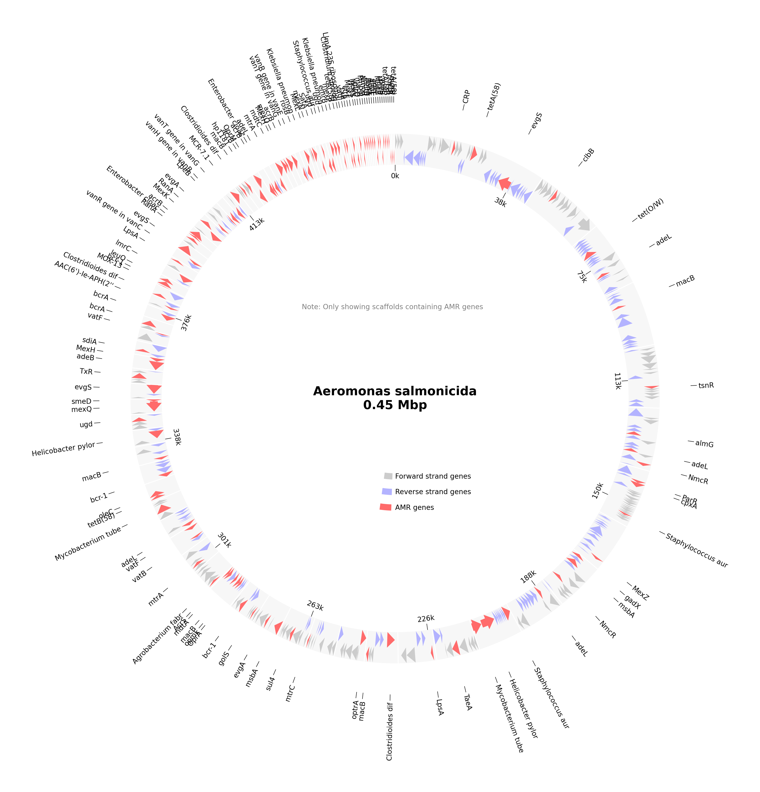

### AAC(6')-Ie-APH(2'')-Ia bifunctional protein
- **Mechanism**: antibiotic inactivation
- **Drug Classes**: aminoglycoside antibiotic
- **AMR Family**: aminoglycoside bifunctional resistance protein
- **Locations**:
  - gnl|SPADES|PLIJBHFI_2164_3 : position 890-1456

### AcrS
- **Mechanism**: antibiotic efflux
- **Drug Classes**: fluoroquinolone antibiotic; cephalosporin; glycylcycline; cephamycin; penam; tetracycline antibiotic; rifamycin antibiotic; phenicol antibiotic; disinfecting agents and antiseptics
- **AMR Family**: resistance-nodulation-cell division (RND) antibiotic efflux pump
- **Locations**:
  - gnl|SPADES|PLIJBHFI_988_10 : position 6512-7120

### Agrobacterium fabrum chloramphenicol acetyltransferase
- **Mechanism**: antibiotic inactivation
- **Drug Classes**: phenicol antibiotic
- **AMR Family**: chloramphenicol acetyltransferase (CAT)
- **Locations**:
  - gnl|SPADES|PLIJBHFI_1088_2 : position 392-1009

### CRP
- **Mechanism**: antibiotic efflux
- **Drug Classes**: macrolide antibiotic; fluoroquinolone antibiotic; penam
- **AMR Family**: resistance-nodulation-cell division (RND) antibiotic efflux pump
- **Locations**:
  - gnl|SPADES|PLIJBHFI_219_16 : position 17230-17985

### Clostridioides difficile gyrB conferring resistance to fluoroquinolones (found in 3 locations)
- **Mechanism**: antibiotic target alteration
- **Drug Classes**: fluoroquinolone antibiotic
- **AMR Family**: fluoroquinolone resistant gyrB
- **Locations**:
  - gnl|SPADES|PLIJBHFI_2193_1 : position 2-814
  - gnl|SPADES|PLIJBHFI_3810_3 : position 1235-1822
  - gnl|SPADES|PLIJBHFI_819_2 : position 827-3241

### Clostridium sporogenes cplR
- **Mechanism**: antibiotic target protection
- **Drug Classes**: lincosamide antibiotic; pleuromutilin antibiotic
- **AMR Family**: Miscellaneous ABC-F subfamily ATP-binding cassette ribosomal protection proteins
- **Locations**:
  - gnl|SPADES|PLIJBHFI_14885_1 : position 301-549

### Enterobacter cloacae acrA (found in 2 locations)
- **Mechanism**: antibiotic efflux
- **Drug Classes**: fluoroquinolone antibiotic; cephalosporin; glycylcycline; penam; tetracycline antibiotic; rifamycin antibiotic; phenicol antibiotic; disinfecting agents and antiseptics
- **AMR Family**: resistance-nodulation-cell division (RND) antibiotic efflux pump
- **Locations**:
  - gnl|SPADES|PLIJBHFI_2974_1 : position 1-468
  - gnl|SPADES|PLIJBHFI_4370_2 : position 1073-1621

### H-NS
- **Mechanism**: antibiotic efflux
- **Drug Classes**: macrolide antibiotic; fluoroquinolone antibiotic; cephalosporin; cephamycin; penam; tetracycline antibiotic
- **AMR Family**: major facilitator superfamily (MFS) antibiotic efflux pump; resistance-nodulation-cell division (RND) antibiotic efflux pump
- **Locations**:
  - gnl|SPADES|PLIJBHFI_20141_2 : position 277-402

### Helicobacter pylori pbp1 mutants conferring resistance to amoxicillin
- **Mechanism**: antibiotic target alteration
- **Drug Classes**: cephalosporin; cephamycin; penam
- **AMR Family**: Penicillin-binding protein mutations conferring resistance to beta-lactam antibiotics
- **Locations**:
  - gnl|SPADES|PLIJBHFI_1380_3 : position 1371-3725

### Helicobacter pylori rpoB mutation conferring resistance to rifampicin
- **Mechanism**: antibiotic target alteration; antibiotic target replacement
- **Drug Classes**: fluoroquinolone antibiotic; rifamycin antibiotic
- **AMR Family**: rifamycin-resistant beta-subunit of RNA polymerase (rpoB)
- **Locations**:
  - gnl|SPADES|PLIJBHFI_671_9 : position 5556-9860

### Klebsiella pneumoniae KpnH
- **Mechanism**: antibiotic efflux
- **Drug Classes**: macrolide antibiotic; fluoroquinolone antibiotic; aminoglycoside antibiotic; carbapenem; cephalosporin; penam; peptide antibiotic; penem
- **AMR Family**: major facilitator superfamily (MFS) antibiotic efflux pump
- **Locations**:
  - gnl|SPADES|PLIJBHFI_11373_1 : position 1-711

### Klebsiella pneumoniae OmpK37
- **Mechanism**: reduced permeability to antibiotic
- **Drug Classes**: monobactam; carbapenem; cephalosporin; cephamycin; penam; penem
- **AMR Family**: General Bacterial Porin with reduced permeability to beta-lactams
- **Locations**:
  - gnl|SPADES|PLIJBHFI_7996_1 : position 2-976

### LlmA 23S ribosomal RNA methyltransferase
- **Mechanism**: antibiotic target alteration
- **Drug Classes**: lincosamide antibiotic
- **AMR Family**: Llm 23S ribosomal RNA methyltransferase
- **Locations**:
  - gnl|SPADES|PLIJBHFI_17735_1 : position 1-459

### LpeB
- **Mechanism**: antibiotic efflux
- **Drug Classes**: macrolide antibiotic
- **AMR Family**: resistance-nodulation-cell division (RND) antibiotic efflux pump
- **Locations**:
  - gnl|SPADES|PLIJBHFI_3233_4 : position 1697-2080

### LpsA (found in 2 locations)
- **Mechanism**: reduced permeability to antibiotic
- **Drug Classes**: peptide antibiotic
- **AMR Family**: Intrinsic peptide antibiotic resistant Lps
- **Locations**:
  - gnl|SPADES|PLIJBHFI_2390_3 : position 2131-2682
  - gnl|SPADES|PLIJBHFI_757_2 : position 677-1360

### MCR-7.1
- **Mechanism**: antibiotic target alteration
- **Drug Classes**: peptide antibiotic
- **AMR Family**: MCR phosphoethanolamine transferase
- **Locations**:
  - gnl|SPADES|PLIJBHFI_3781_1 : position 202-1830

### MOX-13
- **Mechanism**: antibiotic inactivation
- **Drug Classes**: cephalosporin; cephamycin; penam
- **AMR Family**: MOX beta-lactamase
- **Locations**:
  - gnl|SPADES|PLIJBHFI_2260_1 : position 3-122

### MexH (found in 2 locations)
- **Mechanism**: antibiotic efflux
- **Drug Classes**: fluoroquinolone antibiotic; tetracycline antibiotic; disinfecting agents and antiseptics
- **AMR Family**: resistance-nodulation-cell division (RND) antibiotic efflux pump
- **Locations**:
  - gnl|SPADES|PLIJBHFI_1681_2 : position 2706-3728
  - gnl|SPADES|PLIJBHFI_5129_1 : position 1-939

### MexK
- **Mechanism**: antibiotic efflux
- **Drug Classes**: macrolide antibiotic; tetracycline antibiotic; disinfecting agents and antiseptics
- **AMR Family**: resistance-nodulation-cell division (RND) antibiotic efflux pump
- **Locations**:
  - gnl|SPADES|PLIJBHFI_3061_2 : position 465-2168

### MexL
- **Mechanism**: antibiotic efflux
- **Drug Classes**: macrolide antibiotic; tetracycline antibiotic; disinfecting agents and antiseptics
- **AMR Family**: resistance-nodulation-cell division (RND) antibiotic efflux pump
- **Locations**:
  - gnl|SPADES|PLIJBHFI_8592_2 : position 635-919

### MexT
- **Mechanism**: antibiotic efflux
- **Drug Classes**: fluoroquinolone antibiotic; diaminopyrimidine antibiotic; phenicol antibiotic
- **AMR Family**: resistance-nodulation-cell division (RND) antibiotic efflux pump
- **Locations**:
  - gnl|SPADES|PLIJBHFI_19911_1 : position 3-407

### MexV
- **Mechanism**: antibiotic efflux
- **Drug Classes**: macrolide antibiotic; fluoroquinolone antibiotic; tetracycline antibiotic; phenicol antibiotic; disinfecting agents and antiseptics
- **AMR Family**: resistance-nodulation-cell division (RND) antibiotic efflux pump
- **Locations**:
  - gnl|SPADES|PLIJBHFI_20526_1 : position 3-395

### MexZ
- **Mechanism**: antibiotic efflux
- **Drug Classes**: macrolide antibiotic; fluoroquinolone antibiotic; aminoglycoside antibiotic; carbapenem; cephalosporin; cephamycin; penam; tetracycline antibiotic; phenicol antibiotic; disinfecting agents and antiseptics
- **AMR Family**: resistance-nodulation-cell division (RND) antibiotic efflux pump
- **Locations**:
  - gnl|SPADES|PLIJBHFI_623_16 : position 12104-12757

### MuxB (found in 2 locations)
- **Mechanism**: antibiotic efflux
- **Drug Classes**: macrolide antibiotic; monobactam; tetracycline antibiotic; aminocoumarin antibiotic
- **AMR Family**: resistance-nodulation-cell division (RND) antibiotic efflux pump
- **Locations**:
  - gnl|SPADES|PLIJBHFI_31574_1 : position 2-259
  - gnl|SPADES|PLIJBHFI_31943_1 : position 2-256

### Mycobacterium tuberculosis katG mutations conferring resistance to isoniazid
- **Mechanism**: antibiotic target alteration
- **Drug Classes**: isoniazid-like antibiotic
- **AMR Family**: isoniazid resistant katG
- **Locations**:
  - gnl|SPADES|PLIJBHFI_1201_2 : position 1808-3943

### Mycobacterium tuberculosis rpoB mutations conferring resistance to rifampicin
- **Mechanism**: antibiotic target alteration; antibiotic target replacement
- **Drug Classes**: rifamycin antibiotic
- **AMR Family**: rifamycin-resistant beta-subunit of RNA polymerase (rpoB)
- **Locations**:
  - gnl|SPADES|PLIJBHFI_671_10 : position 9952-12978

### NmcR (found in 3 locations)
- **Mechanism**: antibiotic inactivation
- **Drug Classes**: carbapenem; cephalosporin; cephamycin; penam
- **AMR Family**: NmcA beta-lactamase
- **Locations**:
  - gnl|SPADES|PLIJBHFI_25027_1 : position 2-319
  - gnl|SPADES|PLIJBHFI_508_15 : position 16427-17305
  - gnl|SPADES|PLIJBHFI_638_8 : position 9059-9949

### OprA
- **Mechanism**: antibiotic efflux
- **Drug Classes**: macrolide antibiotic; fluoroquinolone antibiotic; aminoglycoside antibiotic; carbapenem; tetracycline antibiotic
- **AMR Family**: resistance-nodulation-cell division (RND) antibiotic efflux pump
- **Locations**:
  - gnl|SPADES|PLIJBHFI_988_3 : position 1483-2133

### OprM
- **Mechanism**: antibiotic efflux
- **Drug Classes**: macrolide antibiotic; fluoroquinolone antibiotic; monobactam; aminoglycoside antibiotic; carbapenem; cephalosporin; cephamycin; penam; tetracycline antibiotic; peptide antibiotic; aminocoumarin antibiotic; diaminopyrimidine antibiotic; sulfonamide antibiotic; phenicol antibiotic; penem; disinfecting agents and antiseptics
- **AMR Family**: resistance-nodulation-cell division (RND) antibiotic efflux pump
- **Locations**:
  - gnl|SPADES|PLIJBHFI_4160_2 : position 166-1572

### ParR
- **Mechanism**: antibiotic efflux; reduced permeability to antibiotic
- **Drug Classes**: macrolide antibiotic; fluoroquinolone antibiotic; monobactam; aminoglycoside antibiotic; carbapenem; cephalosporin; cephamycin; penam; tetracycline antibiotic; phenicol antibiotic; penem; disinfecting agents and antiseptics
- **AMR Family**: resistance-nodulation-cell division (RND) antibiotic efflux pump; Outer Membrane Porin (Opr)
- **Locations**:
  - gnl|SPADES|PLIJBHFI_542_3 : position 3421-4140

### PmpM
- **Mechanism**: antibiotic efflux
- **Drug Classes**: fluoroquinolone antibiotic; aminoglycoside antibiotic; disinfecting agents and antiseptics
- **AMR Family**: multidrug and toxic compound extrusion (MATE) transporter
- **Locations**:
  - gnl|SPADES|PLIJBHFI_24187_1 : position 3-332

### RanA (found in 3 locations)
- **Mechanism**: antibiotic efflux
- **Drug Classes**: aminoglycoside antibiotic
- **AMR Family**: ATP-binding cassette (ABC) antibiotic efflux pump
- **Locations**:
  - gnl|SPADES|PLIJBHFI_26259_1 : position 3-302
  - gnl|SPADES|PLIJBHFI_2830_3 : position 1425-2186
  - gnl|SPADES|PLIJBHFI_3181_1 : position 127-1209

### SatA
- **Mechanism**: antibiotic inactivation
- **Drug Classes**: nucleoside antibiotic
- **AMR Family**: streptothricin acetyltransferase (SAT)
- **Locations**:
  - gnl|SPADES|PLIJBHFI_9262_2 : position 211-669

### Staphylococcus aureus fusA with mutation conferring resistance to fusidic acid
- **Mechanism**: antibiotic target alteration
- **Drug Classes**: fusidane antibiotic
- **AMR Family**: antibiotic resistant fusA
- **Locations**:
  - gnl|SPADES|PLIJBHFI_671_1 : position 2-1909

### Staphylococcus aureus fusE with mutation conferring resistance to fusidic acid
- **Mechanism**: antibiotic target alteration
- **Drug Classes**: fusidane antibiotic
- **AMR Family**: antibiotic resistant fusE
- **Locations**:
  - gnl|SPADES|PLIJBHFI_542_22 : position 13859-14392

### Staphylococcus aureus mupA conferring resistance to mupirocin
- **Mechanism**: antibiotic target alteration
- **Drug Classes**: mupirocin-like antibiotic
- **AMR Family**: antibiotic-resistant isoleucyl-tRNA synthetase (ileS)
- **Locations**:
  - gnl|SPADES|PLIJBHFI_10482_1 : position 3-767

### TaeA
- **Mechanism**: antibiotic efflux
- **Drug Classes**: pleuromutilin antibiotic
- **AMR Family**: ATP-binding cassette (ABC) antibiotic efflux pump
- **Locations**:
  - gnl|SPADES|PLIJBHFI_699_6 : position 5563-7473

### TxR (found in 3 locations)
- **Mechanism**: antibiotic efflux
- **Drug Classes**: tetracycline antibiotic
- **AMR Family**: ATP-binding cassette (ABC) antibiotic efflux pump
- **Locations**:
  - gnl|SPADES|PLIJBHFI_1513_3 : position 1454-3001
  - gnl|SPADES|PLIJBHFI_19381_1 : position 2-418
  - gnl|SPADES|PLIJBHFI_36571_1 : position 2-232

### acrB (found in 4 locations)
- **Mechanism**: antibiotic efflux
- **Drug Classes**: fluoroquinolone antibiotic; cephalosporin; glycylcycline; penam; tetracycline antibiotic; rifamycin antibiotic; phenicol antibiotic; disinfecting agents and antiseptics
- **AMR Family**: resistance-nodulation-cell division (RND) antibiotic efflux pump
- **Locations**:
  - gnl|SPADES|PLIJBHFI_2974_2 : position 486-2219
  - gnl|SPADES|PLIJBHFI_4160_1 : position 3-173
  - gnl|SPADES|PLIJBHFI_4370_1 : position 3-1055
  - gnl|SPADES|PLIJBHFI_5481_1 : position 3-1349

### adeB
- **Mechanism**: antibiotic efflux
- **Drug Classes**: glycylcycline; tetracycline antibiotic
- **AMR Family**: resistance-nodulation-cell division (RND) antibiotic efflux pump
- **Locations**:
  - gnl|SPADES|PLIJBHFI_1681_1 : position 2-2632

### adeL (found in 7 locations)
- **Mechanism**: antibiotic efflux
- **Drug Classes**: fluoroquinolone antibiotic; tetracycline antibiotic
- **AMR Family**: resistance-nodulation-cell division (RND) antibiotic efflux pump
- **Locations**:
  - gnl|SPADES|PLIJBHFI_1185_1 : position 142-1050
  - gnl|SPADES|PLIJBHFI_26533_1 : position 3-299
  - gnl|SPADES|PLIJBHFI_27688_1 : position 3-287
  - gnl|SPADES|PLIJBHFI_4560_1 : position 1-933
  - gnl|SPADES|PLIJBHFI_481_15 : position 12520-13401
  - gnl|SPADES|PLIJBHFI_508_12 : position 12915-13823
  - gnl|SPADES|PLIJBHFI_646_2 : position 2638-3546

### almE
- **Mechanism**: antibiotic target alteration
- **Drug Classes**: peptide antibiotic
- **AMR Family**: polymyxin resistance operon; alm glycyltransferase
- **Locations**:
  - gnl|SPADES|PLIJBHFI_27042_1 : position 2-292

### almG
- **Mechanism**: antibiotic target alteration
- **Drug Classes**: peptide antibiotic
- **AMR Family**: lipid A acyltransferase; polymyxin resistance operon
- **Locations**:
  - gnl|SPADES|PLIJBHFI_508_7 : position 7510-8532

### bcr-1 (found in 3 locations)
- **Mechanism**: antibiotic efflux
- **Drug Classes**: bicyclomycin-like antibiotic
- **AMR Family**: major facilitator superfamily (MFS) antibiotic efflux pump
- **Locations**:
  - gnl|SPADES|PLIJBHFI_1214_1 : position 3-1187
  - gnl|SPADES|PLIJBHFI_2260_2 : position 436-1608
  - gnl|SPADES|PLIJBHFI_961_7 : position 4584-5747

### bcrA (found in 2 locations)
- **Mechanism**: antibiotic efflux
- **Drug Classes**: peptide antibiotic
- **AMR Family**: ATP-binding cassette (ABC) antibiotic efflux pump
- **Locations**:
  - gnl|SPADES|PLIJBHFI_1959_2 : position 1099-2574
  - gnl|SPADES|PLIJBHFI_1966_2 : position 670-2145

### cfrE
- **Mechanism**: antibiotic target alteration
- **Drug Classes**: lincosamide antibiotic; streptogramin antibiotic; oxazolidinone antibiotic; phenicol antibiotic; pleuromutilin antibiotic
- **AMR Family**: Cfr 23S ribosomal RNA methyltransferase
- **Locations**:
  - gnl|SPADES|PLIJBHFI_19525_1 : position 1-417

### clbB
- **Mechanism**: antibiotic target alteration
- **Drug Classes**: lincosamide antibiotic; streptogramin antibiotic; streptogramin A antibiotic; oxazolidinone antibiotic; phenicol antibiotic; pleuromutilin antibiotic
- **AMR Family**: Cfr 23S ribosomal RNA methyltransferase
- **Locations**:
  - gnl|SPADES|PLIJBHFI_460_6 : position 5380-6483

### cpxA
- **Mechanism**: antibiotic efflux
- **Drug Classes**: aminoglycoside antibiotic; aminocoumarin antibiotic
- **AMR Family**: resistance-nodulation-cell division (RND) antibiotic efflux pump
- **Locations**:
  - gnl|SPADES|PLIJBHFI_542_4 : position 4137-5447

### emrB
- **Mechanism**: antibiotic efflux
- **Drug Classes**: fluoroquinolone antibiotic
- **AMR Family**: major facilitator superfamily (MFS) antibiotic efflux pump
- **Locations**:
  - gnl|SPADES|PLIJBHFI_11826_1 : position 3-683

### evgA (found in 2 locations)
- **Mechanism**: antibiotic efflux
- **Drug Classes**: macrolide antibiotic; fluoroquinolone antibiotic; penam; tetracycline antibiotic
- **AMR Family**: major facilitator superfamily (MFS) antibiotic efflux pump; resistance-nodulation-cell division (RND) antibiotic efflux pump
- **Locations**:
  - gnl|SPADES|PLIJBHFI_3180_1 : position 20-664
  - gnl|SPADES|PLIJBHFI_939_5 : position 4184-4828

### evgS (found in 3 locations)
- **Mechanism**: antibiotic efflux
- **Drug Classes**: macrolide antibiotic; fluoroquinolone antibiotic; penam; tetracycline antibiotic
- **AMR Family**: major facilitator superfamily (MFS) antibiotic efflux pump; resistance-nodulation-cell division (RND) antibiotic efflux pump
- **Locations**:
  - gnl|SPADES|PLIJBHFI_1482_3 : position 1529-4264
  - gnl|SPADES|PLIJBHFI_219_33 : position 33689-37669
  - gnl|SPADES|PLIJBHFI_2730_2 : position 92-2212

### gadX
- **Mechanism**: antibiotic efflux
- **Drug Classes**: macrolide antibiotic; fluoroquinolone antibiotic; penam
- **AMR Family**: resistance-nodulation-cell division (RND) antibiotic efflux pump
- **Locations**:
  - gnl|SPADES|PLIJBHFI_638_1 : position 5-916

### golS
- **Mechanism**: antibiotic efflux
- **Drug Classes**: monobactam; carbapenem; cephalosporin; cephamycin; penam; phenicol antibiotic; penem
- **AMR Family**: resistance-nodulation-cell division (RND) antibiotic efflux pump
- **Locations**:
  - gnl|SPADES|PLIJBHFI_961_2 : position 866-1306

### hp1181
- **Mechanism**: antibiotic efflux
- **Drug Classes**: fluoroquinolone antibiotic; tetracycline antibiotic; nitroimidazole antibiotic
- **AMR Family**: major facilitator superfamily (MFS) antibiotic efflux pump
- **Locations**:
  - gnl|SPADES|PLIJBHFI_4026_1 : position 171-1532

### leuO
- **Mechanism**: antibiotic efflux
- **Drug Classes**: nucleoside antibiotic; disinfecting agents and antiseptics
- **AMR Family**: major facilitator superfamily (MFS) antibiotic efflux pump
- **Locations**:
  - gnl|SPADES|PLIJBHFI_2260_3 : position 1627-2589

### lmrC
- **Mechanism**: antibiotic target protection
- **Drug Classes**: lincosamide antibiotic
- **AMR Family**: Miscellaneous ABC-F subfamily ATP-binding cassette ribosomal protection proteins
- **Locations**:
  - gnl|SPADES|PLIJBHFI_2299_3 : position 829-2562

### lmrD
- **Mechanism**: antibiotic efflux
- **Drug Classes**: lincosamide antibiotic
- **AMR Family**: ATP-binding cassette (ABC) antibiotic efflux pump
- **Locations**:
  - gnl|SPADES|PLIJBHFI_21827_1 : position 1-261

### macB (found in 6 locations)
- **Mechanism**: antibiotic efflux
- **Drug Classes**: macrolide antibiotic
- **AMR Family**: ATP-binding cassette (ABC) antibiotic efflux pump
- **Locations**:
  - gnl|SPADES|PLIJBHFI_1231_1 : position 35-784
  - gnl|SPADES|PLIJBHFI_22886_1 : position 3-350
  - gnl|SPADES|PLIJBHFI_3844_2 : position 1098-1766
  - gnl|SPADES|PLIJBHFI_499_5 : position 4615-5325
  - gnl|SPADES|PLIJBHFI_819_8 : position 8652-9386
  - gnl|SPADES|PLIJBHFI_988_6 : position 3458-4150

### mdtA
- **Mechanism**: antibiotic efflux
- **Drug Classes**: aminocoumarin antibiotic
- **AMR Family**: resistance-nodulation-cell division (RND) antibiotic efflux pump
- **Locations**:
  - gnl|SPADES|PLIJBHFI_988_9 : position 5664-6515

### mdtB (found in 2 locations)
- **Mechanism**: antibiotic efflux
- **Drug Classes**: aminocoumarin antibiotic
- **AMR Family**: resistance-nodulation-cell division (RND) antibiotic efflux pump
- **Locations**:
  - gnl|SPADES|PLIJBHFI_25953_1 : position 2-307
  - gnl|SPADES|PLIJBHFI_42038_1 : position 3-206

### mdtC
- **Mechanism**: antibiotic efflux
- **Drug Classes**: aminocoumarin antibiotic
- **AMR Family**: resistance-nodulation-cell division (RND) antibiotic efflux pump
- **Locations**:
  - gnl|SPADES|PLIJBHFI_5018_1 : position 3-1451

### mexN
- **Mechanism**: antibiotic efflux
- **Drug Classes**: phenicol antibiotic
- **AMR Family**: resistance-nodulation-cell division (RND) antibiotic efflux pump
- **Locations**:
  - gnl|SPADES|PLIJBHFI_8683_1 : position 1-912

### mexP
- **Mechanism**: antibiotic efflux
- **Drug Classes**: macrolide antibiotic; carbapenem; tetracycline antibiotic; diaminopyrimidine antibiotic; phenicol antibiotic; disinfecting agents and antiseptics
- **AMR Family**: resistance-nodulation-cell division (RND) antibiotic efflux pump
- **Locations**:
  - gnl|SPADES|PLIJBHFI_12474_1 : position 3-653

### mexQ (found in 2 locations)
- **Mechanism**: antibiotic efflux
- **Drug Classes**: macrolide antibiotic; carbapenem; tetracycline antibiotic; diaminopyrimidine antibiotic; phenicol antibiotic; disinfecting agents and antiseptics
- **AMR Family**: resistance-nodulation-cell division (RND) antibiotic efflux pump
- **Locations**:
  - gnl|SPADES|PLIJBHFI_1481_2 : position 466-3630
  - gnl|SPADES|PLIJBHFI_5129_2 : position 936-1424

### msbA (found in 2 locations)
- **Mechanism**: antibiotic efflux
- **Drug Classes**: nitroimidazole antibiotic
- **AMR Family**: ATP-binding cassette (ABC) antibiotic efflux pump
- **Locations**:
  - gnl|SPADES|PLIJBHFI_638_3 : position 2121-3620
  - gnl|SPADES|PLIJBHFI_939_1 : position 100-1869

### mtrA (found in 2 locations)
- **Mechanism**: antibiotic efflux
- **Drug Classes**: macrolide antibiotic; penam
- **AMR Family**: resistance-nodulation-cell division (RND) antibiotic efflux pump
- **Locations**:
  - gnl|SPADES|PLIJBHFI_1142_2 : position 957-1775
  - gnl|SPADES|PLIJBHFI_5012_1 : position 189-1031

### mtrC
- **Mechanism**: antibiotic efflux
- **Drug Classes**: macrolide antibiotic; penam
- **AMR Family**: resistance-nodulation-cell division (RND) antibiotic efflux pump
- **Locations**:
  - gnl|SPADES|PLIJBHFI_883_12 : position 8147-8542

### oleB
- **Mechanism**: antibiotic target protection
- **Drug Classes**: macrolide antibiotic
- **AMR Family**: Miscellaneous ABC-F subfamily ATP-binding cassette ribosomal protection proteins
- **Locations**:
  - gnl|SPADES|PLIJBHFI_32461_1 : position 3-254

### oleC
- **Mechanism**: antibiotic efflux
- **Drug Classes**: macrolide antibiotic
- **AMR Family**: ATP-binding cassette (ABC) antibiotic efflux pump
- **Locations**:
  - gnl|SPADES|PLIJBHFI_1210_3 : position 1291-2607

### opmE
- **Mechanism**: antibiotic efflux
- **Drug Classes**: macrolide antibiotic; carbapenem; tetracycline antibiotic; diaminopyrimidine antibiotic; phenicol antibiotic; disinfecting agents and antiseptics
- **AMR Family**: resistance-nodulation-cell division (RND) antibiotic efflux pump
- **Locations**:
  - gnl|SPADES|PLIJBHFI_988_4 : position 2127-2969

### optrA
- **Mechanism**: antibiotic target protection
- **Drug Classes**: oxazolidinone antibiotic; phenicol antibiotic
- **AMR Family**: Miscellaneous ABC-F subfamily ATP-binding cassette ribosomal protection proteins
- **Locations**:
  - gnl|SPADES|PLIJBHFI_876_1 : position 47-1639

### poxtA
- **Mechanism**: antibiotic target protection
- **Drug Classes**: tetracycline antibiotic; oxazolidinone antibiotic; phenicol antibiotic
- **AMR Family**: Miscellaneous ABC-F subfamily ATP-binding cassette ribosomal protection proteins
- **Locations**:
  - gnl|SPADES|PLIJBHFI_40446_1 : position 3-215

### rosB
- **Mechanism**: antibiotic efflux
- **Drug Classes**: peptide antibiotic
- **AMR Family**: major facilitator superfamily (MFS) antibiotic efflux pump
- **Locations**:
  - gnl|SPADES|PLIJBHFI_7660_1 : position 3-1019

### sdiA
- **Mechanism**: antibiotic efflux
- **Drug Classes**: fluoroquinolone antibiotic; cephalosporin; glycylcycline; penam; tetracycline antibiotic; rifamycin antibiotic; phenicol antibiotic; disinfecting agents and antiseptics
- **AMR Family**: resistance-nodulation-cell division (RND) antibiotic efflux pump
- **Locations**:
  - gnl|SPADES|PLIJBHFI_1682_2 : position 982-1758

### smeD
- **Mechanism**: antibiotic efflux
- **Drug Classes**: macrolide antibiotic; fluoroquinolone antibiotic; tetracycline antibiotic; phenicol antibiotic
- **AMR Family**: resistance-nodulation-cell division (RND) antibiotic efflux pump
- **Locations**:
  - gnl|SPADES|PLIJBHFI_1481_3 : position 3623-4264

### sul4
- **Mechanism**: antibiotic target replacement
- **Drug Classes**: sulfonamide antibiotic
- **AMR Family**: sulfonamide resistant sul
- **Locations**:
  - gnl|SPADES|PLIJBHFI_896_6 : position 4421-5284

### tet(O/W)
- **Mechanism**: antibiotic target protection
- **Drug Classes**: tetracycline antibiotic
- **AMR Family**: tetracycline-resistant ribosomal protection protein
- **Locations**:
  - gnl|SPADES|PLIJBHFI_481_6 : position 4172-5965

### tetA(58) (found in 4 locations)
- **Mechanism**: antibiotic efflux
- **Drug Classes**: tetracycline antibiotic
- **AMR Family**: major facilitator superfamily (MFS) antibiotic efflux pump
- **Locations**:
  - gnl|SPADES|PLIJBHFI_14411_2 : position 245-568
  - gnl|SPADES|PLIJBHFI_219_23 : position 23199-24764
  - gnl|SPADES|PLIJBHFI_34724_1 : position 3-242
  - gnl|SPADES|PLIJBHFI_41921_1 : position 2-205

### tetB(58)
- **Mechanism**: antibiotic efflux
- **Drug Classes**: tetracycline antibiotic
- **AMR Family**: major facilitator superfamily (MFS) antibiotic efflux pump
- **Locations**:
  - gnl|SPADES|PLIJBHFI_1210_2 : position 483-1301

### tsnR
- **Mechanism**: antibiotic target alteration
- **Drug Classes**: peptide antibiotic
- **AMR Family**: non-erm 23S ribosomal RNA methyltransferase (A1067)
- **Locations**:
  - gnl|SPADES|PLIJBHFI_507_13 : position 11849-12598

### ugd (found in 3 locations)
- **Mechanism**: antibiotic target alteration
- **Drug Classes**: peptide antibiotic
- **AMR Family**: pmr phosphoethanolamine transferase
- **Locations**:
  - gnl|SPADES|PLIJBHFI_10314_2 : position 426-782
  - gnl|SPADES|PLIJBHFI_11242_1 : position 47-718
  - gnl|SPADES|PLIJBHFI_1460_4 : position 2309-3475

### vanH gene in vanB cluster
- **Mechanism**: antibiotic target alteration
- **Drug Classes**: glycopeptide antibiotic
- **AMR Family**: vanH; glycopeptide resistance gene cluster
- **Locations**:
  - gnl|SPADES|PLIJBHFI_3261_1 : position 33-989

### vanR gene in vanC cluster
- **Mechanism**: antibiotic target alteration
- **Drug Classes**: glycopeptide antibiotic
- **AMR Family**: glycopeptide resistance gene cluster; vanR
- **Locations**:
  - gnl|SPADES|PLIJBHFI_2489_2 : position 1427-2158

### vanR gene in vanE cluster
- **Mechanism**: antibiotic target alteration
- **Drug Classes**: glycopeptide antibiotic
- **AMR Family**: glycopeptide resistance gene cluster; vanR
- **Locations**:
  - gnl|SPADES|PLIJBHFI_7275_1 : position 2-619

### vanT gene in vanG cluster (found in 2 locations)
- **Mechanism**: antibiotic target alteration
- **Drug Classes**: glycopeptide antibiotic
- **AMR Family**: glycopeptide resistance gene cluster; vanT
- **Locations**:
  - gnl|SPADES|PLIJBHFI_3324_1 : position 3-1046
  - gnl|SPADES|PLIJBHFI_6727_2 : position 114-1133

### vatB
- **Mechanism**: antibiotic inactivation
- **Drug Classes**: streptogramin antibiotic; streptogramin A antibiotic
- **AMR Family**: streptogramin vat acetyltransferase
- **Locations**:
  - gnl|SPADES|PLIJBHFI_1166_3 : position 1646-2251

### vatF (found in 3 locations)
- **Mechanism**: antibiotic inactivation
- **Drug Classes**: streptogramin antibiotic; streptogramin A antibiotic
- **AMR Family**: streptogramin vat acetyltransferase
- **Locations**:
  - gnl|SPADES|PLIJBHFI_1166_6 : position 4553-5470
  - gnl|SPADES|PLIJBHFI_1747_3 : position 3264-3590
  - gnl|SPADES|PLIJBHFI_18553_2 : position 111-437

### vgaC
- **Mechanism**: antibiotic target protection
- **Drug Classes**: lincosamide antibiotic; streptogramin antibiotic; streptogramin A antibiotic; pleuromutilin antibiotic
- **AMR Family**: vga-type ABC-F protein
- **Locations**:
  - gnl|SPADES|PLIJBHFI_33585_1 : position 3-248

## Aeromonas salmonicida subsp. masoucida
**Strain Statistics:**
- Total genome length: 948.5 kbp
- Total scaffolds: 150
- Scaffolds with AMR genes: 61
- Total genes annotated: 1873
- Total AMR genes: 123
- Unique AMR genes: 82
- Distinct AMR mechanisms: 7
- Distinct AMR families: 37
- Distinct drug classes: 32

**Circos Plot:**

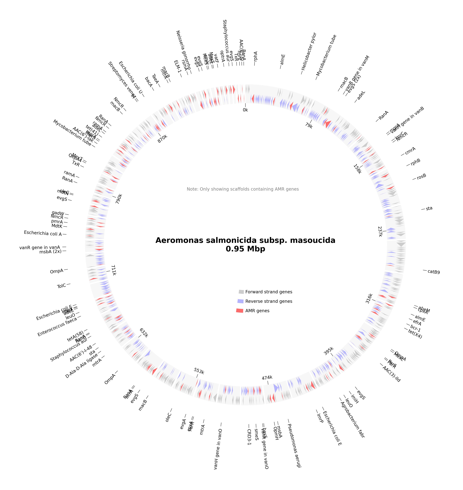

### AAC(3)-IId
- **Mechanism**: antibiotic inactivation
- **Drug Classes**: aminoglycoside antibiotic
- **AMR Family**: AAC(3)
- **Locations**:
  - gnl|SPADES|PLIJBHFI_328_22 : position 23338-24087

### AAC(6')-I-48
- **Mechanism**: antibiotic inactivation
- **Drug Classes**: aminoglycoside antibiotic
- **AMR Family**: AAC(6')
- **Locations**:
  - gnl|SPADES|PLIJBHFI_480_20 : position 17148-17654

### AAC(6')-Iak
- **Mechanism**: antibiotic inactivation
- **Drug Classes**: aminoglycoside antibiotic
- **AMR Family**: AAC(6')
- **Locations**:
  - gnl|SPADES|PLIJBHFI_852_1 : position 3-431

### AAC(6')-Iy
- **Mechanism**: antibiotic inactivation
- **Drug Classes**: aminoglycoside antibiotic
- **AMR Family**: AAC(6')
- **Locations**:
  - gnl|SPADES|PLIJBHFI_20323_1 : position 1-375

### Agrobacterium fabrum chloramphenicol acetyltransferase
- **Mechanism**: antibiotic inactivation
- **Drug Classes**: phenicol antibiotic
- **AMR Family**: chloramphenicol acetyltransferase (CAT)
- **Locations**:
  - gnl|SPADES|PLIJBHFI_344_14 : position 13853-14515

### CRD3-1
- **Mechanism**: antibiotic inactivation
- **Drug Classes**: carbapenem
- **AMR Family**: CRD3 beta-lactamase
- **Locations**:
  - gnl|SPADES|PLIJBHFI_393_20 : position 15961-16785

### D-Ala-D-Ala ligase
- **Mechanism**: antibiotic target alteration
- **Drug Classes**: glycopeptide antibiotic
- **AMR Family**: Van ligase
- **Locations**:
  - gnl|SPADES|PLIJBHFI_480_9 : position 8263-9252

### ELM-1
- **Mechanism**: antibiotic inactivation
- **Drug Classes**: carbapenem
- **AMR Family**: ELM beta-lactamase
- **Locations**:
  - gnl|SPADES|PLIJBHFI_1254_5 : position 4458-5102

### Enterococcus faecalis cls with mutation conferring resistance to daptomycin
- **Mechanism**: antibiotic target alteration
- **Drug Classes**: peptide antibiotic
- **AMR Family**: daptomycin resistant cls
- **Locations**:
  - gnl|SPADES|PLIJBHFI_595_7 : position 4959-6212

### Escherichia coli AcrAB-TolC with AcrR mutation conferring resistance to ciprofloxacin, tetracycline, and ceftazidime
- **Mechanism**: antibiotic target alteration; antibiotic efflux
- **Drug Classes**: fluoroquinolone antibiotic; cephalosporin; glycylcycline; penam; tetracycline antibiotic; rifamycin antibiotic; phenicol antibiotic; disinfecting agents and antiseptics
- **AMR Family**: resistance-nodulation-cell division (RND) antibiotic efflux pump
- **Locations**:
  - gnl|SPADES|PLIJBHFI_722_4 : position 2711-3313

### Escherichia coli EF-Tu mutants conferring resistance to Enacyloxin IIa
- **Mechanism**: antibiotic target alteration
- **Drug Classes**: elfamycin antibiotic
- **AMR Family**: elfamycin resistant EF-Tu
- **Locations**:
  - gnl|SPADES|PLIJBHFI_346_3 : position 1963-4659

### Escherichia coli EF-Tu mutants conferring resistance to Pulvomycin
- **Mechanism**: antibiotic target alteration
- **Drug Classes**: elfamycin antibiotic
- **AMR Family**: elfamycin resistant EF-Tu
- **Locations**:
  - gnl|SPADES|PLIJBHFI_604_1 : position 2-712

### Escherichia coli UhpT with mutation conferring resistance to fosfomycin
- **Mechanism**: antibiotic target alteration
- **Drug Classes**: phosphonic acid antibiotic
- **AMR Family**: antibiotic-resistant UhpT
- **Locations**:
  - gnl|SPADES|PLIJBHFI_1038_5 : position 3047-4453

### Helicobacter pylori pbp1 mutants conferring resistance to amoxicillin
- **Mechanism**: antibiotic target alteration
- **Drug Classes**: cephalosporin; cephamycin; penam
- **AMR Family**: Penicillin-binding protein mutations conferring resistance to beta-lactam antibiotics
- **Locations**:
  - gnl|SPADES|PLIJBHFI_130_53 : position 50985-53258

### MdtK
- **Mechanism**: antibiotic efflux
- **Drug Classes**: fluoroquinolone antibiotic
- **AMR Family**: multidrug and toxic compound extrusion (MATE) transporter
- **Locations**:
  - gnl|SPADES|PLIJBHFI_722_12 : position 9418-10764

### MexL
- **Mechanism**: antibiotic efflux
- **Drug Classes**: macrolide antibiotic; tetracycline antibiotic; disinfecting agents and antiseptics
- **AMR Family**: resistance-nodulation-cell division (RND) antibiotic efflux pump
- **Locations**:
  - gnl|SPADES|PLIJBHFI_328_8 : position 8326-8880

### MexS (found in 3 locations)
- **Mechanism**: antibiotic efflux
- **Drug Classes**: fluoroquinolone antibiotic; diaminopyrimidine antibiotic; phenicol antibiotic
- **AMR Family**: resistance-nodulation-cell division (RND) antibiotic efflux pump
- **Locations**:
  - gnl|SPADES|PLIJBHFI_1937_1 : position 122-1183
  - gnl|SPADES|PLIJBHFI_1938_2 : position 1116-2243
  - gnl|SPADES|PLIJBHFI_852_4 : position 2368-3372

### MexT
- **Mechanism**: antibiotic efflux
- **Drug Classes**: fluoroquinolone antibiotic; diaminopyrimidine antibiotic; phenicol antibiotic
- **AMR Family**: resistance-nodulation-cell division (RND) antibiotic efflux pump
- **Locations**:
  - gnl|SPADES|PLIJBHFI_824_3 : position 1868-2788

### Mycobacterium tuberculosis ndh with mutation conferring resistance to isoniazid (found in 2 locations)
- **Mechanism**: antibiotic target alteration
- **Drug Classes**: isoniazid-like antibiotic
- **AMR Family**: antibiotic resistant ndh
- **Locations**:
  - gnl|SPADES|PLIJBHFI_130_60 : position 65749-67041
  - gnl|SPADES|PLIJBHFI_843_6 : position 6301-7593

### Neisseria gonorrhoeae pilQ gene conferring resistance to beta-lactam
- **Mechanism**: antibiotic target alteration
- **Drug Classes**: cephalosporin; cephamycin; penam
- **AMR Family**: Penicillin-binding protein mutations conferring resistance to beta-lactam antibiotics
- **Locations**:
  - gnl|SPADES|PLIJBHFI_1395_2 : position 248-2284

### NmcR (found in 4 locations)
- **Mechanism**: antibiotic inactivation
- **Drug Classes**: carbapenem; cephalosporin; cephamycin; penam
- **AMR Family**: NmcA beta-lactamase
- **Locations**:
  - gnl|SPADES|PLIJBHFI_239_22 : position 22403-23311
  - gnl|SPADES|PLIJBHFI_780_4 : position 4174-5094
  - gnl|SPADES|PLIJBHFI_885_8 : position 6966-7886
  - gnl|SPADES|PLIJBHFI_938_1 : position 1-864

### OmpA (found in 3 locations)
- **Mechanism**: reduced permeability to antibiotic
- **Drug Classes**: peptide antibiotic
- **AMR Family**: General Bacterial Porin with reduced permeability to peptide antibiotics
- **Locations**:
  - gnl|SPADES|PLIJBHFI_328_6 : position 6601-7740
  - gnl|SPADES|PLIJBHFI_471_8 : position 5677-6708
  - gnl|SPADES|PLIJBHFI_618_2 : position 838-1362

### OpmH
- **Mechanism**: antibiotic efflux
- **Drug Classes**: disinfecting agents and antiseptics
- **AMR Family**: resistance-nodulation-cell division (RND) antibiotic efflux pump
- **Locations**:
  - gnl|SPADES|PLIJBHFI_348_17 : position 20668-21993

### ParR (found in 2 locations)
- **Mechanism**: antibiotic efflux; reduced permeability to antibiotic
- **Drug Classes**: macrolide antibiotic; fluoroquinolone antibiotic; monobactam; aminoglycoside antibiotic; carbapenem; cephalosporin; cephamycin; penam; tetracycline antibiotic; phenicol antibiotic; penem; disinfecting agents and antiseptics
- **AMR Family**: resistance-nodulation-cell division (RND) antibiotic efflux pump; Outer Membrane Porin (Opr)
- **Locations**:
  - gnl|SPADES|PLIJBHFI_328_16 : position 17414-18121
  - gnl|SPADES|PLIJBHFI_414_16 : position 16822-17544

### ParS
- **Mechanism**: antibiotic efflux; reduced permeability to antibiotic
- **Drug Classes**: macrolide antibiotic; fluoroquinolone antibiotic; monobactam; aminoglycoside antibiotic; carbapenem; cephalosporin; cephamycin; penam; tetracycline antibiotic; phenicol antibiotic; penem; disinfecting agents and antiseptics
- **AMR Family**: resistance-nodulation-cell division (RND) antibiotic efflux pump; Outer Membrane Porin (Opr)
- **Locations**:
  - gnl|SPADES|PLIJBHFI_328_15 : position 16050-17375

### Pseudomonas aeruginosa CpxR
- **Mechanism**: antibiotic efflux
- **Drug Classes**: macrolide antibiotic; fluoroquinolone antibiotic; monobactam; aminoglycoside antibiotic; carbapenem; cephalosporin; cephamycin; penam; tetracycline antibiotic; peptide antibiotic; aminocoumarin antibiotic; diaminopyrimidine antibiotic; sulfonamide antibiotic; phenicol antibiotic; penem
- **AMR Family**: resistance-nodulation-cell division (RND) antibiotic efflux pump
- **Locations**:
  - gnl|SPADES|PLIJBHFI_293_35 : position 28572-29267

### Pseudomonas aeruginosa soxR
- **Mechanism**: antibiotic target alteration; antibiotic efflux
- **Drug Classes**: fluoroquinolone antibiotic; cephalosporin; glycylcycline; penam; tetracycline antibiotic; rifamycin antibiotic; phenicol antibiotic; disinfecting agents and antiseptics
- **AMR Family**: ATP-binding cassette (ABC) antibiotic efflux pump; major facilitator superfamily (MFS) antibiotic efflux pump; resistance-nodulation-cell division (RND) antibiotic efflux pump
- **Locations**:
  - gnl|SPADES|PLIJBHFI_348_9 : position 8042-8521

### QepA4
- **Mechanism**: antibiotic efflux
- **Drug Classes**: fluoroquinolone antibiotic
- **AMR Family**: major facilitator superfamily (MFS) antibiotic efflux pump
- **Locations**:
  - gnl|SPADES|PLIJBHFI_824_2 : position 283-1677

### RanA (found in 6 locations)
- **Mechanism**: antibiotic efflux
- **Drug Classes**: aminoglycoside antibiotic
- **AMR Family**: ATP-binding cassette (ABC) antibiotic efflux pump
- **Locations**:
  - gnl|SPADES|PLIJBHFI_160_58 : position 60170-60595
  - gnl|SPADES|PLIJBHFI_26260_1 : position 2-301
  - gnl|SPADES|PLIJBHFI_452_6 : position 7834-8826
  - gnl|SPADES|PLIJBHFI_504_10 : position 7733-8533
  - gnl|SPADES|PLIJBHFI_805_5 : position 2821-3828
  - gnl|SPADES|PLIJBHFI_887_1 : position 65-1201

### RanB
- **Mechanism**: antibiotic efflux
- **Drug Classes**: aminoglycoside antibiotic
- **AMR Family**: ATP-binding cassette (ABC) antibiotic efflux pump
- **Locations**:
  - gnl|SPADES|PLIJBHFI_504_9 : position 6954-7733

### Staphylococcus aureus mupB conferring resistance to mupirocin
- **Mechanism**: antibiotic target alteration
- **Drug Classes**: mupirocin-like antibiotic
- **AMR Family**: antibiotic-resistant isoleucyl-tRNA synthetase (ileS)
- **Locations**:
  - gnl|SPADES|PLIJBHFI_2168_3 : position 1811-2953

### Staphylococcus aureus murA with mutation conferring resistance to fosfomycin
- **Mechanism**: antibiotic target alteration
- **Drug Classes**: phosphonic acid antibiotic
- **AMR Family**: antibiotic-resistant murA transferase
- **Locations**:
  - gnl|SPADES|PLIJBHFI_504_4 : position 4015-5271

### Streptomyces venezuelae rox
- **Mechanism**: antibiotic inactivation
- **Drug Classes**: rifamycin antibiotic
- **AMR Family**: rifampin monooxygenase
- **Locations**:
  - gnl|SPADES|PLIJBHFI_1000_5 : position 5070-6293

### TaeA
- **Mechanism**: antibiotic efflux
- **Drug Classes**: pleuromutilin antibiotic
- **AMR Family**: ATP-binding cassette (ABC) antibiotic efflux pump
- **Locations**:
  - gnl|SPADES|PLIJBHFI_1086_5 : position 3822-5489

### TolC
- **Mechanism**: antibiotic efflux
- **Drug Classes**: macrolide antibiotic; fluoroquinolone antibiotic; aminoglycoside antibiotic; carbapenem; cephalosporin; glycylcycline; cephamycin; penam; tetracycline antibiotic; peptide antibiotic; aminocoumarin antibiotic; rifamycin antibiotic; phenicol antibiotic; penem; disinfecting agents and antiseptics
- **AMR Family**: ATP-binding cassette (ABC) antibiotic efflux pump; major facilitator superfamily (MFS) antibiotic efflux pump; resistance-nodulation-cell division (RND) antibiotic efflux pump
- **Locations**:
  - gnl|SPADES|PLIJBHFI_617_5 : position 3065-4390

### TxR (found in 2 locations)
- **Mechanism**: antibiotic efflux
- **Drug Classes**: tetracycline antibiotic
- **AMR Family**: ATP-binding cassette (ABC) antibiotic efflux pump
- **Locations**:
  - gnl|SPADES|PLIJBHFI_4185_2 : position 579-1685
  - gnl|SPADES|PLIJBHFI_816_8 : position 7074-8480

### abeM
- **Mechanism**: antibiotic efflux
- **Drug Classes**: fluoroquinolone antibiotic; disinfecting agents and antiseptics
- **AMR Family**: multidrug and toxic compound extrusion (MATE) transporter
- **Locations**:
  - gnl|SPADES|PLIJBHFI_293_32 : position 25307-26692

### adeL (found in 5 locations)
- **Mechanism**: antibiotic efflux
- **Drug Classes**: fluoroquinolone antibiotic; tetracycline antibiotic
- **AMR Family**: resistance-nodulation-cell division (RND) antibiotic efflux pump
- **Locations**:
  - gnl|SPADES|PLIJBHFI_160_31 : position 33608-34507
  - gnl|SPADES|PLIJBHFI_1938_1 : position 90-995
  - gnl|SPADES|PLIJBHFI_239_43 : position 37971-38879
  - gnl|SPADES|PLIJBHFI_595_16 : position 12986-13888
  - gnl|SPADES|PLIJBHFI_885_2 : position 719-1624

### almE (found in 2 locations)
- **Mechanism**: antibiotic target alteration
- **Drug Classes**: peptide antibiotic
- **AMR Family**: polymyxin resistance operon; alm glycyltransferase
- **Locations**:
  - gnl|SPADES|PLIJBHFI_130_32 : position 31477-32835
  - gnl|SPADES|PLIJBHFI_317_1 : position 2-1384

### bacA
- **Mechanism**: antibiotic target alteration
- **Drug Classes**: peptide antibiotic
- **AMR Family**: undecaprenyl pyrophosphate related proteins
- **Locations**:
  - gnl|SPADES|PLIJBHFI_1043_6 : position 5750-6565

### basS
- **Mechanism**: antibiotic target alteration; antibiotic efflux
- **Drug Classes**: peptide antibiotic
- **AMR Family**: pmr phosphoethanolamine transferase
- **Locations**:
  - gnl|SPADES|PLIJBHFI_393_3 : position 1944-3293

### bcr-1
- **Mechanism**: antibiotic efflux
- **Drug Classes**: bicyclomycin-like antibiotic
- **AMR Family**: major facilitator superfamily (MFS) antibiotic efflux pump
- **Locations**:
  - gnl|SPADES|PLIJBHFI_317_10 : position 9800-11038

### bcrA
- **Mechanism**: antibiotic efflux
- **Drug Classes**: peptide antibiotic
- **AMR Family**: ATP-binding cassette (ABC) antibiotic efflux pump
- **Locations**:
  - gnl|SPADES|PLIJBHFI_452_5 : position 6803-7822

### catB9
- **Mechanism**: antibiotic inactivation
- **Drug Classes**: phenicol antibiotic
- **AMR Family**: chloramphenicol acetyltransferase (CAT)
- **Locations**:
  - gnl|SPADES|PLIJBHFI_278_36 : position 27647-28282

### cmlv
- **Mechanism**: antibiotic inactivation
- **Drug Classes**: phenicol antibiotic
- **AMR Family**: chloramphenicol phosphotransferase
- **Locations**:
  - gnl|SPADES|PLIJBHFI_1937_2 : position 1307-2500

### cmrA
- **Mechanism**: antibiotic efflux
- **Drug Classes**: phenicol antibiotic
- **AMR Family**: major facilitator superfamily (MFS) antibiotic efflux pump
- **Locations**:
  - gnl|SPADES|PLIJBHFI_239_42 : position 36639-37868

### cpxA (found in 2 locations)
- **Mechanism**: antibiotic efflux
- **Drug Classes**: aminoglycoside antibiotic; aminocoumarin antibiotic
- **AMR Family**: resistance-nodulation-cell division (RND) antibiotic efflux pump
- **Locations**:
  - gnl|SPADES|PLIJBHFI_293_34 : position 27220-28575
  - gnl|SPADES|PLIJBHFI_414_17 : position 17555-18940

### efrA
- **Mechanism**: antibiotic efflux
- **Drug Classes**: macrolide antibiotic; fluoroquinolone antibiotic; rifamycin antibiotic
- **AMR Family**: ATP-binding cassette (ABC) antibiotic efflux pump
- **Locations**:
  - gnl|SPADES|PLIJBHFI_317_6 : position 4797-5600

### emrY
- **Mechanism**: antibiotic efflux
- **Drug Classes**: tetracycline antibiotic
- **AMR Family**: major facilitator superfamily (MFS) antibiotic efflux pump
- **Locations**:
  - gnl|SPADES|PLIJBHFI_595_18 : position 15037-15219

### evgA
- **Mechanism**: antibiotic efflux
- **Drug Classes**: macrolide antibiotic; fluoroquinolone antibiotic; penam; tetracycline antibiotic
- **AMR Family**: major facilitator superfamily (MFS) antibiotic efflux pump; resistance-nodulation-cell division (RND) antibiotic efflux pump
- **Locations**:
  - gnl|SPADES|PLIJBHFI_419_1 : position 98-736

### evgS (found in 8 locations)
- **Mechanism**: antibiotic efflux
- **Drug Classes**: macrolide antibiotic; fluoroquinolone antibiotic; penam; tetracycline antibiotic
- **AMR Family**: major facilitator superfamily (MFS) antibiotic efflux pump; resistance-nodulation-cell division (RND) antibiotic efflux pump
- **Locations**:
  - gnl|SPADES|PLIJBHFI_160_23 : position 21636-25916
  - gnl|SPADES|PLIJBHFI_160_26 : position 28010-30322
  - gnl|SPADES|PLIJBHFI_1750_4 : position 2192-3586
  - gnl|SPADES|PLIJBHFI_1809_1 : position 2-1258
  - gnl|SPADES|PLIJBHFI_2537_1 : position 1-2100
  - gnl|SPADES|PLIJBHFI_338_24 : position 24564-26660
  - gnl|SPADES|PLIJBHFI_452_1 : position 3-2696
  - gnl|SPADES|PLIJBHFI_783_10 : position 8717-10189

### farA
- **Mechanism**: antibiotic efflux
- **Drug Classes**: antibacterial free fatty acids
- **AMR Family**: major facilitator superfamily (MFS) antibiotic efflux pump
- **Locations**:
  - gnl|SPADES|PLIJBHFI_595_17 : position 13985-15037

### gadW
- **Mechanism**: antibiotic efflux
- **Drug Classes**: macrolide antibiotic; fluoroquinolone antibiotic; penam
- **AMR Family**: resistance-nodulation-cell division (RND) antibiotic efflux pump
- **Locations**:
  - gnl|SPADES|PLIJBHFI_780_7 : position 7486-8289

### imiH
- **Mechanism**: antibiotic inactivation
- **Drug Classes**: carbapenem
- **AMR Family**: CphA beta-lactamase
- **Locations**:
  - gnl|SPADES|PLIJBHFI_344_4: position 3098-3859

### iri
- **Mechanism**: antibiotic inactivation
- **Drug Classes**: rifamycin antibiotic
- **AMR Family**: rifampin monooxygenase
- **Locations**:
  - gnl|SPADES|PLIJBHFI_1000_4 : position 3732-4967

### leuO (found in 2 locations)
- **Mechanism**: antibiotic efflux
- **Drug Classes**: nucleoside antibiotic; disinfecting agents and antiseptics
- **AMR Family**: major facilitator superfamily (MFS) antibiotic efflux pump
- **Locations**:
  - gnl|SPADES|PLIJBHFI_344_8 : position 9088-9999
  - gnl|SPADES|PLIJBHFI_595_11 : position 8862-9830

### lmrC (found in 2 locations)
- **Mechanism**: antibiotic target protection
- **Drug Classes**: lincosamide antibiotic
- **AMR Family**: Miscellaneous ABC-F subfamily ATP-binding cassette ribosomal protection proteins
- **Locations**:
  - gnl|SPADES|PLIJBHFI_239_20 : position 20730-21494
  - gnl|SPADES|PLIJBHFI_7478_2 : position 317-1012

### lmrP
- **Mechanism**: antibiotic efflux
- **Drug Classes**: macrolide antibiotic; lincosamide antibiotic; streptogramin antibiotic; streptogramin A antibiotic; tetracycline antibiotic
- **AMR Family**: major facilitator superfamily (MFS) antibiotic efflux pump
- **Locations**:
  - gnl|SPADES|PLIJBHFI_346_8 : position 8965-10185

### macB (found in 4 locations)
- **Mechanism**: antibiotic efflux
- **Drug Classes**: macrolide antibiotic
- **AMR Family**: ATP-binding cassette (ABC) antibiotic efflux pump
- **Locations**:
  - gnl|SPADES|PLIJBHFI_1249_1 : position 3-344
  - gnl|SPADES|PLIJBHFI_160_15 : position 14986-16098
  - gnl|SPADES|PLIJBHFI_435_16 : position 14886-15707
  - gnl|SPADES|PLIJBHFI_912_6 : position 5345-6025

### mdtN
- **Mechanism**: antibiotic efflux
- **Drug Classes**: nucleoside antibiotic; disinfecting agents and antiseptics
- **AMR Family**: major facilitator superfamily (MFS) antibiotic efflux pump
- **Locations**:
  - gnl|SPADES|PLIJBHFI_785_3 : position 2608-3573

### mgrA (found in 2 locations)
- **Mechanism**: antibiotic efflux
- **Drug Classes**: fluoroquinolone antibiotic; cephalosporin; penam; tetracycline antibiotic; peptide antibiotic; disinfecting agents and antiseptics
- **AMR Family**: ATP-binding cassette (ABC) antibiotic efflux pump; major facilitator superfamily (MFS) antibiotic efflux pump
- **Locations**:
  - gnl|SPADES|PLIJBHFI_239_12 : position 12803-13282
  - gnl|SPADES|PLIJBHFI_852_6 : position 3959-4384

### msbA (found in 3 locations)
- **Mechanism**: antibiotic efflux
- **Drug Classes**: nitroimidazole antibiotic
- **AMR Family**: ATP-binding cassette (ABC) antibiotic efflux pump
- **Locations**:
  - gnl|SPADES|PLIJBHFI_348_15 : position 17077-19221
  - gnl|SPADES|PLIJBHFI_680_4 : position 1163-2908
  - gnl|SPADES|PLIJBHFI_680_5 : position 2901-4670

### mtrA (found in 3 locations)
- **Mechanism**: antibiotic efflux
- **Drug Classes**: macrolide antibiotic; penam
- **AMR Family**: resistance-nodulation-cell division (RND) antibiotic efflux pump
- **Locations**:
  - gnl|SPADES|PLIJBHFI_1133_8 : position 4904-5740
  - gnl|SPADES|PLIJBHFI_414_5 : position 6808-7794
  - gnl|SPADES|PLIJBHFI_480_3 : position 2951-3838

### oleC (found in 2 locations)
- **Mechanism**: antibiotic efflux
- **Drug Classes**: macrolide antibiotic
- **AMR Family**: ATP-binding cassette (ABC) antibiotic efflux pump
- **Locations**:
  - gnl|SPADES|PLIJBHFI_419_17 : position 13825-14925
  - gnl|SPADES|PLIJBHFI_785_4 : position 3566-4495

### optrA
- **Mechanism**: antibiotic target protection
- **Drug Classes**: oxazolidinone antibiotic; phenicol antibiotic
- **AMR Family**: Miscellaneous ABC-F subfamily ATP-binding cassette ribosomal protection proteins
- **Locations**:
  - gnl|SPADES|PLIJBHFI_2149_2 : position 1301-2860

### pmrA
- **Mechanism**: antibiotic efflux
- **Drug Classes**: fluoroquinolone antibiotic
- **AMR Family**: major facilitator superfamily (MFS) antibiotic efflux pump
- **Locations**:
  - gnl|SPADES|PLIJBHFI_780_1 : position 1-1131

### ramA (found in 2 locations)
- **Mechanism**: antibiotic efflux; reduced permeability to antibiotic
- **Drug Classes**: fluoroquinolone antibiotic; monobactam; carbapenem; cephalosporin; glycylcycline; cephamycin; penam; tetracycline antibiotic; rifamycin antibiotic; phenicol antibiotic; penem; disinfecting agents and antiseptics
- **AMR Family**: resistance-nodulation-cell division (RND) antibiotic efflux pump; General Bacterial Porin with reduced permeability to beta-lactams
- **Locations**:
  - gnl|SPADES|PLIJBHFI_805_10 : position 8056-8916
  - gnl|SPADES|PLIJBHFI_885_4 : position 2742-3653

### rosB
- **Mechanism**: antibiotic efflux
- **Drug Classes**: peptide antibiotic
- **AMR Family**: major facilitator superfamily (MFS) antibiotic efflux pump
- **Locations**:
  - gnl|SPADES|PLIJBHFI_249_16 : position 18966-20618

### rphA
- **Mechanism**: antibiotic inactivation
- **Drug Classes**: rifamycin antibiotic
- **AMR Family**: rifampin phosphotransferase
- **Locations**:
  - gnl|SPADES|PLIJBHFI_130_9 : position 7051-9435

### rphB
- **Mechanism**: antibiotic inactivation
- **Drug Classes**: rifamycin antibiotic
- **AMR Family**: rifampin phosphotransferase
- **Locations**:
  - gnl|SPADES|PLIJBHFI_249_6 : position 5110-6837

### rsmA
- **Mechanism**: antibiotic efflux
- **Drug Classes**: fluoroquinolone antibiotic; diaminopyrimidine antibiotic; phenicol antibiotic
- **AMR Family**: resistance-nodulation-cell division (RND) antibiotic efflux pump
- **Locations**:
  - gnl|SPADES|PLIJBHFI_1269_3 : position 4324-4512

### smeS
- **Mechanism**: antibiotic efflux
- **Drug Classes**: aminoglycoside antibiotic; cephalosporin; cephamycin; penam
- **AMR Family**: resistance-nodulation-cell division (RND) antibiotic efflux pump
- **Locations**:
  - gnl|SPADES|PLIJBHFI_393_11 : position 9116-10516

### sta (found in 2 locations)
- **Mechanism**: antibiotic inactivation
- **Drug Classes**: nucleoside antibiotic
- **AMR Family**: streptothricin acetyltransferase (SAT)
- **Locations**:
  - gnl|SPADES|PLIJBHFI_265_7 : position 8471-8965
  - gnl|SPADES|PLIJBHFI_480_13 : position 12490-12951

### tet(41)
- **Mechanism**: antibiotic efflux
- **Drug Classes**: tetracycline antibiotic
- **AMR Family**: major facilitator superfamily (MFS) antibiotic efflux pump
- **Locations**:
  - gnl|SPADES|PLIJBHFI_852_12 : position 6870-8108

### tet(X4)
- **Mechanism**: antibiotic inactivation
- **Drug Classes**: glycylcycline; tetracycline antibiotic
- **AMR Family**: tetracycline inactivation enzyme
- **Locations**:
  - gnl|SPADES|PLIJBHFI_317_14 : position 14023-15672

### tetA(58)
- **Mechanism**: antibiotic efflux
- **Drug Classes**: tetracycline antibiotic
- **AMR Family**: major facilitator superfamily (MFS) antibiotic efflux pump
- **Locations**:
  - gnl|SPADES|PLIJBHFI_504_15 : position 11365-12090

### vanH gene in vanB cluster
- **Mechanism**: antibiotic target alteration
- **Drug Classes**: glycopeptide antibiotic
- **AMR Family**: vanH; glycopeptide resistance gene cluster
- **Locations**:
  - gnl|SPADES|PLIJBHFI_239_14 : position 14105-15049

### vanH gene in vanO cluster
- **Mechanism**: antibiotic target alteration
- **Drug Classes**: glycopeptide antibiotic
- **AMR Family**: vanH; glycopeptide resistance gene cluster
- **Locations**:
  - gnl|SPADES|PLIJBHFI_403_16 : position 15771-16760

### vanR gene in vanA cluster
- **Mechanism**: antibiotic target alteration
- **Drug Classes**: glycopeptide antibiotic
- **AMR Family**: glycopeptide resistance gene cluster; vanR
- **Locations**:
  - gnl|SPADES|PLIJBHFI_680_7 : position 5252-5971

### vanR gene in vanM cluster
- **Mechanism**: antibiotic target alteration
- **Drug Classes**: glycopeptide antibiotic
- **AMR Family**: glycopeptide resistance gene cluster; vanR
- **Locations**:
  - gnl|SPADES|PLIJBHFI_160_22 : position 20444-21655

### vanR gene in vanO cluster
- **Mechanism**: antibiotic target alteration
- **Drug Classes**: glycopeptide antibiotic
- **AMR Family**: glycopeptide resistance gene cluster; vanR
- **Locations**:
  - gnl|SPADES|PLIJBHFI_393_4 : position 3331-3987

### vatF
- **Mechanism**: antibiotic inactivation
- **Drug Classes**: streptogramin antibiotic; streptogramin A antibiotic
- **AMR Family**: streptogramin vat acetyltransferase
- **Locations**:
  - gnl|SPADES|PLIJBHFI_2107_2 : position 670-1260

## Aeromonas salmonicida subsp. pectinolytica 34mel
**Strain Statistics:**
- Total genome length: 2221.7 kbp
- Total scaffolds: 379
- Scaffolds with AMR genes: 135
- Total genes annotated: 4210
- Total AMR genes: 288
- Unique AMR genes: 142
- Distinct AMR mechanisms: 10
- Distinct AMR families: 55
- Distinct drug classes: 36

**Circos Plot:**

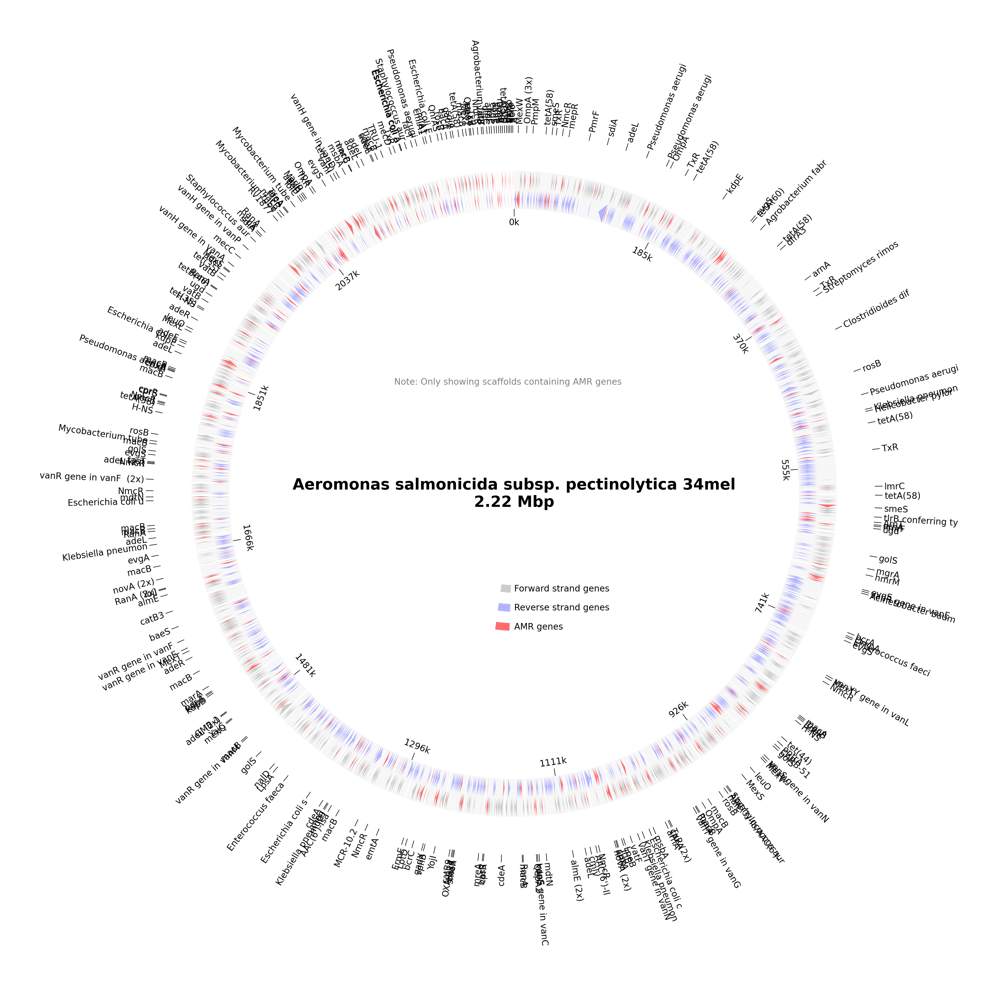

### AAC(3)-Ib/AAC(6')-Ib3 bifunctional protein
- **Mechanism**: antibiotic inactivation
- **Drug Classes**: aminoglycoside antibiotic
- **AMR Family**: aminoglycoside bifunctional resistance protein
- **Locations**:
  - gnl|SPADES|PLIJBHFI_321_23 : position 24357-24800

### AAC(6')-Il
- **Mechanism**: antibiotic inactivation
- **Drug Classes**: aminoglycoside antibiotic
- **AMR Family**: AAC(6')
- **Locations**:
  - gnl|SPADES|PLIJBHFI_368_9 : position 5192-5650

### AAC(6')-Isa
- **Mechanism**: antibiotic inactivation
- **Drug Classes**: aminoglycoside antibiotic
- **AMR Family**: AAC(6')
- **Locations**:
  - gnl|SPADES|PLIJBHFI_441_3 : position 720-1274

### Acinetobacter baumannii AbaF
- **Mechanism**: antibiotic efflux
- **Drug Classes**: phosphonic acid antibiotic
- **AMR Family**: major facilitator superfamily (MFS) antibiotic efflux pump
- **Locations**:
  - gnl|SPADES|PLIJBHFI_236_14 : position 15967-17283

### Agrobacterium fabrum chloramphenicol acetyltransferase (found in 2 locations)
- **Mechanism**: antibiotic inactivation
- **Drug Classes**: phenicol antibiotic
- **AMR Family**: chloramphenicol acetyltransferase (CAT)
- **Locations**:
  - gnl|SPADES|PLIJBHFI_185_1 : position 1-651
  - gnl|SPADES|PLIJBHFI_3401_1 : position 1-657

### ArnT
- **Mechanism**: antibiotic target alteration
- **Drug Classes**: peptide antibiotic
- **AMR Family**: pmr phosphoethanolamine transferase
- **Locations**:
  - gnl|SPADES|PLIJBHFI_226_26: position 28158-29801

### CARB-51
- **Mechanism**: antibiotic inactivation
- **Drug Classes**: penam
- **AMR Family**: CARB beta-lactamase
- **Locations**:
  - gnl|SPADES|PLIJBHFI_311_17 : position 17723-18595

### CRP
- **Mechanism**: antibiotic efflux
- **Drug Classes**: macrolide antibiotic; fluoroquinolone antibiotic; penam
- **AMR Family**: resistance-nodulation-cell division (RND) antibiotic efflux pump
- **Locations**:
  - gnl|SPADES|PLIJBHFI_226_19 : position 23956-24594

### Clostridioides difficile gyrA conferring resistance to fluoroquinolones
- **Mechanism**: antibiotic target alteration
- **Drug Classes**: fluoroquinolone antibiotic
- **AMR Family**: fluoroquinolone resistant gyrA
- **Locations**:
  - gnl|SPADES|PLIJBHFI_189_35 : position 23466-26258

### Enterococcus faecalis cls with mutation conferring resistance to daptomycin
- **Mechanism**: antibiotic target alteration
- **Drug Classes**: peptide antibiotic
- **AMR Family**: daptomycin resistant cls
- **Locations**:
  - gnl|SPADES|PLIJBHFI_457_12 : position 11342-12823

### Enterococcus faecium liaR mutant conferring daptomycin resistance
- **Mechanism**: antibiotic target alteration; antibiotic efflux
- **Drug Classes**: peptide antibiotic
- **AMR Family**: daptomycin resistant liaR
- **Locations**:
  - gnl|SPADES|PLIJBHFI_253_28 : position 23310-24425

### ErmE
- **Mechanism**: antibiotic target alteration
- **Drug Classes**: macrolide antibiotic; lincosamide antibiotic; streptogramin antibiotic; streptogramin A antibiotic; streptogramin B antibiotic
- **AMR Family**: Erm 23S ribosomal RNA methyltransferase
- **Locations**:
  - gnl|SPADES|PLIJBHFI_430_8 : position 8868-9695

### Escherichia coli AcrAB-TolC with AcrR mutation conferring resistance to ciprofloxacin, tetracycline, and ceftazidime
- **Mechanism**: antibiotic target alteration; antibiotic efflux
- **Drug Classes**: fluoroquinolone antibiotic; cephalosporin; glycylcycline; penam; tetracycline antibiotic; rifamycin antibiotic; phenicol antibiotic; disinfecting agents and antiseptics
- **AMR Family**: resistance-nodulation-cell division (RND) antibiotic efflux pump
- **Locations**:
  - gnl|SPADES|PLIJBHFI_1356_2 : position 785-1471

### Escherichia coli EF-Tu mutants conferring resistance to Pulvomycin
- **Mechanism**: antibiotic target alteration
- **Drug Classes**: elfamycin antibiotic
- **AMR Family**: elfamycin resistant EF-Tu
- **Locations**:
  - gnl|SPADES|PLIJBHFI_1699_1 : position 2-646

### Escherichia coli acrA (found in 2 locations)
- **Mechanism**: antibiotic efflux
- **Drug Classes**: fluoroquinolone antibiotic; cephalosporin; glycylcycline; penam; tetracycline antibiotic; rifamycin antibiotic; phenicol antibiotic; disinfecting agents and antiseptics
- **AMR Family**: resistance-nodulation-cell division (RND) antibiotic efflux pump
- **Locations**:
  - gnl|SPADES|PLIJBHFI_1356_1 : position 3-686
  - gnl|SPADES|PLIJBHFI_710_7 : position 5803-7002

### Escherichia coli cyaA with mutation conferring resistance to fosfomycin
- **Mechanism**: antibiotic target alteration
- **Drug Classes**: phosphonic acid antibiotic
- **AMR Family**: antibiotic-resistant cya adenylate cyclase
- **Locations**:
  - gnl|SPADES|PLIJBHFI_355_2 : position 278-2809

### Escherichia coli soxS with mutation conferring antibiotic resistance
- **Mechanism**: antibiotic target alteration; antibiotic efflux; reduced permeability to antibiotic
- **Drug Classes**: fluoroquinolone antibiotic; monobactam; carbapenem; cephalosporin; glycylcycline; cephamycin; penam; tetracycline antibiotic; rifamycin antibiotic; phenicol antibiotic; penem; disinfecting agents and antiseptics
- **AMR Family**: ATP-binding cassette (ABC) antibiotic efflux pump; major facilitator superfamily (MFS) antibiotic efflux pump; resistance-nodulation-cell division (RND) antibiotic efflux pump; General Bacterial Porin with reduced permeability to beta-lactams
- **Locations**:
  - gnl|SPADES|PLIJBHFI_455_4 : position 4327-5112

### Escherichia coli uhpA with mutation conferring resistance to fosfomycin
- **Mechanism**: antibiotic target alteration
- **Drug Classes**: phosphonic acid antibiotic
- **AMR Family**: antibiotic-resistant UhpT
- **Locations**:
  - gnl|SPADES|PLIJBHFI_619_7 : position 9843-10547

### FosM2
- **Mechanism**: antibiotic inactivation
- **Drug Classes**: phosphonic acid antibiotic
- **AMR Family**: fosfomycin thiol transferase
- **Locations**:
  - gnl|SPADES|PLIJBHFI_322_23 : position 25812-26225

### GMB-1
- **Mechanism**: antibiotic inactivation
- **Drug Classes**: carbapenem
- **AMR Family**: GMB beta-lactamase
- **Locations**:
  - gnl|SPADES|PLIJBHFI_517_2 : position 1104-1964

### H-NS (found in 4 locations)
- **Mechanism**: antibiotic efflux
- **Drug Classes**: macrolide antibiotic; fluoroquinolone antibiotic; cephalosporin; cephamycin; penam; tetracycline antibiotic
- **AMR Family**: major facilitator superfamily (MFS) antibiotic efflux pump; resistance-nodulation-cell division (RND) antibiotic efflux pump
- **Locations**:
  - gnl|SPADES|PLIJBHFI_11934_1 : position 3-185
  - gnl|SPADES|PLIJBHFI_299_14 : position 17886-18296
  - gnl|SPADES|PLIJBHFI_670_22 : position 12369-12767
  - gnl|SPADES|PLIJBHFI_720_11 : position 6337-6744

### Helicobacter pylori pbp1 mutants conferring resistance to amoxicillin
- **Mechanism**: antibiotic target alteration
- **Drug Classes**: cephalosporin; cephamycin; penam
- **AMR Family**: Penicillin-binding protein mutations conferring resistance to beta-lactam antibiotics
- **Locations**:
  - gnl|SPADES|PLIJBHFI_198_13 : position 9917-12232

### Klebsiella pneumoniae KpnE
- **Mechanism**: antibiotic efflux
- **Drug Classes**: macrolide antibiotic; aminoglycoside antibiotic; cephalosporin; tetracycline antibiotic; peptide antibiotic; rifamycin antibiotic; disinfecting agents and antiseptics
- **AMR Family**: small multidrug resistance (SMR) antibiotic efflux pump
- **Locations**:
  - gnl|SPADES|PLIJBHFI_198_10 : position 8668-9072

### Klebsiella pneumoniae KpnF
- **Mechanism**: antibiotic efflux
- **Drug Classes**: macrolide antibiotic; aminoglycoside antibiotic; cephalosporin; tetracycline antibiotic; peptide antibiotic; rifamycin antibiotic; disinfecting agents and antiseptics
- **AMR Family**: small multidrug resistance (SMR) antibiotic efflux pump
- **Locations**:
  - gnl|SPADES|PLIJBHFI_198_11 : position 9069-9389

### Klebsiella pneumoniae OmpK37 (found in 3 locations)
- **Mechanism**: reduced permeability to antibiotic
- **Drug Classes**: monobactam; carbapenem; cephalosporin; cephamycin; penam; penem
- **AMR Family**: General Bacterial Porin with reduced permeability to beta-lactams
- **Locations**:
  - gnl|SPADES|PLIJBHFI_355_9 : position 8739-9800
  - gnl|SPADES|PLIJBHFI_441_7 : position 5808-6893
  - gnl|SPADES|PLIJBHFI_572_13 : position 13451-14512

### LpeB
- **Mechanism**: antibiotic efflux
- **Drug Classes**: macrolide antibiotic
- **AMR Family**: resistance-nodulation-cell division (RND) antibiotic efflux pump
- **Locations**:
  - gnl|SPADES|PLIJBHFI_363_2 : position 975-4040

### LpsA
- **Mechanism**: reduced permeability to antibiotic
- **Drug Classes**: peptide antibiotic
- **AMR Family**: Intrinsic peptide antibiotic resistant Lps
- **Locations**:
  - gnl|SPADES|PLIJBHFI_467_5 : position 4057-4722

### LptD
- **Mechanism**: antibiotic efflux
- **Drug Classes**: carbapenem; peptide antibiotic; aminocoumarin antibiotic; rifamycin antibiotic
- **AMR Family**: ATP-binding cassette (ABC) antibiotic efflux pump
- **Locations**:
  - gnl|SPADES|PLIJBHFI_430_5 : position 4122-6554

### MCR-10.2
- **Mechanism**: antibiotic target alteration
- **Drug Classes**: peptide antibiotic
- **AMR Family**: MCR phosphoethanolamine transferase
- **Locations**:
  - gnl|SPADES|PLIJBHFI_438_13 : position 13869-15719

### MexH
- **Mechanism**: antibiotic efflux
- **Drug Classes**: fluoroquinolone antibiotic; tetracycline antibiotic; disinfecting agents and antiseptics
- **AMR Family**: resistance-nodulation-cell division (RND) antibiotic efflux pump
- **Locations**:
  - gnl|SPADES|PLIJBHFI_949_3 : position 4415-5959

### MexL
- **Mechanism**: antibiotic efflux
- **Drug Classes**: macrolide antibiotic; tetracycline antibiotic; disinfecting agents and antiseptics
- **AMR Family**: resistance-nodulation-cell division (RND) antibiotic efflux pump
- **Locations**:
  - gnl|SPADES|PLIJBHFI_715_6 : position 6551-7144

### MexS (found in 2 locations)
- **Mechanism**: antibiotic efflux
- **Drug Classes**: fluoroquinolone antibiotic; diaminopyrimidine antibiotic; phenicol antibiotic
- **AMR Family**: resistance-nodulation-cell division (RND) antibiotic efflux pump
- **Locations**:
  - gnl|SPADES|PLIJBHFI_321_7 : position 3308-4294
  - gnl|SPADES|PLIJBHFI_743_4 : position 3684-4700

### MexT (found in 4 locations)
- **Mechanism**: antibiotic efflux
- **Drug Classes**: fluoroquinolone antibiotic; diaminopyrimidine antibiotic; phenicol antibiotic
- **AMR Family**: resistance-nodulation-cell division (RND) antibiotic efflux pump
- **Locations**:
  - gnl|SPADES|PLIJBHFI_2267_2 : position 334-1251
  - gnl|SPADES|PLIJBHFI_2487_1 : position 3-722
  - gnl|SPADES|PLIJBHFI_267_35 : position 32385-33296
  - gnl|SPADES|PLIJBHFI_544_3 : position 1399-2340

### MexV
- **Mechanism**: antibiotic efflux
- **Drug Classes**: macrolide antibiotic; fluoroquinolone antibiotic; tetracycline antibiotic; phenicol antibiotic; disinfecting agents and antiseptics
- **AMR Family**: resistance-nodulation-cell division (RND) antibiotic efflux pump
- **Locations**:
  - gnl|SPADES|PLIJBHFI_318_4 : position 6783-7889

### MexW (found in 2 locations)
- **Mechanism**: antibiotic efflux
- **Drug Classes**: macrolide antibiotic; fluoroquinolone antibiotic; tetracycline antibiotic; phenicol antibiotic; disinfecting agents and antiseptics
- **AMR Family**: resistance-nodulation-cell division (RND) antibiotic efflux pump
- **Locations**:
  - gnl|SPADES|PLIJBHFI_107_3 : position 2840-5959
  - gnl|SPADES|PLIJBHFI_318_3 : position 3687-6767

### MuxA
- **Mechanism**: antibiotic efflux
- **Drug Classes**: macrolide antibiotic; monobactam; tetracycline antibiotic; aminocoumarin antibiotic
- **AMR Family**: resistance-nodulation-cell division (RND) antibiotic efflux pump
- **Locations**:
  - gnl|SPADES|PLIJBHFI_107_4 : position 5959-7008

### Mycobacterium tuberculosis pncA mutations conferring resistance to pyrazinamide (found in 2 locations)
- **Mechanism**: antibiotic target alteration
- **Drug Classes**: pyrazine antibiotic
- **AMR Family**: Pyrazinamide resistant pncA
- **Locations**:
  - gnl|SPADES|PLIJBHFI_667_12 : position 10526-11161
  - gnl|SPADES|PLIJBHFI_907_4 : position 2024-2659

### Mycobacterium tuberculosis thyA with mutation conferring resistance to para-aminosalicylic acid
- **Mechanism**: antibiotic target alteration
- **Drug Classes**: salicylic acid antibiotic
- **AMR Family**: aminosalicylate resistant thymidylate synthase
- **Locations**:
  - gnl|SPADES|PLIJBHFI_922_2 : position 806-1639

### NmcR (found in 8 locations)
- **Mechanism**: antibiotic inactivation
- **Drug Classes**: carbapenem; cephalosporin; cephamycin; penam
- **AMR Family**: NmcA beta-lactamase
- **Locations**:
  - gnl|SPADES|PLIJBHFI_107_48 : position 50808-51716
  - gnl|SPADES|PLIJBHFI_2928_2 : position 1034-1936
  - gnl|SPADES|PLIJBHFI_294_2 : position 755-1666
  - gnl|SPADES|PLIJBHFI_368_4 : position 2062-2904
  - gnl|SPADES|PLIJBHFI_438_4 : position 2911-3786
  - gnl|SPADES|PLIJBHFI_626_6 : position 4260-5222
  - gnl|SPADES|PLIJBHFI_649_3 : position 1497-2471
  - gnl|SPADES|PLIJBHFI_675_9 : position 9103-10011

### OXA-917
- **Mechanism**: antibiotic inactivation
- **Drug Classes**: carbapenem; penam
- **AMR Family**: OXA beta-lactamase; OXA-427-like beta-lactamase
- **Locations**:
  - gnl|SPADES|PLIJBHFI_421_4 : position 3098-3892

### OmpA (found in 7 locations)
- **Mechanism**: reduced permeability to antibiotic
- **Drug Classes**: peptide antibiotic
- **AMR Family**: General Bacterial Porin with reduced permeability to peptide antibiotics
- **Locations**:
  - gnl|SPADES|PLIJBHFI_107_10 : position 12746-13765
  - gnl|SPADES|PLIJBHFI_107_11 : position 14196-15197
  - gnl|SPADES|PLIJBHFI_107_12 : position 15396-16454
  - gnl|SPADES|PLIJBHFI_162_8 : position 5668-6324
  - gnl|SPADES|PLIJBHFI_253_26 : position 21650-22567
  - gnl|SPADES|PLIJBHFI_322_22 : position 24864-25739
  - gnl|SPADES|PLIJBHFI_977_2 : position 354-842

### PmpM
- **Mechanism**: antibiotic efflux
- **Drug Classes**: fluoroquinolone antibiotic; aminoglycoside antibiotic; disinfecting agents and antiseptics
- **AMR Family**: multidrug and toxic compound extrusion (MATE) transporter
- **Locations**:
  - gnl|SPADES|PLIJBHFI_107_15 : position 19280-20659

### PmrF (found in 2 locations)
- **Mechanism**: antibiotic target alteration
- **Drug Classes**: peptide antibiotic
- **AMR Family**: pmr phosphoethanolamine transferase
- **Locations**:
  - gnl|SPADES|PLIJBHFI_107_74 : position 79495-80529
  - gnl|SPADES|PLIJBHFI_226_29 : position 32750-33727

### Pseudomonas aeruginosa CpxR (found in 2 locations)
- **Mechanism**: antibiotic efflux
- **Drug Classes**: macrolide antibiotic; fluoroquinolone antibiotic; monobactam; aminoglycoside antibiotic; carbapenem; cephalosporin; cephamycin; penam; tetracycline antibiotic; peptide antibiotic; aminocoumarin antibiotic; diaminopyrimidine antibiotic; sulfonamide antibiotic; phenicol antibiotic; penem
- **AMR Family**: resistance-nodulation-cell division (RND) antibiotic efflux pump
- **Locations**:
  - gnl|SPADES|PLIJBHFI_162_2 : position 841-1563
  - gnl|SPADES|PLIJBHFI_687_3 : position 2213-2893

### Pseudomonas aeruginosa ampR with mutation conferring resistance to aztreonam (found in 3 locations)
- **Mechanism**: antibiotic target alteration; antibiotic inactivation
- **Drug Classes**: monobactam; carbapenem; cephalosporin
- **AMR Family**: PDC beta-lactamase; ampR transcriptional regulator with mutation conferring resistance to monobactam antibiotics
- **Locations**:
  - gnl|SPADES|PLIJBHFI_113_52 : position 58464-59384
  - gnl|SPADES|PLIJBHFI_1546_1 : position 66-1010
  - gnl|SPADES|PLIJBHFI_190_34 : position 45500-46447

### QepA2
- **Mechanism**: antibiotic efflux
- **Drug Classes**: fluoroquinolone antibiotic
- **AMR Family**: major facilitator superfamily (MFS) antibiotic efflux pump
- **Locations**:
  - gnl|SPADES|PLIJBHFI_392_15 : position 14282-15679

### QepA4
- **Mechanism**: antibiotic efflux
- **Drug Classes**: fluoroquinolone antibiotic
- **AMR Family**: major facilitator superfamily (MFS) antibiotic efflux pump
- **Locations**:
  - gnl|SPADES|PLIJBHFI_2487_2 : position 919-2361

### QnrAS
- **Mechanism**: antibiotic target protection
- **Drug Classes**: fluoroquinolone antibiotic
- **AMR Family**: quinolone resistance protein (qnr)
- **Locations**:
  - gnl|SPADES|PLIJBHFI_1743_5 : position 2667-3317

### RanA (found in 8 locations)
- **Mechanism**: antibiotic efflux
- **Drug Classes**: aminoglycoside antibiotic
- **AMR Family**: ATP-binding cassette (ABC) antibiotic efflux pump
- **Locations**:
  - gnl|SPADES|PLIJBHFI_190_35 : position 46633-47700
  - gnl|SPADES|PLIJBHFI_345_6 : position 3149-4144
  - gnl|SPADES|PLIJBHFI_394_3 : position 3069-4070
  - gnl|SPADES|PLIJBHFI_568_2 : position 1013-1777
  - gnl|SPADES|PLIJBHFI_568_8 : position 8546-9328
  - gnl|SPADES|PLIJBHFI_591_12 : position 10413-11447
  - gnl|SPADES|PLIJBHFI_733_7 : position 6727-7725
  - gnl|SPADES|PLIJBHFI_808_1 : position 3-1040

### Rv1877
- **Mechanism**: antibiotic efflux
- **Drug Classes**: fluoroquinolone antibiotic
- **AMR Family**: major facilitator superfamily (MFS) antibiotic efflux pump
- **Locations**:
  - gnl|SPADES|PLIJBHFI_833_7 : position 6629-7993

### Staphylococcus aureus fusA with mutation conferring resistance to fusidic acid
- **Mechanism**: antibiotic target alteration
- **Drug Classes**: fusidane antibiotic
- **AMR Family**: antibiotic resistant fusA
- **Locations**:
  - gnl|SPADES|PLIJBHFI_321_22 : position 22559-24145

### Staphylococcus aureus mupA conferring resistance to mupirocin (found in 2 locations)
- **Mechanism**: antibiotic target alteration
- **Drug Classes**: mupirocin-like antibiotic
- **AMR Family**: antibiotic-resistant isoleucyl-tRNA synthetase (ileS)
- **Locations**:
  - gnl|SPADES|PLIJBHFI_1439_1 : position 1-834
  - gnl|SPADES|PLIJBHFI_776_10 : position 8331-10355

### Streptomyces rimosus otr(A)
- **Mechanism**: antibiotic target protection
- **Drug Classes**: tetracycline antibiotic
- **AMR Family**: tetracycline-resistant ribosomal protection protein
- **Locations**:
  - gnl|SPADES|PLIJBHFI_188_37 : position 36425-38236

### TRU-1
- **Mechanism**: antibiotic inactivation
- **Drug Classes**: cephalosporin; penam
- **AMR Family**: TRU beta-lactamase
- **Locations**:
  - gnl|SPADES|PLIJBHFI_1172_1: position 11-1162

### TaeA
- **Mechanism**: antibiotic efflux
- **Drug Classes**: pleuromutilin antibiotic
- **AMR Family**: ATP-binding cassette (ABC) antibiotic efflux pump
- **Locations**:
  - gnl|SPADES|PLIJBHFI_919_2 : position 1276-2046

### TolC (found in 2 locations)
- **Mechanism**: antibiotic efflux
- **Drug Classes**: macrolide antibiotic; fluoroquinolone antibiotic; aminoglycoside antibiotic; carbapenem; cephalosporin; glycylcycline; cephamycin; penam; tetracycline antibiotic; peptide antibiotic; aminocoumarin antibiotic; rifamycin antibiotic; phenicol antibiotic; penem; disinfecting agents and antiseptics
- **AMR Family**: ATP-binding cassette (ABC) antibiotic efflux pump; major facilitator superfamily (MFS) antibiotic efflux pump; resistance-nodulation-cell division (RND) antibiotic efflux pump
- **Locations**:
  - gnl|SPADES|PLIJBHFI_6606_1 : position 2-166
  - gnl|SPADES|PLIJBHFI_949_1 : position 1-1194

### TriB
- **Mechanism**: antibiotic efflux
- **Drug Classes**: disinfecting agents and antiseptics
- **AMR Family**: resistance-nodulation-cell division (RND) antibiotic efflux pump
- **Locations**:
  - gnl|SPADES|PLIJBHFI_363_3 : position 4056-5102

### TxR (found in 9 locations)
- **Mechanism**: antibiotic efflux
- **Drug Classes**: tetracycline antibiotic
- **AMR Family**: ATP-binding cassette (ABC) antibiotic efflux pump
- **Locations**:
  - gnl|SPADES|PLIJBHFI_107_42 : position 43875-45536
  - gnl|SPADES|PLIJBHFI_1224_1 : position 1-1005
  - gnl|SPADES|PLIJBHFI_162_25 : position 22672-24201
  - gnl|SPADES|PLIJBHFI_188_33 : position 31427-32845
  - gnl|SPADES|PLIJBHFI_209_1 : position 2-1345
  - gnl|SPADES|PLIJBHFI_2908_1 : position 3-836
  - gnl|SPADES|PLIJBHFI_351_5 : position 5445-6863
  - gnl|SPADES|PLIJBHFI_351_7 : position 8001-9344
  - gnl|SPADES|PLIJBHFI_960_6 : position 5953-7593

### YajC
- **Mechanism**: antibiotic efflux
- **Drug Classes**: fluoroquinolone antibiotic; cephalosporin; glycylcycline; penam; tetracycline antibiotic; oxazolidinone antibiotic; glycopeptide antibiotic; rifamycin antibiotic; phenicol antibiotic; disinfecting agents and antiseptics
- **AMR Family**: resistance-nodulation-cell division (RND) antibiotic efflux pump
- **Locations**:
  - gnl|SPADES|PLIJBHFI_497_16 : position 12350-12685

### YojI (found in 2 locations)
- **Mechanism**: antibiotic efflux
- **Drug Classes**: peptide antibiotic
- **AMR Family**: ATP-binding cassette (ABC) antibiotic efflux pump
- **Locations**:
  - gnl|SPADES|PLIJBHFI_421_22 : position 21718-22392
  - gnl|SPADES|PLIJBHFI_568_1 : position 1-966

### adeB
- **Mechanism**: antibiotic efflux
- **Drug Classes**: glycylcycline; tetracycline antibiotic
- **AMR Family**: resistance-nodulation-cell division (RND) antibiotic efflux pump
- **Locations**:
  - gnl|SPADES|PLIJBHFI_949_2 : position 1278-4418

### adeF
- **Mechanism**: antibiotic efflux
- **Drug Classes**: fluoroquinolone antibiotic; tetracycline antibiotic
- **AMR Family**: resistance-nodulation-cell division (RND) antibiotic efflux pump
- **Locations**:
  - gnl|SPADES|PLIJBHFI_710_8: position 7012-10116

### adeK
- **Mechanism**: antibiotic efflux
- **Drug Classes**: macrolide antibiotic; fluoroquinolone antibiotic; lincosamide antibiotic; carbapenem; cephalosporin; tetracycline antibiotic; rifamycin antibiotic; diaminopyrimidine antibiotic; phenicol antibiotic; penem
- **AMR Family**: resistance-nodulation-cell division (RND) antibiotic efflux pump
- **Locations**:
  - gnl|SPADES|PLIJBHFI_299_11 : position 13577-14944

### adeL (found in 13 locations)
- **Mechanism**: antibiotic efflux
- **Drug Classes**: fluoroquinolone antibiotic; tetracycline antibiotic
- **AMR Family**: resistance-nodulation-cell division (RND) antibiotic efflux pump
- **Locations**:
  - gnl|SPADES|PLIJBHFI_1052_4 : position 3138-4052
  - gnl|SPADES|PLIJBHFI_1060_2 : position 556-1458
  - gnl|SPADES|PLIJBHFI_1080_3 : position 2883-3791
  - gnl|SPADES|PLIJBHFI_113_28 : position 35246-36157
  - gnl|SPADES|PLIJBHFI_294_3 : position 1738-2661
  - gnl|SPADES|PLIJBHFI_368_23 : position 16573-17475
  - gnl|SPADES|PLIJBHFI_517_1 : position 76-975
  - gnl|SPADES|PLIJBHFI_517_5 : position 4707-5603
  - gnl|SPADES|PLIJBHFI_591_5 : position 3285-4220
  - gnl|SPADES|PLIJBHFI_649_11 : position 9970-10908
  - gnl|SPADES|PLIJBHFI_649_4 : position 2545-3420
  - gnl|SPADES|PLIJBHFI_709_9 : position 7972-8847
  - gnl|SPADES|PLIJBHFI_743_3 : position 2711-3583

### adeR (found in 2 locations)
- **Mechanism**: antibiotic efflux
- **Drug Classes**: glycylcycline; tetracycline antibiotic
- **AMR Family**: resistance-nodulation-cell division (RND) antibiotic efflux pump
- **Locations**:
  - gnl|SPADES|PLIJBHFI_538_16 : position 12347-13258
  - gnl|SPADES|PLIJBHFI_716_8 : position 7230-8243

### almE (found in 5 locations)
- **Mechanism**: antibiotic target alteration
- **Drug Classes**: peptide antibiotic
- **AMR Family**: polymyxin resistance operon; alm glycyltransferase
- **Locations**:
  - gnl|SPADES|PLIJBHFI_371_3 : position 2194-4488
  - gnl|SPADES|PLIJBHFI_371_6 : position 6358-8028
  - gnl|SPADES|PLIJBHFI_5567_1 : position 3-1331
  - gnl|SPADES|PLIJBHFI_566_13 : position 10762-12474
  - gnl|SPADES|PLIJBHFI_7711_1 : position 3-1010

### arlR (found in 4 locations)
- **Mechanism**: antibiotic efflux
- **Drug Classes**: fluoroquinolone antibiotic; disinfecting agents and antiseptics
- **AMR Family**: major facilitator superfamily (MFS) antibiotic efflux pump
- **Locations**:
  - gnl|SPADES|PLIJBHFI_107_38 : position 40885-41574
  - gnl|SPADES|PLIJBHFI_14773_2 : position 408-554
  - gnl|SPADES|PLIJBHFI_363_8 : position 10686-11375
  - gnl|SPADES|PLIJBHFI_949_5 : position 6683-7369

### arnA (found in 3 locations)
- **Mechanism**: antibiotic target alteration
- **Drug Classes**: peptide antibiotic
- **AMR Family**: pmr phosphoethanolamine transferase
- **Locations**:
  - gnl|SPADES|PLIJBHFI_188_16 : position 16406-17350
  - gnl|SPADES|PLIJBHFI_226_28 : position 30762-32753
  - gnl|SPADES|PLIJBHFI_351_9 : position 10577-11251

### bacA
- **Mechanism**: antibiotic target alteration
- **Drug Classes**: peptide antibiotic
- **AMR Family**: undecaprenyl pyrophosphate related proteins
- **Locations**:
  - gnl|SPADES|PLIJBHFI_1910_3 : position 2013-2810

### baeS
- **Mechanism**: antibiotic efflux
- **Drug Classes**: aminoglycoside antibiotic; aminocoumarin antibiotic
- **AMR Family**: resistance-nodulation-cell division (RND) antibiotic efflux pump
- **Locations**:
  - gnl|SPADES|PLIJBHFI_547_10 : position 10831-12720

### basS (found in 2 locations)
- **Mechanism**: antibiotic target alteration; antibiotic efflux
- **Drug Classes**: peptide antibiotic
- **AMR Family**: pmr phosphoethanolamine transferase
- **Locations**:
  - gnl|SPADES|PLIJBHFI_402_19 : position 20145-21590
  - gnl|SPADES|PLIJBHFI_421_3 : position 1600-3021

### bcr-1 (found in 2 locations)
- **Mechanism**: antibiotic efflux
- **Drug Classes**: bicyclomycin-like antibiotic
- **AMR Family**: major facilitator superfamily (MFS) antibiotic efflux pump
- **Locations**:
  - gnl|SPADES|PLIJBHFI_524_7 : position 8532-9659
  - gnl|SPADES|PLIJBHFI_675_8 : position 7849-9048

### bcrA (found in 3 locations)
- **Mechanism**: antibiotic efflux
- **Drug Classes**: peptide antibiotic
- **AMR Family**: ATP-binding cassette (ABC) antibiotic efflux pump
- **Locations**:
  - gnl|SPADES|PLIJBHFI_162_34 : position 33882-34583
  - gnl|SPADES|PLIJBHFI_17087_2 : position 201-479
  - gnl|SPADES|PLIJBHFI_253_20 : position 18219-18854

### bcrC
- **Mechanism**: antibiotic target alteration
- **Drug Classes**: peptide antibiotic
- **AMR Family**: undecaprenyl pyrophosphate related proteins
- **Locations**:
  - gnl|SPADES|PLIJBHFI_428_18 : position 21374-22096

### catB3
- **Mechanism**: antibiotic inactivation
- **Drug Classes**: phenicol antibiotic
- **AMR Family**: chloramphenicol acetyltransferase (CAT)
- **Locations**:
  - gnl|SPADES|PLIJBHFI_563_11 : position 10750-11313

### catB9
- **Mechanism**: antibiotic inactivation
- **Drug Classes**: phenicol antibiotic
- **AMR Family**: chloramphenicol acetyltransferase (CAT)
- **Locations**:
  - gnl|SPADES|PLIJBHFI_421_6 : position 5416-6777

### cdeA (found in 3 locations)
- **Mechanism**: antibiotic efflux
- **Drug Classes**: fluoroquinolone antibiotic; disinfecting agents and antiseptics
- **AMR Family**: multidrug and toxic compound extrusion (MATE) transporter
- **Locations**:
  - gnl|SPADES|PLIJBHFI_1080_4 : position 3898-5319
  - gnl|SPADES|PLIJBHFI_402_2 : position 432-1805
  - gnl|SPADES|PLIJBHFI_441_11 : position 10936-12387

### cmlA1 (found in 2 locations)
- **Mechanism**: antibiotic efflux
- **Drug Classes**: phenicol antibiotic
- **AMR Family**: major facilitator superfamily (MFS) antibiotic efflux pump
- **Locations**:
  - gnl|SPADES|PLIJBHFI_1587_2 : position 2845-3957
  - gnl|SPADES|PLIJBHFI_1594_1 : position 1-1107

### cmlv
- **Mechanism**: antibiotic inactivation
- **Drug Classes**: phenicol antibiotic
- **AMR Family**: chloramphenicol phosphotransferase
- **Locations**:
  - gnl|SPADES|PLIJBHFI_368_15 : position 11023-12195

### cprR (found in 2 locations)
- **Mechanism**: antibiotic target alteration; antibiotic efflux
- **Drug Classes**: peptide antibiotic
- **AMR Family**: pmr phosphoethanolamine transferase
- **Locations**:
  - gnl|SPADES|PLIJBHFI_402_18 : position 19379-20068
  - gnl|SPADES|PLIJBHFI_685_4 : position 2904-3572

### cprS
- **Mechanism**: antibiotic target alteration; antibiotic efflux
- **Drug Classes**: peptide antibiotic
- **AMR Family**: pmr phosphoethanolamine transferase
- **Locations**:
  - gnl|SPADES|PLIJBHFI_685_3 : position 1603-2907

### cpxA (found in 4 locations)
- **Mechanism**: antibiotic efflux
- **Drug Classes**: aminoglycoside antibiotic; aminocoumarin antibiotic
- **AMR Family**: resistance-nodulation-cell division (RND) antibiotic efflux pump
- **Locations**:
  - gnl|SPADES|PLIJBHFI_162_3 : position 1615-3060
  - gnl|SPADES|PLIJBHFI_351_6 : position 6970-8004
  - gnl|SPADES|PLIJBHFI_363_7 : position 9301-10686
  - gnl|SPADES|PLIJBHFI_687_2 : position 927-2216

### dfrA3
- **Mechanism**: antibiotic target replacement
- **Drug Classes**: diaminopyrimidine antibiotic
- **AMR Family**: trimethoprim resistant dihydrofolate reductase dfr
- **Locations**:
  - gnl|SPADES|PLIJBHFI_185_24 : position 29857-30351

### efpA
- **Mechanism**: antibiotic efflux
- **Drug Classes**: rifamycin antibiotic; isoniazid-like antibiotic
- **AMR Family**: major facilitator superfamily (MFS) antibiotic efflux pump
- **Locations**:
  - gnl|SPADES|PLIJBHFI_919_1 : position 3-1169

### emtA
- **Mechanism**: antibiotic target alteration
- **Drug Classes**: macrolide antibiotic; lincosamide antibiotic; orthosomycin antibiotic
- **AMR Family**: non-erm 23S ribosomal RNA methyltransferase (G748)
- **Locations**:
  - gnl|SPADES|PLIJBHFI_432_10 : position 13226-14038

### evgA
- **Mechanism**: antibiotic efflux
- **Drug Classes**: macrolide antibiotic; fluoroquinolone antibiotic; penam; tetracycline antibiotic
- **AMR Family**: major facilitator superfamily (MFS) antibiotic efflux pump; resistance-nodulation-cell division (RND) antibiotic efflux pump
- **Locations**:
  - gnl|SPADES|PLIJBHFI_572_3 : position 1945-2535

### evgS (found in 8 locations)
- **Mechanism**: antibiotic efflux
- **Drug Classes**: macrolide antibiotic; fluoroquinolone antibiotic; penam; tetracycline antibiotic
- **AMR Family**: major facilitator superfamily (MFS) antibiotic efflux pump; resistance-nodulation-cell division (RND) antibiotic efflux pump
- **Locations**:
  - gnl|SPADES|PLIJBHFI_170_36 : position 44834-47635
  - gnl|SPADES|PLIJBHFI_236_11 : position 11310-13976
  - gnl|SPADES|PLIJBHFI_253_31 : position 27391-27774
  - gnl|SPADES|PLIJBHFI_26931_1 : position 3-296
  - gnl|SPADES|PLIJBHFI_649_12 : position 10963-11994
  - gnl|SPADES|PLIJBHFI_7333_1 : position 3-1058
  - gnl|SPADES|PLIJBHFI_9362_2 : position 283-849
  - gnl|SPADES|PLIJBHFI_982_3 : position 2422-6381

### facT (found in 2 locations)
- **Mechanism**: antibiotic efflux
- **Drug Classes**: elfamycin antibiotic
- **AMR Family**: major facilitator superfamily (MFS) antibiotic efflux pump
- **Locations**:
  - gnl|SPADES|PLIJBHFI_1447_2 : position 532-1920
  - gnl|SPADES|PLIJBHFI_649_5 : position 3514-4722

### gadX (found in 2 locations)
- **Mechanism**: antibiotic efflux
- **Drug Classes**: macrolide antibiotic; fluoroquinolone antibiotic; penam
- **AMR Family**: resistance-nodulation-cell division (RND) antibiotic efflux pump
- **Locations**:
  - gnl|SPADES|PLIJBHFI_1925_3 : position 2128-3003
  - gnl|SPADES|PLIJBHFI_428_8 : position 10824-11837

### golS (found in 4 locations)
- **Mechanism**: antibiotic efflux
- **Drug Classes**: monobactam; carbapenem; cephalosporin; cephamycin; penam; phenicol antibiotic; penem
- **AMR Family**: resistance-nodulation-cell division (RND) antibiotic efflux pump
- **Locations**:
  - gnl|SPADES|PLIJBHFI_229_18 : position 20147-20563
  - gnl|SPADES|PLIJBHFI_311_20 : position 20571-20948
  - gnl|SPADES|PLIJBHFI_472_7 : position 6960-7370
  - gnl|SPADES|PLIJBHFI_667_2 : position 249-638

### hmrM
- **Mechanism**: antibiotic efflux
- **Drug Classes**: fluoroquinolone antibiotic; disinfecting agents and antiseptics
- **AMR Family**: multidrug and toxic compound extrusion (MATE) transporter
- **Locations**:
  - gnl|SPADES|PLIJBHFI_229_43 : position 40160-41512

### kdpD
- **Mechanism**: antibiotic efflux
- **Drug Classes**: aminoglycoside antibiotic
- **AMR Family**: kdpDE
- **Locations**:
  - gnl|SPADES|PLIJBHFI_524_4 : position 4830-7418

### kdpE (found in 5 locations)
- **Mechanism**: antibiotic efflux
- **Drug Classes**: aminoglycoside antibiotic
- **AMR Family**: kdpDE
- **Locations**:
  - gnl|SPADES|PLIJBHFI_107_49 : position 51824-52516
  - gnl|SPADES|PLIJBHFI_170_7 : position 8335-9000
  - gnl|SPADES|PLIJBHFI_392_14 : position 13235-14206
  - gnl|SPADES|PLIJBHFI_524_5 : position 7505-8188
  - gnl|SPADES|PLIJBHFI_710_3 : position 1842-3488

### leuO (found in 2 locations)
- **Mechanism**: antibiotic efflux
- **Drug Classes**: nucleoside antibiotic; disinfecting agents and antiseptics
- **AMR Family**: major facilitator superfamily (MFS) antibiotic efflux pump
- **Locations**:
  - gnl|SPADES|PLIJBHFI_318_20 : position 21924-22898
  - gnl|SPADES|PLIJBHFI_715_8 : position 9677-10576

### lmrC (found in 2 locations)
- **Mechanism**: antibiotic target protection
- **Drug Classes**: lincosamide antibiotic
- **AMR Family**: Miscellaneous ABC-F subfamily ATP-binding cassette ribosomal protection proteins
- **Locations**:
  - gnl|SPADES|PLIJBHFI_1037_4 : position 1950-2591
  - gnl|SPADES|PLIJBHFI_209_60 : position 39396-40091

### macA (found in 2 locations)
- **Mechanism**: antibiotic efflux
- **Drug Classes**: macrolide antibiotic
- **AMR Family**: ATP-binding cassette (ABC) antibiotic efflux pump
- **Locations**:
  - gnl|SPADES|PLIJBHFI_299_9 : position 10474-11637
  - gnl|SPADES|PLIJBHFI_687_4 : position 3043-4197

### macB (found in 18 locations)
- **Mechanism**: antibiotic efflux
- **Drug Classes**: macrolide antibiotic
- **AMR Family**: ATP-binding cassette (ABC) antibiotic efflux pump
- **Locations**:
  - gnl|SPADES|PLIJBHFI_10355_1 : position 3-776
  - gnl|SPADES|PLIJBHFI_1037_5 : position 2591-3379
  - gnl|SPADES|PLIJBHFI_1165_2 : position 629-2020
  - gnl|SPADES|PLIJBHFI_2113_2 : position 1433-2203
  - gnl|SPADES|PLIJBHFI_299_10 : position 11634-13574
  - gnl|SPADES|PLIJBHFI_322_15 : position 17627-18460
  - gnl|SPADES|PLIJBHFI_345_4 : position 2052-3038
  - gnl|SPADES|PLIJBHFI_394_4 : position 4067-5062
  - gnl|SPADES|PLIJBHFI_440_11 : position 13994-14650
  - gnl|SPADES|PLIJBHFI_477_4 : position 8056-8754
  - gnl|SPADES|PLIJBHFI_534_13 : position 14513-15286
  - gnl|SPADES|PLIJBHFI_570_12 : position 7714-8484
  - gnl|SPADES|PLIJBHFI_591_15 : position 13218-13958
  - gnl|SPADES|PLIJBHFI_612_1 : position 2-700
  - gnl|SPADES|PLIJBHFI_667_9 : position 7518-8279
  - gnl|SPADES|PLIJBHFI_686_6 : position 8046-9626
  - gnl|SPADES|PLIJBHFI_687_5 : position 4200-6149
  - gnl|SPADES|PLIJBHFI_907_7 : position 4906-5667

### marA
- **Mechanism**: antibiotic efflux; reduced permeability to antibiotic
- **Drug Classes**: fluoroquinolone antibiotic; monobactam; carbapenem; cephalosporin; glycylcycline; cephamycin; penam; tetracycline antibiotic; rifamycin antibiotic; phenicol antibiotic; penem; disinfecting agents and antiseptics
- **AMR Family**: resistance-nodulation-cell division (RND) antibiotic efflux pump; General Bacterial Porin with reduced permeability to beta-lactams
- **Locations**:
  - gnl|SPADES|PLIJBHFI_524_14 : position 14427-15386

### mdtH
- **Mechanism**: antibiotic efflux
- **Drug Classes**: fluoroquinolone antibiotic
- **AMR Family**: major facilitator superfamily (MFS) antibiotic efflux pump
- **Locations**:
  - gnl|SPADES|PLIJBHFI_441_6 : position 4552-5745

### mdtN (found in 3 locations)
- **Mechanism**: antibiotic efflux
- **Drug Classes**: nucleoside antibiotic; disinfecting agents and antiseptics
- **AMR Family**: major facilitator superfamily (MFS) antibiotic efflux pump
- **Locations**:
  - gnl|SPADES|PLIJBHFI_107_55 : position 58510-59565
  - gnl|SPADES|PLIJBHFI_392_5 : position 3969-4973
  - gnl|SPADES|PLIJBHFI_619_11 : position 13812-14696

### mecC
- **Mechanism**: antibiotic target replacement
- **Drug Classes**: penam
- **AMR Family**: methicillin resistant PBP2
- **Locations**:
  - gnl|SPADES|PLIJBHFI_764_12 : position 8727-10643

### mecD
- **Mechanism**: antibiotic target replacement
- **Drug Classes**: penam
- **AMR Family**: methicillin resistant PBP2
- **Locations**:
  - gnl|SPADES|PLIJBHFI_1176_4 : position 2201-3955

### mepR
- **Mechanism**: antibiotic efflux
- **Drug Classes**: glycylcycline; tetracycline antibiotic
- **AMR Family**: multidrug and toxic compound extrusion (MATE) transporter
- **Locations**:
  - gnl|SPADES|PLIJBHFI_107_54 : position 58035-58508

### mexQ
- **Mechanism**: antibiotic efflux
- **Drug Classes**: macrolide antibiotic; carbapenem; tetracycline antibiotic; diaminopyrimidine antibiotic; phenicol antibiotic; disinfecting agents and antiseptics
- **AMR Family**: resistance-nodulation-cell division (RND) antibiotic efflux pump
- **Locations**:
  - gnl|SPADES|PLIJBHFI_497_15 : position 10478-12331

### mgrA
- **Mechanism**: antibiotic efflux
- **Drug Classes**: fluoroquinolone antibiotic; cephalosporin; penam; tetracycline antibiotic; peptide antibiotic; disinfecting agents and antiseptics
- **AMR Family**: ATP-binding cassette (ABC) antibiotic efflux pump; major facilitator superfamily (MFS) antibiotic efflux pump
- **Locations**:
  - gnl|SPADES|PLIJBHFI_229_33 : position 33775-34245

### mreA
- **Mechanism**: antibiotic efflux
- **Drug Classes**: macrolide antibiotic
- **AMR Family**: major facilitator superfamily (MFS) antibiotic efflux pump
- **Locations**:
  - gnl|SPADES|PLIJBHFI_405_1 : position 2-802

### msbA (found in 3 locations)
- **Mechanism**: antibiotic efflux
- **Drug Classes**: nitroimidazole antibiotic
- **AMR Family**: ATP-binding cassette (ABC) antibiotic efflux pump
- **Locations**:
  - gnl|SPADES|PLIJBHFI_1033_3 : position 1572-5132
  - gnl|SPADES|PLIJBHFI_351_21 : position 24585-25403
  - gnl|SPADES|PLIJBHFI_789_10 : position 5621-8449

### mtrA
- **Mechanism**: antibiotic efflux
- **Drug Classes**: macrolide antibiotic; penam
- **AMR Family**: resistance-nodulation-cell division (RND) antibiotic efflux pump
- **Locations**:
  - gnl|SPADES|PLIJBHFI_162_35 : position 34665-35435

### nalC
- **Mechanism**: antibiotic efflux
- **Drug Classes**: macrolide antibiotic; fluoroquinolone antibiotic; monobactam; carbapenem; cephalosporin; cephamycin; penam; tetracycline antibiotic; peptide antibiotic; aminocoumarin antibiotic; diaminopyrimidine antibiotic; sulfonamide antibiotic; phenicol antibiotic; penem
- **AMR Family**: resistance-nodulation-cell division (RND) antibiotic efflux pump
- **Locations**:
  - gnl|SPADES|PLIJBHFI_321_26 : position 27230-27796

### nalD
- **Mechanism**: antibiotic efflux
- **Drug Classes**: macrolide antibiotic; fluoroquinolone antibiotic; monobactam; carbapenem; cephalosporin; cephamycin; penam; tetracycline antibiotic; peptide antibiotic; aminocoumarin antibiotic; diaminopyrimidine antibiotic; sulfonamide antibiotic; phenicol antibiotic; penem
- **AMR Family**: resistance-nodulation-cell division (RND) antibiotic efflux pump
- **Locations**:
  - gnl|SPADES|PLIJBHFI_467_9 : position 8919-9563

### novA (found in 4 locations)
- **Mechanism**: antibiotic efflux
- **Drug Classes**: aminocoumarin antibiotic
- **AMR Family**: ATP-binding cassette (ABC) antibiotic efflux pump
- **Locations**:
  - gnl|SPADES|PLIJBHFI_363_11 : position 15031-17118
  - gnl|SPADES|PLIJBHFI_363_9 : position 11490-13667
  - gnl|SPADES|PLIJBHFI_568_10 : position 11077-12846
  - gnl|SPADES|PLIJBHFI_568_11 : position 12840-14663

### oleB
- **Mechanism**: antibiotic target protection
- **Drug Classes**: macrolide antibiotic
- **AMR Family**: Miscellaneous ABC-F subfamily ATP-binding cassette ribosomal protection proteins
- **Locations**:
  - gnl|SPADES|PLIJBHFI_31409_1 : position 3-260

### oleC
- **Mechanism**: antibiotic efflux
- **Drug Classes**: macrolide antibiotic
- **AMR Family**: ATP-binding cassette (ABC) antibiotic efflux pump
- **Locations**:
  - gnl|SPADES|PLIJBHFI_4765_2 : position 467-1108

### optrA (found in 2 locations)
- **Mechanism**: antibiotic target protection
- **Drug Classes**: oxazolidinone antibiotic; phenicol antibiotic
- **AMR Family**: Miscellaneous ABC-F subfamily ATP-binding cassette ribosomal protection proteins
- **Locations**:
  - gnl|SPADES|PLIJBHFI_24788_1 : position 2-322
  - gnl|SPADES|PLIJBHFI_311_12 : position 12967-14877

### rosB (found in 4 locations)
- **Mechanism**: antibiotic efflux
- **Drug Classes**: peptide antibiotic
- **AMR Family**: major facilitator superfamily (MFS) antibiotic efflux pump
- **Locations**:
  - gnl|SPADES|PLIJBHFI_1852_3 : position 1368-3065
  - gnl|SPADES|PLIJBHFI_190_16 : position 19330-20991
  - gnl|SPADES|PLIJBHFI_322_5 : position 3215-4834
  - gnl|SPADES|PLIJBHFI_668_3 : position 2895-4751

### rphB
- **Mechanism**: antibiotic inactivation
- **Drug Classes**: rifamycin antibiotic
- **AMR Family**: rifampin phosphotransferase
- **Locations**:
  - gnl|SPADES|PLIJBHFI_428_7 : position 8133-10505

### sdiA (found in 3 locations)
- **Mechanism**: antibiotic efflux
- **Drug Classes**: fluoroquinolone antibiotic; cephalosporin; glycylcycline; penam; tetracycline antibiotic; rifamycin antibiotic; phenicol antibiotic; disinfecting agents and antiseptics
- **AMR Family**: resistance-nodulation-cell division (RND) antibiotic efflux pump
- **Locations**:
  - gnl|SPADES|PLIJBHFI_113_17 : position 14750-15520
  - gnl|SPADES|PLIJBHFI_1926_1 : position 1-351
  - gnl|SPADES|PLIJBHFI_789_9 : position 4884-5525

### smeR
- **Mechanism**: antibiotic efflux
- **Drug Classes**: aminoglycoside antibiotic; cephalosporin; cephamycin; penam
- **AMR Family**: resistance-nodulation-cell division (RND) antibiotic efflux pump
- **Locations**:
  - gnl|SPADES|PLIJBHFI_421_2 : position 867-1541

### smeS (found in 2 locations)
- **Mechanism**: antibiotic efflux
- **Drug Classes**: aminoglycoside antibiotic; cephalosporin; cephamycin; penam
- **AMR Family**: resistance-nodulation-cell division (RND) antibiotic efflux pump
- **Locations**:
  - gnl|SPADES|PLIJBHFI_107_37 : position 39581-40876
  - gnl|SPADES|PLIJBHFI_226_14 : position 12024-15524

### tet(35) (found in 3 locations)
- **Mechanism**: antibiotic efflux
- **Drug Classes**: tetracycline antibiotic
- **AMR Family**: ATP-binding cassette (ABC) antibiotic efflux pump
- **Locations**:
  - gnl|SPADES|PLIJBHFI_1026_1 : position 226-1560
  - gnl|SPADES|PLIJBHFI_720_12 : position 7323-8903
  - gnl|SPADES|PLIJBHFI_736_9 : position 9240-10649

### tet(44)
- **Mechanism**: antibiotic target protection
- **Drug Classes**: tetracycline antibiotic
- **AMR Family**: tetracycline-resistant ribosomal protection protein
- **Locations**:
  - gnl|SPADES|PLIJBHFI_311_6 : position 6842-8272

### tetA(58) (found in 8 locations)
- **Mechanism**: antibiotic efflux
- **Drug Classes**: tetracycline antibiotic
- **AMR Family**: major facilitator superfamily (MFS) antibiotic efflux pump
- **Locations**:
  - gnl|SPADES|PLIJBHFI_107_30 : position 33344-34225
  - gnl|SPADES|PLIJBHFI_13640_1 : position 2-598
  - gnl|SPADES|PLIJBHFI_162_33 : position 33089-33865
  - gnl|SPADES|PLIJBHFI_185_20 : position 24680-25876
  - gnl|SPADES|PLIJBHFI_198_25 : position 23089-24006
  - gnl|SPADES|PLIJBHFI_2103_2 : position 953-2107
  - gnl|SPADES|PLIJBHFI_226_1 : position 3-755
  - gnl|SPADES|PLIJBHFI_675_7 : position 6125-7558

### tetA(60)
- **Mechanism**: antibiotic efflux
- **Drug Classes**: tetracycline antibiotic
- **AMR Family**: ATP-binding cassette (ABC) antibiotic efflux pump
- **Locations**:
  - gnl|SPADES|PLIJBHFI_170_37 : position 47681-49513

### tetB(46)
- **Mechanism**: antibiotic efflux
- **Drug Classes**: tetracycline antibiotic
- **AMR Family**: ATP-binding cassette (ABC) antibiotic efflux pump
- **Locations**:
  - gnl|SPADES|PLIJBHFI_733_6 : position 5907-6692

### tetB(60)
- **Mechanism**: antibiotic efflux
- **Drug Classes**: tetracycline antibiotic
- **AMR Family**: ATP-binding cassette (ABC) antibiotic efflux pump
- **Locations**:
  - gnl|SPADES|PLIJBHFI_170_38 : position 49590-51341

### tlrB conferring tylosin resistance
- **Mechanism**: antibiotic target alteration
- **Drug Classes**: macrolide antibiotic; lincosamide antibiotic
- **AMR Family**: non-erm 23S ribosomal RNA methyltransferase (G748)
- **Locations**:
  - gnl|SPADES|PLIJBHFI_226_18 : position 23033-23833

### ugd (found in 2 locations)
- **Mechanism**: antibiotic target alteration
- **Drug Classes**: peptide antibiotic
- **AMR Family**: pmr phosphoethanolamine transferase
- **Locations**:
  - gnl|SPADES|PLIJBHFI_226_31 : position 35151-36497
  - gnl|SPADES|PLIJBHFI_731_12 : position 10195-11361

### vanH gene in vanA cluster
- **Mechanism**: antibiotic target alteration
- **Drug Classes**: glycopeptide antibiotic
- **AMR Family**: vanH; glycopeptide resistance gene cluster
- **Locations**:
  - gnl|SPADES|PLIJBHFI_743_10 : position 10781-11248

### vanH gene in vanD cluster
- **Mechanism**: antibiotic target alteration
- **Drug Classes**: glycopeptide antibiotic
- **AMR Family**: vanH; glycopeptide resistance gene cluster
- **Locations**:
  - gnl|SPADES|PLIJBHFI_1026_4 : position 3462-4694

### vanH gene in vanP cluster
- **Mechanism**: antibiotic target alteration
- **Drug Classes**: glycopeptide antibiotic
- **AMR Family**: vanH; glycopeptide resistance gene cluster
- **Locations**:
  - gnl|SPADES|PLIJBHFI_774_9 : position 9223-10356

### vanI
- **Mechanism**: antibiotic target alteration
- **Drug Classes**: glycopeptide antibiotic
- **AMR Family**: glycopeptide resistance gene cluster; Van ligase
- **Locations**:
  - gnl|SPADES|PLIJBHFI_994_4 : position 4149-7193

### vanR gene in vanE cluster (found in 2 locations)
- **Mechanism**: antibiotic target alteration
- **Drug Classes**: glycopeptide antibiotic
- **AMR Family**: glycopeptide resistance gene cluster; vanR
- **Locations**:
  - gnl|SPADES|PLIJBHFI_236_12 : position 13987-15108
  - gnl|SPADES|PLIJBHFI_544_6 : position 5162-5530

### vanR gene in vanF cluster (found in 3 locations)
- **Mechanism**: antibiotic target alteration
- **Drug Classes**: glycopeptide antibiotic
- **AMR Family**: glycopeptide resistance gene cluster; vanR
- **Locations**:
  - gnl|SPADES|PLIJBHFI_544_14 : position 14235-15296
  - gnl|SPADES|PLIJBHFI_637_13 : position 10967-12214
  - gnl|SPADES|PLIJBHFI_637_2 : position 384-1769

### vanR gene in vanM cluster
- **Mechanism**: antibiotic target alteration
- **Drug Classes**: glycopeptide antibiotic
- **AMR Family**: glycopeptide resistance gene cluster; vanR
- **Locations**:
  - gnl|SPADES|PLIJBHFI_477_2 : position 6424-7368

### vanS gene in vanA cluster
- **Mechanism**: antibiotic target alteration
- **Drug Classes**: glycopeptide antibiotic
- **AMR Family**: vanS; glycopeptide resistance gene cluster
- **Locations**:
  - gnl|SPADES|PLIJBHFI_188_34 : position 32855-33910

### vanS gene in vanC cluster
- **Mechanism**: antibiotic target alteration
- **Drug Classes**: glycopeptide antibiotic
- **AMR Family**: vanS; glycopeptide resistance gene cluster
- **Locations**:
  - gnl|SPADES|PLIJBHFI_392_12 : position 11354-12697

### vanS gene in vanN cluster
- **Mechanism**: antibiotic target alteration
- **Drug Classes**: glycopeptide antibiotic
- **AMR Family**: vanS; glycopeptide resistance gene cluster
- **Locations**:
  - gnl|SPADES|PLIJBHFI_318_2 : position 1597-3594

### vanT gene in vanG cluster
- **Mechanism**: antibiotic target alteration
- **Drug Classes**: glycopeptide antibiotic
- **AMR Family**: glycopeptide resistance gene cluster; vanT
- **Locations**:
  - gnl|SPADES|PLIJBHFI_345_8 : position 5452-6678

### vanT gene in vanN cluster
- **Mechanism**: antibiotic target alteration
- **Drug Classes**: glycopeptide antibiotic
- **AMR Family**: glycopeptide resistance gene cluster; vanT
- **Locations**:
  - gnl|SPADES|PLIJBHFI_355_13 : position 13991-14986

### vanXY gene in vanL cluster
- **Mechanism**: antibiotic target alteration
- **Drug Classes**: glycopeptide antibiotic
- **AMR Family**: glycopeptide resistance gene cluster; vanXY
- **Locations**:
  - gnl|SPADES|PLIJBHFI_267_32 : position 29985-30674

### vatB (found in 3 locations)
- **Mechanism**: antibiotic inactivation
- **Drug Classes**: streptogramin antibiotic; streptogramin A antibiotic
- **AMR Family**: streptogramin vat acetyltransferase
- **Locations**:
  - gnl|SPADES|PLIJBHFI_3332_3 : position 1860-2033
  - gnl|SPADES|PLIJBHFI_731_5 : position 2877-3341
  - gnl|SPADES|PLIJBHFI_736_5 : position 5306-5917

### vatF
- **Mechanism**: antibiotic inactivation
- **Drug Classes**: streptogramin antibiotic; streptogramin A antibiotic
- **AMR Family**: streptogramin vat acetyltransferase
- **Locations**:
  - gnl|SPADES|PLIJBHFI_355_24 : position 22502-23137

## Aeromonas salmonicida subsp. salmonicida
**Strain Statistics:**
- Total genome length: 19.3 kbp
- Total scaffolds: 30
- Scaffolds with AMR genes: 1
- Total genes annotated: 44
- Total AMR genes: 1
- Unique AMR genes: 1
- Distinct AMR mechanisms: 1
- Distinct AMR families: 1
- Distinct drug classes: 6

**Circos Plot:**

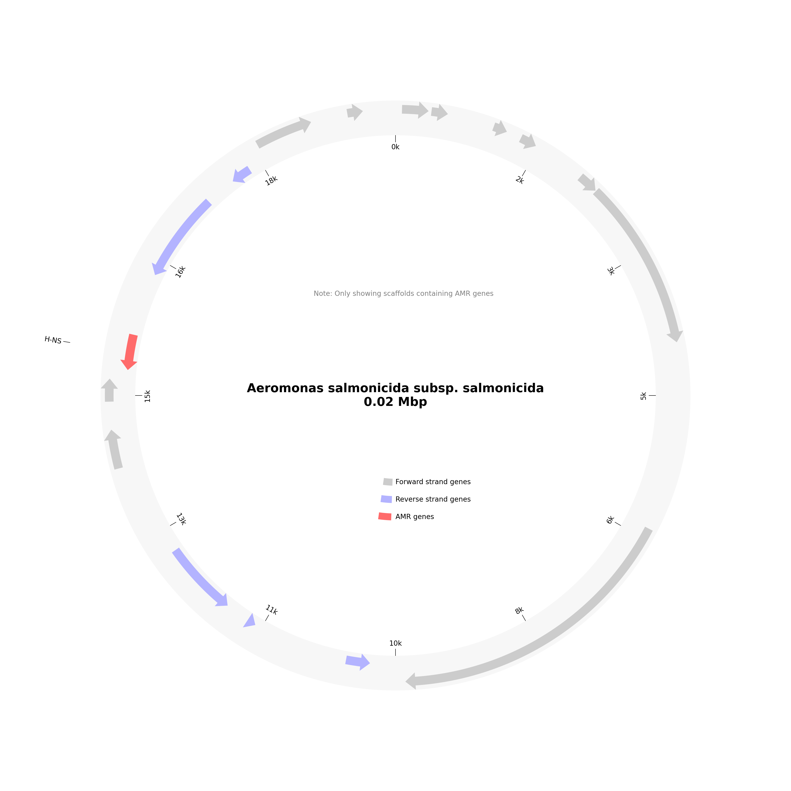

### H-NS
- **Mechanism**: antibiotic efflux
- **Drug Classes**: macrolide antibiotic; fluoroquinolone antibiotic; cephalosporin; cephamycin; penam; tetracycline antibiotic
- **AMR Family**: major facilitator superfamily (MFS) antibiotic efflux pump; resistance-nodulation-cell division (RND) antibiotic efflux pump
- **Locations**:
  - gnl|SPADES|PLIJBHFI_478_16 : position 14793-15203

## Buttiauxella agrestis
**Strain Statistics:**
- Total genome length: 4494.5 kbp
- Total scaffolds: 528
- Scaffolds with AMR genes: 94
- Total genes annotated: 8192
- Total AMR genes: 519
- Unique AMR genes: 212
- Distinct AMR mechanisms: 11
- Distinct AMR families: 80
- Distinct drug classes: 37

**Circos Plot:**

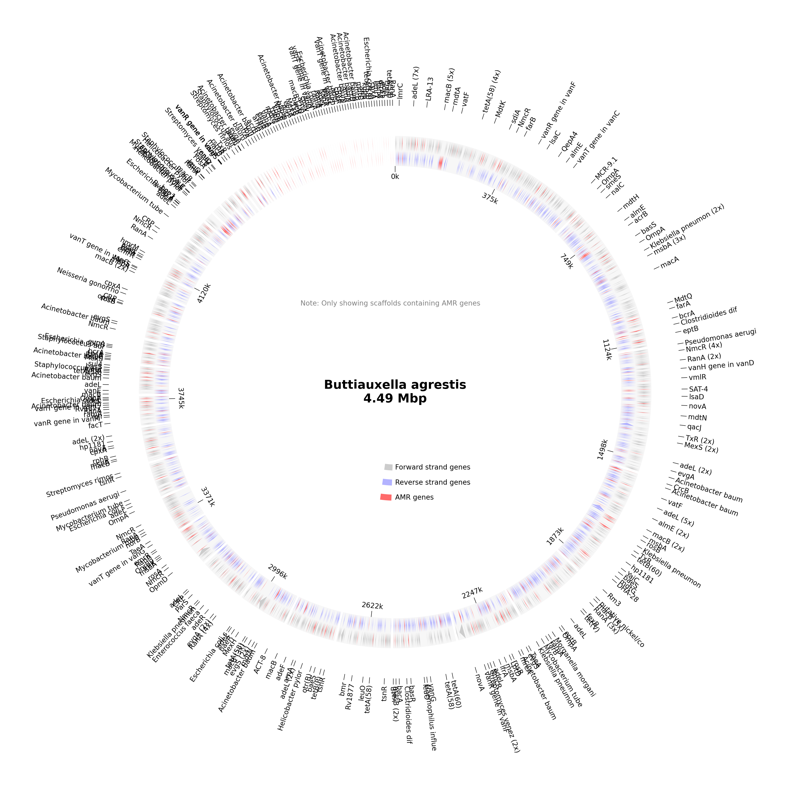

### ACT-8
- **Mechanism**: antibiotic inactivation
- **Drug Classes**: carbapenem; cephalosporin; cephamycin; penam
- **AMR Family**: ACT beta-lactamase
- **Locations**:
  - gnl|SPADES|PLIJBHFI_34_10: position 11266-12417

### AIM-1
- **Mechanism**: antibiotic inactivation
- **Drug Classes**: cephalosporin; cephamycin; penam
- **AMR Family**: AIM beta-lactamase
- **Locations**:
  - gnl|SPADES|PLIJBHFI_4_359 : position 381153-382112

### APH(6)-Ic
- **Mechanism**: antibiotic inactivation
- **Drug Classes**: aminoglycoside antibiotic
- **AMR Family**: APH(6)
- **Locations**:
  - gnl|SPADES|PLIJBHFI_7_330 : position 350441-351268

### Acinetobacter baumannii AbaF (found in 7 locations)
- **Mechanism**: antibiotic efflux
- **Drug Classes**: phosphonic acid antibiotic
- **AMR Family**: major facilitator superfamily (MFS) antibiotic efflux pump
- **Locations**:
  - gnl|SPADES|PLIJBHFI_115_5 : position 4478-5983
  - gnl|SPADES|PLIJBHFI_1370_2 : position 800-2134
  - gnl|SPADES|PLIJBHFI_16_111 : position 112162-113487
  - gnl|SPADES|PLIJBHFI_19_37 : position 40030-41355
  - gnl|SPADES|PLIJBHFI_3894_1 : position 207-1511
  - gnl|SPADES|PLIJBHFI_7_366 : position 387282-388616
  - gnl|SPADES|PLIJBHFI_97_46 : position 45344-46843

### Acinetobacter baumannii AbaQ (found in 11 locations)
- **Mechanism**: antibiotic efflux
- **Drug Classes**: fluoroquinolone antibiotic
- **AMR Family**: major facilitator superfamily (MFS) antibiotic efflux pump
- **Locations**:
  - gnl|SPADES|PLIJBHFI_10_14 : position 13070-14383
  - gnl|SPADES|PLIJBHFI_140_21 : position 20570-21931
  - gnl|SPADES|PLIJBHFI_19403_1 : position 3-419
  - gnl|SPADES|PLIJBHFI_20182_1 : position 3-401
  - gnl|SPADES|PLIJBHFI_20715_1 : position 2-391
  - gnl|SPADES|PLIJBHFI_2134_4 : position 2406-3002
  - gnl|SPADES|PLIJBHFI_23144_1 : position 2-346
  - gnl|SPADES|PLIJBHFI_34_41 : position 44525-45841
  - gnl|SPADES|PLIJBHFI_3_465 : position 515246-516436
  - gnl|SPADES|PLIJBHFI_8746_1 : position 1-573
  - gnl|SPADES|PLIJBHFI_89_71 : position 75346-76644

### AcrE
- **Mechanism**: antibiotic efflux
- **Drug Classes**: fluoroquinolone antibiotic; cephalosporin; cephamycin; penam
- **AMR Family**: resistance-nodulation-cell division (RND) antibiotic efflux pump
- **Locations**:
  - gnl|SPADES|PLIJBHFI_4_121 : position 120657-121811

### AcrF (found in 2 locations)
- **Mechanism**: antibiotic efflux
- **Drug Classes**: fluoroquinolone antibiotic; cephalosporin; cephamycin; penam
- **AMR Family**: resistance-nodulation-cell division (RND) antibiotic efflux pump
- **Locations**:
  - gnl|SPADES|PLIJBHFI_4_120 : position 117536-120646
  - gnl|SPADES|PLIJBHFI_9675_1 : position 2-826

### AcrS (found in 2 locations)
- **Mechanism**: antibiotic efflux
- **Drug Classes**: fluoroquinolone antibiotic; cephalosporin; glycylcycline; cephamycin; penam; tetracycline antibiotic; rifamycin antibiotic; phenicol antibiotic; disinfecting agents and antiseptics
- **AMR Family**: resistance-nodulation-cell division (RND) antibiotic efflux pump
- **Locations**:
  - gnl|SPADES|PLIJBHFI_4_123 : position 125254-125871
  - gnl|SPADES|PLIJBHFI_4_314 : position 333167-333712

### Brucella suis mprF
- **Mechanism**: antibiotic target alteration
- **Drug Classes**: peptide antibiotic
- **AMR Family**: defensin resistant mprF
- **Locations**:
  - gnl|SPADES|PLIJBHFI_4_374 : position 398465-399433

### CRD3-1
- **Mechanism**: antibiotic inactivation
- **Drug Classes**: carbapenem
- **AMR Family**: CRD3 beta-lactamase
- **Locations**:
  - gnl|SPADES|PLIJBHFI_7_139 : position 157737-158579

### CRP (found in 3 locations)
- **Mechanism**: antibiotic efflux
- **Drug Classes**: macrolide antibiotic; fluoroquinolone antibiotic; penam
- **AMR Family**: resistance-nodulation-cell division (RND) antibiotic efflux pump
- **Locations**:
  - gnl|SPADES|PLIJBHFI_143_19: position 14007-14639
  - gnl|SPADES|PLIJBHFI_281_13 : position 13258-13950
  - gnl|SPADES|PLIJBHFI_38_106 : position 124954-125706

### Clostridioides difficile gyrA conferring resistance to fluoroquinolones
- **Mechanism**: antibiotic target alteration
- **Drug Classes**: fluoroquinolone antibiotic
- **AMR Family**: fluoroquinolone resistant gyrA
- **Locations**:
  - gnl|SPADES|PLIJBHFI_4_409 : position 436461-439109

### Clostridioides difficile gyrB conferring resistance to fluoroquinolones
- **Mechanism**: antibiotic target alteration
- **Drug Classes**: fluoroquinolone antibiotic
- **AMR Family**: fluoroquinolone resistant gyrB
- **Locations**:
  - gnl|SPADES|PLIJBHFI_20_146 : position 163430-165325

### CrcB
- **Mechanism**: antibiotic efflux
- **Drug Classes**: aminoglycoside antibiotic
- **AMR Family**: multidrug and toxic compound extrusion (MATE) transporter
- **Locations**:
  - gnl|SPADES|PLIJBHFI_10_2 : position 1039-1422

### DHA-28
- **Mechanism**: antibiotic inactivation
- **Drug Classes**: cephalosporin; cephamycin
- **AMR Family**: DHA beta-lactamase
- **Locations**:
  - gnl|SPADES|PLIJBHFI_10_280 : position 317784-318791

### Enterococcus faecalis cls with mutation conferring resistance to daptomycin (found in 2 locations)
- **Mechanism**: antibiotic target alteration
- **Drug Classes**: peptide antibiotic
- **AMR Family**: daptomycin resistant cls
- **Locations**:
  - gnl|SPADES|PLIJBHFI_38_56 : position 65317-66777
  - gnl|SPADES|PLIJBHFI_4_87 : position 88642-90093

### Enterococcus faecium liaR mutant conferring daptomycin resistance
- **Mechanism**: antibiotic target alteration; antibiotic efflux
- **Drug Classes**: peptide antibiotic
- **AMR Family**: daptomycin resistant liaR
- **Locations**:
  - gnl|SPADES|PLIJBHFI_34_13 : position 13668-14252

### ErmB
- **Mechanism**: antibiotic target alteration
- **Drug Classes**: macrolide antibiotic; lincosamide antibiotic; streptogramin antibiotic; streptogramin A antibiotic; streptogramin B antibiotic
- **AMR Family**: Erm 23S ribosomal RNA methyltransferase
- **Locations**:
  - gnl|SPADES|PLIJBHFI_19_68 : position 73882-74706

### Escherichia coli AcrAB-TolC with AcrR mutation conferring resistance to ciprofloxacin, tetracycline, and ceftazidime (found in 3 locations)
- **Mechanism**: antibiotic target alteration; antibiotic efflux
- **Drug Classes**: fluoroquinolone antibiotic; cephalosporin; glycylcycline; penam; tetracycline antibiotic; rifamycin antibiotic; phenicol antibiotic; disinfecting agents and antiseptics
- **AMR Family**: resistance-nodulation-cell division (RND) antibiotic efflux pump
- **Locations**:
  - gnl|SPADES|PLIJBHFI_15261_1 : position 2-385
  - gnl|SPADES|PLIJBHFI_304_18 : position 21816-22511
  - gnl|SPADES|PLIJBHFI_7_165 : position 187158-187742

### Escherichia coli AcrAB-TolC with MarR mutations conferring resistance to ciprofloxacin and tetracycline (found in 2 locations)
- **Mechanism**: antibiotic target alteration; antibiotic efflux
- **Drug Classes**: fluoroquinolone antibiotic; cephalosporin; glycylcycline; penam; tetracycline antibiotic; rifamycin antibiotic; phenicol antibiotic; disinfecting agents and antiseptics
- **AMR Family**: resistance-nodulation-cell division (RND) antibiotic efflux pump
- **Locations**:
  - gnl|SPADES|PLIJBHFI_10_273 : position 310718-311173
  - gnl|SPADES|PLIJBHFI_7_114: position 134522-134956

### Escherichia coli EF-Tu mutants conferring resistance to Pulvomycin (found in 2 locations)
- **Mechanism**: antibiotic target alteration
- **Drug Classes**: elfamycin antibiotic
- **AMR Family**: elfamycin resistant EF-Tu
- **Locations**:
  - gnl|SPADES|PLIJBHFI_306_27 : position 27382-28566
  - gnl|SPADES|PLIJBHFI_89_83 : position 86896-88743

### Escherichia coli UhpT with mutation conferring resistance to fosfomycin
- **Mechanism**: antibiotic target alteration
- **Drug Classes**: phosphonic acid antibiotic
- **AMR Family**: antibiotic-resistant UhpT
- **Locations**:
  - gnl|SPADES|PLIJBHFI_115_34 : position 40555-41946

### Escherichia coli mdfA (found in 2 locations)
- **Mechanism**: antibiotic efflux
- **Drug Classes**: tetracycline antibiotic; phenicol antibiotic; disinfecting agents and antiseptics
- **AMR Family**: major facilitator superfamily (MFS) antibiotic efflux pump
- **Locations**:
  - gnl|SPADES|PLIJBHFI_25831_1 : position 1-309
  - gnl|SPADES|PLIJBHFI_3_87 : position 97141-98361

### Escherichia coli soxR with mutation conferring antibiotic resistance
- **Mechanism**: antibiotic target alteration; antibiotic efflux
- **Drug Classes**: fluoroquinolone antibiotic; cephalosporin; glycylcycline; penam; tetracycline antibiotic; rifamycin antibiotic; phenicol antibiotic; disinfecting agents and antiseptics
- **AMR Family**: ATP-binding cassette (ABC) antibiotic efflux pump; major facilitator superfamily (MFS) antibiotic efflux pump; resistance-nodulation-cell division (RND) antibiotic efflux pump
- **Locations**:
  - gnl|SPADES|PLIJBHFI_34_115 : position 136841-137299

### Escherichia coli soxS with mutation conferring antibiotic resistance (found in 8 locations)
- **Mechanism**: antibiotic target alteration; antibiotic efflux; reduced permeability to antibiotic
- **Drug Classes**: fluoroquinolone antibiotic; monobactam; carbapenem; cephalosporin; glycylcycline; cephamycin; penam; tetracycline antibiotic; rifamycin antibiotic; phenicol antibiotic; penem; disinfecting agents and antiseptics
- **AMR Family**: ATP-binding cassette (ABC) antibiotic efflux pump; major facilitator superfamily (MFS) antibiotic efflux pump; resistance-nodulation-cell division (RND) antibiotic efflux pump; General Bacterial Porin with reduced permeability to beta-lactams
- **Locations**:
  - gnl|SPADES|PLIJBHFI_16_71 : position 72239-73087
  - gnl|SPADES|PLIJBHFI_19_21 : position 21393-22262
  - gnl|SPADES|PLIJBHFI_19_80 : position 91734-92579
  - gnl|SPADES|PLIJBHFI_34_116 : position 137378-137701
  - gnl|SPADES|PLIJBHFI_3_363 : position 404074-404940
  - gnl|SPADES|PLIJBHFI_4_354 : position 374442-375266
  - gnl|SPADES|PLIJBHFI_67_14 : position 17011-17871
  - gnl|SPADES|PLIJBHFI_7_15 : position 12958-13830

### Escherichia coli uhpA with mutation conferring resistance to fosfomycin (found in 2 locations)
- **Mechanism**: antibiotic target alteration
- **Drug Classes**: phosphonic acid antibiotic
- **AMR Family**: antibiotic-resistant UhpT
- **Locations**:
  - gnl|SPADES|PLIJBHFI_3_318 : position 352789-353376
  - gnl|SPADES|PLIJBHFI_3_96 : position 109553-110281

### FosA
- **Mechanism**: antibiotic inactivation
- **Drug Classes**: phosphonic acid antibiotic
- **AMR Family**: fosfomycin thiol transferase
- **Locations**:
  - gnl|SPADES|PLIJBHFI_502_5 : position 7461-7850

### FosG
- **Mechanism**: antibiotic inactivation
- **Drug Classes**: phosphonic acid antibiotic
- **AMR Family**: fosfomycin thiol transferase
- **Locations**:
  - gnl|SPADES|PLIJBHFI_212_19 : position 18403-18810

### GMB-1
- **Mechanism**: antibiotic inactivation
- **Drug Classes**: carbapenem
- **AMR Family**: GMB beta-lactamase
- **Locations**:
  - gnl|SPADES|PLIJBHFI_10_69 : position 77007-77873

### H-NS
- **Mechanism**: antibiotic efflux
- **Drug Classes**: macrolide antibiotic; fluoroquinolone antibiotic; cephalosporin; cephamycin; penam; tetracycline antibiotic
- **AMR Family**: major facilitator superfamily (MFS) antibiotic efflux pump; resistance-nodulation-cell division (RND) antibiotic efflux pump
- **Locations**:
  - gnl|SPADES|PLIJBHFI_38_45 : position 52035-52445

### Haemophilus influenzae PBP3 conferring resistance to beta-lactam antibiotics
- **Mechanism**: antibiotic target alteration
- **Drug Classes**: cephalosporin; cephamycin; penam
- **AMR Family**: Penicillin-binding protein mutations conferring resistance to beta-lactam antibiotics
- **Locations**:
  - gnl|SPADES|PLIJBHFI_20_92 : position 105962-107728

### Helicobacter pylori pbp1 mutants conferring resistance to amoxicillin (found in 2 locations)
- **Mechanism**: antibiotic target alteration
- **Drug Classes**: cephalosporin; cephamycin; penam
- **AMR Family**: Penicillin-binding protein mutations conferring resistance to beta-lactam antibiotics
- **Locations**:
  - gnl|SPADES|PLIJBHFI_20_32 : position 36185-38740
  - gnl|SPADES|PLIJBHFI_33_63 : position 71457-73778

### Helicobacter pylori pbp2 mutants conferring resistance to amoxicillin
- **Mechanism**: antibiotic target alteration
- **Drug Classes**: cephalosporin; cephamycin; penam
- **AMR Family**: Penicillin-binding protein mutations conferring resistance to beta-lactam antibiotics
- **Locations**:
  - gnl|SPADES|PLIJBHFI_347_8 : position 6318-8219

### Helicobacter pylori rdxA mutation conferring resistance to metronidazole
- **Mechanism**: antibiotic target alteration
- **Drug Classes**: nitroimidazole antibiotic
- **AMR Family**: Antibiotic resistant Helicobacter pylori nitroreductase
- **Locations**:
  - gnl|SPADES|PLIJBHFI_3_258 : position 295346-295999

### Helicobacter pylori rpoB mutation conferring resistance to rifampicin
- **Mechanism**: antibiotic target alteration; antibiotic target replacement
- **Drug Classes**: fluoroquinolone antibiotic; rifamycin antibiotic
- **AMR Family**: rifamycin-resistant beta-subunit of RNA polymerase (rpoB)
- **Locations**:
  - gnl|SPADES|PLIJBHFI_306_19 : position 14800-19026

### IreK
- **Mechanism**: reduced permeability to antibiotic
- **Drug Classes**: cephalosporin
- **AMR Family**: Serine/threonine kinases
- **Locations**:
  - gnl|SPADES|PLIJBHFI_56_80 : position 93118-93891

### Klebsiella pneumoniae KpnE
- **Mechanism**: antibiotic efflux
- **Drug Classes**: macrolide antibiotic; aminoglycoside antibiotic; cephalosporin; tetracycline antibiotic; peptide antibiotic; rifamycin antibiotic; disinfecting agents and antiseptics
- **AMR Family**: small multidrug resistance (SMR) antibiotic efflux pump
- **Locations**:
  - gnl|SPADES|PLIJBHFI_38_70: position 81771-82145

### Klebsiella pneumoniae KpnF
- **Mechanism**: antibiotic efflux
- **Drug Classes**: macrolide antibiotic; aminoglycoside antibiotic; cephalosporin; tetracycline antibiotic; peptide antibiotic; rifamycin antibiotic; disinfecting agents and antiseptics
- **AMR Family**: small multidrug resistance (SMR) antibiotic efflux pump
- **Locations**:
  - gnl|SPADES|PLIJBHFI_38_71: position 82132-82461

### Klebsiella pneumoniae KpnG
- **Mechanism**: antibiotic efflux
- **Drug Classes**: macrolide antibiotic; fluoroquinolone antibiotic; aminoglycoside antibiotic; carbapenem; cephalosporin; penam; peptide antibiotic; penem
- **AMR Family**: major facilitator superfamily (MFS) antibiotic efflux pump
- **Locations**:
  - gnl|SPADES|PLIJBHFI_56_109 : position 118728-119900

### Klebsiella pneumoniae KpnH (found in 2 locations)
- **Mechanism**: antibiotic efflux
- **Drug Classes**: macrolide antibiotic; fluoroquinolone antibiotic; aminoglycoside antibiotic; carbapenem; cephalosporin; penam; peptide antibiotic; penem
- **AMR Family**: major facilitator superfamily (MFS) antibiotic efflux pump
- **Locations**:
  - gnl|SPADES|PLIJBHFI_16_213 : position 228461-229843
  - gnl|SPADES|PLIJBHFI_56_110: position 119916-121454

### Klebsiella pneumoniae OmpK37 (found in 3 locations)
- **Mechanism**: reduced permeability to antibiotic
- **Drug Classes**: monobactam; carbapenem; cephalosporin; cephamycin; penam; penem
- **AMR Family**: General Bacterial Porin with reduced permeability to beta-lactams
- **Locations**:
  - gnl|SPADES|PLIJBHFI_10_285 : position 325676-326776
  - gnl|SPADES|PLIJBHFI_4_198 : position 207750-208850
  - gnl|SPADES|PLIJBHFI_4_404 : position 427592-428686

### Klebsiella pneumoniae acrR with mutation conferring multidrug antibiotic resistance
- **Mechanism**: antibiotic target alteration; antibiotic efflux
- **Drug Classes**: fluoroquinolone antibiotic; cephalosporin; glycylcycline; penam; tetracycline antibiotic; rifamycin antibiotic; phenicol antibiotic; disinfecting agents and antiseptics
- **AMR Family**: resistance-nodulation-cell division (RND) antibiotic efflux pump
- **Locations**:
  - gnl|SPADES|PLIJBHFI_10_165 : position 198181-198822

### LRA-13
- **Mechanism**: antibiotic inactivation
- **Drug Classes**: cephalosporin; penam
- **AMR Family**: class C LRA beta-lactamase; class D LRA beta-lactamase
- **Locations**:
  - gnl|SPADES|PLIJBHFI_3_80 : position 90393-91601

### LRA-2
- **Mechanism**: antibiotic inactivation
- **Drug Classes**: cephalosporin; penam
- **AMR Family**: subclass B3 LRA beta-lactamase
- **Locations**:
  - gnl|SPADES|PLIJBHFI_7_88 : position 103062-103859

### LlmA 23S ribosomal RNA methyltransferase
- **Mechanism**: antibiotic target alteration
- **Drug Classes**: lincosamide antibiotic
- **AMR Family**: Llm 23S ribosomal RNA methyltransferase
- **Locations**:
  - gnl|SPADES|PLIJBHFI_4_167 : position 171538-172713

### LpsA
- **Mechanism**: reduced permeability to antibiotic
- **Drug Classes**: peptide antibiotic
- **AMR Family**: Intrinsic peptide antibiotic resistant Lps
- **Locations**:
  - gnl|SPADES|PLIJBHFI_115_13 : position 14122-14898

### LptD
- **Mechanism**: antibiotic efflux
- **Drug Classes**: carbapenem; peptide antibiotic; aminocoumarin antibiotic; rifamycin antibiotic
- **AMR Family**: ATP-binding cassette (ABC) antibiotic efflux pump
- **Locations**:
  - gnl|SPADES|PLIJBHFI_19_71 : position 77031-79418

### MCR-9.1
- **Mechanism**: antibiotic target alteration
- **Drug Classes**: peptide antibiotic
- **AMR Family**: MCR phosphoethanolamine transferase
- **Locations**:
  - gnl|SPADES|PLIJBHFI_3_554 : position 619067-620686

### MdtK
- **Mechanism**: antibiotic efflux
- **Drug Classes**: fluoroquinolone antibiotic
- **AMR Family**: multidrug and toxic compound extrusion (MATE) transporter
- **Locations**:
  - gnl|SPADES|PLIJBHFI_3_254 : position 290040-291482

### MdtQ
- **Mechanism**: reduced permeability to antibiotic
- **Drug Classes**: monobactam; carbapenem; cephalosporin; cephamycin; penam; penem
- **AMR Family**: Outer Membrane Porin (Opr)
- **Locations**:
  - gnl|SPADES|PLIJBHFI_4_353 : position 372827-374272

### MexH (found in 2 locations)
- **Mechanism**: antibiotic efflux
- **Drug Classes**: fluoroquinolone antibiotic; tetracycline antibiotic; disinfecting agents and antiseptics
- **AMR Family**: resistance-nodulation-cell division (RND) antibiotic efflux pump
- **Locations**:
  - gnl|SPADES|PLIJBHFI_10_7 : position 5910-7367
  - gnl|SPADES|PLIJBHFI_34_92 : position 106601-107428

### MexS (found in 5 locations)
- **Mechanism**: antibiotic efflux
- **Drug Classes**: fluoroquinolone antibiotic; diaminopyrimidine antibiotic; phenicol antibiotic
- **AMR Family**: resistance-nodulation-cell division (RND) antibiotic efflux pump
- **Locations**:
  - gnl|SPADES|PLIJBHFI_10896_1 : position 2-739
  - gnl|SPADES|PLIJBHFI_115_3 : position 1536-2567
  - gnl|SPADES|PLIJBHFI_183_38 : position 43506-44489
  - gnl|SPADES|PLIJBHFI_7_258 : position 286456-286770
  - gnl|SPADES|PLIJBHFI_7_259 : position 286758-287447

### MexT (found in 3 locations)
- **Mechanism**: antibiotic efflux
- **Drug Classes**: fluoroquinolone antibiotic; diaminopyrimidine antibiotic; phenicol antibiotic
- **AMR Family**: resistance-nodulation-cell division (RND) antibiotic efflux pump
- **Locations**:
  - gnl|SPADES|PLIJBHFI_28_114 : position 110888-111835
  - gnl|SPADES|PLIJBHFI_3_323 : position 357734-358651
  - gnl|SPADES|PLIJBHFI_4_360 : position 382191-383105

### MexW
- **Mechanism**: antibiotic efflux
- **Drug Classes**: macrolide antibiotic; fluoroquinolone antibiotic; tetracycline antibiotic; phenicol antibiotic; disinfecting agents and antiseptics
- **AMR Family**: resistance-nodulation-cell division (RND) antibiotic efflux pump
- **Locations**:
  - gnl|SPADES|PLIJBHFI_10_6 : position 2794-5913

### Morganella morganii gyrB conferring resistance to fluoroquinolones
- **Mechanism**: antibiotic target alteration
- **Drug Classes**: fluoroquinolone antibiotic
- **AMR Family**: fluoroquinolone resistant gyrB
- **Locations**:
  - gnl|SPADES|PLIJBHFI_16_164 : position 174571-176985

### Mycobacterium tuberculosis folC with mutation conferring resistance to para-aminosalicylic acid
- **Mechanism**: antibiotic target alteration
- **Drug Classes**: salicylic acid antibiotic
- **AMR Family**: aminosalicylate resistant dihydrofolate synthase
- **Locations**:
  - gnl|SPADES|PLIJBHFI_66_41 : position 44291-45559

### Mycobacterium tuberculosis gidB mutation conferring resistance to streptomycin
- **Mechanism**: antibiotic target alteration
- **Drug Classes**: aminoglycoside antibiotic
- **AMR Family**: antibiotic resistant gidB
- **Locations**:
  - gnl|SPADES|PLIJBHFI_16_199 : position 212320-212943

### Mycobacterium tuberculosis inhA mutations conferring resistance to isoniazid
- **Mechanism**: antibiotic target alteration
- **Drug Classes**: isoniazid-like antibiotic
- **AMR Family**: isoniazid resistant inhA
- **Locations**:
  - gnl|SPADES|PLIJBHFI_7_214 : position 235160-235903

### Mycobacterium tuberculosis katG mutations conferring resistance to isoniazid
- **Mechanism**: antibiotic target alteration
- **Drug Classes**: isoniazid-like antibiotic
- **AMR Family**: isoniazid resistant katG
- **Locations**:
  - gnl|SPADES|PLIJBHFI_67_23 : position 27490-29670

### Mycobacterium tuberculosis ndh with mutation conferring resistance to isoniazid
- **Mechanism**: antibiotic target alteration
- **Drug Classes**: isoniazid-like antibiotic
- **AMR Family**: antibiotic resistant ndh
- **Locations**:
  - gnl|SPADES|PLIJBHFI_4_28 : position 29757-31061

### Mycobacterium tuberculosis rpoB mutations conferring resistance to rifampicin
- **Mechanism**: antibiotic target alteration; antibiotic target replacement
- **Drug Classes**: rifamycin antibiotic
- **AMR Family**: rifamycin-resistant beta-subunit of RNA polymerase (rpoB)
- **Locations**:
  - gnl|SPADES|PLIJBHFI_306_20 : position 19145-23173

### Mycobacterium tuberculosis rpsA mutations conferring resistance to pyrazinamide
- **Mechanism**: antibiotic target alteration
- **Drug Classes**: pyrazine antibiotic
- **AMR Family**: pyrazinamide resistant rpsA
- **Locations**:
  - gnl|SPADES|PLIJBHFI_4_216 : position 230800-232476

### Mycobacterium tuberculosis thyA with mutation conferring resistance to para-aminosalicylic acid
- **Mechanism**: antibiotic target alteration
- **Drug Classes**: salicylic acid antibiotic
- **AMR Family**: aminosalicylate resistant thymidylate synthase
- **Locations**:
  - gnl|SPADES|PLIJBHFI_283_15 : position 15699-16493

### Neisseria gonorrhoeae pilQ gene conferring resistance to beta-lactam
- **Mechanism**: antibiotic target alteration
- **Drug Classes**: cephalosporin; cephamycin; penam
- **AMR Family**: Penicillin-binding protein mutations conferring resistance to beta-lactam antibiotics
- **Locations**:
  - gnl|SPADES|PLIJBHFI_143_39 : position 35658-36905

### NmcR (found in 12 locations)
- **Mechanism**: antibiotic inactivation
- **Drug Classes**: carbapenem; cephalosporin; cephamycin; penam
- **AMR Family**: NmcA beta-lactamase
- **Locations**:
  - gnl|SPADES|PLIJBHFI_140_6 : position 4716-5633
  - gnl|SPADES|PLIJBHFI_19_123 : position 137038-137937
  - gnl|SPADES|PLIJBHFI_281_1 : position 261-1085
  - gnl|SPADES|PLIJBHFI_38_76 : position 87343-88251
  - gnl|SPADES|PLIJBHFI_3_324 : position 358757-359701
  - gnl|SPADES|PLIJBHFI_56_43 : position 54721-55665
  - gnl|SPADES|PLIJBHFI_66_65 : position 68341-69276
  - gnl|SPADES|PLIJBHFI_7_140 : position 158750-159649
  - gnl|SPADES|PLIJBHFI_7_19 : position 19381-20244
  - gnl|SPADES|PLIJBHFI_7_288 : position 308999-309916
  - gnl|SPADES|PLIJBHFI_7_305 : position 325110-326084
  - gnl|SPADES|PLIJBHFI_8311_1 : position 68-946

### OmpA (found in 5 locations)
- **Mechanism**: reduced permeability to antibiotic
- **Drug Classes**: peptide antibiotic
- **AMR Family**: General Bacterial Porin with reduced permeability to peptide antibiotics
- **Locations**:
  - gnl|SPADES|PLIJBHFI_16_141 : position 151427-152089
  - gnl|SPADES|PLIJBHFI_3_573 : position 642863-644587
  - gnl|SPADES|PLIJBHFI_4_177 : position 181435-182514
  - gnl|SPADES|PLIJBHFI_66_103 : position 110997-111518
  - gnl|SPADES|PLIJBHFI_89_86 : position 91580-92626

### OpmD
- **Mechanism**: antibiotic efflux
- **Drug Classes**: fluoroquinolone antibiotic; tetracycline antibiotic; disinfecting agents and antiseptics
- **AMR Family**: resistance-nodulation-cell division (RND) antibiotic efflux pump
- **Locations**:
  - gnl|SPADES|PLIJBHFI_56_26 : position 36220-37626

### OprN
- **Mechanism**: antibiotic efflux
- **Drug Classes**: fluoroquinolone antibiotic; diaminopyrimidine antibiotic; phenicol antibiotic
- **AMR Family**: resistance-nodulation-cell division (RND) antibiotic efflux pump
- **Locations**:
  - gnl|SPADES|PLIJBHFI_10_47 : position 51618-53141

### OprZ
- **Mechanism**: antibiotic efflux
- **Drug Classes**: macrolide antibiotic; fluoroquinolone antibiotic; aminoglycoside antibiotic; cephalosporin
- **AMR Family**: resistance-nodulation-cell division (RND) antibiotic efflux pump
- **Locations**:
  - gnl|SPADES|PLIJBHFI_10_140 : position 167761-169206

### PEDO-1
- **Mechanism**: antibiotic inactivation
- **Drug Classes**: carbapenem
- **AMR Family**: subclass B3 PEDO beta-lactamase
- **Locations**:
  - gnl|SPADES|PLIJBHFI_4_200 : position 210289-210936

### ParR (found in 2 locations)
- **Mechanism**: antibiotic efflux; reduced permeability to antibiotic
- **Drug Classes**: macrolide antibiotic; fluoroquinolone antibiotic; monobactam; aminoglycoside antibiotic; carbapenem; cephalosporin; cephamycin; penam; tetracycline antibiotic; phenicol antibiotic; penem; disinfecting agents and antiseptics
- **AMR Family**: resistance-nodulation-cell division (RND) antibiotic efflux pump; Outer Membrane Porin (Opr)
- **Locations**:
  - gnl|SPADES|PLIJBHFI_143_52 : position 50215-50934
  - gnl|SPADES|PLIJBHFI_38_98 : position 114318-115046

### ParS
- **Mechanism**: antibiotic efflux; reduced permeability to antibiotic
- **Drug Classes**: macrolide antibiotic; fluoroquinolone antibiotic; monobactam; aminoglycoside antibiotic; carbapenem; cephalosporin; cephamycin; penam; tetracycline antibiotic; phenicol antibiotic; penem; disinfecting agents and antiseptics
- **AMR Family**: resistance-nodulation-cell division (RND) antibiotic efflux pump; Outer Membrane Porin (Opr)
- **Locations**:
  - gnl|SPADES|PLIJBHFI_38_96 : position 110283-111545

### PmrF (found in 2 locations)
- **Mechanism**: antibiotic target alteration
- **Drug Classes**: peptide antibiotic
- **AMR Family**: pmr phosphoethanolamine transferase
- **Locations**:
  - gnl|SPADES|PLIJBHFI_36341_1 : position 3-233
  - gnl|SPADES|PLIJBHFI_3_492 : position 542805-543728

### Pseudomonas aeruginosa CpxR
- **Mechanism**: antibiotic efflux
- **Drug Classes**: macrolide antibiotic; fluoroquinolone antibiotic; monobactam; aminoglycoside antibiotic; carbapenem; cephalosporin; cephamycin; penam; tetracycline antibiotic; peptide antibiotic; aminocoumarin antibiotic; diaminopyrimidine antibiotic; sulfonamide antibiotic; phenicol antibiotic; penem
- **AMR Family**: resistance-nodulation-cell division (RND) antibiotic efflux pump
- **Locations**:
  - gnl|SPADES|PLIJBHFI_67_50 : position 56138-56836

### Pseudomonas aeruginosa ampR with mutation conferring resistance to aztreonam (found in 2 locations)
- **Mechanism**: antibiotic target alteration; antibiotic inactivation
- **Drug Classes**: monobactam; carbapenem; cephalosporin
- **AMR Family**: PDC beta-lactamase; ampR transcriptional regulator with mutation conferring resistance to monobactam antibiotics
- **Locations**:
  - gnl|SPADES|PLIJBHFI_16_149 : position 157686-158609
  - gnl|SPADES|PLIJBHFI_7_1 : position 408-1265

### QepA4
- **Mechanism**: antibiotic efflux
- **Drug Classes**: fluoroquinolone antibiotic
- **AMR Family**: major facilitator superfamily (MFS) antibiotic efflux pump
- **Locations**:
  - gnl|SPADES|PLIJBHFI_3_448 : position 497978-499354

### QnrB9
- **Mechanism**: antibiotic target protection
- **Drug Classes**: fluoroquinolone antibiotic
- **AMR Family**: quinolone resistance protein (qnr)
- **Locations**:
  - gnl|SPADES|PLIJBHFI_56_86 : position 98580-99224

### RanA (found in 29 locations)
- **Mechanism**: antibiotic efflux
- **Drug Classes**: aminoglycoside antibiotic
- **AMR Family**: ATP-binding cassette (ABC) antibiotic efflux pump
- **Locations**:
  - gnl|SPADES|PLIJBHFI_115_9 : position 9805-10641
  - gnl|SPADES|PLIJBHFI_15805_1 : position 1-516
  - gnl|SPADES|PLIJBHFI_16_128 : position 136467-137471
  - gnl|SPADES|PLIJBHFI_16_181 : position 192360-193151
  - gnl|SPADES|PLIJBHFI_16_34 : position 38333-39403
  - gnl|SPADES|PLIJBHFI_17436_1 : position 1-468
  - gnl|SPADES|PLIJBHFI_247_22 : position 23798-24436
  - gnl|SPADES|PLIJBHFI_27999_1 : position 3-284
  - gnl|SPADES|PLIJBHFI_37712_1 : position 3-227
  - gnl|SPADES|PLIJBHFI_38_126 : position 143775-144824
  - gnl|SPADES|PLIJBHFI_38_22 : position 19109-19897
  - gnl|SPADES|PLIJBHFI_38_52 : position 62004-63017
  - gnl|SPADES|PLIJBHFI_38_53 : position 63014-64018
  - gnl|SPADES|PLIJBHFI_3_25 : position 25054-26643
  - gnl|SPADES|PLIJBHFI_3_351 : position 390304-391281
  - gnl|SPADES|PLIJBHFI_3_360 : position 400924-402012
  - gnl|SPADES|PLIJBHFI_3_553 : position 617923-618960
  - gnl|SPADES|PLIJBHFI_3_74 : position 83128-84978
  - gnl|SPADES|PLIJBHFI_3_88 : position 98441-99499
  - gnl|SPADES|PLIJBHFI_446_8 : position 8538-9665
  - gnl|SPADES|PLIJBHFI_4_160 : position 164363-165433
  - gnl|SPADES|PLIJBHFI_4_266 : position 292477-293610
  - gnl|SPADES|PLIJBHFI_4_8 : position 6233-7369
  - gnl|SPADES|PLIJBHFI_56_102 : position 112107-113306
  - gnl|SPADES|PLIJBHFI_66_50 : position 52863-53636
  - gnl|SPADES|PLIJBHFI_7_250 : position 277769-278575
  - gnl|SPADES|PLIJBHFI_7_48 : position 46742-47836
  - gnl|SPADES|PLIJBHFI_89_55 : position 57504-58268
  - gnl|SPADES|PLIJBHFI_97_64 : position 66685-67500

### RanB
- **Mechanism**: antibiotic efflux
- **Drug Classes**: aminoglycoside antibiotic
- **AMR Family**: ATP-binding cassette (ABC) antibiotic efflux pump
- **Locations**:
  - gnl|SPADES|PLIJBHFI_97_65 : position 67508-68290

### Rm3
- **Mechanism**: antibiotic inactivation
- **Drug Classes**: carbapenem; cephalosporin; penam
- **AMR Family**: Rm3 family beta-lactamase
- **Locations**:
  - gnl|SPADES|PLIJBHFI_10_317 : position 358109-358864

### Rv1877 (found in 3 locations)
- **Mechanism**: antibiotic efflux
- **Drug Classes**: fluoroquinolone antibiotic
- **AMR Family**: major facilitator superfamily (MFS) antibiotic efflux pump
- **Locations**:
  - gnl|SPADES|PLIJBHFI_28_113 : position 109361-110755
  - gnl|SPADES|PLIJBHFI_304_19 : position 22594-24093
  - gnl|SPADES|PLIJBHFI_89_59 : position 63523-64905

### SAT-4
- **Mechanism**: antibiotic inactivation
- **Drug Classes**: nucleoside antibiotic
- **AMR Family**: streptothricin acetyltransferase (SAT)
- **Locations**:
  - gnl|SPADES|PLIJBHFI_7_109 : position 130318-131487

### Shigella flexneri acrA
- **Mechanism**: antibiotic efflux
- **Drug Classes**: fluoroquinolone antibiotic; cephalosporin; glycylcycline; penam; tetracycline antibiotic; rifamycin antibiotic; phenicol antibiotic; disinfecting agents and antiseptics
- **AMR Family**: resistance-nodulation-cell division (RND) antibiotic efflux pump
- **Locations**:
  - gnl|SPADES|PLIJBHFI_10_166: position 198966-200165

### Staphylococcus aureus GlpT with mutation conferring resistance to fosfomycin
- **Mechanism**: antibiotic target alteration
- **Drug Classes**: phosphonic acid antibiotic
- **AMR Family**: antibiotic-resistant GlpT
- **Locations**:
  - gnl|SPADES|PLIJBHFI_4_414 : position 444110-445468

### Staphylococcus aureus LmrS
- **Mechanism**: antibiotic efflux
- **Drug Classes**: macrolide antibiotic; aminoglycoside antibiotic; oxazolidinone antibiotic; diaminopyrimidine antibiotic; phenicol antibiotic
- **AMR Family**: major facilitator superfamily (MFS) antibiotic efflux pump
- **Locations**:
  - gnl|SPADES|PLIJBHFI_3_261 : position 297382-298764

### Staphylococcus aureus fusA with mutation conferring resistance to fusidic acid (found in 2 locations)
- **Mechanism**: antibiotic target alteration
- **Drug Classes**: fusidane antibiotic
- **AMR Family**: antibiotic resistant fusA
- **Locations**:
  - gnl|SPADES|PLIJBHFI_1352_5 : position 2418-4007
  - gnl|SPADES|PLIJBHFI_306_28 : position 28640-30754

### Staphylococcus aureus mupA conferring resistance to mupirocin (found in 2 locations)
- **Mechanism**: antibiotic target alteration
- **Drug Classes**: mupirocin-like antibiotic
- **AMR Family**: antibiotic-resistant isoleucyl-tRNA synthetase (ileS)
- **Locations**:
  - gnl|SPADES|PLIJBHFI_19_45 : position 49422-52238
  - gnl|SPADES|PLIJBHFI_347_16 : position 13364-15946

### Staphylococcus aureus mupB conferring resistance to mupirocin
- **Mechanism**: antibiotic target alteration
- **Drug Classes**: mupirocin-like antibiotic
- **AMR Family**: antibiotic-resistant isoleucyl-tRNA synthetase (ileS)
- **Locations**:
  - gnl|SPADES|PLIJBHFI_115_31 : position 35715-38570

### Staphylococcus aureus murA with mutation conferring resistance to fosfomycin
- **Mechanism**: antibiotic target alteration
- **Drug Classes**: phosphonic acid antibiotic
- **AMR Family**: antibiotic-resistant murA transferase
- **Locations**:
  - gnl|SPADES|PLIJBHFI_97_70 : position 70230-71498

### Staphylococcus aureus pgsA mutations conferring resistance to daptomycin
- **Mechanism**: antibiotic target alteration
- **Drug Classes**: peptide antibiotic
- **AMR Family**: daptomycin resistant pgsA
- **Locations**:
  - gnl|SPADES|PLIJBHFI_3_310 : position 340734-341291

### Streptococcus pneumoniae PBP2x conferring resistance to amoxicillin
- **Mechanism**: antibiotic target alteration
- **Drug Classes**: cephalosporin; cephamycin; penam
- **AMR Family**: Penicillin-binding protein mutations conferring resistance to beta-lactam antibiotics
- **Locations**:
  - gnl|SPADES|PLIJBHFI_3_455 : position 503446-505191

### Streptomyces rimosus otr(A) (found in 2 locations)
- **Mechanism**: antibiotic target protection
- **Drug Classes**: tetracycline antibiotic
- **AMR Family**: tetracycline-resistant ribosomal protection protein
- **Locations**:
  - gnl|SPADES|PLIJBHFI_1072_6 : position 5049-6413
  - gnl|SPADES|PLIJBHFI_67_104 : position 108840-110666

### Streptomyces venezuelae rox (found in 3 locations)
- **Mechanism**: antibiotic inactivation
- **Drug Classes**: rifamycin antibiotic
- **AMR Family**: rifampin monooxygenase
- **Locations**:
  - gnl|SPADES|PLIJBHFI_19_132 : position 144275-145453
  - gnl|SPADES|PLIJBHFI_19_133 : position 145478-146680
  - gnl|SPADES|PLIJBHFI_738_5 : position 2853-4037

### TaeA (found in 3 locations)
- **Mechanism**: antibiotic efflux
- **Drug Classes**: pleuromutilin antibiotic
- **AMR Family**: ATP-binding cassette (ABC) antibiotic efflux pump
- **Locations**:
  - gnl|SPADES|PLIJBHFI_19_16 : position 15813-17480
  - gnl|SPADES|PLIJBHFI_4_185 : position 189679-191586
  - gnl|SPADES|PLIJBHFI_66_11 : position 14440-15096

### TolC (found in 2 locations)
- **Mechanism**: antibiotic efflux
- **Drug Classes**: macrolide antibiotic; fluoroquinolone antibiotic; aminoglycoside antibiotic; carbapenem; cephalosporin; glycylcycline; cephamycin; penam; tetracycline antibiotic; peptide antibiotic; aminocoumarin antibiotic; rifamycin antibiotic; phenicol antibiotic; penem; disinfecting agents and antiseptics
- **AMR Family**: ATP-binding cassette (ABC) antibiotic efflux pump; major facilitator superfamily (MFS) antibiotic efflux pump; resistance-nodulation-cell division (RND) antibiotic efflux pump
- **Locations**:
  - gnl|SPADES|PLIJBHFI_19_166 : position 183520-184863
  - gnl|SPADES|PLIJBHFI_20_151 : position 168068-169555

### TxR (found in 6 locations)
- **Mechanism**: antibiotic efflux
- **Drug Classes**: tetracycline antibiotic
- **AMR Family**: ATP-binding cassette (ABC) antibiotic efflux pump
- **Locations**:
  - gnl|SPADES|PLIJBHFI_1014_3 : position 892-2976
  - gnl|SPADES|PLIJBHFI_10957_1 : position 2-736
  - gnl|SPADES|PLIJBHFI_10_181 : position 215144-216658
  - gnl|SPADES|PLIJBHFI_33_33 : position 35530-36867
  - gnl|SPADES|PLIJBHFI_7_238 : position 266035-267597
  - gnl|SPADES|PLIJBHFI_7_245 : position 272140-273123

### YajC
- **Mechanism**: antibiotic efflux
- **Drug Classes**: fluoroquinolone antibiotic; cephalosporin; glycylcycline; penam; tetracycline antibiotic; oxazolidinone antibiotic; glycopeptide antibiotic; rifamycin antibiotic; phenicol antibiotic; disinfecting agents and antiseptics
- **AMR Family**: resistance-nodulation-cell division (RND) antibiotic efflux pump
- **Locations**:
  - gnl|SPADES|PLIJBHFI_10_239 : position 277657-277989

### YojI (found in 3 locations)
- **Mechanism**: antibiotic efflux
- **Drug Classes**: peptide antibiotic
- **AMR Family**: ATP-binding cassette (ABC) antibiotic efflux pump
- **Locations**:
  - gnl|SPADES|PLIJBHFI_2832_2 : position 750-2261
  - gnl|SPADES|PLIJBHFI_4_400 : position 422891-424522
  - gnl|SPADES|PLIJBHFI_89_38 : position 40172-41683

### acrB (found in 3 locations)
- **Mechanism**: antibiotic efflux
- **Drug Classes**: fluoroquinolone antibiotic; cephalosporin; glycylcycline; penam; tetracycline antibiotic; rifamycin antibiotic; phenicol antibiotic; disinfecting agents and antiseptics
- **AMR Family**: resistance-nodulation-cell division (RND) antibiotic efflux pump
- **Locations**:
  - gnl|SPADES|PLIJBHFI_22039_1 : position 3-365
  - gnl|SPADES|PLIJBHFI_4645_1 : position 1-1542
  - gnl|SPADES|PLIJBHFI_4_122 : position 121892-125146

### adeF (found in 2 locations)
- **Mechanism**: antibiotic efflux
- **Drug Classes**: fluoroquinolone antibiotic; tetracycline antibiotic
- **AMR Family**: resistance-nodulation-cell division (RND) antibiotic efflux pump
- **Locations**:
  - gnl|SPADES|PLIJBHFI_10_167: position 200188-203337
  - gnl|SPADES|PLIJBHFI_33_109: position 121600-124716

### adeL (found in 31 locations)
- **Mechanism**: antibiotic efflux
- **Drug Classes**: fluoroquinolone antibiotic; tetracycline antibiotic
- **AMR Family**: resistance-nodulation-cell division (RND) antibiotic efflux pump
- **Locations**:
  - gnl|SPADES|PLIJBHFI_10_157 : position 189245-190150
  - gnl|SPADES|PLIJBHFI_10_322 : position 363426-364328
  - gnl|SPADES|PLIJBHFI_10_67 : position 75418-76347
  - gnl|SPADES|PLIJBHFI_10_70 : position 77979-78887
  - gnl|SPADES|PLIJBHFI_10_78 : position 86736-87629
  - gnl|SPADES|PLIJBHFI_1370_1 : position 3-629
  - gnl|SPADES|PLIJBHFI_16486_1 : position 1-495
  - gnl|SPADES|PLIJBHFI_16_109 : position 109884-110783
  - gnl|SPADES|PLIJBHFI_19620_1 : position 83-415
  - gnl|SPADES|PLIJBHFI_19_115 : position 127248-128186
  - gnl|SPADES|PLIJBHFI_212_26 : position 23436-24347
  - gnl|SPADES|PLIJBHFI_304_6 : position 7558-8463
  - gnl|SPADES|PLIJBHFI_33820_1 : position 3-248
  - gnl|SPADES|PLIJBHFI_33_143 : position 161135-162064
  - gnl|SPADES|PLIJBHFI_33_82 : position 93158-94069
  - gnl|SPADES|PLIJBHFI_34_111 : position 131162-132052
  - gnl|SPADES|PLIJBHFI_38_111 : position 131015-131911
  - gnl|SPADES|PLIJBHFI_3_194 : position 231002-231916
  - gnl|SPADES|PLIJBHFI_3_232 : position 268483-269403
  - gnl|SPADES|PLIJBHFI_3_245 : position 280205-281125
  - gnl|SPADES|PLIJBHFI_3_256 : position 293289-294200
  - gnl|SPADES|PLIJBHFI_3_260 : position 296375-297274
  - gnl|SPADES|PLIJBHFI_3_49 : position 52498-53364
  - gnl|SPADES|PLIJBHFI_3_563 : position 630120-631055
  - gnl|SPADES|PLIJBHFI_67_7 : position 6981-7907
  - gnl|SPADES|PLIJBHFI_68_101 : position 104310-105215
  - gnl|SPADES|PLIJBHFI_68_96 : position 99268-100260
  - gnl|SPADES|PLIJBHFI_7_322 : position 343596-344495
  - gnl|SPADES|PLIJBHFI_7_344 : position 361445-362332
  - gnl|SPADES|PLIJBHFI_89_80 : position 83897-84793
  - gnl|SPADES|PLIJBHFI_97_26 : position 27058-27999

### adeR
- **Mechanism**: antibiotic efflux
- **Drug Classes**: glycylcycline; tetracycline antibiotic
- **AMR Family**: resistance-nodulation-cell division (RND) antibiotic efflux pump
- **Locations**:
  - gnl|SPADES|PLIJBHFI_38_41 : position 47246-48259

### almE (found in 4 locations)
- **Mechanism**: antibiotic target alteration
- **Drug Classes**: peptide antibiotic
- **AMR Family**: polymyxin resistance operon; alm glycyltransferase
- **Locations**:
  - gnl|SPADES|PLIJBHFI_10_103 : position 107915-109531
  - gnl|SPADES|PLIJBHFI_10_110 : position 116228-120151
  - gnl|SPADES|PLIJBHFI_3_475 : position 525468-527219
  - gnl|SPADES|PLIJBHFI_4_102 : position 104589-105905

### apmA (found in 2 locations)
- **Mechanism**: antibiotic inactivation
- **Drug Classes**: aminoglycoside antibiotic
- **AMR Family**: AAC(2')
- **Locations**:
  - gnl|SPADES|PLIJBHFI_3_172 : position 208003-208635
  - gnl|SPADES|PLIJBHFI_67_53 : position 58763-59584

### arlR
- **Mechanism**: antibiotic efflux
- **Drug Classes**: fluoroquinolone antibiotic; disinfecting agents and antiseptics
- **AMR Family**: major facilitator superfamily (MFS) antibiotic efflux pump
- **Locations**:
  - gnl|SPADES|PLIJBHFI_24576_1 : position 2-325

### arnA (found in 5 locations)
- **Mechanism**: antibiotic target alteration
- **Drug Classes**: peptide antibiotic
- **AMR Family**: pmr phosphoethanolamine transferase
- **Locations**:
  - gnl|SPADES|PLIJBHFI_12281_1 : position 2-661
  - gnl|SPADES|PLIJBHFI_20264_1 : position 2-400
  - gnl|SPADES|PLIJBHFI_33_87 : position 100775-101416
  - gnl|SPADES|PLIJBHFI_38_44 : position 50873-51883
  - gnl|SPADES|PLIJBHFI_4931_1 : position 2-721

### bacA
- **Mechanism**: antibiotic target alteration
- **Drug Classes**: peptide antibiotic
- **AMR Family**: undecaprenyl pyrophosphate related proteins
- **Locations**:
  - gnl|SPADES|PLIJBHFI_20_165 : position 185667-186485

### baeR (found in 5 locations)
- **Mechanism**: antibiotic efflux
- **Drug Classes**: aminoglycoside antibiotic; aminocoumarin antibiotic
- **AMR Family**: resistance-nodulation-cell division (RND) antibiotic efflux pump
- **Locations**:
  - gnl|SPADES|PLIJBHFI_10_252 : position 291989-292678
  - gnl|SPADES|PLIJBHFI_11143_1 : position 1-507
  - gnl|SPADES|PLIJBHFI_304_14 : position 15723-16454
  - gnl|SPADES|PLIJBHFI_34_102 : position 120890-121624
  - gnl|SPADES|PLIJBHFI_3_132 : position 155229-155951

### baeS (found in 4 locations)
- **Mechanism**: antibiotic efflux
- **Drug Classes**: aminoglycoside antibiotic; aminocoumarin antibiotic
- **AMR Family**: resistance-nodulation-cell division (RND) antibiotic efflux pump
- **Locations**:
  - gnl|SPADES|PLIJBHFI_10_251 : position 290659-291966
  - gnl|SPADES|PLIJBHFI_17783_1 : position 1-459
  - gnl|SPADES|PLIJBHFI_33_31 : position 33428-34810
  - gnl|SPADES|PLIJBHFI_3_133 : position 155948-157342

### basR
- **Mechanism**: antibiotic target alteration; antibiotic efflux
- **Drug Classes**: peptide antibiotic
- **AMR Family**: pmr phosphoethanolamine transferase
- **Locations**:
  - gnl|SPADES|PLIJBHFI_20_134 : position 152340-152999

### basS (found in 3 locations)
- **Mechanism**: antibiotic target alteration; antibiotic efflux
- **Drug Classes**: peptide antibiotic
- **AMR Family**: pmr phosphoethanolamine transferase
- **Locations**:
  - gnl|SPADES|PLIJBHFI_20_135 : position 152996-154351
  - gnl|SPADES|PLIJBHFI_4_156 : position 158787-160418
  - gnl|SPADES|PLIJBHFI_97_77 : position 76163-77221

### bcr-1 (found in 5 locations)
- **Mechanism**: antibiotic efflux
- **Drug Classes**: bicyclomycin-like antibiotic
- **AMR Family**: major facilitator superfamily (MFS) antibiotic efflux pump
- **Locations**:
  - gnl|SPADES|PLIJBHFI_16_145 : position 153948-155132
  - gnl|SPADES|PLIJBHFI_212_27 : position 24463-25656
  - gnl|SPADES|PLIJBHFI_304_25 : position 27124-28326
  - gnl|SPADES|PLIJBHFI_3_23 : position 23147-24343
  - gnl|SPADES|PLIJBHFI_6337_1 : position 755-1195

### bcrA (found in 8 locations)
- **Mechanism**: antibiotic efflux
- **Drug Classes**: peptide antibiotic
- **AMR Family**: ATP-binding cassette (ABC) antibiotic efflux pump
- **Locations**:
  - gnl|SPADES|PLIJBHFI_115_19 : position 19265-20764
  - gnl|SPADES|PLIJBHFI_38_80 : position 91833-92972
  - gnl|SPADES|PLIJBHFI_3_60 : position 66056-67576
  - gnl|SPADES|PLIJBHFI_4_396 : position 418726-419784
  - gnl|SPADES|PLIJBHFI_7_107 : position 128717-129514
  - gnl|SPADES|PLIJBHFI_7_108 : position 129516-130214
  - gnl|SPADES|PLIJBHFI_7_128 : position 148391-149182
  - gnl|SPADES|PLIJBHFI_7_57 : position 57994-59511

### bmr
- **Mechanism**: antibiotic efflux
- **Drug Classes**: fluoroquinolone antibiotic; nucleoside antibiotic; phenicol antibiotic; disinfecting agents and antiseptics
- **AMR Family**: major facilitator superfamily (MFS) antibiotic efflux pump
- **Locations**:
  - gnl|SPADES|PLIJBHFI_28_138 : position 130974-132269

### catA4
- **Mechanism**: antibiotic inactivation
- **Drug Classes**: phenicol antibiotic
- **AMR Family**: chloramphenicol acetyltransferase (CAT)
- **Locations**:
  - gnl|SPADES|PLIJBHFI_3_231 : position 267127-267795

### chrB
- **Mechanism**: antibiotic target alteration
- **Drug Classes**: macrolide antibiotic; lincosamide antibiotic
- **AMR Family**: non-erm 23S ribosomal RNA methyltransferase (G748)
- **Locations**:
  - gnl|SPADES|PLIJBHFI_3_456 : position 505254-506066

### clbB
- **Mechanism**: antibiotic target alteration
- **Drug Classes**: lincosamide antibiotic; streptogramin antibiotic; streptogramin A antibiotic; oxazolidinone antibiotic; phenicol antibiotic; pleuromutilin antibiotic
- **AMR Family**: Cfr 23S ribosomal RNA methyltransferase
- **Locations**:
  - gnl|SPADES|PLIJBHFI_33_65 : position 74564-75733

### cmlB
- **Mechanism**: antibiotic efflux
- **Drug Classes**: phenicol antibiotic
- **AMR Family**: major facilitator superfamily (MFS) antibiotic efflux pump
- **Locations**:
  - gnl|SPADES|PLIJBHFI_38_75 : position 85990-87240

### cmlv (found in 6 locations)
- **Mechanism**: antibiotic inactivation
- **Drug Classes**: phenicol antibiotic
- **AMR Family**: chloramphenicol phosphotransferase
- **Locations**:
  - gnl|SPADES|PLIJBHFI_10_321 : position 362146-363321
  - gnl|SPADES|PLIJBHFI_12610_1 : position 2-598
  - gnl|SPADES|PLIJBHFI_446_14 : position 14731-15897
  - gnl|SPADES|PLIJBHFI_4_26 : position 27782-28936
  - gnl|SPADES|PLIJBHFI_7_116 : position 135872-137065
  - gnl|SPADES|PLIJBHFI_7_346 : position 363833-365023

### cmrA
- **Mechanism**: antibiotic efflux
- **Drug Classes**: phenicol antibiotic
- **AMR Family**: major facilitator superfamily (MFS) antibiotic efflux pump
- **Locations**:
  - gnl|SPADES|PLIJBHFI_20_177 : position 197596-198780

### cmx
- **Mechanism**: antibiotic efflux
- **Drug Classes**: phenicol antibiotic
- **AMR Family**: major facilitator superfamily (MFS) antibiotic efflux pump
- **Locations**:
  - gnl|SPADES|PLIJBHFI_56_105 : position 115599-116774

### cprR
- **Mechanism**: antibiotic target alteration; antibiotic efflux
- **Drug Classes**: peptide antibiotic
- **AMR Family**: pmr phosphoethanolamine transferase
- **Locations**:
  - gnl|SPADES|PLIJBHFI_97_78 : position 77218-77880

### cpxA (found in 6 locations)
- **Mechanism**: antibiotic efflux
- **Drug Classes**: aminoglycoside antibiotic; aminocoumarin antibiotic
- **AMR Family**: resistance-nodulation-cell division (RND) antibiotic efflux pump
- **Locations**:
  - gnl|SPADES|PLIJBHFI_143_51 : position 48866-50218
  - gnl|SPADES|PLIJBHFI_19673_1 : position 2-412
  - gnl|SPADES|PLIJBHFI_19674_1 : position 2-412
  - gnl|SPADES|PLIJBHFI_26041_1 : position 1-306
  - gnl|SPADES|PLIJBHFI_67_51 : position 56833-58203
  - gnl|SPADES|PLIJBHFI_68_63 : position 64152-65453

### dfrA3 (found in 2 locations)
- **Mechanism**: antibiotic target replacement
- **Drug Classes**: diaminopyrimidine antibiotic
- **AMR Family**: trimethoprim resistant dihydrofolate reductase dfr
- **Locations**:
  - gnl|SPADES|PLIJBHFI_19_65 : position 71994-72473
  - gnl|SPADES|PLIJBHFI_32683_1 : position 3-254

### emrA (found in 2 locations)
- **Mechanism**: antibiotic efflux
- **Drug Classes**: fluoroquinolone antibiotic
- **AMR Family**: major facilitator superfamily (MFS) antibiotic efflux pump
- **Locations**:
  - gnl|SPADES|PLIJBHFI_10_274 : position 311194-312375
  - gnl|SPADES|PLIJBHFI_56_77 : position 89293-90483

### emrB (found in 2 locations)
- **Mechanism**: antibiotic efflux
- **Drug Classes**: fluoroquinolone antibiotic
- **AMR Family**: major facilitator superfamily (MFS) antibiotic efflux pump
- **Locations**:
  - gnl|SPADES|PLIJBHFI_10_275 : position 312386-313921
  - gnl|SPADES|PLIJBHFI_23246_2 : position 191-346

### emrR (found in 2 locations)
- **Mechanism**: antibiotic efflux
- **Drug Classes**: fluoroquinolone antibiotic
- **AMR Family**: major facilitator superfamily (MFS) antibiotic efflux pump
- **Locations**:
  - gnl|SPADES|PLIJBHFI_212_10 : position 9086-9520
  - gnl|SPADES|PLIJBHFI_56_108: position 118063-118593

### emrY (found in 2 locations)
- **Mechanism**: antibiotic efflux
- **Drug Classes**: tetracycline antibiotic
- **AMR Family**: major facilitator superfamily (MFS) antibiotic efflux pump
- **Locations**:
  - gnl|SPADES|PLIJBHFI_26085_1 : position 1-306
  - gnl|SPADES|PLIJBHFI_3_134 : position 157339-158742

### eptA
- **Mechanism**: antibiotic target alteration
- **Drug Classes**: peptide antibiotic
- **AMR Family**: pmr phosphoethanolamine transferase
- **Locations**:
  - gnl|SPADES|PLIJBHFI_212_16 : position 14812-16440

### eptB (found in 2 locations)
- **Mechanism**: antibiotic target alteration
- **Drug Classes**: peptide antibiotic
- **AMR Family**: pmr phosphoethanolamine transferase
- **Locations**:
  - gnl|SPADES|PLIJBHFI_16_134 : position 143107-144792
  - gnl|SPADES|PLIJBHFI_4_430 : position 460850-462400

### evgA (found in 14 locations)
- **Mechanism**: antibiotic efflux
- **Drug Classes**: macrolide antibiotic; fluoroquinolone antibiotic; penam; tetracycline antibiotic
- **AMR Family**: major facilitator superfamily (MFS) antibiotic efflux pump; resistance-nodulation-cell division (RND) antibiotic efflux pump
- **Locations**:
  - gnl|SPADES|PLIJBHFI_10254_1 : position 1-609
  - gnl|SPADES|PLIJBHFI_115_37 : position 44925-45515
  - gnl|SPADES|PLIJBHFI_1425_1 : position 2-139
  - gnl|SPADES|PLIJBHFI_16_75 : position 75967-76641
  - gnl|SPADES|PLIJBHFI_33_110 : position 124866-125510
  - gnl|SPADES|PLIJBHFI_34_63 : position 66197-66811
  - gnl|SPADES|PLIJBHFI_38_131 : position 150983-151612
  - gnl|SPADES|PLIJBHFI_38_26 : position 28093-28743
  - gnl|SPADES|PLIJBHFI_3_308 : position 338192-338851
  - gnl|SPADES|PLIJBHFI_4_112 : position 111251-111916
  - gnl|SPADES|PLIJBHFI_5002_2 : position 909-1454
  - gnl|SPADES|PLIJBHFI_5013_1 : position 130-762
  - gnl|SPADES|PLIJBHFI_68_64 : position 65465-66079
  - gnl|SPADES|PLIJBHFI_7_350 : position 367794-368429

### evgS (found in 10 locations)
- **Mechanism**: antibiotic efflux
- **Drug Classes**: macrolide antibiotic; fluoroquinolone antibiotic; penam; tetracycline antibiotic
- **AMR Family**: major facilitator superfamily (MFS) antibiotic efflux pump; resistance-nodulation-cell division (RND) antibiotic efflux pump
- **Locations**:
  - gnl|SPADES|PLIJBHFI_140_25 : position 26159-28918
  - gnl|SPADES|PLIJBHFI_19_24 : position 23649-25076
  - gnl|SPADES|PLIJBHFI_34_62 : position 62950-66192
  - gnl|SPADES|PLIJBHFI_34_95 : position 111115-113679
  - gnl|SPADES|PLIJBHFI_3_317 : position 351048-352814
  - gnl|SPADES|PLIJBHFI_3_386 : position 431935-432324
  - gnl|SPADES|PLIJBHFI_4_405 : position 429567-432206
  - gnl|SPADES|PLIJBHFI_4_407 : position 432960-435806
  - gnl|SPADES|PLIJBHFI_782_5 : position 4884-7028
  - gnl|SPADES|PLIJBHFI_97_50 : position 54502-56850

### facT (found in 2 locations)
- **Mechanism**: antibiotic efflux
- **Drug Classes**: elfamycin antibiotic
- **AMR Family**: major facilitator superfamily (MFS) antibiotic efflux pump
- **Locations**:
  - gnl|SPADES|PLIJBHFI_7_323 : position 344594-346003
  - gnl|SPADES|PLIJBHFI_89_13 : position 16927-18366

### farA (found in 2 locations)
- **Mechanism**: antibiotic efflux
- **Drug Classes**: antibacterial free fatty acids
- **AMR Family**: major facilitator superfamily (MFS) antibiotic efflux pump
- **Locations**:
  - gnl|SPADES|PLIJBHFI_212_12 : position 9941-10798
  - gnl|SPADES|PLIJBHFI_4_367 : position 390863-391861

### farB (found in 2 locations)
- **Mechanism**: antibiotic efflux
- **Drug Classes**: antibacterial free fatty acids
- **AMR Family**: major facilitator superfamily (MFS) antibiotic efflux pump
- **Locations**:
  - gnl|SPADES|PLIJBHFI_16_186 : position 197441-198712
  - gnl|SPADES|PLIJBHFI_3_345 : position 383930-385348

### fexB
- **Mechanism**: antibiotic efflux
- **Drug Classes**: phenicol antibiotic
- **AMR Family**: major facilitator superfamily (MFS) antibiotic efflux pump
- **Locations**:
  - gnl|SPADES|PLIJBHFI_16_63 : position 65235-66461

### golS
- **Mechanism**: antibiotic efflux
- **Drug Classes**: monobactam; carbapenem; cephalosporin; cephamycin; penam; phenicol antibiotic; penem
- **AMR Family**: resistance-nodulation-cell division (RND) antibiotic efflux pump
- **Locations**:
  - gnl|SPADES|PLIJBHFI_10_135 : position 148871-149272

### hmrM
- **Mechanism**: antibiotic efflux
- **Drug Classes**: fluoroquinolone antibiotic; disinfecting agents and antiseptics
- **AMR Family**: multidrug and toxic compound extrusion (MATE) transporter
- **Locations**:
  - gnl|SPADES|PLIJBHFI_212_33 : position 32132-33505

### hp1181 (found in 2 locations)
- **Mechanism**: antibiotic efflux
- **Drug Classes**: fluoroquinolone antibiotic; tetracycline antibiotic; nitroimidazole antibiotic
- **AMR Family**: major facilitator superfamily (MFS) antibiotic efflux pump
- **Locations**:
  - gnl|SPADES|PLIJBHFI_10_216 : position 254561-255925
  - gnl|SPADES|PLIJBHFI_68_83 : position 82916-84166

### iri
- **Mechanism**: antibiotic inactivation
- **Drug Classes**: rifamycin antibiotic
- **AMR Family**: rifampin monooxygenase
- **Locations**:
  - gnl|SPADES|PLIJBHFI_4665_1 : position 3-1082

### kdpD
- **Mechanism**: antibiotic efflux
- **Drug Classes**: aminoglycoside antibiotic
- **AMR Family**: kdpDE
- **Locations**:
  - gnl|SPADES|PLIJBHFI_4_435 : position 467557-470244

### kdpE (found in 3 locations)
- **Mechanism**: antibiotic efflux
- **Drug Classes**: aminoglycoside antibiotic
- **AMR Family**: kdpDE
- **Locations**:
  - gnl|SPADES|PLIJBHFI_24995_1 : position 1-318
  - gnl|SPADES|PLIJBHFI_4_436 : position 470241-470918
  - gnl|SPADES|PLIJBHFI_7742_2 : position 428-1006

### leuO (found in 5 locations)
- **Mechanism**: antibiotic efflux
- **Drug Classes**: nucleoside antibiotic; disinfecting agents and antiseptics
- **AMR Family**: major facilitator superfamily (MFS) antibiotic efflux pump
- **Locations**:
  - gnl|SPADES|PLIJBHFI_16_78 : position 77368-78279
  - gnl|SPADES|PLIJBHFI_20_99 : position 113883-114827
  - gnl|SPADES|PLIJBHFI_28_80 : position 77950-78888
  - gnl|SPADES|PLIJBHFI_446_15 : position 15899-16822
  - gnl|SPADES|PLIJBHFI_7_161 : position 182813-183727

### lfrA (found in 2 locations)
- **Mechanism**: antibiotic efflux
- **Drug Classes**: fluoroquinolone antibiotic
- **AMR Family**: major facilitator superfamily (MFS) antibiotic efflux pump
- **Locations**:
  - gnl|SPADES|PLIJBHFI_10_42 : position 45945-47369
  - gnl|SPADES|PLIJBHFI_19_103 : position 109595-110989

### lmrC (found in 2 locations)
- **Mechanism**: antibiotic target protection
- **Drug Classes**: lincosamide antibiotic
- **AMR Family**: Miscellaneous ABC-F subfamily ATP-binding cassette ribosomal protection proteins
- **Locations**:
  - gnl|SPADES|PLIJBHFI_3_11 : position 10769-12238
  - gnl|SPADES|PLIJBHFI_7_142 : position 160546-162159

### lsaC
- **Mechanism**: antibiotic target protection
- **Drug Classes**: lincosamide antibiotic; streptogramin antibiotic; pleuromutilin antibiotic
- **AMR Family**: lsa-type ABC-F protein
- **Locations**:
  - gnl|SPADES|PLIJBHFI_3_413 : position 458889-459644

### lsaD
- **Mechanism**: antibiotic target protection
- **Drug Classes**: lincosamide antibiotic; streptogramin antibiotic; streptogramin A antibiotic; pleuromutilin antibiotic
- **AMR Family**: lsa-type ABC-F protein
- **Locations**:
  - gnl|SPADES|PLIJBHFI_7_131 : position 151369-152121

### macA
- **Mechanism**: antibiotic efflux
- **Drug Classes**: macrolide antibiotic
- **AMR Family**: ATP-binding cassette (ABC) antibiotic efflux pump
- **Locations**:
  - gnl|SPADES|PLIJBHFI_4_243 : position 268682-269797

### macB (found in 36 locations)
- **Mechanism**: antibiotic efflux
- **Drug Classes**: macrolide antibiotic
- **AMR Family**: ATP-binding cassette (ABC) antibiotic efflux pump
- **Locations**:
  - gnl|SPADES|PLIJBHFI_10_129 : position 144294-144980
  - gnl|SPADES|PLIJBHFI_10_175 : position 208302-209093
  - gnl|SPADES|PLIJBHFI_115_10 : position 10628-11350
  - gnl|SPADES|PLIJBHFI_11837_1 : position 66-392
  - gnl|SPADES|PLIJBHFI_11837_2 : position 355-684
  - gnl|SPADES|PLIJBHFI_16_129 : position 137468-138451
  - gnl|SPADES|PLIJBHFI_16_146 : position 155187-155909
  - gnl|SPADES|PLIJBHFI_16_208 : position 223076-224590
  - gnl|SPADES|PLIJBHFI_16_21 : position 22796-24328
  - gnl|SPADES|PLIJBHFI_16_48 : position 52643-53311
  - gnl|SPADES|PLIJBHFI_183_24 : position 28600-29709
  - gnl|SPADES|PLIJBHFI_183_44 : position 50217-53048
  - gnl|SPADES|PLIJBHFI_20_174 : position 194919-195743
  - gnl|SPADES|PLIJBHFI_20_180 : position 200502-201269
  - gnl|SPADES|PLIJBHFI_33_132 : position 149527-150627
  - gnl|SPADES|PLIJBHFI_347_19 : position 17806-18531
  - gnl|SPADES|PLIJBHFI_34_73 : position 77340-78122
  - gnl|SPADES|PLIJBHFI_34_82 : position 84470-85171
  - gnl|SPADES|PLIJBHFI_34_96 : position 113832-115358
  - gnl|SPADES|PLIJBHFI_3_120 : position 141956-142822
  - gnl|SPADES|PLIJBHFI_3_121 : position 142833-143615
  - gnl|SPADES|PLIJBHFI_3_225 : position 261247-262026
  - gnl|SPADES|PLIJBHFI_3_305 : position 335790-336542
  - gnl|SPADES|PLIJBHFI_3_350 : position 389334-390317
  - gnl|SPADES|PLIJBHFI_4_15 : position 13225-13929
  - gnl|SPADES|PLIJBHFI_4_194 : position 200527-201300
  - gnl|SPADES|PLIJBHFI_4_242 : position 266739-268685
  - gnl|SPADES|PLIJBHFI_4_257 : position 285043-285777
  - gnl|SPADES|PLIJBHFI_4_327 : position 344395-345117
  - gnl|SPADES|PLIJBHFI_4_342 : position 359711-360670
  - gnl|SPADES|PLIJBHFI_502_18 : position 16554-17585
  - gnl|SPADES|PLIJBHFI_68_27 : position 26018-26764
  - gnl|SPADES|PLIJBHFI_788_2 : position 1670-2362
  - gnl|SPADES|PLIJBHFI_7_167 : position 188635-189414
  - gnl|SPADES|PLIJBHFI_7_249 : position 276777-277769
  - gnl|SPADES|PLIJBHFI_97_1 : position 151-909

### marA
- **Mechanism**: antibiotic efflux; reduced permeability to antibiotic
- **Drug Classes**: fluoroquinolone antibiotic; monobactam; carbapenem; cephalosporin; glycylcycline; cephamycin; penam; tetracycline antibiotic; rifamycin antibiotic; phenicol antibiotic; penem; disinfecting agents and antiseptics
- **AMR Family**: resistance-nodulation-cell division (RND) antibiotic efflux pump; General Bacterial Porin with reduced permeability to beta-lactams
- **Locations**:
  - gnl|SPADES|PLIJBHFI_7_113 : position 134126-134500

### mdtA
- **Mechanism**: antibiotic efflux
- **Drug Classes**: aminocoumarin antibiotic
- **AMR Family**: resistance-nodulation-cell division (RND) antibiotic efflux pump
- **Locations**:
  - gnl|SPADES|PLIJBHFI_3_137 : position 165091-166341

### mdtB
- **Mechanism**: antibiotic efflux
- **Drug Classes**: aminocoumarin antibiotic
- **AMR Family**: resistance-nodulation-cell division (RND) antibiotic efflux pump
- **Locations**:
  - gnl|SPADES|PLIJBHFI_3_136 : position 161966-165091

### mdtC (found in 2 locations)
- **Mechanism**: antibiotic efflux
- **Drug Classes**: aminocoumarin antibiotic
- **AMR Family**: resistance-nodulation-cell division (RND) antibiotic efflux pump
- **Locations**:
  - gnl|SPADES|PLIJBHFI_23379_1 : position 46-342
  - gnl|SPADES|PLIJBHFI_3_135 : position 158889-161969

### mdtG (found in 4 locations)
- **Mechanism**: antibiotic efflux
- **Drug Classes**: phosphonic acid antibiotic
- **AMR Family**: major facilitator superfamily (MFS) antibiotic efflux pump
- **Locations**:
  - gnl|SPADES|PLIJBHFI_10_266 : position 305268-306488
  - gnl|SPADES|PLIJBHFI_3_562 : position 628817-630025
  - gnl|SPADES|PLIJBHFI_4_81 : position 81112-82341
  - gnl|SPADES|PLIJBHFI_6395_1 : position 1-261

### mdtH
- **Mechanism**: antibiotic efflux
- **Drug Classes**: fluoroquinolone antibiotic
- **AMR Family**: major facilitator superfamily (MFS) antibiotic efflux pump
- **Locations**:
  - gnl|SPADES|PLIJBHFI_4_72 : position 72559-73767

### mdtN (found in 3 locations)
- **Mechanism**: antibiotic efflux
- **Drug Classes**: nucleoside antibiotic; disinfecting agents and antiseptics
- **AMR Family**: major facilitator superfamily (MFS) antibiotic efflux pump
- **Locations**:
  - gnl|SPADES|PLIJBHFI_10_46 : position 50527-51621
  - gnl|SPADES|PLIJBHFI_34_52 : position 52956-54095
  - gnl|SPADES|PLIJBHFI_7_188 : position 207221-208357

### mef(E)
- **Mechanism**: antibiotic efflux
- **Drug Classes**: macrolide antibiotic
- **AMR Family**: major facilitator superfamily (MFS) antibiotic efflux pump
- **Locations**:
  - gnl|SPADES|PLIJBHFI_10_106 : position 111926-113158

### mepA
- **Mechanism**: antibiotic efflux
- **Drug Classes**: glycylcycline; tetracycline antibiotic
- **AMR Family**: multidrug and toxic compound extrusion (MATE) transporter
- **Locations**:
  - gnl|SPADES|PLIJBHFI_183_32 : position 37809-39140

### mreA
- **Mechanism**: antibiotic efflux
- **Drug Classes**: macrolide antibiotic
- **AMR Family**: major facilitator superfamily (MFS) antibiotic efflux pump
- **Locations**:
  - gnl|SPADES|PLIJBHFI_19_44 : position 48461-49393

### msbA (found in 7 locations)
- **Mechanism**: antibiotic efflux
- **Drug Classes**: nitroimidazole antibiotic
- **AMR Family**: ATP-binding cassette (ABC) antibiotic efflux pump
- **Locations**:
  - gnl|SPADES|PLIJBHFI_10_138 : position 164209-166377
  - gnl|SPADES|PLIJBHFI_19_82 : position 93424-94128
  - gnl|SPADES|PLIJBHFI_4_213 : position 226162-227910
  - gnl|SPADES|PLIJBHFI_4_235 : position 258618-260384
  - gnl|SPADES|PLIJBHFI_4_236 : position 260384-262105
  - gnl|SPADES|PLIJBHFI_56_76 : position 87450-89312
  - gnl|SPADES|PLIJBHFI_68_32 : position 30839-31618

### mtrA (found in 2 locations)
- **Mechanism**: antibiotic efflux
- **Drug Classes**: macrolide antibiotic; penam
- **AMR Family**: resistance-nodulation-cell division (RND) antibiotic efflux pump
- **Locations**:
  - gnl|SPADES|PLIJBHFI_16_19 : position 20276-21454
  - gnl|SPADES|PLIJBHFI_2591_2 : position 1208-2182

### nalC
- **Mechanism**: antibiotic efflux
- **Drug Classes**: macrolide antibiotic; fluoroquinolone antibiotic; monobactam; carbapenem; cephalosporin; cephamycin; penam; tetracycline antibiotic; peptide antibiotic; aminocoumarin antibiotic; diaminopyrimidine antibiotic; sulfonamide antibiotic; phenicol antibiotic; penem
- **AMR Family**: resistance-nodulation-cell division (RND) antibiotic efflux pump
- **Locations**:
  - gnl|SPADES|PLIJBHFI_4_21 : position 21855-22487

### nalD
- **Mechanism**: antibiotic efflux
- **Drug Classes**: macrolide antibiotic; fluoroquinolone antibiotic; monobactam; carbapenem; cephalosporin; cephamycin; penam; tetracycline antibiotic; peptide antibiotic; aminocoumarin antibiotic; diaminopyrimidine antibiotic; sulfonamide antibiotic; phenicol antibiotic; penem
- **AMR Family**: resistance-nodulation-cell division (RND) antibiotic efflux pump
- **Locations**:
  - gnl|SPADES|PLIJBHFI_738_2 : position 560-1201

### norB
- **Mechanism**: antibiotic efflux
- **Drug Classes**: fluoroquinolone antibiotic
- **AMR Family**: major facilitator superfamily (MFS) antibiotic efflux pump
- **Locations**:
  - gnl|SPADES|PLIJBHFI_66_34 : position 37115-38296

### novA (found in 3 locations)
- **Mechanism**: antibiotic efflux
- **Drug Classes**: aminocoumarin antibiotic
- **AMR Family**: ATP-binding cassette (ABC) antibiotic efflux pump
- **Locations**:
  - gnl|SPADES|PLIJBHFI_19_165 : position 181233-183425
  - gnl|SPADES|PLIJBHFI_68_71 : position 70438-71184
  - gnl|SPADES|PLIJBHFI_7_156 : position 176817-178556

### oleC (found in 2 locations)
- **Mechanism**: antibiotic efflux
- **Drug Classes**: macrolide antibiotic
- **AMR Family**: ATP-binding cassette (ABC) antibiotic efflux pump
- **Locations**:
  - gnl|SPADES|PLIJBHFI_16_39 : position 43128-43841
  - gnl|SPADES|PLIJBHFI_4_383 : position 407102-407812

### optrA (found in 2 locations)
- **Mechanism**: antibiotic target protection
- **Drug Classes**: oxazolidinone antibiotic; phenicol antibiotic
- **AMR Family**: Miscellaneous ABC-F subfamily ATP-binding cassette ribosomal protection proteins
- **Locations**:
  - gnl|SPADES|PLIJBHFI_143_12 : position 7265-9169
  - gnl|SPADES|PLIJBHFI_3_67 : position 72975-74570

### oqxA
- **Mechanism**: antibiotic efflux
- **Drug Classes**: fluoroquinolone antibiotic; glycylcycline; tetracycline antibiotic; diaminopyrimidine antibiotic; nitrofuran antibiotic
- **AMR Family**: resistance-nodulation-cell division (RND) antibiotic efflux pump
- **Locations**:
  - gnl|SPADES|PLIJBHFI_97_28 : position 28370-29302

### otr(B)
- **Mechanism**: antibiotic efflux
- **Drug Classes**: tetracycline antibiotic
- **AMR Family**: major facilitator superfamily (MFS) antibiotic efflux pump
- **Locations**:
  - gnl|SPADES|PLIJBHFI_33_40 : position 45120-46559

### putative nickel/cobalt transporter
- **Mechanism**: antibiotic efflux
- **Drug Classes**: fluoroquinolone antibiotic; aminoglycoside antibiotic; isoniazid-like antibiotic
- **AMR Family**: metal transporters with antibiotic efflux
- **Locations**:
  - gnl|SPADES|PLIJBHFI_16_15 : position 14521-15543

### qacJ (found in 2 locations)
- **Mechanism**: antibiotic efflux
- **Drug Classes**: disinfecting agents and antiseptics
- **AMR Family**: small multidrug resistance (SMR) antibiotic efflux pump
- **Locations**:
  - gnl|SPADES|PLIJBHFI_34_12 : position 13048-13365
  - gnl|SPADES|PLIJBHFI_7_212: position 234305-234634

### ramA (found in 4 locations)
- **Mechanism**: antibiotic efflux; reduced permeability to antibiotic
- **Drug Classes**: fluoroquinolone antibiotic; monobactam; carbapenem; cephalosporin; glycylcycline; cephamycin; penam; tetracycline antibiotic; rifamycin antibiotic; phenicol antibiotic; penem; disinfecting agents and antiseptics
- **AMR Family**: resistance-nodulation-cell division (RND) antibiotic efflux pump; General Bacterial Porin with reduced permeability to beta-lactams
- **Locations**:
  - gnl|SPADES|PLIJBHFI_10_144 : position 173624-174511
  - gnl|SPADES|PLIJBHFI_15292_2 : position 158-535
  - gnl|SPADES|PLIJBHFI_16_177 : position 188938-189270
  - gnl|SPADES|PLIJBHFI_89_44 : position 47845-48702

### rosA (found in 2 locations)
- **Mechanism**: antibiotic efflux
- **Drug Classes**: peptide antibiotic
- **AMR Family**: major facilitator superfamily (MFS) antibiotic efflux pump
- **Locations**:
  - gnl|SPADES|PLIJBHFI_10_146 : position 176409-177617
  - gnl|SPADES|PLIJBHFI_56_52 : position 64903-66102

### rosB (found in 3 locations)
- **Mechanism**: antibiotic efflux
- **Drug Classes**: peptide antibiotic
- **AMR Family**: major facilitator superfamily (MFS) antibiotic efflux pump
- **Locations**:
  - gnl|SPADES|PLIJBHFI_10_147 : position 177833-179494
  - gnl|SPADES|PLIJBHFI_143_10 : position 4780-6588
  - gnl|SPADES|PLIJBHFI_19_63 : position 69197-71053

### rphB (found in 3 locations)
- **Mechanism**: antibiotic inactivation
- **Drug Classes**: rifamycin antibiotic
- **AMR Family**: rifampin phosphotransferase
- **Locations**:
  - gnl|SPADES|PLIJBHFI_33_135 : position 152223-153950
  - gnl|SPADES|PLIJBHFI_68_40 : position 39457-41829
  - gnl|SPADES|PLIJBHFI_7254_1 : position 2-1066

### rsmA
- **Mechanism**: antibiotic efflux
- **Drug Classes**: fluoroquinolone antibiotic; diaminopyrimidine antibiotic; phenicol antibiotic
- **AMR Family**: resistance-nodulation-cell division (RND) antibiotic efflux pump
- **Locations**:
  - gnl|SPADES|PLIJBHFI_788_9: position 9517-9702

### sdiA
- **Mechanism**: antibiotic efflux
- **Drug Classes**: fluoroquinolone antibiotic; cephalosporin; glycylcycline; penam; tetracycline antibiotic; rifamycin antibiotic; phenicol antibiotic; disinfecting agents and antiseptics
- **AMR Family**: resistance-nodulation-cell division (RND) antibiotic efflux pump
- **Locations**:
  - gnl|SPADES|PLIJBHFI_3_306 : position 336750-337472

### smeR (found in 2 locations)
- **Mechanism**: antibiotic efflux
- **Drug Classes**: aminoglycoside antibiotic; cephalosporin; cephamycin; penam
- **AMR Family**: resistance-nodulation-cell division (RND) antibiotic efflux pump
- **Locations**:
  - gnl|SPADES|PLIJBHFI_19_23 : position 22954-23649
  - gnl|SPADES|PLIJBHFI_4_157 : position 160432-161127

### smeS
- **Mechanism**: antibiotic efflux
- **Drug Classes**: aminoglycoside antibiotic; cephalosporin; cephamycin; penam
- **AMR Family**: resistance-nodulation-cell division (RND) antibiotic efflux pump
- **Locations**:
  - gnl|SPADES|PLIJBHFI_4_1 : position 3-1091

### sta
- **Mechanism**: antibiotic inactivation
- **Drug Classes**: nucleoside antibiotic
- **AMR Family**: streptothricin acetyltransferase (SAT)
- **Locations**:
  - gnl|SPADES|PLIJBHFI_10_185 : position 219971-220789

### sul4
- **Mechanism**: antibiotic target replacement
- **Drug Classes**: sulfonamide antibiotic
- **AMR Family**: sulfonamide resistant sul
- **Locations**:
  - gnl|SPADES|PLIJBHFI_97_84 : position 83298-84146

### tet(35) (found in 2 locations)
- **Mechanism**: antibiotic efflux
- **Drug Classes**: tetracycline antibiotic
- **AMR Family**: ATP-binding cassette (ABC) antibiotic efflux pump
- **Locations**:
  - gnl|SPADES|PLIJBHFI_66_4 : position 5165-6631
  - gnl|SPADES|PLIJBHFI_66_8 : position 9966-11426

### tet(47)
- **Mechanism**: antibiotic inactivation
- **Drug Classes**: tetracycline antibiotic
- **AMR Family**: tetracycline inactivation enzyme
- **Locations**:
  - gnl|SPADES|PLIJBHFI_7_7 : position 6056-7213

### tet(B)
- **Mechanism**: antibiotic efflux
- **Drug Classes**: tetracycline antibiotic
- **AMR Family**: major facilitator superfamily (MFS) antibiotic efflux pump
- **Locations**:
  - gnl|SPADES|PLIJBHFI_7_110 : position 131528-132781

### tet(V)
- **Mechanism**: antibiotic efflux
- **Drug Classes**: tetracycline antibiotic
- **AMR Family**: major facilitator superfamily (MFS) antibiotic efflux pump
- **Locations**:
  - gnl|SPADES|PLIJBHFI_16_72 : position 73091-74335

### tetA(58) (found in 14 locations)
- **Mechanism**: antibiotic efflux
- **Drug Classes**: tetracycline antibiotic
- **AMR Family**: major facilitator superfamily (MFS) antibiotic efflux pump
- **Locations**:
  - gnl|SPADES|PLIJBHFI_10_109 : position 115273-116073
  - gnl|SPADES|PLIJBHFI_16_40 : position 43860-44627
  - gnl|SPADES|PLIJBHFI_20_46 : position 51139-52065
  - gnl|SPADES|PLIJBHFI_25721_1 : position 1-309
  - gnl|SPADES|PLIJBHFI_28_59 : position 58800-60299
  - gnl|SPADES|PLIJBHFI_34_81 : position 83702-84460
  - gnl|SPADES|PLIJBHFI_37537_1 : position 1-228
  - gnl|SPADES|PLIJBHFI_3_218 : position 253675-254484
  - gnl|SPADES|PLIJBHFI_3_252 : position 288241-289116
  - gnl|SPADES|PLIJBHFI_3_253 : position 289113-289829
  - gnl|SPADES|PLIJBHFI_3_369 : position 411447-412994
  - gnl|SPADES|PLIJBHFI_4_368 : position 391854-393602
  - gnl|SPADES|PLIJBHFI_7_192 : position 211590-212615
  - gnl|SPADES|PLIJBHFI_97_58 : position 62063-62788

### tetA(60) (found in 2 locations)
- **Mechanism**: antibiotic efflux
- **Drug Classes**: tetracycline antibiotic
- **AMR Family**: ATP-binding cassette (ABC) antibiotic efflux pump
- **Locations**:
  - gnl|SPADES|PLIJBHFI_10_194 : position 229088-230866
  - gnl|SPADES|PLIJBHFI_20_30 : position 32926-33723

### tetB(60)
- **Mechanism**: antibiotic efflux
- **Drug Classes**: tetracycline antibiotic
- **AMR Family**: ATP-binding cassette (ABC) antibiotic efflux pump
- **Locations**:
  - gnl|SPADES|PLIJBHFI_10_193 : position 227317-229095

### tetB(P)
- **Mechanism**: antibiotic target protection
- **Drug Classes**: tetracycline antibiotic
- **AMR Family**: tetracycline-resistant ribosomal protection protein
- **Locations**:
  - gnl|SPADES|PLIJBHFI_33_16 : position 16001-17800

### tsnR (found in 3 locations)
- **Mechanism**: antibiotic target alteration
- **Drug Classes**: peptide antibiotic
- **AMR Family**: non-erm 23S ribosomal RNA methyltransferase (A1067)
- **Locations**:
  - gnl|SPADES|PLIJBHFI_28_16 : position 16855-17586
  - gnl|SPADES|PLIJBHFI_33_6 : position 6204-7265
  - gnl|SPADES|PLIJBHFI_67_95 : position 98331-99056

### ugd
- **Mechanism**: antibiotic target alteration
- **Drug Classes**: peptide antibiotic
- **AMR Family**: pmr phosphoethanolamine transferase
- **Locations**:
  - gnl|SPADES|PLIJBHFI_38_43 : position 49393-50733

### vanA
- **Mechanism**: antibiotic target alteration
- **Drug Classes**: glycopeptide antibiotic
- **AMR Family**: glycopeptide resistance gene cluster; Van ligase
- **Locations**:
  - gnl|SPADES|PLIJBHFI_6126_1 : position 169-1230

### vanE
- **Mechanism**: antibiotic target alteration
- **Drug Classes**: glycopeptide antibiotic
- **AMR Family**: glycopeptide resistance gene cluster; Van ligase
- **Locations**:
  - gnl|SPADES|PLIJBHFI_97_13 : position 10248-11594

### vanG (found in 2 locations)
- **Mechanism**: antibiotic target alteration
- **Drug Classes**: glycopeptide antibiotic
- **AMR Family**: glycopeptide resistance gene cluster; Van ligase
- **Locations**:
  - gnl|SPADES|PLIJBHFI_10_269: position 307391-308491
  - gnl|SPADES|PLIJBHFI_20_84 : position 95966-96886

### vanH gene in vanA cluster
- **Mechanism**: antibiotic target alteration
- **Drug Classes**: glycopeptide antibiotic
- **AMR Family**: vanH; glycopeptide resistance gene cluster
- **Locations**:
  - gnl|SPADES|PLIJBHFI_10_15 : position 14441-15433

### vanH gene in vanB cluster
- **Mechanism**: antibiotic target alteration
- **Drug Classes**: glycopeptide antibiotic
- **AMR Family**: vanH; glycopeptide resistance gene cluster
- **Locations**:
  - gnl|SPADES|PLIJBHFI_19_125 : position 139046-140284

### vanH gene in vanD cluster (found in 2 locations)
- **Mechanism**: antibiotic target alteration
- **Drug Classes**: glycopeptide antibiotic
- **AMR Family**: vanH; glycopeptide resistance gene cluster
- **Locations**:
  - gnl|SPADES|PLIJBHFI_4_119 : position 115645-116586
  - gnl|SPADES|PLIJBHFI_7_67 : position 70950-71939

### vanH gene in vanF cluster
- **Mechanism**: antibiotic target alteration
- **Drug Classes**: glycopeptide antibiotic
- **AMR Family**: vanH; glycopeptide resistance gene cluster
- **Locations**:
  - gnl|SPADES|PLIJBHFI_89_72 : position 76703-77677

### vanH gene in vanO cluster
- **Mechanism**: antibiotic target alteration
- **Drug Classes**: glycopeptide antibiotic
- **AMR Family**: vanH; glycopeptide resistance gene cluster
- **Locations**:
  - gnl|SPADES|PLIJBHFI_66_36 : position 39385-40572

### vanR gene in vanE cluster
- **Mechanism**: antibiotic target alteration
- **Drug Classes**: glycopeptide antibiotic
- **AMR Family**: glycopeptide resistance gene cluster; vanR
- **Locations**:
  - gnl|SPADES|PLIJBHFI_19_26 : position 26594-27310

### vanR gene in vanF cluster (found in 3 locations)
- **Mechanism**: antibiotic target alteration
- **Drug Classes**: glycopeptide antibiotic
- **AMR Family**: glycopeptide resistance gene cluster; vanR
- **Locations**:
  - gnl|SPADES|PLIJBHFI_19_141 : position 154388-155098
  - gnl|SPADES|PLIJBHFI_3_385 : position 430731-431780
  - gnl|SPADES|PLIJBHFI_782_7 : position 7424-9112

### vanR gene in vanM cluster
- **Mechanism**: antibiotic target alteration
- **Drug Classes**: glycopeptide antibiotic
- **AMR Family**: glycopeptide resistance gene cluster; vanR
- **Locations**:
  - gnl|SPADES|PLIJBHFI_89_33 : position 35512-36471

### vanR gene in vanP cluster
- **Mechanism**: antibiotic target alteration
- **Drug Classes**: glycopeptide antibiotic
- **AMR Family**: glycopeptide resistance gene cluster; vanR
- **Locations**:
  - gnl|SPADES|PLIJBHFI_782_6 : position 7052-7420

### vanS gene in vanM cluster
- **Mechanism**: antibiotic target alteration
- **Drug Classes**: glycopeptide antibiotic
- **AMR Family**: vanS; glycopeptide resistance gene cluster
- **Locations**:
  - gnl|SPADES|PLIJBHFI_19_142 : position 155102-156568

### vanT gene in vanC cluster (found in 2 locations)
- **Mechanism**: antibiotic target alteration
- **Drug Classes**: glycopeptide antibiotic
- **AMR Family**: glycopeptide resistance gene cluster; vanT
- **Locations**:
  - gnl|SPADES|PLIJBHFI_3_500 : position 551701-552774
  - gnl|SPADES|PLIJBHFI_89_65 : position 69830-70825

### vanT gene in vanG cluster (found in 4 locations)
- **Mechanism**: antibiotic target alteration
- **Drug Classes**: glycopeptide antibiotic
- **AMR Family**: glycopeptide resistance gene cluster; vanT
- **Locations**:
  - gnl|SPADES|PLIJBHFI_13504_1 : position 2-604
  - gnl|SPADES|PLIJBHFI_183_40 : position 46145-47224
  - gnl|SPADES|PLIJBHFI_19348_1 : position 3-419
  - gnl|SPADES|PLIJBHFI_66_2 : position 2568-3803

### vanT gene in vanN cluster
- **Mechanism**: antibiotic target alteration
- **Drug Classes**: glycopeptide antibiotic
- **AMR Family**: glycopeptide resistance gene cluster; vanT
- **Locations**:
  - gnl|SPADES|PLIJBHFI_14842_1 : position 2-550

### vatB
- **Mechanism**: antibiotic inactivation
- **Drug Classes**: streptogramin antibiotic; streptogramin A antibiotic
- **AMR Family**: streptogramin vat acetyltransferase
- **Locations**:
  - gnl|SPADES|PLIJBHFI_20_183 : position 202813-203265

### vatE
- **Mechanism**: antibiotic inactivation
- **Drug Classes**: streptogramin antibiotic; streptogramin A antibiotic
- **AMR Family**: streptogramin vat acetyltransferase
- **Locations**:
  - gnl|SPADES|PLIJBHFI_3_352 : position 391297-391869

### vatF (found in 2 locations)
- **Mechanism**: antibiotic inactivation
- **Drug Classes**: streptogramin antibiotic; streptogramin A antibiotic
- **AMR Family**: streptogramin vat acetyltransferase
- **Locations**:
  - gnl|SPADES|PLIJBHFI_10_41 : position 44956-45537
  - gnl|SPADES|PLIJBHFI_3_159 : position 192045-192584

### vatH
- **Mechanism**: antibiotic inactivation
- **Drug Classes**: streptogramin antibiotic; streptogramin A antibiotic
- **AMR Family**: streptogramin vat acetyltransferase
- **Locations**:
  - gnl|SPADES|PLIJBHFI_10_170 : position 204836-205402

### vmlR
- **Mechanism**: antibiotic target protection
- **Drug Classes**: lincosamide antibiotic; streptogramin antibiotic; streptogramin A antibiotic; streptogramin B antibiotic; nucleoside antibiotic; pleuromutilin antibiotic
- **AMR Family**: Miscellaneous ABC-F subfamily ATP-binding cassette ribosomal protection proteins
- **Locations**:
  - gnl|SPADES|PLIJBHFI_7_84 : position 97731-99461

## Carnobacterium divergens
**Strain Statistics:**
- Total genome length: 0.3 kbp
- Total scaffolds: 23
- Scaffolds with AMR genes: 1
- Total genes annotated: 0
- Total AMR genes: 1
- Unique AMR genes: 1
- Distinct AMR mechanisms: 1
- Distinct AMR families: 1
- Distinct drug classes: 1

**Circos Plot:**

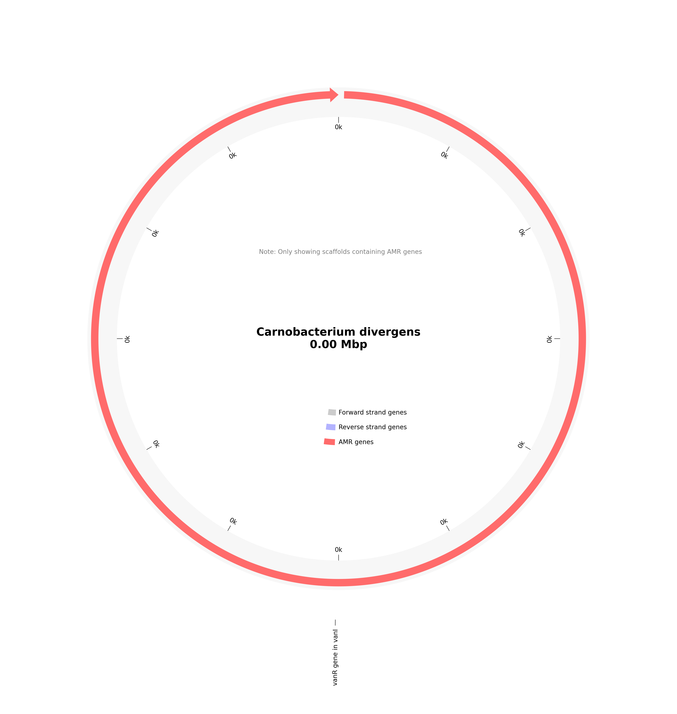

### vanR gene in vanI cluster
- **Mechanism**: antibiotic target alteration
- **Drug Classes**: glycopeptide antibiotic
- **AMR Family**: glycopeptide resistance gene cluster; vanR
- **Locations**:
  - gnl|SPADES|PLIJBHFI_29228_1 : position 1-276

## Carnobacterium maltaromaticum
**Strain Statistics:**
- Total genome length: 268.0 kbp
- Total scaffolds: 3895
- Scaffolds with AMR genes: 335
- Total genes annotated: 364
- Total AMR genes: 355
- Unique AMR genes: 161
- Distinct AMR mechanisms: 9
- Distinct AMR families: 64
- Distinct drug classes: 34

**Circos Plot:**

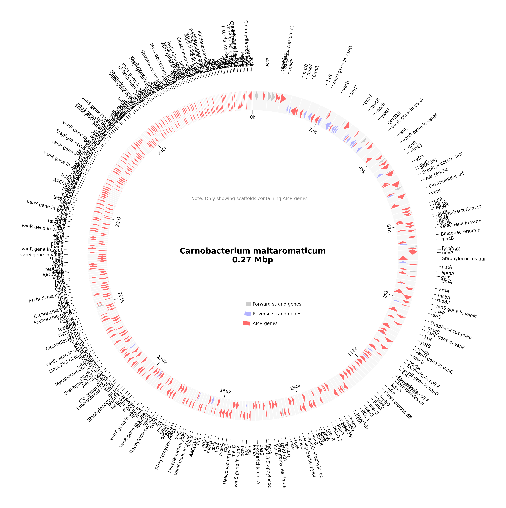

### AAC(3)-IXa
- **Mechanism**: antibiotic inactivation
- **Drug Classes**: aminoglycoside antibiotic
- **AMR Family**: AAC(3)
- **Locations**:
  - gnl|SPADES|PLIJBHFI_17458_2 : position 270-467

### AAC(3)-Ic
- **Mechanism**: antibiotic inactivation
- **Drug Classes**: aminoglycoside antibiotic
- **AMR Family**: AAC(3)
- **Locations**:
  - gnl|SPADES|PLIJBHFI_9325_1 : position 2-307

### AAC(3)-VIIa
- **Mechanism**: antibiotic inactivation
- **Drug Classes**: aminoglycoside antibiotic
- **AMR Family**: AAC(3)
- **Locations**:
  - gnl|SPADES|PLIJBHFI_11452_1 : position 1-252

### AAC(6')-34
- **Mechanism**: antibiotic inactivation
- **Drug Classes**: aminoglycoside antibiotic
- **AMR Family**: AAC(6')
- **Locations**:
  - gnl|SPADES|PLIJBHFI_3749_2 : position 646-1179

### AAC(6')-Ir
- **Mechanism**: antibiotic inactivation
- **Drug Classes**: aminoglycoside antibiotic
- **AMR Family**: AAC(6')
- **Locations**:
  - gnl|SPADES|PLIJBHFI_13914_2 : position 305-586

### ANT(6)-Ib
- **Mechanism**: antibiotic inactivation
- **Drug Classes**: aminoglycoside antibiotic
- **AMR Family**: ANT(6)
- **Locations**:
  - gnl|SPADES|PLIJBHFI_13056_1 : position 160-624

### BCL-1
- **Mechanism**: antibiotic inactivation
- **Drug Classes**: penam
- **AMR Family**: BCL Beta-lactamase
- **Locations**:
  - gnl|SPADES|PLIJBHFI_6668_2 : position 188-1144

### BcI
- **Mechanism**: antibiotic inactivation
- **Drug Classes**: cephalosporin; penem
- **AMR Family**: class A Bacillus cereus Bc beta-lactamase
- **Locations**:
  - gnl|SPADES|PLIJBHFI_20582_1 : position 2-394

### Bifidobacterium adolescentis rpoB mutants conferring resistance to rifampicin
- **Mechanism**: antibiotic target alteration; antibiotic target replacement
- **Drug Classes**: rifamycin antibiotic
- **AMR Family**: rifamycin-resistant beta-subunit of RNA polymerase (rpoB)
- **Locations**:
  - gnl|SPADES|PLIJBHFI_32767_1 : position 1-252

### Bifidobacterium bifidum ileS conferring resistance to mupirocin
- **Mechanism**: antibiotic target alteration
- **Drug Classes**: mupirocin-like antibiotic
- **AMR Family**: antibiotic-resistant isoleucyl-tRNA synthetase (ileS)
- **Locations**:
  - gnl|SPADES|PLIJBHFI_4355_2 : position 760-1458

### Bla1
- **Mechanism**: antibiotic inactivation
- **Drug Classes**: penam
- **AMR Family**: class A Bacillus anthracis Bla beta-lactamase
- **Locations**:
  - gnl|SPADES|PLIJBHFI_8481_1 : position 3-524

### CRP
- **Mechanism**: antibiotic efflux
- **Drug Classes**: macrolide antibiotic; fluoroquinolone antibiotic; penam
- **AMR Family**: resistance-nodulation-cell division (RND) antibiotic efflux pump
- **Locations**:
  - gnl|SPADES|PLIJBHFI_7654_2 : position 473-1018

### Chlamydia trachomatis intrinsic murA conferring resistance to fosfomycin (found in 2 locations)
- **Mechanism**: antibiotic target alteration
- **Drug Classes**: phosphonic acid antibiotic
- **AMR Family**: antibiotic-resistant murA transferase
- **Locations**:
  - gnl|SPADES|PLIJBHFI_39387_1 : position 3-218
  - gnl|SPADES|PLIJBHFI_41441_1 : position 1-210

### Clostridioides difficile gyrA conferring resistance to fluoroquinolones (found in 2 locations)
- **Mechanism**: antibiotic target alteration
- **Drug Classes**: fluoroquinolone antibiotic
- **AMR Family**: fluoroquinolone resistant gyrA
- **Locations**:
  - gnl|SPADES|PLIJBHFI_3756_2 : position 537-1841
  - gnl|SPADES|PLIJBHFI_6333_1 : position 2-637

### Clostridioides difficile gyrB conferring resistance to fluoroquinolones (found in 3 locations)
- **Mechanism**: antibiotic target alteration
- **Drug Classes**: fluoroquinolone antibiotic
- **AMR Family**: fluoroquinolone resistant gyrB
- **Locations**:
  - gnl|SPADES|PLIJBHFI_11367_1 : position 3-710
  - gnl|SPADES|PLIJBHFI_13029_1 : position 3-626
  - gnl|SPADES|PLIJBHFI_6419_2 : position 206-793

### Clostridium sporogenes cplR
- **Mechanism**: antibiotic target protection
- **Drug Classes**: lincosamide antibiotic; pleuromutilin antibiotic
- **AMR Family**: Miscellaneous ABC-F subfamily ATP-binding cassette ribosomal protection proteins
- **Locations**:
  - gnl|SPADES|PLIJBHFI_28702_1 : position 105-278

### Corynebacterium striatum tetA (found in 2 locations)
- **Mechanism**: antibiotic efflux
- **Drug Classes**: penam; tetracycline antibiotic
- **AMR Family**: major facilitator superfamily (MFS) antibiotic efflux pump
- **Locations**:
  - gnl|SPADES|PLIJBHFI_1550_5 : position 3833-4048
  - gnl|SPADES|PLIJBHFI_3929_3 : position 1413-1775

### EdeQ
- **Mechanism**: antibiotic inactivation
- **Drug Classes**: peptide antibiotic; polyamine antibiotic
- **AMR Family**: Edeine acetyltransferase
- **Locations**:
  - gnl|SPADES|PLIJBHFI_19039_1 : position 1-426

### Enterococcus faecalis cls with mutation conferring resistance to daptomycin
- **Mechanism**: antibiotic target alteration
- **Drug Classes**: peptide antibiotic
- **AMR Family**: daptomycin resistant cls
- **Locations**:
  - gnl|SPADES|PLIJBHFI_11360_1 : position 3-683

### ErmR
- **Mechanism**: antibiotic target alteration
- **Drug Classes**: macrolide antibiotic; lincosamide antibiotic; streptogramin antibiotic; streptogramin A antibiotic; streptogramin B antibiotic
- **AMR Family**: Erm 23S ribosomal RNA methyltransferase
- **Locations**:
  - gnl|SPADES|PLIJBHFI_2098_1 : position 645-1538

### Escherichia coli AcrAB-TolC with AcrR mutation conferring resistance to ciprofloxacin, tetracycline, and ceftazidime (found in 3 locations)
- **Mechanism**: antibiotic target alteration; antibiotic efflux
- **Drug Classes**: fluoroquinolone antibiotic; cephalosporin; glycylcycline; penam; tetracycline antibiotic; rifamycin antibiotic; phenicol antibiotic; disinfecting agents and antiseptics
- **AMR Family**: resistance-nodulation-cell division (RND) antibiotic efflux pump
- **Locations**:
  - gnl|SPADES|PLIJBHFI_13392_2 : position 425-607
  - gnl|SPADES|PLIJBHFI_13704_1 : position 2-472
  - gnl|SPADES|PLIJBHFI_8189_2 : position 244-906

### Escherichia coli EF-Tu mutants conferring resistance to Pulvomycin
- **Mechanism**: antibiotic target alteration
- **Drug Classes**: elfamycin antibiotic
- **AMR Family**: elfamycin resistant EF-Tu
- **Locations**:
  - gnl|SPADES|PLIJBHFI_6290_2 : position 377-574

### Escherichia coli EF-Tu mutants conferring resistance to kirromycin
- **Mechanism**: antibiotic target alteration
- **Drug Classes**: elfamycin antibiotic
- **AMR Family**: elfamycin resistant EF-Tu
- **Locations**:
  - gnl|SPADES|PLIJBHFI_6054_1 : position 3-1151

### Escherichia coli fabI mutations conferring resistance to isoniazid and triclosan
- **Mechanism**: antibiotic target alteration
- **Drug Classes**: disinfecting agents and antiseptics; isoniazid-like antibiotic
- **AMR Family**: antibiotic resistant fabI
- **Locations**:
  - gnl|SPADES|PLIJBHFI_13511_1 : position 87-602

### EstT (found in 2 locations)
- **Mechanism**: antibiotic inactivation
- **Drug Classes**: macrolide antibiotic
- **AMR Family**: macrolide esterase
- **Locations**:
  - gnl|SPADES|PLIJBHFI_24934_1 : position 2-319
  - gnl|SPADES|PLIJBHFI_6230_1 : position 1-318

### FusF
- **Mechanism**: antibiotic target protection
- **Drug Classes**: fusidane antibiotic
- **AMR Family**: Target protecting FusB-type protein conferring resistance to Fusidic acid
- **Locations**:
  - gnl|SPADES|PLIJBHFI_7647_1 : position 471-1019

### HelR
- **Mechanism**: antibiotic target protection
- **Drug Classes**: rifamycin antibiotic
- **AMR Family**: helicase-like RNA polymerase protection protein
- **Locations**:
  - gnl|SPADES|PLIJBHFI_24733_1 : position 1-324

### Helicobacter pylori frxA mutation conferring resistance to metronidazole
- **Mechanism**: antibiotic target alteration
- **Drug Classes**: nitroimidazole antibiotic
- **AMR Family**: Antibiotic resistant Helicobacter pylori nitroreductase
- **Locations**:
  - gnl|SPADES|PLIJBHFI_7509_2 : position 301-972

### Helicobacter pylori pbp1 mutants conferring resistance to amoxicillin
- **Mechanism**: antibiotic target alteration
- **Drug Classes**: cephalosporin; cephamycin; penam
- **AMR Family**: Penicillin-binding protein mutations conferring resistance to beta-lactam antibiotics
- **Locations**:
  - gnl|SPADES|PLIJBHFI_8663_1 : position 2-913

### Helicobacter pylori rdxA mutation conferring resistance to metronidazole
- **Mechanism**: antibiotic target alteration
- **Drug Classes**: nitroimidazole antibiotic
- **AMR Family**: Antibiotic resistant Helicobacter pylori nitroreductase
- **Locations**:
  - gnl|SPADES|PLIJBHFI_27137_1 : position 3-206

### IreK (found in 3 locations)
- **Mechanism**: reduced permeability to antibiotic
- **Drug Classes**: cephalosporin
- **AMR Family**: Serine/threonine kinases
- **Locations**:
  - gnl|SPADES|PLIJBHFI_14577_1 : position 2-562
  - gnl|SPADES|PLIJBHFI_15583_1 : position 2-508
  - gnl|SPADES|PLIJBHFI_18317_1 : position 2-445

### Listeria monocytogenes mprF (found in 4 locations)
- **Mechanism**: antibiotic target alteration
- **Drug Classes**: peptide antibiotic
- **AMR Family**: defensin resistant mprF
- **Locations**:
  - gnl|SPADES|PLIJBHFI_23336_1 : position 1-345
  - gnl|SPADES|PLIJBHFI_32090_1 : position 3-257
  - gnl|SPADES|PLIJBHFI_37110_1 : position 40-231
  - gnl|SPADES|PLIJBHFI_9618_2 : position 431-829

### LlmA 23S ribosomal RNA methyltransferase
- **Mechanism**: antibiotic target alteration
- **Drug Classes**: lincosamide antibiotic
- **AMR Family**: Llm 23S ribosomal RNA methyltransferase
- **Locations**:
  - gnl|SPADES|PLIJBHFI_12587_1 : position 2-622

### LpeA
- **Mechanism**: antibiotic efflux
- **Drug Classes**: macrolide antibiotic
- **AMR Family**: resistance-nodulation-cell division (RND) antibiotic efflux pump
- **Locations**:
  - gnl|SPADES|PLIJBHFI_14169_1 : position 1-189

### MOX-9
- **Mechanism**: antibiotic inactivation
- **Drug Classes**: cephalosporin; cephamycin; penam
- **AMR Family**: MOX beta-lactamase
- **Locations**:
  - gnl|SPADES|PLIJBHFI_13320_1 : position 3-611

### MexS (found in 3 locations)
- **Mechanism**: antibiotic efflux
- **Drug Classes**: fluoroquinolone antibiotic; diaminopyrimidine antibiotic; phenicol antibiotic
- **AMR Family**: resistance-nodulation-cell division (RND) antibiotic efflux pump
- **Locations**:
  - gnl|SPADES|PLIJBHFI_18315_1 : position 2-445
  - gnl|SPADES|PLIJBHFI_23479_1 : position 1-342
  - gnl|SPADES|PLIJBHFI_32740_1 : position 2-253

### Mycobacterium tuberculosis intrinsic murA conferring resistance to fosfomycin
- **Mechanism**: antibiotic target alteration
- **Drug Classes**: phosphonic acid antibiotic
- **AMR Family**: antibiotic-resistant murA transferase
- **Locations**:
  - gnl|SPADES|PLIJBHFI_25989_1 : position 2-307

### Mycobacterium tuberculosis pncA mutations conferring resistance to pyrazinamide
- **Mechanism**: antibiotic target alteration
- **Drug Classes**: pyrazine antibiotic
- **AMR Family**: Pyrazinamide resistant pncA
- **Locations**:
  - gnl|SPADES|PLIJBHFI_11872_1 : position 240-683

### NmcR
- **Mechanism**: antibiotic inactivation
- **Drug Classes**: carbapenem; cephalosporin; cephamycin; penam
- **AMR Family**: NmcA beta-lactamase
- **Locations**:
  - gnl|SPADES|PLIJBHFI_7242_1 : position 3-797

### PEDO-2
- **Mechanism**: antibiotic inactivation
- **Drug Classes**: carbapenem
- **AMR Family**: subclass B3 PEDO beta-lactamase
- **Locations**:
  - gnl|SPADES|PLIJBHFI_7099_1 : position 368-985

### ParR (found in 2 locations)
- **Mechanism**: antibiotic efflux; reduced permeability to antibiotic
- **Drug Classes**: macrolide antibiotic; fluoroquinolone antibiotic; monobactam; aminoglycoside antibiotic; carbapenem; cephalosporin; cephamycin; penam; tetracycline antibiotic; phenicol antibiotic; penem; disinfecting agents and antiseptics
- **AMR Family**: resistance-nodulation-cell division (RND) antibiotic efflux pump; Outer Membrane Porin (Opr)
- **Locations**:
  - gnl|SPADES|PLIJBHFI_13098_2 : position 361-621
  - gnl|SPADES|PLIJBHFI_18548_2 : position 152-439

### Pseudomonas aeruginosa soxR
- **Mechanism**: antibiotic target alteration; antibiotic efflux
- **Drug Classes**: fluoroquinolone antibiotic; cephalosporin; glycylcycline; penam; tetracycline antibiotic; rifamycin antibiotic; phenicol antibiotic; disinfecting agents and antiseptics
- **AMR Family**: ATP-binding cassette (ABC) antibiotic efflux pump; major facilitator superfamily (MFS) antibiotic efflux pump; resistance-nodulation-cell division (RND) antibiotic efflux pump
- **Locations**:
  - gnl|SPADES|PLIJBHFI_30789_1 : position 1-246

### QnrA2
- **Mechanism**: antibiotic target protection
- **Drug Classes**: fluoroquinolone antibiotic
- **AMR Family**: quinolone resistance protein (qnr)
- **Locations**:
  - gnl|SPADES|PLIJBHFI_19735_1 : position 1-411

### QnrS10
- **Mechanism**: antibiotic target protection
- **Drug Classes**: fluoroquinolone antibiotic
- **AMR Family**: quinolone resistance protein (qnr)
- **Locations**:
  - gnl|SPADES|PLIJBHFI_2846_4 : position 2087-2311

### RanA (found in 15 locations)
- **Mechanism**: antibiotic efflux
- **Drug Classes**: aminoglycoside antibiotic
- **AMR Family**: ATP-binding cassette (ABC) antibiotic efflux pump
- **Locations**:
  - gnl|SPADES|PLIJBHFI_11074_1 : position 1-435
  - gnl|SPADES|PLIJBHFI_13598_1 : position 1-477
  - gnl|SPADES|PLIJBHFI_13599_1 : position 2-598
  - gnl|SPADES|PLIJBHFI_16118_2 : position 191-508
  - gnl|SPADES|PLIJBHFI_17642_1 : position 3-464
  - gnl|SPADES|PLIJBHFI_22392_1 : position 1-279
  - gnl|SPADES|PLIJBHFI_28932_1 : position 2-157
  - gnl|SPADES|PLIJBHFI_34221_1 : position 2-244
  - gnl|SPADES|PLIJBHFI_3887_1 : position 3-725
  - gnl|SPADES|PLIJBHFI_38969_1 : position 1-222
  - gnl|SPADES|PLIJBHFI_40226_1 : position 3-215
  - gnl|SPADES|PLIJBHFI_4662_3 : position 1107-1535
  - gnl|SPADES|PLIJBHFI_6552_1 : position 1-1029
  - gnl|SPADES|PLIJBHFI_7046_1 : position 61-1095
  - gnl|SPADES|PLIJBHFI_8405_1 : position 3-734

### RlmA(II)
- **Mechanism**: antibiotic target alteration
- **Drug Classes**: macrolide antibiotic; lincosamide antibiotic
- **AMR Family**: non-erm 23S ribosomal RNA methyltransferase (G748)
- **Locations**:
  - gnl|SPADES|PLIJBHFI_10616_1 : position 329-760

### Staphylococcus aureus LmrS
- **Mechanism**: antibiotic efflux
- **Drug Classes**: macrolide antibiotic; aminoglycoside antibiotic; oxazolidinone antibiotic; diaminopyrimidine antibiotic; phenicol antibiotic
- **AMR Family**: major facilitator superfamily (MFS) antibiotic efflux pump
- **Locations**:
  - gnl|SPADES|PLIJBHFI_19047_1 : position 1-426

### Staphylococcus aureus fusA with mutation conferring resistance to fusidic acid (found in 2 locations)
- **Mechanism**: antibiotic target alteration
- **Drug Classes**: fusidane antibiotic
- **AMR Family**: antibiotic resistant fusA
- **Locations**:
  - gnl|SPADES|PLIJBHFI_11535_1 : position 3-701
  - gnl|SPADES|PLIJBHFI_3700_1 : position 99-1859

### Staphylococcus aureus mupA conferring resistance to mupirocin (found in 4 locations)
- **Mechanism**: antibiotic target alteration
- **Drug Classes**: mupirocin-like antibiotic
- **AMR Family**: antibiotic-resistant isoleucyl-tRNA synthetase (ileS)
- **Locations**:
  - gnl|SPADES|PLIJBHFI_10124_1 : position 2-793
  - gnl|SPADES|PLIJBHFI_20073_1 : position 1-405
  - gnl|SPADES|PLIJBHFI_22810_1 : position 2-352
  - gnl|SPADES|PLIJBHFI_4691_1 : position 3-1529

### Staphylococcus aureus mupB conferring resistance to mupirocin (found in 2 locations)
- **Mechanism**: antibiotic target alteration
- **Drug Classes**: mupirocin-like antibiotic
- **AMR Family**: antibiotic-resistant isoleucyl-tRNA synthetase (ileS)
- **Locations**:
  - gnl|SPADES|PLIJBHFI_11211_1 : position 3-722
  - gnl|SPADES|PLIJBHFI_24449_1 : position 3-326

### Streptococcus pneumoniae PBP2b conferring resistance to amoxicillin
- **Mechanism**: antibiotic target alteration
- **Drug Classes**: cephalosporin; cephamycin; penam
- **AMR Family**: Penicillin-binding protein mutations conferring resistance to beta-lactam antibiotics
- **Locations**:
  - gnl|SPADES|PLIJBHFI_5220_1 : position 183-1406

### Streptococcus pneumoniae PBP2x conferring resistance to amoxicillin
- **Mechanism**: antibiotic target alteration
- **Drug Classes**: cephalosporin; cephamycin; penam
- **AMR Family**: Penicillin-binding protein mutations conferring resistance to beta-lactam antibiotics
- **Locations**:
  - gnl|SPADES|PLIJBHFI_24945_1 : position 3-320

### Streptomyces rimosus otr(A) (found in 2 locations)
- **Mechanism**: antibiotic target protection
- **Drug Classes**: tetracycline antibiotic
- **AMR Family**: tetracycline-resistant ribosomal protection protein
- **Locations**:
  - gnl|SPADES|PLIJBHFI_7845_1 : position 2-994
  - gnl|SPADES|PLIJBHFI_9712_1 : position 263-823

### TaeA (found in 5 locations)
- **Mechanism**: antibiotic efflux
- **Drug Classes**: pleuromutilin antibiotic
- **AMR Family**: ATP-binding cassette (ABC) antibiotic efflux pump
- **Locations**:
  - gnl|SPADES|PLIJBHFI_10807_1 : position 3-746
  - gnl|SPADES|PLIJBHFI_15017_1 : position 2-544
  - gnl|SPADES|PLIJBHFI_16271_1 : position 2-352
  - gnl|SPADES|PLIJBHFI_39640_1 : position 3-218
  - gnl|SPADES|PLIJBHFI_7129_1 : position 316-1083

### TxR (found in 3 locations)
- **Mechanism**: antibiotic efflux
- **Drug Classes**: tetracycline antibiotic
- **AMR Family**: ATP-binding cassette (ABC) antibiotic efflux pump
- **Locations**:
  - gnl|SPADES|PLIJBHFI_2201_3 : position 1661-2581
  - gnl|SPADES|PLIJBHFI_5597_1 : position 2-784
  - gnl|SPADES|PLIJBHFI_9126_1 : position 3-749

### VatI
- **Mechanism**: antibiotic inactivation
- **Drug Classes**: streptogramin antibiotic; streptogramin A antibiotic
- **AMR Family**: streptogramin vat acetyltransferase
- **Locations**:
  - gnl|SPADES|PLIJBHFI_25595_1 : position 1-261

### YajC
- **Mechanism**: antibiotic efflux
- **Drug Classes**: fluoroquinolone antibiotic; cephalosporin; glycylcycline; penam; tetracycline antibiotic; oxazolidinone antibiotic; glycopeptide antibiotic; rifamycin antibiotic; phenicol antibiotic; disinfecting agents and antiseptics
- **AMR Family**: resistance-nodulation-cell division (RND) antibiotic efflux pump
- **Locations**:
  - gnl|SPADES|PLIJBHFI_15395_1 : position 152-532

### aadK
- **Mechanism**: antibiotic inactivation
- **Drug Classes**: aminoglycoside antibiotic
- **AMR Family**: ANT(6)
- **Locations**:
  - gnl|SPADES|PLIJBHFI_21718_1 : position 3-371

### adeR (found in 3 locations)
- **Mechanism**: antibiotic efflux
- **Drug Classes**: glycylcycline; tetracycline antibiotic
- **AMR Family**: resistance-nodulation-cell division (RND) antibiotic efflux pump
- **Locations**:
  - gnl|SPADES|PLIJBHFI_21763_2 : position 213-371
  - gnl|SPADES|PLIJBHFI_5119_2 : position 174-872
  - gnl|SPADES|PLIJBHFI_6467_2 : position 301-1029

### almE
- **Mechanism**: antibiotic target alteration
- **Drug Classes**: peptide antibiotic
- **AMR Family**: polymyxin resistance operon; alm glycyltransferase
- **Locations**:
  - gnl|SPADES|PLIJBHFI_13842_1 : position 3-590

### apmA
- **Mechanism**: antibiotic inactivation
- **Drug Classes**: aminoglycoside antibiotic
- **AMR Family**: AAC(2')
- **Locations**:
  - gnl|SPADES|PLIJBHFI_4816_2 : position 970-1479

### arlR (found in 4 locations)
- **Mechanism**: antibiotic efflux
- **Drug Classes**: fluoroquinolone antibiotic; disinfecting agents and antiseptics
- **AMR Family**: major facilitator superfamily (MFS) antibiotic efflux pump
- **Locations**:
  - gnl|SPADES|PLIJBHFI_24037_1 : position 1-201
  - gnl|SPADES|PLIJBHFI_28058_1 : position 1-285
  - gnl|SPADES|PLIJBHFI_3835_2 : position 1061-1810
  - gnl|SPADES|PLIJBHFI_9627_1 : position 2-442

### arlS (found in 5 locations)
- **Mechanism**: antibiotic efflux
- **Drug Classes**: fluoroquinolone antibiotic; disinfecting agents and antiseptics
- **AMR Family**: major facilitator superfamily (MFS) antibiotic efflux pump
- **Locations**:
  - gnl|SPADES|PLIJBHFI_21880_1 : position 59-367
  - gnl|SPADES|PLIJBHFI_25640_1 : position 1-312
  - gnl|SPADES|PLIJBHFI_40494_1 : position 3-215
  - gnl|SPADES|PLIJBHFI_5195_1 : position 1-399
  - gnl|SPADES|PLIJBHFI_9111_1 : position 1-174

### arnA
- **Mechanism**: antibiotic target alteration
- **Drug Classes**: peptide antibiotic
- **AMR Family**: pmr phosphoethanolamine transferase
- **Locations**:
  - gnl|SPADES|PLIJBHFI_5020_2 : position 689-1270

### arr-1
- **Mechanism**: antibiotic inactivation
- **Drug Classes**: rifamycin antibiotic
- **AMR Family**: rifampin ADP-ribosyltransferase (Arr)
- **Locations**:
  - gnl|SPADES|PLIJBHFI_12861_1 : position 2-361

### bacA
- **Mechanism**: antibiotic target alteration
- **Drug Classes**: peptide antibiotic
- **AMR Family**: undecaprenyl pyrophosphate related proteins
- **Locations**:
  - gnl|SPADES|PLIJBHFI_9881_2 : position 141-809

### baeR (found in 2 locations)
- **Mechanism**: antibiotic efflux
- **Drug Classes**: aminoglycoside antibiotic; aminocoumarin antibiotic
- **AMR Family**: resistance-nodulation-cell division (RND) antibiotic efflux pump
- **Locations**:
  - gnl|SPADES|PLIJBHFI_37964_1 : position 3-227
  - gnl|SPADES|PLIJBHFI_9079_1 : position 3-233

### baeS (found in 6 locations)
- **Mechanism**: antibiotic efflux
- **Drug Classes**: aminoglycoside antibiotic; aminocoumarin antibiotic
- **AMR Family**: resistance-nodulation-cell division (RND) antibiotic efflux pump
- **Locations**:
  - gnl|SPADES|PLIJBHFI_16479_1 : position 3-419
  - gnl|SPADES|PLIJBHFI_18153_2 : position 332-448
  - gnl|SPADES|PLIJBHFI_37154_1 : position 3-230
  - gnl|SPADES|PLIJBHFI_6578_1 : position 35-1159
  - gnl|SPADES|PLIJBHFI_6844_1 : position 2-1117
  - gnl|SPADES|PLIJBHFI_7518_1 : position 3-1031

### basS
- **Mechanism**: antibiotic target alteration; antibiotic efflux
- **Drug Classes**: peptide antibiotic
- **AMR Family**: pmr phosphoethanolamine transferase
- **Locations**:
  - gnl|SPADES|PLIJBHFI_8033_2 : position 417-974

### bcr-1 (found in 2 locations)
- **Mechanism**: antibiotic efflux
- **Drug Classes**: bicyclomycin-like antibiotic
- **AMR Family**: major facilitator superfamily (MFS) antibiotic efflux pump
- **Locations**:
  - gnl|SPADES|PLIJBHFI_2419_3 : position 1211-2458
  - gnl|SPADES|PLIJBHFI_8604_1 : position 1-657

### bcrA (found in 14 locations)
- **Mechanism**: antibiotic efflux
- **Drug Classes**: peptide antibiotic
- **AMR Family**: ATP-binding cassette (ABC) antibiotic efflux pump
- **Locations**:
  - gnl|SPADES|PLIJBHFI_1331_5 : position 3465-4094
  - gnl|SPADES|PLIJBHFI_13469_1 : position 3-230
  - gnl|SPADES|PLIJBHFI_13824_1 : position 1-591
  - gnl|SPADES|PLIJBHFI_14490_1 : position 3-563
  - gnl|SPADES|PLIJBHFI_20033_1 : position 1-405
  - gnl|SPADES|PLIJBHFI_26000_1 : position 2-307
  - gnl|SPADES|PLIJBHFI_26121_1 : position 68-304
  - gnl|SPADES|PLIJBHFI_28006_1 : position 1-285
  - gnl|SPADES|PLIJBHFI_28791_1 : position 1-270
  - gnl|SPADES|PLIJBHFI_32114_1 : position 3-257
  - gnl|SPADES|PLIJBHFI_42141_1 : position 2-205
  - gnl|SPADES|PLIJBHFI_6702_1 : position 2-403
  - gnl|SPADES|PLIJBHFI_7926_1 : position 679-987
  - gnl|SPADES|PLIJBHFI_8821_1 : position 109-900

### carA
- **Mechanism**: antibiotic target protection
- **Drug Classes**: macrolide antibiotic
- **AMR Family**: Miscellaneous ABC-F subfamily ATP-binding cassette ribosomal protection proteins
- **Locations**:
  - gnl|SPADES|PLIJBHFI_11251_2 : position 544-717

### catB11
- **Mechanism**: antibiotic inactivation
- **Drug Classes**: phenicol antibiotic
- **AMR Family**: chloramphenicol acetyltransferase (CAT)
- **Locations**:
  - gnl|SPADES|PLIJBHFI_38193_1 : position 1-192

### catB9
- **Mechanism**: antibiotic inactivation
- **Drug Classes**: phenicol antibiotic
- **AMR Family**: chloramphenicol acetyltransferase (CAT)
- **Locations**:
  - gnl|SPADES|PLIJBHFI_19999_1 : position 1-405

### cfrA
- **Mechanism**: antibiotic target alteration
- **Drug Classes**: lincosamide antibiotic; streptogramin antibiotic; streptogramin A antibiotic; oxazolidinone antibiotic; phenicol antibiotic; pleuromutilin antibiotic
- **AMR Family**: Cfr 23S ribosomal RNA methyltransferase
- **Locations**:
  - gnl|SPADES|PLIJBHFI_17452_1 : position 41-469

### cfrE
- **Mechanism**: antibiotic target alteration
- **Drug Classes**: lincosamide antibiotic; streptogramin antibiotic; oxazolidinone antibiotic; phenicol antibiotic; pleuromutilin antibiotic
- **AMR Family**: Cfr 23S ribosomal RNA methyltransferase
- **Locations**:
  - gnl|SPADES|PLIJBHFI_39754_1 : position 1-216

### cprR (found in 2 locations)
- **Mechanism**: antibiotic target alteration; antibiotic efflux
- **Drug Classes**: peptide antibiotic
- **AMR Family**: pmr phosphoethanolamine transferase
- **Locations**:
  - gnl|SPADES|PLIJBHFI_15440_1 : position 1-528
  - gnl|SPADES|PLIJBHFI_21290_1 : position 2-379

### dfrE (found in 2 locations)
- **Mechanism**: antibiotic target replacement
- **Drug Classes**: diaminopyrimidine antibiotic
- **AMR Family**: trimethoprim resistant dihydrofolate reductase dfr
- **Locations**:
  - gnl|SPADES|PLIJBHFI_22662_2 : position 202-354
  - gnl|SPADES|PLIJBHFI_34684_1 : position 2-244

### efmA (found in 2 locations)
- **Mechanism**: antibiotic efflux
- **Drug Classes**: macrolide antibiotic; fluoroquinolone antibiotic
- **AMR Family**: major facilitator superfamily (MFS) antibiotic efflux pump
- **Locations**:
  - gnl|SPADES|PLIJBHFI_13033_1 : position 1-624
  - gnl|SPADES|PLIJBHFI_5004_1 : position 1-345

### efrA (found in 9 locations)
- **Mechanism**: antibiotic efflux
- **Drug Classes**: macrolide antibiotic; fluoroquinolone antibiotic; rifamycin antibiotic
- **AMR Family**: ATP-binding cassette (ABC) antibiotic efflux pump
- **Locations**:
  - gnl|SPADES|PLIJBHFI_17249_1 : position 1-474
  - gnl|SPADES|PLIJBHFI_17962_1 : position 1-453
  - gnl|SPADES|PLIJBHFI_22909_1 : position 2-349
  - gnl|SPADES|PLIJBHFI_23266_1 : position 3-344
  - gnl|SPADES|PLIJBHFI_34277_1 : position 1-246
  - gnl|SPADES|PLIJBHFI_3569_2 : position 417-1925
  - gnl|SPADES|PLIJBHFI_36375_1 : position 2-235
  - gnl|SPADES|PLIJBHFI_6385_1 : position 2-1186
  - gnl|SPADES|PLIJBHFI_7200_1 : position 2-448

### efrB (found in 6 locations)
- **Mechanism**: antibiotic efflux
- **Drug Classes**: macrolide antibiotic; fluoroquinolone antibiotic; rifamycin antibiotic
- **AMR Family**: ATP-binding cassette (ABC) antibiotic efflux pump
- **Locations**:
  - gnl|SPADES|PLIJBHFI_11067_1 : position 1-729
  - gnl|SPADES|PLIJBHFI_16006_1 : position 1-510
  - gnl|SPADES|PLIJBHFI_21003_1 : position 1-384
  - gnl|SPADES|PLIJBHFI_29475_1 : position 1-273
  - gnl|SPADES|PLIJBHFI_40569_1 : position 2-214
  - gnl|SPADES|PLIJBHFI_8906_1 : position 3-776

### emrB
- **Mechanism**: antibiotic efflux
- **Drug Classes**: fluoroquinolone antibiotic
- **AMR Family**: major facilitator superfamily (MFS) antibiotic efflux pump
- **Locations**:
  - gnl|SPADES|PLIJBHFI_11736_1 : position 2-688

### evgA
- **Mechanism**: antibiotic efflux
- **Drug Classes**: macrolide antibiotic; fluoroquinolone antibiotic; penam; tetracycline antibiotic
- **AMR Family**: major facilitator superfamily (MFS) antibiotic efflux pump; resistance-nodulation-cell division (RND) antibiotic efflux pump
- **Locations**:
  - gnl|SPADES|PLIJBHFI_15421_2 : position 97-531

### evgS (found in 3 locations)
- **Mechanism**: antibiotic efflux
- **Drug Classes**: macrolide antibiotic; fluoroquinolone antibiotic; penam; tetracycline antibiotic
- **AMR Family**: major facilitator superfamily (MFS) antibiotic efflux pump; resistance-nodulation-cell division (RND) antibiotic efflux pump
- **Locations**:
  - gnl|SPADES|PLIJBHFI_10049_1 : position 65-766
  - gnl|SPADES|PLIJBHFI_13656_1 : position 3-584
  - gnl|SPADES|PLIJBHFI_13834_2 : position 238-591

### golS (found in 4 locations)
- **Mechanism**: antibiotic efflux
- **Drug Classes**: monobactam; carbapenem; cephalosporin; cephamycin; penam; phenicol antibiotic; penem
- **AMR Family**: resistance-nodulation-cell division (RND) antibiotic efflux pump
- **Locations**:
  - gnl|SPADES|PLIJBHFI_12706_2 : position 224-640
  - gnl|SPADES|PLIJBHFI_13692_1 : position 2-595
  - gnl|SPADES|PLIJBHFI_25949_1 : position 1-225
  - gnl|SPADES|PLIJBHFI_4912_2 : position 416-1228

### kdpD (found in 2 locations)
- **Mechanism**: antibiotic efflux
- **Drug Classes**: aminoglycoside antibiotic
- **AMR Family**: kdpDE
- **Locations**:
  - gnl|SPADES|PLIJBHFI_13887_1 : position 2-589
  - gnl|SPADES|PLIJBHFI_6380_1 : position 2-970

### kdpE (found in 2 locations)
- **Mechanism**: antibiotic efflux
- **Drug Classes**: aminoglycoside antibiotic
- **AMR Family**: kdpDE
- **Locations**:
  - gnl|SPADES|PLIJBHFI_18153_1 : position 1-282
  - gnl|SPADES|PLIJBHFI_24938_1 : position 1-321

### leuO
- **Mechanism**: antibiotic efflux
- **Drug Classes**: nucleoside antibiotic; disinfecting agents and antiseptics
- **AMR Family**: major facilitator superfamily (MFS) antibiotic efflux pump
- **Locations**:
  - gnl|SPADES|PLIJBHFI_19471_1 : position 159-419

### lmrB (found in 4 locations)
- **Mechanism**: antibiotic efflux
- **Drug Classes**: lincosamide antibiotic; nucleoside antibiotic
- **AMR Family**: ATP-binding cassette (ABC) antibiotic efflux pump
- **Locations**:
  - gnl|SPADES|PLIJBHFI_11432_1 : position 3-707
  - gnl|SPADES|PLIJBHFI_22580_1 : position 3-356
  - gnl|SPADES|PLIJBHFI_3887_3 : position 1385-1789
  - gnl|SPADES|PLIJBHFI_7306_1 : position 2-976

### lmrD (found in 5 locations)
- **Mechanism**: antibiotic efflux
- **Drug Classes**: lincosamide antibiotic
- **AMR Family**: ATP-binding cassette (ABC) antibiotic efflux pump
- **Locations**:
  - gnl|SPADES|PLIJBHFI_11274_1 : position 1-717
  - gnl|SPADES|PLIJBHFI_13270_2 : position 203-613
  - gnl|SPADES|PLIJBHFI_16820_1 : position 93-485
  - gnl|SPADES|PLIJBHFI_2320_1 : position 2-487
  - gnl|SPADES|PLIJBHFI_24040_1 : position 68-334

### lsaC
- **Mechanism**: antibiotic target protection
- **Drug Classes**: lincosamide antibiotic; streptogramin antibiotic; pleuromutilin antibiotic
- **AMR Family**: lsa-type ABC-F protein
- **Locations**:
  - gnl|SPADES|PLIJBHFI_9656_1 : position 3-494

### macB (found in 34 locations)
- **Mechanism**: antibiotic efflux
- **Drug Classes**: macrolide antibiotic
- **AMR Family**: ATP-binding cassette (ABC) antibiotic efflux pump
- **Locations**:
  - gnl|SPADES|PLIJBHFI_10438_1 : position 2-712
  - gnl|SPADES|PLIJBHFI_10951_1 : position 1-738
  - gnl|SPADES|PLIJBHFI_11564_1 : position 3-362
  - gnl|SPADES|PLIJBHFI_11564_2 : position 378-698
  - gnl|SPADES|PLIJBHFI_12404_1 : position 1-657
  - gnl|SPADES|PLIJBHFI_14169_2 : position 205-576
  - gnl|SPADES|PLIJBHFI_14739_1 : position 3-491
  - gnl|SPADES|PLIJBHFI_14901_1 : position 1-522
  - gnl|SPADES|PLIJBHFI_14947_1 : position 136-546
  - gnl|SPADES|PLIJBHFI_15561_1 : position 2-526
  - gnl|SPADES|PLIJBHFI_17204_1 : position 3-473
  - gnl|SPADES|PLIJBHFI_17298_1 : position 47-472
  - gnl|SPADES|PLIJBHFI_18096_2 : position 162-449
  - gnl|SPADES|PLIJBHFI_1862_1 : position 161-1870
  - gnl|SPADES|PLIJBHFI_19605_1 : position 1-213
  - gnl|SPADES|PLIJBHFI_19989_1 : position 2-406
  - gnl|SPADES|PLIJBHFI_21763_1 : position 3-134
  - gnl|SPADES|PLIJBHFI_22353_1 : position 3-335
  - gnl|SPADES|PLIJBHFI_22548_1 : position 1-357
  - gnl|SPADES|PLIJBHFI_23222_1 : position 3-344
  - gnl|SPADES|PLIJBHFI_2488_3 : position 1012-1347
  - gnl|SPADES|PLIJBHFI_2646_1 : position 3-434
  - gnl|SPADES|PLIJBHFI_32931_1 : position 1-252
  - gnl|SPADES|PLIJBHFI_36733_1 : position 1-150
  - gnl|SPADES|PLIJBHFI_4262_1 : position 1-405
  - gnl|SPADES|PLIJBHFI_4440_2 : position 228-1031
  - gnl|SPADES|PLIJBHFI_5296_2 : position 521-1207
  - gnl|SPADES|PLIJBHFI_5690_2 : position 645-1310
  - gnl|SPADES|PLIJBHFI_5861_2 : position 153-1280
  - gnl|SPADES|PLIJBHFI_6566_2 : position 211-939
  - gnl|SPADES|PLIJBHFI_7113_2 : position 699-1082
  - gnl|SPADES|PLIJBHFI_7856_1 : position 13-672
  - gnl|SPADES|PLIJBHFI_9064_2 : position 100-876
  - gnl|SPADES|PLIJBHFI_9470_1 : position 361-840

### mdeA
- **Mechanism**: antibiotic efflux
- **Drug Classes**: fluoroquinolone antibiotic; aminoglycoside antibiotic; penam; tetracycline antibiotic; disinfecting agents and antiseptics
- **AMR Family**: major facilitator superfamily (MFS) antibiotic efflux pump
- **Locations**:
  - gnl|SPADES|PLIJBHFI_8799_1 : position 1-900

### mdtG (found in 2 locations)
- **Mechanism**: antibiotic efflux
- **Drug Classes**: phosphonic acid antibiotic
- **AMR Family**: major facilitator superfamily (MFS) antibiotic efflux pump
- **Locations**:
  - gnl|SPADES|PLIJBHFI_17429_1 : position 1-468
  - gnl|SPADES|PLIJBHFI_26418_1 : position 2-301

### mecA
- **Mechanism**: antibiotic target replacement
- **Drug Classes**: penam
- **AMR Family**: methicillin resistant PBP2
- **Locations**:
  - gnl|SPADES|PLIJBHFI_11029_1 : position 88-732

### mecD
- **Mechanism**: antibiotic target replacement
- **Drug Classes**: penam
- **AMR Family**: methicillin resistant PBP2
- **Locations**:
  - gnl|SPADES|PLIJBHFI_8669_1 : position 2-913

### mecI
- **Mechanism**: antibiotic target replacement
- **Drug Classes**: penam
- **AMR Family**: methicillin resistant PBP2
- **Locations**:
  - gnl|SPADES|PLIJBHFI_19079_1 : position 153-428

### mepR
- **Mechanism**: antibiotic efflux
- **Drug Classes**: glycylcycline; tetracycline antibiotic
- **AMR Family**: multidrug and toxic compound extrusion (MATE) transporter
- **Locations**:
  - gnl|SPADES|PLIJBHFI_3887_2 : position 889-1404

### mphO
- **Mechanism**: antibiotic inactivation
- **Drug Classes**: macrolide antibiotic
- **AMR Family**: macrolide phosphotransferase (MPH)
- **Locations**:
  - gnl|SPADES|PLIJBHFI_6441_2 : position 674-1177

### mreA (found in 3 locations)
- **Mechanism**: antibiotic efflux
- **Drug Classes**: macrolide antibiotic
- **AMR Family**: major facilitator superfamily (MFS) antibiotic efflux pump
- **Locations**:
  - gnl|SPADES|PLIJBHFI_19093_1 : position 2-283
  - gnl|SPADES|PLIJBHFI_22048_1 : position 2-211
  - gnl|SPADES|PLIJBHFI_35767_1 : position 1-237

### msbA (found in 5 locations)
- **Mechanism**: antibiotic efflux
- **Drug Classes**: nitroimidazole antibiotic
- **AMR Family**: ATP-binding cassette (ABC) antibiotic efflux pump
- **Locations**:
  - gnl|SPADES|PLIJBHFI_13022_1 : position 3-626
  - gnl|SPADES|PLIJBHFI_1550_3 : position 2735-3574
  - gnl|SPADES|PLIJBHFI_2085_3 : position 2383-3063
  - gnl|SPADES|PLIJBHFI_26842_1 : position 3-296
  - gnl|SPADES|PLIJBHFI_5054_2 : position 654-1442

### novA (found in 4 locations)
- **Mechanism**: antibiotic efflux
- **Drug Classes**: aminocoumarin antibiotic
- **AMR Family**: ATP-binding cassette (ABC) antibiotic efflux pump
- **Locations**:
  - gnl|SPADES|PLIJBHFI_16256_1 : position 187-504
  - gnl|SPADES|PLIJBHFI_17813_1 : position 3-401
  - gnl|SPADES|PLIJBHFI_30738_1 : position 1-264
  - gnl|SPADES|PLIJBHFI_4673_2 : position 227-1534

### oleB
- **Mechanism**: antibiotic target protection
- **Drug Classes**: macrolide antibiotic
- **AMR Family**: Miscellaneous ABC-F subfamily ATP-binding cassette ribosomal protection proteins
- **Locations**:
  - gnl|SPADES|PLIJBHFI_11018_2 : position 217-732

### oleC
- **Mechanism**: antibiotic efflux
- **Drug Classes**: macrolide antibiotic
- **AMR Family**: ATP-binding cassette (ABC) antibiotic efflux pump
- **Locations**:
  - gnl|SPADES|PLIJBHFI_3666_2 : position 629-1333

### optrA (found in 3 locations)
- **Mechanism**: antibiotic target protection
- **Drug Classes**: oxazolidinone antibiotic; phenicol antibiotic
- **AMR Family**: Miscellaneous ABC-F subfamily ATP-binding cassette ribosomal protection proteins
- **Locations**:
  - gnl|SPADES|PLIJBHFI_11228_1 : position 3-719
  - gnl|SPADES|PLIJBHFI_11425_1 : position 2-709
  - gnl|SPADES|PLIJBHFI_15729_1 : position 1-519

### otr(B)
- **Mechanism**: antibiotic efflux
- **Drug Classes**: tetracycline antibiotic
- **AMR Family**: major facilitator superfamily (MFS) antibiotic efflux pump
- **Locations**:
  - gnl|SPADES|PLIJBHFI_3440_1 : position 1-1215

### otr(C)
- **Mechanism**: antibiotic efflux
- **Drug Classes**: tetracycline antibiotic
- **AMR Family**: ATP-binding cassette (ABC) antibiotic efflux pump
- **Locations**:
  - gnl|SPADES|PLIJBHFI_24749_1 : position 2-322

### patA (found in 5 locations)
- **Mechanism**: antibiotic efflux
- **Drug Classes**: fluoroquinolone antibiotic
- **AMR Family**: ATP-binding cassette (ABC) antibiotic efflux pump
- **Locations**:
  - gnl|SPADES|PLIJBHFI_12072_1 : position 1-672
  - gnl|SPADES|PLIJBHFI_13219_2 : position 406-615
  - gnl|SPADES|PLIJBHFI_4033_1 : position 2-937
  - gnl|SPADES|PLIJBHFI_4706_2 : position 1178-1525
  - gnl|SPADES|PLIJBHFI_7030_2 : position 483-779

### patB (found in 9 locations)
- **Mechanism**: antibiotic efflux
- **Drug Classes**: fluoroquinolone antibiotic
- **AMR Family**: ATP-binding cassette (ABC) antibiotic efflux pump
- **Locations**:
  - gnl|SPADES|PLIJBHFI_13869_2 : position 316-588
  - gnl|SPADES|PLIJBHFI_15890_1 : position 1-465
  - gnl|SPADES|PLIJBHFI_17808_1 : position 1-459
  - gnl|SPADES|PLIJBHFI_2085_2 : position 609-2390
  - gnl|SPADES|PLIJBHFI_33464_1 : position 3-248
  - gnl|SPADES|PLIJBHFI_3929_2 : position 637-1401
  - gnl|SPADES|PLIJBHFI_4033_2 : position 937-1734
  - gnl|SPADES|PLIJBHFI_5672_1 : position 3-1313
  - gnl|SPADES|PLIJBHFI_7200_2 : position 445-1074

### pmrA
- **Mechanism**: antibiotic efflux
- **Drug Classes**: fluoroquinolone antibiotic
- **AMR Family**: major facilitator superfamily (MFS) antibiotic efflux pump
- **Locations**:
  - gnl|SPADES|PLIJBHFI_25630_1 : position 1-312

### poxtA
- **Mechanism**: antibiotic target protection
- **Drug Classes**: tetracycline antibiotic; oxazolidinone antibiotic; phenicol antibiotic
- **AMR Family**: Miscellaneous ABC-F subfamily ATP-binding cassette ribosomal protection proteins
- **Locations**:
  - gnl|SPADES|PLIJBHFI_5897_2 : position 814-1272

### qacH
- **Mechanism**: antibiotic efflux
- **Drug Classes**: disinfecting agents and antiseptics
- **AMR Family**: small multidrug resistance (SMR) antibiotic efflux pump
- **Locations**:
  - gnl|SPADES|PLIJBHFI_9745_1 : position 212-538

### rosB (found in 2 locations)
- **Mechanism**: antibiotic efflux
- **Drug Classes**: peptide antibiotic
- **AMR Family**: major facilitator superfamily (MFS) antibiotic efflux pump
- **Locations**:
  - gnl|SPADES|PLIJBHFI_13894_1 : position 3-527
  - gnl|SPADES|PLIJBHFI_8456_2 : position 340-930

### rpoB2 (found in 3 locations)
- **Mechanism**: antibiotic target alteration; antibiotic target replacement
- **Drug Classes**: rifamycin antibiotic
- **AMR Family**: rifamycin-resistant beta-subunit of RNA polymerase (rpoB)
- **Locations**:
  - gnl|SPADES|PLIJBHFI_14605_1 : position 2-559
  - gnl|SPADES|PLIJBHFI_5064_1 : position 2-1438
  - gnl|SPADES|PLIJBHFI_6915_1 : position 2-838

### srmB
- **Mechanism**: antibiotic target protection
- **Drug Classes**: macrolide antibiotic
- **AMR Family**: Miscellaneous ABC-F subfamily ATP-binding cassette ribosomal protection proteins
- **Locations**:
  - gnl|SPADES|PLIJBHFI_12821_1 : position 181-636

### sta
- **Mechanism**: antibiotic inactivation
- **Drug Classes**: nucleoside antibiotic
- **AMR Family**: streptothricin acetyltransferase (SAT)
- **Locations**:
  - gnl|SPADES|PLIJBHFI_9948_1 : position 2-673

### tcr3
- **Mechanism**: antibiotic efflux
- **Drug Classes**: tetracycline antibiotic
- **AMR Family**: major facilitator superfamily (MFS) antibiotic efflux pump
- **Locations**:
  - gnl|SPADES|PLIJBHFI_8739_1 : position 3-785

### tet(32)
- **Mechanism**: antibiotic target protection
- **Drug Classes**: tetracycline antibiotic
- **AMR Family**: tetracycline-resistant ribosomal protection protein
- **Locations**:
  - gnl|SPADES|PLIJBHFI_19205_1 : position 3-422

### tet(36)
- **Mechanism**: antibiotic target protection
- **Drug Classes**: tetracycline antibiotic
- **AMR Family**: tetracycline-resistant ribosomal protection protein
- **Locations**:
  - gnl|SPADES|PLIJBHFI_18609_1 : position 3-437

### tet(42) (found in 2 locations)
- **Mechanism**: antibiotic efflux
- **Drug Classes**: tetracycline antibiotic
- **AMR Family**: major facilitator superfamily (MFS) antibiotic efflux pump
- **Locations**:
  - gnl|SPADES|PLIJBHFI_7722_2 : position 612-1010
  - gnl|SPADES|PLIJBHFI_9787_1 : position 163-816

### tet(44)
- **Mechanism**: antibiotic target protection
- **Drug Classes**: tetracycline antibiotic
- **AMR Family**: tetracycline-resistant ribosomal protection protein
- **Locations**:
  - gnl|SPADES|PLIJBHFI_40356_1 : position 1-216

### tet(W)
- **Mechanism**: antibiotic target protection
- **Drug Classes**: tetracycline antibiotic
- **AMR Family**: tetracycline-resistant ribosomal protection protein
- **Locations**:
  - gnl|SPADES|PLIJBHFI_18780_1 : position 2-433

### tet(W/32/O)
- **Mechanism**: antibiotic target protection
- **Drug Classes**: tetracycline antibiotic
- **AMR Family**: tetracycline-resistant ribosomal protection protein
- **Locations**:
  - gnl|SPADES|PLIJBHFI_6290_3 : position 571-1107

### tetA(46) (found in 4 locations)
- **Mechanism**: antibiotic efflux
- **Drug Classes**: tetracycline antibiotic
- **AMR Family**: ATP-binding cassette (ABC) antibiotic efflux pump
- **Locations**:
  - gnl|SPADES|PLIJBHFI_14349_1 : position 2-571
  - gnl|SPADES|PLIJBHFI_15643_1 : position 3-524
  - gnl|SPADES|PLIJBHFI_17786_1 : position 3-458
  - gnl|SPADES|PLIJBHFI_27075_1 : position 1-294

### tetA(58) (found in 10 locations)
- **Mechanism**: antibiotic efflux
- **Drug Classes**: tetracycline antibiotic
- **AMR Family**: major facilitator superfamily (MFS) antibiotic efflux pump
- **Locations**:
  - gnl|SPADES|PLIJBHFI_11216_2 : position 183-722
  - gnl|SPADES|PLIJBHFI_12044_1 : position 66-674
  - gnl|SPADES|PLIJBHFI_20063_1 : position 3-245
  - gnl|SPADES|PLIJBHFI_20498_1 : position 1-396
  - gnl|SPADES|PLIJBHFI_28039_1 : position 2-283
  - gnl|SPADES|PLIJBHFI_3666_3 : position 1337-1876
  - gnl|SPADES|PLIJBHFI_41810_1 : position 2-208
  - gnl|SPADES|PLIJBHFI_6679_2 : position 538-1143
  - gnl|SPADES|PLIJBHFI_7030_1 : position 4-453
  - gnl|SPADES|PLIJBHFI_7746_2 : position 339-1007

### tetB(46) (found in 2 locations)
- **Mechanism**: antibiotic efflux
- **Drug Classes**: tetracycline antibiotic
- **AMR Family**: ATP-binding cassette (ABC) antibiotic efflux pump
- **Locations**:
  - gnl|SPADES|PLIJBHFI_1550_4 : position 3550-3864
  - gnl|SPADES|PLIJBHFI_22415_1 : position 1-357

### tetB(60) (found in 4 locations)
- **Mechanism**: antibiotic efflux
- **Drug Classes**: tetracycline antibiotic
- **AMR Family**: ATP-binding cassette (ABC) antibiotic efflux pump
- **Locations**:
  - gnl|SPADES|PLIJBHFI_11111_1 : position 3-218
  - gnl|SPADES|PLIJBHFI_13219_1 : position 3-404
  - gnl|SPADES|PLIJBHFI_16614_1 : position 2-493
  - gnl|SPADES|PLIJBHFI_4673_1 : position 1-234

### tetB(P)
- **Mechanism**: antibiotic target protection
- **Drug Classes**: tetracycline antibiotic
- **AMR Family**: tetracycline-resistant ribosomal protection protein
- **Locations**:
  - gnl|SPADES|PLIJBHFI_13336_2 : position 507-611

### tsnR
- **Mechanism**: antibiotic target alteration
- **Drug Classes**: peptide antibiotic
- **AMR Family**: non-erm 23S ribosomal RNA methyltransferase (A1067)
- **Locations**:
  - gnl|SPADES|PLIJBHFI_3402_3 : position 1000-1875

### vanD
- **Mechanism**: antibiotic target alteration
- **Drug Classes**: glycopeptide antibiotic
- **AMR Family**: glycopeptide resistance gene cluster; Van ligase
- **Locations**:
  - gnl|SPADES|PLIJBHFI_9889_1 : position 3-809

### vanH gene in vanA cluster
- **Mechanism**: antibiotic target alteration
- **Drug Classes**: glycopeptide antibiotic
- **AMR Family**: vanH; glycopeptide resistance gene cluster
- **Locations**:
  - gnl|SPADES|PLIJBHFI_3038_2 : position 707-1669

### vanH gene in vanD cluster
- **Mechanism**: antibiotic target alteration
- **Drug Classes**: glycopeptide antibiotic
- **AMR Family**: vanH; glycopeptide resistance gene cluster
- **Locations**:
  - gnl|SPADES|PLIJBHFI_2239_2 : position 185-1198

### vanH gene in vanO cluster
- **Mechanism**: antibiotic target alteration
- **Drug Classes**: glycopeptide antibiotic
- **AMR Family**: vanH; glycopeptide resistance gene cluster
- **Locations**:
  - gnl|SPADES|PLIJBHFI_5719_1 : position 3-992

### vanI
- **Mechanism**: antibiotic target alteration
- **Drug Classes**: glycopeptide antibiotic
- **AMR Family**: glycopeptide resistance gene cluster; Van ligase
- **Locations**:
  - gnl|SPADES|PLIJBHFI_3795_2 : position 522-1649

### vanL (found in 3 locations)
- **Mechanism**: antibiotic target alteration
- **Drug Classes**: glycopeptide antibiotic
- **AMR Family**: glycopeptide resistance gene cluster; Van ligase
- **Locations**:
  - gnl|SPADES|PLIJBHFI_23509_1 : position 2-340
  - gnl|SPADES|PLIJBHFI_27874_1 : position 3-287
  - gnl|SPADES|PLIJBHFI_3241_2 : position 1020-2075

### vanR gene in vanA cluster
- **Mechanism**: antibiotic target alteration
- **Drug Classes**: glycopeptide antibiotic
- **AMR Family**: glycopeptide resistance gene cluster; vanR
- **Locations**:
  - gnl|SPADES|PLIJBHFI_10779_1 : position 1-381

### vanR gene in vanB cluster (found in 2 locations)
- **Mechanism**: antibiotic target alteration
- **Drug Classes**: glycopeptide antibiotic
- **AMR Family**: glycopeptide resistance gene cluster; vanR
- **Locations**:
  - gnl|SPADES|PLIJBHFI_15480_2 : position 288-527
  - gnl|SPADES|PLIJBHFI_29888_1 : position 3-269

### vanR gene in vanD cluster
- **Mechanism**: antibiotic target alteration
- **Drug Classes**: glycopeptide antibiotic
- **AMR Family**: glycopeptide resistance gene cluster; vanR
- **Locations**:
  - gnl|SPADES|PLIJBHFI_18157_1 : position 1-255

### vanR gene in vanE cluster
- **Mechanism**: antibiotic target alteration
- **Drug Classes**: glycopeptide antibiotic
- **AMR Family**: glycopeptide resistance gene cluster; vanR
- **Locations**:
  - gnl|SPADES|PLIJBHFI_29807_1 : position 2-184

### vanR gene in vanF cluster (found in 4 locations)
- **Mechanism**: antibiotic target alteration
- **Drug Classes**: glycopeptide antibiotic
- **AMR Family**: glycopeptide resistance gene cluster; vanR
- **Locations**:
  - gnl|SPADES|PLIJBHFI_19258_1 : position 1-423
  - gnl|SPADES|PLIJBHFI_22808_1 : position 23-352
  - gnl|SPADES|PLIJBHFI_4262_2 : position 558-1232
  - gnl|SPADES|PLIJBHFI_9505_1 : position 3-347

### vanR gene in vanG cluster
- **Mechanism**: antibiotic target alteration
- **Drug Classes**: glycopeptide antibiotic
- **AMR Family**: glycopeptide resistance gene cluster; vanR
- **Locations**:
  - gnl|SPADES|PLIJBHFI_38505_1 : position 116-223

### vanR gene in vanI cluster (found in 4 locations)
- **Mechanism**: antibiotic target alteration
- **Drug Classes**: glycopeptide antibiotic
- **AMR Family**: glycopeptide resistance gene cluster; vanR
- **Locations**:
  - gnl|SPADES|PLIJBHFI_14856_1 : position 3-350
  - gnl|SPADES|PLIJBHFI_18574_1 : position 3-437
  - gnl|SPADES|PLIJBHFI_26890_1 : position 3-296
  - gnl|SPADES|PLIJBHFI_39700_1 : position 1-138

### vanR gene in vanM cluster (found in 3 locations)
- **Mechanism**: antibiotic target alteration
- **Drug Classes**: glycopeptide antibiotic
- **AMR Family**: glycopeptide resistance gene cluster; vanR
- **Locations**:
  - gnl|SPADES|PLIJBHFI_12767_1 : position 2-511
  - gnl|SPADES|PLIJBHFI_24545_1 : position 1-201
  - gnl|SPADES|PLIJBHFI_3301_2 : position 983-1690

### vanS gene in vanE cluster
- **Mechanism**: antibiotic target alteration
- **Drug Classes**: glycopeptide antibiotic
- **AMR Family**: vanS; glycopeptide resistance gene cluster
- **Locations**:
  - gnl|SPADES|PLIJBHFI_14711_1 : position 1-555

### vanS gene in vanF cluster (found in 2 locations)
- **Mechanism**: antibiotic target alteration
- **Drug Classes**: glycopeptide antibiotic
- **AMR Family**: vanS; glycopeptide resistance gene cluster
- **Locations**:
  - gnl|SPADES|PLIJBHFI_16204_1 : position 2-505
  - gnl|SPADES|PLIJBHFI_20259_1 : position 3-401

### vanS gene in vanG cluster
- **Mechanism**: antibiotic target alteration
- **Drug Classes**: glycopeptide antibiotic
- **AMR Family**: vanS; glycopeptide resistance gene cluster
- **Locations**:
  - gnl|SPADES|PLIJBHFI_6147_2 : position 124-1224

### vanS gene in vanM cluster
- **Mechanism**: antibiotic target alteration
- **Drug Classes**: glycopeptide antibiotic
- **AMR Family**: vanS; glycopeptide resistance gene cluster
- **Locations**:
  - gnl|SPADES|PLIJBHFI_5090_1 : position 2-1435

### vanS gene in vanN cluster
- **Mechanism**: antibiotic target alteration
- **Drug Classes**: glycopeptide antibiotic
- **AMR Family**: vanS; glycopeptide resistance gene cluster
- **Locations**:
  - gnl|SPADES|PLIJBHFI_20759_1 : position 1-390

### vanS gene in vanP cluster
- **Mechanism**: antibiotic target alteration
- **Drug Classes**: glycopeptide antibiotic
- **AMR Family**: vanS; glycopeptide resistance gene cluster
- **Locations**:
  - gnl|SPADES|PLIJBHFI_8633_1 : position 3-410

### vanT gene in vanC cluster
- **Mechanism**: antibiotic target alteration
- **Drug Classes**: glycopeptide antibiotic
- **AMR Family**: glycopeptide resistance gene cluster; vanT
- **Locations**:
  - gnl|SPADES|PLIJBHFI_10973_1 : position 1-348

### vanT gene in vanG cluster
- **Mechanism**: antibiotic target alteration
- **Drug Classes**: glycopeptide antibiotic
- **AMR Family**: glycopeptide resistance gene cluster; vanT
- **Locations**:
  - gnl|SPADES|PLIJBHFI_26919_1 : position 1-294

### vanY gene in vanB cluster
- **Mechanism**: antibiotic target alteration
- **Drug Classes**: glycopeptide antibiotic
- **AMR Family**: vanY; glycopeptide resistance gene cluster
- **Locations**:
  - gnl|SPADES|PLIJBHFI_23543_1: position 1-342

### vanZ gene in vanF cluster
- **Mechanism**: antibiotic target alteration
- **Drug Classes**: glycopeptide antibiotic
- **AMR Family**: vanZ; glycopeptide resistance gene cluster
- **Locations**:
  - gnl|SPADES|PLIJBHFI_5588_1 : position 10-660

### vatB (found in 2 locations)
- **Mechanism**: antibiotic inactivation
- **Drug Classes**: streptogramin antibiotic; streptogramin A antibiotic
- **AMR Family**: streptogramin vat acetyltransferase
- **Locations**:
  - gnl|SPADES|PLIJBHFI_2250_2 : position 510-1070
  - gnl|SPADES|PLIJBHFI_35208_1 : position 2-190

### vatH
- **Mechanism**: antibiotic inactivation
- **Drug Classes**: streptogramin antibiotic; streptogramin A antibiotic
- **AMR Family**: streptogramin vat acetyltransferase
- **Locations**:
  - gnl|SPADES|PLIJBHFI_32424_1 : position 11-256

### vga(E) Staphylococcus cohnii (found in 2 locations)
- **Mechanism**: antibiotic target protection
- **Drug Classes**: lincosamide antibiotic; streptogramin antibiotic; streptogramin A antibiotic; pleuromutilin antibiotic
- **AMR Family**: vga-type ABC-F protein
- **Locations**:
  - gnl|SPADES|PLIJBHFI_7466_1 : position 1-552
  - gnl|SPADES|PLIJBHFI_8029_1 : position 3-596

### vgaB
- **Mechanism**: antibiotic target protection
- **Drug Classes**: streptogramin antibiotic; streptogramin A antibiotic; pleuromutilin antibiotic
- **AMR Family**: vga-type ABC-F protein
- **Locations**:
  - gnl|SPADES|PLIJBHFI_41861_1 : position 3-206

### vgaC
- **Mechanism**: antibiotic target protection
- **Drug Classes**: lincosamide antibiotic; streptogramin antibiotic; streptogramin A antibiotic; pleuromutilin antibiotic
- **AMR Family**: vga-type ABC-F protein
- **Locations**:
  - gnl|SPADES|PLIJBHFI_21337_2 : position 195-377

### vgaE (found in 2 locations)
- **Mechanism**: antibiotic target protection
- **Drug Classes**: lincosamide antibiotic; streptogramin antibiotic; streptogramin A antibiotic; pleuromutilin antibiotic
- **AMR Family**: vga-type ABC-F protein
- **Locations**:
  - gnl|SPADES|PLIJBHFI_21987_1 : position 2-367
  - gnl|SPADES|PLIJBHFI_36765_1 : position 2-232

### vmlR
- **Mechanism**: antibiotic target protection
- **Drug Classes**: lincosamide antibiotic; streptogramin antibiotic; streptogramin A antibiotic; streptogramin B antibiotic; nucleoside antibiotic; pleuromutilin antibiotic
- **AMR Family**: Miscellaneous ABC-F subfamily ATP-binding cassette ribosomal protection proteins
- **Locations**:
  - gnl|SPADES|PLIJBHFI_14453_1 : position 3-566

### ykkD (found in 2 locations)
- **Mechanism**: antibiotic efflux
- **Drug Classes**: aminoglycoside antibiotic; tetracycline antibiotic; phenicol antibiotic
- **AMR Family**: small multidrug resistance (SMR) antibiotic efflux pump
- **Locations**:
  - gnl|SPADES|PLIJBHFI_2646_4 : position 2005-2322
  - gnl|SPADES|PLIJBHFI_9745_2 : position 538-819

## Carnobacterium maltaromaticum LMA28
**Strain Statistics:**
- Total genome length: 17.7 kbp
- Total scaffolds: 346
- Scaffolds with AMR genes: 15
- Total genes annotated: 28
- Total AMR genes: 15
- Unique AMR genes: 14
- Distinct AMR mechanisms: 5
- Distinct AMR families: 9
- Distinct drug classes: 20

**Circos Plot:**

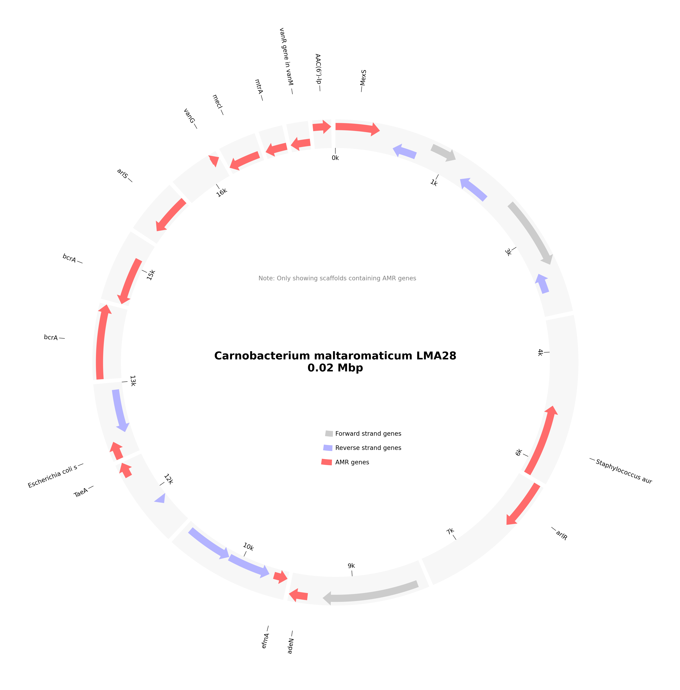

### AAC(6')-Ip
- **Mechanism**: antibiotic inactivation
- **Drug Classes**: aminoglycoside antibiotic
- **AMR Family**: AAC(6')
- **Locations**:
  - gnl|SPADES|PLIJBHFI_37172_1 : position 1-231

### Escherichia coli soxS with mutation conferring antibiotic resistance
- **Mechanism**: antibiotic target alteration; antibiotic efflux; reduced permeability to antibiotic
- **Drug Classes**: fluoroquinolone antibiotic; monobactam; carbapenem; cephalosporin; glycylcycline; cephamycin; penam; tetracycline antibiotic; rifamycin antibiotic; phenicol antibiotic; penem; disinfecting agents and antiseptics
- **AMR Family**: ATP-binding cassette (ABC) antibiotic efflux pump; major facilitator superfamily (MFS) antibiotic efflux pump; resistance-nodulation-cell division (RND) antibiotic efflux pump; General Bacterial Porin with reduced permeability to beta-lactams
- **Locations**:
  - gnl|SPADES|PLIJBHFI_8032_1 : position 3-230

### MexS
- **Mechanism**: antibiotic efflux
- **Drug Classes**: fluoroquinolone antibiotic; diaminopyrimidine antibiotic; phenicol antibiotic
- **AMR Family**: resistance-nodulation-cell division (RND) antibiotic efflux pump
- **Locations**:
  - gnl|SPADES|PLIJBHFI_1574_1 : position 2-559

### Staphylococcus aureus murA with mutation conferring resistance to fosfomycin
- **Mechanism**: antibiotic target alteration
- **Drug Classes**: phosphonic acid antibiotic
- **AMR Family**: antibiotic-resistant murA transferase
- **Locations**:
  - gnl|SPADES|PLIJBHFI_3149_2 : position 1156-2121

### TaeA
- **Mechanism**: antibiotic efflux
- **Drug Classes**: pleuromutilin antibiotic
- **AMR Family**: ATP-binding cassette (ABC) antibiotic efflux pump
- **Locations**:
  - gnl|SPADES|PLIJBHFI_6975_2 : position 909-1100

### adeN
- **Mechanism**: antibiotic efflux
- **Drug Classes**: macrolide antibiotic; fluoroquinolone antibiotic; lincosamide antibiotic; carbapenem; cephalosporin; tetracycline antibiotic; rifamycin antibiotic; diaminopyrimidine antibiotic; phenicol antibiotic; penem
- **AMR Family**: resistance-nodulation-cell division (RND) antibiotic efflux pump
- **Locations**:
  - gnl|SPADES|PLIJBHFI_3995_2 : position 1515-1751

### arlR
- **Mechanism**: antibiotic efflux
- **Drug Classes**: fluoroquinolone antibiotic; disinfecting agents and antiseptics
- **AMR Family**: major facilitator superfamily (MFS) antibiotic efflux pump
- **Locations**:
  - gnl|SPADES|PLIJBHFI_3845_1 : position 3-638

### arlS
- **Mechanism**: antibiotic efflux
- **Drug Classes**: fluoroquinolone antibiotic; disinfecting agents and antiseptics
- **AMR Family**: major facilitator superfamily (MFS) antibiotic efflux pump
- **Locations**:
  - gnl|SPADES|PLIJBHFI_11833_1 : position 138-683

### bcrA (found in 2 locations)
- **Mechanism**: antibiotic efflux
- **Drug Classes**: peptide antibiotic
- **AMR Family**: ATP-binding cassette (ABC) antibiotic efflux pump
- **Locations**:
  - gnl|SPADES|PLIJBHFI_8338_1 : position 3-944
  - gnl|SPADES|PLIJBHFI_8914_1 : position 1-636

### efmA
- **Mechanism**: antibiotic efflux
- **Drug Classes**: macrolide antibiotic; fluoroquinolone antibiotic
- **AMR Family**: major facilitator superfamily (MFS) antibiotic efflux pump
- **Locations**:
  - gnl|SPADES|PLIJBHFI_4660_1 : position 3-188

### mecI
- **Mechanism**: antibiotic target replacement
- **Drug Classes**: penam
- **AMR Family**: methicillin resistant PBP2
- **Locations**:
  - gnl|SPADES|PLIJBHFI_17470_1 : position 2-427

### mtrA
- **Mechanism**: antibiotic efflux
- **Drug Classes**: macrolide antibiotic; penam
- **AMR Family**: resistance-nodulation-cell division (RND) antibiotic efflux pump
- **Locations**:
  - gnl|SPADES|PLIJBHFI_27013_1 : position 3-293

### vanG
- **Mechanism**: antibiotic target alteration
- **Drug Classes**: glycopeptide antibiotic
- **AMR Family**: glycopeptide resistance gene cluster; Van ligase
- **Locations**:
  - gnl|SPADES|PLIJBHFI_12728_2 : position 531-641

### vanR gene in vanM cluster
- **Mechanism**: antibiotic target alteration
- **Drug Classes**: glycopeptide antibiotic
- **AMR Family**: glycopeptide resistance gene cluster; vanR
- **Locations**:
  - gnl|SPADES|PLIJBHFI_30776_1 : position 1-264

## Citrobacter
**Strain Statistics:**
- Total genome length: 6.1 kbp
- Total scaffolds: 48
- Scaffolds with AMR genes: 4
- Total genes annotated: 16
- Total AMR genes: 4
- Unique AMR genes: 4
- Distinct AMR mechanisms: 3
- Distinct AMR families: 4
- Distinct drug classes: 10

**Circos Plot:**

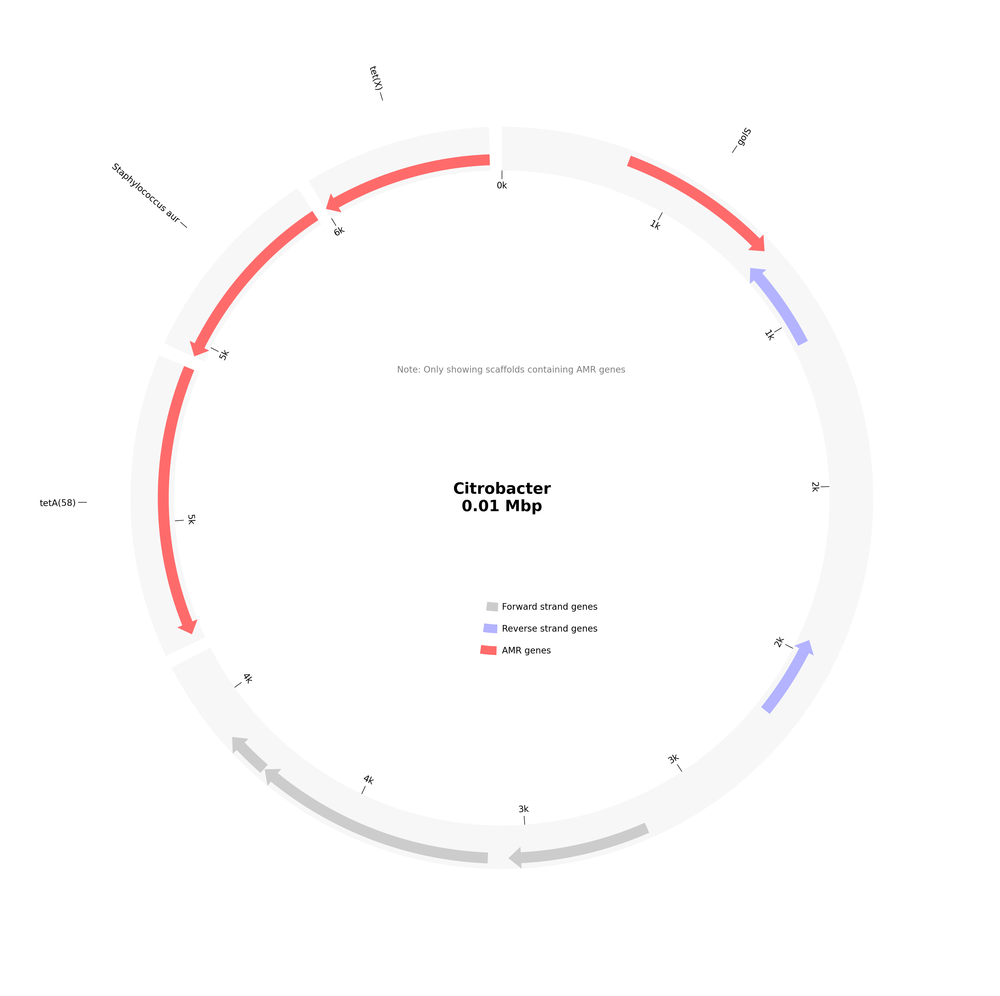

### Staphylococcus aureus mupB conferring resistance to mupirocin
- **Mechanism**: antibiotic target alteration
- **Drug Classes**: mupirocin-like antibiotic
- **AMR Family**: antibiotic-resistant isoleucyl-tRNA synthetase (ileS)
- **Locations**:
  - gnl|SPADES|PLIJBHFI_14714_1 : position 2-556

### golS
- **Mechanism**: antibiotic efflux
- **Drug Classes**: monobactam; carbapenem; cephalosporin; cephamycin; penam; phenicol antibiotic; penem
- **AMR Family**: resistance-nodulation-cell division (RND) antibiotic efflux pump
- **Locations**:
  - gnl|SPADES|PLIJBHFI_1494_2 : position 359-814

### tet(X)
- **Mechanism**: antibiotic inactivation
- **Drug Classes**: glycylcycline; tetracycline antibiotic
- **AMR Family**: tetracycline inactivation enzyme
- **Locations**:
  - gnl|SPADES|PLIJBHFI_16027_1 : position 1-510

### tetA(58)
- **Mechanism**: antibiotic efflux
- **Drug Classes**: tetracycline antibiotic
- **AMR Family**: major facilitator superfamily (MFS) antibiotic efflux pump
- **Locations**:
  - gnl|SPADES|PLIJBHFI_9594_1 : position 25-831

## Citrobacter braakii
**Strain Statistics:**
- Total genome length: 2.7 kbp
- Total scaffolds: 23
- Scaffolds with AMR genes: 1
- Total genes annotated: 8
- Total AMR genes: 1
- Unique AMR genes: 1
- Distinct AMR mechanisms: 1
- Distinct AMR families: 1
- Distinct drug classes: 6

**Circos Plot:**

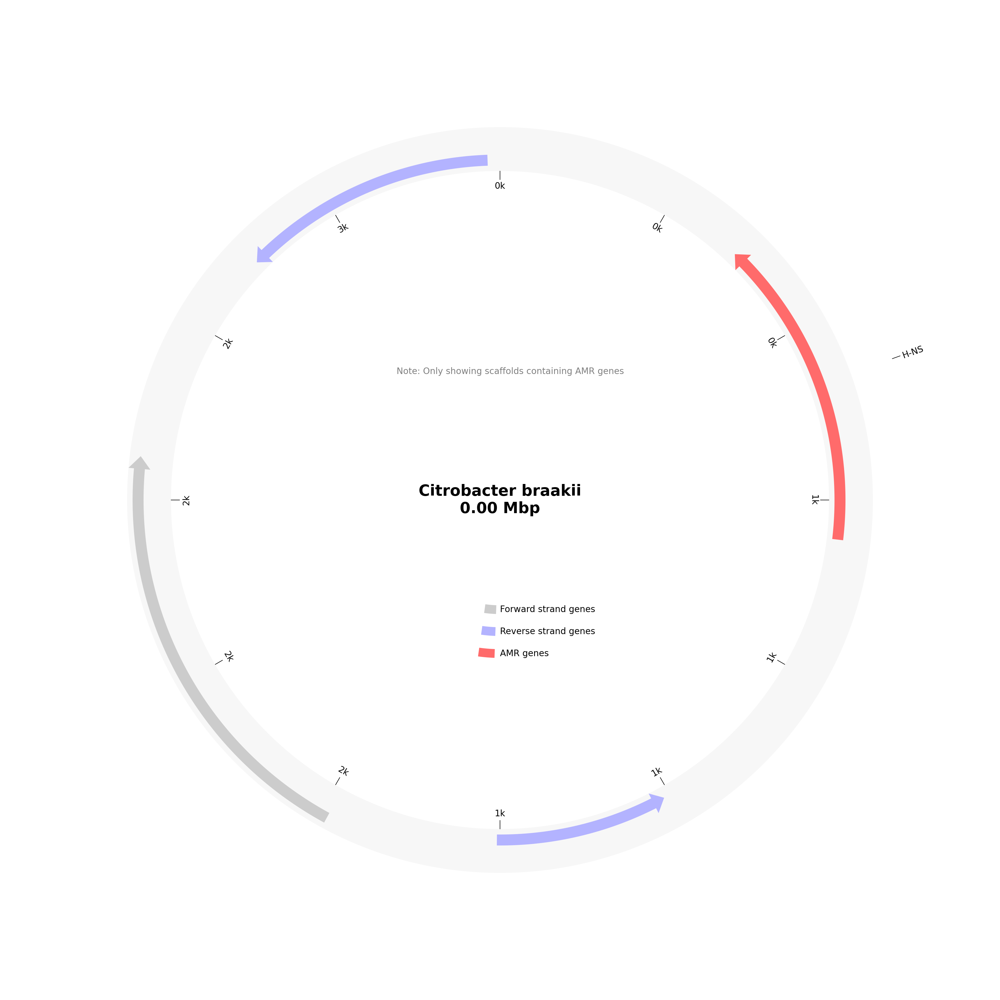

### H-NS
- **Mechanism**: antibiotic efflux
- **Drug Classes**: macrolide antibiotic; fluoroquinolone antibiotic; cephalosporin; cephamycin; penam; tetracycline antibiotic
- **AMR Family**: major facilitator superfamily (MFS) antibiotic efflux pump; resistance-nodulation-cell division (RND) antibiotic efflux pump
- **Locations**:
  - gnl|SPADES|PLIJBHFI_2334_2 : position 333-737

## Citrobacter freundii
**Strain Statistics:**
- Total genome length: 15.1 kbp
- Total scaffolds: 152
- Scaffolds with AMR genes: 3
- Total genes annotated: 32
- Total AMR genes: 3
- Unique AMR genes: 3
- Distinct AMR mechanisms: 2
- Distinct AMR families: 3
- Distinct drug classes: 3

**Circos Plot:**

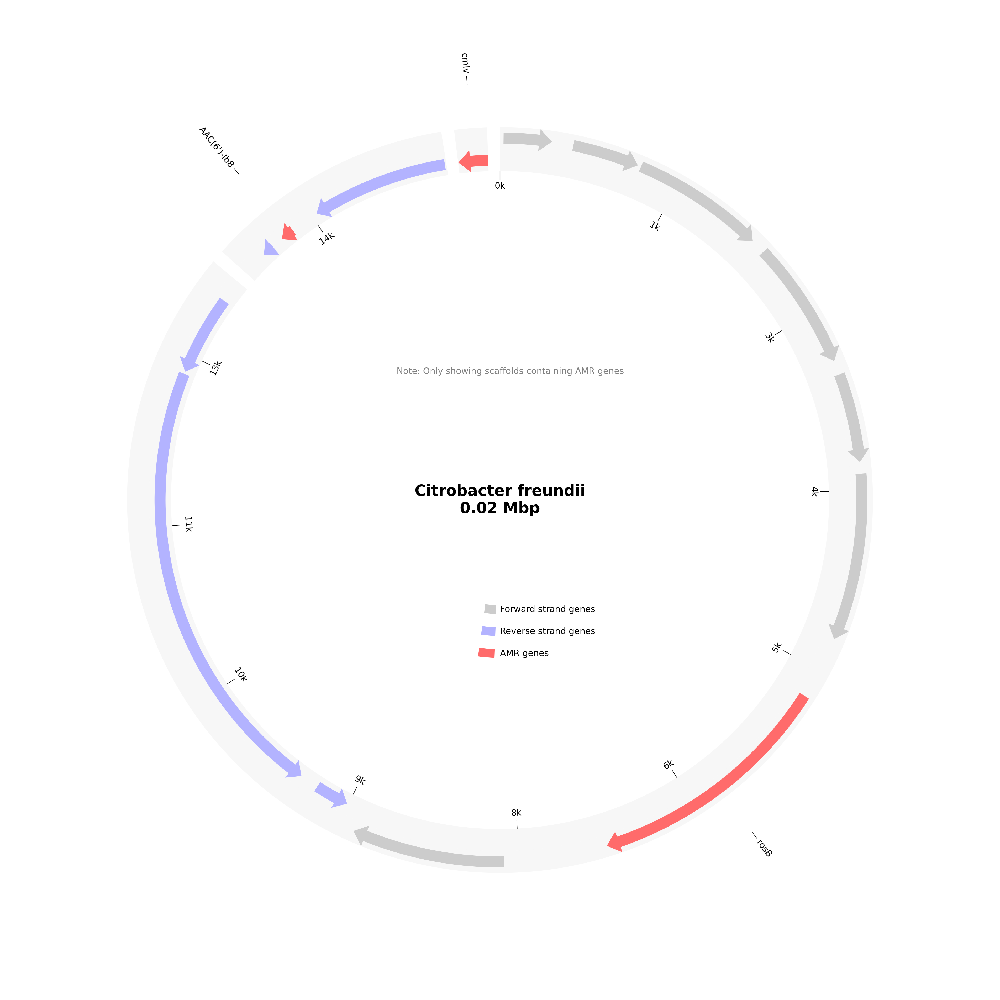

### AAC(6')-Ib8
- **Mechanism**: antibiotic inactivation
- **Drug Classes**: aminoglycoside antibiotic
- **AMR Family**: AAC(6')
- **Locations**:
  - gnl|SPADES|PLIJBHFI_4219_2 : position 356-457

### cmlv
- **Mechanism**: antibiotic inactivation
- **Drug Classes**: phenicol antibiotic
- **AMR Family**: chloramphenicol phosphotransferase
- **Locations**:
  - gnl|SPADES|PLIJBHFI_40040_1 : position 2-217

### rosB
- **Mechanism**: antibiotic efflux
- **Drug Classes**: peptide antibiotic
- **AMR Family**: major facilitator superfamily (MFS) antibiotic efflux pump
- **Locations**:
  - gnl|SPADES|PLIJBHFI_662_8 : position 5252-6967

## Citrobacter freundii complex
**Strain Statistics:**
- Total genome length: 1.7 kbp
- Total scaffolds: 15
- Scaffolds with AMR genes: 1
- Total genes annotated: 4
- Total AMR genes: 1
- Unique AMR genes: 1
- Distinct AMR mechanisms: 1
- Distinct AMR families: 1
- Distinct drug classes: 1

**Circos Plot:**

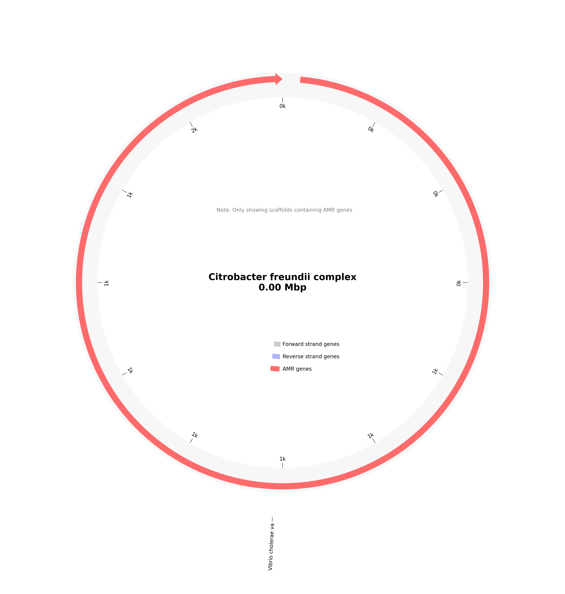

### Vibrio cholerae varG
- **Mechanism**: antibiotic inactivation
- **Drug Classes**: carbapenem
- **AMR Family**: Subclass B1 Vibrio cholerae varG beta-lactamase
- **Locations**:
  - gnl|SPADES|PLIJBHFI_4034_1 : position 24-1736

## Citrobacter pasteurii
**Strain Statistics:**
- Total genome length: 38.7 kbp
- Total scaffolds: 7
- Scaffolds with AMR genes: 2
- Total genes annotated: 68
- Total AMR genes: 3
- Unique AMR genes: 3
- Distinct AMR mechanisms: 2
- Distinct AMR families: 3
- Distinct drug classes: 3

**Circos Plot:**

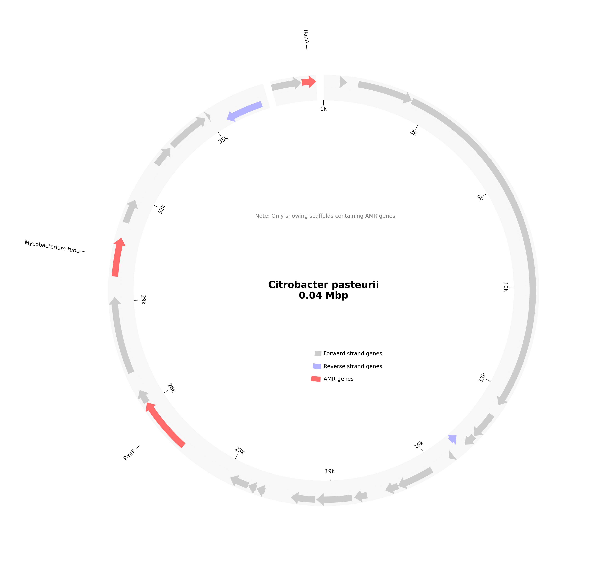

### Mycobacterium tuberculosis kasA mutant conferring resistance to isoniazid
- **Mechanism**: antibiotic target alteration
- **Drug Classes**: isoniazid-like antibiotic
- **AMR Family**: antibiotic resistant kasA
- **Locations**:
  - gnl|SPADES|PLIJBHFI_252_26 : position 29737-30906

### PmrF
- **Mechanism**: antibiotic target alteration
- **Drug Classes**: peptide antibiotic
- **AMR Family**: pmr phosphoethanolamine transferase
- **Locations**:
  - gnl|SPADES|PLIJBHFI_252_21 : position 24118-25809

### RanA
- **Mechanism**: antibiotic efflux
- **Drug Classes**: aminoglycoside antibiotic
- **AMR Family**: ATP-binding cassette (ABC) antibiotic efflux pump
- **Locations**:
  - gnl|SPADES|PLIJBHFI_5521_2 : position 908-1342

## Citrobacter rodentium
**Strain Statistics:**
- Total genome length: 1.2 kbp
- Total scaffolds: 4
- Scaffolds with AMR genes: 1
- Total genes annotated: 2
- Total AMR genes: 1
- Unique AMR genes: 1
- Distinct AMR mechanisms: 1
- Distinct AMR families: 1
- Distinct drug classes: 2

**Circos Plot:**

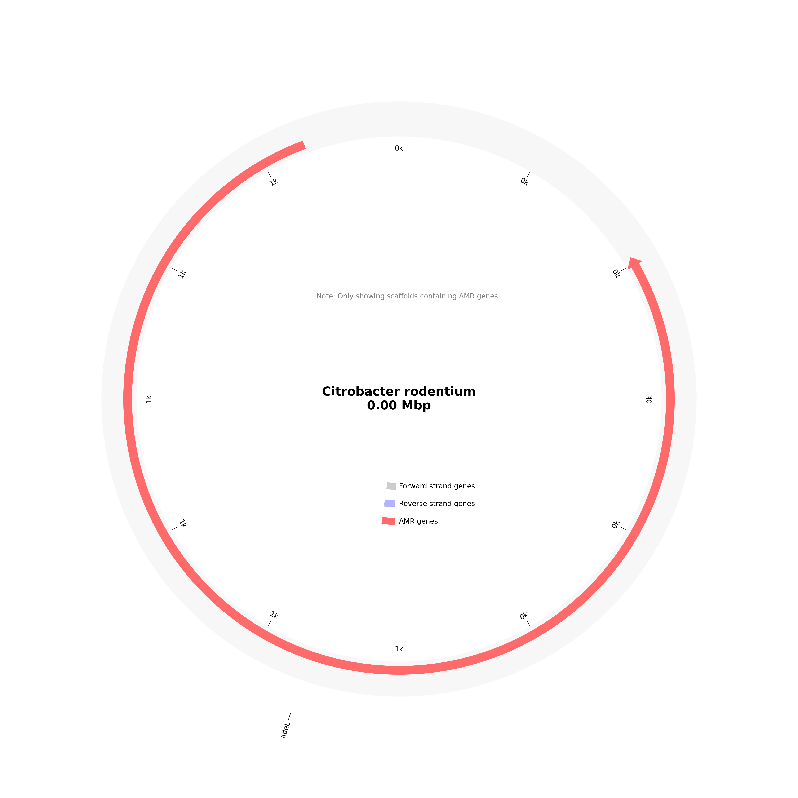

### adeL
- **Mechanism**: antibiotic efflux
- **Drug Classes**: fluoroquinolone antibiotic; tetracycline antibiotic
- **AMR Family**: resistance-nodulation-cell division (RND) antibiotic efflux pump
- **Locations**:
  - gnl|SPADES|PLIJBHFI_6553_1 : position 189-1097

## Citrobacter sp. 21OH12SH02A-Citro
**Strain Statistics:**
- Total genome length: 38.0 kbp
- Total scaffolds: 1
- Scaffolds with AMR genes: 1
- Total genes annotated: 82
- Total AMR genes: 3
- Unique AMR genes: 3
- Distinct AMR mechanisms: 1
- Distinct AMR families: 2
- Distinct drug classes: 6

**Circos Plot:**

### H-NS
- **Mechanism**: antibiotic efflux
- **Drug Classes**: macrolide antibiotic; fluoroquinolone antibiotic; cephalosporin; cephamycin; penam; tetracycline antibiotic
- **AMR Family**: major facilitator superfamily (MFS) antibiotic efflux pump; resistance-nodulation-cell division (RND) antibiotic efflux pump
- **Locations**:
  - gnl|SPADES|PLIJBHFI_250_16 : position 17416-17808

### evgS
- **Mechanism**: antibiotic efflux
- **Drug Classes**: macrolide antibiotic; fluoroquinolone antibiotic; penam; tetracycline antibiotic
- **AMR Family**: major facilitator superfamily (MFS) antibiotic efflux pump; resistance-nodulation-cell division (RND) antibiotic efflux pump
- **Locations**:
  - gnl|SPADES|PLIJBHFI_250_38 : position 34473-36191

### tetA(60)
- **Mechanism**: antibiotic efflux
- **Drug Classes**: tetracycline antibiotic
- **AMR Family**: ATP-binding cassette (ABC) antibiotic efflux pump
- **Locations**:
  - gnl|SPADES|PLIJBHFI_250_22 : position 21445-22494

## Citrobacter sp. RHBSTW-00424
**Strain Statistics:**
- Total genome length: 2.3 kbp
- Total scaffolds: 1
- Scaffolds with AMR genes: 1
- Total genes annotated: 6
- Total AMR genes: 1
- Unique AMR genes: 1
- Distinct AMR mechanisms: 1
- Distinct AMR families: 1
- Distinct drug classes: 1

**Circos Plot:**

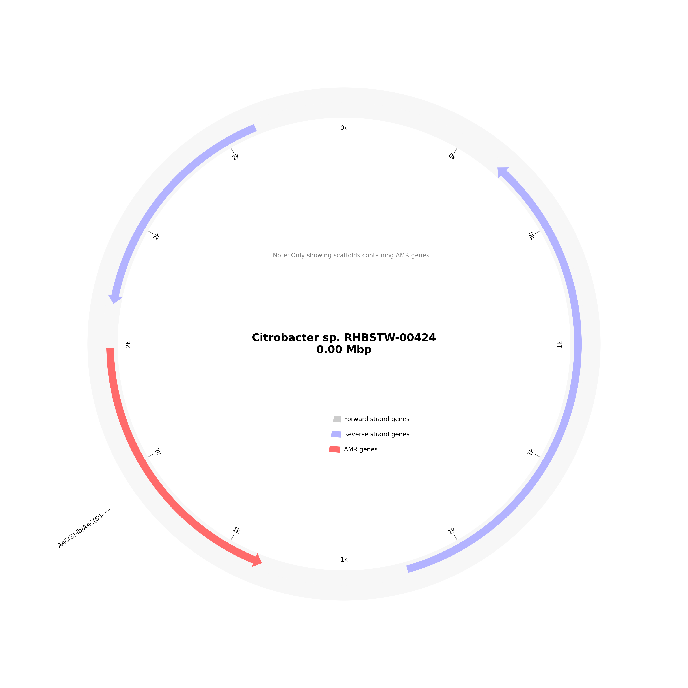

### AAC(3)-Ib/AAC(6')-Ib3 bifunctional protein
- **Mechanism**: antibiotic inactivation
- **Drug Classes**: aminoglycoside antibiotic
- **AMR Family**: aminoglycoside bifunctional resistance protein
- **Locations**:
  - gnl|SPADES|PLIJBHFI_2809_2 : position 1296-1739

## Citrobacter werkmanii
**Strain Statistics:**
- Total genome length: 39.8 kbp
- Total scaffolds: 8
- Scaffolds with AMR genes: 3
- Total genes annotated: 82
- Total AMR genes: 6
- Unique AMR genes: 6
- Distinct AMR mechanisms: 3
- Distinct AMR families: 5
- Distinct drug classes: 11

**Circos Plot:**

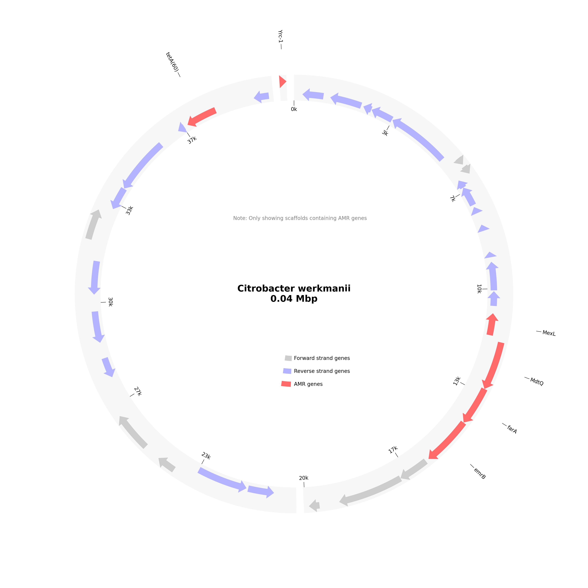

### MdtQ
- **Mechanism**: reduced permeability to antibiotic
- **Drug Classes**: monobactam; carbapenem; cephalosporin; cephamycin; penam; penem
- **AMR Family**: Outer Membrane Porin (Opr)
- **Locations**:
  - gnl|SPADES|PLIJBHFI_465_17 : position 11608-13107

### MexL
- **Mechanism**: antibiotic efflux
- **Drug Classes**: macrolide antibiotic; tetracycline antibiotic; disinfecting agents and antiseptics
- **AMR Family**: resistance-nodulation-cell division (RND) antibiotic efflux pump
- **Locations**:
  - gnl|SPADES|PLIJBHFI_465_16 : position 10748-11461

### Yrc-1
- **Mechanism**: antibiotic inactivation
- **Drug Classes**: cephalosporin; cephamycin; penam
- **AMR Family**: YRC Beta-lactamase
- **Locations**:
  - gnl|SPADES|PLIJBHFI_39618_1 : position 3-218

### emrB
- **Mechanism**: antibiotic efflux
- **Drug Classes**: fluoroquinolone antibiotic
- **AMR Family**: major facilitator superfamily (MFS) antibiotic efflux pump
- **Locations**:
  - gnl|SPADES|PLIJBHFI_465_19 : position 14310-15842

### farA
- **Mechanism**: antibiotic efflux
- **Drug Classes**: antibacterial free fatty acids
- **AMR Family**: major facilitator superfamily (MFS) antibiotic efflux pump
- **Locations**:
  - gnl|SPADES|PLIJBHFI_465_18 : position 13107-14306

### tetA(60)
- **Mechanism**: antibiotic efflux
- **Drug Classes**: tetracycline antibiotic
- **AMR Family**: ATP-binding cassette (ABC) antibiotic efflux pump
- **Locations**:
  - gnl|SPADES|PLIJBHFI_473_15 : position 16702-17721

## Enterobacter hormaechei
**Strain Statistics:**
- Total genome length: 1.7 kbp
- Total scaffolds: 52
- Scaffolds with AMR genes: 1
- Total genes annotated: 0
- Total AMR genes: 1
- Unique AMR genes: 1
- Distinct AMR mechanisms: 1
- Distinct AMR families: 1
- Distinct drug classes: 1

**Circos Plot:**

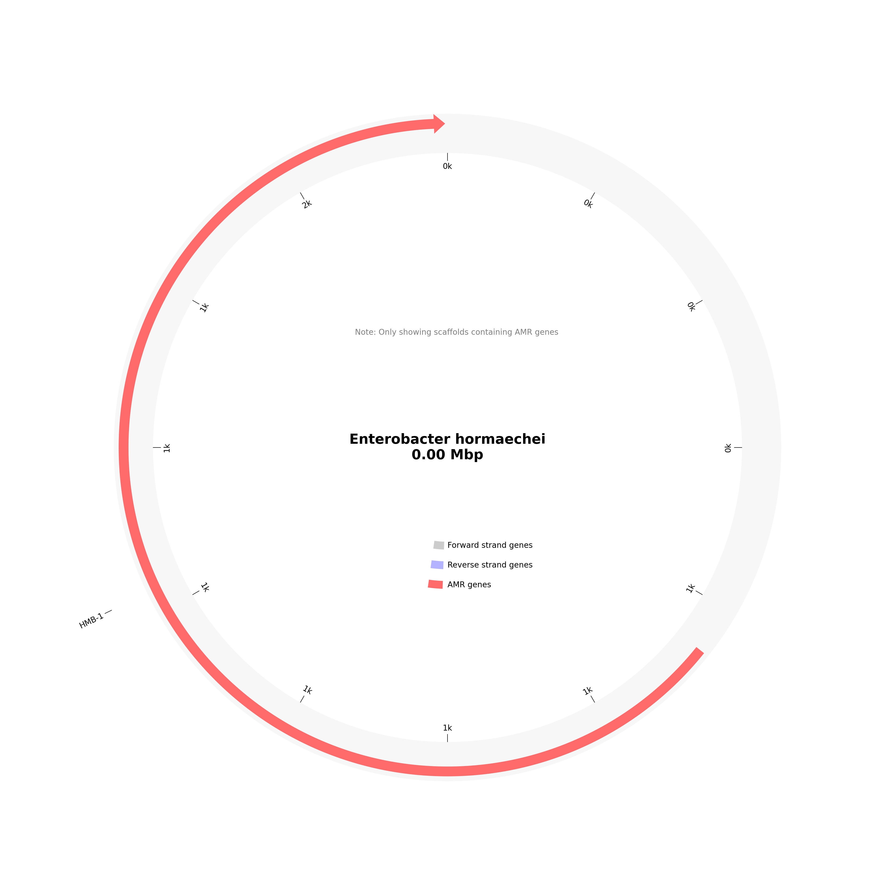

### HMB-1
- **Mechanism**: antibiotic inactivation
- **Drug Classes**: carbapenem
- **AMR Family**: HMB beta-lactamase
- **Locations**:
  - gnl|SPADES|PLIJBHFI_4072_2 : position 615-1718

## Escherichia coli
**Strain Statistics:**
- Total genome length: 21.0 kbp
- Total scaffolds: 65
- Scaffolds with AMR genes: 5
- Total genes annotated: 50
- Total AMR genes: 5
- Unique AMR genes: 5
- Distinct AMR mechanisms: 3
- Distinct AMR families: 5
- Distinct drug classes: 9

**Circos Plot:**

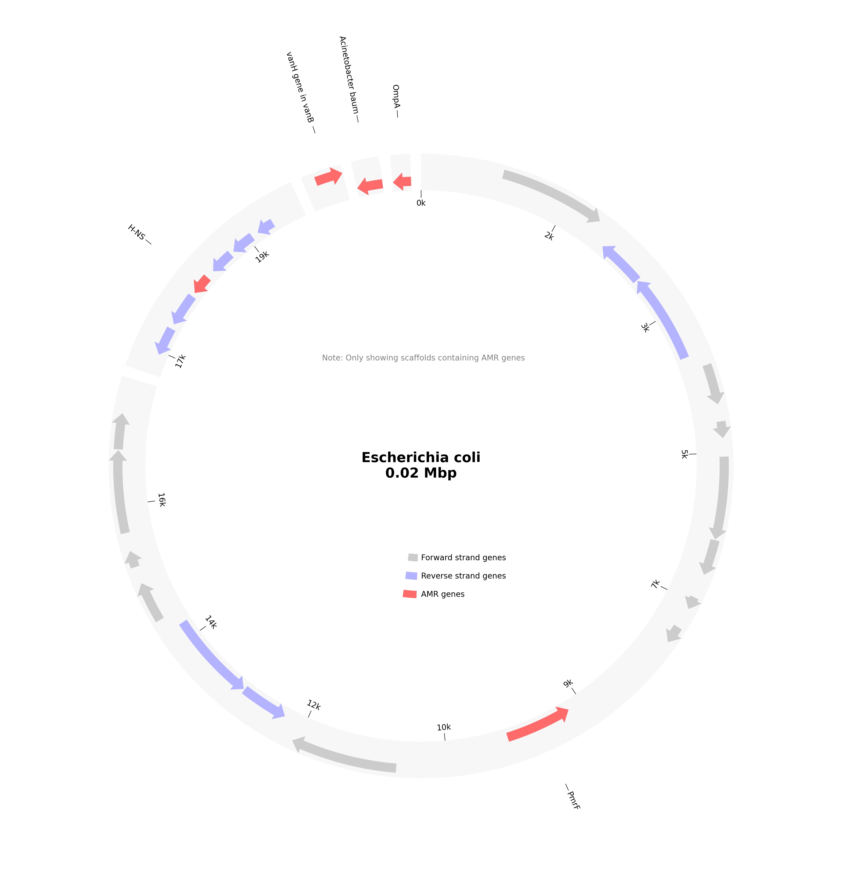

### Acinetobacter baumannii AbaF
- **Mechanism**: antibiotic efflux
- **Drug Classes**: phosphonic acid antibiotic
- **AMR Family**: major facilitator superfamily (MFS) antibiotic efflux pump
- **Locations**:
  - gnl|SPADES|PLIJBHFI_25400_1 : position 2-313

### H-NS
- **Mechanism**: antibiotic efflux
- **Drug Classes**: macrolide antibiotic; fluoroquinolone antibiotic; cephalosporin; cephamycin; penam; tetracycline antibiotic
- **AMR Family**: major facilitator superfamily (MFS) antibiotic efflux pump; resistance-nodulation-cell division (RND) antibiotic efflux pump
- **Locations**:
  - gnl|SPADES|PLIJBHFI_2294_4 : position 1117-1359

### OmpA
- **Mechanism**: reduced permeability to antibiotic
- **Drug Classes**: peptide antibiotic
- **AMR Family**: General Bacterial Porin with reduced permeability to peptide antibiotics
- **Locations**:
  - gnl|SPADES|PLIJBHFI_38498_1 : position 3-224

### PmrF
- **Mechanism**: antibiotic target alteration
- **Drug Classes**: peptide antibiotic
- **AMR Family**: pmr phosphoethanolamine transferase
- **Locations**:
  - gnl|SPADES|PLIJBHFI_536_9 : position 8923-9732

### vanH gene in vanB cluster
- **Mechanism**: antibiotic target alteration
- **Drug Classes**: glycopeptide antibiotic
- **AMR Family**: vanH; glycopeptide resistance gene cluster
- **Locations**:
  - gnl|SPADES|PLIJBHFI_17799_1 : position 140-457

## Ewingella americana
**Strain Statistics:**
- Total genome length: 861.1 kbp
- Total scaffolds: 3301
- Scaffolds with AMR genes: 504
- Total genes annotated: 1871
- Total AMR genes: 585
- Unique AMR genes: 230
- Distinct AMR mechanisms: 12
- Distinct AMR families: 75
- Distinct drug classes: 37

**Circos Plot:**

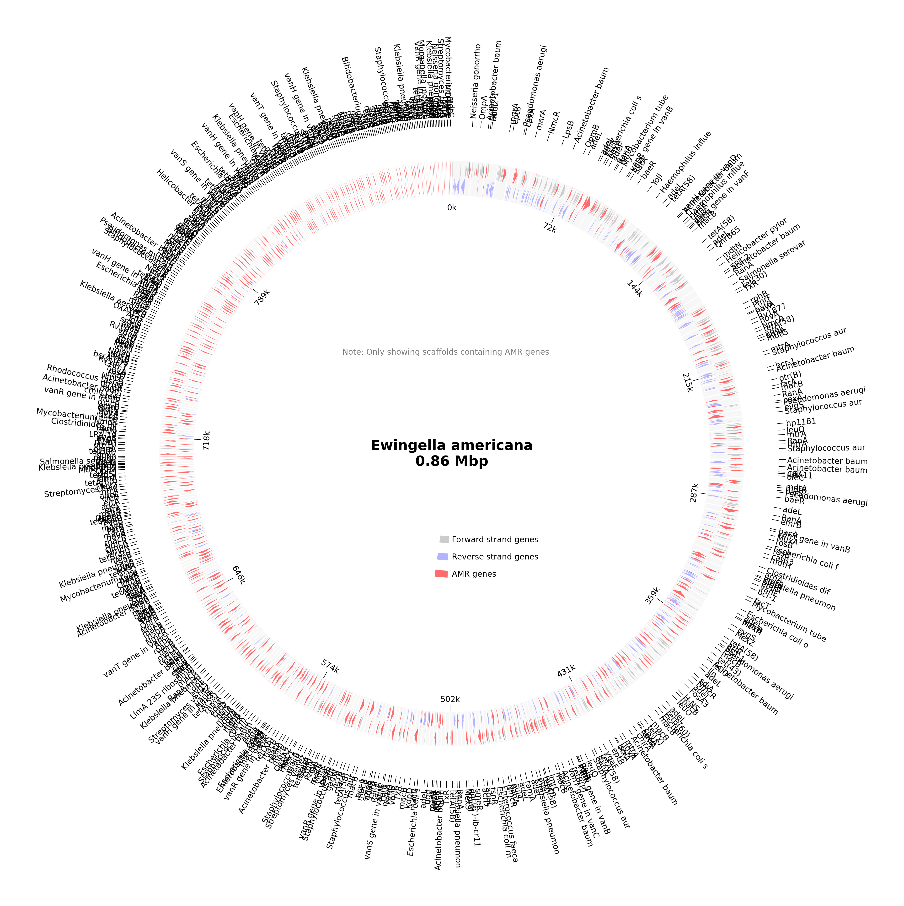

### Acinetobacter baumannii AbaF (found in 7 locations)
- **Mechanism**: antibiotic efflux
- **Drug Classes**: phosphonic acid antibiotic
- **AMR Family**: major facilitator superfamily (MFS) antibiotic efflux pump
- **Locations**:
  - gnl|SPADES|PLIJBHFI_1150_6 : position 4788-5825
  - gnl|SPADES|PLIJBHFI_1726_1 : position 341-1663
  - gnl|SPADES|PLIJBHFI_1838_3 : position 2323-3432
  - gnl|SPADES|PLIJBHFI_3010_3 : position 1365-2201
  - gnl|SPADES|PLIJBHFI_4258_2 : position 610-1662
  - gnl|SPADES|PLIJBHFI_5107_3 : position 946-1431
  - gnl|SPADES|PLIJBHFI_7217_2 : position 664-1071

### Acinetobacter baumannii AbaQ (found in 10 locations)
- **Mechanism**: antibiotic efflux
- **Drug Classes**: fluoroquinolone antibiotic
- **AMR Family**: major facilitator superfamily (MFS) antibiotic efflux pump
- **Locations**:
  - gnl|SPADES|PLIJBHFI_1394_7 : position 4320-4517
  - gnl|SPADES|PLIJBHFI_1538_2 : position 1140-2369
  - gnl|SPADES|PLIJBHFI_1834_3 : position 2380-3441
  - gnl|SPADES|PLIJBHFI_2285_1 : position 2-1027
  - gnl|SPADES|PLIJBHFI_2638_1 : position 2-1132
  - gnl|SPADES|PLIJBHFI_3438_3 : position 1563-1982
  - gnl|SPADES|PLIJBHFI_4096_2 : position 789-1715
  - gnl|SPADES|PLIJBHFI_4719_2 : position 211-1521
  - gnl|SPADES|PLIJBHFI_901_10 : position 7608-8345
  - gnl|SPADES|PLIJBHFI_9434_2 : position 667-843

### ArnT (found in 2 locations)
- **Mechanism**: antibiotic target alteration
- **Drug Classes**: peptide antibiotic
- **AMR Family**: pmr phosphoethanolamine transferase
- **Locations**:
  - gnl|SPADES|PLIJBHFI_4809_2: position 435-1502
  - gnl|SPADES|PLIJBHFI_8014_2 : position 359-976

### Bifidobacterium adolescentis rpoB mutants conferring resistance to rifampicin (found in 2 locations)
- **Mechanism**: antibiotic target alteration; antibiotic target replacement
- **Drug Classes**: rifamycin antibiotic
- **AMR Family**: rifamycin-resistant beta-subunit of RNA polymerase (rpoB)
- **Locations**:
  - gnl|SPADES|PLIJBHFI_18830_1 : position 1-432
  - gnl|SPADES|PLIJBHFI_9065_1 : position 1-522

### CAR-1
- **Mechanism**: antibiotic inactivation
- **Drug Classes**: carbapenem
- **AMR Family**: CAR beta-lactamase
- **Locations**:
  - gnl|SPADES|PLIJBHFI_7358_2 : position 474-1055

### CRP
- **Mechanism**: antibiotic efflux
- **Drug Classes**: macrolide antibiotic; fluoroquinolone antibiotic; penam
- **AMR Family**: resistance-nodulation-cell division (RND) antibiotic efflux pump
- **Locations**:
  - gnl|SPADES|PLIJBHFI_11967_1 : position 72-677

### CfiA11
- **Mechanism**: antibiotic inactivation
- **Drug Classes**: carbapenem
- **AMR Family**: CfiA beta-lactamase
- **Locations**:
  - gnl|SPADES|PLIJBHFI_1853_5 : position 2361-3200

### Clostridioides difficile gyrB conferring resistance to fluoroquinolones (found in 2 locations)
- **Mechanism**: antibiotic target alteration
- **Drug Classes**: fluoroquinolone antibiotic
- **AMR Family**: fluoroquinolone resistant gyrB
- **Locations**:
  - gnl|SPADES|PLIJBHFI_1987_4 : position 1846-3198
  - gnl|SPADES|PLIJBHFI_6869_1 : position 3-1112

### CrcB
- **Mechanism**: antibiotic efflux
- **Drug Classes**: aminoglycoside antibiotic
- **AMR Family**: multidrug and toxic compound extrusion (MATE) transporter
- **Locations**:
  - gnl|SPADES|PLIJBHFI_13734_1 : position 3-443

### DHT2-1
- **Mechanism**: antibiotic inactivation
- **Drug Classes**: carbapenem
- **AMR Family**: DHT2 beta-lactamase
- **Locations**:
  - gnl|SPADES|PLIJBHFI_956_1 : position 1-306

### Enterobacter cloacae acrA
- **Mechanism**: antibiotic efflux
- **Drug Classes**: fluoroquinolone antibiotic; cephalosporin; glycylcycline; penam; tetracycline antibiotic; rifamycin antibiotic; phenicol antibiotic; disinfecting agents and antiseptics
- **AMR Family**: resistance-nodulation-cell division (RND) antibiotic efflux pump
- **Locations**:
  - gnl|SPADES|PLIJBHFI_4209_2 : position 127-1338

### Enterococcus faecalis cls with mutation conferring resistance to daptomycin
- **Mechanism**: antibiotic target alteration
- **Drug Classes**: peptide antibiotic
- **AMR Family**: daptomycin resistant cls
- **Locations**:
  - gnl|SPADES|PLIJBHFI_3219_1 : position 3-1427

### ErmX
- **Mechanism**: antibiotic target alteration
- **Drug Classes**: macrolide antibiotic; lincosamide antibiotic; streptogramin antibiotic; streptogramin A antibiotic; streptogramin B antibiotic
- **AMR Family**: Erm 23S ribosomal RNA methyltransferase
- **Locations**:
  - gnl|SPADES|PLIJBHFI_15862_1 : position 2-514

### Escherichia coli AcrAB-TolC with AcrR mutation conferring resistance to ciprofloxacin, tetracycline, and ceftazidime (found in 3 locations)
- **Mechanism**: antibiotic target alteration; antibiotic efflux
- **Drug Classes**: fluoroquinolone antibiotic; cephalosporin; glycylcycline; penam; tetracycline antibiotic; rifamycin antibiotic; phenicol antibiotic; disinfecting agents and antiseptics
- **AMR Family**: resistance-nodulation-cell division (RND) antibiotic efflux pump
- **Locations**:
  - gnl|SPADES|PLIJBHFI_11987_2 : position 432-677
  - gnl|SPADES|PLIJBHFI_13263_1 : position 78-614
  - gnl|SPADES|PLIJBHFI_4209_3 : position 1384-1677

### Escherichia coli fabI mutations conferring resistance to isoniazid and triclosan (found in 2 locations)
- **Mechanism**: antibiotic target alteration
- **Drug Classes**: disinfecting agents and antiseptics; isoniazid-like antibiotic
- **AMR Family**: antibiotic resistant fabI
- **Locations**:
  - gnl|SPADES|PLIJBHFI_1956_3 : position 1297-2043
  - gnl|SPADES|PLIJBHFI_8610_2 : position 273-773

### Escherichia coli mdfA (found in 2 locations)
- **Mechanism**: antibiotic efflux
- **Drug Classes**: tetracycline antibiotic; phenicol antibiotic; disinfecting agents and antiseptics
- **AMR Family**: major facilitator superfamily (MFS) antibiotic efflux pump
- **Locations**:
  - gnl|SPADES|PLIJBHFI_3221_1 : position 1-1197
  - gnl|SPADES|PLIJBHFI_4292_1 : position 289-1527

### Escherichia coli ompF with mutation conferring resistance to beta-lactam antibiotics
- **Mechanism**: reduced permeability to antibiotic
- **Drug Classes**: monobactam; carbapenem; cephalosporin; cephamycin; penam; penem
- **AMR Family**: General Bacterial Porin with reduced permeability to beta-lactams
- **Locations**:
  - gnl|SPADES|PLIJBHFI_2039_3 : position 2331-3122

### Escherichia coli soxS with mutation conferring antibiotic resistance (found in 3 locations)
- **Mechanism**: antibiotic target alteration; antibiotic efflux; reduced permeability to antibiotic
- **Drug Classes**: fluoroquinolone antibiotic; monobactam; carbapenem; cephalosporin; glycylcycline; cephamycin; penam; tetracycline antibiotic; rifamycin antibiotic; phenicol antibiotic; penem; disinfecting agents and antiseptics
- **AMR Family**: ATP-binding cassette (ABC) antibiotic efflux pump; major facilitator superfamily (MFS) antibiotic efflux pump; resistance-nodulation-cell division (RND) antibiotic efflux pump; General Bacterial Porin with reduced permeability to beta-lactams
- **Locations**:
  - gnl|SPADES|PLIJBHFI_1218_1 : position 66-425
  - gnl|SPADES|PLIJBHFI_2501_3 : position 1018-1884
  - gnl|SPADES|PLIJBHFI_3508_3 : position 1701-1955

### EstT (found in 2 locations)
- **Mechanism**: antibiotic inactivation
- **Drug Classes**: macrolide antibiotic
- **AMR Family**: macrolide esterase
- **Locations**:
  - gnl|SPADES|PLIJBHFI_12444_1 : position 2-655
  - gnl|SPADES|PLIJBHFI_8861_2 : position 474-896

### FosA3
- **Mechanism**: antibiotic inactivation
- **Drug Classes**: phosphonic acid antibiotic
- **AMR Family**: fosfomycin thiol transferase
- **Locations**:
  - gnl|SPADES|PLIJBHFI_2391_2 : position 638-1063

### FosA8
- **Mechanism**: antibiotic inactivation
- **Drug Classes**: phosphonic acid antibiotic
- **AMR Family**: fosfomycin thiol transferase
- **Locations**:
  - gnl|SPADES|PLIJBHFI_17128_1: position 1-369

### H-NS
- **Mechanism**: antibiotic efflux
- **Drug Classes**: macrolide antibiotic; fluoroquinolone antibiotic; cephalosporin; cephamycin; penam; tetracycline antibiotic
- **AMR Family**: major facilitator superfamily (MFS) antibiotic efflux pump; resistance-nodulation-cell division (RND) antibiotic efflux pump
- **Locations**:
  - gnl|SPADES|PLIJBHFI_2398_3 : position 2297-2671

### Haemophilus influenzae PBP3 conferring resistance to beta-lactam antibiotics (found in 2 locations)
- **Mechanism**: antibiotic target alteration
- **Drug Classes**: cephalosporin; cephamycin; penam
- **AMR Family**: Penicillin-binding protein mutations conferring resistance to beta-lactam antibiotics
- **Locations**:
  - gnl|SPADES|PLIJBHFI_1378_4 : position 1886-3649
  - gnl|SPADES|PLIJBHFI_1409_4 : position 1940-3715

### Helicobacter pylori pbp1 mutants conferring resistance to amoxicillin
- **Mechanism**: antibiotic target alteration
- **Drug Classes**: cephalosporin; cephamycin; penam
- **AMR Family**: Penicillin-binding protein mutations conferring resistance to beta-lactam antibiotics
- **Locations**:
  - gnl|SPADES|PLIJBHFI_1526_1 : position 2-1906

### Helicobacter pylori pbp2 mutants conferring resistance to amoxicillin
- **Mechanism**: antibiotic target alteration
- **Drug Classes**: cephalosporin; cephamycin; penam
- **AMR Family**: Penicillin-binding protein mutations conferring resistance to beta-lactam antibiotics
- **Locations**:
  - gnl|SPADES|PLIJBHFI_10598_1 : position 3-521

### Klebsiella aerogenes Omp36
- **Mechanism**: reduced permeability to antibiotic
- **Drug Classes**: monobactam; carbapenem; cephalosporin; cephamycin; penam; penem
- **AMR Family**: General Bacterial Porin with reduced permeability to beta-lactams
- **Locations**:
  - gnl|SPADES|PLIJBHFI_8354_1 : position 1-636

### Klebsiella pneumoniae KpnG
- **Mechanism**: antibiotic efflux
- **Drug Classes**: macrolide antibiotic; fluoroquinolone antibiotic; aminoglycoside antibiotic; carbapenem; cephalosporin; penam; peptide antibiotic; penem
- **AMR Family**: major facilitator superfamily (MFS) antibiotic efflux pump
- **Locations**:
  - gnl|SPADES|PLIJBHFI_2003_2 : position 106-1302

### Klebsiella pneumoniae KpnH (found in 3 locations)
- **Mechanism**: antibiotic efflux
- **Drug Classes**: macrolide antibiotic; fluoroquinolone antibiotic; aminoglycoside antibiotic; carbapenem; cephalosporin; penam; peptide antibiotic; penem
- **AMR Family**: major facilitator superfamily (MFS) antibiotic efflux pump
- **Locations**:
  - gnl|SPADES|PLIJBHFI_5174_2 : position 1006-1416
  - gnl|SPADES|PLIJBHFI_5532_1 : position 1-1005
  - gnl|SPADES|PLIJBHFI_6349_1 : position 3-401

### Klebsiella pneumoniae OmpK37 (found in 8 locations)
- **Mechanism**: reduced permeability to antibiotic
- **Drug Classes**: monobactam; carbapenem; cephalosporin; cephamycin; penam; penem
- **AMR Family**: General Bacterial Porin with reduced permeability to beta-lactams
- **Locations**:
  - gnl|SPADES|PLIJBHFI_12997_1 : position 1-579
  - gnl|SPADES|PLIJBHFI_16120_1 : position 1-507
  - gnl|SPADES|PLIJBHFI_25460_1 : position 89-313
  - gnl|SPADES|PLIJBHFI_3111_1 : position 3-1073
  - gnl|SPADES|PLIJBHFI_3375_1 : position 2-220
  - gnl|SPADES|PLIJBHFI_36528_1 : position 2-232
  - gnl|SPADES|PLIJBHFI_4338_2 : position 1395-1634
  - gnl|SPADES|PLIJBHFI_4546_2 : position 1412-1570

### LRA-19
- **Mechanism**: antibiotic inactivation
- **Drug Classes**: cephalosporin; penam
- **AMR Family**: subclass B3 LRA beta-lactamase
- **Locations**:
  - gnl|SPADES|PLIJBHFI_6747_2 : position 184-831

### LlmA 23S ribosomal RNA methyltransferase
- **Mechanism**: antibiotic target alteration
- **Drug Classes**: lincosamide antibiotic
- **AMR Family**: Llm 23S ribosomal RNA methyltransferase
- **Locations**:
  - gnl|SPADES|PLIJBHFI_4670_3 : position 930-1535

### LpsB
- **Mechanism**: reduced permeability to antibiotic
- **Drug Classes**: peptide antibiotic
- **AMR Family**: Intrinsic peptide antibiotic resistant Lps
- **Locations**:
  - gnl|SPADES|PLIJBHFI_1082_6 : position 4709-5809

### LptD (found in 3 locations)
- **Mechanism**: antibiotic efflux
- **Drug Classes**: carbapenem; peptide antibiotic; aminocoumarin antibiotic; rifamycin antibiotic
- **AMR Family**: ATP-binding cassette (ABC) antibiotic efflux pump
- **Locations**:
  - gnl|SPADES|PLIJBHFI_11845_1 : position 3-683
  - gnl|SPADES|PLIJBHFI_12450_1 : position 2-652
  - gnl|SPADES|PLIJBHFI_4461_2 : position 678-1592

### MCR-10.2
- **Mechanism**: antibiotic target alteration
- **Drug Classes**: peptide antibiotic
- **AMR Family**: MCR phosphoethanolamine transferase
- **Locations**:
  - gnl|SPADES|PLIJBHFI_6350_1 : position 75-611

### MCR-9.1 (found in 2 locations)
- **Mechanism**: antibiotic target alteration
- **Drug Classes**: peptide antibiotic
- **AMR Family**: MCR phosphoethanolamine transferase
- **Locations**:
  - gnl|SPADES|PLIJBHFI_41410_1 : position 2-208
  - gnl|SPADES|PLIJBHFI_6350_2 : position 623-1192

### MdtK (found in 3 locations)
- **Mechanism**: antibiotic efflux
- **Drug Classes**: fluoroquinolone antibiotic
- **AMR Family**: multidrug and toxic compound extrusion (MATE) transporter
- **Locations**:
  - gnl|SPADES|PLIJBHFI_23879_1 : position 1-336
  - gnl|SPADES|PLIJBHFI_3902_3 : position 1064-1783
  - gnl|SPADES|PLIJBHFI_8571_2 : position 795-920

### MexH
- **Mechanism**: antibiotic efflux
- **Drug Classes**: fluoroquinolone antibiotic; tetracycline antibiotic; disinfecting agents and antiseptics
- **AMR Family**: resistance-nodulation-cell division (RND) antibiotic efflux pump
- **Locations**:
  - gnl|SPADES|PLIJBHFI_2067_2 : position 276-1517

### MexS (found in 2 locations)
- **Mechanism**: antibiotic efflux
- **Drug Classes**: fluoroquinolone antibiotic; diaminopyrimidine antibiotic; phenicol antibiotic
- **AMR Family**: resistance-nodulation-cell division (RND) antibiotic efflux pump
- **Locations**:
  - gnl|SPADES|PLIJBHFI_3335_1 : position 3-200
  - gnl|SPADES|PLIJBHFI_6541_2 : position 302-1162

### MexT
- **Mechanism**: antibiotic efflux
- **Drug Classes**: fluoroquinolone antibiotic; diaminopyrimidine antibiotic; phenicol antibiotic
- **AMR Family**: resistance-nodulation-cell division (RND) antibiotic efflux pump
- **Locations**:
  - gnl|SPADES|PLIJBHFI_4064_2 : position 231-1178

### MexW
- **Mechanism**: antibiotic efflux
- **Drug Classes**: macrolide antibiotic; fluoroquinolone antibiotic; tetracycline antibiotic; phenicol antibiotic; disinfecting agents and antiseptics
- **AMR Family**: resistance-nodulation-cell division (RND) antibiotic efflux pump
- **Locations**:
  - gnl|SPADES|PLIJBHFI_13259_1 : position 3-614

### MexZ (found in 2 locations)
- **Mechanism**: antibiotic efflux
- **Drug Classes**: macrolide antibiotic; fluoroquinolone antibiotic; aminoglycoside antibiotic; carbapenem; cephalosporin; cephamycin; penam; tetracycline antibiotic; phenicol antibiotic; disinfecting agents and antiseptics
- **AMR Family**: resistance-nodulation-cell division (RND) antibiotic efflux pump
- **Locations**:
  - gnl|SPADES|PLIJBHFI_2188_2 : position 718-1338
  - gnl|SPADES|PLIJBHFI_6259_1 : position 1-216

### Morganella morganii gyrB conferring resistance to fluoroquinolones
- **Mechanism**: antibiotic target alteration
- **Drug Classes**: fluoroquinolone antibiotic
- **AMR Family**: fluoroquinolone resistant gyrB
- **Locations**:
  - gnl|SPADES|PLIJBHFI_34445_1 : position 1-243

### MuxA
- **Mechanism**: antibiotic efflux
- **Drug Classes**: macrolide antibiotic; monobactam; tetracycline antibiotic; aminocoumarin antibiotic
- **AMR Family**: resistance-nodulation-cell division (RND) antibiotic efflux pump
- **Locations**:
  - gnl|SPADES|PLIJBHFI_1932_5 : position 2399-3283

### MuxB (found in 4 locations)
- **Mechanism**: antibiotic efflux
- **Drug Classes**: macrolide antibiotic; monobactam; tetracycline antibiotic; aminocoumarin antibiotic
- **AMR Family**: resistance-nodulation-cell division (RND) antibiotic efflux pump
- **Locations**:
  - gnl|SPADES|PLIJBHFI_11944_1 : position 2-679
  - gnl|SPADES|PLIJBHFI_22783_1 : position 3-353
  - gnl|SPADES|PLIJBHFI_36320_1 : position 3-104
  - gnl|SPADES|PLIJBHFI_9643_1 : position 3-827

### MuxC (found in 2 locations)
- **Mechanism**: antibiotic efflux
- **Drug Classes**: macrolide antibiotic; monobactam; tetracycline antibiotic; aminocoumarin antibiotic
- **AMR Family**: resistance-nodulation-cell division (RND) antibiotic efflux pump
- **Locations**:
  - gnl|SPADES|PLIJBHFI_35069_1 : position 3-242
  - gnl|SPADES|PLIJBHFI_4875_1 : position 1-1482

### Mycobacterium tuberculosis intrinsic murA conferring resistance to fosfomycin
- **Mechanism**: antibiotic target alteration
- **Drug Classes**: phosphonic acid antibiotic
- **AMR Family**: antibiotic-resistant murA transferase
- **Locations**:
  - gnl|SPADES|PLIJBHFI_1228_8 : position 4578-5255

### Mycobacterium tuberculosis kasA mutant conferring resistance to isoniazid
- **Mechanism**: antibiotic target alteration
- **Drug Classes**: isoniazid-like antibiotic
- **AMR Family**: antibiotic resistant kasA
- **Locations**:
  - gnl|SPADES|PLIJBHFI_5450_1 : position 1-537

### Mycobacterium tuberculosis katG mutations conferring resistance to isoniazid
- **Mechanism**: antibiotic target alteration
- **Drug Classes**: isoniazid-like antibiotic
- **AMR Family**: isoniazid resistant katG
- **Locations**:
  - gnl|SPADES|PLIJBHFI_41332_1 : position 1-210

### Mycobacterium tuberculosis pncA mutations conferring resistance to pyrazinamide
- **Mechanism**: antibiotic target alteration
- **Drug Classes**: pyrazine antibiotic
- **AMR Family**: Pyrazinamide resistant pncA
- **Locations**:
  - gnl|SPADES|PLIJBHFI_6924_2 : position 413-1039

### Mycobacterium tuberculosis thyA with mutation conferring resistance to para-aminosalicylic acid
- **Mechanism**: antibiotic target alteration
- **Drug Classes**: salicylic acid antibiotic
- **AMR Family**: aminosalicylate resistant thymidylate synthase
- **Locations**:
  - gnl|SPADES|PLIJBHFI_2034_1 : position 1-372

### Neisseria gonorrhoeae pilQ gene conferring resistance to beta-lactam (found in 2 locations)
- **Mechanism**: antibiotic target alteration
- **Drug Classes**: cephalosporin; cephamycin; penam
- **AMR Family**: Penicillin-binding protein mutations conferring resistance to beta-lactam antibiotics
- **Locations**:
  - gnl|SPADES|PLIJBHFI_38246_1 : position 1-225
  - gnl|SPADES|PLIJBHFI_681_11 : position 11388-12659

### NmcR (found in 13 locations)
- **Mechanism**: antibiotic inactivation
- **Drug Classes**: carbapenem; cephalosporin; cephamycin; penam
- **AMR Family**: NmcA beta-lactamase
- **Locations**:
  - gnl|SPADES|PLIJBHFI_1076_7 : position 3040-3963
  - gnl|SPADES|PLIJBHFI_1691_3 : position 1200-2099
  - gnl|SPADES|PLIJBHFI_2377_2 : position 980-1861
  - gnl|SPADES|PLIJBHFI_3201_1 : position 2-538
  - gnl|SPADES|PLIJBHFI_4495_3 : position 658-1569
  - gnl|SPADES|PLIJBHFI_4847_1 : position 349-1203
  - gnl|SPADES|PLIJBHFI_5728_2 : position 436-1302
  - gnl|SPADES|PLIJBHFI_5847_1 : position 76-903
  - gnl|SPADES|PLIJBHFI_6043_1 : position 2-148
  - gnl|SPADES|PLIJBHFI_6905_2 : position 411-1109
  - gnl|SPADES|PLIJBHFI_7279_1 : position 347-1063
  - gnl|SPADES|PLIJBHFI_7613_1 : position 63-935
  - gnl|SPADES|PLIJBHFI_8863_1 : position 31-894

### OXA-152
- **Mechanism**: antibiotic inactivation
- **Drug Classes**: carbapenem; penam
- **AMR Family**: OXA beta-lactamase; OXA-62-like beta-lactamase
- **Locations**:
  - gnl|SPADES|PLIJBHFI_8023_2 : position 312-974

### OmpA (found in 2 locations)
- **Mechanism**: reduced permeability to antibiotic
- **Drug Classes**: peptide antibiotic
- **AMR Family**: General Bacterial Porin with reduced permeability to peptide antibiotics
- **Locations**:
  - gnl|SPADES|PLIJBHFI_5775_1 : position 1-735
  - gnl|SPADES|PLIJBHFI_901_4 : position 3183-3845

### OpmB (found in 2 locations)
- **Mechanism**: antibiotic efflux
- **Drug Classes**: macrolide antibiotic; monobactam; tetracycline antibiotic; aminocoumarin antibiotic
- **AMR Family**: resistance-nodulation-cell division (RND) antibiotic efflux pump
- **Locations**:
  - gnl|SPADES|PLIJBHFI_1195_5 : position 5324-5443
  - gnl|SPADES|PLIJBHFI_5349_1 : position 3-1379

### OprM
- **Mechanism**: antibiotic efflux
- **Drug Classes**: macrolide antibiotic; fluoroquinolone antibiotic; monobactam; aminoglycoside antibiotic; carbapenem; cephalosporin; cephamycin; penam; tetracycline antibiotic; peptide antibiotic; aminocoumarin antibiotic; diaminopyrimidine antibiotic; sulfonamide antibiotic; phenicol antibiotic; penem; disinfecting agents and antiseptics
- **AMR Family**: resistance-nodulation-cell division (RND) antibiotic efflux pump
- **Locations**:
  - gnl|SPADES|PLIJBHFI_6335_2 : position 874-1194

### OprN
- **Mechanism**: antibiotic efflux
- **Drug Classes**: fluoroquinolone antibiotic; diaminopyrimidine antibiotic; phenicol antibiotic
- **AMR Family**: resistance-nodulation-cell division (RND) antibiotic efflux pump
- **Locations**:
  - gnl|SPADES|PLIJBHFI_4881_2 : position 721-1482

### OprZ
- **Mechanism**: antibiotic efflux
- **Drug Classes**: macrolide antibiotic; fluoroquinolone antibiotic; aminoglycoside antibiotic; cephalosporin
- **AMR Family**: resistance-nodulation-cell division (RND) antibiotic efflux pump
- **Locations**:
  - gnl|SPADES|PLIJBHFI_4190_1 : position 1-720

### PAM-1
- **Mechanism**: antibiotic inactivation
- **Drug Classes**: carbapenem; cephalosporin
- **AMR Family**: PAM beta-lactamase
- **Locations**:
  - gnl|SPADES|PLIJBHFI_4064_3 : position 1253-1723

### ParR (found in 2 locations)
- **Mechanism**: antibiotic efflux; reduced permeability to antibiotic
- **Drug Classes**: macrolide antibiotic; fluoroquinolone antibiotic; monobactam; aminoglycoside antibiotic; carbapenem; cephalosporin; cephamycin; penam; tetracycline antibiotic; phenicol antibiotic; penem; disinfecting agents and antiseptics
- **AMR Family**: resistance-nodulation-cell division (RND) antibiotic efflux pump; Outer Membrane Porin (Opr)
- **Locations**:
  - gnl|SPADES|PLIJBHFI_3610_1 : position 3-110
  - gnl|SPADES|PLIJBHFI_5914_1 : position 1-285

### ParS (found in 4 locations)
- **Mechanism**: antibiotic efflux; reduced permeability to antibiotic
- **Drug Classes**: macrolide antibiotic; fluoroquinolone antibiotic; monobactam; aminoglycoside antibiotic; carbapenem; cephalosporin; cephamycin; penam; tetracycline antibiotic; phenicol antibiotic; penem; disinfecting agents and antiseptics
- **AMR Family**: resistance-nodulation-cell division (RND) antibiotic efflux pump; Outer Membrane Porin (Opr)
- **Locations**:
  - gnl|SPADES|PLIJBHFI_1891_1 : position 2-1066
  - gnl|SPADES|PLIJBHFI_2889_1 : position 3-752
  - gnl|SPADES|PLIJBHFI_4915_1 : position 509-1474
  - gnl|SPADES|PLIJBHFI_5914_3 : position 857-1267

### PmrF (found in 3 locations)
- **Mechanism**: antibiotic target alteration
- **Drug Classes**: peptide antibiotic
- **AMR Family**: pmr phosphoethanolamine transferase
- **Locations**:
  - gnl|SPADES|PLIJBHFI_1635_3 : position 1419-2408
  - gnl|SPADES|PLIJBHFI_6313_2 : position 851-1198
  - gnl|SPADES|PLIJBHFI_7626_2 : position 430-1023

### Pseudomonas aeruginosa CpxR (found in 3 locations)
- **Mechanism**: antibiotic efflux
- **Drug Classes**: macrolide antibiotic; fluoroquinolone antibiotic; monobactam; aminoglycoside antibiotic; carbapenem; cephalosporin; cephamycin; penam; tetracycline antibiotic; peptide antibiotic; aminocoumarin antibiotic; diaminopyrimidine antibiotic; sulfonamide antibiotic; phenicol antibiotic; penem
- **AMR Family**: resistance-nodulation-cell division (RND) antibiotic efflux pump
- **Locations**:
  - gnl|SPADES|PLIJBHFI_1054_6 : position 3320-3865
  - gnl|SPADES|PLIJBHFI_1761_4 : position 2701-3384
  - gnl|SPADES|PLIJBHFI_1891_2 : position 1063-1821

### Pseudomonas aeruginosa ampR with mutation conferring resistance to aztreonam
- **Mechanism**: antibiotic target alteration; antibiotic inactivation
- **Drug Classes**: monobactam; carbapenem; cephalosporin
- **AMR Family**: PDC beta-lactamase; ampR transcriptional regulator with mutation conferring resistance to monobactam antibiotics
- **Locations**:
  - gnl|SPADES|PLIJBHFI_2265_2 : position 896-1777

### Pseudomonas mutant PhoQ conferring resistance to colistin
- **Mechanism**: antibiotic target alteration; antibiotic efflux; resistance by absence
- **Drug Classes**: macrolide antibiotic; peptide antibiotic
- **AMR Family**: ATP-binding cassette (ABC) antibiotic efflux pump; pmr phosphoethanolamine transferase; transmembrane protein conferring colistin resistance
- **Locations**:
  - gnl|SPADES|PLIJBHFI_9223_1 : position 3-863

### QepA2
- **Mechanism**: antibiotic efflux
- **Drug Classes**: fluoroquinolone antibiotic
- **AMR Family**: major facilitator superfamily (MFS) antibiotic efflux pump
- **Locations**:
  - gnl|SPADES|PLIJBHFI_4083_1 : position 560-1717

### QepA4
- **Mechanism**: antibiotic efflux
- **Drug Classes**: fluoroquinolone antibiotic
- **AMR Family**: major facilitator superfamily (MFS) antibiotic efflux pump
- **Locations**:
  - gnl|SPADES|PLIJBHFI_6043_2 : position 272-1246

### QnrB65
- **Mechanism**: antibiotic target protection
- **Drug Classes**: fluoroquinolone antibiotic
- **AMR Family**: quinolone resistance protein (qnr)
- **Locations**:
  - gnl|SPADES|PLIJBHFI_1454_1 : position 3-650

### RanA (found in 21 locations)
- **Mechanism**: antibiotic efflux
- **Drug Classes**: aminoglycoside antibiotic
- **AMR Family**: ATP-binding cassette (ABC) antibiotic efflux pump
- **Locations**:
  - gnl|SPADES|PLIJBHFI_1228_2 : position 947-1750
  - gnl|SPADES|PLIJBHFI_14153_1 : position 1-576
  - gnl|SPADES|PLIJBHFI_14922_1 : position 2-547
  - gnl|SPADES|PLIJBHFI_1544_1 : position 1-159
  - gnl|SPADES|PLIJBHFI_1760_3 : position 2533-3282
  - gnl|SPADES|PLIJBHFI_1825_1 : position 1-591
  - gnl|SPADES|PLIJBHFI_1911_5 : position 2960-3319
  - gnl|SPADES|PLIJBHFI_22649_1 : position 3-287
  - gnl|SPADES|PLIJBHFI_24244_1 : position 3-329
  - gnl|SPADES|PLIJBHFI_2773_4 : position 1685-2356
  - gnl|SPADES|PLIJBHFI_3195_3 : position 1200-1976
  - gnl|SPADES|PLIJBHFI_3346_2 : position 1090-2031
  - gnl|SPADES|PLIJBHFI_35830_1 : position 3-236
  - gnl|SPADES|PLIJBHFI_3615_2 : position 439-1902
  - gnl|SPADES|PLIJBHFI_3968_2 : position 1092-1760
  - gnl|SPADES|PLIJBHFI_4613_1 : position 3-743
  - gnl|SPADES|PLIJBHFI_4613_2 : position 740-1549
  - gnl|SPADES|PLIJBHFI_5206_1 : position 2-733
  - gnl|SPADES|PLIJBHFI_6854_1 : position 1-1116
  - gnl|SPADES|PLIJBHFI_8562_2 : position 335-922
  - gnl|SPADES|PLIJBHFI_8733_1 : position 3-521

### RanB
- **Mechanism**: antibiotic efflux
- **Drug Classes**: aminoglycoside antibiotic
- **AMR Family**: ATP-binding cassette (ABC) antibiotic efflux pump
- **Locations**:
  - gnl|SPADES|PLIJBHFI_1228_3 : position 1766-2548

### Rhodococcus fascians cmr
- **Mechanism**: antibiotic efflux
- **Drug Classes**: phenicol antibiotic
- **AMR Family**: major facilitator superfamily (MFS) antibiotic efflux pump
- **Locations**:
  - gnl|SPADES|PLIJBHFI_7264_2 : position 147-509

### Rv1877 (found in 3 locations)
- **Mechanism**: antibiotic efflux
- **Drug Classes**: fluoroquinolone antibiotic
- **AMR Family**: major facilitator superfamily (MFS) antibiotic efflux pump
- **Locations**:
  - gnl|SPADES|PLIJBHFI_1662_1 : position 2-649
  - gnl|SPADES|PLIJBHFI_7378_1 : position 1-573
  - gnl|SPADES|PLIJBHFI_7871_1 : position 154-993

### SRT-2
- **Mechanism**: antibiotic inactivation
- **Drug Classes**: cephalosporin
- **AMR Family**: SRT beta-lactamase
- **Locations**:
  - gnl|SPADES|PLIJBHFI_1538_1 : position 2-1027

### SRT-3
- **Mechanism**: antibiotic inactivation
- **Drug Classes**: cephalosporin
- **AMR Family**: SRT beta-lactamase
- **Locations**:
  - gnl|SPADES|PLIJBHFI_15124_2 : position 431-541

### SST-1
- **Mechanism**: antibiotic inactivation
- **Drug Classes**: cephalosporin
- **AMR Family**: SST beta-lactamase
- **Locations**:
  - gnl|SPADES|PLIJBHFI_2265_1 : position 2-769

### Salmonella serovars soxS with mutation conferring antibiotic resistance (found in 2 locations)
- **Mechanism**: antibiotic target alteration; antibiotic efflux; reduced permeability to antibiotic
- **Drug Classes**: fluoroquinolone antibiotic; monobactam; carbapenem; cephalosporin; glycylcycline; cephamycin; penam; tetracycline antibiotic; rifamycin antibiotic; phenicol antibiotic; penem; disinfecting agents and antiseptics
- **AMR Family**: ATP-binding cassette (ABC) antibiotic efflux pump; major facilitator superfamily (MFS) antibiotic efflux pump; resistance-nodulation-cell division (RND) antibiotic efflux pump; General Bacterial Porin with reduced permeability to beta-lactams
- **Locations**:
  - gnl|SPADES|PLIJBHFI_1559_1 : position 1-261
  - gnl|SPADES|PLIJBHFI_6384_3 : position 960-1187

### SatA
- **Mechanism**: antibiotic inactivation
- **Drug Classes**: nucleoside antibiotic
- **AMR Family**: streptothricin acetyltransferase (SAT)
- **Locations**:
  - gnl|SPADES|PLIJBHFI_1320_2 : position 336-788

### Staphylococcus aureus GlpT with mutation conferring resistance to fosfomycin (found in 2 locations)
- **Mechanism**: antibiotic target alteration
- **Drug Classes**: phosphonic acid antibiotic
- **AMR Family**: antibiotic-resistant GlpT
- **Locations**:
  - gnl|SPADES|PLIJBHFI_1814_1 : position 1-132
  - gnl|SPADES|PLIJBHFI_1833_1 : position 2-1177

### Staphylococcus aureus LmrS
- **Mechanism**: antibiotic efflux
- **Drug Classes**: macrolide antibiotic; aminoglycoside antibiotic; oxazolidinone antibiotic; diaminopyrimidine antibiotic; phenicol antibiotic
- **AMR Family**: major facilitator superfamily (MFS) antibiotic efflux pump
- **Locations**:
  - gnl|SPADES|PLIJBHFI_2783_1 : position 1-1044

### Staphylococcus aureus fusA with mutation conferring resistance to fusidic acid
- **Mechanism**: antibiotic target alteration
- **Drug Classes**: fusidane antibiotic
- **AMR Family**: antibiotic resistant fusA
- **Locations**:
  - gnl|SPADES|PLIJBHFI_8948_1 : position 3-725

### Staphylococcus aureus mupA conferring resistance to mupirocin (found in 3 locations)
- **Mechanism**: antibiotic target alteration
- **Drug Classes**: mupirocin-like antibiotic
- **AMR Family**: antibiotic-resistant isoleucyl-tRNA synthetase (ileS)
- **Locations**:
  - gnl|SPADES|PLIJBHFI_3775_1 : position 1-1833
  - gnl|SPADES|PLIJBHFI_3842_1 : position 3-1028
  - gnl|SPADES|PLIJBHFI_4060_3 : position 1082-1723

### Staphylococcus aureus mupB conferring resistance to mupirocin
- **Mechanism**: antibiotic target alteration
- **Drug Classes**: mupirocin-like antibiotic
- **AMR Family**: antibiotic-resistant isoleucyl-tRNA synthetase (ileS)
- **Locations**:
  - gnl|SPADES|PLIJBHFI_23638_1 : position 2-340

### Staphylococcus aureus murA with mutation conferring resistance to fosfomycin
- **Mechanism**: antibiotic target alteration
- **Drug Classes**: phosphonic acid antibiotic
- **AMR Family**: antibiotic-resistant murA transferase
- **Locations**:
  - gnl|SPADES|PLIJBHFI_1706_1 : position 3-446

### Staphylococcus aureus norA
- **Mechanism**: antibiotic efflux
- **Drug Classes**: fluoroquinolone antibiotic
- **AMR Family**: major facilitator superfamily (MFS) antibiotic efflux pump
- **Locations**:
  - gnl|SPADES|PLIJBHFI_4287_2 : position 352-1338

### Staphylococcus aureus pgsA mutations conferring resistance to daptomycin
- **Mechanism**: antibiotic target alteration
- **Drug Classes**: peptide antibiotic
- **AMR Family**: daptomycin resistant pgsA
- **Locations**:
  - gnl|SPADES|PLIJBHFI_15065_1 : position 109-543

### Streptomyces lividans cmlR
- **Mechanism**: antibiotic efflux
- **Drug Classes**: phenicol antibiotic
- **AMR Family**: major facilitator superfamily (MFS) antibiotic efflux pump
- **Locations**:
  - gnl|SPADES|PLIJBHFI_6239_2 : position 210-1211

### Streptomyces rimosus otr(A)
- **Mechanism**: antibiotic target protection
- **Drug Classes**: tetracycline antibiotic
- **AMR Family**: tetracycline-resistant ribosomal protection protein
- **Locations**:
  - gnl|SPADES|PLIJBHFI_39126_1 : position 2-220

### Streptomyces venezuelae rox (found in 2 locations)
- **Mechanism**: antibiotic inactivation
- **Drug Classes**: rifamycin antibiotic
- **AMR Family**: rifampin monooxygenase
- **Locations**:
  - gnl|SPADES|PLIJBHFI_4041_2 : position 678-1730
  - gnl|SPADES|PLIJBHFI_4509_2 : position 322-1506

### TaeA (found in 5 locations)
- **Mechanism**: antibiotic efflux
- **Drug Classes**: pleuromutilin antibiotic
- **AMR Family**: ATP-binding cassette (ABC) antibiotic efflux pump
- **Locations**:
  - gnl|SPADES|PLIJBHFI_15723_2 : position 231-521
  - gnl|SPADES|PLIJBHFI_20963_1 : position 2-385
  - gnl|SPADES|PLIJBHFI_3024_2 : position 710-2191
  - gnl|SPADES|PLIJBHFI_4971_2 : position 1147-1464
  - gnl|SPADES|PLIJBHFI_5196_2 : position 1024-1410

### TolC (found in 3 locations)
- **Mechanism**: antibiotic efflux
- **Drug Classes**: macrolide antibiotic; fluoroquinolone antibiotic; aminoglycoside antibiotic; carbapenem; cephalosporin; glycylcycline; cephamycin; penam; tetracycline antibiotic; peptide antibiotic; aminocoumarin antibiotic; rifamycin antibiotic; phenicol antibiotic; penem; disinfecting agents and antiseptics
- **AMR Family**: ATP-binding cassette (ABC) antibiotic efflux pump; major facilitator superfamily (MFS) antibiotic efflux pump; resistance-nodulation-cell division (RND) antibiotic efflux pump
- **Locations**:
  - gnl|SPADES|PLIJBHFI_25006_1 : position 2-319
  - gnl|SPADES|PLIJBHFI_29925_1 : position 2-271
  - gnl|SPADES|PLIJBHFI_7999_1 : position 1-687

### TxR (found in 6 locations)
- **Mechanism**: antibiotic efflux
- **Drug Classes**: tetracycline antibiotic
- **AMR Family**: ATP-binding cassette (ABC) antibiotic efflux pump
- **Locations**:
  - gnl|SPADES|PLIJBHFI_1562_1 : position 58-1470
  - gnl|SPADES|PLIJBHFI_17758_1 : position 1-459
  - gnl|SPADES|PLIJBHFI_25943_1 : position 3-308
  - gnl|SPADES|PLIJBHFI_3431_2 : position 309-1646
  - gnl|SPADES|PLIJBHFI_3559_3 : position 1298-1930
  - gnl|SPADES|PLIJBHFI_36652_1 : position 1-234

### YojI (found in 2 locations)
- **Mechanism**: antibiotic efflux
- **Drug Classes**: peptide antibiotic
- **AMR Family**: ATP-binding cassette (ABC) antibiotic efflux pump
- **Locations**:
  - gnl|SPADES|PLIJBHFI_1336_2 : position 1014-2789
  - gnl|SPADES|PLIJBHFI_15349_1 : position 51-533

### aac(6')-Ib-cr11
- **Mechanism**: antibiotic inactivation
- **Drug Classes**: fluoroquinolone antibiotic; aminoglycoside antibiotic
- **AMR Family**: AAC(6'); AAC(6')-Ib-cr
- **Locations**:
  - gnl|SPADES|PLIJBHFI_3308_3 : position 1525-2043

### aadT
- **Mechanism**: antibiotic efflux
- **Drug Classes**: macrolide antibiotic; tetracycline antibiotic; disinfecting agents and antiseptics
- **AMR Family**: major facilitator superfamily (MFS) antibiotic efflux pump
- **Locations**:
  - gnl|SPADES|PLIJBHFI_3456_1 : position 2-484

### acrB (found in 3 locations)
- **Mechanism**: antibiotic efflux
- **Drug Classes**: fluoroquinolone antibiotic; cephalosporin; glycylcycline; penam; tetracycline antibiotic; rifamycin antibiotic; phenicol antibiotic; disinfecting agents and antiseptics
- **AMR Family**: resistance-nodulation-cell division (RND) antibiotic efflux pump
- **Locations**:
  - gnl|SPADES|PLIJBHFI_3831_1 : position 3-1811
  - gnl|SPADES|PLIJBHFI_4209_1 : position 3-110
  - gnl|SPADES|PLIJBHFI_8905_1 : position 3-893

### acrD (found in 4 locations)
- **Mechanism**: antibiotic efflux
- **Drug Classes**: aminoglycoside antibiotic
- **AMR Family**: resistance-nodulation-cell division (RND) antibiotic efflux pump
- **Locations**:
  - gnl|SPADES|PLIJBHFI_22469_1 : position 1-357
  - gnl|SPADES|PLIJBHFI_22745_1 : position 1-84
  - gnl|SPADES|PLIJBHFI_3259_1 : position 3-1853
  - gnl|SPADES|PLIJBHFI_7752_1 : position 3-1007

### adeF
- **Mechanism**: antibiotic efflux
- **Drug Classes**: fluoroquinolone antibiotic; tetracycline antibiotic
- **AMR Family**: resistance-nodulation-cell division (RND) antibiotic efflux pump
- **Locations**:
  - gnl|SPADES|PLIJBHFI_1218_3: position 2039-5203

### adeG
- **Mechanism**: antibiotic efflux
- **Drug Classes**: fluoroquinolone antibiotic; tetracycline antibiotic
- **AMR Family**: resistance-nodulation-cell division (RND) antibiotic efflux pump
- **Locations**:
  - gnl|SPADES|PLIJBHFI_15563_1 : position 2-526

### adeL (found in 33 locations)
- **Mechanism**: antibiotic efflux
- **Drug Classes**: fluoroquinolone antibiotic; tetracycline antibiotic
- **AMR Family**: resistance-nodulation-cell division (RND) antibiotic efflux pump
- **Locations**:
  - gnl|SPADES|PLIJBHFI_10322_2 : position 279-779
  - gnl|SPADES|PLIJBHFI_10559_1 : position 3-764
  - gnl|SPADES|PLIJBHFI_1207_4 : position 1609-2502
  - gnl|SPADES|PLIJBHFI_1209_4 : position 2229-3119
  - gnl|SPADES|PLIJBHFI_1385_4 : position 2223-3104
  - gnl|SPADES|PLIJBHFI_14419_1 : position 272-568
  - gnl|SPADES|PLIJBHFI_1450_5 : position 2608-3513
  - gnl|SPADES|PLIJBHFI_15348_1 : position 3-533
  - gnl|SPADES|PLIJBHFI_1696_2 : position 1349-2281
  - gnl|SPADES|PLIJBHFI_17933_1 : position 2-187
  - gnl|SPADES|PLIJBHFI_1903_3 : position 2084-3004
  - gnl|SPADES|PLIJBHFI_2041_2 : position 1525-2436
  - gnl|SPADES|PLIJBHFI_2339_2 : position 774-1673
  - gnl|SPADES|PLIJBHFI_2384_2 : position 467-1384
  - gnl|SPADES|PLIJBHFI_2477_3 : position 1806-2600
  - gnl|SPADES|PLIJBHFI_2609_1 : position 1-156
  - gnl|SPADES|PLIJBHFI_3086_3 : position 1074-1967
  - gnl|SPADES|PLIJBHFI_3145_1 : position 1-708
  - gnl|SPADES|PLIJBHFI_3174_3 : position 1066-1962
  - gnl|SPADES|PLIJBHFI_3236_3 : position 1375-2079
  - gnl|SPADES|PLIJBHFI_33421_1 : position 2-250
  - gnl|SPADES|PLIJBHFI_3485_1 : position 90-1010
  - gnl|SPADES|PLIJBHFI_4247_3 : position 714-1595
  - gnl|SPADES|PLIJBHFI_4460_2 : position 273-1019
  - gnl|SPADES|PLIJBHFI_5196_1 : position 59-979
  - gnl|SPADES|PLIJBHFI_6146_1 : position 2-775
  - gnl|SPADES|PLIJBHFI_6191_1 : position 176-1102
  - gnl|SPADES|PLIJBHFI_6402_1 : position 2-775
  - gnl|SPADES|PLIJBHFI_7958_1 : position 147-983
  - gnl|SPADES|PLIJBHFI_8466_2 : position 349-930
  - gnl|SPADES|PLIJBHFI_8807_1 : position 3-512
  - gnl|SPADES|PLIJBHFI_9507_1 : position 3-491
  - gnl|SPADES|PLIJBHFI_956_2 : position 571-1320

### adeN
- **Mechanism**: antibiotic efflux
- **Drug Classes**: macrolide antibiotic; fluoroquinolone antibiotic; lincosamide antibiotic; carbapenem; cephalosporin; tetracycline antibiotic; rifamycin antibiotic; diaminopyrimidine antibiotic; phenicol antibiotic; penem
- **AMR Family**: resistance-nodulation-cell division (RND) antibiotic efflux pump
- **Locations**:
  - gnl|SPADES|PLIJBHFI_6384_1 : position 2-358

### adeR (found in 2 locations)
- **Mechanism**: antibiotic efflux
- **Drug Classes**: glycylcycline; tetracycline antibiotic
- **AMR Family**: resistance-nodulation-cell division (RND) antibiotic efflux pump
- **Locations**:
  - gnl|SPADES|PLIJBHFI_3699_1 : position 1-114
  - gnl|SPADES|PLIJBHFI_5473_1 : position 3-425

### almE
- **Mechanism**: antibiotic target alteration
- **Drug Classes**: peptide antibiotic
- **AMR Family**: polymyxin resistance operon; alm glycyltransferase
- **Locations**:
  - gnl|SPADES|PLIJBHFI_4680_2 : position 731-1534

### amrB
- **Mechanism**: antibiotic efflux
- **Drug Classes**: macrolide antibiotic; aminoglycoside antibiotic
- **AMR Family**: resistance-nodulation-cell division (RND) antibiotic efflux pump
- **Locations**:
  - gnl|SPADES|PLIJBHFI_2067_1 : position 1-279

### arlR (found in 3 locations)
- **Mechanism**: antibiotic efflux
- **Drug Classes**: fluoroquinolone antibiotic; disinfecting agents and antiseptics
- **AMR Family**: major facilitator superfamily (MFS) antibiotic efflux pump
- **Locations**:
  - gnl|SPADES|PLIJBHFI_1423_3 : position 1278-1949
  - gnl|SPADES|PLIJBHFI_19151_1 : position 2-424
  - gnl|SPADES|PLIJBHFI_2243_3 : position 1507-2178

### arnA (found in 3 locations)
- **Mechanism**: antibiotic target alteration
- **Drug Classes**: peptide antibiotic
- **AMR Family**: pmr phosphoethanolamine transferase
- **Locations**:
  - gnl|SPADES|PLIJBHFI_18356_1 : position 2-442
  - gnl|SPADES|PLIJBHFI_1996_3 : position 1039-1974
  - gnl|SPADES|PLIJBHFI_6313_1 : position 3-851

### bacA (found in 2 locations)
- **Mechanism**: antibiotic target alteration
- **Drug Classes**: peptide antibiotic
- **AMR Family**: undecaprenyl pyrophosphate related proteins
- **Locations**:
  - gnl|SPADES|PLIJBHFI_1917_5 : position 2818-3312
  - gnl|SPADES|PLIJBHFI_9615_1 : position 2-223

### baeR (found in 4 locations)
- **Mechanism**: antibiotic efflux
- **Drug Classes**: aminoglycoside antibiotic; aminocoumarin antibiotic
- **AMR Family**: resistance-nodulation-cell division (RND) antibiotic efflux pump
- **Locations**:
  - gnl|SPADES|PLIJBHFI_10788_1 : position 298-747
  - gnl|SPADES|PLIJBHFI_1328_1 : position 2-118
  - gnl|SPADES|PLIJBHFI_1902_2 : position 172-909
  - gnl|SPADES|PLIJBHFI_5358_2 : position 820-1377

### baeS (found in 3 locations)
- **Mechanism**: antibiotic efflux
- **Drug Classes**: aminoglycoside antibiotic; aminocoumarin antibiotic
- **AMR Family**: resistance-nodulation-cell division (RND) antibiotic efflux pump
- **Locations**:
  - gnl|SPADES|PLIJBHFI_4743_1 : position 1-399
  - gnl|SPADES|PLIJBHFI_5358_1 : position 1-819
  - gnl|SPADES|PLIJBHFI_9653_1 : position 3-599

### basR
- **Mechanism**: antibiotic target alteration; antibiotic efflux
- **Drug Classes**: peptide antibiotic
- **AMR Family**: pmr phosphoethanolamine transferase
- **Locations**:
  - gnl|SPADES|PLIJBHFI_7645_1 : position 1-453

### basS (found in 3 locations)
- **Mechanism**: antibiotic target alteration; antibiotic efflux
- **Drug Classes**: peptide antibiotic
- **AMR Family**: pmr phosphoethanolamine transferase
- **Locations**:
  - gnl|SPADES|PLIJBHFI_1241_7 : position 4046-5113
  - gnl|SPADES|PLIJBHFI_12628_1 : position 2-646
  - gnl|SPADES|PLIJBHFI_3850_2 : position 193-1560

### bcr-1 (found in 7 locations)
- **Mechanism**: antibiotic efflux
- **Drug Classes**: bicyclomycin-like antibiotic
- **AMR Family**: major facilitator superfamily (MFS) antibiotic efflux pump
- **Locations**:
  - gnl|SPADES|PLIJBHFI_14647_1 : position 35-559
  - gnl|SPADES|PLIJBHFI_15534_1 : position 1-525
  - gnl|SPADES|PLIJBHFI_15766_1 : position 3-518
  - gnl|SPADES|PLIJBHFI_1723_5 : position 2961-3641
  - gnl|SPADES|PLIJBHFI_2015_1 : position 3-1202
  - gnl|SPADES|PLIJBHFI_3445_1 : position 14-1207
  - gnl|SPADES|PLIJBHFI_3748_1 : position 3-197

### bcrA (found in 7 locations)
- **Mechanism**: antibiotic efflux
- **Drug Classes**: peptide antibiotic
- **AMR Family**: ATP-binding cassette (ABC) antibiotic efflux pump
- **Locations**:
  - gnl|SPADES|PLIJBHFI_10172_2 : position 221-790
  - gnl|SPADES|PLIJBHFI_16659_1 : position 3-491
  - gnl|SPADES|PLIJBHFI_21830_1 : position 3-368
  - gnl|SPADES|PLIJBHFI_2709_2 : position 249-1055
  - gnl|SPADES|PLIJBHFI_7405_1 : position 16-693
  - gnl|SPADES|PLIJBHFI_7405_2 : position 690-1049
  - gnl|SPADES|PLIJBHFI_7533_3 : position 615-1031

### carA (found in 2 locations)
- **Mechanism**: antibiotic target protection
- **Drug Classes**: macrolide antibiotic
- **AMR Family**: Miscellaneous ABC-F subfamily ATP-binding cassette ribosomal protection proteins
- **Locations**:
  - gnl|SPADES|PLIJBHFI_3623_2 : position 470-1237
  - gnl|SPADES|PLIJBHFI_37395_1 : position 2-229

### catB3
- **Mechanism**: antibiotic inactivation
- **Drug Classes**: phenicol antibiotic
- **AMR Family**: chloramphenicol acetyltransferase (CAT)
- **Locations**:
  - gnl|SPADES|PLIJBHFI_1978_4 : position 1796-2431

### chrB
- **Mechanism**: antibiotic target alteration
- **Drug Classes**: macrolide antibiotic; lincosamide antibiotic
- **AMR Family**: non-erm 23S ribosomal RNA methyltransferase (G748)
- **Locations**:
  - gnl|SPADES|PLIJBHFI_15149_1 : position 113-538

### clbB
- **Mechanism**: antibiotic target alteration
- **Drug Classes**: lincosamide antibiotic; streptogramin antibiotic; streptogramin A antibiotic; oxazolidinone antibiotic; phenicol antibiotic; pleuromutilin antibiotic
- **AMR Family**: Cfr 23S ribosomal RNA methyltransferase
- **Locations**:
  - gnl|SPADES|PLIJBHFI_4713_1 : position 1-606

### clbC
- **Mechanism**: antibiotic target alteration
- **Drug Classes**: lincosamide antibiotic; streptogramin antibiotic; streptogramin A antibiotic; oxazolidinone antibiotic; phenicol antibiotic; pleuromutilin antibiotic
- **AMR Family**: Cfr 23S ribosomal RNA methyltransferase
- **Locations**:
  - gnl|SPADES|PLIJBHFI_9807_1 : position 301-813

### cmeR
- **Mechanism**: antibiotic efflux
- **Drug Classes**: macrolide antibiotic; fluoroquinolone antibiotic; cephalosporin; fusidane antibiotic
- **AMR Family**: resistance-nodulation-cell division (RND) antibiotic efflux pump
- **Locations**:
  - gnl|SPADES|PLIJBHFI_3445_2 : position 1260-1910

### cmlA9
- **Mechanism**: antibiotic efflux
- **Drug Classes**: phenicol antibiotic
- **AMR Family**: major facilitator superfamily (MFS) antibiotic efflux pump
- **Locations**:
  - gnl|SPADES|PLIJBHFI_14686_1 : position 2-355

### cmlv (found in 5 locations)
- **Mechanism**: antibiotic inactivation
- **Drug Classes**: phenicol antibiotic
- **AMR Family**: chloramphenicol phosphotransferase
- **Locations**:
  - gnl|SPADES|PLIJBHFI_1209_5 : position 3226-4401
  - gnl|SPADES|PLIJBHFI_4015_1 : position 538-1344
  - gnl|SPADES|PLIJBHFI_6796_3 : position 871-1125
  - gnl|SPADES|PLIJBHFI_7209_1 : position 68-640
  - gnl|SPADES|PLIJBHFI_7209_2 : position 637-1074

### cmrA (found in 2 locations)
- **Mechanism**: antibiotic efflux
- **Drug Classes**: phenicol antibiotic
- **AMR Family**: major facilitator superfamily (MFS) antibiotic efflux pump
- **Locations**:
  - gnl|SPADES|PLIJBHFI_13106_1 : position 1-621
  - gnl|SPADES|PLIJBHFI_2616_1 : position 2-880

### cmx
- **Mechanism**: antibiotic efflux
- **Drug Classes**: phenicol antibiotic
- **AMR Family**: major facilitator superfamily (MFS) antibiotic efflux pump
- **Locations**:
  - gnl|SPADES|PLIJBHFI_5184_3 : position 830-1414

### cpxA (found in 3 locations)
- **Mechanism**: antibiotic efflux
- **Drug Classes**: aminoglycoside antibiotic; aminocoumarin antibiotic
- **AMR Family**: resistance-nodulation-cell division (RND) antibiotic efflux pump
- **Locations**:
  - gnl|SPADES|PLIJBHFI_1054_7 : position 3862-5235
  - gnl|SPADES|PLIJBHFI_1761_3 : position 1371-2621
  - gnl|SPADES|PLIJBHFI_2598_2 : position 1517-2494

### dfrA3
- **Mechanism**: antibiotic target replacement
- **Drug Classes**: diaminopyrimidine antibiotic
- **AMR Family**: trimethoprim resistant dihydrofolate reductase dfr
- **Locations**:
  - gnl|SPADES|PLIJBHFI_12152_2 : position 289-666

### efrA (found in 2 locations)
- **Mechanism**: antibiotic efflux
- **Drug Classes**: macrolide antibiotic; fluoroquinolone antibiotic; rifamycin antibiotic
- **AMR Family**: ATP-binding cassette (ABC) antibiotic efflux pump
- **Locations**:
  - gnl|SPADES|PLIJBHFI_6132_1 : position 1-726
  - gnl|SPADES|PLIJBHFI_6165_1 : position 2-1060

### emeA
- **Mechanism**: antibiotic efflux
- **Drug Classes**: disinfecting agents and antiseptics
- **AMR Family**: multidrug and toxic compound extrusion (MATE) transporter
- **Locations**:
  - gnl|SPADES|PLIJBHFI_6585_1 : position 1-339

### emrB (found in 5 locations)
- **Mechanism**: antibiotic efflux
- **Drug Classes**: fluoroquinolone antibiotic
- **AMR Family**: major facilitator superfamily (MFS) antibiotic efflux pump
- **Locations**:
  - gnl|SPADES|PLIJBHFI_1915_2 : position 471-2885
  - gnl|SPADES|PLIJBHFI_2003_1 : position 2-88
  - gnl|SPADES|PLIJBHFI_5174_1 : position 2-1015
  - gnl|SPADES|PLIJBHFI_7101_1 : position 3-1085
  - gnl|SPADES|PLIJBHFI_7187_1 : position 3-1076

### emrK
- **Mechanism**: antibiotic efflux
- **Drug Classes**: tetracycline antibiotic
- **AMR Family**: major facilitator superfamily (MFS) antibiotic efflux pump
- **Locations**:
  - gnl|SPADES|PLIJBHFI_4289_1 : position 3-434

### emrR
- **Mechanism**: antibiotic efflux
- **Drug Classes**: fluoroquinolone antibiotic
- **AMR Family**: major facilitator superfamily (MFS) antibiotic efflux pump
- **Locations**:
  - gnl|SPADES|PLIJBHFI_2003_4 : position 2809-3177

### emrY (found in 3 locations)
- **Mechanism**: antibiotic efflux
- **Drug Classes**: tetracycline antibiotic
- **AMR Family**: major facilitator superfamily (MFS) antibiotic efflux pump
- **Locations**:
  - gnl|SPADES|PLIJBHFI_10208_1 : position 3-788
  - gnl|SPADES|PLIJBHFI_4694_2 : position 427-1530
  - gnl|SPADES|PLIJBHFI_7036_1 : position 1-342

### eptB (found in 3 locations)
- **Mechanism**: antibiotic target alteration
- **Drug Classes**: peptide antibiotic
- **AMR Family**: pmr phosphoethanolamine transferase
- **Locations**:
  - gnl|SPADES|PLIJBHFI_2727_2 : position 382-2049
  - gnl|SPADES|PLIJBHFI_38735_1 : position 3-221
  - gnl|SPADES|PLIJBHFI_983_8 : position 4247-5932

### evgA (found in 6 locations)
- **Mechanism**: antibiotic efflux
- **Drug Classes**: macrolide antibiotic; fluoroquinolone antibiotic; penam; tetracycline antibiotic
- **AMR Family**: major facilitator superfamily (MFS) antibiotic efflux pump; resistance-nodulation-cell division (RND) antibiotic efflux pump
- **Locations**:
  - gnl|SPADES|PLIJBHFI_10646_1 : position 216-758
  - gnl|SPADES|PLIJBHFI_15001_1 : position 2-445
  - gnl|SPADES|PLIJBHFI_4225_2 : position 1267-1674
  - gnl|SPADES|PLIJBHFI_4922_2 : position 898-1473
  - gnl|SPADES|PLIJBHFI_6707_1 : position 100-723
  - gnl|SPADES|PLIJBHFI_7233_1 : position 3-761

### evgS (found in 13 locations)
- **Mechanism**: antibiotic efflux
- **Drug Classes**: macrolide antibiotic; fluoroquinolone antibiotic; penam; tetracycline antibiotic
- **AMR Family**: major facilitator superfamily (MFS) antibiotic efflux pump; resistance-nodulation-cell division (RND) antibiotic efflux pump
- **Locations**:
  - gnl|SPADES|PLIJBHFI_10388_1 : position 3-776
  - gnl|SPADES|PLIJBHFI_13621_1 : position 1-600
  - gnl|SPADES|PLIJBHFI_15210_2 : position 212-538
  - gnl|SPADES|PLIJBHFI_1812_2 : position 527-2866
  - gnl|SPADES|PLIJBHFI_19545_1 : position 3-416
  - gnl|SPADES|PLIJBHFI_19988_1 : position 3-407
  - gnl|SPADES|PLIJBHFI_2173_2 : position 523-2949
  - gnl|SPADES|PLIJBHFI_4513_2 : position 794-1183
  - gnl|SPADES|PLIJBHFI_4922_1 : position 2-901
  - gnl|SPADES|PLIJBHFI_6001_2 : position 157-1254
  - gnl|SPADES|PLIJBHFI_6707_2 : position 745-1137
  - gnl|SPADES|PLIJBHFI_7645_2 : position 450-1019
  - gnl|SPADES|PLIJBHFI_8835_1 : position 3-899

### facT
- **Mechanism**: antibiotic efflux
- **Drug Classes**: elfamycin antibiotic
- **AMR Family**: major facilitator superfamily (MFS) antibiotic efflux pump
- **Locations**:
  - gnl|SPADES|PLIJBHFI_2016_2 : position 1339-2631

### farA (found in 2 locations)
- **Mechanism**: antibiotic efflux
- **Drug Classes**: antibacterial free fatty acids
- **AMR Family**: major facilitator superfamily (MFS) antibiotic efflux pump
- **Locations**:
  - gnl|SPADES|PLIJBHFI_1735_2 : position 1017-2066
  - gnl|SPADES|PLIJBHFI_4694_1 : position 3-323

### gadW (found in 2 locations)
- **Mechanism**: antibiotic efflux
- **Drug Classes**: macrolide antibiotic; fluoroquinolone antibiotic; penam
- **AMR Family**: resistance-nodulation-cell division (RND) antibiotic efflux pump
- **Locations**:
  - gnl|SPADES|PLIJBHFI_10067_2 : position 573-797
  - gnl|SPADES|PLIJBHFI_3839_2 : position 519-1643

### gadX
- **Mechanism**: antibiotic efflux
- **Drug Classes**: macrolide antibiotic; fluoroquinolone antibiotic; penam
- **AMR Family**: resistance-nodulation-cell division (RND) antibiotic efflux pump
- **Locations**:
  - gnl|SPADES|PLIJBHFI_10067_1 : position 3-224

### golS (found in 2 locations)
- **Mechanism**: antibiotic efflux
- **Drug Classes**: monobactam; carbapenem; cephalosporin; cephamycin; penam; phenicol antibiotic; penem
- **AMR Family**: resistance-nodulation-cell division (RND) antibiotic efflux pump
- **Locations**:
  - gnl|SPADES|PLIJBHFI_2866_4 : position 1799-2206
  - gnl|SPADES|PLIJBHFI_4459_3 : position 722-1138

### hmrM
- **Mechanism**: antibiotic efflux
- **Drug Classes**: fluoroquinolone antibiotic; disinfecting agents and antiseptics
- **AMR Family**: multidrug and toxic compound extrusion (MATE) transporter
- **Locations**:
  - gnl|SPADES|PLIJBHFI_3314_2 : position 819-2042

### hp1181
- **Mechanism**: antibiotic efflux
- **Drug Classes**: fluoroquinolone antibiotic; tetracycline antibiotic; nitroimidazole antibiotic
- **AMR Family**: major facilitator superfamily (MFS) antibiotic efflux pump
- **Locations**:
  - gnl|SPADES|PLIJBHFI_1816_4 : position 1997-3346

### kdpD (found in 2 locations)
- **Mechanism**: antibiotic efflux
- **Drug Classes**: aminoglycoside antibiotic
- **AMR Family**: kdpDE
- **Locations**:
  - gnl|SPADES|PLIJBHFI_15873_1 : position 199-516
  - gnl|SPADES|PLIJBHFI_3532_1 : position 3-1943

### kdpE (found in 3 locations)
- **Mechanism**: antibiotic efflux
- **Drug Classes**: aminoglycoside antibiotic
- **AMR Family**: kdpDE
- **Locations**:
  - gnl|SPADES|PLIJBHFI_2889_2 : position 742-1146
  - gnl|SPADES|PLIJBHFI_4517_2 : position 931-1578
  - gnl|SPADES|PLIJBHFI_4743_2 : position 396-1085

### leuO (found in 6 locations)
- **Mechanism**: antibiotic efflux
- **Drug Classes**: nucleoside antibiotic; disinfecting agents and antiseptics
- **AMR Family**: major facilitator superfamily (MFS) antibiotic efflux pump
- **Locations**:
  - gnl|SPADES|PLIJBHFI_1821_3 : position 1949-2836
  - gnl|SPADES|PLIJBHFI_2285_2 : position 1220-2125
  - gnl|SPADES|PLIJBHFI_23756_1 : position 1-189
  - gnl|SPADES|PLIJBHFI_2425_1 : position 1-861
  - gnl|SPADES|PLIJBHFI_2799_3 : position 1664-2335
  - gnl|SPADES|PLIJBHFI_7632_1 : position 429-1022

### lfrA
- **Mechanism**: antibiotic efflux
- **Drug Classes**: fluoroquinolone antibiotic
- **AMR Family**: major facilitator superfamily (MFS) antibiotic efflux pump
- **Locations**:
  - gnl|SPADES|PLIJBHFI_8880_1 : position 1-330

### lin
- **Mechanism**: antibiotic inactivation
- **Drug Classes**: lincosamide antibiotic
- **AMR Family**: lincosamide nucleotidyltransferase (LNU)
- **Locations**:
  - gnl|SPADES|PLIJBHFI_2314_4 : position 1890-2768

### lmrC (found in 3 locations)
- **Mechanism**: antibiotic target protection
- **Drug Classes**: lincosamide antibiotic
- **AMR Family**: Miscellaneous ABC-F subfamily ATP-binding cassette ribosomal protection proteins
- **Locations**:
  - gnl|SPADES|PLIJBHFI_11053_1 : position 1-558
  - gnl|SPADES|PLIJBHFI_3064_2 : position 971-2167
  - gnl|SPADES|PLIJBHFI_9743_1 : position 1-285

### lmrD
- **Mechanism**: antibiotic efflux
- **Drug Classes**: lincosamide antibiotic
- **AMR Family**: ATP-binding cassette (ABC) antibiotic efflux pump
- **Locations**:
  - gnl|SPADES|PLIJBHFI_10147_1 : position 2-358

### lsaC
- **Mechanism**: antibiotic target protection
- **Drug Classes**: lincosamide antibiotic; streptogramin antibiotic; pleuromutilin antibiotic
- **AMR Family**: lsa-type ABC-F protein
- **Locations**:
  - gnl|SPADES|PLIJBHFI_2709_1 : position 3-233

### macA
- **Mechanism**: antibiotic efflux
- **Drug Classes**: macrolide antibiotic
- **AMR Family**: ATP-binding cassette (ABC) antibiotic efflux pump
- **Locations**:
  - gnl|SPADES|PLIJBHFI_4027_2 : position 855-1739

### macB (found in 41 locations)
- **Mechanism**: antibiotic efflux
- **Drug Classes**: macrolide antibiotic
- **AMR Family**: ATP-binding cassette (ABC) antibiotic efflux pump
- **Locations**:
  - gnl|SPADES|PLIJBHFI_10905_1 : position 2-739
  - gnl|SPADES|PLIJBHFI_11291_1 : position 109-717
  - gnl|SPADES|PLIJBHFI_13241_1 : position 2-616
  - gnl|SPADES|PLIJBHFI_1430_2 : position 250-1083
  - gnl|SPADES|PLIJBHFI_14554_2 : position 200-562
  - gnl|SPADES|PLIJBHFI_14573_2 : position 316-561
  - gnl|SPADES|PLIJBHFI_1735_4 : position 2731-3621
  - gnl|SPADES|PLIJBHFI_2273_1 : position 3-788
  - gnl|SPADES|PLIJBHFI_23288_1 : position 3-305
  - gnl|SPADES|PLIJBHFI_2402_2 : position 604-1365
  - gnl|SPADES|PLIJBHFI_2535_1 : position 1-1296
  - gnl|SPADES|PLIJBHFI_2563_4 : position 2128-2529
  - gnl|SPADES|PLIJBHFI_3051_1 : position 2-421
  - gnl|SPADES|PLIJBHFI_3082_2 : position 594-1604
  - gnl|SPADES|PLIJBHFI_3522_2 : position 533-1159
  - gnl|SPADES|PLIJBHFI_3536_2 : position 1224-1910
  - gnl|SPADES|PLIJBHFI_3732_3 : position 1135-1848
  - gnl|SPADES|PLIJBHFI_3761_2 : position 1423-1839
  - gnl|SPADES|PLIJBHFI_3809_3 : position 1269-1823
  - gnl|SPADES|PLIJBHFI_38642_1 : position 3-224
  - gnl|SPADES|PLIJBHFI_3949_1 : position 1-903
  - gnl|SPADES|PLIJBHFI_4065_1 : position 2-616
  - gnl|SPADES|PLIJBHFI_4089_2 : position 1065-1715
  - gnl|SPADES|PLIJBHFI_4113_2 : position 654-1439
  - gnl|SPADES|PLIJBHFI_4190_2 : position 904-1230
  - gnl|SPADES|PLIJBHFI_4190_3 : position 1227-1682
  - gnl|SPADES|PLIJBHFI_4312_2 : position 358-1383
  - gnl|SPADES|PLIJBHFI_4631_2 : position 515-1543
  - gnl|SPADES|PLIJBHFI_4781_3 : position 826-1506
  - gnl|SPADES|PLIJBHFI_4803_2 : position 214-1503
  - gnl|SPADES|PLIJBHFI_4872_2 : position 657-1145
  - gnl|SPADES|PLIJBHFI_5564_1 : position 41-742
  - gnl|SPADES|PLIJBHFI_5899_1 : position 215-937
  - gnl|SPADES|PLIJBHFI_5908_1 : position 1-243
  - gnl|SPADES|PLIJBHFI_5991_1 : position 2-874
  - gnl|SPADES|PLIJBHFI_6022_1 : position 2-652
  - gnl|SPADES|PLIJBHFI_7127_1 : position 2-583
  - gnl|SPADES|PLIJBHFI_7533_2 : position 118-591
  - gnl|SPADES|PLIJBHFI_7911_1 : position 1-987
  - gnl|SPADES|PLIJBHFI_8421_1 : position 1-297
  - gnl|SPADES|PLIJBHFI_9686_1 : position 24-776

### marA (found in 2 locations)
- **Mechanism**: antibiotic efflux; reduced permeability to antibiotic
- **Drug Classes**: fluoroquinolone antibiotic; monobactam; carbapenem; cephalosporin; glycylcycline; cephamycin; penam; tetracycline antibiotic; rifamycin antibiotic; phenicol antibiotic; penem; disinfecting agents and antiseptics
- **AMR Family**: resistance-nodulation-cell division (RND) antibiotic efflux pump; General Bacterial Porin with reduced permeability to beta-lactams
- **Locations**:
  - gnl|SPADES|PLIJBHFI_1056_5 : position 2867-3847
  - gnl|SPADES|PLIJBHFI_3456_2 : position 610-1605

### mdtA
- **Mechanism**: antibiotic efflux
- **Drug Classes**: aminocoumarin antibiotic
- **AMR Family**: resistance-nodulation-cell division (RND) antibiotic efflux pump
- **Locations**:
  - gnl|SPADES|PLIJBHFI_1883_2 : position 1112-2371

### mdtB (found in 5 locations)
- **Mechanism**: antibiotic efflux
- **Drug Classes**: aminocoumarin antibiotic
- **AMR Family**: resistance-nodulation-cell division (RND) antibiotic efflux pump
- **Locations**:
  - gnl|SPADES|PLIJBHFI_10018_1 : position 1-801
  - gnl|SPADES|PLIJBHFI_12481_1 : position 1-651
  - gnl|SPADES|PLIJBHFI_14209_1 : position 3-575
  - gnl|SPADES|PLIJBHFI_18320_1 : position 2-445
  - gnl|SPADES|PLIJBHFI_1883_3 : position 2371-3366

### mdtC (found in 7 locations)
- **Mechanism**: antibiotic efflux
- **Drug Classes**: aminocoumarin antibiotic
- **AMR Family**: resistance-nodulation-cell division (RND) antibiotic efflux pump
- **Locations**:
  - gnl|SPADES|PLIJBHFI_21776_1 : position 2-370
  - gnl|SPADES|PLIJBHFI_23836_1 : position 1-336
  - gnl|SPADES|PLIJBHFI_26025_1 : position 1-306
  - gnl|SPADES|PLIJBHFI_36320_2 : position 101-235
  - gnl|SPADES|PLIJBHFI_40261_1 : position 1-216
  - gnl|SPADES|PLIJBHFI_42107_1 : position 2-205
  - gnl|SPADES|PLIJBHFI_9341_1 : position 1-819

### mdtG (found in 4 locations)
- **Mechanism**: antibiotic efflux
- **Drug Classes**: phosphonic acid antibiotic
- **AMR Family**: major facilitator superfamily (MFS) antibiotic efflux pump
- **Locations**:
  - gnl|SPADES|PLIJBHFI_12640_1 : position 2-643
  - gnl|SPADES|PLIJBHFI_1700_1 : position 2-760
  - gnl|SPADES|PLIJBHFI_24268_1 : position 130-330
  - gnl|SPADES|PLIJBHFI_6675_1 : position 3-305

### mdtH
- **Mechanism**: antibiotic efflux
- **Drug Classes**: fluoroquinolone antibiotic
- **AMR Family**: major facilitator superfamily (MFS) antibiotic efflux pump
- **Locations**:
  - gnl|SPADES|PLIJBHFI_1983_1 : position 2-1195

### mdtN (found in 4 locations)
- **Mechanism**: antibiotic efflux
- **Drug Classes**: nucleoside antibiotic; disinfecting agents and antiseptics
- **AMR Family**: major facilitator superfamily (MFS) antibiotic efflux pump
- **Locations**:
  - gnl|SPADES|PLIJBHFI_10101_1 : position 1-795
  - gnl|SPADES|PLIJBHFI_1499_3 : position 1724-2695
  - gnl|SPADES|PLIJBHFI_16363_1 : position 3-470
  - gnl|SPADES|PLIJBHFI_7036_2 : position 423-1094

### mdtP
- **Mechanism**: antibiotic efflux
- **Drug Classes**: nucleoside antibiotic; disinfecting agents and antiseptics
- **AMR Family**: major facilitator superfamily (MFS) antibiotic efflux pump
- **Locations**:
  - gnl|SPADES|PLIJBHFI_2003_3 : position 1332-2786

### mecA (found in 2 locations)
- **Mechanism**: antibiotic target replacement
- **Drug Classes**: penam
- **AMR Family**: methicillin resistant PBP2
- **Locations**:
  - gnl|SPADES|PLIJBHFI_11739_1 : position 1-690
  - gnl|SPADES|PLIJBHFI_17121_1 : position 2-478

### mecC
- **Mechanism**: antibiotic target replacement
- **Drug Classes**: penam
- **AMR Family**: methicillin resistant PBP2
- **Locations**:
  - gnl|SPADES|PLIJBHFI_19686_1 : position 3-413

### mexN
- **Mechanism**: antibiotic efflux
- **Drug Classes**: phenicol antibiotic
- **AMR Family**: resistance-nodulation-cell division (RND) antibiotic efflux pump
- **Locations**:
  - gnl|SPADES|PLIJBHFI_5260_1 : position 3-1397

### mgrA (found in 2 locations)
- **Mechanism**: antibiotic efflux
- **Drug Classes**: fluoroquinolone antibiotic; cephalosporin; penam; tetracycline antibiotic; peptide antibiotic; disinfecting agents and antiseptics
- **AMR Family**: ATP-binding cassette (ABC) antibiotic efflux pump; major facilitator superfamily (MFS) antibiotic efflux pump
- **Locations**:
  - gnl|SPADES|PLIJBHFI_5075_2 : position 456-824
  - gnl|SPADES|PLIJBHFI_983_5 : position 3020-3304

### msbA (found in 12 locations)
- **Mechanism**: antibiotic efflux
- **Drug Classes**: nitroimidazole antibiotic
- **AMR Family**: ATP-binding cassette (ABC) antibiotic efflux pump
- **Locations**:
  - gnl|SPADES|PLIJBHFI_13676_1 : position 129-596
  - gnl|SPADES|PLIJBHFI_14809_1 : position 1-552
  - gnl|SPADES|PLIJBHFI_17340_1 : position 65-472
  - gnl|SPADES|PLIJBHFI_17665_1 : position 3-461
  - gnl|SPADES|PLIJBHFI_17757_1 : position 27-461
  - gnl|SPADES|PLIJBHFI_3611_1 : position 3-434
  - gnl|SPADES|PLIJBHFI_4312_1 : position 3-368
  - gnl|SPADES|PLIJBHFI_4434_2 : position 1076-1603
  - gnl|SPADES|PLIJBHFI_4865_2 : position 682-1485
  - gnl|SPADES|PLIJBHFI_6131_1 : position 2-1228
  - gnl|SPADES|PLIJBHFI_6978_1 : position 1-1101
  - gnl|SPADES|PLIJBHFI_8713_2 : position 257-910

### mtrA (found in 6 locations)
- **Mechanism**: antibiotic efflux
- **Drug Classes**: macrolide antibiotic; penam
- **AMR Family**: resistance-nodulation-cell division (RND) antibiotic efflux pump
- **Locations**:
  - gnl|SPADES|PLIJBHFI_10599_2 : position 285-761
  - gnl|SPADES|PLIJBHFI_1704_3 : position 2137-2973
  - gnl|SPADES|PLIJBHFI_1823_2 : position 475-1386
  - gnl|SPADES|PLIJBHFI_1825_4 : position 1727-2623
  - gnl|SPADES|PLIJBHFI_2650_2 : position 1367-2236
  - gnl|SPADES|PLIJBHFI_6241_2 : position 451-1212

### nalC (found in 2 locations)
- **Mechanism**: antibiotic efflux
- **Drug Classes**: macrolide antibiotic; fluoroquinolone antibiotic; monobactam; carbapenem; cephalosporin; cephamycin; penam; tetracycline antibiotic; peptide antibiotic; aminocoumarin antibiotic; diaminopyrimidine antibiotic; sulfonamide antibiotic; phenicol antibiotic; penem
- **AMR Family**: resistance-nodulation-cell division (RND) antibiotic efflux pump
- **Locations**:
  - gnl|SPADES|PLIJBHFI_16970_1 : position 2-481
  - gnl|SPADES|PLIJBHFI_1853_4 : position 1624-2250

### nalD
- **Mechanism**: antibiotic efflux
- **Drug Classes**: macrolide antibiotic; fluoroquinolone antibiotic; monobactam; carbapenem; cephalosporin; cephamycin; penam; tetracycline antibiotic; peptide antibiotic; aminocoumarin antibiotic; diaminopyrimidine antibiotic; sulfonamide antibiotic; phenicol antibiotic; penem
- **AMR Family**: resistance-nodulation-cell division (RND) antibiotic efflux pump
- **Locations**:
  - gnl|SPADES|PLIJBHFI_7288_2 : position 265-948

### norB
- **Mechanism**: antibiotic efflux
- **Drug Classes**: fluoroquinolone antibiotic
- **AMR Family**: major facilitator superfamily (MFS) antibiotic efflux pump
- **Locations**:
  - gnl|SPADES|PLIJBHFI_4787_3 : position 1079-1507

### novA (found in 9 locations)
- **Mechanism**: antibiotic efflux
- **Drug Classes**: aminocoumarin antibiotic
- **AMR Family**: ATP-binding cassette (ABC) antibiotic efflux pump
- **Locations**:
  - gnl|SPADES|PLIJBHFI_12514_1 : position 1-651
  - gnl|SPADES|PLIJBHFI_1651_2 : position 894-1364
  - gnl|SPADES|PLIJBHFI_1662_3 : position 1706-3538
  - gnl|SPADES|PLIJBHFI_25824_1 : position 2-307
  - gnl|SPADES|PLIJBHFI_2694_1 : position 1-1116
  - gnl|SPADES|PLIJBHFI_4338_1 : position 1-672
  - gnl|SPADES|PLIJBHFI_5894_2 : position 736-1071
  - gnl|SPADES|PLIJBHFI_6998_1 : position 3-1097
  - gnl|SPADES|PLIJBHFI_7363_1 : position 2-433

### oleB
- **Mechanism**: antibiotic target protection
- **Drug Classes**: macrolide antibiotic
- **AMR Family**: Miscellaneous ABC-F subfamily ATP-binding cassette ribosomal protection proteins
- **Locations**:
  - gnl|SPADES|PLIJBHFI_6172_2 : position 849-1223

### oleC (found in 5 locations)
- **Mechanism**: antibiotic efflux
- **Drug Classes**: macrolide antibiotic
- **AMR Family**: ATP-binding cassette (ABC) antibiotic efflux pump
- **Locations**:
  - gnl|SPADES|PLIJBHFI_13071_1 : position 3-242
  - gnl|SPADES|PLIJBHFI_1874_1 : position 1-390
  - gnl|SPADES|PLIJBHFI_5218_1 : position 2-688
  - gnl|SPADES|PLIJBHFI_7619_1 : position 3-437
  - gnl|SPADES|PLIJBHFI_9331_1 : position 3-854

### opcM
- **Mechanism**: antibiotic efflux
- **Drug Classes**: fluoroquinolone antibiotic; aminoglycoside antibiotic
- **AMR Family**: resistance-nodulation-cell division (RND) antibiotic efflux pump
- **Locations**:
  - gnl|SPADES|PLIJBHFI_6349_2 : position 407-1192

### optrA
- **Mechanism**: antibiotic target protection
- **Drug Classes**: oxazolidinone antibiotic; phenicol antibiotic
- **AMR Family**: Miscellaneous ABC-F subfamily ATP-binding cassette ribosomal protection proteins
- **Locations**:
  - gnl|SPADES|PLIJBHFI_4971_1 : position 3-1163

### oqxA (found in 2 locations)
- **Mechanism**: antibiotic efflux
- **Drug Classes**: fluoroquinolone antibiotic; glycylcycline; tetracycline antibiotic; diaminopyrimidine antibiotic; nitrofuran antibiotic
- **AMR Family**: resistance-nodulation-cell division (RND) antibiotic efflux pump
- **Locations**:
  - gnl|SPADES|PLIJBHFI_1218_2 : position 810-2015
  - gnl|SPADES|PLIJBHFI_1696_4 : position 2782-3696

### otr(B) (found in 3 locations)
- **Mechanism**: antibiotic efflux
- **Drug Classes**: tetracycline antibiotic
- **AMR Family**: major facilitator superfamily (MFS) antibiotic efflux pump
- **Locations**:
  - gnl|SPADES|PLIJBHFI_1730_3 : position 1611-3041
  - gnl|SPADES|PLIJBHFI_6680_2 : position 248-1141
  - gnl|SPADES|PLIJBHFI_7253_1 : position 1-360

### patA (found in 3 locations)
- **Mechanism**: antibiotic efflux
- **Drug Classes**: fluoroquinolone antibiotic
- **AMR Family**: ATP-binding cassette (ABC) antibiotic efflux pump
- **Locations**:
  - gnl|SPADES|PLIJBHFI_12412_1 : position 1-267
  - gnl|SPADES|PLIJBHFI_39510_1 : position 1-219
  - gnl|SPADES|PLIJBHFI_4100_1 : position 3-1169

### patB (found in 2 locations)
- **Mechanism**: antibiotic efflux
- **Drug Classes**: fluoroquinolone antibiotic
- **AMR Family**: ATP-binding cassette (ABC) antibiotic efflux pump
- **Locations**:
  - gnl|SPADES|PLIJBHFI_13967_2 : position 308-583
  - gnl|SPADES|PLIJBHFI_1651_1 : position 2-919

### poxtA
- **Mechanism**: antibiotic target protection
- **Drug Classes**: tetracycline antibiotic; oxazolidinone antibiotic; phenicol antibiotic
- **AMR Family**: Miscellaneous ABC-F subfamily ATP-binding cassette ribosomal protection proteins
- **Locations**:
  - gnl|SPADES|PLIJBHFI_17051_1 : position 2-262

### pp-flo
- **Mechanism**: antibiotic efflux
- **Drug Classes**: phenicol antibiotic
- **AMR Family**: major facilitator superfamily (MFS) antibiotic efflux pump
- **Locations**:
  - gnl|SPADES|PLIJBHFI_6402_2 : position 935-1183

### qacH
- **Mechanism**: antibiotic efflux
- **Drug Classes**: disinfecting agents and antiseptics
- **AMR Family**: small multidrug resistance (SMR) antibiotic efflux pump
- **Locations**:
  - gnl|SPADES|PLIJBHFI_1423_5 : position 3408-3725

### ramA (found in 5 locations)
- **Mechanism**: antibiotic efflux; reduced permeability to antibiotic
- **Drug Classes**: fluoroquinolone antibiotic; monobactam; carbapenem; cephalosporin; glycylcycline; cephamycin; penam; tetracycline antibiotic; rifamycin antibiotic; phenicol antibiotic; penem; disinfecting agents and antiseptics
- **AMR Family**: resistance-nodulation-cell division (RND) antibiotic efflux pump; General Bacterial Porin with reduced permeability to beta-lactams
- **Locations**:
  - gnl|SPADES|PLIJBHFI_11614_1 : position 16-459
  - gnl|SPADES|PLIJBHFI_1409_5 : position 4232-4453
  - gnl|SPADES|PLIJBHFI_2609_2 : position 160-1116
  - gnl|SPADES|PLIJBHFI_3159_2 : position 760-1647
  - gnl|SPADES|PLIJBHFI_4469_2 : position 644-1522

### rosA (found in 2 locations)
- **Mechanism**: antibiotic efflux
- **Drug Classes**: peptide antibiotic
- **AMR Family**: major facilitator superfamily (MFS) antibiotic efflux pump
- **Locations**:
  - gnl|SPADES|PLIJBHFI_7342_2 : position 210-1058
  - gnl|SPADES|PLIJBHFI_8575_2 : position 841-921

### rosB (found in 5 locations)
- **Mechanism**: antibiotic efflux
- **Drug Classes**: peptide antibiotic
- **AMR Family**: major facilitator superfamily (MFS) antibiotic efflux pump
- **Locations**:
  - gnl|SPADES|PLIJBHFI_13322_1 : position 3-611
  - gnl|SPADES|PLIJBHFI_1951_2 : position 519-2327
  - gnl|SPADES|PLIJBHFI_1956_5 : position 2708-3253
  - gnl|SPADES|PLIJBHFI_7678_1 : position 3-1016
  - gnl|SPADES|PLIJBHFI_8575_1 : position 2-610

### rphB (found in 2 locations)
- **Mechanism**: antibiotic inactivation
- **Drug Classes**: rifamycin antibiotic
- **AMR Family**: rifampin phosphotransferase
- **Locations**:
  - gnl|SPADES|PLIJBHFI_1636_4 : position 2939-3814
  - gnl|SPADES|PLIJBHFI_9659_1 : position 2-826

### salC
- **Mechanism**: antibiotic target protection
- **Drug Classes**: lincosamide antibiotic; streptogramin antibiotic; streptogramin A antibiotic; pleuromutilin antibiotic
- **AMR Family**: sal-type ABC-F protein
- **Locations**:
  - gnl|SPADES|PLIJBHFI_24610_1 : position 1-243

### sdiA (found in 2 locations)
- **Mechanism**: antibiotic efflux
- **Drug Classes**: fluoroquinolone antibiotic; cephalosporin; glycylcycline; penam; tetracycline antibiotic; rifamycin antibiotic; phenicol antibiotic; disinfecting agents and antiseptics
- **AMR Family**: resistance-nodulation-cell division (RND) antibiotic efflux pump
- **Locations**:
  - gnl|SPADES|PLIJBHFI_10533_1 : position 2-628
  - gnl|SPADES|PLIJBHFI_2346_3 : position 2458-2730

### sdrM
- **Mechanism**: antibiotic efflux
- **Drug Classes**: fluoroquinolone antibiotic; disinfecting agents and antiseptics
- **AMR Family**: major facilitator superfamily (MFS) antibiotic efflux pump
- **Locations**:
  - gnl|SPADES|PLIJBHFI_16166_1 : position 1-507

### smeR (found in 2 locations)
- **Mechanism**: antibiotic efflux
- **Drug Classes**: aminoglycoside antibiotic; cephalosporin; cephamycin; penam
- **AMR Family**: resistance-nodulation-cell division (RND) antibiotic efflux pump
- **Locations**:
  - gnl|SPADES|PLIJBHFI_3287_3 : position 1819-2055
  - gnl|SPADES|PLIJBHFI_7968_1 : position 3-728

### smeS (found in 2 locations)
- **Mechanism**: antibiotic efflux
- **Drug Classes**: aminoglycoside antibiotic; cephalosporin; cephamycin; penam
- **AMR Family**: resistance-nodulation-cell division (RND) antibiotic efflux pump
- **Locations**:
  - gnl|SPADES|PLIJBHFI_3699_2 : position 229-1554
  - gnl|SPADES|PLIJBHFI_5473_3 : position 885-1352

### srmB
- **Mechanism**: antibiotic target protection
- **Drug Classes**: macrolide antibiotic
- **AMR Family**: Miscellaneous ABC-F subfamily ATP-binding cassette ribosomal protection proteins
- **Locations**:
  - gnl|SPADES|PLIJBHFI_21258_1 : position 1-381

### sul4 (found in 2 locations)
- **Mechanism**: antibiotic target replacement
- **Drug Classes**: sulfonamide antibiotic
- **AMR Family**: sulfonamide resistant sul
- **Locations**:
  - gnl|SPADES|PLIJBHFI_12741_1 : position 21-290
  - gnl|SPADES|PLIJBHFI_3191_3 : position 1557-2102

### tap
- **Mechanism**: antibiotic efflux
- **Drug Classes**: tetracycline antibiotic
- **AMR Family**: major facilitator superfamily (MFS) antibiotic efflux pump
- **Locations**:
  - gnl|SPADES|PLIJBHFI_3968_1 : position 2-826

### tet(30) (found in 2 locations)
- **Mechanism**: antibiotic efflux
- **Drug Classes**: tetracycline antibiotic
- **AMR Family**: major facilitator superfamily (MFS) antibiotic efflux pump
- **Locations**:
  - gnl|SPADES|PLIJBHFI_14606_1 : position 3-377
  - gnl|SPADES|PLIJBHFI_1559_6 : position 3267-4031

### tet(43) (found in 2 locations)
- **Mechanism**: antibiotic efflux
- **Drug Classes**: tetracycline antibiotic
- **AMR Family**: major facilitator superfamily (MFS) antibiotic efflux pump
- **Locations**:
  - gnl|SPADES|PLIJBHFI_2276_1 : position 3-959
  - gnl|SPADES|PLIJBHFI_8807_2 : position 629-901

### tet(65)
- **Mechanism**: antibiotic efflux
- **Drug Classes**: tetracycline antibiotic
- **AMR Family**: major facilitator superfamily (MFS) antibiotic efflux pump
- **Locations**:
  - gnl|SPADES|PLIJBHFI_6315_2 : position 622-1197

### tet(M)
- **Mechanism**: antibiotic target protection
- **Drug Classes**: tetracycline antibiotic
- **AMR Family**: tetracycline-resistant ribosomal protection protein
- **Locations**:
  - gnl|SPADES|PLIJBHFI_4772_2 : position 188-1510

### tet(X)
- **Mechanism**: antibiotic inactivation
- **Drug Classes**: glycylcycline; tetracycline antibiotic
- **AMR Family**: tetracycline inactivation enzyme
- **Locations**:
  - gnl|SPADES|PLIJBHFI_2570_4 : position 2209-2520

### tet(X1)
- **Mechanism**: antibiotic inactivation
- **Drug Classes**: tetracycline antibiotic
- **AMR Family**: tetracycline inactivation enzyme
- **Locations**:
  - gnl|SPADES|PLIJBHFI_5465_2 : position 722-1354

### tet(X6)
- **Mechanism**: antibiotic inactivation
- **Drug Classes**: tetracycline antibiotic
- **AMR Family**: tetracycline inactivation enzyme
- **Locations**:
  - gnl|SPADES|PLIJBHFI_4125_1 : position 1-1080

### tetA(58) (found in 15 locations)
- **Mechanism**: antibiotic efflux
- **Drug Classes**: tetracycline antibiotic
- **AMR Family**: major facilitator superfamily (MFS) antibiotic efflux pump
- **Locations**:
  - gnl|SPADES|PLIJBHFI_10705_1 : position 2-709
  - gnl|SPADES|PLIJBHFI_11737_1 : position 2-469
  - gnl|SPADES|PLIJBHFI_13614_1 : position 2-304
  - gnl|SPADES|PLIJBHFI_1388_1 : position 1-300
  - gnl|SPADES|PLIJBHFI_1438_4 : position 3626-4357
  - gnl|SPADES|PLIJBHFI_1691_5 : position 3262-3708
  - gnl|SPADES|PLIJBHFI_2216_4 : position 2537-2887
  - gnl|SPADES|PLIJBHFI_27279_1 : position 3-290
  - gnl|SPADES|PLIJBHFI_2746_3 : position 1713-2378
  - gnl|SPADES|PLIJBHFI_3082_3 : position 1601-2155
  - gnl|SPADES|PLIJBHFI_3427_1 : position 1-393
  - gnl|SPADES|PLIJBHFI_3783_3 : position 1370-1831
  - gnl|SPADES|PLIJBHFI_4490_2 : position 635-1585
  - gnl|SPADES|PLIJBHFI_5218_2 : position 702-1406
  - gnl|SPADES|PLIJBHFI_6022_2 : position 666-1250

### tetA(60) (found in 2 locations)
- **Mechanism**: antibiotic efflux
- **Drug Classes**: tetracycline antibiotic
- **AMR Family**: ATP-binding cassette (ABC) antibiotic efflux pump
- **Locations**:
  - gnl|SPADES|PLIJBHFI_29572_1 : position 2-271
  - gnl|SPADES|PLIJBHFI_6306_1 : position 142-984

### tetB(46) (found in 2 locations)
- **Mechanism**: antibiotic efflux
- **Drug Classes**: tetracycline antibiotic
- **AMR Family**: ATP-binding cassette (ABC) antibiotic efflux pump
- **Locations**:
  - gnl|SPADES|PLIJBHFI_4027_1 : position 1-858
  - gnl|SPADES|PLIJBHFI_5598_1 : position 1-498

### tetB(60) (found in 2 locations)
- **Mechanism**: antibiotic efflux
- **Drug Classes**: tetracycline antibiotic
- **AMR Family**: ATP-binding cassette (ABC) antibiotic efflux pump
- **Locations**:
  - gnl|SPADES|PLIJBHFI_12181_1 : position 3-191
  - gnl|SPADES|PLIJBHFI_2494_3 : position 1418-2581

### tetB(P) (found in 2 locations)
- **Mechanism**: antibiotic target protection
- **Drug Classes**: tetracycline antibiotic
- **AMR Family**: tetracycline-resistant ribosomal protection protein
- **Locations**:
  - gnl|SPADES|PLIJBHFI_2938_2 : position 1199-2245
  - gnl|SPADES|PLIJBHFI_6592_2 : position 399-1157

### tlrC (found in 2 locations)
- **Mechanism**: antibiotic target protection
- **Drug Classes**: macrolide antibiotic; lincosamide antibiotic
- **AMR Family**: Miscellaneous ABC-F subfamily ATP-binding cassette ribosomal protection proteins
- **Locations**:
  - gnl|SPADES|PLIJBHFI_11128_1 : position 2-724
  - gnl|SPADES|PLIJBHFI_18967_1 : position 3-326

### tsnR
- **Mechanism**: antibiotic target alteration
- **Drug Classes**: peptide antibiotic
- **AMR Family**: non-erm 23S ribosomal RNA methyltransferase (A1067)
- **Locations**:
  - gnl|SPADES|PLIJBHFI_3227_2 : position 1152-1892

### tva(A)
- **Mechanism**: antibiotic target protection
- **Drug Classes**: pleuromutilin antibiotic
- **AMR Family**: Miscellaneous ABC-F subfamily ATP-binding cassette ribosomal protection proteins
- **Locations**:
  - gnl|SPADES|PLIJBHFI_26005_1 : position 3-305

### ugd
- **Mechanism**: antibiotic target alteration
- **Drug Classes**: peptide antibiotic
- **AMR Family**: pmr phosphoethanolamine transferase
- **Locations**:
  - gnl|SPADES|PLIJBHFI_3472_2 : position 489-1832

### vanE
- **Mechanism**: antibiotic target alteration
- **Drug Classes**: glycopeptide antibiotic
- **AMR Family**: glycopeptide resistance gene cluster; Van ligase
- **Locations**:
  - gnl|SPADES|PLIJBHFI_2010_4 : position 1092-2000

### vanF
- **Mechanism**: antibiotic target alteration
- **Drug Classes**: glycopeptide antibiotic
- **AMR Family**: glycopeptide resistance gene cluster; Van ligase
- **Locations**:
  - gnl|SPADES|PLIJBHFI_8394_2 : position 190-939

### vanG
- **Mechanism**: antibiotic target alteration
- **Drug Classes**: glycopeptide antibiotic
- **AMR Family**: glycopeptide resistance gene cluster; Van ligase
- **Locations**:
  - gnl|SPADES|PLIJBHFI_16719_1 : position 13-489

### vanH gene in vanB cluster (found in 3 locations)
- **Mechanism**: antibiotic target alteration
- **Drug Classes**: glycopeptide antibiotic
- **AMR Family**: vanH; glycopeptide resistance gene cluster
- **Locations**:
  - gnl|SPADES|PLIJBHFI_12506_1 : position 189-650
  - gnl|SPADES|PLIJBHFI_4500_1 : position 2-874
  - gnl|SPADES|PLIJBHFI_8742_1 : position 1-591

### vanH gene in vanD cluster
- **Mechanism**: antibiotic target alteration
- **Drug Classes**: glycopeptide antibiotic
- **AMR Family**: vanH; glycopeptide resistance gene cluster
- **Locations**:
  - gnl|SPADES|PLIJBHFI_1394_5 : position 3274-3744

### vanH gene in vanM cluster
- **Mechanism**: antibiotic target alteration
- **Drug Classes**: glycopeptide antibiotic
- **AMR Family**: vanH; glycopeptide resistance gene cluster
- **Locations**:
  - gnl|SPADES|PLIJBHFI_15449_1 : position 6-530

### vanH gene in vanO cluster
- **Mechanism**: antibiotic target alteration
- **Drug Classes**: glycopeptide antibiotic
- **AMR Family**: vanH; glycopeptide resistance gene cluster
- **Locations**:
  - gnl|SPADES|PLIJBHFI_13505_1 : position 245-604

### vanL
- **Mechanism**: antibiotic target alteration
- **Drug Classes**: glycopeptide antibiotic
- **AMR Family**: glycopeptide resistance gene cluster; Van ligase
- **Locations**:
  - gnl|SPADES|PLIJBHFI_25550_1 : position 1-312

### vanN
- **Mechanism**: antibiotic target alteration
- **Drug Classes**: glycopeptide antibiotic
- **AMR Family**: glycopeptide resistance gene cluster; Van ligase
- **Locations**:
  - gnl|SPADES|PLIJBHFI_26117_2 : position 99-305

### vanO
- **Mechanism**: antibiotic target alteration
- **Drug Classes**: glycopeptide antibiotic
- **AMR Family**: glycopeptide resistance gene cluster; Van ligase
- **Locations**:
  - gnl|SPADES|PLIJBHFI_3607_3 : position 1292-1906

### vanR gene in vanA cluster
- **Mechanism**: antibiotic target alteration
- **Drug Classes**: glycopeptide antibiotic
- **AMR Family**: glycopeptide resistance gene cluster; vanR
- **Locations**:
  - gnl|SPADES|PLIJBHFI_4179_2 : position 340-1260

### vanR gene in vanB cluster (found in 3 locations)
- **Mechanism**: antibiotic target alteration
- **Drug Classes**: glycopeptide antibiotic
- **AMR Family**: glycopeptide resistance gene cluster; vanR
- **Locations**:
  - gnl|SPADES|PLIJBHFI_1241_6 : position 3387-4049
  - gnl|SPADES|PLIJBHFI_2889_3 : position 1137-1358
  - gnl|SPADES|PLIJBHFI_3850_1 : position 2-196

### vanR gene in vanE cluster
- **Mechanism**: antibiotic target alteration
- **Drug Classes**: glycopeptide antibiotic
- **AMR Family**: glycopeptide resistance gene cluster; vanR
- **Locations**:
  - gnl|SPADES|PLIJBHFI_7158_1 : position 311-1027

### vanR gene in vanO cluster
- **Mechanism**: antibiotic target alteration
- **Drug Classes**: glycopeptide antibiotic
- **AMR Family**: glycopeptide resistance gene cluster; vanR
- **Locations**:
  - gnl|SPADES|PLIJBHFI_31155_1 : position 1-261

### vanS gene in vanF cluster
- **Mechanism**: antibiotic target alteration
- **Drug Classes**: glycopeptide antibiotic
- **AMR Family**: vanS; glycopeptide resistance gene cluster
- **Locations**:
  - gnl|SPADES|PLIJBHFI_1423_4 : position 1946-3340

### vanS gene in vanM cluster
- **Mechanism**: antibiotic target alteration
- **Drug Classes**: glycopeptide antibiotic
- **AMR Family**: vanS; glycopeptide resistance gene cluster
- **Locations**:
  - gnl|SPADES|PLIJBHFI_3610_2 : position 114-1580

### vanS gene in vanN cluster
- **Mechanism**: antibiotic target alteration
- **Drug Classes**: glycopeptide antibiotic
- **AMR Family**: vanS; glycopeptide resistance gene cluster
- **Locations**:
  - gnl|SPADES|PLIJBHFI_11436_1 : position 1-351

### vanT gene in vanC cluster (found in 3 locations)
- **Mechanism**: antibiotic target alteration
- **Drug Classes**: glycopeptide antibiotic
- **AMR Family**: glycopeptide resistance gene cluster; vanT
- **Locations**:
  - gnl|SPADES|PLIJBHFI_14483_1 : position 1-195
  - gnl|SPADES|PLIJBHFI_2951_2 : position 309-1382
  - gnl|SPADES|PLIJBHFI_4836_1 : position 3-665

### vanY gene in vanB cluster
- **Mechanism**: antibiotic target alteration
- **Drug Classes**: glycopeptide antibiotic
- **AMR Family**: vanY; glycopeptide resistance gene cluster
- **Locations**:
  - gnl|SPADES|PLIJBHFI_1932_1: position 3-488

### vatB
- **Mechanism**: antibiotic inactivation
- **Drug Classes**: streptogramin antibiotic; streptogramin A antibiotic
- **AMR Family**: streptogramin vat acetyltransferase
- **Locations**:
  - gnl|SPADES|PLIJBHFI_8052_2 : position 274-807

### vgaB (found in 2 locations)
- **Mechanism**: antibiotic target protection
- **Drug Classes**: streptogramin antibiotic; streptogramin A antibiotic; pleuromutilin antibiotic
- **AMR Family**: vga-type ABC-F protein
- **Locations**:
  - gnl|SPADES|PLIJBHFI_24439_1 : position 3-326
  - gnl|SPADES|PLIJBHFI_7862_2 : position 792-992

### vgaE (found in 2 locations)
- **Mechanism**: antibiotic target protection
- **Drug Classes**: lincosamide antibiotic; streptogramin antibiotic; streptogramin A antibiotic; pleuromutilin antibiotic
- **AMR Family**: vga-type ABC-F protein
- **Locations**:
  - gnl|SPADES|PLIJBHFI_2734_3 : position 2034-2390
  - gnl|SPADES|PLIJBHFI_5551_2 : position 1043-1336

### vmlR (found in 2 locations)
- **Mechanism**: antibiotic target protection
- **Drug Classes**: lincosamide antibiotic; streptogramin antibiotic; streptogramin A antibiotic; streptogramin B antibiotic; nucleoside antibiotic; pleuromutilin antibiotic
- **AMR Family**: Miscellaneous ABC-F subfamily ATP-binding cassette ribosomal protection proteins
- **Locations**:
  - gnl|SPADES|PLIJBHFI_18446_1 : position 1-402
  - gnl|SPADES|PLIJBHFI_3568_2 : position 1062-1928

## Hafnia alvei
**Strain Statistics:**
- Total genome length: 2770.0 kbp
- Total scaffolds: 462
- Scaffolds with AMR genes: 141
- Total genes annotated: 4966
- Total AMR genes: 345
- Unique AMR genes: 179
- Distinct AMR mechanisms: 10
- Distinct AMR families: 66
- Distinct drug classes: 35

**Circos Plot:**

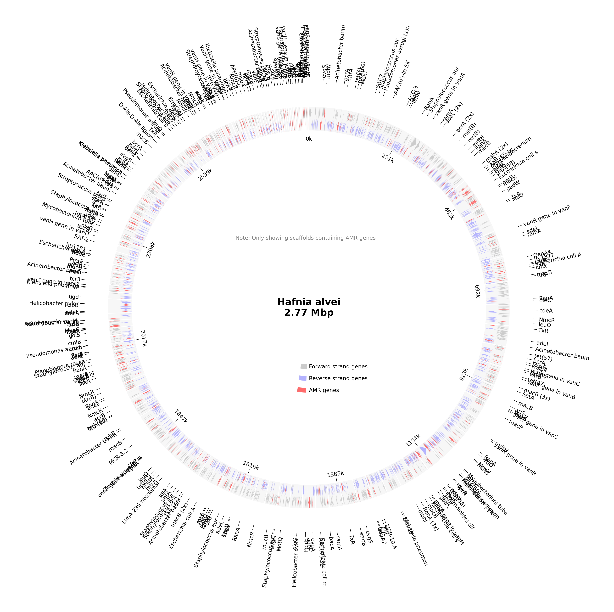

### AAC(6')-32
- **Mechanism**: antibiotic inactivation
- **Drug Classes**: aminoglycoside antibiotic
- **AMR Family**: AAC(6')
- **Locations**:
  - gnl|SPADES|PLIJBHFI_307_22 : position 22839-23441

### AAC(6')-Ib-SK
- **Mechanism**: antibiotic inactivation
- **Drug Classes**: aminoglycoside antibiotic
- **AMR Family**: AAC(6')
- **Locations**:
  - gnl|SPADES|PLIJBHFI_78_27 : position 28958-29458

### AAC(6')-Ib8
- **Mechanism**: antibiotic inactivation
- **Drug Classes**: aminoglycoside antibiotic
- **AMR Family**: AAC(6')
- **Locations**:
  - gnl|SPADES|PLIJBHFI_749_3 : position 1502-1630

### AAC(6')-Iw
- **Mechanism**: antibiotic inactivation
- **Drug Classes**: aminoglycoside antibiotic
- **AMR Family**: AAC(6')
- **Locations**:
  - gnl|SPADES|PLIJBHFI_127_7 : position 8190-8630

### ACC-3
- **Mechanism**: antibiotic inactivation
- **Drug Classes**: monobactam; cephalosporin; penam
- **AMR Family**: ACC beta-lactamase
- **Locations**:
  - gnl|SPADES|PLIJBHFI_78_57: position 61252-62421

### APH(6)-Ic
- **Mechanism**: antibiotic inactivation
- **Drug Classes**: aminoglycoside antibiotic
- **AMR Family**: APH(6)
- **Locations**:
  - gnl|SPADES|PLIJBHFI_1127_2 : position 2405-3208

### Acinetobacter baumannii AbaF (found in 3 locations)
- **Mechanism**: antibiotic efflux
- **Drug Classes**: phosphonic acid antibiotic
- **AMR Family**: major facilitator superfamily (MFS) antibiotic efflux pump
- **Locations**:
  - gnl|SPADES|PLIJBHFI_1322_2 : position 129-1358
  - gnl|SPADES|PLIJBHFI_431_16 : position 20431-21732
  - gnl|SPADES|PLIJBHFI_929_3 : position 1753-3087

### Acinetobacter baumannii AbaQ (found in 6 locations)
- **Mechanism**: antibiotic efflux
- **Drug Classes**: fluoroquinolone antibiotic
- **AMR Family**: major facilitator superfamily (MFS) antibiotic efflux pump
- **Locations**:
  - gnl|SPADES|PLIJBHFI_203_32 : position 40310-41656
  - gnl|SPADES|PLIJBHFI_37_45 : position 57111-58448
  - gnl|SPADES|PLIJBHFI_391_3 : position 3052-4296
  - gnl|SPADES|PLIJBHFI_573_3 : position 2163-3458
  - gnl|SPADES|PLIJBHFI_611_3 : position 1682-2887
  - gnl|SPADES|PLIJBHFI_748_5 : position 4210-5502

### AcrE
- **Mechanism**: antibiotic efflux
- **Drug Classes**: fluoroquinolone antibiotic; cephalosporin; cephamycin; penam
- **AMR Family**: resistance-nodulation-cell division (RND) antibiotic efflux pump
- **Locations**:
  - gnl|SPADES|PLIJBHFI_127_21 : position 22424-23587

### AcrF
- **Mechanism**: antibiotic efflux
- **Drug Classes**: fluoroquinolone antibiotic; cephalosporin; cephamycin; penam
- **AMR Family**: resistance-nodulation-cell division (RND) antibiotic efflux pump
- **Locations**:
  - gnl|SPADES|PLIJBHFI_127_22 : position 23626-26739

### CRP (found in 2 locations)
- **Mechanism**: antibiotic efflux
- **Drug Classes**: macrolide antibiotic; fluoroquinolone antibiotic; penam
- **AMR Family**: resistance-nodulation-cell division (RND) antibiotic efflux pump
- **Locations**:
  - gnl|SPADES|PLIJBHFI_164_51 : position 55281-56081
  - gnl|SPADES|PLIJBHFI_415_1 : position 2-586

### Clostridioides difficile gyrA conferring resistance to fluoroquinolones
- **Mechanism**: antibiotic target alteration
- **Drug Classes**: fluoroquinolone antibiotic
- **AMR Family**: fluoroquinolone resistant gyrA
- **Locations**:
  - gnl|SPADES|PLIJBHFI_251_15 : position 35013-37337

### Clostridioides difficile gyrB conferring resistance to fluoroquinolones (found in 2 locations)
- **Mechanism**: antibiotic target alteration
- **Drug Classes**: fluoroquinolone antibiotic
- **AMR Family**: fluoroquinolone resistant gyrB
- **Locations**:
  - gnl|SPADES|PLIJBHFI_410_17 : position 21303-23084
  - gnl|SPADES|PLIJBHFI_7216_1 : position 2-1072

### D-Ala-D-Ala ligase
- **Mechanism**: antibiotic target alteration
- **Drug Classes**: glycopeptide antibiotic
- **AMR Family**: Van ligase
- **Locations**:
  - gnl|SPADES|PLIJBHFI_807_8 : position 8823-9743

### EVM-1
- **Mechanism**: antibiotic inactivation
- **Drug Classes**: carbapenem
- **AMR Family**: EVM beta-lactamase
- **Locations**:
  - gnl|SPADES|PLIJBHFI_121_5 : position 5012-5725

### Enterobacter cloacae acrA
- **Mechanism**: antibiotic efflux
- **Drug Classes**: fluoroquinolone antibiotic; cephalosporin; glycylcycline; penam; tetracycline antibiotic; rifamycin antibiotic; phenicol antibiotic; disinfecting agents and antiseptics
- **AMR Family**: resistance-nodulation-cell division (RND) antibiotic efflux pump
- **Locations**:
  - gnl|SPADES|PLIJBHFI_10027_1 : position 1-801

### Erm(34)
- **Mechanism**: antibiotic target alteration
- **Drug Classes**: macrolide antibiotic; lincosamide antibiotic; streptogramin antibiotic; streptogramin A antibiotic; streptogramin B antibiotic
- **AMR Family**: Erm 23S ribosomal RNA methyltransferase
- **Locations**:
  - gnl|SPADES|PLIJBHFI_914_2 : position 888-1505

### ErmX
- **Mechanism**: antibiotic target alteration
- **Drug Classes**: macrolide antibiotic; lincosamide antibiotic; streptogramin antibiotic; streptogramin A antibiotic; streptogramin B antibiotic
- **AMR Family**: Erm 23S ribosomal RNA methyltransferase
- **Locations**:
  - gnl|SPADES|PLIJBHFI_352_19 : position 21244-22056

### Escherichia coli AcrAB-TolC with AcrR mutation conferring resistance to ciprofloxacin, tetracycline, and ceftazidime (found in 2 locations)
- **Mechanism**: antibiotic target alteration; antibiotic efflux
- **Drug Classes**: fluoroquinolone antibiotic; cephalosporin; glycylcycline; penam; tetracycline antibiotic; rifamycin antibiotic; phenicol antibiotic; disinfecting agents and antiseptics
- **AMR Family**: resistance-nodulation-cell division (RND) antibiotic efflux pump
- **Locations**:
  - gnl|SPADES|PLIJBHFI_127_20 : position 21231-21911
  - gnl|SPADES|PLIJBHFI_359_20 : position 25946-26326

### Escherichia coli AcrAB-TolC with MarR mutations conferring resistance to ciprofloxacin and tetracycline (found in 2 locations)
- **Mechanism**: antibiotic target alteration; antibiotic efflux
- **Drug Classes**: fluoroquinolone antibiotic; cephalosporin; glycylcycline; penam; tetracycline antibiotic; rifamycin antibiotic; phenicol antibiotic; disinfecting agents and antiseptics
- **AMR Family**: resistance-nodulation-cell division (RND) antibiotic efflux pump
- **Locations**:
  - gnl|SPADES|PLIJBHFI_164_27 : position 29624-30115
  - gnl|SPADES|PLIJBHFI_632_12 : position 10276-10707

### Escherichia coli mdfA
- **Mechanism**: antibiotic efflux
- **Drug Classes**: tetracycline antibiotic; phenicol antibiotic; disinfecting agents and antiseptics
- **AMR Family**: major facilitator superfamily (MFS) antibiotic efflux pump
- **Locations**:
  - gnl|SPADES|PLIJBHFI_307_20 : position 19615-20829

### Escherichia coli soxS with mutation conferring antibiotic resistance (found in 4 locations)
- **Mechanism**: antibiotic target alteration; antibiotic efflux; reduced permeability to antibiotic
- **Drug Classes**: fluoroquinolone antibiotic; monobactam; carbapenem; cephalosporin; glycylcycline; cephamycin; penam; tetracycline antibiotic; rifamycin antibiotic; phenicol antibiotic; penem; disinfecting agents and antiseptics
- **AMR Family**: ATP-binding cassette (ABC) antibiotic efflux pump; major facilitator superfamily (MFS) antibiotic efflux pump; resistance-nodulation-cell division (RND) antibiotic efflux pump; General Bacterial Porin with reduced permeability to beta-lactams
- **Locations**:
  - gnl|SPADES|PLIJBHFI_121_52 : position 51738-52106
  - gnl|SPADES|PLIJBHFI_127_33 : position 38145-38966
  - gnl|SPADES|PLIJBHFI_259_29 : position 31745-32581
  - gnl|SPADES|PLIJBHFI_884_9 : position 7024-7902

### Escherichia coli uhpA with mutation conferring resistance to fosfomycin
- **Mechanism**: antibiotic target alteration
- **Drug Classes**: phosphonic acid antibiotic
- **AMR Family**: antibiotic-resistant UhpT
- **Locations**:
  - gnl|SPADES|PLIJBHFI_872_6 : position 4894-5610

### FosA2
- **Mechanism**: antibiotic inactivation
- **Drug Classes**: phosphonic acid antibiotic
- **AMR Family**: fosfomycin thiol transferase
- **Locations**:
  - gnl|SPADES|PLIJBHFI_1464_3 : position 2821-3237

### FosB4
- **Mechanism**: antibiotic inactivation
- **Drug Classes**: phosphonic acid antibiotic
- **AMR Family**: fosfomycin thiol transferase
- **Locations**:
  - gnl|SPADES|PLIJBHFI_211_25 : position 27585-27971

### H-NS
- **Mechanism**: antibiotic efflux
- **Drug Classes**: macrolide antibiotic; fluoroquinolone antibiotic; cephalosporin; cephamycin; penam; tetracycline antibiotic
- **AMR Family**: major facilitator superfamily (MFS) antibiotic efflux pump; resistance-nodulation-cell division (RND) antibiotic efflux pump
- **Locations**:
  - gnl|SPADES|PLIJBHFI_963_3 : position 2401-2856

### Haemophilus influenzae PBP3 conferring resistance to beta-lactam antibiotics
- **Mechanism**: antibiotic target alteration
- **Drug Classes**: cephalosporin; cephamycin; penam
- **AMR Family**: Penicillin-binding protein mutations conferring resistance to beta-lactam antibiotics
- **Locations**:
  - gnl|SPADES|PLIJBHFI_2670_1 : position 1-1041

### Helicobacter pylori frxA mutation conferring resistance to metronidazole
- **Mechanism**: antibiotic target alteration
- **Drug Classes**: nitroimidazole antibiotic
- **AMR Family**: Antibiotic resistant Helicobacter pylori nitroreductase
- **Locations**:
  - gnl|SPADES|PLIJBHFI_316_8 : position 8669-9274

### Helicobacter pylori pbp1 mutants conferring resistance to amoxicillin (found in 2 locations)
- **Mechanism**: antibiotic target alteration
- **Drug Classes**: cephalosporin; cephamycin; penam
- **AMR Family**: Penicillin-binding protein mutations conferring resistance to beta-lactam antibiotics
- **Locations**:
  - gnl|SPADES|PLIJBHFI_242_25 : position 33485-36049
  - gnl|SPADES|PLIJBHFI_589_4 : position 2785-5106

### Helicobacter pylori pbp2 mutants conferring resistance to amoxicillin
- **Mechanism**: antibiotic target alteration
- **Drug Classes**: cephalosporin; cephamycin; penam
- **AMR Family**: Penicillin-binding protein mutations conferring resistance to beta-lactam antibiotics
- **Locations**:
  - gnl|SPADES|PLIJBHFI_880_7 : position 5644-7539

### Klebsiella pneumoniae KpnE
- **Mechanism**: antibiotic efflux
- **Drug Classes**: macrolide antibiotic; aminoglycoside antibiotic; cephalosporin; tetracycline antibiotic; peptide antibiotic; rifamycin antibiotic; disinfecting agents and antiseptics
- **AMR Family**: small multidrug resistance (SMR) antibiotic efflux pump
- **Locations**:
  - gnl|SPADES|PLIJBHFI_760_12 : position 10488-10916

### Klebsiella pneumoniae KpnF
- **Mechanism**: antibiotic efflux
- **Drug Classes**: macrolide antibiotic; aminoglycoside antibiotic; cephalosporin; tetracycline antibiotic; peptide antibiotic; rifamycin antibiotic; disinfecting agents and antiseptics
- **AMR Family**: small multidrug resistance (SMR) antibiotic efflux pump
- **Locations**:
  - gnl|SPADES|PLIJBHFI_760_11: position 10172-10501

### Klebsiella pneumoniae KpnH
- **Mechanism**: antibiotic efflux
- **Drug Classes**: macrolide antibiotic; fluoroquinolone antibiotic; aminoglycoside antibiotic; carbapenem; cephalosporin; penam; peptide antibiotic; penem
- **AMR Family**: major facilitator superfamily (MFS) antibiotic efflux pump
- **Locations**:
  - gnl|SPADES|PLIJBHFI_1058_5 : position 3926-5365

### Klebsiella pneumoniae OmpK37 (found in 4 locations)
- **Mechanism**: reduced permeability to antibiotic
- **Drug Classes**: monobactam; carbapenem; cephalosporin; cephamycin; penam; penem
- **AMR Family**: General Bacterial Porin with reduced permeability to beta-lactams
- **Locations**:
  - gnl|SPADES|PLIJBHFI_14383_1 : position 2-568
  - gnl|SPADES|PLIJBHFI_242_24 : position 32167-33303
  - gnl|SPADES|PLIJBHFI_266_27 : position 21811-22851
  - gnl|SPADES|PLIJBHFI_602_4 : position 5160-6263

### LRA-19
- **Mechanism**: antibiotic inactivation
- **Drug Classes**: cephalosporin; penam
- **AMR Family**: subclass B3 LRA beta-lactamase
- **Locations**:
  - gnl|SPADES|PLIJBHFI_266_30 : position 24341-24988

### LlmA 23S ribosomal RNA methyltransferase
- **Mechanism**: antibiotic target alteration
- **Drug Classes**: lincosamide antibiotic
- **AMR Family**: Llm 23S ribosomal RNA methyltransferase
- **Locations**:
  - gnl|SPADES|PLIJBHFI_408_10 : position 8782-9897

### LptD
- **Mechanism**: antibiotic efflux
- **Drug Classes**: carbapenem; peptide antibiotic; aminocoumarin antibiotic; rifamycin antibiotic
- **AMR Family**: ATP-binding cassette (ABC) antibiotic efflux pump
- **Locations**:
  - gnl|SPADES|PLIJBHFI_352_22 : position 24459-26759

### MCR-10.4
- **Mechanism**: antibiotic target alteration
- **Drug Classes**: peptide antibiotic
- **AMR Family**: MCR phosphoethanolamine transferase
- **Locations**:
  - gnl|SPADES|PLIJBHFI_268_30 : position 26425-28059

### MCR-8.2
- **Mechanism**: antibiotic target alteration
- **Drug Classes**: peptide antibiotic
- **AMR Family**: MCR phosphoethanolamine transferase
- **Locations**:
  - gnl|SPADES|PLIJBHFI_424_4 : position 4002-5615

### MdtK
- **Mechanism**: antibiotic efflux
- **Drug Classes**: fluoroquinolone antibiotic
- **AMR Family**: multidrug and toxic compound extrusion (MATE) transporter
- **Locations**:
  - gnl|SPADES|PLIJBHFI_127_13 : position 13812-15266

### MdtQ
- **Mechanism**: reduced permeability to antibiotic
- **Drug Classes**: monobactam; carbapenem; cephalosporin; cephamycin; penam; penem
- **AMR Family**: Outer Membrane Porin (Opr)
- **Locations**:
  - gnl|SPADES|PLIJBHFI_324_9 : position 12037-13527

### MexS (found in 3 locations)
- **Mechanism**: antibiotic efflux
- **Drug Classes**: fluoroquinolone antibiotic; diaminopyrimidine antibiotic; phenicol antibiotic
- **AMR Family**: resistance-nodulation-cell division (RND) antibiotic efflux pump
- **Locations**:
  - gnl|SPADES|PLIJBHFI_211_21 : position 23175-24299
  - gnl|SPADES|PLIJBHFI_228_34 : position 35714-36700
  - gnl|SPADES|PLIJBHFI_758_3 : position 2906-3907

### MexT
- **Mechanism**: antibiotic efflux
- **Drug Classes**: fluoroquinolone antibiotic; diaminopyrimidine antibiotic; phenicol antibiotic
- **AMR Family**: resistance-nodulation-cell division (RND) antibiotic efflux pump
- **Locations**:
  - gnl|SPADES|PLIJBHFI_37_92 : position 110416-111342

### MexV (found in 2 locations)
- **Mechanism**: antibiotic efflux
- **Drug Classes**: macrolide antibiotic; fluoroquinolone antibiotic; tetracycline antibiotic; phenicol antibiotic; disinfecting agents and antiseptics
- **AMR Family**: resistance-nodulation-cell division (RND) antibiotic efflux pump
- **Locations**:
  - gnl|SPADES|PLIJBHFI_235_33 : position 29934-31451
  - gnl|SPADES|PLIJBHFI_567_3 : position 714-2006

### MexZ
- **Mechanism**: antibiotic efflux
- **Drug Classes**: macrolide antibiotic; fluoroquinolone antibiotic; aminoglycoside antibiotic; carbapenem; cephalosporin; cephamycin; penam; tetracycline antibiotic; phenicol antibiotic; disinfecting agents and antiseptics
- **AMR Family**: resistance-nodulation-cell division (RND) antibiotic efflux pump
- **Locations**:
  - gnl|SPADES|PLIJBHFI_228_31 : position 33310-33915

### MuxC
- **Mechanism**: antibiotic efflux
- **Drug Classes**: macrolide antibiotic; monobactam; tetracycline antibiotic; aminocoumarin antibiotic
- **AMR Family**: resistance-nodulation-cell division (RND) antibiotic efflux pump
- **Locations**:
  - gnl|SPADES|PLIJBHFI_567_4 : position 2017-5163

### Mycobacterium tuberculosis gidB mutation conferring resistance to streptomycin
- **Mechanism**: antibiotic target alteration
- **Drug Classes**: aminoglycoside antibiotic
- **AMR Family**: antibiotic resistant gidB
- **Locations**:
  - gnl|SPADES|PLIJBHFI_672_10 : position 11699-12319

### Mycobacterium tuberculosis thyA with mutation conferring resistance to para-aminosalicylic acid
- **Mechanism**: antibiotic target alteration
- **Drug Classes**: salicylic acid antibiotic
- **AMR Family**: aminosalicylate resistant thymidylate synthase
- **Locations**:
  - gnl|SPADES|PLIJBHFI_242_11 : position 17218-17913

### Mycolicibacterium smegmatis ndh with mutation conferring resistance to isoniazid
- **Mechanism**: antibiotic target alteration
- **Drug Classes**: isoniazid-like antibiotic
- **AMR Family**: antibiotic resistant ndh
- **Locations**:
  - gnl|SPADES|PLIJBHFI_127_12 : position 12245-13447

### NmcR (found in 11 locations)
- **Mechanism**: antibiotic inactivation
- **Drug Classes**: carbapenem; cephalosporin; cephamycin; penam
- **AMR Family**: NmcA beta-lactamase
- **Locations**:
  - gnl|SPADES|PLIJBHFI_1117_2 : position 979-1908
  - gnl|SPADES|PLIJBHFI_1322_6 : position 3712-4560
  - gnl|SPADES|PLIJBHFI_1404_2 : position 1351-2325
  - gnl|SPADES|PLIJBHFI_164_50 : position 53847-54797
  - gnl|SPADES|PLIJBHFI_196_26 : position 31501-32406
  - gnl|SPADES|PLIJBHFI_211_37 : position 40328-41197
  - gnl|SPADES|PLIJBHFI_333_9 : position 10365-11288
  - gnl|SPADES|PLIJBHFI_462_11 : position 8097-8993
  - gnl|SPADES|PLIJBHFI_486_6 : position 6495-7376
  - gnl|SPADES|PLIJBHFI_921_2 : position 2537-3409
  - gnl|SPADES|PLIJBHFI_954_1 : position 552-1502

### OmpA
- **Mechanism**: reduced permeability to antibiotic
- **Drug Classes**: peptide antibiotic
- **AMR Family**: General Bacterial Porin with reduced permeability to peptide antibiotics
- **Locations**:
  - gnl|SPADES|PLIJBHFI_490_17 : position 18696-18878

### OpmB
- **Mechanism**: antibiotic efflux
- **Drug Classes**: macrolide antibiotic; monobactam; tetracycline antibiotic; aminocoumarin antibiotic
- **AMR Family**: resistance-nodulation-cell division (RND) antibiotic efflux pump
- **Locations**:
  - gnl|SPADES|PLIJBHFI_127_50 : position 56301-57698

### OprA
- **Mechanism**: antibiotic efflux
- **Drug Classes**: macrolide antibiotic; fluoroquinolone antibiotic; aminoglycoside antibiotic; carbapenem; tetracycline antibiotic
- **AMR Family**: resistance-nodulation-cell division (RND) antibiotic efflux pump
- **Locations**:
  - gnl|SPADES|PLIJBHFI_567_1 : position 3-218

### OprN
- **Mechanism**: antibiotic efflux
- **Drug Classes**: fluoroquinolone antibiotic; diaminopyrimidine antibiotic; phenicol antibiotic
- **AMR Family**: resistance-nodulation-cell division (RND) antibiotic efflux pump
- **Locations**:
  - gnl|SPADES|PLIJBHFI_251_6 : position 7286-8650

### ParR (found in 2 locations)
- **Mechanism**: antibiotic efflux; reduced permeability to antibiotic
- **Drug Classes**: macrolide antibiotic; fluoroquinolone antibiotic; monobactam; aminoglycoside antibiotic; carbapenem; cephalosporin; cephamycin; penam; tetracycline antibiotic; phenicol antibiotic; penem; disinfecting agents and antiseptics
- **AMR Family**: resistance-nodulation-cell division (RND) antibiotic efflux pump; Outer Membrane Porin (Opr)
- **Locations**:
  - gnl|SPADES|PLIJBHFI_543_7 : position 7267-7980
  - gnl|SPADES|PLIJBHFI_734_1 : position 2-601

### ParS
- **Mechanism**: antibiotic efflux; reduced permeability to antibiotic
- **Drug Classes**: macrolide antibiotic; fluoroquinolone antibiotic; monobactam; aminoglycoside antibiotic; carbapenem; cephalosporin; cephamycin; penam; tetracycline antibiotic; phenicol antibiotic; penem; disinfecting agents and antiseptics
- **AMR Family**: resistance-nodulation-cell division (RND) antibiotic efflux pump; Outer Membrane Porin (Opr)
- **Locations**:
  - gnl|SPADES|PLIJBHFI_543_8 : position 7987-9306

### Planobispora rosea EF-Tu mutants conferring resistance to inhibitor GE2270A
- **Mechanism**: antibiotic target alteration
- **Drug Classes**: elfamycin antibiotic
- **AMR Family**: elfamycin resistant EF-Tu
- **Locations**:
  - gnl|SPADES|PLIJBHFI_540_9 : position 9971-11839

### PmrF (found in 3 locations)
- **Mechanism**: antibiotic target alteration
- **Drug Classes**: peptide antibiotic
- **AMR Family**: pmr phosphoethanolamine transferase
- **Locations**:
  - gnl|SPADES|PLIJBHFI_18223_1 : position 1-312
  - gnl|SPADES|PLIJBHFI_308_20 : position 22312-23223
  - gnl|SPADES|PLIJBHFI_631_7 : position 6515-7816

### Pseudomonas aeruginosa CpxR
- **Mechanism**: antibiotic efflux
- **Drug Classes**: macrolide antibiotic; fluoroquinolone antibiotic; monobactam; aminoglycoside antibiotic; carbapenem; cephalosporin; cephamycin; penam; tetracycline antibiotic; peptide antibiotic; aminocoumarin antibiotic; diaminopyrimidine antibiotic; sulfonamide antibiotic; phenicol antibiotic; penem
- **AMR Family**: resistance-nodulation-cell division (RND) antibiotic efflux pump
- **Locations**:
  - gnl|SPADES|PLIJBHFI_546_5 : position 3711-4409

### Pseudomonas aeruginosa ampR with mutation conferring resistance to aztreonam (found in 3 locations)
- **Mechanism**: antibiotic target alteration; antibiotic inactivation
- **Drug Classes**: monobactam; carbapenem; cephalosporin
- **AMR Family**: PDC beta-lactamase; ampR transcriptional regulator with mutation conferring resistance to monobactam antibiotics
- **Locations**:
  - gnl|SPADES|PLIJBHFI_78_58 : position 62648-63514
  - gnl|SPADES|PLIJBHFI_78_9 : position 7312-8259
  - gnl|SPADES|PLIJBHFI_849_11 : position 8117-8983

### QepA2 (found in 2 locations)
- **Mechanism**: antibiotic efflux
- **Drug Classes**: fluoroquinolone antibiotic
- **AMR Family**: major facilitator superfamily (MFS) antibiotic efflux pump
- **Locations**:
  - gnl|SPADES|PLIJBHFI_1557_3 : position 2454-3860
  - gnl|SPADES|PLIJBHFI_269_4 : position 5367-6965

### QepA4
- **Mechanism**: antibiotic efflux
- **Drug Classes**: fluoroquinolone antibiotic
- **AMR Family**: major facilitator superfamily (MFS) antibiotic efflux pump
- **Locations**:
  - gnl|SPADES|PLIJBHFI_164_11 : position 12271-13566

### QnrB60
- **Mechanism**: antibiotic target protection
- **Drug Classes**: fluoroquinolone antibiotic
- **AMR Family**: quinolone resistance protein (qnr)
- **Locations**:
  - gnl|SPADES|PLIJBHFI_11478_1 : position 45-626

### RanA (found in 15 locations)
- **Mechanism**: antibiotic efflux
- **Drug Classes**: aminoglycoside antibiotic
- **AMR Family**: ATP-binding cassette (ABC) antibiotic efflux pump
- **Locations**:
  - gnl|SPADES|PLIJBHFI_121_39 : position 40246-41379
  - gnl|SPADES|PLIJBHFI_192_34 : position 41027-42103
  - gnl|SPADES|PLIJBHFI_235_11 : position 10462-11397
  - gnl|SPADES|PLIJBHFI_263_13 : position 13755-14894
  - gnl|SPADES|PLIJBHFI_263_27 : position 27816-28814
  - gnl|SPADES|PLIJBHFI_263_28 : position 28811-29797
  - gnl|SPADES|PLIJBHFI_268_35 : position 32278-33090
  - gnl|SPADES|PLIJBHFI_335_12 : position 11744-12688
  - gnl|SPADES|PLIJBHFI_474_5 : position 4755-5780
  - gnl|SPADES|PLIJBHFI_503_13 : position 16479-18098
  - gnl|SPADES|PLIJBHFI_683_4 : position 2836-3666
  - gnl|SPADES|PLIJBHFI_761_11 : position 9630-10403
  - gnl|SPADES|PLIJBHFI_784_6 : position 6864-7490
  - gnl|SPADES|PLIJBHFI_78_85 : position 98990-99997
  - gnl|SPADES|PLIJBHFI_888_6 : position 6735-7511

### RanB
- **Mechanism**: antibiotic efflux
- **Drug Classes**: aminoglycoside antibiotic
- **AMR Family**: ATP-binding cassette (ABC) antibiotic efflux pump
- **Locations**:
  - gnl|SPADES|PLIJBHFI_683_5 : position 3671-4453

### RlmA(II)
- **Mechanism**: antibiotic target alteration
- **Drug Classes**: macrolide antibiotic; lincosamide antibiotic
- **AMR Family**: non-erm 23S ribosomal RNA methyltransferase (G748)
- **Locations**:
  - gnl|SPADES|PLIJBHFI_1498_4 : position 2407-3219

### Rv1877 (found in 2 locations)
- **Mechanism**: antibiotic efflux
- **Drug Classes**: fluoroquinolone antibiotic
- **AMR Family**: major facilitator superfamily (MFS) antibiotic efflux pump
- **Locations**:
  - gnl|SPADES|PLIJBHFI_164_17 : position 20029-21519
  - gnl|SPADES|PLIJBHFI_203_33 : position 41790-43109

### SAT-2
- **Mechanism**: antibiotic inactivation
- **Drug Classes**: nucleoside antibiotic
- **AMR Family**: streptothricin acetyltransferase (SAT)
- **Locations**:
  - gnl|SPADES|PLIJBHFI_656_6 : position 5792-6517

### SRT-2
- **Mechanism**: antibiotic inactivation
- **Drug Classes**: cephalosporin
- **AMR Family**: SRT beta-lactamase
- **Locations**:
  - gnl|SPADES|PLIJBHFI_37_117 : position 143158-144297

### SatA
- **Mechanism**: antibiotic inactivation
- **Drug Classes**: nucleoside antibiotic
- **AMR Family**: streptothricin acetyltransferase (SAT)
- **Locations**:
  - gnl|SPADES|PLIJBHFI_215_40 : position 39266-39724

### Staphylococcus aureus GlpT with mutation conferring resistance to fosfomycin
- **Mechanism**: antibiotic target alteration
- **Drug Classes**: phosphonic acid antibiotic
- **AMR Family**: antibiotic-resistant GlpT
- **Locations**:
  - gnl|SPADES|PLIJBHFI_540_4 : position 4537-5892

### Staphylococcus aureus fusA with mutation conferring resistance to fusidic acid
- **Mechanism**: antibiotic target alteration
- **Drug Classes**: fusidane antibiotic
- **AMR Family**: antibiotic resistant fusA
- **Locations**:
  - gnl|SPADES|PLIJBHFI_101_8 : position 4504-6606

### Staphylococcus aureus mupA conferring resistance to mupirocin (found in 2 locations)
- **Mechanism**: antibiotic target alteration
- **Drug Classes**: mupirocin-like antibiotic
- **AMR Family**: antibiotic-resistant isoleucyl-tRNA synthetase (ileS)
- **Locations**:
  - gnl|SPADES|PLIJBHFI_352_1 : position 2-2656
  - gnl|SPADES|PLIJBHFI_391_19 : position 22699-24102

### Staphylococcus aureus mupB conferring resistance to mupirocin (found in 2 locations)
- **Mechanism**: antibiotic target alteration
- **Drug Classes**: mupirocin-like antibiotic
- **AMR Family**: antibiotic-resistant isoleucyl-tRNA synthetase (ileS)
- **Locations**:
  - gnl|SPADES|PLIJBHFI_37_124 : position 151003-152241
  - gnl|SPADES|PLIJBHFI_880_1 : position 3-2282

### Staphylococcus aureus murA with mutation conferring resistance to fosfomycin
- **Mechanism**: antibiotic target alteration
- **Drug Classes**: phosphonic acid antibiotic
- **AMR Family**: antibiotic-resistant murA transferase
- **Locations**:
  - gnl|SPADES|PLIJBHFI_683_10 : position 6480-7739

### Staphylococcus aureus pgsA mutations conferring resistance to daptomycin
- **Mechanism**: antibiotic target alteration
- **Drug Classes**: peptide antibiotic
- **AMR Family**: daptomycin resistant pgsA
- **Locations**:
  - gnl|SPADES|PLIJBHFI_324_25 : position 28067-28615

### Staphylococcus aureus walK with mutation conferring resistance to daptomycin
- **Mechanism**: antibiotic target alteration
- **Drug Classes**: peptide antibiotic
- **AMR Family**: daptomycin resistant walK
- **Locations**:
  - gnl|SPADES|PLIJBHFI_391_13 : position 15304-17154

### Streptococcus pneumoniae PBP2x conferring resistance to amoxicillin
- **Mechanism**: antibiotic target alteration
- **Drug Classes**: cephalosporin; cephamycin; penam
- **AMR Family**: Penicillin-binding protein mutations conferring resistance to beta-lactam antibiotics
- **Locations**:
  - gnl|SPADES|PLIJBHFI_734_9 : position 9323-11599

### Streptomyces venezuelae rox (found in 2 locations)
- **Mechanism**: antibiotic inactivation
- **Drug Classes**: rifamycin antibiotic
- **AMR Family**: rifampin monooxygenase
- **Locations**:
  - gnl|SPADES|PLIJBHFI_1351_4 : position 3387-4562
  - gnl|SPADES|PLIJBHFI_985_5 : position 3998-5176

### TaeA (found in 2 locations)
- **Mechanism**: antibiotic efflux
- **Drug Classes**: pleuromutilin antibiotic
- **AMR Family**: ATP-binding cassette (ABC) antibiotic efflux pump
- **Locations**:
  - gnl|SPADES|PLIJBHFI_490_8 : position 8518-10422
  - gnl|SPADES|PLIJBHFI_758_1 : position 2-1681

### TolC
- **Mechanism**: antibiotic efflux
- **Drug Classes**: macrolide antibiotic; fluoroquinolone antibiotic; aminoglycoside antibiotic; carbapenem; cephalosporin; glycylcycline; cephamycin; penam; tetracycline antibiotic; peptide antibiotic; aminocoumarin antibiotic; rifamycin antibiotic; phenicol antibiotic; penem; disinfecting agents and antiseptics
- **AMR Family**: ATP-binding cassette (ABC) antibiotic efflux pump; major facilitator superfamily (MFS) antibiotic efflux pump; resistance-nodulation-cell division (RND) antibiotic efflux pump
- **Locations**:
  - gnl|SPADES|PLIJBHFI_697_4 : position 2171-3664

### TxR (found in 11 locations)
- **Mechanism**: antibiotic efflux
- **Drug Classes**: tetracycline antibiotic
- **AMR Family**: ATP-binding cassette (ABC) antibiotic efflux pump
- **Locations**:
  - gnl|SPADES|PLIJBHFI_1002_2 : position 1182-2603
  - gnl|SPADES|PLIJBHFI_127_4 : position 3578-5095
  - gnl|SPADES|PLIJBHFI_148_11 : position 12692-14806
  - gnl|SPADES|PLIJBHFI_164_32 : position 33688-35604
  - gnl|SPADES|PLIJBHFI_203_3 : position 951-2729
  - gnl|SPADES|PLIJBHFI_273_28 : position 28089-30923
  - gnl|SPADES|PLIJBHFI_391_14 : position 17141-18532
  - gnl|SPADES|PLIJBHFI_391_7 : position 7410-8849
  - gnl|SPADES|PLIJBHFI_697_5 : position 3814-5769
  - gnl|SPADES|PLIJBHFI_844_9 : position 7579-9057
  - gnl|SPADES|PLIJBHFI_981_9 : position 6228-7235

### YojI
- **Mechanism**: antibiotic efflux
- **Drug Classes**: peptide antibiotic
- **AMR Family**: ATP-binding cassette (ABC) antibiotic efflux pump
- **Locations**:
  - gnl|SPADES|PLIJBHFI_268_34 : position 31631-32284

### acrB
- **Mechanism**: antibiotic efflux
- **Drug Classes**: fluoroquinolone antibiotic; cephalosporin; glycylcycline; penam; tetracycline antibiotic; rifamycin antibiotic; phenicol antibiotic; disinfecting agents and antiseptics
- **AMR Family**: resistance-nodulation-cell division (RND) antibiotic efflux pump
- **Locations**:
  - gnl|SPADES|PLIJBHFI_437_21 : position 18738-21584

### adeF
- **Mechanism**: antibiotic efflux
- **Drug Classes**: fluoroquinolone antibiotic; tetracycline antibiotic
- **AMR Family**: resistance-nodulation-cell division (RND) antibiotic efflux pump
- **Locations**:
  - gnl|SPADES|PLIJBHFI_308_12: position 13860-17006

### adeG
- **Mechanism**: antibiotic efflux
- **Drug Classes**: fluoroquinolone antibiotic; tetracycline antibiotic
- **AMR Family**: resistance-nodulation-cell division (RND) antibiotic efflux pump
- **Locations**:
  - gnl|SPADES|PLIJBHFI_632_10 : position 8997-9770

### adeL (found in 17 locations)
- **Mechanism**: antibiotic efflux
- **Drug Classes**: fluoroquinolone antibiotic; tetracycline antibiotic
- **AMR Family**: resistance-nodulation-cell division (RND) antibiotic efflux pump
- **Locations**:
  - gnl|SPADES|PLIJBHFI_101_30 : position 45650-46555
  - gnl|SPADES|PLIJBHFI_101_39 : position 56547-57440
  - gnl|SPADES|PLIJBHFI_121_50 : position 50044-50961
  - gnl|SPADES|PLIJBHFI_127_17 : position 19154-20047
  - gnl|SPADES|PLIJBHFI_154_23 : position 24594-25478
  - gnl|SPADES|PLIJBHFI_164_12 : position 13735-14631
  - gnl|SPADES|PLIJBHFI_203_20 : position 27769-28683
  - gnl|SPADES|PLIJBHFI_341_19 : position 18263-19198
  - gnl|SPADES|PLIJBHFI_474_2 : position 830-1735
  - gnl|SPADES|PLIJBHFI_543_4 : position 4267-5160
  - gnl|SPADES|PLIJBHFI_580_4 : position 3769-4689
  - gnl|SPADES|PLIJBHFI_632_7 : position 5747-6655
  - gnl|SPADES|PLIJBHFI_674_7 : position 8991-9854
  - gnl|SPADES|PLIJBHFI_749_6 : position 3791-4510
  - gnl|SPADES|PLIJBHFI_758_2 : position 1883-2788
  - gnl|SPADES|PLIJBHFI_78_63 : position 69043-69936
  - gnl|SPADES|PLIJBHFI_795_4 : position 3154-4086

### adeN
- **Mechanism**: antibiotic efflux
- **Drug Classes**: macrolide antibiotic; fluoroquinolone antibiotic; lincosamide antibiotic; carbapenem; cephalosporin; tetracycline antibiotic; rifamycin antibiotic; diaminopyrimidine antibiotic; phenicol antibiotic; penem
- **AMR Family**: resistance-nodulation-cell division (RND) antibiotic efflux pump
- **Locations**:
  - gnl|SPADES|PLIJBHFI_251_8 : position 22495-23226

### adeR
- **Mechanism**: antibiotic efflux
- **Drug Classes**: glycylcycline; tetracycline antibiotic
- **AMR Family**: resistance-nodulation-cell division (RND) antibiotic efflux pump
- **Locations**:
  - gnl|SPADES|PLIJBHFI_963_5 : position 4782-5801

### almE
- **Mechanism**: antibiotic target alteration
- **Drug Classes**: peptide antibiotic
- **AMR Family**: polymyxin resistance operon; alm glycyltransferase
- **Locations**:
  - gnl|SPADES|PLIJBHFI_760_4 : position 2599-4284

### arlR (found in 4 locations)
- **Mechanism**: antibiotic efflux
- **Drug Classes**: fluoroquinolone antibiotic; disinfecting agents and antiseptics
- **AMR Family**: major facilitator superfamily (MFS) antibiotic efflux pump
- **Locations**:
  - gnl|SPADES|PLIJBHFI_3378_3 : position 1868-2011
  - gnl|SPADES|PLIJBHFI_3993_2 : position 1367-1750
  - gnl|SPADES|PLIJBHFI_567_15 : position 14373-15053
  - gnl|SPADES|PLIJBHFI_631_3 : position 1303-2019

### arlS (found in 2 locations)
- **Mechanism**: antibiotic efflux
- **Drug Classes**: fluoroquinolone antibiotic; disinfecting agents and antiseptics
- **AMR Family**: major facilitator superfamily (MFS) antibiotic efflux pump
- **Locations**:
  - gnl|SPADES|PLIJBHFI_228_23 : position 26630-28291
  - gnl|SPADES|PLIJBHFI_3378_2 : position 395-1852

### arnA
- **Mechanism**: antibiotic target alteration
- **Drug Classes**: peptide antibiotic
- **AMR Family**: pmr phosphoethanolamine transferase
- **Locations**:
  - gnl|SPADES|PLIJBHFI_762_7 : position 4723-5670

### bacA
- **Mechanism**: antibiotic target alteration
- **Drug Classes**: peptide antibiotic
- **AMR Family**: undecaprenyl pyrophosphate related proteins
- **Locations**:
  - gnl|SPADES|PLIJBHFI_307_4 : position 2330-3148

### basS (found in 3 locations)
- **Mechanism**: antibiotic target alteration; antibiotic efflux
- **Drug Classes**: peptide antibiotic
- **AMR Family**: pmr phosphoethanolamine transferase
- **Locations**:
  - gnl|SPADES|PLIJBHFI_1220_2 : position 1189-2253
  - gnl|SPADES|PLIJBHFI_215_12 : position 12247-13602
  - gnl|SPADES|PLIJBHFI_567_16 : position 15050-16129

### bcr-1 (found in 4 locations)
- **Mechanism**: antibiotic efflux
- **Drug Classes**: bicyclomycin-like antibiotic
- **AMR Family**: major facilitator superfamily (MFS) antibiotic efflux pump
- **Locations**:
  - gnl|SPADES|PLIJBHFI_1069_5 : position 3269-4480
  - gnl|SPADES|PLIJBHFI_4815_3 : position 1087-1500
  - gnl|SPADES|PLIJBHFI_602_9 : position 8375-9574
  - gnl|SPADES|PLIJBHFI_784_4 : position 4584-5810

### bcrA (found in 7 locations)
- **Mechanism**: antibiotic efflux
- **Drug Classes**: peptide antibiotic
- **AMR Family**: ATP-binding cassette (ABC) antibiotic efflux pump
- **Locations**:
  - gnl|SPADES|PLIJBHFI_101_53 : position 74509-75612
  - gnl|SPADES|PLIJBHFI_101_58 : position 78531-79997
  - gnl|SPADES|PLIJBHFI_1217_6 : position 3832-4617
  - gnl|SPADES|PLIJBHFI_211_14 : position 14397-15989
  - gnl|SPADES|PLIJBHFI_230_8 : position 9970-10686
  - gnl|SPADES|PLIJBHFI_37_61 : position 73584-76343
  - gnl|SPADES|PLIJBHFI_797_1 : position 417-1037

### catB9
- **Mechanism**: antibiotic inactivation
- **Drug Classes**: phenicol antibiotic
- **AMR Family**: chloramphenicol acetyltransferase (CAT)
- **Locations**:
  - gnl|SPADES|PLIJBHFI_164_24 : position 27180-27797

### cdeA
- **Mechanism**: antibiotic efflux
- **Drug Classes**: fluoroquinolone antibiotic; disinfecting agents and antiseptics
- **AMR Family**: multidrug and toxic compound extrusion (MATE) transporter
- **Locations**:
  - gnl|SPADES|PLIJBHFI_196_11 : position 12630-13979

### clbB
- **Mechanism**: antibiotic target alteration
- **Drug Classes**: lincosamide antibiotic; streptogramin antibiotic; streptogramin A antibiotic; oxazolidinone antibiotic; phenicol antibiotic; pleuromutilin antibiotic
- **AMR Family**: Cfr 23S ribosomal RNA methyltransferase
- **Locations**:
  - gnl|SPADES|PLIJBHFI_589_2 : position 503-1774

### cmlB
- **Mechanism**: antibiotic efflux
- **Drug Classes**: phenicol antibiotic
- **AMR Family**: major facilitator superfamily (MFS) antibiotic efflux pump
- **Locations**:
  - gnl|SPADES|PLIJBHFI_546_16 : position 14146-15330

### cmlv
- **Mechanism**: antibiotic inactivation
- **Drug Classes**: phenicol antibiotic
- **AMR Family**: chloramphenicol phosphotransferase
- **Locations**:
  - gnl|SPADES|PLIJBHFI_78_64 : position 70090-71259

### cmx
- **Mechanism**: antibiotic efflux
- **Drug Classes**: phenicol antibiotic
- **AMR Family**: major facilitator superfamily (MFS) antibiotic efflux pump
- **Locations**:
  - gnl|SPADES|PLIJBHFI_164_34 : position 37662-38900

### cprR
- **Mechanism**: antibiotic target alteration; antibiotic efflux
- **Drug Classes**: peptide antibiotic
- **AMR Family**: pmr phosphoethanolamine transferase
- **Locations**:
  - gnl|SPADES|PLIJBHFI_1220_3 : position 2250-2912

### cpxA (found in 4 locations)
- **Mechanism**: antibiotic efflux
- **Drug Classes**: aminoglycoside antibiotic; aminocoumarin antibiotic
- **AMR Family**: resistance-nodulation-cell division (RND) antibiotic efflux pump
- **Locations**:
  - gnl|SPADES|PLIJBHFI_1002_1 : position 62-1138
  - gnl|SPADES|PLIJBHFI_410_15 : position 18975-20363
  - gnl|SPADES|PLIJBHFI_546_4 : position 2344-3714
  - gnl|SPADES|PLIJBHFI_734_2 : position 598-1986

### dfrA3
- **Mechanism**: antibiotic target replacement
- **Drug Classes**: diaminopyrimidine antibiotic
- **AMR Family**: trimethoprim resistant dihydrofolate reductase dfr
- **Locations**:
  - gnl|SPADES|PLIJBHFI_352_16 : position 19380-19862

### efpA
- **Mechanism**: antibiotic efflux
- **Drug Classes**: rifamycin antibiotic; isoniazid-like antibiotic
- **AMR Family**: major facilitator superfamily (MFS) antibiotic efflux pump
- **Locations**:
  - gnl|SPADES|PLIJBHFI_929_6 : position 5319-6812

### emrB
- **Mechanism**: antibiotic efflux
- **Drug Classes**: fluoroquinolone antibiotic
- **AMR Family**: major facilitator superfamily (MFS) antibiotic efflux pump
- **Locations**:
  - gnl|SPADES|PLIJBHFI_273_9 : position 7653-8924

### emrK
- **Mechanism**: antibiotic efflux
- **Drug Classes**: tetracycline antibiotic
- **AMR Family**: major facilitator superfamily (MFS) antibiotic efflux pump
- **Locations**:
  - gnl|SPADES|PLIJBHFI_580_2 : position 2207-3142

### eptB
- **Mechanism**: antibiotic target alteration
- **Drug Classes**: peptide antibiotic
- **AMR Family**: pmr phosphoethanolamine transferase
- **Locations**:
  - gnl|SPADES|PLIJBHFI_259_4 : position 4131-5798

### evgA (found in 3 locations)
- **Mechanism**: antibiotic efflux
- **Drug Classes**: macrolide antibiotic; fluoroquinolone antibiotic; penam; tetracycline antibiotic
- **AMR Family**: major facilitator superfamily (MFS) antibiotic efflux pump; resistance-nodulation-cell division (RND) antibiotic efflux pump
- **Locations**:
  - gnl|SPADES|PLIJBHFI_308_6 : position 6909-7541
  - gnl|SPADES|PLIJBHFI_324_23 : position 25537-26184
  - gnl|SPADES|PLIJBHFI_37_30 : position 31926-32561

### evgS (found in 4 locations)
- **Mechanism**: antibiotic efflux
- **Drug Classes**: macrolide antibiotic; fluoroquinolone antibiotic; penam; tetracycline antibiotic
- **AMR Family**: major facilitator superfamily (MFS) antibiotic efflux pump; resistance-nodulation-cell division (RND) antibiotic efflux pump
- **Locations**:
  - gnl|SPADES|PLIJBHFI_251_14 : position 32015-34810
  - gnl|SPADES|PLIJBHFI_269_24 : position 30116-32857
  - gnl|SPADES|PLIJBHFI_37_29 : position 28328-31705
  - gnl|SPADES|PLIJBHFI_771_2 : position 2080-4125

### facT (found in 2 locations)
- **Mechanism**: antibiotic efflux
- **Drug Classes**: elfamycin antibiotic
- **AMR Family**: major facilitator superfamily (MFS) antibiotic efflux pump
- **Locations**:
  - gnl|SPADES|PLIJBHFI_269_3 : position 3611-5281
  - gnl|SPADES|PLIJBHFI_742_1 : position 5-1300

### farA
- **Mechanism**: antibiotic efflux
- **Drug Classes**: antibacterial free fatty acids
- **AMR Family**: major facilitator superfamily (MFS) antibiotic efflux pump
- **Locations**:
  - gnl|SPADES|PLIJBHFI_37_62 : position 76340-77413

### gadW (found in 2 locations)
- **Mechanism**: antibiotic efflux
- **Drug Classes**: macrolide antibiotic; fluoroquinolone antibiotic; penam
- **AMR Family**: resistance-nodulation-cell division (RND) antibiotic efflux pump
- **Locations**:
  - gnl|SPADES|PLIJBHFI_1053_5 : position 4256-5032
  - gnl|SPADES|PLIJBHFI_127_63 : position 67248-68225

### gadX
- **Mechanism**: antibiotic efflux
- **Drug Classes**: macrolide antibiotic; fluoroquinolone antibiotic; penam
- **AMR Family**: resistance-nodulation-cell division (RND) antibiotic efflux pump
- **Locations**:
  - gnl|SPADES|PLIJBHFI_259_10 : position 10491-11252

### golS (found in 2 locations)
- **Mechanism**: antibiotic efflux
- **Drug Classes**: monobactam; carbapenem; cephalosporin; cephamycin; penam; phenicol antibiotic; penem
- **AMR Family**: resistance-nodulation-cell division (RND) antibiotic efflux pump
- **Locations**:
  - gnl|SPADES|PLIJBHFI_551_14 : position 10784-11191
  - gnl|SPADES|PLIJBHFI_762_2 : position 566-1027

### hmrM
- **Mechanism**: antibiotic efflux
- **Drug Classes**: fluoroquinolone antibiotic; disinfecting agents and antiseptics
- **AMR Family**: multidrug and toxic compound extrusion (MATE) transporter
- **Locations**:
  - gnl|SPADES|PLIJBHFI_5288_1 : position 77-1390

### hp1181
- **Mechanism**: antibiotic efflux
- **Drug Classes**: fluoroquinolone antibiotic; tetracycline antibiotic; nitroimidazole antibiotic
- **AMR Family**: major facilitator superfamily (MFS) antibiotic efflux pump
- **Locations**:
  - gnl|SPADES|PLIJBHFI_645_2 : position 655-2025

### kdpD
- **Mechanism**: antibiotic efflux
- **Drug Classes**: aminoglycoside antibiotic
- **AMR Family**: kdpDE
- **Locations**:
  - gnl|SPADES|PLIJBHFI_341_7 : position 4622-7327

### kdpE (found in 2 locations)
- **Mechanism**: antibiotic efflux
- **Drug Classes**: aminoglycoside antibiotic
- **AMR Family**: kdpDE
- **Locations**:
  - gnl|SPADES|PLIJBHFI_228_24 : position 28260-28958
  - gnl|SPADES|PLIJBHFI_341_6 : position 3901-4647

### leuO (found in 8 locations)
- **Mechanism**: antibiotic efflux
- **Drug Classes**: nucleoside antibiotic; disinfecting agents and antiseptics
- **AMR Family**: major facilitator superfamily (MFS) antibiotic efflux pump
- **Locations**:
  - gnl|SPADES|PLIJBHFI_148_13 : position 16479-17423
  - gnl|SPADES|PLIJBHFI_196_38 : position 41907-42797
  - gnl|SPADES|PLIJBHFI_235_18 : position 16174-17097
  - gnl|SPADES|PLIJBHFI_409_12 : position 15256-16209
  - gnl|SPADES|PLIJBHFI_490_13 : position 14733-15677
  - gnl|SPADES|PLIJBHFI_611_2 : position 579-1490
  - gnl|SPADES|PLIJBHFI_78_61 : position 66542-67480
  - gnl|SPADES|PLIJBHFI_854_1 : position 220-1155

### macA (found in 2 locations)
- **Mechanism**: antibiotic efflux
- **Drug Classes**: macrolide antibiotic
- **AMR Family**: ATP-binding cassette (ABC) antibiotic efflux pump
- **Locations**:
  - gnl|SPADES|PLIJBHFI_127_48 : position 53186-54346
  - gnl|SPADES|PLIJBHFI_251_9 : position 23219-24217

### macB (found in 21 locations)
- **Mechanism**: antibiotic efflux
- **Drug Classes**: macrolide antibiotic
- **AMR Family**: ATP-binding cassette (ABC) antibiotic efflux pump
- **Locations**:
  - gnl|SPADES|PLIJBHFI_121_49 : position 49105-49833
  - gnl|SPADES|PLIJBHFI_1252_3 : position 1197-2291
  - gnl|SPADES|PLIJBHFI_127_49 : position 54343-56304
  - gnl|SPADES|PLIJBHFI_164_48 : position 51957-53132
  - gnl|SPADES|PLIJBHFI_215_28 : position 29559-30359
  - gnl|SPADES|PLIJBHFI_215_36 : position 36022-36828
  - gnl|SPADES|PLIJBHFI_215_37 : position 36838-37527
  - gnl|SPADES|PLIJBHFI_228_9 : position 11440-12549
  - gnl|SPADES|PLIJBHFI_230_7 : position 9132-9983
  - gnl|SPADES|PLIJBHFI_263_4 : position 3559-4554
  - gnl|SPADES|PLIJBHFI_329_10 : position 10944-12020
  - gnl|SPADES|PLIJBHFI_3507_3 : position 993-1775
  - gnl|SPADES|PLIJBHFI_361_14 : position 15072-15758
  - gnl|SPADES|PLIJBHFI_361_24 : position 25471-26193
  - gnl|SPADES|PLIJBHFI_431_1 : position 3-2828
  - gnl|SPADES|PLIJBHFI_4363_2 : position 1036-1623
  - gnl|SPADES|PLIJBHFI_503_1 : position 2-730
  - gnl|SPADES|PLIJBHFI_611_11 : position 10104-10655
  - gnl|SPADES|PLIJBHFI_78_86 : position 99994-100974
  - gnl|SPADES|PLIJBHFI_799_8 : position 6132-6833
  - gnl|SPADES|PLIJBHFI_884_2 : position 855-1886

### marA (found in 3 locations)
- **Mechanism**: antibiotic efflux; reduced permeability to antibiotic
- **Drug Classes**: fluoroquinolone antibiotic; monobactam; carbapenem; cephalosporin; glycylcycline; cephamycin; penam; tetracycline antibiotic; rifamycin antibiotic; phenicol antibiotic; penem; disinfecting agents and antiseptics
- **AMR Family**: resistance-nodulation-cell division (RND) antibiotic efflux pump; General Bacterial Porin with reduced permeability to beta-lactams
- **Locations**:
  - gnl|SPADES|PLIJBHFI_259_21 : position 24562-25500
  - gnl|SPADES|PLIJBHFI_503_4 : position 3703-6084
  - gnl|SPADES|PLIJBHFI_5927_1 : position 209-1093

### mdtC
- **Mechanism**: antibiotic efflux
- **Drug Classes**: aminocoumarin antibiotic
- **AMR Family**: resistance-nodulation-cell division (RND) antibiotic efflux pump
- **Locations**:
  - gnl|SPADES|PLIJBHFI_235_34 : position 31448-34588

### mdtH (found in 2 locations)
- **Mechanism**: antibiotic efflux
- **Drug Classes**: fluoroquinolone antibiotic
- **AMR Family**: major facilitator superfamily (MFS) antibiotic efflux pump
- **Locations**:
  - gnl|SPADES|PLIJBHFI_121_29 : position 31421-32704
  - gnl|SPADES|PLIJBHFI_231_16 : position 18561-19766

### mdtN
- **Mechanism**: antibiotic efflux
- **Drug Classes**: nucleoside antibiotic; disinfecting agents and antiseptics
- **AMR Family**: major facilitator superfamily (MFS) antibiotic efflux pump
- **Locations**:
  - gnl|SPADES|PLIJBHFI_37_33 : position 37344-38363

### mdtO
- **Mechanism**: antibiotic efflux
- **Drug Classes**: nucleoside antibiotic; disinfecting agents and antiseptics
- **AMR Family**: major facilitator superfamily (MFS) antibiotic efflux pump
- **Locations**:
  - gnl|SPADES|PLIJBHFI_37_34 : position 38375-40342

### mef(B)
- **Mechanism**: antibiotic efflux
- **Drug Classes**: macrolide antibiotic
- **AMR Family**: major facilitator superfamily (MFS) antibiotic efflux pump
- **Locations**:
  - gnl|SPADES|PLIJBHFI_121_4 : position 3304-4500

### mphJ
- **Mechanism**: antibiotic inactivation
- **Drug Classes**: macrolide antibiotic
- **AMR Family**: macrolide phosphotransferase (MPH)
- **Locations**:
  - gnl|SPADES|PLIJBHFI_263_23 : position 25331-26170

### msbA (found in 4 locations)
- **Mechanism**: antibiotic efflux
- **Drug Classes**: nitroimidazole antibiotic
- **AMR Family**: ATP-binding cassette (ABC) antibiotic efflux pump
- **Locations**:
  - gnl|SPADES|PLIJBHFI_1182_3 : position 2773-4392
  - gnl|SPADES|PLIJBHFI_121_68 : position 72315-74036
  - gnl|SPADES|PLIJBHFI_121_69 : position 74039-75811
  - gnl|SPADES|PLIJBHFI_409_2 : position 1126-1821

### mtrA (found in 2 locations)
- **Mechanism**: antibiotic efflux
- **Drug Classes**: macrolide antibiotic; penam
- **AMR Family**: resistance-nodulation-cell division (RND) antibiotic efflux pump
- **Locations**:
  - gnl|SPADES|PLIJBHFI_37_66 : position 82222-83133
  - gnl|SPADES|PLIJBHFI_408_19 : position 17435-18298

### norB
- **Mechanism**: antibiotic efflux
- **Drug Classes**: fluoroquinolone antibiotic
- **AMR Family**: major facilitator superfamily (MFS) antibiotic efflux pump
- **Locations**:
  - gnl|SPADES|PLIJBHFI_503_2 : position 831-2237

### novA (found in 2 locations)
- **Mechanism**: antibiotic efflux
- **Drug Classes**: aminocoumarin antibiotic
- **AMR Family**: ATP-binding cassette (ABC) antibiotic efflux pump
- **Locations**:
  - gnl|SPADES|PLIJBHFI_251_5 : position 5111-7255
  - gnl|SPADES|PLIJBHFI_602_3 : position 3305-5080

### oleC (found in 3 locations)
- **Mechanism**: antibiotic efflux
- **Drug Classes**: macrolide antibiotic
- **AMR Family**: ATP-binding cassette (ABC) antibiotic efflux pump
- **Locations**:
  - gnl|SPADES|PLIJBHFI_192_38 : position 45431-46132
  - gnl|SPADES|PLIJBHFI_316_13 : position 12279-13226
  - gnl|SPADES|PLIJBHFI_672_1 : position 1-1488

### optrA (found in 2 locations)
- **Mechanism**: antibiotic target protection
- **Drug Classes**: oxazolidinone antibiotic; phenicol antibiotic
- **AMR Family**: Miscellaneous ABC-F subfamily ATP-binding cassette ribosomal protection proteins
- **Locations**:
  - gnl|SPADES|PLIJBHFI_101_25 : position 39390-41021
  - gnl|SPADES|PLIJBHFI_611_15 : position 13079-14905

### otr(B) (found in 2 locations)
- **Mechanism**: antibiotic efflux
- **Drug Classes**: tetracycline antibiotic
- **AMR Family**: major facilitator superfamily (MFS) antibiotic efflux pump
- **Locations**:
  - gnl|SPADES|PLIJBHFI_121_17 : position 18350-19714
  - gnl|SPADES|PLIJBHFI_474_13 : position 17217-18647

### patA
- **Mechanism**: antibiotic efflux
- **Drug Classes**: fluoroquinolone antibiotic
- **AMR Family**: ATP-binding cassette (ABC) antibiotic efflux pump
- **Locations**:
  - gnl|SPADES|PLIJBHFI_407_4 : position 5322-5984

### patB
- **Mechanism**: antibiotic efflux
- **Drug Classes**: fluoroquinolone antibiotic
- **AMR Family**: ATP-binding cassette (ABC) antibiotic efflux pump
- **Locations**:
  - gnl|SPADES|PLIJBHFI_127_47 : position 51045-53189

### ramA (found in 4 locations)
- **Mechanism**: antibiotic efflux; reduced permeability to antibiotic
- **Drug Classes**: fluoroquinolone antibiotic; monobactam; carbapenem; cephalosporin; glycylcycline; cephamycin; penam; tetracycline antibiotic; rifamycin antibiotic; phenicol antibiotic; penem; disinfecting agents and antiseptics
- **AMR Family**: resistance-nodulation-cell division (RND) antibiotic efflux pump; General Bacterial Porin with reduced permeability to beta-lactams
- **Locations**:
  - gnl|SPADES|PLIJBHFI_101_23 : position 38067-38516
  - gnl|SPADES|PLIJBHFI_127_34 : position 39104-39964
  - gnl|SPADES|PLIJBHFI_154_28 : position 30924-31781
  - gnl|SPADES|PLIJBHFI_301_23 : position 21269-21658

### rosA
- **Mechanism**: antibiotic efflux
- **Drug Classes**: peptide antibiotic
- **AMR Family**: major facilitator superfamily (MFS) antibiotic efflux pump
- **Locations**:
  - gnl|SPADES|PLIJBHFI_359_2 : position 2173-3396

### rosB (found in 3 locations)
- **Mechanism**: antibiotic efflux
- **Drug Classes**: peptide antibiotic
- **AMR Family**: major facilitator superfamily (MFS) antibiotic efflux pump
- **Locations**:
  - gnl|SPADES|PLIJBHFI_1079_2 : position 439-2253
  - gnl|SPADES|PLIJBHFI_352_12 : position 15277-17163
  - gnl|SPADES|PLIJBHFI_359_3 : position 3749-5434

### rphB
- **Mechanism**: antibiotic inactivation
- **Drug Classes**: rifamycin antibiotic
- **AMR Family**: rifampin phosphotransferase
- **Locations**:
  - gnl|SPADES|PLIJBHFI_436_2 : position 428-1888

### sdiA
- **Mechanism**: antibiotic efflux
- **Drug Classes**: fluoroquinolone antibiotic; cephalosporin; glycylcycline; penam; tetracycline antibiotic; rifamycin antibiotic; phenicol antibiotic; disinfecting agents and antiseptics
- **AMR Family**: resistance-nodulation-cell division (RND) antibiotic efflux pump
- **Locations**:
  - gnl|SPADES|PLIJBHFI_407_14 : position 13875-14522

### smeR
- **Mechanism**: antibiotic efflux
- **Drug Classes**: aminoglycoside antibiotic; cephalosporin; cephamycin; penam
- **AMR Family**: resistance-nodulation-cell division (RND) antibiotic efflux pump
- **Locations**:
  - gnl|SPADES|PLIJBHFI_127_9 : position 9465-10283

### sul4
- **Mechanism**: antibiotic target replacement
- **Drug Classes**: sulfonamide antibiotic
- **AMR Family**: sulfonamide resistant sul
- **Locations**:
  - gnl|SPADES|PLIJBHFI_1477_3 : position 2035-2871

### tcr3
- **Mechanism**: antibiotic efflux
- **Drug Classes**: tetracycline antibiotic
- **AMR Family**: major facilitator superfamily (MFS) antibiotic efflux pump
- **Locations**:
  - gnl|SPADES|PLIJBHFI_605_6 : position 3115-3639

### tet(42)
- **Mechanism**: antibiotic efflux
- **Drug Classes**: tetracycline antibiotic
- **AMR Family**: major facilitator superfamily (MFS) antibiotic efflux pump
- **Locations**:
  - gnl|SPADES|PLIJBHFI_409_6 : position 6717-7895

### tet(47)
- **Mechanism**: antibiotic inactivation
- **Drug Classes**: tetracycline antibiotic
- **AMR Family**: tetracycline inactivation enzyme
- **Locations**:
  - gnl|SPADES|PLIJBHFI_215_8 : position 6575-8572

### tet(50)
- **Mechanism**: antibiotic inactivation
- **Drug Classes**: tetracycline antibiotic
- **AMR Family**: tetracycline inactivation enzyme
- **Locations**:
  - gnl|SPADES|PLIJBHFI_985_4 : position 2708-3913

### tet(57)
- **Mechanism**: antibiotic efflux
- **Drug Classes**: tetracycline antibiotic
- **AMR Family**: major facilitator superfamily (MFS) antibiotic efflux pump
- **Locations**:
  - gnl|SPADES|PLIJBHFI_211_5 : position 4209-5432

### tet(O/W)
- **Mechanism**: antibiotic target protection
- **Drug Classes**: tetracycline antibiotic
- **AMR Family**: tetracycline-resistant ribosomal protection protein
- **Locations**:
  - gnl|SPADES|PLIJBHFI_1034_4 : position 2883-4571

### tet(S)
- **Mechanism**: antibiotic target protection
- **Drug Classes**: tetracycline antibiotic
- **AMR Family**: tetracycline-resistant ribosomal protection protein
- **Locations**:
  - gnl|SPADES|PLIJBHFI_242_16 : position 20674-22119

### tet(X)
- **Mechanism**: antibiotic inactivation
- **Drug Classes**: glycylcycline; tetracycline antibiotic
- **AMR Family**: tetracycline inactivation enzyme
- **Locations**:
  - gnl|SPADES|PLIJBHFI_658_9 : position 11051-13102

### tet(Y)
- **Mechanism**: antibiotic efflux
- **Drug Classes**: tetracycline antibiotic
- **AMR Family**: major facilitator superfamily (MFS) antibiotic efflux pump
- **Locations**:
  - gnl|SPADES|PLIJBHFI_37_81 : position 98765-100081

### tetA(58) (found in 5 locations)
- **Mechanism**: antibiotic efflux
- **Drug Classes**: tetracycline antibiotic
- **AMR Family**: major facilitator superfamily (MFS) antibiotic efflux pump
- **Locations**:
  - gnl|SPADES|PLIJBHFI_127_24 : position 28226-29731
  - gnl|SPADES|PLIJBHFI_1847_3 : position 1200-1925
  - gnl|SPADES|PLIJBHFI_192_39 : position 46135-46905
  - gnl|SPADES|PLIJBHFI_251_10 : position 24226-25965
  - gnl|SPADES|PLIJBHFI_674_3 : position 4085-4873

### tetA(60) (found in 3 locations)
- **Mechanism**: antibiotic efflux
- **Drug Classes**: tetracycline antibiotic
- **AMR Family**: ATP-binding cassette (ABC) antibiotic efflux pump
- **Locations**:
  - gnl|SPADES|PLIJBHFI_242_22 : position 28361-29158
  - gnl|SPADES|PLIJBHFI_37_86 : position 104202-104951
  - gnl|SPADES|PLIJBHFI_437_9 : position 8277-10049

### tetB(60) (found in 2 locations)
- **Mechanism**: antibiotic efflux
- **Drug Classes**: tetracycline antibiotic
- **AMR Family**: ATP-binding cassette (ABC) antibiotic efflux pump
- **Locations**:
  - gnl|SPADES|PLIJBHFI_263_5 : position 4551-5363
  - gnl|SPADES|PLIJBHFI_437_10 : position 10042-11820

### tsnR (found in 2 locations)
- **Mechanism**: antibiotic target alteration
- **Drug Classes**: peptide antibiotic
- **AMR Family**: non-erm 23S ribosomal RNA methyltransferase (A1067)
- **Locations**:
  - gnl|SPADES|PLIJBHFI_1310_6 : position 3889-4614
  - gnl|SPADES|PLIJBHFI_946_2 : position 688-1761

### ugd
- **Mechanism**: antibiotic target alteration
- **Drug Classes**: peptide antibiotic
- **AMR Family**: pmr phosphoethanolamine transferase
- **Locations**:
  - gnl|SPADES|PLIJBHFI_590_1 : position 87-1253

### vanE
- **Mechanism**: antibiotic target alteration
- **Drug Classes**: glycopeptide antibiotic
- **AMR Family**: glycopeptide resistance gene cluster; Van ligase
- **Locations**:
  - gnl|SPADES|PLIJBHFI_1289_5 : position 3573-4922

### vanH gene in vanB cluster (found in 2 locations)
- **Mechanism**: antibiotic target alteration
- **Drug Classes**: glycopeptide antibiotic
- **AMR Family**: vanH; glycopeptide resistance gene cluster
- **Locations**:
  - gnl|SPADES|PLIJBHFI_231_20 : position 22170-23111
  - gnl|SPADES|PLIJBHFI_3243_3 : position 818-2056

### vanH gene in vanD cluster
- **Mechanism**: antibiotic target alteration
- **Drug Classes**: glycopeptide antibiotic
- **AMR Family**: vanH; glycopeptide resistance gene cluster
- **Locations**:
  - gnl|SPADES|PLIJBHFI_658_2 : position 2800-3792

### vanH gene in vanM cluster
- **Mechanism**: antibiotic target alteration
- **Drug Classes**: glycopeptide antibiotic
- **AMR Family**: vanH; glycopeptide resistance gene cluster
- **Locations**:
  - gnl|SPADES|PLIJBHFI_573_4 : position 3463-4437

### vanH gene in vanO cluster (found in 2 locations)
- **Mechanism**: antibiotic target alteration
- **Drug Classes**: glycopeptide antibiotic
- **AMR Family**: vanH; glycopeptide resistance gene cluster
- **Locations**:
  - gnl|SPADES|PLIJBHFI_1002_3 : position 3060-4040
  - gnl|SPADES|PLIJBHFI_1053_4 : position 3010-4137

### vanR gene in vanA cluster (found in 2 locations)
- **Mechanism**: antibiotic target alteration
- **Drug Classes**: glycopeptide antibiotic
- **AMR Family**: glycopeptide resistance gene cluster; vanR
- **Locations**:
  - gnl|SPADES|PLIJBHFI_101_15 : position 19192-19935
  - gnl|SPADES|PLIJBHFI_946_1 : position 2-529

### vanR gene in vanB cluster
- **Mechanism**: antibiotic target alteration
- **Drug Classes**: glycopeptide antibiotic
- **AMR Family**: glycopeptide resistance gene cluster; vanR
- **Locations**:
  - gnl|SPADES|PLIJBHFI_215_11 : position 11588-12250

### vanR gene in vanC cluster (found in 2 locations)
- **Mechanism**: antibiotic target alteration
- **Drug Classes**: glycopeptide antibiotic
- **AMR Family**: glycopeptide resistance gene cluster; vanR
- **Locations**:
  - gnl|SPADES|PLIJBHFI_211_32 : position 36327-37061
  - gnl|SPADES|PLIJBHFI_410_16 : position 20431-21141

### vanR gene in vanF cluster
- **Mechanism**: antibiotic target alteration
- **Drug Classes**: glycopeptide antibiotic
- **AMR Family**: glycopeptide resistance gene cluster; vanR
- **Locations**:
  - gnl|SPADES|PLIJBHFI_154_10 : position 9218-9934

### vanR gene in vanM cluster
- **Mechanism**: antibiotic target alteration
- **Drug Classes**: glycopeptide antibiotic
- **AMR Family**: glycopeptide resistance gene cluster; vanR
- **Locations**:
  - gnl|SPADES|PLIJBHFI_259_23 : position 26563-27531

### vanR gene in vanO cluster
- **Mechanism**: antibiotic target alteration
- **Drug Classes**: glycopeptide antibiotic
- **AMR Family**: glycopeptide resistance gene cluster; vanR
- **Locations**:
  - gnl|SPADES|PLIJBHFI_36137_1 : position 1-234

### vanS gene in vanG cluster
- **Mechanism**: antibiotic target alteration
- **Drug Classes**: glycopeptide antibiotic
- **AMR Family**: vanS; glycopeptide resistance gene cluster
- **Locations**:
  - gnl|SPADES|PLIJBHFI_2033_1 : position 3-374

### vanS gene in vanP cluster
- **Mechanism**: antibiotic target alteration
- **Drug Classes**: glycopeptide antibiotic
- **AMR Family**: vanS; glycopeptide resistance gene cluster
- **Locations**:
  - gnl|SPADES|PLIJBHFI_154_11 : position 9935-11404

### vanT gene in vanC cluster
- **Mechanism**: antibiotic target alteration
- **Drug Classes**: glycopeptide antibiotic
- **AMR Family**: glycopeptide resistance gene cluster; vanT
- **Locations**:
  - gnl|SPADES|PLIJBHFI_228_36 : position 38260-39339

### vanT gene in vanG cluster
- **Mechanism**: antibiotic target alteration
- **Drug Classes**: glycopeptide antibiotic
- **AMR Family**: glycopeptide resistance gene cluster; vanT
- **Locations**:
  - gnl|SPADES|PLIJBHFI_602_10 : position 9597-10667

### vatB
- **Mechanism**: antibiotic inactivation
- **Drug Classes**: streptogramin antibiotic; streptogramin A antibiotic
- **AMR Family**: streptogramin vat acetyltransferase
- **Locations**:
  - gnl|SPADES|PLIJBHFI_211_40 : position 44095-44661

### vatC
- **Mechanism**: antibiotic inactivation
- **Drug Classes**: streptogramin antibiotic; streptogramin A antibiotic
- **AMR Family**: streptogramin vat acetyltransferase
- **Locations**:
  - gnl|SPADES|PLIJBHFI_888_1 : position 32-1399

### ykkC
- **Mechanism**: antibiotic efflux
- **Drug Classes**: aminoglycoside antibiotic; tetracycline antibiotic; phenicol antibiotic
- **AMR Family**: small multidrug resistance (SMR) antibiotic efflux pump
- **Locations**:
  - gnl|SPADES|PLIJBHFI_3987_4 : position 1412-1753

## Hafnia alvei FB1
**Strain Statistics:**
- Total genome length: 766.6 kbp
- Total scaffolds: 32
- Scaffolds with AMR genes: 16
- Total genes annotated: 1462
- Total AMR genes: 85
- Unique AMR genes: 65
- Distinct AMR mechanisms: 8
- Distinct AMR families: 29
- Distinct drug classes: 26

**Circos Plot:**

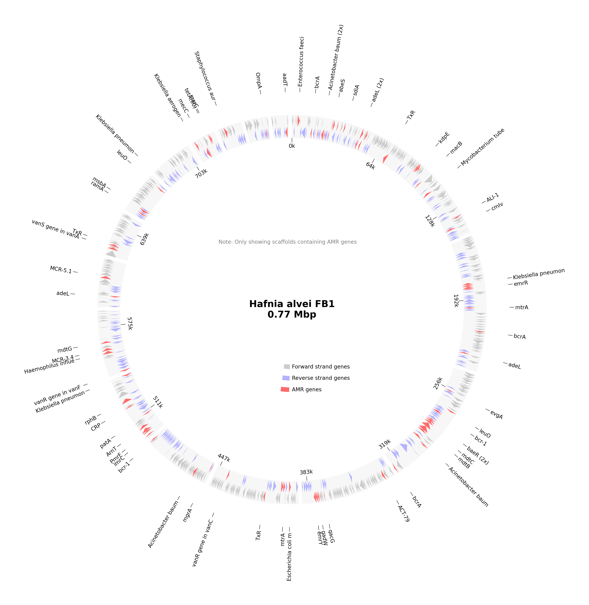

### ACT-79
- **Mechanism**: antibiotic inactivation
- **Drug Classes**: carbapenem; cephalosporin; cephamycin; penam
- **AMR Family**: ACT beta-lactamase
- **Locations**:
  - gnl|SPADES|PLIJBHFI_147_6 : position 5964-7277

### ALI-1
- **Mechanism**: antibiotic inactivation
- **Drug Classes**: carbapenem
- **AMR Family**: ALI beta-lactamase
- **Locations**:
  - gnl|SPADES|PLIJBHFI_42_141 : position 134890-135768

### Acinetobacter baumannii AbaF (found in 3 locations)
- **Mechanism**: antibiotic efflux
- **Drug Classes**: phosphonic acid antibiotic
- **AMR Family**: major facilitator superfamily (MFS) antibiotic efflux pump
- **Locations**:
  - gnl|SPADES|PLIJBHFI_103_43 : position 55762-57087
  - gnl|SPADES|PLIJBHFI_42_134 : position 125891-127432
  - gnl|SPADES|PLIJBHFI_42_26 : position 21118-22620

### Acinetobacter baumannii AbaQ
- **Mechanism**: antibiotic efflux
- **Drug Classes**: fluoroquinolone antibiotic
- **AMR Family**: major facilitator superfamily (MFS) antibiotic efflux pump
- **Locations**:
  - gnl|SPADES|PLIJBHFI_213_11 : position 9478-10854

### ArnT
- **Mechanism**: antibiotic target alteration
- **Drug Classes**: peptide antibiotic
- **AMR Family**: pmr phosphoethanolamine transferase
- **Locations**:
  - gnl|SPADES|PLIJBHFI_214_8: position 7537-9192

### CRP
- **Mechanism**: antibiotic efflux
- **Drug Classes**: macrolide antibiotic; fluoroquinolone antibiotic; penam
- **AMR Family**: resistance-nodulation-cell division (RND) antibiotic efflux pump
- **Locations**:
  - gnl|SPADES|PLIJBHFI_214_25 : position 24217-24918

### Enterococcus faecium cls conferring resistance to daptomycin
- **Mechanism**: antibiotic target alteration
- **Drug Classes**: peptide antibiotic
- **AMR Family**: daptomycin resistant cls
- **Locations**:
  - gnl|SPADES|PLIJBHFI_42_6 : position 3844-5304

### Escherichia coli mdfA
- **Mechanism**: antibiotic efflux
- **Drug Classes**: tetracycline antibiotic; phenicol antibiotic; disinfecting agents and antiseptics
- **AMR Family**: major facilitator superfamily (MFS) antibiotic efflux pump
- **Locations**:
  - gnl|SPADES|PLIJBHFI_155_7 : position 5313-6545

### Escherichia coli soxS with mutation conferring antibiotic resistance (found in 3 locations)
- **Mechanism**: antibiotic target alteration; antibiotic efflux; reduced permeability to antibiotic
- **Drug Classes**: fluoroquinolone antibiotic; monobactam; carbapenem; cephalosporin; glycylcycline; cephamycin; penam; tetracycline antibiotic; rifamycin antibiotic; phenicol antibiotic; penem; disinfecting agents and antiseptics
- **AMR Family**: ATP-binding cassette (ABC) antibiotic efflux pump; major facilitator superfamily (MFS) antibiotic efflux pump; resistance-nodulation-cell division (RND) antibiotic efflux pump; General Bacterial Porin with reduced permeability to beta-lactams
- **Locations**:
  - gnl|SPADES|PLIJBHFI_103_45 : position 57899-58765
  - gnl|SPADES|PLIJBHFI_103_52 : position 65987-66340
  - gnl|SPADES|PLIJBHFI_42_30 : position 25866-26237

### Haemophilus influenzae PBP3 conferring resistance to beta-lactam antibiotics
- **Mechanism**: antibiotic target alteration
- **Drug Classes**: cephalosporin; cephamycin; penam
- **AMR Family**: Penicillin-binding protein mutations conferring resistance to beta-lactam antibiotics
- **Locations**:
  - gnl|SPADES|PLIJBHFI_220_17 : position 15198-16970

### Klebsiella aerogenes Omp36
- **Mechanism**: reduced permeability to antibiotic
- **Drug Classes**: monobactam; carbapenem; cephalosporin; cephamycin; penam; penem
- **AMR Family**: General Bacterial Porin with reduced permeability to beta-lactams
- **Locations**:
  - gnl|SPADES|PLIJBHFI_537_2 : position 2098-3246

### Klebsiella pneumoniae KpnG
- **Mechanism**: antibiotic efflux
- **Drug Classes**: macrolide antibiotic; fluoroquinolone antibiotic; aminoglycoside antibiotic; carbapenem; cephalosporin; penam; peptide antibiotic; penem
- **AMR Family**: major facilitator superfamily (MFS) antibiotic efflux pump
- **Locations**:
  - gnl|SPADES|PLIJBHFI_95_29 : position 32088-33263

### Klebsiella pneumoniae KpnH
- **Mechanism**: antibiotic efflux
- **Drug Classes**: macrolide antibiotic; fluoroquinolone antibiotic; aminoglycoside antibiotic; carbapenem; cephalosporin; penam; peptide antibiotic; penem
- **AMR Family**: major facilitator superfamily (MFS) antibiotic efflux pump
- **Locations**:
  - gnl|SPADES|PLIJBHFI_95_28: position 30622-32001

### Klebsiella pneumoniae OmpK37 (found in 2 locations)
- **Mechanism**: reduced permeability to antibiotic
- **Drug Classes**: monobactam; carbapenem; cephalosporin; cephamycin; penam; penem
- **AMR Family**: General Bacterial Porin with reduced permeability to beta-lactams
- **Locations**:
  - gnl|SPADES|PLIJBHFI_214_45 : position 44621-45757
  - gnl|SPADES|PLIJBHFI_323_1 : position 2-115

### LRA-2
- **Mechanism**: antibiotic inactivation
- **Drug Classes**: cephalosporin; penam
- **AMR Family**: subclass B3 LRA beta-lactamase
- **Locations**:
  - gnl|SPADES|PLIJBHFI_42_62 : position 51195-52037

### MCR-3.4
- **Mechanism**: antibiotic target alteration
- **Drug Classes**: peptide antibiotic
- **AMR Family**: MCR phosphoethanolamine transferase
- **Locations**:
  - gnl|SPADES|PLIJBHFI_220_18 : position 17334-18941

### MCR-5.1
- **Mechanism**: antibiotic target alteration
- **Drug Classes**: peptide antibiotic
- **AMR Family**: MCR phosphoethanolamine transferase
- **Locations**:
  - gnl|SPADES|PLIJBHFI_291_16 : position 19484-21211

### MexG
- **Mechanism**: antibiotic efflux
- **Drug Classes**: fluoroquinolone antibiotic; tetracycline antibiotic; disinfecting agents and antiseptics
- **AMR Family**: resistance-nodulation-cell division (RND) antibiotic efflux pump
- **Locations**:
  - gnl|SPADES|PLIJBHFI_42_21 : position 18032-18448

### Mycobacterium tuberculosis ndh with mutation conferring resistance to isoniazid
- **Mechanism**: antibiotic target alteration
- **Drug Classes**: isoniazid-like antibiotic
- **AMR Family**: antibiotic resistant ndh
- **Locations**:
  - gnl|SPADES|PLIJBHFI_42_118 : position 109580-110911

### NmcR
- **Mechanism**: antibiotic inactivation
- **Drug Classes**: carbapenem; cephalosporin; cephamycin; penam
- **AMR Family**: NmcA beta-lactamase
- **Locations**:
  - gnl|SPADES|PLIJBHFI_42_59 : position 49235-50137

### OmpA (found in 2 locations)
- **Mechanism**: reduced permeability to antibiotic
- **Drug Classes**: peptide antibiotic
- **AMR Family**: General Bacterial Porin with reduced permeability to peptide antibiotics
- **Locations**:
  - gnl|SPADES|PLIJBHFI_42_27 : position 23037-23522
  - gnl|SPADES|PLIJBHFI_585_12 : position 12748-13407

### PmrF
- **Mechanism**: antibiotic target alteration
- **Drug Classes**: peptide antibiotic
- **AMR Family**: pmr phosphoethanolamine transferase
- **Locations**:
  - gnl|SPADES|PLIJBHFI_214_5 : position 3625-4641

### SatA
- **Mechanism**: antibiotic inactivation
- **Drug Classes**: nucleoside antibiotic
- **AMR Family**: streptothricin acetyltransferase (SAT)
- **Locations**:
  - gnl|SPADES|PLIJBHFI_42_35 : position 30888-31331

### Staphylococcus aureus fusA with mutation conferring resistance to fusidic acid
- **Mechanism**: antibiotic target alteration
- **Drug Classes**: fusidane antibiotic
- **AMR Family**: antibiotic resistant fusA
- **Locations**:
  - gnl|SPADES|PLIJBHFI_554_6 : position 4236-5825

### TxR (found in 3 locations)
- **Mechanism**: antibiotic efflux
- **Drug Classes**: tetracycline antibiotic
- **AMR Family**: ATP-binding cassette (ABC) antibiotic efflux pump
- **Locations**:
  - gnl|SPADES|PLIJBHFI_155_22 : position 22817-23860
  - gnl|SPADES|PLIJBHFI_313_4 : position 6959-8299
  - gnl|SPADES|PLIJBHFI_42_80 : position 69090-71102

### aadT
- **Mechanism**: antibiotic efflux
- **Drug Classes**: macrolide antibiotic; tetracycline antibiotic; disinfecting agents and antiseptics
- **AMR Family**: major facilitator superfamily (MFS) antibiotic efflux pump
- **Locations**:
  - gnl|SPADES|PLIJBHFI_739_10 : position 9050-10516

### abeS
- **Mechanism**: antibiotic efflux
- **Drug Classes**: macrolide antibiotic; aminocoumarin antibiotic
- **AMR Family**: small multidrug resistance (SMR) antibiotic efflux pump
- **Locations**:
  - gnl|SPADES|PLIJBHFI_42_32 : position 27519-27863

### adeL (found in 4 locations)
- **Mechanism**: antibiotic efflux
- **Drug Classes**: fluoroquinolone antibiotic; tetracycline antibiotic
- **AMR Family**: resistance-nodulation-cell division (RND) antibiotic efflux pump
- **Locations**:
  - gnl|SPADES|PLIJBHFI_291_7 : position 7069-7995
  - gnl|SPADES|PLIJBHFI_42_140 : position 133866-134762
  - gnl|SPADES|PLIJBHFI_42_57 : position 46881-47822
  - gnl|SPADES|PLIJBHFI_95_83 : position 80758-81639

### arnA
- **Mechanism**: antibiotic target alteration
- **Drug Classes**: peptide antibiotic
- **AMR Family**: pmr phosphoethanolamine transferase
- **Locations**:
  - gnl|SPADES|PLIJBHFI_214_6 : position 4641-6623

### baeR (found in 2 locations)
- **Mechanism**: antibiotic efflux
- **Drug Classes**: aminoglycoside antibiotic; aminocoumarin antibiotic
- **AMR Family**: resistance-nodulation-cell division (RND) antibiotic efflux pump
- **Locations**:
  - gnl|SPADES|PLIJBHFI_103_33 : position 40688-41419
  - gnl|SPADES|PLIJBHFI_103_56 : position 71800-72441

### baeS (found in 2 locations)
- **Mechanism**: antibiotic efflux
- **Drug Classes**: aminoglycoside antibiotic; aminocoumarin antibiotic
- **AMR Family**: resistance-nodulation-cell division (RND) antibiotic efflux pump
- **Locations**:
  - gnl|SPADES|PLIJBHFI_103_34 : position 41430-42803
  - gnl|SPADES|PLIJBHFI_103_57 : position 72692-74041

### bcr-1 (found in 2 locations)
- **Mechanism**: antibiotic efflux
- **Drug Classes**: bicyclomycin-like antibiotic
- **AMR Family**: major facilitator superfamily (MFS) antibiotic efflux pump
- **Locations**:
  - gnl|SPADES|PLIJBHFI_103_27 : position 33168-34451
  - gnl|SPADES|PLIJBHFI_213_49 : position 45195-45989

### bcrA (found in 3 locations)
- **Mechanism**: antibiotic efflux
- **Drug Classes**: peptide antibiotic
- **AMR Family**: ATP-binding cassette (ABC) antibiotic efflux pump
- **Locations**:
  - gnl|SPADES|PLIJBHFI_103_63 : position 82761-83573
  - gnl|SPADES|PLIJBHFI_42_14 : position 13354-14115
  - gnl|SPADES|PLIJBHFI_95_66 : position 64322-65152

### blt
- **Mechanism**: antibiotic efflux
- **Drug Classes**: fluoroquinolone antibiotic; disinfecting agents and antiseptics
- **AMR Family**: major facilitator superfamily (MFS) antibiotic efflux pump
- **Locations**:
  - gnl|SPADES|PLIJBHFI_155_12 : position 10713-12188

### cmlv
- **Mechanism**: antibiotic inactivation
- **Drug Classes**: phenicol antibiotic
- **AMR Family**: chloramphenicol phosphotransferase
- **Locations**:
  - gnl|SPADES|PLIJBHFI_42_146 : position 140164-141399

### cmx
- **Mechanism**: antibiotic efflux
- **Drug Classes**: phenicol antibiotic
- **AMR Family**: major facilitator superfamily (MFS) antibiotic efflux pump
- **Locations**:
  - gnl|SPADES|PLIJBHFI_42_58 : position 47926-49134

### cpxA
- **Mechanism**: antibiotic efflux
- **Drug Classes**: aminoglycoside antibiotic; aminocoumarin antibiotic
- **AMR Family**: resistance-nodulation-cell division (RND) antibiotic efflux pump
- **Locations**:
  - gnl|SPADES|PLIJBHFI_42_105 : position 92440-93912

### emrK
- **Mechanism**: antibiotic efflux
- **Drug Classes**: tetracycline antibiotic
- **AMR Family**: major facilitator superfamily (MFS) antibiotic efflux pump
- **Locations**:
  - gnl|SPADES|PLIJBHFI_147_58 : position 53255-54406

### emrR
- **Mechanism**: antibiotic efflux
- **Drug Classes**: fluoroquinolone antibiotic
- **AMR Family**: major facilitator superfamily (MFS) antibiotic efflux pump
- **Locations**:
  - gnl|SPADES|PLIJBHFI_95_31 : position 34780-35298

### emrY (found in 2 locations)
- **Mechanism**: antibiotic efflux
- **Drug Classes**: tetracycline antibiotic
- **AMR Family**: major facilitator superfamily (MFS) antibiotic efflux pump
- **Locations**:
  - gnl|SPADES|PLIJBHFI_103_35 : position 42800-44224
  - gnl|SPADES|PLIJBHFI_147_59 : position 54415-55953

### evgA
- **Mechanism**: antibiotic efflux
- **Drug Classes**: macrolide antibiotic; fluoroquinolone antibiotic; penam; tetracycline antibiotic
- **AMR Family**: major facilitator superfamily (MFS) antibiotic efflux pump; resistance-nodulation-cell division (RND) antibiotic efflux pump
- **Locations**:
  - gnl|SPADES|PLIJBHFI_103_14 : position 16280-16942

### gadW
- **Mechanism**: antibiotic efflux
- **Drug Classes**: macrolide antibiotic; fluoroquinolone antibiotic; penam
- **AMR Family**: resistance-nodulation-cell division (RND) antibiotic efflux pump
- **Locations**:
  - gnl|SPADES|PLIJBHFI_147_56 : position 52266-53021

### kdpE
- **Mechanism**: antibiotic efflux
- **Drug Classes**: aminoglycoside antibiotic
- **AMR Family**: kdpDE
- **Locations**:
  - gnl|SPADES|PLIJBHFI_42_104 : position 91769-92443

### leuO (found in 3 locations)
- **Mechanism**: antibiotic efflux
- **Drug Classes**: nucleoside antibiotic; disinfecting agents and antiseptics
- **AMR Family**: major facilitator superfamily (MFS) antibiotic efflux pump
- **Locations**:
  - gnl|SPADES|PLIJBHFI_103_23 : position 28561-29520
  - gnl|SPADES|PLIJBHFI_319_22 : position 24899-25795
  - gnl|SPADES|PLIJBHFI_42_33 : position 28151-29098

### lmrC
- **Mechanism**: antibiotic target protection
- **Drug Classes**: lincosamide antibiotic
- **AMR Family**: Miscellaneous ABC-F subfamily ATP-binding cassette ribosomal protection proteins
- **Locations**:
  - gnl|SPADES|PLIJBHFI_214_3 : position 1412-2200

### macB
- **Mechanism**: antibiotic efflux
- **Drug Classes**: macrolide antibiotic
- **AMR Family**: ATP-binding cassette (ABC) antibiotic efflux pump
- **Locations**:
  - gnl|SPADES|PLIJBHFI_42_112 : position 100433-101152

### mdtA
- **Mechanism**: antibiotic efflux
- **Drug Classes**: aminocoumarin antibiotic
- **AMR Family**: resistance-nodulation-cell division (RND) antibiotic efflux pump
- **Locations**:
  - gnl|SPADES|PLIJBHFI_103_38 : position 50623-51918

### mdtB
- **Mechanism**: antibiotic efflux
- **Drug Classes**: aminocoumarin antibiotic
- **AMR Family**: resistance-nodulation-cell division (RND) antibiotic efflux pump
- **Locations**:
  - gnl|SPADES|PLIJBHFI_103_37 : position 47474-50623

### mdtC
- **Mechanism**: antibiotic efflux
- **Drug Classes**: aminocoumarin antibiotic
- **AMR Family**: resistance-nodulation-cell division (RND) antibiotic efflux pump
- **Locations**:
  - gnl|SPADES|PLIJBHFI_103_36 : position 44379-47477

### mdtG
- **Mechanism**: antibiotic efflux
- **Drug Classes**: phosphonic acid antibiotic
- **AMR Family**: major facilitator superfamily (MFS) antibiotic efflux pump
- **Locations**:
  - gnl|SPADES|PLIJBHFI_220_22 : position 22453-23637

### mdtP
- **Mechanism**: antibiotic efflux
- **Drug Classes**: nucleoside antibiotic; disinfecting agents and antiseptics
- **AMR Family**: major facilitator superfamily (MFS) antibiotic efflux pump
- **Locations**:
  - gnl|SPADES|PLIJBHFI_95_30 : position 33288-34745

### mecC
- **Mechanism**: antibiotic target replacement
- **Drug Classes**: penam
- **AMR Family**: methicillin resistant PBP2
- **Locations**:
  - gnl|SPADES|PLIJBHFI_537_7 : position 6070-7983

### mgrA
- **Mechanism**: antibiotic efflux
- **Drug Classes**: fluoroquinolone antibiotic; cephalosporin; penam; tetracycline antibiotic; peptide antibiotic; disinfecting agents and antiseptics
- **AMR Family**: ATP-binding cassette (ABC) antibiotic efflux pump; major facilitator superfamily (MFS) antibiotic efflux pump
- **Locations**:
  - gnl|SPADES|PLIJBHFI_213_2 : position 1276-1719

### msbA
- **Mechanism**: antibiotic efflux
- **Drug Classes**: nitroimidazole antibiotic
- **AMR Family**: ATP-binding cassette (ABC) antibiotic efflux pump
- **Locations**:
  - gnl|SPADES|PLIJBHFI_319_5 : position 5063-6583

### msrC
- **Mechanism**: antibiotic target protection
- **Drug Classes**: macrolide antibiotic; streptogramin antibiotic; streptogramin B antibiotic
- **AMR Family**: msr-type ABC-F protein
- **Locations**:
  - gnl|SPADES|PLIJBHFI_537_13 : position 13116-13706

### mtrA (found in 2 locations)
- **Mechanism**: antibiotic efflux
- **Drug Classes**: macrolide antibiotic; penam
- **AMR Family**: resistance-nodulation-cell division (RND) antibiotic efflux pump
- **Locations**:
  - gnl|SPADES|PLIJBHFI_155_11 : position 9410-10591
  - gnl|SPADES|PLIJBHFI_95_46 : position 48003-48824

### patA
- **Mechanism**: antibiotic efflux
- **Drug Classes**: fluoroquinolone antibiotic
- **AMR Family**: ATP-binding cassette (ABC) antibiotic efflux pump
- **Locations**:
  - gnl|SPADES|PLIJBHFI_214_15 : position 13792-14613

### qacG
- **Mechanism**: antibiotic efflux
- **Drug Classes**: disinfecting agents and antiseptics
- **AMR Family**: small multidrug resistance (SMR) antibiotic efflux pump
- **Locations**:
  - gnl|SPADES|PLIJBHFI_147_52: position 48547-48915

### ramA
- **Mechanism**: antibiotic efflux; reduced permeability to antibiotic
- **Drug Classes**: fluoroquinolone antibiotic; monobactam; carbapenem; cephalosporin; glycylcycline; cephamycin; penam; tetracycline antibiotic; rifamycin antibiotic; phenicol antibiotic; penem; disinfecting agents and antiseptics
- **AMR Family**: resistance-nodulation-cell division (RND) antibiotic efflux pump; General Bacterial Porin with reduced permeability to beta-lactams
- **Locations**:
  - gnl|SPADES|PLIJBHFI_319_3 : position 2929-3870

### rphB
- **Mechanism**: antibiotic inactivation
- **Drug Classes**: rifamycin antibiotic
- **AMR Family**: rifampin phosphotransferase
- **Locations**:
  - gnl|SPADES|PLIJBHFI_214_30 : position 28291-30663

### sdiA
- **Mechanism**: antibiotic efflux
- **Drug Classes**: fluoroquinolone antibiotic; cephalosporin; glycylcycline; penam; tetracycline antibiotic; rifamycin antibiotic; phenicol antibiotic; disinfecting agents and antiseptics
- **AMR Family**: resistance-nodulation-cell division (RND) antibiotic efflux pump
- **Locations**:
  - gnl|SPADES|PLIJBHFI_42_42 : position 35679-36419

### tetA(60)
- **Mechanism**: antibiotic efflux
- **Drug Classes**: tetracycline antibiotic
- **AMR Family**: ATP-binding cassette (ABC) antibiotic efflux pump
- **Locations**:
  - gnl|SPADES|PLIJBHFI_537_12 : position 12298-13116

### vanR gene in vanC cluster
- **Mechanism**: antibiotic target alteration
- **Drug Classes**: glycopeptide antibiotic
- **AMR Family**: glycopeptide resistance gene cluster; vanR
- **Locations**:
  - gnl|SPADES|PLIJBHFI_155_53 : position 50880-51845

### vanR gene in vanF cluster
- **Mechanism**: antibiotic target alteration
- **Drug Classes**: glycopeptide antibiotic
- **AMR Family**: glycopeptide resistance gene cluster; vanR
- **Locations**:
  - gnl|SPADES|PLIJBHFI_220_2 : position 123-1175

### vanS gene in vanA cluster
- **Mechanism**: antibiotic target alteration
- **Drug Classes**: glycopeptide antibiotic
- **AMR Family**: vanS; glycopeptide resistance gene cluster
- **Locations**:
  - gnl|SPADES|PLIJBHFI_313_2 : position 4688-6124

## Hafnia paralvei
**Strain Statistics:**
- Total genome length: 4539.1 kbp
- Total scaffolds: 339
- Scaffolds with AMR genes: 90
- Total genes annotated: 8260
- Total AMR genes: 436
- Unique AMR genes: 211
- Distinct AMR mechanisms: 11
- Distinct AMR families: 73
- Distinct drug classes: 37

**Circos Plot:**

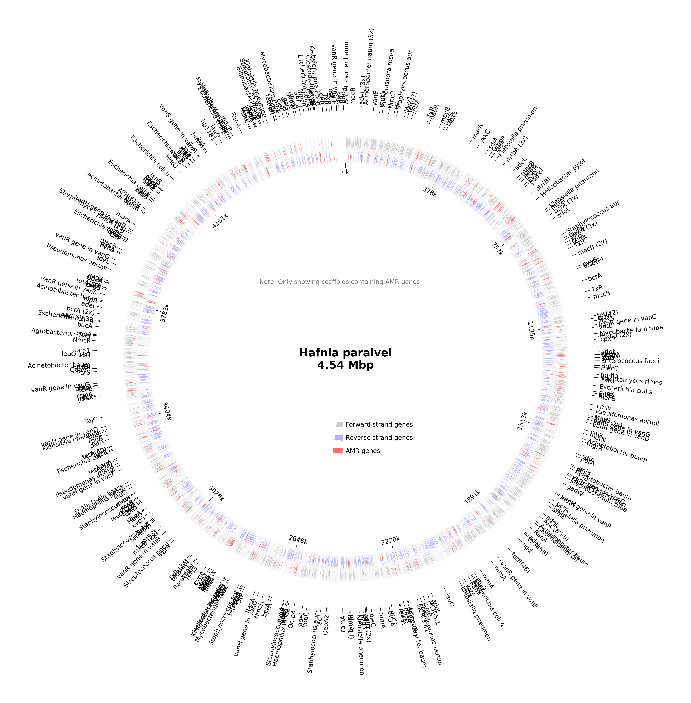

### AAC(6')-32
- **Mechanism**: antibiotic inactivation
- **Drug Classes**: aminoglycoside antibiotic
- **AMR Family**: AAC(6')
- **Locations**:
  - gnl|SPADES|PLIJBHFI_254_26 : position 28514-29116

### AAC(6')-Iu
- **Mechanism**: antibiotic inactivation
- **Drug Classes**: aminoglycoside antibiotic
- **AMR Family**: AAC(6')
- **Locations**:
  - gnl|SPADES|PLIJBHFI_92_34 : position 33708-34166

### ACC-1a
- **Mechanism**: antibiotic inactivation
- **Drug Classes**: monobactam; cephalosporin; cephamycin; penam; oxacephem
- **AMR Family**: ACC beta-lactamase
- **Locations**:
  - gnl|SPADES|PLIJBHFI_54_97: position 122118-123290

### ALI-2
- **Mechanism**: antibiotic inactivation
- **Drug Classes**: carbapenem
- **AMR Family**: ALI beta-lactamase
- **Locations**:
  - gnl|SPADES|PLIJBHFI_73_53 : position 53532-54410

### APH(6)-Ic
- **Mechanism**: antibiotic inactivation
- **Drug Classes**: aminoglycoside antibiotic
- **AMR Family**: APH(6)
- **Locations**:
  - gnl|SPADES|PLIJBHFI_379_5 : position 3124-3927

### Acinetobacter baumannii AbaF (found in 6 locations)
- **Mechanism**: antibiotic efflux
- **Drug Classes**: phosphonic acid antibiotic
- **AMR Family**: major facilitator superfamily (MFS) antibiotic efflux pump
- **Locations**:
  - gnl|SPADES|PLIJBHFI_120_3 : position 2343-3668
  - gnl|SPADES|PLIJBHFI_15_1 : position 279-1580
  - gnl|SPADES|PLIJBHFI_262_6 : position 5607-6941
  - gnl|SPADES|PLIJBHFI_377_18 : position 20379-21608
  - gnl|SPADES|PLIJBHFI_51_81 : position 79745-81247
  - gnl|SPADES|PLIJBHFI_73_61 : position 61885-63426

### Acinetobacter baumannii AbaQ (found in 7 locations)
- **Mechanism**: antibiotic efflux
- **Drug Classes**: fluoroquinolone antibiotic
- **AMR Family**: major facilitator superfamily (MFS) antibiotic efflux pump
- **Locations**:
  - gnl|SPADES|PLIJBHFI_15_127 : position 147158-148381
  - gnl|SPADES|PLIJBHFI_15_209 : position 241648-242985
  - gnl|SPADES|PLIJBHFI_15_48 : position 63301-64647
  - gnl|SPADES|PLIJBHFI_187_12 : position 12562-13857
  - gnl|SPADES|PLIJBHFI_222_31 : position 34526-35854
  - gnl|SPADES|PLIJBHFI_58_85 : position 86980-88356
  - gnl|SPADES|PLIJBHFI_92_54 : position 52909-54201

### AcrE
- **Mechanism**: antibiotic efflux
- **Drug Classes**: fluoroquinolone antibiotic; cephalosporin; cephamycin; penam
- **AMR Family**: resistance-nodulation-cell division (RND) antibiotic efflux pump
- **Locations**:
  - gnl|SPADES|PLIJBHFI_27_31 : position 31721-32884

### AcrF
- **Mechanism**: antibiotic efflux
- **Drug Classes**: fluoroquinolone antibiotic; cephalosporin; cephamycin; penam
- **AMR Family**: resistance-nodulation-cell division (RND) antibiotic efflux pump
- **Locations**:
  - gnl|SPADES|PLIJBHFI_27_30 : position 28560-31682

### Agrobacterium fabrum chloramphenicol acetyltransferase
- **Mechanism**: antibiotic inactivation
- **Drug Classes**: phenicol antibiotic
- **AMR Family**: chloramphenicol acetyltransferase (CAT)
- **Locations**:
  - gnl|SPADES|PLIJBHFI_234_23 : position 26183-26737

### ArnT
- **Mechanism**: antibiotic target alteration
- **Drug Classes**: peptide antibiotic
- **AMR Family**: pmr phosphoethanolamine transferase
- **Locations**:
  - gnl|SPADES|PLIJBHFI_559_10: position 10175-11824

### Bifidobacterium bifidum ileS conferring resistance to mupirocin
- **Mechanism**: antibiotic target alteration
- **Drug Classes**: mupirocin-like antibiotic
- **AMR Family**: antibiotic-resistant isoleucyl-tRNA synthetase (ileS)
- **Locations**:
  - gnl|SPADES|PLIJBHFI_588_1 : position 2-316

### CRP (found in 2 locations)
- **Mechanism**: antibiotic efflux
- **Drug Classes**: macrolide antibiotic; fluoroquinolone antibiotic; penam
- **AMR Family**: resistance-nodulation-cell division (RND) antibiotic efflux pump
- **Locations**:
  - gnl|SPADES|PLIJBHFI_163_25: position 28397-29029
  - gnl|SPADES|PLIJBHFI_320_13 : position 13462-14259

### Clostridioides difficile gyrA conferring resistance to fluoroquinolones
- **Mechanism**: antibiotic target alteration
- **Drug Classes**: fluoroquinolone antibiotic
- **AMR Family**: fluoroquinolone resistant gyrA
- **Locations**:
  - gnl|SPADES|PLIJBHFI_997_2 : position 3355-6003

### Clostridioides difficile gyrB conferring resistance to fluoroquinolones (found in 2 locations)
- **Mechanism**: antibiotic target alteration
- **Drug Classes**: fluoroquinolone antibiotic
- **AMR Family**: fluoroquinolone resistant gyrB
- **Locations**:
  - gnl|SPADES|PLIJBHFI_22_13 : position 13418-15313
  - gnl|SPADES|PLIJBHFI_92_62 : position 59800-62214

### D-Ala-D-Ala ligase
- **Mechanism**: antibiotic target alteration
- **Drug Classes**: glycopeptide antibiotic
- **AMR Family**: Van ligase
- **Locations**:
  - gnl|SPADES|PLIJBHFI_179_22 : position 27007-27927

### EVM-1
- **Mechanism**: antibiotic inactivation
- **Drug Classes**: carbapenem
- **AMR Family**: EVM beta-lactamase
- **Locations**:
  - gnl|SPADES|PLIJBHFI_23_153 : position 185461-186282

### Enterobacter cloacae acrA
- **Mechanism**: antibiotic efflux
- **Drug Classes**: fluoroquinolone antibiotic; cephalosporin; glycylcycline; penam; tetracycline antibiotic; rifamycin antibiotic; phenicol antibiotic; disinfecting agents and antiseptics
- **AMR Family**: resistance-nodulation-cell division (RND) antibiotic efflux pump
- **Locations**:
  - gnl|SPADES|PLIJBHFI_191_21 : position 22112-23302

### Enterococcus faecium cls conferring resistance to daptomycin
- **Mechanism**: antibiotic target alteration
- **Drug Classes**: peptide antibiotic
- **AMR Family**: daptomycin resistant cls
- **Locations**:
  - gnl|SPADES|PLIJBHFI_51_101 : position 97324-98784

### ErmX
- **Mechanism**: antibiotic target alteration
- **Drug Classes**: macrolide antibiotic; lincosamide antibiotic; streptogramin antibiotic; streptogramin A antibiotic; streptogramin B antibiotic
- **AMR Family**: Erm 23S ribosomal RNA methyltransferase
- **Locations**:
  - gnl|SPADES|PLIJBHFI_176_13 : position 14839-15651

### Escherichia coli AcrAB-TolC with AcrR mutation conferring resistance to ciprofloxacin, tetracycline, and ceftazidime
- **Mechanism**: antibiotic target alteration; antibiotic efflux
- **Drug Classes**: fluoroquinolone antibiotic; cephalosporin; glycylcycline; penam; tetracycline antibiotic; rifamycin antibiotic; phenicol antibiotic; disinfecting agents and antiseptics
- **AMR Family**: resistance-nodulation-cell division (RND) antibiotic efflux pump
- **Locations**:
  - gnl|SPADES|PLIJBHFI_191_20 : position 21268-21972

### Escherichia coli AcrAB-TolC with MarR mutations conferring resistance to ciprofloxacin and tetracycline (found in 2 locations)
- **Mechanism**: antibiotic target alteration; antibiotic efflux
- **Drug Classes**: fluoroquinolone antibiotic; cephalosporin; glycylcycline; penam; tetracycline antibiotic; rifamycin antibiotic; phenicol antibiotic; disinfecting agents and antiseptics
- **AMR Family**: resistance-nodulation-cell division (RND) antibiotic efflux pump
- **Locations**:
  - gnl|SPADES|PLIJBHFI_105_32 : position 34017-34448
  - gnl|SPADES|PLIJBHFI_320_22 : position 23403-23894

### Escherichia coli EF-Tu mutants conferring resistance to Enacyloxin IIa
- **Mechanism**: antibiotic target alteration
- **Drug Classes**: elfamycin antibiotic
- **AMR Family**: elfamycin resistant EF-Tu
- **Locations**:
  - gnl|SPADES|PLIJBHFI_383_17 : position 15535-18237

### Escherichia coli EF-Tu mutants conferring resistance to Pulvomycin (found in 2 locations)
- **Mechanism**: antibiotic target alteration
- **Drug Classes**: elfamycin antibiotic
- **AMR Family**: elfamycin resistant EF-Tu
- **Locations**:
  - gnl|SPADES|PLIJBHFI_163_50 : position 50511-51695
  - gnl|SPADES|PLIJBHFI_501_7 : position 6063-7247

### Escherichia coli PtsI with mutation conferring resistance to fosfomycin
- **Mechanism**: antibiotic target alteration
- **Drug Classes**: phosphonic acid antibiotic
- **AMR Family**: antibiotic-resistant ptsI phosphotransferase
- **Locations**:
  - gnl|SPADES|PLIJBHFI_413_8 : position 6375-8102

### Escherichia coli acrA
- **Mechanism**: antibiotic efflux
- **Drug Classes**: fluoroquinolone antibiotic; cephalosporin; glycylcycline; penam; tetracycline antibiotic; rifamycin antibiotic; phenicol antibiotic; disinfecting agents and antiseptics
- **AMR Family**: resistance-nodulation-cell division (RND) antibiotic efflux pump
- **Locations**:
  - gnl|SPADES|PLIJBHFI_210_32 : position 36583-37770

### Escherichia coli mdfA (found in 2 locations)
- **Mechanism**: antibiotic efflux
- **Drug Classes**: tetracycline antibiotic; phenicol antibiotic; disinfecting agents and antiseptics
- **AMR Family**: major facilitator superfamily (MFS) antibiotic efflux pump
- **Locations**:
  - gnl|SPADES|PLIJBHFI_254_24 : position 25230-26450
  - gnl|SPADES|PLIJBHFI_54_6 : position 7586-8818

### Escherichia coli soxS with mutation conferring antibiotic resistance (found in 4 locations)
- **Mechanism**: antibiotic target alteration; antibiotic efflux; reduced permeability to antibiotic
- **Drug Classes**: fluoroquinolone antibiotic; monobactam; carbapenem; cephalosporin; glycylcycline; cephamycin; penam; tetracycline antibiotic; rifamycin antibiotic; phenicol antibiotic; penem; disinfecting agents and antiseptics
- **AMR Family**: ATP-binding cassette (ABC) antibiotic efflux pump; major facilitator superfamily (MFS) antibiotic efflux pump; resistance-nodulation-cell division (RND) antibiotic efflux pump; General Bacterial Porin with reduced permeability to beta-lactams
- **Locations**:
  - gnl|SPADES|PLIJBHFI_27_23 : position 21252-22073
  - gnl|SPADES|PLIJBHFI_51_76 : position 75991-76362
  - gnl|SPADES|PLIJBHFI_54_31 : position 41696-42559
  - gnl|SPADES|PLIJBHFI_868_2 : position 534-1412

### Escherichia coli uhpA with mutation conferring resistance to fosfomycin
- **Mechanism**: antibiotic target alteration
- **Drug Classes**: phosphonic acid antibiotic
- **AMR Family**: antibiotic-resistant UhpT
- **Locations**:
  - gnl|SPADES|PLIJBHFI_395_9 : position 10199-10915

### FosC2
- **Mechanism**: antibiotic inactivation
- **Drug Classes**: phosphonic acid antibiotic
- **AMR Family**: fosC phosphotransferase family
- **Locations**:
  - gnl|SPADES|PLIJBHFI_45_131 : position 125144-125608

### H-NS
- **Mechanism**: antibiotic efflux
- **Drug Classes**: macrolide antibiotic; fluoroquinolone antibiotic; cephalosporin; cephamycin; penam; tetracycline antibiotic
- **AMR Family**: major facilitator superfamily (MFS) antibiotic efflux pump; resistance-nodulation-cell division (RND) antibiotic efflux pump
- **Locations**:
  - gnl|SPADES|PLIJBHFI_167_1 : position 295-702

### Haemophilus influenzae PBP3 conferring resistance to beta-lactam antibiotics (found in 2 locations)
- **Mechanism**: antibiotic target alteration
- **Drug Classes**: cephalosporin; cephamycin; penam
- **AMR Family**: Penicillin-binding protein mutations conferring resistance to beta-lactam antibiotics
- **Locations**:
  - gnl|SPADES|PLIJBHFI_152_12 : position 10077-11849
  - gnl|SPADES|PLIJBHFI_179_14 : position 16103-17866

### Helicobacter pylori pbp1 mutants conferring resistance to amoxicillin (found in 2 locations)
- **Mechanism**: antibiotic target alteration
- **Drug Classes**: cephalosporin; cephamycin; penam
- **AMR Family**: Penicillin-binding protein mutations conferring resistance to beta-lactam antibiotics
- **Locations**:
  - gnl|SPADES|PLIJBHFI_165_25 : position 33905-36484
  - gnl|SPADES|PLIJBHFI_26_37 : position 45431-47704

### Helicobacter pylori pbp2 mutants conferring resistance to amoxicillin
- **Mechanism**: antibiotic target alteration
- **Drug Classes**: cephalosporin; cephamycin; penam
- **AMR Family**: Penicillin-binding protein mutations conferring resistance to beta-lactam antibiotics
- **Locations**:
  - gnl|SPADES|PLIJBHFI_27_7 : position 5755-7650

### Helicobacter pylori rpoB mutation conferring resistance to rifampicin
- **Mechanism**: antibiotic target alteration; antibiotic target replacement
- **Drug Classes**: fluoroquinolone antibiotic; rifamycin antibiotic
- **AMR Family**: rifamycin-resistant beta-subunit of RNA polymerase (rpoB)
- **Locations**:
  - gnl|SPADES|PLIJBHFI_501_15 : position 15537-18515

### Klebsiella aerogenes Omp36
- **Mechanism**: reduced permeability to antibiotic
- **Drug Classes**: monobactam; carbapenem; cephalosporin; cephamycin; penam; penem
- **AMR Family**: General Bacterial Porin with reduced permeability to beta-lactams
- **Locations**:
  - gnl|SPADES|PLIJBHFI_51_129 : position 125492-126640

### Klebsiella pneumoniae KpnE
- **Mechanism**: antibiotic efflux
- **Drug Classes**: macrolide antibiotic; aminoglycoside antibiotic; cephalosporin; tetracycline antibiotic; peptide antibiotic; rifamycin antibiotic; disinfecting agents and antiseptics
- **AMR Family**: small multidrug resistance (SMR) antibiotic efflux pump
- **Locations**:
  - gnl|SPADES|PLIJBHFI_87_72 : position 80038-80469

### Klebsiella pneumoniae KpnF
- **Mechanism**: antibiotic efflux
- **Drug Classes**: macrolide antibiotic; aminoglycoside antibiotic; cephalosporin; tetracycline antibiotic; peptide antibiotic; rifamycin antibiotic; disinfecting agents and antiseptics
- **AMR Family**: small multidrug resistance (SMR) antibiotic efflux pump
- **Locations**:
  - gnl|SPADES|PLIJBHFI_87_73: position 80456-80785

### Klebsiella pneumoniae KpnG
- **Mechanism**: antibiotic efflux
- **Drug Classes**: macrolide antibiotic; fluoroquinolone antibiotic; aminoglycoside antibiotic; carbapenem; cephalosporin; penam; peptide antibiotic; penem
- **AMR Family**: major facilitator superfamily (MFS) antibiotic efflux pump
- **Locations**:
  - gnl|SPADES|PLIJBHFI_26_73 : position 91692-92867

### Klebsiella pneumoniae KpnH (found in 2 locations)
- **Mechanism**: antibiotic efflux
- **Drug Classes**: macrolide antibiotic; fluoroquinolone antibiotic; aminoglycoside antibiotic; carbapenem; cephalosporin; penam; peptide antibiotic; penem
- **AMR Family**: major facilitator superfamily (MFS) antibiotic efflux pump
- **Locations**:
  - gnl|SPADES|PLIJBHFI_1073_5 : position 3867-5306
  - gnl|SPADES|PLIJBHFI_26_72: position 90139-91674

### Klebsiella pneumoniae OmpK37 (found in 7 locations)
- **Mechanism**: reduced permeability to antibiotic
- **Drug Classes**: monobactam; carbapenem; cephalosporin; cephamycin; penam; penem
- **AMR Family**: General Bacterial Porin with reduced permeability to beta-lactams
- **Locations**:
  - gnl|SPADES|PLIJBHFI_105_81 : position 82464-83492
  - gnl|SPADES|PLIJBHFI_137_1 : position 3-131
  - gnl|SPADES|PLIJBHFI_165_24 : position 32584-33723
  - gnl|SPADES|PLIJBHFI_199_32 : position 33505-34647
  - gnl|SPADES|PLIJBHFI_23_49 : position 60167-61282
  - gnl|SPADES|PLIJBHFI_600_5 : position 2280-3380
  - gnl|SPADES|PLIJBHFI_73_84 : position 84308-85411

### Klebsiella pneumoniae acrR with mutation conferring multidrug antibiotic resistance
- **Mechanism**: antibiotic target alteration; antibiotic efflux
- **Drug Classes**: fluoroquinolone antibiotic; cephalosporin; glycylcycline; penam; tetracycline antibiotic; rifamycin antibiotic; phenicol antibiotic; disinfecting agents and antiseptics
- **AMR Family**: resistance-nodulation-cell division (RND) antibiotic efflux pump
- **Locations**:
  - gnl|SPADES|PLIJBHFI_27_32 : position 33477-34091

### LRA-19
- **Mechanism**: antibiotic inactivation
- **Drug Classes**: cephalosporin; penam
- **AMR Family**: subclass B3 LRA beta-lactamase
- **Locations**:
  - gnl|SPADES|PLIJBHFI_23_51 : position 62843-63490

### LlmA 23S ribosomal RNA methyltransferase
- **Mechanism**: antibiotic target alteration
- **Drug Classes**: lincosamide antibiotic
- **AMR Family**: Llm 23S ribosomal RNA methyltransferase
- **Locations**:
  - gnl|SPADES|PLIJBHFI_23_20 : position 24053-25246

### LptD
- **Mechanism**: antibiotic efflux
- **Drug Classes**: carbapenem; peptide antibiotic; aminocoumarin antibiotic; rifamycin antibiotic
- **AMR Family**: ATP-binding cassette (ABC) antibiotic efflux pump
- **Locations**:
  - gnl|SPADES|PLIJBHFI_176_10 : position 10040-12442

### MCR-10.4
- **Mechanism**: antibiotic target alteration
- **Drug Classes**: peptide antibiotic
- **AMR Family**: MCR phosphoethanolamine transferase
- **Locations**:
  - gnl|SPADES|PLIJBHFI_94_75 : position 83010-84644

### MCR-3.4
- **Mechanism**: antibiotic target alteration
- **Drug Classes**: peptide antibiotic
- **AMR Family**: MCR phosphoethanolamine transferase
- **Locations**:
  - gnl|SPADES|PLIJBHFI_152_13 : position 12214-13821

### MCR-3.41
- **Mechanism**: antibiotic target alteration
- **Drug Classes**: peptide antibiotic
- **AMR Family**: MCR phosphoethanolamine transferase
- **Locations**:
  - gnl|SPADES|PLIJBHFI_116_52 : position 57364-58986

### MCR-5.1
- **Mechanism**: antibiotic target alteration
- **Drug Classes**: peptide antibiotic
- **AMR Family**: MCR phosphoethanolamine transferase
- **Locations**:
  - gnl|SPADES|PLIJBHFI_116_16 : position 19752-21479

### MdtK
- **Mechanism**: antibiotic efflux
- **Drug Classes**: fluoroquinolone antibiotic
- **AMR Family**: multidrug and toxic compound extrusion (MATE) transporter
- **Locations**:
  - gnl|SPADES|PLIJBHFI_27_39 : position 40262-41719

### MdtQ
- **Mechanism**: reduced permeability to antibiotic
- **Drug Classes**: monobactam; carbapenem; cephalosporin; cephamycin; penam; penem
- **AMR Family**: Outer Membrane Porin (Opr)
- **Locations**:
  - gnl|SPADES|PLIJBHFI_400_9 : position 12231-13736

### MexG
- **Mechanism**: antibiotic efflux
- **Drug Classes**: fluoroquinolone antibiotic; tetracycline antibiotic; disinfecting agents and antiseptics
- **AMR Family**: resistance-nodulation-cell division (RND) antibiotic efflux pump
- **Locations**:
  - gnl|SPADES|PLIJBHFI_51_86 : position 83917-84333

### MexS (found in 6 locations)
- **Mechanism**: antibiotic efflux
- **Drug Classes**: fluoroquinolone antibiotic; diaminopyrimidine antibiotic; phenicol antibiotic
- **AMR Family**: resistance-nodulation-cell division (RND) antibiotic efflux pump
- **Locations**:
  - gnl|SPADES|PLIJBHFI_15_87 : position 95372-96349
  - gnl|SPADES|PLIJBHFI_166_13 : position 18154-19173
  - gnl|SPADES|PLIJBHFI_174_46 : position 49690-50691
  - gnl|SPADES|PLIJBHFI_22_65 : position 75704-76690
  - gnl|SPADES|PLIJBHFI_45_127 : position 120592-121716
  - gnl|SPADES|PLIJBHFI_58_8 : position 8426-9457

### MexT
- **Mechanism**: antibiotic efflux
- **Drug Classes**: fluoroquinolone antibiotic; diaminopyrimidine antibiotic; phenicol antibiotic
- **AMR Family**: resistance-nodulation-cell division (RND) antibiotic efflux pump
- **Locations**:
  - gnl|SPADES|PLIJBHFI_15_167 : position 196005-196898

### MexV
- **Mechanism**: antibiotic efflux
- **Drug Classes**: macrolide antibiotic; fluoroquinolone antibiotic; tetracycline antibiotic; phenicol antibiotic; disinfecting agents and antiseptics
- **AMR Family**: resistance-nodulation-cell division (RND) antibiotic efflux pump
- **Locations**:
  - gnl|SPADES|PLIJBHFI_548_12 : position 12774-14291

### MexZ
- **Mechanism**: antibiotic efflux
- **Drug Classes**: macrolide antibiotic; fluoroquinolone antibiotic; aminoglycoside antibiotic; carbapenem; cephalosporin; cephamycin; penam; tetracycline antibiotic; phenicol antibiotic; disinfecting agents and antiseptics
- **AMR Family**: resistance-nodulation-cell division (RND) antibiotic efflux pump
- **Locations**:
  - gnl|SPADES|PLIJBHFI_22_61 : position 72759-73364

### Mycobacterium tuberculosis gidB mutation conferring resistance to streptomycin
- **Mechanism**: antibiotic target alteration
- **Drug Classes**: aminoglycoside antibiotic
- **AMR Family**: antibiotic resistant gidB
- **Locations**:
  - gnl|SPADES|PLIJBHFI_613_4 : position 2263-2883

### Mycobacterium tuberculosis ndh with mutation conferring resistance to isoniazid
- **Mechanism**: antibiotic target alteration
- **Drug Classes**: isoniazid-like antibiotic
- **AMR Family**: antibiotic resistant ndh
- **Locations**:
  - gnl|SPADES|PLIJBHFI_51_11 : position 9254-10558

### Mycobacterium tuberculosis pncA mutations conferring resistance to pyrazinamide
- **Mechanism**: antibiotic target alteration
- **Drug Classes**: pyrazine antibiotic
- **AMR Family**: Pyrazinamide resistant pncA
- **Locations**:
  - gnl|SPADES|PLIJBHFI_73_93 : position 95303-95938

### Mycobacterium tuberculosis rpoB mutations conferring resistance to rifampicin
- **Mechanism**: antibiotic target alteration; antibiotic target replacement
- **Drug Classes**: rifamycin antibiotic
- **AMR Family**: rifamycin-resistant beta-subunit of RNA polymerase (rpoB)
- **Locations**:
  - gnl|SPADES|PLIJBHFI_501_14 : position 11366-15394

### Mycobacterium tuberculosis rpsA mutations conferring resistance to pyrazinamide
- **Mechanism**: antibiotic target alteration
- **Drug Classes**: pyrazine antibiotic
- **AMR Family**: pyrazinamide resistant rpsA
- **Locations**:
  - gnl|SPADES|PLIJBHFI_23_76 : position 94065-95744

### Mycobacterium tuberculosis thyA with mutation conferring resistance to para-aminosalicylic acid
- **Mechanism**: antibiotic target alteration
- **Drug Classes**: salicylic acid antibiotic
- **AMR Family**: aminosalicylate resistant thymidylate synthase
- **Locations**:
  - gnl|SPADES|PLIJBHFI_165_11 : position 17205-17999

### NmcR (found in 9 locations)
- **Mechanism**: antibiotic inactivation
- **Drug Classes**: carbapenem; cephalosporin; cephamycin; penam
- **AMR Family**: NmcA beta-lactamase
- **Locations**:
  - gnl|SPADES|PLIJBHFI_137_35 : position 32267-33241
  - gnl|SPADES|PLIJBHFI_157_29 : position 29383-30279
  - gnl|SPADES|PLIJBHFI_15_123 : position 142362-143291
  - gnl|SPADES|PLIJBHFI_222_16 : position 21590-22495
  - gnl|SPADES|PLIJBHFI_234_9 : position 9253-10212
  - gnl|SPADES|PLIJBHFI_330_20 : position 23172-24065
  - gnl|SPADES|PLIJBHFI_330_8 : position 8166-9038
  - gnl|SPADES|PLIJBHFI_377_21 : position 23981-24808
  - gnl|SPADES|PLIJBHFI_862_1 : position 82-987

### OmpA (found in 4 locations)
- **Mechanism**: reduced permeability to antibiotic
- **Drug Classes**: peptide antibiotic
- **AMR Family**: General Bacterial Porin with reduced permeability to peptide antibiotics
- **Locations**:
  - gnl|SPADES|PLIJBHFI_144_56 : position 64313-64828
  - gnl|SPADES|PLIJBHFI_23_30 : position 34305-35363
  - gnl|SPADES|PLIJBHFI_51_80 : position 78681-79172
  - gnl|SPADES|PLIJBHFI_92_38 : position 36557-37216

### OprM
- **Mechanism**: antibiotic efflux
- **Drug Classes**: macrolide antibiotic; fluoroquinolone antibiotic; monobactam; aminoglycoside antibiotic; carbapenem; cephalosporin; cephamycin; penam; tetracycline antibiotic; peptide antibiotic; aminocoumarin antibiotic; diaminopyrimidine antibiotic; sulfonamide antibiotic; phenicol antibiotic; penem; disinfecting agents and antiseptics
- **AMR Family**: resistance-nodulation-cell division (RND) antibiotic efflux pump
- **Locations**:
  - gnl|SPADES|PLIJBHFI_274_9 : position 23608-24969

### ParR (found in 2 locations)
- **Mechanism**: antibiotic efflux; reduced permeability to antibiotic
- **Drug Classes**: macrolide antibiotic; fluoroquinolone antibiotic; monobactam; aminoglycoside antibiotic; carbapenem; cephalosporin; cephamycin; penam; tetracycline antibiotic; phenicol antibiotic; penem; disinfecting agents and antiseptics
- **AMR Family**: resistance-nodulation-cell division (RND) antibiotic efflux pump; Outer Membrane Porin (Opr)
- **Locations**:
  - gnl|SPADES|PLIJBHFI_168_36 : position 42399-43118
  - gnl|SPADES|PLIJBHFI_222_8 : position 11195-11908

### ParS (found in 2 locations)
- **Mechanism**: antibiotic efflux; reduced permeability to antibiotic
- **Drug Classes**: macrolide antibiotic; fluoroquinolone antibiotic; monobactam; aminoglycoside antibiotic; carbapenem; cephalosporin; cephamycin; penam; tetracycline antibiotic; phenicol antibiotic; penem; disinfecting agents and antiseptics
- **AMR Family**: resistance-nodulation-cell division (RND) antibiotic efflux pump; Outer Membrane Porin (Opr)
- **Locations**:
  - gnl|SPADES|PLIJBHFI_222_7 : position 9860-11188
  - gnl|SPADES|PLIJBHFI_22_53 : position 66076-67737

### Planobispora rosea EF-Tu mutants conferring resistance to inhibitor GE2270A
- **Mechanism**: antibiotic target alteration
- **Drug Classes**: elfamycin antibiotic
- **AMR Family**: elfamycin resistant EF-Tu
- **Locations**:
  - gnl|SPADES|PLIJBHFI_15_107 : position 120699-122567

### PmrF (found in 2 locations)
- **Mechanism**: antibiotic target alteration
- **Drug Classes**: peptide antibiotic
- **AMR Family**: pmr phosphoethanolamine transferase
- **Locations**:
  - gnl|SPADES|PLIJBHFI_34069_1 : position 1-246
  - gnl|SPADES|PLIJBHFI_559_7 : position 6263-7279

### Pseudomonas aeruginosa CpxR
- **Mechanism**: antibiotic efflux
- **Drug Classes**: macrolide antibiotic; fluoroquinolone antibiotic; monobactam; aminoglycoside antibiotic; carbapenem; cephalosporin; cephamycin; penam; tetracycline antibiotic; peptide antibiotic; aminocoumarin antibiotic; diaminopyrimidine antibiotic; sulfonamide antibiotic; phenicol antibiotic; penem
- **AMR Family**: resistance-nodulation-cell division (RND) antibiotic efflux pump
- **Locations**:
  - gnl|SPADES|PLIJBHFI_116_41 : position 47077-47775

### Pseudomonas aeruginosa ampR with mutation conferring resistance to aztreonam (found in 3 locations)
- **Mechanism**: antibiotic target alteration; antibiotic inactivation
- **Drug Classes**: monobactam; carbapenem; cephalosporin
- **AMR Family**: PDC beta-lactamase; ampR transcriptional regulator with mutation conferring resistance to monobactam antibiotics
- **Locations**:
  - gnl|SPADES|PLIJBHFI_187_24 : position 25867-26814
  - gnl|SPADES|PLIJBHFI_286_26 : position 27590-28507
  - gnl|SPADES|PLIJBHFI_54_96 : position 121037-121903

### QepA2
- **Mechanism**: antibiotic efflux
- **Drug Classes**: fluoroquinolone antibiotic
- **AMR Family**: major facilitator superfamily (MFS) antibiotic efflux pump
- **Locations**:
  - gnl|SPADES|PLIJBHFI_138_26 : position 31709-33115

### QepA4
- **Mechanism**: antibiotic efflux
- **Drug Classes**: fluoroquinolone antibiotic
- **AMR Family**: major facilitator superfamily (MFS) antibiotic efflux pump
- **Locations**:
  - gnl|SPADES|PLIJBHFI_222_15 : position 20137-21420

### RanA (found in 13 locations)
- **Mechanism**: antibiotic efflux
- **Drug Classes**: aminoglycoside antibiotic
- **AMR Family**: ATP-binding cassette (ABC) antibiotic efflux pump
- **Locations**:
  - gnl|SPADES|PLIJBHFI_105_49 : position 49871-50497
  - gnl|SPADES|PLIJBHFI_157_65 : position 59446-60255
  - gnl|SPADES|PLIJBHFI_167_21 : position 23015-24154
  - gnl|SPADES|PLIJBHFI_167_8 : position 10742-11728
  - gnl|SPADES|PLIJBHFI_167_9 : position 11725-12729
  - gnl|SPADES|PLIJBHFI_174_9 : position 6706-7536
  - gnl|SPADES|PLIJBHFI_187_49 : position 50408-51484
  - gnl|SPADES|PLIJBHFI_23_132 : position 161340-162473
  - gnl|SPADES|PLIJBHFI_310_10 : position 9699-11312
  - gnl|SPADES|PLIJBHFI_385_10 : position 10045-11070
  - gnl|SPADES|PLIJBHFI_516_8 : position 6170-7105
  - gnl|SPADES|PLIJBHFI_54_61 : position 75683-76690
  - gnl|SPADES|PLIJBHFI_92_80 : position 80613-81389

### RanB
- **Mechanism**: antibiotic efflux
- **Drug Classes**: aminoglycoside antibiotic
- **AMR Family**: ATP-binding cassette (ABC) antibiotic efflux pump
- **Locations**:
  - gnl|SPADES|PLIJBHFI_174_10 : position 7541-8323

### RlmA(II)
- **Mechanism**: antibiotic target alteration
- **Drug Classes**: macrolide antibiotic; lincosamide antibiotic
- **AMR Family**: non-erm 23S ribosomal RNA methyltransferase (G748)
- **Locations**:
  - gnl|SPADES|PLIJBHFI_137_31 : position 28712-29524

### SAT-2
- **Mechanism**: antibiotic inactivation
- **Drug Classes**: nucleoside antibiotic
- **AMR Family**: streptothricin acetyltransferase (SAT)
- **Locations**:
  - gnl|SPADES|PLIJBHFI_732_6 : position 6058-6786

### SRT-2
- **Mechanism**: antibiotic inactivation
- **Drug Classes**: cephalosporin
- **AMR Family**: SRT beta-lactamase
- **Locations**:
  - gnl|SPADES|PLIJBHFI_15_149 : position 176823-177962

### SatA
- **Mechanism**: antibiotic inactivation
- **Drug Classes**: nucleoside antibiotic
- **AMR Family**: streptothricin acetyltransferase (SAT)
- **Locations**:
  - gnl|SPADES|PLIJBHFI_51_70 : position 70851-71294

### Staphylococcus aureus GlpT with mutation conferring resistance to fosfomycin
- **Mechanism**: antibiotic target alteration
- **Drug Classes**: phosphonic acid antibiotic
- **AMR Family**: antibiotic-resistant GlpT
- **Locations**:
  - gnl|SPADES|PLIJBHFI_15_112 : position 126784-128139

### Staphylococcus aureus fusA with mutation conferring resistance to fusidic acid (found in 2 locations)
- **Mechanism**: antibiotic target alteration
- **Drug Classes**: fusidane antibiotic
- **AMR Family**: antibiotic resistant fusA
- **Locations**:
  - gnl|SPADES|PLIJBHFI_138_57 : position 63155-64744
  - gnl|SPADES|PLIJBHFI_163_49 : position 48326-50440

### Staphylococcus aureus mupA conferring resistance to mupirocin
- **Mechanism**: antibiotic target alteration
- **Drug Classes**: mupirocin-like antibiotic
- **AMR Family**: antibiotic-resistant isoleucyl-tRNA synthetase (ileS)
- **Locations**:
  - gnl|SPADES|PLIJBHFI_176_44 : position 47278-50127

### Staphylococcus aureus mupB conferring resistance to mupirocin (found in 2 locations)
- **Mechanism**: antibiotic target alteration
- **Drug Classes**: mupirocin-like antibiotic
- **AMR Family**: antibiotic-resistant isoleucyl-tRNA synthetase (ileS)
- **Locations**:
  - gnl|SPADES|PLIJBHFI_15_144 : position 168929-171784
  - gnl|SPADES|PLIJBHFI_27_1 : position 2-2266

### Staphylococcus aureus murA with mutation conferring resistance to fosfomycin
- **Mechanism**: antibiotic target alteration
- **Drug Classes**: phosphonic acid antibiotic
- **AMR Family**: antibiotic-resistant murA transferase
- **Locations**:
  - gnl|SPADES|PLIJBHFI_174_15 : position 10460-11719

### Staphylococcus aureus pgsA mutations conferring resistance to daptomycin
- **Mechanism**: antibiotic target alteration
- **Drug Classes**: peptide antibiotic
- **AMR Family**: daptomycin resistant pgsA
- **Locations**:
  - gnl|SPADES|PLIJBHFI_152_26 : position 26777-27325

### Staphylococcus aureus walK with mutation conferring resistance to daptomycin
- **Mechanism**: antibiotic target alteration
- **Drug Classes**: peptide antibiotic
- **AMR Family**: daptomycin resistant walK
- **Locations**:
  - gnl|SPADES|PLIJBHFI_15_138 : position 161470-163344

### Streptococcus pneumoniae PBP2x conferring resistance to amoxicillin
- **Mechanism**: antibiotic target alteration
- **Drug Classes**: cephalosporin; cephamycin; penam
- **AMR Family**: Penicillin-binding protein mutations conferring resistance to beta-lactam antibiotics
- **Locations**:
  - gnl|SPADES|PLIJBHFI_168_44 : position 51900-54470

### Streptomyces rimosus otr(A)
- **Mechanism**: antibiotic target protection
- **Drug Classes**: tetracycline antibiotic
- **AMR Family**: tetracycline-resistant ribosomal protection protein
- **Locations**:
  - gnl|SPADES|PLIJBHFI_54_12 : position 13974-15797

### Streptomyces venezuelae rox (found in 3 locations)
- **Mechanism**: antibiotic inactivation
- **Drug Classes**: rifamycin antibiotic
- **AMR Family**: rifampin monooxygenase
- **Locations**:
  - gnl|SPADES|PLIJBHFI_330_12 : position 14289-15494
  - gnl|SPADES|PLIJBHFI_330_13 : position 15581-16759
  - gnl|SPADES|PLIJBHFI_588_15 : position 14162-15337

### TaeA (found in 2 locations)
- **Mechanism**: antibiotic efflux
- **Drug Classes**: pleuromutilin antibiotic
- **AMR Family**: ATP-binding cassette (ABC) antibiotic efflux pump
- **Locations**:
  - gnl|SPADES|PLIJBHFI_174_48 : position 51784-53451
  - gnl|SPADES|PLIJBHFI_23_39 : position 43805-45712

### TolC
- **Mechanism**: antibiotic efflux
- **Drug Classes**: macrolide antibiotic; fluoroquinolone antibiotic; aminoglycoside antibiotic; carbapenem; cephalosporin; glycylcycline; cephamycin; penam; tetracycline antibiotic; peptide antibiotic; aminocoumarin antibiotic; rifamycin antibiotic; phenicol antibiotic; penem; disinfecting agents and antiseptics
- **AMR Family**: ATP-binding cassette (ABC) antibiotic efflux pump; major facilitator superfamily (MFS) antibiotic efflux pump; resistance-nodulation-cell division (RND) antibiotic efflux pump
- **Locations**:
  - gnl|SPADES|PLIJBHFI_22_8 : position 9004-10485

### TxR (found in 15 locations)
- **Mechanism**: antibiotic efflux
- **Drug Classes**: tetracycline antibiotic
- **AMR Family**: ATP-binding cassette (ABC) antibiotic efflux pump
- **Locations**:
  - gnl|SPADES|PLIJBHFI_1383_4 : position 2361-4043
  - gnl|SPADES|PLIJBHFI_157_1 : position 371-1822
  - gnl|SPADES|PLIJBHFI_15_132 : position 153382-154827
  - gnl|SPADES|PLIJBHFI_15_139 : position 163341-164735
  - gnl|SPADES|PLIJBHFI_15_19 : position 23681-25459
  - gnl|SPADES|PLIJBHFI_167_33 : position 37793-38794
  - gnl|SPADES|PLIJBHFI_167_44 : position 48194-49780
  - gnl|SPADES|PLIJBHFI_224_11 : position 12481-14742
  - gnl|SPADES|PLIJBHFI_22_7 : position 6888-8843
  - gnl|SPADES|PLIJBHFI_27_49 : position 51869-53401
  - gnl|SPADES|PLIJBHFI_454_4 : position 3609-4949
  - gnl|SPADES|PLIJBHFI_45_21 : position 19603-22437
  - gnl|SPADES|PLIJBHFI_54_15 : position 18956-20377
  - gnl|SPADES|PLIJBHFI_606_4 : position 4342-5919
  - gnl|SPADES|PLIJBHFI_6490_2 : position 330-1172

### YajC
- **Mechanism**: antibiotic efflux
- **Drug Classes**: fluoroquinolone antibiotic; cephalosporin; glycylcycline; penam; tetracycline antibiotic; oxazolidinone antibiotic; glycopeptide antibiotic; rifamycin antibiotic; phenicol antibiotic; disinfecting agents and antiseptics
- **AMR Family**: resistance-nodulation-cell division (RND) antibiotic efflux pump
- **Locations**:
  - gnl|SPADES|PLIJBHFI_205_20 : position 19539-19871

### YojI
- **Mechanism**: antibiotic efflux
- **Drug Classes**: peptide antibiotic
- **AMR Family**: ATP-binding cassette (ABC) antibiotic efflux pump
- **Locations**:
  - gnl|SPADES|PLIJBHFI_51_118 : position 115080-115673

### aadT
- **Mechanism**: antibiotic efflux
- **Drug Classes**: macrolide antibiotic; tetracycline antibiotic; disinfecting agents and antiseptics
- **AMR Family**: major facilitator superfamily (MFS) antibiotic efflux pump
- **Locations**:
  - gnl|SPADES|PLIJBHFI_123_71 : position 61815-63284

### abeS
- **Mechanism**: antibiotic efflux
- **Drug Classes**: macrolide antibiotic; aminocoumarin antibiotic
- **AMR Family**: small multidrug resistance (SMR) antibiotic efflux pump
- **Locations**:
  - gnl|SPADES|PLIJBHFI_51_73 : position 74341-74685

### acrB
- **Mechanism**: antibiotic efflux
- **Drug Classes**: fluoroquinolone antibiotic; cephalosporin; glycylcycline; penam; tetracycline antibiotic; rifamycin antibiotic; phenicol antibiotic; disinfecting agents and antiseptics
- **AMR Family**: resistance-nodulation-cell division (RND) antibiotic efflux pump
- **Locations**:
  - gnl|SPADES|PLIJBHFI_191_22 : position 23348-26500

### acrD
- **Mechanism**: antibiotic efflux
- **Drug Classes**: aminoglycoside antibiotic
- **AMR Family**: resistance-nodulation-cell division (RND) antibiotic efflux pump
- **Locations**:
  - gnl|SPADES|PLIJBHFI_120_48 : position 58751-61897

### adeF
- **Mechanism**: antibiotic efflux
- **Drug Classes**: fluoroquinolone antibiotic; tetracycline antibiotic
- **AMR Family**: resistance-nodulation-cell division (RND) antibiotic efflux pump
- **Locations**:
  - gnl|SPADES|PLIJBHFI_210_33: position 37837-40947

### adeG
- **Mechanism**: antibiotic efflux
- **Drug Classes**: fluoroquinolone antibiotic; tetracycline antibiotic
- **AMR Family**: resistance-nodulation-cell division (RND) antibiotic efflux pump
- **Locations**:
  - gnl|SPADES|PLIJBHFI_105_34 : position 34867-35727

### adeL (found in 22 locations)
- **Mechanism**: antibiotic efflux
- **Drug Classes**: fluoroquinolone antibiotic; tetracycline antibiotic
- **AMR Family**: resistance-nodulation-cell division (RND) antibiotic efflux pump
- **Locations**:
  - gnl|SPADES|PLIJBHFI_105_37 : position 38077-38979
  - gnl|SPADES|PLIJBHFI_116_7 : position 7114-8040
  - gnl|SPADES|PLIJBHFI_144_31 : position 36887-37822
  - gnl|SPADES|PLIJBHFI_15_165 : position 194104-195030
  - gnl|SPADES|PLIJBHFI_15_36 : position 50556-51470
  - gnl|SPADES|PLIJBHFI_15_98 : position 110689-111609
  - gnl|SPADES|PLIJBHFI_174_47 : position 50814-51716
  - gnl|SPADES|PLIJBHFI_199_26 : position 28204-29112
  - gnl|SPADES|PLIJBHFI_221_7 : position 8200-9105
  - gnl|SPADES|PLIJBHFI_23_101 : position 127996-128895
  - gnl|SPADES|PLIJBHFI_257_25 : position 28101-28994
  - gnl|SPADES|PLIJBHFI_26_114 : position 130055-130936
  - gnl|SPADES|PLIJBHFI_27_35 : position 35361-36254
  - gnl|SPADES|PLIJBHFI_289_6 : position 8519-9418
  - gnl|SPADES|PLIJBHFI_385_7 : position 6081-6995
  - gnl|SPADES|PLIJBHFI_51_68 : position 69591-70496
  - gnl|SPADES|PLIJBHFI_54_83 : position 105797-106690
  - gnl|SPADES|PLIJBHFI_58_15 : position 14032-14925
  - gnl|SPADES|PLIJBHFI_58_56 : position 54392-55288
  - gnl|SPADES|PLIJBHFI_73_54 : position 54539-55435
  - gnl|SPADES|PLIJBHFI_92_22 : position 18733-19665
  - gnl|SPADES|PLIJBHFI_94_3 : position 2901-3764

### adeN
- **Mechanism**: antibiotic efflux
- **Drug Classes**: macrolide antibiotic; fluoroquinolone antibiotic; lincosamide antibiotic; carbapenem; cephalosporin; tetracycline antibiotic; rifamycin antibiotic; diaminopyrimidine antibiotic; phenicol antibiotic; penem
- **AMR Family**: resistance-nodulation-cell division (RND) antibiotic efflux pump
- **Locations**:
  - gnl|SPADES|PLIJBHFI_274_7 : position 8672-9409

### adeR
- **Mechanism**: antibiotic efflux
- **Drug Classes**: glycylcycline; tetracycline antibiotic
- **AMR Family**: resistance-nodulation-cell division (RND) antibiotic efflux pump
- **Locations**:
  - gnl|SPADES|PLIJBHFI_1306_2 : position 1740-2756

### almE (found in 2 locations)
- **Mechanism**: antibiotic target alteration
- **Drug Classes**: peptide antibiotic
- **AMR Family**: polymyxin resistance operon; alm glycyltransferase
- **Locations**:
  - gnl|SPADES|PLIJBHFI_179_6 : position 7252-9054
  - gnl|SPADES|PLIJBHFI_87_83 : position 90557-92239

### arlR (found in 2 locations)
- **Mechanism**: antibiotic efflux
- **Drug Classes**: fluoroquinolone antibiotic; disinfecting agents and antiseptics
- **AMR Family**: major facilitator superfamily (MFS) antibiotic efflux pump
- **Locations**:
  - gnl|SPADES|PLIJBHFI_413_19 : position 20640-21356
  - gnl|SPADES|PLIJBHFI_58_25 : position 22259-22939

### arnA (found in 2 locations)
- **Mechanism**: antibiotic target alteration
- **Drug Classes**: peptide antibiotic
- **AMR Family**: pmr phosphoethanolamine transferase
- **Locations**:
  - gnl|SPADES|PLIJBHFI_559_8 : position 7279-9261
  - gnl|SPADES|PLIJBHFI_633_9 : position 5111-6058

### bacA
- **Mechanism**: antibiotic target alteration
- **Drug Classes**: peptide antibiotic
- **AMR Family**: undecaprenyl pyrophosphate related proteins
- **Locations**:
  - gnl|SPADES|PLIJBHFI_254_8 : position 7695-8513

### baeR (found in 4 locations)
- **Mechanism**: antibiotic efflux
- **Drug Classes**: aminoglycoside antibiotic; aminocoumarin antibiotic
- **AMR Family**: resistance-nodulation-cell division (RND) antibiotic efflux pump
- **Locations**:
  - gnl|SPADES|PLIJBHFI_120_15 : position 18464-19153
  - gnl|SPADES|PLIJBHFI_166_8 : position 12210-12935
  - gnl|SPADES|PLIJBHFI_22_14 : position 15479-16189
  - gnl|SPADES|PLIJBHFI_385_21 : position 20969-21670

### baeS
- **Mechanism**: antibiotic efflux
- **Drug Classes**: aminoglycoside antibiotic; aminocoumarin antibiotic
- **AMR Family**: resistance-nodulation-cell division (RND) antibiotic efflux pump
- **Locations**:
  - gnl|SPADES|PLIJBHFI_166_7 : position 10822-12204

### basS (found in 3 locations)
- **Mechanism**: antibiotic target alteration; antibiotic efflux
- **Drug Classes**: peptide antibiotic
- **AMR Family**: pmr phosphoethanolamine transferase
- **Locations**:
  - gnl|SPADES|PLIJBHFI_169_12 : position 16875-18233
  - gnl|SPADES|PLIJBHFI_383_5 : position 2971-4044
  - gnl|SPADES|PLIJBHFI_385_20 : position 19536-20972

### bcr-1 (found in 7 locations)
- **Mechanism**: antibiotic efflux
- **Drug Classes**: bicyclomycin-like antibiotic
- **AMR Family**: major facilitator superfamily (MFS) antibiotic efflux pump
- **Locations**:
  - gnl|SPADES|PLIJBHFI_105_51 : position 51548-52774
  - gnl|SPADES|PLIJBHFI_166_14 : position 19270-20553
  - gnl|SPADES|PLIJBHFI_224_25 : position 27960-29141
  - gnl|SPADES|PLIJBHFI_310_8 : position 7099-8307
  - gnl|SPADES|PLIJBHFI_58_27 : position 24407-25609
  - gnl|SPADES|PLIJBHFI_73_79 : position 80867-82066
  - gnl|SPADES|PLIJBHFI_7869_1 : position 2-829

### bcrA (found in 9 locations)
- **Mechanism**: antibiotic efflux
- **Drug Classes**: peptide antibiotic
- **AMR Family**: ATP-binding cassette (ABC) antibiotic efflux pump
- **Locations**:
  - gnl|SPADES|PLIJBHFI_120_24 : position 30654-31466
  - gnl|SPADES|PLIJBHFI_157_6 : position 7647-8267
  - gnl|SPADES|PLIJBHFI_257_11 : position 10034-11092
  - gnl|SPADES|PLIJBHFI_257_6 : position 5599-7065
  - gnl|SPADES|PLIJBHFI_26_133 : position 154468-155985
  - gnl|SPADES|PLIJBHFI_26_98 : position 113585-114403
  - gnl|SPADES|PLIJBHFI_27_163 : position 167854-169371
  - gnl|SPADES|PLIJBHFI_45_120 : position 111934-113511
  - gnl|SPADES|PLIJBHFI_87_62 : position 66966-67757

### catB9
- **Mechanism**: antibiotic inactivation
- **Drug Classes**: phenicol antibiotic
- **AMR Family**: chloramphenicol acetyltransferase (CAT)
- **Locations**:
  - gnl|SPADES|PLIJBHFI_320_24 : position 25736-26368

### cdeA
- **Mechanism**: antibiotic efflux
- **Drug Classes**: fluoroquinolone antibiotic; disinfecting agents and antiseptics
- **AMR Family**: multidrug and toxic compound extrusion (MATE) transporter
- **Locations**:
  - gnl|SPADES|PLIJBHFI_234_28 : position 29385-30734

### clbB
- **Mechanism**: antibiotic target alteration
- **Drug Classes**: lincosamide antibiotic; streptogramin antibiotic; streptogramin A antibiotic; oxazolidinone antibiotic; phenicol antibiotic; pleuromutilin antibiotic
- **AMR Family**: Cfr 23S ribosomal RNA methyltransferase
- **Locations**:
  - gnl|SPADES|PLIJBHFI_26_39 : position 48722-49981

### cmlB
- **Mechanism**: antibiotic efflux
- **Drug Classes**: phenicol antibiotic
- **AMR Family**: major facilitator superfamily (MFS) antibiotic efflux pump
- **Locations**:
  - gnl|SPADES|PLIJBHFI_116_29 : position 35515-36699

### cmlv (found in 3 locations)
- **Mechanism**: antibiotic inactivation
- **Drug Classes**: phenicol antibiotic
- **AMR Family**: chloramphenicol phosphotransferase
- **Locations**:
  - gnl|SPADES|PLIJBHFI_320_17 : position 17958-19145
  - gnl|SPADES|PLIJBHFI_54_82 : position 104473-105642
  - gnl|SPADES|PLIJBHFI_73_47 : position 47597-48832

### cmx (found in 2 locations)
- **Mechanism**: antibiotic efflux
- **Drug Classes**: phenicol antibiotic
- **AMR Family**: major facilitator superfamily (MFS) antibiotic efflux pump
- **Locations**:
  - gnl|SPADES|PLIJBHFI_105_70 : position 73254-74450
  - gnl|SPADES|PLIJBHFI_58_58 : position 56820-58004

### cprR
- **Mechanism**: antibiotic target alteration; antibiotic efflux
- **Drug Classes**: peptide antibiotic
- **AMR Family**: pmr phosphoethanolamine transferase
- **Locations**:
  - gnl|SPADES|PLIJBHFI_383_6 : position 4041-4703

### cpxA (found in 4 locations)
- **Mechanism**: antibiotic efflux
- **Drug Classes**: aminoglycoside antibiotic; aminocoumarin antibiotic
- **AMR Family**: resistance-nodulation-cell division (RND) antibiotic efflux pump
- **Locations**:
  - gnl|SPADES|PLIJBHFI_116_42 : position 47772-49142
  - gnl|SPADES|PLIJBHFI_168_37 : position 43115-44503
  - gnl|SPADES|PLIJBHFI_51_24 : position 27860-29332
  - gnl|SPADES|PLIJBHFI_54_14 : position 17833-18909

### dfrA3
- **Mechanism**: antibiotic target replacement
- **Drug Classes**: diaminopyrimidine antibiotic
- **AMR Family**: trimethoprim resistant dihydrofolate reductase dfr
- **Locations**:
  - gnl|SPADES|PLIJBHFI_176_28 : position 28845-29327

### efpA (found in 2 locations)
- **Mechanism**: antibiotic efflux
- **Drug Classes**: rifamycin antibiotic; isoniazid-like antibiotic
- **AMR Family**: major facilitator superfamily (MFS) antibiotic efflux pump
- **Locations**:
  - gnl|SPADES|PLIJBHFI_15_49 : position 64681-66081
  - gnl|SPADES|PLIJBHFI_262_3 : position 1947-3440

### efrA
- **Mechanism**: antibiotic efflux
- **Drug Classes**: macrolide antibiotic; fluoroquinolone antibiotic; rifamycin antibiotic
- **AMR Family**: ATP-binding cassette (ABC) antibiotic efflux pump
- **Locations**:
  - gnl|SPADES|PLIJBHFI_15_172 : position 201528-202277

### emrK
- **Mechanism**: antibiotic efflux
- **Drug Classes**: tetracycline antibiotic
- **AMR Family**: major facilitator superfamily (MFS) antibiotic efflux pump
- **Locations**:
  - gnl|SPADES|PLIJBHFI_87_6 : position 2940-4091

### emrR
- **Mechanism**: antibiotic efflux
- **Drug Classes**: fluoroquinolone antibiotic
- **AMR Family**: major facilitator superfamily (MFS) antibiotic efflux pump
- **Locations**:
  - gnl|SPADES|PLIJBHFI_26_75 : position 94384-94902

### emrY (found in 2 locations)
- **Mechanism**: antibiotic efflux
- **Drug Classes**: tetracycline antibiotic
- **AMR Family**: major facilitator superfamily (MFS) antibiotic efflux pump
- **Locations**:
  - gnl|SPADES|PLIJBHFI_166_6 : position 9401-10825
  - gnl|SPADES|PLIJBHFI_87_7 : position 4100-5638

### eptB
- **Mechanism**: antibiotic target alteration
- **Drug Classes**: peptide antibiotic
- **AMR Family**: pmr phosphoethanolamine transferase
- **Locations**:
  - gnl|SPADES|PLIJBHFI_54_53 : position 66310-67977

### evgA (found in 3 locations)
- **Mechanism**: antibiotic efflux
- **Drug Classes**: macrolide antibiotic; fluoroquinolone antibiotic; penam; tetracycline antibiotic
- **AMR Family**: major facilitator superfamily (MFS) antibiotic efflux pump; resistance-nodulation-cell division (RND) antibiotic efflux pump
- **Locations**:
  - gnl|SPADES|PLIJBHFI_120_54 : position 68151-68783
  - gnl|SPADES|PLIJBHFI_152_28 : position 29208-29864
  - gnl|SPADES|PLIJBHFI_166_29 : position 38451-39113

### evgS (found in 5 locations)
- **Mechanism**: antibiotic efflux
- **Drug Classes**: macrolide antibiotic; fluoroquinolone antibiotic; penam; tetracycline antibiotic
- **AMR Family**: major facilitator superfamily (MFS) antibiotic efflux pump; resistance-nodulation-cell division (RND) antibiotic efflux pump
- **Locations**:
  - gnl|SPADES|PLIJBHFI_123_80 : position 70075-70464
  - gnl|SPADES|PLIJBHFI_174_32 : position 32469-34811
  - gnl|SPADES|PLIJBHFI_274_2 : position 850-3555
  - gnl|SPADES|PLIJBHFI_27_108 : position 116684-119425
  - gnl|SPADES|PLIJBHFI_997_1 : position 361-3150

### facT
- **Mechanism**: antibiotic efflux
- **Drug Classes**: elfamycin antibiotic
- **AMR Family**: major facilitator superfamily (MFS) antibiotic efflux pump
- **Locations**:
  - gnl|SPADES|PLIJBHFI_138_46 : position 50763-52058

### farA
- **Mechanism**: antibiotic efflux
- **Drug Classes**: antibacterial free fatty acids
- **AMR Family**: major facilitator superfamily (MFS) antibiotic efflux pump
- **Locations**:
  - gnl|SPADES|PLIJBHFI_274_6 : position 7681-8679

### gadW (found in 3 locations)
- **Mechanism**: antibiotic efflux
- **Drug Classes**: macrolide antibiotic; fluoroquinolone antibiotic; penam
- **AMR Family**: resistance-nodulation-cell division (RND) antibiotic efflux pump
- **Locations**:
  - gnl|SPADES|PLIJBHFI_27_15 : position 13918-14895
  - gnl|SPADES|PLIJBHFI_635_8 : position 6987-7889
  - gnl|SPADES|PLIJBHFI_87_4 : position 1969-2718

### gadX (found in 8 locations)
- **Mechanism**: antibiotic efflux
- **Drug Classes**: macrolide antibiotic; fluoroquinolone antibiotic; penam
- **AMR Family**: resistance-nodulation-cell division (RND) antibiotic efflux pump
- **Locations**:
  - gnl|SPADES|PLIJBHFI_120_25 : position 31571-32368
  - gnl|SPADES|PLIJBHFI_120_26 : position 32883-33719
  - gnl|SPADES|PLIJBHFI_120_6 : position 5207-6088
  - gnl|SPADES|PLIJBHFI_152_19 : position 20421-21167
  - gnl|SPADES|PLIJBHFI_210_31 : position 35531-36292
  - gnl|SPADES|PLIJBHFI_23_160 : position 192544-193425
  - gnl|SPADES|PLIJBHFI_274_15 : position 31547-32302
  - gnl|SPADES|PLIJBHFI_54_47 : position 60948-61496

### golS (found in 2 locations)
- **Mechanism**: antibiotic efflux
- **Drug Classes**: monobactam; carbapenem; cephalosporin; cephamycin; penam; phenicol antibiotic; penem
- **AMR Family**: resistance-nodulation-cell division (RND) antibiotic efflux pump
- **Locations**:
  - gnl|SPADES|PLIJBHFI_444_10 : position 12041-12445
  - gnl|SPADES|PLIJBHFI_633_15 : position 11147-11608

### hmrM
- **Mechanism**: antibiotic efflux
- **Drug Classes**: fluoroquinolone antibiotic; disinfecting agents and antiseptics
- **AMR Family**: multidrug and toxic compound extrusion (MATE) transporter
- **Locations**:
  - gnl|SPADES|PLIJBHFI_464_1 : position 271-1641

### hp1181
- **Mechanism**: antibiotic efflux
- **Drug Classes**: fluoroquinolone antibiotic; tetracycline antibiotic; nitroimidazole antibiotic
- **AMR Family**: major facilitator superfamily (MFS) antibiotic efflux pump
- **Locations**:
  - gnl|SPADES|PLIJBHFI_487_16 : position 17290-18657

### kdpD
- **Mechanism**: antibiotic efflux
- **Drug Classes**: aminoglycoside antibiotic
- **AMR Family**: kdpDE
- **Locations**:
  - gnl|SPADES|PLIJBHFI_144_20 : position 23270-25960

### kdpE (found in 3 locations)
- **Mechanism**: antibiotic efflux
- **Drug Classes**: aminoglycoside antibiotic
- **AMR Family**: kdpDE
- **Locations**:
  - gnl|SPADES|PLIJBHFI_144_19 : position 22570-23259
  - gnl|SPADES|PLIJBHFI_22_54 : position 67706-68404
  - gnl|SPADES|PLIJBHFI_51_25 : position 29332-30003

### leuO (found in 12 locations)
- **Mechanism**: antibiotic efflux
- **Drug Classes**: nucleoside antibiotic; disinfecting agents and antiseptics
- **AMR Family**: major facilitator superfamily (MFS) antibiotic efflux pump
- **Locations**:
  - gnl|SPADES|PLIJBHFI_105_23 : position 25984-26874
  - gnl|SPADES|PLIJBHFI_114_48 : position 46977-47903
  - gnl|SPADES|PLIJBHFI_166_19 : position 25752-26708
  - gnl|SPADES|PLIJBHFI_176_19 : position 19415-20320
  - gnl|SPADES|PLIJBHFI_176_27 : position 27850-28773
  - gnl|SPADES|PLIJBHFI_179_5 : position 5936-6889
  - gnl|SPADES|PLIJBHFI_224_13 : position 16265-17185
  - gnl|SPADES|PLIJBHFI_224_26 : position 29110-30069
  - gnl|SPADES|PLIJBHFI_23_34 : position 38555-39496
  - gnl|SPADES|PLIJBHFI_493_10 : position 9733-10638
  - gnl|SPADES|PLIJBHFI_51_72 : position 73098-74030
  - gnl|SPADES|PLIJBHFI_54_85 : position 108190-109101

### lfrA
- **Mechanism**: antibiotic efflux
- **Drug Classes**: fluoroquinolone antibiotic
- **AMR Family**: major facilitator superfamily (MFS) antibiotic efflux pump
- **Locations**:
  - gnl|SPADES|PLIJBHFI_464_6 : position 5390-6766

### lmrC
- **Mechanism**: antibiotic target protection
- **Drug Classes**: lincosamide antibiotic
- **AMR Family**: Miscellaneous ABC-F subfamily ATP-binding cassette ribosomal protection proteins
- **Locations**:
  - gnl|SPADES|PLIJBHFI_94_73 : position 81294-81947

### lmrD
- **Mechanism**: antibiotic efflux
- **Drug Classes**: lincosamide antibiotic
- **AMR Family**: ATP-binding cassette (ABC) antibiotic efflux pump
- **Locations**:
  - gnl|SPADES|PLIJBHFI_73_85 : position 85471-87246

### lsaD
- **Mechanism**: antibiotic target protection
- **Drug Classes**: lincosamide antibiotic; streptogramin antibiotic; streptogramin A antibiotic; pleuromutilin antibiotic
- **AMR Family**: lsa-type ABC-F protein
- **Locations**:
  - gnl|SPADES|PLIJBHFI_51_93 : position 88310-89074

### macB (found in 19 locations)
- **Mechanism**: antibiotic efflux
- **Drug Classes**: macrolide antibiotic
- **AMR Family**: ATP-binding cassette (ABC) antibiotic efflux pump
- **Locations**:
  - gnl|SPADES|PLIJBHFI_15_16 : position 19119-22055
  - gnl|SPADES|PLIJBHFI_167_29 : position 32796-33791
  - gnl|SPADES|PLIJBHFI_169_27 : position 34013-34816
  - gnl|SPADES|PLIJBHFI_169_36 : position 41286-41975
  - gnl|SPADES|PLIJBHFI_187_34 : position 34437-35105
  - gnl|SPADES|PLIJBHFI_22_39 : position 50558-51667
  - gnl|SPADES|PLIJBHFI_23_121 : position 152861-153589
  - gnl|SPADES|PLIJBHFI_27_75 : position 79290-79976
  - gnl|SPADES|PLIJBHFI_27_82 : position 87710-88432
  - gnl|SPADES|PLIJBHFI_310_18 : position 21709-22431
  - gnl|SPADES|PLIJBHFI_413_4 : position 2828-3922
  - gnl|SPADES|PLIJBHFI_45_39 : position 41964-43163
  - gnl|SPADES|PLIJBHFI_510_1 : position 251-1033
  - gnl|SPADES|PLIJBHFI_51_119 : position 115673-116479
  - gnl|SPADES|PLIJBHFI_51_17 : position 20607-21326
  - gnl|SPADES|PLIJBHFI_54_60 : position 74706-75686
  - gnl|SPADES|PLIJBHFI_559_5 : position 4069-4839
  - gnl|SPADES|PLIJBHFI_588_5 : position 3365-4090
  - gnl|SPADES|PLIJBHFI_868_9 : position 6861-7892

### marA (found in 2 locations)
- **Mechanism**: antibiotic efflux; reduced permeability to antibiotic
- **Drug Classes**: fluoroquinolone antibiotic; monobactam; carbapenem; cephalosporin; glycylcycline; cephamycin; penam; tetracycline antibiotic; rifamycin antibiotic; phenicol antibiotic; penem; disinfecting agents and antiseptics
- **AMR Family**: resistance-nodulation-cell division (RND) antibiotic efflux pump; General Bacterial Porin with reduced permeability to beta-lactams
- **Locations**:
  - gnl|SPADES|PLIJBHFI_22_140 : position 164072-164932
  - gnl|SPADES|PLIJBHFI_369_8 : position 6485-7327

### mdtA
- **Mechanism**: antibiotic efflux
- **Drug Classes**: aminocoumarin antibiotic
- **AMR Family**: resistance-nodulation-cell division (RND) antibiotic efflux pump
- **Locations**:
  - gnl|SPADES|PLIJBHFI_166_3 : position 1770-3059

### mdtB
- **Mechanism**: antibiotic efflux
- **Drug Classes**: aminocoumarin antibiotic
- **AMR Family**: resistance-nodulation-cell division (RND) antibiotic efflux pump
- **Locations**:
  - gnl|SPADES|PLIJBHFI_166_4 : position 3059-6208

### mdtC (found in 2 locations)
- **Mechanism**: antibiotic efflux
- **Drug Classes**: aminocoumarin antibiotic
- **AMR Family**: resistance-nodulation-cell division (RND) antibiotic efflux pump
- **Locations**:
  - gnl|SPADES|PLIJBHFI_166_5 : position 6205-9303
  - gnl|SPADES|PLIJBHFI_548_11 : position 9637-12777

### mdtG
- **Mechanism**: antibiotic efflux
- **Drug Classes**: phosphonic acid antibiotic
- **AMR Family**: major facilitator superfamily (MFS) antibiotic efflux pump
- **Locations**:
  - gnl|SPADES|PLIJBHFI_152_16 : position 15586-16770

### mdtH (found in 2 locations)
- **Mechanism**: antibiotic efflux
- **Drug Classes**: fluoroquinolone antibiotic
- **AMR Family**: major facilitator superfamily (MFS) antibiotic efflux pump
- **Locations**:
  - gnl|SPADES|PLIJBHFI_23_142 : position 170559-171803
  - gnl|SPADES|PLIJBHFI_87_40 : position 43474-44679

### mdtN (found in 2 locations)
- **Mechanism**: antibiotic efflux
- **Drug Classes**: nucleoside antibiotic; disinfecting agents and antiseptics
- **AMR Family**: major facilitator superfamily (MFS) antibiotic efflux pump
- **Locations**:
  - gnl|SPADES|PLIJBHFI_15_100 : position 112234-113169
  - gnl|SPADES|PLIJBHFI_58_71 : position 69963-70949

### mdtO
- **Mechanism**: antibiotic efflux
- **Drug Classes**: nucleoside antibiotic; disinfecting agents and antiseptics
- **AMR Family**: major facilitator superfamily (MFS) antibiotic efflux pump
- **Locations**:
  - gnl|SPADES|PLIJBHFI_58_72 : position 70959-72911

### mdtP (found in 2 locations)
- **Mechanism**: antibiotic efflux
- **Drug Classes**: nucleoside antibiotic; disinfecting agents and antiseptics
- **AMR Family**: major facilitator superfamily (MFS) antibiotic efflux pump
- **Locations**:
  - gnl|SPADES|PLIJBHFI_26_74 : position 92892-94349
  - gnl|SPADES|PLIJBHFI_58_73 : position 72908-74353

### mecC
- **Mechanism**: antibiotic target replacement
- **Drug Classes**: penam
- **AMR Family**: methicillin resistant PBP2
- **Locations**:
  - gnl|SPADES|PLIJBHFI_51_124 : position 120803-122716

### mef(B)
- **Mechanism**: antibiotic efflux
- **Drug Classes**: macrolide antibiotic
- **AMR Family**: major facilitator superfamily (MFS) antibiotic efflux pump
- **Locations**:
  - gnl|SPADES|PLIJBHFI_23_154 : position 186688-187884

### mgrA
- **Mechanism**: antibiotic efflux
- **Drug Classes**: fluoroquinolone antibiotic; cephalosporin; penam; tetracycline antibiotic; peptide antibiotic; disinfecting agents and antiseptics
- **AMR Family**: ATP-binding cassette (ABC) antibiotic efflux pump; major facilitator superfamily (MFS) antibiotic efflux pump
- **Locations**:
  - gnl|SPADES|PLIJBHFI_58_94 : position 96157-96597

### mphJ
- **Mechanism**: antibiotic inactivation
- **Drug Classes**: macrolide antibiotic
- **AMR Family**: macrolide phosphotransferase (MPH)
- **Locations**:
  - gnl|SPADES|PLIJBHFI_167_13 : position 14367-15245

### mreA
- **Mechanism**: antibiotic efflux
- **Drug Classes**: macrolide antibiotic
- **AMR Family**: major facilitator superfamily (MFS) antibiotic efflux pump
- **Locations**:
  - gnl|SPADES|PLIJBHFI_176_45 : position 50220-51158

### msbA (found in 4 locations)
- **Mechanism**: antibiotic efflux
- **Drug Classes**: nitroimidazole antibiotic
- **AMR Family**: ATP-binding cassette (ABC) antibiotic efflux pump
- **Locations**:
  - gnl|SPADES|PLIJBHFI_23_102 : position 129206-130897
  - gnl|SPADES|PLIJBHFI_23_103 : position 130900-132621
  - gnl|SPADES|PLIJBHFI_23_73 : position 89388-91136
  - gnl|SPADES|PLIJBHFI_606_9 : position 11954-12649

### mtrA (found in 3 locations)
- **Mechanism**: antibiotic efflux
- **Drug Classes**: macrolide antibiotic; penam
- **AMR Family**: resistance-nodulation-cell division (RND) antibiotic efflux pump
- **Locations**:
  - gnl|SPADES|PLIJBHFI_15_190 : position 220130-221041
  - gnl|SPADES|PLIJBHFI_26_80 : position 98073-98894
  - gnl|SPADES|PLIJBHFI_54_4 : position 5024-6205

### nalD (found in 2 locations)
- **Mechanism**: antibiotic efflux
- **Drug Classes**: macrolide antibiotic; fluoroquinolone antibiotic; monobactam; carbapenem; cephalosporin; cephamycin; penam; tetracycline antibiotic; peptide antibiotic; aminocoumarin antibiotic; diaminopyrimidine antibiotic; sulfonamide antibiotic; phenicol antibiotic; penem
- **AMR Family**: resistance-nodulation-cell division (RND) antibiotic efflux pump
- **Locations**:
  - gnl|SPADES|PLIJBHFI_123_68 : position 58797-59432
  - gnl|SPADES|PLIJBHFI_123_70 : position 61137-61694

### novA
- **Mechanism**: antibiotic efflux
- **Drug Classes**: aminocoumarin antibiotic
- **AMR Family**: ATP-binding cassette (ABC) antibiotic efflux pump
- **Locations**:
  - gnl|SPADES|PLIJBHFI_274_10 : position 25000-27144

### oleC (found in 4 locations)
- **Mechanism**: antibiotic efflux
- **Drug Classes**: macrolide antibiotic
- **AMR Family**: ATP-binding cassette (ABC) antibiotic efflux pump
- **Locations**:
  - gnl|SPADES|PLIJBHFI_123_53 : position 43097-43834
  - gnl|SPADES|PLIJBHFI_187_45 : position 46294-46995
  - gnl|SPADES|PLIJBHFI_385_22 : position 21916-22863
  - gnl|SPADES|PLIJBHFI_613_13 : position 13236-14741

### optrA (found in 2 locations)
- **Mechanism**: antibiotic target protection
- **Drug Classes**: oxazolidinone antibiotic; phenicol antibiotic
- **AMR Family**: Miscellaneous ABC-F subfamily ATP-binding cassette ribosomal protection proteins
- **Locations**:
  - gnl|SPADES|PLIJBHFI_163_36 : position 38388-40316
  - gnl|SPADES|PLIJBHFI_221_12 : position 13774-15342

### otr(B) (found in 2 locations)
- **Mechanism**: antibiotic efflux
- **Drug Classes**: tetracycline antibiotic
- **AMR Family**: major facilitator superfamily (MFS) antibiotic efflux pump
- **Locations**:
  - gnl|SPADES|PLIJBHFI_222_21 : position 27916-29406
  - gnl|SPADES|PLIJBHFI_26_17 : position 21023-22453

### patA (found in 2 locations)
- **Mechanism**: antibiotic efflux
- **Drug Classes**: fluoroquinolone antibiotic
- **AMR Family**: ATP-binding cassette (ABC) antibiotic efflux pump
- **Locations**:
  - gnl|SPADES|PLIJBHFI_199_1 : position 458-1279
  - gnl|SPADES|PLIJBHFI_73_15 : position 17295-17957

### pp-flo
- **Mechanism**: antibiotic efflux
- **Drug Classes**: phenicol antibiotic
- **AMR Family**: major facilitator superfamily (MFS) antibiotic efflux pump
- **Locations**:
  - gnl|SPADES|PLIJBHFI_54_3 : position 3435-4910

### qacG
- **Mechanism**: antibiotic efflux
- **Drug Classes**: disinfecting agents and antiseptics
- **AMR Family**: small multidrug resistance (SMR) antibiotic efflux pump
- **Locations**:
  - gnl|SPADES|PLIJBHFI_635_13: position 13239-13607

### ramA (found in 10 locations)
- **Mechanism**: antibiotic efflux; reduced permeability to antibiotic
- **Drug Classes**: fluoroquinolone antibiotic; monobactam; carbapenem; cephalosporin; glycylcycline; cephamycin; penam; tetracycline antibiotic; rifamycin antibiotic; phenicol antibiotic; penem; disinfecting agents and antiseptics
- **AMR Family**: resistance-nodulation-cell division (RND) antibiotic efflux pump; General Bacterial Porin with reduced permeability to beta-lactams
- **Locations**:
  - gnl|SPADES|PLIJBHFI_100_44 : position 51976-52830
  - gnl|SPADES|PLIJBHFI_105_4 : position 3832-4773
  - gnl|SPADES|PLIJBHFI_120_27 : position 33818-34633
  - gnl|SPADES|PLIJBHFI_123_19 : position 13068-13481
  - gnl|SPADES|PLIJBHFI_137_51 : position 55462-55851
  - gnl|SPADES|PLIJBHFI_221_14 : position 16143-16496
  - gnl|SPADES|PLIJBHFI_27_22 : position 20257-21117
  - gnl|SPADES|PLIJBHFI_27_40 : position 42078-42431
  - gnl|SPADES|PLIJBHFI_58_109 : position 107463-108896
  - gnl|SPADES|PLIJBHFI_58_12 : position 12314-12661

### rosA
- **Mechanism**: antibiotic efflux
- **Drug Classes**: peptide antibiotic
- **AMR Family**: major facilitator superfamily (MFS) antibiotic efflux pump
- **Locations**:
  - gnl|SPADES|PLIJBHFI_444_2 : position 2679-3902

### rosB (found in 3 locations)
- **Mechanism**: antibiotic efflux
- **Drug Classes**: peptide antibiotic
- **AMR Family**: major facilitator superfamily (MFS) antibiotic efflux pump
- **Locations**:
  - gnl|SPADES|PLIJBHFI_163_38 : position 41019-42833
  - gnl|SPADES|PLIJBHFI_176_32 : position 31514-33400
  - gnl|SPADES|PLIJBHFI_444_1 : position 480-2177

### rphA
- **Mechanism**: antibiotic inactivation
- **Drug Classes**: rifamycin antibiotic
- **AMR Family**: rifampin phosphotransferase
- **Locations**:
  - gnl|SPADES|PLIJBHFI_199_14 : position 13909-16284

### rphB
- **Mechanism**: antibiotic inactivation
- **Drug Classes**: rifamycin antibiotic
- **AMR Family**: rifampin phosphotransferase
- **Locations**:
  - gnl|SPADES|PLIJBHFI_22_144 : position 169619-171094

### rsmA
- **Mechanism**: antibiotic efflux
- **Drug Classes**: fluoroquinolone antibiotic; diaminopyrimidine antibiotic; phenicol antibiotic
- **AMR Family**: resistance-nodulation-cell division (RND) antibiotic efflux pump
- **Locations**:
  - gnl|SPADES|PLIJBHFI_210_38: position 46273-46458

### salC
- **Mechanism**: antibiotic target protection
- **Drug Classes**: lincosamide antibiotic; streptogramin antibiotic; streptogramin A antibiotic; pleuromutilin antibiotic
- **AMR Family**: sal-type ABC-F protein
- **Locations**:
  - gnl|SPADES|PLIJBHFI_17691_1 : position 1-216

### sdiA (found in 2 locations)
- **Mechanism**: antibiotic efflux
- **Drug Classes**: fluoroquinolone antibiotic; cephalosporin; glycylcycline; penam; tetracycline antibiotic; rifamycin antibiotic; phenicol antibiotic; disinfecting agents and antiseptics
- **AMR Family**: resistance-nodulation-cell division (RND) antibiotic efflux pump
- **Locations**:
  - gnl|SPADES|PLIJBHFI_23_15 : position 20305-21045
  - gnl|SPADES|PLIJBHFI_73_6 : position 8670-9317

### smeS (found in 2 locations)
- **Mechanism**: antibiotic efflux
- **Drug Classes**: aminoglycoside antibiotic; cephalosporin; cephamycin; penam
- **AMR Family**: resistance-nodulation-cell division (RND) antibiotic efflux pump
- **Locations**:
  - gnl|SPADES|PLIJBHFI_120_16 : position 19263-20612
  - gnl|SPADES|PLIJBHFI_22_15 : position 16170-17648

### sta
- **Mechanism**: antibiotic inactivation
- **Drug Classes**: nucleoside antibiotic
- **AMR Family**: streptothricin acetyltransferase (SAT)
- **Locations**:
  - gnl|SPADES|PLIJBHFI_15_137 : position 160484-161308

### sul4
- **Mechanism**: antibiotic target replacement
- **Drug Classes**: sulfonamide antibiotic
- **AMR Family**: sulfonamide resistant sul
- **Locations**:
  - gnl|SPADES|PLIJBHFI_383_12 : position 10251-11084

### tet(35)
- **Mechanism**: antibiotic efflux
- **Drug Classes**: tetracycline antibiotic
- **AMR Family**: ATP-binding cassette (ABC) antibiotic efflux pump
- **Locations**:
  - gnl|SPADES|PLIJBHFI_87_75 : position 82020-83474

### tet(42) (found in 2 locations)
- **Mechanism**: antibiotic efflux
- **Drug Classes**: tetracycline antibiotic
- **AMR Family**: major facilitator superfamily (MFS) antibiotic efflux pump
- **Locations**:
  - gnl|SPADES|PLIJBHFI_45_113 : position 104226-105443
  - gnl|SPADES|PLIJBHFI_606_5 : position 5925-7106

### tet(43)
- **Mechanism**: antibiotic efflux
- **Drug Classes**: tetracycline antibiotic
- **AMR Family**: major facilitator superfamily (MFS) antibiotic efflux pump
- **Locations**:
  - gnl|SPADES|PLIJBHFI_15_178 : position 206470-207786

### tet(S)
- **Mechanism**: antibiotic target protection
- **Drug Classes**: tetracycline antibiotic
- **AMR Family**: tetracycline-resistant ribosomal protection protein
- **Locations**:
  - gnl|SPADES|PLIJBHFI_165_16 : position 20929-22368

### tetA(58) (found in 6 locations)
- **Mechanism**: antibiotic efflux
- **Drug Classes**: tetracycline antibiotic
- **AMR Family**: major facilitator superfamily (MFS) antibiotic efflux pump
- **Locations**:
  - gnl|SPADES|PLIJBHFI_163_33 : position 35836-36618
  - gnl|SPADES|PLIJBHFI_169_35 : position 40470-41276
  - gnl|SPADES|PLIJBHFI_174_3 : position 1711-2436
  - gnl|SPADES|PLIJBHFI_187_44 : position 45472-46242
  - gnl|SPADES|PLIJBHFI_274_5 : position 5933-7669
  - gnl|SPADES|PLIJBHFI_94_7 : position 7991-8779

### tetA(60) (found in 2 locations)
- **Mechanism**: antibiotic efflux
- **Drug Classes**: tetracycline antibiotic
- **AMR Family**: ATP-binding cassette (ABC) antibiotic efflux pump
- **Locations**:
  - gnl|SPADES|PLIJBHFI_165_22 : position 28831-29628
  - gnl|SPADES|PLIJBHFI_191_33 : position 35061-36833

### tetB(46) (found in 2 locations)
- **Mechanism**: antibiotic efflux
- **Drug Classes**: tetracycline antibiotic
- **AMR Family**: ATP-binding cassette (ABC) antibiotic efflux pump
- **Locations**:
  - gnl|SPADES|PLIJBHFI_105_6 : position 5968-7488
  - gnl|SPADES|PLIJBHFI_94_72 : position 80488-81300

### tetB(60) (found in 2 locations)
- **Mechanism**: antibiotic efflux
- **Drug Classes**: tetracycline antibiotic
- **AMR Family**: ATP-binding cassette (ABC) antibiotic efflux pump
- **Locations**:
  - gnl|SPADES|PLIJBHFI_167_28 : position 31987-32799
  - gnl|SPADES|PLIJBHFI_191_32 : position 33290-35068

### tetB(P)
- **Mechanism**: antibiotic target protection
- **Drug Classes**: tetracycline antibiotic
- **AMR Family**: tetracycline-resistant ribosomal protection protein
- **Locations**:
  - gnl|SPADES|PLIJBHFI_27_115 : position 124434-126227

### tsnR (found in 2 locations)
- **Mechanism**: antibiotic target alteration
- **Drug Classes**: peptide antibiotic
- **AMR Family**: non-erm 23S ribosomal RNA methyltransferase (A1067)
- **Locations**:
  - gnl|SPADES|PLIJBHFI_262_23 : position 28301-29416
  - gnl|SPADES|PLIJBHFI_389_10 : position 5807-6532

### ugd (found in 2 locations)
- **Mechanism**: antibiotic target alteration
- **Drug Classes**: peptide antibiotic
- **AMR Family**: pmr phosphoethanolamine transferase
- **Locations**:
  - gnl|SPADES|PLIJBHFI_31612_1 : position 169-258
  - gnl|SPADES|PLIJBHFI_94_29 : position 33854-35020

### vanE
- **Mechanism**: antibiotic target alteration
- **Drug Classes**: glycopeptide antibiotic
- **AMR Family**: glycopeptide resistance gene cluster; Van ligase
- **Locations**:
  - gnl|SPADES|PLIJBHFI_15_82 : position 90961-92310

### vanH gene in vanB cluster
- **Mechanism**: antibiotic target alteration
- **Drug Classes**: glycopeptide antibiotic
- **AMR Family**: vanH; glycopeptide resistance gene cluster
- **Locations**:
  - gnl|SPADES|PLIJBHFI_330_18 : position 20634-21872

### vanH gene in vanD cluster
- **Mechanism**: antibiotic target alteration
- **Drug Classes**: glycopeptide antibiotic
- **AMR Family**: vanH; glycopeptide resistance gene cluster
- **Locations**:
  - gnl|SPADES|PLIJBHFI_199_40 : position 44245-45237

### vanH gene in vanF cluster
- **Mechanism**: antibiotic target alteration
- **Drug Classes**: glycopeptide antibiotic
- **AMR Family**: vanH; glycopeptide resistance gene cluster
- **Locations**:
  - gnl|SPADES|PLIJBHFI_187_11 : position 11584-12561

### vanH gene in vanO cluster (found in 2 locations)
- **Mechanism**: antibiotic target alteration
- **Drug Classes**: glycopeptide antibiotic
- **AMR Family**: vanH; glycopeptide resistance gene cluster
- **Locations**:
  - gnl|SPADES|PLIJBHFI_157_50 : position 45955-47082
  - gnl|SPADES|PLIJBHFI_54_16 : position 20856-21836

### vanH gene in vanP cluster
- **Mechanism**: antibiotic target alteration
- **Drug Classes**: glycopeptide antibiotic
- **AMR Family**: vanH; glycopeptide resistance gene cluster
- **Locations**:
  - gnl|SPADES|PLIJBHFI_87_36 : position 39952-40893

### vanR gene in vanA cluster (found in 2 locations)
- **Mechanism**: antibiotic target alteration
- **Drug Classes**: glycopeptide antibiotic
- **AMR Family**: glycopeptide resistance gene cluster; vanR
- **Locations**:
  - gnl|SPADES|PLIJBHFI_262_22 : position 27444-28160
  - gnl|SPADES|PLIJBHFI_26_121 : position 135707-136579

### vanR gene in vanB cluster (found in 2 locations)
- **Mechanism**: antibiotic target alteration
- **Drug Classes**: glycopeptide antibiotic
- **AMR Family**: glycopeptide resistance gene cluster; vanR
- **Locations**:
  - gnl|SPADES|PLIJBHFI_12357_1 : position 2-316
  - gnl|SPADES|PLIJBHFI_169_11 : position 16216-16878

### vanR gene in vanC cluster
- **Mechanism**: antibiotic target alteration
- **Drug Classes**: glycopeptide antibiotic
- **AMR Family**: glycopeptide resistance gene cluster; vanR
- **Locations**:
  - gnl|SPADES|PLIJBHFI_45_139 : position 133981-134715

### vanR gene in vanD cluster
- **Mechanism**: antibiotic target alteration
- **Drug Classes**: glycopeptide antibiotic
- **AMR Family**: glycopeptide resistance gene cluster; vanR
- **Locations**:
  - gnl|SPADES|PLIJBHFI_58_38 : position 32037-32933

### vanR gene in vanF cluster (found in 2 locations)
- **Mechanism**: antibiotic target alteration
- **Drug Classes**: glycopeptide antibiotic
- **AMR Family**: glycopeptide resistance gene cluster; vanR
- **Locations**:
  - gnl|SPADES|PLIJBHFI_100_24 : position 26293-27009
  - gnl|SPADES|PLIJBHFI_123_81 : position 70499-71551

### vanR gene in vanG cluster (found in 2 locations)
- **Mechanism**: antibiotic target alteration
- **Drug Classes**: glycopeptide antibiotic
- **AMR Family**: glycopeptide resistance gene cluster; vanR
- **Locations**:
  - gnl|SPADES|PLIJBHFI_221_19 : position 22953-23696
  - gnl|SPADES|PLIJBHFI_289_21 : position 22553-24163

### vanR gene in vanM cluster
- **Mechanism**: antibiotic target alteration
- **Drug Classes**: glycopeptide antibiotic
- **AMR Family**: glycopeptide resistance gene cluster; vanR
- **Locations**:
  - gnl|SPADES|PLIJBHFI_54_34 : position 44714-45682

### vanS gene in vanA cluster
- **Mechanism**: antibiotic target alteration
- **Drug Classes**: glycopeptide antibiotic
- **AMR Family**: vanS; glycopeptide resistance gene cluster
- **Locations**:
  - gnl|SPADES|PLIJBHFI_454_2 : position 1334-2770

### vanS gene in vanG cluster
- **Mechanism**: antibiotic target alteration
- **Drug Classes**: glycopeptide antibiotic
- **AMR Family**: vanS; glycopeptide resistance gene cluster
- **Locations**:
  - gnl|SPADES|PLIJBHFI_58_24 : position 20786-22243

### vanS gene in vanP cluster
- **Mechanism**: antibiotic target alteration
- **Drug Classes**: glycopeptide antibiotic
- **AMR Family**: vanS; glycopeptide resistance gene cluster
- **Locations**:
  - gnl|SPADES|PLIJBHFI_100_25 : position 27010-28479

### vanT gene in vanC cluster
- **Mechanism**: antibiotic target alteration
- **Drug Classes**: glycopeptide antibiotic
- **AMR Family**: glycopeptide resistance gene cluster; vanT
- **Locations**:
  - gnl|SPADES|PLIJBHFI_22_67 : position 78280-79359

### vanT gene in vanG cluster
- **Mechanism**: antibiotic target alteration
- **Drug Classes**: glycopeptide antibiotic
- **AMR Family**: glycopeptide resistance gene cluster; vanT
- **Locations**:
  - gnl|SPADES|PLIJBHFI_73_78 : position 79722-80792

### vatB
- **Mechanism**: antibiotic inactivation
- **Drug Classes**: streptogramin antibiotic; streptogramin A antibiotic
- **AMR Family**: streptogramin vat acetyltransferase
- **Locations**:
  - gnl|SPADES|PLIJBHFI_45_147 : position 141733-142299

### vatF (found in 2 locations)
- **Mechanism**: antibiotic inactivation
- **Drug Classes**: streptogramin antibiotic; streptogramin A antibiotic
- **AMR Family**: streptogramin vat acetyltransferase
- **Locations**:
  - gnl|SPADES|PLIJBHFI_10071_1 : position 1-564
  - gnl|SPADES|PLIJBHFI_105_61 : position 65377-65658

### ykkC
- **Mechanism**: antibiotic efflux
- **Drug Classes**: aminoglycoside antibiotic; tetracycline antibiotic; phenicol antibiotic
- **AMR Family**: small multidrug resistance (SMR) antibiotic efflux pump
- **Locations**:
  - gnl|SPADES|PLIJBHFI_22_170 : position 193171-193488

## Latilactobacillus sakei
**Strain Statistics:**
- Total genome length: 5.1 kbp
- Total scaffolds: 328
- Scaffolds with AMR genes: 18
- Total genes annotated: 0
- Total AMR genes: 18
- Unique AMR genes: 18
- Distinct AMR mechanisms: 6
- Distinct AMR families: 14
- Distinct drug classes: 19

**Circos Plot:**

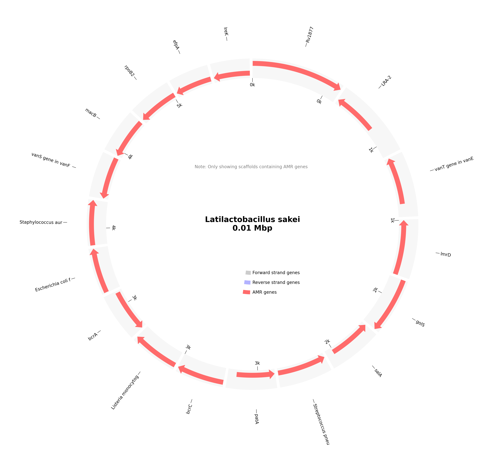

### Escherichia coli fabI mutations conferring resistance to isoniazid and triclosan
- **Mechanism**: antibiotic target alteration
- **Drug Classes**: disinfecting agents and antiseptics; isoniazid-like antibiotic
- **AMR Family**: antibiotic resistant fabI
- **Locations**:
  - gnl|SPADES|PLIJBHFI_34119_1 : position 3-245

### IreK
- **Mechanism**: reduced permeability to antibiotic
- **Drug Classes**: cephalosporin
- **AMR Family**: Serine/threonine kinases
- **Locations**:
  - gnl|SPADES|PLIJBHFI_41993_1 : position 1-207

### LRA-2
- **Mechanism**: antibiotic inactivation
- **Drug Classes**: cephalosporin; penam
- **AMR Family**: subclass B3 LRA beta-lactamase
- **Locations**:
  - gnl|SPADES|PLIJBHFI_19030_1 : position 3-251

### Listeria monocytogenes mprF
- **Mechanism**: antibiotic target alteration
- **Drug Classes**: peptide antibiotic
- **AMR Family**: defensin resistant mprF
- **Locations**:
  - gnl|SPADES|PLIJBHFI_32407_1 : position 3-254

### Rv1877
- **Mechanism**: antibiotic efflux
- **Drug Classes**: fluoroquinolone antibiotic
- **AMR Family**: major facilitator superfamily (MFS) antibiotic efflux pump
- **Locations**:
  - gnl|SPADES|PLIJBHFI_16462_1 : position 1-495

### Staphylococcus aureus mupB conferring resistance to mupirocin
- **Mechanism**: antibiotic target alteration
- **Drug Classes**: mupirocin-like antibiotic
- **AMR Family**: antibiotic-resistant isoleucyl-tRNA synthetase (ileS)
- **Locations**:
  - gnl|SPADES|PLIJBHFI_34731_1 : position 1-243

### Streptococcus pneumoniae PBP2x conferring resistance to amoxicillin
- **Mechanism**: antibiotic target alteration
- **Drug Classes**: cephalosporin; cephamycin; penam
- **AMR Family**: Penicillin-binding protein mutations conferring resistance to beta-lactam antibiotics
- **Locations**:
  - gnl|SPADES|PLIJBHFI_28462_1 : position 1-279

### bcrA
- **Mechanism**: antibiotic efflux
- **Drug Classes**: peptide antibiotic
- **AMR Family**: ATP-binding cassette (ABC) antibiotic efflux pump
- **Locations**:
  - gnl|SPADES|PLIJBHFI_32773_1 : position 1-243

### bcrC
- **Mechanism**: antibiotic target alteration
- **Drug Classes**: peptide antibiotic
- **AMR Family**: undecaprenyl pyrophosphate related proteins
- **Locations**:
  - gnl|SPADES|PLIJBHFI_32190_1 : position 2-256

### efpA
- **Mechanism**: antibiotic efflux
- **Drug Classes**: rifamycin antibiotic; isoniazid-like antibiotic
- **AMR Family**: major facilitator superfamily (MFS) antibiotic efflux pump
- **Locations**:
  - gnl|SPADES|PLIJBHFI_41111_1 : position 1-210

### golS
- **Mechanism**: antibiotic efflux
- **Drug Classes**: monobactam; carbapenem; cephalosporin; cephamycin; penam; phenicol antibiotic; penem
- **AMR Family**: resistance-nodulation-cell division (RND) antibiotic efflux pump
- **Locations**:
  - gnl|SPADES|PLIJBHFI_26346_1 : position 1-303

### lmrD
- **Mechanism**: antibiotic efflux
- **Drug Classes**: lincosamide antibiotic
- **AMR Family**: ATP-binding cassette (ABC) antibiotic efflux pump
- **Locations**:
  - gnl|SPADES|PLIJBHFI_25428_1 : position 3-314

### macB
- **Mechanism**: antibiotic efflux
- **Drug Classes**: macrolide antibiotic
- **AMR Family**: ATP-binding cassette (ABC) antibiotic efflux pump
- **Locations**:
  - gnl|SPADES|PLIJBHFI_36874_1 : position 1-231

### patA
- **Mechanism**: antibiotic efflux
- **Drug Classes**: fluoroquinolone antibiotic
- **AMR Family**: ATP-binding cassette (ABC) antibiotic efflux pump
- **Locations**:
  - gnl|SPADES|PLIJBHFI_30317_1 : position 3-218

### rpoB2
- **Mechanism**: antibiotic target alteration; antibiotic target replacement
- **Drug Classes**: rifamycin antibiotic
- **AMR Family**: rifamycin-resistant beta-subunit of RNA polymerase (rpoB)
- **Locations**:
  - gnl|SPADES|PLIJBHFI_37326_1 : position 3-230

### salA
- **Mechanism**: antibiotic target protection
- **Drug Classes**: lincosamide antibiotic; streptogramin antibiotic; streptogramin A antibiotic; pleuromutilin antibiotic
- **AMR Family**: sal-type ABC-F protein
- **Locations**:
  - gnl|SPADES|PLIJBHFI_28537_1 : position 1-240

### vanS gene in vanF cluster
- **Mechanism**: antibiotic target alteration
- **Drug Classes**: glycopeptide antibiotic
- **AMR Family**: vanS; glycopeptide resistance gene cluster
- **Locations**:
  - gnl|SPADES|PLIJBHFI_35301_1 : position 1-240

### vanT gene in vanE cluster
- **Mechanism**: antibiotic target alteration
- **Drug Classes**: glycopeptide antibiotic
- **AMR Family**: glycopeptide resistance gene cluster; vanT
- **Locations**:
  - gnl|SPADES|PLIJBHFI_23338_1 : position 2-271

## Lelliottia amnigena
**Strain Statistics:**
- Total genome length: 4.6 kbp
- Total scaffolds: 28
- Scaffolds with AMR genes: 2
- Total genes annotated: 10
- Total AMR genes: 3
- Unique AMR genes: 3
- Distinct AMR mechanisms: 2
- Distinct AMR families: 2
- Distinct drug classes: 6

**Circos Plot:**

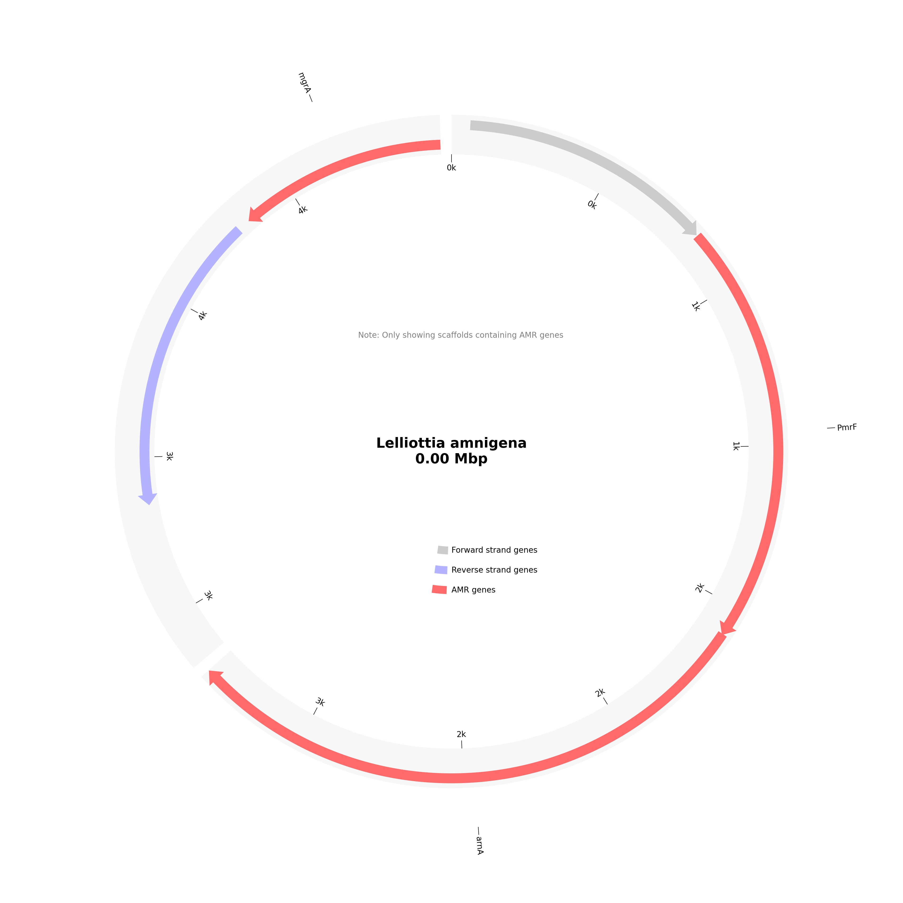

### PmrF
- **Mechanism**: antibiotic target alteration
- **Drug Classes**: peptide antibiotic
- **AMR Family**: pmr phosphoethanolamine transferase
- **Locations**:
  - gnl|SPADES|PLIJBHFI_2158_2 : position 635-1618

### arnA
- **Mechanism**: antibiotic target alteration
- **Drug Classes**: peptide antibiotic
- **AMR Family**: pmr phosphoethanolamine transferase
- **Locations**:
  - gnl|SPADES|PLIJBHFI_2158_3 : position 1615-2970

### mgrA
- **Mechanism**: antibiotic efflux
- **Drug Classes**: fluoroquinolone antibiotic; cephalosporin; penam; tetracycline antibiotic; peptide antibiotic; disinfecting agents and antiseptics
- **AMR Family**: ATP-binding cassette (ABC) antibiotic efflux pump; major facilitator superfamily (MFS) antibiotic efflux pump
- **Locations**:
  - gnl|SPADES|PLIJBHFI_4245_3 : position 1155-1667

## Lelliottia sp. AC1
**Strain Statistics:**
- Total genome length: 4.8 kbp
- Total scaffolds: 174
- Scaffolds with AMR genes: 19
- Total genes annotated: 2
- Total AMR genes: 19
- Unique AMR genes: 19
- Distinct AMR mechanisms: 6
- Distinct AMR families: 9
- Distinct drug classes: 23

**Circos Plot:**

### Acinetobacter baumannii AbaF
- **Mechanism**: antibiotic efflux
- **Drug Classes**: phosphonic acid antibiotic
- **AMR Family**: major facilitator superfamily (MFS) antibiotic efflux pump
- **Locations**:
  - gnl|SPADES|PLIJBHFI_28667_1 : position 2-280

### MdtQ
- **Mechanism**: reduced permeability to antibiotic
- **Drug Classes**: monobactam; carbapenem; cephalosporin; cephamycin; penam; penem
- **AMR Family**: Outer Membrane Porin (Opr)
- **Locations**:
  - gnl|SPADES|PLIJBHFI_33230_1 : position 2-250

### MexT
- **Mechanism**: antibiotic efflux
- **Drug Classes**: fluoroquinolone antibiotic; diaminopyrimidine antibiotic; phenicol antibiotic
- **AMR Family**: resistance-nodulation-cell division (RND) antibiotic efflux pump
- **Locations**:
  - gnl|SPADES|PLIJBHFI_31738_1 : position 1-258

### PAC-1
- **Mechanism**: antibiotic inactivation
- **Drug Classes**: cephalosporin
- **AMR Family**: PAC beta-lactamase
- **Locations**:
  - gnl|SPADES|PLIJBHFI_35909_1 : position 3-236

### TriC
- **Mechanism**: antibiotic efflux
- **Drug Classes**: disinfecting agents and antiseptics
- **AMR Family**: resistance-nodulation-cell division (RND) antibiotic efflux pump
- **Locations**:
  - gnl|SPADES|PLIJBHFI_36831_1 : position 3-233

### adeL
- **Mechanism**: antibiotic efflux
- **Drug Classes**: fluoroquinolone antibiotic; tetracycline antibiotic
- **AMR Family**: resistance-nodulation-cell division (RND) antibiotic efflux pump
- **Locations**:
  - gnl|SPADES|PLIJBHFI_35523_1 : position 3-239

### baeS
- **Mechanism**: antibiotic efflux
- **Drug Classes**: aminoglycoside antibiotic; aminocoumarin antibiotic
- **AMR Family**: resistance-nodulation-cell division (RND) antibiotic efflux pump
- **Locations**:
  - gnl|SPADES|PLIJBHFI_34487_1 : position 2-244

### bcr-1
- **Mechanism**: antibiotic efflux
- **Drug Classes**: bicyclomycin-like antibiotic
- **AMR Family**: major facilitator superfamily (MFS) antibiotic efflux pump
- **Locations**:
  - gnl|SPADES|PLIJBHFI_32550_1 : position 3-254

### bcrA
- **Mechanism**: antibiotic efflux
- **Drug Classes**: peptide antibiotic
- **AMR Family**: ATP-binding cassette (ABC) antibiotic efflux pump
- **Locations**:
  - gnl|SPADES|PLIJBHFI_36691_1 : position 1-234

### eptA
- **Mechanism**: antibiotic target alteration
- **Drug Classes**: peptide antibiotic
- **AMR Family**: pmr phosphoethanolamine transferase
- **Locations**:
  - gnl|SPADES|PLIJBHFI_20865_1 : position 1-387

### facT
- **Mechanism**: antibiotic efflux
- **Drug Classes**: elfamycin antibiotic
- **AMR Family**: major facilitator superfamily (MFS) antibiotic efflux pump
- **Locations**:
  - gnl|SPADES|PLIJBHFI_34885_1 : position 2-241

### farB
- **Mechanism**: antibiotic efflux
- **Drug Classes**: antibacterial free fatty acids
- **AMR Family**: major facilitator superfamily (MFS) antibiotic efflux pump
- **Locations**:
  - gnl|SPADES|PLIJBHFI_34052_1 : position 1-246

### kdpE
- **Mechanism**: antibiotic efflux
- **Drug Classes**: aminoglycoside antibiotic
- **AMR Family**: kdpDE
- **Locations**:
  - gnl|SPADES|PLIJBHFI_35986_1 : position 3-236

### mdtG
- **Mechanism**: antibiotic efflux
- **Drug Classes**: phosphonic acid antibiotic
- **AMR Family**: major facilitator superfamily (MFS) antibiotic efflux pump
- **Locations**:
  - gnl|SPADES|PLIJBHFI_39557_1 : position 3-218

### mreA
- **Mechanism**: antibiotic efflux
- **Drug Classes**: macrolide antibiotic
- **AMR Family**: major facilitator superfamily (MFS) antibiotic efflux pump
- **Locations**:
  - gnl|SPADES|PLIJBHFI_37331_1 : position 1-228

### msbA
- **Mechanism**: antibiotic efflux
- **Drug Classes**: nitroimidazole antibiotic
- **AMR Family**: ATP-binding cassette (ABC) antibiotic efflux pump
- **Locations**:
  - gnl|SPADES|PLIJBHFI_39682_1 : position 2-217

### poxtA
- **Mechanism**: antibiotic target protection
- **Drug Classes**: tetracycline antibiotic; oxazolidinone antibiotic; phenicol antibiotic
- **AMR Family**: Miscellaneous ABC-F subfamily ATP-binding cassette ribosomal protection proteins
- **Locations**:
  - gnl|SPADES|PLIJBHFI_23792_1 : position 1-336

### ramA
- **Mechanism**: antibiotic efflux; reduced permeability to antibiotic
- **Drug Classes**: fluoroquinolone antibiotic; monobactam; carbapenem; cephalosporin; glycylcycline; cephamycin; penam; tetracycline antibiotic; rifamycin antibiotic; phenicol antibiotic; penem; disinfecting agents and antiseptics
- **AMR Family**: resistance-nodulation-cell division (RND) antibiotic efflux pump; General Bacterial Porin with reduced permeability to beta-lactams
- **Locations**:
  - gnl|SPADES|PLIJBHFI_41478_1 : position 80-208

### tetA(60)
- **Mechanism**: antibiotic efflux
- **Drug Classes**: tetracycline antibiotic
- **AMR Family**: ATP-binding cassette (ABC) antibiotic efflux pump
- **Locations**:
  - gnl|SPADES|PLIJBHFI_36872_1 : position 1-231

## Lelliottia sp. JS-SCA-14
**Strain Statistics:**
- Total genome length: 0.3 kbp
- Total scaffolds: 7
- Scaffolds with AMR genes: 1
- Total genes annotated: 0
- Total AMR genes: 1
- Unique AMR genes: 1
- Distinct AMR mechanisms: 1
- Distinct AMR families: 1
- Distinct drug classes: 8

**Circos Plot:**

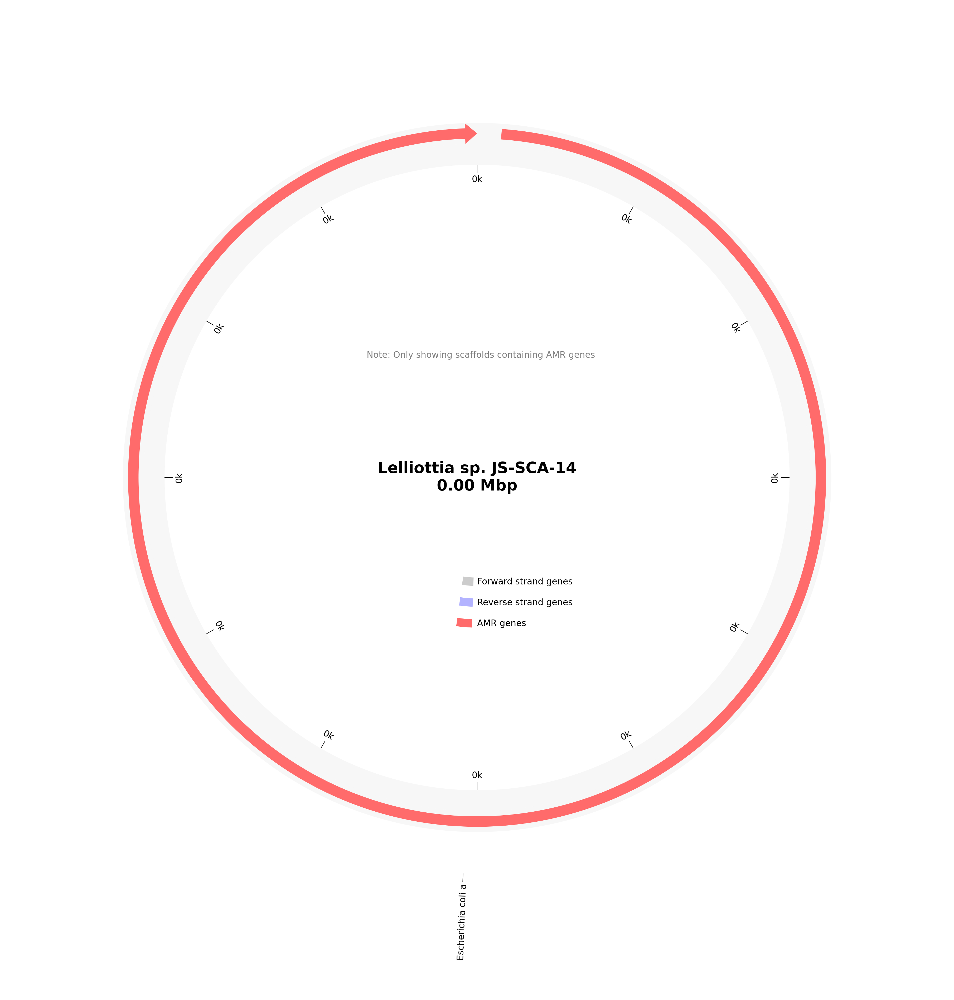

### Escherichia coli acrA
- **Mechanism**: antibiotic efflux
- **Drug Classes**: fluoroquinolone antibiotic; cephalosporin; glycylcycline; penam; tetracycline antibiotic; rifamycin antibiotic; phenicol antibiotic; disinfecting agents and antiseptics
- **AMR Family**: resistance-nodulation-cell division (RND) antibiotic efflux pump
- **Locations**:
  - gnl|SPADES|PLIJBHFI_30757_1 : position 3-266

## Lelliottia sp. WB101
**Strain Statistics:**
- Total genome length: 1.5 kbp
- Total scaffolds: 159
- Scaffolds with AMR genes: 6
- Total genes annotated: 0
- Total AMR genes: 6
- Unique AMR genes: 5
- Distinct AMR mechanisms: 4
- Distinct AMR families: 5
- Distinct drug classes: 14

**Circos Plot:**

### Escherichia coli GlpT with mutation conferring resistance to fosfomycin
- **Mechanism**: antibiotic target alteration
- **Drug Classes**: phosphonic acid antibiotic
- **AMR Family**: antibiotic-resistant GlpT
- **Locations**:
  - gnl|SPADES|PLIJBHFI_38615_2 : position 143-223

### Escherichia coli soxS with mutation conferring antibiotic resistance
- **Mechanism**: antibiotic target alteration; antibiotic efflux; reduced permeability to antibiotic
- **Drug Classes**: fluoroquinolone antibiotic; monobactam; carbapenem; cephalosporin; glycylcycline; cephamycin; penam; tetracycline antibiotic; rifamycin antibiotic; phenicol antibiotic; penem; disinfecting agents and antiseptics
- **AMR Family**: ATP-binding cassette (ABC) antibiotic efflux pump; major facilitator superfamily (MFS) antibiotic efflux pump; resistance-nodulation-cell division (RND) antibiotic efflux pump; General Bacterial Porin with reduced permeability to beta-lactams
- **Locations**:
  - gnl|SPADES|PLIJBHFI_40231_1 : position 2-214

### adeR
- **Mechanism**: antibiotic efflux
- **Drug Classes**: glycylcycline; tetracycline antibiotic
- **AMR Family**: resistance-nodulation-cell division (RND) antibiotic efflux pump
- **Locations**:
  - gnl|SPADES|PLIJBHFI_39050_1 : position 3-221

### msbA (found in 2 locations)
- **Mechanism**: antibiotic efflux
- **Drug Classes**: nitroimidazole antibiotic
- **AMR Family**: ATP-binding cassette (ABC) antibiotic efflux pump
- **Locations**:
  - gnl|SPADES|PLIJBHFI_31910_1 : position 1-258
  - gnl|SPADES|PLIJBHFI_33381_1 : position 1-249

### rphB
- **Mechanism**: antibiotic inactivation
- **Drug Classes**: rifamycin antibiotic
- **AMR Family**: rifampin phosphotransferase
- **Locations**:
  - gnl|SPADES|PLIJBHFI_24453_1 : position 2-328

## Raoultella planticola
**Strain Statistics:**
- Total genome length: 350.5 kbp
- Total scaffolds: 6112
- Scaffolds with AMR genes: 576
- Total genes annotated: 615
- Total AMR genes: 605
- Unique AMR genes: 222
- Distinct AMR mechanisms: 11
- Distinct AMR families: 66
- Distinct drug classes: 36

**Circos Plot:**

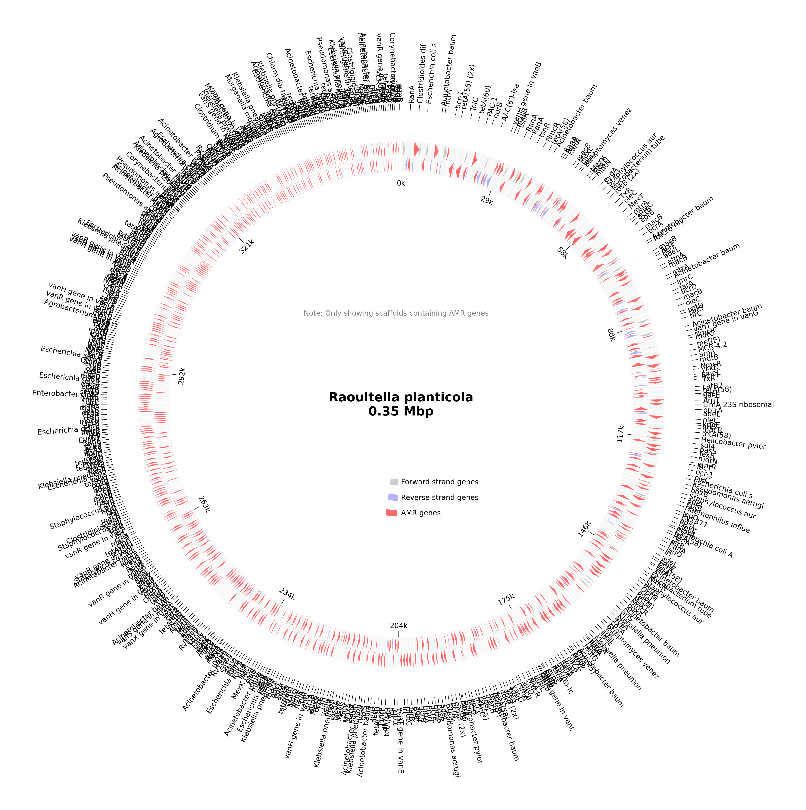

### AAC(6')-Isa
- **Mechanism**: antibiotic inactivation
- **Drug Classes**: aminoglycoside antibiotic
- **AMR Family**: AAC(6')
- **Locations**:
  - gnl|SPADES|PLIJBHFI_3586_2 : position 450-989

### AAC(6')-Iy
- **Mechanism**: antibiotic inactivation
- **Drug Classes**: aminoglycoside antibiotic
- **AMR Family**: AAC(6')
- **Locations**:
  - gnl|SPADES|PLIJBHFI_5636_1 : position 2-298

### APH(6)-Ic
- **Mechanism**: antibiotic inactivation
- **Drug Classes**: aminoglycoside antibiotic
- **AMR Family**: APH(6)
- **Locations**:
  - gnl|SPADES|PLIJBHFI_10738_2 : position 132-749

### Acinetobacter baumannii AbaF (found in 10 locations)
- **Mechanism**: antibiotic efflux
- **Drug Classes**: phosphonic acid antibiotic
- **AMR Family**: major facilitator superfamily (MFS) antibiotic efflux pump
- **Locations**:
  - gnl|SPADES|PLIJBHFI_17730_1 : position 3-461
  - gnl|SPADES|PLIJBHFI_2280_2 : position 941-2266
  - gnl|SPADES|PLIJBHFI_26685_1 : position 2-298
  - gnl|SPADES|PLIJBHFI_26709_1 : position 2-298
  - gnl|SPADES|PLIJBHFI_27663_1 : position 3-287
  - gnl|SPADES|PLIJBHFI_28974_1 : position 1-276
  - gnl|SPADES|PLIJBHFI_39937_1 : position 2-217
  - gnl|SPADES|PLIJBHFI_39941_1 : position 3-215
  - gnl|SPADES|PLIJBHFI_4268_1 : position 1-819
  - gnl|SPADES|PLIJBHFI_9080_2 : position 304-876

### Acinetobacter baumannii AbaQ (found in 12 locations)
- **Mechanism**: antibiotic efflux
- **Drug Classes**: fluoroquinolone antibiotic
- **AMR Family**: major facilitator superfamily (MFS) antibiotic efflux pump
- **Locations**:
  - gnl|SPADES|PLIJBHFI_10495_2 : position 508-768
  - gnl|SPADES|PLIJBHFI_13315_1 : position 2-613
  - gnl|SPADES|PLIJBHFI_13455_1 : position 3-548
  - gnl|SPADES|PLIJBHFI_15781_1 : position 3-485
  - gnl|SPADES|PLIJBHFI_16855_1 : position 1-486
  - gnl|SPADES|PLIJBHFI_27647_1 : position 3-287
  - gnl|SPADES|PLIJBHFI_33162_1 : position 2-250
  - gnl|SPADES|PLIJBHFI_35429_1 : position 2-238
  - gnl|SPADES|PLIJBHFI_5615_3 : position 965-1324
  - gnl|SPADES|PLIJBHFI_5971_1 : position 2-649
  - gnl|SPADES|PLIJBHFI_6498_2 : position 841-1170
  - gnl|SPADES|PLIJBHFI_9585_1 : position 1-831

### Acinetobacter baumannii AmvA (found in 2 locations)
- **Mechanism**: antibiotic efflux
- **Drug Classes**: macrolide antibiotic; disinfecting agents and antiseptics
- **AMR Family**: major facilitator superfamily (MFS) antibiotic efflux pump
- **Locations**:
  - gnl|SPADES|PLIJBHFI_11510_1 : position 1-339
  - gnl|SPADES|PLIJBHFI_14909_1 : position 3-137

### AcrE
- **Mechanism**: antibiotic efflux
- **Drug Classes**: fluoroquinolone antibiotic; cephalosporin; cephamycin; penam
- **AMR Family**: resistance-nodulation-cell division (RND) antibiotic efflux pump
- **Locations**:
  - gnl|SPADES|PLIJBHFI_5709_1 : position 1-984

### AcrF
- **Mechanism**: antibiotic efflux
- **Drug Classes**: fluoroquinolone antibiotic; cephalosporin; cephamycin; penam
- **AMR Family**: resistance-nodulation-cell division (RND) antibiotic efflux pump
- **Locations**:
  - gnl|SPADES|PLIJBHFI_5709_2 : position 984-1307

### Agrobacterium fabrum chloramphenicol acetyltransferase (found in 2 locations)
- **Mechanism**: antibiotic inactivation
- **Drug Classes**: phenicol antibiotic
- **AMR Family**: chloramphenicol acetyltransferase (CAT)
- **Locations**:
  - gnl|SPADES|PLIJBHFI_22681_1 : position 2-355
  - gnl|SPADES|PLIJBHFI_28378_1 : position 1-282

### ArnT (found in 3 locations)
- **Mechanism**: antibiotic target alteration
- **Drug Classes**: peptide antibiotic
- **AMR Family**: pmr phosphoethanolamine transferase
- **Locations**:
  - gnl|SPADES|PLIJBHFI_14955_1 : position 3-185
  - gnl|SPADES|PLIJBHFI_17492_1 : position 3-467
  - gnl|SPADES|PLIJBHFI_7234_2: position 217-1068

### Chlamydia trachomatis intrinsic murA conferring resistance to fosfomycin
- **Mechanism**: antibiotic target alteration
- **Drug Classes**: phosphonic acid antibiotic
- **AMR Family**: antibiotic-resistant murA transferase
- **Locations**:
  - gnl|SPADES|PLIJBHFI_34399_1 : position 3-245

### Clostridioides difficile cplR
- **Mechanism**: antibiotic target protection
- **Drug Classes**: lincosamide antibiotic; streptogramin antibiotic; streptogramin A antibiotic; nucleoside antibiotic
- **AMR Family**: Miscellaneous ABC-F subfamily ATP-binding cassette ribosomal protection proteins
- **Locations**:
  - gnl|SPADES|PLIJBHFI_2176_2 : position 783-2432

### Clostridioides difficile gyrB conferring resistance to fluoroquinolones (found in 2 locations)
- **Mechanism**: antibiotic target alteration
- **Drug Classes**: fluoroquinolone antibiotic
- **AMR Family**: fluoroquinolone resistant gyrB
- **Locations**:
  - gnl|SPADES|PLIJBHFI_18263_1 : position 1-447
  - gnl|SPADES|PLIJBHFI_39098_1 : position 1-219

### Clostridium perfringes cplR
- **Mechanism**: antibiotic target protection
- **Drug Classes**: lincosamide antibiotic; streptogramin antibiotic; streptogramin A antibiotic; pleuromutilin antibiotic
- **AMR Family**: Miscellaneous ABC-F subfamily ATP-binding cassette ribosomal protection proteins
- **Locations**:
  - gnl|SPADES|PLIJBHFI_30463_1 : position 2-265

### Corynebacterium striatum tetA (found in 2 locations)
- **Mechanism**: antibiotic efflux
- **Drug Classes**: penam; tetracycline antibiotic
- **AMR Family**: major facilitator superfamily (MFS) antibiotic efflux pump
- **Locations**:
  - gnl|SPADES|PLIJBHFI_27183_1 : position 1-291
  - gnl|SPADES|PLIJBHFI_41326_1 : position 2-208

### CrcB
- **Mechanism**: antibiotic efflux
- **Drug Classes**: aminoglycoside antibiotic
- **AMR Family**: multidrug and toxic compound extrusion (MATE) transporter
- **Locations**:
  - gnl|SPADES|PLIJBHFI_18914_1 : position 1-333

### EVM-1
- **Mechanism**: antibiotic inactivation
- **Drug Classes**: carbapenem
- **AMR Family**: EVM beta-lactamase
- **Locations**:
  - gnl|SPADES|PLIJBHFI_19730_1 : position 2-412

### Enterobacter cloacae acrA
- **Mechanism**: antibiotic efflux
- **Drug Classes**: fluoroquinolone antibiotic; cephalosporin; glycylcycline; penam; tetracycline antibiotic; rifamycin antibiotic; phenicol antibiotic; disinfecting agents and antiseptics
- **AMR Family**: resistance-nodulation-cell division (RND) antibiotic efflux pump
- **Locations**:
  - gnl|SPADES|PLIJBHFI_20638_1 : position 1-393

### Escherichia coli AcrAB-TolC with AcrR mutation conferring resistance to ciprofloxacin, tetracycline, and ceftazidime
- **Mechanism**: antibiotic target alteration; antibiotic efflux
- **Drug Classes**: fluoroquinolone antibiotic; cephalosporin; glycylcycline; penam; tetracycline antibiotic; rifamycin antibiotic; phenicol antibiotic; disinfecting agents and antiseptics
- **AMR Family**: resistance-nodulation-cell division (RND) antibiotic efflux pump
- **Locations**:
  - gnl|SPADES|PLIJBHFI_37799_1 : position 14-226

### Escherichia coli AcrAB-TolC with MarR mutations conferring resistance to ciprofloxacin and tetracycline (found in 4 locations)
- **Mechanism**: antibiotic target alteration; antibiotic efflux
- **Drug Classes**: fluoroquinolone antibiotic; cephalosporin; glycylcycline; penam; tetracycline antibiotic; rifamycin antibiotic; phenicol antibiotic; disinfecting agents and antiseptics
- **AMR Family**: resistance-nodulation-cell division (RND) antibiotic efflux pump
- **Locations**:
  - gnl|SPADES|PLIJBHFI_14829_2 : position 347-553
  - gnl|SPADES|PLIJBHFI_19896_1 : position 154-408
  - gnl|SPADES|PLIJBHFI_28508_1 : position 2-211
  - gnl|SPADES|PLIJBHFI_8488_2 : position 657-929

### Escherichia coli EF-Tu mutants conferring resistance to Pulvomycin
- **Mechanism**: antibiotic target alteration
- **Drug Classes**: elfamycin antibiotic
- **AMR Family**: elfamycin resistant EF-Tu
- **Locations**:
  - gnl|SPADES|PLIJBHFI_24850_1 : position 3-323

### Escherichia coli UhpT with mutation conferring resistance to fosfomycin
- **Mechanism**: antibiotic target alteration
- **Drug Classes**: phosphonic acid antibiotic
- **AMR Family**: antibiotic-resistant UhpT
- **Locations**:
  - gnl|SPADES|PLIJBHFI_21409_1 : position 1-378

### Escherichia coli mdfA (found in 2 locations)
- **Mechanism**: antibiotic efflux
- **Drug Classes**: tetracycline antibiotic; phenicol antibiotic; disinfecting agents and antiseptics
- **AMR Family**: major facilitator superfamily (MFS) antibiotic efflux pump
- **Locations**:
  - gnl|SPADES|PLIJBHFI_33137_1 : position 3-251
  - gnl|SPADES|PLIJBHFI_36594_1 : position 2-232

### Escherichia coli soxS with mutation conferring antibiotic resistance (found in 5 locations)
- **Mechanism**: antibiotic target alteration; antibiotic efflux; reduced permeability to antibiotic
- **Drug Classes**: fluoroquinolone antibiotic; monobactam; carbapenem; cephalosporin; glycylcycline; cephamycin; penam; tetracycline antibiotic; rifamycin antibiotic; phenicol antibiotic; penem; disinfecting agents and antiseptics
- **AMR Family**: ATP-binding cassette (ABC) antibiotic efflux pump; major facilitator superfamily (MFS) antibiotic efflux pump; resistance-nodulation-cell division (RND) antibiotic efflux pump; General Bacterial Porin with reduced permeability to beta-lactams
- **Locations**:
  - gnl|SPADES|PLIJBHFI_15251_1 : position 2-535
  - gnl|SPADES|PLIJBHFI_19306_1 : position 2-421
  - gnl|SPADES|PLIJBHFI_20969_1 : position 2-385
  - gnl|SPADES|PLIJBHFI_2207_2 : position 333-1160
  - gnl|SPADES|PLIJBHFI_7971_1 : position 1-747

### FosA6
- **Mechanism**: antibiotic inactivation
- **Drug Classes**: phosphonic acid antibiotic
- **AMR Family**: fosfomycin thiol transferase
- **Locations**:
  - gnl|SPADES|PLIJBHFI_11952_1 : position 1-123

### H-NS
- **Mechanism**: antibiotic efflux
- **Drug Classes**: macrolide antibiotic; fluoroquinolone antibiotic; cephalosporin; cephamycin; penam; tetracycline antibiotic
- **AMR Family**: major facilitator superfamily (MFS) antibiotic efflux pump; resistance-nodulation-cell division (RND) antibiotic efflux pump
- **Locations**:
  - gnl|SPADES|PLIJBHFI_21782_1 : position 3-110

### Haemophilus influenzae PBP3 conferring resistance to beta-lactam antibiotics
- **Mechanism**: antibiotic target alteration
- **Drug Classes**: cephalosporin; cephamycin; penam
- **AMR Family**: Penicillin-binding protein mutations conferring resistance to beta-lactam antibiotics
- **Locations**:
  - gnl|SPADES|PLIJBHFI_8252_1 : position 1-951

### Helicobacter pylori pbp1 mutants conferring resistance to amoxicillin (found in 2 locations)
- **Mechanism**: antibiotic target alteration
- **Drug Classes**: cephalosporin; cephamycin; penam
- **AMR Family**: Penicillin-binding protein mutations conferring resistance to beta-lactam antibiotics
- **Locations**:
  - gnl|SPADES|PLIJBHFI_11905_1 : position 2-682
  - gnl|SPADES|PLIJBHFI_7616_1 : position 2-1024

### Klebsiella pneumoniae KpnF
- **Mechanism**: antibiotic efflux
- **Drug Classes**: macrolide antibiotic; aminoglycoside antibiotic; cephalosporin; tetracycline antibiotic; peptide antibiotic; rifamycin antibiotic; disinfecting agents and antiseptics
- **AMR Family**: small multidrug resistance (SMR) antibiotic efflux pump
- **Locations**:
  - gnl|SPADES|PLIJBHFI_38076_1 : position 1-219

### Klebsiella pneumoniae KpnG (found in 3 locations)
- **Mechanism**: antibiotic efflux
- **Drug Classes**: macrolide antibiotic; fluoroquinolone antibiotic; aminoglycoside antibiotic; carbapenem; cephalosporin; penam; peptide antibiotic; penem
- **AMR Family**: major facilitator superfamily (MFS) antibiotic efflux pump
- **Locations**:
  - gnl|SPADES|PLIJBHFI_24772_1 : position 1-324
  - gnl|SPADES|PLIJBHFI_31165_1 : position 2-97
  - gnl|SPADES|PLIJBHFI_33927_1 : position 3-248

### Klebsiella pneumoniae KpnH
- **Mechanism**: antibiotic efflux
- **Drug Classes**: macrolide antibiotic; fluoroquinolone antibiotic; aminoglycoside antibiotic; carbapenem; cephalosporin; penam; peptide antibiotic; penem
- **AMR Family**: major facilitator superfamily (MFS) antibiotic efflux pump
- **Locations**:
  - gnl|SPADES|PLIJBHFI_19418_1 : position 1-420

### Klebsiella pneumoniae OmpK37 (found in 5 locations)
- **Mechanism**: reduced permeability to antibiotic
- **Drug Classes**: monobactam; carbapenem; cephalosporin; cephamycin; penam; penem
- **AMR Family**: General Bacterial Porin with reduced permeability to beta-lactams
- **Locations**:
  - gnl|SPADES|PLIJBHFI_10083_2 : position 387-797
  - gnl|SPADES|PLIJBHFI_13458_1 : position 3-293
  - gnl|SPADES|PLIJBHFI_14685_1 : position 167-556
  - gnl|SPADES|PLIJBHFI_32544_1 : position 2-253
  - gnl|SPADES|PLIJBHFI_9610_2 : position 558-830

### Klebsiella pneumoniae acrA
- **Mechanism**: antibiotic efflux
- **Drug Classes**: fluoroquinolone antibiotic; cephalosporin; glycylcycline; penam; tetracycline antibiotic; rifamycin antibiotic; phenicol antibiotic; disinfecting agents and antiseptics
- **AMR Family**: resistance-nodulation-cell division (RND) antibiotic efflux pump
- **Locations**:
  - gnl|SPADES|PLIJBHFI_27631_1 : position 3-287

### Klebsiella pneumoniae acrR with mutation conferring multidrug antibiotic resistance
- **Mechanism**: antibiotic target alteration; antibiotic efflux
- **Drug Classes**: fluoroquinolone antibiotic; cephalosporin; glycylcycline; penam; tetracycline antibiotic; rifamycin antibiotic; phenicol antibiotic; disinfecting agents and antiseptics
- **AMR Family**: resistance-nodulation-cell division (RND) antibiotic efflux pump
- **Locations**:
  - gnl|SPADES|PLIJBHFI_13804_1 : position 218-592

### LlmA 23S ribosomal RNA methyltransferase
- **Mechanism**: antibiotic target alteration
- **Drug Classes**: lincosamide antibiotic
- **AMR Family**: Llm 23S ribosomal RNA methyltransferase
- **Locations**:
  - gnl|SPADES|PLIJBHFI_7262_1 : position 2-793

### LptD (found in 3 locations)
- **Mechanism**: antibiotic efflux
- **Drug Classes**: carbapenem; peptide antibiotic; aminocoumarin antibiotic; rifamycin antibiotic
- **AMR Family**: ATP-binding cassette (ABC) antibiotic efflux pump
- **Locations**:
  - gnl|SPADES|PLIJBHFI_10336_1 : position 2-778
  - gnl|SPADES|PLIJBHFI_18099_1 : position 1-450
  - gnl|SPADES|PLIJBHFI_6287_2 : position 1000-1203

### MCR-1.30
- **Mechanism**: antibiotic target alteration
- **Drug Classes**: peptide antibiotic
- **AMR Family**: MCR phosphoethanolamine transferase
- **Locations**:
  - gnl|SPADES|PLIJBHFI_40723_1 : position 2-214

### MCR-4.2
- **Mechanism**: antibiotic target alteration
- **Drug Classes**: peptide antibiotic
- **AMR Family**: MCR phosphoethanolamine transferase
- **Locations**:
  - gnl|SPADES|PLIJBHFI_6688_1 : position 2-1141

### MdtK (found in 2 locations)
- **Mechanism**: antibiotic efflux
- **Drug Classes**: fluoroquinolone antibiotic
- **AMR Family**: multidrug and toxic compound extrusion (MATE) transporter
- **Locations**:
  - gnl|SPADES|PLIJBHFI_19651_1 : position 85-414
  - gnl|SPADES|PLIJBHFI_26834_1 : position 3-296

### MdtQ (found in 3 locations)
- **Mechanism**: reduced permeability to antibiotic
- **Drug Classes**: monobactam; carbapenem; cephalosporin; cephamycin; penam; penem
- **AMR Family**: Outer Membrane Porin (Opr)
- **Locations**:
  - gnl|SPADES|PLIJBHFI_14323_1 : position 3-425
  - gnl|SPADES|PLIJBHFI_21463_2 : position 214-375
  - gnl|SPADES|PLIJBHFI_31777_1 : position 2-259

### MexB
- **Mechanism**: antibiotic efflux
- **Drug Classes**: macrolide antibiotic; fluoroquinolone antibiotic; monobactam; carbapenem; cephalosporin; cephamycin; penam; tetracycline antibiotic; peptide antibiotic; aminocoumarin antibiotic; diaminopyrimidine antibiotic; sulfonamide antibiotic; phenicol antibiotic; penem
- **AMR Family**: resistance-nodulation-cell division (RND) antibiotic efflux pump
- **Locations**:
  - gnl|SPADES|PLIJBHFI_14089_1 : position 1-579

### MexD (found in 2 locations)
- **Mechanism**: antibiotic efflux
- **Drug Classes**: macrolide antibiotic; fluoroquinolone antibiotic; aminoglycoside antibiotic; cephalosporin; penam; tetracycline antibiotic; aminocoumarin antibiotic; diaminopyrimidine antibiotic; phenicol antibiotic
- **AMR Family**: resistance-nodulation-cell division (RND) antibiotic efflux pump
- **Locations**:
  - gnl|SPADES|PLIJBHFI_34129_1 : position 1-201
  - gnl|SPADES|PLIJBHFI_4623_2 : position 897-1547

### MexF
- **Mechanism**: antibiotic efflux
- **Drug Classes**: fluoroquinolone antibiotic; diaminopyrimidine antibiotic; phenicol antibiotic
- **AMR Family**: resistance-nodulation-cell division (RND) antibiotic efflux pump
- **Locations**:
  - gnl|SPADES|PLIJBHFI_21400_1 : position 3-377

### MexJ (found in 2 locations)
- **Mechanism**: antibiotic efflux
- **Drug Classes**: macrolide antibiotic; tetracycline antibiotic; disinfecting agents and antiseptics
- **AMR Family**: resistance-nodulation-cell division (RND) antibiotic efflux pump
- **Locations**:
  - gnl|SPADES|PLIJBHFI_15571_1 : position 3-524
  - gnl|SPADES|PLIJBHFI_16422_1 : position 1-498

### MexK (found in 6 locations)
- **Mechanism**: antibiotic efflux
- **Drug Classes**: macrolide antibiotic; tetracycline antibiotic; disinfecting agents and antiseptics
- **AMR Family**: resistance-nodulation-cell division (RND) antibiotic efflux pump
- **Locations**:
  - gnl|SPADES|PLIJBHFI_10632_1 : position 2-757
  - gnl|SPADES|PLIJBHFI_13785_1 : position 2-592
  - gnl|SPADES|PLIJBHFI_13815_1 : position 3-590
  - gnl|SPADES|PLIJBHFI_15183_1 : position 1-297
  - gnl|SPADES|PLIJBHFI_15183_2 : position 294-527
  - gnl|SPADES|PLIJBHFI_8444_1 : position 20-934

### MexL (found in 5 locations)
- **Mechanism**: antibiotic efflux
- **Drug Classes**: macrolide antibiotic; tetracycline antibiotic; disinfecting agents and antiseptics
- **AMR Family**: resistance-nodulation-cell division (RND) antibiotic efflux pump
- **Locations**:
  - gnl|SPADES|PLIJBHFI_28585_1 : position 2-235
  - gnl|SPADES|PLIJBHFI_29208_1 : position 2-247
  - gnl|SPADES|PLIJBHFI_32681_1 : position 1-183
  - gnl|SPADES|PLIJBHFI_36313_1 : position 88-234
  - gnl|SPADES|PLIJBHFI_4575_1 : position 3-275

### MexT (found in 2 locations)
- **Mechanism**: antibiotic efflux
- **Drug Classes**: fluoroquinolone antibiotic; diaminopyrimidine antibiotic; phenicol antibiotic
- **AMR Family**: resistance-nodulation-cell division (RND) antibiotic efflux pump
- **Locations**:
  - gnl|SPADES|PLIJBHFI_5204_2 : position 247-1206
  - gnl|SPADES|PLIJBHFI_9484_1 : position 364-840

### MexV
- **Mechanism**: antibiotic efflux
- **Drug Classes**: macrolide antibiotic; fluoroquinolone antibiotic; tetracycline antibiotic; phenicol antibiotic; disinfecting agents and antiseptics
- **AMR Family**: resistance-nodulation-cell division (RND) antibiotic efflux pump
- **Locations**:
  - gnl|SPADES|PLIJBHFI_4623_1 : position 1-885

### Morganella morganii gyrB conferring resistance to fluoroquinolones
- **Mechanism**: antibiotic target alteration
- **Drug Classes**: fluoroquinolone antibiotic
- **AMR Family**: fluoroquinolone resistant gyrB
- **Locations**:
  - gnl|SPADES|PLIJBHFI_32148_1 : position 1-255

### MuxA
- **Mechanism**: antibiotic efflux
- **Drug Classes**: macrolide antibiotic; monobactam; tetracycline antibiotic; aminocoumarin antibiotic
- **AMR Family**: resistance-nodulation-cell division (RND) antibiotic efflux pump
- **Locations**:
  - gnl|SPADES|PLIJBHFI_13466_1 : position 2-604

### MuxB
- **Mechanism**: antibiotic efflux
- **Drug Classes**: macrolide antibiotic; monobactam; tetracycline antibiotic; aminocoumarin antibiotic
- **AMR Family**: resistance-nodulation-cell division (RND) antibiotic efflux pump
- **Locations**:
  - gnl|SPADES|PLIJBHFI_23869_1 : position 1-336

### Mycobacterium tuberculosis kasA mutant conferring resistance to isoniazid
- **Mechanism**: antibiotic target alteration
- **Drug Classes**: isoniazid-like antibiotic
- **AMR Family**: antibiotic resistant kasA
- **Locations**:
  - gnl|SPADES|PLIJBHFI_5151_2 : position 213-1418

### Mycobacterium tuberculosis katG mutations conferring resistance to isoniazid
- **Mechanism**: antibiotic target alteration
- **Drug Classes**: isoniazid-like antibiotic
- **AMR Family**: isoniazid resistant katG
- **Locations**:
  - gnl|SPADES|PLIJBHFI_31296_1 : position 3-260

### Mycobacterium tuberculosis thyA with mutation conferring resistance to para-aminosalicylic acid
- **Mechanism**: antibiotic target alteration
- **Drug Classes**: salicylic acid antibiotic
- **AMR Family**: aminosalicylate resistant thymidylate synthase
- **Locations**:
  - gnl|SPADES|PLIJBHFI_9100_2 : position 650-874

### NmcR (found in 12 locations)
- **Mechanism**: antibiotic inactivation
- **Drug Classes**: carbapenem; cephalosporin; cephamycin; penam
- **AMR Family**: NmcA beta-lactamase
- **Locations**:
  - gnl|SPADES|PLIJBHFI_11099_1 : position 1-405
  - gnl|SPADES|PLIJBHFI_16455_1 : position 1-321
  - gnl|SPADES|PLIJBHFI_23674_1 : position 42-338
  - gnl|SPADES|PLIJBHFI_25932_1 : position 67-306
  - gnl|SPADES|PLIJBHFI_31021_1 : position 1-207
  - gnl|SPADES|PLIJBHFI_32813_1 : position 1-198
  - gnl|SPADES|PLIJBHFI_39673_1 : position 3-218
  - gnl|SPADES|PLIJBHFI_4047_2 : position 677-1588
  - gnl|SPADES|PLIJBHFI_6548_2 : position 487-1164
  - gnl|SPADES|PLIJBHFI_6838_3 : position 714-1118
  - gnl|SPADES|PLIJBHFI_9268_1 : position 2-613
  - gnl|SPADES|PLIJBHFI_9548_1 : position 1-834

### OmpA (found in 2 locations)
- **Mechanism**: reduced permeability to antibiotic
- **Drug Classes**: peptide antibiotic
- **AMR Family**: General Bacterial Porin with reduced permeability to peptide antibiotics
- **Locations**:
  - gnl|SPADES|PLIJBHFI_17043_2 : position 264-479
  - gnl|SPADES|PLIJBHFI_21248_1 : position 3-380

### OpmD
- **Mechanism**: antibiotic efflux
- **Drug Classes**: fluoroquinolone antibiotic; tetracycline antibiotic; disinfecting agents and antiseptics
- **AMR Family**: resistance-nodulation-cell division (RND) antibiotic efflux pump
- **Locations**:
  - gnl|SPADES|PLIJBHFI_30089_1 : position 1-270

### OprM (found in 2 locations)
- **Mechanism**: antibiotic efflux
- **Drug Classes**: macrolide antibiotic; fluoroquinolone antibiotic; monobactam; aminoglycoside antibiotic; carbapenem; cephalosporin; cephamycin; penam; tetracycline antibiotic; peptide antibiotic; aminocoumarin antibiotic; diaminopyrimidine antibiotic; sulfonamide antibiotic; phenicol antibiotic; penem; disinfecting agents and antiseptics
- **AMR Family**: resistance-nodulation-cell division (RND) antibiotic efflux pump
- **Locations**:
  - gnl|SPADES|PLIJBHFI_12176_1 : position 2-667
  - gnl|SPADES|PLIJBHFI_9354_1 : position 2-811

### OprN
- **Mechanism**: antibiotic efflux
- **Drug Classes**: fluoroquinolone antibiotic; diaminopyrimidine antibiotic; phenicol antibiotic
- **AMR Family**: resistance-nodulation-cell division (RND) antibiotic efflux pump
- **Locations**:
  - gnl|SPADES|PLIJBHFI_26431_1 : position 2-301

### OprZ
- **Mechanism**: antibiotic efflux
- **Drug Classes**: macrolide antibiotic; fluoroquinolone antibiotic; aminoglycoside antibiotic; cephalosporin
- **AMR Family**: resistance-nodulation-cell division (RND) antibiotic efflux pump
- **Locations**:
  - gnl|SPADES|PLIJBHFI_20006_1 : position 47-406

### PAC-1
- **Mechanism**: antibiotic inactivation
- **Drug Classes**: cephalosporin
- **AMR Family**: PAC beta-lactamase
- **Locations**:
  - gnl|SPADES|PLIJBHFI_3518_2 : position 297-1490

### PLA-2a
- **Mechanism**: antibiotic inactivation
- **Drug Classes**: carbapenem; cephalosporin
- **AMR Family**: PLA beta-lactamase
- **Locations**:
  - gnl|SPADES|PLIJBHFI_29258_1 : position 1-273

### ParR (found in 3 locations)
- **Mechanism**: antibiotic efflux; reduced permeability to antibiotic
- **Drug Classes**: macrolide antibiotic; fluoroquinolone antibiotic; monobactam; aminoglycoside antibiotic; carbapenem; cephalosporin; cephamycin; penam; tetracycline antibiotic; phenicol antibiotic; penem; disinfecting agents and antiseptics
- **AMR Family**: resistance-nodulation-cell division (RND) antibiotic efflux pump; Outer Membrane Porin (Opr)
- **Locations**:
  - gnl|SPADES|PLIJBHFI_21389_1 : position 1-207
  - gnl|SPADES|PLIJBHFI_22904_1 : position 1-351
  - gnl|SPADES|PLIJBHFI_41033_1 : position 1-210

### ParS (found in 3 locations)
- **Mechanism**: antibiotic efflux; reduced permeability to antibiotic
- **Drug Classes**: macrolide antibiotic; fluoroquinolone antibiotic; monobactam; aminoglycoside antibiotic; carbapenem; cephalosporin; cephamycin; penam; tetracycline antibiotic; phenicol antibiotic; penem; disinfecting agents and antiseptics
- **AMR Family**: resistance-nodulation-cell division (RND) antibiotic efflux pump; Outer Membrane Porin (Opr)
- **Locations**:
  - gnl|SPADES|PLIJBHFI_11033_1 : position 3-281
  - gnl|SPADES|PLIJBHFI_18107_2 : position 140-451
  - gnl|SPADES|PLIJBHFI_6324_1 : position 3-548

### PmpM (found in 2 locations)
- **Mechanism**: antibiotic efflux
- **Drug Classes**: fluoroquinolone antibiotic; aminoglycoside antibiotic; disinfecting agents and antiseptics
- **AMR Family**: multidrug and toxic compound extrusion (MATE) transporter
- **Locations**:
  - gnl|SPADES|PLIJBHFI_19401_1 : position 2-418
  - gnl|SPADES|PLIJBHFI_26599_1 : position 2-298

### PmrF (found in 4 locations)
- **Mechanism**: antibiotic target alteration
- **Drug Classes**: peptide antibiotic
- **AMR Family**: pmr phosphoethanolamine transferase
- **Locations**:
  - gnl|SPADES|PLIJBHFI_12409_1 : position 1-654
  - gnl|SPADES|PLIJBHFI_13208_1 : position 3-470
  - gnl|SPADES|PLIJBHFI_28082_1 : position 3-284
  - gnl|SPADES|PLIJBHFI_30248_1 : position 65-268

### Pseudomonas aeruginosa CpxR (found in 3 locations)
- **Mechanism**: antibiotic efflux
- **Drug Classes**: macrolide antibiotic; fluoroquinolone antibiotic; monobactam; aminoglycoside antibiotic; carbapenem; cephalosporin; cephamycin; penam; tetracycline antibiotic; peptide antibiotic; aminocoumarin antibiotic; diaminopyrimidine antibiotic; sulfonamide antibiotic; phenicol antibiotic; penem
- **AMR Family**: resistance-nodulation-cell division (RND) antibiotic efflux pump
- **Locations**:
  - gnl|SPADES|PLIJBHFI_12194_1 : position 2-385
  - gnl|SPADES|PLIJBHFI_26836_2 : position 134-295
  - gnl|SPADES|PLIJBHFI_37114_1 : position 2-229

### Pseudomonas aeruginosa ampR with mutation conferring resistance to aztreonam (found in 2 locations)
- **Mechanism**: antibiotic target alteration; antibiotic inactivation
- **Drug Classes**: monobactam; carbapenem; cephalosporin
- **AMR Family**: PDC beta-lactamase; ampR transcriptional regulator with mutation conferring resistance to monobactam antibiotics
- **Locations**:
  - gnl|SPADES|PLIJBHFI_26348_1 : position 2-301
  - gnl|SPADES|PLIJBHFI_8116_2 : position 292-966

### RanA (found in 24 locations)
- **Mechanism**: antibiotic efflux
- **Drug Classes**: aminoglycoside antibiotic
- **AMR Family**: ATP-binding cassette (ABC) antibiotic efflux pump
- **Locations**:
  - gnl|SPADES|PLIJBHFI_10726_2 : position 174-752
  - gnl|SPADES|PLIJBHFI_10739_1 : position 1-453
  - gnl|SPADES|PLIJBHFI_11025_2 : position 393-731
  - gnl|SPADES|PLIJBHFI_13463_1 : position 2-604
  - gnl|SPADES|PLIJBHFI_14240_1 : position 1-573
  - gnl|SPADES|PLIJBHFI_15252_1 : position 2-535
  - gnl|SPADES|PLIJBHFI_15338_1 : position 3-506
  - gnl|SPADES|PLIJBHFI_15807_2 : position 239-517
  - gnl|SPADES|PLIJBHFI_17495_1 : position 1-468
  - gnl|SPADES|PLIJBHFI_19391_1 : position 1-420
  - gnl|SPADES|PLIJBHFI_19596_1 : position 1-414
  - gnl|SPADES|PLIJBHFI_19733_1 : position 1-411
  - gnl|SPADES|PLIJBHFI_2022_4 : position 2194-2955
  - gnl|SPADES|PLIJBHFI_24609_1 : position 3-326
  - gnl|SPADES|PLIJBHFI_25835_1 : position 2-307
  - gnl|SPADES|PLIJBHFI_29500_1 : position 1-273
  - gnl|SPADES|PLIJBHFI_34775_1 : position 2-241
  - gnl|SPADES|PLIJBHFI_3870_2 : position 846-1796
  - gnl|SPADES|PLIJBHFI_3938_2 : position 525-1442
  - gnl|SPADES|PLIJBHFI_41570_1 : position 2-208
  - gnl|SPADES|PLIJBHFI_4313_2 : position 444-1262
  - gnl|SPADES|PLIJBHFI_4482_1 : position 3-407
  - gnl|SPADES|PLIJBHFI_8541_1 : position 3-344
  - gnl|SPADES|PLIJBHFI_8654_1 : position 2-661

### RanB
- **Mechanism**: antibiotic efflux
- **Drug Classes**: aminoglycoside antibiotic
- **AMR Family**: ATP-binding cassette (ABC) antibiotic efflux pump
- **Locations**:
  - gnl|SPADES|PLIJBHFI_4313_3 : position 1262-1645

### Rv1877 (found in 6 locations)
- **Mechanism**: antibiotic efflux
- **Drug Classes**: fluoroquinolone antibiotic
- **AMR Family**: major facilitator superfamily (MFS) antibiotic efflux pump
- **Locations**:
  - gnl|SPADES|PLIJBHFI_15742_1 : position 2-520
  - gnl|SPADES|PLIJBHFI_16173_1 : position 3-506
  - gnl|SPADES|PLIJBHFI_29250_1 : position 2-274
  - gnl|SPADES|PLIJBHFI_34032_1 : position 1-246
  - gnl|SPADES|PLIJBHFI_41226_1 : position 3-209
  - gnl|SPADES|PLIJBHFI_8280_1 : position 3-947

### SRT-2
- **Mechanism**: antibiotic inactivation
- **Drug Classes**: cephalosporin
- **AMR Family**: SRT beta-lactamase
- **Locations**:
  - gnl|SPADES|PLIJBHFI_15601_1 : position 3-524

### Staphylococcus aureus GlpT with mutation conferring resistance to fosfomycin
- **Mechanism**: antibiotic target alteration
- **Drug Classes**: phosphonic acid antibiotic
- **AMR Family**: antibiotic-resistant GlpT
- **Locations**:
  - gnl|SPADES|PLIJBHFI_8235_2 : position 691-954

### Staphylococcus aureus mupA conferring resistance to mupirocin
- **Mechanism**: antibiotic target alteration
- **Drug Classes**: mupirocin-like antibiotic
- **AMR Family**: antibiotic-resistant isoleucyl-tRNA synthetase (ileS)
- **Locations**:
  - gnl|SPADES|PLIJBHFI_18253_1 : position 3-446

### Staphylococcus aureus murA with mutation conferring resistance to fosfomycin
- **Mechanism**: antibiotic target alteration
- **Drug Classes**: phosphonic acid antibiotic
- **AMR Family**: antibiotic-resistant murA transferase
- **Locations**:
  - gnl|SPADES|PLIJBHFI_9269_2 : position 338-859

### Staphylococcus aureus norA (found in 2 locations)
- **Mechanism**: antibiotic efflux
- **Drug Classes**: fluoroquinolone antibiotic
- **AMR Family**: major facilitator superfamily (MFS) antibiotic efflux pump
- **Locations**:
  - gnl|SPADES|PLIJBHFI_17708_1 : position 3-461
  - gnl|SPADES|PLIJBHFI_5109_2 : position 482-1429

### Staphylococcus aureus pgsA mutations conferring resistance to daptomycin
- **Mechanism**: antibiotic target alteration
- **Drug Classes**: peptide antibiotic
- **AMR Family**: daptomycin resistant pgsA
- **Locations**:
  - gnl|SPADES|PLIJBHFI_18533_1 : position 18-440

### Streptomyces venezuelae rox (found in 2 locations)
- **Mechanism**: antibiotic inactivation
- **Drug Classes**: rifamycin antibiotic
- **AMR Family**: rifampin monooxygenase
- **Locations**:
  - gnl|SPADES|PLIJBHFI_4596_1 : position 2-343
  - gnl|SPADES|PLIJBHFI_9883_1 : position 1-810

### TaeA
- **Mechanism**: antibiotic efflux
- **Drug Classes**: pleuromutilin antibiotic
- **AMR Family**: ATP-binding cassette (ABC) antibiotic efflux pump
- **Locations**:
  - gnl|SPADES|PLIJBHFI_11349_1 : position 1-711

### TolC
- **Mechanism**: antibiotic efflux
- **Drug Classes**: macrolide antibiotic; fluoroquinolone antibiotic; aminoglycoside antibiotic; carbapenem; cephalosporin; glycylcycline; cephamycin; penam; tetracycline antibiotic; peptide antibiotic; aminocoumarin antibiotic; rifamycin antibiotic; phenicol antibiotic; penem; disinfecting agents and antiseptics
- **AMR Family**: ATP-binding cassette (ABC) antibiotic efflux pump; major facilitator superfamily (MFS) antibiotic efflux pump; resistance-nodulation-cell division (RND) antibiotic efflux pump
- **Locations**:
  - gnl|SPADES|PLIJBHFI_3034_2 : position 489-1961

### TriA
- **Mechanism**: antibiotic efflux
- **Drug Classes**: disinfecting agents and antiseptics
- **AMR Family**: resistance-nodulation-cell division (RND) antibiotic efflux pump
- **Locations**:
  - gnl|SPADES|PLIJBHFI_11096_2 : position 445-729

### TriC (found in 2 locations)
- **Mechanism**: antibiotic efflux
- **Drug Classes**: disinfecting agents and antiseptics
- **AMR Family**: resistance-nodulation-cell division (RND) antibiotic efflux pump
- **Locations**:
  - gnl|SPADES|PLIJBHFI_32532_1 : position 3-254
  - gnl|SPADES|PLIJBHFI_39746_1 : position 1-216

### TxR (found in 13 locations)
- **Mechanism**: antibiotic efflux
- **Drug Classes**: tetracycline antibiotic
- **AMR Family**: ATP-binding cassette (ABC) antibiotic efflux pump
- **Locations**:
  - gnl|SPADES|PLIJBHFI_13933_1 : position 3-587
  - gnl|SPADES|PLIJBHFI_14228_1 : position 2-385
  - gnl|SPADES|PLIJBHFI_15815_1 : position 1-516
  - gnl|SPADES|PLIJBHFI_16891_1 : position 1-483
  - gnl|SPADES|PLIJBHFI_17529_1 : position 2-466
  - gnl|SPADES|PLIJBHFI_18467_1 : position 1-441
  - gnl|SPADES|PLIJBHFI_19768_1 : position 3-311
  - gnl|SPADES|PLIJBHFI_21234_1 : position 2-382
  - gnl|SPADES|PLIJBHFI_23111_1 : position 1-348
  - gnl|SPADES|PLIJBHFI_40946_1 : position 1-210
  - gnl|SPADES|PLIJBHFI_5198_1 : position 117-1412
  - gnl|SPADES|PLIJBHFI_7140_1 : position 3-599
  - gnl|SPADES|PLIJBHFI_9746_1 : position 2-820

### YojI (found in 9 locations)
- **Mechanism**: antibiotic efflux
- **Drug Classes**: peptide antibiotic
- **AMR Family**: ATP-binding cassette (ABC) antibiotic efflux pump
- **Locations**:
  - gnl|SPADES|PLIJBHFI_13118_1 : position 3-197
  - gnl|SPADES|PLIJBHFI_15639_2 : position 242-523
  - gnl|SPADES|PLIJBHFI_18412_1 : position 120-443
  - gnl|SPADES|PLIJBHFI_19732_1 : position 3-413
  - gnl|SPADES|PLIJBHFI_23126_1 : position 1-348
  - gnl|SPADES|PLIJBHFI_35896_1 : position 2-238
  - gnl|SPADES|PLIJBHFI_37227_1 : position 57-230
  - gnl|SPADES|PLIJBHFI_39069_1 : position 2-220
  - gnl|SPADES|PLIJBHFI_9920_1 : position 1-369

### aadT
- **Mechanism**: antibiotic efflux
- **Drug Classes**: macrolide antibiotic; tetracycline antibiotic; disinfecting agents and antiseptics
- **AMR Family**: major facilitator superfamily (MFS) antibiotic efflux pump
- **Locations**:
  - gnl|SPADES|PLIJBHFI_15825_1 : position 3-515

### acrB (found in 5 locations)
- **Mechanism**: antibiotic efflux
- **Drug Classes**: fluoroquinolone antibiotic; cephalosporin; glycylcycline; penam; tetracycline antibiotic; rifamycin antibiotic; phenicol antibiotic; disinfecting agents and antiseptics
- **AMR Family**: resistance-nodulation-cell division (RND) antibiotic efflux pump
- **Locations**:
  - gnl|SPADES|PLIJBHFI_11430_1 : position 1-393
  - gnl|SPADES|PLIJBHFI_11430_2 : position 390-707
  - gnl|SPADES|PLIJBHFI_11895_1 : position 3-680
  - gnl|SPADES|PLIJBHFI_13252_1 : position 3-614
  - gnl|SPADES|PLIJBHFI_5297_2 : position 729-1388

### acrD (found in 5 locations)
- **Mechanism**: antibiotic efflux
- **Drug Classes**: aminoglycoside antibiotic
- **AMR Family**: resistance-nodulation-cell division (RND) antibiotic efflux pump
- **Locations**:
  - gnl|SPADES|PLIJBHFI_16246_1 : position 3-503
  - gnl|SPADES|PLIJBHFI_29304_1 : position 1-273
  - gnl|SPADES|PLIJBHFI_30229_1 : position 170-268
  - gnl|SPADES|PLIJBHFI_33690_1 : position 3-248
  - gnl|SPADES|PLIJBHFI_6119_1 : position 3-908

### adeL (found in 30 locations)
- **Mechanism**: antibiotic efflux
- **Drug Classes**: fluoroquinolone antibiotic; tetracycline antibiotic
- **AMR Family**: resistance-nodulation-cell division (RND) antibiotic efflux pump
- **Locations**:
  - gnl|SPADES|PLIJBHFI_10531_1 : position 1-510
  - gnl|SPADES|PLIJBHFI_11058_2 : position 99-467
  - gnl|SPADES|PLIJBHFI_11344_2 : position 154-714
  - gnl|SPADES|PLIJBHFI_11438_1 : position 2-286
  - gnl|SPADES|PLIJBHFI_11569_1 : position 2-589
  - gnl|SPADES|PLIJBHFI_12296_1 : position 2-445
  - gnl|SPADES|PLIJBHFI_12549_1 : position 212-649
  - gnl|SPADES|PLIJBHFI_14556_1 : position 1-561
  - gnl|SPADES|PLIJBHFI_14643_1 : position 2-436
  - gnl|SPADES|PLIJBHFI_16075_1 : position 2-373
  - gnl|SPADES|PLIJBHFI_16402_1 : position 3-272
  - gnl|SPADES|PLIJBHFI_17258_1 : position 2-472
  - gnl|SPADES|PLIJBHFI_19001_1 : position 1-429
  - gnl|SPADES|PLIJBHFI_20387_1 : position 1-336
  - gnl|SPADES|PLIJBHFI_21462_1 : position 1-375
  - gnl|SPADES|PLIJBHFI_21728_1 : position 1-372
  - gnl|SPADES|PLIJBHFI_27315_1 : position 3-290
  - gnl|SPADES|PLIJBHFI_30915_1 : position 1-264
  - gnl|SPADES|PLIJBHFI_31813_1 : position 1-258
  - gnl|SPADES|PLIJBHFI_32758_1 : position 58-252
  - gnl|SPADES|PLIJBHFI_35524_1 : position 3-239
  - gnl|SPADES|PLIJBHFI_36574_1 : position 2-232
  - gnl|SPADES|PLIJBHFI_5714_1 : position 326-1192
  - gnl|SPADES|PLIJBHFI_7352_1 : position 3-284
  - gnl|SPADES|PLIJBHFI_8228_2 : position 532-954
  - gnl|SPADES|PLIJBHFI_8333_1 : position 2-865
  - gnl|SPADES|PLIJBHFI_8950_2 : position 646-888
  - gnl|SPADES|PLIJBHFI_9416_2 : position 233-844
  - gnl|SPADES|PLIJBHFI_9970_1 : position 3-803
  - gnl|SPADES|PLIJBHFI_9987_1 : position 3-254

### almE
- **Mechanism**: antibiotic target alteration
- **Drug Classes**: peptide antibiotic
- **AMR Family**: polymyxin resistance operon; alm glycyltransferase
- **Locations**:
  - gnl|SPADES|PLIJBHFI_14250_1 : position 1-573

### apmA
- **Mechanism**: antibiotic inactivation
- **Drug Classes**: aminoglycoside antibiotic
- **AMR Family**: AAC(2')
- **Locations**:
  - gnl|SPADES|PLIJBHFI_17670_1 : position 1-462

### arlR (found in 3 locations)
- **Mechanism**: antibiotic efflux
- **Drug Classes**: fluoroquinolone antibiotic; disinfecting agents and antiseptics
- **AMR Family**: major facilitator superfamily (MFS) antibiotic efflux pump
- **Locations**:
  - gnl|SPADES|PLIJBHFI_13296_2 : position 288-614
  - gnl|SPADES|PLIJBHFI_14869_1 : position 3-521
  - gnl|SPADES|PLIJBHFI_21985_1 : position 1-366

### arlS (found in 3 locations)
- **Mechanism**: antibiotic efflux
- **Drug Classes**: fluoroquinolone antibiotic; disinfecting agents and antiseptics
- **AMR Family**: major facilitator superfamily (MFS) antibiotic efflux pump
- **Locations**:
  - gnl|SPADES|PLIJBHFI_25697_1 : position 3-311
  - gnl|SPADES|PLIJBHFI_7461_2 : position 603-1040
  - gnl|SPADES|PLIJBHFI_9584_2 : position 567-833

### arnA (found in 5 locations)
- **Mechanism**: antibiotic target alteration
- **Drug Classes**: peptide antibiotic
- **AMR Family**: pmr phosphoethanolamine transferase
- **Locations**:
  - gnl|SPADES|PLIJBHFI_16632_1 : position 3-368
  - gnl|SPADES|PLIJBHFI_25562_1 : position 2-313
  - gnl|SPADES|PLIJBHFI_40264_1 : position 2-214
  - gnl|SPADES|PLIJBHFI_6770_1 : position 3-1130
  - gnl|SPADES|PLIJBHFI_9638_2 : position 689-829

### bacA (found in 2 locations)
- **Mechanism**: antibiotic target alteration
- **Drug Classes**: peptide antibiotic
- **AMR Family**: undecaprenyl pyrophosphate related proteins
- **Locations**:
  - gnl|SPADES|PLIJBHFI_26935_1 : position 2-172
  - gnl|SPADES|PLIJBHFI_38709_1 : position 3-221

### baeR
- **Mechanism**: antibiotic efflux
- **Drug Classes**: aminoglycoside antibiotic; aminocoumarin antibiotic
- **AMR Family**: resistance-nodulation-cell division (RND) antibiotic efflux pump
- **Locations**:
  - gnl|SPADES|PLIJBHFI_18586_2 : position 194-439

### baeS (found in 3 locations)
- **Mechanism**: antibiotic efflux
- **Drug Classes**: aminoglycoside antibiotic; aminocoumarin antibiotic
- **AMR Family**: resistance-nodulation-cell division (RND) antibiotic efflux pump
- **Locations**:
  - gnl|SPADES|PLIJBHFI_24782_1 : position 3-323
  - gnl|SPADES|PLIJBHFI_28305_1 : position 2-283
  - gnl|SPADES|PLIJBHFI_41219_1 : position 2-211

### basR
- **Mechanism**: antibiotic target alteration; antibiotic efflux
- **Drug Classes**: peptide antibiotic
- **AMR Family**: pmr phosphoethanolamine transferase
- **Locations**:
  - gnl|SPADES|PLIJBHFI_12322_1 : position 40-660

### basS (found in 6 locations)
- **Mechanism**: antibiotic target alteration; antibiotic efflux
- **Drug Classes**: peptide antibiotic
- **AMR Family**: pmr phosphoethanolamine transferase
- **Locations**:
  - gnl|SPADES|PLIJBHFI_16091_1 : position 2-508
  - gnl|SPADES|PLIJBHFI_17237_1 : position 1-474
  - gnl|SPADES|PLIJBHFI_20214_1 : position 2-400
  - gnl|SPADES|PLIJBHFI_21160_1 : position 32-382
  - gnl|SPADES|PLIJBHFI_21908_1 : position 129-368
  - gnl|SPADES|PLIJBHFI_7726_2 : position 306-1010

### bcr-1 (found in 9 locations)
- **Mechanism**: antibiotic efflux
- **Drug Classes**: bicyclomycin-like antibiotic
- **AMR Family**: major facilitator superfamily (MFS) antibiotic efflux pump
- **Locations**:
  - gnl|SPADES|PLIJBHFI_12931_1 : position 3-629
  - gnl|SPADES|PLIJBHFI_17032_1 : position 2-478
  - gnl|SPADES|PLIJBHFI_23060_1 : position 3-347
  - gnl|SPADES|PLIJBHFI_2560_4 : position 2041-2532
  - gnl|SPADES|PLIJBHFI_30053_1 : position 3-269
  - gnl|SPADES|PLIJBHFI_35197_1 : position 3-239
  - gnl|SPADES|PLIJBHFI_36898_1 : position 3-230
  - gnl|SPADES|PLIJBHFI_6955_2 : position 646-1104
  - gnl|SPADES|PLIJBHFI_7914_1 : position 1-732

### bcrA (found in 10 locations)
- **Mechanism**: antibiotic efflux
- **Drug Classes**: peptide antibiotic
- **AMR Family**: ATP-binding cassette (ABC) antibiotic efflux pump
- **Locations**:
  - gnl|SPADES|PLIJBHFI_11927_2 : position 508-678
  - gnl|SPADES|PLIJBHFI_12009_1 : position 3-674
  - gnl|SPADES|PLIJBHFI_12401_1 : position 2-346
  - gnl|SPADES|PLIJBHFI_13934_2 : position 105-587
  - gnl|SPADES|PLIJBHFI_14115_1 : position 2-313
  - gnl|SPADES|PLIJBHFI_22556_1 : position 3-356
  - gnl|SPADES|PLIJBHFI_27680_1 : position 1-288
  - gnl|SPADES|PLIJBHFI_37332_1 : position 2-229
  - gnl|SPADES|PLIJBHFI_5379_2 : position 201-1373
  - gnl|SPADES|PLIJBHFI_9038_1 : position 2-292

### bmr
- **Mechanism**: antibiotic efflux
- **Drug Classes**: fluoroquinolone antibiotic; nucleoside antibiotic; phenicol antibiotic; disinfecting agents and antiseptics
- **AMR Family**: major facilitator superfamily (MFS) antibiotic efflux pump
- **Locations**:
  - gnl|SPADES|PLIJBHFI_13780_1 : position 1-591

### carA (found in 3 locations)
- **Mechanism**: antibiotic target protection
- **Drug Classes**: macrolide antibiotic
- **AMR Family**: Miscellaneous ABC-F subfamily ATP-binding cassette ribosomal protection proteins
- **Locations**:
  - gnl|SPADES|PLIJBHFI_11025_1 : position 3-383
  - gnl|SPADES|PLIJBHFI_11927_1 : position 65-544
  - gnl|SPADES|PLIJBHFI_16681_1 : position 1-489

### catB2
- **Mechanism**: antibiotic inactivation
- **Drug Classes**: phenicol antibiotic
- **AMR Family**: chloramphenicol acetyltransferase (CAT)
- **Locations**:
  - gnl|SPADES|PLIJBHFI_7188_3 : position 766-1077

### cfrE
- **Mechanism**: antibiotic target alteration
- **Drug Classes**: lincosamide antibiotic; streptogramin antibiotic; oxazolidinone antibiotic; phenicol antibiotic; pleuromutilin antibiotic
- **AMR Family**: Cfr 23S ribosomal RNA methyltransferase
- **Locations**:
  - gnl|SPADES|PLIJBHFI_20502_1 : position 2-394

### chrB
- **Mechanism**: antibiotic target alteration
- **Drug Classes**: macrolide antibiotic; lincosamide antibiotic
- **AMR Family**: non-erm 23S ribosomal RNA methyltransferase (G748)
- **Locations**:
  - gnl|SPADES|PLIJBHFI_33171_1 : position 3-206

### clbC
- **Mechanism**: antibiotic target alteration
- **Drug Classes**: lincosamide antibiotic; streptogramin antibiotic; streptogramin A antibiotic; oxazolidinone antibiotic; phenicol antibiotic; pleuromutilin antibiotic
- **AMR Family**: Cfr 23S ribosomal RNA methyltransferase
- **Locations**:
  - gnl|SPADES|PLIJBHFI_17886_1 : position 2-247

### cmeC
- **Mechanism**: antibiotic efflux
- **Drug Classes**: macrolide antibiotic; fluoroquinolone antibiotic; cephalosporin; fusidane antibiotic
- **AMR Family**: resistance-nodulation-cell division (RND) antibiotic efflux pump
- **Locations**:
  - gnl|SPADES|PLIJBHFI_36629_1 : position 3-233

### cmlv (found in 3 locations)
- **Mechanism**: antibiotic inactivation
- **Drug Classes**: phenicol antibiotic
- **AMR Family**: chloramphenicol phosphotransferase
- **Locations**:
  - gnl|SPADES|PLIJBHFI_10531_2 : position 615-764
  - gnl|SPADES|PLIJBHFI_16167_1 : position 24-506
  - gnl|SPADES|PLIJBHFI_8986_2 : position 521-886

### cmrA
- **Mechanism**: antibiotic efflux
- **Drug Classes**: phenicol antibiotic
- **AMR Family**: major facilitator superfamily (MFS) antibiotic efflux pump
- **Locations**:
  - gnl|SPADES|PLIJBHFI_23370_1 : position 104-343

### cmx (found in 2 locations)
- **Mechanism**: antibiotic efflux
- **Drug Classes**: phenicol antibiotic
- **AMR Family**: major facilitator superfamily (MFS) antibiotic efflux pump
- **Locations**:
  - gnl|SPADES|PLIJBHFI_17910_1 : position 3-455
  - gnl|SPADES|PLIJBHFI_26473_1 : position 2-301

### cprR (found in 3 locations)
- **Mechanism**: antibiotic target alteration; antibiotic efflux
- **Drug Classes**: peptide antibiotic
- **AMR Family**: pmr phosphoethanolamine transferase
- **Locations**:
  - gnl|SPADES|PLIJBHFI_11033_3 : position 432-731
  - gnl|SPADES|PLIJBHFI_18534_1 : position 172-438
  - gnl|SPADES|PLIJBHFI_20154_1 : position 2-403

### cpxA (found in 5 locations)
- **Mechanism**: antibiotic efflux
- **Drug Classes**: aminoglycoside antibiotic; aminocoumarin antibiotic
- **AMR Family**: resistance-nodulation-cell division (RND) antibiotic efflux pump
- **Locations**:
  - gnl|SPADES|PLIJBHFI_18828_1 : position 3-431
  - gnl|SPADES|PLIJBHFI_24002_1 : position 3-320
  - gnl|SPADES|PLIJBHFI_24507_1 : position 2-325
  - gnl|SPADES|PLIJBHFI_26836_1 : position 3-137
  - gnl|SPADES|PLIJBHFI_9849_1 : position 3-401

### dfrA3
- **Mechanism**: antibiotic target replacement
- **Drug Classes**: diaminopyrimidine antibiotic
- **AMR Family**: trimethoprim resistant dihydrofolate reductase dfr
- **Locations**:
  - gnl|SPADES|PLIJBHFI_19648_1 : position 1-261

### dfrA35
- **Mechanism**: antibiotic target replacement
- **Drug Classes**: diaminopyrimidine antibiotic
- **AMR Family**: trimethoprim resistant dihydrofolate reductase dfr
- **Locations**:
  - gnl|SPADES|PLIJBHFI_13181_1 : position 3-98

### efmA
- **Mechanism**: antibiotic efflux
- **Drug Classes**: macrolide antibiotic; fluoroquinolone antibiotic
- **AMR Family**: major facilitator superfamily (MFS) antibiotic efflux pump
- **Locations**:
  - gnl|SPADES|PLIJBHFI_5843_2 : position 646-1281

### efpA
- **Mechanism**: antibiotic efflux
- **Drug Classes**: rifamycin antibiotic; isoniazid-like antibiotic
- **AMR Family**: major facilitator superfamily (MFS) antibiotic efflux pump
- **Locations**:
  - gnl|SPADES|PLIJBHFI_27800_1 : position 2-286

### efrA
- **Mechanism**: antibiotic efflux
- **Drug Classes**: macrolide antibiotic; fluoroquinolone antibiotic; rifamycin antibiotic
- **AMR Family**: ATP-binding cassette (ABC) antibiotic efflux pump
- **Locations**:
  - gnl|SPADES|PLIJBHFI_15838_1 : position 3-515

### efrB (found in 3 locations)
- **Mechanism**: antibiotic efflux
- **Drug Classes**: macrolide antibiotic; fluoroquinolone antibiotic; rifamycin antibiotic
- **AMR Family**: ATP-binding cassette (ABC) antibiotic efflux pump
- **Locations**:
  - gnl|SPADES|PLIJBHFI_20683_1 : position 2-313
  - gnl|SPADES|PLIJBHFI_22369_1 : position 2-358
  - gnl|SPADES|PLIJBHFI_8563_1 : position 2-922

### emrA (found in 2 locations)
- **Mechanism**: antibiotic efflux
- **Drug Classes**: fluoroquinolone antibiotic
- **AMR Family**: major facilitator superfamily (MFS) antibiotic efflux pump
- **Locations**:
  - gnl|SPADES|PLIJBHFI_24173_1 : position 1-330
  - gnl|SPADES|PLIJBHFI_8488_1 : position 3-632

### emrB (found in 5 locations)
- **Mechanism**: antibiotic efflux
- **Drug Classes**: fluoroquinolone antibiotic
- **AMR Family**: major facilitator superfamily (MFS) antibiotic efflux pump
- **Locations**:
  - gnl|SPADES|PLIJBHFI_11988_1 : position 1-294
  - gnl|SPADES|PLIJBHFI_11988_2 : position 316-675
  - gnl|SPADES|PLIJBHFI_19861_2 : position 99-410
  - gnl|SPADES|PLIJBHFI_20726_1 : position 1-390
  - gnl|SPADES|PLIJBHFI_22841_1 : position 1-351

### emrR
- **Mechanism**: antibiotic efflux
- **Drug Classes**: fluoroquinolone antibiotic
- **AMR Family**: major facilitator superfamily (MFS) antibiotic efflux pump
- **Locations**:
  - gnl|SPADES|PLIJBHFI_7778_3: position 523-1002

### emrY
- **Mechanism**: antibiotic efflux
- **Drug Classes**: tetracycline antibiotic
- **AMR Family**: major facilitator superfamily (MFS) antibiotic efflux pump
- **Locations**:
  - gnl|SPADES|PLIJBHFI_20698_1 : position 37-390

### eptA (found in 4 locations)
- **Mechanism**: antibiotic target alteration
- **Drug Classes**: peptide antibiotic
- **AMR Family**: pmr phosphoethanolamine transferase
- **Locations**:
  - gnl|SPADES|PLIJBHFI_11834_2 : position 524-685
  - gnl|SPADES|PLIJBHFI_14601_1 : position 3-560
  - gnl|SPADES|PLIJBHFI_16698_1 : position 3-488
  - gnl|SPADES|PLIJBHFI_39567_1 : position 3-143

### eptB (found in 2 locations)
- **Mechanism**: antibiotic target alteration
- **Drug Classes**: peptide antibiotic
- **AMR Family**: pmr phosphoethanolamine transferase
- **Locations**:
  - gnl|SPADES|PLIJBHFI_5304_1 : position 3-1082
  - gnl|SPADES|PLIJBHFI_8245_1 : position 376-951

### erm(45)
- **Mechanism**: antibiotic target alteration
- **Drug Classes**: macrolide antibiotic; lincosamide antibiotic; streptogramin antibiotic; streptogramin B antibiotic
- **AMR Family**: Erm 23S ribosomal RNA methyltransferase
- **Locations**:
  - gnl|SPADES|PLIJBHFI_10503_1 : position 50-766

### evgA (found in 3 locations)
- **Mechanism**: antibiotic efflux
- **Drug Classes**: macrolide antibiotic; fluoroquinolone antibiotic; penam; tetracycline antibiotic
- **AMR Family**: major facilitator superfamily (MFS) antibiotic efflux pump; resistance-nodulation-cell division (RND) antibiotic efflux pump
- **Locations**:
  - gnl|SPADES|PLIJBHFI_21209_1 : position 64-381
  - gnl|SPADES|PLIJBHFI_27117_1 : position 1-213
  - gnl|SPADES|PLIJBHFI_5019_2 : position 1096-1452

### evgS (found in 8 locations)
- **Mechanism**: antibiotic efflux
- **Drug Classes**: macrolide antibiotic; fluoroquinolone antibiotic; penam; tetracycline antibiotic
- **AMR Family**: major facilitator superfamily (MFS) antibiotic efflux pump; resistance-nodulation-cell division (RND) antibiotic efflux pump
- **Locations**:
  - gnl|SPADES|PLIJBHFI_10889_1 : position 3-740
  - gnl|SPADES|PLIJBHFI_17197_1 : position 2-475
  - gnl|SPADES|PLIJBHFI_19710_1 : position 2-412
  - gnl|SPADES|PLIJBHFI_20110_1 : position 2-403
  - gnl|SPADES|PLIJBHFI_21048_1 : position 1-384
  - gnl|SPADES|PLIJBHFI_22152_1 : position 2-364
  - gnl|SPADES|PLIJBHFI_26601_2 : position 125-298
  - gnl|SPADES|PLIJBHFI_9345_1 : position 2-853

### facT (found in 2 locations)
- **Mechanism**: antibiotic efflux
- **Drug Classes**: elfamycin antibiotic
- **AMR Family**: major facilitator superfamily (MFS) antibiotic efflux pump
- **Locations**:
  - gnl|SPADES|PLIJBHFI_27323_1 : position 2-292
  - gnl|SPADES|PLIJBHFI_7812_1 : position 2-274

### farA (found in 2 locations)
- **Mechanism**: antibiotic efflux
- **Drug Classes**: antibacterial free fatty acids
- **AMR Family**: major facilitator superfamily (MFS) antibiotic efflux pump
- **Locations**:
  - gnl|SPADES|PLIJBHFI_6107_2 : position 703-1233
  - gnl|SPADES|PLIJBHFI_9041_2 : position 204-881

### farB (found in 4 locations)
- **Mechanism**: antibiotic efflux
- **Drug Classes**: antibacterial free fatty acids
- **AMR Family**: major facilitator superfamily (MFS) antibiotic efflux pump
- **Locations**:
  - gnl|SPADES|PLIJBHFI_12605_1 : position 3-647
  - gnl|SPADES|PLIJBHFI_31740_1 : position 3-260
  - gnl|SPADES|PLIJBHFI_34958_1 : position 1-240
  - gnl|SPADES|PLIJBHFI_40490_1 : position 1-213

### fexB
- **Mechanism**: antibiotic efflux
- **Drug Classes**: phenicol antibiotic
- **AMR Family**: major facilitator superfamily (MFS) antibiotic efflux pump
- **Locations**:
  - gnl|SPADES|PLIJBHFI_7739_1 : position 2-1009

### gadX
- **Mechanism**: antibiotic efflux
- **Drug Classes**: macrolide antibiotic; fluoroquinolone antibiotic; penam
- **AMR Family**: resistance-nodulation-cell division (RND) antibiotic efflux pump
- **Locations**:
  - gnl|SPADES|PLIJBHFI_17245_1 : position 51-473

### golS (found in 2 locations)
- **Mechanism**: antibiotic efflux
- **Drug Classes**: monobactam; carbapenem; cephalosporin; cephamycin; penam; phenicol antibiotic; penem
- **AMR Family**: resistance-nodulation-cell division (RND) antibiotic efflux pump
- **Locations**:
  - gnl|SPADES|PLIJBHFI_13376_2 : position 210-608
  - gnl|SPADES|PLIJBHFI_37438_1 : position 1-228

### hp1181
- **Mechanism**: antibiotic efflux
- **Drug Classes**: fluoroquinolone antibiotic; tetracycline antibiotic; nitroimidazole antibiotic
- **AMR Family**: major facilitator superfamily (MFS) antibiotic efflux pump
- **Locations**:
  - gnl|SPADES|PLIJBHFI_33847_1 : position 2-247

### iri (found in 2 locations)
- **Mechanism**: antibiotic inactivation
- **Drug Classes**: rifamycin antibiotic
- **AMR Family**: rifampin monooxygenase
- **Locations**:
  - gnl|SPADES|PLIJBHFI_12730_1 : position 1-639
  - gnl|SPADES|PLIJBHFI_8917_1 : position 1-480

### kdpD
- **Mechanism**: antibiotic efflux
- **Drug Classes**: aminoglycoside antibiotic
- **AMR Family**: kdpDE
- **Locations**:
  - gnl|SPADES|PLIJBHFI_29054_1 : position 1-276

### kdpE (found in 3 locations)
- **Mechanism**: antibiotic efflux
- **Drug Classes**: aminoglycoside antibiotic
- **AMR Family**: kdpDE
- **Locations**:
  - gnl|SPADES|PLIJBHFI_14087_1 : position 3-386
  - gnl|SPADES|PLIJBHFI_16169_1 : position 2-505
  - gnl|SPADES|PLIJBHFI_7461_1 : position 2-613

### leuO (found in 8 locations)
- **Mechanism**: antibiotic efflux
- **Drug Classes**: nucleoside antibiotic; disinfecting agents and antiseptics
- **AMR Family**: major facilitator superfamily (MFS) antibiotic efflux pump
- **Locations**:
  - gnl|SPADES|PLIJBHFI_18439_1 : position 147-440
  - gnl|SPADES|PLIJBHFI_19337_1 : position 2-421
  - gnl|SPADES|PLIJBHFI_19494_1 : position 159-416
  - gnl|SPADES|PLIJBHFI_22113_1 : position 1-276
  - gnl|SPADES|PLIJBHFI_24224_1 : position 3-209
  - gnl|SPADES|PLIJBHFI_4575_3 : position 1293-1559
  - gnl|SPADES|PLIJBHFI_8265_2 : position 791-949
  - gnl|SPADES|PLIJBHFI_8760_1 : position 110-670

### lmrC (found in 3 locations)
- **Mechanism**: antibiotic target protection
- **Drug Classes**: lincosamide antibiotic
- **AMR Family**: Miscellaneous ABC-F subfamily ATP-binding cassette ribosomal protection proteins
- **Locations**:
  - gnl|SPADES|PLIJBHFI_30749_1 : position 2-265
  - gnl|SPADES|PLIJBHFI_32038_1 : position 29-256
  - gnl|SPADES|PLIJBHFI_6024_1 : position 277-1248

### lsaC (found in 2 locations)
- **Mechanism**: antibiotic target protection
- **Drug Classes**: lincosamide antibiotic; streptogramin antibiotic; pleuromutilin antibiotic
- **AMR Family**: lsa-type ABC-F protein
- **Locations**:
  - gnl|SPADES|PLIJBHFI_15209_2 : position 243-536
  - gnl|SPADES|PLIJBHFI_26974_2 : position 112-294

### macA
- **Mechanism**: antibiotic efflux
- **Drug Classes**: macrolide antibiotic
- **AMR Family**: ATP-binding cassette (ABC) antibiotic efflux pump
- **Locations**:
  - gnl|SPADES|PLIJBHFI_14639_1 : position 2-559

### macB (found in 35 locations)
- **Mechanism**: antibiotic efflux
- **Drug Classes**: macrolide antibiotic
- **AMR Family**: ATP-binding cassette (ABC) antibiotic efflux pump
- **Locations**:
  - gnl|SPADES|PLIJBHFI_11045_1 : position 2-466
  - gnl|SPADES|PLIJBHFI_11150_2 : position 410-724
  - gnl|SPADES|PLIJBHFI_11572_1 : position 1-699
  - gnl|SPADES|PLIJBHFI_14903_1 : position 1-549
  - gnl|SPADES|PLIJBHFI_15807_1 : position 1-219
  - gnl|SPADES|PLIJBHFI_15934_1 : position 1-450
  - gnl|SPADES|PLIJBHFI_16223_1 : position 2-316
  - gnl|SPADES|PLIJBHFI_17379_2 : position 82-471
  - gnl|SPADES|PLIJBHFI_17632_1 : position 67-375
  - gnl|SPADES|PLIJBHFI_17917_2 : position 313-456
  - gnl|SPADES|PLIJBHFI_18297_1 : position 3-446
  - gnl|SPADES|PLIJBHFI_18330_1 : position 1-333
  - gnl|SPADES|PLIJBHFI_18782_1 : position 3-434
  - gnl|SPADES|PLIJBHFI_18801_2 : position 298-432
  - gnl|SPADES|PLIJBHFI_19392_1 : position 3-347
  - gnl|SPADES|PLIJBHFI_19488_1 : position 2-418
  - gnl|SPADES|PLIJBHFI_20089_1 : position 2-403
  - gnl|SPADES|PLIJBHFI_20947_1 : position 1-387
  - gnl|SPADES|PLIJBHFI_22638_1 : position 17-355
  - gnl|SPADES|PLIJBHFI_22814_1 : position 3-353
  - gnl|SPADES|PLIJBHFI_24294_1 : position 3-329
  - gnl|SPADES|PLIJBHFI_25820_1 : position 2-151
  - gnl|SPADES|PLIJBHFI_27610_1 : position 3-287
  - gnl|SPADES|PLIJBHFI_28130_1 : position 2-199
  - gnl|SPADES|PLIJBHFI_31969_1 : position 3-257
  - gnl|SPADES|PLIJBHFI_32668_1 : position 2-253
  - gnl|SPADES|PLIJBHFI_33039_1 : position 3-251
  - gnl|SPADES|PLIJBHFI_37805_1 : position 2-226
  - gnl|SPADES|PLIJBHFI_3849_1 : position 3-743
  - gnl|SPADES|PLIJBHFI_4574_2 : position 785-1354
  - gnl|SPADES|PLIJBHFI_5369_2 : position 581-1375
  - gnl|SPADES|PLIJBHFI_5649_2 : position 955-1320
  - gnl|SPADES|PLIJBHFI_5849_1 : position 2-838
  - gnl|SPADES|PLIJBHFI_6204_2 : position 389-898
  - gnl|SPADES|PLIJBHFI_7476_1 : position 2-628

### marA (found in 4 locations)
- **Mechanism**: antibiotic efflux; reduced permeability to antibiotic
- **Drug Classes**: fluoroquinolone antibiotic; monobactam; carbapenem; cephalosporin; glycylcycline; cephamycin; penam; tetracycline antibiotic; rifamycin antibiotic; phenicol antibiotic; penem; disinfecting agents and antiseptics
- **AMR Family**: resistance-nodulation-cell division (RND) antibiotic efflux pump; General Bacterial Porin with reduced permeability to beta-lactams
- **Locations**:
  - gnl|SPADES|PLIJBHFI_14829_1 : position 3-329
  - gnl|SPADES|PLIJBHFI_28939_1 : position 3-278
  - gnl|SPADES|PLIJBHFI_29278_2 : position 138-275
  - gnl|SPADES|PLIJBHFI_31215_1 : position 3-263

### mdtA
- **Mechanism**: antibiotic efflux
- **Drug Classes**: aminocoumarin antibiotic
- **AMR Family**: resistance-nodulation-cell division (RND) antibiotic efflux pump
- **Locations**:
  - gnl|SPADES|PLIJBHFI_15995_2 : position 260-511

### mdtB (found in 3 locations)
- **Mechanism**: antibiotic efflux
- **Drug Classes**: aminocoumarin antibiotic
- **AMR Family**: resistance-nodulation-cell division (RND) antibiotic efflux pump
- **Locations**:
  - gnl|SPADES|PLIJBHFI_15995_1 : position 1-156
  - gnl|SPADES|PLIJBHFI_20633_1 : position 2-391
  - gnl|SPADES|PLIJBHFI_6805_1 : position 1-1125

### mdtC (found in 3 locations)
- **Mechanism**: antibiotic efflux
- **Drug Classes**: aminocoumarin antibiotic
- **AMR Family**: resistance-nodulation-cell division (RND) antibiotic efflux pump
- **Locations**:
  - gnl|SPADES|PLIJBHFI_12659_1 : position 32-643
  - gnl|SPADES|PLIJBHFI_13040_1 : position 2-625
  - gnl|SPADES|PLIJBHFI_19861_1 : position 2-97

### mdtG (found in 3 locations)
- **Mechanism**: antibiotic efflux
- **Drug Classes**: phosphonic acid antibiotic
- **AMR Family**: major facilitator superfamily (MFS) antibiotic efflux pump
- **Locations**:
  - gnl|SPADES|PLIJBHFI_10387_1 : position 3-752
  - gnl|SPADES|PLIJBHFI_35031_1 : position 1-240
  - gnl|SPADES|PLIJBHFI_6561_1 : position 2-88

### mdtH
- **Mechanism**: antibiotic efflux
- **Drug Classes**: fluoroquinolone antibiotic
- **AMR Family**: major facilitator superfamily (MFS) antibiotic efflux pump
- **Locations**:
  - gnl|SPADES|PLIJBHFI_36584_1 : position 2-145

### mdtN (found in 6 locations)
- **Mechanism**: antibiotic efflux
- **Drug Classes**: nucleoside antibiotic; disinfecting agents and antiseptics
- **AMR Family**: major facilitator superfamily (MFS) antibiotic efflux pump
- **Locations**:
  - gnl|SPADES|PLIJBHFI_22177_1 : position 50-361
  - gnl|SPADES|PLIJBHFI_23964_1 : position 2-334
  - gnl|SPADES|PLIJBHFI_38434_1 : position 1-225
  - gnl|SPADES|PLIJBHFI_40061_1 : position 2-217
  - gnl|SPADES|PLIJBHFI_4775_1 : position 1-885
  - gnl|SPADES|PLIJBHFI_7747_1 : position 3-1007

### mdtO
- **Mechanism**: antibiotic efflux
- **Drug Classes**: nucleoside antibiotic; disinfecting agents and antiseptics
- **AMR Family**: major facilitator superfamily (MFS) antibiotic efflux pump
- **Locations**:
  - gnl|SPADES|PLIJBHFI_20327_1 : position 1-399

### mdtP (found in 2 locations)
- **Mechanism**: antibiotic efflux
- **Drug Classes**: nucleoside antibiotic; disinfecting agents and antiseptics
- **AMR Family**: major facilitator superfamily (MFS) antibiotic efflux pump
- **Locations**:
  - gnl|SPADES|PLIJBHFI_12349_1 : position 1-657
  - gnl|SPADES|PLIJBHFI_25929_1 : position 2-307

### mecA
- **Mechanism**: antibiotic target replacement
- **Drug Classes**: penam
- **AMR Family**: methicillin resistant PBP2
- **Locations**:
  - gnl|SPADES|PLIJBHFI_30297_1 : position 1-267

### mecC
- **Mechanism**: antibiotic target replacement
- **Drug Classes**: penam
- **AMR Family**: methicillin resistant PBP2
- **Locations**:
  - gnl|SPADES|PLIJBHFI_11774_1 : position 3-686

### mef(E)
- **Mechanism**: antibiotic efflux
- **Drug Classes**: macrolide antibiotic
- **AMR Family**: major facilitator superfamily (MFS) antibiotic efflux pump
- **Locations**:
  - gnl|SPADES|PLIJBHFI_6623_1 : position 3-935

### mreA (found in 2 locations)
- **Mechanism**: antibiotic efflux
- **Drug Classes**: macrolide antibiotic
- **AMR Family**: major facilitator superfamily (MFS) antibiotic efflux pump
- **Locations**:
  - gnl|SPADES|PLIJBHFI_39687_1 : position 2-217
  - gnl|SPADES|PLIJBHFI_40184_1 : position 68-214

### msbA (found in 7 locations)
- **Mechanism**: antibiotic efflux
- **Drug Classes**: nitroimidazole antibiotic
- **AMR Family**: ATP-binding cassette (ABC) antibiotic efflux pump
- **Locations**:
  - gnl|SPADES|PLIJBHFI_10100_1 : position 3-797
  - gnl|SPADES|PLIJBHFI_13794_1 : position 2-592
  - gnl|SPADES|PLIJBHFI_16570_2 : position 99-494
  - gnl|SPADES|PLIJBHFI_16769_2 : position 238-486
  - gnl|SPADES|PLIJBHFI_31678_1 : position 2-121
  - gnl|SPADES|PLIJBHFI_35165_1 : position 78-239
  - gnl|SPADES|PLIJBHFI_41035_1 : position 1-210

### msrF
- **Mechanism**: antibiotic target protection
- **Drug Classes**: macrolide antibiotic; streptogramin antibiotic
- **AMR Family**: msr-type ABC-F protein
- **Locations**:
  - gnl|SPADES|PLIJBHFI_13892_1 : position 3-344

### mtrA (found in 7 locations)
- **Mechanism**: antibiotic efflux
- **Drug Classes**: macrolide antibiotic; penam
- **AMR Family**: resistance-nodulation-cell division (RND) antibiotic efflux pump
- **Locations**:
  - gnl|SPADES|PLIJBHFI_12466_1 : position 2-652
  - gnl|SPADES|PLIJBHFI_19046_1 : position 2-427
  - gnl|SPADES|PLIJBHFI_2280_3 : position 2327-2572
  - gnl|SPADES|PLIJBHFI_23199_1 : position 88-345
  - gnl|SPADES|PLIJBHFI_28759_1 : position 1-141
  - gnl|SPADES|PLIJBHFI_5227_2 : position 444-1349
  - gnl|SPADES|PLIJBHFI_5958_2 : position 764-1261

### myrA
- **Mechanism**: antibiotic target alteration
- **Drug Classes**: macrolide antibiotic; lincosamide antibiotic
- **AMR Family**: non-erm 23S ribosomal RNA methyltransferase (G748)
- **Locations**:
  - gnl|SPADES|PLIJBHFI_30175_1 : position 1-267

### norB (found in 2 locations)
- **Mechanism**: antibiotic efflux
- **Drug Classes**: fluoroquinolone antibiotic
- **AMR Family**: major facilitator superfamily (MFS) antibiotic efflux pump
- **Locations**:
  - gnl|SPADES|PLIJBHFI_12532_1 : position 2-568
  - gnl|SPADES|PLIJBHFI_3524_1 : position 2-691

### novA (found in 4 locations)
- **Mechanism**: antibiotic efflux
- **Drug Classes**: aminocoumarin antibiotic
- **AMR Family**: ATP-binding cassette (ABC) antibiotic efflux pump
- **Locations**:
  - gnl|SPADES|PLIJBHFI_10274_2 : position 592-783
  - gnl|SPADES|PLIJBHFI_10735_1 : position 1-750
  - gnl|SPADES|PLIJBHFI_13471_2 : position 201-605
  - gnl|SPADES|PLIJBHFI_15776_1 : position 2-439

### oleB (found in 2 locations)
- **Mechanism**: antibiotic target protection
- **Drug Classes**: macrolide antibiotic
- **AMR Family**: Miscellaneous ABC-F subfamily ATP-binding cassette ribosomal protection proteins
- **Locations**:
  - gnl|SPADES|PLIJBHFI_15129_1 : position 1-207
  - gnl|SPADES|PLIJBHFI_21138_1 : position 2-382

### oleC (found in 7 locations)
- **Mechanism**: antibiotic efflux
- **Drug Classes**: macrolide antibiotic
- **AMR Family**: ATP-binding cassette (ABC) antibiotic efflux pump
- **Locations**:
  - gnl|SPADES|PLIJBHFI_12550_2 : position 128-346
  - gnl|SPADES|PLIJBHFI_20088_1 : position 3-404
  - gnl|SPADES|PLIJBHFI_23381_1 : position 3-266
  - gnl|SPADES|PLIJBHFI_5203_2 : position 85-798
  - gnl|SPADES|PLIJBHFI_6223_2 : position 507-1214
  - gnl|SPADES|PLIJBHFI_7398_1 : position 2-1048
  - gnl|SPADES|PLIJBHFI_7928_2 : position 204-986

### optrA (found in 3 locations)
- **Mechanism**: antibiotic target protection
- **Drug Classes**: oxazolidinone antibiotic; phenicol antibiotic
- **AMR Family**: Miscellaneous ABC-F subfamily ATP-binding cassette ribosomal protection proteins
- **Locations**:
  - gnl|SPADES|PLIJBHFI_29243_1 : position 1-273
  - gnl|SPADES|PLIJBHFI_36458_1 : position 2-235
  - gnl|SPADES|PLIJBHFI_7329_1 : position 3-986

### oqxA (found in 4 locations)
- **Mechanism**: antibiotic efflux
- **Drug Classes**: fluoroquinolone antibiotic; glycylcycline; tetracycline antibiotic; diaminopyrimidine antibiotic; nitrofuran antibiotic
- **AMR Family**: resistance-nodulation-cell division (RND) antibiotic efflux pump
- **Locations**:
  - gnl|SPADES|PLIJBHFI_22524_1 : position 3-290
  - gnl|SPADES|PLIJBHFI_22570_1 : position 3-179
  - gnl|SPADES|PLIJBHFI_25673_1 : position 2-310
  - gnl|SPADES|PLIJBHFI_9589_2 : position 108-833

### oqxB (found in 7 locations)
- **Mechanism**: antibiotic efflux
- **Drug Classes**: fluoroquinolone antibiotic; glycylcycline; tetracycline antibiotic; diaminopyrimidine antibiotic; nitrofuran antibiotic
- **AMR Family**: resistance-nodulation-cell division (RND) antibiotic efflux pump
- **Locations**:
  - gnl|SPADES|PLIJBHFI_17102_1 : position 3-476
  - gnl|SPADES|PLIJBHFI_19181_1 : position 3-425
  - gnl|SPADES|PLIJBHFI_20831_1 : position 3-389
  - gnl|SPADES|PLIJBHFI_22570_2 : position 203-355
  - gnl|SPADES|PLIJBHFI_25467_1 : position 1-312
  - gnl|SPADES|PLIJBHFI_31212_1 : position 1-261
  - gnl|SPADES|PLIJBHFI_8177_1 : position 2-958

### patA (found in 3 locations)
- **Mechanism**: antibiotic efflux
- **Drug Classes**: fluoroquinolone antibiotic
- **AMR Family**: ATP-binding cassette (ABC) antibiotic efflux pump
- **Locations**:
  - gnl|SPADES|PLIJBHFI_10274_1 : position 3-554
  - gnl|SPADES|PLIJBHFI_25702_1 : position 1-309
  - gnl|SPADES|PLIJBHFI_26045_1 : position 1-306

### patB (found in 2 locations)
- **Mechanism**: antibiotic efflux
- **Drug Classes**: fluoroquinolone antibiotic
- **AMR Family**: ATP-binding cassette (ABC) antibiotic efflux pump
- **Locations**:
  - gnl|SPADES|PLIJBHFI_16424_1 : position 2-496
  - gnl|SPADES|PLIJBHFI_20022_1 : position 1-378

### qacA (found in 2 locations)
- **Mechanism**: antibiotic efflux
- **Drug Classes**: fluoroquinolone antibiotic
- **AMR Family**: major facilitator superfamily (MFS) antibiotic efflux pump
- **Locations**:
  - gnl|SPADES|PLIJBHFI_10674_1 : position 1-756
  - gnl|SPADES|PLIJBHFI_24001_1 : position 2-334

### qacE
- **Mechanism**: antibiotic efflux
- **Drug Classes**: disinfecting agents and antiseptics
- **AMR Family**: major facilitator superfamily (MFS) antibiotic efflux pump
- **Locations**:
  - gnl|SPADES|PLIJBHFI_7205_2 : position 354-773

### qacJ
- **Mechanism**: antibiotic efflux
- **Drug Classes**: disinfecting agents and antiseptics
- **AMR Family**: small multidrug resistance (SMR) antibiotic efflux pump
- **Locations**:
  - gnl|SPADES|PLIJBHFI_7205_1: position 22-336

### ramA (found in 2 locations)
- **Mechanism**: antibiotic efflux; reduced permeability to antibiotic
- **Drug Classes**: fluoroquinolone antibiotic; monobactam; carbapenem; cephalosporin; glycylcycline; cephamycin; penam; tetracycline antibiotic; rifamycin antibiotic; phenicol antibiotic; penem; disinfecting agents and antiseptics
- **AMR Family**: resistance-nodulation-cell division (RND) antibiotic efflux pump; General Bacterial Porin with reduced permeability to beta-lactams
- **Locations**:
  - gnl|SPADES|PLIJBHFI_25561_1 : position 1-240
  - gnl|SPADES|PLIJBHFI_32292_1 : position 1-255

### rosA (found in 2 locations)
- **Mechanism**: antibiotic efflux
- **Drug Classes**: peptide antibiotic
- **AMR Family**: major facilitator superfamily (MFS) antibiotic efflux pump
- **Locations**:
  - gnl|SPADES|PLIJBHFI_22492_1 : position 2-358
  - gnl|SPADES|PLIJBHFI_24582_1 : position 1-324

### rosB (found in 3 locations)
- **Mechanism**: antibiotic efflux
- **Drug Classes**: peptide antibiotic
- **AMR Family**: major facilitator superfamily (MFS) antibiotic efflux pump
- **Locations**:
  - gnl|SPADES|PLIJBHFI_14516_1 : position 2-562
  - gnl|SPADES|PLIJBHFI_5191_1 : position 2-757
  - gnl|SPADES|PLIJBHFI_5191_2 : position 747-1412

### rphB (found in 2 locations)
- **Mechanism**: antibiotic inactivation
- **Drug Classes**: rifamycin antibiotic
- **AMR Family**: rifampin phosphotransferase
- **Locations**:
  - gnl|SPADES|PLIJBHFI_16974_1 : position 1-480
  - gnl|SPADES|PLIJBHFI_23017_1 : position 1-348

### rpoB2
- **Mechanism**: antibiotic target alteration; antibiotic target replacement
- **Drug Classes**: rifamycin antibiotic
- **AMR Family**: rifamycin-resistant beta-subunit of RNA polymerase (rpoB)
- **Locations**:
  - gnl|SPADES|PLIJBHFI_17101_1 : position 1-477

### rsmA
- **Mechanism**: antibiotic efflux
- **Drug Classes**: fluoroquinolone antibiotic; diaminopyrimidine antibiotic; phenicol antibiotic
- **AMR Family**: resistance-nodulation-cell division (RND) antibiotic efflux pump
- **Locations**:
  - gnl|SPADES|PLIJBHFI_11285_1: position 162-347

### salD
- **Mechanism**: antibiotic target protection
- **Drug Classes**: lincosamide antibiotic; streptogramin antibiotic; streptogramin A antibiotic; pleuromutilin antibiotic
- **AMR Family**: sal-type ABC-F protein
- **Locations**:
  - gnl|SPADES|PLIJBHFI_11140_1 : position 1-726

### sdiA
- **Mechanism**: antibiotic efflux
- **Drug Classes**: fluoroquinolone antibiotic; cephalosporin; glycylcycline; penam; tetracycline antibiotic; rifamycin antibiotic; phenicol antibiotic; disinfecting agents and antiseptics
- **AMR Family**: resistance-nodulation-cell division (RND) antibiotic efflux pump
- **Locations**:
  - gnl|SPADES|PLIJBHFI_15240_1 : position 2-361

### smeB
- **Mechanism**: antibiotic efflux
- **Drug Classes**: aminoglycoside antibiotic; cephalosporin; cephamycin; penam
- **AMR Family**: resistance-nodulation-cell division (RND) antibiotic efflux pump
- **Locations**:
  - gnl|SPADES|PLIJBHFI_40158_1 : position 1-216

### smeC (found in 2 locations)
- **Mechanism**: antibiotic efflux
- **Drug Classes**: aminoglycoside antibiotic; cephalosporin; cephamycin; penam
- **AMR Family**: resistance-nodulation-cell division (RND) antibiotic efflux pump
- **Locations**:
  - gnl|SPADES|PLIJBHFI_5297_1 : position 3-725
  - gnl|SPADES|PLIJBHFI_6955_1 : position 2-598

### smeS (found in 3 locations)
- **Mechanism**: antibiotic efflux
- **Drug Classes**: aminoglycoside antibiotic; cephalosporin; cephamycin; penam
- **AMR Family**: resistance-nodulation-cell division (RND) antibiotic efflux pump
- **Locations**:
  - gnl|SPADES|PLIJBHFI_14703_1 : position 2-430
  - gnl|SPADES|PLIJBHFI_20697_1 : position 1-390
  - gnl|SPADES|PLIJBHFI_32598_1 : position 2-253

### srmB (found in 2 locations)
- **Mechanism**: antibiotic target protection
- **Drug Classes**: macrolide antibiotic
- **AMR Family**: Miscellaneous ABC-F subfamily ATP-binding cassette ribosomal protection proteins
- **Locations**:
  - gnl|SPADES|PLIJBHFI_41426_1 : position 3-209
  - gnl|SPADES|PLIJBHFI_42012_1 : position 3-206

### sul4 (found in 2 locations)
- **Mechanism**: antibiotic target replacement
- **Drug Classes**: sulfonamide antibiotic
- **AMR Family**: sulfonamide resistant sul
- **Locations**:
  - gnl|SPADES|PLIJBHFI_25816_2 : position 123-308
  - gnl|SPADES|PLIJBHFI_7721_2 : position 369-1010

### tet(39)
- **Mechanism**: antibiotic efflux
- **Drug Classes**: tetracycline antibiotic
- **AMR Family**: major facilitator superfamily (MFS) antibiotic efflux pump
- **Locations**:
  - gnl|SPADES|PLIJBHFI_14446_2 : position 459-566

### tet(55)
- **Mechanism**: antibiotic inactivation
- **Drug Classes**: tetracycline antibiotic
- **AMR Family**: tetracycline inactivation enzyme
- **Locations**:
  - gnl|SPADES|PLIJBHFI_11675_3 : position 308-691

### tet(56)
- **Mechanism**: antibiotic inactivation
- **Drug Classes**: tetracycline antibiotic
- **AMR Family**: tetracycline inactivation enzyme
- **Locations**:
  - gnl|SPADES|PLIJBHFI_17792_1 : position 3-458

### tet(64)
- **Mechanism**: antibiotic efflux
- **Drug Classes**: tetracycline antibiotic
- **AMR Family**: major facilitator superfamily (MFS) antibiotic efflux pump
- **Locations**:
  - gnl|SPADES|PLIJBHFI_19291_1 : position 2-421

### tet(A)
- **Mechanism**: antibiotic efflux
- **Drug Classes**: tetracycline antibiotic
- **AMR Family**: major facilitator superfamily (MFS) antibiotic efflux pump
- **Locations**:
  - gnl|SPADES|PLIJBHFI_35415_1 : position 3-239

### tet(M)
- **Mechanism**: antibiotic target protection
- **Drug Classes**: tetracycline antibiotic
- **AMR Family**: tetracycline-resistant ribosomal protection protein
- **Locations**:
  - gnl|SPADES|PLIJBHFI_9467_1 : position 2-841

### tetA(46)
- **Mechanism**: antibiotic efflux
- **Drug Classes**: tetracycline antibiotic
- **AMR Family**: ATP-binding cassette (ABC) antibiotic efflux pump
- **Locations**:
  - gnl|SPADES|PLIJBHFI_13135_1 : position 1-621

### tetA(58) (found in 18 locations)
- **Mechanism**: antibiotic efflux
- **Drug Classes**: tetracycline antibiotic
- **AMR Family**: major facilitator superfamily (MFS) antibiotic efflux pump
- **Locations**:
  - gnl|SPADES|PLIJBHFI_11455_2 : position 419-706
  - gnl|SPADES|PLIJBHFI_13229_1 : position 1-615
  - gnl|SPADES|PLIJBHFI_16637_1 : position 1-492
  - gnl|SPADES|PLIJBHFI_17868_1 : position 3-371
  - gnl|SPADES|PLIJBHFI_19502_1 : position 12-416
  - gnl|SPADES|PLIJBHFI_25007_2 : position 66-320
  - gnl|SPADES|PLIJBHFI_25611_1 : position 1-312
  - gnl|SPADES|PLIJBHFI_2861_2 : position 575-1837
  - gnl|SPADES|PLIJBHFI_2861_3 : position 1883-2059
  - gnl|SPADES|PLIJBHFI_34454_1 : position 3-245
  - gnl|SPADES|PLIJBHFI_34940_1 : position 2-241
  - gnl|SPADES|PLIJBHFI_37036_1 : position 22-231
  - gnl|SPADES|PLIJBHFI_41101_1 : position 3-212
  - gnl|SPADES|PLIJBHFI_4141_2 : position 523-1281
  - gnl|SPADES|PLIJBHFI_7186_2 : position 304-1026
  - gnl|SPADES|PLIJBHFI_7550_1 : position 1-339
  - gnl|SPADES|PLIJBHFI_8498_2 : position 521-928
  - gnl|SPADES|PLIJBHFI_9041_1 : position 2-211

### tetA(60) (found in 3 locations)
- **Mechanism**: antibiotic efflux
- **Drug Classes**: tetracycline antibiotic
- **AMR Family**: ATP-binding cassette (ABC) antibiotic efflux pump
- **Locations**:
  - gnl|SPADES|PLIJBHFI_19407_2 : position 185-418
  - gnl|SPADES|PLIJBHFI_27399_1 : position 1-291
  - gnl|SPADES|PLIJBHFI_3196_2 : position 718-1401

### tetB(46)
- **Mechanism**: antibiotic efflux
- **Drug Classes**: tetracycline antibiotic
- **AMR Family**: ATP-binding cassette (ABC) antibiotic efflux pump
- **Locations**:
  - gnl|SPADES|PLIJBHFI_14467_1 : position 3-305

### tetB(60) (found in 2 locations)
- **Mechanism**: antibiotic efflux
- **Drug Classes**: tetracycline antibiotic
- **AMR Family**: ATP-binding cassette (ABC) antibiotic efflux pump
- **Locations**:
  - gnl|SPADES|PLIJBHFI_25417_2 : position 105-314
  - gnl|SPADES|PLIJBHFI_36182_1 : position 2-196

### tetB(P) (found in 2 locations)
- **Mechanism**: antibiotic target protection
- **Drug Classes**: tetracycline antibiotic
- **AMR Family**: tetracycline-resistant ribosomal protection protein
- **Locations**:
  - gnl|SPADES|PLIJBHFI_11536_1 : position 3-353
  - gnl|SPADES|PLIJBHFI_35573_1 : position 2-184

### tlrC (found in 4 locations)
- **Mechanism**: antibiotic target protection
- **Drug Classes**: macrolide antibiotic; lincosamide antibiotic
- **AMR Family**: Miscellaneous ABC-F subfamily ATP-binding cassette ribosomal protection proteins
- **Locations**:
  - gnl|SPADES|PLIJBHFI_17981_2 : position 279-452
  - gnl|SPADES|PLIJBHFI_23592_1 : position 1-159
  - gnl|SPADES|PLIJBHFI_24944_2 : position 121-321
  - gnl|SPADES|PLIJBHFI_6408_1 : position 1-219

### tsnR (found in 2 locations)
- **Mechanism**: antibiotic target alteration
- **Drug Classes**: peptide antibiotic
- **AMR Family**: non-erm 23S ribosomal RNA methyltransferase (A1067)
- **Locations**:
  - gnl|SPADES|PLIJBHFI_3849_2 : position 877-1608
  - gnl|SPADES|PLIJBHFI_4003_2 : position 744-1505

### ugd
- **Mechanism**: antibiotic target alteration
- **Drug Classes**: peptide antibiotic
- **AMR Family**: pmr phosphoethanolamine transferase
- **Locations**:
  - gnl|SPADES|PLIJBHFI_32169_1 : position 2-256

### vanG (found in 2 locations)
- **Mechanism**: antibiotic target alteration
- **Drug Classes**: glycopeptide antibiotic
- **AMR Family**: glycopeptide resistance gene cluster; Van ligase
- **Locations**:
  - gnl|SPADES|PLIJBHFI_11309_2 : position 382-714
  - gnl|SPADES|PLIJBHFI_25459_1 : position 3-314

### vanH gene in vanB cluster (found in 2 locations)
- **Mechanism**: antibiotic target alteration
- **Drug Classes**: glycopeptide antibiotic
- **AMR Family**: vanH; glycopeptide resistance gene cluster
- **Locations**:
  - gnl|SPADES|PLIJBHFI_14192_1 : position 2-577
  - gnl|SPADES|PLIJBHFI_3765_3 : position 1281-1841

### vanH gene in vanF cluster
- **Mechanism**: antibiotic target alteration
- **Drug Classes**: glycopeptide antibiotic
- **AMR Family**: vanH; glycopeptide resistance gene cluster
- **Locations**:
  - gnl|SPADES|PLIJBHFI_38778_1 : position 1-222

### vanH gene in vanO cluster (found in 2 locations)
- **Mechanism**: antibiotic target alteration
- **Drug Classes**: glycopeptide antibiotic
- **AMR Family**: vanH; glycopeptide resistance gene cluster
- **Locations**:
  - gnl|SPADES|PLIJBHFI_17127_1 : position 2-478
  - gnl|SPADES|PLIJBHFI_22988_1 : position 1-348

### vanH gene in vanP cluster (found in 2 locations)
- **Mechanism**: antibiotic target alteration
- **Drug Classes**: glycopeptide antibiotic
- **AMR Family**: vanH; glycopeptide resistance gene cluster
- **Locations**:
  - gnl|SPADES|PLIJBHFI_24301_1 : position 2-328
  - gnl|SPADES|PLIJBHFI_31671_1 : position 3-260

### vanN
- **Mechanism**: antibiotic target alteration
- **Drug Classes**: glycopeptide antibiotic
- **AMR Family**: glycopeptide resistance gene cluster; Van ligase
- **Locations**:
  - gnl|SPADES|PLIJBHFI_13886_1 : position 2-124

### vanR gene in vanB cluster
- **Mechanism**: antibiotic target alteration
- **Drug Classes**: glycopeptide antibiotic
- **AMR Family**: glycopeptide resistance gene cluster; vanR
- **Locations**:
  - gnl|SPADES|PLIJBHFI_24563_1 : position 3-317

### vanR gene in vanE cluster
- **Mechanism**: antibiotic target alteration
- **Drug Classes**: glycopeptide antibiotic
- **AMR Family**: glycopeptide resistance gene cluster; vanR
- **Locations**:
  - gnl|SPADES|PLIJBHFI_17338_1 : position 1-471

### vanR gene in vanI cluster (found in 2 locations)
- **Mechanism**: antibiotic target alteration
- **Drug Classes**: glycopeptide antibiotic
- **AMR Family**: glycopeptide resistance gene cluster; vanR
- **Locations**:
  - gnl|SPADES|PLIJBHFI_17769_2 : position 193-459
  - gnl|SPADES|PLIJBHFI_18024_1 : position 2-451

### vanR gene in vanL cluster
- **Mechanism**: antibiotic target alteration
- **Drug Classes**: glycopeptide antibiotic
- **AMR Family**: glycopeptide resistance gene cluster; vanR
- **Locations**:
  - gnl|SPADES|PLIJBHFI_11033_2 : position 278-454

### vanR gene in vanM cluster
- **Mechanism**: antibiotic target alteration
- **Drug Classes**: glycopeptide antibiotic
- **AMR Family**: glycopeptide resistance gene cluster; vanR
- **Locations**:
  - gnl|SPADES|PLIJBHFI_38835_1 : position 3-137

### vanR gene in vanO cluster (found in 2 locations)
- **Mechanism**: antibiotic target alteration
- **Drug Classes**: glycopeptide antibiotic
- **AMR Family**: glycopeptide resistance gene cluster; vanR
- **Locations**:
  - gnl|SPADES|PLIJBHFI_22775_1 : position 1-351
  - gnl|SPADES|PLIJBHFI_41090_1 : position 1-210

### vanR gene in vanP cluster
- **Mechanism**: antibiotic target alteration
- **Drug Classes**: glycopeptide antibiotic
- **AMR Family**: glycopeptide resistance gene cluster; vanR
- **Locations**:
  - gnl|SPADES|PLIJBHFI_24540_1 : position 2-166

### vanS gene in vanF cluster
- **Mechanism**: antibiotic target alteration
- **Drug Classes**: glycopeptide antibiotic
- **AMR Family**: vanS; glycopeptide resistance gene cluster
- **Locations**:
  - gnl|SPADES|PLIJBHFI_16810_1 : position 1-486

### vanS gene in vanO cluster
- **Mechanism**: antibiotic target alteration
- **Drug Classes**: glycopeptide antibiotic
- **AMR Family**: vanS; glycopeptide resistance gene cluster
- **Locations**:
  - gnl|SPADES|PLIJBHFI_31051_1 : position 2-262

### vanT gene in vanE cluster
- **Mechanism**: antibiotic target alteration
- **Drug Classes**: glycopeptide antibiotic
- **AMR Family**: glycopeptide resistance gene cluster; vanT
- **Locations**:
  - gnl|SPADES|PLIJBHFI_12720_1 : position 34-639

### vanT gene in vanG cluster
- **Mechanism**: antibiotic target alteration
- **Drug Classes**: glycopeptide antibiotic
- **AMR Family**: glycopeptide resistance gene cluster; vanT
- **Locations**:
  - gnl|SPADES|PLIJBHFI_6514_2 : position 447-1166

### vanX gene in vanI cluster
- **Mechanism**: antibiotic target alteration
- **Drug Classes**: glycopeptide antibiotic
- **AMR Family**: vanX; glycopeptide resistance gene cluster
- **Locations**:
  - gnl|SPADES|PLIJBHFI_16746_1 : position 2-487

### vatD
- **Mechanism**: antibiotic inactivation
- **Drug Classes**: streptogramin antibiotic; streptogramin A antibiotic
- **AMR Family**: streptogramin vat acetyltransferase
- **Locations**:
  - gnl|SPADES|PLIJBHFI_16922_1 : position 3-482

### vgaC
- **Mechanism**: antibiotic target protection
- **Drug Classes**: lincosamide antibiotic; streptogramin antibiotic; streptogramin A antibiotic; pleuromutilin antibiotic
- **AMR Family**: vga-type ABC-F protein
- **Locations**:
  - gnl|SPADES|PLIJBHFI_38629_1 : position 2-223

### vgaE
- **Mechanism**: antibiotic target protection
- **Drug Classes**: lincosamide antibiotic; streptogramin antibiotic; streptogramin A antibiotic; pleuromutilin antibiotic
- **AMR Family**: vga-type ABC-F protein
- **Locations**:
  - gnl|SPADES|PLIJBHFI_10690_1 : position 493-753

### vmlR (found in 2 locations)
- **Mechanism**: antibiotic target protection
- **Drug Classes**: lincosamide antibiotic; streptogramin antibiotic; streptogramin A antibiotic; streptogramin B antibiotic; nucleoside antibiotic; pleuromutilin antibiotic
- **AMR Family**: Miscellaneous ABC-F subfamily ATP-binding cassette ribosomal protection proteins
- **Locations**:
  - gnl|SPADES|PLIJBHFI_20590_2 : position 276-392
  - gnl|SPADES|PLIJBHFI_24255_1 : position 77-331

### ykkD
- **Mechanism**: antibiotic efflux
- **Drug Classes**: aminoglycoside antibiotic; tetracycline antibiotic; phenicol antibiotic
- **AMR Family**: small multidrug resistance (SMR) antibiotic efflux pump
- **Locations**:
  - gnl|SPADES|PLIJBHFI_6850_2 : position 124-441

## Serratia fonticola
**Strain Statistics:**
- Total genome length: 1009.7 kbp
- Total scaffolds: 4599
- Scaffolds with AMR genes: 611
- Total genes annotated: 2035
- Total AMR genes: 701
- Unique AMR genes: 247
- Distinct AMR mechanisms: 11
- Distinct AMR families: 78
- Distinct drug classes: 36

**Circos Plot:**

### ACT-52
- **Mechanism**: antibiotic inactivation
- **Drug Classes**: carbapenem; cephalosporin; cephamycin; penam
- **AMR Family**: ACT beta-lactamase
- **Locations**:
  - gnl|SPADES|PLIJBHFI_34715_1 : position 1-243

### ACT-64
- **Mechanism**: antibiotic inactivation
- **Drug Classes**: carbapenem; cephalosporin; cephamycin; penam
- **AMR Family**: ACT beta-lactamase
- **Locations**:
  - gnl|SPADES|PLIJBHFI_21272_1 : position 99-380

### AIM-1
- **Mechanism**: antibiotic inactivation
- **Drug Classes**: cephalosporin; cephamycin; penam
- **AMR Family**: AIM beta-lactamase
- **Locations**:
  - gnl|SPADES|PLIJBHFI_1780_3 : position 1683-2675

### APH(6)-Ic
- **Mechanism**: antibiotic inactivation
- **Drug Classes**: aminoglycoside antibiotic
- **AMR Family**: APH(6)
- **Locations**:
  - gnl|SPADES|PLIJBHFI_5150_1 : position 3-761

### Acinetobacter baumannii AbaF (found in 10 locations)
- **Mechanism**: antibiotic efflux
- **Drug Classes**: phosphonic acid antibiotic
- **AMR Family**: major facilitator superfamily (MFS) antibiotic efflux pump
- **Locations**:
  - gnl|SPADES|PLIJBHFI_1113_4 : position 4052-5449
  - gnl|SPADES|PLIJBHFI_1189_1 : position 1-981
  - gnl|SPADES|PLIJBHFI_1590_3 : position 1021-2028
  - gnl|SPADES|PLIJBHFI_18206_1 : position 1-447
  - gnl|SPADES|PLIJBHFI_2833_2 : position 1111-2319
  - gnl|SPADES|PLIJBHFI_3424_1 : position 1-774
  - gnl|SPADES|PLIJBHFI_3881_1 : position 679-1791
  - gnl|SPADES|PLIJBHFI_4101_3 : position 884-1714
  - gnl|SPADES|PLIJBHFI_8351_2 : position 115-942
  - gnl|SPADES|PLIJBHFI_9962_1 : position 3-803

### Acinetobacter baumannii AbaQ (found in 16 locations)
- **Mechanism**: antibiotic efflux
- **Drug Classes**: fluoroquinolone antibiotic
- **AMR Family**: major facilitator superfamily (MFS) antibiotic efflux pump
- **Locations**:
  - gnl|SPADES|PLIJBHFI_12249_1 : position 2-664
  - gnl|SPADES|PLIJBHFI_1795_1 : position 3-1265
  - gnl|SPADES|PLIJBHFI_1955_3 : position 1859-3214
  - gnl|SPADES|PLIJBHFI_1991_3 : position 2963-3193
  - gnl|SPADES|PLIJBHFI_2259_3 : position 1698-2831
  - gnl|SPADES|PLIJBHFI_2348_2 : position 2033-2725
  - gnl|SPADES|PLIJBHFI_2355_2 : position 713-1939
  - gnl|SPADES|PLIJBHFI_29644_1 : position 1-273
  - gnl|SPADES|PLIJBHFI_2967_2 : position 1037-2224
  - gnl|SPADES|PLIJBHFI_3186_1 : position 3-896
  - gnl|SPADES|PLIJBHFI_3561_2 : position 370-1701
  - gnl|SPADES|PLIJBHFI_3645_1 : position 3-539
  - gnl|SPADES|PLIJBHFI_5216_1 : position 2-451
  - gnl|SPADES|PLIJBHFI_6148_1 : position 1-633
  - gnl|SPADES|PLIJBHFI_6750_1 : position 2-568
  - gnl|SPADES|PLIJBHFI_7093_1 : position 1-897

### Acinetobacter baumannii AmvA (found in 2 locations)
- **Mechanism**: antibiotic efflux
- **Drug Classes**: macrolide antibiotic; disinfecting agents and antiseptics
- **AMR Family**: major facilitator superfamily (MFS) antibiotic efflux pump
- **Locations**:
  - gnl|SPADES|PLIJBHFI_11558_1 : position 1-474
  - gnl|SPADES|PLIJBHFI_29583_1 : position 1-273

### AcrS
- **Mechanism**: antibiotic efflux
- **Drug Classes**: fluoroquinolone antibiotic; cephalosporin; glycylcycline; cephamycin; penam; tetracycline antibiotic; rifamycin antibiotic; phenicol antibiotic; disinfecting agents and antiseptics
- **AMR Family**: resistance-nodulation-cell division (RND) antibiotic efflux pump
- **Locations**:
  - gnl|SPADES|PLIJBHFI_12970_1 : position 1-525

### Agrobacterium fabrum chloramphenicol acetyltransferase
- **Mechanism**: antibiotic inactivation
- **Drug Classes**: phenicol antibiotic
- **AMR Family**: chloramphenicol acetyltransferase (CAT)
- **Locations**:
  - gnl|SPADES|PLIJBHFI_2456_2 : position 938-1567

### ArnT (found in 2 locations)
- **Mechanism**: antibiotic target alteration
- **Drug Classes**: peptide antibiotic
- **AMR Family**: pmr phosphoethanolamine transferase
- **Locations**:
  - gnl|SPADES|PLIJBHFI_22192_1 : position 1-363
  - gnl|SPADES|PLIJBHFI_4045_1: position 78-1730

### BahA
- **Mechanism**: antibiotic inactivation
- **Drug Classes**: peptide antibiotic
- **AMR Family**: Bah amidohydrolase
- **Locations**:
  - gnl|SPADES|PLIJBHFI_1566_3 : position 1335-2348

### Bifidobacterium adolescentis rpoB mutants conferring resistance to rifampicin
- **Mechanism**: antibiotic target alteration; antibiotic target replacement
- **Drug Classes**: rifamycin antibiotic
- **AMR Family**: rifamycin-resistant beta-subunit of RNA polymerase (rpoB)
- **Locations**:
  - gnl|SPADES|PLIJBHFI_15922_1 : position 1-513

### CAR-1
- **Mechanism**: antibiotic inactivation
- **Drug Classes**: carbapenem
- **AMR Family**: CAR beta-lactamase
- **Locations**:
  - gnl|SPADES|PLIJBHFI_8150_2 : position 157-960

### CMY-26
- **Mechanism**: antibiotic inactivation
- **Drug Classes**: cephamycin
- **AMR Family**: CMY beta-lactamase
- **Locations**:
  - gnl|SPADES|PLIJBHFI_7194_1 : position 107-1075

### CRP
- **Mechanism**: antibiotic efflux
- **Drug Classes**: macrolide antibiotic; fluoroquinolone antibiotic; penam
- **AMR Family**: resistance-nodulation-cell division (RND) antibiotic efflux pump
- **Locations**:
  - gnl|SPADES|PLIJBHFI_3867_1 : position 2-598

### Clostridioides difficile gyrB conferring resistance to fluoroquinolones
- **Mechanism**: antibiotic target alteration
- **Drug Classes**: fluoroquinolone antibiotic
- **AMR Family**: fluoroquinolone resistant gyrB
- **Locations**:
  - gnl|SPADES|PLIJBHFI_3649_1 : position 2-1618

### Corynebacterium striatum tetA
- **Mechanism**: antibiotic efflux
- **Drug Classes**: penam; tetracycline antibiotic
- **AMR Family**: major facilitator superfamily (MFS) antibiotic efflux pump
- **Locations**:
  - gnl|SPADES|PLIJBHFI_25083_1 : position 1-318

### Enterobacter cloacae acrA
- **Mechanism**: antibiotic efflux
- **Drug Classes**: fluoroquinolone antibiotic; cephalosporin; glycylcycline; penam; tetracycline antibiotic; rifamycin antibiotic; phenicol antibiotic; disinfecting agents and antiseptics
- **AMR Family**: resistance-nodulation-cell division (RND) antibiotic efflux pump
- **Locations**:
  - gnl|SPADES|PLIJBHFI_14190_1 : position 2-577

### Enterococcus faecalis cls with mutation conferring resistance to daptomycin
- **Mechanism**: antibiotic target alteration
- **Drug Classes**: peptide antibiotic
- **AMR Family**: daptomycin resistant cls
- **Locations**:
  - gnl|SPADES|PLIJBHFI_5363_1 : position 3-1295

### Enterococcus faecium liaR mutant conferring daptomycin resistance
- **Mechanism**: antibiotic target alteration; antibiotic efflux
- **Drug Classes**: peptide antibiotic
- **AMR Family**: daptomycin resistant liaR
- **Locations**:
  - gnl|SPADES|PLIJBHFI_4997_1 : position 2-628

### Erm(37)
- **Mechanism**: antibiotic target alteration
- **Drug Classes**: macrolide antibiotic; lincosamide antibiotic; streptogramin antibiotic; streptogramin A antibiotic; streptogramin B antibiotic
- **AMR Family**: Erm 23S ribosomal RNA methyltransferase
- **Locations**:
  - gnl|SPADES|PLIJBHFI_28107_1 : position 3-233

### ErmC
- **Mechanism**: antibiotic target alteration
- **Drug Classes**: macrolide antibiotic; lincosamide antibiotic; streptogramin antibiotic; streptogramin A antibiotic; streptogramin B antibiotic
- **AMR Family**: Erm 23S ribosomal RNA methyltransferase
- **Locations**:
  - gnl|SPADES|PLIJBHFI_1510_1 : position 1-714

### Escherichia coli AcrAB-TolC with AcrR mutation conferring resistance to ciprofloxacin, tetracycline, and ceftazidime (found in 2 locations)
- **Mechanism**: antibiotic target alteration; antibiotic efflux
- **Drug Classes**: fluoroquinolone antibiotic; cephalosporin; glycylcycline; penam; tetracycline antibiotic; rifamycin antibiotic; phenicol antibiotic; disinfecting agents and antiseptics
- **AMR Family**: resistance-nodulation-cell division (RND) antibiotic efflux pump
- **Locations**:
  - gnl|SPADES|PLIJBHFI_1575_3 : position 1557-2174
  - gnl|SPADES|PLIJBHFI_16058_2 : position 112-510

### Escherichia coli EF-Tu mutants conferring resistance to Pulvomycin
- **Mechanism**: antibiotic target alteration
- **Drug Classes**: elfamycin antibiotic
- **AMR Family**: elfamycin resistant EF-Tu
- **Locations**:
  - gnl|SPADES|PLIJBHFI_2926_2 : position 382-2223

### Escherichia coli GlpT with mutation conferring resistance to fosfomycin
- **Mechanism**: antibiotic target alteration
- **Drug Classes**: phosphonic acid antibiotic
- **AMR Family**: antibiotic-resistant GlpT
- **Locations**:
  - gnl|SPADES|PLIJBHFI_2732_1 : position 2-1132

### Escherichia coli acrA
- **Mechanism**: antibiotic efflux
- **Drug Classes**: fluoroquinolone antibiotic; cephalosporin; glycylcycline; penam; tetracycline antibiotic; rifamycin antibiotic; phenicol antibiotic; disinfecting agents and antiseptics
- **AMR Family**: resistance-nodulation-cell division (RND) antibiotic efflux pump
- **Locations**:
  - gnl|SPADES|PLIJBHFI_3892_1 : position 1-609

### Escherichia coli fabI mutations conferring resistance to isoniazid and triclosan (found in 2 locations)
- **Mechanism**: antibiotic target alteration
- **Drug Classes**: disinfecting agents and antiseptics; isoniazid-like antibiotic
- **AMR Family**: antibiotic resistant fabI
- **Locations**:
  - gnl|SPADES|PLIJBHFI_1345_3 : position 1049-1804
  - gnl|SPADES|PLIJBHFI_1420_3 : position 735-1517

### Escherichia coli mdfA
- **Mechanism**: antibiotic efflux
- **Drug Classes**: tetracycline antibiotic; phenicol antibiotic; disinfecting agents and antiseptics
- **AMR Family**: major facilitator superfamily (MFS) antibiotic efflux pump
- **Locations**:
  - gnl|SPADES|PLIJBHFI_1613_2 : position 850-2205

### Escherichia coli soxS with mutation conferring antibiotic resistance (found in 8 locations)
- **Mechanism**: antibiotic target alteration; antibiotic efflux; reduced permeability to antibiotic
- **Drug Classes**: fluoroquinolone antibiotic; monobactam; carbapenem; cephalosporin; glycylcycline; cephamycin; penam; tetracycline antibiotic; rifamycin antibiotic; phenicol antibiotic; penem; disinfecting agents and antiseptics
- **AMR Family**: ATP-binding cassette (ABC) antibiotic efflux pump; major facilitator superfamily (MFS) antibiotic efflux pump; resistance-nodulation-cell division (RND) antibiotic efflux pump; General Bacterial Porin with reduced permeability to beta-lactams
- **Locations**:
  - gnl|SPADES|PLIJBHFI_11601_1 : position 2-697
  - gnl|SPADES|PLIJBHFI_18756_1 : position 139-435
  - gnl|SPADES|PLIJBHFI_2227_2 : position 1140-2318
  - gnl|SPADES|PLIJBHFI_2466_2 : position 770-1657
  - gnl|SPADES|PLIJBHFI_3310_1 : position 352-795
  - gnl|SPADES|PLIJBHFI_3654_2 : position 1155-1883
  - gnl|SPADES|PLIJBHFI_3989_1 : position 3-773
  - gnl|SPADES|PLIJBHFI_4502_2 : position 1398-1580

### EstT
- **Mechanism**: antibiotic inactivation
- **Drug Classes**: macrolide antibiotic
- **AMR Family**: macrolide esterase
- **Locations**:
  - gnl|SPADES|PLIJBHFI_1170_3 : position 1119-1988

### FONA-6
- **Mechanism**: antibiotic inactivation
- **Drug Classes**: penam
- **AMR Family**: FONA beta-lactamase
- **Locations**:
  - gnl|SPADES|PLIJBHFI_2668_3: position 1369-2256

### GMB-1
- **Mechanism**: antibiotic inactivation
- **Drug Classes**: carbapenem
- **AMR Family**: GMB beta-lactamase
- **Locations**:
  - gnl|SPADES|PLIJBHFI_17666_1 : position 1-387

### GOB-5
- **Mechanism**: antibiotic inactivation
- **Drug Classes**: carbapenem; cephalosporin; penam
- **AMR Family**: GOB beta-lactamase
- **Locations**:
  - gnl|SPADES|PLIJBHFI_9668_1 : position 110-757

### Helicobacter pylori frxA mutation conferring resistance to metronidazole
- **Mechanism**: antibiotic target alteration
- **Drug Classes**: nitroimidazole antibiotic
- **AMR Family**: Antibiotic resistant Helicobacter pylori nitroreductase
- **Locations**:
  - gnl|SPADES|PLIJBHFI_5689_1 : position 3-218

### Helicobacter pylori pbp1 mutants conferring resistance to amoxicillin (found in 2 locations)
- **Mechanism**: antibiotic target alteration
- **Drug Classes**: cephalosporin; cephamycin; penam
- **AMR Family**: Penicillin-binding protein mutations conferring resistance to beta-lactam antibiotics
- **Locations**:
  - gnl|SPADES|PLIJBHFI_25723_1 : position 1-309
  - gnl|SPADES|PLIJBHFI_2690_1 : position 151-2424

### Helicobacter pylori pbp2 mutants conferring resistance to amoxicillin
- **Mechanism**: antibiotic target alteration
- **Drug Classes**: cephalosporin; cephamycin; penam
- **AMR Family**: Penicillin-binding protein mutations conferring resistance to beta-lactam antibiotics
- **Locations**:
  - gnl|SPADES|PLIJBHFI_7034_2 : position 174-1094

### Klebsiella aerogenes Omp36
- **Mechanism**: reduced permeability to antibiotic
- **Drug Classes**: monobactam; carbapenem; cephalosporin; cephamycin; penam; penem
- **AMR Family**: General Bacterial Porin with reduced permeability to beta-lactams
- **Locations**:
  - gnl|SPADES|PLIJBHFI_12599_1 : position 2-646

### Klebsiella pneumoniae KpnF (found in 2 locations)
- **Mechanism**: antibiotic efflux
- **Drug Classes**: macrolide antibiotic; aminoglycoside antibiotic; cephalosporin; tetracycline antibiotic; peptide antibiotic; rifamycin antibiotic; disinfecting agents and antiseptics
- **AMR Family**: small multidrug resistance (SMR) antibiotic efflux pump
- **Locations**:
  - gnl|SPADES|PLIJBHFI_1958_4 : position 3165-3251
  - gnl|SPADES|PLIJBHFI_32846_2 : position 107-253

### Klebsiella pneumoniae KpnH (found in 3 locations)
- **Mechanism**: antibiotic efflux
- **Drug Classes**: macrolide antibiotic; fluoroquinolone antibiotic; aminoglycoside antibiotic; carbapenem; cephalosporin; penam; peptide antibiotic; penem
- **AMR Family**: major facilitator superfamily (MFS) antibiotic efflux pump
- **Locations**:
  - gnl|SPADES|PLIJBHFI_1024_5 : position 5277-6803
  - gnl|SPADES|PLIJBHFI_1488_1: position 2-1255
  - gnl|SPADES|PLIJBHFI_6193_1 : position 1-537

### Klebsiella pneumoniae OmpK37 (found in 12 locations)
- **Mechanism**: reduced permeability to antibiotic
- **Drug Classes**: monobactam; carbapenem; cephalosporin; cephamycin; penam; penem
- **AMR Family**: General Bacterial Porin with reduced permeability to beta-lactams
- **Locations**:
  - gnl|SPADES|PLIJBHFI_12003_1 : position 1-324
  - gnl|SPADES|PLIJBHFI_12003_2 : position 335-676
  - gnl|SPADES|PLIJBHFI_12232_1 : position 2-415
  - gnl|SPADES|PLIJBHFI_16186_1 : position 3-191
  - gnl|SPADES|PLIJBHFI_18133_1 : position 3-449
  - gnl|SPADES|PLIJBHFI_19797_1 : position 146-409
  - gnl|SPADES|PLIJBHFI_2030_3 : position 1499-2545
  - gnl|SPADES|PLIJBHFI_2141_2 : position 1944-2996
  - gnl|SPADES|PLIJBHFI_32471_1 : position 2-253
  - gnl|SPADES|PLIJBHFI_3416_1 : position 1-1080
  - gnl|SPADES|PLIJBHFI_3922_1 : position 12-1100
  - gnl|SPADES|PLIJBHFI_7315_2 : position 890-1060

### LAQ-1 (found in 2 locations)
- **Mechanism**: antibiotic inactivation
- **Drug Classes**: cephalosporin; cephamycin; penam
- **AMR Family**: LAQ beta lactamase
- **Locations**:
  - gnl|SPADES|PLIJBHFI_16836_1 : position 3-380
  - gnl|SPADES|PLIJBHFI_29784_1 : position 2-271

### LlmA 23S ribosomal RNA methyltransferase
- **Mechanism**: antibiotic target alteration
- **Drug Classes**: lincosamide antibiotic
- **AMR Family**: Llm 23S ribosomal RNA methyltransferase
- **Locations**:
  - gnl|SPADES|PLIJBHFI_1857_4 : position 1862-3052

### LptD (found in 2 locations)
- **Mechanism**: antibiotic efflux
- **Drug Classes**: carbapenem; peptide antibiotic; aminocoumarin antibiotic; rifamycin antibiotic
- **AMR Family**: ATP-binding cassette (ABC) antibiotic efflux pump
- **Locations**:
  - gnl|SPADES|PLIJBHFI_26882_1 : position 2-295
  - gnl|SPADES|PLIJBHFI_4934_1 : position 3-1472

### MSI-1
- **Mechanism**: antibiotic inactivation
- **Drug Classes**: carbapenem
- **AMR Family**: MSI beta-lactamase
- **Locations**:
  - gnl|SPADES|PLIJBHFI_7465_2 : position 211-966

### MdtK
- **Mechanism**: antibiotic efflux
- **Drug Classes**: fluoroquinolone antibiotic
- **AMR Family**: multidrug and toxic compound extrusion (MATE) transporter
- **Locations**:
  - gnl|SPADES|PLIJBHFI_2795_2 : position 763-2220

### MexF
- **Mechanism**: antibiotic efflux
- **Drug Classes**: fluoroquinolone antibiotic; diaminopyrimidine antibiotic; phenicol antibiotic
- **AMR Family**: resistance-nodulation-cell division (RND) antibiotic efflux pump
- **Locations**:
  - gnl|SPADES|PLIJBHFI_3558_2 : position 421-1932

### MexH
- **Mechanism**: antibiotic efflux
- **Drug Classes**: fluoroquinolone antibiotic; tetracycline antibiotic; disinfecting agents and antiseptics
- **AMR Family**: resistance-nodulation-cell division (RND) antibiotic efflux pump
- **Locations**:
  - gnl|SPADES|PLIJBHFI_10617_1 : position 1-210

### MexJ (found in 2 locations)
- **Mechanism**: antibiotic efflux
- **Drug Classes**: macrolide antibiotic; tetracycline antibiotic; disinfecting agents and antiseptics
- **AMR Family**: resistance-nodulation-cell division (RND) antibiotic efflux pump
- **Locations**:
  - gnl|SPADES|PLIJBHFI_10617_2 : position 150-758
  - gnl|SPADES|PLIJBHFI_19808_1 : position 1-324

### MexK (found in 2 locations)
- **Mechanism**: antibiotic efflux
- **Drug Classes**: macrolide antibiotic; tetracycline antibiotic; disinfecting agents and antiseptics
- **AMR Family**: resistance-nodulation-cell division (RND) antibiotic efflux pump
- **Locations**:
  - gnl|SPADES|PLIJBHFI_20279_1 : position 3-401
  - gnl|SPADES|PLIJBHFI_5441_1 : position 1-1344

### MexL
- **Mechanism**: antibiotic efflux
- **Drug Classes**: macrolide antibiotic; tetracycline antibiotic; disinfecting agents and antiseptics
- **AMR Family**: resistance-nodulation-cell division (RND) antibiotic efflux pump
- **Locations**:
  - gnl|SPADES|PLIJBHFI_2715_3 : position 1958-2404

### MexS (found in 7 locations)
- **Mechanism**: antibiotic efflux
- **Drug Classes**: fluoroquinolone antibiotic; diaminopyrimidine antibiotic; phenicol antibiotic
- **AMR Family**: resistance-nodulation-cell division (RND) antibiotic efflux pump
- **Locations**:
  - gnl|SPADES|PLIJBHFI_1113_3 : position 2934-3947
  - gnl|SPADES|PLIJBHFI_18377_1 : position 2-442
  - gnl|SPADES|PLIJBHFI_1880_3 : position 1535-2557
  - gnl|SPADES|PLIJBHFI_2803_2 : position 1169-1507
  - gnl|SPADES|PLIJBHFI_3791_2 : position 1051-1830
  - gnl|SPADES|PLIJBHFI_4261_2 : position 411-1400
  - gnl|SPADES|PLIJBHFI_4295_2 : position 323-1330

### MexT (found in 3 locations)
- **Mechanism**: antibiotic efflux
- **Drug Classes**: fluoroquinolone antibiotic; diaminopyrimidine antibiotic; phenicol antibiotic
- **AMR Family**: resistance-nodulation-cell division (RND) antibiotic efflux pump
- **Locations**:
  - gnl|SPADES|PLIJBHFI_14653_1 : position 2-541
  - gnl|SPADES|PLIJBHFI_20435_1 : position 1-396
  - gnl|SPADES|PLIJBHFI_24562_1 : position 1-327

### Mycobacterium tuberculosis gidB mutation conferring resistance to streptomycin
- **Mechanism**: antibiotic target alteration
- **Drug Classes**: aminoglycoside antibiotic
- **AMR Family**: antibiotic resistant gidB
- **Locations**:
  - gnl|SPADES|PLIJBHFI_1542_3 : position 1412-2032

### Mycobacterium tuberculosis inhA mutations conferring resistance to isoniazid
- **Mechanism**: antibiotic target alteration
- **Drug Classes**: isoniazid-like antibiotic
- **AMR Family**: isoniazid resistant inhA
- **Locations**:
  - gnl|SPADES|PLIJBHFI_15343_1 : position 1-531

### Mycobacterium tuberculosis kasA mutant conferring resistance to isoniazid (found in 3 locations)
- **Mechanism**: antibiotic target alteration
- **Drug Classes**: isoniazid-like antibiotic
- **AMR Family**: antibiotic resistant kasA
- **Locations**:
  - gnl|SPADES|PLIJBHFI_1403_2 : position 121-1290
  - gnl|SPADES|PLIJBHFI_1960_1 : position 1-750
  - gnl|SPADES|PLIJBHFI_4396_2 : position 429-1613

### Mycobacterium tuberculosis pncA mutations conferring resistance to pyrazinamide
- **Mechanism**: antibiotic target alteration
- **Drug Classes**: pyrazine antibiotic
- **AMR Family**: Pyrazinamide resistant pncA
- **Locations**:
  - gnl|SPADES|PLIJBHFI_3851_2 : position 640-1272

### Mycolicibacterium smegmatis ndh with mutation conferring resistance to isoniazid
- **Mechanism**: antibiotic target alteration
- **Drug Classes**: isoniazid-like antibiotic
- **AMR Family**: antibiotic resistant ndh
- **Locations**:
  - gnl|SPADES|PLIJBHFI_10318_1 : position 3-779

### Neisseria gonorrhoeae PBP2 conferring resistance to beta-lactam antibiotics
- **Mechanism**: antibiotic target alteration
- **Drug Classes**: cephalosporin; cephamycin; penam
- **AMR Family**: Penicillin-binding protein mutations conferring resistance to beta-lactam antibiotics
- **Locations**:
  - gnl|SPADES|PLIJBHFI_19578_1 : position 1-414

### Neisseria gonorrhoeae pilQ gene conferring resistance to beta-lactam
- **Mechanism**: antibiotic target alteration
- **Drug Classes**: cephalosporin; cephamycin; penam
- **AMR Family**: Penicillin-binding protein mutations conferring resistance to beta-lactam antibiotics
- **Locations**:
  - gnl|SPADES|PLIJBHFI_2464_1 : position 2-1234

### NmcR (found in 11 locations)
- **Mechanism**: antibiotic inactivation
- **Drug Classes**: carbapenem; cephalosporin; cephamycin; penam
- **AMR Family**: NmcA beta-lactamase
- **Locations**:
  - gnl|SPADES|PLIJBHFI_12522_2 : position 343-651
  - gnl|SPADES|PLIJBHFI_1282_4 : position 3863-4744
  - gnl|SPADES|PLIJBHFI_13205_1 : position 2-220
  - gnl|SPADES|PLIJBHFI_13428_1 : position 114-608
  - gnl|SPADES|PLIJBHFI_1392_1 : position 214-1110
  - gnl|SPADES|PLIJBHFI_1641_2 : position 1569-2495
  - gnl|SPADES|PLIJBHFI_1824_2 : position 530-1534
  - gnl|SPADES|PLIJBHFI_3151_3 : position 1062-1889
  - gnl|SPADES|PLIJBHFI_3791_1 : position 58-960
  - gnl|SPADES|PLIJBHFI_4716_1 : position 290-1003
  - gnl|SPADES|PLIJBHFI_9770_1 : position 165-818

### OmpA (found in 4 locations)
- **Mechanism**: reduced permeability to antibiotic
- **Drug Classes**: peptide antibiotic
- **AMR Family**: General Bacterial Porin with reduced permeability to peptide antibiotics
- **Locations**:
  - gnl|SPADES|PLIJBHFI_14539_1 : position 3-563
  - gnl|SPADES|PLIJBHFI_27152_1 : position 2-292
  - gnl|SPADES|PLIJBHFI_4206_2 : position 88-1206
  - gnl|SPADES|PLIJBHFI_5611_1 : position 3-320

### OprJ
- **Mechanism**: antibiotic efflux
- **Drug Classes**: macrolide antibiotic; fluoroquinolone antibiotic; aminoglycoside antibiotic; cephalosporin; penam; tetracycline antibiotic; aminocoumarin antibiotic; diaminopyrimidine antibiotic; phenicol antibiotic
- **AMR Family**: resistance-nodulation-cell division (RND) antibiotic efflux pump
- **Locations**:
  - gnl|SPADES|PLIJBHFI_3136_3 : position 1291-2130

### PRC-1
- **Mechanism**: antibiotic inactivation
- **Drug Classes**: cephalosporin; penam
- **AMR Family**: PRC beta-lactamase
- **Locations**:
  - gnl|SPADES|PLIJBHFI_7567_1 : position 3-581

### ParR
- **Mechanism**: antibiotic efflux; reduced permeability to antibiotic
- **Drug Classes**: macrolide antibiotic; fluoroquinolone antibiotic; monobactam; aminoglycoside antibiotic; carbapenem; cephalosporin; cephamycin; penam; tetracycline antibiotic; phenicol antibiotic; penem; disinfecting agents and antiseptics
- **AMR Family**: resistance-nodulation-cell division (RND) antibiotic efflux pump; Outer Membrane Porin (Opr)
- **Locations**:
  - gnl|SPADES|PLIJBHFI_9073_1 : position 173-877

### ParS (found in 3 locations)
- **Mechanism**: antibiotic efflux; reduced permeability to antibiotic
- **Drug Classes**: macrolide antibiotic; fluoroquinolone antibiotic; monobactam; aminoglycoside antibiotic; carbapenem; cephalosporin; cephamycin; penam; tetracycline antibiotic; phenicol antibiotic; penem; disinfecting agents and antiseptics
- **AMR Family**: resistance-nodulation-cell division (RND) antibiotic efflux pump; Outer Membrane Porin (Opr)
- **Locations**:
  - gnl|SPADES|PLIJBHFI_1144_2 : position 1171-2769
  - gnl|SPADES|PLIJBHFI_1969_4 : position 2932-3231
  - gnl|SPADES|PLIJBHFI_7453_1 : position 4-1041

### PmrF (found in 7 locations)
- **Mechanism**: antibiotic target alteration
- **Drug Classes**: peptide antibiotic
- **AMR Family**: pmr phosphoethanolamine transferase
- **Locations**:
  - gnl|SPADES|PLIJBHFI_10539_1 : position 3-200
  - gnl|SPADES|PLIJBHFI_1089_4 : position 3362-4351
  - gnl|SPADES|PLIJBHFI_17457_1 : position 1-468
  - gnl|SPADES|PLIJBHFI_21904_1 : position 1-369
  - gnl|SPADES|PLIJBHFI_22148_1 : position 2-340
  - gnl|SPADES|PLIJBHFI_6319_1 : position 1-435
  - gnl|SPADES|PLIJBHFI_7126_1 : position 1-348

### Pseudomonas aeruginosa CpxR (found in 7 locations)
- **Mechanism**: antibiotic efflux
- **Drug Classes**: macrolide antibiotic; fluoroquinolone antibiotic; monobactam; aminoglycoside antibiotic; carbapenem; cephalosporin; cephamycin; penam; tetracycline antibiotic; peptide antibiotic; aminocoumarin antibiotic; diaminopyrimidine antibiotic; sulfonamide antibiotic; phenicol antibiotic; penem
- **AMR Family**: resistance-nodulation-cell division (RND) antibiotic efflux pump
- **Locations**:
  - gnl|SPADES|PLIJBHFI_1144_3 : position 2787-3716
  - gnl|SPADES|PLIJBHFI_1222_2 : position 63-761
  - gnl|SPADES|PLIJBHFI_1772_2 : position 1588-2115
  - gnl|SPADES|PLIJBHFI_27990_1 : position 2-283
  - gnl|SPADES|PLIJBHFI_37567_1 : position 3-227
  - gnl|SPADES|PLIJBHFI_5930_2 : position 550-1230
  - gnl|SPADES|PLIJBHFI_8431_1 : position 3-323

### Pseudomonas aeruginosa ampR with mutation conferring resistance to aztreonam (found in 2 locations)
- **Mechanism**: antibiotic target alteration; antibiotic inactivation
- **Drug Classes**: monobactam; carbapenem; cephalosporin
- **AMR Family**: PDC beta-lactamase; ampR transcriptional regulator with mutation conferring resistance to monobactam antibiotics
- **Locations**:
  - gnl|SPADES|PLIJBHFI_2668_2 : position 361-1236
  - gnl|SPADES|PLIJBHFI_3081_2 : position 434-1375

### QepA2 (found in 2 locations)
- **Mechanism**: antibiotic efflux
- **Drug Classes**: fluoroquinolone antibiotic
- **AMR Family**: major facilitator superfamily (MFS) antibiotic efflux pump
- **Locations**:
  - gnl|SPADES|PLIJBHFI_2529_1 : position 1-834
  - gnl|SPADES|PLIJBHFI_5652_1 : position 1-1317

### QnrB26
- **Mechanism**: antibiotic target protection
- **Drug Classes**: fluoroquinolone antibiotic
- **AMR Family**: quinolone resistance protein (qnr)
- **Locations**:
  - gnl|SPADES|PLIJBHFI_1607_4 : position 3048-3701

### RanA (found in 25 locations)
- **Mechanism**: antibiotic efflux
- **Drug Classes**: aminoglycoside antibiotic
- **AMR Family**: ATP-binding cassette (ABC) antibiotic efflux pump
- **Locations**:
  - gnl|SPADES|PLIJBHFI_15215_1 : position 3-536
  - gnl|SPADES|PLIJBHFI_1585_2 : position 770-1585
  - gnl|SPADES|PLIJBHFI_17077_1 : position 3-479
  - gnl|SPADES|PLIJBHFI_17745_1 : position 2-376
  - gnl|SPADES|PLIJBHFI_19143_1 : position 1-426
  - gnl|SPADES|PLIJBHFI_23507_1 : position 3-332
  - gnl|SPADES|PLIJBHFI_27273_1 : position 3-290
  - gnl|SPADES|PLIJBHFI_2745_3 : position 1524-2252
  - gnl|SPADES|PLIJBHFI_2942_1 : position 3-629
  - gnl|SPADES|PLIJBHFI_2982_1 : position 59-1051
  - gnl|SPADES|PLIJBHFI_2982_2 : position 1048-2010
  - gnl|SPADES|PLIJBHFI_32502_1 : position 1-255
  - gnl|SPADES|PLIJBHFI_3360_1 : position 2-721
  - gnl|SPADES|PLIJBHFI_34877_1 : position 2-241
  - gnl|SPADES|PLIJBHFI_3541_4 : position 1632-1940
  - gnl|SPADES|PLIJBHFI_3800_1 : position 3-470
  - gnl|SPADES|PLIJBHFI_3922_2 : position 1135-1776
  - gnl|SPADES|PLIJBHFI_4592_1 : position 1-645
  - gnl|SPADES|PLIJBHFI_5461_1 : position 1-948
  - gnl|SPADES|PLIJBHFI_5749_1 : position 2-1276
  - gnl|SPADES|PLIJBHFI_5761_2 : position 670-1296
  - gnl|SPADES|PLIJBHFI_6176_2 : position 160-1221
  - gnl|SPADES|PLIJBHFI_6504_1 : position 3-1043
  - gnl|SPADES|PLIJBHFI_7637_1 : position 576-1022
  - gnl|SPADES|PLIJBHFI_9305_1 : position 3-695

### RanB (found in 2 locations)
- **Mechanism**: antibiotic efflux
- **Drug Classes**: aminoglycoside antibiotic
- **AMR Family**: ATP-binding cassette (ABC) antibiotic efflux pump
- **Locations**:
  - gnl|SPADES|PLIJBHFI_1585_1 : position 1-765
  - gnl|SPADES|PLIJBHFI_8668_2 : position 136-915

### Rhodococcus fascians cmr
- **Mechanism**: antibiotic efflux
- **Drug Classes**: phenicol antibiotic
- **AMR Family**: major facilitator superfamily (MFS) antibiotic efflux pump
- **Locations**:
  - gnl|SPADES|PLIJBHFI_12371_1 : position 3-656

### Rv1877 (found in 2 locations)
- **Mechanism**: antibiotic efflux
- **Drug Classes**: fluoroquinolone antibiotic
- **AMR Family**: major facilitator superfamily (MFS) antibiotic efflux pump
- **Locations**:
  - gnl|SPADES|PLIJBHFI_6655_2 : position 426-1145
  - gnl|SPADES|PLIJBHFI_980_1 : position 1-1077

### SAT-3 (found in 2 locations)
- **Mechanism**: antibiotic inactivation
- **Drug Classes**: nucleoside antibiotic
- **AMR Family**: streptothricin acetyltransferase (SAT)
- **Locations**:
  - gnl|SPADES|PLIJBHFI_2738_2 : position 230-688
  - gnl|SPADES|PLIJBHFI_35424_1 : position 3-239

### SRT-2
- **Mechanism**: antibiotic inactivation
- **Drug Classes**: cephalosporin
- **AMR Family**: SRT beta-lactamase
- **Locations**:
  - gnl|SPADES|PLIJBHFI_8048_1 : position 2-445

### SatA (found in 2 locations)
- **Mechanism**: antibiotic inactivation
- **Drug Classes**: nucleoside antibiotic
- **AMR Family**: streptothricin acetyltransferase (SAT)
- **Locations**:
  - gnl|SPADES|PLIJBHFI_4224_2 : position 765-1208
  - gnl|SPADES|PLIJBHFI_934_4 : position 3071-3517

### Staphylococcus aureus FosB
- **Mechanism**: antibiotic inactivation
- **Drug Classes**: phosphonic acid antibiotic
- **AMR Family**: fosfomycin thiol transferase
- **Locations**:
  - gnl|SPADES|PLIJBHFI_3416_2 : position 1235-1651

### Staphylococcus aureus GlpT with mutation conferring resistance to fosfomycin (found in 2 locations)
- **Mechanism**: antibiotic target alteration
- **Drug Classes**: phosphonic acid antibiotic
- **AMR Family**: antibiotic-resistant GlpT
- **Locations**:
  - gnl|SPADES|PLIJBHFI_1914_3 : position 1806-3188
  - gnl|SPADES|PLIJBHFI_27266_1 : position 76-291

### Staphylococcus aureus fusA with mutation conferring resistance to fusidic acid
- **Mechanism**: antibiotic target alteration
- **Drug Classes**: fusidane antibiotic
- **AMR Family**: antibiotic resistant fusA
- **Locations**:
  - gnl|SPADES|PLIJBHFI_23523_1 : position 2-340

### Staphylococcus aureus mupA conferring resistance to mupirocin (found in 3 locations)
- **Mechanism**: antibiotic target alteration
- **Drug Classes**: mupirocin-like antibiotic
- **AMR Family**: antibiotic-resistant isoleucyl-tRNA synthetase (ileS)
- **Locations**:
  - gnl|SPADES|PLIJBHFI_1748_1 : position 2-958
  - gnl|SPADES|PLIJBHFI_2581_1 : position 3-1496
  - gnl|SPADES|PLIJBHFI_3393_1 : position 3-296

### Staphylococcus aureus mupB conferring resistance to mupirocin
- **Mechanism**: antibiotic target alteration
- **Drug Classes**: mupirocin-like antibiotic
- **AMR Family**: antibiotic-resistant isoleucyl-tRNA synthetase (ileS)
- **Locations**:
  - gnl|SPADES|PLIJBHFI_31143_1 : position 2-262

### Staphylococcus aureus murA with mutation conferring resistance to fosfomycin
- **Mechanism**: antibiotic target alteration
- **Drug Classes**: phosphonic acid antibiotic
- **AMR Family**: antibiotic-resistant murA transferase
- **Locations**:
  - gnl|SPADES|PLIJBHFI_1153_5 : position 1569-2828

### Staphylococcus aureus norA
- **Mechanism**: antibiotic efflux
- **Drug Classes**: fluoroquinolone antibiotic
- **AMR Family**: major facilitator superfamily (MFS) antibiotic efflux pump
- **Locations**:
  - gnl|SPADES|PLIJBHFI_35569_1 : position 1-237

### Staphylococcus aureus pgsA mutations conferring resistance to daptomycin
- **Mechanism**: antibiotic target alteration
- **Drug Classes**: peptide antibiotic
- **AMR Family**: daptomycin resistant pgsA
- **Locations**:
  - gnl|SPADES|PLIJBHFI_17253_1 : position 2-472

### Streptococcus pneumoniae PBP2x conferring resistance to amoxicillin
- **Mechanism**: antibiotic target alteration
- **Drug Classes**: cephalosporin; cephamycin; penam
- **AMR Family**: Penicillin-binding protein mutations conferring resistance to beta-lactam antibiotics
- **Locations**:
  - gnl|SPADES|PLIJBHFI_2210_1 : position 79-2637

### Streptomyces lividans cmlR (found in 2 locations)
- **Mechanism**: antibiotic efflux
- **Drug Classes**: phenicol antibiotic
- **AMR Family**: major facilitator superfamily (MFS) antibiotic efflux pump
- **Locations**:
  - gnl|SPADES|PLIJBHFI_11946_1 : position 3-677
  - gnl|SPADES|PLIJBHFI_6468_1 : position 3-812

### Streptomyces rimosus otr(A)
- **Mechanism**: antibiotic target protection
- **Drug Classes**: tetracycline antibiotic
- **AMR Family**: tetracycline-resistant ribosomal protection protein
- **Locations**:
  - gnl|SPADES|PLIJBHFI_8158_1 : position 2-961

### Streptomyces venezuelae rox (found in 2 locations)
- **Mechanism**: antibiotic inactivation
- **Drug Classes**: rifamycin antibiotic
- **AMR Family**: rifampin monooxygenase
- **Locations**:
  - gnl|SPADES|PLIJBHFI_2295_1 : position 121-1323
  - gnl|SPADES|PLIJBHFI_9384_1 : position 137-847

### TaeA (found in 3 locations)
- **Mechanism**: antibiotic efflux
- **Drug Classes**: pleuromutilin antibiotic
- **AMR Family**: ATP-binding cassette (ABC) antibiotic efflux pump
- **Locations**:
  - gnl|SPADES|PLIJBHFI_10708_1 : position 1-753
  - gnl|SPADES|PLIJBHFI_14245_1 : position 3-575
  - gnl|SPADES|PLIJBHFI_6732_1 : position 1-507

### TolC
- **Mechanism**: antibiotic efflux
- **Drug Classes**: macrolide antibiotic; fluoroquinolone antibiotic; aminoglycoside antibiotic; carbapenem; cephalosporin; glycylcycline; cephamycin; penam; tetracycline antibiotic; peptide antibiotic; aminocoumarin antibiotic; rifamycin antibiotic; phenicol antibiotic; penem; disinfecting agents and antiseptics
- **AMR Family**: ATP-binding cassette (ABC) antibiotic efflux pump; major facilitator superfamily (MFS) antibiotic efflux pump; resistance-nodulation-cell division (RND) antibiotic efflux pump
- **Locations**:
  - gnl|SPADES|PLIJBHFI_10630_1 : position 3-248

### TriA
- **Mechanism**: antibiotic efflux
- **Drug Classes**: disinfecting agents and antiseptics
- **AMR Family**: resistance-nodulation-cell division (RND) antibiotic efflux pump
- **Locations**:
  - gnl|SPADES|PLIJBHFI_1860_2 : position 795-1766

### TriB (found in 2 locations)
- **Mechanism**: antibiotic efflux
- **Drug Classes**: disinfecting agents and antiseptics
- **AMR Family**: resistance-nodulation-cell division (RND) antibiotic efflux pump
- **Locations**:
  - gnl|SPADES|PLIJBHFI_10621_1 : position 3-563
  - gnl|SPADES|PLIJBHFI_5025_1 : position 2-475

### TriC (found in 2 locations)
- **Mechanism**: antibiotic efflux
- **Drug Classes**: disinfecting agents and antiseptics
- **AMR Family**: resistance-nodulation-cell division (RND) antibiotic efflux pump
- **Locations**:
  - gnl|SPADES|PLIJBHFI_10621_2 : position 563-760
  - gnl|SPADES|PLIJBHFI_7367_1 : position 1-1053

### TxR (found in 15 locations)
- **Mechanism**: antibiotic efflux
- **Drug Classes**: tetracycline antibiotic
- **AMR Family**: ATP-binding cassette (ABC) antibiotic efflux pump
- **Locations**:
  - gnl|SPADES|PLIJBHFI_1478_5 : position 3752-4270
  - gnl|SPADES|PLIJBHFI_1575_1 : position 1-801
  - gnl|SPADES|PLIJBHFI_2416_1 : position 2-721
  - gnl|SPADES|PLIJBHFI_2949_3 : position 1261-2235
  - gnl|SPADES|PLIJBHFI_3133_1 : position 2-1114
  - gnl|SPADES|PLIJBHFI_33613_1 : position 1-249
  - gnl|SPADES|PLIJBHFI_3692_2 : position 268-1512
  - gnl|SPADES|PLIJBHFI_4076_1 : position 243-1718
  - gnl|SPADES|PLIJBHFI_5085_1 : position 1-1026
  - gnl|SPADES|PLIJBHFI_5621_1 : position 2-1147
  - gnl|SPADES|PLIJBHFI_5977_1 : position 3-773
  - gnl|SPADES|PLIJBHFI_6130_1 : position 2-1228
  - gnl|SPADES|PLIJBHFI_6329_1 : position 17-1195
  - gnl|SPADES|PLIJBHFI_7192_1 : position 3-1076
  - gnl|SPADES|PLIJBHFI_8853_2 : position 446-895

### YajC
- **Mechanism**: antibiotic efflux
- **Drug Classes**: fluoroquinolone antibiotic; cephalosporin; glycylcycline; penam; tetracycline antibiotic; oxazolidinone antibiotic; glycopeptide antibiotic; rifamycin antibiotic; phenicol antibiotic; disinfecting agents and antiseptics
- **AMR Family**: resistance-nodulation-cell division (RND) antibiotic efflux pump
- **Locations**:
  - gnl|SPADES|PLIJBHFI_2481_1 : position 1-144

### YojI (found in 3 locations)
- **Mechanism**: antibiotic efflux
- **Drug Classes**: peptide antibiotic
- **AMR Family**: ATP-binding cassette (ABC) antibiotic efflux pump
- **Locations**:
  - gnl|SPADES|PLIJBHFI_18947_1 : position 2-304
  - gnl|SPADES|PLIJBHFI_21978_1 : position 3-365
  - gnl|SPADES|PLIJBHFI_3433_2 : position 358-1983

### aadT (found in 2 locations)
- **Mechanism**: antibiotic efflux
- **Drug Classes**: macrolide antibiotic; tetracycline antibiotic; disinfecting agents and antiseptics
- **AMR Family**: major facilitator superfamily (MFS) antibiotic efflux pump
- **Locations**:
  - gnl|SPADES|PLIJBHFI_15703_1 : position 3-287
  - gnl|SPADES|PLIJBHFI_4603_1 : position 3-1190

### abeS
- **Mechanism**: antibiotic efflux
- **Drug Classes**: macrolide antibiotic; aminocoumarin antibiotic
- **AMR Family**: small multidrug resistance (SMR) antibiotic efflux pump
- **Locations**:
  - gnl|SPADES|PLIJBHFI_5937_1 : position 1-303

### acrB (found in 5 locations)
- **Mechanism**: antibiotic efflux
- **Drug Classes**: fluoroquinolone antibiotic; cephalosporin; glycylcycline; penam; tetracycline antibiotic; rifamycin antibiotic; phenicol antibiotic; disinfecting agents and antiseptics
- **AMR Family**: resistance-nodulation-cell division (RND) antibiotic efflux pump
- **Locations**:
  - gnl|SPADES|PLIJBHFI_12162_1 : position 1-666
  - gnl|SPADES|PLIJBHFI_19324_1 : position 1-420
  - gnl|SPADES|PLIJBHFI_20054_1 : position 168-404
  - gnl|SPADES|PLIJBHFI_32678_1 : position 2-253
  - gnl|SPADES|PLIJBHFI_4022_1 : position 1-1740

### acrD (found in 5 locations)
- **Mechanism**: antibiotic efflux
- **Drug Classes**: aminoglycoside antibiotic
- **AMR Family**: resistance-nodulation-cell division (RND) antibiotic efflux pump
- **Locations**:
  - gnl|SPADES|PLIJBHFI_15870_1 : position 347-514
  - gnl|SPADES|PLIJBHFI_17887_1 : position 2-457
  - gnl|SPADES|PLIJBHFI_4559_1 : position 1-150
  - gnl|SPADES|PLIJBHFI_5211_1 : position 1-1407
  - gnl|SPADES|PLIJBHFI_6073_1 : position 3-1238

### adeA
- **Mechanism**: antibiotic efflux
- **Drug Classes**: glycylcycline; tetracycline antibiotic
- **AMR Family**: resistance-nodulation-cell division (RND) antibiotic efflux pump
- **Locations**:
  - gnl|SPADES|PLIJBHFI_3892_2 : position 564-752

### adeJ
- **Mechanism**: antibiotic efflux
- **Drug Classes**: macrolide antibiotic; fluoroquinolone antibiotic; lincosamide antibiotic; carbapenem; cephalosporin; tetracycline antibiotic; rifamycin antibiotic; diaminopyrimidine antibiotic; phenicol antibiotic; penem
- **AMR Family**: resistance-nodulation-cell division (RND) antibiotic efflux pump
- **Locations**:
  - gnl|SPADES|PLIJBHFI_28986_1 : position 1-276

### adeK (found in 2 locations)
- **Mechanism**: antibiotic efflux
- **Drug Classes**: macrolide antibiotic; fluoroquinolone antibiotic; lincosamide antibiotic; carbapenem; cephalosporin; tetracycline antibiotic; rifamycin antibiotic; diaminopyrimidine antibiotic; phenicol antibiotic; penem
- **AMR Family**: resistance-nodulation-cell division (RND) antibiotic efflux pump
- **Locations**:
  - gnl|SPADES|PLIJBHFI_4147_1 : position 2-1282
  - gnl|SPADES|PLIJBHFI_5721_1 : position 2-685

### adeL (found in 33 locations)
- **Mechanism**: antibiotic efflux
- **Drug Classes**: fluoroquinolone antibiotic; tetracycline antibiotic
- **AMR Family**: resistance-nodulation-cell division (RND) antibiotic efflux pump
- **Locations**:
  - gnl|SPADES|PLIJBHFI_10152_1 : position 1-615
  - gnl|SPADES|PLIJBHFI_11288_1 : position 1-252
  - gnl|SPADES|PLIJBHFI_1132_3 : position 3002-3925
  - gnl|SPADES|PLIJBHFI_1227_6 : position 3293-4201
  - gnl|SPADES|PLIJBHFI_13481_1 : position 2-604
  - gnl|SPADES|PLIJBHFI_1547_2 : position 120-1028
  - gnl|SPADES|PLIJBHFI_1566_2 : position 330-1247
  - gnl|SPADES|PLIJBHFI_1611_4 : position 2115-3086
  - gnl|SPADES|PLIJBHFI_17956_2 : position 269-454
  - gnl|SPADES|PLIJBHFI_18198_1 : position 3-449
  - gnl|SPADES|PLIJBHFI_1880_2 : position 524-1429
  - gnl|SPADES|PLIJBHFI_2076_2 : position 1083-1970
  - gnl|SPADES|PLIJBHFI_2400_2 : position 759-1682
  - gnl|SPADES|PLIJBHFI_2479_2 : position 2086-2595
  - gnl|SPADES|PLIJBHFI_2692_1 : position 169-1071
  - gnl|SPADES|PLIJBHFI_2931_1 : position 136-1023
  - gnl|SPADES|PLIJBHFI_2941_1 : position 38-976
  - gnl|SPADES|PLIJBHFI_3131_1 : position 37-954
  - gnl|SPADES|PLIJBHFI_3168_1 : position 22-915
  - gnl|SPADES|PLIJBHFI_3276_4 : position 1301-2059
  - gnl|SPADES|PLIJBHFI_34065_1 : position 1-246
  - gnl|SPADES|PLIJBHFI_3616_4 : position 1047-1901
  - gnl|SPADES|PLIJBHFI_3645_2 : position 710-1618
  - gnl|SPADES|PLIJBHFI_3879_1 : position 3-803
  - gnl|SPADES|PLIJBHFI_4130_2 : position 615-1535
  - gnl|SPADES|PLIJBHFI_4237_2 : position 568-1488
  - gnl|SPADES|PLIJBHFI_4935_2 : position 233-1120
  - gnl|SPADES|PLIJBHFI_5421_2 : position 478-1362
  - gnl|SPADES|PLIJBHFI_6193_2 : position 644-1219
  - gnl|SPADES|PLIJBHFI_7943_1 : position 3-638
  - gnl|SPADES|PLIJBHFI_8100_1 : position 1-459
  - gnl|SPADES|PLIJBHFI_8737_1 : position 1-255
  - gnl|SPADES|PLIJBHFI_9294_1 : position 2-856

### almE (found in 12 locations)
- **Mechanism**: antibiotic target alteration
- **Drug Classes**: peptide antibiotic
- **AMR Family**: polymyxin resistance operon; alm glycyltransferase
- **Locations**:
  - gnl|SPADES|PLIJBHFI_10359_1 : position 2-778
  - gnl|SPADES|PLIJBHFI_1519_1 : position 3-1295
  - gnl|SPADES|PLIJBHFI_1519_2 : position 1351-4158
  - gnl|SPADES|PLIJBHFI_17714_1 : position 2-460
  - gnl|SPADES|PLIJBHFI_2248_1 : position 3-2843
  - gnl|SPADES|PLIJBHFI_2367_1 : position 3-347
  - gnl|SPADES|PLIJBHFI_2367_2 : position 286-1062
  - gnl|SPADES|PLIJBHFI_4730_1 : position 3-1517
  - gnl|SPADES|PLIJBHFI_5530_1 : position 3-1340
  - gnl|SPADES|PLIJBHFI_6128_1 : position 3-1229
  - gnl|SPADES|PLIJBHFI_7325_1 : position 3-1058
  - gnl|SPADES|PLIJBHFI_8639_1 : position 1-891

### amrB
- **Mechanism**: antibiotic efflux
- **Drug Classes**: macrolide antibiotic; aminoglycoside antibiotic
- **AMR Family**: resistance-nodulation-cell division (RND) antibiotic efflux pump
- **Locations**:
  - gnl|SPADES|PLIJBHFI_5089_1 : position 1-1434

### arlR (found in 2 locations)
- **Mechanism**: antibiotic efflux
- **Drug Classes**: fluoroquinolone antibiotic; disinfecting agents and antiseptics
- **AMR Family**: major facilitator superfamily (MFS) antibiotic efflux pump
- **Locations**:
  - gnl|SPADES|PLIJBHFI_1417_5 : position 3866-4423
  - gnl|SPADES|PLIJBHFI_31803_1 : position 3-257

### arnA (found in 7 locations)
- **Mechanism**: antibiotic target alteration
- **Drug Classes**: peptide antibiotic
- **AMR Family**: pmr phosphoethanolamine transferase
- **Locations**:
  - gnl|SPADES|PLIJBHFI_15144_1 : position 1-540
  - gnl|SPADES|PLIJBHFI_19283_1 : position 1-423
  - gnl|SPADES|PLIJBHFI_29137_1 : position 61-276
  - gnl|SPADES|PLIJBHFI_3017_3 : position 1620-2195
  - gnl|SPADES|PLIJBHFI_5763_1 : position 103-1113
  - gnl|SPADES|PLIJBHFI_6399_1 : position 2-427
  - gnl|SPADES|PLIJBHFI_9163_1 : position 1-867

### bacA (found in 4 locations)
- **Mechanism**: antibiotic target alteration
- **Drug Classes**: peptide antibiotic
- **AMR Family**: undecaprenyl pyrophosphate related proteins
- **Locations**:
  - gnl|SPADES|PLIJBHFI_12375_2 : position 539-655
  - gnl|SPADES|PLIJBHFI_17103_1 : position 2-331
  - gnl|SPADES|PLIJBHFI_28928_1 : position 3-278
  - gnl|SPADES|PLIJBHFI_30769_1 : position 2-265

### baeR (found in 4 locations)
- **Mechanism**: antibiotic efflux
- **Drug Classes**: aminoglycoside antibiotic; aminocoumarin antibiotic
- **AMR Family**: resistance-nodulation-cell division (RND) antibiotic efflux pump
- **Locations**:
  - gnl|SPADES|PLIJBHFI_16595_1 : position 1-492
  - gnl|SPADES|PLIJBHFI_2206_1 : position 1-363
  - gnl|SPADES|PLIJBHFI_3095_2 : position 914-1630
  - gnl|SPADES|PLIJBHFI_4977_1 : position 378-1205

### baeS (found in 7 locations)
- **Mechanism**: antibiotic efflux
- **Drug Classes**: aminoglycoside antibiotic; aminocoumarin antibiotic
- **AMR Family**: resistance-nodulation-cell division (RND) antibiotic efflux pump
- **Locations**:
  - gnl|SPADES|PLIJBHFI_1581_3 : position 2813-3979
  - gnl|SPADES|PLIJBHFI_2206_2 : position 360-1778
  - gnl|SPADES|PLIJBHFI_3095_1 : position 2-901
  - gnl|SPADES|PLIJBHFI_3363_2 : position 234-1265
  - gnl|SPADES|PLIJBHFI_4157_5 : position 1329-1691
  - gnl|SPADES|PLIJBHFI_4780_1 : position 3-1508
  - gnl|SPADES|PLIJBHFI_7939_1 : position 1-987

### basS (found in 4 locations)
- **Mechanism**: antibiotic target alteration; antibiotic efflux
- **Drug Classes**: peptide antibiotic
- **AMR Family**: pmr phosphoethanolamine transferase
- **Locations**:
  - gnl|SPADES|PLIJBHFI_1174_4 : position 2951-4336
  - gnl|SPADES|PLIJBHFI_11879_1 : position 150-683
  - gnl|SPADES|PLIJBHFI_1772_1 : position 38-1450
  - gnl|SPADES|PLIJBHFI_4228_1 : position 1-957

### bcr-1 (found in 8 locations)
- **Mechanism**: antibiotic efflux
- **Drug Classes**: bicyclomycin-like antibiotic
- **AMR Family**: major facilitator superfamily (MFS) antibiotic efflux pump
- **Locations**:
  - gnl|SPADES|PLIJBHFI_1856_4 : position 2143-3033
  - gnl|SPADES|PLIJBHFI_19945_1 : position 1-408
  - gnl|SPADES|PLIJBHFI_2120_1 : position 1-1302
  - gnl|SPADES|PLIJBHFI_4237_1 : position 2-442
  - gnl|SPADES|PLIJBHFI_4690_1 : position 281-1261
  - gnl|SPADES|PLIJBHFI_5477_1 : position 2-1105
  - gnl|SPADES|PLIJBHFI_6118_3 : position 923-1231
  - gnl|SPADES|PLIJBHFI_6631_1 : position 3-641

### bcrA (found in 7 locations)
- **Mechanism**: antibiotic efflux
- **Drug Classes**: peptide antibiotic
- **AMR Family**: ATP-binding cassette (ABC) antibiotic efflux pump
- **Locations**:
  - gnl|SPADES|PLIJBHFI_1171_3 : position 1684-2562
  - gnl|SPADES|PLIJBHFI_15332_1 : position 5-532
  - gnl|SPADES|PLIJBHFI_1988_1 : position 27-1130
  - gnl|SPADES|PLIJBHFI_2597_1 : position 1-1359
  - gnl|SPADES|PLIJBHFI_4038_1 : position 2-643
  - gnl|SPADES|PLIJBHFI_4957_2 : position 418-1467
  - gnl|SPADES|PLIJBHFI_8286_1 : position 95-946

### blt
- **Mechanism**: antibiotic efflux
- **Drug Classes**: fluoroquinolone antibiotic; disinfecting agents and antiseptics
- **AMR Family**: major facilitator superfamily (MFS) antibiotic efflux pump
- **Locations**:
  - gnl|SPADES|PLIJBHFI_10891_1 : position 3-740

### bmr
- **Mechanism**: antibiotic efflux
- **Drug Classes**: fluoroquinolone antibiotic; nucleoside antibiotic; phenicol antibiotic; disinfecting agents and antiseptics
- **AMR Family**: major facilitator superfamily (MFS) antibiotic efflux pump
- **Locations**:
  - gnl|SPADES|PLIJBHFI_6301_2 : position 632-1201

### carA
- **Mechanism**: antibiotic target protection
- **Drug Classes**: macrolide antibiotic
- **AMR Family**: Miscellaneous ABC-F subfamily ATP-binding cassette ribosomal protection proteins
- **Locations**:
  - gnl|SPADES|PLIJBHFI_14489_1 : position 221-565

### chrB
- **Mechanism**: antibiotic target alteration
- **Drug Classes**: macrolide antibiotic; lincosamide antibiotic
- **AMR Family**: non-erm 23S ribosomal RNA methyltransferase (G748)
- **Locations**:
  - gnl|SPADES|PLIJBHFI_13110_1 : position 3-527

### clbB
- **Mechanism**: antibiotic target alteration
- **Drug Classes**: lincosamide antibiotic; streptogramin antibiotic; streptogramin A antibiotic; oxazolidinone antibiotic; phenicol antibiotic; pleuromutilin antibiotic
- **AMR Family**: Cfr 23S ribosomal RNA methyltransferase
- **Locations**:
  - gnl|SPADES|PLIJBHFI_2888_2 : position 463-1650

### cmeC (found in 2 locations)
- **Mechanism**: antibiotic efflux
- **Drug Classes**: macrolide antibiotic; fluoroquinolone antibiotic; cephalosporin; fusidane antibiotic
- **AMR Family**: resistance-nodulation-cell division (RND) antibiotic efflux pump
- **Locations**:
  - gnl|SPADES|PLIJBHFI_1516_2 : position 348-1739
  - gnl|SPADES|PLIJBHFI_4443_2 : position 1057-1596

### cmlA9
- **Mechanism**: antibiotic efflux
- **Drug Classes**: phenicol antibiotic
- **AMR Family**: major facilitator superfamily (MFS) antibiotic efflux pump
- **Locations**:
  - gnl|SPADES|PLIJBHFI_2359_1 : position 1-588

### cmlv (found in 3 locations)
- **Mechanism**: antibiotic inactivation
- **Drug Classes**: phenicol antibiotic
- **AMR Family**: chloramphenicol phosphotransferase
- **Locations**:
  - gnl|SPADES|PLIJBHFI_10356_1 : position 3-776
  - gnl|SPADES|PLIJBHFI_11288_2 : position 372-716
  - gnl|SPADES|PLIJBHFI_8100_2 : position 818-967

### cmx (found in 2 locations)
- **Mechanism**: antibiotic efflux
- **Drug Classes**: phenicol antibiotic
- **AMR Family**: major facilitator superfamily (MFS) antibiotic efflux pump
- **Locations**:
  - gnl|SPADES|PLIJBHFI_3583_2 : position 674-1873
  - gnl|SPADES|PLIJBHFI_5247_3 : position 403-1401

### cprR
- **Mechanism**: antibiotic target alteration; antibiotic efflux
- **Drug Classes**: peptide antibiotic
- **AMR Family**: pmr phosphoethanolamine transferase
- **Locations**:
  - gnl|SPADES|PLIJBHFI_1174_5 : position 4333-4995

### cpxA (found in 10 locations)
- **Mechanism**: antibiotic efflux
- **Drug Classes**: aminoglycoside antibiotic; aminocoumarin antibiotic
- **AMR Family**: resistance-nodulation-cell division (RND) antibiotic efflux pump
- **Locations**:
  - gnl|SPADES|PLIJBHFI_11583_1 : position 2-697
  - gnl|SPADES|PLIJBHFI_1222_1 : position 1-66
  - gnl|SPADES|PLIJBHFI_14162_2 : position 243-578
  - gnl|SPADES|PLIJBHFI_1591_1 : position 2-754
  - gnl|SPADES|PLIJBHFI_2633_1 : position 116-1573
  - gnl|SPADES|PLIJBHFI_2972_3 : position 1023-2222
  - gnl|SPADES|PLIJBHFI_30476_1 : position 1-267
  - gnl|SPADES|PLIJBHFI_3777_1 : position 1-183
  - gnl|SPADES|PLIJBHFI_6619_1 : position 3-362
  - gnl|SPADES|PLIJBHFI_8431_2 : position 323-934

### dfrA3
- **Mechanism**: antibiotic target replacement
- **Drug Classes**: diaminopyrimidine antibiotic
- **AMR Family**: trimethoprim resistant dihydrofolate reductase dfr
- **Locations**:
  - gnl|SPADES|PLIJBHFI_1510_4 : position 2005-2487

### efrA (found in 3 locations)
- **Mechanism**: antibiotic efflux
- **Drug Classes**: macrolide antibiotic; fluoroquinolone antibiotic; rifamycin antibiotic
- **AMR Family**: ATP-binding cassette (ABC) antibiotic efflux pump
- **Locations**:
  - gnl|SPADES|PLIJBHFI_11667_1 : position 1-450
  - gnl|SPADES|PLIJBHFI_17649_1 : position 117-464
  - gnl|SPADES|PLIJBHFI_23279_1 : position 3-344

### efrB (found in 2 locations)
- **Mechanism**: antibiotic efflux
- **Drug Classes**: macrolide antibiotic; fluoroquinolone antibiotic; rifamycin antibiotic
- **AMR Family**: ATP-binding cassette (ABC) antibiotic efflux pump
- **Locations**:
  - gnl|SPADES|PLIJBHFI_2439_1 : position 2-1600
  - gnl|SPADES|PLIJBHFI_3773_2 : position 131-1834

### emrA (found in 4 locations)
- **Mechanism**: antibiotic efflux
- **Drug Classes**: fluoroquinolone antibiotic
- **AMR Family**: major facilitator superfamily (MFS) antibiotic efflux pump
- **Locations**:
  - gnl|SPADES|PLIJBHFI_2167_1 : position 59-1231
  - gnl|SPADES|PLIJBHFI_41982_1 : position 2-205
  - gnl|SPADES|PLIJBHFI_6203_1 : position 2-436
  - gnl|SPADES|PLIJBHFI_9532_1 : position 482-835

### emrB
- **Mechanism**: antibiotic efflux
- **Drug Classes**: fluoroquinolone antibiotic
- **AMR Family**: major facilitator superfamily (MFS) antibiotic efflux pump
- **Locations**:
  - gnl|SPADES|PLIJBHFI_2580_1 : position 2-1144

### emrK
- **Mechanism**: antibiotic efflux
- **Drug Classes**: tetracycline antibiotic
- **AMR Family**: major facilitator superfamily (MFS) antibiotic efflux pump
- **Locations**:
  - gnl|SPADES|PLIJBHFI_6824_2 : position 593-1120

### emrR (found in 3 locations)
- **Mechanism**: antibiotic efflux
- **Drug Classes**: fluoroquinolone antibiotic
- **AMR Family**: major facilitator superfamily (MFS) antibiotic efflux pump
- **Locations**:
  - gnl|SPADES|PLIJBHFI_2167_3 : position 2727-2954
  - gnl|SPADES|PLIJBHFI_3583_1 : position 2-280
  - gnl|SPADES|PLIJBHFI_9293_2 : position 548-856

### emrY (found in 5 locations)
- **Mechanism**: antibiotic efflux
- **Drug Classes**: tetracycline antibiotic
- **AMR Family**: major facilitator superfamily (MFS) antibiotic efflux pump
- **Locations**:
  - gnl|SPADES|PLIJBHFI_3448_1 : position 1-1035
  - gnl|SPADES|PLIJBHFI_4466_2 : position 196-1590
  - gnl|SPADES|PLIJBHFI_4577_2 : position 530-1558
  - gnl|SPADES|PLIJBHFI_6630_1 : position 3-953
  - gnl|SPADES|PLIJBHFI_6824_1 : position 2-589

### eptA (found in 5 locations)
- **Mechanism**: antibiotic target alteration
- **Drug Classes**: peptide antibiotic
- **AMR Family**: pmr phosphoethanolamine transferase
- **Locations**:
  - gnl|SPADES|PLIJBHFI_36919_1 : position 3-230
  - gnl|SPADES|PLIJBHFI_39911_1 : position 3-218
  - gnl|SPADES|PLIJBHFI_40039_1 : position 2-217
  - gnl|SPADES|PLIJBHFI_7964_1 : position 268-444
  - gnl|SPADES|PLIJBHFI_7964_2 : position 428-982

### eptB
- **Mechanism**: antibiotic target alteration
- **Drug Classes**: peptide antibiotic
- **AMR Family**: pmr phosphoethanolamine transferase
- **Locations**:
  - gnl|SPADES|PLIJBHFI_1944_1 : position 155-1768

### evgA (found in 9 locations)
- **Mechanism**: antibiotic efflux
- **Drug Classes**: macrolide antibiotic; fluoroquinolone antibiotic; penam; tetracycline antibiotic
- **AMR Family**: major facilitator superfamily (MFS) antibiotic efflux pump; resistance-nodulation-cell division (RND) antibiotic efflux pump
- **Locations**:
  - gnl|SPADES|PLIJBHFI_12012_1 : position 2-592
  - gnl|SPADES|PLIJBHFI_12343_2 : position 307-657
  - gnl|SPADES|PLIJBHFI_1411_1 : position 24-656
  - gnl|SPADES|PLIJBHFI_1725_2 : position 1262-1918
  - gnl|SPADES|PLIJBHFI_2268_1 : position 1-567
  - gnl|SPADES|PLIJBHFI_2405_1 : position 3-605
  - gnl|SPADES|PLIJBHFI_2972_2 : position 434-1048
  - gnl|SPADES|PLIJBHFI_4997_2 : position 625-1341
  - gnl|SPADES|PLIJBHFI_5577_1 : position 3-515

### evgS (found in 18 locations)
- **Mechanism**: antibiotic efflux
- **Drug Classes**: macrolide antibiotic; fluoroquinolone antibiotic; penam; tetracycline antibiotic
- **AMR Family**: major facilitator superfamily (MFS) antibiotic efflux pump; resistance-nodulation-cell division (RND) antibiotic efflux pump
- **Locations**:
  - gnl|SPADES|PLIJBHFI_11361_1 : position 1-711
  - gnl|SPADES|PLIJBHFI_1188_1 : position 3-1706
  - gnl|SPADES|PLIJBHFI_1299_4 : position 1749-4091
  - gnl|SPADES|PLIJBHFI_1411_2 : position 649-1344
  - gnl|SPADES|PLIJBHFI_1411_3 : position 1308-4115
  - gnl|SPADES|PLIJBHFI_14162_1 : position 2-256
  - gnl|SPADES|PLIJBHFI_16303_1 : position 1-501
  - gnl|SPADES|PLIJBHFI_19829_1 : position 2-409
  - gnl|SPADES|PLIJBHFI_2405_2 : position 623-2665
  - gnl|SPADES|PLIJBHFI_2757_3 : position 1776-2165
  - gnl|SPADES|PLIJBHFI_33374_1 : position 3-251
  - gnl|SPADES|PLIJBHFI_4463_1 : position 1-1590
  - gnl|SPADES|PLIJBHFI_5293_1 : position 2-1390
  - gnl|SPADES|PLIJBHFI_5577_2 : position 520-1053
  - gnl|SPADES|PLIJBHFI_5577_3 : position 1091-1330
  - gnl|SPADES|PLIJBHFI_6048_1 : position 1-1242
  - gnl|SPADES|PLIJBHFI_6116_1 : position 2-1159
  - gnl|SPADES|PLIJBHFI_6901_1 : position 3-935

### facT (found in 2 locations)
- **Mechanism**: antibiotic efflux
- **Drug Classes**: elfamycin antibiotic
- **AMR Family**: major facilitator superfamily (MFS) antibiotic efflux pump
- **Locations**:
  - gnl|SPADES|PLIJBHFI_36776_1 : position 2-232
  - gnl|SPADES|PLIJBHFI_9318_1 : position 1-855

### farA (found in 3 locations)
- **Mechanism**: antibiotic efflux
- **Drug Classes**: antibacterial free fatty acids
- **AMR Family**: major facilitator superfamily (MFS) antibiotic efflux pump
- **Locations**:
  - gnl|SPADES|PLIJBHFI_3447_1 : position 2-259
  - gnl|SPADES|PLIJBHFI_3447_2 : position 439-969
  - gnl|SPADES|PLIJBHFI_5278_3 : position 520-1383

### farB
- **Mechanism**: antibiotic efflux
- **Drug Classes**: antibacterial free fatty acids
- **AMR Family**: major facilitator superfamily (MFS) antibiotic efflux pump
- **Locations**:
  - gnl|SPADES|PLIJBHFI_8538_2 : position 548-922

### fexB
- **Mechanism**: antibiotic efflux
- **Drug Classes**: phenicol antibiotic
- **AMR Family**: major facilitator superfamily (MFS) antibiotic efflux pump
- **Locations**:
  - gnl|SPADES|PLIJBHFI_6706_2 : position 370-1137

### gadX
- **Mechanism**: antibiotic efflux
- **Drug Classes**: macrolide antibiotic; fluoroquinolone antibiotic; penam
- **AMR Family**: resistance-nodulation-cell division (RND) antibiotic efflux pump
- **Locations**:
  - gnl|SPADES|PLIJBHFI_2357_4 : position 1521-2240

### golS (found in 4 locations)
- **Mechanism**: antibiotic efflux
- **Drug Classes**: monobactam; carbapenem; cephalosporin; cephamycin; penam; phenicol antibiotic; penem
- **AMR Family**: resistance-nodulation-cell division (RND) antibiotic efflux pump
- **Locations**:
  - gnl|SPADES|PLIJBHFI_35811_1 : position 2-139
  - gnl|SPADES|PLIJBHFI_36518_1 : position 2-232
  - gnl|SPADES|PLIJBHFI_3688_1 : position 176-610
  - gnl|SPADES|PLIJBHFI_4024_2 : position 552-1031

### hmrM
- **Mechanism**: antibiotic efflux
- **Drug Classes**: fluoroquinolone antibiotic; disinfecting agents and antiseptics
- **AMR Family**: multidrug and toxic compound extrusion (MATE) transporter
- **Locations**:
  - gnl|SPADES|PLIJBHFI_4641_1 : position 253-1542

### hp1181
- **Mechanism**: antibiotic efflux
- **Drug Classes**: fluoroquinolone antibiotic; tetracycline antibiotic; nitroimidazole antibiotic
- **AMR Family**: major facilitator superfamily (MFS) antibiotic efflux pump
- **Locations**:
  - gnl|SPADES|PLIJBHFI_1200_5 : position 3348-4712

### kdpD
- **Mechanism**: antibiotic efflux
- **Drug Classes**: aminoglycoside antibiotic
- **AMR Family**: kdpDE
- **Locations**:
  - gnl|SPADES|PLIJBHFI_3190_2 : position 278-1441

### kdpE (found in 4 locations)
- **Mechanism**: antibiotic efflux
- **Drug Classes**: aminoglycoside antibiotic
- **AMR Family**: kdpDE
- **Locations**:
  - gnl|SPADES|PLIJBHFI_2633_2 : position 1579-2250
  - gnl|SPADES|PLIJBHFI_4157_3 : position 631-927
  - gnl|SPADES|PLIJBHFI_4157_4 : position 894-1310
  - gnl|SPADES|PLIJBHFI_4178_2 : position 251-937

### leuO (found in 5 locations)
- **Mechanism**: antibiotic efflux
- **Drug Classes**: nucleoside antibiotic; disinfecting agents and antiseptics
- **AMR Family**: major facilitator superfamily (MFS) antibiotic efflux pump
- **Locations**:
  - gnl|SPADES|PLIJBHFI_1075_4 : position 3153-4067
  - gnl|SPADES|PLIJBHFI_16927_1 : position 3-482
  - gnl|SPADES|PLIJBHFI_17826_1 : position 1-375
  - gnl|SPADES|PLIJBHFI_3734_2 : position 813-1733
  - gnl|SPADES|PLIJBHFI_4581_2 : position 531-1478

### lmrC (found in 3 locations)
- **Mechanism**: antibiotic target protection
- **Drug Classes**: lincosamide antibiotic
- **AMR Family**: Miscellaneous ABC-F subfamily ATP-binding cassette ribosomal protection proteins
- **Locations**:
  - gnl|SPADES|PLIJBHFI_1396_2 : position 365-1984
  - gnl|SPADES|PLIJBHFI_2315_2 : position 254-1033
  - gnl|SPADES|PLIJBHFI_32891_1 : position 2-253

### lmrD
- **Mechanism**: antibiotic efflux
- **Drug Classes**: lincosamide antibiotic
- **AMR Family**: ATP-binding cassette (ABC) antibiotic efflux pump
- **Locations**:
  - gnl|SPADES|PLIJBHFI_3084_2 : position 1364-1819

### lsaB
- **Mechanism**: antibiotic target protection
- **Drug Classes**: lincosamide antibiotic; streptogramin antibiotic; pleuromutilin antibiotic
- **AMR Family**: lsa-type ABC-F protein
- **Locations**:
  - gnl|SPADES|PLIJBHFI_23974_1 : position 2-334

### lsaC (found in 2 locations)
- **Mechanism**: antibiotic target protection
- **Drug Classes**: lincosamide antibiotic; streptogramin antibiotic; pleuromutilin antibiotic
- **AMR Family**: lsa-type ABC-F protein
- **Locations**:
  - gnl|SPADES|PLIJBHFI_15479_2 : position 212-529
  - gnl|SPADES|PLIJBHFI_4479_2 : position 1338-1586

### macA (found in 8 locations)
- **Mechanism**: antibiotic efflux
- **Drug Classes**: macrolide antibiotic
- **AMR Family**: ATP-binding cassette (ABC) antibiotic efflux pump
- **Locations**:
  - gnl|SPADES|PLIJBHFI_1516_4 : position 3684-4163
  - gnl|SPADES|PLIJBHFI_1517_3 : position 3742-4161
  - gnl|SPADES|PLIJBHFI_15310_1 : position 2-532
  - gnl|SPADES|PLIJBHFI_2829_2 : position 1575-2318
  - gnl|SPADES|PLIJBHFI_3708_2 : position 122-1285
  - gnl|SPADES|PLIJBHFI_5495_1 : position 3-470
  - gnl|SPADES|PLIJBHFI_9500_1 : position 3-422
  - gnl|SPADES|PLIJBHFI_9991_2 : position 391-804

### macB (found in 39 locations)
- **Mechanism**: antibiotic efflux
- **Drug Classes**: macrolide antibiotic
- **AMR Family**: ATP-binding cassette (ABC) antibiotic efflux pump
- **Locations**:
  - gnl|SPADES|PLIJBHFI_10413_2 : position 449-775
  - gnl|SPADES|PLIJBHFI_1096_8 : position 3770-4474
  - gnl|SPADES|PLIJBHFI_11454_1 : position 3-476
  - gnl|SPADES|PLIJBHFI_12207_1 : position 3-374
  - gnl|SPADES|PLIJBHFI_12516_1 : position 2-649
  - gnl|SPADES|PLIJBHFI_1516_3 : position 1736-3691
  - gnl|SPADES|PLIJBHFI_1517_2 : position 1881-3677
  - gnl|SPADES|PLIJBHFI_15822_1 : position 2-400
  - gnl|SPADES|PLIJBHFI_1597_1 : position 1-585
  - gnl|SPADES|PLIJBHFI_1753_1 : position 3-500
  - gnl|SPADES|PLIJBHFI_1753_3 : position 1629-2909
  - gnl|SPADES|PLIJBHFI_1757_3 : position 2110-2832
  - gnl|SPADES|PLIJBHFI_19003_1 : position 2-427
  - gnl|SPADES|PLIJBHFI_19622_1 : position 1-414
  - gnl|SPADES|PLIJBHFI_2282_1 : position 1-1044
  - gnl|SPADES|PLIJBHFI_24354_1 : position 5-328
  - gnl|SPADES|PLIJBHFI_2583_3 : position 954-2042
  - gnl|SPADES|PLIJBHFI_2629_1 : position 2-613
  - gnl|SPADES|PLIJBHFI_26906_1 : position 1-294
  - gnl|SPADES|PLIJBHFI_2838_3 : position 925-1647
  - gnl|SPADES|PLIJBHFI_2880_1 : position 39-833
  - gnl|SPADES|PLIJBHFI_2939_2 : position 824-1597
  - gnl|SPADES|PLIJBHFI_2952_1 : position 1-714
  - gnl|SPADES|PLIJBHFI_3018_2 : position 128-1669
  - gnl|SPADES|PLIJBHFI_3022_1 : position 2-634
  - gnl|SPADES|PLIJBHFI_3164_2 : position 136-2115
  - gnl|SPADES|PLIJBHFI_39767_1 : position 2-217
  - gnl|SPADES|PLIJBHFI_4098_2 : position 1108-1713
  - gnl|SPADES|PLIJBHFI_4443_1 : position 2-1060
  - gnl|SPADES|PLIJBHFI_4592_2 : position 632-1348
  - gnl|SPADES|PLIJBHFI_4779_2 : position 241-933
  - gnl|SPADES|PLIJBHFI_4832_3 : position 1189-1494
  - gnl|SPADES|PLIJBHFI_5205_2 : position 894-1409
  - gnl|SPADES|PLIJBHFI_5495_2 : position 463-1347
  - gnl|SPADES|PLIJBHFI_6580_1 : position 3-587
  - gnl|SPADES|PLIJBHFI_6977_1 : position 1-669
  - gnl|SPADES|PLIJBHFI_7125_2 : position 92-820
  - gnl|SPADES|PLIJBHFI_8991_1 : position 2-679
  - gnl|SPADES|PLIJBHFI_9500_2 : position 422-838

### marA
- **Mechanism**: antibiotic efflux; reduced permeability to antibiotic
- **Drug Classes**: fluoroquinolone antibiotic; monobactam; carbapenem; cephalosporin; glycylcycline; cephamycin; penam; tetracycline antibiotic; rifamycin antibiotic; phenicol antibiotic; penem; disinfecting agents and antiseptics
- **AMR Family**: resistance-nodulation-cell division (RND) antibiotic efflux pump; General Bacterial Porin with reduced permeability to beta-lactams
- **Locations**:
  - gnl|SPADES|PLIJBHFI_3364_1 : position 2-706

### mdsB
- **Mechanism**: antibiotic efflux
- **Drug Classes**: monobactam; carbapenem; cephalosporin; cephamycin; penam; phenicol antibiotic; penem
- **AMR Family**: resistance-nodulation-cell division (RND) antibiotic efflux pump
- **Locations**:
  - gnl|SPADES|PLIJBHFI_4728_2 : position 166-1518

### mdtA (found in 3 locations)
- **Mechanism**: antibiotic efflux
- **Drug Classes**: aminocoumarin antibiotic
- **AMR Family**: resistance-nodulation-cell division (RND) antibiotic efflux pump
- **Locations**:
  - gnl|SPADES|PLIJBHFI_10862_2 : position 301-741
  - gnl|SPADES|PLIJBHFI_2125_3 : position 2649-3014
  - gnl|SPADES|PLIJBHFI_29582_1 : position 3-272

### mdtB (found in 6 locations)
- **Mechanism**: antibiotic efflux
- **Drug Classes**: aminocoumarin antibiotic
- **AMR Family**: resistance-nodulation-cell division (RND) antibiotic efflux pump
- **Locations**:
  - gnl|SPADES|PLIJBHFI_10862_1 : position 2-301
  - gnl|SPADES|PLIJBHFI_21891_1 : position 1-369
  - gnl|SPADES|PLIJBHFI_7575_1 : position 3-467
  - gnl|SPADES|PLIJBHFI_7997_1 : position 1-690
  - gnl|SPADES|PLIJBHFI_7997_2 : position 687-977
  - gnl|SPADES|PLIJBHFI_9067_1 : position 2-877

### mdtC (found in 5 locations)
- **Mechanism**: antibiotic efflux
- **Drug Classes**: aminocoumarin antibiotic
- **AMR Family**: resistance-nodulation-cell division (RND) antibiotic efflux pump
- **Locations**:
  - gnl|SPADES|PLIJBHFI_23143_1 : position 1-345
  - gnl|SPADES|PLIJBHFI_31819_1 : position 1-258
  - gnl|SPADES|PLIJBHFI_4577_1 : position 1-495
  - gnl|SPADES|PLIJBHFI_7159_1 : position 1-1077
  - gnl|SPADES|PLIJBHFI_7575_2 : position 464-1027

### mdtG
- **Mechanism**: antibiotic efflux
- **Drug Classes**: phosphonic acid antibiotic
- **AMR Family**: major facilitator superfamily (MFS) antibiotic efflux pump
- **Locations**:
  - gnl|SPADES|PLIJBHFI_1952_2 : position 1425-2660

### mdtH (found in 4 locations)
- **Mechanism**: antibiotic efflux
- **Drug Classes**: fluoroquinolone antibiotic
- **AMR Family**: major facilitator superfamily (MFS) antibiotic efflux pump
- **Locations**:
  - gnl|SPADES|PLIJBHFI_12634_1 : position 3-587
  - gnl|SPADES|PLIJBHFI_18005_1 : position 2-451
  - gnl|SPADES|PLIJBHFI_29579_1 : position 68-271
  - gnl|SPADES|PLIJBHFI_8744_2 : position 350-907

### mdtN (found in 3 locations)
- **Mechanism**: antibiotic efflux
- **Drug Classes**: nucleoside antibiotic; disinfecting agents and antiseptics
- **AMR Family**: major facilitator superfamily (MFS) antibiotic efflux pump
- **Locations**:
  - gnl|SPADES|PLIJBHFI_1871_2 : position 287-1336
  - gnl|SPADES|PLIJBHFI_3253_2 : position 753-1889
  - gnl|SPADES|PLIJBHFI_6959_1 : position 3-311

### mdtO
- **Mechanism**: antibiotic efflux
- **Drug Classes**: nucleoside antibiotic; disinfecting agents and antiseptics
- **AMR Family**: major facilitator superfamily (MFS) antibiotic efflux pump
- **Locations**:
  - gnl|SPADES|PLIJBHFI_5395_1 : position 2-784

### mdtP
- **Mechanism**: antibiotic efflux
- **Drug Classes**: nucleoside antibiotic; disinfecting agents and antiseptics
- **AMR Family**: major facilitator superfamily (MFS) antibiotic efflux pump
- **Locations**:
  - gnl|SPADES|PLIJBHFI_2167_2 : position 1253-2704

### mecC
- **Mechanism**: antibiotic target replacement
- **Drug Classes**: penam
- **AMR Family**: methicillin resistant PBP2
- **Locations**:
  - gnl|SPADES|PLIJBHFI_2822_2 : position 476-2323

### mecD
- **Mechanism**: antibiotic target replacement
- **Drug Classes**: penam
- **AMR Family**: methicillin resistant PBP2
- **Locations**:
  - gnl|SPADES|PLIJBHFI_11281_1 : position 1-717

### mexP (found in 4 locations)
- **Mechanism**: antibiotic efflux
- **Drug Classes**: macrolide antibiotic; carbapenem; tetracycline antibiotic; diaminopyrimidine antibiotic; phenicol antibiotic; disinfecting agents and antiseptics
- **AMR Family**: resistance-nodulation-cell division (RND) antibiotic efflux pump
- **Locations**:
  - gnl|SPADES|PLIJBHFI_14925_1 : position 1-246
  - gnl|SPADES|PLIJBHFI_14925_2 : position 263-547
  - gnl|SPADES|PLIJBHFI_20153_1 : position 3-404
  - gnl|SPADES|PLIJBHFI_21581_1 : position 3-86

### mexQ (found in 7 locations)
- **Mechanism**: antibiotic efflux
- **Drug Classes**: macrolide antibiotic; carbapenem; tetracycline antibiotic; diaminopyrimidine antibiotic; phenicol antibiotic; disinfecting agents and antiseptics
- **AMR Family**: resistance-nodulation-cell division (RND) antibiotic efflux pump
- **Locations**:
  - gnl|SPADES|PLIJBHFI_12927_1 : position 2-631
  - gnl|SPADES|PLIJBHFI_15390_1 : position 1-102
  - gnl|SPADES|PLIJBHFI_21581_2 : position 83-373
  - gnl|SPADES|PLIJBHFI_25034_1 : position 3-320
  - gnl|SPADES|PLIJBHFI_30308_1 : position 2-268
  - gnl|SPADES|PLIJBHFI_34070_1 : position 3-245
  - gnl|SPADES|PLIJBHFI_9797_1 : position 3-815

### mgrA
- **Mechanism**: antibiotic efflux
- **Drug Classes**: fluoroquinolone antibiotic; cephalosporin; penam; tetracycline antibiotic; peptide antibiotic; disinfecting agents and antiseptics
- **AMR Family**: ATP-binding cassette (ABC) antibiotic efflux pump; major facilitator superfamily (MFS) antibiotic efflux pump
- **Locations**:
  - gnl|SPADES|PLIJBHFI_1420_6 : position 3282-3725

### mreA
- **Mechanism**: antibiotic efflux
- **Drug Classes**: macrolide antibiotic
- **AMR Family**: major facilitator superfamily (MFS) antibiotic efflux pump
- **Locations**:
  - gnl|SPADES|PLIJBHFI_2581_2 : position 1527-2465

### msbA (found in 6 locations)
- **Mechanism**: antibiotic efflux
- **Drug Classes**: nitroimidazole antibiotic
- **AMR Family**: ATP-binding cassette (ABC) antibiotic efflux pump
- **Locations**:
  - gnl|SPADES|PLIJBHFI_22163_1 : position 2-364
  - gnl|SPADES|PLIJBHFI_2596_3 : position 1790-2497
  - gnl|SPADES|PLIJBHFI_6156_1 : position 1-1224
  - gnl|SPADES|PLIJBHFI_7027_1 : position 2-1096
  - gnl|SPADES|PLIJBHFI_9952_1 : position 2-805
  - gnl|SPADES|PLIJBHFI_9991_1 : position 2-391

### mtrA (found in 3 locations)
- **Mechanism**: antibiotic efflux
- **Drug Classes**: macrolide antibiotic; penam
- **AMR Family**: resistance-nodulation-cell division (RND) antibiotic efflux pump
- **Locations**:
  - gnl|SPADES|PLIJBHFI_10852_1 : position 2-742
  - gnl|SPADES|PLIJBHFI_7160_2 : position 461-1078
  - gnl|SPADES|PLIJBHFI_7943_2 : position 704-985

### nalC (found in 3 locations)
- **Mechanism**: antibiotic efflux
- **Drug Classes**: macrolide antibiotic; fluoroquinolone antibiotic; monobactam; carbapenem; cephalosporin; cephamycin; penam; tetracycline antibiotic; peptide antibiotic; aminocoumarin antibiotic; diaminopyrimidine antibiotic; sulfonamide antibiotic; phenicol antibiotic; penem
- **AMR Family**: resistance-nodulation-cell division (RND) antibiotic efflux pump
- **Locations**:
  - gnl|SPADES|PLIJBHFI_1610_3 : position 1350-1994
  - gnl|SPADES|PLIJBHFI_4224_1 : position 1-717
  - gnl|SPADES|PLIJBHFI_9146_1 : position 12-641

### nalD
- **Mechanism**: antibiotic efflux
- **Drug Classes**: macrolide antibiotic; fluoroquinolone antibiotic; monobactam; carbapenem; cephalosporin; cephamycin; penam; tetracycline antibiotic; peptide antibiotic; aminocoumarin antibiotic; diaminopyrimidine antibiotic; sulfonamide antibiotic; phenicol antibiotic; penem
- **AMR Family**: resistance-nodulation-cell division (RND) antibiotic efflux pump
- **Locations**:
  - gnl|SPADES|PLIJBHFI_13352_1 : position 2-547

### novA (found in 4 locations)
- **Mechanism**: antibiotic efflux
- **Drug Classes**: aminocoumarin antibiotic
- **AMR Family**: ATP-binding cassette (ABC) antibiotic efflux pump
- **Locations**:
  - gnl|SPADES|PLIJBHFI_14402_1 : position 3-569
  - gnl|SPADES|PLIJBHFI_2147_3 : position 2500-2985
  - gnl|SPADES|PLIJBHFI_3708_3 : position 1282-1857
  - gnl|SPADES|PLIJBHFI_9075_2 : position 436-876

### oleC (found in 5 locations)
- **Mechanism**: antibiotic efflux
- **Drug Classes**: macrolide antibiotic
- **AMR Family**: ATP-binding cassette (ABC) antibiotic efflux pump
- **Locations**:
  - gnl|SPADES|PLIJBHFI_1353_6 : position 4369-4653
  - gnl|SPADES|PLIJBHFI_4195_1 : position 3-215
  - gnl|SPADES|PLIJBHFI_6105_1 : position 2-961
  - gnl|SPADES|PLIJBHFI_6203_2 : position 446-1216
  - gnl|SPADES|PLIJBHFI_9874_1 : position 3-500

### opmE (found in 3 locations)
- **Mechanism**: antibiotic efflux
- **Drug Classes**: macrolide antibiotic; carbapenem; tetracycline antibiotic; diaminopyrimidine antibiotic; phenicol antibiotic; disinfecting agents and antiseptics
- **AMR Family**: resistance-nodulation-cell division (RND) antibiotic efflux pump
- **Locations**:
  - gnl|SPADES|PLIJBHFI_15390_2 : position 99-530
  - gnl|SPADES|PLIJBHFI_8224_1 : position 2-430
  - gnl|SPADES|PLIJBHFI_8224_2 : position 405-701

### optrA (found in 2 locations)
- **Mechanism**: antibiotic target protection
- **Drug Classes**: oxazolidinone antibiotic; phenicol antibiotic
- **AMR Family**: Miscellaneous ABC-F subfamily ATP-binding cassette ribosomal protection proteins
- **Locations**:
  - gnl|SPADES|PLIJBHFI_1521_2 : position 1182-3101
  - gnl|SPADES|PLIJBHFI_1645_2 : position 934-2496

### oqxB
- **Mechanism**: antibiotic efflux
- **Drug Classes**: fluoroquinolone antibiotic; glycylcycline; tetracycline antibiotic; diaminopyrimidine antibiotic; nitrofuran antibiotic
- **AMR Family**: resistance-nodulation-cell division (RND) antibiotic efflux pump
- **Locations**:
  - gnl|SPADES|PLIJBHFI_3892_3 : position 763-1788

### otr(B) (found in 3 locations)
- **Mechanism**: antibiotic efflux
- **Drug Classes**: tetracycline antibiotic
- **AMR Family**: major facilitator superfamily (MFS) antibiotic efflux pump
- **Locations**:
  - gnl|SPADES|PLIJBHFI_18104_1 : position 1-450
  - gnl|SPADES|PLIJBHFI_6240_2 : position 613-1212
  - gnl|SPADES|PLIJBHFI_9768_1 : position 2-319

### otr(C)
- **Mechanism**: antibiotic efflux
- **Drug Classes**: tetracycline antibiotic
- **AMR Family**: ATP-binding cassette (ABC) antibiotic efflux pump
- **Locations**:
  - gnl|SPADES|PLIJBHFI_28976_1 : position 4-276

### patA
- **Mechanism**: antibiotic efflux
- **Drug Classes**: fluoroquinolone antibiotic
- **AMR Family**: ATP-binding cassette (ABC) antibiotic efflux pump
- **Locations**:
  - gnl|SPADES|PLIJBHFI_1678_2 : position 612-1289

### patB
- **Mechanism**: antibiotic efflux
- **Drug Classes**: fluoroquinolone antibiotic
- **AMR Family**: ATP-binding cassette (ABC) antibiotic efflux pump
- **Locations**:
  - gnl|SPADES|PLIJBHFI_10167_1 : position 1-789

### pmrA
- **Mechanism**: antibiotic efflux
- **Drug Classes**: fluoroquinolone antibiotic
- **AMR Family**: major facilitator superfamily (MFS) antibiotic efflux pump
- **Locations**:
  - gnl|SPADES|PLIJBHFI_3428_3 : position 1487-1987

### poxtA (found in 2 locations)
- **Mechanism**: antibiotic target protection
- **Drug Classes**: tetracycline antibiotic; oxazolidinone antibiotic; phenicol antibiotic
- **AMR Family**: Miscellaneous ABC-F subfamily ATP-binding cassette ribosomal protection proteins
- **Locations**:
  - gnl|SPADES|PLIJBHFI_19543_1 : position 2-415
  - gnl|SPADES|PLIJBHFI_20389_1 : position 2-397

### qacG
- **Mechanism**: antibiotic efflux
- **Drug Classes**: disinfecting agents and antiseptics
- **AMR Family**: small multidrug resistance (SMR) antibiotic efflux pump
- **Locations**:
  - gnl|SPADES|PLIJBHFI_1620_3: position 702-1034

### qacJ
- **Mechanism**: antibiotic efflux
- **Drug Classes**: disinfecting agents and antiseptics
- **AMR Family**: small multidrug resistance (SMR) antibiotic efflux pump
- **Locations**:
  - gnl|SPADES|PLIJBHFI_5937_2: position 315-644

### qacL
- **Mechanism**: antibiotic efflux
- **Drug Classes**: disinfecting agents and antiseptics
- **AMR Family**: small multidrug resistance (SMR) antibiotic efflux pump
- **Locations**:
  - gnl|SPADES|PLIJBHFI_15324_1 : position 1-222

### ramA (found in 6 locations)
- **Mechanism**: antibiotic efflux; reduced permeability to antibiotic
- **Drug Classes**: fluoroquinolone antibiotic; monobactam; carbapenem; cephalosporin; glycylcycline; cephamycin; penam; tetracycline antibiotic; rifamycin antibiotic; phenicol antibiotic; penem; disinfecting agents and antiseptics
- **AMR Family**: resistance-nodulation-cell division (RND) antibiotic efflux pump; General Bacterial Porin with reduced permeability to beta-lactams
- **Locations**:
  - gnl|SPADES|PLIJBHFI_1549_3 : position 3060-3377
  - gnl|SPADES|PLIJBHFI_2386_3 : position 1696-2610
  - gnl|SPADES|PLIJBHFI_2947_2 : position 1642-2235
  - gnl|SPADES|PLIJBHFI_3642_2 : position 667-1647
  - gnl|SPADES|PLIJBHFI_5295_1 : position 3-833
  - gnl|SPADES|PLIJBHFI_5706_2 : position 655-1308

### rosA (found in 3 locations)
- **Mechanism**: antibiotic efflux
- **Drug Classes**: peptide antibiotic
- **AMR Family**: major facilitator superfamily (MFS) antibiotic efflux pump
- **Locations**:
  - gnl|SPADES|PLIJBHFI_36676_1 : position 2-232
  - gnl|SPADES|PLIJBHFI_6268_1 : position 1-864
  - gnl|SPADES|PLIJBHFI_6268_2 : position 842-1204

### rosB (found in 2 locations)
- **Mechanism**: antibiotic efflux
- **Drug Classes**: peptide antibiotic
- **AMR Family**: major facilitator superfamily (MFS) antibiotic efflux pump
- **Locations**:
  - gnl|SPADES|PLIJBHFI_3471_2 : position 245-1018
  - gnl|SPADES|PLIJBHFI_3803_1 : position 226-1824

### rphA
- **Mechanism**: antibiotic inactivation
- **Drug Classes**: rifamycin antibiotic
- **AMR Family**: rifampin phosphotransferase
- **Locations**:
  - gnl|SPADES|PLIJBHFI_35820_1 : position 2-238

### rphB (found in 3 locations)
- **Mechanism**: antibiotic inactivation
- **Drug Classes**: rifamycin antibiotic
- **AMR Family**: rifampin phosphotransferase
- **Locations**:
  - gnl|SPADES|PLIJBHFI_6433_1 : position 1-1179
  - gnl|SPADES|PLIJBHFI_8339_1 : position 3-944
  - gnl|SPADES|PLIJBHFI_9879_2 : position 187-810

### rpoB2
- **Mechanism**: antibiotic target alteration; antibiotic target replacement
- **Drug Classes**: rifamycin antibiotic
- **AMR Family**: rifamycin-resistant beta-subunit of RNA polymerase (rpoB)
- **Locations**:
  - gnl|SPADES|PLIJBHFI_14972_1 : position 2-547

### salA
- **Mechanism**: antibiotic target protection
- **Drug Classes**: lincosamide antibiotic; streptogramin antibiotic; streptogramin A antibiotic; pleuromutilin antibiotic
- **AMR Family**: sal-type ABC-F protein
- **Locations**:
  - gnl|SPADES|PLIJBHFI_18240_1 : position 2-448

### sdiA (found in 4 locations)
- **Mechanism**: antibiotic efflux
- **Drug Classes**: fluoroquinolone antibiotic; cephalosporin; glycylcycline; penam; tetracycline antibiotic; rifamycin antibiotic; phenicol antibiotic; disinfecting agents and antiseptics
- **AMR Family**: resistance-nodulation-cell division (RND) antibiotic efflux pump
- **Locations**:
  - gnl|SPADES|PLIJBHFI_1104_5 : position 4997-5734
  - gnl|SPADES|PLIJBHFI_27750_1 : position 1-288
  - gnl|SPADES|PLIJBHFI_5584_1 : position 652-1329
  - gnl|SPADES|PLIJBHFI_934_7 : position 7082-7825

### sdrM
- **Mechanism**: antibiotic efflux
- **Drug Classes**: fluoroquinolone antibiotic; disinfecting agents and antiseptics
- **AMR Family**: major facilitator superfamily (MFS) antibiotic efflux pump
- **Locations**:
  - gnl|SPADES|PLIJBHFI_2153_2 : position 219-1058

### smeR (found in 2 locations)
- **Mechanism**: antibiotic efflux
- **Drug Classes**: aminoglycoside antibiotic; cephalosporin; cephamycin; penam
- **AMR Family**: resistance-nodulation-cell division (RND) antibiotic efflux pump
- **Locations**:
  - gnl|SPADES|PLIJBHFI_35722_1 : position 2-238
  - gnl|SPADES|PLIJBHFI_4976_2 : position 683-1465

### smeS
- **Mechanism**: antibiotic efflux
- **Drug Classes**: aminoglycoside antibiotic; cephalosporin; cephamycin; penam
- **AMR Family**: resistance-nodulation-cell division (RND) antibiotic efflux pump
- **Locations**:
  - gnl|SPADES|PLIJBHFI_3692_3 : position 1509-1865

### srmB
- **Mechanism**: antibiotic target protection
- **Drug Classes**: macrolide antibiotic
- **AMR Family**: Miscellaneous ABC-F subfamily ATP-binding cassette ribosomal protection proteins
- **Locations**:
  - gnl|SPADES|PLIJBHFI_40350_1 : position 30-215

### sta
- **Mechanism**: antibiotic inactivation
- **Drug Classes**: nucleoside antibiotic
- **AMR Family**: streptothricin acetyltransferase (SAT)
- **Locations**:
  - gnl|SPADES|PLIJBHFI_1738_3 : position 617-1096

### sul4 (found in 2 locations)
- **Mechanism**: antibiotic target replacement
- **Drug Classes**: sulfonamide antibiotic
- **AMR Family**: sulfonamide resistant sul
- **Locations**:
  - gnl|SPADES|PLIJBHFI_12062_1 : position 3-272
  - gnl|SPADES|PLIJBHFI_7631_2 : position 369-1022

### tcr3
- **Mechanism**: antibiotic efflux
- **Drug Classes**: tetracycline antibiotic
- **AMR Family**: major facilitator superfamily (MFS) antibiotic efflux pump
- **Locations**:
  - gnl|SPADES|PLIJBHFI_4739_1 : position 1-549

### tet(35) (found in 2 locations)
- **Mechanism**: antibiotic efflux
- **Drug Classes**: tetracycline antibiotic
- **AMR Family**: ATP-binding cassette (ABC) antibiotic efflux pump
- **Locations**:
  - gnl|SPADES|PLIJBHFI_12438_1 : position 1-654
  - gnl|SPADES|PLIJBHFI_3654_1 : position 3-1043

### tet(47)
- **Mechanism**: antibiotic inactivation
- **Drug Classes**: tetracycline antibiotic
- **AMR Family**: tetracycline inactivation enzyme
- **Locations**:
  - gnl|SPADES|PLIJBHFI_2295_2 : position 1569-2105

### tet(M) (found in 2 locations)
- **Mechanism**: antibiotic target protection
- **Drug Classes**: tetracycline antibiotic
- **AMR Family**: tetracycline-resistant ribosomal protection protein
- **Locations**:
  - gnl|SPADES|PLIJBHFI_7103_1 : position 55-1086
  - gnl|SPADES|PLIJBHFI_7299_1 : position 2-1060

### tet(O/32/O)
- **Mechanism**: antibiotic target protection
- **Drug Classes**: tetracycline antibiotic
- **AMR Family**: tetracycline-resistant ribosomal protection protein
- **Locations**:
  - gnl|SPADES|PLIJBHFI_11465_1 : position 2-703

### tet(O/W)
- **Mechanism**: antibiotic target protection
- **Drug Classes**: tetracycline antibiotic
- **AMR Family**: tetracycline-resistant ribosomal protection protein
- **Locations**:
  - gnl|SPADES|PLIJBHFI_3660_1 : position 2-1585

### tet(T)
- **Mechanism**: antibiotic target protection
- **Drug Classes**: tetracycline antibiotic
- **AMR Family**: tetracycline-resistant ribosomal protection protein
- **Locations**:
  - gnl|SPADES|PLIJBHFI_5221_2 : position 232-1404

### tet(V)
- **Mechanism**: antibiotic efflux
- **Drug Classes**: tetracycline antibiotic
- **AMR Family**: major facilitator superfamily (MFS) antibiotic efflux pump
- **Locations**:
  - gnl|SPADES|PLIJBHFI_2574_2 : position 838-2106

### tetA(58) (found in 20 locations)
- **Mechanism**: antibiotic efflux
- **Drug Classes**: tetracycline antibiotic
- **AMR Family**: major facilitator superfamily (MFS) antibiotic efflux pump
- **Locations**:
  - gnl|SPADES|PLIJBHFI_1096_7 : position 2986-3756
  - gnl|SPADES|PLIJBHFI_1171_4 : position 2531-3109
  - gnl|SPADES|PLIJBHFI_1616_3 : position 1733-3274
  - gnl|SPADES|PLIJBHFI_2035_3 : position 2041-3129
  - gnl|SPADES|PLIJBHFI_2257_3 : position 2156-2833
  - gnl|SPADES|PLIJBHFI_2624_2 : position 269-970
  - gnl|SPADES|PLIJBHFI_2624_3 : position 975-1742
  - gnl|SPADES|PLIJBHFI_2634_2 : position 1028-1528
  - gnl|SPADES|PLIJBHFI_27886_1 : position 1-285
  - gnl|SPADES|PLIJBHFI_3263_2 : position 839-1867
  - gnl|SPADES|PLIJBHFI_3711_1 : position 2-565
  - gnl|SPADES|PLIJBHFI_4081_1 : position 3-935
  - gnl|SPADES|PLIJBHFI_4252_1 : position 3-317
  - gnl|SPADES|PLIJBHFI_4280_2 : position 326-1657
  - gnl|SPADES|PLIJBHFI_4911_2 : position 1047-1475
  - gnl|SPADES|PLIJBHFI_6468_2 : position 945-1172
  - gnl|SPADES|PLIJBHFI_6982_1 : position 76-831
  - gnl|SPADES|PLIJBHFI_7296_2 : position 514-1062
  - gnl|SPADES|PLIJBHFI_7662_1 : position 1-519
  - gnl|SPADES|PLIJBHFI_9622_1 : position 3-308

### tetA(60) (found in 4 locations)
- **Mechanism**: antibiotic efflux
- **Drug Classes**: tetracycline antibiotic
- **AMR Family**: ATP-binding cassette (ABC) antibiotic efflux pump
- **Locations**:
  - gnl|SPADES|PLIJBHFI_12779_1 : position 1-279
  - gnl|SPADES|PLIJBHFI_17083_2 : position 152-478
  - gnl|SPADES|PLIJBHFI_3865_2 : position 690-1796
  - gnl|SPADES|PLIJBHFI_7744_2 : position 285-1007

### tetB(46) (found in 3 locations)
- **Mechanism**: antibiotic efflux
- **Drug Classes**: tetracycline antibiotic
- **AMR Family**: ATP-binding cassette (ABC) antibiotic efflux pump
- **Locations**:
  - gnl|SPADES|PLIJBHFI_23443_1 : position 1-342
  - gnl|SPADES|PLIJBHFI_23577_1 : position 2-340
  - gnl|SPADES|PLIJBHFI_2829_1 : position 1-1575

### tetB(60) (found in 4 locations)
- **Mechanism**: antibiotic efflux
- **Drug Classes**: tetracycline antibiotic
- **AMR Family**: ATP-binding cassette (ABC) antibiotic efflux pump
- **Locations**:
  - gnl|SPADES|PLIJBHFI_10507_1 : position 2-346
  - gnl|SPADES|PLIJBHFI_16706_2 : position 247-489
  - gnl|SPADES|PLIJBHFI_3008_1 : position 1-1416
  - gnl|SPADES|PLIJBHFI_3084_3 : position 1767-2117

### tetR
- **Mechanism**: antibiotic target alteration; antibiotic efflux
- **Drug Classes**: tetracycline antibiotic
- **AMR Family**: major facilitator superfamily (MFS) antibiotic efflux pump
- **Locations**:
  - gnl|SPADES|PLIJBHFI_5025_2 : position 503-1201

### tlrB conferring tylosin resistance
- **Mechanism**: antibiotic target alteration
- **Drug Classes**: macrolide antibiotic; lincosamide antibiotic
- **AMR Family**: non-erm 23S ribosomal RNA methyltransferase (G748)
- **Locations**:
  - gnl|SPADES|PLIJBHFI_17355_1 : position 3-341

### tlrC (found in 2 locations)
- **Mechanism**: antibiotic target protection
- **Drug Classes**: macrolide antibiotic; lincosamide antibiotic
- **AMR Family**: Miscellaneous ABC-F subfamily ATP-binding cassette ribosomal protection proteins
- **Locations**:
  - gnl|SPADES|PLIJBHFI_31758_1 : position 2-259
  - gnl|SPADES|PLIJBHFI_40945_1 : position 2-211

### tsnR (found in 3 locations)
- **Mechanism**: antibiotic target alteration
- **Drug Classes**: peptide antibiotic
- **AMR Family**: non-erm 23S ribosomal RNA methyltransferase (A1067)
- **Locations**:
  - gnl|SPADES|PLIJBHFI_1246_3 : position 2238-2903
  - gnl|SPADES|PLIJBHFI_1253_2 : position 461-1192
  - gnl|SPADES|PLIJBHFI_1488_3 : position 2252-3343

### tva(A)
- **Mechanism**: antibiotic target protection
- **Drug Classes**: pleuromutilin antibiotic
- **AMR Family**: Miscellaneous ABC-F subfamily ATP-binding cassette ribosomal protection proteins
- **Locations**:
  - gnl|SPADES|PLIJBHFI_8744_1 : position 2-334

### vanC
- **Mechanism**: antibiotic target alteration
- **Drug Classes**: glycopeptide antibiotic
- **AMR Family**: glycopeptide resistance gene cluster; Van ligase
- **Locations**:
  - gnl|SPADES|PLIJBHFI_5820_2 : position 208-1128

### vanE
- **Mechanism**: antibiotic target alteration
- **Drug Classes**: glycopeptide antibiotic
- **AMR Family**: glycopeptide resistance gene cluster; Van ligase
- **Locations**:
  - gnl|SPADES|PLIJBHFI_17809_1 : position 3-458

### vanG (found in 2 locations)
- **Mechanism**: antibiotic target alteration
- **Drug Classes**: glycopeptide antibiotic
- **AMR Family**: glycopeptide resistance gene cluster; Van ligase
- **Locations**:
  - gnl|SPADES|PLIJBHFI_2663_1 : position 303-1481
  - gnl|SPADES|PLIJBHFI_5426_1: position 106-1212

### vanH gene in vanD cluster
- **Mechanism**: antibiotic target alteration
- **Drug Classes**: glycopeptide antibiotic
- **AMR Family**: vanH; glycopeptide resistance gene cluster
- **Locations**:
  - gnl|SPADES|PLIJBHFI_38994_1 : position 1-222

### vanH gene in vanF cluster
- **Mechanism**: antibiotic target alteration
- **Drug Classes**: glycopeptide antibiotic
- **AMR Family**: vanH; glycopeptide resistance gene cluster
- **Locations**:
  - gnl|SPADES|PLIJBHFI_5199_2 : position 208-1182

### vanH gene in vanM cluster
- **Mechanism**: antibiotic target alteration
- **Drug Classes**: glycopeptide antibiotic
- **AMR Family**: vanH; glycopeptide resistance gene cluster
- **Locations**:
  - gnl|SPADES|PLIJBHFI_3751_2 : position 668-1627

### vanH gene in vanO cluster (found in 2 locations)
- **Mechanism**: antibiotic target alteration
- **Drug Classes**: glycopeptide antibiotic
- **AMR Family**: vanH; glycopeptide resistance gene cluster
- **Locations**:
  - gnl|SPADES|PLIJBHFI_2685_2 : position 589-1710
  - gnl|SPADES|PLIJBHFI_9569_1 : position 3-473

### vanH gene in vanP cluster (found in 2 locations)
- **Mechanism**: antibiotic target alteration
- **Drug Classes**: glycopeptide antibiotic
- **AMR Family**: vanH; glycopeptide resistance gene cluster
- **Locations**:
  - gnl|SPADES|PLIJBHFI_7502_1 : position 1-828
  - gnl|SPADES|PLIJBHFI_9877_1 : position 2-547

### vanR gene in vanA cluster (found in 3 locations)
- **Mechanism**: antibiotic target alteration
- **Drug Classes**: glycopeptide antibiotic
- **AMR Family**: glycopeptide resistance gene cluster; vanR
- **Locations**:
  - gnl|SPADES|PLIJBHFI_2322_2 : position 315-1061
  - gnl|SPADES|PLIJBHFI_5362_2 : position 132-794
  - gnl|SPADES|PLIJBHFI_5803_1 : position 1-279

### vanR gene in vanC cluster (found in 2 locations)
- **Mechanism**: antibiotic target alteration
- **Drug Classes**: glycopeptide antibiotic
- **AMR Family**: glycopeptide resistance gene cluster; vanR
- **Locations**:
  - gnl|SPADES|PLIJBHFI_1188_2 : position 1696-2547
  - gnl|SPADES|PLIJBHFI_3251_3 : position 1186-1920

### vanR gene in vanD cluster
- **Mechanism**: antibiotic target alteration
- **Drug Classes**: glycopeptide antibiotic
- **AMR Family**: glycopeptide resistance gene cluster; vanR
- **Locations**:
  - gnl|SPADES|PLIJBHFI_10112_1 : position 292-795

### vanR gene in vanE cluster (found in 3 locations)
- **Mechanism**: antibiotic target alteration
- **Drug Classes**: glycopeptide antibiotic
- **AMR Family**: glycopeptide resistance gene cluster; vanR
- **Locations**:
  - gnl|SPADES|PLIJBHFI_14392_1 : position 2-568
  - gnl|SPADES|PLIJBHFI_28118_1 : position 44-283
  - gnl|SPADES|PLIJBHFI_5625_2 : position 817-1323

### vanR gene in vanF cluster (found in 2 locations)
- **Mechanism**: antibiotic target alteration
- **Drug Classes**: glycopeptide antibiotic
- **AMR Family**: glycopeptide resistance gene cluster; vanR
- **Locations**:
  - gnl|SPADES|PLIJBHFI_1104_4 : position 4036-4719
  - gnl|SPADES|PLIJBHFI_2758_2 : position 1272-2027

### vanR gene in vanL cluster
- **Mechanism**: antibiotic target alteration
- **Drug Classes**: glycopeptide antibiotic
- **AMR Family**: glycopeptide resistance gene cluster; vanR
- **Locations**:
  - gnl|SPADES|PLIJBHFI_4441_2 : position 539-1600

### vanR gene in vanM cluster
- **Mechanism**: antibiotic target alteration
- **Drug Classes**: glycopeptide antibiotic
- **AMR Family**: glycopeptide resistance gene cluster; vanR
- **Locations**:
  - gnl|SPADES|PLIJBHFI_8321_2 : position 401-943

### vanR gene in vanN cluster
- **Mechanism**: antibiotic target alteration
- **Drug Classes**: glycopeptide antibiotic
- **AMR Family**: glycopeptide resistance gene cluster; vanR
- **Locations**:
  - gnl|SPADES|PLIJBHFI_27605_1 : position 3-266

### vanR gene in vanP cluster
- **Mechanism**: antibiotic target alteration
- **Drug Classes**: glycopeptide antibiotic
- **AMR Family**: glycopeptide resistance gene cluster; vanR
- **Locations**:
  - gnl|SPADES|PLIJBHFI_12248_1 : position 217-663

### vanS gene in vanB cluster
- **Mechanism**: antibiotic target alteration
- **Drug Classes**: glycopeptide antibiotic
- **AMR Family**: vanS; glycopeptide resistance gene cluster
- **Locations**:
  - gnl|SPADES|PLIJBHFI_3363_3 : position 1320-1868

### vanS gene in vanC cluster
- **Mechanism**: antibiotic target alteration
- **Drug Classes**: glycopeptide antibiotic
- **AMR Family**: vanS; glycopeptide resistance gene cluster
- **Locations**:
  - gnl|SPADES|PLIJBHFI_1104_3 : position 2373-3890

### vanS gene in vanG cluster
- **Mechanism**: antibiotic target alteration
- **Drug Classes**: glycopeptide antibiotic
- **AMR Family**: vanS; glycopeptide resistance gene cluster
- **Locations**:
  - gnl|SPADES|PLIJBHFI_26932_1 : position 3-296

### vanS gene in vanM cluster
- **Mechanism**: antibiotic target alteration
- **Drug Classes**: glycopeptide antibiotic
- **AMR Family**: vanS; glycopeptide resistance gene cluster
- **Locations**:
  - gnl|SPADES|PLIJBHFI_2758_1 : position 3-1268

### vanT gene in vanC cluster
- **Mechanism**: antibiotic target alteration
- **Drug Classes**: glycopeptide antibiotic
- **AMR Family**: glycopeptide resistance gene cluster; vanT
- **Locations**:
  - gnl|SPADES|PLIJBHFI_4698_1 : position 51-1130

### vanT gene in vanG cluster (found in 2 locations)
- **Mechanism**: antibiotic target alteration
- **Drug Classes**: glycopeptide antibiotic
- **AMR Family**: glycopeptide resistance gene cluster; vanT
- **Locations**:
  - gnl|SPADES|PLIJBHFI_10207_1 : position 1-789
  - gnl|SPADES|PLIJBHFI_1355_5 : position 3267-4496

### vatB (found in 2 locations)
- **Mechanism**: antibiotic inactivation
- **Drug Classes**: streptogramin antibiotic; streptogramin A antibiotic
- **AMR Family**: streptogramin vat acetyltransferase
- **Locations**:
  - gnl|SPADES|PLIJBHFI_3055_2 : position 972-1544
  - gnl|SPADES|PLIJBHFI_3317_2 : position 530-1141

### vatE
- **Mechanism**: antibiotic inactivation
- **Drug Classes**: streptogramin antibiotic; streptogramin A antibiotic
- **AMR Family**: streptogramin vat acetyltransferase
- **Locations**:
  - gnl|SPADES|PLIJBHFI_2074_2 : position 209-676

### vgaD
- **Mechanism**: antibiotic target protection
- **Drug Classes**: streptogramin antibiotic; streptogramin A antibiotic; pleuromutilin antibiotic
- **AMR Family**: vga-type ABC-F protein
- **Locations**:
  - gnl|SPADES|PLIJBHFI_14010_2 : position 379-582

### vmlR
- **Mechanism**: antibiotic target protection
- **Drug Classes**: lincosamide antibiotic; streptogramin antibiotic; streptogramin A antibiotic; streptogramin B antibiotic; nucleoside antibiotic; pleuromutilin antibiotic
- **AMR Family**: Miscellaneous ABC-F subfamily ATP-binding cassette ribosomal protection proteins
- **Locations**:
  - gnl|SPADES|PLIJBHFI_11743_1 : position 3-689

## Serratia liquefaciens
**Strain Statistics:**
- Total genome length: 114.9 kbp
- Total scaffolds: 416
- Scaffolds with AMR genes: 22
- Total genes annotated: 224
- Total AMR genes: 29
- Unique AMR genes: 24
- Distinct AMR mechanisms: 5
- Distinct AMR families: 11
- Distinct drug classes: 18

**Circos Plot:**

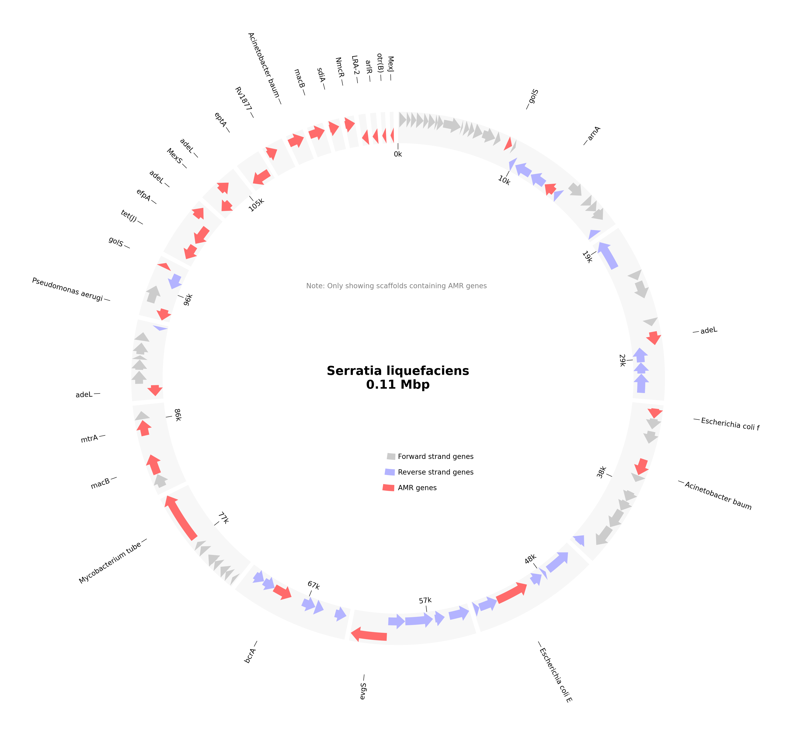

### Acinetobacter baumannii AbaF
- **Mechanism**: antibiotic efflux
- **Drug Classes**: phosphonic acid antibiotic
- **AMR Family**: major facilitator superfamily (MFS) antibiotic efflux pump
- **Locations**:
  - gnl|SPADES|PLIJBHFI_5629_1 : position 1-1203

### Acinetobacter baumannii AbaQ
- **Mechanism**: antibiotic efflux
- **Drug Classes**: fluoroquinolone antibiotic
- **AMR Family**: major facilitator superfamily (MFS) antibiotic efflux pump
- **Locations**:
  - gnl|SPADES|PLIJBHFI_679_6 : position 4224-5486

### Escherichia coli EF-Tu mutants conferring resistance to Enacyloxin IIa
- **Mechanism**: antibiotic target alteration
- **Drug Classes**: elfamycin antibiotic
- **AMR Family**: elfamycin resistant EF-Tu
- **Locations**:
  - gnl|SPADES|PLIJBHFI_826_6 : position 4688-7375

### Escherichia coli fabI mutations conferring resistance to isoniazid and triclosan
- **Mechanism**: antibiotic target alteration
- **Drug Classes**: disinfecting agents and antiseptics; isoniazid-like antibiotic
- **AMR Family**: antibiotic resistant fabI
- **Locations**:
  - gnl|SPADES|PLIJBHFI_679_2 : position 306-1061

### LRA-2
- **Mechanism**: antibiotic inactivation
- **Drug Classes**: cephalosporin; penam
- **AMR Family**: subclass B3 LRA beta-lactamase
- **Locations**:
  - gnl|SPADES|PLIJBHFI_15743_1 : position 2-520

### MexJ
- **Mechanism**: antibiotic efflux
- **Drug Classes**: macrolide antibiotic; tetracycline antibiotic; disinfecting agents and antiseptics
- **AMR Family**: resistance-nodulation-cell division (RND) antibiotic efflux pump
- **Locations**:
  - gnl|SPADES|PLIJBHFI_29620_1 : position 1-273

### MexS
- **Mechanism**: antibiotic efflux
- **Drug Classes**: fluoroquinolone antibiotic; diaminopyrimidine antibiotic; phenicol antibiotic
- **AMR Family**: resistance-nodulation-cell division (RND) antibiotic efflux pump
- **Locations**:
  - gnl|SPADES|PLIJBHFI_2066_1 : position 242-1177

### Mycobacterium tuberculosis rpoB mutations conferring resistance to rifampicin
- **Mechanism**: antibiotic target alteration; antibiotic target replacement
- **Drug Classes**: rifamycin antibiotic
- **AMR Family**: rifamycin-resistant beta-subunit of RNA polymerase (rpoB)
- **Locations**:
  - gnl|SPADES|PLIJBHFI_906_8 : position 4444-8286

### NmcR
- **Mechanism**: antibiotic inactivation
- **Drug Classes**: carbapenem; cephalosporin; cephamycin; penam
- **AMR Family**: NmcA beta-lactamase
- **Locations**:
  - gnl|SPADES|PLIJBHFI_10663_1 : position 2-757

### Pseudomonas aeruginosa ampR with mutation conferring resistance to aztreonam
- **Mechanism**: antibiotic target alteration; antibiotic inactivation
- **Drug Classes**: monobactam; carbapenem; cephalosporin
- **AMR Family**: PDC beta-lactamase; ampR transcriptional regulator with mutation conferring resistance to monobactam antibiotics
- **Locations**:
  - gnl|SPADES|PLIJBHFI_1364_1 : position 1-918

### Rv1877
- **Mechanism**: antibiotic efflux
- **Drug Classes**: fluoroquinolone antibiotic
- **AMR Family**: major facilitator superfamily (MFS) antibiotic efflux pump
- **Locations**:
  - gnl|SPADES|PLIJBHFI_4420_1 : position 145-942

### adeL (found in 4 locations)
- **Mechanism**: antibiotic efflux
- **Drug Classes**: fluoroquinolone antibiotic; tetracycline antibiotic
- **AMR Family**: resistance-nodulation-cell division (RND) antibiotic efflux pump
- **Locations**:
  - gnl|SPADES|PLIJBHFI_1125_1 : position 237-1124
  - gnl|SPADES|PLIJBHFI_1387_5 : position 3485-4372
  - gnl|SPADES|PLIJBHFI_2066_2 : position 1281-2168
  - gnl|SPADES|PLIJBHFI_659_7 : position 8158-9171

### arlR
- **Mechanism**: antibiotic efflux
- **Drug Classes**: fluoroquinolone antibiotic; disinfecting agents and antiseptics
- **AMR Family**: major facilitator superfamily (MFS) antibiotic efflux pump
- **Locations**:
  - gnl|SPADES|PLIJBHFI_18660_1 : position 3-437

### arnA
- **Mechanism**: antibiotic target alteration
- **Drug Classes**: peptide antibiotic
- **AMR Family**: pmr phosphoethanolamine transferase
- **Locations**:
  - gnl|SPADES|PLIJBHFI_500_23 : position 12597-13541

### bcrA
- **Mechanism**: antibiotic efflux
- **Drug Classes**: peptide antibiotic
- **AMR Family**: ATP-binding cassette (ABC) antibiotic efflux pump
- **Locations**:
  - gnl|SPADES|PLIJBHFI_859_6 : position 4878-6410

### efpA
- **Mechanism**: antibiotic efflux
- **Drug Classes**: rifamycin antibiotic; isoniazid-like antibiotic
- **AMR Family**: major facilitator superfamily (MFS) antibiotic efflux pump
- **Locations**:
  - gnl|SPADES|PLIJBHFI_1387_4 : position 1777-3309

### eptA
- **Mechanism**: antibiotic target alteration
- **Drug Classes**: peptide antibiotic
- **AMR Family**: pmr phosphoethanolamine transferase
- **Locations**:
  - gnl|SPADES|PLIJBHFI_3626_2 : position 176-1714

### evgS
- **Mechanism**: antibiotic efflux
- **Drug Classes**: macrolide antibiotic; fluoroquinolone antibiotic; penam; tetracycline antibiotic
- **AMR Family**: major facilitator superfamily (MFS) antibiotic efflux pump; resistance-nodulation-cell division (RND) antibiotic efflux pump
- **Locations**:
  - gnl|SPADES|PLIJBHFI_827_5 : position 6644-9376

### golS (found in 2 locations)
- **Mechanism**: antibiotic efflux
- **Drug Classes**: monobactam; carbapenem; cephalosporin; cephamycin; penam; phenicol antibiotic; penem
- **AMR Family**: resistance-nodulation-cell division (RND) antibiotic efflux pump
- **Locations**:
  - gnl|SPADES|PLIJBHFI_1364_4 : position 3926-4324
  - gnl|SPADES|PLIJBHFI_500_18 : position 8438-8869

### macB (found in 2 locations)
- **Mechanism**: antibiotic efflux
- **Drug Classes**: macrolide antibiotic
- **AMR Family**: ATP-binding cassette (ABC) antibiotic efflux pump
- **Locations**:
  - gnl|SPADES|PLIJBHFI_1027_3 : position 1456-2997
  - gnl|SPADES|PLIJBHFI_6311_1 : position 2-1198

### mtrA
- **Mechanism**: antibiotic efflux
- **Drug Classes**: macrolide antibiotic; penam
- **AMR Family**: resistance-nodulation-cell division (RND) antibiotic efflux pump
- **Locations**:
  - gnl|SPADES|PLIJBHFI_1027_5 : position 4478-5656

### otr(B)
- **Mechanism**: antibiotic efflux
- **Drug Classes**: tetracycline antibiotic
- **AMR Family**: major facilitator superfamily (MFS) antibiotic efflux pump
- **Locations**:
  - gnl|SPADES|PLIJBHFI_24977_1 : position 2-319

### sdiA
- **Mechanism**: antibiotic efflux
- **Drug Classes**: fluoroquinolone antibiotic; cephalosporin; glycylcycline; penam; tetracycline antibiotic; rifamycin antibiotic; phenicol antibiotic; disinfecting agents and antiseptics
- **AMR Family**: resistance-nodulation-cell division (RND) antibiotic efflux pump
- **Locations**:
  - gnl|SPADES|PLIJBHFI_8814_1 : position 46-783

### tet(J)
- **Mechanism**: antibiotic efflux
- **Drug Classes**: tetracycline antibiotic
- **AMR Family**: major facilitator superfamily (MFS) antibiotic efflux pump
- **Locations**:
  - gnl|SPADES|PLIJBHFI_1387_2 : position 336-1553

## Serratia liquefaciens ATCC 27592
**Strain Statistics:**
- Total genome length: 4931.3 kbp
- Total scaffolds: 158
- Scaffolds with AMR genes: 72
- Total genes annotated: 9157
- Total AMR genes: 617
- Unique AMR genes: 243
- Distinct AMR mechanisms: 11
- Distinct AMR families: 88
- Distinct drug classes: 37

**Circos Plot:**

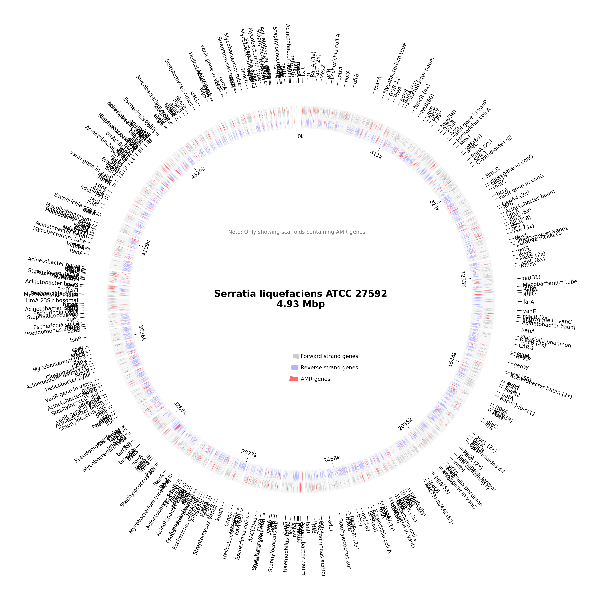

### AAC(3)-Ia
- **Mechanism**: antibiotic inactivation
- **Drug Classes**: aminoglycoside antibiotic
- **AMR Family**: AAC(3)
- **Locations**:
  - gnl|SPADES|PLIJBHFI_104_79 : position 82983-83531

### AAC(3)-Ib/AAC(6')-Ib3 bifunctional protein
- **Mechanism**: antibiotic inactivation
- **Drug Classes**: aminoglycoside antibiotic
- **AMR Family**: aminoglycoside bifunctional resistance protein
- **Locations**:
  - gnl|SPADES|PLIJBHFI_70_54 : position 58076-58528

### AAC(6')-Iai
- **Mechanism**: antibiotic inactivation
- **Drug Classes**: aminoglycoside antibiotic
- **AMR Family**: AAC(6')
- **Locations**:
  - gnl|SPADES|PLIJBHFI_181_9 : position 7649-8101

### AAC(6')-Iak
- **Mechanism**: antibiotic inactivation
- **Drug Classes**: aminoglycoside antibiotic
- **AMR Family**: AAC(6')
- **Locations**:
  - gnl|SPADES|PLIJBHFI_422_2 : position 4263-4709

### AAC(6')-Isa
- **Mechanism**: antibiotic inactivation
- **Drug Classes**: aminoglycoside antibiotic
- **AMR Family**: AAC(6')
- **Locations**:
  - gnl|SPADES|PLIJBHFI_69_46 : position 36596-37180

### ACT-54
- **Mechanism**: antibiotic inactivation
- **Drug Classes**: carbapenem; cephalosporin; cephamycin; penam
- **AMR Family**: ACT beta-lactamase
- **Locations**:
  - gnl|SPADES|PLIJBHFI_244_28 : position 25442-26977

### AIM-1
- **Mechanism**: antibiotic inactivation
- **Drug Classes**: cephalosporin; cephamycin; penam
- **AMR Family**: AIM beta-lactamase
- **Locations**:
  - gnl|SPADES|PLIJBHFI_181_35 : position 27220-28164

### APH(6)-Ic
- **Mechanism**: antibiotic inactivation
- **Drug Classes**: aminoglycoside antibiotic
- **AMR Family**: APH(6)
- **Locations**:
  - gnl|SPADES|PLIJBHFI_112_38 : position 33110-33964

### AQU-3
- **Mechanism**: antibiotic inactivation
- **Drug Classes**: cephalosporin
- **AMR Family**: AQU beta-lactamase
- **Locations**:
  - gnl|SPADES|PLIJBHFI_112_81 : position 77804-78952

### Acinetobacter baumannii AbaF (found in 9 locations)
- **Mechanism**: antibiotic efflux
- **Drug Classes**: phosphonic acid antibiotic
- **AMR Family**: major facilitator superfamily (MFS) antibiotic efflux pump
- **Locations**:
  - gnl|SPADES|PLIJBHFI_117_55 : position 62060-63385
  - gnl|SPADES|PLIJBHFI_134_6 : position 5989-7296
  - gnl|SPADES|PLIJBHFI_181_57 : position 52915-54225
  - gnl|SPADES|PLIJBHFI_244_37 : position 36315-37625
  - gnl|SPADES|PLIJBHFI_40_95 : position 98651-100033
  - gnl|SPADES|PLIJBHFI_53_23 : position 25000-26322
  - gnl|SPADES|PLIJBHFI_53_9 : position 8052-9284
  - gnl|SPADES|PLIJBHFI_660_3 : position 3085-4587
  - gnl|SPADES|PLIJBHFI_800_6 : position 6698-8038

### Acinetobacter baumannii AbaQ (found in 11 locations)
- **Mechanism**: antibiotic efflux
- **Drug Classes**: fluoroquinolone antibiotic
- **AMR Family**: major facilitator superfamily (MFS) antibiotic efflux pump
- **Locations**:
  - gnl|SPADES|PLIJBHFI_117_21 : position 23930-25225
  - gnl|SPADES|PLIJBHFI_11_232 : position 259706-261013
  - gnl|SPADES|PLIJBHFI_134_63 : position 66556-67926
  - gnl|SPADES|PLIJBHFI_146_1 : position 30-1322
  - gnl|SPADES|PLIJBHFI_146_2 : position 1395-2744
  - gnl|SPADES|PLIJBHFI_153_28 : position 25708-27021
  - gnl|SPADES|PLIJBHFI_177_41 : position 45572-46840
  - gnl|SPADES|PLIJBHFI_195_41 : position 48865-50202
  - gnl|SPADES|PLIJBHFI_21_34 : position 38886-40193
  - gnl|SPADES|PLIJBHFI_285_7 : position 7118-8431
  - gnl|SPADES|PLIJBHFI_83_3 : position 2566-3966

### Acinetobacter baumannii AmvA
- **Mechanism**: antibiotic efflux
- **Drug Classes**: macrolide antibiotic; disinfecting agents and antiseptics
- **AMR Family**: major facilitator superfamily (MFS) antibiotic efflux pump
- **Locations**:
  - gnl|SPADES|PLIJBHFI_11_28 : position 32095-33567

### AcrS
- **Mechanism**: antibiotic efflux
- **Drug Classes**: fluoroquinolone antibiotic; cephalosporin; glycylcycline; cephamycin; penam; tetracycline antibiotic; rifamycin antibiotic; phenicol antibiotic; disinfecting agents and antiseptics
- **AMR Family**: resistance-nodulation-cell division (RND) antibiotic efflux pump
- **Locations**:
  - gnl|SPADES|PLIJBHFI_11_216 : position 241342-241983

### ArnT
- **Mechanism**: antibiotic target alteration
- **Drug Classes**: peptide antibiotic
- **AMR Family**: pmr phosphoethanolamine transferase
- **Locations**:
  - gnl|SPADES|PLIJBHFI_63_32: position 33528-35192

### Bifidobacterium bifidum ileS conferring resistance to mupirocin
- **Mechanism**: antibiotic target alteration
- **Drug Classes**: mupirocin-like antibiotic
- **AMR Family**: antibiotic-resistant isoleucyl-tRNA synthetase (ileS)
- **Locations**:
  - gnl|SPADES|PLIJBHFI_207_49 : position 45245-47827

### CAR-1 (found in 2 locations)
- **Mechanism**: antibiotic inactivation
- **Drug Classes**: carbapenem
- **AMR Family**: CAR beta-lactamase
- **Locations**:
  - gnl|SPADES|PLIJBHFI_146_19 : position 20204-21004
  - gnl|SPADES|PLIJBHFI_47_31 : position 33457-34263

### CAU-1
- **Mechanism**: antibiotic inactivation
- **Drug Classes**: carbapenem; penam
- **AMR Family**: CAU beta-lactamase
- **Locations**:
  - gnl|SPADES|PLIJBHFI_8_307 : position 337415-339538

### CRP (found in 2 locations)
- **Mechanism**: antibiotic efflux
- **Drug Classes**: macrolide antibiotic; fluoroquinolone antibiotic; penam
- **AMR Family**: resistance-nodulation-cell division (RND) antibiotic efflux pump
- **Locations**:
  - gnl|SPADES|PLIJBHFI_104_25: position 20702-21334
  - gnl|SPADES|PLIJBHFI_11_144 : position 162142-162906

### Clostridioides difficile gyrA conferring resistance to fluoroquinolones
- **Mechanism**: antibiotic target alteration
- **Drug Classes**: fluoroquinolone antibiotic
- **AMR Family**: fluoroquinolone resistant gyrA
- **Locations**:
  - gnl|SPADES|PLIJBHFI_14_76 : position 86356-89007

### Clostridioides difficile gyrB conferring resistance to fluoroquinolones (found in 2 locations)
- **Mechanism**: antibiotic target alteration
- **Drug Classes**: fluoroquinolone antibiotic
- **AMR Family**: fluoroquinolone resistant gyrB
- **Locations**:
  - gnl|SPADES|PLIJBHFI_146_10 : position 9346-11760
  - gnl|SPADES|PLIJBHFI_64_51 : position 63289-65184

### CrcB
- **Mechanism**: antibiotic efflux
- **Drug Classes**: aminoglycoside antibiotic
- **AMR Family**: multidrug and toxic compound extrusion (MATE) transporter
- **Locations**:
  - gnl|SPADES|PLIJBHFI_207_34 : position 32010-32393

### DHA-6
- **Mechanism**: antibiotic inactivation
- **Drug Classes**: cephalosporin; cephamycin
- **AMR Family**: DHA beta-lactamase
- **Locations**:
  - gnl|SPADES|PLIJBHFI_134_59 : position 61744-62886

### Enterobacter cloacae acrA (found in 2 locations)
- **Mechanism**: antibiotic efflux
- **Drug Classes**: fluoroquinolone antibiotic; cephalosporin; glycylcycline; penam; tetracycline antibiotic; rifamycin antibiotic; phenicol antibiotic; disinfecting agents and antiseptics
- **AMR Family**: resistance-nodulation-cell division (RND) antibiotic efflux pump
- **Locations**:
  - gnl|SPADES|PLIJBHFI_32_151 : position 158996-160198
  - gnl|SPADES|PLIJBHFI_75_47 : position 49403-50590

### Enterococcus faecalis cls with mutation conferring resistance to daptomycin
- **Mechanism**: antibiotic target alteration
- **Drug Classes**: peptide antibiotic
- **AMR Family**: daptomycin resistant cls
- **Locations**:
  - gnl|SPADES|PLIJBHFI_11_26 : position 29468-30928

### Enterococcus faecium liaS mutant conferring daptomycin resistance
- **Mechanism**: antibiotic target alteration; antibiotic efflux
- **Drug Classes**: peptide antibiotic
- **AMR Family**: daptomycin resistant liaS
- **Locations**:
  - gnl|SPADES|PLIJBHFI_270_2 : position 1690-3225

### Erm(34)
- **Mechanism**: antibiotic target alteration
- **Drug Classes**: macrolide antibiotic; lincosamide antibiotic; streptogramin antibiotic; streptogramin A antibiotic; streptogramin B antibiotic
- **AMR Family**: Erm 23S ribosomal RNA methyltransferase
- **Locations**:
  - gnl|SPADES|PLIJBHFI_241_29 : position 30262-30888

### Erm(37)
- **Mechanism**: antibiotic target alteration
- **Drug Classes**: macrolide antibiotic; lincosamide antibiotic; streptogramin antibiotic; streptogramin A antibiotic; streptogramin B antibiotic
- **AMR Family**: Erm 23S ribosomal RNA methyltransferase
- **Locations**:
  - gnl|SPADES|PLIJBHFI_177_22 : position 23843-24622

### Escherichia coli AcrAB-TolC with AcrR mutation conferring resistance to ciprofloxacin, tetracycline, and ceftazidime (found in 5 locations)
- **Mechanism**: antibiotic target alteration; antibiotic efflux
- **Drug Classes**: fluoroquinolone antibiotic; cephalosporin; glycylcycline; penam; tetracycline antibiotic; rifamycin antibiotic; phenicol antibiotic; disinfecting agents and antiseptics
- **AMR Family**: resistance-nodulation-cell division (RND) antibiotic efflux pump
- **Locations**:
  - gnl|SPADES|PLIJBHFI_112_79 : position 76007-76609
  - gnl|SPADES|PLIJBHFI_11_245 : position 276039-276743
  - gnl|SPADES|PLIJBHFI_150_31 : position 36329-36916
  - gnl|SPADES|PLIJBHFI_75_46 : position 48571-49260
  - gnl|SPADES|PLIJBHFI_8_120 : position 121978-122559

### Escherichia coli AcrAB-TolC with MarR mutations conferring resistance to ciprofloxacin and tetracycline (found in 2 locations)
- **Mechanism**: antibiotic target alteration; antibiotic efflux
- **Drug Classes**: fluoroquinolone antibiotic; cephalosporin; glycylcycline; penam; tetracycline antibiotic; rifamycin antibiotic; phenicol antibiotic; disinfecting agents and antiseptics
- **AMR Family**: resistance-nodulation-cell division (RND) antibiotic efflux pump
- **Locations**:
  - gnl|SPADES|PLIJBHFI_112_24 : position 22656-23090
  - gnl|SPADES|PLIJBHFI_21_40 : position 45128-45601

### Escherichia coli EF-Tu mutants conferring resistance to Pulvomycin
- **Mechanism**: antibiotic target alteration
- **Drug Classes**: elfamycin antibiotic
- **AMR Family**: elfamycin resistant EF-Tu
- **Locations**:
  - gnl|SPADES|PLIJBHFI_177_9 : position 8854-10701

### Escherichia coli fabI mutations conferring resistance to isoniazid and triclosan
- **Mechanism**: antibiotic target alteration
- **Drug Classes**: disinfecting agents and antiseptics; isoniazid-like antibiotic
- **AMR Family**: antibiotic resistant fabI
- **Locations**:
  - gnl|SPADES|PLIJBHFI_523_15 : position 14685-15431

### Escherichia coli mdfA
- **Mechanism**: antibiotic efflux
- **Drug Classes**: tetracycline antibiotic; phenicol antibiotic; disinfecting agents and antiseptics
- **AMR Family**: major facilitator superfamily (MFS) antibiotic efflux pump
- **Locations**:
  - gnl|SPADES|PLIJBHFI_177_7 : position 7130-8377

### Escherichia coli soxS with mutation conferring antibiotic resistance (found in 11 locations)
- **Mechanism**: antibiotic target alteration; antibiotic efflux; reduced permeability to antibiotic
- **Drug Classes**: fluoroquinolone antibiotic; monobactam; carbapenem; cephalosporin; glycylcycline; cephamycin; penam; tetracycline antibiotic; rifamycin antibiotic; phenicol antibiotic; penem; disinfecting agents and antiseptics
- **AMR Family**: ATP-binding cassette (ABC) antibiotic efflux pump; major facilitator superfamily (MFS) antibiotic efflux pump; resistance-nodulation-cell division (RND) antibiotic efflux pump; General Bacterial Porin with reduced permeability to beta-lactams
- **Locations**:
  - gnl|SPADES|PLIJBHFI_109_25 : position 20938-21804
  - gnl|SPADES|PLIJBHFI_112_48 : position 44338-45231
  - gnl|SPADES|PLIJBHFI_112_58 : position 56801-57718
  - gnl|SPADES|PLIJBHFI_134_17 : position 19810-20679
  - gnl|SPADES|PLIJBHFI_153_15 : position 11032-11877
  - gnl|SPADES|PLIJBHFI_181_18 : position 12910-13917
  - gnl|SPADES|PLIJBHFI_225_39 : position 41727-42149
  - gnl|SPADES|PLIJBHFI_292_13 : position 13315-14088
  - gnl|SPADES|PLIJBHFI_32_124 : position 124790-125752
  - gnl|SPADES|PLIJBHFI_71_76 : position 70085-71032
  - gnl|SPADES|PLIJBHFI_8_132 : position 134773-135231

### EstT (found in 3 locations)
- **Mechanism**: antibiotic inactivation
- **Drug Classes**: macrolide antibiotic
- **AMR Family**: macrolide esterase
- **Locations**:
  - gnl|SPADES|PLIJBHFI_153_38 : position 34651-35454
  - gnl|SPADES|PLIJBHFI_21_177 : position 199246-200076
  - gnl|SPADES|PLIJBHFI_357_2 : position 964-1806

### FosA8
- **Mechanism**: antibiotic inactivation
- **Drug Classes**: phosphonic acid antibiotic
- **AMR Family**: fosfomycin thiol transferase
- **Locations**:
  - gnl|SPADES|PLIJBHFI_69_14: position 6274-6681

### FosC2
- **Mechanism**: antibiotic inactivation
- **Drug Classes**: phosphonic acid antibiotic
- **AMR Family**: fosC phosphotransferase family
- **Locations**:
  - gnl|SPADES|PLIJBHFI_112_11 : position 8636-9043

### FosM2 (found in 2 locations)
- **Mechanism**: antibiotic inactivation
- **Drug Classes**: phosphonic acid antibiotic
- **AMR Family**: fosfomycin thiol transferase
- **Locations**:
  - gnl|SPADES|PLIJBHFI_207_23 : position 22807-23316
  - gnl|SPADES|PLIJBHFI_53_54 : position 68301-68711

### GOB-12
- **Mechanism**: antibiotic inactivation
- **Drug Classes**: carbapenem; cephalosporin; penam
- **AMR Family**: GOB beta-lactamase
- **Locations**:
  - gnl|SPADES|PLIJBHFI_8_324 : position 359546-360193

### H-NS
- **Mechanism**: antibiotic efflux
- **Drug Classes**: macrolide antibiotic; fluoroquinolone antibiotic; cephalosporin; cephamycin; penam; tetracycline antibiotic
- **AMR Family**: major facilitator superfamily (MFS) antibiotic efflux pump; resistance-nodulation-cell division (RND) antibiotic efflux pump
- **Locations**:
  - gnl|SPADES|PLIJBHFI_11_9 : position 8120-8527

### Haemophilus influenzae PBP3 conferring resistance to beta-lactam antibiotics (found in 2 locations)
- **Mechanism**: antibiotic target alteration
- **Drug Classes**: cephalosporin; cephamycin; penam
- **AMR Family**: Penicillin-binding protein mutations conferring resistance to beta-lactam antibiotics
- **Locations**:
  - gnl|SPADES|PLIJBHFI_21_84 : position 96701-98419
  - gnl|SPADES|PLIJBHFI_83_50 : position 62135-63898

### Helicobacter pylori pbp1 mutants conferring resistance to amoxicillin (found in 2 locations)
- **Mechanism**: antibiotic target alteration
- **Drug Classes**: cephalosporin; cephamycin; penam
- **AMR Family**: Penicillin-binding protein mutations conferring resistance to beta-lactam antibiotics
- **Locations**:
  - gnl|SPADES|PLIJBHFI_109_61 : position 62687-65191
  - gnl|SPADES|PLIJBHFI_139_46 : position 48145-50493

### Helicobacter pylori pbp2 mutants conferring resistance to amoxicillin
- **Mechanism**: antibiotic target alteration
- **Drug Classes**: cephalosporin; cephamycin; penam
- **AMR Family**: Penicillin-binding protein mutations conferring resistance to beta-lactam antibiotics
- **Locations**:
  - gnl|SPADES|PLIJBHFI_207_43 : position 40072-41967

### Helicobacter pylori rpoB mutation conferring resistance to rifampicin
- **Mechanism**: antibiotic target alteration; antibiotic target replacement
- **Drug Classes**: fluoroquinolone antibiotic; rifamycin antibiotic
- **AMR Family**: rifamycin-resistant beta-subunit of RNA polymerase (rpoB)
- **Locations**:
  - gnl|SPADES|PLIJBHFI_422_1 : position 3-4091

### Klebsiella aerogenes Omp36
- **Mechanism**: reduced permeability to antibiotic
- **Drug Classes**: monobactam; carbapenem; cephalosporin; cephamycin; penam; penem
- **AMR Family**: General Bacterial Porin with reduced permeability to beta-lactams
- **Locations**:
  - gnl|SPADES|PLIJBHFI_14_70 : position 76284-77414

### Klebsiella pneumoniae KpnE
- **Mechanism**: antibiotic efflux
- **Drug Classes**: macrolide antibiotic; aminoglycoside antibiotic; cephalosporin; tetracycline antibiotic; peptide antibiotic; rifamycin antibiotic; disinfecting agents and antiseptics
- **AMR Family**: small multidrug resistance (SMR) antibiotic efflux pump
- **Locations**:
  - gnl|SPADES|PLIJBHFI_69_76 : position 68431-68799

### Klebsiella pneumoniae KpnF
- **Mechanism**: antibiotic efflux
- **Drug Classes**: macrolide antibiotic; aminoglycoside antibiotic; cephalosporin; tetracycline antibiotic; peptide antibiotic; rifamycin antibiotic; disinfecting agents and antiseptics
- **AMR Family**: small multidrug resistance (SMR) antibiotic efflux pump
- **Locations**:
  - gnl|SPADES|PLIJBHFI_69_77: position 68786-69115

### Klebsiella pneumoniae KpnH
- **Mechanism**: antibiotic efflux
- **Drug Classes**: macrolide antibiotic; fluoroquinolone antibiotic; aminoglycoside antibiotic; carbapenem; cephalosporin; penam; peptide antibiotic; penem
- **AMR Family**: major facilitator superfamily (MFS) antibiotic efflux pump
- **Locations**:
  - gnl|SPADES|PLIJBHFI_181_50: position 43904-45439

### Klebsiella pneumoniae OmpK37 (found in 3 locations)
- **Mechanism**: reduced permeability to antibiotic
- **Drug Classes**: monobactam; carbapenem; cephalosporin; cephamycin; penam; penem
- **AMR Family**: General Bacterial Porin with reduced permeability to beta-lactams
- **Locations**:
  - gnl|SPADES|PLIJBHFI_47_1 : position 35-1117
  - gnl|SPADES|PLIJBHFI_8_326 : position 361700-362824
  - gnl|SPADES|PLIJBHFI_8_54 : position 55227-56324

### LRA-8
- **Mechanism**: antibiotic inactivation
- **Drug Classes**: cephalosporin; penam
- **AMR Family**: subclass B3 LRA beta-lactamase
- **Locations**:
  - gnl|SPADES|PLIJBHFI_122_23 : position 20332-21087

### LlmA 23S ribosomal RNA methyltransferase
- **Mechanism**: antibiotic target alteration
- **Drug Classes**: lincosamide antibiotic
- **AMR Family**: Llm 23S ribosomal RNA methyltransferase
- **Locations**:
  - gnl|SPADES|PLIJBHFI_153_58 : position 53675-54865

### LpsB
- **Mechanism**: reduced permeability to antibiotic
- **Drug Classes**: peptide antibiotic
- **AMR Family**: Intrinsic peptide antibiotic resistant Lps
- **Locations**:
  - gnl|SPADES|PLIJBHFI_82_69 : position 72870-73967

### LptD
- **Mechanism**: antibiotic efflux
- **Drug Classes**: carbapenem; peptide antibiotic; aminocoumarin antibiotic; rifamycin antibiotic
- **AMR Family**: ATP-binding cassette (ABC) antibiotic efflux pump
- **Locations**:
  - gnl|SPADES|PLIJBHFI_83_22 : position 24393-26756

### MdtK
- **Mechanism**: antibiotic efflux
- **Drug Classes**: fluoroquinolone antibiotic
- **AMR Family**: multidrug and toxic compound extrusion (MATE) transporter
- **Locations**:
  - gnl|SPADES|PLIJBHFI_32_103 : position 101702-103165

### MexA
- **Mechanism**: antibiotic efflux
- **Drug Classes**: macrolide antibiotic; fluoroquinolone antibiotic; monobactam; carbapenem; cephalosporin; cephamycin; penam; tetracycline antibiotic; peptide antibiotic; aminocoumarin antibiotic; diaminopyrimidine antibiotic; sulfonamide antibiotic; phenicol antibiotic; penem
- **AMR Family**: resistance-nodulation-cell division (RND) antibiotic efflux pump
- **Locations**:
  - gnl|SPADES|PLIJBHFI_11_247 : position 278453-279595

### MexE
- **Mechanism**: antibiotic efflux
- **Drug Classes**: fluoroquinolone antibiotic; diaminopyrimidine antibiotic; phenicol antibiotic
- **AMR Family**: resistance-nodulation-cell division (RND) antibiotic efflux pump
- **Locations**:
  - gnl|SPADES|PLIJBHFI_112_23 : position 21378-22235

### MexG
- **Mechanism**: antibiotic efflux
- **Drug Classes**: fluoroquinolone antibiotic; tetracycline antibiotic; disinfecting agents and antiseptics
- **AMR Family**: resistance-nodulation-cell division (RND) antibiotic efflux pump
- **Locations**:
  - gnl|SPADES|PLIJBHFI_181_13 : position 10217-10630

### MexL (found in 3 locations)
- **Mechanism**: antibiotic efflux
- **Drug Classes**: macrolide antibiotic; tetracycline antibiotic; disinfecting agents and antiseptics
- **AMR Family**: resistance-nodulation-cell division (RND) antibiotic efflux pump
- **Locations**:
  - gnl|SPADES|PLIJBHFI_11_181 : position 200076-200660
  - gnl|SPADES|PLIJBHFI_153_34 : position 31420-32058
  - gnl|SPADES|PLIJBHFI_244_40 : position 38981-39589

### MexS (found in 10 locations)
- **Mechanism**: antibiotic efflux
- **Drug Classes**: fluoroquinolone antibiotic; diaminopyrimidine antibiotic; phenicol antibiotic
- **AMR Family**: resistance-nodulation-cell division (RND) antibiotic efflux pump
- **Locations**:
  - gnl|SPADES|PLIJBHFI_207_3 : position 3035-4024
  - gnl|SPADES|PLIJBHFI_207_4 : position 4117-5052
  - gnl|SPADES|PLIJBHFI_21_130 : position 149017-150003
  - gnl|SPADES|PLIJBHFI_32_18 : position 18416-19450
  - gnl|SPADES|PLIJBHFI_32_56 : position 55373-56380
  - gnl|SPADES|PLIJBHFI_40_80 : position 85041-86030
  - gnl|SPADES|PLIJBHFI_64_19 : position 26050-27078
  - gnl|SPADES|PLIJBHFI_71_16 : position 16991-17971
  - gnl|SPADES|PLIJBHFI_71_6 : position 6571-7596
  - gnl|SPADES|PLIJBHFI_8_158 : position 159556-160683

### MexT (found in 4 locations)
- **Mechanism**: antibiotic efflux
- **Drug Classes**: fluoroquinolone antibiotic; diaminopyrimidine antibiotic; phenicol antibiotic
- **AMR Family**: resistance-nodulation-cell division (RND) antibiotic efflux pump
- **Locations**:
  - gnl|SPADES|PLIJBHFI_11_259 : position 293610-294506
  - gnl|SPADES|PLIJBHFI_14_66 : position 73653-74555
  - gnl|SPADES|PLIJBHFI_32_20 : position 20241-21170
  - gnl|SPADES|PLIJBHFI_53_36 : position 45680-46630

### MexV
- **Mechanism**: antibiotic efflux
- **Drug Classes**: macrolide antibiotic; fluoroquinolone antibiotic; tetracycline antibiotic; phenicol antibiotic; disinfecting agents and antiseptics
- **AMR Family**: resistance-nodulation-cell division (RND) antibiotic efflux pump
- **Locations**:
  - gnl|SPADES|PLIJBHFI_14_177 : position 204259-205710

### MexZ
- **Mechanism**: antibiotic efflux
- **Drug Classes**: macrolide antibiotic; fluoroquinolone antibiotic; aminoglycoside antibiotic; carbapenem; cephalosporin; cephamycin; penam; tetracycline antibiotic; phenicol antibiotic; disinfecting agents and antiseptics
- **AMR Family**: resistance-nodulation-cell division (RND) antibiotic efflux pump
- **Locations**:
  - gnl|SPADES|PLIJBHFI_8_79 : position 81173-81739

### Mycobacterium tuberculosis gidB mutation conferring resistance to streptomycin
- **Mechanism**: antibiotic target alteration
- **Drug Classes**: aminoglycoside antibiotic
- **AMR Family**: antibiotic resistant gidB
- **Locations**:
  - gnl|SPADES|PLIJBHFI_146_45 : position 46321-46941

### Mycobacterium tuberculosis inhA mutations conferring resistance to isoniazid
- **Mechanism**: antibiotic target alteration
- **Drug Classes**: isoniazid-like antibiotic
- **AMR Family**: isoniazid resistant inhA
- **Locations**:
  - gnl|SPADES|PLIJBHFI_129_1 : position 523-1281

### Mycobacterium tuberculosis kasA mutant conferring resistance to isoniazid (found in 4 locations)
- **Mechanism**: antibiotic target alteration
- **Drug Classes**: isoniazid-like antibiotic
- **AMR Family**: antibiotic resistant kasA
- **Locations**:
  - gnl|SPADES|PLIJBHFI_122_14 : position 11020-12189
  - gnl|SPADES|PLIJBHFI_122_17 : position 13384-14613
  - gnl|SPADES|PLIJBHFI_453_11 : position 10297-11538
  - gnl|SPADES|PLIJBHFI_8_345 : position 386644-387918

### Mycobacterium tuberculosis katG mutations conferring resistance to isoniazid
- **Mechanism**: antibiotic target alteration
- **Drug Classes**: isoniazid-like antibiotic
- **AMR Family**: isoniazid resistant katG
- **Locations**:
  - gnl|SPADES|PLIJBHFI_349_12 : position 13195-15393

### Mycobacterium tuberculosis ndh with mutation conferring resistance to isoniazid
- **Mechanism**: antibiotic target alteration
- **Drug Classes**: isoniazid-like antibiotic
- **AMR Family**: antibiotic resistant ndh
- **Locations**:
  - gnl|SPADES|PLIJBHFI_523_6 : position 7423-8727

### Mycobacterium tuberculosis pncA mutations conferring resistance to pyrazinamide (found in 3 locations)
- **Mechanism**: antibiotic target alteration
- **Drug Classes**: pyrazine antibiotic
- **AMR Family**: Pyrazinamide resistant pncA
- **Locations**:
  - gnl|SPADES|PLIJBHFI_177_4 : position 4446-4997
  - gnl|SPADES|PLIJBHFI_32_123 : position 123941-124627
  - gnl|SPADES|PLIJBHFI_629_11 : position 10365-10997

### Mycobacterium tuberculosis rpsA mutations conferring resistance to pyrazinamide
- **Mechanism**: antibiotic target alteration
- **Drug Classes**: pyrazine antibiotic
- **AMR Family**: pyrazinamide resistant rpsA
- **Locations**:
  - gnl|SPADES|PLIJBHFI_8_305 : position 334966-336639

### Mycobacterium tuberculosis thyA with mutation conferring resistance to para-aminosalicylic acid
- **Mechanism**: antibiotic target alteration
- **Drug Classes**: salicylic acid antibiotic
- **AMR Family**: aminosalicylate resistant thymidylate synthase
- **Locations**:
  - gnl|SPADES|PLIJBHFI_195_30 : position 30882-31676

### Mycolicibacterium smegmatis ndh with mutation conferring resistance to isoniazid
- **Mechanism**: antibiotic target alteration
- **Drug Classes**: isoniazid-like antibiotic
- **AMR Family**: antibiotic resistant ndh
- **Locations**:
  - gnl|SPADES|PLIJBHFI_225_4 : position 2886-4094

### Neisseria gonorrhoeae pilQ gene conferring resistance to beta-lactam
- **Mechanism**: antibiotic target alteration
- **Drug Classes**: cephalosporin; cephamycin; penam
- **AMR Family**: Penicillin-binding protein mutations conferring resistance to beta-lactam antibiotics
- **Locations**:
  - gnl|SPADES|PLIJBHFI_104_51 : position 49155-50396

### NmcR (found in 28 locations)
- **Mechanism**: antibiotic inactivation
- **Drug Classes**: carbapenem; cephalosporin; cephamycin; penam
- **AMR Family**: NmcA beta-lactamase
- **Locations**:
  - gnl|SPADES|PLIJBHFI_117_31 : position 34901-35794
  - gnl|SPADES|PLIJBHFI_11_178 : position 196797-197705
  - gnl|SPADES|PLIJBHFI_11_242 : position 272647-273513
  - gnl|SPADES|PLIJBHFI_11_61 : position 66187-67161
  - gnl|SPADES|PLIJBHFI_11_81 : position 88227-89081
  - gnl|SPADES|PLIJBHFI_129_22 : position 27844-28764
  - gnl|SPADES|PLIJBHFI_139_54 : position 62816-63733
  - gnl|SPADES|PLIJBHFI_14_126 : position 149652-150593
  - gnl|SPADES|PLIJBHFI_153_44 : position 39538-40461
  - gnl|SPADES|PLIJBHFI_181_43 : position 37138-38016
  - gnl|SPADES|PLIJBHFI_207_14 : position 12467-13456
  - gnl|SPADES|PLIJBHFI_21_9 : position 9177-10067
  - gnl|SPADES|PLIJBHFI_237_13 : position 10966-11847
  - gnl|SPADES|PLIJBHFI_270_27 : position 29952-30806
  - gnl|SPADES|PLIJBHFI_32_47 : position 48073-48945
  - gnl|SPADES|PLIJBHFI_357_1 : position 1-855
  - gnl|SPADES|PLIJBHFI_378_21 : position 18325-19254
  - gnl|SPADES|PLIJBHFI_479_4 : position 5773-6669
  - gnl|SPADES|PLIJBHFI_47_65 : position 76680-77633
  - gnl|SPADES|PLIJBHFI_53_16 : position 16845-17744
  - gnl|SPADES|PLIJBHFI_53_6 : position 4874-5701
  - gnl|SPADES|PLIJBHFI_64_44 : position 55154-55987
  - gnl|SPADES|PLIJBHFI_71_47 : position 44082-45011
  - gnl|SPADES|PLIJBHFI_71_84 : position 77539-78441
  - gnl|SPADES|PLIJBHFI_71_89 : position 82947-83885
  - gnl|SPADES|PLIJBHFI_8_143 : position 144907-145788
  - gnl|SPADES|PLIJBHFI_8_159 : position 160712-161629
  - gnl|SPADES|PLIJBHFI_8_93 : position 93982-94869

### OmpA (found in 4 locations)
- **Mechanism**: reduced permeability to antibiotic
- **Drug Classes**: peptide antibiotic
- **AMR Family**: General Bacterial Porin with reduced permeability to peptide antibiotics
- **Locations**:
  - gnl|SPADES|PLIJBHFI_111_2 : position 1150-1659
  - gnl|SPADES|PLIJBHFI_134_24 : position 27084-27581
  - gnl|SPADES|PLIJBHFI_177_37 : position 41734-42396
  - gnl|SPADES|PLIJBHFI_8_350 : position 391683-392759

### OpmH
- **Mechanism**: antibiotic efflux
- **Drug Classes**: disinfecting agents and antiseptics
- **AMR Family**: resistance-nodulation-cell division (RND) antibiotic efflux pump
- **Locations**:
  - gnl|SPADES|PLIJBHFI_8_199 : position 213670-215049

### OprM
- **Mechanism**: antibiotic efflux
- **Drug Classes**: macrolide antibiotic; fluoroquinolone antibiotic; monobactam; aminoglycoside antibiotic; carbapenem; cephalosporin; cephamycin; penam; tetracycline antibiotic; peptide antibiotic; aminocoumarin antibiotic; diaminopyrimidine antibiotic; sulfonamide antibiotic; phenicol antibiotic; penem; disinfecting agents and antiseptics
- **AMR Family**: resistance-nodulation-cell division (RND) antibiotic efflux pump
- **Locations**:
  - gnl|SPADES|PLIJBHFI_11_249 : position 282752-284206

### ParR (found in 2 locations)
- **Mechanism**: antibiotic efflux; reduced permeability to antibiotic
- **Drug Classes**: macrolide antibiotic; fluoroquinolone antibiotic; monobactam; aminoglycoside antibiotic; carbapenem; cephalosporin; cephamycin; penam; tetracycline antibiotic; phenicol antibiotic; penem; disinfecting agents and antiseptics
- **AMR Family**: resistance-nodulation-cell division (RND) antibiotic efflux pump; Outer Membrane Porin (Opr)
- **Locations**:
  - gnl|SPADES|PLIJBHFI_104_66 : position 64690-65409
  - gnl|SPADES|PLIJBHFI_11_136 : position 152844-153605

### ParS (found in 3 locations)
- **Mechanism**: antibiotic efflux; reduced permeability to antibiotic
- **Drug Classes**: macrolide antibiotic; fluoroquinolone antibiotic; monobactam; aminoglycoside antibiotic; carbapenem; cephalosporin; cephamycin; penam; tetracycline antibiotic; phenicol antibiotic; penem; disinfecting agents and antiseptics
- **AMR Family**: resistance-nodulation-cell division (RND) antibiotic efflux pump; Outer Membrane Porin (Opr)
- **Locations**:
  - gnl|SPADES|PLIJBHFI_11_135 : position 151543-152847
  - gnl|SPADES|PLIJBHFI_125_6 : position 5427-7208
  - gnl|SPADES|PLIJBHFI_181_37 : position 29981-31579

### PmrF (found in 2 locations)
- **Mechanism**: antibiotic target alteration
- **Drug Classes**: peptide antibiotic
- **AMR Family**: pmr phosphoethanolamine transferase
- **Locations**:
  - gnl|SPADES|PLIJBHFI_63_35 : position 38073-39053
  - gnl|SPADES|PLIJBHFI_82_64 : position 67409-68392

### Pseudomonas aeruginosa CpxR (found in 5 locations)
- **Mechanism**: antibiotic efflux
- **Drug Classes**: macrolide antibiotic; fluoroquinolone antibiotic; monobactam; aminoglycoside antibiotic; carbapenem; cephalosporin; cephamycin; penam; tetracycline antibiotic; peptide antibiotic; aminocoumarin antibiotic; diaminopyrimidine antibiotic; sulfonamide antibiotic; phenicol antibiotic; penem
- **AMR Family**: resistance-nodulation-cell division (RND) antibiotic efflux pump
- **Locations**:
  - gnl|SPADES|PLIJBHFI_129_33 : position 39906-40586
  - gnl|SPADES|PLIJBHFI_14_157 : position 181379-182053
  - gnl|SPADES|PLIJBHFI_150_14 : position 18644-19384
  - gnl|SPADES|PLIJBHFI_181_38 : position 31588-32277
  - gnl|SPADES|PLIJBHFI_82_44 : position 47877-48575

### Pseudomonas aeruginosa ampR with mutation conferring resistance to aztreonam (found in 2 locations)
- **Mechanism**: antibiotic target alteration; antibiotic inactivation
- **Drug Classes**: monobactam; carbapenem; cephalosporin
- **AMR Family**: PDC beta-lactamase; ampR transcriptional regulator with mutation conferring resistance to monobactam antibiotics
- **Locations**:
  - gnl|SPADES|PLIJBHFI_112_76 : position 72514-73389
  - gnl|SPADES|PLIJBHFI_14_208 : position 234646-235575

### QepA2
- **Mechanism**: antibiotic efflux
- **Drug Classes**: fluoroquinolone antibiotic
- **AMR Family**: major facilitator superfamily (MFS) antibiotic efflux pump
- **Locations**:
  - gnl|SPADES|PLIJBHFI_75_13 : position 9112-10518

### QepA4 (found in 2 locations)
- **Mechanism**: antibiotic efflux
- **Drug Classes**: fluoroquinolone antibiotic
- **AMR Family**: major facilitator superfamily (MFS) antibiotic efflux pump
- **Locations**:
  - gnl|SPADES|PLIJBHFI_21_8 : position 7782-9077
  - gnl|SPADES|PLIJBHFI_21_96 : position 109656-111092

### RanA (found in 24 locations)
- **Mechanism**: antibiotic efflux
- **Drug Classes**: aminoglycoside antibiotic
- **AMR Family**: ATP-binding cassette (ABC) antibiotic efflux pump
- **Locations**:
  - gnl|SPADES|PLIJBHFI_117_3 : position 3263-4333
  - gnl|SPADES|PLIJBHFI_11_152 : position 170093-171205
  - gnl|SPADES|PLIJBHFI_11_17 : position 19842-20858
  - gnl|SPADES|PLIJBHFI_11_174 : position 193079-193792
  - gnl|SPADES|PLIJBHFI_11_18 : position 20855-21856
  - gnl|SPADES|PLIJBHFI_11_189 : position 209687-210724
  - gnl|SPADES|PLIJBHFI_11_209 : position 231783-232898
  - gnl|SPADES|PLIJBHFI_122_48 : position 45382-46125
  - gnl|SPADES|PLIJBHFI_146_30 : position 30856-31632
  - gnl|SPADES|PLIJBHFI_14_140 : position 164520-165293
  - gnl|SPADES|PLIJBHFI_14_49 : position 55018-56610
  - gnl|SPADES|PLIJBHFI_181_39 : position 32684-33886
  - gnl|SPADES|PLIJBHFI_193_32 : position 43050-44039
  - gnl|SPADES|PLIJBHFI_21_23 : position 23778-24857
  - gnl|SPADES|PLIJBHFI_21_87 : position 99751-100512
  - gnl|SPADES|PLIJBHFI_237_20 : position 18470-20146
  - gnl|SPADES|PLIJBHFI_32_136 : position 139751-140812
  - gnl|SPADES|PLIJBHFI_40_114 : position 128198-129190
  - gnl|SPADES|PLIJBHFI_47_15 : position 17764-18732
  - gnl|SPADES|PLIJBHFI_642_12 : position 8461-9276
  - gnl|SPADES|PLIJBHFI_79_31 : position 31680-32756
  - gnl|SPADES|PLIJBHFI_8_150 : position 152171-154048
  - gnl|SPADES|PLIJBHFI_8_250 : position 268872-270005
  - gnl|SPADES|PLIJBHFI_8_41 : position 44718-45653

### RanB
- **Mechanism**: antibiotic efflux
- **Drug Classes**: aminoglycoside antibiotic
- **AMR Family**: ATP-binding cassette (ABC) antibiotic efflux pump
- **Locations**:
  - gnl|SPADES|PLIJBHFI_642_13 : position 9281-10063

### Rhodococcus fascians cmr (found in 2 locations)
- **Mechanism**: antibiotic efflux
- **Drug Classes**: phenicol antibiotic
- **AMR Family**: major facilitator superfamily (MFS) antibiotic efflux pump
- **Locations**:
  - gnl|SPADES|PLIJBHFI_21_94 : position 107434-108612
  - gnl|SPADES|PLIJBHFI_53_76 : position 92064-93491

### Rv1877
- **Mechanism**: antibiotic efflux
- **Drug Classes**: fluoroquinolone antibiotic
- **AMR Family**: major facilitator superfamily (MFS) antibiotic efflux pump
- **Locations**:
  - gnl|SPADES|PLIJBHFI_11_246 : position 276787-278301

### SAT-2
- **Mechanism**: antibiotic inactivation
- **Drug Classes**: nucleoside antibiotic
- **AMR Family**: streptothricin acetyltransferase (SAT)
- **Locations**:
  - gnl|SPADES|PLIJBHFI_8_80 : position 81755-82384

### SAT-3
- **Mechanism**: antibiotic inactivation
- **Drug Classes**: nucleoside antibiotic
- **AMR Family**: streptothricin acetyltransferase (SAT)
- **Locations**:
  - gnl|SPADES|PLIJBHFI_71_60 : position 56084-56626

### SPR-1
- **Mechanism**: antibiotic inactivation
- **Drug Classes**: carbapenem
- **AMR Family**: SPR beta-lactamase
- **Locations**:
  - gnl|SPADES|PLIJBHFI_14_65 : position 72677-73573

### SRT-2
- **Mechanism**: antibiotic inactivation
- **Drug Classes**: cephalosporin
- **AMR Family**: SRT beta-lactamase
- **Locations**:
  - gnl|SPADES|PLIJBHFI_21_93 : position 106265-107434

### SRT-3
- **Mechanism**: antibiotic inactivation
- **Drug Classes**: cephalosporin
- **AMR Family**: SRT beta-lactamase
- **Locations**:
  - gnl|SPADES|PLIJBHFI_112_77 : position 73594-74730

### Salmonella serovars soxS with mutation conferring antibiotic resistance
- **Mechanism**: antibiotic target alteration; antibiotic efflux; reduced permeability to antibiotic
- **Drug Classes**: fluoroquinolone antibiotic; monobactam; carbapenem; cephalosporin; glycylcycline; cephamycin; penam; tetracycline antibiotic; rifamycin antibiotic; phenicol antibiotic; penem; disinfecting agents and antiseptics
- **AMR Family**: ATP-binding cassette (ABC) antibiotic efflux pump; major facilitator superfamily (MFS) antibiotic efflux pump; resistance-nodulation-cell division (RND) antibiotic efflux pump; General Bacterial Porin with reduced permeability to beta-lactams
- **Locations**:
  - gnl|SPADES|PLIJBHFI_69_8 : position 3757-4143

### SatA
- **Mechanism**: antibiotic inactivation
- **Drug Classes**: nucleoside antibiotic
- **AMR Family**: streptothricin acetyltransferase (SAT)
- **Locations**:
  - gnl|SPADES|PLIJBHFI_177_36 : position 41071-41466

### Staphylococcus aureus FosB
- **Mechanism**: antibiotic inactivation
- **Drug Classes**: phosphonic acid antibiotic
- **AMR Family**: fosfomycin thiol transferase
- **Locations**:
  - gnl|SPADES|PLIJBHFI_14_69 : position 75714-76130

### Staphylococcus aureus GlpT with mutation conferring resistance to fosfomycin
- **Mechanism**: antibiotic target alteration
- **Drug Classes**: phosphonic acid antibiotic
- **AMR Family**: antibiotic-resistant GlpT
- **Locations**:
  - gnl|SPADES|PLIJBHFI_79_73 : position 74766-76121

### Staphylococcus aureus LmrS
- **Mechanism**: antibiotic efflux
- **Drug Classes**: macrolide antibiotic; aminoglycoside antibiotic; oxazolidinone antibiotic; diaminopyrimidine antibiotic; phenicol antibiotic
- **AMR Family**: major facilitator superfamily (MFS) antibiotic efflux pump
- **Locations**:
  - gnl|SPADES|PLIJBHFI_181_21 : position 16056-17438

### Staphylococcus aureus fusA with mutation conferring resistance to fusidic acid (found in 3 locations)
- **Mechanism**: antibiotic target alteration
- **Drug Classes**: fusidane antibiotic
- **AMR Family**: antibiotic resistant fusA
- **Locations**:
  - gnl|SPADES|PLIJBHFI_104_1 : position 123-2237
  - gnl|SPADES|PLIJBHFI_11_188 : position 207309-209414
  - gnl|SPADES|PLIJBHFI_134_43 : position 46215-47804

### Staphylococcus aureus mupA conferring resistance to mupirocin
- **Mechanism**: antibiotic target alteration
- **Drug Classes**: mupirocin-like antibiotic
- **AMR Family**: antibiotic-resistant isoleucyl-tRNA synthetase (ileS)
- **Locations**:
  - gnl|SPADES|PLIJBHFI_727_4 : position 2449-5265

### Staphylococcus aureus mupB conferring resistance to mupirocin
- **Mechanism**: antibiotic target alteration
- **Drug Classes**: mupirocin-like antibiotic
- **AMR Family**: antibiotic-resistant isoleucyl-tRNA synthetase (ileS)
- **Locations**:
  - gnl|SPADES|PLIJBHFI_132_64 : position 69132-71828

### Staphylococcus aureus murA with mutation conferring resistance to fosfomycin
- **Mechanism**: antibiotic target alteration
- **Drug Classes**: phosphonic acid antibiotic
- **AMR Family**: antibiotic-resistant murA transferase
- **Locations**:
  - gnl|SPADES|PLIJBHFI_642_18 : position 12016-13275

### Staphylococcus aureus norA (found in 2 locations)
- **Mechanism**: antibiotic efflux
- **Drug Classes**: fluoroquinolone antibiotic
- **AMR Family**: major facilitator superfamily (MFS) antibiotic efflux pump
- **Locations**:
  - gnl|SPADES|PLIJBHFI_125_1 : position 412-1758
  - gnl|SPADES|PLIJBHFI_270_1 : position 258-1589

### Staphylococcus aureus pgsA mutations conferring resistance to daptomycin
- **Mechanism**: antibiotic target alteration
- **Drug Classes**: peptide antibiotic
- **AMR Family**: daptomycin resistant pgsA
- **Locations**:
  - gnl|SPADES|PLIJBHFI_153_2 : position 444-992

### Streptococcus pneumoniae PBP2x conferring resistance to amoxicillin
- **Mechanism**: antibiotic target alteration
- **Drug Classes**: cephalosporin; cephamycin; penam
- **AMR Family**: Penicillin-binding protein mutations conferring resistance to beta-lactam antibiotics
- **Locations**:
  - gnl|SPADES|PLIJBHFI_104_56 : position 52758-55316

### Streptomyces rimosus otr(A) (found in 2 locations)
- **Mechanism**: antibiotic target protection
- **Drug Classes**: tetracycline antibiotic
- **AMR Family**: tetracycline-resistant ribosomal protection protein
- **Locations**:
  - gnl|SPADES|PLIJBHFI_390_20 : position 17402-19201
  - gnl|SPADES|PLIJBHFI_443_15 : position 16293-18116

### Streptomyces venezuelae rox (found in 3 locations)
- **Mechanism**: antibiotic inactivation
- **Drug Classes**: rifamycin antibiotic
- **AMR Family**: rifampin monooxygenase
- **Locations**:
  - gnl|SPADES|PLIJBHFI_111_57 : position 65956-67089
  - gnl|SPADES|PLIJBHFI_117_39 : position 42998-44200
  - gnl|SPADES|PLIJBHFI_21_141 : position 161876-163588

### TaeA (found in 2 locations)
- **Mechanism**: antibiotic efflux
- **Drug Classes**: pleuromutilin antibiotic
- **AMR Family**: ATP-binding cassette (ABC) antibiotic efflux pump
- **Locations**:
  - gnl|SPADES|PLIJBHFI_134_25 : position 27722-29389
  - gnl|SPADES|PLIJBHFI_8_340 : position 380659-382563

### TolC
- **Mechanism**: antibiotic efflux
- **Drug Classes**: macrolide antibiotic; fluoroquinolone antibiotic; aminoglycoside antibiotic; carbapenem; cephalosporin; glycylcycline; cephamycin; penam; tetracycline antibiotic; peptide antibiotic; aminocoumarin antibiotic; rifamycin antibiotic; phenicol antibiotic; penem; disinfecting agents and antiseptics
- **AMR Family**: ATP-binding cassette (ABC) antibiotic efflux pump; major facilitator superfamily (MFS) antibiotic efflux pump; resistance-nodulation-cell division (RND) antibiotic efflux pump
- **Locations**:
  - gnl|SPADES|PLIJBHFI_64_56 : position 68015-69517

### TriA
- **Mechanism**: antibiotic efflux
- **Drug Classes**: disinfecting agents and antiseptics
- **AMR Family**: resistance-nodulation-cell division (RND) antibiotic efflux pump
- **Locations**:
  - gnl|SPADES|PLIJBHFI_132_5 : position 4910-5881

### TxR (found in 9 locations)
- **Mechanism**: antibiotic efflux
- **Drug Classes**: tetracycline antibiotic
- **AMR Family**: ATP-binding cassette (ABC) antibiotic efflux pump
- **Locations**:
  - gnl|SPADES|PLIJBHFI_11_101 : position 109872-111443
  - gnl|SPADES|PLIJBHFI_11_94 : position 104140-105147
  - gnl|SPADES|PLIJBHFI_126_12 : position 15845-17182
  - gnl|SPADES|PLIJBHFI_21_109 : position 123225-125183
  - gnl|SPADES|PLIJBHFI_21_124 : position 138949-140739
  - gnl|SPADES|PLIJBHFI_21_168 : position 190751-192817
  - gnl|SPADES|PLIJBHFI_443_12 : position 11733-13145
  - gnl|SPADES|PLIJBHFI_64_58 : position 70962-72908
  - gnl|SPADES|PLIJBHFI_8_6 : position 6759-8645

### VIM-69
- **Mechanism**: antibiotic inactivation
- **Drug Classes**: carbapenem; cephalosporin; cephamycin; penam; penem
- **AMR Family**: VIM beta-lactamase
- **Locations**:
  - gnl|SPADES|PLIJBHFI_195_10 : position 7510-8394

### YajC
- **Mechanism**: antibiotic efflux
- **Drug Classes**: fluoroquinolone antibiotic; cephalosporin; glycylcycline; penam; tetracycline antibiotic; oxazolidinone antibiotic; glycopeptide antibiotic; rifamycin antibiotic; phenicol antibiotic; disinfecting agents and antiseptics
- **AMR Family**: resistance-nodulation-cell division (RND) antibiotic efflux pump
- **Locations**:
  - gnl|SPADES|PLIJBHFI_339_20 : position 21089-21421

### YojI
- **Mechanism**: antibiotic efflux
- **Drug Classes**: peptide antibiotic
- **AMR Family**: ATP-binding cassette (ABC) antibiotic efflux pump
- **Locations**:
  - gnl|SPADES|PLIJBHFI_285_26 : position 28999-30651

### aac(6')-Ib-cr11
- **Mechanism**: antibiotic inactivation
- **Drug Classes**: fluoroquinolone antibiotic; aminoglycoside antibiotic
- **AMR Family**: AAC(6'); AAC(6')-Ib-cr
- **Locations**:
  - gnl|SPADES|PLIJBHFI_53_86 : position 106382-106900

### aadT
- **Mechanism**: antibiotic efflux
- **Drug Classes**: macrolide antibiotic; tetracycline antibiotic; disinfecting agents and antiseptics
- **AMR Family**: major facilitator superfamily (MFS) antibiotic efflux pump
- **Locations**:
  - gnl|SPADES|PLIJBHFI_244_3 : position 2267-3478

### abeM
- **Mechanism**: antibiotic efflux
- **Drug Classes**: fluoroquinolone antibiotic; disinfecting agents and antiseptics
- **AMR Family**: multidrug and toxic compound extrusion (MATE) transporter
- **Locations**:
  - gnl|SPADES|PLIJBHFI_40_89 : position 91606-92970

### acrB
- **Mechanism**: antibiotic efflux
- **Drug Classes**: fluoroquinolone antibiotic; cephalosporin; glycylcycline; penam; tetracycline antibiotic; rifamycin antibiotic; phenicol antibiotic; disinfecting agents and antiseptics
- **AMR Family**: resistance-nodulation-cell division (RND) antibiotic efflux pump
- **Locations**:
  - gnl|SPADES|PLIJBHFI_11_248 : position 279598-282750

### adeF (found in 5 locations)
- **Mechanism**: antibiotic efflux
- **Drug Classes**: fluoroquinolone antibiotic; tetracycline antibiotic
- **AMR Family**: resistance-nodulation-cell division (RND) antibiotic efflux pump
- **Locations**:
  - gnl|SPADES|PLIJBHFI_11_118: position 126688-129873
  - gnl|SPADES|PLIJBHFI_225_29: position 30023-33136
  - gnl|SPADES|PLIJBHFI_32_150: position 155830-159003
  - gnl|SPADES|PLIJBHFI_523_3: position 2370-5513
  - gnl|SPADES|PLIJBHFI_75_48: position 50608-53754

### adeH
- **Mechanism**: antibiotic efflux
- **Drug Classes**: fluoroquinolone antibiotic; tetracycline antibiotic
- **AMR Family**: resistance-nodulation-cell division (RND) antibiotic efflux pump
- **Locations**:
  - gnl|SPADES|PLIJBHFI_660_2 : position 1313-2677

### adeL (found in 50 locations)
- **Mechanism**: antibiotic efflux
- **Drug Classes**: fluoroquinolone antibiotic; tetracycline antibiotic
- **AMR Family**: resistance-nodulation-cell division (RND) antibiotic efflux pump
- **Locations**:
  - gnl|SPADES|PLIJBHFI_112_17 : position 14471-15400
  - gnl|SPADES|PLIJBHFI_112_4 : position 3015-3923
  - gnl|SPADES|PLIJBHFI_112_80 : position 76773-77702
  - gnl|SPADES|PLIJBHFI_117_9 : position 11168-12139
  - gnl|SPADES|PLIJBHFI_122_19 : position 15605-16492
  - gnl|SPADES|PLIJBHFI_126_15 : position 19674-20597
  - gnl|SPADES|PLIJBHFI_129_17 : position 23308-24393
  - gnl|SPADES|PLIJBHFI_132_34 : position 31777-32685
  - gnl|SPADES|PLIJBHFI_134_26 : position 29419-30330
  - gnl|SPADES|PLIJBHFI_134_48 : position 51312-52256
  - gnl|SPADES|PLIJBHFI_14_26 : position 27039-27911
  - gnl|SPADES|PLIJBHFI_150_52 : position 54963-55871
  - gnl|SPADES|PLIJBHFI_181_20 : position 15053-15949
  - gnl|SPADES|PLIJBHFI_181_34 : position 26321-27214
  - gnl|SPADES|PLIJBHFI_181_6 : position 4775-5710
  - gnl|SPADES|PLIJBHFI_195_11 : position 8503-9411
  - gnl|SPADES|PLIJBHFI_207_18 : position 18201-19094
  - gnl|SPADES|PLIJBHFI_207_5 : position 5137-6036
  - gnl|SPADES|PLIJBHFI_21_114 : position 129702-130601
  - gnl|SPADES|PLIJBHFI_21_129 : position 147997-148884
  - gnl|SPADES|PLIJBHFI_21_133 : position 152350-153237
  - gnl|SPADES|PLIJBHFI_21_139 : position 160754-161680
  - gnl|SPADES|PLIJBHFI_21_55 : position 67163-68083
  - gnl|SPADES|PLIJBHFI_21_92 : position 105254-106141
  - gnl|SPADES|PLIJBHFI_237_26 : position 24765-25700
  - gnl|SPADES|PLIJBHFI_237_5 : position 3764-4696
  - gnl|SPADES|PLIJBHFI_241_36 : position 39121-40014
  - gnl|SPADES|PLIJBHFI_270_12 : position 13799-14662
  - gnl|SPADES|PLIJBHFI_285_17 : position 19428-20324
  - gnl|SPADES|PLIJBHFI_285_22 : position 23848-24792
  - gnl|SPADES|PLIJBHFI_285_25 : position 27925-28845
  - gnl|SPADES|PLIJBHFI_32_127 : position 128205-129122
  - gnl|SPADES|PLIJBHFI_32_132 : position 134043-134927
  - gnl|SPADES|PLIJBHFI_32_38 : position 36854-37771
  - gnl|SPADES|PLIJBHFI_32_59 : position 58773-59705
  - gnl|SPADES|PLIJBHFI_32_63 : position 60961-61863
  - gnl|SPADES|PLIJBHFI_32_90 : position 88157-89056
  - gnl|SPADES|PLIJBHFI_40_24 : position 19825-20736
  - gnl|SPADES|PLIJBHFI_40_61 : position 64994-65896
  - gnl|SPADES|PLIJBHFI_40_67 : position 71131-72048
  - gnl|SPADES|PLIJBHFI_523_17 : position 16162-17073
  - gnl|SPADES|PLIJBHFI_64_18 : position 25021-25941
  - gnl|SPADES|PLIJBHFI_64_50 : position 62312-63208
  - gnl|SPADES|PLIJBHFI_71_10 : position 11427-12362
  - gnl|SPADES|PLIJBHFI_71_17 : position 18092-18982
  - gnl|SPADES|PLIJBHFI_71_37 : position 34905-35798
  - gnl|SPADES|PLIJBHFI_727_8 : position 7487-8410
  - gnl|SPADES|PLIJBHFI_75_57 : position 58590-59522
  - gnl|SPADES|PLIJBHFI_82_7 : position 6938-7855
  - gnl|SPADES|PLIJBHFI_8_61 : position 62584-63498

### adeN
- **Mechanism**: antibiotic efflux
- **Drug Classes**: macrolide antibiotic; fluoroquinolone antibiotic; lincosamide antibiotic; carbapenem; cephalosporin; tetracycline antibiotic; rifamycin antibiotic; diaminopyrimidine antibiotic; phenicol antibiotic; penem
- **AMR Family**: resistance-nodulation-cell division (RND) antibiotic efflux pump
- **Locations**:
  - gnl|SPADES|PLIJBHFI_14_68 : position 75142-75720

### adeR
- **Mechanism**: antibiotic efflux
- **Drug Classes**: glycylcycline; tetracycline antibiotic
- **AMR Family**: resistance-nodulation-cell division (RND) antibiotic efflux pump
- **Locations**:
  - gnl|SPADES|PLIJBHFI_11_5 : position 3377-4390

### almE (found in 6 locations)
- **Mechanism**: antibiotic target alteration
- **Drug Classes**: peptide antibiotic
- **AMR Family**: polymyxin resistance operon; alm glycyltransferase
- **Locations**:
  - gnl|SPADES|PLIJBHFI_129_10 : position 10505-14449
  - gnl|SPADES|PLIJBHFI_129_3 : position 2139-3767
  - gnl|SPADES|PLIJBHFI_132_46 : position 48263-51244
  - gnl|SPADES|PLIJBHFI_357_15 : position 18540-21635
  - gnl|SPADES|PLIJBHFI_69_82 : position 73231-74919
  - gnl|SPADES|PLIJBHFI_83_42 : position 53569-55260

### arlR (found in 2 locations)
- **Mechanism**: antibiotic efflux
- **Drug Classes**: fluoroquinolone antibiotic; disinfecting agents and antiseptics
- **AMR Family**: major facilitator superfamily (MFS) antibiotic efflux pump
- **Locations**:
  - gnl|SPADES|PLIJBHFI_32_152 : position 160487-161194
  - gnl|SPADES|PLIJBHFI_8_104 : position 103787-104458

### arnA (found in 2 locations)
- **Mechanism**: antibiotic target alteration
- **Drug Classes**: peptide antibiotic
- **AMR Family**: pmr phosphoethanolamine transferase
- **Locations**:
  - gnl|SPADES|PLIJBHFI_125_61 : position 73608-74246
  - gnl|SPADES|PLIJBHFI_63_34 : position 36091-38076

### bacA
- **Mechanism**: antibiotic target alteration
- **Drug Classes**: peptide antibiotic
- **AMR Family**: undecaprenyl pyrophosphate related proteins
- **Locations**:
  - gnl|SPADES|PLIJBHFI_64_83 : position 99173-99997

### baeR (found in 2 locations)
- **Mechanism**: antibiotic efflux
- **Drug Classes**: aminoglycoside antibiotic; aminocoumarin antibiotic
- **AMR Family**: resistance-nodulation-cell division (RND) antibiotic efflux pump
- **Locations**:
  - gnl|SPADES|PLIJBHFI_125_41 : position 39736-40452
  - gnl|SPADES|PLIJBHFI_150_9 : position 10766-11455

### baeS (found in 4 locations)
- **Mechanism**: antibiotic efflux
- **Drug Classes**: aminoglycoside antibiotic; aminocoumarin antibiotic
- **AMR Family**: resistance-nodulation-cell division (RND) antibiotic efflux pump
- **Locations**:
  - gnl|SPADES|PLIJBHFI_125_42 : position 40452-41834
  - gnl|SPADES|PLIJBHFI_126_10 : position 13540-14976
  - gnl|SPADES|PLIJBHFI_150_8 : position 9425-10741
  - gnl|SPADES|PLIJBHFI_32_153 : position 161194-162648

### basS (found in 5 locations)
- **Mechanism**: antibiotic target alteration; antibiotic efflux
- **Drug Classes**: peptide antibiotic
- **AMR Family**: pmr phosphoethanolamine transferase
- **Locations**:
  - gnl|SPADES|PLIJBHFI_109_53 : position 53513-54871
  - gnl|SPADES|PLIJBHFI_117_46 : position 54412-55818
  - gnl|SPADES|PLIJBHFI_117_63 : position 68282-69700
  - gnl|SPADES|PLIJBHFI_149_10 : position 9389-10453
  - gnl|SPADES|PLIJBHFI_14_156 : position 179974-181392

### bcr-1 (found in 9 locations)
- **Mechanism**: antibiotic efflux
- **Drug Classes**: bicyclomycin-like antibiotic
- **AMR Family**: major facilitator superfamily (MFS) antibiotic efflux pump
- **Locations**:
  - gnl|SPADES|PLIJBHFI_112_3 : position 1680-2891
  - gnl|SPADES|PLIJBHFI_11_130 : position 146134-147282
  - gnl|SPADES|PLIJBHFI_14_51 : position 57567-58775
  - gnl|SPADES|PLIJBHFI_177_33 : position 36924-38264
  - gnl|SPADES|PLIJBHFI_207_31 : position 29918-31108
  - gnl|SPADES|PLIJBHFI_241_9 : position 10254-11600
  - gnl|SPADES|PLIJBHFI_64_36 : position 42741-44162
  - gnl|SPADES|PLIJBHFI_79_5 : position 4154-5350
  - gnl|SPADES|PLIJBHFI_82_34 : position 38617-39801

### bcrA (found in 11 locations)
- **Mechanism**: antibiotic efflux
- **Drug Classes**: peptide antibiotic
- **AMR Family**: ATP-binding cassette (ABC) antibiotic efflux pump
- **Locations**:
  - gnl|SPADES|PLIJBHFI_14_205 : position 231640-232272
  - gnl|SPADES|PLIJBHFI_21_80 : position 92034-92981
  - gnl|SPADES|PLIJBHFI_240_16 : position 13586-15070
  - gnl|SPADES|PLIJBHFI_261_26 : position 26704-27771
  - gnl|SPADES|PLIJBHFI_32_142 : position 145856-146611
  - gnl|SPADES|PLIJBHFI_47_60 : position 71674-72510
  - gnl|SPADES|PLIJBHFI_53_46 : position 58080-59579
  - gnl|SPADES|PLIJBHFI_64_34 : position 39909-41447
  - gnl|SPADES|PLIJBHFI_69_67 : position 57349-58107
  - gnl|SPADES|PLIJBHFI_8_14 : position 20158-20856
  - gnl|SPADES|PLIJBHFI_8_165 : position 167639-169147

### catB10 (found in 2 locations)
- **Mechanism**: antibiotic inactivation
- **Drug Classes**: phenicol antibiotic
- **AMR Family**: chloramphenicol acetyltransferase (CAT)
- **Locations**:
  - gnl|SPADES|PLIJBHFI_132_19 : position 19212-19814
  - gnl|SPADES|PLIJBHFI_14_162 : position 185890-186519

### clbB
- **Mechanism**: antibiotic target alteration
- **Drug Classes**: lincosamide antibiotic; streptogramin antibiotic; streptogramin A antibiotic; oxazolidinone antibiotic; phenicol antibiotic; pleuromutilin antibiotic
- **AMR Family**: Cfr 23S ribosomal RNA methyltransferase
- **Locations**:
  - gnl|SPADES|PLIJBHFI_126_46 : position 53702-54898

### cmlv (found in 7 locations)
- **Mechanism**: antibiotic inactivation
- **Drug Classes**: phenicol antibiotic
- **AMR Family**: chloramphenicol phosphotransferase
- **Locations**:
  - gnl|SPADES|PLIJBHFI_112_78 : position 74776-75930
  - gnl|SPADES|PLIJBHFI_122_20 : position 16599-17774
  - gnl|SPADES|PLIJBHFI_153_25 : position 23013-24185
  - gnl|SPADES|PLIJBHFI_195_12 : position 9729-10883
  - gnl|SPADES|PLIJBHFI_32_130 : position 131228-132421
  - gnl|SPADES|PLIJBHFI_349_10 : position 10261-11451
  - gnl|SPADES|PLIJBHFI_71_36 : position 33660-34844

### cmx (found in 2 locations)
- **Mechanism**: antibiotic efflux
- **Drug Classes**: phenicol antibiotic
- **AMR Family**: major facilitator superfamily (MFS) antibiotic efflux pump
- **Locations**:
  - gnl|SPADES|PLIJBHFI_181_44 : position 38118-39317
  - gnl|SPADES|PLIJBHFI_32_128 : position 129226-130422

### cprR (found in 3 locations)
- **Mechanism**: antibiotic target alteration; antibiotic efflux
- **Drug Classes**: peptide antibiotic
- **AMR Family**: pmr phosphoethanolamine transferase
- **Locations**:
  - gnl|SPADES|PLIJBHFI_109_52 : position 52854-53516
  - gnl|SPADES|PLIJBHFI_117_47 : position 55815-56483
  - gnl|SPADES|PLIJBHFI_149_9 : position 8730-9392

### cpxA (found in 7 locations)
- **Mechanism**: antibiotic efflux
- **Drug Classes**: aminoglycoside antibiotic; aminocoumarin antibiotic
- **AMR Family**: resistance-nodulation-cell division (RND) antibiotic efflux pump
- **Locations**:
  - gnl|SPADES|PLIJBHFI_104_65 : position 63323-64693
  - gnl|SPADES|PLIJBHFI_129_32 : position 38584-39906
  - gnl|SPADES|PLIJBHFI_150_21 : position 25766-28378
  - gnl|SPADES|PLIJBHFI_443_13 : position 13154-14203
  - gnl|SPADES|PLIJBHFI_70_48 : position 49844-51310
  - gnl|SPADES|PLIJBHFI_71_71 : position 65479-66804
  - gnl|SPADES|PLIJBHFI_82_45 : position 48572-49945

### dfrA3
- **Mechanism**: antibiotic target replacement
- **Drug Classes**: diaminopyrimidine antibiotic
- **AMR Family**: trimethoprim resistant dihydrofolate reductase dfr
- **Locations**:
  - gnl|SPADES|PLIJBHFI_83_15 : position 17389-17871

### efrB
- **Mechanism**: antibiotic efflux
- **Drug Classes**: macrolide antibiotic; fluoroquinolone antibiotic; rifamycin antibiotic
- **AMR Family**: ATP-binding cassette (ABC) antibiotic efflux pump
- **Locations**:
  - gnl|SPADES|PLIJBHFI_8_197 : position 210515-212281

### emeA
- **Mechanism**: antibiotic efflux
- **Drug Classes**: disinfecting agents and antiseptics
- **AMR Family**: multidrug and toxic compound extrusion (MATE) transporter
- **Locations**:
  - gnl|SPADES|PLIJBHFI_71_8 : position 8862-10220

### emrA (found in 2 locations)
- **Mechanism**: antibiotic efflux
- **Drug Classes**: fluoroquinolone antibiotic
- **AMR Family**: major facilitator superfamily (MFS) antibiotic efflux pump
- **Locations**:
  - gnl|SPADES|PLIJBHFI_181_49 : position 42714-43886
  - gnl|SPADES|PLIJBHFI_71_97 : position 90550-91578

### emrB
- **Mechanism**: antibiotic efflux
- **Drug Classes**: fluoroquinolone antibiotic
- **AMR Family**: major facilitator superfamily (MFS) antibiotic efflux pump
- **Locations**:
  - gnl|SPADES|PLIJBHFI_146_59 : position 62736-64151

### emrR (found in 2 locations)
- **Mechanism**: antibiotic efflux
- **Drug Classes**: fluoroquinolone antibiotic
- **AMR Family**: major facilitator superfamily (MFS) antibiotic efflux pump
- **Locations**:
  - gnl|SPADES|PLIJBHFI_139_21 : position 18801-19349
  - gnl|SPADES|PLIJBHFI_181_47 : position 40691-41212

### emrY (found in 2 locations)
- **Mechanism**: antibiotic efflux
- **Drug Classes**: tetracycline antibiotic
- **AMR Family**: major facilitator superfamily (MFS) antibiotic efflux pump
- **Locations**:
  - gnl|SPADES|PLIJBHFI_125_43 : position 41834-43264
  - gnl|SPADES|PLIJBHFI_71_96 : position 88943-90547

### eptA
- **Mechanism**: antibiotic target alteration
- **Drug Classes**: peptide antibiotic
- **AMR Family**: pmr phosphoethanolamine transferase
- **Locations**:
  - gnl|SPADES|PLIJBHFI_112_15 : position 11899-13536

### eptB (found in 2 locations)
- **Mechanism**: antibiotic target alteration
- **Drug Classes**: peptide antibiotic
- **AMR Family**: pmr phosphoethanolamine transferase
- **Locations**:
  - gnl|SPADES|PLIJBHFI_270_4 : position 4182-5876
  - gnl|SPADES|PLIJBHFI_660_5 : position 5203-6855

### erm(45)
- **Mechanism**: antibiotic target alteration
- **Drug Classes**: macrolide antibiotic; lincosamide antibiotic; streptogramin antibiotic; streptogramin B antibiotic
- **AMR Family**: Erm 23S ribosomal RNA methyltransferase
- **Locations**:
  - gnl|SPADES|PLIJBHFI_83_19 : position 21239-22057

### evgA (found in 10 locations)
- **Mechanism**: antibiotic efflux
- **Drug Classes**: macrolide antibiotic; fluoroquinolone antibiotic; penam; tetracycline antibiotic
- **AMR Family**: major facilitator superfamily (MFS) antibiotic efflux pump; resistance-nodulation-cell division (RND) antibiotic efflux pump
- **Locations**:
  - gnl|SPADES|PLIJBHFI_104_31 : position 27955-28680
  - gnl|SPADES|PLIJBHFI_125_7 : position 7205-7837
  - gnl|SPADES|PLIJBHFI_153_4 : position 2876-3532
  - gnl|SPADES|PLIJBHFI_225_31 : position 33722-34354
  - gnl|SPADES|PLIJBHFI_261_5 : position 6306-6911
  - gnl|SPADES|PLIJBHFI_270_3 : position 3225-3815
  - gnl|SPADES|PLIJBHFI_285_10 : position 14598-15224
  - gnl|SPADES|PLIJBHFI_339_17 : position 17568-18167
  - gnl|SPADES|PLIJBHFI_47_54 : position 65219-65869
  - gnl|SPADES|PLIJBHFI_71_70 : position 64859-65479

### evgS (found in 10 locations)
- **Mechanism**: antibiotic efflux
- **Drug Classes**: macrolide antibiotic; fluoroquinolone antibiotic; penam; tetracycline antibiotic
- **AMR Family**: major facilitator superfamily (MFS) antibiotic efflux pump; resistance-nodulation-cell division (RND) antibiotic efflux pump
- **Locations**:
  - gnl|SPADES|PLIJBHFI_14_73 : position 79925-82627
  - gnl|SPADES|PLIJBHFI_14_75 : position 83321-86122
  - gnl|SPADES|PLIJBHFI_261_4 : position 3094-6309
  - gnl|SPADES|PLIJBHFI_285_9 : position 9529-13908
  - gnl|SPADES|PLIJBHFI_32_5 : position 4515-4904
  - gnl|SPADES|PLIJBHFI_339_16 : position 15836-17590
  - gnl|SPADES|PLIJBHFI_418_13 : position 15503-17842
  - gnl|SPADES|PLIJBHFI_422_4 : position 5175-6467
  - gnl|SPADES|PLIJBHFI_423_17 : position 19700-22369
  - gnl|SPADES|PLIJBHFI_53_31 : position 40386-42170

### facT (found in 3 locations)
- **Mechanism**: antibiotic efflux
- **Drug Classes**: elfamycin antibiotic
- **AMR Family**: major facilitator superfamily (MFS) antibiotic efflux pump
- **Locations**:
  - gnl|SPADES|PLIJBHFI_233_24 : position 28776-30074
  - gnl|SPADES|PLIJBHFI_8_60 : position 61119-62471
  - gnl|SPADES|PLIJBHFI_8_64 : position 65141-66565

### farA
- **Mechanism**: antibiotic efflux
- **Drug Classes**: antibacterial free fatty acids
- **AMR Family**: major facilitator superfamily (MFS) antibiotic efflux pump
- **Locations**:
  - gnl|SPADES|PLIJBHFI_40_22 : position 18238-19173

### farB
- **Mechanism**: antibiotic efflux
- **Drug Classes**: antibacterial free fatty acids
- **AMR Family**: major facilitator superfamily (MFS) antibiotic efflux pump
- **Locations**:
  - gnl|SPADES|PLIJBHFI_21_19 : position 18154-19596

### floR
- **Mechanism**: antibiotic efflux
- **Drug Classes**: phenicol antibiotic
- **AMR Family**: major facilitator superfamily (MFS) antibiotic efflux pump
- **Locations**:
  - gnl|SPADES|PLIJBHFI_69_98 : position 89908-91101

### gadW
- **Mechanism**: antibiotic efflux
- **Drug Classes**: macrolide antibiotic; fluoroquinolone antibiotic; penam
- **AMR Family**: resistance-nodulation-cell division (RND) antibiotic efflux pump
- **Locations**:
  - gnl|SPADES|PLIJBHFI_47_92 : position 109917-110783

### golS (found in 4 locations)
- **Mechanism**: antibiotic efflux
- **Drug Classes**: monobactam; carbapenem; cephalosporin; cephamycin; penam; phenicol antibiotic; penem
- **AMR Family**: resistance-nodulation-cell division (RND) antibiotic efflux pump
- **Locations**:
  - gnl|SPADES|PLIJBHFI_11_114 : position 121716-122216
  - gnl|SPADES|PLIJBHFI_21_176 : position 198665-199069
  - gnl|SPADES|PLIJBHFI_71_65 : position 61043-62068
  - gnl|SPADES|PLIJBHFI_75_22 : position 19416-19817

### hmrM
- **Mechanism**: antibiotic efflux
- **Drug Classes**: fluoroquinolone antibiotic; disinfecting agents and antiseptics
- **AMR Family**: multidrug and toxic compound extrusion (MATE) transporter
- **Locations**:
  - gnl|SPADES|PLIJBHFI_2100_3 : position 1424-2800

### hp1181
- **Mechanism**: antibiotic efflux
- **Drug Classes**: fluoroquinolone antibiotic; tetracycline antibiotic; nitroimidazole antibiotic
- **AMR Family**: major facilitator superfamily (MFS) antibiotic efflux pump
- **Locations**:
  - gnl|SPADES|PLIJBHFI_75_91 : position 97517-98881

### iri
- **Mechanism**: antibiotic inactivation
- **Drug Classes**: rifamycin antibiotic
- **AMR Family**: rifampin monooxygenase
- **Locations**:
  - gnl|SPADES|PLIJBHFI_8_20 : position 25088-26302

### kdpD
- **Mechanism**: antibiotic efflux
- **Drug Classes**: aminoglycoside antibiotic
- **AMR Family**: kdpDE
- **Locations**:
  - gnl|SPADES|PLIJBHFI_111_36 : position 37588-40281

### kdpE (found in 3 locations)
- **Mechanism**: antibiotic efflux
- **Drug Classes**: aminoglycoside antibiotic
- **AMR Family**: kdpDE
- **Locations**:
  - gnl|SPADES|PLIJBHFI_111_37 : position 40300-40989
  - gnl|SPADES|PLIJBHFI_237_38 : position 36660-37346
  - gnl|SPADES|PLIJBHFI_70_49 : position 51307-51978

### leuO (found in 4 locations)
- **Mechanism**: antibiotic efflux
- **Drug Classes**: nucleoside antibiotic; disinfecting agents and antiseptics
- **AMR Family**: major facilitator superfamily (MFS) antibiotic efflux pump
- **Locations**:
  - gnl|SPADES|PLIJBHFI_195_13 : position 10873-11796
  - gnl|SPADES|PLIJBHFI_21_132 : position 151104-152024
  - gnl|SPADES|PLIJBHFI_800_3 : position 2857-3753
  - gnl|SPADES|PLIJBHFI_83_41 : position 52049-52996

### lfrA
- **Mechanism**: antibiotic efflux
- **Drug Classes**: fluoroquinolone antibiotic
- **AMR Family**: major facilitator superfamily (MFS) antibiotic efflux pump
- **Locations**:
  - gnl|SPADES|PLIJBHFI_63_90 : position 89427-90887

### lmrC (found in 3 locations)
- **Mechanism**: antibiotic target protection
- **Drug Classes**: lincosamide antibiotic
- **AMR Family**: Miscellaneous ABC-F subfamily ATP-binding cassette ribosomal protection proteins
- **Locations**:
  - gnl|SPADES|PLIJBHFI_132_52 : position 55918-56706
  - gnl|SPADES|PLIJBHFI_233_12 : position 14241-15860
  - gnl|SPADES|PLIJBHFI_71_43 : position 38674-39453

### macA (found in 3 locations)
- **Mechanism**: antibiotic efflux
- **Drug Classes**: macrolide antibiotic
- **AMR Family**: ATP-binding cassette (ABC) antibiotic efflux pump
- **Locations**:
  - gnl|SPADES|PLIJBHFI_129_34 : position 40761-41954
  - gnl|SPADES|PLIJBHFI_3282_2 : position 684-1868
  - gnl|SPADES|PLIJBHFI_8_274 : position 294629-295744

### macB (found in 32 locations)
- **Mechanism**: antibiotic efflux
- **Drug Classes**: macrolide antibiotic
- **AMR Family**: ATP-binding cassette (ABC) antibiotic efflux pump
- **Locations**:
  - gnl|SPADES|PLIJBHFI_104_17 : position 14133-14900
  - gnl|SPADES|PLIJBHFI_111_67 : position 76403-77128
  - gnl|SPADES|PLIJBHFI_11_87 : position 96577-97569
  - gnl|SPADES|PLIJBHFI_129_35 : position 41954-43909
  - gnl|SPADES|PLIJBHFI_129_37 : position 44879-45967
  - gnl|SPADES|PLIJBHFI_139_2 : position 876-1907
  - gnl|SPADES|PLIJBHFI_146_54 : position 57355-58860
  - gnl|SPADES|PLIJBHFI_14_22 : position 21987-22775
  - gnl|SPADES|PLIJBHFI_150_20 : position 24104-25624
  - gnl|SPADES|PLIJBHFI_193_33 : position 44036-45016
  - gnl|SPADES|PLIJBHFI_207_24 : position 23347-24174
  - gnl|SPADES|PLIJBHFI_241_21 : position 24012-24734
  - gnl|SPADES|PLIJBHFI_3282_1 : position 1-687
  - gnl|SPADES|PLIJBHFI_40_100 : position 104442-105551
  - gnl|SPADES|PLIJBHFI_40_70 : position 73802-76633
  - gnl|SPADES|PLIJBHFI_47_11 : position 13313-14449
  - gnl|SPADES|PLIJBHFI_47_16 : position 18722-19708
  - gnl|SPADES|PLIJBHFI_47_59 : position 71006-71677
  - gnl|SPADES|PLIJBHFI_47_82 : position 100921-101673
  - gnl|SPADES|PLIJBHFI_660_1 : position 2-1309
  - gnl|SPADES|PLIJBHFI_69_103 : position 95875-96684
  - gnl|SPADES|PLIJBHFI_70_38 : position 38242-38946
  - gnl|SPADES|PLIJBHFI_71_114 : position 107916-108626
  - gnl|SPADES|PLIJBHFI_71_19 : position 19708-20733
  - gnl|SPADES|PLIJBHFI_71_5 : position 5617-6450
  - gnl|SPADES|PLIJBHFI_75_15 : position 13354-14040
  - gnl|SPADES|PLIJBHFI_75_53 : position 56202-56924
  - gnl|SPADES|PLIJBHFI_79_46 : position 48923-49594
  - gnl|SPADES|PLIJBHFI_8_259 : position 277003-277731
  - gnl|SPADES|PLIJBHFI_8_275 : position 295744-297690
  - gnl|SPADES|PLIJBHFI_8_331 : position 371011-371787
  - gnl|SPADES|PLIJBHFI_8_83 : position 85769-86491

### marA (found in 2 locations)
- **Mechanism**: antibiotic efflux; reduced permeability to antibiotic
- **Drug Classes**: fluoroquinolone antibiotic; monobactam; carbapenem; cephalosporin; glycylcycline; cephamycin; penam; tetracycline antibiotic; rifamycin antibiotic; phenicol antibiotic; penem; disinfecting agents and antiseptics
- **AMR Family**: resistance-nodulation-cell division (RND) antibiotic efflux pump; General Bacterial Porin with reduced permeability to beta-lactams
- **Locations**:
  - gnl|SPADES|PLIJBHFI_32_139 : position 142788-143762
  - gnl|SPADES|PLIJBHFI_523_1 : position 507-863

### mdsC
- **Mechanism**: antibiotic efflux
- **Drug Classes**: monobactam; carbapenem; cephalosporin; cephamycin; penam; phenicol antibiotic; penem
- **AMR Family**: resistance-nodulation-cell division (RND) antibiotic efflux pump
- **Locations**:
  - gnl|SPADES|PLIJBHFI_32_149 : position 154430-155833

### mdtA
- **Mechanism**: antibiotic efflux
- **Drug Classes**: aminocoumarin antibiotic
- **AMR Family**: resistance-nodulation-cell division (RND) antibiotic efflux pump
- **Locations**:
  - gnl|SPADES|PLIJBHFI_125_46 : position 49471-50718

### mdtB
- **Mechanism**: antibiotic efflux
- **Drug Classes**: aminocoumarin antibiotic
- **AMR Family**: resistance-nodulation-cell division (RND) antibiotic efflux pump
- **Locations**:
  - gnl|SPADES|PLIJBHFI_125_45 : position 46352-49471

### mdtC (found in 2 locations)
- **Mechanism**: antibiotic efflux
- **Drug Classes**: aminocoumarin antibiotic
- **AMR Family**: resistance-nodulation-cell division (RND) antibiotic efflux pump
- **Locations**:
  - gnl|SPADES|PLIJBHFI_125_44 : position 43275-46355
  - gnl|SPADES|PLIJBHFI_14_176 : position 201143-204262

### mdtG (found in 2 locations)
- **Mechanism**: antibiotic efflux
- **Drug Classes**: phosphonic acid antibiotic
- **AMR Family**: major facilitator superfamily (MFS) antibiotic efflux pump
- **Locations**:
  - gnl|SPADES|PLIJBHFI_21_72 : position 83487-84683
  - gnl|SPADES|PLIJBHFI_292_19 : position 17858-19096

### mdtH
- **Mechanism**: antibiotic efflux
- **Drug Classes**: fluoroquinolone antibiotic
- **AMR Family**: major facilitator superfamily (MFS) antibiotic efflux pump
- **Locations**:
  - gnl|SPADES|PLIJBHFI_69_45 : position 35045-36250

### mdtN (found in 2 locations)
- **Mechanism**: antibiotic efflux
- **Drug Classes**: nucleoside antibiotic; disinfecting agents and antiseptics
- **AMR Family**: major facilitator superfamily (MFS) antibiotic efflux pump
- **Locations**:
  - gnl|SPADES|PLIJBHFI_181_3 : position 2451-3587
  - gnl|SPADES|PLIJBHFI_71_100 : position 94106-95092

### mdtP
- **Mechanism**: antibiotic efflux
- **Drug Classes**: nucleoside antibiotic; disinfecting agents and antiseptics
- **AMR Family**: major facilitator superfamily (MFS) antibiotic efflux pump
- **Locations**:
  - gnl|SPADES|PLIJBHFI_181_48 : position 41237-42688

### mecC
- **Mechanism**: antibiotic target replacement
- **Drug Classes**: penam
- **AMR Family**: methicillin resistant PBP2
- **Locations**:
  - gnl|SPADES|PLIJBHFI_21_83 : position 94673-96598

### mexP
- **Mechanism**: antibiotic efflux
- **Drug Classes**: macrolide antibiotic; carbapenem; tetracycline antibiotic; diaminopyrimidine antibiotic; phenicol antibiotic; disinfecting agents and antiseptics
- **AMR Family**: resistance-nodulation-cell division (RND) antibiotic efflux pump
- **Locations**:
  - gnl|SPADES|PLIJBHFI_11_119 : position 129873-131027

### mgrA (found in 2 locations)
- **Mechanism**: antibiotic efflux
- **Drug Classes**: fluoroquinolone antibiotic; cephalosporin; penam; tetracycline antibiotic; peptide antibiotic; disinfecting agents and antiseptics
- **AMR Family**: ATP-binding cassette (ABC) antibiotic efflux pump; major facilitator superfamily (MFS) antibiotic efflux pump
- **Locations**:
  - gnl|SPADES|PLIJBHFI_270_6 : position 6680-7144
  - gnl|SPADES|PLIJBHFI_378_6 : position 4715-5167

### mphH
- **Mechanism**: antibiotic inactivation
- **Drug Classes**: macrolide antibiotic
- **AMR Family**: macrolide phosphotransferase (MPH)
- **Locations**:
  - gnl|SPADES|PLIJBHFI_240_29 : position 24268-25179

### mreA
- **Mechanism**: antibiotic efflux
- **Drug Classes**: macrolide antibiotic
- **AMR Family**: major facilitator superfamily (MFS) antibiotic efflux pump
- **Locations**:
  - gnl|SPADES|PLIJBHFI_727_3 : position 1354-2292

### msbA (found in 6 locations)
- **Mechanism**: antibiotic efflux
- **Drug Classes**: nitroimidazole antibiotic
- **AMR Family**: ATP-binding cassette (ABC) antibiotic efflux pump
- **Locations**:
  - gnl|SPADES|PLIJBHFI_285_20 : position 21501-23267
  - gnl|SPADES|PLIJBHFI_63_37 : position 40595-41350
  - gnl|SPADES|PLIJBHFI_69_102 : position 95079-95870
  - gnl|SPADES|PLIJBHFI_83_30 : position 37533-38294
  - gnl|SPADES|PLIJBHFI_8_281 : position 302262-303998
  - gnl|SPADES|PLIJBHFI_8_308 : position 339574-341322

### mtrA (found in 6 locations)
- **Mechanism**: antibiotic efflux
- **Drug Classes**: macrolide antibiotic; penam
- **AMR Family**: resistance-nodulation-cell division (RND) antibiotic efflux pump
- **Locations**:
  - gnl|SPADES|PLIJBHFI_11_186 : position 205380-206207
  - gnl|SPADES|PLIJBHFI_21_68 : position 80864-81733
  - gnl|SPADES|PLIJBHFI_270_28 : position 30841-32019
  - gnl|SPADES|PLIJBHFI_32_102 : position 100841-101698
  - gnl|SPADES|PLIJBHFI_357_9 : position 7800-8714
  - gnl|SPADES|PLIJBHFI_71_32 : position 29891-30703

### nalC
- **Mechanism**: antibiotic efflux
- **Drug Classes**: macrolide antibiotic; fluoroquinolone antibiotic; monobactam; carbapenem; cephalosporin; cephamycin; penam; tetracycline antibiotic; peptide antibiotic; aminocoumarin antibiotic; diaminopyrimidine antibiotic; sulfonamide antibiotic; phenicol antibiotic; penem
- **AMR Family**: resistance-nodulation-cell division (RND) antibiotic efflux pump
- **Locations**:
  - gnl|SPADES|PLIJBHFI_71_22 : position 22285-22929

### norA
- **Mechanism**: antibiotic efflux
- **Drug Classes**: fluoroquinolone antibiotic; disinfecting agents and antiseptics
- **AMR Family**: major facilitator superfamily (MFS) antibiotic efflux pump
- **Locations**:
  - gnl|SPADES|PLIJBHFI_8_172 : position 175317-176540

### novA (found in 6 locations)
- **Mechanism**: antibiotic efflux
- **Drug Classes**: aminocoumarin antibiotic
- **AMR Family**: ATP-binding cassette (ABC) antibiotic efflux pump
- **Locations**:
  - gnl|SPADES|PLIJBHFI_125_59 : position 72029-72841
  - gnl|SPADES|PLIJBHFI_195_7 : position 4220-5956
  - gnl|SPADES|PLIJBHFI_21_46 : position 53563-55698
  - gnl|SPADES|PLIJBHFI_63_8 : position 7310-8056
  - gnl|SPADES|PLIJBHFI_64_87 : position 103823-105619
  - gnl|SPADES|PLIJBHFI_64_88 : position 105613-107355

### oleC (found in 3 locations)
- **Mechanism**: antibiotic efflux
- **Drug Classes**: macrolide antibiotic
- **AMR Family**: ATP-binding cassette (ABC) antibiotic efflux pump
- **Locations**:
  - gnl|SPADES|PLIJBHFI_63_76 : position 75887-76777
  - gnl|SPADES|PLIJBHFI_8_13 : position 19342-20148
  - gnl|SPADES|PLIJBHFI_8_207 : position 223184-224500

### oleD
- **Mechanism**: antibiotic inactivation
- **Drug Classes**: macrolide antibiotic
- **AMR Family**: ole glycosyltransferase
- **Locations**:
  - gnl|SPADES|PLIJBHFI_727_11 : position 10528-11742

### opmE
- **Mechanism**: antibiotic efflux
- **Drug Classes**: macrolide antibiotic; carbapenem; tetracycline antibiotic; diaminopyrimidine antibiotic; phenicol antibiotic; disinfecting agents and antiseptics
- **AMR Family**: resistance-nodulation-cell division (RND) antibiotic efflux pump
- **Locations**:
  - gnl|SPADES|PLIJBHFI_11_117 : position 125195-126691

### optrA (found in 2 locations)
- **Mechanism**: antibiotic target protection
- **Drug Classes**: oxazolidinone antibiotic; phenicol antibiotic
- **AMR Family**: Miscellaneous ABC-F subfamily ATP-binding cassette ribosomal protection proteins
- **Locations**:
  - gnl|SPADES|PLIJBHFI_104_14 : position 10510-12423
  - gnl|SPADES|PLIJBHFI_8_145 : position 146468-148060

### oqxA
- **Mechanism**: antibiotic efflux
- **Drug Classes**: fluoroquinolone antibiotic; glycylcycline; tetracycline antibiotic; diaminopyrimidine antibiotic; nitrofuran antibiotic
- **AMR Family**: resistance-nodulation-cell division (RND) antibiotic efflux pump
- **Locations**:
  - gnl|SPADES|PLIJBHFI_523_2 : position 1160-2347

### otr(B)
- **Mechanism**: antibiotic efflux
- **Drug Classes**: tetracycline antibiotic
- **AMR Family**: major facilitator superfamily (MFS) antibiotic efflux pump
- **Locations**:
  - gnl|SPADES|PLIJBHFI_21_13 : position 13820-15307

### patA
- **Mechanism**: antibiotic efflux
- **Drug Classes**: fluoroquinolone antibiotic
- **AMR Family**: ATP-binding cassette (ABC) antibiotic efflux pump
- **Locations**:
  - gnl|SPADES|PLIJBHFI_53_73 : position 89675-90352

### pmrA
- **Mechanism**: antibiotic efflux
- **Drug Classes**: fluoroquinolone antibiotic
- **AMR Family**: major facilitator superfamily (MFS) antibiotic efflux pump
- **Locations**:
  - gnl|SPADES|PLIJBHFI_125_33 : position 31371-32660

### putative nickel/cobalt transporter
- **Mechanism**: antibiotic efflux
- **Drug Classes**: fluoroquinolone antibiotic; aminoglycoside antibiotic; isoniazid-like antibiotic
- **AMR Family**: metal transporters with antibiotic efflux
- **Locations**:
  - gnl|SPADES|PLIJBHFI_21_150 : position 172486-173517

### qacA
- **Mechanism**: antibiotic efflux
- **Drug Classes**: fluoroquinolone antibiotic
- **AMR Family**: major facilitator superfamily (MFS) antibiotic efflux pump
- **Locations**:
  - gnl|SPADES|PLIJBHFI_207_16 : position 15151-16515

### qacG
- **Mechanism**: antibiotic efflux
- **Drug Classes**: disinfecting agents and antiseptics
- **AMR Family**: small multidrug resistance (SMR) antibiotic efflux pump
- **Locations**:
  - gnl|SPADES|PLIJBHFI_11_121: position 135039-135359

### qacL
- **Mechanism**: antibiotic efflux
- **Drug Classes**: disinfecting agents and antiseptics
- **AMR Family**: small multidrug resistance (SMR) antibiotic efflux pump
- **Locations**:
  - gnl|SPADES|PLIJBHFI_396_13 : position 11804-12121

### qnrE1
- **Mechanism**: antibiotic target protection
- **Drug Classes**: fluoroquinolone antibiotic
- **AMR Family**: quinolone resistance protein (qnr)
- **Locations**:
  - gnl|SPADES|PLIJBHFI_244_11 : position 9410-10054

### ramA (found in 2 locations)
- **Mechanism**: antibiotic efflux; reduced permeability to antibiotic
- **Drug Classes**: fluoroquinolone antibiotic; monobactam; carbapenem; cephalosporin; glycylcycline; cephamycin; penam; tetracycline antibiotic; rifamycin antibiotic; phenicol antibiotic; penem; disinfecting agents and antiseptics
- **AMR Family**: resistance-nodulation-cell division (RND) antibiotic efflux pump; General Bacterial Porin with reduced permeability to beta-lactams
- **Locations**:
  - gnl|SPADES|PLIJBHFI_125_50 : position 54080-55576
  - gnl|SPADES|PLIJBHFI_425_8 : position 8314-9192

### rosA
- **Mechanism**: antibiotic efflux
- **Drug Classes**: peptide antibiotic
- **AMR Family**: major facilitator superfamily (MFS) antibiotic efflux pump
- **Locations**:
  - gnl|SPADES|PLIJBHFI_75_28 : position 27083-28378

### rosB (found in 3 locations)
- **Mechanism**: antibiotic efflux
- **Drug Classes**: peptide antibiotic
- **AMR Family**: major facilitator superfamily (MFS) antibiotic efflux pump
- **Locations**:
  - gnl|SPADES|PLIJBHFI_104_12 : position 8014-9822
  - gnl|SPADES|PLIJBHFI_75_29 : position 28626-30317
  - gnl|SPADES|PLIJBHFI_83_11 : position 13343-15196

### rphB (found in 2 locations)
- **Mechanism**: antibiotic inactivation
- **Drug Classes**: rifamycin antibiotic
- **AMR Family**: rifampin phosphotransferase
- **Locations**:
  - gnl|SPADES|PLIJBHFI_129_30 : position 36037-37764
  - gnl|SPADES|PLIJBHFI_63_15 : position 16292-18670

### rsmA
- **Mechanism**: antibiotic efflux
- **Drug Classes**: fluoroquinolone antibiotic; diaminopyrimidine antibiotic; phenicol antibiotic
- **AMR Family**: resistance-nodulation-cell division (RND) antibiotic efflux pump
- **Locations**:
  - gnl|SPADES|PLIJBHFI_678_11: position 12075-12260

### salD
- **Mechanism**: antibiotic target protection
- **Drug Classes**: lincosamide antibiotic; streptogramin antibiotic; streptogramin A antibiotic; pleuromutilin antibiotic
- **AMR Family**: sal-type ABC-F protein
- **Locations**:
  - gnl|SPADES|PLIJBHFI_132_22 : position 21516-22220

### sdiA (found in 2 locations)
- **Mechanism**: antibiotic efflux
- **Drug Classes**: fluoroquinolone antibiotic; cephalosporin; glycylcycline; penam; tetracycline antibiotic; rifamycin antibiotic; phenicol antibiotic; disinfecting agents and antiseptics
- **AMR Family**: resistance-nodulation-cell division (RND) antibiotic efflux pump
- **Locations**:
  - gnl|SPADES|PLIJBHFI_153_21 : position 17977-18693
  - gnl|SPADES|PLIJBHFI_270_23 : position 24589-25338

### sdrM
- **Mechanism**: antibiotic efflux
- **Drug Classes**: fluoroquinolone antibiotic; disinfecting agents and antiseptics
- **AMR Family**: major facilitator superfamily (MFS) antibiotic efflux pump
- **Locations**:
  - gnl|SPADES|PLIJBHFI_8_49 : position 50503-51999

### smeR (found in 2 locations)
- **Mechanism**: antibiotic efflux
- **Drug Classes**: aminoglycoside antibiotic; cephalosporin; cephamycin; penam
- **AMR Family**: resistance-nodulation-cell division (RND) antibiotic efflux pump
- **Locations**:
  - gnl|SPADES|PLIJBHFI_117_62 : position 67590-68285
  - gnl|SPADES|PLIJBHFI_240_20 : position 19202-19915

### sul4
- **Mechanism**: antibiotic target replacement
- **Drug Classes**: sulfonamide antibiotic
- **AMR Family**: sulfonamide resistant sul
- **Locations**:
  - gnl|SPADES|PLIJBHFI_149_3 : position 2459-3292

### tcr3
- **Mechanism**: antibiotic efflux
- **Drug Classes**: tetracycline antibiotic
- **AMR Family**: major facilitator superfamily (MFS) antibiotic efflux pump
- **Locations**:
  - gnl|SPADES|PLIJBHFI_117_15 : position 17802-19151

### tet(31)
- **Mechanism**: antibiotic efflux
- **Drug Classes**: tetracycline antibiotic
- **AMR Family**: major facilitator superfamily (MFS) antibiotic efflux pump
- **Locations**:
  - gnl|SPADES|PLIJBHFI_32_100 : position 97995-99251

### tet(35) (found in 2 locations)
- **Mechanism**: antibiotic efflux
- **Drug Classes**: tetracycline antibiotic
- **AMR Family**: ATP-binding cassette (ABC) antibiotic efflux pump
- **Locations**:
  - gnl|SPADES|PLIJBHFI_126_43 : position 50068-51507
  - gnl|SPADES|PLIJBHFI_270_30 : position 33409-34860

### tet(52) (found in 2 locations)
- **Mechanism**: antibiotic inactivation
- **Drug Classes**: tetracycline antibiotic
- **AMR Family**: tetracycline inactivation enzyme
- **Locations**:
  - gnl|SPADES|PLIJBHFI_21_38 : position 42522-43673
  - gnl|SPADES|PLIJBHFI_21_47 : position 55731-56888

### tet(54)
- **Mechanism**: antibiotic inactivation
- **Drug Classes**: tetracycline antibiotic
- **AMR Family**: tetracycline inactivation enzyme
- **Locations**:
  - gnl|SPADES|PLIJBHFI_117_38 : position 41733-42911

### tet(55)
- **Mechanism**: antibiotic inactivation
- **Drug Classes**: tetracycline antibiotic
- **AMR Family**: tetracycline inactivation enzyme
- **Locations**:
  - gnl|SPADES|PLIJBHFI_125_2 : position 1799-2935

### tet(L)
- **Mechanism**: antibiotic efflux
- **Drug Classes**: tetracycline antibiotic
- **AMR Family**: major facilitator superfamily (MFS) antibiotic efflux pump
- **Locations**:
  - gnl|SPADES|PLIJBHFI_790_2 : position 1464-2771

### tet(S)
- **Mechanism**: antibiotic target protection
- **Drug Classes**: tetracycline antibiotic
- **AMR Family**: tetracycline-resistant ribosomal protection protein
- **Locations**:
  - gnl|SPADES|PLIJBHFI_241_18 : position 21498-22925

### tet(V)
- **Mechanism**: antibiotic efflux
- **Drug Classes**: tetracycline antibiotic
- **AMR Family**: major facilitator superfamily (MFS) antibiotic efflux pump
- **Locations**:
  - gnl|SPADES|PLIJBHFI_129_6 : position 6129-7397

### tetA(58) (found in 18 locations)
- **Mechanism**: antibiotic efflux
- **Drug Classes**: tetracycline antibiotic
- **AMR Family**: major facilitator superfamily (MFS) antibiotic efflux pump
- **Locations**:
  - gnl|SPADES|PLIJBHFI_109_46 : position 47040-47963
  - gnl|SPADES|PLIJBHFI_112_56 : position 54160-55695
  - gnl|SPADES|PLIJBHFI_117_27 : position 30148-31701
  - gnl|SPADES|PLIJBHFI_11_175 : position 193785-194555
  - gnl|SPADES|PLIJBHFI_126_18 : position 23635-24663
  - gnl|SPADES|PLIJBHFI_129_9 : position 9627-10427
  - gnl|SPADES|PLIJBHFI_132_23 : position 22237-23025
  - gnl|SPADES|PLIJBHFI_21_79 : position 91040-92044
  - gnl|SPADES|PLIJBHFI_261_16 : position 16373-17845
  - gnl|SPADES|PLIJBHFI_261_22 : position 23881-24666
  - gnl|SPADES|PLIJBHFI_349_4 : position 4290-5165
  - gnl|SPADES|PLIJBHFI_53_3 : position 1347-2861
  - gnl|SPADES|PLIJBHFI_63_24 : position 27265-28050
  - gnl|SPADES|PLIJBHFI_642_6 : position 3670-4395
  - gnl|SPADES|PLIJBHFI_70_9 : position 7795-9288
  - gnl|SPADES|PLIJBHFI_71_101 : position 95103-96833
  - gnl|SPADES|PLIJBHFI_79_36 : position 37592-38293
  - gnl|SPADES|PLIJBHFI_79_37 : position 38297-39064

### tetA(60) (found in 4 locations)
- **Mechanism**: antibiotic efflux
- **Drug Classes**: tetracycline antibiotic
- **AMR Family**: ATP-binding cassette (ABC) antibiotic efflux pump
- **Locations**:
  - gnl|SPADES|PLIJBHFI_109_63 : position 67691-68488
  - gnl|SPADES|PLIJBHFI_2023_1 : position 1-1728
  - gnl|SPADES|PLIJBHFI_349_5 : position 5162-5878
  - gnl|SPADES|PLIJBHFI_75_69 : position 71524-73299

### tetB(60) (found in 4 locations)
- **Mechanism**: antibiotic efflux
- **Drug Classes**: tetracycline antibiotic
- **AMR Family**: ATP-binding cassette (ABC) antibiotic efflux pump
- **Locations**:
  - gnl|SPADES|PLIJBHFI_11_86 : position 95763-96575
  - gnl|SPADES|PLIJBHFI_14_18 : position 16186-17697
  - gnl|SPADES|PLIJBHFI_75_68 : position 69753-71531
  - gnl|SPADES|PLIJBHFI_8_282 : position 304001-305869

### tetR (found in 2 locations)
- **Mechanism**: antibiotic target alteration; antibiotic efflux
- **Drug Classes**: tetracycline antibiotic
- **AMR Family**: major facilitator superfamily (MFS) antibiotic efflux pump
- **Locations**:
  - gnl|SPADES|PLIJBHFI_70_15 : position 13363-13926
  - gnl|SPADES|PLIJBHFI_71_99 : position 93398-94087

### tlrB conferring tylosin resistance
- **Mechanism**: antibiotic target alteration
- **Drug Classes**: macrolide antibiotic; lincosamide antibiotic
- **AMR Family**: non-erm 23S ribosomal RNA methyltransferase (G748)
- **Locations**:
  - gnl|SPADES|PLIJBHFI_69_22 : position 12722-13543

### tsnR (found in 3 locations)
- **Mechanism**: antibiotic target alteration
- **Drug Classes**: peptide antibiotic
- **AMR Family**: non-erm 23S ribosomal RNA methyltransferase (A1067)
- **Locations**:
  - gnl|SPADES|PLIJBHFI_149_48 : position 45067-45798
  - gnl|SPADES|PLIJBHFI_181_51 : position 45512-46612
  - gnl|SPADES|PLIJBHFI_82_93 : position 93996-94658

### ugd
- **Mechanism**: antibiotic target alteration
- **Drug Classes**: peptide antibiotic
- **AMR Family**: pmr phosphoethanolamine transferase
- **Locations**:
  - gnl|SPADES|PLIJBHFI_11_7 : position 5550-6893

### vanE
- **Mechanism**: antibiotic target alteration
- **Drug Classes**: glycopeptide antibiotic
- **AMR Family**: glycopeptide resistance gene cluster; Van ligase
- **Locations**:
  - gnl|SPADES|PLIJBHFI_40_48 : position 54130-55479

### vanG (found in 2 locations)
- **Mechanism**: antibiotic target alteration
- **Drug Classes**: glycopeptide antibiotic
- **AMR Family**: glycopeptide resistance gene cluster; Van ligase
- **Locations**:
  - gnl|SPADES|PLIJBHFI_71_50: position 47290-48393
  - gnl|SPADES|PLIJBHFI_83_58 : position 72947-73867

### vanH gene in vanA cluster
- **Mechanism**: antibiotic target alteration
- **Drug Classes**: glycopeptide antibiotic
- **AMR Family**: vanH; glycopeptide resistance gene cluster
- **Locations**:
  - gnl|SPADES|PLIJBHFI_11_233 : position 261105-262055

### vanH gene in vanB cluster
- **Mechanism**: antibiotic target alteration
- **Drug Classes**: glycopeptide antibiotic
- **AMR Family**: vanH; glycopeptide resistance gene cluster
- **Locations**:
  - gnl|SPADES|PLIJBHFI_117_33 : position 36978-38216

### vanH gene in vanD cluster (found in 2 locations)
- **Mechanism**: antibiotic target alteration
- **Drug Classes**: glycopeptide antibiotic
- **AMR Family**: vanH; glycopeptide resistance gene cluster
- **Locations**:
  - gnl|SPADES|PLIJBHFI_11_124 : position 136583-137575
  - gnl|SPADES|PLIJBHFI_71_93 : position 86556-87515

### vanH gene in vanF cluster
- **Mechanism**: antibiotic target alteration
- **Drug Classes**: glycopeptide antibiotic
- **AMR Family**: vanH; glycopeptide resistance gene cluster
- **Locations**:
  - gnl|SPADES|PLIJBHFI_177_42 : position 47007-47984

### vanH gene in vanM cluster
- **Mechanism**: antibiotic target alteration
- **Drug Classes**: glycopeptide antibiotic
- **AMR Family**: vanH; glycopeptide resistance gene cluster
- **Locations**:
  - gnl|SPADES|PLIJBHFI_285_6 : position 6170-7108

### vanH gene in vanO cluster
- **Mechanism**: antibiotic target alteration
- **Drug Classes**: glycopeptide antibiotic
- **AMR Family**: vanH; glycopeptide resistance gene cluster
- **Locations**:
  - gnl|SPADES|PLIJBHFI_14_153 : position 176885-178006

### vanH gene in vanP cluster (found in 2 locations)
- **Mechanism**: antibiotic target alteration
- **Drug Classes**: glycopeptide antibiotic
- **AMR Family**: vanH; glycopeptide resistance gene cluster
- **Locations**:
  - gnl|SPADES|PLIJBHFI_11_226 : position 252970-253950
  - gnl|SPADES|PLIJBHFI_240_45 : position 37154-38095

### vanR gene in vanE cluster
- **Mechanism**: antibiotic target alteration
- **Drug Classes**: glycopeptide antibiotic
- **AMR Family**: glycopeptide resistance gene cluster; vanR
- **Locations**:
  - gnl|SPADES|PLIJBHFI_134_15 : position 18227-18943

### vanR gene in vanF cluster (found in 2 locations)
- **Mechanism**: antibiotic target alteration
- **Drug Classes**: glycopeptide antibiotic
- **AMR Family**: glycopeptide resistance gene cluster; vanR
- **Locations**:
  - gnl|SPADES|PLIJBHFI_32_6 : position 5190-6239
  - gnl|SPADES|PLIJBHFI_8_114 : position 116268-116981

### vanR gene in vanG cluster (found in 2 locations)
- **Mechanism**: antibiotic target alteration
- **Drug Classes**: glycopeptide antibiotic
- **AMR Family**: glycopeptide resistance gene cluster; vanR
- **Locations**:
  - gnl|SPADES|PLIJBHFI_139_18 : position 16262-17818
  - gnl|SPADES|PLIJBHFI_14_222 : position 247614-248348

### vanR gene in vanP cluster
- **Mechanism**: antibiotic target alteration
- **Drug Classes**: glycopeptide antibiotic
- **AMR Family**: glycopeptide resistance gene cluster; vanR
- **Locations**:
  - gnl|SPADES|PLIJBHFI_423_15 : position 17894-18589

### vanS gene in vanF cluster
- **Mechanism**: antibiotic target alteration
- **Drug Classes**: glycopeptide antibiotic
- **AMR Family**: vanS; glycopeptide resistance gene cluster
- **Locations**:
  - gnl|SPADES|PLIJBHFI_8_113 : position 114798-116264

### vanS gene in vanG cluster
- **Mechanism**: antibiotic target alteration
- **Drug Classes**: glycopeptide antibiotic
- **AMR Family**: vanS; glycopeptide resistance gene cluster
- **Locations**:
  - gnl|SPADES|PLIJBHFI_8_105 : position 104455-105879

### vanT gene in vanC cluster (found in 2 locations)
- **Mechanism**: antibiotic target alteration
- **Drug Classes**: glycopeptide antibiotic
- **AMR Family**: glycopeptide resistance gene cluster; vanT
- **Locations**:
  - gnl|SPADES|PLIJBHFI_177_6 : position 5918-6862
  - gnl|SPADES|PLIJBHFI_40_78 : position 82339-83418

### vanT gene in vanG cluster
- **Mechanism**: antibiotic target alteration
- **Drug Classes**: glycopeptide antibiotic
- **AMR Family**: glycopeptide resistance gene cluster; vanT
- **Locations**:
  - gnl|SPADES|PLIJBHFI_69_97 : position 88831-89904

### vanX gene in vanM cluster
- **Mechanism**: antibiotic target alteration
- **Drug Classes**: glycopeptide antibiotic
- **AMR Family**: vanX; glycopeptide resistance gene cluster
- **Locations**:
  - gnl|SPADES|PLIJBHFI_21_75 : position 86933-87496

### vatC
- **Mechanism**: antibiotic inactivation
- **Drug Classes**: streptogramin antibiotic; streptogramin A antibiotic
- **AMR Family**: streptogramin vat acetyltransferase
- **Locations**:
  - gnl|SPADES|PLIJBHFI_71_59 : position 55617-56087

### vatH
- **Mechanism**: antibiotic inactivation
- **Drug Classes**: streptogramin antibiotic; streptogramin A antibiotic
- **AMR Family**: streptogramin vat acetyltransferase
- **Locations**:
  - gnl|SPADES|PLIJBHFI_40_72 : position 77945-78502

### vmlR
- **Mechanism**: antibiotic target protection
- **Drug Classes**: lincosamide antibiotic; streptogramin antibiotic; streptogramin A antibiotic; streptogramin B antibiotic; nucleoside antibiotic; pleuromutilin antibiotic
- **AMR Family**: Miscellaneous ABC-F subfamily ATP-binding cassette ribosomal protection proteins
- **Locations**:
  - gnl|SPADES|PLIJBHFI_11_198 : position 219397-220920

## Yersinia alsatica
**Strain Statistics:**
- Total genome length: 4935.3 kbp
- Total scaffolds: 52
- Scaffolds with AMR genes: 32
- Total genes annotated: 8948
- Total AMR genes: 469
- Unique AMR genes: 203
- Distinct AMR mechanisms: 11
- Distinct AMR families: 70
- Distinct drug classes: 36

**Circos Plot:**

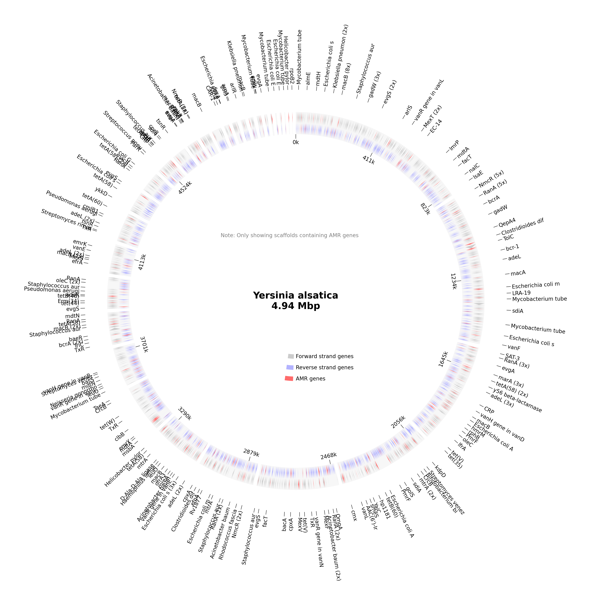

### AAC(6')-Ir
- **Mechanism**: antibiotic inactivation
- **Drug Classes**: aminoglycoside antibiotic
- **AMR Family**: AAC(6')
- **Locations**:
  - gnl|SPADES|PLIJBHFI_6_313 : position 355098-355592

### Acinetobacter baumannii AbaF (found in 6 locations)
- **Mechanism**: antibiotic efflux
- **Drug Classes**: phosphonic acid antibiotic
- **AMR Family**: major facilitator superfamily (MFS) antibiotic efflux pump
- **Locations**:
  - gnl|SPADES|PLIJBHFI_13_55 : position 76498-77820
  - gnl|SPADES|PLIJBHFI_17_56 : position 59763-61127
  - gnl|SPADES|PLIJBHFI_182_34 : position 32281-33807
  - gnl|SPADES|PLIJBHFI_1_700 : position 728916-730322
  - gnl|SPADES|PLIJBHFI_9_53 : position 65538-66941
  - gnl|SPADES|PLIJBHFI_9_61 : position 75320-76822

### Acinetobacter baumannii AbaQ
- **Mechanism**: antibiotic efflux
- **Drug Classes**: fluoroquinolone antibiotic
- **AMR Family**: major facilitator superfamily (MFS) antibiotic efflux pump
- **Locations**:
  - gnl|SPADES|PLIJBHFI_2_179 : position 197822-199132

### Acinetobacter baumannii AmvA
- **Mechanism**: antibiotic efflux
- **Drug Classes**: macrolide antibiotic; disinfecting agents and antiseptics
- **AMR Family**: major facilitator superfamily (MFS) antibiotic efflux pump
- **Locations**:
  - gnl|SPADES|PLIJBHFI_2_49 : position 57076-58608

### AcrS
- **Mechanism**: antibiotic efflux
- **Drug Classes**: fluoroquinolone antibiotic; cephalosporin; glycylcycline; cephamycin; penam; tetracycline antibiotic; rifamycin antibiotic; phenicol antibiotic; disinfecting agents and antiseptics
- **AMR Family**: resistance-nodulation-cell division (RND) antibiotic efflux pump
- **Locations**:
  - gnl|SPADES|PLIJBHFI_17_38 : position 37335-37883

### ArnT
- **Mechanism**: antibiotic target alteration
- **Drug Classes**: peptide antibiotic
- **AMR Family**: pmr phosphoethanolamine transferase
- **Locations**:
  - gnl|SPADES|PLIJBHFI_5_308: position 352162-353826

### Bifidobacterium bifidum ileS conferring resistance to mupirocin
- **Mechanism**: antibiotic target alteration
- **Drug Classes**: mupirocin-like antibiotic
- **AMR Family**: antibiotic-resistant isoleucyl-tRNA synthetase (ileS)
- **Locations**:
  - gnl|SPADES|PLIJBHFI_6_62 : position 83654-86236

### CAR-1
- **Mechanism**: antibiotic inactivation
- **Drug Classes**: carbapenem
- **AMR Family**: CAR beta-lactamase
- **Locations**:
  - gnl|SPADES|PLIJBHFI_380_1 : position 77-832

### CRP (found in 2 locations)
- **Mechanism**: antibiotic efflux
- **Drug Classes**: macrolide antibiotic; fluoroquinolone antibiotic; penam
- **AMR Family**: resistance-nodulation-cell division (RND) antibiotic efflux pump
- **Locations**:
  - gnl|SPADES|PLIJBHFI_118_46: position 52979-53611
  - gnl|SPADES|PLIJBHFI_5_196 : position 227616-228368

### Clostridioides difficile gyrA conferring resistance to fluoroquinolones
- **Mechanism**: antibiotic target alteration
- **Drug Classes**: fluoroquinolone antibiotic
- **AMR Family**: fluoroquinolone resistant gyrA
- **Locations**:
  - gnl|SPADES|PLIJBHFI_2_198 : position 220720-223374

### Clostridioides difficile gyrB conferring resistance to fluoroquinolones (found in 2 locations)
- **Mechanism**: antibiotic target alteration
- **Drug Classes**: fluoroquinolone antibiotic
- **AMR Family**: fluoroquinolone resistant gyrB
- **Locations**:
  - gnl|SPADES|PLIJBHFI_13_182 : position 227301-229715
  - gnl|SPADES|PLIJBHFI_9_191 : position 224296-226191

### CrcB (found in 2 locations)
- **Mechanism**: antibiotic efflux
- **Drug Classes**: aminoglycoside antibiotic
- **AMR Family**: multidrug and toxic compound extrusion (MATE) transporter
- **Locations**:
  - gnl|SPADES|PLIJBHFI_18_189 : position 203273-203677
  - gnl|SPADES|PLIJBHFI_6_77 : position 99851-100234

### D-Ala-D-Ala ligase
- **Mechanism**: antibiotic target alteration
- **Drug Classes**: glycopeptide antibiotic
- **AMR Family**: Van ligase
- **Locations**:
  - gnl|SPADES|PLIJBHFI_17_121 : position 144006-144926

### DHA-6
- **Mechanism**: antibiotic inactivation
- **Drug Classes**: cephalosporin; cephamycin
- **AMR Family**: DHA beta-lactamase
- **Locations**:
  - gnl|SPADES|PLIJBHFI_2_208 : position 251636-252778

### EC-14 (found in 2 locations)
- **Mechanism**: antibiotic inactivation
- **Drug Classes**: cephalosporin
- **AMR Family**: EC beta-lactamase
- **Locations**:
  - gnl|SPADES|PLIJBHFI_13_40 : position 54882-56048
  - gnl|SPADES|PLIJBHFI_1_561 : position 580291-581469

### EVM-1
- **Mechanism**: antibiotic inactivation
- **Drug Classes**: carbapenem
- **AMR Family**: EVM beta-lactamase
- **Locations**:
  - gnl|SPADES|PLIJBHFI_2_385 : position 442122-444275

### EdeQ
- **Mechanism**: antibiotic inactivation
- **Drug Classes**: peptide antibiotic; polyamine antibiotic
- **AMR Family**: Edeine acetyltransferase
- **Locations**:
  - gnl|SPADES|PLIJBHFI_17_7 : position 4440-4883

### Enterococcus faecalis cls with mutation conferring resistance to daptomycin
- **Mechanism**: antibiotic target alteration
- **Drug Classes**: peptide antibiotic
- **AMR Family**: daptomycin resistant cls
- **Locations**:
  - gnl|SPADES|PLIJBHFI_5_19 : position 22378-23838

### Erm(34)
- **Mechanism**: antibiotic target alteration
- **Drug Classes**: macrolide antibiotic; lincosamide antibiotic; streptogramin antibiotic; streptogramin A antibiotic; streptogramin B antibiotic
- **AMR Family**: Erm 23S ribosomal RNA methyltransferase
- **Locations**:
  - gnl|SPADES|PLIJBHFI_44_33 : position 37306-37932

### Escherichia coli AcrAB-TolC with AcrR mutation conferring resistance to ciprofloxacin, tetracycline, and ceftazidime (found in 3 locations)
- **Mechanism**: antibiotic target alteration; antibiotic efflux
- **Drug Classes**: fluoroquinolone antibiotic; cephalosporin; glycylcycline; penam; tetracycline antibiotic; rifamycin antibiotic; phenicol antibiotic; disinfecting agents and antiseptics
- **AMR Family**: resistance-nodulation-cell division (RND) antibiotic efflux pump
- **Locations**:
  - gnl|SPADES|PLIJBHFI_2_173 : position 192407-193045
  - gnl|SPADES|PLIJBHFI_5_411 : position 460150-460713
  - gnl|SPADES|PLIJBHFI_6_222 : position 249101-249757

### Escherichia coli AcrAB-TolC with MarR mutations conferring resistance to ciprofloxacin and tetracycline
- **Mechanism**: antibiotic target alteration; antibiotic efflux
- **Drug Classes**: fluoroquinolone antibiotic; cephalosporin; glycylcycline; penam; tetracycline antibiotic; rifamycin antibiotic; phenicol antibiotic; disinfecting agents and antiseptics
- **AMR Family**: resistance-nodulation-cell division (RND) antibiotic efflux pump
- **Locations**:
  - gnl|SPADES|PLIJBHFI_5_263 : position 301514-301945

### Escherichia coli EF-Tu mutants conferring resistance to Pulvomycin (found in 2 locations)
- **Mechanism**: antibiotic target alteration
- **Drug Classes**: elfamycin antibiotic
- **AMR Family**: elfamycin resistant EF-Tu
- **Locations**:
  - gnl|SPADES|PLIJBHFI_1068_5 : position 5337-6428
  - gnl|SPADES|PLIJBHFI_118_72 : position 75603-76787

### Escherichia coli EF-Tu mutants conferring resistance to kirromycin
- **Mechanism**: antibiotic target alteration
- **Drug Classes**: elfamycin antibiotic
- **AMR Family**: elfamycin resistant EF-Tu
- **Locations**:
  - gnl|SPADES|PLIJBHFI_1067_6 : position 5012-6433

### Escherichia coli GlpT with mutation conferring resistance to fosfomycin
- **Mechanism**: antibiotic target alteration
- **Drug Classes**: phosphonic acid antibiotic
- **AMR Family**: antibiotic-resistant GlpT
- **Locations**:
  - gnl|SPADES|PLIJBHFI_90_61 : position 62884-64239

### Escherichia coli acrA (found in 2 locations)
- **Mechanism**: antibiotic efflux
- **Drug Classes**: fluoroquinolone antibiotic; cephalosporin; glycylcycline; penam; tetracycline antibiotic; rifamycin antibiotic; phenicol antibiotic; disinfecting agents and antiseptics
- **AMR Family**: resistance-nodulation-cell division (RND) antibiotic efflux pump
- **Locations**:
  - gnl|SPADES|PLIJBHFI_6_223 : position 249902-251089
  - gnl|SPADES|PLIJBHFI_9_66 : position 84087-85310

### Escherichia coli mdfA
- **Mechanism**: antibiotic efflux
- **Drug Classes**: tetracycline antibiotic; phenicol antibiotic; disinfecting agents and antiseptics
- **AMR Family**: major facilitator superfamily (MFS) antibiotic efflux pump
- **Locations**:
  - gnl|SPADES|PLIJBHFI_13_125 : position 162957-164186

### Escherichia coli murA with mutation conferring resistance to fosfomycin
- **Mechanism**: antibiotic target alteration
- **Drug Classes**: phosphonic acid antibiotic
- **AMR Family**: antibiotic-resistant murA transferase
- **Locations**:
  - gnl|SPADES|PLIJBHFI_2_381 : position 437136-438416

### Escherichia coli soxS with mutation conferring antibiotic resistance (found in 8 locations)
- **Mechanism**: antibiotic target alteration; antibiotic efflux; reduced permeability to antibiotic
- **Drug Classes**: fluoroquinolone antibiotic; monobactam; carbapenem; cephalosporin; glycylcycline; cephamycin; penam; tetracycline antibiotic; rifamycin antibiotic; phenicol antibiotic; penem; disinfecting agents and antiseptics
- **AMR Family**: ATP-binding cassette (ABC) antibiotic efflux pump; major facilitator superfamily (MFS) antibiotic efflux pump; resistance-nodulation-cell division (RND) antibiotic efflux pump; General Bacterial Porin with reduced permeability to beta-lactams
- **Locations**:
  - gnl|SPADES|PLIJBHFI_17_30 : position 30471-31292
  - gnl|SPADES|PLIJBHFI_17_31 : position 31402-32295
  - gnl|SPADES|PLIJBHFI_17_47 : position 48333-49199
  - gnl|SPADES|PLIJBHFI_1_110 : position 117868-118767
  - gnl|SPADES|PLIJBHFI_2_548 : position 637937-638812
  - gnl|SPADES|PLIJBHFI_380_23 : position 21519-22541
  - gnl|SPADES|PLIJBHFI_5_101 : position 120885-121817
  - gnl|SPADES|PLIJBHFI_85_66 : position 76434-77141

### FosA4
- **Mechanism**: antibiotic inactivation
- **Drug Classes**: phosphonic acid antibiotic
- **AMR Family**: fosfomycin thiol transferase
- **Locations**:
  - gnl|SPADES|PLIJBHFI_1_665 : position 687778-688233

### FosB6
- **Mechanism**: antibiotic inactivation
- **Drug Classes**: phosphonic acid antibiotic
- **AMR Family**: fosfomycin thiol transferase
- **Locations**:
  - gnl|SPADES|PLIJBHFI_5_151 : position 177020-177490

### FosM2
- **Mechanism**: antibiotic inactivation
- **Drug Classes**: phosphonic acid antibiotic
- **AMR Family**: fosfomycin thiol transferase
- **Locations**:
  - gnl|SPADES|PLIJBHFI_5_272 : position 310458-310865

### H-NS
- **Mechanism**: antibiotic efflux
- **Drug Classes**: macrolide antibiotic; fluoroquinolone antibiotic; cephalosporin; cephamycin; penam; tetracycline antibiotic
- **AMR Family**: major facilitator superfamily (MFS) antibiotic efflux pump; resistance-nodulation-cell division (RND) antibiotic efflux pump
- **Locations**:
  - gnl|SPADES|PLIJBHFI_5_7 : position 7264-7674

### Haemophilus influenzae PBP3 conferring resistance to beta-lactam antibiotics
- **Mechanism**: antibiotic target alteration
- **Drug Classes**: cephalosporin; cephamycin; penam
- **AMR Family**: Penicillin-binding protein mutations conferring resistance to beta-lactam antibiotics
- **Locations**:
  - gnl|SPADES|PLIJBHFI_17_113 : position 133196-134959

### Helicobacter pylori pbp1 mutants conferring resistance to amoxicillin (found in 2 locations)
- **Mechanism**: antibiotic target alteration
- **Drug Classes**: cephalosporin; cephamycin; penam
- **AMR Family**: Penicillin-binding protein mutations conferring resistance to beta-lactam antibiotics
- **Locations**:
  - gnl|SPADES|PLIJBHFI_17_177 : position 212278-214764
  - gnl|SPADES|PLIJBHFI_18_61 : position 79001-81319

### Helicobacter pylori pbp2 mutants conferring resistance to amoxicillin
- **Mechanism**: antibiotic target alteration
- **Drug Classes**: cephalosporin; cephamycin; penam
- **AMR Family**: Penicillin-binding protein mutations conferring resistance to beta-lactam antibiotics
- **Locations**:
  - gnl|SPADES|PLIJBHFI_6_68 : position 89621-91516

### Helicobacter pylori rpoB mutation conferring resistance to rifampicin
- **Mechanism**: antibiotic target alteration; antibiotic target replacement
- **Drug Classes**: fluoroquinolone antibiotic; rifamycin antibiotic
- **AMR Family**: rifamycin-resistant beta-subunit of RNA polymerase (rpoB)
- **Locations**:
  - gnl|SPADES|PLIJBHFI_2383_1 : position 3-2687

### Klebsiella pneumoniae KpnE
- **Mechanism**: antibiotic efflux
- **Drug Classes**: macrolide antibiotic; aminoglycoside antibiotic; cephalosporin; tetracycline antibiotic; peptide antibiotic; rifamycin antibiotic; disinfecting agents and antiseptics
- **AMR Family**: small multidrug resistance (SMR) antibiotic efflux pump
- **Locations**:
  - gnl|SPADES|PLIJBHFI_1_47 : position 51578-51961

### Klebsiella pneumoniae KpnF
- **Mechanism**: antibiotic efflux
- **Drug Classes**: macrolide antibiotic; aminoglycoside antibiotic; cephalosporin; tetracycline antibiotic; peptide antibiotic; rifamycin antibiotic; disinfecting agents and antiseptics
- **AMR Family**: small multidrug resistance (SMR) antibiotic efflux pump
- **Locations**:
  - gnl|SPADES|PLIJBHFI_1_46: position 51262-51591

### Klebsiella pneumoniae KpnH (found in 2 locations)
- **Mechanism**: antibiotic efflux
- **Drug Classes**: macrolide antibiotic; fluoroquinolone antibiotic; aminoglycoside antibiotic; carbapenem; cephalosporin; penam; peptide antibiotic; penem
- **AMR Family**: major facilitator superfamily (MFS) antibiotic efflux pump
- **Locations**:
  - gnl|SPADES|PLIJBHFI_416_2 : position 937-2361
  - gnl|SPADES|PLIJBHFI_6_373: position 423172-424707

### Klebsiella pneumoniae OmpK37 (found in 4 locations)
- **Mechanism**: reduced permeability to antibiotic
- **Drug Classes**: monobactam; carbapenem; cephalosporin; cephamycin; penam; penem
- **AMR Family**: General Bacterial Porin with reduced permeability to beta-lactams
- **Locations**:
  - gnl|SPADES|PLIJBHFI_1_143 : position 154340-155425
  - gnl|SPADES|PLIJBHFI_1_730 : position 761373-762488
  - gnl|SPADES|PLIJBHFI_2_207 : position 249995-251107
  - gnl|SPADES|PLIJBHFI_2_404 : position 467253-468377

### LRA-19
- **Mechanism**: antibiotic inactivation
- **Drug Classes**: cephalosporin; penam
- **AMR Family**: subclass B3 LRA beta-lactamase
- **Locations**:
  - gnl|SPADES|PLIJBHFI_2_401 : position 463255-463902

### LlmA 23S ribosomal RNA methyltransferase
- **Mechanism**: antibiotic target alteration
- **Drug Classes**: lincosamide antibiotic
- **AMR Family**: Llm 23S ribosomal RNA methyltransferase
- **Locations**:
  - gnl|SPADES|PLIJBHFI_2_432 : position 501988-503178

### LptD
- **Mechanism**: antibiotic efflux
- **Drug Classes**: carbapenem; peptide antibiotic; aminocoumarin antibiotic; rifamycin antibiotic
- **AMR Family**: ATP-binding cassette (ABC) antibiotic efflux pump
- **Locations**:
  - gnl|SPADES|PLIJBHFI_17_83 : position 91271-93667

### MdtK
- **Mechanism**: antibiotic efflux
- **Drug Classes**: fluoroquinolone antibiotic
- **AMR Family**: multidrug and toxic compound extrusion (MATE) transporter
- **Locations**:
  - gnl|SPADES|PLIJBHFI_1_567 : position 587454-588884

### MexF
- **Mechanism**: antibiotic efflux
- **Drug Classes**: fluoroquinolone antibiotic; diaminopyrimidine antibiotic; phenicol antibiotic
- **AMR Family**: resistance-nodulation-cell division (RND) antibiotic efflux pump
- **Locations**:
  - gnl|SPADES|PLIJBHFI_9_65 : position 80949-84074

### MexJ
- **Mechanism**: antibiotic efflux
- **Drug Classes**: macrolide antibiotic; tetracycline antibiotic; disinfecting agents and antiseptics
- **AMR Family**: resistance-nodulation-cell division (RND) antibiotic efflux pump
- **Locations**:
  - gnl|SPADES|PLIJBHFI_39_23 : position 32666-33748

### MexS (found in 5 locations)
- **Mechanism**: antibiotic efflux
- **Drug Classes**: fluoroquinolone antibiotic; diaminopyrimidine antibiotic; phenicol antibiotic
- **AMR Family**: resistance-nodulation-cell division (RND) antibiotic efflux pump
- **Locations**:
  - gnl|SPADES|PLIJBHFI_1_384 : position 386471-387505
  - gnl|SPADES|PLIJBHFI_1_393 : position 401227-402237
  - gnl|SPADES|PLIJBHFI_1_693 : position 720586-721725
  - gnl|SPADES|PLIJBHFI_48_30 : position 44051-45034
  - gnl|SPADES|PLIJBHFI_9_68 : position 86666-87655

### MexT (found in 3 locations)
- **Mechanism**: antibiotic efflux
- **Drug Classes**: fluoroquinolone antibiotic; diaminopyrimidine antibiotic; phenicol antibiotic
- **AMR Family**: resistance-nodulation-cell division (RND) antibiotic efflux pump
- **Locations**:
  - gnl|SPADES|PLIJBHFI_1_531 : position 549195-550091
  - gnl|SPADES|PLIJBHFI_1_664 : position 686727-687647
  - gnl|SPADES|PLIJBHFI_5_367 : position 416291-417199

### MexV
- **Mechanism**: antibiotic efflux
- **Drug Classes**: macrolide antibiotic; fluoroquinolone antibiotic; tetracycline antibiotic; phenicol antibiotic; disinfecting agents and antiseptics
- **AMR Family**: resistance-nodulation-cell division (RND) antibiotic efflux pump
- **Locations**:
  - gnl|SPADES|PLIJBHFI_9_152 : position 183478-185001

### MuxB
- **Mechanism**: antibiotic efflux
- **Drug Classes**: macrolide antibiotic; monobactam; tetracycline antibiotic; aminocoumarin antibiotic
- **AMR Family**: resistance-nodulation-cell division (RND) antibiotic efflux pump
- **Locations**:
  - gnl|SPADES|PLIJBHFI_9_153 : position 184998-188129

### Mycobacterium tuberculosis gidB mutation conferring resistance to streptomycin
- **Mechanism**: antibiotic target alteration
- **Drug Classes**: aminoglycoside antibiotic
- **AMR Family**: antibiotic resistant gidB
- **Locations**:
  - gnl|SPADES|PLIJBHFI_2208_3 : position 2004-2627

### Mycobacterium tuberculosis kasA mutant conferring resistance to isoniazid (found in 2 locations)
- **Mechanism**: antibiotic target alteration
- **Drug Classes**: isoniazid-like antibiotic
- **AMR Family**: antibiotic resistant kasA
- **Locations**:
  - gnl|SPADES|PLIJBHFI_2_417 : position 486614-487882
  - gnl|SPADES|PLIJBHFI_439_15 : position 12456-13640

### Mycobacterium tuberculosis ndh with mutation conferring resistance to isoniazid
- **Mechanism**: antibiotic target alteration
- **Drug Classes**: isoniazid-like antibiotic
- **AMR Family**: antibiotic resistant ndh
- **Locations**:
  - gnl|SPADES|PLIJBHFI_2_508 : position 592052-593356

### Mycobacterium tuberculosis pncA mutations conferring resistance to pyrazinamide
- **Mechanism**: antibiotic target alteration
- **Drug Classes**: pyrazine antibiotic
- **AMR Family**: Pyrazinamide resistant pncA
- **Locations**:
  - gnl|SPADES|PLIJBHFI_1_10 : position 10927-11559

### Mycobacterium tuberculosis rpoB mutations conferring resistance to rifampicin
- **Mechanism**: antibiotic target alteration; antibiotic target replacement
- **Drug Classes**: rifamycin antibiotic
- **AMR Family**: rifamycin-resistant beta-subunit of RNA polymerase (rpoB)
- **Locations**:
  - gnl|SPADES|PLIJBHFI_991_8 : position 4273-7254

### Mycobacterium tuberculosis rpsA mutations conferring resistance to pyrazinamide
- **Mechanism**: antibiotic target alteration
- **Drug Classes**: pyrazine antibiotic
- **AMR Family**: pyrazinamide resistant rpsA
- **Locations**:
  - gnl|SPADES|PLIJBHFI_2_383 : position 439595-441268

### Mycobacterium tuberculosis thyA with mutation conferring resistance to para-aminosalicylic acid
- **Mechanism**: antibiotic target alteration
- **Drug Classes**: salicylic acid antibiotic
- **AMR Family**: aminosalicylate resistant thymidylate synthase
- **Locations**:
  - gnl|SPADES|PLIJBHFI_25_11 : position 17258-18052

### Neisseria gonorrhoeae pilQ gene conferring resistance to beta-lactam
- **Mechanism**: antibiotic target alteration
- **Drug Classes**: cephalosporin; cephamycin; penam
- **AMR Family**: Penicillin-binding protein mutations conferring resistance to beta-lactam antibiotics
- **Locations**:
  - gnl|SPADES|PLIJBHFI_25_42 : position 52168-54144

### NmcR (found in 17 locations)
- **Mechanism**: antibiotic inactivation
- **Drug Classes**: carbapenem; cephalosporin; cephamycin; penam
- **AMR Family**: NmcA beta-lactamase
- **Locations**:
  - gnl|SPADES|PLIJBHFI_13_15 : position 25556-26449
  - gnl|SPADES|PLIJBHFI_13_39 : position 53855-54745
  - gnl|SPADES|PLIJBHFI_1_572 : position 594085-594978
  - gnl|SPADES|PLIJBHFI_216_14 : position 17588-18469
  - gnl|SPADES|PLIJBHFI_216_5 : position 5246-6127
  - gnl|SPADES|PLIJBHFI_25_60 : position 69967-70863
  - gnl|SPADES|PLIJBHFI_25_91 : position 104891-105784
  - gnl|SPADES|PLIJBHFI_2_11 : position 13112-14032
  - gnl|SPADES|PLIJBHFI_2_151 : position 165485-166417
  - gnl|SPADES|PLIJBHFI_2_20 : position 23086-23949
  - gnl|SPADES|PLIJBHFI_2_448 : position 526672-527904
  - gnl|SPADES|PLIJBHFI_2_63 : position 71738-72661
  - gnl|SPADES|PLIJBHFI_5_112 : position 134542-135456
  - gnl|SPADES|PLIJBHFI_5_124 : position 148817-149728
  - gnl|SPADES|PLIJBHFI_5_171 : position 197102-197956
  - gnl|SPADES|PLIJBHFI_5_184 : position 215615-216517
  - gnl|SPADES|PLIJBHFI_5_57 : position 66196-67170

### Nocardia farcinica rox
- **Mechanism**: antibiotic inactivation
- **Drug Classes**: rifamycin antibiotic
- **AMR Family**: rifampin monooxygenase
- **Locations**:
  - gnl|SPADES|PLIJBHFI_5_155 : position 180359-181987

### OmpA (found in 3 locations)
- **Mechanism**: reduced permeability to antibiotic
- **Drug Classes**: peptide antibiotic
- **AMR Family**: General Bacterial Porin with reduced permeability to peptide antibiotics
- **Locations**:
  - gnl|SPADES|PLIJBHFI_17_39 : position 38695-39201
  - gnl|SPADES|PLIJBHFI_2_422 : position 491751-492824
  - gnl|SPADES|PLIJBHFI_9_23 : position 31987-33714

### OprN
- **Mechanism**: antibiotic efflux
- **Drug Classes**: fluoroquinolone antibiotic; diaminopyrimidine antibiotic; phenicol antibiotic
- **AMR Family**: resistance-nodulation-cell division (RND) antibiotic efflux pump
- **Locations**:
  - gnl|SPADES|PLIJBHFI_1_533 : position 551352-552848

### PJM-1
- **Mechanism**: antibiotic inactivation
- **Drug Classes**: carbapenem; cephalosporin; cephamycin; penam
- **AMR Family**: PJM beta-lactamase
- **Locations**:
  - gnl|SPADES|PLIJBHFI_5_252 : position 292137-293144

### ParR (found in 2 locations)
- **Mechanism**: antibiotic efflux; reduced permeability to antibiotic
- **Drug Classes**: macrolide antibiotic; fluoroquinolone antibiotic; monobactam; aminoglycoside antibiotic; carbapenem; cephalosporin; cephamycin; penam; tetracycline antibiotic; phenicol antibiotic; penem; disinfecting agents and antiseptics
- **AMR Family**: resistance-nodulation-cell division (RND) antibiotic efflux pump; Outer Membrane Porin (Opr)
- **Locations**:
  - gnl|SPADES|PLIJBHFI_118_10 : position 9620-10339
  - gnl|SPADES|PLIJBHFI_5_203 : position 236564-237292

### ParS
- **Mechanism**: antibiotic efflux; reduced permeability to antibiotic
- **Drug Classes**: macrolide antibiotic; fluoroquinolone antibiotic; monobactam; aminoglycoside antibiotic; carbapenem; cephalosporin; cephamycin; penam; tetracycline antibiotic; phenicol antibiotic; penem; disinfecting agents and antiseptics
- **AMR Family**: resistance-nodulation-cell division (RND) antibiotic efflux pump; Outer Membrane Porin (Opr)
- **Locations**:
  - gnl|SPADES|PLIJBHFI_5_204 : position 237289-238602

### Planobispora rosea EF-Tu mutants conferring resistance to inhibitor GE2270A
- **Mechanism**: antibiotic target alteration
- **Drug Classes**: elfamycin antibiotic
- **AMR Family**: elfamycin resistant EF-Tu
- **Locations**:
  - gnl|SPADES|PLIJBHFI_13_128 : position 166023-167924

### PmrF (found in 3 locations)
- **Mechanism**: antibiotic target alteration
- **Drug Classes**: peptide antibiotic
- **AMR Family**: pmr phosphoethanolamine transferase
- **Locations**:
  - gnl|SPADES|PLIJBHFI_1_163 : position 176912-178285
  - gnl|SPADES|PLIJBHFI_5_311 : position 356725-357708
  - gnl|SPADES|PLIJBHFI_6_185 : position 203754-204725

### Pseudomonas aeruginosa CpxR (found in 3 locations)
- **Mechanism**: antibiotic efflux
- **Drug Classes**: macrolide antibiotic; fluoroquinolone antibiotic; monobactam; aminoglycoside antibiotic; carbapenem; cephalosporin; cephamycin; penam; tetracycline antibiotic; peptide antibiotic; aminocoumarin antibiotic; diaminopyrimidine antibiotic; sulfonamide antibiotic; phenicol antibiotic; penem
- **AMR Family**: resistance-nodulation-cell division (RND) antibiotic efflux pump
- **Locations**:
  - gnl|SPADES|PLIJBHFI_182_42 : position 42444-43127
  - gnl|SPADES|PLIJBHFI_50_75 : position 77105-77803
  - gnl|SPADES|PLIJBHFI_6_100 : position 121193-121867

### Pseudomonas aeruginosa ampR with mutation conferring resistance to aztreonam
- **Mechanism**: antibiotic target alteration; antibiotic inactivation
- **Drug Classes**: monobactam; carbapenem; cephalosporin
- **AMR Family**: PDC beta-lactamase; ampR transcriptional regulator with mutation conferring resistance to monobactam antibiotics
- **Locations**:
  - gnl|SPADES|PLIJBHFI_44_68 : position 76858-77799

### QepA4 (found in 3 locations)
- **Mechanism**: antibiotic efflux
- **Drug Classes**: fluoroquinolone antibiotic
- **AMR Family**: major facilitator superfamily (MFS) antibiotic efflux pump
- **Locations**:
  - gnl|SPADES|PLIJBHFI_1_180 : position 197278-198918
  - gnl|SPADES|PLIJBHFI_2_169 : position 187891-189126
  - gnl|SPADES|PLIJBHFI_5_123 : position 147392-148744

### RanA (found in 19 locations)
- **Mechanism**: antibiotic efflux
- **Drug Classes**: aminoglycoside antibiotic
- **AMR Family**: ATP-binding cassette (ABC) antibiotic efflux pump
- **Locations**:
  - gnl|SPADES|PLIJBHFI_13_209 : position 255976-256752
  - gnl|SPADES|PLIJBHFI_13_76 : position 106885-107907
  - gnl|SPADES|PLIJBHFI_1_374 : position 376610-377383
  - gnl|SPADES|PLIJBHFI_1_451 : position 466658-467803
  - gnl|SPADES|PLIJBHFI_2_132 : position 145034-145852
  - gnl|SPADES|PLIJBHFI_2_245 : position 287854-289446
  - gnl|SPADES|PLIJBHFI_2_314 : position 360598-361731
  - gnl|SPADES|PLIJBHFI_2_42 : position 47734-48783
  - gnl|SPADES|PLIJBHFI_2_51 : position 59902-60708
  - gnl|SPADES|PLIJBHFI_380_11 : position 9822-11021
  - gnl|SPADES|PLIJBHFI_39_100 : position 127444-128538
  - gnl|SPADES|PLIJBHFI_44_113 : position 124059-125573
  - gnl|SPADES|PLIJBHFI_5_16 : position 19690-20709
  - gnl|SPADES|PLIJBHFI_5_17 : position 20706-21707
  - gnl|SPADES|PLIJBHFI_5_351 : position 395290-396417
  - gnl|SPADES|PLIJBHFI_6_84 : position 106462-107139
  - gnl|SPADES|PLIJBHFI_90_29 : position 29932-31005
  - gnl|SPADES|PLIJBHFI_9_333 : position 372103-372912
  - gnl|SPADES|PLIJBHFI_9_34 : position 46176-46934

### RanB (found in 2 locations)
- **Mechanism**: antibiotic efflux
- **Drug Classes**: aminoglycoside antibiotic
- **AMR Family**: ATP-binding cassette (ABC) antibiotic efflux pump
- **Locations**:
  - gnl|SPADES|PLIJBHFI_2_50 : position 58763-59908
  - gnl|SPADES|PLIJBHFI_9_332 : position 371310-372092

### Rhodococcus fascians cmr
- **Mechanism**: antibiotic efflux
- **Drug Classes**: phenicol antibiotic
- **AMR Family**: major facilitator superfamily (MFS) antibiotic efflux pump
- **Locations**:
  - gnl|SPADES|PLIJBHFI_13_33 : position 48060-49499

### Rv1877
- **Mechanism**: antibiotic efflux
- **Drug Classes**: fluoroquinolone antibiotic
- **AMR Family**: major facilitator superfamily (MFS) antibiotic efflux pump
- **Locations**:
  - gnl|SPADES|PLIJBHFI_13_157 : position 199620-201047

### SAT-3
- **Mechanism**: antibiotic inactivation
- **Drug Classes**: nucleoside antibiotic
- **AMR Family**: streptothricin acetyltransferase (SAT)
- **Locations**:
  - gnl|SPADES|PLIJBHFI_5_3 : position 2464-2931

### Salmonella serovars soxS with mutation conferring antibiotic resistance
- **Mechanism**: antibiotic target alteration; antibiotic efflux; reduced permeability to antibiotic
- **Drug Classes**: fluoroquinolone antibiotic; monobactam; carbapenem; cephalosporin; glycylcycline; cephamycin; penam; tetracycline antibiotic; rifamycin antibiotic; phenicol antibiotic; penem; disinfecting agents and antiseptics
- **AMR Family**: ATP-binding cassette (ABC) antibiotic efflux pump; major facilitator superfamily (MFS) antibiotic efflux pump; resistance-nodulation-cell division (RND) antibiotic efflux pump; General Bacterial Porin with reduced permeability to beta-lactams
- **Locations**:
  - gnl|SPADES|PLIJBHFI_2_558 : position 647844-648230

### Staphylococcus aureus GlpT with mutation conferring resistance to fosfomycin
- **Mechanism**: antibiotic target alteration
- **Drug Classes**: phosphonic acid antibiotic
- **AMR Family**: antibiotic-resistant GlpT
- **Locations**:
  - gnl|SPADES|PLIJBHFI_13_84 : position 118374-119711

### Staphylococcus aureus fusA with mutation conferring resistance to fusidic acid (found in 3 locations)
- **Mechanism**: antibiotic target alteration
- **Drug Classes**: fusidane antibiotic
- **AMR Family**: antibiotic resistant fusA
- **Locations**:
  - gnl|SPADES|PLIJBHFI_118_71 : position 73423-75531
  - gnl|SPADES|PLIJBHFI_17_8 : position 5029-6618
  - gnl|SPADES|PLIJBHFI_44_82 : position 91993-94101

### Staphylococcus aureus mupA conferring resistance to mupirocin
- **Mechanism**: antibiotic target alteration
- **Drug Classes**: mupirocin-like antibiotic
- **AMR Family**: antibiotic-resistant isoleucyl-tRNA synthetase (ileS)
- **Locations**:
  - gnl|SPADES|PLIJBHFI_17_65 : position 72279-75095

### Staphylococcus aureus mupB conferring resistance to mupirocin
- **Mechanism**: antibiotic target alteration
- **Drug Classes**: mupirocin-like antibiotic
- **AMR Family**: antibiotic-resistant isoleucyl-tRNA synthetase (ileS)
- **Locations**:
  - gnl|SPADES|PLIJBHFI_39_68 : position 93453-96350

### Staphylococcus aureus murA with mutation conferring resistance to fosfomycin
- **Mechanism**: antibiotic target alteration
- **Drug Classes**: phosphonic acid antibiotic
- **AMR Family**: antibiotic-resistant murA transferase
- **Locations**:
  - gnl|SPADES|PLIJBHFI_9_327 : position 367950-369215

### Staphylococcus aureus pgsA mutations conferring resistance to daptomycin
- **Mechanism**: antibiotic target alteration
- **Drug Classes**: peptide antibiotic
- **AMR Family**: daptomycin resistant pgsA
- **Locations**:
  - gnl|SPADES|PLIJBHFI_1_244 : position 251118-251666

### Streptococcus pneumoniae PBP2x conferring resistance to amoxicillin (found in 2 locations)
- **Mechanism**: antibiotic target alteration
- **Drug Classes**: cephalosporin; cephamycin; penam
- **AMR Family**: Penicillin-binding protein mutations conferring resistance to beta-lactam antibiotics
- **Locations**:
  - gnl|SPADES|PLIJBHFI_118_18 : position 19320-21875
  - gnl|SPADES|PLIJBHFI_2_569 : position 655907-657616

### Streptomyces lividans cmlR
- **Mechanism**: antibiotic efflux
- **Drug Classes**: phenicol antibiotic
- **AMR Family**: major facilitator superfamily (MFS) antibiotic efflux pump
- **Locations**:
  - gnl|SPADES|PLIJBHFI_13_35 : position 50487-51701

### Streptomyces rimosus otr(A)
- **Mechanism**: antibiotic target protection
- **Drug Classes**: tetracycline antibiotic
- **AMR Family**: tetracycline-resistant ribosomal protection protein
- **Locations**:
  - gnl|SPADES|PLIJBHFI_50_13 : position 15787-17610

### Streptomyces venezuelae rox (found in 2 locations)
- **Mechanism**: antibiotic inactivation
- **Drug Classes**: rifamycin antibiotic
- **AMR Family**: rifampin monooxygenase
- **Locations**:
  - gnl|SPADES|PLIJBHFI_25_83 : position 96121-97335
  - gnl|SPADES|PLIJBHFI_6_49 : position 69750-70931

### TaeA (found in 3 locations)
- **Mechanism**: antibiotic efflux
- **Drug Classes**: pleuromutilin antibiotic
- **AMR Family**: ATP-binding cassette (ABC) antibiotic efflux pump
- **Locations**:
  - gnl|SPADES|PLIJBHFI_17_33 : position 33749-35416
  - gnl|SPADES|PLIJBHFI_18_201 : position 215269-215934
  - gnl|SPADES|PLIJBHFI_2_412 : position 480244-482157

### TolC (found in 2 locations)
- **Mechanism**: antibiotic efflux
- **Drug Classes**: macrolide antibiotic; fluoroquinolone antibiotic; aminoglycoside antibiotic; carbapenem; cephalosporin; glycylcycline; cephamycin; penam; tetracycline antibiotic; peptide antibiotic; aminocoumarin antibiotic; rifamycin antibiotic; phenicol antibiotic; penem; disinfecting agents and antiseptics
- **AMR Family**: ATP-binding cassette (ABC) antibiotic efflux pump; major facilitator superfamily (MFS) antibiotic efflux pump; resistance-nodulation-cell division (RND) antibiotic efflux pump
- **Locations**:
  - gnl|SPADES|PLIJBHFI_2_204 : position 244544-245929
  - gnl|SPADES|PLIJBHFI_9_196 : position 229378-230850

### TriC
- **Mechanism**: antibiotic efflux
- **Drug Classes**: disinfecting agents and antiseptics
- **AMR Family**: resistance-nodulation-cell division (RND) antibiotic efflux pump
- **Locations**:
  - gnl|SPADES|PLIJBHFI_39_22 : position 29580-32666

### TxR (found in 8 locations)
- **Mechanism**: antibiotic efflux
- **Drug Classes**: tetracycline antibiotic
- **AMR Family**: ATP-binding cassette (ABC) antibiotic efflux pump
- **Locations**:
  - gnl|SPADES|PLIJBHFI_18_90 : position 116461-117798
  - gnl|SPADES|PLIJBHFI_1_683 : position 707303-709462
  - gnl|SPADES|PLIJBHFI_39_10 : position 12896-14815
  - gnl|SPADES|PLIJBHFI_50_10 : position 11217-12629
  - gnl|SPADES|PLIJBHFI_5_233 : position 272440-274017
  - gnl|SPADES|PLIJBHFI_5_242 : position 279668-280696
  - gnl|SPADES|PLIJBHFI_6_274 : position 307055-308323
  - gnl|SPADES|PLIJBHFI_9_118 : position 134311-135354

### YajC
- **Mechanism**: antibiotic efflux
- **Drug Classes**: fluoroquinolone antibiotic; cephalosporin; glycylcycline; penam; tetracycline antibiotic; oxazolidinone antibiotic; glycopeptide antibiotic; rifamycin antibiotic; phenicol antibiotic; disinfecting agents and antiseptics
- **AMR Family**: resistance-nodulation-cell division (RND) antibiotic efflux pump
- **Locations**:
  - gnl|SPADES|PLIJBHFI_6_288 : position 323629-323961

### adeF (found in 2 locations)
- **Mechanism**: antibiotic efflux
- **Drug Classes**: fluoroquinolone antibiotic; tetracycline antibiotic
- **AMR Family**: resistance-nodulation-cell division (RND) antibiotic efflux pump
- **Locations**:
  - gnl|SPADES|PLIJBHFI_182_12: position 9440-12565
  - gnl|SPADES|PLIJBHFI_6_224: position 251106-254258

### adeH
- **Mechanism**: antibiotic efflux
- **Drug Classes**: fluoroquinolone antibiotic; tetracycline antibiotic
- **AMR Family**: resistance-nodulation-cell division (RND) antibiotic efflux pump
- **Locations**:
  - gnl|SPADES|PLIJBHFI_9_28 : position 38627-40138

### adeK
- **Mechanism**: antibiotic efflux
- **Drug Classes**: macrolide antibiotic; fluoroquinolone antibiotic; lincosamide antibiotic; carbapenem; cephalosporin; tetracycline antibiotic; rifamycin antibiotic; diaminopyrimidine antibiotic; phenicol antibiotic; penem
- **AMR Family**: resistance-nodulation-cell division (RND) antibiotic efflux pump
- **Locations**:
  - gnl|SPADES|PLIJBHFI_44_54 : position 61410-62807

### adeL (found in 23 locations)
- **Mechanism**: antibiotic efflux
- **Drug Classes**: fluoroquinolone antibiotic; tetracycline antibiotic
- **AMR Family**: resistance-nodulation-cell division (RND) antibiotic efflux pump
- **Locations**:
  - gnl|SPADES|PLIJBHFI_13_36 : position 51716-52756
  - gnl|SPADES|PLIJBHFI_17_1 : position 89-1015
  - gnl|SPADES|PLIJBHFI_17_24 : position 24022-24924
  - gnl|SPADES|PLIJBHFI_1_102 : position 109010-109900
  - gnl|SPADES|PLIJBHFI_1_129 : position 139489-140439
  - gnl|SPADES|PLIJBHFI_1_169 : position 186353-187285
  - gnl|SPADES|PLIJBHFI_1_20 : position 21639-22544
  - gnl|SPADES|PLIJBHFI_1_560 : position 579267-580157
  - gnl|SPADES|PLIJBHFI_1_726 : position 755529-756443
  - gnl|SPADES|PLIJBHFI_25_26 : position 38436-39329
  - gnl|SPADES|PLIJBHFI_2_276 : position 324091-324963
  - gnl|SPADES|PLIJBHFI_39_80 : position 107780-108688
  - gnl|SPADES|PLIJBHFI_439_20 : position 17138-18040
  - gnl|SPADES|PLIJBHFI_48_42 : position 60099-61034
  - gnl|SPADES|PLIJBHFI_48_80 : position 100855-101766
  - gnl|SPADES|PLIJBHFI_50_120 : position 128274-129206
  - gnl|SPADES|PLIJBHFI_50_41 : position 46246-47133
  - gnl|SPADES|PLIJBHFI_5_145 : position 169678-170574
  - gnl|SPADES|PLIJBHFI_5_191 : position 223621-224571
  - gnl|SPADES|PLIJBHFI_5_279 : position 315778-316716
  - gnl|SPADES|PLIJBHFI_9_190 : position 223381-224292
  - gnl|SPADES|PLIJBHFI_9_298 : position 333485-334381
  - gnl|SPADES|PLIJBHFI_9_67 : position 85618-86511

### almE (found in 4 locations)
- **Mechanism**: antibiotic target alteration
- **Drug Classes**: peptide antibiotic
- **AMR Family**: polymyxin resistance operon; alm glycyltransferase
- **Locations**:
  - gnl|SPADES|PLIJBHFI_1_41 : position 44956-46653
  - gnl|SPADES|PLIJBHFI_9_128 : position 145822-147327
  - gnl|SPADES|PLIJBHFI_9_131 : position 149145-150779
  - gnl|SPADES|PLIJBHFI_9_145 : position 169504-176733

### arlR (found in 2 locations)
- **Mechanism**: antibiotic efflux
- **Drug Classes**: fluoroquinolone antibiotic; disinfecting agents and antiseptics
- **AMR Family**: major facilitator superfamily (MFS) antibiotic efflux pump
- **Locations**:
  - gnl|SPADES|PLIJBHFI_1_183 : position 202568-203254
  - gnl|SPADES|PLIJBHFI_404_9 : position 10146-10886

### arlS
- **Mechanism**: antibiotic efflux
- **Drug Classes**: fluoroquinolone antibiotic; disinfecting agents and antiseptics
- **AMR Family**: major facilitator superfamily (MFS) antibiotic efflux pump
- **Locations**:
  - gnl|SPADES|PLIJBHFI_1_444 : position 457172-458749

### arnA (found in 2 locations)
- **Mechanism**: antibiotic target alteration
- **Drug Classes**: peptide antibiotic
- **AMR Family**: pmr phosphoethanolamine transferase
- **Locations**:
  - gnl|SPADES|PLIJBHFI_387_36 : position 18554-19501
  - gnl|SPADES|PLIJBHFI_5_310 : position 354725-356728

### bacA
- **Mechanism**: antibiotic target alteration
- **Drug Classes**: peptide antibiotic
- **AMR Family**: undecaprenyl pyrophosphate related proteins
- **Locations**:
  - gnl|SPADES|PLIJBHFI_9_208 : position 245425-246243

### baeR (found in 3 locations)
- **Mechanism**: antibiotic efflux
- **Drug Classes**: aminoglycoside antibiotic; aminocoumarin antibiotic
- **AMR Family**: resistance-nodulation-cell division (RND) antibiotic efflux pump
- **Locations**:
  - gnl|SPADES|PLIJBHFI_18_26 : position 39792-40511
  - gnl|SPADES|PLIJBHFI_39_47 : position 59052-59759
  - gnl|SPADES|PLIJBHFI_6_301 : position 338931-339620

### baeS (found in 2 locations)
- **Mechanism**: antibiotic efflux
- **Drug Classes**: aminoglycoside antibiotic; aminocoumarin antibiotic
- **AMR Family**: resistance-nodulation-cell division (RND) antibiotic efflux pump
- **Locations**:
  - gnl|SPADES|PLIJBHFI_18_25 : position 38391-39782
  - gnl|SPADES|PLIJBHFI_18_92 : position 118895-120331

### basS (found in 3 locations)
- **Mechanism**: antibiotic target alteration; antibiotic efflux
- **Drug Classes**: peptide antibiotic
- **AMR Family**: pmr phosphoethanolamine transferase
- **Locations**:
  - gnl|SPADES|PLIJBHFI_142_13 : position 12723-13787
  - gnl|SPADES|PLIJBHFI_25_72 : position 84265-85692
  - gnl|SPADES|PLIJBHFI_6_99 : position 119776-121206

### bcr-1 (found in 2 locations)
- **Mechanism**: antibiotic efflux
- **Drug Classes**: bicyclomycin-like antibiotic
- **AMR Family**: major facilitator superfamily (MFS) antibiotic efflux pump
- **Locations**:
  - gnl|SPADES|PLIJBHFI_2_242 : position 285483-286703
  - gnl|SPADES|PLIJBHFI_5_280 : position 316899-318116

### bcrA (found in 12 locations)
- **Mechanism**: antibiotic efflux
- **Drug Classes**: peptide antibiotic
- **AMR Family**: ATP-binding cassette (ABC) antibiotic efflux pump
- **Locations**:
  - gnl|SPADES|PLIJBHFI_1_136 : position 145980-147464
  - gnl|SPADES|PLIJBHFI_1_55 : position 61820-62578
  - gnl|SPADES|PLIJBHFI_1_578 : position 599805-600620
  - gnl|SPADES|PLIJBHFI_1_621 : position 636538-638070
  - gnl|SPADES|PLIJBHFI_1_686 : position 711950-713470
  - gnl|SPADES|PLIJBHFI_1_745 : position 778189-778887
  - gnl|SPADES|PLIJBHFI_1_746 : position 779012-779848
  - gnl|SPADES|PLIJBHFI_1_780 : position 814119-814829
  - gnl|SPADES|PLIJBHFI_1_789 : position 825418-826482
  - gnl|SPADES|PLIJBHFI_2_76 : position 85156-85782
  - gnl|SPADES|PLIJBHFI_39_31 : position 44155-45720
  - gnl|SPADES|PLIJBHFI_39_78 : position 105774-106514

### chrB
- **Mechanism**: antibiotic target alteration
- **Drug Classes**: macrolide antibiotic; lincosamide antibiotic
- **AMR Family**: non-erm 23S ribosomal RNA methyltransferase (G748)
- **Locations**:
  - gnl|SPADES|PLIJBHFI_2_570 : position 657737-658591

### clbB
- **Mechanism**: antibiotic target alteration
- **Drug Classes**: lincosamide antibiotic; streptogramin antibiotic; streptogramin A antibiotic; oxazolidinone antibiotic; phenicol antibiotic; pleuromutilin antibiotic
- **AMR Family**: Cfr 23S ribosomal RNA methyltransferase
- **Locations**:
  - gnl|SPADES|PLIJBHFI_18_58 : position 74204-75400

### cmlA9
- **Mechanism**: antibiotic efflux
- **Drug Classes**: phenicol antibiotic
- **AMR Family**: major facilitator superfamily (MFS) antibiotic efflux pump
- **Locations**:
  - gnl|SPADES|PLIJBHFI_1_23 : position 26774-27967

### cmlB
- **Mechanism**: antibiotic efflux
- **Drug Classes**: phenicol antibiotic
- **AMR Family**: major facilitator superfamily (MFS) antibiotic efflux pump
- **Locations**:
  - gnl|SPADES|PLIJBHFI_1_448 : position 461942-463306

### cmlB1
- **Mechanism**: antibiotic efflux
- **Drug Classes**: phenicol antibiotic
- **AMR Family**: major facilitator superfamily (MFS) antibiotic efflux pump
- **Locations**:
  - gnl|SPADES|PLIJBHFI_50_86 : position 86331-87482

### cmlv (found in 3 locations)
- **Mechanism**: antibiotic inactivation
- **Drug Classes**: phenicol antibiotic
- **AMR Family**: chloramphenicol phosphotransferase
- **Locations**:
  - gnl|SPADES|PLIJBHFI_1_156 : position 170395-171561
  - gnl|SPADES|PLIJBHFI_25_25 : position 36397-37557
  - gnl|SPADES|PLIJBHFI_439_21 : position 18161-19342

### cmx (found in 2 locations)
- **Mechanism**: antibiotic efflux
- **Drug Classes**: phenicol antibiotic
- **AMR Family**: major facilitator superfamily (MFS) antibiotic efflux pump
- **Locations**:
  - gnl|SPADES|PLIJBHFI_1_562 : position 581466-582668
  - gnl|SPADES|PLIJBHFI_6_367 : position 417107-418309

### cprR
- **Mechanism**: antibiotic target alteration; antibiotic efflux
- **Drug Classes**: peptide antibiotic
- **AMR Family**: pmr phosphoethanolamine transferase
- **Locations**:
  - gnl|SPADES|PLIJBHFI_142_12 : position 12067-12726

### cpxA (found in 7 locations)
- **Mechanism**: antibiotic efflux
- **Drug Classes**: aminoglycoside antibiotic; aminocoumarin antibiotic
- **AMR Family**: resistance-nodulation-cell division (RND) antibiotic efflux pump
- **Locations**:
  - gnl|SPADES|PLIJBHFI_118_11 : position 10336-11697
  - gnl|SPADES|PLIJBHFI_13_197 : position 245169-246518
  - gnl|SPADES|PLIJBHFI_182_43 : position 43153-44520
  - gnl|SPADES|PLIJBHFI_2_518 : position 606209-607663
  - gnl|SPADES|PLIJBHFI_50_11 : position 12637-13689
  - gnl|SPADES|PLIJBHFI_50_74 : position 75735-77108
  - gnl|SPADES|PLIJBHFI_9_186 : position 219882-221342

### dfrA3
- **Mechanism**: antibiotic target replacement
- **Drug Classes**: diaminopyrimidine antibiotic
- **AMR Family**: trimethoprim resistant dihydrofolate reductase dfr
- **Locations**:
  - gnl|SPADES|PLIJBHFI_17_75 : position 85530-86012

### efpA (found in 2 locations)
- **Mechanism**: antibiotic efflux
- **Drug Classes**: rifamycin antibiotic; isoniazid-like antibiotic
- **AMR Family**: major facilitator superfamily (MFS) antibiotic efflux pump
- **Locations**:
  - gnl|SPADES|PLIJBHFI_13_166 : position 211220-212509
  - gnl|SPADES|PLIJBHFI_25_61 : position 70993-72342

### efrA
- **Mechanism**: antibiotic efflux
- **Drug Classes**: macrolide antibiotic; fluoroquinolone antibiotic; rifamycin antibiotic
- **AMR Family**: ATP-binding cassette (ABC) antibiotic efflux pump
- **Locations**:
  - gnl|SPADES|PLIJBHFI_48_17 : position 28653-29762

### emrA
- **Mechanism**: antibiotic efflux
- **Drug Classes**: fluoroquinolone antibiotic
- **AMR Family**: major facilitator superfamily (MFS) antibiotic efflux pump
- **Locations**:
  - gnl|SPADES|PLIJBHFI_6_372 : position 421960-423132

### emrK
- **Mechanism**: antibiotic efflux
- **Drug Classes**: tetracycline antibiotic
- **AMR Family**: major facilitator superfamily (MFS) antibiotic efflux pump
- **Locations**:
  - gnl|SPADES|PLIJBHFI_48_82 : position 102306-103241

### emrR
- **Mechanism**: antibiotic efflux
- **Drug Classes**: fluoroquinolone antibiotic
- **AMR Family**: major facilitator superfamily (MFS) antibiotic efflux pump
- **Locations**:
  - gnl|SPADES|PLIJBHFI_6_370 : position 419783-420295

### emrY
- **Mechanism**: antibiotic efflux
- **Drug Classes**: tetracycline antibiotic
- **AMR Family**: major facilitator superfamily (MFS) antibiotic efflux pump
- **Locations**:
  - gnl|SPADES|PLIJBHFI_18_24 : position 36975-38375

### eptA
- **Mechanism**: antibiotic target alteration
- **Drug Classes**: peptide antibiotic
- **AMR Family**: pmr phosphoethanolamine transferase
- **Locations**:
  - gnl|SPADES|PLIJBHFI_5_269 : position 306733-308373

### eptB
- **Mechanism**: antibiotic target alteration
- **Drug Classes**: peptide antibiotic
- **AMR Family**: pmr phosphoethanolamine transferase
- **Locations**:
  - gnl|SPADES|PLIJBHFI_13_87 : position 122035-123726

### erm(56)
- **Mechanism**: antibiotic target alteration
- **Drug Classes**: macrolide antibiotic; lincosamide antibiotic; streptogramin antibiotic; streptogramin B antibiotic
- **AMR Family**: Erm 23S ribosomal RNA methyltransferase
- **Locations**:
  - gnl|SPADES|PLIJBHFI_17_80 : position 88109-88927

### evgA (found in 10 locations)
- **Mechanism**: antibiotic efflux
- **Drug Classes**: macrolide antibiotic; fluoroquinolone antibiotic; penam; tetracycline antibiotic
- **AMR Family**: major facilitator superfamily (MFS) antibiotic efflux pump; resistance-nodulation-cell division (RND) antibiotic efflux pump
- **Locations**:
  - gnl|SPADES|PLIJBHFI_13_86 : position 121332-121922
  - gnl|SPADES|PLIJBHFI_182_14 : position 13158-13856
  - gnl|SPADES|PLIJBHFI_1_246 : position 253550-254206
  - gnl|SPADES|PLIJBHFI_1_446 : position 459647-460276
  - gnl|SPADES|PLIJBHFI_1_522 : position 537397-537789
  - gnl|SPADES|PLIJBHFI_1_523 : position 537786-538028
  - gnl|SPADES|PLIJBHFI_2_62 : position 70675-71322
  - gnl|SPADES|PLIJBHFI_5_47 : position 52864-53520
  - gnl|SPADES|PLIJBHFI_684_3 : position 2691-3320
  - gnl|SPADES|PLIJBHFI_85_80 : position 88998-89627

### evgS (found in 9 locations)
- **Mechanism**: antibiotic efflux
- **Drug Classes**: macrolide antibiotic; fluoroquinolone antibiotic; penam; tetracycline antibiotic
- **AMR Family**: major facilitator superfamily (MFS) antibiotic efflux pump; resistance-nodulation-cell division (RND) antibiotic efflux pump
- **Locations**:
  - gnl|SPADES|PLIJBHFI_1_362 : position 363217-363606
  - gnl|SPADES|PLIJBHFI_1_524 : position 538003-541848
  - gnl|SPADES|PLIJBHFI_2_199 : position 223559-226339
  - gnl|SPADES|PLIJBHFI_2_201 : position 227102-229795
  - gnl|SPADES|PLIJBHFI_2_469 : position 550925-552697
  - gnl|SPADES|PLIJBHFI_44_6 : position 6133-8895
  - gnl|SPADES|PLIJBHFI_6_273 : position 305083-307065
  - gnl|SPADES|PLIJBHFI_85_79 : position 86163-88973
  - gnl|SPADES|PLIJBHFI_9_314 : position 349579-351915

### facT (found in 2 locations)
- **Mechanism**: antibiotic efflux
- **Drug Classes**: elfamycin antibiotic
- **AMR Family**: major facilitator superfamily (MFS) antibiotic efflux pump
- **Locations**:
  - gnl|SPADES|PLIJBHFI_1_727 : position 756661-757992
  - gnl|SPADES|PLIJBHFI_9_280 : position 319084-320388

### fexA (found in 2 locations)
- **Mechanism**: antibiotic efflux
- **Drug Classes**: phenicol antibiotic
- **AMR Family**: major facilitator superfamily (MFS) antibiotic efflux pump
- **Locations**:
  - gnl|SPADES|PLIJBHFI_380_24 : position 22637-23872
  - gnl|SPADES|PLIJBHFI_5_368 : position 417326-418750

### gadW (found in 4 locations)
- **Mechanism**: antibiotic efflux
- **Drug Classes**: macrolide antibiotic; fluoroquinolone antibiotic; penam
- **AMR Family**: resistance-nodulation-cell division (RND) antibiotic efflux pump
- **Locations**:
  - gnl|SPADES|PLIJBHFI_1_302 : position 299654-300463
  - gnl|SPADES|PLIJBHFI_1_324 : position 324267-325157
  - gnl|SPADES|PLIJBHFI_1_595 : position 613377-614279
  - gnl|SPADES|PLIJBHFI_2_118 : position 131360-132130

### gadX
- **Mechanism**: antibiotic efflux
- **Drug Classes**: macrolide antibiotic; fluoroquinolone antibiotic; penam
- **AMR Family**: resistance-nodulation-cell division (RND) antibiotic efflux pump
- **Locations**:
  - gnl|SPADES|PLIJBHFI_1_457 : position 474750-475580

### golS (found in 2 locations)
- **Mechanism**: antibiotic efflux
- **Drug Classes**: monobactam; carbapenem; cephalosporin; cephamycin; penam; phenicol antibiotic; penem
- **AMR Family**: resistance-nodulation-cell division (RND) antibiotic efflux pump
- **Locations**:
  - gnl|SPADES|PLIJBHFI_387_31 : position 14414-14839
  - gnl|SPADES|PLIJBHFI_6_164 : position 181280-181720

### hmrM
- **Mechanism**: antibiotic efflux
- **Drug Classes**: fluoroquinolone antibiotic; disinfecting agents and antiseptics
- **AMR Family**: multidrug and toxic compound extrusion (MATE) transporter
- **Locations**:
  - gnl|SPADES|PLIJBHFI_5_283 : position 320716-322089

### hp1181
- **Mechanism**: antibiotic efflux
- **Drug Classes**: fluoroquinolone antibiotic; tetracycline antibiotic; nitroimidazole antibiotic
- **AMR Family**: major facilitator superfamily (MFS) antibiotic efflux pump
- **Locations**:
  - gnl|SPADES|PLIJBHFI_6_267 : position 298379-299743

### kdpD (found in 2 locations)
- **Mechanism**: antibiotic efflux
- **Drug Classes**: aminoglycoside antibiotic
- **AMR Family**: kdpDE
- **Locations**:
  - gnl|SPADES|PLIJBHFI_1_182 : position 200866-202542
  - gnl|SPADES|PLIJBHFI_6_28 : position 39657-42359

### kdpE (found in 3 locations)
- **Mechanism**: antibiotic efflux
- **Drug Classes**: aminoglycoside antibiotic
- **AMR Family**: kdpDE
- **Locations**:
  - gnl|SPADES|PLIJBHFI_1_445 : position 458771-459457
  - gnl|SPADES|PLIJBHFI_2_519 : position 607669-608340
  - gnl|SPADES|PLIJBHFI_6_29 : position 42356-43045

### leuO (found in 3 locations)
- **Mechanism**: antibiotic efflux
- **Drug Classes**: nucleoside antibiotic; disinfecting agents and antiseptics
- **AMR Family**: major facilitator superfamily (MFS) antibiotic efflux pump
- **Locations**:
  - gnl|SPADES|PLIJBHFI_17_104 : position 122745-123701
  - gnl|SPADES|PLIJBHFI_1_116 : position 125499-126401
  - gnl|SPADES|PLIJBHFI_25_24 : position 35441-36382

### lfrA
- **Mechanism**: antibiotic efflux
- **Drug Classes**: fluoroquinolone antibiotic
- **AMR Family**: major facilitator superfamily (MFS) antibiotic efflux pump
- **Locations**:
  - gnl|SPADES|PLIJBHFI_5_359 : position 405002-406369

### lmrP
- **Mechanism**: antibiotic efflux
- **Drug Classes**: macrolide antibiotic; lincosamide antibiotic; streptogramin antibiotic; streptogramin A antibiotic; tetracycline antibiotic
- **AMR Family**: major facilitator superfamily (MFS) antibiotic efflux pump
- **Locations**:
  - gnl|SPADES|PLIJBHFI_1_660 : position 683222-684445

### lsaE
- **Mechanism**: antibiotic target protection
- **Drug Classes**: lincosamide antibiotic; streptogramin antibiotic; pleuromutilin antibiotic
- **AMR Family**: lsa-type ABC-F protein
- **Locations**:
  - gnl|SPADES|PLIJBHFI_1_794 : position 829426-830919

### macA (found in 3 locations)
- **Mechanism**: antibiotic efflux
- **Drug Classes**: macrolide antibiotic
- **AMR Family**: ATP-binding cassette (ABC) antibiotic efflux pump
- **Locations**:
  - gnl|SPADES|PLIJBHFI_182_41 : position 41046-42254
  - gnl|SPADES|PLIJBHFI_2_336 : position 385549-386661
  - gnl|SPADES|PLIJBHFI_44_52 : position 58254-59447

### macB (found in 37 locations)
- **Mechanism**: antibiotic efflux
- **Drug Classes**: macrolide antibiotic
- **AMR Family**: ATP-binding cassette (ABC) antibiotic efflux pump
- **Locations**:
  - gnl|SPADES|PLIJBHFI_13_118 : position 153636-155168
  - gnl|SPADES|PLIJBHFI_13_193 : position 240585-241601
  - gnl|SPADES|PLIJBHFI_13_77 : position 107904-108884
  - gnl|SPADES|PLIJBHFI_17_90 : position 103096-103800
  - gnl|SPADES|PLIJBHFI_182_38 : position 36859-37950
  - gnl|SPADES|PLIJBHFI_182_40 : position 39033-41042
  - gnl|SPADES|PLIJBHFI_1_173 : position 189192-189905
  - gnl|SPADES|PLIJBHFI_1_175 : position 191056-192348
  - gnl|SPADES|PLIJBHFI_1_314 : position 314700-315455
  - gnl|SPADES|PLIJBHFI_1_369 : position 371319-372326
  - gnl|SPADES|PLIJBHFI_1_634 : position 652044-653555
  - gnl|SPADES|PLIJBHFI_1_698 : position 726875-727534
  - gnl|SPADES|PLIJBHFI_1_719 : position 747279-748001
  - gnl|SPADES|PLIJBHFI_1_754 : position 787787-788623
  - gnl|SPADES|PLIJBHFI_217_2 : position 850-1881
  - gnl|SPADES|PLIJBHFI_2_286 : position 335309-336295
  - gnl|SPADES|PLIJBHFI_2_323 : position 369177-369956
  - gnl|SPADES|PLIJBHFI_2_337 : position 386661-388610
  - gnl|SPADES|PLIJBHFI_2_512 : position 599398-600102
  - gnl|SPADES|PLIJBHFI_2_545 : position 632712-633497
  - gnl|SPADES|PLIJBHFI_39_77 : position 104933-105811
  - gnl|SPADES|PLIJBHFI_39_91 : position 119691-120410
  - gnl|SPADES|PLIJBHFI_416_7 : position 6456-8003
  - gnl|SPADES|PLIJBHFI_44_25 : position 31172-31906
  - gnl|SPADES|PLIJBHFI_44_53 : position 59437-61413
  - gnl|SPADES|PLIJBHFI_44_66 : position 75152-76018
  - gnl|SPADES|PLIJBHFI_44_67 : position 76029-76820
  - gnl|SPADES|PLIJBHFI_44_78 : position 86426-87238
  - gnl|SPADES|PLIJBHFI_48_35 : position 49853-52684
  - gnl|SPADES|PLIJBHFI_48_46 : position 62976-63737
  - gnl|SPADES|PLIJBHFI_5_246 : position 284633-285625
  - gnl|SPADES|PLIJBHFI_6_158 : position 176572-177258
  - gnl|SPADES|PLIJBHFI_6_234 : position 261666-262400
  - gnl|SPADES|PLIJBHFI_6_358 : position 409125-409859
  - gnl|SPADES|PLIJBHFI_6_59 : position 80937-81662
  - gnl|SPADES|PLIJBHFI_90_47 : position 48722-49390
  - gnl|SPADES|PLIJBHFI_9_142 : position 166935-167747

### marA (found in 4 locations)
- **Mechanism**: antibiotic efflux; reduced permeability to antibiotic
- **Drug Classes**: fluoroquinolone antibiotic; monobactam; carbapenem; cephalosporin; glycylcycline; cephamycin; penam; tetracycline antibiotic; rifamycin antibiotic; phenicol antibiotic; penem; disinfecting agents and antiseptics
- **AMR Family**: resistance-nodulation-cell division (RND) antibiotic efflux pump; General Bacterial Porin with reduced permeability to beta-lactams
- **Locations**:
  - gnl|SPADES|PLIJBHFI_1_557 : position 573194-574168
  - gnl|SPADES|PLIJBHFI_5_141 : position 167285-167683
  - gnl|SPADES|PLIJBHFI_5_142 : position 167735-168079
  - gnl|SPADES|PLIJBHFI_5_81 : position 91742-92632

### mdtA (found in 2 locations)
- **Mechanism**: antibiotic efflux
- **Drug Classes**: aminocoumarin antibiotic
- **AMR Family**: resistance-nodulation-cell division (RND) antibiotic efflux pump
- **Locations**:
  - gnl|SPADES|PLIJBHFI_18_21 : position 29275-30609
  - gnl|SPADES|PLIJBHFI_1_697 : position 725611-726873

### mdtB
- **Mechanism**: antibiotic efflux
- **Drug Classes**: aminocoumarin antibiotic
- **AMR Family**: resistance-nodulation-cell division (RND) antibiotic efflux pump
- **Locations**:
  - gnl|SPADES|PLIJBHFI_18_22 : position 30609-33779

### mdtC
- **Mechanism**: antibiotic efflux
- **Drug Classes**: aminocoumarin antibiotic
- **AMR Family**: resistance-nodulation-cell division (RND) antibiotic efflux pump
- **Locations**:
  - gnl|SPADES|PLIJBHFI_18_23 : position 33776-36850

### mdtG
- **Mechanism**: antibiotic efflux
- **Drug Classes**: phosphonic acid antibiotic
- **AMR Family**: major facilitator superfamily (MFS) antibiotic efflux pump
- **Locations**:
  - gnl|SPADES|PLIJBHFI_2_465 : position 547019-548263

### mdtH
- **Mechanism**: antibiotic efflux
- **Drug Classes**: fluoroquinolone antibiotic
- **AMR Family**: major facilitator superfamily (MFS) antibiotic efflux pump
- **Locations**:
  - gnl|SPADES|PLIJBHFI_1_76 : position 83575-84780

### mdtN (found in 7 locations)
- **Mechanism**: antibiotic efflux
- **Drug Classes**: nucleoside antibiotic; disinfecting agents and antiseptics
- **AMR Family**: major facilitator superfamily (MFS) antibiotic efflux pump
- **Locations**:
  - gnl|SPADES|PLIJBHFI_1_537 : position 556872-557894
  - gnl|SPADES|PLIJBHFI_1_767 : position 800565-801551
  - gnl|SPADES|PLIJBHFI_25_59 : position 68723-69859
  - gnl|SPADES|PLIJBHFI_2_206 : position 248156-249325
  - gnl|SPADES|PLIJBHFI_39_115 : position 146304-147275
  - gnl|SPADES|PLIJBHFI_5_265 : position 302456-303226
  - gnl|SPADES|PLIJBHFI_9_30 : position 42028-43041

### mdtO
- **Mechanism**: antibiotic efflux
- **Drug Classes**: nucleoside antibiotic; disinfecting agents and antiseptics
- **AMR Family**: major facilitator superfamily (MFS) antibiotic efflux pump
- **Locations**:
  - gnl|SPADES|PLIJBHFI_9_29 : position 40143-42044

### mdtP
- **Mechanism**: antibiotic efflux
- **Drug Classes**: nucleoside antibiotic; disinfecting agents and antiseptics
- **AMR Family**: major facilitator superfamily (MFS) antibiotic efflux pump
- **Locations**:
  - gnl|SPADES|PLIJBHFI_6_371 : position 420341-421807

### mgrA
- **Mechanism**: antibiotic efflux
- **Drug Classes**: fluoroquinolone antibiotic; cephalosporin; penam; tetracycline antibiotic; peptide antibiotic; disinfecting agents and antiseptics
- **AMR Family**: ATP-binding cassette (ABC) antibiotic efflux pump; major facilitator superfamily (MFS) antibiotic efflux pump
- **Locations**:
  - gnl|SPADES|PLIJBHFI_13_89 : position 124667-125071

### mreA
- **Mechanism**: antibiotic efflux
- **Drug Classes**: macrolide antibiotic
- **AMR Family**: major facilitator superfamily (MFS) antibiotic efflux pump
- **Locations**:
  - gnl|SPADES|PLIJBHFI_17_64 : position 71309-72247

### msbA (found in 8 locations)
- **Mechanism**: antibiotic efflux
- **Drug Classes**: nitroimidazole antibiotic
- **AMR Family**: ATP-binding cassette (ABC) antibiotic efflux pump
- **Locations**:
  - gnl|SPADES|PLIJBHFI_18_12 : position 12639-13451
  - gnl|SPADES|PLIJBHFI_2_279 : position 328166-328954
  - gnl|SPADES|PLIJBHFI_2_343 : position 393673-395397
  - gnl|SPADES|PLIJBHFI_2_344 : position 395400-397166
  - gnl|SPADES|PLIJBHFI_2_386 : position 444311-446059
  - gnl|SPADES|PLIJBHFI_2_554 : position 643073-644791
  - gnl|SPADES|PLIJBHFI_5_89 : position 102301-104421
  - gnl|SPADES|PLIJBHFI_6_90 : position 109408-111180

### mtrA (found in 4 locations)
- **Mechanism**: antibiotic efflux
- **Drug Classes**: macrolide antibiotic; penam
- **AMR Family**: resistance-nodulation-cell division (RND) antibiotic efflux pump
- **Locations**:
  - gnl|SPADES|PLIJBHFI_13_116 : position 151181-152374
  - gnl|SPADES|PLIJBHFI_17_149 : position 178121-179167
  - gnl|SPADES|PLIJBHFI_6_115 : position 141259-142113
  - gnl|SPADES|PLIJBHFI_6_97 : position 118146-118949

### nalC
- **Mechanism**: antibiotic efflux
- **Drug Classes**: macrolide antibiotic; fluoroquinolone antibiotic; monobactam; carbapenem; cephalosporin; cephamycin; penam; tetracycline antibiotic; peptide antibiotic; aminocoumarin antibiotic; diaminopyrimidine antibiotic; sulfonamide antibiotic; phenicol antibiotic; penem
- **AMR Family**: resistance-nodulation-cell division (RND) antibiotic efflux pump
- **Locations**:
  - gnl|SPADES|PLIJBHFI_1_766 : position 799833-800531

### nalD
- **Mechanism**: antibiotic efflux
- **Drug Classes**: macrolide antibiotic; fluoroquinolone antibiotic; monobactam; carbapenem; cephalosporin; cephamycin; penam; tetracycline antibiotic; peptide antibiotic; aminocoumarin antibiotic; diaminopyrimidine antibiotic; sulfonamide antibiotic; phenicol antibiotic; penem
- **AMR Family**: resistance-nodulation-cell division (RND) antibiotic efflux pump
- **Locations**:
  - gnl|SPADES|PLIJBHFI_1_538 : position 558006-558644

### novA (found in 3 locations)
- **Mechanism**: antibiotic efflux
- **Drug Classes**: aminocoumarin antibiotic
- **AMR Family**: ATP-binding cassette (ABC) antibiotic efflux pump
- **Locations**:
  - gnl|SPADES|PLIJBHFI_2_205 : position 246008-248143
  - gnl|SPADES|PLIJBHFI_5_291 : position 329844-330590
  - gnl|SPADES|PLIJBHFI_5_87 : position 98782-100908

### oleC (found in 4 locations)
- **Mechanism**: antibiotic efflux
- **Drug Classes**: macrolide antibiotic
- **AMR Family**: ATP-binding cassette (ABC) antibiotic efflux pump
- **Locations**:
  - gnl|SPADES|PLIJBHFI_44_103 : position 112390-113109
  - gnl|SPADES|PLIJBHFI_44_104 : position 113106-113840
  - gnl|SPADES|PLIJBHFI_5_334 : position 376821-377711
  - gnl|SPADES|PLIJBHFI_6_188 : position 209579-210889

### optrA (found in 2 locations)
- **Mechanism**: antibiotic target protection
- **Drug Classes**: oxazolidinone antibiotic; phenicol antibiotic
- **AMR Family**: Miscellaneous ABC-F subfamily ATP-binding cassette ribosomal protection proteins
- **Locations**:
  - gnl|SPADES|PLIJBHFI_118_58 : position 63167-65083
  - gnl|SPADES|PLIJBHFI_1_704 : position 733414-735120

### patB
- **Mechanism**: antibiotic efflux
- **Drug Classes**: fluoroquinolone antibiotic
- **AMR Family**: ATP-binding cassette (ABC) antibiotic efflux pump
- **Locations**:
  - gnl|SPADES|PLIJBHFI_1_738 : position 771133-772077

### putative nickel/cobalt transporter
- **Mechanism**: antibiotic efflux
- **Drug Classes**: fluoroquinolone antibiotic; aminoglycoside antibiotic; isoniazid-like antibiotic
- **AMR Family**: metal transporters with antibiotic efflux
- **Locations**:
  - gnl|SPADES|PLIJBHFI_18_192 : position 205770-206828

### qacJ
- **Mechanism**: antibiotic efflux
- **Drug Classes**: disinfecting agents and antiseptics
- **AMR Family**: small multidrug resistance (SMR) antibiotic efflux pump
- **Locations**:
  - gnl|SPADES|PLIJBHFI_5_222: position 259441-259773

### rosA
- **Mechanism**: antibiotic efflux
- **Drug Classes**: peptide antibiotic
- **AMR Family**: major facilitator superfamily (MFS) antibiotic efflux pump
- **Locations**:
  - gnl|SPADES|PLIJBHFI_6_169 : position 188541-189755

### rosB (found in 2 locations)
- **Mechanism**: antibiotic efflux
- **Drug Classes**: peptide antibiotic
- **AMR Family**: major facilitator superfamily (MFS) antibiotic efflux pump
- **Locations**:
  - gnl|SPADES|PLIJBHFI_118_60 : position 65884-67692
  - gnl|SPADES|PLIJBHFI_6_170 : position 190153-191844

### rphB (found in 2 locations)
- **Mechanism**: antibiotic inactivation
- **Drug Classes**: rifamycin antibiotic
- **AMR Family**: rifampin phosphotransferase
- **Locations**:
  - gnl|SPADES|PLIJBHFI_182_45 : position 45144-46871
  - gnl|SPADES|PLIJBHFI_5_297 : position 338898-341282

### rpoB2
- **Mechanism**: antibiotic target alteration; antibiotic target replacement
- **Drug Classes**: rifamycin antibiotic
- **AMR Family**: rifamycin-resistant beta-subunit of RNA polymerase (rpoB)
- **Locations**:
  - gnl|SPADES|PLIJBHFI_5999_1 : position 1-1101

### sdiA (found in 2 locations)
- **Mechanism**: antibiotic efflux
- **Drug Classes**: fluoroquinolone antibiotic; cephalosporin; glycylcycline; penam; tetracycline antibiotic; rifamycin antibiotic; phenicol antibiotic; disinfecting agents and antiseptics
- **AMR Family**: resistance-nodulation-cell division (RND) antibiotic efflux pump
- **Locations**:
  - gnl|SPADES|PLIJBHFI_2_453 : position 532893-533630
  - gnl|SPADES|PLIJBHFI_6_121 : position 148297-149040

### smeR
- **Mechanism**: antibiotic efflux
- **Drug Classes**: aminoglycoside antibiotic; cephalosporin; cephamycin; penam
- **AMR Family**: resistance-nodulation-cell division (RND) antibiotic efflux pump
- **Locations**:
  - gnl|SPADES|PLIJBHFI_25_73 : position 85703-86401

### smeS
- **Mechanism**: antibiotic efflux
- **Drug Classes**: aminoglycoside antibiotic; cephalosporin; cephamycin; penam
- **AMR Family**: resistance-nodulation-cell division (RND) antibiotic efflux pump
- **Locations**:
  - gnl|SPADES|PLIJBHFI_6_300 : position 337590-338906

### sta
- **Mechanism**: antibiotic inactivation
- **Drug Classes**: nucleoside antibiotic
- **AMR Family**: streptothricin acetyltransferase (SAT)
- **Locations**:
  - gnl|SPADES|PLIJBHFI_39_69 : position 96537-97040

### sul4
- **Mechanism**: antibiotic target replacement
- **Drug Classes**: sulfonamide antibiotic
- **AMR Family**: sulfonamide resistant sul
- **Locations**:
  - gnl|SPADES|PLIJBHFI_142_6 : position 5737-6570

### tet(35) (found in 2 locations)
- **Mechanism**: antibiotic efflux
- **Drug Classes**: tetracycline antibiotic
- **AMR Family**: ATP-binding cassette (ABC) antibiotic efflux pump
- **Locations**:
  - gnl|SPADES|PLIJBHFI_2_57 : position 66519-67928
  - gnl|SPADES|PLIJBHFI_5_414 : position 463173-464681

### tet(44)
- **Mechanism**: antibiotic target protection
- **Drug Classes**: tetracycline antibiotic
- **AMR Family**: tetracycline-resistant ribosomal protection protein
- **Locations**:
  - gnl|SPADES|PLIJBHFI_44_22 : position 28462-29961

### tet(50)
- **Mechanism**: antibiotic inactivation
- **Drug Classes**: tetracycline antibiotic
- **AMR Family**: tetracycline inactivation enzyme
- **Locations**:
  - gnl|SPADES|PLIJBHFI_25_84 : position 97501-98670

### tet(C)
- **Mechanism**: antibiotic efflux
- **Drug Classes**: tetracycline antibiotic
- **AMR Family**: major facilitator superfamily (MFS) antibiotic efflux pump
- **Locations**:
  - gnl|SPADES|PLIJBHFI_2_23 : position 25905-27149

### tet(V) (found in 2 locations)
- **Mechanism**: antibiotic efflux
- **Drug Classes**: tetracycline antibiotic
- **AMR Family**: major facilitator superfamily (MFS) antibiotic efflux pump
- **Locations**:
  - gnl|SPADES|PLIJBHFI_5_396 : position 444654-445898
  - gnl|SPADES|PLIJBHFI_9_139 : position 163381-164649

### tet(W)
- **Mechanism**: antibiotic target protection
- **Drug Classes**: tetracycline antibiotic
- **AMR Family**: tetracycline-resistant ribosomal protection protein
- **Locations**:
  - gnl|SPADES|PLIJBHFI_18_110 : position 139805-141604

### tetA(58) (found in 13 locations)
- **Mechanism**: antibiotic efflux
- **Drug Classes**: tetracycline antibiotic
- **AMR Family**: major facilitator superfamily (MFS) antibiotic efflux pump
- **Locations**:
  - gnl|SPADES|PLIJBHFI_118_54 : position 59355-60122
  - gnl|SPADES|PLIJBHFI_17_164 : position 198599-199525
  - gnl|SPADES|PLIJBHFI_1_536 : position 555104-556885
  - gnl|SPADES|PLIJBHFI_1_768 : position 801565-803316
  - gnl|SPADES|PLIJBHFI_216_2 : position 1746-3236
  - gnl|SPADES|PLIJBHFI_39_90 : position 118845-119642
  - gnl|SPADES|PLIJBHFI_44_72 : position 81618-82259
  - gnl|SPADES|PLIJBHFI_5_313 : position 359220-359978
  - gnl|SPADES|PLIJBHFI_5_99 : position 118122-119693
  - gnl|SPADES|PLIJBHFI_85_39 : position 52764-53582
  - gnl|SPADES|PLIJBHFI_90_39 : position 40725-41426
  - gnl|SPADES|PLIJBHFI_90_40 : position 41452-42219
  - gnl|SPADES|PLIJBHFI_9_339 : position 376862-377587

### tetA(60) (found in 4 locations)
- **Mechanism**: antibiotic efflux
- **Drug Classes**: tetracycline antibiotic
- **AMR Family**: ATP-binding cassette (ABC) antibiotic efflux pump
- **Locations**:
  - gnl|SPADES|PLIJBHFI_17_178 : position 215001-215858
  - gnl|SPADES|PLIJBHFI_18_202 : position 215927-216733
  - gnl|SPADES|PLIJBHFI_50_113 : position 120932-122734
  - gnl|SPADES|PLIJBHFI_6_244 : position 271124-272890

### tetB(46)
- **Mechanism**: antibiotic efflux
- **Drug Classes**: tetracycline antibiotic
- **AMR Family**: ATP-binding cassette (ABC) antibiotic efflux pump
- **Locations**:
  - gnl|SPADES|PLIJBHFI_44_51 : position 56104-58254

### tetB(60) (found in 2 locations)
- **Mechanism**: antibiotic efflux
- **Drug Classes**: tetracycline antibiotic
- **AMR Family**: ATP-binding cassette (ABC) antibiotic efflux pump
- **Locations**:
  - gnl|SPADES|PLIJBHFI_5_247 : position 285625-286440
  - gnl|SPADES|PLIJBHFI_6_243 : position 269335-271158

### tsnR (found in 3 locations)
- **Mechanism**: antibiotic target alteration
- **Drug Classes**: peptide antibiotic
- **AMR Family**: non-erm 23S ribosomal RNA methyltransferase (A1067)
- **Locations**:
  - gnl|SPADES|PLIJBHFI_142_47 : position 47695-48435
  - gnl|SPADES|PLIJBHFI_50_27 : position 31488-32147
  - gnl|SPADES|PLIJBHFI_6_374 : position 424900-425991

### ugd
- **Mechanism**: antibiotic target alteration
- **Drug Classes**: peptide antibiotic
- **AMR Family**: pmr phosphoethanolamine transferase
- **Locations**:
  - gnl|SPADES|PLIJBHFI_5_6 : position 5505-6851

### vanE
- **Mechanism**: antibiotic target alteration
- **Drug Classes**: glycopeptide antibiotic
- **AMR Family**: glycopeptide resistance gene cluster; Van ligase
- **Locations**:
  - gnl|SPADES|PLIJBHFI_48_65 : position 81698-83047

### vanF
- **Mechanism**: antibiotic target alteration
- **Drug Classes**: glycopeptide antibiotic
- **AMR Family**: glycopeptide resistance gene cluster; Van ligase
- **Locations**:
  - gnl|SPADES|PLIJBHFI_2_585 : position 675485-676666

### vanH gene in vanB cluster (found in 2 locations)
- **Mechanism**: antibiotic target alteration
- **Drug Classes**: glycopeptide antibiotic
- **AMR Family**: vanH; glycopeptide resistance gene cluster
- **Locations**:
  - gnl|SPADES|PLIJBHFI_25_89 : position 102454-103695
  - gnl|SPADES|PLIJBHFI_2_119 : position 132217-133344

### vanH gene in vanD cluster (found in 2 locations)
- **Mechanism**: antibiotic target alteration
- **Drug Classes**: glycopeptide antibiotic
- **AMR Family**: vanH; glycopeptide resistance gene cluster
- **Locations**:
  - gnl|SPADES|PLIJBHFI_2_178 : position 196729-197682
  - gnl|SPADES|PLIJBHFI_5_219 : position 257024-258019

### vanH gene in vanF cluster
- **Mechanism**: antibiotic target alteration
- **Drug Classes**: glycopeptide antibiotic
- **AMR Family**: vanH; glycopeptide resistance gene cluster
- **Locations**:
  - gnl|SPADES|PLIJBHFI_13_158 : position 201205-202185

### vanH gene in vanP cluster
- **Mechanism**: antibiotic target alteration
- **Drug Classes**: glycopeptide antibiotic
- **AMR Family**: vanH; glycopeptide resistance gene cluster
- **Locations**:
  - gnl|SPADES|PLIJBHFI_1_80 : position 87127-88068

### vanL
- **Mechanism**: antibiotic target alteration
- **Drug Classes**: glycopeptide antibiotic
- **AMR Family**: glycopeptide resistance gene cluster; Van ligase
- **Locations**:
  - gnl|SPADES|PLIJBHFI_6_332 : position 374887-375987

### vanR gene in vanC cluster
- **Mechanism**: antibiotic target alteration
- **Drug Classes**: glycopeptide antibiotic
- **AMR Family**: glycopeptide resistance gene cluster; vanR
- **Locations**:
  - gnl|SPADES|PLIJBHFI_2_24 : position 27373-28113

### vanR gene in vanE cluster
- **Mechanism**: antibiotic target alteration
- **Drug Classes**: glycopeptide antibiotic
- **AMR Family**: glycopeptide resistance gene cluster; vanR
- **Locations**:
  - gnl|SPADES|PLIJBHFI_17_49 : position 49962-50678

### vanR gene in vanF cluster
- **Mechanism**: antibiotic target alteration
- **Drug Classes**: glycopeptide antibiotic
- **AMR Family**: glycopeptide resistance gene cluster; vanR
- **Locations**:
  - gnl|SPADES|PLIJBHFI_1_363 : position 363759-364808

### vanR gene in vanI cluster
- **Mechanism**: antibiotic target alteration
- **Drug Classes**: glycopeptide antibiotic
- **AMR Family**: glycopeptide resistance gene cluster; vanR
- **Locations**:
  - gnl|SPADES|PLIJBHFI_9_187 : position 221332-222039

### vanR gene in vanL cluster (found in 3 locations)
- **Mechanism**: antibiotic target alteration
- **Drug Classes**: glycopeptide antibiotic
- **AMR Family**: glycopeptide resistance gene cluster; vanR
- **Locations**:
  - gnl|SPADES|PLIJBHFI_13_198 : position 246493-247131
  - gnl|SPADES|PLIJBHFI_1_482 : position 503066-503512
  - gnl|SPADES|PLIJBHFI_25_31 : position 43308-43967

### vanR gene in vanN cluster (found in 2 locations)
- **Mechanism**: antibiotic target alteration
- **Drug Classes**: glycopeptide antibiotic
- **AMR Family**: glycopeptide resistance gene cluster; vanR
- **Locations**:
  - gnl|SPADES|PLIJBHFI_2_468 : position 550363-550947
  - gnl|SPADES|PLIJBHFI_9_95 : position 115393-116418

### vanR gene in vanO cluster
- **Mechanism**: antibiotic target alteration
- **Drug Classes**: glycopeptide antibiotic
- **AMR Family**: glycopeptide resistance gene cluster; vanR
- **Locations**:
  - gnl|SPADES|PLIJBHFI_5_5 : position 4198-5220

### vanS gene in vanA cluster
- **Mechanism**: antibiotic target alteration
- **Drug Classes**: glycopeptide antibiotic
- **AMR Family**: vanS; glycopeptide resistance gene cluster
- **Locations**:
  - gnl|SPADES|PLIJBHFI_39_48 : position 59756-61300

### vanT gene in vanC cluster (found in 2 locations)
- **Mechanism**: antibiotic target alteration
- **Drug Classes**: glycopeptide antibiotic
- **AMR Family**: glycopeptide resistance gene cluster; vanT
- **Locations**:
  - gnl|SPADES|PLIJBHFI_1_24 : position 28077-29150
  - gnl|SPADES|PLIJBHFI_48_32 : position 46715-47794

### vatF
- **Mechanism**: antibiotic inactivation
- **Drug Classes**: streptogramin antibiotic; streptogramin A antibiotic
- **AMR Family**: streptogramin vat acetyltransferase
- **Locations**:
  - gnl|SPADES|PLIJBHFI_1_97 : position 105477-106103

### vgbC
- **Mechanism**: antibiotic inactivation
- **Drug Classes**: streptogramin antibiotic; streptogramin B antibiotic
- **AMR Family**: streptogramin vgb lyase
- **Locations**:
  - gnl|SPADES|PLIJBHFI_5_111 : position 133599-134426

### y56 beta-lactamase
- **Mechanism**: antibiotic inactivation
- **Drug Classes**: cephalosporin; penam; penem
- **AMR Family**: BlaA beta-lactamase
- **Locations**:
  - gnl|SPADES|PLIJBHFI_5_121 : position 145766-146662

### ykkD
- **Mechanism**: antibiotic efflux
- **Drug Classes**: aminoglycoside antibiotic; tetracycline antibiotic; phenicol antibiotic
- **AMR Family**: small multidrug resistance (SMR) antibiotic efflux pump
- **Locations**:
  - gnl|SPADES|PLIJBHFI_85_11 : position 13107-13421

## Yersinia enterocolitica
**Strain Statistics:**
- Total genome length: 161.5 kbp
- Total scaffolds: 272
- Scaffolds with AMR genes: 23
- Total genes annotated: 281
- Total AMR genes: 33
- Unique AMR genes: 30
- Distinct AMR mechanisms: 6
- Distinct AMR families: 16
- Distinct drug classes: 25

**Circos Plot:**

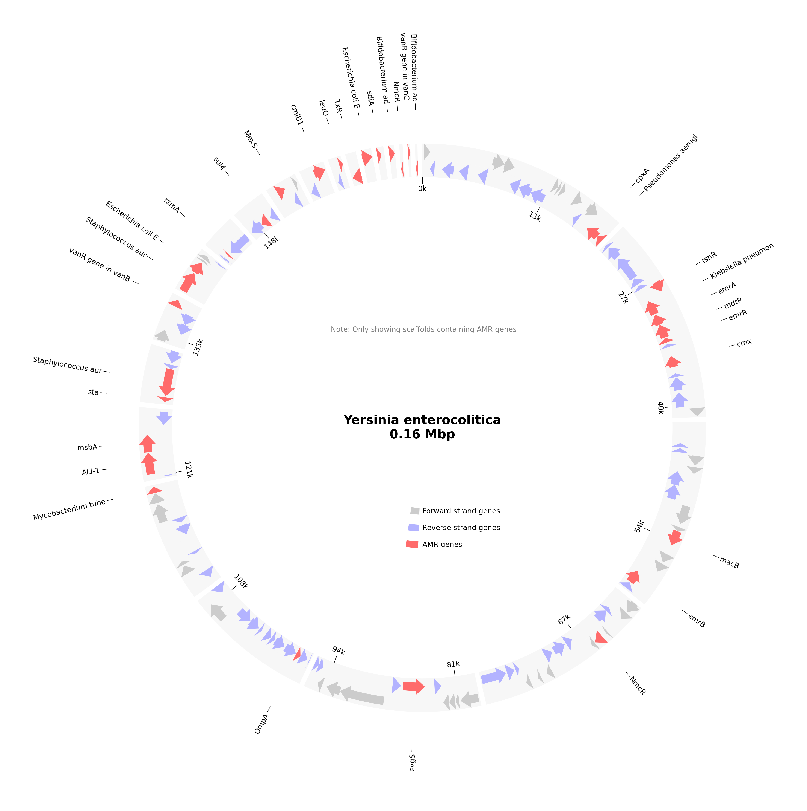

### ALI-1
- **Mechanism**: antibiotic inactivation
- **Drug Classes**: carbapenem
- **AMR Family**: ALI beta-lactamase
- **Locations**:
  - gnl|SPADES|PLIJBHFI_989_3 : position 603-2783

### Bifidobacterium adolescentis rpoB mutants conferring resistance to rifampicin (found in 2 locations)
- **Mechanism**: antibiotic target alteration; antibiotic target replacement
- **Drug Classes**: rifamycin antibiotic
- **AMR Family**: rifamycin-resistant beta-subunit of RNA polymerase (rpoB)
- **Locations**:
  - gnl|SPADES|PLIJBHFI_14119_1 : position 3-578
  - gnl|SPADES|PLIJBHFI_38477_1 : position 2-223

### Escherichia coli EF-Tu mutants conferring resistance to Pulvomycin (found in 2 locations)
- **Mechanism**: antibiotic target alteration
- **Drug Classes**: elfamycin antibiotic
- **AMR Family**: elfamycin resistant EF-Tu
- **Locations**:
  - gnl|SPADES|PLIJBHFI_1358_3 : position 2345-3529
  - gnl|SPADES|PLIJBHFI_7440_1 : position 3-1043

### Klebsiella pneumoniae KpnH
- **Mechanism**: antibiotic efflux
- **Drug Classes**: macrolide antibiotic; fluoroquinolone antibiotic; aminoglycoside antibiotic; carbapenem; cephalosporin; penam; peptide antibiotic; penem
- **AMR Family**: major facilitator superfamily (MFS) antibiotic efflux pump
- **Locations**:
  - gnl|SPADES|PLIJBHFI_461_7: position 7589-9124

### MexS
- **Mechanism**: antibiotic efflux
- **Drug Classes**: fluoroquinolone antibiotic; diaminopyrimidine antibiotic; phenicol antibiotic
- **AMR Family**: resistance-nodulation-cell division (RND) antibiotic efflux pump
- **Locations**:
  - gnl|SPADES|PLIJBHFI_1984_2 : position 812-1666

### Mycobacterium tuberculosis pncA mutations conferring resistance to pyrazinamide
- **Mechanism**: antibiotic target alteration
- **Drug Classes**: pyrazine antibiotic
- **AMR Family**: Pyrazinamide resistant pncA
- **Locations**:
  - gnl|SPADES|PLIJBHFI_726_10 : position 10961-11614

### NmcR (found in 2 locations)
- **Mechanism**: antibiotic inactivation
- **Drug Classes**: carbapenem; cephalosporin; cephamycin; penam
- **AMR Family**: NmcA beta-lactamase
- **Locations**:
  - gnl|SPADES|PLIJBHFI_24581_1 : position 1-240
  - gnl|SPADES|PLIJBHFI_513_6 : position 4660-5577

### OmpA
- **Mechanism**: reduced permeability to antibiotic
- **Drug Classes**: peptide antibiotic
- **AMR Family**: General Bacterial Porin with reduced permeability to peptide antibiotics
- **Locations**:
  - gnl|SPADES|PLIJBHFI_676_2 : position 1164-1670

### Pseudomonas aeruginosa CpxR
- **Mechanism**: antibiotic efflux
- **Drug Classes**: macrolide antibiotic; fluoroquinolone antibiotic; monobactam; aminoglycoside antibiotic; carbapenem; cephalosporin; cephamycin; penam; tetracycline antibiotic; peptide antibiotic; aminocoumarin antibiotic; diaminopyrimidine antibiotic; sulfonamide antibiotic; phenicol antibiotic; penem
- **AMR Family**: resistance-nodulation-cell division (RND) antibiotic efflux pump
- **Locations**:
  - gnl|SPADES|PLIJBHFI_447_21 : position 20342-21040

### Staphylococcus aureus fusA with mutation conferring resistance to fusidic acid
- **Mechanism**: antibiotic target alteration
- **Drug Classes**: fusidane antibiotic
- **AMR Family**: antibiotic resistant fusA
- **Locations**:
  - gnl|SPADES|PLIJBHFI_1358_2 : position 165-2273

### Staphylococcus aureus mupB conferring resistance to mupirocin
- **Mechanism**: antibiotic target alteration
- **Drug Classes**: mupirocin-like antibiotic
- **AMR Family**: antibiotic-resistant isoleucyl-tRNA synthetase (ileS)
- **Locations**:
  - gnl|SPADES|PLIJBHFI_1159_2 : position 888-3785

### TxR
- **Mechanism**: antibiotic efflux
- **Drug Classes**: tetracycline antibiotic
- **AMR Family**: ATP-binding cassette (ABC) antibiotic efflux pump
- **Locations**:
  - gnl|SPADES|PLIJBHFI_7377_1 : position 62-1051

### cmlB1
- **Mechanism**: antibiotic efflux
- **Drug Classes**: phenicol antibiotic
- **AMR Family**: major facilitator superfamily (MFS) antibiotic efflux pump
- **Locations**:
  - gnl|SPADES|PLIJBHFI_2558_2 : position 1264-2448

### cmx
- **Mechanism**: antibiotic efflux
- **Drug Classes**: phenicol antibiotic
- **AMR Family**: major facilitator superfamily (MFS) antibiotic efflux pump
- **Locations**:
  - gnl|SPADES|PLIJBHFI_461_13 : position 13862-15064

### cpxA
- **Mechanism**: antibiotic efflux
- **Drug Classes**: aminoglycoside antibiotic; aminocoumarin antibiotic
- **AMR Family**: resistance-nodulation-cell division (RND) antibiotic efflux pump
- **Locations**:
  - gnl|SPADES|PLIJBHFI_447_20 : position 18969-20345

### emrA
- **Mechanism**: antibiotic efflux
- **Drug Classes**: fluoroquinolone antibiotic
- **AMR Family**: major facilitator superfamily (MFS) antibiotic efflux pump
- **Locations**:
  - gnl|SPADES|PLIJBHFI_461_8 : position 9164-10336

### emrB
- **Mechanism**: antibiotic efflux
- **Drug Classes**: fluoroquinolone antibiotic
- **AMR Family**: major facilitator superfamily (MFS) antibiotic efflux pump
- **Locations**:
  - gnl|SPADES|PLIJBHFI_485_15 : position 16636-18060

### emrR
- **Mechanism**: antibiotic efflux
- **Drug Classes**: fluoroquinolone antibiotic
- **AMR Family**: major facilitator superfamily (MFS) antibiotic efflux pump
- **Locations**:
  - gnl|SPADES|PLIJBHFI_461_10 : position 11865-12377

### evgS
- **Mechanism**: antibiotic efflux
- **Drug Classes**: macrolide antibiotic; fluoroquinolone antibiotic; penam; tetracycline antibiotic
- **AMR Family**: major facilitator superfamily (MFS) antibiotic efflux pump; resistance-nodulation-cell division (RND) antibiotic efflux pump
- **Locations**:
  - gnl|SPADES|PLIJBHFI_527_7 : position 5489-7825

### leuO
- **Mechanism**: antibiotic efflux
- **Drug Classes**: nucleoside antibiotic; disinfecting agents and antiseptics
- **AMR Family**: major facilitator superfamily (MFS) antibiotic efflux pump
- **Locations**:
  - gnl|SPADES|PLIJBHFI_5917_3 : position 897-1268

### macB
- **Mechanism**: antibiotic efflux
- **Drug Classes**: macrolide antibiotic
- **AMR Family**: ATP-binding cassette (ABC) antibiotic efflux pump
- **Locations**:
  - gnl|SPADES|PLIJBHFI_485_10 : position 11134-12666

### mdtP
- **Mechanism**: antibiotic efflux
- **Drug Classes**: nucleoside antibiotic; disinfecting agents and antiseptics
- **AMR Family**: major facilitator superfamily (MFS) antibiotic efflux pump
- **Locations**:
  - gnl|SPADES|PLIJBHFI_461_9 : position 10351-11817

### msbA
- **Mechanism**: antibiotic efflux
- **Drug Classes**: nitroimidazole antibiotic
- **AMR Family**: ATP-binding cassette (ABC) antibiotic efflux pump
- **Locations**:
  - gnl|SPADES|PLIJBHFI_989_4 : position 2819-4567

### rsmA
- **Mechanism**: antibiotic efflux
- **Drug Classes**: fluoroquinolone antibiotic; diaminopyrimidine antibiotic; phenicol antibiotic
- **AMR Family**: resistance-nodulation-cell division (RND) antibiotic efflux pump
- **Locations**:
  - gnl|SPADES|PLIJBHFI_1781_1: position 654-839

### sdiA
- **Mechanism**: antibiotic efflux
- **Drug Classes**: fluoroquinolone antibiotic; cephalosporin; glycylcycline; penam; tetracycline antibiotic; rifamycin antibiotic; phenicol antibiotic; disinfecting agents and antiseptics
- **AMR Family**: resistance-nodulation-cell division (RND) antibiotic efflux pump
- **Locations**:
  - gnl|SPADES|PLIJBHFI_11129_1 : position 2-439

### sta
- **Mechanism**: antibiotic inactivation
- **Drug Classes**: nucleoside antibiotic
- **AMR Family**: streptothricin acetyltransferase (SAT)
- **Locations**:
  - gnl|SPADES|PLIJBHFI_1159_1 : position 250-753

### sul4
- **Mechanism**: antibiotic target replacement
- **Drug Classes**: sulfonamide antibiotic
- **AMR Family**: sulfonamide resistant sul
- **Locations**:
  - gnl|SPADES|PLIJBHFI_1841_2 : position 1520-2353

### tsnR
- **Mechanism**: antibiotic target alteration
- **Drug Classes**: peptide antibiotic
- **AMR Family**: non-erm 23S ribosomal RNA methyltransferase (A1067)
- **Locations**:
  - gnl|SPADES|PLIJBHFI_461_6 : position 6291-7382

### vanR gene in vanB cluster
- **Mechanism**: antibiotic target alteration
- **Drug Classes**: glycopeptide antibiotic
- **AMR Family**: glycopeptide resistance gene cluster; vanR
- **Locations**:
  - gnl|SPADES|PLIJBHFI_1298_4 : position 3809-4525

### vanR gene in vanC cluster
- **Mechanism**: antibiotic target alteration
- **Drug Classes**: glycopeptide antibiotic
- **AMR Family**: glycopeptide resistance gene cluster; vanR
- **Locations**:
  - gnl|SPADES|PLIJBHFI_30882_1 : position 1-264

## Yersinia enterocolitica (type O:5) str. YE53/03
**Strain Statistics:**
- Total genome length: 3942.7 kbp
- Total scaffolds: 93
- Scaffolds with AMR genes: 67
- Total genes annotated: 7047
- Total AMR genes: 396
- Unique AMR genes: 177
- Distinct AMR mechanisms: 10
- Distinct AMR families: 65
- Distinct drug classes: 35

**Circos Plot:**

_str._YE53_03.png)

### Acinetobacter baumannii AbaF (found in 4 locations)
- **Mechanism**: antibiotic efflux
- **Drug Classes**: phosphonic acid antibiotic
- **AMR Family**: major facilitator superfamily (MFS) antibiotic efflux pump
- **Locations**:
  - gnl|SPADES|PLIJBHFI_296_11 : position 10976-12502
  - gnl|SPADES|PLIJBHFI_30_89 : position 102719-104221
  - gnl|SPADES|PLIJBHFI_30_95 : position 109698-111101
  - gnl|SPADES|PLIJBHFI_476_8 : position 10159-11526

### Acinetobacter baumannii AbaQ (found in 4 locations)
- **Mechanism**: antibiotic efflux
- **Drug Classes**: fluoroquinolone antibiotic
- **AMR Family**: major facilitator superfamily (MFS) antibiotic efflux pump
- **Locations**:
  - gnl|SPADES|PLIJBHFI_309_11 : position 9683-10999
  - gnl|SPADES|PLIJBHFI_30_63 : position 69666-70976
  - gnl|SPADES|PLIJBHFI_31_52 : position 52921-54237
  - gnl|SPADES|PLIJBHFI_96_23 : position 19177-20535

### Acinetobacter baumannii AmvA
- **Mechanism**: antibiotic efflux
- **Drug Classes**: macrolide antibiotic; disinfecting agents and antiseptics
- **AMR Family**: major facilitator superfamily (MFS) antibiotic efflux pump
- **Locations**:
  - gnl|SPADES|PLIJBHFI_204_17 : position 13686-15179

### ArnT
- **Mechanism**: antibiotic target alteration
- **Drug Classes**: peptide antibiotic
- **AMR Family**: pmr phosphoethanolamine transferase
- **Locations**:
  - gnl|SPADES|PLIJBHFI_255_22: position 25572-27236

### Bifidobacterium bifidum ileS conferring resistance to mupirocin
- **Mechanism**: antibiotic target alteration
- **Drug Classes**: mupirocin-like antibiotic
- **AMR Family**: antibiotic-resistant isoleucyl-tRNA synthetase (ileS)
- **Locations**:
  - gnl|SPADES|PLIJBHFI_57_41 : position 38146-40728

### CMY-70
- **Mechanism**: antibiotic inactivation
- **Drug Classes**: cephamycin
- **AMR Family**: CMY beta-lactamase
- **Locations**:
  - gnl|SPADES|PLIJBHFI_31_57 : position 58169-59335

### CRP (found in 2 locations)
- **Mechanism**: antibiotic efflux
- **Drug Classes**: macrolide antibiotic; fluoroquinolone antibiotic; penam
- **AMR Family**: resistance-nodulation-cell division (RND) antibiotic efflux pump
- **Locations**:
  - gnl|SPADES|PLIJBHFI_12_90 : position 97238-97993
  - gnl|SPADES|PLIJBHFI_448_18 : position 20899-21027

### Clostridioides difficile gyrB conferring resistance to fluoroquinolones
- **Mechanism**: antibiotic target alteration
- **Drug Classes**: fluoroquinolone antibiotic
- **AMR Family**: fluoroquinolone resistant gyrB
- **Locations**:
  - gnl|SPADES|PLIJBHFI_30_21 : position 22284-24179

### CrcB (found in 2 locations)
- **Mechanism**: antibiotic efflux
- **Drug Classes**: aminoglycoside antibiotic
- **AMR Family**: multidrug and toxic compound extrusion (MATE) transporter
- **Locations**:
  - gnl|SPADES|PLIJBHFI_295_8 : position 6119-6523
  - gnl|SPADES|PLIJBHFI_57_26 : position 24639-25022

### D-Ala-D-Ala ligase
- **Mechanism**: antibiotic target alteration
- **Drug Classes**: glycopeptide antibiotic
- **AMR Family**: Van ligase
- **Locations**:
  - gnl|SPADES|PLIJBHFI_124_2 : position 441-1361

### DHA-6
- **Mechanism**: antibiotic inactivation
- **Drug Classes**: cephalosporin; cephamycin
- **AMR Family**: DHA beta-lactamase
- **Locations**:
  - gnl|SPADES|PLIJBHFI_218_9 : position 24049-25191

### Enterobacter cloacae acrA (found in 2 locations)
- **Mechanism**: antibiotic efflux
- **Drug Classes**: fluoroquinolone antibiotic; cephalosporin; glycylcycline; penam; tetracycline antibiotic; rifamycin antibiotic; phenicol antibiotic; disinfecting agents and antiseptics
- **AMR Family**: resistance-nodulation-cell division (RND) antibiotic efflux pump
- **Locations**:
  - gnl|SPADES|PLIJBHFI_173_47 : position 52045-53205
  - gnl|SPADES|PLIJBHFI_280_16 : position 22683-23666

### Enterococcus faecalis cls with mutation conferring resistance to daptomycin
- **Mechanism**: antibiotic target alteration
- **Drug Classes**: peptide antibiotic
- **AMR Family**: daptomycin resistant cls
- **Locations**:
  - gnl|SPADES|PLIJBHFI_12_253 : position 270539-271999

### Erm(34)
- **Mechanism**: antibiotic target alteration
- **Drug Classes**: macrolide antibiotic; lincosamide antibiotic; streptogramin antibiotic; streptogramin A antibiotic; streptogramin B antibiotic
- **AMR Family**: Erm 23S ribosomal RNA methyltransferase
- **Locations**:
  - gnl|SPADES|PLIJBHFI_55_91 : position 99856-100482

### Escherichia coli AcrAB-TolC with AcrR mutation conferring resistance to ciprofloxacin, tetracycline, and ceftazidime (found in 2 locations)
- **Mechanism**: antibiotic target alteration; antibiotic efflux
- **Drug Classes**: fluoroquinolone antibiotic; cephalosporin; glycylcycline; penam; tetracycline antibiotic; rifamycin antibiotic; phenicol antibiotic; disinfecting agents and antiseptics
- **AMR Family**: resistance-nodulation-cell division (RND) antibiotic efflux pump
- **Locations**:
  - gnl|SPADES|PLIJBHFI_128_14 : position 13945-14601
  - gnl|SPADES|PLIJBHFI_74_14 : position 13006-13590

### Escherichia coli AcrAB-TolC with MarR mutations conferring resistance to ciprofloxacin and tetracycline
- **Mechanism**: antibiotic target alteration; antibiotic efflux
- **Drug Classes**: fluoroquinolone antibiotic; cephalosporin; glycylcycline; penam; tetracycline antibiotic; rifamycin antibiotic; phenicol antibiotic; disinfecting agents and antiseptics
- **AMR Family**: resistance-nodulation-cell division (RND) antibiotic efflux pump
- **Locations**:
  - gnl|SPADES|PLIJBHFI_12_21 : position 20437-20868

### Escherichia coli acrA (found in 2 locations)
- **Mechanism**: antibiotic efflux
- **Drug Classes**: fluoroquinolone antibiotic; cephalosporin; glycylcycline; penam; tetracycline antibiotic; rifamycin antibiotic; phenicol antibiotic; disinfecting agents and antiseptics
- **AMR Family**: resistance-nodulation-cell division (RND) antibiotic efflux pump
- **Locations**:
  - gnl|SPADES|PLIJBHFI_128_13 : position 12613-13800
  - gnl|SPADES|PLIJBHFI_30_85 : position 96134-97336

### Escherichia coli mdfA
- **Mechanism**: antibiotic efflux
- **Drug Classes**: tetracycline antibiotic; phenicol antibiotic; disinfecting agents and antiseptics
- **AMR Family**: major facilitator superfamily (MFS) antibiotic efflux pump
- **Locations**:
  - gnl|SPADES|PLIJBHFI_59_61 : position 73271-74500

### Escherichia coli murA with mutation conferring resistance to fosfomycin
- **Mechanism**: antibiotic target alteration
- **Drug Classes**: phosphonic acid antibiotic
- **AMR Family**: antibiotic-resistant murA transferase
- **Locations**:
  - gnl|SPADES|PLIJBHFI_343_2 : position 490-1776

### Escherichia coli parE conferring resistance to fluoroquinolones
- **Mechanism**: antibiotic target alteration
- **Drug Classes**: fluoroquinolone antibiotic
- **AMR Family**: fluoroquinolone resistant parE
- **Locations**:
  - gnl|SPADES|PLIJBHFI_59_103 : position 122897-123973

### Escherichia coli soxS with mutation conferring antibiotic resistance (found in 4 locations)
- **Mechanism**: antibiotic target alteration; antibiotic efflux; reduced permeability to antibiotic
- **Drug Classes**: fluoroquinolone antibiotic; monobactam; carbapenem; cephalosporin; glycylcycline; cephamycin; penam; tetracycline antibiotic; rifamycin antibiotic; phenicol antibiotic; penem; disinfecting agents and antiseptics
- **AMR Family**: ATP-binding cassette (ABC) antibiotic efflux pump; major facilitator superfamily (MFS) antibiotic efflux pump; resistance-nodulation-cell division (RND) antibiotic efflux pump; General Bacterial Porin with reduced permeability to beta-lactams
- **Locations**:
  - gnl|SPADES|PLIJBHFI_12_160 : position 176452-177384
  - gnl|SPADES|PLIJBHFI_271_1 : position 3-809
  - gnl|SPADES|PLIJBHFI_315_18 : position 15896-16903
  - gnl|SPADES|PLIJBHFI_93_20 : position 20345-21052

### Escherichia coli uhpA with mutation conferring resistance to fosfomycin
- **Mechanism**: antibiotic target alteration
- **Drug Classes**: phosphonic acid antibiotic
- **AMR Family**: antibiotic-resistant UhpT
- **Locations**:
  - gnl|SPADES|PLIJBHFI_171_15 : position 17820-18404

### EstT
- **Mechanism**: antibiotic inactivation
- **Drug Classes**: macrolide antibiotic
- **AMR Family**: macrolide esterase
- **Locations**:
  - gnl|SPADES|PLIJBHFI_57_70 : position 76228-77022

### FosM2
- **Mechanism**: antibiotic inactivation
- **Drug Classes**: phosphonic acid antibiotic
- **AMR Family**: fosfomycin thiol transferase
- **Locations**:
  - gnl|SPADES|PLIJBHFI_12_12 : position 11416-11823

### H-NS
- **Mechanism**: antibiotic efflux
- **Drug Classes**: macrolide antibiotic; fluoroquinolone antibiotic; cephalosporin; cephamycin; penam; tetracycline antibiotic
- **AMR Family**: major facilitator superfamily (MFS) antibiotic efflux pump; resistance-nodulation-cell division (RND) antibiotic efflux pump
- **Locations**:
  - gnl|SPADES|PLIJBHFI_12_265 : position 286689-287099

### Haemophilus influenzae PBP3 conferring resistance to beta-lactam antibiotics
- **Mechanism**: antibiotic target alteration
- **Drug Classes**: cephalosporin; cephamycin; penam
- **AMR Family**: Penicillin-binding protein mutations conferring resistance to beta-lactam antibiotics
- **Locations**:
  - gnl|SPADES|PLIJBHFI_124_10 : position 10414-12177

### Helicobacter pylori pbp1 mutants conferring resistance to amoxicillin (found in 2 locations)
- **Mechanism**: antibiotic target alteration
- **Drug Classes**: cephalosporin; cephamycin; penam
- **AMR Family**: Penicillin-binding protein mutations conferring resistance to beta-lactam antibiotics
- **Locations**:
  - gnl|SPADES|PLIJBHFI_136_38 : position 44294-46780
  - gnl|SPADES|PLIJBHFI_24_102 : position 116466-118802

### Helicobacter pylori pbp2 mutants conferring resistance to amoxicillin
- **Mechanism**: antibiotic target alteration
- **Drug Classes**: cephalosporin; cephamycin; penam
- **AMR Family**: Penicillin-binding protein mutations conferring resistance to beta-lactam antibiotics
- **Locations**:
  - gnl|SPADES|PLIJBHFI_57_35 : position 32846-34741

### Helicobacter pylori pbp3 conferring resistance to amoxicillin
- **Mechanism**: antibiotic target alteration
- **Drug Classes**: cephalosporin; cephamycin; penam
- **AMR Family**: Penicillin-binding protein mutations conferring resistance to beta-lactam antibiotics
- **Locations**:
  - gnl|SPADES|PLIJBHFI_31_171 : position 162781-164490

### Klebsiella pneumoniae KpnE
- **Mechanism**: antibiotic efflux
- **Drug Classes**: macrolide antibiotic; aminoglycoside antibiotic; cephalosporin; tetracycline antibiotic; peptide antibiotic; rifamycin antibiotic; disinfecting agents and antiseptics
- **AMR Family**: small multidrug resistance (SMR) antibiotic efflux pump
- **Locations**:
  - gnl|SPADES|PLIJBHFI_932_2 : position 1064-1441

### Klebsiella pneumoniae KpnF
- **Mechanism**: antibiotic efflux
- **Drug Classes**: macrolide antibiotic; aminoglycoside antibiotic; cephalosporin; tetracycline antibiotic; peptide antibiotic; rifamycin antibiotic; disinfecting agents and antiseptics
- **AMR Family**: small multidrug resistance (SMR) antibiotic efflux pump
- **Locations**:
  - gnl|SPADES|PLIJBHFI_932_3: position 1428-1757

### Klebsiella pneumoniae KpnG
- **Mechanism**: antibiotic efflux
- **Drug Classes**: macrolide antibiotic; fluoroquinolone antibiotic; aminoglycoside antibiotic; carbapenem; cephalosporin; penam; peptide antibiotic; penem
- **AMR Family**: major facilitator superfamily (MFS) antibiotic efflux pump
- **Locations**:
  - gnl|SPADES|PLIJBHFI_74_50 : position 58222-59514

### Klebsiella pneumoniae OmpK37 (found in 4 locations)
- **Mechanism**: reduced permeability to antibiotic
- **Drug Classes**: monobactam; carbapenem; cephalosporin; cephamycin; penam; penem
- **AMR Family**: General Bacterial Porin with reduced permeability to beta-lactams
- **Locations**:
  - gnl|SPADES|PLIJBHFI_218_8 : position 22456-23556
  - gnl|SPADES|PLIJBHFI_280_15 : position 21322-22437
  - gnl|SPADES|PLIJBHFI_61_73 : position 75478-76593
  - gnl|SPADES|PLIJBHFI_76_41 : position 40461-41543

### LRA-19
- **Mechanism**: antibiotic inactivation
- **Drug Classes**: cephalosporin; penam
- **AMR Family**: subclass B3 LRA beta-lactamase
- **Locations**:
  - gnl|SPADES|PLIJBHFI_741_3 : position 3296-3943

### LlmA 23S ribosomal RNA methyltransferase
- **Mechanism**: antibiotic target alteration
- **Drug Classes**: lincosamide antibiotic
- **AMR Family**: Llm 23S ribosomal RNA methyltransferase
- **Locations**:
  - gnl|SPADES|PLIJBHFI_171_44 : position 48366-49556

### LpsB
- **Mechanism**: reduced permeability to antibiotic
- **Drug Classes**: peptide antibiotic
- **AMR Family**: Intrinsic peptide antibiotic resistant Lps
- **Locations**:
  - gnl|SPADES|PLIJBHFI_128_31 : position 32833-33936

### LptD
- **Mechanism**: antibiotic efflux
- **Drug Classes**: carbapenem; peptide antibiotic; aminocoumarin antibiotic; rifamycin antibiotic
- **AMR Family**: ATP-binding cassette (ABC) antibiotic efflux pump
- **Locations**:
  - gnl|SPADES|PLIJBHFI_124_42 : position 55911-58307

### MSI-1
- **Mechanism**: antibiotic inactivation
- **Drug Classes**: carbapenem
- **AMR Family**: MSI beta-lactamase
- **Locations**:
  - gnl|SPADES|PLIJBHFI_315_1 : position 96-851

### MdtK
- **Mechanism**: antibiotic efflux
- **Drug Classes**: fluoroquinolone antibiotic
- **AMR Family**: multidrug and toxic compound extrusion (MATE) transporter
- **Locations**:
  - gnl|SPADES|PLIJBHFI_74_7 : position 4408-5805

### MexF
- **Mechanism**: antibiotic efflux
- **Drug Classes**: fluoroquinolone antibiotic; diaminopyrimidine antibiotic; phenicol antibiotic
- **AMR Family**: resistance-nodulation-cell division (RND) antibiotic efflux pump
- **Locations**:
  - gnl|SPADES|PLIJBHFI_30_86 : position 97349-100474

### MexH
- **Mechanism**: antibiotic efflux
- **Drug Classes**: fluoroquinolone antibiotic; tetracycline antibiotic; disinfecting agents and antiseptics
- **AMR Family**: resistance-nodulation-cell division (RND) antibiotic efflux pump
- **Locations**:
  - gnl|SPADES|PLIJBHFI_30_53 : position 56999-58537

### MexJ
- **Mechanism**: antibiotic efflux
- **Drug Classes**: macrolide antibiotic; tetracycline antibiotic; disinfecting agents and antiseptics
- **AMR Family**: resistance-nodulation-cell division (RND) antibiotic efflux pump
- **Locations**:
  - gnl|SPADES|PLIJBHFI_72_55 : position 74662-75744

### MexS (found in 5 locations)
- **Mechanism**: antibiotic efflux
- **Drug Classes**: fluoroquinolone antibiotic; diaminopyrimidine antibiotic; phenicol antibiotic
- **AMR Family**: resistance-nodulation-cell division (RND) antibiotic efflux pump
- **Locations**:
  - gnl|SPADES|PLIJBHFI_133_25 : position 28599-29675
  - gnl|SPADES|PLIJBHFI_61_107 : position 112405-113559
  - gnl|SPADES|PLIJBHFI_74_17 : position 15781-16791
  - gnl|SPADES|PLIJBHFI_74_78 : position 88297-89307
  - gnl|SPADES|PLIJBHFI_74_88 : position 103217-104251

### MexT
- **Mechanism**: antibiotic efflux
- **Drug Classes**: fluoroquinolone antibiotic; diaminopyrimidine antibiotic; phenicol antibiotic
- **AMR Family**: resistance-nodulation-cell division (RND) antibiotic efflux pump
- **Locations**:
  - gnl|SPADES|PLIJBHFI_76_2 : position 2682-3602

### Mycobacterium tuberculosis kasA mutant conferring resistance to isoniazid (found in 2 locations)
- **Mechanism**: antibiotic target alteration
- **Drug Classes**: isoniazid-like antibiotic
- **AMR Family**: antibiotic resistant kasA
- **Locations**:
  - gnl|SPADES|PLIJBHFI_491_4 : position 3016-4290
  - gnl|SPADES|PLIJBHFI_514_15 : position 12304-13479

### Mycobacterium tuberculosis ndh with mutation conferring resistance to isoniazid
- **Mechanism**: antibiotic target alteration
- **Drug Classes**: isoniazid-like antibiotic
- **AMR Family**: antibiotic resistant ndh
- **Locations**:
  - gnl|SPADES|PLIJBHFI_96_74 : position 74734-76038

### Mycobacterium tuberculosis thyA with mutation conferring resistance to para-aminosalicylic acid
- **Mechanism**: antibiotic target alteration
- **Drug Classes**: salicylic acid antibiotic
- **AMR Family**: aminosalicylate resistant thymidylate synthase
- **Locations**:
  - gnl|SPADES|PLIJBHFI_445_11 : position 17335-18129

### Neisseria gonorrhoeae pilQ gene conferring resistance to beta-lactam
- **Mechanism**: antibiotic target alteration
- **Drug Classes**: cephalosporin; cephamycin; penam
- **AMR Family**: Penicillin-binding protein mutations conferring resistance to beta-lactam antibiotics
- **Locations**:
  - gnl|SPADES|PLIJBHFI_119_27 : position 28441-30387

### NmcR (found in 8 locations)
- **Mechanism**: antibiotic inactivation
- **Drug Classes**: carbapenem; cephalosporin; cephamycin; penam
- **AMR Family**: NmcA beta-lactamase
- **Locations**:
  - gnl|SPADES|PLIJBHFI_12_113 : position 127424-128278
  - gnl|SPADES|PLIJBHFI_12_219 : position 239629-240603
  - gnl|SPADES|PLIJBHFI_204_40 : position 41607-42494
  - gnl|SPADES|PLIJBHFI_31_58 : position 59470-60354
  - gnl|SPADES|PLIJBHFI_386_4 : position 4664-5545
  - gnl|SPADES|PLIJBHFI_46_26 : position 35576-36469
  - gnl|SPADES|PLIJBHFI_81_34 : position 44391-45311
  - gnl|SPADES|PLIJBHFI_879_6 : position 5224-6105

### OXA-152
- **Mechanism**: antibiotic inactivation
- **Drug Classes**: carbapenem; penam
- **AMR Family**: OXA beta-lactamase; OXA-62-like beta-lactamase
- **Locations**:
  - gnl|SPADES|PLIJBHFI_24_27 : position 27997-28701

### OmpA (found in 4 locations)
- **Mechanism**: reduced permeability to antibiotic
- **Drug Classes**: peptide antibiotic
- **AMR Family**: General Bacterial Porin with reduced permeability to peptide antibiotics
- **Locations**:
  - gnl|SPADES|PLIJBHFI_271_9 : position 10110-10619
  - gnl|SPADES|PLIJBHFI_46_20 : position 28398-30068
  - gnl|SPADES|PLIJBHFI_46_3 : position 6401-7777
  - gnl|SPADES|PLIJBHFI_59_88 : position 105929-106588

### OprJ
- **Mechanism**: antibiotic efflux
- **Drug Classes**: macrolide antibiotic; fluoroquinolone antibiotic; aminoglycoside antibiotic; cephalosporin; penam; tetracycline antibiotic; aminocoumarin antibiotic; diaminopyrimidine antibiotic; phenicol antibiotic
- **AMR Family**: resistance-nodulation-cell division (RND) antibiotic efflux pump
- **Locations**:
  - gnl|SPADES|PLIJBHFI_30_111 : position 127965-129485

### OprM
- **Mechanism**: antibiotic efflux
- **Drug Classes**: macrolide antibiotic; fluoroquinolone antibiotic; monobactam; aminoglycoside antibiotic; carbapenem; cephalosporin; cephamycin; penam; tetracycline antibiotic; peptide antibiotic; aminocoumarin antibiotic; diaminopyrimidine antibiotic; sulfonamide antibiotic; phenicol antibiotic; penem; disinfecting agents and antiseptics
- **AMR Family**: resistance-nodulation-cell division (RND) antibiotic efflux pump
- **Locations**:
  - gnl|SPADES|PLIJBHFI_173_45 : position 47508-48914

### PDC-382
- **Mechanism**: antibiotic inactivation
- **Drug Classes**: monobactam; carbapenem; cephalosporin
- **AMR Family**: PDC beta-lactamase
- **Locations**:
  - gnl|SPADES|PLIJBHFI_74_12 : position 10601-11773

### ParR (found in 3 locations)
- **Mechanism**: antibiotic efflux; reduced permeability to antibiotic
- **Drug Classes**: macrolide antibiotic; fluoroquinolone antibiotic; monobactam; aminoglycoside antibiotic; carbapenem; cephalosporin; cephamycin; penam; tetracycline antibiotic; phenicol antibiotic; penem; disinfecting agents and antiseptics
- **AMR Family**: resistance-nodulation-cell division (RND) antibiotic efflux pump; Outer Membrane Porin (Opr)
- **Locations**:
  - gnl|SPADES|PLIJBHFI_12_83 : position 88161-88889
  - gnl|SPADES|PLIJBHFI_258_14 : position 15317-16036
  - gnl|SPADES|PLIJBHFI_30_120 : position 139945-140673

### ParS (found in 2 locations)
- **Mechanism**: antibiotic efflux; reduced permeability to antibiotic
- **Drug Classes**: macrolide antibiotic; fluoroquinolone antibiotic; monobactam; aminoglycoside antibiotic; carbapenem; cephalosporin; cephamycin; penam; tetracycline antibiotic; phenicol antibiotic; penem; disinfecting agents and antiseptics
- **AMR Family**: resistance-nodulation-cell division (RND) antibiotic efflux pump; Outer Membrane Porin (Opr)
- **Locations**:
  - gnl|SPADES|PLIJBHFI_12_82 : position 86851-88164
  - gnl|SPADES|PLIJBHFI_30_118 : position 138575-139465

### Planobispora rosea EF-Tu mutants conferring resistance to inhibitor GE2270A (found in 2 locations)
- **Mechanism**: antibiotic target alteration
- **Drug Classes**: elfamycin antibiotic
- **AMR Family**: elfamycin resistant EF-Tu
- **Locations**:
  - gnl|SPADES|PLIJBHFI_55_102 : position 107793-109292
  - gnl|SPADES|PLIJBHFI_59_62 : position 74566-76458

### PmrF (found in 3 locations)
- **Mechanism**: antibiotic target alteration
- **Drug Classes**: peptide antibiotic
- **AMR Family**: pmr phosphoethanolamine transferase
- **Locations**:
  - gnl|SPADES|PLIJBHFI_255_25 : position 30150-31133
  - gnl|SPADES|PLIJBHFI_482_12 : position 9090-10079
  - gnl|SPADES|PLIJBHFI_76_58 : position 62932-64305

### Pseudomonas aeruginosa CpxR
- **Mechanism**: antibiotic efflux
- **Drug Classes**: macrolide antibiotic; fluoroquinolone antibiotic; monobactam; aminoglycoside antibiotic; carbapenem; cephalosporin; cephamycin; penam; tetracycline antibiotic; peptide antibiotic; aminocoumarin antibiotic; diaminopyrimidine antibiotic; sulfonamide antibiotic; phenicol antibiotic; penem
- **AMR Family**: resistance-nodulation-cell division (RND) antibiotic efflux pump
- **Locations**:
  - gnl|SPADES|PLIJBHFI_296_3 : position 1696-2379

### Pseudomonas aeruginosa ampR with mutation conferring resistance to aztreonam
- **Mechanism**: antibiotic target alteration; antibiotic inactivation
- **Drug Classes**: monobactam; carbapenem; cephalosporin
- **AMR Family**: PDC beta-lactamase; ampR transcriptional regulator with mutation conferring resistance to monobactam antibiotics
- **Locations**:
  - gnl|SPADES|PLIJBHFI_55_63 : position 68334-69275

### QepA4 (found in 3 locations)
- **Mechanism**: antibiotic efflux
- **Drug Classes**: fluoroquinolone antibiotic
- **AMR Family**: major facilitator superfamily (MFS) antibiotic efflux pump
- **Locations**:
  - gnl|SPADES|PLIJBHFI_12_145 : position 157964-159256
  - gnl|SPADES|PLIJBHFI_76_3 : position 3731-5155
  - gnl|SPADES|PLIJBHFI_76_75 : position 83192-84832

### RanA (found in 20 locations)
- **Mechanism**: antibiotic efflux
- **Drug Classes**: aminoglycoside antibiotic
- **AMR Family**: ATP-binding cassette (ABC) antibiotic efflux pump
- **Locations**:
  - gnl|SPADES|PLIJBHFI_108_20 : position 20232-21050
  - gnl|SPADES|PLIJBHFI_12_255 : position 272648-273649
  - gnl|SPADES|PLIJBHFI_12_256 : position 273646-274647
  - gnl|SPADES|PLIJBHFI_12_36 : position 33873-34688
  - gnl|SPADES|PLIJBHFI_161_52 : position 53285-54094
  - gnl|SPADES|PLIJBHFI_173_30 : position 27876-28991
  - gnl|SPADES|PLIJBHFI_173_6 : position 5205-6083
  - gnl|SPADES|PLIJBHFI_204_15 : position 11532-12338
  - gnl|SPADES|PLIJBHFI_204_24 : position 23514-24563
  - gnl|SPADES|PLIJBHFI_238_15 : position 14930-16057
  - gnl|SPADES|PLIJBHFI_245_9 : position 8057-9190
  - gnl|SPADES|PLIJBHFI_260_16 : position 16521-18113
  - gnl|SPADES|PLIJBHFI_315_7 : position 5726-6925
  - gnl|SPADES|PLIJBHFI_325_19 : position 18129-18905
  - gnl|SPADES|PLIJBHFI_366_17 : position 23876-24898
  - gnl|SPADES|PLIJBHFI_55_30 : position 31960-33474
  - gnl|SPADES|PLIJBHFI_55_57 : position 62172-62987
  - gnl|SPADES|PLIJBHFI_74_28 : position 32327-33418
  - gnl|SPADES|PLIJBHFI_91_4 : position 2460-3194
  - gnl|SPADES|PLIJBHFI_98_27 : position 29522-30625

### RanB (found in 2 locations)
- **Mechanism**: antibiotic efflux
- **Drug Classes**: aminoglycoside antibiotic
- **AMR Family**: ATP-binding cassette (ABC) antibiotic efflux pump
- **Locations**:
  - gnl|SPADES|PLIJBHFI_161_53 : position 54105-54887
  - gnl|SPADES|PLIJBHFI_204_16 : position 12332-13477

### Rv1877 (found in 2 locations)
- **Mechanism**: antibiotic efflux
- **Drug Classes**: fluoroquinolone antibiotic
- **AMR Family**: major facilitator superfamily (MFS) antibiotic efflux pump
- **Locations**:
  - gnl|SPADES|PLIJBHFI_59_90 : position 107490-108938
  - gnl|SPADES|PLIJBHFI_74_48 : position 56241-57629

### SAT-3
- **Mechanism**: antibiotic inactivation
- **Drug Classes**: nucleoside antibiotic
- **AMR Family**: streptothricin acetyltransferase (SAT)
- **Locations**:
  - gnl|SPADES|PLIJBHFI_12_269 : position 291482-291910

### Salmonella serovars soxS with mutation conferring antibiotic resistance
- **Mechanism**: antibiotic target alteration; antibiotic efflux; reduced permeability to antibiotic
- **Drug Classes**: fluoroquinolone antibiotic; monobactam; carbapenem; cephalosporin; glycylcycline; cephamycin; penam; tetracycline antibiotic; rifamycin antibiotic; phenicol antibiotic; penem; disinfecting agents and antiseptics
- **AMR Family**: ATP-binding cassette (ABC) antibiotic efflux pump; major facilitator superfamily (MFS) antibiotic efflux pump; resistance-nodulation-cell division (RND) antibiotic efflux pump; General Bacterial Porin with reduced permeability to beta-lactams
- **Locations**:
  - gnl|SPADES|PLIJBHFI_96_9 : position 6268-6654

### SatA
- **Mechanism**: antibiotic inactivation
- **Drug Classes**: nucleoside antibiotic
- **AMR Family**: streptothricin acetyltransferase (SAT)
- **Locations**:
  - gnl|SPADES|PLIJBHFI_74_19 : position 18515-18973

### Staphylococcus aureus GlpT with mutation conferring resistance to fosfomycin (found in 2 locations)
- **Mechanism**: antibiotic target alteration
- **Drug Classes**: phosphonic acid antibiotic
- **AMR Family**: antibiotic-resistant GlpT
- **Locations**:
  - gnl|SPADES|PLIJBHFI_59_4 : position 5391-6755
  - gnl|SPADES|PLIJBHFI_98_59 : position 62733-64097

### Staphylococcus aureus fusA with mutation conferring resistance to fusidic acid (found in 2 locations)
- **Mechanism**: antibiotic target alteration
- **Drug Classes**: fusidane antibiotic
- **AMR Family**: antibiotic resistant fusA
- **Locations**:
  - gnl|SPADES|PLIJBHFI_271_26 : position 28967-30556
  - gnl|SPADES|PLIJBHFI_55_52 : position 55898-58006

### Staphylococcus aureus mupA conferring resistance to mupirocin
- **Mechanism**: antibiotic target alteration
- **Drug Classes**: mupirocin-like antibiotic
- **AMR Family**: antibiotic-resistant isoleucyl-tRNA synthetase (ileS)
- **Locations**:
  - gnl|SPADES|PLIJBHFI_124_58 : position 73664-76300

### Staphylococcus aureus murA with mutation conferring resistance to fosfomycin
- **Mechanism**: antibiotic target alteration
- **Drug Classes**: phosphonic acid antibiotic
- **AMR Family**: antibiotic-resistant murA transferase
- **Locations**:
  - gnl|SPADES|PLIJBHFI_161_58 : position 57001-58269

### Streptococcus pneumoniae PBP2x conferring resistance to amoxicillin
- **Mechanism**: antibiotic target alteration
- **Drug Classes**: cephalosporin; cephamycin; penam
- **AMR Family**: Penicillin-binding protein mutations conferring resistance to beta-lactam antibiotics
- **Locations**:
  - gnl|SPADES|PLIJBHFI_258_6 : position 3976-6531

### Streptomyces lividans cmlR
- **Mechanism**: antibiotic efflux
- **Drug Classes**: phenicol antibiotic
- **AMR Family**: major facilitator superfamily (MFS) antibiotic efflux pump
- **Locations**:
  - gnl|SPADES|PLIJBHFI_81_28 : position 37229-38443

### Streptomyces rimosus otr(A)
- **Mechanism**: antibiotic target protection
- **Drug Classes**: tetracycline antibiotic
- **AMR Family**: tetracycline-resistant ribosomal protection protein
- **Locations**:
  - gnl|SPADES|PLIJBHFI_314_13 : position 12857-14680

### Streptomyces venezuelae rox (found in 2 locations)
- **Mechanism**: antibiotic inactivation
- **Drug Classes**: rifamycin antibiotic
- **AMR Family**: rifampin monooxygenase
- **Locations**:
  - gnl|SPADES|PLIJBHFI_119_68 : position 71497-72666
  - gnl|SPADES|PLIJBHFI_57_54 : position 54068-55249

### TaeA (found in 3 locations)
- **Mechanism**: antibiotic efflux
- **Drug Classes**: pleuromutilin antibiotic
- **AMR Family**: ATP-binding cassette (ABC) antibiotic efflux pump
- **Locations**:
  - gnl|SPADES|PLIJBHFI_271_10 : position 10909-12576
  - gnl|SPADES|PLIJBHFI_315_32 : position 28001-28666
  - gnl|SPADES|PLIJBHFI_491_9 : position 8417-10330

### TolC (found in 2 locations)
- **Mechanism**: antibiotic efflux
- **Drug Classes**: macrolide antibiotic; fluoroquinolone antibiotic; aminoglycoside antibiotic; carbapenem; cephalosporin; glycylcycline; cephamycin; penam; tetracycline antibiotic; peptide antibiotic; aminocoumarin antibiotic; rifamycin antibiotic; phenicol antibiotic; penem; disinfecting agents and antiseptics
- **AMR Family**: ATP-binding cassette (ABC) antibiotic efflux pump; major facilitator superfamily (MFS) antibiotic efflux pump; resistance-nodulation-cell division (RND) antibiotic efflux pump
- **Locations**:
  - gnl|SPADES|PLIJBHFI_218_5 : position 16911-18296
  - gnl|SPADES|PLIJBHFI_30_16 : position 17616-19097

### TriC
- **Mechanism**: antibiotic efflux
- **Drug Classes**: disinfecting agents and antiseptics
- **AMR Family**: resistance-nodulation-cell division (RND) antibiotic efflux pump
- **Locations**:
  - gnl|SPADES|PLIJBHFI_72_56 : position 75744-78830

### TxR (found in 7 locations)
- **Mechanism**: antibiotic efflux
- **Drug Classes**: tetracycline antibiotic
- **AMR Family**: ATP-binding cassette (ABC) antibiotic efflux pump
- **Locations**:
  - gnl|SPADES|PLIJBHFI_12_124 : position 137170-138711
  - gnl|SPADES|PLIJBHFI_12_43 : position 41020-42030
  - gnl|SPADES|PLIJBHFI_12_52 : position 47738-49321
  - gnl|SPADES|PLIJBHFI_24_133 : position 153474-154811
  - gnl|SPADES|PLIJBHFI_314_16 : position 17751-19163
  - gnl|SPADES|PLIJBHFI_46_130 : position 141651-143810
  - gnl|SPADES|PLIJBHFI_72_69 : position 93347-95266

### acrB
- **Mechanism**: antibiotic efflux
- **Drug Classes**: fluoroquinolone antibiotic; cephalosporin; glycylcycline; penam; tetracycline antibiotic; rifamycin antibiotic; phenicol antibiotic; disinfecting agents and antiseptics
- **AMR Family**: resistance-nodulation-cell division (RND) antibiotic efflux pump
- **Locations**:
  - gnl|SPADES|PLIJBHFI_173_46 : position 48916-52041

### adeF (found in 2 locations)
- **Mechanism**: antibiotic efflux
- **Drug Classes**: fluoroquinolone antibiotic; tetracycline antibiotic
- **AMR Family**: resistance-nodulation-cell division (RND) antibiotic efflux pump
- **Locations**:
  - gnl|SPADES|PLIJBHFI_128_12: position 9444-12596
  - gnl|SPADES|PLIJBHFI_24_21: position 20375-23506

### adeK
- **Mechanism**: antibiotic efflux
- **Drug Classes**: macrolide antibiotic; fluoroquinolone antibiotic; lincosamide antibiotic; carbapenem; cephalosporin; tetracycline antibiotic; rifamycin antibiotic; diaminopyrimidine antibiotic; phenicol antibiotic; penem
- **AMR Family**: resistance-nodulation-cell division (RND) antibiotic efflux pump
- **Locations**:
  - gnl|SPADES|PLIJBHFI_55_70 : position 75498-76904

### adeL (found in 20 locations)
- **Mechanism**: antibiotic efflux
- **Drug Classes**: fluoroquinolone antibiotic; tetracycline antibiotic
- **AMR Family**: resistance-nodulation-cell division (RND) antibiotic efflux pump
- **Locations**:
  - gnl|SPADES|PLIJBHFI_119_11 : position 14791-15687
  - gnl|SPADES|PLIJBHFI_12_5 : position 5504-6442
  - gnl|SPADES|PLIJBHFI_12_95 : position 101042-101986
  - gnl|SPADES|PLIJBHFI_133_15 : position 14766-15683
  - gnl|SPADES|PLIJBHFI_161_8 : position 9977-10888
  - gnl|SPADES|PLIJBHFI_173_11 : position 8188-9096
  - gnl|SPADES|PLIJBHFI_206_1 : position 439-1332
  - gnl|SPADES|PLIJBHFI_271_11 : position 12686-13597
  - gnl|SPADES|PLIJBHFI_271_31 : position 33916-34866
  - gnl|SPADES|PLIJBHFI_30_22 : position 24183-25106
  - gnl|SPADES|PLIJBHFI_334_8 : position 7912-8817
  - gnl|SPADES|PLIJBHFI_367_4 : position 2818-3690
  - gnl|SPADES|PLIJBHFI_429_12 : position 14203-15135
  - gnl|SPADES|PLIJBHFI_514_20 : position 16981-17883
  - gnl|SPADES|PLIJBHFI_57_3 : position 2118-3029
  - gnl|SPADES|PLIJBHFI_61_69 : position 71703-72617
  - gnl|SPADES|PLIJBHFI_74_16 : position 14709-15605
  - gnl|SPADES|PLIJBHFI_76_64 : position 72349-73281
  - gnl|SPADES|PLIJBHFI_81_29 : position 38539-39498
  - gnl|SPADES|PLIJBHFI_81_9 : position 13739-14635

### almE (found in 2 locations)
- **Mechanism**: antibiotic target alteration
- **Drug Classes**: peptide antibiotic
- **AMR Family**: polymyxin resistance operon; alm glycyltransferase
- **Locations**:
  - gnl|SPADES|PLIJBHFI_119_5 : position 4644-6800
  - gnl|SPADES|PLIJBHFI_932_8 : position 6088-7782

### arlR (found in 2 locations)
- **Mechanism**: antibiotic efflux
- **Drug Classes**: fluoroquinolone antibiotic; disinfecting agents and antiseptics
- **AMR Family**: major facilitator superfamily (MFS) antibiotic efflux pump
- **Locations**:
  - gnl|SPADES|PLIJBHFI_57_10 : position 8674-9363
  - gnl|SPADES|PLIJBHFI_76_82 : position 92101-92820

### arlS
- **Mechanism**: antibiotic efflux
- **Drug Classes**: fluoroquinolone antibiotic; disinfecting agents and antiseptics
- **AMR Family**: major facilitator superfamily (MFS) antibiotic efflux pump
- **Locations**:
  - gnl|SPADES|PLIJBHFI_74_35 : position 41324-42901

### arnA (found in 2 locations)
- **Mechanism**: antibiotic target alteration
- **Drug Classes**: peptide antibiotic
- **AMR Family**: pmr phosphoethanolamine transferase
- **Locations**:
  - gnl|SPADES|PLIJBHFI_255_24 : position 28135-30153
  - gnl|SPADES|PLIJBHFI_823_5 : position 3481-4428

### bacA
- **Mechanism**: antibiotic target alteration
- **Drug Classes**: peptide antibiotic
- **AMR Family**: undecaprenyl pyrophosphate related proteins
- **Locations**:
  - gnl|SPADES|PLIJBHFI_30_4 : position 2408-3226

### baeR (found in 3 locations)
- **Mechanism**: antibiotic efflux
- **Drug Classes**: aminoglycoside antibiotic; aminocoumarin antibiotic
- **AMR Family**: resistance-nodulation-cell division (RND) antibiotic efflux pump
- **Locations**:
  - gnl|SPADES|PLIJBHFI_204_36 : position 37593-38333
  - gnl|SPADES|PLIJBHFI_24_64 : position 75958-76680
  - gnl|SPADES|PLIJBHFI_91_60 : position 78031-78720

### baeS (found in 2 locations)
- **Mechanism**: antibiotic efflux
- **Drug Classes**: aminoglycoside antibiotic; aminocoumarin antibiotic
- **AMR Family**: resistance-nodulation-cell division (RND) antibiotic efflux pump
- **Locations**:
  - gnl|SPADES|PLIJBHFI_24_135 : position 155890-157326
  - gnl|SPADES|PLIJBHFI_24_63 : position 74576-75952

### basS (found in 4 locations)
- **Mechanism**: antibiotic target alteration; antibiotic efflux
- **Drug Classes**: peptide antibiotic
- **AMR Family**: pmr phosphoethanolamine transferase
- **Locations**:
  - gnl|SPADES|PLIJBHFI_119_55 : position 57966-59393
  - gnl|SPADES|PLIJBHFI_1406_2 : position 1383-2447
  - gnl|SPADES|PLIJBHFI_325_9 : position 8795-10144
  - gnl|SPADES|PLIJBHFI_76_81 : position 90432-92108

### bcr-1 (found in 2 locations)
- **Mechanism**: antibiotic efflux
- **Drug Classes**: bicyclomycin-like antibiotic
- **AMR Family**: major facilitator superfamily (MFS) antibiotic efflux pump
- **Locations**:
  - gnl|SPADES|PLIJBHFI_12_4 : position 4123-5340
  - gnl|SPADES|PLIJBHFI_260_18 : position 19249-20472

### bcrA (found in 9 locations)
- **Mechanism**: antibiotic efflux
- **Drug Classes**: peptide antibiotic
- **AMR Family**: ATP-binding cassette (ABC) antibiotic efflux pump
- **Locations**:
  - gnl|SPADES|PLIJBHFI_108_77 : position 79431-80057
  - gnl|SPADES|PLIJBHFI_31_6 : position 5841-6599
  - gnl|SPADES|PLIJBHFI_46_32 : position 41212-42027
  - gnl|SPADES|PLIJBHFI_46_74 : position 77850-79331
  - gnl|SPADES|PLIJBHFI_61_18 : position 18190-19254
  - gnl|SPADES|PLIJBHFI_61_26 : position 26779-27486
  - gnl|SPADES|PLIJBHFI_61_59 : position 61094-61792
  - gnl|SPADES|PLIJBHFI_72_48 : position 62843-64408
  - gnl|SPADES|PLIJBHFI_81_59 : position 75860-76585

### blt
- **Mechanism**: antibiotic efflux
- **Drug Classes**: fluoroquinolone antibiotic; disinfecting agents and antiseptics
- **AMR Family**: major facilitator superfamily (MFS) antibiotic efflux pump
- **Locations**:
  - gnl|SPADES|PLIJBHFI_46_108 : position 118815-120035

### catB11
- **Mechanism**: antibiotic inactivation
- **Drug Classes**: phenicol antibiotic
- **AMR Family**: chloramphenicol acetyltransferase (CAT)
- **Locations**:
  - gnl|SPADES|PLIJBHFI_31_67 : position 64870-65514

### chrB
- **Mechanism**: antibiotic target alteration
- **Drug Classes**: macrolide antibiotic; lincosamide antibiotic
- **AMR Family**: non-erm 23S ribosomal RNA methyltransferase (G748)
- **Locations**:
  - gnl|SPADES|PLIJBHFI_31_170 : position 161803-162663

### clbB
- **Mechanism**: antibiotic target alteration
- **Drug Classes**: lincosamide antibiotic; streptogramin antibiotic; streptogramin A antibiotic; oxazolidinone antibiotic; phenicol antibiotic; pleuromutilin antibiotic
- **AMR Family**: Cfr 23S ribosomal RNA methyltransferase
- **Locations**:
  - gnl|SPADES|PLIJBHFI_24_99 : position 111772-112968

### cmeC
- **Mechanism**: antibiotic efflux
- **Drug Classes**: macrolide antibiotic; fluoroquinolone antibiotic; cephalosporin; fusidane antibiotic
- **AMR Family**: resistance-nodulation-cell division (RND) antibiotic efflux pump
- **Locations**:
  - gnl|SPADES|PLIJBHFI_74_53 : position 61223-62710

### cmlA9
- **Mechanism**: antibiotic efflux
- **Drug Classes**: phenicol antibiotic
- **AMR Family**: major facilitator superfamily (MFS) antibiotic efflux pump
- **Locations**:
  - gnl|SPADES|PLIJBHFI_334_11 : position 12969-14159

### cmlB
- **Mechanism**: antibiotic efflux
- **Drug Classes**: phenicol antibiotic
- **AMR Family**: major facilitator superfamily (MFS) antibiotic efflux pump
- **Locations**:
  - gnl|SPADES|PLIJBHFI_74_31 : position 36786-38117

### cmlv (found in 2 locations)
- **Mechanism**: antibiotic inactivation
- **Drug Classes**: phenicol antibiotic
- **AMR Family**: chloramphenicol phosphotransferase
- **Locations**:
  - gnl|SPADES|PLIJBHFI_119_10 : position 13168-14328
  - gnl|SPADES|PLIJBHFI_76_52 : position 56592-57758

### cmrA
- **Mechanism**: antibiotic efflux
- **Drug Classes**: phenicol antibiotic
- **AMR Family**: major facilitator superfamily (MFS) antibiotic efflux pump
- **Locations**:
  - gnl|SPADES|PLIJBHFI_1412_1 : position 216-1418

### cprR
- **Mechanism**: antibiotic target alteration; antibiotic efflux
- **Drug Classes**: peptide antibiotic
- **AMR Family**: pmr phosphoethanolamine transferase
- **Locations**:
  - gnl|SPADES|PLIJBHFI_1406_3 : position 2444-3103

### cpxA (found in 4 locations)
- **Mechanism**: antibiotic efflux
- **Drug Classes**: aminoglycoside antibiotic; aminocoumarin antibiotic
- **AMR Family**: resistance-nodulation-cell division (RND) antibiotic efflux pump
- **Locations**:
  - gnl|SPADES|PLIJBHFI_258_13 : position 13968-15320
  - gnl|SPADES|PLIJBHFI_296_2 : position 303-1670
  - gnl|SPADES|PLIJBHFI_314_15 : position 16691-17743
  - gnl|SPADES|PLIJBHFI_96_64 : position 60286-61692

### dfrA3
- **Mechanism**: antibiotic target replacement
- **Drug Classes**: diaminopyrimidine antibiotic
- **AMR Family**: trimethoprim resistant dihydrofolate reductase dfr
- **Locations**:
  - gnl|SPADES|PLIJBHFI_124_48 : position 62833-63315

### efrA
- **Mechanism**: antibiotic efflux
- **Drug Classes**: macrolide antibiotic; fluoroquinolone antibiotic; rifamycin antibiotic
- **AMR Family**: ATP-binding cassette (ABC) antibiotic efflux pump
- **Locations**:
  - gnl|SPADES|PLIJBHFI_133_38 : position 41436-42545

### emrY
- **Mechanism**: antibiotic efflux
- **Drug Classes**: tetracycline antibiotic
- **AMR Family**: major facilitator superfamily (MFS) antibiotic efflux pump
- **Locations**:
  - gnl|SPADES|PLIJBHFI_24_62 : position 73150-74559

### eptA
- **Mechanism**: antibiotic target alteration
- **Drug Classes**: peptide antibiotic
- **AMR Family**: pmr phosphoethanolamine transferase
- **Locations**:
  - gnl|SPADES|PLIJBHFI_12_15 : position 13910-15550

### eptB
- **Mechanism**: antibiotic target alteration
- **Drug Classes**: peptide antibiotic
- **AMR Family**: pmr phosphoethanolamine transferase
- **Locations**:
  - gnl|SPADES|PLIJBHFI_59_7 : position 9047-10738

### erm(56)
- **Mechanism**: antibiotic target alteration
- **Drug Classes**: macrolide antibiotic; lincosamide antibiotic; streptogramin antibiotic; streptogramin B antibiotic
- **AMR Family**: Erm 23S ribosomal RNA methyltransferase
- **Locations**:
  - gnl|SPADES|PLIJBHFI_124_45 : position 60651-61469

### evgA (found in 9 locations)
- **Mechanism**: antibiotic efflux
- **Drug Classes**: macrolide antibiotic; fluoroquinolone antibiotic; penam; tetracycline antibiotic
- **AMR Family**: major facilitator superfamily (MFS) antibiotic efflux pump; resistance-nodulation-cell division (RND) antibiotic efflux pump
- **Locations**:
  - gnl|SPADES|PLIJBHFI_12_149 : position 162079-162798
  - gnl|SPADES|PLIJBHFI_24_11 : position 9820-10464
  - gnl|SPADES|PLIJBHFI_24_19 : position 19090-19788
  - gnl|SPADES|PLIJBHFI_325_10 : position 10119-10727
  - gnl|SPADES|PLIJBHFI_59_6 : position 8345-8935
  - gnl|SPADES|PLIJBHFI_74_27 : position 30836-31468
  - gnl|SPADES|PLIJBHFI_74_33 : position 39785-40414
  - gnl|SPADES|PLIJBHFI_88_2 : position 1803-2459
  - gnl|SPADES|PLIJBHFI_93_6 : position 7871-8503

### evgS (found in 7 locations)
- **Mechanism**: antibiotic efflux
- **Drug Classes**: macrolide antibiotic; fluoroquinolone antibiotic; penam; tetracycline antibiotic
- **AMR Family**: major facilitator superfamily (MFS) antibiotic efflux pump; resistance-nodulation-cell division (RND) antibiotic efflux pump
- **Locations**:
  - gnl|SPADES|PLIJBHFI_1260_2 : position 1309-4230
  - gnl|SPADES|PLIJBHFI_136_51 : position 60629-63445
  - gnl|SPADES|PLIJBHFI_171_14 : position 16082-17842
  - gnl|SPADES|PLIJBHFI_218_1 : position 2-2314
  - gnl|SPADES|PLIJBHFI_74_26 : position 27037-30861
  - gnl|SPADES|PLIJBHFI_88_85 : position 85934-86323
  - gnl|SPADES|PLIJBHFI_93_7 : position 8528-11341

### facT
- **Mechanism**: antibiotic efflux
- **Drug Classes**: elfamycin antibiotic
- **AMR Family**: major facilitator superfamily (MFS) antibiotic efflux pump
- **Locations**:
  - gnl|SPADES|PLIJBHFI_206_16 : position 12137-13441

### farB
- **Mechanism**: antibiotic efflux
- **Drug Classes**: antibacterial free fatty acids
- **AMR Family**: major facilitator superfamily (MFS) antibiotic efflux pump
- **Locations**:
  - gnl|SPADES|PLIJBHFI_12_134 : position 148143-149573

### fexA
- **Mechanism**: antibiotic efflux
- **Drug Classes**: phenicol antibiotic
- **AMR Family**: major facilitator superfamily (MFS) antibiotic efflux pump
- **Locations**:
  - gnl|SPADES|PLIJBHFI_315_19 : position 16991-18226

### gadW (found in 4 locations)
- **Mechanism**: antibiotic efflux
- **Drug Classes**: macrolide antibiotic; fluoroquinolone antibiotic; penam
- **AMR Family**: resistance-nodulation-cell division (RND) antibiotic efflux pump
- **Locations**:
  - gnl|SPADES|PLIJBHFI_108_34 : position 34236-35024
  - gnl|SPADES|PLIJBHFI_46_48 : position 54780-55682
  - gnl|SPADES|PLIJBHFI_88_22 : position 19028-19837
  - gnl|SPADES|PLIJBHFI_88_48 : position 46944-47813

### golS
- **Mechanism**: antibiotic efflux
- **Drug Classes**: monobactam; carbapenem; cephalosporin; cephamycin; penam; phenicol antibiotic; penem
- **AMR Family**: resistance-nodulation-cell division (RND) antibiotic efflux pump
- **Locations**:
  - gnl|SPADES|PLIJBHFI_128_44 : position 50910-51329

### hmrM
- **Mechanism**: antibiotic efflux
- **Drug Classes**: fluoroquinolone antibiotic; disinfecting agents and antiseptics
- **AMR Family**: multidrug and toxic compound extrusion (MATE) transporter
- **Locations**:
  - gnl|SPADES|PLIJBHFI_12_1 : position 276-1688

### hp1181
- **Mechanism**: antibiotic efflux
- **Drug Classes**: fluoroquinolone antibiotic; tetracycline antibiotic; nitroimidazole antibiotic
- **AMR Family**: major facilitator superfamily (MFS) antibiotic efflux pump
- **Locations**:
  - gnl|SPADES|PLIJBHFI_574_17 : position 13626-14990

### kdpD
- **Mechanism**: antibiotic efflux
- **Drug Classes**: aminoglycoside antibiotic
- **AMR Family**: kdpDE
- **Locations**:
  - gnl|SPADES|PLIJBHFI_57_86 : position 90992-93691

### kdpE (found in 3 locations)
- **Mechanism**: antibiotic efflux
- **Drug Classes**: aminoglycoside antibiotic
- **AMR Family**: kdpDE
- **Locations**:
  - gnl|SPADES|PLIJBHFI_57_85 : position 90306-90995
  - gnl|SPADES|PLIJBHFI_74_34 : position 40616-41302
  - gnl|SPADES|PLIJBHFI_96_63 : position 59561-60232

### leuO (found in 3 locations)
- **Mechanism**: antibiotic efflux
- **Drug Classes**: nucleoside antibiotic; disinfecting agents and antiseptics
- **AMR Family**: major facilitator superfamily (MFS) antibiotic efflux pump
- **Locations**:
  - gnl|SPADES|PLIJBHFI_119_9 : position 12218-13171
  - gnl|SPADES|PLIJBHFI_124_19 : position 21473-22429
  - gnl|SPADES|PLIJBHFI_24_10 : position 8911-9813

### lfrA
- **Mechanism**: antibiotic efflux
- **Drug Classes**: fluoroquinolone antibiotic
- **AMR Family**: major facilitator superfamily (MFS) antibiotic efflux pump
- **Locations**:
  - gnl|SPADES|PLIJBHFI_238_7 : position 5029-6396

### macA (found in 3 locations)
- **Mechanism**: antibiotic efflux
- **Drug Classes**: macrolide antibiotic
- **AMR Family**: ATP-binding cassette (ABC) antibiotic efflux pump
- **Locations**:
  - gnl|SPADES|PLIJBHFI_245_30 : position 32208-33236
  - gnl|SPADES|PLIJBHFI_296_4 : position 2568-3776
  - gnl|SPADES|PLIJBHFI_55_72 : position 78867-80042

### macB (found in 33 locations)
- **Mechanism**: antibiotic efflux
- **Drug Classes**: macrolide antibiotic
- **AMR Family**: ATP-binding cassette (ABC) antibiotic efflux pump
- **Locations**:
  - gnl|SPADES|PLIJBHFI_124_35 : position 42623-43327
  - gnl|SPADES|PLIJBHFI_128_2 : position 1318-2046
  - gnl|SPADES|PLIJBHFI_128_50 : position 55432-56118
  - gnl|SPADES|PLIJBHFI_12_37 : position 34688-35680
  - gnl|SPADES|PLIJBHFI_133_12 : position 12698-13459
  - gnl|SPADES|PLIJBHFI_133_20 : position 21121-23952
  - gnl|SPADES|PLIJBHFI_173_22 : position 20161-20895
  - gnl|SPADES|PLIJBHFI_245_18 : position 16674-17453
  - gnl|SPADES|PLIJBHFI_245_31 : position 33236-35185
  - gnl|SPADES|PLIJBHFI_295_20 : position 17584-18312
  - gnl|SPADES|PLIJBHFI_296_5 : position 3780-5762
  - gnl|SPADES|PLIJBHFI_296_7 : position 6884-7975
  - gnl|SPADES|PLIJBHFI_325_5 : position 4119-5135
  - gnl|SPADES|PLIJBHFI_366_18 : position 24895-25875
  - gnl|SPADES|PLIJBHFI_367_14 : position 13559-14545
  - gnl|SPADES|PLIJBHFI_375_2 : position 850-1881
  - gnl|SPADES|PLIJBHFI_46_84 : position 89307-90818
  - gnl|SPADES|PLIJBHFI_482_8 : position 5493-6260
  - gnl|SPADES|PLIJBHFI_55_71 : position 76901-78877
  - gnl|SPADES|PLIJBHFI_55_99 : position 105920-106654
  - gnl|SPADES|PLIJBHFI_57_44 : position 43447-44172
  - gnl|SPADES|PLIJBHFI_59_53 : position 63055-64587
  - gnl|SPADES|PLIJBHFI_61_102 : position 106631-107290
  - gnl|SPADES|PLIJBHFI_61_50 : position 51407-52243
  - gnl|SPADES|PLIJBHFI_61_82 : position 87623-88345
  - gnl|SPADES|PLIJBHFI_74_54 : position 62703-63917
  - gnl|SPADES|PLIJBHFI_74_55 : position 63910-64617
  - gnl|SPADES|PLIJBHFI_76_68 : position 75138-75851
  - gnl|SPADES|PLIJBHFI_76_70 : position 77002-78294
  - gnl|SPADES|PLIJBHFI_88_34 : position 33996-34751
  - gnl|SPADES|PLIJBHFI_96_29 : position 27669-28451
  - gnl|SPADES|PLIJBHFI_96_70 : position 67824-68528
  - gnl|SPADES|PLIJBHFI_98_45 : position 48411-49079

### marA (found in 3 locations)
- **Mechanism**: antibiotic efflux; reduced permeability to antibiotic
- **Drug Classes**: fluoroquinolone antibiotic; monobactam; carbapenem; cephalosporin; glycylcycline; cephamycin; penam; tetracycline antibiotic; rifamycin antibiotic; phenicol antibiotic; penem; disinfecting agents and antiseptics
- **AMR Family**: resistance-nodulation-cell division (RND) antibiotic efflux pump; General Bacterial Porin with reduced permeability to beta-lactams
- **Locations**:
  - gnl|SPADES|PLIJBHFI_12_174 : position 197066-197953
  - gnl|SPADES|PLIJBHFI_280_13 : position 19520-20500
  - gnl|SPADES|PLIJBHFI_96_21 : position 17124-17999

### mdtA (found in 2 locations)
- **Mechanism**: antibiotic efflux
- **Drug Classes**: aminocoumarin antibiotic
- **AMR Family**: resistance-nodulation-cell division (RND) antibiotic efflux pump
- **Locations**:
  - gnl|SPADES|PLIJBHFI_24_58 : position 65420-66754
  - gnl|SPADES|PLIJBHFI_61_103 : position 107292-108554

### mdtB
- **Mechanism**: antibiotic efflux
- **Drug Classes**: aminocoumarin antibiotic
- **AMR Family**: resistance-nodulation-cell division (RND) antibiotic efflux pump
- **Locations**:
  - gnl|SPADES|PLIJBHFI_24_59 : position 66754-69897

### mdtC (found in 2 locations)
- **Mechanism**: antibiotic efflux
- **Drug Classes**: aminocoumarin antibiotic
- **AMR Family**: resistance-nodulation-cell division (RND) antibiotic efflux pump
- **Locations**:
  - gnl|SPADES|PLIJBHFI_24_60 : position 69894-72968
  - gnl|SPADES|PLIJBHFI_30_52 : position 53871-57002

### mdtG
- **Mechanism**: antibiotic efflux
- **Drug Classes**: phosphonic acid antibiotic
- **AMR Family**: major facilitator superfamily (MFS) antibiotic efflux pump
- **Locations**:
  - gnl|SPADES|PLIJBHFI_171_18 : position 20482-21726

### mdtH (found in 2 locations)
- **Mechanism**: antibiotic efflux
- **Drug Classes**: fluoroquinolone antibiotic
- **AMR Family**: major facilitator superfamily (MFS) antibiotic efflux pump
- **Locations**:
  - gnl|SPADES|PLIJBHFI_31_30 : position 29877-31082
  - gnl|SPADES|PLIJBHFI_31_8 : position 7639-9120

### mdtN (found in 5 locations)
- **Mechanism**: antibiotic efflux
- **Drug Classes**: nucleoside antibiotic; disinfecting agents and antiseptics
- **AMR Family**: major facilitator superfamily (MFS) antibiotic efflux pump
- **Locations**:
  - gnl|SPADES|PLIJBHFI_12_19 : position 19156-19926
  - gnl|SPADES|PLIJBHFI_161_10 : position 11412-12347
  - gnl|SPADES|PLIJBHFI_218_7 : position 20620-21789
  - gnl|SPADES|PLIJBHFI_30_109 : position 125020-126075
  - gnl|SPADES|PLIJBHFI_61_38 : position 39444-40430

### mdtO (found in 2 locations)
- **Mechanism**: antibiotic efflux
- **Drug Classes**: nucleoside antibiotic; disinfecting agents and antiseptics
- **AMR Family**: major facilitator superfamily (MFS) antibiotic efflux pump
- **Locations**:
  - gnl|SPADES|PLIJBHFI_171_51 : position 54886-57021
  - gnl|SPADES|PLIJBHFI_30_110 : position 126059-127963

### msbA (found in 6 locations)
- **Mechanism**: antibiotic efflux
- **Drug Classes**: nitroimidazole antibiotic
- **AMR Family**: ATP-binding cassette (ABC) antibiotic efflux pump
- **Locations**:
  - gnl|SPADES|PLIJBHFI_12_168 : position 188689-190815
  - gnl|SPADES|PLIJBHFI_24_49 : position 49236-50048
  - gnl|SPADES|PLIJBHFI_30_104 : position 120834-121592
  - gnl|SPADES|PLIJBHFI_343_17 : position 22894-24660
  - gnl|SPADES|PLIJBHFI_343_18 : position 24663-26387
  - gnl|SPADES|PLIJBHFI_57_18 : position 17610-19382

### msr(I)
- **Mechanism**: antibiotic target protection
- **Drug Classes**: macrolide antibiotic; streptogramin antibiotic; phosphonic acid antibiotic
- **AMR Family**: msr-type ABC-F protein
- **Locations**:
  - gnl|SPADES|PLIJBHFI_93_43 : position 40890-42635

### mtrA (found in 3 locations)
- **Mechanism**: antibiotic efflux
- **Drug Classes**: macrolide antibiotic; penam
- **AMR Family**: resistance-nodulation-cell division (RND) antibiotic efflux pump
- **Locations**:
  - gnl|SPADES|PLIJBHFI_136_5 : position 6643-7650
  - gnl|SPADES|PLIJBHFI_1412_2 : position 1481-2503
  - gnl|SPADES|PLIJBHFI_59_51 : position 60600-61793

### nalC
- **Mechanism**: antibiotic efflux
- **Drug Classes**: macrolide antibiotic; fluoroquinolone antibiotic; monobactam; carbapenem; cephalosporin; cephamycin; penam; tetracycline antibiotic; peptide antibiotic; aminocoumarin antibiotic; diaminopyrimidine antibiotic; sulfonamide antibiotic; phenicol antibiotic; penem
- **AMR Family**: resistance-nodulation-cell division (RND) antibiotic efflux pump
- **Locations**:
  - gnl|SPADES|PLIJBHFI_61_39 : position 40464-41162

### novA (found in 4 locations)
- **Mechanism**: antibiotic efflux
- **Drug Classes**: aminocoumarin antibiotic
- **AMR Family**: ATP-binding cassette (ABC) antibiotic efflux pump
- **Locations**:
  - gnl|SPADES|PLIJBHFI_12_166 : position 185163-187295
  - gnl|SPADES|PLIJBHFI_218_6 : position 18472-20607
  - gnl|SPADES|PLIJBHFI_255_4 : position 3350-4096
  - gnl|SPADES|PLIJBHFI_96_13 : position 9702-11420

### oleC (found in 3 locations)
- **Mechanism**: antibiotic efflux
- **Drug Classes**: macrolide antibiotic
- **AMR Family**: ATP-binding cassette (ABC) antibiotic efflux pump
- **Locations**:
  - gnl|SPADES|PLIJBHFI_238_32 : position 33563-34453
  - gnl|SPADES|PLIJBHFI_55_39 : position 43566-44300
  - gnl|SPADES|PLIJBHFI_55_40 : position 44297-45016

### optrA (found in 2 locations)
- **Mechanism**: antibiotic target protection
- **Drug Classes**: oxazolidinone antibiotic; phenicol antibiotic
- **AMR Family**: Miscellaneous ABC-F subfamily ATP-binding cassette ribosomal protection proteins
- **Locations**:
  - gnl|SPADES|PLIJBHFI_482_13 : position 10121-12037
  - gnl|SPADES|PLIJBHFI_61_97 : position 100655-102361

### putative nickel/cobalt transporter
- **Mechanism**: antibiotic efflux
- **Drug Classes**: fluoroquinolone antibiotic; aminoglycoside antibiotic; isoniazid-like antibiotic
- **AMR Family**: metal transporters with antibiotic efflux
- **Locations**:
  - gnl|SPADES|PLIJBHFI_295_5 : position 2963-4021

### qacJ
- **Mechanism**: antibiotic efflux
- **Drug Classes**: disinfecting agents and antiseptics
- **AMR Family**: small multidrug resistance (SMR) antibiotic efflux pump
- **Locations**:
  - gnl|SPADES|PLIJBHFI_12_64: position 65415-65747

### qacL
- **Mechanism**: antibiotic efflux
- **Drug Classes**: disinfecting agents and antiseptics
- **AMR Family**: small multidrug resistance (SMR) antibiotic efflux pump
- **Locations**:
  - gnl|SPADES|PLIJBHFI_93_76 : position 81311-81625

### rosA
- **Mechanism**: antibiotic efflux
- **Drug Classes**: peptide antibiotic
- **AMR Family**: major facilitator superfamily (MFS) antibiotic efflux pump
- **Locations**:
  - gnl|SPADES|PLIJBHFI_128_38 : position 42607-43839

### rosB (found in 2 locations)
- **Mechanism**: antibiotic efflux
- **Drug Classes**: peptide antibiotic
- **AMR Family**: major facilitator superfamily (MFS) antibiotic efflux pump
- **Locations**:
  - gnl|SPADES|PLIJBHFI_128_37 : position 40679-42370
  - gnl|SPADES|PLIJBHFI_482_15 : position 12881-14689

### rphA
- **Mechanism**: antibiotic inactivation
- **Drug Classes**: rifamycin antibiotic
- **AMR Family**: rifampin phosphotransferase
- **Locations**:
  - gnl|SPADES|PLIJBHFI_255_10 : position 12157-14538

### salE
- **Mechanism**: antibiotic target protection
- **Drug Classes**: lincosamide antibiotic; streptogramin antibiotic; streptogramin A antibiotic; pleuromutilin antibiotic
- **AMR Family**: sal-type ABC-F protein
- **Locations**:
  - gnl|SPADES|PLIJBHFI_61_13 : position 13739-15232

### sdiA (found in 2 locations)
- **Mechanism**: antibiotic efflux
- **Drug Classes**: fluoroquinolone antibiotic; cephalosporin; glycylcycline; penam; tetracycline antibiotic; rifamycin antibiotic; phenicol antibiotic; disinfecting agents and antiseptics
- **AMR Family**: resistance-nodulation-cell division (RND) antibiotic efflux pump
- **Locations**:
  - gnl|SPADES|PLIJBHFI_171_29 : position 34970-35704
  - gnl|SPADES|PLIJBHFI_46_22 : position 30693-31295

### smeR
- **Mechanism**: antibiotic efflux
- **Drug Classes**: aminoglycoside antibiotic; cephalosporin; cephamycin; penam
- **AMR Family**: resistance-nodulation-cell division (RND) antibiotic efflux pump
- **Locations**:
  - gnl|SPADES|PLIJBHFI_119_56 : position 59404-60102

### smeS
- **Mechanism**: antibiotic efflux
- **Drug Classes**: aminoglycoside antibiotic; cephalosporin; cephamycin; penam
- **AMR Family**: resistance-nodulation-cell division (RND) antibiotic efflux pump
- **Locations**:
  - gnl|SPADES|PLIJBHFI_91_61 : position 78745-80061

### tet(39)
- **Mechanism**: antibiotic efflux
- **Drug Classes**: tetracycline antibiotic
- **AMR Family**: major facilitator superfamily (MFS) antibiotic efflux pump
- **Locations**:
  - gnl|SPADES|PLIJBHFI_204_37 : position 38557-39801

### tet(V)
- **Mechanism**: antibiotic efflux
- **Drug Classes**: tetracycline antibiotic
- **AMR Family**: major facilitator superfamily (MFS) antibiotic efflux pump
- **Locations**:
  - gnl|SPADES|PLIJBHFI_12_131 : position 145966-147219

### tet(W)
- **Mechanism**: antibiotic target protection
- **Drug Classes**: tetracycline antibiotic
- **AMR Family**: tetracycline-resistant ribosomal protection protein
- **Locations**:
  - gnl|SPADES|PLIJBHFI_24_152 : position 176497-178296

### tet(X1)
- **Mechanism**: antibiotic inactivation
- **Drug Classes**: tetracycline antibiotic
- **AMR Family**: tetracycline inactivation enzyme
- **Locations**:
  - gnl|SPADES|PLIJBHFI_119_67 : position 70195-71409

### tetA(46) (found in 2 locations)
- **Mechanism**: antibiotic efflux
- **Drug Classes**: tetracycline antibiotic
- **AMR Family**: ATP-binding cassette (ABC) antibiotic efflux pump
- **Locations**:
  - gnl|SPADES|PLIJBHFI_55_11 : position 11329-12852
  - gnl|SPADES|PLIJBHFI_55_73 : position 80042-82192

### tetA(58) (found in 15 locations)
- **Mechanism**: antibiotic efflux
- **Drug Classes**: tetracycline antibiotic
- **AMR Family**: major facilitator superfamily (MFS) antibiotic efflux pump
- **Locations**:
  - gnl|SPADES|PLIJBHFI_12_162 : position 178570-180141
  - gnl|SPADES|PLIJBHFI_136_24 : position 30542-31468
  - gnl|SPADES|PLIJBHFI_161_46 : position 48582-49307
  - gnl|SPADES|PLIJBHFI_173_21 : position 19341-20147
  - gnl|SPADES|PLIJBHFI_173_7 : position 6070-6786
  - gnl|SPADES|PLIJBHFI_255_27 : position 32617-33375
  - gnl|SPADES|PLIJBHFI_367_7 : position 6814-7602
  - gnl|SPADES|PLIJBHFI_61_37 : position 37679-39430
  - gnl|SPADES|PLIJBHFI_61_58 : position 60130-60966
  - gnl|SPADES|PLIJBHFI_61_65 : position 67958-68902
  - gnl|SPADES|PLIJBHFI_74_60 : position 68972-70507
  - gnl|SPADES|PLIJBHFI_879_3 : position 1724-3214
  - gnl|SPADES|PLIJBHFI_93_49 : position 52286-53071
  - gnl|SPADES|PLIJBHFI_98_37 : position 40392-41093
  - gnl|SPADES|PLIJBHFI_98_38 : position 41138-41905

### tetA(60) (found in 4 locations)
- **Mechanism**: antibiotic efflux
- **Drug Classes**: tetracycline antibiotic
- **AMR Family**: ATP-binding cassette (ABC) antibiotic efflux pump
- **Locations**:
  - gnl|SPADES|PLIJBHFI_136_39 : position 47037-47831
  - gnl|SPADES|PLIJBHFI_315_31 : position 27202-28008
  - gnl|SPADES|PLIJBHFI_429_7 : position 7630-9435
  - gnl|SPADES|PLIJBHFI_526_7 : position 6961-8727

### tetB(60)
- **Mechanism**: antibiotic efflux
- **Drug Classes**: tetracycline antibiotic
- **AMR Family**: ATP-binding cassette (ABC) antibiotic efflux pump
- **Locations**:
  - gnl|SPADES|PLIJBHFI_526_6 : position 5190-6995

### tlrC
- **Mechanism**: antibiotic target protection
- **Drug Classes**: macrolide antibiotic; lincosamide antibiotic
- **AMR Family**: Miscellaneous ABC-F subfamily ATP-binding cassette ribosomal protection proteins
- **Locations**:
  - gnl|SPADES|PLIJBHFI_30_59 : position 64867-65685

### tsnR
- **Mechanism**: antibiotic target alteration
- **Drug Classes**: peptide antibiotic
- **AMR Family**: non-erm 23S ribosomal RNA methyltransferase (A1067)
- **Locations**:
  - gnl|SPADES|PLIJBHFI_926_3 : position 3103-3843

### ugd
- **Mechanism**: antibiotic target alteration
- **Drug Classes**: peptide antibiotic
- **AMR Family**: pmr phosphoethanolamine transferase
- **Locations**:
  - gnl|SPADES|PLIJBHFI_12_266 : position 287483-288832

### vanE
- **Mechanism**: antibiotic target alteration
- **Drug Classes**: glycopeptide antibiotic
- **AMR Family**: glycopeptide resistance gene cluster; Van ligase
- **Locations**:
  - gnl|SPADES|PLIJBHFI_1419_1 : position 3-1133

### vanG
- **Mechanism**: antibiotic target alteration
- **Drug Classes**: glycopeptide antibiotic
- **AMR Family**: glycopeptide resistance gene cluster; Van ligase
- **Locations**:
  - gnl|SPADES|PLIJBHFI_31_154 : position 142757-143938

### vanH gene in vanB cluster (found in 4 locations)
- **Mechanism**: antibiotic target alteration
- **Drug Classes**: glycopeptide antibiotic
- **AMR Family**: vanH; glycopeptide resistance gene cluster
- **Locations**:
  - gnl|SPADES|PLIJBHFI_108_33 : position 33057-34190
  - gnl|SPADES|PLIJBHFI_119_73 : position 76395-77465
  - gnl|SPADES|PLIJBHFI_31_51 : position 51961-52911
  - gnl|SPADES|PLIJBHFI_74_64 : position 73509-74525

### vanH gene in vanD cluster
- **Mechanism**: antibiotic target alteration
- **Drug Classes**: glycopeptide antibiotic
- **AMR Family**: vanH; glycopeptide resistance gene cluster
- **Locations**:
  - gnl|SPADES|PLIJBHFI_12_67 : position 67244-68239

### vanH gene in vanF cluster
- **Mechanism**: antibiotic target alteration
- **Drug Classes**: glycopeptide antibiotic
- **AMR Family**: vanH; glycopeptide resistance gene cluster
- **Locations**:
  - gnl|SPADES|PLIJBHFI_59_91 : position 109093-110073

### vanH gene in vanP cluster (found in 2 locations)
- **Mechanism**: antibiotic target alteration
- **Drug Classes**: glycopeptide antibiotic
- **AMR Family**: vanH; glycopeptide resistance gene cluster
- **Locations**:
  - gnl|SPADES|PLIJBHFI_309_10 : position 8549-9514
  - gnl|SPADES|PLIJBHFI_31_34 : position 33394-34335

### vanL
- **Mechanism**: antibiotic target alteration
- **Drug Classes**: glycopeptide antibiotic
- **AMR Family**: glycopeptide resistance gene cluster; Van ligase
- **Locations**:
  - gnl|SPADES|PLIJBHFI_91_30 : position 37405-38505

### vanR gene in vanF cluster (found in 2 locations)
- **Mechanism**: antibiotic target alteration
- **Drug Classes**: glycopeptide antibiotic
- **AMR Family**: glycopeptide resistance gene cluster; vanR
- **Locations**:
  - gnl|SPADES|PLIJBHFI_74_13 : position 11847-12926
  - gnl|SPADES|PLIJBHFI_88_86 : position 86476-87525

### vanR gene in vanM cluster
- **Mechanism**: antibiotic target alteration
- **Drug Classes**: glycopeptide antibiotic
- **AMR Family**: glycopeptide resistance gene cluster; vanR
- **Locations**:
  - gnl|SPADES|PLIJBHFI_119_16 : position 19602-20300

### vanR gene in vanO cluster
- **Mechanism**: antibiotic target alteration
- **Drug Classes**: glycopeptide antibiotic
- **AMR Family**: glycopeptide resistance gene cluster; vanR
- **Locations**:
  - gnl|SPADES|PLIJBHFI_12_267 : position 289154-290170

### vanS gene in vanG cluster
- **Mechanism**: antibiotic target alteration
- **Drug Classes**: glycopeptide antibiotic
- **AMR Family**: vanS; glycopeptide resistance gene cluster
- **Locations**:
  - gnl|SPADES|PLIJBHFI_57_9 : position 7165-8658

### vanT gene in vanC cluster
- **Mechanism**: antibiotic target alteration
- **Drug Classes**: glycopeptide antibiotic
- **AMR Family**: glycopeptide resistance gene cluster; vanT
- **Locations**:
  - gnl|SPADES|PLIJBHFI_133_23 : position 25933-27012

### vanT gene in vanG cluster
- **Mechanism**: antibiotic target alteration
- **Drug Classes**: glycopeptide antibiotic
- **AMR Family**: glycopeptide resistance gene cluster; vanT
- **Locations**:
  - gnl|SPADES|PLIJBHFI_334_12 : position 14167-15243

### vatF
- **Mechanism**: antibiotic inactivation
- **Drug Classes**: streptogramin antibiotic; streptogramin A antibiotic
- **AMR Family**: streptogramin vat acetyltransferase
- **Locations**:
  - gnl|SPADES|PLIJBHFI_12_153: position 167791-168456

### vmlR
- **Mechanism**: antibiotic target protection
- **Drug Classes**: lincosamide antibiotic; streptogramin antibiotic; streptogramin A antibiotic; streptogramin B antibiotic; nucleoside antibiotic; pleuromutilin antibiotic
- **AMR Family**: Miscellaneous ABC-F subfamily ATP-binding cassette ribosomal protection proteins
- **Locations**:
  - gnl|SPADES|PLIJBHFI_31_69 : position 66821-68584

### y56 beta-lactamase
- **Mechanism**: antibiotic inactivation
- **Drug Classes**: cephalosporin; penam; penem
- **AMR Family**: BlaA beta-lactamase
- **Locations**:
  - gnl|SPADES|PLIJBHFI_12_147: position 160018-160902

