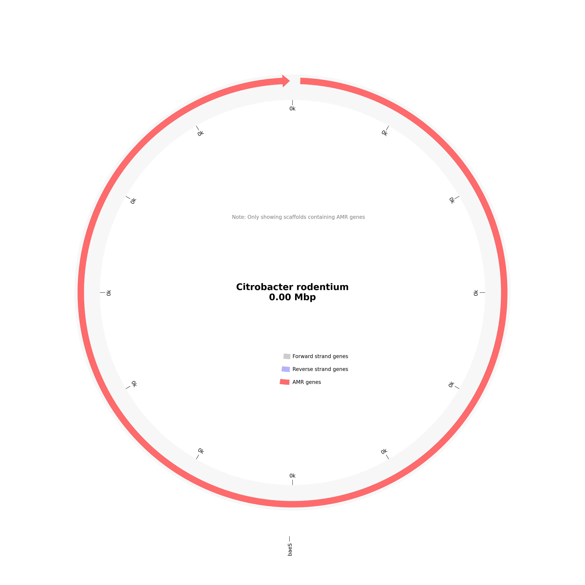

# AMR Analysis Report for LB03_RV_QG_A1_S25

# Organism Classifications:

## Aeromonas salmonicida
**Strain Statistics:**
- Total genome length: 956.4 kbp
- Total scaffolds: 3596
- Scaffolds with AMR genes: 401
- Total genes annotated: 2105
- Total AMR genes: 464
- Unique AMR genes: 199
- Distinct AMR mechanisms: 10
- Distinct AMR families: 62
- Distinct drug classes: 35

**Circos Plot:**

### AAC(6')-I-48
- **Mechanism**: antibiotic inactivation
- **Drug Classes**: aminoglycoside antibiotic
- **AMR Family**: AAC(6')
- **Locations**:
  - gnl|SPADES|KKIJKOIK_1730_2 : position 1332-1838

### AAC(6')-Isa
- **Mechanism**: antibiotic inactivation
- **Drug Classes**: aminoglycoside antibiotic
- **AMR Family**: AAC(6')
- **Locations**:
  - gnl|SPADES|KKIJKOIK_2271_2 : position 502-1056

### AAC(6')-Iy
- **Mechanism**: antibiotic inactivation
- **Drug Classes**: aminoglycoside antibiotic
- **AMR Family**: AAC(6')
- **Locations**:
  - gnl|SPADES|KKIJKOIK_24588_1 : position 3-290

### Acinetobacter baumannii AbaF
- **Mechanism**: antibiotic efflux
- **Drug Classes**: phosphonic acid antibiotic
- **AMR Family**: major facilitator superfamily (MFS) antibiotic efflux pump
- **Locations**:
  - gnl|SPADES|KKIJKOIK_778_10 : position 8918-10234

### Agrobacterium fabrum chloramphenicol acetyltransferase (found in 2 locations)
- **Mechanism**: antibiotic inactivation
- **Drug Classes**: phenicol antibiotic
- **AMR Family**: chloramphenicol acetyltransferase (CAT)
- **Locations**:
  - gnl|SPADES|KKIJKOIK_2090_3 : position 2598-3260
  - gnl|SPADES|KKIJKOIK_3370_2 : position 459-1007

### ArnT (found in 3 locations)
- **Mechanism**: antibiotic target alteration
- **Drug Classes**: peptide antibiotic
- **AMR Family**: pmr phosphoethanolamine transferase
- **Locations**:
  - gnl|SPADES|KKIJKOIK_1411_1 : position 1-279
  - gnl|SPADES|KKIJKOIK_4972_2 : position 660-1307
  - gnl|SPADES|KKIJKOIK_9660_1 : position 2-610

### Bifidobacterium bifidum ileS conferring resistance to mupirocin
- **Mechanism**: antibiotic target alteration
- **Drug Classes**: mupirocin-like antibiotic
- **AMR Family**: antibiotic-resistant isoleucyl-tRNA synthetase (ileS)
- **Locations**:
  - gnl|SPADES|KKIJKOIK_5405_1 : position 2-898

### CRP (found in 2 locations)
- **Mechanism**: antibiotic efflux
- **Drug Classes**: macrolide antibiotic; fluoroquinolone antibiotic; penam
- **AMR Family**: resistance-nodulation-cell division (RND) antibiotic efflux pump
- **Locations**:
  - gnl|SPADES|KKIJKOIK_1411_8 : position 3841-4479
  - gnl|SPADES|KKIJKOIK_5012_2 : position 463-1218

### Chlamydia trachomatis intrinsic murA conferring resistance to fosfomycin
- **Mechanism**: antibiotic target alteration
- **Drug Classes**: phosphonic acid antibiotic
- **AMR Family**: antibiotic-resistant murA transferase
- **Locations**:
  - gnl|SPADES|KKIJKOIK_10875_1 : position 2-181

### Clostridioides difficile cplR
- **Mechanism**: antibiotic target protection
- **Drug Classes**: lincosamide antibiotic; streptogramin antibiotic; streptogramin A antibiotic; nucleoside antibiotic
- **AMR Family**: Miscellaneous ABC-F subfamily ATP-binding cassette ribosomal protection proteins
- **Locations**:
  - gnl|SPADES|KKIJKOIK_43950_1 : position 3-176

### Clostridioides difficile gyrA conferring resistance to fluoroquinolones
- **Mechanism**: antibiotic target alteration
- **Drug Classes**: fluoroquinolone antibiotic
- **AMR Family**: fluoroquinolone resistant gyrA
- **Locations**:
  - gnl|SPADES|KKIJKOIK_3344_3 : position 1715-2200

### Clostridioides difficile gyrB conferring resistance to fluoroquinolones (found in 3 locations)
- **Mechanism**: antibiotic target alteration
- **Drug Classes**: fluoroquinolone antibiotic
- **AMR Family**: fluoroquinolone resistant gyrB
- **Locations**:
  - gnl|SPADES|KKIJKOIK_2651_4 : position 1672-2979
  - gnl|SPADES|KKIJKOIK_3687_1 : position 1-816
  - gnl|SPADES|KKIJKOIK_709_9 : position 5776-8190

### D-Ala-D-Ala ligase
- **Mechanism**: antibiotic target alteration
- **Drug Classes**: glycopeptide antibiotic
- **AMR Family**: Van ligase
- **Locations**:
  - gnl|SPADES|KKIJKOIK_3962_2 : position 805-1761

### Enterobacter cloacae acrA (found in 2 locations)
- **Mechanism**: antibiotic efflux
- **Drug Classes**: fluoroquinolone antibiotic; cephalosporin; glycylcycline; penam; tetracycline antibiotic; rifamycin antibiotic; phenicol antibiotic; disinfecting agents and antiseptics
- **AMR Family**: resistance-nodulation-cell division (RND) antibiotic efflux pump
- **Locations**:
  - gnl|SPADES|KKIJKOIK_12507_1 : position 2-481
  - gnl|SPADES|KKIJKOIK_1928_3 : position 1574-2755

### Enterococcus faecalis cls with mutation conferring resistance to daptomycin
- **Mechanism**: antibiotic target alteration
- **Drug Classes**: peptide antibiotic
- **AMR Family**: daptomycin resistant cls
- **Locations**:
  - gnl|SPADES|KKIJKOIK_2476_1 : position 2-910

### ErmE
- **Mechanism**: antibiotic target alteration
- **Drug Classes**: macrolide antibiotic; lincosamide antibiotic; streptogramin antibiotic; streptogramin A antibiotic; streptogramin B antibiotic
- **AMR Family**: Erm 23S ribosomal RNA methyltransferase
- **Locations**:
  - gnl|SPADES|KKIJKOIK_2634_2 : position 598-1425

### Escherichia coli AcrAB-TolC with AcrR mutation conferring resistance to ciprofloxacin, tetracycline, and ceftazidime (found in 2 locations)
- **Mechanism**: antibiotic target alteration; antibiotic efflux
- **Drug Classes**: fluoroquinolone antibiotic; cephalosporin; glycylcycline; penam; tetracycline antibiotic; rifamycin antibiotic; phenicol antibiotic; disinfecting agents and antiseptics
- **AMR Family**: resistance-nodulation-cell division (RND) antibiotic efflux pump
- **Locations**:
  - gnl|SPADES|KKIJKOIK_1928_2 : position 789-1475
  - gnl|SPADES|KKIJKOIK_2282_3 : position 2139-2741

### Escherichia coli EF-Tu mutants conferring resistance to Enacyloxin IIa
- **Mechanism**: antibiotic target alteration
- **Drug Classes**: elfamycin antibiotic
- **AMR Family**: elfamycin resistant EF-Tu
- **Locations**:
  - gnl|SPADES|KKIJKOIK_1520_6 : position 3921-5747

### Escherichia coli EF-Tu mutants conferring resistance to Pulvomycin (found in 2 locations)
- **Mechanism**: antibiotic target alteration
- **Drug Classes**: elfamycin antibiotic
- **AMR Family**: elfamycin resistant EF-Tu
- **Locations**:
  - gnl|SPADES|KKIJKOIK_14213_1 : position 1-432
  - gnl|SPADES|KKIJKOIK_5950_1 : position 2-1042

### Escherichia coli UhpT with mutation conferring resistance to fosfomycin
- **Mechanism**: antibiotic target alteration
- **Drug Classes**: phosphonic acid antibiotic
- **AMR Family**: antibiotic-resistant UhpT
- **Locations**:
  - gnl|SPADES|KKIJKOIK_3432_2 : position 835-2124

### Escherichia coli acrA
- **Mechanism**: antibiotic efflux
- **Drug Classes**: fluoroquinolone antibiotic; cephalosporin; glycylcycline; penam; tetracycline antibiotic; rifamycin antibiotic; phenicol antibiotic; disinfecting agents and antiseptics
- **AMR Family**: resistance-nodulation-cell division (RND) antibiotic efflux pump
- **Locations**:
  - gnl|SPADES|KKIJKOIK_3422_2 : position 1950-2129

### Escherichia coli cyaA with mutation conferring resistance to fosfomycin
- **Mechanism**: antibiotic target alteration
- **Drug Classes**: phosphonic acid antibiotic
- **AMR Family**: antibiotic-resistant cya adenylate cyclase
- **Locations**:
  - gnl|SPADES|KKIJKOIK_3980_1 : position 1-1719

### EstT
- **Mechanism**: antibiotic inactivation
- **Drug Classes**: macrolide antibiotic
- **AMR Family**: macrolide esterase
- **Locations**:
  - gnl|SPADES|KKIJKOIK_8495_1 : position 3-410

### H-NS (found in 3 locations)
- **Mechanism**: antibiotic efflux
- **Drug Classes**: macrolide antibiotic; fluoroquinolone antibiotic; cephalosporin; cephamycin; penam; tetracycline antibiotic
- **AMR Family**: major facilitator superfamily (MFS) antibiotic efflux pump; resistance-nodulation-cell division (RND) antibiotic efflux pump
- **Locations**:
  - gnl|SPADES|KKIJKOIK_1142_10 : position 7454-7864
  - gnl|SPADES|KKIJKOIK_3694_2 : position 1806-1937
  - gnl|SPADES|KKIJKOIK_3946_1 : position 2-283

### Helicobacter pylori pbp1 mutants conferring resistance to amoxicillin (found in 3 locations)
- **Mechanism**: antibiotic target alteration
- **Drug Classes**: cephalosporin; cephamycin; penam
- **AMR Family**: Penicillin-binding protein mutations conferring resistance to beta-lactam antibiotics
- **Locations**:
  - gnl|SPADES|KKIJKOIK_2980_5 : position 1679-2557
  - gnl|SPADES|KKIJKOIK_5427_1 : position 1-1164
  - gnl|SPADES|KKIJKOIK_8512_1 : position 3-692

### Helicobacter pylori rpoB mutation conferring resistance to rifampicin
- **Mechanism**: antibiotic target alteration; antibiotic target replacement
- **Drug Classes**: fluoroquinolone antibiotic; rifamycin antibiotic
- **AMR Family**: rifamycin-resistant beta-subunit of RNA polymerase (rpoB)
- **Locations**:
  - gnl|SPADES|KKIJKOIK_4092_1 : position 3-1676

### Klebsiella pneumoniae KpnE
- **Mechanism**: antibiotic efflux
- **Drug Classes**: macrolide antibiotic; aminoglycoside antibiotic; cephalosporin; tetracycline antibiotic; peptide antibiotic; rifamycin antibiotic; disinfecting agents and antiseptics
- **AMR Family**: small multidrug resistance (SMR) antibiotic efflux pump
- **Locations**:
  - gnl|SPADES|KKIJKOIK_2980_2 : position 430-834

### Klebsiella pneumoniae KpnF
- **Mechanism**: antibiotic efflux
- **Drug Classes**: macrolide antibiotic; aminoglycoside antibiotic; cephalosporin; tetracycline antibiotic; peptide antibiotic; rifamycin antibiotic; disinfecting agents and antiseptics
- **AMR Family**: small multidrug resistance (SMR) antibiotic efflux pump
- **Locations**:
  - gnl|SPADES|KKIJKOIK_2980_3 : position 831-1151

### Klebsiella pneumoniae KpnH
- **Mechanism**: antibiotic efflux
- **Drug Classes**: macrolide antibiotic; fluoroquinolone antibiotic; aminoglycoside antibiotic; carbapenem; cephalosporin; penam; peptide antibiotic; penem
- **AMR Family**: major facilitator superfamily (MFS) antibiotic efflux pump
- **Locations**:
  - gnl|SPADES|KKIJKOIK_2326_1 : position 2-1240

### Klebsiella pneumoniae OmpK37 (found in 2 locations)
- **Mechanism**: reduced permeability to antibiotic
- **Drug Classes**: monobactam; carbapenem; cephalosporin; cephamycin; penam; penem
- **AMR Family**: General Bacterial Porin with reduced permeability to beta-lactams
- **Locations**:
  - gnl|SPADES|KKIJKOIK_2437_3 : position 2012-3097
  - gnl|SPADES|KKIJKOIK_5579_1 : position 2-667

### LlmA 23S ribosomal RNA methyltransferase
- **Mechanism**: antibiotic target alteration
- **Drug Classes**: lincosamide antibiotic
- **AMR Family**: Llm 23S ribosomal RNA methyltransferase
- **Locations**:
  - gnl|SPADES|KKIJKOIK_7483_1 : position 1-792

### LpeB
- **Mechanism**: antibiotic efflux
- **Drug Classes**: macrolide antibiotic
- **AMR Family**: resistance-nodulation-cell division (RND) antibiotic efflux pump
- **Locations**:
  - gnl|SPADES|KKIJKOIK_2596_2 : position 343-3060

### LpsA (found in 2 locations)
- **Mechanism**: reduced permeability to antibiotic
- **Drug Classes**: peptide antibiotic
- **AMR Family**: Intrinsic peptide antibiotic resistant Lps
- **Locations**:
  - gnl|SPADES|KKIJKOIK_21428_1 : position 1-255
  - gnl|SPADES|KKIJKOIK_2601_2 : position 728-1459

### LptD (found in 2 locations)
- **Mechanism**: antibiotic efflux
- **Drug Classes**: carbapenem; peptide antibiotic; aminocoumarin antibiotic; rifamycin antibiotic
- **AMR Family**: ATP-binding cassette (ABC) antibiotic efflux pump
- **Locations**:
  - gnl|SPADES|KKIJKOIK_1249_1 : position 2-1363
  - gnl|SPADES|KKIJKOIK_2780_1 : position 3-1247

### MCR-10.2
- **Mechanism**: antibiotic target alteration
- **Drug Classes**: peptide antibiotic
- **AMR Family**: MCR phosphoethanolamine transferase
- **Locations**:
  - gnl|SPADES|KKIJKOIK_2681_2 : position 1932-2939

### MCR-7.1
- **Mechanism**: antibiotic target alteration
- **Drug Classes**: peptide antibiotic
- **AMR Family**: MCR phosphoethanolamine transferase
- **Locations**:
  - gnl|SPADES|KKIJKOIK_3424_1 : position 147-1814

### MdtK
- **Mechanism**: antibiotic efflux
- **Drug Classes**: fluoroquinolone antibiotic
- **AMR Family**: multidrug and toxic compound extrusion (MATE) transporter
- **Locations**:
  - gnl|SPADES|KKIJKOIK_1176_7 : position 5076-6422

### MexH
- **Mechanism**: antibiotic efflux
- **Drug Classes**: fluoroquinolone antibiotic; tetracycline antibiotic; disinfecting agents and antiseptics
- **AMR Family**: resistance-nodulation-cell division (RND) antibiotic efflux pump
- **Locations**:
  - gnl|SPADES|KKIJKOIK_9147_1 : position 2-643

### MexI (found in 2 locations)
- **Mechanism**: antibiotic efflux
- **Drug Classes**: fluoroquinolone antibiotic; tetracycline antibiotic; disinfecting agents and antiseptics
- **AMR Family**: resistance-nodulation-cell division (RND) antibiotic efflux pump
- **Locations**:
  - gnl|SPADES|KKIJKOIK_13243_1 : position 105-458
  - gnl|SPADES|KKIJKOIK_9035_1 : position 3-266

### MexL (found in 2 locations)
- **Mechanism**: antibiotic efflux
- **Drug Classes**: macrolide antibiotic; tetracycline antibiotic; disinfecting agents and antiseptics
- **AMR Family**: resistance-nodulation-cell division (RND) antibiotic efflux pump
- **Locations**:
  - gnl|SPADES|KKIJKOIK_1244_6 : position 5730-6284
  - gnl|SPADES|KKIJKOIK_4875_1 : position 2-619

### MexS (found in 3 locations)
- **Mechanism**: antibiotic efflux
- **Drug Classes**: fluoroquinolone antibiotic; diaminopyrimidine antibiotic; phenicol antibiotic
- **AMR Family**: resistance-nodulation-cell division (RND) antibiotic efflux pump
- **Locations**:
  - gnl|SPADES|KKIJKOIK_2043_2 : position 995-2122
  - gnl|SPADES|KKIJKOIK_3204_3 : position 1341-2321
  - gnl|SPADES|KKIJKOIK_5833_2 : position 184-1062

### MexT (found in 3 locations)
- **Mechanism**: antibiotic efflux
- **Drug Classes**: fluoroquinolone antibiotic; diaminopyrimidine antibiotic; phenicol antibiotic
- **AMR Family**: resistance-nodulation-cell division (RND) antibiotic efflux pump
- **Locations**:
  - gnl|SPADES|KKIJKOIK_2457_2 : position 935-1846
  - gnl|SPADES|KKIJKOIK_2542_1 : position 232-1173
  - gnl|SPADES|KKIJKOIK_2749_2 : position 1563-2483

### MexV
- **Mechanism**: antibiotic efflux
- **Drug Classes**: macrolide antibiotic; fluoroquinolone antibiotic; tetracycline antibiotic; phenicol antibiotic; disinfecting agents and antiseptics
- **AMR Family**: resistance-nodulation-cell division (RND) antibiotic efflux pump
- **Locations**:
  - gnl|SPADES|KKIJKOIK_2810_2 : position 339-1445

### MexW (found in 4 locations)
- **Mechanism**: antibiotic efflux
- **Drug Classes**: macrolide antibiotic; fluoroquinolone antibiotic; tetracycline antibiotic; phenicol antibiotic; disinfecting agents and antiseptics
- **AMR Family**: resistance-nodulation-cell division (RND) antibiotic efflux pump
- **Locations**:
  - gnl|SPADES|KKIJKOIK_10396_1 : position 1-570
  - gnl|SPADES|KKIJKOIK_1409_1 : position 2-2920
  - gnl|SPADES|KKIJKOIK_2810_1 : position 3-323
  - gnl|SPADES|KKIJKOIK_3531_1 : position 2-2050

### MexZ
- **Mechanism**: antibiotic efflux
- **Drug Classes**: macrolide antibiotic; fluoroquinolone antibiotic; aminoglycoside antibiotic; carbapenem; cephalosporin; cephamycin; penam; tetracycline antibiotic; phenicol antibiotic; disinfecting agents and antiseptics
- **AMR Family**: resistance-nodulation-cell division (RND) antibiotic efflux pump
- **Locations**:
  - gnl|SPADES|KKIJKOIK_3834_2 : position 1127-1780

### MuxA
- **Mechanism**: antibiotic efflux
- **Drug Classes**: macrolide antibiotic; monobactam; tetracycline antibiotic; aminocoumarin antibiotic
- **AMR Family**: resistance-nodulation-cell division (RND) antibiotic efflux pump
- **Locations**:
  - gnl|SPADES|KKIJKOIK_1409_2 : position 2920-3969

### MuxB (found in 2 locations)
- **Mechanism**: antibiotic efflux
- **Drug Classes**: macrolide antibiotic; monobactam; tetracycline antibiotic; aminocoumarin antibiotic
- **AMR Family**: resistance-nodulation-cell division (RND) antibiotic efflux pump
- **Locations**:
  - gnl|SPADES|KKIJKOIK_12999_1 : position 2-337
  - gnl|SPADES|KKIJKOIK_1791_1 : position 2-943

### Mycobacterium tuberculosis katG mutations conferring resistance to isoniazid
- **Mechanism**: antibiotic target alteration
- **Drug Classes**: isoniazid-like antibiotic
- **AMR Family**: isoniazid resistant katG
- **Locations**:
  - gnl|SPADES|KKIJKOIK_2194_3 : position 1508-3643

### Mycobacterium tuberculosis ndh with mutation conferring resistance to isoniazid
- **Mechanism**: antibiotic target alteration
- **Drug Classes**: isoniazid-like antibiotic
- **AMR Family**: antibiotic resistant ndh
- **Locations**:
  - gnl|SPADES|KKIJKOIK_1832_2 : position 1017-2309

### Mycobacterium tuberculosis pncA mutations conferring resistance to pyrazinamide
- **Mechanism**: antibiotic target alteration
- **Drug Classes**: pyrazine antibiotic
- **AMR Family**: Pyrazinamide resistant pncA
- **Locations**:
  - gnl|SPADES|KKIJKOIK_1295_2 : position 716-1351

### Mycobacterium tuberculosis rpoB mutations conferring resistance to rifampicin
- **Mechanism**: antibiotic target alteration; antibiotic target replacement
- **Drug Classes**: rifamycin antibiotic
- **AMR Family**: rifamycin-resistant beta-subunit of RNA polymerase (rpoB)
- **Locations**:
  - gnl|SPADES|KKIJKOIK_1208_7 : position 3709-7461

### Neisseria gonorrhoeae pilQ gene conferring resistance to beta-lactam (found in 2 locations)
- **Mechanism**: antibiotic target alteration
- **Drug Classes**: cephalosporin; cephamycin; penam
- **AMR Family**: Penicillin-binding protein mutations conferring resistance to beta-lactam antibiotics
- **Locations**:
  - gnl|SPADES|KKIJKOIK_19019_1 : position 2-349
  - gnl|SPADES|KKIJKOIK_3197_2 : position 1333-2328

### NmcR (found in 13 locations)
- **Mechanism**: antibiotic inactivation
- **Drug Classes**: carbapenem; cephalosporin; cephamycin; penam
- **AMR Family**: NmcA beta-lactamase
- **Locations**:
  - gnl|SPADES|KKIJKOIK_11702_1 : position 46-510
  - gnl|SPADES|KKIJKOIK_1417_5 : position 3916-4878
  - gnl|SPADES|KKIJKOIK_1441_7 : position 2490-3332
  - gnl|SPADES|KKIJKOIK_1696_4 : position 3461-4369
  - gnl|SPADES|KKIJKOIK_2872_1 : position 2-256
  - gnl|SPADES|KKIJKOIK_29290_1 : position 46-270
  - gnl|SPADES|KKIJKOIK_3118_2 : position 1649-2407
  - gnl|SPADES|KKIJKOIK_3225_2 : position 900-1808
  - gnl|SPADES|KKIJKOIK_3590_3 : position 1643-2008
  - gnl|SPADES|KKIJKOIK_5033_2 : position 440-1288
  - gnl|SPADES|KKIJKOIK_6095_1 : position 1-783
  - gnl|SPADES|KKIJKOIK_617_13 : position 10954-11862
  - gnl|SPADES|KKIJKOIK_6191_1 : position 3-761

### OmpA (found in 10 locations)
- **Mechanism**: reduced permeability to antibiotic
- **Drug Classes**: peptide antibiotic
- **AMR Family**: General Bacterial Porin with reduced permeability to peptide antibiotics
- **Locations**:
  - gnl|SPADES|KKIJKOIK_1244_8 : position 6870-7247
  - gnl|SPADES|KKIJKOIK_16057_1 : position 249-395
  - gnl|SPADES|KKIJKOIK_1691_9 : position 3633-4550
  - gnl|SPADES|KKIJKOIK_2064_5 : position 3473-4072
  - gnl|SPADES|KKIJKOIK_2304_3 : position 1754-2278
  - gnl|SPADES|KKIJKOIK_2454_1 : position 1-984
  - gnl|SPADES|KKIJKOIK_2718_2 : position 1053-2072
  - gnl|SPADES|KKIJKOIK_3318_1 : position 89-745
  - gnl|SPADES|KKIJKOIK_3358_1 : position 3-947
  - gnl|SPADES|KKIJKOIK_6716_1 : position 1-432

### OpmH
- **Mechanism**: antibiotic efflux
- **Drug Classes**: disinfecting agents and antiseptics
- **AMR Family**: resistance-nodulation-cell division (RND) antibiotic efflux pump
- **Locations**:
  - gnl|SPADES|KKIJKOIK_1497_2 : position 1402-2727

### OprZ
- **Mechanism**: antibiotic efflux
- **Drug Classes**: macrolide antibiotic; fluoroquinolone antibiotic; aminoglycoside antibiotic; cephalosporin
- **AMR Family**: resistance-nodulation-cell division (RND) antibiotic efflux pump
- **Locations**:
  - gnl|SPADES|KKIJKOIK_2649_2 : position 1235-2602

### PAM-1
- **Mechanism**: antibiotic inactivation
- **Drug Classes**: carbapenem; cephalosporin
- **AMR Family**: PAM beta-lactamase
- **Locations**:
  - gnl|SPADES|KKIJKOIK_4304_2 : position 418-1062

### ParR (found in 2 locations)
- **Mechanism**: antibiotic efflux; reduced permeability to antibiotic
- **Drug Classes**: macrolide antibiotic; fluoroquinolone antibiotic; monobactam; aminoglycoside antibiotic; carbapenem; cephalosporin; cephamycin; penam; tetracycline antibiotic; phenicol antibiotic; penem; disinfecting agents and antiseptics
- **AMR Family**: resistance-nodulation-cell division (RND) antibiotic efflux pump; Outer Membrane Porin (Opr)
- **Locations**:
  - gnl|SPADES|KKIJKOIK_1416_3 : position 2555-3262
  - gnl|SPADES|KKIJKOIK_4306_2 : position 833-1552

### ParS
- **Mechanism**: antibiotic efflux; reduced permeability to antibiotic
- **Drug Classes**: macrolide antibiotic; fluoroquinolone antibiotic; monobactam; aminoglycoside antibiotic; carbapenem; cephalosporin; cephamycin; penam; tetracycline antibiotic; phenicol antibiotic; penem; disinfecting agents and antiseptics
- **AMR Family**: resistance-nodulation-cell division (RND) antibiotic efflux pump; Outer Membrane Porin (Opr)
- **Locations**:
  - gnl|SPADES|KKIJKOIK_1416_4 : position 3349-4674

### Planobispora rosea EF-Tu mutants conferring resistance to inhibitor GE2270A
- **Mechanism**: antibiotic target alteration
- **Drug Classes**: elfamycin antibiotic
- **AMR Family**: elfamycin resistant EF-Tu
- **Locations**:
  - gnl|SPADES|KKIJKOIK_27155_1 : position 2-277

### PmpM
- **Mechanism**: antibiotic efflux
- **Drug Classes**: fluoroquinolone antibiotic; aminoglycoside antibiotic; disinfecting agents and antiseptics
- **AMR Family**: multidrug and toxic compound extrusion (MATE) transporter
- **Locations**:
  - gnl|SPADES|KKIJKOIK_2511_2 : position 783-2162

### PmrF (found in 3 locations)
- **Mechanism**: antibiotic target alteration
- **Drug Classes**: peptide antibiotic
- **AMR Family**: pmr phosphoethanolamine transferase
- **Locations**:
  - gnl|SPADES|KKIJKOIK_10453_1 : position 2-517
  - gnl|SPADES|KKIJKOIK_3442_2 : position 304-1281
  - gnl|SPADES|KKIJKOIK_9778_2 : position 252-602

### Pseudomonas aeruginosa CpxR (found in 3 locations)
- **Mechanism**: antibiotic efflux
- **Drug Classes**: macrolide antibiotic; fluoroquinolone antibiotic; monobactam; aminoglycoside antibiotic; carbapenem; cephalosporin; cephamycin; penam; tetracycline antibiotic; peptide antibiotic; aminocoumarin antibiotic; diaminopyrimidine antibiotic; sulfonamide antibiotic; phenicol antibiotic; penem
- **AMR Family**: resistance-nodulation-cell division (RND) antibiotic efflux pump
- **Locations**:
  - gnl|SPADES|KKIJKOIK_1976_2 : position 565-1260
  - gnl|SPADES|KKIJKOIK_2297_3 : position 2122-2802
  - gnl|SPADES|KKIJKOIK_3336_2 : position 164-886

### Pseudomonas aeruginosa ampR with mutation conferring resistance to aztreonam (found in 2 locations)
- **Mechanism**: antibiotic target alteration; antibiotic inactivation
- **Drug Classes**: monobactam; carbapenem; cephalosporin
- **AMR Family**: PDC beta-lactamase; ampR transcriptional regulator with mutation conferring resistance to monobactam antibiotics
- **Locations**:
  - gnl|SPADES|KKIJKOIK_3157_2 : position 713-1633
  - gnl|SPADES|KKIJKOIK_3292_1 : position 2-673

### QepA2
- **Mechanism**: antibiotic efflux
- **Drug Classes**: fluoroquinolone antibiotic
- **AMR Family**: major facilitator superfamily (MFS) antibiotic efflux pump
- **Locations**:
  - gnl|SPADES|KKIJKOIK_2332_2 : position 836-2233

### QepA4
- **Mechanism**: antibiotic efflux
- **Drug Classes**: fluoroquinolone antibiotic
- **AMR Family**: major facilitator superfamily (MFS) antibiotic efflux pump
- **Locations**:
  - gnl|SPADES|KKIJKOIK_9154_1 : position 3-644

### QnrAS
- **Mechanism**: antibiotic target protection
- **Drug Classes**: fluoroquinolone antibiotic
- **AMR Family**: quinolone resistance protein (qnr)
- **Locations**:
  - gnl|SPADES|KKIJKOIK_3740_2 : position 264-914

### RanA (found in 13 locations)
- **Mechanism**: antibiotic efflux
- **Drug Classes**: aminoglycoside antibiotic
- **AMR Family**: ATP-binding cassette (ABC) antibiotic efflux pump
- **Locations**:
  - gnl|SPADES|KKIJKOIK_1082_10 : position 5955-6755
  - gnl|SPADES|KKIJKOIK_13049_1 : position 3-464
  - gnl|SPADES|KKIJKOIK_2068_3 : position 1829-2824
  - gnl|SPADES|KKIJKOIK_2273_5 : position 3377-3655
  - gnl|SPADES|KKIJKOIK_2529_4 : position 2207-3157
  - gnl|SPADES|KKIJKOIK_3203_2 : position 835-1869
  - gnl|SPADES|KKIJKOIK_3253_2 : position 1329-2090
  - gnl|SPADES|KKIJKOIK_3292_2 : position 859-1926
  - gnl|SPADES|KKIJKOIK_3334_1 : position 3-959
  - gnl|SPADES|KKIJKOIK_3616_3 : position 1137-1985
  - gnl|SPADES|KKIJKOIK_3812_2 : position 650-1642
  - gnl|SPADES|KKIJKOIK_5540_2 : position 426-1130
  - gnl|SPADES|KKIJKOIK_919_4 : position 4397-5179

### RanB
- **Mechanism**: antibiotic efflux
- **Drug Classes**: aminoglycoside antibiotic
- **AMR Family**: ATP-binding cassette (ABC) antibiotic efflux pump
- **Locations**:
  - gnl|SPADES|KKIJKOIK_1082_11 : position 6755-7534

### Rv1877
- **Mechanism**: antibiotic efflux
- **Drug Classes**: fluoroquinolone antibiotic
- **AMR Family**: major facilitator superfamily (MFS) antibiotic efflux pump
- **Locations**:
  - gnl|SPADES|KKIJKOIK_29873_1 : position 2-268

### SatA
- **Mechanism**: antibiotic inactivation
- **Drug Classes**: nucleoside antibiotic
- **AMR Family**: streptothricin acetyltransferase (SAT)
- **Locations**:
  - gnl|SPADES|KKIJKOIK_12981_1 : position 22-465

### Staphylococcus aureus LmrS
- **Mechanism**: antibiotic efflux
- **Drug Classes**: macrolide antibiotic; aminoglycoside antibiotic; oxazolidinone antibiotic; diaminopyrimidine antibiotic; phenicol antibiotic
- **AMR Family**: major facilitator superfamily (MFS) antibiotic efflux pump
- **Locations**:
  - gnl|SPADES|KKIJKOIK_3581_1 : position 2-409

### Staphylococcus aureus fusE with mutation conferring resistance to fusidic acid
- **Mechanism**: antibiotic target alteration
- **Drug Classes**: fusidane antibiotic
- **AMR Family**: antibiotic resistant fusE
- **Locations**:
  - gnl|SPADES|KKIJKOIK_1088_4 : position 1089-1622

### Staphylococcus aureus mupA conferring resistance to mupirocin
- **Mechanism**: antibiotic target alteration
- **Drug Classes**: mupirocin-like antibiotic
- **AMR Family**: antibiotic-resistant isoleucyl-tRNA synthetase (ileS)
- **Locations**:
  - gnl|SPADES|KKIJKOIK_6003_1 : position 2-1033

### Staphylococcus aureus mupB conferring resistance to mupirocin
- **Mechanism**: antibiotic target alteration
- **Drug Classes**: mupirocin-like antibiotic
- **AMR Family**: antibiotic-resistant isoleucyl-tRNA synthetase (ileS)
- **Locations**:
  - gnl|SPADES|KKIJKOIK_1994_3 : position 1974-4337

### Staphylococcus aureus murA with mutation conferring resistance to fosfomycin
- **Mechanism**: antibiotic target alteration
- **Drug Classes**: phosphonic acid antibiotic
- **AMR Family**: antibiotic-resistant murA transferase
- **Locations**:
  - gnl|SPADES|KKIJKOIK_3674_4 : position 969-1955

### Streptomyces rimosus otr(A)
- **Mechanism**: antibiotic target protection
- **Drug Classes**: tetracycline antibiotic
- **AMR Family**: tetracycline-resistant ribosomal protection protein
- **Locations**:
  - gnl|SPADES|KKIJKOIK_2031_1 : position 2-187

### Streptomyces venezuelae rox (found in 2 locations)
- **Mechanism**: antibiotic inactivation
- **Drug Classes**: rifamycin antibiotic
- **AMR Family**: rifampin monooxygenase
- **Locations**:
  - gnl|SPADES|KKIJKOIK_1417_2 : position 773-1936
  - gnl|SPADES|KKIJKOIK_1537_5 : position 4099-5322

### TRU-1
- **Mechanism**: antibiotic inactivation
- **Drug Classes**: cephalosporin; penam
- **AMR Family**: TRU beta-lactamase
- **Locations**:
  - gnl|SPADES|KKIJKOIK_2019_4: position 2905-4053

### TaeA (found in 4 locations)
- **Mechanism**: antibiotic efflux
- **Drug Classes**: pleuromutilin antibiotic
- **AMR Family**: ATP-binding cassette (ABC) antibiotic efflux pump
- **Locations**:
  - gnl|SPADES|KKIJKOIK_1249_7 : position 6182-7216
  - gnl|SPADES|KKIJKOIK_2444_1 : position 3-1160
  - gnl|SPADES|KKIJKOIK_3452_1 : position 1-741
  - gnl|SPADES|KKIJKOIK_4091_2 : position 938-1678

### TolC (found in 2 locations)
- **Mechanism**: antibiotic efflux
- **Drug Classes**: macrolide antibiotic; fluoroquinolone antibiotic; aminoglycoside antibiotic; carbapenem; cephalosporin; glycylcycline; cephamycin; penam; tetracycline antibiotic; peptide antibiotic; aminocoumarin antibiotic; rifamycin antibiotic; phenicol antibiotic; penem; disinfecting agents and antiseptics
- **AMR Family**: ATP-binding cassette (ABC) antibiotic efflux pump; major facilitator superfamily (MFS) antibiotic efflux pump; resistance-nodulation-cell division (RND) antibiotic efflux pump
- **Locations**:
  - gnl|SPADES|KKIJKOIK_20366_1 : position 112-336
  - gnl|SPADES|KKIJKOIK_4510_1 : position 2-1303

### TriB
- **Mechanism**: antibiotic efflux
- **Drug Classes**: disinfecting agents and antiseptics
- **AMR Family**: resistance-nodulation-cell division (RND) antibiotic efflux pump
- **Locations**:
  - gnl|SPADES|KKIJKOIK_5993_1 : position 101-829

### TriC
- **Mechanism**: antibiotic efflux
- **Drug Classes**: disinfecting agents and antiseptics
- **AMR Family**: resistance-nodulation-cell division (RND) antibiotic efflux pump
- **Locations**:
  - gnl|SPADES|KKIJKOIK_5916_1 : position 3-1046

### TxR (found in 15 locations)
- **Mechanism**: antibiotic efflux
- **Drug Classes**: tetracycline antibiotic
- **AMR Family**: ATP-binding cassette (ABC) antibiotic efflux pump
- **Locations**:
  - gnl|SPADES|KKIJKOIK_10949_1 : position 1-543
  - gnl|SPADES|KKIJKOIK_1530_5 : position 1784-2818
  - gnl|SPADES|KKIJKOIK_21012_1 : position 27-326
  - gnl|SPADES|KKIJKOIK_21142_1 : position 1-327
  - gnl|SPADES|KKIJKOIK_2771_3 : position 1419-2819
  - gnl|SPADES|KKIJKOIK_3265_3 : position 1038-2270
  - gnl|SPADES|KKIJKOIK_3782_1 : position 2-853
  - gnl|SPADES|KKIJKOIK_38981_1 : position 1-240
  - gnl|SPADES|KKIJKOIK_3983_1 : position 425-1747
  - gnl|SPADES|KKIJKOIK_41689_1 : position 1-231
  - gnl|SPADES|KKIJKOIK_42344_1 : position 3-230
  - gnl|SPADES|KKIJKOIK_4615_1 : position 1-588
  - gnl|SPADES|KKIJKOIK_4654_1 : position 2-295
  - gnl|SPADES|KKIJKOIK_6858_1 : position 3-890
  - gnl|SPADES|KKIJKOIK_9311_1 : position 1-633

### YajC
- **Mechanism**: antibiotic efflux
- **Drug Classes**: fluoroquinolone antibiotic; cephalosporin; glycylcycline; penam; tetracycline antibiotic; oxazolidinone antibiotic; glycopeptide antibiotic; rifamycin antibiotic; phenicol antibiotic; disinfecting agents and antiseptics
- **AMR Family**: resistance-nodulation-cell division (RND) antibiotic efflux pump
- **Locations**:
  - gnl|SPADES|KKIJKOIK_2698_2 : position 1847-2182

### acrB (found in 2 locations)
- **Mechanism**: antibiotic efflux
- **Drug Classes**: fluoroquinolone antibiotic; cephalosporin; glycylcycline; penam; tetracycline antibiotic; rifamycin antibiotic; phenicol antibiotic; disinfecting agents and antiseptics
- **AMR Family**: resistance-nodulation-cell division (RND) antibiotic efflux pump
- **Locations**:
  - gnl|SPADES|KKIJKOIK_1928_4 : position 2773-4491
  - gnl|SPADES|KKIJKOIK_4709_1 : position 3-1397

### adeB
- **Mechanism**: antibiotic efflux
- **Drug Classes**: glycylcycline; tetracycline antibiotic
- **AMR Family**: resistance-nodulation-cell division (RND) antibiotic efflux pump
- **Locations**:
  - gnl|SPADES|KKIJKOIK_18720_1 : position 2-355

### adeL (found in 23 locations)
- **Mechanism**: antibiotic efflux
- **Drug Classes**: fluoroquinolone antibiotic; tetracycline antibiotic
- **AMR Family**: resistance-nodulation-cell division (RND) antibiotic efflux pump
- **Locations**:
  - gnl|SPADES|KKIJKOIK_1146_3 : position 3201-4109
  - gnl|SPADES|KKIJKOIK_14235_1 : position 2-433
  - gnl|SPADES|KKIJKOIK_1492_3 : position 2642-3553
  - gnl|SPADES|KKIJKOIK_1930_5 : position 2748-3629
  - gnl|SPADES|KKIJKOIK_1983_3 : position 1188-2090
  - gnl|SPADES|KKIJKOIK_2043_3 : position 2243-3148
  - gnl|SPADES|KKIJKOIK_2247_3 : position 1802-2677
  - gnl|SPADES|KKIJKOIK_23891_1 : position 1-297
  - gnl|SPADES|KKIJKOIK_2395_2 : position 300-1172
  - gnl|SPADES|KKIJKOIK_26421_1 : position 3-281
  - gnl|SPADES|KKIJKOIK_2955_1 : position 1-798
  - gnl|SPADES|KKIJKOIK_3079_3 : position 1428-2366
  - gnl|SPADES|KKIJKOIK_3255_3 : position 1130-2038
  - gnl|SPADES|KKIJKOIK_4093_1 : position 3-737
  - gnl|SPADES|KKIJKOIK_4407_1 : position 3-941
  - gnl|SPADES|KKIJKOIK_4520_1 : position 3-620
  - gnl|SPADES|KKIJKOIK_4845_1 : position 171-935
  - gnl|SPADES|KKIJKOIK_4945_1 : position 3-605
  - gnl|SPADES|KKIJKOIK_51055_1 : position 2-187
  - gnl|SPADES|KKIJKOIK_6350_2 : position 647-967
  - gnl|SPADES|KKIJKOIK_7840_1 : position 1-345
  - gnl|SPADES|KKIJKOIK_8158_1 : position 2-679
  - gnl|SPADES|KKIJKOIK_960_7 : position 5523-6458

### adeR
- **Mechanism**: antibiotic efflux
- **Drug Classes**: glycylcycline; tetracycline antibiotic
- **AMR Family**: resistance-nodulation-cell division (RND) antibiotic efflux pump
- **Locations**:
  - gnl|SPADES|KKIJKOIK_4470_1 : position 147-1160

### almE (found in 5 locations)
- **Mechanism**: antibiotic target alteration
- **Drug Classes**: peptide antibiotic
- **AMR Family**: polymyxin resistance operon; alm glycyltransferase
- **Locations**:
  - gnl|SPADES|KKIJKOIK_14590_1 : position 1-423
  - gnl|SPADES|KKIJKOIK_3678_2 : position 678-1952
  - gnl|SPADES|KKIJKOIK_3929_2 : position 670-1779
  - gnl|SPADES|KKIJKOIK_4139_2 : position 354-1652
  - gnl|SPADES|KKIJKOIK_6080_1 : position 1-1017

### arlR (found in 2 locations)
- **Mechanism**: antibiotic efflux
- **Drug Classes**: fluoroquinolone antibiotic; disinfecting agents and antiseptics
- **AMR Family**: major facilitator superfamily (MFS) antibiotic efflux pump
- **Locations**:
  - gnl|SPADES|KKIJKOIK_1965_3 : position 3628-4317
  - gnl|SPADES|KKIJKOIK_2066_2 : position 828-1517

### arlS (found in 2 locations)
- **Mechanism**: antibiotic efflux
- **Drug Classes**: fluoroquinolone antibiotic; disinfecting agents and antiseptics
- **AMR Family**: major facilitator superfamily (MFS) antibiotic efflux pump
- **Locations**:
  - gnl|SPADES|KKIJKOIK_2066_1 : position 1-819
  - gnl|SPADES|KKIJKOIK_5755_1 : position 1-219

### arnA (found in 5 locations)
- **Mechanism**: antibiotic target alteration
- **Drug Classes**: peptide antibiotic
- **AMR Family**: pmr phosphoethanolamine transferase
- **Locations**:
  - gnl|SPADES|KKIJKOIK_33599_1 : position 3-257
  - gnl|SPADES|KKIJKOIK_3442_1 : position 2-307
  - gnl|SPADES|KKIJKOIK_5370_2 : position 332-1177
  - gnl|SPADES|KKIJKOIK_6138_1 : position 125-799
  - gnl|SPADES|KKIJKOIK_8247_1 : position 1-717

### baeS (found in 2 locations)
- **Mechanism**: antibiotic efflux
- **Drug Classes**: aminoglycoside antibiotic; aminocoumarin antibiotic
- **AMR Family**: resistance-nodulation-cell division (RND) antibiotic efflux pump
- **Locations**:
  - gnl|SPADES|KKIJKOIK_1283_5 : position 4531-6420
  - gnl|SPADES|KKIJKOIK_14157_1 : position 2-433

### basS (found in 3 locations)
- **Mechanism**: antibiotic target alteration; antibiotic efflux
- **Drug Classes**: peptide antibiotic
- **AMR Family**: pmr phosphoethanolamine transferase
- **Locations**:
  - gnl|SPADES|KKIJKOIK_1149_16 : position 7330-7857
  - gnl|SPADES|KKIJKOIK_13794_1 : position 2-442
  - gnl|SPADES|KKIJKOIK_1571_6 : position 2297-3646

### bcr-1 (found in 4 locations)
- **Mechanism**: antibiotic efflux
- **Drug Classes**: bicyclomycin-like antibiotic
- **AMR Family**: major facilitator superfamily (MFS) antibiotic efflux pump
- **Locations**:
  - gnl|SPADES|KKIJKOIK_1243_5 : position 5321-6523
  - gnl|SPADES|KKIJKOIK_1696_3 : position 2207-3406
  - gnl|SPADES|KKIJKOIK_3085_3 : position 942-2105
  - gnl|SPADES|KKIJKOIK_8935_2 : position 433-660

### bcrA (found in 3 locations)
- **Mechanism**: antibiotic efflux
- **Drug Classes**: peptide antibiotic
- **AMR Family**: ATP-binding cassette (ABC) antibiotic efflux pump
- **Locations**:
  - gnl|SPADES|KKIJKOIK_1691_2 : position 202-837
  - gnl|SPADES|KKIJKOIK_3244_3 : position 1501-2292
  - gnl|SPADES|KKIJKOIK_7656_1 : position 1-741

### carA
- **Mechanism**: antibiotic target protection
- **Drug Classes**: macrolide antibiotic
- **AMR Family**: Miscellaneous ABC-F subfamily ATP-binding cassette ribosomal protection proteins
- **Locations**:
  - gnl|SPADES|KKIJKOIK_3062_1 : position 2-1033

### cdeA (found in 3 locations)
- **Mechanism**: antibiotic efflux
- **Drug Classes**: fluoroquinolone antibiotic; disinfecting agents and antiseptics
- **AMR Family**: multidrug and toxic compound extrusion (MATE) transporter
- **Locations**:
  - gnl|SPADES|KKIJKOIK_1986_2 : position 503-1840
  - gnl|SPADES|KKIJKOIK_2176_1 : position 3-1004
  - gnl|SPADES|KKIJKOIK_8481_1 : position 189-695

### ceoB (found in 4 locations)
- **Mechanism**: antibiotic efflux
- **Drug Classes**: fluoroquinolone antibiotic; aminoglycoside antibiotic
- **AMR Family**: resistance-nodulation-cell division (RND) antibiotic efflux pump
- **Locations**:
  - gnl|SPADES|KKIJKOIK_20208_1 : position 1-336
  - gnl|SPADES|KKIJKOIK_6648_1 : position 1-918
  - gnl|SPADES|KKIJKOIK_8027_1 : position 2-739
  - gnl|SPADES|KKIJKOIK_9402_1 : position 2-553

### clbB
- **Mechanism**: antibiotic target alteration
- **Drug Classes**: lincosamide antibiotic; streptogramin antibiotic; streptogramin A antibiotic; oxazolidinone antibiotic; phenicol antibiotic; pleuromutilin antibiotic
- **AMR Family**: Cfr 23S ribosomal RNA methyltransferase
- **Locations**:
  - gnl|SPADES|KKIJKOIK_2834_3 : position 1107-2210

### cmeB (found in 3 locations)
- **Mechanism**: antibiotic efflux
- **Drug Classes**: macrolide antibiotic; fluoroquinolone antibiotic; cephalosporin; fusidane antibiotic
- **AMR Family**: resistance-nodulation-cell division (RND) antibiotic efflux pump
- **Locations**:
  - gnl|SPADES|KKIJKOIK_19021_1 : position 2-349
  - gnl|SPADES|KKIJKOIK_3422_1 : position 3-1940
  - gnl|SPADES|KKIJKOIK_4769_1 : position 2-127

### cmlv
- **Mechanism**: antibiotic inactivation
- **Drug Classes**: phenicol antibiotic
- **AMR Family**: chloramphenicol phosphotransferase
- **Locations**:
  - gnl|SPADES|KKIJKOIK_4278_1 : position 3-1097

### cmx
- **Mechanism**: antibiotic efflux
- **Drug Classes**: phenicol antibiotic
- **AMR Family**: major facilitator superfamily (MFS) antibiotic efflux pump
- **Locations**:
  - gnl|SPADES|KKIJKOIK_9211_1 : position 3-641

### cphA5 (found in 3 locations)
- **Mechanism**: antibiotic inactivation
- **Drug Classes**: carbapenem
- **AMR Family**: CphA beta-lactamase
- **Locations**:
  - gnl|SPADES|KKIJKOIK_11656_1 : position 2-511
  - gnl|SPADES|KKIJKOIK_8408_2 : position 362-703
  - gnl|SPADES|KKIJKOIK_9315_2 : position 206-415

### cprR
- **Mechanism**: antibiotic target alteration; antibiotic efflux
- **Drug Classes**: peptide antibiotic
- **AMR Family**: pmr phosphoethanolamine transferase
- **Locations**:
  - gnl|SPADES|KKIJKOIK_1408_2 : position 312-980

### cprS
- **Mechanism**: antibiotic target alteration; antibiotic efflux
- **Drug Classes**: peptide antibiotic
- **AMR Family**: pmr phosphoethanolamine transferase
- **Locations**:
  - gnl|SPADES|KKIJKOIK_1408_3 : position 1022-2275

### cpxA (found in 5 locations)
- **Mechanism**: antibiotic efflux
- **Drug Classes**: aminoglycoside antibiotic; aminocoumarin antibiotic
- **AMR Family**: resistance-nodulation-cell division (RND) antibiotic efflux pump
- **Locations**:
  - gnl|SPADES|KKIJKOIK_1976_1 : position 2-568
  - gnl|SPADES|KKIJKOIK_2297_2 : position 836-2125
  - gnl|SPADES|KKIJKOIK_3171_2 : position 1019-2350
  - gnl|SPADES|KKIJKOIK_4064_2 : position 1455-1697
  - gnl|SPADES|KKIJKOIK_4306_1 : position 3-836

### dfrA3 (found in 2 locations)
- **Mechanism**: antibiotic target replacement
- **Drug Classes**: diaminopyrimidine antibiotic
- **AMR Family**: trimethoprim resistant dihydrofolate reductase dfr
- **Locations**:
  - gnl|SPADES|KKIJKOIK_17475_1 : position 3-371
  - gnl|SPADES|KKIJKOIK_6181_1 : position 3-461

### efpA
- **Mechanism**: antibiotic efflux
- **Drug Classes**: rifamycin antibiotic; isoniazid-like antibiotic
- **AMR Family**: major facilitator superfamily (MFS) antibiotic efflux pump
- **Locations**:
  - gnl|SPADES|KKIJKOIK_4043_1 : position 2-1237

### efrA
- **Mechanism**: antibiotic efflux
- **Drug Classes**: macrolide antibiotic; fluoroquinolone antibiotic; rifamycin antibiotic
- **AMR Family**: ATP-binding cassette (ABC) antibiotic efflux pump
- **Locations**:
  - gnl|SPADES|KKIJKOIK_3755_2 : position 1078-1881

### emrA
- **Mechanism**: antibiotic efflux
- **Drug Classes**: fluoroquinolone antibiotic
- **AMR Family**: major facilitator superfamily (MFS) antibiotic efflux pump
- **Locations**:
  - gnl|SPADES|KKIJKOIK_26337_1 : position 3-281

### emrB
- **Mechanism**: antibiotic efflux
- **Drug Classes**: fluoroquinolone antibiotic
- **AMR Family**: major facilitator superfamily (MFS) antibiotic efflux pump
- **Locations**:
  - gnl|SPADES|KKIJKOIK_5942_1 : position 3-251

### evgA (found in 6 locations)
- **Mechanism**: antibiotic efflux
- **Drug Classes**: macrolide antibiotic; fluoroquinolone antibiotic; penam; tetracycline antibiotic
- **AMR Family**: major facilitator superfamily (MFS) antibiotic efflux pump; resistance-nodulation-cell division (RND) antibiotic efflux pump
- **Locations**:
  - gnl|SPADES|KKIJKOIK_16811_1 : position 2-220
  - gnl|SPADES|KKIJKOIK_17681_1 : position 3-302
  - gnl|SPADES|KKIJKOIK_3319_1 : position 3-608
  - gnl|SPADES|KKIJKOIK_4687_1 : position 1-624
  - gnl|SPADES|KKIJKOIK_5779_2 : position 783-1076
  - gnl|SPADES|KKIJKOIK_7260_2 : position 181-771

### evgS (found in 24 locations)
- **Mechanism**: antibiotic efflux
- **Drug Classes**: macrolide antibiotic; fluoroquinolone antibiotic; penam; tetracycline antibiotic
- **AMR Family**: major facilitator superfamily (MFS) antibiotic efflux pump; resistance-nodulation-cell division (RND) antibiotic efflux pump
- **Locations**:
  - gnl|SPADES|KKIJKOIK_14011_1 : position 3-437
  - gnl|SPADES|KKIJKOIK_15135_1 : position 3-413
  - gnl|SPADES|KKIJKOIK_1562_1 : position 1-1260
  - gnl|SPADES|KKIJKOIK_1767_5 : position 3125-4903
  - gnl|SPADES|KKIJKOIK_17775_1 : position 2-367
  - gnl|SPADES|KKIJKOIK_18278_1 : position 2-361
  - gnl|SPADES|KKIJKOIK_2485_1 : position 3-3248
  - gnl|SPADES|KKIJKOIK_2603_3 : position 1437-3044
  - gnl|SPADES|KKIJKOIK_2675_1 : position 1-2484
  - gnl|SPADES|KKIJKOIK_2931_2 : position 668-2620
  - gnl|SPADES|KKIJKOIK_31825_1 : position 3-260
  - gnl|SPADES|KKIJKOIK_3630_1 : position 2-1978
  - gnl|SPADES|KKIJKOIK_3907_2 : position 1117-1791
  - gnl|SPADES|KKIJKOIK_4159_2 : position 595-1644
  - gnl|SPADES|KKIJKOIK_42073_1 : position 1-231
  - gnl|SPADES|KKIJKOIK_4414_1 : position 1-1524
  - gnl|SPADES|KKIJKOIK_5365_1 : position 1-1182
  - gnl|SPADES|KKIJKOIK_6123_1 : position 3-1010
  - gnl|SPADES|KKIJKOIK_6656_1 : position 1-915
  - gnl|SPADES|KKIJKOIK_6671_1 : position 64-912
  - gnl|SPADES|KKIJKOIK_778_7 : position 4262-6928
  - gnl|SPADES|KKIJKOIK_8059_1 : position 1-738
  - gnl|SPADES|KKIJKOIK_8219_1 : position 3-722
  - gnl|SPADES|KKIJKOIK_9371_1 : position 1-630

### facT
- **Mechanism**: antibiotic efflux
- **Drug Classes**: elfamycin antibiotic
- **AMR Family**: major facilitator superfamily (MFS) antibiotic efflux pump
- **Locations**:
  - gnl|SPADES|KKIJKOIK_2766_1 : position 1-1044

### farA
- **Mechanism**: antibiotic efflux
- **Drug Classes**: antibacterial free fatty acids
- **AMR Family**: major facilitator superfamily (MFS) antibiotic efflux pump
- **Locations**:
  - gnl|SPADES|KKIJKOIK_5942_2 : position 251-1042

### fexA
- **Mechanism**: antibiotic efflux
- **Drug Classes**: phenicol antibiotic
- **AMR Family**: major facilitator superfamily (MFS) antibiotic efflux pump
- **Locations**:
  - gnl|SPADES|KKIJKOIK_7565_1 : position 1-792

### gadW
- **Mechanism**: antibiotic efflux
- **Drug Classes**: macrolide antibiotic; fluoroquinolone antibiotic; penam
- **AMR Family**: resistance-nodulation-cell division (RND) antibiotic efflux pump
- **Locations**:
  - gnl|SPADES|KKIJKOIK_7446_1 : position 2-595

### gadX (found in 2 locations)
- **Mechanism**: antibiotic efflux
- **Drug Classes**: macrolide antibiotic; fluoroquinolone antibiotic; penam
- **AMR Family**: resistance-nodulation-cell division (RND) antibiotic efflux pump
- **Locations**:
  - gnl|SPADES|KKIJKOIK_2602_3 : position 1167-2042
  - gnl|SPADES|KKIJKOIK_2787_4 : position 1159-2070

### golS (found in 4 locations)
- **Mechanism**: antibiotic efflux
- **Drug Classes**: monobactam; carbapenem; cephalosporin; cephamycin; penam; phenicol antibiotic; penem
- **AMR Family**: resistance-nodulation-cell division (RND) antibiotic efflux pump
- **Locations**:
  - gnl|SPADES|KKIJKOIK_2162_4 : position 3021-3410
  - gnl|SPADES|KKIJKOIK_22280_1 : position 140-313
  - gnl|SPADES|KKIJKOIK_3837_2 : position 1110-1526
  - gnl|SPADES|KKIJKOIK_6441_2 : position 367-777

### hmrM
- **Mechanism**: antibiotic efflux
- **Drug Classes**: fluoroquinolone antibiotic; disinfecting agents and antiseptics
- **AMR Family**: multidrug and toxic compound extrusion (MATE) transporter
- **Locations**:
  - gnl|SPADES|KKIJKOIK_2181_2 : position 1227-2579

### kdpD (found in 2 locations)
- **Mechanism**: antibiotic efflux
- **Drug Classes**: aminoglycoside antibiotic
- **AMR Family**: kdpDE
- **Locations**:
  - gnl|SPADES|KKIJKOIK_12111_1 : position 2-496
  - gnl|SPADES|KKIJKOIK_5022_4 : position 813-1292

### kdpE (found in 2 locations)
- **Mechanism**: antibiotic efflux
- **Drug Classes**: aminoglycoside antibiotic
- **AMR Family**: kdpDE
- **Locations**:
  - gnl|SPADES|KKIJKOIK_2332_3 : position 2309-3280
  - gnl|SPADES|KKIJKOIK_3582_2 : position 502-1182

### leuO (found in 4 locations)
- **Mechanism**: antibiotic efflux
- **Drug Classes**: nucleoside antibiotic; disinfecting agents and antiseptics
- **AMR Family**: major facilitator superfamily (MFS) antibiotic efflux pump
- **Locations**:
  - gnl|SPADES|KKIJKOIK_1017_11 : position 7976-8926
  - gnl|SPADES|KKIJKOIK_2586_4 : position 2295-3074
  - gnl|SPADES|KKIJKOIK_3920_2 : position 719-1630
  - gnl|SPADES|KKIJKOIK_4165_2 : position 654-1616

### lmrC (found in 2 locations)
- **Mechanism**: antibiotic target protection
- **Drug Classes**: lincosamide antibiotic
- **AMR Family**: Miscellaneous ABC-F subfamily ATP-binding cassette ribosomal protection proteins
- **Locations**:
  - gnl|SPADES|KKIJKOIK_4852_2 : position 259-954
  - gnl|SPADES|KKIJKOIK_617_11 : position 9281-10045

### macA (found in 3 locations)
- **Mechanism**: antibiotic efflux
- **Drug Classes**: macrolide antibiotic
- **AMR Family**: ATP-binding cassette (ABC) antibiotic efflux pump
- **Locations**:
  - gnl|SPADES|KKIJKOIK_1957_2 : position 157-1320
  - gnl|SPADES|KKIJKOIK_2297_4 : position 2952-3602
  - gnl|SPADES|KKIJKOIK_4311_1 : position 2-220

### macB (found in 25 locations)
- **Mechanism**: antibiotic efflux
- **Drug Classes**: macrolide antibiotic
- **AMR Family**: ATP-binding cassette (ABC) antibiotic efflux pump
- **Locations**:
  - gnl|SPADES|KKIJKOIK_10733_1 : position 1-555
  - gnl|SPADES|KKIJKOIK_1243_2 : position 2321-3001
  - gnl|SPADES|KKIJKOIK_1295_6 : position 3915-4676
  - gnl|SPADES|KKIJKOIK_1823_3 : position 1143-1841
  - gnl|SPADES|KKIJKOIK_1957_1 : position 2-160
  - gnl|SPADES|KKIJKOIK_2068_2 : position 848-1828
  - gnl|SPADES|KKIJKOIK_2363_1 : position 2-451
  - gnl|SPADES|KKIJKOIK_2649_3 : position 2605-2979
  - gnl|SPADES|KKIJKOIK_2887_2 : position 197-946
  - gnl|SPADES|KKIJKOIK_3070_2 : position 2033-2464
  - gnl|SPADES|KKIJKOIK_3334_3 : position 1444-1986
  - gnl|SPADES|KKIJKOIK_3508_2 : position 1390-2052
  - gnl|SPADES|KKIJKOIK_3536_1 : position 3-497
  - gnl|SPADES|KKIJKOIK_3717_2 : position 655-1416
  - gnl|SPADES|KKIJKOIK_4030_1 : position 3-1724
  - gnl|SPADES|KKIJKOIK_4311_2 : position 223-1572
  - gnl|SPADES|KKIJKOIK_4580_2 : position 510-1199
  - gnl|SPADES|KKIJKOIK_4754_2 : position 155-943
  - gnl|SPADES|KKIJKOIK_4772_3 : position 903-1379
  - gnl|SPADES|KKIJKOIK_5314_1 : position 3-500
  - gnl|SPADES|KKIJKOIK_5816_1 : position 1-480
  - gnl|SPADES|KKIJKOIK_5844_1 : position 2-559
  - gnl|SPADES|KKIJKOIK_6797_1 : position 2-478
  - gnl|SPADES|KKIJKOIK_6979_1 : position 3-446
  - gnl|SPADES|KKIJKOIK_956_1 : position 2-355

### marA
- **Mechanism**: antibiotic efflux; reduced permeability to antibiotic
- **Drug Classes**: fluoroquinolone antibiotic; monobactam; carbapenem; cephalosporin; glycylcycline; cephamycin; penam; tetracycline antibiotic; rifamycin antibiotic; phenicol antibiotic; penem; disinfecting agents and antiseptics
- **AMR Family**: resistance-nodulation-cell division (RND) antibiotic efflux pump; General Bacterial Porin with reduced permeability to beta-lactams
- **Locations**:
  - gnl|SPADES|KKIJKOIK_3816_3 : position 898-1854

### mdtH
- **Mechanism**: antibiotic efflux
- **Drug Classes**: fluoroquinolone antibiotic
- **AMR Family**: major facilitator superfamily (MFS) antibiotic efflux pump
- **Locations**:
  - gnl|SPADES|KKIJKOIK_2437_2 : position 756-1949

### mdtN (found in 2 locations)
- **Mechanism**: antibiotic efflux
- **Drug Classes**: nucleoside antibiotic; disinfecting agents and antiseptics
- **AMR Family**: major facilitator superfamily (MFS) antibiotic efflux pump
- **Locations**:
  - gnl|SPADES|KKIJKOIK_1941_3 : position 2238-3275
  - gnl|SPADES|KKIJKOIK_3206_2 : position 280-1335

### mecC
- **Mechanism**: antibiotic target replacement
- **Drug Classes**: penam
- **AMR Family**: methicillin resistant PBP2
- **Locations**:
  - gnl|SPADES|KKIJKOIK_3549_3 : position 842-2035

### mecD (found in 2 locations)
- **Mechanism**: antibiotic target replacement
- **Drug Classes**: penam
- **AMR Family**: methicillin resistant PBP2
- **Locations**:
  - gnl|SPADES|KKIJKOIK_1358_4 : position 2097-3851
  - gnl|SPADES|KKIJKOIK_25818_1 : position 2-283

### mepR
- **Mechanism**: antibiotic efflux
- **Drug Classes**: glycylcycline; tetracycline antibiotic
- **AMR Family**: multidrug and toxic compound extrusion (MATE) transporter
- **Locations**:
  - gnl|SPADES|KKIJKOIK_3206_3 : position 1337-1810

### mexM
- **Mechanism**: antibiotic efflux
- **Drug Classes**: phenicol antibiotic
- **AMR Family**: resistance-nodulation-cell division (RND) antibiotic efflux pump
- **Locations**:
  - gnl|SPADES|KKIJKOIK_1791_2 : position 936-1961

### mexQ (found in 2 locations)
- **Mechanism**: antibiotic efflux
- **Drug Classes**: macrolide antibiotic; carbapenem; tetracycline antibiotic; diaminopyrimidine antibiotic; phenicol antibiotic; disinfecting agents and antiseptics
- **AMR Family**: resistance-nodulation-cell division (RND) antibiotic efflux pump
- **Locations**:
  - gnl|SPADES|KKIJKOIK_2698_1 : position 2-1828
  - gnl|SPADES|KKIJKOIK_38632_1 : position 1-240

### mgrA (found in 3 locations)
- **Mechanism**: antibiotic efflux
- **Drug Classes**: fluoroquinolone antibiotic; cephalosporin; penam; tetracycline antibiotic; peptide antibiotic; disinfecting agents and antiseptics
- **AMR Family**: ATP-binding cassette (ABC) antibiotic efflux pump; major facilitator superfamily (MFS) antibiotic efflux pump
- **Locations**:
  - gnl|SPADES|KKIJKOIK_3574_2 : position 542-967
  - gnl|SPADES|KKIJKOIK_3631_2 : position 467-937
  - gnl|SPADES|KKIJKOIK_617_3 : position 1353-1832

### mreA
- **Mechanism**: antibiotic efflux
- **Drug Classes**: macrolide antibiotic
- **AMR Family**: major facilitator superfamily (MFS) antibiotic efflux pump
- **Locations**:
  - gnl|SPADES|KKIJKOIK_4857_1 : position 3-707

### msbA (found in 6 locations)
- **Mechanism**: antibiotic efflux
- **Drug Classes**: nitroimidazole antibiotic
- **AMR Family**: ATP-binding cassette (ABC) antibiotic efflux pump
- **Locations**:
  - gnl|SPADES|KKIJKOIK_14126_1 : position 3-434
  - gnl|SPADES|KKIJKOIK_2312_1 : position 2-259
  - gnl|SPADES|KKIJKOIK_4512_2 : position 1025-1477
  - gnl|SPADES|KKIJKOIK_4637_2 : position 278-1426
  - gnl|SPADES|KKIJKOIK_6346_1 : position 2-523
  - gnl|SPADES|KKIJKOIK_7277_1 : position 3-617

### msrC
- **Mechanism**: antibiotic target protection
- **Drug Classes**: macrolide antibiotic; streptogramin antibiotic; streptogramin B antibiotic
- **AMR Family**: msr-type ABC-F protein
- **Locations**:
  - gnl|SPADES|KKIJKOIK_37176_1 : position 2-214

### mtrA (found in 2 locations)
- **Mechanism**: antibiotic efflux
- **Drug Classes**: macrolide antibiotic; penam
- **AMR Family**: resistance-nodulation-cell division (RND) antibiotic efflux pump
- **Locations**:
  - gnl|SPADES|KKIJKOIK_8647_1 : position 231-683
  - gnl|SPADES|KKIJKOIK_9336_1 : position 2-532

### mtrD
- **Mechanism**: antibiotic efflux
- **Drug Classes**: macrolide antibiotic; penam
- **AMR Family**: resistance-nodulation-cell division (RND) antibiotic efflux pump
- **Locations**:
  - gnl|SPADES|KKIJKOIK_5756_2 : position 382-1080

### nalC
- **Mechanism**: antibiotic efflux
- **Drug Classes**: macrolide antibiotic; fluoroquinolone antibiotic; monobactam; carbapenem; cephalosporin; cephamycin; penam; tetracycline antibiotic; peptide antibiotic; aminocoumarin antibiotic; diaminopyrimidine antibiotic; sulfonamide antibiotic; phenicol antibiotic; penem
- **AMR Family**: resistance-nodulation-cell division (RND) antibiotic efflux pump
- **Locations**:
  - gnl|SPADES|KKIJKOIK_3505_2 : position 633-1199

### nalD
- **Mechanism**: antibiotic efflux
- **Drug Classes**: macrolide antibiotic; fluoroquinolone antibiotic; monobactam; carbapenem; cephalosporin; cephamycin; penam; tetracycline antibiotic; peptide antibiotic; aminocoumarin antibiotic; diaminopyrimidine antibiotic; sulfonamide antibiotic; phenicol antibiotic; penem
- **AMR Family**: resistance-nodulation-cell division (RND) antibiotic efflux pump
- **Locations**:
  - gnl|SPADES|KKIJKOIK_2901_3 : position 1171-1815

### novA (found in 5 locations)
- **Mechanism**: antibiotic efflux
- **Drug Classes**: aminocoumarin antibiotic
- **AMR Family**: ATP-binding cassette (ABC) antibiotic efflux pump
- **Locations**:
  - gnl|SPADES|KKIJKOIK_1965_2 : position 1336-3513
  - gnl|SPADES|KKIJKOIK_3251_2 : position 1073-1882
  - gnl|SPADES|KKIJKOIK_5341_1 : position 1-843
  - gnl|SPADES|KKIJKOIK_919_7 : position 7064-8833
  - gnl|SPADES|KKIJKOIK_919_8 : position 8827-9870

### oleB
- **Mechanism**: antibiotic target protection
- **Drug Classes**: macrolide antibiotic
- **AMR Family**: Miscellaneous ABC-F subfamily ATP-binding cassette ribosomal protection proteins
- **Locations**:
  - gnl|SPADES|KKIJKOIK_2293_1 : position 2-580

### oleC (found in 5 locations)
- **Mechanism**: antibiotic efflux
- **Drug Classes**: macrolide antibiotic
- **AMR Family**: ATP-binding cassette (ABC) antibiotic efflux pump
- **Locations**:
  - gnl|SPADES|KKIJKOIK_11310_1 : position 1-528
  - gnl|SPADES|KKIJKOIK_3356_4 : position 1925-2188
  - gnl|SPADES|KKIJKOIK_3419_4 : position 1936-2133
  - gnl|SPADES|KKIJKOIK_4713_1 : position 30-1130
  - gnl|SPADES|KKIJKOIK_5806_1 : position 1-642

### optrA (found in 4 locations)
- **Mechanism**: antibiotic target protection
- **Drug Classes**: oxazolidinone antibiotic; phenicol antibiotic
- **AMR Family**: Miscellaneous ABC-F subfamily ATP-binding cassette ribosomal protection proteins
- **Locations**:
  - gnl|SPADES|KKIJKOIK_15595_1 : position 1-402
  - gnl|SPADES|KKIJKOIK_31128_1 : position 1-264
  - gnl|SPADES|KKIJKOIK_36084_1 : position 2-250
  - gnl|SPADES|KKIJKOIK_4530_1 : position 3-824

### otr(C)
- **Mechanism**: antibiotic efflux
- **Drug Classes**: tetracycline antibiotic
- **AMR Family**: ATP-binding cassette (ABC) antibiotic efflux pump
- **Locations**:
  - gnl|SPADES|KKIJKOIK_5806_2 : position 653-1069

### pmrA
- **Mechanism**: antibiotic efflux
- **Drug Classes**: fluoroquinolone antibiotic
- **AMR Family**: major facilitator superfamily (MFS) antibiotic efflux pump
- **Locations**:
  - gnl|SPADES|KKIJKOIK_2613_2 : position 560-1732

### poxtA
- **Mechanism**: antibiotic target protection
- **Drug Classes**: tetracycline antibiotic; oxazolidinone antibiotic; phenicol antibiotic
- **AMR Family**: Miscellaneous ABC-F subfamily ATP-binding cassette ribosomal protection proteins
- **Locations**:
  - gnl|SPADES|KKIJKOIK_8297_2 : position 209-712

### pp-flo
- **Mechanism**: antibiotic efflux
- **Drug Classes**: phenicol antibiotic
- **AMR Family**: major facilitator superfamily (MFS) antibiotic efflux pump
- **Locations**:
  - gnl|SPADES|KKIJKOIK_7848_1 : position 105-761

### ramA
- **Mechanism**: antibiotic efflux; reduced permeability to antibiotic
- **Drug Classes**: fluoroquinolone antibiotic; monobactam; carbapenem; cephalosporin; glycylcycline; cephamycin; penam; tetracycline antibiotic; rifamycin antibiotic; phenicol antibiotic; penem; disinfecting agents and antiseptics
- **AMR Family**: resistance-nodulation-cell division (RND) antibiotic efflux pump; General Bacterial Porin with reduced permeability to beta-lactams
- **Locations**:
  - gnl|SPADES|KKIJKOIK_2018_2 : position 203-1063

### rosB (found in 4 locations)
- **Mechanism**: antibiotic efflux
- **Drug Classes**: peptide antibiotic
- **AMR Family**: major facilitator superfamily (MFS) antibiotic efflux pump
- **Locations**:
  - gnl|SPADES|KKIJKOIK_1462_5 : position 3057-5009
  - gnl|SPADES|KKIJKOIK_1689_1 : position 2-1663
  - gnl|SPADES|KKIJKOIK_1778_3 : position 1095-2714
  - gnl|SPADES|KKIJKOIK_1942_1 : position 31-1674

### rphB (found in 2 locations)
- **Mechanism**: antibiotic inactivation
- **Drug Classes**: rifamycin antibiotic
- **AMR Family**: rifampin phosphotransferase
- **Locations**:
  - gnl|SPADES|KKIJKOIK_2262_3 : position 1621-3348
  - gnl|SPADES|KKIJKOIK_2349_2 : position 696-3068

### sdiA (found in 4 locations)
- **Mechanism**: antibiotic efflux
- **Drug Classes**: fluoroquinolone antibiotic; cephalosporin; glycylcycline; penam; tetracycline antibiotic; rifamycin antibiotic; phenicol antibiotic; disinfecting agents and antiseptics
- **AMR Family**: resistance-nodulation-cell division (RND) antibiotic efflux pump
- **Locations**:
  - gnl|SPADES|KKIJKOIK_16384_1 : position 2-259
  - gnl|SPADES|KKIJKOIK_2586_2 : position 561-1343
  - gnl|SPADES|KKIJKOIK_3933_2 : position 1438-1776
  - gnl|SPADES|KKIJKOIK_907_2 : position 2215-2856

### smeR (found in 2 locations)
- **Mechanism**: antibiotic efflux
- **Drug Classes**: aminoglycoside antibiotic; cephalosporin; cephamycin; penam
- **AMR Family**: resistance-nodulation-cell division (RND) antibiotic efflux pump
- **Locations**:
  - gnl|SPADES|KKIJKOIK_1767_4 : position 1876-3123
  - gnl|SPADES|KKIJKOIK_3562_1 : position 1-600

### smeS
- **Mechanism**: antibiotic efflux
- **Drug Classes**: aminoglycoside antibiotic; cephalosporin; cephamycin; penam
- **AMR Family**: resistance-nodulation-cell division (RND) antibiotic efflux pump
- **Locations**:
  - gnl|SPADES|KKIJKOIK_9434_1 : position 3-623

### srmB
- **Mechanism**: antibiotic target protection
- **Drug Classes**: macrolide antibiotic
- **AMR Family**: Miscellaneous ABC-F subfamily ATP-binding cassette ribosomal protection proteins
- **Locations**:
  - gnl|SPADES|KKIJKOIK_2576_1 : position 1-687

### sta (found in 4 locations)
- **Mechanism**: antibiotic inactivation
- **Drug Classes**: nucleoside antibiotic
- **AMR Family**: streptothricin acetyltransferase (SAT)
- **Locations**:
  - gnl|SPADES|KKIJKOIK_1556_2 : position 161-604
  - gnl|SPADES|KKIJKOIK_3047_2 : position 236-730
  - gnl|SPADES|KKIJKOIK_3408_3 : position 1921-2142
  - gnl|SPADES|KKIJKOIK_9623_1 : position 122-613

### tcr3
- **Mechanism**: antibiotic efflux
- **Drug Classes**: tetracycline antibiotic
- **AMR Family**: major facilitator superfamily (MFS) antibiotic efflux pump
- **Locations**:
  - gnl|SPADES|KKIJKOIK_3364_1 : position 3-278

### tet(35) (found in 4 locations)
- **Mechanism**: antibiotic efflux
- **Drug Classes**: tetracycline antibiotic
- **AMR Family**: ATP-binding cassette (ABC) antibiotic efflux pump
- **Locations**:
  - gnl|SPADES|KKIJKOIK_1549_4 : position 2098-3432
  - gnl|SPADES|KKIJKOIK_2210_4 : position 1489-2475
  - gnl|SPADES|KKIJKOIK_3694_1 : position 1-1227
  - gnl|SPADES|KKIJKOIK_4084_3 : position 931-1680

### tet(36)
- **Mechanism**: antibiotic target protection
- **Drug Classes**: tetracycline antibiotic
- **AMR Family**: tetracycline-resistant ribosomal protection protein
- **Locations**:
  - gnl|SPADES|KKIJKOIK_1556_4 : position 1206-2465

### tet(41) (found in 2 locations)
- **Mechanism**: antibiotic efflux
- **Drug Classes**: tetracycline antibiotic
- **AMR Family**: major facilitator superfamily (MFS) antibiotic efflux pump
- **Locations**:
  - gnl|SPADES|KKIJKOIK_2982_4 : position 1613-2554
  - gnl|SPADES|KKIJKOIK_48458_1 : position 1-213

### tet(42)
- **Mechanism**: antibiotic efflux
- **Drug Classes**: tetracycline antibiotic
- **AMR Family**: major facilitator superfamily (MFS) antibiotic efflux pump
- **Locations**:
  - gnl|SPADES|KKIJKOIK_14928_1 : position 3-416

### tet(B)
- **Mechanism**: antibiotic efflux
- **Drug Classes**: tetracycline antibiotic
- **AMR Family**: major facilitator superfamily (MFS) antibiotic efflux pump
- **Locations**:
  - gnl|SPADES|KKIJKOIK_9644_1 : position 1-573

### tet(O/W/32/O)
- **Mechanism**: antibiotic target protection
- **Drug Classes**: tetracycline antibiotic
- **AMR Family**: tetracycline-resistant ribosomal protection protein
- **Locations**:
  - gnl|SPADES|KKIJKOIK_1556_5 : position 2550-2792

### tet(T)
- **Mechanism**: antibiotic target protection
- **Drug Classes**: tetracycline antibiotic
- **AMR Family**: tetracycline-resistant ribosomal protection protein
- **Locations**:
  - gnl|SPADES|KKIJKOIK_4335_1 : position 3-1406

### tet(W/N/W)
- **Mechanism**: antibiotic target protection
- **Drug Classes**: tetracycline antibiotic
- **AMR Family**: tetracycline-resistant ribosomal protection protein
- **Locations**:
  - gnl|SPADES|KKIJKOIK_1861_6 : position 3786-4652

### tetA(46)
- **Mechanism**: antibiotic efflux
- **Drug Classes**: tetracycline antibiotic
- **AMR Family**: ATP-binding cassette (ABC) antibiotic efflux pump
- **Locations**:
  - gnl|SPADES|KKIJKOIK_3054_1 : position 3-689

### tetA(58) (found in 9 locations)
- **Mechanism**: antibiotic efflux
- **Drug Classes**: tetracycline antibiotic
- **AMR Family**: major facilitator superfamily (MFS) antibiotic efflux pump
- **Locations**:
  - gnl|SPADES|KKIJKOIK_1082_5 : position 2398-3123
  - gnl|SPADES|KKIJKOIK_1696_2 : position 483-1916
  - gnl|SPADES|KKIJKOIK_1822_2 : position 459-1247
  - gnl|SPADES|KKIJKOIK_2239_3 : position 1705-3204
  - gnl|SPADES|KKIJKOIK_2600_4 : position 2323-3048
  - gnl|SPADES|KKIJKOIK_3189_2 : position 212-1777
  - gnl|SPADES|KKIJKOIK_3334_2 : position 956-1444
  - gnl|SPADES|KKIJKOIK_3796_3 : position 1557-1865
  - gnl|SPADES|KKIJKOIK_4010_3 : position 1097-1735

### tetA(60) (found in 3 locations)
- **Mechanism**: antibiotic efflux
- **Drug Classes**: tetracycline antibiotic
- **AMR Family**: ATP-binding cassette (ABC) antibiotic efflux pump
- **Locations**:
  - gnl|SPADES|KKIJKOIK_10729_1 : position 1-555
  - gnl|SPADES|KKIJKOIK_5963_2 : position 457-1041
  - gnl|SPADES|KKIJKOIK_8673_1 : position 1-681

### tetB(46) (found in 3 locations)
- **Mechanism**: antibiotic efflux
- **Drug Classes**: tetracycline antibiotic
- **AMR Family**: ATP-binding cassette (ABC) antibiotic efflux pump
- **Locations**:
  - gnl|SPADES|KKIJKOIK_2529_3 : position 1387-2172
  - gnl|SPADES|KKIJKOIK_3054_3 : position 1541-2347
  - gnl|SPADES|KKIJKOIK_8330_2 : position 423-710

### tetB(60) (found in 2 locations)
- **Mechanism**: antibiotic efflux
- **Drug Classes**: tetracycline antibiotic
- **AMR Family**: ATP-binding cassette (ABC) antibiotic efflux pump
- **Locations**:
  - gnl|SPADES|KKIJKOIK_16939_1 : position 2-379
  - gnl|SPADES|KKIJKOIK_3054_2 : position 766-1548

### tlrB conferring tylosin resistance
- **Mechanism**: antibiotic target alteration
- **Drug Classes**: macrolide antibiotic; lincosamide antibiotic
- **AMR Family**: non-erm 23S ribosomal RNA methyltransferase (G748)
- **Locations**:
  - gnl|SPADES|KKIJKOIK_1411_9 : position 4602-5402

### tlrC
- **Mechanism**: antibiotic target protection
- **Drug Classes**: macrolide antibiotic; lincosamide antibiotic
- **AMR Family**: Miscellaneous ABC-F subfamily ATP-binding cassette ribosomal protection proteins
- **Locations**:
  - gnl|SPADES|KKIJKOIK_13862_1 : position 2-214

### tsnR
- **Mechanism**: antibiotic target alteration
- **Drug Classes**: peptide antibiotic
- **AMR Family**: non-erm 23S ribosomal RNA methyltransferase (A1067)
- **Locations**:
  - gnl|SPADES|KKIJKOIK_2050_1 : position 2-529

### ugd (found in 3 locations)
- **Mechanism**: antibiotic target alteration
- **Drug Classes**: peptide antibiotic
- **AMR Family**: pmr phosphoethanolamine transferase
- **Locations**:
  - gnl|SPADES|KKIJKOIK_11871_1 : position 1-417
  - gnl|SPADES|KKIJKOIK_8766_1 : position 1-588
  - gnl|SPADES|KKIJKOIK_9696_1 : position 32-607

### vanH gene in vanA cluster
- **Mechanism**: antibiotic target alteration
- **Drug Classes**: glycopeptide antibiotic
- **AMR Family**: vanH; glycopeptide resistance gene cluster
- **Locations**:
  - gnl|SPADES|KKIJKOIK_3370_1 : position 1-309

### vanH gene in vanB cluster (found in 2 locations)
- **Mechanism**: antibiotic target alteration
- **Drug Classes**: glycopeptide antibiotic
- **AMR Family**: vanH; glycopeptide resistance gene cluster
- **Locations**:
  - gnl|SPADES|KKIJKOIK_1996_3 : position 1138-2094
  - gnl|SPADES|KKIJKOIK_617_5 : position 2656-3600

### vanH gene in vanD cluster
- **Mechanism**: antibiotic target alteration
- **Drug Classes**: glycopeptide antibiotic
- **AMR Family**: vanH; glycopeptide resistance gene cluster
- **Locations**:
  - gnl|SPADES|KKIJKOIK_2807_3 : position 1643-2776

### vanH gene in vanO cluster
- **Mechanism**: antibiotic target alteration
- **Drug Classes**: glycopeptide antibiotic
- **AMR Family**: vanH; glycopeptide resistance gene cluster
- **Locations**:
  - gnl|SPADES|KKIJKOIK_1181_5 : position 5225-6214

### vanR gene in vanA cluster
- **Mechanism**: antibiotic target alteration
- **Drug Classes**: glycopeptide antibiotic
- **AMR Family**: glycopeptide resistance gene cluster; vanR
- **Locations**:
  - gnl|SPADES|KKIJKOIK_1829_3 : position 1402-2121

### vanR gene in vanC cluster
- **Mechanism**: antibiotic target alteration
- **Drug Classes**: glycopeptide antibiotic
- **AMR Family**: glycopeptide resistance gene cluster; vanR
- **Locations**:
  - gnl|SPADES|KKIJKOIK_1971_2 : position 1072-1803

### vanR gene in vanE cluster (found in 3 locations)
- **Mechanism**: antibiotic target alteration
- **Drug Classes**: glycopeptide antibiotic
- **AMR Family**: glycopeptide resistance gene cluster; vanR
- **Locations**:
  - gnl|SPADES|KKIJKOIK_1601_3 : position 2436-2804
  - gnl|SPADES|KKIJKOIK_778_8 : position 6938-8059
  - gnl|SPADES|KKIJKOIK_9711_1 : position 2-607

### vanR gene in vanF cluster (found in 2 locations)
- **Mechanism**: antibiotic target alteration
- **Drug Classes**: glycopeptide antibiotic
- **AMR Family**: glycopeptide resistance gene cluster; vanR
- **Locations**:
  - gnl|SPADES|KKIJKOIK_2167_2 : position 505-1416
  - gnl|SPADES|KKIJKOIK_4225_1 : position 110-1171

### vanR gene in vanM cluster
- **Mechanism**: antibiotic target alteration
- **Drug Classes**: glycopeptide antibiotic
- **AMR Family**: glycopeptide resistance gene cluster; vanR
- **Locations**:
  - gnl|SPADES|KKIJKOIK_1823_1 : position 3-455

### vanR gene in vanO cluster
- **Mechanism**: antibiotic target alteration
- **Drug Classes**: glycopeptide antibiotic
- **AMR Family**: glycopeptide resistance gene cluster; vanR
- **Locations**:
  - gnl|SPADES|KKIJKOIK_1571_5 : position 1603-2259

### vanR gene in vanP cluster
- **Mechanism**: antibiotic target alteration
- **Drug Classes**: glycopeptide antibiotic
- **AMR Family**: glycopeptide resistance gene cluster; vanR
- **Locations**:
  - gnl|SPADES|KKIJKOIK_7192_1 : position 3-293

### vanS gene in vanA cluster
- **Mechanism**: antibiotic target alteration
- **Drug Classes**: glycopeptide antibiotic
- **AMR Family**: vanS; glycopeptide resistance gene cluster
- **Locations**:
  - gnl|SPADES|KKIJKOIK_50324_1 : position 2-208

### vanS gene in vanC cluster
- **Mechanism**: antibiotic target alteration
- **Drug Classes**: glycopeptide antibiotic
- **AMR Family**: vanS; glycopeptide resistance gene cluster
- **Locations**:
  - gnl|SPADES|KKIJKOIK_6998_1 : position 2-637

### vanS gene in vanN cluster
- **Mechanism**: antibiotic target alteration
- **Drug Classes**: glycopeptide antibiotic
- **AMR Family**: vanS; glycopeptide resistance gene cluster
- **Locations**:
  - gnl|SPADES|KKIJKOIK_7302_1 : position 3-824

### vanT gene in vanG cluster (found in 5 locations)
- **Mechanism**: antibiotic target alteration
- **Drug Classes**: glycopeptide antibiotic
- **AMR Family**: glycopeptide resistance gene cluster; vanT
- **Locations**:
  - gnl|SPADES|KKIJKOIK_10158_1 : position 218-583
  - gnl|SPADES|KKIJKOIK_12681_1 : position 1-477
  - gnl|SPADES|KKIJKOIK_2073_4 : position 2938-4011
  - gnl|SPADES|KKIJKOIK_21549_1 : position 64-321
  - gnl|SPADES|KKIJKOIK_6644_1 : position 117-917

### vanTr gene in vanL cluster
- **Mechanism**: antibiotic target alteration
- **Drug Classes**: glycopeptide antibiotic
- **AMR Family**: glycopeptide resistance gene cluster; vanT
- **Locations**:
  - gnl|SPADES|KKIJKOIK_4211_1 : position 2-862

### vanXY gene in vanL cluster
- **Mechanism**: antibiotic target alteration
- **Drug Classes**: glycopeptide antibiotic
- **AMR Family**: glycopeptide resistance gene cluster; vanXY
- **Locations**:
  - gnl|SPADES|KKIJKOIK_7112_2 : position 173-850

### vatB (found in 2 locations)
- **Mechanism**: antibiotic inactivation
- **Drug Classes**: streptogramin antibiotic; streptogramin A antibiotic
- **AMR Family**: streptogramin vat acetyltransferase
- **Locations**:
  - gnl|SPADES|KKIJKOIK_2210_6 : position 3278-3781
  - gnl|SPADES|KKIJKOIK_29395_1 : position 2-268

### vatF
- **Mechanism**: antibiotic inactivation
- **Drug Classes**: streptogramin antibiotic; streptogramin A antibiotic
- **AMR Family**: streptogramin vat acetyltransferase
- **Locations**:
  - gnl|SPADES|KKIJKOIK_1410_4 : position 3082-3672

### vgaA
- **Mechanism**: antibiotic target protection
- **Drug Classes**: lincosamide antibiotic; streptogramin antibiotic; streptogramin A antibiotic; pleuromutilin antibiotic
- **AMR Family**: vga-type ABC-F protein
- **Locations**:
  - gnl|SPADES|KKIJKOIK_18918_2 : position 189-350

### vmlR
- **Mechanism**: antibiotic target protection
- **Drug Classes**: lincosamide antibiotic; streptogramin antibiotic; streptogramin A antibiotic; streptogramin B antibiotic; nucleoside antibiotic; pleuromutilin antibiotic
- **AMR Family**: Miscellaneous ABC-F subfamily ATP-binding cassette ribosomal protection proteins
- **Locations**:
  - gnl|SPADES|KKIJKOIK_4754_3 : position 1058-1384

## Aeromonas salmonicida subsp. masoucida
**Strain Statistics:**
- Total genome length: 142.6 kbp
- Total scaffolds: 197
- Scaffolds with AMR genes: 39
- Total genes annotated: 261
- Total AMR genes: 48
- Unique AMR genes: 39
- Distinct AMR mechanisms: 8
- Distinct AMR families: 22
- Distinct drug classes: 27

**Circos Plot:**

### Enterococcus faecalis cls with mutation conferring resistance to daptomycin
- **Mechanism**: antibiotic target alteration
- **Drug Classes**: peptide antibiotic
- **AMR Family**: daptomycin resistant cls
- **Locations**:
  - gnl|SPADES|KKIJKOIK_2333_3 : position 1771-3252

### Enterococcus faecium liaR mutant conferring daptomycin resistance
- **Mechanism**: antibiotic target alteration; antibiotic efflux
- **Drug Classes**: peptide antibiotic
- **AMR Family**: daptomycin resistant liaR
- **Locations**:
  - gnl|SPADES|KKIJKOIK_1765_2 : position 219-1334

### Escherichia coli soxS with mutation conferring antibiotic resistance
- **Mechanism**: antibiotic target alteration; antibiotic efflux; reduced permeability to antibiotic
- **Drug Classes**: fluoroquinolone antibiotic; monobactam; carbapenem; cephalosporin; glycylcycline; cephamycin; penam; tetracycline antibiotic; rifamycin antibiotic; phenicol antibiotic; penem; disinfecting agents and antiseptics
- **AMR Family**: ATP-binding cassette (ABC) antibiotic efflux pump; major facilitator superfamily (MFS) antibiotic efflux pump; resistance-nodulation-cell division (RND) antibiotic efflux pump; General Bacterial Porin with reduced permeability to beta-lactams
- **Locations**:
  - gnl|SPADES|KKIJKOIK_1153_8 : position 6980-7333

### GMB-1
- **Mechanism**: antibiotic inactivation
- **Drug Classes**: carbapenem
- **AMR Family**: GMB beta-lactamase
- **Locations**:
  - gnl|SPADES|KKIJKOIK_2789_2 : position 806-1666

### LpeB
- **Mechanism**: antibiotic efflux
- **Drug Classes**: macrolide antibiotic
- **AMR Family**: resistance-nodulation-cell division (RND) antibiotic efflux pump
- **Locations**:
  - gnl|SPADES|KKIJKOIK_16345_1 : position 3-350

### MexK
- **Mechanism**: antibiotic efflux
- **Drug Classes**: macrolide antibiotic; tetracycline antibiotic; disinfecting agents and antiseptics
- **AMR Family**: resistance-nodulation-cell division (RND) antibiotic efflux pump
- **Locations**:
  - gnl|SPADES|KKIJKOIK_1713_1 : position 2-559

### OXA-917
- **Mechanism**: antibiotic inactivation
- **Drug Classes**: carbapenem; penam
- **AMR Family**: OXA beta-lactamase; OXA-427-like beta-lactamase
- **Locations**:
  - gnl|SPADES|KKIJKOIK_1714_3 : position 2533-3327

### OmpA
- **Mechanism**: reduced permeability to antibiotic
- **Drug Classes**: peptide antibiotic
- **AMR Family**: General Bacterial Porin with reduced permeability to peptide antibiotics
- **Locations**:
  - gnl|SPADES|KKIJKOIK_1465_1 : position 1-801

### OprM
- **Mechanism**: antibiotic efflux
- **Drug Classes**: macrolide antibiotic; fluoroquinolone antibiotic; monobactam; aminoglycoside antibiotic; carbapenem; cephalosporin; cephamycin; penam; tetracycline antibiotic; peptide antibiotic; aminocoumarin antibiotic; diaminopyrimidine antibiotic; sulfonamide antibiotic; phenicol antibiotic; penem; disinfecting agents and antiseptics
- **AMR Family**: resistance-nodulation-cell division (RND) antibiotic efflux pump
- **Locations**:
  - gnl|SPADES|KKIJKOIK_3643_1 : position 3-1364

### ParR
- **Mechanism**: antibiotic efflux; reduced permeability to antibiotic
- **Drug Classes**: macrolide antibiotic; fluoroquinolone antibiotic; monobactam; aminoglycoside antibiotic; carbapenem; cephalosporin; cephamycin; penam; tetracycline antibiotic; phenicol antibiotic; penem; disinfecting agents and antiseptics
- **AMR Family**: resistance-nodulation-cell division (RND) antibiotic efflux pump; Outer Membrane Porin (Opr)
- **Locations**:
  - gnl|SPADES|KKIJKOIK_2400_3 : position 2933-3415

### Pseudomonas aeruginosa CpxR
- **Mechanism**: antibiotic efflux
- **Drug Classes**: macrolide antibiotic; fluoroquinolone antibiotic; monobactam; aminoglycoside antibiotic; carbapenem; cephalosporin; cephamycin; penam; tetracycline antibiotic; peptide antibiotic; aminocoumarin antibiotic; diaminopyrimidine antibiotic; sulfonamide antibiotic; phenicol antibiotic; penem
- **AMR Family**: resistance-nodulation-cell division (RND) antibiotic efflux pump
- **Locations**:
  - gnl|SPADES|KKIJKOIK_6219_1 : position 2-292

### RanA
- **Mechanism**: antibiotic efflux
- **Drug Classes**: aminoglycoside antibiotic
- **AMR Family**: ATP-binding cassette (ABC) antibiotic efflux pump
- **Locations**:
  - gnl|SPADES|KKIJKOIK_1772_4 : position 2212-2976

### Staphylococcus aureus mupA conferring resistance to mupirocin
- **Mechanism**: antibiotic target alteration
- **Drug Classes**: mupirocin-like antibiotic
- **AMR Family**: antibiotic-resistant isoleucyl-tRNA synthetase (ileS)
- **Locations**:
  - gnl|SPADES|KKIJKOIK_6344_2 : position 259-966

### TxR
- **Mechanism**: antibiotic efflux
- **Drug Classes**: tetracycline antibiotic
- **AMR Family**: ATP-binding cassette (ABC) antibiotic efflux pump
- **Locations**:
  - gnl|SPADES|KKIJKOIK_2436_2 : position 342-1697

### YojI
- **Mechanism**: antibiotic efflux
- **Drug Classes**: peptide antibiotic
- **AMR Family**: ATP-binding cassette (ABC) antibiotic efflux pump
- **Locations**:
  - gnl|SPADES|KKIJKOIK_1772_5 : position 3023-4669

### abeM
- **Mechanism**: antibiotic efflux
- **Drug Classes**: fluoroquinolone antibiotic; disinfecting agents and antiseptics
- **AMR Family**: multidrug and toxic compound extrusion (MATE) transporter
- **Locations**:
  - gnl|SPADES|KKIJKOIK_1456_5 : position 3167-4552

### adeL (found in 4 locations)
- **Mechanism**: antibiotic efflux
- **Drug Classes**: fluoroquinolone antibiotic; tetracycline antibiotic
- **AMR Family**: resistance-nodulation-cell division (RND) antibiotic efflux pump
- **Locations**:
  - gnl|SPADES|KKIJKOIK_2027_1 : position 2-514
  - gnl|SPADES|KKIJKOIK_23614_1 : position 2-301
  - gnl|SPADES|KKIJKOIK_3148_2 : position 552-1448
  - gnl|SPADES|KKIJKOIK_3506_1 : position 539-1435

### almE
- **Mechanism**: antibiotic target alteration
- **Drug Classes**: peptide antibiotic
- **AMR Family**: polymyxin resistance operon; alm glycyltransferase
- **Locations**:
  - gnl|SPADES|KKIJKOIK_3790_1 : position 3-1871

### arnA
- **Mechanism**: antibiotic target alteration
- **Drug Classes**: peptide antibiotic
- **AMR Family**: pmr phosphoethanolamine transferase
- **Locations**:
  - gnl|SPADES|KKIJKOIK_1669_6 : position 3758-4702

### baeR
- **Mechanism**: antibiotic efflux
- **Drug Classes**: aminoglycoside antibiotic; aminocoumarin antibiotic
- **AMR Family**: resistance-nodulation-cell division (RND) antibiotic efflux pump
- **Locations**:
  - gnl|SPADES|KKIJKOIK_1714_5 : position 4884-5048

### basS
- **Mechanism**: antibiotic target alteration; antibiotic efflux
- **Drug Classes**: peptide antibiotic
- **AMR Family**: pmr phosphoethanolamine transferase
- **Locations**:
  - gnl|SPADES|KKIJKOIK_1714_4 : position 3383-4825

### catB9
- **Mechanism**: antibiotic inactivation
- **Drug Classes**: phenicol antibiotic
- **AMR Family**: chloramphenicol acetyltransferase (CAT)
- **Locations**:
  - gnl|SPADES|KKIJKOIK_1714_1 : position 2-1003

### cmlv
- **Mechanism**: antibiotic inactivation
- **Drug Classes**: phenicol antibiotic
- **AMR Family**: chloramphenicol phosphotransferase
- **Locations**:
  - gnl|SPADES|KKIJKOIK_3489_3 : position 693-1886

### cpxA (found in 2 locations)
- **Mechanism**: antibiotic efflux
- **Drug Classes**: aminoglycoside antibiotic; aminocoumarin antibiotic
- **AMR Family**: resistance-nodulation-cell division (RND) antibiotic efflux pump
- **Locations**:
  - gnl|SPADES|KKIJKOIK_1456_7 : position 5097-5984
  - gnl|SPADES|KKIJKOIK_2400_2 : position 1537-2922

### evgA
- **Mechanism**: antibiotic efflux
- **Drug Classes**: macrolide antibiotic; fluoroquinolone antibiotic; penam; tetracycline antibiotic
- **AMR Family**: major facilitator superfamily (MFS) antibiotic efflux pump; resistance-nodulation-cell division (RND) antibiotic efflux pump
- **Locations**:
  - gnl|SPADES|KKIJKOIK_2036_2 : position 1514-2158

### evgS (found in 2 locations)
- **Mechanism**: antibiotic efflux
- **Drug Classes**: macrolide antibiotic; fluoroquinolone antibiotic; penam; tetracycline antibiotic
- **AMR Family**: major facilitator superfamily (MFS) antibiotic efflux pump; resistance-nodulation-cell division (RND) antibiotic efflux pump
- **Locations**:
  - gnl|SPADES|KKIJKOIK_1659_1 : position 3-3398
  - gnl|SPADES|KKIJKOIK_1765_5 : position 4300-4671

### facT
- **Mechanism**: antibiotic efflux
- **Drug Classes**: elfamycin antibiotic
- **AMR Family**: major facilitator superfamily (MFS) antibiotic efflux pump
- **Locations**:
  - gnl|SPADES|KKIJKOIK_2027_2 : position 608-1816

### iri
- **Mechanism**: antibiotic inactivation
- **Drug Classes**: rifamycin antibiotic
- **AMR Family**: rifampin monooxygenase
- **Locations**:
  - gnl|SPADES|KKIJKOIK_3990_2 : position 913-1743

### lmrC
- **Mechanism**: antibiotic target protection
- **Drug Classes**: lincosamide antibiotic
- **AMR Family**: Miscellaneous ABC-F subfamily ATP-binding cassette ribosomal protection proteins
- **Locations**:
  - gnl|SPADES|KKIJKOIK_2029_3 : position 2312-3970

### macB (found in 3 locations)
- **Mechanism**: antibiotic efflux
- **Drug Classes**: macrolide antibiotic
- **AMR Family**: ATP-binding cassette (ABC) antibiotic efflux pump
- **Locations**:
  - gnl|SPADES|KKIJKOIK_1459_2 : position 483-2063
  - gnl|SPADES|KKIJKOIK_1640_5 : position 4081-4815
  - gnl|SPADES|KKIJKOIK_6520_1 : position 3-704

### mdtN
- **Mechanism**: antibiotic efflux
- **Drug Classes**: nucleoside antibiotic; disinfecting agents and antiseptics
- **AMR Family**: major facilitator superfamily (MFS) antibiotic efflux pump
- **Locations**:
  - gnl|SPADES|KKIJKOIK_2435_3 : position 1216-2193

### mreA
- **Mechanism**: antibiotic efflux
- **Drug Classes**: macrolide antibiotic
- **AMR Family**: major facilitator superfamily (MFS) antibiotic efflux pump
- **Locations**:
  - gnl|SPADES|KKIJKOIK_6344_1 : position 2-259

### msbA (found in 2 locations)
- **Mechanism**: antibiotic efflux
- **Drug Classes**: nitroimidazole antibiotic
- **AMR Family**: ATP-binding cassette (ABC) antibiotic efflux pump
- **Locations**:
  - gnl|SPADES|KKIJKOIK_1325_1 : position 3-668
  - gnl|SPADES|KKIJKOIK_3354_2 : position 251-2020

### mtrA (found in 2 locations)
- **Mechanism**: antibiotic efflux
- **Drug Classes**: macrolide antibiotic; penam
- **AMR Family**: resistance-nodulation-cell division (RND) antibiotic efflux pump
- **Locations**:
  - gnl|SPADES|KKIJKOIK_1426_3 : position 4877-5704
  - gnl|SPADES|KKIJKOIK_1536_2 : position 278-1255

### optrA
- **Mechanism**: antibiotic target protection
- **Drug Classes**: oxazolidinone antibiotic; phenicol antibiotic
- **AMR Family**: Miscellaneous ABC-F subfamily ATP-binding cassette ribosomal protection proteins
- **Locations**:
  - gnl|SPADES|KKIJKOIK_40845_1 : position 1-234

### ramA
- **Mechanism**: antibiotic efflux; reduced permeability to antibiotic
- **Drug Classes**: fluoroquinolone antibiotic; monobactam; carbapenem; cephalosporin; glycylcycline; cephamycin; penam; tetracycline antibiotic; rifamycin antibiotic; phenicol antibiotic; penem; disinfecting agents and antiseptics
- **AMR Family**: resistance-nodulation-cell division (RND) antibiotic efflux pump; General Bacterial Porin with reduced permeability to beta-lactams
- **Locations**:
  - gnl|SPADES|KKIJKOIK_6478_2 : position 335-943

### tetA(58)
- **Mechanism**: antibiotic efflux
- **Drug Classes**: tetracycline antibiotic
- **AMR Family**: major facilitator superfamily (MFS) antibiotic efflux pump
- **Locations**:
  - gnl|SPADES|KKIJKOIK_1040_8 : position 6623-7777

### vanH gene in vanP cluster
- **Mechanism**: antibiotic target alteration
- **Drug Classes**: glycopeptide antibiotic
- **AMR Family**: vanH; glycopeptide resistance gene cluster
- **Locations**:
  - gnl|SPADES|KKIJKOIK_2396_3 : position 2429-3418

### vatF
- **Mechanism**: antibiotic inactivation
- **Drug Classes**: streptogramin antibiotic; streptogramin A antibiotic
- **AMR Family**: streptogramin vat acetyltransferase
- **Locations**:
  - gnl|SPADES|KKIJKOIK_3092_2 : position 575-1210

## Aeromonas salmonicida subsp. pectinolytica 34mel
**Strain Statistics:**
- Total genome length: 173.9 kbp
- Total scaffolds: 196
- Scaffolds with AMR genes: 41
- Total genes annotated: 361
- Total AMR genes: 55
- Unique AMR genes: 44
- Distinct AMR mechanisms: 8
- Distinct AMR families: 21
- Distinct drug classes: 27

**Circos Plot:**

### AcrE
- **Mechanism**: antibiotic efflux
- **Drug Classes**: fluoroquinolone antibiotic; cephalosporin; cephamycin; penam
- **AMR Family**: resistance-nodulation-cell division (RND) antibiotic efflux pump
- **Locations**:
  - gnl|SPADES|KKIJKOIK_1206_1 : position 3-1049

### CRD3-1
- **Mechanism**: antibiotic inactivation
- **Drug Classes**: carbapenem
- **AMR Family**: CRD3 beta-lactamase
- **Locations**:
  - gnl|SPADES|KKIJKOIK_929_12 : position 8910-9422

### Escherichia coli fabI mutations conferring resistance to isoniazid and triclosan
- **Mechanism**: antibiotic target alteration
- **Drug Classes**: disinfecting agents and antiseptics; isoniazid-like antibiotic
- **AMR Family**: antibiotic resistant fabI
- **Locations**:
  - gnl|SPADES|KKIJKOIK_1196_3 : position 1399-2175

### FosM2
- **Mechanism**: antibiotic inactivation
- **Drug Classes**: phosphonic acid antibiotic
- **AMR Family**: fosfomycin thiol transferase
- **Locations**:
  - gnl|SPADES|KKIJKOIK_1343_6 : position 3754-4167

### Klebsiella pneumoniae OmpK37
- **Mechanism**: reduced permeability to antibiotic
- **Drug Classes**: monobactam; carbapenem; cephalosporin; cephamycin; penam; penem
- **AMR Family**: General Bacterial Porin with reduced permeability to beta-lactams
- **Locations**:
  - gnl|SPADES|KKIJKOIK_1795_3 : position 1635-2696

### MexZ
- **Mechanism**: antibiotic efflux
- **Drug Classes**: macrolide antibiotic; fluoroquinolone antibiotic; aminoglycoside antibiotic; carbapenem; cephalosporin; cephamycin; penam; tetracycline antibiotic; phenicol antibiotic; disinfecting agents and antiseptics
- **AMR Family**: resistance-nodulation-cell division (RND) antibiotic efflux pump
- **Locations**:
  - gnl|SPADES|KKIJKOIK_7303_1 : position 273-824

### NmcR (found in 4 locations)
- **Mechanism**: antibiotic inactivation
- **Drug Classes**: carbapenem; cephalosporin; cephamycin; penam
- **AMR Family**: NmcA beta-lactamase
- **Locations**:
  - gnl|SPADES|KKIJKOIK_1276_5 : position 4117-5037
  - gnl|SPADES|KKIJKOIK_2409_5 : position 2959-3402
  - gnl|SPADES|KKIJKOIK_3248_2 : position 1458-2288
  - gnl|SPADES|KKIJKOIK_3406_3 : position 1294-2142

### OmpA
- **Mechanism**: reduced permeability to antibiotic
- **Drug Classes**: peptide antibiotic
- **AMR Family**: General Bacterial Porin with reduced permeability to peptide antibiotics
- **Locations**:
  - gnl|SPADES|KKIJKOIK_1343_7 : position 4241-5116

### Pseudomonas aeruginosa ampR with mutation conferring resistance to aztreonam
- **Mechanism**: antibiotic target alteration; antibiotic inactivation
- **Drug Classes**: monobactam; carbapenem; cephalosporin
- **AMR Family**: PDC beta-lactamase; ampR transcriptional regulator with mutation conferring resistance to monobactam antibiotics
- **Locations**:
  - gnl|SPADES|KKIJKOIK_3507_2 : position 692-1636

### RanA
- **Mechanism**: antibiotic efflux
- **Drug Classes**: aminoglycoside antibiotic
- **AMR Family**: ATP-binding cassette (ABC) antibiotic efflux pump
- **Locations**:
  - gnl|SPADES|KKIJKOIK_6840_1 : position 1-738

### Streptomyces lividans cmlR
- **Mechanism**: antibiotic efflux
- **Drug Classes**: phenicol antibiotic
- **AMR Family**: major facilitator superfamily (MFS) antibiotic efflux pump
- **Locations**:
  - gnl|SPADES|KKIJKOIK_3575_2 : position 742-1896

### TolC
- **Mechanism**: antibiotic efflux
- **Drug Classes**: macrolide antibiotic; fluoroquinolone antibiotic; aminoglycoside antibiotic; carbapenem; cephalosporin; glycylcycline; cephamycin; penam; tetracycline antibiotic; peptide antibiotic; aminocoumarin antibiotic; rifamycin antibiotic; phenicol antibiotic; penem; disinfecting agents and antiseptics
- **AMR Family**: ATP-binding cassette (ABC) antibiotic efflux pump; major facilitator superfamily (MFS) antibiotic efflux pump; resistance-nodulation-cell division (RND) antibiotic efflux pump
- **Locations**:
  - gnl|SPADES|KKIJKOIK_33984_1 : position 3-254

### TxR (found in 4 locations)
- **Mechanism**: antibiotic efflux
- **Drug Classes**: tetracycline antibiotic
- **AMR Family**: ATP-binding cassette (ABC) antibiotic efflux pump
- **Locations**:
  - gnl|SPADES|KKIJKOIK_2013_2 : position 884-2227
  - gnl|SPADES|KKIJKOIK_2013_4 : position 3365-4267
  - gnl|SPADES|KKIJKOIK_2502_3 : position 1424-2953
  - gnl|SPADES|KKIJKOIK_929_1 : position 118-1398

### adeL (found in 2 locations)
- **Mechanism**: antibiotic efflux
- **Drug Classes**: fluoroquinolone antibiotic; tetracycline antibiotic
- **AMR Family**: resistance-nodulation-cell division (RND) antibiotic efflux pump
- **Locations**:
  - gnl|SPADES|KKIJKOIK_1490_7 : position 4330-5232
  - gnl|SPADES|KKIJKOIK_3406_2 : position 293-1222

### arlS
- **Mechanism**: antibiotic efflux
- **Drug Classes**: fluoroquinolone antibiotic; disinfecting agents and antiseptics
- **AMR Family**: major facilitator superfamily (MFS) antibiotic efflux pump
- **Locations**:
  - gnl|SPADES|KKIJKOIK_7684_1 : position 3-776

### bacA
- **Mechanism**: antibiotic target alteration
- **Drug Classes**: peptide antibiotic
- **AMR Family**: undecaprenyl pyrophosphate related proteins
- **Locations**:
  - gnl|SPADES|KKIJKOIK_840_4 : position 2746-3561

### baeS
- **Mechanism**: antibiotic efflux
- **Drug Classes**: aminoglycoside antibiotic; aminocoumarin antibiotic
- **AMR Family**: resistance-nodulation-cell division (RND) antibiotic efflux pump
- **Locations**:
  - gnl|SPADES|KKIJKOIK_1774_4 : position 3599-4879

### basS
- **Mechanism**: antibiotic target alteration; antibiotic efflux
- **Drug Classes**: peptide antibiotic
- **AMR Family**: pmr phosphoethanolamine transferase
- **Locations**:
  - gnl|SPADES|KKIJKOIK_1177_8 : position 5820-7265

### bcr-1 (found in 2 locations)
- **Mechanism**: antibiotic efflux
- **Drug Classes**: bicyclomycin-like antibiotic
- **AMR Family**: major facilitator superfamily (MFS) antibiotic efflux pump
- **Locations**:
  - gnl|SPADES|KKIJKOIK_1860_2 : position 553-1791
  - gnl|SPADES|KKIJKOIK_2201_1 : position 1-1098

### bcrC
- **Mechanism**: antibiotic target alteration
- **Drug Classes**: peptide antibiotic
- **AMR Family**: undecaprenyl pyrophosphate related proteins
- **Locations**:
  - gnl|SPADES|KKIJKOIK_3239_2 : position 549-1271

### cprR
- **Mechanism**: antibiotic target alteration; antibiotic efflux
- **Drug Classes**: peptide antibiotic
- **AMR Family**: pmr phosphoethanolamine transferase
- **Locations**:
  - gnl|SPADES|KKIJKOIK_1177_7 : position 5054-5743

### cpxA
- **Mechanism**: antibiotic efflux
- **Drug Classes**: aminoglycoside antibiotic; aminocoumarin antibiotic
- **AMR Family**: resistance-nodulation-cell division (RND) antibiotic efflux pump
- **Locations**:
  - gnl|SPADES|KKIJKOIK_2013_3 : position 2224-3258

### emtA
- **Mechanism**: antibiotic target alteration
- **Drug Classes**: macrolide antibiotic; lincosamide antibiotic; orthosomycin antibiotic
- **AMR Family**: non-erm 23S ribosomal RNA methyltransferase (G748)
- **Locations**:
  - gnl|SPADES|KKIJKOIK_2289_3 : position 1815-2627

### evgS
- **Mechanism**: antibiotic efflux
- **Drug Classes**: macrolide antibiotic; fluoroquinolone antibiotic; penam; tetracycline antibiotic
- **AMR Family**: major facilitator superfamily (MFS) antibiotic efflux pump; resistance-nodulation-cell division (RND) antibiotic efflux pump
- **Locations**:
  - gnl|SPADES|KKIJKOIK_1248_3 : position 2709-6812

### gadW
- **Mechanism**: antibiotic efflux
- **Drug Classes**: macrolide antibiotic; fluoroquinolone antibiotic; penam
- **AMR Family**: resistance-nodulation-cell division (RND) antibiotic efflux pump
- **Locations**:
  - gnl|SPADES|KKIJKOIK_1276_2 : position 1057-1860

### golS
- **Mechanism**: antibiotic efflux
- **Drug Classes**: monobactam; carbapenem; cephalosporin; cephamycin; penam; phenicol antibiotic; penem
- **AMR Family**: resistance-nodulation-cell division (RND) antibiotic efflux pump
- **Locations**:
  - gnl|SPADES|KKIJKOIK_2387_3 : position 1038-1478

### hp1181
- **Mechanism**: antibiotic efflux
- **Drug Classes**: fluoroquinolone antibiotic; tetracycline antibiotic; nitroimidazole antibiotic
- **AMR Family**: major facilitator superfamily (MFS) antibiotic efflux pump
- **Locations**:
  - gnl|SPADES|KKIJKOIK_3514_2 : position 564-1925

### kdpD
- **Mechanism**: antibiotic efflux
- **Drug Classes**: aminoglycoside antibiotic
- **AMR Family**: kdpDE
- **Locations**:
  - gnl|SPADES|KKIJKOIK_2201_3 : position 2120-3796

### kdpE
- **Mechanism**: antibiotic efflux
- **Drug Classes**: aminoglycoside antibiotic
- **AMR Family**: kdpDE
- **Locations**:
  - gnl|SPADES|KKIJKOIK_2201_2 : position 1350-2033

### leuO
- **Mechanism**: antibiotic efflux
- **Drug Classes**: nucleoside antibiotic; disinfecting agents and antiseptics
- **AMR Family**: major facilitator superfamily (MFS) antibiotic efflux pump
- **Locations**:
  - gnl|SPADES|KKIJKOIK_1490_2 : position 356-1324

### macB (found in 2 locations)
- **Mechanism**: antibiotic efflux
- **Drug Classes**: macrolide antibiotic
- **AMR Family**: ATP-binding cassette (ABC) antibiotic efflux pump
- **Locations**:
  - gnl|SPADES|KKIJKOIK_2519_2 : position 1484-2875
  - gnl|SPADES|KKIJKOIK_5289_1 : position 66-1208

### mdtN (found in 2 locations)
- **Mechanism**: antibiotic efflux
- **Drug Classes**: nucleoside antibiotic; disinfecting agents and antiseptics
- **AMR Family**: major facilitator superfamily (MFS) antibiotic efflux pump
- **Locations**:
  - gnl|SPADES|KKIJKOIK_1213_1 : position 256-1221
  - gnl|SPADES|KKIJKOIK_1490_8 : position 5329-5865

### mtrA
- **Mechanism**: antibiotic efflux
- **Drug Classes**: macrolide antibiotic; penam
- **AMR Family**: resistance-nodulation-cell division (RND) antibiotic efflux pump
- **Locations**:
  - gnl|SPADES|KKIJKOIK_3299_2 : position 113-1129

### novA
- **Mechanism**: antibiotic efflux
- **Drug Classes**: aminocoumarin antibiotic
- **AMR Family**: ATP-binding cassette (ABC) antibiotic efflux pump
- **Locations**:
  - gnl|SPADES|KKIJKOIK_5688_1 : position 1-1059

### oleC
- **Mechanism**: antibiotic efflux
- **Drug Classes**: macrolide antibiotic
- **AMR Family**: ATP-binding cassette (ABC) antibiotic efflux pump
- **Locations**:
  - gnl|SPADES|KKIJKOIK_1213_2 : position 1214-2143

### poxtA
- **Mechanism**: antibiotic target protection
- **Drug Classes**: tetracycline antibiotic; oxazolidinone antibiotic; phenicol antibiotic
- **AMR Family**: Miscellaneous ABC-F subfamily ATP-binding cassette ribosomal protection proteins
- **Locations**:
  - gnl|SPADES|KKIJKOIK_11838_1 : position 3-497

### rsmA
- **Mechanism**: antibiotic efflux
- **Drug Classes**: fluoroquinolone antibiotic; diaminopyrimidine antibiotic; phenicol antibiotic
- **AMR Family**: resistance-nodulation-cell division (RND) antibiotic efflux pump
- **Locations**:
  - gnl|SPADES|KKIJKOIK_1229_6 : position 6605-6793

### smeS
- **Mechanism**: antibiotic efflux
- **Drug Classes**: aminoglycoside antibiotic; cephalosporin; cephamycin; penam
- **AMR Family**: resistance-nodulation-cell division (RND) antibiotic efflux pump
- **Locations**:
  - gnl|SPADES|KKIJKOIK_929_3 : position 1919-3319

### sul4
- **Mechanism**: antibiotic target replacement
- **Drug Classes**: sulfonamide antibiotic
- **AMR Family**: sulfonamide resistant sul
- **Locations**:
  - gnl|SPADES|KKIJKOIK_1021_10 : position 6870-7733

### tetA(58) (found in 2 locations)
- **Mechanism**: antibiotic efflux
- **Drug Classes**: tetracycline antibiotic
- **AMR Family**: major facilitator superfamily (MFS) antibiotic efflux pump
- **Locations**:
  - gnl|SPADES|KKIJKOIK_1973_7 : position 4057-4389
  - gnl|SPADES|KKIJKOIK_2443_4 : position 1818-2735

### tetB(46)
- **Mechanism**: antibiotic efflux
- **Drug Classes**: tetracycline antibiotic
- **AMR Family**: ATP-binding cassette (ABC) antibiotic efflux pump
- **Locations**:
  - gnl|SPADES|KKIJKOIK_1649_3 : position 3329-5251

### tetB(P)
- **Mechanism**: antibiotic target protection
- **Drug Classes**: tetracycline antibiotic
- **AMR Family**: tetracycline-resistant ribosomal protection protein
- **Locations**:
  - gnl|SPADES|KKIJKOIK_1367_1 : position 3-740

### vanH gene in vanA cluster
- **Mechanism**: antibiotic target alteration
- **Drug Classes**: glycopeptide antibiotic
- **AMR Family**: vanH; glycopeptide resistance gene cluster
- **Locations**:
  - gnl|SPADES|KKIJKOIK_8972_1 : position 1-657

### vanR gene in vanM cluster
- **Mechanism**: antibiotic target alteration
- **Drug Classes**: glycopeptide antibiotic
- **AMR Family**: glycopeptide resistance gene cluster; vanR
- **Locations**:
  - gnl|SPADES|KKIJKOIK_1248_2 : position 1517-2728

## Aeromonas salmonicida subsp. salmonicida
**Strain Statistics:**
- Total genome length: 14.0 kbp
- Total scaffolds: 31
- Scaffolds with AMR genes: 3
- Total genes annotated: 22
- Total AMR genes: 5
- Unique AMR genes: 5
- Distinct AMR mechanisms: 3
- Distinct AMR families: 5
- Distinct drug classes: 3

**Circos Plot:**

### Streptomyces rimosus otr(A)
- **Mechanism**: antibiotic target protection
- **Drug Classes**: tetracycline antibiotic
- **AMR Family**: tetracycline-resistant ribosomal protection protein
- **Locations**:
  - gnl|SPADES|KKIJKOIK_1400_6 : position 5323-6258

### TxR
- **Mechanism**: antibiotic efflux
- **Drug Classes**: tetracycline antibiotic
- **AMR Family**: ATP-binding cassette (ABC) antibiotic efflux pump
- **Locations**:
  - gnl|SPADES|KKIJKOIK_1400_2 : position 325-1743

### almE
- **Mechanism**: antibiotic target alteration
- **Drug Classes**: peptide antibiotic
- **AMR Family**: polymyxin resistance operon; alm glycyltransferase
- **Locations**:
  - gnl|SPADES|KKIJKOIK_2953_2 : position 463-2463

### vanR gene in vanF cluster
- **Mechanism**: antibiotic target alteration
- **Drug Classes**: glycopeptide antibiotic
- **AMR Family**: glycopeptide resistance gene cluster; vanR
- **Locations**:
  - gnl|SPADES|KKIJKOIK_1682_1 : position 2-925

### vanS gene in vanA cluster
- **Mechanism**: antibiotic target alteration
- **Drug Classes**: glycopeptide antibiotic
- **AMR Family**: vanS; glycopeptide resistance gene cluster
- **Locations**:
  - gnl|SPADES|KKIJKOIK_1400_3 : position 1753-2808

## Buttiauxella agrestis
**Strain Statistics:**
- Total genome length: 2307.6 kbp
- Total scaffolds: 821
- Scaffolds with AMR genes: 244
- Total genes annotated: 4275
- Total AMR genes: 405
- Unique AMR genes: 189
- Distinct AMR mechanisms: 10
- Distinct AMR families: 71
- Distinct drug classes: 36

**Circos Plot:**

### ACT-8
- **Mechanism**: antibiotic inactivation
- **Drug Classes**: carbapenem; cephalosporin; cephamycin; penam
- **AMR Family**: ACT beta-lactamase
- **Locations**:
  - gnl|SPADES|KKIJKOIK_1660_6: position 2383-3534

### AIM-1
- **Mechanism**: antibiotic inactivation
- **Drug Classes**: cephalosporin; cephamycin; penam
- **AMR Family**: AIM beta-lactamase
- **Locations**:
  - gnl|SPADES|KKIJKOIK_5442_1 : position 104-1063

### APH(6)-Ic
- **Mechanism**: antibiotic inactivation
- **Drug Classes**: aminoglycoside antibiotic
- **AMR Family**: APH(6)
- **Locations**:
  - gnl|SPADES|KKIJKOIK_993_6 : position 3219-4046

### Acinetobacter baumannii AbaF (found in 7 locations)
- **Mechanism**: antibiotic efflux
- **Drug Classes**: phosphonic acid antibiotic
- **AMR Family**: major facilitator superfamily (MFS) antibiotic efflux pump
- **Locations**:
  - gnl|SPADES|KKIJKOIK_10380_1 : position 2-442
  - gnl|SPADES|KKIJKOIK_1063_1 : position 3-980
  - gnl|SPADES|KKIJKOIK_1865_2 : position 874-2199
  - gnl|SPADES|KKIJKOIK_333_5 : position 3639-5138
  - gnl|SPADES|KKIJKOIK_4361_1 : position 3-401
  - gnl|SPADES|KKIJKOIK_463_6 : position 6472-7977
  - gnl|SPADES|KKIJKOIK_931_11 : position 8228-9562

### Acinetobacter baumannii AbaQ (found in 6 locations)
- **Mechanism**: antibiotic efflux
- **Drug Classes**: fluoroquinolone antibiotic
- **AMR Family**: major facilitator superfamily (MFS) antibiotic efflux pump
- **Locations**:
  - gnl|SPADES|KKIJKOIK_1015_8 : position 6632-7930
  - gnl|SPADES|KKIJKOIK_1112_2 : position 72-1262
  - gnl|SPADES|KKIJKOIK_235_34 : position 32856-34169
  - gnl|SPADES|KKIJKOIK_3788_1 : position 1-579
  - gnl|SPADES|KKIJKOIK_413_21 : position 20981-22297
  - gnl|SPADES|KKIJKOIK_501_18 : position 17095-18456

### Brucella suis mprF
- **Mechanism**: antibiotic target alteration
- **Drug Classes**: peptide antibiotic
- **AMR Family**: defensin resistant mprF
- **Locations**:
  - gnl|SPADES|KKIJKOIK_476_4 : position 2495-3463

### CRD3-1
- **Mechanism**: antibiotic inactivation
- **Drug Classes**: carbapenem
- **AMR Family**: CRD3 beta-lactamase
- **Locations**:
  - gnl|SPADES|KKIJKOIK_262_28 : position 29823-30665

### CRP (found in 3 locations)
- **Mechanism**: antibiotic efflux
- **Drug Classes**: macrolide antibiotic; fluoroquinolone antibiotic; penam
- **AMR Family**: resistance-nodulation-cell division (RND) antibiotic efflux pump
- **Locations**:
  - gnl|SPADES|KKIJKOIK_448_8 : position 9276-10028
  - gnl|SPADES|KKIJKOIK_449_8 : position 8509-9201
  - gnl|SPADES|KKIJKOIK_506_13: position 13559-14191

### Clostridioides difficile gyrB conferring resistance to fluoroquinolones
- **Mechanism**: antibiotic target alteration
- **Drug Classes**: fluoroquinolone antibiotic
- **AMR Family**: fluoroquinolone resistant gyrB
- **Locations**:
  - gnl|SPADES|KKIJKOIK_19250_1 : position 2-346

### CrcB
- **Mechanism**: antibiotic efflux
- **Drug Classes**: aminoglycoside antibiotic
- **AMR Family**: multidrug and toxic compound extrusion (MATE) transporter
- **Locations**:
  - gnl|SPADES|KKIJKOIK_235_22 : position 20972-21355

### DHA-28
- **Mechanism**: antibiotic inactivation
- **Drug Classes**: cephalosporin; cephamycin
- **AMR Family**: DHA beta-lactamase
- **Locations**:
  - gnl|SPADES|KKIJKOIK_584_3 : position 4209-5216

### Enterococcus faecalis cls with mutation conferring resistance to daptomycin
- **Mechanism**: antibiotic target alteration
- **Drug Classes**: peptide antibiotic
- **AMR Family**: daptomycin resistant cls
- **Locations**:
  - gnl|SPADES|KKIJKOIK_689_6 : position 6108-7559

### Enterococcus faecium cls conferring resistance to daptomycin (found in 2 locations)
- **Mechanism**: antibiotic target alteration
- **Drug Classes**: peptide antibiotic
- **AMR Family**: daptomycin resistant cls
- **Locations**:
  - gnl|SPADES|KKIJKOIK_5135_1 : position 3-1037
  - gnl|SPADES|KKIJKOIK_687_13 : position 13240-13986

### Enterococcus faecium liaR mutant conferring daptomycin resistance
- **Mechanism**: antibiotic target alteration; antibiotic efflux
- **Drug Classes**: peptide antibiotic
- **AMR Family**: daptomycin resistant liaR
- **Locations**:
  - gnl|SPADES|KKIJKOIK_1660_3 : position 547-1131

### ErmB
- **Mechanism**: antibiotic target alteration
- **Drug Classes**: macrolide antibiotic; lincosamide antibiotic; streptogramin antibiotic; streptogramin A antibiotic; streptogramin B antibiotic
- **AMR Family**: Erm 23S ribosomal RNA methyltransferase
- **Locations**:
  - gnl|SPADES|KKIJKOIK_1141_5 : position 5715-6539

### Escherichia coli AcrAB-TolC with AcrR mutation conferring resistance to ciprofloxacin, tetracycline, and ceftazidime
- **Mechanism**: antibiotic target alteration; antibiotic efflux
- **Drug Classes**: fluoroquinolone antibiotic; cephalosporin; glycylcycline; penam; tetracycline antibiotic; rifamycin antibiotic; phenicol antibiotic; disinfecting agents and antiseptics
- **AMR Family**: resistance-nodulation-cell division (RND) antibiotic efflux pump
- **Locations**:
  - gnl|SPADES|KKIJKOIK_262_2 : position 880-1464

### Escherichia coli AcrAB-TolC with MarR mutations conferring resistance to ciprofloxacin and tetracycline
- **Mechanism**: antibiotic target alteration; antibiotic efflux
- **Drug Classes**: fluoroquinolone antibiotic; cephalosporin; glycylcycline; penam; tetracycline antibiotic; rifamycin antibiotic; phenicol antibiotic; disinfecting agents and antiseptics
- **AMR Family**: resistance-nodulation-cell division (RND) antibiotic efflux pump
- **Locations**:
  - gnl|SPADES|KKIJKOIK_584_10 : position 11827-12282

### Escherichia coli EF-Tu mutants conferring resistance to Pulvomycin
- **Mechanism**: antibiotic target alteration
- **Drug Classes**: elfamycin antibiotic
- **AMR Family**: elfamycin resistant EF-Tu
- **Locations**:
  - gnl|SPADES|KKIJKOIK_936_7 : position 5506-7353

### Escherichia coli EF-Tu mutants conferring resistance to kirromycin
- **Mechanism**: antibiotic target alteration
- **Drug Classes**: elfamycin antibiotic
- **AMR Family**: elfamycin resistant EF-Tu
- **Locations**:
  - gnl|SPADES|KKIJKOIK_1392_4 : position 1757-4441

### Escherichia coli UhpT with mutation conferring resistance to fosfomycin
- **Mechanism**: antibiotic target alteration
- **Drug Classes**: phosphonic acid antibiotic
- **AMR Family**: antibiotic-resistant UhpT
- **Locations**:
  - gnl|SPADES|KKIJKOIK_654_1 : position 40-1431

### Escherichia coli mdfA
- **Mechanism**: antibiotic efflux
- **Drug Classes**: tetracycline antibiotic; phenicol antibiotic; disinfecting agents and antiseptics
- **AMR Family**: major facilitator superfamily (MFS) antibiotic efflux pump
- **Locations**:
  - gnl|SPADES|KKIJKOIK_845_2 : position 799-2019

### Escherichia coli soxR with mutation conferring antibiotic resistance
- **Mechanism**: antibiotic target alteration; antibiotic efflux
- **Drug Classes**: fluoroquinolone antibiotic; cephalosporin; glycylcycline; penam; tetracycline antibiotic; rifamycin antibiotic; phenicol antibiotic; disinfecting agents and antiseptics
- **AMR Family**: ATP-binding cassette (ABC) antibiotic efflux pump; major facilitator superfamily (MFS) antibiotic efflux pump; resistance-nodulation-cell division (RND) antibiotic efflux pump
- **Locations**:
  - gnl|SPADES|KKIJKOIK_1717_3 : position 976-1434

### Escherichia coli soxS with mutation conferring antibiotic resistance (found in 7 locations)
- **Mechanism**: antibiotic target alteration; antibiotic efflux; reduced permeability to antibiotic
- **Drug Classes**: fluoroquinolone antibiotic; monobactam; carbapenem; cephalosporin; glycylcycline; cephamycin; penam; tetracycline antibiotic; rifamycin antibiotic; phenicol antibiotic; penem; disinfecting agents and antiseptics
- **AMR Family**: ATP-binding cassette (ABC) antibiotic efflux pump; major facilitator superfamily (MFS) antibiotic efflux pump; resistance-nodulation-cell division (RND) antibiotic efflux pump; General Bacterial Porin with reduced permeability to beta-lactams
- **Locations**:
  - gnl|SPADES|KKIJKOIK_1234_6 : position 5027-5896
  - gnl|SPADES|KKIJKOIK_1527_1 : position 231-1103
  - gnl|SPADES|KKIJKOIK_1717_2 : position 574-897
  - gnl|SPADES|KKIJKOIK_371_3 : position 2835-3701
  - gnl|SPADES|KKIJKOIK_545_9 : position 10735-11595
  - gnl|SPADES|KKIJKOIK_625_7 : position 9495-10340
  - gnl|SPADES|KKIJKOIK_932_6 : position 5846-6670

### Escherichia coli uhpA with mutation conferring resistance to fosfomycin
- **Mechanism**: antibiotic target alteration
- **Drug Classes**: phosphonic acid antibiotic
- **AMR Family**: antibiotic-resistant UhpT
- **Locations**:
  - gnl|SPADES|KKIJKOIK_1057_8 : position 5772-6500

### FosG
- **Mechanism**: antibiotic inactivation
- **Drug Classes**: phosphonic acid antibiotic
- **AMR Family**: fosfomycin thiol transferase
- **Locations**:
  - gnl|SPADES|KKIJKOIK_381_24 : position 25895-26302

### GMB-1
- **Mechanism**: antibiotic inactivation
- **Drug Classes**: carbapenem
- **AMR Family**: GMB beta-lactamase
- **Locations**:
  - gnl|SPADES|KKIJKOIK_2777_2 : position 147-1013

### H-NS
- **Mechanism**: antibiotic efflux
- **Drug Classes**: macrolide antibiotic; fluoroquinolone antibiotic; cephalosporin; cephamycin; penam; tetracycline antibiotic
- **AMR Family**: major facilitator superfamily (MFS) antibiotic efflux pump; resistance-nodulation-cell division (RND) antibiotic efflux pump
- **Locations**:
  - gnl|SPADES|KKIJKOIK_873_5 : position 4164-4574

### Haemophilus influenzae PBP3 conferring resistance to beta-lactam antibiotics
- **Mechanism**: antibiotic target alteration
- **Drug Classes**: cephalosporin; cephamycin; penam
- **AMR Family**: Penicillin-binding protein mutations conferring resistance to beta-lactam antibiotics
- **Locations**:
  - gnl|SPADES|KKIJKOIK_767_10 : position 9760-11526

### Helicobacter pylori pbp1 mutants conferring resistance to amoxicillin
- **Mechanism**: antibiotic target alteration
- **Drug Classes**: cephalosporin; cephamycin; penam
- **AMR Family**: Penicillin-binding protein mutations conferring resistance to beta-lactam antibiotics
- **Locations**:
  - gnl|SPADES|KKIJKOIK_1872_1 : position 5-2560

### Helicobacter pylori pbp2 mutants conferring resistance to amoxicillin
- **Mechanism**: antibiotic target alteration
- **Drug Classes**: cephalosporin; cephamycin; penam
- **AMR Family**: Penicillin-binding protein mutations conferring resistance to beta-lactam antibiotics
- **Locations**:
  - gnl|SPADES|KKIJKOIK_235_13 : position 11770-13671

### IreK
- **Mechanism**: reduced permeability to antibiotic
- **Drug Classes**: cephalosporin
- **AMR Family**: Serine/threonine kinases
- **Locations**:
  - gnl|SPADES|KKIJKOIK_1345_3 : position 2270-3043

### Klebsiella pneumoniae KpnE
- **Mechanism**: antibiotic efflux
- **Drug Classes**: macrolide antibiotic; aminoglycoside antibiotic; cephalosporin; tetracycline antibiotic; peptide antibiotic; rifamycin antibiotic; disinfecting agents and antiseptics
- **AMR Family**: small multidrug resistance (SMR) antibiotic efflux pump
- **Locations**:
  - gnl|SPADES|KKIJKOIK_1555_4: position 3437-3811

### Klebsiella pneumoniae KpnF
- **Mechanism**: antibiotic efflux
- **Drug Classes**: macrolide antibiotic; aminoglycoside antibiotic; cephalosporin; tetracycline antibiotic; peptide antibiotic; rifamycin antibiotic; disinfecting agents and antiseptics
- **AMR Family**: small multidrug resistance (SMR) antibiotic efflux pump
- **Locations**:
  - gnl|SPADES|KKIJKOIK_1555_3: position 3121-3450

### Klebsiella pneumoniae KpnG
- **Mechanism**: antibiotic efflux
- **Drug Classes**: macrolide antibiotic; fluoroquinolone antibiotic; aminoglycoside antibiotic; carbapenem; cephalosporin; penam; peptide antibiotic; penem
- **AMR Family**: major facilitator superfamily (MFS) antibiotic efflux pump
- **Locations**:
  - gnl|SPADES|KKIJKOIK_367_26 : position 21499-22671

### Klebsiella pneumoniae KpnH (found in 2 locations)
- **Mechanism**: antibiotic efflux
- **Drug Classes**: macrolide antibiotic; fluoroquinolone antibiotic; aminoglycoside antibiotic; carbapenem; cephalosporin; penam; peptide antibiotic; penem
- **AMR Family**: major facilitator superfamily (MFS) antibiotic efflux pump
- **Locations**:
  - gnl|SPADES|KKIJKOIK_367_27: position 22687-24225
  - gnl|SPADES|KKIJKOIK_989_3 : position 933-2315

### Klebsiella pneumoniae OmpK37 (found in 2 locations)
- **Mechanism**: reduced permeability to antibiotic
- **Drug Classes**: monobactam; carbapenem; cephalosporin; cephamycin; penam; penem
- **AMR Family**: General Bacterial Porin with reduced permeability to beta-lactams
- **Locations**:
  - gnl|SPADES|KKIJKOIK_1083_3 : position 3717-4106
  - gnl|SPADES|KKIJKOIK_626_6 : position 5305-6405

### Klebsiella pneumoniae acrR with mutation conferring multidrug antibiotic resistance
- **Mechanism**: antibiotic target alteration; antibiotic efflux
- **Drug Classes**: fluoroquinolone antibiotic; cephalosporin; glycylcycline; penam; tetracycline antibiotic; rifamycin antibiotic; phenicol antibiotic; disinfecting agents and antiseptics
- **AMR Family**: resistance-nodulation-cell division (RND) antibiotic efflux pump
- **Locations**:
  - gnl|SPADES|KKIJKOIK_276_13 : position 11857-12498

### LRA-13
- **Mechanism**: antibiotic inactivation
- **Drug Classes**: cephalosporin; penam
- **AMR Family**: class C LRA beta-lactamase; class D LRA beta-lactamase
- **Locations**:
  - gnl|SPADES|KKIJKOIK_845_9 : position 7559-8767

### LlmA 23S ribosomal RNA methyltransferase
- **Mechanism**: antibiotic target alteration
- **Drug Classes**: lincosamide antibiotic
- **AMR Family**: Llm 23S ribosomal RNA methyltransferase
- **Locations**:
  - gnl|SPADES|KKIJKOIK_763_11 : position 11079-12254

### LpsA
- **Mechanism**: reduced permeability to antibiotic
- **Drug Classes**: peptide antibiotic
- **AMR Family**: Intrinsic peptide antibiotic resistant Lps
- **Locations**:
  - gnl|SPADES|KKIJKOIK_463_14 : position 16116-16892

### LptD
- **Mechanism**: antibiotic efflux
- **Drug Classes**: carbapenem; peptide antibiotic; aminocoumarin antibiotic; rifamycin antibiotic
- **AMR Family**: ATP-binding cassette (ABC) antibiotic efflux pump
- **Locations**:
  - gnl|SPADES|KKIJKOIK_1141_2 : position 1003-3390

### MdtQ
- **Mechanism**: reduced permeability to antibiotic
- **Drug Classes**: monobactam; carbapenem; cephalosporin; cephamycin; penam; penem
- **AMR Family**: Outer Membrane Porin (Opr)
- **Locations**:
  - gnl|SPADES|KKIJKOIK_932_7 : position 6840-8285

### MexH (found in 2 locations)
- **Mechanism**: antibiotic efflux
- **Drug Classes**: fluoroquinolone antibiotic; tetracycline antibiotic; disinfecting agents and antiseptics
- **AMR Family**: resistance-nodulation-cell division (RND) antibiotic efflux pump
- **Locations**:
  - gnl|SPADES|KKIJKOIK_235_27 : position 25696-27153
  - gnl|SPADES|KKIJKOIK_649_3 : position 10121-10948

### MexS (found in 2 locations)
- **Mechanism**: antibiotic efflux
- **Drug Classes**: fluoroquinolone antibiotic; diaminopyrimidine antibiotic; phenicol antibiotic
- **AMR Family**: resistance-nodulation-cell division (RND) antibiotic efflux pump
- **Locations**:
  - gnl|SPADES|KKIJKOIK_463_4 : position 3530-4561
  - gnl|SPADES|KKIJKOIK_548_14 : position 13809-14792

### MexT (found in 2 locations)
- **Mechanism**: antibiotic efflux
- **Drug Classes**: fluoroquinolone antibiotic; diaminopyrimidine antibiotic; phenicol antibiotic
- **AMR Family**: resistance-nodulation-cell division (RND) antibiotic efflux pump
- **Locations**:
  - gnl|SPADES|KKIJKOIK_1463_1 : position 31-945
  - gnl|SPADES|KKIJKOIK_947_5 : position 4928-5413

### MexW
- **Mechanism**: antibiotic efflux
- **Drug Classes**: macrolide antibiotic; fluoroquinolone antibiotic; tetracycline antibiotic; phenicol antibiotic; disinfecting agents and antiseptics
- **AMR Family**: resistance-nodulation-cell division (RND) antibiotic efflux pump
- **Locations**:
  - gnl|SPADES|KKIJKOIK_235_26 : position 22727-25336

### Morganella morganii gyrB conferring resistance to fluoroquinolones
- **Mechanism**: antibiotic target alteration
- **Drug Classes**: fluoroquinolone antibiotic
- **AMR Family**: fluoroquinolone resistant gyrB
- **Locations**:
  - gnl|SPADES|KKIJKOIK_497_14 : position 13355-15769

### Mycobacterium tuberculosis folC with mutation conferring resistance to para-aminosalicylic acid
- **Mechanism**: antibiotic target alteration
- **Drug Classes**: salicylic acid antibiotic
- **AMR Family**: aminosalicylate resistant dihydrofolate synthase
- **Locations**:
  - gnl|SPADES|KKIJKOIK_1193_8 : position 6356-7591

### Mycobacterium tuberculosis gidB mutation conferring resistance to streptomycin
- **Mechanism**: antibiotic target alteration
- **Drug Classes**: aminoglycoside antibiotic
- **AMR Family**: antibiotic resistant gidB
- **Locations**:
  - gnl|SPADES|KKIJKOIK_831_3 : position 1831-2454

### Mycobacterium tuberculosis katG mutations conferring resistance to isoniazid
- **Mechanism**: antibiotic target alteration
- **Drug Classes**: isoniazid-like antibiotic
- **AMR Family**: isoniazid resistant katG
- **Locations**:
  - gnl|SPADES|KKIJKOIK_523_4 : position 3254-5434

### Mycobacterium tuberculosis ndh with mutation conferring resistance to isoniazid
- **Mechanism**: antibiotic target alteration
- **Drug Classes**: isoniazid-like antibiotic
- **AMR Family**: antibiotic resistant ndh
- **Locations**:
  - gnl|SPADES|KKIJKOIK_826_8 : position 8032-9336

### Mycobacterium tuberculosis thyA with mutation conferring resistance to para-aminosalicylic acid
- **Mechanism**: antibiotic target alteration
- **Drug Classes**: salicylic acid antibiotic
- **AMR Family**: aminosalicylate resistant thymidylate synthase
- **Locations**:
  - gnl|SPADES|KKIJKOIK_630_7 : position 7842-8636

### Neisseria gonorrhoeae pilQ gene conferring resistance to beta-lactam
- **Mechanism**: antibiotic target alteration
- **Drug Classes**: cephalosporin; cephamycin; penam
- **AMR Family**: Penicillin-binding protein mutations conferring resistance to beta-lactam antibiotics
- **Locations**:
  - gnl|SPADES|KKIJKOIK_690_11 : position 10123-11370

### NmcR (found in 9 locations)
- **Mechanism**: antibiotic inactivation
- **Drug Classes**: carbapenem; cephalosporin; cephamycin; penam
- **AMR Family**: NmcA beta-lactamase
- **Locations**:
  - gnl|SPADES|KKIJKOIK_1590_6 : position 4868-5476
  - gnl|SPADES|KKIJKOIK_1857_2 : position 1137-2045
  - gnl|SPADES|KKIJKOIK_262_27 : position 28753-29652
  - gnl|SPADES|KKIJKOIK_400_22 : position 21347-22321
  - gnl|SPADES|KKIJKOIK_449_20 : position 21008-21832
  - gnl|SPADES|KKIJKOIK_501_3 : position 1558-2475
  - gnl|SPADES|KKIJKOIK_803_4 : position 3465-4400
  - gnl|SPADES|KKIJKOIK_971_2 : position 885-1784
  - gnl|SPADES|KKIJKOIK_983_4 : position 3910-4827

### OmpA (found in 3 locations)
- **Mechanism**: reduced permeability to antibiotic
- **Drug Classes**: peptide antibiotic
- **AMR Family**: General Bacterial Porin with reduced permeability to peptide antibiotics
- **Locations**:
  - gnl|SPADES|KKIJKOIK_2286_3 : position 1907-2428
  - gnl|SPADES|KKIJKOIK_493_14 : position 14995-16074
  - gnl|SPADES|KKIJKOIK_936_4 : position 1623-2669

### OprN
- **Mechanism**: antibiotic efflux
- **Drug Classes**: fluoroquinolone antibiotic; diaminopyrimidine antibiotic; phenicol antibiotic
- **AMR Family**: resistance-nodulation-cell division (RND) antibiotic efflux pump
- **Locations**:
  - gnl|SPADES|KKIJKOIK_253_19 : position 23387-24394

### PEDO-1
- **Mechanism**: antibiotic inactivation
- **Drug Classes**: carbapenem
- **AMR Family**: subclass B3 PEDO beta-lactamase
- **Locations**:
  - gnl|SPADES|KKIJKOIK_626_4 : position 3219-3866

### ParR
- **Mechanism**: antibiotic efflux; reduced permeability to antibiotic
- **Drug Classes**: macrolide antibiotic; fluoroquinolone antibiotic; monobactam; aminoglycoside antibiotic; carbapenem; cephalosporin; cephamycin; penam; tetracycline antibiotic; phenicol antibiotic; penem; disinfecting agents and antiseptics
- **AMR Family**: resistance-nodulation-cell division (RND) antibiotic efflux pump; Outer Membrane Porin (Opr)
- **Locations**:
  - gnl|SPADES|KKIJKOIK_1028_3 : position 1820-2539

### ParS
- **Mechanism**: antibiotic efflux; reduced permeability to antibiotic
- **Drug Classes**: macrolide antibiotic; fluoroquinolone antibiotic; monobactam; aminoglycoside antibiotic; carbapenem; cephalosporin; cephamycin; penam; tetracycline antibiotic; phenicol antibiotic; penem; disinfecting agents and antiseptics
- **AMR Family**: resistance-nodulation-cell division (RND) antibiotic efflux pump; Outer Membrane Porin (Opr)
- **Locations**:
  - gnl|SPADES|KKIJKOIK_606_2 : position 1090-2352

### Planobispora rosea EF-Tu mutants conferring resistance to inhibitor GE2270A
- **Mechanism**: antibiotic target alteration
- **Drug Classes**: elfamycin antibiotic
- **AMR Family**: elfamycin resistant EF-Tu
- **Locations**:
  - gnl|SPADES|KKIJKOIK_13880_1 : position 3-440

### PmrF
- **Mechanism**: antibiotic target alteration
- **Drug Classes**: peptide antibiotic
- **AMR Family**: pmr phosphoethanolamine transferase
- **Locations**:
  - gnl|SPADES|KKIJKOIK_457_15 : position 16467-17390

### Pseudomonas aeruginosa CpxR (found in 2 locations)
- **Mechanism**: antibiotic efflux
- **Drug Classes**: macrolide antibiotic; fluoroquinolone antibiotic; monobactam; aminoglycoside antibiotic; carbapenem; cephalosporin; cephamycin; penam; tetracycline antibiotic; peptide antibiotic; aminocoumarin antibiotic; diaminopyrimidine antibiotic; sulfonamide antibiotic; phenicol antibiotic; penem
- **AMR Family**: resistance-nodulation-cell division (RND) antibiotic efflux pump
- **Locations**:
  - gnl|SPADES|KKIJKOIK_1643_7 : position 5178-5294
  - gnl|SPADES|KKIJKOIK_22087_1 : position 3-314

### Pseudomonas aeruginosa ampR with mutation conferring resistance to aztreonam (found in 2 locations)
- **Mechanism**: antibiotic target alteration; antibiotic inactivation
- **Drug Classes**: monobactam; carbapenem; cephalosporin
- **AMR Family**: PDC beta-lactamase; ampR transcriptional regulator with mutation conferring resistance to monobactam antibiotics
- **Locations**:
  - gnl|SPADES|KKIJKOIK_1062_9 : position 7546-8403
  - gnl|SPADES|KKIJKOIK_2234_2 : position 457-1380

### QepA4
- **Mechanism**: antibiotic efflux
- **Drug Classes**: fluoroquinolone antibiotic
- **AMR Family**: major facilitator superfamily (MFS) antibiotic efflux pump
- **Locations**:
  - gnl|SPADES|KKIJKOIK_492_14 : position 15159-16535

### QnrB9
- **Mechanism**: antibiotic target protection
- **Drug Classes**: fluoroquinolone antibiotic
- **AMR Family**: quinolone resistance protein (qnr)
- **Locations**:
  - gnl|SPADES|KKIJKOIK_367_3 : position 1196-1840

### RanA (found in 25 locations)
- **Mechanism**: antibiotic efflux
- **Drug Classes**: aminoglycoside antibiotic
- **AMR Family**: ATP-binding cassette (ABC) antibiotic efflux pump
- **Locations**:
  - gnl|SPADES|KKIJKOIK_1079_4 : position 3484-4533
  - gnl|SPADES|KKIJKOIK_11761_1 : position 93-509
  - gnl|SPADES|KKIJKOIK_1250_6 : position 4842-5912
  - gnl|SPADES|KKIJKOIK_1257_5 : position 5213-6019
  - gnl|SPADES|KKIJKOIK_1528_4 : position 3202-5052
  - gnl|SPADES|KKIJKOIK_1686_2 : position 292-1296
  - gnl|SPADES|KKIJKOIK_1686_3 : position 1293-2306
  - gnl|SPADES|KKIJKOIK_1835_1 : position 3-926
  - gnl|SPADES|KKIJKOIK_2322_2 : position 234-1328
  - gnl|SPADES|KKIJKOIK_26026_1 : position 3-281
  - gnl|SPADES|KKIJKOIK_333_23 : position 24980-25795
  - gnl|SPADES|KKIJKOIK_367_19 : position 14878-16077
  - gnl|SPADES|KKIJKOIK_371_15 : position 16494-17471
  - gnl|SPADES|KKIJKOIK_371_6 : position 5763-6851
  - gnl|SPADES|KKIJKOIK_463_10 : position 11799-12635
  - gnl|SPADES|KKIJKOIK_484_17 : position 18670-19797
  - gnl|SPADES|KKIJKOIK_516_17 : position 14985-16118
  - gnl|SPADES|KKIJKOIK_614_15 : position 11836-12972
  - gnl|SPADES|KKIJKOIK_635_10 : position 11043-12632
  - gnl|SPADES|KKIJKOIK_664_2 : position 2294-3082
  - gnl|SPADES|KKIJKOIK_688_3 : position 1170-1961
  - gnl|SPADES|KKIJKOIK_763_4 : position 3851-4921
  - gnl|SPADES|KKIJKOIK_777_2 : position 748-1521
  - gnl|SPADES|KKIJKOIK_788_5 : position 5464-6228
  - gnl|SPADES|KKIJKOIK_845_1 : position 3-719

### RanB
- **Mechanism**: antibiotic efflux
- **Drug Classes**: aminoglycoside antibiotic
- **AMR Family**: ATP-binding cassette (ABC) antibiotic efflux pump
- **Locations**:
  - gnl|SPADES|KKIJKOIK_333_24 : position 25803-26585

### Rm3
- **Mechanism**: antibiotic inactivation
- **Drug Classes**: carbapenem; cephalosporin; penam
- **AMR Family**: Rm3 family beta-lactamase
- **Locations**:
  - gnl|SPADES|KKIJKOIK_1335_4 : position 2629-3384

### Rv1877 (found in 2 locations)
- **Mechanism**: antibiotic efflux
- **Drug Classes**: fluoroquinolone antibiotic
- **AMR Family**: major facilitator superfamily (MFS) antibiotic efflux pump
- **Locations**:
  - gnl|SPADES|KKIJKOIK_13922_1 : position 2-439
  - gnl|SPADES|KKIJKOIK_788_1 : position 3-557

### Shigella flexneri acrA
- **Mechanism**: antibiotic efflux
- **Drug Classes**: fluoroquinolone antibiotic; cephalosporin; glycylcycline; penam; tetracycline antibiotic; rifamycin antibiotic; phenicol antibiotic; disinfecting agents and antiseptics
- **AMR Family**: resistance-nodulation-cell division (RND) antibiotic efflux pump
- **Locations**:
  - gnl|SPADES|KKIJKOIK_276_14: position 12642-13841

### Staphylococcus aureus fusA with mutation conferring resistance to fusidic acid
- **Mechanism**: antibiotic target alteration
- **Drug Classes**: fusidane antibiotic
- **AMR Family**: antibiotic resistant fusA
- **Locations**:
  - gnl|SPADES|KKIJKOIK_819_11 : position 10107-11360

### Staphylococcus aureus mupA conferring resistance to mupirocin
- **Mechanism**: antibiotic target alteration
- **Drug Classes**: mupirocin-like antibiotic
- **AMR Family**: antibiotic-resistant isoleucyl-tRNA synthetase (ileS)
- **Locations**:
  - gnl|SPADES|KKIJKOIK_235_6 : position 4258-6840

### Staphylococcus aureus mupB conferring resistance to mupirocin (found in 2 locations)
- **Mechanism**: antibiotic target alteration
- **Drug Classes**: mupirocin-like antibiotic
- **AMR Family**: antibiotic-resistant isoleucyl-tRNA synthetase (ileS)
- **Locations**:
  - gnl|SPADES|KKIJKOIK_1751_1 : position 3-518
  - gnl|SPADES|KKIJKOIK_2080_1 : position 1-2052

### Staphylococcus aureus murA with mutation conferring resistance to fosfomycin
- **Mechanism**: antibiotic target alteration
- **Drug Classes**: phosphonic acid antibiotic
- **AMR Family**: antibiotic-resistant murA transferase
- **Locations**:
  - gnl|SPADES|KKIJKOIK_333_29 : position 28525-29793

### Staphylococcus aureus pgsA mutations conferring resistance to daptomycin
- **Mechanism**: antibiotic target alteration
- **Drug Classes**: peptide antibiotic
- **AMR Family**: daptomycin resistant pgsA
- **Locations**:
  - gnl|SPADES|KKIJKOIK_1297_7 : position 5393-5950

### Streptococcus pneumoniae PBP2x conferring resistance to amoxicillin
- **Mechanism**: antibiotic target alteration
- **Drug Classes**: cephalosporin; cephamycin; penam
- **AMR Family**: Penicillin-binding protein mutations conferring resistance to beta-lactam antibiotics
- **Locations**:
  - gnl|SPADES|KKIJKOIK_1324_7 : position 4637-6382

### Streptomyces venezuelae rox (found in 3 locations)
- **Mechanism**: antibiotic inactivation
- **Drug Classes**: rifamycin antibiotic
- **AMR Family**: rifampin monooxygenase
- **Locations**:
  - gnl|SPADES|KKIJKOIK_3613_1 : position 3-1214
  - gnl|SPADES|KKIJKOIK_953_8 : position 5732-6916
  - gnl|SPADES|KKIJKOIK_971_11 : position 8122-9300

### TaeA (found in 4 locations)
- **Mechanism**: antibiotic efflux
- **Drug Classes**: pleuromutilin antibiotic
- **AMR Family**: ATP-binding cassette (ABC) antibiotic efflux pump
- **Locations**:
  - gnl|SPADES|KKIJKOIK_1234_1 : position 2-1114
  - gnl|SPADES|KKIJKOIK_1425_1 : position 1-696
  - gnl|SPADES|KKIJKOIK_1599_6 : position 3771-4427
  - gnl|SPADES|KKIJKOIK_493_6 : position 5923-7830

### TolC (found in 2 locations)
- **Mechanism**: antibiotic efflux
- **Drug Classes**: macrolide antibiotic; fluoroquinolone antibiotic; aminoglycoside antibiotic; carbapenem; cephalosporin; glycylcycline; cephamycin; penam; tetracycline antibiotic; peptide antibiotic; aminocoumarin antibiotic; rifamycin antibiotic; phenicol antibiotic; penem; disinfecting agents and antiseptics
- **AMR Family**: ATP-binding cassette (ABC) antibiotic efflux pump; major facilitator superfamily (MFS) antibiotic efflux pump; resistance-nodulation-cell division (RND) antibiotic efflux pump
- **Locations**:
  - gnl|SPADES|KKIJKOIK_1161_2 : position 1504-2847
  - gnl|SPADES|KKIJKOIK_1393_6 : position 2931-4418

### TxR (found in 6 locations)
- **Mechanism**: antibiotic efflux
- **Drug Classes**: tetracycline antibiotic
- **AMR Family**: ATP-binding cassette (ABC) antibiotic efflux pump
- **Locations**:
  - gnl|SPADES|KKIJKOIK_11429_2 : position 206-520
  - gnl|SPADES|KKIJKOIK_1387_4 : position 3554-4537
  - gnl|SPADES|KKIJKOIK_1771_2 : position 121-2142
  - gnl|SPADES|KKIJKOIK_276_29 : position 28820-30334
  - gnl|SPADES|KKIJKOIK_3266_1 : position 3-680
  - gnl|SPADES|KKIJKOIK_380_4 : position 2563-3900

### YajC
- **Mechanism**: antibiotic efflux
- **Drug Classes**: fluoroquinolone antibiotic; cephalosporin; glycylcycline; penam; tetracycline antibiotic; oxazolidinone antibiotic; glycopeptide antibiotic; rifamycin antibiotic; phenicol antibiotic; disinfecting agents and antiseptics
- **AMR Family**: resistance-nodulation-cell division (RND) antibiotic efflux pump
- **Locations**:
  - gnl|SPADES|KKIJKOIK_2107_2 : position 808-1140

### YojI
- **Mechanism**: antibiotic efflux
- **Drug Classes**: peptide antibiotic
- **AMR Family**: ATP-binding cassette (ABC) antibiotic efflux pump
- **Locations**:
  - gnl|SPADES|KKIJKOIK_1178_1 : position 3-1547

### adeF
- **Mechanism**: antibiotic efflux
- **Drug Classes**: fluoroquinolone antibiotic; tetracycline antibiotic
- **AMR Family**: resistance-nodulation-cell division (RND) antibiotic efflux pump
- **Locations**:
  - gnl|SPADES|KKIJKOIK_276_15: position 13864-17013

### adeL (found in 20 locations)
- **Mechanism**: antibiotic efflux
- **Drug Classes**: fluoroquinolone antibiotic; tetracycline antibiotic
- **AMR Family**: resistance-nodulation-cell division (RND) antibiotic efflux pump
- **Locations**:
  - gnl|SPADES|KKIJKOIK_1029_2 : position 553-1446
  - gnl|SPADES|KKIJKOIK_1063_3 : position 2353-3252
  - gnl|SPADES|KKIJKOIK_1150_4 : position 2361-3302
  - gnl|SPADES|KKIJKOIK_1926_5 : position 3292-4197
  - gnl|SPADES|KKIJKOIK_2112_4 : position 2501-3430
  - gnl|SPADES|KKIJKOIK_2178_3 : position 1038-1940
  - gnl|SPADES|KKIJKOIK_23499_1 : position 3-302
  - gnl|SPADES|KKIJKOIK_2499_2 : position 663-1592
  - gnl|SPADES|KKIJKOIK_276_5 : position 2917-3822
  - gnl|SPADES|KKIJKOIK_2777_3 : position 1119-2027
  - gnl|SPADES|KKIJKOIK_381_17 : position 20358-21269
  - gnl|SPADES|KKIJKOIK_400_4 : position 2786-3685
  - gnl|SPADES|KKIJKOIK_415_3 : position 2068-2934
  - gnl|SPADES|KKIJKOIK_4172_2 : position 707-1609
  - gnl|SPADES|KKIJKOIK_448_13 : position 15337-16233
  - gnl|SPADES|KKIJKOIK_545_2 : position 705-1631
  - gnl|SPADES|KKIJKOIK_641_5 : position 4601-5512
  - gnl|SPADES|KKIJKOIK_658_1 : position 106-996
  - gnl|SPADES|KKIJKOIK_853_2 : position 472-1386
  - gnl|SPADES|KKIJKOIK_872_7 : position 8026-8961

### adeR
- **Mechanism**: antibiotic efflux
- **Drug Classes**: glycylcycline; tetracycline antibiotic
- **AMR Family**: resistance-nodulation-cell division (RND) antibiotic efflux pump
- **Locations**:
  - gnl|SPADES|KKIJKOIK_3338_1 : position 1-609

### almE (found in 2 locations)
- **Mechanism**: antibiotic target alteration
- **Drug Classes**: peptide antibiotic
- **AMR Family**: polymyxin resistance operon; alm glycyltransferase
- **Locations**:
  - gnl|SPADES|KKIJKOIK_1278_10 : position 6340-6966
  - gnl|SPADES|KKIJKOIK_1403_1 : position 2-2107

### apmA (found in 2 locations)
- **Mechanism**: antibiotic inactivation
- **Drug Classes**: aminoglycoside antibiotic
- **AMR Family**: AAC(2')
- **Locations**:
  - gnl|SPADES|KKIJKOIK_14503_2 : position 225-425
  - gnl|SPADES|KKIJKOIK_683_4 : position 3991-4623

### arnA (found in 4 locations)
- **Mechanism**: antibiotic target alteration
- **Drug Classes**: peptide antibiotic
- **AMR Family**: pmr phosphoethanolamine transferase
- **Locations**:
  - gnl|SPADES|KKIJKOIK_593_14 : position 13284-13925
  - gnl|SPADES|KKIJKOIK_8390_1 : position 3-704
  - gnl|SPADES|KKIJKOIK_873_4 : position 3002-4012
  - gnl|SPADES|KKIJKOIK_9134_2 : position 131-646

### bacA
- **Mechanism**: antibiotic target alteration
- **Drug Classes**: peptide antibiotic
- **AMR Family**: undecaprenyl pyrophosphate related proteins
- **Locations**:
  - gnl|SPADES|KKIJKOIK_1010_4 : position 3529-4347

### baeR (found in 5 locations)
- **Mechanism**: antibiotic efflux
- **Drug Classes**: aminoglycoside antibiotic; aminocoumarin antibiotic
- **AMR Family**: resistance-nodulation-cell division (RND) antibiotic efflux pump
- **Locations**:
  - gnl|SPADES|KKIJKOIK_1180_3 : position 4341-5063
  - gnl|SPADES|KKIJKOIK_2131_2 : position 1665-2396
  - gnl|SPADES|KKIJKOIK_448_1 : position 3-251
  - gnl|SPADES|KKIJKOIK_540_3 : position 4139-4828
  - gnl|SPADES|KKIJKOIK_658_10 : position 10402-11136

### baeS (found in 2 locations)
- **Mechanism**: antibiotic efflux
- **Drug Classes**: aminoglycoside antibiotic; aminocoumarin antibiotic
- **AMR Family**: resistance-nodulation-cell division (RND) antibiotic efflux pump
- **Locations**:
  - gnl|SPADES|KKIJKOIK_380_6 : position 4620-6002
  - gnl|SPADES|KKIJKOIK_540_4 : position 4851-6158

### basR
- **Mechanism**: antibiotic target alteration; antibiotic efflux
- **Drug Classes**: peptide antibiotic
- **AMR Family**: pmr phosphoethanolamine transferase
- **Locations**:
  - gnl|SPADES|KKIJKOIK_846_7 : position 8948-9607

### basS (found in 4 locations)
- **Mechanism**: antibiotic target alteration; antibiotic efflux
- **Drug Classes**: peptide antibiotic
- **AMR Family**: pmr phosphoethanolamine transferase
- **Locations**:
  - gnl|SPADES|KKIJKOIK_1108_1 : position 18-1649
  - gnl|SPADES|KKIJKOIK_1980_1 : position 2-922
  - gnl|SPADES|KKIJKOIK_2813_4 : position 2577-2768
  - gnl|SPADES|KKIJKOIK_846_8 : position 9604-10902

### bcr-1 (found in 3 locations)
- **Mechanism**: antibiotic efflux
- **Drug Classes**: bicyclomycin-like antibiotic
- **AMR Family**: major facilitator superfamily (MFS) antibiotic efflux pump
- **Locations**:
  - gnl|SPADES|KKIJKOIK_381_16 : position 19049-20242
  - gnl|SPADES|KKIJKOIK_635_12 : position 13343-14539
  - gnl|SPADES|KKIJKOIK_731_11 : position 10572-11756

### bcrA (found in 5 locations)
- **Mechanism**: antibiotic efflux
- **Drug Classes**: peptide antibiotic
- **AMR Family**: ATP-binding cassette (ABC) antibiotic efflux pump
- **Locations**:
  - gnl|SPADES|KKIJKOIK_1178_5 : position 4654-5712
  - gnl|SPADES|KKIJKOIK_1445_2 : position 1072-2211
  - gnl|SPADES|KKIJKOIK_1937_4 : position 3400-4473
  - gnl|SPADES|KKIJKOIK_262_38 : position 39054-39857
  - gnl|SPADES|KKIJKOIK_415_14 : position 15551-17026

### bmr
- **Mechanism**: antibiotic efflux
- **Drug Classes**: fluoroquinolone antibiotic; nucleoside antibiotic; phenicol antibiotic; disinfecting agents and antiseptics
- **AMR Family**: major facilitator superfamily (MFS) antibiotic efflux pump
- **Locations**:
  - gnl|SPADES|KKIJKOIK_594_7 : position 7827-9122

### catA4
- **Mechanism**: antibiotic inactivation
- **Drug Classes**: phenicol antibiotic
- **AMR Family**: chloramphenicol acetyltransferase (CAT)
- **Locations**:
  - gnl|SPADES|KKIJKOIK_900_1 : position 2-649

### chrB
- **Mechanism**: antibiotic target alteration
- **Drug Classes**: macrolide antibiotic; lincosamide antibiotic
- **AMR Family**: non-erm 23S ribosomal RNA methyltransferase (G748)
- **Locations**:
  - gnl|SPADES|KKIJKOIK_1324_6 : position 3762-4574

### clbB
- **Mechanism**: antibiotic target alteration
- **Drug Classes**: lincosamide antibiotic; streptogramin antibiotic; streptogramin A antibiotic; oxazolidinone antibiotic; phenicol antibiotic; pleuromutilin antibiotic
- **AMR Family**: Cfr 23S ribosomal RNA methyltransferase
- **Locations**:
  - gnl|SPADES|KKIJKOIK_897_8 : position 7806-8975

### cmeA
- **Mechanism**: antibiotic efflux
- **Drug Classes**: macrolide antibiotic; fluoroquinolone antibiotic; cephalosporin; fusidane antibiotic
- **AMR Family**: resistance-nodulation-cell division (RND) antibiotic efflux pump
- **Locations**:
  - gnl|SPADES|KKIJKOIK_43930_1 : position 3-227

### cmlB
- **Mechanism**: antibiotic efflux
- **Drug Classes**: phenicol antibiotic
- **AMR Family**: major facilitator superfamily (MFS) antibiotic efflux pump
- **Locations**:
  - gnl|SPADES|KKIJKOIK_1857_1 : position 3-1034

### cmlv (found in 3 locations)
- **Mechanism**: antibiotic inactivation
- **Drug Classes**: phenicol antibiotic
- **AMR Family**: chloramphenicol phosphotransferase
- **Locations**:
  - gnl|SPADES|KKIJKOIK_2178_4 : position 2045-3220
  - gnl|SPADES|KKIJKOIK_484_11 : position 12440-13606
  - gnl|SPADES|KKIJKOIK_826_6 : position 6057-7211

### cmrA
- **Mechanism**: antibiotic efflux
- **Drug Classes**: phenicol antibiotic
- **AMR Family**: major facilitator superfamily (MFS) antibiotic efflux pump
- **Locations**:
  - gnl|SPADES|KKIJKOIK_3965_2 : position 821-1759

### cmx
- **Mechanism**: antibiotic efflux
- **Drug Classes**: phenicol antibiotic
- **AMR Family**: major facilitator superfamily (MFS) antibiotic efflux pump
- **Locations**:
  - gnl|SPADES|KKIJKOIK_367_22 : position 18370-19545

### cprR
- **Mechanism**: antibiotic target alteration; antibiotic efflux
- **Drug Classes**: peptide antibiotic
- **AMR Family**: pmr phosphoethanolamine transferase
- **Locations**:
  - gnl|SPADES|KKIJKOIK_1980_2 : position 919-1581

### cpxA (found in 2 locations)
- **Mechanism**: antibiotic efflux
- **Drug Classes**: aminoglycoside antibiotic; aminocoumarin antibiotic
- **AMR Family**: resistance-nodulation-cell division (RND) antibiotic efflux pump
- **Locations**:
  - gnl|SPADES|KKIJKOIK_1028_2 : position 471-1823
  - gnl|SPADES|KKIJKOIK_295_8 : position 4548-5849

### dfrA3
- **Mechanism**: antibiotic target replacement
- **Drug Classes**: diaminopyrimidine antibiotic
- **AMR Family**: trimethoprim resistant dihydrofolate reductase dfr
- **Locations**:
  - gnl|SPADES|KKIJKOIK_1123_1 : position 97-576

### emrA
- **Mechanism**: antibiotic efflux
- **Drug Classes**: fluoroquinolone antibiotic
- **AMR Family**: major facilitator superfamily (MFS) antibiotic efflux pump
- **Locations**:
  - gnl|SPADES|KKIJKOIK_584_9 : position 10625-11806

### emrB (found in 2 locations)
- **Mechanism**: antibiotic efflux
- **Drug Classes**: fluoroquinolone antibiotic
- **AMR Family**: major facilitator superfamily (MFS) antibiotic efflux pump
- **Locations**:
  - gnl|SPADES|KKIJKOIK_42871_1 : position 2-220
  - gnl|SPADES|KKIJKOIK_584_8 : position 9079-10614

### emrR (found in 2 locations)
- **Mechanism**: antibiotic efflux
- **Drug Classes**: fluoroquinolone antibiotic
- **AMR Family**: major facilitator superfamily (MFS) antibiotic efflux pump
- **Locations**:
  - gnl|SPADES|KKIJKOIK_367_25: position 20834-21364
  - gnl|SPADES|KKIJKOIK_808_10 : position 7957-8391

### emrY
- **Mechanism**: antibiotic efflux
- **Drug Classes**: tetracycline antibiotic
- **AMR Family**: major facilitator superfamily (MFS) antibiotic efflux pump
- **Locations**:
  - gnl|SPADES|KKIJKOIK_1180_2 : position 1853-3256

### eptA
- **Mechanism**: antibiotic target alteration
- **Drug Classes**: peptide antibiotic
- **AMR Family**: pmr phosphoethanolamine transferase
- **Locations**:
  - gnl|SPADES|KKIJKOIK_808_3 : position 1037-2674

### eptB
- **Mechanism**: antibiotic target alteration
- **Drug Classes**: peptide antibiotic
- **AMR Family**: pmr phosphoethanolamine transferase
- **Locations**:
  - gnl|SPADES|KKIJKOIK_731_1 : position 153-1838

### evgA (found in 8 locations)
- **Mechanism**: antibiotic efflux
- **Drug Classes**: macrolide antibiotic; fluoroquinolone antibiotic; penam; tetracycline antibiotic
- **AMR Family**: major facilitator superfamily (MFS) antibiotic efflux pump; resistance-nodulation-cell division (RND) antibiotic efflux pump
- **Locations**:
  - gnl|SPADES|KKIJKOIK_1279_5 : position 4971-5606
  - gnl|SPADES|KKIJKOIK_1297_5 : position 2851-3510
  - gnl|SPADES|KKIJKOIK_1712_7 : position 3710-4375
  - gnl|SPADES|KKIJKOIK_2537_3 : position 2299-2928
  - gnl|SPADES|KKIJKOIK_295_7 : position 3922-4536
  - gnl|SPADES|KKIJKOIK_413_1 : position 197-811
  - gnl|SPADES|KKIJKOIK_640_7 : position 8426-9076
  - gnl|SPADES|KKIJKOIK_654_4 : position 4410-5000

### evgS (found in 6 locations)
- **Mechanism**: antibiotic efflux
- **Drug Classes**: macrolide antibiotic; fluoroquinolone antibiotic; penam; tetracycline antibiotic
- **AMR Family**: major facilitator superfamily (MFS) antibiotic efflux pump; resistance-nodulation-cell division (RND) antibiotic efflux pump
- **Locations**:
  - gnl|SPADES|KKIJKOIK_1412_1 : position 2-2506
  - gnl|SPADES|KKIJKOIK_1502_6 : position 5421-5810
  - gnl|SPADES|KKIJKOIK_2200_1 : position 1-1422
  - gnl|SPADES|KKIJKOIK_333_9 : position 12797-15145
  - gnl|SPADES|KKIJKOIK_413_2 : position 816-4058
  - gnl|SPADES|KKIJKOIK_628_10 : position 8954-11098

### facT (found in 2 locations)
- **Mechanism**: antibiotic efflux
- **Drug Classes**: elfamycin antibiotic
- **AMR Family**: major facilitator superfamily (MFS) antibiotic efflux pump
- **Locations**:
  - gnl|SPADES|KKIJKOIK_1374_4 : position 2563-4002
  - gnl|SPADES|KKIJKOIK_400_3 : position 1278-2687

### farA (found in 2 locations)
- **Mechanism**: antibiotic efflux
- **Drug Classes**: antibacterial free fatty acids
- **AMR Family**: major facilitator superfamily (MFS) antibiotic efflux pump
- **Locations**:
  - gnl|SPADES|KKIJKOIK_1906_3 : position 2349-3347
  - gnl|SPADES|KKIJKOIK_808_8 : position 6679-7449

### farB (found in 2 locations)
- **Mechanism**: antibiotic efflux
- **Drug Classes**: antibacterial free fatty acids
- **AMR Family**: major facilitator superfamily (MFS) antibiotic efflux pump
- **Locations**:
  - gnl|SPADES|KKIJKOIK_371_21 : position 22427-23845
  - gnl|SPADES|KKIJKOIK_688_8 : position 6406-7677

### fexB
- **Mechanism**: antibiotic efflux
- **Drug Classes**: phenicol antibiotic
- **AMR Family**: major facilitator superfamily (MFS) antibiotic efflux pump
- **Locations**:
  - gnl|SPADES|KKIJKOIK_1964_2 : position 657-1883

### golS
- **Mechanism**: antibiotic efflux
- **Drug Classes**: monobactam; carbapenem; cephalosporin; cephamycin; penam; phenicol antibiotic; penem
- **AMR Family**: resistance-nodulation-cell division (RND) antibiotic efflux pump
- **Locations**:
  - gnl|SPADES|KKIJKOIK_1202_8 : position 5145-5546

### hmrM
- **Mechanism**: antibiotic efflux
- **Drug Classes**: fluoroquinolone antibiotic; disinfecting agents and antiseptics
- **AMR Family**: multidrug and toxic compound extrusion (MATE) transporter
- **Locations**:
  - gnl|SPADES|KKIJKOIK_381_10 : position 11350-12723

### hp1181 (found in 2 locations)
- **Mechanism**: antibiotic efflux
- **Drug Classes**: fluoroquinolone antibiotic; tetracycline antibiotic; nitroimidazole antibiotic
- **AMR Family**: major facilitator superfamily (MFS) antibiotic efflux pump
- **Locations**:
  - gnl|SPADES|KKIJKOIK_402_21 : position 18527-19891
  - gnl|SPADES|KKIJKOIK_837_5 : position 3513-4763

### iri
- **Mechanism**: antibiotic inactivation
- **Drug Classes**: rifamycin antibiotic
- **AMR Family**: rifampin monooxygenase
- **Locations**:
  - gnl|SPADES|KKIJKOIK_1031_7 : position 7278-8453

### kdpE
- **Mechanism**: antibiotic efflux
- **Drug Classes**: aminoglycoside antibiotic
- **AMR Family**: kdpDE
- **Locations**:
  - gnl|SPADES|KKIJKOIK_614_7 : position 4560-5231

### leuO (found in 5 locations)
- **Mechanism**: antibiotic efflux
- **Drug Classes**: nucleoside antibiotic; disinfecting agents and antiseptics
- **AMR Family**: major facilitator superfamily (MFS) antibiotic efflux pump
- **Locations**:
  - gnl|SPADES|KKIJKOIK_1590_5 : position 3758-4762
  - gnl|SPADES|KKIJKOIK_262_6 : position 4895-5809
  - gnl|SPADES|KKIJKOIK_4768_1 : position 336-1274
  - gnl|SPADES|KKIJKOIK_484_10 : position 11515-12438
  - gnl|SPADES|KKIJKOIK_767_3 : position 2836-3780

### lfrA (found in 2 locations)
- **Mechanism**: antibiotic efflux
- **Drug Classes**: fluoroquinolone antibiotic
- **AMR Family**: major facilitator superfamily (MFS) antibiotic efflux pump
- **Locations**:
  - gnl|SPADES|KKIJKOIK_253_14 : position 17714-19138
  - gnl|SPADES|KKIJKOIK_806_4 : position 4223-5617

### lmrC (found in 2 locations)
- **Mechanism**: antibiotic target protection
- **Drug Classes**: lincosamide antibiotic
- **AMR Family**: Miscellaneous ABC-F subfamily ATP-binding cassette ribosomal protection proteins
- **Locations**:
  - gnl|SPADES|KKIJKOIK_1888_2 : position 146-1615
  - gnl|SPADES|KKIJKOIK_262_25 : position 26243-27856

### lsaC
- **Mechanism**: antibiotic target protection
- **Drug Classes**: lincosamide antibiotic; streptogramin antibiotic; pleuromutilin antibiotic
- **AMR Family**: lsa-type ABC-F protein
- **Locations**:
  - gnl|SPADES|KKIJKOIK_2515_2 : position 475-1230

### lsaD
- **Mechanism**: antibiotic target protection
- **Drug Classes**: lincosamide antibiotic; streptogramin antibiotic; streptogramin A antibiotic; pleuromutilin antibiotic
- **AMR Family**: lsa-type ABC-F protein
- **Locations**:
  - gnl|SPADES|KKIJKOIK_262_35 : position 36127-36879

### macA
- **Mechanism**: antibiotic efflux
- **Drug Classes**: macrolide antibiotic
- **AMR Family**: ATP-binding cassette (ABC) antibiotic efflux pump
- **Locations**:
  - gnl|SPADES|KKIJKOIK_990_2 : position 1138-2253

### macB (found in 34 locations)
- **Mechanism**: antibiotic efflux
- **Drug Classes**: macrolide antibiotic
- **AMR Family**: ATP-binding cassette (ABC) antibiotic efflux pump
- **Locations**:
  - gnl|SPADES|KKIJKOIK_10451_1 : position 3-566
  - gnl|SPADES|KKIJKOIK_1202_2 : position 568-1254
  - gnl|SPADES|KKIJKOIK_1257_6 : position 6019-7011
  - gnl|SPADES|KKIJKOIK_12599_1 : position 1-477
  - gnl|SPADES|KKIJKOIK_12930_1 : position 2-469
  - gnl|SPADES|KKIJKOIK_1297_2 : position 449-1201
  - gnl|SPADES|KKIJKOIK_1299_4 : position 2687-3388
  - gnl|SPADES|KKIJKOIK_13166_1 : position 3-461
  - gnl|SPADES|KKIJKOIK_1412_2 : position 2659-4185
  - gnl|SPADES|KKIJKOIK_1835_2 : position 923-1906
  - gnl|SPADES|KKIJKOIK_1862_6 : position 4164-4649
  - gnl|SPADES|KKIJKOIK_1894_2 : position 485-1189
  - gnl|SPADES|KKIJKOIK_2093_5 : position 3166-3945
  - gnl|SPADES|KKIJKOIK_2186_1 : position 3-395
  - gnl|SPADES|KKIJKOIK_235_3 : position 1673-2398
  - gnl|SPADES|KKIJKOIK_2407_3 : position 2250-3359
  - gnl|SPADES|KKIJKOIK_2736_3 : position 984-2015
  - gnl|SPADES|KKIJKOIK_276_23 : position 21978-22769
  - gnl|SPADES|KKIJKOIK_371_16 : position 17458-18441
  - gnl|SPADES|KKIJKOIK_463_11 : position 12622-13344
  - gnl|SPADES|KKIJKOIK_516_8 : position 7551-8285
  - gnl|SPADES|KKIJKOIK_5353_1 : position 3-659
  - gnl|SPADES|KKIJKOIK_589_11 : position 7991-8713
  - gnl|SPADES|KKIJKOIK_626_10 : position 12855-13628
  - gnl|SPADES|KKIJKOIK_642_6 : position 3716-4498
  - gnl|SPADES|KKIJKOIK_643_9 : position 10484-11443
  - gnl|SPADES|KKIJKOIK_731_12 : position 11830-12552
  - gnl|SPADES|KKIJKOIK_835_10 : position 9030-9896
  - gnl|SPADES|KKIJKOIK_835_9 : position 8237-9019
  - gnl|SPADES|KKIJKOIK_847_10 : position 10019-10711
  - gnl|SPADES|KKIJKOIK_862_5 : position 3297-4043
  - gnl|SPADES|KKIJKOIK_900_7 : position 5750-6529
  - gnl|SPADES|KKIJKOIK_989_8 : position 6186-7700
  - gnl|SPADES|KKIJKOIK_990_1 : position 2-1141

### mdtA
- **Mechanism**: antibiotic efflux
- **Drug Classes**: aminocoumarin antibiotic
- **AMR Family**: resistance-nodulation-cell division (RND) antibiotic efflux pump
- **Locations**:
  - gnl|SPADES|KKIJKOIK_1036_5 : position 3276-4526

### mdtB
- **Mechanism**: antibiotic efflux
- **Drug Classes**: aminocoumarin antibiotic
- **AMR Family**: resistance-nodulation-cell division (RND) antibiotic efflux pump
- **Locations**:
  - gnl|SPADES|KKIJKOIK_1036_6 : position 4526-7651

### mdtC (found in 2 locations)
- **Mechanism**: antibiotic efflux
- **Drug Classes**: aminocoumarin antibiotic
- **AMR Family**: resistance-nodulation-cell division (RND) antibiotic efflux pump
- **Locations**:
  - gnl|SPADES|KKIJKOIK_1036_7 : position 7648-8781
  - gnl|SPADES|KKIJKOIK_1180_1 : position 3-1706

### mdtG (found in 4 locations)
- **Mechanism**: antibiotic efflux
- **Drug Classes**: phosphonic acid antibiotic
- **AMR Family**: major facilitator superfamily (MFS) antibiotic efflux pump
- **Locations**:
  - gnl|SPADES|KKIJKOIK_1672_7 : position 4946-5185
  - gnl|SPADES|KKIJKOIK_6028_1 : position 249-1028
  - gnl|SPADES|KKIJKOIK_872_8 : position 9056-10264
  - gnl|SPADES|KKIJKOIK_943_1 : position 92-1312

### mdtH
- **Mechanism**: antibiotic efflux
- **Drug Classes**: fluoroquinolone antibiotic
- **AMR Family**: major facilitator superfamily (MFS) antibiotic efflux pump
- **Locations**:
  - gnl|SPADES|KKIJKOIK_713_14 : position 9604-10812

### mdtN (found in 3 locations)
- **Mechanism**: antibiotic efflux
- **Drug Classes**: nucleoside antibiotic; disinfecting agents and antiseptics
- **AMR Family**: major facilitator superfamily (MFS) antibiotic efflux pump
- **Locations**:
  - gnl|SPADES|KKIJKOIK_253_18 : position 22296-23390
  - gnl|SPADES|KKIJKOIK_413_12 : position 12913-14052
  - gnl|SPADES|KKIJKOIK_655_10 : position 8478-9614

### mef(E)
- **Mechanism**: antibiotic efflux
- **Drug Classes**: macrolide antibiotic
- **AMR Family**: major facilitator superfamily (MFS) antibiotic efflux pump
- **Locations**:
  - gnl|SPADES|KKIJKOIK_1403_5 : position 5179-6249

### mepA
- **Mechanism**: antibiotic efflux
- **Drug Classes**: glycylcycline; tetracycline antibiotic
- **AMR Family**: multidrug and toxic compound extrusion (MATE) transporter
- **Locations**:
  - gnl|SPADES|KKIJKOIK_548_8 : position 8112-9443

### mreA
- **Mechanism**: antibiotic efflux
- **Drug Classes**: macrolide antibiotic
- **AMR Family**: major facilitator superfamily (MFS) antibiotic efflux pump
- **Locations**:
  - gnl|SPADES|KKIJKOIK_3625_4 : position 1796-1981

### msbA (found in 5 locations)
- **Mechanism**: antibiotic efflux
- **Drug Classes**: nitroimidazole antibiotic
- **AMR Family**: ATP-binding cassette (ABC) antibiotic efflux pump
- **Locations**:
  - gnl|SPADES|KKIJKOIK_2266_1 : position 3-344
  - gnl|SPADES|KKIJKOIK_509_2 : position 783-2549
  - gnl|SPADES|KKIJKOIK_625_9 : position 11185-11889
  - gnl|SPADES|KKIJKOIK_862_10 : position 8117-8896
  - gnl|SPADES|KKIJKOIK_914_1 : position 1-1101

### mtrA
- **Mechanism**: antibiotic efflux
- **Drug Classes**: macrolide antibiotic; penam
- **AMR Family**: resistance-nodulation-cell division (RND) antibiotic efflux pump
- **Locations**:
  - gnl|SPADES|KKIJKOIK_1538_4 : position 4386-5564

### nalC
- **Mechanism**: antibiotic efflux
- **Drug Classes**: macrolide antibiotic; fluoroquinolone antibiotic; monobactam; carbapenem; cephalosporin; cephamycin; penam; tetracycline antibiotic; peptide antibiotic; aminocoumarin antibiotic; diaminopyrimidine antibiotic; sulfonamide antibiotic; phenicol antibiotic; penem
- **AMR Family**: resistance-nodulation-cell division (RND) antibiotic efflux pump
- **Locations**:
  - gnl|SPADES|KKIJKOIK_826_1 : position 130-762

### nalD
- **Mechanism**: antibiotic efflux
- **Drug Classes**: macrolide antibiotic; fluoroquinolone antibiotic; monobactam; carbapenem; cephalosporin; cephamycin; penam; tetracycline antibiotic; peptide antibiotic; aminocoumarin antibiotic; diaminopyrimidine antibiotic; sulfonamide antibiotic; phenicol antibiotic; penem
- **AMR Family**: resistance-nodulation-cell division (RND) antibiotic efflux pump
- **Locations**:
  - gnl|SPADES|KKIJKOIK_953_5 : position 3439-4080

### norB
- **Mechanism**: antibiotic efflux
- **Drug Classes**: fluoroquinolone antibiotic
- **AMR Family**: major facilitator superfamily (MFS) antibiotic efflux pump
- **Locations**:
  - gnl|SPADES|KKIJKOIK_1193_1 : position 2-568

### novA (found in 3 locations)
- **Mechanism**: antibiotic efflux
- **Drug Classes**: aminocoumarin antibiotic
- **AMR Family**: ATP-binding cassette (ABC) antibiotic efflux pump
- **Locations**:
  - gnl|SPADES|KKIJKOIK_1161_3 : position 2942-5134
  - gnl|SPADES|KKIJKOIK_1347_7 : position 5345-6091
  - gnl|SPADES|KKIJKOIK_262_11 : position 10066-11805

### oleC (found in 2 locations)
- **Mechanism**: antibiotic efflux
- **Drug Classes**: macrolide antibiotic
- **AMR Family**: ATP-binding cassette (ABC) antibiotic efflux pump
- **Locations**:
  - gnl|SPADES|KKIJKOIK_17233_1 : position 2-178
  - gnl|SPADES|KKIJKOIK_476_12 : position 10928-11638

### optrA (found in 2 locations)
- **Mechanism**: antibiotic target protection
- **Drug Classes**: oxazolidinone antibiotic; phenicol antibiotic
- **AMR Family**: Miscellaneous ABC-F subfamily ATP-binding cassette ribosomal protection proteins
- **Locations**:
  - gnl|SPADES|KKIJKOIK_1045_11 : position 6789-8654
  - gnl|SPADES|KKIJKOIK_415_21 : position 22425-24020

### oqxA
- **Mechanism**: antibiotic efflux
- **Drug Classes**: fluoroquinolone antibiotic; glycylcycline; tetracycline antibiotic; diaminopyrimidine antibiotic; nitrofuran antibiotic
- **AMR Family**: resistance-nodulation-cell division (RND) antibiotic efflux pump
- **Locations**:
  - gnl|SPADES|KKIJKOIK_1150_2 : position 1058-1990

### otr(B)
- **Mechanism**: antibiotic efflux
- **Drug Classes**: tetracycline antibiotic
- **AMR Family**: major facilitator superfamily (MFS) antibiotic efflux pump
- **Locations**:
  - gnl|SPADES|KKIJKOIK_701_14 : position 11658-13097

### putative nickel/cobalt transporter (found in 3 locations)
- **Mechanism**: antibiotic efflux
- **Drug Classes**: fluoroquinolone antibiotic; aminoglycoside antibiotic; isoniazid-like antibiotic
- **AMR Family**: metal transporters with antibiotic efflux
- **Locations**:
  - gnl|SPADES|KKIJKOIK_1164_9 : position 7499-7801
  - gnl|SPADES|KKIJKOIK_11698_2 : position 208-510
  - gnl|SPADES|KKIJKOIK_7727_1 : position 1-771

### qacJ
- **Mechanism**: antibiotic efflux
- **Drug Classes**: disinfecting agents and antiseptics
- **AMR Family**: small multidrug resistance (SMR) antibiotic efflux pump
- **Locations**:
  - gnl|SPADES|KKIJKOIK_1660_4 : position 1434-1751

### ramA (found in 2 locations)
- **Mechanism**: antibiotic efflux; reduced permeability to antibiotic
- **Drug Classes**: fluoroquinolone antibiotic; monobactam; carbapenem; cephalosporin; glycylcycline; cephamycin; penam; tetracycline antibiotic; rifamycin antibiotic; phenicol antibiotic; penem; disinfecting agents and antiseptics
- **AMR Family**: resistance-nodulation-cell division (RND) antibiotic efflux pump; General Bacterial Porin with reduced permeability to beta-lactams
- **Locations**:
  - gnl|SPADES|KKIJKOIK_1121_4 : position 3154-4011
  - gnl|SPADES|KKIJKOIK_772_3 : position 4470-5357

### rosA
- **Mechanism**: antibiotic efflux
- **Drug Classes**: peptide antibiotic
- **AMR Family**: major facilitator superfamily (MFS) antibiotic efflux pump
- **Locations**:
  - gnl|SPADES|KKIJKOIK_772_5 : position 7255-8463

### rosB (found in 3 locations)
- **Mechanism**: antibiotic efflux
- **Drug Classes**: peptide antibiotic
- **AMR Family**: major facilitator superfamily (MFS) antibiotic efflux pump
- **Locations**:
  - gnl|SPADES|KKIJKOIK_1045_9 : position 4304-6112
  - gnl|SPADES|KKIJKOIK_1123_3 : position 1517-3373
  - gnl|SPADES|KKIJKOIK_772_6 : position 8679-10340

### rphB
- **Mechanism**: antibiotic inactivation
- **Drug Classes**: rifamycin antibiotic
- **AMR Family**: rifampin phosphotransferase
- **Locations**:
  - gnl|SPADES|KKIJKOIK_295_31 : position 28172-30544

### sdiA
- **Mechanism**: antibiotic efflux
- **Drug Classes**: fluoroquinolone antibiotic; cephalosporin; glycylcycline; penam; tetracycline antibiotic; rifamycin antibiotic; phenicol antibiotic; disinfecting agents and antiseptics
- **AMR Family**: resistance-nodulation-cell division (RND) antibiotic efflux pump
- **Locations**:
  - gnl|SPADES|KKIJKOIK_1297_3 : position 1409-2131

### smeR (found in 2 locations)
- **Mechanism**: antibiotic efflux
- **Drug Classes**: aminoglycoside antibiotic; cephalosporin; cephamycin; penam
- **AMR Family**: resistance-nodulation-cell division (RND) antibiotic efflux pump
- **Locations**:
  - gnl|SPADES|KKIJKOIK_1234_8 : position 6588-7283
  - gnl|SPADES|KKIJKOIK_763_1 : position 1-615

### smeS
- **Mechanism**: antibiotic efflux
- **Drug Classes**: aminoglycoside antibiotic; cephalosporin; cephamycin; penam
- **AMR Family**: resistance-nodulation-cell division (RND) antibiotic efflux pump
- **Locations**:
  - gnl|SPADES|KKIJKOIK_614_8 : position 5234-6694

### sta
- **Mechanism**: antibiotic inactivation
- **Drug Classes**: nucleoside antibiotic
- **AMR Family**: streptothricin acetyltransferase (SAT)
- **Locations**:
  - gnl|SPADES|KKIJKOIK_276_33 : position 33647-34465

### sul4
- **Mechanism**: antibiotic target replacement
- **Drug Classes**: sulfonamide antibiotic
- **AMR Family**: sulfonamide resistant sul
- **Locations**:
  - gnl|SPADES|KKIJKOIK_1726_3 : position 2112-2960

### tet(W/32/O)
- **Mechanism**: antibiotic target protection
- **Drug Classes**: tetracycline antibiotic
- **AMR Family**: tetracycline-resistant ribosomal protection protein
- **Locations**:
  - gnl|SPADES|KKIJKOIK_2823_5 : position 2361-2747

### tetA(46)
- **Mechanism**: antibiotic efflux
- **Drug Classes**: tetracycline antibiotic
- **AMR Family**: ATP-binding cassette (ABC) antibiotic efflux pump
- **Locations**:
  - gnl|SPADES|KKIJKOIK_4873_1 : position 1-261

### tetA(58) (found in 16 locations)
- **Mechanism**: antibiotic efflux
- **Drug Classes**: tetracycline antibiotic
- **AMR Family**: major facilitator superfamily (MFS) antibiotic efflux pump
- **Locations**:
  - gnl|SPADES|KKIJKOIK_1000_1 : position 3-1361
  - gnl|SPADES|KKIJKOIK_10477_1 : position 3-302
  - gnl|SPADES|KKIJKOIK_1250_2 : position 337-1104
  - gnl|SPADES|KKIJKOIK_1299_3 : position 1919-2677
  - gnl|SPADES|KKIJKOIK_1403_2 : position 2262-3062
  - gnl|SPADES|KKIJKOIK_1743_1 : position 174-1673
  - gnl|SPADES|KKIJKOIK_17792_1 : position 3-368
  - gnl|SPADES|KKIJKOIK_1906_2 : position 608-2356
  - gnl|SPADES|KKIJKOIK_2154_5 : position 3561-3887
  - gnl|SPADES|KKIJKOIK_333_17 : position 20358-21083
  - gnl|SPADES|KKIJKOIK_43197_1 : position 3-227
  - gnl|SPADES|KKIJKOIK_463_20 : position 20916-21416
  - gnl|SPADES|KKIJKOIK_502_14 : position 10391-11317
  - gnl|SPADES|KKIJKOIK_531_13 : position 12972-14519
  - gnl|SPADES|KKIJKOIK_655_6 : position 4220-5245
  - gnl|SPADES|KKIJKOIK_6569_1 : position 3-302

### tetA(60) (found in 2 locations)
- **Mechanism**: antibiotic efflux
- **Drug Classes**: tetracycline antibiotic
- **AMR Family**: ATP-binding cassette (ABC) antibiotic efflux pump
- **Locations**:
  - gnl|SPADES|KKIJKOIK_759_9 : position 6700-8478
  - gnl|SPADES|KKIJKOIK_975_3 : position 2513-3310

### tetB(60)
- **Mechanism**: antibiotic efflux
- **Drug Classes**: tetracycline antibiotic
- **AMR Family**: ATP-binding cassette (ABC) antibiotic efflux pump
- **Locations**:
  - gnl|SPADES|KKIJKOIK_759_10 : position 8471-10249

### tetB(P)
- **Mechanism**: antibiotic target protection
- **Drug Classes**: tetracycline antibiotic
- **AMR Family**: tetracycline-resistant ribosomal protection protein
- **Locations**:
  - gnl|SPADES|KKIJKOIK_380_21 : position 21629-23428

### tlrC (found in 2 locations)
- **Mechanism**: antibiotic target protection
- **Drug Classes**: macrolide antibiotic; lincosamide antibiotic
- **AMR Family**: Miscellaneous ABC-F subfamily ATP-binding cassette ribosomal protection proteins
- **Locations**:
  - gnl|SPADES|KKIJKOIK_8115_2 : position 527-730
  - gnl|SPADES|KKIJKOIK_922_1 : position 3-236

### tsnR (found in 3 locations)
- **Mechanism**: antibiotic target alteration
- **Drug Classes**: peptide antibiotic
- **AMR Family**: non-erm 23S ribosomal RNA methyltransferase (A1067)
- **Locations**:
  - gnl|SPADES|KKIJKOIK_657_12 : position 13258-13989
  - gnl|SPADES|KKIJKOIK_744_6 : position 6289-7350
  - gnl|SPADES|KKIJKOIK_812_10 : position 10172-10861

### tva(A)
- **Mechanism**: antibiotic target protection
- **Drug Classes**: pleuromutilin antibiotic
- **AMR Family**: Miscellaneous ABC-F subfamily ATP-binding cassette ribosomal protection proteins
- **Locations**:
  - gnl|SPADES|KKIJKOIK_3861_1 : position 2-223

### ugd
- **Mechanism**: antibiotic target alteration
- **Drug Classes**: peptide antibiotic
- **AMR Family**: pmr phosphoethanolamine transferase
- **Locations**:
  - gnl|SPADES|KKIJKOIK_873_3 : position 1522-2862

### vanE
- **Mechanism**: antibiotic target alteration
- **Drug Classes**: glycopeptide antibiotic
- **AMR Family**: glycopeptide resistance gene cluster; Van ligase
- **Locations**:
  - gnl|SPADES|KKIJKOIK_1586_1 : position 33-1379

### vanG (found in 2 locations)
- **Mechanism**: antibiotic target alteration
- **Drug Classes**: glycopeptide antibiotic
- **AMR Family**: glycopeptide resistance gene cluster; Van ligase
- **Locations**:
  - gnl|SPADES|KKIJKOIK_1103_5 : position 4530-5450
  - gnl|SPADES|KKIJKOIK_584_14: position 14509-15609

### vanH gene in vanA cluster
- **Mechanism**: antibiotic target alteration
- **Drug Classes**: glycopeptide antibiotic
- **AMR Family**: vanH; glycopeptide resistance gene cluster
- **Locations**:
  - gnl|SPADES|KKIJKOIK_235_35 : position 34227-35219

### vanH gene in vanB cluster
- **Mechanism**: antibiotic target alteration
- **Drug Classes**: glycopeptide antibiotic
- **AMR Family**: vanH; glycopeptide resistance gene cluster
- **Locations**:
  - gnl|SPADES|KKIJKOIK_971_4 : position 2893-4131

### vanH gene in vanD cluster
- **Mechanism**: antibiotic target alteration
- **Drug Classes**: glycopeptide antibiotic
- **AMR Family**: vanH; glycopeptide resistance gene cluster
- **Locations**:
  - gnl|SPADES|KKIJKOIK_1647_4 : position 2381-3370

### vanH gene in vanF cluster
- **Mechanism**: antibiotic target alteration
- **Drug Classes**: glycopeptide antibiotic
- **AMR Family**: vanH; glycopeptide resistance gene cluster
- **Locations**:
  - gnl|SPADES|KKIJKOIK_1015_7 : position 5599-6573

### vanH gene in vanO cluster
- **Mechanism**: antibiotic target alteration
- **Drug Classes**: glycopeptide antibiotic
- **AMR Family**: vanH; glycopeptide resistance gene cluster
- **Locations**:
  - gnl|SPADES|KKIJKOIK_1193_3 : position 1657-2844

### vanR gene in vanE cluster
- **Mechanism**: antibiotic target alteration
- **Drug Classes**: glycopeptide antibiotic
- **AMR Family**: glycopeptide resistance gene cluster; vanR
- **Locations**:
  - gnl|SPADES|KKIJKOIK_2200_3 : position 2940-3656

### vanR gene in vanF cluster (found in 3 locations)
- **Mechanism**: antibiotic target alteration
- **Drug Classes**: glycopeptide antibiotic
- **AMR Family**: glycopeptide resistance gene cluster; vanR
- **Locations**:
  - gnl|SPADES|KKIJKOIK_1522_1 : position 3-1016
  - gnl|SPADES|KKIJKOIK_628_8 : position 6870-8558
  - gnl|SPADES|KKIJKOIK_849_12 : position 9042-9752

### vanR gene in vanM cluster
- **Mechanism**: antibiotic target alteration
- **Drug Classes**: glycopeptide antibiotic
- **AMR Family**: glycopeptide resistance gene cluster; vanR
- **Locations**:
  - gnl|SPADES|KKIJKOIK_1000_6 : position 5062-6021

### vanR gene in vanP cluster
- **Mechanism**: antibiotic target alteration
- **Drug Classes**: glycopeptide antibiotic
- **AMR Family**: glycopeptide resistance gene cluster; vanR
- **Locations**:
  - gnl|SPADES|KKIJKOIK_628_9 : position 8562-8930

### vanS gene in vanA cluster
- **Mechanism**: antibiotic target alteration
- **Drug Classes**: glycopeptide antibiotic
- **AMR Family**: vanS; glycopeptide resistance gene cluster
- **Locations**:
  - gnl|SPADES|KKIJKOIK_3266_2 : position 689-1738

### vanS gene in vanM cluster
- **Mechanism**: antibiotic target alteration
- **Drug Classes**: glycopeptide antibiotic
- **AMR Family**: vanS; glycopeptide resistance gene cluster
- **Locations**:
  - gnl|SPADES|KKIJKOIK_849_11 : position 7572-9038

### vanT gene in vanC cluster (found in 2 locations)
- **Mechanism**: antibiotic target alteration
- **Drug Classes**: glycopeptide antibiotic
- **AMR Family**: glycopeptide resistance gene cluster; vanT
- **Locations**:
  - gnl|SPADES|KKIJKOIK_1188_3 : position 1530-2525
  - gnl|SPADES|KKIJKOIK_457_7 : position 7421-8494

### vanT gene in vanG cluster
- **Mechanism**: antibiotic target alteration
- **Drug Classes**: glycopeptide antibiotic
- **AMR Family**: glycopeptide resistance gene cluster; vanT
- **Locations**:
  - gnl|SPADES|KKIJKOIK_548_16 : position 16448-17527

### vatE
- **Mechanism**: antibiotic inactivation
- **Drug Classes**: streptogramin antibiotic; streptogramin A antibiotic
- **AMR Family**: streptogramin vat acetyltransferase
- **Locations**:
  - gnl|SPADES|KKIJKOIK_371_14 : position 15906-16478

### vatF (found in 2 locations)
- **Mechanism**: antibiotic inactivation
- **Drug Classes**: streptogramin antibiotic; streptogramin A antibiotic
- **AMR Family**: streptogramin vat acetyltransferase
- **Locations**:
  - gnl|SPADES|KKIJKOIK_253_13 : position 16725-17306
  - gnl|SPADES|KKIJKOIK_2759_3 : position 1856-2395

### vatH
- **Mechanism**: antibiotic inactivation
- **Drug Classes**: streptogramin antibiotic; streptogramin A antibiotic
- **AMR Family**: streptogramin vat acetyltransferase
- **Locations**:
  - gnl|SPADES|KKIJKOIK_276_18 : position 18512-19078

## Carnobacterium divergens
**Strain Statistics:**
- Total genome length: 0.3 kbp
- Total scaffolds: 21
- Scaffolds with AMR genes: 1
- Total genes annotated: 0
- Total AMR genes: 1
- Unique AMR genes: 1
- Distinct AMR mechanisms: 1
- Distinct AMR families: 1
- Distinct drug classes: 2

**Circos Plot:**

### arlS
- **Mechanism**: antibiotic efflux
- **Drug Classes**: fluoroquinolone antibiotic; disinfecting agents and antiseptics
- **AMR Family**: major facilitator superfamily (MFS) antibiotic efflux pump
- **Locations**:
  - gnl|SPADES|KKIJKOIK_30249_1 : position 3-266

## Carnobacterium maltaromaticum
**Strain Statistics:**
- Total genome length: 217.0 kbp
- Total scaffolds: 4371
- Scaffolds with AMR genes: 307
- Total genes annotated: 268
- Total AMR genes: 322
- Unique AMR genes: 141
- Distinct AMR mechanisms: 10
- Distinct AMR families: 58
- Distinct drug classes: 32

**Circos Plot:**

### AAC(3)-VIIIa
- **Mechanism**: antibiotic inactivation
- **Drug Classes**: aminoglycoside antibiotic
- **AMR Family**: AAC(3)
- **Locations**:
  - gnl|SPADES|KKIJKOIK_10379_2 : position 417-569

### AAC(3)-VIIa
- **Mechanism**: antibiotic inactivation
- **Drug Classes**: aminoglycoside antibiotic
- **AMR Family**: AAC(3)
- **Locations**:
  - gnl|SPADES|KKIJKOIK_15139_2 : position 193-411

### AAC(6')-Ir
- **Mechanism**: antibiotic inactivation
- **Drug Classes**: aminoglycoside antibiotic
- **AMR Family**: AAC(6')
- **Locations**:
  - gnl|SPADES|KKIJKOIK_48639_1 : position 2-214

### Acinetobacter baumannii AbaQ
- **Mechanism**: antibiotic efflux
- **Drug Classes**: fluoroquinolone antibiotic
- **AMR Family**: major facilitator superfamily (MFS) antibiotic efflux pump
- **Locations**:
  - gnl|SPADES|KKIJKOIK_5911_2 : position 495-1046

### BcI
- **Mechanism**: antibiotic inactivation
- **Drug Classes**: cephalosporin; penem
- **AMR Family**: class A Bacillus cereus Bc beta-lactamase
- **Locations**:
  - gnl|SPADES|KKIJKOIK_8441_1 : position 2-628

### Bifidobacterium adolescentis rpoB mutants conferring resistance to rifampicin
- **Mechanism**: antibiotic target alteration; antibiotic target replacement
- **Drug Classes**: rifamycin antibiotic
- **AMR Family**: rifamycin-resistant beta-subunit of RNA polymerase (rpoB)
- **Locations**:
  - gnl|SPADES|KKIJKOIK_19229_1 : position 3-347

### Bifidobacterium bifidum ileS conferring resistance to mupirocin
- **Mechanism**: antibiotic target alteration
- **Drug Classes**: mupirocin-like antibiotic
- **AMR Family**: antibiotic-resistant isoleucyl-tRNA synthetase (ileS)
- **Locations**:
  - gnl|SPADES|KKIJKOIK_6622_1 : position 2-919

### CBP-1
- **Mechanism**: antibiotic inactivation
- **Drug Classes**: penam
- **AMR Family**: CBP beta-lactamase
- **Locations**:
  - gnl|SPADES|KKIJKOIK_37049_1 : position 1-132

### Chlamydia trachomatis intrinsic murA conferring resistance to fosfomycin
- **Mechanism**: antibiotic target alteration
- **Drug Classes**: phosphonic acid antibiotic
- **AMR Family**: antibiotic-resistant murA transferase
- **Locations**:
  - gnl|SPADES|KKIJKOIK_20389_1 : position 138-335

### Clostridioides difficile cplR
- **Mechanism**: antibiotic target protection
- **Drug Classes**: lincosamide antibiotic; streptogramin antibiotic; streptogramin A antibiotic; nucleoside antibiotic
- **AMR Family**: Miscellaneous ABC-F subfamily ATP-binding cassette ribosomal protection proteins
- **Locations**:
  - gnl|SPADES|KKIJKOIK_20225_1 : position 1-285

### Clostridioides difficile gyrA conferring resistance to fluoroquinolones (found in 2 locations)
- **Mechanism**: antibiotic target alteration
- **Drug Classes**: fluoroquinolone antibiotic
- **AMR Family**: fluoroquinolone resistant gyrA
- **Locations**:
  - gnl|SPADES|KKIJKOIK_10528_1 : position 3-563
  - gnl|SPADES|KKIJKOIK_3312_1 : position 3-1397

### Clostridioides difficile gyrB conferring resistance to fluoroquinolones (found in 2 locations)
- **Mechanism**: antibiotic target alteration
- **Drug Classes**: fluoroquinolone antibiotic
- **AMR Family**: fluoroquinolone resistant gyrB
- **Locations**:
  - gnl|SPADES|KKIJKOIK_3312_2 : position 1547-2224
  - gnl|SPADES|KKIJKOIK_7280_1 : position 3-827

### Corynebacterium striatum tetA
- **Mechanism**: antibiotic efflux
- **Drug Classes**: penam; tetracycline antibiotic
- **AMR Family**: major facilitator superfamily (MFS) antibiotic efflux pump
- **Locations**:
  - gnl|SPADES|KKIJKOIK_7346_1 : position 1-360

### Enterococcus faecalis cls with mutation conferring resistance to daptomycin (found in 2 locations)
- **Mechanism**: antibiotic target alteration
- **Drug Classes**: peptide antibiotic
- **AMR Family**: daptomycin resistant cls
- **Locations**:
  - gnl|SPADES|KKIJKOIK_42074_1 : position 3-230
  - gnl|SPADES|KKIJKOIK_8327_1 : position 1-480

### ErmR
- **Mechanism**: antibiotic target alteration
- **Drug Classes**: macrolide antibiotic; lincosamide antibiotic; streptogramin antibiotic; streptogramin A antibiotic; streptogramin B antibiotic
- **AMR Family**: Erm 23S ribosomal RNA methyltransferase
- **Locations**:
  - gnl|SPADES|KKIJKOIK_7128_1 : position 2-562

### Escherichia coli AcrAB-TolC with AcrR mutation conferring resistance to ciprofloxacin, tetracycline, and ceftazidime (found in 2 locations)
- **Mechanism**: antibiotic target alteration; antibiotic efflux
- **Drug Classes**: fluoroquinolone antibiotic; cephalosporin; glycylcycline; penam; tetracycline antibiotic; rifamycin antibiotic; phenicol antibiotic; disinfecting agents and antiseptics
- **AMR Family**: resistance-nodulation-cell division (RND) antibiotic efflux pump
- **Locations**:
  - gnl|SPADES|KKIJKOIK_4694_1 : position 1-561
  - gnl|SPADES|KKIJKOIK_4712_1 : position 2-607

### Escherichia coli AcrAB-TolC with MarR mutations conferring resistance to ciprofloxacin and tetracycline
- **Mechanism**: antibiotic target alteration; antibiotic efflux
- **Drug Classes**: fluoroquinolone antibiotic; cephalosporin; glycylcycline; penam; tetracycline antibiotic; rifamycin antibiotic; phenicol antibiotic; disinfecting agents and antiseptics
- **AMR Family**: resistance-nodulation-cell division (RND) antibiotic efflux pump
- **Locations**:
  - gnl|SPADES|KKIJKOIK_6963_2 : position 311-775

### Escherichia coli EF-Tu mutants conferring resistance to Pulvomycin
- **Mechanism**: antibiotic target alteration
- **Drug Classes**: elfamycin antibiotic
- **AMR Family**: elfamycin resistant EF-Tu
- **Locations**:
  - gnl|SPADES|KKIJKOIK_10294_2 : position 180-575

### Escherichia coli EF-Tu mutants conferring resistance to kirromycin
- **Mechanism**: antibiotic target alteration
- **Drug Classes**: elfamycin antibiotic
- **AMR Family**: elfamycin resistant EF-Tu
- **Locations**:
  - gnl|SPADES|KKIJKOIK_3046_3 : position 1602-2483

### Escherichia coli fabI mutations conferring resistance to isoniazid and triclosan
- **Mechanism**: antibiotic target alteration
- **Drug Classes**: disinfecting agents and antiseptics; isoniazid-like antibiotic
- **AMR Family**: antibiotic resistant fabI
- **Locations**:
  - gnl|SPADES|KKIJKOIK_3750_2 : position 887-1645

### EstT
- **Mechanism**: antibiotic inactivation
- **Drug Classes**: macrolide antibiotic
- **AMR Family**: macrolide esterase
- **Locations**:
  - gnl|SPADES|KKIJKOIK_9575_1 : position 3-602

### FusF
- **Mechanism**: antibiotic target protection
- **Drug Classes**: fusidane antibiotic
- **AMR Family**: Target protecting FusB-type protein conferring resistance to Fusidic acid
- **Locations**:
  - gnl|SPADES|KKIJKOIK_12684_1 : position 3-341

### Helicobacter pylori pbp1 mutants conferring resistance to amoxicillin (found in 2 locations)
- **Mechanism**: antibiotic target alteration
- **Drug Classes**: cephalosporin; cephamycin; penam
- **AMR Family**: Penicillin-binding protein mutations conferring resistance to beta-lactam antibiotics
- **Locations**:
  - gnl|SPADES|KKIJKOIK_22817_1 : position 3-308
  - gnl|SPADES|KKIJKOIK_6156_1 : position 24-1004

### Helicobacter pylori rdxA mutation conferring resistance to metronidazole
- **Mechanism**: antibiotic target alteration
- **Drug Classes**: nitroimidazole antibiotic
- **AMR Family**: Antibiotic resistant Helicobacter pylori nitroreductase
- **Locations**:
  - gnl|SPADES|KKIJKOIK_8955_1 : position 43-657

### IreK (found in 2 locations)
- **Mechanism**: reduced permeability to antibiotic
- **Drug Classes**: cephalosporin
- **AMR Family**: Serine/threonine kinases
- **Locations**:
  - gnl|SPADES|KKIJKOIK_11925_1 : position 3-503
  - gnl|SPADES|KKIJKOIK_4288_3 : position 1190-1579

### Listeria monocytogenes mprF
- **Mechanism**: antibiotic target alteration
- **Drug Classes**: peptide antibiotic
- **AMR Family**: defensin resistant mprF
- **Locations**:
  - gnl|SPADES|KKIJKOIK_10211_1 : position 3-581

### LlmA 23S ribosomal RNA methyltransferase
- **Mechanism**: antibiotic target alteration
- **Drug Classes**: lincosamide antibiotic
- **AMR Family**: Llm 23S ribosomal RNA methyltransferase
- **Locations**:
  - gnl|SPADES|KKIJKOIK_5094_1 : position 3-674

### MOX-12
- **Mechanism**: antibiotic inactivation
- **Drug Classes**: cephalosporin; cephamycin; penam
- **AMR Family**: MOX beta-lactamase
- **Locations**:
  - gnl|SPADES|KKIJKOIK_6126_2 : position 351-1010

### MexS (found in 4 locations)
- **Mechanism**: antibiotic efflux
- **Drug Classes**: fluoroquinolone antibiotic; diaminopyrimidine antibiotic; phenicol antibiotic
- **AMR Family**: resistance-nodulation-cell division (RND) antibiotic efflux pump
- **Locations**:
  - gnl|SPADES|KKIJKOIK_13892_1 : position 3-440
  - gnl|SPADES|KKIJKOIK_18303_1 : position 76-360
  - gnl|SPADES|KKIJKOIK_21337_1 : position 1-324
  - gnl|SPADES|KKIJKOIK_7307_1 : position 58-822

### Mycobacterium tuberculosis intrinsic murA conferring resistance to fosfomycin
- **Mechanism**: antibiotic target alteration
- **Drug Classes**: phosphonic acid antibiotic
- **AMR Family**: antibiotic-resistant murA transferase
- **Locations**:
  - gnl|SPADES|KKIJKOIK_14752_1 : position 1-420

### Mycolicibacterium smegmatis ndh with mutation conferring resistance to isoniazid
- **Mechanism**: antibiotic target alteration
- **Drug Classes**: isoniazid-like antibiotic
- **AMR Family**: antibiotic resistant ndh
- **Locations**:
  - gnl|SPADES|KKIJKOIK_7902_1 : position 3-698

### NmcR (found in 2 locations)
- **Mechanism**: antibiotic inactivation
- **Drug Classes**: carbapenem; cephalosporin; cephamycin; penam
- **AMR Family**: NmcA beta-lactamase
- **Locations**:
  - gnl|SPADES|KKIJKOIK_4452_2 : position 366-1232
  - gnl|SPADES|KKIJKOIK_7987_2 : position 207-746

### PmrF
- **Mechanism**: antibiotic target alteration
- **Drug Classes**: peptide antibiotic
- **AMR Family**: pmr phosphoethanolamine transferase
- **Locations**:
  - gnl|SPADES|KKIJKOIK_6929_2 : position 289-876

### QnrVC1
- **Mechanism**: antibiotic target protection
- **Drug Classes**: fluoroquinolone antibiotic
- **AMR Family**: quinolone resistance protein (qnr)
- **Locations**:
  - gnl|SPADES|KKIJKOIK_7429_1 : position 3-401

### RanA (found in 13 locations)
- **Mechanism**: antibiotic efflux
- **Drug Classes**: aminoglycoside antibiotic
- **AMR Family**: ATP-binding cassette (ABC) antibiotic efflux pump
- **Locations**:
  - gnl|SPADES|KKIJKOIK_10554_1 : position 1-531
  - gnl|SPADES|KKIJKOIK_10557_1 : position 1-261
  - gnl|SPADES|KKIJKOIK_12278_1 : position 2-490
  - gnl|SPADES|KKIJKOIK_15525_1 : position 3-266
  - gnl|SPADES|KKIJKOIK_15831_1 : position 1-399
  - gnl|SPADES|KKIJKOIK_20969_1 : position 2-328
  - gnl|SPADES|KKIJKOIK_32518_1 : position 1-258
  - gnl|SPADES|KKIJKOIK_3378_4 : position 1493-1987
  - gnl|SPADES|KKIJKOIK_3589_1 : position 1-336
  - gnl|SPADES|KKIJKOIK_5351_2 : position 92-1186
  - gnl|SPADES|KKIJKOIK_7507_2 : position 324-800
  - gnl|SPADES|KKIJKOIK_8531_1 : position 1-693
  - gnl|SPADES|KKIJKOIK_8729_1 : position 30-677

### RlmA(II)
- **Mechanism**: antibiotic target alteration
- **Drug Classes**: macrolide antibiotic; lincosamide antibiotic
- **AMR Family**: non-erm 23S ribosomal RNA methyltransferase (G748)
- **Locations**:
  - gnl|SPADES|KKIJKOIK_37015_1 : position 3-245

### Rv1877
- **Mechanism**: antibiotic efflux
- **Drug Classes**: fluoroquinolone antibiotic
- **AMR Family**: major facilitator superfamily (MFS) antibiotic efflux pump
- **Locations**:
  - gnl|SPADES|KKIJKOIK_20443_1 : position 3-335

### Salmonella serovars soxS with mutation conferring antibiotic resistance
- **Mechanism**: antibiotic target alteration; antibiotic efflux; reduced permeability to antibiotic
- **Drug Classes**: fluoroquinolone antibiotic; monobactam; carbapenem; cephalosporin; glycylcycline; cephamycin; penam; tetracycline antibiotic; rifamycin antibiotic; phenicol antibiotic; penem; disinfecting agents and antiseptics
- **AMR Family**: ATP-binding cassette (ABC) antibiotic efflux pump; major facilitator superfamily (MFS) antibiotic efflux pump; resistance-nodulation-cell division (RND) antibiotic efflux pump; General Bacterial Porin with reduced permeability to beta-lactams
- **Locations**:
  - gnl|SPADES|KKIJKOIK_10253_2 : position 256-576

### Staphylococcus aureus mupA conferring resistance to mupirocin (found in 4 locations)
- **Mechanism**: antibiotic target alteration
- **Drug Classes**: mupirocin-like antibiotic
- **AMR Family**: antibiotic-resistant isoleucyl-tRNA synthetase (ileS)
- **Locations**:
  - gnl|SPADES|KKIJKOIK_18576_1 : position 1-357
  - gnl|SPADES|KKIJKOIK_25673_1 : position 2-283
  - gnl|SPADES|KKIJKOIK_5506_1 : position 1-1137
  - gnl|SPADES|KKIJKOIK_8941_1 : position 1-660

### Staphylococcus aureus mupB conferring resistance to mupirocin
- **Mechanism**: antibiotic target alteration
- **Drug Classes**: mupirocin-like antibiotic
- **AMR Family**: antibiotic-resistant isoleucyl-tRNA synthetase (ileS)
- **Locations**:
  - gnl|SPADES|KKIJKOIK_7558_1 : position 3-794

### Staphylococcus aureus murA with mutation conferring resistance to fosfomycin
- **Mechanism**: antibiotic target alteration
- **Drug Classes**: phosphonic acid antibiotic
- **AMR Family**: antibiotic-resistant murA transferase
- **Locations**:
  - gnl|SPADES|KKIJKOIK_18089_1 : position 1-363

### Staphylococcus aureus rpoB mutants conferring resistance to rifampicin
- **Mechanism**: antibiotic target alteration; antibiotic target replacement
- **Drug Classes**: rifamycin antibiotic
- **AMR Family**: rifamycin-resistant beta-subunit of RNA polymerase (rpoB)
- **Locations**:
  - gnl|SPADES|KKIJKOIK_6394_1 : position 2-958

### Streptomyces rimosus otr(A) (found in 3 locations)
- **Mechanism**: antibiotic target protection
- **Drug Classes**: tetracycline antibiotic
- **AMR Family**: tetracycline-resistant ribosomal protection protein
- **Locations**:
  - gnl|SPADES|KKIJKOIK_10098_1 : position 98-586
  - gnl|SPADES|KKIJKOIK_14983_1 : position 1-414
  - gnl|SPADES|KKIJKOIK_27381_1 : position 3-275

### TaeA (found in 6 locations)
- **Mechanism**: antibiotic efflux
- **Drug Classes**: pleuromutilin antibiotic
- **AMR Family**: ATP-binding cassette (ABC) antibiotic efflux pump
- **Locations**:
  - gnl|SPADES|KKIJKOIK_15825_1 : position 74-400
  - gnl|SPADES|KKIJKOIK_19051_1 : position 1-351
  - gnl|SPADES|KKIJKOIK_43725_1 : position 3-227
  - gnl|SPADES|KKIJKOIK_49193_1 : position 2-211
  - gnl|SPADES|KKIJKOIK_7126_2 : position 381-848
  - gnl|SPADES|KKIJKOIK_7658_1 : position 3-779

### TxR (found in 3 locations)
- **Mechanism**: antibiotic efflux
- **Drug Classes**: tetracycline antibiotic
- **AMR Family**: ATP-binding cassette (ABC) antibiotic efflux pump
- **Locations**:
  - gnl|SPADES|KKIJKOIK_2930_1 : position 3-1964
  - gnl|SPADES|KKIJKOIK_4988_1 : position 3-1301
  - gnl|SPADES|KKIJKOIK_8103_1 : position 3-734

### VatI
- **Mechanism**: antibiotic inactivation
- **Drug Classes**: streptogramin antibiotic; streptogramin A antibiotic
- **AMR Family**: streptogramin vat acetyltransferase
- **Locations**:
  - gnl|SPADES|KKIJKOIK_8556_1 : position 94-690

### YojI (found in 2 locations)
- **Mechanism**: antibiotic efflux
- **Drug Classes**: peptide antibiotic
- **AMR Family**: ATP-binding cassette (ABC) antibiotic efflux pump
- **Locations**:
  - gnl|SPADES|KKIJKOIK_43860_1 : position 2-226
  - gnl|SPADES|KKIJKOIK_6922_1 : position 1-480

### aadK (found in 2 locations)
- **Mechanism**: antibiotic inactivation
- **Drug Classes**: aminoglycoside antibiotic
- **AMR Family**: ANT(6)
- **Locations**:
  - gnl|SPADES|KKIJKOIK_13185_2 : position 121-459
  - gnl|SPADES|KKIJKOIK_50649_1 : position 1-207

### apmA
- **Mechanism**: antibiotic inactivation
- **Drug Classes**: aminoglycoside antibiotic
- **AMR Family**: AAC(2')
- **Locations**:
  - gnl|SPADES|KKIJKOIK_10737_1 : position 216-554

### arlR (found in 5 locations)
- **Mechanism**: antibiotic efflux
- **Drug Classes**: fluoroquinolone antibiotic; disinfecting agents and antiseptics
- **AMR Family**: major facilitator superfamily (MFS) antibiotic efflux pump
- **Locations**:
  - gnl|SPADES|KKIJKOIK_10172_1 : position 1-168
  - gnl|SPADES|KKIJKOIK_14760_1 : position 1-420
  - gnl|SPADES|KKIJKOIK_3550_2 : position 890-1573
  - gnl|SPADES|KKIJKOIK_4955_2 : position 281-1000
  - gnl|SPADES|KKIJKOIK_7296_1 : position 3-335

### arlS (found in 7 locations)
- **Mechanism**: antibiotic efflux
- **Drug Classes**: fluoroquinolone antibiotic; disinfecting agents and antiseptics
- **AMR Family**: major facilitator superfamily (MFS) antibiotic efflux pump
- **Locations**:
  - gnl|SPADES|KKIJKOIK_16603_1 : position 1-228
  - gnl|SPADES|KKIJKOIK_3550_1 : position 3-893
  - gnl|SPADES|KKIJKOIK_4766_2 : position 432-1379
  - gnl|SPADES|KKIJKOIK_6192_1 : position 2-997
  - gnl|SPADES|KKIJKOIK_6922_2 : position 595-879
  - gnl|SPADES|KKIJKOIK_7090_1 : position 2-778
  - gnl|SPADES|KKIJKOIK_9206_1 : position 392-640

### arr-5
- **Mechanism**: antibiotic inactivation
- **Drug Classes**: rifamycin antibiotic
- **AMR Family**: rifampin ADP-ribosyltransferase (Arr)
- **Locations**:
  - gnl|SPADES|KKIJKOIK_22960_1 : position 103-306

### baeR
- **Mechanism**: antibiotic efflux
- **Drug Classes**: aminoglycoside antibiotic; aminocoumarin antibiotic
- **AMR Family**: resistance-nodulation-cell division (RND) antibiotic efflux pump
- **Locations**:
  - gnl|SPADES|KKIJKOIK_6284_1 : position 99-782

### baeS (found in 3 locations)
- **Mechanism**: antibiotic efflux
- **Drug Classes**: aminoglycoside antibiotic; aminocoumarin antibiotic
- **AMR Family**: resistance-nodulation-cell division (RND) antibiotic efflux pump
- **Locations**:
  - gnl|SPADES|KKIJKOIK_15888_1 : position 1-399
  - gnl|SPADES|KKIJKOIK_4944_2 : position 452-1318
  - gnl|SPADES|KKIJKOIK_8925_1 : position 1-660

### basS
- **Mechanism**: antibiotic target alteration; antibiotic efflux
- **Drug Classes**: peptide antibiotic
- **AMR Family**: pmr phosphoethanolamine transferase
- **Locations**:
  - gnl|SPADES|KKIJKOIK_5843_1 : position 57-1061

### bcr-1
- **Mechanism**: antibiotic efflux
- **Drug Classes**: bicyclomycin-like antibiotic
- **AMR Family**: major facilitator superfamily (MFS) antibiotic efflux pump
- **Locations**:
  - gnl|SPADES|KKIJKOIK_6736_1 : position 204-905

### bcrA (found in 11 locations)
- **Mechanism**: antibiotic efflux
- **Drug Classes**: peptide antibiotic
- **AMR Family**: ATP-binding cassette (ABC) antibiotic efflux pump
- **Locations**:
  - gnl|SPADES|KKIJKOIK_1014_4 : position 1373-2002
  - gnl|SPADES|KKIJKOIK_10730_2 : position 168-554
  - gnl|SPADES|KKIJKOIK_14322_1 : position 3-431
  - gnl|SPADES|KKIJKOIK_16945_1 : position 164-379
  - gnl|SPADES|KKIJKOIK_17183_1 : position 41-376
  - gnl|SPADES|KKIJKOIK_5781_1 : position 222-1076
  - gnl|SPADES|KKIJKOIK_8438_1 : position 1-300
  - gnl|SPADES|KKIJKOIK_8821_1 : position 3-527
  - gnl|SPADES|KKIJKOIK_9158_1 : position 3-644
  - gnl|SPADES|KKIJKOIK_9791_1 : position 206-604
  - gnl|SPADES|KKIJKOIK_9850_1 : position 3-599

### catB9
- **Mechanism**: antibiotic inactivation
- **Drug Classes**: phenicol antibiotic
- **AMR Family**: chloramphenicol acetyltransferase (CAT)
- **Locations**:
  - gnl|SPADES|KKIJKOIK_12006_1 : position 65-499

### cfrE
- **Mechanism**: antibiotic target alteration
- **Drug Classes**: lincosamide antibiotic; streptogramin antibiotic; oxazolidinone antibiotic; phenicol antibiotic; pleuromutilin antibiotic
- **AMR Family**: Cfr 23S ribosomal RNA methyltransferase
- **Locations**:
  - gnl|SPADES|KKIJKOIK_6750_1 : position 51-905

### cmlB1
- **Mechanism**: antibiotic efflux
- **Drug Classes**: phenicol antibiotic
- **AMR Family**: major facilitator superfamily (MFS) antibiotic efflux pump
- **Locations**:
  - gnl|SPADES|KKIJKOIK_16186_1 : position 1-393

### cprR
- **Mechanism**: antibiotic target alteration; antibiotic efflux
- **Drug Classes**: peptide antibiotic
- **AMR Family**: pmr phosphoethanolamine transferase
- **Locations**:
  - gnl|SPADES|KKIJKOIK_6532_1 : position 3-314

### dfrE
- **Mechanism**: antibiotic target replacement
- **Drug Classes**: diaminopyrimidine antibiotic
- **AMR Family**: trimethoprim resistant dihydrofolate reductase dfr
- **Locations**:
  - gnl|SPADES|KKIJKOIK_47305_1 : position 3-218

### efmA
- **Mechanism**: antibiotic efflux
- **Drug Classes**: macrolide antibiotic; fluoroquinolone antibiotic
- **AMR Family**: major facilitator superfamily (MFS) antibiotic efflux pump
- **Locations**:
  - gnl|SPADES|KKIJKOIK_3741_1 : position 1-288

### efrA (found in 9 locations)
- **Mechanism**: antibiotic efflux
- **Drug Classes**: macrolide antibiotic; fluoroquinolone antibiotic; rifamycin antibiotic
- **AMR Family**: ATP-binding cassette (ABC) antibiotic efflux pump
- **Locations**:
  - gnl|SPADES|KKIJKOIK_11372_2 : position 275-523
  - gnl|SPADES|KKIJKOIK_11685_1 : position 2-511
  - gnl|SPADES|KKIJKOIK_12601_1 : position 1-477
  - gnl|SPADES|KKIJKOIK_14115_1 : position 3-434
  - gnl|SPADES|KKIJKOIK_45777_1 : position 1-222
  - gnl|SPADES|KKIJKOIK_4712_2 : position 657-1397
  - gnl|SPADES|KKIJKOIK_6437_1 : position 2-952
  - gnl|SPADES|KKIJKOIK_6849_1 : position 3-614
  - gnl|SPADES|KKIJKOIK_7407_1 : position 589-810

### efrB (found in 6 locations)
- **Mechanism**: antibiotic efflux
- **Drug Classes**: macrolide antibiotic; fluoroquinolone antibiotic; rifamycin antibiotic
- **AMR Family**: ATP-binding cassette (ABC) antibiotic efflux pump
- **Locations**:
  - gnl|SPADES|KKIJKOIK_11006_1 : position 2-541
  - gnl|SPADES|KKIJKOIK_12830_1 : position 1-471
  - gnl|SPADES|KKIJKOIK_19788_1 : position 2-340
  - gnl|SPADES|KKIJKOIK_21517_1 : position 2-322
  - gnl|SPADES|KKIJKOIK_28823_1 : position 3-272
  - gnl|SPADES|KKIJKOIK_34753_1 : position 2-253

### emrB
- **Mechanism**: antibiotic efflux
- **Drug Classes**: fluoroquinolone antibiotic
- **AMR Family**: major facilitator superfamily (MFS) antibiotic efflux pump
- **Locations**:
  - gnl|SPADES|KKIJKOIK_19101_1 : position 3-311

### evgA (found in 3 locations)
- **Mechanism**: antibiotic efflux
- **Drug Classes**: macrolide antibiotic; fluoroquinolone antibiotic; penam; tetracycline antibiotic
- **AMR Family**: major facilitator superfamily (MFS) antibiotic efflux pump; resistance-nodulation-cell division (RND) antibiotic efflux pump
- **Locations**:
  - gnl|SPADES|KKIJKOIK_14581_2 : position 128-424
  - gnl|SPADES|KKIJKOIK_15174_1 : position 2-265
  - gnl|SPADES|KKIJKOIK_18351_1 : position 3-359

### evgS (found in 2 locations)
- **Mechanism**: antibiotic efflux
- **Drug Classes**: macrolide antibiotic; fluoroquinolone antibiotic; penam; tetracycline antibiotic
- **AMR Family**: major facilitator superfamily (MFS) antibiotic efflux pump; resistance-nodulation-cell division (RND) antibiotic efflux pump
- **Locations**:
  - gnl|SPADES|KKIJKOIK_16258_1 : position 1-393
  - gnl|SPADES|KKIJKOIK_17604_1 : position 103-369

### golS (found in 3 locations)
- **Mechanism**: antibiotic efflux
- **Drug Classes**: monobactam; carbapenem; cephalosporin; cephamycin; penam; phenicol antibiotic; penem
- **AMR Family**: resistance-nodulation-cell division (RND) antibiotic efflux pump
- **Locations**:
  - gnl|SPADES|KKIJKOIK_10824_1 : position 1-423
  - gnl|SPADES|KKIJKOIK_11559_1 : position 151-516
  - gnl|SPADES|KKIJKOIK_9450_2 : position 265-624

### kdpD (found in 3 locations)
- **Mechanism**: antibiotic efflux
- **Drug Classes**: aminoglycoside antibiotic
- **AMR Family**: kdpDE
- **Locations**:
  - gnl|SPADES|KKIJKOIK_17676_1 : position 3-368
  - gnl|SPADES|KKIJKOIK_6419_1 : position 1-954
  - gnl|SPADES|KKIJKOIK_9939_1 : position 100-594

### kdpE (found in 2 locations)
- **Mechanism**: antibiotic efflux
- **Drug Classes**: aminoglycoside antibiotic
- **AMR Family**: kdpDE
- **Locations**:
  - gnl|SPADES|KKIJKOIK_10361_1 : position 2-556
  - gnl|SPADES|KKIJKOIK_29676_1 : position 3-98

### lin
- **Mechanism**: antibiotic inactivation
- **Drug Classes**: lincosamide antibiotic
- **AMR Family**: lincosamide nucleotidyltransferase (LNU)
- **Locations**:
  - gnl|SPADES|KKIJKOIK_23483_1 : position 2-301

### lmrB (found in 3 locations)
- **Mechanism**: antibiotic efflux
- **Drug Classes**: lincosamide antibiotic; nucleoside antibiotic
- **AMR Family**: ATP-binding cassette (ABC) antibiotic efflux pump
- **Locations**:
  - gnl|SPADES|KKIJKOIK_6235_1 : position 3-989
  - gnl|SPADES|KKIJKOIK_9168_1 : position 1-558
  - gnl|SPADES|KKIJKOIK_9279_2 : position 129-635

### lmrC
- **Mechanism**: antibiotic target protection
- **Drug Classes**: lincosamide antibiotic
- **AMR Family**: Miscellaneous ABC-F subfamily ATP-binding cassette ribosomal protection proteins
- **Locations**:
  - gnl|SPADES|KKIJKOIK_40612_1 : position 3-236

### lmrD (found in 3 locations)
- **Mechanism**: antibiotic efflux
- **Drug Classes**: lincosamide antibiotic
- **AMR Family**: ATP-binding cassette (ABC) antibiotic efflux pump
- **Locations**:
  - gnl|SPADES|KKIJKOIK_3040_3 : position 1367-1675
  - gnl|SPADES|KKIJKOIK_6746_1 : position 117-899
  - gnl|SPADES|KKIJKOIK_8334_1 : position 1-708

### macB (found in 36 locations)
- **Mechanism**: antibiotic efflux
- **Drug Classes**: macrolide antibiotic
- **AMR Family**: ATP-binding cassette (ABC) antibiotic efflux pump
- **Locations**:
  - gnl|SPADES|KKIJKOIK_10916_2 : position 288-545
  - gnl|SPADES|KKIJKOIK_10926_1 : position 3-413
  - gnl|SPADES|KKIJKOIK_11717_2 : position 272-511
  - gnl|SPADES|KKIJKOIK_11805_1 : position 3-506
  - gnl|SPADES|KKIJKOIK_13700_1 : position 3-233
  - gnl|SPADES|KKIJKOIK_15559_1 : position 3-404
  - gnl|SPADES|KKIJKOIK_16012_1 : position 179-397
  - gnl|SPADES|KKIJKOIK_16870_1 : position 1-381
  - gnl|SPADES|KKIJKOIK_17077_1 : position 1-225
  - gnl|SPADES|KKIJKOIK_17077_2 : position 222-377
  - gnl|SPADES|KKIJKOIK_20011_2 : position 139-339
  - gnl|SPADES|KKIJKOIK_21081_1 : position 3-326
  - gnl|SPADES|KKIJKOIK_23774_1 : position 2-253
  - gnl|SPADES|KKIJKOIK_23828_1 : position 3-299
  - gnl|SPADES|KKIJKOIK_31997_1 : position 2-259
  - gnl|SPADES|KKIJKOIK_36207_1 : position 2-247
  - gnl|SPADES|KKIJKOIK_3974_2 : position 347-1753
  - gnl|SPADES|KKIJKOIK_39876_1 : position 1-237
  - gnl|SPADES|KKIJKOIK_4348_1 : position 2-706
  - gnl|SPADES|KKIJKOIK_50094_1 : position 3-209
  - gnl|SPADES|KKIJKOIK_5066_1 : position 3-416
  - gnl|SPADES|KKIJKOIK_5087_1 : position 1-402
  - gnl|SPADES|KKIJKOIK_5207_1 : position 3-1229
  - gnl|SPADES|KKIJKOIK_5398_3 : position 1030-1173
  - gnl|SPADES|KKIJKOIK_5428_1 : position 69-797
  - gnl|SPADES|KKIJKOIK_5683_1 : position 1-735
  - gnl|SPADES|KKIJKOIK_5728_2 : position 748-1086
  - gnl|SPADES|KKIJKOIK_6444_1 : position 2-217
  - gnl|SPADES|KKIJKOIK_7308_1 : position 1-426
  - gnl|SPADES|KKIJKOIK_8107_1 : position 3-734
  - gnl|SPADES|KKIJKOIK_8124_1 : position 1-732
  - gnl|SPADES|KKIJKOIK_8546_1 : position 247-690
  - gnl|SPADES|KKIJKOIK_8550_1 : position 1-690
  - gnl|SPADES|KKIJKOIK_8717_1 : position 3-677
  - gnl|SPADES|KKIJKOIK_9053_1 : position 3-590
  - gnl|SPADES|KKIJKOIK_9328_1 : position 28-633

### marA
- **Mechanism**: antibiotic efflux; reduced permeability to antibiotic
- **Drug Classes**: fluoroquinolone antibiotic; monobactam; carbapenem; cephalosporin; glycylcycline; cephamycin; penam; tetracycline antibiotic; rifamycin antibiotic; phenicol antibiotic; penem; disinfecting agents and antiseptics
- **AMR Family**: resistance-nodulation-cell division (RND) antibiotic efflux pump; General Bacterial Porin with reduced permeability to beta-lactams
- **Locations**:
  - gnl|SPADES|KKIJKOIK_33621_1 : position 3-257

### mdtG
- **Mechanism**: antibiotic efflux
- **Drug Classes**: phosphonic acid antibiotic
- **AMR Family**: major facilitator superfamily (MFS) antibiotic efflux pump
- **Locations**:
  - gnl|SPADES|KKIJKOIK_4903_1 : position 3-860

### mecA
- **Mechanism**: antibiotic target replacement
- **Drug Classes**: penam
- **AMR Family**: methicillin resistant PBP2
- **Locations**:
  - gnl|SPADES|KKIJKOIK_18565_1 : position 3-356

### mecD
- **Mechanism**: antibiotic target replacement
- **Drug Classes**: penam
- **AMR Family**: methicillin resistant PBP2
- **Locations**:
  - gnl|SPADES|KKIJKOIK_7862_1 : position 2-757

### mecI
- **Mechanism**: antibiotic target replacement
- **Drug Classes**: penam
- **AMR Family**: methicillin resistant PBP2
- **Locations**:
  - gnl|SPADES|KKIJKOIK_9501_2 : position 114-569

### mepR
- **Mechanism**: antibiotic efflux
- **Drug Classes**: glycylcycline; tetracycline antibiotic
- **AMR Family**: multidrug and toxic compound extrusion (MATE) transporter
- **Locations**:
  - gnl|SPADES|KKIJKOIK_16699_1 : position 3-353

### mphO
- **Mechanism**: antibiotic inactivation
- **Drug Classes**: macrolide antibiotic
- **AMR Family**: macrolide phosphotransferase (MPH)
- **Locations**:
  - gnl|SPADES|KKIJKOIK_8036_2 : position 317-739

### mreA
- **Mechanism**: antibiotic efflux
- **Drug Classes**: macrolide antibiotic
- **AMR Family**: major facilitator superfamily (MFS) antibiotic efflux pump
- **Locations**:
  - gnl|SPADES|KKIJKOIK_10647_1 : position 38-559

### msbA (found in 6 locations)
- **Mechanism**: antibiotic efflux
- **Drug Classes**: nitroimidazole antibiotic
- **AMR Family**: ATP-binding cassette (ABC) antibiotic efflux pump
- **Locations**:
  - gnl|SPADES|KKIJKOIK_13401_2 : position 338-454
  - gnl|SPADES|KKIJKOIK_19130_1 : position 1-348
  - gnl|SPADES|KKIJKOIK_20111_1 : position 3-338
  - gnl|SPADES|KKIJKOIK_3040_2 : position 942-1211
  - gnl|SPADES|KKIJKOIK_6334_2 : position 445-969
  - gnl|SPADES|KKIJKOIK_8811_1 : position 1-459

### msrE
- **Mechanism**: antibiotic target protection
- **Drug Classes**: macrolide antibiotic; streptogramin antibiotic
- **AMR Family**: msr-type ABC-F protein
- **Locations**:
  - gnl|SPADES|KKIJKOIK_13423_2 : position 312-452

### myrA
- **Mechanism**: antibiotic target alteration
- **Drug Classes**: macrolide antibiotic; lincosamide antibiotic
- **AMR Family**: non-erm 23S ribosomal RNA methyltransferase (G748)
- **Locations**:
  - gnl|SPADES|KKIJKOIK_50296_1 : position 1-207

### novA (found in 4 locations)
- **Mechanism**: antibiotic efflux
- **Drug Classes**: aminocoumarin antibiotic
- **AMR Family**: ATP-binding cassette (ABC) antibiotic efflux pump
- **Locations**:
  - gnl|SPADES|KKIJKOIK_14989_1 : position 2-415
  - gnl|SPADES|KKIJKOIK_21086_1 : position 1-210
  - gnl|SPADES|KKIJKOIK_7895_1 : position 2-754
  - gnl|SPADES|KKIJKOIK_8948_1 : position 210-659

### oleB (found in 2 locations)
- **Mechanism**: antibiotic target protection
- **Drug Classes**: macrolide antibiotic
- **AMR Family**: Miscellaneous ABC-F subfamily ATP-binding cassette ribosomal protection proteins
- **Locations**:
  - gnl|SPADES|KKIJKOIK_10558_1 : position 3-563
  - gnl|SPADES|KKIJKOIK_4924_3 : position 1128-1325

### oleC (found in 2 locations)
- **Mechanism**: antibiotic efflux
- **Drug Classes**: macrolide antibiotic
- **AMR Family**: ATP-binding cassette (ABC) antibiotic efflux pump
- **Locations**:
  - gnl|SPADES|KKIJKOIK_4243_3 : position 1175-1597
  - gnl|SPADES|KKIJKOIK_9896_1 : position 2-421

### optrA (found in 7 locations)
- **Mechanism**: antibiotic target protection
- **Drug Classes**: oxazolidinone antibiotic; phenicol antibiotic
- **AMR Family**: Miscellaneous ABC-F subfamily ATP-binding cassette ribosomal protection proteins
- **Locations**:
  - gnl|SPADES|KKIJKOIK_10038_1 : position 118-588
  - gnl|SPADES|KKIJKOIK_10676_1 : position 2-556
  - gnl|SPADES|KKIJKOIK_25550_1 : position 2-286
  - gnl|SPADES|KKIJKOIK_26163_1 : position 3-281
  - gnl|SPADES|KKIJKOIK_38691_1 : position 3-242
  - gnl|SPADES|KKIJKOIK_6188_1 : position 434-997
  - gnl|SPADES|KKIJKOIK_8077_1 : position 3-734

### otr(B)
- **Mechanism**: antibiotic efflux
- **Drug Classes**: tetracycline antibiotic
- **AMR Family**: major facilitator superfamily (MFS) antibiotic efflux pump
- **Locations**:
  - gnl|SPADES|KKIJKOIK_6637_2 : position 274-918

### patA (found in 8 locations)
- **Mechanism**: antibiotic efflux
- **Drug Classes**: fluoroquinolone antibiotic
- **AMR Family**: ATP-binding cassette (ABC) antibiotic efflux pump
- **Locations**:
  - gnl|SPADES|KKIJKOIK_13236_1 : position 3-458
  - gnl|SPADES|KKIJKOIK_18291_1 : position 1-345
  - gnl|SPADES|KKIJKOIK_19176_1 : position 3-347
  - gnl|SPADES|KKIJKOIK_37129_1 : position 26-247
  - gnl|SPADES|KKIJKOIK_4701_1 : position 1-303
  - gnl|SPADES|KKIJKOIK_4783_2 : position 1194-1376
  - gnl|SPADES|KKIJKOIK_6341_1 : position 1-801
  - gnl|SPADES|KKIJKOIK_8929_1 : position 3-659

### patB (found in 5 locations)
- **Mechanism**: antibiotic efflux
- **Drug Classes**: fluoroquinolone antibiotic
- **AMR Family**: ATP-binding cassette (ABC) antibiotic efflux pump
- **Locations**:
  - gnl|SPADES|KKIJKOIK_10593_1 : position 1-561
  - gnl|SPADES|KKIJKOIK_19043_1 : position 1-234
  - gnl|SPADES|KKIJKOIK_6556_1 : position 1-930
  - gnl|SPADES|KKIJKOIK_7581_1 : position 9-791
  - gnl|SPADES|KKIJKOIK_9293_1 : position 68-634

### qacB
- **Mechanism**: antibiotic efflux
- **Drug Classes**: fluoroquinolone antibiotic
- **AMR Family**: major facilitator superfamily (MFS) antibiotic efflux pump
- **Locations**:
  - gnl|SPADES|KKIJKOIK_13811_1 : position 3-443

### qacH
- **Mechanism**: antibiotic efflux
- **Drug Classes**: disinfecting agents and antiseptics
- **AMR Family**: small multidrug resistance (SMR) antibiotic efflux pump
- **Locations**:
  - gnl|SPADES|KKIJKOIK_5110_2 : position 796-1122

### rosB
- **Mechanism**: antibiotic efflux
- **Drug Classes**: peptide antibiotic
- **AMR Family**: major facilitator superfamily (MFS) antibiotic efflux pump
- **Locations**:
  - gnl|SPADES|KKIJKOIK_5645_1 : position 3-1052

### rpoB2 (found in 3 locations)
- **Mechanism**: antibiotic target alteration; antibiotic target replacement
- **Drug Classes**: rifamycin antibiotic
- **AMR Family**: rifamycin-resistant beta-subunit of RNA polymerase (rpoB)
- **Locations**:
  - gnl|SPADES|KKIJKOIK_10791_1 : position 2-550
  - gnl|SPADES|KKIJKOIK_6286_1 : position 3-371
  - gnl|SPADES|KKIJKOIK_6830_1 : position 2-892

### salA
- **Mechanism**: antibiotic target protection
- **Drug Classes**: lincosamide antibiotic; streptogramin antibiotic; streptogramin A antibiotic; pleuromutilin antibiotic
- **AMR Family**: sal-type ABC-F protein
- **Locations**:
  - gnl|SPADES|KKIJKOIK_19309_1 : position 2-346

### sta
- **Mechanism**: antibiotic inactivation
- **Drug Classes**: nucleoside antibiotic
- **AMR Family**: streptothricin acetyltransferase (SAT)
- **Locations**:
  - gnl|SPADES|KKIJKOIK_23437_1 : position 1-303

### tcr3
- **Mechanism**: antibiotic efflux
- **Drug Classes**: tetracycline antibiotic
- **AMR Family**: major facilitator superfamily (MFS) antibiotic efflux pump
- **Locations**:
  - gnl|SPADES|KKIJKOIK_10085_1 : position 1-588

### tet(42) (found in 3 locations)
- **Mechanism**: antibiotic efflux
- **Drug Classes**: tetracycline antibiotic
- **AMR Family**: major facilitator superfamily (MFS) antibiotic efflux pump
- **Locations**:
  - gnl|SPADES|KKIJKOIK_41862_1 : position 2-232
  - gnl|SPADES|KKIJKOIK_7235_1 : position 29-286
  - gnl|SPADES|KKIJKOIK_7235_2 : position 334-831

### tet(M)
- **Mechanism**: antibiotic target protection
- **Drug Classes**: tetracycline antibiotic
- **AMR Family**: tetracycline-resistant ribosomal protection protein
- **Locations**:
  - gnl|SPADES|KKIJKOIK_7671_1 : position 2-253

### tet(S)
- **Mechanism**: antibiotic target protection
- **Drug Classes**: tetracycline antibiotic
- **AMR Family**: tetracycline-resistant ribosomal protection protein
- **Locations**:
  - gnl|SPADES|KKIJKOIK_7671_2 : position 399-779

### tet(T) (found in 4 locations)
- **Mechanism**: antibiotic target protection
- **Drug Classes**: tetracycline antibiotic
- **AMR Family**: tetracycline-resistant ribosomal protection protein
- **Locations**:
  - gnl|SPADES|KKIJKOIK_12895_1 : position 2-469
  - gnl|SPADES|KKIJKOIK_21631_1 : position 1-321
  - gnl|SPADES|KKIJKOIK_48869_1 : position 3-212
  - gnl|SPADES|KKIJKOIK_7876_1 : position 3-755

### tet(W)
- **Mechanism**: antibiotic target protection
- **Drug Classes**: tetracycline antibiotic
- **AMR Family**: tetracycline-resistant ribosomal protection protein
- **Locations**:
  - gnl|SPADES|KKIJKOIK_12235_1 : position 1-492

### tetA(46) (found in 6 locations)
- **Mechanism**: antibiotic efflux
- **Drug Classes**: tetracycline antibiotic
- **AMR Family**: ATP-binding cassette (ABC) antibiotic efflux pump
- **Locations**:
  - gnl|SPADES|KKIJKOIK_10378_1 : position 3-569
  - gnl|SPADES|KKIJKOIK_10775_1 : position 3-551
  - gnl|SPADES|KKIJKOIK_37259_1 : position 3-245
  - gnl|SPADES|KKIJKOIK_42230_1 : position 2-232
  - gnl|SPADES|KKIJKOIK_50564_1 : position 22-207
  - gnl|SPADES|KKIJKOIK_8048_1 : position 2-739

### tetA(58) (found in 6 locations)
- **Mechanism**: antibiotic efflux
- **Drug Classes**: tetracycline antibiotic
- **AMR Family**: major facilitator superfamily (MFS) antibiotic efflux pump
- **Locations**:
  - gnl|SPADES|KKIJKOIK_13931_1 : position 1-441
  - gnl|SPADES|KKIJKOIK_17132_1 : position 1-375
  - gnl|SPADES|KKIJKOIK_17519_1 : position 3-371
  - gnl|SPADES|KKIJKOIK_7555_1 : position 353-793
  - gnl|SPADES|KKIJKOIK_8786_1 : position 3-671
  - gnl|SPADES|KKIJKOIK_9113_1 : position 2-463

### tetA(60)
- **Mechanism**: antibiotic efflux
- **Drug Classes**: tetracycline antibiotic
- **AMR Family**: ATP-binding cassette (ABC) antibiotic efflux pump
- **Locations**:
  - gnl|SPADES|KKIJKOIK_6536_1 : position 3-143

### tetB(60) (found in 4 locations)
- **Mechanism**: antibiotic efflux
- **Drug Classes**: tetracycline antibiotic
- **AMR Family**: ATP-binding cassette (ABC) antibiotic efflux pump
- **Locations**:
  - gnl|SPADES|KKIJKOIK_19136_1 : position 3-350
  - gnl|SPADES|KKIJKOIK_6315_1 : position 37-972
  - gnl|SPADES|KKIJKOIK_6536_2 : position 143-934
  - gnl|SPADES|KKIJKOIK_7199_1 : position 3-836

### tetB(P)
- **Mechanism**: antibiotic target protection
- **Drug Classes**: tetracycline antibiotic
- **AMR Family**: tetracycline-resistant ribosomal protection protein
- **Locations**:
  - gnl|SPADES|KKIJKOIK_13872_1 : position 3-104

### tva(A)
- **Mechanism**: antibiotic target protection
- **Drug Classes**: pleuromutilin antibiotic
- **AMR Family**: Miscellaneous ABC-F subfamily ATP-binding cassette ribosomal protection proteins
- **Locations**:
  - gnl|SPADES|KKIJKOIK_4239_2 : position 633-1391

### vanC (found in 2 locations)
- **Mechanism**: antibiotic target alteration
- **Drug Classes**: glycopeptide antibiotic
- **AMR Family**: glycopeptide resistance gene cluster; Van ligase
- **Locations**:
  - gnl|SPADES|KKIJKOIK_42476_1 : position 2-229
  - gnl|SPADES|KKIJKOIK_43981_1 : position 1-225

### vanF
- **Mechanism**: antibiotic target alteration
- **Drug Classes**: glycopeptide antibiotic
- **AMR Family**: glycopeptide resistance gene cluster; Van ligase
- **Locations**:
  - gnl|SPADES|KKIJKOIK_15223_1 : position 3-410

### vanH gene in vanA cluster
- **Mechanism**: antibiotic target alteration
- **Drug Classes**: glycopeptide antibiotic
- **AMR Family**: vanH; glycopeptide resistance gene cluster
- **Locations**:
  - gnl|SPADES|KKIJKOIK_10388_1 : position 3-569

### vanH gene in vanP cluster
- **Mechanism**: antibiotic target alteration
- **Drug Classes**: glycopeptide antibiotic
- **AMR Family**: vanH; glycopeptide resistance gene cluster
- **Locations**:
  - gnl|SPADES|KKIJKOIK_13536_1 : position 1-450

### vanL (found in 2 locations)
- **Mechanism**: antibiotic target alteration
- **Drug Classes**: glycopeptide antibiotic
- **AMR Family**: glycopeptide resistance gene cluster; Van ligase
- **Locations**:
  - gnl|SPADES|KKIJKOIK_13687_1 : position 1-447
  - gnl|SPADES|KKIJKOIK_32401_1 : position 3-260

### vanR gene in vanB cluster (found in 2 locations)
- **Mechanism**: antibiotic target alteration
- **Drug Classes**: glycopeptide antibiotic
- **AMR Family**: glycopeptide resistance gene cluster; vanR
- **Locations**:
  - gnl|SPADES|KKIJKOIK_4944_1 : position 1-420
  - gnl|SPADES|KKIJKOIK_5398_2 : position 280-951

### vanR gene in vanE cluster (found in 2 locations)
- **Mechanism**: antibiotic target alteration
- **Drug Classes**: glycopeptide antibiotic
- **AMR Family**: glycopeptide resistance gene cluster; vanR
- **Locations**:
  - gnl|SPADES|KKIJKOIK_6103_2 : position 752-1012
  - gnl|SPADES|KKIJKOIK_7672_1 : position 2-292

### vanR gene in vanF cluster (found in 3 locations)
- **Mechanism**: antibiotic target alteration
- **Drug Classes**: glycopeptide antibiotic
- **AMR Family**: glycopeptide resistance gene cluster; vanR
- **Locations**:
  - gnl|SPADES|KKIJKOIK_15651_1 : position 3-401
  - gnl|SPADES|KKIJKOIK_5066_2 : position 569-1243
  - gnl|SPADES|KKIJKOIK_9270_2 : position 378-635

### vanR gene in vanG cluster
- **Mechanism**: antibiotic target alteration
- **Drug Classes**: glycopeptide antibiotic
- **AMR Family**: glycopeptide resistance gene cluster; vanR
- **Locations**:
  - gnl|SPADES|KKIJKOIK_5410_1 : position 3-98

### vanR gene in vanI cluster
- **Mechanism**: antibiotic target alteration
- **Drug Classes**: glycopeptide antibiotic
- **AMR Family**: glycopeptide resistance gene cluster; vanR
- **Locations**:
  - gnl|SPADES|KKIJKOIK_6388_2 : position 621-959

### vanR gene in vanM cluster (found in 3 locations)
- **Mechanism**: antibiotic target alteration
- **Drug Classes**: glycopeptide antibiotic
- **AMR Family**: glycopeptide resistance gene cluster; vanR
- **Locations**:
  - gnl|SPADES|KKIJKOIK_18622_2 : position 89-355
  - gnl|SPADES|KKIJKOIK_24409_1 : position 2-292
  - gnl|SPADES|KKIJKOIK_7200_1 : position 2-211

### vanR gene in vanN cluster
- **Mechanism**: antibiotic target alteration
- **Drug Classes**: glycopeptide antibiotic
- **AMR Family**: glycopeptide resistance gene cluster; vanR
- **Locations**:
  - gnl|SPADES|KKIJKOIK_16575_1 : position 1-213

### vanS gene in vanA cluster
- **Mechanism**: antibiotic target alteration
- **Drug Classes**: glycopeptide antibiotic
- **AMR Family**: vanS; glycopeptide resistance gene cluster
- **Locations**:
  - gnl|SPADES|KKIJKOIK_27030_1 : position 3-278

### vanS gene in vanB cluster (found in 2 locations)
- **Mechanism**: antibiotic target alteration
- **Drug Classes**: glycopeptide antibiotic
- **AMR Family**: vanS; glycopeptide resistance gene cluster
- **Locations**:
  - gnl|SPADES|KKIJKOIK_4649_1 : position 3-191
  - gnl|SPADES|KKIJKOIK_7528_1 : position 1-798

### vanS gene in vanE cluster (found in 2 locations)
- **Mechanism**: antibiotic target alteration
- **Drug Classes**: glycopeptide antibiotic
- **AMR Family**: vanS; glycopeptide resistance gene cluster
- **Locations**:
  - gnl|SPADES|KKIJKOIK_9597_1 : position 1-327
  - gnl|SPADES|KKIJKOIK_9784_1 : position 52-603

### vanS gene in vanF cluster (found in 2 locations)
- **Mechanism**: antibiotic target alteration
- **Drug Classes**: glycopeptide antibiotic
- **AMR Family**: vanS; glycopeptide resistance gene cluster
- **Locations**:
  - gnl|SPADES|KKIJKOIK_25861_1 : position 2-283
  - gnl|SPADES|KKIJKOIK_7411_1 : position 3-812

### vanS gene in vanG cluster
- **Mechanism**: antibiotic target alteration
- **Drug Classes**: glycopeptide antibiotic
- **AMR Family**: vanS; glycopeptide resistance gene cluster
- **Locations**:
  - gnl|SPADES|KKIJKOIK_6388_1 : position 3-614

### vanS gene in vanL cluster
- **Mechanism**: antibiotic target alteration
- **Drug Classes**: glycopeptide antibiotic
- **AMR Family**: vanS; glycopeptide resistance gene cluster
- **Locations**:
  - gnl|SPADES|KKIJKOIK_21319_1 : position 2-325

### vanS gene in vanN cluster
- **Mechanism**: antibiotic target alteration
- **Drug Classes**: glycopeptide antibiotic
- **AMR Family**: vanS; glycopeptide resistance gene cluster
- **Locations**:
  - gnl|SPADES|KKIJKOIK_9704_1 : position 1-516

### vanT gene in vanG cluster
- **Mechanism**: antibiotic target alteration
- **Drug Classes**: glycopeptide antibiotic
- **AMR Family**: glycopeptide resistance gene cluster; vanT
- **Locations**:
  - gnl|SPADES|KKIJKOIK_6583_1 : position 1-873

### vanXY gene in vanL cluster
- **Mechanism**: antibiotic target alteration
- **Drug Classes**: glycopeptide antibiotic
- **AMR Family**: glycopeptide resistance gene cluster; vanXY
- **Locations**:
  - gnl|SPADES|KKIJKOIK_12357_2 : position 351-485

### vanZ gene in vanF cluster
- **Mechanism**: antibiotic target alteration
- **Drug Classes**: glycopeptide antibiotic
- **AMR Family**: vanZ; glycopeptide resistance gene cluster
- **Locations**:
  - gnl|SPADES|KKIJKOIK_4903_2 : position 964-1332

### vatA
- **Mechanism**: antibiotic inactivation
- **Drug Classes**: streptogramin antibiotic; streptogramin A antibiotic
- **AMR Family**: streptogramin vat acetyltransferase
- **Locations**:
  - gnl|SPADES|KKIJKOIK_5635_2 : position 518-1108

### vatB
- **Mechanism**: antibiotic inactivation
- **Drug Classes**: streptogramin antibiotic; streptogramin A antibiotic
- **AMR Family**: streptogramin vat acetyltransferase
- **Locations**:
  - gnl|SPADES|KKIJKOIK_18024_2 : position 123-365

### vga(E) Staphylococcus cohnii (found in 2 locations)
- **Mechanism**: antibiotic target protection
- **Drug Classes**: lincosamide antibiotic; streptogramin antibiotic; streptogramin A antibiotic; pleuromutilin antibiotic
- **AMR Family**: vga-type ABC-F protein
- **Locations**:
  - gnl|SPADES|KKIJKOIK_10482_1 : position 3-566
  - gnl|SPADES|KKIJKOIK_44262_1 : position 3-224

### vgaA
- **Mechanism**: antibiotic target protection
- **Drug Classes**: lincosamide antibiotic; streptogramin antibiotic; streptogramin A antibiotic; pleuromutilin antibiotic
- **AMR Family**: vga-type ABC-F protein
- **Locations**:
  - gnl|SPADES|KKIJKOIK_4750_1 : position 2-817

### vgaD
- **Mechanism**: antibiotic target protection
- **Drug Classes**: streptogramin antibiotic; streptogramin A antibiotic; pleuromutilin antibiotic
- **AMR Family**: vga-type ABC-F protein
- **Locations**:
  - gnl|SPADES|KKIJKOIK_25287_1 : position 1-288

### vmlR (found in 4 locations)
- **Mechanism**: antibiotic target protection
- **Drug Classes**: lincosamide antibiotic; streptogramin antibiotic; streptogramin A antibiotic; streptogramin B antibiotic; nucleoside antibiotic; pleuromutilin antibiotic
- **AMR Family**: Miscellaneous ABC-F subfamily ATP-binding cassette ribosomal protection proteins
- **Locations**:
  - gnl|SPADES|KKIJKOIK_10399_1 : position 3-569
  - gnl|SPADES|KKIJKOIK_11320_2 : position 389-526
  - gnl|SPADES|KKIJKOIK_6044_1 : position 3-173
  - gnl|SPADES|KKIJKOIK_7819_1 : position 2-763

### ykkD (found in 2 locations)
- **Mechanism**: antibiotic efflux
- **Drug Classes**: aminoglycoside antibiotic; tetracycline antibiotic; phenicol antibiotic
- **AMR Family**: small multidrug resistance (SMR) antibiotic efflux pump
- **Locations**:
  - gnl|SPADES|KKIJKOIK_26558_1 : position 1-147
  - gnl|SPADES|KKIJKOIK_5683_2 : position 787-1098

## Carnobacterium maltaromaticum LMA28
**Strain Statistics:**
- Total genome length: 15.0 kbp
- Total scaffolds: 358
- Scaffolds with AMR genes: 21
- Total genes annotated: 20
- Total AMR genes: 21
- Unique AMR genes: 19
- Distinct AMR mechanisms: 5
- Distinct AMR families: 13
- Distinct drug classes: 24

**Circos Plot:**

### AAC(6')-Ia
- **Mechanism**: antibiotic inactivation
- **Drug Classes**: aminoglycoside antibiotic
- **AMR Family**: AAC(6')
- **Locations**:
  - gnl|SPADES|KKIJKOIK_23471_1 : position 3-302

### EVM-1
- **Mechanism**: antibiotic inactivation
- **Drug Classes**: carbapenem
- **AMR Family**: EVM beta-lactamase
- **Locations**:
  - gnl|SPADES|KKIJKOIK_4647_2 : position 567-1268

### Escherichia coli EF-Tu mutants conferring resistance to kirromycin
- **Mechanism**: antibiotic target alteration
- **Drug Classes**: elfamycin antibiotic
- **AMR Family**: elfamycin resistant EF-Tu
- **Locations**:
  - gnl|SPADES|KKIJKOIK_22974_1 : position 2-136

### MexS
- **Mechanism**: antibiotic efflux
- **Drug Classes**: fluoroquinolone antibiotic; diaminopyrimidine antibiotic; phenicol antibiotic
- **AMR Family**: resistance-nodulation-cell division (RND) antibiotic efflux pump
- **Locations**:
  - gnl|SPADES|KKIJKOIK_4730_2 : position 364-1302

### NmcR
- **Mechanism**: antibiotic inactivation
- **Drug Classes**: carbapenem; cephalosporin; cephamycin; penam
- **AMR Family**: NmcA beta-lactamase
- **Locations**:
  - gnl|SPADES|KKIJKOIK_50331_1 : position 41-208

### RanA
- **Mechanism**: antibiotic efflux
- **Drug Classes**: aminoglycoside antibiotic
- **AMR Family**: ATP-binding cassette (ABC) antibiotic efflux pump
- **Locations**:
  - gnl|SPADES|KKIJKOIK_24967_1 : position 3-224

### Staphylococcus aureus murA with mutation conferring resistance to fosfomycin
- **Mechanism**: antibiotic target alteration
- **Drug Classes**: phosphonic acid antibiotic
- **AMR Family**: antibiotic-resistant murA transferase
- **Locations**:
  - gnl|SPADES|KKIJKOIK_7395_1 : position 1-813

### TxR
- **Mechanism**: antibiotic efflux
- **Drug Classes**: tetracycline antibiotic
- **AMR Family**: ATP-binding cassette (ABC) antibiotic efflux pump
- **Locations**:
  - gnl|SPADES|KKIJKOIK_10975_1 : position 1-543

### adeN
- **Mechanism**: antibiotic efflux
- **Drug Classes**: macrolide antibiotic; fluoroquinolone antibiotic; lincosamide antibiotic; carbapenem; cephalosporin; tetracycline antibiotic; rifamycin antibiotic; diaminopyrimidine antibiotic; phenicol antibiotic; penem
- **AMR Family**: resistance-nodulation-cell division (RND) antibiotic efflux pump
- **Locations**:
  - gnl|SPADES|KKIJKOIK_10891_1 : position 110-382

### almE
- **Mechanism**: antibiotic target alteration
- **Drug Classes**: peptide antibiotic
- **AMR Family**: polymyxin resistance operon; alm glycyltransferase
- **Locations**:
  - gnl|SPADES|KKIJKOIK_9088_1 : position 2-529

### baeS
- **Mechanism**: antibiotic efflux
- **Drug Classes**: aminoglycoside antibiotic; aminocoumarin antibiotic
- **AMR Family**: resistance-nodulation-cell division (RND) antibiotic efflux pump
- **Locations**:
  - gnl|SPADES|KKIJKOIK_18775_1 : position 2-352

### bcrA (found in 2 locations)
- **Mechanism**: antibiotic efflux
- **Drug Classes**: peptide antibiotic
- **AMR Family**: ATP-binding cassette (ABC) antibiotic efflux pump
- **Locations**:
  - gnl|SPADES|KKIJKOIK_16063_1 : position 2-394
  - gnl|SPADES|KKIJKOIK_8600_1 : position 2-685

### cfr(D)
- **Mechanism**: antibiotic target alteration
- **Drug Classes**: lincosamide antibiotic; streptogramin antibiotic; oxazolidinone antibiotic; glycopeptide antibiotic; phenicol antibiotic
- **AMR Family**: Cfr 23S ribosomal RNA methyltransferase
- **Locations**:
  - gnl|SPADES|KKIJKOIK_7229_1 : position 2-133

### efmA
- **Mechanism**: antibiotic efflux
- **Drug Classes**: macrolide antibiotic; fluoroquinolone antibiotic
- **AMR Family**: major facilitator superfamily (MFS) antibiotic efflux pump
- **Locations**:
  - gnl|SPADES|KKIJKOIK_7369_1 : position 45-815

### lsaC
- **Mechanism**: antibiotic target protection
- **Drug Classes**: lincosamide antibiotic; streptogramin antibiotic; pleuromutilin antibiotic
- **AMR Family**: lsa-type ABC-F protein
- **Locations**:
  - gnl|SPADES|KKIJKOIK_4068_3 : position 1035-1694

### macB
- **Mechanism**: antibiotic efflux
- **Drug Classes**: macrolide antibiotic
- **AMR Family**: ATP-binding cassette (ABC) antibiotic efflux pump
- **Locations**:
  - gnl|SPADES|KKIJKOIK_5185_1 : position 1-1209

### marA
- **Mechanism**: antibiotic efflux; reduced permeability to antibiotic
- **Drug Classes**: fluoroquinolone antibiotic; monobactam; carbapenem; cephalosporin; glycylcycline; cephamycin; penam; tetracycline antibiotic; rifamycin antibiotic; phenicol antibiotic; penem; disinfecting agents and antiseptics
- **AMR Family**: resistance-nodulation-cell division (RND) antibiotic efflux pump; General Bacterial Porin with reduced permeability to beta-lactams
- **Locations**:
  - gnl|SPADES|KKIJKOIK_14862_1 : position 1-417

### mtrA (found in 2 locations)
- **Mechanism**: antibiotic efflux
- **Drug Classes**: macrolide antibiotic; penam
- **AMR Family**: resistance-nodulation-cell division (RND) antibiotic efflux pump
- **Locations**:
  - gnl|SPADES|KKIJKOIK_6617_1 : position 2-214
  - gnl|SPADES|KKIJKOIK_7879_1 : position 2-385

### vanG
- **Mechanism**: antibiotic target alteration
- **Drug Classes**: glycopeptide antibiotic
- **AMR Family**: glycopeptide resistance gene cluster; Van ligase
- **Locations**:
  - gnl|SPADES|KKIJKOIK_13606_2 : position 262-447

## Citrobacter
**Strain Statistics:**
- Total genome length: 39.9 kbp
- Total scaffolds: 79
- Scaffolds with AMR genes: 10
- Total genes annotated: 74
- Total AMR genes: 10
- Unique AMR genes: 10
- Distinct AMR mechanisms: 3
- Distinct AMR families: 7
- Distinct drug classes: 15

**Circos Plot:**

### Escherichia coli EF-Tu mutants conferring resistance to kirromycin
- **Mechanism**: antibiotic target alteration
- **Drug Classes**: elfamycin antibiotic
- **AMR Family**: elfamycin resistant EF-Tu
- **Locations**:
  - gnl|SPADES|KKIJKOIK_995_7 : position 6638-9109

### MdtK
- **Mechanism**: antibiotic efflux
- **Drug Classes**: fluoroquinolone antibiotic
- **AMR Family**: multidrug and toxic compound extrusion (MATE) transporter
- **Locations**:
  - gnl|SPADES|KKIJKOIK_3859_1 : position 133-1587

### MexT
- **Mechanism**: antibiotic efflux
- **Drug Classes**: fluoroquinolone antibiotic; diaminopyrimidine antibiotic; phenicol antibiotic
- **AMR Family**: resistance-nodulation-cell division (RND) antibiotic efflux pump
- **Locations**:
  - gnl|SPADES|KKIJKOIK_3115_2 : position 364-1281

### Staphylococcus aureus fusE with mutation conferring resistance to fusidic acid
- **Mechanism**: antibiotic target alteration
- **Drug Classes**: fusidane antibiotic
- **AMR Family**: antibiotic resistant fusE
- **Locations**:
  - gnl|SPADES|KKIJKOIK_12536_1 : position 3-479

### Streptomyces rimosus otr(A)
- **Mechanism**: antibiotic target protection
- **Drug Classes**: tetracycline antibiotic
- **AMR Family**: tetracycline-resistant ribosomal protection protein
- **Locations**:
  - gnl|SPADES|KKIJKOIK_5960_1 : position 2-1039

### TaeA
- **Mechanism**: antibiotic efflux
- **Drug Classes**: pleuromutilin antibiotic
- **AMR Family**: ATP-binding cassette (ABC) antibiotic efflux pump
- **Locations**:
  - gnl|SPADES|KKIJKOIK_1211_8 : position 6845-7453

### baeS
- **Mechanism**: antibiotic efflux
- **Drug Classes**: aminoglycoside antibiotic; aminocoumarin antibiotic
- **AMR Family**: resistance-nodulation-cell division (RND) antibiotic efflux pump
- **Locations**:
  - gnl|SPADES|KKIJKOIK_6575_1 : position 3-926

### sdiA
- **Mechanism**: antibiotic efflux
- **Drug Classes**: fluoroquinolone antibiotic; cephalosporin; glycylcycline; penam; tetracycline antibiotic; rifamycin antibiotic; phenicol antibiotic; disinfecting agents and antiseptics
- **AMR Family**: resistance-nodulation-cell division (RND) antibiotic efflux pump
- **Locations**:
  - gnl|SPADES|KKIJKOIK_1340_6 : position 2941-3576

### tet(W/32/O)
- **Mechanism**: antibiotic target protection
- **Drug Classes**: tetracycline antibiotic
- **AMR Family**: tetracycline-resistant ribosomal protection protein
- **Locations**:
  - gnl|SPADES|KKIJKOIK_6247_2 : position 348-986

### vanR gene in vanO cluster
- **Mechanism**: antibiotic target alteration
- **Drug Classes**: glycopeptide antibiotic
- **AMR Family**: glycopeptide resistance gene cluster; vanR
- **Locations**:
  - gnl|SPADES|KKIJKOIK_1009_2 : position 1104-1817

## Citrobacter braakii
**Strain Statistics:**
- Total genome length: 3830.5 kbp
- Total scaffolds: 107
- Scaffolds with AMR genes: 67
- Total genes annotated: 7089
- Total AMR genes: 410
- Unique AMR genes: 198
- Distinct AMR mechanisms: 10
- Distinct AMR families: 73
- Distinct drug classes: 37

**Circos Plot:**

### AAC(6')-Isa
- **Mechanism**: antibiotic inactivation
- **Drug Classes**: aminoglycoside antibiotic
- **AMR Family**: AAC(6')
- **Locations**:
  - gnl|SPADES|KKIJKOIK_23_132 : position 149960-150514

### APH(6)-Ic
- **Mechanism**: antibiotic inactivation
- **Drug Classes**: aminoglycoside antibiotic
- **AMR Family**: APH(6)
- **Locations**:
  - gnl|SPADES|KKIJKOIK_55_93 : position 94289-95128

### Acinetobacter baumannii AbaF (found in 6 locations)
- **Mechanism**: antibiotic efflux
- **Drug Classes**: phosphonic acid antibiotic
- **AMR Family**: major facilitator superfamily (MFS) antibiotic efflux pump
- **Locations**:
  - gnl|SPADES|KKIJKOIK_154_3 : position 514-1809
  - gnl|SPADES|KKIJKOIK_172_18 : position 20321-21823
  - gnl|SPADES|KKIJKOIK_23_138 : position 155254-156576
  - gnl|SPADES|KKIJKOIK_404_20 : position 21826-23133
  - gnl|SPADES|KKIJKOIK_521_16 : position 16945-18261
  - gnl|SPADES|KKIJKOIK_55_56 : position 56548-57927

### Acinetobacter baumannii AbaQ (found in 4 locations)
- **Mechanism**: antibiotic efflux
- **Drug Classes**: fluoroquinolone antibiotic
- **AMR Family**: major facilitator superfamily (MFS) antibiotic efflux pump
- **Locations**:
  - gnl|SPADES|KKIJKOIK_23_164 : position 188669-189949
  - gnl|SPADES|KKIJKOIK_259_8 : position 11613-12965
  - gnl|SPADES|KKIJKOIK_63_71 : position 76959-78245
  - gnl|SPADES|KKIJKOIK_84_14 : position 13621-14931

### Bifidobacterium bifidum ileS conferring resistance to mupirocin
- **Mechanism**: antibiotic target alteration
- **Drug Classes**: mupirocin-like antibiotic
- **AMR Family**: antibiotic-resistant isoleucyl-tRNA synthetase (ileS)
- **Locations**:
  - gnl|SPADES|KKIJKOIK_11_223 : position 244847-247429

### Brucella suis mprF
- **Mechanism**: antibiotic target alteration
- **Drug Classes**: peptide antibiotic
- **AMR Family**: defensin resistant mprF
- **Locations**:
  - gnl|SPADES|KKIJKOIK_32_104 : position 114027-114989

### CAR-1
- **Mechanism**: antibiotic inactivation
- **Drug Classes**: carbapenem
- **AMR Family**: CAR beta-lactamase
- **Locations**:
  - gnl|SPADES|KKIJKOIK_11_116 : position 124546-125349

### CMY-70
- **Mechanism**: antibiotic inactivation
- **Drug Classes**: cephamycin
- **AMR Family**: CMY beta-lactamase
- **Locations**:
  - gnl|SPADES|KKIJKOIK_546_13: position 13828-14973

### CRP (found in 3 locations)
- **Mechanism**: antibiotic efflux
- **Drug Classes**: macrolide antibiotic; fluoroquinolone antibiotic; penam
- **AMR Family**: resistance-nodulation-cell division (RND) antibiotic efflux pump
- **Locations**:
  - gnl|SPADES|KKIJKOIK_23_10: position 8098-8730
  - gnl|SPADES|KKIJKOIK_286_9 : position 9282-9956
  - gnl|SPADES|KKIJKOIK_79_89 : position 89242-89994

### Clostridioides difficile gyrB conferring resistance to fluoroquinolones (found in 2 locations)
- **Mechanism**: antibiotic target alteration
- **Drug Classes**: fluoroquinolone antibiotic
- **AMR Family**: fluoroquinolone resistant gyrB
- **Locations**:
  - gnl|SPADES|KKIJKOIK_190_4 : position 3523-5937
  - gnl|SPADES|KKIJKOIK_50_41 : position 39230-41122

### CrcB
- **Mechanism**: antibiotic efflux
- **Drug Classes**: aminoglycoside antibiotic
- **AMR Family**: multidrug and toxic compound extrusion (MATE) transporter
- **Locations**:
  - gnl|SPADES|KKIJKOIK_11_206 : position 230272-230655

### D-Ala-D-Ala ligase
- **Mechanism**: antibiotic target alteration
- **Drug Classes**: glycopeptide antibiotic
- **AMR Family**: Van ligase
- **Locations**:
  - gnl|SPADES|KKIJKOIK_68_23 : position 23169-24089

### Enterococcus faecalis cls with mutation conferring resistance to daptomycin
- **Mechanism**: antibiotic target alteration
- **Drug Classes**: peptide antibiotic
- **AMR Family**: daptomycin resistant cls
- **Locations**:
  - gnl|SPADES|KKIJKOIK_79_10 : position 10038-11498

### Enterococcus faecium cls conferring resistance to daptomycin
- **Mechanism**: antibiotic target alteration
- **Drug Classes**: peptide antibiotic
- **AMR Family**: daptomycin resistant cls
- **Locations**:
  - gnl|SPADES|KKIJKOIK_206_16 : position 9077-10498

### Erm(34) (found in 2 locations)
- **Mechanism**: antibiotic target alteration
- **Drug Classes**: macrolide antibiotic; lincosamide antibiotic; streptogramin antibiotic; streptogramin A antibiotic; streptogramin B antibiotic
- **AMR Family**: Erm 23S ribosomal RNA methyltransferase
- **Locations**:
  - gnl|SPADES|KKIJKOIK_286_15 : position 16049-16675
  - gnl|SPADES|KKIJKOIK_68_62 : position 73497-74318

### Escherichia coli AcrAB-TolC with AcrR mutation conferring resistance to ciprofloxacin, tetracycline, and ceftazidime
- **Mechanism**: antibiotic target alteration; antibiotic efflux
- **Drug Classes**: fluoroquinolone antibiotic; cephalosporin; glycylcycline; penam; tetracycline antibiotic; rifamycin antibiotic; phenicol antibiotic; disinfecting agents and antiseptics
- **AMR Family**: resistance-nodulation-cell division (RND) antibiotic efflux pump
- **Locations**:
  - gnl|SPADES|KKIJKOIK_11_43 : position 44645-45295

### Escherichia coli AcrAB-TolC with MarR mutations conferring resistance to ciprofloxacin and tetracycline
- **Mechanism**: antibiotic target alteration; antibiotic efflux
- **Drug Classes**: fluoroquinolone antibiotic; cephalosporin; glycylcycline; penam; tetracycline antibiotic; rifamycin antibiotic; phenicol antibiotic; disinfecting agents and antiseptics
- **AMR Family**: resistance-nodulation-cell division (RND) antibiotic efflux pump
- **Locations**:
  - gnl|SPADES|KKIJKOIK_55_39: position 40496-40930

### Escherichia coli EF-Tu mutants conferring resistance to Pulvomycin (found in 2 locations)
- **Mechanism**: antibiotic target alteration
- **Drug Classes**: elfamycin antibiotic
- **AMR Family**: elfamycin resistant EF-Tu
- **Locations**:
  - gnl|SPADES|KKIJKOIK_149_21 : position 22753-24597
  - gnl|SPADES|KKIJKOIK_651_19 : position 14083-14718

### Escherichia coli UhpT with mutation conferring resistance to fosfomycin
- **Mechanism**: antibiotic target alteration
- **Drug Classes**: phosphonic acid antibiotic
- **AMR Family**: antibiotic-resistant UhpT
- **Locations**:
  - gnl|SPADES|KKIJKOIK_190_39 : position 41135-42526

### Escherichia coli acrA
- **Mechanism**: antibiotic efflux
- **Drug Classes**: fluoroquinolone antibiotic; cephalosporin; glycylcycline; penam; tetracycline antibiotic; rifamycin antibiotic; phenicol antibiotic; disinfecting agents and antiseptics
- **AMR Family**: resistance-nodulation-cell division (RND) antibiotic efflux pump
- **Locations**:
  - gnl|SPADES|KKIJKOIK_11_42: position 43310-44503

### Escherichia coli fabI mutations conferring resistance to isoniazid and triclosan
- **Mechanism**: antibiotic target alteration
- **Drug Classes**: disinfecting agents and antiseptics; isoniazid-like antibiotic
- **AMR Family**: antibiotic resistant fabI
- **Locations**:
  - gnl|SPADES|KKIJKOIK_55_9 : position 9539-10309

### Escherichia coli mdfA
- **Mechanism**: antibiotic efflux
- **Drug Classes**: tetracycline antibiotic; phenicol antibiotic; disinfecting agents and antiseptics
- **AMR Family**: major facilitator superfamily (MFS) antibiotic efflux pump
- **Locations**:
  - gnl|SPADES|KKIJKOIK_32_52: position 55381-56613

### Escherichia coli soxR with mutation conferring antibiotic resistance
- **Mechanism**: antibiotic target alteration; antibiotic efflux
- **Drug Classes**: fluoroquinolone antibiotic; cephalosporin; glycylcycline; penam; tetracycline antibiotic; rifamycin antibiotic; phenicol antibiotic; disinfecting agents and antiseptics
- **AMR Family**: ATP-binding cassette (ABC) antibiotic efflux pump; major facilitator superfamily (MFS) antibiotic efflux pump; resistance-nodulation-cell division (RND) antibiotic efflux pump
- **Locations**:
  - gnl|SPADES|KKIJKOIK_453_10 : position 10410-10868

### Escherichia coli soxS with mutation conferring antibiotic resistance (found in 8 locations)
- **Mechanism**: antibiotic target alteration; antibiotic efflux; reduced permeability to antibiotic
- **Drug Classes**: fluoroquinolone antibiotic; monobactam; carbapenem; cephalosporin; glycylcycline; cephamycin; penam; tetracycline antibiotic; rifamycin antibiotic; phenicol antibiotic; penem; disinfecting agents and antiseptics
- **AMR Family**: ATP-binding cassette (ABC) antibiotic efflux pump; major facilitator superfamily (MFS) antibiotic efflux pump; resistance-nodulation-cell division (RND) antibiotic efflux pump; General Bacterial Porin with reduced permeability to beta-lactams
- **Locations**:
  - gnl|SPADES|KKIJKOIK_220_27 : position 26953-27843
  - gnl|SPADES|KKIJKOIK_404_6 : position 5165-6034
  - gnl|SPADES|KKIJKOIK_453_9: position 10000-10323
  - gnl|SPADES|KKIJKOIK_51_96 : position 98359-99309
  - gnl|SPADES|KKIJKOIK_68_50 : position 55261-56106
  - gnl|SPADES|KKIJKOIK_84_54 : position 58898-59767
  - gnl|SPADES|KKIJKOIK_86_19 : position 17147-17986
  - gnl|SPADES|KKIJKOIK_86_75 : position 76183-77091

### Escherichia coli uhpA with mutation conferring resistance to fosfomycin
- **Mechanism**: antibiotic target alteration
- **Drug Classes**: phosphonic acid antibiotic
- **AMR Family**: antibiotic-resistant UhpT
- **Locations**:
  - gnl|SPADES|KKIJKOIK_290_26 : position 25627-26211

### FosA
- **Mechanism**: antibiotic inactivation
- **Drug Classes**: phosphonic acid antibiotic
- **AMR Family**: fosfomycin thiol transferase
- **Locations**:
  - gnl|SPADES|KKIJKOIK_646_3 : position 3270-3659

### FosB2
- **Mechanism**: antibiotic inactivation
- **Drug Classes**: phosphonic acid antibiotic
- **AMR Family**: fosfomycin thiol transferase
- **Locations**:
  - gnl|SPADES|KKIJKOIK_293_15 : position 11126-11533

### H-NS (found in 3 locations)
- **Mechanism**: antibiotic efflux
- **Drug Classes**: macrolide antibiotic; fluoroquinolone antibiotic; cephalosporin; cephamycin; penam; tetracycline antibiotic
- **AMR Family**: major facilitator superfamily (MFS) antibiotic efflux pump; resistance-nodulation-cell division (RND) antibiotic efflux pump
- **Locations**:
  - gnl|SPADES|KKIJKOIK_1105_3: position 2816-3229
  - gnl|SPADES|KKIJKOIK_30880_1 : position 2-67
  - gnl|SPADES|KKIJKOIK_63_22 : position 20779-21180

### Haemophilus influenzae PBP3 conferring resistance to beta-lactam antibiotics
- **Mechanism**: antibiotic target alteration
- **Drug Classes**: cephalosporin; cephamycin; penam
- **AMR Family**: Penicillin-binding protein mutations conferring resistance to beta-lactam antibiotics
- **Locations**:
  - gnl|SPADES|KKIJKOIK_68_31 : position 33141-34907

### Helicobacter pylori frxA mutation conferring resistance to metronidazole
- **Mechanism**: antibiotic target alteration
- **Drug Classes**: nitroimidazole antibiotic
- **AMR Family**: Antibiotic resistant Helicobacter pylori nitroreductase
- **Locations**:
  - gnl|SPADES|KKIJKOIK_11_142 : position 161638-162291

### Helicobacter pylori pbp1 mutants conferring resistance to amoxicillin
- **Mechanism**: antibiotic target alteration
- **Drug Classes**: cephalosporin; cephamycin; penam
- **AMR Family**: Penicillin-binding protein mutations conferring resistance to beta-lactam antibiotics
- **Locations**:
  - gnl|SPADES|KKIJKOIK_56_36 : position 41062-43374

### Helicobacter pylori pbp2 mutants conferring resistance to amoxicillin
- **Mechanism**: antibiotic target alteration
- **Drug Classes**: cephalosporin; cephamycin; penam
- **AMR Family**: Penicillin-binding protein mutations conferring resistance to beta-lactam antibiotics
- **Locations**:
  - gnl|SPADES|KKIJKOIK_11_215 : position 237813-239714

### Klebsiella pneumoniae KpnE
- **Mechanism**: antibiotic efflux
- **Drug Classes**: macrolide antibiotic; aminoglycoside antibiotic; cephalosporin; tetracycline antibiotic; peptide antibiotic; rifamycin antibiotic; disinfecting agents and antiseptics
- **AMR Family**: small multidrug resistance (SMR) antibiotic efflux pump
- **Locations**:
  - gnl|SPADES|KKIJKOIK_55_82: position 81817-82179

### Klebsiella pneumoniae KpnF
- **Mechanism**: antibiotic efflux
- **Drug Classes**: macrolide antibiotic; aminoglycoside antibiotic; cephalosporin; tetracycline antibiotic; peptide antibiotic; rifamycin antibiotic; disinfecting agents and antiseptics
- **AMR Family**: small multidrug resistance (SMR) antibiotic efflux pump
- **Locations**:
  - gnl|SPADES|KKIJKOIK_55_81: position 81501-81830

### Klebsiella pneumoniae KpnH
- **Mechanism**: antibiotic efflux
- **Drug Classes**: macrolide antibiotic; fluoroquinolone antibiotic; aminoglycoside antibiotic; carbapenem; cephalosporin; penam; peptide antibiotic; penem
- **AMR Family**: major facilitator superfamily (MFS) antibiotic efflux pump
- **Locations**:
  - gnl|SPADES|KKIJKOIK_480_17 : position 17993-19420

### Klebsiella pneumoniae OmpK37 (found in 5 locations)
- **Mechanism**: reduced permeability to antibiotic
- **Drug Classes**: monobactam; carbapenem; cephalosporin; cephamycin; penam; penem
- **AMR Family**: General Bacterial Porin with reduced permeability to beta-lactams
- **Locations**:
  - gnl|SPADES|KKIJKOIK_109_46 : position 50084-51091
  - gnl|SPADES|KKIJKOIK_184_19 : position 22073-23161
  - gnl|SPADES|KKIJKOIK_54_49 : position 33196-34257
  - gnl|SPADES|KKIJKOIK_84_86 : position 96009-97142
  - gnl|SPADES|KKIJKOIK_94_14 : position 14414-15469

### LRA-8
- **Mechanism**: antibiotic inactivation
- **Drug Classes**: cephalosporin; penam
- **AMR Family**: subclass B3 LRA beta-lactamase
- **Locations**:
  - gnl|SPADES|KKIJKOIK_94_89 : position 85724-86479

### LlmA 23S ribosomal RNA methyltransferase
- **Mechanism**: antibiotic target alteration
- **Drug Classes**: lincosamide antibiotic
- **AMR Family**: Llm 23S ribosomal RNA methyltransferase
- **Locations**:
  - gnl|SPADES|KKIJKOIK_259_3 : position 3522-4820

### LptD
- **Mechanism**: antibiotic efflux
- **Drug Classes**: carbapenem; peptide antibiotic; aminocoumarin antibiotic; rifamycin antibiotic
- **AMR Family**: ATP-binding cassette (ABC) antibiotic efflux pump
- **Locations**:
  - gnl|SPADES|KKIJKOIK_68_59 : position 68812-71172

### MdtQ
- **Mechanism**: reduced permeability to antibiotic
- **Drug Classes**: monobactam; carbapenem; cephalosporin; cephamycin; penam; penem
- **AMR Family**: Outer Membrane Porin (Opr)
- **Locations**:
  - gnl|SPADES|KKIJKOIK_14_169 : position 181032-182399

### MexS (found in 3 locations)
- **Mechanism**: antibiotic efflux
- **Drug Classes**: fluoroquinolone antibiotic; diaminopyrimidine antibiotic; phenicol antibiotic
- **AMR Family**: resistance-nodulation-cell division (RND) antibiotic efflux pump
- **Locations**:
  - gnl|SPADES|KKIJKOIK_55_57 : position 57981-59000
  - gnl|SPADES|KKIJKOIK_761_11 : position 9716-10699
  - gnl|SPADES|KKIJKOIK_84_28 : position 29969-31006

### MexT
- **Mechanism**: antibiotic efflux
- **Drug Classes**: fluoroquinolone antibiotic; diaminopyrimidine antibiotic; phenicol antibiotic
- **AMR Family**: resistance-nodulation-cell division (RND) antibiotic efflux pump
- **Locations**:
  - gnl|SPADES|KKIJKOIK_500_14 : position 13943-14902

### MexV
- **Mechanism**: antibiotic efflux
- **Drug Classes**: macrolide antibiotic; fluoroquinolone antibiotic; tetracycline antibiotic; phenicol antibiotic; disinfecting agents and antiseptics
- **AMR Family**: resistance-nodulation-cell division (RND) antibiotic efflux pump
- **Locations**:
  - gnl|SPADES|KKIJKOIK_11_124 : position 131304-132596

### Mycobacterium tuberculosis gidB mutation conferring resistance to streptomycin
- **Mechanism**: antibiotic target alteration
- **Drug Classes**: aminoglycoside antibiotic
- **AMR Family**: antibiotic resistant gidB
- **Locations**:
  - gnl|SPADES|KKIJKOIK_480_3 : position 1676-2299

### Mycobacterium tuberculosis katG mutations conferring resistance to isoniazid
- **Mechanism**: antibiotic target alteration
- **Drug Classes**: isoniazid-like antibiotic
- **AMR Family**: isoniazid resistant katG
- **Locations**:
  - gnl|SPADES|KKIJKOIK_86_66 : position 64312-66492

### Mycobacterium tuberculosis pncA mutations conferring resistance to pyrazinamide
- **Mechanism**: antibiotic target alteration
- **Drug Classes**: pyrazine antibiotic
- **AMR Family**: Pyrazinamide resistant pncA
- **Locations**:
  - gnl|SPADES|KKIJKOIK_227_43 : position 45803-46441

### Mycobacterium tuberculosis thyA with mutation conferring resistance to para-aminosalicylic acid
- **Mechanism**: antibiotic target alteration
- **Drug Classes**: salicylic acid antibiotic
- **AMR Family**: aminosalicylate resistant thymidylate synthase
- **Locations**:
  - gnl|SPADES|KKIJKOIK_162_42 : position 46978-47772

### Neisseria gonorrhoeae PBP2 conferring resistance to beta-lactam antibiotics
- **Mechanism**: antibiotic target alteration
- **Drug Classes**: cephalosporin; cephamycin; penam
- **AMR Family**: Penicillin-binding protein mutations conferring resistance to beta-lactam antibiotics
- **Locations**:
  - gnl|SPADES|KKIJKOIK_63_104 : position 109961-111706

### Neisseria gonorrhoeae pilQ gene conferring resistance to beta-lactam (found in 2 locations)
- **Mechanism**: antibiotic target alteration
- **Drug Classes**: cephalosporin; cephamycin; penam
- **AMR Family**: Penicillin-binding protein mutations conferring resistance to beta-lactam antibiotics
- **Locations**:
  - gnl|SPADES|KKIJKOIK_23_30 : position 28809-30056
  - gnl|SPADES|KKIJKOIK_651_6 : position 3918-5153

### NmcR (found in 15 locations)
- **Mechanism**: antibiotic inactivation
- **Drug Classes**: carbapenem; cephalosporin; cephamycin; penam
- **AMR Family**: NmcA beta-lactamase
- **Locations**:
  - gnl|SPADES|KKIJKOIK_14_201 : position 216646-217557
  - gnl|SPADES|KKIJKOIK_154_52 : position 55964-56866
  - gnl|SPADES|KKIJKOIK_162_11 : position 12267-13196
  - gnl|SPADES|KKIJKOIK_162_29 : position 30993-31928
  - gnl|SPADES|KKIJKOIK_259_31 : position 37425-38342
  - gnl|SPADES|KKIJKOIK_299_21 : position 23797-24699
  - gnl|SPADES|KKIJKOIK_299_30 : position 35138-35971
  - gnl|SPADES|KKIJKOIK_524_8 : position 8516-9454
  - gnl|SPADES|KKIJKOIK_546_12 : position 12824-13696
  - gnl|SPADES|KKIJKOIK_55_71 : position 71135-72043
  - gnl|SPADES|KKIJKOIK_569_4 : position 3381-4274
  - gnl|SPADES|KKIJKOIK_569_9 : position 9917-10813
  - gnl|SPADES|KKIJKOIK_56_7 : position 5634-6527
  - gnl|SPADES|KKIJKOIK_79_33 : position 33693-34667
  - gnl|SPADES|KKIJKOIK_86_64 : position 62265-63098

### OmpA (found in 2 locations)
- **Mechanism**: reduced permeability to antibiotic
- **Drug Classes**: peptide antibiotic
- **AMR Family**: General Bacterial Porin with reduced permeability to peptide antibiotics
- **Locations**:
  - gnl|SPADES|KKIJKOIK_184_40 : position 48039-49094
  - gnl|SPADES|KKIJKOIK_23_160 : position 185027-185689

### OprM
- **Mechanism**: antibiotic efflux
- **Drug Classes**: macrolide antibiotic; fluoroquinolone antibiotic; monobactam; aminoglycoside antibiotic; carbapenem; cephalosporin; cephamycin; penam; tetracycline antibiotic; peptide antibiotic; aminocoumarin antibiotic; diaminopyrimidine antibiotic; sulfonamide antibiotic; phenicol antibiotic; penem; disinfecting agents and antiseptics
- **AMR Family**: resistance-nodulation-cell division (RND) antibiotic efflux pump
- **Locations**:
  - gnl|SPADES|KKIJKOIK_11_122 : position 129465-130847

### PEDO-2
- **Mechanism**: antibiotic inactivation
- **Drug Classes**: carbapenem
- **AMR Family**: subclass B3 PEDO beta-lactamase
- **Locations**:
  - gnl|SPADES|KKIJKOIK_184_17 : position 19997-20644

### PSZ-1
- **Mechanism**: antibiotic inactivation
- **Drug Classes**: cephalosporin; cephamycin; penam
- **AMR Family**: PSZ beta-lactamase
- **Locations**:
  - gnl|SPADES|KKIJKOIK_51_67 : position 66553-67710

### ParR (found in 3 locations)
- **Mechanism**: antibiotic efflux; reduced permeability to antibiotic
- **Drug Classes**: macrolide antibiotic; fluoroquinolone antibiotic; monobactam; aminoglycoside antibiotic; carbapenem; cephalosporin; cephamycin; penam; tetracycline antibiotic; phenicol antibiotic; penem; disinfecting agents and antiseptics
- **AMR Family**: resistance-nodulation-cell division (RND) antibiotic efflux pump; Outer Membrane Porin (Opr)
- **Locations**:
  - gnl|SPADES|KKIJKOIK_172_46 : position 48308-49039
  - gnl|SPADES|KKIJKOIK_23_43 : position 45141-45860
  - gnl|SPADES|KKIJKOIK_55_91 : position 92249-92992

### ParS
- **Mechanism**: antibiotic efflux; reduced permeability to antibiotic
- **Drug Classes**: macrolide antibiotic; fluoroquinolone antibiotic; monobactam; aminoglycoside antibiotic; carbapenem; cephalosporin; cephamycin; penam; tetracycline antibiotic; phenicol antibiotic; penem; disinfecting agents and antiseptics
- **AMR Family**: resistance-nodulation-cell division (RND) antibiotic efflux pump; Outer Membrane Porin (Opr)
- **Locations**:
  - gnl|SPADES|KKIJKOIK_55_96 : position 96545-97846

### PmrF
- **Mechanism**: antibiotic target alteration
- **Drug Classes**: peptide antibiotic
- **AMR Family**: pmr phosphoethanolamine transferase
- **Locations**:
  - gnl|SPADES|KKIJKOIK_149_46 : position 52558-53595

### Pseudomonas aeruginosa CpxR
- **Mechanism**: antibiotic efflux
- **Drug Classes**: macrolide antibiotic; fluoroquinolone antibiotic; monobactam; aminoglycoside antibiotic; carbapenem; cephalosporin; cephamycin; penam; tetracycline antibiotic; peptide antibiotic; aminocoumarin antibiotic; diaminopyrimidine antibiotic; sulfonamide antibiotic; phenicol antibiotic; penem
- **AMR Family**: resistance-nodulation-cell division (RND) antibiotic efflux pump
- **Locations**:
  - gnl|SPADES|KKIJKOIK_86_31 : position 29263-29961

### Pseudomonas aeruginosa ampR with mutation conferring resistance to aztreonam
- **Mechanism**: antibiotic target alteration; antibiotic inactivation
- **Drug Classes**: monobactam; carbapenem; cephalosporin
- **AMR Family**: PDC beta-lactamase; ampR transcriptional regulator with mutation conferring resistance to monobactam antibiotics
- **Locations**:
  - gnl|SPADES|KKIJKOIK_190_24 : position 25815-26741

### Pseudomonas aeruginosa emrE
- **Mechanism**: antibiotic efflux
- **Drug Classes**: aminoglycoside antibiotic
- **AMR Family**: small multidrug resistance (SMR) antibiotic efflux pump
- **Locations**:
  - gnl|SPADES|KKIJKOIK_546_15 : position 15597-15914

### QepA1
- **Mechanism**: antibiotic efflux
- **Drug Classes**: fluoroquinolone antibiotic
- **AMR Family**: major facilitator superfamily (MFS) antibiotic efflux pump
- **Locations**:
  - gnl|SPADES|KKIJKOIK_149_36 : position 43328-44668

### QepA4 (found in 2 locations)
- **Mechanism**: antibiotic efflux
- **Drug Classes**: fluoroquinolone antibiotic
- **AMR Family**: major facilitator superfamily (MFS) antibiotic efflux pump
- **Locations**:
  - gnl|SPADES|KKIJKOIK_51_84 : position 87238-88449
  - gnl|SPADES|KKIJKOIK_63_98 : position 105381-106754

### QnrB10
- **Mechanism**: antibiotic target protection
- **Drug Classes**: fluoroquinolone antibiotic
- **AMR Family**: quinolone resistance protein (qnr)
- **Locations**:
  - gnl|SPADES|KKIJKOIK_79_57: position 58039-58719

### RanA (found in 17 locations)
- **Mechanism**: antibiotic efflux
- **Drug Classes**: aminoglycoside antibiotic
- **AMR Family**: ATP-binding cassette (ABC) antibiotic efflux pump
- **Locations**:
  - gnl|SPADES|KKIJKOIK_143_34 : position 43197-44333
  - gnl|SPADES|KKIJKOIK_148_31 : position 36066-37133
  - gnl|SPADES|KKIJKOIK_14_223 : position 243859-245448
  - gnl|SPADES|KKIJKOIK_23_149 : position 170746-171750
  - gnl|SPADES|KKIJKOIK_23_83 : position 96227-97297
  - gnl|SPADES|KKIJKOIK_259_24 : position 29416-30915
  - gnl|SPADES|KKIJKOIK_284_29 : position 31002-31814
  - gnl|SPADES|KKIJKOIK_290_33 : position 34538-35560
  - gnl|SPADES|KKIJKOIK_32_39 : position 43093-44226
  - gnl|SPADES|KKIJKOIK_32_63 : position 67196-69067
  - gnl|SPADES|KKIJKOIK_500_8 : position 8550-9323
  - gnl|SPADES|KKIJKOIK_51_81 : position 83515-84561
  - gnl|SPADES|KKIJKOIK_55_44 : position 43958-44656
  - gnl|SPADES|KKIJKOIK_55_45 : position 44666-45463
  - gnl|SPADES|KKIJKOIK_63_12 : position 11881-13083
  - gnl|SPADES|KKIJKOIK_79_6 : position 6740-7753
  - gnl|SPADES|KKIJKOIK_79_7 : position 7750-8754

### RanB
- **Mechanism**: antibiotic efflux
- **Drug Classes**: aminoglycoside antibiotic
- **AMR Family**: ATP-binding cassette (ABC) antibiotic efflux pump
- **Locations**:
  - gnl|SPADES|KKIJKOIK_284_30 : position 31822-32604

### Rv1877
- **Mechanism**: antibiotic efflux
- **Drug Classes**: fluoroquinolone antibiotic
- **AMR Family**: major facilitator superfamily (MFS) antibiotic efflux pump
- **Locations**:
  - gnl|SPADES|KKIJKOIK_272_13 : position 15708-17102

### SAT-4
- **Mechanism**: antibiotic inactivation
- **Drug Classes**: nucleoside antibiotic
- **AMR Family**: streptothricin acetyltransferase (SAT)
- **Locations**:
  - gnl|SPADES|KKIJKOIK_162_4 : position 3814-4350

### SatA
- **Mechanism**: antibiotic inactivation
- **Drug Classes**: nucleoside antibiotic
- **AMR Family**: streptothricin acetyltransferase (SAT)
- **Locations**:
  - gnl|SPADES|KKIJKOIK_172_36 : position 38082-38516

### Staphylococcus aureus fusA with mutation conferring resistance to fusidic acid
- **Mechanism**: antibiotic target alteration
- **Drug Classes**: fusidane antibiotic
- **AMR Family**: antibiotic resistant fusA
- **Locations**:
  - gnl|SPADES|KKIJKOIK_692_5 : position 3030-4619

### Staphylococcus aureus mupA conferring resistance to mupirocin (found in 2 locations)
- **Mechanism**: antibiotic target alteration
- **Drug Classes**: mupirocin-like antibiotic
- **AMR Family**: antibiotic-resistant isoleucyl-tRNA synthetase (ileS)
- **Locations**:
  - gnl|SPADES|KKIJKOIK_485_1 : position 1-1305
  - gnl|SPADES|KKIJKOIK_68_96 : position 108372-111188

### Staphylococcus aureus mupB conferring resistance to mupirocin (found in 2 locations)
- **Mechanism**: antibiotic target alteration
- **Drug Classes**: mupirocin-like antibiotic
- **AMR Family**: antibiotic-resistant isoleucyl-tRNA synthetase (ileS)
- **Locations**:
  - gnl|SPADES|KKIJKOIK_109_74 : position 83677-84945
  - gnl|SPADES|KKIJKOIK_257_1 : position 3-1304

### Staphylococcus aureus murA with mutation conferring resistance to fosfomycin
- **Mechanism**: antibiotic target alteration
- **Drug Classes**: phosphonic acid antibiotic
- **AMR Family**: antibiotic-resistant murA transferase
- **Locations**:
  - gnl|SPADES|KKIJKOIK_284_35 : position 34591-35850

### Staphylococcus aureus pgsA mutations conferring resistance to daptomycin
- **Mechanism**: antibiotic target alteration
- **Drug Classes**: peptide antibiotic
- **AMR Family**: daptomycin resistant pgsA
- **Locations**:
  - gnl|SPADES|KKIJKOIK_54_92 : position 70276-70824

### Streptomyces venezuelae rox
- **Mechanism**: antibiotic inactivation
- **Drug Classes**: rifamycin antibiotic
- **AMR Family**: rifampin monooxygenase
- **Locations**:
  - gnl|SPADES|KKIJKOIK_11_235 : position 258822-259997

### TaeA (found in 2 locations)
- **Mechanism**: antibiotic efflux
- **Drug Classes**: pleuromutilin antibiotic
- **AMR Family**: ATP-binding cassette (ABC) antibiotic efflux pump
- **Locations**:
  - gnl|SPADES|KKIJKOIK_184_32 : position 39046-40953
  - gnl|SPADES|KKIJKOIK_404_1 : position 2-1114

### TolC
- **Mechanism**: antibiotic efflux
- **Drug Classes**: macrolide antibiotic; fluoroquinolone antibiotic; aminoglycoside antibiotic; carbapenem; cephalosporin; glycylcycline; cephamycin; penam; tetracycline antibiotic; peptide antibiotic; aminocoumarin antibiotic; rifamycin antibiotic; phenicol antibiotic; penem; disinfecting agents and antiseptics
- **AMR Family**: ATP-binding cassette (ABC) antibiotic efflux pump; major facilitator superfamily (MFS) antibiotic efflux pump; resistance-nodulation-cell division (RND) antibiotic efflux pump
- **Locations**:
  - gnl|SPADES|KKIJKOIK_50_36 : position 35039-36511

### TxR (found in 9 locations)
- **Mechanism**: antibiotic efflux
- **Drug Classes**: tetracycline antibiotic
- **AMR Family**: ATP-binding cassette (ABC) antibiotic efflux pump
- **Locations**:
  - gnl|SPADES|KKIJKOIK_1080_5 : position 3847-5256
  - gnl|SPADES|KKIJKOIK_148_10 : position 8160-10085
  - gnl|SPADES|KKIJKOIK_23_148 : position 169367-170569
  - gnl|SPADES|KKIJKOIK_479_20 : position 15876-17201
  - gnl|SPADES|KKIJKOIK_51_106 : position 111944-113554
  - gnl|SPADES|KKIJKOIK_63_67 : position 70660-72408
  - gnl|SPADES|KKIJKOIK_79_58 : position 58777-59751
  - gnl|SPADES|KKIJKOIK_79_78 : position 78666-80210
  - gnl|SPADES|KKIJKOIK_94_60 : position 56927-57913

### YajC
- **Mechanism**: antibiotic efflux
- **Drug Classes**: fluoroquinolone antibiotic; cephalosporin; glycylcycline; penam; tetracycline antibiotic; oxazolidinone antibiotic; glycopeptide antibiotic; rifamycin antibiotic; phenicol antibiotic; disinfecting agents and antiseptics
- **AMR Family**: resistance-nodulation-cell division (RND) antibiotic efflux pump
- **Locations**:
  - gnl|SPADES|KKIJKOIK_51_30 : position 25245-25577

### aadA9
- **Mechanism**: antibiotic inactivation
- **Drug Classes**: aminoglycoside antibiotic
- **AMR Family**: ANT(3'')
- **Locations**:
  - gnl|SPADES|KKIJKOIK_32_65 : position 70212-71000

### acrB
- **Mechanism**: antibiotic efflux
- **Drug Classes**: fluoroquinolone antibiotic; cephalosporin; glycylcycline; penam; tetracycline antibiotic; rifamycin antibiotic; phenicol antibiotic; disinfecting agents and antiseptics
- **AMR Family**: resistance-nodulation-cell division (RND) antibiotic efflux pump
- **Locations**:
  - gnl|SPADES|KKIJKOIK_11_41 : position 40141-43287

### acrD
- **Mechanism**: antibiotic efflux
- **Drug Classes**: aminoglycoside antibiotic
- **AMR Family**: resistance-nodulation-cell division (RND) antibiotic efflux pump
- **Locations**:
  - gnl|SPADES|KKIJKOIK_56_77 : position 89902-93015

### adeL (found in 20 locations)
- **Mechanism**: antibiotic efflux
- **Drug Classes**: fluoroquinolone antibiotic; tetracycline antibiotic
- **AMR Family**: resistance-nodulation-cell division (RND) antibiotic efflux pump
- **Locations**:
  - gnl|SPADES|KKIJKOIK_109_42 : position 45863-46789
  - gnl|SPADES|KKIJKOIK_149_16 : position 17131-18084
  - gnl|SPADES|KKIJKOIK_14_194 : position 208901-209773
  - gnl|SPADES|KKIJKOIK_14_53 : position 47335-48264
  - gnl|SPADES|KKIJKOIK_154_6 : position 4490-5416
  - gnl|SPADES|KKIJKOIK_190_49 : position 50420-51325
  - gnl|SPADES|KKIJKOIK_220_40 : position 42144-43031
  - gnl|SPADES|KKIJKOIK_23_136 : position 152984-153883
  - gnl|SPADES|KKIJKOIK_293_23 : position 17346-18278
  - gnl|SPADES|KKIJKOIK_311_19 : position 22292-23221
  - gnl|SPADES|KKIJKOIK_32_32 : position 36437-37348
  - gnl|SPADES|KKIJKOIK_344_12 : position 8890-9807
  - gnl|SPADES|KKIJKOIK_453_13 : position 14711-15601
  - gnl|SPADES|KKIJKOIK_50_16 : position 14520-15461
  - gnl|SPADES|KKIJKOIK_51_40 : position 37166-38068
  - gnl|SPADES|KKIJKOIK_55_15 : position 15397-16287
  - gnl|SPADES|KKIJKOIK_63_39 : position 36869-37759
  - gnl|SPADES|KKIJKOIK_86_83 : position 89373-90290
  - gnl|SPADES|KKIJKOIK_948_9 : position 8594-9520
  - gnl|SPADES|KKIJKOIK_94_94 : position 91018-91932

### almE (found in 3 locations)
- **Mechanism**: antibiotic target alteration
- **Drug Classes**: peptide antibiotic
- **AMR Family**: polymyxin resistance operon; alm glycyltransferase
- **Locations**:
  - gnl|SPADES|KKIJKOIK_11_163 : position 182541-186431
  - gnl|SPADES|KKIJKOIK_11_171 : position 194390-196000
  - gnl|SPADES|KKIJKOIK_344_19 : position 16306-18057

### apmA
- **Mechanism**: antibiotic inactivation
- **Drug Classes**: aminoglycoside antibiotic
- **AMR Family**: AAC(2')
- **Locations**:
  - gnl|SPADES|KKIJKOIK_269_13 : position 14782-15234

### arlR (found in 3 locations)
- **Mechanism**: antibiotic efflux
- **Drug Classes**: fluoroquinolone antibiotic; disinfecting agents and antiseptics
- **AMR Family**: major facilitator superfamily (MFS) antibiotic efflux pump
- **Locations**:
  - gnl|SPADES|KKIJKOIK_11_121 : position 128586-129269
  - gnl|SPADES|KKIJKOIK_5368_2 : position 781-1179
  - gnl|SPADES|KKIJKOIK_63_43 : position 40908-41582

### arnA (found in 2 locations)
- **Mechanism**: antibiotic target alteration
- **Drug Classes**: peptide antibiotic
- **AMR Family**: pmr phosphoethanolamine transferase
- **Locations**:
  - gnl|SPADES|KKIJKOIK_14_64 : position 57970-58974
  - gnl|SPADES|KKIJKOIK_56_54 : position 67660-68304

### bacA
- **Mechanism**: antibiotic target alteration
- **Drug Classes**: peptide antibiotic
- **AMR Family**: undecaprenyl pyrophosphate related proteins
- **Locations**:
  - gnl|SPADES|KKIJKOIK_50_19 : position 16672-17490

### baeR (found in 2 locations)
- **Mechanism**: antibiotic efflux
- **Drug Classes**: aminoglycoside antibiotic; aminocoumarin antibiotic
- **AMR Family**: resistance-nodulation-cell division (RND) antibiotic efflux pump
- **Locations**:
  - gnl|SPADES|KKIJKOIK_14_109: position 117192-117914
  - gnl|SPADES|KKIJKOIK_51_45 : position 44543-45232

### baeS (found in 2 locations)
- **Mechanism**: antibiotic efflux
- **Drug Classes**: aminoglycoside antibiotic; aminocoumarin antibiotic
- **AMR Family**: resistance-nodulation-cell division (RND) antibiotic efflux pump
- **Locations**:
  - gnl|SPADES|KKIJKOIK_14_108 : position 115870-117195
  - gnl|SPADES|KKIJKOIK_404_9 : position 7421-8845

### basS (found in 4 locations)
- **Mechanism**: antibiotic target alteration; antibiotic efflux
- **Drug Classes**: peptide antibiotic
- **AMR Family**: pmr phosphoethanolamine transferase
- **Locations**:
  - gnl|SPADES|KKIJKOIK_11_120 : position 127145-128596
  - gnl|SPADES|KKIJKOIK_172_16 : position 19073-20155
  - gnl|SPADES|KKIJKOIK_50_44 : position 42259-43608
  - gnl|SPADES|KKIJKOIK_63_44 : position 41569-43020

### bcr-1 (found in 6 locations)
- **Mechanism**: antibiotic efflux
- **Drug Classes**: bicyclomycin-like antibiotic
- **AMR Family**: major facilitator superfamily (MFS) antibiotic efflux pump
- **Locations**:
  - gnl|SPADES|KKIJKOIK_14_225 : position 246130-247320
  - gnl|SPADES|KKIJKOIK_190_26 : position 27829-29013
  - gnl|SPADES|KKIJKOIK_293_24 : position 18392-19597
  - gnl|SPADES|KKIJKOIK_500_15 : position 14871-16052
  - gnl|SPADES|KKIJKOIK_55_84 : position 83659-84855
  - gnl|SPADES|KKIJKOIK_84_39 : position 42778-43905

### bcrA (found in 7 locations)
- **Mechanism**: antibiotic efflux
- **Drug Classes**: peptide antibiotic
- **AMR Family**: ATP-binding cassette (ABC) antibiotic efflux pump
- **Locations**:
  - gnl|SPADES|KKIJKOIK_11_156 : position 174633-176159
  - gnl|SPADES|KKIJKOIK_14_186 : position 197776-199296
  - gnl|SPADES|KKIJKOIK_23_114 : position 125257-128004
  - gnl|SPADES|KKIJKOIK_32_140 : position 151888-152946
  - gnl|SPADES|KKIJKOIK_50_116 : position 124373-125131
  - gnl|SPADES|KKIJKOIK_55_16 : position 16316-17251
  - gnl|SPADES|KKIJKOIK_56_18 : position 20404-21912

### bmr
- **Mechanism**: antibiotic efflux
- **Drug Classes**: fluoroquinolone antibiotic; nucleoside antibiotic; phenicol antibiotic; disinfecting agents and antiseptics
- **AMR Family**: major facilitator superfamily (MFS) antibiotic efflux pump
- **Locations**:
  - gnl|SPADES|KKIJKOIK_148_41 : position 49032-50333

### carA
- **Mechanism**: antibiotic target protection
- **Drug Classes**: macrolide antibiotic
- **AMR Family**: Miscellaneous ABC-F subfamily ATP-binding cassette ribosomal protection proteins
- **Locations**:
  - gnl|SPADES|KKIJKOIK_251_18 : position 19484-20074

### catB9
- **Mechanism**: antibiotic inactivation
- **Drug Classes**: phenicol antibiotic
- **AMR Family**: chloramphenicol acetyltransferase (CAT)
- **Locations**:
  - gnl|SPADES|KKIJKOIK_251_37 : position 35092-35730

### chrB
- **Mechanism**: antibiotic target alteration
- **Drug Classes**: macrolide antibiotic; lincosamide antibiotic
- **AMR Family**: non-erm 23S ribosomal RNA methyltransferase (G748)
- **Locations**:
  - gnl|SPADES|KKIJKOIK_63_105 : position 111770-112579

### clbB
- **Mechanism**: antibiotic target alteration
- **Drug Classes**: lincosamide antibiotic; streptogramin antibiotic; streptogramin A antibiotic; oxazolidinone antibiotic; phenicol antibiotic; pleuromutilin antibiotic
- **AMR Family**: Cfr 23S ribosomal RNA methyltransferase
- **Locations**:
  - gnl|SPADES|KKIJKOIK_56_38 : position 44199-45365

### cmlB
- **Mechanism**: antibiotic efflux
- **Drug Classes**: phenicol antibiotic
- **AMR Family**: major facilitator superfamily (MFS) antibiotic efflux pump
- **Locations**:
  - gnl|SPADES|KKIJKOIK_55_72 : position 72151-73404

### cmlv (found in 4 locations)
- **Mechanism**: antibiotic inactivation
- **Drug Classes**: phenicol antibiotic
- **AMR Family**: chloramphenicol phosphotransferase
- **Locations**:
  - gnl|SPADES|KKIJKOIK_293_20 : position 14591-15760
  - gnl|SPADES|KKIJKOIK_51_48 : position 49854-51128
  - gnl|SPADES|KKIJKOIK_55_37 : position 38341-39537
  - gnl|SPADES|KKIJKOIK_94_93 : position 89738-90913

### cmx (found in 2 locations)
- **Mechanism**: antibiotic efflux
- **Drug Classes**: phenicol antibiotic
- **AMR Family**: major facilitator superfamily (MFS) antibiotic efflux pump
- **Locations**:
  - gnl|SPADES|KKIJKOIK_190_41 : position 43296-44480
  - gnl|SPADES|KKIJKOIK_63_9 : position 8396-9580

### cpxA (found in 5 locations)
- **Mechanism**: antibiotic efflux
- **Drug Classes**: aminoglycoside antibiotic; aminocoumarin antibiotic
- **AMR Family**: resistance-nodulation-cell division (RND) antibiotic efflux pump
- **Locations**:
  - gnl|SPADES|KKIJKOIK_1080_6 : position 5268-6317
  - gnl|SPADES|KKIJKOIK_11_201 : position 224964-226625
  - gnl|SPADES|KKIJKOIK_143_37 : position 47129-48592
  - gnl|SPADES|KKIJKOIK_23_42 : position 43792-45144
  - gnl|SPADES|KKIJKOIK_86_30 : position 27893-29266

### dfrA3
- **Mechanism**: antibiotic target replacement
- **Drug Classes**: diaminopyrimidine antibiotic
- **AMR Family**: trimethoprim resistant dihydrofolate reductase dfr
- **Locations**:
  - gnl|SPADES|KKIJKOIK_68_65 : position 75652-76131

### efpA
- **Mechanism**: antibiotic efflux
- **Drug Classes**: rifamycin antibiotic; isoniazid-like antibiotic
- **AMR Family**: major facilitator superfamily (MFS) antibiotic efflux pump
- **Locations**:
  - gnl|SPADES|KKIJKOIK_284_6 : position 4843-6333

### efrA
- **Mechanism**: antibiotic efflux
- **Drug Classes**: macrolide antibiotic; fluoroquinolone antibiotic; rifamycin antibiotic
- **AMR Family**: ATP-binding cassette (ABC) antibiotic efflux pump
- **Locations**:
  - gnl|SPADES|KKIJKOIK_386_2 : position 1274-3460

### emeA
- **Mechanism**: antibiotic efflux
- **Drug Classes**: disinfecting agents and antiseptics
- **AMR Family**: multidrug and toxic compound extrusion (MATE) transporter
- **Locations**:
  - gnl|SPADES|KKIJKOIK_109_18 : position 16448-17809

### emrA
- **Mechanism**: antibiotic efflux
- **Drug Classes**: fluoroquinolone antibiotic
- **AMR Family**: major facilitator superfamily (MFS) antibiotic efflux pump
- **Locations**:
  - gnl|SPADES|KKIJKOIK_63_5 : position 5285-6457

### emrB (found in 2 locations)
- **Mechanism**: antibiotic efflux
- **Drug Classes**: fluoroquinolone antibiotic
- **AMR Family**: major facilitator superfamily (MFS) antibiotic efflux pump
- **Locations**:
  - gnl|SPADES|KKIJKOIK_14_107 : position 114381-115913
  - gnl|SPADES|KKIJKOIK_63_4: position 3730-5268

### emrR (found in 3 locations)
- **Mechanism**: antibiotic efflux
- **Drug Classes**: fluoroquinolone antibiotic
- **AMR Family**: major facilitator superfamily (MFS) antibiotic efflux pump
- **Locations**:
  - gnl|SPADES|KKIJKOIK_293_6 : position 3636-4070
  - gnl|SPADES|KKIJKOIK_50_80 : position 80648-81235
  - gnl|SPADES|KKIJKOIK_63_6: position 6590-7120

### eptA
- **Mechanism**: antibiotic target alteration
- **Drug Classes**: peptide antibiotic
- **AMR Family**: pmr phosphoethanolamine transferase
- **Locations**:
  - gnl|SPADES|KKIJKOIK_172_14 : position 16762-18399

### eptB (found in 2 locations)
- **Mechanism**: antibiotic target alteration
- **Drug Classes**: peptide antibiotic
- **AMR Family**: pmr phosphoethanolamine transferase
- **Locations**:
  - gnl|SPADES|KKIJKOIK_23_154 : position 177346-179040
  - gnl|SPADES|KKIJKOIK_86_76 : position 77130-78863

### evgA (found in 8 locations)
- **Mechanism**: antibiotic efflux
- **Drug Classes**: macrolide antibiotic; fluoroquinolone antibiotic; penam; tetracycline antibiotic
- **AMR Family**: major facilitator superfamily (MFS) antibiotic efflux pump; resistance-nodulation-cell division (RND) antibiotic efflux pump
- **Locations**:
  - gnl|SPADES|KKIJKOIK_11_103 : position 107441-108073
  - gnl|SPADES|KKIJKOIK_14_156 : position 166721-167440
  - gnl|SPADES|KKIJKOIK_190_36 : position 37562-38155
  - gnl|SPADES|KKIJKOIK_206_10 : position 5211-5861
  - gnl|SPADES|KKIJKOIK_315_23 : position 22477-23127
  - gnl|SPADES|KKIJKOIK_51_76 : position 76767-77396
  - gnl|SPADES|KKIJKOIK_54_90 : position 67735-68391
  - gnl|SPADES|KKIJKOIK_63_72 : position 78715-79329

### evgS (found in 9 locations)
- **Mechanism**: antibiotic efflux
- **Drug Classes**: macrolide antibiotic; fluoroquinolone antibiotic; penam; tetracycline antibiotic
- **AMR Family**: major facilitator superfamily (MFS) antibiotic efflux pump; resistance-nodulation-cell division (RND) antibiotic efflux pump
- **Locations**:
  - gnl|SPADES|KKIJKOIK_11_107 : position 110703-113444
  - gnl|SPADES|KKIJKOIK_172_1 : position 252-1883
  - gnl|SPADES|KKIJKOIK_172_39 : position 39752-42016
  - gnl|SPADES|KKIJKOIK_259_4 : position 4878-7625
  - gnl|SPADES|KKIJKOIK_284_15 : position 18846-21182
  - gnl|SPADES|KKIJKOIK_290_27 : position 26186-27967
  - gnl|SPADES|KKIJKOIK_479_19 : position 14485-15870
  - gnl|SPADES|KKIJKOIK_54_130 : position 107688-108077
  - gnl|SPADES|KKIJKOIK_63_73 : position 79334-82576

### farA (found in 2 locations)
- **Mechanism**: antibiotic efflux
- **Drug Classes**: antibacterial free fatty acids
- **AMR Family**: major facilitator superfamily (MFS) antibiotic efflux pump
- **Locations**:
  - gnl|SPADES|KKIJKOIK_23_115 : position 128001-129068
  - gnl|SPADES|KKIJKOIK_293_8 : position 4502-5371

### fexA
- **Mechanism**: antibiotic efflux
- **Drug Classes**: phenicol antibiotic
- **AMR Family**: major facilitator superfamily (MFS) antibiotic efflux pump
- **Locations**:
  - gnl|SPADES|KKIJKOIK_54_133 : position 110180-111481

### fexB
- **Mechanism**: antibiotic efflux
- **Drug Classes**: phenicol antibiotic
- **AMR Family**: major facilitator superfamily (MFS) antibiotic efflux pump
- **Locations**:
  - gnl|SPADES|KKIJKOIK_23_107 : position 119049-120266

### gadW
- **Mechanism**: antibiotic efflux
- **Drug Classes**: macrolide antibiotic; fluoroquinolone antibiotic; penam
- **AMR Family**: resistance-nodulation-cell division (RND) antibiotic efflux pump
- **Locations**:
  - gnl|SPADES|KKIJKOIK_14_21 : position 17315-18226

### gadX (found in 3 locations)
- **Mechanism**: antibiotic efflux
- **Drug Classes**: macrolide antibiotic; fluoroquinolone antibiotic; penam
- **AMR Family**: resistance-nodulation-cell division (RND) antibiotic efflux pump
- **Locations**:
  - gnl|SPADES|KKIJKOIK_11_126 : position 135803-136657
  - gnl|SPADES|KKIJKOIK_172_12 : position 14391-15152
  - gnl|SPADES|KKIJKOIK_269_23 : position 25146-26126

### golS
- **Mechanism**: antibiotic efflux
- **Drug Classes**: monobactam; carbapenem; cephalosporin; cephamycin; penam; phenicol antibiotic; penem
- **AMR Family**: resistance-nodulation-cell division (RND) antibiotic efflux pump
- **Locations**:
  - gnl|SPADES|KKIJKOIK_11_71 : position 77354-77812

### hmrM
- **Mechanism**: antibiotic efflux
- **Drug Classes**: fluoroquinolone antibiotic; disinfecting agents and antiseptics
- **AMR Family**: multidrug and toxic compound extrusion (MATE) transporter
- **Locations**:
  - gnl|SPADES|KKIJKOIK_293_27 : position 21943-23316

### hp1181
- **Mechanism**: antibiotic efflux
- **Drug Classes**: fluoroquinolone antibiotic; tetracycline antibiotic; nitroimidazole antibiotic
- **AMR Family**: major facilitator superfamily (MFS) antibiotic efflux pump
- **Locations**:
  - gnl|SPADES|KKIJKOIK_51_8 : position 4516-5880

### iri
- **Mechanism**: antibiotic inactivation
- **Drug Classes**: rifamycin antibiotic
- **AMR Family**: rifampin monooxygenase
- **Locations**:
  - gnl|SPADES|KKIJKOIK_51_90 : position 93135-94799

### kdpD
- **Mechanism**: antibiotic efflux
- **Drug Classes**: aminoglycoside antibiotic
- **AMR Family**: kdpDE
- **Locations**:
  - gnl|SPADES|KKIJKOIK_154_16 : position 15459-18143

### kdpE (found in 2 locations)
- **Mechanism**: antibiotic efflux
- **Drug Classes**: aminoglycoside antibiotic
- **AMR Family**: kdpDE
- **Locations**:
  - gnl|SPADES|KKIJKOIK_143_38 : position 48592-49266
  - gnl|SPADES|KKIJKOIK_154_15: position 14785-15462

### leuO (found in 5 locations)
- **Mechanism**: antibiotic efflux
- **Drug Classes**: nucleoside antibiotic; disinfecting agents and antiseptics
- **AMR Family**: major facilitator superfamily (MFS) antibiotic efflux pump
- **Locations**:
  - gnl|SPADES|KKIJKOIK_11_181 : position 205054-205974
  - gnl|SPADES|KKIJKOIK_148_63 : position 69165-70103
  - gnl|SPADES|KKIJKOIK_14_177 : position 189683-190591
  - gnl|SPADES|KKIJKOIK_485_15 : position 17334-18287
  - gnl|SPADES|KKIJKOIK_68_38: position 41017-41964

### lmrB
- **Mechanism**: antibiotic efflux
- **Drug Classes**: lincosamide antibiotic; nucleoside antibiotic
- **AMR Family**: ATP-binding cassette (ABC) antibiotic efflux pump
- **Locations**:
  - gnl|SPADES|KKIJKOIK_54_109 : position 84144-85565

### lsaC
- **Mechanism**: antibiotic target protection
- **Drug Classes**: lincosamide antibiotic; streptogramin antibiotic; pleuromutilin antibiotic
- **AMR Family**: lsa-type ABC-F protein
- **Locations**:
  - gnl|SPADES|KKIJKOIK_143_41 : position 52526-53281

### macA
- **Mechanism**: antibiotic efflux
- **Drug Classes**: macrolide antibiotic
- **AMR Family**: ATP-binding cassette (ABC) antibiotic efflux pump
- **Locations**:
  - gnl|SPADES|KKIJKOIK_14_116 : position 125362-126477

### macB (found in 30 locations)
- **Mechanism**: antibiotic efflux
- **Drug Classes**: macrolide antibiotic
- **AMR Family**: ATP-binding cassette (ABC) antibiotic efflux pump
- **Locations**:
  - gnl|SPADES|KKIJKOIK_11_226 : position 249245-249970
  - gnl|SPADES|KKIJKOIK_11_81 : position 85994-86680
  - gnl|SPADES|KKIJKOIK_11_85 : position 91550-92566
  - gnl|SPADES|KKIJKOIK_143_18 : position 19612-20313
  - gnl|SPADES|KKIJKOIK_149_8 : position 6921-8462
  - gnl|SPADES|KKIJKOIK_14_115 : position 123419-125365
  - gnl|SPADES|KKIJKOIK_14_132 : position 144063-144791
  - gnl|SPADES|KKIJKOIK_172_24 : position 28393-29181
  - gnl|SPADES|KKIJKOIK_172_33 : position 35719-36405
  - gnl|SPADES|KKIJKOIK_172_40 : position 42131-43654
  - gnl|SPADES|KKIJKOIK_184_23 : position 29511-30278
  - gnl|SPADES|KKIJKOIK_220_9 : position 6656-7405
  - gnl|SPADES|KKIJKOIK_227_31 : position 33337-33969
  - gnl|SPADES|KKIJKOIK_23_150 : position 171747-172730
  - gnl|SPADES|KKIJKOIK_23_97 : position 110454-111122
  - gnl|SPADES|KKIJKOIK_251_17 : position 18706-19500
  - gnl|SPADES|KKIJKOIK_269_8 : position 8554-9663
  - gnl|SPADES|KKIJKOIK_290_16 : position 16708-17526
  - gnl|SPADES|KKIJKOIK_290_2 : position 959-1711
  - gnl|SPADES|KKIJKOIK_32_84 : position 91053-91775
  - gnl|SPADES|KKIJKOIK_453_5 : position 3910-6732
  - gnl|SPADES|KKIJKOIK_480_12 : position 12569-14074
  - gnl|SPADES|KKIJKOIK_54_87 : position 65279-66031
  - gnl|SPADES|KKIJKOIK_580_10 : position 9999-11096
  - gnl|SPADES|KKIJKOIK_646_16 : position 12888-13919
  - gnl|SPADES|KKIJKOIK_68_48 : position 53623-54324
  - gnl|SPADES|KKIJKOIK_79_52 : position 52919-53911
  - gnl|SPADES|KKIJKOIK_79_72 : position 72278-73360
  - gnl|SPADES|KKIJKOIK_84_16 : position 15700-16473
  - gnl|SPADES|KKIJKOIK_84_43 : position 47291-48307

### marA (found in 4 locations)
- **Mechanism**: antibiotic efflux; reduced permeability to antibiotic
- **Drug Classes**: fluoroquinolone antibiotic; monobactam; carbapenem; cephalosporin; glycylcycline; cephamycin; penam; tetracycline antibiotic; rifamycin antibiotic; phenicol antibiotic; penem; disinfecting agents and antiseptics
- **AMR Family**: resistance-nodulation-cell division (RND) antibiotic efflux pump; General Bacterial Porin with reduced permeability to beta-lactams
- **Locations**:
  - gnl|SPADES|KKIJKOIK_1048_8 : position 5546-6526
  - gnl|SPADES|KKIJKOIK_109_37 : position 40018-40833
  - gnl|SPADES|KKIJKOIK_190_50 : position 51681-52517
  - gnl|SPADES|KKIJKOIK_55_40: position 40949-41332

### mdtA
- **Mechanism**: antibiotic efflux
- **Drug Classes**: aminocoumarin antibiotic
- **AMR Family**: resistance-nodulation-cell division (RND) antibiotic efflux pump
- **Locations**:
  - gnl|SPADES|KKIJKOIK_14_104 : position 106934-108181

### mdtB
- **Mechanism**: antibiotic efflux
- **Drug Classes**: aminocoumarin antibiotic
- **AMR Family**: resistance-nodulation-cell division (RND) antibiotic efflux pump
- **Locations**:
  - gnl|SPADES|KKIJKOIK_14_105: position 108181-111303

### mdtC
- **Mechanism**: antibiotic efflux
- **Drug Classes**: aminocoumarin antibiotic
- **AMR Family**: resistance-nodulation-cell division (RND) antibiotic efflux pump
- **Locations**:
  - gnl|SPADES|KKIJKOIK_14_106: position 111304-114384

### mdtE
- **Mechanism**: antibiotic efflux
- **Drug Classes**: macrolide antibiotic; fluoroquinolone antibiotic; penam
- **AMR Family**: resistance-nodulation-cell division (RND) antibiotic efflux pump
- **Locations**:
  - gnl|SPADES|KKIJKOIK_63_78 : position 88008-89165

### mdtF
- **Mechanism**: antibiotic efflux
- **Drug Classes**: macrolide antibiotic; fluoroquinolone antibiotic; penam
- **AMR Family**: resistance-nodulation-cell division (RND) antibiotic efflux pump
- **Locations**:
  - gnl|SPADES|KKIJKOIK_63_77 : position 84863-87979

### mdtG (found in 2 locations)
- **Mechanism**: antibiotic efflux
- **Drug Classes**: phosphonic acid antibiotic
- **AMR Family**: major facilitator superfamily (MFS) antibiotic efflux pump
- **Locations**:
  - gnl|SPADES|KKIJKOIK_206_22: position 16775-17995
  - gnl|SPADES|KKIJKOIK_51_61 : position 60416-61612

### mdtH
- **Mechanism**: antibiotic efflux
- **Drug Classes**: fluoroquinolone antibiotic
- **AMR Family**: major facilitator superfamily (MFS) antibiotic efflux pump
- **Locations**:
  - gnl|SPADES|KKIJKOIK_206_33 : position 25926-27134

### mdtM
- **Mechanism**: antibiotic efflux
- **Drug Classes**: fluoroquinolone antibiotic; lincosamide antibiotic; nucleoside antibiotic; phenicol antibiotic; disinfecting agents and antiseptics
- **AMR Family**: major facilitator superfamily (MFS) antibiotic efflux pump
- **Locations**:
  - gnl|SPADES|KKIJKOIK_109_39 : position 41856-43097

### mdtN (found in 3 locations)
- **Mechanism**: antibiotic efflux
- **Drug Classes**: nucleoside antibiotic; disinfecting agents and antiseptics
- **AMR Family**: major facilitator superfamily (MFS) antibiotic efflux pump
- **Locations**:
  - gnl|SPADES|KKIJKOIK_149_17 : position 18132-19268
  - gnl|SPADES|KKIJKOIK_149_24 : position 26763-27899
  - gnl|SPADES|KKIJKOIK_32_97 : position 106557-107552

### mecA
- **Mechanism**: antibiotic target replacement
- **Drug Classes**: penam
- **AMR Family**: methicillin resistant PBP2
- **Locations**:
  - gnl|SPADES|KKIJKOIK_54_140 : position 120888-122807

### mef(D)
- **Mechanism**: antibiotic efflux
- **Drug Classes**: macrolide antibiotic
- **AMR Family**: major facilitator superfamily (MFS) antibiotic efflux pump
- **Locations**:
  - gnl|SPADES|KKIJKOIK_11_168 : position 190740-191978

### mepA
- **Mechanism**: antibiotic efflux
- **Drug Classes**: glycylcycline; tetracycline antibiotic
- **AMR Family**: multidrug and toxic compound extrusion (MATE) transporter
- **Locations**:
  - gnl|SPADES|KKIJKOIK_761_5 : position 5166-6485

### mreA (found in 2 locations)
- **Mechanism**: antibiotic efflux
- **Drug Classes**: macrolide antibiotic
- **AMR Family**: major facilitator superfamily (MFS) antibiotic efflux pump
- **Locations**:
  - gnl|SPADES|KKIJKOIK_485_2 : position 1343-2281
  - gnl|SPADES|KKIJKOIK_68_97 : position 111233-112171

### msbA (found in 6 locations)
- **Mechanism**: antibiotic efflux
- **Drug Classes**: nitroimidazole antibiotic
- **AMR Family**: ATP-binding cassette (ABC) antibiotic efflux pump
- **Locations**:
  - gnl|SPADES|KKIJKOIK_11_165 : position 187840-188637
  - gnl|SPADES|KKIJKOIK_14_161 : position 170957-171904
  - gnl|SPADES|KKIJKOIK_184_3: position 3007-4755
  - gnl|SPADES|KKIJKOIK_32_28 : position 31616-33382
  - gnl|SPADES|KKIJKOIK_32_29 : position 33383-35104
  - gnl|SPADES|KKIJKOIK_54_114 : position 89117-90631

### mtrA (found in 4 locations)
- **Mechanism**: antibiotic efflux
- **Drug Classes**: macrolide antibiotic; penam
- **AMR Family**: resistance-nodulation-cell division (RND) antibiotic efflux pump
- **Locations**:
  - gnl|SPADES|KKIJKOIK_149_10 : position 9702-10880
  - gnl|SPADES|KKIJKOIK_172_10 : position 10598-11530
  - gnl|SPADES|KKIJKOIK_342_4 : position 3019-3843
  - gnl|SPADES|KKIJKOIK_86_18 : position 16193-17041

### nalC
- **Mechanism**: antibiotic efflux
- **Drug Classes**: macrolide antibiotic; fluoroquinolone antibiotic; monobactam; carbapenem; cephalosporin; cephamycin; penam; tetracycline antibiotic; peptide antibiotic; aminocoumarin antibiotic; diaminopyrimidine antibiotic; sulfonamide antibiotic; phenicol antibiotic; penem
- **AMR Family**: resistance-nodulation-cell division (RND) antibiotic efflux pump
- **Locations**:
  - gnl|SPADES|KKIJKOIK_143_12 : position 11194-11829

### norB
- **Mechanism**: antibiotic efflux
- **Drug Classes**: fluoroquinolone antibiotic
- **AMR Family**: major facilitator superfamily (MFS) antibiotic efflux pump
- **Locations**:
  - gnl|SPADES|KKIJKOIK_51_78 : position 79023-80327

### novA
- **Mechanism**: antibiotic efflux
- **Drug Classes**: aminocoumarin antibiotic
- **AMR Family**: ATP-binding cassette (ABC) antibiotic efflux pump
- **Locations**:
  - gnl|SPADES|KKIJKOIK_220_43 : position 45682-46428

### oleC
- **Mechanism**: antibiotic efflux
- **Drug Classes**: macrolide antibiotic
- **AMR Family**: ATP-binding cassette (ABC) antibiotic efflux pump
- **Locations**:
  - gnl|SPADES|KKIJKOIK_32_113 : position 122797-123519

### optrA (found in 2 locations)
- **Mechanism**: antibiotic target protection
- **Drug Classes**: oxazolidinone antibiotic; phenicol antibiotic
- **AMR Family**: Miscellaneous ABC-F subfamily ATP-binding cassette ribosomal protection proteins
- **Locations**:
  - gnl|SPADES|KKIJKOIK_23_5 : position 3076-4977
  - gnl|SPADES|KKIJKOIK_32_73 : position 79909-81501

### oqxA
- **Mechanism**: antibiotic efflux
- **Drug Classes**: fluoroquinolone antibiotic; glycylcycline; tetracycline antibiotic; diaminopyrimidine antibiotic; nitrofuran antibiotic
- **AMR Family**: resistance-nodulation-cell division (RND) antibiotic efflux pump
- **Locations**:
  - gnl|SPADES|KKIJKOIK_311_21 : position 23617-24549

### oqxB
- **Mechanism**: antibiotic efflux
- **Drug Classes**: fluoroquinolone antibiotic; glycylcycline; tetracycline antibiotic; diaminopyrimidine antibiotic; nitrofuran antibiotic
- **AMR Family**: resistance-nodulation-cell division (RND) antibiotic efflux pump
- **Locations**:
  - gnl|SPADES|KKIJKOIK_11_125 : position 132608-135751

### otr(B)
- **Mechanism**: antibiotic efflux
- **Drug Classes**: tetracycline antibiotic
- **AMR Family**: major facilitator superfamily (MFS) antibiotic efflux pump
- **Locations**:
  - gnl|SPADES|KKIJKOIK_56_10 : position 11178-12617

### patA
- **Mechanism**: antibiotic efflux
- **Drug Classes**: fluoroquinolone antibiotic
- **AMR Family**: ATP-binding cassette (ABC) antibiotic efflux pump
- **Locations**:
  - gnl|SPADES|KKIJKOIK_11_76 : position 82166-82843

### pgpB
- **Mechanism**: antibiotic target alteration
- **Drug Classes**: peptide antibiotic
- **AMR Family**: lipid A phosphatase
- **Locations**:
  - gnl|SPADES|KKIJKOIK_32_53 : position 56911-57519

### putative nickel/cobalt transporter
- **Mechanism**: antibiotic efflux
- **Drug Classes**: fluoroquinolone antibiotic; aminoglycoside antibiotic; isoniazid-like antibiotic
- **AMR Family**: metal transporters with antibiotic efflux
- **Locations**:
  - gnl|SPADES|KKIJKOIK_55_92 : position 93141-94169

### qacA
- **Mechanism**: antibiotic efflux
- **Drug Classes**: fluoroquinolone antibiotic
- **AMR Family**: major facilitator superfamily (MFS) antibiotic efflux pump
- **Locations**:
  - gnl|SPADES|KKIJKOIK_14_176 : position 188198-189556

### qacB
- **Mechanism**: antibiotic efflux
- **Drug Classes**: fluoroquinolone antibiotic
- **AMR Family**: major facilitator superfamily (MFS) antibiotic efflux pump
- **Locations**:
  - gnl|SPADES|KKIJKOIK_68_69 : position 79143-80486

### ramA
- **Mechanism**: antibiotic efflux; reduced permeability to antibiotic
- **Drug Classes**: fluoroquinolone antibiotic; monobactam; carbapenem; cephalosporin; glycylcycline; cephamycin; penam; tetracycline antibiotic; rifamycin antibiotic; phenicol antibiotic; penem; disinfecting agents and antiseptics
- **AMR Family**: resistance-nodulation-cell division (RND) antibiotic efflux pump; General Bacterial Porin with reduced permeability to beta-lactams
- **Locations**:
  - gnl|SPADES|KKIJKOIK_11_146 : position 164680-165021

### rosA
- **Mechanism**: antibiotic efflux
- **Drug Classes**: peptide antibiotic
- **AMR Family**: major facilitator superfamily (MFS) antibiotic efflux pump
- **Locations**:
  - gnl|SPADES|KKIJKOIK_11_59 : position 62166-63386

### rosB (found in 3 locations)
- **Mechanism**: antibiotic efflux
- **Drug Classes**: peptide antibiotic
- **AMR Family**: major facilitator superfamily (MFS) antibiotic efflux pump
- **Locations**:
  - gnl|SPADES|KKIJKOIK_11_58 : position 60262-61941
  - gnl|SPADES|KKIJKOIK_23_3 : position 587-2392
  - gnl|SPADES|KKIJKOIK_68_66 : position 76330-78192

### rphB
- **Mechanism**: antibiotic inactivation
- **Drug Classes**: rifamycin antibiotic
- **AMR Family**: rifampin phosphotransferase
- **Locations**:
  - gnl|SPADES|KKIJKOIK_220_21 : position 18891-21269

### salD
- **Mechanism**: antibiotic target protection
- **Drug Classes**: lincosamide antibiotic; streptogramin antibiotic; streptogramin A antibiotic; pleuromutilin antibiotic
- **AMR Family**: sal-type ABC-F protein
- **Locations**:
  - gnl|SPADES|KKIJKOIK_32_145 : position 155749-157221

### sdiA (found in 2 locations)
- **Mechanism**: antibiotic efflux
- **Drug Classes**: fluoroquinolone antibiotic; cephalosporin; glycylcycline; penam; tetracycline antibiotic; rifamycin antibiotic; phenicol antibiotic; disinfecting agents and antiseptics
- **AMR Family**: resistance-nodulation-cell division (RND) antibiotic efflux pump
- **Locations**:
  - gnl|SPADES|KKIJKOIK_23_134 : position 150955-151557
  - gnl|SPADES|KKIJKOIK_54_88 : position 66299-66985

### smeF
- **Mechanism**: antibiotic efflux
- **Drug Classes**: macrolide antibiotic; fluoroquinolone antibiotic; tetracycline antibiotic; phenicol antibiotic
- **AMR Family**: resistance-nodulation-cell division (RND) antibiotic efflux pump
- **Locations**:
  - gnl|SPADES|KKIJKOIK_386_3 : position 3457-4866

### smeR (found in 2 locations)
- **Mechanism**: antibiotic efflux
- **Drug Classes**: aminoglycoside antibiotic; cephalosporin; cephamycin; penam
- **AMR Family**: resistance-nodulation-cell division (RND) antibiotic efflux pump
- **Locations**:
  - gnl|SPADES|KKIJKOIK_1105_5 : position 4480-5493
  - gnl|SPADES|KKIJKOIK_404_8 : position 6732-7421

### smeS
- **Mechanism**: antibiotic efflux
- **Drug Classes**: aminoglycoside antibiotic; cephalosporin; cephamycin; penam
- **AMR Family**: resistance-nodulation-cell division (RND) antibiotic efflux pump
- **Locations**:
  - gnl|SPADES|KKIJKOIK_51_44 : position 43197-44492

### tet(35)
- **Mechanism**: antibiotic efflux
- **Drug Classes**: tetracycline antibiotic
- **AMR Family**: ATP-binding cassette (ABC) antibiotic efflux pump
- **Locations**:
  - gnl|SPADES|KKIJKOIK_63_64 : position 66554-68014

### tet(50)
- **Mechanism**: antibiotic inactivation
- **Drug Classes**: tetracycline antibiotic
- **AMR Family**: tetracycline inactivation enzyme
- **Locations**:
  - gnl|SPADES|KKIJKOIK_14_172 : position 184571-185764

### tet(M)
- **Mechanism**: antibiotic target protection
- **Drug Classes**: tetracycline antibiotic
- **AMR Family**: tetracycline-resistant ribosomal protection protein
- **Locations**:
  - gnl|SPADES|KKIJKOIK_286_23 : position 21168-22595

### tet(X)
- **Mechanism**: antibiotic inactivation
- **Drug Classes**: glycylcycline; tetracycline antibiotic
- **AMR Family**: tetracycline inactivation enzyme
- **Locations**:
  - gnl|SPADES|KKIJKOIK_284_12 : position 11173-12591

### tetA(58) (found in 10 locations)
- **Mechanism**: antibiotic efflux
- **Drug Classes**: tetracycline antibiotic
- **AMR Family**: major facilitator superfamily (MFS) antibiotic efflux pump
- **Locations**:
  - gnl|SPADES|KKIJKOIK_11_64 : position 69843-70613
  - gnl|SPADES|KKIJKOIK_14_5 : position 4120-4935
  - gnl|SPADES|KKIJKOIK_172_32 : position 34844-35602
  - gnl|SPADES|KKIJKOIK_220_13 : position 10481-11260
  - gnl|SPADES|KKIJKOIK_23_88 : position 101090-101821
  - gnl|SPADES|KKIJKOIK_23_89 : position 101821-102588
  - gnl|SPADES|KKIJKOIK_284_23 : position 26402-27127
  - gnl|SPADES|KKIJKOIK_32_98 : position 107545-109281
  - gnl|SPADES|KKIJKOIK_342_20 : position 22820-24322
  - gnl|SPADES|KKIJKOIK_55_17 : position 17244-18230

### tetA(60)
- **Mechanism**: antibiotic efflux
- **Drug Classes**: tetracycline antibiotic
- **AMR Family**: ATP-binding cassette (ABC) antibiotic efflux pump
- **Locations**:
  - gnl|SPADES|KKIJKOIK_11_19 : position 20412-22184

### tetB(46)
- **Mechanism**: antibiotic efflux
- **Drug Classes**: tetracycline antibiotic
- **AMR Family**: ATP-binding cassette (ABC) antibiotic efflux pump
- **Locations**:
  - gnl|SPADES|KKIJKOIK_341_20 : position 18898-19659

### tetB(60) (found in 2 locations)
- **Mechanism**: antibiotic efflux
- **Drug Classes**: tetracycline antibiotic
- **AMR Family**: ATP-binding cassette (ABC) antibiotic efflux pump
- **Locations**:
  - gnl|SPADES|KKIJKOIK_11_20 : position 22177-23955
  - gnl|SPADES|KKIJKOIK_79_51 : position 52111-52917

### tsnR (found in 2 locations)
- **Mechanism**: antibiotic target alteration
- **Drug Classes**: peptide antibiotic
- **AMR Family**: non-erm 23S ribosomal RNA methyltransferase (A1067)
- **Locations**:
  - gnl|SPADES|KKIJKOIK_347_15 : position 17936-18625
  - gnl|SPADES|KKIJKOIK_568_4 : position 4372-5103

### ugd
- **Mechanism**: antibiotic target alteration
- **Drug Classes**: peptide antibiotic
- **AMR Family**: pmr phosphoethanolamine transferase
- **Locations**:
  - gnl|SPADES|KKIJKOIK_14_65 : position 59034-60200

### vanE
- **Mechanism**: antibiotic target alteration
- **Drug Classes**: glycopeptide antibiotic
- **AMR Family**: glycopeptide resistance gene cluster; Van ligase
- **Locations**:
  - gnl|SPADES|KKIJKOIK_311_6 : position 4619-5968

### vanG
- **Mechanism**: antibiotic target alteration
- **Drug Classes**: glycopeptide antibiotic
- **AMR Family**: glycopeptide resistance gene cluster; Van ligase
- **Locations**:
  - gnl|SPADES|KKIJKOIK_51_62: position 61777-63009

### vanH gene in vanB cluster
- **Mechanism**: antibiotic target alteration
- **Drug Classes**: glycopeptide antibiotic
- **AMR Family**: vanH; glycopeptide resistance gene cluster
- **Locations**:
  - gnl|SPADES|KKIJKOIK_569_2 : position 1048-2280

### vanH gene in vanF cluster
- **Mechanism**: antibiotic target alteration
- **Drug Classes**: glycopeptide antibiotic
- **AMR Family**: vanH; glycopeptide resistance gene cluster
- **Locations**:
  - gnl|SPADES|KKIJKOIK_84_82 : position 90041-91030

### vanH gene in vanO cluster (found in 2 locations)
- **Mechanism**: antibiotic target alteration
- **Drug Classes**: glycopeptide antibiotic
- **AMR Family**: vanH; glycopeptide resistance gene cluster
- **Locations**:
  - gnl|SPADES|KKIJKOIK_206_3 : position 544-1482
  - gnl|SPADES|KKIJKOIK_23_165 : position 189972-190946

### vanM
- **Mechanism**: antibiotic target alteration
- **Drug Classes**: glycopeptide antibiotic
- **AMR Family**: glycopeptide resistance gene cluster; Van ligase
- **Locations**:
  - gnl|SPADES|KKIJKOIK_143_50 : position 63838-65016

### vanR gene in vanA cluster
- **Mechanism**: antibiotic target alteration
- **Drug Classes**: glycopeptide antibiotic
- **AMR Family**: glycopeptide resistance gene cluster; vanR
- **Locations**:
  - gnl|SPADES|KKIJKOIK_172_15 : position 18404-19072

### vanR gene in vanB cluster
- **Mechanism**: antibiotic target alteration
- **Drug Classes**: glycopeptide antibiotic
- **AMR Family**: glycopeptide resistance gene cluster; vanR
- **Locations**:
  - gnl|SPADES|KKIJKOIK_50_45 : position 43605-44264

### vanR gene in vanC cluster
- **Mechanism**: antibiotic target alteration
- **Drug Classes**: glycopeptide antibiotic
- **AMR Family**: glycopeptide resistance gene cluster; vanR
- **Locations**:
  - gnl|SPADES|KKIJKOIK_11_202 : position 226594-227274

### vanR gene in vanE cluster
- **Mechanism**: antibiotic target alteration
- **Drug Classes**: glycopeptide antibiotic
- **AMR Family**: glycopeptide resistance gene cluster; vanR
- **Locations**:
  - gnl|SPADES|KKIJKOIK_404_11 : position 10331-11047

### vanR gene in vanF cluster
- **Mechanism**: antibiotic target alteration
- **Drug Classes**: glycopeptide antibiotic
- **AMR Family**: glycopeptide resistance gene cluster; vanR
- **Locations**:
  - gnl|SPADES|KKIJKOIK_54_129 : position 106620-107669

### vanR gene in vanI cluster
- **Mechanism**: antibiotic target alteration
- **Drug Classes**: glycopeptide antibiotic
- **AMR Family**: glycopeptide resistance gene cluster; vanR
- **Locations**:
  - gnl|SPADES|KKIJKOIK_11_109 : position 114576-115268

### vanR gene in vanP cluster
- **Mechanism**: antibiotic target alteration
- **Drug Classes**: glycopeptide antibiotic
- **AMR Family**: glycopeptide resistance gene cluster; vanR
- **Locations**:
  - gnl|SPADES|KKIJKOIK_55_75 : position 75764-76486

### vanS gene in vanG cluster
- **Mechanism**: antibiotic target alteration
- **Drug Classes**: glycopeptide antibiotic
- **AMR Family**: vanS; glycopeptide resistance gene cluster
- **Locations**:
  - gnl|SPADES|KKIJKOIK_2991_4 : position 1991-2542

### vanS gene in vanM cluster
- **Mechanism**: antibiotic target alteration
- **Drug Classes**: glycopeptide antibiotic
- **AMR Family**: vanS; glycopeptide resistance gene cluster
- **Locations**:
  - gnl|SPADES|KKIJKOIK_55_74 : position 74277-75767

### vanT gene in vanC cluster
- **Mechanism**: antibiotic target alteration
- **Drug Classes**: glycopeptide antibiotic
- **AMR Family**: glycopeptide resistance gene cluster; vanT
- **Locations**:
  - gnl|SPADES|KKIJKOIK_341_29 : position 28141-29211

### vanT gene in vanE cluster
- **Mechanism**: antibiotic target alteration
- **Drug Classes**: glycopeptide antibiotic
- **AMR Family**: glycopeptide resistance gene cluster; vanT
- **Locations**:
  - gnl|SPADES|KKIJKOIK_149_2 : position 596-1591

### vanT gene in vanG cluster
- **Mechanism**: antibiotic target alteration
- **Drug Classes**: glycopeptide antibiotic
- **AMR Family**: glycopeptide resistance gene cluster; vanT
- **Locations**:
  - gnl|SPADES|KKIJKOIK_453_1 : position 3-1046

### vanX gene in vanM cluster
- **Mechanism**: antibiotic target alteration
- **Drug Classes**: glycopeptide antibiotic
- **AMR Family**: vanX; glycopeptide resistance gene cluster
- **Locations**:
  - gnl|SPADES|KKIJKOIK_55_21 : position 21765-22352

### vatB (found in 3 locations)
- **Mechanism**: antibiotic inactivation
- **Drug Classes**: streptogramin antibiotic; streptogramin A antibiotic
- **AMR Family**: streptogramin vat acetyltransferase
- **Locations**:
  - gnl|SPADES|KKIJKOIK_11_38 : position 38301-38852
  - gnl|SPADES|KKIJKOIK_149_38 : position 45370-46191
  - gnl|SPADES|KKIJKOIK_14_92 : position 89844-90332

### vatF
- **Mechanism**: antibiotic inactivation
- **Drug Classes**: streptogramin antibiotic; streptogramin A antibiotic
- **AMR Family**: streptogramin vat acetyltransferase
- **Locations**:
  - gnl|SPADES|KKIJKOIK_14_88 : position 86122-86676

### vmlR
- **Mechanism**: antibiotic target protection
- **Drug Classes**: lincosamide antibiotic; streptogramin antibiotic; streptogramin A antibiotic; streptogramin B antibiotic; nucleoside antibiotic; pleuromutilin antibiotic
- **AMR Family**: Miscellaneous ABC-F subfamily ATP-binding cassette ribosomal protection proteins
- **Locations**:
  - gnl|SPADES|KKIJKOIK_55_5 : position 4790-6505

## Citrobacter freundii
**Strain Statistics:**
- Total genome length: 224.3 kbp
- Total scaffolds: 165
- Scaffolds with AMR genes: 9
- Total genes annotated: 470
- Total AMR genes: 26
- Unique AMR genes: 23
- Distinct AMR mechanisms: 6
- Distinct AMR families: 14
- Distinct drug classes: 20

**Circos Plot:**

### AAC(6')-Ib8
- **Mechanism**: antibiotic inactivation
- **Drug Classes**: aminoglycoside antibiotic
- **AMR Family**: AAC(6')
- **Locations**:
  - gnl|SPADES|KKIJKOIK_9447_1 : position 299-400

### Acinetobacter baumannii AbaQ
- **Mechanism**: antibiotic efflux
- **Drug Classes**: fluoroquinolone antibiotic
- **AMR Family**: major facilitator superfamily (MFS) antibiotic efflux pump
- **Locations**:
  - gnl|SPADES|KKIJKOIK_76_101 : position 94493-95782

### AcrS
- **Mechanism**: antibiotic efflux
- **Drug Classes**: fluoroquinolone antibiotic; cephalosporin; glycylcycline; cephamycin; penam; tetracycline antibiotic; rifamycin antibiotic; phenicol antibiotic; disinfecting agents and antiseptics
- **AMR Family**: resistance-nodulation-cell division (RND) antibiotic efflux pump
- **Locations**:
  - gnl|SPADES|KKIJKOIK_836_11 : position 7774-8319

### Clostridioides difficile gyrA conferring resistance to fluoroquinolones
- **Mechanism**: antibiotic target alteration
- **Drug Classes**: fluoroquinolone antibiotic
- **AMR Family**: fluoroquinolone resistant gyrA
- **Locations**:
  - gnl|SPADES|KKIJKOIK_76_90 : position 78938-81574

### Escherichia coli GlpT with mutation conferring resistance to fosfomycin
- **Mechanism**: antibiotic target alteration
- **Drug Classes**: phosphonic acid antibiotic
- **AMR Family**: antibiotic-resistant GlpT
- **Locations**:
  - gnl|SPADES|KKIJKOIK_76_96 : position 87931-89289

### Klebsiella pneumoniae OmpK37
- **Mechanism**: reduced permeability to antibiotic
- **Drug Classes**: monobactam; carbapenem; cephalosporin; cephamycin; penam; penem
- **AMR Family**: General Bacterial Porin with reduced permeability to beta-lactams
- **Locations**:
  - gnl|SPADES|KKIJKOIK_76_80 : position 63326-64426

### NmcR
- **Mechanism**: antibiotic inactivation
- **Drug Classes**: carbapenem; cephalosporin; cephamycin; penam
- **AMR Family**: NmcA beta-lactamase
- **Locations**:
  - gnl|SPADES|KKIJKOIK_4238_2 : position 1156-1602

### PmrF
- **Mechanism**: antibiotic target alteration
- **Drug Classes**: peptide antibiotic
- **AMR Family**: pmr phosphoethanolamine transferase
- **Locations**:
  - gnl|SPADES|KKIJKOIK_76_109: position 102033-103016

### Pseudomonas aeruginosa CpxR
- **Mechanism**: antibiotic efflux
- **Drug Classes**: macrolide antibiotic; fluoroquinolone antibiotic; monobactam; aminoglycoside antibiotic; carbapenem; cephalosporin; cephamycin; penam; tetracycline antibiotic; peptide antibiotic; aminocoumarin antibiotic; diaminopyrimidine antibiotic; sulfonamide antibiotic; phenicol antibiotic; penem
- **AMR Family**: resistance-nodulation-cell division (RND) antibiotic efflux pump
- **Locations**:
  - gnl|SPADES|KKIJKOIK_139_20 : position 24082-25329

### Staphylococcus aureus GlpT with mutation conferring resistance to fosfomycin (found in 2 locations)
- **Mechanism**: antibiotic target alteration
- **Drug Classes**: phosphonic acid antibiotic
- **AMR Family**: antibiotic-resistant GlpT
- **Locations**:
  - gnl|SPADES|KKIJKOIK_139_17 : position 19080-20471
  - gnl|SPADES|KKIJKOIK_2946_2 : position 85-1419

### TxR
- **Mechanism**: antibiotic efflux
- **Drug Classes**: tetracycline antibiotic
- **AMR Family**: ATP-binding cassette (ABC) antibiotic efflux pump
- **Locations**:
  - gnl|SPADES|KKIJKOIK_76_85 : position 73463-74848

### YojI
- **Mechanism**: antibiotic efflux
- **Drug Classes**: peptide antibiotic
- **AMR Family**: ATP-binding cassette (ABC) antibiotic efflux pump
- **Locations**:
  - gnl|SPADES|KKIJKOIK_76_76 : position 58645-60288

### adeG
- **Mechanism**: antibiotic efflux
- **Drug Classes**: fluoroquinolone antibiotic; tetracycline antibiotic
- **AMR Family**: resistance-nodulation-cell division (RND) antibiotic efflux pump
- **Locations**:
  - gnl|SPADES|KKIJKOIK_469_3 : position 15900-16781

### adeS
- **Mechanism**: antibiotic efflux
- **Drug Classes**: glycylcycline; tetracycline antibiotic
- **AMR Family**: resistance-nodulation-cell division (RND) antibiotic efflux pump
- **Locations**:
  - gnl|SPADES|KKIJKOIK_76_84 : position 71514-73466

### arnA
- **Mechanism**: antibiotic target alteration
- **Drug Classes**: peptide antibiotic
- **AMR Family**: pmr phosphoethanolamine transferase
- **Locations**:
  - gnl|SPADES|KKIJKOIK_76_110 : position 103013-104251

### baeS
- **Mechanism**: antibiotic efflux
- **Drug Classes**: aminoglycoside antibiotic; aminocoumarin antibiotic
- **AMR Family**: resistance-nodulation-cell division (RND) antibiotic efflux pump
- **Locations**:
  - gnl|SPADES|KKIJKOIK_139_19 : position 22083-24092

### carA
- **Mechanism**: antibiotic target protection
- **Drug Classes**: macrolide antibiotic
- **AMR Family**: Miscellaneous ABC-F subfamily ATP-binding cassette ribosomal protection proteins
- **Locations**:
  - gnl|SPADES|KKIJKOIK_76_64 : position 46517-47137

### cmlv
- **Mechanism**: antibiotic inactivation
- **Drug Classes**: phenicol antibiotic
- **AMR Family**: chloramphenicol phosphotransferase
- **Locations**:
  - gnl|SPADES|KKIJKOIK_7611_2 : position 421-786

### evgA
- **Mechanism**: antibiotic efflux
- **Drug Classes**: macrolide antibiotic; fluoroquinolone antibiotic; penam; tetracycline antibiotic
- **AMR Family**: major facilitator superfamily (MFS) antibiotic efflux pump; resistance-nodulation-cell division (RND) antibiotic efflux pump
- **Locations**:
  - gnl|SPADES|KKIJKOIK_76_56 : position 40103-40750

### evgS
- **Mechanism**: antibiotic efflux
- **Drug Classes**: macrolide antibiotic; fluoroquinolone antibiotic; penam; tetracycline antibiotic
- **AMR Family**: major facilitator superfamily (MFS) antibiotic efflux pump; resistance-nodulation-cell division (RND) antibiotic efflux pump
- **Locations**:
  - gnl|SPADES|KKIJKOIK_76_83 : position 68613-71459

### golS (found in 2 locations)
- **Mechanism**: antibiotic efflux
- **Drug Classes**: monobactam; carbapenem; cephalosporin; cephamycin; penam; phenicol antibiotic; penem
- **AMR Family**: resistance-nodulation-cell division (RND) antibiotic efflux pump
- **Locations**:
  - gnl|SPADES|KKIJKOIK_1022_4 : position 3644-4096
  - gnl|SPADES|KKIJKOIK_1022_5 : position 4186-4605

### ramA (found in 2 locations)
- **Mechanism**: antibiotic efflux; reduced permeability to antibiotic
- **Drug Classes**: fluoroquinolone antibiotic; monobactam; carbapenem; cephalosporin; glycylcycline; cephamycin; penam; tetracycline antibiotic; rifamycin antibiotic; phenicol antibiotic; penem; disinfecting agents and antiseptics
- **AMR Family**: resistance-nodulation-cell division (RND) antibiotic efflux pump; General Bacterial Porin with reduced permeability to beta-lactams
- **Locations**:
  - gnl|SPADES|KKIJKOIK_1022_2 : position 471-875
  - gnl|SPADES|KKIJKOIK_139_10 : position 11302-12165

### vanR gene in vanC cluster
- **Mechanism**: antibiotic target alteration
- **Drug Classes**: glycopeptide antibiotic
- **AMR Family**: glycopeptide resistance gene cluster; vanR
- **Locations**:
  - gnl|SPADES|KKIJKOIK_139_11 : position 12181-12915

## Citrobacter freundii complex
**Strain Statistics:**
- Total genome length: 16.1 kbp
- Total scaffolds: 6
- Scaffolds with AMR genes: 3
- Total genes annotated: 38
- Total AMR genes: 4
- Unique AMR genes: 4
- Distinct AMR mechanisms: 3
- Distinct AMR families: 4
- Distinct drug classes: 9

**Circos Plot:**

### Klebsiella pneumoniae OmpK37
- **Mechanism**: reduced permeability to antibiotic
- **Drug Classes**: monobactam; carbapenem; cephalosporin; cephamycin; penam; penem
- **AMR Family**: General Bacterial Porin with reduced permeability to beta-lactams
- **Locations**:
  - gnl|SPADES|KKIJKOIK_26286_1 : position 2-280

### RanA
- **Mechanism**: antibiotic efflux
- **Drug Classes**: aminoglycoside antibiotic
- **AMR Family**: ATP-binding cassette (ABC) antibiotic efflux pump
- **Locations**:
  - gnl|SPADES|KKIJKOIK_1739_2 : position 1250-1960

### arnA
- **Mechanism**: antibiotic target alteration
- **Drug Classes**: peptide antibiotic
- **AMR Family**: pmr phosphoethanolamine transferase
- **Locations**:
  - gnl|SPADES|KKIJKOIK_852_9 : position 5204-6151

### golS
- **Mechanism**: antibiotic efflux
- **Drug Classes**: monobactam; carbapenem; cephalosporin; cephamycin; penam; phenicol antibiotic; penem
- **AMR Family**: resistance-nodulation-cell division (RND) antibiotic efflux pump
- **Locations**:
  - gnl|SPADES|KKIJKOIK_852_14 : position 9716-10141

## Citrobacter koseri
**Strain Statistics:**
- Total genome length: 0.5 kbp
- Total scaffolds: 20
- Scaffolds with AMR genes: 1
- Total genes annotated: 0
- Total AMR genes: 1
- Unique AMR genes: 1
- Distinct AMR mechanisms: 1
- Distinct AMR families: 1
- Distinct drug classes: 6

**Circos Plot:**

### H-NS
- **Mechanism**: antibiotic efflux
- **Drug Classes**: macrolide antibiotic; fluoroquinolone antibiotic; cephalosporin; cephamycin; penam; tetracycline antibiotic
- **AMR Family**: major facilitator superfamily (MFS) antibiotic efflux pump; resistance-nodulation-cell division (RND) antibiotic efflux pump
- **Locations**:
  - gnl|SPADES|KKIJKOIK_12420_1 : position 266-484

## Citrobacter pasteurii
**Strain Statistics:**
- Total genome length: 37.9 kbp
- Total scaffolds: 1
- Scaffolds with AMR genes: 1
- Total genes annotated: 70
- Total AMR genes: 2
- Unique AMR genes: 2
- Distinct AMR mechanisms: 1
- Distinct AMR families: 2
- Distinct drug classes: 2

**Circos Plot:**

### Mycobacterium tuberculosis kasA mutant conferring resistance to isoniazid
- **Mechanism**: antibiotic target alteration
- **Drug Classes**: isoniazid-like antibiotic
- **AMR Family**: antibiotic resistant kasA
- **Locations**:
  - gnl|SPADES|KKIJKOIK_281_9 : position 6408-7577

### PmrF
- **Mechanism**: antibiotic target alteration
- **Drug Classes**: peptide antibiotic
- **AMR Family**: pmr phosphoethanolamine transferase
- **Locations**:
  - gnl|SPADES|KKIJKOIK_281_14 : position 11505-13196

## Citrobacter portucalensis
**Strain Statistics:**
- Total genome length: 5.8 kbp
- Total scaffolds: 11
- Scaffolds with AMR genes: 2
- Total genes annotated: 10
- Total AMR genes: 2
- Unique AMR genes: 2
- Distinct AMR mechanisms: 2
- Distinct AMR families: 2
- Distinct drug classes: 2

**Circos Plot:**

### PmrF
- **Mechanism**: antibiotic target alteration
- **Drug Classes**: peptide antibiotic
- **AMR Family**: pmr phosphoethanolamine transferase
- **Locations**:
  - gnl|SPADES|KKIJKOIK_1752_3 : position 1879-2799

### Vibrio cholerae varG
- **Mechanism**: antibiotic inactivation
- **Drug Classes**: carbapenem
- **AMR Family**: Subclass B1 Vibrio cholerae varG beta-lactamase
- **Locations**:
  - gnl|SPADES|KKIJKOIK_6696_1 : position 1-909

## Citrobacter rodentium
**Strain Statistics:**
- Total genome length: 0.5 kbp
- Total scaffolds: 2
- Scaffolds with AMR genes: 1
- Total genes annotated: 0
- Total AMR genes: 1
- Unique AMR genes: 1
- Distinct AMR mechanisms: 1
- Distinct AMR families: 1
- Distinct drug classes: 2

**Circos Plot:**

### baeS
- **Mechanism**: antibiotic efflux
- **Drug Classes**: aminoglycoside antibiotic; aminocoumarin antibiotic
- **AMR Family**: resistance-nodulation-cell division (RND) antibiotic efflux pump
- **Locations**:
  - gnl|SPADES|KKIJKOIK_11647_1 : position 3-512

## Citrobacter sp. 21OH12SH02A-Citro
**Strain Statistics:**
- Total genome length: 31.0 kbp
- Total scaffolds: 1
- Scaffolds with AMR genes: 1
- Total genes annotated: 70
- Total AMR genes: 3
- Unique AMR genes: 3
- Distinct AMR mechanisms: 1
- Distinct AMR families: 2
- Distinct drug classes: 6

**Circos Plot:**

### H-NS
- **Mechanism**: antibiotic efflux
- **Drug Classes**: macrolide antibiotic; fluoroquinolone antibiotic; cephalosporin; cephamycin; penam; tetracycline antibiotic
- **AMR Family**: major facilitator superfamily (MFS) antibiotic efflux pump; resistance-nodulation-cell division (RND) antibiotic efflux pump
- **Locations**:
  - gnl|SPADES|KKIJKOIK_337_12 : position 10425-10817

### evgS
- **Mechanism**: antibiotic efflux
- **Drug Classes**: macrolide antibiotic; fluoroquinolone antibiotic; penam; tetracycline antibiotic
- **AMR Family**: major facilitator superfamily (MFS) antibiotic efflux pump; resistance-nodulation-cell division (RND) antibiotic efflux pump
- **Locations**:
  - gnl|SPADES|KKIJKOIK_337_34 : position 27482-29200

### tetA(60)
- **Mechanism**: antibiotic efflux
- **Drug Classes**: tetracycline antibiotic
- **AMR Family**: ATP-binding cassette (ABC) antibiotic efflux pump
- **Locations**:
  - gnl|SPADES|KKIJKOIK_337_18 : position 14454-15503

## Citrobacter sp. CF971
**Strain Statistics:**
- Total genome length: 0.3 kbp
- Total scaffolds: 1
- Scaffolds with AMR genes: 1
- Total genes annotated: 2
- Total AMR genes: 1
- Unique AMR genes: 1
- Distinct AMR mechanisms: 1
- Distinct AMR families: 1
- Distinct drug classes: 2

**Circos Plot:**

### mtrA
- **Mechanism**: antibiotic efflux
- **Drug Classes**: macrolide antibiotic; penam
- **AMR Family**: resistance-nodulation-cell division (RND) antibiotic efflux pump
- **Locations**:
  - gnl|SPADES|KKIJKOIK_29922_1 : position 3-248

## Citrobacter sp. RHBSTW-00524
**Strain Statistics:**
- Total genome length: 21.3 kbp
- Total scaffolds: 3
- Scaffolds with AMR genes: 1
- Total genes annotated: 46
- Total AMR genes: 5
- Unique AMR genes: 5
- Distinct AMR mechanisms: 3
- Distinct AMR families: 4
- Distinct drug classes: 8

**Circos Plot:**

### ArnT
- **Mechanism**: antibiotic target alteration
- **Drug Classes**: peptide antibiotic
- **AMR Family**: pmr phosphoethanolamine transferase
- **Locations**:
  - gnl|SPADES|KKIJKOIK_464_3: position 1694-3352

### PNGM-1
- **Mechanism**: antibiotic inactivation
- **Drug Classes**: carbapenem; cephalosporin; penam
- **AMR Family**: PNGM beta-lactamase
- **Locations**:
  - gnl|SPADES|KKIJKOIK_464_15 : position 12498-13415

### Pseudomonas aeruginosa emrE
- **Mechanism**: antibiotic efflux
- **Drug Classes**: aminoglycoside antibiotic
- **AMR Family**: small multidrug resistance (SMR) antibiotic efflux pump
- **Locations**:
  - gnl|SPADES|KKIJKOIK_464_4 : position 3349-3684

### arnA
- **Mechanism**: antibiotic target alteration
- **Drug Classes**: peptide antibiotic
- **AMR Family**: pmr phosphoethanolamine transferase
- **Locations**:
  - gnl|SPADES|KKIJKOIK_464_1 : position 1-798

### evgS
- **Mechanism**: antibiotic efflux
- **Drug Classes**: macrolide antibiotic; fluoroquinolone antibiotic; penam; tetracycline antibiotic
- **AMR Family**: major facilitator superfamily (MFS) antibiotic efflux pump; resistance-nodulation-cell division (RND) antibiotic efflux pump
- **Locations**:
  - gnl|SPADES|KKIJKOIK_464_16 : position 13480-14484

## Citrobacter sp. RHBSTW-00570
**Strain Statistics:**
- Total genome length: 92.1 kbp
- Total scaffolds: 6
- Scaffolds with AMR genes: 2
- Total genes annotated: 161
- Total AMR genes: 6
- Unique AMR genes: 6
- Distinct AMR mechanisms: 4
- Distinct AMR families: 5
- Distinct drug classes: 8

**Circos Plot:**

### Helicobacter pylori pbp1 mutants conferring resistance to amoxicillin
- **Mechanism**: antibiotic target alteration
- **Drug Classes**: cephalosporin; cephamycin; penam
- **AMR Family**: Penicillin-binding protein mutations conferring resistance to beta-lactam antibiotics
- **Locations**:
  - gnl|SPADES|KKIJKOIK_189_27 : position 26165-28705

### Streptomyces venezuelae rox
- **Mechanism**: antibiotic inactivation
- **Drug Classes**: rifamycin antibiotic
- **AMR Family**: rifampin monooxygenase
- **Locations**:
  - gnl|SPADES|KKIJKOIK_298_5 : position 2514-3692

### msbA
- **Mechanism**: antibiotic efflux
- **Drug Classes**: nitroimidazole antibiotic
- **AMR Family**: ATP-binding cassette (ABC) antibiotic efflux pump
- **Locations**:
  - gnl|SPADES|KKIJKOIK_189_33 : position 36696-37493

### oleB
- **Mechanism**: antibiotic target protection
- **Drug Classes**: macrolide antibiotic
- **AMR Family**: Miscellaneous ABC-F subfamily ATP-binding cassette ribosomal protection proteins
- **Locations**:
  - gnl|SPADES|KKIJKOIK_298_33 : position 35600-36118

### oleC
- **Mechanism**: antibiotic efflux
- **Drug Classes**: macrolide antibiotic
- **AMR Family**: ATP-binding cassette (ABC) antibiotic efflux pump
- **Locations**:
  - gnl|SPADES|KKIJKOIK_189_13 : position 12831-13757

### tet(X4)
- **Mechanism**: antibiotic inactivation
- **Drug Classes**: glycylcycline; tetracycline antibiotic
- **AMR Family**: tetracycline inactivation enzyme
- **Locations**:
  - gnl|SPADES|KKIJKOIK_298_6 : position 3832-5034

## Citrobacter sp. RHBSTW-00887
**Strain Statistics:**
- Total genome length: 72.6 kbp
- Total scaffolds: 5
- Scaffolds with AMR genes: 4
- Total genes annotated: 133
- Total AMR genes: 11
- Unique AMR genes: 11
- Distinct AMR mechanisms: 5
- Distinct AMR families: 8
- Distinct drug classes: 14

**Circos Plot:**

### Acinetobacter baumannii AbaF
- **Mechanism**: antibiotic efflux
- **Drug Classes**: phosphonic acid antibiotic
- **AMR Family**: major facilitator superfamily (MFS) antibiotic efflux pump
- **Locations**:
  - gnl|SPADES|KKIJKOIK_268_2 : position 329-1627

### AcrE
- **Mechanism**: antibiotic efflux
- **Drug Classes**: fluoroquinolone antibiotic; cephalosporin; cephamycin; penam
- **AMR Family**: resistance-nodulation-cell division (RND) antibiotic efflux pump
- **Locations**:
  - gnl|SPADES|KKIJKOIK_773_7 : position 8375-9538

### AcrS
- **Mechanism**: antibiotic efflux
- **Drug Classes**: fluoroquinolone antibiotic; cephalosporin; glycylcycline; cephamycin; penam; tetracycline antibiotic; rifamycin antibiotic; phenicol antibiotic; disinfecting agents and antiseptics
- **AMR Family**: resistance-nodulation-cell division (RND) antibiotic efflux pump
- **Locations**:
  - gnl|SPADES|KKIJKOIK_773_8 : position 9952-10608

### NmcR
- **Mechanism**: antibiotic inactivation
- **Drug Classes**: carbapenem; cephalosporin; cephamycin; penam
- **AMR Family**: NmcA beta-lactamase
- **Locations**:
  - gnl|SPADES|KKIJKOIK_911_4 : position 2487-3380

### TxR
- **Mechanism**: antibiotic efflux
- **Drug Classes**: tetracycline antibiotic
- **AMR Family**: ATP-binding cassette (ABC) antibiotic efflux pump
- **Locations**:
  - gnl|SPADES|KKIJKOIK_268_35 : position 37187-38524

### adeF
- **Mechanism**: antibiotic efflux
- **Drug Classes**: fluoroquinolone antibiotic; tetracycline antibiotic
- **AMR Family**: resistance-nodulation-cell division (RND) antibiotic efflux pump
- **Locations**:
  - gnl|SPADES|KKIJKOIK_773_6: position 5250-8363

### macB
- **Mechanism**: antibiotic efflux
- **Drug Classes**: macrolide antibiotic
- **AMR Family**: ATP-binding cassette (ABC) antibiotic efflux pump
- **Locations**:
  - gnl|SPADES|KKIJKOIK_773_1 : position 140-898

### sul4
- **Mechanism**: antibiotic target replacement
- **Drug Classes**: sulfonamide antibiotic
- **AMR Family**: sulfonamide resistant sul
- **Locations**:
  - gnl|SPADES|KKIJKOIK_911_8 : position 7514-8362

### tetB(P)
- **Mechanism**: antibiotic target protection
- **Drug Classes**: tetracycline antibiotic
- **AMR Family**: tetracycline-resistant ribosomal protection protein
- **Locations**:
  - gnl|SPADES|KKIJKOIK_268_18 : position 17276-19075

### vanR gene in vanG cluster
- **Mechanism**: antibiotic target alteration
- **Drug Classes**: glycopeptide antibiotic
- **AMR Family**: glycopeptide resistance gene cluster; vanR
- **Locations**:
  - gnl|SPADES|KKIJKOIK_913_7 : position 4749-5156

### vanS gene in vanA cluster
- **Mechanism**: antibiotic target alteration
- **Drug Classes**: glycopeptide antibiotic
- **AMR Family**: vanS; glycopeptide resistance gene cluster
- **Locations**:
  - gnl|SPADES|KKIJKOIK_268_33 : position 34808-36424

## Citrobacter sp. RHBSTW-00986
**Strain Statistics:**
- Total genome length: 112.7 kbp
- Total scaffolds: 3
- Scaffolds with AMR genes: 3
- Total genes annotated: 235
- Total AMR genes: 8
- Unique AMR genes: 7
- Distinct AMR mechanisms: 4
- Distinct AMR families: 6
- Distinct drug classes: 12

**Circos Plot:**

### Escherichia coli AcrAB-TolC with AcrR mutation conferring resistance to ciprofloxacin, tetracycline, and ceftazidime
- **Mechanism**: antibiotic target alteration; antibiotic efflux
- **Drug Classes**: fluoroquinolone antibiotic; cephalosporin; glycylcycline; penam; tetracycline antibiotic; rifamycin antibiotic; phenicol antibiotic; disinfecting agents and antiseptics
- **AMR Family**: resistance-nodulation-cell division (RND) antibiotic efflux pump
- **Locations**:
  - gnl|SPADES|KKIJKOIK_233_39 : position 33443-34081

### LlmA 23S ribosomal RNA methyltransferase
- **Mechanism**: antibiotic target alteration
- **Drug Classes**: lincosamide antibiotic
- **AMR Family**: Llm 23S ribosomal RNA methyltransferase
- **Locations**:
  - gnl|SPADES|KKIJKOIK_233_1 : position 5-1216

### OmpA
- **Mechanism**: reduced permeability to antibiotic
- **Drug Classes**: peptide antibiotic
- **AMR Family**: General Bacterial Porin with reduced permeability to peptide antibiotics
- **Locations**:
  - gnl|SPADES|KKIJKOIK_662_12 : position 12266-12748

### PmrF
- **Mechanism**: antibiotic target alteration
- **Drug Classes**: peptide antibiotic
- **AMR Family**: pmr phosphoethanolamine transferase
- **Locations**:
  - gnl|SPADES|KKIJKOIK_233_17 : position 16301-17224

### TxR (found in 2 locations)
- **Mechanism**: antibiotic efflux
- **Drug Classes**: tetracycline antibiotic
- **AMR Family**: ATP-binding cassette (ABC) antibiotic efflux pump
- **Locations**:
  - gnl|SPADES|KKIJKOIK_226_14 : position 11140-13218
  - gnl|SPADES|KKIJKOIK_226_38 : position 36394-37911

### msbA
- **Mechanism**: antibiotic efflux
- **Drug Classes**: nitroimidazole antibiotic
- **AMR Family**: ATP-binding cassette (ABC) antibiotic efflux pump
- **Locations**:
  - gnl|SPADES|KKIJKOIK_226_11 : position 8765-9586

### vanR gene in vanD cluster
- **Mechanism**: antibiotic target alteration
- **Drug Classes**: glycopeptide antibiotic
- **AMR Family**: glycopeptide resistance gene cluster; vanR
- **Locations**:
  - gnl|SPADES|KKIJKOIK_226_3 : position 1725-2570

## Citrobacter sp. TSA-1
**Strain Statistics:**
- Total genome length: 43.1 kbp
- Total scaffolds: 1
- Scaffolds with AMR genes: 1
- Total genes annotated: 86
- Total AMR genes: 3
- Unique AMR genes: 3
- Distinct AMR mechanisms: 3
- Distinct AMR families: 3
- Distinct drug classes: 2

**Circos Plot:**

### AAC(6')-31
- **Mechanism**: antibiotic inactivation
- **Drug Classes**: aminoglycoside antibiotic
- **AMR Family**: AAC(6')
- **Locations**:
  - gnl|SPADES|KKIJKOIK_258_9 : position 7234-7764

### RanA
- **Mechanism**: antibiotic efflux
- **Drug Classes**: aminoglycoside antibiotic
- **AMR Family**: ATP-binding cassette (ABC) antibiotic efflux pump
- **Locations**:
  - gnl|SPADES|KKIJKOIK_258_10 : position 7783-8556

### vanH gene in vanO cluster
- **Mechanism**: antibiotic target alteration
- **Drug Classes**: glycopeptide antibiotic
- **AMR Family**: vanH; glycopeptide resistance gene cluster
- **Locations**:
  - gnl|SPADES|KKIJKOIK_258_24 : position 20928-22064

## Citrobacter werkmanii
**Strain Statistics:**
- Total genome length: 41.4 kbp
- Total scaffolds: 7
- Scaffolds with AMR genes: 2
- Total genes annotated: 82
- Total AMR genes: 6
- Unique AMR genes: 6
- Distinct AMR mechanisms: 3
- Distinct AMR families: 5
- Distinct drug classes: 14

**Circos Plot:**

### MdtQ
- **Mechanism**: reduced permeability to antibiotic
- **Drug Classes**: monobactam; carbapenem; cephalosporin; cephamycin; penam; penem
- **AMR Family**: Outer Membrane Porin (Opr)
- **Locations**:
  - gnl|SPADES|KKIJKOIK_434_9 : position 8801-10300

### MexL
- **Mechanism**: antibiotic efflux
- **Drug Classes**: macrolide antibiotic; tetracycline antibiotic; disinfecting agents and antiseptics
- **AMR Family**: resistance-nodulation-cell division (RND) antibiotic efflux pump
- **Locations**:
  - gnl|SPADES|KKIJKOIK_434_10 : position 10447-11160

### emrB
- **Mechanism**: antibiotic efflux
- **Drug Classes**: fluoroquinolone antibiotic
- **AMR Family**: major facilitator superfamily (MFS) antibiotic efflux pump
- **Locations**:
  - gnl|SPADES|KKIJKOIK_434_7 : position 6066-7598

### farA
- **Mechanism**: antibiotic efflux
- **Drug Classes**: antibacterial free fatty acids
- **AMR Family**: major facilitator superfamily (MFS) antibiotic efflux pump
- **Locations**:
  - gnl|SPADES|KKIJKOIK_434_8 : position 7602-8801

### ramA
- **Mechanism**: antibiotic efflux; reduced permeability to antibiotic
- **Drug Classes**: fluoroquinolone antibiotic; monobactam; carbapenem; cephalosporin; glycylcycline; cephamycin; penam; tetracycline antibiotic; rifamycin antibiotic; phenicol antibiotic; penem; disinfecting agents and antiseptics
- **AMR Family**: resistance-nodulation-cell division (RND) antibiotic efflux pump; General Bacterial Porin with reduced permeability to beta-lactams
- **Locations**:
  - gnl|SPADES|KKIJKOIK_434_2 : position 1663-2055

### tetA(60)
- **Mechanism**: antibiotic efflux
- **Drug Classes**: tetracycline antibiotic
- **AMR Family**: ATP-binding cassette (ABC) antibiotic efflux pump
- **Locations**:
  - gnl|SPADES|KKIJKOIK_528_2 : position 556-1575

## Citrobacter youngae
**Strain Statistics:**
- Total genome length: 0.6 kbp
- Total scaffolds: 1
- Scaffolds with AMR genes: 1
- Total genes annotated: 0
- Total AMR genes: 1
- Unique AMR genes: 1
- Distinct AMR mechanisms: 1
- Distinct AMR families: 1
- Distinct drug classes: 6

**Circos Plot:**

### H-NS
- **Mechanism**: antibiotic efflux
- **Drug Classes**: macrolide antibiotic; fluoroquinolone antibiotic; cephalosporin; cephamycin; penam; tetracycline antibiotic
- **AMR Family**: major facilitator superfamily (MFS) antibiotic efflux pump; resistance-nodulation-cell division (RND) antibiotic efflux pump
- **Locations**:
  - gnl|SPADES|KKIJKOIK_9830_1 : position 1-159

## Enterobacter hormaechei
**Strain Statistics:**
- Total genome length: 4.6 kbp
- Total scaffolds: 43
- Scaffolds with AMR genes: 1
- Total genes annotated: 10
- Total AMR genes: 1
- Unique AMR genes: 1
- Distinct AMR mechanisms: 1
- Distinct AMR families: 1
- Distinct drug classes: 1

**Circos Plot:**

### macB
- **Mechanism**: antibiotic efflux
- **Drug Classes**: macrolide antibiotic
- **AMR Family**: ATP-binding cassette (ABC) antibiotic efflux pump
- **Locations**:
  - gnl|SPADES|KKIJKOIK_1903_4 : position 2154-2978

## Escherichia coli
**Strain Statistics:**
- Total genome length: 10.6 kbp
- Total scaffolds: 67
- Scaffolds with AMR genes: 2
- Total genes annotated: 24
- Total AMR genes: 2
- Unique AMR genes: 2
- Distinct AMR mechanisms: 1
- Distinct AMR families: 2
- Distinct drug classes: 2

**Circos Plot:**

### PmrF
- **Mechanism**: antibiotic target alteration
- **Drug Classes**: peptide antibiotic
- **AMR Family**: pmr phosphoethanolamine transferase
- **Locations**:
  - gnl|SPADES|KKIJKOIK_891_9 : position 8923-9732

### vanH gene in vanB cluster
- **Mechanism**: antibiotic target alteration
- **Drug Classes**: glycopeptide antibiotic
- **AMR Family**: vanH; glycopeptide resistance gene cluster
- **Locations**:
  - gnl|SPADES|KKIJKOIK_13309_1 : position 3-320

## Ewingella americana
**Strain Statistics:**
- Total genome length: 62.7 kbp
- Total scaffolds: 2329
- Scaffolds with AMR genes: 170
- Total genes annotated: 50
- Total AMR genes: 172
- Unique AMR genes: 107
- Distinct AMR mechanisms: 7
- Distinct AMR families: 33
- Distinct drug classes: 31

**Circos Plot:**

### AAC(6')-34
- **Mechanism**: antibiotic inactivation
- **Drug Classes**: aminoglycoside antibiotic
- **AMR Family**: AAC(6')
- **Locations**:
  - gnl|SPADES|KKIJKOIK_43705_1 : position 2-226

### Acinetobacter baumannii AbaF (found in 3 locations)
- **Mechanism**: antibiotic efflux
- **Drug Classes**: phosphonic acid antibiotic
- **AMR Family**: major facilitator superfamily (MFS) antibiotic efflux pump
- **Locations**:
  - gnl|SPADES|KKIJKOIK_16541_1 : position 3-386
  - gnl|SPADES|KKIJKOIK_38290_1 : position 61-243
  - gnl|SPADES|KKIJKOIK_42552_1 : position 1-231

### Acinetobacter baumannii AbaQ (found in 7 locations)
- **Mechanism**: antibiotic efflux
- **Drug Classes**: fluoroquinolone antibiotic
- **AMR Family**: major facilitator superfamily (MFS) antibiotic efflux pump
- **Locations**:
  - gnl|SPADES|KKIJKOIK_12019_1 : position 245-499
  - gnl|SPADES|KKIJKOIK_21805_1 : position 1-318
  - gnl|SPADES|KKIJKOIK_24335_1 : position 2-295
  - gnl|SPADES|KKIJKOIK_37560_1 : position 1-243
  - gnl|SPADES|KKIJKOIK_43323_1 : position 3-227
  - gnl|SPADES|KKIJKOIK_43875_1 : position 3-227
  - gnl|SPADES|KKIJKOIK_48696_1 : position 3-212

### ArnT
- **Mechanism**: antibiotic target alteration
- **Drug Classes**: peptide antibiotic
- **AMR Family**: pmr phosphoethanolamine transferase
- **Locations**:
  - gnl|SPADES|KKIJKOIK_6166_1 : position 1-1002

### CAR-1
- **Mechanism**: antibiotic inactivation
- **Drug Classes**: carbapenem
- **AMR Family**: CAR beta-lactamase
- **Locations**:
  - gnl|SPADES|KKIJKOIK_14430_1 : position 2-427

### CRP
- **Mechanism**: antibiotic efflux
- **Drug Classes**: macrolide antibiotic; fluoroquinolone antibiotic; penam
- **AMR Family**: resistance-nodulation-cell division (RND) antibiotic efflux pump
- **Locations**:
  - gnl|SPADES|KKIJKOIK_51267_1 : position 2-109

### CepS
- **Mechanism**: antibiotic inactivation
- **Drug Classes**: cephalosporin
- **AMR Family**: CepS beta-lactamase
- **Locations**:
  - gnl|SPADES|KKIJKOIK_50989_1 : position 2-205

### Clostridioides difficile gyrB conferring resistance to fluoroquinolones
- **Mechanism**: antibiotic target alteration
- **Drug Classes**: fluoroquinolone antibiotic
- **AMR Family**: fluoroquinolone resistant gyrB
- **Locations**:
  - gnl|SPADES|KKIJKOIK_20421_1 : position 2-334

### Clostridium perfringes cplR (found in 2 locations)
- **Mechanism**: antibiotic target protection
- **Drug Classes**: lincosamide antibiotic; streptogramin antibiotic; streptogramin A antibiotic; pleuromutilin antibiotic
- **AMR Family**: Miscellaneous ABC-F subfamily ATP-binding cassette ribosomal protection proteins
- **Locations**:
  - gnl|SPADES|KKIJKOIK_18651_1 : position 2-355
  - gnl|SPADES|KKIJKOIK_26599_1 : position 2-280

### Corynebacterium striatum tetA
- **Mechanism**: antibiotic efflux
- **Drug Classes**: penam; tetracycline antibiotic
- **AMR Family**: major facilitator superfamily (MFS) antibiotic efflux pump
- **Locations**:
  - gnl|SPADES|KKIJKOIK_28763_1 : position 2-271

### Erm(48)
- **Mechanism**: antibiotic target alteration
- **Drug Classes**: macrolide antibiotic; lincosamide antibiotic; streptogramin antibiotic; streptogramin B antibiotic
- **AMR Family**: Erm 23S ribosomal RNA methyltransferase
- **Locations**:
  - gnl|SPADES|KKIJKOIK_12208_2 : position 133-492

### Escherichia coli mdfA
- **Mechanism**: antibiotic efflux
- **Drug Classes**: tetracycline antibiotic; phenicol antibiotic; disinfecting agents and antiseptics
- **AMR Family**: major facilitator superfamily (MFS) antibiotic efflux pump
- **Locations**:
  - gnl|SPADES|KKIJKOIK_18195_1 : position 36-362

### H-NS
- **Mechanism**: antibiotic efflux
- **Drug Classes**: macrolide antibiotic; fluoroquinolone antibiotic; cephalosporin; cephamycin; penam; tetracycline antibiotic
- **AMR Family**: major facilitator superfamily (MFS) antibiotic efflux pump; resistance-nodulation-cell division (RND) antibiotic efflux pump
- **Locations**:
  - gnl|SPADES|KKIJKOIK_16250_1 : position 20-391

### Haemophilus influenzae PBP3 conferring resistance to beta-lactam antibiotics
- **Mechanism**: antibiotic target alteration
- **Drug Classes**: cephalosporin; cephamycin; penam
- **AMR Family**: Penicillin-binding protein mutations conferring resistance to beta-lactam antibiotics
- **Locations**:
  - gnl|SPADES|KKIJKOIK_19668_1 : position 1-342

### Helicobacter pylori pbp1 mutants conferring resistance to amoxicillin
- **Mechanism**: antibiotic target alteration
- **Drug Classes**: cephalosporin; cephamycin; penam
- **AMR Family**: Penicillin-binding protein mutations conferring resistance to beta-lactam antibiotics
- **Locations**:
  - gnl|SPADES|KKIJKOIK_50563_1 : position 2-208

### Helicobacter pylori pbp2 mutants conferring resistance to amoxicillin
- **Mechanism**: antibiotic target alteration
- **Drug Classes**: cephalosporin; cephamycin; penam
- **AMR Family**: Penicillin-binding protein mutations conferring resistance to beta-lactam antibiotics
- **Locations**:
  - gnl|SPADES|KKIJKOIK_11030_2 : position 139-540

### Klebsiella pneumoniae KpnG
- **Mechanism**: antibiotic efflux
- **Drug Classes**: macrolide antibiotic; fluoroquinolone antibiotic; aminoglycoside antibiotic; carbapenem; cephalosporin; penam; peptide antibiotic; penem
- **AMR Family**: major facilitator superfamily (MFS) antibiotic efflux pump
- **Locations**:
  - gnl|SPADES|KKIJKOIK_48619_1 : position 10-213

### Klebsiella pneumoniae OmpK37
- **Mechanism**: reduced permeability to antibiotic
- **Drug Classes**: monobactam; carbapenem; cephalosporin; cephamycin; penam; penem
- **AMR Family**: General Bacterial Porin with reduced permeability to beta-lactams
- **Locations**:
  - gnl|SPADES|KKIJKOIK_23920_1 : position 2-298

### LlmA 23S ribosomal RNA methyltransferase
- **Mechanism**: antibiotic target alteration
- **Drug Classes**: lincosamide antibiotic
- **AMR Family**: Llm 23S ribosomal RNA methyltransferase
- **Locations**:
  - gnl|SPADES|KKIJKOIK_19605_1 : position 2-343

### LptD
- **Mechanism**: antibiotic efflux
- **Drug Classes**: carbapenem; peptide antibiotic; aminocoumarin antibiotic; rifamycin antibiotic
- **AMR Family**: ATP-binding cassette (ABC) antibiotic efflux pump
- **Locations**:
  - gnl|SPADES|KKIJKOIK_21569_1 : position 1-321

### MCR-10.4
- **Mechanism**: antibiotic target alteration
- **Drug Classes**: peptide antibiotic
- **AMR Family**: MCR phosphoethanolamine transferase
- **Locations**:
  - gnl|SPADES|KKIJKOIK_36369_1 : position 29-247

### MCR-7.1
- **Mechanism**: antibiotic target alteration
- **Drug Classes**: peptide antibiotic
- **AMR Family**: MCR phosphoethanolamine transferase
- **Locations**:
  - gnl|SPADES|KKIJKOIK_14515_1 : position 3-308

### MCR-9.1
- **Mechanism**: antibiotic target alteration
- **Drug Classes**: peptide antibiotic
- **AMR Family**: MCR phosphoethanolamine transferase
- **Locations**:
  - gnl|SPADES|KKIJKOIK_43151_1 : position 1-228

### MdtK
- **Mechanism**: antibiotic efflux
- **Drug Classes**: fluoroquinolone antibiotic
- **AMR Family**: multidrug and toxic compound extrusion (MATE) transporter
- **Locations**:
  - gnl|SPADES|KKIJKOIK_25781_1 : position 2-283

### MexH
- **Mechanism**: antibiotic efflux
- **Drug Classes**: fluoroquinolone antibiotic; tetracycline antibiotic; disinfecting agents and antiseptics
- **AMR Family**: resistance-nodulation-cell division (RND) antibiotic efflux pump
- **Locations**:
  - gnl|SPADES|KKIJKOIK_28829_1 : position 1-270

### MexL
- **Mechanism**: antibiotic efflux
- **Drug Classes**: macrolide antibiotic; tetracycline antibiotic; disinfecting agents and antiseptics
- **AMR Family**: resistance-nodulation-cell division (RND) antibiotic efflux pump
- **Locations**:
  - gnl|SPADES|KKIJKOIK_10607_2 : position 333-560

### MexW
- **Mechanism**: antibiotic efflux
- **Drug Classes**: macrolide antibiotic; fluoroquinolone antibiotic; tetracycline antibiotic; phenicol antibiotic; disinfecting agents and antiseptics
- **AMR Family**: resistance-nodulation-cell division (RND) antibiotic efflux pump
- **Locations**:
  - gnl|SPADES|KKIJKOIK_17060_1 : position 1-378

### MuxB (found in 4 locations)
- **Mechanism**: antibiotic efflux
- **Drug Classes**: macrolide antibiotic; monobactam; tetracycline antibiotic; aminocoumarin antibiotic
- **AMR Family**: resistance-nodulation-cell division (RND) antibiotic efflux pump
- **Locations**:
  - gnl|SPADES|KKIJKOIK_12892_1 : position 1-468
  - gnl|SPADES|KKIJKOIK_33677_1 : position 1-255
  - gnl|SPADES|KKIJKOIK_42731_1 : position 3-230
  - gnl|SPADES|KKIJKOIK_51008_1 : position 1-207

### MuxC (found in 2 locations)
- **Mechanism**: antibiotic efflux
- **Drug Classes**: macrolide antibiotic; monobactam; tetracycline antibiotic; aminocoumarin antibiotic
- **AMR Family**: resistance-nodulation-cell division (RND) antibiotic efflux pump
- **Locations**:
  - gnl|SPADES|KKIJKOIK_15385_1 : position 2-406
  - gnl|SPADES|KKIJKOIK_16191_1 : position 1-393

### Neisseria gonorrhoeae PBP2 conferring resistance to beta-lactam antibiotics
- **Mechanism**: antibiotic target alteration
- **Drug Classes**: cephalosporin; cephamycin; penam
- **AMR Family**: Penicillin-binding protein mutations conferring resistance to beta-lactam antibiotics
- **Locations**:
  - gnl|SPADES|KKIJKOIK_21974_1 : position 2-316

### Neisseria gonorrhoeae pilQ gene conferring resistance to beta-lactam
- **Mechanism**: antibiotic target alteration
- **Drug Classes**: cephalosporin; cephamycin; penam
- **AMR Family**: Penicillin-binding protein mutations conferring resistance to beta-lactam antibiotics
- **Locations**:
  - gnl|SPADES|KKIJKOIK_15390_1 : position 2-286

### NmcR (found in 5 locations)
- **Mechanism**: antibiotic inactivation
- **Drug Classes**: carbapenem; cephalosporin; cephamycin; penam
- **AMR Family**: NmcA beta-lactamase
- **Locations**:
  - gnl|SPADES|KKIJKOIK_12431_1 : position 297-485
  - gnl|SPADES|KKIJKOIK_14203_1 : position 2-280
  - gnl|SPADES|KKIJKOIK_16579_1 : position 1-348
  - gnl|SPADES|KKIJKOIK_20345_1 : position 1-336
  - gnl|SPADES|KKIJKOIK_46108_1 : position 83-220

### OprM
- **Mechanism**: antibiotic efflux
- **Drug Classes**: macrolide antibiotic; fluoroquinolone antibiotic; monobactam; aminoglycoside antibiotic; carbapenem; cephalosporin; cephamycin; penam; tetracycline antibiotic; peptide antibiotic; aminocoumarin antibiotic; diaminopyrimidine antibiotic; sulfonamide antibiotic; phenicol antibiotic; penem; disinfecting agents and antiseptics
- **AMR Family**: resistance-nodulation-cell division (RND) antibiotic efflux pump
- **Locations**:
  - gnl|SPADES|KKIJKOIK_5382_1 : position 2-238

### OprN (found in 2 locations)
- **Mechanism**: antibiotic efflux
- **Drug Classes**: fluoroquinolone antibiotic; diaminopyrimidine antibiotic; phenicol antibiotic
- **AMR Family**: resistance-nodulation-cell division (RND) antibiotic efflux pump
- **Locations**:
  - gnl|SPADES|KKIJKOIK_26431_1 : position 1-279
  - gnl|SPADES|KKIJKOIK_37721_1 : position 2-244

### PAC-1 (found in 2 locations)
- **Mechanism**: antibiotic inactivation
- **Drug Classes**: cephalosporin
- **AMR Family**: PAC beta-lactamase
- **Locations**:
  - gnl|SPADES|KKIJKOIK_13035_1 : position 2-466
  - gnl|SPADES|KKIJKOIK_17844_1 : position 1-204

### PJM-1
- **Mechanism**: antibiotic inactivation
- **Drug Classes**: carbapenem; cephalosporin; cephamycin; penam
- **AMR Family**: PJM beta-lactamase
- **Locations**:
  - gnl|SPADES|KKIJKOIK_14823_1 : position 1-420

### Pseudomonas aeruginosa CpxR
- **Mechanism**: antibiotic efflux
- **Drug Classes**: macrolide antibiotic; fluoroquinolone antibiotic; monobactam; aminoglycoside antibiotic; carbapenem; cephalosporin; cephamycin; penam; tetracycline antibiotic; peptide antibiotic; aminocoumarin antibiotic; diaminopyrimidine antibiotic; sulfonamide antibiotic; phenicol antibiotic; penem
- **AMR Family**: resistance-nodulation-cell division (RND) antibiotic efflux pump
- **Locations**:
  - gnl|SPADES|KKIJKOIK_22234_1 : position 3-314

### RanA (found in 6 locations)
- **Mechanism**: antibiotic efflux
- **Drug Classes**: aminoglycoside antibiotic
- **AMR Family**: ATP-binding cassette (ABC) antibiotic efflux pump
- **Locations**:
  - gnl|SPADES|KKIJKOIK_16795_1 : position 2-382
  - gnl|SPADES|KKIJKOIK_24058_1 : position 3-296
  - gnl|SPADES|KKIJKOIK_34542_1 : position 2-253
  - gnl|SPADES|KKIJKOIK_37306_1 : position 2-244
  - gnl|SPADES|KKIJKOIK_44115_1 : position 2-226
  - gnl|SPADES|KKIJKOIK_44371_1 : position 3-224

### RlmA(II)
- **Mechanism**: antibiotic target alteration
- **Drug Classes**: macrolide antibiotic; lincosamide antibiotic
- **AMR Family**: non-erm 23S ribosomal RNA methyltransferase (G748)
- **Locations**:
  - gnl|SPADES|KKIJKOIK_42518_1 : position 1-231

### Staphylococcus aureus LmrS
- **Mechanism**: antibiotic efflux
- **Drug Classes**: macrolide antibiotic; aminoglycoside antibiotic; oxazolidinone antibiotic; diaminopyrimidine antibiotic; phenicol antibiotic
- **AMR Family**: major facilitator superfamily (MFS) antibiotic efflux pump
- **Locations**:
  - gnl|SPADES|KKIJKOIK_24858_1 : position 1-291

### Streptomyces rimosus otr(A) (found in 2 locations)
- **Mechanism**: antibiotic target protection
- **Drug Classes**: tetracycline antibiotic
- **AMR Family**: tetracycline-resistant ribosomal protection protein
- **Locations**:
  - gnl|SPADES|KKIJKOIK_13769_1 : position 3-443
  - gnl|SPADES|KKIJKOIK_41150_1 : position 3-233

### TaeA (found in 2 locations)
- **Mechanism**: antibiotic efflux
- **Drug Classes**: pleuromutilin antibiotic
- **AMR Family**: ATP-binding cassette (ABC) antibiotic efflux pump
- **Locations**:
  - gnl|SPADES|KKIJKOIK_14517_1 : position 57-425
  - gnl|SPADES|KKIJKOIK_9643_1 : position 3-611

### TolC (found in 2 locations)
- **Mechanism**: antibiotic efflux
- **Drug Classes**: macrolide antibiotic; fluoroquinolone antibiotic; aminoglycoside antibiotic; carbapenem; cephalosporin; glycylcycline; cephamycin; penam; tetracycline antibiotic; peptide antibiotic; aminocoumarin antibiotic; rifamycin antibiotic; phenicol antibiotic; penem; disinfecting agents and antiseptics
- **AMR Family**: ATP-binding cassette (ABC) antibiotic efflux pump; major facilitator superfamily (MFS) antibiotic efflux pump; resistance-nodulation-cell division (RND) antibiotic efflux pump
- **Locations**:
  - gnl|SPADES|KKIJKOIK_17006_1 : position 3-380
  - gnl|SPADES|KKIJKOIK_46491_1 : position 3-218

### TxR (found in 3 locations)
- **Mechanism**: antibiotic efflux
- **Drug Classes**: tetracycline antibiotic
- **AMR Family**: ATP-binding cassette (ABC) antibiotic efflux pump
- **Locations**:
  - gnl|SPADES|KKIJKOIK_23375_1 : position 1-303
  - gnl|SPADES|KKIJKOIK_9836_1 : position 3-125
  - gnl|SPADES|KKIJKOIK_9836_2 : position 165-602

### YojI
- **Mechanism**: antibiotic efflux
- **Drug Classes**: peptide antibiotic
- **AMR Family**: ATP-binding cassette (ABC) antibiotic efflux pump
- **Locations**:
  - gnl|SPADES|KKIJKOIK_14589_1 : position 1-168

### acrB (found in 2 locations)
- **Mechanism**: antibiotic efflux
- **Drug Classes**: fluoroquinolone antibiotic; cephalosporin; glycylcycline; penam; tetracycline antibiotic; rifamycin antibiotic; phenicol antibiotic; disinfecting agents and antiseptics
- **AMR Family**: resistance-nodulation-cell division (RND) antibiotic efflux pump
- **Locations**:
  - gnl|SPADES|KKIJKOIK_31468_1 : position 2-262
  - gnl|SPADES|KKIJKOIK_44102_1 : position 2-226

### acrD (found in 2 locations)
- **Mechanism**: antibiotic efflux
- **Drug Classes**: aminoglycoside antibiotic
- **AMR Family**: resistance-nodulation-cell division (RND) antibiotic efflux pump
- **Locations**:
  - gnl|SPADES|KKIJKOIK_25300_1 : position 1-288
  - gnl|SPADES|KKIJKOIK_46324_1 : position 3-218

### adeL (found in 10 locations)
- **Mechanism**: antibiotic efflux
- **Drug Classes**: fluoroquinolone antibiotic; tetracycline antibiotic
- **AMR Family**: resistance-nodulation-cell division (RND) antibiotic efflux pump
- **Locations**:
  - gnl|SPADES|KKIJKOIK_12532_1 : position 3-482
  - gnl|SPADES|KKIJKOIK_18663_1 : position 1-285
  - gnl|SPADES|KKIJKOIK_20426_1 : position 1-333
  - gnl|SPADES|KKIJKOIK_23524_1 : position 1-300
  - gnl|SPADES|KKIJKOIK_26005_1 : position 2-283
  - gnl|SPADES|KKIJKOIK_28270_1 : position 2-274
  - gnl|SPADES|KKIJKOIK_29793_1 : position 1-267
  - gnl|SPADES|KKIJKOIK_29978_1 : position 3-266
  - gnl|SPADES|KKIJKOIK_30972_1 : position 1-264
  - gnl|SPADES|KKIJKOIK_37023_1 : position 2-247

### adeR
- **Mechanism**: antibiotic efflux
- **Drug Classes**: glycylcycline; tetracycline antibiotic
- **AMR Family**: resistance-nodulation-cell division (RND) antibiotic efflux pump
- **Locations**:
  - gnl|SPADES|KKIJKOIK_3900_1 : position 3-533

### amrB
- **Mechanism**: antibiotic efflux
- **Drug Classes**: macrolide antibiotic; aminoglycoside antibiotic
- **AMR Family**: resistance-nodulation-cell division (RND) antibiotic efflux pump
- **Locations**:
  - gnl|SPADES|KKIJKOIK_46710_1 : position 3-218

### arlR
- **Mechanism**: antibiotic efflux
- **Drug Classes**: fluoroquinolone antibiotic; disinfecting agents and antiseptics
- **AMR Family**: major facilitator superfamily (MFS) antibiotic efflux pump
- **Locations**:
  - gnl|SPADES|KKIJKOIK_24190_1 : position 2-295

### arlS
- **Mechanism**: antibiotic efflux
- **Drug Classes**: fluoroquinolone antibiotic; disinfecting agents and antiseptics
- **AMR Family**: major facilitator superfamily (MFS) antibiotic efflux pump
- **Locations**:
  - gnl|SPADES|KKIJKOIK_12200_1 : position 303-491

### arnA
- **Mechanism**: antibiotic target alteration
- **Drug Classes**: peptide antibiotic
- **AMR Family**: pmr phosphoethanolamine transferase
- **Locations**:
  - gnl|SPADES|KKIJKOIK_49005_1 : position 1-177

### baeS
- **Mechanism**: antibiotic efflux
- **Drug Classes**: aminoglycoside antibiotic; aminocoumarin antibiotic
- **AMR Family**: resistance-nodulation-cell division (RND) antibiotic efflux pump
- **Locations**:
  - gnl|SPADES|KKIJKOIK_16693_1 : position 1-225

### basS
- **Mechanism**: antibiotic target alteration; antibiotic efflux
- **Drug Classes**: peptide antibiotic
- **AMR Family**: pmr phosphoethanolamine transferase
- **Locations**:
  - gnl|SPADES|KKIJKOIK_50111_1 : position 2-208

### bcr-1
- **Mechanism**: antibiotic efflux
- **Drug Classes**: bicyclomycin-like antibiotic
- **AMR Family**: major facilitator superfamily (MFS) antibiotic efflux pump
- **Locations**:
  - gnl|SPADES|KKIJKOIK_31927_1 : position 39-260

### catB3
- **Mechanism**: antibiotic inactivation
- **Drug Classes**: phenicol antibiotic
- **AMR Family**: chloramphenicol acetyltransferase (CAT)
- **Locations**:
  - gnl|SPADES|KKIJKOIK_11868_1 : position 2-505

### cmlB
- **Mechanism**: antibiotic efflux
- **Drug Classes**: phenicol antibiotic
- **AMR Family**: major facilitator superfamily (MFS) antibiotic efflux pump
- **Locations**:
  - gnl|SPADES|KKIJKOIK_10132_1 : position 1-222

### cmlB1
- **Mechanism**: antibiotic efflux
- **Drug Classes**: phenicol antibiotic
- **AMR Family**: major facilitator superfamily (MFS) antibiotic efflux pump
- **Locations**:
  - gnl|SPADES|KKIJKOIK_7476_1 : position 2-805

### cmlv (found in 3 locations)
- **Mechanism**: antibiotic inactivation
- **Drug Classes**: phenicol antibiotic
- **AMR Family**: chloramphenicol phosphotransferase
- **Locations**:
  - gnl|SPADES|KKIJKOIK_10586_1 : position 2-562
  - gnl|SPADES|KKIJKOIK_20151_1 : position 3-338
  - gnl|SPADES|KKIJKOIK_40138_1 : position 43-237

### cmrA
- **Mechanism**: antibiotic efflux
- **Drug Classes**: phenicol antibiotic
- **AMR Family**: major facilitator superfamily (MFS) antibiotic efflux pump
- **Locations**:
  - gnl|SPADES|KKIJKOIK_15505_1 : position 3-404

### cprR
- **Mechanism**: antibiotic target alteration; antibiotic efflux
- **Drug Classes**: peptide antibiotic
- **AMR Family**: pmr phosphoethanolamine transferase
- **Locations**:
  - gnl|SPADES|KKIJKOIK_18202_1 : position 3-362

### cpxA
- **Mechanism**: antibiotic efflux
- **Drug Classes**: aminoglycoside antibiotic; aminocoumarin antibiotic
- **AMR Family**: resistance-nodulation-cell division (RND) antibiotic efflux pump
- **Locations**:
  - gnl|SPADES|KKIJKOIK_11901_1 : position 1-504

### efrA
- **Mechanism**: antibiotic efflux
- **Drug Classes**: macrolide antibiotic; fluoroquinolone antibiotic; rifamycin antibiotic
- **AMR Family**: ATP-binding cassette (ABC) antibiotic efflux pump
- **Locations**:
  - gnl|SPADES|KKIJKOIK_11576_1 : position 20-517

### emrA
- **Mechanism**: antibiotic efflux
- **Drug Classes**: fluoroquinolone antibiotic
- **AMR Family**: major facilitator superfamily (MFS) antibiotic efflux pump
- **Locations**:
  - gnl|SPADES|KKIJKOIK_13052_1 : position 2-463

### emrB
- **Mechanism**: antibiotic efflux
- **Drug Classes**: fluoroquinolone antibiotic
- **AMR Family**: major facilitator superfamily (MFS) antibiotic efflux pump
- **Locations**:
  - gnl|SPADES|KKIJKOIK_26844_1 : position 2-277

### emrR
- **Mechanism**: antibiotic efflux
- **Drug Classes**: fluoroquinolone antibiotic
- **AMR Family**: major facilitator superfamily (MFS) antibiotic efflux pump
- **Locations**:
  - gnl|SPADES|KKIJKOIK_15403_1 : position 21-407

### evgS (found in 4 locations)
- **Mechanism**: antibiotic efflux
- **Drug Classes**: macrolide antibiotic; fluoroquinolone antibiotic; penam; tetracycline antibiotic
- **AMR Family**: major facilitator superfamily (MFS) antibiotic efflux pump; resistance-nodulation-cell division (RND) antibiotic efflux pump
- **Locations**:
  - gnl|SPADES|KKIJKOIK_25912_1 : position 1-282
  - gnl|SPADES|KKIJKOIK_34991_1 : position 3-251
  - gnl|SPADES|KKIJKOIK_40119_1 : position 2-238
  - gnl|SPADES|KKIJKOIK_40512_1 : position 2-235

### farA
- **Mechanism**: antibiotic efflux
- **Drug Classes**: antibacterial free fatty acids
- **AMR Family**: major facilitator superfamily (MFS) antibiotic efflux pump
- **Locations**:
  - gnl|SPADES|KKIJKOIK_7069_1 : position 1-855

### farB
- **Mechanism**: antibiotic efflux
- **Drug Classes**: antibacterial free fatty acids
- **AMR Family**: major facilitator superfamily (MFS) antibiotic efflux pump
- **Locations**:
  - gnl|SPADES|KKIJKOIK_33983_1 : position 3-254

### gadW
- **Mechanism**: antibiotic efflux
- **Drug Classes**: macrolide antibiotic; fluoroquinolone antibiotic; penam
- **AMR Family**: resistance-nodulation-cell division (RND) antibiotic efflux pump
- **Locations**:
  - gnl|SPADES|KKIJKOIK_49929_1 : position 1-210

### hp1181
- **Mechanism**: antibiotic efflux
- **Drug Classes**: fluoroquinolone antibiotic; tetracycline antibiotic; nitroimidazole antibiotic
- **AMR Family**: major facilitator superfamily (MFS) antibiotic efflux pump
- **Locations**:
  - gnl|SPADES|KKIJKOIK_28723_1 : position 2-271

### kdpD
- **Mechanism**: antibiotic efflux
- **Drug Classes**: aminoglycoside antibiotic
- **AMR Family**: kdpDE
- **Locations**:
  - gnl|SPADES|KKIJKOIK_30430_1 : position 1-267

### leuO (found in 2 locations)
- **Mechanism**: antibiotic efflux
- **Drug Classes**: nucleoside antibiotic; disinfecting agents and antiseptics
- **AMR Family**: major facilitator superfamily (MFS) antibiotic efflux pump
- **Locations**:
  - gnl|SPADES|KKIJKOIK_41371_1 : position 2-181
  - gnl|SPADES|KKIJKOIK_7807_1 : position 243-764

### lmrC
- **Mechanism**: antibiotic target protection
- **Drug Classes**: lincosamide antibiotic
- **AMR Family**: Miscellaneous ABC-F subfamily ATP-binding cassette ribosomal protection proteins
- **Locations**:
  - gnl|SPADES|KKIJKOIK_16966_1 : position 2-379

### lsaC (found in 2 locations)
- **Mechanism**: antibiotic target protection
- **Drug Classes**: lincosamide antibiotic; streptogramin antibiotic; pleuromutilin antibiotic
- **AMR Family**: lsa-type ABC-F protein
- **Locations**:
  - gnl|SPADES|KKIJKOIK_14552_2 : position 287-424
  - gnl|SPADES|KKIJKOIK_16423_1 : position 2-199

### macB (found in 5 locations)
- **Mechanism**: antibiotic efflux
- **Drug Classes**: macrolide antibiotic
- **AMR Family**: ATP-binding cassette (ABC) antibiotic efflux pump
- **Locations**:
  - gnl|SPADES|KKIJKOIK_15022_1 : position 2-415
  - gnl|SPADES|KKIJKOIK_21563_1 : position 1-321
  - gnl|SPADES|KKIJKOIK_30599_1 : position 2-265
  - gnl|SPADES|KKIJKOIK_37608_1 : position 2-244
  - gnl|SPADES|KKIJKOIK_38092_1 : position 3-242

### marA
- **Mechanism**: antibiotic efflux; reduced permeability to antibiotic
- **Drug Classes**: fluoroquinolone antibiotic; monobactam; carbapenem; cephalosporin; glycylcycline; cephamycin; penam; tetracycline antibiotic; rifamycin antibiotic; phenicol antibiotic; penem; disinfecting agents and antiseptics
- **AMR Family**: resistance-nodulation-cell division (RND) antibiotic efflux pump; General Bacterial Porin with reduced permeability to beta-lactams
- **Locations**:
  - gnl|SPADES|KKIJKOIK_22074_1 : position 2-130

### mdsC
- **Mechanism**: antibiotic efflux
- **Drug Classes**: monobactam; carbapenem; cephalosporin; cephamycin; penam; phenicol antibiotic; penem
- **AMR Family**: resistance-nodulation-cell division (RND) antibiotic efflux pump
- **Locations**:
  - gnl|SPADES|KKIJKOIK_27956_1 : position 2-274

### mdtB (found in 4 locations)
- **Mechanism**: antibiotic efflux
- **Drug Classes**: aminocoumarin antibiotic
- **AMR Family**: resistance-nodulation-cell division (RND) antibiotic efflux pump
- **Locations**:
  - gnl|SPADES|KKIJKOIK_22254_1 : position 3-248
  - gnl|SPADES|KKIJKOIK_35530_1 : position 2-250
  - gnl|SPADES|KKIJKOIK_50053_1 : position 3-209
  - gnl|SPADES|KKIJKOIK_50291_1 : position 3-209

### mdtC (found in 3 locations)
- **Mechanism**: antibiotic efflux
- **Drug Classes**: aminocoumarin antibiotic
- **AMR Family**: resistance-nodulation-cell division (RND) antibiotic efflux pump
- **Locations**:
  - gnl|SPADES|KKIJKOIK_29941_1 : position 2-268
  - gnl|SPADES|KKIJKOIK_43701_1 : position 1-228
  - gnl|SPADES|KKIJKOIK_45134_1 : position 2-223

### mdtG (found in 2 locations)
- **Mechanism**: antibiotic efflux
- **Drug Classes**: phosphonic acid antibiotic
- **AMR Family**: major facilitator superfamily (MFS) antibiotic efflux pump
- **Locations**:
  - gnl|SPADES|KKIJKOIK_15760_1 : position 147-401
  - gnl|SPADES|KKIJKOIK_50831_1 : position 3-206

### mdtH
- **Mechanism**: antibiotic efflux
- **Drug Classes**: fluoroquinolone antibiotic
- **AMR Family**: major facilitator superfamily (MFS) antibiotic efflux pump
- **Locations**:
  - gnl|SPADES|KKIJKOIK_12965_1 : position 1-432

### mdtN
- **Mechanism**: antibiotic efflux
- **Drug Classes**: nucleoside antibiotic; disinfecting agents and antiseptics
- **AMR Family**: major facilitator superfamily (MFS) antibiotic efflux pump
- **Locations**:
  - gnl|SPADES|KKIJKOIK_10915_1 : position 2-544

### msbA (found in 3 locations)
- **Mechanism**: antibiotic efflux
- **Drug Classes**: nitroimidazole antibiotic
- **AMR Family**: ATP-binding cassette (ABC) antibiotic efflux pump
- **Locations**:
  - gnl|SPADES|KKIJKOIK_10857_1 : position 3-473
  - gnl|SPADES|KKIJKOIK_12022_1 : position 3-500
  - gnl|SPADES|KKIJKOIK_41352_1 : position 1-234

### msr(I)
- **Mechanism**: antibiotic target protection
- **Drug Classes**: macrolide antibiotic; streptogramin antibiotic; phosphonic acid antibiotic
- **AMR Family**: msr-type ABC-F protein
- **Locations**:
  - gnl|SPADES|KKIJKOIK_14725_1 : position 2-421

### nalC
- **Mechanism**: antibiotic efflux
- **Drug Classes**: macrolide antibiotic; fluoroquinolone antibiotic; monobactam; carbapenem; cephalosporin; cephamycin; penam; tetracycline antibiotic; peptide antibiotic; aminocoumarin antibiotic; diaminopyrimidine antibiotic; sulfonamide antibiotic; phenicol antibiotic; penem
- **AMR Family**: resistance-nodulation-cell division (RND) antibiotic efflux pump
- **Locations**:
  - gnl|SPADES|KKIJKOIK_13887_1 : position 3-371

### oleB
- **Mechanism**: antibiotic target protection
- **Drug Classes**: macrolide antibiotic
- **AMR Family**: Miscellaneous ABC-F subfamily ATP-binding cassette ribosomal protection proteins
- **Locations**:
  - gnl|SPADES|KKIJKOIK_34505_1 : position 3-254

### oleC
- **Mechanism**: antibiotic efflux
- **Drug Classes**: macrolide antibiotic
- **AMR Family**: ATP-binding cassette (ABC) antibiotic efflux pump
- **Locations**:
  - gnl|SPADES|KKIJKOIK_36929_1 : position 22-246

### oqxA
- **Mechanism**: antibiotic efflux
- **Drug Classes**: fluoroquinolone antibiotic; glycylcycline; tetracycline antibiotic; diaminopyrimidine antibiotic; nitrofuran antibiotic
- **AMR Family**: resistance-nodulation-cell division (RND) antibiotic efflux pump
- **Locations**:
  - gnl|SPADES|KKIJKOIK_18393_1 : position 1-360

### oqxB
- **Mechanism**: antibiotic efflux
- **Drug Classes**: fluoroquinolone antibiotic; glycylcycline; tetracycline antibiotic; diaminopyrimidine antibiotic; nitrofuran antibiotic
- **AMR Family**: resistance-nodulation-cell division (RND) antibiotic efflux pump
- **Locations**:
  - gnl|SPADES|KKIJKOIK_13460_1 : position 3-452

### poxtA (found in 3 locations)
- **Mechanism**: antibiotic target protection
- **Drug Classes**: tetracycline antibiotic; oxazolidinone antibiotic; phenicol antibiotic
- **AMR Family**: Miscellaneous ABC-F subfamily ATP-binding cassette ribosomal protection proteins
- **Locations**:
  - gnl|SPADES|KKIJKOIK_16259_1 : position 1-393
  - gnl|SPADES|KKIJKOIK_20525_1 : position 1-333
  - gnl|SPADES|KKIJKOIK_4746_1 : position 3-356

### ramA (found in 3 locations)
- **Mechanism**: antibiotic efflux; reduced permeability to antibiotic
- **Drug Classes**: fluoroquinolone antibiotic; monobactam; carbapenem; cephalosporin; glycylcycline; cephamycin; penam; tetracycline antibiotic; rifamycin antibiotic; phenicol antibiotic; penem; disinfecting agents and antiseptics
- **AMR Family**: resistance-nodulation-cell division (RND) antibiotic efflux pump; General Bacterial Porin with reduced permeability to beta-lactams
- **Locations**:
  - gnl|SPADES|KKIJKOIK_13285_1 : position 122-457
  - gnl|SPADES|KKIJKOIK_22007_1 : position 2-313
  - gnl|SPADES|KKIJKOIK_3900_3 : position 1480-1797

### rosB (found in 2 locations)
- **Mechanism**: antibiotic efflux
- **Drug Classes**: peptide antibiotic
- **AMR Family**: major facilitator superfamily (MFS) antibiotic efflux pump
- **Locations**:
  - gnl|SPADES|KKIJKOIK_19107_1 : position 2-349
  - gnl|SPADES|KKIJKOIK_19483_1 : position 238-345

### salD
- **Mechanism**: antibiotic target protection
- **Drug Classes**: lincosamide antibiotic; streptogramin antibiotic; streptogramin A antibiotic; pleuromutilin antibiotic
- **AMR Family**: sal-type ABC-F protein
- **Locations**:
  - gnl|SPADES|KKIJKOIK_10370_1 : position 75-572

### salE
- **Mechanism**: antibiotic target protection
- **Drug Classes**: lincosamide antibiotic; streptogramin antibiotic; streptogramin A antibiotic; pleuromutilin antibiotic
- **AMR Family**: sal-type ABC-F protein
- **Locations**:
  - gnl|SPADES|KKIJKOIK_22459_1 : position 3-278

### smeS
- **Mechanism**: antibiotic efflux
- **Drug Classes**: aminoglycoside antibiotic; cephalosporin; cephamycin; penam
- **AMR Family**: resistance-nodulation-cell division (RND) antibiotic efflux pump
- **Locations**:
  - gnl|SPADES|KKIJKOIK_41867_1 : position 1-231

### tet(41)
- **Mechanism**: antibiotic efflux
- **Drug Classes**: tetracycline antibiotic
- **AMR Family**: major facilitator superfamily (MFS) antibiotic efflux pump
- **Locations**:
  - gnl|SPADES|KKIJKOIK_33684_1 : position 1-255

### tet(S)
- **Mechanism**: antibiotic target protection
- **Drug Classes**: tetracycline antibiotic
- **AMR Family**: tetracycline-resistant ribosomal protection protein
- **Locations**:
  - gnl|SPADES|KKIJKOIK_23732_1 : position 1-300

### tetA(58) (found in 2 locations)
- **Mechanism**: antibiotic efflux
- **Drug Classes**: tetracycline antibiotic
- **AMR Family**: major facilitator superfamily (MFS) antibiotic efflux pump
- **Locations**:
  - gnl|SPADES|KKIJKOIK_10031_2 : position 319-588
  - gnl|SPADES|KKIJKOIK_16611_1 : position 1-378

### tetB(46)
- **Mechanism**: antibiotic efflux
- **Drug Classes**: tetracycline antibiotic
- **AMR Family**: ATP-binding cassette (ABC) antibiotic efflux pump
- **Locations**:
  - gnl|SPADES|KKIJKOIK_10375_1 : position 3-569

### tlrC
- **Mechanism**: antibiotic target protection
- **Drug Classes**: macrolide antibiotic; lincosamide antibiotic
- **AMR Family**: Miscellaneous ABC-F subfamily ATP-binding cassette ribosomal protection proteins
- **Locations**:
  - gnl|SPADES|KKIJKOIK_21366_1 : position 3-323

### vanF
- **Mechanism**: antibiotic target alteration
- **Drug Classes**: glycopeptide antibiotic
- **AMR Family**: glycopeptide resistance gene cluster; Van ligase
- **Locations**:
  - gnl|SPADES|KKIJKOIK_10116_1 : position 1-537

### vanH gene in vanB cluster
- **Mechanism**: antibiotic target alteration
- **Drug Classes**: glycopeptide antibiotic
- **AMR Family**: vanH; glycopeptide resistance gene cluster
- **Locations**:
  - gnl|SPADES|KKIJKOIK_41182_1 : position 3-233

### vanM
- **Mechanism**: antibiotic target alteration
- **Drug Classes**: glycopeptide antibiotic
- **AMR Family**: glycopeptide resistance gene cluster; Van ligase
- **Locations**:
  - gnl|SPADES|KKIJKOIK_36539_1 : position 1-246

### vanS gene in vanM cluster
- **Mechanism**: antibiotic target alteration
- **Drug Classes**: glycopeptide antibiotic
- **AMR Family**: vanS; glycopeptide resistance gene cluster
- **Locations**:
  - gnl|SPADES|KKIJKOIK_15948_1 : position 2-397

### vgaD
- **Mechanism**: antibiotic target protection
- **Drug Classes**: streptogramin antibiotic; streptogramin A antibiotic; pleuromutilin antibiotic
- **AMR Family**: vga-type ABC-F protein
- **Locations**:
  - gnl|SPADES|KKIJKOIK_13418_1 : position 3-266

## Hafnia alvei
**Strain Statistics:**
- Total genome length: 1730.7 kbp
- Total scaffolds: 1174
- Scaffolds with AMR genes: 291
- Total genes annotated: 3113
- Total AMR genes: 405
- Unique AMR genes: 198
- Distinct AMR mechanisms: 10
- Distinct AMR families: 70
- Distinct drug classes: 35

**Circos Plot:**

### AAC(6')-32
- **Mechanism**: antibiotic inactivation
- **Drug Classes**: aminoglycoside antibiotic
- **AMR Family**: AAC(6')
- **Locations**:
  - gnl|SPADES|KKIJKOIK_895_4 : position 4054-4656

### AAC(6')-Ib-SK
- **Mechanism**: antibiotic inactivation
- **Drug Classes**: aminoglycoside antibiotic
- **AMR Family**: AAC(6')
- **Locations**:
  - gnl|SPADES|KKIJKOIK_610_1 : position 2-472

### AAC(6')-Iw
- **Mechanism**: antibiotic inactivation
- **Drug Classes**: aminoglycoside antibiotic
- **AMR Family**: AAC(6')
- **Locations**:
  - gnl|SPADES|KKIJKOIK_1523_4 : position 4061-4501

### ACC-3
- **Mechanism**: antibiotic inactivation
- **Drug Classes**: monobactam; cephalosporin; penam
- **AMR Family**: ACC beta-lactamase
- **Locations**:
  - gnl|SPADES|KKIJKOIK_1186_4: position 3380-4549

### ACT-79
- **Mechanism**: antibiotic inactivation
- **Drug Classes**: carbapenem; cephalosporin; cephamycin; penam
- **AMR Family**: ACT beta-lactamase
- **Locations**:
  - gnl|SPADES|KKIJKOIK_1764_2 : position 1072-2385

### ALI-1
- **Mechanism**: antibiotic inactivation
- **Drug Classes**: carbapenem
- **AMR Family**: ALI beta-lactamase
- **Locations**:
  - gnl|SPADES|KKIJKOIK_1280_6 : position 5318-6196

### APH(6)-Ic
- **Mechanism**: antibiotic inactivation
- **Drug Classes**: aminoglycoside antibiotic
- **AMR Family**: APH(6)
- **Locations**:
  - gnl|SPADES|KKIJKOIK_1853_3 : position 1457-2260

### Acinetobacter baumannii AbaF (found in 6 locations)
- **Mechanism**: antibiotic efflux
- **Drug Classes**: phosphonic acid antibiotic
- **AMR Family**: major facilitator superfamily (MFS) antibiotic efflux pump
- **Locations**:
  - gnl|SPADES|KKIJKOIK_1228_2 : position 1906-3447
  - gnl|SPADES|KKIJKOIK_1487_1 : position 150-1484
  - gnl|SPADES|KKIJKOIK_1577_4 : position 3240-4565
  - gnl|SPADES|KKIJKOIK_1923_1 : position 1-1002
  - gnl|SPADES|KKIJKOIK_2237_3 : position 2181-3482
  - gnl|SPADES|KKIJKOIK_2331_3 : position 2226-3455

### Acinetobacter baumannii AbaQ (found in 6 locations)
- **Mechanism**: antibiotic efflux
- **Drug Classes**: fluoroquinolone antibiotic
- **AMR Family**: major facilitator superfamily (MFS) antibiotic efflux pump
- **Locations**:
  - gnl|SPADES|KKIJKOIK_1058_8 : position 6919-8124
  - gnl|SPADES|KKIJKOIK_1470_6 : position 5181-5936
  - gnl|SPADES|KKIJKOIK_1652_5 : position 4162-5247
  - gnl|SPADES|KKIJKOIK_1974_3 : position 2095-3390
  - gnl|SPADES|KKIJKOIK_705_10 : position 6681-8027
  - gnl|SPADES|KKIJKOIK_978_7 : position 4792-6168

### AcrE
- **Mechanism**: antibiotic efflux
- **Drug Classes**: fluoroquinolone antibiotic; cephalosporin; cephamycin; penam
- **AMR Family**: resistance-nodulation-cell division (RND) antibiotic efflux pump
- **Locations**:
  - gnl|SPADES|KKIJKOIK_599_11 : position 11554-12717

### AcrF
- **Mechanism**: antibiotic efflux
- **Drug Classes**: fluoroquinolone antibiotic; cephalosporin; cephamycin; penam
- **AMR Family**: resistance-nodulation-cell division (RND) antibiotic efflux pump
- **Locations**:
  - gnl|SPADES|KKIJKOIK_599_10 : position 8402-11515

### ArnT
- **Mechanism**: antibiotic target alteration
- **Drug Classes**: peptide antibiotic
- **AMR Family**: pmr phosphoethanolamine transferase
- **Locations**:
  - gnl|SPADES|KKIJKOIK_571_5: position 5070-6725

### CRP
- **Mechanism**: antibiotic efflux
- **Drug Classes**: macrolide antibiotic; fluoroquinolone antibiotic; penam
- **AMR Family**: resistance-nodulation-cell division (RND) antibiotic efflux pump
- **Locations**:
  - gnl|SPADES|KKIJKOIK_1267_6 : position 5966-6667

### Clostridioides difficile gyrA conferring resistance to fluoroquinolones
- **Mechanism**: antibiotic target alteration
- **Drug Classes**: fluoroquinolone antibiotic
- **AMR Family**: fluoroquinolone resistant gyrA
- **Locations**:
  - gnl|SPADES|KKIJKOIK_585_11 : position 13500-16148

### Clostridioides difficile gyrB conferring resistance to fluoroquinolones (found in 3 locations)
- **Mechanism**: antibiotic target alteration
- **Drug Classes**: fluoroquinolone antibiotic
- **AMR Family**: fluoroquinolone resistant gyrB
- **Locations**:
  - gnl|SPADES|KKIJKOIK_10876_1 : position 1-546
  - gnl|SPADES|KKIJKOIK_1415_7 : position 5464-6177
  - gnl|SPADES|KKIJKOIK_6585_1 : position 2-925

### D-Ala-D-Ala ligase
- **Mechanism**: antibiotic target alteration
- **Drug Classes**: glycopeptide antibiotic
- **AMR Family**: Van ligase
- **Locations**:
  - gnl|SPADES|KKIJKOIK_6714_1 : position 8-907

### EVM-1
- **Mechanism**: antibiotic inactivation
- **Drug Classes**: carbapenem
- **AMR Family**: EVM beta-lactamase
- **Locations**:
  - gnl|SPADES|KKIJKOIK_2868_1 : position 279-992

### Enterococcus faecium cls conferring resistance to daptomycin
- **Mechanism**: antibiotic target alteration
- **Drug Classes**: peptide antibiotic
- **AMR Family**: daptomycin resistant cls
- **Locations**:
  - gnl|SPADES|KKIJKOIK_1077_1 : position 35-1495

### Erm(34)
- **Mechanism**: antibiotic target alteration
- **Drug Classes**: macrolide antibiotic; lincosamide antibiotic; streptogramin antibiotic; streptogramin A antibiotic; streptogramin B antibiotic
- **AMR Family**: Erm 23S ribosomal RNA methyltransferase
- **Locations**:
  - gnl|SPADES|KKIJKOIK_1486_1 : position 280-918

### ErmX
- **Mechanism**: antibiotic target alteration
- **Drug Classes**: macrolide antibiotic; lincosamide antibiotic; streptogramin antibiotic; streptogramin A antibiotic; streptogramin B antibiotic
- **AMR Family**: Erm 23S ribosomal RNA methyltransferase
- **Locations**:
  - gnl|SPADES|KKIJKOIK_1259_1 : position 3-815

### Escherichia coli AcrAB-TolC with AcrR mutation conferring resistance to ciprofloxacin, tetracycline, and ceftazidime (found in 2 locations)
- **Mechanism**: antibiotic target alteration; antibiotic efflux
- **Drug Classes**: fluoroquinolone antibiotic; cephalosporin; glycylcycline; penam; tetracycline antibiotic; rifamycin antibiotic; phenicol antibiotic; disinfecting agents and antiseptics
- **AMR Family**: resistance-nodulation-cell division (RND) antibiotic efflux pump
- **Locations**:
  - gnl|SPADES|KKIJKOIK_3170_3 : position 1972-2352
  - gnl|SPADES|KKIJKOIK_599_12 : position 13230-13910

### Escherichia coli AcrAB-TolC with MarR mutations conferring resistance to ciprofloxacin and tetracycline
- **Mechanism**: antibiotic target alteration; antibiotic efflux
- **Drug Classes**: fluoroquinolone antibiotic; cephalosporin; glycylcycline; penam; tetracycline antibiotic; rifamycin antibiotic; phenicol antibiotic; disinfecting agents and antiseptics
- **AMR Family**: resistance-nodulation-cell division (RND) antibiotic efflux pump
- **Locations**:
  - gnl|SPADES|KKIJKOIK_1038_9 : position 6562-7053

### Escherichia coli mdfA (found in 2 locations)
- **Mechanism**: antibiotic efflux
- **Drug Classes**: tetracycline antibiotic; phenicol antibiotic; disinfecting agents and antiseptics
- **AMR Family**: major facilitator superfamily (MFS) antibiotic efflux pump
- **Locations**:
  - gnl|SPADES|KKIJKOIK_1125_5 : position 3276-4508
  - gnl|SPADES|KKIJKOIK_895_2 : position 830-2044

### Escherichia coli soxS with mutation conferring antibiotic resistance (found in 7 locations)
- **Mechanism**: antibiotic target alteration; antibiotic efflux; reduced permeability to antibiotic
- **Drug Classes**: fluoroquinolone antibiotic; monobactam; carbapenem; cephalosporin; glycylcycline; cephamycin; penam; tetracycline antibiotic; rifamycin antibiotic; phenicol antibiotic; penem; disinfecting agents and antiseptics
- **AMR Family**: ATP-binding cassette (ABC) antibiotic efflux pump; major facilitator superfamily (MFS) antibiotic efflux pump; resistance-nodulation-cell division (RND) antibiotic efflux pump; General Bacterial Porin with reduced permeability to beta-lactams
- **Locations**:
  - gnl|SPADES|KKIJKOIK_1183_3 : position 2881-3702
  - gnl|SPADES|KKIJKOIK_1315_5 : position 3536-4414
  - gnl|SPADES|KKIJKOIK_1577_2 : position 1562-2428
  - gnl|SPADES|KKIJKOIK_612_13 : position 10925-11761
  - gnl|SPADES|KKIJKOIK_623_8 : position 10126-10479
  - gnl|SPADES|KKIJKOIK_722_4 : position 3297-3668
  - gnl|SPADES|KKIJKOIK_775_2 : position 95-463

### Escherichia coli uhpA with mutation conferring resistance to fosfomycin
- **Mechanism**: antibiotic target alteration
- **Drug Classes**: phosphonic acid antibiotic
- **AMR Family**: antibiotic-resistant UhpT
- **Locations**:
  - gnl|SPADES|KKIJKOIK_1194_5 : position 3809-4525

### FosA2
- **Mechanism**: antibiotic inactivation
- **Drug Classes**: phosphonic acid antibiotic
- **AMR Family**: fosfomycin thiol transferase
- **Locations**:
  - gnl|SPADES|KKIJKOIK_2452_3 : position 1980-2396

### FosB4
- **Mechanism**: antibiotic inactivation
- **Drug Classes**: phosphonic acid antibiotic
- **AMR Family**: fosfomycin thiol transferase
- **Locations**:
  - gnl|SPADES|KKIJKOIK_2577_3 : position 1275-1661

### H-NS
- **Mechanism**: antibiotic efflux
- **Drug Classes**: macrolide antibiotic; fluoroquinolone antibiotic; cephalosporin; cephamycin; penam; tetracycline antibiotic
- **AMR Family**: major facilitator superfamily (MFS) antibiotic efflux pump; resistance-nodulation-cell division (RND) antibiotic efflux pump
- **Locations**:
  - gnl|SPADES|KKIJKOIK_1709_1 : position 2-379

### Haemophilus influenzae PBP3 conferring resistance to beta-lactam antibiotics (found in 2 locations)
- **Mechanism**: antibiotic target alteration
- **Drug Classes**: cephalosporin; cephamycin; penam
- **AMR Family**: Penicillin-binding protein mutations conferring resistance to beta-lactam antibiotics
- **Locations**:
  - gnl|SPADES|KKIJKOIK_3262_1 : position 1-906
  - gnl|SPADES|KKIJKOIK_706_10 : position 11621-13399

### Helicobacter pylori frxA mutation conferring resistance to metronidazole
- **Mechanism**: antibiotic target alteration
- **Drug Classes**: nitroimidazole antibiotic
- **AMR Family**: Antibiotic resistant Helicobacter pylori nitroreductase
- **Locations**:
  - gnl|SPADES|KKIJKOIK_1099_8 : position 5578-6183

### Helicobacter pylori pbp1 mutants conferring resistance to amoxicillin (found in 2 locations)
- **Mechanism**: antibiotic target alteration
- **Drug Classes**: cephalosporin; cephamycin; penam
- **AMR Family**: Penicillin-binding protein mutations conferring resistance to beta-lactam antibiotics
- **Locations**:
  - gnl|SPADES|KKIJKOIK_1503_1 : position 71-2392
  - gnl|SPADES|KKIJKOIK_2248_1 : position 9-2573

### Helicobacter pylori pbp2 mutants conferring resistance to amoxicillin
- **Mechanism**: antibiotic target alteration
- **Drug Classes**: cephalosporin; cephamycin; penam
- **AMR Family**: Penicillin-binding protein mutations conferring resistance to beta-lactam antibiotics
- **Locations**:
  - gnl|SPADES|KKIJKOIK_2034_2 : position 2315-4210

### Klebsiella aerogenes Omp36
- **Mechanism**: reduced permeability to antibiotic
- **Drug Classes**: monobactam; carbapenem; cephalosporin; cephamycin; penam; penem
- **AMR Family**: General Bacterial Porin with reduced permeability to beta-lactams
- **Locations**:
  - gnl|SPADES|KKIJKOIK_3045_2 : position 858-2006

### Klebsiella pneumoniae KpnE
- **Mechanism**: antibiotic efflux
- **Drug Classes**: macrolide antibiotic; aminoglycoside antibiotic; cephalosporin; tetracycline antibiotic; peptide antibiotic; rifamycin antibiotic; disinfecting agents and antiseptics
- **AMR Family**: small multidrug resistance (SMR) antibiotic efflux pump
- **Locations**:
  - gnl|SPADES|KKIJKOIK_5104_1 : position 26-454

### Klebsiella pneumoniae KpnF
- **Mechanism**: antibiotic efflux
- **Drug Classes**: macrolide antibiotic; aminoglycoside antibiotic; cephalosporin; tetracycline antibiotic; peptide antibiotic; rifamycin antibiotic; disinfecting agents and antiseptics
- **AMR Family**: small multidrug resistance (SMR) antibiotic efflux pump
- **Locations**:
  - gnl|SPADES|KKIJKOIK_5104_2: position 441-770

### Klebsiella pneumoniae KpnG
- **Mechanism**: antibiotic efflux
- **Drug Classes**: macrolide antibiotic; fluoroquinolone antibiotic; aminoglycoside antibiotic; carbapenem; cephalosporin; penam; peptide antibiotic; penem
- **AMR Family**: major facilitator superfamily (MFS) antibiotic efflux pump
- **Locations**:
  - gnl|SPADES|KKIJKOIK_1450_1 : position 19-1194

### Klebsiella pneumoniae KpnH (found in 2 locations)
- **Mechanism**: antibiotic efflux
- **Drug Classes**: macrolide antibiotic; fluoroquinolone antibiotic; aminoglycoside antibiotic; carbapenem; cephalosporin; penam; peptide antibiotic; penem
- **AMR Family**: major facilitator superfamily (MFS) antibiotic efflux pump
- **Locations**:
  - gnl|SPADES|KKIJKOIK_1498_4: position 4393-5829
  - gnl|SPADES|KKIJKOIK_1596_4 : position 2964-4403

### Klebsiella pneumoniae OmpK37 (found in 7 locations)
- **Mechanism**: reduced permeability to antibiotic
- **Drug Classes**: monobactam; carbapenem; cephalosporin; cephamycin; penam; penem
- **AMR Family**: General Bacterial Porin with reduced permeability to beta-lactams
- **Locations**:
  - gnl|SPADES|KKIJKOIK_10393_1 : position 3-569
  - gnl|SPADES|KKIJKOIK_2248_2 : position 2755-3705
  - gnl|SPADES|KKIJKOIK_2943_1 : position 2-94
  - gnl|SPADES|KKIJKOIK_4835_1 : position 113-1249
  - gnl|SPADES|KKIJKOIK_585_5 : position 4632-5036
  - gnl|SPADES|KKIJKOIK_585_6 : position 5153-5725
  - gnl|SPADES|KKIJKOIK_961_3 : position 3349-4452

### LRA-19
- **Mechanism**: antibiotic inactivation
- **Drug Classes**: cephalosporin; penam
- **AMR Family**: subclass B3 LRA beta-lactamase
- **Locations**:
  - gnl|SPADES|KKIJKOIK_585_3 : position 2592-3239

### LRA-2
- **Mechanism**: antibiotic inactivation
- **Drug Classes**: cephalosporin; penam
- **AMR Family**: subclass B3 LRA beta-lactamase
- **Locations**:
  - gnl|SPADES|KKIJKOIK_941_6 : position 4279-5121

### LlmA 23S ribosomal RNA methyltransferase
- **Mechanism**: antibiotic target alteration
- **Drug Classes**: lincosamide antibiotic
- **AMR Family**: Llm 23S ribosomal RNA methyltransferase
- **Locations**:
  - gnl|SPADES|KKIJKOIK_1107_1 : position 2-613

### LptD
- **Mechanism**: antibiotic efflux
- **Drug Classes**: carbapenem; peptide antibiotic; aminocoumarin antibiotic; rifamycin antibiotic
- **AMR Family**: ATP-binding cassette (ABC) antibiotic efflux pump
- **Locations**:
  - gnl|SPADES|KKIJKOIK_1890_3 : position 2313-4580

### MCR-10.4
- **Mechanism**: antibiotic target alteration
- **Drug Classes**: peptide antibiotic
- **AMR Family**: MCR phosphoethanolamine transferase
- **Locations**:
  - gnl|SPADES|KKIJKOIK_6539_1 : position 2-457

### MCR-10.5
- **Mechanism**: antibiotic target alteration
- **Drug Classes**: peptide antibiotic
- **AMR Family**: MCR phosphoethanolamine transferase
- **Locations**:
  - gnl|SPADES|KKIJKOIK_22013_1 : position 1-315

### MCR-3.4
- **Mechanism**: antibiotic target alteration
- **Drug Classes**: peptide antibiotic
- **AMR Family**: MCR phosphoethanolamine transferase
- **Locations**:
  - gnl|SPADES|KKIJKOIK_706_9 : position 9650-11257

### MCR-5.1
- **Mechanism**: antibiotic target alteration
- **Drug Classes**: peptide antibiotic
- **AMR Family**: MCR phosphoethanolamine transferase
- **Locations**:
  - gnl|SPADES|KKIJKOIK_1801_1 : position 136-1863

### MCR-8.2
- **Mechanism**: antibiotic target alteration
- **Drug Classes**: peptide antibiotic
- **AMR Family**: MCR phosphoethanolamine transferase
- **Locations**:
  - gnl|SPADES|KKIJKOIK_1287_3 : position 2281-3894

### MdtK
- **Mechanism**: antibiotic efflux
- **Drug Classes**: fluoroquinolone antibiotic
- **AMR Family**: multidrug and toxic compound extrusion (MATE) transporter
- **Locations**:
  - gnl|SPADES|KKIJKOIK_3091_2 : position 954-2435

### MdtQ
- **Mechanism**: reduced permeability to antibiotic
- **Drug Classes**: monobactam; carbapenem; cephalosporin; cephamycin; penam; penem
- **AMR Family**: Outer Membrane Porin (Opr)
- **Locations**:
  - gnl|SPADES|KKIJKOIK_487_12 : position 10750-12240

### MexG
- **Mechanism**: antibiotic efflux
- **Drug Classes**: fluoroquinolone antibiotic; tetracycline antibiotic; disinfecting agents and antiseptics
- **AMR Family**: resistance-nodulation-cell division (RND) antibiotic efflux pump
- **Locations**:
  - gnl|SPADES|KKIJKOIK_1923_6 : position 3672-4088

### MexS (found in 2 locations)
- **Mechanism**: antibiotic efflux
- **Drug Classes**: fluoroquinolone antibiotic; diaminopyrimidine antibiotic; phenicol antibiotic
- **AMR Family**: resistance-nodulation-cell division (RND) antibiotic efflux pump
- **Locations**:
  - gnl|SPADES|KKIJKOIK_1030_3 : position 1858-2982
  - gnl|SPADES|KKIJKOIK_1424_3 : position 2810-3811

### MexT
- **Mechanism**: antibiotic efflux
- **Drug Classes**: fluoroquinolone antibiotic; diaminopyrimidine antibiotic; phenicol antibiotic
- **AMR Family**: resistance-nodulation-cell division (RND) antibiotic efflux pump
- **Locations**:
  - gnl|SPADES|KKIJKOIK_424_16 : position 15094-16020

### MexV
- **Mechanism**: antibiotic efflux
- **Drug Classes**: macrolide antibiotic; fluoroquinolone antibiotic; tetracycline antibiotic; phenicol antibiotic; disinfecting agents and antiseptics
- **AMR Family**: resistance-nodulation-cell division (RND) antibiotic efflux pump
- **Locations**:
  - gnl|SPADES|KKIJKOIK_581_11 : position 8919-10436

### Mycobacterium tuberculosis gidB mutation conferring resistance to streptomycin
- **Mechanism**: antibiotic target alteration
- **Drug Classes**: aminoglycoside antibiotic
- **AMR Family**: antibiotic resistant gidB
- **Locations**:
  - gnl|SPADES|KKIJKOIK_2568_1 : position 603-1223

### Mycobacterium tuberculosis ndh with mutation conferring resistance to isoniazid
- **Mechanism**: antibiotic target alteration
- **Drug Classes**: isoniazid-like antibiotic
- **AMR Family**: antibiotic resistant ndh
- **Locations**:
  - gnl|SPADES|KKIJKOIK_942_6 : position 8365-9636

### Mycobacterium tuberculosis thyA with mutation conferring resistance to para-aminosalicylic acid
- **Mechanism**: antibiotic target alteration
- **Drug Classes**: salicylic acid antibiotic
- **AMR Family**: aminosalicylate resistant thymidylate synthase
- **Locations**:
  - gnl|SPADES|KKIJKOIK_1515_6 : position 5140-5778

### Mycolicibacterium smegmatis ndh with mutation conferring resistance to isoniazid
- **Mechanism**: antibiotic target alteration
- **Drug Classes**: isoniazid-like antibiotic
- **AMR Family**: antibiotic resistant ndh
- **Locations**:
  - gnl|SPADES|KKIJKOIK_2115_1 : position 338-1540

### Neisseria gonorrhoeae PBP2 conferring resistance to beta-lactam antibiotics
- **Mechanism**: antibiotic target alteration
- **Drug Classes**: cephalosporin; cephamycin; penam
- **AMR Family**: Penicillin-binding protein mutations conferring resistance to beta-lactam antibiotics
- **Locations**:
  - gnl|SPADES|KKIJKOIK_1132_1 : position 56-445

### NmcR (found in 13 locations)
- **Mechanism**: antibiotic inactivation
- **Drug Classes**: carbapenem; cephalosporin; cephamycin; penam
- **AMR Family**: NmcA beta-lactamase
- **Locations**:
  - gnl|SPADES|KKIJKOIK_1051_6 : position 5180-6076
  - gnl|SPADES|KKIJKOIK_1151_6 : position 5894-6817
  - gnl|SPADES|KKIJKOIK_1190_1 : position 477-1427
  - gnl|SPADES|KKIJKOIK_1232_6 : position 5723-6592
  - gnl|SPADES|KKIJKOIK_1543_5 : position 4765-5637
  - gnl|SPADES|KKIJKOIK_1794_2 : position 950-1879
  - gnl|SPADES|KKIJKOIK_2037_2 : position 968-1849
  - gnl|SPADES|KKIJKOIK_2442_2 : position 1897-2871
  - gnl|SPADES|KKIJKOIK_419_18 : position 17129-18034
  - gnl|SPADES|KKIJKOIK_4301_2 : position 274-1155
  - gnl|SPADES|KKIJKOIK_5796_1 : position 208-1071
  - gnl|SPADES|KKIJKOIK_827_10 : position 10222-11172
  - gnl|SPADES|KKIJKOIK_941_9 : position 6179-7081

### OmpA (found in 2 locations)
- **Mechanism**: reduced permeability to antibiotic
- **Drug Classes**: peptide antibiotic
- **AMR Family**: General Bacterial Porin with reduced permeability to peptide antibiotics
- **Locations**:
  - gnl|SPADES|KKIJKOIK_722_1 : position 468-953
  - gnl|SPADES|KKIJKOIK_8317_1 : position 2-130

### OpmB
- **Mechanism**: antibiotic efflux
- **Drug Classes**: macrolide antibiotic; monobactam; tetracycline antibiotic; aminocoumarin antibiotic
- **AMR Family**: resistance-nodulation-cell division (RND) antibiotic efflux pump
- **Locations**:
  - gnl|SPADES|KKIJKOIK_1336_4 : position 2164-3561

### OprN
- **Mechanism**: antibiotic efflux
- **Drug Classes**: fluoroquinolone antibiotic; diaminopyrimidine antibiotic; phenicol antibiotic
- **AMR Family**: resistance-nodulation-cell division (RND) antibiotic efflux pump
- **Locations**:
  - gnl|SPADES|KKIJKOIK_774_3 : position 3598-4962

### ParR (found in 2 locations)
- **Mechanism**: antibiotic efflux; reduced permeability to antibiotic
- **Drug Classes**: macrolide antibiotic; fluoroquinolone antibiotic; monobactam; aminoglycoside antibiotic; carbapenem; cephalosporin; cephamycin; penam; tetracycline antibiotic; phenicol antibiotic; penem; disinfecting agents and antiseptics
- **AMR Family**: resistance-nodulation-cell division (RND) antibiotic efflux pump; Outer Membrane Porin (Opr)
- **Locations**:
  - gnl|SPADES|KKIJKOIK_1605_5 : position 4830-5429
  - gnl|SPADES|KKIJKOIK_925_6 : position 9075-9788

### ParS
- **Mechanism**: antibiotic efflux; reduced permeability to antibiotic
- **Drug Classes**: macrolide antibiotic; fluoroquinolone antibiotic; monobactam; aminoglycoside antibiotic; carbapenem; cephalosporin; cephamycin; penam; tetracycline antibiotic; phenicol antibiotic; penem; disinfecting agents and antiseptics
- **AMR Family**: resistance-nodulation-cell division (RND) antibiotic efflux pump; Outer Membrane Porin (Opr)
- **Locations**:
  - gnl|SPADES|KKIJKOIK_925_5 : position 7749-9068

### Planobispora rosea EF-Tu mutants conferring resistance to inhibitor GE2270A
- **Mechanism**: antibiotic target alteration
- **Drug Classes**: elfamycin antibiotic
- **AMR Family**: elfamycin resistant EF-Tu
- **Locations**:
  - gnl|SPADES|KKIJKOIK_1356_3 : position 2100-3968

### PmrF (found in 3 locations)
- **Mechanism**: antibiotic target alteration
- **Drug Classes**: peptide antibiotic
- **AMR Family**: pmr phosphoethanolamine transferase
- **Locations**:
  - gnl|SPADES|KKIJKOIK_1568_4 : position 1491-2792
  - gnl|SPADES|KKIJKOIK_446_20 : position 20998-21909
  - gnl|SPADES|KKIJKOIK_571_2 : position 1140-2156

### Pseudomonas aeruginosa CpxR
- **Mechanism**: antibiotic efflux
- **Drug Classes**: macrolide antibiotic; fluoroquinolone antibiotic; monobactam; aminoglycoside antibiotic; carbapenem; cephalosporin; cephamycin; penam; tetracycline antibiotic; peptide antibiotic; aminocoumarin antibiotic; diaminopyrimidine antibiotic; sulfonamide antibiotic; phenicol antibiotic; penem
- **AMR Family**: resistance-nodulation-cell division (RND) antibiotic efflux pump
- **Locations**:
  - gnl|SPADES|KKIJKOIK_2439_4 : position 2725-3336

### Pseudomonas aeruginosa ampR with mutation conferring resistance to aztreonam (found in 3 locations)
- **Mechanism**: antibiotic target alteration; antibiotic inactivation
- **Drug Classes**: monobactam; carbapenem; cephalosporin
- **AMR Family**: PDC beta-lactamase; ampR transcriptional regulator with mutation conferring resistance to monobactam antibiotics
- **Locations**:
  - gnl|SPADES|KKIJKOIK_1186_3 : position 2287-3153
  - gnl|SPADES|KKIJKOIK_1370_3 : position 1421-2368
  - gnl|SPADES|KKIJKOIK_8725_1 : position 2-676

### QepA2
- **Mechanism**: antibiotic efflux
- **Drug Classes**: fluoroquinolone antibiotic
- **AMR Family**: major facilitator superfamily (MFS) antibiotic efflux pump
- **Locations**:
  - gnl|SPADES|KKIJKOIK_1159_4 : position 4262-5860

### QepA4
- **Mechanism**: antibiotic efflux
- **Drug Classes**: fluoroquinolone antibiotic
- **AMR Family**: major facilitator superfamily (MFS) antibiotic efflux pump
- **Locations**:
  - gnl|SPADES|KKIJKOIK_4144_1 : position 104-1399

### RanA (found in 14 locations)
- **Mechanism**: antibiotic efflux
- **Drug Classes**: aminoglycoside antibiotic
- **AMR Family**: ATP-binding cassette (ABC) antibiotic efflux pump
- **Locations**:
  - gnl|SPADES|KKIJKOIK_1089_6 : position 3967-4902
  - gnl|SPADES|KKIJKOIK_1115_2 : position 684-1460
  - gnl|SPADES|KKIJKOIK_1189_2 : position 184-1803
  - gnl|SPADES|KKIJKOIK_1312_5 : position 5507-6493
  - gnl|SPADES|KKIJKOIK_1404_6 : position 5434-6234
  - gnl|SPADES|KKIJKOIK_1413_8 : position 5327-6100
  - gnl|SPADES|KKIJKOIK_1614_4 : position 1930-2742
  - gnl|SPADES|KKIJKOIK_1645_3 : position 2226-3170
  - gnl|SPADES|KKIJKOIK_2133_6 : position 3598-3930
  - gnl|SPADES|KKIJKOIK_2703_2 : position 1311-2141
  - gnl|SPADES|KKIJKOIK_3028_1 : position 1-1131
  - gnl|SPADES|KKIJKOIK_732_5 : position 3459-4466
  - gnl|SPADES|KKIJKOIK_793_4 : position 2074-3150
  - gnl|SPADES|KKIJKOIK_888_8 : position 5614-6747

### RanB
- **Mechanism**: antibiotic efflux
- **Drug Classes**: aminoglycoside antibiotic
- **AMR Family**: ATP-binding cassette (ABC) antibiotic efflux pump
- **Locations**:
  - gnl|SPADES|KKIJKOIK_2703_3 : position 2146-2913

### RlmA(II)
- **Mechanism**: antibiotic target alteration
- **Drug Classes**: macrolide antibiotic; lincosamide antibiotic
- **AMR Family**: non-erm 23S ribosomal RNA methyltransferase (G748)
- **Locations**:
  - gnl|SPADES|KKIJKOIK_2055_4 : position 2347-3159

### Rv1877 (found in 2 locations)
- **Mechanism**: antibiotic efflux
- **Drug Classes**: fluoroquinolone antibiotic
- **AMR Family**: major facilitator superfamily (MFS) antibiotic efflux pump
- **Locations**:
  - gnl|SPADES|KKIJKOIK_1676_2 : position 293-1783
  - gnl|SPADES|KKIJKOIK_705_9 : position 5228-6547

### SAT-2
- **Mechanism**: antibiotic inactivation
- **Drug Classes**: nucleoside antibiotic
- **AMR Family**: streptothricin acetyltransferase (SAT)
- **Locations**:
  - gnl|SPADES|KKIJKOIK_1407_3 : position 2362-3087

### SRT-2
- **Mechanism**: antibiotic inactivation
- **Drug Classes**: cephalosporin
- **AMR Family**: SRT beta-lactamase
- **Locations**:
  - gnl|SPADES|KKIJKOIK_1958_1 : position 377-1516

### SatA (found in 2 locations)
- **Mechanism**: antibiotic inactivation
- **Drug Classes**: nucleoside antibiotic
- **AMR Family**: streptothricin acetyltransferase (SAT)
- **Locations**:
  - gnl|SPADES|KKIJKOIK_722_9 : position 8319-8762
  - gnl|SPADES|KKIJKOIK_909_7 : position 3865-4323

### Staphylococcus aureus fusA with mutation conferring resistance to fusidic acid
- **Mechanism**: antibiotic target alteration
- **Drug Classes**: fusidane antibiotic
- **AMR Family**: antibiotic resistant fusA
- **Locations**:
  - gnl|SPADES|KKIJKOIK_1817_5 : position 2806-4395

### Staphylococcus aureus mupA conferring resistance to mupirocin (found in 3 locations)
- **Mechanism**: antibiotic target alteration
- **Drug Classes**: mupirocin-like antibiotic
- **AMR Family**: antibiotic-resistant isoleucyl-tRNA synthetase (ileS)
- **Locations**:
  - gnl|SPADES|KKIJKOIK_2330_1 : position 2-2656
  - gnl|SPADES|KKIJKOIK_2928_1 : position 2-739
  - gnl|SPADES|KKIJKOIK_3393_1 : position 2-1405

### Staphylococcus aureus murA with mutation conferring resistance to fosfomycin
- **Mechanism**: antibiotic target alteration
- **Drug Classes**: phosphonic acid antibiotic
- **AMR Family**: antibiotic-resistant murA transferase
- **Locations**:
  - gnl|SPADES|KKIJKOIK_1943_1 : position 2-1252

### Staphylococcus aureus pgsA mutations conferring resistance to daptomycin
- **Mechanism**: antibiotic target alteration
- **Drug Classes**: peptide antibiotic
- **AMR Family**: daptomycin resistant pgsA
- **Locations**:
  - gnl|SPADES|KKIJKOIK_2228_1 : position 7-555

### Staphylococcus aureus walK with mutation conferring resistance to daptomycin
- **Mechanism**: antibiotic target alteration
- **Drug Classes**: peptide antibiotic
- **AMR Family**: daptomycin resistant walK
- **Locations**:
  - gnl|SPADES|KKIJKOIK_784_3 : position 1726-3576

### Streptococcus pneumoniae PBP2x conferring resistance to amoxicillin
- **Mechanism**: antibiotic target alteration
- **Drug Classes**: cephalosporin; cephamycin; penam
- **AMR Family**: Penicillin-binding protein mutations conferring resistance to beta-lactam antibiotics
- **Locations**:
  - gnl|SPADES|KKIJKOIK_2696_1 : position 2-2278

### Streptomyces venezuelae rox (found in 2 locations)
- **Mechanism**: antibiotic inactivation
- **Drug Classes**: rifamycin antibiotic
- **AMR Family**: rifampin monooxygenase
- **Locations**:
  - gnl|SPADES|KKIJKOIK_1907_3 : position 2029-3207
  - gnl|SPADES|KKIJKOIK_5537_1 : position 109-1131

### TaeA
- **Mechanism**: antibiotic efflux
- **Drug Classes**: pleuromutilin antibiotic
- **AMR Family**: ATP-binding cassette (ABC) antibiotic efflux pump
- **Locations**:
  - gnl|SPADES|KKIJKOIK_807_4 : position 3831-5735

### TolC
- **Mechanism**: antibiotic efflux
- **Drug Classes**: macrolide antibiotic; fluoroquinolone antibiotic; aminoglycoside antibiotic; carbapenem; cephalosporin; glycylcycline; cephamycin; penam; tetracycline antibiotic; peptide antibiotic; aminocoumarin antibiotic; rifamycin antibiotic; phenicol antibiotic; penem; disinfecting agents and antiseptics
- **AMR Family**: ATP-binding cassette (ABC) antibiotic efflux pump; major facilitator superfamily (MFS) antibiotic efflux pump; resistance-nodulation-cell division (RND) antibiotic efflux pump
- **Locations**:
  - gnl|SPADES|KKIJKOIK_4960_1 : position 2-1309

### TxR (found in 15 locations)
- **Mechanism**: antibiotic efflux
- **Drug Classes**: tetracycline antibiotic
- **AMR Family**: ATP-binding cassette (ABC) antibiotic efflux pump
- **Locations**:
  - gnl|SPADES|KKIJKOIK_1038_3 : position 1080-2996
  - gnl|SPADES|KKIJKOIK_1056_5 : position 6344-8299
  - gnl|SPADES|KKIJKOIK_1311_1 : position 2-1015
  - gnl|SPADES|KKIJKOIK_1474_6 : position 4185-5912
  - gnl|SPADES|KKIJKOIK_1523_1 : position 2-970
  - gnl|SPADES|KKIJKOIK_2263_1 : position 320-1660
  - gnl|SPADES|KKIJKOIK_2612_1 : position 2-1480
  - gnl|SPADES|KKIJKOIK_2640_1 : position 87-1094
  - gnl|SPADES|KKIJKOIK_2847_2 : position 1182-2603
  - gnl|SPADES|KKIJKOIK_4075_1 : position 1-327
  - gnl|SPADES|KKIJKOIK_4125_1 : position 2-775
  - gnl|SPADES|KKIJKOIK_602_5 : position 3534-6368
  - gnl|SPADES|KKIJKOIK_681_1 : position 328-2421
  - gnl|SPADES|KKIJKOIK_784_2 : position 348-1739
  - gnl|SPADES|KKIJKOIK_784_9 : position 10031-11470

### YojI
- **Mechanism**: antibiotic efflux
- **Drug Classes**: peptide antibiotic
- **AMR Family**: ATP-binding cassette (ABC) antibiotic efflux pump
- **Locations**:
  - gnl|SPADES|KKIJKOIK_1614_5 : position 2736-3389

### aadT
- **Mechanism**: antibiotic efflux
- **Drug Classes**: macrolide antibiotic; tetracycline antibiotic; disinfecting agents and antiseptics
- **AMR Family**: major facilitator superfamily (MFS) antibiotic efflux pump
- **Locations**:
  - gnl|SPADES|KKIJKOIK_1013_6 : position 4549-6015

### abeS
- **Mechanism**: antibiotic efflux
- **Drug Classes**: macrolide antibiotic; aminocoumarin antibiotic
- **AMR Family**: small multidrug resistance (SMR) antibiotic efflux pump
- **Locations**:
  - gnl|SPADES|KKIJKOIK_722_6 : position 4950-5294

### acrB
- **Mechanism**: antibiotic efflux
- **Drug Classes**: fluoroquinolone antibiotic; cephalosporin; glycylcycline; penam; tetracycline antibiotic; rifamycin antibiotic; phenicol antibiotic; disinfecting agents and antiseptics
- **AMR Family**: resistance-nodulation-cell division (RND) antibiotic efflux pump
- **Locations**:
  - gnl|SPADES|KKIJKOIK_2039_3 : position 1347-4193

### adeF
- **Mechanism**: antibiotic efflux
- **Drug Classes**: fluoroquinolone antibiotic; tetracycline antibiotic
- **AMR Family**: resistance-nodulation-cell division (RND) antibiotic efflux pump
- **Locations**:
  - gnl|SPADES|KKIJKOIK_446_12: position 12546-15692

### adeG
- **Mechanism**: antibiotic efflux
- **Drug Classes**: fluoroquinolone antibiotic; tetracycline antibiotic
- **AMR Family**: resistance-nodulation-cell division (RND) antibiotic efflux pump
- **Locations**:
  - gnl|SPADES|KKIJKOIK_2672_2 : position 1637-2497

### adeL (found in 21 locations)
- **Mechanism**: antibiotic efflux
- **Drug Classes**: fluoroquinolone antibiotic; tetracycline antibiotic
- **AMR Family**: resistance-nodulation-cell division (RND) antibiotic efflux pump
- **Locations**:
  - gnl|SPADES|KKIJKOIK_1074_3 : position 1915-2799
  - gnl|SPADES|KKIJKOIK_1258_4 : position 4276-5169
  - gnl|SPADES|KKIJKOIK_1280_5 : position 4294-5190
  - gnl|SPADES|KKIJKOIK_1361_3 : position 2697-3629
  - gnl|SPADES|KKIJKOIK_1424_2 : position 1787-2692
  - gnl|SPADES|KKIJKOIK_1545_2 : position 884-1819
  - gnl|SPADES|KKIJKOIK_1584_7 : position 4502-5416
  - gnl|SPADES|KKIJKOIK_1931_4 : position 2912-3820
  - gnl|SPADES|KKIJKOIK_2383_1 : position 148-1011
  - gnl|SPADES|KKIJKOIK_2846_2 : position 1654-2574
  - gnl|SPADES|KKIJKOIK_2912_1 : position 157-1053
  - gnl|SPADES|KKIJKOIK_3219_2 : position 1316-2242
  - gnl|SPADES|KKIJKOIK_4659_1 : position 1-621
  - gnl|SPADES|KKIJKOIK_49008_1 : position 2-211
  - gnl|SPADES|KKIJKOIK_599_15 : position 15094-15912
  - gnl|SPADES|KKIJKOIK_633_14 : position 12567-13472
  - gnl|SPADES|KKIJKOIK_633_4 : position 1669-2562
  - gnl|SPADES|KKIJKOIK_823_10 : position 7141-8034
  - gnl|SPADES|KKIJKOIK_877_1 : position 260-1165
  - gnl|SPADES|KKIJKOIK_941_11 : position 8494-9411
  - gnl|SPADES|KKIJKOIK_980_7 : position 4631-5512

### adeN
- **Mechanism**: antibiotic efflux
- **Drug Classes**: macrolide antibiotic; fluoroquinolone antibiotic; lincosamide antibiotic; carbapenem; cephalosporin; tetracycline antibiotic; rifamycin antibiotic; diaminopyrimidine antibiotic; phenicol antibiotic; penem
- **AMR Family**: resistance-nodulation-cell division (RND) antibiotic efflux pump
- **Locations**:
  - gnl|SPADES|KKIJKOIK_725_6 : position 5788-6519

### adeR
- **Mechanism**: antibiotic efflux
- **Drug Classes**: glycylcycline; tetracycline antibiotic
- **AMR Family**: resistance-nodulation-cell division (RND) antibiotic efflux pump
- **Locations**:
  - gnl|SPADES|KKIJKOIK_1709_3 : position 2305-3324

### almE
- **Mechanism**: antibiotic target alteration
- **Drug Classes**: peptide antibiotic
- **AMR Family**: polymyxin resistance operon; alm glycyltransferase
- **Locations**:
  - gnl|SPADES|KKIJKOIK_2610_2 : position 886-2571

### arlR
- **Mechanism**: antibiotic efflux
- **Drug Classes**: fluoroquinolone antibiotic; disinfecting agents and antiseptics
- **AMR Family**: major facilitator superfamily (MFS) antibiotic efflux pump
- **Locations**:
  - gnl|SPADES|KKIJKOIK_4660_1 : position 2-403

### arlS (found in 2 locations)
- **Mechanism**: antibiotic efflux
- **Drug Classes**: fluoroquinolone antibiotic; disinfecting agents and antiseptics
- **AMR Family**: major facilitator superfamily (MFS) antibiotic efflux pump
- **Locations**:
  - gnl|SPADES|KKIJKOIK_1337_1 : position 2-1645
  - gnl|SPADES|KKIJKOIK_4523_1 : position 1-1008

### arnA (found in 2 locations)
- **Mechanism**: antibiotic target alteration
- **Drug Classes**: peptide antibiotic
- **AMR Family**: pmr phosphoethanolamine transferase
- **Locations**:
  - gnl|SPADES|KKIJKOIK_2494_2 : position 410-1357
  - gnl|SPADES|KKIJKOIK_571_3 : position 2156-4156

### bacA
- **Mechanism**: antibiotic target alteration
- **Drug Classes**: peptide antibiotic
- **AMR Family**: undecaprenyl pyrophosphate related proteins
- **Locations**:
  - gnl|SPADES|KKIJKOIK_2261_3 : position 1497-2315

### baeR
- **Mechanism**: antibiotic efflux
- **Drug Classes**: aminoglycoside antibiotic; aminocoumarin antibiotic
- **AMR Family**: resistance-nodulation-cell division (RND) antibiotic efflux pump
- **Locations**:
  - gnl|SPADES|KKIJKOIK_623_4 : position 4025-4666

### baeS
- **Mechanism**: antibiotic efflux
- **Drug Classes**: aminoglycoside antibiotic; aminocoumarin antibiotic
- **AMR Family**: resistance-nodulation-cell division (RND) antibiotic efflux pump
- **Locations**:
  - gnl|SPADES|KKIJKOIK_623_3 : position 2680-3774

### basS (found in 2 locations)
- **Mechanism**: antibiotic target alteration; antibiotic efflux
- **Drug Classes**: peptide antibiotic
- **AMR Family**: pmr phosphoethanolamine transferase
- **Locations**:
  - gnl|SPADES|KKIJKOIK_1362_3 : position 2506-3861
  - gnl|SPADES|KKIJKOIK_5122_2 : position 217-1260

### bcr-1 (found in 4 locations)
- **Mechanism**: antibiotic efflux
- **Drug Classes**: bicyclomycin-like antibiotic
- **AMR Family**: major facilitator superfamily (MFS) antibiotic efflux pump
- **Locations**:
  - gnl|SPADES|KKIJKOIK_1404_4 : position 3154-4380
  - gnl|SPADES|KKIJKOIK_1565_1 : position 1084-2238
  - gnl|SPADES|KKIJKOIK_652_19 : position 14142-14675
  - gnl|SPADES|KKIJKOIK_961_8 : position 6577-7776

### bcrA (found in 10 locations)
- **Mechanism**: antibiotic efflux
- **Drug Classes**: peptide antibiotic
- **AMR Family**: ATP-binding cassette (ABC) antibiotic efflux pump
- **Locations**:
  - gnl|SPADES|KKIJKOIK_1071_6 : position 3298-4128
  - gnl|SPADES|KKIJKOIK_1191_9 : position 6580-7200
  - gnl|SPADES|KKIJKOIK_1204_2 : position 589-1692
  - gnl|SPADES|KKIJKOIK_1312_6 : position 6490-6780
  - gnl|SPADES|KKIJKOIK_2025_5 : position 2968-3729
  - gnl|SPADES|KKIJKOIK_2065_3 : position 3043-3855
  - gnl|SPADES|KKIJKOIK_2999_2 : position 625-2217
  - gnl|SPADES|KKIJKOIK_666_13 : position 11646-14405
  - gnl|SPADES|KKIJKOIK_940_5 : position 3219-3935
  - gnl|SPADES|KKIJKOIK_996_5 : position 2380-3846

### blt
- **Mechanism**: antibiotic efflux
- **Drug Classes**: fluoroquinolone antibiotic; disinfecting agents and antiseptics
- **AMR Family**: major facilitator superfamily (MFS) antibiotic efflux pump
- **Locations**:
  - gnl|SPADES|KKIJKOIK_2287_2 : position 643-2118

### catB9
- **Mechanism**: antibiotic inactivation
- **Drug Classes**: phenicol antibiotic
- **AMR Family**: chloramphenicol acetyltransferase (CAT)
- **Locations**:
  - gnl|SPADES|KKIJKOIK_1439_6 : position 5352-5969

### cdeA
- **Mechanism**: antibiotic efflux
- **Drug Classes**: fluoroquinolone antibiotic; disinfecting agents and antiseptics
- **AMR Family**: multidrug and toxic compound extrusion (MATE) transporter
- **Locations**:
  - gnl|SPADES|KKIJKOIK_2010_2 : position 189-1538

### clbB
- **Mechanism**: antibiotic target alteration
- **Drug Classes**: lincosamide antibiotic; streptogramin antibiotic; streptogramin A antibiotic; oxazolidinone antibiotic; phenicol antibiotic; pleuromutilin antibiotic
- **AMR Family**: Cfr 23S ribosomal RNA methyltransferase
- **Locations**:
  - gnl|SPADES|KKIJKOIK_3153_2 : position 680-1951

### cmlB
- **Mechanism**: antibiotic efflux
- **Drug Classes**: phenicol antibiotic
- **AMR Family**: major facilitator superfamily (MFS) antibiotic efflux pump
- **Locations**:
  - gnl|SPADES|KKIJKOIK_1867_5 : position 3061-4245

### cmlv (found in 2 locations)
- **Mechanism**: antibiotic inactivation
- **Drug Classes**: phenicol antibiotic
- **AMR Family**: chloramphenicol phosphotransferase
- **Locations**:
  - gnl|SPADES|KKIJKOIK_1703_3 : position 1367-2602
  - gnl|SPADES|KKIJKOIK_823_9 : position 5818-6987

### cmx (found in 2 locations)
- **Mechanism**: antibiotic efflux
- **Drug Classes**: phenicol antibiotic
- **AMR Family**: major facilitator superfamily (MFS) antibiotic efflux pump
- **Locations**:
  - gnl|SPADES|KKIJKOIK_1704_1 : position 221-1459
  - gnl|SPADES|KKIJKOIK_941_10 : position 7182-8390

### cprR
- **Mechanism**: antibiotic target alteration; antibiotic efflux
- **Drug Classes**: peptide antibiotic
- **AMR Family**: pmr phosphoethanolamine transferase
- **Locations**:
  - gnl|SPADES|KKIJKOIK_2624_3 : position 2322-2984

### cpxA (found in 5 locations)
- **Mechanism**: antibiotic efflux
- **Drug Classes**: aminoglycoside antibiotic; aminocoumarin antibiotic
- **AMR Family**: resistance-nodulation-cell division (RND) antibiotic efflux pump
- **Locations**:
  - gnl|SPADES|KKIJKOIK_1415_5 : position 3136-4524
  - gnl|SPADES|KKIJKOIK_1605_4 : position 3445-4833
  - gnl|SPADES|KKIJKOIK_2439_3 : position 1358-2728
  - gnl|SPADES|KKIJKOIK_2847_1 : position 62-1138
  - gnl|SPADES|KKIJKOIK_615_10 : position 7171-8643

### dfrA3
- **Mechanism**: antibiotic target replacement
- **Drug Classes**: diaminopyrimidine antibiotic
- **AMR Family**: trimethoprim resistant dihydrofolate reductase dfr
- **Locations**:
  - gnl|SPADES|KKIJKOIK_1259_4 : position 2197-2679

### efpA
- **Mechanism**: antibiotic efflux
- **Drug Classes**: rifamycin antibiotic; isoniazid-like antibiotic
- **AMR Family**: major facilitator superfamily (MFS) antibiotic efflux pump
- **Locations**:
  - gnl|SPADES|KKIJKOIK_1487_4 : position 3716-5209

### emrB
- **Mechanism**: antibiotic efflux
- **Drug Classes**: fluoroquinolone antibiotic
- **AMR Family**: major facilitator superfamily (MFS) antibiotic efflux pump
- **Locations**:
  - gnl|SPADES|KKIJKOIK_1381_5 : position 4893-6164

### emrK (found in 3 locations)
- **Mechanism**: antibiotic efflux
- **Drug Classes**: tetracycline antibiotic
- **AMR Family**: major facilitator superfamily (MFS) antibiotic efflux pump
- **Locations**:
  - gnl|SPADES|KKIJKOIK_4977_1 : position 141-1076
  - gnl|SPADES|KKIJKOIK_5253_1 : position 1-357
  - gnl|SPADES|KKIJKOIK_9292_1 : position 1-435

### emrR (found in 2 locations)
- **Mechanism**: antibiotic efflux
- **Drug Classes**: fluoroquinolone antibiotic
- **AMR Family**: major facilitator superfamily (MFS) antibiotic efflux pump
- **Locations**:
  - gnl|SPADES|KKIJKOIK_1450_3 : position 2717-3235
  - gnl|SPADES|KKIJKOIK_4952_2 : position 971-1312

### emrY
- **Mechanism**: antibiotic efflux
- **Drug Classes**: tetracycline antibiotic
- **AMR Family**: major facilitator superfamily (MFS) antibiotic efflux pump
- **Locations**:
  - gnl|SPADES|KKIJKOIK_9292_2 : position 444-635

### eptB
- **Mechanism**: antibiotic target alteration
- **Drug Classes**: peptide antibiotic
- **AMR Family**: pmr phosphoethanolamine transferase
- **Locations**:
  - gnl|SPADES|KKIJKOIK_2415_1 : position 3-674

### evgA (found in 4 locations)
- **Mechanism**: antibiotic efflux
- **Drug Classes**: macrolide antibiotic; fluoroquinolone antibiotic; penam; tetracycline antibiotic
- **AMR Family**: major facilitator superfamily (MFS) antibiotic efflux pump; resistance-nodulation-cell division (RND) antibiotic efflux pump
- **Locations**:
  - gnl|SPADES|KKIJKOIK_2041_1 : position 3-527
  - gnl|SPADES|KKIJKOIK_2228_3 : position 2438-3094
  - gnl|SPADES|KKIJKOIK_446_6 : position 5595-6227
  - gnl|SPADES|KKIJKOIK_458_6 : position 9059-9694

### evgS (found in 7 locations)
- **Mechanism**: antibiotic efflux
- **Drug Classes**: macrolide antibiotic; fluoroquinolone antibiotic; penam; tetracycline antibiotic
- **AMR Family**: major facilitator superfamily (MFS) antibiotic efflux pump; resistance-nodulation-cell division (RND) antibiotic efflux pump
- **Locations**:
  - gnl|SPADES|KKIJKOIK_2202_1 : position 1-1998
  - gnl|SPADES|KKIJKOIK_3388_2 : position 600-2156
  - gnl|SPADES|KKIJKOIK_458_5 : position 5461-8838
  - gnl|SPADES|KKIJKOIK_4786_1 : position 2-1375
  - gnl|SPADES|KKIJKOIK_585_7 : position 6606-9245
  - gnl|SPADES|KKIJKOIK_585_9 : position 9999-12845
  - gnl|SPADES|KKIJKOIK_937_3 : position 4034-6775

### facT (found in 2 locations)
- **Mechanism**: antibiotic efflux
- **Drug Classes**: elfamycin antibiotic
- **AMR Family**: major facilitator superfamily (MFS) antibiotic efflux pump
- **Locations**:
  - gnl|SPADES|KKIJKOIK_1159_5 : position 5946-7616
  - gnl|SPADES|KKIJKOIK_2253_1 : position 5-1300

### farA
- **Mechanism**: antibiotic efflux
- **Drug Classes**: antibacterial free fatty acids
- **AMR Family**: major facilitator superfamily (MFS) antibiotic efflux pump
- **Locations**:
  - gnl|SPADES|KKIJKOIK_3098_2 : position 1416-2426

### gadW (found in 2 locations)
- **Mechanism**: antibiotic efflux
- **Drug Classes**: macrolide antibiotic; fluoroquinolone antibiotic; penam
- **AMR Family**: resistance-nodulation-cell division (RND) antibiotic efflux pump
- **Locations**:
  - gnl|SPADES|KKIJKOIK_2158_4 : position 2057-3043
  - gnl|SPADES|KKIJKOIK_2490_3 : position 2530-3240

### gadX
- **Mechanism**: antibiotic efflux
- **Drug Classes**: macrolide antibiotic; fluoroquinolone antibiotic; penam
- **AMR Family**: resistance-nodulation-cell division (RND) antibiotic efflux pump
- **Locations**:
  - gnl|SPADES|KKIJKOIK_789_7 : position 9196-9957

### golS (found in 2 locations)
- **Mechanism**: antibiotic efflux
- **Drug Classes**: monobactam; carbapenem; cephalosporin; cephamycin; penam; phenicol antibiotic; penem
- **AMR Family**: resistance-nodulation-cell division (RND) antibiotic efflux pump
- **Locations**:
  - gnl|SPADES|KKIJKOIK_1364_3 : position 3851-4258
  - gnl|SPADES|KKIJKOIK_2725_2 : position 566-1027

### hmrM
- **Mechanism**: antibiotic efflux
- **Drug Classes**: fluoroquinolone antibiotic; disinfecting agents and antiseptics
- **AMR Family**: multidrug and toxic compound extrusion (MATE) transporter
- **Locations**:
  - gnl|SPADES|KKIJKOIK_3017_1 : position 77-1366

### hp1181
- **Mechanism**: antibiotic efflux
- **Drug Classes**: fluoroquinolone antibiotic; tetracycline antibiotic; nitroimidazole antibiotic
- **AMR Family**: major facilitator superfamily (MFS) antibiotic efflux pump
- **Locations**:
  - gnl|SPADES|KKIJKOIK_1349_6 : position 4391-5761

### kdpD (found in 2 locations)
- **Mechanism**: antibiotic efflux
- **Drug Classes**: aminoglycoside antibiotic
- **AMR Family**: kdpDE
- **Locations**:
  - gnl|SPADES|KKIJKOIK_1628_5 : position 4708-5337
  - gnl|SPADES|KKIJKOIK_1667_5 : position 3412-5202

### kdpE (found in 3 locations)
- **Mechanism**: antibiotic efflux
- **Drug Classes**: aminoglycoside antibiotic
- **AMR Family**: kdpDE
- **Locations**:
  - gnl|SPADES|KKIJKOIK_1337_2 : position 1614-2312
  - gnl|SPADES|KKIJKOIK_1667_4 : position 2691-3437
  - gnl|SPADES|KKIJKOIK_615_9 : position 6500-7174

### leuO (found in 11 locations)
- **Mechanism**: antibiotic efflux
- **Drug Classes**: nucleoside antibiotic; disinfecting agents and antiseptics
- **AMR Family**: major facilitator superfamily (MFS) antibiotic efflux pump
- **Locations**:
  - gnl|SPADES|KKIJKOIK_1019_1 : position 220-1155
  - gnl|SPADES|KKIJKOIK_1042_5 : position 4514-5473
  - gnl|SPADES|KKIJKOIK_1058_9 : position 8316-8546
  - gnl|SPADES|KKIJKOIK_2193_3 : position 2496-3440
  - gnl|SPADES|KKIJKOIK_2992_1 : position 280-1203
  - gnl|SPADES|KKIJKOIK_4164_2 : position 574-1470
  - gnl|SPADES|KKIJKOIK_419_6 : position 6738-7628
  - gnl|SPADES|KKIJKOIK_681_3 : position 4093-5037
  - gnl|SPADES|KKIJKOIK_722_7 : position 5582-6529
  - gnl|SPADES|KKIJKOIK_823_12 : position 9597-10535
  - gnl|SPADES|KKIJKOIK_894_2 : position 2166-3119

### lmrC
- **Mechanism**: antibiotic target protection
- **Drug Classes**: lincosamide antibiotic
- **AMR Family**: Miscellaneous ABC-F subfamily ATP-binding cassette ribosomal protection proteins
- **Locations**:
  - gnl|SPADES|KKIJKOIK_3387_3 : position 1375-2157

### macA (found in 2 locations)
- **Mechanism**: antibiotic efflux
- **Drug Classes**: macrolide antibiotic
- **AMR Family**: ATP-binding cassette (ABC) antibiotic efflux pump
- **Locations**:
  - gnl|SPADES|KKIJKOIK_1336_6 : position 5516-6643
  - gnl|SPADES|KKIJKOIK_725_5 : position 4797-5795

### macB (found in 23 locations)
- **Mechanism**: antibiotic efflux
- **Drug Classes**: macrolide antibiotic
- **AMR Family**: ATP-binding cassette (ABC) antibiotic efflux pump
- **Locations**:
  - gnl|SPADES|KKIJKOIK_1336_5 : position 3558-5519
  - gnl|SPADES|KKIJKOIK_1422_5 : position 4152-5495
  - gnl|SPADES|KKIJKOIK_1437_1 : position 69-1178
  - gnl|SPADES|KKIJKOIK_1447_4 : position 2725-3426
  - gnl|SPADES|KKIJKOIK_1698_3 : position 1197-2291
  - gnl|SPADES|KKIJKOIK_1700_5 : position 4253-4804
  - gnl|SPADES|KKIJKOIK_1707_6 : position 3226-4026
  - gnl|SPADES|KKIJKOIK_1849_3 : position 3214-3936
  - gnl|SPADES|KKIJKOIK_3066_2 : position 671-1666
  - gnl|SPADES|KKIJKOIK_3103_1 : position 13-699
  - gnl|SPADES|KKIJKOIK_3774_3 : position 993-1775
  - gnl|SPADES|KKIJKOIK_4100_2 : position 1036-1674
  - gnl|SPADES|KKIJKOIK_4273_1 : position 2-1171
  - gnl|SPADES|KKIJKOIK_4517_1 : position 2-1108
  - gnl|SPADES|KKIJKOIK_51141_1 : position 3-206
  - gnl|SPADES|KKIJKOIK_615_17 : position 15176-15490
  - gnl|SPADES|KKIJKOIK_671_3 : position 2245-3321
  - gnl|SPADES|KKIJKOIK_732_4 : position 2482-3462
  - gnl|SPADES|KKIJKOIK_827_8 : position 8332-9507
  - gnl|SPADES|KKIJKOIK_877_4 : position 4210-5190
  - gnl|SPADES|KKIJKOIK_909_10 : position 6062-6751
  - gnl|SPADES|KKIJKOIK_909_11 : position 6761-7567
  - gnl|SPADES|KKIJKOIK_940_6 : position 3922-4773

### marA (found in 2 locations)
- **Mechanism**: antibiotic efflux; reduced permeability to antibiotic
- **Drug Classes**: fluoroquinolone antibiotic; monobactam; carbapenem; cephalosporin; glycylcycline; cephamycin; penam; tetracycline antibiotic; rifamycin antibiotic; phenicol antibiotic; penem; disinfecting agents and antiseptics
- **AMR Family**: resistance-nodulation-cell division (RND) antibiotic efflux pump; General Bacterial Porin with reduced permeability to beta-lactams
- **Locations**:
  - gnl|SPADES|KKIJKOIK_1020_4 : position 4179-6185
  - gnl|SPADES|KKIJKOIK_612_5 : position 3742-4632

### mdtA
- **Mechanism**: antibiotic efflux
- **Drug Classes**: aminocoumarin antibiotic
- **AMR Family**: resistance-nodulation-cell division (RND) antibiotic efflux pump
- **Locations**:
  - gnl|SPADES|KKIJKOIK_1895_2 : position 1379-2674

### mdtB
- **Mechanism**: antibiotic efflux
- **Drug Classes**: aminocoumarin antibiotic
- **AMR Family**: resistance-nodulation-cell division (RND) antibiotic efflux pump
- **Locations**:
  - gnl|SPADES|KKIJKOIK_1895_3 : position 2674-4578

### mdtC
- **Mechanism**: antibiotic efflux
- **Drug Classes**: aminocoumarin antibiotic
- **AMR Family**: resistance-nodulation-cell division (RND) antibiotic efflux pump
- **Locations**:
  - gnl|SPADES|KKIJKOIK_581_12 : position 10433-13573

### mdtG
- **Mechanism**: antibiotic efflux
- **Drug Classes**: phosphonic acid antibiotic
- **AMR Family**: major facilitator superfamily (MFS) antibiotic efflux pump
- **Locations**:
  - gnl|SPADES|KKIJKOIK_706_5 : position 4954-6138

### mdtH (found in 2 locations)
- **Mechanism**: antibiotic efflux
- **Drug Classes**: fluoroquinolone antibiotic
- **AMR Family**: major facilitator superfamily (MFS) antibiotic efflux pump
- **Locations**:
  - gnl|SPADES|KKIJKOIK_1093_4 : position 2295-3500
  - gnl|SPADES|KKIJKOIK_1399_2 : position 2097-3380

### mdtN
- **Mechanism**: antibiotic efflux
- **Drug Classes**: nucleoside antibiotic; disinfecting agents and antiseptics
- **AMR Family**: major facilitator superfamily (MFS) antibiotic efflux pump
- **Locations**:
  - gnl|SPADES|KKIJKOIK_458_10 : position 14477-15496

### mdtO
- **Mechanism**: antibiotic efflux
- **Drug Classes**: nucleoside antibiotic; disinfecting agents and antiseptics
- **AMR Family**: major facilitator superfamily (MFS) antibiotic efflux pump
- **Locations**:
  - gnl|SPADES|KKIJKOIK_458_11 : position 15508-17271

### mdtP
- **Mechanism**: antibiotic efflux
- **Drug Classes**: nucleoside antibiotic; disinfecting agents and antiseptics
- **AMR Family**: major facilitator superfamily (MFS) antibiotic efflux pump
- **Locations**:
  - gnl|SPADES|KKIJKOIK_1450_2 : position 1219-2682

### mel
- **Mechanism**: antibiotic target protection
- **Drug Classes**: macrolide antibiotic; streptogramin antibiotic
- **AMR Family**: msr-type ABC-F protein
- **Locations**:
  - gnl|SPADES|KKIJKOIK_5717_1 : position 47-793

### mfpA
- **Mechanism**: antibiotic target protection
- **Drug Classes**: fluoroquinolone antibiotic
- **AMR Family**: quinolone resistance protein (qnr)
- **Locations**:
  - gnl|SPADES|KKIJKOIK_10919_1 : position 1-501

### mphJ
- **Mechanism**: antibiotic inactivation
- **Drug Classes**: macrolide antibiotic
- **AMR Family**: macrolide phosphotransferase (MPH)
- **Locations**:
  - gnl|SPADES|KKIJKOIK_3453_4 : position 1464-2102

### msbA (found in 4 locations)
- **Mechanism**: antibiotic efflux
- **Drug Classes**: nitroimidazole antibiotic
- **AMR Family**: ATP-binding cassette (ABC) antibiotic efflux pump
- **Locations**:
  - gnl|SPADES|KKIJKOIK_1607_2 : position 1185-2816
  - gnl|SPADES|KKIJKOIK_1824_2 : position 1243-3015
  - gnl|SPADES|KKIJKOIK_1824_3 : position 3018-4739
  - gnl|SPADES|KKIJKOIK_740_2 : position 801-1496

### mtrA (found in 3 locations)
- **Mechanism**: antibiotic efflux
- **Drug Classes**: macrolide antibiotic; penam
- **AMR Family**: resistance-nodulation-cell division (RND) antibiotic efflux pump
- **Locations**:
  - gnl|SPADES|KKIJKOIK_1125_9 : position 7373-7996
  - gnl|SPADES|KKIJKOIK_1333_6 : position 5578-6441
  - gnl|SPADES|KKIJKOIK_945_2 : position 2898-3809

### norB (found in 2 locations)
- **Mechanism**: antibiotic efflux
- **Drug Classes**: fluoroquinolone antibiotic
- **AMR Family**: major facilitator superfamily (MFS) antibiotic efflux pump
- **Locations**:
  - gnl|SPADES|KKIJKOIK_1020_7 : position 8026-8883
  - gnl|SPADES|KKIJKOIK_1422_6 : position 5596-6135

### novA (found in 3 locations)
- **Mechanism**: antibiotic efflux
- **Drug Classes**: aminocoumarin antibiotic
- **AMR Family**: ATP-binding cassette (ABC) antibiotic efflux pump
- **Locations**:
  - gnl|SPADES|KKIJKOIK_1072_7 : position 6445-7128
  - gnl|SPADES|KKIJKOIK_774_2 : position 1423-3567
  - gnl|SPADES|KKIJKOIK_961_2 : position 1494-3269

### oleC (found in 3 locations)
- **Mechanism**: antibiotic efflux
- **Drug Classes**: macrolide antibiotic
- **AMR Family**: ATP-binding cassette (ABC) antibiotic efflux pump
- **Locations**:
  - gnl|SPADES|KKIJKOIK_1099_3 : position 1626-2573
  - gnl|SPADES|KKIJKOIK_1848_2 : position 600-2141
  - gnl|SPADES|KKIJKOIK_2438_2 : position 946-1647

### optrA
- **Mechanism**: antibiotic target protection
- **Drug Classes**: oxazolidinone antibiotic; phenicol antibiotic
- **AMR Family**: Miscellaneous ABC-F subfamily ATP-binding cassette ribosomal protection proteins
- **Locations**:
  - gnl|SPADES|KKIJKOIK_1700_1 : position 3-1829

### otr(B) (found in 2 locations)
- **Mechanism**: antibiotic efflux
- **Drug Classes**: tetracycline antibiotic
- **AMR Family**: major facilitator superfamily (MFS) antibiotic efflux pump
- **Locations**:
  - gnl|SPADES|KKIJKOIK_1012_9 : position 6273-7637
  - gnl|SPADES|KKIJKOIK_1785_2 : position 984-2414

### patA (found in 2 locations)
- **Mechanism**: antibiotic efflux
- **Drug Classes**: fluoroquinolone antibiotic
- **AMR Family**: ATP-binding cassette (ABC) antibiotic efflux pump
- **Locations**:
  - gnl|SPADES|KKIJKOIK_1512_4 : position 4770-5432
  - gnl|SPADES|KKIJKOIK_571_12 : position 11325-12146

### patB
- **Mechanism**: antibiotic efflux
- **Drug Classes**: fluoroquinolone antibiotic
- **AMR Family**: ATP-binding cassette (ABC) antibiotic efflux pump
- **Locations**:
  - gnl|SPADES|KKIJKOIK_2465_2 : position 143-2287

### putative nickel/cobalt transporter (found in 2 locations)
- **Mechanism**: antibiotic efflux
- **Drug Classes**: fluoroquinolone antibiotic; aminoglycoside antibiotic; isoniazid-like antibiotic
- **AMR Family**: metal transporters with antibiotic efflux
- **Locations**:
  - gnl|SPADES|KKIJKOIK_8767_1 : position 2-289
  - gnl|SPADES|KKIJKOIK_8767_2 : position 286-672

### ramA (found in 4 locations)
- **Mechanism**: antibiotic efflux; reduced permeability to antibiotic
- **Drug Classes**: fluoroquinolone antibiotic; monobactam; carbapenem; cephalosporin; glycylcycline; cephamycin; penam; tetracycline antibiotic; rifamycin antibiotic; phenicol antibiotic; penem; disinfecting agents and antiseptics
- **AMR Family**: resistance-nodulation-cell division (RND) antibiotic efflux pump; General Bacterial Porin with reduced permeability to beta-lactams
- **Locations**:
  - gnl|SPADES|KKIJKOIK_1183_4 : position 3840-4700
  - gnl|SPADES|KKIJKOIK_2236_3 : position 1835-2284
  - gnl|SPADES|KKIJKOIK_2773_2 : position 1314-1703
  - gnl|SPADES|KKIJKOIK_865_9 : position 9799-10623

### rosA
- **Mechanism**: antibiotic efflux
- **Drug Classes**: peptide antibiotic
- **AMR Family**: major facilitator superfamily (MFS) antibiotic efflux pump
- **Locations**:
  - gnl|SPADES|KKIJKOIK_2223_2 : position 2173-3396

### rosB (found in 3 locations)
- **Mechanism**: antibiotic efflux
- **Drug Classes**: peptide antibiotic
- **AMR Family**: major facilitator superfamily (MFS) antibiotic efflux pump
- **Locations**:
  - gnl|SPADES|KKIJKOIK_1259_8 : position 4896-6782
  - gnl|SPADES|KKIJKOIK_2750_2 : position 592-2406
  - gnl|SPADES|KKIJKOIK_2802_1 : position 2-1465

### rphB (found in 2 locations)
- **Mechanism**: antibiotic inactivation
- **Drug Classes**: rifamycin antibiotic
- **AMR Family**: rifampin phosphotransferase
- **Locations**:
  - gnl|SPADES|KKIJKOIK_1267_1 : position 158-2533
  - gnl|SPADES|KKIJKOIK_1544_2 : position 428-1888

### sdiA (found in 2 locations)
- **Mechanism**: antibiotic efflux
- **Drug Classes**: fluoroquinolone antibiotic; cephalosporin; glycylcycline; penam; tetracycline antibiotic; rifamycin antibiotic; phenicol antibiotic; disinfecting agents and antiseptics
- **AMR Family**: resistance-nodulation-cell division (RND) antibiotic efflux pump
- **Locations**:
  - gnl|SPADES|KKIJKOIK_1275_4 : position 1910-2557
  - gnl|SPADES|KKIJKOIK_4377_1 : position 1-726

### smeR
- **Mechanism**: antibiotic efflux
- **Drug Classes**: aminoglycoside antibiotic; cephalosporin; cephamycin; penam
- **AMR Family**: resistance-nodulation-cell division (RND) antibiotic efflux pump
- **Locations**:
  - gnl|SPADES|KKIJKOIK_2115_4 : position 3502-3975

### sul4
- **Mechanism**: antibiotic target replacement
- **Drug Classes**: sulfonamide antibiotic
- **AMR Family**: sulfonamide resistant sul
- **Locations**:
  - gnl|SPADES|KKIJKOIK_2768_2 : position 1414-2277

### tcr3
- **Mechanism**: antibiotic efflux
- **Drug Classes**: tetracycline antibiotic
- **AMR Family**: major facilitator superfamily (MFS) antibiotic efflux pump
- **Locations**:
  - gnl|SPADES|KKIJKOIK_1694_8 : position 3658-4182

### tet(42)
- **Mechanism**: antibiotic efflux
- **Drug Classes**: tetracycline antibiotic
- **AMR Family**: major facilitator superfamily (MFS) antibiotic efflux pump
- **Locations**:
  - gnl|SPADES|KKIJKOIK_740_6 : position 6312-7490

### tet(47)
- **Mechanism**: antibiotic inactivation
- **Drug Classes**: tetracycline antibiotic
- **AMR Family**: tetracycline inactivation enzyme
- **Locations**:
  - gnl|SPADES|KKIJKOIK_1758_2 : position 990-2987

### tet(50)
- **Mechanism**: antibiotic inactivation
- **Drug Classes**: tetracycline antibiotic
- **AMR Family**: tetracycline inactivation enzyme
- **Locations**:
  - gnl|SPADES|KKIJKOIK_1907_4 : position 3292-4497

### tet(57)
- **Mechanism**: antibiotic efflux
- **Drug Classes**: tetracycline antibiotic
- **AMR Family**: major facilitator superfamily (MFS) antibiotic efflux pump
- **Locations**:
  - gnl|SPADES|KKIJKOIK_1286_4 : position 1748-2971

### tet(O/W/32/O)
- **Mechanism**: antibiotic target protection
- **Drug Classes**: tetracycline antibiotic
- **AMR Family**: tetracycline-resistant ribosomal protection protein
- **Locations**:
  - gnl|SPADES|KKIJKOIK_2711_2 : position 1283-2902

### tet(S)
- **Mechanism**: antibiotic target protection
- **Drug Classes**: tetracycline antibiotic
- **AMR Family**: tetracycline-resistant ribosomal protection protein
- **Locations**:
  - gnl|SPADES|KKIJKOIK_3086_2 : position 244-1689

### tet(X)
- **Mechanism**: antibiotic inactivation
- **Drug Classes**: glycylcycline; tetracycline antibiotic
- **AMR Family**: tetracycline inactivation enzyme
- **Locations**:
  - gnl|SPADES|KKIJKOIK_2047_1 : position 23-2005

### tet(Y)
- **Mechanism**: antibiotic efflux
- **Drug Classes**: tetracycline antibiotic
- **AMR Family**: major facilitator superfamily (MFS) antibiotic efflux pump
- **Locations**:
  - gnl|SPADES|KKIJKOIK_424_5 : position 3443-4759

### tetA(58) (found in 5 locations)
- **Mechanism**: antibiotic efflux
- **Drug Classes**: tetracycline antibiotic
- **AMR Family**: major facilitator superfamily (MFS) antibiotic efflux pump
- **Locations**:
  - gnl|SPADES|KKIJKOIK_1617_3 : position 2354-3142
  - gnl|SPADES|KKIJKOIK_2438_3 : position 1650-2420
  - gnl|SPADES|KKIJKOIK_5319_1 : position 1-546
  - gnl|SPADES|KKIJKOIK_599_8 : position 5410-6915
  - gnl|SPADES|KKIJKOIK_725_4 : position 3049-4788

### tetA(60) (found in 3 locations)
- **Mechanism**: antibiotic efflux
- **Drug Classes**: tetracycline antibiotic
- **AMR Family**: ATP-binding cassette (ABC) antibiotic efflux pump
- **Locations**:
  - gnl|SPADES|KKIJKOIK_1072_6 : position 5342-6451
  - gnl|SPADES|KKIJKOIK_1172_5 : position 4912-5709
  - gnl|SPADES|KKIJKOIK_424_10 : position 8880-9629

### tetB(46)
- **Mechanism**: antibiotic efflux
- **Drug Classes**: tetracycline antibiotic
- **AMR Family**: ATP-binding cassette (ABC) antibiotic efflux pump
- **Locations**:
  - gnl|SPADES|KKIJKOIK_2657_4 : position 2507-2971

### tetB(60) (found in 3 locations)
- **Mechanism**: antibiotic efflux
- **Drug Classes**: tetracycline antibiotic
- **AMR Family**: ATP-binding cassette (ABC) antibiotic efflux pump
- **Locations**:
  - gnl|SPADES|KKIJKOIK_1072_8 : position 7121-8437
  - gnl|SPADES|KKIJKOIK_27586_1 : position 2-274
  - gnl|SPADES|KKIJKOIK_3066_3 : position 1663-2466

### tsnR (found in 2 locations)
- **Mechanism**: antibiotic target alteration
- **Drug Classes**: peptide antibiotic
- **AMR Family**: non-erm 23S ribosomal RNA methyltransferase (A1067)
- **Locations**:
  - gnl|SPADES|KKIJKOIK_1863_1 : position 35-760
  - gnl|SPADES|KKIJKOIK_5416_1 : position 2-988

### ugd
- **Mechanism**: antibiotic target alteration
- **Drug Classes**: peptide antibiotic
- **AMR Family**: pmr phosphoethanolamine transferase
- **Locations**:
  - gnl|SPADES|KKIJKOIK_2081_1 : position 87-1253

### vanH gene in vanB cluster (found in 2 locations)
- **Mechanism**: antibiotic target alteration
- **Drug Classes**: glycopeptide antibiotic
- **AMR Family**: vanH; glycopeptide resistance gene cluster
- **Locations**:
  - gnl|SPADES|KKIJKOIK_2079_3 : position 3185-4051
  - gnl|SPADES|KKIJKOIK_3523_3 : position 818-2056

### vanH gene in vanD cluster
- **Mechanism**: antibiotic target alteration
- **Drug Classes**: glycopeptide antibiotic
- **AMR Family**: vanH; glycopeptide resistance gene cluster
- **Locations**:
  - gnl|SPADES|KKIJKOIK_1396_7 : position 5032-6024

### vanH gene in vanM cluster
- **Mechanism**: antibiotic target alteration
- **Drug Classes**: glycopeptide antibiotic
- **AMR Family**: vanH; glycopeptide resistance gene cluster
- **Locations**:
  - gnl|SPADES|KKIJKOIK_1974_4 : position 3395-4369

### vanH gene in vanO cluster
- **Mechanism**: antibiotic target alteration
- **Drug Classes**: glycopeptide antibiotic
- **AMR Family**: vanH; glycopeptide resistance gene cluster
- **Locations**:
  - gnl|SPADES|KKIJKOIK_2490_2 : position 1284-2411

### vanR gene in vanA cluster
- **Mechanism**: antibiotic target alteration
- **Drug Classes**: glycopeptide antibiotic
- **AMR Family**: glycopeptide resistance gene cluster; vanR
- **Locations**:
  - gnl|SPADES|KKIJKOIK_2977_4 : position 1253-1978

### vanR gene in vanB cluster
- **Mechanism**: antibiotic target alteration
- **Drug Classes**: glycopeptide antibiotic
- **AMR Family**: glycopeptide resistance gene cluster; vanR
- **Locations**:
  - gnl|SPADES|KKIJKOIK_1362_4 : position 3858-4520

### vanR gene in vanC cluster (found in 3 locations)
- **Mechanism**: antibiotic target alteration
- **Drug Classes**: glycopeptide antibiotic
- **AMR Family**: glycopeptide resistance gene cluster; vanR
- **Locations**:
  - gnl|SPADES|KKIJKOIK_1147_4 : position 2403-3137
  - gnl|SPADES|KKIJKOIK_1353_1 : position 823-1788
  - gnl|SPADES|KKIJKOIK_1415_6 : position 4592-5302

### vanR gene in vanF cluster (found in 2 locations)
- **Mechanism**: antibiotic target alteration
- **Drug Classes**: glycopeptide antibiotic
- **AMR Family**: glycopeptide resistance gene cluster; vanR
- **Locations**:
  - gnl|SPADES|KKIJKOIK_5692_1 : position 13-1065
  - gnl|SPADES|KKIJKOIK_829_7 : position 6928-7644

### vanR gene in vanM cluster
- **Mechanism**: antibiotic target alteration
- **Drug Classes**: glycopeptide antibiotic
- **AMR Family**: glycopeptide resistance gene cluster; vanR
- **Locations**:
  - gnl|SPADES|KKIJKOIK_612_7 : position 5743-6711

### vanS gene in vanA cluster
- **Mechanism**: antibiotic target alteration
- **Drug Classes**: glycopeptide antibiotic
- **AMR Family**: vanS; glycopeptide resistance gene cluster
- **Locations**:
  - gnl|SPADES|KKIJKOIK_2263_3 : position 2495-3673

### vanS gene in vanP cluster
- **Mechanism**: antibiotic target alteration
- **Drug Classes**: glycopeptide antibiotic
- **AMR Family**: vanS; glycopeptide resistance gene cluster
- **Locations**:
  - gnl|SPADES|KKIJKOIK_829_6 : position 5458-6927

### vanT gene in vanC cluster
- **Mechanism**: antibiotic target alteration
- **Drug Classes**: glycopeptide antibiotic
- **AMR Family**: glycopeptide resistance gene cluster; vanT
- **Locations**:
  - gnl|SPADES|KKIJKOIK_3080_1 : position 2-1033

### vanT gene in vanG cluster
- **Mechanism**: antibiotic target alteration
- **Drug Classes**: glycopeptide antibiotic
- **AMR Family**: glycopeptide resistance gene cluster; vanT
- **Locations**:
  - gnl|SPADES|KKIJKOIK_961_9 : position 7799-8869

### vatB
- **Mechanism**: antibiotic inactivation
- **Drug Classes**: streptogramin antibiotic; streptogramin A antibiotic
- **AMR Family**: streptogramin vat acetyltransferase
- **Locations**:
  - gnl|SPADES|KKIJKOIK_1232_3 : position 2259-2825

### vatC
- **Mechanism**: antibiotic inactivation
- **Drug Classes**: streptogramin antibiotic; streptogramin A antibiotic
- **AMR Family**: streptogramin vat acetyltransferase
- **Locations**:
  - gnl|SPADES|KKIJKOIK_1115_8 : position 6697-8064

### vgaD
- **Mechanism**: antibiotic target protection
- **Drug Classes**: streptogramin antibiotic; streptogramin A antibiotic; pleuromutilin antibiotic
- **AMR Family**: vga-type ABC-F protein
- **Locations**:
  - gnl|SPADES|KKIJKOIK_2236_1 : position 2-961

### ykkC
- **Mechanism**: antibiotic efflux
- **Drug Classes**: aminoglycoside antibiotic; tetracycline antibiotic; phenicol antibiotic
- **AMR Family**: small multidrug resistance (SMR) antibiotic efflux pump
- **Locations**:
  - gnl|SPADES|KKIJKOIK_4788_3 : position 1032-1373

## Hafnia alvei FB1
**Strain Statistics:**
- Total genome length: 65.8 kbp
- Total scaffolds: 37
- Scaffolds with AMR genes: 8
- Total genes annotated: 122
- Total AMR genes: 14
- Unique AMR genes: 14
- Distinct AMR mechanisms: 4
- Distinct AMR families: 7
- Distinct drug classes: 14

**Circos Plot:**

### MexS
- **Mechanism**: antibiotic efflux
- **Drug Classes**: fluoroquinolone antibiotic; diaminopyrimidine antibiotic; phenicol antibiotic
- **AMR Family**: resistance-nodulation-cell division (RND) antibiotic efflux pump
- **Locations**:
  - gnl|SPADES|KKIJKOIK_2683_1 : position 33-1019

### OmpA
- **Mechanism**: reduced permeability to antibiotic
- **Drug Classes**: peptide antibiotic
- **AMR Family**: General Bacterial Porin with reduced permeability to peptide antibiotics
- **Locations**:
  - gnl|SPADES|KKIJKOIK_2449_4 : position 2119-2778

### TxR
- **Mechanism**: antibiotic efflux
- **Drug Classes**: tetracycline antibiotic
- **AMR Family**: ATP-binding cassette (ABC) antibiotic efflux pump
- **Locations**:
  - gnl|SPADES|KKIJKOIK_648_10 : position 9128-10063

### baeR
- **Mechanism**: antibiotic efflux
- **Drug Classes**: aminoglycoside antibiotic; aminocoumarin antibiotic
- **AMR Family**: resistance-nodulation-cell division (RND) antibiotic efflux pump
- **Locations**:
  - gnl|SPADES|KKIJKOIK_1034_2 : position 758-1489

### baeS
- **Mechanism**: antibiotic efflux
- **Drug Classes**: aminoglycoside antibiotic; aminocoumarin antibiotic
- **AMR Family**: resistance-nodulation-cell division (RND) antibiotic efflux pump
- **Locations**:
  - gnl|SPADES|KKIJKOIK_1034_3 : position 1500-2873

### emrY
- **Mechanism**: antibiotic efflux
- **Drug Classes**: tetracycline antibiotic
- **AMR Family**: major facilitator superfamily (MFS) antibiotic efflux pump
- **Locations**:
  - gnl|SPADES|KKIJKOIK_1034_4 : position 2870-4294

### mdtB
- **Mechanism**: antibiotic efflux
- **Drug Classes**: aminocoumarin antibiotic
- **AMR Family**: resistance-nodulation-cell division (RND) antibiotic efflux pump
- **Locations**:
  - gnl|SPADES|KKIJKOIK_1034_6 : position 7544-8794

### mdtC
- **Mechanism**: antibiotic efflux
- **Drug Classes**: aminocoumarin antibiotic
- **AMR Family**: resistance-nodulation-cell division (RND) antibiotic efflux pump
- **Locations**:
  - gnl|SPADES|KKIJKOIK_1034_5 : position 4449-7547

### mecC
- **Mechanism**: antibiotic target replacement
- **Drug Classes**: penam
- **AMR Family**: methicillin resistant PBP2
- **Locations**:
  - gnl|SPADES|KKIJKOIK_787_9 : position 8043-9956

### mgrA
- **Mechanism**: antibiotic efflux
- **Drug Classes**: fluoroquinolone antibiotic; cephalosporin; penam; tetracycline antibiotic; peptide antibiotic; disinfecting agents and antiseptics
- **AMR Family**: ATP-binding cassette (ABC) antibiotic efflux pump; major facilitator superfamily (MFS) antibiotic efflux pump
- **Locations**:
  - gnl|SPADES|KKIJKOIK_1386_2 : position 1276-1719

### msbA
- **Mechanism**: antibiotic efflux
- **Drug Classes**: nitroimidazole antibiotic
- **AMR Family**: ATP-binding cassette (ABC) antibiotic efflux pump
- **Locations**:
  - gnl|SPADES|KKIJKOIK_730_7 : position 6571-8091

### msrC
- **Mechanism**: antibiotic target protection
- **Drug Classes**: macrolide antibiotic; streptogramin antibiotic; streptogramin B antibiotic
- **AMR Family**: msr-type ABC-F protein
- **Locations**:
  - gnl|SPADES|KKIJKOIK_787_3 : position 2320-2910

### mtrA
- **Mechanism**: antibiotic efflux
- **Drug Classes**: macrolide antibiotic; penam
- **AMR Family**: resistance-nodulation-cell division (RND) antibiotic efflux pump
- **Locations**:
  - gnl|SPADES|KKIJKOIK_1851_6 : position 3802-4668

### tetA(60)
- **Mechanism**: antibiotic efflux
- **Drug Classes**: tetracycline antibiotic
- **AMR Family**: ATP-binding cassette (ABC) antibiotic efflux pump
- **Locations**:
  - gnl|SPADES|KKIJKOIK_787_4 : position 2910-3728

## Hafnia paralvei
**Strain Statistics:**
- Total genome length: 4641.8 kbp
- Total scaffolds: 316
- Scaffolds with AMR genes: 72
- Total genes annotated: 8475
- Total AMR genes: 460
- Unique AMR genes: 217
- Distinct AMR mechanisms: 11
- Distinct AMR families: 76
- Distinct drug classes: 37

**Circos Plot:**

### AAC(6')-32
- **Mechanism**: antibiotic inactivation
- **Drug Classes**: aminoglycoside antibiotic
- **AMR Family**: AAC(6')
- **Locations**:
  - gnl|SPADES|KKIJKOIK_30_150 : position 160967-161569

### AAC(6')-Iu
- **Mechanism**: antibiotic inactivation
- **Drug Classes**: aminoglycoside antibiotic
- **AMR Family**: AAC(6')
- **Locations**:
  - gnl|SPADES|KKIJKOIK_586_9 : position 10591-11049

### ACC-1a
- **Mechanism**: antibiotic inactivation
- **Drug Classes**: monobactam; cephalosporin; cephamycin; penam; oxacephem
- **AMR Family**: ACC beta-lactamase
- **Locations**:
  - gnl|SPADES|KKIJKOIK_13_101: position 127603-128775

### ALI-2
- **Mechanism**: antibiotic inactivation
- **Drug Classes**: carbapenem
- **AMR Family**: ALI beta-lactamase
- **Locations**:
  - gnl|SPADES|KKIJKOIK_92_38 : position 38999-39877

### APH(6)-Ic
- **Mechanism**: antibiotic inactivation
- **Drug Classes**: aminoglycoside antibiotic
- **AMR Family**: APH(6)
- **Locations**:
  - gnl|SPADES|KKIJKOIK_30_29 : position 27412-28215

### Acinetobacter baumannii AbaF (found in 6 locations)
- **Mechanism**: antibiotic efflux
- **Drug Classes**: phosphonic acid antibiotic
- **AMR Family**: major facilitator superfamily (MFS) antibiotic efflux pump
- **Locations**:
  - gnl|SPADES|KKIJKOIK_1_151 : position 162454-163956
  - gnl|SPADES|KKIJKOIK_297_5 : position 3445-4674
  - gnl|SPADES|KKIJKOIK_45_50 : position 61891-63216
  - gnl|SPADES|KKIJKOIK_83_89 : position 98457-99758
  - gnl|SPADES|KKIJKOIK_92_30 : position 29983-31524
  - gnl|SPADES|KKIJKOIK_96_23 : position 28467-29801

### Acinetobacter baumannii AbaQ (found in 8 locations)
- **Mechanism**: antibiotic efflux
- **Drug Classes**: fluoroquinolone antibiotic
- **AMR Family**: major facilitator superfamily (MFS) antibiotic efflux pump
- **Locations**:
  - gnl|SPADES|KKIJKOIK_127_12 : position 12546-13841
  - gnl|SPADES|KKIJKOIK_1_7 : position 8628-9956
  - gnl|SPADES|KKIJKOIK_200_13 : position 13496-14788
  - gnl|SPADES|KKIJKOIK_34_119 : position 147169-148524
  - gnl|SPADES|KKIJKOIK_36_121 : position 142748-144085
  - gnl|SPADES|KKIJKOIK_36_39 : position 48258-49481
  - gnl|SPADES|KKIJKOIK_47_47 : position 44459-45835
  - gnl|SPADES|KKIJKOIK_83_42 : position 35390-36736

### AcrE
- **Mechanism**: antibiotic efflux
- **Drug Classes**: fluoroquinolone antibiotic; cephalosporin; cephamycin; penam
- **AMR Family**: resistance-nodulation-cell division (RND) antibiotic efflux pump
- **Locations**:
  - gnl|SPADES|KKIJKOIK_5_253 : position 278764-279927

### AcrF
- **Mechanism**: antibiotic efflux
- **Drug Classes**: fluoroquinolone antibiotic; cephalosporin; cephamycin; penam
- **AMR Family**: resistance-nodulation-cell division (RND) antibiotic efflux pump
- **Locations**:
  - gnl|SPADES|KKIJKOIK_5_254 : position 279966-283088

### Agrobacterium fabrum chloramphenicol acetyltransferase
- **Mechanism**: antibiotic inactivation
- **Drug Classes**: phenicol antibiotic
- **AMR Family**: chloramphenicol acetyltransferase (CAT)
- **Locations**:
  - gnl|SPADES|KKIJKOIK_393_9 : position 10318-10872

### ArnT
- **Mechanism**: antibiotic target alteration
- **Drug Classes**: peptide antibiotic
- **AMR Family**: pmr phosphoethanolamine transferase
- **Locations**:
  - gnl|SPADES|KKIJKOIK_1_88: position 99516-101165

### Bifidobacterium bifidum ileS conferring resistance to mupirocin
- **Mechanism**: antibiotic target alteration
- **Drug Classes**: mupirocin-like antibiotic
- **AMR Family**: antibiotic-resistant isoleucyl-tRNA synthetase (ileS)
- **Locations**:
  - gnl|SPADES|KKIJKOIK_5_283 : position 309382-311964

### CRP (found in 2 locations)
- **Mechanism**: antibiotic efflux
- **Drug Classes**: macrolide antibiotic; fluoroquinolone antibiotic; penam
- **AMR Family**: resistance-nodulation-cell division (RND) antibiotic efflux pump
- **Locations**:
  - gnl|SPADES|KKIJKOIK_13_178: position 219871-220503
  - gnl|SPADES|KKIJKOIK_360_13 : position 13472-14269

### Clostridioides difficile gyrA conferring resistance to fluoroquinolones
- **Mechanism**: antibiotic target alteration
- **Drug Classes**: fluoroquinolone antibiotic
- **AMR Family**: fluoroquinolone resistant gyrA
- **Locations**:
  - gnl|SPADES|KKIJKOIK_219_42 : position 44960-47608

### Clostridioides difficile gyrB conferring resistance to fluoroquinolones (found in 2 locations)
- **Mechanism**: antibiotic target alteration
- **Drug Classes**: fluoroquinolone antibiotic
- **AMR Family**: fluoroquinolone resistant gyrB
- **Locations**:
  - gnl|SPADES|KKIJKOIK_136_13 : position 13418-15313
  - gnl|SPADES|KKIJKOIK_200_21 : position 20387-22801

### D-Ala-D-Ala ligase
- **Mechanism**: antibiotic target alteration
- **Drug Classes**: glycopeptide antibiotic
- **AMR Family**: Van ligase
- **Locations**:
  - gnl|SPADES|KKIJKOIK_34_33 : position 42011-42931

### EC-14
- **Mechanism**: antibiotic inactivation
- **Drug Classes**: cephalosporin
- **AMR Family**: EC beta-lactamase
- **Locations**:
  - gnl|SPADES|KKIJKOIK_58_35 : position 32804-33982

### EVM-1
- **Mechanism**: antibiotic inactivation
- **Drug Classes**: carbapenem
- **AMR Family**: EVM beta-lactamase
- **Locations**:
  - gnl|SPADES|KKIJKOIK_60_61 : position 66014-66835

### Enterobacter cloacae acrA (found in 2 locations)
- **Mechanism**: antibiotic efflux
- **Drug Classes**: fluoroquinolone antibiotic; cephalosporin; glycylcycline; penam; tetracycline antibiotic; rifamycin antibiotic; phenicol antibiotic; disinfecting agents and antiseptics
- **AMR Family**: resistance-nodulation-cell division (RND) antibiotic efflux pump
- **Locations**:
  - gnl|SPADES|KKIJKOIK_254_21 : position 22226-23416
  - gnl|SPADES|KKIJKOIK_8333_1 : position 1-708

### Enterococcus faecium cls conferring resistance to daptomycin
- **Mechanism**: antibiotic target alteration
- **Drug Classes**: peptide antibiotic
- **AMR Family**: daptomycin resistant cls
- **Locations**:
  - gnl|SPADES|KKIJKOIK_1_131 : position 144917-146377

### ErmX
- **Mechanism**: antibiotic target alteration
- **Drug Classes**: macrolide antibiotic; lincosamide antibiotic; streptogramin antibiotic; streptogramin A antibiotic; streptogramin B antibiotic
- **AMR Family**: Erm 23S ribosomal RNA methyltransferase
- **Locations**:
  - gnl|SPADES|KKIJKOIK_96_65 : position 76747-77559

### Escherichia coli AcrAB-TolC with AcrR mutation conferring resistance to ciprofloxacin, tetracycline, and ceftazidime
- **Mechanism**: antibiotic target alteration; antibiotic efflux
- **Drug Classes**: fluoroquinolone antibiotic; cephalosporin; glycylcycline; penam; tetracycline antibiotic; rifamycin antibiotic; phenicol antibiotic; disinfecting agents and antiseptics
- **AMR Family**: resistance-nodulation-cell division (RND) antibiotic efflux pump
- **Locations**:
  - gnl|SPADES|KKIJKOIK_254_20 : position 21382-22086

### Escherichia coli AcrAB-TolC with MarR mutations conferring resistance to ciprofloxacin and tetracycline (found in 2 locations)
- **Mechanism**: antibiotic target alteration; antibiotic efflux
- **Drug Classes**: fluoroquinolone antibiotic; cephalosporin; glycylcycline; penam; tetracycline antibiotic; rifamycin antibiotic; phenicol antibiotic; disinfecting agents and antiseptics
- **AMR Family**: resistance-nodulation-cell division (RND) antibiotic efflux pump
- **Locations**:
  - gnl|SPADES|KKIJKOIK_360_22 : position 23413-23904
  - gnl|SPADES|KKIJKOIK_65_32 : position 33912-34343

### Escherichia coli EF-Tu mutants conferring resistance to Enacyloxin IIa
- **Mechanism**: antibiotic target alteration
- **Drug Classes**: elfamycin antibiotic
- **AMR Family**: elfamycin resistant EF-Tu
- **Locations**:
  - gnl|SPADES|KKIJKOIK_30_64 : position 64721-67423

### Escherichia coli EF-Tu mutants conferring resistance to Pulvomycin (found in 2 locations)
- **Mechanism**: antibiotic target alteration
- **Drug Classes**: elfamycin antibiotic
- **AMR Family**: elfamycin resistant EF-Tu
- **Locations**:
  - gnl|SPADES|KKIJKOIK_1124_3 : position 762-1946
  - gnl|SPADES|KKIJKOIK_13_203 : position 241985-243169

### Escherichia coli PtsI with mutation conferring resistance to fosfomycin
- **Mechanism**: antibiotic target alteration
- **Drug Classes**: phosphonic acid antibiotic
- **AMR Family**: antibiotic-resistant ptsI phosphotransferase
- **Locations**:
  - gnl|SPADES|KKIJKOIK_90_13 : position 14736-16463

### Escherichia coli acrA
- **Mechanism**: antibiotic efflux
- **Drug Classes**: fluoroquinolone antibiotic; cephalosporin; glycylcycline; penam; tetracycline antibiotic; rifamycin antibiotic; phenicol antibiotic; disinfecting agents and antiseptics
- **AMR Family**: resistance-nodulation-cell division (RND) antibiotic efflux pump
- **Locations**:
  - gnl|SPADES|KKIJKOIK_242_32 : position 36561-37748

### Escherichia coli mdfA (found in 2 locations)
- **Mechanism**: antibiotic efflux
- **Drug Classes**: tetracycline antibiotic; phenicol antibiotic; disinfecting agents and antiseptics
- **AMR Family**: major facilitator superfamily (MFS) antibiotic efflux pump
- **Locations**:
  - gnl|SPADES|KKIJKOIK_13_10 : position 13082-14314
  - gnl|SPADES|KKIJKOIK_30_148 : position 157683-158903

### Escherichia coli soxS with mutation conferring antibiotic resistance (found in 4 locations)
- **Mechanism**: antibiotic target alteration; antibiotic efflux; reduced permeability to antibiotic
- **Drug Classes**: fluoroquinolone antibiotic; monobactam; carbapenem; cephalosporin; glycylcycline; cephamycin; penam; tetracycline antibiotic; rifamycin antibiotic; phenicol antibiotic; penem; disinfecting agents and antiseptics
- **AMR Family**: ATP-binding cassette (ABC) antibiotic efflux pump; major facilitator superfamily (MFS) antibiotic efflux pump; resistance-nodulation-cell division (RND) antibiotic efflux pump; General Bacterial Porin with reduced permeability to beta-lactams
- **Locations**:
  - gnl|SPADES|KKIJKOIK_13_35 : position 47181-48044
  - gnl|SPADES|KKIJKOIK_1_156 : position 167339-167710
  - gnl|SPADES|KKIJKOIK_411_15 : position 16577-17455
  - gnl|SPADES|KKIJKOIK_5_261 : position 289575-290396

### Escherichia coli uhpA with mutation conferring resistance to fosfomycin
- **Mechanism**: antibiotic target alteration
- **Drug Classes**: phosphonic acid antibiotic
- **AMR Family**: antibiotic-resistant UhpT
- **Locations**:
  - gnl|SPADES|KKIJKOIK_935_6 : position 3589-4305

### FosC2
- **Mechanism**: antibiotic inactivation
- **Drug Classes**: phosphonic acid antibiotic
- **AMR Family**: fosC phosphotransferase family
- **Locations**:
  - gnl|SPADES|KKIJKOIK_89_84 : position 70406-70870

### H-NS
- **Mechanism**: antibiotic efflux
- **Drug Classes**: macrolide antibiotic; fluoroquinolone antibiotic; cephalosporin; cephamycin; penam; tetracycline antibiotic
- **AMR Family**: major facilitator superfamily (MFS) antibiotic efflux pump; resistance-nodulation-cell division (RND) antibiotic efflux pump
- **Locations**:
  - gnl|SPADES|KKIJKOIK_116_1 : position 295-702

### Haemophilus influenzae PBP3 conferring resistance to beta-lactam antibiotics (found in 2 locations)
- **Mechanism**: antibiotic target alteration
- **Drug Classes**: cephalosporin; cephamycin; penam
- **AMR Family**: Penicillin-binding protein mutations conferring resistance to beta-lactam antibiotics
- **Locations**:
  - gnl|SPADES|KKIJKOIK_166_12 : position 10077-11849
  - gnl|SPADES|KKIJKOIK_34_25 : position 31107-32870

### Helicobacter pylori pbp1 mutants conferring resistance to amoxicillin (found in 2 locations)
- **Mechanism**: antibiotic target alteration
- **Drug Classes**: cephalosporin; cephamycin; penam
- **AMR Family**: Penicillin-binding protein mutations conferring resistance to beta-lactam antibiotics
- **Locations**:
  - gnl|SPADES|KKIJKOIK_34_77 : position 93898-96477
  - gnl|SPADES|KKIJKOIK_5_25 : position 33240-35513

### Helicobacter pylori pbp2 mutants conferring resistance to amoxicillin
- **Mechanism**: antibiotic target alteration
- **Drug Classes**: cephalosporin; cephamycin; penam
- **AMR Family**: Penicillin-binding protein mutations conferring resistance to beta-lactam antibiotics
- **Locations**:
  - gnl|SPADES|KKIJKOIK_5_277 : position 303998-305893

### Helicobacter pylori rdxA mutation conferring resistance to metronidazole
- **Mechanism**: antibiotic target alteration
- **Drug Classes**: nitroimidazole antibiotic
- **AMR Family**: Antibiotic resistant Helicobacter pylori nitroreductase
- **Locations**:
  - gnl|SPADES|KKIJKOIK_199_41 : position 42480-43133

### Helicobacter pylori rpoB mutation conferring resistance to rifampicin
- **Mechanism**: antibiotic target alteration; antibiotic target replacement
- **Drug Classes**: fluoroquinolone antibiotic; rifamycin antibiotic
- **AMR Family**: rifamycin-resistant beta-subunit of RNA polymerase (rpoB)
- **Locations**:
  - gnl|SPADES|KKIJKOIK_388_7 : position 7584-11804

### Klebsiella aerogenes Omp36
- **Mechanism**: reduced permeability to antibiotic
- **Drug Classes**: monobactam; carbapenem; cephalosporin; cephamycin; penam; penem
- **AMR Family**: General Bacterial Porin with reduced permeability to beta-lactams
- **Locations**:
  - gnl|SPADES|KKIJKOIK_1_103 : position 117020-118168

### Klebsiella pneumoniae KpnE
- **Mechanism**: antibiotic efflux
- **Drug Classes**: macrolide antibiotic; aminoglycoside antibiotic; cephalosporin; tetracycline antibiotic; peptide antibiotic; rifamycin antibiotic; disinfecting agents and antiseptics
- **AMR Family**: small multidrug resistance (SMR) antibiotic efflux pump
- **Locations**:
  - gnl|SPADES|KKIJKOIK_1_247 : position 258844-259275

### Klebsiella pneumoniae KpnF
- **Mechanism**: antibiotic efflux
- **Drug Classes**: macrolide antibiotic; aminoglycoside antibiotic; cephalosporin; tetracycline antibiotic; peptide antibiotic; rifamycin antibiotic; disinfecting agents and antiseptics
- **AMR Family**: small multidrug resistance (SMR) antibiotic efflux pump
- **Locations**:
  - gnl|SPADES|KKIJKOIK_1_246: position 258528-258857

### Klebsiella pneumoniae KpnG
- **Mechanism**: antibiotic efflux
- **Drug Classes**: macrolide antibiotic; fluoroquinolone antibiotic; aminoglycoside antibiotic; carbapenem; cephalosporin; penam; peptide antibiotic; penem
- **AMR Family**: major facilitator superfamily (MFS) antibiotic efflux pump
- **Locations**:
  - gnl|SPADES|KKIJKOIK_5_61 : position 79501-80676

### Klebsiella pneumoniae KpnH (found in 2 locations)
- **Mechanism**: antibiotic efflux
- **Drug Classes**: macrolide antibiotic; fluoroquinolone antibiotic; aminoglycoside antibiotic; carbapenem; cephalosporin; penam; peptide antibiotic; penem
- **AMR Family**: major facilitator superfamily (MFS) antibiotic efflux pump
- **Locations**:
  - gnl|SPADES|KKIJKOIK_465_18 : position 18625-20064
  - gnl|SPADES|KKIJKOIK_5_60: position 77948-79483

### Klebsiella pneumoniae OmpK37 (found in 6 locations)
- **Mechanism**: reduced permeability to antibiotic
- **Drug Classes**: monobactam; carbapenem; cephalosporin; cephamycin; penam; penem
- **AMR Family**: General Bacterial Porin with reduced permeability to beta-lactams
- **Locations**:
  - gnl|SPADES|KKIJKOIK_1_50 : position 59686-60828
  - gnl|SPADES|KKIJKOIK_320_15 : position 12065-13165
  - gnl|SPADES|KKIJKOIK_34_78 : position 96659-97798
  - gnl|SPADES|KKIJKOIK_37_57 : position 72450-73565
  - gnl|SPADES|KKIJKOIK_65_81 : position 82359-83471
  - gnl|SPADES|KKIJKOIK_92_7 : position 7998-9101

### Klebsiella pneumoniae acrR with mutation conferring multidrug antibiotic resistance
- **Mechanism**: antibiotic target alteration; antibiotic efflux
- **Drug Classes**: fluoroquinolone antibiotic; cephalosporin; glycylcycline; penam; tetracycline antibiotic; rifamycin antibiotic; phenicol antibiotic; disinfecting agents and antiseptics
- **AMR Family**: resistance-nodulation-cell division (RND) antibiotic efflux pump
- **Locations**:
  - gnl|SPADES|KKIJKOIK_5_252 : position 277557-278171

### LRA-19
- **Mechanism**: antibiotic inactivation
- **Drug Classes**: cephalosporin; penam
- **AMR Family**: subclass B3 LRA beta-lactamase
- **Locations**:
  - gnl|SPADES|KKIJKOIK_37_55 : position 70242-70889

### LlmA 23S ribosomal RNA methyltransferase
- **Mechanism**: antibiotic target alteration
- **Drug Classes**: lincosamide antibiotic
- **AMR Family**: Llm 23S ribosomal RNA methyltransferase
- **Locations**:
  - gnl|SPADES|KKIJKOIK_37_86 : position 108486-109679

### LptD
- **Mechanism**: antibiotic efflux
- **Drug Classes**: carbapenem; peptide antibiotic; aminocoumarin antibiotic; rifamycin antibiotic
- **AMR Family**: ATP-binding cassette (ABC) antibiotic efflux pump
- **Locations**:
  - gnl|SPADES|KKIJKOIK_96_68 : position 79956-82358

### MCR-10.4
- **Mechanism**: antibiotic target alteration
- **Drug Classes**: peptide antibiotic
- **AMR Family**: MCR phosphoethanolamine transferase
- **Locations**:
  - gnl|SPADES|KKIJKOIK_58_73 : position 70941-72575

### MCR-3.4
- **Mechanism**: antibiotic target alteration
- **Drug Classes**: peptide antibiotic
- **AMR Family**: MCR phosphoethanolamine transferase
- **Locations**:
  - gnl|SPADES|KKIJKOIK_166_13 : position 12214-13821

### MCR-3.41
- **Mechanism**: antibiotic target alteration
- **Drug Classes**: peptide antibiotic
- **AMR Family**: MCR phosphoethanolamine transferase
- **Locations**:
  - gnl|SPADES|KKIJKOIK_80_52 : position 57364-58986

### MCR-5.1
- **Mechanism**: antibiotic target alteration
- **Drug Classes**: peptide antibiotic
- **AMR Family**: MCR phosphoethanolamine transferase
- **Locations**:
  - gnl|SPADES|KKIJKOIK_80_16 : position 19752-21479

### MdtK (found in 3 locations)
- **Mechanism**: antibiotic efflux
- **Drug Classes**: fluoroquinolone antibiotic
- **AMR Family**: multidrug and toxic compound extrusion (MATE) transporter
- **Locations**:
  - gnl|SPADES|KKIJKOIK_199_45 : position 46997-48439
  - gnl|SPADES|KKIJKOIK_58_29 : position 25389-26819
  - gnl|SPADES|KKIJKOIK_5_245 : position 269929-271386

### MdtQ
- **Mechanism**: reduced permeability to antibiotic
- **Drug Classes**: monobactam; carbapenem; cephalosporin; cephamycin; penam; penem
- **AMR Family**: Outer Membrane Porin (Opr)
- **Locations**:
  - gnl|SPADES|KKIJKOIK_37_113 : position 145912-147417

### MexG
- **Mechanism**: antibiotic efflux
- **Drug Classes**: fluoroquinolone antibiotic; tetracycline antibiotic; disinfecting agents and antiseptics
- **AMR Family**: resistance-nodulation-cell division (RND) antibiotic efflux pump
- **Locations**:
  - gnl|SPADES|KKIJKOIK_1_146 : position 159368-159784

### MexS (found in 6 locations)
- **Mechanism**: antibiotic efflux
- **Drug Classes**: fluoroquinolone antibiotic; diaminopyrimidine antibiotic; phenicol antibiotic
- **AMR Family**: resistance-nodulation-cell division (RND) antibiotic efflux pump
- **Locations**:
  - gnl|SPADES|KKIJKOIK_411_7 : position 8130-9131
  - gnl|SPADES|KKIJKOIK_45_35 : position 40431-41450
  - gnl|SPADES|KKIJKOIK_47_124 : position 123358-124389
  - gnl|SPADES|KKIJKOIK_553_1 : position 161-1147
  - gnl|SPADES|KKIJKOIK_83_3 : position 3689-4666
  - gnl|SPADES|KKIJKOIK_89_80 : position 65854-66978

### MexT (found in 2 locations)
- **Mechanism**: antibiotic efflux
- **Drug Classes**: fluoroquinolone antibiotic; diaminopyrimidine antibiotic; phenicol antibiotic
- **AMR Family**: resistance-nodulation-cell division (RND) antibiotic efflux pump
- **Locations**:
  - gnl|SPADES|KKIJKOIK_36_79 : position 97105-97998
  - gnl|SPADES|KKIJKOIK_58_65 : position 64182-65078

### MexV
- **Mechanism**: antibiotic efflux
- **Drug Classes**: macrolide antibiotic; fluoroquinolone antibiotic; tetracycline antibiotic; phenicol antibiotic; disinfecting agents and antiseptics
- **AMR Family**: resistance-nodulation-cell division (RND) antibiotic efflux pump
- **Locations**:
  - gnl|SPADES|KKIJKOIK_90_74 : position 80177-81694

### MexZ
- **Mechanism**: antibiotic efflux
- **Drug Classes**: macrolide antibiotic; fluoroquinolone antibiotic; aminoglycoside antibiotic; carbapenem; cephalosporin; cephamycin; penam; tetracycline antibiotic; phenicol antibiotic; disinfecting agents and antiseptics
- **AMR Family**: resistance-nodulation-cell division (RND) antibiotic efflux pump
- **Locations**:
  - gnl|SPADES|KKIJKOIK_136_61 : position 72759-73364

### Mycobacterium tuberculosis gidB mutation conferring resistance to streptomycin
- **Mechanism**: antibiotic target alteration
- **Drug Classes**: aminoglycoside antibiotic
- **AMR Family**: antibiotic resistant gidB
- **Locations**:
  - gnl|SPADES|KKIJKOIK_465_4 : position 2264-2884

### Mycobacterium tuberculosis ndh with mutation conferring resistance to isoniazid
- **Mechanism**: antibiotic target alteration
- **Drug Classes**: isoniazid-like antibiotic
- **AMR Family**: antibiotic resistant ndh
- **Locations**:
  - gnl|SPADES|KKIJKOIK_1_221 : position 233143-234447

### Mycobacterium tuberculosis pncA mutations conferring resistance to pyrazinamide
- **Mechanism**: antibiotic target alteration
- **Drug Classes**: pyrazine antibiotic
- **AMR Family**: Pyrazinamide resistant pncA
- **Locations**:
  - gnl|SPADES|KKIJKOIK_676_12 : position 11247-11882

### Mycobacterium tuberculosis rpoB mutations conferring resistance to rifampicin
- **Mechanism**: antibiotic target alteration; antibiotic target replacement
- **Drug Classes**: rifamycin antibiotic
- **AMR Family**: rifamycin-resistant beta-subunit of RNA polymerase (rpoB)
- **Locations**:
  - gnl|SPADES|KKIJKOIK_388_6 : position 3413-7441

### Mycobacterium tuberculosis rpsA mutations conferring resistance to pyrazinamide
- **Mechanism**: antibiotic target alteration
- **Drug Classes**: pyrazine antibiotic
- **AMR Family**: pyrazinamide resistant rpsA
- **Locations**:
  - gnl|SPADES|KKIJKOIK_37_30 : position 37988-39667

### Mycobacterium tuberculosis thyA with mutation conferring resistance to para-aminosalicylic acid
- **Mechanism**: antibiotic target alteration
- **Drug Classes**: salicylic acid antibiotic
- **AMR Family**: aminosalicylate resistant thymidylate synthase
- **Locations**:
  - gnl|SPADES|KKIJKOIK_34_91 : position 112383-113177

### NmcR (found in 11 locations)
- **Mechanism**: antibiotic inactivation
- **Drug Classes**: carbapenem; cephalosporin; cephamycin; penam
- **AMR Family**: NmcA beta-lactamase
- **Locations**:
  - gnl|SPADES|KKIJKOIK_1035_1 : position 82-987
  - gnl|SPADES|KKIJKOIK_1529_2 : position 3038-4012
  - gnl|SPADES|KKIJKOIK_1_22 : position 21987-22892
  - gnl|SPADES|KKIJKOIK_228_20 : position 23163-24056
  - gnl|SPADES|KKIJKOIK_228_8 : position 8157-9029
  - gnl|SPADES|KKIJKOIK_297_2 : position 245-1072
  - gnl|SPADES|KKIJKOIK_34_107 : position 135027-135941
  - gnl|SPADES|KKIJKOIK_36_35 : position 43462-44391
  - gnl|SPADES|KKIJKOIK_42_118 : position 129535-130494
  - gnl|SPADES|KKIJKOIK_42_57 : position 73712-74608
  - gnl|SPADES|KKIJKOIK_58_24 : position 19295-20188

### OmpA (found in 4 locations)
- **Mechanism**: reduced permeability to antibiotic
- **Drug Classes**: peptide antibiotic
- **AMR Family**: General Bacterial Porin with reduced permeability to peptide antibiotics
- **Locations**:
  - gnl|SPADES|KKIJKOIK_171_53 : position 59399-59914
  - gnl|SPADES|KKIJKOIK_1_152 : position 164529-165020
  - gnl|SPADES|KKIJKOIK_37_76 : position 98369-99427
  - gnl|SPADES|KKIJKOIK_586_13 : position 13440-14099

### OprM
- **Mechanism**: antibiotic efflux
- **Drug Classes**: macrolide antibiotic; fluoroquinolone antibiotic; monobactam; aminoglycoside antibiotic; carbapenem; cephalosporin; cephamycin; penam; tetracycline antibiotic; peptide antibiotic; aminocoumarin antibiotic; diaminopyrimidine antibiotic; sulfonamide antibiotic; phenicol antibiotic; penem; disinfecting agents and antiseptics
- **AMR Family**: resistance-nodulation-cell division (RND) antibiotic efflux pump
- **Locations**:
  - gnl|SPADES|KKIJKOIK_278_14 : position 13505-14866

### OprN
- **Mechanism**: antibiotic efflux
- **Drug Classes**: fluoroquinolone antibiotic; diaminopyrimidine antibiotic; phenicol antibiotic
- **AMR Family**: resistance-nodulation-cell division (RND) antibiotic efflux pump
- **Locations**:
  - gnl|SPADES|KKIJKOIK_58_63 : position 61425-62921

### ParR (found in 2 locations)
- **Mechanism**: antibiotic efflux; reduced permeability to antibiotic
- **Drug Classes**: macrolide antibiotic; fluoroquinolone antibiotic; monobactam; aminoglycoside antibiotic; carbapenem; cephalosporin; cephamycin; penam; tetracycline antibiotic; phenicol antibiotic; penem; disinfecting agents and antiseptics
- **AMR Family**: resistance-nodulation-cell division (RND) antibiotic efflux pump; Outer Membrane Porin (Opr)
- **Locations**:
  - gnl|SPADES|KKIJKOIK_13_139 : position 174865-175584
  - gnl|SPADES|KKIJKOIK_1_30 : position 32574-33287

### ParS (found in 2 locations)
- **Mechanism**: antibiotic efflux; reduced permeability to antibiotic
- **Drug Classes**: macrolide antibiotic; fluoroquinolone antibiotic; monobactam; aminoglycoside antibiotic; carbapenem; cephalosporin; cephamycin; penam; tetracycline antibiotic; phenicol antibiotic; penem; disinfecting agents and antiseptics
- **AMR Family**: resistance-nodulation-cell division (RND) antibiotic efflux pump; Outer Membrane Porin (Opr)
- **Locations**:
  - gnl|SPADES|KKIJKOIK_136_53 : position 66076-67737
  - gnl|SPADES|KKIJKOIK_1_31 : position 33294-34622

### Planobispora rosea EF-Tu mutants conferring resistance to inhibitor GE2270A
- **Mechanism**: antibiotic target alteration
- **Drug Classes**: elfamycin antibiotic
- **AMR Family**: elfamycin resistant EF-Tu
- **Locations**:
  - gnl|SPADES|KKIJKOIK_36_19 : position 21799-23667

### PmrF
- **Mechanism**: antibiotic target alteration
- **Drug Classes**: peptide antibiotic
- **AMR Family**: pmr phosphoethanolamine transferase
- **Locations**:
  - gnl|SPADES|KKIJKOIK_1_91 : position 104061-105077

### Pseudomonas aeruginosa CpxR
- **Mechanism**: antibiotic efflux
- **Drug Classes**: macrolide antibiotic; fluoroquinolone antibiotic; monobactam; aminoglycoside antibiotic; carbapenem; cephalosporin; cephamycin; penam; tetracycline antibiotic; peptide antibiotic; aminocoumarin antibiotic; diaminopyrimidine antibiotic; sulfonamide antibiotic; phenicol antibiotic; penem
- **AMR Family**: resistance-nodulation-cell division (RND) antibiotic efflux pump
- **Locations**:
  - gnl|SPADES|KKIJKOIK_80_41 : position 47077-47775

### Pseudomonas aeruginosa ampR with mutation conferring resistance to aztreonam (found in 3 locations)
- **Mechanism**: antibiotic target alteration; antibiotic inactivation
- **Drug Classes**: monobactam; carbapenem; cephalosporin
- **AMR Family**: PDC beta-lactamase; ampR transcriptional regulator with mutation conferring resistance to monobactam antibiotics
- **Locations**:
  - gnl|SPADES|KKIJKOIK_127_24 : position 25851-26798
  - gnl|SPADES|KKIJKOIK_13_100 : position 126522-127388
  - gnl|SPADES|KKIJKOIK_157_6 : position 4734-5651

### QepA2
- **Mechanism**: antibiotic efflux
- **Drug Classes**: fluoroquinolone antibiotic
- **AMR Family**: major facilitator superfamily (MFS) antibiotic efflux pump
- **Locations**:
  - gnl|SPADES|KKIJKOIK_246_10 : position 10454-11860

### QepA4
- **Mechanism**: antibiotic efflux
- **Drug Classes**: fluoroquinolone antibiotic
- **AMR Family**: major facilitator superfamily (MFS) antibiotic efflux pump
- **Locations**:
  - gnl|SPADES|KKIJKOIK_1_23 : position 23062-24345

### RanA (found in 13 locations)
- **Mechanism**: antibiotic efflux
- **Drug Classes**: aminoglycoside antibiotic
- **AMR Family**: ATP-binding cassette (ABC) antibiotic efflux pump
- **Locations**:
  - gnl|SPADES|KKIJKOIK_116_21 : position 23015-24154
  - gnl|SPADES|KKIJKOIK_116_8 : position 10742-11728
  - gnl|SPADES|KKIJKOIK_116_9 : position 11725-12729
  - gnl|SPADES|KKIJKOIK_127_49 : position 50392-51468
  - gnl|SPADES|KKIJKOIK_13_65 : position 81168-82175
  - gnl|SPADES|KKIJKOIK_200_39 : position 41200-41976
  - gnl|SPADES|KKIJKOIK_320_27 : position 22095-22925
  - gnl|SPADES|KKIJKOIK_387_16 : position 18958-20571
  - gnl|SPADES|KKIJKOIK_414_15 : position 13514-14539
  - gnl|SPADES|KKIJKOIK_42_93 : position 103775-104584
  - gnl|SPADES|KKIJKOIK_60_82 : position 89823-90956
  - gnl|SPADES|KKIJKOIK_65_49 : position 49766-50392
  - gnl|SPADES|KKIJKOIK_90_31 : position 33575-34510

### RanB
- **Mechanism**: antibiotic efflux
- **Drug Classes**: aminoglycoside antibiotic
- **AMR Family**: ATP-binding cassette (ABC) antibiotic efflux pump
- **Locations**:
  - gnl|SPADES|KKIJKOIK_320_28 : position 22930-23712

### RlmA(II)
- **Mechanism**: antibiotic target alteration
- **Drug Classes**: macrolide antibiotic; lincosamide antibiotic
- **AMR Family**: non-erm 23S ribosomal RNA methyltransferase (G748)
- **Locations**:
  - gnl|SPADES|KKIJKOIK_65_111 : position 112052-112864

### SAT-2
- **Mechanism**: antibiotic inactivation
- **Drug Classes**: nucleoside antibiotic
- **AMR Family**: streptothricin acetyltransferase (SAT)
- **Locations**:
  - gnl|SPADES|KKIJKOIK_297_27 : position 29843-30571

### SRT-2
- **Mechanism**: antibiotic inactivation
- **Drug Classes**: cephalosporin
- **AMR Family**: SRT beta-lactamase
- **Locations**:
  - gnl|SPADES|KKIJKOIK_36_61 : position 77923-79062

### SatA
- **Mechanism**: antibiotic inactivation
- **Drug Classes**: nucleoside antibiotic
- **AMR Family**: streptothricin acetyltransferase (SAT)
- **Locations**:
  - gnl|SPADES|KKIJKOIK_1_162 : position 172407-172850

### Staphylococcus aureus GlpT with mutation conferring resistance to fosfomycin
- **Mechanism**: antibiotic target alteration
- **Drug Classes**: phosphonic acid antibiotic
- **AMR Family**: antibiotic-resistant GlpT
- **Locations**:
  - gnl|SPADES|KKIJKOIK_36_24 : position 27884-29239

### Staphylococcus aureus LmrS
- **Mechanism**: antibiotic efflux
- **Drug Classes**: macrolide antibiotic; aminoglycoside antibiotic; oxazolidinone antibiotic; diaminopyrimidine antibiotic; phenicol antibiotic
- **AMR Family**: major facilitator superfamily (MFS) antibiotic efflux pump
- **Locations**:
  - gnl|SPADES|KKIJKOIK_199_38 : position 39715-41097

### Staphylococcus aureus fusA with mutation conferring resistance to fusidic acid (found in 2 locations)
- **Mechanism**: antibiotic target alteration
- **Drug Classes**: fusidane antibiotic
- **AMR Family**: antibiotic resistant fusA
- **Locations**:
  - gnl|SPADES|KKIJKOIK_13_202 : position 239800-241914
  - gnl|SPADES|KKIJKOIK_246_41 : position 41900-43489

### Staphylococcus aureus fusE with mutation conferring resistance to fusidic acid
- **Mechanism**: antibiotic target alteration
- **Drug Classes**: fusidane antibiotic
- **AMR Family**: antibiotic resistant fusE
- **Locations**:
  - gnl|SPADES|KKIJKOIK_13_223 : position 252340-252873

### Staphylococcus aureus mupA conferring resistance to mupirocin
- **Mechanism**: antibiotic target alteration
- **Drug Classes**: mupirocin-like antibiotic
- **AMR Family**: antibiotic-resistant isoleucyl-tRNA synthetase (ileS)
- **Locations**:
  - gnl|SPADES|KKIJKOIK_96_34 : position 42271-45120

### Staphylococcus aureus mupB conferring resistance to mupirocin
- **Mechanism**: antibiotic target alteration
- **Drug Classes**: mupirocin-like antibiotic
- **AMR Family**: antibiotic-resistant isoleucyl-tRNA synthetase (ileS)
- **Locations**:
  - gnl|SPADES|KKIJKOIK_36_56 : position 70029-72884

### Staphylococcus aureus murA with mutation conferring resistance to fosfomycin
- **Mechanism**: antibiotic target alteration
- **Drug Classes**: phosphonic acid antibiotic
- **AMR Family**: antibiotic-resistant murA transferase
- **Locations**:
  - gnl|SPADES|KKIJKOIK_320_33 : position 25849-27108

### Staphylococcus aureus pgsA mutations conferring resistance to daptomycin
- **Mechanism**: antibiotic target alteration
- **Drug Classes**: peptide antibiotic
- **AMR Family**: daptomycin resistant pgsA
- **Locations**:
  - gnl|SPADES|KKIJKOIK_166_26 : position 26777-27325

### Staphylococcus aureus walK with mutation conferring resistance to daptomycin
- **Mechanism**: antibiotic target alteration
- **Drug Classes**: peptide antibiotic
- **AMR Family**: daptomycin resistant walK
- **Locations**:
  - gnl|SPADES|KKIJKOIK_36_50 : position 62570-64444

### Streptococcus pneumoniae PBP2x conferring resistance to amoxicillin
- **Mechanism**: antibiotic target alteration
- **Drug Classes**: cephalosporin; cephamycin; penam
- **AMR Family**: Penicillin-binding protein mutations conferring resistance to beta-lactam antibiotics
- **Locations**:
  - gnl|SPADES|KKIJKOIK_13_147 : position 184366-186936

### Streptomyces rimosus otr(A)
- **Mechanism**: antibiotic target protection
- **Drug Classes**: tetracycline antibiotic
- **AMR Family**: tetracycline-resistant ribosomal protection protein
- **Locations**:
  - gnl|SPADES|KKIJKOIK_13_16 : position 19470-21293

### Streptomyces venezuelae rox (found in 3 locations)
- **Mechanism**: antibiotic inactivation
- **Drug Classes**: rifamycin antibiotic
- **AMR Family**: rifampin monooxygenase
- **Locations**:
  - gnl|SPADES|KKIJKOIK_228_12 : position 14280-15485
  - gnl|SPADES|KKIJKOIK_228_13 : position 15572-16750
  - gnl|SPADES|KKIJKOIK_5_297 : position 325810-326985

### TaeA (found in 2 locations)
- **Mechanism**: antibiotic efflux
- **Drug Classes**: pleuromutilin antibiotic
- **AMR Family**: ATP-binding cassette (ABC) antibiotic efflux pump
- **Locations**:
  - gnl|SPADES|KKIJKOIK_37_67 : position 88020-89927
  - gnl|SPADES|KKIJKOIK_411_9 : position 10224-11891

### TolC
- **Mechanism**: antibiotic efflux
- **Drug Classes**: macrolide antibiotic; fluoroquinolone antibiotic; aminoglycoside antibiotic; carbapenem; cephalosporin; glycylcycline; cephamycin; penam; tetracycline antibiotic; peptide antibiotic; aminocoumarin antibiotic; rifamycin antibiotic; phenicol antibiotic; penem; disinfecting agents and antiseptics
- **AMR Family**: ATP-binding cassette (ABC) antibiotic efflux pump; major facilitator superfamily (MFS) antibiotic efflux pump; resistance-nodulation-cell division (RND) antibiotic efflux pump
- **Locations**:
  - gnl|SPADES|KKIJKOIK_136_8 : position 9004-10485

### TxR (found in 16 locations)
- **Mechanism**: antibiotic efflux
- **Drug Classes**: tetracycline antibiotic
- **AMR Family**: ATP-binding cassette (ABC) antibiotic efflux pump
- **Locations**:
  - gnl|SPADES|KKIJKOIK_116_33 : position 37793-38794
  - gnl|SPADES|KKIJKOIK_116_44 : position 48194-49780
  - gnl|SPADES|KKIJKOIK_13008_1 : position 2-466
  - gnl|SPADES|KKIJKOIK_136_7 : position 6888-8843
  - gnl|SPADES|KKIJKOIK_13_19 : position 24452-25873
  - gnl|SPADES|KKIJKOIK_1804_4 : position 2602-4284
  - gnl|SPADES|KKIJKOIK_201_35 : position 38580-40841
  - gnl|SPADES|KKIJKOIK_34_8 : position 9042-10619
  - gnl|SPADES|KKIJKOIK_36_44 : position 54482-55927
  - gnl|SPADES|KKIJKOIK_36_51 : position 64441-65835
  - gnl|SPADES|KKIJKOIK_42_29 : position 44700-46151
  - gnl|SPADES|KKIJKOIK_478_16 : position 15601-16941
  - gnl|SPADES|KKIJKOIK_5_235 : position 258247-259779
  - gnl|SPADES|KKIJKOIK_6075_1 : position 1-1020
  - gnl|SPADES|KKIJKOIK_60_31 : position 33592-36426
  - gnl|SPADES|KKIJKOIK_83_71 : position 74578-76356

### YajC
- **Mechanism**: antibiotic efflux
- **Drug Classes**: fluoroquinolone antibiotic; cephalosporin; glycylcycline; penam; tetracycline antibiotic; oxazolidinone antibiotic; glycopeptide antibiotic; rifamycin antibiotic; phenicol antibiotic; disinfecting agents and antiseptics
- **AMR Family**: resistance-nodulation-cell division (RND) antibiotic efflux pump
- **Locations**:
  - gnl|SPADES|KKIJKOIK_182_46 : position 33284-33616

### YojI
- **Mechanism**: antibiotic efflux
- **Drug Classes**: peptide antibiotic
- **AMR Family**: ATP-binding cassette (ABC) antibiotic efflux pump
- **Locations**:
  - gnl|SPADES|KKIJKOIK_1_114 : position 127987-128580

### aadT
- **Mechanism**: antibiotic efflux
- **Drug Classes**: macrolide antibiotic; tetracycline antibiotic; disinfecting agents and antiseptics
- **AMR Family**: major facilitator superfamily (MFS) antibiotic efflux pump
- **Locations**:
  - gnl|SPADES|KKIJKOIK_1_401 : position 415259-416728

### abeS
- **Mechanism**: antibiotic efflux
- **Drug Classes**: macrolide antibiotic; aminocoumarin antibiotic
- **AMR Family**: small multidrug resistance (SMR) antibiotic efflux pump
- **Locations**:
  - gnl|SPADES|KKIJKOIK_1_159 : position 169016-169360

### acrB
- **Mechanism**: antibiotic efflux
- **Drug Classes**: fluoroquinolone antibiotic; cephalosporin; glycylcycline; penam; tetracycline antibiotic; rifamycin antibiotic; phenicol antibiotic; disinfecting agents and antiseptics
- **AMR Family**: resistance-nodulation-cell division (RND) antibiotic efflux pump
- **Locations**:
  - gnl|SPADES|KKIJKOIK_254_22 : position 23462-26614

### acrD
- **Mechanism**: antibiotic efflux
- **Drug Classes**: aminoglycoside antibiotic
- **AMR Family**: resistance-nodulation-cell division (RND) antibiotic efflux pump
- **Locations**:
  - gnl|SPADES|KKIJKOIK_45_95 : position 118299-121445

### adeF
- **Mechanism**: antibiotic efflux
- **Drug Classes**: fluoroquinolone antibiotic; tetracycline antibiotic
- **AMR Family**: resistance-nodulation-cell division (RND) antibiotic efflux pump
- **Locations**:
  - gnl|SPADES|KKIJKOIK_242_33: position 37815-40925

### adeG
- **Mechanism**: antibiotic efflux
- **Drug Classes**: fluoroquinolone antibiotic; tetracycline antibiotic
- **AMR Family**: resistance-nodulation-cell division (RND) antibiotic efflux pump
- **Locations**:
  - gnl|SPADES|KKIJKOIK_65_34 : position 34762-35622

### adeL (found in 25 locations)
- **Mechanism**: antibiotic efflux
- **Drug Classes**: fluoroquinolone antibiotic; tetracycline antibiotic
- **AMR Family**: resistance-nodulation-cell division (RND) antibiotic efflux pump
- **Locations**:
  - gnl|SPADES|KKIJKOIK_13_87 : position 111282-112175
  - gnl|SPADES|KKIJKOIK_157_54 : position 56718-57617
  - gnl|SPADES|KKIJKOIK_171_28 : position 31973-32908
  - gnl|SPADES|KKIJKOIK_199_39 : position 41205-42104
  - gnl|SPADES|KKIJKOIK_199_43 : position 44279-45190
  - gnl|SPADES|KKIJKOIK_1_164 : position 173205-174110
  - gnl|SPADES|KKIJKOIK_1_56 : position 65221-66129
  - gnl|SPADES|KKIJKOIK_279_3 : position 2770-3633
  - gnl|SPADES|KKIJKOIK_36_10 : position 11789-12709
  - gnl|SPADES|KKIJKOIK_36_77 : position 95204-96130
  - gnl|SPADES|KKIJKOIK_37_5 : position 4837-5736
  - gnl|SPADES|KKIJKOIK_411_8 : position 9254-10156
  - gnl|SPADES|KKIJKOIK_414_18 : position 17589-18503
  - gnl|SPADES|KKIJKOIK_42_7 : position 8039-8944
  - gnl|SPADES|KKIJKOIK_47_117 : position 117890-118783
  - gnl|SPADES|KKIJKOIK_47_76 : position 77527-78423
  - gnl|SPADES|KKIJKOIK_58_36 : position 34116-35006
  - gnl|SPADES|KKIJKOIK_5_102 : position 117864-118745
  - gnl|SPADES|KKIJKOIK_5_249 : position 275394-276287
  - gnl|SPADES|KKIJKOIK_65_37 : position 37972-38874
  - gnl|SPADES|KKIJKOIK_80_7 : position 7114-8040
  - gnl|SPADES|KKIJKOIK_80_94 : position 97105-98037
  - gnl|SPADES|KKIJKOIK_83_54 : position 48567-49481
  - gnl|SPADES|KKIJKOIK_90_46 : position 48544-49437
  - gnl|SPADES|KKIJKOIK_92_37 : position 37974-38870

### adeN
- **Mechanism**: antibiotic efflux
- **Drug Classes**: macrolide antibiotic; fluoroquinolone antibiotic; lincosamide antibiotic; carbapenem; cephalosporin; tetracycline antibiotic; rifamycin antibiotic; diaminopyrimidine antibiotic; phenicol antibiotic; penem
- **AMR Family**: resistance-nodulation-cell division (RND) antibiotic efflux pump
- **Locations**:
  - gnl|SPADES|KKIJKOIK_278_16 : position 29065-29802

### adeR
- **Mechanism**: antibiotic efflux
- **Drug Classes**: glycylcycline; tetracycline antibiotic
- **AMR Family**: resistance-nodulation-cell division (RND) antibiotic efflux pump
- **Locations**:
  - gnl|SPADES|KKIJKOIK_1881_2 : position 1742-2758

### almE (found in 2 locations)
- **Mechanism**: antibiotic target alteration
- **Drug Classes**: peptide antibiotic
- **AMR Family**: polymyxin resistance operon; alm glycyltransferase
- **Locations**:
  - gnl|SPADES|KKIJKOIK_1_236 : position 247074-248756
  - gnl|SPADES|KKIJKOIK_34_17 : position 22256-24058

### arlR (found in 2 locations)
- **Mechanism**: antibiotic efflux
- **Drug Classes**: fluoroquinolone antibiotic; disinfecting agents and antiseptics
- **AMR Family**: major facilitator superfamily (MFS) antibiotic efflux pump
- **Locations**:
  - gnl|SPADES|KKIJKOIK_47_107 : position 109876-110556
  - gnl|SPADES|KKIJKOIK_90_2 : position 1482-2198

### arnA (found in 2 locations)
- **Mechanism**: antibiotic target alteration
- **Drug Classes**: peptide antibiotic
- **AMR Family**: pmr phosphoethanolamine transferase
- **Locations**:
  - gnl|SPADES|KKIJKOIK_1_90 : position 102079-104061
  - gnl|SPADES|KKIJKOIK_728_10 : position 6889-7836

### bacA
- **Mechanism**: antibiotic target alteration
- **Drug Classes**: peptide antibiotic
- **AMR Family**: undecaprenyl pyrophosphate related proteins
- **Locations**:
  - gnl|SPADES|KKIJKOIK_30_132 : position 140148-140966

### baeR (found in 4 locations)
- **Mechanism**: antibiotic efflux
- **Drug Classes**: aminoglycoside antibiotic; aminocoumarin antibiotic
- **AMR Family**: resistance-nodulation-cell division (RND) antibiotic efflux pump
- **Locations**:
  - gnl|SPADES|KKIJKOIK_136_14 : position 15479-16189
  - gnl|SPADES|KKIJKOIK_414_4 : position 2914-3615
  - gnl|SPADES|KKIJKOIK_45_40 : position 46669-47394
  - gnl|SPADES|KKIJKOIK_45_62 : position 78012-78701

### baeS
- **Mechanism**: antibiotic efflux
- **Drug Classes**: aminoglycoside antibiotic; aminocoumarin antibiotic
- **AMR Family**: resistance-nodulation-cell division (RND) antibiotic efflux pump
- **Locations**:
  - gnl|SPADES|KKIJKOIK_45_41 : position 47400-48782

### basS (found in 3 locations)
- **Mechanism**: antibiotic target alteration; antibiotic efflux
- **Drug Classes**: peptide antibiotic
- **AMR Family**: pmr phosphoethanolamine transferase
- **Locations**:
  - gnl|SPADES|KKIJKOIK_30_113 : position 114241-115599
  - gnl|SPADES|KKIJKOIK_30_52 : position 52157-53230
  - gnl|SPADES|KKIJKOIK_414_5 : position 3612-5048

### bcr-1 (found in 7 locations)
- **Mechanism**: antibiotic efflux
- **Drug Classes**: bicyclomycin-like antibiotic
- **AMR Family**: major facilitator superfamily (MFS) antibiotic efflux pump
- **Locations**:
  - gnl|SPADES|KKIJKOIK_201_21 : position 24181-25362
  - gnl|SPADES|KKIJKOIK_387_18 : position 21963-23171
  - gnl|SPADES|KKIJKOIK_45_34 : position 39051-40334
  - gnl|SPADES|KKIJKOIK_47_105 : position 107206-108408
  - gnl|SPADES|KKIJKOIK_6463_1 : position 1-783
  - gnl|SPADES|KKIJKOIK_65_51 : position 51443-52669
  - gnl|SPADES|KKIJKOIK_92_12 : position 11343-12542

### bcrA (found in 9 locations)
- **Mechanism**: antibiotic efflux
- **Drug Classes**: peptide antibiotic
- **AMR Family**: ATP-binding cassette (ABC) antibiotic efflux pump
- **Locations**:
  - gnl|SPADES|KKIJKOIK_1_257 : position 271556-272347
  - gnl|SPADES|KKIJKOIK_42_34 : position 51976-52596
  - gnl|SPADES|KKIJKOIK_45_71 : position 90202-91014
  - gnl|SPADES|KKIJKOIK_58_18 : position 13653-14468
  - gnl|SPADES|KKIJKOIK_5_121 : position 142277-143794
  - gnl|SPADES|KKIJKOIK_5_86 : position 101394-102212
  - gnl|SPADES|KKIJKOIK_89_73 : position 57196-58773
  - gnl|SPADES|KKIJKOIK_90_60 : position 66446-67504
  - gnl|SPADES|KKIJKOIK_90_65 : position 70473-71939

### catB9
- **Mechanism**: antibiotic inactivation
- **Drug Classes**: phenicol antibiotic
- **AMR Family**: chloramphenicol acetyltransferase (CAT)
- **Locations**:
  - gnl|SPADES|KKIJKOIK_360_24 : position 25746-26378

### cdeA
- **Mechanism**: antibiotic efflux
- **Drug Classes**: fluoroquinolone antibiotic; disinfecting agents and antiseptics
- **AMR Family**: multidrug and toxic compound extrusion (MATE) transporter
- **Locations**:
  - gnl|SPADES|KKIJKOIK_393_14 : position 13520-14869

### clbB
- **Mechanism**: antibiotic target alteration
- **Drug Classes**: lincosamide antibiotic; streptogramin antibiotic; streptogramin A antibiotic; oxazolidinone antibiotic; phenicol antibiotic; pleuromutilin antibiotic
- **AMR Family**: Cfr 23S ribosomal RNA methyltransferase
- **Locations**:
  - gnl|SPADES|KKIJKOIK_5_27 : position 36531-37790

### cmlB
- **Mechanism**: antibiotic efflux
- **Drug Classes**: phenicol antibiotic
- **AMR Family**: major facilitator superfamily (MFS) antibiotic efflux pump
- **Locations**:
  - gnl|SPADES|KKIJKOIK_80_29 : position 35515-36699

### cmlv (found in 3 locations)
- **Mechanism**: antibiotic inactivation
- **Drug Classes**: phenicol antibiotic
- **AMR Family**: chloramphenicol phosphotransferase
- **Locations**:
  - gnl|SPADES|KKIJKOIK_13_86 : position 109958-111127
  - gnl|SPADES|KKIJKOIK_360_17 : position 17968-19155
  - gnl|SPADES|KKIJKOIK_92_44 : position 44577-45812

### cmx (found in 3 locations)
- **Mechanism**: antibiotic efflux
- **Drug Classes**: phenicol antibiotic
- **AMR Family**: major facilitator superfamily (MFS) antibiotic efflux pump
- **Locations**:
  - gnl|SPADES|KKIJKOIK_47_74 : position 74811-75995
  - gnl|SPADES|KKIJKOIK_58_34 : position 31605-32807
  - gnl|SPADES|KKIJKOIK_65_70 : position 73149-74345

### cprR
- **Mechanism**: antibiotic target alteration; antibiotic efflux
- **Drug Classes**: peptide antibiotic
- **AMR Family**: pmr phosphoethanolamine transferase
- **Locations**:
  - gnl|SPADES|KKIJKOIK_30_53 : position 53227-53889

### cpxA (found in 4 locations)
- **Mechanism**: antibiotic efflux
- **Drug Classes**: aminoglycoside antibiotic; aminocoumarin antibiotic
- **AMR Family**: resistance-nodulation-cell division (RND) antibiotic efflux pump
- **Locations**:
  - gnl|SPADES|KKIJKOIK_13_140 : position 175581-176969
  - gnl|SPADES|KKIJKOIK_13_18 : position 23329-24405
  - gnl|SPADES|KKIJKOIK_1_208 : position 214369-215841
  - gnl|SPADES|KKIJKOIK_80_42 : position 47772-49142

### dfrA3
- **Mechanism**: antibiotic target replacement
- **Drug Classes**: diaminopyrimidine antibiotic
- **AMR Family**: trimethoprim resistant dihydrofolate reductase dfr
- **Locations**:
  - gnl|SPADES|KKIJKOIK_96_50 : position 63071-63553

### efpA (found in 2 locations)
- **Mechanism**: antibiotic efflux
- **Drug Classes**: rifamycin antibiotic; isoniazid-like antibiotic
- **AMR Family**: major facilitator superfamily (MFS) antibiotic efflux pump
- **Locations**:
  - gnl|SPADES|KKIJKOIK_83_41 : position 33956-35356
  - gnl|SPADES|KKIJKOIK_96_26 : position 31968-33461

### efrA
- **Mechanism**: antibiotic efflux
- **Drug Classes**: macrolide antibiotic; fluoroquinolone antibiotic; rifamycin antibiotic
- **AMR Family**: ATP-binding cassette (ABC) antibiotic efflux pump
- **Locations**:
  - gnl|SPADES|KKIJKOIK_36_84 : position 102628-103377

### emrK
- **Mechanism**: antibiotic efflux
- **Drug Classes**: tetracycline antibiotic
- **AMR Family**: major facilitator superfamily (MFS) antibiotic efflux pump
- **Locations**:
  - gnl|SPADES|KKIJKOIK_1_313 : position 335222-336373

### emrR
- **Mechanism**: antibiotic efflux
- **Drug Classes**: fluoroquinolone antibiotic
- **AMR Family**: major facilitator superfamily (MFS) antibiotic efflux pump
- **Locations**:
  - gnl|SPADES|KKIJKOIK_5_63 : position 82193-82711

### emrY (found in 2 locations)
- **Mechanism**: antibiotic efflux
- **Drug Classes**: tetracycline antibiotic
- **AMR Family**: major facilitator superfamily (MFS) antibiotic efflux pump
- **Locations**:
  - gnl|SPADES|KKIJKOIK_1_312 : position 333675-335213
  - gnl|SPADES|KKIJKOIK_45_42 : position 48779-50203

### eptB
- **Mechanism**: antibiotic target alteration
- **Drug Classes**: peptide antibiotic
- **AMR Family**: pmr phosphoethanolamine transferase
- **Locations**:
  - gnl|SPADES|KKIJKOIK_13_57 : position 71795-73462

### evgA (found in 3 locations)
- **Mechanism**: antibiotic efflux
- **Drug Classes**: macrolide antibiotic; fluoroquinolone antibiotic; penam; tetracycline antibiotic
- **AMR Family**: major facilitator superfamily (MFS) antibiotic efflux pump; resistance-nodulation-cell division (RND) antibiotic efflux pump
- **Locations**:
  - gnl|SPADES|KKIJKOIK_166_28 : position 29208-29864
  - gnl|SPADES|KKIJKOIK_45_101 : position 127699-128331
  - gnl|SPADES|KKIJKOIK_45_20 : position 20491-21153

### evgS (found in 7 locations)
- **Mechanism**: antibiotic efflux
- **Drug Classes**: macrolide antibiotic; fluoroquinolone antibiotic; penam; tetracycline antibiotic
- **AMR Family**: major facilitator superfamily (MFS) antibiotic efflux pump; resistance-nodulation-cell division (RND) antibiotic efflux pump
- **Locations**:
  - gnl|SPADES|KKIJKOIK_1_410 : position 423519-423908
  - gnl|SPADES|KKIJKOIK_21204_1 : position 3-326
  - gnl|SPADES|KKIJKOIK_219_43 : position 47744-50602
  - gnl|SPADES|KKIJKOIK_278_21 : position 34919-37624
  - gnl|SPADES|KKIJKOIK_34_123 : position 152504-155263
  - gnl|SPADES|KKIJKOIK_423_8 : position 6805-9147
  - gnl|SPADES|KKIJKOIK_5_176 : position 192223-194964

### facT
- **Mechanism**: antibiotic efflux
- **Drug Classes**: elfamycin antibiotic
- **AMR Family**: major facilitator superfamily (MFS) antibiotic efflux pump
- **Locations**:
  - gnl|SPADES|KKIJKOIK_246_30 : position 29508-30803

### farA
- **Mechanism**: antibiotic efflux
- **Drug Classes**: antibacterial free fatty acids
- **AMR Family**: major facilitator superfamily (MFS) antibiotic efflux pump
- **Locations**:
  - gnl|SPADES|KKIJKOIK_278_17 : position 29795-30793

### gadW (found in 4 locations)
- **Mechanism**: antibiotic efflux
- **Drug Classes**: macrolide antibiotic; fluoroquinolone antibiotic; penam
- **AMR Family**: resistance-nodulation-cell division (RND) antibiotic efflux pump
- **Locations**:
  - gnl|SPADES|KKIJKOIK_1_315 : position 336595-337344
  - gnl|SPADES|KKIJKOIK_1_324 : position 345490-346392
  - gnl|SPADES|KKIJKOIK_58_1 : position 3-896
  - gnl|SPADES|KKIJKOIK_5_269 : position 296753-297730

### gadX (found in 8 locations)
- **Mechanism**: antibiotic efflux
- **Drug Classes**: macrolide antibiotic; fluoroquinolone antibiotic; penam
- **AMR Family**: resistance-nodulation-cell division (RND) antibiotic efflux pump
- **Locations**:
  - gnl|SPADES|KKIJKOIK_13_51 : position 66433-66981
  - gnl|SPADES|KKIJKOIK_166_19 : position 20421-21167
  - gnl|SPADES|KKIJKOIK_242_31 : position 35509-36270
  - gnl|SPADES|KKIJKOIK_278_8 : position 6172-6927
  - gnl|SPADES|KKIJKOIK_45_53 : position 64755-65636
  - gnl|SPADES|KKIJKOIK_45_72 : position 91119-91916
  - gnl|SPADES|KKIJKOIK_45_73 : position 92431-93267
  - gnl|SPADES|KKIJKOIK_60_54 : position 58871-59752

### golS (found in 2 locations)
- **Mechanism**: antibiotic efflux
- **Drug Classes**: monobactam; carbapenem; cephalosporin; cephamycin; penam; phenicol antibiotic; penem
- **AMR Family**: resistance-nodulation-cell division (RND) antibiotic efflux pump
- **Locations**:
  - gnl|SPADES|KKIJKOIK_459_13 : position 9310-9714
  - gnl|SPADES|KKIJKOIK_728_4 : position 1339-1800

### hmrM
- **Mechanism**: antibiotic efflux
- **Drug Classes**: fluoroquinolone antibiotic; disinfecting agents and antiseptics
- **AMR Family**: multidrug and toxic compound extrusion (MATE) transporter
- **Locations**:
  - gnl|SPADES|KKIJKOIK_116_55 : position 62640-64010

### hp1181
- **Mechanism**: antibiotic efflux
- **Drug Classes**: fluoroquinolone antibiotic; tetracycline antibiotic; nitroimidazole antibiotic
- **AMR Family**: major facilitator superfamily (MFS) antibiotic efflux pump
- **Locations**:
  - gnl|SPADES|KKIJKOIK_182_66 : position 53437-54804

### kdpD
- **Mechanism**: antibiotic efflux
- **Drug Classes**: aminoglycoside antibiotic
- **AMR Family**: kdpDE
- **Locations**:
  - gnl|SPADES|KKIJKOIK_171_17 : position 18356-21046

### kdpE (found in 3 locations)
- **Mechanism**: antibiotic efflux
- **Drug Classes**: aminoglycoside antibiotic
- **AMR Family**: kdpDE
- **Locations**:
  - gnl|SPADES|KKIJKOIK_136_54 : position 67706-68404
  - gnl|SPADES|KKIJKOIK_171_16 : position 17656-18345
  - gnl|SPADES|KKIJKOIK_1_207 : position 213698-214369

### leuO (found in 12 locations)
- **Mechanism**: antibiotic efflux
- **Drug Classes**: nucleoside antibiotic; disinfecting agents and antiseptics
- **AMR Family**: major facilitator superfamily (MFS) antibiotic efflux pump
- **Locations**:
  - gnl|SPADES|KKIJKOIK_126_38 : position 30808-31734
  - gnl|SPADES|KKIJKOIK_13_89 : position 113675-114586
  - gnl|SPADES|KKIJKOIK_1_160 : position 169671-170603
  - gnl|SPADES|KKIJKOIK_201_20 : position 23253-24212
  - gnl|SPADES|KKIJKOIK_201_33 : position 36137-37057
  - gnl|SPADES|KKIJKOIK_219_10 : position 9733-10638
  - gnl|SPADES|KKIJKOIK_34_16 : position 20940-21893
  - gnl|SPADES|KKIJKOIK_37_72 : position 94236-95177
  - gnl|SPADES|KKIJKOIK_45_29 : position 32896-33852
  - gnl|SPADES|KKIJKOIK_65_23 : position 25879-26769
  - gnl|SPADES|KKIJKOIK_96_51 : position 63625-64548
  - gnl|SPADES|KKIJKOIK_96_59 : position 72078-72983

### lfrA
- **Mechanism**: antibiotic efflux
- **Drug Classes**: fluoroquinolone antibiotic
- **AMR Family**: major facilitator superfamily (MFS) antibiotic efflux pump
- **Locations**:
  - gnl|SPADES|KKIJKOIK_116_60 : position 67759-69135

### lmrC
- **Mechanism**: antibiotic target protection
- **Drug Classes**: lincosamide antibiotic
- **AMR Family**: Miscellaneous ABC-F subfamily ATP-binding cassette ribosomal protection proteins
- **Locations**:
  - gnl|SPADES|KKIJKOIK_58_71 : position 69225-69878

### lmrD
- **Mechanism**: antibiotic efflux
- **Drug Classes**: lincosamide antibiotic
- **AMR Family**: ATP-binding cassette (ABC) antibiotic efflux pump
- **Locations**:
  - gnl|SPADES|KKIJKOIK_92_6 : position 6163-7938

### lsaD
- **Mechanism**: antibiotic target protection
- **Drug Classes**: lincosamide antibiotic; streptogramin antibiotic; streptogramin A antibiotic; pleuromutilin antibiotic
- **AMR Family**: lsa-type ABC-F protein
- **Locations**:
  - gnl|SPADES|KKIJKOIK_1_139 : position 154627-155391

### macB (found in 19 locations)
- **Mechanism**: antibiotic efflux
- **Drug Classes**: macrolide antibiotic
- **AMR Family**: ATP-binding cassette (ABC) antibiotic efflux pump
- **Locations**:
  - gnl|SPADES|KKIJKOIK_116_29 : position 32796-33791
  - gnl|SPADES|KKIJKOIK_127_34 : position 34421-35089
  - gnl|SPADES|KKIJKOIK_136_39 : position 50558-51667
  - gnl|SPADES|KKIJKOIK_13_64 : position 80191-81171
  - gnl|SPADES|KKIJKOIK_1_113 : position 127181-127987
  - gnl|SPADES|KKIJKOIK_1_215 : position 222375-223094
  - gnl|SPADES|KKIJKOIK_1_93 : position 106501-107271
  - gnl|SPADES|KKIJKOIK_30_89 : position 90499-91188
  - gnl|SPADES|KKIJKOIK_30_98 : position 97658-98461
  - gnl|SPADES|KKIJKOIK_387_8 : position 7839-8561
  - gnl|SPADES|KKIJKOIK_411_22 : position 22904-23935
  - gnl|SPADES|KKIJKOIK_58_128 : position 118933-119715
  - gnl|SPADES|KKIJKOIK_5_202 : position 223216-223938
  - gnl|SPADES|KKIJKOIK_5_209 : position 231672-232358
  - gnl|SPADES|KKIJKOIK_5_287 : position 315013-315738
  - gnl|SPADES|KKIJKOIK_60_13 : position 12866-14065
  - gnl|SPADES|KKIJKOIK_60_93 : position 98707-99435
  - gnl|SPADES|KKIJKOIK_83_74 : position 77982-80918
  - gnl|SPADES|KKIJKOIK_90_17 : position 18916-20010

### marA (found in 3 locations)
- **Mechanism**: antibiotic efflux; reduced permeability to antibiotic
- **Drug Classes**: fluoroquinolone antibiotic; monobactam; carbapenem; cephalosporin; glycylcycline; cephamycin; penam; tetracycline antibiotic; rifamycin antibiotic; phenicol antibiotic; penem; disinfecting agents and antiseptics
- **AMR Family**: resistance-nodulation-cell division (RND) antibiotic efflux pump; General Bacterial Porin with reduced permeability to beta-lactams
- **Locations**:
  - gnl|SPADES|KKIJKOIK_127_58 : position 59257-60099
  - gnl|SPADES|KKIJKOIK_205_12 : position 11842-12702
  - gnl|SPADES|KKIJKOIK_58_39 : position 40105-41079

### mdtA
- **Mechanism**: antibiotic efflux
- **Drug Classes**: aminocoumarin antibiotic
- **AMR Family**: resistance-nodulation-cell division (RND) antibiotic efflux pump
- **Locations**:
  - gnl|SPADES|KKIJKOIK_45_45 : position 56545-57834

### mdtB
- **Mechanism**: antibiotic efflux
- **Drug Classes**: aminocoumarin antibiotic
- **AMR Family**: resistance-nodulation-cell division (RND) antibiotic efflux pump
- **Locations**:
  - gnl|SPADES|KKIJKOIK_45_44 : position 53396-56545

### mdtC (found in 2 locations)
- **Mechanism**: antibiotic efflux
- **Drug Classes**: aminocoumarin antibiotic
- **AMR Family**: resistance-nodulation-cell division (RND) antibiotic efflux pump
- **Locations**:
  - gnl|SPADES|KKIJKOIK_45_43 : position 50301-53399
  - gnl|SPADES|KKIJKOIK_90_75 : position 81691-84831

### mdtG
- **Mechanism**: antibiotic efflux
- **Drug Classes**: phosphonic acid antibiotic
- **AMR Family**: major facilitator superfamily (MFS) antibiotic efflux pump
- **Locations**:
  - gnl|SPADES|KKIJKOIK_166_16 : position 15586-16770

### mdtH (found in 2 locations)
- **Mechanism**: antibiotic efflux
- **Drug Classes**: fluoroquinolone antibiotic
- **AMR Family**: major facilitator superfamily (MFS) antibiotic efflux pump
- **Locations**:
  - gnl|SPADES|KKIJKOIK_1_279 : position 294634-295839
  - gnl|SPADES|KKIJKOIK_60_72 : position 80493-81737

### mdtN (found in 3 locations)
- **Mechanism**: antibiotic efflux
- **Drug Classes**: nucleoside antibiotic; disinfecting agents and antiseptics
- **AMR Family**: major facilitator superfamily (MFS) antibiotic efflux pump
- **Locations**:
  - gnl|SPADES|KKIJKOIK_36_12 : position 13334-14269
  - gnl|SPADES|KKIJKOIK_47_61 : position 61866-62852
  - gnl|SPADES|KKIJKOIK_58_59 : position 56379-57401

### mdtO
- **Mechanism**: antibiotic efflux
- **Drug Classes**: nucleoside antibiotic; disinfecting agents and antiseptics
- **AMR Family**: major facilitator superfamily (MFS) antibiotic efflux pump
- **Locations**:
  - gnl|SPADES|KKIJKOIK_47_60 : position 59904-61856

### mdtP (found in 2 locations)
- **Mechanism**: antibiotic efflux
- **Drug Classes**: nucleoside antibiotic; disinfecting agents and antiseptics
- **AMR Family**: major facilitator superfamily (MFS) antibiotic efflux pump
- **Locations**:
  - gnl|SPADES|KKIJKOIK_47_59 : position 58462-59907
  - gnl|SPADES|KKIJKOIK_5_62 : position 80701-82158

### mecC
- **Mechanism**: antibiotic target replacement
- **Drug Classes**: penam
- **AMR Family**: methicillin resistant PBP2
- **Locations**:
  - gnl|SPADES|KKIJKOIK_1_108 : position 120944-122857

### mef(B)
- **Mechanism**: antibiotic efflux
- **Drug Classes**: macrolide antibiotic
- **AMR Family**: major facilitator superfamily (MFS) antibiotic efflux pump
- **Locations**:
  - gnl|SPADES|KKIJKOIK_60_60 : position 64412-65608

### mgrA
- **Mechanism**: antibiotic efflux
- **Drug Classes**: fluoroquinolone antibiotic; cephalosporin; penam; tetracycline antibiotic; peptide antibiotic; disinfecting agents and antiseptics
- **AMR Family**: ATP-binding cassette (ABC) antibiotic efflux pump; major facilitator superfamily (MFS) antibiotic efflux pump
- **Locations**:
  - gnl|SPADES|KKIJKOIK_47_38 : position 36218-36658

### mphJ
- **Mechanism**: antibiotic inactivation
- **Drug Classes**: macrolide antibiotic
- **AMR Family**: macrolide phosphotransferase (MPH)
- **Locations**:
  - gnl|SPADES|KKIJKOIK_116_13 : position 14367-15245

### mreA
- **Mechanism**: antibiotic efflux
- **Drug Classes**: macrolide antibiotic
- **AMR Family**: major facilitator superfamily (MFS) antibiotic efflux pump
- **Locations**:
  - gnl|SPADES|KKIJKOIK_96_33 : position 41240-42178

### msbA (found in 4 locations)
- **Mechanism**: antibiotic efflux
- **Drug Classes**: nitroimidazole antibiotic
- **AMR Family**: ATP-binding cassette (ABC) antibiotic efflux pump
- **Locations**:
  - gnl|SPADES|KKIJKOIK_34_3 : position 2312-3007
  - gnl|SPADES|KKIJKOIK_37_3 : position 1111-2832
  - gnl|SPADES|KKIJKOIK_37_33 : position 42596-44344
  - gnl|SPADES|KKIJKOIK_37_4 : position 2835-4526

### mtrA (found in 3 locations)
- **Mechanism**: antibiotic efflux
- **Drug Classes**: macrolide antibiotic; penam
- **AMR Family**: resistance-nodulation-cell division (RND) antibiotic efflux pump
- **Locations**:
  - gnl|SPADES|KKIJKOIK_13_8 : position 10520-11701
  - gnl|SPADES|KKIJKOIK_36_102 : position 121230-122141
  - gnl|SPADES|KKIJKOIK_5_68 : position 85882-86703

### nalD (found in 3 locations)
- **Mechanism**: antibiotic efflux
- **Drug Classes**: macrolide antibiotic; fluoroquinolone antibiotic; monobactam; carbapenem; cephalosporin; cephamycin; penam; tetracycline antibiotic; peptide antibiotic; aminocoumarin antibiotic; diaminopyrimidine antibiotic; sulfonamide antibiotic; phenicol antibiotic; penem
- **AMR Family**: resistance-nodulation-cell division (RND) antibiotic efflux pump
- **Locations**:
  - gnl|SPADES|KKIJKOIK_1_398 : position 412241-412876
  - gnl|SPADES|KKIJKOIK_1_400 : position 414581-415138
  - gnl|SPADES|KKIJKOIK_58_58 : position 55629-56267

### novA
- **Mechanism**: antibiotic efflux
- **Drug Classes**: aminocoumarin antibiotic
- **AMR Family**: ATP-binding cassette (ABC) antibiotic efflux pump
- **Locations**:
  - gnl|SPADES|KKIJKOIK_278_13 : position 11330-13474

### oleC (found in 4 locations)
- **Mechanism**: antibiotic efflux
- **Drug Classes**: macrolide antibiotic
- **AMR Family**: ATP-binding cassette (ABC) antibiotic efflux pump
- **Locations**:
  - gnl|SPADES|KKIJKOIK_127_45 : position 46278-46979
  - gnl|SPADES|KKIJKOIK_1_383 : position 396420-397157
  - gnl|SPADES|KKIJKOIK_414_3 : position 1721-2668
  - gnl|SPADES|KKIJKOIK_465_13 : position 13237-14742

### optrA (found in 2 locations)
- **Mechanism**: antibiotic target protection
- **Drug Classes**: oxazolidinone antibiotic; phenicol antibiotic
- **AMR Family**: Miscellaneous ABC-F subfamily ATP-binding cassette ribosomal protection proteins
- **Locations**:
  - gnl|SPADES|KKIJKOIK_13_189 : position 229862-231790
  - gnl|SPADES|KKIJKOIK_42_12 : position 13613-15181

### otr(B) (found in 2 locations)
- **Mechanism**: antibiotic efflux
- **Drug Classes**: tetracycline antibiotic
- **AMR Family**: major facilitator superfamily (MFS) antibiotic efflux pump
- **Locations**:
  - gnl|SPADES|KKIJKOIK_1_17 : position 15076-16566
  - gnl|SPADES|KKIJKOIK_5_5 : position 8832-10262

### patA (found in 2 locations)
- **Mechanism**: antibiotic efflux
- **Drug Classes**: fluoroquinolone antibiotic
- **AMR Family**: ATP-binding cassette (ABC) antibiotic efflux pump
- **Locations**:
  - gnl|SPADES|KKIJKOIK_1_81 : position 93054-93875
  - gnl|SPADES|KKIJKOIK_92_76 : position 75452-76114

### pp-flo
- **Mechanism**: antibiotic efflux
- **Drug Classes**: phenicol antibiotic
- **AMR Family**: major facilitator superfamily (MFS) antibiotic efflux pump
- **Locations**:
  - gnl|SPADES|KKIJKOIK_13_7 : position 8931-10406

### qacG
- **Mechanism**: antibiotic efflux
- **Drug Classes**: disinfecting agents and antiseptics
- **AMR Family**: small multidrug resistance (SMR) antibiotic efflux pump
- **Locations**:
  - gnl|SPADES|KKIJKOIK_1_319: position 339772-340140

### ramA (found in 10 locations)
- **Mechanism**: antibiotic efflux; reduced permeability to antibiotic
- **Drug Classes**: fluoroquinolone antibiotic; monobactam; carbapenem; cephalosporin; glycylcycline; cephamycin; penam; tetracycline antibiotic; rifamycin antibiotic; phenicol antibiotic; penem; disinfecting agents and antiseptics
- **AMR Family**: resistance-nodulation-cell division (RND) antibiotic efflux pump; General Bacterial Porin with reduced permeability to beta-lactams
- **Locations**:
  - gnl|SPADES|KKIJKOIK_105_44 : position 52576-53430
  - gnl|SPADES|KKIJKOIK_1_349 : position 366391-366804
  - gnl|SPADES|KKIJKOIK_332_15 : position 19239-19628
  - gnl|SPADES|KKIJKOIK_42_14 : position 15982-16335
  - gnl|SPADES|KKIJKOIK_45_74 : position 93366-94181
  - gnl|SPADES|KKIJKOIK_47_120 : position 120154-120501
  - gnl|SPADES|KKIJKOIK_47_23 : position 23919-25352
  - gnl|SPADES|KKIJKOIK_5_244 : position 269217-269570
  - gnl|SPADES|KKIJKOIK_5_262 : position 290531-291391
  - gnl|SPADES|KKIJKOIK_65_4 : position 3727-4668

### rosA
- **Mechanism**: antibiotic efflux
- **Drug Classes**: peptide antibiotic
- **AMR Family**: major facilitator superfamily (MFS) antibiotic efflux pump
- **Locations**:
  - gnl|SPADES|KKIJKOIK_459_21 : position 17853-19076

### rosB (found in 3 locations)
- **Mechanism**: antibiotic efflux
- **Drug Classes**: peptide antibiotic
- **AMR Family**: major facilitator superfamily (MFS) antibiotic efflux pump
- **Locations**:
  - gnl|SPADES|KKIJKOIK_13_191 : position 232493-234307
  - gnl|SPADES|KKIJKOIK_459_22 : position 19578-21275
  - gnl|SPADES|KKIJKOIK_96_46 : position 58998-60884

### rphA
- **Mechanism**: antibiotic inactivation
- **Drug Classes**: rifamycin antibiotic
- **AMR Family**: rifampin phosphotransferase
- **Locations**:
  - gnl|SPADES|KKIJKOIK_1_68 : position 78049-80424

### rphB
- **Mechanism**: antibiotic inactivation
- **Drug Classes**: rifamycin antibiotic
- **AMR Family**: rifampin phosphotransferase
- **Locations**:
  - gnl|SPADES|KKIJKOIK_205_16 : position 17389-18864

### rsmA
- **Mechanism**: antibiotic efflux
- **Drug Classes**: fluoroquinolone antibiotic; diaminopyrimidine antibiotic; phenicol antibiotic
- **AMR Family**: resistance-nodulation-cell division (RND) antibiotic efflux pump
- **Locations**:
  - gnl|SPADES|KKIJKOIK_242_38: position 46251-46436

### salC
- **Mechanism**: antibiotic target protection
- **Drug Classes**: lincosamide antibiotic; streptogramin antibiotic; streptogramin A antibiotic; pleuromutilin antibiotic
- **AMR Family**: sal-type ABC-F protein
- **Locations**:
  - gnl|SPADES|KKIJKOIK_12217_1 : position 1-216

### sdiA (found in 2 locations)
- **Mechanism**: antibiotic efflux
- **Drug Classes**: fluoroquinolone antibiotic; cephalosporin; glycylcycline; penam; tetracycline antibiotic; rifamycin antibiotic; phenicol antibiotic; disinfecting agents and antiseptics
- **AMR Family**: resistance-nodulation-cell division (RND) antibiotic efflux pump
- **Locations**:
  - gnl|SPADES|KKIJKOIK_37_91 : position 112687-113427
  - gnl|SPADES|KKIJKOIK_92_85 : position 84092-84739

### smeS (found in 2 locations)
- **Mechanism**: antibiotic efflux
- **Drug Classes**: aminoglycoside antibiotic; cephalosporin; cephamycin; penam
- **AMR Family**: resistance-nodulation-cell division (RND) antibiotic efflux pump
- **Locations**:
  - gnl|SPADES|KKIJKOIK_136_15 : position 16170-17648
  - gnl|SPADES|KKIJKOIK_45_63 : position 78811-80160

### sta
- **Mechanism**: antibiotic inactivation
- **Drug Classes**: nucleoside antibiotic
- **AMR Family**: streptothricin acetyltransferase (SAT)
- **Locations**:
  - gnl|SPADES|KKIJKOIK_36_49 : position 61584-62408

### sul4
- **Mechanism**: antibiotic target replacement
- **Drug Classes**: sulfonamide antibiotic
- **AMR Family**: sulfonamide resistant sul
- **Locations**:
  - gnl|SPADES|KKIJKOIK_30_59 : position 59437-60270

### tet(35)
- **Mechanism**: antibiotic efflux
- **Drug Classes**: tetracycline antibiotic
- **AMR Family**: ATP-binding cassette (ABC) antibiotic efflux pump
- **Locations**:
  - gnl|SPADES|KKIJKOIK_1_244 : position 255839-257293

### tet(42) (found in 2 locations)
- **Mechanism**: antibiotic efflux
- **Drug Classes**: tetracycline antibiotic
- **AMR Family**: major facilitator superfamily (MFS) antibiotic efflux pump
- **Locations**:
  - gnl|SPADES|KKIJKOIK_34_7 : position 7855-9036
  - gnl|SPADES|KKIJKOIK_89_66 : position 49488-50705

### tet(43)
- **Mechanism**: antibiotic efflux
- **Drug Classes**: tetracycline antibiotic
- **AMR Family**: major facilitator superfamily (MFS) antibiotic efflux pump
- **Locations**:
  - gnl|SPADES|KKIJKOIK_36_90 : position 107570-108886

### tet(S)
- **Mechanism**: antibiotic target protection
- **Drug Classes**: tetracycline antibiotic
- **AMR Family**: tetracycline-resistant ribosomal protection protein
- **Locations**:
  - gnl|SPADES|KKIJKOIK_34_86 : position 108014-109453

### tetA(58) (found in 9 locations)
- **Mechanism**: antibiotic efflux
- **Drug Classes**: tetracycline antibiotic
- **AMR Family**: major facilitator superfamily (MFS) antibiotic efflux pump
- **Locations**:
  - gnl|SPADES|KKIJKOIK_127_44 : position 45456-46226
  - gnl|SPADES|KKIJKOIK_13_186 : position 227310-228092
  - gnl|SPADES|KKIJKOIK_199_46 : position 48650-49366
  - gnl|SPADES|KKIJKOIK_199_47 : position 49363-50238
  - gnl|SPADES|KKIJKOIK_278_18 : position 30805-32541
  - gnl|SPADES|KKIJKOIK_279_7 : position 7860-8648
  - gnl|SPADES|KKIJKOIK_30_90 : position 91198-92004
  - gnl|SPADES|KKIJKOIK_320_21 : position 17100-17825
  - gnl|SPADES|KKIJKOIK_58_60 : position 57388-59169

### tetA(60) (found in 2 locations)
- **Mechanism**: antibiotic efflux
- **Drug Classes**: tetracycline antibiotic
- **AMR Family**: ATP-binding cassette (ABC) antibiotic efflux pump
- **Locations**:
  - gnl|SPADES|KKIJKOIK_254_33 : position 35175-36947
  - gnl|SPADES|KKIJKOIK_34_80 : position 100754-101551

### tetB(46) (found in 2 locations)
- **Mechanism**: antibiotic efflux
- **Drug Classes**: tetracycline antibiotic
- **AMR Family**: ATP-binding cassette (ABC) antibiotic efflux pump
- **Locations**:
  - gnl|SPADES|KKIJKOIK_58_70 : position 68419-69231
  - gnl|SPADES|KKIJKOIK_65_6 : position 5863-7383

### tetB(60) (found in 2 locations)
- **Mechanism**: antibiotic efflux
- **Drug Classes**: tetracycline antibiotic
- **AMR Family**: ATP-binding cassette (ABC) antibiotic efflux pump
- **Locations**:
  - gnl|SPADES|KKIJKOIK_116_28 : position 31987-32799
  - gnl|SPADES|KKIJKOIK_254_32 : position 33404-35182

### tetB(P)
- **Mechanism**: antibiotic target protection
- **Drug Classes**: tetracycline antibiotic
- **AMR Family**: tetracycline-resistant ribosomal protection protein
- **Locations**:
  - gnl|SPADES|KKIJKOIK_5_169 : position 185421-187214

### tsnR (found in 2 locations)
- **Mechanism**: antibiotic target alteration
- **Drug Classes**: peptide antibiotic
- **AMR Family**: non-erm 23S ribosomal RNA methyltransferase (A1067)
- **Locations**:
  - gnl|SPADES|KKIJKOIK_30_15 : position 17807-18532
  - gnl|SPADES|KKIJKOIK_96_6 : position 5992-7107

### ugd (found in 2 locations)
- **Mechanism**: antibiotic target alteration
- **Drug Classes**: peptide antibiotic
- **AMR Family**: pmr phosphoethanolamine transferase
- **Locations**:
  - gnl|SPADES|KKIJKOIK_279_29 : position 33723-34889
  - gnl|SPADES|KKIJKOIK_7142_1 : position 1-222

### vanE
- **Mechanism**: antibiotic target alteration
- **Drug Classes**: glycopeptide antibiotic
- **AMR Family**: glycopeptide resistance gene cluster; Van ligase
- **Locations**:
  - gnl|SPADES|KKIJKOIK_83_8 : position 7728-9077

### vanH gene in vanB cluster
- **Mechanism**: antibiotic target alteration
- **Drug Classes**: glycopeptide antibiotic
- **AMR Family**: vanH; glycopeptide resistance gene cluster
- **Locations**:
  - gnl|SPADES|KKIJKOIK_228_18 : position 20625-21863

### vanH gene in vanD cluster
- **Mechanism**: antibiotic target alteration
- **Drug Classes**: glycopeptide antibiotic
- **AMR Family**: vanH; glycopeptide resistance gene cluster
- **Locations**:
  - gnl|SPADES|KKIJKOIK_1_42 : position 49096-50088

### vanH gene in vanF cluster
- **Mechanism**: antibiotic target alteration
- **Drug Classes**: glycopeptide antibiotic
- **AMR Family**: vanH; glycopeptide resistance gene cluster
- **Locations**:
  - gnl|SPADES|KKIJKOIK_127_11 : position 11568-12545

### vanH gene in vanO cluster (found in 2 locations)
- **Mechanism**: antibiotic target alteration
- **Drug Classes**: glycopeptide antibiotic
- **AMR Family**: vanH; glycopeptide resistance gene cluster
- **Locations**:
  - gnl|SPADES|KKIJKOIK_13_20 : position 26352-27332
  - gnl|SPADES|KKIJKOIK_42_78 : position 90284-91411

### vanH gene in vanP cluster
- **Mechanism**: antibiotic target alteration
- **Drug Classes**: glycopeptide antibiotic
- **AMR Family**: vanH; glycopeptide resistance gene cluster
- **Locations**:
  - gnl|SPADES|KKIJKOIK_1_283 : position 298420-299361

### vanR gene in vanA cluster (found in 2 locations)
- **Mechanism**: antibiotic target alteration
- **Drug Classes**: glycopeptide antibiotic
- **AMR Family**: glycopeptide resistance gene cluster; vanR
- **Locations**:
  - gnl|SPADES|KKIJKOIK_5_109 : position 123516-124388
  - gnl|SPADES|KKIJKOIK_96_7 : position 7248-7964

### vanR gene in vanB cluster (found in 2 locations)
- **Mechanism**: antibiotic target alteration
- **Drug Classes**: glycopeptide antibiotic
- **AMR Family**: glycopeptide resistance gene cluster; vanR
- **Locations**:
  - gnl|SPADES|KKIJKOIK_14436_2 : position 113-427
  - gnl|SPADES|KKIJKOIK_30_114 : position 115596-116258

### vanR gene in vanC cluster
- **Mechanism**: antibiotic target alteration
- **Drug Classes**: glycopeptide antibiotic
- **AMR Family**: glycopeptide resistance gene cluster; vanR
- **Locations**:
  - gnl|SPADES|KKIJKOIK_89_92 : position 79243-79977

### vanR gene in vanD cluster
- **Mechanism**: antibiotic target alteration
- **Drug Classes**: glycopeptide antibiotic
- **AMR Family**: glycopeptide resistance gene cluster; vanR
- **Locations**:
  - gnl|SPADES|KKIJKOIK_47_94 : position 99882-100778

### vanR gene in vanE cluster
- **Mechanism**: antibiotic target alteration
- **Drug Classes**: glycopeptide antibiotic
- **AMR Family**: glycopeptide resistance gene cluster; vanR
- **Locations**:
  - gnl|SPADES|KKIJKOIK_16916_1 : position 3-380

### vanR gene in vanF cluster (found in 2 locations)
- **Mechanism**: antibiotic target alteration
- **Drug Classes**: glycopeptide antibiotic
- **AMR Family**: glycopeptide resistance gene cluster; vanR
- **Locations**:
  - gnl|SPADES|KKIJKOIK_105_24 : position 26893-27609
  - gnl|SPADES|KKIJKOIK_1_411 : position 423943-424995

### vanR gene in vanG cluster (found in 2 locations)
- **Mechanism**: antibiotic target alteration
- **Drug Classes**: glycopeptide antibiotic
- **AMR Family**: glycopeptide resistance gene cluster; vanR
- **Locations**:
  - gnl|SPADES|KKIJKOIK_157_39 : position 41973-43583
  - gnl|SPADES|KKIJKOIK_42_19 : position 22792-23535

### vanR gene in vanM cluster
- **Mechanism**: antibiotic target alteration
- **Drug Classes**: glycopeptide antibiotic
- **AMR Family**: glycopeptide resistance gene cluster; vanR
- **Locations**:
  - gnl|SPADES|KKIJKOIK_13_38 : position 50199-51167

### vanS gene in vanA cluster
- **Mechanism**: antibiotic target alteration
- **Drug Classes**: glycopeptide antibiotic
- **AMR Family**: vanS; glycopeptide resistance gene cluster
- **Locations**:
  - gnl|SPADES|KKIJKOIK_478_18 : position 17780-19216

### vanS gene in vanG cluster
- **Mechanism**: antibiotic target alteration
- **Drug Classes**: glycopeptide antibiotic
- **AMR Family**: vanS; glycopeptide resistance gene cluster
- **Locations**:
  - gnl|SPADES|KKIJKOIK_47_108 : position 110572-112029

### vanS gene in vanP cluster
- **Mechanism**: antibiotic target alteration
- **Drug Classes**: glycopeptide antibiotic
- **AMR Family**: vanS; glycopeptide resistance gene cluster
- **Locations**:
  - gnl|SPADES|KKIJKOIK_105_25 : position 27610-29079

### vanT gene in vanC cluster
- **Mechanism**: antibiotic target alteration
- **Drug Classes**: glycopeptide antibiotic
- **AMR Family**: glycopeptide resistance gene cluster; vanT
- **Locations**:
  - gnl|SPADES|KKIJKOIK_553_3 : position 2737-3816

### vanT gene in vanG cluster
- **Mechanism**: antibiotic target alteration
- **Drug Classes**: glycopeptide antibiotic
- **AMR Family**: glycopeptide resistance gene cluster; vanT
- **Locations**:
  - gnl|SPADES|KKIJKOIK_92_13 : position 12617-13687

### vatB
- **Mechanism**: antibiotic inactivation
- **Drug Classes**: streptogramin antibiotic; streptogramin A antibiotic
- **AMR Family**: streptogramin vat acetyltransferase
- **Locations**:
  - gnl|SPADES|KKIJKOIK_89_100 : position 86995-87561

### vatF (found in 2 locations)
- **Mechanism**: antibiotic inactivation
- **Drug Classes**: streptogramin antibiotic; streptogramin A antibiotic
- **AMR Family**: streptogramin vat acetyltransferase
- **Locations**:
  - gnl|SPADES|KKIJKOIK_65_61 : position 65272-65553
  - gnl|SPADES|KKIJKOIK_8501_1 : position 1-564

### ykkC
- **Mechanism**: antibiotic efflux
- **Drug Classes**: aminoglycoside antibiotic; tetracycline antibiotic; phenicol antibiotic
- **AMR Family**: small multidrug resistance (SMR) antibiotic efflux pump
- **Locations**:
  - gnl|SPADES|KKIJKOIK_205_42 : position 40941-41258

## Latilactobacillus sakei
**Strain Statistics:**
- Total genome length: 1.0 kbp
- Total scaffolds: 85
- Scaffolds with AMR genes: 4
- Total genes annotated: 0
- Total AMR genes: 4
- Unique AMR genes: 4
- Distinct AMR mechanisms: 2
- Distinct AMR families: 4
- Distinct drug classes: 4

**Circos Plot:**

### Listeria monocytogenes mprF
- **Mechanism**: antibiotic target alteration
- **Drug Classes**: peptide antibiotic
- **AMR Family**: defensin resistant mprF
- **Locations**:
  - gnl|SPADES|KKIJKOIK_27847_1 : position 2-274

### macB
- **Mechanism**: antibiotic efflux
- **Drug Classes**: macrolide antibiotic
- **AMR Family**: ATP-binding cassette (ABC) antibiotic efflux pump
- **Locations**:
  - gnl|SPADES|KKIJKOIK_31998_1 : position 2-262

### tetA(58)
- **Mechanism**: antibiotic efflux
- **Drug Classes**: tetracycline antibiotic
- **AMR Family**: major facilitator superfamily (MFS) antibiotic efflux pump
- **Locations**:
  - gnl|SPADES|KKIJKOIK_49389_1 : position 21-212

### vanR gene in vanF cluster
- **Mechanism**: antibiotic target alteration
- **Drug Classes**: glycopeptide antibiotic
- **AMR Family**: glycopeptide resistance gene cluster; vanR
- **Locations**:
  - gnl|SPADES|KKIJKOIK_42670_1 : position 1-231

## Lelliottia amnigena
**Strain Statistics:**
- Total genome length: 2.2 kbp
- Total scaffolds: 21
- Scaffolds with AMR genes: 4
- Total genes annotated: 4
- Total AMR genes: 5
- Unique AMR genes: 4
- Distinct AMR mechanisms: 3
- Distinct AMR families: 3
- Distinct drug classes: 6

**Circos Plot:**

### PmrF
- **Mechanism**: antibiotic target alteration
- **Drug Classes**: peptide antibiotic
- **AMR Family**: pmr phosphoethanolamine transferase
- **Locations**:
  - gnl|SPADES|KKIJKOIK_6535_2 : position 544-933

### arnA (found in 2 locations)
- **Mechanism**: antibiotic target alteration
- **Drug Classes**: peptide antibiotic
- **AMR Family**: pmr phosphoethanolamine transferase
- **Locations**:
  - gnl|SPADES|KKIJKOIK_33180_1 : position 2-256
  - gnl|SPADES|KKIJKOIK_6535_1 : position 2-547

### mgrA
- **Mechanism**: antibiotic efflux
- **Drug Classes**: fluoroquinolone antibiotic; cephalosporin; penam; tetracycline antibiotic; peptide antibiotic; disinfecting agents and antiseptics
- **AMR Family**: ATP-binding cassette (ABC) antibiotic efflux pump; major facilitator superfamily (MFS) antibiotic efflux pump
- **Locations**:
  - gnl|SPADES|KKIJKOIK_7568_1 : position 145-591

### tet(X1)
- **Mechanism**: antibiotic inactivation
- **Drug Classes**: tetracycline antibiotic
- **AMR Family**: tetracycline inactivation enzyme
- **Locations**:
  - gnl|SPADES|KKIJKOIK_40967_1 : position 2-235

## Lelliottia sp. AC1
**Strain Statistics:**
- Total genome length: 1535.0 kbp
- Total scaffolds: 34
- Scaffolds with AMR genes: 30
- Total genes annotated: 2818
- Total AMR genes: 164
- Unique AMR genes: 95
- Distinct AMR mechanisms: 9
- Distinct AMR families: 45
- Distinct drug classes: 34

**Circos Plot:**

### AAC(6')-I-43
- **Mechanism**: antibiotic inactivation
- **Drug Classes**: aminoglycoside antibiotic
- **AMR Family**: AAC(6')
- **Locations**:
  - gnl|SPADES|KKIJKOIK_7_89 : position 101676-102161

### Acinetobacter baumannii AbaF (found in 4 locations)
- **Mechanism**: antibiotic efflux
- **Drug Classes**: phosphonic acid antibiotic
- **AMR Family**: major facilitator superfamily (MFS) antibiotic efflux pump
- **Locations**:
  - gnl|SPADES|KKIJKOIK_212_43 : position 45392-46693
  - gnl|SPADES|KKIJKOIK_270_1 : position 300-1595
  - gnl|SPADES|KKIJKOIK_334_16 : position 17345-18634
  - gnl|SPADES|KKIJKOIK_514_4 : position 5289-6602

### Acinetobacter baumannii AbaQ (found in 2 locations)
- **Mechanism**: antibiotic efflux
- **Drug Classes**: fluoroquinolone antibiotic
- **AMR Family**: major facilitator superfamily (MFS) antibiotic efflux pump
- **Locations**:
  - gnl|SPADES|KKIJKOIK_74_17 : position 19260-20540
  - gnl|SPADES|KKIJKOIK_74_45 : position 51543-52862

### Agrobacterium fabrum chloramphenicol acetyltransferase
- **Mechanism**: antibiotic inactivation
- **Drug Classes**: phenicol antibiotic
- **AMR Family**: chloramphenicol acetyltransferase (CAT)
- **Locations**:
  - gnl|SPADES|KKIJKOIK_7_45 : position 47245-47793

### CMY-157
- **Mechanism**: antibiotic inactivation
- **Drug Classes**: cephamycin
- **AMR Family**: CMY beta-lactamase
- **Locations**:
  - gnl|SPADES|KKIJKOIK_577_11 : position 11074-12216

### Clostridioides difficile gyrA conferring resistance to fluoroquinolones
- **Mechanism**: antibiotic target alteration
- **Drug Classes**: fluoroquinolone antibiotic
- **AMR Family**: fluoroquinolone resistant gyrA
- **Locations**:
  - gnl|SPADES|KKIJKOIK_7_176 : position 201255-203891

### Enterococcus faecalis cls with mutation conferring resistance to daptomycin
- **Mechanism**: antibiotic target alteration
- **Drug Classes**: peptide antibiotic
- **AMR Family**: daptomycin resistant cls
- **Locations**:
  - gnl|SPADES|KKIJKOIK_62_102 : position 102486-103946

### Erm(34)
- **Mechanism**: antibiotic target alteration
- **Drug Classes**: macrolide antibiotic; lincosamide antibiotic; streptogramin antibiotic; streptogramin A antibiotic; streptogramin B antibiotic
- **AMR Family**: Erm 23S ribosomal RNA methyltransferase
- **Locations**:
  - gnl|SPADES|KKIJKOIK_121_62 : position 75208-76029

### Escherichia coli EF-Tu mutants conferring resistance to kirromycin (found in 2 locations)
- **Mechanism**: antibiotic target alteration
- **Drug Classes**: elfamycin antibiotic
- **AMR Family**: elfamycin resistant EF-Tu
- **Locations**:
  - gnl|SPADES|KKIJKOIK_2016_4 : position 1786-4254
  - gnl|SPADES|KKIJKOIK_74_59 : position 66304-68154

### Escherichia coli GlpT with mutation conferring resistance to fosfomycin
- **Mechanism**: antibiotic target alteration
- **Drug Classes**: phosphonic acid antibiotic
- **AMR Family**: antibiotic-resistant GlpT
- **Locations**:
  - gnl|SPADES|KKIJKOIK_7_181 : position 208953-210305

### Escherichia coli soxS with mutation conferring antibiotic resistance (found in 3 locations)
- **Mechanism**: antibiotic target alteration; antibiotic efflux; reduced permeability to antibiotic
- **Drug Classes**: fluoroquinolone antibiotic; monobactam; carbapenem; cephalosporin; glycylcycline; cephamycin; penam; tetracycline antibiotic; rifamycin antibiotic; phenicol antibiotic; penem; disinfecting agents and antiseptics
- **AMR Family**: ATP-binding cassette (ABC) antibiotic efflux pump; major facilitator superfamily (MFS) antibiotic efflux pump; resistance-nodulation-cell division (RND) antibiotic efflux pump; General Bacterial Porin with reduced permeability to beta-lactams
- **Locations**:
  - gnl|SPADES|KKIJKOIK_121_51 : position 58068-58910
  - gnl|SPADES|KKIJKOIK_212_28 : position 28146-29015
  - gnl|SPADES|KKIJKOIK_223_35 : position 33159-33980

### FosB6
- **Mechanism**: antibiotic inactivation
- **Drug Classes**: phosphonic acid antibiotic
- **AMR Family**: fosfomycin thiol transferase
- **Locations**:
  - gnl|SPADES|KKIJKOIK_338_18 : position 20277-20666

### H-NS (found in 2 locations)
- **Mechanism**: antibiotic efflux
- **Drug Classes**: macrolide antibiotic; fluoroquinolone antibiotic; cephalosporin; cephamycin; penam; tetracycline antibiotic
- **AMR Family**: major facilitator superfamily (MFS) antibiotic efflux pump; resistance-nodulation-cell division (RND) antibiotic efflux pump
- **Locations**:
  - gnl|SPADES|KKIJKOIK_110_53 : position 63233-63637
  - gnl|SPADES|KKIJKOIK_1504_6: position 5087-5500

### Haemophilus influenzae PBP3 conferring resistance to beta-lactam antibiotics
- **Mechanism**: antibiotic target alteration
- **Drug Classes**: cephalosporin; cephamycin; penam
- **AMR Family**: Penicillin-binding protein mutations conferring resistance to beta-lactam antibiotics
- **Locations**:
  - gnl|SPADES|KKIJKOIK_121_32 : position 36093-37859

### Helicobacter pylori pbp1 mutants conferring resistance to amoxicillin (found in 2 locations)
- **Mechanism**: antibiotic target alteration
- **Drug Classes**: cephalosporin; cephamycin; penam
- **AMR Family**: Penicillin-binding protein mutations conferring resistance to beta-lactam antibiotics
- **Locations**:
  - gnl|SPADES|KKIJKOIK_210_28 : position 29217-31742
  - gnl|SPADES|KKIJKOIK_67_25 : position 26019-28343

### Helicobacter pylori rpoB mutation conferring resistance to rifampicin
- **Mechanism**: antibiotic target alteration; antibiotic target replacement
- **Drug Classes**: fluoroquinolone antibiotic; rifamycin antibiotic
- **AMR Family**: rifamycin-resistant beta-subunit of RNA polymerase (rpoB)
- **Locations**:
  - gnl|SPADES|KKIJKOIK_11357_1 : position 2-523

### Klebsiella pneumoniae KpnG
- **Mechanism**: antibiotic efflux
- **Drug Classes**: macrolide antibiotic; fluoroquinolone antibiotic; aminoglycoside antibiotic; carbapenem; cephalosporin; penam; peptide antibiotic; penem
- **AMR Family**: major facilitator superfamily (MFS) antibiotic efflux pump
- **Locations**:
  - gnl|SPADES|KKIJKOIK_110_66 : position 75647-76822

### Klebsiella pneumoniae KpnH
- **Mechanism**: antibiotic efflux
- **Drug Classes**: macrolide antibiotic; fluoroquinolone antibiotic; aminoglycoside antibiotic; carbapenem; cephalosporin; penam; peptide antibiotic; penem
- **AMR Family**: major facilitator superfamily (MFS) antibiotic efflux pump
- **Locations**:
  - gnl|SPADES|KKIJKOIK_110_67: position 76839-78377

### Klebsiella pneumoniae OmpK37
- **Mechanism**: reduced permeability to antibiotic
- **Drug Classes**: monobactam; carbapenem; cephalosporin; cephamycin; penam; penem
- **AMR Family**: General Bacterial Porin with reduced permeability to beta-lactams
- **Locations**:
  - gnl|SPADES|KKIJKOIK_7_171 : position 193016-194134

### LpsB
- **Mechanism**: reduced permeability to antibiotic
- **Drug Classes**: peptide antibiotic
- **AMR Family**: Intrinsic peptide antibiotic resistant Lps
- **Locations**:
  - gnl|SPADES|KKIJKOIK_74_88 : position 96987-98087

### LptD
- **Mechanism**: antibiotic efflux
- **Drug Classes**: carbapenem; peptide antibiotic; aminocoumarin antibiotic; rifamycin antibiotic
- **AMR Family**: ATP-binding cassette (ABC) antibiotic efflux pump
- **Locations**:
  - gnl|SPADES|KKIJKOIK_121_59 : position 70537-72885

### MCR-1.24
- **Mechanism**: antibiotic target alteration
- **Drug Classes**: peptide antibiotic
- **AMR Family**: MCR phosphoethanolamine transferase
- **Locations**:
  - gnl|SPADES|KKIJKOIK_74_92 : position 101837-103471

### MdtK
- **Mechanism**: antibiotic efflux
- **Drug Classes**: fluoroquinolone antibiotic
- **AMR Family**: multidrug and toxic compound extrusion (MATE) transporter
- **Locations**:
  - gnl|SPADES|KKIJKOIK_514_1 : position 243-1718

### MdtQ
- **Mechanism**: reduced permeability to antibiotic
- **Drug Classes**: monobactam; carbapenem; cephalosporin; cephamycin; penam; penem
- **AMR Family**: Outer Membrane Porin (Opr)
- **Locations**:
  - gnl|SPADES|KKIJKOIK_7_111 : position 126120-127538

### MexK
- **Mechanism**: antibiotic efflux
- **Drug Classes**: macrolide antibiotic; tetracycline antibiotic; disinfecting agents and antiseptics
- **AMR Family**: resistance-nodulation-cell division (RND) antibiotic efflux pump
- **Locations**:
  - gnl|SPADES|KKIJKOIK_514_7 : position 8389-11451

### MexT (found in 2 locations)
- **Mechanism**: antibiotic efflux
- **Drug Classes**: fluoroquinolone antibiotic; diaminopyrimidine antibiotic; phenicol antibiotic
- **AMR Family**: resistance-nodulation-cell division (RND) antibiotic efflux pump
- **Locations**:
  - gnl|SPADES|KKIJKOIK_437_6 : position 5714-6697
  - gnl|SPADES|KKIJKOIK_514_11 : position 16721-17638

### Mycobacterium tuberculosis gidB mutation conferring resistance to streptomycin
- **Mechanism**: antibiotic target alteration
- **Drug Classes**: aminoglycoside antibiotic
- **AMR Family**: antibiotic resistant gidB
- **Locations**:
  - gnl|SPADES|KKIJKOIK_481_16 : position 17936-18553

### Mycobacterium tuberculosis pncA mutations conferring resistance to pyrazinamide
- **Mechanism**: antibiotic target alteration
- **Drug Classes**: pyrazine antibiotic
- **AMR Family**: Pyrazinamide resistant pncA
- **Locations**:
  - gnl|SPADES|KKIJKOIK_223_5 : position 2972-3613

### NmcR (found in 4 locations)
- **Mechanism**: antibiotic inactivation
- **Drug Classes**: carbapenem; cephalosporin; cephamycin; penam
- **AMR Family**: NmcA beta-lactamase
- **Locations**:
  - gnl|SPADES|KKIJKOIK_514_12 : position 17735-18685
  - gnl|SPADES|KKIJKOIK_62_74 : position 76338-77312
  - gnl|SPADES|KKIJKOIK_67_40 : position 44845-45735
  - gnl|SPADES|KKIJKOIK_7_210 : position 242378-243316

### OmpA (found in 2 locations)
- **Mechanism**: reduced permeability to antibiotic
- **Drug Classes**: peptide antibiotic
- **AMR Family**: General Bacterial Porin with reduced permeability to peptide antibiotics
- **Locations**:
  - gnl|SPADES|KKIJKOIK_74_13 : position 15621-16283
  - gnl|SPADES|KKIJKOIK_991_2 : position 1211-1732

### OprN
- **Mechanism**: antibiotic efflux
- **Drug Classes**: fluoroquinolone antibiotic; diaminopyrimidine antibiotic; phenicol antibiotic
- **AMR Family**: resistance-nodulation-cell division (RND) antibiotic efflux pump
- **Locations**:
  - gnl|SPADES|KKIJKOIK_110_23 : position 29064-30467

### RanA (found in 8 locations)
- **Mechanism**: antibiotic efflux
- **Drug Classes**: aminoglycoside antibiotic
- **AMR Family**: ATP-binding cassette (ABC) antibiotic efflux pump
- **Locations**:
  - gnl|SPADES|KKIJKOIK_110_61 : position 69981-71183
  - gnl|SPADES|KKIJKOIK_249_9 : position 5735-6547
  - gnl|SPADES|KKIJKOIK_437_12 : position 11226-11999
  - gnl|SPADES|KKIJKOIK_62_105 : position 105226-106230
  - gnl|SPADES|KKIJKOIK_62_106 : position 106227-107240
  - gnl|SPADES|KKIJKOIK_62_56 : position 58282-59088
  - gnl|SPADES|KKIJKOIK_74_2 : position 1376-2389
  - gnl|SPADES|KKIJKOIK_7_232 : position 263521-264294

### RanB
- **Mechanism**: antibiotic efflux
- **Drug Classes**: aminoglycoside antibiotic
- **AMR Family**: ATP-binding cassette (ABC) antibiotic efflux pump
- **Locations**:
  - gnl|SPADES|KKIJKOIK_249_8 : position 4945-5727

### Staphylococcus aureus fusA with mutation conferring resistance to fusidic acid
- **Mechanism**: antibiotic target alteration
- **Drug Classes**: fusidane antibiotic
- **AMR Family**: antibiotic resistant fusA
- **Locations**:
  - gnl|SPADES|KKIJKOIK_212_5 : position 3188-4777

### Staphylococcus aureus mupB conferring resistance to mupirocin
- **Mechanism**: antibiotic target alteration
- **Drug Classes**: mupirocin-like antibiotic
- **AMR Family**: antibiotic-resistant isoleucyl-tRNA synthetase (ileS)
- **Locations**:
  - gnl|SPADES|KKIJKOIK_249_28 : position 23292-26147

### Staphylococcus aureus murA with mutation conferring resistance to fosfomycin
- **Mechanism**: antibiotic target alteration
- **Drug Classes**: phosphonic acid antibiotic
- **AMR Family**: antibiotic-resistant murA transferase
- **Locations**:
  - gnl|SPADES|KKIJKOIK_249_3 : position 1755-3014

### TaeA
- **Mechanism**: antibiotic efflux
- **Drug Classes**: pleuromutilin antibiotic
- **AMR Family**: ATP-binding cassette (ABC) antibiotic efflux pump
- **Locations**:
  - gnl|SPADES|KKIJKOIK_212_23 : position 22636-24303

### TriB
- **Mechanism**: antibiotic efflux
- **Drug Classes**: disinfecting agents and antiseptics
- **AMR Family**: resistance-nodulation-cell division (RND) antibiotic efflux pump
- **Locations**:
  - gnl|SPADES|KKIJKOIK_514_8 : position 11451-12536

### TxR (found in 6 locations)
- **Mechanism**: antibiotic efflux
- **Drug Classes**: tetracycline antibiotic
- **AMR Family**: ATP-binding cassette (ABC) antibiotic efflux pump
- **Locations**:
  - gnl|SPADES|KKIJKOIK_1128_3 : position 3094-4506
  - gnl|SPADES|KKIJKOIK_270_34 : position 36767-38104
  - gnl|SPADES|KKIJKOIK_62_32 : position 32836-34383
  - gnl|SPADES|KKIJKOIK_62_51 : position 52744-53721
  - gnl|SPADES|KKIJKOIK_97_54 : position 51776-53848
  - gnl|SPADES|KKIJKOIK_97_77 : position 76680-78194

### YajC
- **Mechanism**: antibiotic efflux
- **Drug Classes**: fluoroquinolone antibiotic; cephalosporin; glycylcycline; penam; tetracycline antibiotic; oxazolidinone antibiotic; glycopeptide antibiotic; rifamycin antibiotic; phenicol antibiotic; disinfecting agents and antiseptics
- **AMR Family**: resistance-nodulation-cell division (RND) antibiotic efflux pump
- **Locations**:
  - gnl|SPADES|KKIJKOIK_2049_2 : position 248-580

### YojI
- **Mechanism**: antibiotic efflux
- **Drug Classes**: peptide antibiotic
- **AMR Family**: ATP-binding cassette (ABC) antibiotic efflux pump
- **Locations**:
  - gnl|SPADES|KKIJKOIK_7_167 : position 188337-189980

### adeF
- **Mechanism**: antibiotic efflux
- **Drug Classes**: fluoroquinolone antibiotic; tetracycline antibiotic
- **AMR Family**: resistance-nodulation-cell division (RND) antibiotic efflux pump
- **Locations**:
  - gnl|SPADES|KKIJKOIK_67_69: position 76644-79757

### adeL (found in 9 locations)
- **Mechanism**: antibiotic efflux
- **Drug Classes**: fluoroquinolone antibiotic; tetracycline antibiotic
- **AMR Family**: resistance-nodulation-cell division (RND) antibiotic efflux pump
- **Locations**:
  - gnl|SPADES|KKIJKOIK_110_41 : position 51240-52139
  - gnl|SPADES|KKIJKOIK_110_50 : position 61695-62624
  - gnl|SPADES|KKIJKOIK_212_22 : position 21653-22552
  - gnl|SPADES|KKIJKOIK_250_4 : position 1233-2171
  - gnl|SPADES|KKIJKOIK_67_98 : position 111136-112071
  - gnl|SPADES|KKIJKOIK_74_57 : position 63701-64660
  - gnl|SPADES|KKIJKOIK_7_133 : position 150040-150906
  - gnl|SPADES|KKIJKOIK_7_7 : position 6876-7805
  - gnl|SPADES|KKIJKOIK_97_28 : position 27513-28400

### adeR
- **Mechanism**: antibiotic efflux
- **Drug Classes**: glycylcycline; tetracycline antibiotic
- **AMR Family**: resistance-nodulation-cell division (RND) antibiotic efflux pump
- **Locations**:
  - gnl|SPADES|KKIJKOIK_1504_4 : position 2769-3782

### arnA (found in 3 locations)
- **Mechanism**: antibiotic target alteration
- **Drug Classes**: peptide antibiotic
- **AMR Family**: pmr phosphoethanolamine transferase
- **Locations**:
  - gnl|SPADES|KKIJKOIK_67_45 : position 52347-52988
  - gnl|SPADES|KKIJKOIK_7_18 : position 17315-18319
  - gnl|SPADES|KKIJKOIK_854_9 : position 5205-6152

### baeR
- **Mechanism**: antibiotic efflux
- **Drug Classes**: aminoglycoside antibiotic; aminocoumarin antibiotic
- **AMR Family**: resistance-nodulation-cell division (RND) antibiotic efflux pump
- **Locations**:
  - gnl|SPADES|KKIJKOIK_7_67: position 78124-78846

### baeS (found in 2 locations)
- **Mechanism**: antibiotic efflux
- **Drug Classes**: aminoglycoside antibiotic; aminocoumarin antibiotic
- **AMR Family**: resistance-nodulation-cell division (RND) antibiotic efflux pump
- **Locations**:
  - gnl|SPADES|KKIJKOIK_270_32 : position 34621-36009
  - gnl|SPADES|KKIJKOIK_7_66: position 76724-78127

### basS
- **Mechanism**: antibiotic target alteration; antibiotic efflux
- **Drug Classes**: peptide antibiotic
- **AMR Family**: pmr phosphoethanolamine transferase
- **Locations**:
  - gnl|SPADES|KKIJKOIK_212_31 : position 30401-31825

### bcr-1 (found in 2 locations)
- **Mechanism**: antibiotic efflux
- **Drug Classes**: bicyclomycin-like antibiotic
- **AMR Family**: major facilitator superfamily (MFS) antibiotic efflux pump
- **Locations**:
  - gnl|SPADES|KKIJKOIK_437_5 : position 4570-5745
  - gnl|SPADES|KKIJKOIK_7_153 : position 173551-174747

### bcrA (found in 4 locations)
- **Mechanism**: antibiotic efflux
- **Drug Classes**: peptide antibiotic
- **AMR Family**: ATP-binding cassette (ABC) antibiotic efflux pump
- **Locations**:
  - gnl|SPADES|KKIJKOIK_123_20 : position 21279-22034
  - gnl|SPADES|KKIJKOIK_144_44 : position 48258-49280
  - gnl|SPADES|KKIJKOIK_212_45 : position 47828-48601
  - gnl|SPADES|KKIJKOIK_7_123 : position 137936-139456

### catB9
- **Mechanism**: antibiotic inactivation
- **Drug Classes**: phenicol antibiotic
- **AMR Family**: chloramphenicol acetyltransferase (CAT)
- **Locations**:
  - gnl|SPADES|KKIJKOIK_7_28 : position 28198-28662

### clbB
- **Mechanism**: antibiotic target alteration
- **Drug Classes**: lincosamide antibiotic; streptogramin antibiotic; streptogramin A antibiotic; oxazolidinone antibiotic; phenicol antibiotic; pleuromutilin antibiotic
- **AMR Family**: Cfr 23S ribosomal RNA methyltransferase
- **Locations**:
  - gnl|SPADES|KKIJKOIK_67_27 : position 29097-30263

### dfrA3
- **Mechanism**: antibiotic target replacement
- **Drug Classes**: diaminopyrimidine antibiotic
- **AMR Family**: trimethoprim resistant dihydrofolate reductase dfr
- **Locations**:
  - gnl|SPADES|KKIJKOIK_121_65 : position 77354-77833

### emrR
- **Mechanism**: antibiotic efflux
- **Drug Classes**: fluoroquinolone antibiotic
- **AMR Family**: major facilitator superfamily (MFS) antibiotic efflux pump
- **Locations**:
  - gnl|SPADES|KKIJKOIK_110_65: position 74988-75518

### emrY (found in 4 locations)
- **Mechanism**: antibiotic efflux
- **Drug Classes**: tetracycline antibiotic
- **AMR Family**: major facilitator superfamily (MFS) antibiotic efflux pump
- **Locations**:
  - gnl|SPADES|KKIJKOIK_123_73 : position 77641-79059
  - gnl|SPADES|KKIJKOIK_481_2 : position 908-2335
  - gnl|SPADES|KKIJKOIK_7_65 : position 75312-76727
  - gnl|SPADES|KKIJKOIK_97_27 : position 26195-27403

### eptB
- **Mechanism**: antibiotic target alteration
- **Drug Classes**: peptide antibiotic
- **AMR Family**: pmr phosphoethanolamine transferase
- **Locations**:
  - gnl|SPADES|KKIJKOIK_74_7 : position 7903-9594

### evgA (found in 2 locations)
- **Mechanism**: antibiotic efflux
- **Drug Classes**: macrolide antibiotic; fluoroquinolone antibiotic; penam; tetracycline antibiotic
- **AMR Family**: major facilitator superfamily (MFS) antibiotic efflux pump; resistance-nodulation-cell division (RND) antibiotic efflux pump
- **Locations**:
  - gnl|SPADES|KKIJKOIK_250_36 : position 33906-34556
  - gnl|SPADES|KKIJKOIK_7_93 : position 106141-106860

### evgS (found in 3 locations)
- **Mechanism**: antibiotic efflux
- **Drug Classes**: macrolide antibiotic; fluoroquinolone antibiotic; penam; tetracycline antibiotic
- **AMR Family**: major facilitator superfamily (MFS) antibiotic efflux pump; resistance-nodulation-cell division (RND) antibiotic efflux pump
- **Locations**:
  - gnl|SPADES|KKIJKOIK_123_46 : position 48484-48873
  - gnl|SPADES|KKIJKOIK_249_23 : position 16310-18643
  - gnl|SPADES|KKIJKOIK_7_175 : position 198277-201123

### fexB
- **Mechanism**: antibiotic efflux
- **Drug Classes**: phenicol antibiotic
- **AMR Family**: major facilitator superfamily (MFS) antibiotic efflux pump
- **Locations**:
  - gnl|SPADES|KKIJKOIK_249_40 : position 41177-42664

### gadX
- **Mechanism**: antibiotic efflux
- **Drug Classes**: macrolide antibiotic; fluoroquinolone antibiotic; penam
- **AMR Family**: resistance-nodulation-cell division (RND) antibiotic efflux pump
- **Locations**:
  - gnl|SPADES|KKIJKOIK_110_29 : position 35288-36022

### golS
- **Mechanism**: antibiotic efflux
- **Drug Classes**: monobactam; carbapenem; cephalosporin; cephamycin; penam; phenicol antibiotic; penem
- **AMR Family**: resistance-nodulation-cell division (RND) antibiotic efflux pump
- **Locations**:
  - gnl|SPADES|KKIJKOIK_854_14 : position 9723-10148

### leuO
- **Mechanism**: antibiotic efflux
- **Drug Classes**: nucleoside antibiotic; disinfecting agents and antiseptics
- **AMR Family**: major facilitator superfamily (MFS) antibiotic efflux pump
- **Locations**:
  - gnl|SPADES|KKIJKOIK_121_39: position 44025-44969

### lmrC
- **Mechanism**: antibiotic target protection
- **Drug Classes**: lincosamide antibiotic
- **AMR Family**: Miscellaneous ABC-F subfamily ATP-binding cassette ribosomal protection proteins
- **Locations**:
  - gnl|SPADES|KKIJKOIK_74_22 : position 23437-25059

### macB (found in 13 locations)
- **Mechanism**: antibiotic efflux
- **Drug Classes**: macrolide antibiotic
- **AMR Family**: ATP-binding cassette (ABC) antibiotic efflux pump
- **Locations**:
  - gnl|SPADES|KKIJKOIK_121_49 : position 56410-57114
  - gnl|SPADES|KKIJKOIK_123_67 : position 71259-72773
  - gnl|SPADES|KKIJKOIK_144_10 : position 9322-10101
  - gnl|SPADES|KKIJKOIK_144_50 : position 52526-53341
  - gnl|SPADES|KKIJKOIK_223_17 : position 15371-15988
  - gnl|SPADES|KKIJKOIK_338_30 : position 28987-30018
  - gnl|SPADES|KKIJKOIK_481_7 : position 6223-7728
  - gnl|SPADES|KKIJKOIK_62_37 : position 39114-40196
  - gnl|SPADES|KKIJKOIK_62_55 : position 57289-58281
  - gnl|SPADES|KKIJKOIK_67_86 : position 98728-99822
  - gnl|SPADES|KKIJKOIK_74_3 : position 2386-3369
  - gnl|SPADES|KKIJKOIK_74_35 : position 39375-40916
  - gnl|SPADES|KKIJKOIK_7_71 : position 82074-82847

### mdtA
- **Mechanism**: antibiotic efflux
- **Drug Classes**: aminocoumarin antibiotic
- **AMR Family**: resistance-nodulation-cell division (RND) antibiotic efflux pump
- **Locations**:
  - gnl|SPADES|KKIJKOIK_7_62 : position 67864-69111

### mdtB
- **Mechanism**: antibiotic efflux
- **Drug Classes**: aminocoumarin antibiotic
- **AMR Family**: resistance-nodulation-cell division (RND) antibiotic efflux pump
- **Locations**:
  - gnl|SPADES|KKIJKOIK_7_63 : position 69111-72233

### mdtC
- **Mechanism**: antibiotic efflux
- **Drug Classes**: aminocoumarin antibiotic
- **AMR Family**: resistance-nodulation-cell division (RND) antibiotic efflux pump
- **Locations**:
  - gnl|SPADES|KKIJKOIK_7_64 : position 72234-75311

### mdtN
- **Mechanism**: antibiotic efflux
- **Drug Classes**: nucleoside antibiotic; disinfecting agents and antiseptics
- **AMR Family**: major facilitator superfamily (MFS) antibiotic efflux pump
- **Locations**:
  - gnl|SPADES|KKIJKOIK_74_62 : position 70436-71572

### msbA (found in 4 locations)
- **Mechanism**: antibiotic efflux
- **Drug Classes**: nitroimidazole antibiotic
- **AMR Family**: ATP-binding cassette (ABC) antibiotic efflux pump
- **Locations**:
  - gnl|SPADES|KKIJKOIK_110_24 : position 30464-32650
  - gnl|SPADES|KKIJKOIK_210_30 : position 34206-35003
  - gnl|SPADES|KKIJKOIK_7_72 : position 82857-83720
  - gnl|SPADES|KKIJKOIK_7_98 : position 110381-111334

### mtrA (found in 3 locations)
- **Mechanism**: antibiotic efflux
- **Drug Classes**: macrolide antibiotic; penam
- **AMR Family**: resistance-nodulation-cell division (RND) antibiotic efflux pump
- **Locations**:
  - gnl|SPADES|KKIJKOIK_110_69 : position 80135-80899
  - gnl|SPADES|KKIJKOIK_624_13 : position 13757-14602
  - gnl|SPADES|KKIJKOIK_74_37 : position 42101-43279

### novA
- **Mechanism**: antibiotic efflux
- **Drug Classes**: aminocoumarin antibiotic
- **AMR Family**: ATP-binding cassette (ABC) antibiotic efflux pump
- **Locations**:
  - gnl|SPADES|KKIJKOIK_144_34 : position 38185-38931

### oleC (found in 2 locations)
- **Mechanism**: antibiotic efflux
- **Drug Classes**: macrolide antibiotic
- **AMR Family**: ATP-binding cassette (ABC) antibiotic efflux pump
- **Locations**:
  - gnl|SPADES|KKIJKOIK_144_6 : position 5528-6283
  - gnl|SPADES|KKIJKOIK_210_14 : position 15912-16838

### putative nickel/cobalt transporter
- **Mechanism**: antibiotic efflux
- **Drug Classes**: fluoroquinolone antibiotic; aminoglycoside antibiotic; isoniazid-like antibiotic
- **AMR Family**: metal transporters with antibiotic efflux
- **Locations**:
  - gnl|SPADES|KKIJKOIK_97_74 : position 72591-73625

### rosB
- **Mechanism**: antibiotic efflux
- **Drug Classes**: peptide antibiotic
- **AMR Family**: major facilitator superfamily (MFS) antibiotic efflux pump
- **Locations**:
  - gnl|SPADES|KKIJKOIK_121_66 : position 77948-79411

### rphB
- **Mechanism**: antibiotic inactivation
- **Drug Classes**: rifamycin antibiotic
- **AMR Family**: rifampin phosphotransferase
- **Locations**:
  - gnl|SPADES|KKIJKOIK_144_18 : position 17783-20161

### smeR
- **Mechanism**: antibiotic efflux
- **Drug Classes**: aminoglycoside antibiotic; cephalosporin; cephamycin; penam
- **AMR Family**: resistance-nodulation-cell division (RND) antibiotic efflux pump
- **Locations**:
  - gnl|SPADES|KKIJKOIK_212_30 : position 29712-30401

### smeS
- **Mechanism**: antibiotic efflux
- **Drug Classes**: aminoglycoside antibiotic; cephalosporin; cephamycin; penam
- **AMR Family**: resistance-nodulation-cell division (RND) antibiotic efflux pump
- **Locations**:
  - gnl|SPADES|KKIJKOIK_144_53 : position 54713-56041

### sul4
- **Mechanism**: antibiotic target replacement
- **Drug Classes**: sulfonamide antibiotic
- **AMR Family**: sulfonamide resistant sul
- **Locations**:
  - gnl|SPADES|KKIJKOIK_1342_4 : position 3876-4724

### tet(X)
- **Mechanism**: antibiotic inactivation
- **Drug Classes**: glycylcycline; tetracycline antibiotic
- **AMR Family**: tetracycline inactivation enzyme
- **Locations**:
  - gnl|SPADES|KKIJKOIK_249_37 : position 38394-39812

### tet(X6)
- **Mechanism**: antibiotic inactivation
- **Drug Classes**: tetracycline antibiotic
- **AMR Family**: tetracycline inactivation enzyme
- **Locations**:
  - gnl|SPADES|KKIJKOIK_67_71 : position 81827-83803

### tetA(58) (found in 3 locations)
- **Mechanism**: antibiotic efflux
- **Drug Classes**: tetracycline antibiotic
- **AMR Family**: major facilitator superfamily (MFS) antibiotic efflux pump
- **Locations**:
  - gnl|SPADES|KKIJKOIK_249_15 : position 10435-11160
  - gnl|SPADES|KKIJKOIK_62_5 : position 3540-4553
  - gnl|SPADES|KKIJKOIK_97_86 : position 84766-85419

### tetB(60)
- **Mechanism**: antibiotic efflux
- **Drug Classes**: tetracycline antibiotic
- **AMR Family**: ATP-binding cassette (ABC) antibiotic efflux pump
- **Locations**:
  - gnl|SPADES|KKIJKOIK_7_151 : position 171278-172867

### tetB(P)
- **Mechanism**: antibiotic target protection
- **Drug Classes**: tetracycline antibiotic
- **AMR Family**: tetracycline-resistant ribosomal protection protein
- **Locations**:
  - gnl|SPADES|KKIJKOIK_270_17 : position 17225-19024

### tsnR (found in 2 locations)
- **Mechanism**: antibiotic target alteration
- **Drug Classes**: peptide antibiotic
- **AMR Family**: non-erm 23S ribosomal RNA methyltransferase (A1067)
- **Locations**:
  - gnl|SPADES|KKIJKOIK_270_7 : position 7519-8616
  - gnl|SPADES|KKIJKOIK_334_15 : position 16529-17260

### ugd
- **Mechanism**: antibiotic target alteration
- **Drug Classes**: peptide antibiotic
- **AMR Family**: pmr phosphoethanolamine transferase
- **Locations**:
  - gnl|SPADES|KKIJKOIK_7_19 : position 18375-19541

### vanG
- **Mechanism**: antibiotic target alteration
- **Drug Classes**: glycopeptide antibiotic
- **AMR Family**: glycopeptide resistance gene cluster; Van ligase
- **Locations**:
  - gnl|SPADES|KKIJKOIK_121_24 : position 26117-27037

### vanH gene in vanO cluster (found in 2 locations)
- **Mechanism**: antibiotic target alteration
- **Drug Classes**: glycopeptide antibiotic
- **AMR Family**: vanH; glycopeptide resistance gene cluster
- **Locations**:
  - gnl|SPADES|KKIJKOIK_74_18 : position 20567-21538
  - gnl|SPADES|KKIJKOIK_7_246 : position 276519-277655

### vanR gene in vanE cluster
- **Mechanism**: antibiotic target alteration
- **Drug Classes**: glycopeptide antibiotic
- **AMR Family**: glycopeptide resistance gene cluster; vanR
- **Locations**:
  - gnl|SPADES|KKIJKOIK_212_33 : position 33281-33997

### vanR gene in vanF cluster
- **Mechanism**: antibiotic target alteration
- **Drug Classes**: glycopeptide antibiotic
- **AMR Family**: glycopeptide resistance gene cluster; vanR
- **Locations**:
  - gnl|SPADES|KKIJKOIK_123_47 : position 48890-49939

### vanR gene in vanM cluster
- **Mechanism**: antibiotic target alteration
- **Drug Classes**: glycopeptide antibiotic
- **AMR Family**: glycopeptide resistance gene cluster; vanR
- **Locations**:
  - gnl|SPADES|KKIJKOIK_7_196 : position 225625-226629

### vanS gene in vanA cluster
- **Mechanism**: antibiotic target alteration
- **Drug Classes**: glycopeptide antibiotic
- **AMR Family**: vanS; glycopeptide resistance gene cluster
- **Locations**:
  - gnl|SPADES|KKIJKOIK_1128_2 : position 2033-3082

### vanT gene in vanE cluster
- **Mechanism**: antibiotic target alteration
- **Drug Classes**: glycopeptide antibiotic
- **AMR Family**: glycopeptide resistance gene cluster; vanT
- **Locations**:
  - gnl|SPADES|KKIJKOIK_74_29 : position 32501-33496

### vatB
- **Mechanism**: antibiotic inactivation
- **Drug Classes**: streptogramin antibiotic; streptogramin A antibiotic
- **AMR Family**: streptogramin vat acetyltransferase
- **Locations**:
  - gnl|SPADES|KKIJKOIK_74_72 : position 81184-82005

### vatH
- **Mechanism**: antibiotic inactivation
- **Drug Classes**: streptogramin antibiotic; streptogramin A antibiotic
- **AMR Family**: streptogramin vat acetyltransferase
- **Locations**:
  - gnl|SPADES|KKIJKOIK_437_17 : position 17452-18822

### ykkD
- **Mechanism**: antibiotic efflux
- **Drug Classes**: aminoglycoside antibiotic; tetracycline antibiotic; phenicol antibiotic
- **AMR Family**: small multidrug resistance (SMR) antibiotic efflux pump
- **Locations**:
  - gnl|SPADES|KKIJKOIK_577_13 : position 12808-13125

## Lelliottia sp. WB101
**Strain Statistics:**
- Total genome length: 2652.3 kbp
- Total scaffolds: 49
- Scaffolds with AMR genes: 34
- Total genes annotated: 4974
- Total AMR genes: 288
- Unique AMR genes: 155
- Distinct AMR mechanisms: 9
- Distinct AMR families: 60
- Distinct drug classes: 37

**Circos Plot:**

### AAC(6')-Iz
- **Mechanism**: antibiotic inactivation
- **Drug Classes**: aminoglycoside antibiotic
- **AMR Family**: AAC(6')
- **Locations**:
  - gnl|SPADES|KKIJKOIK_9_234 : position 238275-238715

### Acinetobacter baumannii AbaF (found in 3 locations)
- **Mechanism**: antibiotic efflux
- **Drug Classes**: phosphonic acid antibiotic
- **AMR Family**: major facilitator superfamily (MFS) antibiotic efflux pump
- **Locations**:
  - gnl|SPADES|KKIJKOIK_22_25 : position 37692-39014
  - gnl|SPADES|KKIJKOIK_38_145 : position 148614-150116
  - gnl|SPADES|KKIJKOIK_9_126 : position 121987-123357

### Acinetobacter baumannii AbaQ (found in 3 locations)
- **Mechanism**: antibiotic efflux
- **Drug Classes**: fluoroquinolone antibiotic
- **AMR Family**: major facilitator superfamily (MFS) antibiotic efflux pump
- **Locations**:
  - gnl|SPADES|KKIJKOIK_43_43 : position 45374-46564
  - gnl|SPADES|KKIJKOIK_66_87 : position 101552-102844
  - gnl|SPADES|KKIJKOIK_9_124 : position 119580-120863

### Acinetobacter baumannii AmvA
- **Mechanism**: antibiotic efflux
- **Drug Classes**: macrolide antibiotic; disinfecting agents and antiseptics
- **AMR Family**: major facilitator superfamily (MFS) antibiotic efflux pump
- **Locations**:
  - gnl|SPADES|KKIJKOIK_672_13 : position 11562-13025

### AcrE (found in 2 locations)
- **Mechanism**: antibiotic efflux
- **Drug Classes**: fluoroquinolone antibiotic; cephalosporin; cephamycin; penam
- **AMR Family**: resistance-nodulation-cell division (RND) antibiotic efflux pump
- **Locations**:
  - gnl|SPADES|KKIJKOIK_1006_7 : position 8471-9031
  - gnl|SPADES|KKIJKOIK_1588_5 : position 3880-4602

### AcrF
- **Mechanism**: antibiotic efflux
- **Drug Classes**: fluoroquinolone antibiotic; cephalosporin; cephamycin; penam
- **AMR Family**: resistance-nodulation-cell division (RND) antibiotic efflux pump
- **Locations**:
  - gnl|SPADES|KKIJKOIK_1006_6 : position 5350-8460

### AcrS
- **Mechanism**: antibiotic efflux
- **Drug Classes**: fluoroquinolone antibiotic; cephalosporin; glycylcycline; cephamycin; penam; tetracycline antibiotic; rifamycin antibiotic; phenicol antibiotic; disinfecting agents and antiseptics
- **AMR Family**: resistance-nodulation-cell division (RND) antibiotic efflux pump
- **Locations**:
  - gnl|SPADES|KKIJKOIK_1588_4 : position 2843-3490

### Agrobacterium fabrum chloramphenicol acetyltransferase
- **Mechanism**: antibiotic inactivation
- **Drug Classes**: phenicol antibiotic
- **AMR Family**: chloramphenicol acetyltransferase (CAT)
- **Locations**:
  - gnl|SPADES|KKIJKOIK_43_71 : position 74489-75040

### ArnT
- **Mechanism**: antibiotic target alteration
- **Drug Classes**: peptide antibiotic
- **AMR Family**: pmr phosphoethanolamine transferase
- **Locations**:
  - gnl|SPADES|KKIJKOIK_22_49: position 67312-68967

### Bifidobacterium bifidum ileS conferring resistance to mupirocin
- **Mechanism**: antibiotic target alteration
- **Drug Classes**: mupirocin-like antibiotic
- **AMR Family**: antibiotic-resistant isoleucyl-tRNA synthetase (ileS)
- **Locations**:
  - gnl|SPADES|KKIJKOIK_264_17 : position 22649-25231

### Brucella suis mprF
- **Mechanism**: antibiotic target alteration
- **Drug Classes**: peptide antibiotic
- **AMR Family**: defensin resistant mprF
- **Locations**:
  - gnl|SPADES|KKIJKOIK_17_40 : position 39511-40473

### CMY-51
- **Mechanism**: antibiotic inactivation
- **Drug Classes**: cephamycin
- **AMR Family**: CMY beta-lactamase
- **Locations**:
  - gnl|SPADES|KKIJKOIK_137_36 : position 40865-42157

### CRP (found in 2 locations)
- **Mechanism**: antibiotic efflux
- **Drug Classes**: macrolide antibiotic; fluoroquinolone antibiotic; penam
- **AMR Family**: resistance-nodulation-cell division (RND) antibiotic efflux pump
- **Locations**:
  - gnl|SPADES|KKIJKOIK_22_163: position 189504-190136
  - gnl|SPADES|KKIJKOIK_9_72 : position 71899-72651

### Chlamydia trachomatis intrinsic murA conferring resistance to fosfomycin
- **Mechanism**: antibiotic target alteration
- **Drug Classes**: phosphonic acid antibiotic
- **AMR Family**: antibiotic-resistant murA transferase
- **Locations**:
  - gnl|SPADES|KKIJKOIK_17_227 : position 233703-234986

### Clostridioides difficile gyrB conferring resistance to fluoroquinolones (found in 2 locations)
- **Mechanism**: antibiotic target alteration
- **Drug Classes**: fluoroquinolone antibiotic
- **AMR Family**: fluoroquinolone resistant gyrB
- **Locations**:
  - gnl|SPADES|KKIJKOIK_31_32 : position 30890-32782
  - gnl|SPADES|KKIJKOIK_66_93 : position 107493-109907

### EVM-1
- **Mechanism**: antibiotic inactivation
- **Drug Classes**: carbapenem
- **AMR Family**: EVM beta-lactamase
- **Locations**:
  - gnl|SPADES|KKIJKOIK_326_7 : position 6491-7246

### Enterobacter cloacae acrA
- **Mechanism**: antibiotic efflux
- **Drug Classes**: fluoroquinolone antibiotic; cephalosporin; glycylcycline; penam; tetracycline antibiotic; rifamycin antibiotic; phenicol antibiotic; disinfecting agents and antiseptics
- **AMR Family**: resistance-nodulation-cell division (RND) antibiotic efflux pump
- **Locations**:
  - gnl|SPADES|KKIJKOIK_66_51 : position 62368-63489

### Enterococcus faecalis cls with mutation conferring resistance to daptomycin
- **Mechanism**: antibiotic target alteration
- **Drug Classes**: peptide antibiotic
- **AMR Family**: daptomycin resistant cls
- **Locations**:
  - gnl|SPADES|KKIJKOIK_39_47 : position 44751-46226

### Enterococcus faecium liaS mutant conferring daptomycin resistance
- **Mechanism**: antibiotic target alteration; antibiotic efflux
- **Drug Classes**: peptide antibiotic
- **AMR Family**: daptomycin resistant liaS
- **Locations**:
  - gnl|SPADES|KKIJKOIK_66_66 : position 80466-81965

### Escherichia coli AcrAB-TolC with AcrR mutation conferring resistance to ciprofloxacin, tetracycline, and ceftazidime
- **Mechanism**: antibiotic target alteration; antibiotic efflux
- **Drug Classes**: fluoroquinolone antibiotic; cephalosporin; glycylcycline; penam; tetracycline antibiotic; rifamycin antibiotic; phenicol antibiotic; disinfecting agents and antiseptics
- **AMR Family**: resistance-nodulation-cell division (RND) antibiotic efflux pump
- **Locations**:
  - gnl|SPADES|KKIJKOIK_43_76 : position 80893-81546

### Escherichia coli AcrAB-TolC with MarR mutations conferring resistance to ciprofloxacin and tetracycline
- **Mechanism**: antibiotic target alteration; antibiotic efflux
- **Drug Classes**: fluoroquinolone antibiotic; cephalosporin; glycylcycline; penam; tetracycline antibiotic; rifamycin antibiotic; phenicol antibiotic; disinfecting agents and antiseptics
- **AMR Family**: resistance-nodulation-cell division (RND) antibiotic efflux pump
- **Locations**:
  - gnl|SPADES|KKIJKOIK_9_216: position 220434-220868

### Escherichia coli UhpT with mutation conferring resistance to fosfomycin
- **Mechanism**: antibiotic target alteration
- **Drug Classes**: phosphonic acid antibiotic
- **AMR Family**: antibiotic-resistant UhpT
- **Locations**:
  - gnl|SPADES|KKIJKOIK_66_64 : position 77599-78990

### Escherichia coli mdfA
- **Mechanism**: antibiotic efflux
- **Drug Classes**: tetracycline antibiotic; phenicol antibiotic; disinfecting agents and antiseptics
- **AMR Family**: major facilitator superfamily (MFS) antibiotic efflux pump
- **Locations**:
  - gnl|SPADES|KKIJKOIK_17_112 : position 120178-121407

### Escherichia coli soxR with mutation conferring antibiotic resistance (found in 2 locations)
- **Mechanism**: antibiotic target alteration; antibiotic efflux
- **Drug Classes**: fluoroquinolone antibiotic; cephalosporin; glycylcycline; penam; tetracycline antibiotic; rifamycin antibiotic; phenicol antibiotic; disinfecting agents and antiseptics
- **AMR Family**: ATP-binding cassette (ABC) antibiotic efflux pump; major facilitator superfamily (MFS) antibiotic efflux pump; resistance-nodulation-cell division (RND) antibiotic efflux pump
- **Locations**:
  - gnl|SPADES|KKIJKOIK_164_11 : position 7524-7934
  - gnl|SPADES|KKIJKOIK_38_102 : position 104846-105304

### Escherichia coli soxS with mutation conferring antibiotic resistance (found in 4 locations)
- **Mechanism**: antibiotic target alteration; antibiotic efflux; reduced permeability to antibiotic
- **Drug Classes**: fluoroquinolone antibiotic; monobactam; carbapenem; cephalosporin; glycylcycline; cephamycin; penam; tetracycline antibiotic; rifamycin antibiotic; phenicol antibiotic; penem; disinfecting agents and antiseptics
- **AMR Family**: ATP-binding cassette (ABC) antibiotic efflux pump; major facilitator superfamily (MFS) antibiotic efflux pump; resistance-nodulation-cell division (RND) antibiotic efflux pump; General Bacterial Porin with reduced permeability to beta-lactams
- **Locations**:
  - gnl|SPADES|KKIJKOIK_117_13 : position 15612-16460
  - gnl|SPADES|KKIJKOIK_117_57 : position 61646-62494
  - gnl|SPADES|KKIJKOIK_38_101 : position 104421-104747
  - gnl|SPADES|KKIJKOIK_9_197 : position 202592-203464

### FosA2
- **Mechanism**: antibiotic inactivation
- **Drug Classes**: phosphonic acid antibiotic
- **AMR Family**: fosfomycin thiol transferase
- **Locations**:
  - gnl|SPADES|KKIJKOIK_152_57: position 61693-62115

### FosK
- **Mechanism**: antibiotic inactivation
- **Drug Classes**: phosphonic acid antibiotic
- **AMR Family**: fosfomycin thiol transferase
- **Locations**:
  - gnl|SPADES|KKIJKOIK_137_10 : position 8200-8643

### FosXCC
- **Mechanism**: antibiotic inactivation
- **Drug Classes**: phosphonic acid antibiotic
- **AMR Family**: fosfomycin thiol transferase
- **Locations**:
  - gnl|SPADES|KKIJKOIK_9_269 : position 270542-271063

### Helicobacter pylori pbp2 mutants conferring resistance to amoxicillin
- **Mechanism**: antibiotic target alteration
- **Drug Classes**: cephalosporin; cephamycin; penam
- **AMR Family**: Penicillin-binding protein mutations conferring resistance to beta-lactam antibiotics
- **Locations**:
  - gnl|SPADES|KKIJKOIK_264_23 : position 28590-30491

### Helicobacter pylori rdxA mutation conferring resistance to metronidazole
- **Mechanism**: antibiotic target alteration
- **Drug Classes**: nitroimidazole antibiotic
- **AMR Family**: Antibiotic resistant Helicobacter pylori nitroreductase
- **Locations**:
  - gnl|SPADES|KKIJKOIK_49_71 : position 77563-78216

### Klebsiella pneumoniae KpnE
- **Mechanism**: antibiotic efflux
- **Drug Classes**: macrolide antibiotic; aminoglycoside antibiotic; cephalosporin; tetracycline antibiotic; peptide antibiotic; rifamycin antibiotic; disinfecting agents and antiseptics
- **AMR Family**: small multidrug resistance (SMR) antibiotic efflux pump
- **Locations**:
  - gnl|SPADES|KKIJKOIK_9_89: position 88619-88981

### Klebsiella pneumoniae KpnF
- **Mechanism**: antibiotic efflux
- **Drug Classes**: macrolide antibiotic; aminoglycoside antibiotic; cephalosporin; tetracycline antibiotic; peptide antibiotic; rifamycin antibiotic; disinfecting agents and antiseptics
- **AMR Family**: small multidrug resistance (SMR) antibiotic efflux pump
- **Locations**:
  - gnl|SPADES|KKIJKOIK_9_90: position 88968-89297

### Klebsiella pneumoniae KpnH
- **Mechanism**: antibiotic efflux
- **Drug Classes**: macrolide antibiotic; fluoroquinolone antibiotic; aminoglycoside antibiotic; carbapenem; cephalosporin; penam; peptide antibiotic; penem
- **AMR Family**: major facilitator superfamily (MFS) antibiotic efflux pump
- **Locations**:
  - gnl|SPADES|KKIJKOIK_17_69 : position 68691-70262

### Klebsiella pneumoniae OmpK37 (found in 4 locations)
- **Mechanism**: reduced permeability to antibiotic
- **Drug Classes**: monobactam; carbapenem; cephalosporin; cephamycin; penam; penem
- **AMR Family**: General Bacterial Porin with reduced permeability to beta-lactams
- **Locations**:
  - gnl|SPADES|KKIJKOIK_326_28 : position 28938-29990
  - gnl|SPADES|KKIJKOIK_39_127 : position 126363-127469
  - gnl|SPADES|KKIJKOIK_672_3 : position 2347-3447
  - gnl|SPADES|KKIJKOIK_9_185 : position 189026-190150

### LlmA 23S ribosomal RNA methyltransferase
- **Mechanism**: antibiotic target alteration
- **Drug Classes**: lincosamide antibiotic
- **AMR Family**: Llm 23S ribosomal RNA methyltransferase
- **Locations**:
  - gnl|SPADES|KKIJKOIK_39_97 : position 90590-91765

### MexB
- **Mechanism**: antibiotic efflux
- **Drug Classes**: macrolide antibiotic; fluoroquinolone antibiotic; monobactam; carbapenem; cephalosporin; cephamycin; penam; tetracycline antibiotic; peptide antibiotic; aminocoumarin antibiotic; diaminopyrimidine antibiotic; sulfonamide antibiotic; phenicol antibiotic; penem
- **AMR Family**: resistance-nodulation-cell division (RND) antibiotic efflux pump
- **Locations**:
  - gnl|SPADES|KKIJKOIK_66_52 : position 63489-66596

### MexL (found in 2 locations)
- **Mechanism**: antibiotic efflux
- **Drug Classes**: macrolide antibiotic; tetracycline antibiotic; disinfecting agents and antiseptics
- **AMR Family**: resistance-nodulation-cell division (RND) antibiotic efflux pump
- **Locations**:
  - gnl|SPADES|KKIJKOIK_39_72 : position 70174-70812
  - gnl|SPADES|KKIJKOIK_66_50 : position 61601-62221

### MexS (found in 2 locations)
- **Mechanism**: antibiotic efflux
- **Drug Classes**: fluoroquinolone antibiotic; diaminopyrimidine antibiotic; phenicol antibiotic
- **AMR Family**: resistance-nodulation-cell division (RND) antibiotic efflux pump
- **Locations**:
  - gnl|SPADES|KKIJKOIK_214_34 : position 38708-39745
  - gnl|SPADES|KKIJKOIK_38_37 : position 43240-44223

### MexV
- **Mechanism**: antibiotic efflux
- **Drug Classes**: macrolide antibiotic; fluoroquinolone antibiotic; tetracycline antibiotic; phenicol antibiotic; disinfecting agents and antiseptics
- **AMR Family**: resistance-nodulation-cell division (RND) antibiotic efflux pump
- **Locations**:
  - gnl|SPADES|KKIJKOIK_49_2 : position 3396-4601

### Mycobacterium tuberculosis inhA mutations conferring resistance to isoniazid
- **Mechanism**: antibiotic target alteration
- **Drug Classes**: isoniazid-like antibiotic
- **AMR Family**: isoniazid resistant inhA
- **Locations**:
  - gnl|SPADES|KKIJKOIK_31_59 : position 63051-63947

### Mycobacterium tuberculosis kasA mutant conferring resistance to isoniazid
- **Mechanism**: antibiotic target alteration
- **Drug Classes**: isoniazid-like antibiotic
- **AMR Family**: antibiotic resistant kasA
- **Locations**:
  - gnl|SPADES|KKIJKOIK_22_56 : position 72680-73849

### Mycobacterium tuberculosis katG mutations conferring resistance to isoniazid
- **Mechanism**: antibiotic target alteration
- **Drug Classes**: isoniazid-like antibiotic
- **AMR Family**: isoniazid resistant katG
- **Locations**:
  - gnl|SPADES|KKIJKOIK_117_22 : position 26133-28310

### Mycobacterium tuberculosis ndh with mutation conferring resistance to isoniazid
- **Mechanism**: antibiotic target alteration
- **Drug Classes**: isoniazid-like antibiotic
- **AMR Family**: antibiotic resistant ndh
- **Locations**:
  - gnl|SPADES|KKIJKOIK_288_8 : position 6813-8117

### Mycobacterium tuberculosis rpsA mutations conferring resistance to pyrazinamide
- **Mechanism**: antibiotic target alteration
- **Drug Classes**: pyrazine antibiotic
- **AMR Family**: pyrazinamide resistant rpsA
- **Locations**:
  - gnl|SPADES|KKIJKOIK_17_230 : position 236864-237769

### Mycobacterium tuberculosis thyA with mutation conferring resistance to para-aminosalicylic acid
- **Mechanism**: antibiotic target alteration
- **Drug Classes**: salicylic acid antibiotic
- **AMR Family**: aminosalicylate resistant thymidylate synthase
- **Locations**:
  - gnl|SPADES|KKIJKOIK_46_116 : position 116572-117366

### Neisseria gonorrhoeae PBP2 conferring resistance to beta-lactam antibiotics
- **Mechanism**: antibiotic target alteration
- **Drug Classes**: cephalosporin; cephamycin; penam
- **AMR Family**: Penicillin-binding protein mutations conferring resistance to beta-lactam antibiotics
- **Locations**:
  - gnl|SPADES|KKIJKOIK_164_64 : position 62105-63823

### Neisseria gonorrhoeae pilQ gene conferring resistance to beta-lactam
- **Mechanism**: antibiotic target alteration
- **Drug Classes**: cephalosporin; cephamycin; penam
- **AMR Family**: Penicillin-binding protein mutations conferring resistance to beta-lactam antibiotics
- **Locations**:
  - gnl|SPADES|KKIJKOIK_22_143 : position 168210-169421

### NmcR (found in 8 locations)
- **Mechanism**: antibiotic inactivation
- **Drug Classes**: carbapenem; cephalosporin; cephamycin; penam
- **AMR Family**: NmcA beta-lactamase
- **Locations**:
  - gnl|SPADES|KKIJKOIK_152_27 : position 28457-29392
  - gnl|SPADES|KKIJKOIK_214_7 : position 10360-11274
  - gnl|SPADES|KKIJKOIK_330_19 : position 21766-22656
  - gnl|SPADES|KKIJKOIK_330_27 : position 31555-32376
  - gnl|SPADES|KKIJKOIK_46_100 : position 96989-97909
  - gnl|SPADES|KKIJKOIK_46_46 : position 45618-46511
  - gnl|SPADES|KKIJKOIK_9_107 : position 104251-105159
  - gnl|SPADES|KKIJKOIK_9_240 : position 243496-244377

### Nocardia farcinica rox
- **Mechanism**: antibiotic inactivation
- **Drug Classes**: rifamycin antibiotic
- **AMR Family**: rifampin monooxygenase
- **Locations**:
  - gnl|SPADES|KKIJKOIK_46_54 : position 52221-53399

### OmpA (found in 2 locations)
- **Mechanism**: reduced permeability to antibiotic
- **Drug Classes**: peptide antibiotic
- **AMR Family**: General Bacterial Porin with reduced permeability to peptide antibiotics
- **Locations**:
  - gnl|SPADES|KKIJKOIK_39_107 : position 100491-101546
  - gnl|SPADES|KKIJKOIK_555_7 : position 3889-4374

### OprM
- **Mechanism**: antibiotic efflux
- **Drug Classes**: macrolide antibiotic; fluoroquinolone antibiotic; monobactam; aminoglycoside antibiotic; carbapenem; cephalosporin; cephamycin; penam; tetracycline antibiotic; peptide antibiotic; aminocoumarin antibiotic; diaminopyrimidine antibiotic; sulfonamide antibiotic; phenicol antibiotic; penem; disinfecting agents and antiseptics
- **AMR Family**: resistance-nodulation-cell division (RND) antibiotic efflux pump
- **Locations**:
  - gnl|SPADES|KKIJKOIK_9_168 : position 167879-169261

### OprN
- **Mechanism**: antibiotic efflux
- **Drug Classes**: fluoroquinolone antibiotic; diaminopyrimidine antibiotic; phenicol antibiotic
- **AMR Family**: resistance-nodulation-cell division (RND) antibiotic efflux pump
- **Locations**:
  - gnl|SPADES|KKIJKOIK_17_70 : position 70262-71785

### PEDO-1
- **Mechanism**: antibiotic inactivation
- **Drug Classes**: carbapenem
- **AMR Family**: subclass B3 PEDO beta-lactamase
- **Locations**:
  - gnl|SPADES|KKIJKOIK_39_129 : position 128902-129549

### PSZ-1
- **Mechanism**: antibiotic inactivation
- **Drug Classes**: cephalosporin; cephamycin; penam
- **AMR Family**: PSZ beta-lactamase
- **Locations**:
  - gnl|SPADES|KKIJKOIK_9_47 : position 45202-46389

### ParR (found in 3 locations)
- **Mechanism**: antibiotic efflux; reduced permeability to antibiotic
- **Drug Classes**: macrolide antibiotic; fluoroquinolone antibiotic; monobactam; aminoglycoside antibiotic; carbapenem; cephalosporin; cephamycin; penam; tetracycline antibiotic; phenicol antibiotic; penem; disinfecting agents and antiseptics
- **AMR Family**: resistance-nodulation-cell division (RND) antibiotic efflux pump; Outer Membrane Porin (Opr)
- **Locations**:
  - gnl|SPADES|KKIJKOIK_22_130 : position 154183-154902
  - gnl|SPADES|KKIJKOIK_38_117 : position 121577-122308
  - gnl|SPADES|KKIJKOIK_9_64 : position 62789-63541

### ParS
- **Mechanism**: antibiotic efflux; reduced permeability to antibiotic
- **Drug Classes**: macrolide antibiotic; fluoroquinolone antibiotic; monobactam; aminoglycoside antibiotic; carbapenem; cephalosporin; cephamycin; penam; tetracycline antibiotic; phenicol antibiotic; penem; disinfecting agents and antiseptics
- **AMR Family**: resistance-nodulation-cell division (RND) antibiotic efflux pump; Outer Membrane Porin (Opr)
- **Locations**:
  - gnl|SPADES|KKIJKOIK_9_61 : position 59816-61114

### Planobispora rosea EF-Tu mutants conferring resistance to inhibitor GE2270A
- **Mechanism**: antibiotic target alteration
- **Drug Classes**: elfamycin antibiotic
- **AMR Family**: elfamycin resistant EF-Tu
- **Locations**:
  - gnl|SPADES|KKIJKOIK_878_10 : position 9082-10368

### PmrF (found in 3 locations)
- **Mechanism**: antibiotic target alteration
- **Drug Classes**: peptide antibiotic
- **AMR Family**: pmr phosphoethanolamine transferase
- **Locations**:
  - gnl|SPADES|KKIJKOIK_22_46 : position 63454-64437
  - gnl|SPADES|KKIJKOIK_22_61 : position 77750-79441
  - gnl|SPADES|KKIJKOIK_49_92 : position 102348-103271

### Pseudomonas aeruginosa CpxR (found in 2 locations)
- **Mechanism**: antibiotic efflux
- **Drug Classes**: macrolide antibiotic; fluoroquinolone antibiotic; monobactam; aminoglycoside antibiotic; carbapenem; cephalosporin; cephamycin; penam; tetracycline antibiotic; peptide antibiotic; aminocoumarin antibiotic; diaminopyrimidine antibiotic; sulfonamide antibiotic; phenicol antibiotic; penem
- **AMR Family**: resistance-nodulation-cell division (RND) antibiotic efflux pump
- **Locations**:
  - gnl|SPADES|KKIJKOIK_117_52 : position 56797-57495
  - gnl|SPADES|KKIJKOIK_9_256 : position 257982-258722

### Pseudomonas aeruginosa ampR with mutation conferring resistance to aztreonam (found in 3 locations)
- **Mechanism**: antibiotic target alteration; antibiotic inactivation
- **Drug Classes**: monobactam; carbapenem; cephalosporin
- **AMR Family**: PDC beta-lactamase; ampR transcriptional regulator with mutation conferring resistance to monobactam antibiotics
- **Locations**:
  - gnl|SPADES|KKIJKOIK_66_73 : position 87915-88841
  - gnl|SPADES|KKIJKOIK_672_5 : position 3957-4895
  - gnl|SPADES|KKIJKOIK_9_184 : position 188045-188911

### RanA (found in 13 locations)
- **Mechanism**: antibiotic efflux
- **Drug Classes**: aminoglycoside antibiotic
- **AMR Family**: ATP-binding cassette (ABC) antibiotic efflux pump
- **Locations**:
  - gnl|SPADES|KKIJKOIK_137_22 : position 22510-23556
  - gnl|SPADES|KKIJKOIK_137_29 : position 31563-32330
  - gnl|SPADES|KKIJKOIK_17_101 : position 108567-110432
  - gnl|SPADES|KKIJKOIK_17_176 : position 172272-173405
  - gnl|SPADES|KKIJKOIK_214_11 : position 15176-15868
  - gnl|SPADES|KKIJKOIK_22_96 : position 110413-111483
  - gnl|SPADES|KKIJKOIK_288_24 : position 26224-27360
  - gnl|SPADES|KKIJKOIK_31_34 : position 35388-36200
  - gnl|SPADES|KKIJKOIK_31_76 : position 79127-80104
  - gnl|SPADES|KKIJKOIK_326_13 : position 11571-12653
  - gnl|SPADES|KKIJKOIK_46_93 : position 91181-92308
  - gnl|SPADES|KKIJKOIK_49_53 : position 58134-58958
  - gnl|SPADES|KKIJKOIK_9_59 : position 58621-59397

### Rv1877
- **Mechanism**: antibiotic efflux
- **Drug Classes**: fluoroquinolone antibiotic
- **AMR Family**: major facilitator superfamily (MFS) antibiotic efflux pump
- **Locations**:
  - gnl|SPADES|KKIJKOIK_46_33 : position 27890-29287

### SAT-2
- **Mechanism**: antibiotic inactivation
- **Drug Classes**: nucleoside antibiotic
- **AMR Family**: streptothricin acetyltransferase (SAT)
- **Locations**:
  - gnl|SPADES|KKIJKOIK_9_220 : position 224239-224721

### SHN-1
- **Mechanism**: antibiotic inactivation
- **Drug Classes**: carbapenem
- **AMR Family**: SHN beta-lactamase
- **Locations**:
  - gnl|SPADES|KKIJKOIK_39_143 : position 146459-148723

### Salmonella serovars soxS with mutation conferring antibiotic resistance
- **Mechanism**: antibiotic target alteration; antibiotic efflux; reduced permeability to antibiotic
- **Drug Classes**: fluoroquinolone antibiotic; monobactam; carbapenem; cephalosporin; glycylcycline; cephamycin; penam; tetracycline antibiotic; rifamycin antibiotic; phenicol antibiotic; penem; disinfecting agents and antiseptics
- **AMR Family**: ATP-binding cassette (ABC) antibiotic efflux pump; major facilitator superfamily (MFS) antibiotic efflux pump; resistance-nodulation-cell division (RND) antibiotic efflux pump; General Bacterial Porin with reduced permeability to beta-lactams
- **Locations**:
  - gnl|SPADES|KKIJKOIK_164_25 : position 20134-21090

### Shigella flexneri acrA
- **Mechanism**: antibiotic efflux
- **Drug Classes**: fluoroquinolone antibiotic; cephalosporin; glycylcycline; penam; tetracycline antibiotic; rifamycin antibiotic; phenicol antibiotic; disinfecting agents and antiseptics
- **AMR Family**: resistance-nodulation-cell division (RND) antibiotic efflux pump
- **Locations**:
  - gnl|SPADES|KKIJKOIK_43_75: position 79557-80750

### Staphylococcus aureus fusA with mutation conferring resistance to fusidic acid
- **Mechanism**: antibiotic target alteration
- **Drug Classes**: fusidane antibiotic
- **AMR Family**: antibiotic resistant fusA
- **Locations**:
  - gnl|SPADES|KKIJKOIK_214_13 : position 16629-18731

### Staphylococcus aureus mupA conferring resistance to mupirocin
- **Mechanism**: antibiotic target alteration
- **Drug Classes**: mupirocin-like antibiotic
- **AMR Family**: antibiotic-resistant isoleucyl-tRNA synthetase (ileS)
- **Locations**:
  - gnl|SPADES|KKIJKOIK_436_7 : position 5910-8726

### Staphylococcus aureus pgsA mutations conferring resistance to daptomycin
- **Mechanism**: antibiotic target alteration
- **Drug Classes**: peptide antibiotic
- **AMR Family**: daptomycin resistant pgsA
- **Locations**:
  - gnl|SPADES|KKIJKOIK_159_67 : position 65199-65747

### Streptomyces lividans cmlR
- **Mechanism**: antibiotic efflux
- **Drug Classes**: phenicol antibiotic
- **AMR Family**: major facilitator superfamily (MFS) antibiotic efflux pump
- **Locations**:
  - gnl|SPADES|KKIJKOIK_164_24 : position 18830-20017

### Streptomyces venezuelae rox (found in 2 locations)
- **Mechanism**: antibiotic inactivation
- **Drug Classes**: rifamycin antibiotic
- **AMR Family**: rifampin monooxygenase
- **Locations**:
  - gnl|SPADES|KKIJKOIK_264_1 : position 266-1441
  - gnl|SPADES|KKIJKOIK_46_55 : position 53411-54613

### TaeA
- **Mechanism**: antibiotic efflux
- **Drug Classes**: pleuromutilin antibiotic
- **AMR Family**: ATP-binding cassette (ABC) antibiotic efflux pump
- **Locations**:
  - gnl|SPADES|KKIJKOIK_39_114 : position 108570-110477

### TolC (found in 2 locations)
- **Mechanism**: antibiotic efflux
- **Drug Classes**: macrolide antibiotic; fluoroquinolone antibiotic; aminoglycoside antibiotic; carbapenem; cephalosporin; glycylcycline; cephamycin; penam; tetracycline antibiotic; peptide antibiotic; aminocoumarin antibiotic; rifamycin antibiotic; phenicol antibiotic; penem; disinfecting agents and antiseptics
- **AMR Family**: ATP-binding cassette (ABC) antibiotic efflux pump; major facilitator superfamily (MFS) antibiotic efflux pump; resistance-nodulation-cell division (RND) antibiotic efflux pump
- **Locations**:
  - gnl|SPADES|KKIJKOIK_31_27 : position 26694-28172
  - gnl|SPADES|KKIJKOIK_31_78 : position 82866-84194

### TxR
- **Mechanism**: antibiotic efflux
- **Drug Classes**: tetracycline antibiotic
- **AMR Family**: ATP-binding cassette (ABC) antibiotic efflux pump
- **Locations**:
  - gnl|SPADES|KKIJKOIK_38_55 : position 62675-63706

### acrB
- **Mechanism**: antibiotic efflux
- **Drug Classes**: fluoroquinolone antibiotic; cephalosporin; glycylcycline; penam; tetracycline antibiotic; rifamycin antibiotic; phenicol antibiotic; disinfecting agents and antiseptics
- **AMR Family**: resistance-nodulation-cell division (RND) antibiotic efflux pump
- **Locations**:
  - gnl|SPADES|KKIJKOIK_43_74 : position 76388-79534

### adeL (found in 15 locations)
- **Mechanism**: antibiotic efflux
- **Drug Classes**: fluoroquinolone antibiotic; tetracycline antibiotic
- **AMR Family**: resistance-nodulation-cell division (RND) antibiotic efflux pump
- **Locations**:
  - gnl|SPADES|KKIJKOIK_117_7 : position 6883-7800
  - gnl|SPADES|KKIJKOIK_152_37 : position 42072-42974
  - gnl|SPADES|KKIJKOIK_214_28 : position 30160-31050
  - gnl|SPADES|KKIJKOIK_22_27 : position 40367-41266
  - gnl|SPADES|KKIJKOIK_326_2 : position 1036-1938
  - gnl|SPADES|KKIJKOIK_346_14 : position 12823-13749
  - gnl|SPADES|KKIJKOIK_38_106 : position 109980-110867
  - gnl|SPADES|KKIJKOIK_39_10 : position 10134-11108
  - gnl|SPADES|KKIJKOIK_39_61 : position 55023-55928
  - gnl|SPADES|KKIJKOIK_9_136 : position 132900-133799
  - gnl|SPADES|KKIJKOIK_9_237 : position 240225-241112
  - gnl|SPADES|KKIJKOIK_9_267 : position 268644-269525
  - gnl|SPADES|KKIJKOIK_9_5 : position 5240-6151
  - gnl|SPADES|KKIJKOIK_9_77 : position 77859-78779
  - gnl|SPADES|KKIJKOIK_9_97 : position 96988-97881

### adeR
- **Mechanism**: antibiotic efflux
- **Drug Classes**: glycylcycline; tetracycline antibiotic
- **AMR Family**: resistance-nodulation-cell division (RND) antibiotic efflux pump
- **Locations**:
  - gnl|SPADES|KKIJKOIK_159_9 : position 10974-11693

### almE (found in 4 locations)
- **Mechanism**: antibiotic target alteration
- **Drug Classes**: peptide antibiotic
- **AMR Family**: polymyxin resistance operon; alm glycyltransferase
- **Locations**:
  - gnl|SPADES|KKIJKOIK_164_47 : position 43855-45573
  - gnl|SPADES|KKIJKOIK_22_63 : position 79772-81133
  - gnl|SPADES|KKIJKOIK_49_37 : position 36847-38457
  - gnl|SPADES|KKIJKOIK_49_44 : position 45036-48911

### arlS
- **Mechanism**: antibiotic efflux
- **Drug Classes**: fluoroquinolone antibiotic; disinfecting agents and antiseptics
- **AMR Family**: major facilitator superfamily (MFS) antibiotic efflux pump
- **Locations**:
  - gnl|SPADES|KKIJKOIK_46_4 : position 3928-5607

### arnA
- **Mechanism**: antibiotic target alteration
- **Drug Classes**: peptide antibiotic
- **AMR Family**: pmr phosphoethanolamine transferase
- **Locations**:
  - gnl|SPADES|KKIJKOIK_22_47 : position 64434-66416

### bacA
- **Mechanism**: antibiotic target alteration
- **Drug Classes**: peptide antibiotic
- **AMR Family**: undecaprenyl pyrophosphate related proteins
- **Locations**:
  - gnl|SPADES|KKIJKOIK_31_15 : position 12607-13428

### baeR (found in 2 locations)
- **Mechanism**: antibiotic efflux
- **Drug Classes**: aminoglycoside antibiotic; aminocoumarin antibiotic
- **AMR Family**: resistance-nodulation-cell division (RND) antibiotic efflux pump
- **Locations**:
  - gnl|SPADES|KKIJKOIK_137_61 : position 64019-64708
  - gnl|SPADES|KKIJKOIK_471_8 : position 6211-6948

### basR
- **Mechanism**: antibiotic target alteration; antibiotic efflux
- **Drug Classes**: peptide antibiotic
- **AMR Family**: pmr phosphoethanolamine transferase
- **Locations**:
  - gnl|SPADES|KKIJKOIK_31_46 : position 47962-48621

### basS (found in 2 locations)
- **Mechanism**: antibiotic target alteration; antibiotic efflux
- **Drug Classes**: peptide antibiotic
- **AMR Family**: pmr phosphoethanolamine transferase
- **Locations**:
  - gnl|SPADES|KKIJKOIK_1214_3 : position 2287-3330
  - gnl|SPADES|KKIJKOIK_31_45 : position 46616-47965

### bcr-1 (found in 2 locations)
- **Mechanism**: antibiotic efflux
- **Drug Classes**: bicyclomycin-like antibiotic
- **AMR Family**: major facilitator superfamily (MFS) antibiotic efflux pump
- **Locations**:
  - gnl|SPADES|KKIJKOIK_66_71 : position 85653-86837
  - gnl|SPADES|KKIJKOIK_9_4 : position 3924-5123

### bcrA (found in 5 locations)
- **Mechanism**: antibiotic efflux
- **Drug Classes**: peptide antibiotic
- **AMR Family**: ATP-binding cassette (ABC) antibiotic efflux pump
- **Locations**:
  - gnl|SPADES|KKIJKOIK_17_16 : position 14723-15781
  - gnl|SPADES|KKIJKOIK_245_13 : position 12957-14444
  - gnl|SPADES|KKIJKOIK_49_25 : position 25567-27069
  - gnl|SPADES|KKIJKOIK_672_9 : position 7889-8608
  - gnl|SPADES|KKIJKOIK_9_110 : position 107377-108525

### bmr
- **Mechanism**: antibiotic efflux
- **Drug Classes**: fluoroquinolone antibiotic; nucleoside antibiotic; phenicol antibiotic; disinfecting agents and antiseptics
- **AMR Family**: major facilitator superfamily (MFS) antibiotic efflux pump
- **Locations**:
  - gnl|SPADES|KKIJKOIK_245_26 : position 29006-30304

### catA4
- **Mechanism**: antibiotic inactivation
- **Drug Classes**: phenicol antibiotic
- **AMR Family**: chloramphenicol acetyltransferase (CAT)
- **Locations**:
  - gnl|SPADES|KKIJKOIK_137_13 : position 10007-10684

### catB10
- **Mechanism**: antibiotic inactivation
- **Drug Classes**: phenicol antibiotic
- **AMR Family**: chloramphenicol acetyltransferase (CAT)
- **Locations**:
  - gnl|SPADES|KKIJKOIK_9_63 : position 62169-62822

### chrB
- **Mechanism**: antibiotic target alteration
- **Drug Classes**: macrolide antibiotic; lincosamide antibiotic
- **AMR Family**: non-erm 23S ribosomal RNA methyltransferase (G748)
- **Locations**:
  - gnl|SPADES|KKIJKOIK_164_63 : position 61223-62038

### cmlB
- **Mechanism**: antibiotic efflux
- **Drug Classes**: phenicol antibiotic
- **AMR Family**: major facilitator superfamily (MFS) antibiotic efflux pump
- **Locations**:
  - gnl|SPADES|KKIJKOIK_9_106 : position 102876-104129

### cmlv (found in 5 locations)
- **Mechanism**: antibiotic inactivation
- **Drug Classes**: phenicol antibiotic
- **AMR Family**: chloramphenicol phosphotransferase
- **Locations**:
  - gnl|SPADES|KKIJKOIK_326_3 : position 2043-3218
  - gnl|SPADES|KKIJKOIK_66_62 : position 75675-76865
  - gnl|SPADES|KKIJKOIK_9_218 : position 221850-223046
  - gnl|SPADES|KKIJKOIK_9_284 : position 286685-287860
  - gnl|SPADES|KKIJKOIK_9_8 : position 7749-8915

### cpxA (found in 2 locations)
- **Mechanism**: antibiotic efflux
- **Drug Classes**: aminoglycoside antibiotic; aminocoumarin antibiotic
- **AMR Family**: resistance-nodulation-cell division (RND) antibiotic efflux pump
- **Locations**:
  - gnl|SPADES|KKIJKOIK_117_53 : position 57492-58865
  - gnl|SPADES|KKIJKOIK_22_131 : position 154908-156245

### emrR
- **Mechanism**: antibiotic efflux
- **Drug Classes**: fluoroquinolone antibiotic
- **AMR Family**: major facilitator superfamily (MFS) antibiotic efflux pump
- **Locations**:
  - gnl|SPADES|KKIJKOIK_9_23 : position 21072-21506

### eptA
- **Mechanism**: antibiotic target alteration
- **Drug Classes**: peptide antibiotic
- **AMR Family**: pmr phosphoethanolamine transferase
- **Locations**:
  - gnl|SPADES|KKIJKOIK_9_16 : position 14218-15849

### evgA (found in 5 locations)
- **Mechanism**: antibiotic efflux
- **Drug Classes**: macrolide antibiotic; fluoroquinolone antibiotic; penam; tetracycline antibiotic
- **AMR Family**: major facilitator superfamily (MFS) antibiotic efflux pump; resistance-nodulation-cell division (RND) antibiotic efflux pump
- **Locations**:
  - gnl|SPADES|KKIJKOIK_137_27 : position 29689-30318
  - gnl|SPADES|KKIJKOIK_159_65 : position 62657-63313
  - gnl|SPADES|KKIJKOIK_39_53 : position 49336-49986
  - gnl|SPADES|KKIJKOIK_43_126 : position 133557-134189
  - gnl|SPADES|KKIJKOIK_66_67 : position 81962-82555

### evgS (found in 2 locations)
- **Mechanism**: antibiotic efflux
- **Drug Classes**: macrolide antibiotic; fluoroquinolone antibiotic; penam; tetracycline antibiotic
- **AMR Family**: major facilitator superfamily (MFS) antibiotic efflux pump; resistance-nodulation-cell division (RND) antibiotic efflux pump
- **Locations**:
  - gnl|SPADES|KKIJKOIK_159_10 : position 11690-13306
  - gnl|SPADES|KKIJKOIK_38_124 : position 128562-130841

### facT
- **Mechanism**: antibiotic efflux
- **Drug Classes**: elfamycin antibiotic
- **AMR Family**: major facilitator superfamily (MFS) antibiotic efflux pump
- **Locations**:
  - gnl|SPADES|KKIJKOIK_49_74 : position 80267-81694

### farA (found in 4 locations)
- **Mechanism**: antibiotic efflux
- **Drug Classes**: antibacterial free fatty acids
- **AMR Family**: major facilitator superfamily (MFS) antibiotic efflux pump
- **Locations**:
  - gnl|SPADES|KKIJKOIK_17_47 : position 47036-48031
  - gnl|SPADES|KKIJKOIK_17_68 : position 67591-68694
  - gnl|SPADES|KKIJKOIK_9_169 : position 169258-170340
  - gnl|SPADES|KKIJKOIK_9_21 : position 19790-20650

### gadX
- **Mechanism**: antibiotic efflux
- **Drug Classes**: macrolide antibiotic; fluoroquinolone antibiotic; penam
- **AMR Family**: resistance-nodulation-cell division (RND) antibiotic efflux pump
- **Locations**:
  - gnl|SPADES|KKIJKOIK_401_16 : position 11890-12681

### golS
- **Mechanism**: antibiotic efflux
- **Drug Classes**: monobactam; carbapenem; cephalosporin; cephamycin; penam; phenicol antibiotic; penem
- **AMR Family**: resistance-nodulation-cell division (RND) antibiotic efflux pump
- **Locations**:
  - gnl|SPADES|KKIJKOIK_43_96 : position 104521-104931

### hmrM
- **Mechanism**: antibiotic efflux
- **Drug Classes**: fluoroquinolone antibiotic; disinfecting agents and antiseptics
- **AMR Family**: multidrug and toxic compound extrusion (MATE) transporter
- **Locations**:
  - gnl|SPADES|KKIJKOIK_9_1 : position 205-1578

### hp1181
- **Mechanism**: antibiotic efflux
- **Drug Classes**: fluoroquinolone antibiotic; tetracycline antibiotic; nitroimidazole antibiotic
- **AMR Family**: major facilitator superfamily (MFS) antibiotic efflux pump
- **Locations**:
  - gnl|SPADES|KKIJKOIK_43_23 : position 22129-23490

### kdpD
- **Mechanism**: antibiotic efflux
- **Drug Classes**: aminoglycoside antibiotic
- **AMR Family**: kdpDE
- **Locations**:
  - gnl|SPADES|KKIJKOIK_291_20 : position 20941-23628

### kdpE (found in 2 locations)
- **Mechanism**: antibiotic efflux
- **Drug Classes**: aminoglycoside antibiotic
- **AMR Family**: kdpDE
- **Locations**:
  - gnl|SPADES|KKIJKOIK_288_28 : position 31557-32231
  - gnl|SPADES|KKIJKOIK_291_21 : position 23625-24302

### leuO (found in 7 locations)
- **Mechanism**: antibiotic efflux
- **Drug Classes**: nucleoside antibiotic; disinfecting agents and antiseptics
- **AMR Family**: major facilitator superfamily (MFS) antibiotic efflux pump
- **Locations**:
  - gnl|SPADES|KKIJKOIK_17_79 : position 80643-81581
  - gnl|SPADES|KKIJKOIK_22_176 : position 200476-201408
  - gnl|SPADES|KKIJKOIK_245_45 : position 44723-45667
  - gnl|SPADES|KKIJKOIK_264_29 : position 35485-36438
  - gnl|SPADES|KKIJKOIK_43_42 : position 44271-45182
  - gnl|SPADES|KKIJKOIK_46_76 : position 75111-76007
  - gnl|SPADES|KKIJKOIK_77_44 : position 48822-49115

### lfrA
- **Mechanism**: antibiotic efflux
- **Drug Classes**: fluoroquinolone antibiotic
- **AMR Family**: major facilitator superfamily (MFS) antibiotic efflux pump
- **Locations**:
  - gnl|SPADES|KKIJKOIK_46_90 : position 87231-88646

### macA
- **Mechanism**: antibiotic efflux
- **Drug Classes**: macrolide antibiotic
- **AMR Family**: ATP-binding cassette (ABC) antibiotic efflux pump
- **Locations**:
  - gnl|SPADES|KKIJKOIK_17_202 : position 198819-199934

### macB (found in 21 locations)
- **Mechanism**: antibiotic efflux
- **Drug Classes**: macrolide antibiotic
- **AMR Family**: ATP-binding cassette (ABC) antibiotic efflux pump
- **Locations**:
  - gnl|SPADES|KKIJKOIK_1006_1 : position 184-942
  - gnl|SPADES|KKIJKOIK_159_62 : position 60195-60947
  - gnl|SPADES|KKIJKOIK_17_187 : position 182301-183029
  - gnl|SPADES|KKIJKOIK_17_203 : position 199931-201871
  - gnl|SPADES|KKIJKOIK_17_57 : position 58509-59231
  - gnl|SPADES|KKIJKOIK_214_18 : position 21054-21827
  - gnl|SPADES|KKIJKOIK_22_82 : position 95764-96429
  - gnl|SPADES|KKIJKOIK_264_10 : position 10088-10813
  - gnl|SPADES|KKIJKOIK_288_17 : position 19763-20464
  - gnl|SPADES|KKIJKOIK_31_75 : position 78153-79130
  - gnl|SPADES|KKIJKOIK_326_12 : position 10561-11574
  - gnl|SPADES|KKIJKOIK_38_123 : position 126900-128417
  - gnl|SPADES|KKIJKOIK_38_130 : position 134223-134903
  - gnl|SPADES|KKIJKOIK_38_131 : position 134913-135668
  - gnl|SPADES|KKIJKOIK_38_139 : position 141264-142052
  - gnl|SPADES|KKIJKOIK_38_22 : position 28253-29362
  - gnl|SPADES|KKIJKOIK_38_43 : position 49669-52491
  - gnl|SPADES|KKIJKOIK_39_123 : position 119234-120001
  - gnl|SPADES|KKIJKOIK_43_104 : position 110247-110933
  - gnl|SPADES|KKIJKOIK_43_108 : position 115820-116833
  - gnl|SPADES|KKIJKOIK_49_54 : position 58945-59649

### marA (found in 2 locations)
- **Mechanism**: antibiotic efflux; reduced permeability to antibiotic
- **Drug Classes**: fluoroquinolone antibiotic; monobactam; carbapenem; cephalosporin; glycylcycline; cephamycin; penam; tetracycline antibiotic; rifamycin antibiotic; phenicol antibiotic; penem; disinfecting agents and antiseptics
- **AMR Family**: resistance-nodulation-cell division (RND) antibiotic efflux pump; General Bacterial Porin with reduced permeability to beta-lactams
- **Locations**:
  - gnl|SPADES|KKIJKOIK_164_22 : position 16715-17695
  - gnl|SPADES|KKIJKOIK_9_215: position 220033-220416

### mdsB
- **Mechanism**: antibiotic efflux
- **Drug Classes**: monobactam; carbapenem; cephalosporin; cephamycin; penam; phenicol antibiotic; penem
- **AMR Family**: resistance-nodulation-cell division (RND) antibiotic efflux pump
- **Locations**:
  - gnl|SPADES|KKIJKOIK_49_60 : position 63235-66333

### mdtA
- **Mechanism**: antibiotic efflux
- **Drug Classes**: aminocoumarin antibiotic
- **AMR Family**: resistance-nodulation-cell division (RND) antibiotic efflux pump
- **Locations**:
  - gnl|SPADES|KKIJKOIK_49_61 : position 66343-67422

### mdtG (found in 2 locations)
- **Mechanism**: antibiotic efflux
- **Drug Classes**: phosphonic acid antibiotic
- **AMR Family**: major facilitator superfamily (MFS) antibiotic efflux pump
- **Locations**:
  - gnl|SPADES|KKIJKOIK_137_44 : position 48061-49272
  - gnl|SPADES|KKIJKOIK_39_41 : position 37260-38486

### mdtH
- **Mechanism**: antibiotic efflux
- **Drug Classes**: fluoroquinolone antibiotic
- **AMR Family**: major facilitator superfamily (MFS) antibiotic efflux pump
- **Locations**:
  - gnl|SPADES|KKIJKOIK_39_30 : position 28137-29345

### mdtN
- **Mechanism**: antibiotic efflux
- **Drug Classes**: nucleoside antibiotic; disinfecting agents and antiseptics
- **AMR Family**: major facilitator superfamily (MFS) antibiotic efflux pump
- **Locations**:
  - gnl|SPADES|KKIJKOIK_152_34 : position 38924-39988

### mef(E)
- **Mechanism**: antibiotic efflux
- **Drug Classes**: macrolide antibiotic
- **AMR Family**: major facilitator superfamily (MFS) antibiotic efflux pump
- **Locations**:
  - gnl|SPADES|KKIJKOIK_49_40 : position 40841-42085

### mepA
- **Mechanism**: antibiotic efflux
- **Drug Classes**: glycylcycline; tetracycline antibiotic
- **AMR Family**: multidrug and toxic compound extrusion (MATE) transporter
- **Locations**:
  - gnl|SPADES|KKIJKOIK_38_30 : position 37261-38583

### mgrA
- **Mechanism**: antibiotic efflux
- **Drug Classes**: fluoroquinolone antibiotic; cephalosporin; penam; tetracycline antibiotic; peptide antibiotic; disinfecting agents and antiseptics
- **AMR Family**: ATP-binding cassette (ABC) antibiotic efflux pump; major facilitator superfamily (MFS) antibiotic efflux pump
- **Locations**:
  - gnl|SPADES|KKIJKOIK_152_11 : position 8554-9006

### mreA
- **Mechanism**: antibiotic efflux
- **Drug Classes**: macrolide antibiotic
- **AMR Family**: major facilitator superfamily (MFS) antibiotic efflux pump
- **Locations**:
  - gnl|SPADES|KKIJKOIK_436_6 : position 4934-5872

### msbA (found in 5 locations)
- **Mechanism**: antibiotic efflux
- **Drug Classes**: nitroimidazole antibiotic
- **AMR Family**: ATP-binding cassette (ABC) antibiotic efflux pump
- **Locations**:
  - gnl|SPADES|KKIJKOIK_117_63 : position 68497-70008
  - gnl|SPADES|KKIJKOIK_17_210 : position 208365-210131
  - gnl|SPADES|KKIJKOIK_39_142: position 144674-146422
  - gnl|SPADES|KKIJKOIK_9_281 : position 282984-284591
  - gnl|SPADES|KKIJKOIK_9_58 : position 57860-58624

### mtrA (found in 5 locations)
- **Mechanism**: antibiotic efflux
- **Drug Classes**: macrolide antibiotic; penam
- **AMR Family**: resistance-nodulation-cell division (RND) antibiotic efflux pump
- **Locations**:
  - gnl|SPADES|KKIJKOIK_117_58 : position 62567-63403
  - gnl|SPADES|KKIJKOIK_152_44 : position 49371-50396
  - gnl|SPADES|KKIJKOIK_31_39 : position 40095-40934
  - gnl|SPADES|KKIJKOIK_77_74 : position 84274-85098
  - gnl|SPADES|KKIJKOIK_9_145 : position 141713-142621

### nalC
- **Mechanism**: antibiotic efflux
- **Drug Classes**: macrolide antibiotic; fluoroquinolone antibiotic; monobactam; carbapenem; cephalosporin; cephamycin; penam; tetracycline antibiotic; peptide antibiotic; aminocoumarin antibiotic; diaminopyrimidine antibiotic; sulfonamide antibiotic; phenicol antibiotic; penem
- **AMR Family**: resistance-nodulation-cell division (RND) antibiotic efflux pump
- **Locations**:
  - gnl|SPADES|KKIJKOIK_288_11 : position 11305-11940

### norB
- **Mechanism**: antibiotic efflux
- **Drug Classes**: fluoroquinolone antibiotic
- **AMR Family**: major facilitator superfamily (MFS) antibiotic efflux pump
- **Locations**:
  - gnl|SPADES|KKIJKOIK_137_25 : position 26761-28062

### novA (found in 2 locations)
- **Mechanism**: antibiotic efflux
- **Drug Classes**: aminocoumarin antibiotic
- **AMR Family**: ATP-binding cassette (ABC) antibiotic efflux pump
- **Locations**:
  - gnl|SPADES|KKIJKOIK_17_209 : position 206644-208365
  - gnl|SPADES|KKIJKOIK_31_80 : position 98910-101102

### oleC (found in 3 locations)
- **Mechanism**: antibiotic efflux
- **Drug Classes**: macrolide antibiotic
- **AMR Family**: ATP-binding cassette (ABC) antibiotic efflux pump
- **Locations**:
  - gnl|SPADES|KKIJKOIK_22_92 : position 106298-107032
  - gnl|SPADES|KKIJKOIK_9_209 : position 215192-215989
  - gnl|SPADES|KKIJKOIK_9_210 : position 216000-216698

### optrA (found in 2 locations)
- **Mechanism**: antibiotic target protection
- **Drug Classes**: oxazolidinone antibiotic; phenicol antibiotic
- **AMR Family**: Miscellaneous ABC-F subfamily ATP-binding cassette ribosomal protection proteins
- **Locations**:
  - gnl|SPADES|KKIJKOIK_17_89 : position 92120-93715
  - gnl|SPADES|KKIJKOIK_22_177 : position 201424-203328

### oqxA
- **Mechanism**: antibiotic efflux
- **Drug Classes**: fluoroquinolone antibiotic; glycylcycline; tetracycline antibiotic; diaminopyrimidine antibiotic; nitrofuran antibiotic
- **AMR Family**: resistance-nodulation-cell division (RND) antibiotic efflux pump
- **Locations**:
  - gnl|SPADES|KKIJKOIK_346_12 : position 11499-12431

### oqxB
- **Mechanism**: antibiotic efflux
- **Drug Classes**: fluoroquinolone antibiotic; glycylcycline; tetracycline antibiotic; diaminopyrimidine antibiotic; nitrofuran antibiotic
- **AMR Family**: resistance-nodulation-cell division (RND) antibiotic efflux pump
- **Locations**:
  - gnl|SPADES|KKIJKOIK_49_1 : position 295-3399

### patA
- **Mechanism**: antibiotic efflux
- **Drug Classes**: fluoroquinolone antibiotic
- **AMR Family**: ATP-binding cassette (ABC) antibiotic efflux pump
- **Locations**:
  - gnl|SPADES|KKIJKOIK_43_99 : position 106441-107118

### pmrA
- **Mechanism**: antibiotic efflux
- **Drug Classes**: fluoroquinolone antibiotic
- **AMR Family**: major facilitator superfamily (MFS) antibiotic efflux pump
- **Locations**:
  - gnl|SPADES|KKIJKOIK_39_11 : position 11176-12390

### qnrE1
- **Mechanism**: antibiotic target protection
- **Drug Classes**: fluoroquinolone antibiotic
- **AMR Family**: quinolone resistance protein (qnr)
- **Locations**:
  - gnl|SPADES|KKIJKOIK_9_285 : position 287981-288622

### ramA
- **Mechanism**: antibiotic efflux; reduced permeability to antibiotic
- **Drug Classes**: fluoroquinolone antibiotic; monobactam; carbapenem; cephalosporin; glycylcycline; cephamycin; penam; tetracycline antibiotic; rifamycin antibiotic; phenicol antibiotic; penem; disinfecting agents and antiseptics
- **AMR Family**: resistance-nodulation-cell division (RND) antibiotic efflux pump; General Bacterial Porin with reduced permeability to beta-lactams
- **Locations**:
  - gnl|SPADES|KKIJKOIK_49_67 : position 74823-75164

### rosA
- **Mechanism**: antibiotic efflux
- **Drug Classes**: peptide antibiotic
- **AMR Family**: major facilitator superfamily (MFS) antibiotic efflux pump
- **Locations**:
  - gnl|SPADES|KKIJKOIK_43_90 : position 97177-98397

### rosB (found in 3 locations)
- **Mechanism**: antibiotic efflux
- **Drug Classes**: peptide antibiotic
- **AMR Family**: major facilitator superfamily (MFS) antibiotic efflux pump
- **Locations**:
  - gnl|SPADES|KKIJKOIK_22_179 : position 204004-205809
  - gnl|SPADES|KKIJKOIK_436_20 : position 22511-22996
  - gnl|SPADES|KKIJKOIK_43_89 : position 95268-96944

### salD
- **Mechanism**: antibiotic target protection
- **Drug Classes**: lincosamide antibiotic; streptogramin antibiotic; streptogramin A antibiotic; pleuromutilin antibiotic
- **AMR Family**: sal-type ABC-F protein
- **Locations**:
  - gnl|SPADES|KKIJKOIK_17_11 : position 10473-11945

### sdiA
- **Mechanism**: antibiotic efflux
- **Drug Classes**: fluoroquinolone antibiotic; cephalosporin; glycylcycline; penam; tetracycline antibiotic; rifamycin antibiotic; phenicol antibiotic; disinfecting agents and antiseptics
- **AMR Family**: resistance-nodulation-cell division (RND) antibiotic efflux pump
- **Locations**:
  - gnl|SPADES|KKIJKOIK_159_63 : position 60965-61894

### smeC
- **Mechanism**: antibiotic efflux
- **Drug Classes**: aminoglycoside antibiotic; cephalosporin; cephamycin; penam
- **AMR Family**: resistance-nodulation-cell division (RND) antibiotic efflux pump
- **Locations**:
  - gnl|SPADES|KKIJKOIK_66_53 : position 66599-67963

### smeS (found in 3 locations)
- **Mechanism**: antibiotic efflux
- **Drug Classes**: aminoglycoside antibiotic; cephalosporin; cephamycin; penam
- **AMR Family**: resistance-nodulation-cell division (RND) antibiotic efflux pump
- **Locations**:
  - gnl|SPADES|KKIJKOIK_137_62 : position 64730-66025
  - gnl|SPADES|KKIJKOIK_288_27 : position 30093-31556
  - gnl|SPADES|KKIJKOIK_9_255 : position 256687-257985

### tcr3
- **Mechanism**: antibiotic efflux
- **Drug Classes**: tetracycline antibiotic
- **AMR Family**: major facilitator superfamily (MFS) antibiotic efflux pump
- **Locations**:
  - gnl|SPADES|KKIJKOIK_554_6 : position 3506-4879

### tet(31)
- **Mechanism**: antibiotic efflux
- **Drug Classes**: tetracycline antibiotic
- **AMR Family**: major facilitator superfamily (MFS) antibiotic efflux pump
- **Locations**:
  - gnl|SPADES|KKIJKOIK_9_212 : position 217468-218661

### tetA(58) (found in 6 locations)
- **Mechanism**: antibiotic efflux
- **Drug Classes**: tetracycline antibiotic
- **AMR Family**: major facilitator superfamily (MFS) antibiotic efflux pump
- **Locations**:
  - gnl|SPADES|KKIJKOIK_17_31 : position 31166-31888
  - gnl|SPADES|KKIJKOIK_17_46 : position 45304-47043
  - gnl|SPADES|KKIJKOIK_22_91 : position 105534-106301
  - gnl|SPADES|KKIJKOIK_49_43 : position 44187-44987
  - gnl|SPADES|KKIJKOIK_672_8 : position 7129-7896
  - gnl|SPADES|KKIJKOIK_77_48 : position 52836-54338

### tetA(60)
- **Mechanism**: antibiotic efflux
- **Drug Classes**: tetracycline antibiotic
- **AMR Family**: ATP-binding cassette (ABC) antibiotic efflux pump
- **Locations**:
  - gnl|SPADES|KKIJKOIK_43_48 : position 50448-52220

### tetB(60)
- **Mechanism**: antibiotic efflux
- **Drug Classes**: tetracycline antibiotic
- **AMR Family**: ATP-binding cassette (ABC) antibiotic efflux pump
- **Locations**:
  - gnl|SPADES|KKIJKOIK_43_49 : position 52213-53994

### tsnR
- **Mechanism**: antibiotic target alteration
- **Drug Classes**: peptide antibiotic
- **AMR Family**: non-erm 23S ribosomal RNA methyltransferase (A1067)
- **Locations**:
  - gnl|SPADES|KKIJKOIK_66_14 : position 13557-14246

### vanG
- **Mechanism**: antibiotic target alteration
- **Drug Classes**: glycopeptide antibiotic
- **AMR Family**: glycopeptide resistance gene cluster; Van ligase
- **Locations**:
  - gnl|SPADES|KKIJKOIK_137_42: position 45999-47177

### vanH gene in vanB cluster (found in 2 locations)
- **Mechanism**: antibiotic target alteration
- **Drug Classes**: glycopeptide antibiotic
- **AMR Family**: vanH; glycopeptide resistance gene cluster
- **Locations**:
  - gnl|SPADES|KKIJKOIK_39_60 : position 53707-54645
  - gnl|SPADES|KKIJKOIK_46_48 : position 47625-48857

### vanH gene in vanD cluster
- **Mechanism**: antibiotic target alteration
- **Drug Classes**: glycopeptide antibiotic
- **AMR Family**: vanH; glycopeptide resistance gene cluster
- **Locations**:
  - gnl|SPADES|KKIJKOIK_9_141 : position 137358-138347

### vanR gene in vanA cluster
- **Mechanism**: antibiotic target alteration
- **Drug Classes**: glycopeptide antibiotic
- **AMR Family**: glycopeptide resistance gene cluster; vanR
- **Locations**:
  - gnl|SPADES|KKIJKOIK_1214_4 : position 3327-3989

### vanR gene in vanF cluster
- **Mechanism**: antibiotic target alteration
- **Drug Classes**: glycopeptide antibiotic
- **AMR Family**: glycopeptide resistance gene cluster; vanR
- **Locations**:
  - gnl|SPADES|KKIJKOIK_17_181 : position 177046-177753

### vanR gene in vanG cluster
- **Mechanism**: antibiotic target alteration
- **Drug Classes**: glycopeptide antibiotic
- **AMR Family**: glycopeptide resistance gene cluster; vanR
- **Locations**:
  - gnl|SPADES|KKIJKOIK_38_85 : position 89132-90109

### vanS gene in vanM cluster
- **Mechanism**: antibiotic target alteration
- **Drug Classes**: glycopeptide antibiotic
- **AMR Family**: vanS; glycopeptide resistance gene cluster
- **Locations**:
  - gnl|SPADES|KKIJKOIK_17_182 : position 177737-179209

### vanT gene in vanE cluster
- **Mechanism**: antibiotic target alteration
- **Drug Classes**: glycopeptide antibiotic
- **AMR Family**: glycopeptide resistance gene cluster; vanT
- **Locations**:
  - gnl|SPADES|KKIJKOIK_38_39 : position 45801-46880

### vanT gene in vanG cluster
- **Mechanism**: antibiotic target alteration
- **Drug Classes**: glycopeptide antibiotic
- **AMR Family**: glycopeptide resistance gene cluster; vanT
- **Locations**:
  - gnl|SPADES|KKIJKOIK_164_34 : position 31622-32692

### vatH
- **Mechanism**: antibiotic inactivation
- **Drug Classes**: streptogramin antibiotic; streptogramin A antibiotic
- **AMR Family**: streptogramin vat acetyltransferase
- **Locations**:
  - gnl|SPADES|KKIJKOIK_159_48 : position 48229-48867

### vmlR
- **Mechanism**: antibiotic target protection
- **Drug Classes**: lincosamide antibiotic; streptogramin antibiotic; streptogramin A antibiotic; streptogramin B antibiotic; nucleoside antibiotic; pleuromutilin antibiotic
- **AMR Family**: Miscellaneous ABC-F subfamily ATP-binding cassette ribosomal protection proteins
- **Locations**:
  - gnl|SPADES|KKIJKOIK_9_273 : position 273864-275573

## Raoultella planticola
**Strain Statistics:**
- Total genome length: 5342.1 kbp
- Total scaffolds: 131
- Scaffolds with AMR genes: 77
- Total genes annotated: 10079
- Total AMR genes: 639
- Unique AMR genes: 234
- Distinct AMR mechanisms: 10
- Distinct AMR families: 81
- Distinct drug classes: 37

**Circos Plot:**

### AAC(6')-Isa
- **Mechanism**: antibiotic inactivation
- **Drug Classes**: aminoglycoside antibiotic
- **AMR Family**: AAC(6')
- **Locations**:
  - gnl|SPADES|KKIJKOIK_53_77 : position 78019-78558

### AAC(6')-Iz
- **Mechanism**: antibiotic inactivation
- **Drug Classes**: aminoglycoside antibiotic
- **AMR Family**: AAC(6')
- **Locations**:
  - gnl|SPADES|KKIJKOIK_2_146 : position 157722-158162

### AIM-1
- **Mechanism**: antibiotic inactivation
- **Drug Classes**: cephalosporin; cephamycin; penam
- **AMR Family**: AIM beta-lactamase
- **Locations**:
  - gnl|SPADES|KKIJKOIK_2_338 : position 344239-345084

### ALG11-1
- **Mechanism**: antibiotic inactivation
- **Drug Classes**: carbapenem
- **AMR Family**: ALG11 beta-lactamase
- **Locations**:
  - gnl|SPADES|KKIJKOIK_106_67 : position 69956-71404

### APH(6)-Ic
- **Mechanism**: antibiotic inactivation
- **Drug Classes**: aminoglycoside antibiotic
- **AMR Family**: APH(6)
- **Locations**:
  - gnl|SPADES|KKIJKOIK_798_12 : position 10194-11021

### Acinetobacter baumannii AbaF (found in 10 locations)
- **Mechanism**: antibiotic efflux
- **Drug Classes**: phosphonic acid antibiotic
- **AMR Family**: major facilitator superfamily (MFS) antibiotic efflux pump
- **Locations**:
  - gnl|SPADES|KKIJKOIK_177_32 : position 31461-32963
  - gnl|SPADES|KKIJKOIK_266_4 : position 1649-2959
  - gnl|SPADES|KKIJKOIK_2_263 : position 264967-266346
  - gnl|SPADES|KKIJKOIK_35_7 : position 8428-9669
  - gnl|SPADES|KKIJKOIK_3_261 : position 291386-292780
  - gnl|SPADES|KKIJKOIK_52_45 : position 42188-43501
  - gnl|SPADES|KKIJKOIK_539_17 : position 16202-17500
  - gnl|SPADES|KKIJKOIK_53_81 : position 81790-83112
  - gnl|SPADES|KKIJKOIK_596_6 : position 4116-5408
  - gnl|SPADES|KKIJKOIK_6_44 : position 47412-48734

### Acinetobacter baumannii AbaQ (found in 13 locations)
- **Mechanism**: antibiotic efflux
- **Drug Classes**: fluoroquinolone antibiotic
- **AMR Family**: major facilitator superfamily (MFS) antibiotic efflux pump
- **Locations**:
  - gnl|SPADES|KKIJKOIK_106_29 : position 30283-31569
  - gnl|SPADES|KKIJKOIK_107_53 : position 50893-52251
  - gnl|SPADES|KKIJKOIK_108_67 : position 71962-73242
  - gnl|SPADES|KKIJKOIK_145_17 : position 11744-13021
  - gnl|SPADES|KKIJKOIK_18_163 : position 188409-189719
  - gnl|SPADES|KKIJKOIK_217_8 : position 11593-12945
  - gnl|SPADES|KKIJKOIK_21_90 : position 93199-94560
  - gnl|SPADES|KKIJKOIK_3_345 : position 384947-386311
  - gnl|SPADES|KKIJKOIK_40_32 : position 31810-33099
  - gnl|SPADES|KKIJKOIK_40_67 : position 72127-73320
  - gnl|SPADES|KKIJKOIK_48_74 : position 81989-83377
  - gnl|SPADES|KKIJKOIK_64_5 : position 5171-6493
  - gnl|SPADES|KKIJKOIK_71_73 : position 84286-85590

### Acinetobacter baumannii AmvA
- **Mechanism**: antibiotic efflux
- **Drug Classes**: macrolide antibiotic; disinfecting agents and antiseptics
- **AMR Family**: major facilitator superfamily (MFS) antibiotic efflux pump
- **Locations**:
  - gnl|SPADES|KKIJKOIK_18_188 : position 216825-218315

### AcrS (found in 2 locations)
- **Mechanism**: antibiotic efflux
- **Drug Classes**: fluoroquinolone antibiotic; cephalosporin; glycylcycline; cephamycin; penam; tetracycline antibiotic; rifamycin antibiotic; phenicol antibiotic; disinfecting agents and antiseptics
- **AMR Family**: resistance-nodulation-cell division (RND) antibiotic efflux pump
- **Locations**:
  - gnl|SPADES|KKIJKOIK_52_21 : position 15580-16218
  - gnl|SPADES|KKIJKOIK_64_3 : position 2470-3108

### Agrobacterium fabrum chloramphenicol acetyltransferase (found in 2 locations)
- **Mechanism**: antibiotic inactivation
- **Drug Classes**: phenicol antibiotic
- **AMR Family**: chloramphenicol acetyltransferase (CAT)
- **Locations**:
  - gnl|SPADES|KKIJKOIK_2_118 : position 129789-130397
  - gnl|SPADES|KKIJKOIK_3_288 : position 325258-325824

### ArnT
- **Mechanism**: antibiotic target alteration
- **Drug Classes**: peptide antibiotic
- **AMR Family**: pmr phosphoethanolamine transferase
- **Locations**:
  - gnl|SPADES|KKIJKOIK_53_36: position 31672-33327

### Bifidobacterium bifidum ileS conferring resistance to mupirocin
- **Mechanism**: antibiotic target alteration
- **Drug Classes**: mupirocin-like antibiotic
- **AMR Family**: antibiotic-resistant isoleucyl-tRNA synthetase (ileS)
- **Locations**:
  - gnl|SPADES|KKIJKOIK_3_12 : position 11607-14189

### Brucella suis mprF
- **Mechanism**: antibiotic target alteration
- **Drug Classes**: peptide antibiotic
- **AMR Family**: defensin resistant mprF
- **Locations**:
  - gnl|SPADES|KKIJKOIK_21_51 : position 50459-51424

### CAR-1
- **Mechanism**: antibiotic inactivation
- **Drug Classes**: carbapenem
- **AMR Family**: CAR beta-lactamase
- **Locations**:
  - gnl|SPADES|KKIJKOIK_40_134 : position 141066-141821

### CRP (found in 2 locations)
- **Mechanism**: antibiotic efflux
- **Drug Classes**: macrolide antibiotic; fluoroquinolone antibiotic; penam
- **AMR Family**: resistance-nodulation-cell division (RND) antibiotic efflux pump
- **Locations**:
  - gnl|SPADES|KKIJKOIK_2_328 : position 333751-334503
  - gnl|SPADES|KKIJKOIK_75_77: position 91035-91667

### CatU
- **Mechanism**: antibiotic inactivation
- **Drug Classes**: phenicol antibiotic
- **AMR Family**: chloramphenicol acetyltransferase (CAT)
- **Locations**:
  - gnl|SPADES|KKIJKOIK_64_103 : position 108231-108872

### Clostridioides difficile gyrA conferring resistance to fluoroquinolones
- **Mechanism**: antibiotic target alteration
- **Drug Classes**: fluoroquinolone antibiotic
- **AMR Family**: fluoroquinolone resistant gyrA
- **Locations**:
  - gnl|SPADES|KKIJKOIK_6_238 : position 278945-281584

### Clostridioides difficile gyrB conferring resistance to fluoroquinolones (found in 2 locations)
- **Mechanism**: antibiotic target alteration
- **Drug Classes**: fluoroquinolone antibiotic
- **AMR Family**: fluoroquinolone resistant gyrB
- **Locations**:
  - gnl|SPADES|KKIJKOIK_29_56 : position 55437-57332
  - gnl|SPADES|KKIJKOIK_70_4 : position 3726-6140

### CrcB
- **Mechanism**: antibiotic efflux
- **Drug Classes**: aminoglycoside antibiotic
- **AMR Family**: multidrug and toxic compound extrusion (MATE) transporter
- **Locations**:
  - gnl|SPADES|KKIJKOIK_3_28 : position 27715-28098

### EVM-1
- **Mechanism**: antibiotic inactivation
- **Drug Classes**: carbapenem
- **AMR Family**: EVM beta-lactamase
- **Locations**:
  - gnl|SPADES|KKIJKOIK_10_162 : position 165867-166667

### Enterococcus faecalis cls with mutation conferring resistance to daptomycin
- **Mechanism**: antibiotic target alteration
- **Drug Classes**: peptide antibiotic
- **AMR Family**: daptomycin resistant cls
- **Locations**:
  - gnl|SPADES|KKIJKOIK_489_10 : position 10542-12002

### Enterococcus faecium liaR mutant conferring daptomycin resistance
- **Mechanism**: antibiotic target alteration; antibiotic efflux
- **Drug Classes**: peptide antibiotic
- **AMR Family**: daptomycin resistant liaR
- **Locations**:
  - gnl|SPADES|KKIJKOIK_131_49 : position 49897-50550

### Erm(34)
- **Mechanism**: antibiotic target alteration
- **Drug Classes**: macrolide antibiotic; lincosamide antibiotic; streptogramin antibiotic; streptogramin A antibiotic; streptogramin B antibiotic
- **AMR Family**: Erm 23S ribosomal RNA methyltransferase
- **Locations**:
  - gnl|SPADES|KKIJKOIK_71_67 : position 78988-79809

### Escherichia coli AcrAB-TolC with AcrR mutation conferring resistance to ciprofloxacin, tetracycline, and ceftazidime (found in 2 locations)
- **Mechanism**: antibiotic target alteration; antibiotic efflux
- **Drug Classes**: fluoroquinolone antibiotic; cephalosporin; glycylcycline; penam; tetracycline antibiotic; rifamycin antibiotic; phenicol antibiotic; disinfecting agents and antiseptics
- **AMR Family**: resistance-nodulation-cell division (RND) antibiotic efflux pump
- **Locations**:
  - gnl|SPADES|KKIJKOIK_70_73 : position 79714-80361
  - gnl|SPADES|KKIJKOIK_798_5 : position 3550-4152

### Escherichia coli AcrAB-TolC with MarR mutations conferring resistance to ciprofloxacin and tetracycline (found in 3 locations)
- **Mechanism**: antibiotic target alteration; antibiotic efflux
- **Drug Classes**: fluoroquinolone antibiotic; cephalosporin; glycylcycline; penam; tetracycline antibiotic; rifamycin antibiotic; phenicol antibiotic; disinfecting agents and antiseptics
- **AMR Family**: resistance-nodulation-cell division (RND) antibiotic efflux pump
- **Locations**:
  - gnl|SPADES|KKIJKOIK_2_160: position 171505-171939
  - gnl|SPADES|KKIJKOIK_2_311 : position 317797-318252
  - gnl|SPADES|KKIJKOIK_2_379 : position 389896-390330

### Escherichia coli EF-Tu mutants conferring resistance to kirromycin (found in 2 locations)
- **Mechanism**: antibiotic target alteration
- **Drug Classes**: elfamycin antibiotic
- **AMR Family**: elfamycin resistant EF-Tu
- **Locations**:
  - gnl|SPADES|KKIJKOIK_108_41 : position 39941-41779
  - gnl|SPADES|KKIJKOIK_221_11 : position 11490-14174

### Escherichia coli UhpT with mutation conferring resistance to fosfomycin
- **Mechanism**: antibiotic target alteration
- **Drug Classes**: phosphonic acid antibiotic
- **AMR Family**: antibiotic-resistant UhpT
- **Locations**:
  - gnl|SPADES|KKIJKOIK_70_34 : position 36258-37649

### Escherichia coli fabI mutations conferring resistance to isoniazid and triclosan (found in 2 locations)
- **Mechanism**: antibiotic target alteration
- **Drug Classes**: disinfecting agents and antiseptics; isoniazid-like antibiotic
- **AMR Family**: antibiotic resistant fabI
- **Locations**:
  - gnl|SPADES|KKIJKOIK_131_64 : position 65242-65991
  - gnl|SPADES|KKIJKOIK_35_32 : position 34040-34789

### Escherichia coli mdfA
- **Mechanism**: antibiotic efflux
- **Drug Classes**: tetracycline antibiotic; phenicol antibiotic; disinfecting agents and antiseptics
- **AMR Family**: major facilitator superfamily (MFS) antibiotic efflux pump
- **Locations**:
  - gnl|SPADES|KKIJKOIK_21_198 : position 174464-175702

### Escherichia coli soxR with mutation conferring antibiotic resistance (found in 3 locations)
- **Mechanism**: antibiotic target alteration; antibiotic efflux
- **Drug Classes**: fluoroquinolone antibiotic; cephalosporin; glycylcycline; penam; tetracycline antibiotic; rifamycin antibiotic; phenicol antibiotic; disinfecting agents and antiseptics
- **AMR Family**: ATP-binding cassette (ABC) antibiotic efflux pump; major facilitator superfamily (MFS) antibiotic efflux pump; resistance-nodulation-cell division (RND) antibiotic efflux pump
- **Locations**:
  - gnl|SPADES|KKIJKOIK_282_13 : position 14039-14500
  - gnl|SPADES|KKIJKOIK_283_4 : position 3138-3593
  - gnl|SPADES|KKIJKOIK_2_185 : position 194936-195334

### Escherichia coli soxS with mutation conferring antibiotic resistance (found in 15 locations)
- **Mechanism**: antibiotic target alteration; antibiotic efflux; reduced permeability to antibiotic
- **Drug Classes**: fluoroquinolone antibiotic; monobactam; carbapenem; cephalosporin; glycylcycline; cephamycin; penam; tetracycline antibiotic; rifamycin antibiotic; phenicol antibiotic; penem; disinfecting agents and antiseptics
- **AMR Family**: ATP-binding cassette (ABC) antibiotic efflux pump; major facilitator superfamily (MFS) antibiotic efflux pump; resistance-nodulation-cell division (RND) antibiotic efflux pump; General Bacterial Porin with reduced permeability to beta-lactams
- **Locations**:
  - gnl|SPADES|KKIJKOIK_107_66 : position 62945-63772
  - gnl|SPADES|KKIJKOIK_10_33 : position 35960-36784
  - gnl|SPADES|KKIJKOIK_129_13 : position 12886-13860
  - gnl|SPADES|KKIJKOIK_145_31 : position 28983-29831
  - gnl|SPADES|KKIJKOIK_145_56 : position 54948-55799
  - gnl|SPADES|KKIJKOIK_18_108 : position 136152-137093
  - gnl|SPADES|KKIJKOIK_18_171 : position 198455-199276
  - gnl|SPADES|KKIJKOIK_266_16 : position 15634-16503
  - gnl|SPADES|KKIJKOIK_282_14 : position 14586-14915
  - gnl|SPADES|KKIJKOIK_282_27 : position 29750-30103
  - gnl|SPADES|KKIJKOIK_29_42 : position 40262-41161
  - gnl|SPADES|KKIJKOIK_29_50 : position 50833-51702
  - gnl|SPADES|KKIJKOIK_29_9 : position 9167-10027
  - gnl|SPADES|KKIJKOIK_35_52 : position 54690-55523
  - gnl|SPADES|KKIJKOIK_71_52 : position 56722-57567

### EstT
- **Mechanism**: antibiotic inactivation
- **Drug Classes**: macrolide antibiotic
- **AMR Family**: macrolide esterase
- **Locations**:
  - gnl|SPADES|KKIJKOIK_2_314 : position 320556-321323

### FosB6
- **Mechanism**: antibiotic inactivation
- **Drug Classes**: phosphonic acid antibiotic
- **AMR Family**: fosfomycin thiol transferase
- **Locations**:
  - gnl|SPADES|KKIJKOIK_682_3 : position 3278-3667

### FosC2
- **Mechanism**: antibiotic inactivation
- **Drug Classes**: phosphonic acid antibiotic
- **AMR Family**: fosC phosphotransferase family
- **Locations**:
  - gnl|SPADES|KKIJKOIK_2_4 : position 4028-4459

### H-NS (found in 2 locations)
- **Mechanism**: antibiotic efflux
- **Drug Classes**: macrolide antibiotic; fluoroquinolone antibiotic; cephalosporin; cephamycin; penam; tetracycline antibiotic
- **AMR Family**: major facilitator superfamily (MFS) antibiotic efflux pump; resistance-nodulation-cell division (RND) antibiotic efflux pump
- **Locations**:
  - gnl|SPADES|KKIJKOIK_1104_6: position 5318-5725
  - gnl|SPADES|KKIJKOIK_146_26 : position 23366-23767

### Haemophilus influenzae PBP3 conferring resistance to beta-lactam antibiotics
- **Mechanism**: antibiotic target alteration
- **Drug Classes**: cephalosporin; cephamycin; penam
- **AMR Family**: Penicillin-binding protein mutations conferring resistance to beta-lactam antibiotics
- **Locations**:
  - gnl|SPADES|KKIJKOIK_71_31 : position 33654-35420

### Helicobacter pylori pbp1 mutants conferring resistance to amoxicillin (found in 2 locations)
- **Mechanism**: antibiotic target alteration
- **Drug Classes**: cephalosporin; cephamycin; penam
- **AMR Family**: Penicillin-binding protein mutations conferring resistance to beta-lactam antibiotics
- **Locations**:
  - gnl|SPADES|KKIJKOIK_120_18 : position 21688-24240
  - gnl|SPADES|KKIJKOIK_321_23 : position 26161-28485

### Helicobacter pylori pbp2 mutants conferring resistance to amoxicillin (found in 2 locations)
- **Mechanism**: antibiotic target alteration
- **Drug Classes**: cephalosporin; cephamycin; penam
- **AMR Family**: Penicillin-binding protein mutations conferring resistance to beta-lactam antibiotics
- **Locations**:
  - gnl|SPADES|KKIJKOIK_335_2 : position 272-2017
  - gnl|SPADES|KKIJKOIK_3_19 : position 18237-20138

### Helicobacter pylori rdxA mutation conferring resistance to metronidazole
- **Mechanism**: antibiotic target alteration
- **Drug Classes**: nitroimidazole antibiotic
- **AMR Family**: Antibiotic resistant Helicobacter pylori nitroreductase
- **Locations**:
  - gnl|SPADES|KKIJKOIK_3_133 : position 153836-154489

### IMP-41
- **Mechanism**: antibiotic inactivation
- **Drug Classes**: carbapenem; cephalosporin; cephamycin; penam; penem
- **AMR Family**: IMP beta-lactamase
- **Locations**:
  - gnl|SPADES|KKIJKOIK_2_22 : position 25221-26072

### Klebsiella pneumoniae KpnE
- **Mechanism**: antibiotic efflux
- **Drug Classes**: macrolide antibiotic; aminoglycoside antibiotic; cephalosporin; tetracycline antibiotic; peptide antibiotic; rifamycin antibiotic; disinfecting agents and antiseptics
- **AMR Family**: small multidrug resistance (SMR) antibiotic efflux pump
- **Locations**:
  - gnl|SPADES|KKIJKOIK_2_288: position 288954-289316

### Klebsiella pneumoniae KpnF
- **Mechanism**: antibiotic efflux
- **Drug Classes**: macrolide antibiotic; aminoglycoside antibiotic; cephalosporin; tetracycline antibiotic; peptide antibiotic; rifamycin antibiotic; disinfecting agents and antiseptics
- **AMR Family**: small multidrug resistance (SMR) antibiotic efflux pump
- **Locations**:
  - gnl|SPADES|KKIJKOIK_2_287: position 288638-288967

### Klebsiella pneumoniae KpnG
- **Mechanism**: antibiotic efflux
- **Drug Classes**: macrolide antibiotic; fluoroquinolone antibiotic; aminoglycoside antibiotic; carbapenem; cephalosporin; penam; peptide antibiotic; penem
- **AMR Family**: major facilitator superfamily (MFS) antibiotic efflux pump
- **Locations**:
  - gnl|SPADES|KKIJKOIK_146_10: position 8441-9613

### Klebsiella pneumoniae KpnH (found in 3 locations)
- **Mechanism**: antibiotic efflux
- **Drug Classes**: macrolide antibiotic; fluoroquinolone antibiotic; aminoglycoside antibiotic; carbapenem; cephalosporin; penam; peptide antibiotic; penem
- **AMR Family**: major facilitator superfamily (MFS) antibiotic efflux pump
- **Locations**:
  - gnl|SPADES|KKIJKOIK_146_8 : position 6887-7903
  - gnl|SPADES|KKIJKOIK_483_2 : position 882-2279
  - gnl|SPADES|KKIJKOIK_6_120 : position 139159-140574

### Klebsiella pneumoniae OmpK37 (found in 4 locations)
- **Mechanism**: reduced permeability to antibiotic
- **Drug Classes**: monobactam; carbapenem; cephalosporin; cephamycin; penam; penem
- **AMR Family**: General Bacterial Porin with reduced permeability to beta-lactams
- **Locations**:
  - gnl|SPADES|KKIJKOIK_114_2 : position 1392-2462
  - gnl|SPADES|KKIJKOIK_35_128 : position 137580-138662
  - gnl|SPADES|KKIJKOIK_40_82 : position 88294-89346
  - gnl|SPADES|KKIJKOIK_6_234 : position 270642-271760

### Klebsiella pneumoniae acrR with mutation conferring multidrug antibiotic resistance
- **Mechanism**: antibiotic target alteration; antibiotic efflux
- **Drug Classes**: fluoroquinolone antibiotic; cephalosporin; glycylcycline; penam; tetracycline antibiotic; rifamycin antibiotic; phenicol antibiotic; disinfecting agents and antiseptics
- **AMR Family**: resistance-nodulation-cell division (RND) antibiotic efflux pump
- **Locations**:
  - gnl|SPADES|KKIJKOIK_3_283 : position 318805-319455

### LlmA 23S ribosomal RNA methyltransferase (found in 2 locations)
- **Mechanism**: antibiotic target alteration
- **Drug Classes**: lincosamide antibiotic
- **AMR Family**: Llm 23S ribosomal RNA methyltransferase
- **Locations**:
  - gnl|SPADES|KKIJKOIK_217_3 : position 3354-4658
  - gnl|SPADES|KKIJKOIK_35_98 : position 102212-103414

### LpsA
- **Mechanism**: reduced permeability to antibiotic
- **Drug Classes**: peptide antibiotic
- **AMR Family**: Intrinsic peptide antibiotic resistant Lps
- **Locations**:
  - gnl|SPADES|KKIJKOIK_6_88 : position 98941-99762

### LptD
- **Mechanism**: antibiotic efflux
- **Drug Classes**: carbapenem; peptide antibiotic; aminocoumarin antibiotic; rifamycin antibiotic
- **AMR Family**: ATP-binding cassette (ABC) antibiotic efflux pump
- **Locations**:
  - gnl|SPADES|KKIJKOIK_71_64: position 74173-76542

### MCR-1.30
- **Mechanism**: antibiotic target alteration
- **Drug Classes**: peptide antibiotic
- **AMR Family**: MCR phosphoethanolamine transferase
- **Locations**:
  - gnl|SPADES|KKIJKOIK_129_6 : position 3931-5466

### MCR-4.2
- **Mechanism**: antibiotic target alteration
- **Drug Classes**: peptide antibiotic
- **AMR Family**: MCR phosphoethanolamine transferase
- **Locations**:
  - gnl|SPADES|KKIJKOIK_21_77 : position 79085-80662

### MdtK
- **Mechanism**: antibiotic efflux
- **Drug Classes**: fluoroquinolone antibiotic
- **AMR Family**: multidrug and toxic compound extrusion (MATE) transporter
- **Locations**:
  - gnl|SPADES|KKIJKOIK_283_2 : position 238-1674

### MdtQ
- **Mechanism**: reduced permeability to antibiotic
- **Drug Classes**: monobactam; carbapenem; cephalosporin; cephamycin; penam; penem
- **AMR Family**: Outer Membrane Porin (Opr)
- **Locations**:
  - gnl|SPADES|KKIJKOIK_6_166 : position 189967-191406

### MexA
- **Mechanism**: antibiotic efflux
- **Drug Classes**: macrolide antibiotic; fluoroquinolone antibiotic; monobactam; carbapenem; cephalosporin; cephamycin; penam; tetracycline antibiotic; peptide antibiotic; aminocoumarin antibiotic; diaminopyrimidine antibiotic; sulfonamide antibiotic; phenicol antibiotic; penem
- **AMR Family**: resistance-nodulation-cell division (RND) antibiotic efflux pump
- **Locations**:
  - gnl|SPADES|KKIJKOIK_70_70 : position 77239-78363

### MexJ
- **Mechanism**: antibiotic efflux
- **Drug Classes**: macrolide antibiotic; tetracycline antibiotic; disinfecting agents and antiseptics
- **AMR Family**: resistance-nodulation-cell division (RND) antibiotic efflux pump
- **Locations**:
  - gnl|SPADES|KKIJKOIK_35_89 : position 93266-94375

### MexK (found in 2 locations)
- **Mechanism**: antibiotic efflux
- **Drug Classes**: macrolide antibiotic; tetracycline antibiotic; disinfecting agents and antiseptics
- **AMR Family**: resistance-nodulation-cell division (RND) antibiotic efflux pump
- **Locations**:
  - gnl|SPADES|KKIJKOIK_238_16 : position 15032-18094
  - gnl|SPADES|KKIJKOIK_35_88 : position 90183-93269

### MexL (found in 4 locations)
- **Mechanism**: antibiotic efflux
- **Drug Classes**: macrolide antibiotic; tetracycline antibiotic; disinfecting agents and antiseptics
- **AMR Family**: resistance-nodulation-cell division (RND) antibiotic efflux pump
- **Locations**:
  - gnl|SPADES|KKIJKOIK_18_123 : position 150208-150921
  - gnl|SPADES|KKIJKOIK_40_100 : position 106180-106773
  - gnl|SPADES|KKIJKOIK_6_31 : position 32273-32917
  - gnl|SPADES|KKIJKOIK_70_71 : position 78499-79068

### MexS (found in 4 locations)
- **Mechanism**: antibiotic efflux
- **Drug Classes**: fluoroquinolone antibiotic; diaminopyrimidine antibiotic; phenicol antibiotic
- **AMR Family**: resistance-nodulation-cell division (RND) antibiotic efflux pump
- **Locations**:
  - gnl|SPADES|KKIJKOIK_10_13 : position 15743-16690
  - gnl|SPADES|KKIJKOIK_18_144 : position 168930-169967
  - gnl|SPADES|KKIJKOIK_197_44 : position 47352-48335
  - gnl|SPADES|KKIJKOIK_6_28 : position 28412-29455

### MexT (found in 5 locations)
- **Mechanism**: antibiotic efflux
- **Drug Classes**: fluoroquinolone antibiotic; diaminopyrimidine antibiotic; phenicol antibiotic
- **AMR Family**: resistance-nodulation-cell division (RND) antibiotic efflux pump
- **Locations**:
  - gnl|SPADES|KKIJKOIK_107_24 : position 23470-24378
  - gnl|SPADES|KKIJKOIK_10_14 : position 16853-17755
  - gnl|SPADES|KKIJKOIK_153_50 : position 54029-54922
  - gnl|SPADES|KKIJKOIK_443_16 : position 16436-17395
  - gnl|SPADES|KKIJKOIK_6_6 : position 4204-5127

### MexV
- **Mechanism**: antibiotic efflux
- **Drug Classes**: macrolide antibiotic; fluoroquinolone antibiotic; tetracycline antibiotic; phenicol antibiotic; disinfecting agents and antiseptics
- **AMR Family**: resistance-nodulation-cell division (RND) antibiotic efflux pump
- **Locations**:
  - gnl|SPADES|KKIJKOIK_432_6 : position 5715-6992

### MuxC
- **Mechanism**: antibiotic efflux
- **Drug Classes**: macrolide antibiotic; monobactam; tetracycline antibiotic; aminocoumarin antibiotic
- **AMR Family**: resistance-nodulation-cell division (RND) antibiotic efflux pump
- **Locations**:
  - gnl|SPADES|KKIJKOIK_432_7 : position 7004-10159

### Mycobacterium tuberculosis gidB mutation conferring resistance to streptomycin
- **Mechanism**: antibiotic target alteration
- **Drug Classes**: aminoglycoside antibiotic
- **AMR Family**: antibiotic resistant gidB
- **Locations**:
  - gnl|SPADES|KKIJKOIK_483_16 : position 17884-18507

### Mycobacterium tuberculosis kasA mutant conferring resistance to isoniazid (found in 2 locations)
- **Mechanism**: antibiotic target alteration
- **Drug Classes**: isoniazid-like antibiotic
- **AMR Family**: antibiotic resistant kasA
- **Locations**:
  - gnl|SPADES|KKIJKOIK_482_4 : position 3295-4569
  - gnl|SPADES|KKIJKOIK_53_29 : position 26785-27954

### Mycobacterium tuberculosis katG mutations conferring resistance to isoniazid
- **Mechanism**: antibiotic target alteration
- **Drug Classes**: isoniazid-like antibiotic
- **AMR Family**: isoniazid resistant katG
- **Locations**:
  - gnl|SPADES|KKIJKOIK_2_48 : position 54159-56336

### Mycobacterium tuberculosis pncA mutations conferring resistance to pyrazinamide
- **Mechanism**: antibiotic target alteration
- **Drug Classes**: pyrazine antibiotic
- **AMR Family**: Pyrazinamide resistant pncA
- **Locations**:
  - gnl|SPADES|KKIJKOIK_10_66 : position 69795-70436

### Mycobacterium tuberculosis thyA with mutation conferring resistance to para-aminosalicylic acid
- **Mechanism**: antibiotic target alteration
- **Drug Classes**: salicylic acid antibiotic
- **AMR Family**: aminosalicylate resistant thymidylate synthase
- **Locations**:
  - gnl|SPADES|KKIJKOIK_52_107 : position 104701-105495

### Neisseria gonorrhoeae pilQ gene conferring resistance to beta-lactam
- **Mechanism**: antibiotic target alteration
- **Drug Classes**: cephalosporin; cephamycin; penam
- **AMR Family**: Penicillin-binding protein mutations conferring resistance to beta-lactam antibiotics
- **Locations**:
  - gnl|SPADES|KKIJKOIK_75_58 : position 70005-71243

### NmcR (found in 22 locations)
- **Mechanism**: antibiotic inactivation
- **Drug Classes**: carbapenem; cephalosporin; cephamycin; penam
- **AMR Family**: NmcA beta-lactamase
- **Locations**:
  - gnl|SPADES|KKIJKOIK_10_156 : position 158058-158957
  - gnl|SPADES|KKIJKOIK_129_20 : position 20147-21121
  - gnl|SPADES|KKIJKOIK_129_74 : position 74879-75799
  - gnl|SPADES|KKIJKOIK_129_78 : position 77852-78088
  - gnl|SPADES|KKIJKOIK_146_50 : position 50913-51815
  - gnl|SPADES|KKIJKOIK_146_65 : position 64405-65316
  - gnl|SPADES|KKIJKOIK_153_52 : position 56251-57135
  - gnl|SPADES|KKIJKOIK_217_38 : position 45633-46550
  - gnl|SPADES|KKIJKOIK_280_33 : position 32327-33220
  - gnl|SPADES|KKIJKOIK_283_11 : position 9767-10741
  - gnl|SPADES|KKIJKOIK_2_277 : position 278103-279005
  - gnl|SPADES|KKIJKOIK_2_283 : position 283932-284897
  - gnl|SPADES|KKIJKOIK_2_341 : position 346131-347021
  - gnl|SPADES|KKIJKOIK_303_28 : position 28972-29877
  - gnl|SPADES|KKIJKOIK_304_1 : position 132-953
  - gnl|SPADES|KKIJKOIK_304_9 : position 9962-10852
  - gnl|SPADES|KKIJKOIK_313_12 : position 13143-14042
  - gnl|SPADES|KKIJKOIK_35_73 : position 74917-75834
  - gnl|SPADES|KKIJKOIK_3_172 : position 201194-202123
  - gnl|SPADES|KKIJKOIK_3_246 : position 278165-279088
  - gnl|SPADES|KKIJKOIK_472_13 : position 13169-14095
  - gnl|SPADES|KKIJKOIK_64_76 : position 81720-82592

### Nocardia farcinica rox
- **Mechanism**: antibiotic inactivation
- **Drug Classes**: rifamycin antibiotic
- **AMR Family**: rifampin monooxygenase
- **Locations**:
  - gnl|SPADES|KKIJKOIK_64_12 : position 12023-13687

### OmpA (found in 5 locations)
- **Mechanism**: reduced permeability to antibiotic
- **Drug Classes**: peptide antibiotic
- **AMR Family**: General Bacterial Porin with reduced permeability to peptide antibiotics
- **Locations**:
  - gnl|SPADES|KKIJKOIK_108_71 : position 76269-76931
  - gnl|SPADES|KKIJKOIK_147_63 : position 71288-71755
  - gnl|SPADES|KKIJKOIK_313_4 : position 5176-6888
  - gnl|SPADES|KKIJKOIK_35_107: position 111590-112660
  - gnl|SPADES|KKIJKOIK_576_6 : position 3607-4089

### OpmH
- **Mechanism**: antibiotic efflux
- **Drug Classes**: disinfecting agents and antiseptics
- **AMR Family**: resistance-nodulation-cell division (RND) antibiotic efflux pump
- **Locations**:
  - gnl|SPADES|KKIJKOIK_283_19 : position 18589-19908

### OprA
- **Mechanism**: antibiotic efflux
- **Drug Classes**: macrolide antibiotic; fluoroquinolone antibiotic; aminoglycoside antibiotic; carbapenem; tetracycline antibiotic
- **AMR Family**: resistance-nodulation-cell division (RND) antibiotic efflux pump
- **Locations**:
  - gnl|SPADES|KKIJKOIK_432_4 : position 3799-5292

### OprM
- **Mechanism**: antibiotic efflux
- **Drug Classes**: macrolide antibiotic; fluoroquinolone antibiotic; monobactam; aminoglycoside antibiotic; carbapenem; cephalosporin; cephamycin; penam; tetracycline antibiotic; peptide antibiotic; aminocoumarin antibiotic; diaminopyrimidine antibiotic; sulfonamide antibiotic; phenicol antibiotic; penem; disinfecting agents and antiseptics
- **AMR Family**: resistance-nodulation-cell division (RND) antibiotic efflux pump
- **Locations**:
  - gnl|SPADES|KKIJKOIK_18_58 : position 74375-75754

### OprN
- **Mechanism**: antibiotic efflux
- **Drug Classes**: fluoroquinolone antibiotic; diaminopyrimidine antibiotic; phenicol antibiotic
- **AMR Family**: resistance-nodulation-cell division (RND) antibiotic efflux pump
- **Locations**:
  - gnl|SPADES|KKIJKOIK_40_127 : position 134689-136212

### PAC-1
- **Mechanism**: antibiotic inactivation
- **Drug Classes**: cephalosporin
- **AMR Family**: PAC beta-lactamase
- **Locations**:
  - gnl|SPADES|KKIJKOIK_53_70 : position 68725-69918

### PEDO-1
- **Mechanism**: antibiotic inactivation
- **Drug Classes**: carbapenem
- **AMR Family**: subclass B3 PEDO beta-lactamase
- **Locations**:
  - gnl|SPADES|KKIJKOIK_35_130 : position 140097-140744

### PLA-2a
- **Mechanism**: antibiotic inactivation
- **Drug Classes**: carbapenem; cephalosporin
- **AMR Family**: PLA beta-lactamase
- **Locations**:
  - gnl|SPADES|KKIJKOIK_2_242 : position 247228-248103

### ParR (found in 4 locations)
- **Mechanism**: antibiotic efflux; reduced permeability to antibiotic
- **Drug Classes**: macrolide antibiotic; fluoroquinolone antibiotic; monobactam; aminoglycoside antibiotic; carbapenem; cephalosporin; cephamycin; penam; tetracycline antibiotic; phenicol antibiotic; penem; disinfecting agents and antiseptics
- **AMR Family**: resistance-nodulation-cell division (RND) antibiotic efflux pump; Outer Membrane Porin (Opr)
- **Locations**:
  - gnl|SPADES|KKIJKOIK_10_255 : position 243129-243848
  - gnl|SPADES|KKIJKOIK_177_58 : position 56560-57288
  - gnl|SPADES|KKIJKOIK_2_337 : position 343373-344089
  - gnl|SPADES|KKIJKOIK_75_45 : position 55922-56641

### ParS
- **Mechanism**: antibiotic efflux; reduced permeability to antibiotic
- **Drug Classes**: macrolide antibiotic; fluoroquinolone antibiotic; monobactam; aminoglycoside antibiotic; carbapenem; cephalosporin; cephamycin; penam; tetracycline antibiotic; phenicol antibiotic; penem; disinfecting agents and antiseptics
- **AMR Family**: resistance-nodulation-cell division (RND) antibiotic efflux pump; Outer Membrane Porin (Opr)
- **Locations**:
  - gnl|SPADES|KKIJKOIK_2_343 : position 348608-349909

### Planobispora rosea EF-Tu mutants conferring resistance to inhibitor GE2270A
- **Mechanism**: antibiotic target alteration
- **Drug Classes**: elfamycin antibiotic
- **AMR Family**: elfamycin resistant EF-Tu
- **Locations**:
  - gnl|SPADES|KKIJKOIK_850_10 : position 9400-10830

### PmrF (found in 4 locations)
- **Mechanism**: antibiotic target alteration
- **Drug Classes**: peptide antibiotic
- **AMR Family**: pmr phosphoethanolamine transferase
- **Locations**:
  - gnl|SPADES|KKIJKOIK_108_6 : position 3802-4791
  - gnl|SPADES|KKIJKOIK_40_86 : position 94075-95034
  - gnl|SPADES|KKIJKOIK_53_24 : position 21191-22891
  - gnl|SPADES|KKIJKOIK_53_39 : position 36205-37188

### Pseudomonas aeruginosa CpxR (found in 2 locations)
- **Mechanism**: antibiotic efflux
- **Drug Classes**: macrolide antibiotic; fluoroquinolone antibiotic; monobactam; aminoglycoside antibiotic; carbapenem; cephalosporin; cephamycin; penam; tetracycline antibiotic; peptide antibiotic; aminocoumarin antibiotic; diaminopyrimidine antibiotic; sulfonamide antibiotic; phenicol antibiotic; penem
- **AMR Family**: resistance-nodulation-cell division (RND) antibiotic efflux pump
- **Locations**:
  - gnl|SPADES|KKIJKOIK_1104_4 : position 3087-4100
  - gnl|SPADES|KKIJKOIK_145_36 : position 34029-34727

### Pseudomonas aeruginosa ampR with mutation conferring resistance to aztreonam (found in 3 locations)
- **Mechanism**: antibiotic target alteration; antibiotic inactivation
- **Drug Classes**: monobactam; carbapenem; cephalosporin
- **AMR Family**: PDC beta-lactamase; ampR transcriptional regulator with mutation conferring resistance to monobactam antibiotics
- **Locations**:
  - gnl|SPADES|KKIJKOIK_129_5 : position 2892-3824
  - gnl|SPADES|KKIJKOIK_18_95 : position 121822-122670
  - gnl|SPADES|KKIJKOIK_70_19 : position 21300-22226

### QepA1
- **Mechanism**: antibiotic efflux
- **Drug Classes**: fluoroquinolone antibiotic
- **AMR Family**: major facilitator superfamily (MFS) antibiotic efflux pump
- **Locations**:
  - gnl|SPADES|KKIJKOIK_70_56 : position 60228-61598

### RanA (found in 30 locations)
- **Mechanism**: antibiotic efflux
- **Drug Classes**: aminoglycoside antibiotic
- **AMR Family**: ATP-binding cassette (ABC) antibiotic efflux pump
- **Locations**:
  - gnl|SPADES|KKIJKOIK_10_249 : position 237182-238300
  - gnl|SPADES|KKIJKOIK_129_4 : position 1942-2790
  - gnl|SPADES|KKIJKOIK_146_16 : position 13755-14957
  - gnl|SPADES|KKIJKOIK_203_18 : position 15188-15961
  - gnl|SPADES|KKIJKOIK_21_212 : position 187714-188847
  - gnl|SPADES|KKIJKOIK_21_99 : position 105288-107144
  - gnl|SPADES|KKIJKOIK_239_18 : position 19668-20741
  - gnl|SPADES|KKIJKOIK_2_10 : position 9544-11148
  - gnl|SPADES|KKIJKOIK_2_51 : position 58950-59729
  - gnl|SPADES|KKIJKOIK_323_26 : position 26576-27394
  - gnl|SPADES|KKIJKOIK_335_20 : position 21541-22635
  - gnl|SPADES|KKIJKOIK_35_56 : position 59291-60028
  - gnl|SPADES|KKIJKOIK_35_81 : position 81449-82471
  - gnl|SPADES|KKIJKOIK_3_104 : position 119520-120356
  - gnl|SPADES|KKIJKOIK_3_115 : position 131562-132572
  - gnl|SPADES|KKIJKOIK_3_302 : position 339462-340571
  - gnl|SPADES|KKIJKOIK_40_55 : position 59768-60814
  - gnl|SPADES|KKIJKOIK_40_77 : position 82759-83502
  - gnl|SPADES|KKIJKOIK_443_10 : position 11062-11835
  - gnl|SPADES|KKIJKOIK_489_6 : position 7207-8220
  - gnl|SPADES|KKIJKOIK_489_7 : position 8217-9221
  - gnl|SPADES|KKIJKOIK_48_62 : position 68677-69507
  - gnl|SPADES|KKIJKOIK_48_95 : position 106073-107158
  - gnl|SPADES|KKIJKOIK_52_86 : position 83259-84386
  - gnl|SPADES|KKIJKOIK_53_105 : position 119365-120378
  - gnl|SPADES|KKIJKOIK_64_60 : position 65976-67046
  - gnl|SPADES|KKIJKOIK_64_89 : position 94943-95929
  - gnl|SPADES|KKIJKOIK_6_212 : position 245280-246869
  - gnl|SPADES|KKIJKOIK_70_48 : position 52342-53454
  - gnl|SPADES|KKIJKOIK_75_12 : position 12128-13198

### RanB
- **Mechanism**: antibiotic efflux
- **Drug Classes**: aminoglycoside antibiotic
- **AMR Family**: ATP-binding cassette (ABC) antibiotic efflux pump
- **Locations**:
  - gnl|SPADES|KKIJKOIK_323_27 : position 27394-28176

### Rv1877 (found in 3 locations)
- **Mechanism**: antibiotic efflux
- **Drug Classes**: fluoroquinolone antibiotic
- **AMR Family**: major facilitator superfamily (MFS) antibiotic efflux pump
- **Locations**:
  - gnl|SPADES|KKIJKOIK_10_73 : position 76732-78111
  - gnl|SPADES|KKIJKOIK_18_31 : position 41392-42837
  - gnl|SPADES|KKIJKOIK_70_74 : position 80442-81935

### SRT-2
- **Mechanism**: antibiotic inactivation
- **Drug Classes**: cephalosporin
- **AMR Family**: SRT beta-lactamase
- **Locations**:
  - gnl|SPADES|KKIJKOIK_6_219 : position 252822-254156

### SST-1
- **Mechanism**: antibiotic inactivation
- **Drug Classes**: cephalosporin
- **AMR Family**: SST beta-lactamase
- **Locations**:
  - gnl|SPADES|KKIJKOIK_40_41 : position 40853-42010

### Salmonella enterica ramR mutants
- **Mechanism**: antibiotic target alteration; antibiotic efflux
- **Drug Classes**: fluoroquinolone antibiotic; cephalosporin; glycylcycline; penam; tetracycline antibiotic; rifamycin antibiotic; phenicol antibiotic; disinfecting agents and antiseptics
- **AMR Family**: resistance-nodulation-cell division (RND) antibiotic efflux pump
- **Locations**:
  - gnl|SPADES|KKIJKOIK_177_12 : position 12616-13185

### SatA
- **Mechanism**: antibiotic inactivation
- **Drug Classes**: nucleoside antibiotic
- **AMR Family**: streptothricin acetyltransferase (SAT)
- **Locations**:
  - gnl|SPADES|KKIJKOIK_2_16 : position 16844-17821

### Shigella flexneri acrA
- **Mechanism**: antibiotic efflux
- **Drug Classes**: fluoroquinolone antibiotic; cephalosporin; glycylcycline; penam; tetracycline antibiotic; rifamycin antibiotic; phenicol antibiotic; disinfecting agents and antiseptics
- **AMR Family**: resistance-nodulation-cell division (RND) antibiotic efflux pump
- **Locations**:
  - gnl|SPADES|KKIJKOIK_3_284: position 319598-320791

### Staphylococcus aureus FosB
- **Mechanism**: antibiotic inactivation
- **Drug Classes**: phosphonic acid antibiotic
- **AMR Family**: fosfomycin thiol transferase
- **Locations**:
  - gnl|SPADES|KKIJKOIK_2_387 : position 397135-397542

### Staphylococcus aureus GlpT with mutation conferring resistance to fosfomycin (found in 2 locations)
- **Mechanism**: antibiotic target alteration
- **Drug Classes**: phosphonic acid antibiotic
- **AMR Family**: antibiotic-resistant GlpT
- **Locations**:
  - gnl|SPADES|KKIJKOIK_2_126 : position 139692-141077
  - gnl|SPADES|KKIJKOIK_6_244 : position 287841-289187

### Staphylococcus aureus fusA with mutation conferring resistance to fusidic acid (found in 2 locations)
- **Mechanism**: antibiotic target alteration
- **Drug Classes**: fusidane antibiotic
- **AMR Family**: antibiotic resistant fusA
- **Locations**:
  - gnl|SPADES|KKIJKOIK_266_35 : position 36023-37612
  - gnl|SPADES|KKIJKOIK_6_56 : position 59442-61544

### Staphylococcus aureus mupA conferring resistance to mupirocin
- **Mechanism**: antibiotic target alteration
- **Drug Classes**: mupirocin-like antibiotic
- **AMR Family**: antibiotic-resistant isoleucyl-tRNA synthetase (ileS)
- **Locations**:
  - gnl|SPADES|KKIJKOIK_71_97 : position 107885-109459

### Staphylococcus aureus mupB conferring resistance to mupirocin (found in 2 locations)
- **Mechanism**: antibiotic target alteration
- **Drug Classes**: mupirocin-like antibiotic
- **AMR Family**: antibiotic-resistant isoleucyl-tRNA synthetase (ileS)
- **Locations**:
  - gnl|SPADES|KKIJKOIK_239_37 : position 46313-47563
  - gnl|SPADES|KKIJKOIK_418_1 : position 3-1313

### Staphylococcus aureus murA with mutation conferring resistance to fosfomycin
- **Mechanism**: antibiotic target alteration
- **Drug Classes**: phosphonic acid antibiotic
- **AMR Family**: antibiotic-resistant murA transferase
- **Locations**:
  - gnl|SPADES|KKIJKOIK_323_32 : position 30122-31381

### Staphylococcus aureus norA
- **Mechanism**: antibiotic efflux
- **Drug Classes**: fluoroquinolone antibiotic
- **AMR Family**: major facilitator superfamily (MFS) antibiotic efflux pump
- **Locations**:
  - gnl|SPADES|KKIJKOIK_321_3 : position 3615-5051

### Staphylococcus aureus pgsA mutations conferring resistance to daptomycin
- **Mechanism**: antibiotic target alteration
- **Drug Classes**: peptide antibiotic
- **AMR Family**: daptomycin resistant pgsA
- **Locations**:
  - gnl|SPADES|KKIJKOIK_114_25 : position 23130-23678

### Streptomyces venezuelae rox (found in 3 locations)
- **Mechanism**: antibiotic inactivation
- **Drug Classes**: rifamycin antibiotic
- **AMR Family**: rifampin monooxygenase
- **Locations**:
  - gnl|SPADES|KKIJKOIK_280_24 : position 23602-24804
  - gnl|SPADES|KKIJKOIK_280_25 : position 24815-25993
  - gnl|SPADES|KKIJKOIK_3_1 : position 197-1372

### TaeA (found in 2 locations)
- **Mechanism**: antibiotic efflux
- **Drug Classes**: pleuromutilin antibiotic
- **AMR Family**: ATP-binding cassette (ABC) antibiotic efflux pump
- **Locations**:
  - gnl|SPADES|KKIJKOIK_266_21 : position 20414-22081
  - gnl|SPADES|KKIJKOIK_35_115 : position 119710-121617

### TolC
- **Mechanism**: antibiotic efflux
- **Drug Classes**: macrolide antibiotic; fluoroquinolone antibiotic; aminoglycoside antibiotic; carbapenem; cephalosporin; glycylcycline; cephamycin; penam; tetracycline antibiotic; peptide antibiotic; aminocoumarin antibiotic; rifamycin antibiotic; phenicol antibiotic; penem; disinfecting agents and antiseptics
- **AMR Family**: ATP-binding cassette (ABC) antibiotic efflux pump; major facilitator superfamily (MFS) antibiotic efflux pump; resistance-nodulation-cell division (RND) antibiotic efflux pump
- **Locations**:
  - gnl|SPADES|KKIJKOIK_29_61 : position 60037-61509

### TriB
- **Mechanism**: antibiotic efflux
- **Drug Classes**: disinfecting agents and antiseptics
- **AMR Family**: resistance-nodulation-cell division (RND) antibiotic efflux pump
- **Locations**:
  - gnl|SPADES|KKIJKOIK_238_17 : position 18094-19179

### TxR (found in 12 locations)
- **Mechanism**: antibiotic efflux
- **Drug Classes**: tetracycline antibiotic
- **AMR Family**: ATP-binding cassette (ABC) antibiotic efflux pump
- **Locations**:
  - gnl|SPADES|KKIJKOIK_106_44 : position 45494-47566
  - gnl|SPADES|KKIJKOIK_106_68 : position 71592-73136
  - gnl|SPADES|KKIJKOIK_129_54 : position 55713-56696
  - gnl|SPADES|KKIJKOIK_129_61 : position 61375-62916
  - gnl|SPADES|KKIJKOIK_1375_4 : position 3505-4914
  - gnl|SPADES|KKIJKOIK_146_31 : position 25877-27673
  - gnl|SPADES|KKIJKOIK_217_27 : position 32937-34880
  - gnl|SPADES|KKIJKOIK_239_22 : position 25986-27440
  - gnl|SPADES|KKIJKOIK_29_134 : position 125809-127734
  - gnl|SPADES|KKIJKOIK_2_123 : position 134738-135982
  - gnl|SPADES|KKIJKOIK_303_18 : position 19215-20993
  - gnl|SPADES|KKIJKOIK_426_16 : position 17273-18610

### YojI (found in 2 locations)
- **Mechanism**: antibiotic efflux
- **Drug Classes**: peptide antibiotic
- **AMR Family**: ATP-binding cassette (ABC) antibiotic efflux pump
- **Locations**:
  - gnl|SPADES|KKIJKOIK_146_45 : position 43358-44950
  - gnl|SPADES|KKIJKOIK_6_230 : position 265980-267623

### acrB (found in 2 locations)
- **Mechanism**: antibiotic efflux
- **Drug Classes**: fluoroquinolone antibiotic; cephalosporin; glycylcycline; penam; tetracycline antibiotic; rifamycin antibiotic; phenicol antibiotic; disinfecting agents and antiseptics
- **AMR Family**: resistance-nodulation-cell division (RND) antibiotic efflux pump
- **Locations**:
  - gnl|SPADES|KKIJKOIK_3_285 : position 320814-323960
  - gnl|SPADES|KKIJKOIK_70_69 : position 74132-77239

### adeF (found in 2 locations)
- **Mechanism**: antibiotic efflux
- **Drug Classes**: fluoroquinolone antibiotic; tetracycline antibiotic
- **AMR Family**: resistance-nodulation-cell division (RND) antibiotic efflux pump
- **Locations**:
  - gnl|SPADES|KKIJKOIK_153_24: position 23460-26573
  - gnl|SPADES|KKIJKOIK_776_3: position 1993-5145

### adeG
- **Mechanism**: antibiotic efflux
- **Drug Classes**: fluoroquinolone antibiotic; tetracycline antibiotic
- **AMR Family**: resistance-nodulation-cell division (RND) antibiotic efflux pump
- **Locations**:
  - gnl|SPADES|KKIJKOIK_3_123 : position 142580-143659

### adeL (found in 46 locations)
- **Mechanism**: antibiotic efflux
- **Drug Classes**: fluoroquinolone antibiotic; tetracycline antibiotic
- **AMR Family**: resistance-nodulation-cell division (RND) antibiotic efflux pump
- **Locations**:
  - gnl|SPADES|KKIJKOIK_1067_1 : position 269-1195
  - gnl|SPADES|KKIJKOIK_106_25 : position 25020-25907
  - gnl|SPADES|KKIJKOIK_107_37 : position 33131-34057
  - gnl|SPADES|KKIJKOIK_145_64 : position 64485-65402
  - gnl|SPADES|KKIJKOIK_18_152 : position 178625-179512
  - gnl|SPADES|KKIJKOIK_18_180 : position 206253-207164
  - gnl|SPADES|KKIJKOIK_18_81 : position 100673-101560
  - gnl|SPADES|KKIJKOIK_203_13 : position 11356-12270
  - gnl|SPADES|KKIJKOIK_282_9 : position 8599-9480
  - gnl|SPADES|KKIJKOIK_289_10 : position 11177-12112
  - gnl|SPADES|KKIJKOIK_29_16 : position 15550-16440
  - gnl|SPADES|KKIJKOIK_2_137 : position 150597-151460
  - gnl|SPADES|KKIJKOIK_2_187 : position 196275-197168
  - gnl|SPADES|KKIJKOIK_2_222 : position 226872-227789
  - gnl|SPADES|KKIJKOIK_2_23 : position 26186-27070
  - gnl|SPADES|KKIJKOIK_2_321 : position 326873-327802
  - gnl|SPADES|KKIJKOIK_2_396 : position 404122-405033
  - gnl|SPADES|KKIJKOIK_2_401 : position 410126-411019
  - gnl|SPADES|KKIJKOIK_2_95 : position 107780-108679
  - gnl|SPADES|KKIJKOIK_303_29 : position 29907-30812
  - gnl|SPADES|KKIJKOIK_316_13 : position 11234-12163
  - gnl|SPADES|KKIJKOIK_35_43 : position 43429-44358
  - gnl|SPADES|KKIJKOIK_369_23 : position 24749-25654
  - gnl|SPADES|KKIJKOIK_369_24 : position 25661-26563
  - gnl|SPADES|KKIJKOIK_3_186 : position 214634-215593
  - gnl|SPADES|KKIJKOIK_40_10 : position 8325-9227
  - gnl|SPADES|KKIJKOIK_40_139 : position 146375-147277
  - gnl|SPADES|KKIJKOIK_432_13 : position 14901-15794
  - gnl|SPADES|KKIJKOIK_482_15 : position 14647-15534
  - gnl|SPADES|KKIJKOIK_482_9 : position 9492-10409
  - gnl|SPADES|KKIJKOIK_48_32 : position 38775-39737
  - gnl|SPADES|KKIJKOIK_529_14 : position 14592-15503
  - gnl|SPADES|KKIJKOIK_52_73 : position 67388-68269
  - gnl|SPADES|KKIJKOIK_53_42 : position 39329-40189
  - gnl|SPADES|KKIJKOIK_53_79 : position 79480-80379
  - gnl|SPADES|KKIJKOIK_64_22 : position 22695-23588
  - gnl|SPADES|KKIJKOIK_64_85 : position 89808-90698
  - gnl|SPADES|KKIJKOIK_6_142 : position 164476-165417
  - gnl|SPADES|KKIJKOIK_6_145 : position 168696-169622
  - gnl|SPADES|KKIJKOIK_6_192 : position 221357-222223
  - gnl|SPADES|KKIJKOIK_6_46 : position 49512-50435
  - gnl|SPADES|KKIJKOIK_6_59 : position 63971-64861
  - gnl|SPADES|KKIJKOIK_70_75 : position 81932-82846
  - gnl|SPADES|KKIJKOIK_71_92 : position 103976-104923
  - gnl|SPADES|KKIJKOIK_889_4 : position 3339-4250
  - gnl|SPADES|KKIJKOIK_889_9 : position 7445-8350

### adeN (found in 2 locations)
- **Mechanism**: antibiotic efflux
- **Drug Classes**: macrolide antibiotic; fluoroquinolone antibiotic; lincosamide antibiotic; carbapenem; cephalosporin; tetracycline antibiotic; rifamycin antibiotic; diaminopyrimidine antibiotic; phenicol antibiotic; penem
- **AMR Family**: resistance-nodulation-cell division (RND) antibiotic efflux pump
- **Locations**:
  - gnl|SPADES|KKIJKOIK_10_267 : position 256790-257425
  - gnl|SPADES|KKIJKOIK_29_3 : position 1473-2051

### almE (found in 3 locations)
- **Mechanism**: antibiotic target alteration
- **Drug Classes**: peptide antibiotic
- **AMR Family**: polymyxin resistance operon; alm glycyltransferase
- **Locations**:
  - gnl|SPADES|KKIJKOIK_335_26 : position 27785-29503
  - gnl|SPADES|KKIJKOIK_3_74 : position 80117-81724
  - gnl|SPADES|KKIJKOIK_3_81 : position 89086-92967

### arlR (found in 5 locations)
- **Mechanism**: antibiotic efflux
- **Drug Classes**: fluoroquinolone antibiotic; disinfecting agents and antiseptics
- **AMR Family**: major facilitator superfamily (MFS) antibiotic efflux pump
- **Locations**:
  - gnl|SPADES|KKIJKOIK_21_42 : position 43264-43935
  - gnl|SPADES|KKIJKOIK_3_218 : position 247962-248663
  - gnl|SPADES|KKIJKOIK_4308_1 : position 2-562
  - gnl|SPADES|KKIJKOIK_432_3 : position 3051-3734
  - gnl|SPADES|KKIJKOIK_6_252 : position 297828-298502

### arlS (found in 4 locations)
- **Mechanism**: antibiotic efflux
- **Drug Classes**: fluoroquinolone antibiotic; disinfecting agents and antiseptics
- **AMR Family**: major facilitator superfamily (MFS) antibiotic efflux pump
- **Locations**:
  - gnl|SPADES|KKIJKOIK_131_23 : position 26437-27432
  - gnl|SPADES|KKIJKOIK_1375_5 : position 4923-5972
  - gnl|SPADES|KKIJKOIK_2292_2 : position 156-1625
  - gnl|SPADES|KKIJKOIK_71_61 : position 70781-72406

### arnA (found in 5 locations)
- **Mechanism**: antibiotic target alteration
- **Drug Classes**: peptide antibiotic
- **AMR Family**: pmr phosphoethanolamine transferase
- **Locations**:
  - gnl|SPADES|KKIJKOIK_129_73 : position 73813-74796
  - gnl|SPADES|KKIJKOIK_153_45 : position 46654-47295
  - gnl|SPADES|KKIJKOIK_53_38 : position 34223-36208
  - gnl|SPADES|KKIJKOIK_6_77 : position 84036-85040
  - gnl|SPADES|KKIJKOIK_848_8 : position 4646-5593

### bacA
- **Mechanism**: antibiotic target alteration
- **Drug Classes**: peptide antibiotic
- **AMR Family**: undecaprenyl pyrophosphate related proteins
- **Locations**:
  - gnl|SPADES|KKIJKOIK_29_74 : position 75000-75821

### baeR (found in 2 locations)
- **Mechanism**: antibiotic efflux
- **Drug Classes**: aminoglycoside antibiotic; aminocoumarin antibiotic
- **AMR Family**: resistance-nodulation-cell division (RND) antibiotic efflux pump
- **Locations**:
  - gnl|SPADES|KKIJKOIK_40_15 : position 15727-16416
  - gnl|SPADES|KKIJKOIK_6_122: position 142085-142807

### baeS
- **Mechanism**: antibiotic efflux
- **Drug Classes**: aminoglycoside antibiotic; aminocoumarin antibiotic
- **AMR Family**: resistance-nodulation-cell division (RND) antibiotic efflux pump
- **Locations**:
  - gnl|SPADES|KKIJKOIK_6_121 : position 140571-142088

### basR (found in 2 locations)
- **Mechanism**: antibiotic target alteration; antibiotic efflux
- **Drug Classes**: peptide antibiotic
- **AMR Family**: pmr phosphoethanolamine transferase
- **Locations**:
  - gnl|SPADES|KKIJKOIK_29_52 : position 52334-52993
  - gnl|SPADES|KKIJKOIK_2_304 : position 306601-307320

### basS (found in 5 locations)
- **Mechanism**: antibiotic target alteration; antibiotic efflux
- **Drug Classes**: peptide antibiotic
- **AMR Family**: pmr phosphoethanolamine transferase
- **Locations**:
  - gnl|SPADES|KKIJKOIK_10_245 : position 231841-233307
  - gnl|SPADES|KKIJKOIK_21_41 : position 42168-43259
  - gnl|SPADES|KKIJKOIK_29_53 : position 52990-54330
  - gnl|SPADES|KKIJKOIK_432_2 : position 1610-3061
  - gnl|SPADES|KKIJKOIK_6_251 : position 296402-297841

### bcr-1 (found in 8 locations)
- **Mechanism**: antibiotic efflux
- **Drug Classes**: bicyclomycin-like antibiotic
- **AMR Family**: major facilitator superfamily (MFS) antibiotic efflux pump
- **Locations**:
  - gnl|SPADES|KKIJKOIK_29_77 : position 77488-78954
  - gnl|SPADES|KKIJKOIK_2_300 : position 300543-301745
  - gnl|SPADES|KKIJKOIK_2_397 : position 405143-406327
  - gnl|SPADES|KKIJKOIK_443_17 : position 17364-18488
  - gnl|SPADES|KKIJKOIK_48_96 : position 107173-108327
  - gnl|SPADES|KKIJKOIK_6_214 : position 247551-248747
  - gnl|SPADES|KKIJKOIK_70_20 : position 22281-23465
  - gnl|SPADES|KKIJKOIK_70_67 : position 71553-72716

### bcrA (found in 13 locations)
- **Mechanism**: antibiotic efflux
- **Drug Classes**: peptide antibiotic
- **AMR Family**: ATP-binding cassette (ABC) antibiotic efflux pump
- **Locations**:
  - gnl|SPADES|KKIJKOIK_107_3 : position 1996-4737
  - gnl|SPADES|KKIJKOIK_114_60 : position 59005-59757
  - gnl|SPADES|KKIJKOIK_129_43 : position 43019-44011
  - gnl|SPADES|KKIJKOIK_146_37 : position 35256-36206
  - gnl|SPADES|KKIJKOIK_177_50 : position 46199-47731
  - gnl|SPADES|KKIJKOIK_21_15 : position 14386-15444
  - gnl|SPADES|KKIJKOIK_29_151 : position 143922-145409
  - gnl|SPADES|KKIJKOIK_2_79 : position 90435-91310
  - gnl|SPADES|KKIJKOIK_3_105 : position 120343-121047
  - gnl|SPADES|KKIJKOIK_3_176 : position 205119-205838
  - gnl|SPADES|KKIJKOIK_3_92 : position 104482-106026
  - gnl|SPADES|KKIJKOIK_6_182 : position 208183-209703
  - gnl|SPADES|KKIJKOIK_6_75 : position 81154-81894

### bmr
- **Mechanism**: antibiotic efflux
- **Drug Classes**: fluoroquinolone antibiotic; nucleoside antibiotic; phenicol antibiotic; disinfecting agents and antiseptics
- **AMR Family**: major facilitator superfamily (MFS) antibiotic efflux pump
- **Locations**:
  - gnl|SPADES|KKIJKOIK_29_163 : position 160253-161554

### catB8
- **Mechanism**: antibiotic inactivation
- **Drug Classes**: phenicol antibiotic
- **AMR Family**: chloramphenicol acetyltransferase (CAT)
- **Locations**:
  - gnl|SPADES|KKIJKOIK_197_24 : position 27887-28345

### catB9 (found in 2 locations)
- **Mechanism**: antibiotic inactivation
- **Drug Classes**: phenicol antibiotic
- **AMR Family**: chloramphenicol acetyltransferase (CAT)
- **Locations**:
  - gnl|SPADES|KKIJKOIK_3_199 : position 233389-234027
  - gnl|SPADES|KKIJKOIK_443_5 : position 4277-5647

### cfrA
- **Mechanism**: antibiotic target alteration
- **Drug Classes**: lincosamide antibiotic; streptogramin antibiotic; streptogramin A antibiotic; oxazolidinone antibiotic; phenicol antibiotic; pleuromutilin antibiotic
- **AMR Family**: Cfr 23S ribosomal RNA methyltransferase
- **Locations**:
  - gnl|SPADES|KKIJKOIK_321_25 : position 29412-30578

### chrB
- **Mechanism**: antibiotic target alteration
- **Drug Classes**: macrolide antibiotic; lincosamide antibiotic
- **AMR Family**: non-erm 23S ribosomal RNA methyltransferase (G748)
- **Locations**:
  - gnl|SPADES|KKIJKOIK_335_3 : position 2079-2873

### cmlB
- **Mechanism**: antibiotic efflux
- **Drug Classes**: phenicol antibiotic
- **AMR Family**: major facilitator superfamily (MFS) antibiotic efflux pump
- **Locations**:
  - gnl|SPADES|KKIJKOIK_2_278 : position 279123-280373

### cmlv (found in 6 locations)
- **Mechanism**: antibiotic inactivation
- **Drug Classes**: phenicol antibiotic
- **AMR Family**: chloramphenicol phosphotransferase
- **Locations**:
  - gnl|SPADES|KKIJKOIK_2_158 : position 169308-170507
  - gnl|SPADES|KKIJKOIK_2_393 : position 401369-402529
  - gnl|SPADES|KKIJKOIK_2_7 : position 6289-7458
  - gnl|SPADES|KKIJKOIK_40_138 : position 145083-146270
  - gnl|SPADES|KKIJKOIK_6_19 : position 17526-18722
  - gnl|SPADES|KKIJKOIK_798_6 : position 4232-5386

### cmrA
- **Mechanism**: antibiotic efflux
- **Drug Classes**: phenicol antibiotic
- **AMR Family**: major facilitator superfamily (MFS) antibiotic efflux pump
- **Locations**:
  - gnl|SPADES|KKIJKOIK_2_223 : position 227999-229186

### cmx (found in 3 locations)
- **Mechanism**: antibiotic efflux
- **Drug Classes**: phenicol antibiotic
- **AMR Family**: major facilitator superfamily (MFS) antibiotic efflux pump
- **Locations**:
  - gnl|SPADES|KKIJKOIK_2_129 : position 143235-144434
  - gnl|SPADES|KKIJKOIK_482_8 : position 8180-9388
  - gnl|SPADES|KKIJKOIK_70_43 : position 47037-48218

### cpxA (found in 4 locations)
- **Mechanism**: antibiotic efflux
- **Drug Classes**: aminoglycoside antibiotic; aminocoumarin antibiotic
- **AMR Family**: resistance-nodulation-cell division (RND) antibiotic efflux pump
- **Locations**:
  - gnl|SPADES|KKIJKOIK_145_35 : position 32659-34032
  - gnl|SPADES|KKIJKOIK_3_217 : position 246554-247978
  - gnl|SPADES|KKIJKOIK_40_14 : position 14410-15705
  - gnl|SPADES|KKIJKOIK_75_46 : position 56638-57999

### dfrA3
- **Mechanism**: antibiotic target replacement
- **Drug Classes**: diaminopyrimidine antibiotic
- **AMR Family**: trimethoprim resistant dihydrofolate reductase dfr
- **Locations**:
  - gnl|SPADES|KKIJKOIK_71_70 : position 81125-81604

### efmA
- **Mechanism**: antibiotic efflux
- **Drug Classes**: macrolide antibiotic; fluoroquinolone antibiotic
- **AMR Family**: major facilitator superfamily (MFS) antibiotic efflux pump
- **Locations**:
  - gnl|SPADES|KKIJKOIK_52_30 : position 25833-27071

### efpA
- **Mechanism**: antibiotic efflux
- **Drug Classes**: rifamycin antibiotic; isoniazid-like antibiotic
- **AMR Family**: major facilitator superfamily (MFS) antibiotic efflux pump
- **Locations**:
  - gnl|SPADES|KKIJKOIK_323_5 : position 3243-4730

### emrA
- **Mechanism**: antibiotic efflux
- **Drug Classes**: fluoroquinolone antibiotic
- **AMR Family**: major facilitator superfamily (MFS) antibiotic efflux pump
- **Locations**:
  - gnl|SPADES|KKIJKOIK_2_310 : position 316594-317772

### emrB (found in 3 locations)
- **Mechanism**: antibiotic efflux
- **Drug Classes**: fluoroquinolone antibiotic
- **AMR Family**: major facilitator superfamily (MFS) antibiotic efflux pump
- **Locations**:
  - gnl|SPADES|KKIJKOIK_131_68 : position 69029-70285
  - gnl|SPADES|KKIJKOIK_146_9 : position 7925-8425
  - gnl|SPADES|KKIJKOIK_18_60 : position 76865-78517

### emrR
- **Mechanism**: antibiotic efflux
- **Drug Classes**: fluoroquinolone antibiotic
- **AMR Family**: major facilitator superfamily (MFS) antibiotic efflux pump
- **Locations**:
  - gnl|SPADES|KKIJKOIK_146_11: position 9744-10274

### emrY (found in 2 locations)
- **Mechanism**: antibiotic efflux
- **Drug Classes**: tetracycline antibiotic
- **AMR Family**: major facilitator superfamily (MFS) antibiotic efflux pump
- **Locations**:
  - gnl|SPADES|KKIJKOIK_106_24 : position 23697-24911
  - gnl|SPADES|KKIJKOIK_114_33 : position 30170-31666

### eptA
- **Mechanism**: antibiotic target alteration
- **Drug Classes**: peptide antibiotic
- **AMR Family**: pmr phosphoethanolamine transferase
- **Locations**:
  - gnl|SPADES|KKIJKOIK_21_43 : position 43932-45578

### eptB
- **Mechanism**: antibiotic target alteration
- **Drug Classes**: peptide antibiotic
- **AMR Family**: pmr phosphoethanolamine transferase
- **Locations**:
  - gnl|SPADES|KKIJKOIK_108_77: position 83077-84768

### evgA (found in 6 locations)
- **Mechanism**: antibiotic efflux
- **Drug Classes**: macrolide antibiotic; fluoroquinolone antibiotic; penam; tetracycline antibiotic
- **AMR Family**: major facilitator superfamily (MFS) antibiotic efflux pump; resistance-nodulation-cell division (RND) antibiotic efflux pump
- **Locations**:
  - gnl|SPADES|KKIJKOIK_114_23 : position 20587-21243
  - gnl|SPADES|KKIJKOIK_18_18 : position 27804-28454
  - gnl|SPADES|KKIJKOIK_40_50 : position 52821-53450
  - gnl|SPADES|KKIJKOIK_48_4 : position 6450-7100
  - gnl|SPADES|KKIJKOIK_6_152 : position 174831-175550
  - gnl|SPADES|KKIJKOIK_70_31 : position 32686-33279

### evgS (found in 7 locations)
- **Mechanism**: antibiotic efflux
- **Drug Classes**: macrolide antibiotic; fluoroquinolone antibiotic; penam; tetracycline antibiotic
- **AMR Family**: major facilitator superfamily (MFS) antibiotic efflux pump; resistance-nodulation-cell division (RND) antibiotic efflux pump
- **Locations**:
  - gnl|SPADES|KKIJKOIK_177_54 : position 50239-52845
  - gnl|SPADES|KKIJKOIK_18_15 : position 20487-23309
  - gnl|SPADES|KKIJKOIK_18_17 : position 24544-27795
  - gnl|SPADES|KKIJKOIK_217_4 : position 4826-7579
  - gnl|SPADES|KKIJKOIK_2_303 : position 304985-306604
  - gnl|SPADES|KKIJKOIK_323_12 : position 14457-16796
  - gnl|SPADES|KKIJKOIK_6_237 : position 275923-278778

### facT (found in 2 locations)
- **Mechanism**: antibiotic efflux
- **Drug Classes**: elfamycin antibiotic
- **AMR Family**: major facilitator superfamily (MFS) antibiotic efflux pump
- **Locations**:
  - gnl|SPADES|KKIJKOIK_3_136 : position 156536-157960
  - gnl|SPADES|KKIJKOIK_64_18 : position 18358-19554

### farA (found in 5 locations)
- **Mechanism**: antibiotic efflux
- **Drug Classes**: antibacterial free fatty acids
- **AMR Family**: major facilitator superfamily (MFS) antibiotic efflux pump
- **Locations**:
  - gnl|SPADES|KKIJKOIK_107_4 : position 4734-5801
  - gnl|SPADES|KKIJKOIK_18_59 : position 75751-76836
  - gnl|SPADES|KKIJKOIK_21_58 : position 58121-59116
  - gnl|SPADES|KKIJKOIK_482_6 : position 6148-7191
  - gnl|SPADES|KKIJKOIK_798_11 : position 9088-9951

### farB (found in 2 locations)
- **Mechanism**: antibiotic efflux
- **Drug Classes**: antibacterial free fatty acids
- **AMR Family**: major facilitator superfamily (MFS) antibiotic efflux pump
- **Locations**:
  - gnl|SPADES|KKIJKOIK_2_309 : position 315048-316583
  - gnl|SPADES|KKIJKOIK_482_5 : position 4589-6151

### fexB
- **Mechanism**: antibiotic efflux
- **Drug Classes**: phenicol antibiotic
- **AMR Family**: major facilitator superfamily (MFS) antibiotic efflux pump
- **Locations**:
  - gnl|SPADES|KKIJKOIK_53_15 : position 14113-15333

### fosA5
- **Mechanism**: antibiotic inactivation
- **Drug Classes**: fluoroquinolone antibiotic; aminoglycoside antibiotic; phosphonic acid antibiotic
- **AMR Family**: fosfomycin thiol transferase
- **Locations**:
  - gnl|SPADES|KKIJKOIK_107_25: position 24372-24815

### gadW (found in 2 locations)
- **Mechanism**: antibiotic efflux
- **Drug Classes**: macrolide antibiotic; fluoroquinolone antibiotic; penam
- **AMR Family**: resistance-nodulation-cell division (RND) antibiotic efflux pump
- **Locations**:
  - gnl|SPADES|KKIJKOIK_35_96 : position 100659-101447
  - gnl|SPADES|KKIJKOIK_369_19 : position 19870-20727

### gadX (found in 3 locations)
- **Mechanism**: antibiotic efflux
- **Drug Classes**: macrolide antibiotic; fluoroquinolone antibiotic; penam
- **AMR Family**: resistance-nodulation-cell division (RND) antibiotic efflux pump
- **Locations**:
  - gnl|SPADES|KKIJKOIK_146_49 : position 50133-50885
  - gnl|SPADES|KKIJKOIK_252_14 : position 12243-13115
  - gnl|SPADES|KKIJKOIK_2_130 : position 144543-145490

### golS (found in 3 locations)
- **Mechanism**: antibiotic efflux
- **Drug Classes**: monobactam; carbapenem; cephalosporin; cephamycin; penam; phenicol antibiotic; penem
- **AMR Family**: resistance-nodulation-cell division (RND) antibiotic efflux pump
- **Locations**:
  - gnl|SPADES|KKIJKOIK_131_2 : position 1318-1752
  - gnl|SPADES|KKIJKOIK_3_260 : position 290682-291092
  - gnl|SPADES|KKIJKOIK_848_3 : position 652-1077

### hmrM
- **Mechanism**: antibiotic efflux
- **Drug Classes**: fluoroquinolone antibiotic; disinfecting agents and antiseptics
- **AMR Family**: multidrug and toxic compound extrusion (MATE) transporter
- **Locations**:
  - gnl|SPADES|KKIJKOIK_2_400 : position 408702-410075

### hp1181 (found in 2 locations)
- **Mechanism**: antibiotic efflux
- **Drug Classes**: fluoroquinolone antibiotic; tetracycline antibiotic; nitroimidazole antibiotic
- **AMR Family**: major facilitator superfamily (MFS) antibiotic efflux pump
- **Locations**:
  - gnl|SPADES|KKIJKOIK_3_239 : position 271592-272848
  - gnl|SPADES|KKIJKOIK_3_348 : position 389120-390484

### iri
- **Mechanism**: antibiotic inactivation
- **Drug Classes**: rifamycin antibiotic
- **AMR Family**: rifampin monooxygenase
- **Locations**:
  - gnl|SPADES|KKIJKOIK_107_79 : position 76944-78128

### kdpD
- **Mechanism**: antibiotic efflux
- **Drug Classes**: aminoglycoside antibiotic
- **AMR Family**: kdpDE
- **Locations**:
  - gnl|SPADES|KKIJKOIK_147_29 : position 33353-36040

### kdpE (found in 3 locations)
- **Mechanism**: antibiotic efflux
- **Drug Classes**: aminoglycoside antibiotic
- **AMR Family**: kdpDE
- **Locations**:
  - gnl|SPADES|KKIJKOIK_10_244 : position 231170-231844
  - gnl|SPADES|KKIJKOIK_131_22 : position 25755-26447
  - gnl|SPADES|KKIJKOIK_147_28 : position 32533-33210

### leuO (found in 10 locations)
- **Mechanism**: antibiotic efflux
- **Drug Classes**: nucleoside antibiotic; disinfecting agents and antiseptics
- **AMR Family**: major facilitator superfamily (MFS) antibiotic efflux pump
- **Locations**:
  - gnl|SPADES|KKIJKOIK_145_52 : position 50929-51828
  - gnl|SPADES|KKIJKOIK_283_10 : position 8767-9684
  - gnl|SPADES|KKIJKOIK_29_23 : position 23295-24224
  - gnl|SPADES|KKIJKOIK_3_39 : position 37597-38511
  - gnl|SPADES|KKIJKOIK_48_81 : position 91433-92371
  - gnl|SPADES|KKIJKOIK_529_9 : position 10547-11422
  - gnl|SPADES|KKIJKOIK_52_91 : position 87818-88744
  - gnl|SPADES|KKIJKOIK_70_41 : position 46093-46323
  - gnl|SPADES|KKIJKOIK_70_58 : position 62871-64055
  - gnl|SPADES|KKIJKOIK_71_39 : position 41660-42610

### lfrA (found in 5 locations)
- **Mechanism**: antibiotic efflux
- **Drug Classes**: fluoroquinolone antibiotic
- **AMR Family**: major facilitator superfamily (MFS) antibiotic efflux pump
- **Locations**:
  - gnl|SPADES|KKIJKOIK_108_64 : position 68399-69757
  - gnl|SPADES|KKIJKOIK_131_56 : position 55009-56403
  - gnl|SPADES|KKIJKOIK_2_34 : position 36012-37247
  - gnl|SPADES|KKIJKOIK_52_79 : position 73638-75056
  - gnl|SPADES|KKIJKOIK_565_12 : position 13118-14491

### lmrC
- **Mechanism**: antibiotic target protection
- **Drug Classes**: lincosamide antibiotic
- **AMR Family**: Miscellaneous ABC-F subfamily ATP-binding cassette ribosomal protection proteins
- **Locations**:
  - gnl|SPADES|KKIJKOIK_108_61 : position 65672-67291

### macA
- **Mechanism**: antibiotic efflux
- **Drug Classes**: macrolide antibiotic
- **AMR Family**: ATP-binding cassette (ABC) antibiotic efflux pump
- **Locations**:
  - gnl|SPADES|KKIJKOIK_319_5 : position 5443-6558

### macB (found in 48 locations)
- **Mechanism**: antibiotic efflux
- **Drug Classes**: macrolide antibiotic
- **AMR Family**: ATP-binding cassette (ABC) antibiotic efflux pump
- **Locations**:
  - gnl|SPADES|KKIJKOIK_108_51 : position 54232-55773
  - gnl|SPADES|KKIJKOIK_10_262 : position 249034-249735
  - gnl|SPADES|KKIJKOIK_10_52 : position 54784-55416
  - gnl|SPADES|KKIJKOIK_114_19 : position 16849-17601
  - gnl|SPADES|KKIJKOIK_129_39 : position 38383-39177
  - gnl|SPADES|KKIJKOIK_131_41 : position 43020-43832
  - gnl|SPADES|KKIJKOIK_146_38 : position 36199-37185
  - gnl|SPADES|KKIJKOIK_146_60 : position 59026-60546
  - gnl|SPADES|KKIJKOIK_153_9 : position 5945-7039
  - gnl|SPADES|KKIJKOIK_177_41 : position 39377-40057
  - gnl|SPADES|KKIJKOIK_177_55 : position 53031-54551
  - gnl|SPADES|KKIJKOIK_18_161 : position 186676-187452
  - gnl|SPADES|KKIJKOIK_18_174 : position 200876-201577
  - gnl|SPADES|KKIJKOIK_197_30 : position 33742-34851
  - gnl|SPADES|KKIJKOIK_197_51 : position 54424-54996
  - gnl|SPADES|KKIJKOIK_217_23 : position 27553-28572
  - gnl|SPADES|KKIJKOIK_21_228 : position 203527-204255
  - gnl|SPADES|KKIJKOIK_21_71 : position 73791-74513
  - gnl|SPADES|KKIJKOIK_29_11 : position 10846-11613
  - gnl|SPADES|KKIJKOIK_2_134 : position 147940-148731
  - gnl|SPADES|KKIJKOIK_2_249 : position 252408-253193
  - gnl|SPADES|KKIJKOIK_2_63 : position 75669-76397
  - gnl|SPADES|KKIJKOIK_319_6 : position 6555-8501
  - gnl|SPADES|KKIJKOIK_35_124 : position 130392-131165
  - gnl|SPADES|KKIJKOIK_3_10 : position 10106-10831
  - gnl|SPADES|KKIJKOIK_3_108 : position 124133-124894
  - gnl|SPADES|KKIJKOIK_3_252 : position 284637-285323
  - gnl|SPADES|KKIJKOIK_40_48 : position 50779-51546
  - gnl|SPADES|KKIJKOIK_40_63 : position 68864-69682
  - gnl|SPADES|KKIJKOIK_40_69 : position 74689-75531
  - gnl|SPADES|KKIJKOIK_483_7 : position 6193-7698
  - gnl|SPADES|KKIJKOIK_48_70 : position 77380-78234
  - gnl|SPADES|KKIJKOIK_48_8 : position 15249-16037
  - gnl|SPADES|KKIJKOIK_53_106 : position 120375-121358
  - gnl|SPADES|KKIJKOIK_53_5 : position 5308-5976
  - gnl|SPADES|KKIJKOIK_596_9 : position 6868-7644
  - gnl|SPADES|KKIJKOIK_64_28 : position 28974-29762
  - gnl|SPADES|KKIJKOIK_64_37 : position 38850-39572
  - gnl|SPADES|KKIJKOIK_64_48 : position 52556-53839
  - gnl|SPADES|KKIJKOIK_64_50 : position 54964-55659
  - gnl|SPADES|KKIJKOIK_64_55 : position 58649-60169
  - gnl|SPADES|KKIJKOIK_64_8 : position 8125-8874
  - gnl|SPADES|KKIJKOIK_64_90 : position 95926-96906
  - gnl|SPADES|KKIJKOIK_64_94 : position 100710-101753
  - gnl|SPADES|KKIJKOIK_682_15 : position 12091-13122
  - gnl|SPADES|KKIJKOIK_6_1 : position 550-1287
  - gnl|SPADES|KKIJKOIK_6_157 : position 179042-179989
  - gnl|SPADES|KKIJKOIK_71_50 : position 55141-55842

### marA (found in 4 locations)
- **Mechanism**: antibiotic efflux; reduced permeability to antibiotic
- **Drug Classes**: fluoroquinolone antibiotic; monobactam; carbapenem; cephalosporin; glycylcycline; cephamycin; penam; tetracycline antibiotic; rifamycin antibiotic; phenicol antibiotic; penem; disinfecting agents and antiseptics
- **AMR Family**: resistance-nodulation-cell division (RND) antibiotic efflux pump; General Bacterial Porin with reduced permeability to beta-lactams
- **Locations**:
  - gnl|SPADES|KKIJKOIK_129_51 : position 50656-52962
  - gnl|SPADES|KKIJKOIK_2_161: position 171957-172337
  - gnl|SPADES|KKIJKOIK_48_66 : position 73325-74305
  - gnl|SPADES|KKIJKOIK_776_1 : position 107-460

### mdsB
- **Mechanism**: antibiotic efflux
- **Drug Classes**: monobactam; carbapenem; cephalosporin; cephamycin; penam; phenicol antibiotic; penem
- **AMR Family**: resistance-nodulation-cell division (RND) antibiotic efflux pump
- **Locations**:
  - gnl|SPADES|KKIJKOIK_3_122 : position 139474-142566

### mdtA
- **Mechanism**: antibiotic efflux
- **Drug Classes**: aminocoumarin antibiotic
- **AMR Family**: resistance-nodulation-cell division (RND) antibiotic efflux pump
- **Locations**:
  - gnl|SPADES|KKIJKOIK_6_117 : position 131707-132957

### mdtB
- **Mechanism**: antibiotic efflux
- **Drug Classes**: aminocoumarin antibiotic
- **AMR Family**: resistance-nodulation-cell division (RND) antibiotic efflux pump
- **Locations**:
  - gnl|SPADES|KKIJKOIK_6_118 : position 132957-136079

### mdtC
- **Mechanism**: antibiotic efflux
- **Drug Classes**: aminocoumarin antibiotic
- **AMR Family**: resistance-nodulation-cell division (RND) antibiotic efflux pump
- **Locations**:
  - gnl|SPADES|KKIJKOIK_6_119 : position 136080-139157

### mdtG (found in 3 locations)
- **Mechanism**: antibiotic efflux
- **Drug Classes**: phosphonic acid antibiotic
- **AMR Family**: major facilitator superfamily (MFS) antibiotic efflux pump
- **Locations**:
  - gnl|SPADES|KKIJKOIK_289_25 : position 25319-26569
  - gnl|SPADES|KKIJKOIK_2_116 : position 127565-128800
  - gnl|SPADES|KKIJKOIK_40_34 : position 34148-35347

### mdtH
- **Mechanism**: antibiotic efflux
- **Drug Classes**: fluoroquinolone antibiotic
- **AMR Family**: major facilitator superfamily (MFS) antibiotic efflux pump
- **Locations**:
  - gnl|SPADES|KKIJKOIK_289_16 : position 17533-18741

### mdtN (found in 5 locations)
- **Mechanism**: antibiotic efflux
- **Drug Classes**: nucleoside antibiotic; disinfecting agents and antiseptics
- **AMR Family**: major facilitator superfamily (MFS) antibiotic efflux pump
- **Locations**:
  - gnl|SPADES|KKIJKOIK_107_31 : position 28227-29294
  - gnl|SPADES|KKIJKOIK_108_38 : position 36613-37749
  - gnl|SPADES|KKIJKOIK_2_381 : position 390756-391652
  - gnl|SPADES|KKIJKOIK_40_128 : position 136209-137303
  - gnl|SPADES|KKIJKOIK_52_26 : position 23580-24608

### mdtO
- **Mechanism**: antibiotic efflux
- **Drug Classes**: nucleoside antibiotic; disinfecting agents and antiseptics
- **AMR Family**: major facilitator superfamily (MFS) antibiotic efflux pump
- **Locations**:
  - gnl|SPADES|KKIJKOIK_52_25 : position 21633-23570

### mdtP
- **Mechanism**: antibiotic efflux
- **Drug Classes**: nucleoside antibiotic; disinfecting agents and antiseptics
- **AMR Family**: major facilitator superfamily (MFS) antibiotic efflux pump
- **Locations**:
  - gnl|SPADES|KKIJKOIK_52_24 : position 20155-21636

### mecC
- **Mechanism**: antibiotic target replacement
- **Drug Classes**: penam
- **AMR Family**: methicillin resistant PBP2
- **Locations**:
  - gnl|SPADES|KKIJKOIK_2_56 : position 66900-68822

### mef(E)
- **Mechanism**: antibiotic efflux
- **Drug Classes**: macrolide antibiotic
- **AMR Family**: major facilitator superfamily (MFS) antibiotic efflux pump
- **Locations**:
  - gnl|SPADES|KKIJKOIK_3_77 : position 84147-85388

### mepA
- **Mechanism**: antibiotic efflux
- **Drug Classes**: glycylcycline; tetracycline antibiotic
- **AMR Family**: multidrug and toxic compound extrusion (MATE) transporter
- **Locations**:
  - gnl|SPADES|KKIJKOIK_197_38 : position 42776-44092

### mepR
- **Mechanism**: antibiotic efflux
- **Drug Classes**: glycylcycline; tetracycline antibiotic
- **AMR Family**: multidrug and toxic compound extrusion (MATE) transporter
- **Locations**:
  - gnl|SPADES|KKIJKOIK_107_61 : position 58627-59073

### mexM
- **Mechanism**: antibiotic efflux
- **Drug Classes**: phenicol antibiotic
- **AMR Family**: resistance-nodulation-cell division (RND) antibiotic efflux pump
- **Locations**:
  - gnl|SPADES|KKIJKOIK_3_219 : position 248660-249466

### msbA (found in 7 locations)
- **Mechanism**: antibiotic efflux
- **Drug Classes**: nitroimidazole antibiotic
- **AMR Family**: ATP-binding cassette (ABC) antibiotic efflux pump
- **Locations**:
  - gnl|SPADES|KKIJKOIK_120_16 : position 18402-19271
  - gnl|SPADES|KKIJKOIK_145_25 : position 21317-22828
  - gnl|SPADES|KKIJKOIK_319_12 : position 13342-15063
  - gnl|SPADES|KKIJKOIK_319_13 : position 15064-16830
  - gnl|SPADES|KKIJKOIK_35_143: position 155907-157655
  - gnl|SPADES|KKIJKOIK_53_47 : position 44488-45279
  - gnl|SPADES|KKIJKOIK_6_26 : position 25858-27363

### mtrA (found in 8 locations)
- **Mechanism**: antibiotic efflux
- **Drug Classes**: macrolide antibiotic; penam
- **AMR Family**: resistance-nodulation-cell division (RND) antibiotic efflux pump
- **Locations**:
  - gnl|SPADES|KKIJKOIK_108_49 : position 51769-52947
  - gnl|SPADES|KKIJKOIK_145_30 : position 28074-28910
  - gnl|SPADES|KKIJKOIK_177_31 : position 31155-31400
  - gnl|SPADES|KKIJKOIK_18_33 : position 43847-44755
  - gnl|SPADES|KKIJKOIK_18_74 : position 94377-95231
  - gnl|SPADES|KKIJKOIK_252_7 : position 5894-6718
  - gnl|SPADES|KKIJKOIK_70_79 : position 84720-85625
  - gnl|SPADES|KKIJKOIK_70_84 : position 89148-90101

### nalC
- **Mechanism**: antibiotic efflux
- **Drug Classes**: macrolide antibiotic; fluoroquinolone antibiotic; monobactam; carbapenem; cephalosporin; cephamycin; penam; tetracycline antibiotic; peptide antibiotic; aminocoumarin antibiotic; diaminopyrimidine antibiotic; sulfonamide antibiotic; phenicol antibiotic; penem
- **AMR Family**: resistance-nodulation-cell division (RND) antibiotic efflux pump
- **Locations**:
  - gnl|SPADES|KKIJKOIK_18_117 : position 144880-145503

### norB (found in 2 locations)
- **Mechanism**: antibiotic efflux
- **Drug Classes**: fluoroquinolone antibiotic
- **AMR Family**: major facilitator superfamily (MFS) antibiotic efflux pump
- **Locations**:
  - gnl|SPADES|KKIJKOIK_129_53 : position 54331-55722
  - gnl|SPADES|KKIJKOIK_40_52 : position 55270-56571

### novA (found in 3 locations)
- **Mechanism**: antibiotic efflux
- **Drug Classes**: aminocoumarin antibiotic
- **AMR Family**: ATP-binding cassette (ABC) antibiotic efflux pump
- **Locations**:
  - gnl|SPADES|KKIJKOIK_10_8 : position 8773-10878
  - gnl|SPADES|KKIJKOIK_283_17 : position 15126-17285
  - gnl|SPADES|KKIJKOIK_354_24 : position 24579-25325

### oleC (found in 5 locations)
- **Mechanism**: antibiotic efflux
- **Drug Classes**: macrolide antibiotic
- **AMR Family**: ATP-binding cassette (ABC) antibiotic efflux pump
- **Locations**:
  - gnl|SPADES|KKIJKOIK_106_41 : position 43095-43916
  - gnl|SPADES|KKIJKOIK_120_53 : position 54944-55870
  - gnl|SPADES|KKIJKOIK_2_209 : position 215809-216507
  - gnl|SPADES|KKIJKOIK_3_80 : position 87619-88413
  - gnl|SPADES|KKIJKOIK_75_8 : position 7974-8687

### optrA (found in 2 locations)
- **Mechanism**: antibiotic target protection
- **Drug Classes**: oxazolidinone antibiotic; phenicol antibiotic
- **AMR Family**: Miscellaneous ABC-F subfamily ATP-binding cassette ribosomal protection proteins
- **Locations**:
  - gnl|SPADES|KKIJKOIK_21_87 : position 88422-90017
  - gnl|SPADES|KKIJKOIK_75_83 : position 95393-97297

### oqxA (found in 2 locations)
- **Mechanism**: antibiotic efflux
- **Drug Classes**: fluoroquinolone antibiotic; glycylcycline; tetracycline antibiotic; diaminopyrimidine antibiotic; nitrofuran antibiotic
- **AMR Family**: resistance-nodulation-cell division (RND) antibiotic efflux pump
- **Locations**:
  - gnl|SPADES|KKIJKOIK_316_11 : position 9959-10891
  - gnl|SPADES|KKIJKOIK_776_2 : position 794-1969

### patA
- **Mechanism**: antibiotic efflux
- **Drug Classes**: fluoroquinolone antibiotic
- **AMR Family**: ATP-binding cassette (ABC) antibiotic efflux pump
- **Locations**:
  - gnl|SPADES|KKIJKOIK_3_257 : position 288490-289167

### putative nickel/cobalt transporter
- **Mechanism**: antibiotic efflux
- **Drug Classes**: fluoroquinolone antibiotic; aminoglycoside antibiotic; isoniazid-like antibiotic
- **AMR Family**: metal transporters with antibiotic efflux
- **Locations**:
  - gnl|SPADES|KKIJKOIK_106_65 : position 67208-68221

### qacE
- **Mechanism**: antibiotic efflux
- **Drug Classes**: disinfecting agents and antiseptics
- **AMR Family**: major facilitator superfamily (MFS) antibiotic efflux pump
- **Locations**:
  - gnl|SPADES|KKIJKOIK_107_8 : position 9275-9694

### qacJ
- **Mechanism**: antibiotic efflux
- **Drug Classes**: disinfecting agents and antiseptics
- **AMR Family**: small multidrug resistance (SMR) antibiotic efflux pump
- **Locations**:
  - gnl|SPADES|KKIJKOIK_107_7: position 8928-9257

### ramA (found in 5 locations)
- **Mechanism**: antibiotic efflux; reduced permeability to antibiotic
- **Drug Classes**: fluoroquinolone antibiotic; monobactam; carbapenem; cephalosporin; glycylcycline; cephamycin; penam; tetracycline antibiotic; rifamycin antibiotic; phenicol antibiotic; penem; disinfecting agents and antiseptics
- **AMR Family**: resistance-nodulation-cell division (RND) antibiotic efflux pump; General Bacterial Porin with reduced permeability to beta-lactams
- **Locations**:
  - gnl|SPADES|KKIJKOIK_107_80 : position 78151-79020
  - gnl|SPADES|KKIJKOIK_129_75 : position 76142-76477
  - gnl|SPADES|KKIJKOIK_3_129 : position 151083-151424
  - gnl|SPADES|KKIJKOIK_482_3 : position 1933-2883
  - gnl|SPADES|KKIJKOIK_48_51 : position 56592-57644

### rosA
- **Mechanism**: antibiotic efflux
- **Drug Classes**: peptide antibiotic
- **AMR Family**: major facilitator superfamily (MFS) antibiotic efflux pump
- **Locations**:
  - gnl|SPADES|KKIJKOIK_3_269 : position 301766-302986

### rosB (found in 3 locations)
- **Mechanism**: antibiotic efflux
- **Drug Classes**: peptide antibiotic
- **AMR Family**: major facilitator superfamily (MFS) antibiotic efflux pump
- **Locations**:
  - gnl|SPADES|KKIJKOIK_3_270 : position 303333-305009
  - gnl|SPADES|KKIJKOIK_71_71 : position 81802-83667
  - gnl|SPADES|KKIJKOIK_75_85 : position 98021-99826

### rphB
- **Mechanism**: antibiotic inactivation
- **Drug Classes**: rifamycin antibiotic
- **AMR Family**: rifampin phosphotransferase
- **Locations**:
  - gnl|SPADES|KKIJKOIK_354_15 : position 13000-15378

### rsmA
- **Mechanism**: antibiotic efflux
- **Drug Classes**: fluoroquinolone antibiotic; diaminopyrimidine antibiotic; phenicol antibiotic
- **AMR Family**: resistance-nodulation-cell division (RND) antibiotic efflux pump
- **Locations**:
  - gnl|SPADES|KKIJKOIK_9574_1: position 53-238

### salD
- **Mechanism**: antibiotic target protection
- **Drug Classes**: lincosamide antibiotic; streptogramin antibiotic; streptogramin A antibiotic; pleuromutilin antibiotic
- **AMR Family**: sal-type ABC-F protein
- **Locations**:
  - gnl|SPADES|KKIJKOIK_21_10 : position 10115-11692

### sdiA (found in 2 locations)
- **Mechanism**: antibiotic efflux
- **Drug Classes**: fluoroquinolone antibiotic; cephalosporin; glycylcycline; penam; tetracycline antibiotic; rifamycin antibiotic; phenicol antibiotic; disinfecting agents and antiseptics
- **AMR Family**: resistance-nodulation-cell division (RND) antibiotic efflux pump
- **Locations**:
  - gnl|SPADES|KKIJKOIK_114_21 : position 19109-19831
  - gnl|SPADES|KKIJKOIK_2_248 : position 251500-252174

### smeC
- **Mechanism**: antibiotic efflux
- **Drug Classes**: aminoglycoside antibiotic; cephalosporin; cephamycin; penam
- **AMR Family**: resistance-nodulation-cell division (RND) antibiotic efflux pump
- **Locations**:
  - gnl|SPADES|KKIJKOIK_70_68 : position 72764-74128

### smeR
- **Mechanism**: antibiotic efflux
- **Drug Classes**: aminoglycoside antibiotic; cephalosporin; cephamycin; penam
- **AMR Family**: resistance-nodulation-cell division (RND) antibiotic efflux pump
- **Locations**:
  - gnl|SPADES|KKIJKOIK_114_64 : position 63323-64039

### smeS (found in 2 locations)
- **Mechanism**: antibiotic efflux
- **Drug Classes**: aminoglycoside antibiotic; cephalosporin; cephamycin; penam
- **AMR Family**: resistance-nodulation-cell division (RND) antibiotic efflux pump
- **Locations**:
  - gnl|SPADES|KKIJKOIK_2_124 : position 135948-137975
  - gnl|SPADES|KKIJKOIK_6_105 : position 119231-121159

### sul4
- **Mechanism**: antibiotic target replacement
- **Drug Classes**: sulfonamide antibiotic
- **AMR Family**: sulfonamide resistant sul
- **Locations**:
  - gnl|SPADES|KKIJKOIK_221_2 : position 1882-2730

### tet(30)
- **Mechanism**: antibiotic efflux
- **Drug Classes**: tetracycline antibiotic
- **AMR Family**: major facilitator superfamily (MFS) antibiotic efflux pump
- **Locations**:
  - gnl|SPADES|KKIJKOIK_52_20 : position 14377-15552

### tet(31)
- **Mechanism**: antibiotic efflux
- **Drug Classes**: tetracycline antibiotic
- **AMR Family**: major facilitator superfamily (MFS) antibiotic efflux pump
- **Locations**:
  - gnl|SPADES|KKIJKOIK_2_189 : position 198381-199577

### tet(52)
- **Mechanism**: antibiotic inactivation
- **Drug Classes**: tetracycline antibiotic
- **AMR Family**: tetracycline inactivation enzyme
- **Locations**:
  - gnl|SPADES|KKIJKOIK_35_72 : position 73766-74920

### tet(55)
- **Mechanism**: antibiotic inactivation
- **Drug Classes**: tetracycline antibiotic
- **AMR Family**: tetracycline inactivation enzyme
- **Locations**:
  - gnl|SPADES|KKIJKOIK_2_33 : position 34668-35957

### tet(64)
- **Mechanism**: antibiotic efflux
- **Drug Classes**: tetracycline antibiotic
- **AMR Family**: major facilitator superfamily (MFS) antibiotic efflux pump
- **Locations**:
  - gnl|SPADES|KKIJKOIK_2_142 : position 154754-155944

### tet(M)
- **Mechanism**: antibiotic target protection
- **Drug Classes**: tetracycline antibiotic
- **AMR Family**: tetracycline-resistant ribosomal protection protein
- **Locations**:
  - gnl|SPADES|KKIJKOIK_426_1 : position 3-1253

### tetA(46)
- **Mechanism**: antibiotic efflux
- **Drug Classes**: tetracycline antibiotic
- **AMR Family**: ATP-binding cassette (ABC) antibiotic efflux pump
- **Locations**:
  - gnl|SPADES|KKIJKOIK_354_9 : position 7383-8132

### tetA(58) (found in 21 locations)
- **Mechanism**: antibiotic efflux
- **Drug Classes**: tetracycline antibiotic
- **AMR Family**: major facilitator superfamily (MFS) antibiotic efflux pump
- **Locations**:
  - gnl|SPADES|KKIJKOIK_106_32 : position 34211-34999
  - gnl|SPADES|KKIJKOIK_106_77 : position 79736-80413
  - gnl|SPADES|KKIJKOIK_177_40 : position 38292-39050
  - gnl|SPADES|KKIJKOIK_18_126 : position 154028-155041
  - gnl|SPADES|KKIJKOIK_21_38 : position 38451-39173
  - gnl|SPADES|KKIJKOIK_21_57 : position 56389-58128
  - gnl|SPADES|KKIJKOIK_252_24 : position 27408-28910
  - gnl|SPADES|KKIJKOIK_283_30 : position 33283-34785
  - gnl|SPADES|KKIJKOIK_2_176 : position 185737-186519
  - gnl|SPADES|KKIJKOIK_2_210 : position 216517-217314
  - gnl|SPADES|KKIJKOIK_323_20 : position 21987-22712
  - gnl|SPADES|KKIJKOIK_3_116 : position 132562-133605
  - gnl|SPADES|KKIJKOIK_3_175 : position 204359-205126
  - gnl|SPADES|KKIJKOIK_3_183 : position 210952-212436
  - gnl|SPADES|KKIJKOIK_3_47 : position 47442-48995
  - gnl|SPADES|KKIJKOIK_3_66 : position 71424-72926
  - gnl|SPADES|KKIJKOIK_48_82 : position 93224-94312
  - gnl|SPADES|KKIJKOIK_53_46 : position 43727-44491
  - gnl|SPADES|KKIJKOIK_64_30 : position 32416-33237
  - gnl|SPADES|KKIJKOIK_64_64 : position 71668-72291
  - gnl|SPADES|KKIJKOIK_75_7 : position 7204-7971

### tetA(60) (found in 2 locations)
- **Mechanism**: antibiotic efflux
- **Drug Classes**: tetracycline antibiotic
- **AMR Family**: ATP-binding cassette (ABC) antibiotic efflux pump
- **Locations**:
  - gnl|SPADES|KKIJKOIK_2_80 : position 91307-92023
  - gnl|SPADES|KKIJKOIK_3_316 : position 352675-354447

### tetB(46)
- **Mechanism**: antibiotic efflux
- **Drug Classes**: tetracycline antibiotic
- **AMR Family**: ATP-binding cassette (ABC) antibiotic efflux pump
- **Locations**:
  - gnl|SPADES|KKIJKOIK_114_38 : position 36703-38217

### tetB(60) (found in 2 locations)
- **Mechanism**: antibiotic efflux
- **Drug Classes**: tetracycline antibiotic
- **AMR Family**: ATP-binding cassette (ABC) antibiotic efflux pump
- **Locations**:
  - gnl|SPADES|KKIJKOIK_129_42 : position 42208-43017
  - gnl|SPADES|KKIJKOIK_3_315 : position 350904-352682

### tetB(P)
- **Mechanism**: antibiotic target protection
- **Drug Classes**: tetracycline antibiotic
- **AMR Family**: tetracycline-resistant ribosomal protection protein
- **Locations**:
  - gnl|SPADES|KKIJKOIK_539_1 : position 3-602

### tsnR (found in 3 locations)
- **Mechanism**: antibiotic target alteration
- **Drug Classes**: peptide antibiotic
- **AMR Family**: non-erm 23S ribosomal RNA methyltransferase (A1067)
- **Locations**:
  - gnl|SPADES|KKIJKOIK_518_13 : position 12021-12782
  - gnl|SPADES|KKIJKOIK_539_11 : position 9203-10273
  - gnl|SPADES|KKIJKOIK_596_8 : position 6003-6734

### tva(A)
- **Mechanism**: antibiotic target protection
- **Drug Classes**: pleuromutilin antibiotic
- **AMR Family**: Miscellaneous ABC-F subfamily ATP-binding cassette ribosomal protection proteins
- **Locations**:
  - gnl|SPADES|KKIJKOIK_10_122 : position 127428-129125

### ugd
- **Mechanism**: antibiotic target alteration
- **Drug Classes**: peptide antibiotic
- **AMR Family**: pmr phosphoethanolamine transferase
- **Locations**:
  - gnl|SPADES|KKIJKOIK_6_78 : position 85435-86601

### vanE (found in 2 locations)
- **Mechanism**: antibiotic target alteration
- **Drug Classes**: glycopeptide antibiotic
- **AMR Family**: glycopeptide resistance gene cluster; Van ligase
- **Locations**:
  - gnl|SPADES|KKIJKOIK_316_27 : position 28655-30004
  - gnl|SPADES|KKIJKOIK_6_14 : position 12850-14196

### vanG (found in 2 locations)
- **Mechanism**: antibiotic target alteration
- **Drug Classes**: glycopeptide antibiotic
- **AMR Family**: glycopeptide resistance gene cluster; Van ligase
- **Locations**:
  - gnl|SPADES|KKIJKOIK_40_35: position 35651-36748
  - gnl|SPADES|KKIJKOIK_71_23 : position 23668-24588

### vanH gene in vanA cluster
- **Mechanism**: antibiotic target alteration
- **Drug Classes**: glycopeptide antibiotic
- **AMR Family**: vanH; glycopeptide resistance gene cluster
- **Locations**:
  - gnl|SPADES|KKIJKOIK_146_58 : position 57359-58291

### vanH gene in vanB cluster (found in 3 locations)
- **Mechanism**: antibiotic target alteration
- **Drug Classes**: glycopeptide antibiotic
- **AMR Family**: vanH; glycopeptide resistance gene cluster
- **Locations**:
  - gnl|SPADES|KKIJKOIK_203_32 : position 28456-29592
  - gnl|SPADES|KKIJKOIK_280_31 : position 30000-31232
  - gnl|SPADES|KKIJKOIK_3_51 : position 51971-52999

### vanH gene in vanD cluster
- **Mechanism**: antibiotic target alteration
- **Drug Classes**: glycopeptide antibiotic
- **AMR Family**: vanH; glycopeptide resistance gene cluster
- **Locations**:
  - gnl|SPADES|KKIJKOIK_18_25 : position 35674-36663

### vanH gene in vanF cluster (found in 2 locations)
- **Mechanism**: antibiotic target alteration
- **Drug Classes**: glycopeptide antibiotic
- **AMR Family**: vanH; glycopeptide resistance gene cluster
- **Locations**:
  - gnl|SPADES|KKIJKOIK_289_35 : position 35693-36631
  - gnl|SPADES|KKIJKOIK_776_6 : position 8454-9389

### vanH gene in vanO cluster
- **Mechanism**: antibiotic target alteration
- **Drug Classes**: glycopeptide antibiotic
- **AMR Family**: vanH; glycopeptide resistance gene cluster
- **Locations**:
  - gnl|SPADES|KKIJKOIK_108_66 : position 70966-71937

### vanH gene in vanP cluster (found in 2 locations)
- **Mechanism**: antibiotic target alteration
- **Drug Classes**: glycopeptide antibiotic
- **AMR Family**: vanH; glycopeptide resistance gene cluster
- **Locations**:
  - gnl|SPADES|KKIJKOIK_147_15 : position 19494-20486
  - gnl|SPADES|KKIJKOIK_71_74 : position 85663-86613

### vanR gene in vanC cluster
- **Mechanism**: antibiotic target alteration
- **Drug Classes**: glycopeptide antibiotic
- **AMR Family**: glycopeptide resistance gene cluster; vanR
- **Locations**:
  - gnl|SPADES|KKIJKOIK_6_106 : position 121156-121851

### vanR gene in vanE cluster
- **Mechanism**: antibiotic target alteration
- **Drug Classes**: glycopeptide antibiotic
- **AMR Family**: glycopeptide resistance gene cluster; vanR
- **Locations**:
  - gnl|SPADES|KKIJKOIK_266_14 : position 14143-14859

### vanR gene in vanF cluster
- **Mechanism**: antibiotic target alteration
- **Drug Classes**: glycopeptide antibiotic
- **AMR Family**: glycopeptide resistance gene cluster; vanR
- **Locations**:
  - gnl|SPADES|KKIJKOIK_21_217 : position 192454-193170

### vanR gene in vanG cluster (found in 2 locations)
- **Mechanism**: antibiotic target alteration
- **Drug Classes**: glycopeptide antibiotic
- **AMR Family**: glycopeptide resistance gene cluster; vanR
- **Locations**:
  - gnl|SPADES|KKIJKOIK_313_17 : position 19689-20432
  - gnl|SPADES|KKIJKOIK_3_198 : position 231315-232925

### vanS gene in vanF cluster
- **Mechanism**: antibiotic target alteration
- **Drug Classes**: glycopeptide antibiotic
- **AMR Family**: vanS; glycopeptide resistance gene cluster
- **Locations**:
  - gnl|SPADES|KKIJKOIK_426_14 : position 15110-16564

### vanS gene in vanM cluster
- **Mechanism**: antibiotic target alteration
- **Drug Classes**: glycopeptide antibiotic
- **AMR Family**: vanS; glycopeptide resistance gene cluster
- **Locations**:
  - gnl|SPADES|KKIJKOIK_21_218 : position 193167-194645

### vanT gene in vanC cluster
- **Mechanism**: antibiotic target alteration
- **Drug Classes**: glycopeptide antibiotic
- **AMR Family**: glycopeptide resistance gene cluster; vanT
- **Locations**:
  - gnl|SPADES|KKIJKOIK_238_12 : position 10079-11149

### vanT gene in vanG cluster
- **Mechanism**: antibiotic target alteration
- **Drug Classes**: glycopeptide antibiotic
- **AMR Family**: glycopeptide resistance gene cluster; vanT
- **Locations**:
  - gnl|SPADES|KKIJKOIK_197_46 : position 49988-51067

### vanX gene in vanI cluster
- **Mechanism**: antibiotic target alteration
- **Drug Classes**: glycopeptide antibiotic
- **AMR Family**: vanX; glycopeptide resistance gene cluster
- **Locations**:
  - gnl|SPADES|KKIJKOIK_146_42 : position 40712-41296

### vatB
- **Mechanism**: antibiotic inactivation
- **Drug Classes**: streptogramin antibiotic; streptogramin A antibiotic
- **AMR Family**: streptogramin vat acetyltransferase
- **Locations**:
  - gnl|SPADES|KKIJKOIK_108_27 : position 25238-26059

### vmlR
- **Mechanism**: antibiotic target protection
- **Drug Classes**: lincosamide antibiotic; streptogramin antibiotic; streptogramin A antibiotic; streptogramin B antibiotic; nucleoside antibiotic; pleuromutilin antibiotic
- **AMR Family**: Miscellaneous ABC-F subfamily ATP-binding cassette ribosomal protection proteins
- **Locations**:
  - gnl|SPADES|KKIJKOIK_2_17 : position 17886-19598

### ykkD
- **Mechanism**: antibiotic efflux
- **Drug Classes**: aminoglycoside antibiotic; tetracycline antibiotic; phenicol antibiotic
- **AMR Family**: small multidrug resistance (SMR) antibiotic efflux pump
- **Locations**:
  - gnl|SPADES|KKIJKOIK_587_7 : position 3455-3772

## Serratia fonticola
**Strain Statistics:**
- Total genome length: 40.5 kbp
- Total scaffolds: 2250
- Scaffolds with AMR genes: 134
- Total genes annotated: 18
- Total AMR genes: 134
- Unique AMR genes: 90
- Distinct AMR mechanisms: 9
- Distinct AMR families: 33
- Distinct drug classes: 34

**Circos Plot:**

### AIM-1
- **Mechanism**: antibiotic inactivation
- **Drug Classes**: cephalosporin; cephamycin; penam
- **AMR Family**: AIM beta-lactamase
- **Locations**:
  - gnl|SPADES|KKIJKOIK_13626_1 : position 3-449

### Acinetobacter baumannii AbaF (found in 2 locations)
- **Mechanism**: antibiotic efflux
- **Drug Classes**: phosphonic acid antibiotic
- **AMR Family**: major facilitator superfamily (MFS) antibiotic efflux pump
- **Locations**:
  - gnl|SPADES|KKIJKOIK_12053_1 : position 86-499
  - gnl|SPADES|KKIJKOIK_39617_1 : position 3-239

### Acinetobacter baumannii AbaQ
- **Mechanism**: antibiotic efflux
- **Drug Classes**: fluoroquinolone antibiotic
- **AMR Family**: major facilitator superfamily (MFS) antibiotic efflux pump
- **Locations**:
  - gnl|SPADES|KKIJKOIK_20868_1 : position 2-328

### Agrobacterium fabrum chloramphenicol acetyltransferase
- **Mechanism**: antibiotic inactivation
- **Drug Classes**: phenicol antibiotic
- **AMR Family**: chloramphenicol acetyltransferase (CAT)
- **Locations**:
  - gnl|SPADES|KKIJKOIK_22282_1 : position 1-312

### CMH-4
- **Mechanism**: antibiotic inactivation
- **Drug Classes**: cephalosporin
- **AMR Family**: CMH beta-lactamase
- **Locations**:
  - gnl|SPADES|KKIJKOIK_29962_1 : position 2-127

### Clostridioides difficile cplR
- **Mechanism**: antibiotic target protection
- **Drug Classes**: lincosamide antibiotic; streptogramin antibiotic; streptogramin A antibiotic; nucleoside antibiotic
- **AMR Family**: Miscellaneous ABC-F subfamily ATP-binding cassette ribosomal protection proteins
- **Locations**:
  - gnl|SPADES|KKIJKOIK_24700_1 : position 1-147

### Corynebacterium striatum tetA (found in 2 locations)
- **Mechanism**: antibiotic efflux
- **Drug Classes**: penam; tetracycline antibiotic
- **AMR Family**: major facilitator superfamily (MFS) antibiotic efflux pump
- **Locations**:
  - gnl|SPADES|KKIJKOIK_21482_1 : position 1-321
  - gnl|SPADES|KKIJKOIK_45364_1 : position 3-221

### Erm(35)
- **Mechanism**: antibiotic target alteration
- **Drug Classes**: macrolide antibiotic; lincosamide antibiotic; streptogramin antibiotic; streptogramin A antibiotic; streptogramin B antibiotic
- **AMR Family**: Erm 23S ribosomal RNA methyltransferase
- **Locations**:
  - gnl|SPADES|KKIJKOIK_15577_1 : position 2-403

### Escherichia coli AcrAB-TolC with AcrR mutation conferring resistance to ciprofloxacin, tetracycline, and ceftazidime
- **Mechanism**: antibiotic target alteration; antibiotic efflux
- **Drug Classes**: fluoroquinolone antibiotic; cephalosporin; glycylcycline; penam; tetracycline antibiotic; rifamycin antibiotic; phenicol antibiotic; disinfecting agents and antiseptics
- **AMR Family**: resistance-nodulation-cell division (RND) antibiotic efflux pump
- **Locations**:
  - gnl|SPADES|KKIJKOIK_21514_1 : position 3-323

### Escherichia coli soxS with mutation conferring antibiotic resistance (found in 4 locations)
- **Mechanism**: antibiotic target alteration; antibiotic efflux; reduced permeability to antibiotic
- **Drug Classes**: fluoroquinolone antibiotic; monobactam; carbapenem; cephalosporin; glycylcycline; cephamycin; penam; tetracycline antibiotic; rifamycin antibiotic; phenicol antibiotic; penem; disinfecting agents and antiseptics
- **AMR Family**: ATP-binding cassette (ABC) antibiotic efflux pump; major facilitator superfamily (MFS) antibiotic efflux pump; resistance-nodulation-cell division (RND) antibiotic efflux pump; General Bacterial Porin with reduced permeability to beta-lactams
- **Locations**:
  - gnl|SPADES|KKIJKOIK_13134_1 : position 1-321
  - gnl|SPADES|KKIJKOIK_15887_1 : position 3-314
  - gnl|SPADES|KKIJKOIK_24008_1 : position 3-209
  - gnl|SPADES|KKIJKOIK_42469_1 : position 3-230

### FONA-2
- **Mechanism**: antibiotic inactivation
- **Drug Classes**: penam
- **AMR Family**: FONA beta-lactamase
- **Locations**:
  - gnl|SPADES|KKIJKOIK_33657_2 : position 162-257

### FONA-6
- **Mechanism**: antibiotic inactivation
- **Drug Classes**: penam
- **AMR Family**: FONA beta-lactamase
- **Locations**:
  - gnl|SPADES|KKIJKOIK_37592_1 : position 2-244

### Klebsiella pneumoniae OmpK37
- **Mechanism**: reduced permeability to antibiotic
- **Drug Classes**: monobactam; carbapenem; cephalosporin; cephamycin; penam; penem
- **AMR Family**: General Bacterial Porin with reduced permeability to beta-lactams
- **Locations**:
  - gnl|SPADES|KKIJKOIK_41710_1 : position 2-232

### LAQ-1
- **Mechanism**: antibiotic inactivation
- **Drug Classes**: cephalosporin; cephamycin; penam
- **AMR Family**: LAQ beta lactamase
- **Locations**:
  - gnl|SPADES|KKIJKOIK_16269_1 : position 3-392

### LptD
- **Mechanism**: antibiotic efflux
- **Drug Classes**: carbapenem; peptide antibiotic; aminocoumarin antibiotic; rifamycin antibiotic
- **AMR Family**: ATP-binding cassette (ABC) antibiotic efflux pump
- **Locations**:
  - gnl|SPADES|KKIJKOIK_20842_1 : position 1-330

### MdtK
- **Mechanism**: antibiotic efflux
- **Drug Classes**: fluoroquinolone antibiotic
- **AMR Family**: multidrug and toxic compound extrusion (MATE) transporter
- **Locations**:
  - gnl|SPADES|KKIJKOIK_25630_1 : position 1-261

### MexK (found in 2 locations)
- **Mechanism**: antibiotic efflux
- **Drug Classes**: macrolide antibiotic; tetracycline antibiotic; disinfecting agents and antiseptics
- **AMR Family**: resistance-nodulation-cell division (RND) antibiotic efflux pump
- **Locations**:
  - gnl|SPADES|KKIJKOIK_13518_1 : position 1-450
  - gnl|SPADES|KKIJKOIK_38312_1 : position 2-241

### MexS (found in 2 locations)
- **Mechanism**: antibiotic efflux
- **Drug Classes**: fluoroquinolone antibiotic; diaminopyrimidine antibiotic; phenicol antibiotic
- **AMR Family**: resistance-nodulation-cell division (RND) antibiotic efflux pump
- **Locations**:
  - gnl|SPADES|KKIJKOIK_14464_1 : position 3-254
  - gnl|SPADES|KKIJKOIK_35147_1 : position 1-252

### MexT
- **Mechanism**: antibiotic efflux
- **Drug Classes**: fluoroquinolone antibiotic; diaminopyrimidine antibiotic; phenicol antibiotic
- **AMR Family**: resistance-nodulation-cell division (RND) antibiotic efflux pump
- **Locations**:
  - gnl|SPADES|KKIJKOIK_40510_1 : position 2-235

### Mycobacterium tuberculosis thyA with mutation conferring resistance to para-aminosalicylic acid
- **Mechanism**: antibiotic target alteration
- **Drug Classes**: salicylic acid antibiotic
- **AMR Family**: aminosalicylate resistant thymidylate synthase
- **Locations**:
  - gnl|SPADES|KKIJKOIK_33846_1 : position 1-255

### Neisseria gonorrhoeae pilQ gene conferring resistance to beta-lactam
- **Mechanism**: antibiotic target alteration
- **Drug Classes**: cephalosporin; cephamycin; penam
- **AMR Family**: Penicillin-binding protein mutations conferring resistance to beta-lactam antibiotics
- **Locations**:
  - gnl|SPADES|KKIJKOIK_50720_1 : position 1-207

### NmcR (found in 3 locations)
- **Mechanism**: antibiotic inactivation
- **Drug Classes**: carbapenem; cephalosporin; cephamycin; penam
- **AMR Family**: NmcA beta-lactamase
- **Locations**:
  - gnl|SPADES|KKIJKOIK_30852_1 : position 71-265
  - gnl|SPADES|KKIJKOIK_43540_1 : position 2-226
  - gnl|SPADES|KKIJKOIK_47424_1 : position 1-216

### OprA
- **Mechanism**: antibiotic efflux
- **Drug Classes**: macrolide antibiotic; fluoroquinolone antibiotic; aminoglycoside antibiotic; carbapenem; tetracycline antibiotic
- **AMR Family**: resistance-nodulation-cell division (RND) antibiotic efflux pump
- **Locations**:
  - gnl|SPADES|KKIJKOIK_13935_1 : position 3-440

### ParR
- **Mechanism**: antibiotic efflux; reduced permeability to antibiotic
- **Drug Classes**: macrolide antibiotic; fluoroquinolone antibiotic; monobactam; aminoglycoside antibiotic; carbapenem; cephalosporin; cephamycin; penam; tetracycline antibiotic; phenicol antibiotic; penem; disinfecting agents and antiseptics
- **AMR Family**: resistance-nodulation-cell division (RND) antibiotic efflux pump; Outer Membrane Porin (Opr)
- **Locations**:
  - gnl|SPADES|KKIJKOIK_35153_1 : position 3-251

### Pseudomonas aeruginosa CpxR
- **Mechanism**: antibiotic efflux
- **Drug Classes**: macrolide antibiotic; fluoroquinolone antibiotic; monobactam; aminoglycoside antibiotic; carbapenem; cephalosporin; cephamycin; penam; tetracycline antibiotic; peptide antibiotic; aminocoumarin antibiotic; diaminopyrimidine antibiotic; sulfonamide antibiotic; phenicol antibiotic; penem
- **AMR Family**: resistance-nodulation-cell division (RND) antibiotic efflux pump
- **Locations**:
  - gnl|SPADES|KKIJKOIK_36990_1 : position 3-245

### QnrB26
- **Mechanism**: antibiotic target protection
- **Drug Classes**: fluoroquinolone antibiotic
- **AMR Family**: quinolone resistance protein (qnr)
- **Locations**:
  - gnl|SPADES|KKIJKOIK_51001_1 : position 1-207

### RanA (found in 3 locations)
- **Mechanism**: antibiotic efflux
- **Drug Classes**: aminoglycoside antibiotic
- **AMR Family**: ATP-binding cassette (ABC) antibiotic efflux pump
- **Locations**:
  - gnl|SPADES|KKIJKOIK_18074_1 : position 3-362
  - gnl|SPADES|KKIJKOIK_24952_1 : position 2-289
  - gnl|SPADES|KKIJKOIK_37947_1 : position 2-244

### Staphylococcus aureus FosB
- **Mechanism**: antibiotic inactivation
- **Drug Classes**: phosphonic acid antibiotic
- **AMR Family**: fosfomycin thiol transferase
- **Locations**:
  - gnl|SPADES|KKIJKOIK_36125_1 : position 63-248

### Staphylococcus aureus LmrS
- **Mechanism**: antibiotic efflux
- **Drug Classes**: macrolide antibiotic; aminoglycoside antibiotic; oxazolidinone antibiotic; diaminopyrimidine antibiotic; phenicol antibiotic
- **AMR Family**: major facilitator superfamily (MFS) antibiotic efflux pump
- **Locations**:
  - gnl|SPADES|KKIJKOIK_37126_1 : position 2-247

### TolC (found in 2 locations)
- **Mechanism**: antibiotic efflux
- **Drug Classes**: macrolide antibiotic; fluoroquinolone antibiotic; aminoglycoside antibiotic; carbapenem; cephalosporin; glycylcycline; cephamycin; penam; tetracycline antibiotic; peptide antibiotic; aminocoumarin antibiotic; rifamycin antibiotic; phenicol antibiotic; penem; disinfecting agents and antiseptics
- **AMR Family**: ATP-binding cassette (ABC) antibiotic efflux pump; major facilitator superfamily (MFS) antibiotic efflux pump; resistance-nodulation-cell division (RND) antibiotic efflux pump
- **Locations**:
  - gnl|SPADES|KKIJKOIK_39657_1 : position 3-239
  - gnl|SPADES|KKIJKOIK_39684_1 : position 1-237

### TxR
- **Mechanism**: antibiotic efflux
- **Drug Classes**: tetracycline antibiotic
- **AMR Family**: ATP-binding cassette (ABC) antibiotic efflux pump
- **Locations**:
  - gnl|SPADES|KKIJKOIK_24779_1 : position 1-291

### YojI
- **Mechanism**: antibiotic efflux
- **Drug Classes**: peptide antibiotic
- **AMR Family**: ATP-binding cassette (ABC) antibiotic efflux pump
- **Locations**:
  - gnl|SPADES|KKIJKOIK_18396_1 : position 122-358

### acrD
- **Mechanism**: antibiotic efflux
- **Drug Classes**: aminoglycoside antibiotic
- **AMR Family**: resistance-nodulation-cell division (RND) antibiotic efflux pump
- **Locations**:
  - gnl|SPADES|KKIJKOIK_25024_1 : position 3-290

### adeL (found in 8 locations)
- **Mechanism**: antibiotic efflux
- **Drug Classes**: fluoroquinolone antibiotic; tetracycline antibiotic
- **AMR Family**: resistance-nodulation-cell division (RND) antibiotic efflux pump
- **Locations**:
  - gnl|SPADES|KKIJKOIK_17645_1 : position 1-369
  - gnl|SPADES|KKIJKOIK_20769_1 : position 160-330
  - gnl|SPADES|KKIJKOIK_21977_1 : position 2-316
  - gnl|SPADES|KKIJKOIK_38232_1 : position 16-243
  - gnl|SPADES|KKIJKOIK_42215_1 : position 1-231
  - gnl|SPADES|KKIJKOIK_43900_1 : position 3-227
  - gnl|SPADES|KKIJKOIK_45254_1 : position 2-223
  - gnl|SPADES|KKIJKOIK_48771_1 : position 3-212

### almE (found in 2 locations)
- **Mechanism**: antibiotic target alteration
- **Drug Classes**: peptide antibiotic
- **AMR Family**: polymyxin resistance operon; alm glycyltransferase
- **Locations**:
  - gnl|SPADES|KKIJKOIK_22791_1 : position 3-308
  - gnl|SPADES|KKIJKOIK_46210_1 : position 1-219

### arlR
- **Mechanism**: antibiotic efflux
- **Drug Classes**: fluoroquinolone antibiotic; disinfecting agents and antiseptics
- **AMR Family**: major facilitator superfamily (MFS) antibiotic efflux pump
- **Locations**:
  - gnl|SPADES|KKIJKOIK_42101_1 : position 3-230

### baeR
- **Mechanism**: antibiotic efflux
- **Drug Classes**: aminoglycoside antibiotic; aminocoumarin antibiotic
- **AMR Family**: resistance-nodulation-cell division (RND) antibiotic efflux pump
- **Locations**:
  - gnl|SPADES|KKIJKOIK_50952_1 : position 2-181

### baeS
- **Mechanism**: antibiotic efflux
- **Drug Classes**: aminoglycoside antibiotic; aminocoumarin antibiotic
- **AMR Family**: resistance-nodulation-cell division (RND) antibiotic efflux pump
- **Locations**:
  - gnl|SPADES|KKIJKOIK_37064_1 : position 1-246

### basS
- **Mechanism**: antibiotic target alteration; antibiotic efflux
- **Drug Classes**: peptide antibiotic
- **AMR Family**: pmr phosphoethanolamine transferase
- **Locations**:
  - gnl|SPADES|KKIJKOIK_36046_1 : position 2-250

### bcr-1 (found in 4 locations)
- **Mechanism**: antibiotic efflux
- **Drug Classes**: bicyclomycin-like antibiotic
- **AMR Family**: major facilitator superfamily (MFS) antibiotic efflux pump
- **Locations**:
  - gnl|SPADES|KKIJKOIK_17413_1 : position 2-373
  - gnl|SPADES|KKIJKOIK_22631_1 : position 2-310
  - gnl|SPADES|KKIJKOIK_25962_1 : position 2-283
  - gnl|SPADES|KKIJKOIK_50381_1 : position 14-208

### bcrA (found in 2 locations)
- **Mechanism**: antibiotic efflux
- **Drug Classes**: peptide antibiotic
- **AMR Family**: ATP-binding cassette (ABC) antibiotic efflux pump
- **Locations**:
  - gnl|SPADES|KKIJKOIK_13248_1 : position 3-458
  - gnl|SPADES|KKIJKOIK_18937_1 : position 1-351

### carA (found in 2 locations)
- **Mechanism**: antibiotic target protection
- **Drug Classes**: macrolide antibiotic
- **AMR Family**: Miscellaneous ABC-F subfamily ATP-binding cassette ribosomal protection proteins
- **Locations**:
  - gnl|SPADES|KKIJKOIK_21840_1 : position 2-319
  - gnl|SPADES|KKIJKOIK_26405_1 : position 1-279

### clbB
- **Mechanism**: antibiotic target alteration
- **Drug Classes**: lincosamide antibiotic; streptogramin antibiotic; streptogramin A antibiotic; oxazolidinone antibiotic; phenicol antibiotic; pleuromutilin antibiotic
- **AMR Family**: Cfr 23S ribosomal RNA methyltransferase
- **Locations**:
  - gnl|SPADES|KKIJKOIK_13733_1 : position 1-444

### cmeA
- **Mechanism**: antibiotic efflux
- **Drug Classes**: macrolide antibiotic; fluoroquinolone antibiotic; cephalosporin; fusidane antibiotic
- **AMR Family**: resistance-nodulation-cell division (RND) antibiotic efflux pump
- **Locations**:
  - gnl|SPADES|KKIJKOIK_26269_1 : position 2-280

### cmlB
- **Mechanism**: antibiotic efflux
- **Drug Classes**: phenicol antibiotic
- **AMR Family**: major facilitator superfamily (MFS) antibiotic efflux pump
- **Locations**:
  - gnl|SPADES|KKIJKOIK_33378_1 : position 62-256

### emrY
- **Mechanism**: antibiotic efflux
- **Drug Classes**: tetracycline antibiotic
- **AMR Family**: major facilitator superfamily (MFS) antibiotic efflux pump
- **Locations**:
  - gnl|SPADES|KKIJKOIK_13297_1 : position 2-457

### eptA
- **Mechanism**: antibiotic target alteration
- **Drug Classes**: peptide antibiotic
- **AMR Family**: pmr phosphoethanolamine transferase
- **Locations**:
  - gnl|SPADES|KKIJKOIK_34270_1 : position 1-231

### evgA
- **Mechanism**: antibiotic efflux
- **Drug Classes**: macrolide antibiotic; fluoroquinolone antibiotic; penam; tetracycline antibiotic
- **AMR Family**: major facilitator superfamily (MFS) antibiotic efflux pump; resistance-nodulation-cell division (RND) antibiotic efflux pump
- **Locations**:
  - gnl|SPADES|KKIJKOIK_24233_1 : position 1-249

### evgS (found in 4 locations)
- **Mechanism**: antibiotic efflux
- **Drug Classes**: macrolide antibiotic; fluoroquinolone antibiotic; penam; tetracycline antibiotic
- **AMR Family**: major facilitator superfamily (MFS) antibiotic efflux pump; resistance-nodulation-cell division (RND) antibiotic efflux pump
- **Locations**:
  - gnl|SPADES|KKIJKOIK_10643_1 : position 2-559
  - gnl|SPADES|KKIJKOIK_19889_1 : position 1-339
  - gnl|SPADES|KKIJKOIK_37803_1 : position 1-243
  - gnl|SPADES|KKIJKOIK_47371_1 : position 3-215

### facT
- **Mechanism**: antibiotic efflux
- **Drug Classes**: elfamycin antibiotic
- **AMR Family**: major facilitator superfamily (MFS) antibiotic efflux pump
- **Locations**:
  - gnl|SPADES|KKIJKOIK_44229_1 : position 1-225

### farA (found in 2 locations)
- **Mechanism**: antibiotic efflux
- **Drug Classes**: antibacterial free fatty acids
- **AMR Family**: major facilitator superfamily (MFS) antibiotic efflux pump
- **Locations**:
  - gnl|SPADES|KKIJKOIK_26348_1 : position 3-281
  - gnl|SPADES|KKIJKOIK_42369_1 : position 1-231

### golS (found in 2 locations)
- **Mechanism**: antibiotic efflux
- **Drug Classes**: monobactam; carbapenem; cephalosporin; cephamycin; penam; phenicol antibiotic; penem
- **AMR Family**: resistance-nodulation-cell division (RND) antibiotic efflux pump
- **Locations**:
  - gnl|SPADES|KKIJKOIK_24002_1 : position 2-250
  - gnl|SPADES|KKIJKOIK_43367_1 : position 3-227

### kdpD (found in 2 locations)
- **Mechanism**: antibiotic efflux
- **Drug Classes**: aminoglycoside antibiotic
- **AMR Family**: kdpDE
- **Locations**:
  - gnl|SPADES|KKIJKOIK_31202_1 : position 1-264
  - gnl|SPADES|KKIJKOIK_36081_1 : position 3-248

### leuO
- **Mechanism**: antibiotic efflux
- **Drug Classes**: nucleoside antibiotic; disinfecting agents and antiseptics
- **AMR Family**: major facilitator superfamily (MFS) antibiotic efflux pump
- **Locations**:
  - gnl|SPADES|KKIJKOIK_19686_1 : position 1-342

### lmrC
- **Mechanism**: antibiotic target protection
- **Drug Classes**: lincosamide antibiotic
- **AMR Family**: Miscellaneous ABC-F subfamily ATP-binding cassette ribosomal protection proteins
- **Locations**:
  - gnl|SPADES|KKIJKOIK_11878_1 : position 3-392

### macB (found in 7 locations)
- **Mechanism**: antibiotic efflux
- **Drug Classes**: macrolide antibiotic
- **AMR Family**: ATP-binding cassette (ABC) antibiotic efflux pump
- **Locations**:
  - gnl|SPADES|KKIJKOIK_15462_1 : position 3-407
  - gnl|SPADES|KKIJKOIK_15775_1 : position 1-342
  - gnl|SPADES|KKIJKOIK_18300_1 : position 2-361
  - gnl|SPADES|KKIJKOIK_25789_1 : position 3-284
  - gnl|SPADES|KKIJKOIK_28550_1 : position 2-190
  - gnl|SPADES|KKIJKOIK_35828_1 : position 2-250
  - gnl|SPADES|KKIJKOIK_45269_1 : position 2-223

### marA
- **Mechanism**: antibiotic efflux; reduced permeability to antibiotic
- **Drug Classes**: fluoroquinolone antibiotic; monobactam; carbapenem; cephalosporin; glycylcycline; cephamycin; penam; tetracycline antibiotic; rifamycin antibiotic; phenicol antibiotic; penem; disinfecting agents and antiseptics
- **AMR Family**: resistance-nodulation-cell division (RND) antibiotic efflux pump; General Bacterial Porin with reduced permeability to beta-lactams
- **Locations**:
  - gnl|SPADES|KKIJKOIK_27972_1 : position 43-273

### mdtA
- **Mechanism**: antibiotic efflux
- **Drug Classes**: aminocoumarin antibiotic
- **AMR Family**: resistance-nodulation-cell division (RND) antibiotic efflux pump
- **Locations**:
  - gnl|SPADES|KKIJKOIK_37730_1 : position 2-244

### mdtC
- **Mechanism**: antibiotic efflux
- **Drug Classes**: aminocoumarin antibiotic
- **AMR Family**: resistance-nodulation-cell division (RND) antibiotic efflux pump
- **Locations**:
  - gnl|SPADES|KKIJKOIK_30542_1 : position 2-265

### mdtG
- **Mechanism**: antibiotic efflux
- **Drug Classes**: phosphonic acid antibiotic
- **AMR Family**: major facilitator superfamily (MFS) antibiotic efflux pump
- **Locations**:
  - gnl|SPADES|KKIJKOIK_24229_1 : position 1-294

### mdtN
- **Mechanism**: antibiotic efflux
- **Drug Classes**: nucleoside antibiotic; disinfecting agents and antiseptics
- **AMR Family**: major facilitator superfamily (MFS) antibiotic efflux pump
- **Locations**:
  - gnl|SPADES|KKIJKOIK_20189_1 : position 2-337

### mdtO
- **Mechanism**: antibiotic efflux
- **Drug Classes**: nucleoside antibiotic; disinfecting agents and antiseptics
- **AMR Family**: major facilitator superfamily (MFS) antibiotic efflux pump
- **Locations**:
  - gnl|SPADES|KKIJKOIK_21872_1 : position 2-319

### mexP
- **Mechanism**: antibiotic efflux
- **Drug Classes**: macrolide antibiotic; carbapenem; tetracycline antibiotic; diaminopyrimidine antibiotic; phenicol antibiotic; disinfecting agents and antiseptics
- **AMR Family**: resistance-nodulation-cell division (RND) antibiotic efflux pump
- **Locations**:
  - gnl|SPADES|KKIJKOIK_48845_1 : position 3-212

### msbA (found in 3 locations)
- **Mechanism**: antibiotic efflux
- **Drug Classes**: nitroimidazole antibiotic
- **AMR Family**: ATP-binding cassette (ABC) antibiotic efflux pump
- **Locations**:
  - gnl|SPADES|KKIJKOIK_16714_1 : position 2-385
  - gnl|SPADES|KKIJKOIK_31616_1 : position 105-263
  - gnl|SPADES|KKIJKOIK_37958_1 : position 2-244

### mtrA
- **Mechanism**: antibiotic efflux
- **Drug Classes**: macrolide antibiotic; penam
- **AMR Family**: resistance-nodulation-cell division (RND) antibiotic efflux pump
- **Locations**:
  - gnl|SPADES|KKIJKOIK_24224_1 : position 1-294

### novA (found in 3 locations)
- **Mechanism**: antibiotic efflux
- **Drug Classes**: aminocoumarin antibiotic
- **AMR Family**: ATP-binding cassette (ABC) antibiotic efflux pump
- **Locations**:
  - gnl|SPADES|KKIJKOIK_18112_1 : position 3-239
  - gnl|SPADES|KKIJKOIK_26034_1 : position 1-282
  - gnl|SPADES|KKIJKOIK_33063_1 : position 2-259

### oleB (found in 2 locations)
- **Mechanism**: antibiotic target protection
- **Drug Classes**: macrolide antibiotic
- **AMR Family**: Miscellaneous ABC-F subfamily ATP-binding cassette ribosomal protection proteins
- **Locations**:
  - gnl|SPADES|KKIJKOIK_16432_1 : position 2-178
  - gnl|SPADES|KKIJKOIK_50470_1 : position 1-207

### opmE
- **Mechanism**: antibiotic efflux
- **Drug Classes**: macrolide antibiotic; carbapenem; tetracycline antibiotic; diaminopyrimidine antibiotic; phenicol antibiotic; disinfecting agents and antiseptics
- **AMR Family**: resistance-nodulation-cell division (RND) antibiotic efflux pump
- **Locations**:
  - gnl|SPADES|KKIJKOIK_37833_1 : position 3-242

### oqxB
- **Mechanism**: antibiotic efflux
- **Drug Classes**: fluoroquinolone antibiotic; glycylcycline; tetracycline antibiotic; diaminopyrimidine antibiotic; nitrofuran antibiotic
- **AMR Family**: resistance-nodulation-cell division (RND) antibiotic efflux pump
- **Locations**:
  - gnl|SPADES|KKIJKOIK_45009_1 : position 2-223

### patB
- **Mechanism**: antibiotic efflux
- **Drug Classes**: fluoroquinolone antibiotic
- **AMR Family**: ATP-binding cassette (ABC) antibiotic efflux pump
- **Locations**:
  - gnl|SPADES|KKIJKOIK_47806_1 : position 2-214

### poxtA
- **Mechanism**: antibiotic target protection
- **Drug Classes**: tetracycline antibiotic; oxazolidinone antibiotic; phenicol antibiotic
- **AMR Family**: Miscellaneous ABC-F subfamily ATP-binding cassette ribosomal protection proteins
- **Locations**:
  - gnl|SPADES|KKIJKOIK_35932_1 : position 1-249

### rosB
- **Mechanism**: antibiotic efflux
- **Drug Classes**: peptide antibiotic
- **AMR Family**: major facilitator superfamily (MFS) antibiotic efflux pump
- **Locations**:
  - gnl|SPADES|KKIJKOIK_40356_1 : position 2-220

### rphB
- **Mechanism**: antibiotic inactivation
- **Drug Classes**: rifamycin antibiotic
- **AMR Family**: rifampin phosphotransferase
- **Locations**:
  - gnl|SPADES|KKIJKOIK_22022_1 : position 1-315

### salE
- **Mechanism**: antibiotic target protection
- **Drug Classes**: lincosamide antibiotic; streptogramin antibiotic; streptogramin A antibiotic; pleuromutilin antibiotic
- **AMR Family**: sal-type ABC-F protein
- **Locations**:
  - gnl|SPADES|KKIJKOIK_49040_1 : position 3-212

### sdiA
- **Mechanism**: antibiotic efflux
- **Drug Classes**: fluoroquinolone antibiotic; cephalosporin; glycylcycline; penam; tetracycline antibiotic; rifamycin antibiotic; phenicol antibiotic; disinfecting agents and antiseptics
- **AMR Family**: resistance-nodulation-cell division (RND) antibiotic efflux pump
- **Locations**:
  - gnl|SPADES|KKIJKOIK_17302_1 : position 79-375

### sdrM
- **Mechanism**: antibiotic efflux
- **Drug Classes**: fluoroquinolone antibiotic; disinfecting agents and antiseptics
- **AMR Family**: major facilitator superfamily (MFS) antibiotic efflux pump
- **Locations**:
  - gnl|SPADES|KKIJKOIK_32942_1 : position 2-259

### smeB
- **Mechanism**: antibiotic efflux
- **Drug Classes**: aminoglycoside antibiotic; cephalosporin; cephamycin; penam
- **AMR Family**: resistance-nodulation-cell division (RND) antibiotic efflux pump
- **Locations**:
  - gnl|SPADES|KKIJKOIK_26912_1 : position 3-278

### smeS
- **Mechanism**: antibiotic efflux
- **Drug Classes**: aminoglycoside antibiotic; cephalosporin; cephamycin; penam
- **AMR Family**: resistance-nodulation-cell division (RND) antibiotic efflux pump
- **Locations**:
  - gnl|SPADES|KKIJKOIK_31495_1 : position 3-263

### srmB
- **Mechanism**: antibiotic target protection
- **Drug Classes**: macrolide antibiotic
- **AMR Family**: Miscellaneous ABC-F subfamily ATP-binding cassette ribosomal protection proteins
- **Locations**:
  - gnl|SPADES|KKIJKOIK_37285_1 : position 1-186

### sul4
- **Mechanism**: antibiotic target replacement
- **Drug Classes**: sulfonamide antibiotic
- **AMR Family**: sulfonamide resistant sul
- **Locations**:
  - gnl|SPADES|KKIJKOIK_17908_1 : position 163-366

### tcr3
- **Mechanism**: antibiotic efflux
- **Drug Classes**: tetracycline antibiotic
- **AMR Family**: major facilitator superfamily (MFS) antibiotic efflux pump
- **Locations**:
  - gnl|SPADES|KKIJKOIK_18786_1 : position 2-352

### tet(35)
- **Mechanism**: antibiotic efflux
- **Drug Classes**: tetracycline antibiotic
- **AMR Family**: ATP-binding cassette (ABC) antibiotic efflux pump
- **Locations**:
  - gnl|SPADES|KKIJKOIK_20660_1 : position 2-331

### tet(X1)
- **Mechanism**: antibiotic inactivation
- **Drug Classes**: tetracycline antibiotic
- **AMR Family**: tetracycline inactivation enzyme
- **Locations**:
  - gnl|SPADES|KKIJKOIK_39415_1 : position 2-238

### tetA(58)
- **Mechanism**: antibiotic efflux
- **Drug Classes**: tetracycline antibiotic
- **AMR Family**: major facilitator superfamily (MFS) antibiotic efflux pump
- **Locations**:
  - gnl|SPADES|KKIJKOIK_19147_1 : position 1-348

### tetA(60) (found in 2 locations)
- **Mechanism**: antibiotic efflux
- **Drug Classes**: tetracycline antibiotic
- **AMR Family**: ATP-binding cassette (ABC) antibiotic efflux pump
- **Locations**:
  - gnl|SPADES|KKIJKOIK_33172_1 : position 1-258
  - gnl|SPADES|KKIJKOIK_9605_1 : position 3-614

### vanH gene in vanP cluster
- **Mechanism**: antibiotic target alteration
- **Drug Classes**: glycopeptide antibiotic
- **AMR Family**: vanH; glycopeptide resistance gene cluster
- **Locations**:
  - gnl|SPADES|KKIJKOIK_24194_1 : position 1-294

### vanR gene in vanB cluster
- **Mechanism**: antibiotic target alteration
- **Drug Classes**: glycopeptide antibiotic
- **AMR Family**: glycopeptide resistance gene cluster; vanR
- **Locations**:
  - gnl|SPADES|KKIJKOIK_10784_1 : position 1-552

### vanR gene in vanI cluster
- **Mechanism**: antibiotic target alteration
- **Drug Classes**: glycopeptide antibiotic
- **AMR Family**: glycopeptide resistance gene cluster; vanR
- **Locations**:
  - gnl|SPADES|KKIJKOIK_18573_1 : position 3-356

### vanR gene in vanL cluster (found in 2 locations)
- **Mechanism**: antibiotic target alteration
- **Drug Classes**: glycopeptide antibiotic
- **AMR Family**: glycopeptide resistance gene cluster; vanR
- **Locations**:
  - gnl|SPADES|KKIJKOIK_25536_1 : position 2-286
  - gnl|SPADES|KKIJKOIK_9941_1 : position 199-594

### vgaA
- **Mechanism**: antibiotic target protection
- **Drug Classes**: lincosamide antibiotic; streptogramin antibiotic; streptogramin A antibiotic; pleuromutilin antibiotic
- **AMR Family**: vga-type ABC-F protein
- **Locations**:
  - gnl|SPADES|KKIJKOIK_46036_1 : position 3-221

## Serratia liquefaciens
**Strain Statistics:**
- Total genome length: 213.4 kbp
- Total scaffolds: 498
- Scaffolds with AMR genes: 45
- Total genes annotated: 398
- Total AMR genes: 60
- Unique AMR genes: 43
- Distinct AMR mechanisms: 7
- Distinct AMR families: 18
- Distinct drug classes: 26

**Circos Plot:**

### Acinetobacter baumannii AbaF (found in 2 locations)
- **Mechanism**: antibiotic efflux
- **Drug Classes**: phosphonic acid antibiotic
- **AMR Family**: major facilitator superfamily (MFS) antibiotic efflux pump
- **Locations**:
  - gnl|SPADES|KKIJKOIK_3708_2 : position 378-1688
  - gnl|SPADES|KKIJKOIK_5010_1 : position 1-1179

### Acinetobacter baumannii AbaQ (found in 2 locations)
- **Mechanism**: antibiotic efflux
- **Drug Classes**: fluoroquinolone antibiotic
- **AMR Family**: major facilitator superfamily (MFS) antibiotic efflux pump
- **Locations**:
  - gnl|SPADES|KKIJKOIK_2427_2 : position 1336-2685
  - gnl|SPADES|KKIJKOIK_2427_3 : position 2758-3351

### CAR-1
- **Mechanism**: antibiotic inactivation
- **Drug Classes**: carbapenem
- **AMR Family**: CAR beta-lactamase
- **Locations**:
  - gnl|SPADES|KKIJKOIK_5824_1 : position 152-952

### CRP
- **Mechanism**: antibiotic efflux
- **Drug Classes**: macrolide antibiotic; fluoroquinolone antibiotic; penam
- **AMR Family**: resistance-nodulation-cell division (RND) antibiotic efflux pump
- **Locations**:
  - gnl|SPADES|KKIJKOIK_248_23: position 17825-18457

### LlmA 23S ribosomal RNA methyltransferase
- **Mechanism**: antibiotic target alteration
- **Drug Classes**: lincosamide antibiotic
- **AMR Family**: Llm 23S ribosomal RNA methyltransferase
- **Locations**:
  - gnl|SPADES|KKIJKOIK_781_1 : position 29-1219

### MexS (found in 2 locations)
- **Mechanism**: antibiotic efflux
- **Drug Classes**: fluoroquinolone antibiotic; diaminopyrimidine antibiotic; phenicol antibiotic
- **AMR Family**: resistance-nodulation-cell division (RND) antibiotic efflux pump
- **Locations**:
  - gnl|SPADES|KKIJKOIK_2581_1 : position 247-1182
  - gnl|SPADES|KKIJKOIK_26706_1 : position 3-278

### Mycobacterium tuberculosis rpoB mutations conferring resistance to rifampicin
- **Mechanism**: antibiotic target alteration; antibiotic target replacement
- **Drug Classes**: rifamycin antibiotic
- **AMR Family**: rifamycin-resistant beta-subunit of RNA polymerase (rpoB)
- **Locations**:
  - gnl|SPADES|KKIJKOIK_2238_2 : position 270-2924

### NmcR (found in 2 locations)
- **Mechanism**: antibiotic inactivation
- **Drug Classes**: carbapenem; cephalosporin; cephamycin; penam
- **AMR Family**: NmcA beta-lactamase
- **Locations**:
  - gnl|SPADES|KKIJKOIK_1921_1 : position 2-208
  - gnl|SPADES|KKIJKOIK_2203_3 : position 2947-3789

### QepA4
- **Mechanism**: antibiotic efflux
- **Drug Classes**: fluoroquinolone antibiotic
- **AMR Family**: major facilitator superfamily (MFS) antibiotic efflux pump
- **Locations**:
  - gnl|SPADES|KKIJKOIK_1873_5 : position 1848-3380

### RanA (found in 2 locations)
- **Mechanism**: antibiotic efflux
- **Drug Classes**: aminoglycoside antibiotic
- **AMR Family**: ATP-binding cassette (ABC) antibiotic efflux pump
- **Locations**:
  - gnl|SPADES|KKIJKOIK_1131_3 : position 1537-2472
  - gnl|SPADES|KKIJKOIK_1318_4 : position 4720-5781

### Rhodococcus fascians cmr
- **Mechanism**: antibiotic efflux
- **Drug Classes**: phenicol antibiotic
- **AMR Family**: major facilitator superfamily (MFS) antibiotic efflux pump
- **Locations**:
  - gnl|SPADES|KKIJKOIK_2369_1 : position 3-1070

### Rv1877
- **Mechanism**: antibiotic efflux
- **Drug Classes**: fluoroquinolone antibiotic
- **AMR Family**: major facilitator superfamily (MFS) antibiotic efflux pump
- **Locations**:
  - gnl|SPADES|KKIJKOIK_4219_1 : position 146-943

### SRT-2
- **Mechanism**: antibiotic inactivation
- **Drug Classes**: cephalosporin
- **AMR Family**: SRT beta-lactamase
- **Locations**:
  - gnl|SPADES|KKIJKOIK_2369_2 : position 1070-2239

### Staphylococcus aureus fusA with mutation conferring resistance to fusidic acid
- **Mechanism**: antibiotic target alteration
- **Drug Classes**: fusidane antibiotic
- **AMR Family**: antibiotic resistant fusA
- **Locations**:
  - gnl|SPADES|KKIJKOIK_4551_1 : position 151-1461

### Streptomyces rimosus otr(A)
- **Mechanism**: antibiotic target protection
- **Drug Classes**: tetracycline antibiotic
- **AMR Family**: tetracycline-resistant ribosomal protection protein
- **Locations**:
  - gnl|SPADES|KKIJKOIK_1838_5 : position 3060-4697

### TolC
- **Mechanism**: antibiotic efflux
- **Drug Classes**: macrolide antibiotic; fluoroquinolone antibiotic; aminoglycoside antibiotic; carbapenem; cephalosporin; glycylcycline; cephamycin; penam; tetracycline antibiotic; peptide antibiotic; aminocoumarin antibiotic; rifamycin antibiotic; phenicol antibiotic; penem; disinfecting agents and antiseptics
- **AMR Family**: ATP-binding cassette (ABC) antibiotic efflux pump; major facilitator superfamily (MFS) antibiotic efflux pump; resistance-nodulation-cell division (RND) antibiotic efflux pump
- **Locations**:
  - gnl|SPADES|KKIJKOIK_23049_1 : position 2-304

### TxR
- **Mechanism**: antibiotic efflux
- **Drug Classes**: tetracycline antibiotic
- **AMR Family**: ATP-binding cassette (ABC) antibiotic efflux pump
- **Locations**:
  - gnl|SPADES|KKIJKOIK_1581_1 : position 3-1406

### adeL (found in 7 locations)
- **Mechanism**: antibiotic efflux
- **Drug Classes**: fluoroquinolone antibiotic; tetracycline antibiotic
- **AMR Family**: resistance-nodulation-cell division (RND) antibiotic efflux pump
- **Locations**:
  - gnl|SPADES|KKIJKOIK_12160_1 : position 2-493
  - gnl|SPADES|KKIJKOIK_1604_6 : position 4308-5195
  - gnl|SPADES|KKIJKOIK_1873_6 : position 3556-4443
  - gnl|SPADES|KKIJKOIK_2369_3 : position 2363-3250
  - gnl|SPADES|KKIJKOIK_2581_2 : position 1286-2173
  - gnl|SPADES|KKIJKOIK_6977_2 : position 625-867
  - gnl|SPADES|KKIJKOIK_703_4 : position 4127-5140

### arnA
- **Mechanism**: antibiotic target alteration
- **Drug Classes**: peptide antibiotic
- **AMR Family**: pmr phosphoethanolamine transferase
- **Locations**:
  - gnl|SPADES|KKIJKOIK_851_8 : position 5026-5970

### basS
- **Mechanism**: antibiotic target alteration; antibiotic efflux
- **Drug Classes**: peptide antibiotic
- **AMR Family**: pmr phosphoethanolamine transferase
- **Locations**:
  - gnl|SPADES|KKIJKOIK_738_4 : position 2562-3626

### bcr-1
- **Mechanism**: antibiotic efflux
- **Drug Classes**: bicyclomycin-like antibiotic
- **AMR Family**: major facilitator superfamily (MFS) antibiotic efflux pump
- **Locations**:
  - gnl|SPADES|KKIJKOIK_24850_1 : position 2-289

### cmlv
- **Mechanism**: antibiotic inactivation
- **Drug Classes**: phenicol antibiotic
- **AMR Family**: chloramphenicol phosphotransferase
- **Locations**:
  - gnl|SPADES|KKIJKOIK_2987_2 : position 543-1736

### cmx
- **Mechanism**: antibiotic efflux
- **Drug Classes**: phenicol antibiotic
- **AMR Family**: major facilitator superfamily (MFS) antibiotic efflux pump
- **Locations**:
  - gnl|SPADES|KKIJKOIK_6358_1 : position 1-963

### cprR
- **Mechanism**: antibiotic target alteration; antibiotic efflux
- **Drug Classes**: peptide antibiotic
- **AMR Family**: pmr phosphoethanolamine transferase
- **Locations**:
  - gnl|SPADES|KKIJKOIK_738_5 : position 3623-4285

### eptA
- **Mechanism**: antibiotic target alteration
- **Drug Classes**: peptide antibiotic
- **AMR Family**: pmr phosphoethanolamine transferase
- **Locations**:
  - gnl|SPADES|KKIJKOIK_4044_1 : position 2-1531

### evgA (found in 2 locations)
- **Mechanism**: antibiotic efflux
- **Drug Classes**: macrolide antibiotic; fluoroquinolone antibiotic; penam; tetracycline antibiotic
- **AMR Family**: major facilitator superfamily (MFS) antibiotic efflux pump; resistance-nodulation-cell division (RND) antibiotic efflux pump
- **Locations**:
  - gnl|SPADES|KKIJKOIK_1102_5 : position 6330-6935
  - gnl|SPADES|KKIJKOIK_248_30 : position 25078-25803

### evgS (found in 2 locations)
- **Mechanism**: antibiotic efflux
- **Drug Classes**: macrolide antibiotic; fluoroquinolone antibiotic; penam; tetracycline antibiotic
- **AMR Family**: major facilitator superfamily (MFS) antibiotic efflux pump; resistance-nodulation-cell division (RND) antibiotic efflux pump
- **Locations**:
  - gnl|SPADES|KKIJKOIK_1102_4 : position 3118-6333
  - gnl|SPADES|KKIJKOIK_1702_5 : position 4509-4898

### gadX
- **Mechanism**: antibiotic efflux
- **Drug Classes**: macrolide antibiotic; fluoroquinolone antibiotic; penam
- **AMR Family**: resistance-nodulation-cell division (RND) antibiotic efflux pump
- **Locations**:
  - gnl|SPADES|KKIJKOIK_48722_1 : position 1-114

### golS
- **Mechanism**: antibiotic efflux
- **Drug Classes**: monobactam; carbapenem; cephalosporin; cephamycin; penam; phenicol antibiotic; penem
- **AMR Family**: resistance-nodulation-cell division (RND) antibiotic efflux pump
- **Locations**:
  - gnl|SPADES|KKIJKOIK_851_13 : position 9698-10129

### hp1181
- **Mechanism**: antibiotic efflux
- **Drug Classes**: fluoroquinolone antibiotic; tetracycline antibiotic; nitroimidazole antibiotic
- **AMR Family**: major facilitator superfamily (MFS) antibiotic efflux pump
- **Locations**:
  - gnl|SPADES|KKIJKOIK_2121_1 : position 184-1548

### macB (found in 3 locations)
- **Mechanism**: antibiotic efflux
- **Drug Classes**: macrolide antibiotic
- **AMR Family**: ATP-binding cassette (ABC) antibiotic efflux pump
- **Locations**:
  - gnl|SPADES|KKIJKOIK_1064_1 : position 1-711
  - gnl|SPADES|KKIJKOIK_248_15 : position 11256-12023
  - gnl|SPADES|KKIJKOIK_7226_1 : position 2-832

### mdtG
- **Mechanism**: antibiotic efflux
- **Drug Classes**: phosphonic acid antibiotic
- **AMR Family**: major facilitator superfamily (MFS) antibiotic efflux pump
- **Locations**:
  - gnl|SPADES|KKIJKOIK_33144_1 : position 3-257

### mdtN
- **Mechanism**: antibiotic efflux
- **Drug Classes**: nucleoside antibiotic; disinfecting agents and antiseptics
- **AMR Family**: major facilitator superfamily (MFS) antibiotic efflux pump
- **Locations**:
  - gnl|SPADES|KKIJKOIK_5522_1 : position 1-1041

### optrA
- **Mechanism**: antibiotic target protection
- **Drug Classes**: oxazolidinone antibiotic; phenicol antibiotic
- **AMR Family**: Miscellaneous ABC-F subfamily ATP-binding cassette ribosomal protection proteins
- **Locations**:
  - gnl|SPADES|KKIJKOIK_248_12 : position 7633-9546

### rosB
- **Mechanism**: antibiotic efflux
- **Drug Classes**: peptide antibiotic
- **AMR Family**: major facilitator superfamily (MFS) antibiotic efflux pump
- **Locations**:
  - gnl|SPADES|KKIJKOIK_248_10 : position 5137-6945

### rpoB2
- **Mechanism**: antibiotic target alteration; antibiotic target replacement
- **Drug Classes**: rifamycin antibiotic
- **AMR Family**: rifamycin-resistant beta-subunit of RNA polymerase (rpoB)
- **Locations**:
  - gnl|SPADES|KKIJKOIK_2238_3 : position 2900-3727

### sdiA (found in 2 locations)
- **Mechanism**: antibiotic efflux
- **Drug Classes**: fluoroquinolone antibiotic; cephalosporin; glycylcycline; penam; tetracycline antibiotic; rifamycin antibiotic; phenicol antibiotic; disinfecting agents and antiseptics
- **AMR Family**: resistance-nodulation-cell division (RND) antibiotic efflux pump
- **Locations**:
  - gnl|SPADES|KKIJKOIK_3880_1 : position 3-752
  - gnl|SPADES|KKIJKOIK_5088_1 : position 118-855

### sul4
- **Mechanism**: antibiotic target replacement
- **Drug Classes**: sulfonamide antibiotic
- **AMR Family**: sulfonamide resistant sul
- **Locations**:
  - gnl|SPADES|KKIJKOIK_738_11 : position 9723-10556

### tet(35)
- **Mechanism**: antibiotic efflux
- **Drug Classes**: tetracycline antibiotic
- **AMR Family**: ATP-binding cassette (ABC) antibiotic efflux pump
- **Locations**:
  - gnl|SPADES|KKIJKOIK_4138_2 : position 73-1524

### tet(J)
- **Mechanism**: antibiotic efflux
- **Drug Classes**: tetracycline antibiotic
- **AMR Family**: major facilitator superfamily (MFS) antibiotic efflux pump
- **Locations**:
  - gnl|SPADES|KKIJKOIK_1873_3 : position 407-1624

### tetA(58) (found in 2 locations)
- **Mechanism**: antibiotic efflux
- **Drug Classes**: tetracycline antibiotic
- **AMR Family**: major facilitator superfamily (MFS) antibiotic efflux pump
- **Locations**:
  - gnl|SPADES|KKIJKOIK_19550_1 : position 3-344
  - gnl|SPADES|KKIJKOIK_19553_1 : position 3-344

### tsnR
- **Mechanism**: antibiotic target alteration
- **Drug Classes**: peptide antibiotic
- **AMR Family**: non-erm 23S ribosomal RNA methyltransferase (A1067)
- **Locations**:
  - gnl|SPADES|KKIJKOIK_748_7 : position 7188-7919

### vanR gene in vanO cluster
- **Mechanism**: antibiotic target alteration
- **Drug Classes**: glycopeptide antibiotic
- **AMR Family**: glycopeptide resistance gene cluster; vanR
- **Locations**:
  - gnl|SPADES|KKIJKOIK_14721_1 : position 3-422

## Serratia liquefaciens ATCC 27592
**Strain Statistics:**
- Total genome length: 4482.8 kbp
- Total scaffolds: 242
- Scaffolds with AMR genes: 102
- Total genes annotated: 8226
- Total AMR genes: 584
- Unique AMR genes: 238
- Distinct AMR mechanisms: 10
- Distinct AMR families: 84
- Distinct drug classes: 37

**Circos Plot:**

### AAC(3)-Ia
- **Mechanism**: antibiotic inactivation
- **Drug Classes**: aminoglycoside antibiotic
- **AMR Family**: AAC(3)
- **Locations**:
  - gnl|SPADES|KKIJKOIK_310_1 : position 31-579

### AAC(3)-Ib/AAC(6')-Ib3 bifunctional protein
- **Mechanism**: antibiotic inactivation
- **Drug Classes**: aminoglycoside antibiotic
- **AMR Family**: aminoglycoside bifunctional resistance protein
- **Locations**:
  - gnl|SPADES|KKIJKOIK_215_9 : position 6812-7264

### AAC(6')-Iai
- **Mechanism**: antibiotic inactivation
- **Drug Classes**: aminoglycoside antibiotic
- **AMR Family**: AAC(6')
- **Locations**:
  - gnl|SPADES|KKIJKOIK_231_47 : position 44373-44825

### AAC(6')-Iak
- **Mechanism**: antibiotic inactivation
- **Drug Classes**: aminoglycoside antibiotic
- **AMR Family**: AAC(6')
- **Locations**:
  - gnl|SPADES|KKIJKOIK_513_20 : position 17634-18080

### AAC(6')-Isa
- **Mechanism**: antibiotic inactivation
- **Drug Classes**: aminoglycoside antibiotic
- **AMR Family**: AAC(6')
- **Locations**:
  - gnl|SPADES|KKIJKOIK_85_71 : position 73008-73592

### ACT-22
- **Mechanism**: antibiotic inactivation
- **Drug Classes**: carbapenem; cephalosporin; cephamycin; penam
- **AMR Family**: ACT beta-lactamase
- **Locations**:
  - gnl|SPADES|KKIJKOIK_176_33 : position 32994-34535

### AIM-1
- **Mechanism**: antibiotic inactivation
- **Drug Classes**: cephalosporin; cephamycin; penam
- **AMR Family**: AIM beta-lactamase
- **Locations**:
  - gnl|SPADES|KKIJKOIK_231_21 : position 24309-25253

### APH(6)-Ic
- **Mechanism**: antibiotic inactivation
- **Drug Classes**: aminoglycoside antibiotic
- **AMR Family**: APH(6)
- **Locations**:
  - gnl|SPADES|KKIJKOIK_209_47 : position 46287-47141

### AQU-2
- **Mechanism**: antibiotic inactivation
- **Drug Classes**: cephalosporin
- **AMR Family**: AQU beta-lactamase
- **Locations**:
  - gnl|SPADES|KKIJKOIK_209_2 : position 1527-2675

### Acinetobacter baumannii AbaF (found in 8 locations)
- **Mechanism**: antibiotic efflux
- **Drug Classes**: phosphonic acid antibiotic
- **AMR Family**: major facilitator superfamily (MFS) antibiotic efflux pump
- **Locations**:
  - gnl|SPADES|KKIJKOIK_103_34 : position 49172-50554
  - gnl|SPADES|KKIJKOIK_128_55 : position 62171-63496
  - gnl|SPADES|KKIJKOIK_176_24 : position 22346-23656
  - gnl|SPADES|KKIJKOIK_204_43 : position 43862-45364
  - gnl|SPADES|KKIJKOIK_211_44 : position 44940-46247
  - gnl|SPADES|KKIJKOIK_498_8 : position 7923-9155
  - gnl|SPADES|KKIJKOIK_72_6 : position 5309-6631
  - gnl|SPADES|KKIJKOIK_7677_1 : position 2-778

### Acinetobacter baumannii AbaQ (found in 10 locations)
- **Mechanism**: antibiotic efflux
- **Drug Classes**: fluoroquinolone antibiotic
- **AMR Family**: major facilitator superfamily (MFS) antibiotic efflux pump
- **Locations**:
  - gnl|SPADES|KKIJKOIK_113_1 : position 183-1520
  - gnl|SPADES|KKIJKOIK_113_64 : position 75840-77153
  - gnl|SPADES|KKIJKOIK_128_21 : position 23929-25224
  - gnl|SPADES|KKIJKOIK_175_21 : position 22680-23987
  - gnl|SPADES|KKIJKOIK_202_8 : position 7231-8493
  - gnl|SPADES|KKIJKOIK_207_30 : position 26682-27995
  - gnl|SPADES|KKIJKOIK_261_15 : position 13797-15167
  - gnl|SPADES|KKIJKOIK_317_19 : position 20294-21562
  - gnl|SPADES|KKIJKOIK_619_13 : position 13971-15371
  - gnl|SPADES|KKIJKOIK_78_33 : position 37238-38545

### Acinetobacter baumannii AmvA
- **Mechanism**: antibiotic efflux
- **Drug Classes**: macrolide antibiotic; disinfecting agents and antiseptics
- **AMR Family**: major facilitator superfamily (MFS) antibiotic efflux pump
- **Locations**:
  - gnl|SPADES|KKIJKOIK_28_28 : position 31550-33022

### ArnT
- **Mechanism**: antibiotic target alteration
- **Drug Classes**: peptide antibiotic
- **AMR Family**: pmr phosphoethanolamine transferase
- **Locations**:
  - gnl|SPADES|KKIJKOIK_378_15: position 16090-17754

### Bifidobacterium bifidum ileS conferring resistance to mupirocin
- **Mechanism**: antibiotic target alteration
- **Drug Classes**: mupirocin-like antibiotic
- **AMR Family**: antibiotic-resistant isoleucyl-tRNA synthetase (ileS)
- **Locations**:
  - gnl|SPADES|KKIJKOIK_104_49 : position 43658-46240

### CAR-1
- **Mechanism**: antibiotic inactivation
- **Drug Classes**: carbapenem
- **AMR Family**: CAR beta-lactamase
- **Locations**:
  - gnl|SPADES|KKIJKOIK_61_62 : position 71151-71957

### CAU-1
- **Mechanism**: antibiotic inactivation
- **Drug Classes**: carbapenem; penam
- **AMR Family**: CAU beta-lactamase
- **Locations**:
  - gnl|SPADES|KKIJKOIK_396_3 : position 1254-3377

### CRP
- **Mechanism**: antibiotic efflux
- **Drug Classes**: macrolide antibiotic; fluoroquinolone antibiotic; penam
- **AMR Family**: resistance-nodulation-cell division (RND) antibiotic efflux pump
- **Locations**:
  - gnl|SPADES|KKIJKOIK_132_3 : position 2569-3333

### Clostridioides difficile gyrA conferring resistance to fluoroquinolones
- **Mechanism**: antibiotic target alteration
- **Drug Classes**: fluoroquinolone antibiotic
- **AMR Family**: fluoroquinolone resistant gyrA
- **Locations**:
  - gnl|SPADES|KKIJKOIK_353_15 : position 15874-18525

### Clostridioides difficile gyrB conferring resistance to fluoroquinolones (found in 2 locations)
- **Mechanism**: antibiotic target alteration
- **Drug Classes**: fluoroquinolone antibiotic
- **AMR Family**: fluoroquinolone resistant gyrB
- **Locations**:
  - gnl|SPADES|KKIJKOIK_317_7 : position 5209-7623
  - gnl|SPADES|KKIJKOIK_69_52 : position 64416-66311

### CrcB
- **Mechanism**: antibiotic efflux
- **Drug Classes**: aminoglycoside antibiotic
- **AMR Family**: multidrug and toxic compound extrusion (MATE) transporter
- **Locations**:
  - gnl|SPADES|KKIJKOIK_104_34 : position 30422-30805

### DHA-6
- **Mechanism**: antibiotic inactivation
- **Drug Classes**: cephalosporin; cephamycin
- **AMR Family**: DHA beta-lactamase
- **Locations**:
  - gnl|SPADES|KKIJKOIK_261_11 : position 9263-10405

### Enterobacter cloacae acrA (found in 2 locations)
- **Mechanism**: antibiotic efflux
- **Drug Classes**: fluoroquinolone antibiotic; cephalosporin; glycylcycline; penam; tetracycline antibiotic; rifamycin antibiotic; phenicol antibiotic; disinfecting agents and antiseptics
- **AMR Family**: resistance-nodulation-cell division (RND) antibiotic efflux pump
- **Locations**:
  - gnl|SPADES|KKIJKOIK_451_14 : position 16985-18187
  - gnl|SPADES|KKIJKOIK_88_44 : position 46614-47801

### Enterococcus faecalis cls with mutation conferring resistance to daptomycin
- **Mechanism**: antibiotic target alteration
- **Drug Classes**: peptide antibiotic
- **AMR Family**: daptomycin resistant cls
- **Locations**:
  - gnl|SPADES|KKIJKOIK_28_26 : position 28923-30383

### Enterococcus faecium liaS mutant conferring daptomycin resistance
- **Mechanism**: antibiotic target alteration; antibiotic efflux
- **Drug Classes**: peptide antibiotic
- **AMR Family**: daptomycin resistant liaS
- **Locations**:
  - gnl|SPADES|KKIJKOIK_428_2 : position 1603-3138

### Erm(34)
- **Mechanism**: antibiotic target alteration
- **Drug Classes**: macrolide antibiotic; lincosamide antibiotic; streptogramin antibiotic; streptogramin A antibiotic; streptogramin B antibiotic
- **AMR Family**: Erm 23S ribosomal RNA methyltransferase
- **Locations**:
  - gnl|SPADES|KKIJKOIK_179_15 : position 18169-18795

### Erm(37)
- **Mechanism**: antibiotic target alteration
- **Drug Classes**: macrolide antibiotic; lincosamide antibiotic; streptogramin antibiotic; streptogramin A antibiotic; streptogramin B antibiotic
- **AMR Family**: Erm 23S ribosomal RNA methyltransferase
- **Locations**:
  - gnl|SPADES|KKIJKOIK_645_9 : position 8808-9587

### Escherichia coli AcrAB-TolC with AcrR mutation conferring resistance to ciprofloxacin, tetracycline, and ceftazidime (found in 5 locations)
- **Mechanism**: antibiotic target alteration; antibiotic efflux
- **Drug Classes**: fluoroquinolone antibiotic; cephalosporin; glycylcycline; penam; tetracycline antibiotic; rifamycin antibiotic; phenicol antibiotic; disinfecting agents and antiseptics
- **AMR Family**: resistance-nodulation-cell division (RND) antibiotic efflux pump
- **Locations**:
  - gnl|SPADES|KKIJKOIK_101_31 : position 36293-36880
  - gnl|SPADES|KKIJKOIK_175_34 : position 39013-39717
  - gnl|SPADES|KKIJKOIK_209_4 : position 3870-4472
  - gnl|SPADES|KKIJKOIK_44_74 : position 73747-74328
  - gnl|SPADES|KKIJKOIK_88_45 : position 47944-48633

### Escherichia coli AcrAB-TolC with MarR mutations conferring resistance to ciprofloxacin and tetracycline (found in 2 locations)
- **Mechanism**: antibiotic target alteration; antibiotic efflux
- **Drug Classes**: fluoroquinolone antibiotic; cephalosporin; glycylcycline; penam; tetracycline antibiotic; rifamycin antibiotic; phenicol antibiotic; disinfecting agents and antiseptics
- **AMR Family**: resistance-nodulation-cell division (RND) antibiotic efflux pump
- **Locations**:
  - gnl|SPADES|KKIJKOIK_356_6 : position 3592-4026
  - gnl|SPADES|KKIJKOIK_78_39 : position 43480-43953

### Escherichia coli EF-Tu mutants conferring resistance to Enacyloxin IIa
- **Mechanism**: antibiotic target alteration
- **Drug Classes**: elfamycin antibiotic
- **AMR Family**: elfamycin resistant EF-Tu
- **Locations**:
  - gnl|SPADES|KKIJKOIK_1207_6 : position 4688-7375

### Escherichia coli EF-Tu mutants conferring resistance to Pulvomycin
- **Mechanism**: antibiotic target alteration
- **Drug Classes**: elfamycin antibiotic
- **AMR Family**: elfamycin resistant EF-Tu
- **Locations**:
  - gnl|SPADES|KKIJKOIK_519_8 : position 7874-9721

### Escherichia coli fabI mutations conferring resistance to isoniazid and triclosan (found in 2 locations)
- **Mechanism**: antibiotic target alteration
- **Drug Classes**: disinfecting agents and antiseptics; isoniazid-like antibiotic
- **AMR Family**: antibiotic resistant fabI
- **Locations**:
  - gnl|SPADES|KKIJKOIK_202_12 : position 11656-12411
  - gnl|SPADES|KKIJKOIK_368_16 : position 12954-13700

### Escherichia coli mdfA
- **Mechanism**: antibiotic efflux
- **Drug Classes**: tetracycline antibiotic; phenicol antibiotic; disinfecting agents and antiseptics
- **AMR Family**: major facilitator superfamily (MFS) antibiotic efflux pump
- **Locations**:
  - gnl|SPADES|KKIJKOIK_519_10 : position 10198-11445

### Escherichia coli soxS with mutation conferring antibiotic resistance (found in 9 locations)
- **Mechanism**: antibiotic target alteration; antibiotic efflux; reduced permeability to antibiotic
- **Drug Classes**: fluoroquinolone antibiotic; monobactam; carbapenem; cephalosporin; glycylcycline; cephamycin; penam; tetracycline antibiotic; rifamycin antibiotic; phenicol antibiotic; penem; disinfecting agents and antiseptics
- **AMR Family**: ATP-binding cassette (ABC) antibiotic efflux pump; major facilitator superfamily (MFS) antibiotic efflux pump; resistance-nodulation-cell division (RND) antibiotic efflux pump; General Bacterial Porin with reduced permeability to beta-lactams
- **Locations**:
  - gnl|SPADES|KKIJKOIK_204_27 : position 24387-25160
  - gnl|SPADES|KKIJKOIK_207_43 : position 41981-42826
  - gnl|SPADES|KKIJKOIK_209_25 : position 22761-23678
  - gnl|SPADES|KKIJKOIK_209_37 : position 35020-35913
  - gnl|SPADES|KKIJKOIK_211_33 : position 31557-32426
  - gnl|SPADES|KKIJKOIK_243_2 : position 1298-1720
  - gnl|SPADES|KKIJKOIK_329_9 : position 10905-11771
  - gnl|SPADES|KKIJKOIK_44_86 : position 86542-87000
  - gnl|SPADES|KKIJKOIK_82_30 : position 29087-30034

### EstT (found in 3 locations)
- **Mechanism**: antibiotic inactivation
- **Drug Classes**: macrolide antibiotic
- **AMR Family**: macrolide esterase
- **Locations**:
  - gnl|SPADES|KKIJKOIK_101_63 : position 63760-64602
  - gnl|SPADES|KKIJKOIK_207_20 : position 18249-19052
  - gnl|SPADES|KKIJKOIK_6382_1 : position 72-902

### FosA8
- **Mechanism**: antibiotic inactivation
- **Drug Classes**: phosphonic acid antibiotic
- **AMR Family**: fosfomycin thiol transferase
- **Locations**:
  - gnl|SPADES|KKIJKOIK_61_106: position 111670-112077

### FosC2
- **Mechanism**: antibiotic inactivation
- **Drug Classes**: phosphonic acid antibiotic
- **AMR Family**: fosC phosphotransferase family
- **Locations**:
  - gnl|SPADES|KKIJKOIK_356_19 : position 17639-18046

### FosM2 (found in 2 locations)
- **Mechanism**: antibiotic inactivation
- **Drug Classes**: phosphonic acid antibiotic
- **AMR Family**: fosfomycin thiol transferase
- **Locations**:
  - gnl|SPADES|KKIJKOIK_104_23 : position 21220-21729
  - gnl|SPADES|KKIJKOIK_72_38 : position 48612-49022

### GOB-12
- **Mechanism**: antibiotic inactivation
- **Drug Classes**: carbapenem; cephalosporin; penam
- **AMR Family**: GOB beta-lactamase
- **Locations**:
  - gnl|SPADES|KKIJKOIK_396_20 : position 23384-24031

### H-NS
- **Mechanism**: antibiotic efflux
- **Drug Classes**: macrolide antibiotic; fluoroquinolone antibiotic; cephalosporin; cephamycin; penam; tetracycline antibiotic
- **AMR Family**: major facilitator superfamily (MFS) antibiotic efflux pump; resistance-nodulation-cell division (RND) antibiotic efflux pump
- **Locations**:
  - gnl|SPADES|KKIJKOIK_28_9 : position 7575-7982

### Haemophilus influenzae PBP3 conferring resistance to beta-lactam antibiotics (found in 2 locations)
- **Mechanism**: antibiotic target alteration
- **Drug Classes**: cephalosporin; cephamycin; penam
- **AMR Family**: Penicillin-binding protein mutations conferring resistance to beta-lactam antibiotics
- **Locations**:
  - gnl|SPADES|KKIJKOIK_151_10 : position 10829-12592
  - gnl|SPADES|KKIJKOIK_78_84 : position 95459-97177

### Helicobacter pylori pbp1 mutants conferring resistance to amoxicillin (found in 2 locations)
- **Mechanism**: antibiotic target alteration
- **Drug Classes**: cephalosporin; cephamycin; penam
- **AMR Family**: Penicillin-binding protein mutations conferring resistance to beta-lactam antibiotics
- **Locations**:
  - gnl|SPADES|KKIJKOIK_202_27 : position 29579-32080
  - gnl|SPADES|KKIJKOIK_600_7 : position 6744-9092

### Helicobacter pylori pbp2 mutants conferring resistance to amoxicillin
- **Mechanism**: antibiotic target alteration
- **Drug Classes**: cephalosporin; cephamycin; penam
- **AMR Family**: Penicillin-binding protein mutations conferring resistance to beta-lactam antibiotics
- **Locations**:
  - gnl|SPADES|KKIJKOIK_104_43 : position 38485-40380

### Klebsiella aerogenes Omp36
- **Mechanism**: reduced permeability to antibiotic
- **Drug Classes**: monobactam; carbapenem; cephalosporin; cephamycin; penam; penem
- **AMR Family**: General Bacterial Porin with reduced permeability to beta-lactams
- **Locations**:
  - gnl|SPADES|KKIJKOIK_353_9 : position 6386-7516

### Klebsiella pneumoniae KpnE
- **Mechanism**: antibiotic efflux
- **Drug Classes**: macrolide antibiotic; aminoglycoside antibiotic; cephalosporin; tetracycline antibiotic; peptide antibiotic; rifamycin antibiotic; disinfecting agents and antiseptics
- **AMR Family**: small multidrug resistance (SMR) antibiotic efflux pump
- **Locations**:
  - gnl|SPADES|KKIJKOIK_85_41 : position 41418-41786

### Klebsiella pneumoniae KpnF
- **Mechanism**: antibiotic efflux
- **Drug Classes**: macrolide antibiotic; aminoglycoside antibiotic; cephalosporin; tetracycline antibiotic; peptide antibiotic; rifamycin antibiotic; disinfecting agents and antiseptics
- **AMR Family**: small multidrug resistance (SMR) antibiotic efflux pump
- **Locations**:
  - gnl|SPADES|KKIJKOIK_85_40: position 41102-41431

### Klebsiella pneumoniae KpnH
- **Mechanism**: antibiotic efflux
- **Drug Classes**: macrolide antibiotic; fluoroquinolone antibiotic; aminoglycoside antibiotic; carbapenem; cephalosporin; penam; peptide antibiotic; penem
- **AMR Family**: major facilitator superfamily (MFS) antibiotic efflux pump
- **Locations**:
  - gnl|SPADES|KKIJKOIK_231_6: position 7034-8569

### Klebsiella pneumoniae OmpK37 (found in 4 locations)
- **Mechanism**: reduced permeability to antibiotic
- **Drug Classes**: monobactam; carbapenem; cephalosporin; cephamycin; penam; penem
- **AMR Family**: General Bacterial Porin with reduced permeability to beta-lactams
- **Locations**:
  - gnl|SPADES|KKIJKOIK_358_25 : position 28997-29251
  - gnl|SPADES|KKIJKOIK_396_22 : position 25538-25663
  - gnl|SPADES|KKIJKOIK_44_8 : position 7101-8198
  - gnl|SPADES|KKIJKOIK_61_92 : position 104295-105377

### LRA-8
- **Mechanism**: antibiotic inactivation
- **Drug Classes**: cephalosporin; penam
- **AMR Family**: subclass B3 LRA beta-lactamase
- **Locations**:
  - gnl|SPADES|KKIJKOIK_122_24 : position 20166-20921

### LpsB
- **Mechanism**: reduced permeability to antibiotic
- **Drug Classes**: peptide antibiotic
- **AMR Family**: Intrinsic peptide antibiotic resistant Lps
- **Locations**:
  - gnl|SPADES|KKIJKOIK_125_69 : position 73051-74148

### LptD
- **Mechanism**: antibiotic efflux
- **Drug Classes**: carbapenem; peptide antibiotic; aminocoumarin antibiotic; rifamycin antibiotic
- **AMR Family**: ATP-binding cassette (ABC) antibiotic efflux pump
- **Locations**:
  - gnl|SPADES|KKIJKOIK_151_38 : position 47761-50124

### MdtK
- **Mechanism**: antibiotic efflux
- **Drug Classes**: fluoroquinolone antibiotic
- **AMR Family**: multidrug and toxic compound extrusion (MATE) transporter
- **Locations**:
  - gnl|SPADES|KKIJKOIK_188_23 : position 23799-25262

### MexA
- **Mechanism**: antibiotic efflux
- **Drug Classes**: macrolide antibiotic; fluoroquinolone antibiotic; monobactam; carbapenem; cephalosporin; cephamycin; penam; tetracycline antibiotic; peptide antibiotic; aminocoumarin antibiotic; diaminopyrimidine antibiotic; sulfonamide antibiotic; phenicol antibiotic; penem
- **AMR Family**: resistance-nodulation-cell division (RND) antibiotic efflux pump
- **Locations**:
  - gnl|SPADES|KKIJKOIK_175_36 : position 41427-42569

### MexE
- **Mechanism**: antibiotic efflux
- **Drug Classes**: fluoroquinolone antibiotic; diaminopyrimidine antibiotic; phenicol antibiotic
- **AMR Family**: resistance-nodulation-cell division (RND) antibiotic efflux pump
- **Locations**:
  - gnl|SPADES|KKIJKOIK_356_7 : position 4447-5304

### MexG
- **Mechanism**: antibiotic efflux
- **Drug Classes**: fluoroquinolone antibiotic; tetracycline antibiotic; disinfecting agents and antiseptics
- **AMR Family**: resistance-nodulation-cell division (RND) antibiotic efflux pump
- **Locations**:
  - gnl|SPADES|KKIJKOIK_231_43 : position 41844-42257

### MexL (found in 3 locations)
- **Mechanism**: antibiotic efflux
- **Drug Classes**: macrolide antibiotic; tetracycline antibiotic; disinfecting agents and antiseptics
- **AMR Family**: resistance-nodulation-cell division (RND) antibiotic efflux pump
- **Locations**:
  - gnl|SPADES|KKIJKOIK_132_40 : position 40520-41104
  - gnl|SPADES|KKIJKOIK_176_21 : position 20334-20990
  - gnl|SPADES|KKIJKOIK_207_24 : position 21645-22283

### MexS (found in 10 locations)
- **Mechanism**: antibiotic efflux
- **Drug Classes**: fluoroquinolone antibiotic; diaminopyrimidine antibiotic; phenicol antibiotic
- **AMR Family**: resistance-nodulation-cell division (RND) antibiotic efflux pump
- **Locations**:
  - gnl|SPADES|KKIJKOIK_103_49 : position 63174-64163
  - gnl|SPADES|KKIJKOIK_104_3 : position 1437-2426
  - gnl|SPADES|KKIJKOIK_104_4 : position 2519-3454
  - gnl|SPADES|KKIJKOIK_160_17 : position 13805-14812
  - gnl|SPADES|KKIJKOIK_160_55 : position 50734-51768
  - gnl|SPADES|KKIJKOIK_167_10 : position 13599-14585
  - gnl|SPADES|KKIJKOIK_44_110 : position 111205-112332
  - gnl|SPADES|KKIJKOIK_69_20 : position 27189-28217
  - gnl|SPADES|KKIJKOIK_82_101 : position 92832-93857
  - gnl|SPADES|KKIJKOIK_82_91 : position 82455-83435

### MexT (found in 4 locations)
- **Mechanism**: antibiotic efflux
- **Drug Classes**: fluoroquinolone antibiotic; diaminopyrimidine antibiotic; phenicol antibiotic
- **AMR Family**: resistance-nodulation-cell division (RND) antibiotic efflux pump
- **Locations**:
  - gnl|SPADES|KKIJKOIK_160_53 : position 49014-49943
  - gnl|SPADES|KKIJKOIK_175_48 : position 56584-57480
  - gnl|SPADES|KKIJKOIK_353_5 : position 3755-4657
  - gnl|SPADES|KKIJKOIK_72_20 : position 25991-26941

### MexV
- **Mechanism**: antibiotic efflux
- **Drug Classes**: macrolide antibiotic; fluoroquinolone antibiotic; tetracycline antibiotic; phenicol antibiotic; disinfecting agents and antiseptics
- **AMR Family**: resistance-nodulation-cell division (RND) antibiotic efflux pump
- **Locations**:
  - gnl|SPADES|KKIJKOIK_33_60 : position 56142-57593

### MexZ
- **Mechanism**: antibiotic efflux
- **Drug Classes**: macrolide antibiotic; fluoroquinolone antibiotic; aminoglycoside antibiotic; carbapenem; cephalosporin; cephamycin; penam; tetracycline antibiotic; phenicol antibiotic; disinfecting agents and antiseptics
- **AMR Family**: resistance-nodulation-cell division (RND) antibiotic efflux pump
- **Locations**:
  - gnl|SPADES|KKIJKOIK_44_32 : position 32988-33620

### Mycobacterium tuberculosis gidB mutation conferring resistance to streptomycin
- **Mechanism**: antibiotic target alteration
- **Drug Classes**: aminoglycoside antibiotic
- **AMR Family**: antibiotic resistant gidB
- **Locations**:
  - gnl|SPADES|KKIJKOIK_468_3 : position 1896-2516

### Mycobacterium tuberculosis inhA mutations conferring resistance to isoniazid
- **Mechanism**: antibiotic target alteration
- **Drug Classes**: isoniazid-like antibiotic
- **AMR Family**: isoniazid resistant inhA
- **Locations**:
  - gnl|SPADES|KKIJKOIK_142_1 : position 523-1281

### Mycobacterium tuberculosis kasA mutant conferring resistance to isoniazid (found in 3 locations)
- **Mechanism**: antibiotic target alteration
- **Drug Classes**: isoniazid-like antibiotic
- **AMR Family**: antibiotic resistant kasA
- **Locations**:
  - gnl|SPADES|KKIJKOIK_122_15 : position 10854-12023
  - gnl|SPADES|KKIJKOIK_122_18 : position 13218-14447
  - gnl|SPADES|KKIJKOIK_358_6 : position 3902-5176

### Mycobacterium tuberculosis katG mutations conferring resistance to isoniazid
- **Mechanism**: antibiotic target alteration
- **Drug Classes**: isoniazid-like antibiotic
- **AMR Family**: isoniazid resistant katG
- **Locations**:
  - gnl|SPADES|KKIJKOIK_263_24 : position 25933-28131

### Mycobacterium tuberculosis ndh with mutation conferring resistance to isoniazid
- **Mechanism**: antibiotic target alteration
- **Drug Classes**: isoniazid-like antibiotic
- **AMR Family**: antibiotic resistant ndh
- **Locations**:
  - gnl|SPADES|KKIJKOIK_368_25 : position 19658-20962

### Mycobacterium tuberculosis pncA mutations conferring resistance to pyrazinamide (found in 3 locations)
- **Mechanism**: antibiotic target alteration
- **Drug Classes**: pyrazine antibiotic
- **AMR Family**: Pyrazinamide resistant pncA
- **Locations**:
  - gnl|SPADES|KKIJKOIK_188_3 : position 2335-3021
  - gnl|SPADES|KKIJKOIK_519_13 : position 13578-14129
  - gnl|SPADES|KKIJKOIK_700_4 : position 2645-3277

### Mycobacterium tuberculosis thyA with mutation conferring resistance to para-aminosalicylic acid
- **Mechanism**: antibiotic target alteration
- **Drug Classes**: salicylic acid antibiotic
- **AMR Family**: aminosalicylate resistant thymidylate synthase
- **Locations**:
  - gnl|SPADES|KKIJKOIK_113_13 : position 18864-19658

### Mycolicibacterium smegmatis ndh with mutation conferring resistance to isoniazid
- **Mechanism**: antibiotic target alteration
- **Drug Classes**: isoniazid-like antibiotic
- **AMR Family**: antibiotic resistant ndh
- **Locations**:
  - gnl|SPADES|KKIJKOIK_243_39 : position 39865-41073

### Neisseria gonorrhoeae pilQ gene conferring resistance to beta-lactam
- **Mechanism**: antibiotic target alteration
- **Drug Classes**: cephalosporin; cephamycin; penam
- **AMR Family**: Penicillin-binding protein mutations conferring resistance to beta-lactam antibiotics
- **Locations**:
  - gnl|SPADES|KKIJKOIK_310_31 : position 33038-34279

### NmcR (found in 26 locations)
- **Mechanism**: antibiotic inactivation
- **Drug Classes**: carbapenem; cephalosporin; cephamycin; penam
- **AMR Family**: NmcA beta-lactamase
- **Locations**:
  - gnl|SPADES|KKIJKOIK_101_62 : position 62779-63651
  - gnl|SPADES|KKIJKOIK_104_14 : position 10878-11867
  - gnl|SPADES|KKIJKOIK_128_31 : position 35012-35905
  - gnl|SPADES|KKIJKOIK_132_37 : position 37241-38149
  - gnl|SPADES|KKIJKOIK_142_24 : position 27572-28492
  - gnl|SPADES|KKIJKOIK_160_26 : position 21240-22112
  - gnl|SPADES|KKIJKOIK_175_31 : position 35621-36484
  - gnl|SPADES|KKIJKOIK_207_14 : position 13242-14165
  - gnl|SPADES|KKIJKOIK_231_13 : position 14457-15335
  - gnl|SPADES|KKIJKOIK_261_38 : position 35209-36138
  - gnl|SPADES|KKIJKOIK_28_61 : position 65637-66611
  - gnl|SPADES|KKIJKOIK_28_81 : position 87677-88531
  - gnl|SPADES|KKIJKOIK_33_111 : position 111262-112203
  - gnl|SPADES|KKIJKOIK_44_111 : position 112361-113278
  - gnl|SPADES|KKIJKOIK_44_47 : position 45752-46639
  - gnl|SPADES|KKIJKOIK_44_97 : position 96663-97565
  - gnl|SPADES|KKIJKOIK_474_10 : position 7143-8039
  - gnl|SPADES|KKIJKOIK_498_15 : position 16716-17615
  - gnl|SPADES|KKIJKOIK_498_5 : position 4745-5572
  - gnl|SPADES|KKIJKOIK_61_26 : position 27624-28577
  - gnl|SPADES|KKIJKOIK_69_45 : position 56280-57113
  - gnl|SPADES|KKIJKOIK_750_2 : position 718-1599
  - gnl|SPADES|KKIJKOIK_78_8 : position 7530-8420
  - gnl|SPADES|KKIJKOIK_82_17 : position 16231-17169
  - gnl|SPADES|KKIJKOIK_82_22 : position 21675-22577
  - gnl|SPADES|KKIJKOIK_82_60 : position 55110-56039

### OmpA (found in 4 locations)
- **Mechanism**: reduced permeability to antibiotic
- **Drug Classes**: peptide antibiotic
- **AMR Family**: General Bacterial Porin with reduced permeability to peptide antibiotics
- **Locations**:
  - gnl|SPADES|KKIJKOIK_1627_3 : position 1710-2786
  - gnl|SPADES|KKIJKOIK_211_26 : position 24798-25295
  - gnl|SPADES|KKIJKOIK_296_1 : position 1-474
  - gnl|SPADES|KKIJKOIK_317_23 : position 24741-25400

### OpmH
- **Mechanism**: antibiotic efflux
- **Drug Classes**: disinfecting agents and antiseptics
- **AMR Family**: resistance-nodulation-cell division (RND) antibiotic efflux pump
- **Locations**:
  - gnl|SPADES|KKIJKOIK_1642_1 : position 3-1343

### OprM
- **Mechanism**: antibiotic efflux
- **Drug Classes**: macrolide antibiotic; fluoroquinolone antibiotic; monobactam; aminoglycoside antibiotic; carbapenem; cephalosporin; cephamycin; penam; tetracycline antibiotic; peptide antibiotic; aminocoumarin antibiotic; diaminopyrimidine antibiotic; sulfonamide antibiotic; phenicol antibiotic; penem; disinfecting agents and antiseptics
- **AMR Family**: resistance-nodulation-cell division (RND) antibiotic efflux pump
- **Locations**:
  - gnl|SPADES|KKIJKOIK_175_38 : position 45726-47180

### ParR (found in 2 locations)
- **Mechanism**: antibiotic efflux; reduced permeability to antibiotic
- **Drug Classes**: macrolide antibiotic; fluoroquinolone antibiotic; monobactam; aminoglycoside antibiotic; carbapenem; cephalosporin; cephamycin; penam; tetracycline antibiotic; phenicol antibiotic; penem; disinfecting agents and antiseptics
- **AMR Family**: resistance-nodulation-cell division (RND) antibiotic efflux pump; Outer Membrane Porin (Opr)
- **Locations**:
  - gnl|SPADES|KKIJKOIK_28_136 : position 152291-153052
  - gnl|SPADES|KKIJKOIK_310_16 : position 18024-18743

### ParS (found in 3 locations)
- **Mechanism**: antibiotic efflux; reduced permeability to antibiotic
- **Drug Classes**: macrolide antibiotic; fluoroquinolone antibiotic; monobactam; aminoglycoside antibiotic; carbapenem; cephalosporin; cephamycin; penam; tetracycline antibiotic; phenicol antibiotic; penem; disinfecting agents and antiseptics
- **AMR Family**: resistance-nodulation-cell division (RND) antibiotic efflux pump; Outer Membrane Porin (Opr)
- **Locations**:
  - gnl|SPADES|KKIJKOIK_130_6 : position 5416-7197
  - gnl|SPADES|KKIJKOIK_231_19 : position 20894-22492
  - gnl|SPADES|KKIJKOIK_28_135 : position 150990-152294

### PmrF (found in 2 locations)
- **Mechanism**: antibiotic target alteration
- **Drug Classes**: peptide antibiotic
- **AMR Family**: pmr phosphoethanolamine transferase
- **Locations**:
  - gnl|SPADES|KKIJKOIK_125_64 : position 67590-68573
  - gnl|SPADES|KKIJKOIK_378_12 : position 12229-13209

### Pseudomonas aeruginosa CpxR (found in 5 locations)
- **Mechanism**: antibiotic efflux
- **Drug Classes**: macrolide antibiotic; fluoroquinolone antibiotic; monobactam; aminoglycoside antibiotic; carbapenem; cephalosporin; cephamycin; penam; tetracycline antibiotic; peptide antibiotic; aminocoumarin antibiotic; diaminopyrimidine antibiotic; sulfonamide antibiotic; phenicol antibiotic; penem
- **AMR Family**: resistance-nodulation-cell division (RND) antibiotic efflux pump
- **Locations**:
  - gnl|SPADES|KKIJKOIK_101_14 : position 18608-19348
  - gnl|SPADES|KKIJKOIK_125_44 : position 48057-48755
  - gnl|SPADES|KKIJKOIK_142_35 : position 39634-40314
  - gnl|SPADES|KKIJKOIK_231_18 : position 20196-20885
  - gnl|SPADES|KKIJKOIK_33_80 : position 79796-80470

### Pseudomonas aeruginosa ampR with mutation conferring resistance to aztreonam (found in 3 locations)
- **Mechanism**: antibiotic target alteration; antibiotic inactivation
- **Drug Classes**: monobactam; carbapenem; cephalosporin
- **AMR Family**: PDC beta-lactamase; ampR transcriptional regulator with mutation conferring resistance to monobactam antibiotics
- **Locations**:
  - gnl|SPADES|KKIJKOIK_1561_1 : position 1-918
  - gnl|SPADES|KKIJKOIK_209_7 : position 7090-7965
  - gnl|SPADES|KKIJKOIK_33_29 : position 26305-27234

### QepA2
- **Mechanism**: antibiotic efflux
- **Drug Classes**: fluoroquinolone antibiotic
- **AMR Family**: major facilitator superfamily (MFS) antibiotic efflux pump
- **Locations**:
  - gnl|SPADES|KKIJKOIK_88_78 : position 86556-87962

### QepA4
- **Mechanism**: antibiotic efflux
- **Drug Classes**: fluoroquinolone antibiotic
- **AMR Family**: major facilitator superfamily (MFS) antibiotic efflux pump
- **Locations**:
  - gnl|SPADES|KKIJKOIK_78_7 : position 6135-7430

### RanA (found in 23 locations)
- **Mechanism**: antibiotic efflux
- **Drug Classes**: aminoglycoside antibiotic
- **AMR Family**: ATP-binding cassette (ABC) antibiotic efflux pump
- **Locations**:
  - gnl|SPADES|KKIJKOIK_103_16 : position 20444-21436
  - gnl|SPADES|KKIJKOIK_122_49 : position 45215-45958
  - gnl|SPADES|KKIJKOIK_128_3 : position 3262-4332
  - gnl|SPADES|KKIJKOIK_132_11 : position 10537-11649
  - gnl|SPADES|KKIJKOIK_132_33 : position 33523-34236
  - gnl|SPADES|KKIJKOIK_132_48 : position 50131-51168
  - gnl|SPADES|KKIJKOIK_132_68 : position 72044-73159
  - gnl|SPADES|KKIJKOIK_141_42 : position 40747-41880
  - gnl|SPADES|KKIJKOIK_178_43 : position 49077-50669
  - gnl|SPADES|KKIJKOIK_213_9 : position 8117-9106
  - gnl|SPADES|KKIJKOIK_231_17 : position 18587-19789
  - gnl|SPADES|KKIJKOIK_263_3 : position 2147-3823
  - gnl|SPADES|KKIJKOIK_28_17 : position 19297-20313
  - gnl|SPADES|KKIJKOIK_28_18 : position 20310-21311
  - gnl|SPADES|KKIJKOIK_33_97 : position 96562-97335
  - gnl|SPADES|KKIJKOIK_44_104 : position 103927-105804
  - gnl|SPADES|KKIJKOIK_510_8 : position 8474-9250
  - gnl|SPADES|KKIJKOIK_61_31 : position 32748-33584
  - gnl|SPADES|KKIJKOIK_61_78 : position 86681-87649
  - gnl|SPADES|KKIJKOIK_711_7 : position 4011-4826
  - gnl|SPADES|KKIJKOIK_78_22 : position 22131-23210
  - gnl|SPADES|KKIJKOIK_78_87 : position 98355-99116
  - gnl|SPADES|KKIJKOIK_99_31 : position 31682-32758

### RanB
- **Mechanism**: antibiotic efflux
- **Drug Classes**: aminoglycoside antibiotic
- **AMR Family**: ATP-binding cassette (ABC) antibiotic efflux pump
- **Locations**:
  - gnl|SPADES|KKIJKOIK_711_6 : position 3224-4006

### Rhodococcus fascians cmr
- **Mechanism**: antibiotic efflux
- **Drug Classes**: phenicol antibiotic
- **AMR Family**: major facilitator superfamily (MFS) antibiotic efflux pump
- **Locations**:
  - gnl|SPADES|KKIJKOIK_72_60 : position 72375-73802

### Rv1877
- **Mechanism**: antibiotic efflux
- **Drug Classes**: fluoroquinolone antibiotic
- **AMR Family**: major facilitator superfamily (MFS) antibiotic efflux pump
- **Locations**:
  - gnl|SPADES|KKIJKOIK_175_35 : position 39761-41275

### SAT-2
- **Mechanism**: antibiotic inactivation
- **Drug Classes**: nucleoside antibiotic
- **AMR Family**: streptothricin acetyltransferase (SAT)
- **Locations**:
  - gnl|SPADES|KKIJKOIK_44_33 : position 33636-34265

### SAT-3
- **Mechanism**: antibiotic inactivation
- **Drug Classes**: nucleoside antibiotic
- **AMR Family**: streptothricin acetyltransferase (SAT)
- **Locations**:
  - gnl|SPADES|KKIJKOIK_82_47 : position 43495-44037

### SPR-1
- **Mechanism**: antibiotic inactivation
- **Drug Classes**: carbapenem
- **AMR Family**: SPR beta-lactamase
- **Locations**:
  - gnl|SPADES|KKIJKOIK_353_4 : position 2779-3675

### SRT-3
- **Mechanism**: antibiotic inactivation
- **Drug Classes**: cephalosporin
- **AMR Family**: SRT beta-lactamase
- **Locations**:
  - gnl|SPADES|KKIJKOIK_209_6 : position 5749-6885

### Salmonella serovars soxS with mutation conferring antibiotic resistance
- **Mechanism**: antibiotic target alteration; antibiotic efflux; reduced permeability to antibiotic
- **Drug Classes**: fluoroquinolone antibiotic; monobactam; carbapenem; cephalosporin; glycylcycline; cephamycin; penam; tetracycline antibiotic; rifamycin antibiotic; phenicol antibiotic; penem; disinfecting agents and antiseptics
- **AMR Family**: ATP-binding cassette (ABC) antibiotic efflux pump; major facilitator superfamily (MFS) antibiotic efflux pump; resistance-nodulation-cell division (RND) antibiotic efflux pump; General Bacterial Porin with reduced permeability to beta-lactams
- **Locations**:
  - gnl|SPADES|KKIJKOIK_61_100 : position 109154-109540

### SatA
- **Mechanism**: antibiotic inactivation
- **Drug Classes**: nucleoside antibiotic
- **AMR Family**: streptothricin acetyltransferase (SAT)
- **Locations**:
  - gnl|SPADES|KKIJKOIK_317_24 : position 25668-26063

### Staphylococcus aureus FosB
- **Mechanism**: antibiotic inactivation
- **Drug Classes**: phosphonic acid antibiotic
- **AMR Family**: fosfomycin thiol transferase
- **Locations**:
  - gnl|SPADES|KKIJKOIK_353_8 : position 5816-6232

### Staphylococcus aureus GlpT with mutation conferring resistance to fosfomycin
- **Mechanism**: antibiotic target alteration
- **Drug Classes**: phosphonic acid antibiotic
- **AMR Family**: antibiotic-resistant GlpT
- **Locations**:
  - gnl|SPADES|KKIJKOIK_99_73 : position 74938-76293

### Staphylococcus aureus LmrS
- **Mechanism**: antibiotic efflux
- **Drug Classes**: macrolide antibiotic; aminoglycoside antibiotic; oxazolidinone antibiotic; diaminopyrimidine antibiotic; phenicol antibiotic
- **AMR Family**: major facilitator superfamily (MFS) antibiotic efflux pump
- **Locations**:
  - gnl|SPADES|KKIJKOIK_231_35 : position 35035-36417

### Staphylococcus aureus fusA with mutation conferring resistance to fusidic acid (found in 2 locations)
- **Mechanism**: antibiotic target alteration
- **Drug Classes**: fusidane antibiotic
- **AMR Family**: antibiotic resistant fusA
- **Locations**:
  - gnl|SPADES|KKIJKOIK_132_47 : position 47753-49858
  - gnl|SPADES|KKIJKOIK_211_6 : position 4574-6163

### Staphylococcus aureus mupA conferring resistance to mupirocin
- **Mechanism**: antibiotic target alteration
- **Drug Classes**: mupirocin-like antibiotic
- **AMR Family**: antibiotic-resistant isoleucyl-tRNA synthetase (ileS)
- **Locations**:
  - gnl|SPADES|KKIJKOIK_619_2 : position 1134-3950

### Staphylococcus aureus mupB conferring resistance to mupirocin
- **Mechanism**: antibiotic target alteration
- **Drug Classes**: mupirocin-like antibiotic
- **AMR Family**: antibiotic-resistant isoleucyl-tRNA synthetase (ileS)
- **Locations**:
  - gnl|SPADES|KKIJKOIK_133_5 : position 4933-7809

### Staphylococcus aureus murA with mutation conferring resistance to fosfomycin
- **Mechanism**: antibiotic target alteration
- **Drug Classes**: phosphonic acid antibiotic
- **AMR Family**: antibiotic-resistant murA transferase
- **Locations**:
  - gnl|SPADES|KKIJKOIK_711_1 : position 12-1271

### Staphylococcus aureus norA (found in 2 locations)
- **Mechanism**: antibiotic efflux
- **Drug Classes**: fluoroquinolone antibiotic
- **AMR Family**: major facilitator superfamily (MFS) antibiotic efflux pump
- **Locations**:
  - gnl|SPADES|KKIJKOIK_130_1 : position 401-1747
  - gnl|SPADES|KKIJKOIK_428_1 : position 171-1502

### Staphylococcus aureus pgsA mutations conferring resistance to daptomycin
- **Mechanism**: antibiotic target alteration
- **Drug Classes**: peptide antibiotic
- **AMR Family**: daptomycin resistant pgsA
- **Locations**:
  - gnl|SPADES|KKIJKOIK_207_56 : position 52865-53413

### Streptococcus pneumoniae PBP2x conferring resistance to amoxicillin
- **Mechanism**: antibiotic target alteration
- **Drug Classes**: cephalosporin; cephamycin; penam
- **AMR Family**: Penicillin-binding protein mutations conferring resistance to beta-lactam antibiotics
- **Locations**:
  - gnl|SPADES|KKIJKOIK_310_26 : position 28118-30676

### Streptomyces rimosus otr(A)
- **Mechanism**: antibiotic target protection
- **Drug Classes**: tetracycline antibiotic
- **AMR Family**: tetracycline-resistant ribosomal protection protein
- **Locations**:
  - gnl|SPADES|KKIJKOIK_416_20 : position 16945-18744

### Streptomyces venezuelae rox (found in 3 locations)
- **Mechanism**: antibiotic inactivation
- **Drug Classes**: rifamycin antibiotic
- **AMR Family**: rifampin monooxygenase
- **Locations**:
  - gnl|SPADES|KKIJKOIK_104_63 : position 59173-60306
  - gnl|SPADES|KKIJKOIK_128_39 : position 43109-44311
  - gnl|SPADES|KKIJKOIK_167_21 : position 26457-28169

### TaeA (found in 2 locations)
- **Mechanism**: antibiotic efflux
- **Drug Classes**: pleuromutilin antibiotic
- **AMR Family**: ATP-binding cassette (ABC) antibiotic efflux pump
- **Locations**:
  - gnl|SPADES|KKIJKOIK_211_25 : position 22990-24657
  - gnl|SPADES|KKIJKOIK_358_11 : position 9258-11162

### TolC (found in 2 locations)
- **Mechanism**: antibiotic efflux
- **Drug Classes**: macrolide antibiotic; fluoroquinolone antibiotic; aminoglycoside antibiotic; carbapenem; cephalosporin; glycylcycline; cephamycin; penam; tetracycline antibiotic; peptide antibiotic; aminocoumarin antibiotic; rifamycin antibiotic; phenicol antibiotic; penem; disinfecting agents and antiseptics
- **AMR Family**: ATP-binding cassette (ABC) antibiotic efflux pump; major facilitator superfamily (MFS) antibiotic efflux pump; resistance-nodulation-cell division (RND) antibiotic efflux pump
- **Locations**:
  - gnl|SPADES|KKIJKOIK_21104_1 : position 3-326
  - gnl|SPADES|KKIJKOIK_69_57 : position 70060-70548

### TriA
- **Mechanism**: antibiotic efflux
- **Drug Classes**: disinfecting agents and antiseptics
- **AMR Family**: resistance-nodulation-cell division (RND) antibiotic efflux pump
- **Locations**:
  - gnl|SPADES|KKIJKOIK_133_64 : position 71358-72329

### TxR (found in 8 locations)
- **Mechanism**: antibiotic efflux
- **Drug Classes**: tetracycline antibiotic
- **AMR Family**: ATP-binding cassette (ABC) antibiotic efflux pump
- **Locations**:
  - gnl|SPADES|KKIJKOIK_165_44 : position 46872-48209
  - gnl|SPADES|KKIJKOIK_167_4 : position 3531-5321
  - gnl|SPADES|KKIJKOIK_167_49 : position 55488-57554
  - gnl|SPADES|KKIJKOIK_275_6 : position 6899-8785
  - gnl|SPADES|KKIJKOIK_28_101 : position 109321-110892
  - gnl|SPADES|KKIJKOIK_28_94 : position 103589-104596
  - gnl|SPADES|KKIJKOIK_384_12 : position 10114-12072
  - gnl|SPADES|KKIJKOIK_69_59 : position 71992-73938

### VIM-69
- **Mechanism**: antibiotic inactivation
- **Drug Classes**: carbapenem; cephalosporin; cephamycin; penam; penem
- **AMR Family**: VIM beta-lactamase
- **Locations**:
  - gnl|SPADES|KKIJKOIK_113_33 : position 42154-43038

### YajC
- **Mechanism**: antibiotic efflux
- **Drug Classes**: fluoroquinolone antibiotic; cephalosporin; glycylcycline; penam; tetracycline antibiotic; oxazolidinone antibiotic; glycopeptide antibiotic; rifamycin antibiotic; phenicol antibiotic; disinfecting agents and antiseptics
- **AMR Family**: resistance-nodulation-cell division (RND) antibiotic efflux pump
- **Locations**:
  - gnl|SPADES|KKIJKOIK_374_20 : position 21089-21421

### YojI
- **Mechanism**: antibiotic efflux
- **Drug Classes**: peptide antibiotic
- **AMR Family**: ATP-binding cassette (ABC) antibiotic efflux pump
- **Locations**:
  - gnl|SPADES|KKIJKOIK_113_45 : position 53490-55142

### aac(6')-Ib-cr11
- **Mechanism**: antibiotic inactivation
- **Drug Classes**: fluoroquinolone antibiotic; aminoglycoside antibiotic
- **AMR Family**: AAC(6'); AAC(6')-Ib-cr
- **Locations**:
  - gnl|SPADES|KKIJKOIK_72_70 : position 86757-87275

### aadT
- **Mechanism**: antibiotic efflux
- **Drug Classes**: macrolide antibiotic; tetracycline antibiotic; disinfecting agents and antiseptics
- **AMR Family**: major facilitator superfamily (MFS) antibiotic efflux pump
- **Locations**:
  - gnl|SPADES|KKIJKOIK_176_58 : position 56565-57776

### abeM
- **Mechanism**: antibiotic efflux
- **Drug Classes**: fluoroquinolone antibiotic; disinfecting agents and antiseptics
- **AMR Family**: multidrug and toxic compound extrusion (MATE) transporter
- **Locations**:
  - gnl|SPADES|KKIJKOIK_103_40 : position 56234-57598

### acrB
- **Mechanism**: antibiotic efflux
- **Drug Classes**: fluoroquinolone antibiotic; cephalosporin; glycylcycline; penam; tetracycline antibiotic; rifamycin antibiotic; phenicol antibiotic; disinfecting agents and antiseptics
- **AMR Family**: resistance-nodulation-cell division (RND) antibiotic efflux pump
- **Locations**:
  - gnl|SPADES|KKIJKOIK_175_37 : position 42572-45724

### adeF (found in 5 locations)
- **Mechanism**: antibiotic efflux
- **Drug Classes**: fluoroquinolone antibiotic; tetracycline antibiotic
- **AMR Family**: resistance-nodulation-cell division (RND) antibiotic efflux pump
- **Locations**:
  - gnl|SPADES|KKIJKOIK_243_12: position 10311-13424
  - gnl|SPADES|KKIJKOIK_28_118: position 126135-129320
  - gnl|SPADES|KKIJKOIK_368_28: position 22865-26008
  - gnl|SPADES|KKIJKOIK_451_13: position 13819-16992
  - gnl|SPADES|KKIJKOIK_88_43: position 43450-46596

### adeH
- **Mechanism**: antibiotic efflux
- **Drug Classes**: fluoroquinolone antibiotic; tetracycline antibiotic
- **AMR Family**: resistance-nodulation-cell division (RND) antibiotic efflux pump
- **Locations**:
  - gnl|SPADES|KKIJKOIK_204_42 : position 42090-43454

### adeL (found in 46 locations)
- **Mechanism**: antibiotic efflux
- **Drug Classes**: fluoroquinolone antibiotic; tetracycline antibiotic
- **AMR Family**: resistance-nodulation-cell division (RND) antibiotic efflux pump
- **Locations**:
  - gnl|SPADES|KKIJKOIK_101_52 : position 54927-55835
  - gnl|SPADES|KKIJKOIK_103_62 : position 77156-78073
  - gnl|SPADES|KKIJKOIK_103_68 : position 83454-84356
  - gnl|SPADES|KKIJKOIK_104_18 : position 16612-17505
  - gnl|SPADES|KKIJKOIK_104_5 : position 3539-4438
  - gnl|SPADES|KKIJKOIK_113_32 : position 41137-42045
  - gnl|SPADES|KKIJKOIK_113_46 : position 55296-56216
  - gnl|SPADES|KKIJKOIK_113_49 : position 59349-60293
  - gnl|SPADES|KKIJKOIK_113_54 : position 63817-64713
  - gnl|SPADES|KKIJKOIK_122_20 : position 15439-16326
  - gnl|SPADES|KKIJKOIK_125_7 : position 6938-7855
  - gnl|SPADES|KKIJKOIK_128_9 : position 11167-12138
  - gnl|SPADES|KKIJKOIK_133_35 : position 44398-45306
  - gnl|SPADES|KKIJKOIK_142_19 : position 23036-24121
  - gnl|SPADES|KKIJKOIK_160_14 : position 10480-11412
  - gnl|SPADES|KKIJKOIK_160_35 : position 32414-33331
  - gnl|SPADES|KKIJKOIK_160_9 : position 8323-9225
  - gnl|SPADES|KKIJKOIK_165_41 : position 43457-44380
  - gnl|SPADES|KKIJKOIK_167_13 : position 16932-17819
  - gnl|SPADES|KKIJKOIK_167_19 : position 25335-26261
  - gnl|SPADES|KKIJKOIK_167_9 : position 12579-13466
  - gnl|SPADES|KKIJKOIK_178_20 : position 21099-21971
  - gnl|SPADES|KKIJKOIK_188_36 : position 37944-38843
  - gnl|SPADES|KKIJKOIK_209_3 : position 2777-3706
  - gnl|SPADES|KKIJKOIK_211_1 : position 122-1066
  - gnl|SPADES|KKIJKOIK_211_24 : position 22048-22959
  - gnl|SPADES|KKIJKOIK_231_22 : position 25259-26152
  - gnl|SPADES|KKIJKOIK_231_36 : position 36524-37420
  - gnl|SPADES|KKIJKOIK_231_50 : position 46764-47699
  - gnl|SPADES|KKIJKOIK_263_9 : position 8427-9377
  - gnl|SPADES|KKIJKOIK_356_13 : position 11282-12211
  - gnl|SPADES|KKIJKOIK_356_26 : position 22759-23667
  - gnl|SPADES|KKIJKOIK_368_14 : position 11312-12223
  - gnl|SPADES|KKIJKOIK_384_7 : position 4696-5595
  - gnl|SPADES|KKIJKOIK_428_12 : position 13715-14578
  - gnl|SPADES|KKIJKOIK_44_15 : position 14459-15373
  - gnl|SPADES|KKIJKOIK_461_22 : position 18698-19609
  - gnl|SPADES|KKIJKOIK_619_6 : position 6173-7096
  - gnl|SPADES|KKIJKOIK_69_19 : position 26160-27080
  - gnl|SPADES|KKIJKOIK_69_51 : position 63439-64335
  - gnl|SPADES|KKIJKOIK_750_10 : position 7869-8801
  - gnl|SPADES|KKIJKOIK_78_55 : position 65921-66841
  - gnl|SPADES|KKIJKOIK_82_70 : position 64323-65216
  - gnl|SPADES|KKIJKOIK_82_90 : position 81444-82334
  - gnl|SPADES|KKIJKOIK_82_97 : position 88064-88999
  - gnl|SPADES|KKIJKOIK_88_34 : position 37683-38615

### adeN
- **Mechanism**: antibiotic efflux
- **Drug Classes**: macrolide antibiotic; fluoroquinolone antibiotic; lincosamide antibiotic; carbapenem; cephalosporin; tetracycline antibiotic; rifamycin antibiotic; diaminopyrimidine antibiotic; phenicol antibiotic; penem
- **AMR Family**: resistance-nodulation-cell division (RND) antibiotic efflux pump
- **Locations**:
  - gnl|SPADES|KKIJKOIK_353_7 : position 5244-5822

### adeR
- **Mechanism**: antibiotic efflux
- **Drug Classes**: glycylcycline; tetracycline antibiotic
- **AMR Family**: resistance-nodulation-cell division (RND) antibiotic efflux pump
- **Locations**:
  - gnl|SPADES|KKIJKOIK_28_5 : position 2833-3846

### almE (found in 6 locations)
- **Mechanism**: antibiotic target alteration
- **Drug Classes**: peptide antibiotic
- **AMR Family**: polymyxin resistance operon; alm glycyltransferase
- **Locations**:
  - gnl|SPADES|KKIJKOIK_101_75 : position 80803-83898
  - gnl|SPADES|KKIJKOIK_133_23 : position 25823-28804
  - gnl|SPADES|KKIJKOIK_142_10 : position 10505-14449
  - gnl|SPADES|KKIJKOIK_142_3 : position 2139-3767
  - gnl|SPADES|KKIJKOIK_151_18 : position 19467-21158
  - gnl|SPADES|KKIJKOIK_85_35 : position 35298-36986

### arlR (found in 2 locations)
- **Mechanism**: antibiotic efflux
- **Drug Classes**: fluoroquinolone antibiotic; disinfecting agents and antiseptics
- **AMR Family**: major facilitator superfamily (MFS) antibiotic efflux pump
- **Locations**:
  - gnl|SPADES|KKIJKOIK_44_58 : position 55556-56227
  - gnl|SPADES|KKIJKOIK_451_15 : position 18476-19183

### arnA (found in 2 locations)
- **Mechanism**: antibiotic target alteration
- **Drug Classes**: peptide antibiotic
- **AMR Family**: pmr phosphoethanolamine transferase
- **Locations**:
  - gnl|SPADES|KKIJKOIK_130_60 : position 73785-74423
  - gnl|SPADES|KKIJKOIK_378_13 : position 13206-15191

### bacA
- **Mechanism**: antibiotic target alteration
- **Drug Classes**: peptide antibiotic
- **AMR Family**: undecaprenyl pyrophosphate related proteins
- **Locations**:
  - gnl|SPADES|KKIJKOIK_69_84 : position 100203-101027

### baeR (found in 2 locations)
- **Mechanism**: antibiotic efflux
- **Drug Classes**: aminoglycoside antibiotic; aminocoumarin antibiotic
- **AMR Family**: resistance-nodulation-cell division (RND) antibiotic efflux pump
- **Locations**:
  - gnl|SPADES|KKIJKOIK_101_9 : position 10575-11264
  - gnl|SPADES|KKIJKOIK_130_40 : position 39756-40472

### baeS (found in 4 locations)
- **Mechanism**: antibiotic efflux
- **Drug Classes**: aminoglycoside antibiotic; aminocoumarin antibiotic
- **AMR Family**: resistance-nodulation-cell division (RND) antibiotic efflux pump
- **Locations**:
  - gnl|SPADES|KKIJKOIK_101_8 : position 9234-10550
  - gnl|SPADES|KKIJKOIK_130_41 : position 40472-41854
  - gnl|SPADES|KKIJKOIK_165_46 : position 49081-50517
  - gnl|SPADES|KKIJKOIK_451_16 : position 19183-20637

### basS (found in 4 locations)
- **Mechanism**: antibiotic target alteration; antibiotic efflux
- **Drug Classes**: peptide antibiotic
- **AMR Family**: pmr phosphoethanolamine transferase
- **Locations**:
  - gnl|SPADES|KKIJKOIK_128_46 : position 54523-55929
  - gnl|SPADES|KKIJKOIK_128_63 : position 68393-69811
  - gnl|SPADES|KKIJKOIK_202_35 : position 39896-41254
  - gnl|SPADES|KKIJKOIK_33_81 : position 80457-81875

### bcr-1 (found in 10 locations)
- **Mechanism**: antibiotic efflux
- **Drug Classes**: bicyclomycin-like antibiotic
- **AMR Family**: major facilitator superfamily (MFS) antibiotic efflux pump
- **Locations**:
  - gnl|SPADES|KKIJKOIK_104_16 : position 13562-14926
  - gnl|SPADES|KKIJKOIK_104_31 : position 28331-29521
  - gnl|SPADES|KKIJKOIK_125_34 : position 38797-39981
  - gnl|SPADES|KKIJKOIK_178_45 : position 51627-52835
  - gnl|SPADES|KKIJKOIK_179_35 : position 37455-38801
  - gnl|SPADES|KKIJKOIK_28_130 : position 145580-146728
  - gnl|SPADES|KKIJKOIK_317_27 : position 28870-30210
  - gnl|SPADES|KKIJKOIK_356_27 : position 23791-25002
  - gnl|SPADES|KKIJKOIK_69_37 : position 43880-45301
  - gnl|SPADES|KKIJKOIK_99_5 : position 4154-5350

### bcrA (found in 10 locations)
- **Mechanism**: antibiotic efflux
- **Drug Classes**: peptide antibiotic
- **AMR Family**: ATP-binding cassette (ABC) antibiotic efflux pump
- **Locations**:
  - gnl|SPADES|KKIJKOIK_275_15 : position 20225-20923
  - gnl|SPADES|KKIJKOIK_331_21 : position 18903-20387
  - gnl|SPADES|KKIJKOIK_33_32 : position 29608-30240
  - gnl|SPADES|KKIJKOIK_370_10 : position 8246-9313
  - gnl|SPADES|KKIJKOIK_44_117 : position 119288-120796
  - gnl|SPADES|KKIJKOIK_537_6 : position 4970-6502
  - gnl|SPADES|KKIJKOIK_69_35 : position 41048-42586
  - gnl|SPADES|KKIJKOIK_72_30 : position 38391-39890
  - gnl|SPADES|KKIJKOIK_78_80 : position 90792-91739
  - gnl|SPADES|KKIJKOIK_85_50 : position 52110-52868

### catB10 (found in 2 locations)
- **Mechanism**: antibiotic inactivation
- **Drug Classes**: phenicol antibiotic
- **AMR Family**: chloramphenicol acetyltransferase (CAT)
- **Locations**:
  - gnl|SPADES|KKIJKOIK_133_50 : position 57425-58027
  - gnl|SPADES|KKIJKOIK_33_75 : position 75332-75961

### clbB
- **Mechanism**: antibiotic target alteration
- **Drug Classes**: lincosamide antibiotic; streptogramin antibiotic; streptogramin A antibiotic; oxazolidinone antibiotic; phenicol antibiotic; pleuromutilin antibiotic
- **AMR Family**: Cfr 23S ribosomal RNA methyltransferase
- **Locations**:
  - gnl|SPADES|KKIJKOIK_165_10 : position 9348-10544

### cmlv (found in 6 locations)
- **Mechanism**: antibiotic inactivation
- **Drug Classes**: phenicol antibiotic
- **AMR Family**: chloramphenicol phosphotransferase
- **Locations**:
  - gnl|SPADES|KKIJKOIK_113_31 : position 39665-40819
  - gnl|SPADES|KKIJKOIK_122_21 : position 16433-17608
  - gnl|SPADES|KKIJKOIK_207_33 : position 29673-30845
  - gnl|SPADES|KKIJKOIK_209_5 : position 4549-5703
  - gnl|SPADES|KKIJKOIK_263_26 : position 29874-31064
  - gnl|SPADES|KKIJKOIK_82_71 : position 65582-66766

### cmx
- **Mechanism**: antibiotic efflux
- **Drug Classes**: phenicol antibiotic
- **AMR Family**: major facilitator superfamily (MFS) antibiotic efflux pump
- **Locations**:
  - gnl|SPADES|KKIJKOIK_231_12 : position 13156-14355

### cprR (found in 2 locations)
- **Mechanism**: antibiotic target alteration; antibiotic efflux
- **Drug Classes**: peptide antibiotic
- **AMR Family**: pmr phosphoethanolamine transferase
- **Locations**:
  - gnl|SPADES|KKIJKOIK_128_47 : position 55926-56594
  - gnl|SPADES|KKIJKOIK_202_36 : position 41251-41913

### cpxA (found in 7 locations)
- **Mechanism**: antibiotic efflux
- **Drug Classes**: aminoglycoside antibiotic; aminocoumarin antibiotic
- **AMR Family**: resistance-nodulation-cell division (RND) antibiotic efflux pump
- **Locations**:
  - gnl|SPADES|KKIJKOIK_101_21 : position 25730-28342
  - gnl|SPADES|KKIJKOIK_125_45 : position 48752-50125
  - gnl|SPADES|KKIJKOIK_142_34 : position 38312-39634
  - gnl|SPADES|KKIJKOIK_215_15 : position 14030-15496
  - gnl|SPADES|KKIJKOIK_310_17 : position 18740-20110
  - gnl|SPADES|KKIJKOIK_374_16 : position 15836-17590
  - gnl|SPADES|KKIJKOIK_82_35 : position 33315-34514

### dfrA3
- **Mechanism**: antibiotic target replacement
- **Drug Classes**: diaminopyrimidine antibiotic
- **AMR Family**: trimethoprim resistant dihydrofolate reductase dfr
- **Locations**:
  - gnl|SPADES|KKIJKOIK_151_45 : position 56646-57128

### efrB
- **Mechanism**: antibiotic efflux
- **Drug Classes**: macrolide antibiotic; fluoroquinolone antibiotic; rifamycin antibiotic
- **AMR Family**: ATP-binding cassette (ABC) antibiotic efflux pump
- **Locations**:
  - gnl|SPADES|KKIJKOIK_1642_2 : position 2730-4496

### emeA
- **Mechanism**: antibiotic efflux
- **Drug Classes**: disinfecting agents and antiseptics
- **AMR Family**: multidrug and toxic compound extrusion (MATE) transporter
- **Locations**:
  - gnl|SPADES|KKIJKOIK_82_99 : position 90208-91566

### emrA (found in 2 locations)
- **Mechanism**: antibiotic efflux
- **Drug Classes**: fluoroquinolone antibiotic
- **AMR Family**: major facilitator superfamily (MFS) antibiotic efflux pump
- **Locations**:
  - gnl|SPADES|KKIJKOIK_231_7 : position 8587-9759
  - gnl|SPADES|KKIJKOIK_82_9 : position 8538-9566

### emrB
- **Mechanism**: antibiotic efflux
- **Drug Classes**: fluoroquinolone antibiotic
- **AMR Family**: major facilitator superfamily (MFS) antibiotic efflux pump
- **Locations**:
  - gnl|SPADES|KKIJKOIK_468_17 : position 18311-19726

### emrR (found in 2 locations)
- **Mechanism**: antibiotic efflux
- **Drug Classes**: fluoroquinolone antibiotic
- **AMR Family**: major facilitator superfamily (MFS) antibiotic efflux pump
- **Locations**:
  - gnl|SPADES|KKIJKOIK_231_9 : position 11261-11782
  - gnl|SPADES|KKIJKOIK_441_21 : position 18796-19344

### emrY (found in 2 locations)
- **Mechanism**: antibiotic efflux
- **Drug Classes**: tetracycline antibiotic
- **AMR Family**: major facilitator superfamily (MFS) antibiotic efflux pump
- **Locations**:
  - gnl|SPADES|KKIJKOIK_130_42 : position 41854-43284
  - gnl|SPADES|KKIJKOIK_82_10 : position 9569-11173

### eptA
- **Mechanism**: antibiotic target alteration
- **Drug Classes**: peptide antibiotic
- **AMR Family**: pmr phosphoethanolamine transferase
- **Locations**:
  - gnl|SPADES|KKIJKOIK_356_15 : position 13146-14783

### eptB (found in 2 locations)
- **Mechanism**: antibiotic target alteration
- **Drug Classes**: peptide antibiotic
- **AMR Family**: pmr phosphoethanolamine transferase
- **Locations**:
  - gnl|SPADES|KKIJKOIK_204_45 : position 45827-47479
  - gnl|SPADES|KKIJKOIK_428_4 : position 4095-5789

### erm(45)
- **Mechanism**: antibiotic target alteration
- **Drug Classes**: macrolide antibiotic; lincosamide antibiotic; streptogramin antibiotic; streptogramin B antibiotic
- **AMR Family**: Erm 23S ribosomal RNA methyltransferase
- **Locations**:
  - gnl|SPADES|KKIJKOIK_151_41 : position 52460-53278

### evgA (found in 8 locations)
- **Mechanism**: antibiotic efflux
- **Drug Classes**: macrolide antibiotic; fluoroquinolone antibiotic; penam; tetracycline antibiotic
- **AMR Family**: major facilitator superfamily (MFS) antibiotic efflux pump; resistance-nodulation-cell division (RND) antibiotic efflux pump
- **Locations**:
  - gnl|SPADES|KKIJKOIK_113_61 : position 68916-69542
  - gnl|SPADES|KKIJKOIK_130_7 : position 7194-7826
  - gnl|SPADES|KKIJKOIK_207_54 : position 50325-50981
  - gnl|SPADES|KKIJKOIK_243_10 : position 9093-9725
  - gnl|SPADES|KKIJKOIK_374_17 : position 17568-18167
  - gnl|SPADES|KKIJKOIK_428_3 : position 3138-3728
  - gnl|SPADES|KKIJKOIK_61_37 : position 39389-40039
  - gnl|SPADES|KKIJKOIK_82_37 : position 34639-35259

### evgS (found in 8 locations)
- **Mechanism**: antibiotic efflux
- **Drug Classes**: macrolide antibiotic; fluoroquinolone antibiotic; penam; tetracycline antibiotic
- **AMR Family**: major facilitator superfamily (MFS) antibiotic efflux pump; resistance-nodulation-cell division (RND) antibiotic efflux pump
- **Locations**:
  - gnl|SPADES|KKIJKOIK_113_62 : position 70232-74611
  - gnl|SPADES|KKIJKOIK_179_49 : position 56729-59461
  - gnl|SPADES|KKIJKOIK_353_12 : position 9443-12145
  - gnl|SPADES|KKIJKOIK_353_14 : position 12839-15640
  - gnl|SPADES|KKIJKOIK_408_2 : position 3400-6141
  - gnl|SPADES|KKIJKOIK_490_7 : position 9431-11770
  - gnl|SPADES|KKIJKOIK_513_18 : position 15876-17168
  - gnl|SPADES|KKIJKOIK_72_15 : position 20697-22481

### facT (found in 4 locations)
- **Mechanism**: antibiotic efflux
- **Drug Classes**: elfamycin antibiotic
- **AMR Family**: major facilitator superfamily (MFS) antibiotic efflux pump
- **Locations**:
  - gnl|SPADES|KKIJKOIK_384_25 : position 24206-25642
  - gnl|SPADES|KKIJKOIK_430_12 : position 13983-15281
  - gnl|SPADES|KKIJKOIK_44_14 : position 12993-14345
  - gnl|SPADES|KKIJKOIK_44_18 : position 17016-18440

### farA
- **Mechanism**: antibiotic efflux
- **Drug Classes**: antibacterial free fatty acids
- **AMR Family**: major facilitator superfamily (MFS) antibiotic efflux pump
- **Locations**:
  - gnl|SPADES|KKIJKOIK_461_20 : position 17112-18047

### farB
- **Mechanism**: antibiotic efflux
- **Drug Classes**: antibacterial free fatty acids
- **AMR Family**: major facilitator superfamily (MFS) antibiotic efflux pump
- **Locations**:
  - gnl|SPADES|KKIJKOIK_78_18 : position 16507-17949

### floR
- **Mechanism**: antibiotic efflux
- **Drug Classes**: phenicol antibiotic
- **AMR Family**: major facilitator superfamily (MFS) antibiotic efflux pump
- **Locations**:
  - gnl|SPADES|KKIJKOIK_85_19 : position 19114-20307

### gadW
- **Mechanism**: antibiotic efflux
- **Drug Classes**: macrolide antibiotic; fluoroquinolone antibiotic; penam
- **AMR Family**: resistance-nodulation-cell division (RND) antibiotic efflux pump
- **Locations**:
  - gnl|SPADES|KKIJKOIK_357_29 : position 24620-25486

### gadX
- **Mechanism**: antibiotic efflux
- **Drug Classes**: macrolide antibiotic; fluoroquinolone antibiotic; penam
- **AMR Family**: resistance-nodulation-cell division (RND) antibiotic efflux pump
- **Locations**:
  - gnl|SPADES|KKIJKOIK_101_30 : position 35578-36336

### golS (found in 5 locations)
- **Mechanism**: antibiotic efflux
- **Drug Classes**: monobactam; carbapenem; cephalosporin; cephamycin; penam; phenicol antibiotic; penem
- **AMR Family**: resistance-nodulation-cell division (RND) antibiotic efflux pump
- **Locations**:
  - gnl|SPADES|KKIJKOIK_1561_4 : position 3921-4319
  - gnl|SPADES|KKIJKOIK_28_114 : position 121163-121663
  - gnl|SPADES|KKIJKOIK_82_42 : position 38051-39076
  - gnl|SPADES|KKIJKOIK_88_69 : position 77388-77789
  - gnl|SPADES|KKIJKOIK_9514_1 : position 56-460

### hmrM
- **Mechanism**: antibiotic efflux
- **Drug Classes**: fluoroquinolone antibiotic; disinfecting agents and antiseptics
- **AMR Family**: multidrug and toxic compound extrusion (MATE) transporter
- **Locations**:
  - gnl|SPADES|KKIJKOIK_356_31 : position 27779-29155

### iri
- **Mechanism**: antibiotic inactivation
- **Drug Classes**: rifamycin antibiotic
- **AMR Family**: rifampin monooxygenase
- **Locations**:
  - gnl|SPADES|KKIJKOIK_275_21 : position 25154-26368

### kdpD
- **Mechanism**: antibiotic efflux
- **Drug Classes**: aminoglycoside antibiotic
- **AMR Family**: kdpDE
- **Locations**:
  - gnl|SPADES|KKIJKOIK_104_84 : position 85982-88750

### kdpE (found in 3 locations)
- **Mechanism**: antibiotic efflux
- **Drug Classes**: aminoglycoside antibiotic
- **AMR Family**: kdpDE
- **Locations**:
  - gnl|SPADES|KKIJKOIK_104_83 : position 85274-85963
  - gnl|SPADES|KKIJKOIK_215_14 : position 13362-14033
  - gnl|SPADES|KKIJKOIK_263_21 : position 20337-21023

### leuO (found in 3 locations)
- **Mechanism**: antibiotic efflux
- **Drug Classes**: nucleoside antibiotic; disinfecting agents and antiseptics
- **AMR Family**: major facilitator superfamily (MFS) antibiotic efflux pump
- **Locations**:
  - gnl|SPADES|KKIJKOIK_113_30 : position 38752-39675
  - gnl|SPADES|KKIJKOIK_151_19 : position 21676-22623
  - gnl|SPADES|KKIJKOIK_167_12 : position 15686-16606

### lfrA
- **Mechanism**: antibiotic efflux
- **Drug Classes**: fluoroquinolone antibiotic
- **AMR Family**: major facilitator superfamily (MFS) antibiotic efflux pump
- **Locations**:
  - gnl|SPADES|KKIJKOIK_2522_3 : position 1770-3170

### lmrC (found in 3 locations)
- **Mechanism**: antibiotic target protection
- **Drug Classes**: lincosamide antibiotic
- **AMR Family**: Miscellaneous ABC-F subfamily ATP-binding cassette ribosomal protection proteins
- **Locations**:
  - gnl|SPADES|KKIJKOIK_133_17 : position 20360-21148
  - gnl|SPADES|KKIJKOIK_430_2 : position 127-1746
  - gnl|SPADES|KKIJKOIK_82_64 : position 60668-61447

### macA (found in 3 locations)
- **Mechanism**: antibiotic efflux
- **Drug Classes**: macrolide antibiotic
- **AMR Family**: ATP-binding cassette (ABC) antibiotic efflux pump
- **Locations**:
  - gnl|SPADES|KKIJKOIK_141_66 : position 66444-67523
  - gnl|SPADES|KKIJKOIK_142_36 : position 40489-41682
  - gnl|SPADES|KKIJKOIK_204_40 : position 38810-39994

### macB (found in 29 locations)
- **Mechanism**: antibiotic efflux
- **Drug Classes**: macrolide antibiotic
- **AMR Family**: ATP-binding cassette (ABC) antibiotic efflux pump
- **Locations**:
  - gnl|SPADES|KKIJKOIK_101_20 : position 24068-25588
  - gnl|SPADES|KKIJKOIK_103_29 : position 43654-44763
  - gnl|SPADES|KKIJKOIK_103_59 : position 72571-75402
  - gnl|SPADES|KKIJKOIK_104_24 : position 21760-22587
  - gnl|SPADES|KKIJKOIK_104_53 : position 49132-49857
  - gnl|SPADES|KKIJKOIK_141_51 : position 48781-49509
  - gnl|SPADES|KKIJKOIK_141_67 : position 67523-69469
  - gnl|SPADES|KKIJKOIK_142_37 : position 41682-43637
  - gnl|SPADES|KKIJKOIK_142_39 : position 44607-45695
  - gnl|SPADES|KKIJKOIK_1560_3 : position 2601-4142
  - gnl|SPADES|KKIJKOIK_178_16 : position 16047-16835
  - gnl|SPADES|KKIJKOIK_179_23 : position 24321-25043
  - gnl|SPADES|KKIJKOIK_213_8 : position 7140-8120
  - gnl|SPADES|KKIJKOIK_215_25 : position 26394-27098
  - gnl|SPADES|KKIJKOIK_28_87 : position 96027-97019
  - gnl|SPADES|KKIJKOIK_358_20 : position 20034-20810
  - gnl|SPADES|KKIJKOIK_441_2 : position 874-1905
  - gnl|SPADES|KKIJKOIK_44_36 : position 37650-38372
  - gnl|SPADES|KKIJKOIK_468_12 : position 12930-14435
  - gnl|SPADES|KKIJKOIK_61_32 : position 33581-34252
  - gnl|SPADES|KKIJKOIK_61_7 : position 4410-5162
  - gnl|SPADES|KKIJKOIK_61_77 : position 85705-86691
  - gnl|SPADES|KKIJKOIK_61_82 : position 90964-92100
  - gnl|SPADES|KKIJKOIK_82_102 : position 93978-94811
  - gnl|SPADES|KKIJKOIK_82_88 : position 79693-80718
  - gnl|SPADES|KKIJKOIK_85_14 : position 13530-14339
  - gnl|SPADES|KKIJKOIK_88_38 : position 40281-41003
  - gnl|SPADES|KKIJKOIK_88_76 : position 83165-83851
  - gnl|SPADES|KKIJKOIK_99_46 : position 48923-49594

### marA (found in 4 locations)
- **Mechanism**: antibiotic efflux; reduced permeability to antibiotic
- **Drug Classes**: fluoroquinolone antibiotic; monobactam; carbapenem; cephalosporin; glycylcycline; cephamycin; penam; tetracycline antibiotic; rifamycin antibiotic; phenicol antibiotic; penem; disinfecting agents and antiseptics
- **AMR Family**: resistance-nodulation-cell division (RND) antibiotic efflux pump; General Bacterial Porin with reduced permeability to beta-lactams
- **Locations**:
  - gnl|SPADES|KKIJKOIK_188_2 : position 1210-2172
  - gnl|SPADES|KKIJKOIK_231_38 : position 38556-39563
  - gnl|SPADES|KKIJKOIK_368_30 : position 27515-27871
  - gnl|SPADES|KKIJKOIK_451_2 : position 777-1751

### mdsC
- **Mechanism**: antibiotic efflux
- **Drug Classes**: monobactam; carbapenem; cephalosporin; cephamycin; penam; phenicol antibiotic; penem
- **AMR Family**: resistance-nodulation-cell division (RND) antibiotic efflux pump
- **Locations**:
  - gnl|SPADES|KKIJKOIK_451_12 : position 12419-13822

### mdtA
- **Mechanism**: antibiotic efflux
- **Drug Classes**: aminocoumarin antibiotic
- **AMR Family**: resistance-nodulation-cell division (RND) antibiotic efflux pump
- **Locations**:
  - gnl|SPADES|KKIJKOIK_130_45 : position 49491-50738

### mdtB
- **Mechanism**: antibiotic efflux
- **Drug Classes**: aminocoumarin antibiotic
- **AMR Family**: resistance-nodulation-cell division (RND) antibiotic efflux pump
- **Locations**:
  - gnl|SPADES|KKIJKOIK_130_44 : position 46372-49491

### mdtC (found in 2 locations)
- **Mechanism**: antibiotic efflux
- **Drug Classes**: aminocoumarin antibiotic
- **AMR Family**: resistance-nodulation-cell division (RND) antibiotic efflux pump
- **Locations**:
  - gnl|SPADES|KKIJKOIK_130_43 : position 43295-46375
  - gnl|SPADES|KKIJKOIK_33_61 : position 57590-60709

### mdtG (found in 2 locations)
- **Mechanism**: antibiotic efflux
- **Drug Classes**: phosphonic acid antibiotic
- **AMR Family**: major facilitator superfamily (MFS) antibiotic efflux pump
- **Locations**:
  - gnl|SPADES|KKIJKOIK_204_21 : position 19850-20617
  - gnl|SPADES|KKIJKOIK_78_72 : position 82245-83441

### mdtH
- **Mechanism**: antibiotic efflux
- **Drug Classes**: fluoroquinolone antibiotic
- **AMR Family**: major facilitator superfamily (MFS) antibiotic efflux pump
- **Locations**:
  - gnl|SPADES|KKIJKOIK_85_72 : position 73938-75143

### mdtN
- **Mechanism**: antibiotic efflux
- **Drug Classes**: nucleoside antibiotic; disinfecting agents and antiseptics
- **AMR Family**: major facilitator superfamily (MFS) antibiotic efflux pump
- **Locations**:
  - gnl|SPADES|KKIJKOIK_82_6 : position 5086-6072

### mdtP
- **Mechanism**: antibiotic efflux
- **Drug Classes**: nucleoside antibiotic; disinfecting agents and antiseptics
- **AMR Family**: major facilitator superfamily (MFS) antibiotic efflux pump
- **Locations**:
  - gnl|SPADES|KKIJKOIK_231_8 : position 9785-11236

### mecC
- **Mechanism**: antibiotic target replacement
- **Drug Classes**: penam
- **AMR Family**: methicillin resistant PBP2
- **Locations**:
  - gnl|SPADES|KKIJKOIK_78_83 : position 93431-95356

### mexP
- **Mechanism**: antibiotic efflux
- **Drug Classes**: macrolide antibiotic; carbapenem; tetracycline antibiotic; diaminopyrimidine antibiotic; phenicol antibiotic; disinfecting agents and antiseptics
- **AMR Family**: resistance-nodulation-cell division (RND) antibiotic efflux pump
- **Locations**:
  - gnl|SPADES|KKIJKOIK_28_119 : position 129320-130474

### mgrA (found in 2 locations)
- **Mechanism**: antibiotic efflux
- **Drug Classes**: fluoroquinolone antibiotic; cephalosporin; penam; tetracycline antibiotic; peptide antibiotic; disinfecting agents and antiseptics
- **AMR Family**: ATP-binding cassette (ABC) antibiotic efflux pump; major facilitator superfamily (MFS) antibiotic efflux pump
- **Locations**:
  - gnl|SPADES|KKIJKOIK_261_23 : position 21606-22058
  - gnl|SPADES|KKIJKOIK_428_6 : position 6596-7060

### mphH
- **Mechanism**: antibiotic inactivation
- **Drug Classes**: macrolide antibiotic
- **AMR Family**: macrolide phosphotransferase (MPH)
- **Locations**:
  - gnl|SPADES|KKIJKOIK_331_33 : position 29583-30494

### mreA
- **Mechanism**: antibiotic efflux
- **Drug Classes**: macrolide antibiotic
- **AMR Family**: major facilitator superfamily (MFS) antibiotic efflux pump
- **Locations**:
  - gnl|SPADES|KKIJKOIK_619_1 : position 39-977

### msbA (found in 5 locations)
- **Mechanism**: antibiotic efflux
- **Drug Classes**: nitroimidazole antibiotic
- **AMR Family**: ATP-binding cassette (ABC) antibiotic efflux pump
- **Locations**:
  - gnl|SPADES|KKIJKOIK_113_51 : position 60874-62640
  - gnl|SPADES|KKIJKOIK_151_30 : position 36223-36984
  - gnl|SPADES|KKIJKOIK_318_24 : position 31024-32760
  - gnl|SPADES|KKIJKOIK_396_4 : position 3413-5161
  - gnl|SPADES|KKIJKOIK_85_15 : position 14344-15135

### mtrA (found in 6 locations)
- **Mechanism**: antibiotic efflux
- **Drug Classes**: macrolide antibiotic; penam
- **AMR Family**: resistance-nodulation-cell division (RND) antibiotic efflux pump
- **Locations**:
  - gnl|SPADES|KKIJKOIK_101_69 : position 70063-70977
  - gnl|SPADES|KKIJKOIK_132_45 : position 45824-46651
  - gnl|SPADES|KKIJKOIK_1560_1 : position 2-1120
  - gnl|SPADES|KKIJKOIK_188_24 : position 25266-26123
  - gnl|SPADES|KKIJKOIK_78_68 : position 79622-80491
  - gnl|SPADES|KKIJKOIK_82_75 : position 69723-70535

### nalC
- **Mechanism**: antibiotic efflux
- **Drug Classes**: macrolide antibiotic; fluoroquinolone antibiotic; monobactam; carbapenem; cephalosporin; cephamycin; penam; tetracycline antibiotic; peptide antibiotic; aminocoumarin antibiotic; diaminopyrimidine antibiotic; sulfonamide antibiotic; phenicol antibiotic; penem
- **AMR Family**: resistance-nodulation-cell division (RND) antibiotic efflux pump
- **Locations**:
  - gnl|SPADES|KKIJKOIK_82_85 : position 77497-78141

### nalD
- **Mechanism**: antibiotic efflux
- **Drug Classes**: macrolide antibiotic; fluoroquinolone antibiotic; monobactam; carbapenem; cephalosporin; cephamycin; penam; tetracycline antibiotic; peptide antibiotic; aminocoumarin antibiotic; diaminopyrimidine antibiotic; sulfonamide antibiotic; phenicol antibiotic; penem
- **AMR Family**: resistance-nodulation-cell division (RND) antibiotic efflux pump
- **Locations**:
  - gnl|SPADES|KKIJKOIK_175_5 : position 4325-4966

### norA
- **Mechanism**: antibiotic efflux
- **Drug Classes**: fluoroquinolone antibiotic; disinfecting agents and antiseptics
- **AMR Family**: major facilitator superfamily (MFS) antibiotic efflux pump
- **Locations**:
  - gnl|SPADES|KKIJKOIK_44_124 : position 126967-128190

### novA (found in 6 locations)
- **Mechanism**: antibiotic efflux
- **Drug Classes**: aminocoumarin antibiotic
- **AMR Family**: ATP-binding cassette (ABC) antibiotic efflux pump
- **Locations**:
  - gnl|SPADES|KKIJKOIK_113_36 : position 44715-46451
  - gnl|SPADES|KKIJKOIK_130_58 : position 72205-73017
  - gnl|SPADES|KKIJKOIK_435_13 : position 14953-15699
  - gnl|SPADES|KKIJKOIK_69_88 : position 104853-106649
  - gnl|SPADES|KKIJKOIK_69_89 : position 106643-108385
  - gnl|SPADES|KKIJKOIK_78_45 : position 51762-53897

### oleC (found in 4 locations)
- **Mechanism**: antibiotic efflux
- **Drug Classes**: macrolide antibiotic
- **AMR Family**: ATP-binding cassette (ABC) antibiotic efflux pump
- **Locations**:
  - gnl|SPADES|KKIJKOIK_275_14 : position 19409-20215
  - gnl|SPADES|KKIJKOIK_451_5 : position 3845-4600
  - gnl|SPADES|KKIJKOIK_494_12 : position 10760-11650
  - gnl|SPADES|KKIJKOIK_716_9 : position 8223-9539

### oleD
- **Mechanism**: antibiotic inactivation
- **Drug Classes**: macrolide antibiotic
- **AMR Family**: ole glycosyltransferase
- **Locations**:
  - gnl|SPADES|KKIJKOIK_619_9 : position 9214-10488

### opmE
- **Mechanism**: antibiotic efflux
- **Drug Classes**: macrolide antibiotic; carbapenem; tetracycline antibiotic; diaminopyrimidine antibiotic; phenicol antibiotic; disinfecting agents and antiseptics
- **AMR Family**: resistance-nodulation-cell division (RND) antibiotic efflux pump
- **Locations**:
  - gnl|SPADES|KKIJKOIK_28_117 : position 124642-126138

### optrA
- **Mechanism**: antibiotic target protection
- **Drug Classes**: oxazolidinone antibiotic; phenicol antibiotic
- **AMR Family**: Miscellaneous ABC-F subfamily ATP-binding cassette ribosomal protection proteins
- **Locations**:
  - gnl|SPADES|KKIJKOIK_44_99 : position 98224-99816

### oqxA
- **Mechanism**: antibiotic efflux
- **Drug Classes**: fluoroquinolone antibiotic; glycylcycline; tetracycline antibiotic; diaminopyrimidine antibiotic; nitrofuran antibiotic
- **AMR Family**: resistance-nodulation-cell division (RND) antibiotic efflux pump
- **Locations**:
  - gnl|SPADES|KKIJKOIK_368_29 : position 26031-27218

### otr(B)
- **Mechanism**: antibiotic efflux
- **Drug Classes**: tetracycline antibiotic
- **AMR Family**: major facilitator superfamily (MFS) antibiotic efflux pump
- **Locations**:
  - gnl|SPADES|KKIJKOIK_78_12 : position 12173-13660

### patA
- **Mechanism**: antibiotic efflux
- **Drug Classes**: fluoroquinolone antibiotic
- **AMR Family**: ATP-binding cassette (ABC) antibiotic efflux pump
- **Locations**:
  - gnl|SPADES|KKIJKOIK_72_57 : position 69986-70663

### pmrA (found in 2 locations)
- **Mechanism**: antibiotic efflux
- **Drug Classes**: fluoroquinolone antibiotic
- **AMR Family**: major facilitator superfamily (MFS) antibiotic efflux pump
- **Locations**:
  - gnl|SPADES|KKIJKOIK_130_32 : position 31230-32477
  - gnl|SPADES|KKIJKOIK_384_8 : position 5731-6957

### putative nickel/cobalt transporter
- **Mechanism**: antibiotic efflux
- **Drug Classes**: fluoroquinolone antibiotic; aminoglycoside antibiotic; isoniazid-like antibiotic
- **AMR Family**: metal transporters with antibiotic efflux
- **Locations**:
  - gnl|SPADES|KKIJKOIK_167_31 : position 37223-38254

### qacG
- **Mechanism**: antibiotic efflux
- **Drug Classes**: disinfecting agents and antiseptics
- **AMR Family**: small multidrug resistance (SMR) antibiotic efflux pump
- **Locations**:
  - gnl|SPADES|KKIJKOIK_28_121: position 134486-134806

### qacL
- **Mechanism**: antibiotic efflux
- **Drug Classes**: disinfecting agents and antiseptics
- **AMR Family**: small multidrug resistance (SMR) antibiotic efflux pump
- **Locations**:
  - gnl|SPADES|KKIJKOIK_601_11 : position 11722-12039

### qnrE1
- **Mechanism**: antibiotic target protection
- **Drug Classes**: fluoroquinolone antibiotic
- **AMR Family**: quinolone resistance protein (qnr)
- **Locations**:
  - gnl|SPADES|KKIJKOIK_176_50 : position 49989-50633

### ramA (found in 2 locations)
- **Mechanism**: antibiotic efflux; reduced permeability to antibiotic
- **Drug Classes**: fluoroquinolone antibiotic; monobactam; carbapenem; cephalosporin; glycylcycline; cephamycin; penam; tetracycline antibiotic; rifamycin antibiotic; phenicol antibiotic; penem; disinfecting agents and antiseptics
- **AMR Family**: resistance-nodulation-cell division (RND) antibiotic efflux pump; General Bacterial Porin with reduced permeability to beta-lactams
- **Locations**:
  - gnl|SPADES|KKIJKOIK_130_49 : position 54100-55596
  - gnl|SPADES|KKIJKOIK_530_11 : position 10263-11141

### rosA
- **Mechanism**: antibiotic efflux
- **Drug Classes**: peptide antibiotic
- **AMR Family**: major facilitator superfamily (MFS) antibiotic efflux pump
- **Locations**:
  - gnl|SPADES|KKIJKOIK_88_63 : position 68827-70122

### rosB (found in 2 locations)
- **Mechanism**: antibiotic efflux
- **Drug Classes**: peptide antibiotic
- **AMR Family**: major facilitator superfamily (MFS) antibiotic efflux pump
- **Locations**:
  - gnl|SPADES|KKIJKOIK_151_49 : position 59320-61173
  - gnl|SPADES|KKIJKOIK_88_62 : position 66888-68579

### rphB (found in 2 locations)
- **Mechanism**: antibiotic inactivation
- **Drug Classes**: rifamycin antibiotic
- **AMR Family**: rifampin phosphotransferase
- **Locations**:
  - gnl|SPADES|KKIJKOIK_142_32 : position 35765-37492
  - gnl|SPADES|KKIJKOIK_435_6 : position 4338-6716

### rsmA
- **Mechanism**: antibiotic efflux
- **Drug Classes**: fluoroquinolone antibiotic; diaminopyrimidine antibiotic; phenicol antibiotic
- **AMR Family**: resistance-nodulation-cell division (RND) antibiotic efflux pump
- **Locations**:
  - gnl|SPADES|KKIJKOIK_179_1: position 365-550

### salD
- **Mechanism**: antibiotic target protection
- **Drug Classes**: lincosamide antibiotic; streptogramin antibiotic; streptogramin A antibiotic; pleuromutilin antibiotic
- **AMR Family**: sal-type ABC-F protein
- **Locations**:
  - gnl|SPADES|KKIJKOIK_133_47 : position 55019-55723

### sdiA
- **Mechanism**: antibiotic efflux
- **Drug Classes**: fluoroquinolone antibiotic; cephalosporin; glycylcycline; penam; tetracycline antibiotic; rifamycin antibiotic; phenicol antibiotic; disinfecting agents and antiseptics
- **AMR Family**: resistance-nodulation-cell division (RND) antibiotic efflux pump
- **Locations**:
  - gnl|SPADES|KKIJKOIK_207_37 : position 35165-35881

### sdrM
- **Mechanism**: antibiotic efflux
- **Drug Classes**: fluoroquinolone antibiotic; disinfecting agents and antiseptics
- **AMR Family**: major facilitator superfamily (MFS) antibiotic efflux pump
- **Locations**:
  - gnl|SPADES|KKIJKOIK_44_3 : position 2377-3873

### smeR (found in 2 locations)
- **Mechanism**: antibiotic efflux
- **Drug Classes**: aminoglycoside antibiotic; cephalosporin; cephamycin; penam
- **AMR Family**: resistance-nodulation-cell division (RND) antibiotic efflux pump
- **Locations**:
  - gnl|SPADES|KKIJKOIK_128_62 : position 67701-68396
  - gnl|SPADES|KKIJKOIK_331_25 : position 24519-25232

### tcr3
- **Mechanism**: antibiotic efflux
- **Drug Classes**: tetracycline antibiotic
- **AMR Family**: major facilitator superfamily (MFS) antibiotic efflux pump
- **Locations**:
  - gnl|SPADES|KKIJKOIK_128_15 : position 17801-19150

### tet(31)
- **Mechanism**: antibiotic efflux
- **Drug Classes**: tetracycline antibiotic
- **AMR Family**: major facilitator superfamily (MFS) antibiotic efflux pump
- **Locations**:
  - gnl|SPADES|KKIJKOIK_188_26 : position 27748-29004

### tet(35)
- **Mechanism**: antibiotic efflux
- **Drug Classes**: tetracycline antibiotic
- **AMR Family**: ATP-binding cassette (ABC) antibiotic efflux pump
- **Locations**:
  - gnl|SPADES|KKIJKOIK_165_13 : position 12739-14178

### tet(50)
- **Mechanism**: antibiotic inactivation
- **Drug Classes**: tetracycline antibiotic
- **AMR Family**: tetracycline inactivation enzyme
- **Locations**:
  - gnl|SPADES|KKIJKOIK_130_2 : position 1788-2924

### tet(52) (found in 2 locations)
- **Mechanism**: antibiotic inactivation
- **Drug Classes**: tetracycline antibiotic
- **AMR Family**: tetracycline inactivation enzyme
- **Locations**:
  - gnl|SPADES|KKIJKOIK_78_37 : position 40874-42025
  - gnl|SPADES|KKIJKOIK_78_46 : position 53930-55087

### tet(54)
- **Mechanism**: antibiotic inactivation
- **Drug Classes**: tetracycline antibiotic
- **AMR Family**: tetracycline inactivation enzyme
- **Locations**:
  - gnl|SPADES|KKIJKOIK_128_38 : position 41844-43022

### tet(L)
- **Mechanism**: antibiotic efflux
- **Drug Classes**: tetracycline antibiotic
- **AMR Family**: major facilitator superfamily (MFS) antibiotic efflux pump
- **Locations**:
  - gnl|SPADES|KKIJKOIK_821_5 : position 7273-8580

### tet(S)
- **Mechanism**: antibiotic target protection
- **Drug Classes**: tetracycline antibiotic
- **AMR Family**: tetracycline-resistant ribosomal protection protein
- **Locations**:
  - gnl|SPADES|KKIJKOIK_179_26 : position 26130-27557

### tet(V)
- **Mechanism**: antibiotic efflux
- **Drug Classes**: tetracycline antibiotic
- **AMR Family**: major facilitator superfamily (MFS) antibiotic efflux pump
- **Locations**:
  - gnl|SPADES|KKIJKOIK_142_6 : position 6129-7397

### tetA(58) (found in 18 locations)
- **Mechanism**: antibiotic efflux
- **Drug Classes**: tetracycline antibiotic
- **AMR Family**: major facilitator superfamily (MFS) antibiotic efflux pump
- **Locations**:
  - gnl|SPADES|KKIJKOIK_128_27 : position 30147-31700
  - gnl|SPADES|KKIJKOIK_1300_3 : position 2478-3971
  - gnl|SPADES|KKIJKOIK_132_34 : position 34229-34999
  - gnl|SPADES|KKIJKOIK_133_46 : position 54214-55002
  - gnl|SPADES|KKIJKOIK_142_9 : position 9627-10427
  - gnl|SPADES|KKIJKOIK_165_38 : position 39391-40419
  - gnl|SPADES|KKIJKOIK_202_42 : position 46649-47572
  - gnl|SPADES|KKIJKOIK_209_27 : position 24784-26319
  - gnl|SPADES|KKIJKOIK_263_32 : position 36159-37034
  - gnl|SPADES|KKIJKOIK_370_14 : position 11411-12196
  - gnl|SPADES|KKIJKOIK_370_20 : position 18232-19704
  - gnl|SPADES|KKIJKOIK_378_23 : position 23232-24017
  - gnl|SPADES|KKIJKOIK_498_2 : position 1218-2732
  - gnl|SPADES|KKIJKOIK_711_13 : position 8895-9620
  - gnl|SPADES|KKIJKOIK_78_79 : position 89798-90802
  - gnl|SPADES|KKIJKOIK_82_5 : position 3345-5075
  - gnl|SPADES|KKIJKOIK_99_36 : position 37592-38293
  - gnl|SPADES|KKIJKOIK_99_37 : position 38297-39064

### tetA(60) (found in 4 locations)
- **Mechanism**: antibiotic efflux
- **Drug Classes**: tetracycline antibiotic
- **AMR Family**: ATP-binding cassette (ABC) antibiotic efflux pump
- **Locations**:
  - gnl|SPADES|KKIJKOIK_202_25 : position 26282-27079
  - gnl|SPADES|KKIJKOIK_2562_1 : position 2-1729
  - gnl|SPADES|KKIJKOIK_263_31 : position 35446-36162
  - gnl|SPADES|KKIJKOIK_88_22 : position 23909-25684

### tetB(60) (found in 4 locations)
- **Mechanism**: antibiotic efflux
- **Drug Classes**: tetracycline antibiotic
- **AMR Family**: ATP-binding cassette (ABC) antibiotic efflux pump
- **Locations**:
  - gnl|SPADES|KKIJKOIK_178_12 : position 10246-11757
  - gnl|SPADES|KKIJKOIK_28_86 : position 95213-96025
  - gnl|SPADES|KKIJKOIK_318_23 : position 29153-31021
  - gnl|SPADES|KKIJKOIK_88_23 : position 25677-27455

### tetR (found in 2 locations)
- **Mechanism**: antibiotic target alteration; antibiotic efflux
- **Drug Classes**: tetracycline antibiotic
- **AMR Family**: major facilitator superfamily (MFS) antibiotic efflux pump
- **Locations**:
  - gnl|SPADES|KKIJKOIK_215_48 : position 51411-51893
  - gnl|SPADES|KKIJKOIK_82_7 : position 6091-6780

### tlrB conferring tylosin resistance
- **Mechanism**: antibiotic target alteration
- **Drug Classes**: macrolide antibiotic; lincosamide antibiotic
- **AMR Family**: non-erm 23S ribosomal RNA methyltransferase (G748)
- **Locations**:
  - gnl|SPADES|KKIJKOIK_85_95 : position 96648-97469

### tsnR (found in 2 locations)
- **Mechanism**: antibiotic target alteration
- **Drug Classes**: peptide antibiotic
- **AMR Family**: non-erm 23S ribosomal RNA methyltransferase (A1067)
- **Locations**:
  - gnl|SPADES|KKIJKOIK_231_5 : position 5861-6961
  - gnl|SPADES|KKIJKOIK_926_3 : position 2411-3073

### ugd
- **Mechanism**: antibiotic target alteration
- **Drug Classes**: peptide antibiotic
- **AMR Family**: pmr phosphoethanolamine transferase
- **Locations**:
  - gnl|SPADES|KKIJKOIK_28_7 : position 5005-6348

### vanE
- **Mechanism**: antibiotic target alteration
- **Drug Classes**: glycopeptide antibiotic
- **AMR Family**: glycopeptide resistance gene cluster; Van ligase
- **Locations**:
  - gnl|SPADES|KKIJKOIK_783_5 : position 4206-5555

### vanG (found in 2 locations)
- **Mechanism**: antibiotic target alteration
- **Drug Classes**: glycopeptide antibiotic
- **AMR Family**: glycopeptide resistance gene cluster; Van ligase
- **Locations**:
  - gnl|SPADES|KKIJKOIK_151_2 : position 860-1780
  - gnl|SPADES|KKIJKOIK_82_57: position 51728-52831

### vanH gene in vanA cluster
- **Mechanism**: antibiotic target alteration
- **Drug Classes**: glycopeptide antibiotic
- **AMR Family**: vanH; glycopeptide resistance gene cluster
- **Locations**:
  - gnl|SPADES|KKIJKOIK_175_22 : position 24079-25029

### vanH gene in vanB cluster
- **Mechanism**: antibiotic target alteration
- **Drug Classes**: glycopeptide antibiotic
- **AMR Family**: vanH; glycopeptide resistance gene cluster
- **Locations**:
  - gnl|SPADES|KKIJKOIK_128_33 : position 37089-38327

### vanH gene in vanD cluster (found in 2 locations)
- **Mechanism**: antibiotic target alteration
- **Drug Classes**: glycopeptide antibiotic
- **AMR Family**: vanH; glycopeptide resistance gene cluster
- **Locations**:
  - gnl|SPADES|KKIJKOIK_28_124 : position 136030-137022
  - gnl|SPADES|KKIJKOIK_82_13 : position 12601-13560

### vanH gene in vanF cluster
- **Mechanism**: antibiotic target alteration
- **Drug Classes**: glycopeptide antibiotic
- **AMR Family**: vanH; glycopeptide resistance gene cluster
- **Locations**:
  - gnl|SPADES|KKIJKOIK_317_18 : position 19150-20127

### vanH gene in vanM cluster
- **Mechanism**: antibiotic target alteration
- **Drug Classes**: glycopeptide antibiotic
- **AMR Family**: vanH; glycopeptide resistance gene cluster
- **Locations**:
  - gnl|SPADES|KKIJKOIK_113_65 : position 77163-78101

### vanH gene in vanO cluster
- **Mechanism**: antibiotic target alteration
- **Drug Classes**: glycopeptide antibiotic
- **AMR Family**: vanH; glycopeptide resistance gene cluster
- **Locations**:
  - gnl|SPADES|KKIJKOIK_33_84 : position 83843-84964

### vanH gene in vanP cluster (found in 2 locations)
- **Mechanism**: antibiotic target alteration
- **Drug Classes**: glycopeptide antibiotic
- **AMR Family**: vanH; glycopeptide resistance gene cluster
- **Locations**:
  - gnl|SPADES|KKIJKOIK_175_15 : position 15953-16933
  - gnl|SPADES|KKIJKOIK_704_2 : position 2093-3034

### vanR gene in vanE cluster
- **Mechanism**: antibiotic target alteration
- **Drug Classes**: glycopeptide antibiotic
- **AMR Family**: glycopeptide resistance gene cluster; vanR
- **Locations**:
  - gnl|SPADES|KKIJKOIK_211_35 : position 33293-34009

### vanR gene in vanF cluster (found in 2 locations)
- **Mechanism**: antibiotic target alteration
- **Drug Classes**: glycopeptide antibiotic
- **AMR Family**: glycopeptide resistance gene cluster; vanR
- **Locations**:
  - gnl|SPADES|KKIJKOIK_160_67 : position 63945-64994
  - gnl|SPADES|KKIJKOIK_44_68 : position 68037-68750

### vanR gene in vanG cluster (found in 2 locations)
- **Mechanism**: antibiotic target alteration
- **Drug Classes**: glycopeptide antibiotic
- **AMR Family**: glycopeptide resistance gene cluster; vanR
- **Locations**:
  - gnl|SPADES|KKIJKOIK_33_15 : position 13523-14257
  - gnl|SPADES|KKIJKOIK_441_18 : position 16257-17813

### vanR gene in vanP cluster
- **Mechanism**: antibiotic target alteration
- **Drug Classes**: glycopeptide antibiotic
- **AMR Family**: glycopeptide resistance gene cluster; vanR
- **Locations**:
  - gnl|SPADES|KKIJKOIK_408_4 : position 7252-7947

### vanS gene in vanF cluster
- **Mechanism**: antibiotic target alteration
- **Drug Classes**: glycopeptide antibiotic
- **AMR Family**: vanS; glycopeptide resistance gene cluster
- **Locations**:
  - gnl|SPADES|KKIJKOIK_44_67 : position 66567-68033

### vanS gene in vanG cluster
- **Mechanism**: antibiotic target alteration
- **Drug Classes**: glycopeptide antibiotic
- **AMR Family**: vanS; glycopeptide resistance gene cluster
- **Locations**:
  - gnl|SPADES|KKIJKOIK_44_59 : position 56224-57648

### vanT gene in vanC cluster (found in 2 locations)
- **Mechanism**: antibiotic target alteration
- **Drug Classes**: glycopeptide antibiotic
- **AMR Family**: glycopeptide resistance gene cluster; vanT
- **Locations**:
  - gnl|SPADES|KKIJKOIK_103_51 : position 65786-66865
  - gnl|SPADES|KKIJKOIK_519_11 : position 11713-12657

### vanT gene in vanG cluster
- **Mechanism**: antibiotic target alteration
- **Drug Classes**: glycopeptide antibiotic
- **AMR Family**: glycopeptide resistance gene cluster; vanT
- **Locations**:
  - gnl|SPADES|KKIJKOIK_85_20 : position 20311-21384

### vanX gene in vanM cluster
- **Mechanism**: antibiotic target alteration
- **Drug Classes**: glycopeptide antibiotic
- **AMR Family**: vanX; glycopeptide resistance gene cluster
- **Locations**:
  - gnl|SPADES|KKIJKOIK_78_75 : position 85691-86254

### vatC
- **Mechanism**: antibiotic inactivation
- **Drug Classes**: streptogramin antibiotic; streptogramin A antibiotic
- **AMR Family**: streptogramin vat acetyltransferase
- **Locations**:
  - gnl|SPADES|KKIJKOIK_82_48 : position 44034-44504

### vatH
- **Mechanism**: antibiotic inactivation
- **Drug Classes**: streptogramin antibiotic; streptogramin A antibiotic
- **AMR Family**: streptogramin vat acetyltransferase
- **Locations**:
  - gnl|SPADES|KKIJKOIK_103_57 : position 70702-71259

### vmlR
- **Mechanism**: antibiotic target protection
- **Drug Classes**: lincosamide antibiotic; streptogramin antibiotic; streptogramin A antibiotic; streptogramin B antibiotic; nucleoside antibiotic; pleuromutilin antibiotic
- **AMR Family**: Miscellaneous ABC-F subfamily ATP-binding cassette ribosomal protection proteins
- **Locations**:
  - gnl|SPADES|KKIJKOIK_132_57 : position 59841-61568

## Yersinia alsatica
**Strain Statistics:**
- Total genome length: 4761.2 kbp
- Total scaffolds: 122
- Scaffolds with AMR genes: 68
- Total genes annotated: 8499
- Total AMR genes: 467
- Unique AMR genes: 203
- Distinct AMR mechanisms: 11
- Distinct AMR families: 70
- Distinct drug classes: 36

**Circos Plot:**

### AAC(6')-Ir
- **Mechanism**: antibiotic inactivation
- **Drug Classes**: aminoglycoside antibiotic
- **AMR Family**: AAC(6')
- **Locations**:
  - gnl|SPADES|KKIJKOIK_41_67 : position 77160-77654

### Acinetobacter baumannii AbaF (found in 6 locations)
- **Mechanism**: antibiotic efflux
- **Drug Classes**: phosphonic acid antibiotic
- **AMR Family**: major facilitator superfamily (MFS) antibiotic efflux pump
- **Locations**:
  - gnl|SPADES|KKIJKOIK_1255_4 : position 4423-5787
  - gnl|SPADES|KKIJKOIK_15_151 : position 171917-173419
  - gnl|SPADES|KKIJKOIK_15_159 : position 181798-183201
  - gnl|SPADES|KKIJKOIK_16_79 : position 96540-97862
  - gnl|SPADES|KKIJKOIK_19_95 : position 105377-106783
  - gnl|SPADES|KKIJKOIK_302_15 : position 13494-15020

### Acinetobacter baumannii AbaQ
- **Mechanism**: antibiotic efflux
- **Drug Classes**: fluoroquinolone antibiotic
- **AMR Family**: major facilitator superfamily (MFS) antibiotic efflux pump
- **Locations**:
  - gnl|SPADES|KKIJKOIK_20_162 : position 193354-194664

### Acinetobacter baumannii AmvA
- **Mechanism**: antibiotic efflux
- **Drug Classes**: macrolide antibiotic; disinfecting agents and antiseptics
- **AMR Family**: major facilitator superfamily (MFS) antibiotic efflux pump
- **Locations**:
  - gnl|SPADES|KKIJKOIK_27_49 : position 57075-58607

### AcrS
- **Mechanism**: antibiotic efflux
- **Drug Classes**: fluoroquinolone antibiotic; cephalosporin; glycylcycline; cephamycin; penam; tetracycline antibiotic; rifamycin antibiotic; phenicol antibiotic; disinfecting agents and antiseptics
- **AMR Family**: resistance-nodulation-cell division (RND) antibiotic efflux pump
- **Locations**:
  - gnl|SPADES|KKIJKOIK_183_16 : position 20266-20814

### ArnT
- **Mechanism**: antibiotic target alteration
- **Drug Classes**: peptide antibiotic
- **AMR Family**: pmr phosphoethanolamine transferase
- **Locations**:
  - gnl|SPADES|KKIJKOIK_111_22: position 25820-27484

### Bifidobacterium adolescentis rpoB mutants conferring resistance to rifampicin
- **Mechanism**: antibiotic target alteration; antibiotic target replacement
- **Drug Classes**: rifamycin antibiotic
- **AMR Family**: rifamycin-resistant beta-subunit of RNA polymerase (rpoB)
- **Locations**:
  - gnl|SPADES|KKIJKOIK_4021_3 : position 1180-1728

### Bifidobacterium bifidum ileS conferring resistance to mupirocin
- **Mechanism**: antibiotic target alteration
- **Drug Classes**: mupirocin-like antibiotic
- **AMR Family**: antibiotic-resistant isoleucyl-tRNA synthetase (ileS)
- **Locations**:
  - gnl|SPADES|KKIJKOIK_8_74 : position 92945-95527

### CAR-1
- **Mechanism**: antibiotic inactivation
- **Drug Classes**: carbapenem
- **AMR Family**: CAR beta-lactamase
- **Locations**:
  - gnl|SPADES|KKIJKOIK_100_1 : position 77-832

### CRP (found in 2 locations)
- **Mechanism**: antibiotic efflux
- **Drug Classes**: macrolide antibiotic; fluoroquinolone antibiotic; penam
- **AMR Family**: resistance-nodulation-cell division (RND) antibiotic efflux pump
- **Locations**:
  - gnl|SPADES|KKIJKOIK_12_88 : position 93983-94735
  - gnl|SPADES|KKIJKOIK_16_179: position 227547-228179

### Clostridioides difficile gyrA conferring resistance to fluoroquinolones
- **Mechanism**: antibiotic target alteration
- **Drug Classes**: fluoroquinolone antibiotic
- **AMR Family**: fluoroquinolone resistant gyrA
- **Locations**:
  - gnl|SPADES|KKIJKOIK_20_143 : position 169112-171766

### Clostridioides difficile gyrB conferring resistance to fluoroquinolones (found in 2 locations)
- **Mechanism**: antibiotic target alteration
- **Drug Classes**: fluoroquinolone antibiotic
- **AMR Family**: fluoroquinolone resistant gyrB
- **Locations**:
  - gnl|SPADES|KKIJKOIK_15_21 : position 22548-24443
  - gnl|SPADES|KKIJKOIK_273_31 : position 34690-37104

### CrcB (found in 2 locations)
- **Mechanism**: antibiotic efflux
- **Drug Classes**: aminoglycoside antibiotic
- **AMR Family**: multidrug and toxic compound extrusion (MATE) transporter
- **Locations**:
  - gnl|SPADES|KKIJKOIK_100_49 : position 45823-46227
  - gnl|SPADES|KKIJKOIK_8_89 : position 109337-109720

### D-Ala-D-Ala ligase
- **Mechanism**: antibiotic target alteration
- **Drug Classes**: glycopeptide antibiotic
- **AMR Family**: Van ligase
- **Locations**:
  - gnl|SPADES|KKIJKOIK_135_4 : position 3302-4222

### DHA-6
- **Mechanism**: antibiotic inactivation
- **Drug Classes**: cephalosporin; cephamycin
- **AMR Family**: DHA beta-lactamase
- **Locations**:
  - gnl|SPADES|KKIJKOIK_20_133 : position 139708-140850

### EC-14
- **Mechanism**: antibiotic inactivation
- **Drug Classes**: cephalosporin
- **AMR Family**: EC beta-lactamase
- **Locations**:
  - gnl|SPADES|KKIJKOIK_16_94 : position 118312-119478

### EVM-1
- **Mechanism**: antibiotic inactivation
- **Drug Classes**: carbapenem
- **AMR Family**: EVM beta-lactamase
- **Locations**:
  - gnl|SPADES|KKIJKOIK_158_11 : position 13675-15744

### EdeQ
- **Mechanism**: antibiotic inactivation
- **Drug Classes**: peptide antibiotic; polyamine antibiotic
- **AMR Family**: Edeine acetyltransferase
- **Locations**:
  - gnl|SPADES|KKIJKOIK_183_47 : position 53266-53709

### Enterococcus faecalis cls with mutation conferring resistance to daptomycin
- **Mechanism**: antibiotic target alteration
- **Drug Classes**: peptide antibiotic
- **AMR Family**: daptomycin resistant cls
- **Locations**:
  - gnl|SPADES|KKIJKOIK_173_26 : position 24335-25795

### Erm(34)
- **Mechanism**: antibiotic target alteration
- **Drug Classes**: macrolide antibiotic; lincosamide antibiotic; streptogramin antibiotic; streptogramin A antibiotic; streptogramin B antibiotic
- **AMR Family**: Erm 23S ribosomal RNA methyltransferase
- **Locations**:
  - gnl|SPADES|KKIJKOIK_398_2 : position 1104-1730

### Escherichia coli AcrAB-TolC with AcrR mutation conferring resistance to ciprofloxacin, tetracycline, and ceftazidime (found in 3 locations)
- **Mechanism**: antibiotic target alteration; antibiotic efflux
- **Drug Classes**: fluoroquinolone antibiotic; cephalosporin; glycylcycline; penam; tetracycline antibiotic; rifamycin antibiotic; phenicol antibiotic; disinfecting agents and antiseptics
- **AMR Family**: resistance-nodulation-cell division (RND) antibiotic efflux pump
- **Locations**:
  - gnl|SPADES|KKIJKOIK_20_168 : position 199441-200079
  - gnl|SPADES|KKIJKOIK_241_46 : position 46534-47097
  - gnl|SPADES|KKIJKOIK_8_234 : position 258587-259243

### Escherichia coli AcrAB-TolC with MarR mutations conferring resistance to ciprofloxacin and tetracycline
- **Mechanism**: antibiotic target alteration; antibiotic efflux
- **Drug Classes**: fluoroquinolone antibiotic; cephalosporin; glycylcycline; penam; tetracycline antibiotic; rifamycin antibiotic; phenicol antibiotic; disinfecting agents and antiseptics
- **AMR Family**: resistance-nodulation-cell division (RND) antibiotic efflux pump
- **Locations**:
  - gnl|SPADES|KKIJKOIK_12_21 : position 20406-20837

### Escherichia coli EF-Tu mutants conferring resistance to Pulvomycin
- **Mechanism**: antibiotic target alteration
- **Drug Classes**: elfamycin antibiotic
- **AMR Family**: elfamycin resistant EF-Tu
- **Locations**:
  - gnl|SPADES|KKIJKOIK_5490_1 : position 2-1093

### Escherichia coli EF-Tu mutants conferring resistance to kirromycin
- **Mechanism**: antibiotic target alteration
- **Drug Classes**: elfamycin antibiotic
- **AMR Family**: elfamycin resistant EF-Tu
- **Locations**:
  - gnl|SPADES|KKIJKOIK_91_1 : position 3-1973

### Escherichia coli GlpT with mutation conferring resistance to fosfomycin
- **Mechanism**: antibiotic target alteration
- **Drug Classes**: phosphonic acid antibiotic
- **AMR Family**: antibiotic-resistant GlpT
- **Locations**:
  - gnl|SPADES|KKIJKOIK_87_63 : position 65227-66582

### Escherichia coli acrA (found in 2 locations)
- **Mechanism**: antibiotic efflux
- **Drug Classes**: fluoroquinolone antibiotic; cephalosporin; glycylcycline; penam; tetracycline antibiotic; rifamycin antibiotic; phenicol antibiotic; disinfecting agents and antiseptics
- **AMR Family**: resistance-nodulation-cell division (RND) antibiotic efflux pump
- **Locations**:
  - gnl|SPADES|KKIJKOIK_15_146 : position 163429-164652
  - gnl|SPADES|KKIJKOIK_8_235 : position 259388-260575

### Escherichia coli mdfA
- **Mechanism**: antibiotic efflux
- **Drug Classes**: tetracycline antibiotic; phenicol antibiotic; disinfecting agents and antiseptics
- **AMR Family**: major facilitator superfamily (MFS) antibiotic efflux pump
- **Locations**:
  - gnl|SPADES|KKIJKOIK_16_9 : position 10174-11403

### Escherichia coli murA with mutation conferring resistance to fosfomycin
- **Mechanism**: antibiotic target alteration
- **Drug Classes**: phosphonic acid antibiotic
- **AMR Family**: antibiotic-resistant murA transferase
- **Locations**:
  - gnl|SPADES|KKIJKOIK_158_7 : position 8605-9885

### Escherichia coli soxS with mutation conferring antibiotic resistance (found in 8 locations)
- **Mechanism**: antibiotic target alteration; antibiotic efflux; reduced permeability to antibiotic
- **Drug Classes**: fluoroquinolone antibiotic; monobactam; carbapenem; cephalosporin; glycylcycline; cephamycin; penam; tetracycline antibiotic; rifamycin antibiotic; phenicol antibiotic; penem; disinfecting agents and antiseptics
- **AMR Family**: ATP-binding cassette (ABC) antibiotic efflux pump; major facilitator superfamily (MFS) antibiotic efflux pump; resistance-nodulation-cell division (RND) antibiotic efflux pump; General Bacterial Porin with reduced permeability to beta-lactams
- **Locations**:
  - gnl|SPADES|KKIJKOIK_100_23 : position 21519-22541
  - gnl|SPADES|KKIJKOIK_12_183 : position 200534-201466
  - gnl|SPADES|KKIJKOIK_181_34 : position 37282-37989
  - gnl|SPADES|KKIJKOIK_183_23 : position 25854-26747
  - gnl|SPADES|KKIJKOIK_183_24 : position 26857-27678
  - gnl|SPADES|KKIJKOIK_183_7 : position 8745-9611
  - gnl|SPADES|KKIJKOIK_26_138 : position 159720-160595
  - gnl|SPADES|KKIJKOIK_4_281 : position 277071-277970

### FosA4
- **Mechanism**: antibiotic inactivation
- **Drug Classes**: phosphonic acid antibiotic
- **AMR Family**: fosfomycin thiol transferase
- **Locations**:
  - gnl|SPADES|KKIJKOIK_19_60 : position 64339-64794

### FosB6
- **Mechanism**: antibiotic inactivation
- **Drug Classes**: phosphonic acid antibiotic
- **AMR Family**: fosfomycin thiol transferase
- **Locations**:
  - gnl|SPADES|KKIJKOIK_12_133 : position 144861-145331

### FosM2
- **Mechanism**: antibiotic inactivation
- **Drug Classes**: phosphonic acid antibiotic
- **AMR Family**: fosfomycin thiol transferase
- **Locations**:
  - gnl|SPADES|KKIJKOIK_12_12 : position 11486-11893

### H-NS
- **Mechanism**: antibiotic efflux
- **Drug Classes**: macrolide antibiotic; fluoroquinolone antibiotic; cephalosporin; cephamycin; penam; tetracycline antibiotic
- **AMR Family**: major facilitator superfamily (MFS) antibiotic efflux pump; resistance-nodulation-cell division (RND) antibiotic efflux pump
- **Locations**:
  - gnl|SPADES|KKIJKOIK_173_38 : position 40499-40909

### Haemophilus influenzae PBP3 conferring resistance to beta-lactam antibiotics
- **Mechanism**: antibiotic target alteration
- **Drug Classes**: cephalosporin; cephamycin; penam
- **AMR Family**: Penicillin-binding protein mutations conferring resistance to beta-lactam antibiotics
- **Locations**:
  - gnl|SPADES|KKIJKOIK_135_12 : position 13269-15032

### Helicobacter pylori pbp1 mutants conferring resistance to amoxicillin (found in 2 locations)
- **Mechanism**: antibiotic target alteration
- **Drug Classes**: cephalosporin; cephamycin; penam
- **AMR Family**: Penicillin-binding protein mutations conferring resistance to beta-lactam antibiotics
- **Locations**:
  - gnl|SPADES|KKIJKOIK_102_18 : position 22749-25235
  - gnl|SPADES|KKIJKOIK_25_69 : position 77237-79555

### Helicobacter pylori pbp2 mutants conferring resistance to amoxicillin
- **Mechanism**: antibiotic target alteration
- **Drug Classes**: cephalosporin; cephamycin; penam
- **AMR Family**: Penicillin-binding protein mutations conferring resistance to beta-lactam antibiotics
- **Locations**:
  - gnl|SPADES|KKIJKOIK_8_80 : position 98912-100807

### Helicobacter pylori rpoB mutation conferring resistance to rifampicin
- **Mechanism**: antibiotic target alteration; antibiotic target replacement
- **Drug Classes**: fluoroquinolone antibiotic; rifamycin antibiotic
- **AMR Family**: rifamycin-resistant beta-subunit of RNA polymerase (rpoB)
- **Locations**:
  - gnl|SPADES|KKIJKOIK_2592_1 : position 358-3066

### Klebsiella pneumoniae KpnE
- **Mechanism**: antibiotic efflux
- **Drug Classes**: macrolide antibiotic; aminoglycoside antibiotic; cephalosporin; tetracycline antibiotic; peptide antibiotic; rifamycin antibiotic; disinfecting agents and antiseptics
- **AMR Family**: small multidrug resistance (SMR) antibiotic efflux pump
- **Locations**:
  - gnl|SPADES|KKIJKOIK_4_345 : position 343877-344260

### Klebsiella pneumoniae KpnF
- **Mechanism**: antibiotic efflux
- **Drug Classes**: macrolide antibiotic; aminoglycoside antibiotic; cephalosporin; tetracycline antibiotic; peptide antibiotic; rifamycin antibiotic; disinfecting agents and antiseptics
- **AMR Family**: small multidrug resistance (SMR) antibiotic efflux pump
- **Locations**:
  - gnl|SPADES|KKIJKOIK_4_346: position 344247-344576

### Klebsiella pneumoniae KpnH (found in 2 locations)
- **Mechanism**: antibiotic efflux
- **Drug Classes**: macrolide antibiotic; fluoroquinolone antibiotic; aminoglycoside antibiotic; carbapenem; cephalosporin; penam; peptide antibiotic; penem
- **AMR Family**: major facilitator superfamily (MFS) antibiotic efflux pump
- **Locations**:
  - gnl|SPADES|KKIJKOIK_41_7: position 8045-9580
  - gnl|SPADES|KKIJKOIK_440_2 : position 937-2361

### Klebsiella pneumoniae OmpK37 (found in 4 locations)
- **Mechanism**: reduced permeability to antibiotic
- **Drug Classes**: monobactam; carbapenem; cephalosporin; cephamycin; penam; penem
- **AMR Family**: General Bacterial Porin with reduced permeability to beta-lactams
- **Locations**:
  - gnl|SPADES|KKIJKOIK_158_30 : position 38722-39846
  - gnl|SPADES|KKIJKOIK_19_125 : position 137834-138949
  - gnl|SPADES|KKIJKOIK_20_134 : position 141379-142491
  - gnl|SPADES|KKIJKOIK_4_248 : position 240413-241498

### LRA-19
- **Mechanism**: antibiotic inactivation
- **Drug Classes**: cephalosporin; penam
- **AMR Family**: subclass B3 LRA beta-lactamase
- **Locations**:
  - gnl|SPADES|KKIJKOIK_158_27 : position 34724-35371

### LlmA 23S ribosomal RNA methyltransferase
- **Mechanism**: antibiotic target alteration
- **Drug Classes**: lincosamide antibiotic
- **AMR Family**: Llm 23S ribosomal RNA methyltransferase
- **Locations**:
  - gnl|SPADES|KKIJKOIK_26_22 : position 23771-24961

### LptD
- **Mechanism**: antibiotic efflux
- **Drug Classes**: carbapenem; peptide antibiotic; aminocoumarin antibiotic; rifamycin antibiotic
- **AMR Family**: ATP-binding cassette (ABC) antibiotic efflux pump
- **Locations**:
  - gnl|SPADES|KKIJKOIK_135_42 : position 54561-56957

### MexF
- **Mechanism**: antibiotic efflux
- **Drug Classes**: fluoroquinolone antibiotic; diaminopyrimidine antibiotic; phenicol antibiotic
- **AMR Family**: resistance-nodulation-cell division (RND) antibiotic efflux pump
- **Locations**:
  - gnl|SPADES|KKIJKOIK_15_147 : position 164665-167790

### MexJ
- **Mechanism**: antibiotic efflux
- **Drug Classes**: macrolide antibiotic; tetracycline antibiotic; disinfecting agents and antiseptics
- **AMR Family**: resistance-nodulation-cell division (RND) antibiotic efflux pump
- **Locations**:
  - gnl|SPADES|KKIJKOIK_187_22 : position 23988-25070

### MexS (found in 6 locations)
- **Mechanism**: antibiotic efflux
- **Drug Classes**: fluoroquinolone antibiotic; diaminopyrimidine antibiotic; phenicol antibiotic
- **AMR Family**: resistance-nodulation-cell division (RND) antibiotic efflux pump
- **Locations**:
  - gnl|SPADES|KKIJKOIK_134_30 : position 43606-44589
  - gnl|SPADES|KKIJKOIK_15_144 : position 161084-162073
  - gnl|SPADES|KKIJKOIK_196_35 : position 37835-38845
  - gnl|SPADES|KKIJKOIK_196_45 : position 52506-53540
  - gnl|SPADES|KKIJKOIK_19_88 : position 97047-98186
  - gnl|SPADES|KKIJKOIK_4_6 : position 8333-9367

### MexT (found in 2 locations)
- **Mechanism**: antibiotic efflux
- **Drug Classes**: fluoroquinolone antibiotic; diaminopyrimidine antibiotic; phenicol antibiotic
- **AMR Family**: resistance-nodulation-cell division (RND) antibiotic efflux pump
- **Locations**:
  - gnl|SPADES|KKIJKOIK_19_59 : position 63288-64208
  - gnl|SPADES|KKIJKOIK_241_2 : position 2675-3583

### MexV
- **Mechanism**: antibiotic efflux
- **Drug Classes**: macrolide antibiotic; fluoroquinolone antibiotic; tetracycline antibiotic; phenicol antibiotic; disinfecting agents and antiseptics
- **AMR Family**: resistance-nodulation-cell division (RND) antibiotic efflux pump
- **Locations**:
  - gnl|SPADES|KKIJKOIK_15_60 : position 63738-65261

### MuxB
- **Mechanism**: antibiotic efflux
- **Drug Classes**: macrolide antibiotic; monobactam; tetracycline antibiotic; aminocoumarin antibiotic
- **AMR Family**: resistance-nodulation-cell division (RND) antibiotic efflux pump
- **Locations**:
  - gnl|SPADES|KKIJKOIK_15_59 : position 60610-63741

### Mycobacterium tuberculosis gidB mutation conferring resistance to streptomycin
- **Mechanism**: antibiotic target alteration
- **Drug Classes**: aminoglycoside antibiotic
- **AMR Family**: antibiotic resistant gidB
- **Locations**:
  - gnl|SPADES|KKIJKOIK_2713_3 : position 2004-2627

### Mycobacterium tuberculosis kasA mutant conferring resistance to isoniazid (found in 3 locations)
- **Mechanism**: antibiotic target alteration
- **Drug Classes**: isoniazid-like antibiotic
- **AMR Family**: antibiotic resistant kasA
- **Locations**:
  - gnl|SPADES|KKIJKOIK_158_49 : position 63662-64936
  - gnl|SPADES|KKIJKOIK_26_7 : position 8397-9665
  - gnl|SPADES|KKIJKOIK_462_15 : position 12453-13637

### Mycobacterium tuberculosis ndh with mutation conferring resistance to isoniazid
- **Mechanism**: antibiotic target alteration
- **Drug Classes**: isoniazid-like antibiotic
- **AMR Family**: antibiotic resistant ndh
- **Locations**:
  - gnl|SPADES|KKIJKOIK_26_98 : position 113835-115139

### Mycobacterium tuberculosis pncA mutations conferring resistance to pyrazinamide
- **Mechanism**: antibiotic target alteration
- **Drug Classes**: pyrazine antibiotic
- **AMR Family**: Pyrazinamide resistant pncA
- **Locations**:
  - gnl|SPADES|KKIJKOIK_173_56 : position 59170-59802

### Mycobacterium tuberculosis rpoB mutations conferring resistance to rifampicin
- **Mechanism**: antibiotic target alteration; antibiotic target replacement
- **Drug Classes**: rifamycin antibiotic
- **AMR Family**: rifamycin-resistant beta-subunit of RNA polymerase (rpoB)
- **Locations**:
  - gnl|SPADES|KKIJKOIK_9638_1 : position 2-610

### Mycobacterium tuberculosis rpsA mutations conferring resistance to pyrazinamide
- **Mechanism**: antibiotic target alteration
- **Drug Classes**: pyrazine antibiotic
- **AMR Family**: pyrazinamide resistant rpsA
- **Locations**:
  - gnl|SPADES|KKIJKOIK_158_9 : position 11064-12737

### Mycobacterium tuberculosis thyA with mutation conferring resistance to para-aminosalicylic acid
- **Mechanism**: antibiotic target alteration
- **Drug Classes**: salicylic acid antibiotic
- **AMR Family**: aminosalicylate resistant thymidylate synthase
- **Locations**:
  - gnl|SPADES|KKIJKOIK_57_58 : position 65791-66585

### Neisseria gonorrhoeae pilQ gene conferring resistance to beta-lactam
- **Mechanism**: antibiotic target alteration
- **Drug Classes**: cephalosporin; cephamycin; penam
- **AMR Family**: Penicillin-binding protein mutations conferring resistance to beta-lactam antibiotics
- **Locations**:
  - gnl|SPADES|KKIJKOIK_57_89 : position 100701-102677

### NmcR (found in 17 locations)
- **Mechanism**: antibiotic inactivation
- **Drug Classes**: carbapenem; cephalosporin; cephamycin; penam
- **AMR Family**: NmcA beta-lactamase
- **Locations**:
  - gnl|SPADES|KKIJKOIK_12_100 : position 105834-106736
  - gnl|SPADES|KKIJKOIK_12_113 : position 124395-125249
  - gnl|SPADES|KKIJKOIK_12_160 : position 172623-173534
  - gnl|SPADES|KKIJKOIK_12_172 : position 186895-187809
  - gnl|SPADES|KKIJKOIK_12_227 : position 255181-256155
  - gnl|SPADES|KKIJKOIK_140_41 : position 43043-43936
  - gnl|SPADES|KKIJKOIK_16_119 : position 147911-148804
  - gnl|SPADES|KKIJKOIK_16_95 : position 119615-120505
  - gnl|SPADES|KKIJKOIK_247_23 : position 27329-28210
  - gnl|SPADES|KKIJKOIK_247_32 : position 39671-40552
  - gnl|SPADES|KKIJKOIK_26_38 : position 48455-49687
  - gnl|SPADES|KKIJKOIK_27_11 : position 13111-14031
  - gnl|SPADES|KKIJKOIK_27_151 : position 165724-166656
  - gnl|SPADES|KKIJKOIK_27_20 : position 23085-23948
  - gnl|SPADES|KKIJKOIK_27_63 : position 71737-72660
  - gnl|SPADES|KKIJKOIK_57_107 : position 118500-119396
  - gnl|SPADES|KKIJKOIK_57_41 : position 42479-43396

### Nocardia farcinica rox
- **Mechanism**: antibiotic inactivation
- **Drug Classes**: rifamycin antibiotic
- **AMR Family**: rifampin monooxygenase
- **Locations**:
  - gnl|SPADES|KKIJKOIK_12_129 : position 140364-141992

### OmpA (found in 4 locations)
- **Mechanism**: reduced permeability to antibiotic
- **Drug Classes**: peptide antibiotic
- **AMR Family**: General Bacterial Porin with reduced permeability to peptide antibiotics
- **Locations**:
  - gnl|SPADES|KKIJKOIK_15_189 : position 215025-216752
  - gnl|SPADES|KKIJKOIK_183_15 : position 18948-19454
  - gnl|SPADES|KKIJKOIK_26_12 : position 13534-14607
  - gnl|SPADES|KKIJKOIK_8_3 : position 1091-1597

### PJM-1
- **Mechanism**: antibiotic inactivation
- **Drug Classes**: carbapenem; cephalosporin; cephamycin; penam
- **AMR Family**: PJM beta-lactamase
- **Locations**:
  - gnl|SPADES|KKIJKOIK_12_32 : position 29207-30214

### ParR (found in 2 locations)
- **Mechanism**: antibiotic efflux; reduced permeability to antibiotic
- **Drug Classes**: macrolide antibiotic; fluoroquinolone antibiotic; monobactam; aminoglycoside antibiotic; carbapenem; cephalosporin; cephamycin; penam; tetracycline antibiotic; phenicol antibiotic; penem; disinfecting agents and antiseptics
- **AMR Family**: resistance-nodulation-cell division (RND) antibiotic efflux pump; Outer Membrane Porin (Opr)
- **Locations**:
  - gnl|SPADES|KKIJKOIK_12_81 : position 85059-85787
  - gnl|SPADES|KKIJKOIK_16_143 : position 184188-184907

### ParS
- **Mechanism**: antibiotic efflux; reduced permeability to antibiotic
- **Drug Classes**: macrolide antibiotic; fluoroquinolone antibiotic; monobactam; aminoglycoside antibiotic; carbapenem; cephalosporin; cephamycin; penam; tetracycline antibiotic; phenicol antibiotic; penem; disinfecting agents and antiseptics
- **AMR Family**: resistance-nodulation-cell division (RND) antibiotic efflux pump; Outer Membrane Porin (Opr)
- **Locations**:
  - gnl|SPADES|KKIJKOIK_12_80 : position 83749-85062

### Planobispora rosea EF-Tu mutants conferring resistance to inhibitor GE2270A
- **Mechanism**: antibiotic target alteration
- **Drug Classes**: elfamycin antibiotic
- **AMR Family**: elfamycin resistant EF-Tu
- **Locations**:
  - gnl|SPADES|KKIJKOIK_16_6 : position 6436-8337

### PmrF (found in 3 locations)
- **Mechanism**: antibiotic target alteration
- **Drug Classes**: peptide antibiotic
- **AMR Family**: pmr phosphoethanolamine transferase
- **Locations**:
  - gnl|SPADES|KKIJKOIK_111_25 : position 30383-31366
  - gnl|SPADES|KKIJKOIK_4_228 : position 217553-218926
  - gnl|SPADES|KKIJKOIK_8_197 : position 213240-214211

### Pseudomonas aeruginosa CpxR (found in 3 locations)
- **Mechanism**: antibiotic efflux
- **Drug Classes**: macrolide antibiotic; fluoroquinolone antibiotic; monobactam; aminoglycoside antibiotic; carbapenem; cephalosporin; cephamycin; penam; tetracycline antibiotic; peptide antibiotic; aminocoumarin antibiotic; diaminopyrimidine antibiotic; sulfonamide antibiotic; phenicol antibiotic; penem
- **AMR Family**: resistance-nodulation-cell division (RND) antibiotic efflux pump
- **Locations**:
  - gnl|SPADES|KKIJKOIK_302_23 : position 23657-24340
  - gnl|SPADES|KKIJKOIK_81_45 : position 41939-42637
  - gnl|SPADES|KKIJKOIK_8_112 : position 130679-131353

### Pseudomonas aeruginosa ampR with mutation conferring resistance to aztreonam
- **Mechanism**: antibiotic target alteration; antibiotic inactivation
- **Drug Classes**: monobactam; carbapenem; cephalosporin
- **AMR Family**: PDC beta-lactamase; ampR transcriptional regulator with mutation conferring resistance to monobactam antibiotics
- **Locations**:
  - gnl|SPADES|KKIJKOIK_73_34 : position 37571-38512

### QepA4 (found in 3 locations)
- **Mechanism**: antibiotic efflux
- **Drug Classes**: fluoroquinolone antibiotic
- **AMR Family**: major facilitator superfamily (MFS) antibiotic efflux pump
- **Locations**:
  - gnl|SPADES|KKIJKOIK_12_161 : position 173607-174959
  - gnl|SPADES|KKIJKOIK_20_172 : position 203360-204595
  - gnl|SPADES|KKIJKOIK_4_211 : position 196920-198560

### RanA (found in 19 locations)
- **Mechanism**: antibiotic efflux
- **Drug Classes**: aminoglycoside antibiotic
- **AMR Family**: ATP-binding cassette (ABC) antibiotic efflux pump
- **Locations**:
  - gnl|SPADES|KKIJKOIK_100_11 : position 9822-11021
  - gnl|SPADES|KKIJKOIK_111_65 : position 68948-70075
  - gnl|SPADES|KKIJKOIK_15_178 : position 201805-202563
  - gnl|SPADES|KKIJKOIK_16_58 : position 66453-67475
  - gnl|SPADES|KKIJKOIK_170_54 : position 54817-55626
  - gnl|SPADES|KKIJKOIK_173_28 : position 26466-27467
  - gnl|SPADES|KKIJKOIK_173_29 : position 27464-28483
  - gnl|SPADES|KKIJKOIK_20_27 : position 30655-31788
  - gnl|SPADES|KKIJKOIK_20_96 : position 102940-104532
  - gnl|SPADES|KKIJKOIK_27_132 : position 145273-146091
  - gnl|SPADES|KKIJKOIK_27_42 : position 47733-48782
  - gnl|SPADES|KKIJKOIK_27_51 : position 59901-60707
  - gnl|SPADES|KKIJKOIK_327_11 : position 12379-13155
  - gnl|SPADES|KKIJKOIK_382_23 : position 25373-26518
  - gnl|SPADES|KKIJKOIK_4_16 : position 18455-19228
  - gnl|SPADES|KKIJKOIK_73_79 : position 84772-86286
  - gnl|SPADES|KKIJKOIK_87_31 : position 32275-33348
  - gnl|SPADES|KKIJKOIK_8_96 : position 115948-116625
  - gnl|SPADES|KKIJKOIK_91_26 : position 30272-31366

### RanB (found in 2 locations)
- **Mechanism**: antibiotic efflux
- **Drug Classes**: aminoglycoside antibiotic
- **AMR Family**: ATP-binding cassette (ABC) antibiotic efflux pump
- **Locations**:
  - gnl|SPADES|KKIJKOIK_170_55 : position 55637-56419
  - gnl|SPADES|KKIJKOIK_27_50 : position 58762-59907

### Rhodococcus fascians cmr
- **Mechanism**: antibiotic efflux
- **Drug Classes**: phenicol antibiotic
- **AMR Family**: major facilitator superfamily (MFS) antibiotic efflux pump
- **Locations**:
  - gnl|SPADES|KKIJKOIK_16_101 : position 124861-126300

### Rv1877
- **Mechanism**: antibiotic efflux
- **Drug Classes**: fluoroquinolone antibiotic
- **AMR Family**: major facilitator superfamily (MFS) antibiotic efflux pump
- **Locations**:
  - gnl|SPADES|KKIJKOIK_273_6 : position 7009-8436

### SAT-3
- **Mechanism**: antibiotic inactivation
- **Drug Classes**: nucleoside antibiotic
- **AMR Family**: streptothricin acetyltransferase (SAT)
- **Locations**:
  - gnl|SPADES|KKIJKOIK_173_42 : position 45242-45709

### Salmonella serovars soxS with mutation conferring antibiotic resistance
- **Mechanism**: antibiotic target alteration; antibiotic efflux; reduced permeability to antibiotic
- **Drug Classes**: fluoroquinolone antibiotic; monobactam; carbapenem; cephalosporin; glycylcycline; cephamycin; penam; tetracycline antibiotic; rifamycin antibiotic; phenicol antibiotic; penem; disinfecting agents and antiseptics
- **AMR Family**: ATP-binding cassette (ABC) antibiotic efflux pump; major facilitator superfamily (MFS) antibiotic efflux pump; resistance-nodulation-cell division (RND) antibiotic efflux pump; General Bacterial Porin with reduced permeability to beta-lactams
- **Locations**:
  - gnl|SPADES|KKIJKOIK_26_148 : position 169627-170013

### Staphylococcus aureus GlpT with mutation conferring resistance to fosfomycin
- **Mechanism**: antibiotic target alteration
- **Drug Classes**: phosphonic acid antibiotic
- **AMR Family**: antibiotic-resistant GlpT
- **Locations**:
  - gnl|SPADES|KKIJKOIK_16_50 : position 54649-55986

### Staphylococcus aureus fusA with mutation conferring resistance to fusidic acid (found in 3 locations)
- **Mechanism**: antibiotic target alteration
- **Drug Classes**: fusidane antibiotic
- **AMR Family**: antibiotic resistant fusA
- **Locations**:
  - gnl|SPADES|KKIJKOIK_183_46 : position 51531-53120
  - gnl|SPADES|KKIJKOIK_2860_2 : position 328-2436
  - gnl|SPADES|KKIJKOIK_73_48 : position 52706-54814

### Staphylococcus aureus mupA conferring resistance to mupirocin (found in 2 locations)
- **Mechanism**: antibiotic target alteration
- **Drug Classes**: mupirocin-like antibiotic
- **AMR Family**: antibiotic-resistant isoleucyl-tRNA synthetase (ileS)
- **Locations**:
  - gnl|SPADES|KKIJKOIK_135_60 : position 73133-75769
  - gnl|SPADES|KKIJKOIK_5170_1 : position 1-234

### Staphylococcus aureus mupB conferring resistance to mupirocin
- **Mechanism**: antibiotic target alteration
- **Drug Classes**: mupirocin-like antibiotic
- **AMR Family**: antibiotic-resistant isoleucyl-tRNA synthetase (ileS)
- **Locations**:
  - gnl|SPADES|KKIJKOIK_91_58 : position 62460-65357

### Staphylococcus aureus murA with mutation conferring resistance to fosfomycin
- **Mechanism**: antibiotic target alteration
- **Drug Classes**: phosphonic acid antibiotic
- **AMR Family**: antibiotic-resistant murA transferase
- **Locations**:
  - gnl|SPADES|KKIJKOIK_170_60 : position 58514-59779

### Staphylococcus aureus pgsA mutations conferring resistance to daptomycin
- **Mechanism**: antibiotic target alteration
- **Drug Classes**: peptide antibiotic
- **AMR Family**: daptomycin resistant pgsA
- **Locations**:
  - gnl|SPADES|KKIJKOIK_4_146 : position 144172-144720

### Streptococcus pneumoniae PBP2x conferring resistance to amoxicillin (found in 2 locations)
- **Mechanism**: antibiotic target alteration
- **Drug Classes**: cephalosporin; cephamycin; penam
- **AMR Family**: Penicillin-binding protein mutations conferring resistance to beta-lactam antibiotics
- **Locations**:
  - gnl|SPADES|KKIJKOIK_16_151 : position 193888-196443
  - gnl|SPADES|KKIJKOIK_271_38 : position 37092-38801

### Streptomyces lividans cmlR
- **Mechanism**: antibiotic efflux
- **Drug Classes**: phenicol antibiotic
- **AMR Family**: major facilitator superfamily (MFS) antibiotic efflux pump
- **Locations**:
  - gnl|SPADES|KKIJKOIK_16_99 : position 122659-123873

### Streptomyces rimosus otr(A)
- **Mechanism**: antibiotic target protection
- **Drug Classes**: tetracycline antibiotic
- **AMR Family**: tetracycline-resistant ribosomal protection protein
- **Locations**:
  - gnl|SPADES|KKIJKOIK_412_7 : position 8351-10174

### Streptomyces venezuelae rox (found in 2 locations)
- **Mechanism**: antibiotic inactivation
- **Drug Classes**: rifamycin antibiotic
- **AMR Family**: rifampin monooxygenase
- **Locations**:
  - gnl|SPADES|KKIJKOIK_140_49 : position 51492-52706
  - gnl|SPADES|KKIJKOIK_8_61 : position 79041-80222

### TaeA (found in 4 locations)
- **Mechanism**: antibiotic efflux
- **Drug Classes**: pleuromutilin antibiotic
- **AMR Family**: ATP-binding cassette (ABC) antibiotic efflux pump
- **Locations**:
  - gnl|SPADES|KKIJKOIK_100_37 : position 33666-34331
  - gnl|SPADES|KKIJKOIK_158_44 : position 57676-59580
  - gnl|SPADES|KKIJKOIK_183_21 : position 22733-24400
  - gnl|SPADES|KKIJKOIK_26_2 : position 2027-3940

### TolC (found in 2 locations)
- **Mechanism**: antibiotic efflux
- **Drug Classes**: macrolide antibiotic; fluoroquinolone antibiotic; aminoglycoside antibiotic; carbapenem; cephalosporin; glycylcycline; cephamycin; penam; tetracycline antibiotic; peptide antibiotic; aminocoumarin antibiotic; rifamycin antibiotic; phenicol antibiotic; penem; disinfecting agents and antiseptics
- **AMR Family**: ATP-binding cassette (ABC) antibiotic efflux pump; major facilitator superfamily (MFS) antibiotic efflux pump; resistance-nodulation-cell division (RND) antibiotic efflux pump
- **Locations**:
  - gnl|SPADES|KKIJKOIK_15_16 : position 17889-19361
  - gnl|SPADES|KKIJKOIK_20_137 : position 146557-147942

### TriC
- **Mechanism**: antibiotic efflux
- **Drug Classes**: disinfecting agents and antiseptics
- **AMR Family**: resistance-nodulation-cell division (RND) antibiotic efflux pump
- **Locations**:
  - gnl|SPADES|KKIJKOIK_187_23 : position 25070-28156

### TxR (found in 8 locations)
- **Mechanism**: antibiotic efflux
- **Drug Classes**: tetracycline antibiotic
- **AMR Family**: ATP-binding cassette (ABC) antibiotic efflux pump
- **Locations**:
  - gnl|SPADES|KKIJKOIK_12_42 : position 41655-42683
  - gnl|SPADES|KKIJKOIK_12_51 : position 48334-49911
  - gnl|SPADES|KKIJKOIK_15_94 : position 113385-114428
  - gnl|SPADES|KKIJKOIK_187_35 : position 42921-44840
  - gnl|SPADES|KKIJKOIK_19_78 : position 83764-85923
  - gnl|SPADES|KKIJKOIK_25_40 : position 40758-42095
  - gnl|SPADES|KKIJKOIK_412_4 : position 3781-5193
  - gnl|SPADES|KKIJKOIK_41_106 : position 124429-125697

### YajC
- **Mechanism**: antibiotic efflux
- **Drug Classes**: fluoroquinolone antibiotic; cephalosporin; glycylcycline; penam; tetracycline antibiotic; oxazolidinone antibiotic; glycopeptide antibiotic; rifamycin antibiotic; phenicol antibiotic; disinfecting agents and antiseptics
- **AMR Family**: resistance-nodulation-cell division (RND) antibiotic efflux pump
- **Locations**:
  - gnl|SPADES|KKIJKOIK_41_92 : position 108791-109123

### adeF (found in 2 locations)
- **Mechanism**: antibiotic efflux
- **Drug Classes**: fluoroquinolone antibiotic; tetracycline antibiotic
- **AMR Family**: resistance-nodulation-cell division (RND) antibiotic efflux pump
- **Locations**:
  - gnl|SPADES|KKIJKOIK_25_145: position 171895-175020
  - gnl|SPADES|KKIJKOIK_8_236: position 260592-263744

### adeH
- **Mechanism**: antibiotic efflux
- **Drug Classes**: fluoroquinolone antibiotic; tetracycline antibiotic
- **AMR Family**: resistance-nodulation-cell division (RND) antibiotic efflux pump
- **Locations**:
  - gnl|SPADES|KKIJKOIK_15_184 : position 208601-210112

### adeK
- **Mechanism**: antibiotic efflux
- **Drug Classes**: macrolide antibiotic; fluoroquinolone antibiotic; lincosamide antibiotic; carbapenem; cephalosporin; tetracycline antibiotic; rifamycin antibiotic; diaminopyrimidine antibiotic; phenicol antibiotic; penem
- **AMR Family**: resistance-nodulation-cell division (RND) antibiotic efflux pump
- **Locations**:
  - gnl|SPADES|KKIJKOIK_73_20 : position 22123-23520

### adeL (found in 22 locations)
- **Mechanism**: antibiotic efflux
- **Drug Classes**: fluoroquinolone antibiotic; tetracycline antibiotic
- **AMR Family**: resistance-nodulation-cell division (RND) antibiotic efflux pump
- **Locations**:
  - gnl|SPADES|KKIJKOIK_12_139 : position 151777-152673
  - gnl|SPADES|KKIJKOIK_12_5 : position 5635-6573
  - gnl|SPADES|KKIJKOIK_12_93 : position 97780-98730
  - gnl|SPADES|KKIJKOIK_134_42 : position 59654-60589
  - gnl|SPADES|KKIJKOIK_15_145 : position 162228-163121
  - gnl|SPADES|KKIJKOIK_15_22 : position 24447-25358
  - gnl|SPADES|KKIJKOIK_16_98 : position 121604-122644
  - gnl|SPADES|KKIJKOIK_170_8 : position 10081-10992
  - gnl|SPADES|KKIJKOIK_183_30 : position 33225-34127
  - gnl|SPADES|KKIJKOIK_183_53 : position 57134-58060
  - gnl|SPADES|KKIJKOIK_19_121 : position 131990-132904
  - gnl|SPADES|KKIJKOIK_20_65 : position 67423-68295
  - gnl|SPADES|KKIJKOIK_462_20 : position 17135-18037
  - gnl|SPADES|KKIJKOIK_4_222 : position 208553-209485
  - gnl|SPADES|KKIJKOIK_4_262 : position 255399-256349
  - gnl|SPADES|KKIJKOIK_4_289 : position 285938-286828
  - gnl|SPADES|KKIJKOIK_4_372 : position 373294-374199
  - gnl|SPADES|KKIJKOIK_57_73 : position 86969-87862
  - gnl|SPADES|KKIJKOIK_81_11 : position 11080-11967
  - gnl|SPADES|KKIJKOIK_81_90 : position 93108-94040
  - gnl|SPADES|KKIJKOIK_91_46 : position 50122-51030
  - gnl|SPADES|KKIJKOIK_93_87 : position 84291-85187

### almE (found in 4 locations)
- **Mechanism**: antibiotic target alteration
- **Drug Classes**: peptide antibiotic
- **AMR Family**: polymyxin resistance operon; alm glycyltransferase
- **Locations**:
  - gnl|SPADES|KKIJKOIK_15_67 : position 72006-79235
  - gnl|SPADES|KKIJKOIK_15_81 : position 97960-99594
  - gnl|SPADES|KKIJKOIK_15_84 : position 101412-102917
  - gnl|SPADES|KKIJKOIK_4_351 : position 349185-350882

### arlR (found in 2 locations)
- **Mechanism**: antibiotic efflux
- **Drug Classes**: fluoroquinolone antibiotic; disinfecting agents and antiseptics
- **AMR Family**: major facilitator superfamily (MFS) antibiotic efflux pump
- **Locations**:
  - gnl|SPADES|KKIJKOIK_1756_1 : position 406-1146
  - gnl|SPADES|KKIJKOIK_4_208 : position 192584-193270

### arlS
- **Mechanism**: antibiotic efflux
- **Drug Classes**: fluoroquinolone antibiotic; disinfecting agents and antiseptics
- **AMR Family**: major facilitator superfamily (MFS) antibiotic efflux pump
- **Locations**:
  - gnl|SPADES|KKIJKOIK_382_16 : position 15887-17464

### arnA (found in 2 locations)
- **Mechanism**: antibiotic target alteration
- **Drug Classes**: peptide antibiotic
- **AMR Family**: pmr phosphoethanolamine transferase
- **Locations**:
  - gnl|SPADES|KKIJKOIK_111_24 : position 28383-30386
  - gnl|SPADES|KKIJKOIK_958_5 : position 3505-4452

### bacA
- **Mechanism**: antibiotic target alteration
- **Drug Classes**: peptide antibiotic
- **AMR Family**: undecaprenyl pyrophosphate related proteins
- **Locations**:
  - gnl|SPADES|KKIJKOIK_15_4 : position 2496-3314

### baeR (found in 3 locations)
- **Mechanism**: antibiotic efflux
- **Drug Classes**: aminoglycoside antibiotic; aminocoumarin antibiotic
- **AMR Family**: resistance-nodulation-cell division (RND) antibiotic efflux pump
- **Locations**:
  - gnl|SPADES|KKIJKOIK_1253_5 : position 5202-5909
  - gnl|SPADES|KKIJKOIK_25_104 : position 118045-118764
  - gnl|SPADES|KKIJKOIK_41_79 : position 93132-93821

### baeS (found in 2 locations)
- **Mechanism**: antibiotic efflux
- **Drug Classes**: aminoglycoside antibiotic; aminocoumarin antibiotic
- **AMR Family**: resistance-nodulation-cell division (RND) antibiotic efflux pump
- **Locations**:
  - gnl|SPADES|KKIJKOIK_25_105 : position 118774-120165
  - gnl|SPADES|KKIJKOIK_25_38 : position 38225-39661

### basS (found in 3 locations)
- **Mechanism**: antibiotic target alteration; antibiotic efflux
- **Drug Classes**: peptide antibiotic
- **AMR Family**: pmr phosphoethanolamine transferase
- **Locations**:
  - gnl|SPADES|KKIJKOIK_140_60 : position 63135-64562
  - gnl|SPADES|KKIJKOIK_842_9 : position 8506-9570
  - gnl|SPADES|KKIJKOIK_8_111 : position 129262-130692

### bcr-1 (found in 2 locations)
- **Mechanism**: antibiotic efflux
- **Drug Classes**: bicyclomycin-like antibiotic
- **AMR Family**: major facilitator superfamily (MFS) antibiotic efflux pump
- **Locations**:
  - gnl|SPADES|KKIJKOIK_12_4 : position 4235-5452
  - gnl|SPADES|KKIJKOIK_20_99 : position 105683-106903

### bcrA (found in 11 locations)
- **Mechanism**: antibiotic efflux
- **Drug Classes**: peptide antibiotic
- **AMR Family**: ATP-binding cassette (ABC) antibiotic efflux pump
- **Locations**:
  - gnl|SPADES|KKIJKOIK_187_14 : position 12016-13581
  - gnl|SPADES|KKIJKOIK_19_140 : position 154650-155348
  - gnl|SPADES|KKIJKOIK_19_141 : position 155473-156309
  - gnl|SPADES|KKIJKOIK_19_16 : position 13099-14631
  - gnl|SPADES|KKIJKOIK_19_175 : position 190580-191290
  - gnl|SPADES|KKIJKOIK_19_184 : position 201879-202943
  - gnl|SPADES|KKIJKOIK_19_81 : position 88411-89931
  - gnl|SPADES|KKIJKOIK_27_76 : position 85155-85781
  - gnl|SPADES|KKIJKOIK_4_255 : position 248374-249858
  - gnl|SPADES|KKIJKOIK_4_337 : position 333260-334018
  - gnl|SPADES|KKIJKOIK_91_48 : position 52296-53036

### chrB
- **Mechanism**: antibiotic target alteration
- **Drug Classes**: macrolide antibiotic; lincosamide antibiotic
- **AMR Family**: non-erm 23S ribosomal RNA methyltransferase (G748)
- **Locations**:
  - gnl|SPADES|KKIJKOIK_271_37 : position 36117-36971

### clbB
- **Mechanism**: antibiotic target alteration
- **Drug Classes**: lincosamide antibiotic; streptogramin antibiotic; streptogramin A antibiotic; oxazolidinone antibiotic; phenicol antibiotic; pleuromutilin antibiotic
- **AMR Family**: Cfr 23S ribosomal RNA methyltransferase
- **Locations**:
  - gnl|SPADES|KKIJKOIK_25_72 : position 83156-84352

### cmlA9
- **Mechanism**: antibiotic efflux
- **Drug Classes**: phenicol antibiotic
- **AMR Family**: major facilitator superfamily (MFS) antibiotic efflux pump
- **Locations**:
  - gnl|SPADES|KKIJKOIK_4_369 : position 367871-369064

### cmlB
- **Mechanism**: antibiotic efflux
- **Drug Classes**: phenicol antibiotic
- **AMR Family**: major facilitator superfamily (MFS) antibiotic efflux pump
- **Locations**:
  - gnl|SPADES|KKIJKOIK_382_20 : position 20657-22021

### cmlB1
- **Mechanism**: antibiotic efflux
- **Drug Classes**: phenicol antibiotic
- **AMR Family**: major facilitator superfamily (MFS) antibiotic efflux pump
- **Locations**:
  - gnl|SPADES|KKIJKOIK_81_56 : position 51165-52316

### cmlv (found in 3 locations)
- **Mechanism**: antibiotic inactivation
- **Drug Classes**: phenicol antibiotic
- **AMR Family**: chloramphenicol phosphotransferase
- **Locations**:
  - gnl|SPADES|KKIJKOIK_462_21 : position 18158-19339
  - gnl|SPADES|KKIJKOIK_4_235 : position 224277-225443
  - gnl|SPADES|KKIJKOIK_57_72 : position 84930-86090

### cmx
- **Mechanism**: antibiotic efflux
- **Drug Classes**: phenicol antibiotic
- **AMR Family**: major facilitator superfamily (MFS) antibiotic efflux pump
- **Locations**:
  - gnl|SPADES|KKIJKOIK_41_13 : position 14443-15645

### cprR
- **Mechanism**: antibiotic target alteration; antibiotic efflux
- **Drug Classes**: peptide antibiotic
- **AMR Family**: pmr phosphoethanolamine transferase
- **Locations**:
  - gnl|SPADES|KKIJKOIK_842_8 : position 7850-8509

### cpxA (found in 7 locations)
- **Mechanism**: antibiotic efflux
- **Drug Classes**: aminoglycoside antibiotic; aminocoumarin antibiotic
- **AMR Family**: resistance-nodulation-cell division (RND) antibiotic efflux pump
- **Locations**:
  - gnl|SPADES|KKIJKOIK_15_26 : position 27397-28857
  - gnl|SPADES|KKIJKOIK_16_144 : position 184904-186265
  - gnl|SPADES|KKIJKOIK_26_108 : position 127992-129446
  - gnl|SPADES|KKIJKOIK_302_24 : position 24366-25733
  - gnl|SPADES|KKIJKOIK_327_23 : position 22613-23962
  - gnl|SPADES|KKIJKOIK_412_5 : position 5201-6253
  - gnl|SPADES|KKIJKOIK_81_44 : position 40569-41942

### dfrA3
- **Mechanism**: antibiotic target replacement
- **Drug Classes**: diaminopyrimidine antibiotic
- **AMR Family**: trimethoprim resistant dihydrofolate reductase dfr
- **Locations**:
  - gnl|SPADES|KKIJKOIK_135_50 : position 62216-62698

### efpA (found in 2 locations)
- **Mechanism**: antibiotic efflux
- **Drug Classes**: rifamycin antibiotic; isoniazid-like antibiotic
- **AMR Family**: major facilitator superfamily (MFS) antibiotic efflux pump
- **Locations**:
  - gnl|SPADES|KKIJKOIK_273_15 : position 18609-19898
  - gnl|SPADES|KKIJKOIK_57_108 : position 119526-120875

### efrA
- **Mechanism**: antibiotic efflux
- **Drug Classes**: macrolide antibiotic; fluoroquinolone antibiotic; rifamycin antibiotic
- **AMR Family**: ATP-binding cassette (ABC) antibiotic efflux pump
- **Locations**:
  - gnl|SPADES|KKIJKOIK_134_17 : position 28208-29317

### emrA
- **Mechanism**: antibiotic efflux
- **Drug Classes**: fluoroquinolone antibiotic
- **AMR Family**: major facilitator superfamily (MFS) antibiotic efflux pump
- **Locations**:
  - gnl|SPADES|KKIJKOIK_41_8 : position 9620-10792

### emrK
- **Mechanism**: antibiotic efflux
- **Drug Classes**: tetracycline antibiotic
- **AMR Family**: major facilitator superfamily (MFS) antibiotic efflux pump
- **Locations**:
  - gnl|SPADES|KKIJKOIK_170_10 : position 11532-12467

### emrR
- **Mechanism**: antibiotic efflux
- **Drug Classes**: fluoroquinolone antibiotic
- **AMR Family**: major facilitator superfamily (MFS) antibiotic efflux pump
- **Locations**:
  - gnl|SPADES|KKIJKOIK_41_10 : position 12457-12969

### emrY
- **Mechanism**: antibiotic efflux
- **Drug Classes**: tetracycline antibiotic
- **AMR Family**: major facilitator superfamily (MFS) antibiotic efflux pump
- **Locations**:
  - gnl|SPADES|KKIJKOIK_25_106 : position 120181-121581

### eptA
- **Mechanism**: antibiotic target alteration
- **Drug Classes**: peptide antibiotic
- **AMR Family**: pmr phosphoethanolamine transferase
- **Locations**:
  - gnl|SPADES|KKIJKOIK_12_15 : position 13978-15618

### eptB
- **Mechanism**: antibiotic target alteration
- **Drug Classes**: peptide antibiotic
- **AMR Family**: pmr phosphoethanolamine transferase
- **Locations**:
  - gnl|SPADES|KKIJKOIK_16_47 : position 50634-52325

### erm(56)
- **Mechanism**: antibiotic target alteration
- **Drug Classes**: macrolide antibiotic; lincosamide antibiotic; streptogramin antibiotic; streptogramin B antibiotic
- **AMR Family**: Erm 23S ribosomal RNA methyltransferase
- **Locations**:
  - gnl|SPADES|KKIJKOIK_135_45 : position 59301-60119

### evgA (found in 10 locations)
- **Mechanism**: antibiotic efflux
- **Drug Classes**: macrolide antibiotic; fluoroquinolone antibiotic; penam; tetracycline antibiotic
- **AMR Family**: major facilitator superfamily (MFS) antibiotic efflux pump; resistance-nodulation-cell division (RND) antibiotic efflux pump
- **Locations**:
  - gnl|SPADES|KKIJKOIK_119_71 : position 69372-69764
  - gnl|SPADES|KKIJKOIK_119_72 : position 69761-70003
  - gnl|SPADES|KKIJKOIK_16_48 : position 52438-53028
  - gnl|SPADES|KKIJKOIK_181_48 : position 49846-50475
  - gnl|SPADES|KKIJKOIK_25_147 : position 175613-176311
  - gnl|SPADES|KKIJKOIK_27_62 : position 70674-71321
  - gnl|SPADES|KKIJKOIK_382_18 : position 18362-18991
  - gnl|SPADES|KKIJKOIK_4_144 : position 141632-142288
  - gnl|SPADES|KKIJKOIK_749_3 : position 2691-3320
  - gnl|SPADES|KKIJKOIK_796_4 : position 3494-4150

### evgS (found in 9 locations)
- **Mechanism**: antibiotic efflux
- **Drug Classes**: macrolide antibiotic; fluoroquinolone antibiotic; penam; tetracycline antibiotic
- **AMR Family**: major facilitator superfamily (MFS) antibiotic efflux pump; resistance-nodulation-cell division (RND) antibiotic efflux pump
- **Locations**:
  - gnl|SPADES|KKIJKOIK_102_4 : position 4665-7427
  - gnl|SPADES|KKIJKOIK_119_73 : position 69978-73823
  - gnl|SPADES|KKIJKOIK_181_47 : position 47011-49821
  - gnl|SPADES|KKIJKOIK_20_140 : position 162691-165384
  - gnl|SPADES|KKIJKOIK_20_142 : position 166147-168927
  - gnl|SPADES|KKIJKOIK_26_59 : position 72708-74480
  - gnl|SPADES|KKIJKOIK_41_107 : position 125687-127669
  - gnl|SPADES|KKIJKOIK_4_28 : position 32232-32621
  - gnl|SPADES|KKIJKOIK_552_7 : position 9680-12016

### facT (found in 2 locations)
- **Mechanism**: antibiotic efflux
- **Drug Classes**: elfamycin antibiotic
- **AMR Family**: major facilitator superfamily (MFS) antibiotic efflux pump
- **Locations**:
  - gnl|SPADES|KKIJKOIK_19_122 : position 133122-134453
  - gnl|SPADES|KKIJKOIK_93_69 : position 69890-71194

### fexA (found in 2 locations)
- **Mechanism**: antibiotic efflux
- **Drug Classes**: phenicol antibiotic
- **AMR Family**: major facilitator superfamily (MFS) antibiotic efflux pump
- **Locations**:
  - gnl|SPADES|KKIJKOIK_100_24 : position 22637-23872
  - gnl|SPADES|KKIJKOIK_241_3 : position 3710-5134

### gadW (found in 3 locations)
- **Mechanism**: antibiotic efflux
- **Drug Classes**: macrolide antibiotic; fluoroquinolone antibiotic; penam
- **AMR Family**: resistance-nodulation-cell division (RND) antibiotic efflux pump
- **Locations**:
  - gnl|SPADES|KKIJKOIK_27_118 : position 131599-132369
  - gnl|SPADES|KKIJKOIK_4_66 : position 70681-71571
  - gnl|SPADES|KKIJKOIK_4_88 : position 95375-96184

### gadX
- **Mechanism**: antibiotic efflux
- **Drug Classes**: macrolide antibiotic; fluoroquinolone antibiotic; penam
- **AMR Family**: resistance-nodulation-cell division (RND) antibiotic efflux pump
- **Locations**:
  - gnl|SPADES|KKIJKOIK_119_6 : position 6729-7559

### golS (found in 2 locations)
- **Mechanism**: antibiotic efflux
- **Drug Classes**: monobactam; carbapenem; cephalosporin; cephamycin; penam; phenicol antibiotic; penem
- **AMR Family**: resistance-nodulation-cell division (RND) antibiotic efflux pump
- **Locations**:
  - gnl|SPADES|KKIJKOIK_4668_3 : position 721-1146
  - gnl|SPADES|KKIJKOIK_8_176 : position 190766-191206

### hmrM
- **Mechanism**: antibiotic efflux
- **Drug Classes**: fluoroquinolone antibiotic; disinfecting agents and antiseptics
- **AMR Family**: multidrug and toxic compound extrusion (MATE) transporter
- **Locations**:
  - gnl|SPADES|KKIJKOIK_12_1 : position 262-1635

### hp1181
- **Mechanism**: antibiotic efflux
- **Drug Classes**: fluoroquinolone antibiotic; tetracycline antibiotic; nitroimidazole antibiotic
- **AMR Family**: major facilitator superfamily (MFS) antibiotic efflux pump
- **Locations**:
  - gnl|SPADES|KKIJKOIK_41_113 : position 133009-134373

### kdpD (found in 2 locations)
- **Mechanism**: antibiotic efflux
- **Drug Classes**: aminoglycoside antibiotic
- **AMR Family**: kdpDE
- **Locations**:
  - gnl|SPADES|KKIJKOIK_4_209 : position 193296-194972
  - gnl|SPADES|KKIJKOIK_8_40 : position 48942-51644

### kdpE (found in 3 locations)
- **Mechanism**: antibiotic efflux
- **Drug Classes**: aminoglycoside antibiotic
- **AMR Family**: kdpDE
- **Locations**:
  - gnl|SPADES|KKIJKOIK_26_109 : position 129452-130123
  - gnl|SPADES|KKIJKOIK_382_17 : position 17486-18172
  - gnl|SPADES|KKIJKOIK_8_41 : position 51641-52330

### leuO (found in 3 locations)
- **Mechanism**: antibiotic efflux
- **Drug Classes**: nucleoside antibiotic; disinfecting agents and antiseptics
- **AMR Family**: major facilitator superfamily (MFS) antibiotic efflux pump
- **Locations**:
  - gnl|SPADES|KKIJKOIK_135_21 : position 24527-25483
  - gnl|SPADES|KKIJKOIK_4_275 : position 269437-270339
  - gnl|SPADES|KKIJKOIK_57_71 : position 83974-84915

### lfrA
- **Mechanism**: antibiotic efflux
- **Drug Classes**: fluoroquinolone antibiotic
- **AMR Family**: major facilitator superfamily (MFS) antibiotic efflux pump
- **Locations**:
  - gnl|SPADES|KKIJKOIK_111_73 : position 78660-80027

### lmrP
- **Mechanism**: antibiotic efflux
- **Drug Classes**: macrolide antibiotic; lincosamide antibiotic; streptogramin antibiotic; streptogramin A antibiotic; tetracycline antibiotic
- **AMR Family**: major facilitator superfamily (MFS) antibiotic efflux pump
- **Locations**:
  - gnl|SPADES|KKIJKOIK_19_55 : position 59783-61006

### lsaE
- **Mechanism**: antibiotic target protection
- **Drug Classes**: lincosamide antibiotic; streptogramin antibiotic; pleuromutilin antibiotic
- **AMR Family**: lsa-type ABC-F protein
- **Locations**:
  - gnl|SPADES|KKIJKOIK_19_189 : position 205887-207380

### macA (found in 3 locations)
- **Mechanism**: antibiotic efflux
- **Drug Classes**: macrolide antibiotic
- **AMR Family**: ATP-binding cassette (ABC) antibiotic efflux pump
- **Locations**:
  - gnl|SPADES|KKIJKOIK_20_5 : position 5725-6837
  - gnl|SPADES|KKIJKOIK_302_22 : position 22259-23467
  - gnl|SPADES|KKIJKOIK_73_18 : position 18967-20160

### macB (found in 38 locations)
- **Mechanism**: antibiotic efflux
- **Drug Classes**: macrolide antibiotic
- **AMR Family**: ATP-binding cassette (ABC) antibiotic efflux pump
- **Locations**:
  - gnl|SPADES|KKIJKOIK_12_38 : position 36726-37718
  - gnl|SPADES|KKIJKOIK_134_35 : position 49408-52239
  - gnl|SPADES|KKIJKOIK_134_46 : position 62531-63292
  - gnl|SPADES|KKIJKOIK_135_35 : position 44428-45132
  - gnl|SPADES|KKIJKOIK_158_35 : position 48028-48804
  - gnl|SPADES|KKIJKOIK_15_70 : position 80992-81804
  - gnl|SPADES|KKIJKOIK_16_16 : position 19192-20724
  - gnl|SPADES|KKIJKOIK_16_57 : position 65476-66456
  - gnl|SPADES|KKIJKOIK_1747_2 : position 974-2005
  - gnl|SPADES|KKIJKOIK_19_114 : position 123740-124462
  - gnl|SPADES|KKIJKOIK_19_149 : position 164248-165084
  - gnl|SPADES|KKIJKOIK_19_29 : position 28605-30116
  - gnl|SPADES|KKIJKOIK_19_93 : position 103336-103995
  - gnl|SPADES|KKIJKOIK_20_18 : position 22430-23209
  - gnl|SPADES|KKIJKOIK_20_4 : position 3776-5725
  - gnl|SPADES|KKIJKOIK_20_55 : position 56091-57077
  - gnl|SPADES|KKIJKOIK_26_102 : position 121181-121885
  - gnl|SPADES|KKIJKOIK_26_135 : position 154495-155280
  - gnl|SPADES|KKIJKOIK_302_19 : position 18072-19163
  - gnl|SPADES|KKIJKOIK_302_21 : position 20246-22255
  - gnl|SPADES|KKIJKOIK_327_27 : position 27530-28546
  - gnl|SPADES|KKIJKOIK_398_10 : position 7130-7864
  - gnl|SPADES|KKIJKOIK_41_22 : position 22893-23627
  - gnl|SPADES|KKIJKOIK_440_7 : position 6456-8003
  - gnl|SPADES|KKIJKOIK_4_21 : position 23512-24519
  - gnl|SPADES|KKIJKOIK_4_216 : position 203490-204782
  - gnl|SPADES|KKIJKOIK_4_218 : position 205933-206646
  - gnl|SPADES|KKIJKOIK_4_76 : position 80383-81138
  - gnl|SPADES|KKIJKOIK_73_19 : position 20150-22126
  - gnl|SPADES|KKIJKOIK_73_32 : position 35865-36731
  - gnl|SPADES|KKIJKOIK_73_33 : position 36742-37533
  - gnl|SPADES|KKIJKOIK_73_44 : position 47139-47951
  - gnl|SPADES|KKIJKOIK_87_49 : position 51065-51733
  - gnl|SPADES|KKIJKOIK_8_170 : position 186058-186744
  - gnl|SPADES|KKIJKOIK_8_246 : position 271152-271886
  - gnl|SPADES|KKIJKOIK_8_71 : position 90228-90953
  - gnl|SPADES|KKIJKOIK_91_35 : position 38400-39119
  - gnl|SPADES|KKIJKOIK_91_49 : position 52999-53877

### marA (found in 3 locations)
- **Mechanism**: antibiotic efflux; reduced permeability to antibiotic
- **Drug Classes**: fluoroquinolone antibiotic; monobactam; carbapenem; cephalosporin; glycylcycline; cephamycin; penam; tetracycline antibiotic; rifamycin antibiotic; phenicol antibiotic; penem; disinfecting agents and antiseptics
- **AMR Family**: resistance-nodulation-cell division (RND) antibiotic efflux pump; General Bacterial Porin with reduced permeability to beta-lactams
- **Locations**:
  - gnl|SPADES|KKIJKOIK_12_142 : position 154272-154616
  - gnl|SPADES|KKIJKOIK_12_143 : position 154668-155066
  - gnl|SPADES|KKIJKOIK_12_203 : position 229719-230609

### mdtA (found in 2 locations)
- **Mechanism**: antibiotic efflux
- **Drug Classes**: aminocoumarin antibiotic
- **AMR Family**: resistance-nodulation-cell division (RND) antibiotic efflux pump
- **Locations**:
  - gnl|SPADES|KKIJKOIK_19_92 : position 102072-103334
  - gnl|SPADES|KKIJKOIK_25_109 : position 127947-129281

### mdtB
- **Mechanism**: antibiotic efflux
- **Drug Classes**: aminocoumarin antibiotic
- **AMR Family**: resistance-nodulation-cell division (RND) antibiotic efflux pump
- **Locations**:
  - gnl|SPADES|KKIJKOIK_25_108 : position 124777-127947

### mdtC
- **Mechanism**: antibiotic efflux
- **Drug Classes**: aminocoumarin antibiotic
- **AMR Family**: resistance-nodulation-cell division (RND) antibiotic efflux pump
- **Locations**:
  - gnl|SPADES|KKIJKOIK_25_107 : position 121706-124780

### mdtG
- **Mechanism**: antibiotic efflux
- **Drug Classes**: phosphonic acid antibiotic
- **AMR Family**: major facilitator superfamily (MFS) antibiotic efflux pump
- **Locations**:
  - gnl|SPADES|KKIJKOIK_26_55 : position 68802-70046

### mdtH
- **Mechanism**: antibiotic efflux
- **Drug Classes**: fluoroquinolone antibiotic
- **AMR Family**: major facilitator superfamily (MFS) antibiotic efflux pump
- **Locations**:
  - gnl|SPADES|KKIJKOIK_4_316 : position 311058-312263

### mdtN (found in 6 locations)
- **Mechanism**: antibiotic efflux
- **Drug Classes**: nucleoside antibiotic; disinfecting agents and antiseptics
- **AMR Family**: major facilitator superfamily (MFS) antibiotic efflux pump
- **Locations**:
  - gnl|SPADES|KKIJKOIK_12_19 : position 19125-19895
  - gnl|SPADES|KKIJKOIK_15_182 : position 205698-206711
  - gnl|SPADES|KKIJKOIK_19_162 : position 177026-178012
  - gnl|SPADES|KKIJKOIK_20_135 : position 143161-144330
  - gnl|SPADES|KKIJKOIK_57_106 : position 117256-118392
  - gnl|SPADES|KKIJKOIK_91_11 : position 11535-12506

### mdtO
- **Mechanism**: antibiotic efflux
- **Drug Classes**: nucleoside antibiotic; disinfecting agents and antiseptics
- **AMR Family**: major facilitator superfamily (MFS) antibiotic efflux pump
- **Locations**:
  - gnl|SPADES|KKIJKOIK_15_183 : position 206695-208596

### mdtP
- **Mechanism**: antibiotic efflux
- **Drug Classes**: nucleoside antibiotic; disinfecting agents and antiseptics
- **AMR Family**: major facilitator superfamily (MFS) antibiotic efflux pump
- **Locations**:
  - gnl|SPADES|KKIJKOIK_41_9 : position 10945-12411

### mgrA
- **Mechanism**: antibiotic efflux
- **Drug Classes**: fluoroquinolone antibiotic; cephalosporin; penam; tetracycline antibiotic; peptide antibiotic; disinfecting agents and antiseptics
- **AMR Family**: ATP-binding cassette (ABC) antibiotic efflux pump; major facilitator superfamily (MFS) antibiotic efflux pump
- **Locations**:
  - gnl|SPADES|KKIJKOIK_16_45 : position 49289-49693

### mreA
- **Mechanism**: antibiotic efflux
- **Drug Classes**: macrolide antibiotic
- **AMR Family**: major facilitator superfamily (MFS) antibiotic efflux pump
- **Locations**:
  - gnl|SPADES|KKIJKOIK_5170_2 : position 266-1204

### msbA (found in 8 locations)
- **Mechanism**: antibiotic efflux
- **Drug Classes**: nitroimidazole antibiotic
- **AMR Family**: ATP-binding cassette (ABC) antibiotic efflux pump
- **Locations**:
  - gnl|SPADES|KKIJKOIK_12_195 : position 217930-220050
  - gnl|SPADES|KKIJKOIK_158_12 : position 15780-17528
  - gnl|SPADES|KKIJKOIK_20_62 : position 63432-64220
  - gnl|SPADES|KKIJKOIK_25_118 : position 145105-145917
  - gnl|SPADES|KKIJKOIK_26_144 : position 164856-166574
  - gnl|SPADES|KKIJKOIK_300_32 : position 31379-33145
  - gnl|SPADES|KKIJKOIK_300_33 : position 33148-34872
  - gnl|SPADES|KKIJKOIK_8_102 : position 118894-120666

### mtrA (found in 4 locations)
- **Mechanism**: antibiotic efflux
- **Drug Classes**: macrolide antibiotic; penam
- **AMR Family**: resistance-nodulation-cell division (RND) antibiotic efflux pump
- **Locations**:
  - gnl|SPADES|KKIJKOIK_102_46 : position 58346-59392
  - gnl|SPADES|KKIJKOIK_16_18 : position 21986-23179
  - gnl|SPADES|KKIJKOIK_8_109 : position 127632-128435
  - gnl|SPADES|KKIJKOIK_8_127 : position 150745-151599

### nalC
- **Mechanism**: antibiotic efflux
- **Drug Classes**: macrolide antibiotic; fluoroquinolone antibiotic; monobactam; carbapenem; cephalosporin; cephamycin; penam; tetracycline antibiotic; peptide antibiotic; aminocoumarin antibiotic; diaminopyrimidine antibiotic; sulfonamide antibiotic; phenicol antibiotic; penem
- **AMR Family**: resistance-nodulation-cell division (RND) antibiotic efflux pump
- **Locations**:
  - gnl|SPADES|KKIJKOIK_19_161 : position 176294-176992

### novA (found in 3 locations)
- **Mechanism**: antibiotic efflux
- **Drug Classes**: aminocoumarin antibiotic
- **AMR Family**: ATP-binding cassette (ABC) antibiotic efflux pump
- **Locations**:
  - gnl|SPADES|KKIJKOIK_111_5 : position 3502-4248
  - gnl|SPADES|KKIJKOIK_12_197 : position 221443-223569
  - gnl|SPADES|KKIJKOIK_20_136 : position 144343-146478

### oleC (found in 4 locations)
- **Mechanism**: antibiotic efflux
- **Drug Classes**: macrolide antibiotic
- **AMR Family**: ATP-binding cassette (ABC) antibiotic efflux pump
- **Locations**:
  - gnl|SPADES|KKIJKOIK_111_48 : position 50479-51369
  - gnl|SPADES|KKIJKOIK_73_69 : position 73103-73822
  - gnl|SPADES|KKIJKOIK_73_70 : position 73819-74553
  - gnl|SPADES|KKIJKOIK_8_200 : position 219065-220375

### optrA (found in 2 locations)
- **Mechanism**: antibiotic target protection
- **Drug Classes**: oxazolidinone antibiotic; phenicol antibiotic
- **AMR Family**: Miscellaneous ABC-F subfamily ATP-binding cassette ribosomal protection proteins
- **Locations**:
  - gnl|SPADES|KKIJKOIK_16_191 : position 237735-239651
  - gnl|SPADES|KKIJKOIK_19_99 : position 109875-111581

### patB
- **Mechanism**: antibiotic efflux
- **Drug Classes**: fluoroquinolone antibiotic
- **AMR Family**: ATP-binding cassette (ABC) antibiotic efflux pump
- **Locations**:
  - gnl|SPADES|KKIJKOIK_19_133 : position 147594-148538

### putative nickel/cobalt transporter
- **Mechanism**: antibiotic efflux
- **Drug Classes**: fluoroquinolone antibiotic; aminoglycoside antibiotic; isoniazid-like antibiotic
- **AMR Family**: metal transporters with antibiotic efflux
- **Locations**:
  - gnl|SPADES|KKIJKOIK_100_46 : position 42672-43730

### qacJ
- **Mechanism**: antibiotic efflux
- **Drug Classes**: disinfecting agents and antiseptics
- **AMR Family**: small multidrug resistance (SMR) antibiotic efflux pump
- **Locations**:
  - gnl|SPADES|KKIJKOIK_12_62: position 62578-62910

### rosA
- **Mechanism**: antibiotic efflux
- **Drug Classes**: peptide antibiotic
- **AMR Family**: major facilitator superfamily (MFS) antibiotic efflux pump
- **Locations**:
  - gnl|SPADES|KKIJKOIK_8_181 : position 198027-199241

### rosB (found in 2 locations)
- **Mechanism**: antibiotic efflux
- **Drug Classes**: peptide antibiotic
- **AMR Family**: major facilitator superfamily (MFS) antibiotic efflux pump
- **Locations**:
  - gnl|SPADES|KKIJKOIK_16_193 : position 240452-242260
  - gnl|SPADES|KKIJKOIK_8_182 : position 199639-201330

### rphB (found in 2 locations)
- **Mechanism**: antibiotic inactivation
- **Drug Classes**: rifamycin antibiotic
- **AMR Family**: rifampin phosphotransferase
- **Locations**:
  - gnl|SPADES|KKIJKOIK_111_11 : position 12556-14940
  - gnl|SPADES|KKIJKOIK_302_26 : position 26357-28084

### rpoB2 (found in 2 locations)
- **Mechanism**: antibiotic target alteration; antibiotic target replacement
- **Drug Classes**: rifamycin antibiotic
- **AMR Family**: rifamycin-resistant beta-subunit of RNA polymerase (rpoB)
- **Locations**:
  - gnl|SPADES|KKIJKOIK_5009_2 : position 195-1295
  - gnl|SPADES|KKIJKOIK_5324_1 : position 3-1193

### rsmA
- **Mechanism**: antibiotic efflux
- **Drug Classes**: fluoroquinolone antibiotic; diaminopyrimidine antibiotic; phenicol antibiotic
- **AMR Family**: resistance-nodulation-cell division (RND) antibiotic efflux pump
- **Locations**:
  - gnl|SPADES|KKIJKOIK_7505_1: position 96-281

### sdiA (found in 2 locations)
- **Mechanism**: antibiotic efflux
- **Drug Classes**: fluoroquinolone antibiotic; cephalosporin; glycylcycline; penam; tetracycline antibiotic; rifamycin antibiotic; phenicol antibiotic; disinfecting agents and antiseptics
- **AMR Family**: resistance-nodulation-cell division (RND) antibiotic efflux pump
- **Locations**:
  - gnl|SPADES|KKIJKOIK_26_43 : position 54676-55413
  - gnl|SPADES|KKIJKOIK_8_133 : position 157783-158526

### smeR
- **Mechanism**: antibiotic efflux
- **Drug Classes**: aminoglycoside antibiotic; cephalosporin; cephamycin; penam
- **AMR Family**: resistance-nodulation-cell division (RND) antibiotic efflux pump
- **Locations**:
  - gnl|SPADES|KKIJKOIK_140_59 : position 62426-63124

### smeS
- **Mechanism**: antibiotic efflux
- **Drug Classes**: aminoglycoside antibiotic; cephalosporin; cephamycin; penam
- **AMR Family**: resistance-nodulation-cell division (RND) antibiotic efflux pump
- **Locations**:
  - gnl|SPADES|KKIJKOIK_41_80 : position 93846-95162

### sta
- **Mechanism**: antibiotic inactivation
- **Drug Classes**: nucleoside antibiotic
- **AMR Family**: streptothricin acetyltransferase (SAT)
- **Locations**:
  - gnl|SPADES|KKIJKOIK_91_57 : position 61770-62273

### sul4
- **Mechanism**: antibiotic target replacement
- **Drug Classes**: sulfonamide antibiotic
- **AMR Family**: sulfonamide resistant sul
- **Locations**:
  - gnl|SPADES|KKIJKOIK_842_2 : position 1520-2353

### tet(35) (found in 3 locations)
- **Mechanism**: antibiotic efflux
- **Drug Classes**: tetracycline antibiotic
- **AMR Family**: ATP-binding cassette (ABC) antibiotic efflux pump
- **Locations**:
  - gnl|SPADES|KKIJKOIK_1554_2 : position 1795-3303
  - gnl|SPADES|KKIJKOIK_27_57 : position 66518-67927
  - gnl|SPADES|KKIJKOIK_636_3 : position 2218-3726

### tet(44)
- **Mechanism**: antibiotic target protection
- **Drug Classes**: tetracycline antibiotic
- **AMR Family**: tetracycline-resistant ribosomal protection protein
- **Locations**:
  - gnl|SPADES|KKIJKOIK_398_13 : position 9075-10574

### tet(50)
- **Mechanism**: antibiotic inactivation
- **Drug Classes**: tetracycline antibiotic
- **AMR Family**: tetracycline inactivation enzyme
- **Locations**:
  - gnl|SPADES|KKIJKOIK_140_48 : position 50157-51326

### tet(C)
- **Mechanism**: antibiotic efflux
- **Drug Classes**: tetracycline antibiotic
- **AMR Family**: major facilitator superfamily (MFS) antibiotic efflux pump
- **Locations**:
  - gnl|SPADES|KKIJKOIK_27_23 : position 25904-27148

### tet(M)
- **Mechanism**: antibiotic target protection
- **Drug Classes**: tetracycline antibiotic
- **AMR Family**: tetracycline-resistant ribosomal protection protein
- **Locations**:
  - gnl|SPADES|KKIJKOIK_2860_1 : position 2-256

### tet(V) (found in 2 locations)
- **Mechanism**: antibiotic efflux
- **Drug Classes**: tetracycline antibiotic
- **AMR Family**: major facilitator superfamily (MFS) antibiotic efflux pump
- **Locations**:
  - gnl|SPADES|KKIJKOIK_15_73 : position 84090-85358
  - gnl|SPADES|KKIJKOIK_241_31 : position 31038-32282

### tet(W)
- **Mechanism**: antibiotic target protection
- **Drug Classes**: tetracycline antibiotic
- **AMR Family**: tetracycline-resistant ribosomal protection protein
- **Locations**:
  - gnl|SPADES|KKIJKOIK_25_20 : position 16952-18751

### tetA(58) (found in 12 locations)
- **Mechanism**: antibiotic efflux
- **Drug Classes**: tetracycline antibiotic
- **AMR Family**: major facilitator superfamily (MFS) antibiotic efflux pump
- **Locations**:
  - gnl|SPADES|KKIJKOIK_102_31 : position 37988-38914
  - gnl|SPADES|KKIJKOIK_111_27 : position 32878-33636
  - gnl|SPADES|KKIJKOIK_12_185 : position 202658-204229
  - gnl|SPADES|KKIJKOIK_16_187 : position 233923-234690
  - gnl|SPADES|KKIJKOIK_170_48 : position 50142-50867
  - gnl|SPADES|KKIJKOIK_181_7 : position 13612-14430
  - gnl|SPADES|KKIJKOIK_19_163 : position 178026-179777
  - gnl|SPADES|KKIJKOIK_247_35 : position 42562-44052
  - gnl|SPADES|KKIJKOIK_73_38 : position 42331-42972
  - gnl|SPADES|KKIJKOIK_87_41 : position 43068-43769
  - gnl|SPADES|KKIJKOIK_87_42 : position 43795-44562
  - gnl|SPADES|KKIJKOIK_91_36 : position 39168-39965

### tetA(60) (found in 4 locations)
- **Mechanism**: antibiotic efflux
- **Drug Classes**: tetracycline antibiotic
- **AMR Family**: ATP-binding cassette (ABC) antibiotic efflux pump
- **Locations**:
  - gnl|SPADES|KKIJKOIK_100_36 : position 32867-33673
  - gnl|SPADES|KKIJKOIK_102_17 : position 21655-22512
  - gnl|SPADES|KKIJKOIK_81_83 : position 85766-87568
  - gnl|SPADES|KKIJKOIK_8_256 : position 280610-282376

### tetB(46)
- **Mechanism**: antibiotic efflux
- **Drug Classes**: tetracycline antibiotic
- **AMR Family**: ATP-binding cassette (ABC) antibiotic efflux pump
- **Locations**:
  - gnl|SPADES|KKIJKOIK_73_17 : position 16817-18967

### tetB(60) (found in 2 locations)
- **Mechanism**: antibiotic efflux
- **Drug Classes**: tetracycline antibiotic
- **AMR Family**: ATP-binding cassette (ABC) antibiotic efflux pump
- **Locations**:
  - gnl|SPADES|KKIJKOIK_12_37 : position 35911-36726
  - gnl|SPADES|KKIJKOIK_8_255 : position 278821-280644

### tsnR (found in 3 locations)
- **Mechanism**: antibiotic target alteration
- **Drug Classes**: peptide antibiotic
- **AMR Family**: non-erm 23S ribosomal RNA methyltransferase (A1067)
- **Locations**:
  - gnl|SPADES|KKIJKOIK_236_14 : position 16430-17170
  - gnl|SPADES|KKIJKOIK_412_21 : position 24052-24711
  - gnl|SPADES|KKIJKOIK_41_6 : position 6761-7852

### ugd
- **Mechanism**: antibiotic target alteration
- **Drug Classes**: peptide antibiotic
- **AMR Family**: pmr phosphoethanolamine transferase
- **Locations**:
  - gnl|SPADES|KKIJKOIK_173_39 : position 41322-42668

### vanE
- **Mechanism**: antibiotic target alteration
- **Drug Classes**: glycopeptide antibiotic
- **AMR Family**: glycopeptide resistance gene cluster; Van ligase
- **Locations**:
  - gnl|SPADES|KKIJKOIK_811_7 : position 6045-7394

### vanF
- **Mechanism**: antibiotic target alteration
- **Drug Classes**: glycopeptide antibiotic
- **AMR Family**: glycopeptide resistance gene cluster; Van ligase
- **Locations**:
  - gnl|SPADES|KKIJKOIK_271_22 : position 18042-19223

### vanH gene in vanB cluster (found in 2 locations)
- **Mechanism**: antibiotic target alteration
- **Drug Classes**: glycopeptide antibiotic
- **AMR Family**: vanH; glycopeptide resistance gene cluster
- **Locations**:
  - gnl|SPADES|KKIJKOIK_140_43 : position 45132-46373
  - gnl|SPADES|KKIJKOIK_27_119 : position 132456-133583

### vanH gene in vanD cluster (found in 2 locations)
- **Mechanism**: antibiotic target alteration
- **Drug Classes**: glycopeptide antibiotic
- **AMR Family**: vanH; glycopeptide resistance gene cluster
- **Locations**:
  - gnl|SPADES|KKIJKOIK_12_65 : position 64332-65327
  - gnl|SPADES|KKIJKOIK_20_163 : position 194804-195757

### vanH gene in vanF cluster
- **Mechanism**: antibiotic target alteration
- **Drug Classes**: glycopeptide antibiotic
- **AMR Family**: vanH; glycopeptide resistance gene cluster
- **Locations**:
  - gnl|SPADES|KKIJKOIK_273_7 : position 8594-9574

### vanH gene in vanP cluster
- **Mechanism**: antibiotic target alteration
- **Drug Classes**: glycopeptide antibiotic
- **AMR Family**: vanH; glycopeptide resistance gene cluster
- **Locations**:
  - gnl|SPADES|KKIJKOIK_4_312 : position 307770-308711

### vanL
- **Mechanism**: antibiotic target alteration
- **Drug Classes**: glycopeptide antibiotic
- **AMR Family**: glycopeptide resistance gene cluster; Van ligase
- **Locations**:
  - gnl|SPADES|KKIJKOIK_41_48 : position 56765-57865

### vanR gene in vanC cluster
- **Mechanism**: antibiotic target alteration
- **Drug Classes**: glycopeptide antibiotic
- **AMR Family**: glycopeptide resistance gene cluster; vanR
- **Locations**:
  - gnl|SPADES|KKIJKOIK_27_24 : position 27372-28112

### vanR gene in vanE cluster
- **Mechanism**: antibiotic target alteration
- **Drug Classes**: glycopeptide antibiotic
- **AMR Family**: glycopeptide resistance gene cluster; vanR
- **Locations**:
  - gnl|SPADES|KKIJKOIK_183_5 : position 7266-7982

### vanR gene in vanF cluster
- **Mechanism**: antibiotic target alteration
- **Drug Classes**: glycopeptide antibiotic
- **AMR Family**: glycopeptide resistance gene cluster; vanR
- **Locations**:
  - gnl|SPADES|KKIJKOIK_4_27 : position 31030-32079

### vanR gene in vanI cluster
- **Mechanism**: antibiotic target alteration
- **Drug Classes**: glycopeptide antibiotic
- **AMR Family**: glycopeptide resistance gene cluster; vanR
- **Locations**:
  - gnl|SPADES|KKIJKOIK_15_25 : position 26700-27407

### vanR gene in vanL cluster (found in 3 locations)
- **Mechanism**: antibiotic target alteration
- **Drug Classes**: glycopeptide antibiotic
- **AMR Family**: glycopeptide resistance gene cluster; vanR
- **Locations**:
  - gnl|SPADES|KKIJKOIK_119_31 : position 35045-35491
  - gnl|SPADES|KKIJKOIK_327_22 : position 22000-22638
  - gnl|SPADES|KKIJKOIK_57_78 : position 91841-92500

### vanR gene in vanN cluster (found in 2 locations)
- **Mechanism**: antibiotic target alteration
- **Drug Classes**: glycopeptide antibiotic
- **AMR Family**: glycopeptide resistance gene cluster; vanR
- **Locations**:
  - gnl|SPADES|KKIJKOIK_15_117 : position 132321-133346
  - gnl|SPADES|KKIJKOIK_26_58 : position 72146-72730

### vanR gene in vanO cluster
- **Mechanism**: antibiotic target alteration
- **Drug Classes**: glycopeptide antibiotic
- **AMR Family**: glycopeptide resistance gene cluster; vanR
- **Locations**:
  - gnl|SPADES|KKIJKOIK_173_40 : position 42953-43975

### vanS gene in vanA cluster
- **Mechanism**: antibiotic target alteration
- **Drug Classes**: glycopeptide antibiotic
- **AMR Family**: vanS; glycopeptide resistance gene cluster
- **Locations**:
  - gnl|SPADES|KKIJKOIK_1253_4 : position 3661-5205

### vanT gene in vanC cluster (found in 2 locations)
- **Mechanism**: antibiotic target alteration
- **Drug Classes**: glycopeptide antibiotic
- **AMR Family**: glycopeptide resistance gene cluster; vanT
- **Locations**:
  - gnl|SPADES|KKIJKOIK_134_32 : position 46270-47349
  - gnl|SPADES|KKIJKOIK_4_368 : position 366688-367761

### vatF
- **Mechanism**: antibiotic inactivation
- **Drug Classes**: streptogramin antibiotic; streptogramin A antibiotic
- **AMR Family**: streptogramin vat acetyltransferase
- **Locations**:
  - gnl|SPADES|KKIJKOIK_4_294 : position 289735-290361

### vgbC
- **Mechanism**: antibiotic inactivation
- **Drug Classes**: streptogramin antibiotic; streptogramin B antibiotic
- **AMR Family**: streptogramin vgb lyase
- **Locations**:
  - gnl|SPADES|KKIJKOIK_12_173 : position 187925-188752

### y56 beta-lactamase
- **Mechanism**: antibiotic inactivation
- **Drug Classes**: cephalosporin; penam; penem
- **AMR Family**: BlaA beta-lactamase
- **Locations**:
  - gnl|SPADES|KKIJKOIK_12_163 : position 175689-176585

### ykkD
- **Mechanism**: antibiotic efflux
- **Drug Classes**: aminoglycoside antibiotic; tetracycline antibiotic; phenicol antibiotic
- **AMR Family**: small multidrug resistance (SMR) antibiotic efflux pump
- **Locations**:
  - gnl|SPADES|KKIJKOIK_277_11 : position 13074-13388

## Yersinia enterocolitica
**Strain Statistics:**
- Total genome length: 267.9 kbp
- Total scaffolds: 409
- Scaffolds with AMR genes: 42
- Total genes annotated: 467
- Total AMR genes: 66
- Unique AMR genes: 50
- Distinct AMR mechanisms: 7
- Distinct AMR families: 22
- Distinct drug classes: 27

**Circos Plot:**

### ALI-1
- **Mechanism**: antibiotic inactivation
- **Drug Classes**: carbapenem
- **AMR Family**: ALI beta-lactamase
- **Locations**:
  - gnl|SPADES|KKIJKOIK_1223_3 : position 735-2915

### Bifidobacterium adolescentis rpoB mutants conferring resistance to rifampicin
- **Mechanism**: antibiotic target alteration; antibiotic target replacement
- **Drug Classes**: rifamycin antibiotic
- **AMR Family**: rifamycin-resistant beta-subunit of RNA polymerase (rpoB)
- **Locations**:
  - gnl|SPADES|KKIJKOIK_15531_1 : position 2-403

### D-Ala-D-Ala ligase
- **Mechanism**: antibiotic target alteration
- **Drug Classes**: glycopeptide antibiotic
- **AMR Family**: Van ligase
- **Locations**:
  - gnl|SPADES|KKIJKOIK_685_2 : position 594-1514

### Escherichia coli EF-Tu mutants conferring resistance to Pulvomycin (found in 2 locations)
- **Mechanism**: antibiotic target alteration
- **Drug Classes**: elfamycin antibiotic
- **AMR Family**: elfamycin resistant EF-Tu
- **Locations**:
  - gnl|SPADES|KKIJKOIK_3579_4 : position 1112-2014
  - gnl|SPADES|KKIJKOIK_3909_2 : position 696-1787

### Escherichia coli mdfA
- **Mechanism**: antibiotic efflux
- **Drug Classes**: tetracycline antibiotic; phenicol antibiotic; disinfecting agents and antiseptics
- **AMR Family**: major facilitator superfamily (MFS) antibiotic efflux pump
- **Locations**:
  - gnl|SPADES|KKIJKOIK_1548_1 : position 188-1417

### H-NS
- **Mechanism**: antibiotic efflux
- **Drug Classes**: macrolide antibiotic; fluoroquinolone antibiotic; cephalosporin; cephamycin; penam; tetracycline antibiotic
- **AMR Family**: major facilitator superfamily (MFS) antibiotic efflux pump; resistance-nodulation-cell division (RND) antibiotic efflux pump
- **Locations**:
  - gnl|SPADES|KKIJKOIK_917_3 : position 2310-2720

### Haemophilus influenzae PBP3 conferring resistance to beta-lactam antibiotics
- **Mechanism**: antibiotic target alteration
- **Drug Classes**: cephalosporin; cephamycin; penam
- **AMR Family**: Penicillin-binding protein mutations conferring resistance to beta-lactam antibiotics
- **Locations**:
  - gnl|SPADES|KKIJKOIK_685_10 : position 10567-12330

### Klebsiella pneumoniae KpnH
- **Mechanism**: antibiotic efflux
- **Drug Classes**: macrolide antibiotic; fluoroquinolone antibiotic; aminoglycoside antibiotic; carbapenem; cephalosporin; penam; peptide antibiotic; penem
- **AMR Family**: major facilitator superfamily (MFS) antibiotic efflux pump
- **Locations**:
  - gnl|SPADES|KKIJKOIK_477_7: position 7575-9110

### LptD
- **Mechanism**: antibiotic efflux
- **Drug Classes**: carbapenem; peptide antibiotic; aminocoumarin antibiotic; rifamycin antibiotic
- **AMR Family**: ATP-binding cassette (ABC) antibiotic efflux pump
- **Locations**:
  - gnl|SPADES|KKIJKOIK_686_12 : position 11653-14004

### MexS
- **Mechanism**: antibiotic efflux
- **Drug Classes**: fluoroquinolone antibiotic; diaminopyrimidine antibiotic; phenicol antibiotic
- **AMR Family**: resistance-nodulation-cell division (RND) antibiotic efflux pump
- **Locations**:
  - gnl|SPADES|KKIJKOIK_10937_1 : position 3-518

### Mycobacterium tuberculosis pncA mutations conferring resistance to pyrazinamide
- **Mechanism**: antibiotic target alteration
- **Drug Classes**: pyrazine antibiotic
- **AMR Family**: Pyrazinamide resistant pncA
- **Locations**:
  - gnl|SPADES|KKIJKOIK_2352_1 : position 109-762

### NmcR (found in 3 locations)
- **Mechanism**: antibiotic inactivation
- **Drug Classes**: carbapenem; cephalosporin; cephamycin; penam
- **AMR Family**: NmcA beta-lactamase
- **Locations**:
  - gnl|SPADES|KKIJKOIK_2125_1 : position 1-960
  - gnl|SPADES|KKIJKOIK_33157_1 : position 62-256
  - gnl|SPADES|KKIJKOIK_535_13 : position 12376-13293

### Planobispora rosea EF-Tu mutants conferring resistance to inhibitor GE2270A
- **Mechanism**: antibiotic target alteration
- **Drug Classes**: elfamycin antibiotic
- **AMR Family**: elfamycin resistant EF-Tu
- **Locations**:
  - gnl|SPADES|KKIJKOIK_1548_2 : position 1483-3375

### Pseudomonas aeruginosa CpxR
- **Mechanism**: antibiotic efflux
- **Drug Classes**: macrolide antibiotic; fluoroquinolone antibiotic; monobactam; aminoglycoside antibiotic; carbapenem; cephalosporin; cephamycin; penam; tetracycline antibiotic; peptide antibiotic; aminocoumarin antibiotic; diaminopyrimidine antibiotic; sulfonamide antibiotic; phenicol antibiotic; penem
- **AMR Family**: resistance-nodulation-cell division (RND) antibiotic efflux pump
- **Locations**:
  - gnl|SPADES|KKIJKOIK_1442_6 : position 5314-6012

### RanA (found in 4 locations)
- **Mechanism**: antibiotic efflux
- **Drug Classes**: aminoglycoside antibiotic
- **AMR Family**: ATP-binding cassette (ABC) antibiotic efflux pump
- **Locations**:
  - gnl|SPADES|KKIJKOIK_1127_5 : position 5618-7210
  - gnl|SPADES|KKIJKOIK_1501_1 : position 189-1004
  - gnl|SPADES|KKIJKOIK_2641_1 : position 64-1065
  - gnl|SPADES|KKIJKOIK_2641_2 : position 1062-2063

### SAT-3
- **Mechanism**: antibiotic inactivation
- **Drug Classes**: nucleoside antibiotic
- **AMR Family**: streptothricin acetyltransferase (SAT)
- **Locations**:
  - gnl|SPADES|KKIJKOIK_917_7 : position 7103-7531

### Staphylococcus aureus mupA conferring resistance to mupirocin (found in 2 locations)
- **Mechanism**: antibiotic target alteration
- **Drug Classes**: mupirocin-like antibiotic
- **AMR Family**: antibiotic-resistant isoleucyl-tRNA synthetase (ileS)
- **Locations**:
  - gnl|SPADES|KKIJKOIK_1433_1 : position 2-2638
  - gnl|SPADES|KKIJKOIK_4323_2 : position 630-1565

### TxR (found in 2 locations)
- **Mechanism**: antibiotic efflux
- **Drug Classes**: tetracycline antibiotic
- **AMR Family**: ATP-binding cassette (ABC) antibiotic efflux pump
- **Locations**:
  - gnl|SPADES|KKIJKOIK_20053_1 : position 1-339
  - gnl|SPADES|KKIJKOIK_50284_1 : position 3-209

### adeL (found in 2 locations)
- **Mechanism**: antibiotic efflux
- **Drug Classes**: fluoroquinolone antibiotic; tetracycline antibiotic
- **AMR Family**: resistance-nodulation-cell division (RND) antibiotic efflux pump
- **Locations**:
  - gnl|SPADES|KKIJKOIK_3302_1 : position 15-947
  - gnl|SPADES|KKIJKOIK_697_17 : position 12413-13306

### basS
- **Mechanism**: antibiotic target alteration; antibiotic efflux
- **Drug Classes**: peptide antibiotic
- **AMR Family**: pmr phosphoethanolamine transferase
- **Locations**:
  - gnl|SPADES|KKIJKOIK_5545_2 : position 428-1129

### bcrA
- **Mechanism**: antibiotic efflux
- **Drug Classes**: peptide antibiotic
- **AMR Family**: ATP-binding cassette (ABC) antibiotic efflux pump
- **Locations**:
  - gnl|SPADES|KKIJKOIK_1027_1 : position 47-805

### cmlB1
- **Mechanism**: antibiotic efflux
- **Drug Classes**: phenicol antibiotic
- **AMR Family**: major facilitator superfamily (MFS) antibiotic efflux pump
- **Locations**:
  - gnl|SPADES|KKIJKOIK_3002_2 : position 1264-2448

### cmx
- **Mechanism**: antibiotic efflux
- **Drug Classes**: phenicol antibiotic
- **AMR Family**: major facilitator superfamily (MFS) antibiotic efflux pump
- **Locations**:
  - gnl|SPADES|KKIJKOIK_477_13 : position 13848-15050

### cpxA
- **Mechanism**: antibiotic efflux
- **Drug Classes**: aminoglycoside antibiotic; aminocoumarin antibiotic
- **AMR Family**: resistance-nodulation-cell division (RND) antibiotic efflux pump
- **Locations**:
  - gnl|SPADES|KKIJKOIK_1442_5 : position 3941-5317

### dfrA3
- **Mechanism**: antibiotic target replacement
- **Drug Classes**: diaminopyrimidine antibiotic
- **AMR Family**: trimethoprim resistant dihydrofolate reductase dfr
- **Locations**:
  - gnl|SPADES|KKIJKOIK_686_6 : position 6645-7127

### emrA
- **Mechanism**: antibiotic efflux
- **Drug Classes**: fluoroquinolone antibiotic
- **AMR Family**: major facilitator superfamily (MFS) antibiotic efflux pump
- **Locations**:
  - gnl|SPADES|KKIJKOIK_477_8 : position 9150-10322

### emrB
- **Mechanism**: antibiotic efflux
- **Drug Classes**: fluoroquinolone antibiotic
- **AMR Family**: major facilitator superfamily (MFS) antibiotic efflux pump
- **Locations**:
  - gnl|SPADES|KKIJKOIK_604_12 : position 13371-14795

### emrR
- **Mechanism**: antibiotic efflux
- **Drug Classes**: fluoroquinolone antibiotic
- **AMR Family**: major facilitator superfamily (MFS) antibiotic efflux pump
- **Locations**:
  - gnl|SPADES|KKIJKOIK_477_10 : position 11851-12363

### erm(56)
- **Mechanism**: antibiotic target alteration
- **Drug Classes**: macrolide antibiotic; lincosamide antibiotic; streptogramin antibiotic; streptogramin B antibiotic
- **AMR Family**: Erm 23S ribosomal RNA methyltransferase
- **Locations**:
  - gnl|SPADES|KKIJKOIK_686_9 : position 8491-9309

### evgA (found in 2 locations)
- **Mechanism**: antibiotic efflux
- **Drug Classes**: macrolide antibiotic; fluoroquinolone antibiotic; penam; tetracycline antibiotic
- **AMR Family**: major facilitator superfamily (MFS) antibiotic efflux pump; resistance-nodulation-cell division (RND) antibiotic efflux pump
- **Locations**:
  - gnl|SPADES|KKIJKOIK_591_3 : position 3794-4438
  - gnl|SPADES|KKIJKOIK_832_7 : position 10490-11110

### evgS (found in 2 locations)
- **Mechanism**: antibiotic efflux
- **Drug Classes**: macrolide antibiotic; fluoroquinolone antibiotic; penam; tetracycline antibiotic
- **AMR Family**: major facilitator superfamily (MFS) antibiotic efflux pump; resistance-nodulation-cell division (RND) antibiotic efflux pump
- **Locations**:
  - gnl|SPADES|KKIJKOIK_832_6 : position 6691-10515
  - gnl|SPADES|KKIJKOIK_903_3 : position 2226-4562

### facT
- **Mechanism**: antibiotic efflux
- **Drug Classes**: elfamycin antibiotic
- **AMR Family**: major facilitator superfamily (MFS) antibiotic efflux pump
- **Locations**:
  - gnl|SPADES|KKIJKOIK_697_2 : position 304-1608

### leuO (found in 2 locations)
- **Mechanism**: antibiotic efflux
- **Drug Classes**: nucleoside antibiotic; disinfecting agents and antiseptics
- **AMR Family**: major facilitator superfamily (MFS) antibiotic efflux pump
- **Locations**:
  - gnl|SPADES|KKIJKOIK_18068_1 : position 46-363
  - gnl|SPADES|KKIJKOIK_591_4 : position 4445-5347

### macB (found in 3 locations)
- **Mechanism**: antibiotic efflux
- **Drug Classes**: macrolide antibiotic
- **AMR Family**: ATP-binding cassette (ABC) antibiotic efflux pump
- **Locations**:
  - gnl|SPADES|KKIJKOIK_1501_2 : position 1004-1996
  - gnl|SPADES|KKIJKOIK_604_7 : position 7869-9401
  - gnl|SPADES|KKIJKOIK_905_8 : position 8487-10019

### mdtH
- **Mechanism**: antibiotic efflux
- **Drug Classes**: fluoroquinolone antibiotic
- **AMR Family**: major facilitator superfamily (MFS) antibiotic efflux pump
- **Locations**:
  - gnl|SPADES|KKIJKOIK_1027_3 : position 1845-3326

### mdtP
- **Mechanism**: antibiotic efflux
- **Drug Classes**: nucleoside antibiotic; disinfecting agents and antiseptics
- **AMR Family**: major facilitator superfamily (MFS) antibiotic efflux pump
- **Locations**:
  - gnl|SPADES|KKIJKOIK_477_9 : position 10337-11803

### msbA (found in 3 locations)
- **Mechanism**: antibiotic efflux
- **Drug Classes**: nitroimidazole antibiotic
- **AMR Family**: ATP-binding cassette (ABC) antibiotic efflux pump
- **Locations**:
  - gnl|SPADES|KKIJKOIK_1223_4 : position 2951-4699
  - gnl|SPADES|KKIJKOIK_1953_2 : position 950-2674
  - gnl|SPADES|KKIJKOIK_1953_3 : position 2677-4440

### oleC
- **Mechanism**: antibiotic efflux
- **Drug Classes**: macrolide antibiotic
- **AMR Family**: ATP-binding cassette (ABC) antibiotic efflux pump
- **Locations**:
  - gnl|SPADES|KKIJKOIK_549_15 : position 15688-16578

### sdiA
- **Mechanism**: antibiotic efflux
- **Drug Classes**: fluoroquinolone antibiotic; cephalosporin; glycylcycline; penam; tetracycline antibiotic; rifamycin antibiotic; phenicol antibiotic; disinfecting agents and antiseptics
- **AMR Family**: resistance-nodulation-cell division (RND) antibiotic efflux pump
- **Locations**:
  - gnl|SPADES|KKIJKOIK_5346_1 : position 174-902

### sta
- **Mechanism**: antibiotic inactivation
- **Drug Classes**: nucleoside antibiotic
- **AMR Family**: streptothricin acetyltransferase (SAT)
- **Locations**:
  - gnl|SPADES|KKIJKOIK_4323_1 : position 1-495

### sul4
- **Mechanism**: antibiotic target replacement
- **Drug Classes**: sulfonamide antibiotic
- **AMR Family**: sulfonamide resistant sul
- **Locations**:
  - gnl|SPADES|KKIJKOIK_2388_2 : position 1520-2353

### tetA(58)
- **Mechanism**: antibiotic efflux
- **Drug Classes**: tetracycline antibiotic
- **AMR Family**: major facilitator superfamily (MFS) antibiotic efflux pump
- **Locations**:
  - gnl|SPADES|KKIJKOIK_1139_6 : position 4504-5430

### tetB(P)
- **Mechanism**: antibiotic target protection
- **Drug Classes**: tetracycline antibiotic
- **AMR Family**: tetracycline-resistant ribosomal protection protein
- **Locations**:
  - gnl|SPADES|KKIJKOIK_3909_1 : position 2-625

### tsnR
- **Mechanism**: antibiotic target alteration
- **Drug Classes**: peptide antibiotic
- **AMR Family**: non-erm 23S ribosomal RNA methyltransferase (A1067)
- **Locations**:
  - gnl|SPADES|KKIJKOIK_477_6 : position 6291-7382

### ugd
- **Mechanism**: antibiotic target alteration
- **Drug Classes**: peptide antibiotic
- **AMR Family**: pmr phosphoethanolamine transferase
- **Locations**:
  - gnl|SPADES|KKIJKOIK_917_4 : position 3104-4453

### vanE
- **Mechanism**: antibiotic target alteration
- **Drug Classes**: glycopeptide antibiotic
- **AMR Family**: glycopeptide resistance gene cluster; Van ligase
- **Locations**:
  - gnl|SPADES|KKIJKOIK_10231_1 : position 3-578

### vanH gene in vanB cluster
- **Mechanism**: antibiotic target alteration
- **Drug Classes**: glycopeptide antibiotic
- **AMR Family**: vanH; glycopeptide resistance gene cluster
- **Locations**:
  - gnl|SPADES|KKIJKOIK_3560_2 : position 956-2026

### vanR gene in vanB cluster
- **Mechanism**: antibiotic target alteration
- **Drug Classes**: glycopeptide antibiotic
- **AMR Family**: glycopeptide resistance gene cluster; vanR
- **Locations**:
  - gnl|SPADES|KKIJKOIK_1769_4 : position 3809-4525

### vanR gene in vanC cluster
- **Mechanism**: antibiotic target alteration
- **Drug Classes**: glycopeptide antibiotic
- **AMR Family**: glycopeptide resistance gene cluster; vanR
- **Locations**:
  - gnl|SPADES|KKIJKOIK_6811_1 : position 2-484

### vanR gene in vanO cluster
- **Mechanism**: antibiotic target alteration
- **Drug Classes**: glycopeptide antibiotic
- **AMR Family**: glycopeptide resistance gene cluster; vanR
- **Locations**:
  - gnl|SPADES|KKIJKOIK_917_5 : position 4775-5791

## Yersinia enterocolitica (type O:5) str. YE53/03
**Strain Statistics:**
- Total genome length: 3167.9 kbp
- Total scaffolds: 164
- Scaffolds with AMR genes: 102
- Total genes annotated: 5552
- Total AMR genes: 349
- Unique AMR genes: 164
- Distinct AMR mechanisms: 9
- Distinct AMR families: 62
- Distinct drug classes: 35

**Circos Plot:**

_str._YE53_03.png)

### Acinetobacter baumannii AbaF (found in 4 locations)
- **Mechanism**: antibiotic efflux
- **Drug Classes**: phosphonic acid antibiotic
- **AMR Family**: major facilitator superfamily (MFS) antibiotic efflux pump
- **Locations**:
  - gnl|SPADES|KKIJKOIK_526_11 : position 10976-12502
  - gnl|SPADES|KKIJKOIK_59_27 : position 30416-31819
  - gnl|SPADES|KKIJKOIK_59_33 : position 37295-38797
  - gnl|SPADES|KKIJKOIK_912_4 : position 4126-5493

### Acinetobacter baumannii AbaQ (found in 4 locations)
- **Mechanism**: antibiotic efflux
- **Drug Classes**: fluoroquinolone antibiotic
- **AMR Family**: major facilitator superfamily (MFS) antibiotic efflux pump
- **Locations**:
  - gnl|SPADES|KKIJKOIK_112_23 : position 19177-20535
  - gnl|SPADES|KKIJKOIK_186_3 : position 2606-3922
  - gnl|SPADES|KKIJKOIK_349_19 : position 19364-20680
  - gnl|SPADES|KKIJKOIK_59_59 : position 70540-71850

### Acinetobacter baumannii AmvA
- **Mechanism**: antibiotic efflux
- **Drug Classes**: macrolide antibiotic; disinfecting agents and antiseptics
- **AMR Family**: major facilitator superfamily (MFS) antibiotic efflux pump
- **Locations**:
  - gnl|SPADES|KKIJKOIK_224_29 : position 34008-35501

### ArnT
- **Mechanism**: antibiotic target alteration
- **Drug Classes**: peptide antibiotic
- **AMR Family**: pmr phosphoethanolamine transferase
- **Locations**:
  - gnl|SPADES|KKIJKOIK_287_12: position 9870-11534

### Bifidobacterium bifidum ileS conferring resistance to mupirocin
- **Mechanism**: antibiotic target alteration
- **Drug Classes**: mupirocin-like antibiotic
- **AMR Family**: antibiotic-resistant isoleucyl-tRNA synthetase (ileS)
- **Locations**:
  - gnl|SPADES|KKIJKOIK_193_41 : position 38146-40728

### CMY-70
- **Mechanism**: antibiotic inactivation
- **Drug Classes**: cephamycin
- **AMR Family**: CMY beta-lactamase
- **Locations**:
  - gnl|SPADES|KKIJKOIK_186_8 : position 7854-9020

### CRP
- **Mechanism**: antibiotic efflux
- **Drug Classes**: macrolide antibiotic; fluoroquinolone antibiotic; penam
- **AMR Family**: resistance-nodulation-cell division (RND) antibiotic efflux pump
- **Locations**:
  - gnl|SPADES|KKIJKOIK_496_3 : position 2798-3553

### Clostridioides difficile gyrB conferring resistance to fluoroquinolones
- **Mechanism**: antibiotic target alteration
- **Drug Classes**: fluoroquinolone antibiotic
- **AMR Family**: fluoroquinolone resistant gyrB
- **Locations**:
  - gnl|SPADES|KKIJKOIK_59_101 : position 117337-119004

### CrcB (found in 2 locations)
- **Mechanism**: antibiotic efflux
- **Drug Classes**: aminoglycoside antibiotic
- **AMR Family**: multidrug and toxic compound extrusion (MATE) transporter
- **Locations**:
  - gnl|SPADES|KKIJKOIK_155_44 : position 40053-40457
  - gnl|SPADES|KKIJKOIK_193_26 : position 24639-25022

### DHA-6
- **Mechanism**: antibiotic inactivation
- **Drug Classes**: cephalosporin; cephamycin
- **AMR Family**: DHA beta-lactamase
- **Locations**:
  - gnl|SPADES|KKIJKOIK_998_8 : position 7827-8969

### Enterobacter cloacae acrA
- **Mechanism**: antibiotic efflux
- **Drug Classes**: fluoroquinolone antibiotic; cephalosporin; glycylcycline; penam; tetracycline antibiotic; rifamycin antibiotic; phenicol antibiotic; disinfecting agents and antiseptics
- **AMR Family**: resistance-nodulation-cell division (RND) antibiotic efflux pump
- **Locations**:
  - gnl|SPADES|KKIJKOIK_379_4 : position 4469-5629

### Enterococcus faecalis cls with mutation conferring resistance to daptomycin
- **Mechanism**: antibiotic target alteration
- **Drug Classes**: peptide antibiotic
- **AMR Family**: daptomycin resistant cls
- **Locations**:
  - gnl|SPADES|KKIJKOIK_383_29 : position 24622-26082

### Erm(34)
- **Mechanism**: antibiotic target alteration
- **Drug Classes**: macrolide antibiotic; lincosamide antibiotic; streptogramin antibiotic; streptogramin A antibiotic; streptogramin B antibiotic
- **AMR Family**: Erm 23S ribosomal RNA methyltransferase
- **Locations**:
  - gnl|SPADES|KKIJKOIK_1844_2 : position 941-1567

### Escherichia coli AcrAB-TolC with AcrR mutation conferring resistance to ciprofloxacin, tetracycline, and ceftazidime (found in 2 locations)
- **Mechanism**: antibiotic target alteration; antibiotic efflux
- **Drug Classes**: fluoroquinolone antibiotic; cephalosporin; glycylcycline; penam; tetracycline antibiotic; rifamycin antibiotic; phenicol antibiotic; disinfecting agents and antiseptics
- **AMR Family**: resistance-nodulation-cell division (RND) antibiotic efflux pump
- **Locations**:
  - gnl|SPADES|KKIJKOIK_225_44 : position 49090-49752
  - gnl|SPADES|KKIJKOIK_592_8 : position 8865-9449

### Escherichia coli AcrAB-TolC with MarR mutations conferring resistance to ciprofloxacin and tetracycline
- **Mechanism**: antibiotic target alteration; antibiotic efflux
- **Drug Classes**: fluoroquinolone antibiotic; cephalosporin; glycylcycline; penam; tetracycline antibiotic; rifamycin antibiotic; phenicol antibiotic; disinfecting agents and antiseptics
- **AMR Family**: resistance-nodulation-cell division (RND) antibiotic efflux pump
- **Locations**:
  - gnl|SPADES|KKIJKOIK_410_1 : position 3-365

### Escherichia coli acrA
- **Mechanism**: antibiotic efflux
- **Drug Classes**: fluoroquinolone antibiotic; cephalosporin; glycylcycline; penam; tetracycline antibiotic; rifamycin antibiotic; phenicol antibiotic; disinfecting agents and antiseptics
- **AMR Family**: resistance-nodulation-cell division (RND) antibiotic efflux pump
- **Locations**:
  - gnl|SPADES|KKIJKOIK_59_37 : position 44180-45382

### Escherichia coli murA with mutation conferring resistance to fosfomycin
- **Mechanism**: antibiotic target alteration
- **Drug Classes**: phosphonic acid antibiotic
- **AMR Family**: antibiotic-resistant murA transferase
- **Locations**:
  - gnl|SPADES|KKIJKOIK_868_2 : position 490-1776

### Escherichia coli parE conferring resistance to fluoroquinolones
- **Mechanism**: antibiotic target alteration
- **Drug Classes**: fluoroquinolone antibiotic
- **AMR Family**: fluoroquinolone resistant parE
- **Locations**:
  - gnl|SPADES|KKIJKOIK_431_1 : position 3-1079

### Escherichia coli soxS with mutation conferring antibiotic resistance (found in 4 locations)
- **Mechanism**: antibiotic target alteration; antibiotic efflux; reduced permeability to antibiotic
- **Drug Classes**: fluoroquinolone antibiotic; monobactam; carbapenem; cephalosporin; glycylcycline; cephamycin; penam; tetracycline antibiotic; rifamycin antibiotic; phenicol antibiotic; penem; disinfecting agents and antiseptics
- **AMR Family**: ATP-binding cassette (ABC) antibiotic efflux pump; major facilitator superfamily (MFS) antibiotic efflux pump; resistance-nodulation-cell division (RND) antibiotic efflux pump; General Bacterial Porin with reduced permeability to beta-lactams
- **Locations**:
  - gnl|SPADES|KKIJKOIK_155_18 : position 15896-16903
  - gnl|SPADES|KKIJKOIK_185_30 : position 37666-38598
  - gnl|SPADES|KKIJKOIK_198_32 : position 33438-34145
  - gnl|SPADES|KKIJKOIK_307_1 : position 3-809

### Escherichia coli uhpA with mutation conferring resistance to fosfomycin
- **Mechanism**: antibiotic target alteration
- **Drug Classes**: phosphonic acid antibiotic
- **AMR Family**: antibiotic-resistant UhpT
- **Locations**:
  - gnl|SPADES|KKIJKOIK_417_5 : position 5338-5922

### EstT
- **Mechanism**: antibiotic inactivation
- **Drug Classes**: macrolide antibiotic
- **AMR Family**: macrolide esterase
- **Locations**:
  - gnl|SPADES|KKIJKOIK_161_36 : position 43854-44648

### FosM2
- **Mechanism**: antibiotic inactivation
- **Drug Classes**: phosphonic acid antibiotic
- **AMR Family**: fosfomycin thiol transferase
- **Locations**:
  - gnl|SPADES|KKIJKOIK_410_10 : position 8979-9386

### Helicobacter pylori pbp1 mutants conferring resistance to amoxicillin (found in 2 locations)
- **Mechanism**: antibiotic target alteration
- **Drug Classes**: cephalosporin; cephamycin; penam
- **AMR Family**: Penicillin-binding protein mutations conferring resistance to beta-lactam antibiotics
- **Locations**:
  - gnl|SPADES|KKIJKOIK_314_17 : position 21332-23818
  - gnl|SPADES|KKIJKOIK_742_2 : position 5103-7439

### Helicobacter pylori pbp2 mutants conferring resistance to amoxicillin
- **Mechanism**: antibiotic target alteration
- **Drug Classes**: cephalosporin; cephamycin; penam
- **AMR Family**: Penicillin-binding protein mutations conferring resistance to beta-lactam antibiotics
- **Locations**:
  - gnl|SPADES|KKIJKOIK_193_35 : position 32846-34741

### Helicobacter pylori pbp3 conferring resistance to amoxicillin
- **Mechanism**: antibiotic target alteration
- **Drug Classes**: cephalosporin; cephamycin; penam
- **AMR Family**: Penicillin-binding protein mutations conferring resistance to beta-lactam antibiotics
- **Locations**:
  - gnl|SPADES|KKIJKOIK_192_2 : position 1011-2720

### Klebsiella pneumoniae KpnE
- **Mechanism**: antibiotic efflux
- **Drug Classes**: macrolide antibiotic; aminoglycoside antibiotic; cephalosporin; tetracycline antibiotic; peptide antibiotic; rifamycin antibiotic; disinfecting agents and antiseptics
- **AMR Family**: small multidrug resistance (SMR) antibiotic efflux pump
- **Locations**:
  - gnl|SPADES|KKIJKOIK_1137_2 : position 1064-1441

### Klebsiella pneumoniae KpnF
- **Mechanism**: antibiotic efflux
- **Drug Classes**: macrolide antibiotic; aminoglycoside antibiotic; cephalosporin; tetracycline antibiotic; peptide antibiotic; rifamycin antibiotic; disinfecting agents and antiseptics
- **AMR Family**: small multidrug resistance (SMR) antibiotic efflux pump
- **Locations**:
  - gnl|SPADES|KKIJKOIK_1137_3: position 1428-1757

### Klebsiella pneumoniae OmpK37 (found in 4 locations)
- **Mechanism**: reduced permeability to antibiotic
- **Drug Classes**: monobactam; carbapenem; cephalosporin; cephamycin; penam; penem
- **AMR Family**: General Bacterial Porin with reduced permeability to beta-lactams
- **Locations**:
  - gnl|SPADES|KKIJKOIK_365_8 : position 5811-6926
  - gnl|SPADES|KKIJKOIK_427_1 : position 1-1029
  - gnl|SPADES|KKIJKOIK_551_6 : position 4805-5920
  - gnl|SPADES|KKIJKOIK_95_52 : position 63001-64083

### LRA-19
- **Mechanism**: antibiotic inactivation
- **Drug Classes**: cephalosporin; penam
- **AMR Family**: subclass B3 LRA beta-lactamase
- **Locations**:
  - gnl|SPADES|KKIJKOIK_538_12 : position 13948-14595

### LlmA 23S ribosomal RNA methyltransferase
- **Mechanism**: antibiotic target alteration
- **Drug Classes**: lincosamide antibiotic
- **AMR Family**: Llm 23S ribosomal RNA methyltransferase
- **Locations**:
  - gnl|SPADES|KKIJKOIK_363_9 : position 8328-9518

### LpsB
- **Mechanism**: reduced permeability to antibiotic
- **Drug Classes**: peptide antibiotic
- **AMR Family**: Intrinsic peptide antibiotic resistant Lps
- **Locations**:
  - gnl|SPADES|KKIJKOIK_225_27 : position 29755-30858

### MSI-1
- **Mechanism**: antibiotic inactivation
- **Drug Classes**: carbapenem
- **AMR Family**: MSI beta-lactamase
- **Locations**:
  - gnl|SPADES|KKIJKOIK_155_1 : position 96-851

### MdtK
- **Mechanism**: antibiotic efflux
- **Drug Classes**: fluoroquinolone antibiotic
- **AMR Family**: multidrug and toxic compound extrusion (MATE) transporter
- **Locations**:
  - gnl|SPADES|KKIJKOIK_592_1 : position 267-1664

### MexE
- **Mechanism**: antibiotic efflux
- **Drug Classes**: fluoroquinolone antibiotic; diaminopyrimidine antibiotic; phenicol antibiotic
- **AMR Family**: resistance-nodulation-cell division (RND) antibiotic efflux pump
- **Locations**:
  - gnl|SPADES|KKIJKOIK_169_23 : position 26116-27408

### MexF
- **Mechanism**: antibiotic efflux
- **Drug Classes**: fluoroquinolone antibiotic; diaminopyrimidine antibiotic; phenicol antibiotic
- **AMR Family**: resistance-nodulation-cell division (RND) antibiotic efflux pump
- **Locations**:
  - gnl|SPADES|KKIJKOIK_59_36 : position 41042-44167

### MexH
- **Mechanism**: antibiotic efflux
- **Drug Classes**: fluoroquinolone antibiotic; tetracycline antibiotic; disinfecting agents and antiseptics
- **AMR Family**: resistance-nodulation-cell division (RND) antibiotic efflux pump
- **Locations**:
  - gnl|SPADES|KKIJKOIK_59_69 : position 82979-84517

### MexJ
- **Mechanism**: antibiotic efflux
- **Drug Classes**: macrolide antibiotic; tetracycline antibiotic; disinfecting agents and antiseptics
- **AMR Family**: resistance-nodulation-cell division (RND) antibiotic efflux pump
- **Locations**:
  - gnl|SPADES|KKIJKOIK_163_24 : position 32386-33468

### MexS (found in 4 locations)
- **Mechanism**: antibiotic efflux
- **Drug Classes**: fluoroquinolone antibiotic; diaminopyrimidine antibiotic; phenicol antibiotic
- **AMR Family**: resistance-nodulation-cell division (RND) antibiotic efflux pump
- **Locations**:
  - gnl|SPADES|KKIJKOIK_150_29 : position 41115-42191
  - gnl|SPADES|KKIJKOIK_169_51 : position 56191-57201
  - gnl|SPADES|KKIJKOIK_572_6 : position 5657-6811
  - gnl|SPADES|KKIJKOIK_592_11 : position 11640-12650

### MexT
- **Mechanism**: antibiotic efflux
- **Drug Classes**: fluoroquinolone antibiotic; diaminopyrimidine antibiotic; phenicol antibiotic
- **AMR Family**: resistance-nodulation-cell division (RND) antibiotic efflux pump
- **Locations**:
  - gnl|SPADES|KKIJKOIK_802_8 : position 8078-8998

### Mycobacterium tuberculosis kasA mutant conferring resistance to isoniazid (found in 2 locations)
- **Mechanism**: antibiotic target alteration
- **Drug Classes**: isoniazid-like antibiotic
- **AMR Family**: antibiotic resistant kasA
- **Locations**:
  - gnl|SPADES|KKIJKOIK_536_15 : position 12304-13479
  - gnl|SPADES|KKIJKOIK_875_7 : position 8067-9341

### Mycobacterium tuberculosis ndh with mutation conferring resistance to isoniazid
- **Mechanism**: antibiotic target alteration
- **Drug Classes**: isoniazid-like antibiotic
- **AMR Family**: antibiotic resistant ndh
- **Locations**:
  - gnl|SPADES|KKIJKOIK_112_74 : position 74734-76038

### Mycobacterium tuberculosis thyA with mutation conferring resistance to para-aminosalicylic acid
- **Mechanism**: antibiotic target alteration
- **Drug Classes**: salicylic acid antibiotic
- **AMR Family**: aminosalicylate resistant thymidylate synthase
- **Locations**:
  - gnl|SPADES|KKIJKOIK_466_3 : position 3178-3972

### Neisseria gonorrhoeae pilQ gene conferring resistance to beta-lactam
- **Mechanism**: antibiotic target alteration
- **Drug Classes**: cephalosporin; cephamycin; penam
- **AMR Family**: Penicillin-binding protein mutations conferring resistance to beta-lactam antibiotics
- **Locations**:
  - gnl|SPADES|KKIJKOIK_229_21 : position 18758-20704

### NmcR (found in 6 locations)
- **Mechanism**: antibiotic inactivation
- **Drug Classes**: carbapenem; cephalosporin; cephamycin; penam
- **AMR Family**: NmcA beta-lactamase
- **Locations**:
  - gnl|SPADES|KKIJKOIK_1464_1 : position 307-1188
  - gnl|SPADES|KKIJKOIK_186_9 : position 9155-10039
  - gnl|SPADES|KKIJKOIK_191_23 : position 19207-20100
  - gnl|SPADES|KKIJKOIK_224_6 : position 6693-7580
  - gnl|SPADES|KKIJKOIK_325_19 : position 19150-20004
  - gnl|SPADES|KKIJKOIK_345_11 : position 11976-12896

### OXA-152
- **Mechanism**: antibiotic inactivation
- **Drug Classes**: carbapenem; penam
- **AMR Family**: OXA beta-lactamase; OXA-62-like beta-lactamase
- **Locations**:
  - gnl|SPADES|KKIJKOIK_138_51 : position 59595-60299

### OmpA (found in 4 locations)
- **Mechanism**: reduced permeability to antibiotic
- **Drug Classes**: peptide antibiotic
- **AMR Family**: General Bacterial Porin with reduced permeability to peptide antibiotics
- **Locations**:
  - gnl|SPADES|KKIJKOIK_191_29 : position 25608-27278
  - gnl|SPADES|KKIJKOIK_191_46 : position 47899-49275
  - gnl|SPADES|KKIJKOIK_307_9 : position 10110-10619
  - gnl|SPADES|KKIJKOIK_431_17 : position 17389-18048

### OprJ
- **Mechanism**: antibiotic efflux
- **Drug Classes**: macrolide antibiotic; fluoroquinolone antibiotic; aminoglycoside antibiotic; cephalosporin; penam; tetracycline antibiotic; aminocoumarin antibiotic; diaminopyrimidine antibiotic; phenicol antibiotic
- **AMR Family**: resistance-nodulation-cell division (RND) antibiotic efflux pump
- **Locations**:
  - gnl|SPADES|KKIJKOIK_59_11 : position 12032-13552

### OprM
- **Mechanism**: antibiotic efflux
- **Drug Classes**: macrolide antibiotic; fluoroquinolone antibiotic; monobactam; aminoglycoside antibiotic; carbapenem; cephalosporin; cephamycin; penam; tetracycline antibiotic; peptide antibiotic; aminocoumarin antibiotic; diaminopyrimidine antibiotic; sulfonamide antibiotic; phenicol antibiotic; penem; disinfecting agents and antiseptics
- **AMR Family**: resistance-nodulation-cell division (RND) antibiotic efflux pump
- **Locations**:
  - gnl|SPADES|KKIJKOIK_379_6 : position 8760-10166

### PDC-382
- **Mechanism**: antibiotic inactivation
- **Drug Classes**: monobactam; carbapenem; cephalosporin
- **AMR Family**: PDC beta-lactamase
- **Locations**:
  - gnl|SPADES|KKIJKOIK_592_6 : position 6460-7632

### ParR (found in 3 locations)
- **Mechanism**: antibiotic efflux; reduced permeability to antibiotic
- **Drug Classes**: macrolide antibiotic; fluoroquinolone antibiotic; monobactam; aminoglycoside antibiotic; carbapenem; cephalosporin; cephamycin; penam; tetracycline antibiotic; phenicol antibiotic; penem; disinfecting agents and antiseptics
- **AMR Family**: resistance-nodulation-cell division (RND) antibiotic efflux pump; Outer Membrane Porin (Opr)
- **Locations**:
  - gnl|SPADES|KKIJKOIK_222_2 : position 710-1438
  - gnl|SPADES|KKIJKOIK_322_14 : position 15317-16036
  - gnl|SPADES|KKIJKOIK_59_2 : position 844-1572

### ParS (found in 2 locations)
- **Mechanism**: antibiotic efflux; reduced permeability to antibiotic
- **Drug Classes**: macrolide antibiotic; fluoroquinolone antibiotic; monobactam; aminoglycoside antibiotic; carbapenem; cephalosporin; cephamycin; penam; tetracycline antibiotic; phenicol antibiotic; penem; disinfecting agents and antiseptics
- **AMR Family**: resistance-nodulation-cell division (RND) antibiotic efflux pump; Outer Membrane Porin (Opr)
- **Locations**:
  - gnl|SPADES|KKIJKOIK_222_3 : position 1435-2748
  - gnl|SPADES|KKIJKOIK_59_4 : position 2052-2942

### Planobispora rosea EF-Tu mutants conferring resistance to inhibitor GE2270A
- **Mechanism**: antibiotic target alteration
- **Drug Classes**: elfamycin antibiotic
- **AMR Family**: elfamycin resistant EF-Tu
- **Locations**:
  - gnl|SPADES|KKIJKOIK_445_6 : position 3994-5493

### PmrF (found in 3 locations)
- **Mechanism**: antibiotic target alteration
- **Drug Classes**: peptide antibiotic
- **AMR Family**: pmr phosphoethanolamine transferase
- **Locations**:
  - gnl|SPADES|KKIJKOIK_287_9 : position 5973-6956
  - gnl|SPADES|KKIJKOIK_632_5 : position 4947-5936
  - gnl|SPADES|KKIJKOIK_95_35 : position 40240-41613

### Pseudomonas aeruginosa CpxR
- **Mechanism**: antibiotic efflux
- **Drug Classes**: macrolide antibiotic; fluoroquinolone antibiotic; monobactam; aminoglycoside antibiotic; carbapenem; cephalosporin; cephamycin; penam; tetracycline antibiotic; peptide antibiotic; aminocoumarin antibiotic; diaminopyrimidine antibiotic; sulfonamide antibiotic; phenicol antibiotic; penem
- **AMR Family**: resistance-nodulation-cell division (RND) antibiotic efflux pump
- **Locations**:
  - gnl|SPADES|KKIJKOIK_526_3 : position 1696-2379

### Pseudomonas aeruginosa ampR with mutation conferring resistance to aztreonam
- **Mechanism**: antibiotic target alteration; antibiotic inactivation
- **Drug Classes**: monobactam; carbapenem; cephalosporin
- **AMR Family**: PDC beta-lactamase; ampR transcriptional regulator with mutation conferring resistance to monobactam antibiotics
- **Locations**:
  - gnl|SPADES|KKIJKOIK_208_27 : position 26783-27724

### QepA4 (found in 3 locations)
- **Mechanism**: antibiotic efflux
- **Drug Classes**: fluoroquinolone antibiotic
- **AMR Family**: major facilitator superfamily (MFS) antibiotic efflux pump
- **Locations**:
  - gnl|SPADES|KKIJKOIK_185_45 : position 55794-57086
  - gnl|SPADES|KKIJKOIK_802_7 : position 6525-7949
  - gnl|SPADES|KKIJKOIK_95_18 : position 19713-21353

### RanA (found in 14 locations)
- **Mechanism**: antibiotic efflux
- **Drug Classes**: aminoglycoside antibiotic
- **AMR Family**: ATP-binding cassette (ABC) antibiotic efflux pump
- **Locations**:
  - gnl|SPADES|KKIJKOIK_155_7 : position 5726-6925
  - gnl|SPADES|KKIJKOIK_169_1 : position 221-1312
  - gnl|SPADES|KKIJKOIK_174_9 : position 6463-7266
  - gnl|SPADES|KKIJKOIK_208_21 : position 20621-21436
  - gnl|SPADES|KKIJKOIK_224_22 : position 24624-25673
  - gnl|SPADES|KKIJKOIK_224_31 : position 36849-37655
  - gnl|SPADES|KKIJKOIK_256_32 : position 40136-40870
  - gnl|SPADES|KKIJKOIK_350_20 : position 20644-22158
  - gnl|SPADES|KKIJKOIK_351_31 : position 28920-30014
  - gnl|SPADES|KKIJKOIK_351_7 : position 6249-7127
  - gnl|SPADES|KKIJKOIK_373_8 : position 8636-9412
  - gnl|SPADES|KKIJKOIK_392_17 : position 23876-24898
  - gnl|SPADES|KKIJKOIK_395_6 : position 4676-5494
  - gnl|SPADES|KKIJKOIK_98_59 : position 61248-62351

### RanB (found in 2 locations)
- **Mechanism**: antibiotic efflux
- **Drug Classes**: aminoglycoside antibiotic
- **AMR Family**: ATP-binding cassette (ABC) antibiotic efflux pump
- **Locations**:
  - gnl|SPADES|KKIJKOIK_174_8 : position 5670-6452
  - gnl|SPADES|KKIJKOIK_224_30 : position 35710-36855

### Rv1877 (found in 2 locations)
- **Mechanism**: antibiotic efflux
- **Drug Classes**: fluoroquinolone antibiotic
- **AMR Family**: major facilitator superfamily (MFS) antibiotic efflux pump
- **Locations**:
  - gnl|SPADES|KKIJKOIK_169_21 : position 24135-25523
  - gnl|SPADES|KKIJKOIK_431_15 : position 15039-16487

### Salmonella serovars soxS with mutation conferring antibiotic resistance
- **Mechanism**: antibiotic target alteration; antibiotic efflux; reduced permeability to antibiotic
- **Drug Classes**: fluoroquinolone antibiotic; monobactam; carbapenem; cephalosporin; glycylcycline; cephamycin; penam; tetracycline antibiotic; rifamycin antibiotic; phenicol antibiotic; penem; disinfecting agents and antiseptics
- **AMR Family**: ATP-binding cassette (ABC) antibiotic efflux pump; major facilitator superfamily (MFS) antibiotic efflux pump; resistance-nodulation-cell division (RND) antibiotic efflux pump; General Bacterial Porin with reduced permeability to beta-lactams
- **Locations**:
  - gnl|SPADES|KKIJKOIK_112_9 : position 6268-6654

### SatA
- **Mechanism**: antibiotic inactivation
- **Drug Classes**: nucleoside antibiotic
- **AMR Family**: streptothricin acetyltransferase (SAT)
- **Locations**:
  - gnl|SPADES|KKIJKOIK_592_13 : position 14374-14832

### Staphylococcus aureus GlpT with mutation conferring resistance to fosfomycin (found in 2 locations)
- **Mechanism**: antibiotic target alteration
- **Drug Classes**: phosphonic acid antibiotic
- **AMR Family**: antibiotic-resistant GlpT
- **Locations**:
  - gnl|SPADES|KKIJKOIK_265_4 : position 5391-6755
  - gnl|SPADES|KKIJKOIK_98_27 : position 27776-29140

### Staphylococcus aureus fusA with mutation conferring resistance to fusidic acid (found in 2 locations)
- **Mechanism**: antibiotic target alteration
- **Drug Classes**: fusidane antibiotic
- **AMR Family**: antibiotic resistant fusA
- **Locations**:
  - gnl|SPADES|KKIJKOIK_208_16 : position 14347-16455
  - gnl|SPADES|KKIJKOIK_307_26 : position 28967-30556

### Staphylococcus aureus murA with mutation conferring resistance to fosfomycin
- **Mechanism**: antibiotic target alteration
- **Drug Classes**: phosphonic acid antibiotic
- **AMR Family**: antibiotic-resistant murA transferase
- **Locations**:
  - gnl|SPADES|KKIJKOIK_174_3 : position 2288-3556

### Streptococcus pneumoniae PBP2x conferring resistance to amoxicillin
- **Mechanism**: antibiotic target alteration
- **Drug Classes**: cephalosporin; cephamycin; penam
- **AMR Family**: Penicillin-binding protein mutations conferring resistance to beta-lactam antibiotics
- **Locations**:
  - gnl|SPADES|KKIJKOIK_322_6 : position 3976-6531

### Streptomyces lividans cmlR
- **Mechanism**: antibiotic efflux
- **Drug Classes**: phenicol antibiotic
- **AMR Family**: major facilitator superfamily (MFS) antibiotic efflux pump
- **Locations**:
  - gnl|SPADES|KKIJKOIK_345_17 : position 18844-20058

### Streptomyces rimosus otr(A)
- **Mechanism**: antibiotic target protection
- **Drug Classes**: tetracycline antibiotic
- **AMR Family**: tetracycline-resistant ribosomal protection protein
- **Locations**:
  - gnl|SPADES|KKIJKOIK_627_1 : position 473-2296

### Streptomyces venezuelae rox (found in 2 locations)
- **Mechanism**: antibiotic inactivation
- **Drug Classes**: rifamycin antibiotic
- **AMR Family**: rifampin monooxygenase
- **Locations**:
  - gnl|SPADES|KKIJKOIK_193_54 : position 54068-55249
  - gnl|SPADES|KKIJKOIK_938_5 : position 6619-7788

### TaeA (found in 3 locations)
- **Mechanism**: antibiotic efflux
- **Drug Classes**: pleuromutilin antibiotic
- **AMR Family**: ATP-binding cassette (ABC) antibiotic efflux pump
- **Locations**:
  - gnl|SPADES|KKIJKOIK_155_32 : position 28001-28666
  - gnl|SPADES|KKIJKOIK_307_10 : position 10909-12576
  - gnl|SPADES|KKIJKOIK_875_2 : position 2027-3940

### TolC (found in 2 locations)
- **Mechanism**: antibiotic efflux
- **Drug Classes**: macrolide antibiotic; fluoroquinolone antibiotic; aminoglycoside antibiotic; carbapenem; cephalosporin; glycylcycline; cephamycin; penam; tetracycline antibiotic; peptide antibiotic; aminocoumarin antibiotic; rifamycin antibiotic; phenicol antibiotic; penem; disinfecting agents and antiseptics
- **AMR Family**: ATP-binding cassette (ABC) antibiotic efflux pump; major facilitator superfamily (MFS) antibiotic efflux pump; resistance-nodulation-cell division (RND) antibiotic efflux pump
- **Locations**:
  - gnl|SPADES|KKIJKOIK_427_4 : position 5189-6574
  - gnl|SPADES|KKIJKOIK_511_16 : position 17616-18995

### TriC
- **Mechanism**: antibiotic efflux
- **Drug Classes**: disinfecting agents and antiseptics
- **AMR Family**: resistance-nodulation-cell division (RND) antibiotic efflux pump
- **Locations**:
  - gnl|SPADES|KKIJKOIK_163_23 : position 29300-32386

### TxR (found in 7 locations)
- **Mechanism**: antibiotic efflux
- **Drug Classes**: tetracycline antibiotic
- **AMR Family**: ATP-binding cassette (ABC) antibiotic efflux pump
- **Locations**:
  - gnl|SPADES|KKIJKOIK_163_10 : position 12864-14783
  - gnl|SPADES|KKIJKOIK_1653_4 : position 3834-5237
  - gnl|SPADES|KKIJKOIK_194_46 : position 50779-52938
  - gnl|SPADES|KKIJKOIK_222_33 : position 40278-41861
  - gnl|SPADES|KKIJKOIK_222_42 : position 47668-48678
  - gnl|SPADES|KKIJKOIK_294_30 : position 27777-29114
  - gnl|SPADES|KKIJKOIK_325_8 : position 8717-10258

### acrB (found in 2 locations)
- **Mechanism**: antibiotic efflux
- **Drug Classes**: fluoroquinolone antibiotic; cephalosporin; glycylcycline; penam; tetracycline antibiotic; rifamycin antibiotic; phenicol antibiotic; disinfecting agents and antiseptics
- **AMR Family**: resistance-nodulation-cell division (RND) antibiotic efflux pump
- **Locations**:
  - gnl|SPADES|KKIJKOIK_379_5 : position 5633-8758
  - gnl|SPADES|KKIJKOIK_809_13 : position 9588-11483

### adeF
- **Mechanism**: antibiotic efflux
- **Drug Classes**: fluoroquinolone antibiotic; tetracycline antibiotic
- **AMR Family**: resistance-nodulation-cell division (RND) antibiotic efflux pump
- **Locations**:
  - gnl|SPADES|KKIJKOIK_138_57: position 64790-67921

### adeK
- **Mechanism**: antibiotic efflux
- **Drug Classes**: macrolide antibiotic; fluoroquinolone antibiotic; lincosamide antibiotic; carbapenem; cephalosporin; tetracycline antibiotic; rifamycin antibiotic; diaminopyrimidine antibiotic; phenicol antibiotic; penem
- **AMR Family**: resistance-nodulation-cell division (RND) antibiotic efflux pump
- **Locations**:
  - gnl|SPADES|KKIJKOIK_208_34 : position 33947-35353

### adeL (found in 18 locations)
- **Mechanism**: antibiotic efflux
- **Drug Classes**: fluoroquinolone antibiotic; tetracycline antibiotic
- **AMR Family**: resistance-nodulation-cell division (RND) antibiotic efflux pump
- **Locations**:
  - gnl|SPADES|KKIJKOIK_150_39 : position 55107-56024
  - gnl|SPADES|KKIJKOIK_174_54 : position 49663-50574
  - gnl|SPADES|KKIJKOIK_193_3 : position 2118-3029
  - gnl|SPADES|KKIJKOIK_229_37 : position 33458-34354
  - gnl|SPADES|KKIJKOIK_307_11 : position 12686-13597
  - gnl|SPADES|KKIJKOIK_307_31 : position 33916-34866
  - gnl|SPADES|KKIJKOIK_309_16 : position 17096-17968
  - gnl|SPADES|KKIJKOIK_345_16 : position 17789-18748
  - gnl|SPADES|KKIJKOIK_351_12 : position 9232-10140
  - gnl|SPADES|KKIJKOIK_375_7 : position 7525-8430
  - gnl|SPADES|KKIJKOIK_410_17 : position 14360-15298
  - gnl|SPADES|KKIJKOIK_496_8 : position 6602-7546
  - gnl|SPADES|KKIJKOIK_522_4 : position 3950-4846
  - gnl|SPADES|KKIJKOIK_536_20 : position 16981-17883
  - gnl|SPADES|KKIJKOIK_551_2 : position 1030-1944
  - gnl|SPADES|KKIJKOIK_592_10 : position 10568-11464
  - gnl|SPADES|KKIJKOIK_59_100 : position 116410-117333
  - gnl|SPADES|KKIJKOIK_95_29 : position 31264-32196

### almE (found in 2 locations)
- **Mechanism**: antibiotic target alteration
- **Drug Classes**: peptide antibiotic
- **AMR Family**: polymyxin resistance operon; alm glycyltransferase
- **Locations**:
  - gnl|SPADES|KKIJKOIK_1137_8 : position 6088-7782
  - gnl|SPADES|KKIJKOIK_229_43 : position 42345-44501

### arlR (found in 2 locations)
- **Mechanism**: antibiotic efflux
- **Drug Classes**: fluoroquinolone antibiotic; disinfecting agents and antiseptics
- **AMR Family**: major facilitator superfamily (MFS) antibiotic efflux pump
- **Locations**:
  - gnl|SPADES|KKIJKOIK_193_10 : position 8674-9363
  - gnl|SPADES|KKIJKOIK_95_11 : position 11725-12444

### arlS
- **Mechanism**: antibiotic efflux
- **Drug Classes**: fluoroquinolone antibiotic; disinfecting agents and antiseptics
- **AMR Family**: major facilitator superfamily (MFS) antibiotic efflux pump
- **Locations**:
  - gnl|SPADES|KKIJKOIK_169_8 : position 9218-10795

### arnA (found in 2 locations)
- **Mechanism**: antibiotic target alteration
- **Drug Classes**: peptide antibiotic
- **AMR Family**: pmr phosphoethanolamine transferase
- **Locations**:
  - gnl|SPADES|KKIJKOIK_287_10 : position 6953-8971
  - gnl|SPADES|KKIJKOIK_967_8 : position 5039-5986

### bacA
- **Mechanism**: antibiotic target alteration
- **Drug Classes**: peptide antibiotic
- **AMR Family**: undecaprenyl pyrophosphate related proteins
- **Locations**:
  - gnl|SPADES|KKIJKOIK_511_4 : position 2408-3226

### baeR (found in 3 locations)
- **Mechanism**: antibiotic efflux
- **Drug Classes**: aminoglycoside antibiotic; aminocoumarin antibiotic
- **AMR Family**: resistance-nodulation-cell division (RND) antibiotic efflux pump
- **Locations**:
  - gnl|SPADES|KKIJKOIK_138_14 : position 11616-12338
  - gnl|SPADES|KKIJKOIK_224_10 : position 10854-11594
  - gnl|SPADES|KKIJKOIK_244_21 : position 30842-31531

### baeS (found in 2 locations)
- **Mechanism**: antibiotic efflux
- **Drug Classes**: aminoglycoside antibiotic; aminocoumarin antibiotic
- **AMR Family**: resistance-nodulation-cell division (RND) antibiotic efflux pump
- **Locations**:
  - gnl|SPADES|KKIJKOIK_138_15 : position 12344-13720
  - gnl|SPADES|KKIJKOIK_294_32 : position 30193-31629

### basS (found in 4 locations)
- **Mechanism**: antibiotic target alteration; antibiotic efflux
- **Drug Classes**: peptide antibiotic
- **AMR Family**: pmr phosphoethanolamine transferase
- **Locations**:
  - gnl|SPADES|KKIJKOIK_1945_3 : position 2014-3078
  - gnl|SPADES|KKIJKOIK_373_18 : position 17397-18746
  - gnl|SPADES|KKIJKOIK_804_8 : position 8800-10227
  - gnl|SPADES|KKIJKOIK_95_12 : position 12437-14113

### bcr-1 (found in 2 locations)
- **Mechanism**: antibiotic efflux
- **Drug Classes**: bicyclomycin-like antibiotic
- **AMR Family**: major facilitator superfamily (MFS) antibiotic efflux pump
- **Locations**:
  - gnl|SPADES|KKIJKOIK_352_33 : position 28117-29340
  - gnl|SPADES|KKIJKOIK_410_18 : position 15462-16679

### bcrA (found in 7 locations)
- **Mechanism**: antibiotic efflux
- **Drug Classes**: peptide antibiotic
- **AMR Family**: ATP-binding cassette (ABC) antibiotic efflux pump
- **Locations**:
  - gnl|SPADES|KKIJKOIK_163_31 : position 43722-45287
  - gnl|SPADES|KKIJKOIK_191_17 : position 13649-14464
  - gnl|SPADES|KKIJKOIK_216_42 : position 43243-43950
  - gnl|SPADES|KKIJKOIK_216_9 : position 8937-9635
  - gnl|SPADES|KKIJKOIK_274_11 : position 13616-14341
  - gnl|SPADES|KKIJKOIK_324_31 : position 29326-29952
  - gnl|SPADES|KKIJKOIK_869_8 : position 7847-9328

### blt
- **Mechanism**: antibiotic efflux
- **Drug Classes**: fluoroquinolone antibiotic; disinfecting agents and antiseptics
- **AMR Family**: major facilitator superfamily (MFS) antibiotic efflux pump
- **Locations**:
  - gnl|SPADES|KKIJKOIK_194_24 : position 27943-29163

### catB11
- **Mechanism**: antibiotic inactivation
- **Drug Classes**: phenicol antibiotic
- **AMR Family**: chloramphenicol acetyltransferase (CAT)
- **Locations**:
  - gnl|SPADES|KKIJKOIK_186_18 : position 14555-15199

### chrB
- **Mechanism**: antibiotic target alteration
- **Drug Classes**: macrolide antibiotic; lincosamide antibiotic
- **AMR Family**: non-erm 23S ribosomal RNA methyltransferase (G748)
- **Locations**:
  - gnl|SPADES|KKIJKOIK_192_3 : position 2838-3698

### clbB
- **Mechanism**: antibiotic target alteration
- **Drug Classes**: lincosamide antibiotic; streptogramin antibiotic; streptogramin A antibiotic; oxazolidinone antibiotic; phenicol antibiotic; pleuromutilin antibiotic
- **AMR Family**: Cfr 23S ribosomal RNA methyltransferase
- **Locations**:
  - gnl|SPADES|KKIJKOIK_742_5 : position 10937-12133

### cmeA
- **Mechanism**: antibiotic efflux
- **Drug Classes**: macrolide antibiotic; fluoroquinolone antibiotic; cephalosporin; fusidane antibiotic
- **AMR Family**: resistance-nodulation-cell division (RND) antibiotic efflux pump
- **Locations**:
  - gnl|SPADES|KKIJKOIK_365_7 : position 4582-5565

### cmeC
- **Mechanism**: antibiotic efflux
- **Drug Classes**: macrolide antibiotic; fluoroquinolone antibiotic; cephalosporin; fusidane antibiotic
- **AMR Family**: resistance-nodulation-cell division (RND) antibiotic efflux pump
- **Locations**:
  - gnl|SPADES|KKIJKOIK_169_26 : position 29117-30604

### cmlA9
- **Mechanism**: antibiotic efflux
- **Drug Classes**: phenicol antibiotic
- **AMR Family**: major facilitator superfamily (MFS) antibiotic efflux pump
- **Locations**:
  - gnl|SPADES|KKIJKOIK_375_10 : position 12582-13772

### cmlB
- **Mechanism**: antibiotic efflux
- **Drug Classes**: phenicol antibiotic
- **AMR Family**: major facilitator superfamily (MFS) antibiotic efflux pump
- **Locations**:
  - gnl|SPADES|KKIJKOIK_169_4 : position 4680-6011

### cmlv (found in 2 locations)
- **Mechanism**: antibiotic inactivation
- **Drug Classes**: phenicol antibiotic
- **AMR Family**: chloramphenicol phosphotransferase
- **Locations**:
  - gnl|SPADES|KKIJKOIK_229_38 : position 34817-35977
  - gnl|SPADES|KKIJKOIK_95_41 : position 46787-47953

### cmrA
- **Mechanism**: antibiotic efflux
- **Drug Classes**: phenicol antibiotic
- **AMR Family**: major facilitator superfamily (MFS) antibiotic efflux pump
- **Locations**:
  - gnl|SPADES|KKIJKOIK_753_14 : position 11074-12276

### cprR
- **Mechanism**: antibiotic target alteration; antibiotic efflux
- **Drug Classes**: peptide antibiotic
- **AMR Family**: pmr phosphoethanolamine transferase
- **Locations**:
  - gnl|SPADES|KKIJKOIK_1945_2 : position 1358-2017

### cpxA (found in 3 locations)
- **Mechanism**: antibiotic efflux
- **Drug Classes**: aminoglycoside antibiotic; aminocoumarin antibiotic
- **AMR Family**: resistance-nodulation-cell division (RND) antibiotic efflux pump
- **Locations**:
  - gnl|SPADES|KKIJKOIK_112_64 : position 60286-61692
  - gnl|SPADES|KKIJKOIK_322_13 : position 13968-15320
  - gnl|SPADES|KKIJKOIK_526_2 : position 303-1670

### efrA
- **Mechanism**: antibiotic efflux
- **Drug Classes**: macrolide antibiotic; fluoroquinolone antibiotic; rifamycin antibiotic
- **AMR Family**: ATP-binding cassette (ABC) antibiotic efflux pump
- **Locations**:
  - gnl|SPADES|KKIJKOIK_150_16 : position 28245-29354

### emrY
- **Mechanism**: antibiotic efflux
- **Drug Classes**: tetracycline antibiotic
- **AMR Family**: major facilitator superfamily (MFS) antibiotic efflux pump
- **Locations**:
  - gnl|SPADES|KKIJKOIK_138_16 : position 13737-15146

### eptA
- **Mechanism**: antibiotic target alteration
- **Drug Classes**: peptide antibiotic
- **AMR Family**: pmr phosphoethanolamine transferase
- **Locations**:
  - gnl|SPADES|KKIJKOIK_410_7 : position 5252-6892

### eptB
- **Mechanism**: antibiotic target alteration
- **Drug Classes**: peptide antibiotic
- **AMR Family**: pmr phosphoethanolamine transferase
- **Locations**:
  - gnl|SPADES|KKIJKOIK_265_7 : position 9047-10738

### evgA (found in 7 locations)
- **Mechanism**: antibiotic efflux
- **Drug Classes**: macrolide antibiotic; fluoroquinolone antibiotic; penam; tetracycline antibiotic
- **AMR Family**: major facilitator superfamily (MFS) antibiotic efflux pump; resistance-nodulation-cell division (RND) antibiotic efflux pump
- **Locations**:
  - gnl|SPADES|KKIJKOIK_138_59 : position 68508-69206
  - gnl|SPADES|KKIJKOIK_169_6 : position 7679-8308
  - gnl|SPADES|KKIJKOIK_185_41 : position 52252-52971
  - gnl|SPADES|KKIJKOIK_198_46 : position 45987-46619
  - gnl|SPADES|KKIJKOIK_265_6 : position 8345-8935
  - gnl|SPADES|KKIJKOIK_373_17 : position 16814-17422
  - gnl|SPADES|KKIJKOIK_870_12 : position 8097-8753

### evgS (found in 6 locations)
- **Mechanism**: antibiotic efflux
- **Drug Classes**: macrolide antibiotic; fluoroquinolone antibiotic; penam; tetracycline antibiotic
- **AMR Family**: major facilitator superfamily (MFS) antibiotic efflux pump; resistance-nodulation-cell division (RND) antibiotic efflux pump
- **Locations**:
  - gnl|SPADES|KKIJKOIK_1825_2 : position 866-3787
  - gnl|SPADES|KKIJKOIK_195_7 : position 8383-8772
  - gnl|SPADES|KKIJKOIK_198_45 : position 43149-45962
  - gnl|SPADES|KKIJKOIK_314_4 : position 4667-7483
  - gnl|SPADES|KKIJKOIK_417_6 : position 5900-7660
  - gnl|SPADES|KKIJKOIK_427_8 : position 21171-23483

### farB
- **Mechanism**: antibiotic efflux
- **Drug Classes**: antibacterial free fatty acids
- **AMR Family**: major facilitator superfamily (MFS) antibiotic efflux pump
- **Locations**:
  - gnl|SPADES|KKIJKOIK_920_10 : position 7670-9100

### fexA
- **Mechanism**: antibiotic efflux
- **Drug Classes**: phenicol antibiotic
- **AMR Family**: major facilitator superfamily (MFS) antibiotic efflux pump
- **Locations**:
  - gnl|SPADES|KKIJKOIK_155_19 : position 16991-18226

### gadW (found in 4 locations)
- **Mechanism**: antibiotic efflux
- **Drug Classes**: macrolide antibiotic; fluoroquinolone antibiotic; penam
- **AMR Family**: resistance-nodulation-cell division (RND) antibiotic efflux pump
- **Locations**:
  - gnl|SPADES|KKIJKOIK_191_1 : position 3-896
  - gnl|SPADES|KKIJKOIK_195_44 : position 46893-47762
  - gnl|SPADES|KKIJKOIK_504_17 : position 18374-19183
  - gnl|SPADES|KKIJKOIK_527_14 : position 15138-15926

### golS
- **Mechanism**: antibiotic efflux
- **Drug Classes**: monobactam; carbapenem; cephalosporin; cephamycin; penam; phenicol antibiotic; penem
- **AMR Family**: resistance-nodulation-cell division (RND) antibiotic efflux pump
- **Locations**:
  - gnl|SPADES|KKIJKOIK_225_14 : position 12362-12781

### hmrM
- **Mechanism**: antibiotic efflux
- **Drug Classes**: fluoroquinolone antibiotic; disinfecting agents and antiseptics
- **AMR Family**: multidrug and toxic compound extrusion (MATE) transporter
- **Locations**:
  - gnl|SPADES|KKIJKOIK_410_21 : position 19114-20526

### hp1181
- **Mechanism**: antibiotic efflux
- **Drug Classes**: fluoroquinolone antibiotic; tetracycline antibiotic; nitroimidazole antibiotic
- **AMR Family**: major facilitator superfamily (MFS) antibiotic efflux pump
- **Locations**:
  - gnl|SPADES|KKIJKOIK_598_2 : position 854-2218

### kdpD
- **Mechanism**: antibiotic efflux
- **Drug Classes**: aminoglycoside antibiotic
- **AMR Family**: kdpDE
- **Locations**:
  - gnl|SPADES|KKIJKOIK_161_20 : position 27185-29884

### kdpE (found in 3 locations)
- **Mechanism**: antibiotic efflux
- **Drug Classes**: aminoglycoside antibiotic
- **AMR Family**: kdpDE
- **Locations**:
  - gnl|SPADES|KKIJKOIK_112_63 : position 59561-60232
  - gnl|SPADES|KKIJKOIK_161_21 : position 29881-30570
  - gnl|SPADES|KKIJKOIK_169_7 : position 8510-9196

### leuO (found in 2 locations)
- **Mechanism**: antibiotic efflux
- **Drug Classes**: nucleoside antibiotic; disinfecting agents and antiseptics
- **AMR Family**: major facilitator superfamily (MFS) antibiotic efflux pump
- **Locations**:
  - gnl|SPADES|KKIJKOIK_229_39 : position 35974-36927
  - gnl|SPADES|KKIJKOIK_578_2 : position 2621-3577

### lfrA
- **Mechanism**: antibiotic efflux
- **Drug Classes**: fluoroquinolone antibiotic
- **AMR Family**: major facilitator superfamily (MFS) antibiotic efflux pump
- **Locations**:
  - gnl|SPADES|KKIJKOIK_801_7 : position 5164-6531

### macA (found in 3 locations)
- **Mechanism**: antibiotic efflux
- **Drug Classes**: macrolide antibiotic
- **AMR Family**: ATP-binding cassette (ABC) antibiotic efflux pump
- **Locations**:
  - gnl|SPADES|KKIJKOIK_208_36 : position 37316-38491
  - gnl|SPADES|KKIJKOIK_355_21 : position 22761-23789
  - gnl|SPADES|KKIJKOIK_526_4 : position 2568-3776

### macB (found in 29 locations)
- **Mechanism**: antibiotic efflux
- **Drug Classes**: macrolide antibiotic
- **AMR Family**: ATP-binding cassette (ABC) antibiotic efflux pump
- **Locations**:
  - gnl|SPADES|KKIJKOIK_112_29 : position 27669-28451
  - gnl|SPADES|KKIJKOIK_112_70 : position 67824-68528
  - gnl|SPADES|KKIJKOIK_150_34 : position 46838-49669
  - gnl|SPADES|KKIJKOIK_150_42 : position 57331-58092
  - gnl|SPADES|KKIJKOIK_155_56 : position 51518-52246
  - gnl|SPADES|KKIJKOIK_169_27 : position 30597-31811
  - gnl|SPADES|KKIJKOIK_169_28 : position 31804-32511
  - gnl|SPADES|KKIJKOIK_193_44 : position 43447-44172
  - gnl|SPADES|KKIJKOIK_208_35 : position 35350-37326
  - gnl|SPADES|KKIJKOIK_216_18 : position 18486-19322
  - gnl|SPADES|KKIJKOIK_225_8 : position 7573-8259
  - gnl|SPADES|KKIJKOIK_309_26 : position 27837-28823
  - gnl|SPADES|KKIJKOIK_351_23 : position 21205-21939
  - gnl|SPADES|KKIJKOIK_355_22 : position 23789-25738
  - gnl|SPADES|KKIJKOIK_355_9 : position 7227-8006
  - gnl|SPADES|KKIJKOIK_373_22 : position 22406-23422
  - gnl|SPADES|KKIJKOIK_392_18 : position 24895-25875
  - gnl|SPADES|KKIJKOIK_445_3 : position 2121-2855
  - gnl|SPADES|KKIJKOIK_504_5 : position 3460-4215
  - gnl|SPADES|KKIJKOIK_508_7 : position 12321-13025
  - gnl|SPADES|KKIJKOIK_526_5 : position 3780-5762
  - gnl|SPADES|KKIJKOIK_526_7 : position 6884-7975
  - gnl|SPADES|KKIJKOIK_551_15 : position 16950-17615
  - gnl|SPADES|KKIJKOIK_572_11 : position 11926-12585
  - gnl|SPADES|KKIJKOIK_632_9 : position 8766-9533
  - gnl|SPADES|KKIJKOIK_809_3 : position 1462-2190
  - gnl|SPADES|KKIJKOIK_95_23 : position 26251-27543
  - gnl|SPADES|KKIJKOIK_95_25 : position 28694-29407
  - gnl|SPADES|KKIJKOIK_98_41 : position 42794-43462

### marA (found in 3 locations)
- **Mechanism**: antibiotic efflux; reduced permeability to antibiotic
- **Drug Classes**: fluoroquinolone antibiotic; monobactam; carbapenem; cephalosporin; glycylcycline; cephamycin; penam; tetracycline antibiotic; rifamycin antibiotic; phenicol antibiotic; penem; disinfecting agents and antiseptics
- **AMR Family**: resistance-nodulation-cell division (RND) antibiotic efflux pump; General Bacterial Porin with reduced permeability to beta-lactams
- **Locations**:
  - gnl|SPADES|KKIJKOIK_112_21 : position 17124-17999
  - gnl|SPADES|KKIJKOIK_185_17 : position 17087-17974
  - gnl|SPADES|KKIJKOIK_365_10 : position 7748-8728

### mdtA (found in 2 locations)
- **Mechanism**: antibiotic efflux
- **Drug Classes**: aminocoumarin antibiotic
- **AMR Family**: resistance-nodulation-cell division (RND) antibiotic efflux pump
- **Locations**:
  - gnl|SPADES|KKIJKOIK_138_20 : position 21542-22876
  - gnl|SPADES|KKIJKOIK_572_10 : position 10662-11924

### mdtB
- **Mechanism**: antibiotic efflux
- **Drug Classes**: aminocoumarin antibiotic
- **AMR Family**: resistance-nodulation-cell division (RND) antibiotic efflux pump
- **Locations**:
  - gnl|SPADES|KKIJKOIK_138_19 : position 18399-21542

### mdtC (found in 2 locations)
- **Mechanism**: antibiotic efflux
- **Drug Classes**: aminocoumarin antibiotic
- **AMR Family**: resistance-nodulation-cell division (RND) antibiotic efflux pump
- **Locations**:
  - gnl|SPADES|KKIJKOIK_138_18 : position 15328-18402
  - gnl|SPADES|KKIJKOIK_59_70 : position 84514-87645

### mdtG
- **Mechanism**: antibiotic efflux
- **Drug Classes**: phosphonic acid antibiotic
- **AMR Family**: major facilitator superfamily (MFS) antibiotic efflux pump
- **Locations**:
  - gnl|SPADES|KKIJKOIK_417_2 : position 2016-3260

### mdtH
- **Mechanism**: antibiotic efflux
- **Drug Classes**: fluoroquinolone antibiotic
- **AMR Family**: major facilitator superfamily (MFS) antibiotic efflux pump
- **Locations**:
  - gnl|SPADES|KKIJKOIK_1326_6 : position 4823-6028

### mdtN (found in 5 locations)
- **Mechanism**: antibiotic efflux
- **Drug Classes**: nucleoside antibiotic; disinfecting agents and antiseptics
- **AMR Family**: major facilitator superfamily (MFS) antibiotic efflux pump
- **Locations**:
  - gnl|SPADES|KKIJKOIK_174_52 : position 48204-49139
  - gnl|SPADES|KKIJKOIK_216_30 : position 30299-31285
  - gnl|SPADES|KKIJKOIK_410_3 : position 876-1646
  - gnl|SPADES|KKIJKOIK_427_2 : position 1696-2865
  - gnl|SPADES|KKIJKOIK_59_13 : position 15442-16497

### mdtO (found in 2 locations)
- **Mechanism**: antibiotic efflux
- **Drug Classes**: nucleoside antibiotic; disinfecting agents and antiseptics
- **AMR Family**: major facilitator superfamily (MFS) antibiotic efflux pump
- **Locations**:
  - gnl|SPADES|KKIJKOIK_363_2 : position 863-2998
  - gnl|SPADES|KKIJKOIK_59_12 : position 13554-15458

### msbA (found in 4 locations)
- **Mechanism**: antibiotic efflux
- **Drug Classes**: nitroimidazole antibiotic
- **AMR Family**: ATP-binding cassette (ABC) antibiotic efflux pump
- **Locations**:
  - gnl|SPADES|KKIJKOIK_138_29 : position 38248-39060
  - gnl|SPADES|KKIJKOIK_185_22 : position 24235-26361
  - gnl|SPADES|KKIJKOIK_193_18 : position 17610-19382
  - gnl|SPADES|KKIJKOIK_59_18 : position 19925-20683

### msr(I)
- **Mechanism**: antibiotic target protection
- **Drug Classes**: macrolide antibiotic; streptogramin antibiotic; phosphonic acid antibiotic
- **AMR Family**: msr-type ABC-F protein
- **Locations**:
  - gnl|SPADES|KKIJKOIK_198_9 : position 11855-13600

### mtrA (found in 2 locations)
- **Mechanism**: antibiotic efflux
- **Drug Classes**: macrolide antibiotic; penam
- **AMR Family**: resistance-nodulation-cell division (RND) antibiotic efflux pump
- **Locations**:
  - gnl|SPADES|KKIJKOIK_486_3 : position 1755-2762
  - gnl|SPADES|KKIJKOIK_753_13 : position 9989-11011

### nalC
- **Mechanism**: antibiotic efflux
- **Drug Classes**: macrolide antibiotic; fluoroquinolone antibiotic; monobactam; carbapenem; cephalosporin; cephamycin; penam; tetracycline antibiotic; peptide antibiotic; aminocoumarin antibiotic; diaminopyrimidine antibiotic; sulfonamide antibiotic; phenicol antibiotic; penem
- **AMR Family**: resistance-nodulation-cell division (RND) antibiotic efflux pump
- **Locations**:
  - gnl|SPADES|KKIJKOIK_216_29 : position 29567-30265

### novA (found in 4 locations)
- **Mechanism**: antibiotic efflux
- **Drug Classes**: aminocoumarin antibiotic
- **AMR Family**: ATP-binding cassette (ABC) antibiotic efflux pump
- **Locations**:
  - gnl|SPADES|KKIJKOIK_112_13 : position 9702-11420
  - gnl|SPADES|KKIJKOIK_185_24 : position 27755-29887
  - gnl|SPADES|KKIJKOIK_287_30 : position 33010-33756
  - gnl|SPADES|KKIJKOIK_427_3 : position 2878-5013

### oleC (found in 2 locations)
- **Mechanism**: antibiotic efflux
- **Drug Classes**: macrolide antibiotic
- **AMR Family**: ATP-binding cassette (ABC) antibiotic efflux pump
- **Locations**:
  - gnl|SPADES|KKIJKOIK_208_3 : position 2015-2749
  - gnl|SPADES|KKIJKOIK_208_4 : position 2746-3465

### optrA
- **Mechanism**: antibiotic target protection
- **Drug Classes**: oxazolidinone antibiotic; phenicol antibiotic
- **AMR Family**: Miscellaneous ABC-F subfamily ATP-binding cassette ribosomal protection proteins
- **Locations**:
  - gnl|SPADES|KKIJKOIK_632_4 : position 2989-4905

### putative nickel/cobalt transporter
- **Mechanism**: antibiotic efflux
- **Drug Classes**: fluoroquinolone antibiotic; aminoglycoside antibiotic; isoniazid-like antibiotic
- **AMR Family**: metal transporters with antibiotic efflux
- **Locations**:
  - gnl|SPADES|KKIJKOIK_155_41 : position 36897-37955

### qacJ
- **Mechanism**: antibiotic efflux
- **Drug Classes**: disinfecting agents and antiseptics
- **AMR Family**: small multidrug resistance (SMR) antibiotic efflux pump
- **Locations**:
  - gnl|SPADES|KKIJKOIK_222_21: position 23852-24184

### qacL
- **Mechanism**: antibiotic efflux
- **Drug Classes**: disinfecting agents and antiseptics
- **AMR Family**: small multidrug resistance (SMR) antibiotic efflux pump
- **Locations**:
  - gnl|SPADES|KKIJKOIK_608_11 : position 11924-12238

### rosA
- **Mechanism**: antibiotic efflux
- **Drug Classes**: peptide antibiotic
- **AMR Family**: major facilitator superfamily (MFS) antibiotic efflux pump
- **Locations**:
  - gnl|SPADES|KKIJKOIK_225_20 : position 19852-21084

### rosB (found in 2 locations)
- **Mechanism**: antibiotic efflux
- **Drug Classes**: peptide antibiotic
- **AMR Family**: major facilitator superfamily (MFS) antibiotic efflux pump
- **Locations**:
  - gnl|SPADES|KKIJKOIK_225_21 : position 21321-23012
  - gnl|SPADES|KKIJKOIK_632_2 : position 337-2145

### rphA
- **Mechanism**: antibiotic inactivation
- **Drug Classes**: rifamycin antibiotic
- **AMR Family**: rifampin phosphotransferase
- **Locations**:
  - gnl|SPADES|KKIJKOIK_287_24 : position 22568-24949

### sdiA (found in 2 locations)
- **Mechanism**: antibiotic efflux
- **Drug Classes**: fluoroquinolone antibiotic; cephalosporin; glycylcycline; penam; tetracycline antibiotic; rifamycin antibiotic; phenicol antibiotic; disinfecting agents and antiseptics
- **AMR Family**: resistance-nodulation-cell division (RND) antibiotic efflux pump
- **Locations**:
  - gnl|SPADES|KKIJKOIK_191_27 : position 24381-24983
  - gnl|SPADES|KKIJKOIK_363_24 : position 22180-22914

### smeR
- **Mechanism**: antibiotic efflux
- **Drug Classes**: aminoglycoside antibiotic; cephalosporin; cephamycin; penam
- **AMR Family**: resistance-nodulation-cell division (RND) antibiotic efflux pump
- **Locations**:
  - gnl|SPADES|KKIJKOIK_804_9 : position 10238-10936

### smeS
- **Mechanism**: antibiotic efflux
- **Drug Classes**: aminoglycoside antibiotic; cephalosporin; cephamycin; penam
- **AMR Family**: resistance-nodulation-cell division (RND) antibiotic efflux pump
- **Locations**:
  - gnl|SPADES|KKIJKOIK_244_22 : position 31556-32872

### tet(39)
- **Mechanism**: antibiotic efflux
- **Drug Classes**: tetracycline antibiotic
- **AMR Family**: major facilitator superfamily (MFS) antibiotic efflux pump
- **Locations**:
  - gnl|SPADES|KKIJKOIK_224_9 : position 9386-10630

### tet(V)
- **Mechanism**: antibiotic efflux
- **Drug Classes**: tetracycline antibiotic
- **AMR Family**: major facilitator superfamily (MFS) antibiotic efflux pump
- **Locations**:
  - gnl|SPADES|KKIJKOIK_325_1 : position 209-1462

### tet(W)
- **Mechanism**: antibiotic target protection
- **Drug Classes**: tetracycline antibiotic
- **AMR Family**: tetracycline-resistant ribosomal protection protein
- **Locations**:
  - gnl|SPADES|KKIJKOIK_456_8 : position 6624-8423

### tet(X1)
- **Mechanism**: antibiotic inactivation
- **Drug Classes**: tetracycline antibiotic
- **AMR Family**: tetracycline inactivation enzyme
- **Locations**:
  - gnl|SPADES|KKIJKOIK_938_4 : position 5317-6531

### tetA(46) (found in 2 locations)
- **Mechanism**: antibiotic efflux
- **Drug Classes**: tetracycline antibiotic
- **AMR Family**: ATP-binding cassette (ABC) antibiotic efflux pump
- **Locations**:
  - gnl|SPADES|KKIJKOIK_208_37 : position 38491-40641
  - gnl|SPADES|KKIJKOIK_350_1 : position 13-1536

### tetA(58) (found in 14 locations)
- **Mechanism**: antibiotic efflux
- **Drug Classes**: tetracycline antibiotic
- **AMR Family**: major facilitator superfamily (MFS) antibiotic efflux pump
- **Locations**:
  - gnl|SPADES|KKIJKOIK_1657_3 : position 1610-3100
  - gnl|SPADES|KKIJKOIK_169_33 : position 36866-38401
  - gnl|SPADES|KKIJKOIK_174_15 : position 11244-11969
  - gnl|SPADES|KKIJKOIK_185_28 : position 34909-36480
  - gnl|SPADES|KKIJKOIK_198_3 : position 1419-2204
  - gnl|SPADES|KKIJKOIK_216_10 : position 9763-10599
  - gnl|SPADES|KKIJKOIK_216_3 : position 1827-2771
  - gnl|SPADES|KKIJKOIK_216_31 : position 31299-33050
  - gnl|SPADES|KKIJKOIK_287_7 : position 3731-4489
  - gnl|SPADES|KKIJKOIK_309_19 : position 21092-21880
  - gnl|SPADES|KKIJKOIK_351_22 : position 20385-21191
  - gnl|SPADES|KKIJKOIK_351_8 : position 7114-7830
  - gnl|SPADES|KKIJKOIK_98_48 : position 49968-50735
  - gnl|SPADES|KKIJKOIK_98_49 : position 50780-51481

### tetA(60) (found in 4 locations)
- **Mechanism**: antibiotic efflux
- **Drug Classes**: tetracycline antibiotic
- **AMR Family**: ATP-binding cassette (ABC) antibiotic efflux pump
- **Locations**:
  - gnl|SPADES|KKIJKOIK_155_31 : position 27202-28008
  - gnl|SPADES|KKIJKOIK_314_16 : position 20281-21075
  - gnl|SPADES|KKIJKOIK_566_13 : position 11312-13078
  - gnl|SPADES|KKIJKOIK_734_7 : position 7630-9435

### tetB(60)
- **Mechanism**: antibiotic efflux
- **Drug Classes**: tetracycline antibiotic
- **AMR Family**: ATP-binding cassette (ABC) antibiotic efflux pump
- **Locations**:
  - gnl|SPADES|KKIJKOIK_566_14 : position 13044-14849

### tlrC
- **Mechanism**: antibiotic target protection
- **Drug Classes**: macrolide antibiotic; lincosamide antibiotic
- **AMR Family**: Miscellaneous ABC-F subfamily ATP-binding cassette ribosomal protection proteins
- **Locations**:
  - gnl|SPADES|KKIJKOIK_59_63 : position 75831-76649

### tsnR
- **Mechanism**: antibiotic target alteration
- **Drug Classes**: peptide antibiotic
- **AMR Family**: non-erm 23S ribosomal RNA methyltransferase (A1067)
- **Locations**:
  - gnl|SPADES|KKIJKOIK_1173_5 : position 3892-4632

### vanG
- **Mechanism**: antibiotic target alteration
- **Drug Classes**: glycopeptide antibiotic
- **AMR Family**: glycopeptide resistance gene cluster; Van ligase
- **Locations**:
  - gnl|SPADES|KKIJKOIK_192_19 : position 21563-22744

### vanH gene in vanB cluster (found in 3 locations)
- **Mechanism**: antibiotic target alteration
- **Drug Classes**: glycopeptide antibiotic
- **AMR Family**: vanH; glycopeptide resistance gene cluster
- **Locations**:
  - gnl|SPADES|KKIJKOIK_169_37 : position 41403-42419
  - gnl|SPADES|KKIJKOIK_186_2 : position 1646-2596
  - gnl|SPADES|KKIJKOIK_527_15 : position 15972-17105

### vanH gene in vanD cluster
- **Mechanism**: antibiotic target alteration
- **Drug Classes**: glycopeptide antibiotic
- **AMR Family**: vanH; glycopeptide resistance gene cluster
- **Locations**:
  - gnl|SPADES|KKIJKOIK_222_18 : position 21360-22355

### vanH gene in vanF cluster
- **Mechanism**: antibiotic target alteration
- **Drug Classes**: glycopeptide antibiotic
- **AMR Family**: vanH; glycopeptide resistance gene cluster
- **Locations**:
  - gnl|SPADES|KKIJKOIK_431_14 : position 13904-14884

### vanH gene in vanP cluster (found in 2 locations)
- **Mechanism**: antibiotic target alteration
- **Drug Classes**: glycopeptide antibiotic
- **AMR Family**: vanH; glycopeptide resistance gene cluster
- **Locations**:
  - gnl|SPADES|KKIJKOIK_1326_2 : position 1570-2511
  - gnl|SPADES|KKIJKOIK_349_20 : position 20849-21814

### vanL
- **Mechanism**: antibiotic target alteration
- **Drug Classes**: glycopeptide antibiotic
- **AMR Family**: glycopeptide resistance gene cluster; Van ligase
- **Locations**:
  - gnl|SPADES|KKIJKOIK_256_6 : position 4825-5925

### vanR gene in vanF cluster (found in 2 locations)
- **Mechanism**: antibiotic target alteration
- **Drug Classes**: glycopeptide antibiotic
- **AMR Family**: glycopeptide resistance gene cluster; vanR
- **Locations**:
  - gnl|SPADES|KKIJKOIK_195_6 : position 7181-8230
  - gnl|SPADES|KKIJKOIK_592_7 : position 7706-8785

### vanR gene in vanM cluster
- **Mechanism**: antibiotic target alteration
- **Drug Classes**: glycopeptide antibiotic
- **AMR Family**: glycopeptide resistance gene cluster; vanR
- **Locations**:
  - gnl|SPADES|KKIJKOIK_229_32 : position 28845-29543

### vanS gene in vanG cluster
- **Mechanism**: antibiotic target alteration
- **Drug Classes**: glycopeptide antibiotic
- **AMR Family**: vanS; glycopeptide resistance gene cluster
- **Locations**:
  - gnl|SPADES|KKIJKOIK_193_9 : position 7165-8658

### vanT gene in vanC cluster
- **Mechanism**: antibiotic target alteration
- **Drug Classes**: glycopeptide antibiotic
- **AMR Family**: glycopeptide resistance gene cluster; vanT
- **Locations**:
  - gnl|SPADES|KKIJKOIK_150_31 : position 43778-44857

### vanT gene in vanG cluster
- **Mechanism**: antibiotic target alteration
- **Drug Classes**: glycopeptide antibiotic
- **AMR Family**: glycopeptide resistance gene cluster; vanT
- **Locations**:
  - gnl|SPADES|KKIJKOIK_375_11 : position 13780-14856

### vatF
- **Mechanism**: antibiotic inactivation
- **Drug Classes**: streptogramin antibiotic; streptogramin A antibiotic
- **AMR Family**: streptogramin vat acetyltransferase
- **Locations**:
  - gnl|SPADES|KKIJKOIK_185_37: position 46594-47259

### vmlR
- **Mechanism**: antibiotic target protection
- **Drug Classes**: lincosamide antibiotic; streptogramin antibiotic; streptogramin A antibiotic; streptogramin B antibiotic; nucleoside antibiotic; pleuromutilin antibiotic
- **AMR Family**: Miscellaneous ABC-F subfamily ATP-binding cassette ribosomal protection proteins
- **Locations**:
  - gnl|SPADES|KKIJKOIK_186_20 : position 16506-18269

### y56 beta-lactamase
- **Mechanism**: antibiotic inactivation
- **Drug Classes**: cephalosporin; penam; penem
- **AMR Family**: BlaA beta-lactamase
- **Locations**:
  - gnl|SPADES|KKIJKOIK_185_43: position 54148-55032

## Yersinia enterocolitica subsp. palearctica Y11
**Strain Statistics:**
- Total genome length: 18.9 kbp
- Total scaffolds: 1
- Scaffolds with AMR genes: 1
- Total genes annotated: 34
- Total AMR genes: 2
- Unique AMR genes: 2
- Distinct AMR mechanisms: 2
- Distinct AMR families: 2
- Distinct drug classes: 5

**Circos Plot:**

### bcrA
- **Mechanism**: antibiotic efflux
- **Drug Classes**: peptide antibiotic
- **AMR Family**: ATP-binding cassette (ABC) antibiotic efflux pump
- **Locations**:
  - gnl|SPADES|KKIJKOIK_512_17 : position 17635-18699

### salE
- **Mechanism**: antibiotic target protection
- **Drug Classes**: lincosamide antibiotic; streptogramin antibiotic; streptogramin A antibiotic; pleuromutilin antibiotic
- **AMR Family**: sal-type ABC-F protein
- **Locations**:
  - gnl|SPADES|KKIJKOIK_512_12 : position 13184-14677

