# AMR Analysis Report for LB03_RV_QG_A2_S26

# Organism Classifications:

## Aeromonas salmonicida
**Strain Statistics:**
- Total genome length: 932.1 kbp
- Total scaffolds: 3657
- Scaffolds with AMR genes: 397
- Total genes annotated: 1979
- Total AMR genes: 452
- Unique AMR genes: 207
- Distinct AMR mechanisms: 11
- Distinct AMR families: 71
- Distinct drug classes: 35

**Circos Plot:**

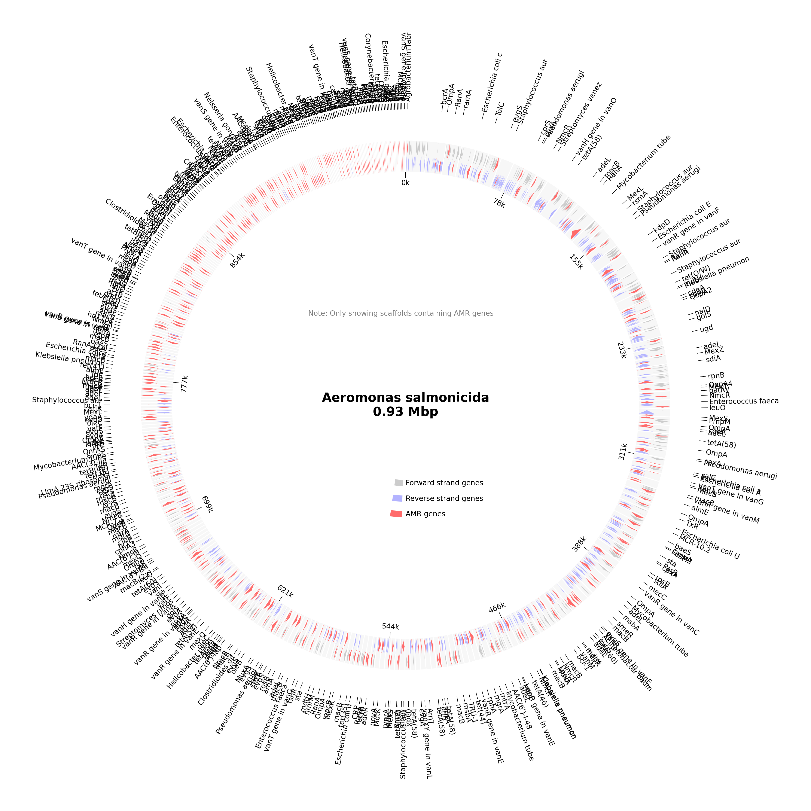

### AAC(3)-IId
- **Mechanism**: antibiotic inactivation
- **Drug Classes**: aminoglycoside antibiotic
- **AMR Family**: AAC(3)
- **Locations**:
  - gnl|SPADES|BMKMCJEI_3997_2 : position 372-1136

### AAC(6')-I-48
- **Mechanism**: antibiotic inactivation
- **Drug Classes**: aminoglycoside antibiotic
- **AMR Family**: AAC(6')
- **Locations**:
  - gnl|SPADES|BMKMCJEI_2303_3 : position 933-1439

### AAC(6')-Ia
- **Mechanism**: antibiotic inactivation
- **Drug Classes**: aminoglycoside antibiotic
- **AMR Family**: AAC(6')
- **Locations**:
  - gnl|SPADES|BMKMCJEI_3586_4 : position 1524-1976

### AAC(6')-Iap
- **Mechanism**: antibiotic inactivation
- **Drug Classes**: aminoglycoside antibiotic
- **AMR Family**: AAC(6')
- **Locations**:
  - gnl|SPADES|BMKMCJEI_3140_4 : position 1801-2292

### AAC(6')-Ic
- **Mechanism**: antibiotic inactivation
- **Drug Classes**: aminoglycoside antibiotic
- **AMR Family**: AAC(6')
- **Locations**:
  - gnl|SPADES|BMKMCJEI_7722_2 : position 716-796

### AAC(6')-Isa
- **Mechanism**: antibiotic inactivation
- **Drug Classes**: aminoglycoside antibiotic
- **AMR Family**: AAC(6')
- **Locations**:
  - gnl|SPADES|BMKMCJEI_3470_2 : position 1466-2020

### Acinetobacter baumannii AbaF
- **Mechanism**: antibiotic efflux
- **Drug Classes**: phosphonic acid antibiotic
- **AMR Family**: major facilitator superfamily (MFS) antibiotic efflux pump
- **Locations**:
  - gnl|SPADES|BMKMCJEI_1992_4 : position 3045-4148

### AcrS
- **Mechanism**: antibiotic efflux
- **Drug Classes**: fluoroquinolone antibiotic; cephalosporin; glycylcycline; cephamycin; penam; tetracycline antibiotic; rifamycin antibiotic; phenicol antibiotic; disinfecting agents and antiseptics
- **AMR Family**: resistance-nodulation-cell division (RND) antibiotic efflux pump
- **Locations**:
  - gnl|SPADES|BMKMCJEI_3806_2 : position 748-1416

### Agrobacterium fabrum chloramphenicol acetyltransferase
- **Mechanism**: antibiotic inactivation
- **Drug Classes**: phenicol antibiotic
- **AMR Family**: chloramphenicol acetyltransferase (CAT)
- **Locations**:
  - gnl|SPADES|BMKMCJEI_657_3 : position 1039-1692

### ArnT (found in 2 locations)
- **Mechanism**: antibiotic target alteration
- **Drug Classes**: peptide antibiotic
- **AMR Family**: pmr phosphoethanolamine transferase
- **Locations**:
  - gnl|SPADES|BMKMCJEI_2505_5 : position 2338-3162
  - gnl|SPADES|BMKMCJEI_7630_2 : position 333-809

### CRD3-1
- **Mechanism**: antibiotic inactivation
- **Drug Classes**: carbapenem
- **AMR Family**: CRD3 beta-lactamase
- **Locations**:
  - gnl|SPADES|BMKMCJEI_6308_1 : position 52-873

### CRP
- **Mechanism**: antibiotic efflux
- **Drug Classes**: macrolide antibiotic; fluoroquinolone antibiotic; penam
- **AMR Family**: resistance-nodulation-cell division (RND) antibiotic efflux pump
- **Locations**:
  - gnl|SPADES|BMKMCJEI_2651_2 : position 183-938

### Clostridioides difficile gyrA conferring resistance to fluoroquinolones
- **Mechanism**: antibiotic target alteration
- **Drug Classes**: fluoroquinolone antibiotic
- **AMR Family**: fluoroquinolone resistant gyrA
- **Locations**:
  - gnl|SPADES|BMKMCJEI_5424_2 : position 496-1194

### Clostridioides difficile gyrB conferring resistance to fluoroquinolones
- **Mechanism**: antibiotic target alteration
- **Drug Classes**: fluoroquinolone antibiotic
- **AMR Family**: fluoroquinolone resistant gyrB
- **Locations**:
  - gnl|SPADES|BMKMCJEI_3089_1 : position 2-2260

### Corynebacterium striatum tetA
- **Mechanism**: antibiotic efflux
- **Drug Classes**: penam; tetracycline antibiotic
- **AMR Family**: major facilitator superfamily (MFS) antibiotic efflux pump
- **Locations**:
  - gnl|SPADES|BMKMCJEI_23753_1 : position 1-303

### EdeQ
- **Mechanism**: antibiotic inactivation
- **Drug Classes**: peptide antibiotic; polyamine antibiotic
- **AMR Family**: Edeine acetyltransferase
- **Locations**:
  - gnl|SPADES|BMKMCJEI_10854_2 : position 193-555

### Enterococcus faecalis cls with mutation conferring resistance to daptomycin (found in 2 locations)
- **Mechanism**: antibiotic target alteration
- **Drug Classes**: peptide antibiotic
- **AMR Family**: daptomycin resistant cls
- **Locations**:
  - gnl|SPADES|BMKMCJEI_1548_1 : position 480-1733
  - gnl|SPADES|BMKMCJEI_2891_3 : position 1490-2629

### Enterococcus faecium liaR mutant conferring daptomycin resistance
- **Mechanism**: antibiotic target alteration; antibiotic efflux
- **Drug Classes**: peptide antibiotic
- **AMR Family**: daptomycin resistant liaR
- **Locations**:
  - gnl|SPADES|BMKMCJEI_6914_1 : position 1-444

### Erm(48)
- **Mechanism**: antibiotic target alteration
- **Drug Classes**: macrolide antibiotic; lincosamide antibiotic; streptogramin antibiotic; streptogramin B antibiotic
- **AMR Family**: Erm 23S ribosomal RNA methyltransferase
- **Locations**:
  - gnl|SPADES|BMKMCJEI_5858_1 : position 2-508

### Escherichia coli AcrAB-TolC with AcrR mutation conferring resistance to ciprofloxacin, tetracycline, and ceftazidime
- **Mechanism**: antibiotic target alteration; antibiotic efflux
- **Drug Classes**: fluoroquinolone antibiotic; cephalosporin; glycylcycline; penam; tetracycline antibiotic; rifamycin antibiotic; phenicol antibiotic; disinfecting agents and antiseptics
- **AMR Family**: resistance-nodulation-cell division (RND) antibiotic efflux pump
- **Locations**:
  - gnl|SPADES|BMKMCJEI_1689_2 : position 1083-1769

### Escherichia coli EF-Tu mutants conferring resistance to Enacyloxin IIa (found in 2 locations)
- **Mechanism**: antibiotic target alteration
- **Drug Classes**: elfamycin antibiotic
- **AMR Family**: elfamycin resistant EF-Tu
- **Locations**:
  - gnl|SPADES|BMKMCJEI_1292_5 : position 2455-5151
  - gnl|SPADES|BMKMCJEI_32880_1 : position 2-259

### Escherichia coli UhpT with mutation conferring resistance to fosfomycin
- **Mechanism**: antibiotic target alteration
- **Drug Classes**: phosphonic acid antibiotic
- **AMR Family**: antibiotic-resistant UhpT
- **Locations**:
  - gnl|SPADES|BMKMCJEI_1762_4 : position 2306-3712

### Escherichia coli acrA (found in 2 locations)
- **Mechanism**: antibiotic efflux
- **Drug Classes**: fluoroquinolone antibiotic; cephalosporin; glycylcycline; penam; tetracycline antibiotic; rifamycin antibiotic; phenicol antibiotic; disinfecting agents and antiseptics
- **AMR Family**: resistance-nodulation-cell division (RND) antibiotic efflux pump
- **Locations**:
  - gnl|SPADES|BMKMCJEI_1689_1 : position 16-984
  - gnl|SPADES|BMKMCJEI_6930_2 : position 628-900

### Escherichia coli cyaA with mutation conferring resistance to fosfomycin
- **Mechanism**: antibiotic target alteration
- **Drug Classes**: phosphonic acid antibiotic
- **AMR Family**: antibiotic-resistant cya adenylate cyclase
- **Locations**:
  - gnl|SPADES|BMKMCJEI_924_10 : position 7938-9788

### Escherichia coli soxS with mutation conferring antibiotic resistance
- **Mechanism**: antibiotic target alteration; antibiotic efflux; reduced permeability to antibiotic
- **Drug Classes**: fluoroquinolone antibiotic; monobactam; carbapenem; cephalosporin; glycylcycline; cephamycin; penam; tetracycline antibiotic; rifamycin antibiotic; phenicol antibiotic; penem; disinfecting agents and antiseptics
- **AMR Family**: ATP-binding cassette (ABC) antibiotic efflux pump; major facilitator superfamily (MFS) antibiotic efflux pump; resistance-nodulation-cell division (RND) antibiotic efflux pump; General Bacterial Porin with reduced permeability to beta-lactams
- **Locations**:
  - gnl|SPADES|BMKMCJEI_4419_2 : position 157-942

### Escherichia coli uhpA with mutation conferring resistance to fosfomycin
- **Mechanism**: antibiotic target alteration
- **Drug Classes**: phosphonic acid antibiotic
- **AMR Family**: antibiotic-resistant UhpT
- **Locations**:
  - gnl|SPADES|BMKMCJEI_2655_2 : position 1209-1913

### FosM2
- **Mechanism**: antibiotic inactivation
- **Drug Classes**: phosphonic acid antibiotic
- **AMR Family**: fosfomycin thiol transferase
- **Locations**:
  - gnl|SPADES|BMKMCJEI_1805_2 : position 870-1283

### H-NS (found in 2 locations)
- **Mechanism**: antibiotic efflux
- **Drug Classes**: macrolide antibiotic; fluoroquinolone antibiotic; cephalosporin; cephamycin; penam; tetracycline antibiotic
- **AMR Family**: major facilitator superfamily (MFS) antibiotic efflux pump; resistance-nodulation-cell division (RND) antibiotic efflux pump
- **Locations**:
  - gnl|SPADES|BMKMCJEI_3914_1 : position 77-484
  - gnl|SPADES|BMKMCJEI_8330_1 : position 232-642

### Helicobacter pylori pbp1 mutants conferring resistance to amoxicillin (found in 3 locations)
- **Mechanism**: antibiotic target alteration
- **Drug Classes**: cephalosporin; cephamycin; penam
- **AMR Family**: Penicillin-binding protein mutations conferring resistance to beta-lactam antibiotics
- **Locations**:
  - gnl|SPADES|BMKMCJEI_10080_1 : position 1-597
  - gnl|SPADES|BMKMCJEI_18689_1 : position 2-358
  - gnl|SPADES|BMKMCJEI_18692_1 : position 2-358

### Helicobacter pylori rpoB mutation conferring resistance to rifampicin
- **Mechanism**: antibiotic target alteration; antibiotic target replacement
- **Drug Classes**: fluoroquinolone antibiotic; rifamycin antibiotic
- **AMR Family**: rifamycin-resistant beta-subunit of RNA polymerase (rpoB)
- **Locations**:
  - gnl|SPADES|BMKMCJEI_3202_1 : position 1-2298

### Klebsiella pneumoniae KpnE
- **Mechanism**: antibiotic efflux
- **Drug Classes**: macrolide antibiotic; aminoglycoside antibiotic; cephalosporin; tetracycline antibiotic; peptide antibiotic; rifamycin antibiotic; disinfecting agents and antiseptics
- **AMR Family**: small multidrug resistance (SMR) antibiotic efflux pump
- **Locations**:
  - gnl|SPADES|BMKMCJEI_2183_3 : position 2558-2962

### Klebsiella pneumoniae KpnF
- **Mechanism**: antibiotic efflux
- **Drug Classes**: macrolide antibiotic; aminoglycoside antibiotic; cephalosporin; tetracycline antibiotic; peptide antibiotic; rifamycin antibiotic; disinfecting agents and antiseptics
- **AMR Family**: small multidrug resistance (SMR) antibiotic efflux pump
- **Locations**:
  - gnl|SPADES|BMKMCJEI_2183_4 : position 2959-3279

### Klebsiella pneumoniae OmpK37
- **Mechanism**: reduced permeability to antibiotic
- **Drug Classes**: monobactam; carbapenem; cephalosporin; cephamycin; penam; penem
- **AMR Family**: General Bacterial Porin with reduced permeability to beta-lactams
- **Locations**:
  - gnl|SPADES|BMKMCJEI_1316_2 : position 409-1494

### Klebsiella pneumoniae acrA
- **Mechanism**: antibiotic efflux
- **Drug Classes**: fluoroquinolone antibiotic; cephalosporin; glycylcycline; penam; tetracycline antibiotic; rifamycin antibiotic; phenicol antibiotic; disinfecting agents and antiseptics
- **AMR Family**: resistance-nodulation-cell division (RND) antibiotic efflux pump
- **Locations**:
  - gnl|SPADES|BMKMCJEI_4403_3 : position 1308-1553

### LlmA 23S ribosomal RNA methyltransferase
- **Mechanism**: antibiotic target alteration
- **Drug Classes**: lincosamide antibiotic
- **AMR Family**: Llm 23S ribosomal RNA methyltransferase
- **Locations**:
  - gnl|SPADES|BMKMCJEI_3900_1 : position 1-939

### LpeB (found in 3 locations)
- **Mechanism**: antibiotic efflux
- **Drug Classes**: macrolide antibiotic
- **AMR Family**: resistance-nodulation-cell division (RND) antibiotic efflux pump
- **Locations**:
  - gnl|SPADES|BMKMCJEI_2112_1 : position 3-425
  - gnl|SPADES|BMKMCJEI_4899_1 : position 3-1349
  - gnl|SPADES|BMKMCJEI_8780_2 : position 439-690

### LpsA (found in 2 locations)
- **Mechanism**: reduced permeability to antibiotic
- **Drug Classes**: peptide antibiotic
- **AMR Family**: Intrinsic peptide antibiotic resistant Lps
- **Locations**:
  - gnl|SPADES|BMKMCJEI_19646_1 : position 1-348
  - gnl|SPADES|BMKMCJEI_20144_1 : position 2-232

### MCR-10.2
- **Mechanism**: antibiotic target alteration
- **Drug Classes**: peptide antibiotic
- **AMR Family**: MCR phosphoethanolamine transferase
- **Locations**:
  - gnl|SPADES|BMKMCJEI_1766_2 : position 322-2172

### MCR-3.7
- **Mechanism**: antibiotic target alteration
- **Drug Classes**: peptide antibiotic
- **AMR Family**: MCR phosphoethanolamine transferase
- **Locations**:
  - gnl|SPADES|BMKMCJEI_42608_2 : position 79-231

### MCR-4.7
- **Mechanism**: antibiotic target alteration
- **Drug Classes**: peptide antibiotic
- **AMR Family**: MCR phosphoethanolamine transferase
- **Locations**:
  - gnl|SPADES|BMKMCJEI_7760_1 : position 3-197

### MCR-7.1
- **Mechanism**: antibiotic target alteration
- **Drug Classes**: peptide antibiotic
- **AMR Family**: MCR phosphoethanolamine transferase
- **Locations**:
  - gnl|SPADES|BMKMCJEI_3733_1 : position 3-1388

### MdtK
- **Mechanism**: antibiotic efflux
- **Drug Classes**: fluoroquinolone antibiotic
- **AMR Family**: multidrug and toxic compound extrusion (MATE) transporter
- **Locations**:
  - gnl|SPADES|BMKMCJEI_2618_4 : position 1304-2650

### MexB
- **Mechanism**: antibiotic efflux
- **Drug Classes**: macrolide antibiotic; fluoroquinolone antibiotic; monobactam; carbapenem; cephalosporin; cephamycin; penam; tetracycline antibiotic; peptide antibiotic; aminocoumarin antibiotic; diaminopyrimidine antibiotic; sulfonamide antibiotic; phenicol antibiotic; penem
- **AMR Family**: resistance-nodulation-cell division (RND) antibiotic efflux pump
- **Locations**:
  - gnl|SPADES|BMKMCJEI_7463_1 : position 2-829

### MexH
- **Mechanism**: antibiotic efflux
- **Drug Classes**: fluoroquinolone antibiotic; tetracycline antibiotic; disinfecting agents and antiseptics
- **AMR Family**: resistance-nodulation-cell division (RND) antibiotic efflux pump
- **Locations**:
  - gnl|SPADES|BMKMCJEI_10124_1 : position 1-597

### MexK
- **Mechanism**: antibiotic efflux
- **Drug Classes**: macrolide antibiotic; tetracycline antibiotic; disinfecting agents and antiseptics
- **AMR Family**: resistance-nodulation-cell division (RND) antibiotic efflux pump
- **Locations**:
  - gnl|SPADES|BMKMCJEI_2717_2 : position 1534-2850

### MexL (found in 2 locations)
- **Mechanism**: antibiotic efflux
- **Drug Classes**: macrolide antibiotic; tetracycline antibiotic; disinfecting agents and antiseptics
- **AMR Family**: resistance-nodulation-cell division (RND) antibiotic efflux pump
- **Locations**:
  - gnl|SPADES|BMKMCJEI_1184_6 : position 4648-5289
  - gnl|SPADES|BMKMCJEI_4157_3 : position 606-1160

### MexS (found in 4 locations)
- **Mechanism**: antibiotic efflux
- **Drug Classes**: fluoroquinolone antibiotic; diaminopyrimidine antibiotic; phenicol antibiotic
- **AMR Family**: resistance-nodulation-cell division (RND) antibiotic efflux pump
- **Locations**:
  - gnl|SPADES|BMKMCJEI_1570_4 : position 4612-5490
  - gnl|SPADES|BMKMCJEI_2555_2 : position 1072-2088
  - gnl|SPADES|BMKMCJEI_4058_1 : position 1-546
  - gnl|SPADES|BMKMCJEI_40932_1 : position 3-236

### MexT (found in 3 locations)
- **Mechanism**: antibiotic efflux
- **Drug Classes**: fluoroquinolone antibiotic; diaminopyrimidine antibiotic; phenicol antibiotic
- **AMR Family**: resistance-nodulation-cell division (RND) antibiotic efflux pump
- **Locations**:
  - gnl|SPADES|BMKMCJEI_1493_5 : position 4442-5362
  - gnl|SPADES|BMKMCJEI_6292_1 : position 2-829
  - gnl|SPADES|BMKMCJEI_6438_1 : position 131-976

### MexW (found in 2 locations)
- **Mechanism**: antibiotic efflux
- **Drug Classes**: macrolide antibiotic; fluoroquinolone antibiotic; tetracycline antibiotic; phenicol antibiotic; disinfecting agents and antiseptics
- **AMR Family**: resistance-nodulation-cell division (RND) antibiotic efflux pump
- **Locations**:
  - gnl|SPADES|BMKMCJEI_5453_1 : position 1-1185
  - gnl|SPADES|BMKMCJEI_5590_1 : position 1-1149

### MexZ
- **Mechanism**: antibiotic efflux
- **Drug Classes**: macrolide antibiotic; fluoroquinolone antibiotic; aminoglycoside antibiotic; carbapenem; cephalosporin; cephamycin; penam; tetracycline antibiotic; phenicol antibiotic; disinfecting agents and antiseptics
- **AMR Family**: resistance-nodulation-cell division (RND) antibiotic efflux pump
- **Locations**:
  - gnl|SPADES|BMKMCJEI_1456_3 : position 2426-3019

### MuxA (found in 2 locations)
- **Mechanism**: antibiotic efflux
- **Drug Classes**: macrolide antibiotic; monobactam; tetracycline antibiotic; aminocoumarin antibiotic
- **AMR Family**: resistance-nodulation-cell division (RND) antibiotic efflux pump
- **Locations**:
  - gnl|SPADES|BMKMCJEI_2112_2 : position 425-1474
  - gnl|SPADES|BMKMCJEI_3047_1 : position 2-196

### MuxB (found in 2 locations)
- **Mechanism**: antibiotic efflux
- **Drug Classes**: macrolide antibiotic; monobactam; tetracycline antibiotic; aminocoumarin antibiotic
- **AMR Family**: resistance-nodulation-cell division (RND) antibiotic efflux pump
- **Locations**:
  - gnl|SPADES|BMKMCJEI_21173_1 : position 2-331
  - gnl|SPADES|BMKMCJEI_6301_1 : position 3-998

### Mycobacterium tuberculosis katG mutations conferring resistance to isoniazid
- **Mechanism**: antibiotic target alteration
- **Drug Classes**: isoniazid-like antibiotic
- **AMR Family**: isoniazid resistant katG
- **Locations**:
  - gnl|SPADES|BMKMCJEI_1964_3 : position 1273-3408

### Mycobacterium tuberculosis ndh with mutation conferring resistance to isoniazid
- **Mechanism**: antibiotic target alteration
- **Drug Classes**: isoniazid-like antibiotic
- **AMR Family**: antibiotic resistant ndh
- **Locations**:
  - gnl|SPADES|BMKMCJEI_2320_2 : position 818-2110

### Mycobacterium tuberculosis pncA mutations conferring resistance to pyrazinamide
- **Mechanism**: antibiotic target alteration
- **Drug Classes**: pyrazine antibiotic
- **AMR Family**: Pyrazinamide resistant pncA
- **Locations**:
  - gnl|SPADES|BMKMCJEI_4009_3 : position 1158-1733

### Mycobacterium tuberculosis rpoB mutations conferring resistance to rifampicin
- **Mechanism**: antibiotic target alteration; antibiotic target replacement
- **Drug Classes**: rifamycin antibiotic
- **AMR Family**: rifamycin-resistant beta-subunit of RNA polymerase (rpoB)
- **Locations**:
  - gnl|SPADES|BMKMCJEI_1176_2 : position 2016-6044

### Neisseria gonorrhoeae pilQ gene conferring resistance to beta-lactam
- **Mechanism**: antibiotic target alteration
- **Drug Classes**: cephalosporin; cephamycin; penam
- **AMR Family**: Penicillin-binding protein mutations conferring resistance to beta-lactam antibiotics
- **Locations**:
  - gnl|SPADES|BMKMCJEI_7584_2 : position 91-816

### NmcR (found in 13 locations)
- **Mechanism**: antibiotic inactivation
- **Drug Classes**: carbapenem; cephalosporin; cephamycin; penam
- **AMR Family**: NmcA beta-lactamase
- **Locations**:
  - gnl|SPADES|BMKMCJEI_1070_3 : position 422-1384
  - gnl|SPADES|BMKMCJEI_1501_4 : position 3237-4157
  - gnl|SPADES|BMKMCJEI_2101_3 : position 1163-2038
  - gnl|SPADES|BMKMCJEI_2188_1 : position 146-1123
  - gnl|SPADES|BMKMCJEI_3132_1 : position 3-383
  - gnl|SPADES|BMKMCJEI_3598_2 : position 411-1319
  - gnl|SPADES|BMKMCJEI_3737_2 : position 584-1492
  - gnl|SPADES|BMKMCJEI_4330_2 : position 326-1195
  - gnl|SPADES|BMKMCJEI_4733_1 : position 133-975
  - gnl|SPADES|BMKMCJEI_5245_1 : position 79-969
  - gnl|SPADES|BMKMCJEI_6771_2 : position 702-923
  - gnl|SPADES|BMKMCJEI_7154_1 : position 3-812
  - gnl|SPADES|BMKMCJEI_7396_1 : position 43-837

### OmpA (found in 13 locations)
- **Mechanism**: reduced permeability to antibiotic
- **Drug Classes**: peptide antibiotic
- **AMR Family**: General Bacterial Porin with reduced permeability to peptide antibiotics
- **Locations**:
  - gnl|SPADES|BMKMCJEI_1575_4 : position 4337-5395
  - gnl|SPADES|BMKMCJEI_1618_3 : position 1585-2616
  - gnl|SPADES|BMKMCJEI_1735_5 : position 3397-4416
  - gnl|SPADES|BMKMCJEI_1805_1 : position 3-797
  - gnl|SPADES|BMKMCJEI_1941_3 : position 2787-3311
  - gnl|SPADES|BMKMCJEI_22514_1 : position 123-314
  - gnl|SPADES|BMKMCJEI_26577_1 : position 89-280
  - gnl|SPADES|BMKMCJEI_2761_2 : position 605-1261
  - gnl|SPADES|BMKMCJEI_3557_3 : position 1476-1964
  - gnl|SPADES|BMKMCJEI_4063_1 : position 3-968
  - gnl|SPADES|BMKMCJEI_45631_1 : position 2-223
  - gnl|SPADES|BMKMCJEI_6085_1 : position 137-1036
  - gnl|SPADES|BMKMCJEI_726_16 : position 10708-11625

### OpmH
- **Mechanism**: antibiotic efflux
- **Drug Classes**: disinfecting agents and antiseptics
- **AMR Family**: resistance-nodulation-cell division (RND) antibiotic efflux pump
- **Locations**:
  - gnl|SPADES|BMKMCJEI_5741_2 : position 649-1110

### OprM
- **Mechanism**: antibiotic efflux
- **Drug Classes**: macrolide antibiotic; fluoroquinolone antibiotic; monobactam; aminoglycoside antibiotic; carbapenem; cephalosporin; cephamycin; penam; tetracycline antibiotic; peptide antibiotic; aminocoumarin antibiotic; diaminopyrimidine antibiotic; sulfonamide antibiotic; phenicol antibiotic; penem; disinfecting agents and antiseptics
- **AMR Family**: resistance-nodulation-cell division (RND) antibiotic efflux pump
- **Locations**:
  - gnl|SPADES|BMKMCJEI_3718_2 : position 441-1847

### PAM-1
- **Mechanism**: antibiotic inactivation
- **Drug Classes**: carbapenem; cephalosporin
- **AMR Family**: PAM beta-lactamase
- **Locations**:
  - gnl|SPADES|BMKMCJEI_5239_1 : position 123-767

### ParR (found in 3 locations)
- **Mechanism**: antibiotic efflux; reduced permeability to antibiotic
- **Drug Classes**: macrolide antibiotic; fluoroquinolone antibiotic; monobactam; aminoglycoside antibiotic; carbapenem; cephalosporin; cephamycin; penam; tetracycline antibiotic; phenicol antibiotic; penem; disinfecting agents and antiseptics
- **AMR Family**: resistance-nodulation-cell division (RND) antibiotic efflux pump; Outer Membrane Porin (Opr)
- **Locations**:
  - gnl|SPADES|BMKMCJEI_1847_2 : position 417-1136
  - gnl|SPADES|BMKMCJEI_3003_2 : position 1358-2080
  - gnl|SPADES|BMKMCJEI_5901_1 : position 2-706

### ParS (found in 3 locations)
- **Mechanism**: antibiotic efflux; reduced permeability to antibiotic
- **Drug Classes**: macrolide antibiotic; fluoroquinolone antibiotic; monobactam; aminoglycoside antibiotic; carbapenem; cephalosporin; cephamycin; penam; tetracycline antibiotic; phenicol antibiotic; penem; disinfecting agents and antiseptics
- **AMR Family**: resistance-nodulation-cell division (RND) antibiotic efflux pump; Outer Membrane Porin (Opr)
- **Locations**:
  - gnl|SPADES|BMKMCJEI_15296_1 : position 3-413
  - gnl|SPADES|BMKMCJEI_22335_1 : position 2-316
  - gnl|SPADES|BMKMCJEI_3853_3 : position 510-1826

### PmpM
- **Mechanism**: antibiotic efflux
- **Drug Classes**: fluoroquinolone antibiotic; aminoglycoside antibiotic; disinfecting agents and antiseptics
- **AMR Family**: multidrug and toxic compound extrusion (MATE) transporter
- **Locations**:
  - gnl|SPADES|BMKMCJEI_1575_1 : position 132-1511

### PmrF (found in 2 locations)
- **Mechanism**: antibiotic target alteration
- **Drug Classes**: peptide antibiotic
- **AMR Family**: pmr phosphoethanolamine transferase
- **Locations**:
  - gnl|SPADES|BMKMCJEI_5408_2 : position 83-1117
  - gnl|SPADES|BMKMCJEI_6298_2 : position 146-1000

### Pseudomonas aeruginosa CpxR (found in 2 locations)
- **Mechanism**: antibiotic efflux
- **Drug Classes**: macrolide antibiotic; fluoroquinolone antibiotic; monobactam; aminoglycoside antibiotic; carbapenem; cephalosporin; cephamycin; penam; tetracycline antibiotic; peptide antibiotic; aminocoumarin antibiotic; diaminopyrimidine antibiotic; sulfonamide antibiotic; phenicol antibiotic; penem
- **AMR Family**: resistance-nodulation-cell division (RND) antibiotic efflux pump
- **Locations**:
  - gnl|SPADES|BMKMCJEI_1065_4 : position 2437-3132
  - gnl|SPADES|BMKMCJEI_1631_3 : position 2624-3346

### Pseudomonas aeruginosa ampR with mutation conferring resistance to aztreonam (found in 2 locations)
- **Mechanism**: antibiotic target alteration; antibiotic inactivation
- **Drug Classes**: monobactam; carbapenem; cephalosporin
- **AMR Family**: PDC beta-lactamase; ampR transcriptional regulator with mutation conferring resistance to monobactam antibiotics
- **Locations**:
  - gnl|SPADES|BMKMCJEI_1240_2 : position 728-1648
  - gnl|SPADES|BMKMCJEI_3884_2 : position 709-1653

### Pseudomonas aeruginosa soxR
- **Mechanism**: antibiotic target alteration; antibiotic efflux
- **Drug Classes**: fluoroquinolone antibiotic; cephalosporin; glycylcycline; penam; tetracycline antibiotic; rifamycin antibiotic; phenicol antibiotic; disinfecting agents and antiseptics
- **AMR Family**: ATP-binding cassette (ABC) antibiotic efflux pump; major facilitator superfamily (MFS) antibiotic efflux pump; resistance-nodulation-cell division (RND) antibiotic efflux pump
- **Locations**:
  - gnl|SPADES|BMKMCJEI_3020_2 : position 538-1017

### QepA2
- **Mechanism**: antibiotic efflux
- **Drug Classes**: fluoroquinolone antibiotic
- **AMR Family**: major facilitator superfamily (MFS) antibiotic efflux pump
- **Locations**:
  - gnl|SPADES|BMKMCJEI_1362_2 : position 1053-2450

### QepA4
- **Mechanism**: antibiotic efflux
- **Drug Classes**: fluoroquinolone antibiotic
- **AMR Family**: major facilitator superfamily (MFS) antibiotic efflux pump
- **Locations**:
  - gnl|SPADES|BMKMCJEI_1493_4 : position 2857-4251

### QnrAS
- **Mechanism**: antibiotic target protection
- **Drug Classes**: fluoroquinolone antibiotic
- **AMR Family**: quinolone resistance protein (qnr)
- **Locations**:
  - gnl|SPADES|BMKMCJEI_4041_2 : position 666-1316

### RanA (found in 11 locations)
- **Mechanism**: antibiotic efflux
- **Drug Classes**: aminoglycoside antibiotic
- **AMR Family**: ATP-binding cassette (ABC) antibiotic efflux pump
- **Locations**:
  - gnl|SPADES|BMKMCJEI_1164_6 : position 3575-4561
  - gnl|SPADES|BMKMCJEI_1305_8 : position 4517-5317
  - gnl|SPADES|BMKMCJEI_1694_3 : position 1571-2566
  - gnl|SPADES|BMKMCJEI_2548_2 : position 616-1617
  - gnl|SPADES|BMKMCJEI_2631_3 : position 1978-2967
  - gnl|SPADES|BMKMCJEI_2775_2 : position 259-1326
  - gnl|SPADES|BMKMCJEI_4451_1 : position 2-532
  - gnl|SPADES|BMKMCJEI_4451_2 : position 567-1532
  - gnl|SPADES|BMKMCJEI_5030_1 : position 123-884
  - gnl|SPADES|BMKMCJEI_5969_2 : position 213-758
  - gnl|SPADES|BMKMCJEI_858_4 : position 2055-3062

### RanB
- **Mechanism**: antibiotic efflux
- **Drug Classes**: aminoglycoside antibiotic
- **AMR Family**: ATP-binding cassette (ABC) antibiotic efflux pump
- **Locations**:
  - gnl|SPADES|BMKMCJEI_1305_7 : position 3738-4517

### Staphylococcus aureus fusA with mutation conferring resistance to fusidic acid (found in 2 locations)
- **Mechanism**: antibiotic target alteration
- **Drug Classes**: fusidane antibiotic
- **AMR Family**: antibiotic resistant fusA
- **Locations**:
  - gnl|SPADES|BMKMCJEI_1310_5 : position 4770-6356
  - gnl|SPADES|BMKMCJEI_4214_1 : position 1-1629

### Staphylococcus aureus fusE with mutation conferring resistance to fusidic acid
- **Mechanism**: antibiotic target alteration
- **Drug Classes**: fusidane antibiotic
- **AMR Family**: antibiotic resistant fusE
- **Locations**:
  - gnl|SPADES|BMKMCJEI_1025_6 : position 1942-2475

### Staphylococcus aureus mupA conferring resistance to mupirocin (found in 2 locations)
- **Mechanism**: antibiotic target alteration
- **Drug Classes**: mupirocin-like antibiotic
- **AMR Family**: antibiotic-resistant isoleucyl-tRNA synthetase (ileS)
- **Locations**:
  - gnl|SPADES|BMKMCJEI_2536_1 : position 2-1396
  - gnl|SPADES|BMKMCJEI_9164_1 : position 2-658

### Staphylococcus aureus mupB conferring resistance to mupirocin
- **Mechanism**: antibiotic target alteration
- **Drug Classes**: mupirocin-like antibiotic
- **AMR Family**: antibiotic-resistant isoleucyl-tRNA synthetase (ileS)
- **Locations**:
  - gnl|SPADES|BMKMCJEI_1209_6 : position 5262-7460

### Staphylococcus aureus murA with mutation conferring resistance to fosfomycin
- **Mechanism**: antibiotic target alteration
- **Drug Classes**: phosphonic acid antibiotic
- **AMR Family**: antibiotic-resistant murA transferase
- **Locations**:
  - gnl|SPADES|BMKMCJEI_1305_2 : position 799-2055

### Streptomyces rimosus otr(A)
- **Mechanism**: antibiotic target protection
- **Drug Classes**: tetracycline antibiotic
- **AMR Family**: tetracycline-resistant ribosomal protection protein
- **Locations**:
  - gnl|SPADES|BMKMCJEI_3364_1 : position 3-938

### Streptomyces venezuelae rox
- **Mechanism**: antibiotic inactivation
- **Drug Classes**: rifamycin antibiotic
- **AMR Family**: rifampin monooxygenase
- **Locations**:
  - gnl|SPADES|BMKMCJEI_1070_7 : position 3617-4780

### TRU-1
- **Mechanism**: antibiotic inactivation
- **Drug Classes**: cephalosporin; penam
- **AMR Family**: TRU beta-lactamase
- **Locations**:
  - gnl|SPADES|BMKMCJEI_2384_2: position 388-1620

### TaeA (found in 2 locations)
- **Mechanism**: antibiotic efflux
- **Drug Classes**: pleuromutilin antibiotic
- **AMR Family**: ATP-binding cassette (ABC) antibiotic efflux pump
- **Locations**:
  - gnl|SPADES|BMKMCJEI_6068_1 : position 1-1038
  - gnl|SPADES|BMKMCJEI_6455_2 : position 120-974

### TolC
- **Mechanism**: antibiotic efflux
- **Drug Classes**: macrolide antibiotic; fluoroquinolone antibiotic; aminoglycoside antibiotic; carbapenem; cephalosporin; glycylcycline; cephamycin; penam; tetracycline antibiotic; peptide antibiotic; aminocoumarin antibiotic; rifamycin antibiotic; phenicol antibiotic; penem; disinfecting agents and antiseptics
- **AMR Family**: ATP-binding cassette (ABC) antibiotic efflux pump; major facilitator superfamily (MFS) antibiotic efflux pump; resistance-nodulation-cell division (RND) antibiotic efflux pump
- **Locations**:
  - gnl|SPADES|BMKMCJEI_986_7 : position 6627-7952

### TriC
- **Mechanism**: antibiotic efflux
- **Drug Classes**: disinfecting agents and antiseptics
- **AMR Family**: resistance-nodulation-cell division (RND) antibiotic efflux pump
- **Locations**:
  - gnl|SPADES|BMKMCJEI_4343_1 : position 2-1579

### TxR (found in 12 locations)
- **Mechanism**: antibiotic efflux
- **Drug Classes**: tetracycline antibiotic
- **AMR Family**: ATP-binding cassette (ABC) antibiotic efflux pump
- **Locations**:
  - gnl|SPADES|BMKMCJEI_10774_1 : position 2-283
  - gnl|SPADES|BMKMCJEI_1750_5 : position 1781-2815
  - gnl|SPADES|BMKMCJEI_3554_3 : position 978-2024
  - gnl|SPADES|BMKMCJEI_3971_1 : position 2-1294
  - gnl|SPADES|BMKMCJEI_4995_2 : position 556-1317
  - gnl|SPADES|BMKMCJEI_5294_1 : position 3-644
  - gnl|SPADES|BMKMCJEI_5470_1 : position 61-1179
  - gnl|SPADES|BMKMCJEI_7001_2 : position 680-889
  - gnl|SPADES|BMKMCJEI_7407_1 : position 3-836
  - gnl|SPADES|BMKMCJEI_7564_1 : position 1-819
  - gnl|SPADES|BMKMCJEI_7995_1 : position 1-765
  - gnl|SPADES|BMKMCJEI_9823_1 : position 1-612

### YojI
- **Mechanism**: antibiotic efflux
- **Drug Classes**: peptide antibiotic
- **AMR Family**: ATP-binding cassette (ABC) antibiotic efflux pump
- **Locations**:
  - gnl|SPADES|BMKMCJEI_4710_2 : position 110-1420

### acrB (found in 4 locations)
- **Mechanism**: antibiotic efflux
- **Drug Classes**: fluoroquinolone antibiotic; cephalosporin; glycylcycline; penam; tetracycline antibiotic; rifamycin antibiotic; phenicol antibiotic; disinfecting agents and antiseptics
- **AMR Family**: resistance-nodulation-cell division (RND) antibiotic efflux pump
- **Locations**:
  - gnl|SPADES|BMKMCJEI_35102_1 : position 3-254
  - gnl|SPADES|BMKMCJEI_3718_1 : position 2-448
  - gnl|SPADES|BMKMCJEI_4974_1 : position 1-1329
  - gnl|SPADES|BMKMCJEI_6930_1 : position 2-610

### acrD
- **Mechanism**: antibiotic efflux
- **Drug Classes**: aminoglycoside antibiotic
- **AMR Family**: resistance-nodulation-cell division (RND) antibiotic efflux pump
- **Locations**:
  - gnl|SPADES|BMKMCJEI_27824_1 : position 3-275

### adeG
- **Mechanism**: antibiotic efflux
- **Drug Classes**: fluoroquinolone antibiotic; tetracycline antibiotic
- **AMR Family**: resistance-nodulation-cell division (RND) antibiotic efflux pump
- **Locations**:
  - gnl|SPADES|BMKMCJEI_14657_1 : position 1-387

### adeL (found in 21 locations)
- **Mechanism**: antibiotic efflux
- **Drug Classes**: fluoroquinolone antibiotic; tetracycline antibiotic
- **AMR Family**: resistance-nodulation-cell division (RND) antibiotic efflux pump
- **Locations**:
  - gnl|SPADES|BMKMCJEI_10474_1 : position 40-576
  - gnl|SPADES|BMKMCJEI_10717_1 : position 3-563
  - gnl|SPADES|BMKMCJEI_1117_6 : position 4313-5248
  - gnl|SPADES|BMKMCJEI_11752_1 : position 2-514
  - gnl|SPADES|BMKMCJEI_1408_7 : position 5712-6158
  - gnl|SPADES|BMKMCJEI_1599_2 : position 1601-2509
  - gnl|SPADES|BMKMCJEI_1967_1 : position 48-929
  - gnl|SPADES|BMKMCJEI_2025_3 : position 934-1836
  - gnl|SPADES|BMKMCJEI_2297_2 : position 436-1266
  - gnl|SPADES|BMKMCJEI_2555_3 : position 2189-3061
  - gnl|SPADES|BMKMCJEI_2907_2 : position 343-1257
  - gnl|SPADES|BMKMCJEI_3319_3 : position 1186-2082
  - gnl|SPADES|BMKMCJEI_4058_2 : position 667-1572
  - gnl|SPADES|BMKMCJEI_4212_1 : position 3-314
  - gnl|SPADES|BMKMCJEI_4230_1 : position 58-954
  - gnl|SPADES|BMKMCJEI_4236_1 : position 47-922
  - gnl|SPADES|BMKMCJEI_4424_2 : position 562-1464
  - gnl|SPADES|BMKMCJEI_4787_2 : position 684-1391
  - gnl|SPADES|BMKMCJEI_5652_1 : position 15-923
  - gnl|SPADES|BMKMCJEI_6003_2 : position 149-1033
  - gnl|SPADES|BMKMCJEI_7705_1 : position 3-671

### adeR
- **Mechanism**: antibiotic efflux
- **Drug Classes**: glycylcycline; tetracycline antibiotic
- **AMR Family**: resistance-nodulation-cell division (RND) antibiotic efflux pump
- **Locations**:
  - gnl|SPADES|BMKMCJEI_2625_3 : position 1779-2792

### almE (found in 3 locations)
- **Mechanism**: antibiotic target alteration
- **Drug Classes**: peptide antibiotic
- **AMR Family**: polymyxin resistance operon; alm glycyltransferase
- **Locations**:
  - gnl|SPADES|BMKMCJEI_1715_5 : position 2587-4299
  - gnl|SPADES|BMKMCJEI_4344_2 : position 319-1581
  - gnl|SPADES|BMKMCJEI_7682_1 : position 1-771

### amrB
- **Mechanism**: antibiotic efflux
- **Drug Classes**: macrolide antibiotic; aminoglycoside antibiotic
- **AMR Family**: resistance-nodulation-cell division (RND) antibiotic efflux pump
- **Locations**:
  - gnl|SPADES|BMKMCJEI_5130_2 : position 499-918

### arlR (found in 2 locations)
- **Mechanism**: antibiotic efflux
- **Drug Classes**: fluoroquinolone antibiotic; disinfecting agents and antiseptics
- **AMR Family**: major facilitator superfamily (MFS) antibiotic efflux pump
- **Locations**:
  - gnl|SPADES|BMKMCJEI_2416_2 : position 1976-2665
  - gnl|SPADES|BMKMCJEI_4184_2 : position 207-896

### arlS (found in 2 locations)
- **Mechanism**: antibiotic efflux
- **Drug Classes**: fluoroquinolone antibiotic; disinfecting agents and antiseptics
- **AMR Family**: major facilitator superfamily (MFS) antibiotic efflux pump
- **Locations**:
  - gnl|SPADES|BMKMCJEI_35152_1 : position 2-253
  - gnl|SPADES|BMKMCJEI_35716_1 : position 2-211

### arnA (found in 2 locations)
- **Mechanism**: antibiotic target alteration
- **Drug Classes**: peptide antibiotic
- **AMR Family**: pmr phosphoethanolamine transferase
- **Locations**:
  - gnl|SPADES|BMKMCJEI_2935_2 : position 640-2577
  - gnl|SPADES|BMKMCJEI_6298_1 : position 3-149

### baeS (found in 3 locations)
- **Mechanism**: antibiotic efflux
- **Drug Classes**: aminoglycoside antibiotic; aminocoumarin antibiotic
- **AMR Family**: resistance-nodulation-cell division (RND) antibiotic efflux pump
- **Locations**:
  - gnl|SPADES|BMKMCJEI_1793_2 : position 1029-2918
  - gnl|SPADES|BMKMCJEI_4470_1 : position 2-814
  - gnl|SPADES|BMKMCJEI_9596_1 : position 3-629

### basS
- **Mechanism**: antibiotic target alteration; antibiotic efflux
- **Drug Classes**: peptide antibiotic
- **AMR Family**: pmr phosphoethanolamine transferase
- **Locations**:
  - gnl|SPADES|BMKMCJEI_5264_1 : position 1-1071

### bcr-1 (found in 7 locations)
- **Mechanism**: antibiotic efflux
- **Drug Classes**: bicyclomycin-like antibiotic
- **AMR Family**: major facilitator superfamily (MFS) antibiotic efflux pump
- **Locations**:
  - gnl|SPADES|BMKMCJEI_14577_1 : position 2-430
  - gnl|SPADES|BMKMCJEI_2097_1 : position 3-914
  - gnl|SPADES|BMKMCJEI_24323_1 : position 1-297
  - gnl|SPADES|BMKMCJEI_4205_1 : position 2-457
  - gnl|SPADES|BMKMCJEI_4339_2 : position 662-1582
  - gnl|SPADES|BMKMCJEI_5637_2 : position 482-1135
  - gnl|SPADES|BMKMCJEI_6050_1 : position 3-1043

### bcrA (found in 2 locations)
- **Mechanism**: antibiotic efflux
- **Drug Classes**: peptide antibiotic
- **AMR Family**: ATP-binding cassette (ABC) antibiotic efflux pump
- **Locations**:
  - gnl|SPADES|BMKMCJEI_2631_2 : position 947-1966
  - gnl|SPADES|BMKMCJEI_726_10 : position 7277-7912

### bcrC
- **Mechanism**: antibiotic target alteration
- **Drug Classes**: peptide antibiotic
- **AMR Family**: undecaprenyl pyrophosphate related proteins
- **Locations**:
  - gnl|SPADES|BMKMCJEI_3626_2 : position 1168-1944

### catB11
- **Mechanism**: antibiotic inactivation
- **Drug Classes**: phenicol antibiotic
- **AMR Family**: chloramphenicol acetyltransferase (CAT)
- **Locations**:
  - gnl|SPADES|BMKMCJEI_14316_1 : position 2-154

### catB9
- **Mechanism**: antibiotic inactivation
- **Drug Classes**: phenicol antibiotic
- **AMR Family**: chloramphenicol acetyltransferase (CAT)
- **Locations**:
  - gnl|SPADES|BMKMCJEI_10899_2 : position 444-554

### cdeA (found in 2 locations)
- **Mechanism**: antibiotic efflux
- **Drug Classes**: fluoroquinolone antibiotic; disinfecting agents and antiseptics
- **AMR Family**: multidrug and toxic compound extrusion (MATE) transporter
- **Locations**:
  - gnl|SPADES|BMKMCJEI_1316_6 : position 5535-6686
  - gnl|SPADES|BMKMCJEI_1599_1 : position 73-1494

### ceoB
- **Mechanism**: antibiotic efflux
- **Drug Classes**: fluoroquinolone antibiotic; aminoglycoside antibiotic
- **AMR Family**: resistance-nodulation-cell division (RND) antibiotic efflux pump
- **Locations**:
  - gnl|SPADES|BMKMCJEI_10038_1 : position 2-601

### clbB
- **Mechanism**: antibiotic target alteration
- **Drug Classes**: lincosamide antibiotic; streptogramin antibiotic; streptogramin A antibiotic; oxazolidinone antibiotic; phenicol antibiotic; pleuromutilin antibiotic
- **AMR Family**: Cfr 23S ribosomal RNA methyltransferase
- **Locations**:
  - gnl|SPADES|BMKMCJEI_3632_2 : position 557-1660

### cmlB
- **Mechanism**: antibiotic efflux
- **Drug Classes**: phenicol antibiotic
- **AMR Family**: major facilitator superfamily (MFS) antibiotic efflux pump
- **Locations**:
  - gnl|SPADES|BMKMCJEI_9482_1 : position 2-607

### cmlv
- **Mechanism**: antibiotic inactivation
- **Drug Classes**: phenicol antibiotic
- **AMR Family**: chloramphenicol phosphotransferase
- **Locations**:
  - gnl|SPADES|BMKMCJEI_4847_2 : position 1085-1369

### cmx
- **Mechanism**: antibiotic efflux
- **Drug Classes**: phenicol antibiotic
- **AMR Family**: major facilitator superfamily (MFS) antibiotic efflux pump
- **Locations**:
  - gnl|SPADES|BMKMCJEI_10904_1 : position 1-552

### cphA3
- **Mechanism**: antibiotic inactivation
- **Drug Classes**: carbapenem
- **AMR Family**: CphA beta-lactamase
- **Locations**:
  - gnl|SPADES|BMKMCJEI_3602_3 : position 1880-1996

### cphA5 (found in 2 locations)
- **Mechanism**: antibiotic inactivation
- **Drug Classes**: carbapenem
- **AMR Family**: CphA beta-lactamase
- **Locations**:
  - gnl|SPADES|BMKMCJEI_6116_1: position 1-720
  - gnl|SPADES|BMKMCJEI_6599_1 : position 2-196

### cprS
- **Mechanism**: antibiotic target alteration; antibiotic efflux
- **Drug Classes**: peptide antibiotic
- **AMR Family**: pmr phosphoethanolamine transferase
- **Locations**:
  - gnl|SPADES|BMKMCJEI_1045_11 : position 7626-8633

### cpxA (found in 7 locations)
- **Mechanism**: antibiotic efflux
- **Drug Classes**: aminoglycoside antibiotic; aminocoumarin antibiotic
- **AMR Family**: resistance-nodulation-cell division (RND) antibiotic efflux pump
- **Locations**:
  - gnl|SPADES|BMKMCJEI_1065_3 : position 1085-2440
  - gnl|SPADES|BMKMCJEI_13633_2 : position 252-452
  - gnl|SPADES|BMKMCJEI_16122_1 : position 2-397
  - gnl|SPADES|BMKMCJEI_1631_2 : position 1127-2572
  - gnl|SPADES|BMKMCJEI_1847_3 : position 1133-2443
  - gnl|SPADES|BMKMCJEI_3003_1 : position 1-1347
  - gnl|SPADES|BMKMCJEI_3327_2 : position 986-2149

### dfrA3
- **Mechanism**: antibiotic target replacement
- **Drug Classes**: diaminopyrimidine antibiotic
- **AMR Family**: trimethoprim resistant dihydrofolate reductase dfr
- **Locations**:
  - gnl|SPADES|BMKMCJEI_3201_2 : position 167-661

### efpA (found in 2 locations)
- **Mechanism**: antibiotic efflux
- **Drug Classes**: rifamycin antibiotic; isoniazid-like antibiotic
- **AMR Family**: major facilitator superfamily (MFS) antibiotic efflux pump
- **Locations**:
  - gnl|SPADES|BMKMCJEI_29231_1 : position 1-270
  - gnl|SPADES|BMKMCJEI_4536_1 : position 149-1378

### efrA
- **Mechanism**: antibiotic efflux
- **Drug Classes**: macrolide antibiotic; fluoroquinolone antibiotic; rifamycin antibiotic
- **AMR Family**: ATP-binding cassette (ABC) antibiotic efflux pump
- **Locations**:
  - gnl|SPADES|BMKMCJEI_5230_2 : position 148-951

### evgA (found in 4 locations)
- **Mechanism**: antibiotic efflux
- **Drug Classes**: macrolide antibiotic; fluoroquinolone antibiotic; penam; tetracycline antibiotic
- **AMR Family**: major facilitator superfamily (MFS) antibiotic efflux pump; resistance-nodulation-cell division (RND) antibiotic efflux pump
- **Locations**:
  - gnl|SPADES|BMKMCJEI_2522_2 : position 213-857
  - gnl|SPADES|BMKMCJEI_3344_2 : position 625-1269
  - gnl|SPADES|BMKMCJEI_4078_2 : position 342-932
  - gnl|SPADES|BMKMCJEI_5603_1 : position 3-443

### evgS (found in 24 locations)
- **Mechanism**: antibiotic efflux
- **Drug Classes**: macrolide antibiotic; fluoroquinolone antibiotic; penam; tetracycline antibiotic
- **AMR Family**: major facilitator superfamily (MFS) antibiotic efflux pump; resistance-nodulation-cell division (RND) antibiotic efflux pump
- **Locations**:
  - gnl|SPADES|BMKMCJEI_1015_10 : position 7216-8922
  - gnl|SPADES|BMKMCJEI_12851_1 : position 1-474
  - gnl|SPADES|BMKMCJEI_13633_1 : position 1-255
  - gnl|SPADES|BMKMCJEI_15013_1 : position 1-420
  - gnl|SPADES|BMKMCJEI_1992_1 : position 1-843
  - gnl|SPADES|BMKMCJEI_1998_2 : position 764-3565
  - gnl|SPADES|BMKMCJEI_26721_1 : position 3-281
  - gnl|SPADES|BMKMCJEI_3001_3 : position 1164-1535
  - gnl|SPADES|BMKMCJEI_3043_1 : position 432-2447
  - gnl|SPADES|BMKMCJEI_3055_2 : position 734-2437
  - gnl|SPADES|BMKMCJEI_3191_3 : position 1674-2306
  - gnl|SPADES|BMKMCJEI_3333_1 : position 2-1135
  - gnl|SPADES|BMKMCJEI_3431_1 : position 2-2110
  - gnl|SPADES|BMKMCJEI_35460_1 : position 1-252
  - gnl|SPADES|BMKMCJEI_3760_1 : position 3-1538
  - gnl|SPADES|BMKMCJEI_3869_2 : position 684-1715
  - gnl|SPADES|BMKMCJEI_4088_1 : position 2-1315
  - gnl|SPADES|BMKMCJEI_4123_1 : position 2-1675
  - gnl|SPADES|BMKMCJEI_4817_1 : position 1-1380
  - gnl|SPADES|BMKMCJEI_5261_1 : position 2-1063
  - gnl|SPADES|BMKMCJEI_8245_1 : position 2-742
  - gnl|SPADES|BMKMCJEI_8412_1 : position 2-724
  - gnl|SPADES|BMKMCJEI_8907_1 : position 1-564
  - gnl|SPADES|BMKMCJEI_9717_1 : position 3-620

### facT (found in 2 locations)
- **Mechanism**: antibiotic efflux
- **Drug Classes**: elfamycin antibiotic
- **AMR Family**: major facilitator superfamily (MFS) antibiotic efflux pump
- **Locations**:
  - gnl|SPADES|BMKMCJEI_4236_2 : position 1016-1624
  - gnl|SPADES|BMKMCJEI_5272_2 : position 543-1229

### gadW
- **Mechanism**: antibiotic efflux
- **Drug Classes**: macrolide antibiotic; fluoroquinolone antibiotic; penam
- **AMR Family**: resistance-nodulation-cell division (RND) antibiotic efflux pump
- **Locations**:
  - gnl|SPADES|BMKMCJEI_1501_1 : position 177-980

### gadX (found in 2 locations)
- **Mechanism**: antibiotic efflux
- **Drug Classes**: macrolide antibiotic; fluoroquinolone antibiotic; penam
- **AMR Family**: resistance-nodulation-cell division (RND) antibiotic efflux pump
- **Locations**:
  - gnl|SPADES|BMKMCJEI_2530_2 : position 690-1565
  - gnl|SPADES|BMKMCJEI_4968_1 : position 224-1285

### golS (found in 4 locations)
- **Mechanism**: antibiotic efflux
- **Drug Classes**: monobactam; carbapenem; cephalosporin; cephamycin; penam; phenicol antibiotic; penem
- **AMR Family**: resistance-nodulation-cell division (RND) antibiotic efflux pump
- **Locations**:
  - gnl|SPADES|BMKMCJEI_1387_2 : position 884-1273
  - gnl|SPADES|BMKMCJEI_26499_1 : position 2-175
  - gnl|SPADES|BMKMCJEI_3359_2 : position 198-608
  - gnl|SPADES|BMKMCJEI_5885_2 : position 414-830

### hmrM
- **Mechanism**: antibiotic efflux
- **Drug Classes**: fluoroquinolone antibiotic; disinfecting agents and antiseptics
- **AMR Family**: multidrug and toxic compound extrusion (MATE) transporter
- **Locations**:
  - gnl|SPADES|BMKMCJEI_2778_2 : position 427-1779

### hp1181
- **Mechanism**: antibiotic efflux
- **Drug Classes**: fluoroquinolone antibiotic; tetracycline antibiotic; nitroimidazole antibiotic
- **AMR Family**: major facilitator superfamily (MFS) antibiotic efflux pump
- **Locations**:
  - gnl|SPADES|BMKMCJEI_4747_1 : position 3-809

### iri (found in 2 locations)
- **Mechanism**: antibiotic inactivation
- **Drug Classes**: rifamycin antibiotic
- **AMR Family**: rifampin monooxygenase
- **Locations**:
  - gnl|SPADES|BMKMCJEI_14191_1 : position 2-439
  - gnl|SPADES|BMKMCJEI_7900_1 : position 1-579

### kdpD
- **Mechanism**: antibiotic efflux
- **Drug Classes**: aminoglycoside antibiotic
- **AMR Family**: kdpDE
- **Locations**:
  - gnl|SPADES|BMKMCJEI_1268_6 : position 5993-7012

### kdpE (found in 3 locations)
- **Mechanism**: antibiotic efflux
- **Drug Classes**: aminoglycoside antibiotic
- **AMR Family**: kdpDE
- **Locations**:
  - gnl|SPADES|BMKMCJEI_1362_1 : position 3-977
  - gnl|SPADES|BMKMCJEI_2279_4 : position 2207-2608
  - gnl|SPADES|BMKMCJEI_7094_2 : position 177-857

### leuO (found in 6 locations)
- **Mechanism**: antibiotic efflux
- **Drug Classes**: nucleoside antibiotic; disinfecting agents and antiseptics
- **AMR Family**: major facilitator superfamily (MFS) antibiotic efflux pump
- **Locations**:
  - gnl|SPADES|BMKMCJEI_1548_5 : position 4383-5351
  - gnl|SPADES|BMKMCJEI_18117_1 : position 3-206
  - gnl|SPADES|BMKMCJEI_3442_3 : position 1862-2104
  - gnl|SPADES|BMKMCJEI_5166_1 : position 1-972
  - gnl|SPADES|BMKMCJEI_7867_1 : position 2-127
  - gnl|SPADES|BMKMCJEI_8505_2 : position 349-714

### lmrC (found in 3 locations)
- **Mechanism**: antibiotic target protection
- **Drug Classes**: lincosamide antibiotic
- **AMR Family**: Miscellaneous ABC-F subfamily ATP-binding cassette ribosomal protection proteins
- **Locations**:
  - gnl|SPADES|BMKMCJEI_10090_1 : position 2-262
  - gnl|SPADES|BMKMCJEI_5926_1 : position 1-618
  - gnl|SPADES|BMKMCJEI_6056_2 : position 396-1043

### lsaC
- **Mechanism**: antibiotic target protection
- **Drug Classes**: lincosamide antibiotic; streptogramin antibiotic; pleuromutilin antibiotic
- **AMR Family**: lsa-type ABC-F protein
- **Locations**:
  - gnl|SPADES|BMKMCJEI_20075_1 : position 107-343

### lsaD
- **Mechanism**: antibiotic target protection
- **Drug Classes**: lincosamide antibiotic; streptogramin antibiotic; streptogramin A antibiotic; pleuromutilin antibiotic
- **AMR Family**: lsa-type ABC-F protein
- **Locations**:
  - gnl|SPADES|BMKMCJEI_5084_1 : position 2-151

### macA
- **Mechanism**: antibiotic efflux
- **Drug Classes**: macrolide antibiotic
- **AMR Family**: ATP-binding cassette (ABC) antibiotic efflux pump
- **Locations**:
  - gnl|SPADES|BMKMCJEI_4317_1 : position 3-494

### macB (found in 28 locations)
- **Mechanism**: antibiotic efflux
- **Drug Classes**: macrolide antibiotic
- **AMR Family**: ATP-binding cassette (ABC) antibiotic efflux pump
- **Locations**:
  - gnl|SPADES|BMKMCJEI_1164_3 : position 1052-1792
  - gnl|SPADES|BMKMCJEI_11706_1 : position 3-515
  - gnl|SPADES|BMKMCJEI_13036_2 : position 150-470
  - gnl|SPADES|BMKMCJEI_13066_1 : position 1-288
  - gnl|SPADES|BMKMCJEI_1694_4 : position 2567-3547
  - gnl|SPADES|BMKMCJEI_1704_2 : position 2414-3112
  - gnl|SPADES|BMKMCJEI_1988_1 : position 1-366
  - gnl|SPADES|BMKMCJEI_2099_2 : position 2067-2747
  - gnl|SPADES|BMKMCJEI_2116_2 : position 188-883
  - gnl|SPADES|BMKMCJEI_22355_1 : position 2-316
  - gnl|SPADES|BMKMCJEI_2399_2 : position 571-1332
  - gnl|SPADES|BMKMCJEI_2703_1 : position 1-1362
  - gnl|SPADES|BMKMCJEI_2722_1 : position 2-694
  - gnl|SPADES|BMKMCJEI_2892_2 : position 1777-2628
  - gnl|SPADES|BMKMCJEI_3092_3 : position 1829-2401
  - gnl|SPADES|BMKMCJEI_3463_1 : position 1-357
  - gnl|SPADES|BMKMCJEI_3463_2 : position 391-690
  - gnl|SPADES|BMKMCJEI_3693_2 : position 781-1449
  - gnl|SPADES|BMKMCJEI_3800_3 : position 1343-1861
  - gnl|SPADES|BMKMCJEI_3830_2 : position 1232-1840
  - gnl|SPADES|BMKMCJEI_4317_2 : position 497-1588
  - gnl|SPADES|BMKMCJEI_4339_1 : position 3-371
  - gnl|SPADES|BMKMCJEI_4405_2 : position 855-1553
  - gnl|SPADES|BMKMCJEI_4482_2 : position 800-1519
  - gnl|SPADES|BMKMCJEI_4765_1 : position 2-757
  - gnl|SPADES|BMKMCJEI_6213_1 : position 263-1012
  - gnl|SPADES|BMKMCJEI_6307_1 : position 2-619
  - gnl|SPADES|BMKMCJEI_9840_1 : position 1-612

### mdtB (found in 2 locations)
- **Mechanism**: antibiotic efflux
- **Drug Classes**: aminocoumarin antibiotic
- **AMR Family**: resistance-nodulation-cell division (RND) antibiotic efflux pump
- **Locations**:
  - gnl|SPADES|BMKMCJEI_17082_1 : position 1-381
  - gnl|SPADES|BMKMCJEI_5093_2 : position 842-1288

### mdtH (found in 2 locations)
- **Mechanism**: antibiotic efflux
- **Drug Classes**: fluoroquinolone antibiotic
- **AMR Family**: major facilitator superfamily (MFS) antibiotic efflux pump
- **Locations**:
  - gnl|SPADES|BMKMCJEI_1316_1 : position 3-320
  - gnl|SPADES|BMKMCJEI_2795_1 : position 3-821

### mdtN (found in 2 locations)
- **Mechanism**: antibiotic efflux
- **Drug Classes**: nucleoside antibiotic; disinfecting agents and antiseptics
- **AMR Family**: major facilitator superfamily (MFS) antibiotic efflux pump
- **Locations**:
  - gnl|SPADES|BMKMCJEI_2044_3 : position 1864-2919
  - gnl|SPADES|BMKMCJEI_3635_2 : position 910-1947

### mecC
- **Mechanism**: antibiotic target replacement
- **Drug Classes**: penam
- **AMR Family**: methicillin resistant PBP2
- **Locations**:
  - gnl|SPADES|BMKMCJEI_1909_2 : position 108-2024

### mepR
- **Mechanism**: antibiotic efflux
- **Drug Classes**: glycylcycline; tetracycline antibiotic
- **AMR Family**: multidrug and toxic compound extrusion (MATE) transporter
- **Locations**:
  - gnl|SPADES|BMKMCJEI_2044_4 : position 2921-3394

### mexP
- **Mechanism**: antibiotic efflux
- **Drug Classes**: macrolide antibiotic; carbapenem; tetracycline antibiotic; diaminopyrimidine antibiotic; phenicol antibiotic; disinfecting agents and antiseptics
- **AMR Family**: resistance-nodulation-cell division (RND) antibiotic efflux pump
- **Locations**:
  - gnl|SPADES|BMKMCJEI_7457_1 : position 2-733

### mexQ (found in 2 locations)
- **Mechanism**: antibiotic efflux
- **Drug Classes**: macrolide antibiotic; carbapenem; tetracycline antibiotic; diaminopyrimidine antibiotic; phenicol antibiotic; disinfecting agents and antiseptics
- **AMR Family**: resistance-nodulation-cell division (RND) antibiotic efflux pump
- **Locations**:
  - gnl|SPADES|BMKMCJEI_3212_1 : position 2-1033
  - gnl|SPADES|BMKMCJEI_3561_3 : position 766-2019

### mgrA (found in 3 locations)
- **Mechanism**: antibiotic efflux
- **Drug Classes**: fluoroquinolone antibiotic; cephalosporin; penam; tetracycline antibiotic; peptide antibiotic; disinfecting agents and antiseptics
- **AMR Family**: ATP-binding cassette (ABC) antibiotic efflux pump; major facilitator superfamily (MFS) antibiotic efflux pump
- **Locations**:
  - gnl|SPADES|BMKMCJEI_2346_2 : position 607-1086
  - gnl|SPADES|BMKMCJEI_3881_2 : position 332-802
  - gnl|SPADES|BMKMCJEI_7225_1 : position 3-380

### mreA
- **Mechanism**: antibiotic efflux
- **Drug Classes**: macrolide antibiotic
- **AMR Family**: major facilitator superfamily (MFS) antibiotic efflux pump
- **Locations**:
  - gnl|SPADES|BMKMCJEI_2536_2 : position 1396-2370

### msbA (found in 7 locations)
- **Mechanism**: antibiotic efflux
- **Drug Classes**: nitroimidazole antibiotic
- **AMR Family**: ATP-binding cassette (ABC) antibiotic efflux pump
- **Locations**:
  - gnl|SPADES|BMKMCJEI_13918_1 : position 3-254
  - gnl|SPADES|BMKMCJEI_15626_1 : position 2-406
  - gnl|SPADES|BMKMCJEI_1978_1 : position 3-1223
  - gnl|SPADES|BMKMCJEI_2389_1 : position 2-1378
  - gnl|SPADES|BMKMCJEI_3844_4 : position 1243-1827
  - gnl|SPADES|BMKMCJEI_5164_2 : position 256-1260
  - gnl|SPADES|BMKMCJEI_9655_1 : position 2-625

### msrF (found in 2 locations)
- **Mechanism**: antibiotic target protection
- **Drug Classes**: macrolide antibiotic; streptogramin antibiotic
- **AMR Family**: msr-type ABC-F protein
- **Locations**:
  - gnl|SPADES|BMKMCJEI_12504_2 : position 252-440
  - gnl|SPADES|BMKMCJEI_43183_2 : position 71-232

### mtrA (found in 3 locations)
- **Mechanism**: antibiotic efflux
- **Drug Classes**: macrolide antibiotic; penam
- **AMR Family**: resistance-nodulation-cell division (RND) antibiotic efflux pump
- **Locations**:
  - gnl|SPADES|BMKMCJEI_2335_2 : position 900-1718
  - gnl|SPADES|BMKMCJEI_3680_2 : position 206-1222
  - gnl|SPADES|BMKMCJEI_5315_1 : position 1-828

### mtrC
- **Mechanism**: antibiotic efflux
- **Drug Classes**: macrolide antibiotic; penam
- **AMR Family**: resistance-nodulation-cell division (RND) antibiotic efflux pump
- **Locations**:
  - gnl|SPADES|BMKMCJEI_5093_1 : position 2-826

### nalC
- **Mechanism**: antibiotic efflux
- **Drug Classes**: macrolide antibiotic; fluoroquinolone antibiotic; monobactam; carbapenem; cephalosporin; cephamycin; penam; tetracycline antibiotic; peptide antibiotic; aminocoumarin antibiotic; diaminopyrimidine antibiotic; sulfonamide antibiotic; phenicol antibiotic; penem
- **AMR Family**: resistance-nodulation-cell division (RND) antibiotic efflux pump
- **Locations**:
  - gnl|SPADES|BMKMCJEI_5010_2 : position 406-972

### nalD
- **Mechanism**: antibiotic efflux
- **Drug Classes**: macrolide antibiotic; fluoroquinolone antibiotic; monobactam; carbapenem; cephalosporin; cephamycin; penam; tetracycline antibiotic; peptide antibiotic; aminocoumarin antibiotic; diaminopyrimidine antibiotic; sulfonamide antibiotic; phenicol antibiotic; penem
- **AMR Family**: resistance-nodulation-cell division (RND) antibiotic efflux pump
- **Locations**:
  - gnl|SPADES|BMKMCJEI_1376_5 : position 4554-5198

### novA (found in 5 locations)
- **Mechanism**: antibiotic efflux
- **Drug Classes**: aminocoumarin antibiotic
- **AMR Family**: ATP-binding cassette (ABC) antibiotic efflux pump
- **Locations**:
  - gnl|SPADES|BMKMCJEI_2416_1 : position 2-1861
  - gnl|SPADES|BMKMCJEI_2623_1 : position 3-1745
  - gnl|SPADES|BMKMCJEI_3342_1 : position 2-1303
  - gnl|SPADES|BMKMCJEI_4605_1 : position 2-922
  - gnl|SPADES|BMKMCJEI_7722_1 : position 1-693

### oleB
- **Mechanism**: antibiotic target protection
- **Drug Classes**: macrolide antibiotic
- **AMR Family**: Miscellaneous ABC-F subfamily ATP-binding cassette ribosomal protection proteins
- **Locations**:
  - gnl|SPADES|BMKMCJEI_3054_3 : position 1864-2439

### oleC (found in 2 locations)
- **Mechanism**: antibiotic efflux
- **Drug Classes**: macrolide antibiotic
- **AMR Family**: ATP-binding cassette (ABC) antibiotic efflux pump
- **Locations**:
  - gnl|SPADES|BMKMCJEI_3206_1 : position 1-258
  - gnl|SPADES|BMKMCJEI_4121_2 : position 746-1675

### optrA
- **Mechanism**: antibiotic target protection
- **Drug Classes**: oxazolidinone antibiotic; phenicol antibiotic
- **AMR Family**: Miscellaneous ABC-F subfamily ATP-binding cassette ribosomal protection proteins
- **Locations**:
  - gnl|SPADES|BMKMCJEI_8732_1 : position 1-693

### otr(B)
- **Mechanism**: antibiotic efflux
- **Drug Classes**: tetracycline antibiotic
- **AMR Family**: major facilitator superfamily (MFS) antibiotic efflux pump
- **Locations**:
  - gnl|SPADES|BMKMCJEI_5897_2 : position 326-1078

### patA
- **Mechanism**: antibiotic efflux
- **Drug Classes**: fluoroquinolone antibiotic
- **AMR Family**: ATP-binding cassette (ABC) antibiotic efflux pump
- **Locations**:
  - gnl|SPADES|BMKMCJEI_33441_1 : position 1-258

### patB
- **Mechanism**: antibiotic efflux
- **Drug Classes**: fluoroquinolone antibiotic
- **AMR Family**: ATP-binding cassette (ABC) antibiotic efflux pump
- **Locations**:
  - gnl|SPADES|BMKMCJEI_4406_2 : position 1225-1551

### pmrA
- **Mechanism**: antibiotic efflux
- **Drug Classes**: fluoroquinolone antibiotic
- **AMR Family**: major facilitator superfamily (MFS) antibiotic efflux pump
- **Locations**:
  - gnl|SPADES|BMKMCJEI_2559_1 : position 2-1015

### poxtA
- **Mechanism**: antibiotic target protection
- **Drug Classes**: tetracycline antibiotic; oxazolidinone antibiotic; phenicol antibiotic
- **AMR Family**: Miscellaneous ABC-F subfamily ATP-binding cassette ribosomal protection proteins
- **Locations**:
  - gnl|SPADES|BMKMCJEI_22003_1 : position 3-320

### pp-flo
- **Mechanism**: antibiotic efflux
- **Drug Classes**: phenicol antibiotic
- **AMR Family**: major facilitator superfamily (MFS) antibiotic efflux pump
- **Locations**:
  - gnl|SPADES|BMKMCJEI_22903_1 : position 2-310

### ramA
- **Mechanism**: antibiotic efflux; reduced permeability to antibiotic
- **Drug Classes**: fluoroquinolone antibiotic; monobactam; carbapenem; cephalosporin; glycylcycline; cephamycin; penam; tetracycline antibiotic; rifamycin antibiotic; phenicol antibiotic; penem; disinfecting agents and antiseptics
- **AMR Family**: resistance-nodulation-cell division (RND) antibiotic efflux pump; General Bacterial Porin with reduced permeability to beta-lactams
- **Locations**:
  - gnl|SPADES|BMKMCJEI_858_9 : position 7200-8060

### rosB (found in 2 locations)
- **Mechanism**: antibiotic efflux
- **Drug Classes**: peptide antibiotic
- **AMR Family**: major facilitator superfamily (MFS) antibiotic efflux pump
- **Locations**:
  - gnl|SPADES|BMKMCJEI_1848_4 : position 3431-4534
  - gnl|SPADES|BMKMCJEI_2968_1 : position 354-2006

### rphA
- **Mechanism**: antibiotic inactivation
- **Drug Classes**: rifamycin antibiotic
- **AMR Family**: rifampin phosphotransferase
- **Locations**:
  - gnl|SPADES|BMKMCJEI_2351_1 : position 70-2442

### rphB
- **Mechanism**: antibiotic inactivation
- **Drug Classes**: rifamycin antibiotic
- **AMR Family**: rifampin phosphotransferase
- **Locations**:
  - gnl|SPADES|BMKMCJEI_1484_6 : position 3837-5564

### rsmA
- **Mechanism**: antibiotic efflux
- **Drug Classes**: fluoroquinolone antibiotic; diaminopyrimidine antibiotic; phenicol antibiotic
- **AMR Family**: resistance-nodulation-cell division (RND) antibiotic efflux pump
- **Locations**:
  - gnl|SPADES|BMKMCJEI_1209_2 : position 718-906

### salB
- **Mechanism**: antibiotic target protection
- **Drug Classes**: lincosamide antibiotic; streptogramin antibiotic; streptogramin A antibiotic; pleuromutilin antibiotic
- **AMR Family**: sal-type ABC-F protein
- **Locations**:
  - gnl|SPADES|BMKMCJEI_5165_3 : position 994-1260

### salC
- **Mechanism**: antibiotic target protection
- **Drug Classes**: lincosamide antibiotic; streptogramin antibiotic; streptogramin A antibiotic; pleuromutilin antibiotic
- **AMR Family**: sal-type ABC-F protein
- **Locations**:
  - gnl|SPADES|BMKMCJEI_1671_6 : position 4749-5072

### sdiA (found in 5 locations)
- **Mechanism**: antibiotic efflux
- **Drug Classes**: fluoroquinolone antibiotic; cephalosporin; glycylcycline; penam; tetracycline antibiotic; rifamycin antibiotic; phenicol antibiotic; disinfecting agents and antiseptics
- **AMR Family**: resistance-nodulation-cell division (RND) antibiotic efflux pump
- **Locations**:
  - gnl|SPADES|BMKMCJEI_12293_1 : position 2-325
  - gnl|SPADES|BMKMCJEI_1461_2 : position 473-1249
  - gnl|SPADES|BMKMCJEI_1855_2 : position 595-1377
  - gnl|SPADES|BMKMCJEI_5147_1 : position 231-1001
  - gnl|SPADES|BMKMCJEI_8177_2 : position 210-749

### smeE (found in 2 locations)
- **Mechanism**: antibiotic efflux
- **Drug Classes**: macrolide antibiotic; fluoroquinolone antibiotic; tetracycline antibiotic; phenicol antibiotic
- **AMR Family**: resistance-nodulation-cell division (RND) antibiotic efflux pump
- **Locations**:
  - gnl|SPADES|BMKMCJEI_10918_1 : position 2-553
  - gnl|SPADES|BMKMCJEI_5130_1 : position 3-548

### smeR (found in 2 locations)
- **Mechanism**: antibiotic efflux
- **Drug Classes**: aminoglycoside antibiotic; cephalosporin; cephamycin; penam
- **AMR Family**: resistance-nodulation-cell division (RND) antibiotic efflux pump
- **Locations**:
  - gnl|SPADES|BMKMCJEI_1980_2 : position 993-1667
  - gnl|SPADES|BMKMCJEI_3191_2 : position 425-1672

### smeS
- **Mechanism**: antibiotic efflux
- **Drug Classes**: aminoglycoside antibiotic; cephalosporin; cephamycin; penam
- **AMR Family**: resistance-nodulation-cell division (RND) antibiotic efflux pump
- **Locations**:
  - gnl|SPADES|BMKMCJEI_4031_1 : position 1-486

### srmB
- **Mechanism**: antibiotic target protection
- **Drug Classes**: macrolide antibiotic
- **AMR Family**: Miscellaneous ABC-F subfamily ATP-binding cassette ribosomal protection proteins
- **Locations**:
  - gnl|SPADES|BMKMCJEI_12729_2 : position 232-477

### sta (found in 4 locations)
- **Mechanism**: antibiotic inactivation
- **Drug Classes**: nucleoside antibiotic
- **AMR Family**: streptothricin acetyltransferase (SAT)
- **Locations**:
  - gnl|SPADES|BMKMCJEI_12818_2 : position 253-474
  - gnl|SPADES|BMKMCJEI_1841_3 : position 1267-1761
  - gnl|SPADES|BMKMCJEI_2801_3 : position 2004-2447
  - gnl|SPADES|BMKMCJEI_3407_1 : position 3-224

### sul4
- **Mechanism**: antibiotic target replacement
- **Drug Classes**: sulfonamide antibiotic
- **AMR Family**: sulfonamide resistant sul
- **Locations**:
  - gnl|SPADES|BMKMCJEI_10184_1 : position 2-592

### tcr3
- **Mechanism**: antibiotic efflux
- **Drug Classes**: tetracycline antibiotic
- **AMR Family**: major facilitator superfamily (MFS) antibiotic efflux pump
- **Locations**:
  - gnl|SPADES|BMKMCJEI_7638_1 : position 55-807

### tet(35) (found in 3 locations)
- **Mechanism**: antibiotic efflux
- **Drug Classes**: tetracycline antibiotic
- **AMR Family**: ATP-binding cassette (ABC) antibiotic efflux pump
- **Locations**:
  - gnl|SPADES|BMKMCJEI_2660_1 : position 3-926
  - gnl|SPADES|BMKMCJEI_3914_2 : position 1063-1788
  - gnl|SPADES|BMKMCJEI_6199_1 : position 1-567

### tet(41)
- **Mechanism**: antibiotic efflux
- **Drug Classes**: tetracycline antibiotic
- **AMR Family**: major facilitator superfamily (MFS) antibiotic efflux pump
- **Locations**:
  - gnl|SPADES|BMKMCJEI_4365_2 : position 734-1567

### tet(44)
- **Mechanism**: antibiotic target protection
- **Drug Classes**: tetracycline antibiotic
- **AMR Family**: tetracycline-resistant ribosomal protection protein
- **Locations**:
  - gnl|SPADES|BMKMCJEI_2365_1 : position 1-927

### tet(O/W)
- **Mechanism**: antibiotic target protection
- **Drug Classes**: tetracycline antibiotic
- **AMR Family**: tetracycline-resistant ribosomal protection protein
- **Locations**:
  - gnl|SPADES|BMKMCJEI_1313_6 : position 3308-5101

### tetA(46) (found in 3 locations)
- **Mechanism**: antibiotic efflux
- **Drug Classes**: tetracycline antibiotic
- **AMR Family**: ATP-binding cassette (ABC) antibiotic efflux pump
- **Locations**:
  - gnl|SPADES|BMKMCJEI_2221_1 : position 3-1595
  - gnl|SPADES|BMKMCJEI_25451_1 : position 2-289
  - gnl|SPADES|BMKMCJEI_7304_1 : position 2-847

### tetA(58) (found in 8 locations)
- **Mechanism**: antibiotic efflux
- **Drug Classes**: tetracycline antibiotic
- **AMR Family**: major facilitator superfamily (MFS) antibiotic efflux pump
- **Locations**:
  - gnl|SPADES|BMKMCJEI_1086_3 : position 791-2365
  - gnl|SPADES|BMKMCJEI_1614_4 : position 1519-2244
  - gnl|SPADES|BMKMCJEI_2410_4 : position 2730-3308
  - gnl|SPADES|BMKMCJEI_2418_2 : position 536-1690
  - gnl|SPADES|BMKMCJEI_2527_3 : position 1211-1999
  - gnl|SPADES|BMKMCJEI_2548_1 : position 2-619
  - gnl|SPADES|BMKMCJEI_3201_3 : position 1161-2297
  - gnl|SPADES|BMKMCJEI_3311_3 : position 1010-1927

### tetA(60) (found in 3 locations)
- **Mechanism**: antibiotic efflux
- **Drug Classes**: tetracycline antibiotic
- **AMR Family**: ATP-binding cassette (ABC) antibiotic efflux pump
- **Locations**:
  - gnl|SPADES|BMKMCJEI_1998_3 : position 3611-4132
  - gnl|SPADES|BMKMCJEI_3437_1 : position 2-436
  - gnl|SPADES|BMKMCJEI_4949_1 : position 1-1335

### tetB(46) (found in 2 locations)
- **Mechanism**: antibiotic efflux
- **Drug Classes**: tetracycline antibiotic
- **AMR Family**: ATP-binding cassette (ABC) antibiotic efflux pump
- **Locations**:
  - gnl|SPADES|BMKMCJEI_19086_1 : position 1-354
  - gnl|SPADES|BMKMCJEI_3960_4 : position 1490-1759

### tetB(60)
- **Mechanism**: antibiotic efflux
- **Drug Classes**: tetracycline antibiotic
- **AMR Family**: ATP-binding cassette (ABC) antibiotic efflux pump
- **Locations**:
  - gnl|SPADES|BMKMCJEI_5312_1 : position 1-1221

### tetB(P)
- **Mechanism**: antibiotic target protection
- **Drug Classes**: tetracycline antibiotic
- **AMR Family**: tetracycline-resistant ribosomal protection protein
- **Locations**:
  - gnl|SPADES|BMKMCJEI_10809_1 : position 3-449

### tlrC
- **Mechanism**: antibiotic target protection
- **Drug Classes**: macrolide antibiotic; lincosamide antibiotic
- **AMR Family**: Miscellaneous ABC-F subfamily ATP-binding cassette ribosomal protection proteins
- **Locations**:
  - gnl|SPADES|BMKMCJEI_4046_2 : position 871-1716

### tsnR
- **Mechanism**: antibiotic target alteration
- **Drug Classes**: peptide antibiotic
- **AMR Family**: non-erm 23S ribosomal RNA methyltransferase (A1067)
- **Locations**:
  - gnl|SPADES|BMKMCJEI_2845_2 : position 1843-2592

### ugd (found in 4 locations)
- **Mechanism**: antibiotic target alteration
- **Drug Classes**: peptide antibiotic
- **AMR Family**: pmr phosphoethanolamine transferase
- **Locations**:
  - gnl|SPADES|BMKMCJEI_1407_2 : position 1303-2649
  - gnl|SPADES|BMKMCJEI_19431_1 : position 1-351
  - gnl|SPADES|BMKMCJEI_25273_1 : position 2-289
  - gnl|SPADES|BMKMCJEI_35107_1 : position 25-252

### vanH gene in vanB cluster
- **Mechanism**: antibiotic target alteration
- **Drug Classes**: glycopeptide antibiotic
- **AMR Family**: vanH; glycopeptide resistance gene cluster
- **Locations**:
  - gnl|SPADES|BMKMCJEI_3398_1 : position 129-1073

### vanH gene in vanO cluster
- **Mechanism**: antibiotic target alteration
- **Drug Classes**: glycopeptide antibiotic
- **AMR Family**: vanH; glycopeptide resistance gene cluster
- **Locations**:
  - gnl|SPADES|BMKMCJEI_1079_6 : position 5448-6437

### vanI
- **Mechanism**: antibiotic target alteration
- **Drug Classes**: glycopeptide antibiotic
- **AMR Family**: glycopeptide resistance gene cluster; Van ligase
- **Locations**:
  - gnl|SPADES|BMKMCJEI_3423_1 : position 3-1355

### vanM
- **Mechanism**: antibiotic target alteration
- **Drug Classes**: glycopeptide antibiotic
- **AMR Family**: glycopeptide resistance gene cluster; Van ligase
- **Locations**:
  - gnl|SPADES|BMKMCJEI_2064_4 : position 1458-2636

### vanR gene in vanA cluster
- **Mechanism**: antibiotic target alteration
- **Drug Classes**: glycopeptide antibiotic
- **AMR Family**: glycopeptide resistance gene cluster; vanR
- **Locations**:
  - gnl|SPADES|BMKMCJEI_3362_1 : position 187-906

### vanR gene in vanC cluster
- **Mechanism**: antibiotic target alteration
- **Drug Classes**: glycopeptide antibiotic
- **AMR Family**: glycopeptide resistance gene cluster; vanR
- **Locations**:
  - gnl|SPADES|BMKMCJEI_1942_1 : position 3-728

### vanR gene in vanE cluster (found in 4 locations)
- **Mechanism**: antibiotic target alteration
- **Drug Classes**: glycopeptide antibiotic
- **AMR Family**: glycopeptide resistance gene cluster; vanR
- **Locations**:
  - gnl|SPADES|BMKMCJEI_1992_2 : position 1065-2186
  - gnl|SPADES|BMKMCJEI_2279_3 : position 1348-2181
  - gnl|SPADES|BMKMCJEI_2354_2 : position 78-1187
  - gnl|SPADES|BMKMCJEI_3226_3 : position 1691-2059

### vanR gene in vanF cluster
- **Mechanism**: antibiotic target alteration
- **Drug Classes**: glycopeptide antibiotic
- **AMR Family**: glycopeptide resistance gene cluster; vanR
- **Locations**:
  - gnl|SPADES|BMKMCJEI_1293_2 : position 846-1907

### vanR gene in vanL cluster
- **Mechanism**: antibiotic target alteration
- **Drug Classes**: glycopeptide antibiotic
- **AMR Family**: glycopeptide resistance gene cluster; vanR
- **Locations**:
  - gnl|SPADES|BMKMCJEI_4649_3 : position 1222-1446

### vanR gene in vanM cluster (found in 2 locations)
- **Mechanism**: antibiotic target alteration
- **Drug Classes**: glycopeptide antibiotic
- **AMR Family**: glycopeptide resistance gene cluster; vanR
- **Locations**:
  - gnl|SPADES|BMKMCJEI_1704_4 : position 3800-4744
  - gnl|SPADES|BMKMCJEI_3333_2 : position 1116-2183

### vanS gene in vanA cluster
- **Mechanism**: antibiotic target alteration
- **Drug Classes**: glycopeptide antibiotic
- **AMR Family**: vanS; glycopeptide resistance gene cluster
- **Locations**:
  - gnl|SPADES|BMKMCJEI_4649_2 : position 157-1212

### vanS gene in vanC cluster
- **Mechanism**: antibiotic target alteration
- **Drug Classes**: glycopeptide antibiotic
- **AMR Family**: vanS; glycopeptide resistance gene cluster
- **Locations**:
  - gnl|SPADES|BMKMCJEI_18768_1 : position 1-357

### vanS gene in vanL cluster
- **Mechanism**: antibiotic target alteration
- **Drug Classes**: glycopeptide antibiotic
- **AMR Family**: vanS; glycopeptide resistance gene cluster
- **Locations**:
  - gnl|SPADES|BMKMCJEI_7426_1 : position 1-834

### vanS gene in vanN cluster (found in 2 locations)
- **Mechanism**: antibiotic target alteration
- **Drug Classes**: glycopeptide antibiotic
- **AMR Family**: vanS; glycopeptide resistance gene cluster
- **Locations**:
  - gnl|SPADES|BMKMCJEI_3554_1 : position 2-457
  - gnl|SPADES|BMKMCJEI_48425_1 : position 2-217

### vanT gene in vanG cluster (found in 4 locations)
- **Mechanism**: antibiotic target alteration
- **Drug Classes**: glycopeptide antibiotic
- **AMR Family**: glycopeptide resistance gene cluster; vanT
- **Locations**:
  - gnl|SPADES|BMKMCJEI_13018_1 : position 2-334
  - gnl|SPADES|BMKMCJEI_1694_1 : position 3-263
  - gnl|SPADES|BMKMCJEI_2846_2 : position 501-1604
  - gnl|SPADES|BMKMCJEI_5151_1 : position 212-1267

### vanXY gene in vanL cluster
- **Mechanism**: antibiotic target alteration
- **Drug Classes**: glycopeptide antibiotic
- **AMR Family**: glycopeptide resistance gene cluster; vanXY
- **Locations**:
  - gnl|SPADES|BMKMCJEI_2517_3 : position 1679-2368

### vatB
- **Mechanism**: antibiotic inactivation
- **Drug Classes**: streptogramin antibiotic; streptogramin A antibiotic
- **AMR Family**: streptogramin vat acetyltransferase
- **Locations**:
  - gnl|SPADES|BMKMCJEI_5582_1 : position 1-546

### vatF (found in 3 locations)
- **Mechanism**: antibiotic inactivation
- **Drug Classes**: streptogramin antibiotic; streptogramin A antibiotic
- **AMR Family**: streptogramin vat acetyltransferase
- **Locations**:
  - gnl|SPADES|BMKMCJEI_3390_2 : position 184-774
  - gnl|SPADES|BMKMCJEI_4111_1 : position 3-521
  - gnl|SPADES|BMKMCJEI_7404_1 : position 3-503

### vgaA
- **Mechanism**: antibiotic target protection
- **Drug Classes**: lincosamide antibiotic; streptogramin antibiotic; streptogramin A antibiotic; pleuromutilin antibiotic
- **AMR Family**: vga-type ABC-F protein
- **Locations**:
  - gnl|SPADES|BMKMCJEI_4128_1 : position 3-164

### vmlR
- **Mechanism**: antibiotic target protection
- **Drug Classes**: lincosamide antibiotic; streptogramin antibiotic; streptogramin A antibiotic; streptogramin B antibiotic; nucleoside antibiotic; pleuromutilin antibiotic
- **AMR Family**: Miscellaneous ABC-F subfamily ATP-binding cassette ribosomal protection proteins
- **Locations**:
  - gnl|SPADES|BMKMCJEI_5109_1 : position 1-156

## Aeromonas salmonicida subsp. masoucida
**Strain Statistics:**
- Total genome length: 177.4 kbp
- Total scaffolds: 224
- Scaffolds with AMR genes: 39
- Total genes annotated: 328
- Total AMR genes: 46
- Unique AMR genes: 39
- Distinct AMR mechanisms: 8
- Distinct AMR families: 19
- Distinct drug classes: 23

**Circos Plot:**

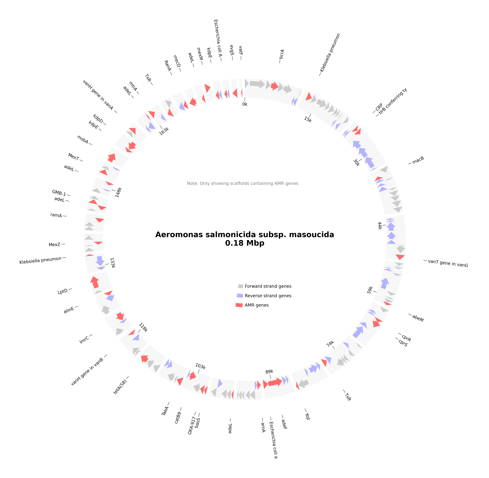

### CRP
- **Mechanism**: antibiotic efflux
- **Drug Classes**: macrolide antibiotic; fluoroquinolone antibiotic; penam
- **AMR Family**: resistance-nodulation-cell division (RND) antibiotic efflux pump
- **Locations**:
  - gnl|SPADES|BMKMCJEI_863_3 : position 1125-1763

### Escherichia coli AcrAB-TolC with AcrR mutation conferring resistance to ciprofloxacin, tetracycline, and ceftazidime
- **Mechanism**: antibiotic target alteration; antibiotic efflux
- **Drug Classes**: fluoroquinolone antibiotic; cephalosporin; glycylcycline; penam; tetracycline antibiotic; rifamycin antibiotic; phenicol antibiotic; disinfecting agents and antiseptics
- **AMR Family**: resistance-nodulation-cell division (RND) antibiotic efflux pump
- **Locations**:
  - gnl|SPADES|BMKMCJEI_5418_1 : position 3-581

### Escherichia coli acrA
- **Mechanism**: antibiotic efflux
- **Drug Classes**: fluoroquinolone antibiotic; cephalosporin; glycylcycline; penam; tetracycline antibiotic; rifamycin antibiotic; phenicol antibiotic; disinfecting agents and antiseptics
- **AMR Family**: resistance-nodulation-cell division (RND) antibiotic efflux pump
- **Locations**:
  - gnl|SPADES|BMKMCJEI_1444_5 : position 4965-6017

### GMB-1
- **Mechanism**: antibiotic inactivation
- **Drug Classes**: carbapenem
- **AMR Family**: GMB beta-lactamase
- **Locations**:
  - gnl|SPADES|BMKMCJEI_2455_3 : position 1529-2389

### Klebsiella pneumoniae OmpK37 (found in 2 locations)
- **Mechanism**: reduced permeability to antibiotic
- **Drug Classes**: monobactam; carbapenem; cephalosporin; cephamycin; penam; penem
- **AMR Family**: General Bacterial Porin with reduced permeability to beta-lactams
- **Locations**:
  - gnl|SPADES|BMKMCJEI_2211_3 : position 3351-3695
  - gnl|SPADES|BMKMCJEI_833_2 : position 881-1942

### LptD
- **Mechanism**: antibiotic efflux
- **Drug Classes**: carbapenem; peptide antibiotic; aminocoumarin antibiotic; rifamycin antibiotic
- **AMR Family**: ATP-binding cassette (ABC) antibiotic efflux pump
- **Locations**:
  - gnl|SPADES|BMKMCJEI_2137_2 : position 1120-3552

### MexT
- **Mechanism**: antibiotic efflux
- **Drug Classes**: fluoroquinolone antibiotic; diaminopyrimidine antibiotic; phenicol antibiotic
- **AMR Family**: resistance-nodulation-cell division (RND) antibiotic efflux pump
- **Locations**:
  - gnl|SPADES|BMKMCJEI_2656_2 : position 646-1587

### MexZ
- **Mechanism**: antibiotic efflux
- **Drug Classes**: macrolide antibiotic; fluoroquinolone antibiotic; aminoglycoside antibiotic; carbapenem; cephalosporin; cephamycin; penam; tetracycline antibiotic; phenicol antibiotic; disinfecting agents and antiseptics
- **AMR Family**: resistance-nodulation-cell division (RND) antibiotic efflux pump
- **Locations**:
  - gnl|SPADES|BMKMCJEI_2242_2 : position 1310-1963

### OXA-917
- **Mechanism**: antibiotic inactivation
- **Drug Classes**: carbapenem; penam
- **AMR Family**: OXA beta-lactamase; OXA-427-like beta-lactamase
- **Locations**:
  - gnl|SPADES|BMKMCJEI_1749_2 : position 606-1400

### RanA
- **Mechanism**: antibiotic efflux
- **Drug Classes**: aminoglycoside antibiotic
- **AMR Family**: ATP-binding cassette (ABC) antibiotic efflux pump
- **Locations**:
  - gnl|SPADES|BMKMCJEI_3704_3 : position 1122-1886

### TaeA
- **Mechanism**: antibiotic efflux
- **Drug Classes**: pleuromutilin antibiotic
- **AMR Family**: ATP-binding cassette (ABC) antibiotic efflux pump
- **Locations**:
  - gnl|SPADES|BMKMCJEI_1752_1 : position 1-1101

### TxR (found in 2 locations)
- **Mechanism**: antibiotic efflux
- **Drug Classes**: tetracycline antibiotic
- **AMR Family**: ATP-binding cassette (ABC) antibiotic efflux pump
- **Locations**:
  - gnl|SPADES|BMKMCJEI_1097_9 : position 7278-8243
  - gnl|SPADES|BMKMCJEI_3278_1 : position 2-940

### YojI
- **Mechanism**: antibiotic efflux
- **Drug Classes**: peptide antibiotic
- **AMR Family**: ATP-binding cassette (ABC) antibiotic efflux pump
- **Locations**:
  - gnl|SPADES|BMKMCJEI_1312_6 : position 6260-6703

### abeM
- **Mechanism**: antibiotic efflux
- **Drug Classes**: fluoroquinolone antibiotic; disinfecting agents and antiseptics
- **AMR Family**: multidrug and toxic compound extrusion (MATE) transporter
- **Locations**:
  - gnl|SPADES|BMKMCJEI_1006_12 : position 8485-9030

### adeF
- **Mechanism**: antibiotic efflux
- **Drug Classes**: fluoroquinolone antibiotic; tetracycline antibiotic
- **AMR Family**: resistance-nodulation-cell division (RND) antibiotic efflux pump
- **Locations**:
  - gnl|SPADES|BMKMCJEI_1444_4: position 1851-4955

### adeL (found in 5 locations)
- **Mechanism**: antibiotic efflux
- **Drug Classes**: fluoroquinolone antibiotic; tetracycline antibiotic
- **AMR Family**: resistance-nodulation-cell division (RND) antibiotic efflux pump
- **Locations**:
  - gnl|SPADES|BMKMCJEI_1722_1 : position 1-408
  - gnl|SPADES|BMKMCJEI_2455_2 : position 501-1400
  - gnl|SPADES|BMKMCJEI_2637_3 : position 2354-2950
  - gnl|SPADES|BMKMCJEI_3025_4 : position 2215-2475
  - gnl|SPADES|BMKMCJEI_4839_2 : position 794-1369

### almE
- **Mechanism**: antibiotic target alteration
- **Drug Classes**: peptide antibiotic
- **AMR Family**: polymyxin resistance operon; alm glycyltransferase
- **Locations**:
  - gnl|SPADES|BMKMCJEI_2016_3 : position 3297-4088

### arnA
- **Mechanism**: antibiotic target alteration
- **Drug Classes**: peptide antibiotic
- **AMR Family**: pmr phosphoethanolamine transferase
- **Locations**:
  - gnl|SPADES|BMKMCJEI_1632_1 : position 1-762

### basS
- **Mechanism**: antibiotic target alteration; antibiotic efflux
- **Drug Classes**: peptide antibiotic
- **AMR Family**: pmr phosphoethanolamine transferase
- **Locations**:
  - gnl|SPADES|BMKMCJEI_1749_1 : position 2-529

### bcrA
- **Mechanism**: antibiotic efflux
- **Drug Classes**: peptide antibiotic
- **AMR Family**: ATP-binding cassette (ABC) antibiotic efflux pump
- **Locations**:
  - gnl|SPADES|BMKMCJEI_798_4 : position 5358-6902

### catB9
- **Mechanism**: antibiotic inactivation
- **Drug Classes**: phenicol antibiotic
- **AMR Family**: chloramphenicol acetyltransferase (CAT)
- **Locations**:
  - gnl|SPADES|BMKMCJEI_1749_4 : position 2930-4291

### cprR
- **Mechanism**: antibiotic target alteration; antibiotic efflux
- **Drug Classes**: peptide antibiotic
- **AMR Family**: pmr phosphoethanolamine transferase
- **Locations**:
  - gnl|SPADES|BMKMCJEI_1038_4 : position 2671-3339

### cprS
- **Mechanism**: antibiotic target alteration; antibiotic efflux
- **Drug Classes**: peptide antibiotic
- **AMR Family**: pmr phosphoethanolamine transferase
- **Locations**:
  - gnl|SPADES|BMKMCJEI_1038_5 : position 3336-4640

### evgS
- **Mechanism**: antibiotic efflux
- **Drug Classes**: macrolide antibiotic; fluoroquinolone antibiotic; penam; tetracycline antibiotic
- **AMR Family**: major facilitator superfamily (MFS) antibiotic efflux pump; resistance-nodulation-cell division (RND) antibiotic efflux pump
- **Locations**:
  - gnl|SPADES|BMKMCJEI_6069_1 : position 3-1040

### kdpD
- **Mechanism**: antibiotic efflux
- **Drug Classes**: aminoglycoside antibiotic
- **AMR Family**: kdpDE
- **Locations**:
  - gnl|SPADES|BMKMCJEI_2796_3 : position 1029-2744

### kdpE (found in 2 locations)
- **Mechanism**: antibiotic efflux
- **Drug Classes**: aminoglycoside antibiotic
- **AMR Family**: kdpDE
- **Locations**:
  - gnl|SPADES|BMKMCJEI_2796_2 : position 259-942
  - gnl|SPADES|BMKMCJEI_4910_1 : position 20-712

### lmrC
- **Mechanism**: antibiotic target protection
- **Drug Classes**: lincosamide antibiotic
- **AMR Family**: Miscellaneous ABC-F subfamily ATP-binding cassette ribosomal protection proteins
- **Locations**:
  - gnl|SPADES|BMKMCJEI_1884_4 : position 2237-3970

### macB
- **Mechanism**: antibiotic efflux
- **Drug Classes**: macrolide antibiotic
- **AMR Family**: ATP-binding cassette (ABC) antibiotic efflux pump
- **Locations**:
  - gnl|SPADES|BMKMCJEI_935_2 : position 1143-1832

### mecD
- **Mechanism**: antibiotic target replacement
- **Drug Classes**: penam
- **AMR Family**: methicillin resistant PBP2
- **Locations**:
  - gnl|SPADES|BMKMCJEI_4427_1 : position 1-1461

### mexM
- **Mechanism**: antibiotic efflux
- **Drug Classes**: phenicol antibiotic
- **AMR Family**: resistance-nodulation-cell division (RND) antibiotic efflux pump
- **Locations**:
  - gnl|SPADES|BMKMCJEI_4902_1 : position 198-1223

### msbA
- **Mechanism**: antibiotic efflux
- **Drug Classes**: nitroimidazole antibiotic
- **AMR Family**: ATP-binding cassette (ABC) antibiotic efflux pump
- **Locations**:
  - gnl|SPADES|BMKMCJEI_2766_1 : position 2-1864

### mtrA
- **Mechanism**: antibiotic efflux
- **Drug Classes**: macrolide antibiotic; penam
- **AMR Family**: resistance-nodulation-cell division (RND) antibiotic efflux pump
- **Locations**:
  - gnl|SPADES|BMKMCJEI_3134_1 : position 3-980

### ramA
- **Mechanism**: antibiotic efflux; reduced permeability to antibiotic
- **Drug Classes**: fluoroquinolone antibiotic; monobactam; carbapenem; cephalosporin; glycylcycline; cephamycin; penam; tetracycline antibiotic; rifamycin antibiotic; phenicol antibiotic; penem; disinfecting agents and antiseptics
- **AMR Family**: resistance-nodulation-cell division (RND) antibiotic efflux pump; General Bacterial Porin with reduced permeability to beta-lactams
- **Locations**:
  - gnl|SPADES|BMKMCJEI_2276_2 : position 1909-2820

### tetA(58)
- **Mechanism**: antibiotic efflux
- **Drug Classes**: tetracycline antibiotic
- **AMR Family**: major facilitator superfamily (MFS) antibiotic efflux pump
- **Locations**:
  - gnl|SPADES|BMKMCJEI_1799_3 : position 2884-4464

### tlrB conferring tylosin resistance
- **Mechanism**: antibiotic target alteration
- **Drug Classes**: macrolide antibiotic; lincosamide antibiotic
- **AMR Family**: non-erm 23S ribosomal RNA methyltransferase (G748)
- **Locations**:
  - gnl|SPADES|BMKMCJEI_863_4 : position 1886-2686

### vanH gene in vanA cluster
- **Mechanism**: antibiotic target alteration
- **Drug Classes**: glycopeptide antibiotic
- **AMR Family**: vanH; glycopeptide resistance gene cluster
- **Locations**:
  - gnl|SPADES|BMKMCJEI_3010_2 : position 976-1950

### vanH gene in vanB cluster
- **Mechanism**: antibiotic target alteration
- **Drug Classes**: glycopeptide antibiotic
- **AMR Family**: vanH; glycopeptide resistance gene cluster
- **Locations**:
  - gnl|SPADES|BMKMCJEI_1824_4 : position 3513-4160

### vanT gene in vanG cluster
- **Mechanism**: antibiotic target alteration
- **Drug Classes**: glycopeptide antibiotic
- **AMR Family**: glycopeptide resistance gene cluster; vanT
- **Locations**:
  - gnl|SPADES|BMKMCJEI_994_9 : position 8048-9121

### vatF
- **Mechanism**: antibiotic inactivation
- **Drug Classes**: streptogramin antibiotic; streptogramin A antibiotic
- **AMR Family**: streptogramin vat acetyltransferase
- **Locations**:
  - gnl|SPADES|BMKMCJEI_10817_2 : position 304-558

## Aeromonas salmonicida subsp. pectinolytica 34mel
**Strain Statistics:**
- Total genome length: 186.2 kbp
- Total scaffolds: 191
- Scaffolds with AMR genes: 44
- Total genes annotated: 384
- Total AMR genes: 57
- Unique AMR genes: 43
- Distinct AMR mechanisms: 5
- Distinct AMR families: 18
- Distinct drug classes: 27

**Circos Plot:**

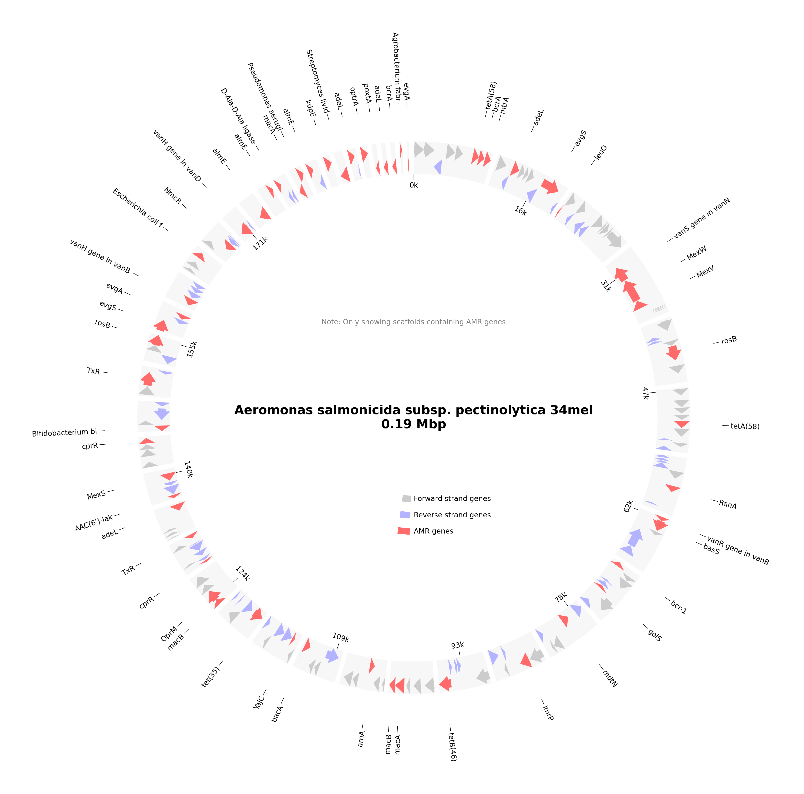

### AAC(6')-Iak
- **Mechanism**: antibiotic inactivation
- **Drug Classes**: aminoglycoside antibiotic
- **AMR Family**: AAC(6')
- **Locations**:
  - gnl|SPADES|BMKMCJEI_2026_1 : position 48-467

### Agrobacterium fabrum chloramphenicol acetyltransferase
- **Mechanism**: antibiotic inactivation
- **Drug Classes**: phenicol antibiotic
- **AMR Family**: chloramphenicol acetyltransferase (CAT)
- **Locations**:
  - gnl|SPADES|BMKMCJEI_22166_1 : position 2-268

### Bifidobacterium bifidum ileS conferring resistance to mupirocin
- **Mechanism**: antibiotic target alteration
- **Drug Classes**: mupirocin-like antibiotic
- **AMR Family**: antibiotic-resistant isoleucyl-tRNA synthetase (ileS)
- **Locations**:
  - gnl|SPADES|BMKMCJEI_2103_1 : position 3-728

### D-Ala-D-Ala ligase
- **Mechanism**: antibiotic target alteration
- **Drug Classes**: glycopeptide antibiotic
- **AMR Family**: Van ligase
- **Locations**:
  - gnl|SPADES|BMKMCJEI_4261_1 : position 2-574

### Escherichia coli fabI mutations conferring resistance to isoniazid and triclosan
- **Mechanism**: antibiotic target alteration
- **Drug Classes**: disinfecting agents and antiseptics; isoniazid-like antibiotic
- **AMR Family**: antibiotic resistant fabI
- **Locations**:
  - gnl|SPADES|BMKMCJEI_2404_4 : position 2188-2964

### MexS
- **Mechanism**: antibiotic efflux
- **Drug Classes**: fluoroquinolone antibiotic; diaminopyrimidine antibiotic; phenicol antibiotic
- **AMR Family**: resistance-nodulation-cell division (RND) antibiotic efflux pump
- **Locations**:
  - gnl|SPADES|BMKMCJEI_2026_4 : position 2437-3441

### MexV
- **Mechanism**: antibiotic efflux
- **Drug Classes**: macrolide antibiotic; fluoroquinolone antibiotic; tetracycline antibiotic; phenicol antibiotic; disinfecting agents and antiseptics
- **AMR Family**: resistance-nodulation-cell division (RND) antibiotic efflux pump
- **Locations**:
  - gnl|SPADES|BMKMCJEI_977_4 : position 6283-7389

### MexW
- **Mechanism**: antibiotic efflux
- **Drug Classes**: macrolide antibiotic; fluoroquinolone antibiotic; tetracycline antibiotic; phenicol antibiotic; disinfecting agents and antiseptics
- **AMR Family**: resistance-nodulation-cell division (RND) antibiotic efflux pump
- **Locations**:
  - gnl|SPADES|BMKMCJEI_977_3 : position 3187-6267

### NmcR
- **Mechanism**: antibiotic inactivation
- **Drug Classes**: carbapenem; cephalosporin; cephamycin; penam
- **AMR Family**: NmcA beta-lactamase
- **Locations**:
  - gnl|SPADES|BMKMCJEI_2425_2 : position 1386-2288

### OprM
- **Mechanism**: antibiotic efflux
- **Drug Classes**: macrolide antibiotic; fluoroquinolone antibiotic; monobactam; aminoglycoside antibiotic; carbapenem; cephalosporin; cephamycin; penam; tetracycline antibiotic; peptide antibiotic; aminocoumarin antibiotic; diaminopyrimidine antibiotic; sulfonamide antibiotic; phenicol antibiotic; penem; disinfecting agents and antiseptics
- **AMR Family**: resistance-nodulation-cell division (RND) antibiotic efflux pump
- **Locations**:
  - gnl|SPADES|BMKMCJEI_1790_2 : position 740-2104

### Pseudomonas aeruginosa CpxR
- **Mechanism**: antibiotic efflux
- **Drug Classes**: macrolide antibiotic; fluoroquinolone antibiotic; monobactam; aminoglycoside antibiotic; carbapenem; cephalosporin; cephamycin; penam; tetracycline antibiotic; peptide antibiotic; aminocoumarin antibiotic; diaminopyrimidine antibiotic; sulfonamide antibiotic; phenicol antibiotic; penem
- **AMR Family**: resistance-nodulation-cell division (RND) antibiotic efflux pump
- **Locations**:
  - gnl|SPADES|BMKMCJEI_4327_2 : position 846-1526

### RanA
- **Mechanism**: antibiotic efflux
- **Drug Classes**: aminoglycoside antibiotic
- **AMR Family**: ATP-binding cassette (ABC) antibiotic efflux pump
- **Locations**:
  - gnl|SPADES|BMKMCJEI_1234_8 : position 3731-4513

### Streptomyces lividans cmlR
- **Mechanism**: antibiotic efflux
- **Drug Classes**: phenicol antibiotic
- **AMR Family**: major facilitator superfamily (MFS) antibiotic efflux pump
- **Locations**:
  - gnl|SPADES|BMKMCJEI_5906_1 : position 1-1077

### TxR (found in 2 locations)
- **Mechanism**: antibiotic efflux
- **Drug Classes**: tetracycline antibiotic
- **AMR Family**: ATP-binding cassette (ABC) antibiotic efflux pump
- **Locations**:
  - gnl|SPADES|BMKMCJEI_1955_8 : position 3698-4264
  - gnl|SPADES|BMKMCJEI_2177_2 : position 1373-3070

### YajC
- **Mechanism**: antibiotic efflux
- **Drug Classes**: fluoroquinolone antibiotic; cephalosporin; glycylcycline; penam; tetracycline antibiotic; oxazolidinone antibiotic; glycopeptide antibiotic; rifamycin antibiotic; phenicol antibiotic; disinfecting agents and antiseptics
- **AMR Family**: resistance-nodulation-cell division (RND) antibiotic efflux pump
- **Locations**:
  - gnl|SPADES|BMKMCJEI_1641_2 : position 697-1032

### adeL (found in 4 locations)
- **Mechanism**: antibiotic efflux
- **Drug Classes**: fluoroquinolone antibiotic; tetracycline antibiotic
- **AMR Family**: resistance-nodulation-cell division (RND) antibiotic efflux pump
- **Locations**:
  - gnl|SPADES|BMKMCJEI_10914_1 : position 2-553
  - gnl|SPADES|BMKMCJEI_1996_2 : position 2943-3854
  - gnl|SPADES|BMKMCJEI_6101_1 : position 3-746
  - gnl|SPADES|BMKMCJEI_959_4 : position 2261-3160

### almE (found in 3 locations)
- **Mechanism**: antibiotic target alteration
- **Drug Classes**: peptide antibiotic
- **AMR Family**: polymyxin resistance operon; alm glycyltransferase
- **Locations**:
  - gnl|SPADES|BMKMCJEI_3418_2 : position 928-2121
  - gnl|SPADES|BMKMCJEI_3961_3 : position 1195-1761
  - gnl|SPADES|BMKMCJEI_4594_1 : position 3-674

### arnA
- **Mechanism**: antibiotic target alteration
- **Drug Classes**: peptide antibiotic
- **AMR Family**: pmr phosphoethanolamine transferase
- **Locations**:
  - gnl|SPADES|BMKMCJEI_1545_3 : position 1546-2220

### bacA
- **Mechanism**: antibiotic target alteration
- **Drug Classes**: peptide antibiotic
- **AMR Family**: undecaprenyl pyrophosphate related proteins
- **Locations**:
  - gnl|SPADES|BMKMCJEI_1563_6 : position 4419-5234

### basS
- **Mechanism**: antibiotic target alteration; antibiotic efflux
- **Drug Classes**: peptide antibiotic
- **AMR Family**: pmr phosphoethanolamine transferase
- **Locations**:
  - gnl|SPADES|BMKMCJEI_1239_2 : position 530-1879

### bcr-1
- **Mechanism**: antibiotic efflux
- **Drug Classes**: bicyclomycin-like antibiotic
- **AMR Family**: major facilitator superfamily (MFS) antibiotic efflux pump
- **Locations**:
  - gnl|SPADES|BMKMCJEI_1243_1 : position 3-593

### bcrA (found in 2 locations)
- **Mechanism**: antibiotic efflux
- **Drug Classes**: peptide antibiotic
- **AMR Family**: ATP-binding cassette (ABC) antibiotic efflux pump
- **Locations**:
  - gnl|SPADES|BMKMCJEI_10909_1 : position 1-552
  - gnl|SPADES|BMKMCJEI_914_8 : position 8291-8992

### cprR (found in 2 locations)
- **Mechanism**: antibiotic target alteration; antibiotic efflux
- **Drug Classes**: peptide antibiotic
- **AMR Family**: pmr phosphoethanolamine transferase
- **Locations**:
  - gnl|SPADES|BMKMCJEI_1955_1 : position 3-278
  - gnl|SPADES|BMKMCJEI_2088_5 : position 3055-3744

### evgA (found in 2 locations)
- **Mechanism**: antibiotic efflux
- **Drug Classes**: macrolide antibiotic; fluoroquinolone antibiotic; penam; tetracycline antibiotic
- **AMR Family**: major facilitator superfamily (MFS) antibiotic efflux pump; resistance-nodulation-cell division (RND) antibiotic efflux pump
- **Locations**:
  - gnl|SPADES|BMKMCJEI_2304_3 : position 2328-2966
  - gnl|SPADES|BMKMCJEI_44575_1 : position 2-175

### evgS (found in 2 locations)
- **Mechanism**: antibiotic efflux
- **Drug Classes**: macrolide antibiotic; fluoroquinolone antibiotic; penam; tetracycline antibiotic
- **AMR Family**: major facilitator superfamily (MFS) antibiotic efflux pump; resistance-nodulation-cell division (RND) antibiotic efflux pump
- **Locations**:
  - gnl|SPADES|BMKMCJEI_2304_1 : position 3-1418
  - gnl|SPADES|BMKMCJEI_959_9 : position 6446-8758

### golS
- **Mechanism**: antibiotic efflux
- **Drug Classes**: monobactam; carbapenem; cephalosporin; cephamycin; penam; phenicol antibiotic; penem
- **AMR Family**: resistance-nodulation-cell division (RND) antibiotic efflux pump
- **Locations**:
  - gnl|SPADES|BMKMCJEI_1243_6 : position 3871-4311

### kdpE
- **Mechanism**: antibiotic efflux
- **Drug Classes**: aminoglycoside antibiotic
- **AMR Family**: kdpDE
- **Locations**:
  - gnl|SPADES|BMKMCJEI_5866_2 : position 277-1086

### leuO
- **Mechanism**: antibiotic efflux
- **Drug Classes**: nucleoside antibiotic; disinfecting agents and antiseptics
- **AMR Family**: major facilitator superfamily (MFS) antibiotic efflux pump
- **Locations**:
  - gnl|SPADES|BMKMCJEI_974_1 : position 2-193

### lmrP
- **Mechanism**: antibiotic efflux
- **Drug Classes**: macrolide antibiotic; lincosamide antibiotic; streptogramin antibiotic; streptogramin A antibiotic; tetracycline antibiotic
- **AMR Family**: major facilitator superfamily (MFS) antibiotic efflux pump
- **Locations**:
  - gnl|SPADES|BMKMCJEI_1325_2 : position 1907-3127

### macA (found in 2 locations)
- **Mechanism**: antibiotic efflux
- **Drug Classes**: macrolide antibiotic
- **AMR Family**: ATP-binding cassette (ABC) antibiotic efflux pump
- **Locations**:
  - gnl|SPADES|BMKMCJEI_1514_4 : position 3790-4953
  - gnl|SPADES|BMKMCJEI_4327_1 : position 1-696

### macB (found in 2 locations)
- **Mechanism**: antibiotic efflux
- **Drug Classes**: macrolide antibiotic
- **AMR Family**: ATP-binding cassette (ABC) antibiotic efflux pump
- **Locations**:
  - gnl|SPADES|BMKMCJEI_1514_5 : position 4950-5681
  - gnl|SPADES|BMKMCJEI_1790_1 : position 3-737

### mdtN
- **Mechanism**: antibiotic efflux
- **Drug Classes**: nucleoside antibiotic; disinfecting agents and antiseptics
- **AMR Family**: major facilitator superfamily (MFS) antibiotic efflux pump
- **Locations**:
  - gnl|SPADES|BMKMCJEI_1255_3 : position 2313-3317

### mtrA
- **Mechanism**: antibiotic efflux
- **Drug Classes**: macrolide antibiotic; penam
- **AMR Family**: resistance-nodulation-cell division (RND) antibiotic efflux pump
- **Locations**:
  - gnl|SPADES|BMKMCJEI_914_9 : position 9074-9844

### optrA
- **Mechanism**: antibiotic target protection
- **Drug Classes**: oxazolidinone antibiotic; phenicol antibiotic
- **AMR Family**: Miscellaneous ABC-F subfamily ATP-binding cassette ribosomal protection proteins
- **Locations**:
  - gnl|SPADES|BMKMCJEI_7486_1 : position 1-828

### poxtA
- **Mechanism**: antibiotic target protection
- **Drug Classes**: tetracycline antibiotic; oxazolidinone antibiotic; phenicol antibiotic
- **AMR Family**: Miscellaneous ABC-F subfamily ATP-binding cassette ribosomal protection proteins
- **Locations**:
  - gnl|SPADES|BMKMCJEI_10051_1 : position 156-599

### rosB (found in 2 locations)
- **Mechanism**: antibiotic efflux
- **Drug Classes**: peptide antibiotic
- **AMR Family**: major facilitator superfamily (MFS) antibiotic efflux pump
- **Locations**:
  - gnl|SPADES|BMKMCJEI_1089_5 : position 3589-5445
  - gnl|SPADES|BMKMCJEI_2290_4 : position 2205-3542

### tet(35)
- **Mechanism**: antibiotic efflux
- **Drug Classes**: tetracycline antibiotic
- **AMR Family**: ATP-binding cassette (ABC) antibiotic efflux pump
- **Locations**:
  - gnl|SPADES|BMKMCJEI_1727_1 : position 106-1440

### tetA(58) (found in 2 locations)
- **Mechanism**: antibiotic efflux
- **Drug Classes**: tetracycline antibiotic
- **AMR Family**: major facilitator superfamily (MFS) antibiotic efflux pump
- **Locations**:
  - gnl|SPADES|BMKMCJEI_1114_6 : position 4208-5089
  - gnl|SPADES|BMKMCJEI_914_7 : position 7504-8280

### tetB(46)
- **Mechanism**: antibiotic efflux
- **Drug Classes**: tetracycline antibiotic
- **AMR Family**: ATP-binding cassette (ABC) antibiotic efflux pump
- **Locations**:
  - gnl|SPADES|BMKMCJEI_1346_6 : position 4950-6485

### vanH gene in vanB cluster
- **Mechanism**: antibiotic target alteration
- **Drug Classes**: glycopeptide antibiotic
- **AMR Family**: vanH; glycopeptide resistance gene cluster
- **Locations**:
  - gnl|SPADES|BMKMCJEI_2312_2 : position 303-1259

### vanH gene in vanD cluster
- **Mechanism**: antibiotic target alteration
- **Drug Classes**: glycopeptide antibiotic
- **AMR Family**: vanH; glycopeptide resistance gene cluster
- **Locations**:
  - gnl|SPADES|BMKMCJEI_3331_2 : position 468-1700

### vanR gene in vanB cluster
- **Mechanism**: antibiotic target alteration
- **Drug Classes**: glycopeptide antibiotic
- **AMR Family**: glycopeptide resistance gene cluster; vanR
- **Locations**:
  - gnl|SPADES|BMKMCJEI_1239_1 : position 1-492

### vanS gene in vanN cluster
- **Mechanism**: antibiotic target alteration
- **Drug Classes**: glycopeptide antibiotic
- **AMR Family**: vanS; glycopeptide resistance gene cluster
- **Locations**:
  - gnl|SPADES|BMKMCJEI_977_2 : position 1097-3094

## Aeromonas salmonicida subsp. salmonicida
**Strain Statistics:**
- Total genome length: 8.6 kbp
- Total scaffolds: 27
- Scaffolds with AMR genes: 2
- Total genes annotated: 18
- Total AMR genes: 4
- Unique AMR genes: 4
- Distinct AMR mechanisms: 2
- Distinct AMR families: 3
- Distinct drug classes: 12

**Circos Plot:**

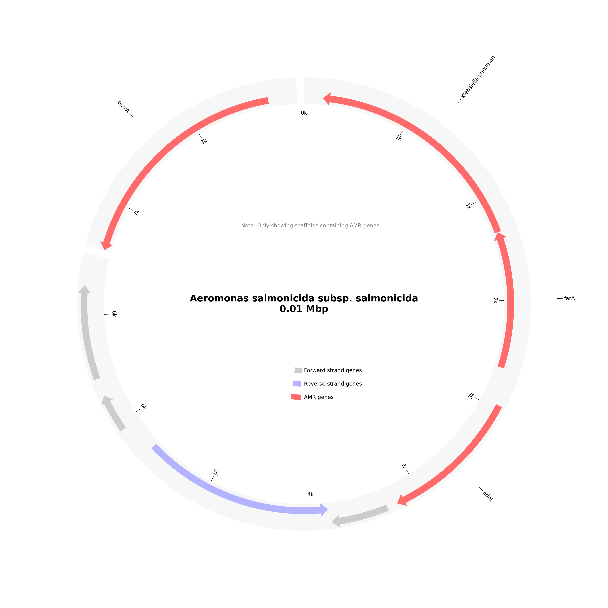

### Klebsiella pneumoniae KpnH
- **Mechanism**: antibiotic efflux
- **Drug Classes**: macrolide antibiotic; fluoroquinolone antibiotic; aminoglycoside antibiotic; carbapenem; cephalosporin; penam; peptide antibiotic; penem
- **AMR Family**: major facilitator superfamily (MFS) antibiotic efflux pump
- **Locations**:
  - gnl|SPADES|BMKMCJEI_1290_1 : position 126-1679

### adeL
- **Mechanism**: antibiotic efflux
- **Drug Classes**: fluoroquinolone antibiotic; tetracycline antibiotic
- **AMR Family**: resistance-nodulation-cell division (RND) antibiotic efflux pump
- **Locations**:
  - gnl|SPADES|BMKMCJEI_1290_4 : position 2833-3735

### farA
- **Mechanism**: antibiotic efflux
- **Drug Classes**: antibacterial free fatty acids
- **AMR Family**: major facilitator superfamily (MFS) antibiotic efflux pump
- **Locations**:
  - gnl|SPADES|BMKMCJEI_1290_2 : position 1679-2599

### optrA
- **Mechanism**: antibiotic target protection
- **Drug Classes**: oxazolidinone antibiotic; phenicol antibiotic
- **AMR Family**: Miscellaneous ABC-F subfamily ATP-binding cassette ribosomal protection proteins
- **Locations**:
  - gnl|SPADES|BMKMCJEI_3966_1 : position 2-1567

## Buttiauxella agrestis
**Strain Statistics:**
- Total genome length: 2242.0 kbp
- Total scaffolds: 858
- Scaffolds with AMR genes: 255
- Total genes annotated: 4089
- Total AMR genes: 419
- Unique AMR genes: 192
- Distinct AMR mechanisms: 11
- Distinct AMR families: 72
- Distinct drug classes: 35

**Circos Plot:**

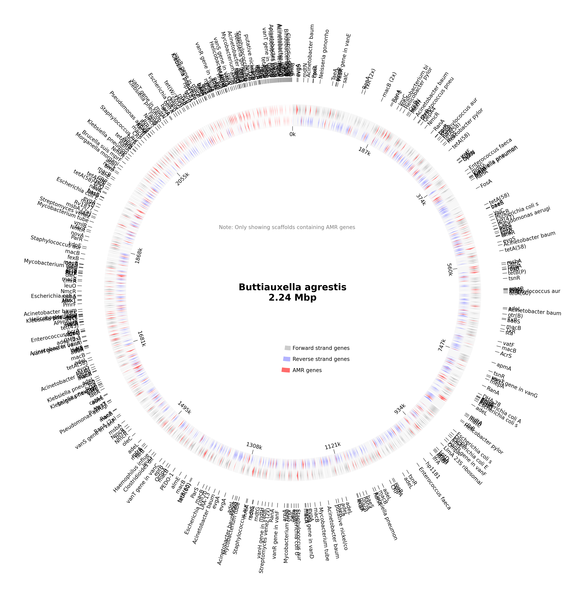

### ACT-8
- **Mechanism**: antibiotic inactivation
- **Drug Classes**: carbapenem; cephalosporin; cephamycin; penam
- **AMR Family**: ACT beta-lactamase
- **Locations**:
  - gnl|SPADES|BMKMCJEI_1106_6: position 4648-5799

### AIM-1
- **Mechanism**: antibiotic inactivation
- **Drug Classes**: cephalosporin; cephamycin; penam
- **AMR Family**: AIM beta-lactamase
- **Locations**:
  - gnl|SPADES|BMKMCJEI_1162_2 : position 996-1955

### APH(6)-Ic
- **Mechanism**: antibiotic inactivation
- **Drug Classes**: aminoglycoside antibiotic
- **AMR Family**: APH(6)
- **Locations**:
  - gnl|SPADES|BMKMCJEI_1138_2 : position 539-1366

### Acinetobacter baumannii AbaF (found in 7 locations)
- **Mechanism**: antibiotic efflux
- **Drug Classes**: phosphonic acid antibiotic
- **AMR Family**: major facilitator superfamily (MFS) antibiotic efflux pump
- **Locations**:
  - gnl|SPADES|BMKMCJEI_1046_8 : position 7862-8629
  - gnl|SPADES|BMKMCJEI_1146_3 : position 1382-2707
  - gnl|SPADES|BMKMCJEI_540_11 : position 10727-12052
  - gnl|SPADES|BMKMCJEI_723_1 : position 177-1511
  - gnl|SPADES|BMKMCJEI_792_1 : position 2-757
  - gnl|SPADES|BMKMCJEI_792_8 : position 9213-10547
  - gnl|SPADES|BMKMCJEI_797_3 : position 6562-7884

### Acinetobacter baumannii AbaQ (found in 8 locations)
- **Mechanism**: antibiotic efflux
- **Drug Classes**: fluoroquinolone antibiotic
- **AMR Family**: major facilitator superfamily (MFS) antibiotic efflux pump
- **Locations**:
  - gnl|SPADES|BMKMCJEI_1100_8 : position 6151-7464
  - gnl|SPADES|BMKMCJEI_13520_1 : position 1-375
  - gnl|SPADES|BMKMCJEI_15295_1 : position 2-415
  - gnl|SPADES|BMKMCJEI_324_30 : position 29439-30755
  - gnl|SPADES|BMKMCJEI_3877_1 : position 82-1380
  - gnl|SPADES|BMKMCJEI_405_5 : position 4397-5587
  - gnl|SPADES|BMKMCJEI_503_9 : position 13457-14818
  - gnl|SPADES|BMKMCJEI_9561_1 : position 2-631

### AcrE
- **Mechanism**: antibiotic efflux
- **Drug Classes**: fluoroquinolone antibiotic; cephalosporin; cephamycin; penam
- **AMR Family**: resistance-nodulation-cell division (RND) antibiotic efflux pump
- **Locations**:
  - gnl|SPADES|BMKMCJEI_1231_2 : position 267-1421

### AcrF
- **Mechanism**: antibiotic efflux
- **Drug Classes**: fluoroquinolone antibiotic; cephalosporin; cephamycin; penam
- **AMR Family**: resistance-nodulation-cell division (RND) antibiotic efflux pump
- **Locations**:
  - gnl|SPADES|BMKMCJEI_1231_1 : position 2-256

### AcrS (found in 2 locations)
- **Mechanism**: antibiotic efflux
- **Drug Classes**: fluoroquinolone antibiotic; cephalosporin; glycylcycline; cephamycin; penam; tetracycline antibiotic; rifamycin antibiotic; phenicol antibiotic; disinfecting agents and antiseptics
- **AMR Family**: resistance-nodulation-cell division (RND) antibiotic efflux pump
- **Locations**:
  - gnl|SPADES|BMKMCJEI_1231_4 : position 4864-5472
  - gnl|SPADES|BMKMCJEI_550_16 : position 14790-15335

### Bifidobacterium bifidum ileS conferring resistance to mupirocin (found in 2 locations)
- **Mechanism**: antibiotic target alteration
- **Drug Classes**: mupirocin-like antibiotic
- **AMR Family**: antibiotic-resistant isoleucyl-tRNA synthetase (ileS)
- **Locations**:
  - gnl|SPADES|BMKMCJEI_20751_1 : position 1-333
  - gnl|SPADES|BMKMCJEI_395_1 : position 3-2417

### Brucella suis mprF
- **Mechanism**: antibiotic target alteration
- **Drug Classes**: peptide antibiotic
- **AMR Family**: defensin resistant mprF
- **Locations**:
  - gnl|SPADES|BMKMCJEI_1646_4 : position 2539-3507

### CRP (found in 3 locations)
- **Mechanism**: antibiotic efflux
- **Drug Classes**: macrolide antibiotic; fluoroquinolone antibiotic; penam
- **AMR Family**: resistance-nodulation-cell division (RND) antibiotic efflux pump
- **Locations**:
  - gnl|SPADES|BMKMCJEI_1528_2 : position 1086-1838
  - gnl|SPADES|BMKMCJEI_1893_2 : position 479-1171
  - gnl|SPADES|BMKMCJEI_666_19: position 13922-14554

### Clostridioides difficile gyrB conferring resistance to fluoroquinolones (found in 2 locations)
- **Mechanism**: antibiotic target alteration
- **Drug Classes**: fluoroquinolone antibiotic
- **AMR Family**: fluoroquinolone resistant gyrB
- **Locations**:
  - gnl|SPADES|BMKMCJEI_27784_1 : position 3-275
  - gnl|SPADES|BMKMCJEI_895_9 : position 8353-10032

### CrcB
- **Mechanism**: antibiotic efflux
- **Drug Classes**: aminoglycoside antibiotic
- **AMR Family**: multidrug and toxic compound extrusion (MATE) transporter
- **Locations**:
  - gnl|SPADES|BMKMCJEI_395_18 : position 16764-17147

### DHA-28
- **Mechanism**: antibiotic inactivation
- **Drug Classes**: cephalosporin; cephamycin
- **AMR Family**: DHA beta-lactamase
- **Locations**:
  - gnl|SPADES|BMKMCJEI_574_3 : position 4212-5219

### Enterococcus faecalis cls with mutation conferring resistance to daptomycin (found in 2 locations)
- **Mechanism**: antibiotic target alteration
- **Drug Classes**: peptide antibiotic
- **AMR Family**: daptomycin resistant cls
- **Locations**:
  - gnl|SPADES|BMKMCJEI_465_14 : position 14143-15594
  - gnl|SPADES|BMKMCJEI_641_2 : position 602-2062

### Enterococcus faecium liaR mutant conferring daptomycin resistance
- **Mechanism**: antibiotic target alteration; antibiotic efflux
- **Drug Classes**: peptide antibiotic
- **AMR Family**: daptomycin resistant liaR
- **Locations**:
  - gnl|SPADES|BMKMCJEI_1106_9 : position 7050-7634

### ErmB
- **Mechanism**: antibiotic target alteration
- **Drug Classes**: macrolide antibiotic; lincosamide antibiotic; streptogramin antibiotic; streptogramin A antibiotic; streptogramin B antibiotic
- **AMR Family**: Erm 23S ribosomal RNA methyltransferase
- **Locations**:
  - gnl|SPADES|BMKMCJEI_603_7 : position 9422-10246

### Escherichia coli AcrAB-TolC with MarR mutations conferring resistance to ciprofloxacin and tetracycline
- **Mechanism**: antibiotic target alteration; antibiotic efflux
- **Drug Classes**: fluoroquinolone antibiotic; cephalosporin; glycylcycline; penam; tetracycline antibiotic; rifamycin antibiotic; phenicol antibiotic; disinfecting agents and antiseptics
- **AMR Family**: resistance-nodulation-cell division (RND) antibiotic efflux pump
- **Locations**:
  - gnl|SPADES|BMKMCJEI_574_10 : position 11830-12285

### Escherichia coli EF-Tu mutants conferring resistance to Pulvomycin
- **Mechanism**: antibiotic target alteration
- **Drug Classes**: elfamycin antibiotic
- **AMR Family**: elfamycin resistant EF-Tu
- **Locations**:
  - gnl|SPADES|BMKMCJEI_592_7 : position 5593-7440

### Escherichia coli EF-Tu mutants conferring resistance to kirromycin
- **Mechanism**: antibiotic target alteration
- **Drug Classes**: elfamycin antibiotic
- **AMR Family**: elfamycin resistant EF-Tu
- **Locations**:
  - gnl|SPADES|BMKMCJEI_1438_4 : position 1757-4441

### Escherichia coli UhpT with mutation conferring resistance to fosfomycin
- **Mechanism**: antibiotic target alteration
- **Drug Classes**: phosphonic acid antibiotic
- **AMR Family**: antibiotic-resistant UhpT
- **Locations**:
  - gnl|SPADES|BMKMCJEI_746_6 : position 5748-7139

### Escherichia coli mdfA
- **Mechanism**: antibiotic efflux
- **Drug Classes**: tetracycline antibiotic; phenicol antibiotic; disinfecting agents and antiseptics
- **AMR Family**: major facilitator superfamily (MFS) antibiotic efflux pump
- **Locations**:
  - gnl|SPADES|BMKMCJEI_803_13 : position 11155-11460

### Escherichia coli soxR with mutation conferring antibiotic resistance
- **Mechanism**: antibiotic target alteration; antibiotic efflux
- **Drug Classes**: fluoroquinolone antibiotic; cephalosporin; glycylcycline; penam; tetracycline antibiotic; rifamycin antibiotic; phenicol antibiotic; disinfecting agents and antiseptics
- **AMR Family**: ATP-binding cassette (ABC) antibiotic efflux pump; major facilitator superfamily (MFS) antibiotic efflux pump; resistance-nodulation-cell division (RND) antibiotic efflux pump
- **Locations**:
  - gnl|SPADES|BMKMCJEI_582_15 : position 14545-15003

### Escherichia coli soxS with mutation conferring antibiotic resistance (found in 4 locations)
- **Mechanism**: antibiotic target alteration; antibiotic efflux; reduced permeability to antibiotic
- **Drug Classes**: fluoroquinolone antibiotic; monobactam; carbapenem; cephalosporin; glycylcycline; cephamycin; penam; tetracycline antibiotic; rifamycin antibiotic; phenicol antibiotic; penem; disinfecting agents and antiseptics
- **AMR Family**: ATP-binding cassette (ABC) antibiotic efflux pump; major facilitator superfamily (MFS) antibiotic efflux pump; resistance-nodulation-cell division (RND) antibiotic efflux pump; General Bacterial Porin with reduced permeability to beta-lactams
- **Locations**:
  - gnl|SPADES|BMKMCJEI_1185_3 : position 1607-2452
  - gnl|SPADES|BMKMCJEI_496_6 : position 6915-7787
  - gnl|SPADES|BMKMCJEI_578_2 : position 300-1160
  - gnl|SPADES|BMKMCJEI_582_14 : position 14143-14466

### Escherichia coli uhpA with mutation conferring resistance to fosfomycin
- **Mechanism**: antibiotic target alteration
- **Drug Classes**: phosphonic acid antibiotic
- **AMR Family**: antibiotic-resistant UhpT
- **Locations**:
  - gnl|SPADES|BMKMCJEI_2315_2 : position 1875-2603

### FosA
- **Mechanism**: antibiotic inactivation
- **Drug Classes**: phosphonic acid antibiotic
- **AMR Family**: fosfomycin thiol transferase
- **Locations**:
  - gnl|SPADES|BMKMCJEI_477_11 : position 7506-7895

### FosG
- **Mechanism**: antibiotic inactivation
- **Drug Classes**: phosphonic acid antibiotic
- **AMR Family**: fosfomycin thiol transferase
- **Locations**:
  - gnl|SPADES|BMKMCJEI_497_12 : position 9271-9678

### GMB-1
- **Mechanism**: antibiotic inactivation
- **Drug Classes**: carbapenem
- **AMR Family**: GMB beta-lactamase
- **Locations**:
  - gnl|SPADES|BMKMCJEI_1107_7 : position 5518-6384

### H-NS
- **Mechanism**: antibiotic efflux
- **Drug Classes**: macrolide antibiotic; fluoroquinolone antibiotic; cephalosporin; cephamycin; penam; tetracycline antibiotic
- **AMR Family**: major facilitator superfamily (MFS) antibiotic efflux pump; resistance-nodulation-cell division (RND) antibiotic efflux pump
- **Locations**:
  - gnl|SPADES|BMKMCJEI_1096_6 : position 6034-6444

### Haemophilus influenzae PBP3 conferring resistance to beta-lactam antibiotics
- **Mechanism**: antibiotic target alteration
- **Drug Classes**: cephalosporin; cephamycin; penam
- **AMR Family**: Penicillin-binding protein mutations conferring resistance to beta-lactam antibiotics
- **Locations**:
  - gnl|SPADES|BMKMCJEI_902_9 : position 8796-9983

### Helicobacter pylori pbp1 mutants conferring resistance to amoxicillin (found in 2 locations)
- **Mechanism**: antibiotic target alteration
- **Drug Classes**: cephalosporin; cephamycin; penam
- **AMR Family**: Penicillin-binding protein mutations conferring resistance to beta-lactam antibiotics
- **Locations**:
  - gnl|SPADES|BMKMCJEI_420_1 : position 3-2144
  - gnl|SPADES|BMKMCJEI_581_10 : position 10064-12385

### Helicobacter pylori pbp2 mutants conferring resistance to amoxicillin
- **Mechanism**: antibiotic target alteration
- **Drug Classes**: cephalosporin; cephamycin; penam
- **AMR Family**: Penicillin-binding protein mutations conferring resistance to beta-lactam antibiotics
- **Locations**:
  - gnl|SPADES|BMKMCJEI_395_9 : position 7562-9463

### Helicobacter pylori rdxA mutation conferring resistance to metronidazole
- **Mechanism**: antibiotic target alteration
- **Drug Classes**: nitroimidazole antibiotic
- **AMR Family**: Antibiotic resistant Helicobacter pylori nitroreductase
- **Locations**:
  - gnl|SPADES|BMKMCJEI_1140_4 : position 1886-2539

### Helicobacter pylori rpoB mutation conferring resistance to rifampicin
- **Mechanism**: antibiotic target alteration; antibiotic target replacement
- **Drug Classes**: fluoroquinolone antibiotic; rifamycin antibiotic
- **AMR Family**: rifamycin-resistant beta-subunit of RNA polymerase (rpoB)
- **Locations**:
  - gnl|SPADES|BMKMCJEI_3357_1 : position 3-1142

### IreK
- **Mechanism**: reduced permeability to antibiotic
- **Drug Classes**: cephalosporin
- **AMR Family**: Serine/threonine kinases
- **Locations**:
  - gnl|SPADES|BMKMCJEI_1686_4 : position 2004-2777

### Klebsiella pneumoniae KpnE
- **Mechanism**: antibiotic efflux
- **Drug Classes**: macrolide antibiotic; aminoglycoside antibiotic; cephalosporin; tetracycline antibiotic; peptide antibiotic; rifamycin antibiotic; disinfecting agents and antiseptics
- **AMR Family**: small multidrug resistance (SMR) antibiotic efflux pump
- **Locations**:
  - gnl|SPADES|BMKMCJEI_2633_5: position 2360-2734

### Klebsiella pneumoniae KpnF
- **Mechanism**: antibiotic efflux
- **Drug Classes**: macrolide antibiotic; aminoglycoside antibiotic; cephalosporin; tetracycline antibiotic; peptide antibiotic; rifamycin antibiotic; disinfecting agents and antiseptics
- **AMR Family**: small multidrug resistance (SMR) antibiotic efflux pump
- **Locations**:
  - gnl|SPADES|BMKMCJEI_2633_4: position 2044-2373

### Klebsiella pneumoniae KpnG
- **Mechanism**: antibiotic efflux
- **Drug Classes**: macrolide antibiotic; fluoroquinolone antibiotic; aminoglycoside antibiotic; carbapenem; cephalosporin; penam; peptide antibiotic; penem
- **AMR Family**: major facilitator superfamily (MFS) antibiotic efflux pump
- **Locations**:
  - gnl|SPADES|BMKMCJEI_471_7 : position 5389-6561

### Klebsiella pneumoniae KpnH (found in 3 locations)
- **Mechanism**: antibiotic efflux
- **Drug Classes**: macrolide antibiotic; fluoroquinolone antibiotic; aminoglycoside antibiotic; carbapenem; cephalosporin; penam; peptide antibiotic; penem
- **AMR Family**: major facilitator superfamily (MFS) antibiotic efflux pump
- **Locations**:
  - gnl|SPADES|BMKMCJEI_1140_1 : position 3-503
  - gnl|SPADES|BMKMCJEI_2036_2 : position 961-2343
  - gnl|SPADES|BMKMCJEI_471_6: position 3835-5373

### Klebsiella pneumoniae OmpK37 (found in 3 locations)
- **Mechanism**: reduced permeability to antibiotic
- **Drug Classes**: monobactam; carbapenem; cephalosporin; cephamycin; penam; penem
- **AMR Family**: General Bacterial Porin with reduced permeability to beta-lactams
- **Locations**:
  - gnl|SPADES|BMKMCJEI_1036_9 : position 8614-8739
  - gnl|SPADES|BMKMCJEI_1691_2 : position 1311-2411
  - gnl|SPADES|BMKMCJEI_671_11 : position 13693-14793

### Klebsiella pneumoniae acrR with mutation conferring multidrug antibiotic resistance
- **Mechanism**: antibiotic target alteration; antibiotic efflux
- **Drug Classes**: fluoroquinolone antibiotic; cephalosporin; glycylcycline; penam; tetracycline antibiotic; rifamycin antibiotic; phenicol antibiotic; disinfecting agents and antiseptics
- **AMR Family**: resistance-nodulation-cell division (RND) antibiotic efflux pump
- **Locations**:
  - gnl|SPADES|BMKMCJEI_1020_7 : position 7313-7954

### LRA-13
- **Mechanism**: antibiotic inactivation
- **Drug Classes**: cephalosporin; penam
- **AMR Family**: class C LRA beta-lactamase; class D LRA beta-lactamase
- **Locations**:
  - gnl|SPADES|BMKMCJEI_803_6 : position 4635-5843

### LlmA 23S ribosomal RNA methyltransferase
- **Mechanism**: antibiotic target alteration
- **Drug Classes**: lincosamide antibiotic
- **AMR Family**: Llm 23S ribosomal RNA methyltransferase
- **Locations**:
  - gnl|SPADES|BMKMCJEI_594_13 : position 11769-12944

### LpsA
- **Mechanism**: reduced permeability to antibiotic
- **Drug Classes**: peptide antibiotic
- **AMR Family**: Intrinsic peptide antibiotic resistant Lps
- **Locations**:
  - gnl|SPADES|BMKMCJEI_1485_1 : position 133-909

### LptD
- **Mechanism**: antibiotic efflux
- **Drug Classes**: carbapenem; peptide antibiotic; aminocoumarin antibiotic; rifamycin antibiotic
- **AMR Family**: ATP-binding cassette (ABC) antibiotic efflux pump
- **Locations**:
  - gnl|SPADES|BMKMCJEI_603_4 : position 4710-7097

### MdtK
- **Mechanism**: antibiotic efflux
- **Drug Classes**: fluoroquinolone antibiotic
- **AMR Family**: multidrug and toxic compound extrusion (MATE) transporter
- **Locations**:
  - gnl|SPADES|BMKMCJEI_1140_8 : position 6403-7896

### MexH (found in 2 locations)
- **Mechanism**: antibiotic efflux
- **Drug Classes**: fluoroquinolone antibiotic; tetracycline antibiotic; disinfecting agents and antiseptics
- **AMR Family**: resistance-nodulation-cell division (RND) antibiotic efflux pump
- **Locations**:
  - gnl|SPADES|BMKMCJEI_1050_2 : position 1509-2336
  - gnl|SPADES|BMKMCJEI_395_23 : position 21790-23247

### MexS (found in 2 locations)
- **Mechanism**: antibiotic efflux
- **Drug Classes**: fluoroquinolone antibiotic; diaminopyrimidine antibiotic; phenicol antibiotic
- **AMR Family**: resistance-nodulation-cell division (RND) antibiotic efflux pump
- **Locations**:
  - gnl|SPADES|BMKMCJEI_566_7 : position 5737-6720
  - gnl|SPADES|BMKMCJEI_792_3 : position 2668-3699

### MexT (found in 2 locations)
- **Mechanism**: antibiotic efflux
- **Drug Classes**: fluoroquinolone antibiotic; diaminopyrimidine antibiotic; phenicol antibiotic
- **AMR Family**: resistance-nodulation-cell division (RND) antibiotic efflux pump
- **Locations**:
  - gnl|SPADES|BMKMCJEI_1162_3 : position 2034-2948
  - gnl|SPADES|BMKMCJEI_982_3 : position 2010-2957

### Morganella morganii gyrB conferring resistance to fluoroquinolones
- **Mechanism**: antibiotic target alteration
- **Drug Classes**: fluoroquinolone antibiotic
- **AMR Family**: fluoroquinolone resistant gyrB
- **Locations**:
  - gnl|SPADES|BMKMCJEI_1630_1 : position 1-1530

### Mycobacterium tuberculosis folC with mutation conferring resistance to para-aminosalicylic acid
- **Mechanism**: antibiotic target alteration
- **Drug Classes**: salicylic acid antibiotic
- **AMR Family**: aminosalicylate resistant dihydrofolate synthase
- **Locations**:
  - gnl|SPADES|BMKMCJEI_1366_4 : position 1954-3222

### Mycobacterium tuberculosis gidB mutation conferring resistance to streptomycin
- **Mechanism**: antibiotic target alteration
- **Drug Classes**: aminoglycoside antibiotic
- **AMR Family**: antibiotic resistant gidB
- **Locations**:
  - gnl|SPADES|BMKMCJEI_728_3 : position 1810-2433

### Mycobacterium tuberculosis inhA mutations conferring resistance to isoniazid
- **Mechanism**: antibiotic target alteration
- **Drug Classes**: isoniazid-like antibiotic
- **AMR Family**: isoniazid resistant inhA
- **Locations**:
  - gnl|SPADES|BMKMCJEI_1236_4 : position 3040-3783

### Mycobacterium tuberculosis katG mutations conferring resistance to isoniazid
- **Mechanism**: antibiotic target alteration
- **Drug Classes**: isoniazid-like antibiotic
- **AMR Family**: isoniazid resistant katG
- **Locations**:
  - gnl|SPADES|BMKMCJEI_779_8 : position 8352-10532

### Mycobacterium tuberculosis ndh with mutation conferring resistance to isoniazid
- **Mechanism**: antibiotic target alteration
- **Drug Classes**: isoniazid-like antibiotic
- **AMR Family**: antibiotic resistant ndh
- **Locations**:
  - gnl|SPADES|BMKMCJEI_749_10 : position 9279-10583

### Mycobacterium tuberculosis rpoB mutations conferring resistance to rifampicin
- **Mechanism**: antibiotic target alteration; antibiotic target replacement
- **Drug Classes**: rifamycin antibiotic
- **AMR Family**: rifamycin-resistant beta-subunit of RNA polymerase (rpoB)
- **Locations**:
  - gnl|SPADES|BMKMCJEI_3655_1 : position 2-1957

### Neisseria gonorrhoeae PBP2 conferring resistance to beta-lactam antibiotics
- **Mechanism**: antibiotic target alteration
- **Drug Classes**: cephalosporin; cephamycin; penam
- **AMR Family**: Penicillin-binding protein mutations conferring resistance to beta-lactam antibiotics
- **Locations**:
  - gnl|SPADES|BMKMCJEI_3978_1 : position 3-551

### Neisseria gonorrhoeae pilQ gene conferring resistance to beta-lactam
- **Mechanism**: antibiotic target alteration
- **Drug Classes**: cephalosporin; cephamycin; penam
- **AMR Family**: Penicillin-binding protein mutations conferring resistance to beta-lactam antibiotics
- **Locations**:
  - gnl|SPADES|BMKMCJEI_352_18 : position 18438-19685

### NmcR (found in 10 locations)
- **Mechanism**: antibiotic inactivation
- **Drug Classes**: carbapenem; cephalosporin; cephamycin; penam
- **AMR Family**: NmcA beta-lactamase
- **Locations**:
  - gnl|SPADES|BMKMCJEI_1195_2 : position 661-1578
  - gnl|SPADES|BMKMCJEI_1299_8 : position 6434-6784
  - gnl|SPADES|BMKMCJEI_1684_6 : position 4716-5045
  - gnl|SPADES|BMKMCJEI_1984_4 : position 2572-3471
  - gnl|SPADES|BMKMCJEI_3673_2 : position 1210-1947
  - gnl|SPADES|BMKMCJEI_412_5 : position 4189-5124
  - gnl|SPADES|BMKMCJEI_4310_1 : position 2-583
  - gnl|SPADES|BMKMCJEI_496_2 : position 501-1364
  - gnl|SPADES|BMKMCJEI_909_9 : position 9279-9923
  - gnl|SPADES|BMKMCJEI_913_10 : position 8643-9551

### OmpA (found in 4 locations)
- **Mechanism**: reduced permeability to antibiotic
- **Drug Classes**: peptide antibiotic
- **AMR Family**: General Bacterial Porin with reduced permeability to peptide antibiotics
- **Locations**:
  - gnl|SPADES|BMKMCJEI_2344_3 : position 1898-2419
  - gnl|SPADES|BMKMCJEI_592_4 : position 1710-2756
  - gnl|SPADES|BMKMCJEI_594_3 : position 1968-3047
  - gnl|SPADES|BMKMCJEI_881_3 : position 1245-1907

### OprN
- **Mechanism**: antibiotic efflux
- **Drug Classes**: fluoroquinolone antibiotic; diaminopyrimidine antibiotic; phenicol antibiotic
- **AMR Family**: resistance-nodulation-cell division (RND) antibiotic efflux pump
- **Locations**:
  - gnl|SPADES|BMKMCJEI_456_16 : position 18742-20265

### OprZ
- **Mechanism**: antibiotic efflux
- **Drug Classes**: macrolide antibiotic; fluoroquinolone antibiotic; aminoglycoside antibiotic; cephalosporin
- **AMR Family**: resistance-nodulation-cell division (RND) antibiotic efflux pump
- **Locations**:
  - gnl|SPADES|BMKMCJEI_510_4 : position 8201-9646

### PEDO-1
- **Mechanism**: antibiotic inactivation
- **Drug Classes**: carbapenem
- **AMR Family**: subclass B3 PEDO beta-lactamase
- **Locations**:
  - gnl|SPADES|BMKMCJEI_864_6 : position 8312-8959

### ParR (found in 2 locations)
- **Mechanism**: antibiotic efflux; reduced permeability to antibiotic
- **Drug Classes**: macrolide antibiotic; fluoroquinolone antibiotic; monobactam; aminoglycoside antibiotic; carbapenem; cephalosporin; cephamycin; penam; tetracycline antibiotic; phenicol antibiotic; penem; disinfecting agents and antiseptics
- **AMR Family**: resistance-nodulation-cell division (RND) antibiotic efflux pump; Outer Membrane Porin (Opr)
- **Locations**:
  - gnl|SPADES|BMKMCJEI_1279_5 : position 5156-5896
  - gnl|SPADES|BMKMCJEI_352_5 : position 4517-5236

### ParS
- **Mechanism**: antibiotic efflux; reduced permeability to antibiotic
- **Drug Classes**: macrolide antibiotic; fluoroquinolone antibiotic; monobactam; aminoglycoside antibiotic; carbapenem; cephalosporin; cephamycin; penam; tetracycline antibiotic; phenicol antibiotic; penem; disinfecting agents and antiseptics
- **AMR Family**: resistance-nodulation-cell division (RND) antibiotic efflux pump; Outer Membrane Porin (Opr)
- **Locations**:
  - gnl|SPADES|BMKMCJEI_816_2 : position 2370-3632

### Planobispora rosea EF-Tu mutants conferring resistance to inhibitor GE2270A
- **Mechanism**: antibiotic target alteration
- **Drug Classes**: elfamycin antibiotic
- **AMR Family**: elfamycin resistant EF-Tu
- **Locations**:
  - gnl|SPADES|BMKMCJEI_8924_1 : position 3-677

### PmrF (found in 2 locations)
- **Mechanism**: antibiotic target alteration
- **Drug Classes**: peptide antibiotic
- **AMR Family**: pmr phosphoethanolamine transferase
- **Locations**:
  - gnl|SPADES|BMKMCJEI_1156_4 : position 3345-4268
  - gnl|SPADES|BMKMCJEI_46112_1 : position 1-222

### Pseudomonas aeruginosa CpxR
- **Mechanism**: antibiotic efflux
- **Drug Classes**: macrolide antibiotic; fluoroquinolone antibiotic; monobactam; aminoglycoside antibiotic; carbapenem; cephalosporin; cephamycin; penam; tetracycline antibiotic; peptide antibiotic; aminocoumarin antibiotic; diaminopyrimidine antibiotic; sulfonamide antibiotic; phenicol antibiotic; penem
- **AMR Family**: resistance-nodulation-cell division (RND) antibiotic efflux pump
- **Locations**:
  - gnl|SPADES|BMKMCJEI_1962_4 : position 2001-2699

### Pseudomonas aeruginosa ampR with mutation conferring resistance to aztreonam (found in 2 locations)
- **Mechanism**: antibiotic target alteration; antibiotic inactivation
- **Drug Classes**: monobactam; carbapenem; cephalosporin
- **AMR Family**: PDC beta-lactamase; ampR transcriptional regulator with mutation conferring resistance to monobactam antibiotics
- **Locations**:
  - gnl|SPADES|BMKMCJEI_496_20 : position 19480-20337
  - gnl|SPADES|BMKMCJEI_968_7 : position 8662-9408

### QepA4
- **Mechanism**: antibiotic efflux
- **Drug Classes**: fluoroquinolone antibiotic
- **AMR Family**: major facilitator superfamily (MFS) antibiotic efflux pump
- **Locations**:
  - gnl|SPADES|BMKMCJEI_405_22 : position 21479-22855

### RanA (found in 20 locations)
- **Mechanism**: antibiotic efflux
- **Drug Classes**: aminoglycoside antibiotic
- **AMR Family**: ATP-binding cassette (ABC) antibiotic efflux pump
- **Locations**:
  - gnl|SPADES|BMKMCJEI_1046_4 : position 3404-4240
  - gnl|SPADES|BMKMCJEI_1130_7 : position 5284-6261
  - gnl|SPADES|BMKMCJEI_12089_1 : position 1-432
  - gnl|SPADES|BMKMCJEI_12430_1 : position 174-488
  - gnl|SPADES|BMKMCJEI_1714_2 : position 970-2103
  - gnl|SPADES|BMKMCJEI_1901_4 : position 2699-3490
  - gnl|SPADES|BMKMCJEI_1966_3 : position 929-2023
  - gnl|SPADES|BMKMCJEI_371_8 : position 7934-8740
  - gnl|SPADES|BMKMCJEI_390_7 : position 8384-9973
  - gnl|SPADES|BMKMCJEI_412_20 : position 19829-20602
  - gnl|SPADES|BMKMCJEI_416_19 : position 13767-14582
  - gnl|SPADES|BMKMCJEI_471_14 : position 11983-13182
  - gnl|SPADES|BMKMCJEI_5365_1 : position 2-1204
  - gnl|SPADES|BMKMCJEI_567_3 : position 6202-6990
  - gnl|SPADES|BMKMCJEI_672_2 : position 1115-2164
  - gnl|SPADES|BMKMCJEI_691_8 : position 5817-6953
  - gnl|SPADES|BMKMCJEI_759_11 : position 10824-11951
  - gnl|SPADES|BMKMCJEI_946_2 : position 847-1851
  - gnl|SPADES|BMKMCJEI_946_3 : position 1848-2861
  - gnl|SPADES|BMKMCJEI_953_4 : position 2606-3610

### RanB
- **Mechanism**: antibiotic efflux
- **Drug Classes**: aminoglycoside antibiotic
- **AMR Family**: ATP-binding cassette (ABC) antibiotic efflux pump
- **Locations**:
  - gnl|SPADES|BMKMCJEI_416_18 : position 12977-13759

### Rm3
- **Mechanism**: antibiotic inactivation
- **Drug Classes**: carbapenem; cephalosporin; penam
- **AMR Family**: Rm3 family beta-lactamase
- **Locations**:
  - gnl|SPADES|BMKMCJEI_1969_1 : position 1-561

### Rv1877 (found in 2 locations)
- **Mechanism**: antibiotic efflux
- **Drug Classes**: fluoroquinolone antibiotic
- **AMR Family**: major facilitator superfamily (MFS) antibiotic efflux pump
- **Locations**:
  - gnl|SPADES|BMKMCJEI_1389_4 : position 1838-3220
  - gnl|SPADES|BMKMCJEI_982_2 : position 483-1877

### Shigella flexneri acrA
- **Mechanism**: antibiotic efflux
- **Drug Classes**: fluoroquinolone antibiotic; cephalosporin; glycylcycline; penam; tetracycline antibiotic; rifamycin antibiotic; phenicol antibiotic; disinfecting agents and antiseptics
- **AMR Family**: resistance-nodulation-cell division (RND) antibiotic efflux pump
- **Locations**:
  - gnl|SPADES|BMKMCJEI_1020_6: position 5970-7169

### Staphylococcus aureus GlpT with mutation conferring resistance to fosfomycin
- **Mechanism**: antibiotic target alteration
- **Drug Classes**: phosphonic acid antibiotic
- **AMR Family**: antibiotic-resistant GlpT
- **Locations**:
  - gnl|SPADES|BMKMCJEI_1873_1 : position 3-206

### Staphylococcus aureus LmrS
- **Mechanism**: antibiotic efflux
- **Drug Classes**: macrolide antibiotic; aminoglycoside antibiotic; oxazolidinone antibiotic; diaminopyrimidine antibiotic; phenicol antibiotic
- **AMR Family**: major facilitator superfamily (MFS) antibiotic efflux pump
- **Locations**:
  - gnl|SPADES|BMKMCJEI_4062_3 : position 775-1707

### Staphylococcus aureus fusA with mutation conferring resistance to fusidic acid
- **Mechanism**: antibiotic target alteration
- **Drug Classes**: fusidane antibiotic
- **AMR Family**: antibiotic resistant fusA
- **Locations**:
  - gnl|SPADES|BMKMCJEI_1266_7 : position 5766-7019

### Staphylococcus aureus mupA conferring resistance to mupirocin
- **Mechanism**: antibiotic target alteration
- **Drug Classes**: mupirocin-like antibiotic
- **AMR Family**: antibiotic-resistant isoleucyl-tRNA synthetase (ileS)
- **Locations**:
  - gnl|SPADES|BMKMCJEI_778_7 : position 6490-9306

### Staphylococcus aureus mupB conferring resistance to mupirocin
- **Mechanism**: antibiotic target alteration
- **Drug Classes**: mupirocin-like antibiotic
- **AMR Family**: antibiotic-resistant isoleucyl-tRNA synthetase (ileS)
- **Locations**:
  - gnl|SPADES|BMKMCJEI_746_3 : position 908-3763

### Staphylococcus aureus murA with mutation conferring resistance to fosfomycin
- **Mechanism**: antibiotic target alteration
- **Drug Classes**: phosphonic acid antibiotic
- **AMR Family**: antibiotic-resistant murA transferase
- **Locations**:
  - gnl|SPADES|BMKMCJEI_416_13 : position 9769-11037

### Staphylococcus aureus pgsA mutations conferring resistance to daptomycin
- **Mechanism**: antibiotic target alteration
- **Drug Classes**: peptide antibiotic
- **AMR Family**: daptomycin resistant pgsA
- **Locations**:
  - gnl|SPADES|BMKMCJEI_531_22 : position 17969-18526

### Streptococcus pneumoniae PBP2x conferring resistance to amoxicillin
- **Mechanism**: antibiotic target alteration
- **Drug Classes**: cephalosporin; cephamycin; penam
- **AMR Family**: Penicillin-binding protein mutations conferring resistance to beta-lactam antibiotics
- **Locations**:
  - gnl|SPADES|BMKMCJEI_405_15 : position 15642-17387

### Streptomyces venezuelae rox (found in 3 locations)
- **Mechanism**: antibiotic inactivation
- **Drug Classes**: rifamycin antibiotic
- **AMR Family**: rifampin monooxygenase
- **Locations**:
  - gnl|SPADES|BMKMCJEI_1367_4 : position 2311-3495
  - gnl|SPADES|BMKMCJEI_762_4 : position 4051-5253
  - gnl|SPADES|BMKMCJEI_762_5 : position 5278-6456

### TaeA (found in 3 locations)
- **Mechanism**: antibiotic efflux
- **Drug Classes**: pleuromutilin antibiotic
- **AMR Family**: ATP-binding cassette (ABC) antibiotic efflux pump
- **Locations**:
  - gnl|SPADES|BMKMCJEI_1001_7 : position 5253-7160
  - gnl|SPADES|BMKMCJEI_2914_2 : position 994-1650
  - gnl|SPADES|BMKMCJEI_358_10 : position 10536-12203

### TolC (found in 5 locations)
- **Mechanism**: antibiotic efflux
- **Drug Classes**: macrolide antibiotic; fluoroquinolone antibiotic; aminoglycoside antibiotic; carbapenem; cephalosporin; glycylcycline; cephamycin; penam; tetracycline antibiotic; peptide antibiotic; aminocoumarin antibiotic; rifamycin antibiotic; phenicol antibiotic; penem; disinfecting agents and antiseptics
- **AMR Family**: ATP-binding cassette (ABC) antibiotic efflux pump; major facilitator superfamily (MFS) antibiotic efflux pump; resistance-nodulation-cell division (RND) antibiotic efflux pump
- **Locations**:
  - gnl|SPADES|BMKMCJEI_1460_4 : position 3980-5323
  - gnl|SPADES|BMKMCJEI_2895_1 : position 2-616
  - gnl|SPADES|BMKMCJEI_4708_1 : position 2-217
  - gnl|SPADES|BMKMCJEI_5281_1 : position 3-1229
  - gnl|SPADES|BMKMCJEI_8296_1 : position 2-736

### TxR (found in 6 locations)
- **Mechanism**: antibiotic efflux
- **Drug Classes**: tetracycline antibiotic
- **AMR Family**: ATP-binding cassette (ABC) antibiotic efflux pump
- **Locations**:
  - gnl|SPADES|BMKMCJEI_2484_1 : position 3-785
  - gnl|SPADES|BMKMCJEI_371_12 : position 13146-14129
  - gnl|SPADES|BMKMCJEI_371_19 : position 18672-20234
  - gnl|SPADES|BMKMCJEI_4316_1 : position 1-1587
  - gnl|SPADES|BMKMCJEI_545_9 : position 9021-9323
  - gnl|SPADES|BMKMCJEI_546_10 : position 9065-10579

### YajC
- **Mechanism**: antibiotic efflux
- **Drug Classes**: fluoroquinolone antibiotic; cephalosporin; glycylcycline; penam; tetracycline antibiotic; oxazolidinone antibiotic; glycopeptide antibiotic; rifamycin antibiotic; phenicol antibiotic; disinfecting agents and antiseptics
- **AMR Family**: resistance-nodulation-cell division (RND) antibiotic efflux pump
- **Locations**:
  - gnl|SPADES|BMKMCJEI_483_16 : position 19380-19712

### YojI (found in 2 locations)
- **Mechanism**: antibiotic efflux
- **Drug Classes**: peptide antibiotic
- **AMR Family**: ATP-binding cassette (ABC) antibiotic efflux pump
- **Locations**:
  - gnl|SPADES|BMKMCJEI_1036_5 : position 3913-5544
  - gnl|SPADES|BMKMCJEI_3169_2 : position 609-2120

### acrB
- **Mechanism**: antibiotic efflux
- **Drug Classes**: fluoroquinolone antibiotic; cephalosporin; glycylcycline; penam; tetracycline antibiotic; rifamycin antibiotic; phenicol antibiotic; disinfecting agents and antiseptics
- **AMR Family**: resistance-nodulation-cell division (RND) antibiotic efflux pump
- **Locations**:
  - gnl|SPADES|BMKMCJEI_1231_3 : position 1502-4756

### adeF
- **Mechanism**: antibiotic efflux
- **Drug Classes**: fluoroquinolone antibiotic; tetracycline antibiotic
- **AMR Family**: resistance-nodulation-cell division (RND) antibiotic efflux pump
- **Locations**:
  - gnl|SPADES|BMKMCJEI_1020_5: position 2798-5947

### adeL (found in 22 locations)
- **Mechanism**: antibiotic efflux
- **Drug Classes**: fluoroquinolone antibiotic; tetracycline antibiotic
- **AMR Family**: resistance-nodulation-cell division (RND) antibiotic efflux pump
- **Locations**:
  - gnl|SPADES|BMKMCJEI_1043_3 : position 1819-2730
  - gnl|SPADES|BMKMCJEI_1074_2 : position 663-1592
  - gnl|SPADES|BMKMCJEI_1107_5 : position 3929-4858
  - gnl|SPADES|BMKMCJEI_1107_8 : position 6490-7398
  - gnl|SPADES|BMKMCJEI_1138_10 : position 7312-7914
  - gnl|SPADES|BMKMCJEI_1140_2 : position 611-1510
  - gnl|SPADES|BMKMCJEI_1140_6 : position 3685-4596
  - gnl|SPADES|BMKMCJEI_1613_2 : position 1281-2174
  - gnl|SPADES|BMKMCJEI_3015_3 : position 1038-1940
  - gnl|SPADES|BMKMCJEI_497_4 : position 3753-4664
  - gnl|SPADES|BMKMCJEI_540_9 : position 8449-9348
  - gnl|SPADES|BMKMCJEI_578_9 : position 10264-11190
  - gnl|SPADES|BMKMCJEI_592_10 : position 9543-10439
  - gnl|SPADES|BMKMCJEI_6131_1 : position 3-779
  - gnl|SPADES|BMKMCJEI_648_3 : position 1079-1945
  - gnl|SPADES|BMKMCJEI_668_12 : position 13536-14426
  - gnl|SPADES|BMKMCJEI_713_9 : position 9491-10405
  - gnl|SPADES|BMKMCJEI_716_3 : position 2733-3638
  - gnl|SPADES|BMKMCJEI_777_6 : position 7476-8411
  - gnl|SPADES|BMKMCJEI_792_7 : position 8107-9042
  - gnl|SPADES|BMKMCJEI_908_4 : position 2840-3778
  - gnl|SPADES|BMKMCJEI_983_5 : position 3432-4352

### adeR
- **Mechanism**: antibiotic efflux
- **Drug Classes**: glycylcycline; tetracycline antibiotic
- **AMR Family**: resistance-nodulation-cell division (RND) antibiotic efflux pump
- **Locations**:
  - gnl|SPADES|BMKMCJEI_1096_2 : position 1245-2258

### almE (found in 3 locations)
- **Mechanism**: antibiotic target alteration
- **Drug Classes**: peptide antibiotic
- **AMR Family**: polymyxin resistance operon; alm glycyltransferase
- **Locations**:
  - gnl|SPADES|BMKMCJEI_1740_2 : position 419-2035
  - gnl|SPADES|BMKMCJEI_3501_1 : position 2-1825
  - gnl|SPADES|BMKMCJEI_854_8 : position 5237-6988

### apmA
- **Mechanism**: antibiotic inactivation
- **Drug Classes**: aminoglycoside antibiotic
- **AMR Family**: AAC(2')
- **Locations**:
  - gnl|SPADES|BMKMCJEI_555_18 : position 16748-17380

### arlR (found in 2 locations)
- **Mechanism**: antibiotic efflux
- **Drug Classes**: fluoroquinolone antibiotic; disinfecting agents and antiseptics
- **AMR Family**: major facilitator superfamily (MFS) antibiotic efflux pump
- **Locations**:
  - gnl|SPADES|BMKMCJEI_16407_1 : position 3-392
  - gnl|SPADES|BMKMCJEI_2080_6 : position 3562-3939

### arnA (found in 4 locations)
- **Mechanism**: antibiotic target alteration
- **Drug Classes**: peptide antibiotic
- **AMR Family**: pmr phosphoethanolamine transferase
- **Locations**:
  - gnl|SPADES|BMKMCJEI_1096_5 : position 4872-5882
  - gnl|SPADES|BMKMCJEI_15770_1 : position 2-403
  - gnl|SPADES|BMKMCJEI_2547_2 : position 1396-2343
  - gnl|SPADES|BMKMCJEI_752_2 : position 822-1463

### bacA
- **Mechanism**: antibiotic target alteration
- **Drug Classes**: peptide antibiotic
- **AMR Family**: undecaprenyl pyrophosphate related proteins
- **Locations**:
  - gnl|SPADES|BMKMCJEI_2207_1 : position 2-226

### baeR (found in 3 locations)
- **Mechanism**: antibiotic efflux
- **Drug Classes**: aminoglycoside antibiotic; aminocoumarin antibiotic
- **AMR Family**: resistance-nodulation-cell division (RND) antibiotic efflux pump
- **Locations**:
  - gnl|SPADES|BMKMCJEI_2793_2 : position 1362-2084
  - gnl|SPADES|BMKMCJEI_483_3 : position 4691-5380
  - gnl|SPADES|BMKMCJEI_716_10 : position 10737-11468

### baeS (found in 6 locations)
- **Mechanism**: antibiotic efflux
- **Drug Classes**: aminoglycoside antibiotic; aminocoumarin antibiotic
- **AMR Family**: resistance-nodulation-cell division (RND) antibiotic efflux pump
- **Locations**:
  - gnl|SPADES|BMKMCJEI_17705_1 : position 2-373
  - gnl|SPADES|BMKMCJEI_2793_3 : position 2081-2746
  - gnl|SPADES|BMKMCJEI_3883_1 : position 2-784
  - gnl|SPADES|BMKMCJEI_483_4 : position 5403-6710
  - gnl|SPADES|BMKMCJEI_545_11 : position 10601-11983
  - gnl|SPADES|BMKMCJEI_691_1 : position 1-675

### basR
- **Mechanism**: antibiotic target alteration; antibiotic efflux
- **Drug Classes**: peptide antibiotic
- **AMR Family**: pmr phosphoethanolamine transferase
- **Locations**:
  - gnl|SPADES|BMKMCJEI_1452_2 : position 986-1645

### basS (found in 2 locations)
- **Mechanism**: antibiotic target alteration; antibiotic efflux
- **Drug Classes**: peptide antibiotic
- **AMR Family**: pmr phosphoethanolamine transferase
- **Locations**:
  - gnl|SPADES|BMKMCJEI_1452_1 : position 3-989
  - gnl|SPADES|BMKMCJEI_416_6 : position 4046-5104

### bcr-1 (found in 3 locations)
- **Mechanism**: antibiotic efflux
- **Drug Classes**: bicyclomycin-like antibiotic
- **AMR Family**: major facilitator superfamily (MFS) antibiotic efflux pump
- **Locations**:
  - gnl|SPADES|BMKMCJEI_3321_2 : position 670-1854
  - gnl|SPADES|BMKMCJEI_390_9 : position 10684-11880
  - gnl|SPADES|BMKMCJEI_497_3 : position 2444-3637

### bcrA (found in 6 locations)
- **Mechanism**: antibiotic efflux
- **Drug Classes**: peptide antibiotic
- **AMR Family**: ATP-binding cassette (ABC) antibiotic efflux pump
- **Locations**:
  - gnl|SPADES|BMKMCJEI_1036_1 : position 3-806
  - gnl|SPADES|BMKMCJEI_1128_1 : position 2-1153
  - gnl|SPADES|BMKMCJEI_1803_2 : position 541-2061
  - gnl|SPADES|BMKMCJEI_4989_2 : position 660-1319
  - gnl|SPADES|BMKMCJEI_5202_1 : position 2-967
  - gnl|SPADES|BMKMCJEI_913_6 : position 3922-5061

### bmr
- **Mechanism**: antibiotic efflux
- **Drug Classes**: fluoroquinolone antibiotic; nucleoside antibiotic; phenicol antibiotic; disinfecting agents and antiseptics
- **AMR Family**: major facilitator superfamily (MFS) antibiotic efflux pump
- **Locations**:
  - gnl|SPADES|BMKMCJEI_1569_5 : position 5015-5491

### catA4
- **Mechanism**: antibiotic inactivation
- **Drug Classes**: phenicol antibiotic
- **AMR Family**: chloramphenicol acetyltransferase (CAT)
- **Locations**:
  - gnl|SPADES|BMKMCJEI_983_6 : position 5040-5708

### chrB
- **Mechanism**: antibiotic target alteration
- **Drug Classes**: macrolide antibiotic; lincosamide antibiotic
- **AMR Family**: non-erm 23S ribosomal RNA methyltransferase (G748)
- **Locations**:
  - gnl|SPADES|BMKMCJEI_405_14 : position 14767-15579

### clbB
- **Mechanism**: antibiotic target alteration
- **Drug Classes**: lincosamide antibiotic; streptogramin antibiotic; streptogramin A antibiotic; oxazolidinone antibiotic; phenicol antibiotic; pleuromutilin antibiotic
- **AMR Family**: Cfr 23S ribosomal RNA methyltransferase
- **Locations**:
  - gnl|SPADES|BMKMCJEI_581_8 : position 8109-9278

### cmlv (found in 2 locations)
- **Mechanism**: antibiotic inactivation
- **Drug Classes**: phenicol antibiotic
- **AMR Family**: chloramphenicol phosphotransferase
- **Locations**:
  - gnl|SPADES|BMKMCJEI_3015_4 : position 2045-2485
  - gnl|SPADES|BMKMCJEI_749_8 : position 7304-8458

### cmrA
- **Mechanism**: antibiotic efflux
- **Drug Classes**: phenicol antibiotic
- **AMR Family**: major facilitator superfamily (MFS) antibiotic efflux pump
- **Locations**:
  - gnl|SPADES|BMKMCJEI_1213_4 : position 1999-3183

### cmx
- **Mechanism**: antibiotic efflux
- **Drug Classes**: phenicol antibiotic
- **AMR Family**: major facilitator superfamily (MFS) antibiotic efflux pump
- **Locations**:
  - gnl|SPADES|BMKMCJEI_471_11 : position 8515-9690

### cprR
- **Mechanism**: antibiotic target alteration; antibiotic efflux
- **Drug Classes**: peptide antibiotic
- **AMR Family**: pmr phosphoethanolamine transferase
- **Locations**:
  - gnl|SPADES|BMKMCJEI_416_5 : position 3387-4049

### cpxA (found in 2 locations)
- **Mechanism**: antibiotic efflux
- **Drug Classes**: aminoglycoside antibiotic; aminocoumarin antibiotic
- **AMR Family**: resistance-nodulation-cell division (RND) antibiotic efflux pump
- **Locations**:
  - gnl|SPADES|BMKMCJEI_1962_3 : position 634-2004
  - gnl|SPADES|BMKMCJEI_352_6 : position 5233-6585

### dfrA3
- **Mechanism**: antibiotic target replacement
- **Drug Classes**: diaminopyrimidine antibiotic
- **AMR Family**: trimethoprim resistant dihydrofolate reductase dfr
- **Locations**:
  - gnl|SPADES|BMKMCJEI_603_10 : position 11655-12134

### emrA
- **Mechanism**: antibiotic efflux
- **Drug Classes**: fluoroquinolone antibiotic
- **AMR Family**: major facilitator superfamily (MFS) antibiotic efflux pump
- **Locations**:
  - gnl|SPADES|BMKMCJEI_574_9 : position 10628-11809

### emrB (found in 2 locations)
- **Mechanism**: antibiotic efflux
- **Drug Classes**: fluoroquinolone antibiotic
- **AMR Family**: major facilitator superfamily (MFS) antibiotic efflux pump
- **Locations**:
  - gnl|SPADES|BMKMCJEI_5186_2 : position 829-1257
  - gnl|SPADES|BMKMCJEI_574_8 : position 9082-10617

### emrR (found in 2 locations)
- **Mechanism**: antibiotic efflux
- **Drug Classes**: fluoroquinolone antibiotic
- **AMR Family**: major facilitator superfamily (MFS) antibiotic efflux pump
- **Locations**:
  - gnl|SPADES|BMKMCJEI_471_8: position 6696-7226
  - gnl|SPADES|BMKMCJEI_497_22 : position 18561-18995

### emrY
- **Mechanism**: antibiotic efflux
- **Drug Classes**: tetracycline antibiotic
- **AMR Family**: major facilitator superfamily (MFS) antibiotic efflux pump
- **Locations**:
  - gnl|SPADES|BMKMCJEI_3883_2 : position 781-1809

### eptA
- **Mechanism**: antibiotic target alteration
- **Drug Classes**: peptide antibiotic
- **AMR Family**: pmr phosphoethanolamine transferase
- **Locations**:
  - gnl|SPADES|BMKMCJEI_497_15 : position 11641-13278

### eptB
- **Mechanism**: antibiotic target alteration
- **Drug Classes**: peptide antibiotic
- **AMR Family**: pmr phosphoethanolamine transferase
- **Locations**:
  - gnl|SPADES|BMKMCJEI_881_10 : position 8401-10086

### evgA (found in 8 locations)
- **Mechanism**: antibiotic efflux
- **Drug Classes**: macrolide antibiotic; fluoroquinolone antibiotic; penam; tetracycline antibiotic
- **AMR Family**: major facilitator superfamily (MFS) antibiotic efflux pump; resistance-nodulation-cell division (RND) antibiotic efflux pump
- **Locations**:
  - gnl|SPADES|BMKMCJEI_1437_1 : position 313-942
  - gnl|SPADES|BMKMCJEI_324_8 : position 8470-9084
  - gnl|SPADES|BMKMCJEI_531_20 : position 15427-16086
  - gnl|SPADES|BMKMCJEI_699_3 : position 1693-2367
  - gnl|SPADES|BMKMCJEI_733_12 : position 7097-7762
  - gnl|SPADES|BMKMCJEI_746_9 : position 10118-10708
  - gnl|SPADES|BMKMCJEI_795_7 : position 10855-11505
  - gnl|SPADES|BMKMCJEI_796_10 : position 10759-11403

### evgS (found in 7 locations)
- **Mechanism**: antibiotic efflux
- **Drug Classes**: macrolide antibiotic; fluoroquinolone antibiotic; penam; tetracycline antibiotic
- **AMR Family**: major facilitator superfamily (MFS) antibiotic efflux pump; resistance-nodulation-cell division (RND) antibiotic efflux pump
- **Locations**:
  - gnl|SPADES|BMKMCJEI_1050_5 : position 6023-8590
  - gnl|SPADES|BMKMCJEI_3155_2 : position 1187-2335
  - gnl|SPADES|BMKMCJEI_324_9 : position 9089-12331
  - gnl|SPADES|BMKMCJEI_358_17 : position 18250-19677
  - gnl|SPADES|BMKMCJEI_416_33 : position 24417-25667
  - gnl|SPADES|BMKMCJEI_503_5 : position 6470-9229
  - gnl|SPADES|BMKMCJEI_6557_1 : position 16-405

### facT (found in 2 locations)
- **Mechanism**: antibiotic efflux
- **Drug Classes**: elfamycin antibiotic
- **AMR Family**: major facilitator superfamily (MFS) antibiotic efflux pump
- **Locations**:
  - gnl|SPADES|BMKMCJEI_1138_9 : position 5804-7213
  - gnl|SPADES|BMKMCJEI_1317_2 : position 782-2221

### farA (found in 2 locations)
- **Mechanism**: antibiotic efflux
- **Drug Classes**: antibacterial free fatty acids
- **AMR Family**: major facilitator superfamily (MFS) antibiotic efflux pump
- **Locations**:
  - gnl|SPADES|BMKMCJEI_1721_2 : position 993-1991
  - gnl|SPADES|BMKMCJEI_497_20 : position 17283-18053

### farB (found in 2 locations)
- **Mechanism**: antibiotic efflux
- **Drug Classes**: antibacterial free fatty acids
- **AMR Family**: major facilitator superfamily (MFS) antibiotic efflux pump
- **Locations**:
  - gnl|SPADES|BMKMCJEI_2524_2 : position 1023-2294
  - gnl|SPADES|BMKMCJEI_903_11 : position 8786-9976

### fexB
- **Mechanism**: antibiotic efflux
- **Drug Classes**: phenicol antibiotic
- **AMR Family**: major facilitator superfamily (MFS) antibiotic efflux pump
- **Locations**:
  - gnl|SPADES|BMKMCJEI_1250_5 : position 1990-3216

### golS
- **Mechanism**: antibiotic efflux
- **Drug Classes**: monobactam; carbapenem; cephalosporin; cephamycin; penam; phenicol antibiotic; penem
- **AMR Family**: resistance-nodulation-cell division (RND) antibiotic efflux pump
- **Locations**:
  - gnl|SPADES|BMKMCJEI_2000_2 : position 1974-2375

### hmrM
- **Mechanism**: antibiotic efflux
- **Drug Classes**: fluoroquinolone antibiotic; disinfecting agents and antiseptics
- **AMR Family**: multidrug and toxic compound extrusion (MATE) transporter
- **Locations**:
  - gnl|SPADES|BMKMCJEI_3295_1 : position 278-1651

### hp1181 (found in 2 locations)
- **Mechanism**: antibiotic efflux
- **Drug Classes**: fluoroquinolone antibiotic; tetracycline antibiotic; nitroimidazole antibiotic
- **AMR Family**: major facilitator superfamily (MFS) antibiotic efflux pump
- **Locations**:
  - gnl|SPADES|BMKMCJEI_2614_2 : position 676-1926
  - gnl|SPADES|BMKMCJEI_621_5 : position 2420-3784

### iri
- **Mechanism**: antibiotic inactivation
- **Drug Classes**: rifamycin antibiotic
- **AMR Family**: rifampin monooxygenase
- **Locations**:
  - gnl|SPADES|BMKMCJEI_3434_1 : position 374-1549

### kdpE
- **Mechanism**: antibiotic efflux
- **Drug Classes**: aminoglycoside antibiotic
- **AMR Family**: kdpDE
- **Locations**:
  - gnl|SPADES|BMKMCJEI_1278_2 : position 844-1515

### leuO (found in 5 locations)
- **Mechanism**: antibiotic efflux
- **Drug Classes**: nucleoside antibiotic; disinfecting agents and antiseptics
- **AMR Family**: major facilitator superfamily (MFS) antibiotic efflux pump
- **Locations**:
  - gnl|SPADES|BMKMCJEI_1196_3 : position 1913-2806
  - gnl|SPADES|BMKMCJEI_2740_2 : position 1102-2016
  - gnl|SPADES|BMKMCJEI_3673_1 : position 1-1104
  - gnl|SPADES|BMKMCJEI_699_6 : position 3094-4005
  - gnl|SPADES|BMKMCJEI_902_2 : position 1697-2641

### lfrA (found in 2 locations)
- **Mechanism**: antibiotic efflux
- **Drug Classes**: fluoroquinolone antibiotic
- **AMR Family**: major facilitator superfamily (MFS) antibiotic efflux pump
- **Locations**:
  - gnl|SPADES|BMKMCJEI_456_11 : position 13103-14527
  - gnl|SPADES|BMKMCJEI_610_4 : position 3912-5306

### lmrC
- **Mechanism**: antibiotic target protection
- **Drug Classes**: lincosamide antibiotic
- **AMR Family**: Miscellaneous ABC-F subfamily ATP-binding cassette ribosomal protection proteins
- **Locations**:
  - gnl|SPADES|BMKMCJEI_390_21 : position 22618-24087

### macA
- **Mechanism**: antibiotic efflux
- **Drug Classes**: macrolide antibiotic
- **AMR Family**: ATP-binding cassette (ABC) antibiotic efflux pump
- **Locations**:
  - gnl|SPADES|BMKMCJEI_737_3 : position 2610-3725

### macB (found in 32 locations)
- **Mechanism**: antibiotic efflux
- **Drug Classes**: macrolide antibiotic
- **AMR Family**: ATP-binding cassette (ABC) antibiotic efflux pump
- **Locations**:
  - gnl|SPADES|BMKMCJEI_1046_3 : position 2695-3417
  - gnl|SPADES|BMKMCJEI_1087_2 : position 327-1286
  - gnl|SPADES|BMKMCJEI_1130_6 : position 4314-5297
  - gnl|SPADES|BMKMCJEI_1213_7 : position 5036-5860
  - gnl|SPADES|BMKMCJEI_1247_2 : position 583-1365
  - gnl|SPADES|BMKMCJEI_1258_5 : position 3483-4229
  - gnl|SPADES|BMKMCJEI_1415_3 : position 2392-3060
  - gnl|SPADES|BMKMCJEI_1555_2 : position 1125-2234
  - gnl|SPADES|BMKMCJEI_18245_1 : position 2-364
  - gnl|SPADES|BMKMCJEI_1899_3 : position 1610-2335
  - gnl|SPADES|BMKMCJEI_2729_3 : position 956-1987
  - gnl|SPADES|BMKMCJEI_2984_1 : position 1-546
  - gnl|SPADES|BMKMCJEI_371_9 : position 8740-9732
  - gnl|SPADES|BMKMCJEI_375_18 : position 25951-26733
  - gnl|SPADES|BMKMCJEI_375_9 : position 18902-19603
  - gnl|SPADES|BMKMCJEI_3941_1 : position 1-648
  - gnl|SPADES|BMKMCJEI_4420_3 : position 1390-1545
  - gnl|SPADES|BMKMCJEI_531_17 : position 13025-13777
  - gnl|SPADES|BMKMCJEI_546_4 : position 2223-3014
  - gnl|SPADES|BMKMCJEI_550_4 : position 3547-4269
  - gnl|SPADES|BMKMCJEI_671_7 : position 6470-7243
  - gnl|SPADES|BMKMCJEI_691_15 : position 12809-13513
  - gnl|SPADES|BMKMCJEI_728_12 : position 12566-13156
  - gnl|SPADES|BMKMCJEI_737_2 : position 667-2613
  - gnl|SPADES|BMKMCJEI_808_7 : position 4533-5225
  - gnl|SPADES|BMKMCJEI_8127_1 : position 3-752
  - gnl|SPADES|BMKMCJEI_8128_1 : position 2-751
  - gnl|SPADES|BMKMCJEI_853_8 : position 6009-6743
  - gnl|SPADES|BMKMCJEI_874_11 : position 8365-9144
  - gnl|SPADES|BMKMCJEI_905_3 : position 1571-3103
  - gnl|SPADES|BMKMCJEI_953_3 : position 1626-2609
  - gnl|SPADES|BMKMCJEI_9598_1 : position 2-628

### mdtA
- **Mechanism**: antibiotic efflux
- **Drug Classes**: aminocoumarin antibiotic
- **AMR Family**: resistance-nodulation-cell division (RND) antibiotic efflux pump
- **Locations**:
  - gnl|SPADES|BMKMCJEI_579_11 : position 11225-12475

### mdtB
- **Mechanism**: antibiotic efflux
- **Drug Classes**: aminocoumarin antibiotic
- **AMR Family**: resistance-nodulation-cell division (RND) antibiotic efflux pump
- **Locations**:
  - gnl|SPADES|BMKMCJEI_579_12 : position 12475-15600

### mdtC (found in 2 locations)
- **Mechanism**: antibiotic efflux
- **Drug Classes**: aminocoumarin antibiotic
- **AMR Family**: resistance-nodulation-cell division (RND) antibiotic efflux pump
- **Locations**:
  - gnl|SPADES|BMKMCJEI_5186_1 : position 2-682
  - gnl|SPADES|BMKMCJEI_579_13 : position 15597-17873

### mdtG (found in 4 locations)
- **Mechanism**: antibiotic efflux
- **Drug Classes**: phosphonic acid antibiotic
- **AMR Family**: major facilitator superfamily (MFS) antibiotic efflux pump
- **Locations**:
  - gnl|SPADES|BMKMCJEI_465_20 : position 21895-22527
  - gnl|SPADES|BMKMCJEI_574_17 : position 16515-17735
  - gnl|SPADES|BMKMCJEI_766_14 : position 11473-12120
  - gnl|SPADES|BMKMCJEI_777_7 : position 8506-9714

### mdtH
- **Mechanism**: antibiotic efflux
- **Drug Classes**: fluoroquinolone antibiotic
- **AMR Family**: major facilitator superfamily (MFS) antibiotic efflux pump
- **Locations**:
  - gnl|SPADES|BMKMCJEI_766_5 : position 2920-4128

### mdtN (found in 4 locations)
- **Mechanism**: antibiotic efflux
- **Drug Classes**: nucleoside antibiotic; disinfecting agents and antiseptics
- **AMR Family**: major facilitator superfamily (MFS) antibiotic efflux pump
- **Locations**:
  - gnl|SPADES|BMKMCJEI_2067_1 : position 1-768
  - gnl|SPADES|BMKMCJEI_324_19 : position 21186-22325
  - gnl|SPADES|BMKMCJEI_456_15 : position 17651-18745
  - gnl|SPADES|BMKMCJEI_5185_1 : position 1-672

### mepA
- **Mechanism**: antibiotic efflux
- **Drug Classes**: glycylcycline; tetracycline antibiotic
- **AMR Family**: multidrug and toxic compound extrusion (MATE) transporter
- **Locations**:
  - gnl|SPADES|BMKMCJEI_566_13 : position 11086-12417

### mexN
- **Mechanism**: antibiotic efflux
- **Drug Classes**: phenicol antibiotic
- **AMR Family**: resistance-nodulation-cell division (RND) antibiotic efflux pump
- **Locations**:
  - gnl|SPADES|BMKMCJEI_395_22 : position 18519-19958

### mreA
- **Mechanism**: antibiotic efflux
- **Drug Classes**: macrolide antibiotic
- **AMR Family**: major facilitator superfamily (MFS) antibiotic efflux pump
- **Locations**:
  - gnl|SPADES|BMKMCJEI_778_6 : position 5529-6461

### msbA (found in 6 locations)
- **Mechanism**: antibiotic efflux
- **Drug Classes**: nitroimidazole antibiotic
- **AMR Family**: ATP-binding cassette (ABC) antibiotic efflux pump
- **Locations**:
  - gnl|SPADES|BMKMCJEI_1185_1 : position 58-762
  - gnl|SPADES|BMKMCJEI_1384_3 : position 1628-3394
  - gnl|SPADES|BMKMCJEI_1384_4 : position 3394-5115
  - gnl|SPADES|BMKMCJEI_3726_2 : position 484-1263
  - gnl|SPADES|BMKMCJEI_510_2 : position 4649-6817
  - gnl|SPADES|BMKMCJEI_939_8 : position 6189-7937

### mtrA (found in 2 locations)
- **Mechanism**: antibiotic efflux
- **Drug Classes**: macrolide antibiotic; penam
- **AMR Family**: resistance-nodulation-cell division (RND) antibiotic efflux pump
- **Locations**:
  - gnl|SPADES|BMKMCJEI_3365_2 : position 219-1052
  - gnl|SPADES|BMKMCJEI_905_5 : position 4445-5623

### nalC
- **Mechanism**: antibiotic efflux
- **Drug Classes**: macrolide antibiotic; fluoroquinolone antibiotic; monobactam; carbapenem; cephalosporin; cephamycin; penam; tetracycline antibiotic; peptide antibiotic; aminocoumarin antibiotic; diaminopyrimidine antibiotic; sulfonamide antibiotic; phenicol antibiotic; penem
- **AMR Family**: resistance-nodulation-cell division (RND) antibiotic efflux pump
- **Locations**:
  - gnl|SPADES|BMKMCJEI_749_3 : position 1377-2009

### nalD
- **Mechanism**: antibiotic efflux
- **Drug Classes**: macrolide antibiotic; fluoroquinolone antibiotic; monobactam; carbapenem; cephalosporin; cephamycin; penam; tetracycline antibiotic; peptide antibiotic; aminocoumarin antibiotic; diaminopyrimidine antibiotic; sulfonamide antibiotic; phenicol antibiotic; penem
- **AMR Family**: resistance-nodulation-cell division (RND) antibiotic efflux pump
- **Locations**:
  - gnl|SPADES|BMKMCJEI_1367_7 : position 5147-5788

### norB
- **Mechanism**: antibiotic efflux
- **Drug Classes**: fluoroquinolone antibiotic
- **AMR Family**: major facilitator superfamily (MFS) antibiotic efflux pump
- **Locations**:
  - gnl|SPADES|BMKMCJEI_2426_2 : position 730-1911

### novA (found in 5 locations)
- **Mechanism**: antibiotic efflux
- **Drug Classes**: aminocoumarin antibiotic
- **AMR Family**: ATP-binding cassette (ABC) antibiotic efflux pump
- **Locations**:
  - gnl|SPADES|BMKMCJEI_1247_1 : position 3-572
  - gnl|SPADES|BMKMCJEI_1297_2 : position 4180-5919
  - gnl|SPADES|BMKMCJEI_1460_3 : position 1693-3885
  - gnl|SPADES|BMKMCJEI_1605_2 : position 706-1452
  - gnl|SPADES|BMKMCJEI_22580_1 : position 2-313

### oleC (found in 3 locations)
- **Mechanism**: antibiotic efflux
- **Drug Classes**: macrolide antibiotic
- **AMR Family**: ATP-binding cassette (ABC) antibiotic efflux pump
- **Locations**:
  - gnl|SPADES|BMKMCJEI_11702_1 : position 199-516
  - gnl|SPADES|BMKMCJEI_1229_5 : position 3672-4373
  - gnl|SPADES|BMKMCJEI_910_10 : position 8786-9496

### optrA (found in 2 locations)
- **Mechanism**: antibiotic target protection
- **Drug Classes**: oxazolidinone antibiotic; phenicol antibiotic
- **AMR Family**: Miscellaneous ABC-F subfamily ATP-binding cassette ribosomal protection proteins
- **Locations**:
  - gnl|SPADES|BMKMCJEI_2248_5 : position 2902-3615
  - gnl|SPADES|BMKMCJEI_666_12 : position 7180-9084

### otr(B) (found in 2 locations)
- **Mechanism**: antibiotic efflux
- **Drug Classes**: tetracycline antibiotic
- **AMR Family**: major facilitator superfamily (MFS) antibiotic efflux pump
- **Locations**:
  - gnl|SPADES|BMKMCJEI_29805_1 : position 3-269
  - gnl|SPADES|BMKMCJEI_545_1 : position 2-1348

### putative nickel/cobalt transporter (found in 2 locations)
- **Mechanism**: antibiotic efflux
- **Drug Classes**: fluoroquinolone antibiotic; aminoglycoside antibiotic; isoniazid-like antibiotic
- **AMR Family**: metal transporters with antibiotic efflux
- **Locations**:
  - gnl|SPADES|BMKMCJEI_4568_2 : position 354-1376
  - gnl|SPADES|BMKMCJEI_720_1 : position 2-247

### qacJ (found in 2 locations)
- **Mechanism**: antibiotic efflux
- **Drug Classes**: disinfecting agents and antiseptics
- **AMR Family**: small multidrug resistance (SMR) antibiotic efflux pump
- **Locations**:
  - gnl|SPADES|BMKMCJEI_1106_8 : position 6430-6747
  - gnl|SPADES|BMKMCJEI_1236_2: position 2185-2514

### ramA (found in 2 locations)
- **Mechanism**: antibiotic efflux; reduced permeability to antibiotic
- **Drug Classes**: fluoroquinolone antibiotic; monobactam; carbapenem; cephalosporin; glycylcycline; cephamycin; penam; tetracycline antibiotic; rifamycin antibiotic; phenicol antibiotic; penem; disinfecting agents and antiseptics
- **AMR Family**: resistance-nodulation-cell division (RND) antibiotic efflux pump; General Bacterial Porin with reduced permeability to beta-lactams
- **Locations**:
  - gnl|SPADES|BMKMCJEI_2002_1 : position 3-815
  - gnl|SPADES|BMKMCJEI_510_8 : position 14147-15034

### rosA
- **Mechanism**: antibiotic efflux
- **Drug Classes**: peptide antibiotic
- **AMR Family**: major facilitator superfamily (MFS) antibiotic efflux pump
- **Locations**:
  - gnl|SPADES|BMKMCJEI_510_10 : position 16932-18140

### rosB (found in 3 locations)
- **Mechanism**: antibiotic efflux
- **Drug Classes**: peptide antibiotic
- **AMR Family**: major facilitator superfamily (MFS) antibiotic efflux pump
- **Locations**:
  - gnl|SPADES|BMKMCJEI_510_11 : position 18356-20017
  - gnl|SPADES|BMKMCJEI_603_12 : position 13075-14931
  - gnl|SPADES|BMKMCJEI_666_10 : position 4695-6503

### rphB (found in 2 locations)
- **Mechanism**: antibiotic inactivation
- **Drug Classes**: rifamycin antibiotic
- **AMR Family**: rifampin phosphotransferase
- **Locations**:
  - gnl|SPADES|BMKMCJEI_2444_2 : position 1362-3248
  - gnl|SPADES|BMKMCJEI_3415_1 : position 15-1742

### salC
- **Mechanism**: antibiotic target protection
- **Drug Classes**: lincosamide antibiotic; streptogramin antibiotic; streptogramin A antibiotic; pleuromutilin antibiotic
- **AMR Family**: sal-type ABC-F protein
- **Locations**:
  - gnl|SPADES|BMKMCJEI_364_1 : position 1-744

### sdiA
- **Mechanism**: antibiotic efflux
- **Drug Classes**: fluoroquinolone antibiotic; cephalosporin; glycylcycline; penam; tetracycline antibiotic; rifamycin antibiotic; phenicol antibiotic; disinfecting agents and antiseptics
- **AMR Family**: resistance-nodulation-cell division (RND) antibiotic efflux pump
- **Locations**:
  - gnl|SPADES|BMKMCJEI_531_18 : position 13985-14707

### smeR
- **Mechanism**: antibiotic efflux
- **Drug Classes**: aminoglycoside antibiotic; cephalosporin; cephamycin; penam
- **AMR Family**: resistance-nodulation-cell division (RND) antibiotic efflux pump
- **Locations**:
  - gnl|SPADES|BMKMCJEI_358_16 : position 17555-18250

### srmB
- **Mechanism**: antibiotic target protection
- **Drug Classes**: macrolide antibiotic
- **AMR Family**: Miscellaneous ABC-F subfamily ATP-binding cassette ribosomal protection proteins
- **Locations**:
  - gnl|SPADES|BMKMCJEI_40611_1 : position 1-237

### sta
- **Mechanism**: antibiotic inactivation
- **Drug Classes**: nucleoside antibiotic
- **AMR Family**: streptothricin acetyltransferase (SAT)
- **Locations**:
  - gnl|SPADES|BMKMCJEI_546_14 : position 13892-14710

### sul4 (found in 2 locations)
- **Mechanism**: antibiotic target replacement
- **Drug Classes**: sulfonamide antibiotic
- **AMR Family**: sulfonamide resistant sul
- **Locations**:
  - gnl|SPADES|BMKMCJEI_2954_1 : position 1-444
  - gnl|SPADES|BMKMCJEI_2985_1 : position 2-460

### tet(43)
- **Mechanism**: antibiotic efflux
- **Drug Classes**: tetracycline antibiotic
- **AMR Family**: major facilitator superfamily (MFS) antibiotic efflux pump
- **Locations**:
  - gnl|SPADES|BMKMCJEI_1130_1 : position 1-327

### tet(47)
- **Mechanism**: antibiotic inactivation
- **Drug Classes**: tetracycline antibiotic
- **AMR Family**: tetracycline inactivation enzyme
- **Locations**:
  - gnl|SPADES|BMKMCJEI_496_14 : position 13532-14689

### tet(W/32/O)
- **Mechanism**: antibiotic target protection
- **Drug Classes**: tetracycline antibiotic
- **AMR Family**: tetracycline-resistant ribosomal protection protein
- **Locations**:
  - gnl|SPADES|BMKMCJEI_2419_4 : position 2904-3290

### tetA(58) (found in 12 locations)
- **Mechanism**: antibiotic efflux
- **Drug Classes**: tetracycline antibiotic
- **AMR Family**: major facilitator superfamily (MFS) antibiotic efflux pump
- **Locations**:
  - gnl|SPADES|BMKMCJEI_1061_10 : position 6117-6926
  - gnl|SPADES|BMKMCJEI_1480_4 : position 4033-4920
  - gnl|SPADES|BMKMCJEI_1480_5 : position 4917-5633
  - gnl|SPADES|BMKMCJEI_1485_6 : position 5431-5832
  - gnl|SPADES|BMKMCJEI_1721_3 : position 1984-3732
  - gnl|SPADES|BMKMCJEI_3321_3 : position 1909-2196
  - gnl|SPADES|BMKMCJEI_375_10 : position 19613-20371
  - gnl|SPADES|BMKMCJEI_416_25 : position 18479-19204
  - gnl|SPADES|BMKMCJEI_420_15 : position 14543-15469
  - gnl|SPADES|BMKMCJEI_481_19 : position 19856-21064
  - gnl|SPADES|BMKMCJEI_508_4 : position 2617-4164
  - gnl|SPADES|BMKMCJEI_5932_1 : position 1-486

### tetA(60) (found in 3 locations)
- **Mechanism**: antibiotic efflux
- **Drug Classes**: tetracycline antibiotic
- **AMR Family**: ATP-binding cassette (ABC) antibiotic efflux pump
- **Locations**:
  - gnl|SPADES|BMKMCJEI_12767_1 : position 3-476
  - gnl|SPADES|BMKMCJEI_539_1 : position 97-894
  - gnl|SPADES|BMKMCJEI_832_6 : position 5126-6904

### tetB(60)
- **Mechanism**: antibiotic efflux
- **Drug Classes**: tetracycline antibiotic
- **AMR Family**: ATP-binding cassette (ABC) antibiotic efflux pump
- **Locations**:
  - gnl|SPADES|BMKMCJEI_832_7 : position 6897-8675

### tetB(P)
- **Mechanism**: antibiotic target protection
- **Drug Classes**: tetracycline antibiotic
- **AMR Family**: tetracycline-resistant ribosomal protection protein
- **Locations**:
  - gnl|SPADES|BMKMCJEI_527_5 : position 3466-5265

### tsnR (found in 3 locations)
- **Mechanism**: antibiotic target alteration
- **Drug Classes**: peptide antibiotic
- **AMR Family**: non-erm 23S ribosomal RNA methyltransferase (A1067)
- **Locations**:
  - gnl|SPADES|BMKMCJEI_527_15 : position 14002-15063
  - gnl|SPADES|BMKMCJEI_561_14 : position 14465-15196
  - gnl|SPADES|BMKMCJEI_645_9 : position 8303-9028

### ugd
- **Mechanism**: antibiotic target alteration
- **Drug Classes**: peptide antibiotic
- **AMR Family**: pmr phosphoethanolamine transferase
- **Locations**:
  - gnl|SPADES|BMKMCJEI_1096_4 : position 3392-4732

### vanE
- **Mechanism**: antibiotic target alteration
- **Drug Classes**: glycopeptide antibiotic
- **AMR Family**: glycopeptide resistance gene cluster; Van ligase
- **Locations**:
  - gnl|SPADES|BMKMCJEI_1542_6 : position 4424-5575

### vanG (found in 2 locations)
- **Mechanism**: antibiotic target alteration
- **Drug Classes**: glycopeptide antibiotic
- **AMR Family**: glycopeptide resistance gene cluster; Van ligase
- **Locations**:
  - gnl|SPADES|BMKMCJEI_2371_2 : position 1351-2271
  - gnl|SPADES|BMKMCJEI_574_14: position 14512-15612

### vanH gene in vanA cluster
- **Mechanism**: antibiotic target alteration
- **Drug Classes**: glycopeptide antibiotic
- **AMR Family**: vanH; glycopeptide resistance gene cluster
- **Locations**:
  - gnl|SPADES|BMKMCJEI_1100_7 : position 5101-6093

### vanH gene in vanB cluster
- **Mechanism**: antibiotic target alteration
- **Drug Classes**: glycopeptide antibiotic
- **AMR Family**: vanH; glycopeptide resistance gene cluster
- **Locations**:
  - gnl|SPADES|BMKMCJEI_762_12 : position 10447-11685

### vanH gene in vanD cluster
- **Mechanism**: antibiotic target alteration
- **Drug Classes**: glycopeptide antibiotic
- **AMR Family**: vanH; glycopeptide resistance gene cluster
- **Locations**:
  - gnl|SPADES|BMKMCJEI_733_19 : position 11492-12433

### vanH gene in vanF cluster
- **Mechanism**: antibiotic target alteration
- **Drug Classes**: glycopeptide antibiotic
- **AMR Family**: vanH; glycopeptide resistance gene cluster
- **Locations**:
  - gnl|SPADES|BMKMCJEI_592_18 : position 16659-17312

### vanR gene in vanE cluster
- **Mechanism**: antibiotic target alteration
- **Drug Classes**: glycopeptide antibiotic
- **AMR Family**: glycopeptide resistance gene cluster; vanR
- **Locations**:
  - gnl|SPADES|BMKMCJEI_358_19 : position 21195-21911

### vanR gene in vanF cluster (found in 2 locations)
- **Mechanism**: antibiotic target alteration
- **Drug Classes**: glycopeptide antibiotic
- **AMR Family**: glycopeptide resistance gene cluster; vanR
- **Locations**:
  - gnl|SPADES|BMKMCJEI_2682_3 : position 1883-2896
  - gnl|SPADES|BMKMCJEI_759_1 : position 3-1496

### vanR gene in vanM cluster
- **Mechanism**: antibiotic target alteration
- **Drug Classes**: glycopeptide antibiotic
- **AMR Family**: glycopeptide resistance gene cluster; vanR
- **Locations**:
  - gnl|SPADES|BMKMCJEI_2998_3 : position 1649-2506

### vanS gene in vanA cluster
- **Mechanism**: antibiotic target alteration
- **Drug Classes**: glycopeptide antibiotic
- **AMR Family**: vanS; glycopeptide resistance gene cluster
- **Locations**:
  - gnl|SPADES|BMKMCJEI_3401_2 : position 901-1950

### vanS gene in vanP cluster
- **Mechanism**: antibiotic target alteration
- **Drug Classes**: glycopeptide antibiotic
- **AMR Family**: vanS; glycopeptide resistance gene cluster
- **Locations**:
  - gnl|SPADES|BMKMCJEI_944_12 : position 9030-9599

### vanT gene in vanC cluster (found in 3 locations)
- **Mechanism**: antibiotic target alteration
- **Drug Classes**: glycopeptide antibiotic
- **AMR Family**: glycopeptide resistance gene cluster; vanT
- **Locations**:
  - gnl|SPADES|BMKMCJEI_2060_3 : position 1299-2294
  - gnl|SPADES|BMKMCJEI_8025_1 : position 3-764
  - gnl|SPADES|BMKMCJEI_886_6 : position 4985-6058

### vanT gene in vanG cluster
- **Mechanism**: antibiotic target alteration
- **Drug Classes**: glycopeptide antibiotic
- **AMR Family**: glycopeptide resistance gene cluster; vanT
- **Locations**:
  - gnl|SPADES|BMKMCJEI_566_5 : position 3158-4237

### vatB
- **Mechanism**: antibiotic inactivation
- **Drug Classes**: streptogramin antibiotic; streptogramin A antibiotic
- **AMR Family**: streptogramin vat acetyltransferase
- **Locations**:
  - gnl|SPADES|BMKMCJEI_1020_2 : position 733-1299

### vatE (found in 2 locations)
- **Mechanism**: antibiotic inactivation
- **Drug Classes**: streptogramin antibiotic; streptogramin A antibiotic
- **AMR Family**: streptogramin vat acetyltransferase
- **Locations**:
  - gnl|SPADES|BMKMCJEI_1130_8 : position 6277-6849
  - gnl|SPADES|BMKMCJEI_2984_4 : position 2090-2518

### vatF (found in 2 locations)
- **Mechanism**: antibiotic inactivation
- **Drug Classes**: streptogramin antibiotic; streptogramin A antibiotic
- **AMR Family**: streptogramin vat acetyltransferase
- **Locations**:
  - gnl|SPADES|BMKMCJEI_456_10 : position 12114-12695
  - gnl|SPADES|BMKMCJEI_548_14 : position 14607-15146

### vmlR
- **Mechanism**: antibiotic target protection
- **Drug Classes**: lincosamide antibiotic; streptogramin antibiotic; streptogramin A antibiotic; streptogramin B antibiotic; nucleoside antibiotic; pleuromutilin antibiotic
- **AMR Family**: Miscellaneous ABC-F subfamily ATP-binding cassette ribosomal protection proteins
- **Locations**:
  - gnl|SPADES|BMKMCJEI_1324_1 : position 1-291

## Carnobacterium divergens
**Strain Statistics:**
- Total genome length: 0.5 kbp
- Total scaffolds: 36
- Scaffolds with AMR genes: 2
- Total genes annotated: 0
- Total AMR genes: 2
- Unique AMR genes: 2
- Distinct AMR mechanisms: 2
- Distinct AMR families: 2
- Distinct drug classes: 2

**Circos Plot:**

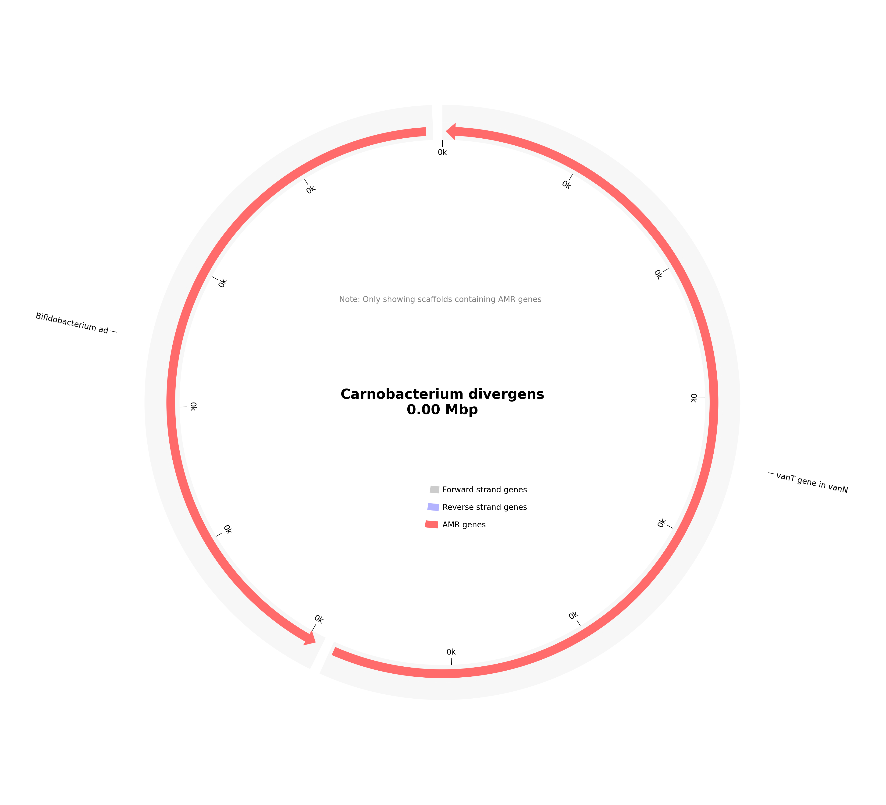

### Bifidobacterium adolescentis rpoB mutants conferring resistance to rifampicin
- **Mechanism**: antibiotic target alteration; antibiotic target replacement
- **Drug Classes**: rifamycin antibiotic
- **AMR Family**: rifamycin-resistant beta-subunit of RNA polymerase (rpoB)
- **Locations**:
  - gnl|SPADES|BMKMCJEI_50792_1 : position 2-208

### vanT gene in vanN cluster
- **Mechanism**: antibiotic target alteration
- **Drug Classes**: glycopeptide antibiotic
- **AMR Family**: glycopeptide resistance gene cluster; vanT
- **Locations**:
  - gnl|SPADES|BMKMCJEI_26443_1 : position 1-282

## Carnobacterium maltaromaticum
**Strain Statistics:**
- Total genome length: 193.6 kbp
- Total scaffolds: 4401
- Scaffolds with AMR genes: 316
- Total genes annotated: 240
- Total AMR genes: 330
- Unique AMR genes: 139
- Distinct AMR mechanisms: 10
- Distinct AMR families: 47
- Distinct drug classes: 33

**Circos Plot:**

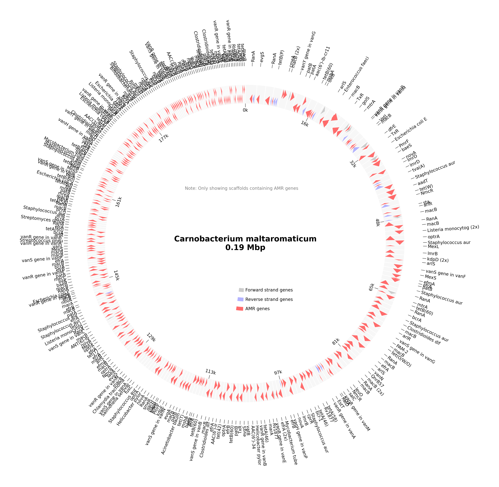

### AAC(3)-IXa
- **Mechanism**: antibiotic inactivation
- **Drug Classes**: aminoglycoside antibiotic
- **AMR Family**: AAC(3)
- **Locations**:
  - gnl|SPADES|BMKMCJEI_21017_1 : position 3-299

### AAC(3)-VIIa
- **Mechanism**: antibiotic inactivation
- **Drug Classes**: aminoglycoside antibiotic
- **AMR Family**: AAC(3)
- **Locations**:
  - gnl|SPADES|BMKMCJEI_31531_1 : position 49-264

### AAC(6')-34
- **Mechanism**: antibiotic inactivation
- **Drug Classes**: aminoglycoside antibiotic
- **AMR Family**: AAC(6')
- **Locations**:
  - gnl|SPADES|BMKMCJEI_8379_1 : position 18-551

### AAC(6')-Ir
- **Mechanism**: antibiotic inactivation
- **Drug Classes**: aminoglycoside antibiotic
- **AMR Family**: AAC(6')
- **Locations**:
  - gnl|SPADES|BMKMCJEI_8871_2 : position 155-682

### ANT(6)-Ib
- **Mechanism**: antibiotic inactivation
- **Drug Classes**: aminoglycoside antibiotic
- **AMR Family**: ANT(6)
- **Locations**:
  - gnl|SPADES|BMKMCJEI_11569_1 : position 2-439

### Acinetobacter baumannii AbaQ
- **Mechanism**: antibiotic efflux
- **Drug Classes**: fluoroquinolone antibiotic
- **AMR Family**: major facilitator superfamily (MFS) antibiotic efflux pump
- **Locations**:
  - gnl|SPADES|BMKMCJEI_9416_1 : position 184-642

### BcI (found in 2 locations)
- **Mechanism**: antibiotic inactivation
- **Drug Classes**: cephalosporin; penem
- **AMR Family**: class A Bacillus cereus Bc beta-lactamase
- **Locations**:
  - gnl|SPADES|BMKMCJEI_19511_1 : position 1-348
  - gnl|SPADES|BMKMCJEI_40363_1 : position 1-237

### Bifidobacterium bifidum ileS conferring resistance to mupirocin
- **Mechanism**: antibiotic target alteration
- **Drug Classes**: mupirocin-like antibiotic
- **AMR Family**: antibiotic-resistant isoleucyl-tRNA synthetase (ileS)
- **Locations**:
  - gnl|SPADES|BMKMCJEI_23719_1 : position 2-304

### CRP
- **Mechanism**: antibiotic efflux
- **Drug Classes**: macrolide antibiotic; fluoroquinolone antibiotic; penam
- **AMR Family**: resistance-nodulation-cell division (RND) antibiotic efflux pump
- **Locations**:
  - gnl|SPADES|BMKMCJEI_21118_1 : position 1-330

### Chlamydia trachomatis intrinsic murA conferring resistance to fosfomycin
- **Mechanism**: antibiotic target alteration
- **Drug Classes**: phosphonic acid antibiotic
- **AMR Family**: antibiotic-resistant murA transferase
- **Locations**:
  - gnl|SPADES|BMKMCJEI_10655_1 : position 276-566

### Clostridioides difficile cplR
- **Mechanism**: antibiotic target protection
- **Drug Classes**: lincosamide antibiotic; streptogramin antibiotic; streptogramin A antibiotic; nucleoside antibiotic
- **AMR Family**: Miscellaneous ABC-F subfamily ATP-binding cassette ribosomal protection proteins
- **Locations**:
  - gnl|SPADES|BMKMCJEI_20449_1 : position 2-220

### Clostridioides difficile gyrA conferring resistance to fluoroquinolones
- **Mechanism**: antibiotic target alteration
- **Drug Classes**: fluoroquinolone antibiotic
- **AMR Family**: fluoroquinolone resistant gyrA
- **Locations**:
  - gnl|SPADES|BMKMCJEI_9006_1 : position 3-671

### Clostridioides difficile gyrB conferring resistance to fluoroquinolones (found in 3 locations)
- **Mechanism**: antibiotic target alteration
- **Drug Classes**: fluoroquinolone antibiotic
- **AMR Family**: fluoroquinolone resistant gyrB
- **Locations**:
  - gnl|SPADES|BMKMCJEI_43602_1 : position 1-228
  - gnl|SPADES|BMKMCJEI_45313_1 : position 2-226
  - gnl|SPADES|BMKMCJEI_6611_1 : position 2-949

### Enterococcus faecium cls conferring resistance to daptomycin
- **Mechanism**: antibiotic target alteration
- **Drug Classes**: peptide antibiotic
- **AMR Family**: daptomycin resistant cls
- **Locations**:
  - gnl|SPADES|BMKMCJEI_4602_1 : position 59-1468

### Escherichia coli AcrAB-TolC with AcrR mutation conferring resistance to ciprofloxacin, tetracycline, and ceftazidime
- **Mechanism**: antibiotic target alteration; antibiotic efflux
- **Drug Classes**: fluoroquinolone antibiotic; cephalosporin; glycylcycline; penam; tetracycline antibiotic; rifamycin antibiotic; phenicol antibiotic; disinfecting agents and antiseptics
- **AMR Family**: resistance-nodulation-cell division (RND) antibiotic efflux pump
- **Locations**:
  - gnl|SPADES|BMKMCJEI_16316_1 : position 2-169

### Escherichia coli EF-Tu mutants conferring resistance to Pulvomycin (found in 2 locations)
- **Mechanism**: antibiotic target alteration
- **Drug Classes**: elfamycin antibiotic
- **AMR Family**: elfamycin resistant EF-Tu
- **Locations**:
  - gnl|SPADES|BMKMCJEI_22226_1 : position 2-319
  - gnl|SPADES|BMKMCJEI_5456_2 : position 274-1182

### Escherichia coli EF-Tu mutants conferring resistance to kirromycin
- **Mechanism**: antibiotic target alteration
- **Drug Classes**: elfamycin antibiotic
- **AMR Family**: elfamycin resistant EF-Tu
- **Locations**:
  - gnl|SPADES|BMKMCJEI_12785_1 : position 3-332

### Escherichia coli gyrA conferring resistance to fluoroquinolones
- **Mechanism**: antibiotic target alteration
- **Drug Classes**: fluoroquinolone antibiotic
- **AMR Family**: fluoroquinolone resistant gyrA
- **Locations**:
  - gnl|SPADES|BMKMCJEI_21240_1 : position 1-330

### EstT
- **Mechanism**: antibiotic inactivation
- **Drug Classes**: macrolide antibiotic
- **AMR Family**: macrolide esterase
- **Locations**:
  - gnl|SPADES|BMKMCJEI_7430_1 : position 3-314

### Helicobacter pylori pbp1 mutants conferring resistance to amoxicillin (found in 2 locations)
- **Mechanism**: antibiotic target alteration
- **Drug Classes**: cephalosporin; cephamycin; penam
- **AMR Family**: Penicillin-binding protein mutations conferring resistance to beta-lactam antibiotics
- **Locations**:
  - gnl|SPADES|BMKMCJEI_10031_1 : position 1-600
  - gnl|SPADES|BMKMCJEI_8351_1 : position 1-471

### IreK (found in 4 locations)
- **Mechanism**: reduced permeability to antibiotic
- **Drug Classes**: cephalosporin
- **AMR Family**: Serine/threonine kinases
- **Locations**:
  - gnl|SPADES|BMKMCJEI_13270_1 : position 1-462
  - gnl|SPADES|BMKMCJEI_26054_1 : position 3-284
  - gnl|SPADES|BMKMCJEI_36830_1 : position 1-249
  - gnl|SPADES|BMKMCJEI_46567_1 : position 1-222

### Listeria monocytogenes mprF (found in 5 locations)
- **Mechanism**: antibiotic target alteration
- **Drug Classes**: peptide antibiotic
- **AMR Family**: defensin resistant mprF
- **Locations**:
  - gnl|SPADES|BMKMCJEI_11781_2 : position 113-514
  - gnl|SPADES|BMKMCJEI_21217_1 : position 2-328
  - gnl|SPADES|BMKMCJEI_21883_1 : position 2-322
  - gnl|SPADES|BMKMCJEI_5863_1 : position 3-872
  - gnl|SPADES|BMKMCJEI_5863_2 : position 968-1087

### LpeA
- **Mechanism**: antibiotic efflux
- **Drug Classes**: macrolide antibiotic
- **AMR Family**: resistance-nodulation-cell division (RND) antibiotic efflux pump
- **Locations**:
  - gnl|SPADES|BMKMCJEI_22352_1 : position 2-292

### MexL
- **Mechanism**: antibiotic efflux
- **Drug Classes**: macrolide antibiotic; tetracycline antibiotic; disinfecting agents and antiseptics
- **AMR Family**: resistance-nodulation-cell division (RND) antibiotic efflux pump
- **Locations**:
  - gnl|SPADES|BMKMCJEI_6134_1 : position 1-213

### MexS (found in 4 locations)
- **Mechanism**: antibiotic efflux
- **Drug Classes**: fluoroquinolone antibiotic; diaminopyrimidine antibiotic; phenicol antibiotic
- **AMR Family**: resistance-nodulation-cell division (RND) antibiotic efflux pump
- **Locations**:
  - gnl|SPADES|BMKMCJEI_11516_1 : position 1-504
  - gnl|SPADES|BMKMCJEI_14001_1 : position 2-445
  - gnl|SPADES|BMKMCJEI_17500_1 : position 1-375
  - gnl|SPADES|BMKMCJEI_6269_1 : position 51-1004

### Mycobacterium tuberculosis pncA mutations conferring resistance to pyrazinamide
- **Mechanism**: antibiotic target alteration
- **Drug Classes**: pyrazine antibiotic
- **AMR Family**: Pyrazinamide resistant pncA
- **Locations**:
  - gnl|SPADES|BMKMCJEI_18491_1 : position 1-303

### Mycobacterium tuberculosis rpoB mutations conferring resistance to rifampicin
- **Mechanism**: antibiotic target alteration; antibiotic target replacement
- **Drug Classes**: rifamycin antibiotic
- **AMR Family**: rifamycin-resistant beta-subunit of RNA polymerase (rpoB)
- **Locations**:
  - gnl|SPADES|BMKMCJEI_8000_1 : position 1-765

### NmcR (found in 3 locations)
- **Mechanism**: antibiotic inactivation
- **Drug Classes**: carbapenem; cephalosporin; cephamycin; penam
- **AMR Family**: NmcA beta-lactamase
- **Locations**:
  - gnl|SPADES|BMKMCJEI_10955_1 : position 1-480
  - gnl|SPADES|BMKMCJEI_5735_1 : position 3-275
  - gnl|SPADES|BMKMCJEI_7306_1 : position 40-846

### PAM-2
- **Mechanism**: antibiotic inactivation
- **Drug Classes**: carbapenem; cephalosporin
- **AMR Family**: PAM beta-lactamase
- **Locations**:
  - gnl|SPADES|BMKMCJEI_6828_2 : position 272-916

### ParR
- **Mechanism**: antibiotic efflux; reduced permeability to antibiotic
- **Drug Classes**: macrolide antibiotic; fluoroquinolone antibiotic; monobactam; aminoglycoside antibiotic; carbapenem; cephalosporin; cephamycin; penam; tetracycline antibiotic; phenicol antibiotic; penem; disinfecting agents and antiseptics
- **AMR Family**: resistance-nodulation-cell division (RND) antibiotic efflux pump; Outer Membrane Porin (Opr)
- **Locations**:
  - gnl|SPADES|BMKMCJEI_16423_2 : position 165-392

### PmrF (found in 2 locations)
- **Mechanism**: antibiotic target alteration
- **Drug Classes**: peptide antibiotic
- **AMR Family**: pmr phosphoethanolamine transferase
- **Locations**:
  - gnl|SPADES|BMKMCJEI_5462_2 : position 676-1182
  - gnl|SPADES|BMKMCJEI_9793_1 : position 3-578

### QnrB57
- **Mechanism**: antibiotic target protection
- **Drug Classes**: fluoroquinolone antibiotic
- **AMR Family**: quinolone resistance protein (qnr)
- **Locations**:
  - gnl|SPADES|BMKMCJEI_7180_2 : position 57-692

### RanA (found in 15 locations)
- **Mechanism**: antibiotic efflux
- **Drug Classes**: aminoglycoside antibiotic
- **AMR Family**: ATP-binding cassette (ABC) antibiotic efflux pump
- **Locations**:
  - gnl|SPADES|BMKMCJEI_11728_2 : position 151-516
  - gnl|SPADES|BMKMCJEI_12803_1 : position 3-476
  - gnl|SPADES|BMKMCJEI_14844_2 : position 172-423
  - gnl|SPADES|BMKMCJEI_15398_2 : position 277-411
  - gnl|SPADES|BMKMCJEI_15948_1 : position 3-401
  - gnl|SPADES|BMKMCJEI_2854_3 : position 1096-1749
  - gnl|SPADES|BMKMCJEI_33535_1 : position 1-258
  - gnl|SPADES|BMKMCJEI_3772_2 : position 201-1232
  - gnl|SPADES|BMKMCJEI_38081_1 : position 2-244
  - gnl|SPADES|BMKMCJEI_5806_1 : position 124-1101
  - gnl|SPADES|BMKMCJEI_6376_2 : position 239-988
  - gnl|SPADES|BMKMCJEI_6478_1 : position 3-566
  - gnl|SPADES|BMKMCJEI_6901_1 : position 3-905
  - gnl|SPADES|BMKMCJEI_7224_1 : position 25-855
  - gnl|SPADES|BMKMCJEI_9984_1 : position 3-488

### RlmA(II) (found in 2 locations)
- **Mechanism**: antibiotic target alteration
- **Drug Classes**: macrolide antibiotic; lincosamide antibiotic
- **AMR Family**: non-erm 23S ribosomal RNA methyltransferase (G748)
- **Locations**:
  - gnl|SPADES|BMKMCJEI_24468_1 : position 1-294
  - gnl|SPADES|BMKMCJEI_49671_1 : position 2-211

### Rv1877 (found in 2 locations)
- **Mechanism**: antibiotic efflux
- **Drug Classes**: fluoroquinolone antibiotic
- **AMR Family**: major facilitator superfamily (MFS) antibiotic efflux pump
- **Locations**:
  - gnl|SPADES|BMKMCJEI_7543_1 : position 1-786
  - gnl|SPADES|BMKMCJEI_8045_1 : position 1-663

### Salmonella serovars soxS with mutation conferring antibiotic resistance
- **Mechanism**: antibiotic target alteration; antibiotic efflux; reduced permeability to antibiotic
- **Drug Classes**: fluoroquinolone antibiotic; monobactam; carbapenem; cephalosporin; glycylcycline; cephamycin; penam; tetracycline antibiotic; rifamycin antibiotic; phenicol antibiotic; penem; disinfecting agents and antiseptics
- **AMR Family**: ATP-binding cassette (ABC) antibiotic efflux pump; major facilitator superfamily (MFS) antibiotic efflux pump; resistance-nodulation-cell division (RND) antibiotic efflux pump; General Bacterial Porin with reduced permeability to beta-lactams
- **Locations**:
  - gnl|SPADES|BMKMCJEI_10487_2 : position 249-575

### Staphylococcus aureus LmrS
- **Mechanism**: antibiotic efflux
- **Drug Classes**: macrolide antibiotic; aminoglycoside antibiotic; oxazolidinone antibiotic; diaminopyrimidine antibiotic; phenicol antibiotic
- **AMR Family**: major facilitator superfamily (MFS) antibiotic efflux pump
- **Locations**:
  - gnl|SPADES|BMKMCJEI_18033_1 : position 3-281

### Staphylococcus aureus fusA with mutation conferring resistance to fusidic acid
- **Mechanism**: antibiotic target alteration
- **Drug Classes**: fusidane antibiotic
- **AMR Family**: antibiotic resistant fusA
- **Locations**:
  - gnl|SPADES|BMKMCJEI_26149_1 : position 3-284

### Staphylococcus aureus mupA conferring resistance to mupirocin (found in 6 locations)
- **Mechanism**: antibiotic target alteration
- **Drug Classes**: mupirocin-like antibiotic
- **AMR Family**: antibiotic-resistant isoleucyl-tRNA synthetase (ileS)
- **Locations**:
  - gnl|SPADES|BMKMCJEI_10245_1 : position 3-383
  - gnl|SPADES|BMKMCJEI_11836_1 : position 2-511
  - gnl|SPADES|BMKMCJEI_15124_1 : position 1-324
  - gnl|SPADES|BMKMCJEI_17996_1 : position 2-370
  - gnl|SPADES|BMKMCJEI_5670_1 : position 1-891
  - gnl|SPADES|BMKMCJEI_6036_1 : position 2-1045

### Staphylococcus aureus mupB conferring resistance to mupirocin (found in 3 locations)
- **Mechanism**: antibiotic target alteration
- **Drug Classes**: mupirocin-like antibiotic
- **AMR Family**: antibiotic-resistant isoleucyl-tRNA synthetase (ileS)
- **Locations**:
  - gnl|SPADES|BMKMCJEI_11998_1 : position 1-504
  - gnl|SPADES|BMKMCJEI_23785_1 : position 3-302
  - gnl|SPADES|BMKMCJEI_6560_1 : position 2-955

### Staphylococcus aureus murA with mutation conferring resistance to fosfomycin (found in 2 locations)
- **Mechanism**: antibiotic target alteration
- **Drug Classes**: phosphonic acid antibiotic
- **AMR Family**: antibiotic-resistant murA transferase
- **Locations**:
  - gnl|SPADES|BMKMCJEI_6340_1 : position 1-993
  - gnl|SPADES|BMKMCJEI_7650_1 : position 3-806

### Streptococcus pneumoniae PBP2b conferring resistance to amoxicillin
- **Mechanism**: antibiotic target alteration
- **Drug Classes**: cephalosporin; cephamycin; penam
- **AMR Family**: Penicillin-binding protein mutations conferring resistance to beta-lactam antibiotics
- **Locations**:
  - gnl|SPADES|BMKMCJEI_23724_1 : position 1-303

### Streptococcus pneumoniae PBP2x conferring resistance to amoxicillin
- **Mechanism**: antibiotic target alteration
- **Drug Classes**: cephalosporin; cephamycin; penam
- **AMR Family**: Penicillin-binding protein mutations conferring resistance to beta-lactam antibiotics
- **Locations**:
  - gnl|SPADES|BMKMCJEI_14332_1 : position 1-438

### Streptomyces rimosus otr(A)
- **Mechanism**: antibiotic target protection
- **Drug Classes**: tetracycline antibiotic
- **AMR Family**: tetracycline-resistant ribosomal protection protein
- **Locations**:
  - gnl|SPADES|BMKMCJEI_14884_1 : position 2-424

### TaeA (found in 2 locations)
- **Mechanism**: antibiotic efflux
- **Drug Classes**: pleuromutilin antibiotic
- **AMR Family**: ATP-binding cassette (ABC) antibiotic efflux pump
- **Locations**:
  - gnl|SPADES|BMKMCJEI_10850_1 : position 1-555
  - gnl|SPADES|BMKMCJEI_17778_1 : position 259-372

### TxR (found in 4 locations)
- **Mechanism**: antibiotic efflux
- **Drug Classes**: tetracycline antibiotic
- **AMR Family**: ATP-binding cassette (ABC) antibiotic efflux pump
- **Locations**:
  - gnl|SPADES|BMKMCJEI_19142_1 : position 1-354
  - gnl|SPADES|BMKMCJEI_4694_1 : position 1-1425
  - gnl|SPADES|BMKMCJEI_5439_1 : position 406-1188
  - gnl|SPADES|BMKMCJEI_8623_1 : position 20-703

### VatI
- **Mechanism**: antibiotic inactivation
- **Drug Classes**: streptogramin antibiotic; streptogramin A antibiotic
- **AMR Family**: streptogramin vat acetyltransferase
- **Locations**:
  - gnl|SPADES|BMKMCJEI_5234_2 : position 865-1242

### YojI
- **Mechanism**: antibiotic efflux
- **Drug Classes**: peptide antibiotic
- **AMR Family**: ATP-binding cassette (ABC) antibiotic efflux pump
- **Locations**:
  - gnl|SPADES|BMKMCJEI_16118_1 : position 133-396

### aac(6')-Ib-cr11
- **Mechanism**: antibiotic inactivation
- **Drug Classes**: fluoroquinolone antibiotic; aminoglycoside antibiotic
- **AMR Family**: AAC(6'); AAC(6')-Ib-cr
- **Locations**:
  - gnl|SPADES|BMKMCJEI_4227_2 : position 289-852

### aadT
- **Mechanism**: antibiotic efflux
- **Drug Classes**: macrolide antibiotic; tetracycline antibiotic; disinfecting agents and antiseptics
- **AMR Family**: major facilitator superfamily (MFS) antibiotic efflux pump
- **Locations**:
  - gnl|SPADES|BMKMCJEI_5674_1 : position 3-1127

### adeL
- **Mechanism**: antibiotic efflux
- **Drug Classes**: fluoroquinolone antibiotic; tetracycline antibiotic
- **AMR Family**: resistance-nodulation-cell division (RND) antibiotic efflux pump
- **Locations**:
  - gnl|SPADES|BMKMCJEI_23254_1 : position 1-309

### adeR (found in 2 locations)
- **Mechanism**: antibiotic efflux
- **Drug Classes**: glycylcycline; tetracycline antibiotic
- **AMR Family**: resistance-nodulation-cell division (RND) antibiotic efflux pump
- **Locations**:
  - gnl|SPADES|BMKMCJEI_35741_1 : position 1-252
  - gnl|SPADES|BMKMCJEI_9817_1 : position 3-266

### arlR (found in 8 locations)
- **Mechanism**: antibiotic efflux
- **Drug Classes**: fluoroquinolone antibiotic; disinfecting agents and antiseptics
- **AMR Family**: major facilitator superfamily (MFS) antibiotic efflux pump
- **Locations**:
  - gnl|SPADES|BMKMCJEI_14519_1 : position 1-432
  - gnl|SPADES|BMKMCJEI_15052_1 : position 3-419
  - gnl|SPADES|BMKMCJEI_21024_1 : position 2-331
  - gnl|SPADES|BMKMCJEI_26248_1 : position 1-282
  - gnl|SPADES|BMKMCJEI_33739_1 : position 2-259
  - gnl|SPADES|BMKMCJEI_5795_1 : position 2-256
  - gnl|SPADES|BMKMCJEI_6699_1 : position 3-521
  - gnl|SPADES|BMKMCJEI_9335_1 : position 1-237

### arlS (found in 7 locations)
- **Mechanism**: antibiotic efflux
- **Drug Classes**: fluoroquinolone antibiotic; disinfecting agents and antiseptics
- **AMR Family**: major facilitator superfamily (MFS) antibiotic efflux pump
- **Locations**:
  - gnl|SPADES|BMKMCJEI_11283_2 : position 235-534
  - gnl|SPADES|BMKMCJEI_23450_1 : position 3-305
  - gnl|SPADES|BMKMCJEI_24780_1 : position 1-294
  - gnl|SPADES|BMKMCJEI_4574_3 : position 940-1479
  - gnl|SPADES|BMKMCJEI_50481_1 : position 5-211
  - gnl|SPADES|BMKMCJEI_6214_1 : position 3-212
  - gnl|SPADES|BMKMCJEI_7136_1 : position 2-868

### arnA
- **Mechanism**: antibiotic target alteration
- **Drug Classes**: peptide antibiotic
- **AMR Family**: pmr phosphoethanolamine transferase
- **Locations**:
  - gnl|SPADES|BMKMCJEI_25221_1 : position 2-289

### baeR
- **Mechanism**: antibiotic efflux
- **Drug Classes**: aminoglycoside antibiotic; aminocoumarin antibiotic
- **AMR Family**: resistance-nodulation-cell division (RND) antibiotic efflux pump
- **Locations**:
  - gnl|SPADES|BMKMCJEI_13283_1 : position 3-461

### baeS (found in 3 locations)
- **Mechanism**: antibiotic efflux
- **Drug Classes**: aminoglycoside antibiotic; aminocoumarin antibiotic
- **AMR Family**: resistance-nodulation-cell division (RND) antibiotic efflux pump
- **Locations**:
  - gnl|SPADES|BMKMCJEI_18620_1 : position 2-361
  - gnl|SPADES|BMKMCJEI_5527_1 : position 1-1164
  - gnl|SPADES|BMKMCJEI_9335_2 : position 244-648

### bcr-1
- **Mechanism**: antibiotic efflux
- **Drug Classes**: bicyclomycin-like antibiotic
- **AMR Family**: major facilitator superfamily (MFS) antibiotic efflux pump
- **Locations**:
  - gnl|SPADES|BMKMCJEI_7600_1 : position 2-703

### bcrA (found in 10 locations)
- **Mechanism**: antibiotic efflux
- **Drug Classes**: peptide antibiotic
- **AMR Family**: ATP-binding cassette (ABC) antibiotic efflux pump
- **Locations**:
  - gnl|SPADES|BMKMCJEI_13615_1 : position 2-454
  - gnl|SPADES|BMKMCJEI_14597_1 : position 2-331
  - gnl|SPADES|BMKMCJEI_15068_1 : position 3-302
  - gnl|SPADES|BMKMCJEI_15159_1 : position 2-418
  - gnl|SPADES|BMKMCJEI_22935_1 : position 3-311
  - gnl|SPADES|BMKMCJEI_25919_1 : position 1-285
  - gnl|SPADES|BMKMCJEI_26481_1 : position 1-282
  - gnl|SPADES|BMKMCJEI_50690_1 : position 1-210
  - gnl|SPADES|BMKMCJEI_6532_1 : position 40-669
  - gnl|SPADES|BMKMCJEI_7386_2 : position 681-839

### carA
- **Mechanism**: antibiotic target protection
- **Drug Classes**: macrolide antibiotic
- **AMR Family**: Miscellaneous ABC-F subfamily ATP-binding cassette ribosomal protection proteins
- **Locations**:
  - gnl|SPADES|BMKMCJEI_45777_1 : position 1-222

### cmeA
- **Mechanism**: antibiotic efflux
- **Drug Classes**: macrolide antibiotic; fluoroquinolone antibiotic; cephalosporin; fusidane antibiotic
- **AMR Family**: resistance-nodulation-cell division (RND) antibiotic efflux pump
- **Locations**:
  - gnl|SPADES|BMKMCJEI_3977_2 : position 272-667

### cprR
- **Mechanism**: antibiotic target alteration; antibiotic efflux
- **Drug Classes**: peptide antibiotic
- **AMR Family**: pmr phosphoethanolamine transferase
- **Locations**:
  - gnl|SPADES|BMKMCJEI_7653_1 : position 1-525

### dfrE
- **Mechanism**: antibiotic target replacement
- **Drug Classes**: diaminopyrimidine antibiotic
- **AMR Family**: trimethoprim resistant dihydrofolate reductase dfr
- **Locations**:
  - gnl|SPADES|BMKMCJEI_5432_2 : position 761-1192

### efmA (found in 2 locations)
- **Mechanism**: antibiotic efflux
- **Drug Classes**: macrolide antibiotic; fluoroquinolone antibiotic
- **AMR Family**: major facilitator superfamily (MFS) antibiotic efflux pump
- **Locations**:
  - gnl|SPADES|BMKMCJEI_11032_1 : position 3-491
  - gnl|SPADES|BMKMCJEI_6300_2 : position 232-999

### efrA (found in 13 locations)
- **Mechanism**: antibiotic efflux
- **Drug Classes**: macrolide antibiotic; fluoroquinolone antibiotic; rifamycin antibiotic
- **AMR Family**: ATP-binding cassette (ABC) antibiotic efflux pump
- **Locations**:
  - gnl|SPADES|BMKMCJEI_11331_1 : position 3-326
  - gnl|SPADES|BMKMCJEI_11474_1 : position 2-331
  - gnl|SPADES|BMKMCJEI_11918_1 : position 1-507
  - gnl|SPADES|BMKMCJEI_13754_1 : position 3-449
  - gnl|SPADES|BMKMCJEI_14857_1 : position 2-424
  - gnl|SPADES|BMKMCJEI_18914_1 : position 3-356
  - gnl|SPADES|BMKMCJEI_27347_1 : position 1-279
  - gnl|SPADES|BMKMCJEI_6332_1 : position 1-183
  - gnl|SPADES|BMKMCJEI_7058_1 : position 2-880
  - gnl|SPADES|BMKMCJEI_8028_1 : position 174-539
  - gnl|SPADES|BMKMCJEI_8028_2 : position 572-763
  - gnl|SPADES|BMKMCJEI_8904_1 : position 1-681
  - gnl|SPADES|BMKMCJEI_9158_2 : position 277-660

### efrB (found in 5 locations)
- **Mechanism**: antibiotic efflux
- **Drug Classes**: macrolide antibiotic; fluoroquinolone antibiotic; rifamycin antibiotic
- **AMR Family**: ATP-binding cassette (ABC) antibiotic efflux pump
- **Locations**:
  - gnl|SPADES|BMKMCJEI_12292_1 : position 3-140
  - gnl|SPADES|BMKMCJEI_12614_1 : position 3-482
  - gnl|SPADES|BMKMCJEI_13585_1 : position 1-456
  - gnl|SPADES|BMKMCJEI_7887_1 : position 1-345
  - gnl|SPADES|BMKMCJEI_8797_1 : position 3-686

### evgA
- **Mechanism**: antibiotic efflux
- **Drug Classes**: macrolide antibiotic; fluoroquinolone antibiotic; penam; tetracycline antibiotic
- **AMR Family**: major facilitator superfamily (MFS) antibiotic efflux pump; resistance-nodulation-cell division (RND) antibiotic efflux pump
- **Locations**:
  - gnl|SPADES|BMKMCJEI_9610_1 : position 1-357

### evgS (found in 3 locations)
- **Mechanism**: antibiotic efflux
- **Drug Classes**: macrolide antibiotic; fluoroquinolone antibiotic; penam; tetracycline antibiotic
- **AMR Family**: major facilitator superfamily (MFS) antibiotic efflux pump; resistance-nodulation-cell division (RND) antibiotic efflux pump
- **Locations**:
  - gnl|SPADES|BMKMCJEI_10803_1 : position 47-559
  - gnl|SPADES|BMKMCJEI_3663_1 : position 34-735
  - gnl|SPADES|BMKMCJEI_8501_1 : position 1-714

### fusC
- **Mechanism**: antibiotic target protection
- **Drug Classes**: fusidane antibiotic
- **AMR Family**: Target protecting FusB-type protein conferring resistance to Fusidic acid
- **Locations**:
  - gnl|SPADES|BMKMCJEI_10271_2 : position 377-586

### golS (found in 2 locations)
- **Mechanism**: antibiotic efflux
- **Drug Classes**: monobactam; carbapenem; cephalosporin; cephamycin; penam; phenicol antibiotic; penem
- **AMR Family**: resistance-nodulation-cell division (RND) antibiotic efflux pump
- **Locations**:
  - gnl|SPADES|BMKMCJEI_48449_1 : position 2-217
  - gnl|SPADES|BMKMCJEI_4876_1 : position 2-814

### kdpD (found in 3 locations)
- **Mechanism**: antibiotic efflux
- **Drug Classes**: aminoglycoside antibiotic
- **AMR Family**: kdpDE
- **Locations**:
  - gnl|SPADES|BMKMCJEI_6203_1 : position 3-737
  - gnl|SPADES|BMKMCJEI_6203_2 : position 725-949
  - gnl|SPADES|BMKMCJEI_9817_2 : position 263-613

### kdpE
- **Mechanism**: antibiotic efflux
- **Drug Classes**: aminoglycoside antibiotic
- **AMR Family**: kdpDE
- **Locations**:
  - gnl|SPADES|BMKMCJEI_9768_1 : position 3-617

### leuO
- **Mechanism**: antibiotic efflux
- **Drug Classes**: nucleoside antibiotic; disinfecting agents and antiseptics
- **AMR Family**: major facilitator superfamily (MFS) antibiotic efflux pump
- **Locations**:
  - gnl|SPADES|BMKMCJEI_7305_2 : position 462-845

### lmrB (found in 2 locations)
- **Mechanism**: antibiotic efflux
- **Drug Classes**: lincosamide antibiotic; nucleoside antibiotic
- **AMR Family**: ATP-binding cassette (ABC) antibiotic efflux pump
- **Locations**:
  - gnl|SPADES|BMKMCJEI_6180_1 : position 1-774
  - gnl|SPADES|BMKMCJEI_7771_1 : position 3-791

### lmrD (found in 4 locations)
- **Mechanism**: antibiotic efflux
- **Drug Classes**: lincosamide antibiotic
- **AMR Family**: ATP-binding cassette (ABC) antibiotic efflux pump
- **Locations**:
  - gnl|SPADES|BMKMCJEI_21690_1 : position 2-298
  - gnl|SPADES|BMKMCJEI_21935_1 : position 1-321
  - gnl|SPADES|BMKMCJEI_5585_1 : position 2-712
  - gnl|SPADES|BMKMCJEI_5591_1 : position 2-514

### lsaE
- **Mechanism**: antibiotic target protection
- **Drug Classes**: lincosamide antibiotic; streptogramin antibiotic; pleuromutilin antibiotic
- **AMR Family**: lsa-type ABC-F protein
- **Locations**:
  - gnl|SPADES|BMKMCJEI_33763_1 : position 1-258

### macB (found in 42 locations)
- **Mechanism**: antibiotic efflux
- **Drug Classes**: macrolide antibiotic
- **AMR Family**: ATP-binding cassette (ABC) antibiotic efflux pump
- **Locations**:
  - gnl|SPADES|BMKMCJEI_10698_1 : position 2-565
  - gnl|SPADES|BMKMCJEI_11001_2 : position 181-549
  - gnl|SPADES|BMKMCJEI_11289_1 : position 73-534
  - gnl|SPADES|BMKMCJEI_11616_1 : position 1-519
  - gnl|SPADES|BMKMCJEI_12285_1 : position 91-492
  - gnl|SPADES|BMKMCJEI_12696_1 : position 1-171
  - gnl|SPADES|BMKMCJEI_12993_1 : position 3-317
  - gnl|SPADES|BMKMCJEI_13642_1 : position 2-454
  - gnl|SPADES|BMKMCJEI_13893_2 : position 66-446
  - gnl|SPADES|BMKMCJEI_13969_1 : position 85-429
  - gnl|SPADES|BMKMCJEI_15278_1 : position 2-373
  - gnl|SPADES|BMKMCJEI_15937_1 : position 2-286
  - gnl|SPADES|BMKMCJEI_18897_1 : position 3-356
  - gnl|SPADES|BMKMCJEI_19925_1 : position 153-344
  - gnl|SPADES|BMKMCJEI_21692_1 : position 1-243
  - gnl|SPADES|BMKMCJEI_22750_1 : position 1-312
  - gnl|SPADES|BMKMCJEI_23365_1 : position 1-306
  - gnl|SPADES|BMKMCJEI_26478_1 : position 59-283
  - gnl|SPADES|BMKMCJEI_29945_1 : position 3-269
  - gnl|SPADES|BMKMCJEI_31677_1 : position 3-263
  - gnl|SPADES|BMKMCJEI_34298_1 : position 1-255
  - gnl|SPADES|BMKMCJEI_38218_1 : position 106-243
  - gnl|SPADES|BMKMCJEI_3977_3 : position 651-1349
  - gnl|SPADES|BMKMCJEI_3977_4 : position 1333-1752
  - gnl|SPADES|BMKMCJEI_40440_1 : position 3-239
  - gnl|SPADES|BMKMCJEI_43697_1 : position 1-156
  - gnl|SPADES|BMKMCJEI_43937_1 : position 2-229
  - gnl|SPADES|BMKMCJEI_4636_1 : position 1-1452
  - gnl|SPADES|BMKMCJEI_48500_1 : position 2-205
  - gnl|SPADES|BMKMCJEI_50087_1 : position 2-211
  - gnl|SPADES|BMKMCJEI_50968_1 : position 3-209
  - gnl|SPADES|BMKMCJEI_5416_1 : position 2-214
  - gnl|SPADES|BMKMCJEI_5792_1 : position 3-353
  - gnl|SPADES|BMKMCJEI_5818_1 : position 3-818
  - gnl|SPADES|BMKMCJEI_6637_1 : position 2-784
  - gnl|SPADES|BMKMCJEI_6870_1 : position 4-909
  - gnl|SPADES|BMKMCJEI_7040_1 : position 1-885
  - gnl|SPADES|BMKMCJEI_7202_1 : position 26-733
  - gnl|SPADES|BMKMCJEI_7202_2 : position 730-858
  - gnl|SPADES|BMKMCJEI_7282_1 : position 2-598
  - gnl|SPADES|BMKMCJEI_9088_1 : position 22-498
  - gnl|SPADES|BMKMCJEI_9575_1 : position 3-428

### marA (found in 2 locations)
- **Mechanism**: antibiotic efflux; reduced permeability to antibiotic
- **Drug Classes**: fluoroquinolone antibiotic; monobactam; carbapenem; cephalosporin; glycylcycline; cephamycin; penam; tetracycline antibiotic; rifamycin antibiotic; phenicol antibiotic; penem; disinfecting agents and antiseptics
- **AMR Family**: resistance-nodulation-cell division (RND) antibiotic efflux pump; General Bacterial Porin with reduced permeability to beta-lactams
- **Locations**:
  - gnl|SPADES|BMKMCJEI_12418_1 : position 1-489
  - gnl|SPADES|BMKMCJEI_8094_1 : position 2-466

### mdtG (found in 2 locations)
- **Mechanism**: antibiotic efflux
- **Drug Classes**: phosphonic acid antibiotic
- **AMR Family**: major facilitator superfamily (MFS) antibiotic efflux pump
- **Locations**:
  - gnl|SPADES|BMKMCJEI_37519_1 : position 1-246
  - gnl|SPADES|BMKMCJEI_41890_1 : position 42-233

### mecC
- **Mechanism**: antibiotic target replacement
- **Drug Classes**: penam
- **AMR Family**: methicillin resistant PBP2
- **Locations**:
  - gnl|SPADES|BMKMCJEI_13435_1 : position 3-458

### mecD (found in 3 locations)
- **Mechanism**: antibiotic target replacement
- **Drug Classes**: penam
- **AMR Family**: methicillin resistant PBP2
- **Locations**:
  - gnl|SPADES|BMKMCJEI_19592_1 : position 3-347
  - gnl|SPADES|BMKMCJEI_24597_1 : position 3-293
  - gnl|SPADES|BMKMCJEI_45761_1 : position 1-222

### mreA (found in 2 locations)
- **Mechanism**: antibiotic efflux
- **Drug Classes**: macrolide antibiotic
- **AMR Family**: major facilitator superfamily (MFS) antibiotic efflux pump
- **Locations**:
  - gnl|SPADES|BMKMCJEI_16029_1 : position 1-399
  - gnl|SPADES|BMKMCJEI_16093_2 : position 180-398

### msbA (found in 4 locations)
- **Mechanism**: antibiotic efflux
- **Drug Classes**: nitroimidazole antibiotic
- **AMR Family**: ATP-binding cassette (ABC) antibiotic efflux pump
- **Locations**:
  - gnl|SPADES|BMKMCJEI_19395_1 : position 1-351
  - gnl|SPADES|BMKMCJEI_4524_2 : position 1156-1500
  - gnl|SPADES|BMKMCJEI_49599_1 : position 2-214
  - gnl|SPADES|BMKMCJEI_9370_1 : position 1-645

### mtrA (found in 2 locations)
- **Mechanism**: antibiotic efflux
- **Drug Classes**: macrolide antibiotic; penam
- **AMR Family**: resistance-nodulation-cell division (RND) antibiotic efflux pump
- **Locations**:
  - gnl|SPADES|BMKMCJEI_5017_1 : position 3-368
  - gnl|SPADES|BMKMCJEI_6440_2 : position 676-978

### nalD
- **Mechanism**: antibiotic efflux
- **Drug Classes**: macrolide antibiotic; fluoroquinolone antibiotic; monobactam; carbapenem; cephalosporin; cephamycin; penam; tetracycline antibiotic; peptide antibiotic; aminocoumarin antibiotic; diaminopyrimidine antibiotic; sulfonamide antibiotic; phenicol antibiotic; penem
- **AMR Family**: resistance-nodulation-cell division (RND) antibiotic efflux pump
- **Locations**:
  - gnl|SPADES|BMKMCJEI_7398_1 : position 1-228

### novA (found in 6 locations)
- **Mechanism**: antibiotic efflux
- **Drug Classes**: aminocoumarin antibiotic
- **AMR Family**: ATP-binding cassette (ABC) antibiotic efflux pump
- **Locations**:
  - gnl|SPADES|BMKMCJEI_10034_1 : position 1-576
  - gnl|SPADES|BMKMCJEI_11531_1 : position 2-412
  - gnl|SPADES|BMKMCJEI_12544_2 : position 297-482
  - gnl|SPADES|BMKMCJEI_24854_1 : position 3-293
  - gnl|SPADES|BMKMCJEI_5545_2 : position 726-1160
  - gnl|SPADES|BMKMCJEI_7816_1 : position 160-786

### oleB
- **Mechanism**: antibiotic target protection
- **Drug Classes**: macrolide antibiotic
- **AMR Family**: Miscellaneous ABC-F subfamily ATP-binding cassette ribosomal protection proteins
- **Locations**:
  - gnl|SPADES|BMKMCJEI_4528_1 : position 1-288

### oleC
- **Mechanism**: antibiotic efflux
- **Drug Classes**: macrolide antibiotic
- **AMR Family**: ATP-binding cassette (ABC) antibiotic efflux pump
- **Locations**:
  - gnl|SPADES|BMKMCJEI_44732_1 : position 18-227

### optrA (found in 6 locations)
- **Mechanism**: antibiotic target protection
- **Drug Classes**: oxazolidinone antibiotic; phenicol antibiotic
- **AMR Family**: Miscellaneous ABC-F subfamily ATP-binding cassette ribosomal protection proteins
- **Locations**:
  - gnl|SPADES|BMKMCJEI_10183_1 : position 2-592
  - gnl|SPADES|BMKMCJEI_10956_1 : position 1-552
  - gnl|SPADES|BMKMCJEI_11476_1 : position 133-528
  - gnl|SPADES|BMKMCJEI_28655_1 : position 1-273
  - gnl|SPADES|BMKMCJEI_5871_1 : position 2-1084
  - gnl|SPADES|BMKMCJEI_8814_1 : position 2-685

### patA (found in 3 locations)
- **Mechanism**: antibiotic efflux
- **Drug Classes**: fluoroquinolone antibiotic
- **AMR Family**: ATP-binding cassette (ABC) antibiotic efflux pump
- **Locations**:
  - gnl|SPADES|BMKMCJEI_12170_1 : position 2-319
  - gnl|SPADES|BMKMCJEI_16033_1 : position 172-399
  - gnl|SPADES|BMKMCJEI_4177_2 : position 885-1649

### patB (found in 6 locations)
- **Mechanism**: antibiotic efflux
- **Drug Classes**: fluoroquinolone antibiotic
- **AMR Family**: ATP-binding cassette (ABC) antibiotic efflux pump
- **Locations**:
  - gnl|SPADES|BMKMCJEI_13479_1 : position 3-458
  - gnl|SPADES|BMKMCJEI_27703_1 : position 2-277
  - gnl|SPADES|BMKMCJEI_4177_1 : position 1-885
  - gnl|SPADES|BMKMCJEI_6332_2 : position 180-995
  - gnl|SPADES|BMKMCJEI_8668_2 : position 99-698
  - gnl|SPADES|BMKMCJEI_9437_1 : position 1-639

### qacH
- **Mechanism**: antibiotic efflux
- **Drug Classes**: disinfecting agents and antiseptics
- **AMR Family**: small multidrug resistance (SMR) antibiotic efflux pump
- **Locations**:
  - gnl|SPADES|BMKMCJEI_9893_2 : position 143-469

### rpoB2 (found in 2 locations)
- **Mechanism**: antibiotic target alteration; antibiotic target replacement
- **Drug Classes**: rifamycin antibiotic
- **AMR Family**: rifamycin-resistant beta-subunit of RNA polymerase (rpoB)
- **Locations**:
  - gnl|SPADES|BMKMCJEI_20448_1 : position 3-338
  - gnl|SPADES|BMKMCJEI_25972_1 : position 3-284

### salC
- **Mechanism**: antibiotic target protection
- **Drug Classes**: lincosamide antibiotic; streptogramin antibiotic; streptogramin A antibiotic; pleuromutilin antibiotic
- **AMR Family**: sal-type ABC-F protein
- **Locations**:
  - gnl|SPADES|BMKMCJEI_7330_1 : position 1-543

### salD
- **Mechanism**: antibiotic target protection
- **Drug Classes**: lincosamide antibiotic; streptogramin antibiotic; streptogramin A antibiotic; pleuromutilin antibiotic
- **AMR Family**: sal-type ABC-F protein
- **Locations**:
  - gnl|SPADES|BMKMCJEI_45514_1 : position 2-223

### smeR
- **Mechanism**: antibiotic efflux
- **Drug Classes**: aminoglycoside antibiotic; cephalosporin; cephamycin; penam
- **AMR Family**: resistance-nodulation-cell division (RND) antibiotic efflux pump
- **Locations**:
  - gnl|SPADES|BMKMCJEI_9987_1 : position 2-340

### sta
- **Mechanism**: antibiotic inactivation
- **Drug Classes**: nucleoside antibiotic
- **AMR Family**: streptothricin acetyltransferase (SAT)
- **Locations**:
  - gnl|SPADES|BMKMCJEI_5755_2 : position 607-1107

### tet(42)
- **Mechanism**: antibiotic efflux
- **Drug Classes**: tetracycline antibiotic
- **AMR Family**: major facilitator superfamily (MFS) antibiotic efflux pump
- **Locations**:
  - gnl|SPADES|BMKMCJEI_8817_1 : position 132-686

### tet(44)
- **Mechanism**: antibiotic target protection
- **Drug Classes**: tetracycline antibiotic
- **AMR Family**: tetracycline-resistant ribosomal protection protein
- **Locations**:
  - gnl|SPADES|BMKMCJEI_45424_1 : position 3-224

### tet(L)
- **Mechanism**: antibiotic efflux
- **Drug Classes**: tetracycline antibiotic
- **AMR Family**: major facilitator superfamily (MFS) antibiotic efflux pump
- **Locations**:
  - gnl|SPADES|BMKMCJEI_11822_1 : position 3-512

### tet(O/W)
- **Mechanism**: antibiotic target protection
- **Drug Classes**: tetracycline antibiotic
- **AMR Family**: tetracycline-resistant ribosomal protection protein
- **Locations**:
  - gnl|SPADES|BMKMCJEI_28196_1 : position 1-276

### tet(O/W/O)
- **Mechanism**: antibiotic target protection
- **Drug Classes**: tetracycline antibiotic
- **AMR Family**: tetracycline-resistant ribosomal protection protein
- **Locations**:
  - gnl|SPADES|BMKMCJEI_6885_1 : position 1-375

### tet(T) (found in 3 locations)
- **Mechanism**: antibiotic target protection
- **Drug Classes**: tetracycline antibiotic
- **AMR Family**: tetracycline-resistant ribosomal protection protein
- **Locations**:
  - gnl|SPADES|BMKMCJEI_11363_1 : position 3-530
  - gnl|SPADES|BMKMCJEI_21047_1 : position 2-331
  - gnl|SPADES|BMKMCJEI_9404_1 : position 3-641

### tet(W)
- **Mechanism**: antibiotic target protection
- **Drug Classes**: tetracycline antibiotic
- **AMR Family**: tetracycline-resistant ribosomal protection protein
- **Locations**:
  - gnl|SPADES|BMKMCJEI_5684_1 : position 2-1126

### tetA(46) (found in 2 locations)
- **Mechanism**: antibiotic efflux
- **Drug Classes**: tetracycline antibiotic
- **AMR Family**: ATP-binding cassette (ABC) antibiotic efflux pump
- **Locations**:
  - gnl|SPADES|BMKMCJEI_7594_2 : position 352-813
  - gnl|SPADES|BMKMCJEI_8274_1 : position 19-738

### tetA(58) (found in 5 locations)
- **Mechanism**: antibiotic efflux
- **Drug Classes**: tetracycline antibiotic
- **AMR Family**: major facilitator superfamily (MFS) antibiotic efflux pump
- **Locations**:
  - gnl|SPADES|BMKMCJEI_15649_1 : position 1-372
  - gnl|SPADES|BMKMCJEI_48039_1 : position 2-217
  - gnl|SPADES|BMKMCJEI_50685_1 : position 2-211
  - gnl|SPADES|BMKMCJEI_50892_1 : position 1-210
  - gnl|SPADES|BMKMCJEI_7533_2 : position 321-821

### tetA(60) (found in 2 locations)
- **Mechanism**: antibiotic efflux
- **Drug Classes**: tetracycline antibiotic
- **AMR Family**: ATP-binding cassette (ABC) antibiotic efflux pump
- **Locations**:
  - gnl|SPADES|BMKMCJEI_14810_1 : position 2-424
  - gnl|SPADES|BMKMCJEI_16342_1 : position 2-394

### tetB(46) (found in 3 locations)
- **Mechanism**: antibiotic efflux
- **Drug Classes**: tetracycline antibiotic
- **AMR Family**: ATP-binding cassette (ABC) antibiotic efflux pump
- **Locations**:
  - gnl|SPADES|BMKMCJEI_18958_1 : position 3-209
  - gnl|SPADES|BMKMCJEI_21352_1 : position 1-327
  - gnl|SPADES|BMKMCJEI_28418_1 : position 2-274

### tetB(60) (found in 7 locations)
- **Mechanism**: antibiotic efflux
- **Drug Classes**: tetracycline antibiotic
- **AMR Family**: ATP-binding cassette (ABC) antibiotic efflux pump
- **Locations**:
  - gnl|SPADES|BMKMCJEI_16375_1 : position 13-393
  - gnl|SPADES|BMKMCJEI_17844_1 : position 2-253
  - gnl|SPADES|BMKMCJEI_42023_1 : position 1-234
  - gnl|SPADES|BMKMCJEI_4524_1 : position 3-1163
  - gnl|SPADES|BMKMCJEI_6470_1 : position 23-973
  - gnl|SPADES|BMKMCJEI_8766_1 : position 2-691
  - gnl|SPADES|BMKMCJEI_9157_1 : position 302-661

### tetB(P)
- **Mechanism**: antibiotic target protection
- **Drug Classes**: tetracycline antibiotic
- **AMR Family**: tetracycline-resistant ribosomal protection protein
- **Locations**:
  - gnl|SPADES|BMKMCJEI_3945_1 : position 2-214

### tva(A)
- **Mechanism**: antibiotic target protection
- **Drug Classes**: pleuromutilin antibiotic
- **AMR Family**: Miscellaneous ABC-F subfamily ATP-binding cassette ribosomal protection proteins
- **Locations**:
  - gnl|SPADES|BMKMCJEI_5667_1 : position 1-225

### vanG
- **Mechanism**: antibiotic target alteration
- **Drug Classes**: glycopeptide antibiotic
- **AMR Family**: glycopeptide resistance gene cluster; Van ligase
- **Locations**:
  - gnl|SPADES|BMKMCJEI_45408_1 : position 3-224

### vanH gene in vanA cluster
- **Mechanism**: antibiotic target alteration
- **Drug Classes**: glycopeptide antibiotic
- **AMR Family**: vanH; glycopeptide resistance gene cluster
- **Locations**:
  - gnl|SPADES|BMKMCJEI_14300_1 : position 92-436

### vanH gene in vanP cluster (found in 2 locations)
- **Mechanism**: antibiotic target alteration
- **Drug Classes**: glycopeptide antibiotic
- **AMR Family**: vanH; glycopeptide resistance gene cluster
- **Locations**:
  - gnl|SPADES|BMKMCJEI_19527_1 : position 2-349
  - gnl|SPADES|BMKMCJEI_7876_1 : position 42-779

### vanL
- **Mechanism**: antibiotic target alteration
- **Drug Classes**: glycopeptide antibiotic
- **AMR Family**: glycopeptide resistance gene cluster; Van ligase
- **Locations**:
  - gnl|SPADES|BMKMCJEI_14134_1 : position 3-440

### vanN
- **Mechanism**: antibiotic target alteration
- **Drug Classes**: glycopeptide antibiotic
- **AMR Family**: glycopeptide resistance gene cluster; Van ligase
- **Locations**:
  - gnl|SPADES|BMKMCJEI_7164_1 : position 1-861

### vanR gene in vanA cluster
- **Mechanism**: antibiotic target alteration
- **Drug Classes**: glycopeptide antibiotic
- **AMR Family**: glycopeptide resistance gene cluster; vanR
- **Locations**:
  - gnl|SPADES|BMKMCJEI_7448_1 : position 3-134

### vanR gene in vanB cluster (found in 4 locations)
- **Mechanism**: antibiotic target alteration
- **Drug Classes**: glycopeptide antibiotic
- **AMR Family**: glycopeptide resistance gene cluster; vanR
- **Locations**:
  - gnl|SPADES|BMKMCJEI_14538_1 : position 45-431
  - gnl|SPADES|BMKMCJEI_21471_1 : position 2-100
  - gnl|SPADES|BMKMCJEI_48889_1 : position 127-216
  - gnl|SPADES|BMKMCJEI_8319_1 : position 1-501

### vanR gene in vanE cluster
- **Mechanism**: antibiotic target alteration
- **Drug Classes**: glycopeptide antibiotic
- **AMR Family**: glycopeptide resistance gene cluster; vanR
- **Locations**:
  - gnl|SPADES|BMKMCJEI_8044_2 : position 226-762

### vanR gene in vanI cluster
- **Mechanism**: antibiotic target alteration
- **Drug Classes**: glycopeptide antibiotic
- **AMR Family**: glycopeptide resistance gene cluster; vanR
- **Locations**:
  - gnl|SPADES|BMKMCJEI_16645_1 : position 50-388

### vanR gene in vanL cluster
- **Mechanism**: antibiotic target alteration
- **Drug Classes**: glycopeptide antibiotic
- **AMR Family**: glycopeptide resistance gene cluster; vanR
- **Locations**:
  - gnl|SPADES|BMKMCJEI_22778_1 : position 3-311

### vanR gene in vanM cluster (found in 5 locations)
- **Mechanism**: antibiotic target alteration
- **Drug Classes**: glycopeptide antibiotic
- **AMR Family**: glycopeptide resistance gene cluster; vanR
- **Locations**:
  - gnl|SPADES|BMKMCJEI_10734_1 : position 3-512
  - gnl|SPADES|BMKMCJEI_13542_1 : position 131-457
  - gnl|SPADES|BMKMCJEI_46237_1 : position 44-223
  - gnl|SPADES|BMKMCJEI_5128_3 : position 898-1275
  - gnl|SPADES|BMKMCJEI_7386_1 : position 2-469

### vanR gene in vanN cluster (found in 2 locations)
- **Mechanism**: antibiotic target alteration
- **Drug Classes**: glycopeptide antibiotic
- **AMR Family**: glycopeptide resistance gene cluster; vanR
- **Locations**:
  - gnl|SPADES|BMKMCJEI_12696_2 : position 324-479
  - gnl|SPADES|BMKMCJEI_27838_1 : position 3-236

### vanR gene in vanP cluster
- **Mechanism**: antibiotic target alteration
- **Drug Classes**: glycopeptide antibiotic
- **AMR Family**: glycopeptide resistance gene cluster; vanR
- **Locations**:
  - gnl|SPADES|BMKMCJEI_5128_2 : position 681-905

### vanS gene in vanA cluster
- **Mechanism**: antibiotic target alteration
- **Drug Classes**: glycopeptide antibiotic
- **AMR Family**: vanS; glycopeptide resistance gene cluster
- **Locations**:
  - gnl|SPADES|BMKMCJEI_10571_1 : position 3-569

### vanS gene in vanB cluster
- **Mechanism**: antibiotic target alteration
- **Drug Classes**: glycopeptide antibiotic
- **AMR Family**: vanS; glycopeptide resistance gene cluster
- **Locations**:
  - gnl|SPADES|BMKMCJEI_9116_1 : position 1-663

### vanS gene in vanE cluster
- **Mechanism**: antibiotic target alteration
- **Drug Classes**: glycopeptide antibiotic
- **AMR Family**: vanS; glycopeptide resistance gene cluster
- **Locations**:
  - gnl|SPADES|BMKMCJEI_16986_1 : position 1-237

### vanS gene in vanF cluster
- **Mechanism**: antibiotic target alteration
- **Drug Classes**: glycopeptide antibiotic
- **AMR Family**: vanS; glycopeptide resistance gene cluster
- **Locations**:
  - gnl|SPADES|BMKMCJEI_6264_1 : position 96-1004

### vanS gene in vanG cluster
- **Mechanism**: antibiotic target alteration
- **Drug Classes**: glycopeptide antibiotic
- **AMR Family**: vanS; glycopeptide resistance gene cluster
- **Locations**:
  - gnl|SPADES|BMKMCJEI_6729_1 : position 3-929

### vanS gene in vanL cluster (found in 2 locations)
- **Mechanism**: antibiotic target alteration
- **Drug Classes**: glycopeptide antibiotic
- **AMR Family**: vanS; glycopeptide resistance gene cluster
- **Locations**:
  - gnl|SPADES|BMKMCJEI_11711_2 : position 345-515
  - gnl|SPADES|BMKMCJEI_27727_1 : position 2-277

### vanS gene in vanN cluster
- **Mechanism**: antibiotic target alteration
- **Drug Classes**: glycopeptide antibiotic
- **AMR Family**: vanS; glycopeptide resistance gene cluster
- **Locations**:
  - gnl|SPADES|BMKMCJEI_9668_2 : position 194-622

### vanS gene in vanP cluster
- **Mechanism**: antibiotic target alteration
- **Drug Classes**: glycopeptide antibiotic
- **AMR Family**: vanS; glycopeptide resistance gene cluster
- **Locations**:
  - gnl|SPADES|BMKMCJEI_13799_2 : position 36-449

### vanT gene in vanC cluster
- **Mechanism**: antibiotic target alteration
- **Drug Classes**: glycopeptide antibiotic
- **AMR Family**: glycopeptide resistance gene cluster; vanT
- **Locations**:
  - gnl|SPADES|BMKMCJEI_20205_1 : position 3-341

### vanY gene in vanG cluster
- **Mechanism**: antibiotic target alteration
- **Drug Classes**: glycopeptide antibiotic
- **AMR Family**: vanY; glycopeptide resistance gene cluster
- **Locations**:
  - gnl|SPADES|BMKMCJEI_4129_2: position 617-1390

### vatB
- **Mechanism**: antibiotic inactivation
- **Drug Classes**: streptogramin antibiotic; streptogramin A antibiotic
- **AMR Family**: streptogramin vat acetyltransferase
- **Locations**:
  - gnl|SPADES|BMKMCJEI_8456_2 : position 104-673

### vatF
- **Mechanism**: antibiotic inactivation
- **Drug Classes**: streptogramin antibiotic; streptogramin A antibiotic
- **AMR Family**: streptogramin vat acetyltransferase
- **Locations**:
  - gnl|SPADES|BMKMCJEI_47499_1 : position 3-218

### vmlR
- **Mechanism**: antibiotic target protection
- **Drug Classes**: lincosamide antibiotic; streptogramin antibiotic; streptogramin A antibiotic; streptogramin B antibiotic; nucleoside antibiotic; pleuromutilin antibiotic
- **AMR Family**: Miscellaneous ABC-F subfamily ATP-binding cassette ribosomal protection proteins
- **Locations**:
  - gnl|SPADES|BMKMCJEI_17843_1 : position 1-369

### ykkC
- **Mechanism**: antibiotic efflux
- **Drug Classes**: aminoglycoside antibiotic; tetracycline antibiotic; phenicol antibiotic
- **AMR Family**: small multidrug resistance (SMR) antibiotic efflux pump
- **Locations**:
  - gnl|SPADES|BMKMCJEI_19294_1 : position 1-309

### ykkD
- **Mechanism**: antibiotic efflux
- **Drug Classes**: aminoglycoside antibiotic; tetracycline antibiotic; phenicol antibiotic
- **AMR Family**: small multidrug resistance (SMR) antibiotic efflux pump
- **Locations**:
  - gnl|SPADES|BMKMCJEI_29668_1 : position 2-229

## Carnobacterium maltaromaticum LMA28
**Strain Statistics:**
- Total genome length: 13.2 kbp
- Total scaffolds: 342
- Scaffolds with AMR genes: 16
- Total genes annotated: 20
- Total AMR genes: 16
- Unique AMR genes: 14
- Distinct AMR mechanisms: 6
- Distinct AMR families: 11
- Distinct drug classes: 21

**Circos Plot:**

### Clostridium sporogenes cplR
- **Mechanism**: antibiotic target protection
- **Drug Classes**: lincosamide antibiotic; pleuromutilin antibiotic
- **AMR Family**: Miscellaneous ABC-F subfamily ATP-binding cassette ribosomal protection proteins
- **Locations**:
  - gnl|SPADES|BMKMCJEI_10014_1 : position 3-602

### Escherichia coli EF-Tu mutants conferring resistance to kirromycin
- **Mechanism**: antibiotic target alteration
- **Drug Classes**: elfamycin antibiotic
- **AMR Family**: elfamycin resistant EF-Tu
- **Locations**:
  - gnl|SPADES|BMKMCJEI_11888_1 : position 2-508

### RanA
- **Mechanism**: antibiotic efflux
- **Drug Classes**: aminoglycoside antibiotic
- **AMR Family**: ATP-binding cassette (ABC) antibiotic efflux pump
- **Locations**:
  - gnl|SPADES|BMKMCJEI_6456_1 : position 2-397

### TaeA
- **Mechanism**: antibiotic efflux
- **Drug Classes**: pleuromutilin antibiotic
- **AMR Family**: ATP-binding cassette (ABC) antibiotic efflux pump
- **Locations**:
  - gnl|SPADES|BMKMCJEI_10667_1 : position 266-565

### arlS
- **Mechanism**: antibiotic efflux
- **Drug Classes**: fluoroquinolone antibiotic; disinfecting agents and antiseptics
- **AMR Family**: major facilitator superfamily (MFS) antibiotic efflux pump
- **Locations**:
  - gnl|SPADES|BMKMCJEI_3325_2 : position 1443-2192

### baeS
- **Mechanism**: antibiotic efflux
- **Drug Classes**: aminoglycoside antibiotic; aminocoumarin antibiotic
- **AMR Family**: resistance-nodulation-cell division (RND) antibiotic efflux pump
- **Locations**:
  - gnl|SPADES|BMKMCJEI_20570_1 : position 2-337

### bcrA (found in 3 locations)
- **Mechanism**: antibiotic efflux
- **Drug Classes**: peptide antibiotic
- **AMR Family**: ATP-binding cassette (ABC) antibiotic efflux pump
- **Locations**:
  - gnl|SPADES|BMKMCJEI_12532_1 : position 2-130
  - gnl|SPADES|BMKMCJEI_13998_1 : position 3-443
  - gnl|SPADES|BMKMCJEI_20543_1 : position 2-337

### catB11
- **Mechanism**: antibiotic inactivation
- **Drug Classes**: phenicol antibiotic
- **AMR Family**: chloramphenicol acetyltransferase (CAT)
- **Locations**:
  - gnl|SPADES|BMKMCJEI_6120_2 : position 656-1027

### cfrE
- **Mechanism**: antibiotic target alteration
- **Drug Classes**: lincosamide antibiotic; streptogramin antibiotic; oxazolidinone antibiotic; phenicol antibiotic; pleuromutilin antibiotic
- **AMR Family**: Cfr 23S ribosomal RNA methyltransferase
- **Locations**:
  - gnl|SPADES|BMKMCJEI_3005_1 : position 64-1131

### lsaC
- **Mechanism**: antibiotic target protection
- **Drug Classes**: lincosamide antibiotic; streptogramin antibiotic; pleuromutilin antibiotic
- **AMR Family**: lsa-type ABC-F protein
- **Locations**:
  - gnl|SPADES|BMKMCJEI_7410_1 : position 2-607

### marA
- **Mechanism**: antibiotic efflux; reduced permeability to antibiotic
- **Drug Classes**: fluoroquinolone antibiotic; monobactam; carbapenem; cephalosporin; glycylcycline; cephamycin; penam; tetracycline antibiotic; rifamycin antibiotic; phenicol antibiotic; penem; disinfecting agents and antiseptics
- **AMR Family**: resistance-nodulation-cell division (RND) antibiotic efflux pump; General Bacterial Porin with reduced permeability to beta-lactams
- **Locations**:
  - gnl|SPADES|BMKMCJEI_9167_1 : position 2-658

### mecI
- **Mechanism**: antibiotic target replacement
- **Drug Classes**: penam
- **AMR Family**: methicillin resistant PBP2
- **Locations**:
  - gnl|SPADES|BMKMCJEI_50148_1 : position 23-211

### tetA(58)
- **Mechanism**: antibiotic efflux
- **Drug Classes**: tetracycline antibiotic
- **AMR Family**: major facilitator superfamily (MFS) antibiotic efflux pump
- **Locations**:
  - gnl|SPADES|BMKMCJEI_5929_1 : position 2-556

### vga(E) Staphylococcus cohnii
- **Mechanism**: antibiotic target protection
- **Drug Classes**: lincosamide antibiotic; streptogramin antibiotic; streptogramin A antibiotic; pleuromutilin antibiotic
- **AMR Family**: vga-type ABC-F protein
- **Locations**:
  - gnl|SPADES|BMKMCJEI_13515_1 : position 3-455

## Citrobacter
**Strain Statistics:**
- Total genome length: 42.9 kbp
- Total scaffolds: 91
- Scaffolds with AMR genes: 15
- Total genes annotated: 80
- Total AMR genes: 16
- Unique AMR genes: 16
- Distinct AMR mechanisms: 5
- Distinct AMR families: 11
- Distinct drug classes: 17

**Circos Plot:**

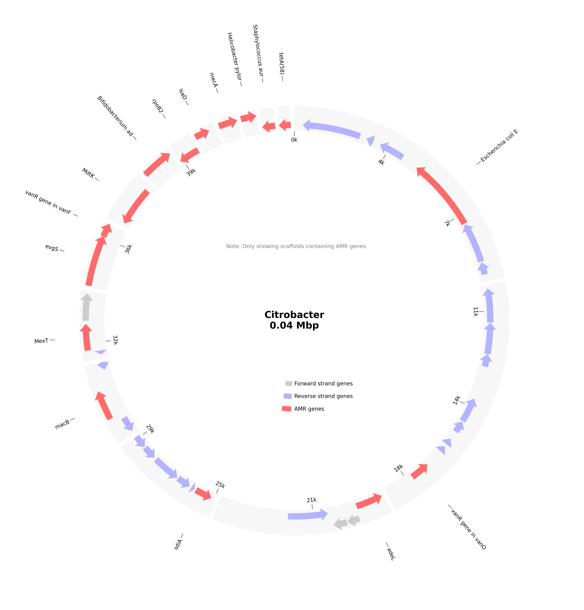

### Bifidobacterium adolescentis rpoB mutants conferring resistance to rifampicin
- **Mechanism**: antibiotic target alteration; antibiotic target replacement
- **Drug Classes**: rifamycin antibiotic
- **AMR Family**: rifamycin-resistant beta-subunit of RNA polymerase (rpoB)
- **Locations**:
  - gnl|SPADES|BMKMCJEI_5704_1 : position 3-1118

### Escherichia coli EF-Tu mutants conferring resistance to kirromycin
- **Mechanism**: antibiotic target alteration
- **Drug Classes**: elfamycin antibiotic
- **AMR Family**: elfamycin resistant EF-Tu
- **Locations**:
  - gnl|SPADES|BMKMCJEI_929_6 : position 4795-7491

### Helicobacter pylori rpoB mutation conferring resistance to rifampicin
- **Mechanism**: antibiotic target alteration; antibiotic target replacement
- **Drug Classes**: fluoroquinolone antibiotic; rifamycin antibiotic
- **AMR Family**: rifamycin-resistant beta-subunit of RNA polymerase (rpoB)
- **Locations**:
  - gnl|SPADES|BMKMCJEI_11016_1 : position 3-548

### MdtK
- **Mechanism**: antibiotic efflux
- **Drug Classes**: fluoroquinolone antibiotic
- **AMR Family**: multidrug and toxic compound extrusion (MATE) transporter
- **Locations**:
  - gnl|SPADES|BMKMCJEI_3856_1 : position 133-1587

### MexT
- **Mechanism**: antibiotic efflux
- **Drug Classes**: fluoroquinolone antibiotic; diaminopyrimidine antibiotic; phenicol antibiotic
- **AMR Family**: resistance-nodulation-cell division (RND) antibiotic efflux pump
- **Locations**:
  - gnl|SPADES|BMKMCJEI_3094_2 : position 364-1281

### Staphylococcus aureus fusE with mutation conferring resistance to fusidic acid
- **Mechanism**: antibiotic target alteration
- **Drug Classes**: fusidane antibiotic
- **AMR Family**: antibiotic resistant fusE
- **Locations**:
  - gnl|SPADES|BMKMCJEI_12624_1 : position 3-479

### adeL
- **Mechanism**: antibiotic efflux
- **Drug Classes**: fluoroquinolone antibiotic; tetracycline antibiotic
- **AMR Family**: resistance-nodulation-cell division (RND) antibiotic efflux pump
- **Locations**:
  - gnl|SPADES|BMKMCJEI_1405_1 : position 79-1071

### evgS
- **Mechanism**: antibiotic efflux
- **Drug Classes**: macrolide antibiotic; fluoroquinolone antibiotic; penam; tetracycline antibiotic
- **AMR Family**: major facilitator superfamily (MFS) antibiotic efflux pump; resistance-nodulation-cell division (RND) antibiotic efflux pump
- **Locations**:
  - gnl|SPADES|BMKMCJEI_3189_1 : position 63-1844

### lsaD
- **Mechanism**: antibiotic target protection
- **Drug Classes**: lincosamide antibiotic; streptogramin antibiotic; streptogramin A antibiotic; pleuromutilin antibiotic
- **AMR Family**: lsa-type ABC-F protein
- **Locations**:
  - gnl|SPADES|BMKMCJEI_7979_1 : position 2-532

### macB
- **Mechanism**: antibiotic efflux
- **Drug Classes**: macrolide antibiotic
- **AMR Family**: ATP-binding cassette (ABC) antibiotic efflux pump
- **Locations**:
  - gnl|SPADES|BMKMCJEI_2706_2 : position 877-1908

### mecA
- **Mechanism**: antibiotic target replacement
- **Drug Classes**: penam
- **AMR Family**: methicillin resistant PBP2
- **Locations**:
  - gnl|SPADES|BMKMCJEI_9178_1 : position 1-657

### rpoB2
- **Mechanism**: antibiotic target alteration; antibiotic target replacement
- **Drug Classes**: rifamycin antibiotic
- **AMR Family**: rifamycin-resistant beta-subunit of RNA polymerase (rpoB)
- **Locations**:
  - gnl|SPADES|BMKMCJEI_7929_1 : position 2-772

### sdiA
- **Mechanism**: antibiotic efflux
- **Drug Classes**: fluoroquinolone antibiotic; cephalosporin; glycylcycline; penam; tetracycline antibiotic; rifamycin antibiotic; phenicol antibiotic; disinfecting agents and antiseptics
- **AMR Family**: resistance-nodulation-cell division (RND) antibiotic efflux pump
- **Locations**:
  - gnl|SPADES|BMKMCJEI_2175_2 : position 188-823

### tetA(58)
- **Mechanism**: antibiotic efflux
- **Drug Classes**: tetracycline antibiotic
- **AMR Family**: major facilitator superfamily (MFS) antibiotic efflux pump
- **Locations**:
  - gnl|SPADES|BMKMCJEI_13973_1 : position 1-444

### vanR gene in vanF cluster
- **Mechanism**: antibiotic target alteration
- **Drug Classes**: glycopeptide antibiotic
- **AMR Family**: glycopeptide resistance gene cluster; vanR
- **Locations**:
  - gnl|SPADES|BMKMCJEI_3189_2 : position 1819-2307

### vanR gene in vanO cluster
- **Mechanism**: antibiotic target alteration
- **Drug Classes**: glycopeptide antibiotic
- **AMR Family**: glycopeptide resistance gene cluster; vanR
- **Locations**:
  - gnl|SPADES|BMKMCJEI_1009_10 : position 7187-7900

## Citrobacter braakii
**Strain Statistics:**
- Total genome length: 3901.4 kbp
- Total scaffolds: 100
- Scaffolds with AMR genes: 64
- Total genes annotated: 7218
- Total AMR genes: 414
- Unique AMR genes: 204
- Distinct AMR mechanisms: 10
- Distinct AMR families: 74
- Distinct drug classes: 37

**Circos Plot:**

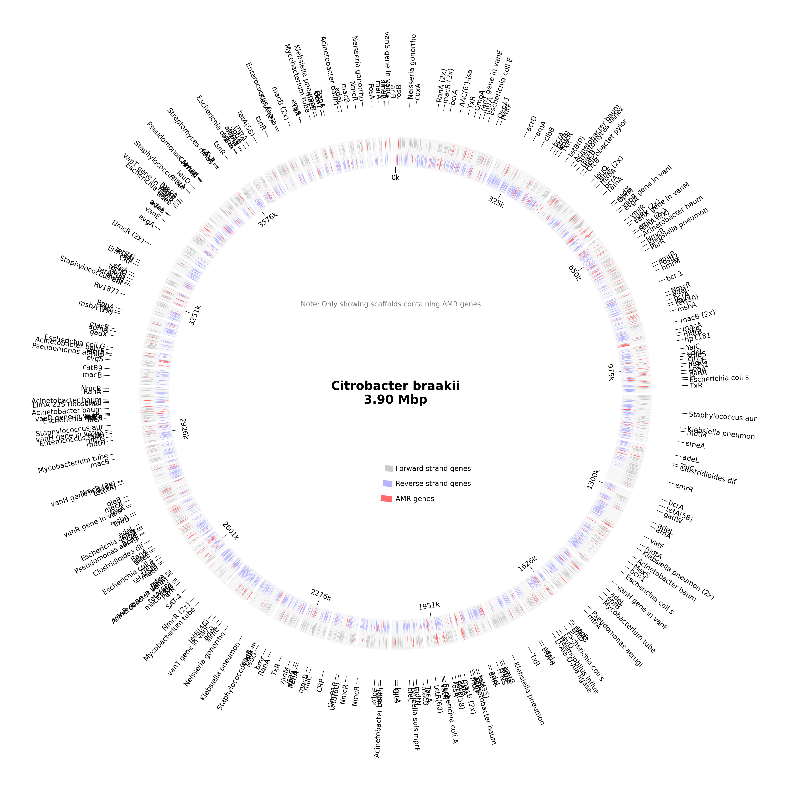

### AAC(6')-Isa
- **Mechanism**: antibiotic inactivation
- **Drug Classes**: aminoglycoside antibiotic
- **AMR Family**: AAC(6')
- **Locations**:
  - gnl|SPADES|BMKMCJEI_8_139 : position 154128-154682

### APH(6)-Ic
- **Mechanism**: antibiotic inactivation
- **Drug Classes**: aminoglycoside antibiotic
- **AMR Family**: APH(6)
- **Locations**:
  - gnl|SPADES|BMKMCJEI_30_93 : position 94289-95128

### Acinetobacter baumannii AbaF (found in 7 locations)
- **Mechanism**: antibiotic efflux
- **Drug Classes**: phosphonic acid antibiotic
- **AMR Family**: major facilitator superfamily (MFS) antibiotic efflux pump
- **Locations**:
  - gnl|SPADES|BMKMCJEI_113_13 : position 17472-18767
  - gnl|SPADES|BMKMCJEI_179_40 : position 39024-40526
  - gnl|SPADES|BMKMCJEI_23_149 : position 169918-171216
  - gnl|SPADES|BMKMCJEI_253_41 : position 43165-44472
  - gnl|SPADES|BMKMCJEI_30_56 : position 56548-57927
  - gnl|SPADES|BMKMCJEI_528_18 : position 18115-19431
  - gnl|SPADES|BMKMCJEI_8_145 : position 159422-160744

### Acinetobacter baumannii AbaQ (found in 5 locations)
- **Mechanism**: antibiotic efflux
- **Drug Classes**: fluoroquinolone antibiotic
- **AMR Family**: major facilitator superfamily (MFS) antibiotic efflux pump
- **Locations**:
  - gnl|SPADES|BMKMCJEI_103_71 : position 77001-78287
  - gnl|SPADES|BMKMCJEI_256_10 : position 13897-15249
  - gnl|SPADES|BMKMCJEI_266_31 : position 28879-30168
  - gnl|SPADES|BMKMCJEI_74_21 : position 23739-25049
  - gnl|SPADES|BMKMCJEI_8_171 : position 192837-194117

### Acinetobacter baumannii AmvA
- **Mechanism**: antibiotic efflux
- **Drug Classes**: macrolide antibiotic; disinfecting agents and antiseptics
- **AMR Family**: major facilitator superfamily (MFS) antibiotic efflux pump
- **Locations**:
  - gnl|SPADES|BMKMCJEI_74_5 : position 3855-5342

### ArnT
- **Mechanism**: antibiotic target alteration
- **Drug Classes**: peptide antibiotic
- **AMR Family**: pmr phosphoethanolamine transferase
- **Locations**:
  - gnl|SPADES|BMKMCJEI_266_20: position 17112-18770

### Bifidobacterium bifidum ileS conferring resistance to mupirocin
- **Mechanism**: antibiotic target alteration
- **Drug Classes**: mupirocin-like antibiotic
- **AMR Family**: antibiotic-resistant isoleucyl-tRNA synthetase (ileS)
- **Locations**:
  - gnl|SPADES|BMKMCJEI_28_13 : position 12825-15407

### Brucella suis mprF
- **Mechanism**: antibiotic target alteration
- **Drug Classes**: peptide antibiotic
- **AMR Family**: defensin resistant mprF
- **Locations**:
  - gnl|SPADES|BMKMCJEI_111_32 : position 33227-34189

### CAR-1
- **Mechanism**: antibiotic inactivation
- **Drug Classes**: carbapenem
- **AMR Family**: CAR beta-lactamase
- **Locations**:
  - gnl|SPADES|BMKMCJEI_28_120 : position 134905-135708

### CMY-70
- **Mechanism**: antibiotic inactivation
- **Drug Classes**: cephamycin
- **AMR Family**: CMY beta-lactamase
- **Locations**:
  - gnl|SPADES|BMKMCJEI_333_13: position 13828-14973

### CRP (found in 3 locations)
- **Mechanism**: antibiotic efflux
- **Drug Classes**: macrolide antibiotic; fluoroquinolone antibiotic; penam
- **AMR Family**: resistance-nodulation-cell division (RND) antibiotic efflux pump
- **Locations**:
  - gnl|SPADES|BMKMCJEI_133_65 : position 63717-64469
  - gnl|SPADES|BMKMCJEI_300_9 : position 9182-9856
  - gnl|SPADES|BMKMCJEI_8_17: position 12210-12842

### Clostridioides difficile gyrB conferring resistance to fluoroquinolones (found in 2 locations)
- **Mechanism**: antibiotic target alteration
- **Drug Classes**: fluoroquinolone antibiotic
- **AMR Family**: fluoroquinolone resistant gyrB
- **Locations**:
  - gnl|SPADES|BMKMCJEI_209_4 : position 3523-5937
  - gnl|SPADES|BMKMCJEI_56_37 : position 34057-35949

### CrcB
- **Mechanism**: antibiotic efflux
- **Drug Classes**: aminoglycoside antibiotic
- **AMR Family**: multidrug and toxic compound extrusion (MATE) transporter
- **Locations**:
  - gnl|SPADES|BMKMCJEI_28_30 : position 29599-29982

### D-Ala-D-Ala ligase
- **Mechanism**: antibiotic target alteration
- **Drug Classes**: glycopeptide antibiotic
- **AMR Family**: Van ligase
- **Locations**:
  - gnl|SPADES|BMKMCJEI_92_60 : position 70292-71212

### Enterococcus faecalis cls with mutation conferring resistance to daptomycin
- **Mechanism**: antibiotic target alteration
- **Drug Classes**: peptide antibiotic
- **AMR Family**: daptomycin resistant cls
- **Locations**:
  - gnl|SPADES|BMKMCJEI_419_10 : position 10038-11498

### Enterococcus faecium cls conferring resistance to daptomycin
- **Mechanism**: antibiotic target alteration
- **Drug Classes**: peptide antibiotic
- **AMR Family**: daptomycin resistant cls
- **Locations**:
  - gnl|SPADES|BMKMCJEI_233_40 : position 38859-40280

### Erm(34) (found in 2 locations)
- **Mechanism**: antibiotic target alteration
- **Drug Classes**: macrolide antibiotic; lincosamide antibiotic; streptogramin antibiotic; streptogramin A antibiotic; streptogramin B antibiotic
- **AMR Family**: Erm 23S ribosomal RNA methyltransferase
- **Locations**:
  - gnl|SPADES|BMKMCJEI_300_15 : position 15949-16575
  - gnl|SPADES|BMKMCJEI_92_20 : position 20063-20884

### Escherichia coli AcrAB-TolC with AcrR mutation conferring resistance to ciprofloxacin, tetracycline, and ceftazidime
- **Mechanism**: antibiotic target alteration; antibiotic efflux
- **Drug Classes**: fluoroquinolone antibiotic; cephalosporin; glycylcycline; penam; tetracycline antibiotic; rifamycin antibiotic; phenicol antibiotic; disinfecting agents and antiseptics
- **AMR Family**: resistance-nodulation-cell division (RND) antibiotic efflux pump
- **Locations**:
  - gnl|SPADES|BMKMCJEI_108_48 : position 51776-52426

### Escherichia coli AcrAB-TolC with MarR mutations conferring resistance to ciprofloxacin and tetracycline
- **Mechanism**: antibiotic target alteration; antibiotic efflux
- **Drug Classes**: fluoroquinolone antibiotic; cephalosporin; glycylcycline; penam; tetracycline antibiotic; rifamycin antibiotic; phenicol antibiotic; disinfecting agents and antiseptics
- **AMR Family**: resistance-nodulation-cell division (RND) antibiotic efflux pump
- **Locations**:
  - gnl|SPADES|BMKMCJEI_30_39: position 40496-40930

### Escherichia coli EF-Tu mutants conferring resistance to Pulvomycin
- **Mechanism**: antibiotic target alteration
- **Drug Classes**: elfamycin antibiotic
- **AMR Family**: elfamycin resistant EF-Tu
- **Locations**:
  - gnl|SPADES|BMKMCJEI_8_199 : position 223562-225406

### Escherichia coli GlpT with mutation conferring resistance to fosfomycin
- **Mechanism**: antibiotic target alteration
- **Drug Classes**: phosphonic acid antibiotic
- **AMR Family**: antibiotic-resistant GlpT
- **Locations**:
  - gnl|SPADES|BMKMCJEI_266_36 : position 35372-36730

### Escherichia coli UhpT with mutation conferring resistance to fosfomycin
- **Mechanism**: antibiotic target alteration
- **Drug Classes**: phosphonic acid antibiotic
- **AMR Family**: antibiotic-resistant UhpT
- **Locations**:
  - gnl|SPADES|BMKMCJEI_209_39 : position 41135-42526

### Escherichia coli fabI mutations conferring resistance to isoniazid and triclosan
- **Mechanism**: antibiotic target alteration
- **Drug Classes**: disinfecting agents and antiseptics; isoniazid-like antibiotic
- **AMR Family**: antibiotic resistant fabI
- **Locations**:
  - gnl|SPADES|BMKMCJEI_30_9 : position 9539-10309

### Escherichia coli mdfA
- **Mechanism**: antibiotic efflux
- **Drug Classes**: tetracycline antibiotic; phenicol antibiotic; disinfecting agents and antiseptics
- **AMR Family**: major facilitator superfamily (MFS) antibiotic efflux pump
- **Locations**:
  - gnl|SPADES|BMKMCJEI_349_7: position 5802-7034

### Escherichia coli soxR with mutation conferring antibiotic resistance
- **Mechanism**: antibiotic target alteration; antibiotic efflux
- **Drug Classes**: fluoroquinolone antibiotic; cephalosporin; glycylcycline; penam; tetracycline antibiotic; rifamycin antibiotic; phenicol antibiotic; disinfecting agents and antiseptics
- **AMR Family**: ATP-binding cassette (ABC) antibiotic efflux pump; major facilitator superfamily (MFS) antibiotic efflux pump; resistance-nodulation-cell division (RND) antibiotic efflux pump
- **Locations**:
  - gnl|SPADES|BMKMCJEI_323_9 : position 10569-11027

### Escherichia coli soxS with mutation conferring antibiotic resistance (found in 8 locations)
- **Mechanism**: antibiotic target alteration; antibiotic efflux; reduced permeability to antibiotic
- **Drug Classes**: fluoroquinolone antibiotic; monobactam; carbapenem; cephalosporin; glycylcycline; cephamycin; penam; tetracycline antibiotic; rifamycin antibiotic; phenicol antibiotic; penem; disinfecting agents and antiseptics
- **AMR Family**: ATP-binding cassette (ABC) antibiotic efflux pump; major facilitator superfamily (MFS) antibiotic efflux pump; resistance-nodulation-cell division (RND) antibiotic efflux pump; General Bacterial Porin with reduced permeability to beta-lactams
- **Locations**:
  - gnl|SPADES|BMKMCJEI_202_27 : position 26953-27843
  - gnl|SPADES|BMKMCJEI_253_27 : position 26504-27373
  - gnl|SPADES|BMKMCJEI_323_10: position 11114-11437
  - gnl|SPADES|BMKMCJEI_52_96 : position 98359-99309
  - gnl|SPADES|BMKMCJEI_74_61 : position 69016-69885
  - gnl|SPADES|BMKMCJEI_87_15 : position 20027-20935
  - gnl|SPADES|BMKMCJEI_87_70 : position 79134-79973
  - gnl|SPADES|BMKMCJEI_92_33 : position 38275-39120

### FosA
- **Mechanism**: antibiotic inactivation
- **Drug Classes**: phosphonic acid antibiotic
- **AMR Family**: fosfomycin thiol transferase
- **Locations**:
  - gnl|SPADES|BMKMCJEI_912_9 : position 6243-6632

### FosB2
- **Mechanism**: antibiotic inactivation
- **Drug Classes**: phosphonic acid antibiotic
- **AMR Family**: fosfomycin thiol transferase
- **Locations**:
  - gnl|SPADES|BMKMCJEI_30_133 : position 134843-135250

### H-NS (found in 2 locations)
- **Mechanism**: antibiotic efflux
- **Drug Classes**: macrolide antibiotic; fluoroquinolone antibiotic; cephalosporin; cephamycin; penam; tetracycline antibiotic
- **AMR Family**: major facilitator superfamily (MFS) antibiotic efflux pump; resistance-nodulation-cell division (RND) antibiotic efflux pump
- **Locations**:
  - gnl|SPADES|BMKMCJEI_103_22 : position 20821-21222
  - gnl|SPADES|BMKMCJEI_1116_6: position 4939-5352

### Haemophilus influenzae PBP3 conferring resistance to beta-lactam antibiotics
- **Mechanism**: antibiotic target alteration
- **Drug Classes**: cephalosporin; cephamycin; penam
- **AMR Family**: Penicillin-binding protein mutations conferring resistance to beta-lactam antibiotics
- **Locations**:
  - gnl|SPADES|BMKMCJEI_92_52 : position 59474-61240

### Helicobacter pylori frxA mutation conferring resistance to metronidazole
- **Mechanism**: antibiotic target alteration
- **Drug Classes**: nitroimidazole antibiotic
- **AMR Family**: Antibiotic resistant Helicobacter pylori nitroreductase
- **Locations**:
  - gnl|SPADES|BMKMCJEI_28_94 : position 97963-98616

### Helicobacter pylori pbp1 mutants conferring resistance to amoxicillin
- **Mechanism**: antibiotic target alteration
- **Drug Classes**: cephalosporin; cephamycin; penam
- **AMR Family**: Penicillin-binding protein mutations conferring resistance to beta-lactam antibiotics
- **Locations**:
  - gnl|SPADES|BMKMCJEI_23_78 : position 87586-89898

### Helicobacter pylori pbp2 mutants conferring resistance to amoxicillin
- **Mechanism**: antibiotic target alteration
- **Drug Classes**: cephalosporin; cephamycin; penam
- **AMR Family**: Penicillin-binding protein mutations conferring resistance to beta-lactam antibiotics
- **Locations**:
  - gnl|SPADES|BMKMCJEI_28_21 : position 20540-22441

### Klebsiella pneumoniae KpnE
- **Mechanism**: antibiotic efflux
- **Drug Classes**: macrolide antibiotic; aminoglycoside antibiotic; cephalosporin; tetracycline antibiotic; peptide antibiotic; rifamycin antibiotic; disinfecting agents and antiseptics
- **AMR Family**: small multidrug resistance (SMR) antibiotic efflux pump
- **Locations**:
  - gnl|SPADES|BMKMCJEI_30_82: position 81817-82179

### Klebsiella pneumoniae KpnF
- **Mechanism**: antibiotic efflux
- **Drug Classes**: macrolide antibiotic; aminoglycoside antibiotic; cephalosporin; tetracycline antibiotic; peptide antibiotic; rifamycin antibiotic; disinfecting agents and antiseptics
- **AMR Family**: small multidrug resistance (SMR) antibiotic efflux pump
- **Locations**:
  - gnl|SPADES|BMKMCJEI_30_81: position 81501-81830

### Klebsiella pneumoniae KpnH
- **Mechanism**: antibiotic efflux
- **Drug Classes**: macrolide antibiotic; fluoroquinolone antibiotic; aminoglycoside antibiotic; carbapenem; cephalosporin; penam; peptide antibiotic; penem
- **AMR Family**: major facilitator superfamily (MFS) antibiotic efflux pump
- **Locations**:
  - gnl|SPADES|BMKMCJEI_513_17 : position 17993-19420

### Klebsiella pneumoniae OmpK37 (found in 5 locations)
- **Mechanism**: reduced permeability to antibiotic
- **Drug Classes**: monobactam; carbapenem; cephalosporin; cephamycin; penam; penem
- **AMR Family**: General Bacterial Porin with reduced permeability to beta-lactams
- **Locations**:
  - gnl|SPADES|BMKMCJEI_152_44 : position 36769-37830
  - gnl|SPADES|BMKMCJEI_53_71 : position 77409-78416
  - gnl|SPADES|BMKMCJEI_74_3 : position 2251-3330
  - gnl|SPADES|BMKMCJEI_74_93 : position 106127-107260
  - gnl|SPADES|BMKMCJEI_98_82 : position 77497-78552

### LRA-8
- **Mechanism**: antibiotic inactivation
- **Drug Classes**: cephalosporin; penam
- **AMR Family**: subclass B3 LRA beta-lactamase
- **Locations**:
  - gnl|SPADES|BMKMCJEI_98_7 : position 6487-7242

### LlmA 23S ribosomal RNA methyltransferase
- **Mechanism**: antibiotic target alteration
- **Drug Classes**: lincosamide antibiotic
- **AMR Family**: Llm 23S ribosomal RNA methyltransferase
- **Locations**:
  - gnl|SPADES|BMKMCJEI_256_5 : position 5806-7104

### LptD
- **Mechanism**: antibiotic efflux
- **Drug Classes**: carbapenem; peptide antibiotic; aminocoumarin antibiotic; rifamycin antibiotic
- **AMR Family**: ATP-binding cassette (ABC) antibiotic efflux pump
- **Locations**:
  - gnl|SPADES|BMKMCJEI_92_23 : position 23209-25569

### MdtQ
- **Mechanism**: reduced permeability to antibiotic
- **Drug Classes**: monobactam; carbapenem; cephalosporin; cephamycin; penam; penem
- **AMR Family**: Outer Membrane Porin (Opr)
- **Locations**:
  - gnl|SPADES|BMKMCJEI_40_63 : position 71375-72742

### MexL
- **Mechanism**: antibiotic efflux
- **Drug Classes**: macrolide antibiotic; tetracycline antibiotic; disinfecting agents and antiseptics
- **AMR Family**: resistance-nodulation-cell division (RND) antibiotic efflux pump
- **Locations**:
  - gnl|SPADES|BMKMCJEI_74_6 : position 5460-6038

### MexS (found in 3 locations)
- **Mechanism**: antibiotic efflux
- **Drug Classes**: fluoroquinolone antibiotic; diaminopyrimidine antibiotic; phenicol antibiotic
- **AMR Family**: resistance-nodulation-cell division (RND) antibiotic efflux pump
- **Locations**:
  - gnl|SPADES|BMKMCJEI_30_57 : position 57981-59000
  - gnl|SPADES|BMKMCJEI_323_20 : position 22998-23981
  - gnl|SPADES|BMKMCJEI_74_35 : position 40087-41124

### MexT
- **Mechanism**: antibiotic efflux
- **Drug Classes**: fluoroquinolone antibiotic; diaminopyrimidine antibiotic; phenicol antibiotic
- **AMR Family**: resistance-nodulation-cell division (RND) antibiotic efflux pump
- **Locations**:
  - gnl|SPADES|BMKMCJEI_525_4 : position 4498-5457

### MexV
- **Mechanism**: antibiotic efflux
- **Drug Classes**: macrolide antibiotic; fluoroquinolone antibiotic; tetracycline antibiotic; phenicol antibiotic; disinfecting agents and antiseptics
- **AMR Family**: resistance-nodulation-cell division (RND) antibiotic efflux pump
- **Locations**:
  - gnl|SPADES|BMKMCJEI_28_112 : position 127658-128950

### Mycobacterium tuberculosis gidB mutation conferring resistance to streptomycin
- **Mechanism**: antibiotic target alteration
- **Drug Classes**: aminoglycoside antibiotic
- **AMR Family**: antibiotic resistant gidB
- **Locations**:
  - gnl|SPADES|BMKMCJEI_513_3 : position 1676-2299

### Mycobacterium tuberculosis katG mutations conferring resistance to isoniazid
- **Mechanism**: antibiotic target alteration
- **Drug Classes**: isoniazid-like antibiotic
- **AMR Family**: isoniazid resistant katG
- **Locations**:
  - gnl|SPADES|BMKMCJEI_87_24 : position 30626-32806

### Mycobacterium tuberculosis pncA mutations conferring resistance to pyrazinamide
- **Mechanism**: antibiotic target alteration
- **Drug Classes**: pyrazine antibiotic
- **AMR Family**: Pyrazinamide resistant pncA
- **Locations**:
  - gnl|SPADES|BMKMCJEI_232_43 : position 45803-46441

### Mycobacterium tuberculosis thyA with mutation conferring resistance to para-aminosalicylic acid
- **Mechanism**: antibiotic target alteration
- **Drug Classes**: salicylic acid antibiotic
- **AMR Family**: aminosalicylate resistant thymidylate synthase
- **Locations**:
  - gnl|SPADES|BMKMCJEI_166_11 : position 16746-17540

### Neisseria gonorrhoeae PBP2 conferring resistance to beta-lactam antibiotics
- **Mechanism**: antibiotic target alteration
- **Drug Classes**: cephalosporin; cephamycin; penam
- **AMR Family**: Penicillin-binding protein mutations conferring resistance to beta-lactam antibiotics
- **Locations**:
  - gnl|SPADES|BMKMCJEI_158_1 : position 285-2030

### Neisseria gonorrhoeae pilQ gene conferring resistance to beta-lactam (found in 2 locations)
- **Mechanism**: antibiotic target alteration
- **Drug Classes**: cephalosporin; cephamycin; penam
- **AMR Family**: Penicillin-binding protein mutations conferring resistance to beta-lactam antibiotics
- **Locations**:
  - gnl|SPADES|BMKMCJEI_695_6 : position 3918-5153
  - gnl|SPADES|BMKMCJEI_8_37 : position 32977-34224

### NmcR (found in 15 locations)
- **Mechanism**: antibiotic inactivation
- **Drug Classes**: carbapenem; cephalosporin; cephamycin; penam
- **AMR Family**: NmcA beta-lactamase
- **Locations**:
  - gnl|SPADES|BMKMCJEI_113_62 : position 72922-73824
  - gnl|SPADES|BMKMCJEI_133_9 : position 8168-9142
  - gnl|SPADES|BMKMCJEI_166_24 : position 32590-33525
  - gnl|SPADES|BMKMCJEI_166_42 : position 51322-52251
  - gnl|SPADES|BMKMCJEI_220_37 : position 39647-40540
  - gnl|SPADES|BMKMCJEI_220_42 : position 46183-47079
  - gnl|SPADES|BMKMCJEI_23_107 : position 124431-125324
  - gnl|SPADES|BMKMCJEI_256_33 : position 39709-40626
  - gnl|SPADES|BMKMCJEI_30_71 : position 71135-72043
  - gnl|SPADES|BMKMCJEI_310_21 : position 23797-24699
  - gnl|SPADES|BMKMCJEI_310_30 : position 35138-35971
  - gnl|SPADES|BMKMCJEI_333_12 : position 12824-13696
  - gnl|SPADES|BMKMCJEI_40_31 : position 36217-37128
  - gnl|SPADES|BMKMCJEI_590_9 : position 10238-11176
  - gnl|SPADES|BMKMCJEI_87_26 : position 34020-34853

### OmpA
- **Mechanism**: reduced permeability to antibiotic
- **Drug Classes**: peptide antibiotic
- **AMR Family**: General Bacterial Porin with reduced permeability to peptide antibiotics
- **Locations**:
  - gnl|SPADES|BMKMCJEI_8_167 : position 189195-189857

### OprM
- **Mechanism**: antibiotic efflux
- **Drug Classes**: macrolide antibiotic; fluoroquinolone antibiotic; monobactam; aminoglycoside antibiotic; carbapenem; cephalosporin; cephamycin; penam; tetracycline antibiotic; peptide antibiotic; aminocoumarin antibiotic; diaminopyrimidine antibiotic; sulfonamide antibiotic; phenicol antibiotic; penem; disinfecting agents and antiseptics
- **AMR Family**: resistance-nodulation-cell division (RND) antibiotic efflux pump
- **Locations**:
  - gnl|SPADES|BMKMCJEI_28_114 : position 129407-130789

### PNGM-1
- **Mechanism**: antibiotic inactivation
- **Drug Classes**: carbapenem; cephalosporin; penam
- **AMR Family**: PNGM beta-lactamase
- **Locations**:
  - gnl|SPADES|BMKMCJEI_266_8 : position 7049-7966

### PSZ-1
- **Mechanism**: antibiotic inactivation
- **Drug Classes**: cephalosporin; cephamycin; penam
- **AMR Family**: PSZ beta-lactamase
- **Locations**:
  - gnl|SPADES|BMKMCJEI_52_67 : position 66553-67710

### ParR (found in 3 locations)
- **Mechanism**: antibiotic efflux; reduced permeability to antibiotic
- **Drug Classes**: macrolide antibiotic; fluoroquinolone antibiotic; monobactam; aminoglycoside antibiotic; carbapenem; cephalosporin; cephamycin; penam; tetracycline antibiotic; phenicol antibiotic; penem; disinfecting agents and antiseptics
- **AMR Family**: resistance-nodulation-cell division (RND) antibiotic efflux pump; Outer Membrane Porin (Opr)
- **Locations**:
  - gnl|SPADES|BMKMCJEI_179_12 : position 11808-12539
  - gnl|SPADES|BMKMCJEI_30_91 : position 92249-92992
  - gnl|SPADES|BMKMCJEI_8_50 : position 49309-50028

### ParS
- **Mechanism**: antibiotic efflux; reduced permeability to antibiotic
- **Drug Classes**: macrolide antibiotic; fluoroquinolone antibiotic; monobactam; aminoglycoside antibiotic; carbapenem; cephalosporin; cephamycin; penam; tetracycline antibiotic; phenicol antibiotic; penem; disinfecting agents and antiseptics
- **AMR Family**: resistance-nodulation-cell division (RND) antibiotic efflux pump; Outer Membrane Porin (Opr)
- **Locations**:
  - gnl|SPADES|BMKMCJEI_30_96 : position 96545-97846

### PmrF (found in 2 locations)
- **Mechanism**: antibiotic target alteration
- **Drug Classes**: peptide antibiotic
- **AMR Family**: pmr phosphoethanolamine transferase
- **Locations**:
  - gnl|SPADES|BMKMCJEI_266_23: position 21645-22628
  - gnl|SPADES|BMKMCJEI_8_224 : position 253387-254424

### Pseudomonas aeruginosa CpxR
- **Mechanism**: antibiotic efflux
- **Drug Classes**: macrolide antibiotic; fluoroquinolone antibiotic; monobactam; aminoglycoside antibiotic; carbapenem; cephalosporin; cephamycin; penam; tetracycline antibiotic; peptide antibiotic; aminocoumarin antibiotic; diaminopyrimidine antibiotic; sulfonamide antibiotic; phenicol antibiotic; penem
- **AMR Family**: resistance-nodulation-cell division (RND) antibiotic efflux pump
- **Locations**:
  - gnl|SPADES|BMKMCJEI_87_58 : position 67159-67857

### Pseudomonas aeruginosa ampR with mutation conferring resistance to aztreonam
- **Mechanism**: antibiotic target alteration; antibiotic inactivation
- **Drug Classes**: monobactam; carbapenem; cephalosporin
- **AMR Family**: PDC beta-lactamase; ampR transcriptional regulator with mutation conferring resistance to monobactam antibiotics
- **Locations**:
  - gnl|SPADES|BMKMCJEI_209_24 : position 25815-26741

### Pseudomonas aeruginosa emrE (found in 2 locations)
- **Mechanism**: antibiotic efflux
- **Drug Classes**: aminoglycoside antibiotic
- **AMR Family**: small multidrug resistance (SMR) antibiotic efflux pump
- **Locations**:
  - gnl|SPADES|BMKMCJEI_266_19 : position 16780-17115
  - gnl|SPADES|BMKMCJEI_333_15 : position 15597-15914

### QepA1
- **Mechanism**: antibiotic efflux
- **Drug Classes**: fluoroquinolone antibiotic
- **AMR Family**: major facilitator superfamily (MFS) antibiotic efflux pump
- **Locations**:
  - gnl|SPADES|BMKMCJEI_8_214 : position 244157-245497

### QepA4
- **Mechanism**: antibiotic efflux
- **Drug Classes**: fluoroquinolone antibiotic
- **AMR Family**: major facilitator superfamily (MFS) antibiotic efflux pump
- **Locations**:
  - gnl|SPADES|BMKMCJEI_52_84 : position 87238-88449

### QnrB10
- **Mechanism**: antibiotic target protection
- **Drug Classes**: fluoroquinolone antibiotic
- **AMR Family**: quinolone resistance protein (qnr)
- **Locations**:
  - gnl|SPADES|BMKMCJEI_133_33: position 32514-33194

### RanA (found in 17 locations)
- **Mechanism**: antibiotic efflux
- **Drug Classes**: aminoglycoside antibiotic
- **AMR Family**: ATP-binding cassette (ABC) antibiotic efflux pump
- **Locations**:
  - gnl|SPADES|BMKMCJEI_103_12 : position 11923-13125
  - gnl|SPADES|BMKMCJEI_145_34 : position 43197-44333
  - gnl|SPADES|BMKMCJEI_151_31 : position 36066-37133
  - gnl|SPADES|BMKMCJEI_202_50 : position 53054-54076
  - gnl|SPADES|BMKMCJEI_256_26 : position 31700-33199
  - gnl|SPADES|BMKMCJEI_279_32 : position 33385-34518
  - gnl|SPADES|BMKMCJEI_292_9 : position 5778-6590
  - gnl|SPADES|BMKMCJEI_30_44 : position 43958-44656
  - gnl|SPADES|BMKMCJEI_30_45 : position 44666-45463
  - gnl|SPADES|BMKMCJEI_349_18 : position 17617-19488
  - gnl|SPADES|BMKMCJEI_40_9 : position 8326-9915
  - gnl|SPADES|BMKMCJEI_419_6 : position 6740-7753
  - gnl|SPADES|BMKMCJEI_419_7 : position 7750-8754
  - gnl|SPADES|BMKMCJEI_525_10 : position 10077-10850
  - gnl|SPADES|BMKMCJEI_52_81 : position 83515-84561
  - gnl|SPADES|BMKMCJEI_8_156 : position 174914-175918
  - gnl|SPADES|BMKMCJEI_8_90 : position 100395-101465

### RanB
- **Mechanism**: antibiotic efflux
- **Drug Classes**: aminoglycoside antibiotic
- **AMR Family**: ATP-binding cassette (ABC) antibiotic efflux pump
- **Locations**:
  - gnl|SPADES|BMKMCJEI_292_8 : position 4988-5770

### Rv1877
- **Mechanism**: antibiotic efflux
- **Drug Classes**: fluoroquinolone antibiotic
- **AMR Family**: major facilitator superfamily (MFS) antibiotic efflux pump
- **Locations**:
  - gnl|SPADES|BMKMCJEI_280_26 : position 22545-23939

### SAT-4
- **Mechanism**: antibiotic inactivation
- **Drug Classes**: nucleoside antibiotic
- **AMR Family**: streptothricin acetyltransferase (SAT)
- **Locations**:
  - gnl|SPADES|BMKMCJEI_166_49 : position 60168-60704

### SatA
- **Mechanism**: antibiotic inactivation
- **Drug Classes**: nucleoside antibiotic
- **AMR Family**: streptothricin acetyltransferase (SAT)
- **Locations**:
  - gnl|SPADES|BMKMCJEI_179_22 : position 22331-22765

### Shigella flexneri acrA
- **Mechanism**: antibiotic efflux
- **Drug Classes**: fluoroquinolone antibiotic; cephalosporin; glycylcycline; penam; tetracycline antibiotic; rifamycin antibiotic; phenicol antibiotic; disinfecting agents and antiseptics
- **AMR Family**: resistance-nodulation-cell division (RND) antibiotic efflux pump
- **Locations**:
  - gnl|SPADES|BMKMCJEI_108_49: position 52568-53761

### Staphylococcus aureus fusA with mutation conferring resistance to fusidic acid
- **Mechanism**: antibiotic target alteration
- **Drug Classes**: fusidane antibiotic
- **AMR Family**: antibiotic resistant fusA
- **Locations**:
  - gnl|SPADES|BMKMCJEI_253_5 : position 3030-4619

### Staphylococcus aureus mupA conferring resistance to mupirocin
- **Mechanism**: antibiotic target alteration
- **Drug Classes**: mupirocin-like antibiotic
- **AMR Family**: antibiotic-resistant isoleucyl-tRNA synthetase (ileS)
- **Locations**:
  - gnl|SPADES|BMKMCJEI_327_14 : position 11656-14472

### Staphylococcus aureus mupB conferring resistance to mupirocin
- **Mechanism**: antibiotic target alteration
- **Drug Classes**: mupirocin-like antibiotic
- **AMR Family**: antibiotic-resistant isoleucyl-tRNA synthetase (ileS)
- **Locations**:
  - gnl|SPADES|BMKMCJEI_53_43 : position 41968-44823

### Staphylococcus aureus murA with mutation conferring resistance to fosfomycin
- **Mechanism**: antibiotic target alteration
- **Drug Classes**: phosphonic acid antibiotic
- **AMR Family**: antibiotic-resistant murA transferase
- **Locations**:
  - gnl|SPADES|BMKMCJEI_292_3 : position 1742-3001

### Staphylococcus aureus pgsA mutations conferring resistance to daptomycin
- **Mechanism**: antibiotic target alteration
- **Drug Classes**: peptide antibiotic
- **AMR Family**: daptomycin resistant pgsA
- **Locations**:
  - gnl|SPADES|BMKMCJEI_152_1 : position 202-750

### Streptomyces rimosus otr(A)
- **Mechanism**: antibiotic target protection
- **Drug Classes**: tetracycline antibiotic
- **AMR Family**: tetracycline-resistant ribosomal protection protein
- **Locations**:
  - gnl|SPADES|BMKMCJEI_339_24 : position 22170-23996

### Streptomyces venezuelae rox (found in 2 locations)
- **Mechanism**: antibiotic inactivation
- **Drug Classes**: rifamycin antibiotic
- **AMR Family**: rifampin monooxygenase
- **Locations**:
  - gnl|SPADES|BMKMCJEI_220_29 : position 32491-33669
  - gnl|SPADES|BMKMCJEI_28_1 : position 266-1441

### TaeA (found in 2 locations)
- **Mechanism**: antibiotic efflux
- **Drug Classes**: pleuromutilin antibiotic
- **AMR Family**: ATP-binding cassette (ABC) antibiotic efflux pump
- **Locations**:
  - gnl|SPADES|BMKMCJEI_111_1 : position 3-701
  - gnl|SPADES|BMKMCJEI_253_22 : position 20786-22453

### TolC
- **Mechanism**: antibiotic efflux
- **Drug Classes**: macrolide antibiotic; fluoroquinolone antibiotic; aminoglycoside antibiotic; carbapenem; cephalosporin; glycylcycline; cephamycin; penam; tetracycline antibiotic; peptide antibiotic; aminocoumarin antibiotic; rifamycin antibiotic; phenicol antibiotic; penem; disinfecting agents and antiseptics
- **AMR Family**: ATP-binding cassette (ABC) antibiotic efflux pump; major facilitator superfamily (MFS) antibiotic efflux pump; resistance-nodulation-cell division (RND) antibiotic efflux pump
- **Locations**:
  - gnl|SPADES|BMKMCJEI_56_32 : position 29866-31338

### TxR (found in 10 locations)
- **Mechanism**: antibiotic efflux
- **Drug Classes**: tetracycline antibiotic
- **AMR Family**: ATP-binding cassette (ABC) antibiotic efflux pump
- **Locations**:
  - gnl|SPADES|BMKMCJEI_103_67 : position 70702-72450
  - gnl|SPADES|BMKMCJEI_133_34 : position 33252-34226
  - gnl|SPADES|BMKMCJEI_133_54 : position 53141-54685
  - gnl|SPADES|BMKMCJEI_151_10 : position 8160-10085
  - gnl|SPADES|BMKMCJEI_23_116 : position 133021-134358
  - gnl|SPADES|BMKMCJEI_339_27 : position 27049-28458
  - gnl|SPADES|BMKMCJEI_509_4 : position 3165-4490
  - gnl|SPADES|BMKMCJEI_52_106 : position 111944-113554
  - gnl|SPADES|BMKMCJEI_8_155 : position 173535-174737
  - gnl|SPADES|BMKMCJEI_98_36 : position 35053-36039

### YajC
- **Mechanism**: antibiotic efflux
- **Drug Classes**: fluoroquinolone antibiotic; cephalosporin; glycylcycline; penam; tetracycline antibiotic; oxazolidinone antibiotic; glycopeptide antibiotic; rifamycin antibiotic; phenicol antibiotic; disinfecting agents and antiseptics
- **AMR Family**: resistance-nodulation-cell division (RND) antibiotic efflux pump
- **Locations**:
  - gnl|SPADES|BMKMCJEI_52_30 : position 25245-25577

### aadA9
- **Mechanism**: antibiotic inactivation
- **Drug Classes**: aminoglycoside antibiotic
- **AMR Family**: ANT(3'')
- **Locations**:
  - gnl|SPADES|BMKMCJEI_349_20 : position 20633-21421

### acrB
- **Mechanism**: antibiotic efflux
- **Drug Classes**: fluoroquinolone antibiotic; cephalosporin; glycylcycline; penam; tetracycline antibiotic; rifamycin antibiotic; phenicol antibiotic; disinfecting agents and antiseptics
- **AMR Family**: resistance-nodulation-cell division (RND) antibiotic efflux pump
- **Locations**:
  - gnl|SPADES|BMKMCJEI_108_50 : position 53784-56930

### acrD
- **Mechanism**: antibiotic efflux
- **Drug Classes**: aminoglycoside antibiotic
- **AMR Family**: resistance-nodulation-cell division (RND) antibiotic efflux pump
- **Locations**:
  - gnl|SPADES|BMKMCJEI_23_37 : position 37945-41058

### adeL (found in 20 locations)
- **Mechanism**: antibiotic efflux
- **Drug Classes**: fluoroquinolone antibiotic; tetracycline antibiotic
- **AMR Family**: resistance-nodulation-cell division (RND) antibiotic efflux pump
- **Locations**:
  - gnl|SPADES|BMKMCJEI_103_39 : position 36911-37801
  - gnl|SPADES|BMKMCJEI_113_16 : position 21448-22374
  - gnl|SPADES|BMKMCJEI_158_25 : position 26841-27758
  - gnl|SPADES|BMKMCJEI_202_40 : position 42144-43031
  - gnl|SPADES|BMKMCJEI_209_49 : position 50420-51325
  - gnl|SPADES|BMKMCJEI_279_25 : position 26629-27540
  - gnl|SPADES|BMKMCJEI_30_141 : position 141063-141995
  - gnl|SPADES|BMKMCJEI_30_15 : position 15397-16287
  - gnl|SPADES|BMKMCJEI_316_19 : position 22544-23473
  - gnl|SPADES|BMKMCJEI_323_6 : position 5836-6726
  - gnl|SPADES|BMKMCJEI_40_38 : position 44001-44873
  - gnl|SPADES|BMKMCJEI_52_40 : position 37166-38068
  - gnl|SPADES|BMKMCJEI_53_75 : position 81711-82637
  - gnl|SPADES|BMKMCJEI_562_1 : position 254-1180
  - gnl|SPADES|BMKMCJEI_56_12 : position 9347-10288
  - gnl|SPADES|BMKMCJEI_72_53 : position 47277-48206
  - gnl|SPADES|BMKMCJEI_87_7 : position 6828-7745
  - gnl|SPADES|BMKMCJEI_8_143 : position 157152-158051
  - gnl|SPADES|BMKMCJEI_8_194 : position 217940-218893
  - gnl|SPADES|BMKMCJEI_98_2 : position 1034-1948

### almE (found in 3 locations)
- **Mechanism**: antibiotic target alteration
- **Drug Classes**: peptide antibiotic
- **AMR Family**: polymyxin resistance operon; alm glycyltransferase
- **Locations**:
  - gnl|SPADES|BMKMCJEI_158_18 : position 18591-20342
  - gnl|SPADES|BMKMCJEI_28_65 : position 64254-65864
  - gnl|SPADES|BMKMCJEI_28_73 : position 73823-77713

### apmA
- **Mechanism**: antibiotic inactivation
- **Drug Classes**: aminoglycoside antibiotic
- **AMR Family**: AAC(2')
- **Locations**:
  - gnl|SPADES|BMKMCJEI_277_21 : position 25173-25625

### arlR (found in 3 locations)
- **Mechanism**: antibiotic efflux
- **Drug Classes**: fluoroquinolone antibiotic; disinfecting agents and antiseptics
- **AMR Family**: major facilitator superfamily (MFS) antibiotic efflux pump
- **Locations**:
  - gnl|SPADES|BMKMCJEI_103_43 : position 40950-41624
  - gnl|SPADES|BMKMCJEI_28_115 : position 130985-131668
  - gnl|SPADES|BMKMCJEI_5469_2 : position 781-1179

### arnA (found in 3 locations)
- **Mechanism**: antibiotic target alteration
- **Drug Classes**: peptide antibiotic
- **AMR Family**: pmr phosphoethanolamine transferase
- **Locations**:
  - gnl|SPADES|BMKMCJEI_23_60 : position 62656-63300
  - gnl|SPADES|BMKMCJEI_266_22 : position 19666-21648
  - gnl|SPADES|BMKMCJEI_72_64 : position 57912-58916

### bacA
- **Mechanism**: antibiotic target alteration
- **Drug Classes**: peptide antibiotic
- **AMR Family**: undecaprenyl pyrophosphate related proteins
- **Locations**:
  - gnl|SPADES|BMKMCJEI_56_15 : position 11499-12317

### baeR (found in 2 locations)
- **Mechanism**: antibiotic efflux
- **Drug Classes**: aminoglycoside antibiotic; aminocoumarin antibiotic
- **AMR Family**: resistance-nodulation-cell division (RND) antibiotic efflux pump
- **Locations**:
  - gnl|SPADES|BMKMCJEI_40_123: position 135860-136582
  - gnl|SPADES|BMKMCJEI_52_45 : position 44543-45232

### baeS (found in 2 locations)
- **Mechanism**: antibiotic efflux
- **Drug Classes**: aminoglycoside antibiotic; aminocoumarin antibiotic
- **AMR Family**: resistance-nodulation-cell division (RND) antibiotic efflux pump
- **Locations**:
  - gnl|SPADES|BMKMCJEI_253_30 : position 28760-30184
  - gnl|SPADES|BMKMCJEI_40_124 : position 136579-137904

### basS (found in 4 locations)
- **Mechanism**: antibiotic target alteration; antibiotic efflux
- **Drug Classes**: peptide antibiotic
- **AMR Family**: pmr phosphoethanolamine transferase
- **Locations**:
  - gnl|SPADES|BMKMCJEI_103_44 : position 41611-43062
  - gnl|SPADES|BMKMCJEI_179_42 : position 40692-41774
  - gnl|SPADES|BMKMCJEI_28_116 : position 131658-133109
  - gnl|SPADES|BMKMCJEI_56_40 : position 37086-38435

### bcr-1 (found in 6 locations)
- **Mechanism**: antibiotic efflux
- **Drug Classes**: bicyclomycin-like antibiotic
- **AMR Family**: major facilitator superfamily (MFS) antibiotic efflux pump
- **Locations**:
  - gnl|SPADES|BMKMCJEI_209_26 : position 27829-29013
  - gnl|SPADES|BMKMCJEI_30_142 : position 142109-143314
  - gnl|SPADES|BMKMCJEI_30_84 : position 83659-84855
  - gnl|SPADES|BMKMCJEI_40_7 : position 6454-7644
  - gnl|SPADES|BMKMCJEI_525_3 : position 3348-4529
  - gnl|SPADES|BMKMCJEI_74_46 : position 52896-54023

### bcrA (found in 7 locations)
- **Mechanism**: antibiotic efflux
- **Drug Classes**: peptide antibiotic
- **AMR Family**: ATP-binding cassette (ABC) antibiotic efflux pump
- **Locations**:
  - gnl|SPADES|BMKMCJEI_111_68 : position 71088-72146
  - gnl|SPADES|BMKMCJEI_23_96 : position 109046-110554
  - gnl|SPADES|BMKMCJEI_28_80 : position 84095-85621
  - gnl|SPADES|BMKMCJEI_30_16 : position 16316-17251
  - gnl|SPADES|BMKMCJEI_40_46 : position 54478-55998
  - gnl|SPADES|BMKMCJEI_56_112 : position 119200-119958
  - gnl|SPADES|BMKMCJEI_8_121 : position 129425-132172

### bmr
- **Mechanism**: antibiotic efflux
- **Drug Classes**: fluoroquinolone antibiotic; nucleoside antibiotic; phenicol antibiotic; disinfecting agents and antiseptics
- **AMR Family**: major facilitator superfamily (MFS) antibiotic efflux pump
- **Locations**:
  - gnl|SPADES|BMKMCJEI_151_41 : position 49032-50333

### carA
- **Mechanism**: antibiotic target protection
- **Drug Classes**: macrolide antibiotic
- **AMR Family**: Miscellaneous ABC-F subfamily ATP-binding cassette ribosomal protection proteins
- **Locations**:
  - gnl|SPADES|BMKMCJEI_262_18 : position 19499-20089

### catB9
- **Mechanism**: antibiotic inactivation
- **Drug Classes**: phenicol antibiotic
- **AMR Family**: chloramphenicol acetyltransferase (CAT)
- **Locations**:
  - gnl|SPADES|BMKMCJEI_262_37 : position 35107-35745

### chrB
- **Mechanism**: antibiotic target alteration
- **Drug Classes**: macrolide antibiotic; lincosamide antibiotic
- **AMR Family**: non-erm 23S ribosomal RNA methyltransferase (G748)
- **Locations**:
  - gnl|SPADES|BMKMCJEI_158_2 : position 2094-2903

### clbB
- **Mechanism**: antibiotic target alteration
- **Drug Classes**: lincosamide antibiotic; streptogramin antibiotic; streptogramin A antibiotic; oxazolidinone antibiotic; phenicol antibiotic; pleuromutilin antibiotic
- **AMR Family**: Cfr 23S ribosomal RNA methyltransferase
- **Locations**:
  - gnl|SPADES|BMKMCJEI_23_76 : position 85595-86761

### cmlB
- **Mechanism**: antibiotic efflux
- **Drug Classes**: phenicol antibiotic
- **AMR Family**: major facilitator superfamily (MFS) antibiotic efflux pump
- **Locations**:
  - gnl|SPADES|BMKMCJEI_30_72 : position 72151-73404

### cmlv (found in 4 locations)
- **Mechanism**: antibiotic inactivation
- **Drug Classes**: phenicol antibiotic
- **AMR Family**: chloramphenicol phosphotransferase
- **Locations**:
  - gnl|SPADES|BMKMCJEI_30_138 : position 138308-139477
  - gnl|SPADES|BMKMCJEI_30_37 : position 38341-39537
  - gnl|SPADES|BMKMCJEI_52_48 : position 49854-51128
  - gnl|SPADES|BMKMCJEI_98_3 : position 2053-3228

### cmx (found in 2 locations)
- **Mechanism**: antibiotic efflux
- **Drug Classes**: phenicol antibiotic
- **AMR Family**: major facilitator superfamily (MFS) antibiotic efflux pump
- **Locations**:
  - gnl|SPADES|BMKMCJEI_103_9 : position 8438-9622
  - gnl|SPADES|BMKMCJEI_209_41 : position 43296-44480

### cpxA (found in 5 locations)
- **Mechanism**: antibiotic efflux
- **Drug Classes**: aminoglycoside antibiotic; aminocoumarin antibiotic
- **AMR Family**: resistance-nodulation-cell division (RND) antibiotic efflux pump
- **Locations**:
  - gnl|SPADES|BMKMCJEI_145_37 : position 47129-48592
  - gnl|SPADES|BMKMCJEI_28_35 : position 33629-35290
  - gnl|SPADES|BMKMCJEI_339_26 : position 25988-27037
  - gnl|SPADES|BMKMCJEI_87_59 : position 67854-69227
  - gnl|SPADES|BMKMCJEI_8_49 : position 47960-49312

### dfrA3
- **Mechanism**: antibiotic target replacement
- **Drug Classes**: diaminopyrimidine antibiotic
- **AMR Family**: trimethoprim resistant dihydrofolate reductase dfr
- **Locations**:
  - gnl|SPADES|BMKMCJEI_92_17 : position 18250-18729

### efpA
- **Mechanism**: antibiotic efflux
- **Drug Classes**: rifamycin antibiotic; isoniazid-like antibiotic
- **AMR Family**: major facilitator superfamily (MFS) antibiotic efflux pump
- **Locations**:
  - gnl|SPADES|BMKMCJEI_292_32 : position 31259-32749

### emeA
- **Mechanism**: antibiotic efflux
- **Drug Classes**: disinfecting agents and antiseptics
- **AMR Family**: multidrug and toxic compound extrusion (MATE) transporter
- **Locations**:
  - gnl|SPADES|BMKMCJEI_53_99 : position 110691-112052

### emrA
- **Mechanism**: antibiotic efflux
- **Drug Classes**: fluoroquinolone antibiotic
- **AMR Family**: major facilitator superfamily (MFS) antibiotic efflux pump
- **Locations**:
  - gnl|SPADES|BMKMCJEI_103_5 : position 5327-6499

### emrB (found in 2 locations)
- **Mechanism**: antibiotic efflux
- **Drug Classes**: fluoroquinolone antibiotic
- **AMR Family**: major facilitator superfamily (MFS) antibiotic efflux pump
- **Locations**:
  - gnl|SPADES|BMKMCJEI_103_4: position 3772-5310
  - gnl|SPADES|BMKMCJEI_40_125 : position 137861-139393

### emrR (found in 3 locations)
- **Mechanism**: antibiotic efflux
- **Drug Classes**: fluoroquinolone antibiotic
- **AMR Family**: major facilitator superfamily (MFS) antibiotic efflux pump
- **Locations**:
  - gnl|SPADES|BMKMCJEI_103_6: position 6632-7162
  - gnl|SPADES|BMKMCJEI_30_124 : position 127353-127787
  - gnl|SPADES|BMKMCJEI_56_76 : position 75475-76062

### eptA
- **Mechanism**: antibiotic target alteration
- **Drug Classes**: peptide antibiotic
- **AMR Family**: pmr phosphoethanolamine transferase
- **Locations**:
  - gnl|SPADES|BMKMCJEI_179_44 : position 42448-44085

### eptB (found in 2 locations)
- **Mechanism**: antibiotic target alteration
- **Drug Classes**: peptide antibiotic
- **AMR Family**: pmr phosphoethanolamine transferase
- **Locations**:
  - gnl|SPADES|BMKMCJEI_87_14 : position 18255-19988
  - gnl|SPADES|BMKMCJEI_8_161 : position 181514-183208

### evgA (found in 8 locations)
- **Mechanism**: antibiotic efflux
- **Drug Classes**: macrolide antibiotic; fluoroquinolone antibiotic; penam; tetracycline antibiotic
- **AMR Family**: major facilitator superfamily (MFS) antibiotic efflux pump; resistance-nodulation-cell division (RND) antibiotic efflux pump
- **Locations**:
  - gnl|SPADES|BMKMCJEI_103_72 : position 78757-79371
  - gnl|SPADES|BMKMCJEI_152_3 : position 2635-3291
  - gnl|SPADES|BMKMCJEI_209_36 : position 37562-38155
  - gnl|SPADES|BMKMCJEI_233_46 : position 43496-44146
  - gnl|SPADES|BMKMCJEI_28_133 : position 152181-152813
  - gnl|SPADES|BMKMCJEI_315_24 : position 23589-24239
  - gnl|SPADES|BMKMCJEI_40_76 : position 86334-87053
  - gnl|SPADES|BMKMCJEI_52_76 : position 76767-77396

### evgS (found in 9 locations)
- **Mechanism**: antibiotic efflux
- **Drug Classes**: macrolide antibiotic; fluoroquinolone antibiotic; penam; tetracycline antibiotic
- **AMR Family**: major facilitator superfamily (MFS) antibiotic efflux pump; resistance-nodulation-cell division (RND) antibiotic efflux pump
- **Locations**:
  - gnl|SPADES|BMKMCJEI_103_73 : position 79376-82618
  - gnl|SPADES|BMKMCJEI_179_19 : position 18831-21095
  - gnl|SPADES|BMKMCJEI_179_57 : position 58964-60595
  - gnl|SPADES|BMKMCJEI_213_38 : position 36494-36883
  - gnl|SPADES|BMKMCJEI_256_6 : position 7162-9909
  - gnl|SPADES|BMKMCJEI_266_7 : position 5980-6984
  - gnl|SPADES|BMKMCJEI_28_129 : position 146810-149551
  - gnl|SPADES|BMKMCJEI_292_23 : position 16410-18746
  - gnl|SPADES|BMKMCJEI_509_5 : position 4496-5881

### farA (found in 2 locations)
- **Mechanism**: antibiotic efflux
- **Drug Classes**: antibacterial free fatty acids
- **AMR Family**: major facilitator superfamily (MFS) antibiotic efflux pump
- **Locations**:
  - gnl|SPADES|BMKMCJEI_30_126 : position 128219-129088
  - gnl|SPADES|BMKMCJEI_8_122 : position 132169-133236

### fexA
- **Mechanism**: antibiotic efflux
- **Drug Classes**: phenicol antibiotic
- **AMR Family**: major facilitator superfamily (MFS) antibiotic efflux pump
- **Locations**:
  - gnl|SPADES|BMKMCJEI_213_41 : position 38986-40287

### fexB
- **Mechanism**: antibiotic efflux
- **Drug Classes**: phenicol antibiotic
- **AMR Family**: major facilitator superfamily (MFS) antibiotic efflux pump
- **Locations**:
  - gnl|SPADES|BMKMCJEI_8_114 : position 123217-124434

### gadW
- **Mechanism**: antibiotic efflux
- **Drug Classes**: macrolide antibiotic; fluoroquinolone antibiotic; penam
- **AMR Family**: resistance-nodulation-cell division (RND) antibiotic efflux pump
- **Locations**:
  - gnl|SPADES|BMKMCJEI_72_21 : position 17257-18168

### gadX (found in 3 locations)
- **Mechanism**: antibiotic efflux
- **Drug Classes**: macrolide antibiotic; fluoroquinolone antibiotic; penam
- **AMR Family**: resistance-nodulation-cell division (RND) antibiotic efflux pump
- **Locations**:
  - gnl|SPADES|BMKMCJEI_179_46 : position 45695-46456
  - gnl|SPADES|BMKMCJEI_277_11 : position 14281-15261
  - gnl|SPADES|BMKMCJEI_28_110 : position 123597-124451

### golS
- **Mechanism**: antibiotic efflux
- **Drug Classes**: monobactam; carbapenem; cephalosporin; cephamycin; penam; phenicol antibiotic; penem
- **AMR Family**: resistance-nodulation-cell division (RND) antibiotic efflux pump
- **Locations**:
  - gnl|SPADES|BMKMCJEI_108_21 : position 19297-19755

### hmrM
- **Mechanism**: antibiotic efflux
- **Drug Classes**: fluoroquinolone antibiotic; disinfecting agents and antiseptics
- **AMR Family**: multidrug and toxic compound extrusion (MATE) transporter
- **Locations**:
  - gnl|SPADES|BMKMCJEI_30_145 : position 145660-147033

### hp1181
- **Mechanism**: antibiotic efflux
- **Drug Classes**: fluoroquinolone antibiotic; tetracycline antibiotic; nitroimidazole antibiotic
- **AMR Family**: major facilitator superfamily (MFS) antibiotic efflux pump
- **Locations**:
  - gnl|SPADES|BMKMCJEI_52_8 : position 4516-5880

### iri
- **Mechanism**: antibiotic inactivation
- **Drug Classes**: rifamycin antibiotic
- **AMR Family**: rifampin monooxygenase
- **Locations**:
  - gnl|SPADES|BMKMCJEI_52_90 : position 93135-94799

### kdpD
- **Mechanism**: antibiotic efflux
- **Drug Classes**: aminoglycoside antibiotic
- **AMR Family**: kdpDE
- **Locations**:
  - gnl|SPADES|BMKMCJEI_113_26 : position 32417-35101

### kdpE (found in 2 locations)
- **Mechanism**: antibiotic efflux
- **Drug Classes**: aminoglycoside antibiotic
- **AMR Family**: kdpDE
- **Locations**:
  - gnl|SPADES|BMKMCJEI_113_25: position 31743-32420
  - gnl|SPADES|BMKMCJEI_145_38 : position 48592-49266

### leuO (found in 5 locations)
- **Mechanism**: antibiotic efflux
- **Drug Classes**: nucleoside antibiotic; disinfecting agents and antiseptics
- **AMR Family**: major facilitator superfamily (MFS) antibiotic efflux pump
- **Locations**:
  - gnl|SPADES|BMKMCJEI_151_63 : position 69165-70103
  - gnl|SPADES|BMKMCJEI_28_55 : position 54280-55200
  - gnl|SPADES|BMKMCJEI_327_28 : position 30501-31454
  - gnl|SPADES|BMKMCJEI_40_55 : position 63183-64091
  - gnl|SPADES|BMKMCJEI_92_45: position 52417-53364

### lmrB
- **Mechanism**: antibiotic efflux
- **Drug Classes**: lincosamide antibiotic; nucleoside antibiotic
- **AMR Family**: ATP-binding cassette (ABC) antibiotic efflux pump
- **Locations**:
  - gnl|SPADES|BMKMCJEI_213_17 : position 12950-14371

### lsaC
- **Mechanism**: antibiotic target protection
- **Drug Classes**: lincosamide antibiotic; streptogramin antibiotic; pleuromutilin antibiotic
- **AMR Family**: lsa-type ABC-F protein
- **Locations**:
  - gnl|SPADES|BMKMCJEI_145_41 : position 52526-53281

### macA
- **Mechanism**: antibiotic efflux
- **Drug Classes**: macrolide antibiotic
- **AMR Family**: ATP-binding cassette (ABC) antibiotic efflux pump
- **Locations**:
  - gnl|SPADES|BMKMCJEI_40_116 : position 127297-128412

### macB (found in 28 locations)
- **Mechanism**: antibiotic efflux
- **Drug Classes**: macrolide antibiotic
- **AMR Family**: ATP-binding cassette (ABC) antibiotic efflux pump
- **Locations**:
  - gnl|SPADES|BMKMCJEI_108_11 : position 10429-11115
  - gnl|SPADES|BMKMCJEI_108_7 : position 4543-5559
  - gnl|SPADES|BMKMCJEI_111_12 : position 10253-10975
  - gnl|SPADES|BMKMCJEI_133_28 : position 27394-28386
  - gnl|SPADES|BMKMCJEI_133_48 : position 46753-47835
  - gnl|SPADES|BMKMCJEI_145_18 : position 19612-20313
  - gnl|SPADES|BMKMCJEI_152_6 : position 4995-5747
  - gnl|SPADES|BMKMCJEI_179_18 : position 17193-18716
  - gnl|SPADES|BMKMCJEI_179_25 : position 24442-25128
  - gnl|SPADES|BMKMCJEI_179_34 : position 31666-32454
  - gnl|SPADES|BMKMCJEI_202_9 : position 6656-7405
  - gnl|SPADES|BMKMCJEI_232_31 : position 33337-33969
  - gnl|SPADES|BMKMCJEI_262_17 : position 18721-19515
  - gnl|SPADES|BMKMCJEI_277_26 : position 30744-31853
  - gnl|SPADES|BMKMCJEI_28_10 : position 10284-11009
  - gnl|SPADES|BMKMCJEI_323_14 : position 14705-17527
  - gnl|SPADES|BMKMCJEI_40_100 : position 108983-109711
  - gnl|SPADES|BMKMCJEI_40_117 : position 128409-130355
  - gnl|SPADES|BMKMCJEI_422_10 : position 7972-8790
  - gnl|SPADES|BMKMCJEI_422_24 : position 23787-24539
  - gnl|SPADES|BMKMCJEI_513_12 : position 12569-14074
  - gnl|SPADES|BMKMCJEI_562_17 : position 15891-16988
  - gnl|SPADES|BMKMCJEI_74_23 : position 25818-26591
  - gnl|SPADES|BMKMCJEI_74_50 : position 57409-58425
  - gnl|SPADES|BMKMCJEI_8_104 : position 114622-115290
  - gnl|SPADES|BMKMCJEI_8_157 : position 175915-176898
  - gnl|SPADES|BMKMCJEI_8_186 : position 207730-209271
  - gnl|SPADES|BMKMCJEI_92_35 : position 40057-40758

### marA (found in 4 locations)
- **Mechanism**: antibiotic efflux; reduced permeability to antibiotic
- **Drug Classes**: fluoroquinolone antibiotic; monobactam; carbapenem; cephalosporin; glycylcycline; cephamycin; penam; tetracycline antibiotic; rifamycin antibiotic; phenicol antibiotic; penem; disinfecting agents and antiseptics
- **AMR Family**: resistance-nodulation-cell division (RND) antibiotic efflux pump; General Bacterial Porin with reduced permeability to beta-lactams
- **Locations**:
  - gnl|SPADES|BMKMCJEI_209_50 : position 51681-52517
  - gnl|SPADES|BMKMCJEI_30_40: position 40949-41332
  - gnl|SPADES|BMKMCJEI_53_80 : position 87667-88482
  - gnl|SPADES|BMKMCJEI_951_9 : position 6478-7458

### mdtA
- **Mechanism**: antibiotic efflux
- **Drug Classes**: aminocoumarin antibiotic
- **AMR Family**: resistance-nodulation-cell division (RND) antibiotic efflux pump
- **Locations**:
  - gnl|SPADES|BMKMCJEI_72_104 : position 106876-108123

### mdtB (found in 2 locations)
- **Mechanism**: antibiotic efflux
- **Drug Classes**: aminocoumarin antibiotic
- **AMR Family**: resistance-nodulation-cell division (RND) antibiotic efflux pump
- **Locations**:
  - gnl|SPADES|BMKMCJEI_40_127 : position 142471-142743
  - gnl|SPADES|BMKMCJEI_72_105 : position 108123-110933

### mdtC
- **Mechanism**: antibiotic efflux
- **Drug Classes**: aminocoumarin antibiotic
- **AMR Family**: resistance-nodulation-cell division (RND) antibiotic efflux pump
- **Locations**:
  - gnl|SPADES|BMKMCJEI_40_126: position 139390-142470

### mdtE
- **Mechanism**: antibiotic efflux
- **Drug Classes**: macrolide antibiotic; fluoroquinolone antibiotic; penam
- **AMR Family**: resistance-nodulation-cell division (RND) antibiotic efflux pump
- **Locations**:
  - gnl|SPADES|BMKMCJEI_103_78 : position 88050-89207

### mdtF
- **Mechanism**: antibiotic efflux
- **Drug Classes**: macrolide antibiotic; fluoroquinolone antibiotic; penam
- **AMR Family**: resistance-nodulation-cell division (RND) antibiotic efflux pump
- **Locations**:
  - gnl|SPADES|BMKMCJEI_103_77 : position 84905-88021

### mdtG (found in 2 locations)
- **Mechanism**: antibiotic efflux
- **Drug Classes**: phosphonic acid antibiotic
- **AMR Family**: major facilitator superfamily (MFS) antibiotic efflux pump
- **Locations**:
  - gnl|SPADES|BMKMCJEI_233_34: position 31362-32582
  - gnl|SPADES|BMKMCJEI_52_61 : position 60416-61612

### mdtH
- **Mechanism**: antibiotic efflux
- **Drug Classes**: fluoroquinolone antibiotic
- **AMR Family**: major facilitator superfamily (MFS) antibiotic efflux pump
- **Locations**:
  - gnl|SPADES|BMKMCJEI_233_23 : position 22223-23431

### mdtM
- **Mechanism**: antibiotic efflux
- **Drug Classes**: fluoroquinolone antibiotic; lincosamide antibiotic; nucleoside antibiotic; phenicol antibiotic; disinfecting agents and antiseptics
- **AMR Family**: major facilitator superfamily (MFS) antibiotic efflux pump
- **Locations**:
  - gnl|SPADES|BMKMCJEI_53_78 : position 85403-86644

### mdtN (found in 3 locations)
- **Mechanism**: antibiotic efflux
- **Drug Classes**: nucleoside antibiotic; disinfecting agents and antiseptics
- **AMR Family**: major facilitator superfamily (MFS) antibiotic efflux pump
- **Locations**:
  - gnl|SPADES|BMKMCJEI_111_25 : position 25757-26752
  - gnl|SPADES|BMKMCJEI_8_195 : position 218941-220077
  - gnl|SPADES|BMKMCJEI_8_202 : position 227572-228708

### mecA
- **Mechanism**: antibiotic target replacement
- **Drug Classes**: penam
- **AMR Family**: methicillin resistant PBP2
- **Locations**:
  - gnl|SPADES|BMKMCJEI_213_48 : position 49694-51613

### mef(D)
- **Mechanism**: antibiotic efflux
- **Drug Classes**: macrolide antibiotic
- **AMR Family**: major facilitator superfamily (MFS) antibiotic efflux pump
- **Locations**:
  - gnl|SPADES|BMKMCJEI_28_68 : position 68276-69514

### mepA
- **Mechanism**: antibiotic efflux
- **Drug Classes**: glycylcycline; tetracycline antibiotic
- **AMR Family**: multidrug and toxic compound extrusion (MATE) transporter
- **Locations**:
  - gnl|SPADES|BMKMCJEI_323_26 : position 27212-28531

### mreA
- **Mechanism**: antibiotic efflux
- **Drug Classes**: macrolide antibiotic
- **AMR Family**: major facilitator superfamily (MFS) antibiotic efflux pump
- **Locations**:
  - gnl|SPADES|BMKMCJEI_327_15 : position 14510-15448

### msbA (found in 5 locations)
- **Mechanism**: antibiotic efflux
- **Drug Classes**: nitroimidazole antibiotic
- **AMR Family**: ATP-binding cassette (ABC) antibiotic efflux pump
- **Locations**:
  - gnl|SPADES|BMKMCJEI_213_22 : position 17923-19437
  - gnl|SPADES|BMKMCJEI_279_21 : position 21808-23574
  - gnl|SPADES|BMKMCJEI_279_22 : position 23575-25296
  - gnl|SPADES|BMKMCJEI_28_71 : position 71617-72414
  - gnl|SPADES|BMKMCJEI_40_71 : position 81870-82817

### mtrA (found in 4 locations)
- **Mechanism**: antibiotic efflux
- **Drug Classes**: macrolide antibiotic; penam
- **AMR Family**: resistance-nodulation-cell division (RND) antibiotic efflux pump
- **Locations**:
  - gnl|SPADES|BMKMCJEI_179_48 : position 49317-50249
  - gnl|SPADES|BMKMCJEI_354_4 : position 3019-3843
  - gnl|SPADES|BMKMCJEI_87_71 : position 80079-80927
  - gnl|SPADES|BMKMCJEI_8_188 : position 210511-211689

### nalC
- **Mechanism**: antibiotic efflux
- **Drug Classes**: macrolide antibiotic; fluoroquinolone antibiotic; monobactam; carbapenem; cephalosporin; cephamycin; penam; tetracycline antibiotic; peptide antibiotic; aminocoumarin antibiotic; diaminopyrimidine antibiotic; sulfonamide antibiotic; phenicol antibiotic; penem
- **AMR Family**: resistance-nodulation-cell division (RND) antibiotic efflux pump
- **Locations**:
  - gnl|SPADES|BMKMCJEI_145_12 : position 11194-11829

### norB
- **Mechanism**: antibiotic efflux
- **Drug Classes**: fluoroquinolone antibiotic
- **AMR Family**: major facilitator superfamily (MFS) antibiotic efflux pump
- **Locations**:
  - gnl|SPADES|BMKMCJEI_52_78 : position 79023-80327

### novA
- **Mechanism**: antibiotic efflux
- **Drug Classes**: aminocoumarin antibiotic
- **AMR Family**: ATP-binding cassette (ABC) antibiotic efflux pump
- **Locations**:
  - gnl|SPADES|BMKMCJEI_202_43 : position 45682-46428

### oleB
- **Mechanism**: antibiotic target protection
- **Drug Classes**: macrolide antibiotic
- **AMR Family**: Miscellaneous ABC-F subfamily ATP-binding cassette ribosomal protection proteins
- **Locations**:
  - gnl|SPADES|BMKMCJEI_220_1 : position 65-583

### oleC
- **Mechanism**: antibiotic efflux
- **Drug Classes**: macrolide antibiotic
- **AMR Family**: ATP-binding cassette (ABC) antibiotic efflux pump
- **Locations**:
  - gnl|SPADES|BMKMCJEI_111_41 : position 41997-42719

### optrA (found in 2 locations)
- **Mechanism**: antibiotic target protection
- **Drug Classes**: oxazolidinone antibiotic; phenicol antibiotic
- **AMR Family**: Miscellaneous ABC-F subfamily ATP-binding cassette ribosomal protection proteins
- **Locations**:
  - gnl|SPADES|BMKMCJEI_349_28 : position 30330-31274
  - gnl|SPADES|BMKMCJEI_8_12 : position 7188-9089

### oqxA
- **Mechanism**: antibiotic efflux
- **Drug Classes**: fluoroquinolone antibiotic; glycylcycline; tetracycline antibiotic; diaminopyrimidine antibiotic; nitrofuran antibiotic
- **AMR Family**: resistance-nodulation-cell division (RND) antibiotic efflux pump
- **Locations**:
  - gnl|SPADES|BMKMCJEI_316_21 : position 23869-24801

### oqxB
- **Mechanism**: antibiotic efflux
- **Drug Classes**: fluoroquinolone antibiotic; glycylcycline; tetracycline antibiotic; diaminopyrimidine antibiotic; nitrofuran antibiotic
- **AMR Family**: resistance-nodulation-cell division (RND) antibiotic efflux pump
- **Locations**:
  - gnl|SPADES|BMKMCJEI_28_111 : position 124503-127646

### otr(B)
- **Mechanism**: antibiotic efflux
- **Drug Classes**: tetracycline antibiotic
- **AMR Family**: major facilitator superfamily (MFS) antibiotic efflux pump
- **Locations**:
  - gnl|SPADES|BMKMCJEI_23_104 : position 118341-119780

### patA
- **Mechanism**: antibiotic efflux
- **Drug Classes**: fluoroquinolone antibiotic
- **AMR Family**: ATP-binding cassette (ABC) antibiotic efflux pump
- **Locations**:
  - gnl|SPADES|BMKMCJEI_108_16 : position 14266-14943

### pgpB
- **Mechanism**: antibiotic target alteration
- **Drug Classes**: peptide antibiotic
- **AMR Family**: lipid A phosphatase
- **Locations**:
  - gnl|SPADES|BMKMCJEI_349_8 : position 7332-7940

### putative nickel/cobalt transporter
- **Mechanism**: antibiotic efflux
- **Drug Classes**: fluoroquinolone antibiotic; aminoglycoside antibiotic; isoniazid-like antibiotic
- **AMR Family**: metal transporters with antibiotic efflux
- **Locations**:
  - gnl|SPADES|BMKMCJEI_30_92 : position 93141-94169

### qacA
- **Mechanism**: antibiotic efflux
- **Drug Classes**: fluoroquinolone antibiotic
- **AMR Family**: major facilitator superfamily (MFS) antibiotic efflux pump
- **Locations**:
  - gnl|SPADES|BMKMCJEI_40_56 : position 64218-65576

### qacB
- **Mechanism**: antibiotic efflux
- **Drug Classes**: fluoroquinolone antibiotic
- **AMR Family**: major facilitator superfamily (MFS) antibiotic efflux pump
- **Locations**:
  - gnl|SPADES|BMKMCJEI_92_13 : position 13895-15238

### ramA
- **Mechanism**: antibiotic efflux; reduced permeability to antibiotic
- **Drug Classes**: fluoroquinolone antibiotic; monobactam; carbapenem; cephalosporin; glycylcycline; cephamycin; penam; tetracycline antibiotic; rifamycin antibiotic; phenicol antibiotic; penem; disinfecting agents and antiseptics
- **AMR Family**: resistance-nodulation-cell division (RND) antibiotic efflux pump; General Bacterial Porin with reduced permeability to beta-lactams
- **Locations**:
  - gnl|SPADES|BMKMCJEI_28_90 : position 95233-95574

### rosA
- **Mechanism**: antibiotic efflux
- **Drug Classes**: peptide antibiotic
- **AMR Family**: major facilitator superfamily (MFS) antibiotic efflux pump
- **Locations**:
  - gnl|SPADES|BMKMCJEI_108_33 : position 33723-34943

### rosB (found in 3 locations)
- **Mechanism**: antibiotic efflux
- **Drug Classes**: peptide antibiotic
- **AMR Family**: major facilitator superfamily (MFS) antibiotic efflux pump
- **Locations**:
  - gnl|SPADES|BMKMCJEI_108_34 : position 35168-36847
  - gnl|SPADES|BMKMCJEI_8_10 : position 4699-6504
  - gnl|SPADES|BMKMCJEI_92_16 : position 16189-18051

### rphB
- **Mechanism**: antibiotic inactivation
- **Drug Classes**: rifamycin antibiotic
- **AMR Family**: rifampin phosphotransferase
- **Locations**:
  - gnl|SPADES|BMKMCJEI_202_21 : position 18891-21269

### salD
- **Mechanism**: antibiotic target protection
- **Drug Classes**: lincosamide antibiotic; streptogramin antibiotic; streptogramin A antibiotic; pleuromutilin antibiotic
- **AMR Family**: sal-type ABC-F protein
- **Locations**:
  - gnl|SPADES|BMKMCJEI_111_73 : position 74949-76421

### sdiA (found in 2 locations)
- **Mechanism**: antibiotic efflux
- **Drug Classes**: fluoroquinolone antibiotic; cephalosporin; glycylcycline; penam; tetracycline antibiotic; rifamycin antibiotic; phenicol antibiotic; disinfecting agents and antiseptics
- **AMR Family**: resistance-nodulation-cell division (RND) antibiotic efflux pump
- **Locations**:
  - gnl|SPADES|BMKMCJEI_152_5 : position 4041-4727
  - gnl|SPADES|BMKMCJEI_8_141 : position 155123-155725

### smeR (found in 2 locations)
- **Mechanism**: antibiotic efflux
- **Drug Classes**: aminoglycoside antibiotic; cephalosporin; cephamycin; penam
- **AMR Family**: resistance-nodulation-cell division (RND) antibiotic efflux pump
- **Locations**:
  - gnl|SPADES|BMKMCJEI_1116_4 : position 2675-3688
  - gnl|SPADES|BMKMCJEI_253_29 : position 28071-28760

### smeS
- **Mechanism**: antibiotic efflux
- **Drug Classes**: aminoglycoside antibiotic; cephalosporin; cephamycin; penam
- **AMR Family**: resistance-nodulation-cell division (RND) antibiotic efflux pump
- **Locations**:
  - gnl|SPADES|BMKMCJEI_52_44 : position 43197-44492

### tet(35)
- **Mechanism**: antibiotic efflux
- **Drug Classes**: tetracycline antibiotic
- **AMR Family**: ATP-binding cassette (ABC) antibiotic efflux pump
- **Locations**:
  - gnl|SPADES|BMKMCJEI_103_64 : position 66596-68056

### tet(50)
- **Mechanism**: antibiotic inactivation
- **Drug Classes**: tetracycline antibiotic
- **AMR Family**: tetracycline inactivation enzyme
- **Locations**:
  - gnl|SPADES|BMKMCJEI_40_60 : position 68010-69203

### tet(M)
- **Mechanism**: antibiotic target protection
- **Drug Classes**: tetracycline antibiotic
- **AMR Family**: tetracycline-resistant ribosomal protection protein
- **Locations**:
  - gnl|SPADES|BMKMCJEI_300_23 : position 21068-22495

### tet(X)
- **Mechanism**: antibiotic inactivation
- **Drug Classes**: glycylcycline; tetracycline antibiotic
- **AMR Family**: tetracycline inactivation enzyme
- **Locations**:
  - gnl|SPADES|BMKMCJEI_292_26 : position 25001-26419

### tet(X4)
- **Mechanism**: antibiotic inactivation
- **Drug Classes**: glycylcycline; tetracycline antibiotic
- **AMR Family**: tetracycline inactivation enzyme
- **Locations**:
  - gnl|SPADES|BMKMCJEI_220_28 : position 31149-32351

### tetA(58) (found in 10 locations)
- **Mechanism**: antibiotic efflux
- **Drug Classes**: tetracycline antibiotic
- **AMR Family**: major facilitator superfamily (MFS) antibiotic efflux pump
- **Locations**:
  - gnl|SPADES|BMKMCJEI_108_28 : position 26496-27266
  - gnl|SPADES|BMKMCJEI_111_26 : position 26745-28481
  - gnl|SPADES|BMKMCJEI_179_26 : position 25245-26003
  - gnl|SPADES|BMKMCJEI_202_13 : position 10481-11260
  - gnl|SPADES|BMKMCJEI_292_15 : position 10465-11190
  - gnl|SPADES|BMKMCJEI_30_17 : position 17244-18230
  - gnl|SPADES|BMKMCJEI_354_20 : position 22820-24322
  - gnl|SPADES|BMKMCJEI_72_5 : position 4062-4877
  - gnl|SPADES|BMKMCJEI_8_95 : position 105258-105989
  - gnl|SPADES|BMKMCJEI_8_96 : position 105989-106756

### tetA(60)
- **Mechanism**: antibiotic efflux
- **Drug Classes**: tetracycline antibiotic
- **AMR Family**: ATP-binding cassette (ABC) antibiotic efflux pump
- **Locations**:
  - gnl|SPADES|BMKMCJEI_108_72 : position 74887-76659

### tetB(46)
- **Mechanism**: antibiotic efflux
- **Drug Classes**: tetracycline antibiotic
- **AMR Family**: ATP-binding cassette (ABC) antibiotic efflux pump
- **Locations**:
  - gnl|SPADES|BMKMCJEI_158_47 : position 47793-48554

### tetB(60) (found in 2 locations)
- **Mechanism**: antibiotic efflux
- **Drug Classes**: tetracycline antibiotic
- **AMR Family**: ATP-binding cassette (ABC) antibiotic efflux pump
- **Locations**:
  - gnl|SPADES|BMKMCJEI_108_71 : position 73116-74894
  - gnl|SPADES|BMKMCJEI_133_27 : position 26586-27392

### tetB(P)
- **Mechanism**: antibiotic target protection
- **Drug Classes**: tetracycline antibiotic
- **AMR Family**: tetracycline-resistant ribosomal protection protein
- **Locations**:
  - gnl|SPADES|BMKMCJEI_23_133 : position 152470-154269

### tsnR (found in 2 locations)
- **Mechanism**: antibiotic target alteration
- **Drug Classes**: peptide antibiotic
- **AMR Family**: non-erm 23S ribosomal RNA methyltransferase (A1067)
- **Locations**:
  - gnl|SPADES|BMKMCJEI_346_16 : position 18960-19649
  - gnl|SPADES|BMKMCJEI_367_15 : position 16791-17522

### ugd
- **Mechanism**: antibiotic target alteration
- **Drug Classes**: peptide antibiotic
- **AMR Family**: pmr phosphoethanolamine transferase
- **Locations**:
  - gnl|SPADES|BMKMCJEI_72_65 : position 58976-60142

### vanE
- **Mechanism**: antibiotic target alteration
- **Drug Classes**: glycopeptide antibiotic
- **AMR Family**: glycopeptide resistance gene cluster; Van ligase
- **Locations**:
  - gnl|SPADES|BMKMCJEI_316_6 : position 4868-6217

### vanG
- **Mechanism**: antibiotic target alteration
- **Drug Classes**: glycopeptide antibiotic
- **AMR Family**: glycopeptide resistance gene cluster; Van ligase
- **Locations**:
  - gnl|SPADES|BMKMCJEI_52_62: position 61777-63009

### vanH gene in vanB cluster
- **Mechanism**: antibiotic target alteration
- **Drug Classes**: glycopeptide antibiotic
- **AMR Family**: vanH; glycopeptide resistance gene cluster
- **Locations**:
  - gnl|SPADES|BMKMCJEI_220_35 : position 37314-38546

### vanH gene in vanF cluster
- **Mechanism**: antibiotic target alteration
- **Drug Classes**: glycopeptide antibiotic
- **AMR Family**: vanH; glycopeptide resistance gene cluster
- **Locations**:
  - gnl|SPADES|BMKMCJEI_74_89 : position 100159-101148

### vanH gene in vanO cluster (found in 2 locations)
- **Mechanism**: antibiotic target alteration
- **Drug Classes**: glycopeptide antibiotic
- **AMR Family**: vanH; glycopeptide resistance gene cluster
- **Locations**:
  - gnl|SPADES|BMKMCJEI_233_53 : position 47875-48813
  - gnl|SPADES|BMKMCJEI_8_172 : position 194140-195114

### vanM
- **Mechanism**: antibiotic target alteration
- **Drug Classes**: glycopeptide antibiotic
- **AMR Family**: glycopeptide resistance gene cluster; Van ligase
- **Locations**:
  - gnl|SPADES|BMKMCJEI_145_50 : position 63838-65016

### vanR gene in vanA cluster
- **Mechanism**: antibiotic target alteration
- **Drug Classes**: glycopeptide antibiotic
- **AMR Family**: glycopeptide resistance gene cluster; vanR
- **Locations**:
  - gnl|SPADES|BMKMCJEI_179_43 : position 41775-42443

### vanR gene in vanB cluster
- **Mechanism**: antibiotic target alteration
- **Drug Classes**: glycopeptide antibiotic
- **AMR Family**: glycopeptide resistance gene cluster; vanR
- **Locations**:
  - gnl|SPADES|BMKMCJEI_56_41 : position 38432-39091

### vanR gene in vanC cluster
- **Mechanism**: antibiotic target alteration
- **Drug Classes**: glycopeptide antibiotic
- **AMR Family**: glycopeptide resistance gene cluster; vanR
- **Locations**:
  - gnl|SPADES|BMKMCJEI_28_34 : position 32980-33660

### vanR gene in vanE cluster
- **Mechanism**: antibiotic target alteration
- **Drug Classes**: glycopeptide antibiotic
- **AMR Family**: glycopeptide resistance gene cluster; vanR
- **Locations**:
  - gnl|SPADES|BMKMCJEI_253_32 : position 31670-32386

### vanR gene in vanF cluster
- **Mechanism**: antibiotic target alteration
- **Drug Classes**: glycopeptide antibiotic
- **AMR Family**: glycopeptide resistance gene cluster; vanR
- **Locations**:
  - gnl|SPADES|BMKMCJEI_213_37 : position 35426-36475

### vanR gene in vanI cluster
- **Mechanism**: antibiotic target alteration
- **Drug Classes**: glycopeptide antibiotic
- **AMR Family**: glycopeptide resistance gene cluster; vanR
- **Locations**:
  - gnl|SPADES|BMKMCJEI_28_127 : position 144986-145678

### vanR gene in vanP cluster
- **Mechanism**: antibiotic target alteration
- **Drug Classes**: glycopeptide antibiotic
- **AMR Family**: glycopeptide resistance gene cluster; vanR
- **Locations**:
  - gnl|SPADES|BMKMCJEI_30_75 : position 75764-76486

### vanS gene in vanA cluster
- **Mechanism**: antibiotic target alteration
- **Drug Classes**: glycopeptide antibiotic
- **AMR Family**: vanS; glycopeptide resistance gene cluster
- **Locations**:
  - gnl|SPADES|BMKMCJEI_23_118 : position 135121-136737

### vanS gene in vanG cluster
- **Mechanism**: antibiotic target alteration
- **Drug Classes**: glycopeptide antibiotic
- **AMR Family**: vanS; glycopeptide resistance gene cluster
- **Locations**:
  - gnl|SPADES|BMKMCJEI_2378_1 : position 2-1390

### vanS gene in vanM cluster
- **Mechanism**: antibiotic target alteration
- **Drug Classes**: glycopeptide antibiotic
- **AMR Family**: vanS; glycopeptide resistance gene cluster
- **Locations**:
  - gnl|SPADES|BMKMCJEI_30_74 : position 74277-75767

### vanT gene in vanC cluster
- **Mechanism**: antibiotic target alteration
- **Drug Classes**: glycopeptide antibiotic
- **AMR Family**: glycopeptide resistance gene cluster; vanT
- **Locations**:
  - gnl|SPADES|BMKMCJEI_158_38 : position 38241-39311

### vanT gene in vanE cluster
- **Mechanism**: antibiotic target alteration
- **Drug Classes**: glycopeptide antibiotic
- **AMR Family**: glycopeptide resistance gene cluster; vanT
- **Locations**:
  - gnl|SPADES|BMKMCJEI_8_180 : position 201405-202400

### vanT gene in vanG cluster
- **Mechanism**: antibiotic target alteration
- **Drug Classes**: glycopeptide antibiotic
- **AMR Family**: glycopeptide resistance gene cluster; vanT
- **Locations**:
  - gnl|SPADES|BMKMCJEI_323_18 : position 20391-21470

### vanX gene in vanM cluster
- **Mechanism**: antibiotic target alteration
- **Drug Classes**: glycopeptide antibiotic
- **AMR Family**: vanX; glycopeptide resistance gene cluster
- **Locations**:
  - gnl|SPADES|BMKMCJEI_30_21 : position 21765-22352

### vatB (found in 3 locations)
- **Mechanism**: antibiotic inactivation
- **Drug Classes**: streptogramin antibiotic; streptogramin A antibiotic
- **AMR Family**: streptogramin vat acetyltransferase
- **Locations**:
  - gnl|SPADES|BMKMCJEI_108_53 : position 58219-58770
  - gnl|SPADES|BMKMCJEI_72_92 : position 89786-90274
  - gnl|SPADES|BMKMCJEI_8_216 : position 246199-247020

### vatF
- **Mechanism**: antibiotic inactivation
- **Drug Classes**: streptogramin antibiotic; streptogramin A antibiotic
- **AMR Family**: streptogramin vat acetyltransferase
- **Locations**:
  - gnl|SPADES|BMKMCJEI_72_88 : position 86064-86618

### vmlR
- **Mechanism**: antibiotic target protection
- **Drug Classes**: lincosamide antibiotic; streptogramin antibiotic; streptogramin A antibiotic; streptogramin B antibiotic; nucleoside antibiotic; pleuromutilin antibiotic
- **AMR Family**: Miscellaneous ABC-F subfamily ATP-binding cassette ribosomal protection proteins
- **Locations**:
  - gnl|SPADES|BMKMCJEI_30_5 : position 4790-6505

## Citrobacter cronae
**Strain Statistics:**
- Total genome length: 1.1 kbp
- Total scaffolds: 2
- Scaffolds with AMR genes: 1
- Total genes annotated: 2
- Total AMR genes: 1
- Unique AMR genes: 1
- Distinct AMR mechanisms: 1
- Distinct AMR families: 1
- Distinct drug classes: 1

**Circos Plot:**

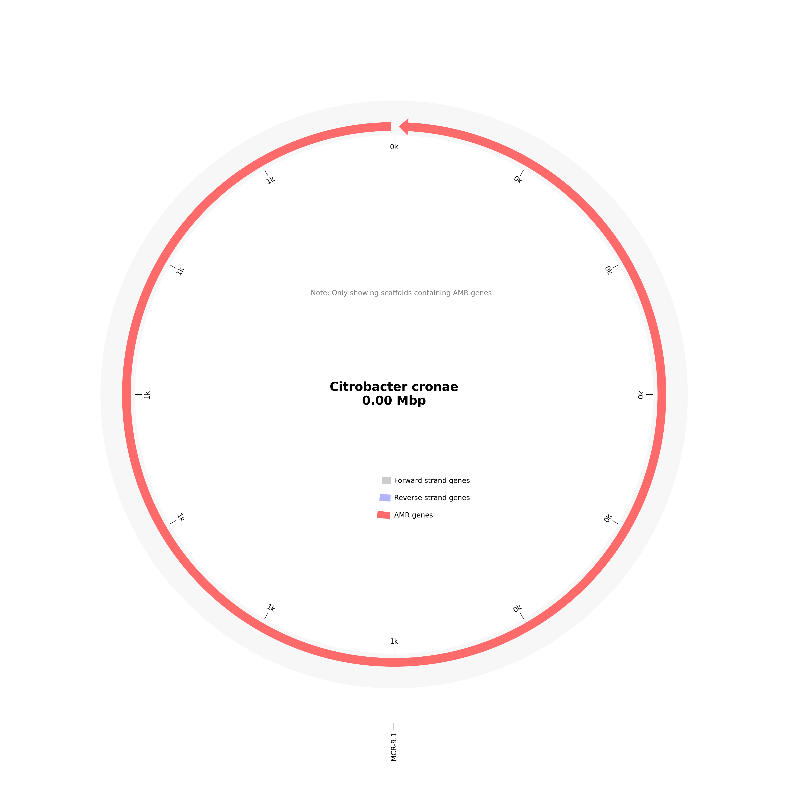

### MCR-9.1
- **Mechanism**: antibiotic target alteration
- **Drug Classes**: peptide antibiotic
- **AMR Family**: MCR phosphoethanolamine transferase
- **Locations**:
  - gnl|SPADES|BMKMCJEI_5737_1 : position 3-1109

## Citrobacter freundii
**Strain Statistics:**
- Total genome length: 199.5 kbp
- Total scaffolds: 165
- Scaffolds with AMR genes: 7
- Total genes annotated: 442
- Total AMR genes: 20
- Unique AMR genes: 17
- Distinct AMR mechanisms: 6
- Distinct AMR families: 10
- Distinct drug classes: 20

**Circos Plot:**

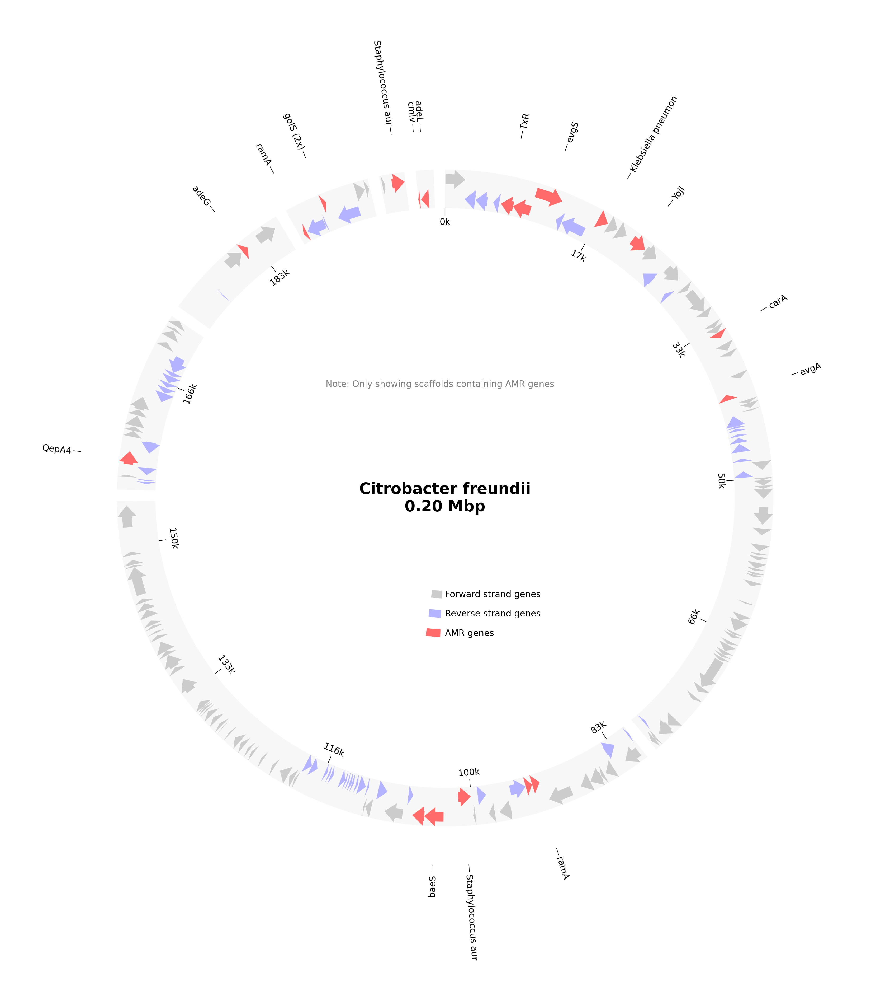

### Klebsiella pneumoniae OmpK37
- **Mechanism**: reduced permeability to antibiotic
- **Drug Classes**: monobactam; carbapenem; cephalosporin; cephamycin; penam; penem
- **AMR Family**: General Bacterial Porin with reduced permeability to beta-lactams
- **Locations**:
  - gnl|SPADES|BMKMCJEI_121_11 : position 16617-17717

### Pseudomonas aeruginosa CpxR
- **Mechanism**: antibiotic efflux
- **Drug Classes**: macrolide antibiotic; fluoroquinolone antibiotic; monobactam; aminoglycoside antibiotic; carbapenem; cephalosporin; cephamycin; penam; tetracycline antibiotic; peptide antibiotic; aminocoumarin antibiotic; diaminopyrimidine antibiotic; sulfonamide antibiotic; phenicol antibiotic; penem
- **AMR Family**: resistance-nodulation-cell division (RND) antibiotic efflux pump
- **Locations**:
  - gnl|SPADES|BMKMCJEI_140_20 : position 24082-25329

### QepA4
- **Mechanism**: antibiotic efflux
- **Drug Classes**: fluoroquinolone antibiotic
- **AMR Family**: major facilitator superfamily (MFS) antibiotic efflux pump
- **Locations**:
  - gnl|SPADES|BMKMCJEI_557_5 : position 2651-4024

### Staphylococcus aureus GlpT with mutation conferring resistance to fosfomycin (found in 2 locations)
- **Mechanism**: antibiotic target alteration
- **Drug Classes**: phosphonic acid antibiotic
- **AMR Family**: antibiotic-resistant GlpT
- **Locations**:
  - gnl|SPADES|BMKMCJEI_140_17 : position 19080-20471
  - gnl|SPADES|BMKMCJEI_2918_2 : position 1186-2520

### TxR
- **Mechanism**: antibiotic efflux
- **Drug Classes**: tetracycline antibiotic
- **AMR Family**: ATP-binding cassette (ABC) antibiotic efflux pump
- **Locations**:
  - gnl|SPADES|BMKMCJEI_121_6 : position 6195-7580

### YojI
- **Mechanism**: antibiotic efflux
- **Drug Classes**: peptide antibiotic
- **AMR Family**: ATP-binding cassette (ABC) antibiotic efflux pump
- **Locations**:
  - gnl|SPADES|BMKMCJEI_121_15 : position 20755-22398

### adeG
- **Mechanism**: antibiotic efflux
- **Drug Classes**: fluoroquinolone antibiotic; tetracycline antibiotic
- **AMR Family**: resistance-nodulation-cell division (RND) antibiotic efflux pump
- **Locations**:
  - gnl|SPADES|BMKMCJEI_717_3 : position 8596-9270

### adeL
- **Mechanism**: antibiotic efflux
- **Drug Classes**: fluoroquinolone antibiotic; tetracycline antibiotic
- **AMR Family**: resistance-nodulation-cell division (RND) antibiotic efflux pump
- **Locations**:
  - gnl|SPADES|BMKMCJEI_3889_2 : position 311-1165

### adeS
- **Mechanism**: antibiotic efflux
- **Drug Classes**: glycylcycline; tetracycline antibiotic
- **AMR Family**: resistance-nodulation-cell division (RND) antibiotic efflux pump
- **Locations**:
  - gnl|SPADES|BMKMCJEI_121_7 : position 7577-9529

### baeS
- **Mechanism**: antibiotic efflux
- **Drug Classes**: aminoglycoside antibiotic; aminocoumarin antibiotic
- **AMR Family**: resistance-nodulation-cell division (RND) antibiotic efflux pump
- **Locations**:
  - gnl|SPADES|BMKMCJEI_140_19 : position 22083-24092

### carA
- **Mechanism**: antibiotic target protection
- **Drug Classes**: macrolide antibiotic
- **AMR Family**: Miscellaneous ABC-F subfamily ATP-binding cassette ribosomal protection proteins
- **Locations**:
  - gnl|SPADES|BMKMCJEI_121_28 : position 33906-34526

### cmlv
- **Mechanism**: antibiotic inactivation
- **Drug Classes**: phenicol antibiotic
- **AMR Family**: chloramphenicol phosphotransferase
- **Locations**:
  - gnl|SPADES|BMKMCJEI_3889_1 : position 1-192

### evgA
- **Mechanism**: antibiotic efflux
- **Drug Classes**: macrolide antibiotic; fluoroquinolone antibiotic; penam; tetracycline antibiotic
- **AMR Family**: major facilitator superfamily (MFS) antibiotic efflux pump; resistance-nodulation-cell division (RND) antibiotic efflux pump
- **Locations**:
  - gnl|SPADES|BMKMCJEI_121_36 : position 40293-40940

### evgS
- **Mechanism**: antibiotic efflux
- **Drug Classes**: macrolide antibiotic; fluoroquinolone antibiotic; penam; tetracycline antibiotic
- **AMR Family**: major facilitator superfamily (MFS) antibiotic efflux pump; resistance-nodulation-cell division (RND) antibiotic efflux pump
- **Locations**:
  - gnl|SPADES|BMKMCJEI_121_8 : position 9584-12430

### golS (found in 2 locations)
- **Mechanism**: antibiotic efflux
- **Drug Classes**: monobactam; carbapenem; cephalosporin; cephamycin; penam; phenicol antibiotic; penem
- **AMR Family**: resistance-nodulation-cell division (RND) antibiotic efflux pump
- **Locations**:
  - gnl|SPADES|BMKMCJEI_1022_4 : position 3644-4096
  - gnl|SPADES|BMKMCJEI_1022_5 : position 4186-4605

### ramA (found in 2 locations)
- **Mechanism**: antibiotic efflux; reduced permeability to antibiotic
- **Drug Classes**: fluoroquinolone antibiotic; monobactam; carbapenem; cephalosporin; glycylcycline; cephamycin; penam; tetracycline antibiotic; rifamycin antibiotic; phenicol antibiotic; penem; disinfecting agents and antiseptics
- **AMR Family**: resistance-nodulation-cell division (RND) antibiotic efflux pump; General Bacterial Porin with reduced permeability to beta-lactams
- **Locations**:
  - gnl|SPADES|BMKMCJEI_1022_2 : position 471-875
  - gnl|SPADES|BMKMCJEI_140_10 : position 11302-12165

### vanR gene in vanC cluster
- **Mechanism**: antibiotic target alteration
- **Drug Classes**: glycopeptide antibiotic
- **AMR Family**: glycopeptide resistance gene cluster; vanR
- **Locations**:
  - gnl|SPADES|BMKMCJEI_140_11 : position 12181-12915

## Citrobacter freundii complex
**Strain Statistics:**
- Total genome length: 20.2 kbp
- Total scaffolds: 12
- Scaffolds with AMR genes: 3
- Total genes annotated: 46
- Total AMR genes: 6
- Unique AMR genes: 6
- Distinct AMR mechanisms: 2
- Distinct AMR families: 3
- Distinct drug classes: 14

**Circos Plot:**

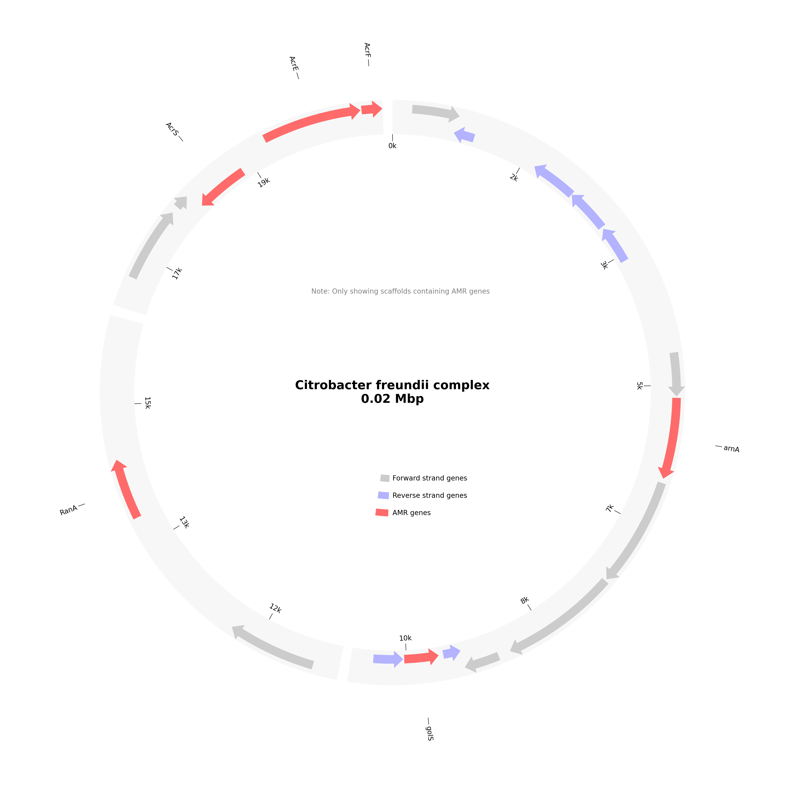

### AcrE
- **Mechanism**: antibiotic efflux
- **Drug Classes**: fluoroquinolone antibiotic; cephalosporin; cephamycin; penam
- **AMR Family**: resistance-nodulation-cell division (RND) antibiotic efflux pump
- **Locations**:
  - gnl|SPADES|BMKMCJEI_2040_5 : position 2615-3778

### AcrF
- **Mechanism**: antibiotic efflux
- **Drug Classes**: fluoroquinolone antibiotic; cephalosporin; cephamycin; penam
- **AMR Family**: resistance-nodulation-cell division (RND) antibiotic efflux pump
- **Locations**:
  - gnl|SPADES|BMKMCJEI_2040_6 : position 3790-4032

### AcrS
- **Mechanism**: antibiotic efflux
- **Drug Classes**: fluoroquinolone antibiotic; cephalosporin; glycylcycline; cephamycin; penam; tetracycline antibiotic; rifamycin antibiotic; phenicol antibiotic; disinfecting agents and antiseptics
- **AMR Family**: resistance-nodulation-cell division (RND) antibiotic efflux pump
- **Locations**:
  - gnl|SPADES|BMKMCJEI_2040_4 : position 1545-2201

### RanA
- **Mechanism**: antibiotic efflux
- **Drug Classes**: aminoglycoside antibiotic
- **AMR Family**: ATP-binding cassette (ABC) antibiotic efflux pump
- **Locations**:
  - gnl|SPADES|BMKMCJEI_1598_3 : position 3025-3735

### arnA
- **Mechanism**: antibiotic target alteration
- **Drug Classes**: peptide antibiotic
- **AMR Family**: pmr phosphoethanolamine transferase
- **Locations**:
  - gnl|SPADES|BMKMCJEI_848_9 : position 5204-6151

### golS
- **Mechanism**: antibiotic efflux
- **Drug Classes**: monobactam; carbapenem; cephalosporin; cephamycin; penam; phenicol antibiotic; penem
- **AMR Family**: resistance-nodulation-cell division (RND) antibiotic efflux pump
- **Locations**:
  - gnl|SPADES|BMKMCJEI_848_14 : position 9716-10141

## Citrobacter koseri
**Strain Statistics:**
- Total genome length: 1.4 kbp
- Total scaffolds: 16
- Scaffolds with AMR genes: 1
- Total genes annotated: 4
- Total AMR genes: 1
- Unique AMR genes: 1
- Distinct AMR mechanisms: 1
- Distinct AMR families: 1
- Distinct drug classes: 6

**Circos Plot:**

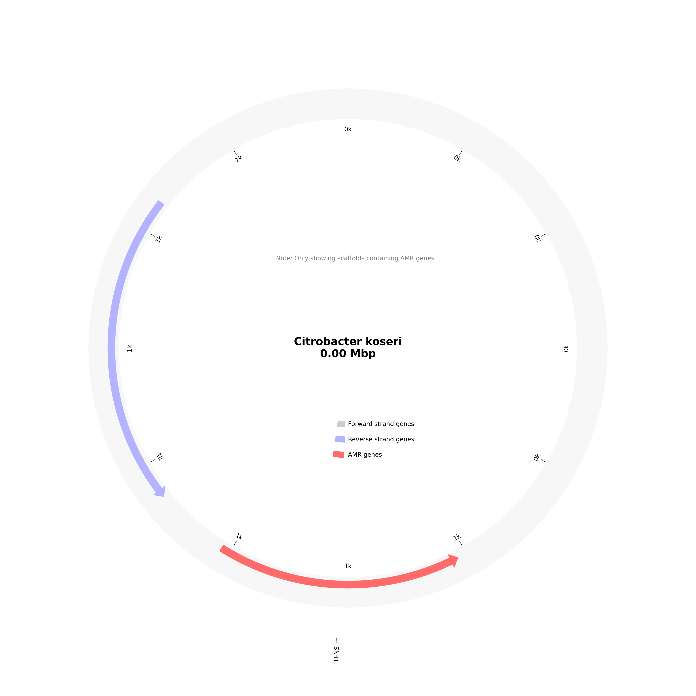

### H-NS
- **Mechanism**: antibiotic efflux
- **Drug Classes**: macrolide antibiotic; fluoroquinolone antibiotic; cephalosporin; cephamycin; penam; tetracycline antibiotic
- **AMR Family**: major facilitator superfamily (MFS) antibiotic efflux pump; resistance-nodulation-cell division (RND) antibiotic efflux pump
- **Locations**:
  - gnl|SPADES|BMKMCJEI_4734_2 : position 597-833

## Citrobacter pasteurii
**Strain Statistics:**
- Total genome length: 36.8 kbp
- Total scaffolds: 1
- Scaffolds with AMR genes: 1
- Total genes annotated: 68
- Total AMR genes: 2
- Unique AMR genes: 2
- Distinct AMR mechanisms: 1
- Distinct AMR families: 2
- Distinct drug classes: 2

**Circos Plot:**

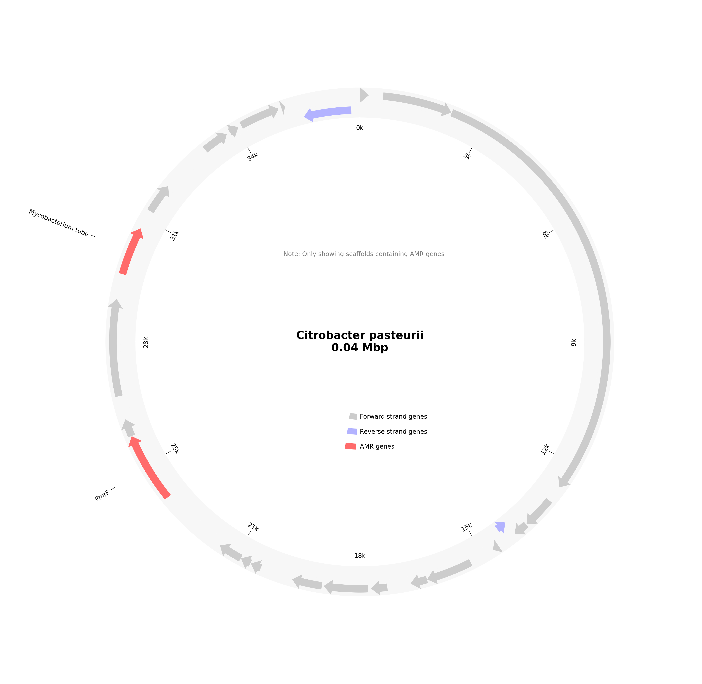

### Mycobacterium tuberculosis kasA mutant conferring resistance to isoniazid
- **Mechanism**: antibiotic target alteration
- **Drug Classes**: isoniazid-like antibiotic
- **AMR Family**: antibiotic resistant kasA
- **Locations**:
  - gnl|SPADES|BMKMCJEI_308_25 : position 29254-30423

### PmrF
- **Mechanism**: antibiotic target alteration
- **Drug Classes**: peptide antibiotic
- **AMR Family**: pmr phosphoethanolamine transferase
- **Locations**:
  - gnl|SPADES|BMKMCJEI_308_20 : position 23635-25326

## Citrobacter portucalensis
**Strain Statistics:**
- Total genome length: 5.8 kbp
- Total scaffolds: 11
- Scaffolds with AMR genes: 1
- Total genes annotated: 16
- Total AMR genes: 1
- Unique AMR genes: 1
- Distinct AMR mechanisms: 1
- Distinct AMR families: 1
- Distinct drug classes: 1

**Circos Plot:**

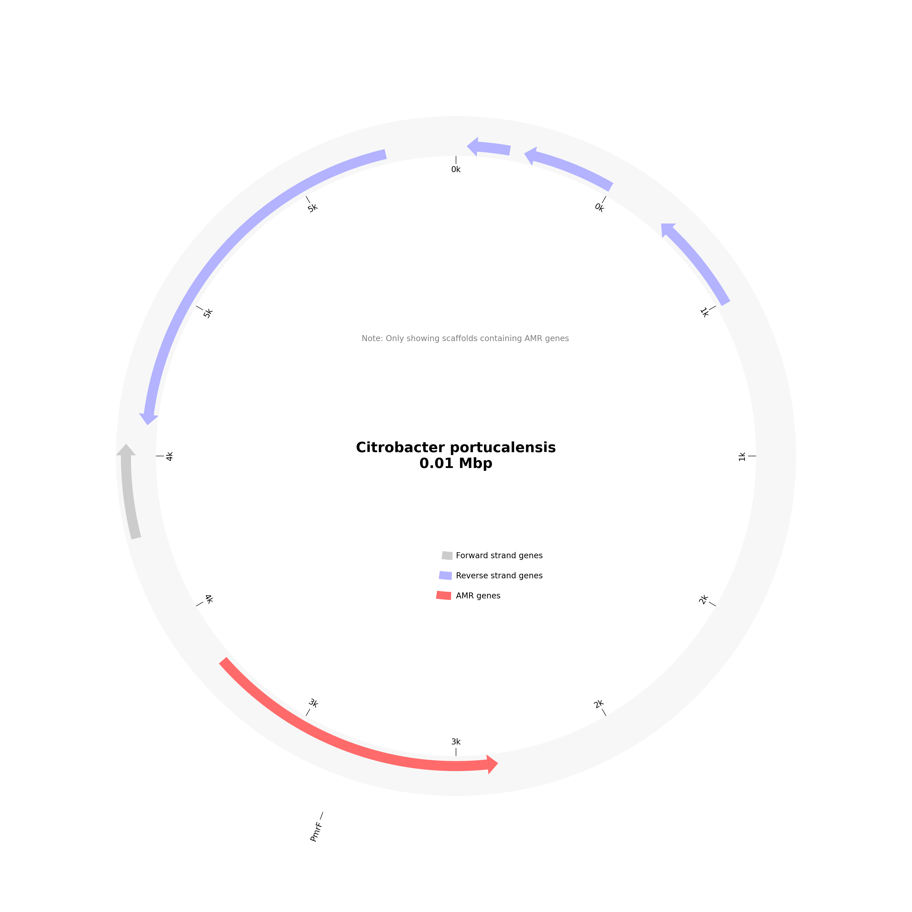

### PmrF
- **Mechanism**: antibiotic target alteration
- **Drug Classes**: peptide antibiotic
- **AMR Family**: pmr phosphoethanolamine transferase
- **Locations**:
  - gnl|SPADES|BMKMCJEI_1477_4 : position 2798-3718

## Citrobacter sp. 21OH12SH02A-Citro
**Strain Statistics:**
- Total genome length: 31.0 kbp
- Total scaffolds: 1
- Scaffolds with AMR genes: 1
- Total genes annotated: 70
- Total AMR genes: 3
- Unique AMR genes: 3
- Distinct AMR mechanisms: 1
- Distinct AMR families: 2
- Distinct drug classes: 6

**Circos Plot:**

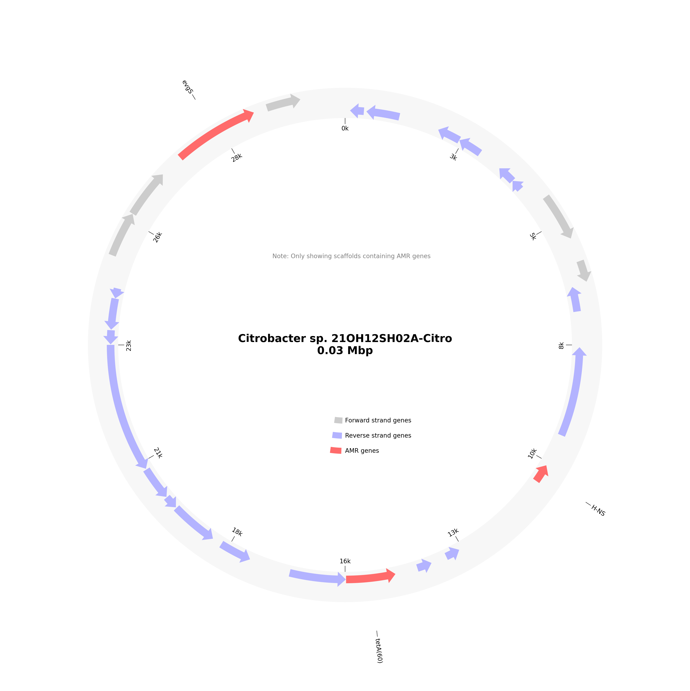

### H-NS
- **Mechanism**: antibiotic efflux
- **Drug Classes**: macrolide antibiotic; fluoroquinolone antibiotic; cephalosporin; cephamycin; penam; tetracycline antibiotic
- **AMR Family**: major facilitator superfamily (MFS) antibiotic efflux pump; resistance-nodulation-cell division (RND) antibiotic efflux pump
- **Locations**:
  - gnl|SPADES|BMKMCJEI_351_12 : position 10425-10817

### evgS
- **Mechanism**: antibiotic efflux
- **Drug Classes**: macrolide antibiotic; fluoroquinolone antibiotic; penam; tetracycline antibiotic
- **AMR Family**: major facilitator superfamily (MFS) antibiotic efflux pump; resistance-nodulation-cell division (RND) antibiotic efflux pump
- **Locations**:
  - gnl|SPADES|BMKMCJEI_351_34 : position 27482-29200

### tetA(60)
- **Mechanism**: antibiotic efflux
- **Drug Classes**: tetracycline antibiotic
- **AMR Family**: ATP-binding cassette (ABC) antibiotic efflux pump
- **Locations**:
  - gnl|SPADES|BMKMCJEI_351_18 : position 14454-15503

## Citrobacter sp. R56
**Strain Statistics:**
- Total genome length: 1.0 kbp
- Total scaffolds: 4
- Scaffolds with AMR genes: 1
- Total genes annotated: 0
- Total AMR genes: 1
- Unique AMR genes: 1
- Distinct AMR mechanisms: 1
- Distinct AMR families: 1
- Distinct drug classes: 1

**Circos Plot:**

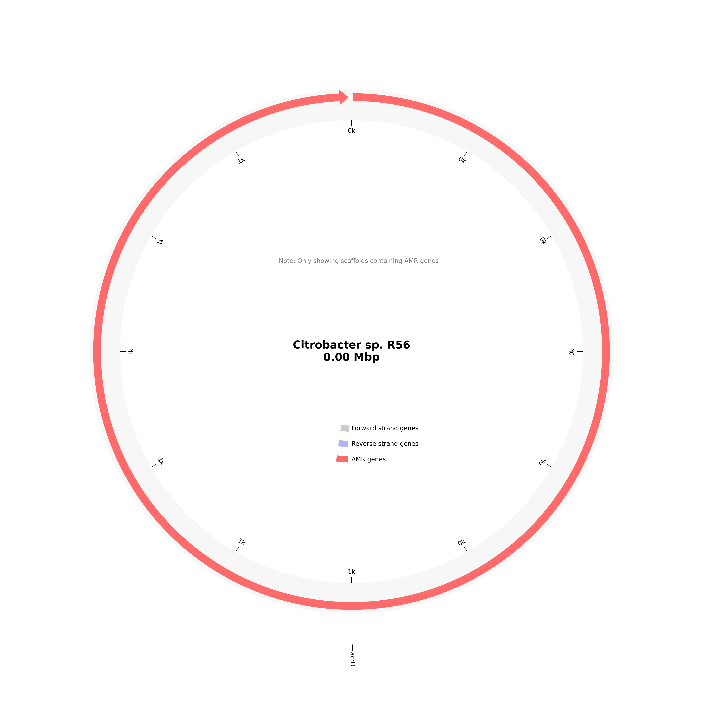

### acrD
- **Mechanism**: antibiotic efflux
- **Drug Classes**: aminoglycoside antibiotic
- **AMR Family**: resistance-nodulation-cell division (RND) antibiotic efflux pump
- **Locations**:
  - gnl|SPADES|BMKMCJEI_6163_1 : position 1-1020

## Citrobacter sp. RHBSTW-00570
**Strain Statistics:**
- Total genome length: 63.0 kbp
- Total scaffolds: 3
- Scaffolds with AMR genes: 1
- Total genes annotated: 108
- Total AMR genes: 3
- Unique AMR genes: 3
- Distinct AMR mechanisms: 2
- Distinct AMR families: 2
- Distinct drug classes: 5

**Circos Plot:**

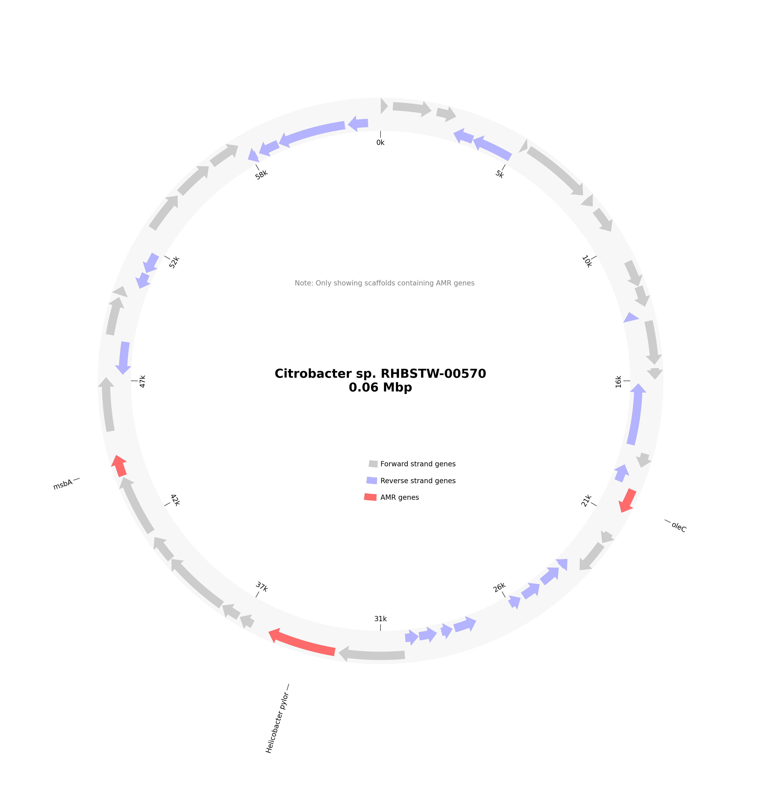

### Helicobacter pylori pbp1 mutants conferring resistance to amoxicillin
- **Mechanism**: antibiotic target alteration
- **Drug Classes**: cephalosporin; cephamycin; penam
- **AMR Family**: Penicillin-binding protein mutations conferring resistance to beta-lactam antibiotics
- **Locations**:
  - gnl|SPADES|BMKMCJEI_174_33 : position 33156-35696

### msbA
- **Mechanism**: antibiotic efflux
- **Drug Classes**: nitroimidazole antibiotic
- **AMR Family**: ATP-binding cassette (ABC) antibiotic efflux pump
- **Locations**:
  - gnl|SPADES|BMKMCJEI_174_39 : position 43687-44484

### oleC
- **Mechanism**: antibiotic efflux
- **Drug Classes**: macrolide antibiotic
- **AMR Family**: ATP-binding cassette (ABC) antibiotic efflux pump
- **Locations**:
  - gnl|SPADES|BMKMCJEI_174_19 : position 19822-20748

## Citrobacter sp. RHBSTW-00887
**Strain Statistics:**
- Total genome length: 26.1 kbp
- Total scaffolds: 3
- Scaffolds with AMR genes: 3
- Total genes annotated: 47
- Total AMR genes: 5
- Unique AMR genes: 5
- Distinct AMR mechanisms: 4
- Distinct AMR families: 5
- Distinct drug classes: 8

**Circos Plot:**

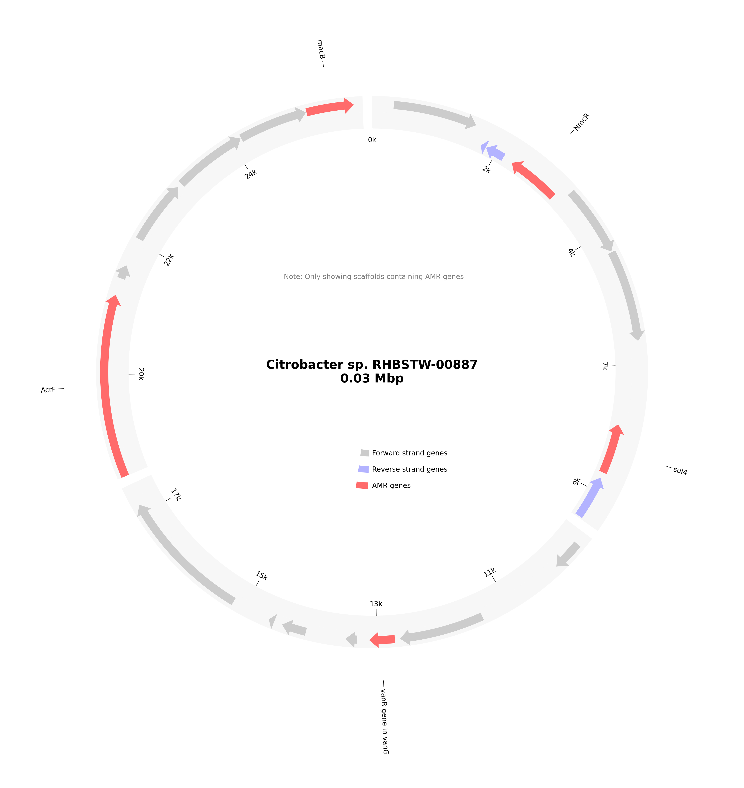

### AcrF
- **Mechanism**: antibiotic efflux
- **Drug Classes**: fluoroquinolone antibiotic; cephalosporin; cephamycin; penam
- **AMR Family**: resistance-nodulation-cell division (RND) antibiotic efflux pump
- **Locations**:
  - gnl|SPADES|BMKMCJEI_1111_1 : position 3-2924

### NmcR
- **Mechanism**: antibiotic inactivation
- **Drug Classes**: carbapenem; cephalosporin; cephamycin; penam
- **AMR Family**: NmcA beta-lactamase
- **Locations**:
  - gnl|SPADES|BMKMCJEI_984_4 : position 2487-3380

### macB
- **Mechanism**: antibiotic efflux
- **Drug Classes**: macrolide antibiotic
- **AMR Family**: ATP-binding cassette (ABC) antibiotic efflux pump
- **Locations**:
  - gnl|SPADES|BMKMCJEI_1111_6 : position 7276-8034

### sul4
- **Mechanism**: antibiotic target replacement
- **Drug Classes**: sulfonamide antibiotic
- **AMR Family**: sulfonamide resistant sul
- **Locations**:
  - gnl|SPADES|BMKMCJEI_984_8 : position 7514-8362

### vanR gene in vanG cluster
- **Mechanism**: antibiotic target alteration
- **Drug Classes**: glycopeptide antibiotic
- **AMR Family**: glycopeptide resistance gene cluster; vanR
- **Locations**:
  - gnl|SPADES|BMKMCJEI_1040_4 : position 3535-3942

## Citrobacter sp. RHBSTW-00986
**Strain Statistics:**
- Total genome length: 196.9 kbp
- Total scaffolds: 7
- Scaffolds with AMR genes: 3
- Total genes annotated: 361
- Total AMR genes: 15
- Unique AMR genes: 12
- Distinct AMR mechanisms: 5
- Distinct AMR families: 7
- Distinct drug classes: 17

**Circos Plot:**

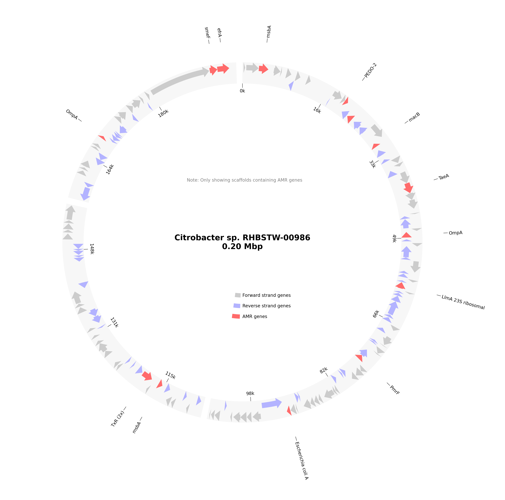

### Escherichia coli AcrAB-TolC with AcrR mutation conferring resistance to ciprofloxacin, tetracycline, and ceftazidime
- **Mechanism**: antibiotic target alteration; antibiotic efflux
- **Drug Classes**: fluoroquinolone antibiotic; cephalosporin; glycylcycline; penam; tetracycline antibiotic; rifamycin antibiotic; phenicol antibiotic; disinfecting agents and antiseptics
- **AMR Family**: resistance-nodulation-cell division (RND) antibiotic efflux pump
- **Locations**:
  - gnl|SPADES|BMKMCJEI_76_88 : position 91285-91923

### Klebsiella pneumoniae OmpK37
- **Mechanism**: reduced permeability to antibiotic
- **Drug Classes**: monobactam; carbapenem; cephalosporin; cephamycin; penam; penem
- **AMR Family**: General Bacterial Porin with reduced permeability to beta-lactams
- **Locations**:
  - gnl|SPADES|BMKMCJEI_76_19 : position 22073-23161

### LlmA 23S ribosomal RNA methyltransferase
- **Mechanism**: antibiotic target alteration
- **Drug Classes**: lincosamide antibiotic
- **AMR Family**: Llm 23S ribosomal RNA methyltransferase
- **Locations**:
  - gnl|SPADES|BMKMCJEI_76_50 : position 57847-59058

### OmpA (found in 2 locations)
- **Mechanism**: reduced permeability to antibiotic
- **Drug Classes**: peptide antibiotic
- **AMR Family**: General Bacterial Porin with reduced permeability to peptide antibiotics
- **Locations**:
  - gnl|SPADES|BMKMCJEI_275_12 : position 12266-12748
  - gnl|SPADES|BMKMCJEI_76_40 : position 48040-49098

### PEDO-2
- **Mechanism**: antibiotic inactivation
- **Drug Classes**: carbapenem
- **AMR Family**: subclass B3 PEDO beta-lactamase
- **Locations**:
  - gnl|SPADES|BMKMCJEI_76_17 : position 19997-20644

### PmrF
- **Mechanism**: antibiotic target alteration
- **Drug Classes**: peptide antibiotic
- **AMR Family**: pmr phosphoethanolamine transferase
- **Locations**:
  - gnl|SPADES|BMKMCJEI_76_66 : position 74143-75066

### TaeA
- **Mechanism**: antibiotic efflux
- **Drug Classes**: pleuromutilin antibiotic
- **AMR Family**: ATP-binding cassette (ABC) antibiotic efflux pump
- **Locations**:
  - gnl|SPADES|BMKMCJEI_76_32 : position 39047-40954

### TxR (found in 2 locations)
- **Mechanism**: antibiotic efflux
- **Drug Classes**: tetracycline antibiotic
- **AMR Family**: ATP-binding cassette (ABC) antibiotic efflux pump
- **Locations**:
  - gnl|SPADES|BMKMCJEI_231_13 : position 11128-13206
  - gnl|SPADES|BMKMCJEI_231_37 : position 36382-37899

### efrA
- **Mechanism**: antibiotic efflux
- **Drug Classes**: macrolide antibiotic; fluoroquinolone antibiotic; rifamycin antibiotic
- **AMR Family**: ATP-binding cassette (ABC) antibiotic efflux pump
- **Locations**:
  - gnl|SPADES|BMKMCJEI_275_29 : position 37428-39614

### macB
- **Mechanism**: antibiotic efflux
- **Drug Classes**: macrolide antibiotic
- **AMR Family**: ATP-binding cassette (ABC) antibiotic efflux pump
- **Locations**:
  - gnl|SPADES|BMKMCJEI_76_23 : position 29512-30279

### msbA (found in 2 locations)
- **Mechanism**: antibiotic efflux
- **Drug Classes**: nitroimidazole antibiotic
- **AMR Family**: ATP-binding cassette (ABC) antibiotic efflux pump
- **Locations**:
  - gnl|SPADES|BMKMCJEI_231_10 : position 8753-9574
  - gnl|SPADES|BMKMCJEI_76_3: position 3007-4755

### smeF
- **Mechanism**: antibiotic efflux
- **Drug Classes**: macrolide antibiotic; fluoroquinolone antibiotic; tetracycline antibiotic; phenicol antibiotic
- **AMR Family**: resistance-nodulation-cell division (RND) antibiotic efflux pump
- **Locations**:
  - gnl|SPADES|BMKMCJEI_275_28 : position 36022-37431

## Citrobacter sp. TSA-1
**Strain Statistics:**
- Total genome length: 41.8 kbp
- Total scaffolds: 1
- Scaffolds with AMR genes: 1
- Total genes annotated: 84
- Total AMR genes: 3
- Unique AMR genes: 3
- Distinct AMR mechanisms: 3
- Distinct AMR families: 3
- Distinct drug classes: 2

**Circos Plot:**

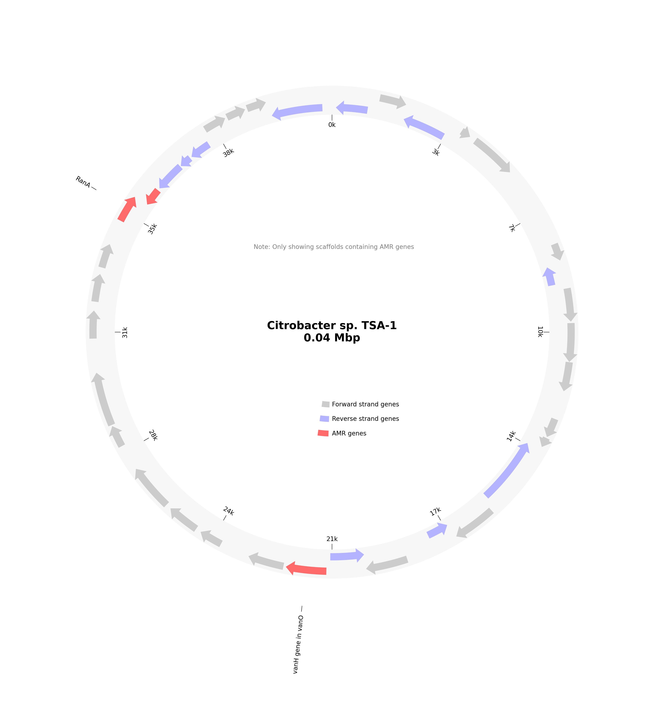

### AAC(6')-31
- **Mechanism**: antibiotic inactivation
- **Drug Classes**: aminoglycoside antibiotic
- **AMR Family**: AAC(6')
- **Locations**:
  - gnl|SPADES|BMKMCJEI_272_35 : position 35346-35876

### RanA
- **Mechanism**: antibiotic efflux
- **Drug Classes**: aminoglycoside antibiotic
- **AMR Family**: ATP-binding cassette (ABC) antibiotic efflux pump
- **Locations**:
  - gnl|SPADES|BMKMCJEI_272_34 : position 34554-35327

### vanH gene in vanO cluster
- **Mechanism**: antibiotic target alteration
- **Drug Classes**: glycopeptide antibiotic
- **AMR Family**: vanH; glycopeptide resistance gene cluster
- **Locations**:
  - gnl|SPADES|BMKMCJEI_272_20 : position 21046-22182

## Citrobacter werkmanii
**Strain Statistics:**
- Total genome length: 41.5 kbp
- Total scaffolds: 3
- Scaffolds with AMR genes: 1
- Total genes annotated: 80
- Total AMR genes: 5
- Unique AMR genes: 5
- Distinct AMR mechanisms: 3
- Distinct AMR families: 4
- Distinct drug classes: 14

**Circos Plot:**

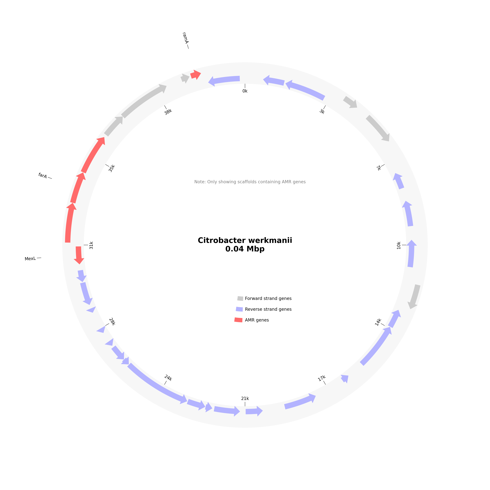

### MdtQ
- **Mechanism**: reduced permeability to antibiotic
- **Drug Classes**: monobactam; carbapenem; cephalosporin; cephamycin; penam; penem
- **AMR Family**: Outer Membrane Porin (Opr)
- **Locations**:
  - gnl|SPADES|BMKMCJEI_273_33 : position 31240-32739

### MexL
- **Mechanism**: antibiotic efflux
- **Drug Classes**: macrolide antibiotic; tetracycline antibiotic; disinfecting agents and antiseptics
- **AMR Family**: resistance-nodulation-cell division (RND) antibiotic efflux pump
- **Locations**:
  - gnl|SPADES|BMKMCJEI_273_32 : position 30380-31093

### emrB
- **Mechanism**: antibiotic efflux
- **Drug Classes**: fluoroquinolone antibiotic
- **AMR Family**: major facilitator superfamily (MFS) antibiotic efflux pump
- **Locations**:
  - gnl|SPADES|BMKMCJEI_273_35 : position 33942-35474

### farA
- **Mechanism**: antibiotic efflux
- **Drug Classes**: antibacterial free fatty acids
- **AMR Family**: major facilitator superfamily (MFS) antibiotic efflux pump
- **Locations**:
  - gnl|SPADES|BMKMCJEI_273_34 : position 32739-33938

### ramA
- **Mechanism**: antibiotic efflux; reduced permeability to antibiotic
- **Drug Classes**: fluoroquinolone antibiotic; monobactam; carbapenem; cephalosporin; glycylcycline; cephamycin; penam; tetracycline antibiotic; rifamycin antibiotic; phenicol antibiotic; penem; disinfecting agents and antiseptics
- **AMR Family**: resistance-nodulation-cell division (RND) antibiotic efflux pump; General Bacterial Porin with reduced permeability to beta-lactams
- **Locations**:
  - gnl|SPADES|BMKMCJEI_273_40 : position 39485-39877

## Citrobacter youngae
**Strain Statistics:**
- Total genome length: 0.5 kbp
- Total scaffolds: 1
- Scaffolds with AMR genes: 1
- Total genes annotated: 0
- Total AMR genes: 1
- Unique AMR genes: 1
- Distinct AMR mechanisms: 1
- Distinct AMR families: 1
- Distinct drug classes: 6

**Circos Plot:**

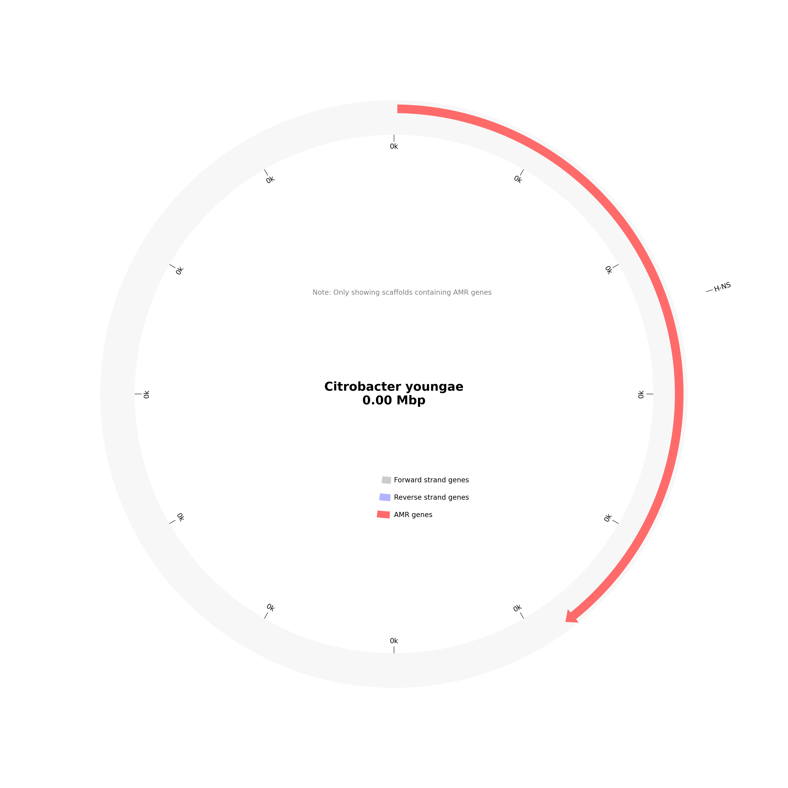

### H-NS
- **Mechanism**: antibiotic efflux
- **Drug Classes**: macrolide antibiotic; fluoroquinolone antibiotic; cephalosporin; cephamycin; penam; tetracycline antibiotic
- **AMR Family**: major facilitator superfamily (MFS) antibiotic efflux pump; resistance-nodulation-cell division (RND) antibiotic efflux pump
- **Locations**:
  - gnl|SPADES|BMKMCJEI_11279_1 : position 1-213

## Enterobacter hormaechei
**Strain Statistics:**
- Total genome length: 0.9 kbp
- Total scaffolds: 39
- Scaffolds with AMR genes: 1
- Total genes annotated: 2
- Total AMR genes: 1
- Unique AMR genes: 1
- Distinct AMR mechanisms: 1
- Distinct AMR families: 1
- Distinct drug classes: 6

**Circos Plot:**

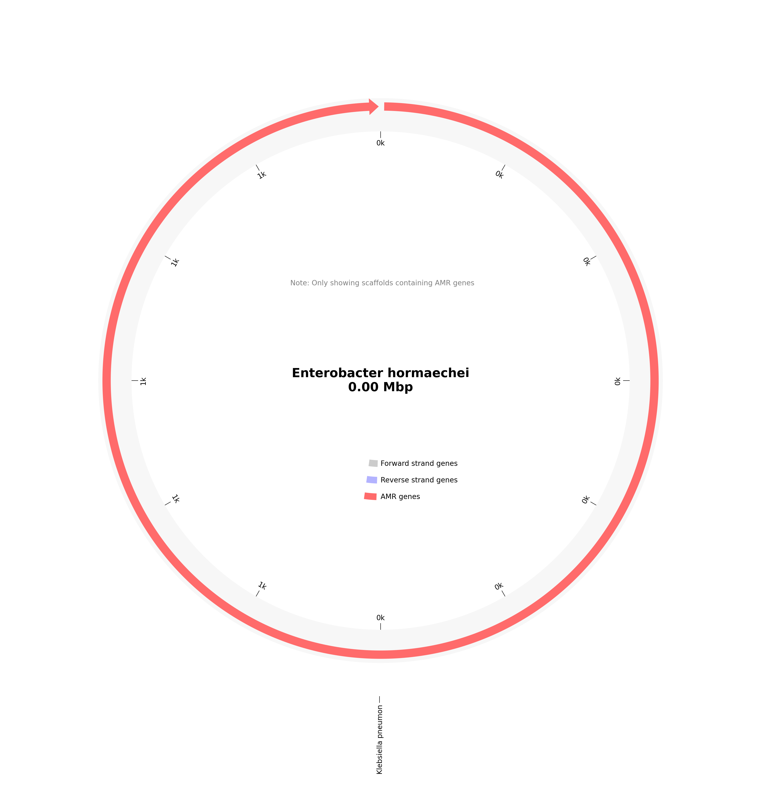

### Klebsiella pneumoniae OmpK37
- **Mechanism**: reduced permeability to antibiotic
- **Drug Classes**: monobactam; carbapenem; cephalosporin; cephamycin; penam; penem
- **AMR Family**: General Bacterial Porin with reduced permeability to beta-lactams
- **Locations**:
  - gnl|SPADES|BMKMCJEI_6621_1 : position 2-946

## Escherichia coli
**Strain Statistics:**
- Total genome length: 18.4 kbp
- Total scaffolds: 76
- Scaffolds with AMR genes: 3
- Total genes annotated: 42
- Total AMR genes: 3
- Unique AMR genes: 3
- Distinct AMR mechanisms: 2
- Distinct AMR families: 3
- Distinct drug classes: 3

**Circos Plot:**

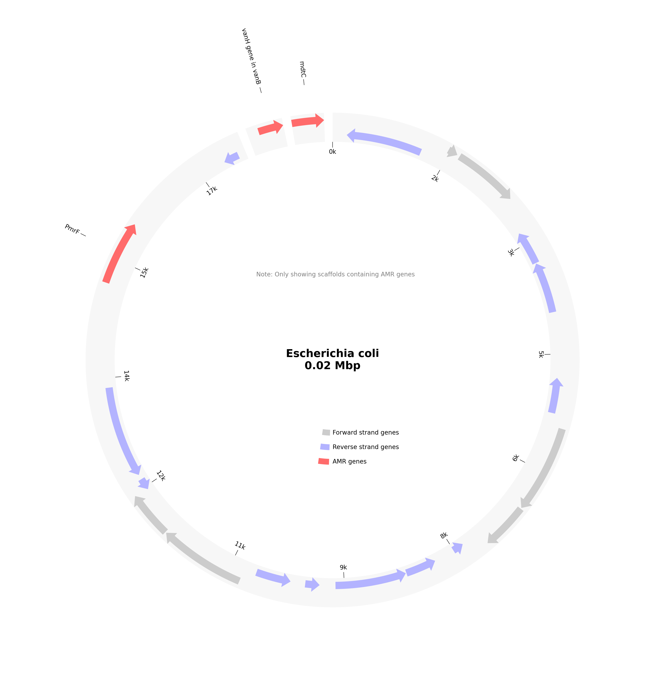

### PmrF
- **Mechanism**: antibiotic target alteration
- **Drug Classes**: peptide antibiotic
- **AMR Family**: pmr phosphoethanolamine transferase
- **Locations**:
  - gnl|SPADES|BMKMCJEI_585_17 : position 15000-15809

### mdtC
- **Mechanism**: antibiotic efflux
- **Drug Classes**: aminocoumarin antibiotic
- **AMR Family**: resistance-nodulation-cell division (RND) antibiotic efflux pump
- **Locations**:
  - gnl|SPADES|BMKMCJEI_15620_1 : position 3-407

### vanH gene in vanB cluster
- **Mechanism**: antibiotic target alteration
- **Drug Classes**: glycopeptide antibiotic
- **AMR Family**: vanH; glycopeptide resistance gene cluster
- **Locations**:
  - gnl|SPADES|BMKMCJEI_13410_1 : position 140-457

## Ewingella americana
**Strain Statistics:**
- Total genome length: 71.2 kbp
- Total scaffolds: 2378
- Scaffolds with AMR genes: 193
- Total genes annotated: 66
- Total AMR genes: 195
- Unique AMR genes: 112
- Distinct AMR mechanisms: 9
- Distinct AMR families: 31
- Distinct drug classes: 32

**Circos Plot:**

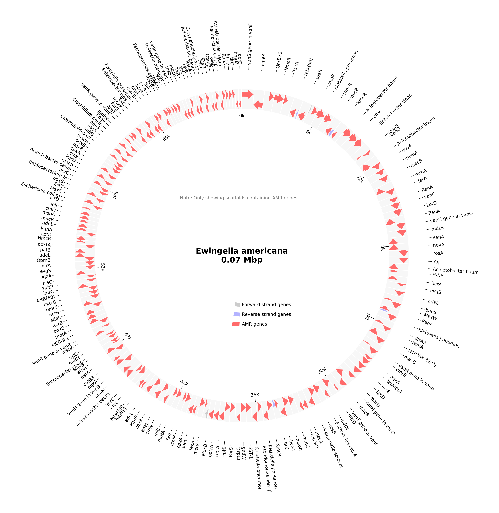

### Acinetobacter baumannii AbaF (found in 4 locations)
- **Mechanism**: antibiotic efflux
- **Drug Classes**: phosphonic acid antibiotic
- **AMR Family**: major facilitator superfamily (MFS) antibiotic efflux pump
- **Locations**:
  - gnl|SPADES|BMKMCJEI_10500_1 : position 3-575
  - gnl|SPADES|BMKMCJEI_11129_1 : position 1-543
  - gnl|SPADES|BMKMCJEI_12787_1 : position 1-477
  - gnl|SPADES|BMKMCJEI_50472_1 : position 3-209

### Acinetobacter baumannii AbaQ (found in 3 locations)
- **Mechanism**: antibiotic efflux
- **Drug Classes**: fluoroquinolone antibiotic
- **AMR Family**: major facilitator superfamily (MFS) antibiotic efflux pump
- **Locations**:
  - gnl|SPADES|BMKMCJEI_19776_1 : position 3-347
  - gnl|SPADES|BMKMCJEI_30798_1 : position 33-266
  - gnl|SPADES|BMKMCJEI_47908_1 : position 2-217

### ArnT
- **Mechanism**: antibiotic target alteration
- **Drug Classes**: peptide antibiotic
- **AMR Family**: pmr phosphoethanolamine transferase
- **Locations**:
  - gnl|SPADES|BMKMCJEI_39384_1 : position 1-240

### Bifidobacterium bifidum ileS conferring resistance to mupirocin
- **Mechanism**: antibiotic target alteration
- **Drug Classes**: mupirocin-like antibiotic
- **AMR Family**: antibiotic-resistant isoleucyl-tRNA synthetase (ileS)
- **Locations**:
  - gnl|SPADES|BMKMCJEI_28976_1 : position 3-272

### Clostridioides difficile cplR
- **Mechanism**: antibiotic target protection
- **Drug Classes**: lincosamide antibiotic; streptogramin antibiotic; streptogramin A antibiotic; nucleoside antibiotic
- **AMR Family**: Miscellaneous ABC-F subfamily ATP-binding cassette ribosomal protection proteins
- **Locations**:
  - gnl|SPADES|BMKMCJEI_36104_1 : position 72-251

### Clostridium perfringes cplR
- **Mechanism**: antibiotic target protection
- **Drug Classes**: lincosamide antibiotic; streptogramin antibiotic; streptogramin A antibiotic; pleuromutilin antibiotic
- **AMR Family**: Miscellaneous ABC-F subfamily ATP-binding cassette ribosomal protection proteins
- **Locations**:
  - gnl|SPADES|BMKMCJEI_37119_1 : position 3-248

### Corynebacterium striatum tetA
- **Mechanism**: antibiotic efflux
- **Drug Classes**: penam; tetracycline antibiotic
- **AMR Family**: major facilitator superfamily (MFS) antibiotic efflux pump
- **Locations**:
  - gnl|SPADES|BMKMCJEI_49190_1 : position 3-215

### Enterobacter cloacae acrA (found in 3 locations)
- **Mechanism**: antibiotic efflux
- **Drug Classes**: fluoroquinolone antibiotic; cephalosporin; glycylcycline; penam; tetracycline antibiotic; rifamycin antibiotic; phenicol antibiotic; disinfecting agents and antiseptics
- **AMR Family**: resistance-nodulation-cell division (RND) antibiotic efflux pump
- **Locations**:
  - gnl|SPADES|BMKMCJEI_10814_1 : position 1-558
  - gnl|SPADES|BMKMCJEI_20632_2 : position 118-336
  - gnl|SPADES|BMKMCJEI_41772_1 : position 2-235

### Escherichia coli AcrAB-TolC with AcrR mutation conferring resistance to ciprofloxacin, tetracycline, and ceftazidime
- **Mechanism**: antibiotic target alteration; antibiotic efflux
- **Drug Classes**: fluoroquinolone antibiotic; cephalosporin; glycylcycline; penam; tetracycline antibiotic; rifamycin antibiotic; phenicol antibiotic; disinfecting agents and antiseptics
- **AMR Family**: resistance-nodulation-cell division (RND) antibiotic efflux pump
- **Locations**:
  - gnl|SPADES|BMKMCJEI_14491_1 : position 2-433

### Escherichia coli mdfA (found in 2 locations)
- **Mechanism**: antibiotic efflux
- **Drug Classes**: tetracycline antibiotic; phenicol antibiotic; disinfecting agents and antiseptics
- **AMR Family**: major facilitator superfamily (MFS) antibiotic efflux pump
- **Locations**:
  - gnl|SPADES|BMKMCJEI_27224_1 : position 2-277
  - gnl|SPADES|BMKMCJEI_50310_1 : position 1-210

### EstT (found in 2 locations)
- **Mechanism**: antibiotic inactivation
- **Drug Classes**: macrolide antibiotic
- **AMR Family**: macrolide esterase
- **Locations**:
  - gnl|SPADES|BMKMCJEI_28226_1 : position 3-275
  - gnl|SPADES|BMKMCJEI_49880_1 : position 1-213

### H-NS
- **Mechanism**: antibiotic efflux
- **Drug Classes**: macrolide antibiotic; fluoroquinolone antibiotic; cephalosporin; cephamycin; penam; tetracycline antibiotic
- **AMR Family**: major facilitator superfamily (MFS) antibiotic efflux pump; resistance-nodulation-cell division (RND) antibiotic efflux pump
- **Locations**:
  - gnl|SPADES|BMKMCJEI_12876_1 : position 1-180

### Klebsiella pneumoniae KpnH
- **Mechanism**: antibiotic efflux
- **Drug Classes**: macrolide antibiotic; fluoroquinolone antibiotic; aminoglycoside antibiotic; carbapenem; cephalosporin; penam; peptide antibiotic; penem
- **AMR Family**: major facilitator superfamily (MFS) antibiotic efflux pump
- **Locations**:
  - gnl|SPADES|BMKMCJEI_9933_1 : position 2-607

### Klebsiella pneumoniae OmpK37 (found in 4 locations)
- **Mechanism**: reduced permeability to antibiotic
- **Drug Classes**: monobactam; carbapenem; cephalosporin; cephamycin; penam; penem
- **AMR Family**: General Bacterial Porin with reduced permeability to beta-lactams
- **Locations**:
  - gnl|SPADES|BMKMCJEI_13243_1 : position 3-464
  - gnl|SPADES|BMKMCJEI_15441_1 : position 47-412
  - gnl|SPADES|BMKMCJEI_16490_1 : position 2-391
  - gnl|SPADES|BMKMCJEI_41832_1 : position 2-235

### LptD (found in 3 locations)
- **Mechanism**: antibiotic efflux
- **Drug Classes**: carbapenem; peptide antibiotic; aminocoumarin antibiotic; rifamycin antibiotic
- **AMR Family**: ATP-binding cassette (ABC) antibiotic efflux pump
- **Locations**:
  - gnl|SPADES|BMKMCJEI_12066_1 : position 2-502
  - gnl|SPADES|BMKMCJEI_14013_1 : position 2-445
  - gnl|SPADES|BMKMCJEI_25276_1 : position 1-288

### MCR-9.1
- **Mechanism**: antibiotic target alteration
- **Drug Classes**: peptide antibiotic
- **AMR Family**: MCR phosphoethanolamine transferase
- **Locations**:
  - gnl|SPADES|BMKMCJEI_21632_1 : position 3-326

### MexB
- **Mechanism**: antibiotic efflux
- **Drug Classes**: macrolide antibiotic; fluoroquinolone antibiotic; monobactam; carbapenem; cephalosporin; cephamycin; penam; tetracycline antibiotic; peptide antibiotic; aminocoumarin antibiotic; diaminopyrimidine antibiotic; sulfonamide antibiotic; phenicol antibiotic; penem
- **AMR Family**: resistance-nodulation-cell division (RND) antibiotic efflux pump
- **Locations**:
  - gnl|SPADES|BMKMCJEI_20632_1 : position 3-101

### MexS
- **Mechanism**: antibiotic efflux
- **Drug Classes**: fluoroquinolone antibiotic; diaminopyrimidine antibiotic; phenicol antibiotic
- **AMR Family**: resistance-nodulation-cell division (RND) antibiotic efflux pump
- **Locations**:
  - gnl|SPADES|BMKMCJEI_28329_1 : position 1-276

### MexW
- **Mechanism**: antibiotic efflux
- **Drug Classes**: macrolide antibiotic; fluoroquinolone antibiotic; tetracycline antibiotic; phenicol antibiotic; disinfecting agents and antiseptics
- **AMR Family**: resistance-nodulation-cell division (RND) antibiotic efflux pump
- **Locations**:
  - gnl|SPADES|BMKMCJEI_13046_1 : position 1-468

### MuxB
- **Mechanism**: antibiotic efflux
- **Drug Classes**: macrolide antibiotic; monobactam; tetracycline antibiotic; aminocoumarin antibiotic
- **AMR Family**: resistance-nodulation-cell division (RND) antibiotic efflux pump
- **Locations**:
  - gnl|SPADES|BMKMCJEI_17621_1 : position 3-374

### Neisseria meningititis PBP2 conferring resistance to beta-lactam
- **Mechanism**: antibiotic target alteration
- **Drug Classes**: cephalosporin; cephamycin; penam
- **AMR Family**: Penicillin-binding protein mutations conferring resistance to beta-lactam antibiotics
- **Locations**:
  - gnl|SPADES|BMKMCJEI_44501_1 : position 2-202

### NmcR (found in 5 locations)
- **Mechanism**: antibiotic inactivation
- **Drug Classes**: carbapenem; cephalosporin; cephamycin; penam
- **AMR Family**: NmcA beta-lactamase
- **Locations**:
  - gnl|SPADES|BMKMCJEI_10035_1 : position 25-600
  - gnl|SPADES|BMKMCJEI_10123_1 : position 3-239
  - gnl|SPADES|BMKMCJEI_15365_1 : position 2-412
  - gnl|SPADES|BMKMCJEI_25388_1 : position 134-289
  - gnl|SPADES|BMKMCJEI_8278_1 : position 1-738

### OpmB (found in 2 locations)
- **Mechanism**: antibiotic efflux
- **Drug Classes**: macrolide antibiotic; monobactam; tetracycline antibiotic; aminocoumarin antibiotic
- **AMR Family**: resistance-nodulation-cell division (RND) antibiotic efflux pump
- **Locations**:
  - gnl|SPADES|BMKMCJEI_24591_1 : position 1-294
  - gnl|SPADES|BMKMCJEI_50119_1 : position 1-210

### ParS (found in 2 locations)
- **Mechanism**: antibiotic efflux; reduced permeability to antibiotic
- **Drug Classes**: macrolide antibiotic; fluoroquinolone antibiotic; monobactam; aminoglycoside antibiotic; carbapenem; cephalosporin; cephamycin; penam; tetracycline antibiotic; phenicol antibiotic; penem; disinfecting agents and antiseptics
- **AMR Family**: resistance-nodulation-cell division (RND) antibiotic efflux pump; Outer Membrane Porin (Opr)
- **Locations**:
  - gnl|SPADES|BMKMCJEI_16725_1 : position 1-387
  - gnl|SPADES|BMKMCJEI_39558_1 : position 1-240

### PmrF
- **Mechanism**: antibiotic target alteration
- **Drug Classes**: peptide antibiotic
- **AMR Family**: pmr phosphoethanolamine transferase
- **Locations**:
  - gnl|SPADES|BMKMCJEI_18809_1 : position 1-357

### Pseudomonas aeruginosa CpxR (found in 2 locations)
- **Mechanism**: antibiotic efflux
- **Drug Classes**: macrolide antibiotic; fluoroquinolone antibiotic; monobactam; aminoglycoside antibiotic; carbapenem; cephalosporin; cephamycin; penam; tetracycline antibiotic; peptide antibiotic; aminocoumarin antibiotic; diaminopyrimidine antibiotic; sulfonamide antibiotic; phenicol antibiotic; penem
- **AMR Family**: resistance-nodulation-cell division (RND) antibiotic efflux pump
- **Locations**:
  - gnl|SPADES|BMKMCJEI_15730_1 : position 3-302
  - gnl|SPADES|BMKMCJEI_43973_1 : position 2-124

### QnrB70
- **Mechanism**: antibiotic target protection
- **Drug Classes**: fluoroquinolone antibiotic
- **AMR Family**: quinolone resistance protein (qnr)
- **Locations**:
  - gnl|SPADES|BMKMCJEI_8121_2 : position 398-754

### RanA (found in 8 locations)
- **Mechanism**: antibiotic efflux
- **Drug Classes**: aminoglycoside antibiotic
- **AMR Family**: ATP-binding cassette (ABC) antibiotic efflux pump
- **Locations**:
  - gnl|SPADES|BMKMCJEI_11975_2 : position 156-506
  - gnl|SPADES|BMKMCJEI_12182_1 : position 1-498
  - gnl|SPADES|BMKMCJEI_12290_1 : position 63-494
  - gnl|SPADES|BMKMCJEI_13251_1 : position 1-300
  - gnl|SPADES|BMKMCJEI_25624_1 : position 1-288
  - gnl|SPADES|BMKMCJEI_37221_1 : position 2-247
  - gnl|SPADES|BMKMCJEI_48223_1 : position 3-218
  - gnl|SPADES|BMKMCJEI_50958_1 : position 3-209

### SST-1
- **Mechanism**: antibiotic inactivation
- **Drug Classes**: cephalosporin
- **AMR Family**: SST beta-lactamase
- **Locations**:
  - gnl|SPADES|BMKMCJEI_16562_1 : position 3-389

### Salmonella serovars soxS with mutation conferring antibiotic resistance
- **Mechanism**: antibiotic target alteration; antibiotic efflux; reduced permeability to antibiotic
- **Drug Classes**: fluoroquinolone antibiotic; monobactam; carbapenem; cephalosporin; glycylcycline; cephamycin; penam; tetracycline antibiotic; rifamycin antibiotic; phenicol antibiotic; penem; disinfecting agents and antiseptics
- **AMR Family**: ATP-binding cassette (ABC) antibiotic efflux pump; major facilitator superfamily (MFS) antibiotic efflux pump; resistance-nodulation-cell division (RND) antibiotic efflux pump; General Bacterial Porin with reduced permeability to beta-lactams
- **Locations**:
  - gnl|SPADES|BMKMCJEI_14741_1 : position 2-391

### TaeA
- **Mechanism**: antibiotic efflux
- **Drug Classes**: pleuromutilin antibiotic
- **AMR Family**: ATP-binding cassette (ABC) antibiotic efflux pump
- **Locations**:
  - gnl|SPADES|BMKMCJEI_8876_1 : position 1-303

### TolC
- **Mechanism**: antibiotic efflux
- **Drug Classes**: macrolide antibiotic; fluoroquinolone antibiotic; aminoglycoside antibiotic; carbapenem; cephalosporin; glycylcycline; cephamycin; penam; tetracycline antibiotic; peptide antibiotic; aminocoumarin antibiotic; rifamycin antibiotic; phenicol antibiotic; penem; disinfecting agents and antiseptics
- **AMR Family**: ATP-binding cassette (ABC) antibiotic efflux pump; major facilitator superfamily (MFS) antibiotic efflux pump; resistance-nodulation-cell division (RND) antibiotic efflux pump
- **Locations**:
  - gnl|SPADES|BMKMCJEI_41154_1 : position 1-237

### TxR (found in 2 locations)
- **Mechanism**: antibiotic efflux
- **Drug Classes**: tetracycline antibiotic
- **AMR Family**: ATP-binding cassette (ABC) antibiotic efflux pump
- **Locations**:
  - gnl|SPADES|BMKMCJEI_18197_1 : position 1-192
  - gnl|SPADES|BMKMCJEI_46438_1 : position 3-221

### YojI (found in 3 locations)
- **Mechanism**: antibiotic efflux
- **Drug Classes**: peptide antibiotic
- **AMR Family**: ATP-binding cassette (ABC) antibiotic efflux pump
- **Locations**:
  - gnl|SPADES|BMKMCJEI_12583_1 : position 62-481
  - gnl|SPADES|BMKMCJEI_26255_1 : position 3-284
  - gnl|SPADES|BMKMCJEI_43688_1 : position 2-229

### abeM
- **Mechanism**: antibiotic efflux
- **Drug Classes**: fluoroquinolone antibiotic; disinfecting agents and antiseptics
- **AMR Family**: multidrug and toxic compound extrusion (MATE) transporter
- **Locations**:
  - gnl|SPADES|BMKMCJEI_20116_1 : position 3-341

### acrB (found in 4 locations)
- **Mechanism**: antibiotic efflux
- **Drug Classes**: fluoroquinolone antibiotic; cephalosporin; glycylcycline; penam; tetracycline antibiotic; rifamycin antibiotic; phenicol antibiotic; disinfecting agents and antiseptics
- **AMR Family**: resistance-nodulation-cell division (RND) antibiotic efflux pump
- **Locations**:
  - gnl|SPADES|BMKMCJEI_13985_1 : position 2-445
  - gnl|SPADES|BMKMCJEI_22337_1 : position 2-316
  - gnl|SPADES|BMKMCJEI_22761_1 : position 3-314
  - gnl|SPADES|BMKMCJEI_42663_1 : position 3-233

### acrD (found in 2 locations)
- **Mechanism**: antibiotic efflux
- **Drug Classes**: aminoglycoside antibiotic
- **AMR Family**: resistance-nodulation-cell division (RND) antibiotic efflux pump
- **Locations**:
  - gnl|SPADES|BMKMCJEI_26767_1 : position 164-280
  - gnl|SPADES|BMKMCJEI_51558_1 : position 2-208

### adeL (found in 7 locations)
- **Mechanism**: antibiotic efflux
- **Drug Classes**: fluoroquinolone antibiotic; tetracycline antibiotic
- **AMR Family**: resistance-nodulation-cell division (RND) antibiotic efflux pump
- **Locations**:
  - gnl|SPADES|BMKMCJEI_12947_1 : position 108-473
  - gnl|SPADES|BMKMCJEI_17863_1 : position 185-370
  - gnl|SPADES|BMKMCJEI_18578_1 : position 3-362
  - gnl|SPADES|BMKMCJEI_18791_1 : position 1-324
  - gnl|SPADES|BMKMCJEI_22302_1 : position 3-317
  - gnl|SPADES|BMKMCJEI_24761_1 : position 1-294
  - gnl|SPADES|BMKMCJEI_25982_1 : position 78-284

### adeR
- **Mechanism**: antibiotic efflux
- **Drug Classes**: glycylcycline; tetracycline antibiotic
- **AMR Family**: resistance-nodulation-cell division (RND) antibiotic efflux pump
- **Locations**:
  - gnl|SPADES|BMKMCJEI_9491_1 : position 2-523

### arnA
- **Mechanism**: antibiotic target alteration
- **Drug Classes**: peptide antibiotic
- **AMR Family**: pmr phosphoethanolamine transferase
- **Locations**:
  - gnl|SPADES|BMKMCJEI_20517_1 : position 2-337

### baeS (found in 2 locations)
- **Mechanism**: antibiotic efflux
- **Drug Classes**: aminoglycoside antibiotic; aminocoumarin antibiotic
- **AMR Family**: resistance-nodulation-cell division (RND) antibiotic efflux pump
- **Locations**:
  - gnl|SPADES|BMKMCJEI_12973_1 : position 317-472
  - gnl|SPADES|BMKMCJEI_37351_1 : position 1-246

### basS
- **Mechanism**: antibiotic target alteration; antibiotic efflux
- **Drug Classes**: peptide antibiotic
- **AMR Family**: pmr phosphoethanolamine transferase
- **Locations**:
  - gnl|SPADES|BMKMCJEI_37379_1 : position 3-248

### bcr-1
- **Mechanism**: antibiotic efflux
- **Drug Classes**: bicyclomycin-like antibiotic
- **AMR Family**: major facilitator superfamily (MFS) antibiotic efflux pump
- **Locations**:
  - gnl|SPADES|BMKMCJEI_15263_1 : position 1-414

### bcrA (found in 2 locations)
- **Mechanism**: antibiotic efflux
- **Drug Classes**: peptide antibiotic
- **AMR Family**: ATP-binding cassette (ABC) antibiotic efflux pump
- **Locations**:
  - gnl|SPADES|BMKMCJEI_12879_1 : position 1-279
  - gnl|SPADES|BMKMCJEI_24019_1 : position 3-299

### catB3
- **Mechanism**: antibiotic inactivation
- **Drug Classes**: phenicol antibiotic
- **AMR Family**: chloramphenicol acetyltransferase (CAT)
- **Locations**:
  - gnl|SPADES|BMKMCJEI_20411_1 : position 3-200

### cmeR
- **Mechanism**: antibiotic efflux
- **Drug Classes**: macrolide antibiotic; fluoroquinolone antibiotic; cephalosporin; fusidane antibiotic
- **AMR Family**: resistance-nodulation-cell division (RND) antibiotic efflux pump
- **Locations**:
  - gnl|SPADES|BMKMCJEI_9640_2 : position 263-625

### cmlB (found in 2 locations)
- **Mechanism**: antibiotic efflux
- **Drug Classes**: phenicol antibiotic
- **AMR Family**: major facilitator superfamily (MFS) antibiotic efflux pump
- **Locations**:
  - gnl|SPADES|BMKMCJEI_17956_1 : position 1-369
  - gnl|SPADES|BMKMCJEI_18556_1 : position 2-250

### cmlv (found in 2 locations)
- **Mechanism**: antibiotic inactivation
- **Drug Classes**: phenicol antibiotic
- **AMR Family**: chloramphenicol phosphotransferase
- **Locations**:
  - gnl|SPADES|BMKMCJEI_18606_1 : position 137-361
  - gnl|SPADES|BMKMCJEI_26222_1 : position 2-283

### cmrA
- **Mechanism**: antibiotic efflux
- **Drug Classes**: phenicol antibiotic
- **AMR Family**: major facilitator superfamily (MFS) antibiotic efflux pump
- **Locations**:
  - gnl|SPADES|BMKMCJEI_16912_1 : position 2-385

### cmx
- **Mechanism**: antibiotic efflux
- **Drug Classes**: phenicol antibiotic
- **AMR Family**: major facilitator superfamily (MFS) antibiotic efflux pump
- **Locations**:
  - gnl|SPADES|BMKMCJEI_32332_1 : position 1-261

### cpxA (found in 4 locations)
- **Mechanism**: antibiotic efflux
- **Drug Classes**: aminoglycoside antibiotic; aminocoumarin antibiotic
- **AMR Family**: resistance-nodulation-cell division (RND) antibiotic efflux pump
- **Locations**:
  - gnl|SPADES|BMKMCJEI_17985_1 : position 1-336
  - gnl|SPADES|BMKMCJEI_18652_1 : position 2-361
  - gnl|SPADES|BMKMCJEI_34137_1 : position 3-257
  - gnl|SPADES|BMKMCJEI_43973_2 : position 121-228

### dfrA3
- **Mechanism**: antibiotic target replacement
- **Drug Classes**: diaminopyrimidine antibiotic
- **AMR Family**: trimethoprim resistant dihydrofolate reductase dfr
- **Locations**:
  - gnl|SPADES|BMKMCJEI_13240_2 : position 249-464

### efrA
- **Mechanism**: antibiotic efflux
- **Drug Classes**: macrolide antibiotic; fluoroquinolone antibiotic; rifamycin antibiotic
- **AMR Family**: ATP-binding cassette (ABC) antibiotic efflux pump
- **Locations**:
  - gnl|SPADES|BMKMCJEI_10699_1 : position 1-564

### efrB
- **Mechanism**: antibiotic efflux
- **Drug Classes**: macrolide antibiotic; fluoroquinolone antibiotic; rifamycin antibiotic
- **AMR Family**: ATP-binding cassette (ABC) antibiotic efflux pump
- **Locations**:
  - gnl|SPADES|BMKMCJEI_47817_1 : position 3-218

### emeA
- **Mechanism**: antibiotic efflux
- **Drug Classes**: disinfecting agents and antiseptics
- **AMR Family**: multidrug and toxic compound extrusion (MATE) transporter
- **Locations**:
  - gnl|SPADES|BMKMCJEI_8034_1 : position 2-763

### emrB
- **Mechanism**: antibiotic efflux
- **Drug Classes**: fluoroquinolone antibiotic
- **AMR Family**: major facilitator superfamily (MFS) antibiotic efflux pump
- **Locations**:
  - gnl|SPADES|BMKMCJEI_13691_1 : position 1-453

### emrY
- **Mechanism**: antibiotic efflux
- **Drug Classes**: tetracycline antibiotic
- **AMR Family**: major facilitator superfamily (MFS) antibiotic efflux pump
- **Locations**:
  - gnl|SPADES|BMKMCJEI_22906_1 : position 3-311

### eptB
- **Mechanism**: antibiotic target alteration
- **Drug Classes**: peptide antibiotic
- **AMR Family**: pmr phosphoethanolamine transferase
- **Locations**:
  - gnl|SPADES|BMKMCJEI_16731_1 : position 3-386

### evgS (found in 4 locations)
- **Mechanism**: antibiotic efflux
- **Drug Classes**: macrolide antibiotic; fluoroquinolone antibiotic; penam; tetracycline antibiotic
- **AMR Family**: major facilitator superfamily (MFS) antibiotic efflux pump; resistance-nodulation-cell division (RND) antibiotic efflux pump
- **Locations**:
  - gnl|SPADES|BMKMCJEI_12902_1 : position 3-209
  - gnl|SPADES|BMKMCJEI_23643_1 : position 2-304
  - gnl|SPADES|BMKMCJEI_42501_1 : position 2-232
  - gnl|SPADES|BMKMCJEI_49707_1 : position 43-213

### farA
- **Mechanism**: antibiotic efflux
- **Drug Classes**: antibacterial free fatty acids
- **AMR Family**: major facilitator superfamily (MFS) antibiotic efflux pump
- **Locations**:
  - gnl|SPADES|BMKMCJEI_11917_1 : position 2-439

### fexB
- **Mechanism**: antibiotic efflux
- **Drug Classes**: phenicol antibiotic
- **AMR Family**: major facilitator superfamily (MFS) antibiotic efflux pump
- **Locations**:
  - gnl|SPADES|BMKMCJEI_17899_1 : position 1-369

### fosA5
- **Mechanism**: antibiotic inactivation
- **Drug Classes**: fluoroquinolone antibiotic; aminoglycoside antibiotic; phosphonic acid antibiotic
- **AMR Family**: fosfomycin thiol transferase
- **Locations**:
  - gnl|SPADES|BMKMCJEI_10921_2 : position 463-552

### gadW (found in 2 locations)
- **Mechanism**: antibiotic efflux
- **Drug Classes**: macrolide antibiotic; fluoroquinolone antibiotic; penam
- **AMR Family**: resistance-nodulation-cell division (RND) antibiotic efflux pump
- **Locations**:
  - gnl|SPADES|BMKMCJEI_16555_1 : position 3-389
  - gnl|SPADES|BMKMCJEI_37630_1 : position 3-152

### hmrM
- **Mechanism**: antibiotic efflux
- **Drug Classes**: fluoroquinolone antibiotic; disinfecting agents and antiseptics
- **AMR Family**: multidrug and toxic compound extrusion (MATE) transporter
- **Locations**:
  - gnl|SPADES|BMKMCJEI_51513_1 : position 2-208

### lmrC (found in 2 locations)
- **Mechanism**: antibiotic target protection
- **Drug Classes**: lincosamide antibiotic
- **AMR Family**: Miscellaneous ABC-F subfamily ATP-binding cassette ribosomal protection proteins
- **Locations**:
  - gnl|SPADES|BMKMCJEI_19542_1 : position 2-235
  - gnl|SPADES|BMKMCJEI_23470_1 : position 3-305

### lmrD (found in 2 locations)
- **Mechanism**: antibiotic efflux
- **Drug Classes**: lincosamide antibiotic
- **AMR Family**: ATP-binding cassette (ABC) antibiotic efflux pump
- **Locations**:
  - gnl|SPADES|BMKMCJEI_31781_1 : position 2-262
  - gnl|SPADES|BMKMCJEI_51395_1 : position 2-208

### lsaC (found in 2 locations)
- **Mechanism**: antibiotic target protection
- **Drug Classes**: lincosamide antibiotic; streptogramin antibiotic; pleuromutilin antibiotic
- **AMR Family**: lsa-type ABC-F protein
- **Locations**:
  - gnl|SPADES|BMKMCJEI_23591_1 : position 2-199
  - gnl|SPADES|BMKMCJEI_44249_1 : position 88-228

### macA
- **Mechanism**: antibiotic efflux
- **Drug Classes**: macrolide antibiotic
- **AMR Family**: ATP-binding cassette (ABC) antibiotic efflux pump
- **Locations**:
  - gnl|SPADES|BMKMCJEI_14775_1 : position 111-425

### macB (found in 12 locations)
- **Mechanism**: antibiotic efflux
- **Drug Classes**: macrolide antibiotic
- **AMR Family**: ATP-binding cassette (ABC) antibiotic efflux pump
- **Locations**:
  - gnl|SPADES|BMKMCJEI_10033_1 : position 2-361
  - gnl|SPADES|BMKMCJEI_11568_1 : position 1-435
  - gnl|SPADES|BMKMCJEI_13394_1 : position 2-460
  - gnl|SPADES|BMKMCJEI_14060_2 : position 164-442
  - gnl|SPADES|BMKMCJEI_14110_1 : position 54-443
  - gnl|SPADES|BMKMCJEI_23226_1 : position 2-307
  - gnl|SPADES|BMKMCJEI_26134_1 : position 2-283
  - gnl|SPADES|BMKMCJEI_31077_1 : position 3-266
  - gnl|SPADES|BMKMCJEI_35906_1 : position 1-252
  - gnl|SPADES|BMKMCJEI_42241_1 : position 2-232
  - gnl|SPADES|BMKMCJEI_44220_1 : position 1-228
  - gnl|SPADES|BMKMCJEI_46288_1 : position 2-223

### mdsC
- **Mechanism**: antibiotic efflux
- **Drug Classes**: monobactam; carbapenem; cephalosporin; cephamycin; penam; phenicol antibiotic; penem
- **AMR Family**: resistance-nodulation-cell division (RND) antibiotic efflux pump
- **Locations**:
  - gnl|SPADES|BMKMCJEI_16679_1 : position 3-287

### mdtA (found in 2 locations)
- **Mechanism**: antibiotic efflux
- **Drug Classes**: aminocoumarin antibiotic
- **AMR Family**: resistance-nodulation-cell division (RND) antibiotic efflux pump
- **Locations**:
  - gnl|SPADES|BMKMCJEI_18217_1 : position 25-366
  - gnl|SPADES|BMKMCJEI_22164_1 : position 3-320

### mdtB
- **Mechanism**: antibiotic efflux
- **Drug Classes**: aminocoumarin antibiotic
- **AMR Family**: resistance-nodulation-cell division (RND) antibiotic efflux pump
- **Locations**:
  - gnl|SPADES|BMKMCJEI_36611_1 : position 3-248

### mdtC
- **Mechanism**: antibiotic efflux
- **Drug Classes**: aminocoumarin antibiotic
- **AMR Family**: resistance-nodulation-cell division (RND) antibiotic efflux pump
- **Locations**:
  - gnl|SPADES|BMKMCJEI_14953_1 : position 2-421

### mdtH (found in 2 locations)
- **Mechanism**: antibiotic efflux
- **Drug Classes**: fluoroquinolone antibiotic
- **AMR Family**: major facilitator superfamily (MFS) antibiotic efflux pump
- **Locations**:
  - gnl|SPADES|BMKMCJEI_12238_1 : position 2-496
  - gnl|SPADES|BMKMCJEI_20744_1 : position 73-336

### mdtN
- **Mechanism**: antibiotic efflux
- **Drug Classes**: nucleoside antibiotic; disinfecting agents and antiseptics
- **AMR Family**: major facilitator superfamily (MFS) antibiotic efflux pump
- **Locations**:
  - gnl|SPADES|BMKMCJEI_14331_1 : position 176-436

### mdtP
- **Mechanism**: antibiotic efflux
- **Drug Classes**: nucleoside antibiotic; disinfecting agents and antiseptics
- **AMR Family**: major facilitator superfamily (MFS) antibiotic efflux pump
- **Locations**:
  - gnl|SPADES|BMKMCJEI_23536_1 : position 3-242

### mexP
- **Mechanism**: antibiotic efflux
- **Drug Classes**: macrolide antibiotic; carbapenem; tetracycline antibiotic; diaminopyrimidine antibiotic; phenicol antibiotic; disinfecting agents and antiseptics
- **AMR Family**: resistance-nodulation-cell division (RND) antibiotic efflux pump
- **Locations**:
  - gnl|SPADES|BMKMCJEI_40196_1 : position 1-240

### mreA
- **Mechanism**: antibiotic efflux
- **Drug Classes**: macrolide antibiotic
- **AMR Family**: major facilitator superfamily (MFS) antibiotic efflux pump
- **Locations**:
  - gnl|SPADES|BMKMCJEI_11719_1 : position 103-516

### msbA (found in 6 locations)
- **Mechanism**: antibiotic efflux
- **Drug Classes**: nitroimidazole antibiotic
- **AMR Family**: ATP-binding cassette (ABC) antibiotic efflux pump
- **Locations**:
  - gnl|SPADES|BMKMCJEI_11458_1 : position 2-382
  - gnl|SPADES|BMKMCJEI_15021_1 : position 2-421
  - gnl|SPADES|BMKMCJEI_17680_2 : position 211-372
  - gnl|SPADES|BMKMCJEI_21189_2 : position 119-331
  - gnl|SPADES|BMKMCJEI_26059_2 : position 72-284
  - gnl|SPADES|BMKMCJEI_45891_1 : position 1-222

### mtrD
- **Mechanism**: antibiotic efflux
- **Drug Classes**: macrolide antibiotic; penam
- **AMR Family**: resistance-nodulation-cell division (RND) antibiotic efflux pump
- **Locations**:
  - gnl|SPADES|BMKMCJEI_14280_1 : position 1-438

### norC
- **Mechanism**: antibiotic efflux
- **Drug Classes**: fluoroquinolone antibiotic; disinfecting agents and antiseptics
- **AMR Family**: major facilitator superfamily (MFS) antibiotic efflux pump
- **Locations**:
  - gnl|SPADES|BMKMCJEI_29341_1 : position 3-272

### novA (found in 2 locations)
- **Mechanism**: antibiotic efflux
- **Drug Classes**: aminocoumarin antibiotic
- **AMR Family**: ATP-binding cassette (ABC) antibiotic efflux pump
- **Locations**:
  - gnl|SPADES|BMKMCJEI_11428_1 : position 2-415
  - gnl|SPADES|BMKMCJEI_12387_1 : position 2-490

### oleB
- **Mechanism**: antibiotic target protection
- **Drug Classes**: macrolide antibiotic
- **AMR Family**: Miscellaneous ABC-F subfamily ATP-binding cassette ribosomal protection proteins
- **Locations**:
  - gnl|SPADES|BMKMCJEI_50345_1 : position 2-211

### oleC
- **Mechanism**: antibiotic efflux
- **Drug Classes**: macrolide antibiotic
- **AMR Family**: ATP-binding cassette (ABC) antibiotic efflux pump
- **Locations**:
  - gnl|SPADES|BMKMCJEI_19475_1 : position 3-350

### optrA
- **Mechanism**: antibiotic target protection
- **Drug Classes**: oxazolidinone antibiotic; phenicol antibiotic
- **AMR Family**: Miscellaneous ABC-F subfamily ATP-binding cassette ribosomal protection proteins
- **Locations**:
  - gnl|SPADES|BMKMCJEI_17536_1 : position 3-374

### oqxA (found in 3 locations)
- **Mechanism**: antibiotic efflux
- **Drug Classes**: fluoroquinolone antibiotic; glycylcycline; tetracycline antibiotic; diaminopyrimidine antibiotic; nitrofuran antibiotic
- **AMR Family**: resistance-nodulation-cell division (RND) antibiotic efflux pump
- **Locations**:
  - gnl|SPADES|BMKMCJEI_13817_1 : position 216-449
  - gnl|SPADES|BMKMCJEI_20291_1 : position 1-330
  - gnl|SPADES|BMKMCJEI_23638_1 : position 2-304

### oqxB (found in 3 locations)
- **Mechanism**: antibiotic efflux
- **Drug Classes**: fluoroquinolone antibiotic; glycylcycline; tetracycline antibiotic; diaminopyrimidine antibiotic; nitrofuran antibiotic
- **AMR Family**: resistance-nodulation-cell division (RND) antibiotic efflux pump
- **Locations**:
  - gnl|SPADES|BMKMCJEI_22183_1 : position 2-319
  - gnl|SPADES|BMKMCJEI_34475_1 : position 3-254
  - gnl|SPADES|BMKMCJEI_35530_1 : position 1-252

### otr(B)
- **Mechanism**: antibiotic efflux
- **Drug Classes**: tetracycline antibiotic
- **AMR Family**: major facilitator superfamily (MFS) antibiotic efflux pump
- **Locations**:
  - gnl|SPADES|BMKMCJEI_28292_1 : position 2-274

### patA
- **Mechanism**: antibiotic efflux
- **Drug Classes**: fluoroquinolone antibiotic
- **AMR Family**: ATP-binding cassette (ABC) antibiotic efflux pump
- **Locations**:
  - gnl|SPADES|BMKMCJEI_20413_1 : position 2-337

### patB
- **Mechanism**: antibiotic efflux
- **Drug Classes**: fluoroquinolone antibiotic
- **AMR Family**: ATP-binding cassette (ABC) antibiotic efflux pump
- **Locations**:
  - gnl|SPADES|BMKMCJEI_24868_1 : position 1-291

### poxtA
- **Mechanism**: antibiotic target protection
- **Drug Classes**: tetracycline antibiotic; oxazolidinone antibiotic; phenicol antibiotic
- **AMR Family**: Miscellaneous ABC-F subfamily ATP-binding cassette ribosomal protection proteins
- **Locations**:
  - gnl|SPADES|BMKMCJEI_25031_1 : position 2-292

### ramA
- **Mechanism**: antibiotic efflux; reduced permeability to antibiotic
- **Drug Classes**: fluoroquinolone antibiotic; monobactam; carbapenem; cephalosporin; glycylcycline; cephamycin; penam; tetracycline antibiotic; rifamycin antibiotic; phenicol antibiotic; penem; disinfecting agents and antiseptics
- **AMR Family**: resistance-nodulation-cell division (RND) antibiotic efflux pump; General Bacterial Porin with reduced permeability to beta-lactams
- **Locations**:
  - gnl|SPADES|BMKMCJEI_13268_1 : position 3-347

### rosA (found in 2 locations)
- **Mechanism**: antibiotic efflux
- **Drug Classes**: peptide antibiotic
- **AMR Family**: major facilitator superfamily (MFS) antibiotic efflux pump
- **Locations**:
  - gnl|SPADES|BMKMCJEI_12380_1 : position 1-489
  - gnl|SPADES|BMKMCJEI_43181_1 : position 2-232

### rosB
- **Mechanism**: antibiotic efflux
- **Drug Classes**: peptide antibiotic
- **AMR Family**: major facilitator superfamily (MFS) antibiotic efflux pump
- **Locations**:
  - gnl|SPADES|BMKMCJEI_14673_1 : position 2-427

### salC
- **Mechanism**: antibiotic target protection
- **Drug Classes**: lincosamide antibiotic; streptogramin antibiotic; streptogramin A antibiotic; pleuromutilin antibiotic
- **AMR Family**: sal-type ABC-F protein
- **Locations**:
  - gnl|SPADES|BMKMCJEI_20960_1 : position 2-187

### tet(30)
- **Mechanism**: antibiotic efflux
- **Drug Classes**: tetracycline antibiotic
- **AMR Family**: major facilitator superfamily (MFS) antibiotic efflux pump
- **Locations**:
  - gnl|SPADES|BMKMCJEI_14895_1 : position 3-233

### tet(O/W/32/O)
- **Mechanism**: antibiotic target protection
- **Drug Classes**: tetracycline antibiotic
- **AMR Family**: tetracycline-resistant ribosomal protection protein
- **Locations**:
  - gnl|SPADES|BMKMCJEI_13266_1 : position 2-463

### tetA(58)
- **Mechanism**: antibiotic efflux
- **Drug Classes**: tetracycline antibiotic
- **AMR Family**: major facilitator superfamily (MFS) antibiotic efflux pump
- **Locations**:
  - gnl|SPADES|BMKMCJEI_19028_1 : position 1-228

### tetA(60) (found in 2 locations)
- **Mechanism**: antibiotic efflux
- **Drug Classes**: tetracycline antibiotic
- **AMR Family**: ATP-binding cassette (ABC) antibiotic efflux pump
- **Locations**:
  - gnl|SPADES|BMKMCJEI_13993_1 : position 2-445
  - gnl|SPADES|BMKMCJEI_8942_1 : position 2-421

### tetB(60)
- **Mechanism**: antibiotic efflux
- **Drug Classes**: tetracycline antibiotic
- **AMR Family**: ATP-binding cassette (ABC) antibiotic efflux pump
- **Locations**:
  - gnl|SPADES|BMKMCJEI_23411_1 : position 2-307

### tetB(P)
- **Mechanism**: antibiotic target protection
- **Drug Classes**: tetracycline antibiotic
- **AMR Family**: tetracycline-resistant ribosomal protection protein
- **Locations**:
  - gnl|SPADES|BMKMCJEI_19039_1 : position 220-354

### tlrC (found in 3 locations)
- **Mechanism**: antibiotic target protection
- **Drug Classes**: macrolide antibiotic; lincosamide antibiotic
- **AMR Family**: Miscellaneous ABC-F subfamily ATP-binding cassette ribosomal protection proteins
- **Locations**:
  - gnl|SPADES|BMKMCJEI_15378_1 : position 3-218
  - gnl|SPADES|BMKMCJEI_46912_1 : position 64-219
  - gnl|SPADES|BMKMCJEI_51439_1 : position 19-207

### vanF
- **Mechanism**: antibiotic target alteration
- **Drug Classes**: glycopeptide antibiotic
- **AMR Family**: glycopeptide resistance gene cluster; Van ligase
- **Locations**:
  - gnl|SPADES|BMKMCJEI_11972_1 : position 2-505

### vanG
- **Mechanism**: antibiotic target alteration
- **Drug Classes**: glycopeptide antibiotic
- **AMR Family**: glycopeptide resistance gene cluster; Van ligase
- **Locations**:
  - gnl|SPADES|BMKMCJEI_11010_1 : position 3-239

### vanH gene in vanB cluster
- **Mechanism**: antibiotic target alteration
- **Drug Classes**: glycopeptide antibiotic
- **AMR Family**: vanH; glycopeptide resistance gene cluster
- **Locations**:
  - gnl|SPADES|BMKMCJEI_20343_1 : position 2-340

### vanH gene in vanD cluster
- **Mechanism**: antibiotic target alteration
- **Drug Classes**: glycopeptide antibiotic
- **AMR Family**: vanH; glycopeptide resistance gene cluster
- **Locations**:
  - gnl|SPADES|BMKMCJEI_14085_1 : position 3-443

### vanH gene in vanO cluster
- **Mechanism**: antibiotic target alteration
- **Drug Classes**: glycopeptide antibiotic
- **AMR Family**: vanH; glycopeptide resistance gene cluster
- **Locations**:
  - gnl|SPADES|BMKMCJEI_12237_1 : position 3-494

### vanR gene in vanB cluster (found in 2 locations)
- **Mechanism**: antibiotic target alteration
- **Drug Classes**: glycopeptide antibiotic
- **AMR Family**: glycopeptide resistance gene cluster; vanR
- **Locations**:
  - gnl|SPADES|BMKMCJEI_13646_2 : position 357-452
  - gnl|SPADES|BMKMCJEI_21341_1 : position 3-185

### vanR gene in vanC cluster
- **Mechanism**: antibiotic target alteration
- **Drug Classes**: glycopeptide antibiotic
- **AMR Family**: glycopeptide resistance gene cluster; vanR
- **Locations**:
  - gnl|SPADES|BMKMCJEI_38877_1 : position 78-242

### vanR gene in vanI cluster
- **Mechanism**: antibiotic target alteration
- **Drug Classes**: glycopeptide antibiotic
- **AMR Family**: glycopeptide resistance gene cluster; vanR
- **Locations**:
  - gnl|SPADES|BMKMCJEI_45244_1 : position 2-226

### vanS gene in vanF cluster
- **Mechanism**: antibiotic target alteration
- **Drug Classes**: glycopeptide antibiotic
- **AMR Family**: vanS; glycopeptide resistance gene cluster
- **Locations**:
  - gnl|SPADES|BMKMCJEI_6819_1 : position 3-914

### vanT gene in vanC cluster
- **Mechanism**: antibiotic target alteration
- **Drug Classes**: glycopeptide antibiotic
- **AMR Family**: glycopeptide resistance gene cluster; vanT
- **Locations**:
  - gnl|SPADES|BMKMCJEI_14117_2 : position 299-442

## Hafnia alvei
**Strain Statistics:**
- Total genome length: 1722.6 kbp
- Total scaffolds: 1201
- Scaffolds with AMR genes: 303
- Total genes annotated: 3206
- Total AMR genes: 413
- Unique AMR genes: 197
- Distinct AMR mechanisms: 10
- Distinct AMR families: 68
- Distinct drug classes: 35

**Circos Plot:**

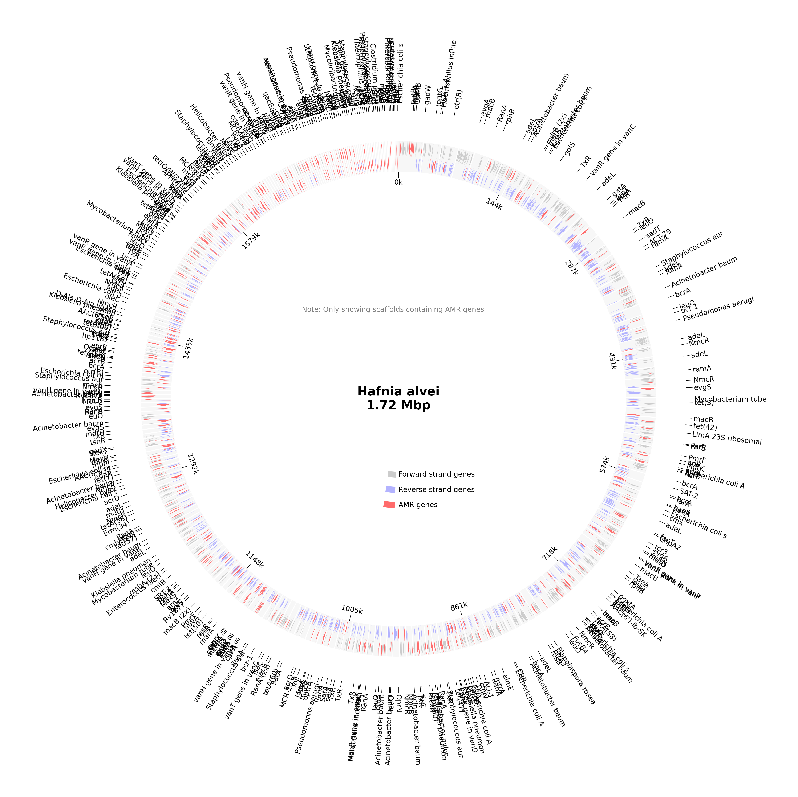

### AAC(6')-32
- **Mechanism**: antibiotic inactivation
- **Drug Classes**: aminoglycoside antibiotic
- **AMR Family**: AAC(6')
- **Locations**:
  - gnl|SPADES|BMKMCJEI_1792_1 : position 2-601

### AAC(6')-Ib-SK
- **Mechanism**: antibiotic inactivation
- **Drug Classes**: aminoglycoside antibiotic
- **AMR Family**: AAC(6')
- **Locations**:
  - gnl|SPADES|BMKMCJEI_971_1 : position 253-753

### AAC(6')-Iw
- **Mechanism**: antibiotic inactivation
- **Drug Classes**: aminoglycoside antibiotic
- **AMR Family**: AAC(6')
- **Locations**:
  - gnl|SPADES|BMKMCJEI_2074_2 : position 504-944

### ACC-3 (found in 2 locations)
- **Mechanism**: antibiotic inactivation
- **Drug Classes**: monobactam; cephalosporin; penam
- **AMR Family**: ACC beta-lactamase
- **Locations**:
  - gnl|SPADES|BMKMCJEI_4321_3 : position 1449-1586
  - gnl|SPADES|BMKMCJEI_5940_1 : position 3-1004

### ACT-79
- **Mechanism**: antibiotic inactivation
- **Drug Classes**: carbapenem; cephalosporin; cephamycin; penam
- **AMR Family**: ACT beta-lactamase
- **Locations**:
  - gnl|SPADES|BMKMCJEI_709_11 : position 11806-13119

### ALI-1
- **Mechanism**: antibiotic inactivation
- **Drug Classes**: carbapenem
- **AMR Family**: ALI beta-lactamase
- **Locations**:
  - gnl|SPADES|BMKMCJEI_1133_1 : position 1-534

### APH(6)-Ic
- **Mechanism**: antibiotic inactivation
- **Drug Classes**: aminoglycoside antibiotic
- **AMR Family**: APH(6)
- **Locations**:
  - gnl|SPADES|BMKMCJEI_2658_2 : position 926-1729

### Acinetobacter baumannii AbaF (found in 6 locations)
- **Mechanism**: antibiotic efflux
- **Drug Classes**: phosphonic acid antibiotic
- **AMR Family**: major facilitator superfamily (MFS) antibiotic efflux pump
- **Locations**:
  - gnl|SPADES|BMKMCJEI_1207_3 : position 1753-3087
  - gnl|SPADES|BMKMCJEI_1779_5 : position 3401-4630
  - gnl|SPADES|BMKMCJEI_1822_1 : position 154-1455
  - gnl|SPADES|BMKMCJEI_607_3 : position 1048-2589
  - gnl|SPADES|BMKMCJEI_612_8 : position 6969-8294
  - gnl|SPADES|BMKMCJEI_999_9 : position 6907-8409

### Acinetobacter baumannii AbaQ (found in 7 locations)
- **Mechanism**: antibiotic efflux
- **Drug Classes**: fluoroquinolone antibiotic
- **AMR Family**: major facilitator superfamily (MFS) antibiotic efflux pump
- **Locations**:
  - gnl|SPADES|BMKMCJEI_1103_1 : position 116-1453
  - gnl|SPADES|BMKMCJEI_1172_1 : position 1-975
  - gnl|SPADES|BMKMCJEI_1203_3 : position 1682-2887
  - gnl|SPADES|BMKMCJEI_1664_3 : position 1414-2790
  - gnl|SPADES|BMKMCJEI_1869_5 : position 3288-4478
  - gnl|SPADES|BMKMCJEI_3834_1 : position 2-1237
  - gnl|SPADES|BMKMCJEI_730_7 : position 6206-7498

### AcrE
- **Mechanism**: antibiotic efflux
- **Drug Classes**: fluoroquinolone antibiotic; cephalosporin; cephamycin; penam
- **AMR Family**: resistance-nodulation-cell division (RND) antibiotic efflux pump
- **Locations**:
  - gnl|SPADES|BMKMCJEI_839_9 : position 8644-9807

### AcrF
- **Mechanism**: antibiotic efflux
- **Drug Classes**: fluoroquinolone antibiotic; cephalosporin; cephamycin; penam
- **AMR Family**: resistance-nodulation-cell division (RND) antibiotic efflux pump
- **Locations**:
  - gnl|SPADES|BMKMCJEI_839_10 : position 9846-10850

### ArnT
- **Mechanism**: antibiotic target alteration
- **Drug Classes**: peptide antibiotic
- **AMR Family**: pmr phosphoethanolamine transferase
- **Locations**:
  - gnl|SPADES|BMKMCJEI_661_15: position 12046-13701

### CRP (found in 2 locations)
- **Mechanism**: antibiotic efflux
- **Drug Classes**: macrolide antibiotic; fluoroquinolone antibiotic; penam
- **AMR Family**: resistance-nodulation-cell division (RND) antibiotic efflux pump
- **Locations**:
  - gnl|SPADES|BMKMCJEI_1104_8 : position 8078-8206
  - gnl|SPADES|BMKMCJEI_3786_1 : position 386-1087

### Clostridioides difficile gyrB conferring resistance to fluoroquinolones
- **Mechanism**: antibiotic target alteration
- **Drug Classes**: fluoroquinolone antibiotic
- **AMR Family**: fluoroquinolone resistant gyrB
- **Locations**:
  - gnl|SPADES|BMKMCJEI_12406_1 : position 2-490

### Clostridium perfringes cplR
- **Mechanism**: antibiotic target protection
- **Drug Classes**: lincosamide antibiotic; streptogramin antibiotic; streptogramin A antibiotic; pleuromutilin antibiotic
- **AMR Family**: Miscellaneous ABC-F subfamily ATP-binding cassette ribosomal protection proteins
- **Locations**:
  - gnl|SPADES|BMKMCJEI_7348_1 : position 3-842

### D-Ala-D-Ala ligase
- **Mechanism**: antibiotic target alteration
- **Drug Classes**: glycopeptide antibiotic
- **AMR Family**: Van ligase
- **Locations**:
  - gnl|SPADES|BMKMCJEI_2128_1 : position 8-928

### EVM-1
- **Mechanism**: antibiotic inactivation
- **Drug Classes**: carbapenem
- **AMR Family**: EVM beta-lactamase
- **Locations**:
  - gnl|SPADES|BMKMCJEI_1426_5 : position 5202-5915

### Enterobacter cloacae acrA
- **Mechanism**: antibiotic efflux
- **Drug Classes**: fluoroquinolone antibiotic; cephalosporin; glycylcycline; penam; tetracycline antibiotic; rifamycin antibiotic; phenicol antibiotic; disinfecting agents and antiseptics
- **AMR Family**: resistance-nodulation-cell division (RND) antibiotic efflux pump
- **Locations**:
  - gnl|SPADES|BMKMCJEI_12219_1 : position 2-496

### Enterococcus faecium cls conferring resistance to daptomycin
- **Mechanism**: antibiotic target alteration
- **Drug Classes**: peptide antibiotic
- **AMR Family**: daptomycin resistant cls
- **Locations**:
  - gnl|SPADES|BMKMCJEI_1588_4 : position 4358-5419

### Erm(34)
- **Mechanism**: antibiotic target alteration
- **Drug Classes**: macrolide antibiotic; lincosamide antibiotic; streptogramin antibiotic; streptogramin A antibiotic; streptogramin B antibiotic
- **AMR Family**: Erm 23S ribosomal RNA methyltransferase
- **Locations**:
  - gnl|SPADES|BMKMCJEI_1708_6 : position 3454-4071

### ErmX
- **Mechanism**: antibiotic target alteration
- **Drug Classes**: macrolide antibiotic; lincosamide antibiotic; streptogramin antibiotic; streptogramin A antibiotic; streptogramin B antibiotic
- **AMR Family**: Erm 23S ribosomal RNA methyltransferase
- **Locations**:
  - gnl|SPADES|BMKMCJEI_2803_2 : position 358-1170

### Escherichia coli AcrAB-TolC with AcrR mutation conferring resistance to ciprofloxacin, tetracycline, and ceftazidime (found in 2 locations)
- **Mechanism**: antibiotic target alteration; antibiotic efflux
- **Drug Classes**: fluoroquinolone antibiotic; cephalosporin; glycylcycline; penam; tetracycline antibiotic; rifamycin antibiotic; phenicol antibiotic; disinfecting agents and antiseptics
- **AMR Family**: resistance-nodulation-cell division (RND) antibiotic efflux pump
- **Locations**:
  - gnl|SPADES|BMKMCJEI_1109_1 : position 1-381
  - gnl|SPADES|BMKMCJEI_839_8 : position 7451-8131

### Escherichia coli AcrAB-TolC with MarR mutations conferring resistance to ciprofloxacin and tetracycline (found in 2 locations)
- **Mechanism**: antibiotic target alteration; antibiotic efflux
- **Drug Classes**: fluoroquinolone antibiotic; cephalosporin; glycylcycline; penam; tetracycline antibiotic; rifamycin antibiotic; phenicol antibiotic; disinfecting agents and antiseptics
- **AMR Family**: resistance-nodulation-cell division (RND) antibiotic efflux pump
- **Locations**:
  - gnl|SPADES|BMKMCJEI_1135_6 : position 4654-5145
  - gnl|SPADES|BMKMCJEI_961_5 : position 3382-3813

### Escherichia coli mdfA (found in 2 locations)
- **Mechanism**: antibiotic efflux
- **Drug Classes**: tetracycline antibiotic; phenicol antibiotic; disinfecting agents and antiseptics
- **AMR Family**: major facilitator superfamily (MFS) antibiotic efflux pump
- **Locations**:
  - gnl|SPADES|BMKMCJEI_1792_3 : position 2605-3813
  - gnl|SPADES|BMKMCJEI_1889_4 : position 2182-3414

### Escherichia coli soxS with mutation conferring antibiotic resistance (found in 7 locations)
- **Mechanism**: antibiotic target alteration; antibiotic efflux; reduced permeability to antibiotic
- **Drug Classes**: fluoroquinolone antibiotic; monobactam; carbapenem; cephalosporin; glycylcycline; cephamycin; penam; tetracycline antibiotic; rifamycin antibiotic; phenicol antibiotic; penem; disinfecting agents and antiseptics
- **AMR Family**: ATP-binding cassette (ABC) antibiotic efflux pump; major facilitator superfamily (MFS) antibiotic efflux pump; resistance-nodulation-cell division (RND) antibiotic efflux pump; General Bacterial Porin with reduced permeability to beta-lactams
- **Locations**:
  - gnl|SPADES|BMKMCJEI_1769_5 : position 4505-4768
  - gnl|SPADES|BMKMCJEI_2224_3 : position 1830-2198
  - gnl|SPADES|BMKMCJEI_2583_3 : position 2252-3034
  - gnl|SPADES|BMKMCJEI_350_2 : position 1353-2174
  - gnl|SPADES|BMKMCJEI_612_10 : position 9106-9972
  - gnl|SPADES|BMKMCJEI_872_8 : position 9470-9823
  - gnl|SPADES|BMKMCJEI_999_5 : position 3355-3726

### Escherichia coli uhpA with mutation conferring resistance to fosfomycin
- **Mechanism**: antibiotic target alteration
- **Drug Classes**: phosphonic acid antibiotic
- **AMR Family**: antibiotic-resistant UhpT
- **Locations**:
  - gnl|SPADES|BMKMCJEI_2153_4 : position 3067-3783

### FosA2
- **Mechanism**: antibiotic inactivation
- **Drug Classes**: phosphonic acid antibiotic
- **AMR Family**: fosfomycin thiol transferase
- **Locations**:
  - gnl|SPADES|BMKMCJEI_2362_2 : position 977-1393

### FosB4
- **Mechanism**: antibiotic inactivation
- **Drug Classes**: phosphonic acid antibiotic
- **AMR Family**: fosfomycin thiol transferase
- **Locations**:
  - gnl|SPADES|BMKMCJEI_1013_4 : position 4978-5364

### Haemophilus influenzae PBP3 conferring resistance to beta-lactam antibiotics (found in 2 locations)
- **Mechanism**: antibiotic target alteration
- **Drug Classes**: cephalosporin; cephamycin; penam
- **AMR Family**: Penicillin-binding protein mutations conferring resistance to beta-lactam antibiotics
- **Locations**:
  - gnl|SPADES|BMKMCJEI_468_14 : position 17072-18844
  - gnl|SPADES|BMKMCJEI_6411_1 : position 1-981

### Helicobacter pylori frxA mutation conferring resistance to metronidazole
- **Mechanism**: antibiotic target alteration
- **Drug Classes**: nitroimidazole antibiotic
- **AMR Family**: Antibiotic resistant Helicobacter pylori nitroreductase
- **Locations**:
  - gnl|SPADES|BMKMCJEI_1774_2 : position 2028-2633

### Helicobacter pylori pbp1 mutants conferring resistance to amoxicillin (found in 2 locations)
- **Mechanism**: antibiotic target alteration
- **Drug Classes**: cephalosporin; cephamycin; penam
- **AMR Family**: Penicillin-binding protein mutations conferring resistance to beta-lactam antibiotics
- **Locations**:
  - gnl|SPADES|BMKMCJEI_1160_1 : position 29-2341
  - gnl|SPADES|BMKMCJEI_3063_1 : position 71-2392

### Klebsiella pneumoniae KpnE
- **Mechanism**: antibiotic efflux
- **Drug Classes**: macrolide antibiotic; aminoglycoside antibiotic; cephalosporin; tetracycline antibiotic; peptide antibiotic; rifamycin antibiotic; disinfecting agents and antiseptics
- **AMR Family**: small multidrug resistance (SMR) antibiotic efflux pump
- **Locations**:
  - gnl|SPADES|BMKMCJEI_5195_1 : position 26-454

### Klebsiella pneumoniae KpnF
- **Mechanism**: antibiotic efflux
- **Drug Classes**: macrolide antibiotic; aminoglycoside antibiotic; cephalosporin; tetracycline antibiotic; peptide antibiotic; rifamycin antibiotic; disinfecting agents and antiseptics
- **AMR Family**: small multidrug resistance (SMR) antibiotic efflux pump
- **Locations**:
  - gnl|SPADES|BMKMCJEI_5195_2: position 441-770

### Klebsiella pneumoniae KpnG
- **Mechanism**: antibiotic efflux
- **Drug Classes**: macrolide antibiotic; fluoroquinolone antibiotic; aminoglycoside antibiotic; carbapenem; cephalosporin; penam; peptide antibiotic; penem
- **AMR Family**: major facilitator superfamily (MFS) antibiotic efflux pump
- **Locations**:
  - gnl|SPADES|BMKMCJEI_2570_3 : position 1872-3047

### Klebsiella pneumoniae KpnH
- **Mechanism**: antibiotic efflux
- **Drug Classes**: macrolide antibiotic; fluoroquinolone antibiotic; aminoglycoside antibiotic; carbapenem; cephalosporin; penam; peptide antibiotic; penem
- **AMR Family**: major facilitator superfamily (MFS) antibiotic efflux pump
- **Locations**:
  - gnl|SPADES|BMKMCJEI_2082_3 : position 1991-3430

### Klebsiella pneumoniae OmpK37 (found in 3 locations)
- **Mechanism**: reduced permeability to antibiotic
- **Drug Classes**: monobactam; carbapenem; cephalosporin; cephamycin; penam; penem
- **AMR Family**: General Bacterial Porin with reduced permeability to beta-lactams
- **Locations**:
  - gnl|SPADES|BMKMCJEI_1142_7 : position 3491-4594
  - gnl|SPADES|BMKMCJEI_1160_2 : position 2523-3659
  - gnl|SPADES|BMKMCJEI_1647_1 : position 2-94

### LRA-19
- **Mechanism**: antibiotic inactivation
- **Drug Classes**: cephalosporin; penam
- **AMR Family**: subclass B3 LRA beta-lactamase
- **Locations**:
  - gnl|SPADES|BMKMCJEI_3805_1 : position 175-822

### LRA-2
- **Mechanism**: antibiotic inactivation
- **Drug Classes**: cephalosporin; penam
- **AMR Family**: subclass B3 LRA beta-lactamase
- **Locations**:
  - gnl|SPADES|BMKMCJEI_1868_2 : position 1096-1938

### LlmA 23S ribosomal RNA methyltransferase
- **Mechanism**: antibiotic target alteration
- **Drug Classes**: lincosamide antibiotic
- **AMR Family**: Llm 23S ribosomal RNA methyltransferase
- **Locations**:
  - gnl|SPADES|BMKMCJEI_814_4 : position 1506-2705

### LptD
- **Mechanism**: antibiotic efflux
- **Drug Classes**: carbapenem; peptide antibiotic; aminocoumarin antibiotic; rifamycin antibiotic
- **AMR Family**: ATP-binding cassette (ABC) antibiotic efflux pump
- **Locations**:
  - gnl|SPADES|BMKMCJEI_3087_1 : position 2-2269

### MCR-10.4
- **Mechanism**: antibiotic target alteration
- **Drug Classes**: peptide antibiotic
- **AMR Family**: MCR phosphoethanolamine transferase
- **Locations**:
  - gnl|SPADES|BMKMCJEI_1322_5 : position 4259-5893

### MCR-3.4
- **Mechanism**: antibiotic target alteration
- **Drug Classes**: peptide antibiotic
- **AMR Family**: MCR phosphoethanolamine transferase
- **Locations**:
  - gnl|SPADES|BMKMCJEI_468_13 : position 15101-16708

### MCR-5.1
- **Mechanism**: antibiotic target alteration
- **Drug Classes**: peptide antibiotic
- **AMR Family**: MCR phosphoethanolamine transferase
- **Locations**:
  - gnl|SPADES|BMKMCJEI_3126_1 : position 136-1863

### MCR-8.1
- **Mechanism**: antibiotic target alteration
- **Drug Classes**: peptide antibiotic
- **AMR Family**: MCR phosphoethanolamine transferase
- **Locations**:
  - gnl|SPADES|BMKMCJEI_2790_3 : position 1686-2747

### MdtK
- **Mechanism**: antibiotic efflux
- **Drug Classes**: fluoroquinolone antibiotic
- **AMR Family**: multidrug and toxic compound extrusion (MATE) transporter
- **Locations**:
  - gnl|SPADES|BMKMCJEI_839_1 : position 2-1486

### MdtQ
- **Mechanism**: reduced permeability to antibiotic
- **Drug Classes**: monobactam; carbapenem; cephalosporin; cephamycin; penam; penem
- **AMR Family**: Outer Membrane Porin (Opr)
- **Locations**:
  - gnl|SPADES|BMKMCJEI_2826_2 : position 1062-2552

### MexG
- **Mechanism**: antibiotic efflux
- **Drug Classes**: fluoroquinolone antibiotic; tetracycline antibiotic; disinfecting agents and antiseptics
- **AMR Family**: resistance-nodulation-cell division (RND) antibiotic efflux pump
- **Locations**:
  - gnl|SPADES|BMKMCJEI_2457_2 : position 779-1195

### MexS (found in 3 locations)
- **Mechanism**: antibiotic efflux
- **Drug Classes**: fluoroquinolone antibiotic; diaminopyrimidine antibiotic; phenicol antibiotic
- **AMR Family**: resistance-nodulation-cell division (RND) antibiotic efflux pump
- **Locations**:
  - gnl|SPADES|BMKMCJEI_1319_2 : position 1133-2134
  - gnl|SPADES|BMKMCJEI_1550_5 : position 4734-5555
  - gnl|SPADES|BMKMCJEI_3079_3 : position 1369-2355

### MexT
- **Mechanism**: antibiotic efflux
- **Drug Classes**: fluoroquinolone antibiotic; diaminopyrimidine antibiotic; phenicol antibiotic
- **AMR Family**: resistance-nodulation-cell division (RND) antibiotic efflux pump
- **Locations**:
  - gnl|SPADES|BMKMCJEI_1804_4 : position 3845-4654

### MexV
- **Mechanism**: antibiotic efflux
- **Drug Classes**: macrolide antibiotic; fluoroquinolone antibiotic; tetracycline antibiotic; phenicol antibiotic; disinfecting agents and antiseptics
- **AMR Family**: resistance-nodulation-cell division (RND) antibiotic efflux pump
- **Locations**:
  - gnl|SPADES|BMKMCJEI_1802_2 : position 2030-3547

### Morganella morganii gyrB conferring resistance to fluoroquinolones
- **Mechanism**: antibiotic target alteration
- **Drug Classes**: fluoroquinolone antibiotic
- **AMR Family**: fluoroquinolone resistant gyrB
- **Locations**:
  - gnl|SPADES|BMKMCJEI_1237_2 : position 1089-1733

### Mycobacterium tuberculosis gidB mutation conferring resistance to streptomycin
- **Mechanism**: antibiotic target alteration
- **Drug Classes**: aminoglycoside antibiotic
- **AMR Family**: antibiotic resistant gidB
- **Locations**:
  - gnl|SPADES|BMKMCJEI_2420_1 : position 603-1223

### Mycobacterium tuberculosis ndh with mutation conferring resistance to isoniazid
- **Mechanism**: antibiotic target alteration
- **Drug Classes**: isoniazid-like antibiotic
- **AMR Family**: antibiotic resistant ndh
- **Locations**:
  - gnl|SPADES|BMKMCJEI_1635_1 : position 2-1324

### Mycobacterium tuberculosis thyA with mutation conferring resistance to para-aminosalicylic acid
- **Mechanism**: antibiotic target alteration
- **Drug Classes**: salicylic acid antibiotic
- **AMR Family**: aminosalicylate resistant thymidylate synthase
- **Locations**:
  - gnl|SPADES|BMKMCJEI_789_3 : position 1023-1760

### Mycolicibacterium smegmatis ndh with mutation conferring resistance to isoniazid
- **Mechanism**: antibiotic target alteration
- **Drug Classes**: isoniazid-like antibiotic
- **AMR Family**: antibiotic resistant ndh
- **Locations**:
  - gnl|SPADES|BMKMCJEI_5036_1 : position 3-719

### Neisseria gonorrhoeae PBP2 conferring resistance to beta-lactam antibiotics
- **Mechanism**: antibiotic target alteration
- **Drug Classes**: cephalosporin; cephamycin; penam
- **AMR Family**: Penicillin-binding protein mutations conferring resistance to beta-lactam antibiotics
- **Locations**:
  - gnl|SPADES|BMKMCJEI_15559_1 : position 56-409

### NmcR (found in 13 locations)
- **Mechanism**: antibiotic inactivation
- **Drug Classes**: carbapenem; cephalosporin; cephamycin; penam
- **AMR Family**: NmcA beta-lactamase
- **Locations**:
  - gnl|SPADES|BMKMCJEI_1003_6 : position 6345-7226
  - gnl|SPADES|BMKMCJEI_1172_5 : position 4953-5882
  - gnl|SPADES|BMKMCJEI_1192_1 : position 477-1427
  - gnl|SPADES|BMKMCJEI_1729_3 : position 1330-2199
  - gnl|SPADES|BMKMCJEI_1779_1 : position 208-1056
  - gnl|SPADES|BMKMCJEI_1868_5 : position 2996-3898
  - gnl|SPADES|BMKMCJEI_1875_1 : position 529-1479
  - gnl|SPADES|BMKMCJEI_2132_1 : position 2-334
  - gnl|SPADES|BMKMCJEI_2187_3 : position 2154-3053
  - gnl|SPADES|BMKMCJEI_2604_2 : position 291-1163
  - gnl|SPADES|BMKMCJEI_3417_1 : position 189-1163
  - gnl|SPADES|BMKMCJEI_753_6 : position 4545-5450
  - gnl|SPADES|BMKMCJEI_782_7 : position 5740-6636

### OmpA
- **Mechanism**: reduced permeability to antibiotic
- **Drug Classes**: peptide antibiotic
- **AMR Family**: General Bacterial Porin with reduced permeability to peptide antibiotics
- **Locations**:
  - gnl|SPADES|BMKMCJEI_999_8 : position 6005-6490

### OpmB
- **Mechanism**: antibiotic efflux
- **Drug Classes**: macrolide antibiotic; monobactam; tetracycline antibiotic; aminocoumarin antibiotic
- **AMR Family**: resistance-nodulation-cell division (RND) antibiotic efflux pump
- **Locations**:
  - gnl|SPADES|BMKMCJEI_350_20 : position 19511-20908

### OprN
- **Mechanism**: antibiotic efflux
- **Drug Classes**: fluoroquinolone antibiotic; diaminopyrimidine antibiotic; phenicol antibiotic
- **AMR Family**: resistance-nodulation-cell division (RND) antibiotic efflux pump
- **Locations**:
  - gnl|SPADES|BMKMCJEI_1199_1 : position 2-1240

### ParR (found in 3 locations)
- **Mechanism**: antibiotic efflux; reduced permeability to antibiotic
- **Drug Classes**: macrolide antibiotic; fluoroquinolone antibiotic; monobactam; aminoglycoside antibiotic; carbapenem; cephalosporin; cephamycin; penam; tetracycline antibiotic; phenicol antibiotic; penem; disinfecting agents and antiseptics
- **AMR Family**: resistance-nodulation-cell division (RND) antibiotic efflux pump; Outer Membrane Porin (Opr)
- **Locations**:
  - gnl|SPADES|BMKMCJEI_4852_2 : position 1147-1365
  - gnl|SPADES|BMKMCJEI_818_3 : position 2158-2871
  - gnl|SPADES|BMKMCJEI_8672_2 : position 99-698

### ParS (found in 2 locations)
- **Mechanism**: antibiotic efflux; reduced permeability to antibiotic
- **Drug Classes**: macrolide antibiotic; fluoroquinolone antibiotic; monobactam; aminoglycoside antibiotic; carbapenem; cephalosporin; cephamycin; penam; tetracycline antibiotic; phenicol antibiotic; penem; disinfecting agents and antiseptics
- **AMR Family**: resistance-nodulation-cell division (RND) antibiotic efflux pump; Outer Membrane Porin (Opr)
- **Locations**:
  - gnl|SPADES|BMKMCJEI_6480_1 : position 2-970
  - gnl|SPADES|BMKMCJEI_818_4 : position 2878-4197

### Planobispora rosea EF-Tu mutants conferring resistance to inhibitor GE2270A
- **Mechanism**: antibiotic target alteration
- **Drug Classes**: elfamycin antibiotic
- **AMR Family**: elfamycin resistant EF-Tu
- **Locations**:
  - gnl|SPADES|BMKMCJEI_1026_6 : position 5343-7211

### PmrF (found in 3 locations)
- **Mechanism**: antibiotic target alteration
- **Drug Classes**: peptide antibiotic
- **AMR Family**: pmr phosphoethanolamine transferase
- **Locations**:
  - gnl|SPADES|BMKMCJEI_1467_2 : position 1546-2457
  - gnl|SPADES|BMKMCJEI_3456_1 : position 28-1044
  - gnl|SPADES|BMKMCJEI_822_5 : position 3310-4611

### Pseudomonas aeruginosa CpxR (found in 2 locations)
- **Mechanism**: antibiotic efflux
- **Drug Classes**: macrolide antibiotic; fluoroquinolone antibiotic; monobactam; aminoglycoside antibiotic; carbapenem; cephalosporin; cephamycin; penam; tetracycline antibiotic; peptide antibiotic; aminocoumarin antibiotic; diaminopyrimidine antibiotic; sulfonamide antibiotic; phenicol antibiotic; penem
- **AMR Family**: resistance-nodulation-cell division (RND) antibiotic efflux pump
- **Locations**:
  - gnl|SPADES|BMKMCJEI_3444_1 : position 2-706
  - gnl|SPADES|BMKMCJEI_6633_1 : position 1-141

### Pseudomonas aeruginosa ampR with mutation conferring resistance to aztreonam (found in 3 locations)
- **Mechanism**: antibiotic target alteration; antibiotic inactivation
- **Drug Classes**: monobactam; carbapenem; cephalosporin
- **AMR Family**: PDC beta-lactamase; ampR transcriptional regulator with mutation conferring resistance to monobactam antibiotics
- **Locations**:
  - gnl|SPADES|BMKMCJEI_1306_1 : position 2-868
  - gnl|SPADES|BMKMCJEI_4321_2 : position 356-1222
  - gnl|SPADES|BMKMCJEI_739_4 : position 3573-4520

### QepA2 (found in 2 locations)
- **Mechanism**: antibiotic efflux
- **Drug Classes**: fluoroquinolone antibiotic
- **AMR Family**: major facilitator superfamily (MFS) antibiotic efflux pump
- **Locations**:
  - gnl|SPADES|BMKMCJEI_4352_2 : position 461-1573
  - gnl|SPADES|BMKMCJEI_926_4 : position 5367-6965

### QepA4
- **Mechanism**: antibiotic efflux
- **Drug Classes**: fluoroquinolone antibiotic
- **AMR Family**: major facilitator superfamily (MFS) antibiotic efflux pump
- **Locations**:
  - gnl|SPADES|BMKMCJEI_1921_3 : position 2714-4009

### RanA (found in 15 locations)
- **Mechanism**: antibiotic efflux
- **Drug Classes**: aminoglycoside antibiotic
- **AMR Family**: ATP-binding cassette (ABC) antibiotic efflux pump
- **Locations**:
  - gnl|SPADES|BMKMCJEI_1121_1 : position 118-1251
  - gnl|SPADES|BMKMCJEI_1155_6 : position 5792-6931
  - gnl|SPADES|BMKMCJEI_1228_4 : position 3220-4296
  - gnl|SPADES|BMKMCJEI_1288_3 : position 4144-4920
  - gnl|SPADES|BMKMCJEI_1341_4 : position 4294-5280
  - gnl|SPADES|BMKMCJEI_1341_5 : position 5277-6275
  - gnl|SPADES|BMKMCJEI_1385_1 : position 174-947
  - gnl|SPADES|BMKMCJEI_1559_3 : position 2550-3176
  - gnl|SPADES|BMKMCJEI_1709_1 : position 2-988
  - gnl|SPADES|BMKMCJEI_1861_5 : position 2371-3201
  - gnl|SPADES|BMKMCJEI_2815_4 : position 1930-2712
  - gnl|SPADES|BMKMCJEI_4620_2 : position 561-1460
  - gnl|SPADES|BMKMCJEI_560_16 : position 13681-14616
  - gnl|SPADES|BMKMCJEI_727_5 : position 4835-5788
  - gnl|SPADES|BMKMCJEI_8038_1 : position 2-760

### RanB
- **Mechanism**: antibiotic efflux
- **Drug Classes**: aminoglycoside antibiotic
- **AMR Family**: ATP-binding cassette (ABC) antibiotic efflux pump
- **Locations**:
  - gnl|SPADES|BMKMCJEI_1861_4 : position 1584-2366

### RlmA(II)
- **Mechanism**: antibiotic target alteration
- **Drug Classes**: macrolide antibiotic; lincosamide antibiotic
- **AMR Family**: non-erm 23S ribosomal RNA methyltransferase (G748)
- **Locations**:
  - gnl|SPADES|BMKMCJEI_2967_2 : position 954-1766

### Rv1877 (found in 2 locations)
- **Mechanism**: antibiotic efflux
- **Drug Classes**: fluoroquinolone antibiotic
- **AMR Family**: major facilitator superfamily (MFS) antibiotic efflux pump
- **Locations**:
  - gnl|SPADES|BMKMCJEI_1522_7 : position 4289-5635
  - gnl|SPADES|BMKMCJEI_1869_4 : position 1835-3154

### SAT-2
- **Mechanism**: antibiotic inactivation
- **Drug Classes**: nucleoside antibiotic
- **AMR Family**: streptothricin acetyltransferase (SAT)
- **Locations**:
  - gnl|SPADES|BMKMCJEI_856_6 : position 5798-6523

### SRT-2
- **Mechanism**: antibiotic inactivation
- **Drug Classes**: cephalosporin
- **AMR Family**: SRT beta-lactamase
- **Locations**:
  - gnl|SPADES|BMKMCJEI_1562_1 : position 377-1516

### SatA (found in 2 locations)
- **Mechanism**: antibiotic inactivation
- **Drug Classes**: nucleoside antibiotic
- **AMR Family**: streptothricin acetyltransferase (SAT)
- **Locations**:
  - gnl|SPADES|BMKMCJEI_1270_10 : position 6430-6873
  - gnl|SPADES|BMKMCJEI_1336_10 : position 6176-6571

### Staphylococcus aureus fusA with mutation conferring resistance to fusidic acid (found in 2 locations)
- **Mechanism**: antibiotic target alteration
- **Drug Classes**: fusidane antibiotic
- **AMR Family**: antibiotic resistant fusA
- **Locations**:
  - gnl|SPADES|BMKMCJEI_1382_8 : position 4451-6307
  - gnl|SPADES|BMKMCJEI_719_13 : position 9003-10409

### Staphylococcus aureus mupA conferring resistance to mupirocin (found in 3 locations)
- **Mechanism**: antibiotic target alteration
- **Drug Classes**: mupirocin-like antibiotic
- **AMR Family**: antibiotic-resistant isoleucyl-tRNA synthetase (ileS)
- **Locations**:
  - gnl|SPADES|BMKMCJEI_2015_1 : position 2-1405
  - gnl|SPADES|BMKMCJEI_2943_3 : position 854-2566
  - gnl|SPADES|BMKMCJEI_6613_1 : position 2-949

### Staphylococcus aureus mupB conferring resistance to mupirocin
- **Mechanism**: antibiotic target alteration
- **Drug Classes**: mupirocin-like antibiotic
- **AMR Family**: antibiotic-resistant isoleucyl-tRNA synthetase (ileS)
- **Locations**:
  - gnl|SPADES|BMKMCJEI_6662_1 : position 2-940

### Staphylococcus aureus murA with mutation conferring resistance to fosfomycin
- **Mechanism**: antibiotic target alteration
- **Drug Classes**: phosphonic acid antibiotic
- **AMR Family**: antibiotic-resistant murA transferase
- **Locations**:
  - gnl|SPADES|BMKMCJEI_1877_4 : position 3214-4464

### Staphylococcus aureus pgsA mutations conferring resistance to daptomycin
- **Mechanism**: antibiotic target alteration
- **Drug Classes**: peptide antibiotic
- **AMR Family**: daptomycin resistant pgsA
- **Locations**:
  - gnl|SPADES|BMKMCJEI_5489_1 : position 7-555

### Staphylococcus aureus walK with mutation conferring resistance to daptomycin
- **Mechanism**: antibiotic target alteration
- **Drug Classes**: peptide antibiotic
- **AMR Family**: daptomycin resistant walK
- **Locations**:
  - gnl|SPADES|BMKMCJEI_1147_5 : position 4763-6613

### Streptomyces venezuelae rox
- **Mechanism**: antibiotic inactivation
- **Drug Classes**: rifamycin antibiotic
- **AMR Family**: rifampin monooxygenase
- **Locations**:
  - gnl|SPADES|BMKMCJEI_4686_1 : position 109-1284

### TaeA (found in 2 locations)
- **Mechanism**: antibiotic efflux
- **Drug Classes**: pleuromutilin antibiotic
- **AMR Family**: ATP-binding cassette (ABC) antibiotic efflux pump
- **Locations**:
  - gnl|SPADES|BMKMCJEI_4934_1 : position 2-1339
  - gnl|SPADES|BMKMCJEI_950_2 : position 2063-3967

### TolC
- **Mechanism**: antibiotic efflux
- **Drug Classes**: macrolide antibiotic; fluoroquinolone antibiotic; aminoglycoside antibiotic; carbapenem; cephalosporin; glycylcycline; cephamycin; penam; tetracycline antibiotic; peptide antibiotic; aminocoumarin antibiotic; rifamycin antibiotic; phenicol antibiotic; penem; disinfecting agents and antiseptics
- **AMR Family**: ATP-binding cassette (ABC) antibiotic efflux pump; major facilitator superfamily (MFS) antibiotic efflux pump; resistance-nodulation-cell division (RND) antibiotic efflux pump
- **Locations**:
  - gnl|SPADES|BMKMCJEI_1166_1 : position 2-1444

### TxR (found in 16 locations)
- **Mechanism**: antibiotic efflux
- **Drug Classes**: tetracycline antibiotic
- **AMR Family**: ATP-binding cassette (ABC) antibiotic efflux pump
- **Locations**:
  - gnl|SPADES|BMKMCJEI_1135_1 : position 2-1081
  - gnl|SPADES|BMKMCJEI_1147_6 : position 6600-7844
  - gnl|SPADES|BMKMCJEI_1166_2 : position 1594-3549
  - gnl|SPADES|BMKMCJEI_1246_1 : position 2-1480
  - gnl|SPADES|BMKMCJEI_1254_9 : position 6228-7085
  - gnl|SPADES|BMKMCJEI_1259_5 : position 5941-7053
  - gnl|SPADES|BMKMCJEI_1391_3 : position 1939-3360
  - gnl|SPADES|BMKMCJEI_1809_6 : position 4119-4640
  - gnl|SPADES|BMKMCJEI_2223_3 : position 2634-3677
  - gnl|SPADES|BMKMCJEI_2311_4 : position 3184-3510
  - gnl|SPADES|BMKMCJEI_2715_1 : position 550-2328
  - gnl|SPADES|BMKMCJEI_30844_1 : position 1-267
  - gnl|SPADES|BMKMCJEI_3103_2 : position 482-1921
  - gnl|SPADES|BMKMCJEI_620_12 : position 9917-12751
  - gnl|SPADES|BMKMCJEI_677_2 : position 376-2388
  - gnl|SPADES|BMKMCJEI_698_7 : position 3740-5833

### YojI
- **Mechanism**: antibiotic efflux
- **Drug Classes**: peptide antibiotic
- **AMR Family**: ATP-binding cassette (ABC) antibiotic efflux pump
- **Locations**:
  - gnl|SPADES|BMKMCJEI_1322_1 : position 34-687

### aadT
- **Mechanism**: antibiotic efflux
- **Drug Classes**: macrolide antibiotic; tetracycline antibiotic; disinfecting agents and antiseptics
- **AMR Family**: major facilitator superfamily (MFS) antibiotic efflux pump
- **Locations**:
  - gnl|SPADES|BMKMCJEI_709_4 : position 3286-4752

### abeS
- **Mechanism**: antibiotic efflux
- **Drug Classes**: macrolide antibiotic; aminocoumarin antibiotic
- **AMR Family**: small multidrug resistance (SMR) antibiotic efflux pump
- **Locations**:
  - gnl|SPADES|BMKMCJEI_999_3 : position 1729-2073

### acrB (found in 3 locations)
- **Mechanism**: antibiotic efflux
- **Drug Classes**: fluoroquinolone antibiotic; cephalosporin; glycylcycline; penam; tetracycline antibiotic; rifamycin antibiotic; phenicol antibiotic; disinfecting agents and antiseptics
- **AMR Family**: resistance-nodulation-cell division (RND) antibiotic efflux pump
- **Locations**:
  - gnl|SPADES|BMKMCJEI_1918_1 : position 2-1852
  - gnl|SPADES|BMKMCJEI_7452_1 : position 2-832
  - gnl|SPADES|BMKMCJEI_996_1 : position 3-2075

### acrD (found in 2 locations)
- **Mechanism**: antibiotic efflux
- **Drug Classes**: aminoglycoside antibiotic
- **AMR Family**: resistance-nodulation-cell division (RND) antibiotic efflux pump
- **Locations**:
  - gnl|SPADES|BMKMCJEI_1334_1 : position 2-199
  - gnl|SPADES|BMKMCJEI_1760_3 : position 1861-4782

### adeG
- **Mechanism**: antibiotic efflux
- **Drug Classes**: fluoroquinolone antibiotic; tetracycline antibiotic
- **AMR Family**: resistance-nodulation-cell division (RND) antibiotic efflux pump
- **Locations**:
  - gnl|SPADES|BMKMCJEI_961_7 : position 4232-5092

### adeL (found in 19 locations)
- **Mechanism**: antibiotic efflux
- **Drug Classes**: fluoroquinolone antibiotic; tetracycline antibiotic
- **AMR Family**: resistance-nodulation-cell division (RND) antibiotic efflux pump
- **Locations**:
  - gnl|SPADES|BMKMCJEI_1056_5 : position 7478-8398
  - gnl|SPADES|BMKMCJEI_1319_1 : position 110-1015
  - gnl|SPADES|BMKMCJEI_1657_4 : position 4267-5112
  - gnl|SPADES|BMKMCJEI_1688_7 : position 3572-4465
  - gnl|SPADES|BMKMCJEI_1747_2 : position 476-1372
  - gnl|SPADES|BMKMCJEI_1921_2 : position 1649-2545
  - gnl|SPADES|BMKMCJEI_2159_3 : position 2697-3629
  - gnl|SPADES|BMKMCJEI_2224_1 : position 136-1053
  - gnl|SPADES|BMKMCJEI_2323_4 : position 2920-3489
  - gnl|SPADES|BMKMCJEI_2458_1 : position 11-937
  - gnl|SPADES|BMKMCJEI_2641_4 : position 1165-2106
  - gnl|SPADES|BMKMCJEI_606_9 : position 9830-10735
  - gnl|SPADES|BMKMCJEI_644_8 : position 7009-7944
  - gnl|SPADES|BMKMCJEI_727_2 : position 830-1735
  - gnl|SPADES|BMKMCJEI_750_14 : position 11545-12426
  - gnl|SPADES|BMKMCJEI_768_4 : position 4328-5212
  - gnl|SPADES|BMKMCJEI_839_5 : position 5374-6267
  - gnl|SPADES|BMKMCJEI_925_2 : position 381-1295
  - gnl|SPADES|BMKMCJEI_961_10 : position 7434-8342

### adeN
- **Mechanism**: antibiotic efflux
- **Drug Classes**: macrolide antibiotic; fluoroquinolone antibiotic; lincosamide antibiotic; carbapenem; cephalosporin; tetracycline antibiotic; rifamycin antibiotic; diaminopyrimidine antibiotic; phenicol antibiotic; penem
- **AMR Family**: resistance-nodulation-cell division (RND) antibiotic efflux pump
- **Locations**:
  - gnl|SPADES|BMKMCJEI_1920_1 : position 51-782

### adeR
- **Mechanism**: antibiotic efflux
- **Drug Classes**: glycylcycline; tetracycline antibiotic
- **AMR Family**: resistance-nodulation-cell division (RND) antibiotic efflux pump
- **Locations**:
  - gnl|SPADES|BMKMCJEI_1791_3 : position 1750-2769

### almE
- **Mechanism**: antibiotic target alteration
- **Drug Classes**: peptide antibiotic
- **AMR Family**: polymyxin resistance operon; alm glycyltransferase
- **Locations**:
  - gnl|SPADES|BMKMCJEI_1108_6 : position 5362-7047

### arlR (found in 2 locations)
- **Mechanism**: antibiotic efflux
- **Drug Classes**: fluoroquinolone antibiotic; disinfecting agents and antiseptics
- **AMR Family**: major facilitator superfamily (MFS) antibiotic efflux pump
- **Locations**:
  - gnl|SPADES|BMKMCJEI_7158_1 : position 2-559
  - gnl|SPADES|BMKMCJEI_822_9 : position 9107-9823

### arlS
- **Mechanism**: antibiotic efflux
- **Drug Classes**: fluoroquinolone antibiotic; disinfecting agents and antiseptics
- **AMR Family**: major facilitator superfamily (MFS) antibiotic efflux pump
- **Locations**:
  - gnl|SPADES|BMKMCJEI_5664_1 : position 104-1129

### arnA (found in 3 locations)
- **Mechanism**: antibiotic target alteration
- **Drug Classes**: peptide antibiotic
- **AMR Family**: pmr phosphoethanolamine transferase
- **Locations**:
  - gnl|SPADES|BMKMCJEI_1526_7 : position 4723-5625
  - gnl|SPADES|BMKMCJEI_5050_1 : position 2-1300
  - gnl|SPADES|BMKMCJEI_661_17 : position 14615-14989

### bacA
- **Mechanism**: antibiotic target alteration
- **Drug Classes**: peptide antibiotic
- **AMR Family**: undecaprenyl pyrophosphate related proteins
- **Locations**:
  - gnl|SPADES|BMKMCJEI_1068_7 : position 7324-8142

### baeR (found in 2 locations)
- **Mechanism**: antibiotic efflux
- **Drug Classes**: aminoglycoside antibiotic; aminocoumarin antibiotic
- **AMR Family**: resistance-nodulation-cell division (RND) antibiotic efflux pump
- **Locations**:
  - gnl|SPADES|BMKMCJEI_1410_3 : position 1970-2701
  - gnl|SPADES|BMKMCJEI_872_4 : position 3369-4010

### baeS (found in 2 locations)
- **Mechanism**: antibiotic efflux
- **Drug Classes**: aminoglycoside antibiotic; aminocoumarin antibiotic
- **AMR Family**: resistance-nodulation-cell division (RND) antibiotic efflux pump
- **Locations**:
  - gnl|SPADES|BMKMCJEI_1410_4 : position 2712-4085
  - gnl|SPADES|BMKMCJEI_872_3 : position 1769-3118

### basS (found in 2 locations)
- **Mechanism**: antibiotic target alteration; antibiotic efflux
- **Drug Classes**: peptide antibiotic
- **AMR Family**: pmr phosphoethanolamine transferase
- **Locations**:
  - gnl|SPADES|BMKMCJEI_1144_1 : position 63-1418
  - gnl|SPADES|BMKMCJEI_2565_2 : position 744-1808

### bcr-1 (found in 4 locations)
- **Mechanism**: antibiotic efflux
- **Drug Classes**: bicyclomycin-like antibiotic
- **AMR Family**: major facilitator superfamily (MFS) antibiotic efflux pump
- **Locations**:
  - gnl|SPADES|BMKMCJEI_1142_2 : position 180-1379
  - gnl|SPADES|BMKMCJEI_1379_5 : position 3269-4480
  - gnl|SPADES|BMKMCJEI_1559_5 : position 4211-5437
  - gnl|SPADES|BMKMCJEI_738_9 : position 8458-9741

### bcrA (found in 9 locations)
- **Mechanism**: antibiotic efflux
- **Drug Classes**: peptide antibiotic
- **AMR Family**: ATP-binding cassette (ABC) antibiotic efflux pump
- **Locations**:
  - gnl|SPADES|BMKMCJEI_1907_2 : position 704-1489
  - gnl|SPADES|BMKMCJEI_2308_2 : position 366-1127
  - gnl|SPADES|BMKMCJEI_2443_1 : position 417-1037
  - gnl|SPADES|BMKMCJEI_3866_2 : position 1170-1817
  - gnl|SPADES|BMKMCJEI_6306_1 : position 218-997
  - gnl|SPADES|BMKMCJEI_734_5 : position 4041-4871
  - gnl|SPADES|BMKMCJEI_852_6 : position 8793-9896
  - gnl|SPADES|BMKMCJEI_860_4 : position 2084-4843
  - gnl|SPADES|BMKMCJEI_978_5 : position 3166-3882

### blt
- **Mechanism**: antibiotic efflux
- **Drug Classes**: fluoroquinolone antibiotic; disinfecting agents and antiseptics
- **AMR Family**: major facilitator superfamily (MFS) antibiotic efflux pump
- **Locations**:
  - gnl|SPADES|BMKMCJEI_4012_2 : position 983-1732

### catB9
- **Mechanism**: antibiotic inactivation
- **Drug Classes**: phenicol antibiotic
- **AMR Family**: chloramphenicol acetyltransferase (CAT)
- **Locations**:
  - gnl|SPADES|BMKMCJEI_1135_9 : position 6983-7600

### cdeA (found in 3 locations)
- **Mechanism**: antibiotic efflux
- **Drug Classes**: fluoroquinolone antibiotic; disinfecting agents and antiseptics
- **AMR Family**: multidrug and toxic compound extrusion (MATE) transporter
- **Locations**:
  - gnl|SPADES|BMKMCJEI_3205_1 : position 2-364
  - gnl|SPADES|BMKMCJEI_3205_2 : position 310-714
  - gnl|SPADES|BMKMCJEI_3756_1 : position 1-642

### clbB
- **Mechanism**: antibiotic target alteration
- **Drug Classes**: lincosamide antibiotic; streptogramin antibiotic; streptogramin A antibiotic; oxazolidinone antibiotic; phenicol antibiotic; pleuromutilin antibiotic
- **AMR Family**: Cfr 23S ribosomal RNA methyltransferase
- **Locations**:
  - gnl|SPADES|BMKMCJEI_3162_2 : position 503-1774

### cmlB
- **Mechanism**: antibiotic efflux
- **Drug Classes**: phenicol antibiotic
- **AMR Family**: major facilitator superfamily (MFS) antibiotic efflux pump
- **Locations**:
  - gnl|SPADES|BMKMCJEI_1564_5 : position 3061-4245

### cmlv (found in 3 locations)
- **Mechanism**: antibiotic inactivation
- **Drug Classes**: phenicol antibiotic
- **AMR Family**: chloramphenicol phosphotransferase
- **Locations**:
  - gnl|SPADES|BMKMCJEI_1133_6 : position 4930-6165
  - gnl|SPADES|BMKMCJEI_1688_5 : position 2238-2798
  - gnl|SPADES|BMKMCJEI_1688_6 : position 2882-3418

### cmx (found in 2 locations)
- **Mechanism**: antibiotic efflux
- **Drug Classes**: phenicol antibiotic
- **AMR Family**: major facilitator superfamily (MFS) antibiotic efflux pump
- **Locations**:
  - gnl|SPADES|BMKMCJEI_2641_5 : position 2210-2947
  - gnl|SPADES|BMKMCJEI_883_3 : position 2911-4149

### cprR
- **Mechanism**: antibiotic target alteration; antibiotic efflux
- **Drug Classes**: peptide antibiotic
- **AMR Family**: pmr phosphoethanolamine transferase
- **Locations**:
  - gnl|SPADES|BMKMCJEI_2565_3 : position 1805-2467

### cpxA (found in 5 locations)
- **Mechanism**: antibiotic efflux
- **Drug Classes**: aminoglycoside antibiotic; aminocoumarin antibiotic
- **AMR Family**: resistance-nodulation-cell division (RND) antibiotic efflux pump
- **Locations**:
  - gnl|SPADES|BMKMCJEI_1391_2 : position 819-1895
  - gnl|SPADES|BMKMCJEI_2030_1 : position 162-1634
  - gnl|SPADES|BMKMCJEI_2820_2 : position 1724-2704
  - gnl|SPADES|BMKMCJEI_3444_2 : position 703-1158
  - gnl|SPADES|BMKMCJEI_3444_3 : position 1158-2051

### dfrA3
- **Mechanism**: antibiotic target replacement
- **Drug Classes**: diaminopyrimidine antibiotic
- **AMR Family**: trimethoprim resistant dihydrofolate reductase dfr
- **Locations**:
  - gnl|SPADES|BMKMCJEI_1032_2 : position 868-1350

### efpA
- **Mechanism**: antibiotic efflux
- **Drug Classes**: rifamycin antibiotic; isoniazid-like antibiotic
- **AMR Family**: major facilitator superfamily (MFS) antibiotic efflux pump
- **Locations**:
  - gnl|SPADES|BMKMCJEI_1207_6 : position 5319-6812

### emrB (found in 2 locations)
- **Mechanism**: antibiotic efflux
- **Drug Classes**: fluoroquinolone antibiotic
- **AMR Family**: major facilitator superfamily (MFS) antibiotic efflux pump
- **Locations**:
  - gnl|SPADES|BMKMCJEI_2329_1 : position 2-1156
  - gnl|SPADES|BMKMCJEI_28598_1 : position 1-273

### emrK (found in 2 locations)
- **Mechanism**: antibiotic efflux
- **Drug Classes**: tetracycline antibiotic
- **AMR Family**: major facilitator superfamily (MFS) antibiotic efflux pump
- **Locations**:
  - gnl|SPADES|BMKMCJEI_1430_1 : position 2-898
  - gnl|SPADES|BMKMCJEI_2495_1 : position 2-952

### emrR
- **Mechanism**: antibiotic efflux
- **Drug Classes**: fluoroquinolone antibiotic
- **AMR Family**: major facilitator superfamily (MFS) antibiotic efflux pump
- **Locations**:
  - gnl|SPADES|BMKMCJEI_2570_1 : position 2-355

### emrY (found in 2 locations)
- **Mechanism**: antibiotic efflux
- **Drug Classes**: tetracycline antibiotic
- **AMR Family**: major facilitator superfamily (MFS) antibiotic efflux pump
- **Locations**:
  - gnl|SPADES|BMKMCJEI_1410_5 : position 4082-5506
  - gnl|SPADES|BMKMCJEI_1430_2 : position 907-2445

### eptB
- **Mechanism**: antibiotic target alteration
- **Drug Classes**: peptide antibiotic
- **AMR Family**: pmr phosphoethanolamine transferase
- **Locations**:
  - gnl|SPADES|BMKMCJEI_1924_1 : position 1-1665

### evgA (found in 4 locations)
- **Mechanism**: antibiotic efflux
- **Drug Classes**: macrolide antibiotic; fluoroquinolone antibiotic; penam; tetracycline antibiotic
- **AMR Family**: major facilitator superfamily (MFS) antibiotic efflux pump; resistance-nodulation-cell division (RND) antibiotic efflux pump
- **Locations**:
  - gnl|SPADES|BMKMCJEI_3120_2 : position 748-1236
  - gnl|SPADES|BMKMCJEI_519_14 : position 15844-16506
  - gnl|SPADES|BMKMCJEI_5232_1 : position 2-562
  - gnl|SPADES|BMKMCJEI_934_1 : position 261-896

### evgS (found in 6 locations)
- **Mechanism**: antibiotic efflux
- **Drug Classes**: macrolide antibiotic; fluoroquinolone antibiotic; penam; tetracycline antibiotic
- **AMR Family**: major facilitator superfamily (MFS) antibiotic efflux pump; resistance-nodulation-cell division (RND) antibiotic efflux pump
- **Locations**:
  - gnl|SPADES|BMKMCJEI_1815_2 : position 600-3395
  - gnl|SPADES|BMKMCJEI_1865_1 : position 1-2676
  - gnl|SPADES|BMKMCJEI_2653_1 : position 3-1067
  - gnl|SPADES|BMKMCJEI_3601_1 : position 2-1846
  - gnl|SPADES|BMKMCJEI_4072_1 : position 2-1705
  - gnl|SPADES|BMKMCJEI_786_1 : position 3-2897

### facT (found in 2 locations)
- **Mechanism**: antibiotic efflux
- **Drug Classes**: elfamycin antibiotic
- **AMR Family**: major facilitator superfamily (MFS) antibiotic efflux pump
- **Locations**:
  - gnl|SPADES|BMKMCJEI_2213_1 : position 5-1300
  - gnl|SPADES|BMKMCJEI_926_3 : position 3611-5281

### farA
- **Mechanism**: antibiotic efflux
- **Drug Classes**: antibacterial free fatty acids
- **AMR Family**: major facilitator superfamily (MFS) antibiotic efflux pump
- **Locations**:
  - gnl|SPADES|BMKMCJEI_860_5 : position 4840-5913

### gadW (found in 3 locations)
- **Mechanism**: antibiotic efflux
- **Drug Classes**: macrolide antibiotic; fluoroquinolone antibiotic; penam
- **AMR Family**: resistance-nodulation-cell division (RND) antibiotic efflux pump
- **Locations**:
  - gnl|SPADES|BMKMCJEI_1870_1 : position 124-900
  - gnl|SPADES|BMKMCJEI_3460_2 : position 1119-1874
  - gnl|SPADES|BMKMCJEI_350_33 : position 30359-31267

### gadX (found in 2 locations)
- **Mechanism**: antibiotic efflux
- **Drug Classes**: macrolide antibiotic; fluoroquinolone antibiotic; penam
- **AMR Family**: resistance-nodulation-cell division (RND) antibiotic efflux pump
- **Locations**:
  - gnl|SPADES|BMKMCJEI_1806_1 : position 3-326
  - gnl|SPADES|BMKMCJEI_37689_1 : position 9-245

### golS (found in 2 locations)
- **Mechanism**: antibiotic efflux
- **Drug Classes**: monobactam; carbapenem; cephalosporin; cephamycin; penam; phenicol antibiotic; penem
- **AMR Family**: resistance-nodulation-cell division (RND) antibiotic efflux pump
- **Locations**:
  - gnl|SPADES|BMKMCJEI_1526_2 : position 566-1027
  - gnl|SPADES|BMKMCJEI_618_6 : position 5565-5972

### hmrM
- **Mechanism**: antibiotic efflux
- **Drug Classes**: fluoroquinolone antibiotic; disinfecting agents and antiseptics
- **AMR Family**: multidrug and toxic compound extrusion (MATE) transporter
- **Locations**:
  - gnl|SPADES|BMKMCJEI_4846_1 : position 2-1315

### hp1181
- **Mechanism**: antibiotic efflux
- **Drug Classes**: fluoroquinolone antibiotic; tetracycline antibiotic; nitroimidazole antibiotic
- **AMR Family**: major facilitator superfamily (MFS) antibiotic efflux pump
- **Locations**:
  - gnl|SPADES|BMKMCJEI_1974_5 : position 2917-4218

### kdpD
- **Mechanism**: antibiotic efflux
- **Drug Classes**: aminoglycoside antibiotic
- **AMR Family**: kdpDE
- **Locations**:
  - gnl|SPADES|BMKMCJEI_1997_4 : position 1818-4133

### kdpE (found in 2 locations)
- **Mechanism**: antibiotic efflux
- **Drug Classes**: aminoglycoside antibiotic
- **AMR Family**: kdpDE
- **Locations**:
  - gnl|SPADES|BMKMCJEI_1997_3 : position 1097-1843
  - gnl|SPADES|BMKMCJEI_2030_2 : position 1631-2305

### leuO (found in 13 locations)
- **Mechanism**: antibiotic efflux
- **Drug Classes**: nucleoside antibiotic; disinfecting agents and antiseptics
- **AMR Family**: major facilitator superfamily (MFS) antibiotic efflux pump
- **Locations**:
  - gnl|SPADES|BMKMCJEI_1017_1 : position 220-1155
  - gnl|SPADES|BMKMCJEI_1203_2 : position 579-1490
  - gnl|SPADES|BMKMCJEI_1218_1 : position 280-1203
  - gnl|SPADES|BMKMCJEI_1626_2 : position 1884-2774
  - gnl|SPADES|BMKMCJEI_1823_3 : position 2698-3636
  - gnl|SPADES|BMKMCJEI_2352_2 : position 574-1470
  - gnl|SPADES|BMKMCJEI_3232_1 : position 3-317
  - gnl|SPADES|BMKMCJEI_6797_1 : position 1-135
  - gnl|SPADES|BMKMCJEI_698_9 : position 7505-8449
  - gnl|SPADES|BMKMCJEI_738_5 : position 3851-4810
  - gnl|SPADES|BMKMCJEI_7568_1 : position 180-818
  - gnl|SPADES|BMKMCJEI_950_7 : position 8248-9192
  - gnl|SPADES|BMKMCJEI_999_2 : position 494-1441

### lmrC
- **Mechanism**: antibiotic target protection
- **Drug Classes**: lincosamide antibiotic
- **AMR Family**: Miscellaneous ABC-F subfamily ATP-binding cassette ribosomal protection proteins
- **Locations**:
  - gnl|SPADES|BMKMCJEI_3014_1 : position 327-1115

### lsaC
- **Mechanism**: antibiotic target protection
- **Drug Classes**: lincosamide antibiotic; streptogramin antibiotic; pleuromutilin antibiotic
- **AMR Family**: lsa-type ABC-F protein
- **Locations**:
  - gnl|SPADES|BMKMCJEI_1345_9 : position 6291-6485

### macA (found in 2 locations)
- **Mechanism**: antibiotic efflux
- **Drug Classes**: macrolide antibiotic
- **AMR Family**: ATP-binding cassette (ABC) antibiotic efflux pump
- **Locations**:
  - gnl|SPADES|BMKMCJEI_1920_2 : position 775-1773
  - gnl|SPADES|BMKMCJEI_350_18 : position 16396-17556

### macB (found in 19 locations)
- **Mechanism**: antibiotic efflux
- **Drug Classes**: macrolide antibiotic
- **AMR Family**: ATP-binding cassette (ABC) antibiotic efflux pump
- **Locations**:
  - gnl|SPADES|BMKMCJEI_1308_5 : position 4253-4804
  - gnl|SPADES|BMKMCJEI_1345_1 : position 2-628
  - gnl|SPADES|BMKMCJEI_1513_3 : position 2182-2859
  - gnl|SPADES|BMKMCJEI_1513_4 : position 2856-3836
  - gnl|SPADES|BMKMCJEI_1875_3 : position 2194-3369
  - gnl|SPADES|BMKMCJEI_2554_2 : position 627-1316
  - gnl|SPADES|BMKMCJEI_2875_2 : position 893-1888
  - gnl|SPADES|BMKMCJEI_350_19 : position 17553-19514
  - gnl|SPADES|BMKMCJEI_3568_1 : position 244-1026
  - gnl|SPADES|BMKMCJEI_3711_2 : position 1419-1919
  - gnl|SPADES|BMKMCJEI_4124_2 : position 1036-1674
  - gnl|SPADES|BMKMCJEI_4440_1 : position 2-655
  - gnl|SPADES|BMKMCJEI_560_1 : position 2-436
  - gnl|SPADES|BMKMCJEI_6183_1 : position 1-999
  - gnl|SPADES|BMKMCJEI_690_3 : position 2245-3321
  - gnl|SPADES|BMKMCJEI_7864_1 : position 94-780
  - gnl|SPADES|BMKMCJEI_791_10 : position 9024-11639
  - gnl|SPADES|BMKMCJEI_945_3 : position 2718-3404
  - gnl|SPADES|BMKMCJEI_978_4 : position 2328-3179

### marA (found in 2 locations)
- **Mechanism**: antibiotic efflux; reduced permeability to antibiotic
- **Drug Classes**: fluoroquinolone antibiotic; monobactam; carbapenem; cephalosporin; glycylcycline; cephamycin; penam; tetracycline antibiotic; rifamycin antibiotic; phenicol antibiotic; penem; disinfecting agents and antiseptics
- **AMR Family**: resistance-nodulation-cell division (RND) antibiotic efflux pump; General Bacterial Porin with reduced permeability to beta-lactams
- **Locations**:
  - gnl|SPADES|BMKMCJEI_1432_5 : position 3953-4843
  - gnl|SPADES|BMKMCJEI_5156_1 : position 209-1093

### mdtA
- **Mechanism**: antibiotic efflux
- **Drug Classes**: aminocoumarin antibiotic
- **AMR Family**: resistance-nodulation-cell division (RND) antibiotic efflux pump
- **Locations**:
  - gnl|SPADES|BMKMCJEI_612_3 : position 1869-3164

### mdtB (found in 2 locations)
- **Mechanism**: antibiotic efflux
- **Drug Classes**: aminocoumarin antibiotic
- **AMR Family**: resistance-nodulation-cell division (RND) antibiotic efflux pump
- **Locations**:
  - gnl|SPADES|BMKMCJEI_612_1 : position 1-1677
  - gnl|SPADES|BMKMCJEI_612_2 : position 1690-1869

### mdtC
- **Mechanism**: antibiotic efflux
- **Drug Classes**: aminocoumarin antibiotic
- **AMR Family**: resistance-nodulation-cell division (RND) antibiotic efflux pump
- **Locations**:
  - gnl|SPADES|BMKMCJEI_1410_6 : position 5661-6149

### mdtG
- **Mechanism**: antibiotic efflux
- **Drug Classes**: phosphonic acid antibiotic
- **AMR Family**: major facilitator superfamily (MFS) antibiotic efflux pump
- **Locations**:
  - gnl|SPADES|BMKMCJEI_468_9 : position 10405-11589

### mdtH (found in 2 locations)
- **Mechanism**: antibiotic efflux
- **Drug Classes**: fluoroquinolone antibiotic
- **AMR Family**: major facilitator superfamily (MFS) antibiotic efflux pump
- **Locations**:
  - gnl|SPADES|BMKMCJEI_1736_3 : position 1015-2220
  - gnl|SPADES|BMKMCJEI_1814_2 : position 1238-2521

### mdtN
- **Mechanism**: antibiotic efflux
- **Drug Classes**: nucleoside antibiotic; disinfecting agents and antiseptics
- **AMR Family**: major facilitator superfamily (MFS) antibiotic efflux pump
- **Locations**:
  - gnl|SPADES|BMKMCJEI_934_5 : position 5679-6698

### mdtO
- **Mechanism**: antibiotic efflux
- **Drug Classes**: nucleoside antibiotic; disinfecting agents and antiseptics
- **AMR Family**: major facilitator superfamily (MFS) antibiotic efflux pump
- **Locations**:
  - gnl|SPADES|BMKMCJEI_934_6 : position 6710-8677

### mdtP
- **Mechanism**: antibiotic efflux
- **Drug Classes**: nucleoside antibiotic; disinfecting agents and antiseptics
- **AMR Family**: major facilitator superfamily (MFS) antibiotic efflux pump
- **Locations**:
  - gnl|SPADES|BMKMCJEI_2570_2 : position 390-1847

### mecD
- **Mechanism**: antibiotic target replacement
- **Drug Classes**: penam
- **AMR Family**: methicillin resistant PBP2
- **Locations**:
  - gnl|SPADES|BMKMCJEI_3540_3 : position 883-2037

### mef(B)
- **Mechanism**: antibiotic efflux
- **Drug Classes**: macrolide antibiotic
- **AMR Family**: major facilitator superfamily (MFS) antibiotic efflux pump
- **Locations**:
  - gnl|SPADES|BMKMCJEI_1426_4 : position 3494-4690

### mexN
- **Mechanism**: antibiotic efflux
- **Drug Classes**: phenicol antibiotic
- **AMR Family**: resistance-nodulation-cell division (RND) antibiotic efflux pump
- **Locations**:
  - gnl|SPADES|BMKMCJEI_1163_1 : position 1-1149

### mphJ
- **Mechanism**: antibiotic inactivation
- **Drug Classes**: macrolide antibiotic
- **AMR Family**: macrolide phosphotransferase (MPH)
- **Locations**:
  - gnl|SPADES|BMKMCJEI_1796_4 : position 2539-3378

### msbA (found in 4 locations)
- **Mechanism**: antibiotic efflux
- **Drug Classes**: nitroimidazole antibiotic
- **AMR Family**: ATP-binding cassette (ABC) antibiotic efflux pump
- **Locations**:
  - gnl|SPADES|BMKMCJEI_1600_2 : position 657-2378
  - gnl|SPADES|BMKMCJEI_1600_3 : position 2381-4153
  - gnl|SPADES|BMKMCJEI_2788_1 : position 2-1576
  - gnl|SPADES|BMKMCJEI_4314_2 : position 900-1589

### mtrA (found in 3 locations)
- **Mechanism**: antibiotic efflux
- **Drug Classes**: macrolide antibiotic; penam
- **AMR Family**: resistance-nodulation-cell division (RND) antibiotic efflux pump
- **Locations**:
  - gnl|SPADES|BMKMCJEI_1118_4 : position 5836-6699
  - gnl|SPADES|BMKMCJEI_3957_1 : position 3-347
  - gnl|SPADES|BMKMCJEI_4918_2 : position 352-1263

### mtrD
- **Mechanism**: antibiotic efflux
- **Drug Classes**: macrolide antibiotic; penam
- **AMR Family**: resistance-nodulation-cell division (RND) antibiotic efflux pump
- **Locations**:
  - gnl|SPADES|BMKMCJEI_1802_1 : position 3-2033

### novA (found in 2 locations)
- **Mechanism**: antibiotic efflux
- **Drug Classes**: aminocoumarin antibiotic
- **AMR Family**: ATP-binding cassette (ABC) antibiotic efflux pump
- **Locations**:
  - gnl|SPADES|BMKMCJEI_1142_8 : position 4674-6449
  - gnl|SPADES|BMKMCJEI_1466_4 : position 3733-5877

### oleC (found in 5 locations)
- **Mechanism**: antibiotic efflux
- **Drug Classes**: macrolide antibiotic
- **AMR Family**: ATP-binding cassette (ABC) antibiotic efflux pump
- **Locations**:
  - gnl|SPADES|BMKMCJEI_2151_5 : position 2704-3651
  - gnl|SPADES|BMKMCJEI_2215_1 : position 139-840
  - gnl|SPADES|BMKMCJEI_2521_1 : position 2-448
  - gnl|SPADES|BMKMCJEI_2873_3 : position 2466-2651
  - gnl|SPADES|BMKMCJEI_3993_1 : position 1-936

### optrA (found in 2 locations)
- **Mechanism**: antibiotic target protection
- **Drug Classes**: oxazolidinone antibiotic; phenicol antibiotic
- **AMR Family**: Miscellaneous ABC-F subfamily ATP-binding cassette ribosomal protection proteins
- **Locations**:
  - gnl|SPADES|BMKMCJEI_1308_1 : position 3-1829
  - gnl|SPADES|BMKMCJEI_606_14 : position 15370-16776

### otr(B) (found in 2 locations)
- **Mechanism**: antibiotic efflux
- **Drug Classes**: tetracycline antibiotic
- **AMR Family**: major facilitator superfamily (MFS) antibiotic efflux pump
- **Locations**:
  - gnl|SPADES|BMKMCJEI_1898_1 : position 3-881
  - gnl|SPADES|BMKMCJEI_493_9 : position 7348-8712

### patA (found in 2 locations)
- **Mechanism**: antibiotic efflux
- **Drug Classes**: fluoroquinolone antibiotic
- **AMR Family**: ATP-binding cassette (ABC) antibiotic efflux pump
- **Locations**:
  - gnl|SPADES|BMKMCJEI_2482_2 : position 1113-1775
  - gnl|SPADES|BMKMCJEI_661_8 : position 6625-7446

### patB
- **Mechanism**: antibiotic efflux
- **Drug Classes**: fluoroquinolone antibiotic
- **AMR Family**: ATP-binding cassette (ABC) antibiotic efflux pump
- **Locations**:
  - gnl|SPADES|BMKMCJEI_350_16 : position 14253-16226

### poxtA
- **Mechanism**: antibiotic target protection
- **Drug Classes**: tetracycline antibiotic; oxazolidinone antibiotic; phenicol antibiotic
- **AMR Family**: Miscellaneous ABC-F subfamily ATP-binding cassette ribosomal protection proteins
- **Locations**:
  - gnl|SPADES|BMKMCJEI_960_10 : position 9130-9492

### putative nickel/cobalt transporter
- **Mechanism**: antibiotic efflux
- **Drug Classes**: fluoroquinolone antibiotic; aminoglycoside antibiotic; isoniazid-like antibiotic
- **AMR Family**: metal transporters with antibiotic efflux
- **Locations**:
  - gnl|SPADES|BMKMCJEI_15830_1 : position 93-395

### qacEdelta1
- **Mechanism**: antibiotic efflux
- **Drug Classes**: disinfecting agents and antiseptics
- **AMR Family**: major facilitator superfamily (MFS) antibiotic efflux pump
- **Locations**:
  - gnl|SPADES|BMKMCJEI_3747_1 : position 1-225

### ramA (found in 4 locations)
- **Mechanism**: antibiotic efflux; reduced permeability to antibiotic
- **Drug Classes**: fluoroquinolone antibiotic; monobactam; carbapenem; cephalosporin; glycylcycline; cephamycin; penam; tetracycline antibiotic; rifamycin antibiotic; phenicol antibiotic; penem; disinfecting agents and antiseptics
- **AMR Family**: resistance-nodulation-cell division (RND) antibiotic efflux pump; General Bacterial Porin with reduced permeability to beta-lactams
- **Locations**:
  - gnl|SPADES|BMKMCJEI_350_3 : position 2312-3172
  - gnl|SPADES|BMKMCJEI_715_2 : position 952-1809
  - gnl|SPADES|BMKMCJEI_772_10 : position 7276-7665
  - gnl|SPADES|BMKMCJEI_8676_2 : position 538-699

### rosA
- **Mechanism**: antibiotic efflux
- **Drug Classes**: peptide antibiotic
- **AMR Family**: major facilitator superfamily (MFS) antibiotic efflux pump
- **Locations**:
  - gnl|SPADES|BMKMCJEI_1433_2 : position 2173-3396

### rosB (found in 3 locations)
- **Mechanism**: antibiotic efflux
- **Drug Classes**: peptide antibiotic
- **AMR Family**: major facilitator superfamily (MFS) antibiotic efflux pump
- **Locations**:
  - gnl|SPADES|BMKMCJEI_1032_6 : position 3567-5453
  - gnl|SPADES|BMKMCJEI_1433_3 : position 3749-5434
  - gnl|SPADES|BMKMCJEI_2959_1 : position 298-2112

### rphB (found in 2 locations)
- **Mechanism**: antibiotic inactivation
- **Drug Classes**: rifamycin antibiotic
- **AMR Family**: rifampin phosphotransferase
- **Locations**:
  - gnl|SPADES|BMKMCJEI_595_4 : position 2819-4660
  - gnl|SPADES|BMKMCJEI_957_2 : position 428-1888

### sdiA
- **Mechanism**: antibiotic efflux
- **Drug Classes**: fluoroquinolone antibiotic; cephalosporin; glycylcycline; penam; tetracycline antibiotic; rifamycin antibiotic; phenicol antibiotic; disinfecting agents and antiseptics
- **AMR Family**: resistance-nodulation-cell division (RND) antibiotic efflux pump
- **Locations**:
  - gnl|SPADES|BMKMCJEI_1270_3 : position 1342-2082

### smeR
- **Mechanism**: antibiotic efflux
- **Drug Classes**: aminoglycoside antibiotic; cephalosporin; cephamycin; penam
- **AMR Family**: resistance-nodulation-cell division (RND) antibiotic efflux pump
- **Locations**:
  - gnl|SPADES|BMKMCJEI_2074_4 : position 1779-2597

### smeS
- **Mechanism**: antibiotic efflux
- **Drug Classes**: aminoglycoside antibiotic; cephalosporin; cephamycin; penam
- **AMR Family**: resistance-nodulation-cell division (RND) antibiotic efflux pump
- **Locations**:
  - gnl|SPADES|BMKMCJEI_1237_4 : position 2673-4061

### sul4
- **Mechanism**: antibiotic target replacement
- **Drug Classes**: sulfonamide antibiotic
- **AMR Family**: sulfonamide resistant sul
- **Locations**:
  - gnl|SPADES|BMKMCJEI_5636_1 : position 2-604

### tcr3
- **Mechanism**: antibiotic efflux
- **Drug Classes**: tetracycline antibiotic
- **AMR Family**: major facilitator superfamily (MFS) antibiotic efflux pump
- **Locations**:
  - gnl|SPADES|BMKMCJEI_932_9 : position 5824-6348

### tet(42)
- **Mechanism**: antibiotic efflux
- **Drug Classes**: tetracycline antibiotic
- **AMR Family**: major facilitator superfamily (MFS) antibiotic efflux pump
- **Locations**:
  - gnl|SPADES|BMKMCJEI_800_4 : position 4862-6040

### tet(47)
- **Mechanism**: antibiotic inactivation
- **Drug Classes**: tetracycline antibiotic
- **AMR Family**: tetracycline inactivation enzyme
- **Locations**:
  - gnl|SPADES|BMKMCJEI_1144_5 : position 5095-7092

### tet(50)
- **Mechanism**: antibiotic inactivation
- **Drug Classes**: tetracycline antibiotic
- **AMR Family**: tetracycline inactivation enzyme
- **Locations**:
  - gnl|SPADES|BMKMCJEI_1442_4 : position 4817-6031

### tet(57)
- **Mechanism**: antibiotic efflux
- **Drug Classes**: tetracycline antibiotic
- **AMR Family**: major facilitator superfamily (MFS) antibiotic efflux pump
- **Locations**:
  - gnl|SPADES|BMKMCJEI_1669_5 : position 3976-5076

### tet(O/W/32/O)
- **Mechanism**: antibiotic target protection
- **Drug Classes**: tetracycline antibiotic
- **AMR Family**: tetracycline-resistant ribosomal protection protein
- **Locations**:
  - gnl|SPADES|BMKMCJEI_2708_1 : position 2-1576

### tet(S)
- **Mechanism**: antibiotic target protection
- **Drug Classes**: tetracycline antibiotic
- **AMR Family**: tetracycline-resistant ribosomal protection protein
- **Locations**:
  - gnl|SPADES|BMKMCJEI_789_8 : position 4442-5887

### tet(Y)
- **Mechanism**: antibiotic efflux
- **Drug Classes**: tetracycline antibiotic
- **AMR Family**: major facilitator superfamily (MFS) antibiotic efflux pump
- **Locations**:
  - gnl|SPADES|BMKMCJEI_1780_5 : position 3471-4721

### tetA(58) (found in 6 locations)
- **Mechanism**: antibiotic efflux
- **Drug Classes**: tetracycline antibiotic
- **AMR Family**: major facilitator superfamily (MFS) antibiotic efflux pump
- **Locations**:
  - gnl|SPADES|BMKMCJEI_1713_3 : position 3807-4595
  - gnl|SPADES|BMKMCJEI_1920_3 : position 1782-3521
  - gnl|SPADES|BMKMCJEI_2215_2 : position 843-1613
  - gnl|SPADES|BMKMCJEI_2554_1 : position 3-617
  - gnl|SPADES|BMKMCJEI_4607_2 : position 629-1465
  - gnl|SPADES|BMKMCJEI_996_3 : position 3562-5067

### tetA(60) (found in 3 locations)
- **Mechanism**: antibiotic efflux
- **Drug Classes**: tetracycline antibiotic
- **AMR Family**: ATP-binding cassette (ABC) antibiotic efflux pump
- **Locations**:
  - gnl|SPADES|BMKMCJEI_1160_4 : position 6668-7465
  - gnl|SPADES|BMKMCJEI_1340_3 : position 1564-2313
  - gnl|SPADES|BMKMCJEI_2029_2 : position 1794-3566

### tetB(60) (found in 2 locations)
- **Mechanism**: antibiotic efflux
- **Drug Classes**: tetracycline antibiotic
- **AMR Family**: ATP-binding cassette (ABC) antibiotic efflux pump
- **Locations**:
  - gnl|SPADES|BMKMCJEI_2029_1 : position 23-1801
  - gnl|SPADES|BMKMCJEI_2875_1 : position 84-896

### tsnR (found in 2 locations)
- **Mechanism**: antibiotic target alteration
- **Drug Classes**: peptide antibiotic
- **AMR Family**: non-erm 23S ribosomal RNA methyltransferase (A1067)
- **Locations**:
  - gnl|SPADES|BMKMCJEI_1808_6 : position 3889-4614
  - gnl|SPADES|BMKMCJEI_4852_1 : position 2-988

### ugd
- **Mechanism**: antibiotic target alteration
- **Drug Classes**: peptide antibiotic
- **AMR Family**: pmr phosphoethanolamine transferase
- **Locations**:
  - gnl|SPADES|BMKMCJEI_2780_1 : position 87-1253

### vanH gene in vanA cluster
- **Mechanism**: antibiotic target alteration
- **Drug Classes**: glycopeptide antibiotic
- **AMR Family**: vanH; glycopeptide resistance gene cluster
- **Locations**:
  - gnl|SPADES|BMKMCJEI_4793_1 : position 2-418

### vanH gene in vanB cluster (found in 2 locations)
- **Mechanism**: antibiotic target alteration
- **Drug Classes**: glycopeptide antibiotic
- **AMR Family**: vanH; glycopeptide resistance gene cluster
- **Locations**:
  - gnl|SPADES|BMKMCJEI_1662_3 : position 3147-4088
  - gnl|SPADES|BMKMCJEI_3496_3 : position 818-2065

### vanH gene in vanD cluster
- **Mechanism**: antibiotic target alteration
- **Drug Classes**: glycopeptide antibiotic
- **AMR Family**: vanH; glycopeptide resistance gene cluster
- **Locations**:
  - gnl|SPADES|BMKMCJEI_2620_1 : position 2-865

### vanH gene in vanM cluster
- **Mechanism**: antibiotic target alteration
- **Drug Classes**: glycopeptide antibiotic
- **AMR Family**: vanH; glycopeptide resistance gene cluster
- **Locations**:
  - gnl|SPADES|BMKMCJEI_3834_2 : position 1242-1835

### vanH gene in vanO cluster (found in 2 locations)
- **Mechanism**: antibiotic target alteration
- **Drug Classes**: glycopeptide antibiotic
- **AMR Family**: vanH; glycopeptide resistance gene cluster
- **Locations**:
  - gnl|SPADES|BMKMCJEI_1391_5 : position 3817-4797
  - gnl|SPADES|BMKMCJEI_1870_2 : position 1019-2146

### vanR gene in vanA cluster
- **Mechanism**: antibiotic target alteration
- **Drug Classes**: glycopeptide antibiotic
- **AMR Family**: glycopeptide resistance gene cluster; vanR
- **Locations**:
  - gnl|SPADES|BMKMCJEI_2268_3 : position 1439-2182

### vanR gene in vanB cluster
- **Mechanism**: antibiotic target alteration
- **Drug Classes**: glycopeptide antibiotic
- **AMR Family**: glycopeptide resistance gene cluster; vanR
- **Locations**:
  - gnl|SPADES|BMKMCJEI_1144_2 : position 1415-2077

### vanR gene in vanC cluster (found in 3 locations)
- **Mechanism**: antibiotic target alteration
- **Drug Classes**: glycopeptide antibiotic
- **AMR Family**: glycopeptide resistance gene cluster; vanR
- **Locations**:
  - gnl|SPADES|BMKMCJEI_1237_3 : position 1895-2605
  - gnl|SPADES|BMKMCJEI_3258_2 : position 531-1265
  - gnl|SPADES|BMKMCJEI_635_10 : position 7299-8264

### vanR gene in vanF cluster (found in 2 locations)
- **Mechanism**: antibiotic target alteration
- **Drug Classes**: glycopeptide antibiotic
- **AMR Family**: glycopeptide resistance gene cluster; vanR
- **Locations**:
  - gnl|SPADES|BMKMCJEI_5363_2 : position 123-1175
  - gnl|SPADES|BMKMCJEI_942_6 : position 5317-6033

### vanR gene in vanM cluster
- **Mechanism**: antibiotic target alteration
- **Drug Classes**: glycopeptide antibiotic
- **AMR Family**: glycopeptide resistance gene cluster; vanR
- **Locations**:
  - gnl|SPADES|BMKMCJEI_2235_1 : position 1-801

### vanS gene in vanP cluster
- **Mechanism**: antibiotic target alteration
- **Drug Classes**: glycopeptide antibiotic
- **AMR Family**: vanS; glycopeptide resistance gene cluster
- **Locations**:
  - gnl|SPADES|BMKMCJEI_942_5 : position 3847-5316

### vanT gene in vanC cluster (found in 2 locations)
- **Mechanism**: antibiotic target alteration
- **Drug Classes**: glycopeptide antibiotic
- **AMR Family**: glycopeptide resistance gene cluster; vanT
- **Locations**:
  - gnl|SPADES|BMKMCJEI_1360_2 : position 1441-2469
  - gnl|SPADES|BMKMCJEI_2638_1 : position 2-883

### vatB
- **Mechanism**: antibiotic inactivation
- **Drug Classes**: streptogramin antibiotic; streptogramin A antibiotic
- **AMR Family**: streptogramin vat acetyltransferase
- **Locations**:
  - gnl|SPADES|BMKMCJEI_4582_2 : position 500-1066

### vatC
- **Mechanism**: antibiotic inactivation
- **Drug Classes**: streptogramin antibiotic; streptogramin A antibiotic
- **AMR Family**: streptogramin vat acetyltransferase
- **Locations**:
  - gnl|SPADES|BMKMCJEI_3086_1 : position 2-1336

### ykkC
- **Mechanism**: antibiotic efflux
- **Drug Classes**: aminoglycoside antibiotic; tetracycline antibiotic; phenicol antibiotic
- **AMR Family**: small multidrug resistance (SMR) antibiotic efflux pump
- **Locations**:
  - gnl|SPADES|BMKMCJEI_4829_3 : position 1032-1373

## Hafnia alvei FB1
**Strain Statistics:**
- Total genome length: 102.7 kbp
- Total scaffolds: 43
- Scaffolds with AMR genes: 10
- Total genes annotated: 178
- Total AMR genes: 19
- Unique AMR genes: 18
- Distinct AMR mechanisms: 6
- Distinct AMR families: 10
- Distinct drug classes: 17

**Circos Plot:**

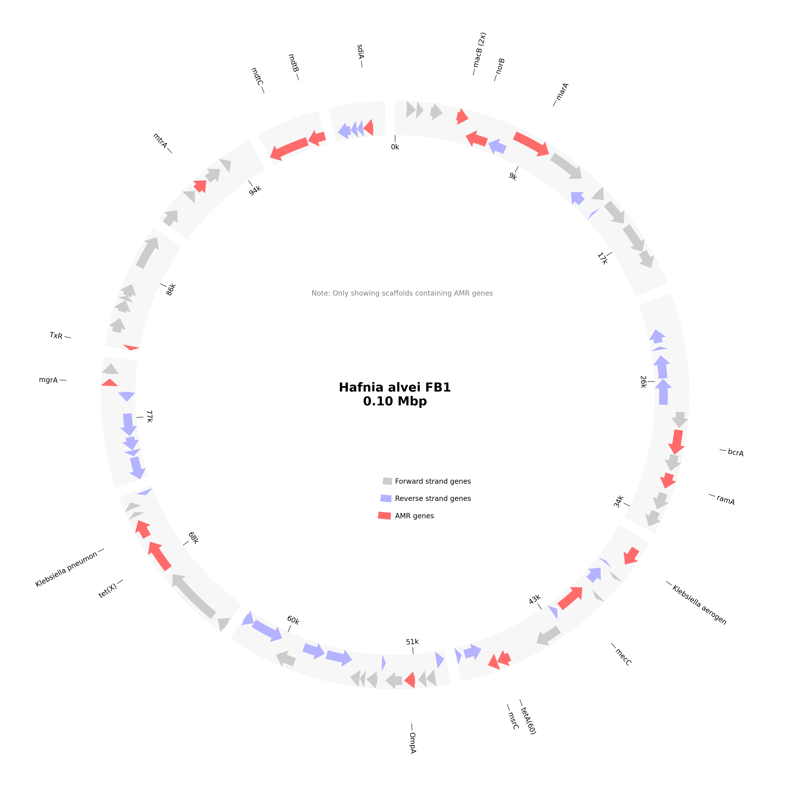

### Klebsiella aerogenes Omp36
- **Mechanism**: reduced permeability to antibiotic
- **Drug Classes**: monobactam; carbapenem; cephalosporin; cephamycin; penam; penem
- **AMR Family**: General Bacterial Porin with reduced permeability to beta-lactams
- **Locations**:
  - gnl|SPADES|BMKMCJEI_696_1 : position 760-1908

### Klebsiella pneumoniae OmpK37
- **Mechanism**: reduced permeability to antibiotic
- **Drug Classes**: monobactam; carbapenem; cephalosporin; cephamycin; penam; penem
- **AMR Family**: General Bacterial Porin with reduced permeability to beta-lactams
- **Locations**:
  - gnl|SPADES|BMKMCJEI_888_4 : position 7296-8432

### OmpA
- **Mechanism**: reduced permeability to antibiotic
- **Drug Classes**: peptide antibiotic
- **AMR Family**: General Bacterial Porin with reduced permeability to peptide antibiotics
- **Locations**:
  - gnl|SPADES|BMKMCJEI_711_4 : position 2119-2778

### TxR
- **Mechanism**: antibiotic efflux
- **Drug Classes**: tetracycline antibiotic
- **AMR Family**: ATP-binding cassette (ABC) antibiotic efflux pump
- **Locations**:
  - gnl|SPADES|BMKMCJEI_1183_1 : position 2-292

### bcrA
- **Mechanism**: antibiotic efflux
- **Drug Classes**: peptide antibiotic
- **AMR Family**: ATP-binding cassette (ABC) antibiotic efflux pump
- **Locations**:
  - gnl|SPADES|BMKMCJEI_680_7 : position 8238-9758

### macB (found in 2 locations)
- **Mechanism**: antibiotic efflux
- **Drug Classes**: macrolide antibiotic
- **AMR Family**: ATP-binding cassette (ABC) antibiotic efflux pump
- **Locations**:
  - gnl|SPADES|BMKMCJEI_506_17 : position 20253-20477
  - gnl|SPADES|BMKMCJEI_506_5 : position 3782-4504

### marA
- **Mechanism**: antibiotic efflux; reduced permeability to antibiotic
- **Drug Classes**: fluoroquinolone antibiotic; monobactam; carbapenem; cephalosporin; glycylcycline; cephamycin; penam; tetracycline antibiotic; rifamycin antibiotic; phenicol antibiotic; penem; disinfecting agents and antiseptics
- **AMR Family**: resistance-nodulation-cell division (RND) antibiotic efflux pump; General Bacterial Porin with reduced permeability to beta-lactams
- **Locations**:
  - gnl|SPADES|BMKMCJEI_506_8 : position 7477-9858

### mdtB
- **Mechanism**: antibiotic efflux
- **Drug Classes**: aminocoumarin antibiotic
- **AMR Family**: resistance-nodulation-cell division (RND) antibiotic efflux pump
- **Locations**:
  - gnl|SPADES|BMKMCJEI_2145_2 : position 2676-3815

### mdtC
- **Mechanism**: antibiotic efflux
- **Drug Classes**: aminocoumarin antibiotic
- **AMR Family**: resistance-nodulation-cell division (RND) antibiotic efflux pump
- **Locations**:
  - gnl|SPADES|BMKMCJEI_2145_1 : position 3-2624

### mecC
- **Mechanism**: antibiotic target replacement
- **Drug Classes**: penam
- **AMR Family**: methicillin resistant PBP2
- **Locations**:
  - gnl|SPADES|BMKMCJEI_696_6 : position 4732-6645

### mgrA
- **Mechanism**: antibiotic efflux
- **Drug Classes**: fluoroquinolone antibiotic; cephalosporin; penam; tetracycline antibiotic; peptide antibiotic; disinfecting agents and antiseptics
- **AMR Family**: ATP-binding cassette (ABC) antibiotic efflux pump; major facilitator superfamily (MFS) antibiotic efflux pump
- **Locations**:
  - gnl|SPADES|BMKMCJEI_1150_7 : position 6096-6539

### msrC
- **Mechanism**: antibiotic target protection
- **Drug Classes**: macrolide antibiotic; streptogramin antibiotic; streptogramin B antibiotic
- **AMR Family**: msr-type ABC-F protein
- **Locations**:
  - gnl|SPADES|BMKMCJEI_696_12 : position 11778-12368

### mtrA
- **Mechanism**: antibiotic efflux
- **Drug Classes**: macrolide antibiotic; penam
- **AMR Family**: resistance-nodulation-cell division (RND) antibiotic efflux pump
- **Locations**:
  - gnl|SPADES|BMKMCJEI_1252_4 : position 2785-3606

### norB
- **Mechanism**: antibiotic efflux
- **Drug Classes**: fluoroquinolone antibiotic
- **AMR Family**: major facilitator superfamily (MFS) antibiotic efflux pump
- **Locations**:
  - gnl|SPADES|BMKMCJEI_506_6 : position 4605-6011

### ramA
- **Mechanism**: antibiotic efflux; reduced permeability to antibiotic
- **Drug Classes**: fluoroquinolone antibiotic; monobactam; carbapenem; cephalosporin; glycylcycline; cephamycin; penam; tetracycline antibiotic; rifamycin antibiotic; phenicol antibiotic; penem; disinfecting agents and antiseptics
- **AMR Family**: resistance-nodulation-cell division (RND) antibiotic efflux pump; General Bacterial Porin with reduced permeability to beta-lactams
- **Locations**:
  - gnl|SPADES|BMKMCJEI_680_9 : position 10951-11892

### sdiA
- **Mechanism**: antibiotic efflux
- **Drug Classes**: fluoroquinolone antibiotic; cephalosporin; glycylcycline; penam; tetracycline antibiotic; rifamycin antibiotic; phenicol antibiotic; disinfecting agents and antiseptics
- **AMR Family**: resistance-nodulation-cell division (RND) antibiotic efflux pump
- **Locations**:
  - gnl|SPADES|BMKMCJEI_2385_4 : position 1910-2557

### tet(X)
- **Mechanism**: antibiotic inactivation
- **Drug Classes**: glycylcycline; tetracycline antibiotic
- **AMR Family**: tetracycline inactivation enzyme
- **Locations**:
  - gnl|SPADES|BMKMCJEI_888_3 : position 4964-6946

### tetA(60)
- **Mechanism**: antibiotic efflux
- **Drug Classes**: tetracycline antibiotic
- **AMR Family**: ATP-binding cassette (ABC) antibiotic efflux pump
- **Locations**:
  - gnl|SPADES|BMKMCJEI_696_11 : position 10960-11778

## Hafnia paralvei
**Strain Statistics:**
- Total genome length: 4545.1 kbp
- Total scaffolds: 320
- Scaffolds with AMR genes: 70
- Total genes annotated: 8288
- Total AMR genes: 439
- Unique AMR genes: 214
- Distinct AMR mechanisms: 11
- Distinct AMR families: 75
- Distinct drug classes: 37

**Circos Plot:**

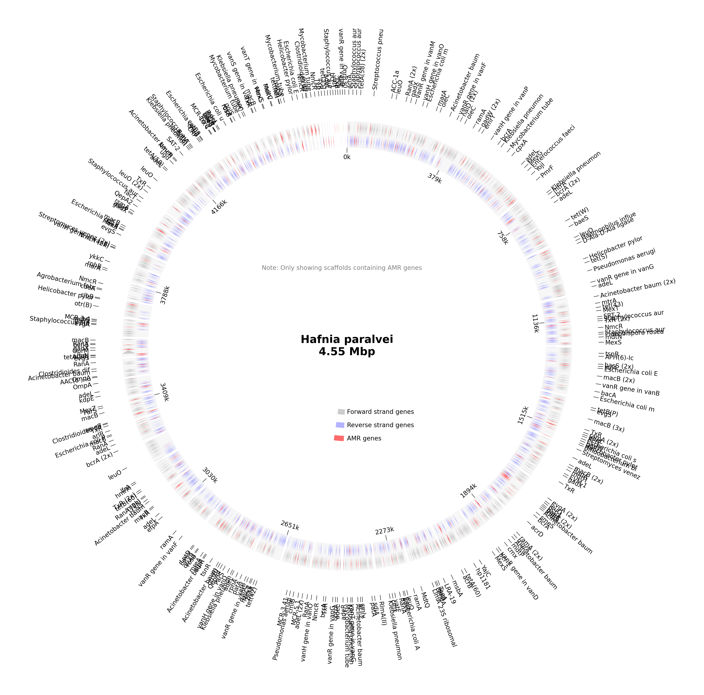

### AAC(6')-32
- **Mechanism**: antibiotic inactivation
- **Drug Classes**: aminoglycoside antibiotic
- **AMR Family**: AAC(6')
- **Locations**:
  - gnl|SPADES|BMKMCJEI_25_150 : position 161104-161706

### AAC(6')-Iu
- **Mechanism**: antibiotic inactivation
- **Drug Classes**: aminoglycoside antibiotic
- **AMR Family**: AAC(6')
- **Locations**:
  - gnl|SPADES|BMKMCJEI_162_9 : position 10591-11049

### ACC-1a
- **Mechanism**: antibiotic inactivation
- **Drug Classes**: monobactam; cephalosporin; cephamycin; penam; oxacephem
- **AMR Family**: ACC beta-lactamase
- **Locations**:
  - gnl|SPADES|BMKMCJEI_2_150: position 142222-143394

### ALI-2
- **Mechanism**: antibiotic inactivation
- **Drug Classes**: carbapenem
- **AMR Family**: ALI beta-lactamase
- **Locations**:
  - gnl|SPADES|BMKMCJEI_71_53 : position 53532-54410

### APH(6)-Ic
- **Mechanism**: antibiotic inactivation
- **Drug Classes**: aminoglycoside antibiotic
- **AMR Family**: APH(6)
- **Locations**:
  - gnl|SPADES|BMKMCJEI_25_29 : position 27549-28352

### Acinetobacter baumannii AbaF (found in 6 locations)
- **Mechanism**: antibiotic efflux
- **Drug Classes**: phosphonic acid antibiotic
- **AMR Family**: major facilitator superfamily (MFS) antibiotic efflux pump
- **Locations**:
  - gnl|SPADES|BMKMCJEI_100_23 : position 28467-29801
  - gnl|SPADES|BMKMCJEI_112_76 : position 84855-86156
  - gnl|SPADES|BMKMCJEI_307_5 : position 3445-4674
  - gnl|SPADES|BMKMCJEI_3_265 : position 265812-267314
  - gnl|SPADES|BMKMCJEI_43_50 : position 61891-63216
  - gnl|SPADES|BMKMCJEI_71_61 : position 61885-63426

### Acinetobacter baumannii AbaQ (found in 7 locations)
- **Mechanism**: antibiotic efflux
- **Drug Classes**: fluoroquinolone antibiotic
- **AMR Family**: major facilitator superfamily (MFS) antibiotic efflux pump
- **Locations**:
  - gnl|SPADES|BMKMCJEI_112_29 : position 21788-23134
  - gnl|SPADES|BMKMCJEI_162_29 : position 29792-31084
  - gnl|SPADES|BMKMCJEI_22_16 : position 15904-17241
  - gnl|SPADES|BMKMCJEI_22_98 : position 110508-111731
  - gnl|SPADES|BMKMCJEI_2_305 : position 335718-337013
  - gnl|SPADES|BMKMCJEI_49_47 : position 44459-45835
  - gnl|SPADES|BMKMCJEI_96_76 : position 84197-85525

### AcrE
- **Mechanism**: antibiotic efflux
- **Drug Classes**: fluoroquinolone antibiotic; cephalosporin; cephamycin; penam
- **AMR Family**: resistance-nodulation-cell division (RND) antibiotic efflux pump
- **Locations**:
  - gnl|SPADES|BMKMCJEI_31_102 : position 109146-110309

### AcrF
- **Mechanism**: antibiotic efflux
- **Drug Classes**: fluoroquinolone antibiotic; cephalosporin; cephamycin; penam
- **AMR Family**: resistance-nodulation-cell division (RND) antibiotic efflux pump
- **Locations**:
  - gnl|SPADES|BMKMCJEI_31_103 : position 110348-113470

### Agrobacterium fabrum chloramphenicol acetyltransferase
- **Mechanism**: antibiotic inactivation
- **Drug Classes**: phenicol antibiotic
- **AMR Family**: chloramphenicol acetyltransferase (CAT)
- **Locations**:
  - gnl|SPADES|BMKMCJEI_204_13 : position 14988-15542

### ArnT
- **Mechanism**: antibiotic target alteration
- **Drug Classes**: peptide antibiotic
- **AMR Family**: pmr phosphoethanolamine transferase
- **Locations**:
  - gnl|SPADES|BMKMCJEI_3_328: position 328462-330111

### Bifidobacterium bifidum ileS conferring resistance to mupirocin
- **Mechanism**: antibiotic target alteration
- **Drug Classes**: mupirocin-like antibiotic
- **AMR Family**: antibiotic-resistant isoleucyl-tRNA synthetase (ileS)
- **Locations**:
  - gnl|SPADES|BMKMCJEI_31_132 : position 139764-142346

### CRP (found in 2 locations)
- **Mechanism**: antibiotic efflux
- **Drug Classes**: macrolide antibiotic; fluoroquinolone antibiotic; penam
- **AMR Family**: resistance-nodulation-cell division (RND) antibiotic efflux pump
- **Locations**:
  - gnl|SPADES|BMKMCJEI_2_73: position 50494-51126
  - gnl|SPADES|BMKMCJEI_374_13 : position 13472-14269

### Clostridioides difficile gyrA conferring resistance to fluoroquinolones
- **Mechanism**: antibiotic target alteration
- **Drug Classes**: fluoroquinolone antibiotic
- **AMR Family**: fluoroquinolone resistant gyrA
- **Locations**:
  - gnl|SPADES|BMKMCJEI_1249_2 : position 1181-3829

### Clostridioides difficile gyrB conferring resistance to fluoroquinolones (found in 2 locations)
- **Mechanism**: antibiotic target alteration
- **Drug Classes**: fluoroquinolone antibiotic
- **AMR Family**: fluoroquinolone resistant gyrB
- **Locations**:
  - gnl|SPADES|BMKMCJEI_137_13 : position 13421-15316
  - gnl|SPADES|BMKMCJEI_162_37 : position 36683-39097

### D-Ala-D-Ala ligase
- **Mechanism**: antibiotic target alteration
- **Drug Classes**: glycopeptide antibiotic
- **AMR Family**: Van ligase
- **Locations**:
  - gnl|SPADES|BMKMCJEI_19_22 : position 26855-27775

### EVM-1
- **Mechanism**: antibiotic inactivation
- **Drug Classes**: carbapenem
- **AMR Family**: EVM beta-lactamase
- **Locations**:
  - gnl|SPADES|BMKMCJEI_39_70 : position 78506-79327

### Enterobacter cloacae acrA
- **Mechanism**: antibiotic efflux
- **Drug Classes**: fluoroquinolone antibiotic; cephalosporin; glycylcycline; penam; tetracycline antibiotic; rifamycin antibiotic; phenicol antibiotic; disinfecting agents and antiseptics
- **AMR Family**: resistance-nodulation-cell division (RND) antibiotic efflux pump
- **Locations**:
  - gnl|SPADES|BMKMCJEI_58_107 : position 100519-101709

### Enterococcus faecium cls conferring resistance to daptomycin
- **Mechanism**: antibiotic target alteration
- **Drug Classes**: peptide antibiotic
- **AMR Family**: daptomycin resistant cls
- **Locations**:
  - gnl|SPADES|BMKMCJEI_3_285 : position 283391-284851

### ErmX
- **Mechanism**: antibiotic target alteration
- **Drug Classes**: macrolide antibiotic; lincosamide antibiotic; streptogramin antibiotic; streptogramin A antibiotic; streptogramin B antibiotic
- **AMR Family**: Erm 23S ribosomal RNA methyltransferase
- **Locations**:
  - gnl|SPADES|BMKMCJEI_100_65 : position 76747-77559

### Escherichia coli AcrAB-TolC with AcrR mutation conferring resistance to ciprofloxacin, tetracycline, and ceftazidime
- **Mechanism**: antibiotic target alteration; antibiotic efflux
- **Drug Classes**: fluoroquinolone antibiotic; cephalosporin; glycylcycline; penam; tetracycline antibiotic; rifamycin antibiotic; phenicol antibiotic; disinfecting agents and antiseptics
- **AMR Family**: resistance-nodulation-cell division (RND) antibiotic efflux pump
- **Locations**:
  - gnl|SPADES|BMKMCJEI_58_108 : position 101849-102553

### Escherichia coli AcrAB-TolC with MarR mutations conferring resistance to ciprofloxacin and tetracycline (found in 2 locations)
- **Mechanism**: antibiotic target alteration; antibiotic efflux
- **Drug Classes**: fluoroquinolone antibiotic; cephalosporin; glycylcycline; penam; tetracycline antibiotic; rifamycin antibiotic; phenicol antibiotic; disinfecting agents and antiseptics
- **AMR Family**: resistance-nodulation-cell division (RND) antibiotic efflux pump
- **Locations**:
  - gnl|SPADES|BMKMCJEI_374_22 : position 23413-23904
  - gnl|SPADES|BMKMCJEI_68_32 : position 34017-34448

### Escherichia coli EF-Tu mutants conferring resistance to Enacyloxin IIa
- **Mechanism**: antibiotic target alteration
- **Drug Classes**: elfamycin antibiotic
- **AMR Family**: elfamycin resistant EF-Tu
- **Locations**:
  - gnl|SPADES|BMKMCJEI_25_64 : position 64858-67560

### Escherichia coli EF-Tu mutants conferring resistance to Pulvomycin (found in 2 locations)
- **Mechanism**: antibiotic target alteration
- **Drug Classes**: elfamycin antibiotic
- **AMR Family**: elfamycin resistant EF-Tu
- **Locations**:
  - gnl|SPADES|BMKMCJEI_2_48 : position 27828-29012
  - gnl|SPADES|BMKMCJEI_993_7 : position 6063-7247

### Escherichia coli PtsI with mutation conferring resistance to fosfomycin
- **Mechanism**: antibiotic target alteration
- **Drug Classes**: phosphonic acid antibiotic
- **AMR Family**: antibiotic-resistant ptsI phosphotransferase
- **Locations**:
  - gnl|SPADES|BMKMCJEI_131_58 : position 61132-62859

### Escherichia coli acrA
- **Mechanism**: antibiotic efflux
- **Drug Classes**: fluoroquinolone antibiotic; cephalosporin; glycylcycline; penam; tetracycline antibiotic; rifamycin antibiotic; phenicol antibiotic; disinfecting agents and antiseptics
- **AMR Family**: resistance-nodulation-cell division (RND) antibiotic efflux pump
- **Locations**:
  - gnl|SPADES|BMKMCJEI_244_32 : position 36511-37698

### Escherichia coli mdfA (found in 2 locations)
- **Mechanism**: antibiotic efflux
- **Drug Classes**: tetracycline antibiotic; phenicol antibiotic; disinfecting agents and antiseptics
- **AMR Family**: major facilitator superfamily (MFS) antibiotic efflux pump
- **Locations**:
  - gnl|SPADES|BMKMCJEI_25_148 : position 157820-159040
  - gnl|SPADES|BMKMCJEI_2_241 : position 256683-257915

### Escherichia coli soxS with mutation conferring antibiotic resistance (found in 4 locations)
- **Mechanism**: antibiotic target alteration; antibiotic efflux; reduced permeability to antibiotic
- **Drug Classes**: fluoroquinolone antibiotic; monobactam; carbapenem; cephalosporin; glycylcycline; cephamycin; penam; tetracycline antibiotic; rifamycin antibiotic; phenicol antibiotic; penem; disinfecting agents and antiseptics
- **AMR Family**: ATP-binding cassette (ABC) antibiotic efflux pump; major facilitator superfamily (MFS) antibiotic efflux pump; resistance-nodulation-cell division (RND) antibiotic efflux pump; General Bacterial Porin with reduced permeability to beta-lactams
- **Locations**:
  - gnl|SPADES|BMKMCJEI_240_33 : position 40329-41207
  - gnl|SPADES|BMKMCJEI_2_216 : position 222953-223816
  - gnl|SPADES|BMKMCJEI_31_110 : position 119957-120778
  - gnl|SPADES|BMKMCJEI_3_260 : position 262058-262429

### Escherichia coli uhpA with mutation conferring resistance to fosfomycin
- **Mechanism**: antibiotic target alteration
- **Drug Classes**: phosphonic acid antibiotic
- **AMR Family**: antibiotic-resistant UhpT
- **Locations**:
  - gnl|SPADES|BMKMCJEI_442_9 : position 10177-10893

### FosC2
- **Mechanism**: antibiotic inactivation
- **Drug Classes**: phosphonic acid antibiotic
- **AMR Family**: fosC phosphotransferase family
- **Locations**:
  - gnl|SPADES|BMKMCJEI_93_84 : position 70406-70870

### H-NS
- **Mechanism**: antibiotic efflux
- **Drug Classes**: macrolide antibiotic; fluoroquinolone antibiotic; cephalosporin; cephamycin; penam; tetracycline antibiotic
- **AMR Family**: major facilitator superfamily (MFS) antibiotic efflux pump; resistance-nodulation-cell division (RND) antibiotic efflux pump
- **Locations**:
  - gnl|SPADES|BMKMCJEI_120_1 : position 295-702

### Haemophilus influenzae PBP3 conferring resistance to beta-lactam antibiotics (found in 2 locations)
- **Mechanism**: antibiotic target alteration
- **Drug Classes**: cephalosporin; cephamycin; penam
- **AMR Family**: Penicillin-binding protein mutations conferring resistance to beta-lactam antibiotics
- **Locations**:
  - gnl|SPADES|BMKMCJEI_171_59 : position 51663-53435
  - gnl|SPADES|BMKMCJEI_19_14 : position 15951-17714

### Helicobacter pylori pbp1 mutants conferring resistance to amoxicillin (found in 2 locations)
- **Mechanism**: antibiotic target alteration
- **Drug Classes**: cephalosporin; cephamycin; penam
- **AMR Family**: Penicillin-binding protein mutations conferring resistance to beta-lactam antibiotics
- **Locations**:
  - gnl|SPADES|BMKMCJEI_19_66 : position 78742-81321
  - gnl|SPADES|BMKMCJEI_203_37 : position 45634-47907

### Helicobacter pylori pbp2 mutants conferring resistance to amoxicillin
- **Mechanism**: antibiotic target alteration
- **Drug Classes**: cephalosporin; cephamycin; penam
- **AMR Family**: Penicillin-binding protein mutations conferring resistance to beta-lactam antibiotics
- **Locations**:
  - gnl|SPADES|BMKMCJEI_31_126 : position 134380-136275

### Helicobacter pylori rpoB mutation conferring resistance to rifampicin
- **Mechanism**: antibiotic target alteration; antibiotic target replacement
- **Drug Classes**: fluoroquinolone antibiotic; rifamycin antibiotic
- **AMR Family**: rifamycin-resistant beta-subunit of RNA polymerase (rpoB)
- **Locations**:
  - gnl|SPADES|BMKMCJEI_894_7 : position 5934-10037

### Klebsiella aerogenes Omp36
- **Mechanism**: reduced permeability to antibiotic
- **Drug Classes**: monobactam; carbapenem; cephalosporin; cephamycin; penam; penem
- **AMR Family**: General Bacterial Porin with reduced permeability to beta-lactams
- **Locations**:
  - gnl|SPADES|BMKMCJEI_3_313 : position 311459-312607

### Klebsiella pneumoniae KpnE
- **Mechanism**: antibiotic efflux
- **Drug Classes**: macrolide antibiotic; aminoglycoside antibiotic; cephalosporin; tetracycline antibiotic; peptide antibiotic; rifamycin antibiotic; disinfecting agents and antiseptics
- **AMR Family**: small multidrug resistance (SMR) antibiotic efflux pump
- **Locations**:
  - gnl|SPADES|BMKMCJEI_3_169 : position 170493-170924

### Klebsiella pneumoniae KpnF
- **Mechanism**: antibiotic efflux
- **Drug Classes**: macrolide antibiotic; aminoglycoside antibiotic; cephalosporin; tetracycline antibiotic; peptide antibiotic; rifamycin antibiotic; disinfecting agents and antiseptics
- **AMR Family**: small multidrug resistance (SMR) antibiotic efflux pump
- **Locations**:
  - gnl|SPADES|BMKMCJEI_3_170: position 170911-171240

### Klebsiella pneumoniae KpnG
- **Mechanism**: antibiotic efflux
- **Drug Classes**: macrolide antibiotic; fluoroquinolone antibiotic; aminoglycoside antibiotic; carbapenem; cephalosporin; penam; peptide antibiotic; penem
- **AMR Family**: major facilitator superfamily (MFS) antibiotic efflux pump
- **Locations**:
  - gnl|SPADES|BMKMCJEI_16_28 : position 35124-36299

### Klebsiella pneumoniae KpnH (found in 2 locations)
- **Mechanism**: antibiotic efflux
- **Drug Classes**: macrolide antibiotic; fluoroquinolone antibiotic; aminoglycoside antibiotic; carbapenem; cephalosporin; penam; peptide antibiotic; penem
- **AMR Family**: major facilitator superfamily (MFS) antibiotic efflux pump
- **Locations**:
  - gnl|SPADES|BMKMCJEI_16_27: position 33571-35106
  - gnl|SPADES|BMKMCJEI_491_18 : position 18625-20064

### Klebsiella pneumoniae OmpK37 (found in 6 locations)
- **Mechanism**: reduced permeability to antibiotic
- **Drug Classes**: monobactam; carbapenem; cephalosporin; cephamycin; penam; penem
- **AMR Family**: General Bacterial Porin with reduced permeability to beta-lactams
- **Locations**:
  - gnl|SPADES|BMKMCJEI_19_67 : position 81503-82642
  - gnl|SPADES|BMKMCJEI_329_15 : position 12065-13165
  - gnl|SPADES|BMKMCJEI_62_28 : position 33299-34414
  - gnl|SPADES|BMKMCJEI_68_81 : position 82464-83576
  - gnl|SPADES|BMKMCJEI_71_84 : position 84308-85411
  - gnl|SPADES|BMKMCJEI_96_33 : position 33325-34467

### Klebsiella pneumoniae acrR with mutation conferring multidrug antibiotic resistance
- **Mechanism**: antibiotic target alteration; antibiotic efflux
- **Drug Classes**: fluoroquinolone antibiotic; cephalosporin; glycylcycline; penam; tetracycline antibiotic; rifamycin antibiotic; phenicol antibiotic; disinfecting agents and antiseptics
- **AMR Family**: resistance-nodulation-cell division (RND) antibiotic efflux pump
- **Locations**:
  - gnl|SPADES|BMKMCJEI_31_101 : position 107939-108553

### LRA-19
- **Mechanism**: antibiotic inactivation
- **Drug Classes**: cephalosporin; penam
- **AMR Family**: subclass B3 LRA beta-lactamase
- **Locations**:
  - gnl|SPADES|BMKMCJEI_62_26 : position 31091-31738

### LlmA 23S ribosomal RNA methyltransferase
- **Mechanism**: antibiotic target alteration
- **Drug Classes**: lincosamide antibiotic
- **AMR Family**: Llm 23S ribosomal RNA methyltransferase
- **Locations**:
  - gnl|SPADES|BMKMCJEI_62_57 : position 69335-70528

### LptD
- **Mechanism**: antibiotic efflux
- **Drug Classes**: carbapenem; peptide antibiotic; aminocoumarin antibiotic; rifamycin antibiotic
- **AMR Family**: ATP-binding cassette (ABC) antibiotic efflux pump
- **Locations**:
  - gnl|SPADES|BMKMCJEI_100_68 : position 79956-82358

### MCR-10.4
- **Mechanism**: antibiotic target alteration
- **Drug Classes**: peptide antibiotic
- **AMR Family**: MCR phosphoethanolamine transferase
- **Locations**:
  - gnl|SPADES|BMKMCJEI_386_24 : position 21013-22647

### MCR-3.4
- **Mechanism**: antibiotic target alteration
- **Drug Classes**: peptide antibiotic
- **AMR Family**: MCR phosphoethanolamine transferase
- **Locations**:
  - gnl|SPADES|BMKMCJEI_171_58 : position 49691-51298

### MCR-3.41
- **Mechanism**: antibiotic target alteration
- **Drug Classes**: peptide antibiotic
- **AMR Family**: MCR phosphoethanolamine transferase
- **Locations**:
  - gnl|SPADES|BMKMCJEI_81_52 : position 57364-58986

### MCR-5.1
- **Mechanism**: antibiotic target alteration
- **Drug Classes**: peptide antibiotic
- **AMR Family**: MCR phosphoethanolamine transferase
- **Locations**:
  - gnl|SPADES|BMKMCJEI_81_16 : position 19752-21479

### MdtK
- **Mechanism**: antibiotic efflux
- **Drug Classes**: fluoroquinolone antibiotic
- **AMR Family**: multidrug and toxic compound extrusion (MATE) transporter
- **Locations**:
  - gnl|SPADES|BMKMCJEI_31_94 : position 100311-101768

### MdtQ
- **Mechanism**: reduced permeability to antibiotic
- **Drug Classes**: monobactam; carbapenem; cephalosporin; cephamycin; penam; penem
- **AMR Family**: Outer Membrane Porin (Opr)
- **Locations**:
  - gnl|SPADES|BMKMCJEI_62_84 : position 106761-108266

### MexG
- **Mechanism**: antibiotic efflux
- **Drug Classes**: fluoroquinolone antibiotic; tetracycline antibiotic; disinfecting agents and antiseptics
- **AMR Family**: resistance-nodulation-cell division (RND) antibiotic efflux pump
- **Locations**:
  - gnl|SPADES|BMKMCJEI_3_270 : position 269984-270400

### MexS (found in 6 locations)
- **Mechanism**: antibiotic efflux
- **Drug Classes**: fluoroquinolone antibiotic; diaminopyrimidine antibiotic; phenicol antibiotic
- **AMR Family**: resistance-nodulation-cell division (RND) antibiotic efflux pump
- **Locations**:
  - gnl|SPADES|BMKMCJEI_22_138 : position 162540-163517
  - gnl|SPADES|BMKMCJEI_240_25 : position 31882-32883
  - gnl|SPADES|BMKMCJEI_43_35 : position 40431-41450
  - gnl|SPADES|BMKMCJEI_49_124 : position 123358-124389
  - gnl|SPADES|BMKMCJEI_583_2 : position 232-1218
  - gnl|SPADES|BMKMCJEI_93_80 : position 65854-66978

### MexT
- **Mechanism**: antibiotic efflux
- **Drug Classes**: fluoroquinolone antibiotic; diaminopyrimidine antibiotic; phenicol antibiotic
- **AMR Family**: resistance-nodulation-cell division (RND) antibiotic efflux pump
- **Locations**:
  - gnl|SPADES|BMKMCJEI_22_58 : position 61991-62884

### MexV
- **Mechanism**: antibiotic efflux
- **Drug Classes**: macrolide antibiotic; fluoroquinolone antibiotic; tetracycline antibiotic; phenicol antibiotic; disinfecting agents and antiseptics
- **AMR Family**: resistance-nodulation-cell division (RND) antibiotic efflux pump
- **Locations**:
  - gnl|SPADES|BMKMCJEI_605_4 : position 2534-4051

### MexZ
- **Mechanism**: antibiotic efflux
- **Drug Classes**: macrolide antibiotic; fluoroquinolone antibiotic; aminoglycoside antibiotic; carbapenem; cephalosporin; cephamycin; penam; tetracycline antibiotic; phenicol antibiotic; disinfecting agents and antiseptics
- **AMR Family**: resistance-nodulation-cell division (RND) antibiotic efflux pump
- **Locations**:
  - gnl|SPADES|BMKMCJEI_137_61 : position 72762-73367

### Mycobacterium tuberculosis gidB mutation conferring resistance to streptomycin
- **Mechanism**: antibiotic target alteration
- **Drug Classes**: aminoglycoside antibiotic
- **AMR Family**: antibiotic resistant gidB
- **Locations**:
  - gnl|SPADES|BMKMCJEI_491_4 : position 2264-2884

### Mycobacterium tuberculosis ndh with mutation conferring resistance to isoniazid
- **Mechanism**: antibiotic target alteration
- **Drug Classes**: isoniazid-like antibiotic
- **AMR Family**: antibiotic resistant ndh
- **Locations**:
  - gnl|SPADES|BMKMCJEI_3_195 : position 195321-196625

### Mycobacterium tuberculosis pncA mutations conferring resistance to pyrazinamide
- **Mechanism**: antibiotic target alteration
- **Drug Classes**: pyrazine antibiotic
- **AMR Family**: Pyrazinamide resistant pncA
- **Locations**:
  - gnl|SPADES|BMKMCJEI_71_93 : position 95303-95938

### Mycobacterium tuberculosis rpoB mutations conferring resistance to rifampicin
- **Mechanism**: antibiotic target alteration; antibiotic target replacement
- **Drug Classes**: rifamycin antibiotic
- **AMR Family**: rifamycin-resistant beta-subunit of RNA polymerase (rpoB)
- **Locations**:
  - gnl|SPADES|BMKMCJEI_1330_4 : position 2295-6323

### Mycobacterium tuberculosis rpsA mutations conferring resistance to pyrazinamide
- **Mechanism**: antibiotic target alteration
- **Drug Classes**: pyrazine antibiotic
- **AMR Family**: pyrazinamide resistant rpsA
- **Locations**:
  - gnl|SPADES|BMKMCJEI_758_1 : position 2-961

### Mycobacterium tuberculosis thyA with mutation conferring resistance to para-aminosalicylic acid
- **Mechanism**: antibiotic target alteration
- **Drug Classes**: salicylic acid antibiotic
- **AMR Family**: aminosalicylate resistant thymidylate synthase
- **Locations**:
  - gnl|SPADES|BMKMCJEI_19_80 : position 97227-98021

### NmcR (found in 9 locations)
- **Mechanism**: antibiotic inactivation
- **Drug Classes**: carbapenem; cephalosporin; cephamycin; penam
- **AMR Family**: NmcA beta-lactamase
- **Locations**:
  - gnl|SPADES|BMKMCJEI_1029_9 : position 7807-8712
  - gnl|SPADES|BMKMCJEI_1521_2 : position 3038-4012
  - gnl|SPADES|BMKMCJEI_204_27 : position 31513-32472
  - gnl|SPADES|BMKMCJEI_22_102 : position 115598-116527
  - gnl|SPADES|BMKMCJEI_234_21 : position 25288-26181
  - gnl|SPADES|BMKMCJEI_234_33 : position 40315-41187
  - gnl|SPADES|BMKMCJEI_307_2 : position 245-1072
  - gnl|SPADES|BMKMCJEI_77_57 : position 73712-74608
  - gnl|SPADES|BMKMCJEI_96_61 : position 71261-72166

### OmpA (found in 4 locations)
- **Mechanism**: reduced permeability to antibiotic
- **Drug Classes**: peptide antibiotic
- **AMR Family**: General Bacterial Porin with reduced permeability to peptide antibiotics
- **Locations**:
  - gnl|SPADES|BMKMCJEI_161_56 : position 63968-64483
  - gnl|SPADES|BMKMCJEI_162_13 : position 13440-14099
  - gnl|SPADES|BMKMCJEI_3_264 : position 264748-265239
  - gnl|SPADES|BMKMCJEI_62_47 : position 59218-60276

### OprM
- **Mechanism**: antibiotic efflux
- **Drug Classes**: macrolide antibiotic; fluoroquinolone antibiotic; monobactam; aminoglycoside antibiotic; carbapenem; cephalosporin; cephamycin; penam; tetracycline antibiotic; peptide antibiotic; aminocoumarin antibiotic; diaminopyrimidine antibiotic; sulfonamide antibiotic; phenicol antibiotic; penem; disinfecting agents and antiseptics
- **AMR Family**: resistance-nodulation-cell division (RND) antibiotic efflux pump
- **Locations**:
  - gnl|SPADES|BMKMCJEI_165_9 : position 23890-25251

### ParR (found in 2 locations)
- **Mechanism**: antibiotic efflux; reduced permeability to antibiotic
- **Drug Classes**: macrolide antibiotic; fluoroquinolone antibiotic; monobactam; aminoglycoside antibiotic; carbapenem; cephalosporin; cephamycin; penam; tetracycline antibiotic; phenicol antibiotic; penem; disinfecting agents and antiseptics
- **AMR Family**: resistance-nodulation-cell division (RND) antibiotic efflux pump; Outer Membrane Porin (Opr)
- **Locations**:
  - gnl|SPADES|BMKMCJEI_2_112 : position 95413-96132
  - gnl|SPADES|BMKMCJEI_96_53 : position 60866-61579

### ParS (found in 2 locations)
- **Mechanism**: antibiotic efflux; reduced permeability to antibiotic
- **Drug Classes**: macrolide antibiotic; fluoroquinolone antibiotic; monobactam; aminoglycoside antibiotic; carbapenem; cephalosporin; cephamycin; penam; tetracycline antibiotic; phenicol antibiotic; penem; disinfecting agents and antiseptics
- **AMR Family**: resistance-nodulation-cell division (RND) antibiotic efflux pump; Outer Membrane Porin (Opr)
- **Locations**:
  - gnl|SPADES|BMKMCJEI_137_53 : position 66079-67740
  - gnl|SPADES|BMKMCJEI_96_52 : position 59531-60859

### Planobispora rosea EF-Tu mutants conferring resistance to inhibitor GE2270A
- **Mechanism**: antibiotic target alteration
- **Drug Classes**: elfamycin antibiotic
- **AMR Family**: elfamycin resistant EF-Tu
- **Locations**:
  - gnl|SPADES|BMKMCJEI_22_118 : position 136322-138190

### PmrF
- **Mechanism**: antibiotic target alteration
- **Drug Classes**: peptide antibiotic
- **AMR Family**: pmr phosphoethanolamine transferase
- **Locations**:
  - gnl|SPADES|BMKMCJEI_3_325 : position 324550-325566

### Pseudomonas aeruginosa CpxR
- **Mechanism**: antibiotic efflux
- **Drug Classes**: macrolide antibiotic; fluoroquinolone antibiotic; monobactam; aminoglycoside antibiotic; carbapenem; cephalosporin; cephamycin; penam; tetracycline antibiotic; peptide antibiotic; aminocoumarin antibiotic; diaminopyrimidine antibiotic; sulfonamide antibiotic; phenicol antibiotic; penem
- **AMR Family**: resistance-nodulation-cell division (RND) antibiotic efflux pump
- **Locations**:
  - gnl|SPADES|BMKMCJEI_81_41 : position 47077-47775

### Pseudomonas aeruginosa ampR with mutation conferring resistance to aztreonam (found in 3 locations)
- **Mechanism**: antibiotic target alteration; antibiotic inactivation
- **Drug Classes**: monobactam; carbapenem; cephalosporin
- **AMR Family**: PDC beta-lactamase; ampR transcriptional regulator with mutation conferring resistance to monobactam antibiotics
- **Locations**:
  - gnl|SPADES|BMKMCJEI_19_96 : position 120217-121134
  - gnl|SPADES|BMKMCJEI_2_151 : position 143609-144475
  - gnl|SPADES|BMKMCJEI_2_293 : position 322761-323708

### QepA2
- **Mechanism**: antibiotic efflux
- **Drug Classes**: fluoroquinolone antibiotic
- **AMR Family**: major facilitator superfamily (MFS) antibiotic efflux pump
- **Locations**:
  - gnl|SPADES|BMKMCJEI_249_10 : position 10454-11860

### QepA4
- **Mechanism**: antibiotic efflux
- **Drug Classes**: fluoroquinolone antibiotic
- **AMR Family**: major facilitator superfamily (MFS) antibiotic efflux pump
- **Locations**:
  - gnl|SPADES|BMKMCJEI_96_60 : position 69808-71091

### QnrB30
- **Mechanism**: antibiotic target protection
- **Drug Classes**: fluoroquinolone antibiotic
- **AMR Family**: quinolone resistance protein (qnr)
- **Locations**:
  - gnl|SPADES|BMKMCJEI_47637_1 : position 3-218

### RanA (found in 13 locations)
- **Mechanism**: antibiotic efflux
- **Drug Classes**: aminoglycoside antibiotic
- **AMR Family**: ATP-binding cassette (ABC) antibiotic efflux pump
- **Locations**:
  - gnl|SPADES|BMKMCJEI_120_21 : position 23015-24154
  - gnl|SPADES|BMKMCJEI_120_8 : position 10742-11728
  - gnl|SPADES|BMKMCJEI_120_9 : position 11725-12729
  - gnl|SPADES|BMKMCJEI_131_40 : position 43085-44020
  - gnl|SPADES|BMKMCJEI_162_55 : position 57496-58272
  - gnl|SPADES|BMKMCJEI_165_28 : position 44585-46198
  - gnl|SPADES|BMKMCJEI_2_186 : position 188822-189829
  - gnl|SPADES|BMKMCJEI_2_268 : position 298091-299167
  - gnl|SPADES|BMKMCJEI_329_27 : position 22095-22925
  - gnl|SPADES|BMKMCJEI_39_49 : position 54385-55518
  - gnl|SPADES|BMKMCJEI_435_15 : position 13521-14546
  - gnl|SPADES|BMKMCJEI_68_49 : position 49871-50497
  - gnl|SPADES|BMKMCJEI_77_93 : position 103775-104584

### RanB
- **Mechanism**: antibiotic efflux
- **Drug Classes**: aminoglycoside antibiotic
- **AMR Family**: ATP-binding cassette (ABC) antibiotic efflux pump
- **Locations**:
  - gnl|SPADES|BMKMCJEI_329_28 : position 22930-23712

### RlmA(II)
- **Mechanism**: antibiotic target alteration
- **Drug Classes**: macrolide antibiotic; lincosamide antibiotic
- **AMR Family**: non-erm 23S ribosomal RNA methyltransferase (G748)
- **Locations**:
  - gnl|SPADES|BMKMCJEI_68_111 : position 112157-112969

### SAT-2
- **Mechanism**: antibiotic inactivation
- **Drug Classes**: nucleoside antibiotic
- **AMR Family**: streptothricin acetyltransferase (SAT)
- **Locations**:
  - gnl|SPADES|BMKMCJEI_307_27 : position 29843-30571

### SRT-2
- **Mechanism**: antibiotic inactivation
- **Drug Classes**: cephalosporin
- **AMR Family**: SRT beta-lactamase
- **Locations**:
  - gnl|SPADES|BMKMCJEI_22_76 : position 80927-82066

### SatA
- **Mechanism**: antibiotic inactivation
- **Drug Classes**: nucleoside antibiotic
- **AMR Family**: streptothricin acetyltransferase (SAT)
- **Locations**:
  - gnl|SPADES|BMKMCJEI_3_254 : position 256918-257361

### Staphylococcus aureus GlpT with mutation conferring resistance to fosfomycin
- **Mechanism**: antibiotic target alteration
- **Drug Classes**: phosphonic acid antibiotic
- **AMR Family**: antibiotic-resistant GlpT
- **Locations**:
  - gnl|SPADES|BMKMCJEI_22_113 : position 130750-132105

### Staphylococcus aureus fusA with mutation conferring resistance to fusidic acid (found in 2 locations)
- **Mechanism**: antibiotic target alteration
- **Drug Classes**: fusidane antibiotic
- **AMR Family**: antibiotic resistant fusA
- **Locations**:
  - gnl|SPADES|BMKMCJEI_249_41 : position 41900-43489
  - gnl|SPADES|BMKMCJEI_2_49 : position 29083-31197

### Staphylococcus aureus fusE with mutation conferring resistance to fusidic acid
- **Mechanism**: antibiotic target alteration
- **Drug Classes**: fusidane antibiotic
- **AMR Family**: antibiotic resistant fusE
- **Locations**:
  - gnl|SPADES|BMKMCJEI_2_28 : position 18124-18657

### Staphylococcus aureus mupA conferring resistance to mupirocin
- **Mechanism**: antibiotic target alteration
- **Drug Classes**: mupirocin-like antibiotic
- **AMR Family**: antibiotic-resistant isoleucyl-tRNA synthetase (ileS)
- **Locations**:
  - gnl|SPADES|BMKMCJEI_100_34 : position 42271-45120

### Staphylococcus aureus mupB conferring resistance to mupirocin (found in 2 locations)
- **Mechanism**: antibiotic target alteration
- **Drug Classes**: mupirocin-like antibiotic
- **AMR Family**: antibiotic-resistant isoleucyl-tRNA synthetase (ileS)
- **Locations**:
  - gnl|SPADES|BMKMCJEI_22_81 : position 87105-89960
  - gnl|SPADES|BMKMCJEI_5345_1 : position 1-1212

### Staphylococcus aureus murA with mutation conferring resistance to fosfomycin
- **Mechanism**: antibiotic target alteration
- **Drug Classes**: phosphonic acid antibiotic
- **AMR Family**: antibiotic-resistant murA transferase
- **Locations**:
  - gnl|SPADES|BMKMCJEI_329_33 : position 25849-27108

### Staphylococcus aureus pgsA mutations conferring resistance to daptomycin
- **Mechanism**: antibiotic target alteration
- **Drug Classes**: peptide antibiotic
- **AMR Family**: daptomycin resistant pgsA
- **Locations**:
  - gnl|SPADES|BMKMCJEI_171_45 : position 36187-36735

### Staphylococcus aureus walK with mutation conferring resistance to daptomycin
- **Mechanism**: antibiotic target alteration
- **Drug Classes**: peptide antibiotic
- **AMR Family**: daptomycin resistant walK
- **Locations**:
  - gnl|SPADES|BMKMCJEI_22_87 : position 95545-97419

### Streptococcus pneumoniae PBP2x conferring resistance to amoxicillin
- **Mechanism**: antibiotic target alteration
- **Drug Classes**: cephalosporin; cephamycin; penam
- **AMR Family**: Penicillin-binding protein mutations conferring resistance to beta-lactam antibiotics
- **Locations**:
  - gnl|SPADES|BMKMCJEI_2_104 : position 84061-86631

### Streptomyces rimosus otr(A)
- **Mechanism**: antibiotic target protection
- **Drug Classes**: tetracycline antibiotic
- **AMR Family**: tetracycline-resistant ribosomal protection protein
- **Locations**:
  - gnl|SPADES|BMKMCJEI_2_235 : position 249704-251527

### Streptomyces venezuelae rox (found in 3 locations)
- **Mechanism**: antibiotic inactivation
- **Drug Classes**: rifamycin antibiotic
- **AMR Family**: rifampin monooxygenase
- **Locations**:
  - gnl|SPADES|BMKMCJEI_234_28 : position 32594-33772
  - gnl|SPADES|BMKMCJEI_234_29 : position 33859-35064
  - gnl|SPADES|BMKMCJEI_31_146 : position 156192-157367

### TaeA (found in 2 locations)
- **Mechanism**: antibiotic efflux
- **Drug Classes**: pleuromutilin antibiotic
- **AMR Family**: ATP-binding cassette (ABC) antibiotic efflux pump
- **Locations**:
  - gnl|SPADES|BMKMCJEI_240_27 : position 33976-35643
  - gnl|SPADES|BMKMCJEI_62_38 : position 48869-50776

### TolC
- **Mechanism**: antibiotic efflux
- **Drug Classes**: macrolide antibiotic; fluoroquinolone antibiotic; aminoglycoside antibiotic; carbapenem; cephalosporin; glycylcycline; cephamycin; penam; tetracycline antibiotic; peptide antibiotic; aminocoumarin antibiotic; rifamycin antibiotic; phenicol antibiotic; penem; disinfecting agents and antiseptics
- **AMR Family**: ATP-binding cassette (ABC) antibiotic efflux pump; major facilitator superfamily (MFS) antibiotic efflux pump; resistance-nodulation-cell division (RND) antibiotic efflux pump
- **Locations**:
  - gnl|SPADES|BMKMCJEI_137_8 : position 9007-10488

### TxR (found in 17 locations)
- **Mechanism**: antibiotic efflux
- **Drug Classes**: tetracycline antibiotic
- **AMR Family**: ATP-binding cassette (ABC) antibiotic efflux pump
- **Locations**:
  - gnl|SPADES|BMKMCJEI_112_58 : position 60976-62754
  - gnl|SPADES|BMKMCJEI_120_33 : position 37793-38794
  - gnl|SPADES|BMKMCJEI_120_44 : position 48194-49780
  - gnl|SPADES|BMKMCJEI_12143_1 : position 2-499
  - gnl|SPADES|BMKMCJEI_137_7 : position 6891-8846
  - gnl|SPADES|BMKMCJEI_16_158 : position 166000-167337
  - gnl|SPADES|BMKMCJEI_1834_4 : position 2360-4042
  - gnl|SPADES|BMKMCJEI_22_86 : position 94154-95548
  - gnl|SPADES|BMKMCJEI_22_93 : position 104062-105507
  - gnl|SPADES|BMKMCJEI_259_26 : position 28811-31072
  - gnl|SPADES|BMKMCJEI_2789_1 : position 2-967
  - gnl|SPADES|BMKMCJEI_2_232 : position 245124-246545
  - gnl|SPADES|BMKMCJEI_31_84 : position 88629-90161
  - gnl|SPADES|BMKMCJEI_39_100 : position 108915-111749
  - gnl|SPADES|BMKMCJEI_502_16 : position 15728-17068
  - gnl|SPADES|BMKMCJEI_663_4 : position 4342-5919
  - gnl|SPADES|BMKMCJEI_77_29 : position 44700-46151

### YajC
- **Mechanism**: antibiotic efflux
- **Drug Classes**: fluoroquinolone antibiotic; cephalosporin; glycylcycline; penam; tetracycline antibiotic; oxazolidinone antibiotic; glycopeptide antibiotic; rifamycin antibiotic; phenicol antibiotic; disinfecting agents and antiseptics
- **AMR Family**: resistance-nodulation-cell division (RND) antibiotic efflux pump
- **Locations**:
  - gnl|SPADES|BMKMCJEI_58_46 : position 33284-33616

### YojI
- **Mechanism**: antibiotic efflux
- **Drug Classes**: peptide antibiotic
- **AMR Family**: ATP-binding cassette (ABC) antibiotic efflux pump
- **Locations**:
  - gnl|SPADES|BMKMCJEI_3_302 : position 301047-301640

### aadT
- **Mechanism**: antibiotic efflux
- **Drug Classes**: macrolide antibiotic; tetracycline antibiotic; disinfecting agents and antiseptics
- **AMR Family**: major facilitator superfamily (MFS) antibiotic efflux pump
- **Locations**:
  - gnl|SPADES|BMKMCJEI_3_15 : position 13040-14509

### abeS
- **Mechanism**: antibiotic efflux
- **Drug Classes**: macrolide antibiotic; aminocoumarin antibiotic
- **AMR Family**: small multidrug resistance (SMR) antibiotic efflux pump
- **Locations**:
  - gnl|SPADES|BMKMCJEI_3_257 : position 260408-260752

### acrB
- **Mechanism**: antibiotic efflux
- **Drug Classes**: fluoroquinolone antibiotic; cephalosporin; glycylcycline; penam; tetracycline antibiotic; rifamycin antibiotic; phenicol antibiotic; disinfecting agents and antiseptics
- **AMR Family**: resistance-nodulation-cell division (RND) antibiotic efflux pump
- **Locations**:
  - gnl|SPADES|BMKMCJEI_58_106 : position 97321-100473

### acrD
- **Mechanism**: antibiotic efflux
- **Drug Classes**: aminoglycoside antibiotic
- **AMR Family**: resistance-nodulation-cell division (RND) antibiotic efflux pump
- **Locations**:
  - gnl|SPADES|BMKMCJEI_43_95 : position 118299-121445

### adeF
- **Mechanism**: antibiotic efflux
- **Drug Classes**: fluoroquinolone antibiotic; tetracycline antibiotic
- **AMR Family**: resistance-nodulation-cell division (RND) antibiotic efflux pump
- **Locations**:
  - gnl|SPADES|BMKMCJEI_244_33: position 37765-40875

### adeG
- **Mechanism**: antibiotic efflux
- **Drug Classes**: fluoroquinolone antibiotic; tetracycline antibiotic
- **AMR Family**: resistance-nodulation-cell division (RND) antibiotic efflux pump
- **Locations**:
  - gnl|SPADES|BMKMCJEI_68_34 : position 34867-35727

### adeL (found in 23 locations)
- **Mechanism**: antibiotic efflux
- **Drug Classes**: fluoroquinolone antibiotic; tetracycline antibiotic
- **AMR Family**: resistance-nodulation-cell division (RND) antibiotic efflux pump
- **Locations**:
  - gnl|SPADES|BMKMCJEI_112_41 : position 34965-35879
  - gnl|SPADES|BMKMCJEI_131_25 : position 28158-29051
  - gnl|SPADES|BMKMCJEI_161_31 : position 36542-37477
  - gnl|SPADES|BMKMCJEI_16_69 : position 73487-74368
  - gnl|SPADES|BMKMCJEI_19_144 : position 172201-173100
  - gnl|SPADES|BMKMCJEI_22_127 : position 147280-148200
  - gnl|SPADES|BMKMCJEI_22_60 : position 63859-64785
  - gnl|SPADES|BMKMCJEI_240_26 : position 33006-33908
  - gnl|SPADES|BMKMCJEI_288_3 : position 2729-3592
  - gnl|SPADES|BMKMCJEI_2_164 : position 158822-159715
  - gnl|SPADES|BMKMCJEI_31_98 : position 105776-106669
  - gnl|SPADES|BMKMCJEI_3974_2 : position 142-1074
  - gnl|SPADES|BMKMCJEI_39_18 : position 21041-21940
  - gnl|SPADES|BMKMCJEI_3_252 : position 255658-256563
  - gnl|SPADES|BMKMCJEI_435_18 : position 17596-18510
  - gnl|SPADES|BMKMCJEI_49_117 : position 117890-118783
  - gnl|SPADES|BMKMCJEI_49_76 : position 77527-78423
  - gnl|SPADES|BMKMCJEI_68_37 : position 38077-38979
  - gnl|SPADES|BMKMCJEI_71_54 : position 54539-55435
  - gnl|SPADES|BMKMCJEI_77_7 : position 8039-8944
  - gnl|SPADES|BMKMCJEI_81_7 : position 7114-8040
  - gnl|SPADES|BMKMCJEI_81_94 : position 97105-98037
  - gnl|SPADES|BMKMCJEI_96_27 : position 28024-28932

### adeN
- **Mechanism**: antibiotic efflux
- **Drug Classes**: macrolide antibiotic; fluoroquinolone antibiotic; lincosamide antibiotic; carbapenem; cephalosporin; tetracycline antibiotic; rifamycin antibiotic; diaminopyrimidine antibiotic; phenicol antibiotic; penem
- **AMR Family**: resistance-nodulation-cell division (RND) antibiotic efflux pump
- **Locations**:
  - gnl|SPADES|BMKMCJEI_165_7 : position 8954-9691

### adeR
- **Mechanism**: antibiotic efflux
- **Drug Classes**: glycylcycline; tetracycline antibiotic
- **AMR Family**: resistance-nodulation-cell division (RND) antibiotic efflux pump
- **Locations**:
  - gnl|SPADES|BMKMCJEI_71_107 : position 109010-110026

### almE (found in 2 locations)
- **Mechanism**: antibiotic target alteration
- **Drug Classes**: peptide antibiotic
- **AMR Family**: polymyxin resistance operon; alm glycyltransferase
- **Locations**:
  - gnl|SPADES|BMKMCJEI_19_6 : position 7100-8902
  - gnl|SPADES|BMKMCJEI_3_180 : position 181012-182694

### arlR (found in 2 locations)
- **Mechanism**: antibiotic efflux
- **Drug Classes**: fluoroquinolone antibiotic; disinfecting agents and antiseptics
- **AMR Family**: major facilitator superfamily (MFS) antibiotic efflux pump
- **Locations**:
  - gnl|SPADES|BMKMCJEI_131_69 : position 75397-76113
  - gnl|SPADES|BMKMCJEI_49_107 : position 109876-110556

### arnA (found in 2 locations)
- **Mechanism**: antibiotic target alteration
- **Drug Classes**: peptide antibiotic
- **AMR Family**: pmr phosphoethanolamine transferase
- **Locations**:
  - gnl|SPADES|BMKMCJEI_2_9 : position 5111-6058
  - gnl|SPADES|BMKMCJEI_3_326 : position 325566-327548

### bacA
- **Mechanism**: antibiotic target alteration
- **Drug Classes**: peptide antibiotic
- **AMR Family**: undecaprenyl pyrophosphate related proteins
- **Locations**:
  - gnl|SPADES|BMKMCJEI_25_132 : position 140285-141103

### baeR (found in 4 locations)
- **Mechanism**: antibiotic efflux
- **Drug Classes**: aminoglycoside antibiotic; aminocoumarin antibiotic
- **AMR Family**: resistance-nodulation-cell division (RND) antibiotic efflux pump
- **Locations**:
  - gnl|SPADES|BMKMCJEI_137_14 : position 15482-16192
  - gnl|SPADES|BMKMCJEI_435_4 : position 2921-3622
  - gnl|SPADES|BMKMCJEI_43_40 : position 46669-47394
  - gnl|SPADES|BMKMCJEI_43_62 : position 78012-78701

### baeS (found in 2 locations)
- **Mechanism**: antibiotic efflux
- **Drug Classes**: aminoglycoside antibiotic; aminocoumarin antibiotic
- **AMR Family**: resistance-nodulation-cell division (RND) antibiotic efflux pump
- **Locations**:
  - gnl|SPADES|BMKMCJEI_16_156 : position 163467-164903
  - gnl|SPADES|BMKMCJEI_43_41 : position 47400-48782

### basS (found in 3 locations)
- **Mechanism**: antibiotic target alteration; antibiotic efflux
- **Drug Classes**: peptide antibiotic
- **AMR Family**: pmr phosphoethanolamine transferase
- **Locations**:
  - gnl|SPADES|BMKMCJEI_25_113 : position 114378-115736
  - gnl|SPADES|BMKMCJEI_25_52 : position 52294-53367
  - gnl|SPADES|BMKMCJEI_435_5 : position 3619-5055

### bcr-1 (found in 7 locations)
- **Mechanism**: antibiotic efflux
- **Drug Classes**: bicyclomycin-like antibiotic
- **AMR Family**: major facilitator superfamily (MFS) antibiotic efflux pump
- **Locations**:
  - gnl|SPADES|BMKMCJEI_165_26 : position 41985-43193
  - gnl|SPADES|BMKMCJEI_259_12 : position 14412-15593
  - gnl|SPADES|BMKMCJEI_43_34 : position 39051-40334
  - gnl|SPADES|BMKMCJEI_49_105 : position 107206-108408
  - gnl|SPADES|BMKMCJEI_6619_1 : position 165-947
  - gnl|SPADES|BMKMCJEI_68_51 : position 51548-52774
  - gnl|SPADES|BMKMCJEI_71_79 : position 80867-82066

### bcrA (found in 8 locations)
- **Mechanism**: antibiotic efflux
- **Drug Classes**: peptide antibiotic
- **AMR Family**: ATP-binding cassette (ABC) antibiotic efflux pump
- **Locations**:
  - gnl|SPADES|BMKMCJEI_131_11 : position 10091-11149
  - gnl|SPADES|BMKMCJEI_131_6 : position 5656-7122
  - gnl|SPADES|BMKMCJEI_16_53 : position 57017-57835
  - gnl|SPADES|BMKMCJEI_16_88 : position 97900-99417
  - gnl|SPADES|BMKMCJEI_3_159 : position 157421-158212
  - gnl|SPADES|BMKMCJEI_43_71 : position 90202-91014
  - gnl|SPADES|BMKMCJEI_77_34 : position 51976-52596
  - gnl|SPADES|BMKMCJEI_93_73 : position 57196-58773

### catB9
- **Mechanism**: antibiotic inactivation
- **Drug Classes**: phenicol antibiotic
- **AMR Family**: chloramphenicol acetyltransferase (CAT)
- **Locations**:
  - gnl|SPADES|BMKMCJEI_374_24 : position 25746-26378

### cdeA
- **Mechanism**: antibiotic efflux
- **Drug Classes**: fluoroquinolone antibiotic; disinfecting agents and antiseptics
- **AMR Family**: multidrug and toxic compound extrusion (MATE) transporter
- **Locations**:
  - gnl|SPADES|BMKMCJEI_204_8 : position 10991-12340

### clbB
- **Mechanism**: antibiotic target alteration
- **Drug Classes**: lincosamide antibiotic; streptogramin antibiotic; streptogramin A antibiotic; oxazolidinone antibiotic; phenicol antibiotic; pleuromutilin antibiotic
- **AMR Family**: Cfr 23S ribosomal RNA methyltransferase
- **Locations**:
  - gnl|SPADES|BMKMCJEI_203_39 : position 48925-50184

### cmlB
- **Mechanism**: antibiotic efflux
- **Drug Classes**: phenicol antibiotic
- **AMR Family**: major facilitator superfamily (MFS) antibiotic efflux pump
- **Locations**:
  - gnl|SPADES|BMKMCJEI_81_29 : position 35515-36699

### cmlv (found in 3 locations)
- **Mechanism**: antibiotic inactivation
- **Drug Classes**: phenicol antibiotic
- **AMR Family**: chloramphenicol phosphotransferase
- **Locations**:
  - gnl|SPADES|BMKMCJEI_2_165 : position 159870-161039
  - gnl|SPADES|BMKMCJEI_374_17 : position 17968-19155
  - gnl|SPADES|BMKMCJEI_71_47 : position 47597-48832

### cmx (found in 2 locations)
- **Mechanism**: antibiotic efflux
- **Drug Classes**: phenicol antibiotic
- **AMR Family**: major facilitator superfamily (MFS) antibiotic efflux pump
- **Locations**:
  - gnl|SPADES|BMKMCJEI_49_74 : position 74811-75995
  - gnl|SPADES|BMKMCJEI_68_70 : position 73254-74450

### cprR
- **Mechanism**: antibiotic target alteration; antibiotic efflux
- **Drug Classes**: peptide antibiotic
- **AMR Family**: pmr phosphoethanolamine transferase
- **Locations**:
  - gnl|SPADES|BMKMCJEI_25_53 : position 53364-54026

### cpxA (found in 4 locations)
- **Mechanism**: antibiotic efflux
- **Drug Classes**: aminoglycoside antibiotic; aminocoumarin antibiotic
- **AMR Family**: resistance-nodulation-cell division (RND) antibiotic efflux pump
- **Locations**:
  - gnl|SPADES|BMKMCJEI_2_111 : position 94028-95416
  - gnl|SPADES|BMKMCJEI_2_233 : position 246592-247668
  - gnl|SPADES|BMKMCJEI_3_208 : position 213927-215399
  - gnl|SPADES|BMKMCJEI_81_42 : position 47772-49142

### dfrA3
- **Mechanism**: antibiotic target replacement
- **Drug Classes**: diaminopyrimidine antibiotic
- **AMR Family**: trimethoprim resistant dihydrofolate reductase dfr
- **Locations**:
  - gnl|SPADES|BMKMCJEI_100_50 : position 63071-63553

### efpA (found in 2 locations)
- **Mechanism**: antibiotic efflux
- **Drug Classes**: rifamycin antibiotic; isoniazid-like antibiotic
- **AMR Family**: major facilitator superfamily (MFS) antibiotic efflux pump
- **Locations**:
  - gnl|SPADES|BMKMCJEI_100_26 : position 31968-33461
  - gnl|SPADES|BMKMCJEI_112_28 : position 20354-21754

### efrA
- **Mechanism**: antibiotic efflux
- **Drug Classes**: macrolide antibiotic; fluoroquinolone antibiotic; rifamycin antibiotic
- **AMR Family**: ATP-binding cassette (ABC) antibiotic efflux pump
- **Locations**:
  - gnl|SPADES|BMKMCJEI_22_53 : position 56612-57361

### emrK
- **Mechanism**: antibiotic efflux
- **Drug Classes**: tetracycline antibiotic
- **AMR Family**: major facilitator superfamily (MFS) antibiotic efflux pump
- **Locations**:
  - gnl|SPADES|BMKMCJEI_3_103 : position 93395-94546

### emrR
- **Mechanism**: antibiotic efflux
- **Drug Classes**: fluoroquinolone antibiotic
- **AMR Family**: major facilitator superfamily (MFS) antibiotic efflux pump
- **Locations**:
  - gnl|SPADES|BMKMCJEI_16_30 : position 37816-38334

### emrY (found in 2 locations)
- **Mechanism**: antibiotic efflux
- **Drug Classes**: tetracycline antibiotic
- **AMR Family**: major facilitator superfamily (MFS) antibiotic efflux pump
- **Locations**:
  - gnl|SPADES|BMKMCJEI_3_104 : position 94555-96093
  - gnl|SPADES|BMKMCJEI_43_42 : position 48779-50203

### eptB
- **Mechanism**: antibiotic target alteration
- **Drug Classes**: peptide antibiotic
- **AMR Family**: pmr phosphoethanolamine transferase
- **Locations**:
  - gnl|SPADES|BMKMCJEI_2_194 : position 197535-199202

### evgA (found in 3 locations)
- **Mechanism**: antibiotic efflux
- **Drug Classes**: macrolide antibiotic; fluoroquinolone antibiotic; penam; tetracycline antibiotic
- **AMR Family**: major facilitator superfamily (MFS) antibiotic efflux pump; resistance-nodulation-cell division (RND) antibiotic efflux pump
- **Locations**:
  - gnl|SPADES|BMKMCJEI_171_43 : position 33648-34304
  - gnl|SPADES|BMKMCJEI_43_101 : position 127699-128331
  - gnl|SPADES|BMKMCJEI_43_20 : position 20491-21153

### evgS (found in 5 locations)
- **Mechanism**: antibiotic efflux
- **Drug Classes**: macrolide antibiotic; fluoroquinolone antibiotic; penam; tetracycline antibiotic
- **AMR Family**: major facilitator superfamily (MFS) antibiotic efflux pump; resistance-nodulation-cell division (RND) antibiotic efflux pump
- **Locations**:
  - gnl|SPADES|BMKMCJEI_1249_3 : position 4034-6823
  - gnl|SPADES|BMKMCJEI_165_2 : position 1132-3837
  - gnl|SPADES|BMKMCJEI_240_11 : position 14661-17003
  - gnl|SPADES|BMKMCJEI_31_25 : position 22605-25346
  - gnl|SPADES|BMKMCJEI_3_5 : position 5860-6249

### facT
- **Mechanism**: antibiotic efflux
- **Drug Classes**: elfamycin antibiotic
- **AMR Family**: major facilitator superfamily (MFS) antibiotic efflux pump
- **Locations**:
  - gnl|SPADES|BMKMCJEI_249_30 : position 29508-30803

### farA
- **Mechanism**: antibiotic efflux
- **Drug Classes**: antibacterial free fatty acids
- **AMR Family**: major facilitator superfamily (MFS) antibiotic efflux pump
- **Locations**:
  - gnl|SPADES|BMKMCJEI_165_6 : position 7963-8961

### gadW (found in 3 locations)
- **Mechanism**: antibiotic efflux
- **Drug Classes**: macrolide antibiotic; fluoroquinolone antibiotic; penam
- **AMR Family**: resistance-nodulation-cell division (RND) antibiotic efflux pump
- **Locations**:
  - gnl|SPADES|BMKMCJEI_31_118 : position 127135-128112
  - gnl|SPADES|BMKMCJEI_3_101 : position 92424-93173
  - gnl|SPADES|BMKMCJEI_3_92 : position 83376-84278

### gadX (found in 8 locations)
- **Mechanism**: antibiotic efflux
- **Drug Classes**: macrolide antibiotic; fluoroquinolone antibiotic; penam
- **AMR Family**: resistance-nodulation-cell division (RND) antibiotic efflux pump
- **Locations**:
  - gnl|SPADES|BMKMCJEI_165_15 : position 31829-32584
  - gnl|SPADES|BMKMCJEI_171_52 : position 42345-43091
  - gnl|SPADES|BMKMCJEI_244_31 : position 35459-36220
  - gnl|SPADES|BMKMCJEI_2_200 : position 204016-204564
  - gnl|SPADES|BMKMCJEI_39_77 : position 85589-86470
  - gnl|SPADES|BMKMCJEI_43_53 : position 64755-65636
  - gnl|SPADES|BMKMCJEI_43_72 : position 91119-91916
  - gnl|SPADES|BMKMCJEI_43_73 : position 92431-93267

### golS (found in 2 locations)
- **Mechanism**: antibiotic efflux
- **Drug Classes**: monobactam; carbapenem; cephalosporin; cephamycin; penam; phenicol antibiotic; penem
- **AMR Family**: resistance-nodulation-cell division (RND) antibiotic efflux pump
- **Locations**:
  - gnl|SPADES|BMKMCJEI_2_15 : position 11147-11608
  - gnl|SPADES|BMKMCJEI_478_10 : position 12041-12445

### hmrM
- **Mechanism**: antibiotic efflux
- **Drug Classes**: fluoroquinolone antibiotic; disinfecting agents and antiseptics
- **AMR Family**: multidrug and toxic compound extrusion (MATE) transporter
- **Locations**:
  - gnl|SPADES|BMKMCJEI_120_55 : position 62640-64010

### hp1181
- **Mechanism**: antibiotic efflux
- **Drug Classes**: fluoroquinolone antibiotic; tetracycline antibiotic; nitroimidazole antibiotic
- **AMR Family**: major facilitator superfamily (MFS) antibiotic efflux pump
- **Locations**:
  - gnl|SPADES|BMKMCJEI_58_66 : position 53437-54804

### kdpD
- **Mechanism**: antibiotic efflux
- **Drug Classes**: aminoglycoside antibiotic
- **AMR Family**: kdpDE
- **Locations**:
  - gnl|SPADES|BMKMCJEI_161_20 : position 22925-25615

### kdpE (found in 3 locations)
- **Mechanism**: antibiotic efflux
- **Drug Classes**: aminoglycoside antibiotic
- **AMR Family**: kdpDE
- **Locations**:
  - gnl|SPADES|BMKMCJEI_137_54 : position 67709-68407
  - gnl|SPADES|BMKMCJEI_161_19 : position 22225-22914
  - gnl|SPADES|BMKMCJEI_3_209 : position 215399-216070

### leuO (found in 12 locations)
- **Mechanism**: antibiotic efflux
- **Drug Classes**: nucleoside antibiotic; disinfecting agents and antiseptics
- **AMR Family**: major facilitator superfamily (MFS) antibiotic efflux pump
- **Locations**:
  - gnl|SPADES|BMKMCJEI_100_51 : position 63625-64548
  - gnl|SPADES|BMKMCJEI_100_59 : position 72078-72983
  - gnl|SPADES|BMKMCJEI_128_38 : position 30808-31734
  - gnl|SPADES|BMKMCJEI_19_5 : position 5784-6737
  - gnl|SPADES|BMKMCJEI_259_11 : position 13484-14443
  - gnl|SPADES|BMKMCJEI_259_24 : position 26368-27288
  - gnl|SPADES|BMKMCJEI_264_10 : position 9733-10638
  - gnl|SPADES|BMKMCJEI_2_162 : position 156411-157322
  - gnl|SPADES|BMKMCJEI_3_256 : position 259165-260097
  - gnl|SPADES|BMKMCJEI_43_29 : position 32896-33852
  - gnl|SPADES|BMKMCJEI_62_43 : position 55085-56026
  - gnl|SPADES|BMKMCJEI_68_23 : position 25984-26874

### lfrA
- **Mechanism**: antibiotic efflux
- **Drug Classes**: fluoroquinolone antibiotic
- **AMR Family**: major facilitator superfamily (MFS) antibiotic efflux pump
- **Locations**:
  - gnl|SPADES|BMKMCJEI_120_60 : position 67759-69135

### lmrC
- **Mechanism**: antibiotic target protection
- **Drug Classes**: lincosamide antibiotic
- **AMR Family**: Miscellaneous ABC-F subfamily ATP-binding cassette ribosomal protection proteins
- **Locations**:
  - gnl|SPADES|BMKMCJEI_386_26 : position 23710-24363

### lmrD
- **Mechanism**: antibiotic efflux
- **Drug Classes**: lincosamide antibiotic
- **AMR Family**: ATP-binding cassette (ABC) antibiotic efflux pump
- **Locations**:
  - gnl|SPADES|BMKMCJEI_71_85 : position 85471-87246

### lsaD
- **Mechanism**: antibiotic target protection
- **Drug Classes**: lincosamide antibiotic; streptogramin antibiotic; streptogramin A antibiotic; pleuromutilin antibiotic
- **AMR Family**: lsa-type ABC-F protein
- **Locations**:
  - gnl|SPADES|BMKMCJEI_3_277 : position 274377-275141

### macB (found in 19 locations)
- **Mechanism**: antibiotic efflux
- **Drug Classes**: macrolide antibiotic
- **AMR Family**: ATP-binding cassette (ABC) antibiotic efflux pump
- **Locations**:
  - gnl|SPADES|BMKMCJEI_112_61 : position 64380-67316
  - gnl|SPADES|BMKMCJEI_120_29 : position 32796-33791
  - gnl|SPADES|BMKMCJEI_131_54 : position 57585-58679
  - gnl|SPADES|BMKMCJEI_137_39 : position 50561-51670
  - gnl|SPADES|BMKMCJEI_165_36 : position 56595-57317
  - gnl|SPADES|BMKMCJEI_240_40 : position 46656-47687
  - gnl|SPADES|BMKMCJEI_25_89 : position 90636-91325
  - gnl|SPADES|BMKMCJEI_25_98 : position 97795-98598
  - gnl|SPADES|BMKMCJEI_2_187 : position 189826-190806
  - gnl|SPADES|BMKMCJEI_2_283 : position 314470-315138
  - gnl|SPADES|BMKMCJEI_31_136 : position 145395-146120
  - gnl|SPADES|BMKMCJEI_31_51 : position 53598-54320
  - gnl|SPADES|BMKMCJEI_31_58 : position 62054-62740
  - gnl|SPADES|BMKMCJEI_39_118 : position 131276-132475
  - gnl|SPADES|BMKMCJEI_39_38 : position 45906-46634
  - gnl|SPADES|BMKMCJEI_3_201 : position 206674-207393
  - gnl|SPADES|BMKMCJEI_3_303 : position 301640-302446
  - gnl|SPADES|BMKMCJEI_3_323 : position 322356-323126
  - gnl|SPADES|BMKMCJEI_572_1 : position 251-1033

### marA (found in 2 locations)
- **Mechanism**: antibiotic efflux; reduced permeability to antibiotic
- **Drug Classes**: fluoroquinolone antibiotic; monobactam; carbapenem; cephalosporin; glycylcycline; cephamycin; penam; tetracycline antibiotic; rifamycin antibiotic; phenicol antibiotic; penem; disinfecting agents and antiseptics
- **AMR Family**: resistance-nodulation-cell division (RND) antibiotic efflux pump; General Bacterial Porin with reduced permeability to beta-lactams
- **Locations**:
  - gnl|SPADES|BMKMCJEI_215_12 : position 11842-12702
  - gnl|SPADES|BMKMCJEI_2_259 : position 289460-290302

### mdtA
- **Mechanism**: antibiotic efflux
- **Drug Classes**: aminocoumarin antibiotic
- **AMR Family**: resistance-nodulation-cell division (RND) antibiotic efflux pump
- **Locations**:
  - gnl|SPADES|BMKMCJEI_43_45 : position 56545-57834

### mdtB
- **Mechanism**: antibiotic efflux
- **Drug Classes**: aminocoumarin antibiotic
- **AMR Family**: resistance-nodulation-cell division (RND) antibiotic efflux pump
- **Locations**:
  - gnl|SPADES|BMKMCJEI_43_44 : position 53396-56545

### mdtC (found in 2 locations)
- **Mechanism**: antibiotic efflux
- **Drug Classes**: aminocoumarin antibiotic
- **AMR Family**: resistance-nodulation-cell division (RND) antibiotic efflux pump
- **Locations**:
  - gnl|SPADES|BMKMCJEI_43_43 : position 50301-53399
  - gnl|SPADES|BMKMCJEI_605_5 : position 4048-7188

### mdtG
- **Mechanism**: antibiotic efflux
- **Drug Classes**: phosphonic acid antibiotic
- **AMR Family**: major facilitator superfamily (MFS) antibiotic efflux pump
- **Locations**:
  - gnl|SPADES|BMKMCJEI_171_55 : position 46742-47926

### mdtH (found in 2 locations)
- **Mechanism**: antibiotic efflux
- **Drug Classes**: fluoroquinolone antibiotic
- **AMR Family**: major facilitator superfamily (MFS) antibiotic efflux pump
- **Locations**:
  - gnl|SPADES|BMKMCJEI_39_59 : position 63604-64848
  - gnl|SPADES|BMKMCJEI_3_137 : position 133929-135134

### mdtN (found in 2 locations)
- **Mechanism**: antibiotic efflux
- **Drug Classes**: nucleoside antibiotic; disinfecting agents and antiseptics
- **AMR Family**: major facilitator superfamily (MFS) antibiotic efflux pump
- **Locations**:
  - gnl|SPADES|BMKMCJEI_22_125 : position 145720-146655
  - gnl|SPADES|BMKMCJEI_49_61 : position 61866-62852

### mdtO
- **Mechanism**: antibiotic efflux
- **Drug Classes**: nucleoside antibiotic; disinfecting agents and antiseptics
- **AMR Family**: major facilitator superfamily (MFS) antibiotic efflux pump
- **Locations**:
  - gnl|SPADES|BMKMCJEI_49_60 : position 59904-61856

### mdtP (found in 2 locations)
- **Mechanism**: antibiotic efflux
- **Drug Classes**: nucleoside antibiotic; disinfecting agents and antiseptics
- **AMR Family**: major facilitator superfamily (MFS) antibiotic efflux pump
- **Locations**:
  - gnl|SPADES|BMKMCJEI_16_29 : position 36324-37781
  - gnl|SPADES|BMKMCJEI_49_59 : position 58462-59907

### mecC
- **Mechanism**: antibiotic target replacement
- **Drug Classes**: penam
- **AMR Family**: methicillin resistant PBP2
- **Locations**:
  - gnl|SPADES|BMKMCJEI_3_308 : position 306770-308683

### mef(B)
- **Mechanism**: antibiotic efflux
- **Drug Classes**: macrolide antibiotic
- **AMR Family**: major facilitator superfamily (MFS) antibiotic efflux pump
- **Locations**:
  - gnl|SPADES|BMKMCJEI_39_71 : position 79733-80929

### mgrA
- **Mechanism**: antibiotic efflux
- **Drug Classes**: fluoroquinolone antibiotic; cephalosporin; penam; tetracycline antibiotic; peptide antibiotic; disinfecting agents and antiseptics
- **AMR Family**: ATP-binding cassette (ABC) antibiotic efflux pump; major facilitator superfamily (MFS) antibiotic efflux pump
- **Locations**:
  - gnl|SPADES|BMKMCJEI_49_38 : position 36218-36658

### mphJ
- **Mechanism**: antibiotic inactivation
- **Drug Classes**: macrolide antibiotic
- **AMR Family**: macrolide phosphotransferase (MPH)
- **Locations**:
  - gnl|SPADES|BMKMCJEI_120_13 : position 14367-15245

### mreA
- **Mechanism**: antibiotic efflux
- **Drug Classes**: macrolide antibiotic
- **AMR Family**: major facilitator superfamily (MFS) antibiotic efflux pump
- **Locations**:
  - gnl|SPADES|BMKMCJEI_100_33 : position 41240-42178

### msbA (found in 4 locations)
- **Mechanism**: antibiotic efflux
- **Drug Classes**: nitroimidazole antibiotic
- **AMR Family**: ATP-binding cassette (ABC) antibiotic efflux pump
- **Locations**:
  - gnl|SPADES|BMKMCJEI_39_19 : position 22251-23942
  - gnl|SPADES|BMKMCJEI_39_20 : position 23945-25666
  - gnl|SPADES|BMKMCJEI_62_4 : position 3445-5193
  - gnl|SPADES|BMKMCJEI_663_9 : position 11954-12649

### mtrA (found in 3 locations)
- **Mechanism**: antibiotic efflux
- **Drug Classes**: macrolide antibiotic; penam
- **AMR Family**: resistance-nodulation-cell division (RND) antibiotic efflux pump
- **Locations**:
  - gnl|SPADES|BMKMCJEI_16_35 : position 41505-42326
  - gnl|SPADES|BMKMCJEI_22_35 : position 37848-38759
  - gnl|SPADES|BMKMCJEI_2_243 : position 259296-260477

### nalD (found in 2 locations)
- **Mechanism**: antibiotic efflux
- **Drug Classes**: macrolide antibiotic; fluoroquinolone antibiotic; monobactam; carbapenem; cephalosporin; cephamycin; penam; tetracycline antibiotic; peptide antibiotic; aminocoumarin antibiotic; diaminopyrimidine antibiotic; sulfonamide antibiotic; phenicol antibiotic; penem
- **AMR Family**: resistance-nodulation-cell division (RND) antibiotic efflux pump
- **Locations**:
  - gnl|SPADES|BMKMCJEI_3_16 : position 14630-15187
  - gnl|SPADES|BMKMCJEI_3_18 : position 16892-17527

### novA
- **Mechanism**: antibiotic efflux
- **Drug Classes**: aminocoumarin antibiotic
- **AMR Family**: ATP-binding cassette (ABC) antibiotic efflux pump
- **Locations**:
  - gnl|SPADES|BMKMCJEI_165_10 : position 25282-27426

### oleC (found in 4 locations)
- **Mechanism**: antibiotic efflux
- **Drug Classes**: macrolide antibiotic
- **AMR Family**: ATP-binding cassette (ABC) antibiotic efflux pump
- **Locations**:
  - gnl|SPADES|BMKMCJEI_2_272 : position 302580-303281
  - gnl|SPADES|BMKMCJEI_3_33 : position 32611-33348
  - gnl|SPADES|BMKMCJEI_435_3 : position 1728-2675
  - gnl|SPADES|BMKMCJEI_491_13 : position 13237-14742

### optrA (found in 2 locations)
- **Mechanism**: antibiotic target protection
- **Drug Classes**: oxazolidinone antibiotic; phenicol antibiotic
- **AMR Family**: Miscellaneous ABC-F subfamily ATP-binding cassette ribosomal protection proteins
- **Locations**:
  - gnl|SPADES|BMKMCJEI_2_62 : position 39207-41135
  - gnl|SPADES|BMKMCJEI_77_12 : position 13613-15181

### otr(B) (found in 2 locations)
- **Mechanism**: antibiotic efflux
- **Drug Classes**: tetracycline antibiotic
- **AMR Family**: major facilitator superfamily (MFS) antibiotic efflux pump
- **Locations**:
  - gnl|SPADES|BMKMCJEI_203_17 : position 21226-22656
  - gnl|SPADES|BMKMCJEI_96_66 : position 77587-79077

### patA (found in 2 locations)
- **Mechanism**: antibiotic efflux
- **Drug Classes**: fluoroquinolone antibiotic
- **AMR Family**: ATP-binding cassette (ABC) antibiotic efflux pump
- **Locations**:
  - gnl|SPADES|BMKMCJEI_71_15 : position 17295-17957
  - gnl|SPADES|BMKMCJEI_96_2 : position 278-1099

### pp-flo
- **Mechanism**: antibiotic efflux
- **Drug Classes**: phenicol antibiotic
- **AMR Family**: major facilitator superfamily (MFS) antibiotic efflux pump
- **Locations**:
  - gnl|SPADES|BMKMCJEI_2_244 : position 260591-262066

### qacG
- **Mechanism**: antibiotic efflux
- **Drug Classes**: disinfecting agents and antiseptics
- **AMR Family**: small multidrug resistance (SMR) antibiotic efflux pump
- **Locations**:
  - gnl|SPADES|BMKMCJEI_3_97: position 89628-89996

### ramA (found in 9 locations)
- **Mechanism**: antibiotic efflux; reduced permeability to antibiotic
- **Drug Classes**: fluoroquinolone antibiotic; monobactam; carbapenem; cephalosporin; glycylcycline; cephamycin; penam; tetracycline antibiotic; rifamycin antibiotic; phenicol antibiotic; penem; disinfecting agents and antiseptics
- **AMR Family**: resistance-nodulation-cell division (RND) antibiotic efflux pump; General Bacterial Porin with reduced permeability to beta-lactams
- **Locations**:
  - gnl|SPADES|BMKMCJEI_110_44 : position 51977-52831
  - gnl|SPADES|BMKMCJEI_31_111 : position 120913-121773
  - gnl|SPADES|BMKMCJEI_31_93 : position 99599-99952
  - gnl|SPADES|BMKMCJEI_3_67 : position 62964-63377
  - gnl|SPADES|BMKMCJEI_43_74 : position 93366-94181
  - gnl|SPADES|BMKMCJEI_49_120 : position 120154-120501
  - gnl|SPADES|BMKMCJEI_49_23 : position 23919-25352
  - gnl|SPADES|BMKMCJEI_68_4 : position 3832-4773
  - gnl|SPADES|BMKMCJEI_77_14 : position 15982-16335

### rosA
- **Mechanism**: antibiotic efflux
- **Drug Classes**: peptide antibiotic
- **AMR Family**: major facilitator superfamily (MFS) antibiotic efflux pump
- **Locations**:
  - gnl|SPADES|BMKMCJEI_478_2 : position 2679-3902

### rosB (found in 3 locations)
- **Mechanism**: antibiotic efflux
- **Drug Classes**: peptide antibiotic
- **AMR Family**: major facilitator superfamily (MFS) antibiotic efflux pump
- **Locations**:
  - gnl|SPADES|BMKMCJEI_100_46 : position 58998-60884
  - gnl|SPADES|BMKMCJEI_2_60 : position 36690-38504
  - gnl|SPADES|BMKMCJEI_478_1 : position 480-2177

### rphA
- **Mechanism**: antibiotic inactivation
- **Drug Classes**: rifamycin antibiotic
- **AMR Family**: rifampin phosphotransferase
- **Locations**:
  - gnl|SPADES|BMKMCJEI_96_15 : position 13729-16104

### rphB
- **Mechanism**: antibiotic inactivation
- **Drug Classes**: rifamycin antibiotic
- **AMR Family**: rifampin phosphotransferase
- **Locations**:
  - gnl|SPADES|BMKMCJEI_215_16 : position 17389-18864

### rsmA
- **Mechanism**: antibiotic efflux
- **Drug Classes**: fluoroquinolone antibiotic; diaminopyrimidine antibiotic; phenicol antibiotic
- **AMR Family**: resistance-nodulation-cell division (RND) antibiotic efflux pump
- **Locations**:
  - gnl|SPADES|BMKMCJEI_244_38: position 46201-46386

### salC
- **Mechanism**: antibiotic target protection
- **Drug Classes**: lincosamide antibiotic; streptogramin antibiotic; streptogramin A antibiotic; pleuromutilin antibiotic
- **AMR Family**: sal-type ABC-F protein
- **Locations**:
  - gnl|SPADES|BMKMCJEI_12332_1 : position 1-216

### sdiA (found in 2 locations)
- **Mechanism**: antibiotic efflux
- **Drug Classes**: fluoroquinolone antibiotic; cephalosporin; glycylcycline; penam; tetracycline antibiotic; rifamycin antibiotic; phenicol antibiotic; disinfecting agents and antiseptics
- **AMR Family**: resistance-nodulation-cell division (RND) antibiotic efflux pump
- **Locations**:
  - gnl|SPADES|BMKMCJEI_62_62 : position 73536-74276
  - gnl|SPADES|BMKMCJEI_71_6 : position 8670-9317

### smeS (found in 2 locations)
- **Mechanism**: antibiotic efflux
- **Drug Classes**: aminoglycoside antibiotic; cephalosporin; cephamycin; penam
- **AMR Family**: resistance-nodulation-cell division (RND) antibiotic efflux pump
- **Locations**:
  - gnl|SPADES|BMKMCJEI_137_15 : position 16173-17651
  - gnl|SPADES|BMKMCJEI_43_63 : position 78811-80160

### sta
- **Mechanism**: antibiotic inactivation
- **Drug Classes**: nucleoside antibiotic
- **AMR Family**: streptothricin acetyltransferase (SAT)
- **Locations**:
  - gnl|SPADES|BMKMCJEI_22_88 : position 97581-98405

### sul4
- **Mechanism**: antibiotic target replacement
- **Drug Classes**: sulfonamide antibiotic
- **AMR Family**: sulfonamide resistant sul
- **Locations**:
  - gnl|SPADES|BMKMCJEI_25_59 : position 59574-60407

### tet(35) (found in 2 locations)
- **Mechanism**: antibiotic efflux
- **Drug Classes**: tetracycline antibiotic
- **AMR Family**: ATP-binding cassette (ABC) antibiotic efflux pump
- **Locations**:
  - gnl|SPADES|BMKMCJEI_2911_1 : position 2-1453
  - gnl|SPADES|BMKMCJEI_3_172 : position 172475-173929

### tet(42) (found in 2 locations)
- **Mechanism**: antibiotic efflux
- **Drug Classes**: tetracycline antibiotic
- **AMR Family**: major facilitator superfamily (MFS) antibiotic efflux pump
- **Locations**:
  - gnl|SPADES|BMKMCJEI_663_5 : position 5925-7106
  - gnl|SPADES|BMKMCJEI_93_66 : position 49488-50705

### tet(43)
- **Mechanism**: antibiotic efflux
- **Drug Classes**: tetracycline antibiotic
- **AMR Family**: major facilitator superfamily (MFS) antibiotic efflux pump
- **Locations**:
  - gnl|SPADES|BMKMCJEI_22_47 : position 51103-52419

### tet(S)
- **Mechanism**: antibiotic target protection
- **Drug Classes**: tetracycline antibiotic
- **AMR Family**: tetracycline-resistant ribosomal protection protein
- **Locations**:
  - gnl|SPADES|BMKMCJEI_19_75 : position 92858-94297

### tet(W)
- **Mechanism**: antibiotic target protection
- **Drug Classes**: tetracycline antibiotic
- **AMR Family**: tetracycline-resistant ribosomal protection protein
- **Locations**:
  - gnl|SPADES|BMKMCJEI_16_138 : position 142194-143993

### tetA(58) (found in 6 locations)
- **Mechanism**: antibiotic efflux
- **Drug Classes**: tetracycline antibiotic
- **AMR Family**: major facilitator superfamily (MFS) antibiotic efflux pump
- **Locations**:
  - gnl|SPADES|BMKMCJEI_165_5 : position 6215-7951
  - gnl|SPADES|BMKMCJEI_25_90 : position 91335-92141
  - gnl|SPADES|BMKMCJEI_288_7 : position 7819-8607
  - gnl|SPADES|BMKMCJEI_2_273 : position 303333-304103
  - gnl|SPADES|BMKMCJEI_2_65 : position 42905-43687
  - gnl|SPADES|BMKMCJEI_329_21 : position 17100-17825

### tetA(60) (found in 2 locations)
- **Mechanism**: antibiotic efflux
- **Drug Classes**: tetracycline antibiotic
- **AMR Family**: ATP-binding cassette (ABC) antibiotic efflux pump
- **Locations**:
  - gnl|SPADES|BMKMCJEI_19_69 : position 85598-86395
  - gnl|SPADES|BMKMCJEI_58_95 : position 86988-88760

### tetB(46) (found in 2 locations)
- **Mechanism**: antibiotic efflux
- **Drug Classes**: tetracycline antibiotic
- **AMR Family**: ATP-binding cassette (ABC) antibiotic efflux pump
- **Locations**:
  - gnl|SPADES|BMKMCJEI_386_27 : position 24357-25169
  - gnl|SPADES|BMKMCJEI_68_6 : position 5968-7488

### tetB(60) (found in 2 locations)
- **Mechanism**: antibiotic efflux
- **Drug Classes**: tetracycline antibiotic
- **AMR Family**: ATP-binding cassette (ABC) antibiotic efflux pump
- **Locations**:
  - gnl|SPADES|BMKMCJEI_120_28 : position 31987-32799
  - gnl|SPADES|BMKMCJEI_58_96 : position 88753-90531

### tetB(P)
- **Mechanism**: antibiotic target protection
- **Drug Classes**: tetracycline antibiotic
- **AMR Family**: tetracycline-resistant ribosomal protection protein
- **Locations**:
  - gnl|SPADES|BMKMCJEI_31_18 : position 15803-17596

### tsnR (found in 2 locations)
- **Mechanism**: antibiotic target alteration
- **Drug Classes**: peptide antibiotic
- **AMR Family**: non-erm 23S ribosomal RNA methyltransferase (A1067)
- **Locations**:
  - gnl|SPADES|BMKMCJEI_100_6 : position 5992-7107
  - gnl|SPADES|BMKMCJEI_25_15 : position 17944-18669

### ugd
- **Mechanism**: antibiotic target alteration
- **Drug Classes**: peptide antibiotic
- **AMR Family**: pmr phosphoethanolamine transferase
- **Locations**:
  - gnl|SPADES|BMKMCJEI_288_29 : position 33682-34848

### vanE
- **Mechanism**: antibiotic target alteration
- **Drug Classes**: glycopeptide antibiotic
- **AMR Family**: glycopeptide resistance gene cluster; Van ligase
- **Locations**:
  - gnl|SPADES|BMKMCJEI_22_143 : position 166579-167928

### vanH gene in vanB cluster
- **Mechanism**: antibiotic target alteration
- **Drug Classes**: glycopeptide antibiotic
- **AMR Family**: vanH; glycopeptide resistance gene cluster
- **Locations**:
  - gnl|SPADES|BMKMCJEI_234_23 : position 27481-28719

### vanH gene in vanD cluster
- **Mechanism**: antibiotic target alteration
- **Drug Classes**: glycopeptide antibiotic
- **AMR Family**: vanH; glycopeptide resistance gene cluster
- **Locations**:
  - gnl|SPADES|BMKMCJEI_96_41 : position 44065-45057

### vanH gene in vanF cluster
- **Mechanism**: antibiotic target alteration
- **Drug Classes**: glycopeptide antibiotic
- **AMR Family**: vanH; glycopeptide resistance gene cluster
- **Locations**:
  - gnl|SPADES|BMKMCJEI_2_306 : position 337014-337991

### vanH gene in vanO cluster (found in 2 locations)
- **Mechanism**: antibiotic target alteration
- **Drug Classes**: glycopeptide antibiotic
- **AMR Family**: vanH; glycopeptide resistance gene cluster
- **Locations**:
  - gnl|SPADES|BMKMCJEI_2_231 : position 243665-244645
  - gnl|SPADES|BMKMCJEI_77_78 : position 90284-91411

### vanH gene in vanP cluster
- **Mechanism**: antibiotic target alteration
- **Drug Classes**: glycopeptide antibiotic
- **AMR Family**: vanH; glycopeptide resistance gene cluster
- **Locations**:
  - gnl|SPADES|BMKMCJEI_3_133 : position 130407-131348

### vanR gene in vanA cluster (found in 2 locations)
- **Mechanism**: antibiotic target alteration
- **Drug Classes**: glycopeptide antibiotic
- **AMR Family**: glycopeptide resistance gene cluster; vanR
- **Locations**:
  - gnl|SPADES|BMKMCJEI_100_7 : position 7248-7964
  - gnl|SPADES|BMKMCJEI_16_76 : position 79139-80011

### vanR gene in vanB cluster (found in 2 locations)
- **Mechanism**: antibiotic target alteration
- **Drug Classes**: glycopeptide antibiotic
- **AMR Family**: glycopeptide resistance gene cluster; vanR
- **Locations**:
  - gnl|SPADES|BMKMCJEI_13869_1 : position 1-336
  - gnl|SPADES|BMKMCJEI_25_114 : position 115733-116395

### vanR gene in vanC cluster
- **Mechanism**: antibiotic target alteration
- **Drug Classes**: glycopeptide antibiotic
- **AMR Family**: glycopeptide resistance gene cluster; vanR
- **Locations**:
  - gnl|SPADES|BMKMCJEI_93_92 : position 79243-79977

### vanR gene in vanD cluster
- **Mechanism**: antibiotic target alteration
- **Drug Classes**: glycopeptide antibiotic
- **AMR Family**: glycopeptide resistance gene cluster; vanR
- **Locations**:
  - gnl|SPADES|BMKMCJEI_49_94 : position 99882-100778

### vanR gene in vanF cluster (found in 2 locations)
- **Mechanism**: antibiotic target alteration
- **Drug Classes**: glycopeptide antibiotic
- **AMR Family**: glycopeptide resistance gene cluster; vanR
- **Locations**:
  - gnl|SPADES|BMKMCJEI_110_24 : position 26294-27010
  - gnl|SPADES|BMKMCJEI_3_4 : position 4773-5825

### vanR gene in vanG cluster (found in 2 locations)
- **Mechanism**: antibiotic target alteration
- **Drug Classes**: glycopeptide antibiotic
- **AMR Family**: glycopeptide resistance gene cluster; vanR
- **Locations**:
  - gnl|SPADES|BMKMCJEI_19_129 : position 157456-159066
  - gnl|SPADES|BMKMCJEI_77_19 : position 22792-23535

### vanR gene in vanM cluster
- **Mechanism**: antibiotic target alteration
- **Drug Classes**: glycopeptide antibiotic
- **AMR Family**: glycopeptide resistance gene cluster; vanR
- **Locations**:
  - gnl|SPADES|BMKMCJEI_2_213 : position 219830-220798

### vanS gene in vanA cluster
- **Mechanism**: antibiotic target alteration
- **Drug Classes**: glycopeptide antibiotic
- **AMR Family**: vanS; glycopeptide resistance gene cluster
- **Locations**:
  - gnl|SPADES|BMKMCJEI_502_18 : position 17907-19343

### vanS gene in vanG cluster
- **Mechanism**: antibiotic target alteration
- **Drug Classes**: glycopeptide antibiotic
- **AMR Family**: vanS; glycopeptide resistance gene cluster
- **Locations**:
  - gnl|SPADES|BMKMCJEI_49_108 : position 110572-112029

### vanS gene in vanP cluster
- **Mechanism**: antibiotic target alteration
- **Drug Classes**: glycopeptide antibiotic
- **AMR Family**: vanS; glycopeptide resistance gene cluster
- **Locations**:
  - gnl|SPADES|BMKMCJEI_110_25 : position 27011-28480

### vanT gene in vanC cluster
- **Mechanism**: antibiotic target alteration
- **Drug Classes**: glycopeptide antibiotic
- **AMR Family**: glycopeptide resistance gene cluster; vanT
- **Locations**:
  - gnl|SPADES|BMKMCJEI_583_4 : position 2808-3887

### vanT gene in vanG cluster
- **Mechanism**: antibiotic target alteration
- **Drug Classes**: glycopeptide antibiotic
- **AMR Family**: glycopeptide resistance gene cluster; vanT
- **Locations**:
  - gnl|SPADES|BMKMCJEI_71_78 : position 79722-80792

### vatB
- **Mechanism**: antibiotic inactivation
- **Drug Classes**: streptogramin antibiotic; streptogramin A antibiotic
- **AMR Family**: streptogramin vat acetyltransferase
- **Locations**:
  - gnl|SPADES|BMKMCJEI_93_100 : position 86995-87561

### vatF (found in 2 locations)
- **Mechanism**: antibiotic inactivation
- **Drug Classes**: streptogramin antibiotic; streptogramin A antibiotic
- **AMR Family**: streptogramin vat acetyltransferase
- **Locations**:
  - gnl|SPADES|BMKMCJEI_68_61 : position 65377-65658
  - gnl|SPADES|BMKMCJEI_9328_1 : position 85-648

### ykkC
- **Mechanism**: antibiotic efflux
- **Drug Classes**: aminoglycoside antibiotic; tetracycline antibiotic; phenicol antibiotic
- **AMR Family**: small multidrug resistance (SMR) antibiotic efflux pump
- **Locations**:
  - gnl|SPADES|BMKMCJEI_215_42 : position 40941-41258

## Latilactobacillus sakei
**Strain Statistics:**
- Total genome length: 1.0 kbp
- Total scaffolds: 64
- Scaffolds with AMR genes: 4
- Total genes annotated: 0
- Total AMR genes: 4
- Unique AMR genes: 4
- Distinct AMR mechanisms: 3
- Distinct AMR families: 4
- Distinct drug classes: 7

**Circos Plot:**

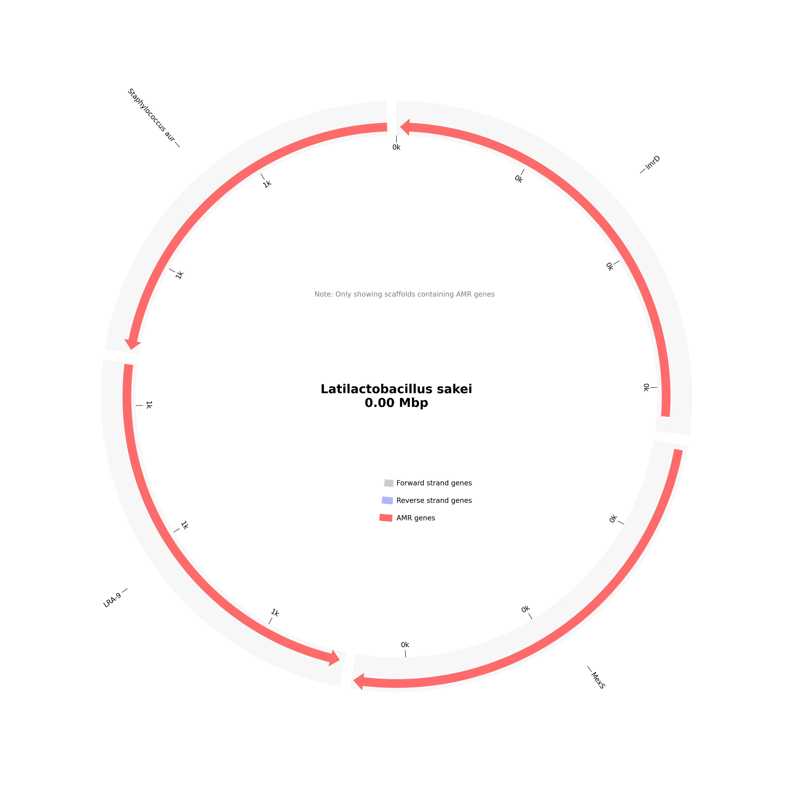

### LRA-9
- **Mechanism**: antibiotic inactivation
- **Drug Classes**: cephalosporin; penam
- **AMR Family**: subclass B3 LRA beta-lactamase
- **Locations**:
  - gnl|SPADES|BMKMCJEI_42407_1 : position 3-233

### MexS
- **Mechanism**: antibiotic efflux
- **Drug Classes**: fluoroquinolone antibiotic; diaminopyrimidine antibiotic; phenicol antibiotic
- **AMR Family**: resistance-nodulation-cell division (RND) antibiotic efflux pump
- **Locations**:
  - gnl|SPADES|BMKMCJEI_38910_1 : position 3-242

### Staphylococcus aureus fusA with mutation conferring resistance to fusidic acid
- **Mechanism**: antibiotic target alteration
- **Drug Classes**: fusidane antibiotic
- **AMR Family**: antibiotic resistant fusA
- **Locations**:
  - gnl|SPADES|BMKMCJEI_49497_1 : position 2-214

### lmrD
- **Mechanism**: antibiotic efflux
- **Drug Classes**: lincosamide antibiotic
- **AMR Family**: ATP-binding cassette (ABC) antibiotic efflux pump
- **Locations**:
  - gnl|SPADES|BMKMCJEI_31693_1 : position 2-256

## Lelliottia amnigena
**Strain Statistics:**
- Total genome length: 8.6 kbp
- Total scaffolds: 15
- Scaffolds with AMR genes: 2
- Total genes annotated: 24
- Total AMR genes: 3
- Unique AMR genes: 2
- Distinct AMR mechanisms: 1
- Distinct AMR families: 2
- Distinct drug classes: 8

**Circos Plot:**

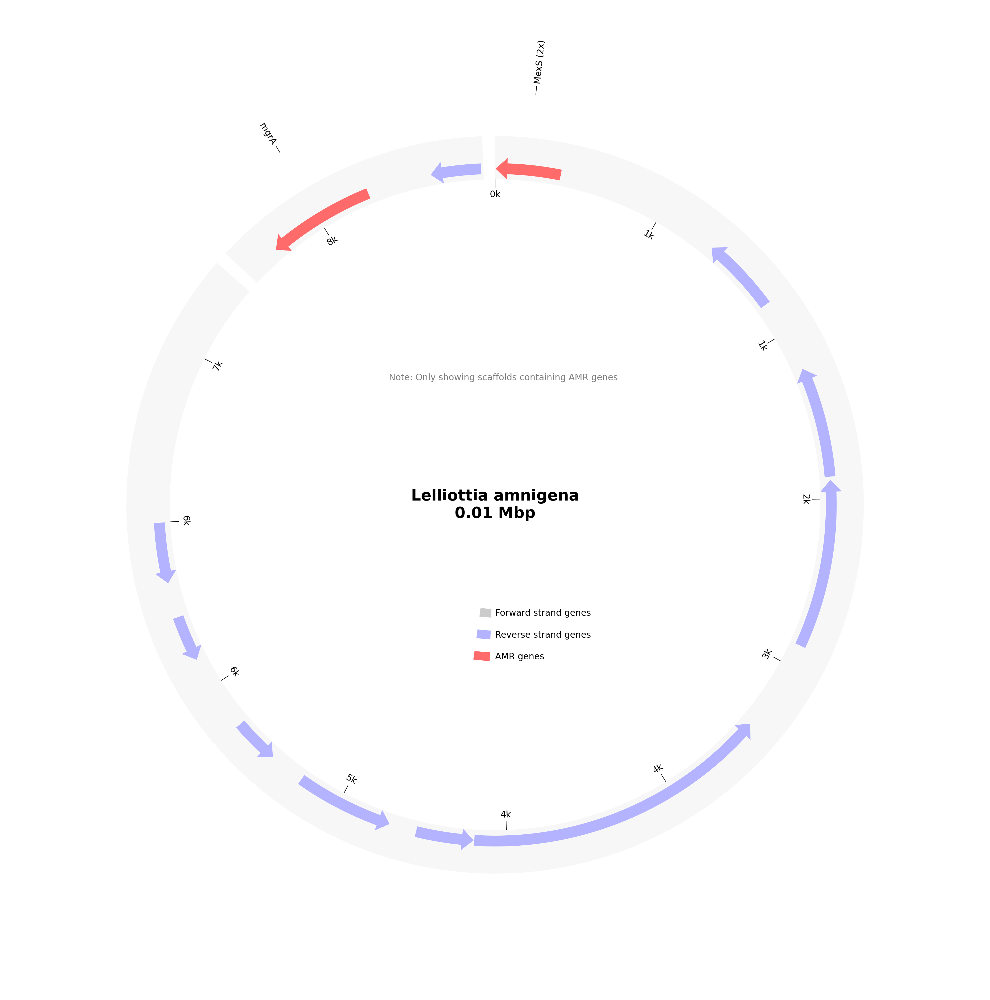

### MexS (found in 2 locations)
- **Mechanism**: antibiotic efflux
- **Drug Classes**: fluoroquinolone antibiotic; diaminopyrimidine antibiotic; phenicol antibiotic
- **AMR Family**: resistance-nodulation-cell division (RND) antibiotic efflux pump
- **Locations**:
  - gnl|SPADES|BMKMCJEI_1205_1 : position 2-271
  - gnl|SPADES|BMKMCJEI_1205_2 : position 259-948

### mgrA
- **Mechanism**: antibiotic efflux
- **Drug Classes**: fluoroquinolone antibiotic; cephalosporin; penam; tetracycline antibiotic; peptide antibiotic; disinfecting agents and antiseptics
- **AMR Family**: ATP-binding cassette (ABC) antibiotic efflux pump; major facilitator superfamily (MFS) antibiotic efflux pump
- **Locations**:
  - gnl|SPADES|BMKMCJEI_5880_2 : position 152-598

## Lelliottia sp. AC1
**Strain Statistics:**
- Total genome length: 1534.4 kbp
- Total scaffolds: 42
- Scaffolds with AMR genes: 31
- Total genes annotated: 2848
- Total AMR genes: 169
- Unique AMR genes: 98
- Distinct AMR mechanisms: 10
- Distinct AMR families: 46
- Distinct drug classes: 34

**Circos Plot:**

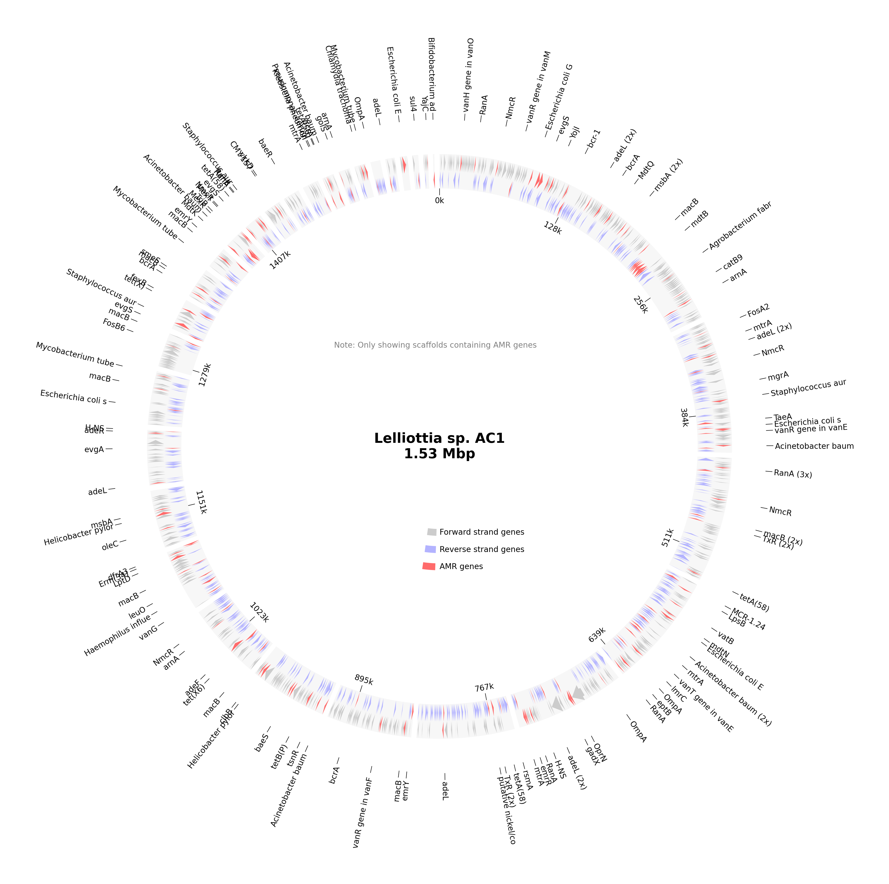

### AAC(6')-I-43
- **Mechanism**: antibiotic inactivation
- **Drug Classes**: aminoglycoside antibiotic
- **AMR Family**: AAC(6')
- **Locations**:
  - gnl|SPADES|BMKMCJEI_4_176 : position 195366-195851

### Acinetobacter baumannii AbaF (found in 3 locations)
- **Mechanism**: antibiotic efflux
- **Drug Classes**: phosphonic acid antibiotic
- **AMR Family**: major facilitator superfamily (MFS) antibiotic efflux pump
- **Locations**:
  - gnl|SPADES|BMKMCJEI_142_1 : position 300-1595
  - gnl|SPADES|BMKMCJEI_551_4 : position 5289-6602
  - gnl|SPADES|BMKMCJEI_59_109 : position 116314-117615

### Acinetobacter baumannii AbaQ (found in 2 locations)
- **Mechanism**: antibiotic efflux
- **Drug Classes**: fluoroquinolone antibiotic
- **AMR Family**: major facilitator superfamily (MFS) antibiotic efflux pump
- **Locations**:
  - gnl|SPADES|BMKMCJEI_75_53 : position 54350-55669
  - gnl|SPADES|BMKMCJEI_75_81 : position 86672-87952

### Acinetobacter baumannii AmvA
- **Mechanism**: antibiotic efflux
- **Drug Classes**: macrolide antibiotic; disinfecting agents and antiseptics
- **AMR Family**: major facilitator superfamily (MFS) antibiotic efflux pump
- **Locations**:
  - gnl|SPADES|BMKMCJEI_831_11 : position 8239-9702

### Agrobacterium fabrum chloramphenicol acetyltransferase
- **Mechanism**: antibiotic inactivation
- **Drug Classes**: phenicol antibiotic
- **AMR Family**: chloramphenicol acetyltransferase (CAT)
- **Locations**:
  - gnl|SPADES|BMKMCJEI_4_220 : position 249734-250282

### Bifidobacterium adolescentis rpoB mutants conferring resistance to rifampicin
- **Mechanism**: antibiotic target alteration; antibiotic target replacement
- **Drug Classes**: rifamycin antibiotic
- **AMR Family**: rifamycin-resistant beta-subunit of RNA polymerase (rpoB)
- **Locations**:
  - gnl|SPADES|BMKMCJEI_5045_1 : position 2-1300

### CMY-157
- **Mechanism**: antibiotic inactivation
- **Drug Classes**: cephamycin
- **AMR Family**: CMY beta-lactamase
- **Locations**:
  - gnl|SPADES|BMKMCJEI_608_11 : position 11074-12216

### Chlamydia trachomatis intrinsic murA conferring resistance to fosfomycin
- **Mechanism**: antibiotic target alteration
- **Drug Classes**: phosphonic acid antibiotic
- **AMR Family**: antibiotic-resistant murA transferase
- **Locations**:
  - gnl|SPADES|BMKMCJEI_862_6 : position 5713-6996

### Clostridioides difficile gyrA conferring resistance to fluoroquinolones
- **Mechanism**: antibiotic target alteration
- **Drug Classes**: fluoroquinolone antibiotic
- **AMR Family**: fluoroquinolone resistant gyrA
- **Locations**:
  - gnl|SPADES|BMKMCJEI_4_89 : position 93636-96272

### Enterococcus faecalis cls with mutation conferring resistance to daptomycin
- **Mechanism**: antibiotic target alteration
- **Drug Classes**: peptide antibiotic
- **AMR Family**: daptomycin resistant cls
- **Locations**:
  - gnl|SPADES|BMKMCJEI_65_11 : position 12541-14001

### Erm(34)
- **Mechanism**: antibiotic target alteration
- **Drug Classes**: macrolide antibiotic; lincosamide antibiotic; streptogramin antibiotic; streptogramin A antibiotic; streptogramin B antibiotic
- **AMR Family**: Erm 23S ribosomal RNA methyltransferase
- **Locations**:
  - gnl|SPADES|BMKMCJEI_201_43 : position 53238-54059

### Escherichia coli EF-Tu mutants conferring resistance to kirromycin (found in 2 locations)
- **Mechanism**: antibiotic target alteration
- **Drug Classes**: elfamycin antibiotic
- **AMR Family**: elfamycin resistant EF-Tu
- **Locations**:
  - gnl|SPADES|BMKMCJEI_1286_3 : position 2247-4940
  - gnl|SPADES|BMKMCJEI_75_39 : position 39058-40908

### Escherichia coli GlpT with mutation conferring resistance to fosfomycin
- **Mechanism**: antibiotic target alteration
- **Drug Classes**: phosphonic acid antibiotic
- **AMR Family**: antibiotic-resistant GlpT
- **Locations**:
  - gnl|SPADES|BMKMCJEI_4_84 : position 87222-88574

### Escherichia coli soxS with mutation conferring antibiotic resistance (found in 3 locations)
- **Mechanism**: antibiotic target alteration; antibiotic efflux; reduced permeability to antibiotic
- **Drug Classes**: fluoroquinolone antibiotic; monobactam; carbapenem; cephalosporin; glycylcycline; cephamycin; penam; tetracycline antibiotic; rifamycin antibiotic; phenicol antibiotic; penem; disinfecting agents and antiseptics
- **AMR Family**: ATP-binding cassette (ABC) antibiotic efflux pump; major facilitator superfamily (MFS) antibiotic efflux pump; resistance-nodulation-cell division (RND) antibiotic efflux pump; General Bacterial Porin with reduced permeability to beta-lactams
- **Locations**:
  - gnl|SPADES|BMKMCJEI_201_32 : position 36098-36940
  - gnl|SPADES|BMKMCJEI_228_17 : position 15934-16755
  - gnl|SPADES|BMKMCJEI_59_94 : position 99068-99937

### FosA2
- **Mechanism**: antibiotic inactivation
- **Drug Classes**: phosphonic acid antibiotic
- **AMR Family**: fosfomycin thiol transferase
- **Locations**:
  - gnl|SPADES|BMKMCJEI_59_10: position 8959-9381

### FosB6
- **Mechanism**: antibiotic inactivation
- **Drug Classes**: phosphonic acid antibiotic
- **AMR Family**: fosfomycin thiol transferase
- **Locations**:
  - gnl|SPADES|BMKMCJEI_344_19 : position 21210-21599

### H-NS (found in 2 locations)
- **Mechanism**: antibiotic efflux
- **Drug Classes**: macrolide antibiotic; fluoroquinolone antibiotic; cephalosporin; cephamycin; penam; tetracycline antibiotic
- **AMR Family**: major facilitator superfamily (MFS) antibiotic efflux pump; resistance-nodulation-cell division (RND) antibiotic efflux pump
- **Locations**:
  - gnl|SPADES|BMKMCJEI_225_48: position 50563-50976
  - gnl|SPADES|BMKMCJEI_80_71 : position 80681-81085

### Haemophilus influenzae PBP3 conferring resistance to beta-lactam antibiotics
- **Mechanism**: antibiotic target alteration
- **Drug Classes**: cephalosporin; cephamycin; penam
- **AMR Family**: Penicillin-binding protein mutations conferring resistance to beta-lactam antibiotics
- **Locations**:
  - gnl|SPADES|BMKMCJEI_201_13 : position 14123-15889

### Helicobacter pylori pbp1 mutants conferring resistance to amoxicillin (found in 2 locations)
- **Mechanism**: antibiotic target alteration
- **Drug Classes**: cephalosporin; cephamycin; penam
- **AMR Family**: Penicillin-binding protein mutations conferring resistance to beta-lactam antibiotics
- **Locations**:
  - gnl|SPADES|BMKMCJEI_142_61 : position 66167-68491
  - gnl|SPADES|BMKMCJEI_218_28 : position 29532-32057

### Klebsiella pneumoniae KpnG
- **Mechanism**: antibiotic efflux
- **Drug Classes**: macrolide antibiotic; fluoroquinolone antibiotic; aminoglycoside antibiotic; carbapenem; cephalosporin; penam; peptide antibiotic; penem
- **AMR Family**: major facilitator superfamily (MFS) antibiotic efflux pump
- **Locations**:
  - gnl|SPADES|BMKMCJEI_80_84 : position 93095-94270

### Klebsiella pneumoniae KpnH
- **Mechanism**: antibiotic efflux
- **Drug Classes**: macrolide antibiotic; fluoroquinolone antibiotic; aminoglycoside antibiotic; carbapenem; cephalosporin; penam; peptide antibiotic; penem
- **AMR Family**: major facilitator superfamily (MFS) antibiotic efflux pump
- **Locations**:
  - gnl|SPADES|BMKMCJEI_80_85: position 94287-95825

### Klebsiella pneumoniae OmpK37 (found in 2 locations)
- **Mechanism**: reduced permeability to antibiotic
- **Drug Classes**: monobactam; carbapenem; cephalosporin; cephamycin; penam; penem
- **AMR Family**: General Bacterial Porin with reduced permeability to beta-lactams
- **Locations**:
  - gnl|SPADES|BMKMCJEI_4_94 : position 103393-104511
  - gnl|SPADES|BMKMCJEI_831_1 : position 2-124

### LpsB
- **Mechanism**: reduced permeability to antibiotic
- **Drug Classes**: peptide antibiotic
- **AMR Family**: Intrinsic peptide antibiotic resistant Lps
- **Locations**:
  - gnl|SPADES|BMKMCJEI_75_10 : position 9125-10225

### LptD
- **Mechanism**: antibiotic efflux
- **Drug Classes**: carbapenem; peptide antibiotic; aminocoumarin antibiotic; rifamycin antibiotic
- **AMR Family**: ATP-binding cassette (ABC) antibiotic efflux pump
- **Locations**:
  - gnl|SPADES|BMKMCJEI_201_40 : position 48567-50915

### MCR-1.24
- **Mechanism**: antibiotic target alteration
- **Drug Classes**: peptide antibiotic
- **AMR Family**: MCR phosphoethanolamine transferase
- **Locations**:
  - gnl|SPADES|BMKMCJEI_75_6 : position 3741-5375

### MdtK
- **Mechanism**: antibiotic efflux
- **Drug Classes**: fluoroquinolone antibiotic
- **AMR Family**: multidrug and toxic compound extrusion (MATE) transporter
- **Locations**:
  - gnl|SPADES|BMKMCJEI_551_1 : position 243-1718

### MdtQ
- **Mechanism**: reduced permeability to antibiotic
- **Drug Classes**: monobactam; carbapenem; cephalosporin; cephamycin; penam; penem
- **AMR Family**: Outer Membrane Porin (Opr)
- **Locations**:
  - gnl|SPADES|BMKMCJEI_4_154 : position 169989-171407

### MexK
- **Mechanism**: antibiotic efflux
- **Drug Classes**: macrolide antibiotic; tetracycline antibiotic; disinfecting agents and antiseptics
- **AMR Family**: resistance-nodulation-cell division (RND) antibiotic efflux pump
- **Locations**:
  - gnl|SPADES|BMKMCJEI_551_7 : position 8389-11451

### MexT
- **Mechanism**: antibiotic efflux
- **Drug Classes**: fluoroquinolone antibiotic; diaminopyrimidine antibiotic; phenicol antibiotic
- **AMR Family**: resistance-nodulation-cell division (RND) antibiotic efflux pump
- **Locations**:
  - gnl|SPADES|BMKMCJEI_551_11 : position 16721-17638

### Mycobacterium tuberculosis gidB mutation conferring resistance to streptomycin
- **Mechanism**: antibiotic target alteration
- **Drug Classes**: aminoglycoside antibiotic
- **AMR Family**: antibiotic resistant gidB
- **Locations**:
  - gnl|SPADES|BMKMCJEI_514_3 : position 1751-2368

### Mycobacterium tuberculosis pncA mutations conferring resistance to pyrazinamide
- **Mechanism**: antibiotic target alteration
- **Drug Classes**: pyrazine antibiotic
- **AMR Family**: Pyrazinamide resistant pncA
- **Locations**:
  - gnl|SPADES|BMKMCJEI_228_47 : position 46301-46942

### Mycobacterium tuberculosis rpsA mutations conferring resistance to pyrazinamide
- **Mechanism**: antibiotic target alteration
- **Drug Classes**: pyrazine antibiotic
- **AMR Family**: pyrazinamide resistant rpsA
- **Locations**:
  - gnl|SPADES|BMKMCJEI_862_9 : position 8874-10472

### NmcR (found in 5 locations)
- **Mechanism**: antibiotic inactivation
- **Drug Classes**: carbapenem; cephalosporin; cephamycin; penam
- **AMR Family**: NmcA beta-lactamase
- **Locations**:
  - gnl|SPADES|BMKMCJEI_149_51 : position 58290-59180
  - gnl|SPADES|BMKMCJEI_4_55 : position 54211-55149
  - gnl|SPADES|BMKMCJEI_551_12 : position 17735-18685
  - gnl|SPADES|BMKMCJEI_59_40 : position 41682-42617
  - gnl|SPADES|BMKMCJEI_65_39 : position 39175-40149

### OmpA (found in 3 locations)
- **Mechanism**: reduced permeability to antibiotic
- **Drug Classes**: peptide antibiotic
- **AMR Family**: General Bacterial Porin with reduced permeability to peptide antibiotics
- **Locations**:
  - gnl|SPADES|BMKMCJEI_75_85 : position 90929-91591
  - gnl|SPADES|BMKMCJEI_80_13 : position 13130-13615
  - gnl|SPADES|BMKMCJEI_998_2 : position 1133-1654

### OprN
- **Mechanism**: antibiotic efflux
- **Drug Classes**: fluoroquinolone antibiotic; diaminopyrimidine antibiotic; phenicol antibiotic
- **AMR Family**: resistance-nodulation-cell division (RND) antibiotic efflux pump
- **Locations**:
  - gnl|SPADES|BMKMCJEI_80_41 : position 46512-47915

### Pseudomonas aeruginosa ampR with mutation conferring resistance to aztreonam
- **Mechanism**: antibiotic target alteration; antibiotic inactivation
- **Drug Classes**: monobactam; carbapenem; cephalosporin
- **AMR Family**: PDC beta-lactamase; ampR transcriptional regulator with mutation conferring resistance to monobactam antibiotics
- **Locations**:
  - gnl|SPADES|BMKMCJEI_831_3 : position 634-1572

### RanA (found in 7 locations)
- **Mechanism**: antibiotic efflux
- **Drug Classes**: aminoglycoside antibiotic
- **AMR Family**: ATP-binding cassette (ABC) antibiotic efflux pump
- **Locations**:
  - gnl|SPADES|BMKMCJEI_4_33 : position 33233-34006
  - gnl|SPADES|BMKMCJEI_588_15 : position 10935-11747
  - gnl|SPADES|BMKMCJEI_65_57 : position 57399-58205
  - gnl|SPADES|BMKMCJEI_65_7 : position 9247-10260
  - gnl|SPADES|BMKMCJEI_65_8 : position 10257-11261
  - gnl|SPADES|BMKMCJEI_75_96 : position 104823-105836
  - gnl|SPADES|BMKMCJEI_80_79 : position 87429-88631

### RanB
- **Mechanism**: antibiotic efflux
- **Drug Classes**: aminoglycoside antibiotic
- **AMR Family**: ATP-binding cassette (ABC) antibiotic efflux pump
- **Locations**:
  - gnl|SPADES|BMKMCJEI_588_16 : position 11755-12537

### Staphylococcus aureus fusA with mutation conferring resistance to fusidic acid
- **Mechanism**: antibiotic target alteration
- **Drug Classes**: fusidane antibiotic
- **AMR Family**: antibiotic resistant fusA
- **Locations**:
  - gnl|SPADES|BMKMCJEI_59_71 : position 74110-75699

### Staphylococcus aureus mupB conferring resistance to mupirocin
- **Mechanism**: antibiotic target alteration
- **Drug Classes**: mupirocin-like antibiotic
- **AMR Family**: antibiotic-resistant isoleucyl-tRNA synthetase (ileS)
- **Locations**:
  - gnl|SPADES|BMKMCJEI_368_6 : position 5866-8721

### Staphylococcus aureus murA with mutation conferring resistance to fosfomycin
- **Mechanism**: antibiotic target alteration
- **Drug Classes**: phosphonic acid antibiotic
- **AMR Family**: antibiotic-resistant murA transferase
- **Locations**:
  - gnl|SPADES|BMKMCJEI_588_21 : position 14468-15727

### TaeA
- **Mechanism**: antibiotic efflux
- **Drug Classes**: pleuromutilin antibiotic
- **AMR Family**: ATP-binding cassette (ABC) antibiotic efflux pump
- **Locations**:
  - gnl|SPADES|BMKMCJEI_59_89 : position 93558-95225

### TriB
- **Mechanism**: antibiotic efflux
- **Drug Classes**: disinfecting agents and antiseptics
- **AMR Family**: resistance-nodulation-cell division (RND) antibiotic efflux pump
- **Locations**:
  - gnl|SPADES|BMKMCJEI_551_8 : position 11451-12536

### TxR (found in 5 locations)
- **Mechanism**: antibiotic efflux
- **Drug Classes**: tetracycline antibiotic
- **AMR Family**: ATP-binding cassette (ABC) antibiotic efflux pump
- **Locations**:
  - gnl|SPADES|BMKMCJEI_104_17 : position 14882-16396
  - gnl|SPADES|BMKMCJEI_104_40 : position 39228-41300
  - gnl|SPADES|BMKMCJEI_142_34 : position 36767-38104
  - gnl|SPADES|BMKMCJEI_65_62 : position 62766-63743
  - gnl|SPADES|BMKMCJEI_65_81 : position 82104-83651

### YajC
- **Mechanism**: antibiotic efflux
- **Drug Classes**: fluoroquinolone antibiotic; cephalosporin; glycylcycline; penam; tetracycline antibiotic; oxazolidinone antibiotic; glycopeptide antibiotic; rifamycin antibiotic; phenicol antibiotic; disinfecting agents and antiseptics
- **AMR Family**: resistance-nodulation-cell division (RND) antibiotic efflux pump
- **Locations**:
  - gnl|SPADES|BMKMCJEI_1993_5 : position 3568-3900

### YojI
- **Mechanism**: antibiotic efflux
- **Drug Classes**: peptide antibiotic
- **AMR Family**: ATP-binding cassette (ABC) antibiotic efflux pump
- **Locations**:
  - gnl|SPADES|BMKMCJEI_4_98 : position 107547-109190

### adeF
- **Mechanism**: antibiotic efflux
- **Drug Classes**: fluoroquinolone antibiotic; tetracycline antibiotic
- **AMR Family**: resistance-nodulation-cell division (RND) antibiotic efflux pump
- **Locations**:
  - gnl|SPADES|BMKMCJEI_149_22: position 24268-27381

### adeL (found in 10 locations)
- **Mechanism**: antibiotic efflux
- **Drug Classes**: fluoroquinolone antibiotic; tetracycline antibiotic
- **AMR Family**: resistance-nodulation-cell division (RND) antibiotic efflux pump
- **Locations**:
  - gnl|SPADES|BMKMCJEI_1030_2 : position 705-1640
  - gnl|SPADES|BMKMCJEI_104_66 : position 64676-65563
  - gnl|SPADES|BMKMCJEI_225_4 : position 1233-2171
  - gnl|SPADES|BMKMCJEI_4_132 : position 146621-147487
  - gnl|SPADES|BMKMCJEI_4_258 : position 289722-290651
  - gnl|SPADES|BMKMCJEI_59_30 : position 28100-29002
  - gnl|SPADES|BMKMCJEI_59_88 : position 92575-93474
  - gnl|SPADES|BMKMCJEI_75_41 : position 42552-43511
  - gnl|SPADES|BMKMCJEI_80_59 : position 68688-69587
  - gnl|SPADES|BMKMCJEI_80_68 : position 79143-80072

### adeR
- **Mechanism**: antibiotic efflux
- **Drug Classes**: glycylcycline; tetracycline antibiotic
- **AMR Family**: resistance-nodulation-cell division (RND) antibiotic efflux pump
- **Locations**:
  - gnl|SPADES|BMKMCJEI_225_46 : position 48245-49258

### arnA (found in 3 locations)
- **Mechanism**: antibiotic target alteration
- **Drug Classes**: peptide antibiotic
- **AMR Family**: pmr phosphoethanolamine transferase
- **Locations**:
  - gnl|SPADES|BMKMCJEI_149_46 : position 51037-51678
  - gnl|SPADES|BMKMCJEI_4_247 : position 279208-280212
  - gnl|SPADES|BMKMCJEI_847_8 : position 4646-5593

### baeR (found in 2 locations)
- **Mechanism**: antibiotic efflux
- **Drug Classes**: aminoglycoside antibiotic; aminocoumarin antibiotic
- **AMR Family**: resistance-nodulation-cell division (RND) antibiotic efflux pump
- **Locations**:
  - gnl|SPADES|BMKMCJEI_4_198: position 218681-219403
  - gnl|SPADES|BMKMCJEI_643_8 : position 8539-9276

### baeS (found in 2 locations)
- **Mechanism**: antibiotic efflux
- **Drug Classes**: aminoglycoside antibiotic; aminocoumarin antibiotic
- **AMR Family**: resistance-nodulation-cell division (RND) antibiotic efflux pump
- **Locations**:
  - gnl|SPADES|BMKMCJEI_142_32 : position 34621-36009
  - gnl|SPADES|BMKMCJEI_4_199: position 219400-220803

### basS
- **Mechanism**: antibiotic target alteration; antibiotic efflux
- **Drug Classes**: peptide antibiotic
- **AMR Family**: pmr phosphoethanolamine transferase
- **Locations**:
  - gnl|SPADES|BMKMCJEI_59_97 : position 101323-102747

### bcr-1
- **Mechanism**: antibiotic efflux
- **Drug Classes**: bicyclomycin-like antibiotic
- **AMR Family**: major facilitator superfamily (MFS) antibiotic efflux pump
- **Locations**:
  - gnl|SPADES|BMKMCJEI_4_112 : position 122780-123976

### bcrA (found in 5 locations)
- **Mechanism**: antibiotic efflux
- **Drug Classes**: peptide antibiotic
- **AMR Family**: ATP-binding cassette (ABC) antibiotic efflux pump
- **Locations**:
  - gnl|SPADES|BMKMCJEI_125_54 : position 57077-57832
  - gnl|SPADES|BMKMCJEI_381_5 : position 4002-5024
  - gnl|SPADES|BMKMCJEI_4_142 : position 158071-159591
  - gnl|SPADES|BMKMCJEI_59_111 : position 118750-119523
  - gnl|SPADES|BMKMCJEI_831_7 : position 4566-5285

### catB9
- **Mechanism**: antibiotic inactivation
- **Drug Classes**: phenicol antibiotic
- **AMR Family**: chloramphenicol acetyltransferase (CAT)
- **Locations**:
  - gnl|SPADES|BMKMCJEI_4_237 : position 268865-269329

### clbB
- **Mechanism**: antibiotic target alteration
- **Drug Classes**: lincosamide antibiotic; streptogramin antibiotic; streptogramin A antibiotic; oxazolidinone antibiotic; phenicol antibiotic; pleuromutilin antibiotic
- **AMR Family**: Cfr 23S ribosomal RNA methyltransferase
- **Locations**:
  - gnl|SPADES|BMKMCJEI_142_63 : position 69245-70411

### dfrA3
- **Mechanism**: antibiotic target replacement
- **Drug Classes**: diaminopyrimidine antibiotic
- **AMR Family**: trimethoprim resistant dihydrofolate reductase dfr
- **Locations**:
  - gnl|SPADES|BMKMCJEI_201_46 : position 55384-55863

### emrR
- **Mechanism**: antibiotic efflux
- **Drug Classes**: fluoroquinolone antibiotic
- **AMR Family**: major facilitator superfamily (MFS) antibiotic efflux pump
- **Locations**:
  - gnl|SPADES|BMKMCJEI_80_83: position 92436-92966

### emrY (found in 4 locations)
- **Mechanism**: antibiotic efflux
- **Drug Classes**: tetracycline antibiotic
- **AMR Family**: major facilitator superfamily (MFS) antibiotic efflux pump
- **Locations**:
  - gnl|SPADES|BMKMCJEI_104_67 : position 65673-66881
  - gnl|SPADES|BMKMCJEI_125_1 : position 52-1470
  - gnl|SPADES|BMKMCJEI_4_200 : position 220800-222215
  - gnl|SPADES|BMKMCJEI_514_17 : position 17969-19396

### eptB
- **Mechanism**: antibiotic target alteration
- **Drug Classes**: peptide antibiotic
- **AMR Family**: pmr phosphoethanolamine transferase
- **Locations**:
  - gnl|SPADES|BMKMCJEI_75_91 : position 97618-99309

### evgA (found in 2 locations)
- **Mechanism**: antibiotic efflux
- **Drug Classes**: macrolide antibiotic; fluoroquinolone antibiotic; penam; tetracycline antibiotic
- **AMR Family**: major facilitator superfamily (MFS) antibiotic efflux pump; resistance-nodulation-cell division (RND) antibiotic efflux pump
- **Locations**:
  - gnl|SPADES|BMKMCJEI_225_36 : position 33906-34556
  - gnl|SPADES|BMKMCJEI_4_172 : position 190667-191386

### evgS (found in 4 locations)
- **Mechanism**: antibiotic efflux
- **Drug Classes**: macrolide antibiotic; fluoroquinolone antibiotic; penam; tetracycline antibiotic
- **AMR Family**: major facilitator superfamily (MFS) antibiotic efflux pump; resistance-nodulation-cell division (RND) antibiotic efflux pump
- **Locations**:
  - gnl|SPADES|BMKMCJEI_125_28 : position 30238-30627
  - gnl|SPADES|BMKMCJEI_368_1 : position 3-1217
  - gnl|SPADES|BMKMCJEI_4_90 : position 96404-99250
  - gnl|SPADES|BMKMCJEI_588_1 : position 3-1172

### fexB
- **Mechanism**: antibiotic efflux
- **Drug Classes**: phenicol antibiotic
- **AMR Family**: major facilitator superfamily (MFS) antibiotic efflux pump
- **Locations**:
  - gnl|SPADES|BMKMCJEI_368_18 : position 23751-25238

### gadX
- **Mechanism**: antibiotic efflux
- **Drug Classes**: macrolide antibiotic; fluoroquinolone antibiotic; penam
- **AMR Family**: resistance-nodulation-cell division (RND) antibiotic efflux pump
- **Locations**:
  - gnl|SPADES|BMKMCJEI_80_47 : position 52736-53470

### golS
- **Mechanism**: antibiotic efflux
- **Drug Classes**: monobactam; carbapenem; cephalosporin; cephamycin; penam; phenicol antibiotic; penem
- **AMR Family**: resistance-nodulation-cell division (RND) antibiotic efflux pump
- **Locations**:
  - gnl|SPADES|BMKMCJEI_847_3 : position 650-1075

### leuO
- **Mechanism**: antibiotic efflux
- **Drug Classes**: nucleoside antibiotic; disinfecting agents and antiseptics
- **AMR Family**: major facilitator superfamily (MFS) antibiotic efflux pump
- **Locations**:
  - gnl|SPADES|BMKMCJEI_201_20: position 22055-22999

### lmrC
- **Mechanism**: antibiotic target protection
- **Drug Classes**: lincosamide antibiotic
- **AMR Family**: Miscellaneous ABC-F subfamily ATP-binding cassette ribosomal protection proteins
- **Locations**:
  - gnl|SPADES|BMKMCJEI_75_76 : position 82153-83775

### macB (found in 12 locations)
- **Mechanism**: antibiotic efflux
- **Drug Classes**: macrolide antibiotic
- **AMR Family**: ATP-binding cassette (ABC) antibiotic efflux pump
- **Locations**:
  - gnl|SPADES|BMKMCJEI_125_7 : position 6338-7852
  - gnl|SPADES|BMKMCJEI_149_5 : position 4203-5297
  - gnl|SPADES|BMKMCJEI_201_30 : position 34440-35144
  - gnl|SPADES|BMKMCJEI_228_35 : position 33926-34543
  - gnl|SPADES|BMKMCJEI_344_31 : position 29920-30951
  - gnl|SPADES|BMKMCJEI_381_11 : position 8270-9085
  - gnl|SPADES|BMKMCJEI_4_194 : position 214680-215453
  - gnl|SPADES|BMKMCJEI_514_12 : position 12576-14081
  - gnl|SPADES|BMKMCJEI_65_58 : position 58206-59198
  - gnl|SPADES|BMKMCJEI_65_76 : position 76291-77373
  - gnl|SPADES|BMKMCJEI_75_63 : position 66296-67837
  - gnl|SPADES|BMKMCJEI_75_95 : position 103843-104826

### mdtA
- **Mechanism**: antibiotic efflux
- **Drug Classes**: aminocoumarin antibiotic
- **AMR Family**: resistance-nodulation-cell division (RND) antibiotic efflux pump
- **Locations**:
  - gnl|SPADES|BMKMCJEI_4_203 : position 228416-229663

### mdtB
- **Mechanism**: antibiotic efflux
- **Drug Classes**: aminocoumarin antibiotic
- **AMR Family**: resistance-nodulation-cell division (RND) antibiotic efflux pump
- **Locations**:
  - gnl|SPADES|BMKMCJEI_4_202 : position 225294-228416

### mdtC
- **Mechanism**: antibiotic efflux
- **Drug Classes**: aminocoumarin antibiotic
- **AMR Family**: resistance-nodulation-cell division (RND) antibiotic efflux pump
- **Locations**:
  - gnl|SPADES|BMKMCJEI_4_201 : position 222216-225293

### mdtN (found in 2 locations)
- **Mechanism**: antibiotic efflux
- **Drug Classes**: nucleoside antibiotic; disinfecting agents and antiseptics
- **AMR Family**: major facilitator superfamily (MFS) antibiotic efflux pump
- **Locations**:
  - gnl|SPADES|BMKMCJEI_59_33 : position 31086-32150
  - gnl|SPADES|BMKMCJEI_75_36 : position 35640-36776

### mgrA
- **Mechanism**: antibiotic efflux
- **Drug Classes**: fluoroquinolone antibiotic; cephalosporin; penam; tetracycline antibiotic; peptide antibiotic; disinfecting agents and antiseptics
- **AMR Family**: ATP-binding cassette (ABC) antibiotic efflux pump; major facilitator superfamily (MFS) antibiotic efflux pump
- **Locations**:
  - gnl|SPADES|BMKMCJEI_59_56 : position 62068-62520

### msbA (found in 4 locations)
- **Mechanism**: antibiotic efflux
- **Drug Classes**: nitroimidazole antibiotic
- **AMR Family**: ATP-binding cassette (ABC) antibiotic efflux pump
- **Locations**:
  - gnl|SPADES|BMKMCJEI_218_30 : position 34521-35318
  - gnl|SPADES|BMKMCJEI_4_167 : position 186193-187146
  - gnl|SPADES|BMKMCJEI_4_193 : position 213807-214670
  - gnl|SPADES|BMKMCJEI_80_42 : position 47912-50098

### mtrA (found in 4 locations)
- **Mechanism**: antibiotic efflux
- **Drug Classes**: macrolide antibiotic; penam
- **AMR Family**: resistance-nodulation-cell division (RND) antibiotic efflux pump
- **Locations**:
  - gnl|SPADES|BMKMCJEI_59_23 : position 20678-21703
  - gnl|SPADES|BMKMCJEI_651_13 : position 13781-14626
  - gnl|SPADES|BMKMCJEI_75_61 : position 63933-65111
  - gnl|SPADES|BMKMCJEI_80_87 : position 97583-98347

### oleC
- **Mechanism**: antibiotic efflux
- **Drug Classes**: macrolide antibiotic
- **AMR Family**: ATP-binding cassette (ABC) antibiotic efflux pump
- **Locations**:
  - gnl|SPADES|BMKMCJEI_218_14 : position 16227-17153

### putative nickel/cobalt transporter
- **Mechanism**: antibiotic efflux
- **Drug Classes**: fluoroquinolone antibiotic; aminoglycoside antibiotic; isoniazid-like antibiotic
- **AMR Family**: metal transporters with antibiotic efflux
- **Locations**:
  - gnl|SPADES|BMKMCJEI_104_20 : position 19451-20485

### rosB
- **Mechanism**: antibiotic efflux
- **Drug Classes**: peptide antibiotic
- **AMR Family**: major facilitator superfamily (MFS) antibiotic efflux pump
- **Locations**:
  - gnl|SPADES|BMKMCJEI_201_47 : position 55978-57441

### rsmA
- **Mechanism**: antibiotic efflux
- **Drug Classes**: fluoroquinolone antibiotic; diaminopyrimidine antibiotic; phenicol antibiotic
- **AMR Family**: resistance-nodulation-cell division (RND) antibiotic efflux pump
- **Locations**:
  - gnl|SPADES|BMKMCJEI_104_1: position 393-578

### smeR
- **Mechanism**: antibiotic efflux
- **Drug Classes**: aminoglycoside antibiotic; cephalosporin; cephamycin; penam
- **AMR Family**: resistance-nodulation-cell division (RND) antibiotic efflux pump
- **Locations**:
  - gnl|SPADES|BMKMCJEI_59_96 : position 100634-101323

### smeS
- **Mechanism**: antibiotic efflux
- **Drug Classes**: aminoglycoside antibiotic; cephalosporin; cephamycin; penam
- **AMR Family**: resistance-nodulation-cell division (RND) antibiotic efflux pump
- **Locations**:
  - gnl|SPADES|BMKMCJEI_381_14 : position 10457-11785

### sul4
- **Mechanism**: antibiotic target replacement
- **Drug Classes**: sulfonamide antibiotic
- **AMR Family**: sulfonamide resistant sul
- **Locations**:
  - gnl|SPADES|BMKMCJEI_1535_4 : position 3876-4724

### tet(X)
- **Mechanism**: antibiotic inactivation
- **Drug Classes**: glycylcycline; tetracycline antibiotic
- **AMR Family**: tetracycline inactivation enzyme
- **Locations**:
  - gnl|SPADES|BMKMCJEI_368_15 : position 20968-22386

### tet(X6)
- **Mechanism**: antibiotic inactivation
- **Drug Classes**: tetracycline antibiotic
- **AMR Family**: tetracycline inactivation enzyme
- **Locations**:
  - gnl|SPADES|BMKMCJEI_149_20 : position 20222-22198

### tetA(58) (found in 4 locations)
- **Mechanism**: antibiotic efflux
- **Drug Classes**: tetracycline antibiotic
- **AMR Family**: major facilitator superfamily (MFS) antibiotic efflux pump
- **Locations**:
  - gnl|SPADES|BMKMCJEI_104_8 : position 7657-8310
  - gnl|SPADES|BMKMCJEI_588_9 : position 6322-7047
  - gnl|SPADES|BMKMCJEI_65_109 : position 111934-112947
  - gnl|SPADES|BMKMCJEI_831_6 : position 3806-4573

### tetB(60)
- **Mechanism**: antibiotic efflux
- **Drug Classes**: tetracycline antibiotic
- **AMR Family**: ATP-binding cassette (ABC) antibiotic efflux pump
- **Locations**:
  - gnl|SPADES|BMKMCJEI_4_114 : position 124660-126249

### tetB(P)
- **Mechanism**: antibiotic target protection
- **Drug Classes**: tetracycline antibiotic
- **AMR Family**: tetracycline-resistant ribosomal protection protein
- **Locations**:
  - gnl|SPADES|BMKMCJEI_142_17 : position 17225-19024

### tsnR
- **Mechanism**: antibiotic target alteration
- **Drug Classes**: peptide antibiotic
- **AMR Family**: non-erm 23S ribosomal RNA methyltransferase (A1067)
- **Locations**:
  - gnl|SPADES|BMKMCJEI_142_7 : position 7519-8616

### ugd
- **Mechanism**: antibiotic target alteration
- **Drug Classes**: peptide antibiotic
- **AMR Family**: pmr phosphoethanolamine transferase
- **Locations**:
  - gnl|SPADES|BMKMCJEI_4_246 : position 277986-279152

### vanG
- **Mechanism**: antibiotic target alteration
- **Drug Classes**: glycopeptide antibiotic
- **AMR Family**: glycopeptide resistance gene cluster; Van ligase
- **Locations**:
  - gnl|SPADES|BMKMCJEI_201_5 : position 4147-5067

### vanH gene in vanO cluster (found in 2 locations)
- **Mechanism**: antibiotic target alteration
- **Drug Classes**: glycopeptide antibiotic
- **AMR Family**: vanH; glycopeptide resistance gene cluster
- **Locations**:
  - gnl|SPADES|BMKMCJEI_4_19 : position 19872-21008
  - gnl|SPADES|BMKMCJEI_75_80 : position 85674-86645

### vanR gene in vanE cluster
- **Mechanism**: antibiotic target alteration
- **Drug Classes**: glycopeptide antibiotic
- **AMR Family**: glycopeptide resistance gene cluster; vanR
- **Locations**:
  - gnl|SPADES|BMKMCJEI_59_99 : position 104203-104919

### vanR gene in vanF cluster
- **Mechanism**: antibiotic target alteration
- **Drug Classes**: glycopeptide antibiotic
- **AMR Family**: glycopeptide resistance gene cluster; vanR
- **Locations**:
  - gnl|SPADES|BMKMCJEI_125_27 : position 29172-30221

### vanR gene in vanM cluster
- **Mechanism**: antibiotic target alteration
- **Drug Classes**: glycopeptide antibiotic
- **AMR Family**: glycopeptide resistance gene cluster; vanR
- **Locations**:
  - gnl|SPADES|BMKMCJEI_4_69 : position 70898-71902

### vanT gene in vanE cluster
- **Mechanism**: antibiotic target alteration
- **Drug Classes**: glycopeptide antibiotic
- **AMR Family**: glycopeptide resistance gene cluster; vanT
- **Locations**:
  - gnl|SPADES|BMKMCJEI_75_69 : position 73716-74711

### vatB
- **Mechanism**: antibiotic inactivation
- **Drug Classes**: streptogramin antibiotic; streptogramin A antibiotic
- **AMR Family**: streptogramin vat acetyltransferase
- **Locations**:
  - gnl|SPADES|BMKMCJEI_75_26 : position 25207-26028

### ykkD
- **Mechanism**: antibiotic efflux
- **Drug Classes**: aminoglycoside antibiotic; tetracycline antibiotic; phenicol antibiotic
- **AMR Family**: small multidrug resistance (SMR) antibiotic efflux pump
- **Locations**:
  - gnl|SPADES|BMKMCJEI_608_13 : position 12808-13125

## Lelliottia sp. WB101
**Strain Statistics:**
- Total genome length: 2611.3 kbp
- Total scaffolds: 49
- Scaffolds with AMR genes: 36
- Total genes annotated: 4887
- Total AMR genes: 286
- Unique AMR genes: 152
- Distinct AMR mechanisms: 9
- Distinct AMR families: 58
- Distinct drug classes: 36

**Circos Plot:**

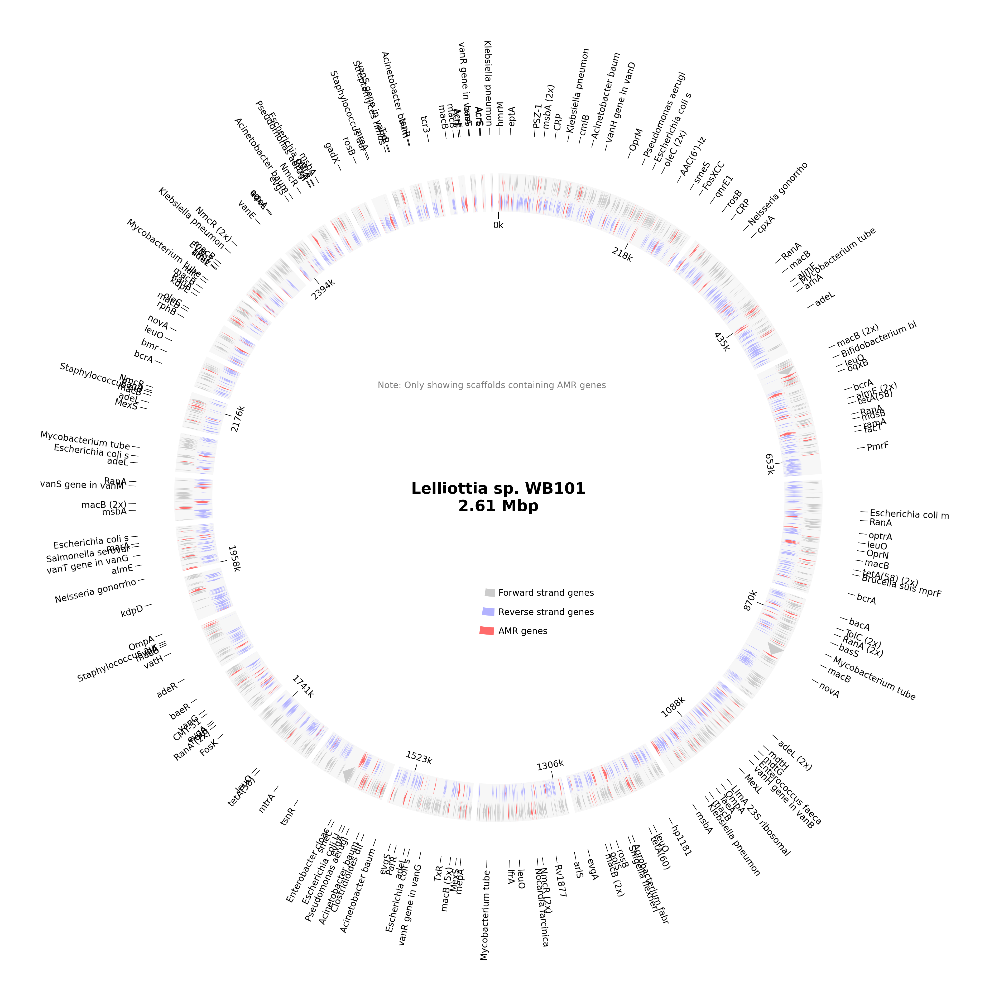

### AAC(6')-Iz
- **Mechanism**: antibiotic inactivation
- **Drug Classes**: aminoglycoside antibiotic
- **AMR Family**: AAC(6')
- **Locations**:
  - gnl|SPADES|BMKMCJEI_5_234 : position 238275-238715

### Acinetobacter baumannii AbaF (found in 4 locations)
- **Mechanism**: antibiotic efflux
- **Drug Classes**: phosphonic acid antibiotic
- **AMR Family**: major facilitator superfamily (MFS) antibiotic efflux pump
- **Locations**:
  - gnl|SPADES|BMKMCJEI_13_163 : position 171203-172525
  - gnl|SPADES|BMKMCJEI_580_15 : position 12879-14168
  - gnl|SPADES|BMKMCJEI_5_126 : position 121987-123357
  - gnl|SPADES|BMKMCJEI_60_123 : position 118746-120248

### Acinetobacter baumannii AbaQ (found in 4 locations)
- **Mechanism**: antibiotic efflux
- **Drug Classes**: fluoroquinolone antibiotic
- **AMR Family**: major facilitator superfamily (MFS) antibiotic efflux pump
- **Locations**:
  - gnl|SPADES|BMKMCJEI_355_10 : position 12606-13961
  - gnl|SPADES|BMKMCJEI_42_43 : position 45374-46564
  - gnl|SPADES|BMKMCJEI_5_124 : position 119580-120863
  - gnl|SPADES|BMKMCJEI_69_10 : position 10725-12017

### AcrE (found in 2 locations)
- **Mechanism**: antibiotic efflux
- **Drug Classes**: fluoroquinolone antibiotic; cephalosporin; cephamycin; penam
- **AMR Family**: resistance-nodulation-cell division (RND) antibiotic efflux pump
- **Locations**:
  - gnl|SPADES|BMKMCJEI_1005_7 : position 8471-9031
  - gnl|SPADES|BMKMCJEI_1571_2 : position 889-1611

### AcrF
- **Mechanism**: antibiotic efflux
- **Drug Classes**: fluoroquinolone antibiotic; cephalosporin; cephamycin; penam
- **AMR Family**: resistance-nodulation-cell division (RND) antibiotic efflux pump
- **Locations**:
  - gnl|SPADES|BMKMCJEI_1005_6 : position 5350-8460

### AcrS
- **Mechanism**: antibiotic efflux
- **Drug Classes**: fluoroquinolone antibiotic; cephalosporin; glycylcycline; cephamycin; penam; tetracycline antibiotic; rifamycin antibiotic; phenicol antibiotic; disinfecting agents and antiseptics
- **AMR Family**: resistance-nodulation-cell division (RND) antibiotic efflux pump
- **Locations**:
  - gnl|SPADES|BMKMCJEI_1571_3 : position 2001-2648

### Agrobacterium fabrum chloramphenicol acetyltransferase
- **Mechanism**: antibiotic inactivation
- **Drug Classes**: phenicol antibiotic
- **AMR Family**: chloramphenicol acetyltransferase (CAT)
- **Locations**:
  - gnl|SPADES|BMKMCJEI_42_71 : position 74489-75040

### ArnT
- **Mechanism**: antibiotic target alteration
- **Drug Classes**: peptide antibiotic
- **AMR Family**: pmr phosphoethanolamine transferase
- **Locations**:
  - gnl|SPADES|BMKMCJEI_13_139: position 141250-142905

### Bifidobacterium bifidum ileS conferring resistance to mupirocin
- **Mechanism**: antibiotic target alteration
- **Drug Classes**: mupirocin-like antibiotic
- **AMR Family**: antibiotic-resistant isoleucyl-tRNA synthetase (ileS)
- **Locations**:
  - gnl|SPADES|BMKMCJEI_24_16 : position 21046-23628

### Brucella suis mprF
- **Mechanism**: antibiotic target alteration
- **Drug Classes**: peptide antibiotic
- **AMR Family**: defensin resistant mprF
- **Locations**:
  - gnl|SPADES|BMKMCJEI_26_126 : position 123928-124890

### CMY-51
- **Mechanism**: antibiotic inactivation
- **Drug Classes**: cephamycin
- **AMR Family**: CMY beta-lactamase
- **Locations**:
  - gnl|SPADES|BMKMCJEI_153_31 : position 36167-37459

### CRP (found in 2 locations)
- **Mechanism**: antibiotic efflux
- **Drug Classes**: macrolide antibiotic; fluoroquinolone antibiotic; penam
- **AMR Family**: resistance-nodulation-cell division (RND) antibiotic efflux pump
- **Locations**:
  - gnl|SPADES|BMKMCJEI_13_25: position 20081-20713
  - gnl|SPADES|BMKMCJEI_5_72 : position 71899-72651

### Clostridioides difficile gyrB conferring resistance to fluoroquinolones (found in 2 locations)
- **Mechanism**: antibiotic target alteration
- **Drug Classes**: fluoroquinolone antibiotic
- **AMR Family**: fluoroquinolone resistant gyrB
- **Locations**:
  - gnl|SPADES|BMKMCJEI_27_29 : position 26498-28390
  - gnl|SPADES|BMKMCJEI_69_4 : position 3662-6076

### EVM-1
- **Mechanism**: antibiotic inactivation
- **Drug Classes**: carbapenem
- **AMR Family**: EVM beta-lactamase
- **Locations**:
  - gnl|SPADES|BMKMCJEI_334_7 : position 6491-7246

### Enterobacter cloacae acrA
- **Mechanism**: antibiotic efflux
- **Drug Classes**: fluoroquinolone antibiotic; cephalosporin; glycylcycline; penam; tetracycline antibiotic; rifamycin antibiotic; phenicol antibiotic; disinfecting agents and antiseptics
- **AMR Family**: resistance-nodulation-cell division (RND) antibiotic efflux pump
- **Locations**:
  - gnl|SPADES|BMKMCJEI_69_46 : position 50080-51201

### Enterococcus faecalis cls with mutation conferring resistance to daptomycin
- **Mechanism**: antibiotic target alteration
- **Drug Classes**: peptide antibiotic
- **AMR Family**: daptomycin resistant cls
- **Locations**:
  - gnl|SPADES|BMKMCJEI_35_47 : position 44751-46226

### Enterococcus faecium liaS mutant conferring daptomycin resistance
- **Mechanism**: antibiotic target alteration; antibiotic efflux
- **Drug Classes**: peptide antibiotic
- **AMR Family**: daptomycin resistant liaS
- **Locations**:
  - gnl|SPADES|BMKMCJEI_69_31 : position 31604-33103

### Escherichia coli AcrAB-TolC with AcrR mutation conferring resistance to ciprofloxacin, tetracycline, and ceftazidime
- **Mechanism**: antibiotic target alteration; antibiotic efflux
- **Drug Classes**: fluoroquinolone antibiotic; cephalosporin; glycylcycline; penam; tetracycline antibiotic; rifamycin antibiotic; phenicol antibiotic; disinfecting agents and antiseptics
- **AMR Family**: resistance-nodulation-cell division (RND) antibiotic efflux pump
- **Locations**:
  - gnl|SPADES|BMKMCJEI_42_76 : position 80893-81546

### Escherichia coli AcrAB-TolC with MarR mutations conferring resistance to ciprofloxacin and tetracycline
- **Mechanism**: antibiotic target alteration; antibiotic efflux
- **Drug Classes**: fluoroquinolone antibiotic; cephalosporin; glycylcycline; penam; tetracycline antibiotic; rifamycin antibiotic; phenicol antibiotic; disinfecting agents and antiseptics
- **AMR Family**: resistance-nodulation-cell division (RND) antibiotic efflux pump
- **Locations**:
  - gnl|SPADES|BMKMCJEI_5_216: position 220434-220868

### Escherichia coli UhpT with mutation conferring resistance to fosfomycin
- **Mechanism**: antibiotic target alteration
- **Drug Classes**: phosphonic acid antibiotic
- **AMR Family**: antibiotic-resistant UhpT
- **Locations**:
  - gnl|SPADES|BMKMCJEI_69_33 : position 34579-35970

### Escherichia coli mdfA
- **Mechanism**: antibiotic efflux
- **Drug Classes**: tetracycline antibiotic; phenicol antibiotic; disinfecting agents and antiseptics
- **AMR Family**: major facilitator superfamily (MFS) antibiotic efflux pump
- **Locations**:
  - gnl|SPADES|BMKMCJEI_26_54 : position 42994-44223

### Escherichia coli soxR with mutation conferring antibiotic resistance (found in 2 locations)
- **Mechanism**: antibiotic target alteration; antibiotic efflux
- **Drug Classes**: fluoroquinolone antibiotic; cephalosporin; glycylcycline; penam; tetracycline antibiotic; rifamycin antibiotic; phenicol antibiotic; disinfecting agents and antiseptics
- **AMR Family**: ATP-binding cassette (ABC) antibiotic efflux pump; major facilitator superfamily (MFS) antibiotic efflux pump; resistance-nodulation-cell division (RND) antibiotic efflux pump
- **Locations**:
  - gnl|SPADES|BMKMCJEI_168_54 : position 56174-56584
  - gnl|SPADES|BMKMCJEI_60_80 : position 74978-75436

### Escherichia coli soxS with mutation conferring antibiotic resistance (found in 4 locations)
- **Mechanism**: antibiotic target alteration; antibiotic efflux; reduced permeability to antibiotic
- **Drug Classes**: fluoroquinolone antibiotic; monobactam; carbapenem; cephalosporin; glycylcycline; cephamycin; penam; tetracycline antibiotic; rifamycin antibiotic; phenicol antibiotic; penem; disinfecting agents and antiseptics
- **AMR Family**: ATP-binding cassette (ABC) antibiotic efflux pump; major facilitator superfamily (MFS) antibiotic efflux pump; resistance-nodulation-cell division (RND) antibiotic efflux pump; General Bacterial Porin with reduced permeability to beta-lactams
- **Locations**:
  - gnl|SPADES|BMKMCJEI_206_13 : position 15612-16460
  - gnl|SPADES|BMKMCJEI_409_7 : position 5543-6391
  - gnl|SPADES|BMKMCJEI_5_197 : position 202592-203464
  - gnl|SPADES|BMKMCJEI_60_79 : position 74553-74879

### FosK
- **Mechanism**: antibiotic inactivation
- **Drug Classes**: phosphonic acid antibiotic
- **AMR Family**: fosfomycin thiol transferase
- **Locations**:
  - gnl|SPADES|BMKMCJEI_153_5 : position 3502-3945

### FosXCC
- **Mechanism**: antibiotic inactivation
- **Drug Classes**: phosphonic acid antibiotic
- **AMR Family**: fosfomycin thiol transferase
- **Locations**:
  - gnl|SPADES|BMKMCJEI_5_269 : position 270542-271063

### Helicobacter pylori pbp2 mutants conferring resistance to amoxicillin
- **Mechanism**: antibiotic target alteration
- **Drug Classes**: cephalosporin; cephamycin; penam
- **AMR Family**: Penicillin-binding protein mutations conferring resistance to beta-lactam antibiotics
- **Locations**:
  - gnl|SPADES|BMKMCJEI_24_22 : position 26987-28888

### Helicobacter pylori rdxA mutation conferring resistance to metronidazole
- **Mechanism**: antibiotic target alteration
- **Drug Classes**: nitroimidazole antibiotic
- **AMR Family**: Antibiotic resistant Helicobacter pylori nitroreductase
- **Locations**:
  - gnl|SPADES|BMKMCJEI_24_108 : position 117066-117719

### Klebsiella pneumoniae KpnE
- **Mechanism**: antibiotic efflux
- **Drug Classes**: macrolide antibiotic; aminoglycoside antibiotic; cephalosporin; tetracycline antibiotic; peptide antibiotic; rifamycin antibiotic; disinfecting agents and antiseptics
- **AMR Family**: small multidrug resistance (SMR) antibiotic efflux pump
- **Locations**:
  - gnl|SPADES|BMKMCJEI_5_89: position 88619-88981

### Klebsiella pneumoniae KpnF
- **Mechanism**: antibiotic efflux
- **Drug Classes**: macrolide antibiotic; aminoglycoside antibiotic; cephalosporin; tetracycline antibiotic; peptide antibiotic; rifamycin antibiotic; disinfecting agents and antiseptics
- **AMR Family**: small multidrug resistance (SMR) antibiotic efflux pump
- **Locations**:
  - gnl|SPADES|BMKMCJEI_5_90: position 88968-89297

### Klebsiella pneumoniae KpnH
- **Mechanism**: antibiotic efflux
- **Drug Classes**: macrolide antibiotic; fluoroquinolone antibiotic; aminoglycoside antibiotic; carbapenem; cephalosporin; penam; peptide antibiotic; penem
- **AMR Family**: major facilitator superfamily (MFS) antibiotic efflux pump
- **Locations**:
  - gnl|SPADES|BMKMCJEI_26_97 : position 94139-95710

### Klebsiella pneumoniae OmpK37 (found in 4 locations)
- **Mechanism**: reduced permeability to antibiotic
- **Drug Classes**: monobactam; carbapenem; cephalosporin; cephamycin; penam; penem
- **AMR Family**: General Bacterial Porin with reduced permeability to beta-lactams
- **Locations**:
  - gnl|SPADES|BMKMCJEI_2386_1 : position 1-1023
  - gnl|SPADES|BMKMCJEI_334_28 : position 28938-29990
  - gnl|SPADES|BMKMCJEI_35_127 : position 126363-127469
  - gnl|SPADES|BMKMCJEI_5_185 : position 189026-190150

### LlmA 23S ribosomal RNA methyltransferase
- **Mechanism**: antibiotic target alteration
- **Drug Classes**: lincosamide antibiotic
- **AMR Family**: Llm 23S ribosomal RNA methyltransferase
- **Locations**:
  - gnl|SPADES|BMKMCJEI_35_97 : position 90590-91765

### MexB
- **Mechanism**: antibiotic efflux
- **Drug Classes**: macrolide antibiotic; fluoroquinolone antibiotic; monobactam; carbapenem; cephalosporin; cephamycin; penam; tetracycline antibiotic; peptide antibiotic; aminocoumarin antibiotic; diaminopyrimidine antibiotic; sulfonamide antibiotic; phenicol antibiotic; penem
- **AMR Family**: resistance-nodulation-cell division (RND) antibiotic efflux pump
- **Locations**:
  - gnl|SPADES|BMKMCJEI_69_45 : position 46973-50080

### MexL (found in 2 locations)
- **Mechanism**: antibiotic efflux
- **Drug Classes**: macrolide antibiotic; tetracycline antibiotic; disinfecting agents and antiseptics
- **AMR Family**: resistance-nodulation-cell division (RND) antibiotic efflux pump
- **Locations**:
  - gnl|SPADES|BMKMCJEI_35_72 : position 70174-70812
  - gnl|SPADES|BMKMCJEI_69_47 : position 51348-51968

### MexS (found in 2 locations)
- **Mechanism**: antibiotic efflux
- **Drug Classes**: fluoroquinolone antibiotic; diaminopyrimidine antibiotic; phenicol antibiotic
- **AMR Family**: resistance-nodulation-cell division (RND) antibiotic efflux pump
- **Locations**:
  - gnl|SPADES|BMKMCJEI_223_13 : position 12533-13570
  - gnl|SPADES|BMKMCJEI_60_15 : position 13372-14355

### MexV
- **Mechanism**: antibiotic efflux
- **Drug Classes**: macrolide antibiotic; fluoroquinolone antibiotic; tetracycline antibiotic; phenicol antibiotic; disinfecting agents and antiseptics
- **AMR Family**: resistance-nodulation-cell division (RND) antibiotic efflux pump
- **Locations**:
  - gnl|SPADES|BMKMCJEI_24_39 : position 42899-44104

### Mycobacterium tuberculosis inhA mutations conferring resistance to isoniazid
- **Mechanism**: antibiotic target alteration
- **Drug Classes**: isoniazid-like antibiotic
- **AMR Family**: isoniazid resistant inhA
- **Locations**:
  - gnl|SPADES|BMKMCJEI_27_56 : position 58659-59555

### Mycobacterium tuberculosis kasA mutant conferring resistance to isoniazid
- **Mechanism**: antibiotic target alteration
- **Drug Classes**: isoniazid-like antibiotic
- **AMR Family**: antibiotic resistant kasA
- **Locations**:
  - gnl|SPADES|BMKMCJEI_13_132 : position 136368-137537

### Mycobacterium tuberculosis katG mutations conferring resistance to isoniazid
- **Mechanism**: antibiotic target alteration
- **Drug Classes**: isoniazid-like antibiotic
- **AMR Family**: isoniazid resistant katG
- **Locations**:
  - gnl|SPADES|BMKMCJEI_206_22 : position 26133-28310

### Mycobacterium tuberculosis ndh with mutation conferring resistance to isoniazid
- **Mechanism**: antibiotic target alteration
- **Drug Classes**: isoniazid-like antibiotic
- **AMR Family**: antibiotic resistant ndh
- **Locations**:
  - gnl|SPADES|BMKMCJEI_303_27 : position 28920-30224

### Mycobacterium tuberculosis thyA with mutation conferring resistance to para-aminosalicylic acid
- **Mechanism**: antibiotic target alteration
- **Drug Classes**: salicylic acid antibiotic
- **AMR Family**: aminosalicylate resistant thymidylate synthase
- **Locations**:
  - gnl|SPADES|BMKMCJEI_47_116 : position 116572-117366

### Neisseria gonorrhoeae PBP2 conferring resistance to beta-lactam antibiotics
- **Mechanism**: antibiotic target alteration
- **Drug Classes**: cephalosporin; cephamycin; penam
- **AMR Family**: Penicillin-binding protein mutations conferring resistance to beta-lactam antibiotics
- **Locations**:
  - gnl|SPADES|BMKMCJEI_168_1 : position 285-2003

### Neisseria gonorrhoeae pilQ gene conferring resistance to beta-lactam
- **Mechanism**: antibiotic target alteration
- **Drug Classes**: cephalosporin; cephamycin; penam
- **AMR Family**: Penicillin-binding protein mutations conferring resistance to beta-lactam antibiotics
- **Locations**:
  - gnl|SPADES|BMKMCJEI_13_45 : position 40796-42007

### NmcR (found in 8 locations)
- **Mechanism**: antibiotic inactivation
- **Drug Classes**: carbapenem; cephalosporin; cephamycin; penam
- **AMR Family**: NmcA beta-lactamase
- **Locations**:
  - gnl|SPADES|BMKMCJEI_223_40 : position 41004-41918
  - gnl|SPADES|BMKMCJEI_338_10 : position 9850-10740
  - gnl|SPADES|BMKMCJEI_338_2 : position 130-951
  - gnl|SPADES|BMKMCJEI_355_22 : position 25189-26103
  - gnl|SPADES|BMKMCJEI_47_100 : position 96989-97909
  - gnl|SPADES|BMKMCJEI_47_46 : position 45618-46511
  - gnl|SPADES|BMKMCJEI_5_107 : position 104251-105159
  - gnl|SPADES|BMKMCJEI_5_240 : position 243496-244377

### Nocardia farcinica rox
- **Mechanism**: antibiotic inactivation
- **Drug Classes**: rifamycin antibiotic
- **AMR Family**: rifampin monooxygenase
- **Locations**:
  - gnl|SPADES|BMKMCJEI_47_54 : position 52221-53399

### OmpA (found in 2 locations)
- **Mechanism**: reduced permeability to antibiotic
- **Drug Classes**: peptide antibiotic
- **AMR Family**: General Bacterial Porin with reduced permeability to peptide antibiotics
- **Locations**:
  - gnl|SPADES|BMKMCJEI_163_2 : position 1018-1536
  - gnl|SPADES|BMKMCJEI_35_107 : position 100491-101546

### OprM
- **Mechanism**: antibiotic efflux
- **Drug Classes**: macrolide antibiotic; fluoroquinolone antibiotic; monobactam; aminoglycoside antibiotic; carbapenem; cephalosporin; cephamycin; penam; tetracycline antibiotic; peptide antibiotic; aminocoumarin antibiotic; diaminopyrimidine antibiotic; sulfonamide antibiotic; phenicol antibiotic; penem; disinfecting agents and antiseptics
- **AMR Family**: resistance-nodulation-cell division (RND) antibiotic efflux pump
- **Locations**:
  - gnl|SPADES|BMKMCJEI_5_168 : position 167879-169261

### OprN
- **Mechanism**: antibiotic efflux
- **Drug Classes**: fluoroquinolone antibiotic; diaminopyrimidine antibiotic; phenicol antibiotic
- **AMR Family**: resistance-nodulation-cell division (RND) antibiotic efflux pump
- **Locations**:
  - gnl|SPADES|BMKMCJEI_26_96 : position 92616-94139

### PEDO-1
- **Mechanism**: antibiotic inactivation
- **Drug Classes**: carbapenem
- **AMR Family**: subclass B3 PEDO beta-lactamase
- **Locations**:
  - gnl|SPADES|BMKMCJEI_35_129 : position 128902-129549

### PSZ-1
- **Mechanism**: antibiotic inactivation
- **Drug Classes**: cephalosporin; cephamycin; penam
- **AMR Family**: PSZ beta-lactamase
- **Locations**:
  - gnl|SPADES|BMKMCJEI_5_47 : position 45202-46389

### ParR (found in 3 locations)
- **Mechanism**: antibiotic efflux; reduced permeability to antibiotic
- **Drug Classes**: macrolide antibiotic; fluoroquinolone antibiotic; monobactam; aminoglycoside antibiotic; carbapenem; cephalosporin; cephamycin; penam; tetracycline antibiotic; phenicol antibiotic; penem; disinfecting agents and antiseptics
- **AMR Family**: resistance-nodulation-cell division (RND) antibiotic efflux pump; Outer Membrane Porin (Opr)
- **Locations**:
  - gnl|SPADES|BMKMCJEI_13_58 : position 55315-56034
  - gnl|SPADES|BMKMCJEI_5_64 : position 62789-63541
  - gnl|SPADES|BMKMCJEI_60_95 : position 91709-92440

### ParS
- **Mechanism**: antibiotic efflux; reduced permeability to antibiotic
- **Drug Classes**: macrolide antibiotic; fluoroquinolone antibiotic; monobactam; aminoglycoside antibiotic; carbapenem; cephalosporin; cephamycin; penam; tetracycline antibiotic; phenicol antibiotic; penem; disinfecting agents and antiseptics
- **AMR Family**: resistance-nodulation-cell division (RND) antibiotic efflux pump; Outer Membrane Porin (Opr)
- **Locations**:
  - gnl|SPADES|BMKMCJEI_5_61 : position 59816-61114

### PmrF (found in 3 locations)
- **Mechanism**: antibiotic target alteration
- **Drug Classes**: peptide antibiotic
- **AMR Family**: pmr phosphoethanolamine transferase
- **Locations**:
  - gnl|SPADES|BMKMCJEI_13_127 : position 130776-132467
  - gnl|SPADES|BMKMCJEI_13_142 : position 145780-146763
  - gnl|SPADES|BMKMCJEI_24_129 : position 141851-142774

### Pseudomonas aeruginosa CpxR (found in 2 locations)
- **Mechanism**: antibiotic efflux
- **Drug Classes**: macrolide antibiotic; fluoroquinolone antibiotic; monobactam; aminoglycoside antibiotic; carbapenem; cephalosporin; cephamycin; penam; tetracycline antibiotic; peptide antibiotic; aminocoumarin antibiotic; diaminopyrimidine antibiotic; sulfonamide antibiotic; phenicol antibiotic; penem
- **AMR Family**: resistance-nodulation-cell division (RND) antibiotic efflux pump
- **Locations**:
  - gnl|SPADES|BMKMCJEI_409_2 : position 694-1392
  - gnl|SPADES|BMKMCJEI_5_256 : position 257982-258722

### Pseudomonas aeruginosa ampR with mutation conferring resistance to aztreonam (found in 2 locations)
- **Mechanism**: antibiotic target alteration; antibiotic inactivation
- **Drug Classes**: monobactam; carbapenem; cephalosporin
- **AMR Family**: PDC beta-lactamase; ampR transcriptional regulator with mutation conferring resistance to monobactam antibiotics
- **Locations**:
  - gnl|SPADES|BMKMCJEI_5_184 : position 188045-188911
  - gnl|SPADES|BMKMCJEI_69_24 : position 24728-25654

### RanA (found in 13 locations)
- **Mechanism**: antibiotic efflux
- **Drug Classes**: aminoglycoside antibiotic
- **AMR Family**: ATP-binding cassette (ABC) antibiotic efflux pump
- **Locations**:
  - gnl|SPADES|BMKMCJEI_13_92 : position 98734-99804
  - gnl|SPADES|BMKMCJEI_153_17 : position 17812-18858
  - gnl|SPADES|BMKMCJEI_153_24 : position 26865-27632
  - gnl|SPADES|BMKMCJEI_175_47 : position 53120-54253
  - gnl|SPADES|BMKMCJEI_223_36 : position 36410-37102
  - gnl|SPADES|BMKMCJEI_24_90 : position 97637-98461
  - gnl|SPADES|BMKMCJEI_26_65 : position 53969-55834
  - gnl|SPADES|BMKMCJEI_27_31 : position 30996-31808
  - gnl|SPADES|BMKMCJEI_27_73 : position 74735-75712
  - gnl|SPADES|BMKMCJEI_303_11 : position 9677-10813
  - gnl|SPADES|BMKMCJEI_334_13 : position 11571-12653
  - gnl|SPADES|BMKMCJEI_47_93 : position 91181-92308
  - gnl|SPADES|BMKMCJEI_5_59 : position 58621-59397

### Rv1877
- **Mechanism**: antibiotic efflux
- **Drug Classes**: fluoroquinolone antibiotic
- **AMR Family**: major facilitator superfamily (MFS) antibiotic efflux pump
- **Locations**:
  - gnl|SPADES|BMKMCJEI_47_33 : position 27890-29287

### SAT-2
- **Mechanism**: antibiotic inactivation
- **Drug Classes**: nucleoside antibiotic
- **AMR Family**: streptothricin acetyltransferase (SAT)
- **Locations**:
  - gnl|SPADES|BMKMCJEI_5_220 : position 224239-224721

### SHN-1
- **Mechanism**: antibiotic inactivation
- **Drug Classes**: carbapenem
- **AMR Family**: SHN beta-lactamase
- **Locations**:
  - gnl|SPADES|BMKMCJEI_35_143 : position 146459-148723

### Salmonella serovars soxS with mutation conferring antibiotic resistance
- **Mechanism**: antibiotic target alteration; antibiotic efflux; reduced permeability to antibiotic
- **Drug Classes**: fluoroquinolone antibiotic; monobactam; carbapenem; cephalosporin; glycylcycline; cephamycin; penam; tetracycline antibiotic; rifamycin antibiotic; phenicol antibiotic; penem; disinfecting agents and antiseptics
- **AMR Family**: ATP-binding cassette (ABC) antibiotic efflux pump; major facilitator superfamily (MFS) antibiotic efflux pump; resistance-nodulation-cell division (RND) antibiotic efflux pump; General Bacterial Porin with reduced permeability to beta-lactams
- **Locations**:
  - gnl|SPADES|BMKMCJEI_168_40 : position 43018-43974

### Shigella flexneri acrA
- **Mechanism**: antibiotic efflux
- **Drug Classes**: fluoroquinolone antibiotic; cephalosporin; glycylcycline; penam; tetracycline antibiotic; rifamycin antibiotic; phenicol antibiotic; disinfecting agents and antiseptics
- **AMR Family**: resistance-nodulation-cell division (RND) antibiotic efflux pump
- **Locations**:
  - gnl|SPADES|BMKMCJEI_42_75: position 79557-80750

### Staphylococcus aureus fusA with mutation conferring resistance to fusidic acid
- **Mechanism**: antibiotic target alteration
- **Drug Classes**: fusidane antibiotic
- **AMR Family**: antibiotic resistant fusA
- **Locations**:
  - gnl|SPADES|BMKMCJEI_223_34 : position 33547-35649

### Staphylococcus aureus mupA conferring resistance to mupirocin
- **Mechanism**: antibiotic target alteration
- **Drug Classes**: mupirocin-like antibiotic
- **AMR Family**: antibiotic-resistant isoleucyl-tRNA synthetase (ileS)
- **Locations**:
  - gnl|SPADES|BMKMCJEI_462_14 : position 14283-17099

### Staphylococcus aureus pgsA mutations conferring resistance to daptomycin
- **Mechanism**: antibiotic target alteration
- **Drug Classes**: peptide antibiotic
- **AMR Family**: daptomycin resistant pgsA
- **Locations**:
  - gnl|SPADES|BMKMCJEI_160_67 : position 65199-65747

### Streptomyces lividans cmlR
- **Mechanism**: antibiotic efflux
- **Drug Classes**: phenicol antibiotic
- **AMR Family**: major facilitator superfamily (MFS) antibiotic efflux pump
- **Locations**:
  - gnl|SPADES|BMKMCJEI_168_41 : position 44091-45278

### Streptomyces rimosus otr(A)
- **Mechanism**: antibiotic target protection
- **Drug Classes**: tetracycline antibiotic
- **AMR Family**: tetracycline-resistant ribosomal protection protein
- **Locations**:
  - gnl|SPADES|BMKMCJEI_549_10 : position 9077-10900

### Streptomyces venezuelae rox
- **Mechanism**: antibiotic inactivation
- **Drug Classes**: rifamycin antibiotic
- **AMR Family**: rifampin monooxygenase
- **Locations**:
  - gnl|SPADES|BMKMCJEI_47_55 : position 53411-54613

### TaeA
- **Mechanism**: antibiotic efflux
- **Drug Classes**: pleuromutilin antibiotic
- **AMR Family**: ATP-binding cassette (ABC) antibiotic efflux pump
- **Locations**:
  - gnl|SPADES|BMKMCJEI_35_114 : position 108570-110477

### TolC (found in 2 locations)
- **Mechanism**: antibiotic efflux
- **Drug Classes**: macrolide antibiotic; fluoroquinolone antibiotic; aminoglycoside antibiotic; carbapenem; cephalosporin; glycylcycline; cephamycin; penam; tetracycline antibiotic; peptide antibiotic; aminocoumarin antibiotic; rifamycin antibiotic; phenicol antibiotic; penem; disinfecting agents and antiseptics
- **AMR Family**: ATP-binding cassette (ABC) antibiotic efflux pump; major facilitator superfamily (MFS) antibiotic efflux pump; resistance-nodulation-cell division (RND) antibiotic efflux pump
- **Locations**:
  - gnl|SPADES|BMKMCJEI_27_24 : position 22302-23780
  - gnl|SPADES|BMKMCJEI_27_75 : position 78474-79802

### TxR (found in 2 locations)
- **Mechanism**: antibiotic efflux
- **Drug Classes**: tetracycline antibiotic
- **AMR Family**: ATP-binding cassette (ABC) antibiotic efflux pump
- **Locations**:
  - gnl|SPADES|BMKMCJEI_549_13 : position 13957-15369
  - gnl|SPADES|BMKMCJEI_60_33 : position 32807-33838

### acrB
- **Mechanism**: antibiotic efflux
- **Drug Classes**: fluoroquinolone antibiotic; cephalosporin; glycylcycline; penam; tetracycline antibiotic; rifamycin antibiotic; phenicol antibiotic; disinfecting agents and antiseptics
- **AMR Family**: resistance-nodulation-cell division (RND) antibiotic efflux pump
- **Locations**:
  - gnl|SPADES|BMKMCJEI_42_74 : position 76388-79534

### adeL (found in 14 locations)
- **Mechanism**: antibiotic efflux
- **Drug Classes**: fluoroquinolone antibiotic; tetracycline antibiotic
- **AMR Family**: resistance-nodulation-cell division (RND) antibiotic efflux pump
- **Locations**:
  - gnl|SPADES|BMKMCJEI_13_161 : position 168951-169850
  - gnl|SPADES|BMKMCJEI_206_7 : position 6883-7800
  - gnl|SPADES|BMKMCJEI_223_19 : position 21228-22118
  - gnl|SPADES|BMKMCJEI_334_2 : position 1036-1938
  - gnl|SPADES|BMKMCJEI_343_16 : position 18141-19067
  - gnl|SPADES|BMKMCJEI_35_10 : position 10134-11108
  - gnl|SPADES|BMKMCJEI_35_61 : position 55023-55928
  - gnl|SPADES|BMKMCJEI_5_136 : position 132900-133799
  - gnl|SPADES|BMKMCJEI_5_237 : position 240225-241112
  - gnl|SPADES|BMKMCJEI_5_267 : position 268644-269525
  - gnl|SPADES|BMKMCJEI_5_5 : position 5240-6151
  - gnl|SPADES|BMKMCJEI_5_77 : position 77859-78779
  - gnl|SPADES|BMKMCJEI_5_97 : position 96988-97881
  - gnl|SPADES|BMKMCJEI_60_84 : position 80112-80999

### adeR
- **Mechanism**: antibiotic efflux
- **Drug Classes**: glycylcycline; tetracycline antibiotic
- **AMR Family**: resistance-nodulation-cell division (RND) antibiotic efflux pump
- **Locations**:
  - gnl|SPADES|BMKMCJEI_160_9 : position 10974-11693

### almE (found in 4 locations)
- **Mechanism**: antibiotic target alteration
- **Drug Classes**: peptide antibiotic
- **AMR Family**: polymyxin resistance operon; alm glycyltransferase
- **Locations**:
  - gnl|SPADES|BMKMCJEI_13_125 : position 129084-130445
  - gnl|SPADES|BMKMCJEI_168_18 : position 18535-20253
  - gnl|SPADES|BMKMCJEI_24_74 : position 76350-77960
  - gnl|SPADES|BMKMCJEI_24_81 : position 84539-88414

### arlS
- **Mechanism**: antibiotic efflux
- **Drug Classes**: fluoroquinolone antibiotic; disinfecting agents and antiseptics
- **AMR Family**: major facilitator superfamily (MFS) antibiotic efflux pump
- **Locations**:
  - gnl|SPADES|BMKMCJEI_47_4 : position 3928-5607

### arnA
- **Mechanism**: antibiotic target alteration
- **Drug Classes**: peptide antibiotic
- **AMR Family**: pmr phosphoethanolamine transferase
- **Locations**:
  - gnl|SPADES|BMKMCJEI_13_141 : position 143801-145783

### bacA
- **Mechanism**: antibiotic target alteration
- **Drug Classes**: peptide antibiotic
- **AMR Family**: undecaprenyl pyrophosphate related proteins
- **Locations**:
  - gnl|SPADES|BMKMCJEI_27_12 : position 8215-9036

### baeR
- **Mechanism**: antibiotic efflux
- **Drug Classes**: aminoglycoside antibiotic; aminocoumarin antibiotic
- **AMR Family**: resistance-nodulation-cell division (RND) antibiotic efflux pump
- **Locations**:
  - gnl|SPADES|BMKMCJEI_153_56 : position 59321-60010

### basR
- **Mechanism**: antibiotic target alteration; antibiotic efflux
- **Drug Classes**: peptide antibiotic
- **AMR Family**: pmr phosphoethanolamine transferase
- **Locations**:
  - gnl|SPADES|BMKMCJEI_27_43 : position 43570-44229

### basS (found in 2 locations)
- **Mechanism**: antibiotic target alteration; antibiotic efflux
- **Drug Classes**: peptide antibiotic
- **AMR Family**: pmr phosphoethanolamine transferase
- **Locations**:
  - gnl|SPADES|BMKMCJEI_1211_3 : position 2287-3330
  - gnl|SPADES|BMKMCJEI_27_42 : position 42224-43573

### bcr-1 (found in 2 locations)
- **Mechanism**: antibiotic efflux
- **Drug Classes**: bicyclomycin-like antibiotic
- **AMR Family**: major facilitator superfamily (MFS) antibiotic efflux pump
- **Locations**:
  - gnl|SPADES|BMKMCJEI_5_4 : position 3924-5123
  - gnl|SPADES|BMKMCJEI_69_26 : position 26732-27916

### bcrA (found in 4 locations)
- **Mechanism**: antibiotic efflux
- **Drug Classes**: peptide antibiotic
- **AMR Family**: ATP-binding cassette (ABC) antibiotic efflux pump
- **Locations**:
  - gnl|SPADES|BMKMCJEI_248_13 : position 12957-14444
  - gnl|SPADES|BMKMCJEI_24_62 : position 65070-66572
  - gnl|SPADES|BMKMCJEI_26_150 : position 148620-149678
  - gnl|SPADES|BMKMCJEI_5_110 : position 107377-108525

### bmr
- **Mechanism**: antibiotic efflux
- **Drug Classes**: fluoroquinolone antibiotic; nucleoside antibiotic; phenicol antibiotic; disinfecting agents and antiseptics
- **AMR Family**: major facilitator superfamily (MFS) antibiotic efflux pump
- **Locations**:
  - gnl|SPADES|BMKMCJEI_248_26 : position 29006-30304

### catA4
- **Mechanism**: antibiotic inactivation
- **Drug Classes**: phenicol antibiotic
- **AMR Family**: chloramphenicol acetyltransferase (CAT)
- **Locations**:
  - gnl|SPADES|BMKMCJEI_153_8 : position 5309-5986

### catB10
- **Mechanism**: antibiotic inactivation
- **Drug Classes**: phenicol antibiotic
- **AMR Family**: chloramphenicol acetyltransferase (CAT)
- **Locations**:
  - gnl|SPADES|BMKMCJEI_5_63 : position 62169-62822

### chrB
- **Mechanism**: antibiotic target alteration
- **Drug Classes**: macrolide antibiotic; lincosamide antibiotic
- **AMR Family**: non-erm 23S ribosomal RNA methyltransferase (G748)
- **Locations**:
  - gnl|SPADES|BMKMCJEI_168_2 : position 2070-2885

### cmlB
- **Mechanism**: antibiotic efflux
- **Drug Classes**: phenicol antibiotic
- **AMR Family**: major facilitator superfamily (MFS) antibiotic efflux pump
- **Locations**:
  - gnl|SPADES|BMKMCJEI_5_106 : position 102876-104129

### cmlv (found in 5 locations)
- **Mechanism**: antibiotic inactivation
- **Drug Classes**: phenicol antibiotic
- **AMR Family**: chloramphenicol phosphotransferase
- **Locations**:
  - gnl|SPADES|BMKMCJEI_334_3 : position 2043-3218
  - gnl|SPADES|BMKMCJEI_5_218 : position 221850-223046
  - gnl|SPADES|BMKMCJEI_5_284 : position 286685-287860
  - gnl|SPADES|BMKMCJEI_5_8 : position 7749-8915
  - gnl|SPADES|BMKMCJEI_69_35 : position 36704-37894

### cpxA (found in 2 locations)
- **Mechanism**: antibiotic efflux
- **Drug Classes**: aminoglycoside antibiotic; aminocoumarin antibiotic
- **AMR Family**: resistance-nodulation-cell division (RND) antibiotic efflux pump
- **Locations**:
  - gnl|SPADES|BMKMCJEI_13_57 : position 53972-55309
  - gnl|SPADES|BMKMCJEI_409_3 : position 1389-2762

### emrR
- **Mechanism**: antibiotic efflux
- **Drug Classes**: fluoroquinolone antibiotic
- **AMR Family**: major facilitator superfamily (MFS) antibiotic efflux pump
- **Locations**:
  - gnl|SPADES|BMKMCJEI_5_23 : position 21072-21506

### eptA
- **Mechanism**: antibiotic target alteration
- **Drug Classes**: peptide antibiotic
- **AMR Family**: pmr phosphoethanolamine transferase
- **Locations**:
  - gnl|SPADES|BMKMCJEI_5_16 : position 14218-15849

### evgA (found in 5 locations)
- **Mechanism**: antibiotic efflux
- **Drug Classes**: macrolide antibiotic; fluoroquinolone antibiotic; penam; tetracycline antibiotic
- **AMR Family**: major facilitator superfamily (MFS) antibiotic efflux pump; resistance-nodulation-cell division (RND) antibiotic efflux pump
- **Locations**:
  - gnl|SPADES|BMKMCJEI_153_22 : position 24991-25620
  - gnl|SPADES|BMKMCJEI_160_65 : position 62657-63313
  - gnl|SPADES|BMKMCJEI_35_53 : position 49336-49986
  - gnl|SPADES|BMKMCJEI_42_126 : position 133557-134189
  - gnl|SPADES|BMKMCJEI_69_30 : position 31014-31607

### evgS (found in 3 locations)
- **Mechanism**: antibiotic efflux
- **Drug Classes**: macrolide antibiotic; fluoroquinolone antibiotic; penam; tetracycline antibiotic
- **AMR Family**: major facilitator superfamily (MFS) antibiotic efflux pump; resistance-nodulation-cell division (RND) antibiotic efflux pump
- **Locations**:
  - gnl|SPADES|BMKMCJEI_160_10 : position 11690-13306
  - gnl|SPADES|BMKMCJEI_355_6 : position 5867-8626
  - gnl|SPADES|BMKMCJEI_60_102 : position 98694-100973

### facT
- **Mechanism**: antibiotic efflux
- **Drug Classes**: elfamycin antibiotic
- **AMR Family**: major facilitator superfamily (MFS) antibiotic efflux pump
- **Locations**:
  - gnl|SPADES|BMKMCJEI_24_111 : position 119770-121197

### farA (found in 4 locations)
- **Mechanism**: antibiotic efflux
- **Drug Classes**: antibacterial free fatty acids
- **AMR Family**: major facilitator superfamily (MFS) antibiotic efflux pump
- **Locations**:
  - gnl|SPADES|BMKMCJEI_26_119 : position 116370-117365
  - gnl|SPADES|BMKMCJEI_26_98 : position 95707-96810
  - gnl|SPADES|BMKMCJEI_5_169 : position 169258-170340
  - gnl|SPADES|BMKMCJEI_5_21 : position 19790-20650

### gadX
- **Mechanism**: antibiotic efflux
- **Drug Classes**: macrolide antibiotic; fluoroquinolone antibiotic; penam
- **AMR Family**: resistance-nodulation-cell division (RND) antibiotic efflux pump
- **Locations**:
  - gnl|SPADES|BMKMCJEI_436_15 : position 10991-11782

### golS
- **Mechanism**: antibiotic efflux
- **Drug Classes**: monobactam; carbapenem; cephalosporin; cephamycin; penam; phenicol antibiotic; penem
- **AMR Family**: resistance-nodulation-cell division (RND) antibiotic efflux pump
- **Locations**:
  - gnl|SPADES|BMKMCJEI_42_96 : position 104521-104931

### hmrM
- **Mechanism**: antibiotic efflux
- **Drug Classes**: fluoroquinolone antibiotic; disinfecting agents and antiseptics
- **AMR Family**: multidrug and toxic compound extrusion (MATE) transporter
- **Locations**:
  - gnl|SPADES|BMKMCJEI_5_1 : position 205-1578

### hp1181
- **Mechanism**: antibiotic efflux
- **Drug Classes**: fluoroquinolone antibiotic; tetracycline antibiotic; nitroimidazole antibiotic
- **AMR Family**: major facilitator superfamily (MFS) antibiotic efflux pump
- **Locations**:
  - gnl|SPADES|BMKMCJEI_42_23 : position 22129-23490

### kdpD
- **Mechanism**: antibiotic efflux
- **Drug Classes**: aminoglycoside antibiotic
- **AMR Family**: kdpDE
- **Locations**:
  - gnl|SPADES|BMKMCJEI_163_37 : position 40361-43048

### kdpE (found in 2 locations)
- **Mechanism**: antibiotic efflux
- **Drug Classes**: aminoglycoside antibiotic
- **AMR Family**: kdpDE
- **Locations**:
  - gnl|SPADES|BMKMCJEI_163_38 : position 43045-43722
  - gnl|SPADES|BMKMCJEI_303_7 : position 4806-5480

### leuO (found in 7 locations)
- **Mechanism**: antibiotic efflux
- **Drug Classes**: nucleoside antibiotic; disinfecting agents and antiseptics
- **AMR Family**: major facilitator superfamily (MFS) antibiotic efflux pump
- **Locations**:
  - gnl|SPADES|BMKMCJEI_13_12 : position 8809-9741
  - gnl|SPADES|BMKMCJEI_248_45 : position 44723-45667
  - gnl|SPADES|BMKMCJEI_24_28 : position 33882-34835
  - gnl|SPADES|BMKMCJEI_26_87 : position 82820-83758
  - gnl|SPADES|BMKMCJEI_42_42 : position 44271-45182
  - gnl|SPADES|BMKMCJEI_47_76 : position 75111-76007
  - gnl|SPADES|BMKMCJEI_97_39 : position 44547-44840

### lfrA
- **Mechanism**: antibiotic efflux
- **Drug Classes**: fluoroquinolone antibiotic
- **AMR Family**: major facilitator superfamily (MFS) antibiotic efflux pump
- **Locations**:
  - gnl|SPADES|BMKMCJEI_47_90 : position 87231-88646

### macA
- **Mechanism**: antibiotic efflux
- **Drug Classes**: macrolide antibiotic
- **AMR Family**: ATP-binding cassette (ABC) antibiotic efflux pump
- **Locations**:
  - gnl|SPADES|BMKMCJEI_175_21 : position 26591-27706

### macB (found in 22 locations)
- **Mechanism**: antibiotic efflux
- **Drug Classes**: macrolide antibiotic
- **AMR Family**: ATP-binding cassette (ABC) antibiotic efflux pump
- **Locations**:
  - gnl|SPADES|BMKMCJEI_1005_1 : position 184-942
  - gnl|SPADES|BMKMCJEI_13_106 : position 113788-114453
  - gnl|SPADES|BMKMCJEI_160_62 : position 60195-60947
  - gnl|SPADES|BMKMCJEI_175_20 : position 24654-26594
  - gnl|SPADES|BMKMCJEI_175_36 : position 43496-44224
  - gnl|SPADES|BMKMCJEI_223_29 : position 30451-31224
  - gnl|SPADES|BMKMCJEI_24_9 : position 8485-9210
  - gnl|SPADES|BMKMCJEI_24_91 : position 98448-99152
  - gnl|SPADES|BMKMCJEI_267_30 : position 33009-33788
  - gnl|SPADES|BMKMCJEI_26_109 : position 105170-105892
  - gnl|SPADES|BMKMCJEI_27_72 : position 73761-74738
  - gnl|SPADES|BMKMCJEI_303_18 : position 16573-17274
  - gnl|SPADES|BMKMCJEI_334_12 : position 10561-11574
  - gnl|SPADES|BMKMCJEI_35_123 : position 119234-120001
  - gnl|SPADES|BMKMCJEI_42_104 : position 110247-110933
  - gnl|SPADES|BMKMCJEI_42_108 : position 115820-116833
  - gnl|SPADES|BMKMCJEI_60_101 : position 97032-98549
  - gnl|SPADES|BMKMCJEI_60_108 : position 104355-105035
  - gnl|SPADES|BMKMCJEI_60_109 : position 105045-105800
  - gnl|SPADES|BMKMCJEI_60_117 : position 111396-112184
  - gnl|SPADES|BMKMCJEI_60_21 : position 19801-22623
  - gnl|SPADES|BMKMCJEI_804_10 : position 9784-10893

### marA (found in 2 locations)
- **Mechanism**: antibiotic efflux; reduced permeability to antibiotic
- **Drug Classes**: fluoroquinolone antibiotic; monobactam; carbapenem; cephalosporin; glycylcycline; cephamycin; penam; tetracycline antibiotic; rifamycin antibiotic; phenicol antibiotic; penem; disinfecting agents and antiseptics
- **AMR Family**: resistance-nodulation-cell division (RND) antibiotic efflux pump; General Bacterial Porin with reduced permeability to beta-lactams
- **Locations**:
  - gnl|SPADES|BMKMCJEI_168_43 : position 46413-47393
  - gnl|SPADES|BMKMCJEI_5_215: position 220033-220416

### mdsB
- **Mechanism**: antibiotic efflux
- **Drug Classes**: monobactam; carbapenem; cephalosporin; cephamycin; penam; phenicol antibiotic; penem
- **AMR Family**: resistance-nodulation-cell division (RND) antibiotic efflux pump
- **Locations**:
  - gnl|SPADES|BMKMCJEI_24_97 : position 102738-105836

### mdtA
- **Mechanism**: antibiotic efflux
- **Drug Classes**: aminocoumarin antibiotic
- **AMR Family**: resistance-nodulation-cell division (RND) antibiotic efflux pump
- **Locations**:
  - gnl|SPADES|BMKMCJEI_24_98 : position 105846-106925

### mdtG (found in 2 locations)
- **Mechanism**: antibiotic efflux
- **Drug Classes**: phosphonic acid antibiotic
- **AMR Family**: major facilitator superfamily (MFS) antibiotic efflux pump
- **Locations**:
  - gnl|SPADES|BMKMCJEI_153_39 : position 43363-44574
  - gnl|SPADES|BMKMCJEI_35_41 : position 37260-38486

### mdtH
- **Mechanism**: antibiotic efflux
- **Drug Classes**: fluoroquinolone antibiotic
- **AMR Family**: major facilitator superfamily (MFS) antibiotic efflux pump
- **Locations**:
  - gnl|SPADES|BMKMCJEI_35_30 : position 28137-29345

### mef(E)
- **Mechanism**: antibiotic efflux
- **Drug Classes**: macrolide antibiotic
- **AMR Family**: major facilitator superfamily (MFS) antibiotic efflux pump
- **Locations**:
  - gnl|SPADES|BMKMCJEI_24_77 : position 80344-81588

### mepA
- **Mechanism**: antibiotic efflux
- **Drug Classes**: glycylcycline; tetracycline antibiotic
- **AMR Family**: multidrug and toxic compound extrusion (MATE) transporter
- **Locations**:
  - gnl|SPADES|BMKMCJEI_60_8 : position 7393-8715

### mreA
- **Mechanism**: antibiotic efflux
- **Drug Classes**: macrolide antibiotic
- **AMR Family**: major facilitator superfamily (MFS) antibiotic efflux pump
- **Locations**:
  - gnl|SPADES|BMKMCJEI_462_15 : position 17137-18075

### msbA (found in 5 locations)
- **Mechanism**: antibiotic efflux
- **Drug Classes**: nitroimidazole antibiotic
- **AMR Family**: ATP-binding cassette (ABC) antibiotic efflux pump
- **Locations**:
  - gnl|SPADES|BMKMCJEI_175_13 : position 16394-18160
  - gnl|SPADES|BMKMCJEI_35_142: position 144674-146422
  - gnl|SPADES|BMKMCJEI_409_13 : position 12394-13905
  - gnl|SPADES|BMKMCJEI_5_281 : position 282984-284591
  - gnl|SPADES|BMKMCJEI_5_58 : position 57860-58624

### mtrA (found in 4 locations)
- **Mechanism**: antibiotic efflux
- **Drug Classes**: macrolide antibiotic; penam
- **AMR Family**: resistance-nodulation-cell division (RND) antibiotic efflux pump
- **Locations**:
  - gnl|SPADES|BMKMCJEI_27_36 : position 35703-36542
  - gnl|SPADES|BMKMCJEI_409_8 : position 6464-7300
  - gnl|SPADES|BMKMCJEI_5_145 : position 141713-142621
  - gnl|SPADES|BMKMCJEI_97_9 : position 8564-9388

### nalC
- **Mechanism**: antibiotic efflux
- **Drug Classes**: macrolide antibiotic; fluoroquinolone antibiotic; monobactam; carbapenem; cephalosporin; cephamycin; penam; tetracycline antibiotic; peptide antibiotic; aminocoumarin antibiotic; diaminopyrimidine antibiotic; sulfonamide antibiotic; phenicol antibiotic; penem
- **AMR Family**: resistance-nodulation-cell division (RND) antibiotic efflux pump
- **Locations**:
  - gnl|SPADES|BMKMCJEI_303_24 : position 25097-25732

### norB
- **Mechanism**: antibiotic efflux
- **Drug Classes**: fluoroquinolone antibiotic
- **AMR Family**: major facilitator superfamily (MFS) antibiotic efflux pump
- **Locations**:
  - gnl|SPADES|BMKMCJEI_153_20 : position 22063-23364

### novA (found in 3 locations)
- **Mechanism**: antibiotic efflux
- **Drug Classes**: aminocoumarin antibiotic
- **AMR Family**: ATP-binding cassette (ABC) antibiotic efflux pump
- **Locations**:
  - gnl|SPADES|BMKMCJEI_175_14 : position 18160-19881
  - gnl|SPADES|BMKMCJEI_267_6 : position 4179-4925
  - gnl|SPADES|BMKMCJEI_27_77 : position 94518-96710

### oleC (found in 4 locations)
- **Mechanism**: antibiotic efflux
- **Drug Classes**: macrolide antibiotic
- **AMR Family**: ATP-binding cassette (ABC) antibiotic efflux pump
- **Locations**:
  - gnl|SPADES|BMKMCJEI_13_96 : position 103185-103919
  - gnl|SPADES|BMKMCJEI_267_34 : position 36827-37582
  - gnl|SPADES|BMKMCJEI_5_209 : position 215192-215989
  - gnl|SPADES|BMKMCJEI_5_210 : position 216000-216698

### optrA (found in 2 locations)
- **Mechanism**: antibiotic target protection
- **Drug Classes**: oxazolidinone antibiotic; phenicol antibiotic
- **AMR Family**: Miscellaneous ABC-F subfamily ATP-binding cassette ribosomal protection proteins
- **Locations**:
  - gnl|SPADES|BMKMCJEI_13_11 : position 6889-8793
  - gnl|SPADES|BMKMCJEI_26_77 : position 70686-72281

### oqxA
- **Mechanism**: antibiotic efflux
- **Drug Classes**: fluoroquinolone antibiotic; glycylcycline; tetracycline antibiotic; diaminopyrimidine antibiotic; nitrofuran antibiotic
- **AMR Family**: resistance-nodulation-cell division (RND) antibiotic efflux pump
- **Locations**:
  - gnl|SPADES|BMKMCJEI_343_18 : position 19459-20391

### oqxB
- **Mechanism**: antibiotic efflux
- **Drug Classes**: fluoroquinolone antibiotic; glycylcycline; tetracycline antibiotic; diaminopyrimidine antibiotic; nitrofuran antibiotic
- **AMR Family**: resistance-nodulation-cell division (RND) antibiotic efflux pump
- **Locations**:
  - gnl|SPADES|BMKMCJEI_24_38 : position 39798-42902

### patA
- **Mechanism**: antibiotic efflux
- **Drug Classes**: fluoroquinolone antibiotic
- **AMR Family**: ATP-binding cassette (ABC) antibiotic efflux pump
- **Locations**:
  - gnl|SPADES|BMKMCJEI_42_99 : position 106441-107118

### pmrA
- **Mechanism**: antibiotic efflux
- **Drug Classes**: fluoroquinolone antibiotic
- **AMR Family**: major facilitator superfamily (MFS) antibiotic efflux pump
- **Locations**:
  - gnl|SPADES|BMKMCJEI_35_11 : position 11176-12390

### qnrE1
- **Mechanism**: antibiotic target protection
- **Drug Classes**: fluoroquinolone antibiotic
- **AMR Family**: quinolone resistance protein (qnr)
- **Locations**:
  - gnl|SPADES|BMKMCJEI_5_285 : position 287981-288622

### ramA
- **Mechanism**: antibiotic efflux; reduced permeability to antibiotic
- **Drug Classes**: fluoroquinolone antibiotic; monobactam; carbapenem; cephalosporin; glycylcycline; cephamycin; penam; tetracycline antibiotic; rifamycin antibiotic; phenicol antibiotic; penem; disinfecting agents and antiseptics
- **AMR Family**: resistance-nodulation-cell division (RND) antibiotic efflux pump; General Bacterial Porin with reduced permeability to beta-lactams
- **Locations**:
  - gnl|SPADES|BMKMCJEI_24_104 : position 114326-114667

### rosA
- **Mechanism**: antibiotic efflux
- **Drug Classes**: peptide antibiotic
- **AMR Family**: major facilitator superfamily (MFS) antibiotic efflux pump
- **Locations**:
  - gnl|SPADES|BMKMCJEI_42_90 : position 97177-98397

### rosB (found in 3 locations)
- **Mechanism**: antibiotic efflux
- **Drug Classes**: peptide antibiotic
- **AMR Family**: major facilitator superfamily (MFS) antibiotic efflux pump
- **Locations**:
  - gnl|SPADES|BMKMCJEI_13_9 : position 4408-6213
  - gnl|SPADES|BMKMCJEI_42_89 : position 95268-96944
  - gnl|SPADES|BMKMCJEI_462_1 : position 13-498

### rphB
- **Mechanism**: antibiotic inactivation
- **Drug Classes**: rifamycin antibiotic
- **AMR Family**: rifampin phosphotransferase
- **Locations**:
  - gnl|SPADES|BMKMCJEI_267_22 : position 22949-25327

### salD
- **Mechanism**: antibiotic target protection
- **Drug Classes**: lincosamide antibiotic; streptogramin antibiotic; streptogramin A antibiotic; pleuromutilin antibiotic
- **AMR Family**: sal-type ABC-F protein
- **Locations**:
  - gnl|SPADES|BMKMCJEI_26_155 : position 152456-153928

### sdiA
- **Mechanism**: antibiotic efflux
- **Drug Classes**: fluoroquinolone antibiotic; cephalosporin; glycylcycline; penam; tetracycline antibiotic; rifamycin antibiotic; phenicol antibiotic; disinfecting agents and antiseptics
- **AMR Family**: resistance-nodulation-cell division (RND) antibiotic efflux pump
- **Locations**:
  - gnl|SPADES|BMKMCJEI_160_63 : position 60965-61894

### smeC
- **Mechanism**: antibiotic efflux
- **Drug Classes**: aminoglycoside antibiotic; cephalosporin; cephamycin; penam
- **AMR Family**: resistance-nodulation-cell division (RND) antibiotic efflux pump
- **Locations**:
  - gnl|SPADES|BMKMCJEI_69_44 : position 45606-46970

### smeS (found in 3 locations)
- **Mechanism**: antibiotic efflux
- **Drug Classes**: aminoglycoside antibiotic; cephalosporin; cephamycin; penam
- **AMR Family**: resistance-nodulation-cell division (RND) antibiotic efflux pump
- **Locations**:
  - gnl|SPADES|BMKMCJEI_153_57 : position 60032-61327
  - gnl|SPADES|BMKMCJEI_303_8 : position 5481-6944
  - gnl|SPADES|BMKMCJEI_5_255 : position 256687-257985

### tcr3
- **Mechanism**: antibiotic efflux
- **Drug Classes**: tetracycline antibiotic
- **AMR Family**: major facilitator superfamily (MFS) antibiotic efflux pump
- **Locations**:
  - gnl|SPADES|BMKMCJEI_586_12 : position 12626-13999

### tet(31)
- **Mechanism**: antibiotic efflux
- **Drug Classes**: tetracycline antibiotic
- **AMR Family**: major facilitator superfamily (MFS) antibiotic efflux pump
- **Locations**:
  - gnl|SPADES|BMKMCJEI_5_212 : position 217468-218661

### tetA(58) (found in 5 locations)
- **Mechanism**: antibiotic efflux
- **Drug Classes**: tetracycline antibiotic
- **AMR Family**: major facilitator superfamily (MFS) antibiotic efflux pump
- **Locations**:
  - gnl|SPADES|BMKMCJEI_13_97 : position 103916-104683
  - gnl|SPADES|BMKMCJEI_24_80 : position 83690-84490
  - gnl|SPADES|BMKMCJEI_26_120 : position 117358-119097
  - gnl|SPADES|BMKMCJEI_26_135 : position 132513-133235
  - gnl|SPADES|BMKMCJEI_97_35 : position 39324-40826

### tetA(60)
- **Mechanism**: antibiotic efflux
- **Drug Classes**: tetracycline antibiotic
- **AMR Family**: ATP-binding cassette (ABC) antibiotic efflux pump
- **Locations**:
  - gnl|SPADES|BMKMCJEI_42_48 : position 50448-52220

### tetB(60)
- **Mechanism**: antibiotic efflux
- **Drug Classes**: tetracycline antibiotic
- **AMR Family**: ATP-binding cassette (ABC) antibiotic efflux pump
- **Locations**:
  - gnl|SPADES|BMKMCJEI_42_49 : position 52213-53994

### tsnR (found in 2 locations)
- **Mechanism**: antibiotic target alteration
- **Drug Classes**: peptide antibiotic
- **AMR Family**: non-erm 23S ribosomal RNA methyltransferase (A1067)
- **Locations**:
  - gnl|SPADES|BMKMCJEI_580_16 : position 14253-14984
  - gnl|SPADES|BMKMCJEI_69_83 : position 99323-100012

### vanE
- **Mechanism**: antibiotic target alteration
- **Drug Classes**: glycopeptide antibiotic
- **AMR Family**: glycopeptide resistance gene cluster; Van ligase
- **Locations**:
  - gnl|SPADES|BMKMCJEI_343_1 : position 3-890

### vanG
- **Mechanism**: antibiotic target alteration
- **Drug Classes**: glycopeptide antibiotic
- **AMR Family**: glycopeptide resistance gene cluster; Van ligase
- **Locations**:
  - gnl|SPADES|BMKMCJEI_153_37: position 41301-42479

### vanH gene in vanB cluster (found in 2 locations)
- **Mechanism**: antibiotic target alteration
- **Drug Classes**: glycopeptide antibiotic
- **AMR Family**: vanH; glycopeptide resistance gene cluster
- **Locations**:
  - gnl|SPADES|BMKMCJEI_35_60 : position 53707-54645
  - gnl|SPADES|BMKMCJEI_47_48 : position 47625-48857

### vanH gene in vanD cluster
- **Mechanism**: antibiotic target alteration
- **Drug Classes**: glycopeptide antibiotic
- **AMR Family**: vanH; glycopeptide resistance gene cluster
- **Locations**:
  - gnl|SPADES|BMKMCJEI_5_141 : position 137358-138347

### vanR gene in vanA cluster
- **Mechanism**: antibiotic target alteration
- **Drug Classes**: glycopeptide antibiotic
- **AMR Family**: glycopeptide resistance gene cluster; vanR
- **Locations**:
  - gnl|SPADES|BMKMCJEI_1211_4 : position 3327-3989

### vanR gene in vanF cluster
- **Mechanism**: antibiotic target alteration
- **Drug Classes**: glycopeptide antibiotic
- **AMR Family**: glycopeptide resistance gene cluster; vanR
- **Locations**:
  - gnl|SPADES|BMKMCJEI_175_42 : position 48772-49479

### vanR gene in vanG cluster
- **Mechanism**: antibiotic target alteration
- **Drug Classes**: glycopeptide antibiotic
- **AMR Family**: glycopeptide resistance gene cluster; vanR
- **Locations**:
  - gnl|SPADES|BMKMCJEI_60_63 : position 59264-60241

### vanS gene in vanA cluster
- **Mechanism**: antibiotic target alteration
- **Drug Classes**: glycopeptide antibiotic
- **AMR Family**: vanS; glycopeptide resistance gene cluster
- **Locations**:
  - gnl|SPADES|BMKMCJEI_549_12 : position 12896-13945

### vanS gene in vanM cluster
- **Mechanism**: antibiotic target alteration
- **Drug Classes**: glycopeptide antibiotic
- **AMR Family**: vanS; glycopeptide resistance gene cluster
- **Locations**:
  - gnl|SPADES|BMKMCJEI_175_41 : position 47316-48788

### vanT gene in vanE cluster
- **Mechanism**: antibiotic target alteration
- **Drug Classes**: glycopeptide antibiotic
- **AMR Family**: glycopeptide resistance gene cluster; vanT
- **Locations**:
  - gnl|SPADES|BMKMCJEI_60_17 : position 15933-17012

### vanT gene in vanG cluster
- **Mechanism**: antibiotic target alteration
- **Drug Classes**: glycopeptide antibiotic
- **AMR Family**: glycopeptide resistance gene cluster; vanT
- **Locations**:
  - gnl|SPADES|BMKMCJEI_168_31 : position 31416-32486

### vatH
- **Mechanism**: antibiotic inactivation
- **Drug Classes**: streptogramin antibiotic; streptogramin A antibiotic
- **AMR Family**: streptogramin vat acetyltransferase
- **Locations**:
  - gnl|SPADES|BMKMCJEI_160_48 : position 48229-48867

### vmlR
- **Mechanism**: antibiotic target protection
- **Drug Classes**: lincosamide antibiotic; streptogramin antibiotic; streptogramin A antibiotic; streptogramin B antibiotic; nucleoside antibiotic; pleuromutilin antibiotic
- **AMR Family**: Miscellaneous ABC-F subfamily ATP-binding cassette ribosomal protection proteins
- **Locations**:
  - gnl|SPADES|BMKMCJEI_5_273 : position 273864-275573

## Raoultella planticola
**Strain Statistics:**
- Total genome length: 5395.5 kbp
- Total scaffolds: 138
- Scaffolds with AMR genes: 88
- Total genes annotated: 10137
- Total AMR genes: 647
- Unique AMR genes: 238
- Distinct AMR mechanisms: 11
- Distinct AMR families: 83
- Distinct drug classes: 37

**Circos Plot:**

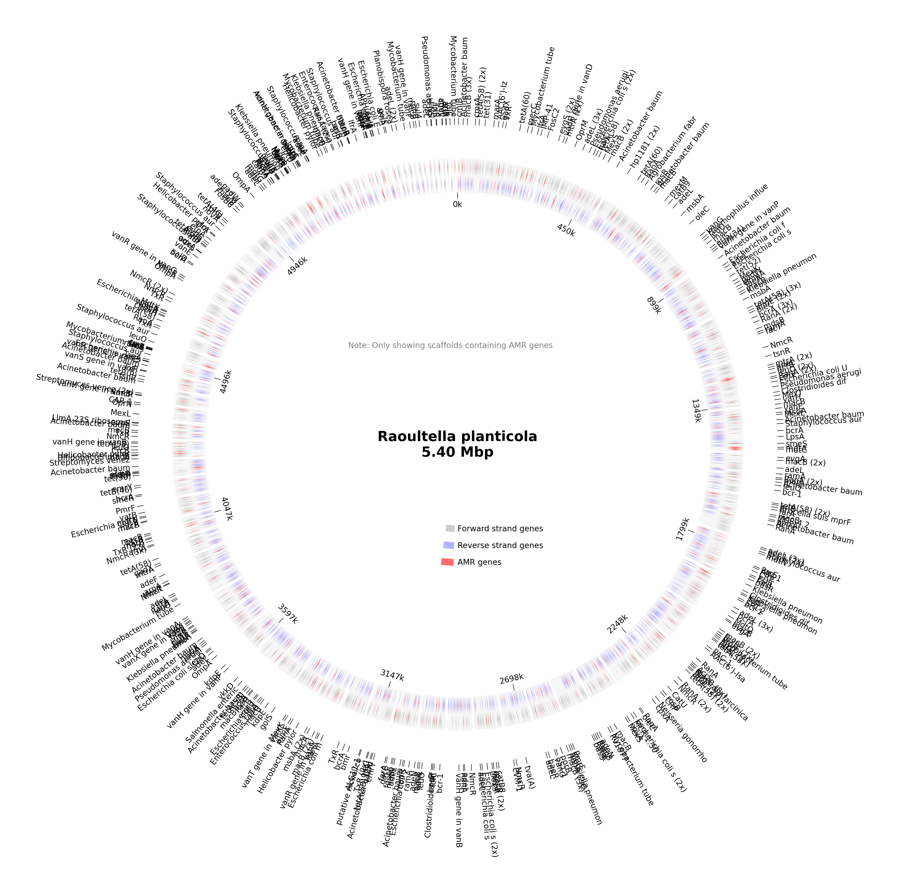

### AAC(6')-Isa
- **Mechanism**: antibiotic inactivation
- **Drug Classes**: aminoglycoside antibiotic
- **AMR Family**: AAC(6')
- **Locations**:
  - gnl|SPADES|BMKMCJEI_55_78 : position 78132-78671

### AAC(6')-Iz
- **Mechanism**: antibiotic inactivation
- **Drug Classes**: aminoglycoside antibiotic
- **AMR Family**: AAC(6')
- **Locations**:
  - gnl|SPADES|BMKMCJEI_7_135 : position 124309-124749

### AIM-1
- **Mechanism**: antibiotic inactivation
- **Drug Classes**: cephalosporin; cephamycin; penam
- **AMR Family**: AIM beta-lactamase
- **Locations**:
  - gnl|SPADES|BMKMCJEI_50_68 : position 68137-68982

### ALG11-1
- **Mechanism**: antibiotic inactivation
- **Drug Classes**: carbapenem
- **AMR Family**: ALG11 beta-lactamase
- **Locations**:
  - gnl|SPADES|BMKMCJEI_115_65 : position 66855-68303

### APH(6)-Ic
- **Mechanism**: antibiotic inactivation
- **Drug Classes**: aminoglycoside antibiotic
- **AMR Family**: APH(6)
- **Locations**:
  - gnl|SPADES|BMKMCJEI_771_12 : position 10287-11114

### Acinetobacter baumannii AbaF (found in 10 locations)
- **Mechanism**: antibiotic efflux
- **Drug Classes**: phosphonic acid antibiotic
- **AMR Family**: major facilitator superfamily (MFS) antibiotic efflux pump
- **Locations**:
  - gnl|SPADES|BMKMCJEI_138_28 : position 24771-26273
  - gnl|SPADES|BMKMCJEI_14_109 : position 117319-118713
  - gnl|SPADES|BMKMCJEI_205_45 : position 42188-43501
  - gnl|SPADES|BMKMCJEI_274_1 : position 337-1635
  - gnl|SPADES|BMKMCJEI_276_4 : position 1452-2762
  - gnl|SPADES|BMKMCJEI_29_7 : position 8428-9669
  - gnl|SPADES|BMKMCJEI_38_44 : position 47375-48697
  - gnl|SPADES|BMKMCJEI_55_82 : position 81903-83225
  - gnl|SPADES|BMKMCJEI_563_6 : position 4116-5408
  - gnl|SPADES|BMKMCJEI_7_18 : position 16125-17504

### Acinetobacter baumannii AbaQ (found in 13 locations)
- **Mechanism**: antibiotic efflux
- **Drug Classes**: fluoroquinolone antibiotic
- **AMR Family**: major facilitator superfamily (MFS) antibiotic efflux pump
- **Locations**:
  - gnl|SPADES|BMKMCJEI_114_36 : position 33149-34507
  - gnl|SPADES|BMKMCJEI_115_28 : position 27204-28490
  - gnl|SPADES|BMKMCJEI_11_163 : position 189045-190355
  - gnl|SPADES|BMKMCJEI_146_54 : position 59222-60499
  - gnl|SPADES|BMKMCJEI_14_25 : position 23846-25210
  - gnl|SPADES|BMKMCJEI_20_144 : position 164479-165783
  - gnl|SPADES|BMKMCJEI_216_36 : position 38081-39433
  - gnl|SPADES|BMKMCJEI_459_11 : position 11733-13013
  - gnl|SPADES|BMKMCJEI_46_74 : position 83130-84518
  - gnl|SPADES|BMKMCJEI_48_58 : position 58920-60281
  - gnl|SPADES|BMKMCJEI_67_5 : position 5171-6493
  - gnl|SPADES|BMKMCJEI_90_22 : position 22479-23672
  - gnl|SPADES|BMKMCJEI_90_57 : position 62700-63989

### Acinetobacter baumannii AmvA
- **Mechanism**: antibiotic efflux
- **Drug Classes**: macrolide antibiotic; disinfecting agents and antiseptics
- **AMR Family**: major facilitator superfamily (MFS) antibiotic efflux pump
- **Locations**:
  - gnl|SPADES|BMKMCJEI_11_188 : position 217461-218951

### AcrS (found in 2 locations)
- **Mechanism**: antibiotic efflux
- **Drug Classes**: fluoroquinolone antibiotic; cephalosporin; glycylcycline; cephamycin; penam; tetracycline antibiotic; rifamycin antibiotic; phenicol antibiotic; disinfecting agents and antiseptics
- **AMR Family**: resistance-nodulation-cell division (RND) antibiotic efflux pump
- **Locations**:
  - gnl|SPADES|BMKMCJEI_205_21 : position 15580-16218
  - gnl|SPADES|BMKMCJEI_67_3 : position 2470-3108

### Agrobacterium fabrum chloramphenicol acetyltransferase (found in 2 locations)
- **Mechanism**: antibiotic inactivation
- **Drug Classes**: phenicol antibiotic
- **AMR Family**: chloramphenicol acetyltransferase (CAT)
- **Locations**:
  - gnl|SPADES|BMKMCJEI_14_82 : position 84275-84841
  - gnl|SPADES|BMKMCJEI_7_164 : position 152074-152682

### ArnT
- **Mechanism**: antibiotic target alteration
- **Drug Classes**: peptide antibiotic
- **AMR Family**: pmr phosphoethanolamine transferase
- **Locations**:
  - gnl|SPADES|BMKMCJEI_55_37: position 31785-33440

### Bifidobacterium bifidum ileS conferring resistance to mupirocin
- **Mechanism**: antibiotic target alteration
- **Drug Classes**: mupirocin-like antibiotic
- **AMR Family**: antibiotic-resistant isoleucyl-tRNA synthetase (ileS)
- **Locations**:
  - gnl|SPADES|BMKMCJEI_208_12 : position 11607-14189

### Brucella suis mprF
- **Mechanism**: antibiotic target alteration
- **Drug Classes**: peptide antibiotic
- **AMR Family**: defensin resistant mprF
- **Locations**:
  - gnl|SPADES|BMKMCJEI_48_19 : position 16180-17145

### CAR-1
- **Mechanism**: antibiotic inactivation
- **Drug Classes**: carbapenem
- **AMR Family**: CAR beta-lactamase
- **Locations**:
  - gnl|SPADES|BMKMCJEI_247_47 : position 45294-46049

### CRP (found in 2 locations)
- **Mechanism**: antibiotic efflux
- **Drug Classes**: macrolide antibiotic; fluoroquinolone antibiotic; penam
- **AMR Family**: resistance-nodulation-cell division (RND) antibiotic efflux pump
- **Locations**:
  - gnl|SPADES|BMKMCJEI_50_78 : position 78718-79470
  - gnl|SPADES|BMKMCJEI_78_17: position 12749-13381

### CatU
- **Mechanism**: antibiotic inactivation
- **Drug Classes**: phenicol antibiotic
- **AMR Family**: chloramphenicol acetyltransferase (CAT)
- **Locations**:
  - gnl|SPADES|BMKMCJEI_67_103 : position 108231-108872

### Clostridioides difficile gyrA conferring resistance to fluoroquinolones
- **Mechanism**: antibiotic target alteration
- **Drug Classes**: fluoroquinolone antibiotic
- **AMR Family**: fluoroquinolone resistant gyrA
- **Locations**:
  - gnl|SPADES|BMKMCJEI_51_4 : position 4464-7103

### Clostridioides difficile gyrB conferring resistance to fluoroquinolones (found in 2 locations)
- **Mechanism**: antibiotic target alteration
- **Drug Classes**: fluoroquinolone antibiotic
- **AMR Family**: fluoroquinolone resistant gyrB
- **Locations**:
  - gnl|SPADES|BMKMCJEI_109_31 : position 29854-31749
  - gnl|SPADES|BMKMCJEI_34_118 : position 123482-125896

### CrcB
- **Mechanism**: antibiotic efflux
- **Drug Classes**: aminoglycoside antibiotic
- **AMR Family**: multidrug and toxic compound extrusion (MATE) transporter
- **Locations**:
  - gnl|SPADES|BMKMCJEI_208_28 : position 27715-28098

### EVM-1
- **Mechanism**: antibiotic inactivation
- **Drug Classes**: carbapenem
- **AMR Family**: EVM beta-lactamase
- **Locations**:
  - gnl|SPADES|BMKMCJEI_94_85 : position 83468-84268

### Enterococcus faecalis cls with mutation conferring resistance to daptomycin
- **Mechanism**: antibiotic target alteration
- **Drug Classes**: peptide antibiotic
- **AMR Family**: daptomycin resistant cls
- **Locations**:
  - gnl|SPADES|BMKMCJEI_532_10 : position 10210-11670

### Enterococcus faecium liaR mutant conferring daptomycin resistance
- **Mechanism**: antibiotic target alteration; antibiotic efflux
- **Drug Classes**: peptide antibiotic
- **AMR Family**: daptomycin resistant liaR
- **Locations**:
  - gnl|SPADES|BMKMCJEI_135_48 : position 48672-49325

### Erm(34)
- **Mechanism**: antibiotic target alteration
- **Drug Classes**: macrolide antibiotic; lincosamide antibiotic; streptogramin antibiotic; streptogramin A antibiotic; streptogramin B antibiotic
- **AMR Family**: Erm 23S ribosomal RNA methyltransferase
- **Locations**:
  - gnl|SPADES|BMKMCJEI_20_138 : position 159181-160002

### Escherichia coli AcrAB-TolC with AcrR mutation conferring resistance to ciprofloxacin, tetracycline, and ceftazidime (found in 2 locations)
- **Mechanism**: antibiotic target alteration; antibiotic efflux
- **Drug Classes**: fluoroquinolone antibiotic; cephalosporin; glycylcycline; penam; tetracycline antibiotic; rifamycin antibiotic; phenicol antibiotic; disinfecting agents and antiseptics
- **AMR Family**: resistance-nodulation-cell division (RND) antibiotic efflux pump
- **Locations**:
  - gnl|SPADES|BMKMCJEI_34_49 : position 49261-49908
  - gnl|SPADES|BMKMCJEI_771_5 : position 3643-4245

### Escherichia coli AcrAB-TolC with MarR mutations conferring resistance to ciprofloxacin and tetracycline (found in 3 locations)
- **Mechanism**: antibiotic target alteration; antibiotic efflux
- **Drug Classes**: fluoroquinolone antibiotic; cephalosporin; glycylcycline; penam; tetracycline antibiotic; rifamycin antibiotic; phenicol antibiotic; disinfecting agents and antiseptics
- **AMR Family**: resistance-nodulation-cell division (RND) antibiotic efflux pump
- **Locations**:
  - gnl|SPADES|BMKMCJEI_50_26 : position 22757-23191
  - gnl|SPADES|BMKMCJEI_50_95 : position 94969-95424
  - gnl|SPADES|BMKMCJEI_7_121: position 110532-110966

### Escherichia coli EF-Tu mutants conferring resistance to kirromycin (found in 2 locations)
- **Mechanism**: antibiotic target alteration
- **Drug Classes**: elfamycin antibiotic
- **AMR Family**: elfamycin resistant EF-Tu
- **Locations**:
  - gnl|SPADES|BMKMCJEI_189_17 : position 20362-22200
  - gnl|SPADES|BMKMCJEI_802_7 : position 6543-9227

### Escherichia coli UhpT with mutation conferring resistance to fosfomycin
- **Mechanism**: antibiotic target alteration
- **Drug Classes**: phosphonic acid antibiotic
- **AMR Family**: antibiotic-resistant UhpT
- **Locations**:
  - gnl|SPADES|BMKMCJEI_34_88 : position 91973-93364

### Escherichia coli fabI mutations conferring resistance to isoniazid and triclosan (found in 2 locations)
- **Mechanism**: antibiotic target alteration
- **Drug Classes**: disinfecting agents and antiseptics; isoniazid-like antibiotic
- **AMR Family**: antibiotic resistant fabI
- **Locations**:
  - gnl|SPADES|BMKMCJEI_135_63 : position 64017-64766
  - gnl|SPADES|BMKMCJEI_29_32 : position 34040-34789

### Escherichia coli mdfA
- **Mechanism**: antibiotic efflux
- **Drug Classes**: tetracycline antibiotic; phenicol antibiotic; disinfecting agents and antiseptics
- **AMR Family**: major facilitator superfamily (MFS) antibiotic efflux pump
- **Locations**:
  - gnl|SPADES|BMKMCJEI_124_9 : position 4861-6099

### Escherichia coli soxR with mutation conferring antibiotic resistance (found in 3 locations)
- **Mechanism**: antibiotic target alteration; antibiotic efflux
- **Drug Classes**: fluoroquinolone antibiotic; cephalosporin; glycylcycline; penam; tetracycline antibiotic; rifamycin antibiotic; phenicol antibiotic; disinfecting agents and antiseptics
- **AMR Family**: ATP-binding cassette (ABC) antibiotic efflux pump; major facilitator superfamily (MFS) antibiotic efflux pump; resistance-nodulation-cell division (RND) antibiotic efflux pump
- **Locations**:
  - gnl|SPADES|BMKMCJEI_296_30 : position 34047-34502
  - gnl|SPADES|BMKMCJEI_7_96 : position 87137-87535
  - gnl|SPADES|BMKMCJEI_99_69 : position 78280-78741

### Escherichia coli soxS with mutation conferring antibiotic resistance (found in 15 locations)
- **Mechanism**: antibiotic target alteration; antibiotic efflux; reduced permeability to antibiotic
- **Drug Classes**: fluoroquinolone antibiotic; monobactam; carbapenem; cephalosporin; glycylcycline; cephamycin; penam; tetracycline antibiotic; rifamycin antibiotic; phenicol antibiotic; penem; disinfecting agents and antiseptics
- **AMR Family**: ATP-binding cassette (ABC) antibiotic efflux pump; major facilitator superfamily (MFS) antibiotic efflux pump; resistance-nodulation-cell division (RND) antibiotic efflux pump; General Bacterial Porin with reduced permeability to beta-lactams
- **Locations**:
  - gnl|SPADES|BMKMCJEI_109_37 : position 35484-36353
  - gnl|SPADES|BMKMCJEI_109_45 : position 46025-46924
  - gnl|SPADES|BMKMCJEI_109_78 : position 77159-78019
  - gnl|SPADES|BMKMCJEI_114_23 : position 21628-22455
  - gnl|SPADES|BMKMCJEI_11_108 : position 136788-137729
  - gnl|SPADES|BMKMCJEI_11_171 : position 199091-199912
  - gnl|SPADES|BMKMCJEI_146_15 : position 16433-17284
  - gnl|SPADES|BMKMCJEI_146_40 : position 42412-43260
  - gnl|SPADES|BMKMCJEI_20_123 : position 136915-137760
  - gnl|SPADES|BMKMCJEI_276_16 : position 15437-16306
  - gnl|SPADES|BMKMCJEI_29_52 : position 54690-55523
  - gnl|SPADES|BMKMCJEI_83_51 : position 53476-54300
  - gnl|SPADES|BMKMCJEI_83_7 : position 3726-4700
  - gnl|SPADES|BMKMCJEI_99_55 : position 62677-63030
  - gnl|SPADES|BMKMCJEI_99_68 : position 77865-78194

### EstT
- **Mechanism**: antibiotic inactivation
- **Drug Classes**: macrolide antibiotic
- **AMR Family**: macrolide esterase
- **Locations**:
  - gnl|SPADES|BMKMCJEI_50_92 : position 91898-92665

### FosB6
- **Mechanism**: antibiotic inactivation
- **Drug Classes**: phosphonic acid antibiotic
- **AMR Family**: fosfomycin thiol transferase
- **Locations**:
  - gnl|SPADES|BMKMCJEI_348_18 : position 20546-20935

### FosC2
- **Mechanism**: antibiotic inactivation
- **Drug Classes**: phosphonic acid antibiotic
- **AMR Family**: fosC phosphotransferase family
- **Locations**:
  - gnl|SPADES|BMKMCJEI_7_278 : position 278012-278443

### H-NS (found in 2 locations)
- **Mechanism**: antibiotic efflux
- **Drug Classes**: macrolide antibiotic; fluoroquinolone antibiotic; cephalosporin; cephamycin; penam; tetracycline antibiotic
- **AMR Family**: major facilitator superfamily (MFS) antibiotic efflux pump; resistance-nodulation-cell division (RND) antibiotic efflux pump
- **Locations**:
  - gnl|SPADES|BMKMCJEI_1119_4: position 2840-3247
  - gnl|SPADES|BMKMCJEI_147_26 : position 23509-23910

### Haemophilus influenzae PBP3 conferring resistance to beta-lactam antibiotics
- **Mechanism**: antibiotic target alteration
- **Drug Classes**: cephalosporin; cephamycin; penam
- **AMR Family**: Penicillin-binding protein mutations conferring resistance to beta-lactam antibiotics
- **Locations**:
  - gnl|SPADES|BMKMCJEI_20_102 : position 113655-115421

### Helicobacter pylori pbp1 mutants conferring resistance to amoxicillin (found in 2 locations)
- **Mechanism**: antibiotic target alteration
- **Drug Classes**: cephalosporin; cephamycin; penam
- **AMR Family**: Penicillin-binding protein mutations conferring resistance to beta-lactam antibiotics
- **Locations**:
  - gnl|SPADES|BMKMCJEI_20_18 : position 21702-24254
  - gnl|SPADES|BMKMCJEI_331_6 : position 4713-7037

### Helicobacter pylori pbp2 mutants conferring resistance to amoxicillin (found in 2 locations)
- **Mechanism**: antibiotic target alteration
- **Drug Classes**: cephalosporin; cephamycin; penam
- **AMR Family**: Penicillin-binding protein mutations conferring resistance to beta-lactam antibiotics
- **Locations**:
  - gnl|SPADES|BMKMCJEI_127_2 : position 272-2017
  - gnl|SPADES|BMKMCJEI_208_19 : position 18237-20138

### Helicobacter pylori rdxA mutation conferring resistance to metronidazole
- **Mechanism**: antibiotic target alteration
- **Drug Classes**: nitroimidazole antibiotic
- **AMR Family**: Antibiotic resistant Helicobacter pylori nitroreductase
- **Locations**:
  - gnl|SPADES|BMKMCJEI_33_80 : position 98057-98710

### Helicobacter pylori rpoB mutation conferring resistance to rifampicin
- **Mechanism**: antibiotic target alteration; antibiotic target replacement
- **Drug Classes**: fluoroquinolone antibiotic; rifamycin antibiotic
- **AMR Family**: rifamycin-resistant beta-subunit of RNA polymerase (rpoB)
- **Locations**:
  - gnl|SPADES|BMKMCJEI_504_20 : position 18641-20581

### IMP-41
- **Mechanism**: antibiotic inactivation
- **Drug Classes**: carbapenem; cephalosporin; cephamycin; penam; penem
- **AMR Family**: IMP beta-lactamase
- **Locations**:
  - gnl|SPADES|BMKMCJEI_7_260 : position 256399-257250

### Klebsiella pneumoniae KpnE
- **Mechanism**: antibiotic efflux
- **Drug Classes**: macrolide antibiotic; aminoglycoside antibiotic; cephalosporin; tetracycline antibiotic; peptide antibiotic; rifamycin antibiotic; disinfecting agents and antiseptics
- **AMR Family**: small multidrug resistance (SMR) antibiotic efflux pump
- **Locations**:
  - gnl|SPADES|BMKMCJEI_50_118: position 123905-124267

### Klebsiella pneumoniae KpnF
- **Mechanism**: antibiotic efflux
- **Drug Classes**: macrolide antibiotic; aminoglycoside antibiotic; cephalosporin; tetracycline antibiotic; peptide antibiotic; rifamycin antibiotic; disinfecting agents and antiseptics
- **AMR Family**: small multidrug resistance (SMR) antibiotic efflux pump
- **Locations**:
  - gnl|SPADES|BMKMCJEI_50_119: position 124254-124583

### Klebsiella pneumoniae KpnG
- **Mechanism**: antibiotic efflux
- **Drug Classes**: macrolide antibiotic; fluoroquinolone antibiotic; aminoglycoside antibiotic; carbapenem; cephalosporin; penam; peptide antibiotic; penem
- **AMR Family**: major facilitator superfamily (MFS) antibiotic efflux pump
- **Locations**:
  - gnl|SPADES|BMKMCJEI_147_10: position 8584-9756

### Klebsiella pneumoniae KpnH (found in 3 locations)
- **Mechanism**: antibiotic efflux
- **Drug Classes**: macrolide antibiotic; fluoroquinolone antibiotic; aminoglycoside antibiotic; carbapenem; cephalosporin; penam; peptide antibiotic; penem
- **AMR Family**: major facilitator superfamily (MFS) antibiotic efflux pump
- **Locations**:
  - gnl|SPADES|BMKMCJEI_147_8 : position 7030-8046
  - gnl|SPADES|BMKMCJEI_38_120 : position 139122-140537
  - gnl|SPADES|BMKMCJEI_518_17 : position 17905-19302

### Klebsiella pneumoniae OmpK37 (found in 4 locations)
- **Mechanism**: reduced permeability to antibiotic
- **Drug Classes**: monobactam; carbapenem; cephalosporin; cephamycin; penam; penem
- **AMR Family**: General Bacterial Porin with reduced permeability to beta-lactams
- **Locations**:
  - gnl|SPADES|BMKMCJEI_29_128 : position 137580-138662
  - gnl|SPADES|BMKMCJEI_443_24 : position 21419-22489
  - gnl|SPADES|BMKMCJEI_51_8 : position 14288-15406
  - gnl|SPADES|BMKMCJEI_90_7 : position 6453-7505

### Klebsiella pneumoniae acrR with mutation conferring multidrug antibiotic resistance
- **Mechanism**: antibiotic target alteration; antibiotic efflux
- **Drug Classes**: fluoroquinolone antibiotic; cephalosporin; glycylcycline; penam; tetracycline antibiotic; rifamycin antibiotic; phenicol antibiotic; disinfecting agents and antiseptics
- **AMR Family**: resistance-nodulation-cell division (RND) antibiotic efflux pump
- **Locations**:
  - gnl|SPADES|BMKMCJEI_14_87 : position 90644-91294

### LlmA 23S ribosomal RNA methyltransferase (found in 2 locations)
- **Mechanism**: antibiotic target alteration
- **Drug Classes**: lincosamide antibiotic
- **AMR Family**: Llm 23S ribosomal RNA methyltransferase
- **Locations**:
  - gnl|SPADES|BMKMCJEI_216_41 : position 46368-47672
  - gnl|SPADES|BMKMCJEI_29_98 : position 102212-103414

### LpsA
- **Mechanism**: reduced permeability to antibiotic
- **Drug Classes**: peptide antibiotic
- **AMR Family**: Intrinsic peptide antibiotic resistant Lps
- **Locations**:
  - gnl|SPADES|BMKMCJEI_38_88 : position 98904-99725

### LptD
- **Mechanism**: antibiotic efflux
- **Drug Classes**: carbapenem; peptide antibiotic; aminocoumarin antibiotic; rifamycin antibiotic
- **AMR Family**: ATP-binding cassette (ABC) antibiotic efflux pump
- **Locations**:
  - gnl|SPADES|BMKMCJEI_20_135: position 154366-156735

### MCR-1.30
- **Mechanism**: antibiotic target alteration
- **Drug Classes**: peptide antibiotic
- **AMR Family**: MCR phosphoethanolamine transferase
- **Locations**:
  - gnl|SPADES|BMKMCJEI_83_14 : position 12120-13655

### MCR-4.2
- **Mechanism**: antibiotic target alteration
- **Drug Classes**: peptide antibiotic
- **AMR Family**: MCR phosphoethanolamine transferase
- **Locations**:
  - gnl|SPADES|BMKMCJEI_48_45 : position 44806-46383

### MdtK
- **Mechanism**: antibiotic efflux
- **Drug Classes**: fluoroquinolone antibiotic
- **AMR Family**: multidrug and toxic compound extrusion (MATE) transporter
- **Locations**:
  - gnl|SPADES|BMKMCJEI_296_32 : position 35966-37402

### MdtQ
- **Mechanism**: reduced permeability to antibiotic
- **Drug Classes**: monobactam; carbapenem; cephalosporin; cephamycin; penam; penem
- **AMR Family**: Outer Membrane Porin (Opr)
- **Locations**:
  - gnl|SPADES|BMKMCJEI_51_75 : position 94669-96108

### MexA
- **Mechanism**: antibiotic efflux
- **Drug Classes**: macrolide antibiotic; fluoroquinolone antibiotic; monobactam; carbapenem; cephalosporin; cephamycin; penam; tetracycline antibiotic; peptide antibiotic; aminocoumarin antibiotic; diaminopyrimidine antibiotic; sulfonamide antibiotic; phenicol antibiotic; penem
- **AMR Family**: resistance-nodulation-cell division (RND) antibiotic efflux pump
- **Locations**:
  - gnl|SPADES|BMKMCJEI_34_52 : position 51259-52383

### MexJ
- **Mechanism**: antibiotic efflux
- **Drug Classes**: macrolide antibiotic; tetracycline antibiotic; disinfecting agents and antiseptics
- **AMR Family**: resistance-nodulation-cell division (RND) antibiotic efflux pump
- **Locations**:
  - gnl|SPADES|BMKMCJEI_29_89 : position 93266-94375

### MexK (found in 2 locations)
- **Mechanism**: antibiotic efflux
- **Drug Classes**: macrolide antibiotic; tetracycline antibiotic; disinfecting agents and antiseptics
- **AMR Family**: resistance-nodulation-cell division (RND) antibiotic efflux pump
- **Locations**:
  - gnl|SPADES|BMKMCJEI_127_44 : position 46104-49166
  - gnl|SPADES|BMKMCJEI_29_88 : position 90183-93269

### MexL (found in 4 locations)
- **Mechanism**: antibiotic efflux
- **Drug Classes**: macrolide antibiotic; tetracycline antibiotic; disinfecting agents and antiseptics
- **AMR Family**: resistance-nodulation-cell division (RND) antibiotic efflux pump
- **Locations**:
  - gnl|SPADES|BMKMCJEI_11_123 : position 150844-151557
  - gnl|SPADES|BMKMCJEI_247_13 : position 10408-11001
  - gnl|SPADES|BMKMCJEI_34_51 : position 50554-51123
  - gnl|SPADES|BMKMCJEI_38_31 : position 32236-32880

### MexS (found in 4 locations)
- **Mechanism**: antibiotic efflux
- **Drug Classes**: fluoroquinolone antibiotic; diaminopyrimidine antibiotic; phenicol antibiotic
- **AMR Family**: resistance-nodulation-cell division (RND) antibiotic efflux pump
- **Locations**:
  - gnl|SPADES|BMKMCJEI_11_144 : position 169566-170603
  - gnl|SPADES|BMKMCJEI_38_28 : position 28375-29418
  - gnl|SPADES|BMKMCJEI_83_31 : position 33259-34206
  - gnl|SPADES|BMKMCJEI_99_44 : position 47352-48335

### MexT (found in 6 locations)
- **Mechanism**: antibiotic efflux
- **Drug Classes**: fluoroquinolone antibiotic; diaminopyrimidine antibiotic; phenicol antibiotic
- **AMR Family**: resistance-nodulation-cell division (RND) antibiotic efflux pump
- **Locations**:
  - gnl|SPADES|BMKMCJEI_114_65 : position 61022-61930
  - gnl|SPADES|BMKMCJEI_177_14 : position 14481-15374
  - gnl|SPADES|BMKMCJEI_34_127 : position 135328-136311
  - gnl|SPADES|BMKMCJEI_38_6 : position 4167-5090
  - gnl|SPADES|BMKMCJEI_437_18 : position 18270-19229
  - gnl|SPADES|BMKMCJEI_83_32 : position 34369-35271

### MexV
- **Mechanism**: antibiotic efflux
- **Drug Classes**: macrolide antibiotic; fluoroquinolone antibiotic; tetracycline antibiotic; phenicol antibiotic; disinfecting agents and antiseptics
- **AMR Family**: resistance-nodulation-cell division (RND) antibiotic efflux pump
- **Locations**:
  - gnl|SPADES|BMKMCJEI_453_6 : position 5787-7064

### MuxC
- **Mechanism**: antibiotic efflux
- **Drug Classes**: macrolide antibiotic; monobactam; tetracycline antibiotic; aminocoumarin antibiotic
- **AMR Family**: resistance-nodulation-cell division (RND) antibiotic efflux pump
- **Locations**:
  - gnl|SPADES|BMKMCJEI_453_7 : position 7076-10231

### Mycobacterium tuberculosis gidB mutation conferring resistance to streptomycin
- **Mechanism**: antibiotic target alteration
- **Drug Classes**: aminoglycoside antibiotic
- **AMR Family**: antibiotic resistant gidB
- **Locations**:
  - gnl|SPADES|BMKMCJEI_518_3 : position 1677-2300

### Mycobacterium tuberculosis kasA mutant conferring resistance to isoniazid (found in 2 locations)
- **Mechanism**: antibiotic target alteration
- **Drug Classes**: isoniazid-like antibiotic
- **AMR Family**: antibiotic resistant kasA
- **Locations**:
  - gnl|SPADES|BMKMCJEI_289_3 : position 3113-4387
  - gnl|SPADES|BMKMCJEI_55_29 : position 26785-27954

### Mycobacterium tuberculosis katG mutations conferring resistance to isoniazid
- **Mechanism**: antibiotic target alteration
- **Drug Classes**: isoniazid-like antibiotic
- **AMR Family**: isoniazid resistant katG
- **Locations**:
  - gnl|SPADES|BMKMCJEI_7_234 : position 226135-228312

### Mycobacterium tuberculosis pncA mutations conferring resistance to pyrazinamide
- **Mechanism**: antibiotic target alteration
- **Drug Classes**: pyrazine antibiotic
- **AMR Family**: Pyrazinamide resistant pncA
- **Locations**:
  - gnl|SPADES|BMKMCJEI_83_84 : position 87311-87952

### Mycobacterium tuberculosis rpoB mutations conferring resistance to rifampicin
- **Mechanism**: antibiotic target alteration; antibiotic target replacement
- **Drug Classes**: rifamycin antibiotic
- **AMR Family**: rifamycin-resistant beta-subunit of RNA polymerase (rpoB)
- **Locations**:
  - gnl|SPADES|BMKMCJEI_3623_1 : position 3-1976

### Mycobacterium tuberculosis rpsA mutations conferring resistance to pyrazinamide
- **Mechanism**: antibiotic target alteration
- **Drug Classes**: pyrazine antibiotic
- **AMR Family**: pyrazinamide resistant rpsA
- **Locations**:
  - gnl|SPADES|BMKMCJEI_904_8 : position 9071-9970

### Mycobacterium tuberculosis thyA with mutation conferring resistance to para-aminosalicylic acid
- **Mechanism**: antibiotic target alteration
- **Drug Classes**: salicylic acid antibiotic
- **AMR Family**: aminosalicylate resistant thymidylate synthase
- **Locations**:
  - gnl|SPADES|BMKMCJEI_148_16 : position 22322-23116

### Neisseria gonorrhoeae pilQ gene conferring resistance to beta-lactam
- **Mechanism**: antibiotic target alteration
- **Drug Classes**: cephalosporin; cephamycin; penam
- **AMR Family**: Penicillin-binding protein mutations conferring resistance to beta-lactam antibiotics
- **Locations**:
  - gnl|SPADES|BMKMCJEI_78_36 : position 33173-34411

### NmcR (found in 22 locations)
- **Mechanism**: antibiotic inactivation
- **Drug Classes**: carbapenem; cephalosporin; cephamycin; penam
- **AMR Family**: NmcA beta-lactamase
- **Locations**:
  - gnl|SPADES|BMKMCJEI_107_9 : position 9507-10433
  - gnl|SPADES|BMKMCJEI_147_50 : position 51056-51958
  - gnl|SPADES|BMKMCJEI_147_65 : position 64548-65459
  - gnl|SPADES|BMKMCJEI_14_124 : position 131011-131934
  - gnl|SPADES|BMKMCJEI_177_12 : position 12268-13152
  - gnl|SPADES|BMKMCJEI_183_1 : position 1-213
  - gnl|SPADES|BMKMCJEI_183_5 : position 2266-3186
  - gnl|SPADES|BMKMCJEI_183_59 : position 56944-57918
  - gnl|SPADES|BMKMCJEI_216_6 : position 4476-5393
  - gnl|SPADES|BMKMCJEI_255_13 : position 12279-13172
  - gnl|SPADES|BMKMCJEI_296_23 : position 26899-27873
  - gnl|SPADES|BMKMCJEI_298_29 : position 30906-31811
  - gnl|SPADES|BMKMCJEI_29_73 : position 74917-75834
  - gnl|SPADES|BMKMCJEI_313_1 : position 132-953
  - gnl|SPADES|BMKMCJEI_313_9 : position 9962-10852
  - gnl|SPADES|BMKMCJEI_319_12 : position 13143-14042
  - gnl|SPADES|BMKMCJEI_33_119 : position 145236-146165
  - gnl|SPADES|BMKMCJEI_50_123 : position 128324-129289
  - gnl|SPADES|BMKMCJEI_50_65 : position 66200-67090
  - gnl|SPADES|BMKMCJEI_67_76 : position 81720-82592
  - gnl|SPADES|BMKMCJEI_7_4 : position 3466-4368
  - gnl|SPADES|BMKMCJEI_94_79 : position 75659-76558

### Nocardia farcinica rox
- **Mechanism**: antibiotic inactivation
- **Drug Classes**: rifamycin antibiotic
- **AMR Family**: rifampin monooxygenase
- **Locations**:
  - gnl|SPADES|BMKMCJEI_67_12 : position 12023-13687

### OmpA (found in 5 locations)
- **Mechanism**: reduced permeability to antibiotic
- **Drug Classes**: peptide antibiotic
- **AMR Family**: General Bacterial Porin with reduced permeability to peptide antibiotics
- **Locations**:
  - gnl|SPADES|BMKMCJEI_144_63 : position 71002-71526
  - gnl|SPADES|BMKMCJEI_29_107: position 111590-112660
  - gnl|SPADES|BMKMCJEI_319_4 : position 5176-6888
  - gnl|SPADES|BMKMCJEI_403_12 : position 12729-13211
  - gnl|SPADES|BMKMCJEI_459_7 : position 8044-8706

### OpmH
- **Mechanism**: antibiotic efflux
- **Drug Classes**: disinfecting agents and antiseptics
- **AMR Family**: resistance-nodulation-cell division (RND) antibiotic efflux pump
- **Locations**:
  - gnl|SPADES|BMKMCJEI_296_15 : position 17732-19051

### OprA
- **Mechanism**: antibiotic efflux
- **Drug Classes**: macrolide antibiotic; fluoroquinolone antibiotic; aminoglycoside antibiotic; carbapenem; tetracycline antibiotic
- **AMR Family**: resistance-nodulation-cell division (RND) antibiotic efflux pump
- **Locations**:
  - gnl|SPADES|BMKMCJEI_453_4 : position 3871-5364

### OprM
- **Mechanism**: antibiotic efflux
- **Drug Classes**: macrolide antibiotic; fluoroquinolone antibiotic; monobactam; aminoglycoside antibiotic; carbapenem; cephalosporin; cephamycin; penam; tetracycline antibiotic; peptide antibiotic; aminocoumarin antibiotic; diaminopyrimidine antibiotic; sulfonamide antibiotic; phenicol antibiotic; penem; disinfecting agents and antiseptics
- **AMR Family**: resistance-nodulation-cell division (RND) antibiotic efflux pump
- **Locations**:
  - gnl|SPADES|BMKMCJEI_11_58 : position 75011-76390

### OprN
- **Mechanism**: antibiotic efflux
- **Drug Classes**: fluoroquinolone antibiotic; diaminopyrimidine antibiotic; phenicol antibiotic
- **AMR Family**: resistance-nodulation-cell division (RND) antibiotic efflux pump
- **Locations**:
  - gnl|SPADES|BMKMCJEI_247_40 : position 38917-40440

### PAC-1
- **Mechanism**: antibiotic inactivation
- **Drug Classes**: cephalosporin
- **AMR Family**: PAC beta-lactamase
- **Locations**:
  - gnl|SPADES|BMKMCJEI_55_71 : position 68838-70031

### PEDO-1
- **Mechanism**: antibiotic inactivation
- **Drug Classes**: carbapenem
- **AMR Family**: subclass B3 PEDO beta-lactamase
- **Locations**:
  - gnl|SPADES|BMKMCJEI_29_130 : position 140097-140744

### PLA-2a
- **Mechanism**: antibiotic inactivation
- **Drug Classes**: carbapenem; cephalosporin
- **AMR Family**: PLA beta-lactamase
- **Locations**:
  - gnl|SPADES|BMKMCJEI_7_39 : position 34368-35243

### ParR (found in 4 locations)
- **Mechanism**: antibiotic efflux; reduced permeability to antibiotic
- **Drug Classes**: macrolide antibiotic; fluoroquinolone antibiotic; monobactam; aminoglycoside antibiotic; carbapenem; cephalosporin; cephamycin; penam; tetracycline antibiotic; phenicol antibiotic; penem; disinfecting agents and antiseptics
- **AMR Family**: resistance-nodulation-cell division (RND) antibiotic efflux pump; Outer Membrane Porin (Opr)
- **Locations**:
  - gnl|SPADES|BMKMCJEI_138_2 : position 446-1174
  - gnl|SPADES|BMKMCJEI_50_69 : position 69132-69848
  - gnl|SPADES|BMKMCJEI_78_49 : position 47775-48494
  - gnl|SPADES|BMKMCJEI_89_29 : position 29710-30429

### ParS
- **Mechanism**: antibiotic efflux; reduced permeability to antibiotic
- **Drug Classes**: macrolide antibiotic; fluoroquinolone antibiotic; monobactam; aminoglycoside antibiotic; carbapenem; cephalosporin; cephamycin; penam; tetracycline antibiotic; phenicol antibiotic; penem; disinfecting agents and antiseptics
- **AMR Family**: resistance-nodulation-cell division (RND) antibiotic efflux pump; Outer Membrane Porin (Opr)
- **Locations**:
  - gnl|SPADES|BMKMCJEI_50_63 : position 63312-64613

### Planobispora rosea EF-Tu mutants conferring resistance to inhibitor GE2270A
- **Mechanism**: antibiotic target alteration
- **Drug Classes**: elfamycin antibiotic
- **AMR Family**: elfamycin resistant EF-Tu
- **Locations**:
  - gnl|SPADES|BMKMCJEI_844_10 : position 9400-10830

### PmrF (found in 4 locations)
- **Mechanism**: antibiotic target alteration
- **Drug Classes**: peptide antibiotic
- **AMR Family**: pmr phosphoethanolamine transferase
- **Locations**:
  - gnl|SPADES|BMKMCJEI_189_52 : position 57350-58339
  - gnl|SPADES|BMKMCJEI_55_24 : position 21191-22891
  - gnl|SPADES|BMKMCJEI_55_40 : position 36318-37301
  - gnl|SPADES|BMKMCJEI_90_3 : position 765-1724

### Pseudomonas aeruginosa CpxR (found in 2 locations)
- **Mechanism**: antibiotic efflux
- **Drug Classes**: macrolide antibiotic; fluoroquinolone antibiotic; monobactam; aminoglycoside antibiotic; carbapenem; cephalosporin; cephamycin; penam; tetracycline antibiotic; peptide antibiotic; aminocoumarin antibiotic; diaminopyrimidine antibiotic; sulfonamide antibiotic; phenicol antibiotic; penem
- **AMR Family**: resistance-nodulation-cell division (RND) antibiotic efflux pump
- **Locations**:
  - gnl|SPADES|BMKMCJEI_1119_6 : position 4465-5478
  - gnl|SPADES|BMKMCJEI_146_35 : position 37516-38214

### Pseudomonas aeruginosa ampR with mutation conferring resistance to aztreonam (found in 3 locations)
- **Mechanism**: antibiotic target alteration; antibiotic inactivation
- **Drug Classes**: monobactam; carbapenem; cephalosporin
- **AMR Family**: PDC beta-lactamase; ampR transcriptional regulator with mutation conferring resistance to monobactam antibiotics
- **Locations**:
  - gnl|SPADES|BMKMCJEI_11_95 : position 122458-123306
  - gnl|SPADES|BMKMCJEI_34_103 : position 107396-108322
  - gnl|SPADES|BMKMCJEI_83_15 : position 13762-14694

### QepA1
- **Mechanism**: antibiotic efflux
- **Drug Classes**: fluoroquinolone antibiotic
- **AMR Family**: major facilitator superfamily (MFS) antibiotic efflux pump
- **Locations**:
  - gnl|SPADES|BMKMCJEI_34_66 : position 68024-69394

### RanA (found in 31 locations)
- **Mechanism**: antibiotic efflux
- **Drug Classes**: aminoglycoside antibiotic
- **AMR Family**: ATP-binding cassette (ABC) antibiotic efflux pump
- **Locations**:
  - gnl|SPADES|BMKMCJEI_107_33 : position 33434-34207
  - gnl|SPADES|BMKMCJEI_124_23 : position 18111-19244
  - gnl|SPADES|BMKMCJEI_127_20 : position 21541-22635
  - gnl|SPADES|BMKMCJEI_147_16 : position 13898-15100
  - gnl|SPADES|BMKMCJEI_148_37 : position 43431-44558
  - gnl|SPADES|BMKMCJEI_14_68 : position 69528-70637
  - gnl|SPADES|BMKMCJEI_295_24 : position 31850-32923
  - gnl|SPADES|BMKMCJEI_29_56 : position 59291-60028
  - gnl|SPADES|BMKMCJEI_29_81 : position 81449-82471
  - gnl|SPADES|BMKMCJEI_325_9 : position 5726-6544
  - gnl|SPADES|BMKMCJEI_33_51 : position 63741-64577
  - gnl|SPADES|BMKMCJEI_33_62 : position 75783-76793
  - gnl|SPADES|BMKMCJEI_34_133 : position 140840-141613
  - gnl|SPADES|BMKMCJEI_34_74 : position 76168-77280
  - gnl|SPADES|BMKMCJEI_437_12 : position 12896-13669
  - gnl|SPADES|BMKMCJEI_46_62 : position 69818-70648
  - gnl|SPADES|BMKMCJEI_46_95 : position 107214-108299
  - gnl|SPADES|BMKMCJEI_48_67 : position 71009-72865
  - gnl|SPADES|BMKMCJEI_51_30 : position 39179-40768
  - gnl|SPADES|BMKMCJEI_532_6 : position 6875-7888
  - gnl|SPADES|BMKMCJEI_532_7 : position 7885-8889
  - gnl|SPADES|BMKMCJEI_55_106 : position 119478-120491
  - gnl|SPADES|BMKMCJEI_67_60 : position 65976-67046
  - gnl|SPADES|BMKMCJEI_67_89 : position 94943-95929
  - gnl|SPADES|BMKMCJEI_78_82 : position 91218-92288
  - gnl|SPADES|BMKMCJEI_7_231 : position 222742-223521
  - gnl|SPADES|BMKMCJEI_7_272 : position 271323-272927
  - gnl|SPADES|BMKMCJEI_83_16 : position 14796-15644
  - gnl|SPADES|BMKMCJEI_89_35 : position 35258-36376
  - gnl|SPADES|BMKMCJEI_90_12 : position 12297-13040
  - gnl|SPADES|BMKMCJEI_90_34 : position 34985-36031

### RanB
- **Mechanism**: antibiotic efflux
- **Drug Classes**: aminoglycoside antibiotic
- **AMR Family**: ATP-binding cassette (ABC) antibiotic efflux pump
- **Locations**:
  - gnl|SPADES|BMKMCJEI_325_8 : position 4944-5726

### Rv1877 (found in 3 locations)
- **Mechanism**: antibiotic efflux
- **Drug Classes**: fluoroquinolone antibiotic
- **AMR Family**: major facilitator superfamily (MFS) antibiotic efflux pump
- **Locations**:
  - gnl|SPADES|BMKMCJEI_11_31 : position 42028-43473
  - gnl|SPADES|BMKMCJEI_34_48 : position 47687-49180
  - gnl|SPADES|BMKMCJEI_83_91 : position 94248-95627

### SRT-2
- **Mechanism**: antibiotic inactivation
- **Drug Classes**: cephalosporin
- **AMR Family**: SRT beta-lactamase
- **Locations**:
  - gnl|SPADES|BMKMCJEI_51_23 : position 31892-33226

### SST-1
- **Mechanism**: antibiotic inactivation
- **Drug Classes**: cephalosporin
- **AMR Family**: SST beta-lactamase
- **Locations**:
  - gnl|SPADES|BMKMCJEI_90_48 : position 53789-54946

### Salmonella enterica ramR mutants
- **Mechanism**: antibiotic target alteration; antibiotic efflux
- **Drug Classes**: fluoroquinolone antibiotic; cephalosporin; glycylcycline; penam; tetracycline antibiotic; rifamycin antibiotic; phenicol antibiotic; disinfecting agents and antiseptics
- **AMR Family**: resistance-nodulation-cell division (RND) antibiotic efflux pump
- **Locations**:
  - gnl|SPADES|BMKMCJEI_138_48 : position 44549-45118

### SatA
- **Mechanism**: antibiotic inactivation
- **Drug Classes**: nucleoside antibiotic
- **AMR Family**: streptothricin acetyltransferase (SAT)
- **Locations**:
  - gnl|SPADES|BMKMCJEI_7_266 : position 264650-265627

### Shigella flexneri acrA
- **Mechanism**: antibiotic efflux
- **Drug Classes**: fluoroquinolone antibiotic; cephalosporin; glycylcycline; penam; tetracycline antibiotic; rifamycin antibiotic; phenicol antibiotic; disinfecting agents and antiseptics
- **AMR Family**: resistance-nodulation-cell division (RND) antibiotic efflux pump
- **Locations**:
  - gnl|SPADES|BMKMCJEI_14_86: position 89308-90501

### Staphylococcus aureus FosB
- **Mechanism**: antibiotic inactivation
- **Drug Classes**: phosphonic acid antibiotic
- **AMR Family**: fosfomycin thiol transferase
- **Locations**:
  - gnl|SPADES|BMKMCJEI_50_18 : position 15545-15952

### Staphylococcus aureus GlpT with mutation conferring resistance to fosfomycin (found in 3 locations)
- **Mechanism**: antibiotic target alteration
- **Drug Classes**: phosphonic acid antibiotic
- **AMR Family**: antibiotic-resistant GlpT
- **Locations**:
  - gnl|SPADES|BMKMCJEI_544_4 : position 1849-3195
  - gnl|SPADES|BMKMCJEI_7_155 : position 141394-142095
  - gnl|SPADES|BMKMCJEI_7_156 : position 142096-142779

### Staphylococcus aureus fusA with mutation conferring resistance to fusidic acid (found in 2 locations)
- **Mechanism**: antibiotic target alteration
- **Drug Classes**: fusidane antibiotic
- **AMR Family**: antibiotic resistant fusA
- **Locations**:
  - gnl|SPADES|BMKMCJEI_276_35 : position 35826-37415
  - gnl|SPADES|BMKMCJEI_38_56 : position 59405-61507

### Staphylococcus aureus mupA conferring resistance to mupirocin
- **Mechanism**: antibiotic target alteration
- **Drug Classes**: mupirocin-like antibiotic
- **AMR Family**: antibiotic-resistant isoleucyl-tRNA synthetase (ileS)
- **Locations**:
  - gnl|SPADES|BMKMCJEI_464_16 : position 13105-15921

### Staphylococcus aureus mupB conferring resistance to mupirocin
- **Mechanism**: antibiotic target alteration
- **Drug Classes**: mupirocin-like antibiotic
- **AMR Family**: antibiotic-resistant isoleucyl-tRNA synthetase (ileS)
- **Locations**:
  - gnl|SPADES|BMKMCJEI_295_5 : position 3423-6278

### Staphylococcus aureus murA with mutation conferring resistance to fosfomycin
- **Mechanism**: antibiotic target alteration
- **Drug Classes**: phosphonic acid antibiotic
- **AMR Family**: antibiotic-resistant murA transferase
- **Locations**:
  - gnl|SPADES|BMKMCJEI_325_3 : position 1739-2998

### Staphylococcus aureus norA
- **Mechanism**: antibiotic efflux
- **Drug Classes**: fluoroquinolone antibiotic
- **AMR Family**: major facilitator superfamily (MFS) antibiotic efflux pump
- **Locations**:
  - gnl|SPADES|BMKMCJEI_331_26 : position 28143-29579

### Staphylococcus aureus pgsA mutations conferring resistance to daptomycin
- **Mechanism**: antibiotic target alteration
- **Drug Classes**: peptide antibiotic
- **AMR Family**: daptomycin resistant pgsA
- **Locations**:
  - gnl|SPADES|BMKMCJEI_443_1 : position 203-751

### Streptomyces venezuelae rox (found in 3 locations)
- **Mechanism**: antibiotic inactivation
- **Drug Classes**: rifamycin antibiotic
- **AMR Family**: rifampin monooxygenase
- **Locations**:
  - gnl|SPADES|BMKMCJEI_208_1 : position 197-1372
  - gnl|SPADES|BMKMCJEI_255_21 : position 19506-20684
  - gnl|SPADES|BMKMCJEI_255_22 : position 20695-21897

### TaeA (found in 2 locations)
- **Mechanism**: antibiotic efflux
- **Drug Classes**: pleuromutilin antibiotic
- **AMR Family**: ATP-binding cassette (ABC) antibiotic efflux pump
- **Locations**:
  - gnl|SPADES|BMKMCJEI_276_21 : position 20217-21884
  - gnl|SPADES|BMKMCJEI_29_115 : position 119710-121617

### TolC
- **Mechanism**: antibiotic efflux
- **Drug Classes**: macrolide antibiotic; fluoroquinolone antibiotic; aminoglycoside antibiotic; carbapenem; cephalosporin; glycylcycline; cephamycin; penam; tetracycline antibiotic; peptide antibiotic; aminocoumarin antibiotic; rifamycin antibiotic; phenicol antibiotic; penem; disinfecting agents and antiseptics
- **AMR Family**: ATP-binding cassette (ABC) antibiotic efflux pump; major facilitator superfamily (MFS) antibiotic efflux pump; resistance-nodulation-cell division (RND) antibiotic efflux pump
- **Locations**:
  - gnl|SPADES|BMKMCJEI_109_26 : position 25677-27149

### TriB
- **Mechanism**: antibiotic efflux
- **Drug Classes**: disinfecting agents and antiseptics
- **AMR Family**: resistance-nodulation-cell division (RND) antibiotic efflux pump
- **Locations**:
  - gnl|SPADES|BMKMCJEI_127_45 : position 49166-50251

### TxR (found in 12 locations)
- **Mechanism**: antibiotic efflux
- **Drug Classes**: tetracycline antibiotic
- **AMR Family**: ATP-binding cassette (ABC) antibiotic efflux pump
- **Locations**:
  - gnl|SPADES|BMKMCJEI_1137_3 : position 3008-4417
  - gnl|SPADES|BMKMCJEI_115_43 : position 42415-44487
  - gnl|SPADES|BMKMCJEI_115_66 : position 68491-70035
  - gnl|SPADES|BMKMCJEI_119_43 : position 42114-44039
  - gnl|SPADES|BMKMCJEI_147_31 : position 26020-27816
  - gnl|SPADES|BMKMCJEI_183_18 : position 15149-16690
  - gnl|SPADES|BMKMCJEI_183_25 : position 21369-22352
  - gnl|SPADES|BMKMCJEI_216_17 : position 16146-18089
  - gnl|SPADES|BMKMCJEI_274_32 : position 35054-36391
  - gnl|SPADES|BMKMCJEI_295_20 : position 25151-26605
  - gnl|SPADES|BMKMCJEI_298_19 : position 21149-22927
  - gnl|SPADES|BMKMCJEI_7_159 : position 146489-147733

### YajC
- **Mechanism**: antibiotic efflux
- **Drug Classes**: fluoroquinolone antibiotic; cephalosporin; glycylcycline; penam; tetracycline antibiotic; oxazolidinone antibiotic; glycopeptide antibiotic; rifamycin antibiotic; phenicol antibiotic; disinfecting agents and antiseptics
- **AMR Family**: resistance-nodulation-cell division (RND) antibiotic efflux pump
- **Locations**:
  - gnl|SPADES|BMKMCJEI_1976_1 : position 60-392

### YojI (found in 2 locations)
- **Mechanism**: antibiotic efflux
- **Drug Classes**: peptide antibiotic
- **AMR Family**: ATP-binding cassette (ABC) antibiotic efflux pump
- **Locations**:
  - gnl|SPADES|BMKMCJEI_147_45 : position 43501-45093
  - gnl|SPADES|BMKMCJEI_51_12 : position 18425-20068

### acrB (found in 2 locations)
- **Mechanism**: antibiotic efflux
- **Drug Classes**: fluoroquinolone antibiotic; cephalosporin; glycylcycline; penam; tetracycline antibiotic; rifamycin antibiotic; phenicol antibiotic; disinfecting agents and antiseptics
- **AMR Family**: resistance-nodulation-cell division (RND) antibiotic efflux pump
- **Locations**:
  - gnl|SPADES|BMKMCJEI_14_85 : position 86139-89285
  - gnl|SPADES|BMKMCJEI_34_53 : position 52383-55490

### adeF (found in 2 locations)
- **Mechanism**: antibiotic efflux
- **Drug Classes**: fluoroquinolone antibiotic; tetracycline antibiotic
- **AMR Family**: resistance-nodulation-cell division (RND) antibiotic efflux pump
- **Locations**:
  - gnl|SPADES|BMKMCJEI_177_40: position 42830-45943
  - gnl|SPADES|BMKMCJEI_765_6: position 6983-10135

### adeG
- **Mechanism**: antibiotic efflux
- **Drug Classes**: fluoroquinolone antibiotic; tetracycline antibiotic
- **AMR Family**: resistance-nodulation-cell division (RND) antibiotic efflux pump
- **Locations**:
  - gnl|SPADES|BMKMCJEI_33_70 : position 86801-87880

### adeL (found in 46 locations)
- **Mechanism**: antibiotic efflux
- **Drug Classes**: fluoroquinolone antibiotic; tetracycline antibiotic
- **AMR Family**: resistance-nodulation-cell division (RND) antibiotic efflux pump
- **Locations**:
  - gnl|SPADES|BMKMCJEI_107_28 : position 29602-30516
  - gnl|SPADES|BMKMCJEI_109_71 : position 70746-71636
  - gnl|SPADES|BMKMCJEI_1102_7 : position 7020-7946
  - gnl|SPADES|BMKMCJEI_114_52 : position 51343-52269
  - gnl|SPADES|BMKMCJEI_115_24 : position 21941-22828
  - gnl|SPADES|BMKMCJEI_11_152 : position 179261-180148
  - gnl|SPADES|BMKMCJEI_11_180 : position 206889-207800
  - gnl|SPADES|BMKMCJEI_11_81 : position 101309-102196
  - gnl|SPADES|BMKMCJEI_1419_5 : position 4143-5045
  - gnl|SPADES|BMKMCJEI_146_7 : position 6830-7747
  - gnl|SPADES|BMKMCJEI_148_50 : position 59548-60429
  - gnl|SPADES|BMKMCJEI_14_184 : position 194506-195465
  - gnl|SPADES|BMKMCJEI_289_14 : position 14465-15352
  - gnl|SPADES|BMKMCJEI_289_23 : position 22794-23705
  - gnl|SPADES|BMKMCJEI_289_8 : position 9310-10227
  - gnl|SPADES|BMKMCJEI_298_30 : position 31841-32746
  - gnl|SPADES|BMKMCJEI_29_43 : position 43429-44358
  - gnl|SPADES|BMKMCJEI_321_19 : position 21865-22794
  - gnl|SPADES|BMKMCJEI_34_47 : position 46776-47690
  - gnl|SPADES|BMKMCJEI_383_2 : position 1441-2343
  - gnl|SPADES|BMKMCJEI_383_3 : position 2350-3255
  - gnl|SPADES|BMKMCJEI_38_46 : position 49475-50398
  - gnl|SPADES|BMKMCJEI_38_59 : position 63934-64824
  - gnl|SPADES|BMKMCJEI_404_10 : position 10486-11421
  - gnl|SPADES|BMKMCJEI_453_13 : position 14973-15866
  - gnl|SPADES|BMKMCJEI_464_11 : position 9196-10143
  - gnl|SPADES|BMKMCJEI_46_32 : position 39916-40878
  - gnl|SPADES|BMKMCJEI_50_4 : position 2068-2961
  - gnl|SPADES|BMKMCJEI_50_85 : position 85419-86348
  - gnl|SPADES|BMKMCJEI_50_9 : position 8054-8965
  - gnl|SPADES|BMKMCJEI_51_50 : position 63852-64718
  - gnl|SPADES|BMKMCJEI_51_96 : position 116453-117379
  - gnl|SPADES|BMKMCJEI_51_99 : position 120658-121599
  - gnl|SPADES|BMKMCJEI_55_43 : position 39442-40302
  - gnl|SPADES|BMKMCJEI_55_80 : position 79593-80492
  - gnl|SPADES|BMKMCJEI_67_22 : position 22695-23588
  - gnl|SPADES|BMKMCJEI_67_85 : position 89808-90698
  - gnl|SPADES|BMKMCJEI_7_144 : position 131011-131874
  - gnl|SPADES|BMKMCJEI_7_187 : position 173792-174691
  - gnl|SPADES|BMKMCJEI_7_259 : position 255401-256285
  - gnl|SPADES|BMKMCJEI_7_59 : position 54682-55599
  - gnl|SPADES|BMKMCJEI_7_94 : position 85303-86196
  - gnl|SPADES|BMKMCJEI_882_4 : position 3339-4250
  - gnl|SPADES|BMKMCJEI_882_9 : position 7445-8350
  - gnl|SPADES|BMKMCJEI_90_79 : position 86572-87474
  - gnl|SPADES|BMKMCJEI_99_73 : position 83300-84181

### adeN (found in 2 locations)
- **Mechanism**: antibiotic efflux
- **Drug Classes**: macrolide antibiotic; fluoroquinolone antibiotic; lincosamide antibiotic; carbapenem; cephalosporin; tetracycline antibiotic; rifamycin antibiotic; diaminopyrimidine antibiotic; phenicol antibiotic; penem
- **AMR Family**: resistance-nodulation-cell division (RND) antibiotic efflux pump
- **Locations**:
  - gnl|SPADES|BMKMCJEI_109_84 : position 85135-85713
  - gnl|SPADES|BMKMCJEI_89_17 : position 16133-16768

### almE (found in 3 locations)
- **Mechanism**: antibiotic target alteration
- **Drug Classes**: peptide antibiotic
- **AMR Family**: polymyxin resistance operon; alm glycyltransferase
- **Locations**:
  - gnl|SPADES|BMKMCJEI_127_26 : position 27785-29503
  - gnl|SPADES|BMKMCJEI_33_21 : position 24130-25737
  - gnl|SPADES|BMKMCJEI_33_28 : position 33307-37188

### arlR (found in 5 locations)
- **Mechanism**: antibiotic efflux
- **Drug Classes**: fluoroquinolone antibiotic; disinfecting agents and antiseptics
- **AMR Family**: major facilitator superfamily (MFS) antibiotic efflux pump
- **Locations**:
  - gnl|SPADES|BMKMCJEI_14_152 : position 161436-162137
  - gnl|SPADES|BMKMCJEI_1878_2 : position 308-988
  - gnl|SPADES|BMKMCJEI_453_3 : position 3123-3806
  - gnl|SPADES|BMKMCJEI_48_10 : position 8985-9656
  - gnl|SPADES|BMKMCJEI_544_12 : position 11836-12579

### arlS (found in 4 locations)
- **Mechanism**: antibiotic efflux
- **Drug Classes**: fluoroquinolone antibiotic; disinfecting agents and antiseptics
- **AMR Family**: major facilitator superfamily (MFS) antibiotic efflux pump
- **Locations**:
  - gnl|SPADES|BMKMCJEI_1137_2 : position 1950-2999
  - gnl|SPADES|BMKMCJEI_135_22 : position 25212-26207
  - gnl|SPADES|BMKMCJEI_1878_3 : position 1004-2473
  - gnl|SPADES|BMKMCJEI_20_132 : position 150974-152599

### arnA (found in 5 locations)
- **Mechanism**: antibiotic target alteration
- **Drug Classes**: peptide antibiotic
- **AMR Family**: pmr phosphoethanolamine transferase
- **Locations**:
  - gnl|SPADES|BMKMCJEI_177_19 : position 22108-22749
  - gnl|SPADES|BMKMCJEI_183_6 : position 3269-4252
  - gnl|SPADES|BMKMCJEI_38_77 : position 83999-85003
  - gnl|SPADES|BMKMCJEI_55_39 : position 34336-36321
  - gnl|SPADES|BMKMCJEI_841_9 : position 5251-6198

### bacA
- **Mechanism**: antibiotic target alteration
- **Drug Classes**: peptide antibiotic
- **AMR Family**: undecaprenyl pyrophosphate related proteins
- **Locations**:
  - gnl|SPADES|BMKMCJEI_109_13 : position 11365-12186

### baeR (found in 2 locations)
- **Mechanism**: antibiotic efflux
- **Drug Classes**: aminoglycoside antibiotic; aminocoumarin antibiotic
- **AMR Family**: resistance-nodulation-cell division (RND) antibiotic efflux pump
- **Locations**:
  - gnl|SPADES|BMKMCJEI_38_122: position 142048-142770
  - gnl|SPADES|BMKMCJEI_90_74 : position 79383-80072

### baeS
- **Mechanism**: antibiotic efflux
- **Drug Classes**: aminoglycoside antibiotic; aminocoumarin antibiotic
- **AMR Family**: resistance-nodulation-cell division (RND) antibiotic efflux pump
- **Locations**:
  - gnl|SPADES|BMKMCJEI_38_121 : position 140534-142051

### basR (found in 2 locations)
- **Mechanism**: antibiotic target alteration; antibiotic efflux
- **Drug Classes**: peptide antibiotic
- **AMR Family**: pmr phosphoethanolamine transferase
- **Locations**:
  - gnl|SPADES|BMKMCJEI_109_35 : position 34193-34852
  - gnl|SPADES|BMKMCJEI_50_102 : position 105901-106620

### basS (found in 5 locations)
- **Mechanism**: antibiotic target alteration; antibiotic efflux
- **Drug Classes**: peptide antibiotic
- **AMR Family**: pmr phosphoethanolamine transferase
- **Locations**:
  - gnl|SPADES|BMKMCJEI_109_34 : position 32856-34196
  - gnl|SPADES|BMKMCJEI_453_2 : position 1682-3133
  - gnl|SPADES|BMKMCJEI_48_9 : position 7889-8980
  - gnl|SPADES|BMKMCJEI_544_11 : position 10410-11849
  - gnl|SPADES|BMKMCJEI_89_39 : position 40515-41981

### bcr-1 (found in 9 locations)
- **Mechanism**: antibiotic efflux
- **Drug Classes**: bicyclomycin-like antibiotic
- **AMR Family**: major facilitator superfamily (MFS) antibiotic efflux pump
- **Locations**:
  - gnl|SPADES|BMKMCJEI_109_10 : position 8232-9698
  - gnl|SPADES|BMKMCJEI_34_102 : position 106157-107341
  - gnl|SPADES|BMKMCJEI_34_126 : position 134184-135359
  - gnl|SPADES|BMKMCJEI_34_55 : position 56906-58069
  - gnl|SPADES|BMKMCJEI_437_19 : position 19198-20322
  - gnl|SPADES|BMKMCJEI_46_96 : position 108314-109468
  - gnl|SPADES|BMKMCJEI_50_106 : position 111476-112678
  - gnl|SPADES|BMKMCJEI_50_8 : position 6760-7944
  - gnl|SPADES|BMKMCJEI_51_28 : position 37301-38497

### bcrA (found in 13 locations)
- **Mechanism**: antibiotic efflux
- **Drug Classes**: peptide antibiotic
- **AMR Family**: ATP-binding cassette (ABC) antibiotic efflux pump
- **Locations**:
  - gnl|SPADES|BMKMCJEI_114_86 : position 80663-83404
  - gnl|SPADES|BMKMCJEI_119_26 : position 24439-25926
  - gnl|SPADES|BMKMCJEI_138_10 : position 10003-11535
  - gnl|SPADES|BMKMCJEI_147_37 : position 35399-36349
  - gnl|SPADES|BMKMCJEI_183_36 : position 34054-35046
  - gnl|SPADES|BMKMCJEI_191_22 : position 23513-24265
  - gnl|SPADES|BMKMCJEI_320_19 : position 18714-19772
  - gnl|SPADES|BMKMCJEI_33_123 : position 149161-149880
  - gnl|SPADES|BMKMCJEI_33_39 : position 48703-50247
  - gnl|SPADES|BMKMCJEI_33_52 : position 64564-65268
  - gnl|SPADES|BMKMCJEI_38_75 : position 81117-81857
  - gnl|SPADES|BMKMCJEI_51_60 : position 76372-77892
  - gnl|SPADES|BMKMCJEI_7_203 : position 191161-192036

### bmr
- **Mechanism**: antibiotic efflux
- **Drug Classes**: fluoroquinolone antibiotic; nucleoside antibiotic; phenicol antibiotic; disinfecting agents and antiseptics
- **AMR Family**: major facilitator superfamily (MFS) antibiotic efflux pump
- **Locations**:
  - gnl|SPADES|BMKMCJEI_119_14 : position 8294-9595

### catB8
- **Mechanism**: antibiotic inactivation
- **Drug Classes**: phenicol antibiotic
- **AMR Family**: chloramphenicol acetyltransferase (CAT)
- **Locations**:
  - gnl|SPADES|BMKMCJEI_99_24 : position 27887-28345

### catB9 (found in 2 locations)
- **Mechanism**: antibiotic inactivation
- **Drug Classes**: phenicol antibiotic
- **AMR Family**: chloramphenicol acetyltransferase (CAT)
- **Locations**:
  - gnl|SPADES|BMKMCJEI_14_171 : position 176072-176710
  - gnl|SPADES|BMKMCJEI_437_7 : position 6111-7481

### cfrA
- **Mechanism**: antibiotic target alteration
- **Drug Classes**: lincosamide antibiotic; streptogramin antibiotic; streptogramin A antibiotic; oxazolidinone antibiotic; phenicol antibiotic; pleuromutilin antibiotic
- **AMR Family**: Cfr 23S ribosomal RNA methyltransferase
- **Locations**:
  - gnl|SPADES|BMKMCJEI_331_4 : position 2620-3786

### chrB
- **Mechanism**: antibiotic target alteration
- **Drug Classes**: macrolide antibiotic; lincosamide antibiotic
- **AMR Family**: non-erm 23S ribosomal RNA methyltransferase (G748)
- **Locations**:
  - gnl|SPADES|BMKMCJEI_127_3 : position 2079-2873

### cmlB
- **Mechanism**: antibiotic efflux
- **Drug Classes**: phenicol antibiotic
- **AMR Family**: major facilitator superfamily (MFS) antibiotic efflux pump
- **Locations**:
  - gnl|SPADES|BMKMCJEI_7_3 : position 2098-3348

### cmlv (found in 6 locations)
- **Mechanism**: antibiotic inactivation
- **Drug Classes**: phenicol antibiotic
- **AMR Family**: chloramphenicol phosphotransferase
- **Locations**:
  - gnl|SPADES|BMKMCJEI_1419_4 : position 2851-4038
  - gnl|SPADES|BMKMCJEI_38_19 : position 17489-18685
  - gnl|SPADES|BMKMCJEI_50_12 : position 10558-11718
  - gnl|SPADES|BMKMCJEI_771_6 : position 4325-5479
  - gnl|SPADES|BMKMCJEI_7_123 : position 111964-113163
  - gnl|SPADES|BMKMCJEI_7_275 : position 275013-276182

### cmrA
- **Mechanism**: antibiotic efflux
- **Drug Classes**: phenicol antibiotic
- **AMR Family**: major facilitator superfamily (MFS) antibiotic efflux pump
- **Locations**:
  - gnl|SPADES|BMKMCJEI_7_58 : position 53285-54472

### cmx (found in 3 locations)
- **Mechanism**: antibiotic efflux
- **Drug Classes**: phenicol antibiotic
- **AMR Family**: major facilitator superfamily (MFS) antibiotic efflux pump
- **Locations**:
  - gnl|SPADES|BMKMCJEI_289_7 : position 7998-9206
  - gnl|SPADES|BMKMCJEI_34_79 : position 81404-82585
  - gnl|SPADES|BMKMCJEI_7_152 : position 138037-139236

### cpxA (found in 4 locations)
- **Mechanism**: antibiotic efflux
- **Drug Classes**: aminoglycoside antibiotic; aminocoumarin antibiotic
- **AMR Family**: resistance-nodulation-cell division (RND) antibiotic efflux pump
- **Locations**:
  - gnl|SPADES|BMKMCJEI_146_36 : position 38211-39584
  - gnl|SPADES|BMKMCJEI_14_153 : position 162121-163545
  - gnl|SPADES|BMKMCJEI_78_48 : position 46417-47778
  - gnl|SPADES|BMKMCJEI_90_75 : position 80094-81389

### dfrA3
- **Mechanism**: antibiotic target replacement
- **Drug Classes**: diaminopyrimidine antibiotic
- **AMR Family**: trimethoprim resistant dihydrofolate reductase dfr
- **Locations**:
  - gnl|SPADES|BMKMCJEI_20_141 : position 161318-161797

### efmA
- **Mechanism**: antibiotic efflux
- **Drug Classes**: macrolide antibiotic; fluoroquinolone antibiotic
- **AMR Family**: major facilitator superfamily (MFS) antibiotic efflux pump
- **Locations**:
  - gnl|SPADES|BMKMCJEI_205_30 : position 25833-27071

### efpA
- **Mechanism**: antibiotic efflux
- **Drug Classes**: rifamycin antibiotic; isoniazid-like antibiotic
- **AMR Family**: major facilitator superfamily (MFS) antibiotic efflux pump
- **Locations**:
  - gnl|SPADES|BMKMCJEI_325_30 : position 28390-29877

### emrA
- **Mechanism**: antibiotic efflux
- **Drug Classes**: fluoroquinolone antibiotic
- **AMR Family**: major facilitator superfamily (MFS) antibiotic efflux pump
- **Locations**:
  - gnl|SPADES|BMKMCJEI_50_96 : position 95449-96627

### emrB (found in 3 locations)
- **Mechanism**: antibiotic efflux
- **Drug Classes**: fluoroquinolone antibiotic
- **AMR Family**: major facilitator superfamily (MFS) antibiotic efflux pump
- **Locations**:
  - gnl|SPADES|BMKMCJEI_11_60 : position 77501-79153
  - gnl|SPADES|BMKMCJEI_135_67 : position 67804-69060
  - gnl|SPADES|BMKMCJEI_147_9 : position 8068-8568

### emrR
- **Mechanism**: antibiotic efflux
- **Drug Classes**: fluoroquinolone antibiotic
- **AMR Family**: major facilitator superfamily (MFS) antibiotic efflux pump
- **Locations**:
  - gnl|SPADES|BMKMCJEI_147_11: position 9887-10417

### emrY (found in 2 locations)
- **Mechanism**: antibiotic efflux
- **Drug Classes**: tetracycline antibiotic
- **AMR Family**: major facilitator superfamily (MFS) antibiotic efflux pump
- **Locations**:
  - gnl|SPADES|BMKMCJEI_115_23 : position 20618-21832
  - gnl|SPADES|BMKMCJEI_191_49 : position 51604-53100

### eptA
- **Mechanism**: antibiotic target alteration
- **Drug Classes**: peptide antibiotic
- **AMR Family**: pmr phosphoethanolamine transferase
- **Locations**:
  - gnl|SPADES|BMKMCJEI_48_11 : position 9653-11299

### eptB
- **Mechanism**: antibiotic target alteration
- **Drug Classes**: peptide antibiotic
- **AMR Family**: pmr phosphoethanolamine transferase
- **Locations**:
  - gnl|SPADES|BMKMCJEI_459_1: position 207-1898

### evgA (found in 6 locations)
- **Mechanism**: antibiotic efflux
- **Drug Classes**: macrolide antibiotic; fluoroquinolone antibiotic; penam; tetracycline antibiotic
- **AMR Family**: major facilitator superfamily (MFS) antibiotic efflux pump; resistance-nodulation-cell division (RND) antibiotic efflux pump
- **Locations**:
  - gnl|SPADES|BMKMCJEI_11_18 : position 28440-29090
  - gnl|SPADES|BMKMCJEI_34_91 : position 96343-96936
  - gnl|SPADES|BMKMCJEI_443_3 : position 2638-3294
  - gnl|SPADES|BMKMCJEI_46_4 : position 7591-8241
  - gnl|SPADES|BMKMCJEI_51_89 : position 110525-111244
  - gnl|SPADES|BMKMCJEI_90_39 : position 42349-42978

### evgS (found in 7 locations)
- **Mechanism**: antibiotic efflux
- **Drug Classes**: macrolide antibiotic; fluoroquinolone antibiotic; penam; tetracycline antibiotic
- **AMR Family**: major facilitator superfamily (MFS) antibiotic efflux pump; resistance-nodulation-cell division (RND) antibiotic efflux pump
- **Locations**:
  - gnl|SPADES|BMKMCJEI_11_15 : position 21123-23945
  - gnl|SPADES|BMKMCJEI_11_17 : position 25180-28431
  - gnl|SPADES|BMKMCJEI_138_6 : position 4889-7495
  - gnl|SPADES|BMKMCJEI_216_40 : position 43447-46200
  - gnl|SPADES|BMKMCJEI_325_23 : position 16324-18663
  - gnl|SPADES|BMKMCJEI_50_103 : position 106617-108236
  - gnl|SPADES|BMKMCJEI_51_5 : position 7270-10125

### facT (found in 2 locations)
- **Mechanism**: antibiotic efflux
- **Drug Classes**: elfamycin antibiotic
- **AMR Family**: major facilitator superfamily (MFS) antibiotic efflux pump
- **Locations**:
  - gnl|SPADES|BMKMCJEI_33_83 : position 100757-102181
  - gnl|SPADES|BMKMCJEI_67_18 : position 18358-19554

### farA (found in 5 locations)
- **Mechanism**: antibiotic efflux
- **Drug Classes**: antibacterial free fatty acids
- **AMR Family**: major facilitator superfamily (MFS) antibiotic efflux pump
- **Locations**:
  - gnl|SPADES|BMKMCJEI_114_85 : position 79599-80666
  - gnl|SPADES|BMKMCJEI_11_59 : position 76387-77472
  - gnl|SPADES|BMKMCJEI_289_5 : position 5966-7009
  - gnl|SPADES|BMKMCJEI_48_26 : position 23842-24837
  - gnl|SPADES|BMKMCJEI_771_11 : position 9181-10044

### farB (found in 2 locations)
- **Mechanism**: antibiotic efflux
- **Drug Classes**: antibacterial free fatty acids
- **AMR Family**: major facilitator superfamily (MFS) antibiotic efflux pump
- **Locations**:
  - gnl|SPADES|BMKMCJEI_289_4 : position 4407-5969
  - gnl|SPADES|BMKMCJEI_50_97 : position 96638-98173

### fexB
- **Mechanism**: antibiotic efflux
- **Drug Classes**: phenicol antibiotic
- **AMR Family**: major facilitator superfamily (MFS) antibiotic efflux pump
- **Locations**:
  - gnl|SPADES|BMKMCJEI_55_15 : position 14113-15333

### fosA5
- **Mechanism**: antibiotic inactivation
- **Drug Classes**: fluoroquinolone antibiotic; aminoglycoside antibiotic; phosphonic acid antibiotic
- **AMR Family**: fosfomycin thiol transferase
- **Locations**:
  - gnl|SPADES|BMKMCJEI_114_64: position 60585-61028

### gadW (found in 2 locations)
- **Mechanism**: antibiotic efflux
- **Drug Classes**: macrolide antibiotic; fluoroquinolone antibiotic; penam
- **AMR Family**: resistance-nodulation-cell division (RND) antibiotic efflux pump
- **Locations**:
  - gnl|SPADES|BMKMCJEI_29_96 : position 100659-101447
  - gnl|SPADES|BMKMCJEI_383_7 : position 7277-8134

### gadX (found in 3 locations)
- **Mechanism**: antibiotic efflux
- **Drug Classes**: macrolide antibiotic; fluoroquinolone antibiotic; penam
- **AMR Family**: resistance-nodulation-cell division (RND) antibiotic efflux pump
- **Locations**:
  - gnl|SPADES|BMKMCJEI_147_49 : position 50276-51028
  - gnl|SPADES|BMKMCJEI_180_14 : position 12243-13115
  - gnl|SPADES|BMKMCJEI_7_151 : position 136981-137928

### golS (found in 3 locations)
- **Mechanism**: antibiotic efflux
- **Drug Classes**: monobactam; carbapenem; cephalosporin; cephamycin; penam; phenicol antibiotic; penem
- **AMR Family**: resistance-nodulation-cell division (RND) antibiotic efflux pump
- **Locations**:
  - gnl|SPADES|BMKMCJEI_135_1 : position 93-527
  - gnl|SPADES|BMKMCJEI_14_110 : position 119007-119417
  - gnl|SPADES|BMKMCJEI_841_14 : position 9767-10192

### hmrM
- **Mechanism**: antibiotic efflux
- **Drug Classes**: fluoroquinolone antibiotic; disinfecting agents and antiseptics
- **AMR Family**: multidrug and toxic compound extrusion (MATE) transporter
- **Locations**:
  - gnl|SPADES|BMKMCJEI_50_5 : position 3012-4385

### hp1181 (found in 2 locations)
- **Mechanism**: antibiotic efflux
- **Drug Classes**: fluoroquinolone antibiotic; tetracycline antibiotic; nitroimidazole antibiotic
- **AMR Family**: major facilitator superfamily (MFS) antibiotic efflux pump
- **Locations**:
  - gnl|SPADES|BMKMCJEI_14_131 : position 137251-138507
  - gnl|SPADES|BMKMCJEI_14_22 : position 19673-21037

### iri
- **Mechanism**: antibiotic inactivation
- **Drug Classes**: rifamycin antibiotic
- **AMR Family**: rifampin monooxygenase
- **Locations**:
  - gnl|SPADES|BMKMCJEI_114_10 : position 7272-8456

### kdpD
- **Mechanism**: antibiotic efflux
- **Drug Classes**: aminoglycoside antibiotic
- **AMR Family**: kdpDE
- **Locations**:
  - gnl|SPADES|BMKMCJEI_144_29 : position 33066-35753

### kdpE (found in 3 locations)
- **Mechanism**: antibiotic efflux
- **Drug Classes**: aminoglycoside antibiotic
- **AMR Family**: kdpDE
- **Locations**:
  - gnl|SPADES|BMKMCJEI_135_21 : position 24530-25222
  - gnl|SPADES|BMKMCJEI_144_28 : position 32246-32923
  - gnl|SPADES|BMKMCJEI_89_40 : position 41978-42652

### leuO (found in 10 locations)
- **Mechanism**: antibiotic efflux
- **Drug Classes**: nucleoside antibiotic; disinfecting agents and antiseptics
- **AMR Family**: major facilitator superfamily (MFS) antibiotic efflux pump
- **Locations**:
  - gnl|SPADES|BMKMCJEI_109_64 : position 62962-63891
  - gnl|SPADES|BMKMCJEI_146_19 : position 20404-21303
  - gnl|SPADES|BMKMCJEI_148_32 : position 39073-39999
  - gnl|SPADES|BMKMCJEI_208_39 : position 37597-38511
  - gnl|SPADES|BMKMCJEI_20_110 : position 121853-122803
  - gnl|SPADES|BMKMCJEI_289_28 : position 26875-27750
  - gnl|SPADES|BMKMCJEI_296_24 : position 27956-28873
  - gnl|SPADES|BMKMCJEI_34_64 : position 65567-66751
  - gnl|SPADES|BMKMCJEI_34_81 : position 83299-83529
  - gnl|SPADES|BMKMCJEI_46_81 : position 92574-93512

### lfrA (found in 5 locations)
- **Mechanism**: antibiotic efflux
- **Drug Classes**: fluoroquinolone antibiotic
- **AMR Family**: major facilitator superfamily (MFS) antibiotic efflux pump
- **Locations**:
  - gnl|SPADES|BMKMCJEI_135_55 : position 53784-55178
  - gnl|SPADES|BMKMCJEI_148_44 : position 52761-54179
  - gnl|SPADES|BMKMCJEI_459_14 : position 15218-16576
  - gnl|SPADES|BMKMCJEI_598_4 : position 2604-3977
  - gnl|SPADES|BMKMCJEI_7_248 : position 245224-246459

### lmrC
- **Mechanism**: antibiotic target protection
- **Drug Classes**: lincosamide antibiotic
- **AMR Family**: Miscellaneous ABC-F subfamily ATP-binding cassette ribosomal protection proteins
- **Locations**:
  - gnl|SPADES|BMKMCJEI_459_17 : position 17684-19303

### macA
- **Mechanism**: antibiotic efflux
- **Drug Classes**: macrolide antibiotic
- **AMR Family**: ATP-binding cassette (ABC) antibiotic efflux pump
- **Locations**:
  - gnl|SPADES|BMKMCJEI_124_54 : position 51220-52335

### macB (found in 48 locations)
- **Mechanism**: antibiotic efflux
- **Drug Classes**: macrolide antibiotic
- **AMR Family**: ATP-binding cassette (ABC) antibiotic efflux pump
- **Locations**:
  - gnl|SPADES|BMKMCJEI_109_76 : position 75573-76340
  - gnl|SPADES|BMKMCJEI_11_161 : position 187312-188088
  - gnl|SPADES|BMKMCJEI_11_174 : position 201512-202213
  - gnl|SPADES|BMKMCJEI_124_39 : position 33924-34652
  - gnl|SPADES|BMKMCJEI_124_55 : position 52332-54278
  - gnl|SPADES|BMKMCJEI_135_40 : position 41795-42607
  - gnl|SPADES|BMKMCJEI_138_19 : position 17677-18357
  - gnl|SPADES|BMKMCJEI_138_5 : position 3183-4703
  - gnl|SPADES|BMKMCJEI_147_38 : position 36342-37328
  - gnl|SPADES|BMKMCJEI_147_60 : position 59169-60689
  - gnl|SPADES|BMKMCJEI_14_118 : position 124776-125462
  - gnl|SPADES|BMKMCJEI_183_40 : position 38888-39682
  - gnl|SPADES|BMKMCJEI_189_7 : position 6368-7909
  - gnl|SPADES|BMKMCJEI_208_10 : position 10106-10831
  - gnl|SPADES|BMKMCJEI_20_121 : position 135334-136035
  - gnl|SPADES|BMKMCJEI_216_21 : position 22454-23473
  - gnl|SPADES|BMKMCJEI_29_124 : position 130392-131165
  - gnl|SPADES|BMKMCJEI_33_55 : position 68354-69115
  - gnl|SPADES|BMKMCJEI_348_30 : position 29359-30390
  - gnl|SPADES|BMKMCJEI_38_1 : position 513-1250
  - gnl|SPADES|BMKMCJEI_443_7 : position 6280-7032
  - gnl|SPADES|BMKMCJEI_46_70 : position 78521-79375
  - gnl|SPADES|BMKMCJEI_46_8 : position 16390-17178
  - gnl|SPADES|BMKMCJEI_48_39 : position 39512-40234
  - gnl|SPADES|BMKMCJEI_518_12 : position 12486-13991
  - gnl|SPADES|BMKMCJEI_51_84 : position 106086-107033
  - gnl|SPADES|BMKMCJEI_55_107 : position 120488-121471
  - gnl|SPADES|BMKMCJEI_55_5 : position 5308-5976
  - gnl|SPADES|BMKMCJEI_563_8 : position 6584-7360
  - gnl|SPADES|BMKMCJEI_67_28 : position 28974-29762
  - gnl|SPADES|BMKMCJEI_67_37 : position 38850-39572
  - gnl|SPADES|BMKMCJEI_67_48 : position 52556-53839
  - gnl|SPADES|BMKMCJEI_67_50 : position 54964-55659
  - gnl|SPADES|BMKMCJEI_67_55 : position 58649-60169
  - gnl|SPADES|BMKMCJEI_67_8 : position 8125-8874
  - gnl|SPADES|BMKMCJEI_67_90 : position 95926-96906
  - gnl|SPADES|BMKMCJEI_67_94 : position 100710-101753
  - gnl|SPADES|BMKMCJEI_7_147 : position 133740-134531
  - gnl|SPADES|BMKMCJEI_7_219 : position 206074-206802
  - gnl|SPADES|BMKMCJEI_7_32 : position 29278-30063
  - gnl|SPADES|BMKMCJEI_83_70 : position 72300-72932
  - gnl|SPADES|BMKMCJEI_89_22 : position 23823-24524
  - gnl|SPADES|BMKMCJEI_90_20 : position 20268-21110
  - gnl|SPADES|BMKMCJEI_90_26 : position 26117-26935
  - gnl|SPADES|BMKMCJEI_90_41 : position 44253-45020
  - gnl|SPADES|BMKMCJEI_956_3 : position 1441-2535
  - gnl|SPADES|BMKMCJEI_99_30 : position 33742-34851
  - gnl|SPADES|BMKMCJEI_99_51 : position 54424-57249

### marA (found in 4 locations)
- **Mechanism**: antibiotic efflux; reduced permeability to antibiotic
- **Drug Classes**: fluoroquinolone antibiotic; monobactam; carbapenem; cephalosporin; glycylcycline; cephamycin; penam; tetracycline antibiotic; rifamycin antibiotic; phenicol antibiotic; penem; disinfecting agents and antiseptics
- **AMR Family**: resistance-nodulation-cell division (RND) antibiotic efflux pump; General Bacterial Porin with reduced permeability to beta-lactams
- **Locations**:
  - gnl|SPADES|BMKMCJEI_183_28 : position 25103-27409
  - gnl|SPADES|BMKMCJEI_46_66 : position 74466-75446
  - gnl|SPADES|BMKMCJEI_765_8 : position 11668-12021
  - gnl|SPADES|BMKMCJEI_7_120: position 110134-110514

### mdsB
- **Mechanism**: antibiotic efflux
- **Drug Classes**: monobactam; carbapenem; cephalosporin; cephamycin; penam; phenicol antibiotic; penem
- **AMR Family**: resistance-nodulation-cell division (RND) antibiotic efflux pump
- **Locations**:
  - gnl|SPADES|BMKMCJEI_33_69 : position 83695-86787

### mdtA
- **Mechanism**: antibiotic efflux
- **Drug Classes**: aminocoumarin antibiotic
- **AMR Family**: resistance-nodulation-cell division (RND) antibiotic efflux pump
- **Locations**:
  - gnl|SPADES|BMKMCJEI_38_117 : position 131670-132920

### mdtB
- **Mechanism**: antibiotic efflux
- **Drug Classes**: aminocoumarin antibiotic
- **AMR Family**: resistance-nodulation-cell division (RND) antibiotic efflux pump
- **Locations**:
  - gnl|SPADES|BMKMCJEI_38_118 : position 132920-136042

### mdtC
- **Mechanism**: antibiotic efflux
- **Drug Classes**: aminocoumarin antibiotic
- **AMR Family**: resistance-nodulation-cell division (RND) antibiotic efflux pump
- **Locations**:
  - gnl|SPADES|BMKMCJEI_38_119 : position 136043-139120

### mdtG (found in 3 locations)
- **Mechanism**: antibiotic efflux
- **Drug Classes**: phosphonic acid antibiotic
- **AMR Family**: major facilitator superfamily (MFS) antibiotic efflux pump
- **Locations**:
  - gnl|SPADES|BMKMCJEI_404_25 : position 24628-25878
  - gnl|SPADES|BMKMCJEI_7_166 : position 153671-154906
  - gnl|SPADES|BMKMCJEI_90_55 : position 60452-61651

### mdtH
- **Mechanism**: antibiotic efflux
- **Drug Classes**: fluoroquinolone antibiotic
- **AMR Family**: major facilitator superfamily (MFS) antibiotic efflux pump
- **Locations**:
  - gnl|SPADES|BMKMCJEI_404_16 : position 16842-18050

### mdtN (found in 5 locations)
- **Mechanism**: antibiotic efflux
- **Drug Classes**: nucleoside antibiotic; disinfecting agents and antiseptics
- **AMR Family**: major facilitator superfamily (MFS) antibiotic efflux pump
- **Locations**:
  - gnl|SPADES|BMKMCJEI_114_58 : position 56106-57173
  - gnl|SPADES|BMKMCJEI_189_20 : position 24392-25528
  - gnl|SPADES|BMKMCJEI_205_26 : position 23580-24608
  - gnl|SPADES|BMKMCJEI_247_41 : position 40437-41531
  - gnl|SPADES|BMKMCJEI_50_24 : position 21435-22331

### mdtO
- **Mechanism**: antibiotic efflux
- **Drug Classes**: nucleoside antibiotic; disinfecting agents and antiseptics
- **AMR Family**: major facilitator superfamily (MFS) antibiotic efflux pump
- **Locations**:
  - gnl|SPADES|BMKMCJEI_205_25 : position 21633-23570

### mdtP
- **Mechanism**: antibiotic efflux
- **Drug Classes**: nucleoside antibiotic; disinfecting agents and antiseptics
- **AMR Family**: major facilitator superfamily (MFS) antibiotic efflux pump
- **Locations**:
  - gnl|SPADES|BMKMCJEI_205_24 : position 20155-21636

### mecC
- **Mechanism**: antibiotic target replacement
- **Drug Classes**: penam
- **AMR Family**: methicillin resistant PBP2
- **Locations**:
  - gnl|SPADES|BMKMCJEI_7_226 : position 213649-215571

### mef(E)
- **Mechanism**: antibiotic efflux
- **Drug Classes**: macrolide antibiotic
- **AMR Family**: major facilitator superfamily (MFS) antibiotic efflux pump
- **Locations**:
  - gnl|SPADES|BMKMCJEI_33_24 : position 28160-29401

### mepA
- **Mechanism**: antibiotic efflux
- **Drug Classes**: glycylcycline; tetracycline antibiotic
- **AMR Family**: multidrug and toxic compound extrusion (MATE) transporter
- **Locations**:
  - gnl|SPADES|BMKMCJEI_99_38 : position 42776-44092

### mepR
- **Mechanism**: antibiotic efflux
- **Drug Classes**: glycylcycline; tetracycline antibiotic
- **AMR Family**: multidrug and toxic compound extrusion (MATE) transporter
- **Locations**:
  - gnl|SPADES|BMKMCJEI_114_28 : position 26327-26773

### mexM
- **Mechanism**: antibiotic efflux
- **Drug Classes**: phenicol antibiotic
- **AMR Family**: resistance-nodulation-cell division (RND) antibiotic efflux pump
- **Locations**:
  - gnl|SPADES|BMKMCJEI_14_151 : position 160633-161439

### mreA
- **Mechanism**: antibiotic efflux
- **Drug Classes**: macrolide antibiotic
- **AMR Family**: major facilitator superfamily (MFS) antibiotic efflux pump
- **Locations**:
  - gnl|SPADES|BMKMCJEI_464_17 : position 15966-16904

### msbA (found in 7 locations)
- **Mechanism**: antibiotic efflux
- **Drug Classes**: nitroimidazole antibiotic
- **AMR Family**: ATP-binding cassette (ABC) antibiotic efflux pump
- **Locations**:
  - gnl|SPADES|BMKMCJEI_124_61 : position 59119-60840
  - gnl|SPADES|BMKMCJEI_124_62 : position 60841-62607
  - gnl|SPADES|BMKMCJEI_146_46 : position 49415-50926
  - gnl|SPADES|BMKMCJEI_20_16 : position 18416-19285
  - gnl|SPADES|BMKMCJEI_29_143: position 155907-157655
  - gnl|SPADES|BMKMCJEI_38_26 : position 25821-27326
  - gnl|SPADES|BMKMCJEI_55_48 : position 44601-45392

### mtrA (found in 8 locations)
- **Mechanism**: antibiotic efflux
- **Drug Classes**: macrolide antibiotic; penam
- **AMR Family**: resistance-nodulation-cell division (RND) antibiotic efflux pump
- **Locations**:
  - gnl|SPADES|BMKMCJEI_11_33 : position 44483-45391
  - gnl|SPADES|BMKMCJEI_11_74 : position 95013-95867
  - gnl|SPADES|BMKMCJEI_138_29 : position 26334-26579
  - gnl|SPADES|BMKMCJEI_146_41 : position 43333-44169
  - gnl|SPADES|BMKMCJEI_180_7 : position 5894-6718
  - gnl|SPADES|BMKMCJEI_189_9 : position 9194-10372
  - gnl|SPADES|BMKMCJEI_34_38 : position 39521-40474
  - gnl|SPADES|BMKMCJEI_34_43 : position 43997-44902

### nalC
- **Mechanism**: antibiotic efflux
- **Drug Classes**: macrolide antibiotic; fluoroquinolone antibiotic; monobactam; carbapenem; cephalosporin; cephamycin; penam; tetracycline antibiotic; peptide antibiotic; aminocoumarin antibiotic; diaminopyrimidine antibiotic; sulfonamide antibiotic; phenicol antibiotic; penem
- **AMR Family**: resistance-nodulation-cell division (RND) antibiotic efflux pump
- **Locations**:
  - gnl|SPADES|BMKMCJEI_11_117 : position 145516-146139

### norB (found in 2 locations)
- **Mechanism**: antibiotic efflux
- **Drug Classes**: fluoroquinolone antibiotic
- **AMR Family**: major facilitator superfamily (MFS) antibiotic efflux pump
- **Locations**:
  - gnl|SPADES|BMKMCJEI_183_26 : position 22343-23734
  - gnl|SPADES|BMKMCJEI_90_37 : position 39228-40529

### novA (found in 3 locations)
- **Mechanism**: antibiotic efflux
- **Drug Classes**: aminocoumarin antibiotic
- **AMR Family**: ATP-binding cassette (ABC) antibiotic efflux pump
- **Locations**:
  - gnl|SPADES|BMKMCJEI_296_17 : position 20355-22514
  - gnl|SPADES|BMKMCJEI_332_6 : position 4197-4943
  - gnl|SPADES|BMKMCJEI_83_26 : position 26289-28394

### oleC (found in 5 locations)
- **Mechanism**: antibiotic efflux
- **Drug Classes**: macrolide antibiotic
- **AMR Family**: ATP-binding cassette (ABC) antibiotic efflux pump
- **Locations**:
  - gnl|SPADES|BMKMCJEI_115_40 : position 40016-40837
  - gnl|SPADES|BMKMCJEI_20_53 : position 54958-55884
  - gnl|SPADES|BMKMCJEI_33_27 : position 31632-32426
  - gnl|SPADES|BMKMCJEI_78_86 : position 95729-96442
  - gnl|SPADES|BMKMCJEI_7_72 : position 65964-66662

### optrA (found in 2 locations)
- **Mechanism**: antibiotic target protection
- **Drug Classes**: oxazolidinone antibiotic; phenicol antibiotic
- **AMR Family**: Miscellaneous ABC-F subfamily ATP-binding cassette ribosomal protection proteins
- **Locations**:
  - gnl|SPADES|BMKMCJEI_48_55 : position 54143-55738
  - gnl|SPADES|BMKMCJEI_78_11 : position 7119-9023

### oqxA (found in 2 locations)
- **Mechanism**: antibiotic efflux
- **Drug Classes**: fluoroquinolone antibiotic; glycylcycline; tetracycline antibiotic; diaminopyrimidine antibiotic; nitrofuran antibiotic
- **AMR Family**: resistance-nodulation-cell division (RND) antibiotic efflux pump
- **Locations**:
  - gnl|SPADES|BMKMCJEI_321_21 : position 23137-24069
  - gnl|SPADES|BMKMCJEI_765_7 : position 10159-11334

### patA
- **Mechanism**: antibiotic efflux
- **Drug Classes**: fluoroquinolone antibiotic
- **AMR Family**: ATP-binding cassette (ABC) antibiotic efflux pump
- **Locations**:
  - gnl|SPADES|BMKMCJEI_14_113 : position 120932-121609

### putative nickel/cobalt transporter
- **Mechanism**: antibiotic efflux
- **Drug Classes**: fluoroquinolone antibiotic; aminoglycoside antibiotic; isoniazid-like antibiotic
- **AMR Family**: metal transporters with antibiotic efflux
- **Locations**:
  - gnl|SPADES|BMKMCJEI_115_63 : position 64107-65120

### qacE
- **Mechanism**: antibiotic efflux
- **Drug Classes**: disinfecting agents and antiseptics
- **AMR Family**: major facilitator superfamily (MFS) antibiotic efflux pump
- **Locations**:
  - gnl|SPADES|BMKMCJEI_114_81 : position 75706-76125

### qacJ
- **Mechanism**: antibiotic efflux
- **Drug Classes**: disinfecting agents and antiseptics
- **AMR Family**: small multidrug resistance (SMR) antibiotic efflux pump
- **Locations**:
  - gnl|SPADES|BMKMCJEI_114_82: position 76143-76472

### ramA (found in 5 locations)
- **Mechanism**: antibiotic efflux; reduced permeability to antibiotic
- **Drug Classes**: fluoroquinolone antibiotic; monobactam; carbapenem; cephalosporin; glycylcycline; cephamycin; penam; tetracycline antibiotic; rifamycin antibiotic; phenicol antibiotic; penem; disinfecting agents and antiseptics
- **AMR Family**: resistance-nodulation-cell division (RND) antibiotic efflux pump; General Bacterial Porin with reduced permeability to beta-lactams
- **Locations**:
  - gnl|SPADES|BMKMCJEI_114_9 : position 6380-7249
  - gnl|SPADES|BMKMCJEI_183_4 : position 1588-1923
  - gnl|SPADES|BMKMCJEI_289_2 : position 1751-2701
  - gnl|SPADES|BMKMCJEI_33_76 : position 95304-95645
  - gnl|SPADES|BMKMCJEI_46_51 : position 57733-58785

### rosA
- **Mechanism**: antibiotic efflux
- **Drug Classes**: peptide antibiotic
- **AMR Family**: major facilitator superfamily (MFS) antibiotic efflux pump
- **Locations**:
  - gnl|SPADES|BMKMCJEI_14_101 : position 107113-108333

### rosB (found in 3 locations)
- **Mechanism**: antibiotic efflux
- **Drug Classes**: peptide antibiotic
- **AMR Family**: major facilitator superfamily (MFS) antibiotic efflux pump
- **Locations**:
  - gnl|SPADES|BMKMCJEI_14_100 : position 105090-106766
  - gnl|SPADES|BMKMCJEI_20_142 : position 161995-163860
  - gnl|SPADES|BMKMCJEI_78_9 : position 4590-6395

### rphB (found in 2 locations)
- **Mechanism**: antibiotic inactivation
- **Drug Classes**: rifamycin antibiotic
- **AMR Family**: rifampin phosphotransferase
- **Locations**:
  - gnl|SPADES|BMKMCJEI_332_15 : position 14144-16522
  - gnl|SPADES|BMKMCJEI_956_11 : position 7787-9514

### salD
- **Mechanism**: antibiotic target protection
- **Drug Classes**: lincosamide antibiotic; streptogramin antibiotic; streptogramin A antibiotic; pleuromutilin antibiotic
- **AMR Family**: sal-type ABC-F protein
- **Locations**:
  - gnl|SPADES|BMKMCJEI_320_24 : position 22466-24043

### sdiA (found in 2 locations)
- **Mechanism**: antibiotic efflux
- **Drug Classes**: fluoroquinolone antibiotic; cephalosporin; glycylcycline; penam; tetracycline antibiotic; rifamycin antibiotic; phenicol antibiotic; disinfecting agents and antiseptics
- **AMR Family**: resistance-nodulation-cell division (RND) antibiotic efflux pump
- **Locations**:
  - gnl|SPADES|BMKMCJEI_443_5 : position 4050-4772
  - gnl|SPADES|BMKMCJEI_7_33 : position 30297-30971

### smeC
- **Mechanism**: antibiotic efflux
- **Drug Classes**: aminoglycoside antibiotic; cephalosporin; cephamycin; penam
- **AMR Family**: resistance-nodulation-cell division (RND) antibiotic efflux pump
- **Locations**:
  - gnl|SPADES|BMKMCJEI_34_54 : position 55494-56858

### smeR
- **Mechanism**: antibiotic efflux
- **Drug Classes**: aminoglycoside antibiotic; cephalosporin; cephamycin; penam
- **AMR Family**: resistance-nodulation-cell division (RND) antibiotic efflux pump
- **Locations**:
  - gnl|SPADES|BMKMCJEI_191_18 : position 19231-19947

### smeS (found in 2 locations)
- **Mechanism**: antibiotic efflux
- **Drug Classes**: aminoglycoside antibiotic; cephalosporin; cephamycin; penam
- **AMR Family**: resistance-nodulation-cell division (RND) antibiotic efflux pump
- **Locations**:
  - gnl|SPADES|BMKMCJEI_38_105 : position 119194-121122
  - gnl|SPADES|BMKMCJEI_7_158 : position 144496-146523

### sul4
- **Mechanism**: antibiotic target replacement
- **Drug Classes**: sulfonamide antibiotic
- **AMR Family**: sulfonamide resistant sul
- **Locations**:
  - gnl|SPADES|BMKMCJEI_1098_2 : position 862-1710

### tet(30)
- **Mechanism**: antibiotic efflux
- **Drug Classes**: tetracycline antibiotic
- **AMR Family**: major facilitator superfamily (MFS) antibiotic efflux pump
- **Locations**:
  - gnl|SPADES|BMKMCJEI_205_20 : position 14377-15552

### tet(31)
- **Mechanism**: antibiotic efflux
- **Drug Classes**: tetracycline antibiotic
- **AMR Family**: major facilitator superfamily (MFS) antibiotic efflux pump
- **Locations**:
  - gnl|SPADES|BMKMCJEI_7_92 : position 82894-84090

### tet(52)
- **Mechanism**: antibiotic inactivation
- **Drug Classes**: tetracycline antibiotic
- **AMR Family**: tetracycline inactivation enzyme
- **Locations**:
  - gnl|SPADES|BMKMCJEI_29_72 : position 73766-74920

### tet(55)
- **Mechanism**: antibiotic inactivation
- **Drug Classes**: tetracycline antibiotic
- **AMR Family**: tetracycline inactivation enzyme
- **Locations**:
  - gnl|SPADES|BMKMCJEI_7_249 : position 246514-247803

### tet(64)
- **Mechanism**: antibiotic efflux
- **Drug Classes**: tetracycline antibiotic
- **AMR Family**: major facilitator superfamily (MFS) antibiotic efflux pump
- **Locations**:
  - gnl|SPADES|BMKMCJEI_7_139 : position 126527-127717

### tetA(46)
- **Mechanism**: antibiotic efflux
- **Drug Classes**: tetracycline antibiotic
- **AMR Family**: ATP-binding cassette (ABC) antibiotic efflux pump
- **Locations**:
  - gnl|SPADES|BMKMCJEI_332_21 : position 21390-22139

### tetA(58) (found in 21 locations)
- **Mechanism**: antibiotic efflux
- **Drug Classes**: tetracycline antibiotic
- **AMR Family**: major facilitator superfamily (MFS) antibiotic efflux pump
- **Locations**:
  - gnl|SPADES|BMKMCJEI_115_31 : position 31132-31920
  - gnl|SPADES|BMKMCJEI_115_75 : position 76635-77312
  - gnl|SPADES|BMKMCJEI_11_126 : position 154664-155677
  - gnl|SPADES|BMKMCJEI_138_20 : position 18684-19442
  - gnl|SPADES|BMKMCJEI_14_187 : position 197663-199147
  - gnl|SPADES|BMKMCJEI_180_24 : position 27296-28798
  - gnl|SPADES|BMKMCJEI_208_47 : position 47342-48895
  - gnl|SPADES|BMKMCJEI_296_4 : position 2855-4357
  - gnl|SPADES|BMKMCJEI_325_15 : position 10408-11133
  - gnl|SPADES|BMKMCJEI_33_122 : position 148401-149168
  - gnl|SPADES|BMKMCJEI_33_13 : position 15473-16975
  - gnl|SPADES|BMKMCJEI_33_63 : position 76783-77826
  - gnl|SPADES|BMKMCJEI_46_82 : position 94365-95453
  - gnl|SPADES|BMKMCJEI_48_25 : position 22110-23849
  - gnl|SPADES|BMKMCJEI_48_6 : position 4172-4894
  - gnl|SPADES|BMKMCJEI_55_47 : position 43840-44604
  - gnl|SPADES|BMKMCJEI_67_30 : position 32416-33237
  - gnl|SPADES|BMKMCJEI_67_64 : position 71668-72291
  - gnl|SPADES|BMKMCJEI_78_87 : position 96445-97212
  - gnl|SPADES|BMKMCJEI_7_105 : position 95952-96734
  - gnl|SPADES|BMKMCJEI_7_71 : position 65157-65954

### tetA(60) (found in 2 locations)
- **Mechanism**: antibiotic efflux
- **Drug Classes**: tetracycline antibiotic
- **AMR Family**: ATP-binding cassette (ABC) antibiotic efflux pump
- **Locations**:
  - gnl|SPADES|BMKMCJEI_14_54 : position 55652-57424
  - gnl|SPADES|BMKMCJEI_7_202 : position 190448-191164

### tetB(46)
- **Mechanism**: antibiotic efflux
- **Drug Classes**: tetracycline antibiotic
- **AMR Family**: ATP-binding cassette (ABC) antibiotic efflux pump
- **Locations**:
  - gnl|SPADES|BMKMCJEI_191_44 : position 45053-46567

### tetB(60) (found in 2 locations)
- **Mechanism**: antibiotic efflux
- **Drug Classes**: tetracycline antibiotic
- **AMR Family**: ATP-binding cassette (ABC) antibiotic efflux pump
- **Locations**:
  - gnl|SPADES|BMKMCJEI_14_55 : position 57417-59195
  - gnl|SPADES|BMKMCJEI_183_37 : position 35048-35857

### tetB(P)
- **Mechanism**: antibiotic target protection
- **Drug Classes**: tetracycline antibiotic
- **AMR Family**: tetracycline-resistant ribosomal protection protein
- **Locations**:
  - gnl|SPADES|BMKMCJEI_274_17 : position 17235-19034

### tsnR (found in 3 locations)
- **Mechanism**: antibiotic target alteration
- **Drug Classes**: peptide antibiotic
- **AMR Family**: non-erm 23S ribosomal RNA methyltransferase (A1067)
- **Locations**:
  - gnl|SPADES|BMKMCJEI_274_7 : position 7564-8634
  - gnl|SPADES|BMKMCJEI_34_13 : position 12021-12782
  - gnl|SPADES|BMKMCJEI_563_7 : position 5719-6450

### tva(A)
- **Mechanism**: antibiotic target protection
- **Drug Classes**: pleuromutilin antibiotic
- **AMR Family**: Miscellaneous ABC-F subfamily ATP-binding cassette ribosomal protection proteins
- **Locations**:
  - gnl|SPADES|BMKMCJEI_94_45 : position 45029-46726

### ugd
- **Mechanism**: antibiotic target alteration
- **Drug Classes**: peptide antibiotic
- **AMR Family**: pmr phosphoethanolamine transferase
- **Locations**:
  - gnl|SPADES|BMKMCJEI_38_78 : position 85398-86564

### vanE (found in 2 locations)
- **Mechanism**: antibiotic target alteration
- **Drug Classes**: glycopeptide antibiotic
- **AMR Family**: glycopeptide resistance gene cluster; Van ligase
- **Locations**:
  - gnl|SPADES|BMKMCJEI_321_5 : position 4024-5373
  - gnl|SPADES|BMKMCJEI_38_14 : position 12813-14159

### vanG (found in 2 locations)
- **Mechanism**: antibiotic target alteration
- **Drug Classes**: glycopeptide antibiotic
- **AMR Family**: glycopeptide resistance gene cluster; Van ligase
- **Locations**:
  - gnl|SPADES|BMKMCJEI_20_94 : position 103669-104589
  - gnl|SPADES|BMKMCJEI_90_54: position 59051-60148

### vanH gene in vanA cluster
- **Mechanism**: antibiotic target alteration
- **Drug Classes**: glycopeptide antibiotic
- **AMR Family**: vanH; glycopeptide resistance gene cluster
- **Locations**:
  - gnl|SPADES|BMKMCJEI_147_58 : position 57502-58434

### vanH gene in vanB cluster (found in 3 locations)
- **Mechanism**: antibiotic target alteration
- **Drug Classes**: glycopeptide antibiotic
- **AMR Family**: vanH; glycopeptide resistance gene cluster
- **Locations**:
  - gnl|SPADES|BMKMCJEI_107_47 : position 46702-47838
  - gnl|SPADES|BMKMCJEI_208_51 : position 51871-52899
  - gnl|SPADES|BMKMCJEI_255_15 : position 14267-15499

### vanH gene in vanD cluster
- **Mechanism**: antibiotic target alteration
- **Drug Classes**: glycopeptide antibiotic
- **AMR Family**: vanH; glycopeptide resistance gene cluster
- **Locations**:
  - gnl|SPADES|BMKMCJEI_11_25 : position 36310-37299

### vanH gene in vanF cluster (found in 2 locations)
- **Mechanism**: antibiotic target alteration
- **Drug Classes**: glycopeptide antibiotic
- **AMR Family**: vanH; glycopeptide resistance gene cluster
- **Locations**:
  - gnl|SPADES|BMKMCJEI_765_3 : position 2739-3674
  - gnl|SPADES|BMKMCJEI_937_8 : position 8420-9358

### vanH gene in vanO cluster
- **Mechanism**: antibiotic target alteration
- **Drug Classes**: glycopeptide antibiotic
- **AMR Family**: vanH; glycopeptide resistance gene cluster
- **Locations**:
  - gnl|SPADES|BMKMCJEI_459_12 : position 13038-14009

### vanH gene in vanP cluster (found in 2 locations)
- **Mechanism**: antibiotic target alteration
- **Drug Classes**: glycopeptide antibiotic
- **AMR Family**: vanH; glycopeptide resistance gene cluster
- **Locations**:
  - gnl|SPADES|BMKMCJEI_144_15 : position 19207-20199
  - gnl|SPADES|BMKMCJEI_20_145 : position 165856-166806

### vanR gene in vanC cluster
- **Mechanism**: antibiotic target alteration
- **Drug Classes**: glycopeptide antibiotic
- **AMR Family**: glycopeptide resistance gene cluster; vanR
- **Locations**:
  - gnl|SPADES|BMKMCJEI_38_106 : position 121119-121814

### vanR gene in vanE cluster
- **Mechanism**: antibiotic target alteration
- **Drug Classes**: glycopeptide antibiotic
- **AMR Family**: glycopeptide resistance gene cluster; vanR
- **Locations**:
  - gnl|SPADES|BMKMCJEI_276_14 : position 13946-14662

### vanR gene in vanF cluster
- **Mechanism**: antibiotic target alteration
- **Drug Classes**: glycopeptide antibiotic
- **AMR Family**: glycopeptide resistance gene cluster; vanR
- **Locations**:
  - gnl|SPADES|BMKMCJEI_124_28 : position 22851-23567

### vanR gene in vanG cluster (found in 2 locations)
- **Mechanism**: antibiotic target alteration
- **Drug Classes**: glycopeptide antibiotic
- **AMR Family**: glycopeptide resistance gene cluster; vanR
- **Locations**:
  - gnl|SPADES|BMKMCJEI_14_172 : position 177174-178784
  - gnl|SPADES|BMKMCJEI_319_17 : position 19689-20432

### vanS gene in vanF cluster
- **Mechanism**: antibiotic target alteration
- **Drug Classes**: glycopeptide antibiotic
- **AMR Family**: vanS; glycopeptide resistance gene cluster
- **Locations**:
  - gnl|SPADES|BMKMCJEI_274_30 : position 32891-34345

### vanS gene in vanM cluster
- **Mechanism**: antibiotic target alteration
- **Drug Classes**: glycopeptide antibiotic
- **AMR Family**: vanS; glycopeptide resistance gene cluster
- **Locations**:
  - gnl|SPADES|BMKMCJEI_124_29 : position 23564-25042

### vanT gene in vanC cluster
- **Mechanism**: antibiotic target alteration
- **Drug Classes**: glycopeptide antibiotic
- **AMR Family**: glycopeptide resistance gene cluster; vanT
- **Locations**:
  - gnl|SPADES|BMKMCJEI_127_40 : position 41151-42221

### vanT gene in vanG cluster
- **Mechanism**: antibiotic target alteration
- **Drug Classes**: glycopeptide antibiotic
- **AMR Family**: glycopeptide resistance gene cluster; vanT
- **Locations**:
  - gnl|SPADES|BMKMCJEI_99_46 : position 49988-51067

### vanX gene in vanI cluster
- **Mechanism**: antibiotic target alteration
- **Drug Classes**: glycopeptide antibiotic
- **AMR Family**: vanX; glycopeptide resistance gene cluster
- **Locations**:
  - gnl|SPADES|BMKMCJEI_147_42 : position 40855-41439

### vatB
- **Mechanism**: antibiotic inactivation
- **Drug Classes**: streptogramin antibiotic; streptogramin A antibiotic
- **AMR Family**: streptogramin vat acetyltransferase
- **Locations**:
  - gnl|SPADES|BMKMCJEI_189_31 : position 36082-36903

### vatH
- **Mechanism**: antibiotic inactivation
- **Drug Classes**: streptogramin antibiotic; streptogramin A antibiotic
- **AMR Family**: streptogramin vat acetyltransferase
- **Locations**:
  - gnl|SPADES|BMKMCJEI_34_138 : position 147066-148436

### vmlR
- **Mechanism**: antibiotic target protection
- **Drug Classes**: lincosamide antibiotic; streptogramin antibiotic; streptogramin A antibiotic; streptogramin B antibiotic; nucleoside antibiotic; pleuromutilin antibiotic
- **AMR Family**: Miscellaneous ABC-F subfamily ATP-binding cassette ribosomal protection proteins
- **Locations**:
  - gnl|SPADES|BMKMCJEI_7_265 : position 262873-264585

### ykkD
- **Mechanism**: antibiotic efflux
- **Drug Classes**: aminoglycoside antibiotic; tetracycline antibiotic; phenicol antibiotic
- **AMR Family**: small multidrug resistance (SMR) antibiotic efflux pump
- **Locations**:
  - gnl|SPADES|BMKMCJEI_138_65 : position 62060-62377

## Serratia fonticola
**Strain Statistics:**
- Total genome length: 32.4 kbp
- Total scaffolds: 2137
- Scaffolds with AMR genes: 104
- Total genes annotated: 16
- Total AMR genes: 104
- Unique AMR genes: 77
- Distinct AMR mechanisms: 7
- Distinct AMR families: 26
- Distinct drug classes: 28

**Circos Plot:**

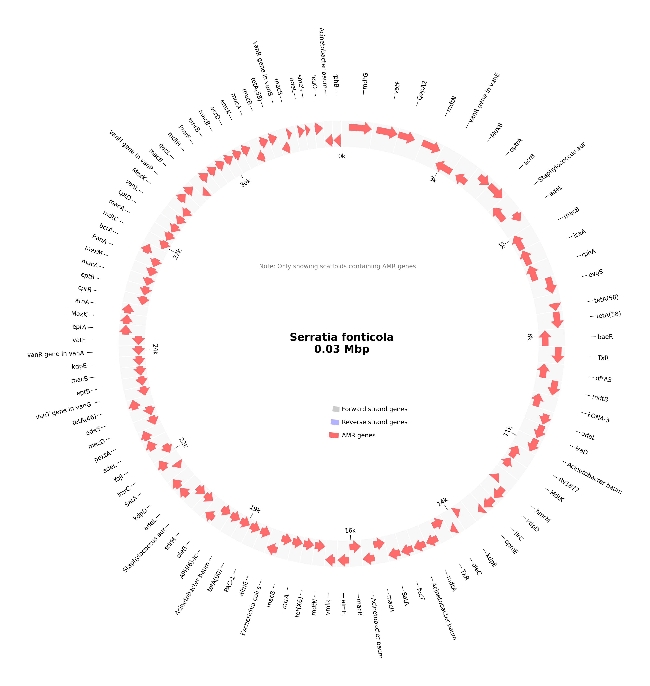

### APH(6)-Ic
- **Mechanism**: antibiotic inactivation
- **Drug Classes**: aminoglycoside antibiotic
- **AMR Family**: APH(6)
- **Locations**:
  - gnl|SPADES|BMKMCJEI_28075_1 : position 3-275

### Acinetobacter baumannii AbaF (found in 2 locations)
- **Mechanism**: antibiotic efflux
- **Drug Classes**: phosphonic acid antibiotic
- **AMR Family**: major facilitator superfamily (MFS) antibiotic efflux pump
- **Locations**:
  - gnl|SPADES|BMKMCJEI_18872_1 : position 2-358
  - gnl|SPADES|BMKMCJEI_22134_1 : position 2-319

### Acinetobacter baumannii AbaQ (found in 3 locations)
- **Mechanism**: antibiotic efflux
- **Drug Classes**: fluoroquinolone antibiotic
- **AMR Family**: major facilitator superfamily (MFS) antibiotic efflux pump
- **Locations**:
  - gnl|SPADES|BMKMCJEI_23500_1 : position 1-306
  - gnl|SPADES|BMKMCJEI_26845_1 : position 2-280
  - gnl|SPADES|BMKMCJEI_51781_1 : position 2-208

### Escherichia coli soxS with mutation conferring antibiotic resistance
- **Mechanism**: antibiotic target alteration; antibiotic efflux; reduced permeability to antibiotic
- **Drug Classes**: fluoroquinolone antibiotic; monobactam; carbapenem; cephalosporin; glycylcycline; cephamycin; penam; tetracycline antibiotic; rifamycin antibiotic; phenicol antibiotic; penem; disinfecting agents and antiseptics
- **AMR Family**: ATP-binding cassette (ABC) antibiotic efflux pump; major facilitator superfamily (MFS) antibiotic efflux pump; resistance-nodulation-cell division (RND) antibiotic efflux pump; General Bacterial Porin with reduced permeability to beta-lactams
- **Locations**:
  - gnl|SPADES|BMKMCJEI_26331_1 : position 1-282

### FONA-3
- **Mechanism**: antibiotic inactivation
- **Drug Classes**: penam
- **AMR Family**: FONA beta-lactamase
- **Locations**:
  - gnl|SPADES|BMKMCJEI_18051_1 : position 2-367

### LptD
- **Mechanism**: antibiotic efflux
- **Drug Classes**: carbapenem; peptide antibiotic; aminocoumarin antibiotic; rifamycin antibiotic
- **AMR Family**: ATP-binding cassette (ABC) antibiotic efflux pump
- **Locations**:
  - gnl|SPADES|BMKMCJEI_38547_1 : position 1-243

### MdtK
- **Mechanism**: antibiotic efflux
- **Drug Classes**: fluoroquinolone antibiotic
- **AMR Family**: multidrug and toxic compound extrusion (MATE) transporter
- **Locations**:
  - gnl|SPADES|BMKMCJEI_18972_1 : position 1-261

### MexK (found in 2 locations)
- **Mechanism**: antibiotic efflux
- **Drug Classes**: macrolide antibiotic; tetracycline antibiotic; disinfecting agents and antiseptics
- **AMR Family**: resistance-nodulation-cell division (RND) antibiotic efflux pump
- **Locations**:
  - gnl|SPADES|BMKMCJEI_35899_1 : position 2-250
  - gnl|SPADES|BMKMCJEI_39358_1 : position 2-241

### MuxB
- **Mechanism**: antibiotic efflux
- **Drug Classes**: macrolide antibiotic; monobactam; tetracycline antibiotic; aminocoumarin antibiotic
- **AMR Family**: resistance-nodulation-cell division (RND) antibiotic efflux pump
- **Locations**:
  - gnl|SPADES|BMKMCJEI_12893_1 : position 116-472

### PAC-1
- **Mechanism**: antibiotic inactivation
- **Drug Classes**: cephalosporin
- **AMR Family**: PAC beta-lactamase
- **Locations**:
  - gnl|SPADES|BMKMCJEI_26400_1 : position 2-283

### PmrF
- **Mechanism**: antibiotic target alteration
- **Drug Classes**: peptide antibiotic
- **AMR Family**: pmr phosphoethanolamine transferase
- **Locations**:
  - gnl|SPADES|BMKMCJEI_42165_1 : position 1-234

### QepA2
- **Mechanism**: antibiotic efflux
- **Drug Classes**: fluoroquinolone antibiotic
- **AMR Family**: major facilitator superfamily (MFS) antibiotic efflux pump
- **Locations**:
  - gnl|SPADES|BMKMCJEI_9724_1 : position 1-444

### RanA
- **Mechanism**: antibiotic efflux
- **Drug Classes**: aminoglycoside antibiotic
- **AMR Family**: ATP-binding cassette (ABC) antibiotic efflux pump
- **Locations**:
  - gnl|SPADES|BMKMCJEI_37690_1 : position 3-245

### Rv1877
- **Mechanism**: antibiotic efflux
- **Drug Classes**: fluoroquinolone antibiotic
- **AMR Family**: major facilitator superfamily (MFS) antibiotic efflux pump
- **Locations**:
  - gnl|SPADES|BMKMCJEI_18852_1 : position 2-358

### SatA (found in 2 locations)
- **Mechanism**: antibiotic inactivation
- **Drug Classes**: nucleoside antibiotic
- **AMR Family**: streptothricin acetyltransferase (SAT)
- **Locations**:
  - gnl|SPADES|BMKMCJEI_23004_1 : position 3-311
  - gnl|SPADES|BMKMCJEI_29259_1 : position 76-270

### Staphylococcus aureus mupA conferring resistance to mupirocin
- **Mechanism**: antibiotic target alteration
- **Drug Classes**: mupirocin-like antibiotic
- **AMR Family**: antibiotic-resistant isoleucyl-tRNA synthetase (ileS)
- **Locations**:
  - gnl|SPADES|BMKMCJEI_13603_1 : position 2-454

### Staphylococcus aureus mupB conferring resistance to mupirocin
- **Mechanism**: antibiotic target alteration
- **Drug Classes**: mupirocin-like antibiotic
- **AMR Family**: antibiotic-resistant isoleucyl-tRNA synthetase (ileS)
- **Locations**:
  - gnl|SPADES|BMKMCJEI_28729_1 : position 1-273

### TxR (found in 2 locations)
- **Mechanism**: antibiotic efflux
- **Drug Classes**: tetracycline antibiotic
- **AMR Family**: ATP-binding cassette (ABC) antibiotic efflux pump
- **Locations**:
  - gnl|SPADES|BMKMCJEI_15122_1 : position 1-417
  - gnl|SPADES|BMKMCJEI_21855_1 : position 1-321

### YojI
- **Mechanism**: antibiotic efflux
- **Drug Classes**: peptide antibiotic
- **AMR Family**: ATP-binding cassette (ABC) antibiotic efflux pump
- **Locations**:
  - gnl|SPADES|BMKMCJEI_30456_1 : position 1-267

### acrB
- **Mechanism**: antibiotic efflux
- **Drug Classes**: fluoroquinolone antibiotic; cephalosporin; glycylcycline; penam; tetracycline antibiotic; rifamycin antibiotic; phenicol antibiotic; disinfecting agents and antiseptics
- **AMR Family**: resistance-nodulation-cell division (RND) antibiotic efflux pump
- **Locations**:
  - gnl|SPADES|BMKMCJEI_13313_1 : position 3-461

### acrD
- **Mechanism**: antibiotic efflux
- **Drug Classes**: aminoglycoside antibiotic
- **AMR Family**: resistance-nodulation-cell division (RND) antibiotic efflux pump
- **Locations**:
  - gnl|SPADES|BMKMCJEI_44613_1 : position 3-227

### adeL (found in 5 locations)
- **Mechanism**: antibiotic efflux
- **Drug Classes**: fluoroquinolone antibiotic; tetracycline antibiotic
- **AMR Family**: resistance-nodulation-cell division (RND) antibiotic efflux pump
- **Locations**:
  - gnl|SPADES|BMKMCJEI_13740_1 : position 3-251
  - gnl|SPADES|BMKMCJEI_18332_1 : position 87-365
  - gnl|SPADES|BMKMCJEI_29366_1 : position 3-272
  - gnl|SPADES|BMKMCJEI_31263_1 : position 2-265
  - gnl|SPADES|BMKMCJEI_47796_1 : position 51-218

### adeS
- **Mechanism**: antibiotic efflux
- **Drug Classes**: glycylcycline; tetracycline antibiotic
- **AMR Family**: resistance-nodulation-cell division (RND) antibiotic efflux pump
- **Locations**:
  - gnl|SPADES|BMKMCJEI_33784_1 : position 3-257

### almE (found in 2 locations)
- **Mechanism**: antibiotic target alteration
- **Drug Classes**: peptide antibiotic
- **AMR Family**: polymyxin resistance operon; alm glycyltransferase
- **Locations**:
  - gnl|SPADES|BMKMCJEI_24196_1 : position 3-299
  - gnl|SPADES|BMKMCJEI_26376_1 : position 1-282

### arnA
- **Mechanism**: antibiotic target alteration
- **Drug Classes**: peptide antibiotic
- **AMR Family**: pmr phosphoethanolamine transferase
- **Locations**:
  - gnl|SPADES|BMKMCJEI_36359_1 : position 2-250

### baeR
- **Mechanism**: antibiotic efflux
- **Drug Classes**: aminoglycoside antibiotic; aminocoumarin antibiotic
- **AMR Family**: resistance-nodulation-cell division (RND) antibiotic efflux pump
- **Locations**:
  - gnl|SPADES|BMKMCJEI_14809_1 : position 2-424

### bcrA
- **Mechanism**: antibiotic efflux
- **Drug Classes**: peptide antibiotic
- **AMR Family**: ATP-binding cassette (ABC) antibiotic efflux pump
- **Locations**:
  - gnl|SPADES|BMKMCJEI_37862_1 : position 1-246

### cprR
- **Mechanism**: antibiotic target alteration; antibiotic efflux
- **Drug Classes**: peptide antibiotic
- **AMR Family**: pmr phosphoethanolamine transferase
- **Locations**:
  - gnl|SPADES|BMKMCJEI_36637_1 : position 1-249

### dfrA3
- **Mechanism**: antibiotic target replacement
- **Drug Classes**: diaminopyrimidine antibiotic
- **AMR Family**: trimethoprim resistant dihydrofolate reductase dfr
- **Locations**:
  - gnl|SPADES|BMKMCJEI_15885_1 : position 18-401

### emrB
- **Mechanism**: antibiotic efflux
- **Drug Classes**: fluoroquinolone antibiotic
- **AMR Family**: major facilitator superfamily (MFS) antibiotic efflux pump
- **Locations**:
  - gnl|SPADES|BMKMCJEI_42149_1 : position 3-233

### emrK
- **Mechanism**: antibiotic efflux
- **Drug Classes**: tetracycline antibiotic
- **AMR Family**: major facilitator superfamily (MFS) antibiotic efflux pump
- **Locations**:
  - gnl|SPADES|BMKMCJEI_44431_1 : position 2-226

### eptA
- **Mechanism**: antibiotic target alteration
- **Drug Classes**: peptide antibiotic
- **AMR Family**: pmr phosphoethanolamine transferase
- **Locations**:
  - gnl|SPADES|BMKMCJEI_35786_1 : position 3-251

### eptB (found in 2 locations)
- **Mechanism**: antibiotic target alteration
- **Drug Classes**: peptide antibiotic
- **AMR Family**: pmr phosphoethanolamine transferase
- **Locations**:
  - gnl|SPADES|BMKMCJEI_34509_1 : position 2-256
  - gnl|SPADES|BMKMCJEI_36656_1 : position 1-249

### evgS
- **Mechanism**: antibiotic efflux
- **Drug Classes**: macrolide antibiotic; fluoroquinolone antibiotic; penam; tetracycline antibiotic
- **AMR Family**: major facilitator superfamily (MFS) antibiotic efflux pump; resistance-nodulation-cell division (RND) antibiotic efflux pump
- **Locations**:
  - gnl|SPADES|BMKMCJEI_14602_1 : position 1-429

### facT
- **Mechanism**: antibiotic efflux
- **Drug Classes**: elfamycin antibiotic
- **AMR Family**: major facilitator superfamily (MFS) antibiotic efflux pump
- **Locations**:
  - gnl|SPADES|BMKMCJEI_22532_1 : position 3-314

### hmrM
- **Mechanism**: antibiotic efflux
- **Drug Classes**: fluoroquinolone antibiotic; disinfecting agents and antiseptics
- **AMR Family**: multidrug and toxic compound extrusion (MATE) transporter
- **Locations**:
  - gnl|SPADES|BMKMCJEI_19252_1 : position 160-351

### kdpD (found in 2 locations)
- **Mechanism**: antibiotic efflux
- **Drug Classes**: aminoglycoside antibiotic
- **AMR Family**: kdpDE
- **Locations**:
  - gnl|SPADES|BMKMCJEI_19831_1 : position 2-346
  - gnl|SPADES|BMKMCJEI_29321_1 : position 1-270

### kdpE (found in 2 locations)
- **Mechanism**: antibiotic efflux
- **Drug Classes**: aminoglycoside antibiotic
- **AMR Family**: kdpDE
- **Locations**:
  - gnl|SPADES|BMKMCJEI_21522_2 : position 141-326
  - gnl|SPADES|BMKMCJEI_34830_1 : position 2-253

### leuO
- **Mechanism**: antibiotic efflux
- **Drug Classes**: nucleoside antibiotic; disinfecting agents and antiseptics
- **AMR Family**: major facilitator superfamily (MFS) antibiotic efflux pump
- **Locations**:
  - gnl|SPADES|BMKMCJEI_49423_1 : position 3-212

### lmrC
- **Mechanism**: antibiotic target protection
- **Drug Classes**: lincosamide antibiotic
- **AMR Family**: Miscellaneous ABC-F subfamily ATP-binding cassette ribosomal protection proteins
- **Locations**:
  - gnl|SPADES|BMKMCJEI_29641_1 : position 2-271

### lsaA
- **Mechanism**: antibiotic target protection
- **Drug Classes**: lincosamide antibiotic; streptogramin antibiotic; streptogramin A antibiotic; streptogramin B antibiotic; pleuromutilin antibiotic
- **AMR Family**: lsa-type ABC-F protein
- **Locations**:
  - gnl|SPADES|BMKMCJEI_14532_1 : position 3-431

### lsaD
- **Mechanism**: antibiotic target protection
- **Drug Classes**: lincosamide antibiotic; streptogramin antibiotic; streptogramin A antibiotic; pleuromutilin antibiotic
- **AMR Family**: lsa-type ABC-F protein
- **Locations**:
  - gnl|SPADES|BMKMCJEI_18754_1 : position 2-358

### macA (found in 3 locations)
- **Mechanism**: antibiotic efflux
- **Drug Classes**: macrolide antibiotic
- **AMR Family**: ATP-binding cassette (ABC) antibiotic efflux pump
- **Locations**:
  - gnl|SPADES|BMKMCJEI_36887_1 : position 2-232
  - gnl|SPADES|BMKMCJEI_38754_1 : position 1-243
  - gnl|SPADES|BMKMCJEI_44634_1 : position 3-227

### macB (found in 9 locations)
- **Mechanism**: antibiotic efflux
- **Drug Classes**: macrolide antibiotic
- **AMR Family**: ATP-binding cassette (ABC) antibiotic efflux pump
- **Locations**:
  - gnl|SPADES|BMKMCJEI_14124_1 : position 1-441
  - gnl|SPADES|BMKMCJEI_23159_1 : position 3-308
  - gnl|SPADES|BMKMCJEI_23720_1 : position 1-303
  - gnl|SPADES|BMKMCJEI_26239_1 : position 1-282
  - gnl|SPADES|BMKMCJEI_34829_1 : position 1-255
  - gnl|SPADES|BMKMCJEI_40574_1 : position 2-238
  - gnl|SPADES|BMKMCJEI_42134_1 : position 3-233
  - gnl|SPADES|BMKMCJEI_44630_1 : position 1-228
  - gnl|SPADES|BMKMCJEI_47871_1 : position 2-127

### mdtA
- **Mechanism**: antibiotic efflux
- **Drug Classes**: aminocoumarin antibiotic
- **AMR Family**: resistance-nodulation-cell division (RND) antibiotic efflux pump
- **Locations**:
  - gnl|SPADES|BMKMCJEI_22172_1 : position 2-319

### mdtB
- **Mechanism**: antibiotic efflux
- **Drug Classes**: aminocoumarin antibiotic
- **AMR Family**: resistance-nodulation-cell division (RND) antibiotic efflux pump
- **Locations**:
  - gnl|SPADES|BMKMCJEI_16896_1 : position 1-384

### mdtC
- **Mechanism**: antibiotic efflux
- **Drug Classes**: aminocoumarin antibiotic
- **AMR Family**: resistance-nodulation-cell division (RND) antibiotic efflux pump
- **Locations**:
  - gnl|SPADES|BMKMCJEI_38346_1 : position 1-243

### mdtG
- **Mechanism**: antibiotic efflux
- **Drug Classes**: phosphonic acid antibiotic
- **AMR Family**: major facilitator superfamily (MFS) antibiotic efflux pump
- **Locations**:
  - gnl|SPADES|BMKMCJEI_7999_1 : position 178-765

### mdtH
- **Mechanism**: antibiotic efflux
- **Drug Classes**: fluoroquinolone antibiotic
- **AMR Family**: major facilitator superfamily (MFS) antibiotic efflux pump
- **Locations**:
  - gnl|SPADES|BMKMCJEI_41569_1 : position 1-234

### mdtN (found in 2 locations)
- **Mechanism**: antibiotic efflux
- **Drug Classes**: nucleoside antibiotic; disinfecting agents and antiseptics
- **AMR Family**: major facilitator superfamily (MFS) antibiotic efflux pump
- **Locations**:
  - gnl|SPADES|BMKMCJEI_11811_1 : position 2-499
  - gnl|SPADES|BMKMCJEI_25739_1 : position 1-285

### mecD
- **Mechanism**: antibiotic target replacement
- **Drug Classes**: penam
- **AMR Family**: methicillin resistant PBP2
- **Locations**:
  - gnl|SPADES|BMKMCJEI_33312_1 : position 3-260

### mexM
- **Mechanism**: antibiotic efflux
- **Drug Classes**: phenicol antibiotic
- **AMR Family**: resistance-nodulation-cell division (RND) antibiotic efflux pump
- **Locations**:
  - gnl|SPADES|BMKMCJEI_37427_1 : position 2-247

### mtrA
- **Mechanism**: antibiotic efflux
- **Drug Classes**: macrolide antibiotic; penam
- **AMR Family**: resistance-nodulation-cell division (RND) antibiotic efflux pump
- **Locations**:
  - gnl|SPADES|BMKMCJEI_26185_1 : position 2-283

### oleB
- **Mechanism**: antibiotic target protection
- **Drug Classes**: macrolide antibiotic
- **AMR Family**: Miscellaneous ABC-F subfamily ATP-binding cassette ribosomal protection proteins
- **Locations**:
  - gnl|SPADES|BMKMCJEI_28650_1 : position 2-274

### oleC
- **Mechanism**: antibiotic efflux
- **Drug Classes**: macrolide antibiotic
- **AMR Family**: ATP-binding cassette (ABC) antibiotic efflux pump
- **Locations**:
  - gnl|SPADES|BMKMCJEI_21739_2 : position 155-325

### opmE
- **Mechanism**: antibiotic efflux
- **Drug Classes**: macrolide antibiotic; carbapenem; tetracycline antibiotic; diaminopyrimidine antibiotic; phenicol antibiotic; disinfecting agents and antiseptics
- **AMR Family**: resistance-nodulation-cell division (RND) antibiotic efflux pump
- **Locations**:
  - gnl|SPADES|BMKMCJEI_21105_1 : position 3-158

### optrA
- **Mechanism**: antibiotic target protection
- **Drug Classes**: oxazolidinone antibiotic; phenicol antibiotic
- **AMR Family**: Miscellaneous ABC-F subfamily ATP-binding cassette ribosomal protection proteins
- **Locations**:
  - gnl|SPADES|BMKMCJEI_13035_1 : position 148-468

### poxtA
- **Mechanism**: antibiotic target protection
- **Drug Classes**: tetracycline antibiotic; oxazolidinone antibiotic; phenicol antibiotic
- **AMR Family**: Miscellaneous ABC-F subfamily ATP-binding cassette ribosomal protection proteins
- **Locations**:
  - gnl|SPADES|BMKMCJEI_32795_1 : position 2-259

### qacL
- **Mechanism**: antibiotic efflux
- **Drug Classes**: disinfecting agents and antiseptics
- **AMR Family**: small multidrug resistance (SMR) antibiotic efflux pump
- **Locations**:
  - gnl|SPADES|BMKMCJEI_41125_1 : position 3-179

### rphA
- **Mechanism**: antibiotic inactivation
- **Drug Classes**: rifamycin antibiotic
- **AMR Family**: rifampin phosphotransferase
- **Locations**:
  - gnl|SPADES|BMKMCJEI_14561_1 : position 1-432

### rphB
- **Mechanism**: antibiotic inactivation
- **Drug Classes**: rifamycin antibiotic
- **AMR Family**: rifampin phosphotransferase
- **Locations**:
  - gnl|SPADES|BMKMCJEI_51711_1 : position 3-206

### sdrM
- **Mechanism**: antibiotic efflux
- **Drug Classes**: fluoroquinolone antibiotic; disinfecting agents and antiseptics
- **AMR Family**: major facilitator superfamily (MFS) antibiotic efflux pump
- **Locations**:
  - gnl|SPADES|BMKMCJEI_28683_1 : position 1-273

### smeS
- **Mechanism**: antibiotic efflux
- **Drug Classes**: aminoglycoside antibiotic; cephalosporin; cephamycin; penam
- **AMR Family**: resistance-nodulation-cell division (RND) antibiotic efflux pump
- **Locations**:
  - gnl|SPADES|BMKMCJEI_48768_1 : position 1-126

### tet(X6)
- **Mechanism**: antibiotic inactivation
- **Drug Classes**: tetracycline antibiotic
- **AMR Family**: tetracycline inactivation enzyme
- **Locations**:
  - gnl|SPADES|BMKMCJEI_26058_1 : position 1-285

### tetA(46)
- **Mechanism**: antibiotic efflux
- **Drug Classes**: tetracycline antibiotic
- **AMR Family**: ATP-binding cassette (ABC) antibiotic efflux pump
- **Locations**:
  - gnl|SPADES|BMKMCJEI_33850_1 : position 1-258

### tetA(58) (found in 3 locations)
- **Mechanism**: antibiotic efflux
- **Drug Classes**: tetracycline antibiotic
- **AMR Family**: major facilitator superfamily (MFS) antibiotic efflux pump
- **Locations**:
  - gnl|SPADES|BMKMCJEI_14732_1 : position 227-427
  - gnl|SPADES|BMKMCJEI_14822_1 : position 2-424
  - gnl|SPADES|BMKMCJEI_47490_1 : position 2-220

### tetA(60)
- **Mechanism**: antibiotic efflux
- **Drug Classes**: tetracycline antibiotic
- **AMR Family**: ATP-binding cassette (ABC) antibiotic efflux pump
- **Locations**:
  - gnl|SPADES|BMKMCJEI_26762_1 : position 2-280

### tlrC
- **Mechanism**: antibiotic target protection
- **Drug Classes**: macrolide antibiotic; lincosamide antibiotic
- **AMR Family**: Miscellaneous ABC-F subfamily ATP-binding cassette ribosomal protection proteins
- **Locations**:
  - gnl|SPADES|BMKMCJEI_20678_1 : position 2-334

### vanH gene in vanP cluster
- **Mechanism**: antibiotic target alteration
- **Drug Classes**: glycopeptide antibiotic
- **AMR Family**: vanH; glycopeptide resistance gene cluster
- **Locations**:
  - gnl|SPADES|BMKMCJEI_40634_1 : position 2-238

### vanL
- **Mechanism**: antibiotic target alteration
- **Drug Classes**: glycopeptide antibiotic
- **AMR Family**: glycopeptide resistance gene cluster; Van ligase
- **Locations**:
  - gnl|SPADES|BMKMCJEI_39279_1 : position 1-240

### vanR gene in vanA cluster
- **Mechanism**: antibiotic target alteration
- **Drug Classes**: glycopeptide antibiotic
- **AMR Family**: glycopeptide resistance gene cluster; vanR
- **Locations**:
  - gnl|SPADES|BMKMCJEI_35462_1 : position 2-253

### vanR gene in vanB cluster
- **Mechanism**: antibiotic target alteration
- **Drug Classes**: glycopeptide antibiotic
- **AMR Family**: glycopeptide resistance gene cluster; vanR
- **Locations**:
  - gnl|SPADES|BMKMCJEI_47513_1 : position 1-219

### vanR gene in vanE cluster
- **Mechanism**: antibiotic target alteration
- **Drug Classes**: glycopeptide antibiotic
- **AMR Family**: glycopeptide resistance gene cluster; vanR
- **Locations**:
  - gnl|SPADES|BMKMCJEI_12377_1 : position 3-491

### vanT gene in vanG cluster
- **Mechanism**: antibiotic target alteration
- **Drug Classes**: glycopeptide antibiotic
- **AMR Family**: glycopeptide resistance gene cluster; vanT
- **Locations**:
  - gnl|SPADES|BMKMCJEI_34033_1 : position 3-257

### vatE
- **Mechanism**: antibiotic inactivation
- **Drug Classes**: streptogramin antibiotic; streptogramin A antibiotic
- **AMR Family**: streptogramin vat acetyltransferase
- **Locations**:
  - gnl|SPADES|BMKMCJEI_35439_1 : position 2-253

### vatF
- **Mechanism**: antibiotic inactivation
- **Drug Classes**: streptogramin antibiotic; streptogramin A antibiotic
- **AMR Family**: streptogramin vat acetyltransferase
- **Locations**:
  - gnl|SPADES|BMKMCJEI_9418_1 : position 99-641

### vmlR
- **Mechanism**: antibiotic target protection
- **Drug Classes**: lincosamide antibiotic; streptogramin antibiotic; streptogramin A antibiotic; streptogramin B antibiotic; nucleoside antibiotic; pleuromutilin antibiotic
- **AMR Family**: Miscellaneous ABC-F subfamily ATP-binding cassette ribosomal protection proteins
- **Locations**:
  - gnl|SPADES|BMKMCJEI_24818_1 : position 40-291

## Serratia liquefaciens
**Strain Statistics:**
- Total genome length: 207.1 kbp
- Total scaffolds: 458
- Scaffolds with AMR genes: 39
- Total genes annotated: 361
- Total AMR genes: 58
- Unique AMR genes: 43
- Distinct AMR mechanisms: 9
- Distinct AMR families: 19
- Distinct drug classes: 24

**Circos Plot:**

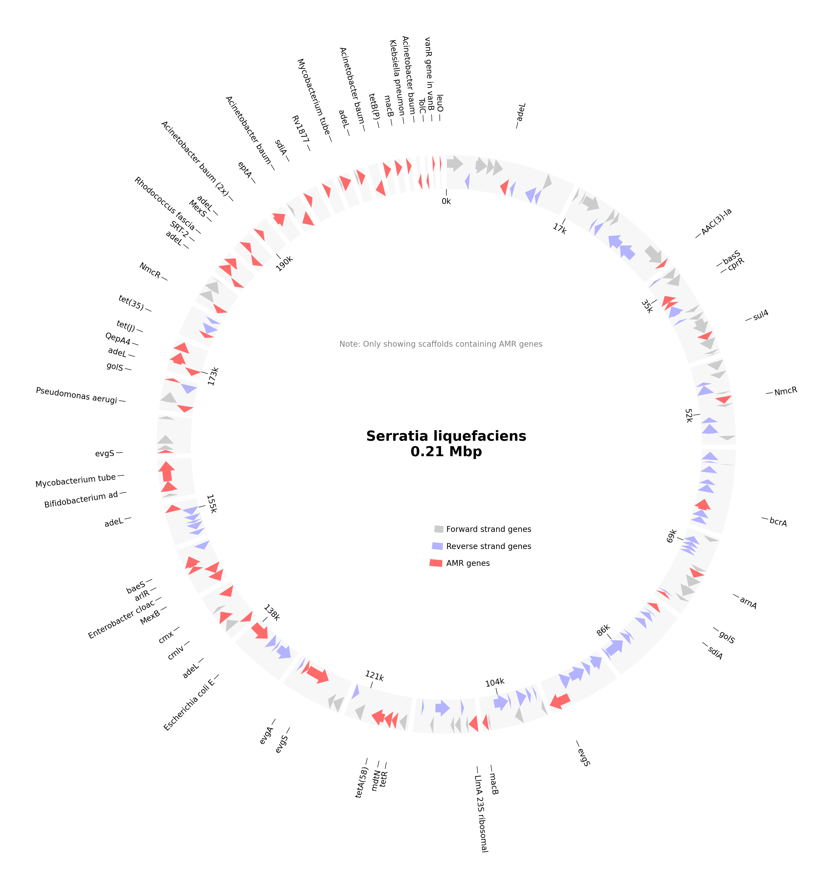

### AAC(3)-Ia
- **Mechanism**: antibiotic inactivation
- **Drug Classes**: aminoglycoside antibiotic
- **AMR Family**: AAC(3)
- **Locations**:
  - gnl|SPADES|BMKMCJEI_655_12 : position 14577-15125

### Acinetobacter baumannii AbaF (found in 2 locations)
- **Mechanism**: antibiotic efflux
- **Drug Classes**: phosphonic acid antibiotic
- **AMR Family**: major facilitator superfamily (MFS) antibiotic efflux pump
- **Locations**:
  - gnl|SPADES|BMKMCJEI_3700_2 : position 378-1688
  - gnl|SPADES|BMKMCJEI_5070_1 : position 117-1295

### Acinetobacter baumannii AbaQ (found in 3 locations)
- **Mechanism**: antibiotic efflux
- **Drug Classes**: fluoroquinolone antibiotic
- **AMR Family**: major facilitator superfamily (MFS) antibiotic efflux pump
- **Locations**:
  - gnl|SPADES|BMKMCJEI_12310_1 : position 3-491
  - gnl|SPADES|BMKMCJEI_3538_1 : position 3-770
  - gnl|SPADES|BMKMCJEI_3538_2 : position 898-2037

### Bifidobacterium adolescentis rpoB mutants conferring resistance to rifampicin
- **Mechanism**: antibiotic target alteration; antibiotic target replacement
- **Drug Classes**: rifamycin antibiotic
- **AMR Family**: rifamycin-resistant beta-subunit of RNA polymerase (rpoB)
- **Locations**:
  - gnl|SPADES|BMKMCJEI_1633_3 : position 999-2324

### Enterobacter cloacae acrA
- **Mechanism**: antibiotic efflux
- **Drug Classes**: fluoroquinolone antibiotic; cephalosporin; glycylcycline; penam; tetracycline antibiotic; rifamycin antibiotic; phenicol antibiotic; disinfecting agents and antiseptics
- **AMR Family**: resistance-nodulation-cell division (RND) antibiotic efflux pump
- **Locations**:
  - gnl|SPADES|BMKMCJEI_1396_2 : position 1278-2480

### Escherichia coli EF-Tu mutants conferring resistance to Enacyloxin IIa
- **Mechanism**: antibiotic target alteration
- **Drug Classes**: elfamycin antibiotic
- **AMR Family**: elfamycin resistant EF-Tu
- **Locations**:
  - gnl|SPADES|BMKMCJEI_1208_6 : position 4688-7375

### Klebsiella pneumoniae OmpK37
- **Mechanism**: reduced permeability to antibiotic
- **Drug Classes**: monobactam; carbapenem; cephalosporin; cephamycin; penam; penem
- **AMR Family**: General Bacterial Porin with reduced permeability to beta-lactams
- **Locations**:
  - gnl|SPADES|BMKMCJEI_10064_1 : position 3-599

### LlmA 23S ribosomal RNA methyltransferase
- **Mechanism**: antibiotic target alteration
- **Drug Classes**: lincosamide antibiotic
- **AMR Family**: Llm 23S ribosomal RNA methyltransferase
- **Locations**:
  - gnl|SPADES|BMKMCJEI_1082_1 : position 2-1174

### MexB
- **Mechanism**: antibiotic efflux
- **Drug Classes**: macrolide antibiotic; fluoroquinolone antibiotic; monobactam; carbapenem; cephalosporin; cephamycin; penam; tetracycline antibiotic; peptide antibiotic; aminocoumarin antibiotic; diaminopyrimidine antibiotic; sulfonamide antibiotic; phenicol antibiotic; penem
- **AMR Family**: resistance-nodulation-cell division (RND) antibiotic efflux pump
- **Locations**:
  - gnl|SPADES|BMKMCJEI_1396_1 : position 2-1285

### MexS
- **Mechanism**: antibiotic efflux
- **Drug Classes**: fluoroquinolone antibiotic; diaminopyrimidine antibiotic; phenicol antibiotic
- **AMR Family**: resistance-nodulation-cell division (RND) antibiotic efflux pump
- **Locations**:
  - gnl|SPADES|BMKMCJEI_2579_1 : position 205-1140

### Mycobacterium tuberculosis kasA mutant conferring resistance to isoniazid
- **Mechanism**: antibiotic target alteration
- **Drug Classes**: isoniazid-like antibiotic
- **AMR Family**: antibiotic resistant kasA
- **Locations**:
  - gnl|SPADES|BMKMCJEI_4359_2 : position 338-1570

### Mycobacterium tuberculosis rpoB mutations conferring resistance to rifampicin
- **Mechanism**: antibiotic target alteration; antibiotic target replacement
- **Drug Classes**: rifamycin antibiotic
- **AMR Family**: rifamycin-resistant beta-subunit of RNA polymerase (rpoB)
- **Locations**:
  - gnl|SPADES|BMKMCJEI_1633_4 : position 2300-4954

### NmcR (found in 2 locations)
- **Mechanism**: antibiotic inactivation
- **Drug Classes**: carbapenem; cephalosporin; cephamycin; penam
- **AMR Family**: NmcA beta-lactamase
- **Locations**:
  - gnl|SPADES|BMKMCJEI_2105_1 : position 90-944
  - gnl|SPADES|BMKMCJEI_809_6 : position 4972-5889

### Pseudomonas aeruginosa ampR with mutation conferring resistance to aztreonam
- **Mechanism**: antibiotic target alteration; antibiotic inactivation
- **Drug Classes**: monobactam; carbapenem; cephalosporin
- **AMR Family**: PDC beta-lactamase; ampR transcriptional regulator with mutation conferring resistance to monobactam antibiotics
- **Locations**:
  - gnl|SPADES|BMKMCJEI_1896_1 : position 1-918

### QepA4
- **Mechanism**: antibiotic efflux
- **Drug Classes**: fluoroquinolone antibiotic
- **AMR Family**: major facilitator superfamily (MFS) antibiotic efflux pump
- **Locations**:
  - gnl|SPADES|BMKMCJEI_1950_2 : position 1243-2775

### Rhodococcus fascians cmr
- **Mechanism**: antibiotic efflux
- **Drug Classes**: phenicol antibiotic
- **AMR Family**: major facilitator superfamily (MFS) antibiotic efflux pump
- **Locations**:
  - gnl|SPADES|BMKMCJEI_2556_3 : position 2011-3078

### Rv1877
- **Mechanism**: antibiotic efflux
- **Drug Classes**: fluoroquinolone antibiotic
- **AMR Family**: major facilitator superfamily (MFS) antibiotic efflux pump
- **Locations**:
  - gnl|SPADES|BMKMCJEI_4263_1 : position 146-943

### SRT-2
- **Mechanism**: antibiotic inactivation
- **Drug Classes**: cephalosporin
- **AMR Family**: SRT beta-lactamase
- **Locations**:
  - gnl|SPADES|BMKMCJEI_2556_2 : position 842-2011

### TolC
- **Mechanism**: antibiotic efflux
- **Drug Classes**: macrolide antibiotic; fluoroquinolone antibiotic; aminoglycoside antibiotic; carbapenem; cephalosporin; glycylcycline; cephamycin; penam; tetracycline antibiotic; peptide antibiotic; aminocoumarin antibiotic; rifamycin antibiotic; phenicol antibiotic; penem; disinfecting agents and antiseptics
- **AMR Family**: ATP-binding cassette (ABC) antibiotic efflux pump; major facilitator superfamily (MFS) antibiotic efflux pump; resistance-nodulation-cell division (RND) antibiotic efflux pump
- **Locations**:
  - gnl|SPADES|BMKMCJEI_19878_1 : position 2-343

### adeL (found in 7 locations)
- **Mechanism**: antibiotic efflux
- **Drug Classes**: fluoroquinolone antibiotic; tetracycline antibiotic
- **AMR Family**: resistance-nodulation-cell division (RND) antibiotic efflux pump
- **Locations**:
  - gnl|SPADES|BMKMCJEI_1359_1 : position 37-921
  - gnl|SPADES|BMKMCJEI_1590_6 : position 4339-5226
  - gnl|SPADES|BMKMCJEI_1950_1 : position 180-1079
  - gnl|SPADES|BMKMCJEI_2556_1 : position 3-719
  - gnl|SPADES|BMKMCJEI_2579_2 : position 1244-2131
  - gnl|SPADES|BMKMCJEI_4911_2 : position 430-1323
  - gnl|SPADES|BMKMCJEI_601_6 : position 7558-8571

### arlR
- **Mechanism**: antibiotic efflux
- **Drug Classes**: fluoroquinolone antibiotic; disinfecting agents and antiseptics
- **AMR Family**: major facilitator superfamily (MFS) antibiotic efflux pump
- **Locations**:
  - gnl|SPADES|BMKMCJEI_1396_3 : position 2769-3476

### arnA
- **Mechanism**: antibiotic target alteration
- **Drug Classes**: peptide antibiotic
- **AMR Family**: pmr phosphoethanolamine transferase
- **Locations**:
  - gnl|SPADES|BMKMCJEI_845_8 : position 5026-5970

### baeS
- **Mechanism**: antibiotic efflux
- **Drug Classes**: aminoglycoside antibiotic; aminocoumarin antibiotic
- **AMR Family**: resistance-nodulation-cell division (RND) antibiotic efflux pump
- **Locations**:
  - gnl|SPADES|BMKMCJEI_1396_4 : position 3476-4930

### basS
- **Mechanism**: antibiotic target alteration; antibiotic efflux
- **Drug Classes**: peptide antibiotic
- **AMR Family**: pmr phosphoethanolamine transferase
- **Locations**:
  - gnl|SPADES|BMKMCJEI_743_4 : position 2562-3626

### bcrA
- **Mechanism**: antibiotic efflux
- **Drug Classes**: peptide antibiotic
- **AMR Family**: ATP-binding cassette (ABC) antibiotic efflux pump
- **Locations**:
  - gnl|SPADES|BMKMCJEI_828_8 : position 7014-8546

### cmlv
- **Mechanism**: antibiotic inactivation
- **Drug Classes**: phenicol antibiotic
- **AMR Family**: chloramphenicol phosphotransferase
- **Locations**:
  - gnl|SPADES|BMKMCJEI_1359_3 : position 2388-3581

### cmx
- **Mechanism**: antibiotic efflux
- **Drug Classes**: phenicol antibiotic
- **AMR Family**: major facilitator superfamily (MFS) antibiotic efflux pump
- **Locations**:
  - gnl|SPADES|BMKMCJEI_1359_5 : position 4387-5583

### cprR
- **Mechanism**: antibiotic target alteration; antibiotic efflux
- **Drug Classes**: peptide antibiotic
- **AMR Family**: pmr phosphoethanolamine transferase
- **Locations**:
  - gnl|SPADES|BMKMCJEI_743_5 : position 3623-4285

### eptA
- **Mechanism**: antibiotic target alteration
- **Drug Classes**: peptide antibiotic
- **AMR Family**: pmr phosphoethanolamine transferase
- **Locations**:
  - gnl|SPADES|BMKMCJEI_3696_1 : position 183-1721

### evgA
- **Mechanism**: antibiotic efflux
- **Drug Classes**: macrolide antibiotic; fluoroquinolone antibiotic; penam; tetracycline antibiotic
- **AMR Family**: major facilitator superfamily (MFS) antibiotic efflux pump; resistance-nodulation-cell division (RND) antibiotic efflux pump
- **Locations**:
  - gnl|SPADES|BMKMCJEI_1112_5 : position 6306-6911

### evgS (found in 3 locations)
- **Mechanism**: antibiotic efflux
- **Drug Classes**: macrolide antibiotic; fluoroquinolone antibiotic; penam; tetracycline antibiotic
- **AMR Family**: major facilitator superfamily (MFS) antibiotic efflux pump; resistance-nodulation-cell division (RND) antibiotic efflux pump
- **Locations**:
  - gnl|SPADES|BMKMCJEI_1112_4 : position 3094-6309
  - gnl|SPADES|BMKMCJEI_1660_1 : position 169-558
  - gnl|SPADES|BMKMCJEI_969_5 : position 6644-9376

### golS (found in 2 locations)
- **Mechanism**: antibiotic efflux
- **Drug Classes**: monobactam; carbapenem; cephalosporin; cephamycin; penam; phenicol antibiotic; penem
- **AMR Family**: resistance-nodulation-cell division (RND) antibiotic efflux pump
- **Locations**:
  - gnl|SPADES|BMKMCJEI_1896_4 : position 3920-4318
  - gnl|SPADES|BMKMCJEI_845_13 : position 9698-10129

### leuO
- **Mechanism**: antibiotic efflux
- **Drug Classes**: nucleoside antibiotic; disinfecting agents and antiseptics
- **AMR Family**: major facilitator superfamily (MFS) antibiotic efflux pump
- **Locations**:
  - gnl|SPADES|BMKMCJEI_51348_1 : position 3-209

### macB (found in 2 locations)
- **Mechanism**: antibiotic efflux
- **Drug Classes**: macrolide antibiotic
- **AMR Family**: ATP-binding cassette (ABC) antibiotic efflux pump
- **Locations**:
  - gnl|SPADES|BMKMCJEI_1066_10 : position 7795-8505
  - gnl|SPADES|BMKMCJEI_7401_1 : position 3-836

### mdtN
- **Mechanism**: antibiotic efflux
- **Drug Classes**: nucleoside antibiotic; disinfecting agents and antiseptics
- **AMR Family**: major facilitator superfamily (MFS) antibiotic efflux pump
- **Locations**:
  - gnl|SPADES|BMKMCJEI_1083_3 : position 2314-3300

### sdiA (found in 2 locations)
- **Mechanism**: antibiotic efflux
- **Drug Classes**: fluoroquinolone antibiotic; cephalosporin; glycylcycline; penam; tetracycline antibiotic; rifamycin antibiotic; phenicol antibiotic; disinfecting agents and antiseptics
- **AMR Family**: resistance-nodulation-cell division (RND) antibiotic efflux pump
- **Locations**:
  - gnl|SPADES|BMKMCJEI_3749_1 : position 2-796
  - gnl|SPADES|BMKMCJEI_871_2 : position 174-911

### sul4
- **Mechanism**: antibiotic target replacement
- **Drug Classes**: sulfonamide antibiotic
- **AMR Family**: sulfonamide resistant sul
- **Locations**:
  - gnl|SPADES|BMKMCJEI_743_11 : position 9723-10556

### tet(35)
- **Mechanism**: antibiotic efflux
- **Drug Classes**: tetracycline antibiotic
- **AMR Family**: ATP-binding cassette (ABC) antibiotic efflux pump
- **Locations**:
  - gnl|SPADES|BMKMCJEI_2037_3 : position 900-1532

### tet(J)
- **Mechanism**: antibiotic efflux
- **Drug Classes**: tetracycline antibiotic
- **AMR Family**: major facilitator superfamily (MFS) antibiotic efflux pump
- **Locations**:
  - gnl|SPADES|BMKMCJEI_1950_4 : position 2999-4216

### tetA(58)
- **Mechanism**: antibiotic efflux
- **Drug Classes**: tetracycline antibiotic
- **AMR Family**: major facilitator superfamily (MFS) antibiotic efflux pump
- **Locations**:
  - gnl|SPADES|BMKMCJEI_1083_4 : position 3311-5041

### tetB(P)
- **Mechanism**: antibiotic target protection
- **Drug Classes**: tetracycline antibiotic
- **AMR Family**: tetracycline-resistant ribosomal protection protein
- **Locations**:
  - gnl|SPADES|BMKMCJEI_6966_1 : position 3-893

### tetR
- **Mechanism**: antibiotic target alteration; antibiotic efflux
- **Drug Classes**: tetracycline antibiotic
- **AMR Family**: major facilitator superfamily (MFS) antibiotic efflux pump
- **Locations**:
  - gnl|SPADES|BMKMCJEI_1083_2 : position 1606-2295

### vanR gene in vanB cluster
- **Mechanism**: antibiotic target alteration
- **Drug Classes**: glycopeptide antibiotic
- **AMR Family**: glycopeptide resistance gene cluster; vanR
- **Locations**:
  - gnl|SPADES|BMKMCJEI_23238_1 : position 2-307

## Serratia liquefaciens ATCC 27592
**Strain Statistics:**
- Total genome length: 4539.7 kbp
- Total scaffolds: 232
- Scaffolds with AMR genes: 104
- Total genes annotated: 8341
- Total AMR genes: 592
- Unique AMR genes: 238
- Distinct AMR mechanisms: 10
- Distinct AMR families: 82
- Distinct drug classes: 37

**Circos Plot:**

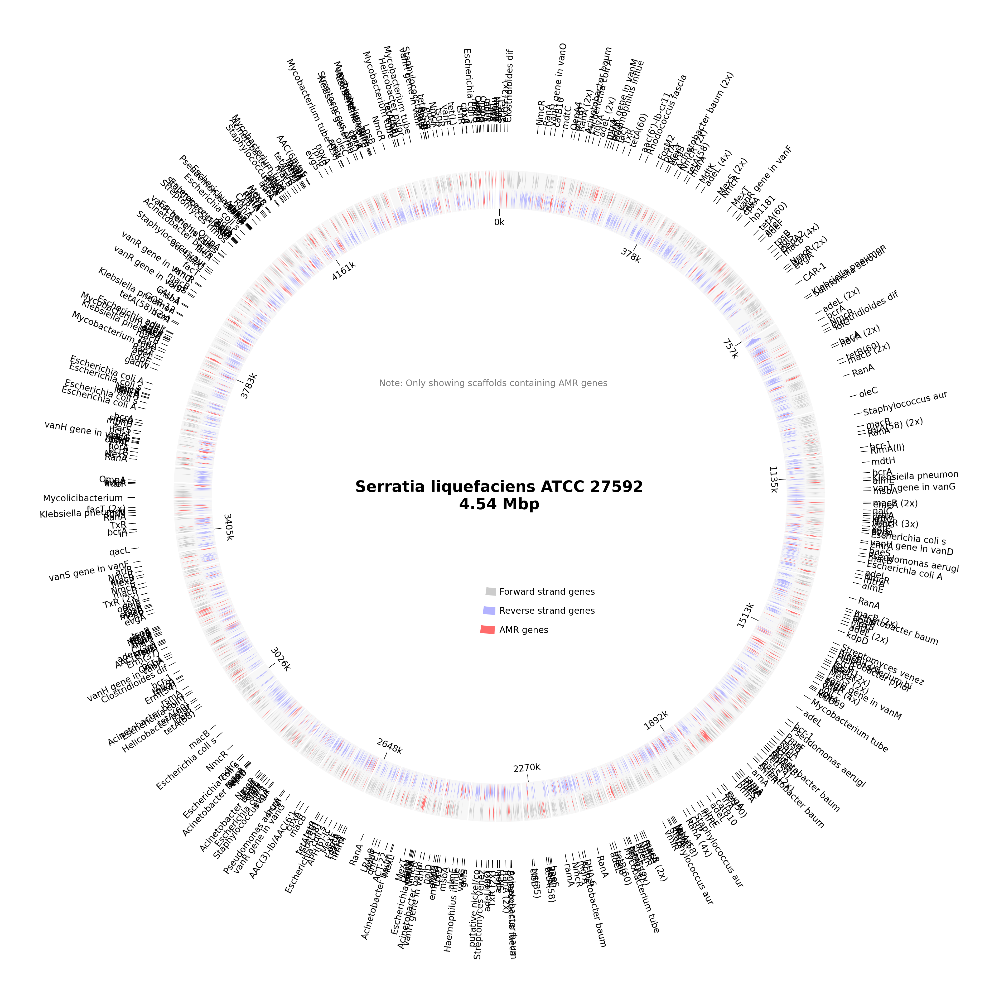

### AAC(3)-Ib/AAC(6')-Ib3 bifunctional protein
- **Mechanism**: antibiotic inactivation
- **Drug Classes**: aminoglycoside antibiotic
- **AMR Family**: aminoglycoside bifunctional resistance protein
- **Locations**:
  - gnl|SPADES|BMKMCJEI_194_46 : position 51444-51896

### AAC(6')-Iai
- **Mechanism**: antibiotic inactivation
- **Drug Classes**: aminoglycoside antibiotic
- **AMR Family**: AAC(6')
- **Locations**:
  - gnl|SPADES|BMKMCJEI_251_2 : position 1005-1457

### AAC(6')-Iak
- **Mechanism**: antibiotic inactivation
- **Drug Classes**: aminoglycoside antibiotic
- **AMR Family**: AAC(6')
- **Locations**:
  - gnl|SPADES|BMKMCJEI_516_2 : position 2112-2558

### AAC(6')-Isa
- **Mechanism**: antibiotic inactivation
- **Drug Classes**: aminoglycoside antibiotic
- **AMR Family**: AAC(6')
- **Locations**:
  - gnl|SPADES|BMKMCJEI_85_27 : position 25016-25600

### ACT-22
- **Mechanism**: antibiotic inactivation
- **Drug Classes**: carbapenem; cephalosporin; cephamycin; penam
- **AMR Family**: ACT beta-lactamase
- **Locations**:
  - gnl|SPADES|BMKMCJEI_187_33 : position 32994-34529

### AIM-1
- **Mechanism**: antibiotic inactivation
- **Drug Classes**: cephalosporin; cephamycin; penam
- **AMR Family**: AIM beta-lactamase
- **Locations**:
  - gnl|SPADES|BMKMCJEI_251_28 : position 20575-21519

### APH(6)-Ic
- **Mechanism**: antibiotic inactivation
- **Drug Classes**: aminoglycoside antibiotic
- **AMR Family**: APH(6)
- **Locations**:
  - gnl|SPADES|BMKMCJEI_193_40 : position 35824-36678

### AQU-2
- **Mechanism**: antibiotic inactivation
- **Drug Classes**: cephalosporin
- **AMR Family**: AQU beta-lactamase
- **Locations**:
  - gnl|SPADES|BMKMCJEI_457_23 : position 21101-22249

### Acinetobacter baumannii AbaF (found in 7 locations)
- **Mechanism**: antibiotic efflux
- **Drug Classes**: phosphonic acid antibiotic
- **AMR Family**: major facilitator superfamily (MFS) antibiotic efflux pump
- **Locations**:
  - gnl|SPADES|BMKMCJEI_105_35 : position 49552-50934
  - gnl|SPADES|BMKMCJEI_130_55 : position 62003-63328
  - gnl|SPADES|BMKMCJEI_187_24 : position 22346-23656
  - gnl|SPADES|BMKMCJEI_221_10 : position 8452-9954
  - gnl|SPADES|BMKMCJEI_444_3 : position 1588-2895
  - gnl|SPADES|BMKMCJEI_54_80 : position 101456-102778
  - gnl|SPADES|BMKMCJEI_54_94 : position 118498-119730

### Acinetobacter baumannii AbaQ (found in 10 locations)
- **Mechanism**: antibiotic efflux
- **Drug Classes**: fluoroquinolone antibiotic
- **AMR Family**: major facilitator superfamily (MFS) antibiotic efflux pump
- **Locations**:
  - gnl|SPADES|BMKMCJEI_116_68 : position 81889-83226
  - gnl|SPADES|BMKMCJEI_116_7 : position 6691-8004
  - gnl|SPADES|BMKMCJEI_130_21 : position 23929-25224
  - gnl|SPADES|BMKMCJEI_167_15 : position 13797-15167
  - gnl|SPADES|BMKMCJEI_182_21 : position 22691-23998
  - gnl|SPADES|BMKMCJEI_219_28 : position 25461-26774
  - gnl|SPADES|BMKMCJEI_230_37 : position 41064-42326
  - gnl|SPADES|BMKMCJEI_241_17 : position 19775-21043
  - gnl|SPADES|BMKMCJEI_44_35 : position 40067-41374
  - gnl|SPADES|BMKMCJEI_492_18 : position 19652-21052

### Acinetobacter baumannii AmvA
- **Mechanism**: antibiotic efflux
- **Drug Classes**: macrolide antibiotic; disinfecting agents and antiseptics
- **AMR Family**: major facilitator superfamily (MFS) antibiotic efflux pump
- **Locations**:
  - gnl|SPADES|BMKMCJEI_170_33 : position 30604-32076

### ArnT
- **Mechanism**: antibiotic target alteration
- **Drug Classes**: peptide antibiotic
- **AMR Family**: pmr phosphoethanolamine transferase
- **Locations**:
  - gnl|SPADES|BMKMCJEI_515_13: position 9362-11026

### Bifidobacterium bifidum ileS conferring resistance to mupirocin
- **Mechanism**: antibiotic target alteration
- **Drug Classes**: mupirocin-like antibiotic
- **AMR Family**: antibiotic-resistant isoleucyl-tRNA synthetase (ileS)
- **Locations**:
  - gnl|SPADES|BMKMCJEI_106_36 : position 42563-45145

### CAR-1 (found in 2 locations)
- **Mechanism**: antibiotic inactivation
- **Drug Classes**: carbapenem
- **AMR Family**: CAR beta-lactamase
- **Locations**:
  - gnl|SPADES|BMKMCJEI_460_19 : position 18745-19545
  - gnl|SPADES|BMKMCJEI_66_58 : position 70638-71444

### CAU-1
- **Mechanism**: antibiotic inactivation
- **Drug Classes**: carbapenem; penam
- **AMR Family**: CAU beta-lactamase
- **Locations**:
  - gnl|SPADES|BMKMCJEI_421_20 : position 22289-24412

### CRP (found in 2 locations)
- **Mechanism**: antibiotic efflux
- **Drug Classes**: macrolide antibiotic; fluoroquinolone antibiotic; penam
- **AMR Family**: resistance-nodulation-cell division (RND) antibiotic efflux pump
- **Locations**:
  - gnl|SPADES|BMKMCJEI_139_3 : position 2569-3333
  - gnl|SPADES|BMKMCJEI_254_25: position 27486-28118

### Clostridioides difficile gyrA conferring resistance to fluoroquinolones
- **Mechanism**: antibiotic target alteration
- **Drug Classes**: fluoroquinolone antibiotic
- **AMR Family**: fluoroquinolone resistant gyrA
- **Locations**:
  - gnl|SPADES|BMKMCJEI_41_15 : position 16555-19206

### Clostridioides difficile gyrB conferring resistance to fluoroquinolones (found in 2 locations)
- **Mechanism**: antibiotic target alteration
- **Drug Classes**: fluoroquinolone antibiotic
- **AMR Family**: fluoroquinolone resistant gyrB
- **Locations**:
  - gnl|SPADES|BMKMCJEI_241_5 : position 4690-7104
  - gnl|SPADES|BMKMCJEI_70_52 : position 64416-66311

### CrcB
- **Mechanism**: antibiotic efflux
- **Drug Classes**: aminoglycoside antibiotic
- **AMR Family**: multidrug and toxic compound extrusion (MATE) transporter
- **Locations**:
  - gnl|SPADES|BMKMCJEI_106_51 : position 57998-58381

### DHA-6
- **Mechanism**: antibiotic inactivation
- **Drug Classes**: cephalosporin; cephamycin
- **AMR Family**: DHA beta-lactamase
- **Locations**:
  - gnl|SPADES|BMKMCJEI_167_11 : position 9263-10405

### Enterobacter cloacae acrA
- **Mechanism**: antibiotic efflux
- **Drug Classes**: fluoroquinolone antibiotic; cephalosporin; glycylcycline; penam; tetracycline antibiotic; rifamycin antibiotic; phenicol antibiotic; disinfecting agents and antiseptics
- **AMR Family**: resistance-nodulation-cell division (RND) antibiotic efflux pump
- **Locations**:
  - gnl|SPADES|BMKMCJEI_63_73 : position 78137-79324

### Enterococcus faecalis cls with mutation conferring resistance to daptomycin
- **Mechanism**: antibiotic target alteration
- **Drug Classes**: peptide antibiotic
- **AMR Family**: daptomycin resistant cls
- **Locations**:
  - gnl|SPADES|BMKMCJEI_170_35 : position 33243-34703

### Enterococcus faecium liaS mutant conferring daptomycin resistance
- **Mechanism**: antibiotic target alteration; antibiotic efflux
- **Drug Classes**: peptide antibiotic
- **AMR Family**: daptomycin resistant liaS
- **Locations**:
  - gnl|SPADES|BMKMCJEI_449_2 : position 1603-3138

### Erm(34)
- **Mechanism**: antibiotic target alteration
- **Drug Classes**: macrolide antibiotic; lincosamide antibiotic; streptogramin antibiotic; streptogramin A antibiotic; streptogramin B antibiotic
- **AMR Family**: Erm 23S ribosomal RNA methyltransferase
- **Locations**:
  - gnl|SPADES|BMKMCJEI_237_15 : position 18146-18772

### Erm(37)
- **Mechanism**: antibiotic target alteration
- **Drug Classes**: macrolide antibiotic; lincosamide antibiotic; streptogramin antibiotic; streptogramin A antibiotic; streptogramin B antibiotic
- **AMR Family**: Erm 23S ribosomal RNA methyltransferase
- **Locations**:
  - gnl|SPADES|BMKMCJEI_241_35 : position 42094-42873

### Escherichia coli AcrAB-TolC with AcrR mutation conferring resistance to ciprofloxacin, tetracycline, and ceftazidime (found in 6 locations)
- **Mechanism**: antibiotic target alteration; antibiotic efflux
- **Drug Classes**: fluoroquinolone antibiotic; cephalosporin; glycylcycline; penam; tetracycline antibiotic; rifamycin antibiotic; phenicol antibiotic; disinfecting agents and antiseptics
- **AMR Family**: resistance-nodulation-cell division (RND) antibiotic efflux pump
- **Locations**:
  - gnl|SPADES|BMKMCJEI_102_31 : position 36292-36879
  - gnl|SPADES|BMKMCJEI_182_34 : position 39024-39728
  - gnl|SPADES|BMKMCJEI_365_4 : position 3163-3744
  - gnl|SPADES|BMKMCJEI_369_25 : position 25607-26188
  - gnl|SPADES|BMKMCJEI_457_21 : position 19304-19906
  - gnl|SPADES|BMKMCJEI_63_74 : position 79467-80156

### Escherichia coli AcrAB-TolC with MarR mutations conferring resistance to ciprofloxacin and tetracycline (found in 2 locations)
- **Mechanism**: antibiotic target alteration; antibiotic efflux
- **Drug Classes**: fluoroquinolone antibiotic; cephalosporin; glycylcycline; penam; tetracycline antibiotic; rifamycin antibiotic; phenicol antibiotic; disinfecting agents and antiseptics
- **AMR Family**: resistance-nodulation-cell division (RND) antibiotic efflux pump
- **Locations**:
  - gnl|SPADES|BMKMCJEI_193_26 : position 25370-25804
  - gnl|SPADES|BMKMCJEI_44_41 : position 46309-46782

### Escherichia coli EF-Tu mutants conferring resistance to Pulvomycin
- **Mechanism**: antibiotic target alteration
- **Drug Classes**: elfamycin antibiotic
- **AMR Family**: elfamycin resistant EF-Tu
- **Locations**:
  - gnl|SPADES|BMKMCJEI_556_8 : position 7874-9721

### Escherichia coli fabI mutations conferring resistance to isoniazid and triclosan (found in 2 locations)
- **Mechanism**: antibiotic target alteration
- **Drug Classes**: disinfecting agents and antiseptics; isoniazid-like antibiotic
- **AMR Family**: antibiotic resistant fabI
- **Locations**:
  - gnl|SPADES|BMKMCJEI_230_33 : position 37146-37901
  - gnl|SPADES|BMKMCJEI_400_15 : position 14597-15343

### Escherichia coli mdfA
- **Mechanism**: antibiotic efflux
- **Drug Classes**: tetracycline antibiotic; phenicol antibiotic; disinfecting agents and antiseptics
- **AMR Family**: major facilitator superfamily (MFS) antibiotic efflux pump
- **Locations**:
  - gnl|SPADES|BMKMCJEI_556_10 : position 10198-11445

### Escherichia coli soxS with mutation conferring antibiotic resistance (found in 10 locations)
- **Mechanism**: antibiotic target alteration; antibiotic efflux; reduced permeability to antibiotic
- **Drug Classes**: fluoroquinolone antibiotic; monobactam; carbapenem; cephalosporin; glycylcycline; cephamycin; penam; tetracycline antibiotic; rifamycin antibiotic; phenicol antibiotic; penem; disinfecting agents and antiseptics
- **AMR Family**: ATP-binding cassette (ABC) antibiotic efflux pump; major facilitator superfamily (MFS) antibiotic efflux pump; resistance-nodulation-cell division (RND) antibiotic efflux pump; General Bacterial Porin with reduced permeability to beta-lactams
- **Locations**:
  - gnl|SPADES|BMKMCJEI_101_76 : position 70535-71482
  - gnl|SPADES|BMKMCJEI_1264_7 : position 5308-5730
  - gnl|SPADES|BMKMCJEI_193_50 : position 47052-47945
  - gnl|SPADES|BMKMCJEI_219_15 : position 10785-11630
  - gnl|SPADES|BMKMCJEI_221_25 : position 27874-28647
  - gnl|SPADES|BMKMCJEI_224_41 : position 40052-40918
  - gnl|SPADES|BMKMCJEI_365_16 : position 15958-16416
  - gnl|SPADES|BMKMCJEI_369_14 : position 12935-13393
  - gnl|SPADES|BMKMCJEI_444_14 : position 15409-16278
  - gnl|SPADES|BMKMCJEI_457_2 : position 279-1196

### EstT (found in 3 locations)
- **Mechanism**: antibiotic inactivation
- **Drug Classes**: macrolide antibiotic
- **AMR Family**: macrolide esterase
- **Locations**:
  - gnl|SPADES|BMKMCJEI_102_62 : position 63758-64600
  - gnl|SPADES|BMKMCJEI_219_38 : position 34404-35207
  - gnl|SPADES|BMKMCJEI_6529_1 : position 72-902

### FosA8
- **Mechanism**: antibiotic inactivation
- **Drug Classes**: phosphonic acid antibiotic
- **AMR Family**: fosfomycin thiol transferase
- **Locations**:
  - gnl|SPADES|BMKMCJEI_66_102: position 111158-111565

### FosC2
- **Mechanism**: antibiotic inactivation
- **Drug Classes**: phosphonic acid antibiotic
- **AMR Family**: fosC phosphotransferase family
- **Locations**:
  - gnl|SPADES|BMKMCJEI_193_13 : position 11350-11757

### FosM1
- **Mechanism**: antibiotic inactivation
- **Drug Classes**: phosphonic acid antibiotic
- **AMR Family**: fosfomycin thiol transferase
- **Locations**:
  - gnl|SPADES|BMKMCJEI_106_62 : position 67074-67583

### FosM2
- **Mechanism**: antibiotic inactivation
- **Drug Classes**: phosphonic acid antibiotic
- **AMR Family**: fosfomycin thiol transferase
- **Locations**:
  - gnl|SPADES|BMKMCJEI_54_48 : position 59065-59475

### GOB-12
- **Mechanism**: antibiotic inactivation
- **Drug Classes**: carbapenem; cephalosporin; penam
- **AMR Family**: GOB beta-lactamase
- **Locations**:
  - gnl|SPADES|BMKMCJEI_421_3 : position 1635-2282

### H-NS
- **Mechanism**: antibiotic efflux
- **Drug Classes**: macrolide antibiotic; fluoroquinolone antibiotic; cephalosporin; cephamycin; penam; tetracycline antibiotic
- **AMR Family**: major facilitator superfamily (MFS) antibiotic efflux pump; resistance-nodulation-cell division (RND) antibiotic efflux pump
- **Locations**:
  - gnl|SPADES|BMKMCJEI_170_52 : position 55644-56051

### Haemophilus influenzae PBP3 conferring resistance to beta-lactam antibiotics (found in 2 locations)
- **Mechanism**: antibiotic target alteration
- **Drug Classes**: cephalosporin; cephamycin; penam
- **AMR Family**: Penicillin-binding protein mutations conferring resistance to beta-lactam antibiotics
- **Locations**:
  - gnl|SPADES|BMKMCJEI_173_10 : position 10829-12592
  - gnl|SPADES|BMKMCJEI_44_86 : position 98290-100008

### Helicobacter pylori pbp1 mutants conferring resistance to amoxicillin (found in 2 locations)
- **Mechanism**: antibiotic target alteration
- **Drug Classes**: cephalosporin; cephamycin; penam
- **AMR Family**: Penicillin-binding protein mutations conferring resistance to beta-lactam antibiotics
- **Locations**:
  - gnl|SPADES|BMKMCJEI_230_19 : position 17523-20027
  - gnl|SPADES|BMKMCJEI_678_7 : position 5704-8052

### Helicobacter pylori pbp2 mutants conferring resistance to amoxicillin
- **Mechanism**: antibiotic target alteration
- **Drug Classes**: cephalosporin; cephamycin; penam
- **AMR Family**: Penicillin-binding protein mutations conferring resistance to beta-lactam antibiotics
- **Locations**:
  - gnl|SPADES|BMKMCJEI_106_42 : position 48423-50318

### Klebsiella aerogenes Omp36
- **Mechanism**: reduced permeability to antibiotic
- **Drug Classes**: monobactam; carbapenem; cephalosporin; cephamycin; penam; penem
- **AMR Family**: General Bacterial Porin with reduced permeability to beta-lactams
- **Locations**:
  - gnl|SPADES|BMKMCJEI_41_9 : position 6635-7765

### Klebsiella pneumoniae KpnE
- **Mechanism**: antibiotic efflux
- **Drug Classes**: macrolide antibiotic; aminoglycoside antibiotic; cephalosporin; tetracycline antibiotic; peptide antibiotic; rifamycin antibiotic; disinfecting agents and antiseptics
- **AMR Family**: small multidrug resistance (SMR) antibiotic efflux pump
- **Locations**:
  - gnl|SPADES|BMKMCJEI_85_57 : position 56821-57189

### Klebsiella pneumoniae KpnF
- **Mechanism**: antibiotic efflux
- **Drug Classes**: macrolide antibiotic; aminoglycoside antibiotic; cephalosporin; tetracycline antibiotic; peptide antibiotic; rifamycin antibiotic; disinfecting agents and antiseptics
- **AMR Family**: small multidrug resistance (SMR) antibiotic efflux pump
- **Locations**:
  - gnl|SPADES|BMKMCJEI_85_58: position 57176-57505

### Klebsiella pneumoniae KpnH
- **Mechanism**: antibiotic efflux
- **Drug Classes**: macrolide antibiotic; fluoroquinolone antibiotic; aminoglycoside antibiotic; carbapenem; cephalosporin; penam; peptide antibiotic; penem
- **AMR Family**: major facilitator superfamily (MFS) antibiotic efflux pump
- **Locations**:
  - gnl|SPADES|BMKMCJEI_251_43: position 37259-38794

### Klebsiella pneumoniae OmpK37 (found in 4 locations)
- **Mechanism**: reduced permeability to antibiotic
- **Drug Classes**: monobactam; carbapenem; cephalosporin; cephamycin; penam; penem
- **AMR Family**: General Bacterial Porin with reduced permeability to beta-lactams
- **Locations**:
  - gnl|SPADES|BMKMCJEI_294_20 : position 16061-17158
  - gnl|SPADES|BMKMCJEI_398_22 : position 26356-26853
  - gnl|SPADES|BMKMCJEI_421_1 : position 3-128
  - gnl|SPADES|BMKMCJEI_66_88 : position 103783-104865

### LRA-8
- **Mechanism**: antibiotic inactivation
- **Drug Classes**: cephalosporin; penam
- **AMR Family**: subclass B3 LRA beta-lactamase
- **Locations**:
  - gnl|SPADES|BMKMCJEI_190_1 : position 77-832

### LpsB (found in 2 locations)
- **Mechanism**: reduced permeability to antibiotic
- **Drug Classes**: peptide antibiotic
- **AMR Family**: Intrinsic peptide antibiotic resistant Lps
- **Locations**:
  - gnl|SPADES|BMKMCJEI_129_69 : position 72869-73966
  - gnl|SPADES|BMKMCJEI_570_1 : position 650-1858

### LptD
- **Mechanism**: antibiotic efflux
- **Drug Classes**: carbapenem; peptide antibiotic; aminocoumarin antibiotic; rifamycin antibiotic
- **AMR Family**: ATP-binding cassette (ABC) antibiotic efflux pump
- **Locations**:
  - gnl|SPADES|BMKMCJEI_173_38 : position 47848-50211

### MdtK
- **Mechanism**: antibiotic efflux
- **Drug Classes**: fluoroquinolone antibiotic
- **AMR Family**: multidrug and toxic compound extrusion (MATE) transporter
- **Locations**:
  - gnl|SPADES|BMKMCJEI_61_23 : position 23799-25262

### MexA
- **Mechanism**: antibiotic efflux
- **Drug Classes**: macrolide antibiotic; fluoroquinolone antibiotic; monobactam; carbapenem; cephalosporin; cephamycin; penam; tetracycline antibiotic; peptide antibiotic; aminocoumarin antibiotic; diaminopyrimidine antibiotic; sulfonamide antibiotic; phenicol antibiotic; penem
- **AMR Family**: resistance-nodulation-cell division (RND) antibiotic efflux pump
- **Locations**:
  - gnl|SPADES|BMKMCJEI_182_36 : position 41438-42580

### MexB
- **Mechanism**: antibiotic efflux
- **Drug Classes**: macrolide antibiotic; fluoroquinolone antibiotic; monobactam; carbapenem; cephalosporin; cephamycin; penam; tetracycline antibiotic; peptide antibiotic; aminocoumarin antibiotic; diaminopyrimidine antibiotic; sulfonamide antibiotic; phenicol antibiotic; penem
- **AMR Family**: resistance-nodulation-cell division (RND) antibiotic efflux pump
- **Locations**:
  - gnl|SPADES|BMKMCJEI_461_18 : position 20814-22757

### MexE
- **Mechanism**: antibiotic efflux
- **Drug Classes**: fluoroquinolone antibiotic; diaminopyrimidine antibiotic; phenicol antibiotic
- **AMR Family**: resistance-nodulation-cell division (RND) antibiotic efflux pump
- **Locations**:
  - gnl|SPADES|BMKMCJEI_193_25 : position 24092-24949

### MexG
- **Mechanism**: antibiotic efflux
- **Drug Classes**: fluoroquinolone antibiotic; tetracycline antibiotic; disinfecting agents and antiseptics
- **AMR Family**: resistance-nodulation-cell division (RND) antibiotic efflux pump
- **Locations**:
  - gnl|SPADES|BMKMCJEI_251_6 : position 3573-3986

### MexL (found in 3 locations)
- **Mechanism**: antibiotic efflux
- **Drug Classes**: macrolide antibiotic; tetracycline antibiotic; disinfecting agents and antiseptics
- **AMR Family**: resistance-nodulation-cell division (RND) antibiotic efflux pump
- **Locations**:
  - gnl|SPADES|BMKMCJEI_139_40 : position 40520-41104
  - gnl|SPADES|BMKMCJEI_187_21 : position 20334-20990
  - gnl|SPADES|BMKMCJEI_219_34 : position 31173-31811

### MexS (found in 10 locations)
- **Mechanism**: antibiotic efflux
- **Drug Classes**: fluoroquinolone antibiotic; diaminopyrimidine antibiotic; phenicol antibiotic
- **AMR Family**: resistance-nodulation-cell division (RND) antibiotic efflux pump
- **Locations**:
  - gnl|SPADES|BMKMCJEI_101_16 : position 17133-18113
  - gnl|SPADES|BMKMCJEI_101_6 : position 6711-7736
  - gnl|SPADES|BMKMCJEI_105_50 : position 63554-64543
  - gnl|SPADES|BMKMCJEI_106_81 : position 85349-86284
  - gnl|SPADES|BMKMCJEI_106_82 : position 86377-87366
  - gnl|SPADES|BMKMCJEI_172_11 : position 13619-14605
  - gnl|SPADES|BMKMCJEI_312_11 : position 11164-12291
  - gnl|SPADES|BMKMCJEI_61_109 : position 107100-108134
  - gnl|SPADES|BMKMCJEI_61_71 : position 70168-71175
  - gnl|SPADES|BMKMCJEI_70_20 : position 27190-28218

### MexT (found in 4 locations)
- **Mechanism**: antibiotic efflux
- **Drug Classes**: fluoroquinolone antibiotic; diaminopyrimidine antibiotic; phenicol antibiotic
- **AMR Family**: resistance-nodulation-cell division (RND) antibiotic efflux pump
- **Locations**:
  - gnl|SPADES|BMKMCJEI_182_48 : position 56595-57491
  - gnl|SPADES|BMKMCJEI_41_5 : position 4004-4906
  - gnl|SPADES|BMKMCJEI_54_66 : position 81146-82096
  - gnl|SPADES|BMKMCJEI_61_107 : position 105380-106309

### MexV
- **Mechanism**: antibiotic efflux
- **Drug Classes**: macrolide antibiotic; fluoroquinolone antibiotic; tetracycline antibiotic; phenicol antibiotic; disinfecting agents and antiseptics
- **AMR Family**: resistance-nodulation-cell division (RND) antibiotic efflux pump
- **Locations**:
  - gnl|SPADES|BMKMCJEI_41_116 : position 134699-136150

### MexZ
- **Mechanism**: antibiotic efflux
- **Drug Classes**: macrolide antibiotic; fluoroquinolone antibiotic; aminoglycoside antibiotic; carbapenem; cephalosporin; cephamycin; penam; tetracycline antibiotic; phenicol antibiotic; disinfecting agents and antiseptics
- **AMR Family**: resistance-nodulation-cell division (RND) antibiotic efflux pump
- **Locations**:
  - gnl|SPADES|BMKMCJEI_271_5 : position 4273-4905

### Mycobacterium tuberculosis gidB mutation conferring resistance to streptomycin
- **Mechanism**: antibiotic target alteration
- **Drug Classes**: aminoglycoside antibiotic
- **AMR Family**: antibiotic resistant gidB
- **Locations**:
  - gnl|SPADES|BMKMCJEI_500_3 : position 1896-2516

### Mycobacterium tuberculosis inhA mutations conferring resistance to isoniazid
- **Mechanism**: antibiotic target alteration
- **Drug Classes**: isoniazid-like antibiotic
- **AMR Family**: isoniazid resistant inhA
- **Locations**:
  - gnl|SPADES|BMKMCJEI_143_63 : position 71799-72557

### Mycobacterium tuberculosis kasA mutant conferring resistance to isoniazid (found in 3 locations)
- **Mechanism**: antibiotic target alteration
- **Drug Classes**: isoniazid-like antibiotic
- **AMR Family**: antibiotic resistant kasA
- **Locations**:
  - gnl|SPADES|BMKMCJEI_398_3 : position 1261-2535
  - gnl|SPADES|BMKMCJEI_533_14 : position 10603-11772
  - gnl|SPADES|BMKMCJEI_533_17 : position 12967-14196

### Mycobacterium tuberculosis katG mutations conferring resistance to isoniazid
- **Mechanism**: antibiotic target alteration
- **Drug Classes**: isoniazid-like antibiotic
- **AMR Family**: isoniazid resistant katG
- **Locations**:
  - gnl|SPADES|BMKMCJEI_675_2 : position 1484-3682

### Mycobacterium tuberculosis ndh with mutation conferring resistance to isoniazid
- **Mechanism**: antibiotic target alteration
- **Drug Classes**: isoniazid-like antibiotic
- **AMR Family**: antibiotic resistant ndh
- **Locations**:
  - gnl|SPADES|BMKMCJEI_400_6 : position 7335-8639

### Mycobacterium tuberculosis pncA mutations conferring resistance to pyrazinamide (found in 3 locations)
- **Mechanism**: antibiotic target alteration
- **Drug Classes**: pyrazine antibiotic
- **AMR Family**: Pyrazinamide resistant pncA
- **Locations**:
  - gnl|SPADES|BMKMCJEI_556_13 : position 13578-14129
  - gnl|SPADES|BMKMCJEI_61_3 : position 2335-3021
  - gnl|SPADES|BMKMCJEI_707_4 : position 2645-3277

### Mycobacterium tuberculosis thyA with mutation conferring resistance to para-aminosalicylic acid
- **Mechanism**: antibiotic target alteration
- **Drug Classes**: salicylic acid antibiotic
- **AMR Family**: aminosalicylate resistant thymidylate synthase
- **Locations**:
  - gnl|SPADES|BMKMCJEI_116_58 : position 64188-64982

### Mycolicibacterium smegmatis ndh with mutation conferring resistance to isoniazid
- **Mechanism**: antibiotic target alteration
- **Drug Classes**: isoniazid-like antibiotic
- **AMR Family**: antibiotic resistant ndh
- **Locations**:
  - gnl|SPADES|BMKMCJEI_304_4 : position 2918-4126

### Neisseria gonorrhoeae pilQ gene conferring resistance to beta-lactam
- **Mechanism**: antibiotic target alteration
- **Drug Classes**: cephalosporin; cephamycin; penam
- **AMR Family**: Penicillin-binding protein mutations conferring resistance to beta-lactam antibiotics
- **Locations**:
  - gnl|SPADES|BMKMCJEI_537_2 : position 394-1635

### NmcR (found in 28 locations)
- **Mechanism**: antibiotic inactivation
- **Drug Classes**: carbapenem; cephalosporin; cephamycin; penam
- **AMR Family**: NmcA beta-lactamase
- **Locations**:
  - gnl|SPADES|BMKMCJEI_101_47 : position 44529-45458
  - gnl|SPADES|BMKMCJEI_101_84 : position 77989-78891
  - gnl|SPADES|BMKMCJEI_101_89 : position 83397-84335
  - gnl|SPADES|BMKMCJEI_102_61 : position 62777-63649
  - gnl|SPADES|BMKMCJEI_106_71 : position 76936-77925
  - gnl|SPADES|BMKMCJEI_10802_1 : position 1-558
  - gnl|SPADES|BMKMCJEI_130_31 : position 34844-35737
  - gnl|SPADES|BMKMCJEI_139_37 : position 37241-38149
  - gnl|SPADES|BMKMCJEI_143_41 : position 44161-45081
  - gnl|SPADES|BMKMCJEI_167_38 : position 35209-36138
  - gnl|SPADES|BMKMCJEI_182_31 : position 35632-36495
  - gnl|SPADES|BMKMCJEI_219_44 : position 39294-40217
  - gnl|SPADES|BMKMCJEI_224_5 : position 5479-6375
  - gnl|SPADES|BMKMCJEI_251_36 : position 30493-31371
  - gnl|SPADES|BMKMCJEI_265_37 : position 37361-38215
  - gnl|SPADES|BMKMCJEI_271_20 : position 17037-17924
  - gnl|SPADES|BMKMCJEI_312_12 : position 12320-13237
  - gnl|SPADES|BMKMCJEI_365_27 : position 26078-26980
  - gnl|SPADES|BMKMCJEI_369_3 : position 2371-3273
  - gnl|SPADES|BMKMCJEI_41_65 : position 79938-80879
  - gnl|SPADES|BMKMCJEI_44_10 : position 10359-11249
  - gnl|SPADES|BMKMCJEI_54_87 : position 110038-110937
  - gnl|SPADES|BMKMCJEI_54_97 : position 122081-122908
  - gnl|SPADES|BMKMCJEI_573_2 : position 1150-2124
  - gnl|SPADES|BMKMCJEI_61_80 : position 77605-78477
  - gnl|SPADES|BMKMCJEI_66_24 : position 27731-28684
  - gnl|SPADES|BMKMCJEI_70_45 : position 56281-57114
  - gnl|SPADES|BMKMCJEI_744_13 : position 10964-11845

### OmpA (found in 4 locations)
- **Mechanism**: reduced permeability to antibiotic
- **Drug Classes**: peptide antibiotic
- **AMR Family**: General Bacterial Porin with reduced permeability to peptide antibiotics
- **Locations**:
  - gnl|SPADES|BMKMCJEI_1617_3 : position 1710-2786
  - gnl|SPADES|BMKMCJEI_241_21 : position 24219-24881
  - gnl|SPADES|BMKMCJEI_309_1 : position 1-474
  - gnl|SPADES|BMKMCJEI_444_21 : position 22540-23037

### OpmH
- **Mechanism**: antibiotic efflux
- **Drug Classes**: disinfecting agents and antiseptics
- **AMR Family**: resistance-nodulation-cell division (RND) antibiotic efflux pump
- **Locations**:
  - gnl|SPADES|BMKMCJEI_1612_1 : position 3-1364

### OprM
- **Mechanism**: antibiotic efflux
- **Drug Classes**: macrolide antibiotic; fluoroquinolone antibiotic; monobactam; aminoglycoside antibiotic; carbapenem; cephalosporin; cephamycin; penam; tetracycline antibiotic; peptide antibiotic; aminocoumarin antibiotic; diaminopyrimidine antibiotic; sulfonamide antibiotic; phenicol antibiotic; penem; disinfecting agents and antiseptics
- **AMR Family**: resistance-nodulation-cell division (RND) antibiotic efflux pump
- **Locations**:
  - gnl|SPADES|BMKMCJEI_182_38 : position 45737-47191

### ParR (found in 2 locations)
- **Mechanism**: antibiotic efflux; reduced permeability to antibiotic
- **Drug Classes**: macrolide antibiotic; fluoroquinolone antibiotic; monobactam; aminoglycoside antibiotic; carbapenem; cephalosporin; cephamycin; penam; tetracycline antibiotic; phenicol antibiotic; penem; disinfecting agents and antiseptics
- **AMR Family**: resistance-nodulation-cell division (RND) antibiotic efflux pump; Outer Membrane Porin (Opr)
- **Locations**:
  - gnl|SPADES|BMKMCJEI_330_20 : position 26455-27216
  - gnl|SPADES|BMKMCJEI_537_17 : position 15929-16648

### ParS (found in 3 locations)
- **Mechanism**: antibiotic efflux; reduced permeability to antibiotic
- **Drug Classes**: macrolide antibiotic; fluoroquinolone antibiotic; monobactam; aminoglycoside antibiotic; carbapenem; cephalosporin; cephamycin; penam; tetracycline antibiotic; phenicol antibiotic; penem; disinfecting agents and antiseptics
- **AMR Family**: resistance-nodulation-cell division (RND) antibiotic efflux pump; Outer Membrane Porin (Opr)
- **Locations**:
  - gnl|SPADES|BMKMCJEI_132_59 : position 70204-71985
  - gnl|SPADES|BMKMCJEI_251_30 : position 23336-24934
  - gnl|SPADES|BMKMCJEI_330_19 : position 25154-26458

### PmrF (found in 2 locations)
- **Mechanism**: antibiotic target alteration
- **Drug Classes**: peptide antibiotic
- **AMR Family**: pmr phosphoethanolamine transferase
- **Locations**:
  - gnl|SPADES|BMKMCJEI_129_64 : position 67408-68391
  - gnl|SPADES|BMKMCJEI_515_16 : position 13907-14887

### Pseudomonas aeruginosa CpxR (found in 5 locations)
- **Mechanism**: antibiotic efflux
- **Drug Classes**: macrolide antibiotic; fluoroquinolone antibiotic; monobactam; aminoglycoside antibiotic; carbapenem; cephalosporin; cephamycin; penam; tetracycline antibiotic; peptide antibiotic; aminocoumarin antibiotic; diaminopyrimidine antibiotic; sulfonamide antibiotic; phenicol antibiotic; penem
- **AMR Family**: resistance-nodulation-cell division (RND) antibiotic efflux pump
- **Locations**:
  - gnl|SPADES|BMKMCJEI_102_14 : position 18607-19347
  - gnl|SPADES|BMKMCJEI_129_44 : position 47876-48574
  - gnl|SPADES|BMKMCJEI_143_30 : position 32339-33019
  - gnl|SPADES|BMKMCJEI_251_31 : position 24943-25632
  - gnl|SPADES|BMKMCJEI_41_96 : position 111665-112117

### Pseudomonas aeruginosa ampR with mutation conferring resistance to aztreonam (found in 2 locations)
- **Mechanism**: antibiotic target alteration; antibiotic inactivation
- **Drug Classes**: monobactam; carbapenem; cephalosporin
- **AMR Family**: PDC beta-lactamase; ampR transcriptional regulator with mutation conferring resistance to monobactam antibiotics
- **Locations**:
  - gnl|SPADES|BMKMCJEI_207_30 : position 29382-30311
  - gnl|SPADES|BMKMCJEI_457_18 : position 15811-16686

### QepA2
- **Mechanism**: antibiotic efflux
- **Drug Classes**: fluoroquinolone antibiotic
- **AMR Family**: major facilitator superfamily (MFS) antibiotic efflux pump
- **Locations**:
  - gnl|SPADES|BMKMCJEI_63_107 : position 118086-119285

### QepA4
- **Mechanism**: antibiotic efflux
- **Drug Classes**: fluoroquinolone antibiotic
- **AMR Family**: major facilitator superfamily (MFS) antibiotic efflux pump
- **Locations**:
  - gnl|SPADES|BMKMCJEI_44_9 : position 8964-10259

### RanA (found in 25 locations)
- **Mechanism**: antibiotic efflux
- **Drug Classes**: aminoglycoside antibiotic
- **AMR Family**: ATP-binding cassette (ABC) antibiotic efflux pump
- **Locations**:
  - gnl|SPADES|BMKMCJEI_105_16 : position 20396-21388
  - gnl|SPADES|BMKMCJEI_130_3 : position 3262-4332
  - gnl|SPADES|BMKMCJEI_139_11 : position 10537-11649
  - gnl|SPADES|BMKMCJEI_139_33 : position 33523-34236
  - gnl|SPADES|BMKMCJEI_139_48 : position 50131-51168
  - gnl|SPADES|BMKMCJEI_139_68 : position 72177-73292
  - gnl|SPADES|BMKMCJEI_150_49 : position 55014-56606
  - gnl|SPADES|BMKMCJEI_170_43 : position 42315-43316
  - gnl|SPADES|BMKMCJEI_170_44 : position 43313-44329
  - gnl|SPADES|BMKMCJEI_190_26 : position 25128-25871
  - gnl|SPADES|BMKMCJEI_226_6 : position 7308-8297
  - gnl|SPADES|BMKMCJEI_251_32 : position 26039-27241
  - gnl|SPADES|BMKMCJEI_294_7 : position 5388-6323
  - gnl|SPADES|BMKMCJEI_312_5 : position 4047-5924
  - gnl|SPADES|BMKMCJEI_377_21 : position 21151-22827
  - gnl|SPADES|BMKMCJEI_41_79 : position 94806-95579
  - gnl|SPADES|BMKMCJEI_44_24 : position 24960-26039
  - gnl|SPADES|BMKMCJEI_44_89 : position 101186-101947
  - gnl|SPADES|BMKMCJEI_460_8 : position 8117-8893
  - gnl|SPADES|BMKMCJEI_461_4 : position 4735-5796
  - gnl|SPADES|BMKMCJEI_66_29 : position 32855-33691
  - gnl|SPADES|BMKMCJEI_66_74 : position 86169-87137
  - gnl|SPADES|BMKMCJEI_718_7 : position 4060-4875
  - gnl|SPADES|BMKMCJEI_73_48 : position 55155-56288
  - gnl|SPADES|BMKMCJEI_79_67 : position 69522-70598

### RanB
- **Mechanism**: antibiotic efflux
- **Drug Classes**: aminoglycoside antibiotic
- **AMR Family**: ATP-binding cassette (ABC) antibiotic efflux pump
- **Locations**:
  - gnl|SPADES|BMKMCJEI_718_6 : position 3273-4055

### Rhodococcus fascians cmr
- **Mechanism**: antibiotic efflux
- **Drug Classes**: phenicol antibiotic
- **AMR Family**: major facilitator superfamily (MFS) antibiotic efflux pump
- **Locations**:
  - gnl|SPADES|BMKMCJEI_54_26 : position 34285-35712

### RlmA(II)
- **Mechanism**: antibiotic target alteration
- **Drug Classes**: macrolide antibiotic; lincosamide antibiotic
- **AMR Family**: non-erm 23S ribosomal RNA methyltransferase (G748)
- **Locations**:
  - gnl|SPADES|BMKMCJEI_85_3 : position 1139-1960

### Rv1877
- **Mechanism**: antibiotic efflux
- **Drug Classes**: fluoroquinolone antibiotic
- **AMR Family**: major facilitator superfamily (MFS) antibiotic efflux pump
- **Locations**:
  - gnl|SPADES|BMKMCJEI_182_35 : position 39772-41286

### SAT-2
- **Mechanism**: antibiotic inactivation
- **Drug Classes**: nucleoside antibiotic
- **AMR Family**: streptothricin acetyltransferase (SAT)
- **Locations**:
  - gnl|SPADES|BMKMCJEI_271_6 : position 4921-5550

### SAT-3
- **Mechanism**: antibiotic inactivation
- **Drug Classes**: nucleoside antibiotic
- **AMR Family**: streptothricin acetyltransferase (SAT)
- **Locations**:
  - gnl|SPADES|BMKMCJEI_101_60 : position 56531-57073

### SPR-1
- **Mechanism**: antibiotic inactivation
- **Drug Classes**: carbapenem
- **AMR Family**: SPR beta-lactamase
- **Locations**:
  - gnl|SPADES|BMKMCJEI_41_4 : position 2873-3328

### SRT-3
- **Mechanism**: antibiotic inactivation
- **Drug Classes**: cephalosporin
- **AMR Family**: SRT beta-lactamase
- **Locations**:
  - gnl|SPADES|BMKMCJEI_457_19 : position 16891-18027

### Salmonella serovars soxS with mutation conferring antibiotic resistance
- **Mechanism**: antibiotic target alteration; antibiotic efflux; reduced permeability to antibiotic
- **Drug Classes**: fluoroquinolone antibiotic; monobactam; carbapenem; cephalosporin; glycylcycline; cephamycin; penam; tetracycline antibiotic; rifamycin antibiotic; phenicol antibiotic; penem; disinfecting agents and antiseptics
- **AMR Family**: ATP-binding cassette (ABC) antibiotic efflux pump; major facilitator superfamily (MFS) antibiotic efflux pump; resistance-nodulation-cell division (RND) antibiotic efflux pump; General Bacterial Porin with reduced permeability to beta-lactams
- **Locations**:
  - gnl|SPADES|BMKMCJEI_66_96 : position 108642-109028

### SatA
- **Mechanism**: antibiotic inactivation
- **Drug Classes**: nucleoside antibiotic
- **AMR Family**: streptothricin acetyltransferase (SAT)
- **Locations**:
  - gnl|SPADES|BMKMCJEI_241_22 : position 25149-25544

### Staphylococcus aureus FosB
- **Mechanism**: antibiotic inactivation
- **Drug Classes**: phosphonic acid antibiotic
- **AMR Family**: fosfomycin thiol transferase
- **Locations**:
  - gnl|SPADES|BMKMCJEI_41_8 : position 6065-6481

### Staphylococcus aureus GlpT with mutation conferring resistance to fosfomycin
- **Mechanism**: antibiotic target alteration
- **Drug Classes**: phosphonic acid antibiotic
- **AMR Family**: antibiotic-resistant GlpT
- **Locations**:
  - gnl|SPADES|BMKMCJEI_79_25 : position 25969-27324

### Staphylococcus aureus fusA with mutation conferring resistance to fusidic acid (found in 2 locations)
- **Mechanism**: antibiotic target alteration
- **Drug Classes**: fusidane antibiotic
- **AMR Family**: antibiotic resistant fusA
- **Locations**:
  - gnl|SPADES|BMKMCJEI_139_47 : position 47753-49858
  - gnl|SPADES|BMKMCJEI_439_6 : position 4574-6163

### Staphylococcus aureus mupA conferring resistance to mupirocin
- **Mechanism**: antibiotic target alteration
- **Drug Classes**: mupirocin-like antibiotic
- **AMR Family**: antibiotic-resistant isoleucyl-tRNA synthetase (ileS)
- **Locations**:
  - gnl|SPADES|BMKMCJEI_492_7 : position 6815-9631

### Staphylococcus aureus mupB conferring resistance to mupirocin
- **Mechanism**: antibiotic target alteration
- **Drug Classes**: mupirocin-like antibiotic
- **AMR Family**: antibiotic-resistant isoleucyl-tRNA synthetase (ileS)
- **Locations**:
  - gnl|SPADES|BMKMCJEI_134_64 : position 69430-72306

### Staphylococcus aureus murA with mutation conferring resistance to fosfomycin
- **Mechanism**: antibiotic target alteration
- **Drug Classes**: phosphonic acid antibiotic
- **AMR Family**: antibiotic-resistant murA transferase
- **Locations**:
  - gnl|SPADES|BMKMCJEI_718_1 : position 61-1320

### Staphylococcus aureus norA (found in 2 locations)
- **Mechanism**: antibiotic efflux
- **Drug Classes**: fluoroquinolone antibiotic
- **AMR Family**: major facilitator superfamily (MFS) antibiotic efflux pump
- **Locations**:
  - gnl|SPADES|BMKMCJEI_132_64 : position 75654-77000
  - gnl|SPADES|BMKMCJEI_449_1 : position 171-1502

### Staphylococcus aureus pgsA mutations conferring resistance to daptomycin
- **Mechanism**: antibiotic target alteration
- **Drug Classes**: peptide antibiotic
- **AMR Family**: daptomycin resistant pgsA
- **Locations**:
  - gnl|SPADES|BMKMCJEI_219_2 : position 197-745

### Streptococcus pneumoniae PBP2x conferring resistance to amoxicillin
- **Mechanism**: antibiotic target alteration
- **Drug Classes**: cephalosporin; cephamycin; penam
- **AMR Family**: Penicillin-binding protein mutations conferring resistance to beta-lactam antibiotics
- **Locations**:
  - gnl|SPADES|BMKMCJEI_537_7 : position 3997-6555

### Streptomyces rimosus otr(A)
- **Mechanism**: antibiotic target protection
- **Drug Classes**: tetracycline antibiotic
- **AMR Family**: tetracycline-resistant ribosomal protection protein
- **Locations**:
  - gnl|SPADES|BMKMCJEI_446_20 : position 16945-18744

### Streptomyces venezuelae rox (found in 3 locations)
- **Mechanism**: antibiotic inactivation
- **Drug Classes**: rifamycin antibiotic
- **AMR Family**: rifampin monooxygenase
- **Locations**:
  - gnl|SPADES|BMKMCJEI_106_22 : position 28497-29630
  - gnl|SPADES|BMKMCJEI_130_39 : position 42941-44143
  - gnl|SPADES|BMKMCJEI_172_22 : position 26477-28189

### TaeA (found in 2 locations)
- **Mechanism**: antibiotic efflux
- **Drug Classes**: pleuromutilin antibiotic
- **AMR Family**: ATP-binding cassette (ABC) antibiotic efflux pump
- **Locations**:
  - gnl|SPADES|BMKMCJEI_398_8 : position 6617-8521
  - gnl|SPADES|BMKMCJEI_439_25 : position 22990-24090

### TolC (found in 2 locations)
- **Mechanism**: antibiotic efflux
- **Drug Classes**: macrolide antibiotic; fluoroquinolone antibiotic; aminoglycoside antibiotic; carbapenem; cephalosporin; glycylcycline; cephamycin; penam; tetracycline antibiotic; peptide antibiotic; aminocoumarin antibiotic; rifamycin antibiotic; phenicol antibiotic; penem; disinfecting agents and antiseptics
- **AMR Family**: ATP-binding cassette (ABC) antibiotic efflux pump; major facilitator superfamily (MFS) antibiotic efflux pump; resistance-nodulation-cell division (RND) antibiotic efflux pump
- **Locations**:
  - gnl|SPADES|BMKMCJEI_18239_1 : position 3-365
  - gnl|SPADES|BMKMCJEI_70_57 : position 70099-70509

### TriA
- **Mechanism**: antibiotic efflux
- **Drug Classes**: disinfecting agents and antiseptics
- **AMR Family**: resistance-nodulation-cell division (RND) antibiotic efflux pump
- **Locations**:
  - gnl|SPADES|BMKMCJEI_134_5 : position 4910-5881

### TxR (found in 9 locations)
- **Mechanism**: antibiotic efflux
- **Drug Classes**: tetracycline antibiotic
- **AMR Family**: ATP-binding cassette (ABC) antibiotic efflux pump
- **Locations**:
  - gnl|SPADES|BMKMCJEI_1064_3 : position 2995-4407
  - gnl|SPADES|BMKMCJEI_169_12 : position 15845-17182
  - gnl|SPADES|BMKMCJEI_172_5 : position 3551-5341
  - gnl|SPADES|BMKMCJEI_172_50 : position 55128-57194
  - gnl|SPADES|BMKMCJEI_265_17 : position 15000-16571
  - gnl|SPADES|BMKMCJEI_265_24 : position 21296-22303
  - gnl|SPADES|BMKMCJEI_283_31 : position 30642-32528
  - gnl|SPADES|BMKMCJEI_44_108 : position 121475-123433
  - gnl|SPADES|BMKMCJEI_70_59 : position 71953-73899

### VIM-69
- **Mechanism**: antibiotic inactivation
- **Drug Classes**: carbapenem; cephalosporin; cephamycin; penam; penem
- **AMR Family**: VIM beta-lactamase
- **Locations**:
  - gnl|SPADES|BMKMCJEI_116_38 : position 40962-41846

### YajC
- **Mechanism**: antibiotic efflux
- **Drug Classes**: fluoroquinolone antibiotic; cephalosporin; glycylcycline; penam; tetracycline antibiotic; oxazolidinone antibiotic; glycopeptide antibiotic; rifamycin antibiotic; phenicol antibiotic; disinfecting agents and antiseptics
- **AMR Family**: resistance-nodulation-cell division (RND) antibiotic efflux pump
- **Locations**:
  - gnl|SPADES|BMKMCJEI_63_6 : position 6069-6401

### YojI
- **Mechanism**: antibiotic efflux
- **Drug Classes**: peptide antibiotic
- **AMR Family**: ATP-binding cassette (ABC) antibiotic efflux pump
- **Locations**:
  - gnl|SPADES|BMKMCJEI_116_26 : position 28858-30510

### aac(6')-Ib-cr11
- **Mechanism**: antibiotic inactivation
- **Drug Classes**: fluoroquinolone antibiotic; aminoglycoside antibiotic
- **AMR Family**: AAC(6'); AAC(6')-Ib-cr
- **Locations**:
  - gnl|SPADES|BMKMCJEI_54_16 : position 20845-21363

### aadT
- **Mechanism**: antibiotic efflux
- **Drug Classes**: macrolide antibiotic; tetracycline antibiotic; disinfecting agents and antiseptics
- **AMR Family**: major facilitator superfamily (MFS) antibiotic efflux pump
- **Locations**:
  - gnl|SPADES|BMKMCJEI_187_58 : position 56492-57703

### abeM
- **Mechanism**: antibiotic efflux
- **Drug Classes**: fluoroquinolone antibiotic; disinfecting agents and antiseptics
- **AMR Family**: multidrug and toxic compound extrusion (MATE) transporter
- **Locations**:
  - gnl|SPADES|BMKMCJEI_105_41 : position 56614-57978

### acrB
- **Mechanism**: antibiotic efflux
- **Drug Classes**: fluoroquinolone antibiotic; cephalosporin; glycylcycline; penam; tetracycline antibiotic; rifamycin antibiotic; phenicol antibiotic; disinfecting agents and antiseptics
- **AMR Family**: resistance-nodulation-cell division (RND) antibiotic efflux pump
- **Locations**:
  - gnl|SPADES|BMKMCJEI_182_37 : position 42583-45735

### adeF (found in 4 locations)
- **Mechanism**: antibiotic efflux
- **Drug Classes**: fluoroquinolone antibiotic; tetracycline antibiotic
- **AMR Family**: resistance-nodulation-cell division (RND) antibiotic efflux pump
- **Locations**:
  - gnl|SPADES|BMKMCJEI_304_31: position 30566-33679
  - gnl|SPADES|BMKMCJEI_330_2: position 299-3484
  - gnl|SPADES|BMKMCJEI_400_3: position 2356-5499
  - gnl|SPADES|BMKMCJEI_63_72: position 74973-78119

### adeH
- **Mechanism**: antibiotic efflux
- **Drug Classes**: fluoroquinolone antibiotic; tetracycline antibiotic
- **AMR Family**: resistance-nodulation-cell division (RND) antibiotic efflux pump
- **Locations**:
  - gnl|SPADES|BMKMCJEI_221_11 : position 10362-11726

### adeL (found in 46 locations)
- **Mechanism**: antibiotic efflux
- **Drug Classes**: fluoroquinolone antibiotic; tetracycline antibiotic
- **AMR Family**: resistance-nodulation-cell division (RND) antibiotic efflux pump
- **Locations**:
  - gnl|SPADES|BMKMCJEI_101_10 : position 11569-12504
  - gnl|SPADES|BMKMCJEI_101_17 : position 18234-19124
  - gnl|SPADES|BMKMCJEI_101_37 : position 35352-36245
  - gnl|SPADES|BMKMCJEI_102_52 : position 54926-55834
  - gnl|SPADES|BMKMCJEI_105_63 : position 77536-78453
  - gnl|SPADES|BMKMCJEI_105_69 : position 83834-84736
  - gnl|SPADES|BMKMCJEI_106_67 : position 71298-72191
  - gnl|SPADES|BMKMCJEI_106_80 : position 84365-85264
  - gnl|SPADES|BMKMCJEI_116_17 : position 19287-20183
  - gnl|SPADES|BMKMCJEI_116_22 : position 23707-24651
  - gnl|SPADES|BMKMCJEI_116_25 : position 27784-28704
  - gnl|SPADES|BMKMCJEI_116_39 : position 41955-42863
  - gnl|SPADES|BMKMCJEI_129_7 : position 6938-7855
  - gnl|SPADES|BMKMCJEI_130_9 : position 11167-12138
  - gnl|SPADES|BMKMCJEI_134_34 : position 31933-32841
  - gnl|SPADES|BMKMCJEI_143_46 : position 48532-49617
  - gnl|SPADES|BMKMCJEI_150_26 : position 27038-27910
  - gnl|SPADES|BMKMCJEI_169_15 : position 19674-20597
  - gnl|SPADES|BMKMCJEI_172_10 : position 12599-13486
  - gnl|SPADES|BMKMCJEI_172_14 : position 16952-17839
  - gnl|SPADES|BMKMCJEI_172_20 : position 25355-26281
  - gnl|SPADES|BMKMCJEI_1883_2 : position 990-1925
  - gnl|SPADES|BMKMCJEI_193_19 : position 17185-18114
  - gnl|SPADES|BMKMCJEI_193_6 : position 5729-6637
  - gnl|SPADES|BMKMCJEI_251_13 : position 8409-9353
  - gnl|SPADES|BMKMCJEI_251_27 : position 19676-20569
  - gnl|SPADES|BMKMCJEI_294_27 : position 23418-24332
  - gnl|SPADES|BMKMCJEI_377_15 : position 15597-16547
  - gnl|SPADES|BMKMCJEI_400_17 : position 16074-16985
  - gnl|SPADES|BMKMCJEI_439_1 : position 122-1066
  - gnl|SPADES|BMKMCJEI_439_24 : position 22048-22959
  - gnl|SPADES|BMKMCJEI_449_12 : position 13716-14579
  - gnl|SPADES|BMKMCJEI_44_113 : position 127952-128851
  - gnl|SPADES|BMKMCJEI_44_57 : position 68754-69674
  - gnl|SPADES|BMKMCJEI_457_22 : position 20070-20999
  - gnl|SPADES|BMKMCJEI_485_22 : position 18699-19610
  - gnl|SPADES|BMKMCJEI_492_11 : position 11854-12777
  - gnl|SPADES|BMKMCJEI_533_19 : position 15188-16075
  - gnl|SPADES|BMKMCJEI_61_36 : position 37909-38808
  - gnl|SPADES|BMKMCJEI_61_63 : position 64686-65588
  - gnl|SPADES|BMKMCJEI_61_68 : position 66843-67775
  - gnl|SPADES|BMKMCJEI_61_89 : position 88779-89696
  - gnl|SPADES|BMKMCJEI_63_63 : position 69206-70138
  - gnl|SPADES|BMKMCJEI_70_19 : position 26161-27081
  - gnl|SPADES|BMKMCJEI_70_51 : position 63439-64335
  - gnl|SPADES|BMKMCJEI_744_5 : position 3762-4694

### adeN
- **Mechanism**: antibiotic efflux
- **Drug Classes**: macrolide antibiotic; fluoroquinolone antibiotic; lincosamide antibiotic; carbapenem; cephalosporin; tetracycline antibiotic; rifamycin antibiotic; diaminopyrimidine antibiotic; phenicol antibiotic; penem
- **AMR Family**: resistance-nodulation-cell division (RND) antibiotic efflux pump
- **Locations**:
  - gnl|SPADES|BMKMCJEI_41_7 : position 5493-6071

### adeR
- **Mechanism**: antibiotic efflux
- **Drug Classes**: glycylcycline; tetracycline antibiotic
- **AMR Family**: resistance-nodulation-cell division (RND) antibiotic efflux pump
- **Locations**:
  - gnl|SPADES|BMKMCJEI_170_56 : position 59780-60793

### almE (found in 6 locations)
- **Mechanism**: antibiotic target alteration
- **Drug Classes**: peptide antibiotic
- **AMR Family**: polymyxin resistance operon; alm glycyltransferase
- **Locations**:
  - gnl|SPADES|BMKMCJEI_102_74 : position 80739-83834
  - gnl|SPADES|BMKMCJEI_134_46 : position 48436-51417
  - gnl|SPADES|BMKMCJEI_143_54 : position 58631-62575
  - gnl|SPADES|BMKMCJEI_143_61 : position 69313-70941
  - gnl|SPADES|BMKMCJEI_173_18 : position 19467-21158
  - gnl|SPADES|BMKMCJEI_85_63 : position 61621-63309

### arlR
- **Mechanism**: antibiotic efflux
- **Drug Classes**: fluoroquinolone antibiotic; disinfecting agents and antiseptics
- **AMR Family**: major facilitator superfamily (MFS) antibiotic efflux pump
- **Locations**:
  - gnl|SPADES|BMKMCJEI_271_31 : position 26841-27512

### arnA (found in 2 locations)
- **Mechanism**: antibiotic target alteration
- **Drug Classes**: peptide antibiotic
- **AMR Family**: pmr phosphoethanolamine transferase
- **Locations**:
  - gnl|SPADES|BMKMCJEI_132_4 : position 3451-4089
  - gnl|SPADES|BMKMCJEI_515_15 : position 11925-13910

### bacA
- **Mechanism**: antibiotic target alteration
- **Drug Classes**: peptide antibiotic
- **AMR Family**: undecaprenyl pyrophosphate related proteins
- **Locations**:
  - gnl|SPADES|BMKMCJEI_70_84 : position 100164-100988

### baeR (found in 2 locations)
- **Mechanism**: antibiotic efflux
- **Drug Classes**: aminoglycoside antibiotic; aminocoumarin antibiotic
- **AMR Family**: resistance-nodulation-cell division (RND) antibiotic efflux pump
- **Locations**:
  - gnl|SPADES|BMKMCJEI_102_9 : position 10574-11263
  - gnl|SPADES|BMKMCJEI_132_24 : position 37247-37963

### baeS (found in 4 locations)
- **Mechanism**: antibiotic efflux
- **Drug Classes**: aminoglycoside antibiotic; aminocoumarin antibiotic
- **AMR Family**: resistance-nodulation-cell division (RND) antibiotic efflux pump
- **Locations**:
  - gnl|SPADES|BMKMCJEI_102_8 : position 9233-10549
  - gnl|SPADES|BMKMCJEI_132_23 : position 35865-37247
  - gnl|SPADES|BMKMCJEI_169_10 : position 13540-14976
  - gnl|SPADES|BMKMCJEI_271_32 : position 27509-28933

### basS (found in 4 locations)
- **Mechanism**: antibiotic target alteration; antibiotic efflux
- **Drug Classes**: peptide antibiotic
- **AMR Family**: pmr phosphoethanolamine transferase
- **Locations**:
  - gnl|SPADES|BMKMCJEI_130_46 : position 54355-55761
  - gnl|SPADES|BMKMCJEI_130_63 : position 68225-69643
  - gnl|SPADES|BMKMCJEI_230_11 : position 8349-9707
  - gnl|SPADES|BMKMCJEI_41_95 : position 110260-111678

### bcr-1 (found in 9 locations)
- **Mechanism**: antibiotic efflux
- **Drug Classes**: bicyclomycin-like antibiotic
- **AMR Family**: major facilitator superfamily (MFS) antibiotic efflux pump
- **Locations**:
  - gnl|SPADES|BMKMCJEI_106_54 : position 59282-60472
  - gnl|SPADES|BMKMCJEI_129_34 : position 38616-39800
  - gnl|SPADES|BMKMCJEI_150_51 : position 57564-58772
  - gnl|SPADES|BMKMCJEI_193_5 : position 4394-5605
  - gnl|SPADES|BMKMCJEI_237_35 : position 37432-38778
  - gnl|SPADES|BMKMCJEI_241_25 : position 28351-29691
  - gnl|SPADES|BMKMCJEI_330_14 : position 19745-20893
  - gnl|SPADES|BMKMCJEI_70_37 : position 43881-45302
  - gnl|SPADES|BMKMCJEI_79_93 : position 96930-98126

### bcrA (found in 10 locations)
- **Mechanism**: antibiotic efflux
- **Drug Classes**: peptide antibiotic
- **AMR Family**: ATP-binding cassette (ABC) antibiotic efflux pump
- **Locations**:
  - gnl|SPADES|BMKMCJEI_207_33 : position 32685-33317
  - gnl|SPADES|BMKMCJEI_283_22 : position 18349-19047
  - gnl|SPADES|BMKMCJEI_312_18 : position 19247-20755
  - gnl|SPADES|BMKMCJEI_340_15 : position 11629-13113
  - gnl|SPADES|BMKMCJEI_415_10 : position 8112-9179
  - gnl|SPADES|BMKMCJEI_44_82 : position 93623-94570
  - gnl|SPADES|BMKMCJEI_461_10 : position 10840-11595
  - gnl|SPADES|BMKMCJEI_54_56 : position 68197-69696
  - gnl|SPADES|BMKMCJEI_70_35 : position 41049-42587
  - gnl|SPADES|BMKMCJEI_85_48 : position 45739-46497

### catB10 (found in 2 locations)
- **Mechanism**: antibiotic inactivation
- **Drug Classes**: phenicol antibiotic
- **AMR Family**: chloramphenicol acetyltransferase (CAT)
- **Locations**:
  - gnl|SPADES|BMKMCJEI_134_19 : position 19212-19814
  - gnl|SPADES|BMKMCJEI_41_101 : position 116331-116960

### clbB
- **Mechanism**: antibiotic target alteration
- **Drug Classes**: lincosamide antibiotic; streptogramin antibiotic; streptogramin A antibiotic; oxazolidinone antibiotic; phenicol antibiotic; pleuromutilin antibiotic
- **AMR Family**: Cfr 23S ribosomal RNA methyltransferase
- **Locations**:
  - gnl|SPADES|BMKMCJEI_169_46 : position 53511-54707

### cmlv (found in 6 locations)
- **Mechanism**: antibiotic inactivation
- **Drug Classes**: phenicol antibiotic
- **AMR Family**: chloramphenicol phosphotransferase
- **Locations**:
  - gnl|SPADES|BMKMCJEI_101_36 : position 33802-34986
  - gnl|SPADES|BMKMCJEI_116_40 : position 43181-44335
  - gnl|SPADES|BMKMCJEI_219_25 : position 22766-23938
  - gnl|SPADES|BMKMCJEI_457_20 : position 18073-19227
  - gnl|SPADES|BMKMCJEI_533_20 : position 16182-17357
  - gnl|SPADES|BMKMCJEI_675_4 : position 5425-6615

### cmx
- **Mechanism**: antibiotic efflux
- **Drug Classes**: phenicol antibiotic
- **AMR Family**: major facilitator superfamily (MFS) antibiotic efflux pump
- **Locations**:
  - gnl|SPADES|BMKMCJEI_251_37 : position 31473-32672

### cprR (found in 2 locations)
- **Mechanism**: antibiotic target alteration; antibiotic efflux
- **Drug Classes**: peptide antibiotic
- **AMR Family**: pmr phosphoethanolamine transferase
- **Locations**:
  - gnl|SPADES|BMKMCJEI_130_47 : position 55758-56426
  - gnl|SPADES|BMKMCJEI_230_10 : position 7690-8352

### cpxA (found in 8 locations)
- **Mechanism**: antibiotic efflux
- **Drug Classes**: aminoglycoside antibiotic; aminocoumarin antibiotic
- **AMR Family**: resistance-nodulation-cell division (RND) antibiotic efflux pump
- **Locations**:
  - gnl|SPADES|BMKMCJEI_101_71 : position 65929-67254
  - gnl|SPADES|BMKMCJEI_102_21 : position 25729-28341
  - gnl|SPADES|BMKMCJEI_1064_2 : position 1935-2987
  - gnl|SPADES|BMKMCJEI_129_45 : position 48571-49944
  - gnl|SPADES|BMKMCJEI_143_31 : position 33019-34341
  - gnl|SPADES|BMKMCJEI_194_40 : position 43212-44678
  - gnl|SPADES|BMKMCJEI_537_16 : position 14562-15932
  - gnl|SPADES|BMKMCJEI_63_10 : position 9900-11654

### dfrA3
- **Mechanism**: antibiotic target replacement
- **Drug Classes**: diaminopyrimidine antibiotic
- **AMR Family**: trimethoprim resistant dihydrofolate reductase dfr
- **Locations**:
  - gnl|SPADES|BMKMCJEI_173_45 : position 56733-57215

### efrB
- **Mechanism**: antibiotic efflux
- **Drug Classes**: macrolide antibiotic; fluoroquinolone antibiotic; rifamycin antibiotic
- **AMR Family**: ATP-binding cassette (ABC) antibiotic efflux pump
- **Locations**:
  - gnl|SPADES|BMKMCJEI_1612_3 : position 2753-4519

### emeA
- **Mechanism**: antibiotic efflux
- **Drug Classes**: disinfecting agents and antiseptics
- **AMR Family**: multidrug and toxic compound extrusion (MATE) transporter
- **Locations**:
  - gnl|SPADES|BMKMCJEI_101_8 : position 9002-10360

### emrA (found in 2 locations)
- **Mechanism**: antibiotic efflux
- **Drug Classes**: fluoroquinolone antibiotic
- **AMR Family**: major facilitator superfamily (MFS) antibiotic efflux pump
- **Locations**:
  - gnl|SPADES|BMKMCJEI_101_97 : position 91000-92028
  - gnl|SPADES|BMKMCJEI_251_42 : position 36069-37241

### emrB
- **Mechanism**: antibiotic efflux
- **Drug Classes**: fluoroquinolone antibiotic
- **AMR Family**: major facilitator superfamily (MFS) antibiotic efflux pump
- **Locations**:
  - gnl|SPADES|BMKMCJEI_500_17 : position 18311-19726

### emrR (found in 2 locations)
- **Mechanism**: antibiotic efflux
- **Drug Classes**: fluoroquinolone antibiotic
- **AMR Family**: major facilitator superfamily (MFS) antibiotic efflux pump
- **Locations**:
  - gnl|SPADES|BMKMCJEI_251_40 : position 34046-34567
  - gnl|SPADES|BMKMCJEI_434_21 : position 18801-19349

### emrY (found in 2 locations)
- **Mechanism**: antibiotic efflux
- **Drug Classes**: tetracycline antibiotic
- **AMR Family**: major facilitator superfamily (MFS) antibiotic efflux pump
- **Locations**:
  - gnl|SPADES|BMKMCJEI_101_96 : position 89393-90997
  - gnl|SPADES|BMKMCJEI_132_22 : position 34435-35865

### eptA
- **Mechanism**: antibiotic target alteration
- **Drug Classes**: peptide antibiotic
- **AMR Family**: pmr phosphoethanolamine transferase
- **Locations**:
  - gnl|SPADES|BMKMCJEI_193_17 : position 14613-16250

### eptB (found in 2 locations)
- **Mechanism**: antibiotic target alteration
- **Drug Classes**: peptide antibiotic
- **AMR Family**: pmr phosphoethanolamine transferase
- **Locations**:
  - gnl|SPADES|BMKMCJEI_221_8 : position 6337-7989
  - gnl|SPADES|BMKMCJEI_449_4 : position 4095-5789

### erm(45)
- **Mechanism**: antibiotic target alteration
- **Drug Classes**: macrolide antibiotic; lincosamide antibiotic; streptogramin antibiotic; streptogramin B antibiotic
- **AMR Family**: Erm 23S ribosomal RNA methyltransferase
- **Locations**:
  - gnl|SPADES|BMKMCJEI_173_41 : position 52547-53365

### evgA (found in 9 locations)
- **Mechanism**: antibiotic efflux
- **Drug Classes**: macrolide antibiotic; fluoroquinolone antibiotic; penam; tetracycline antibiotic
- **AMR Family**: major facilitator superfamily (MFS) antibiotic efflux pump; resistance-nodulation-cell division (RND) antibiotic efflux pump
- **Locations**:
  - gnl|SPADES|BMKMCJEI_101_70 : position 65309-65929
  - gnl|SPADES|BMKMCJEI_116_10 : position 14457-15083
  - gnl|SPADES|BMKMCJEI_132_58 : position 69575-70207
  - gnl|SPADES|BMKMCJEI_219_4 : position 2629-3285
  - gnl|SPADES|BMKMCJEI_254_19 : position 20139-20864
  - gnl|SPADES|BMKMCJEI_304_33 : position 34265-34897
  - gnl|SPADES|BMKMCJEI_449_3 : position 3138-3728
  - gnl|SPADES|BMKMCJEI_63_9 : position 9323-9922
  - gnl|SPADES|BMKMCJEI_66_35 : position 39496-40146

### evgS (found in 7 locations)
- **Mechanism**: antibiotic efflux
- **Drug Classes**: macrolide antibiotic; fluoroquinolone antibiotic; penam; tetracycline antibiotic
- **AMR Family**: major facilitator superfamily (MFS) antibiotic efflux pump; resistance-nodulation-cell division (RND) antibiotic efflux pump
- **Locations**:
  - gnl|SPADES|BMKMCJEI_116_9 : position 9388-13767
  - gnl|SPADES|BMKMCJEI_41_12 : position 10124-12826
  - gnl|SPADES|BMKMCJEI_41_14 : position 13520-16321
  - gnl|SPADES|BMKMCJEI_428_17 : position 18748-21489
  - gnl|SPADES|BMKMCJEI_516_4 : position 3024-4316
  - gnl|SPADES|BMKMCJEI_524_7 : position 9431-11770
  - gnl|SPADES|BMKMCJEI_54_71 : position 85606-87390

### facT (found in 4 locations)
- **Mechanism**: antibiotic efflux
- **Drug Classes**: elfamycin antibiotic
- **AMR Family**: major facilitator superfamily (MFS) antibiotic efflux pump
- **Locations**:
  - gnl|SPADES|BMKMCJEI_294_26 : position 21953-23305
  - gnl|SPADES|BMKMCJEI_294_30 : position 25975-27399
  - gnl|SPADES|BMKMCJEI_438_13 : position 8094-9392
  - gnl|SPADES|BMKMCJEI_44_95 : position 107905-109341

### farA
- **Mechanism**: antibiotic efflux
- **Drug Classes**: antibacterial free fatty acids
- **AMR Family**: major facilitator superfamily (MFS) antibiotic efflux pump
- **Locations**:
  - gnl|SPADES|BMKMCJEI_485_20 : position 17112-18047

### farB
- **Mechanism**: antibiotic efflux
- **Drug Classes**: antibacterial free fatty acids
- **AMR Family**: major facilitator superfamily (MFS) antibiotic efflux pump
- **Locations**:
  - gnl|SPADES|BMKMCJEI_44_20 : position 19336-20778

### floR
- **Mechanism**: antibiotic efflux
- **Drug Classes**: phenicol antibiotic
- **AMR Family**: major facilitator superfamily (MFS) antibiotic efflux pump
- **Locations**:
  - gnl|SPADES|BMKMCJEI_85_79 : position 78300-79493

### gadW
- **Mechanism**: antibiotic efflux
- **Drug Classes**: macrolide antibiotic; fluoroquinolone antibiotic; penam
- **AMR Family**: resistance-nodulation-cell division (RND) antibiotic efflux pump
- **Locations**:
  - gnl|SPADES|BMKMCJEI_376_29 : position 24519-25385

### golS (found in 4 locations)
- **Mechanism**: antibiotic efflux
- **Drug Classes**: monobactam; carbapenem; cephalosporin; cephamycin; penam; phenicol antibiotic; penem
- **AMR Family**: resistance-nodulation-cell division (RND) antibiotic efflux pump
- **Locations**:
  - gnl|SPADES|BMKMCJEI_101_65 : position 61492-62517
  - gnl|SPADES|BMKMCJEI_172_58 : position 62858-63262
  - gnl|SPADES|BMKMCJEI_265_4 : position 4229-4729
  - gnl|SPADES|BMKMCJEI_63_98 : position 108910-109311

### hmrM
- **Mechanism**: antibiotic efflux
- **Drug Classes**: fluoroquinolone antibiotic; disinfecting agents and antiseptics
- **AMR Family**: multidrug and toxic compound extrusion (MATE) transporter
- **Locations**:
  - gnl|SPADES|BMKMCJEI_193_1 : position 241-1617

### hp1181
- **Mechanism**: antibiotic efflux
- **Drug Classes**: fluoroquinolone antibiotic; tetracycline antibiotic; nitroimidazole antibiotic
- **AMR Family**: major facilitator superfamily (MFS) antibiotic efflux pump
- **Locations**:
  - gnl|SPADES|BMKMCJEI_63_29 : position 29849-31213

### iri
- **Mechanism**: antibiotic inactivation
- **Drug Classes**: rifamycin antibiotic
- **AMR Family**: rifampin monooxygenase
- **Locations**:
  - gnl|SPADES|BMKMCJEI_283_15 : position 12905-14119

### kdpD
- **Mechanism**: antibiotic efflux
- **Drug Classes**: aminoglycoside antibiotic
- **AMR Family**: kdpDE
- **Locations**:
  - gnl|SPADES|BMKMCJEI_106_1 : position 133-2826

### kdpE (found in 3 locations)
- **Mechanism**: antibiotic efflux
- **Drug Classes**: aminoglycoside antibiotic
- **AMR Family**: kdpDE
- **Locations**:
  - gnl|SPADES|BMKMCJEI_106_2 : position 2845-3534
  - gnl|SPADES|BMKMCJEI_194_41 : position 44675-45346
  - gnl|SPADES|BMKMCJEI_377_3 : position 3951-4637

### leuO (found in 3 locations)
- **Mechanism**: antibiotic efflux
- **Drug Classes**: nucleoside antibiotic; disinfecting agents and antiseptics
- **AMR Family**: major facilitator superfamily (MFS) antibiotic efflux pump
- **Locations**:
  - gnl|SPADES|BMKMCJEI_116_41 : position 44325-45248
  - gnl|SPADES|BMKMCJEI_172_13 : position 15706-16626
  - gnl|SPADES|BMKMCJEI_173_19 : position 21886-22833

### lfrA
- **Mechanism**: antibiotic efflux
- **Drug Classes**: fluoroquinolone antibiotic
- **AMR Family**: major facilitator superfamily (MFS) antibiotic efflux pump
- **Locations**:
  - gnl|SPADES|BMKMCJEI_2463_3 : position 1752-3212

### lmrB
- **Mechanism**: antibiotic efflux
- **Drug Classes**: lincosamide antibiotic; nucleoside antibiotic
- **AMR Family**: ATP-binding cassette (ABC) antibiotic efflux pump
- **Locations**:
  - gnl|SPADES|BMKMCJEI_251_14 : position 9412-10794

### lmrC (found in 3 locations)
- **Mechanism**: antibiotic target protection
- **Drug Classes**: lincosamide antibiotic
- **AMR Family**: Miscellaneous ABC-F subfamily ATP-binding cassette ribosomal protection proteins
- **Locations**:
  - gnl|SPADES|BMKMCJEI_101_43 : position 39121-39900
  - gnl|SPADES|BMKMCJEI_134_52 : position 56092-56880
  - gnl|SPADES|BMKMCJEI_438_25 : position 22465-24084

### macA (found in 3 locations)
- **Mechanism**: antibiotic efflux
- **Drug Classes**: macrolide antibiotic
- **AMR Family**: ATP-binding cassette (ABC) antibiotic efflux pump
- **Locations**:
  - gnl|SPADES|BMKMCJEI_143_29 : position 30971-32164
  - gnl|SPADES|BMKMCJEI_221_12 : position 13040-14224
  - gnl|SPADES|BMKMCJEI_73_24 : position 29513-30592

### macB (found in 31 locations)
- **Mechanism**: antibiotic efflux
- **Drug Classes**: macrolide antibiotic
- **AMR Family**: ATP-binding cassette (ABC) antibiotic efflux pump
- **Locations**:
  - gnl|SPADES|BMKMCJEI_101_19 : position 19850-20875
  - gnl|SPADES|BMKMCJEI_101_5 : position 5757-6590
  - gnl|SPADES|BMKMCJEI_102_20 : position 24067-25587
  - gnl|SPADES|BMKMCJEI_105_30 : position 44034-45143
  - gnl|SPADES|BMKMCJEI_105_60 : position 72951-75782
  - gnl|SPADES|BMKMCJEI_106_32 : position 38946-39671
  - gnl|SPADES|BMKMCJEI_106_61 : position 66216-67043
  - gnl|SPADES|BMKMCJEI_143_26 : position 26958-28046
  - gnl|SPADES|BMKMCJEI_143_28 : position 29016-30971
  - gnl|SPADES|BMKMCJEI_150_22 : position 21986-22774
  - gnl|SPADES|BMKMCJEI_1536_3 : position 1456-2997
  - gnl|SPADES|BMKMCJEI_194_30 : position 31610-32314
  - gnl|SPADES|BMKMCJEI_226_5 : position 6331-7311
  - gnl|SPADES|BMKMCJEI_237_23 : position 24298-25020
  - gnl|SPADES|BMKMCJEI_254_33 : position 33920-34687
  - gnl|SPADES|BMKMCJEI_265_31 : position 28873-29865
  - gnl|SPADES|BMKMCJEI_271_9 : position 8935-9657
  - gnl|SPADES|BMKMCJEI_398_17 : position 17393-18169
  - gnl|SPADES|BMKMCJEI_434_2 : position 876-1907
  - gnl|SPADES|BMKMCJEI_500_12 : position 12930-14435
  - gnl|SPADES|BMKMCJEI_63_105 : position 114687-115373
  - gnl|SPADES|BMKMCJEI_63_67 : position 71804-72526
  - gnl|SPADES|BMKMCJEI_66_30 : position 33688-34359
  - gnl|SPADES|BMKMCJEI_66_7 : position 4410-5162
  - gnl|SPADES|BMKMCJEI_66_73 : position 85193-86179
  - gnl|SPADES|BMKMCJEI_66_78 : position 90452-91588
  - gnl|SPADES|BMKMCJEI_73_23 : position 27567-29513
  - gnl|SPADES|BMKMCJEI_73_39 : position 47527-48255
  - gnl|SPADES|BMKMCJEI_7402_1 : position 3-836
  - gnl|SPADES|BMKMCJEI_79_52 : position 52685-53356
  - gnl|SPADES|BMKMCJEI_85_84 : position 84268-85077

### marA (found in 4 locations)
- **Mechanism**: antibiotic efflux; reduced permeability to antibiotic
- **Drug Classes**: fluoroquinolone antibiotic; monobactam; carbapenem; cephalosporin; glycylcycline; cephamycin; penam; tetracycline antibiotic; rifamycin antibiotic; phenicol antibiotic; penem; disinfecting agents and antiseptics
- **AMR Family**: resistance-nodulation-cell division (RND) antibiotic efflux pump; General Bacterial Porin with reduced permeability to beta-lactams
- **Locations**:
  - gnl|SPADES|BMKMCJEI_251_11 : position 6266-7273
  - gnl|SPADES|BMKMCJEI_400_1 : position 493-849
  - gnl|SPADES|BMKMCJEI_461_7 : position 7772-8746
  - gnl|SPADES|BMKMCJEI_61_2 : position 1210-2172

### mdsC
- **Mechanism**: antibiotic efflux
- **Drug Classes**: monobactam; carbapenem; cephalosporin; cephamycin; penam; phenicol antibiotic; penem
- **AMR Family**: resistance-nodulation-cell division (RND) antibiotic efflux pump
- **Locations**:
  - gnl|SPADES|BMKMCJEI_461_17 : position 19414-20817

### mdtA
- **Mechanism**: antibiotic efflux
- **Drug Classes**: aminocoumarin antibiotic
- **AMR Family**: resistance-nodulation-cell division (RND) antibiotic efflux pump
- **Locations**:
  - gnl|SPADES|BMKMCJEI_132_19 : position 26981-28228

### mdtB
- **Mechanism**: antibiotic efflux
- **Drug Classes**: aminocoumarin antibiotic
- **AMR Family**: resistance-nodulation-cell division (RND) antibiotic efflux pump
- **Locations**:
  - gnl|SPADES|BMKMCJEI_132_20 : position 28228-31347

### mdtC (found in 2 locations)
- **Mechanism**: antibiotic efflux
- **Drug Classes**: aminocoumarin antibiotic
- **AMR Family**: resistance-nodulation-cell division (RND) antibiotic efflux pump
- **Locations**:
  - gnl|SPADES|BMKMCJEI_132_21 : position 31344-34424
  - gnl|SPADES|BMKMCJEI_41_115 : position 131583-134702

### mdtG (found in 2 locations)
- **Mechanism**: antibiotic efflux
- **Drug Classes**: phosphonic acid antibiotic
- **AMR Family**: major facilitator superfamily (MFS) antibiotic efflux pump
- **Locations**:
  - gnl|SPADES|BMKMCJEI_221_31 : position 32415-33653
  - gnl|SPADES|BMKMCJEI_44_74 : position 85078-86274

### mdtH
- **Mechanism**: antibiotic efflux
- **Drug Classes**: fluoroquinolone antibiotic
- **AMR Family**: major facilitator superfamily (MFS) antibiotic efflux pump
- **Locations**:
  - gnl|SPADES|BMKMCJEI_85_26 : position 23465-24670

### mdtN
- **Mechanism**: antibiotic efflux
- **Drug Classes**: nucleoside antibiotic; disinfecting agents and antiseptics
- **AMR Family**: major facilitator superfamily (MFS) antibiotic efflux pump
- **Locations**:
  - gnl|SPADES|BMKMCJEI_1883_5 : position 3113-4249

### mdtP
- **Mechanism**: antibiotic efflux
- **Drug Classes**: nucleoside antibiotic; disinfecting agents and antiseptics
- **AMR Family**: major facilitator superfamily (MFS) antibiotic efflux pump
- **Locations**:
  - gnl|SPADES|BMKMCJEI_251_41 : position 34592-36043

### mecC
- **Mechanism**: antibiotic target replacement
- **Drug Classes**: penam
- **AMR Family**: methicillin resistant PBP2
- **Locations**:
  - gnl|SPADES|BMKMCJEI_44_85 : position 96262-98187

### mexP
- **Mechanism**: antibiotic efflux
- **Drug Classes**: macrolide antibiotic; carbapenem; tetracycline antibiotic; diaminopyrimidine antibiotic; phenicol antibiotic; disinfecting agents and antiseptics
- **AMR Family**: resistance-nodulation-cell division (RND) antibiotic efflux pump
- **Locations**:
  - gnl|SPADES|BMKMCJEI_330_3 : position 3484-4638

### mgrA (found in 2 locations)
- **Mechanism**: antibiotic efflux
- **Drug Classes**: fluoroquinolone antibiotic; cephalosporin; penam; tetracycline antibiotic; peptide antibiotic; disinfecting agents and antiseptics
- **AMR Family**: ATP-binding cassette (ABC) antibiotic efflux pump; major facilitator superfamily (MFS) antibiotic efflux pump
- **Locations**:
  - gnl|SPADES|BMKMCJEI_167_23 : position 21606-22058
  - gnl|SPADES|BMKMCJEI_449_6 : position 6597-7061

### mphH
- **Mechanism**: antibiotic inactivation
- **Drug Classes**: macrolide antibiotic
- **AMR Family**: macrolide phosphotransferase (MPH)
- **Locations**:
  - gnl|SPADES|BMKMCJEI_340_3 : position 1523-2434

### mreA
- **Mechanism**: antibiotic efflux
- **Drug Classes**: macrolide antibiotic
- **AMR Family**: major facilitator superfamily (MFS) antibiotic efflux pump
- **Locations**:
  - gnl|SPADES|BMKMCJEI_492_6 : position 5720-6658

### msbA (found in 6 locations)
- **Mechanism**: antibiotic efflux
- **Drug Classes**: nitroimidazole antibiotic
- **AMR Family**: ATP-binding cassette (ABC) antibiotic efflux pump
- **Locations**:
  - gnl|SPADES|BMKMCJEI_116_20 : position 21360-23126
  - gnl|SPADES|BMKMCJEI_173_30 : position 36310-37071
  - gnl|SPADES|BMKMCJEI_421_19 : position 20505-22253
  - gnl|SPADES|BMKMCJEI_515_18 : position 16429-17184
  - gnl|SPADES|BMKMCJEI_73_17 : position 21261-22997
  - gnl|SPADES|BMKMCJEI_85_83 : position 83472-84263

### mtrA (found in 6 locations)
- **Mechanism**: antibiotic efflux
- **Drug Classes**: macrolide antibiotic; penam
- **AMR Family**: resistance-nodulation-cell division (RND) antibiotic efflux pump
- **Locations**:
  - gnl|SPADES|BMKMCJEI_101_32 : position 30033-30845
  - gnl|SPADES|BMKMCJEI_102_68 : position 69999-70913
  - gnl|SPADES|BMKMCJEI_139_45 : position 45824-46651
  - gnl|SPADES|BMKMCJEI_1536_5 : position 4478-5596
  - gnl|SPADES|BMKMCJEI_44_70 : position 82455-83324
  - gnl|SPADES|BMKMCJEI_61_24 : position 25266-26123

### nalC
- **Mechanism**: antibiotic efflux
- **Drug Classes**: macrolide antibiotic; fluoroquinolone antibiotic; monobactam; carbapenem; cephalosporin; cephamycin; penam; tetracycline antibiotic; peptide antibiotic; aminocoumarin antibiotic; diaminopyrimidine antibiotic; sulfonamide antibiotic; phenicol antibiotic; penem
- **AMR Family**: resistance-nodulation-cell division (RND) antibiotic efflux pump
- **Locations**:
  - gnl|SPADES|BMKMCJEI_101_22 : position 22427-23071

### nalD
- **Mechanism**: antibiotic efflux
- **Drug Classes**: macrolide antibiotic; fluoroquinolone antibiotic; monobactam; carbapenem; cephalosporin; cephamycin; penam; tetracycline antibiotic; peptide antibiotic; aminocoumarin antibiotic; diaminopyrimidine antibiotic; sulfonamide antibiotic; phenicol antibiotic; penem
- **AMR Family**: resistance-nodulation-cell division (RND) antibiotic efflux pump
- **Locations**:
  - gnl|SPADES|BMKMCJEI_182_5 : position 4325-4966

### norA
- **Mechanism**: antibiotic efflux
- **Drug Classes**: fluoroquinolone antibiotic; disinfecting agents and antiseptics
- **AMR Family**: major facilitator superfamily (MFS) antibiotic efflux pump
- **Locations**:
  - gnl|SPADES|BMKMCJEI_312_25 : position 26926-28149

### novA (found in 6 locations)
- **Mechanism**: antibiotic efflux
- **Drug Classes**: aminocoumarin antibiotic
- **AMR Family**: ATP-binding cassette (ABC) antibiotic efflux pump
- **Locations**:
  - gnl|SPADES|BMKMCJEI_116_35 : position 37549-39285
  - gnl|SPADES|BMKMCJEI_132_6 : position 4857-5669
  - gnl|SPADES|BMKMCJEI_44_47 : position 54591-56726
  - gnl|SPADES|BMKMCJEI_530_9 : position 11389-12135
  - gnl|SPADES|BMKMCJEI_70_88 : position 104814-106610
  - gnl|SPADES|BMKMCJEI_70_89 : position 106604-108346

### oleB
- **Mechanism**: antibiotic target protection
- **Drug Classes**: macrolide antibiotic
- **AMR Family**: Miscellaneous ABC-F subfamily ATP-binding cassette ribosomal protection proteins
- **Locations**:
  - gnl|SPADES|BMKMCJEI_444_22 : position 23178-23798

### oleC (found in 3 locations)
- **Mechanism**: antibiotic efflux
- **Drug Classes**: macrolide antibiotic
- **AMR Family**: ATP-binding cassette (ABC) antibiotic efflux pump
- **Locations**:
  - gnl|SPADES|BMKMCJEI_283_23 : position 19057-19863
  - gnl|SPADES|BMKMCJEI_534_8 : position 7990-8880
  - gnl|SPADES|BMKMCJEI_73_91 : position 100663-101979

### oleD
- **Mechanism**: antibiotic inactivation
- **Drug Classes**: macrolide antibiotic
- **AMR Family**: ole glycosyltransferase
- **Locations**:
  - gnl|SPADES|BMKMCJEI_492_14 : position 14895-16169

### opmE (found in 2 locations)
- **Mechanism**: antibiotic efflux
- **Drug Classes**: macrolide antibiotic; carbapenem; tetracycline antibiotic; diaminopyrimidine antibiotic; phenicol antibiotic; disinfecting agents and antiseptics
- **AMR Family**: resistance-nodulation-cell division (RND) antibiotic efflux pump
- **Locations**:
  - gnl|SPADES|BMKMCJEI_265_1 : position 3-1250
  - gnl|SPADES|BMKMCJEI_330_1 : position 3-302

### optrA (found in 3 locations)
- **Mechanism**: antibiotic target protection
- **Drug Classes**: oxazolidinone antibiotic; phenicol antibiotic
- **AMR Family**: Miscellaneous ABC-F subfamily ATP-binding cassette ribosomal protection proteins
- **Locations**:
  - gnl|SPADES|BMKMCJEI_254_36 : position 36397-38310
  - gnl|SPADES|BMKMCJEI_365_29 : position 27639-29231
  - gnl|SPADES|BMKMCJEI_369_1 : position 120-1712

### oqxA
- **Mechanism**: antibiotic efflux
- **Drug Classes**: fluoroquinolone antibiotic; glycylcycline; tetracycline antibiotic; diaminopyrimidine antibiotic; nitrofuran antibiotic
- **AMR Family**: resistance-nodulation-cell division (RND) antibiotic efflux pump
- **Locations**:
  - gnl|SPADES|BMKMCJEI_400_2 : position 1146-2333

### otr(B)
- **Mechanism**: antibiotic efflux
- **Drug Classes**: tetracycline antibiotic
- **AMR Family**: major facilitator superfamily (MFS) antibiotic efflux pump
- **Locations**:
  - gnl|SPADES|BMKMCJEI_44_14 : position 15002-16489

### patA
- **Mechanism**: antibiotic efflux
- **Drug Classes**: fluoroquinolone antibiotic
- **AMR Family**: ATP-binding cassette (ABC) antibiotic efflux pump
- **Locations**:
  - gnl|SPADES|BMKMCJEI_54_29 : position 37424-38101

### pmrA
- **Mechanism**: antibiotic efflux
- **Drug Classes**: fluoroquinolone antibiotic
- **AMR Family**: major facilitator superfamily (MFS) antibiotic efflux pump
- **Locations**:
  - gnl|SPADES|BMKMCJEI_132_32 : position 44789-46036

### putative nickel/cobalt transporter
- **Mechanism**: antibiotic efflux
- **Drug Classes**: fluoroquinolone antibiotic; aminoglycoside antibiotic; isoniazid-like antibiotic
- **AMR Family**: metal transporters with antibiotic efflux
- **Locations**:
  - gnl|SPADES|BMKMCJEI_172_32 : position 36863-37894

### qacA
- **Mechanism**: antibiotic efflux
- **Drug Classes**: fluoroquinolone antibiotic
- **AMR Family**: major facilitator superfamily (MFS) antibiotic efflux pump
- **Locations**:
  - gnl|SPADES|BMKMCJEI_106_69 : position 73877-75241

### qacG
- **Mechanism**: antibiotic efflux
- **Drug Classes**: disinfecting agents and antiseptics
- **AMR Family**: small multidrug resistance (SMR) antibiotic efflux pump
- **Locations**:
  - gnl|SPADES|BMKMCJEI_330_5: position 8650-8970

### qacL
- **Mechanism**: antibiotic efflux
- **Drug Classes**: disinfecting agents and antiseptics
- **AMR Family**: small multidrug resistance (SMR) antibiotic efflux pump
- **Locations**:
  - gnl|SPADES|BMKMCJEI_278_19 : position 21898-22215

### qnrE1
- **Mechanism**: antibiotic target protection
- **Drug Classes**: fluoroquinolone antibiotic
- **AMR Family**: quinolone resistance protein (qnr)
- **Locations**:
  - gnl|SPADES|BMKMCJEI_187_50 : position 49916-50560

### ramA (found in 2 locations)
- **Mechanism**: antibiotic efflux; reduced permeability to antibiotic
- **Drug Classes**: fluoroquinolone antibiotic; monobactam; carbapenem; cephalosporin; glycylcycline; cephamycin; penam; tetracycline antibiotic; rifamycin antibiotic; phenicol antibiotic; penem; disinfecting agents and antiseptics
- **AMR Family**: resistance-nodulation-cell division (RND) antibiotic efflux pump; General Bacterial Porin with reduced permeability to beta-lactams
- **Locations**:
  - gnl|SPADES|BMKMCJEI_132_15 : position 22123-23619
  - gnl|SPADES|BMKMCJEI_167_50 : position 50176-51054

### rosA
- **Mechanism**: antibiotic efflux
- **Drug Classes**: peptide antibiotic
- **AMR Family**: major facilitator superfamily (MFS) antibiotic efflux pump
- **Locations**:
  - gnl|SPADES|BMKMCJEI_63_92 : position 100349-101644

### rosB (found in 3 locations)
- **Mechanism**: antibiotic efflux
- **Drug Classes**: peptide antibiotic
- **AMR Family**: major facilitator superfamily (MFS) antibiotic efflux pump
- **Locations**:
  - gnl|SPADES|BMKMCJEI_173_49 : position 59408-61261
  - gnl|SPADES|BMKMCJEI_254_38 : position 38998-40806
  - gnl|SPADES|BMKMCJEI_63_91 : position 98410-100101

### rphB (found in 2 locations)
- **Mechanism**: antibiotic inactivation
- **Drug Classes**: rifamycin antibiotic
- **AMR Family**: rifampin phosphotransferase
- **Locations**:
  - gnl|SPADES|BMKMCJEI_143_33 : position 35161-36888
  - gnl|SPADES|BMKMCJEI_530_2 : position 774-3152

### rsmA
- **Mechanism**: antibiotic efflux
- **Drug Classes**: fluoroquinolone antibiotic; diaminopyrimidine antibiotic; phenicol antibiotic
- **AMR Family**: resistance-nodulation-cell division (RND) antibiotic efflux pump
- **Locations**:
  - gnl|SPADES|BMKMCJEI_237_1: position 342-527

### sdiA
- **Mechanism**: antibiotic efflux
- **Drug Classes**: fluoroquinolone antibiotic; cephalosporin; glycylcycline; penam; tetracycline antibiotic; rifamycin antibiotic; phenicol antibiotic; disinfecting agents and antiseptics
- **AMR Family**: resistance-nodulation-cell division (RND) antibiotic efflux pump
- **Locations**:
  - gnl|SPADES|BMKMCJEI_219_21 : position 17730-18446

### sdrM
- **Mechanism**: antibiotic efflux
- **Drug Classes**: fluoroquinolone antibiotic; disinfecting agents and antiseptics
- **AMR Family**: major facilitator superfamily (MFS) antibiotic efflux pump
- **Locations**:
  - gnl|SPADES|BMKMCJEI_294_15 : position 11337-12833

### smeR (found in 2 locations)
- **Mechanism**: antibiotic efflux
- **Drug Classes**: aminoglycoside antibiotic; cephalosporin; cephamycin; penam
- **AMR Family**: resistance-nodulation-cell division (RND) antibiotic efflux pump
- **Locations**:
  - gnl|SPADES|BMKMCJEI_130_62 : position 67533-68228
  - gnl|SPADES|BMKMCJEI_340_11 : position 6784-7497

### tcr3
- **Mechanism**: antibiotic efflux
- **Drug Classes**: tetracycline antibiotic
- **AMR Family**: major facilitator superfamily (MFS) antibiotic efflux pump
- **Locations**:
  - gnl|SPADES|BMKMCJEI_130_15 : position 17801-19150

### tet(31)
- **Mechanism**: antibiotic efflux
- **Drug Classes**: tetracycline antibiotic
- **AMR Family**: major facilitator superfamily (MFS) antibiotic efflux pump
- **Locations**:
  - gnl|SPADES|BMKMCJEI_61_26 : position 27713-28969

### tet(35)
- **Mechanism**: antibiotic efflux
- **Drug Classes**: tetracycline antibiotic
- **AMR Family**: ATP-binding cassette (ABC) antibiotic efflux pump
- **Locations**:
  - gnl|SPADES|BMKMCJEI_169_43 : position 49876-51315

### tet(50)
- **Mechanism**: antibiotic inactivation
- **Drug Classes**: tetracycline antibiotic
- **AMR Family**: tetracycline inactivation enzyme
- **Locations**:
  - gnl|SPADES|BMKMCJEI_132_63 : position 74477-75613

### tet(52) (found in 2 locations)
- **Mechanism**: antibiotic inactivation
- **Drug Classes**: tetracycline antibiotic
- **AMR Family**: tetracycline inactivation enzyme
- **Locations**:
  - gnl|SPADES|BMKMCJEI_44_39 : position 43703-44854
  - gnl|SPADES|BMKMCJEI_44_48 : position 56759-57916

### tet(54)
- **Mechanism**: antibiotic inactivation
- **Drug Classes**: tetracycline antibiotic
- **AMR Family**: tetracycline inactivation enzyme
- **Locations**:
  - gnl|SPADES|BMKMCJEI_130_38 : position 41676-42854

### tet(L)
- **Mechanism**: antibiotic efflux
- **Drug Classes**: tetracycline antibiotic
- **AMR Family**: major facilitator superfamily (MFS) antibiotic efflux pump
- **Locations**:
  - gnl|SPADES|BMKMCJEI_891_2 : position 1465-2772

### tet(S)
- **Mechanism**: antibiotic target protection
- **Drug Classes**: tetracycline antibiotic
- **AMR Family**: tetracycline-resistant ribosomal protection protein
- **Locations**:
  - gnl|SPADES|BMKMCJEI_237_26 : position 26107-27534

### tet(V)
- **Mechanism**: antibiotic efflux
- **Drug Classes**: tetracycline antibiotic
- **AMR Family**: major facilitator superfamily (MFS) antibiotic efflux pump
- **Locations**:
  - gnl|SPADES|BMKMCJEI_143_58 : position 65683-66951

### tetA(58) (found in 18 locations)
- **Mechanism**: antibiotic efflux
- **Drug Classes**: tetracycline antibiotic
- **AMR Family**: major facilitator superfamily (MFS) antibiotic efflux pump
- **Locations**:
  - gnl|SPADES|BMKMCJEI_130_27 : position 30147-31700
  - gnl|SPADES|BMKMCJEI_134_22 : position 21516-22220
  - gnl|SPADES|BMKMCJEI_134_23 : position 22237-23025
  - gnl|SPADES|BMKMCJEI_139_34 : position 34229-34999
  - gnl|SPADES|BMKMCJEI_143_55 : position 62653-63453
  - gnl|SPADES|BMKMCJEI_169_18 : position 23635-24663
  - gnl|SPADES|BMKMCJEI_193_60 : position 56540-58075
  - gnl|SPADES|BMKMCJEI_194_3 : position 2476-3969
  - gnl|SPADES|BMKMCJEI_230_4 : position 2031-2954
  - gnl|SPADES|BMKMCJEI_415_14 : position 11122-11907
  - gnl|SPADES|BMKMCJEI_415_20 : position 17808-19280
  - gnl|SPADES|BMKMCJEI_44_81 : position 92629-93633
  - gnl|SPADES|BMKMCJEI_515_5 : position 3099-3884
  - gnl|SPADES|BMKMCJEI_54_100 : position 124921-126435
  - gnl|SPADES|BMKMCJEI_675_10 : position 11710-12585
  - gnl|SPADES|BMKMCJEI_718_13 : position 8944-9669
  - gnl|SPADES|BMKMCJEI_79_61 : position 63215-63982
  - gnl|SPADES|BMKMCJEI_79_62 : position 63986-64687

### tetA(60) (found in 4 locations)
- **Mechanism**: antibiotic efflux
- **Drug Classes**: tetracycline antibiotic
- **AMR Family**: ATP-binding cassette (ABC) antibiotic efflux pump
- **Locations**:
  - gnl|SPADES|BMKMCJEI_230_21 : position 22527-23324
  - gnl|SPADES|BMKMCJEI_44_122 : position 134913-136640
  - gnl|SPADES|BMKMCJEI_63_51 : position 55431-57206
  - gnl|SPADES|BMKMCJEI_675_9 : position 10997-11713

### tetB(60) (found in 4 locations)
- **Mechanism**: antibiotic efflux
- **Drug Classes**: tetracycline antibiotic
- **AMR Family**: ATP-binding cassette (ABC) antibiotic efflux pump
- **Locations**:
  - gnl|SPADES|BMKMCJEI_150_18 : position 16186-17697
  - gnl|SPADES|BMKMCJEI_265_32 : position 29867-30679
  - gnl|SPADES|BMKMCJEI_63_52 : position 57199-58977
  - gnl|SPADES|BMKMCJEI_73_16 : position 19390-21258

### tetR
- **Mechanism**: antibiotic target alteration; antibiotic efflux
- **Drug Classes**: tetracycline antibiotic
- **AMR Family**: major facilitator superfamily (MFS) antibiotic efflux pump
- **Locations**:
  - gnl|SPADES|BMKMCJEI_194_7 : position 6734-7297

### tsnR (found in 3 locations)
- **Mechanism**: antibiotic target alteration
- **Drug Classes**: peptide antibiotic
- **AMR Family**: non-erm 23S ribosomal RNA methyltransferase (A1067)
- **Locations**:
  - gnl|SPADES|BMKMCJEI_251_44 : position 38867-39967
  - gnl|SPADES|BMKMCJEI_747_7 : position 7188-7919
  - gnl|SPADES|BMKMCJEI_920_5 : position 6743-7405

### ugd
- **Mechanism**: antibiotic target alteration
- **Drug Classes**: peptide antibiotic
- **AMR Family**: pmr phosphoethanolamine transferase
- **Locations**:
  - gnl|SPADES|BMKMCJEI_170_54 : position 57278-58621

### vanE
- **Mechanism**: antibiotic target alteration
- **Drug Classes**: glycopeptide antibiotic
- **AMR Family**: glycopeptide resistance gene cluster; Van ligase
- **Locations**:
  - gnl|SPADES|BMKMCJEI_770_5 : position 4205-5554

### vanG (found in 2 locations)
- **Mechanism**: antibiotic target alteration
- **Drug Classes**: glycopeptide antibiotic
- **AMR Family**: glycopeptide resistance gene cluster; Van ligase
- **Locations**:
  - gnl|SPADES|BMKMCJEI_101_50: position 47737-48840
  - gnl|SPADES|BMKMCJEI_173_2 : position 860-1780

### vanH gene in vanA cluster
- **Mechanism**: antibiotic target alteration
- **Drug Classes**: glycopeptide antibiotic
- **AMR Family**: vanH; glycopeptide resistance gene cluster
- **Locations**:
  - gnl|SPADES|BMKMCJEI_182_22 : position 24090-25040

### vanH gene in vanB cluster
- **Mechanism**: antibiotic target alteration
- **Drug Classes**: glycopeptide antibiotic
- **AMR Family**: vanH; glycopeptide resistance gene cluster
- **Locations**:
  - gnl|SPADES|BMKMCJEI_130_33 : position 36921-38159

### vanH gene in vanD cluster (found in 2 locations)
- **Mechanism**: antibiotic target alteration
- **Drug Classes**: glycopeptide antibiotic
- **AMR Family**: vanH; glycopeptide resistance gene cluster
- **Locations**:
  - gnl|SPADES|BMKMCJEI_101_93 : position 87006-87965
  - gnl|SPADES|BMKMCJEI_330_8 : position 10194-11186

### vanH gene in vanF cluster
- **Mechanism**: antibiotic target alteration
- **Drug Classes**: glycopeptide antibiotic
- **AMR Family**: vanH; glycopeptide resistance gene cluster
- **Locations**:
  - gnl|SPADES|BMKMCJEI_241_16 : position 18631-19608

### vanH gene in vanM cluster
- **Mechanism**: antibiotic target alteration
- **Drug Classes**: glycopeptide antibiotic
- **AMR Family**: vanH; glycopeptide resistance gene cluster
- **Locations**:
  - gnl|SPADES|BMKMCJEI_116_6 : position 5743-6681

### vanH gene in vanO cluster
- **Mechanism**: antibiotic target alteration
- **Drug Classes**: glycopeptide antibiotic
- **AMR Family**: vanH; glycopeptide resistance gene cluster
- **Locations**:
  - gnl|SPADES|BMKMCJEI_41_92 : position 107171-108292

### vanH gene in vanP cluster (found in 2 locations)
- **Mechanism**: antibiotic target alteration
- **Drug Classes**: glycopeptide antibiotic
- **AMR Family**: vanH; glycopeptide resistance gene cluster
- **Locations**:
  - gnl|SPADES|BMKMCJEI_182_15 : position 15954-16934
  - gnl|SPADES|BMKMCJEI_714_14 : position 10475-11416

### vanR gene in vanE cluster
- **Mechanism**: antibiotic target alteration
- **Drug Classes**: glycopeptide antibiotic
- **AMR Family**: glycopeptide resistance gene cluster; vanR
- **Locations**:
  - gnl|SPADES|BMKMCJEI_444_12 : position 13826-14542

### vanR gene in vanF cluster (found in 2 locations)
- **Mechanism**: antibiotic target alteration
- **Drug Classes**: glycopeptide antibiotic
- **AMR Family**: glycopeptide resistance gene cluster; vanR
- **Locations**:
  - gnl|SPADES|BMKMCJEI_271_41 : position 39322-40035
  - gnl|SPADES|BMKMCJEI_61_121 : position 120311-121360

### vanR gene in vanG cluster (found in 2 locations)
- **Mechanism**: antibiotic target alteration
- **Drug Classes**: glycopeptide antibiotic
- **AMR Family**: glycopeptide resistance gene cluster; vanR
- **Locations**:
  - gnl|SPADES|BMKMCJEI_207_16 : position 16600-17334
  - gnl|SPADES|BMKMCJEI_434_18 : position 16262-17818

### vanR gene in vanP cluster
- **Mechanism**: antibiotic target alteration
- **Drug Classes**: glycopeptide antibiotic
- **AMR Family**: glycopeptide resistance gene cluster; vanR
- **Locations**:
  - gnl|SPADES|BMKMCJEI_428_15 : position 16942-17637

### vanS gene in vanF cluster
- **Mechanism**: antibiotic target alteration
- **Drug Classes**: glycopeptide antibiotic
- **AMR Family**: vanS; glycopeptide resistance gene cluster
- **Locations**:
  - gnl|SPADES|BMKMCJEI_271_40 : position 37852-39318

### vanT gene in vanC cluster (found in 2 locations)
- **Mechanism**: antibiotic target alteration
- **Drug Classes**: glycopeptide antibiotic
- **AMR Family**: glycopeptide resistance gene cluster; vanT
- **Locations**:
  - gnl|SPADES|BMKMCJEI_105_52 : position 66166-67245
  - gnl|SPADES|BMKMCJEI_556_11 : position 11713-12657

### vanT gene in vanG cluster
- **Mechanism**: antibiotic target alteration
- **Drug Classes**: glycopeptide antibiotic
- **AMR Family**: glycopeptide resistance gene cluster; vanT
- **Locations**:
  - gnl|SPADES|BMKMCJEI_85_78 : position 77223-78296

### vanX gene in vanM cluster
- **Mechanism**: antibiotic target alteration
- **Drug Classes**: glycopeptide antibiotic
- **AMR Family**: vanX; glycopeptide resistance gene cluster
- **Locations**:
  - gnl|SPADES|BMKMCJEI_44_77 : position 88522-89085

### vatC
- **Mechanism**: antibiotic inactivation
- **Drug Classes**: streptogramin antibiotic; streptogramin A antibiotic
- **AMR Family**: streptogramin vat acetyltransferase
- **Locations**:
  - gnl|SPADES|BMKMCJEI_101_59 : position 56064-56534

### vatH
- **Mechanism**: antibiotic inactivation
- **Drug Classes**: streptogramin antibiotic; streptogramin A antibiotic
- **AMR Family**: streptogramin vat acetyltransferase
- **Locations**:
  - gnl|SPADES|BMKMCJEI_105_58 : position 71082-71639

### vmlR
- **Mechanism**: antibiotic target protection
- **Drug Classes**: lincosamide antibiotic; streptogramin antibiotic; streptogramin A antibiotic; streptogramin B antibiotic; nucleoside antibiotic; pleuromutilin antibiotic
- **AMR Family**: Miscellaneous ABC-F subfamily ATP-binding cassette ribosomal protection proteins
- **Locations**:
  - gnl|SPADES|BMKMCJEI_139_57 : position 59840-61363

## Yersinia alsatica
**Strain Statistics:**
- Total genome length: 4732.1 kbp
- Total scaffolds: 127
- Scaffolds with AMR genes: 68
- Total genes annotated: 8415
- Total AMR genes: 470
- Unique AMR genes: 204
- Distinct AMR mechanisms: 11
- Distinct AMR families: 71
- Distinct drug classes: 36

**Circos Plot:**

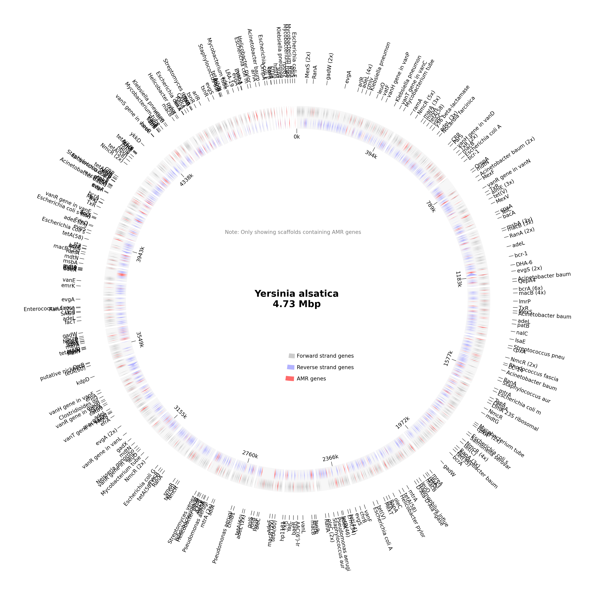

### AAC(6')-Ir
- **Mechanism**: antibiotic inactivation
- **Drug Classes**: aminoglycoside antibiotic
- **AMR Family**: AAC(6')
- **Locations**:
  - gnl|SPADES|BMKMCJEI_45_67 : position 76813-77307

### Acinetobacter baumannii AbaF (found in 6 locations)
- **Mechanism**: antibiotic efflux
- **Drug Classes**: phosphonic acid antibiotic
- **AMR Family**: major facilitator superfamily (MFS) antibiotic efflux pump
- **Locations**:
  - gnl|SPADES|BMKMCJEI_1048_3 : position 1400-2764
  - gnl|SPADES|BMKMCJEI_12_95 : position 105377-106783
  - gnl|SPADES|BMKMCJEI_15_78 : position 102551-103873
  - gnl|SPADES|BMKMCJEI_214_34 : position 32281-33807
  - gnl|SPADES|BMKMCJEI_9_53 : position 66273-67676
  - gnl|SPADES|BMKMCJEI_9_61 : position 76055-77557

### Acinetobacter baumannii AbaQ
- **Mechanism**: antibiotic efflux
- **Drug Classes**: fluoroquinolone antibiotic
- **AMR Family**: major facilitator superfamily (MFS) antibiotic efflux pump
- **Locations**:
  - gnl|SPADES|BMKMCJEI_10_197 : position 229438-230748

### Acinetobacter baumannii AmvA
- **Mechanism**: antibiotic efflux
- **Drug Classes**: macrolide antibiotic; disinfecting agents and antiseptics
- **AMR Family**: major facilitator superfamily (MFS) antibiotic efflux pump
- **Locations**:
  - gnl|SPADES|BMKMCJEI_21_48 : position 54913-56445

### AcrS
- **Mechanism**: antibiotic efflux
- **Drug Classes**: fluoroquinolone antibiotic; cephalosporin; glycylcycline; cephamycin; penam; tetracycline antibiotic; rifamycin antibiotic; phenicol antibiotic; disinfecting agents and antiseptics
- **AMR Family**: resistance-nodulation-cell division (RND) antibiotic efflux pump
- **Locations**:
  - gnl|SPADES|BMKMCJEI_198_38 : position 37429-37977

### ArnT
- **Mechanism**: antibiotic target alteration
- **Drug Classes**: peptide antibiotic
- **AMR Family**: pmr phosphoethanolamine transferase
- **Locations**:
  - gnl|SPADES|BMKMCJEI_282_22: position 25820-27484

### Bifidobacterium bifidum ileS conferring resistance to mupirocin
- **Mechanism**: antibiotic target alteration
- **Drug Classes**: mupirocin-like antibiotic
- **AMR Family**: antibiotic-resistant isoleucyl-tRNA synthetase (ileS)
- **Locations**:
  - gnl|SPADES|BMKMCJEI_84_89 : position 82902-85484

### CAR-1
- **Mechanism**: antibiotic inactivation
- **Drug Classes**: carbapenem
- **AMR Family**: CAR beta-lactamase
- **Locations**:
  - gnl|SPADES|BMKMCJEI_430_26 : position 23996-24751

### CRP (found in 2 locations)
- **Mechanism**: antibiotic efflux
- **Drug Classes**: macrolide antibiotic; fluoroquinolone antibiotic; penam
- **AMR Family**: resistance-nodulation-cell division (RND) antibiotic efflux pump
- **Locations**:
  - gnl|SPADES|BMKMCJEI_245_27: position 22991-23623
  - gnl|SPADES|BMKMCJEI_6_164 : position 196377-197129

### Clostridioides difficile gyrA conferring resistance to fluoroquinolones
- **Mechanism**: antibiotic target alteration
- **Drug Classes**: fluoroquinolone antibiotic
- **AMR Family**: fluoroquinolone resistant gyrA
- **Locations**:
  - gnl|SPADES|BMKMCJEI_10_178 : position 205196-207850

### Clostridioides difficile gyrB conferring resistance to fluoroquinolones (found in 2 locations)
- **Mechanism**: antibiotic target alteration
- **Drug Classes**: fluoroquinolone antibiotic
- **AMR Family**: fluoroquinolone resistant gyrB
- **Locations**:
  - gnl|SPADES|BMKMCJEI_154_33 : position 32899-35313
  - gnl|SPADES|BMKMCJEI_9_191 : position 225031-226926

### CrcB (found in 2 locations)
- **Mechanism**: antibiotic efflux
- **Drug Classes**: aminoglycoside antibiotic
- **AMR Family**: multidrug and toxic compound extrusion (MATE) transporter
- **Locations**:
  - gnl|SPADES|BMKMCJEI_159_23 : position 21051-21455
  - gnl|SPADES|BMKMCJEI_84_74 : position 68865-69248

### D-Ala-D-Ala ligase
- **Mechanism**: antibiotic target alteration
- **Drug Classes**: glycopeptide antibiotic
- **AMR Family**: Van ligase
- **Locations**:
  - gnl|SPADES|BMKMCJEI_32_62 : position 77094-78014

### DHA-6
- **Mechanism**: antibiotic inactivation
- **Drug Classes**: cephalosporin; cephamycin
- **AMR Family**: DHA beta-lactamase
- **Locations**:
  - gnl|SPADES|BMKMCJEI_10_168 : position 175792-176934

### EC-14 (found in 2 locations)
- **Mechanism**: antibiotic inactivation
- **Drug Classes**: cephalosporin
- **AMR Family**: EC beta-lactamase
- **Locations**:
  - gnl|SPADES|BMKMCJEI_15_63 : position 80935-82101
  - gnl|SPADES|BMKMCJEI_164_32 : position 31714-32892

### EVM-1
- **Mechanism**: antibiotic inactivation
- **Drug Classes**: carbapenem
- **AMR Family**: EVM beta-lactamase
- **Locations**:
  - gnl|SPADES|BMKMCJEI_805_2 : position 694-2847

### EdeQ
- **Mechanism**: antibiotic inactivation
- **Drug Classes**: peptide antibiotic; polyamine antibiotic
- **AMR Family**: Edeine acetyltransferase
- **Locations**:
  - gnl|SPADES|BMKMCJEI_198_7 : position 4534-4977

### Enterococcus faecalis cls with mutation conferring resistance to daptomycin
- **Mechanism**: antibiotic target alteration
- **Drug Classes**: peptide antibiotic
- **AMR Family**: daptomycin resistant cls
- **Locations**:
  - gnl|SPADES|BMKMCJEI_178_19 : position 22175-23635

### Erm(34)
- **Mechanism**: antibiotic target alteration
- **Drug Classes**: macrolide antibiotic; lincosamide antibiotic; streptogramin antibiotic; streptogramin A antibiotic; streptogramin B antibiotic
- **AMR Family**: Erm 23S ribosomal RNA methyltransferase
- **Locations**:
  - gnl|SPADES|BMKMCJEI_37_33 : position 37396-38022

### Escherichia coli AcrAB-TolC with AcrR mutation conferring resistance to ciprofloxacin, tetracycline, and ceftazidime (found in 3 locations)
- **Mechanism**: antibiotic target alteration; antibiotic efflux
- **Drug Classes**: fluoroquinolone antibiotic; cephalosporin; glycylcycline; penam; tetracycline antibiotic; rifamycin antibiotic; phenicol antibiotic; disinfecting agents and antiseptics
- **AMR Family**: resistance-nodulation-cell division (RND) antibiotic efflux pump
- **Locations**:
  - gnl|SPADES|BMKMCJEI_10_203 : position 235525-236163
  - gnl|SPADES|BMKMCJEI_36_89 : position 91443-92006
  - gnl|SPADES|BMKMCJEI_57_40 : position 43579-44235

### Escherichia coli AcrAB-TolC with MarR mutations conferring resistance to ciprofloxacin and tetracycline
- **Mechanism**: antibiotic target alteration; antibiotic efflux
- **Drug Classes**: fluoroquinolone antibiotic; cephalosporin; glycylcycline; penam; tetracycline antibiotic; rifamycin antibiotic; phenicol antibiotic; disinfecting agents and antiseptics
- **AMR Family**: resistance-nodulation-cell division (RND) antibiotic efflux pump
- **Locations**:
  - gnl|SPADES|BMKMCJEI_6_231 : position 270275-270706

### Escherichia coli EF-Tu mutants conferring resistance to Pulvomycin (found in 2 locations)
- **Mechanism**: antibiotic target alteration
- **Drug Classes**: elfamycin antibiotic
- **AMR Family**: elfamycin resistant EF-Tu
- **Locations**:
  - gnl|SPADES|BMKMCJEI_245_1 : position 1-999
  - gnl|SPADES|BMKMCJEI_6004_1 : position 2-1051

### Escherichia coli EF-Tu mutants conferring resistance to kirromycin
- **Mechanism**: antibiotic target alteration
- **Drug Classes**: elfamycin antibiotic
- **AMR Family**: elfamycin resistant EF-Tu
- **Locations**:
  - gnl|SPADES|BMKMCJEI_1323_1 : position 3-1973

### Escherichia coli GlpT with mutation conferring resistance to fosfomycin
- **Mechanism**: antibiotic target alteration
- **Drug Classes**: phosphonic acid antibiotic
- **AMR Family**: antibiotic-resistant GlpT
- **Locations**:
  - gnl|SPADES|BMKMCJEI_91_63 : position 65227-66582

### Escherichia coli acrA (found in 2 locations)
- **Mechanism**: antibiotic efflux
- **Drug Classes**: fluoroquinolone antibiotic; cephalosporin; glycylcycline; penam; tetracycline antibiotic; rifamycin antibiotic; phenicol antibiotic; disinfecting agents and antiseptics
- **AMR Family**: resistance-nodulation-cell division (RND) antibiotic efflux pump
- **Locations**:
  - gnl|SPADES|BMKMCJEI_57_39 : position 42247-43434
  - gnl|SPADES|BMKMCJEI_9_66 : position 84822-86045

### Escherichia coli mdfA
- **Mechanism**: antibiotic efflux
- **Drug Classes**: tetracycline antibiotic; phenicol antibiotic; disinfecting agents and antiseptics
- **AMR Family**: major facilitator superfamily (MFS) antibiotic efflux pump
- **Locations**:
  - gnl|SPADES|BMKMCJEI_15_148 : position 189010-190239

### Escherichia coli murA with mutation conferring resistance to fosfomycin
- **Mechanism**: antibiotic target alteration
- **Drug Classes**: phosphonic acid antibiotic
- **AMR Family**: antibiotic-resistant murA transferase
- **Locations**:
  - gnl|SPADES|BMKMCJEI_867_7 : position 8575-9855

### Escherichia coli soxS with mutation conferring antibiotic resistance (found in 8 locations)
- **Mechanism**: antibiotic target alteration; antibiotic efflux; reduced permeability to antibiotic
- **Drug Classes**: fluoroquinolone antibiotic; monobactam; carbapenem; cephalosporin; glycylcycline; cephamycin; penam; tetracycline antibiotic; rifamycin antibiotic; phenicol antibiotic; penem; disinfecting agents and antiseptics
- **AMR Family**: ATP-binding cassette (ABC) antibiotic efflux pump; major facilitator superfamily (MFS) antibiotic efflux pump; resistance-nodulation-cell division (RND) antibiotic efflux pump; General Bacterial Porin with reduced permeability to beta-lactams
- **Locations**:
  - gnl|SPADES|BMKMCJEI_18_142 : position 166396-167271
  - gnl|SPADES|BMKMCJEI_195_34 : position 37606-38313
  - gnl|SPADES|BMKMCJEI_198_30 : position 30565-31386
  - gnl|SPADES|BMKMCJEI_198_31 : position 31496-32389
  - gnl|SPADES|BMKMCJEI_198_47 : position 48632-49498
  - gnl|SPADES|BMKMCJEI_1_319 : position 321305-322204
  - gnl|SPADES|BMKMCJEI_430_4 : position 2287-3309
  - gnl|SPADES|BMKMCJEI_6_69 : position 89646-90578

### FosA4
- **Mechanism**: antibiotic inactivation
- **Drug Classes**: phosphonic acid antibiotic
- **AMR Family**: fosfomycin thiol transferase
- **Locations**:
  - gnl|SPADES|BMKMCJEI_12_60 : position 64339-64794

### FosB6
- **Mechanism**: antibiotic inactivation
- **Drug Classes**: phosphonic acid antibiotic
- **AMR Family**: fosfomycin thiol transferase
- **Locations**:
  - gnl|SPADES|BMKMCJEI_6_119 : position 145781-146251

### FosM2
- **Mechanism**: antibiotic inactivation
- **Drug Classes**: phosphonic acid antibiotic
- **AMR Family**: fosfomycin thiol transferase
- **Locations**:
  - gnl|SPADES|BMKMCJEI_6_240 : position 279219-279626

### H-NS
- **Mechanism**: antibiotic efflux
- **Drug Classes**: macrolide antibiotic; fluoroquinolone antibiotic; cephalosporin; cephamycin; penam; tetracycline antibiotic
- **AMR Family**: major facilitator superfamily (MFS) antibiotic efflux pump; resistance-nodulation-cell division (RND) antibiotic efflux pump
- **Locations**:
  - gnl|SPADES|BMKMCJEI_178_7 : position 7061-7471

### Haemophilus influenzae PBP3 conferring resistance to beta-lactam antibiotics
- **Mechanism**: antibiotic target alteration
- **Drug Classes**: cephalosporin; cephamycin; penam
- **AMR Family**: Penicillin-binding protein mutations conferring resistance to beta-lactam antibiotics
- **Locations**:
  - gnl|SPADES|BMKMCJEI_32_54 : position 66284-68047

### Helicobacter pylori pbp1 mutants conferring resistance to amoxicillin (found in 2 locations)
- **Mechanism**: antibiotic target alteration
- **Drug Classes**: cephalosporin; cephamycin; penam
- **AMR Family**: Penicillin-binding protein mutations conferring resistance to beta-lactam antibiotics
- **Locations**:
  - gnl|SPADES|BMKMCJEI_32_118 : position 145366-147852
  - gnl|SPADES|BMKMCJEI_429_8 : position 9454-11772

### Helicobacter pylori pbp2 mutants conferring resistance to amoxicillin
- **Mechanism**: antibiotic target alteration
- **Drug Classes**: cephalosporin; cephamycin; penam
- **AMR Family**: Penicillin-binding protein mutations conferring resistance to beta-lactam antibiotics
- **Locations**:
  - gnl|SPADES|BMKMCJEI_84_83 : position 77622-79517

### Helicobacter pylori rpoB mutation conferring resistance to rifampicin
- **Mechanism**: antibiotic target alteration; antibiotic target replacement
- **Drug Classes**: fluoroquinolone antibiotic; rifamycin antibiotic
- **AMR Family**: rifamycin-resistant beta-subunit of RNA polymerase (rpoB)
- **Locations**:
  - gnl|SPADES|BMKMCJEI_927_1 : position 2-4042

### Klebsiella pneumoniae KpnE
- **Mechanism**: antibiotic efflux
- **Drug Classes**: macrolide antibiotic; aminoglycoside antibiotic; cephalosporin; tetracycline antibiotic; peptide antibiotic; rifamycin antibiotic; disinfecting agents and antiseptics
- **AMR Family**: small multidrug resistance (SMR) antibiotic efflux pump
- **Locations**:
  - gnl|SPADES|BMKMCJEI_1_383 : position 388111-388494

### Klebsiella pneumoniae KpnF
- **Mechanism**: antibiotic efflux
- **Drug Classes**: macrolide antibiotic; aminoglycoside antibiotic; cephalosporin; tetracycline antibiotic; peptide antibiotic; rifamycin antibiotic; disinfecting agents and antiseptics
- **AMR Family**: small multidrug resistance (SMR) antibiotic efflux pump
- **Locations**:
  - gnl|SPADES|BMKMCJEI_1_384: position 388481-388810

### Klebsiella pneumoniae KpnH (found in 2 locations)
- **Mechanism**: antibiotic efflux
- **Drug Classes**: macrolide antibiotic; fluoroquinolone antibiotic; aminoglycoside antibiotic; carbapenem; cephalosporin; penam; peptide antibiotic; penem
- **AMR Family**: major facilitator superfamily (MFS) antibiotic efflux pump
- **Locations**:
  - gnl|SPADES|BMKMCJEI_423_20 : position 23110-24534
  - gnl|SPADES|BMKMCJEI_45_7: position 7698-9233

### Klebsiella pneumoniae OmpK37 (found in 4 locations)
- **Mechanism**: reduced permeability to antibiotic
- **Drug Classes**: monobactam; carbapenem; cephalosporin; cephamycin; penam; penem
- **AMR Family**: General Bacterial Porin with reduced permeability to beta-lactams
- **Locations**:
  - gnl|SPADES|BMKMCJEI_10_169 : position 177463-178575
  - gnl|SPADES|BMKMCJEI_12_125 : position 137834-138949
  - gnl|SPADES|BMKMCJEI_1_286 : position 284647-285732
  - gnl|SPADES|BMKMCJEI_2568_1 : position 292-1416

### LRA-19
- **Mechanism**: antibiotic inactivation
- **Drug Classes**: cephalosporin; penam
- **AMR Family**: subclass B3 LRA beta-lactamase
- **Locations**:
  - gnl|SPADES|BMKMCJEI_694_7 : position 10439-11086

### LlmA 23S ribosomal RNA methyltransferase
- **Mechanism**: antibiotic target alteration
- **Drug Classes**: lincosamide antibiotic
- **AMR Family**: Llm 23S ribosomal RNA methyltransferase
- **Locations**:
  - gnl|SPADES|BMKMCJEI_18_26 : position 30447-31637

### LptD
- **Mechanism**: antibiotic efflux
- **Drug Classes**: carbapenem; peptide antibiotic; aminocoumarin antibiotic; rifamycin antibiotic
- **AMR Family**: ATP-binding cassette (ABC) antibiotic efflux pump
- **Locations**:
  - gnl|SPADES|BMKMCJEI_32_24 : position 24359-26755

### MdtK
- **Mechanism**: antibiotic efflux
- **Drug Classes**: fluoroquinolone antibiotic
- **AMR Family**: multidrug and toxic compound extrusion (MATE) transporter
- **Locations**:
  - gnl|SPADES|BMKMCJEI_164_38 : position 38877-40307

### MexF
- **Mechanism**: antibiotic efflux
- **Drug Classes**: fluoroquinolone antibiotic; diaminopyrimidine antibiotic; phenicol antibiotic
- **AMR Family**: resistance-nodulation-cell division (RND) antibiotic efflux pump
- **Locations**:
  - gnl|SPADES|BMKMCJEI_9_65 : position 81684-84809

### MexJ
- **Mechanism**: antibiotic efflux
- **Drug Classes**: macrolide antibiotic; tetracycline antibiotic; disinfecting agents and antiseptics
- **AMR Family**: resistance-nodulation-cell division (RND) antibiotic efflux pump
- **Locations**:
  - gnl|SPADES|BMKMCJEI_199_23 : position 32666-33748

### MexS (found in 5 locations)
- **Mechanism**: antibiotic efflux
- **Drug Classes**: fluoroquinolone antibiotic; diaminopyrimidine antibiotic; phenicol antibiotic
- **AMR Family**: resistance-nodulation-cell division (RND) antibiotic efflux pump
- **Locations**:
  - gnl|SPADES|BMKMCJEI_12_88 : position 97047-98186
  - gnl|SPADES|BMKMCJEI_141_30 : position 43606-44589
  - gnl|SPADES|BMKMCJEI_1_35 : position 37835-38845
  - gnl|SPADES|BMKMCJEI_1_44 : position 52567-53601
  - gnl|SPADES|BMKMCJEI_9_68 : position 87401-88390

### MexT (found in 3 locations)
- **Mechanism**: antibiotic efflux
- **Drug Classes**: fluoroquinolone antibiotic; diaminopyrimidine antibiotic; phenicol antibiotic
- **AMR Family**: resistance-nodulation-cell division (RND) antibiotic efflux pump
- **Locations**:
  - gnl|SPADES|BMKMCJEI_12_59 : position 63288-64208
  - gnl|SPADES|BMKMCJEI_164_2 : position 618-1514
  - gnl|SPADES|BMKMCJEI_36_45 : position 47584-48492

### MexV
- **Mechanism**: antibiotic efflux
- **Drug Classes**: macrolide antibiotic; fluoroquinolone antibiotic; tetracycline antibiotic; phenicol antibiotic; disinfecting agents and antiseptics
- **AMR Family**: resistance-nodulation-cell division (RND) antibiotic efflux pump
- **Locations**:
  - gnl|SPADES|BMKMCJEI_9_152 : position 184213-185736

### MuxB
- **Mechanism**: antibiotic efflux
- **Drug Classes**: macrolide antibiotic; monobactam; tetracycline antibiotic; aminocoumarin antibiotic
- **AMR Family**: resistance-nodulation-cell division (RND) antibiotic efflux pump
- **Locations**:
  - gnl|SPADES|BMKMCJEI_9_153 : position 185733-188864

### Mycobacterium tuberculosis gidB mutation conferring resistance to streptomycin
- **Mechanism**: antibiotic target alteration
- **Drug Classes**: aminoglycoside antibiotic
- **AMR Family**: antibiotic resistant gidB
- **Locations**:
  - gnl|SPADES|BMKMCJEI_423_3 : position 2004-2627

### Mycobacterium tuberculosis kasA mutant conferring resistance to isoniazid (found in 2 locations)
- **Mechanism**: antibiotic target alteration
- **Drug Classes**: isoniazid-like antibiotic
- **AMR Family**: antibiotic resistant kasA
- **Locations**:
  - gnl|SPADES|BMKMCJEI_18_11 : position 15073-16341
  - gnl|SPADES|BMKMCJEI_571_15 : position 12453-13637

### Mycobacterium tuberculosis ndh with mutation conferring resistance to isoniazid
- **Mechanism**: antibiotic target alteration
- **Drug Classes**: isoniazid-like antibiotic
- **AMR Family**: antibiotic resistant ndh
- **Locations**:
  - gnl|SPADES|BMKMCJEI_18_102 : position 120511-121815

### Mycobacterium tuberculosis pncA mutations conferring resistance to pyrazinamide
- **Mechanism**: antibiotic target alteration
- **Drug Classes**: pyrazine antibiotic
- **AMR Family**: Pyrazinamide resistant pncA
- **Locations**:
  - gnl|SPADES|BMKMCJEI_1_420 : position 428190-428822

### Mycobacterium tuberculosis rpoB mutations conferring resistance to rifampicin
- **Mechanism**: antibiotic target alteration; antibiotic target replacement
- **Drug Classes**: rifamycin antibiotic
- **AMR Family**: rifamycin-resistant beta-subunit of RNA polymerase (rpoB)
- **Locations**:
  - gnl|SPADES|BMKMCJEI_2863_2 : position 272-2662

### Mycobacterium tuberculosis rpsA mutations conferring resistance to pyrazinamide
- **Mechanism**: antibiotic target alteration
- **Drug Classes**: pyrazine antibiotic
- **AMR Family**: pyrazinamide resistant rpsA
- **Locations**:
  - gnl|SPADES|BMKMCJEI_4297_2 : position 709-1596

### Mycobacterium tuberculosis thyA with mutation conferring resistance to para-aminosalicylic acid
- **Mechanism**: antibiotic target alteration
- **Drug Classes**: salicylic acid antibiotic
- **AMR Family**: aminosalicylate resistant thymidylate synthase
- **Locations**:
  - gnl|SPADES|BMKMCJEI_95_29 : position 35926-36720

### Neisseria gonorrhoeae pilQ gene conferring resistance to beta-lactam
- **Mechanism**: antibiotic target alteration
- **Drug Classes**: cephalosporin; cephamycin; penam
- **AMR Family**: Penicillin-binding protein mutations conferring resistance to beta-lactam antibiotics
- **Locations**:
  - gnl|SPADES|BMKMCJEI_95_60 : position 70776-72752

### NmcR (found in 18 locations)
- **Mechanism**: antibiotic inactivation
- **Drug Classes**: carbapenem; cephalosporin; cephamycin; penam
- **AMR Family**: NmcA beta-lactamase
- **Locations**:
  - gnl|SPADES|BMKMCJEI_15_38 : position 51609-52502
  - gnl|SPADES|BMKMCJEI_15_62 : position 79908-80798
  - gnl|SPADES|BMKMCJEI_164_43 : position 45508-46401
  - gnl|SPADES|BMKMCJEI_18_42 : position 55131-56363
  - gnl|SPADES|BMKMCJEI_21_10 : position 10949-11869
  - gnl|SPADES|BMKMCJEI_21_150 : position 163411-164343
  - gnl|SPADES|BMKMCJEI_21_19 : position 20923-21786
  - gnl|SPADES|BMKMCJEI_21_62 : position 69575-70498
  - gnl|SPADES|BMKMCJEI_252_22 : position 27424-28305
  - gnl|SPADES|BMKMCJEI_252_31 : position 39766-40647
  - gnl|SPADES|BMKMCJEI_6_139 : position 165863-166717
  - gnl|SPADES|BMKMCJEI_6_152 : position 184376-185278
  - gnl|SPADES|BMKMCJEI_6_26 : position 34857-35831
  - gnl|SPADES|BMKMCJEI_6_80 : position 103303-104217
  - gnl|SPADES|BMKMCJEI_6_92 : position 117578-118489
  - gnl|SPADES|BMKMCJEI_88_65 : position 66948-67841
  - gnl|SPADES|BMKMCJEI_95_13 : position 12483-13400
  - gnl|SPADES|BMKMCJEI_95_78 : position 88575-89471

### Nocardia farcinica rox
- **Mechanism**: antibiotic inactivation
- **Drug Classes**: rifamycin antibiotic
- **AMR Family**: rifampin monooxygenase
- **Locations**:
  - gnl|SPADES|BMKMCJEI_6_123 : position 149120-150748

### OmpA (found in 4 locations)
- **Mechanism**: reduced permeability to antibiotic
- **Drug Classes**: peptide antibiotic
- **AMR Family**: General Bacterial Porin with reduced permeability to peptide antibiotics
- **Locations**:
  - gnl|SPADES|BMKMCJEI_1084_10 : position 7744-8250
  - gnl|SPADES|BMKMCJEI_18_16 : position 20210-21283
  - gnl|SPADES|BMKMCJEI_198_39 : position 38789-39295
  - gnl|SPADES|BMKMCJEI_9_23 : position 32722-34449

### OprN
- **Mechanism**: antibiotic efflux
- **Drug Classes**: fluoroquinolone antibiotic; diaminopyrimidine antibiotic; phenicol antibiotic
- **AMR Family**: resistance-nodulation-cell division (RND) antibiotic efflux pump
- **Locations**:
  - gnl|SPADES|BMKMCJEI_164_4 : position 2775-4271

### PJM-1
- **Mechanism**: antibiotic inactivation
- **Drug Classes**: carbapenem; cephalosporin; cephamycin; penam
- **AMR Family**: PJM beta-lactamase
- **Locations**:
  - gnl|SPADES|BMKMCJEI_6_220 : position 260898-261905

### ParR (found in 2 locations)
- **Mechanism**: antibiotic efflux; reduced permeability to antibiotic
- **Drug Classes**: macrolide antibiotic; fluoroquinolone antibiotic; monobactam; aminoglycoside antibiotic; carbapenem; cephalosporin; cephamycin; penam; tetracycline antibiotic; phenicol antibiotic; penem; disinfecting agents and antiseptics
- **AMR Family**: resistance-nodulation-cell division (RND) antibiotic efflux pump; Outer Membrane Porin (Opr)
- **Locations**:
  - gnl|SPADES|BMKMCJEI_15_14 : position 15506-16225
  - gnl|SPADES|BMKMCJEI_6_171 : position 205325-206053

### ParS
- **Mechanism**: antibiotic efflux; reduced permeability to antibiotic
- **Drug Classes**: macrolide antibiotic; fluoroquinolone antibiotic; monobactam; aminoglycoside antibiotic; carbapenem; cephalosporin; cephamycin; penam; tetracycline antibiotic; phenicol antibiotic; penem; disinfecting agents and antiseptics
- **AMR Family**: resistance-nodulation-cell division (RND) antibiotic efflux pump; Outer Membrane Porin (Opr)
- **Locations**:
  - gnl|SPADES|BMKMCJEI_6_172 : position 206050-207363

### Planobispora rosea EF-Tu mutants conferring resistance to inhibitor GE2270A
- **Mechanism**: antibiotic target alteration
- **Drug Classes**: elfamycin antibiotic
- **AMR Family**: elfamycin resistant EF-Tu
- **Locations**:
  - gnl|SPADES|BMKMCJEI_15_151 : position 192076-193977

### PmrF (found in 3 locations)
- **Mechanism**: antibiotic target alteration
- **Drug Classes**: peptide antibiotic
- **AMR Family**: pmr phosphoethanolamine transferase
- **Locations**:
  - gnl|SPADES|BMKMCJEI_1_266 : position 261787-263160
  - gnl|SPADES|BMKMCJEI_282_25 : position 30383-31366
  - gnl|SPADES|BMKMCJEI_57_77 : position 88611-89582

### Pseudomonas aeruginosa CpxR (found in 3 locations)
- **Mechanism**: antibiotic efflux
- **Drug Classes**: macrolide antibiotic; fluoroquinolone antibiotic; monobactam; aminoglycoside antibiotic; carbapenem; cephalosporin; cephamycin; penam; tetracycline antibiotic; peptide antibiotic; aminocoumarin antibiotic; diaminopyrimidine antibiotic; sulfonamide antibiotic; phenicol antibiotic; penem
- **AMR Family**: resistance-nodulation-cell division (RND) antibiotic efflux pump
- **Locations**:
  - gnl|SPADES|BMKMCJEI_214_42 : position 42444-43127
  - gnl|SPADES|BMKMCJEI_82_52 : position 58527-59225
  - gnl|SPADES|BMKMCJEI_84_51 : position 47232-47906

### Pseudomonas aeruginosa ampR with mutation conferring resistance to aztreonam
- **Mechanism**: antibiotic target alteration; antibiotic inactivation
- **Drug Classes**: monobactam; carbapenem; cephalosporin
- **AMR Family**: PDC beta-lactamase; ampR transcriptional regulator with mutation conferring resistance to monobactam antibiotics
- **Locations**:
  - gnl|SPADES|BMKMCJEI_37_68 : position 76948-77889

### QepA4 (found in 3 locations)
- **Mechanism**: antibiotic efflux
- **Drug Classes**: fluoroquinolone antibiotic
- **AMR Family**: major facilitator superfamily (MFS) antibiotic efflux pump
- **Locations**:
  - gnl|SPADES|BMKMCJEI_10_207 : position 239444-240679
  - gnl|SPADES|BMKMCJEI_1_249 : position 241154-242794
  - gnl|SPADES|BMKMCJEI_6_91 : position 116153-117505

### RanA (found in 19 locations)
- **Mechanism**: antibiotic efflux
- **Drug Classes**: aminoglycoside antibiotic
- **AMR Family**: ATP-binding cassette (ABC) antibiotic efflux pump
- **Locations**:
  - gnl|SPADES|BMKMCJEI_10_131 : position 139124-140716
  - gnl|SPADES|BMKMCJEI_10_62 : position 66839-67972
  - gnl|SPADES|BMKMCJEI_154_6 : position 5865-6641
  - gnl|SPADES|BMKMCJEI_15_99 : position 132938-133960
  - gnl|SPADES|BMKMCJEI_178_16 : position 19487-20506
  - gnl|SPADES|BMKMCJEI_178_17 : position 20503-21504
  - gnl|SPADES|BMKMCJEI_186_20 : position 22926-24020
  - gnl|SPADES|BMKMCJEI_1_54 : position 62689-63462
  - gnl|SPADES|BMKMCJEI_21_131 : position 142960-143778
  - gnl|SPADES|BMKMCJEI_21_41 : position 45571-46620
  - gnl|SPADES|BMKMCJEI_21_50 : position 57739-58545
  - gnl|SPADES|BMKMCJEI_36_29 : position 26583-27710
  - gnl|SPADES|BMKMCJEI_37_113 : position 124149-125663
  - gnl|SPADES|BMKMCJEI_402_23 : position 25373-26518
  - gnl|SPADES|BMKMCJEI_430_16 : position 13807-15006
  - gnl|SPADES|BMKMCJEI_559_13 : position 10432-11241
  - gnl|SPADES|BMKMCJEI_84_67 : position 61960-62637
  - gnl|SPADES|BMKMCJEI_91_31 : position 32275-33348
  - gnl|SPADES|BMKMCJEI_9_34 : position 46911-47669

### RanB (found in 2 locations)
- **Mechanism**: antibiotic efflux
- **Drug Classes**: aminoglycoside antibiotic
- **AMR Family**: ATP-binding cassette (ABC) antibiotic efflux pump
- **Locations**:
  - gnl|SPADES|BMKMCJEI_21_49 : position 56600-57745
  - gnl|SPADES|BMKMCJEI_559_12 : position 9639-10421

### Rhodococcus fascians cmr
- **Mechanism**: antibiotic efflux
- **Drug Classes**: phenicol antibiotic
- **AMR Family**: major facilitator superfamily (MFS) antibiotic efflux pump
- **Locations**:
  - gnl|SPADES|BMKMCJEI_15_56 : position 74113-75552

### Rv1877
- **Mechanism**: antibiotic efflux
- **Drug Classes**: fluoroquinolone antibiotic
- **AMR Family**: major facilitator superfamily (MFS) antibiotic efflux pump
- **Locations**:
  - gnl|SPADES|BMKMCJEI_154_58 : position 61567-62994

### SAT-3
- **Mechanism**: antibiotic inactivation
- **Drug Classes**: nucleoside antibiotic
- **AMR Family**: streptothricin acetyltransferase (SAT)
- **Locations**:
  - gnl|SPADES|BMKMCJEI_178_3 : position 2261-2728

### Salmonella serovars soxS with mutation conferring antibiotic resistance
- **Mechanism**: antibiotic target alteration; antibiotic efflux; reduced permeability to antibiotic
- **Drug Classes**: fluoroquinolone antibiotic; monobactam; carbapenem; cephalosporin; glycylcycline; cephamycin; penam; tetracycline antibiotic; rifamycin antibiotic; phenicol antibiotic; penem; disinfecting agents and antiseptics
- **AMR Family**: ATP-binding cassette (ABC) antibiotic efflux pump; major facilitator superfamily (MFS) antibiotic efflux pump; resistance-nodulation-cell division (RND) antibiotic efflux pump; General Bacterial Porin with reduced permeability to beta-lactams
- **Locations**:
  - gnl|SPADES|BMKMCJEI_18_152 : position 176303-176689

### Staphylococcus aureus GlpT with mutation conferring resistance to fosfomycin
- **Mechanism**: antibiotic target alteration
- **Drug Classes**: phosphonic acid antibiotic
- **AMR Family**: antibiotic-resistant GlpT
- **Locations**:
  - gnl|SPADES|BMKMCJEI_15_107 : position 144427-145764

### Staphylococcus aureus fusA with mutation conferring resistance to fusidic acid (found in 3 locations)
- **Mechanism**: antibiotic target alteration
- **Drug Classes**: fusidane antibiotic
- **AMR Family**: antibiotic resistant fusA
- **Locations**:
  - gnl|SPADES|BMKMCJEI_198_8 : position 5123-6712
  - gnl|SPADES|BMKMCJEI_245_2 : position 1071-3179
  - gnl|SPADES|BMKMCJEI_37_82 : position 92083-94191

### Staphylococcus aureus mupA conferring resistance to mupirocin
- **Mechanism**: antibiotic target alteration
- **Drug Classes**: mupirocin-like antibiotic
- **AMR Family**: antibiotic-resistant isoleucyl-tRNA synthetase (ileS)
- **Locations**:
  - gnl|SPADES|BMKMCJEI_32_6 : position 5367-8183

### Staphylococcus aureus mupB conferring resistance to mupirocin
- **Mechanism**: antibiotic target alteration
- **Drug Classes**: mupirocin-like antibiotic
- **AMR Family**: antibiotic-resistant isoleucyl-tRNA synthetase (ileS)
- **Locations**:
  - gnl|SPADES|BMKMCJEI_186_52 : position 55114-58011

### Staphylococcus aureus murA with mutation conferring resistance to fosfomycin
- **Mechanism**: antibiotic target alteration
- **Drug Classes**: phosphonic acid antibiotic
- **AMR Family**: antibiotic-resistant murA transferase
- **Locations**:
  - gnl|SPADES|BMKMCJEI_559_7 : position 6279-7544

### Staphylococcus aureus pgsA mutations conferring resistance to daptomycin
- **Mechanism**: antibiotic target alteration
- **Drug Classes**: peptide antibiotic
- **AMR Family**: daptomycin resistant pgsA
- **Locations**:
  - gnl|SPADES|BMKMCJEI_1_184 : position 188406-188954

### Streptococcus pneumoniae PBP2x conferring resistance to amoxicillin (found in 2 locations)
- **Mechanism**: antibiotic target alteration
- **Drug Classes**: cephalosporin; cephamycin; penam
- **AMR Family**: Penicillin-binding protein mutations conferring resistance to beta-lactam antibiotics
- **Locations**:
  - gnl|SPADES|BMKMCJEI_15_6 : position 3970-6525
  - gnl|SPADES|BMKMCJEI_36_139 : position 145998-147707

### Streptomyces lividans cmlR
- **Mechanism**: antibiotic efflux
- **Drug Classes**: phenicol antibiotic
- **AMR Family**: major facilitator superfamily (MFS) antibiotic efflux pump
- **Locations**:
  - gnl|SPADES|BMKMCJEI_15_58 : position 76540-77754

### Streptomyces rimosus otr(A)
- **Mechanism**: antibiotic target protection
- **Drug Classes**: tetracycline antibiotic
- **AMR Family**: tetracycline-resistant ribosomal protection protein
- **Locations**:
  - gnl|SPADES|BMKMCJEI_431_7 : position 8351-10174

### Streptomyces venezuelae rox (found in 2 locations)
- **Mechanism**: antibiotic inactivation
- **Drug Classes**: rifamycin antibiotic
- **AMR Family**: rifampin monooxygenase
- **Locations**:
  - gnl|SPADES|BMKMCJEI_84_102 : position 98207-99388
  - gnl|SPADES|BMKMCJEI_88_73 : position 75397-76611

### TaeA (found in 3 locations)
- **Mechanism**: antibiotic efflux
- **Drug Classes**: pleuromutilin antibiotic
- **AMR Family**: ATP-binding cassette (ABC) antibiotic efflux pump
- **Locations**:
  - gnl|SPADES|BMKMCJEI_159_11 : position 8894-9559
  - gnl|SPADES|BMKMCJEI_18_6 : position 8703-10616
  - gnl|SPADES|BMKMCJEI_198_33 : position 33843-35510

### TolC (found in 2 locations)
- **Mechanism**: antibiotic efflux
- **Drug Classes**: macrolide antibiotic; fluoroquinolone antibiotic; aminoglycoside antibiotic; carbapenem; cephalosporin; glycylcycline; cephamycin; penam; tetracycline antibiotic; peptide antibiotic; aminocoumarin antibiotic; rifamycin antibiotic; phenicol antibiotic; penem; disinfecting agents and antiseptics
- **AMR Family**: ATP-binding cassette (ABC) antibiotic efflux pump; major facilitator superfamily (MFS) antibiotic efflux pump; resistance-nodulation-cell division (RND) antibiotic efflux pump
- **Locations**:
  - gnl|SPADES|BMKMCJEI_10_172 : position 182641-184026
  - gnl|SPADES|BMKMCJEI_9_196 : position 230113-231585

### TriC
- **Mechanism**: antibiotic efflux
- **Drug Classes**: disinfecting agents and antiseptics
- **AMR Family**: resistance-nodulation-cell division (RND) antibiotic efflux pump
- **Locations**:
  - gnl|SPADES|BMKMCJEI_199_22 : position 29580-32666

### TxR (found in 7 locations)
- **Mechanism**: antibiotic efflux
- **Drug Classes**: tetracycline antibiotic
- **AMR Family**: ATP-binding cassette (ABC) antibiotic efflux pump
- **Locations**:
  - gnl|SPADES|BMKMCJEI_12_78 : position 83764-85923
  - gnl|SPADES|BMKMCJEI_199_10 : position 12896-14815
  - gnl|SPADES|BMKMCJEI_431_4 : position 3781-5193
  - gnl|SPADES|BMKMCJEI_45_106 : position 124163-125431
  - gnl|SPADES|BMKMCJEI_6_201 : position 241201-242778
  - gnl|SPADES|BMKMCJEI_6_210 : position 248429-249457
  - gnl|SPADES|BMKMCJEI_9_118 : position 135046-136089

### YajC
- **Mechanism**: antibiotic efflux
- **Drug Classes**: fluoroquinolone antibiotic; cephalosporin; glycylcycline; penam; tetracycline antibiotic; oxazolidinone antibiotic; glycopeptide antibiotic; rifamycin antibiotic; phenicol antibiotic; disinfecting agents and antiseptics
- **AMR Family**: resistance-nodulation-cell division (RND) antibiotic efflux pump
- **Locations**:
  - gnl|SPADES|BMKMCJEI_45_92 : position 108525-108857

### adeF (found in 2 locations)
- **Mechanism**: antibiotic efflux
- **Drug Classes**: fluoroquinolone antibiotic; tetracycline antibiotic
- **AMR Family**: resistance-nodulation-cell division (RND) antibiotic efflux pump
- **Locations**:
  - gnl|SPADES|BMKMCJEI_214_12: position 9440-12565
  - gnl|SPADES|BMKMCJEI_57_38: position 39078-42230

### adeH
- **Mechanism**: antibiotic efflux
- **Drug Classes**: fluoroquinolone antibiotic; tetracycline antibiotic
- **AMR Family**: resistance-nodulation-cell division (RND) antibiotic efflux pump
- **Locations**:
  - gnl|SPADES|BMKMCJEI_9_28 : position 39362-40873

### adeK
- **Mechanism**: antibiotic efflux
- **Drug Classes**: macrolide antibiotic; fluoroquinolone antibiotic; lincosamide antibiotic; carbapenem; cephalosporin; tetracycline antibiotic; rifamycin antibiotic; diaminopyrimidine antibiotic; phenicol antibiotic; penem
- **AMR Family**: resistance-nodulation-cell division (RND) antibiotic efflux pump
- **Locations**:
  - gnl|SPADES|BMKMCJEI_37_54 : position 61500-62897

### adeL (found in 23 locations)
- **Mechanism**: antibiotic efflux
- **Drug Classes**: fluoroquinolone antibiotic; tetracycline antibiotic
- **AMR Family**: resistance-nodulation-cell division (RND) antibiotic efflux pump
- **Locations**:
  - gnl|SPADES|BMKMCJEI_10_100 : position 103607-104479
  - gnl|SPADES|BMKMCJEI_12_121 : position 131990-132904
  - gnl|SPADES|BMKMCJEI_141_42 : position 59654-60589
  - gnl|SPADES|BMKMCJEI_15_59 : position 77769-78809
  - gnl|SPADES|BMKMCJEI_164_31 : position 30690-31580
  - gnl|SPADES|BMKMCJEI_176_52 : position 52742-53638
  - gnl|SPADES|BMKMCJEI_181_37 : position 36419-37330
  - gnl|SPADES|BMKMCJEI_186_40 : position 42776-43684
  - gnl|SPADES|BMKMCJEI_198_1 : position 183-1109
  - gnl|SPADES|BMKMCJEI_198_24 : position 24116-25018
  - gnl|SPADES|BMKMCJEI_1_260 : position 252787-253719
  - gnl|SPADES|BMKMCJEI_1_300 : position 299633-300583
  - gnl|SPADES|BMKMCJEI_1_327 : position 330172-331062
  - gnl|SPADES|BMKMCJEI_1_410 : position 417528-418433
  - gnl|SPADES|BMKMCJEI_571_20 : position 17135-18037
  - gnl|SPADES|BMKMCJEI_6_113 : position 138439-139335
  - gnl|SPADES|BMKMCJEI_6_159 : position 192382-193332
  - gnl|SPADES|BMKMCJEI_6_247 : position 284539-285477
  - gnl|SPADES|BMKMCJEI_82_8 : position 7124-8056
  - gnl|SPADES|BMKMCJEI_82_86 : position 89197-90084
  - gnl|SPADES|BMKMCJEI_95_44 : position 57044-57937
  - gnl|SPADES|BMKMCJEI_9_190 : position 224116-225027
  - gnl|SPADES|BMKMCJEI_9_67 : position 86353-87246

### almE (found in 4 locations)
- **Mechanism**: antibiotic target alteration
- **Drug Classes**: peptide antibiotic
- **AMR Family**: polymyxin resistance operon; alm glycyltransferase
- **Locations**:
  - gnl|SPADES|BMKMCJEI_1_389 : position 393419-395116
  - gnl|SPADES|BMKMCJEI_9_128 : position 146557-148062
  - gnl|SPADES|BMKMCJEI_9_131 : position 149880-151514
  - gnl|SPADES|BMKMCJEI_9_145 : position 170239-177468

### arlR (found in 2 locations)
- **Mechanism**: antibiotic efflux
- **Drug Classes**: fluoroquinolone antibiotic; disinfecting agents and antiseptics
- **AMR Family**: major facilitator superfamily (MFS) antibiotic efflux pump
- **Locations**:
  - gnl|SPADES|BMKMCJEI_1_246 : position 236818-237504
  - gnl|SPADES|BMKMCJEI_450_14 : position 12573-13313

### arlS
- **Mechanism**: antibiotic efflux
- **Drug Classes**: fluoroquinolone antibiotic; disinfecting agents and antiseptics
- **AMR Family**: major facilitator superfamily (MFS) antibiotic efflux pump
- **Locations**:
  - gnl|SPADES|BMKMCJEI_402_16 : position 15887-17464

### arnA (found in 2 locations)
- **Mechanism**: antibiotic target alteration
- **Drug Classes**: peptide antibiotic
- **AMR Family**: pmr phosphoethanolamine transferase
- **Locations**:
  - gnl|SPADES|BMKMCJEI_282_24 : position 28383-30386
  - gnl|SPADES|BMKMCJEI_958_8 : position 5055-6002

### bacA
- **Mechanism**: antibiotic target alteration
- **Drug Classes**: peptide antibiotic
- **AMR Family**: undecaprenyl pyrophosphate related proteins
- **Locations**:
  - gnl|SPADES|BMKMCJEI_9_208 : position 246160-246978

### baeR (found in 3 locations)
- **Mechanism**: antibiotic efflux
- **Drug Classes**: aminoglycoside antibiotic; aminocoumarin antibiotic
- **AMR Family**: resistance-nodulation-cell division (RND) antibiotic efflux pump
- **Locations**:
  - gnl|SPADES|BMKMCJEI_185_26 : position 26904-27623
  - gnl|SPADES|BMKMCJEI_336_19 : position 30703-31410
  - gnl|SPADES|BMKMCJEI_45_79 : position 92866-93555

### baeS
- **Mechanism**: antibiotic efflux
- **Drug Classes**: aminoglycoside antibiotic; aminocoumarin antibiotic
- **AMR Family**: resistance-nodulation-cell division (RND) antibiotic efflux pump
- **Locations**:
  - gnl|SPADES|BMKMCJEI_185_27 : position 27633-29024

### basS (found in 3 locations)
- **Mechanism**: antibiotic target alteration; antibiotic efflux
- **Drug Classes**: peptide antibiotic
- **AMR Family**: pmr phosphoethanolamine transferase
- **Locations**:
  - gnl|SPADES|BMKMCJEI_1890_3 : position 2014-3078
  - gnl|SPADES|BMKMCJEI_84_52 : position 47893-49323
  - gnl|SPADES|BMKMCJEI_88_84 : position 87040-88467

### bcr-1 (found in 2 locations)
- **Mechanism**: antibiotic efflux
- **Drug Classes**: bicyclomycin-like antibiotic
- **AMR Family**: major facilitator superfamily (MFS) antibiotic efflux pump
- **Locations**:
  - gnl|SPADES|BMKMCJEI_10_134 : position 141867-143087
  - gnl|SPADES|BMKMCJEI_6_248 : position 285660-286877

### bcrA (found in 12 locations)
- **Mechanism**: antibiotic efflux
- **Drug Classes**: peptide antibiotic
- **AMR Family**: ATP-binding cassette (ABC) antibiotic efflux pump
- **Locations**:
  - gnl|SPADES|BMKMCJEI_12_140 : position 154650-155348
  - gnl|SPADES|BMKMCJEI_12_141 : position 155473-156309
  - gnl|SPADES|BMKMCJEI_12_16 : position 13099-14631
  - gnl|SPADES|BMKMCJEI_12_175 : position 190580-191290
  - gnl|SPADES|BMKMCJEI_12_184 : position 201879-202943
  - gnl|SPADES|BMKMCJEI_12_81 : position 88411-89931
  - gnl|SPADES|BMKMCJEI_164_49 : position 51228-52043
  - gnl|SPADES|BMKMCJEI_186_42 : position 44950-45690
  - gnl|SPADES|BMKMCJEI_199_31 : position 44155-45720
  - gnl|SPADES|BMKMCJEI_1_293 : position 292608-294092
  - gnl|SPADES|BMKMCJEI_1_375 : position 377494-378252
  - gnl|SPADES|BMKMCJEI_21_75 : position 82993-83619

### catB9
- **Mechanism**: antibiotic inactivation
- **Drug Classes**: phenicol antibiotic
- **AMR Family**: chloramphenicol acetyltransferase (CAT)
- **Locations**:
  - gnl|SPADES|BMKMCJEI_154_1 : position 3-239

### chrB
- **Mechanism**: antibiotic target alteration
- **Drug Classes**: macrolide antibiotic; lincosamide antibiotic
- **AMR Family**: non-erm 23S ribosomal RNA methyltransferase (G748)
- **Locations**:
  - gnl|SPADES|BMKMCJEI_36_138 : position 145023-145877

### clbB
- **Mechanism**: antibiotic target alteration
- **Drug Classes**: lincosamide antibiotic; streptogramin antibiotic; streptogramin A antibiotic; oxazolidinone antibiotic; phenicol antibiotic; pleuromutilin antibiotic
- **AMR Family**: Cfr 23S ribosomal RNA methyltransferase
- **Locations**:
  - gnl|SPADES|BMKMCJEI_429_5 : position 4657-5853

### cmlA9
- **Mechanism**: antibiotic efflux
- **Drug Classes**: phenicol antibiotic
- **AMR Family**: major facilitator superfamily (MFS) antibiotic efflux pump
- **Locations**:
  - gnl|SPADES|BMKMCJEI_1_407 : position 412105-413298

### cmlB
- **Mechanism**: antibiotic efflux
- **Drug Classes**: phenicol antibiotic
- **AMR Family**: major facilitator superfamily (MFS) antibiotic efflux pump
- **Locations**:
  - gnl|SPADES|BMKMCJEI_402_20 : position 20657-22021

### cmlB1
- **Mechanism**: antibiotic efflux
- **Drug Classes**: phenicol antibiotic
- **AMR Family**: major facilitator superfamily (MFS) antibiotic efflux pump
- **Locations**:
  - gnl|SPADES|BMKMCJEI_82_42 : position 48848-49999

### cmlv (found in 3 locations)
- **Mechanism**: antibiotic inactivation
- **Drug Classes**: phenicol antibiotic
- **AMR Family**: chloramphenicol phosphotransferase
- **Locations**:
  - gnl|SPADES|BMKMCJEI_1_273 : position 268511-269677
  - gnl|SPADES|BMKMCJEI_2156_3 : position 2491-3672
  - gnl|SPADES|BMKMCJEI_95_43 : position 55065-56225

### cmx (found in 2 locations)
- **Mechanism**: antibiotic efflux
- **Drug Classes**: phenicol antibiotic
- **AMR Family**: major facilitator superfamily (MFS) antibiotic efflux pump
- **Locations**:
  - gnl|SPADES|BMKMCJEI_164_33 : position 32889-34091
  - gnl|SPADES|BMKMCJEI_45_13 : position 14096-15298

### cprR
- **Mechanism**: antibiotic target alteration; antibiotic efflux
- **Drug Classes**: peptide antibiotic
- **AMR Family**: pmr phosphoethanolamine transferase
- **Locations**:
  - gnl|SPADES|BMKMCJEI_1890_2 : position 1358-2017

### cpxA (found in 7 locations)
- **Mechanism**: antibiotic efflux
- **Drug Classes**: aminoglycoside antibiotic; aminocoumarin antibiotic
- **AMR Family**: resistance-nodulation-cell division (RND) antibiotic efflux pump
- **Locations**:
  - gnl|SPADES|BMKMCJEI_154_18 : position 16099-17448
  - gnl|SPADES|BMKMCJEI_15_13 : position 14148-15509
  - gnl|SPADES|BMKMCJEI_18_112 : position 134668-136122
  - gnl|SPADES|BMKMCJEI_214_43 : position 43153-44520
  - gnl|SPADES|BMKMCJEI_431_5 : position 5201-6253
  - gnl|SPADES|BMKMCJEI_82_53 : position 59222-60595
  - gnl|SPADES|BMKMCJEI_9_186 : position 220617-222077

### dfrA3
- **Mechanism**: antibiotic target replacement
- **Drug Classes**: diaminopyrimidine antibiotic
- **AMR Family**: trimethoprim resistant dihydrofolate reductase dfr
- **Locations**:
  - gnl|SPADES|BMKMCJEI_32_16 : position 18618-19100

### efpA (found in 2 locations)
- **Mechanism**: antibiotic efflux
- **Drug Classes**: rifamycin antibiotic; isoniazid-like antibiotic
- **AMR Family**: major facilitator superfamily (MFS) antibiotic efflux pump
- **Locations**:
  - gnl|SPADES|BMKMCJEI_154_49 : position 50105-51394
  - gnl|SPADES|BMKMCJEI_95_79 : position 89601-90950

### efrA
- **Mechanism**: antibiotic efflux
- **Drug Classes**: macrolide antibiotic; fluoroquinolone antibiotic; rifamycin antibiotic
- **AMR Family**: ATP-binding cassette (ABC) antibiotic efflux pump
- **Locations**:
  - gnl|SPADES|BMKMCJEI_141_17 : position 28208-29317

### emrA
- **Mechanism**: antibiotic efflux
- **Drug Classes**: fluoroquinolone antibiotic
- **AMR Family**: major facilitator superfamily (MFS) antibiotic efflux pump
- **Locations**:
  - gnl|SPADES|BMKMCJEI_45_8 : position 9273-10445

### emrK
- **Mechanism**: antibiotic efflux
- **Drug Classes**: tetracycline antibiotic
- **AMR Family**: major facilitator superfamily (MFS) antibiotic efflux pump
- **Locations**:
  - gnl|SPADES|BMKMCJEI_181_35 : position 34944-35879

### emrR
- **Mechanism**: antibiotic efflux
- **Drug Classes**: fluoroquinolone antibiotic
- **AMR Family**: major facilitator superfamily (MFS) antibiotic efflux pump
- **Locations**:
  - gnl|SPADES|BMKMCJEI_45_10 : position 12110-12622

### emrY
- **Mechanism**: antibiotic efflux
- **Drug Classes**: tetracycline antibiotic
- **AMR Family**: major facilitator superfamily (MFS) antibiotic efflux pump
- **Locations**:
  - gnl|SPADES|BMKMCJEI_185_28 : position 29040-30440

### eptA
- **Mechanism**: antibiotic target alteration
- **Drug Classes**: peptide antibiotic
- **AMR Family**: pmr phosphoethanolamine transferase
- **Locations**:
  - gnl|SPADES|BMKMCJEI_6_237 : position 275494-277134

### eptB
- **Mechanism**: antibiotic target alteration
- **Drug Classes**: peptide antibiotic
- **AMR Family**: pmr phosphoethanolamine transferase
- **Locations**:
  - gnl|SPADES|BMKMCJEI_15_110 : position 148088-149779

### erm(56)
- **Mechanism**: antibiotic target alteration
- **Drug Classes**: macrolide antibiotic; lincosamide antibiotic; streptogramin antibiotic; streptogramin B antibiotic
- **AMR Family**: Erm 23S ribosomal RNA methyltransferase
- **Locations**:
  - gnl|SPADES|BMKMCJEI_32_21 : position 21197-22015

### evgA (found in 10 locations)
- **Mechanism**: antibiotic efflux
- **Drug Classes**: macrolide antibiotic; fluoroquinolone antibiotic; penam; tetracycline antibiotic
- **AMR Family**: major facilitator superfamily (MFS) antibiotic efflux pump; resistance-nodulation-cell division (RND) antibiotic efflux pump
- **Locations**:
  - gnl|SPADES|BMKMCJEI_122_71 : position 69376-69768
  - gnl|SPADES|BMKMCJEI_122_72 : position 69765-70007
  - gnl|SPADES|BMKMCJEI_15_109 : position 147385-147975
  - gnl|SPADES|BMKMCJEI_178_47 : position 52661-53317
  - gnl|SPADES|BMKMCJEI_195_48 : position 50170-50799
  - gnl|SPADES|BMKMCJEI_1_182 : position 185866-186522
  - gnl|SPADES|BMKMCJEI_214_14 : position 13158-13856
  - gnl|SPADES|BMKMCJEI_21_61 : position 68512-69159
  - gnl|SPADES|BMKMCJEI_402_18 : position 18362-18991
  - gnl|SPADES|BMKMCJEI_767_9 : position 9490-10119

### evgS (found in 9 locations)
- **Mechanism**: antibiotic efflux
- **Drug Classes**: macrolide antibiotic; fluoroquinolone antibiotic; penam; tetracycline antibiotic
- **AMR Family**: major facilitator superfamily (MFS) antibiotic efflux pump; resistance-nodulation-cell division (RND) antibiotic efflux pump
- **Locations**:
  - gnl|SPADES|BMKMCJEI_10_175 : position 198775-201468
  - gnl|SPADES|BMKMCJEI_10_177 : position 202231-205011
  - gnl|SPADES|BMKMCJEI_122_73 : position 69982-73827
  - gnl|SPADES|BMKMCJEI_18_63 : position 79384-81156
  - gnl|SPADES|BMKMCJEI_195_47 : position 47335-50145
  - gnl|SPADES|BMKMCJEI_1_66 : position 76466-76855
  - gnl|SPADES|BMKMCJEI_37_6 : position 6223-8985
  - gnl|SPADES|BMKMCJEI_45_107 : position 125421-127403
  - gnl|SPADES|BMKMCJEI_541_9 : position 7177-9513

### facT (found in 2 locations)
- **Mechanism**: antibiotic efflux
- **Drug Classes**: elfamycin antibiotic
- **AMR Family**: major facilitator superfamily (MFS) antibiotic efflux pump
- **Locations**:
  - gnl|SPADES|BMKMCJEI_12_122 : position 133122-134453
  - gnl|SPADES|BMKMCJEI_176_34 : position 38341-39645

### fexA (found in 2 locations)
- **Mechanism**: antibiotic efflux
- **Drug Classes**: phenicol antibiotic
- **AMR Family**: major facilitator superfamily (MFS) antibiotic efflux pump
- **Locations**:
  - gnl|SPADES|BMKMCJEI_36_46 : position 48619-50043
  - gnl|SPADES|BMKMCJEI_430_3 : position 956-2191

### gadW (found in 4 locations)
- **Mechanism**: antibiotic efflux
- **Drug Classes**: macrolide antibiotic; fluoroquinolone antibiotic; penam
- **AMR Family**: resistance-nodulation-cell division (RND) antibiotic efflux pump
- **Locations**:
  - gnl|SPADES|BMKMCJEI_164_66 : position 64800-65693
  - gnl|SPADES|BMKMCJEI_1_104 : position 114915-115805
  - gnl|SPADES|BMKMCJEI_1_126 : position 139609-140418
  - gnl|SPADES|BMKMCJEI_21_117 : position 129286-130056

### gadX
- **Mechanism**: antibiotic efflux
- **Drug Classes**: macrolide antibiotic; fluoroquinolone antibiotic; penam
- **AMR Family**: resistance-nodulation-cell division (RND) antibiotic efflux pump
- **Locations**:
  - gnl|SPADES|BMKMCJEI_122_6 : position 6729-7559

### golS (found in 2 locations)
- **Mechanism**: antibiotic efflux
- **Drug Classes**: monobactam; carbapenem; cephalosporin; cephamycin; penam; phenicol antibiotic; penem
- **AMR Family**: resistance-nodulation-cell division (RND) antibiotic efflux pump
- **Locations**:
  - gnl|SPADES|BMKMCJEI_4730_3 : position 722-1147
  - gnl|SPADES|BMKMCJEI_57_98 : position 111616-112056

### hmrM
- **Mechanism**: antibiotic efflux
- **Drug Classes**: fluoroquinolone antibiotic; disinfecting agents and antiseptics
- **AMR Family**: multidrug and toxic compound extrusion (MATE) transporter
- **Locations**:
  - gnl|SPADES|BMKMCJEI_2200_1 : position 262-1635

### hp1181
- **Mechanism**: antibiotic efflux
- **Drug Classes**: fluoroquinolone antibiotic; tetracycline antibiotic; nitroimidazole antibiotic
- **AMR Family**: major facilitator superfamily (MFS) antibiotic efflux pump
- **Locations**:
  - gnl|SPADES|BMKMCJEI_45_113 : position 132743-134107

### kdpD (found in 2 locations)
- **Mechanism**: antibiotic efflux
- **Drug Classes**: aminoglycoside antibiotic
- **AMR Family**: kdpDE
- **Locations**:
  - gnl|SPADES|BMKMCJEI_155_28 : position 39657-42359
  - gnl|SPADES|BMKMCJEI_1_247 : position 237530-239206

### kdpE (found in 3 locations)
- **Mechanism**: antibiotic efflux
- **Drug Classes**: aminoglycoside antibiotic
- **AMR Family**: kdpDE
- **Locations**:
  - gnl|SPADES|BMKMCJEI_155_29 : position 42356-43045
  - gnl|SPADES|BMKMCJEI_18_113 : position 136128-136799
  - gnl|SPADES|BMKMCJEI_402_17 : position 17486-18172

### leuO (found in 3 locations)
- **Mechanism**: antibiotic efflux
- **Drug Classes**: nucleoside antibiotic; disinfecting agents and antiseptics
- **AMR Family**: major facilitator superfamily (MFS) antibiotic efflux pump
- **Locations**:
  - gnl|SPADES|BMKMCJEI_1_313 : position 313671-314573
  - gnl|SPADES|BMKMCJEI_32_45 : position 55833-56789
  - gnl|SPADES|BMKMCJEI_95_42 : position 54109-55050

### lfrA
- **Mechanism**: antibiotic efflux
- **Drug Classes**: fluoroquinolone antibiotic
- **AMR Family**: major facilitator superfamily (MFS) antibiotic efflux pump
- **Locations**:
  - gnl|SPADES|BMKMCJEI_36_37 : position 36295-37662

### lmrP
- **Mechanism**: antibiotic efflux
- **Drug Classes**: macrolide antibiotic; lincosamide antibiotic; streptogramin antibiotic; streptogramin A antibiotic; tetracycline antibiotic
- **AMR Family**: major facilitator superfamily (MFS) antibiotic efflux pump
- **Locations**:
  - gnl|SPADES|BMKMCJEI_12_55 : position 59783-61006

### lsaE
- **Mechanism**: antibiotic target protection
- **Drug Classes**: lincosamide antibiotic; streptogramin antibiotic; pleuromutilin antibiotic
- **AMR Family**: lsa-type ABC-F protein
- **Locations**:
  - gnl|SPADES|BMKMCJEI_12_189 : position 205887-207380

### macA (found in 3 locations)
- **Mechanism**: antibiotic efflux
- **Drug Classes**: macrolide antibiotic
- **AMR Family**: ATP-binding cassette (ABC) antibiotic efflux pump
- **Locations**:
  - gnl|SPADES|BMKMCJEI_10_40 : position 41909-43021
  - gnl|SPADES|BMKMCJEI_214_41 : position 41046-42254
  - gnl|SPADES|BMKMCJEI_37_52 : position 58344-59537

### macB (found in 37 locations)
- **Mechanism**: antibiotic efflux
- **Drug Classes**: macrolide antibiotic
- **AMR Family**: ATP-binding cassette (ABC) antibiotic efflux pump
- **Locations**:
  - gnl|SPADES|BMKMCJEI_10_39 : position 39960-41909
  - gnl|SPADES|BMKMCJEI_10_53 : position 58614-59393
  - gnl|SPADES|BMKMCJEI_10_90 : position 92275-93261
  - gnl|SPADES|BMKMCJEI_12_114 : position 123740-124462
  - gnl|SPADES|BMKMCJEI_12_149 : position 164248-165084
  - gnl|SPADES|BMKMCJEI_12_29 : position 28605-30116
  - gnl|SPADES|BMKMCJEI_12_93 : position 103336-103995
  - gnl|SPADES|BMKMCJEI_141_35 : position 49408-52239
  - gnl|SPADES|BMKMCJEI_141_46 : position 62531-63292
  - gnl|SPADES|BMKMCJEI_154_22 : position 21016-22032
  - gnl|SPADES|BMKMCJEI_15_100 : position 133957-134937
  - gnl|SPADES|BMKMCJEI_15_141 : position 179689-181221
  - gnl|SPADES|BMKMCJEI_186_29 : position 31054-31773
  - gnl|SPADES|BMKMCJEI_186_43 : position 45653-46531
  - gnl|SPADES|BMKMCJEI_18_106 : position 127857-128561
  - gnl|SPADES|BMKMCJEI_18_139 : position 161171-161956
  - gnl|SPADES|BMKMCJEI_1_114 : position 124617-125372
  - gnl|SPADES|BMKMCJEI_1_254 : position 247724-249016
  - gnl|SPADES|BMKMCJEI_1_256 : position 250167-250880
  - gnl|SPADES|BMKMCJEI_1_59 : position 67746-68753
  - gnl|SPADES|BMKMCJEI_214_38 : position 36859-37950
  - gnl|SPADES|BMKMCJEI_214_40 : position 39033-41042
  - gnl|SPADES|BMKMCJEI_32_31 : position 36184-36888
  - gnl|SPADES|BMKMCJEI_37_25 : position 31262-31996
  - gnl|SPADES|BMKMCJEI_37_53 : position 59527-61503
  - gnl|SPADES|BMKMCJEI_37_66 : position 75242-76108
  - gnl|SPADES|BMKMCJEI_37_67 : position 76119-76910
  - gnl|SPADES|BMKMCJEI_37_78 : position 86516-87328
  - gnl|SPADES|BMKMCJEI_423_15 : position 17468-19015
  - gnl|SPADES|BMKMCJEI_425_24 : position 23362-24393
  - gnl|SPADES|BMKMCJEI_45_22 : position 22546-23280
  - gnl|SPADES|BMKMCJEI_57_104 : position 116078-116764
  - gnl|SPADES|BMKMCJEI_57_28 : position 30936-31670
  - gnl|SPADES|BMKMCJEI_6_214 : position 253394-254386
  - gnl|SPADES|BMKMCJEI_84_92 : position 87476-88201
  - gnl|SPADES|BMKMCJEI_91_49 : position 51065-51733
  - gnl|SPADES|BMKMCJEI_9_142 : position 167670-168482

### marA (found in 4 locations)
- **Mechanism**: antibiotic efflux; reduced permeability to antibiotic
- **Drug Classes**: fluoroquinolone antibiotic; monobactam; carbapenem; cephalosporin; glycylcycline; cephamycin; penam; tetracycline antibiotic; rifamycin antibiotic; phenicol antibiotic; penem; disinfecting agents and antiseptics
- **AMR Family**: resistance-nodulation-cell division (RND) antibiotic efflux pump; General Bacterial Porin with reduced permeability to beta-lactams
- **Locations**:
  - gnl|SPADES|BMKMCJEI_164_28 : position 24617-25591
  - gnl|SPADES|BMKMCJEI_6_109 : position 136046-136444
  - gnl|SPADES|BMKMCJEI_6_110 : position 136496-136840
  - gnl|SPADES|BMKMCJEI_6_50 : position 60403-61293

### mdtA (found in 2 locations)
- **Mechanism**: antibiotic efflux
- **Drug Classes**: aminocoumarin antibiotic
- **AMR Family**: resistance-nodulation-cell division (RND) antibiotic efflux pump
- **Locations**:
  - gnl|SPADES|BMKMCJEI_12_92 : position 102072-103334
  - gnl|SPADES|BMKMCJEI_185_31 : position 36806-38140

### mdtB
- **Mechanism**: antibiotic efflux
- **Drug Classes**: aminocoumarin antibiotic
- **AMR Family**: resistance-nodulation-cell division (RND) antibiotic efflux pump
- **Locations**:
  - gnl|SPADES|BMKMCJEI_185_30 : position 33636-36806

### mdtC
- **Mechanism**: antibiotic efflux
- **Drug Classes**: aminocoumarin antibiotic
- **AMR Family**: resistance-nodulation-cell division (RND) antibiotic efflux pump
- **Locations**:
  - gnl|SPADES|BMKMCJEI_185_29 : position 30565-33639

### mdtG
- **Mechanism**: antibiotic efflux
- **Drug Classes**: phosphonic acid antibiotic
- **AMR Family**: major facilitator superfamily (MFS) antibiotic efflux pump
- **Locations**:
  - gnl|SPADES|BMKMCJEI_18_59 : position 75478-76722

### mdtH
- **Mechanism**: antibiotic efflux
- **Drug Classes**: fluoroquinolone antibiotic
- **AMR Family**: major facilitator superfamily (MFS) antibiotic efflux pump
- **Locations**:
  - gnl|SPADES|BMKMCJEI_1_354 : position 355292-356497

### mdtN (found in 7 locations)
- **Mechanism**: antibiotic efflux
- **Drug Classes**: nucleoside antibiotic; disinfecting agents and antiseptics
- **AMR Family**: major facilitator superfamily (MFS) antibiotic efflux pump
- **Locations**:
  - gnl|SPADES|BMKMCJEI_10_170 : position 179245-180414
  - gnl|SPADES|BMKMCJEI_12_162 : position 177026-178012
  - gnl|SPADES|BMKMCJEI_164_8 : position 8295-9317
  - gnl|SPADES|BMKMCJEI_186_5 : position 4189-5160
  - gnl|SPADES|BMKMCJEI_6_233 : position 271217-271987
  - gnl|SPADES|BMKMCJEI_95_77 : position 87331-88467
  - gnl|SPADES|BMKMCJEI_9_30 : position 42763-43776

### mdtO
- **Mechanism**: antibiotic efflux
- **Drug Classes**: nucleoside antibiotic; disinfecting agents and antiseptics
- **AMR Family**: major facilitator superfamily (MFS) antibiotic efflux pump
- **Locations**:
  - gnl|SPADES|BMKMCJEI_9_29 : position 40878-42779

### mdtP
- **Mechanism**: antibiotic efflux
- **Drug Classes**: nucleoside antibiotic; disinfecting agents and antiseptics
- **AMR Family**: major facilitator superfamily (MFS) antibiotic efflux pump
- **Locations**:
  - gnl|SPADES|BMKMCJEI_45_9 : position 10598-12064

### mgrA
- **Mechanism**: antibiotic efflux
- **Drug Classes**: fluoroquinolone antibiotic; cephalosporin; penam; tetracycline antibiotic; peptide antibiotic; disinfecting agents and antiseptics
- **AMR Family**: ATP-binding cassette (ABC) antibiotic efflux pump; major facilitator superfamily (MFS) antibiotic efflux pump
- **Locations**:
  - gnl|SPADES|BMKMCJEI_15_112 : position 150720-151124

### mreA
- **Mechanism**: antibiotic efflux
- **Drug Classes**: macrolide antibiotic
- **AMR Family**: major facilitator superfamily (MFS) antibiotic efflux pump
- **Locations**:
  - gnl|SPADES|BMKMCJEI_32_5 : position 4397-5335

### msbA (found in 8 locations)
- **Mechanism**: antibiotic efflux
- **Drug Classes**: nitroimidazole antibiotic
- **AMR Family**: ATP-binding cassette (ABC) antibiotic efflux pump
- **Locations**:
  - gnl|SPADES|BMKMCJEI_10_32 : position 31406-33172
  - gnl|SPADES|BMKMCJEI_10_33 : position 33175-34899
  - gnl|SPADES|BMKMCJEI_10_97 : position 99616-100404
  - gnl|SPADES|BMKMCJEI_185_40 : position 53964-54776
  - gnl|SPADES|BMKMCJEI_18_148 : position 171532-173250
  - gnl|SPADES|BMKMCJEI_6_57 : position 71062-73182
  - gnl|SPADES|BMKMCJEI_805_3 : position 2883-4631
  - gnl|SPADES|BMKMCJEI_84_61 : position 57919-59691

### mtrA (found in 4 locations)
- **Mechanism**: antibiotic efflux
- **Drug Classes**: macrolide antibiotic; penam
- **AMR Family**: resistance-nodulation-cell division (RND) antibiotic efflux pump
- **Locations**:
  - gnl|SPADES|BMKMCJEI_15_139 : position 177234-178427
  - gnl|SPADES|BMKMCJEI_32_90 : position 111209-112255
  - gnl|SPADES|BMKMCJEI_84_36 : position 26986-27840
  - gnl|SPADES|BMKMCJEI_84_54 : position 50150-50953

### nalC
- **Mechanism**: antibiotic efflux
- **Drug Classes**: macrolide antibiotic; fluoroquinolone antibiotic; monobactam; carbapenem; cephalosporin; cephamycin; penam; tetracycline antibiotic; peptide antibiotic; aminocoumarin antibiotic; diaminopyrimidine antibiotic; sulfonamide antibiotic; phenicol antibiotic; penem
- **AMR Family**: resistance-nodulation-cell division (RND) antibiotic efflux pump
- **Locations**:
  - gnl|SPADES|BMKMCJEI_12_161 : position 176294-176992

### nalD
- **Mechanism**: antibiotic efflux
- **Drug Classes**: macrolide antibiotic; fluoroquinolone antibiotic; monobactam; carbapenem; cephalosporin; cephamycin; penam; tetracycline antibiotic; peptide antibiotic; aminocoumarin antibiotic; diaminopyrimidine antibiotic; sulfonamide antibiotic; phenicol antibiotic; penem
- **AMR Family**: resistance-nodulation-cell division (RND) antibiotic efflux pump
- **Locations**:
  - gnl|SPADES|BMKMCJEI_164_9 : position 9429-10067

### novA (found in 3 locations)
- **Mechanism**: antibiotic efflux
- **Drug Classes**: aminocoumarin antibiotic
- **AMR Family**: ATP-binding cassette (ABC) antibiotic efflux pump
- **Locations**:
  - gnl|SPADES|BMKMCJEI_10_171 : position 180427-182562
  - gnl|SPADES|BMKMCJEI_282_5 : position 3502-4248
  - gnl|SPADES|BMKMCJEI_6_55 : position 67543-69669

### oleC (found in 4 locations)
- **Mechanism**: antibiotic efflux
- **Drug Classes**: macrolide antibiotic
- **AMR Family**: ATP-binding cassette (ABC) antibiotic efflux pump
- **Locations**:
  - gnl|SPADES|BMKMCJEI_36_12 : position 8114-9004
  - gnl|SPADES|BMKMCJEI_37_103 : position 112480-113199
  - gnl|SPADES|BMKMCJEI_37_104 : position 113196-113930
  - gnl|SPADES|BMKMCJEI_57_74 : position 82447-83757

### optrA (found in 2 locations)
- **Mechanism**: antibiotic target protection
- **Drug Classes**: oxazolidinone antibiotic; phenicol antibiotic
- **AMR Family**: Miscellaneous ABC-F subfamily ATP-binding cassette ribosomal protection proteins
- **Locations**:
  - gnl|SPADES|BMKMCJEI_12_99 : position 109875-111581
  - gnl|SPADES|BMKMCJEI_245_15 : position 11519-13435

### patB
- **Mechanism**: antibiotic efflux
- **Drug Classes**: fluoroquinolone antibiotic
- **AMR Family**: ATP-binding cassette (ABC) antibiotic efflux pump
- **Locations**:
  - gnl|SPADES|BMKMCJEI_12_133 : position 147594-148538

### putative nickel/cobalt transporter
- **Mechanism**: antibiotic efflux
- **Drug Classes**: fluoroquinolone antibiotic; aminoglycoside antibiotic; isoniazid-like antibiotic
- **AMR Family**: metal transporters with antibiotic efflux
- **Locations**:
  - gnl|SPADES|BMKMCJEI_159_20 : position 17900-18958

### qacJ
- **Mechanism**: antibiotic efflux
- **Drug Classes**: disinfecting agents and antiseptics
- **AMR Family**: small multidrug resistance (SMR) antibiotic efflux pump
- **Locations**:
  - gnl|SPADES|BMKMCJEI_6_190: position 228202-228534

### ramA
- **Mechanism**: antibiotic efflux; reduced permeability to antibiotic
- **Drug Classes**: fluoroquinolone antibiotic; monobactam; carbapenem; cephalosporin; glycylcycline; cephamycin; penam; tetracycline antibiotic; rifamycin antibiotic; phenicol antibiotic; penem; disinfecting agents and antiseptics
- **AMR Family**: resistance-nodulation-cell division (RND) antibiotic efflux pump; General Bacterial Porin with reduced permeability to beta-lactams
- **Locations**:
  - gnl|SPADES|BMKMCJEI_6_10 : position 12141-12530

### rosA
- **Mechanism**: antibiotic efflux
- **Drug Classes**: peptide antibiotic
- **AMR Family**: major facilitator superfamily (MFS) antibiotic efflux pump
- **Locations**:
  - gnl|SPADES|BMKMCJEI_57_93 : position 103581-104795

### rosB (found in 2 locations)
- **Mechanism**: antibiotic efflux
- **Drug Classes**: peptide antibiotic
- **AMR Family**: major facilitator superfamily (MFS) antibiotic efflux pump
- **Locations**:
  - gnl|SPADES|BMKMCJEI_245_13 : position 8910-10718
  - gnl|SPADES|BMKMCJEI_57_92 : position 101492-103183

### rphB (found in 2 locations)
- **Mechanism**: antibiotic inactivation
- **Drug Classes**: rifamycin antibiotic
- **AMR Family**: rifampin phosphotransferase
- **Locations**:
  - gnl|SPADES|BMKMCJEI_214_45 : position 45144-46871
  - gnl|SPADES|BMKMCJEI_282_11 : position 12556-14940

### rpoB2
- **Mechanism**: antibiotic target alteration; antibiotic target replacement
- **Drug Classes**: rifamycin antibiotic
- **AMR Family**: rifamycin-resistant beta-subunit of RNA polymerase (rpoB)
- **Locations**:
  - gnl|SPADES|BMKMCJEI_2665_3 : position 1227-2915

### sdiA (found in 2 locations)
- **Mechanism**: antibiotic efflux
- **Drug Classes**: fluoroquinolone antibiotic; cephalosporin; glycylcycline; penam; tetracycline antibiotic; rifamycin antibiotic; phenicol antibiotic; disinfecting agents and antiseptics
- **AMR Family**: resistance-nodulation-cell division (RND) antibiotic efflux pump
- **Locations**:
  - gnl|SPADES|BMKMCJEI_18_47 : position 61352-62089
  - gnl|SPADES|BMKMCJEI_84_30 : position 20059-20802

### smeR
- **Mechanism**: antibiotic efflux
- **Drug Classes**: aminoglycoside antibiotic; cephalosporin; cephamycin; penam
- **AMR Family**: resistance-nodulation-cell division (RND) antibiotic efflux pump
- **Locations**:
  - gnl|SPADES|BMKMCJEI_88_83 : position 86331-87029

### smeS
- **Mechanism**: antibiotic efflux
- **Drug Classes**: aminoglycoside antibiotic; cephalosporin; cephamycin; penam
- **AMR Family**: resistance-nodulation-cell division (RND) antibiotic efflux pump
- **Locations**:
  - gnl|SPADES|BMKMCJEI_45_80 : position 93580-94896

### sta
- **Mechanism**: antibiotic inactivation
- **Drug Classes**: nucleoside antibiotic
- **AMR Family**: streptothricin acetyltransferase (SAT)
- **Locations**:
  - gnl|SPADES|BMKMCJEI_186_51 : position 54424-54927

### sul4
- **Mechanism**: antibiotic target replacement
- **Drug Classes**: sulfonamide antibiotic
- **AMR Family**: sulfonamide resistant sul
- **Locations**:
  - gnl|SPADES|BMKMCJEI_2459_2 : position 877-1710

### tet(35) (found in 2 locations)
- **Mechanism**: antibiotic efflux
- **Drug Classes**: tetracycline antibiotic
- **AMR Family**: ATP-binding cassette (ABC) antibiotic efflux pump
- **Locations**:
  - gnl|SPADES|BMKMCJEI_21_56 : position 64356-65765
  - gnl|SPADES|BMKMCJEI_36_92 : position 94518-96026

### tet(44)
- **Mechanism**: antibiotic target protection
- **Drug Classes**: tetracycline antibiotic
- **AMR Family**: tetracycline-resistant ribosomal protection protein
- **Locations**:
  - gnl|SPADES|BMKMCJEI_37_22 : position 28552-30051

### tet(50)
- **Mechanism**: antibiotic inactivation
- **Drug Classes**: tetracycline antibiotic
- **AMR Family**: tetracycline inactivation enzyme
- **Locations**:
  - gnl|SPADES|BMKMCJEI_88_72 : position 74062-75231

### tet(C)
- **Mechanism**: antibiotic efflux
- **Drug Classes**: tetracycline antibiotic
- **AMR Family**: major facilitator superfamily (MFS) antibiotic efflux pump
- **Locations**:
  - gnl|SPADES|BMKMCJEI_21_22 : position 23742-24986

### tet(V) (found in 2 locations)
- **Mechanism**: antibiotic efflux
- **Drug Classes**: tetracycline antibiotic
- **AMR Family**: major facilitator superfamily (MFS) antibiotic efflux pump
- **Locations**:
  - gnl|SPADES|BMKMCJEI_36_74 : position 75947-77191
  - gnl|SPADES|BMKMCJEI_9_139 : position 164116-165384

### tetA(58) (found in 13 locations)
- **Mechanism**: antibiotic efflux
- **Drug Classes**: tetracycline antibiotic
- **AMR Family**: major facilitator superfamily (MFS) antibiotic efflux pump
- **Locations**:
  - gnl|SPADES|BMKMCJEI_12_163 : position 178026-179777
  - gnl|SPADES|BMKMCJEI_164_7 : position 6527-8308
  - gnl|SPADES|BMKMCJEI_186_30 : position 31822-32619
  - gnl|SPADES|BMKMCJEI_195_7 : position 13936-14754
  - gnl|SPADES|BMKMCJEI_245_19 : position 16480-17247
  - gnl|SPADES|BMKMCJEI_252_34 : position 42657-44147
  - gnl|SPADES|BMKMCJEI_282_27 : position 32878-33636
  - gnl|SPADES|BMKMCJEI_32_105 : position 131687-132613
  - gnl|SPADES|BMKMCJEI_37_72 : position 81708-82349
  - gnl|SPADES|BMKMCJEI_559_19 : position 15191-15916
  - gnl|SPADES|BMKMCJEI_6_67 : position 86883-88454
  - gnl|SPADES|BMKMCJEI_91_41 : position 43068-43769
  - gnl|SPADES|BMKMCJEI_91_42 : position 43795-44562

### tetA(60) (found in 4 locations)
- **Mechanism**: antibiotic efflux
- **Drug Classes**: tetracycline antibiotic
- **AMR Family**: ATP-binding cassette (ABC) antibiotic efflux pump
- **Locations**:
  - gnl|SPADES|BMKMCJEI_159_10 : position 8095-8901
  - gnl|SPADES|BMKMCJEI_32_119 : position 148089-148946
  - gnl|SPADES|BMKMCJEI_57_18 : position 20446-22212
  - gnl|SPADES|BMKMCJEI_82_15 : position 13596-15398

### tetB(46)
- **Mechanism**: antibiotic efflux
- **Drug Classes**: tetracycline antibiotic
- **AMR Family**: ATP-binding cassette (ABC) antibiotic efflux pump
- **Locations**:
  - gnl|SPADES|BMKMCJEI_37_51 : position 56194-58344

### tetB(60) (found in 2 locations)
- **Mechanism**: antibiotic efflux
- **Drug Classes**: tetracycline antibiotic
- **AMR Family**: ATP-binding cassette (ABC) antibiotic efflux pump
- **Locations**:
  - gnl|SPADES|BMKMCJEI_57_19 : position 22178-24001
  - gnl|SPADES|BMKMCJEI_6_215 : position 254386-255201

### tsnR (found in 3 locations)
- **Mechanism**: antibiotic target alteration
- **Drug Classes**: peptide antibiotic
- **AMR Family**: non-erm 23S ribosomal RNA methyltransferase (A1067)
- **Locations**:
  - gnl|SPADES|BMKMCJEI_431_21 : position 24052-24711
  - gnl|SPADES|BMKMCJEI_45_6 : position 6414-7505
  - gnl|SPADES|BMKMCJEI_469_15 : position 17904-18644

### ugd
- **Mechanism**: antibiotic target alteration
- **Drug Classes**: peptide antibiotic
- **AMR Family**: pmr phosphoethanolamine transferase
- **Locations**:
  - gnl|SPADES|BMKMCJEI_178_6 : position 5302-6648

### vanE
- **Mechanism**: antibiotic target alteration
- **Drug Classes**: glycopeptide antibiotic
- **AMR Family**: glycopeptide resistance gene cluster; Van ligase
- **Locations**:
  - gnl|SPADES|BMKMCJEI_181_52 : position 55138-56487

### vanF
- **Mechanism**: antibiotic target alteration
- **Drug Classes**: glycopeptide antibiotic
- **AMR Family**: glycopeptide resistance gene cluster; Van ligase
- **Locations**:
  - gnl|SPADES|BMKMCJEI_36_123 : position 126948-128129

### vanH gene in vanB cluster (found in 2 locations)
- **Mechanism**: antibiotic target alteration
- **Drug Classes**: glycopeptide antibiotic
- **AMR Family**: vanH; glycopeptide resistance gene cluster
- **Locations**:
  - gnl|SPADES|BMKMCJEI_21_118 : position 130143-131270
  - gnl|SPADES|BMKMCJEI_88_67 : position 69037-70278

### vanH gene in vanD cluster (found in 2 locations)
- **Mechanism**: antibiotic target alteration
- **Drug Classes**: glycopeptide antibiotic
- **AMR Family**: vanH; glycopeptide resistance gene cluster
- **Locations**:
  - gnl|SPADES|BMKMCJEI_10_198 : position 230888-231841
  - gnl|SPADES|BMKMCJEI_6_187 : position 225785-226780

### vanH gene in vanF cluster
- **Mechanism**: antibiotic target alteration
- **Drug Classes**: glycopeptide antibiotic
- **AMR Family**: vanH; glycopeptide resistance gene cluster
- **Locations**:
  - gnl|SPADES|BMKMCJEI_154_57 : position 60429-61409

### vanH gene in vanP cluster
- **Mechanism**: antibiotic target alteration
- **Drug Classes**: glycopeptide antibiotic
- **AMR Family**: vanH; glycopeptide resistance gene cluster
- **Locations**:
  - gnl|SPADES|BMKMCJEI_1_350 : position 352004-352945

### vanL
- **Mechanism**: antibiotic target alteration
- **Drug Classes**: glycopeptide antibiotic
- **AMR Family**: glycopeptide resistance gene cluster; Van ligase
- **Locations**:
  - gnl|SPADES|BMKMCJEI_45_48 : position 56418-57518

### vanR gene in vanC cluster
- **Mechanism**: antibiotic target alteration
- **Drug Classes**: glycopeptide antibiotic
- **AMR Family**: glycopeptide resistance gene cluster; vanR
- **Locations**:
  - gnl|SPADES|BMKMCJEI_21_23 : position 25210-25950

### vanR gene in vanE cluster
- **Mechanism**: antibiotic target alteration
- **Drug Classes**: glycopeptide antibiotic
- **AMR Family**: glycopeptide resistance gene cluster; vanR
- **Locations**:
  - gnl|SPADES|BMKMCJEI_198_49 : position 50261-50977

### vanR gene in vanF cluster
- **Mechanism**: antibiotic target alteration
- **Drug Classes**: glycopeptide antibiotic
- **AMR Family**: glycopeptide resistance gene cluster; vanR
- **Locations**:
  - gnl|SPADES|BMKMCJEI_1_65 : position 75264-76313

### vanR gene in vanI cluster
- **Mechanism**: antibiotic target alteration
- **Drug Classes**: glycopeptide antibiotic
- **AMR Family**: glycopeptide resistance gene cluster; vanR
- **Locations**:
  - gnl|SPADES|BMKMCJEI_9_187 : position 222067-222774

### vanR gene in vanL cluster (found in 3 locations)
- **Mechanism**: antibiotic target alteration
- **Drug Classes**: glycopeptide antibiotic
- **AMR Family**: glycopeptide resistance gene cluster; vanR
- **Locations**:
  - gnl|SPADES|BMKMCJEI_122_31 : position 35045-35491
  - gnl|SPADES|BMKMCJEI_154_17 : position 15486-16124
  - gnl|SPADES|BMKMCJEI_95_49 : position 61916-62575

### vanR gene in vanN cluster (found in 2 locations)
- **Mechanism**: antibiotic target alteration
- **Drug Classes**: glycopeptide antibiotic
- **AMR Family**: glycopeptide resistance gene cluster; vanR
- **Locations**:
  - gnl|SPADES|BMKMCJEI_18_62 : position 78822-79406
  - gnl|SPADES|BMKMCJEI_9_95 : position 116128-117153

### vanR gene in vanO cluster
- **Mechanism**: antibiotic target alteration
- **Drug Classes**: glycopeptide antibiotic
- **AMR Family**: glycopeptide resistance gene cluster; vanR
- **Locations**:
  - gnl|SPADES|BMKMCJEI_178_5 : position 3995-5017

### vanS gene in vanA cluster
- **Mechanism**: antibiotic target alteration
- **Drug Classes**: glycopeptide antibiotic
- **AMR Family**: vanS; glycopeptide resistance gene cluster
- **Locations**:
  - gnl|SPADES|BMKMCJEI_336_18 : position 29162-30706

### vanT gene in vanC cluster (found in 2 locations)
- **Mechanism**: antibiotic target alteration
- **Drug Classes**: glycopeptide antibiotic
- **AMR Family**: glycopeptide resistance gene cluster; vanT
- **Locations**:
  - gnl|SPADES|BMKMCJEI_141_32 : position 46270-47349
  - gnl|SPADES|BMKMCJEI_1_406 : position 410922-411995

### vatF
- **Mechanism**: antibiotic inactivation
- **Drug Classes**: streptogramin antibiotic; streptogramin A antibiotic
- **AMR Family**: streptogramin vat acetyltransferase
- **Locations**:
  - gnl|SPADES|BMKMCJEI_1_332 : position 333969-334595

### vgbC
- **Mechanism**: antibiotic inactivation
- **Drug Classes**: streptogramin antibiotic; streptogramin B antibiotic
- **AMR Family**: streptogramin vgb lyase
- **Locations**:
  - gnl|SPADES|BMKMCJEI_6_79 : position 102360-103187

### y56 beta-lactamase
- **Mechanism**: antibiotic inactivation
- **Drug Classes**: cephalosporin; penam; penem
- **AMR Family**: BlaA beta-lactamase
- **Locations**:
  - gnl|SPADES|BMKMCJEI_6_89 : position 114527-115423

### ykkD
- **Mechanism**: antibiotic efflux
- **Drug Classes**: aminoglycoside antibiotic; tetracycline antibiotic; phenicol antibiotic
- **AMR Family**: small multidrug resistance (SMR) antibiotic efflux pump
- **Locations**:
  - gnl|SPADES|BMKMCJEI_285_22 : position 25353-25667

## Yersinia enterocolitica
**Strain Statistics:**
- Total genome length: 352.5 kbp
- Total scaffolds: 411
- Scaffolds with AMR genes: 44
- Total genes annotated: 636
- Total AMR genes: 77
- Unique AMR genes: 60
- Distinct AMR mechanisms: 6
- Distinct AMR families: 27
- Distinct drug classes: 29

**Circos Plot:**

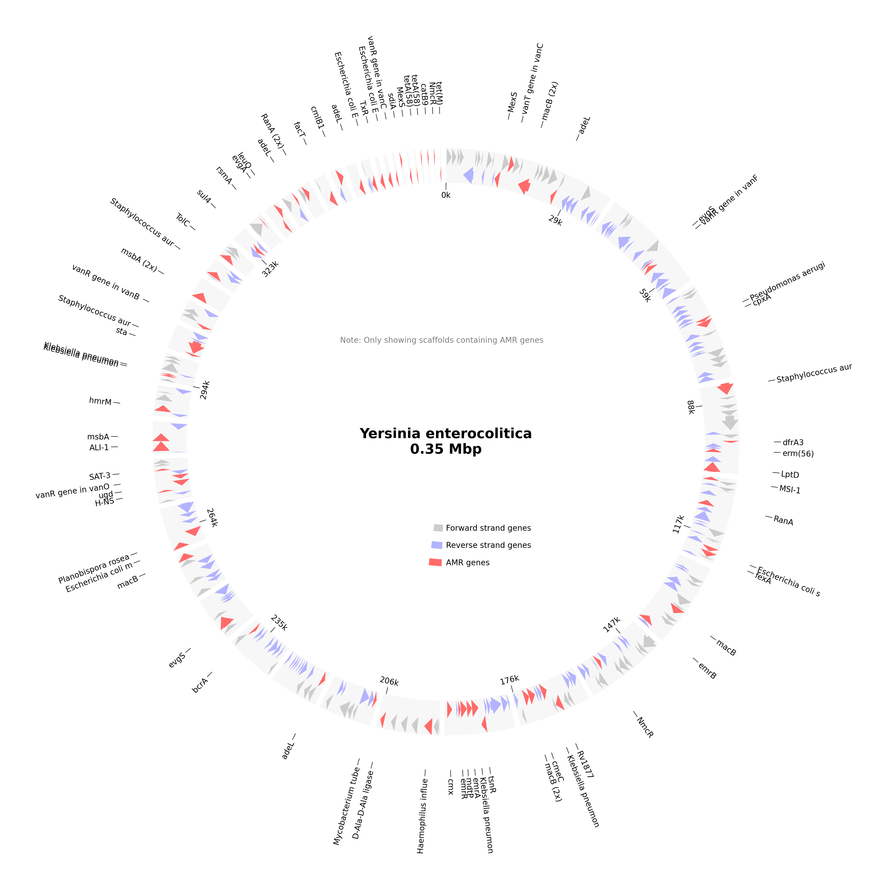

### ALI-1
- **Mechanism**: antibiotic inactivation
- **Drug Classes**: carbapenem
- **AMR Family**: ALI beta-lactamase
- **Locations**:
  - gnl|SPADES|BMKMCJEI_1235_3 : position 603-2783

### D-Ala-D-Ala ligase
- **Mechanism**: antibiotic target alteration
- **Drug Classes**: glycopeptide antibiotic
- **AMR Family**: Van ligase
- **Locations**:
  - gnl|SPADES|BMKMCJEI_700_12 : position 12529-13449

### Escherichia coli EF-Tu mutants conferring resistance to Pulvomycin (found in 2 locations)
- **Mechanism**: antibiotic target alteration
- **Drug Classes**: elfamycin antibiotic
- **AMR Family**: elfamycin resistant EF-Tu
- **Locations**:
  - gnl|SPADES|BMKMCJEI_3610_4 : position 1112-1987
  - gnl|SPADES|BMKMCJEI_7825_1 : position 2-784

### Escherichia coli mdfA
- **Mechanism**: antibiotic efflux
- **Drug Classes**: tetracycline antibiotic; phenicol antibiotic; disinfecting agents and antiseptics
- **AMR Family**: major facilitator superfamily (MFS) antibiotic efflux pump
- **Locations**:
  - gnl|SPADES|BMKMCJEI_916_1 : position 253-1482

### Escherichia coli soxS with mutation conferring antibiotic resistance
- **Mechanism**: antibiotic target alteration; antibiotic efflux; reduced permeability to antibiotic
- **Drug Classes**: fluoroquinolone antibiotic; monobactam; carbapenem; cephalosporin; glycylcycline; cephamycin; penam; tetracycline antibiotic; rifamycin antibiotic; phenicol antibiotic; penem; disinfecting agents and antiseptics
- **AMR Family**: ATP-binding cassette (ABC) antibiotic efflux pump; major facilitator superfamily (MFS) antibiotic efflux pump; resistance-nodulation-cell division (RND) antibiotic efflux pump; General Bacterial Porin with reduced permeability to beta-lactams
- **Locations**:
  - gnl|SPADES|BMKMCJEI_542_18 : position 15896-16903

### H-NS
- **Mechanism**: antibiotic efflux
- **Drug Classes**: macrolide antibiotic; fluoroquinolone antibiotic; cephalosporin; cephamycin; penam; tetracycline antibiotic
- **AMR Family**: major facilitator superfamily (MFS) antibiotic efflux pump; resistance-nodulation-cell division (RND) antibiotic efflux pump
- **Locations**:
  - gnl|SPADES|BMKMCJEI_923_3 : position 2310-2720

### Haemophilus influenzae PBP3 conferring resistance to beta-lactam antibiotics
- **Mechanism**: antibiotic target alteration
- **Drug Classes**: cephalosporin; cephamycin; penam
- **AMR Family**: Penicillin-binding protein mutations conferring resistance to beta-lactam antibiotics
- **Locations**:
  - gnl|SPADES|BMKMCJEI_700_4 : position 1713-3476

### Klebsiella pneumoniae KpnE
- **Mechanism**: antibiotic efflux
- **Drug Classes**: macrolide antibiotic; aminoglycoside antibiotic; cephalosporin; tetracycline antibiotic; peptide antibiotic; rifamycin antibiotic; disinfecting agents and antiseptics
- **AMR Family**: small multidrug resistance (SMR) antibiotic efflux pump
- **Locations**:
  - gnl|SPADES|BMKMCJEI_1441_2 : position 1064-1441

### Klebsiella pneumoniae KpnF
- **Mechanism**: antibiotic efflux
- **Drug Classes**: macrolide antibiotic; aminoglycoside antibiotic; cephalosporin; tetracycline antibiotic; peptide antibiotic; rifamycin antibiotic; disinfecting agents and antiseptics
- **AMR Family**: small multidrug resistance (SMR) antibiotic efflux pump
- **Locations**:
  - gnl|SPADES|BMKMCJEI_1441_3: position 1428-1757

### Klebsiella pneumoniae KpnG
- **Mechanism**: antibiotic efflux
- **Drug Classes**: macrolide antibiotic; fluoroquinolone antibiotic; aminoglycoside antibiotic; carbapenem; cephalosporin; penam; peptide antibiotic; penem
- **AMR Family**: major facilitator superfamily (MFS) antibiotic efflux pump
- **Locations**:
  - gnl|SPADES|BMKMCJEI_625_8 : position 7964-9256

### Klebsiella pneumoniae KpnH
- **Mechanism**: antibiotic efflux
- **Drug Classes**: macrolide antibiotic; fluoroquinolone antibiotic; aminoglycoside antibiotic; carbapenem; cephalosporin; penam; peptide antibiotic; penem
- **AMR Family**: major facilitator superfamily (MFS) antibiotic efflux pump
- **Locations**:
  - gnl|SPADES|BMKMCJEI_637_7: position 7589-9124

### LptD
- **Mechanism**: antibiotic efflux
- **Drug Classes**: carbapenem; peptide antibiotic; aminocoumarin antibiotic; rifamycin antibiotic
- **AMR Family**: ATP-binding cassette (ABC) antibiotic efflux pump
- **Locations**:
  - gnl|SPADES|BMKMCJEI_511_17 : position 17995-20346

### MSI-1
- **Mechanism**: antibiotic inactivation
- **Drug Classes**: carbapenem
- **AMR Family**: MSI beta-lactamase
- **Locations**:
  - gnl|SPADES|BMKMCJEI_542_1 : position 96-851

### MexS (found in 2 locations)
- **Mechanism**: antibiotic efflux
- **Drug Classes**: fluoroquinolone antibiotic; diaminopyrimidine antibiotic; phenicol antibiotic
- **AMR Family**: resistance-nodulation-cell division (RND) antibiotic efflux pump
- **Locations**:
  - gnl|SPADES|BMKMCJEI_15333_1 : position 1-414
  - gnl|SPADES|BMKMCJEI_290_13 : position 11679-12755

### Mycobacterium tuberculosis pncA mutations conferring resistance to pyrazinamide
- **Mechanism**: antibiotic target alteration
- **Drug Classes**: pyrazine antibiotic
- **AMR Family**: Pyrazinamide resistant pncA
- **Locations**:
  - gnl|SPADES|BMKMCJEI_784_1 : position 162-815

### NmcR (found in 2 locations)
- **Mechanism**: antibiotic inactivation
- **Drug Classes**: carbapenem; cephalosporin; cephamycin; penam
- **AMR Family**: NmcA beta-lactamase
- **Locations**:
  - gnl|SPADES|BMKMCJEI_47979_1 : position 1-216
  - gnl|SPADES|BMKMCJEI_575_13 : position 12396-13313

### Planobispora rosea EF-Tu mutants conferring resistance to inhibitor GE2270A
- **Mechanism**: antibiotic target alteration
- **Drug Classes**: elfamycin antibiotic
- **AMR Family**: elfamycin resistant EF-Tu
- **Locations**:
  - gnl|SPADES|BMKMCJEI_916_2 : position 1548-3440

### Pseudomonas aeruginosa CpxR
- **Mechanism**: antibiotic efflux
- **Drug Classes**: macrolide antibiotic; fluoroquinolone antibiotic; monobactam; aminoglycoside antibiotic; carbapenem; cephalosporin; cephamycin; penam; tetracycline antibiotic; peptide antibiotic; aminocoumarin antibiotic; diaminopyrimidine antibiotic; sulfonamide antibiotic; phenicol antibiotic; penem
- **AMR Family**: resistance-nodulation-cell division (RND) antibiotic efflux pump
- **Locations**:
  - gnl|SPADES|BMKMCJEI_480_9 : position 7546-8244

### RanA (found in 3 locations)
- **Mechanism**: antibiotic efflux
- **Drug Classes**: aminoglycoside antibiotic
- **AMR Family**: ATP-binding cassette (ABC) antibiotic efflux pump
- **Locations**:
  - gnl|SPADES|BMKMCJEI_2607_2 : position 929-1930
  - gnl|SPADES|BMKMCJEI_2607_3 : position 1927-2928
  - gnl|SPADES|BMKMCJEI_542_7 : position 5726-6925

### Rv1877
- **Mechanism**: antibiotic efflux
- **Drug Classes**: fluoroquinolone antibiotic
- **AMR Family**: major facilitator superfamily (MFS) antibiotic efflux pump
- **Locations**:
  - gnl|SPADES|BMKMCJEI_625_6 : position 5983-7371

### SAT-3
- **Mechanism**: antibiotic inactivation
- **Drug Classes**: nucleoside antibiotic
- **AMR Family**: streptothricin acetyltransferase (SAT)
- **Locations**:
  - gnl|SPADES|BMKMCJEI_923_7 : position 7103-7531

### Staphylococcus aureus mupA conferring resistance to mupirocin
- **Mechanism**: antibiotic target alteration
- **Drug Classes**: mupirocin-like antibiotic
- **AMR Family**: antibiotic-resistant isoleucyl-tRNA synthetase (ileS)
- **Locations**:
  - gnl|SPADES|BMKMCJEI_511_1 : position 2-2638

### Staphylococcus aureus mupB conferring resistance to mupirocin
- **Mechanism**: antibiotic target alteration
- **Drug Classes**: mupirocin-like antibiotic
- **AMR Family**: antibiotic-resistant isoleucyl-tRNA synthetase (ileS)
- **Locations**:
  - gnl|SPADES|BMKMCJEI_1573_2 : position 630-3527

### Staphylococcus aureus murA with mutation conferring resistance to fosfomycin
- **Mechanism**: antibiotic target alteration
- **Drug Classes**: phosphonic acid antibiotic
- **AMR Family**: antibiotic-resistant murA transferase
- **Locations**:
  - gnl|SPADES|BMKMCJEI_2045_2 : position 470-1738

### TolC
- **Mechanism**: antibiotic efflux
- **Drug Classes**: macrolide antibiotic; fluoroquinolone antibiotic; aminoglycoside antibiotic; carbapenem; cephalosporin; glycylcycline; cephamycin; penam; tetracycline antibiotic; peptide antibiotic; aminocoumarin antibiotic; rifamycin antibiotic; phenicol antibiotic; penem; disinfecting agents and antiseptics
- **AMR Family**: ATP-binding cassette (ABC) antibiotic efflux pump; major facilitator superfamily (MFS) antibiotic efflux pump; resistance-nodulation-cell division (RND) antibiotic efflux pump
- **Locations**:
  - gnl|SPADES|BMKMCJEI_2322_1 : position 3-1382

### TxR
- **Mechanism**: antibiotic efflux
- **Drug Classes**: tetracycline antibiotic
- **AMR Family**: ATP-binding cassette (ABC) antibiotic efflux pump
- **Locations**:
  - gnl|SPADES|BMKMCJEI_7165_1 : position 2-865

### adeL (found in 4 locations)
- **Mechanism**: antibiotic efflux
- **Drug Classes**: fluoroquinolone antibiotic; tetracycline antibiotic
- **AMR Family**: resistance-nodulation-cell division (RND) antibiotic efflux pump
- **Locations**:
  - gnl|SPADES|BMKMCJEI_2580_3 : position 2606-3040
  - gnl|SPADES|BMKMCJEI_290_23 : position 25671-26588
  - gnl|SPADES|BMKMCJEI_3220_2 : position 1338-2270
  - gnl|SPADES|BMKMCJEI_834_1 : position 439-1332

### bcrA
- **Mechanism**: antibiotic efflux
- **Drug Classes**: peptide antibiotic
- **AMR Family**: ATP-binding cassette (ABC) antibiotic efflux pump
- **Locations**:
  - gnl|SPADES|BMKMCJEI_842_13 : position 8796-9422

### catB9
- **Mechanism**: antibiotic inactivation
- **Drug Classes**: phenicol antibiotic
- **AMR Family**: chloramphenicol acetyltransferase (CAT)
- **Locations**:
  - gnl|SPADES|BMKMCJEI_21828_1 : position 3-239

### cmeC
- **Mechanism**: antibiotic efflux
- **Drug Classes**: macrolide antibiotic; fluoroquinolone antibiotic; cephalosporin; fusidane antibiotic
- **AMR Family**: resistance-nodulation-cell division (RND) antibiotic efflux pump
- **Locations**:
  - gnl|SPADES|BMKMCJEI_625_11 : position 10965-12452

### cmlB1
- **Mechanism**: antibiotic efflux
- **Drug Classes**: phenicol antibiotic
- **AMR Family**: major facilitator superfamily (MFS) antibiotic efflux pump
- **Locations**:
  - gnl|SPADES|BMKMCJEI_2950_2 : position 1264-2448

### cmx
- **Mechanism**: antibiotic efflux
- **Drug Classes**: phenicol antibiotic
- **AMR Family**: major facilitator superfamily (MFS) antibiotic efflux pump
- **Locations**:
  - gnl|SPADES|BMKMCJEI_637_13 : position 13862-15064

### cpxA
- **Mechanism**: antibiotic efflux
- **Drug Classes**: aminoglycoside antibiotic; aminocoumarin antibiotic
- **AMR Family**: resistance-nodulation-cell division (RND) antibiotic efflux pump
- **Locations**:
  - gnl|SPADES|BMKMCJEI_480_10 : position 8241-9617

### dfrA3
- **Mechanism**: antibiotic target replacement
- **Drug Classes**: diaminopyrimidine antibiotic
- **AMR Family**: trimethoprim resistant dihydrofolate reductase dfr
- **Locations**:
  - gnl|SPADES|BMKMCJEI_511_11 : position 12987-13469

### emrA
- **Mechanism**: antibiotic efflux
- **Drug Classes**: fluoroquinolone antibiotic
- **AMR Family**: major facilitator superfamily (MFS) antibiotic efflux pump
- **Locations**:
  - gnl|SPADES|BMKMCJEI_637_8 : position 9164-10336

### emrB
- **Mechanism**: antibiotic efflux
- **Drug Classes**: fluoroquinolone antibiotic
- **AMR Family**: major facilitator superfamily (MFS) antibiotic efflux pump
- **Locations**:
  - gnl|SPADES|BMKMCJEI_543_15 : position 16636-18060

### emrR
- **Mechanism**: antibiotic efflux
- **Drug Classes**: fluoroquinolone antibiotic
- **AMR Family**: major facilitator superfamily (MFS) antibiotic efflux pump
- **Locations**:
  - gnl|SPADES|BMKMCJEI_637_10 : position 11865-12377

### erm(56)
- **Mechanism**: antibiotic target alteration
- **Drug Classes**: macrolide antibiotic; lincosamide antibiotic; streptogramin antibiotic; streptogramin B antibiotic
- **AMR Family**: Erm 23S ribosomal RNA methyltransferase
- **Locations**:
  - gnl|SPADES|BMKMCJEI_511_14 : position 14833-15651

### evgA
- **Mechanism**: antibiotic efflux
- **Drug Classes**: macrolide antibiotic; fluoroquinolone antibiotic; penam; tetracycline antibiotic
- **AMR Family**: major facilitator superfamily (MFS) antibiotic efflux pump; resistance-nodulation-cell division (RND) antibiotic efflux pump
- **Locations**:
  - gnl|SPADES|BMKMCJEI_2374_2 : position 1472-2158

### evgS (found in 2 locations)
- **Mechanism**: antibiotic efflux
- **Drug Classes**: macrolide antibiotic; fluoroquinolone antibiotic; penam; tetracycline antibiotic
- **AMR Family**: major facilitator superfamily (MFS) antibiotic efflux pump; resistance-nodulation-cell division (RND) antibiotic efflux pump
- **Locations**:
  - gnl|SPADES|BMKMCJEI_440_15 : position 14978-15367
  - gnl|SPADES|BMKMCJEI_893_3 : position 2226-4562

### facT
- **Mechanism**: antibiotic efflux
- **Drug Classes**: elfamycin antibiotic
- **AMR Family**: major facilitator superfamily (MFS) antibiotic efflux pump
- **Locations**:
  - gnl|SPADES|BMKMCJEI_2791_2 : position 1140-2444

### fexA
- **Mechanism**: antibiotic efflux
- **Drug Classes**: phenicol antibiotic
- **AMR Family**: major facilitator superfamily (MFS) antibiotic efflux pump
- **Locations**:
  - gnl|SPADES|BMKMCJEI_542_19 : position 16991-18226

### hmrM
- **Mechanism**: antibiotic efflux
- **Drug Classes**: fluoroquinolone antibiotic; disinfecting agents and antiseptics
- **AMR Family**: multidrug and toxic compound extrusion (MATE) transporter
- **Locations**:
  - gnl|SPADES|BMKMCJEI_1291_3 : position 1118-2530

### leuO
- **Mechanism**: antibiotic efflux
- **Drug Classes**: nucleoside antibiotic; disinfecting agents and antiseptics
- **AMR Family**: major facilitator superfamily (MFS) antibiotic efflux pump
- **Locations**:
  - gnl|SPADES|BMKMCJEI_2374_3 : position 2386-3333

### macB (found in 6 locations)
- **Mechanism**: antibiotic efflux
- **Drug Classes**: macrolide antibiotic
- **AMR Family**: ATP-binding cassette (ABC) antibiotic efflux pump
- **Locations**:
  - gnl|SPADES|BMKMCJEI_290_18 : position 17402-20233
  - gnl|SPADES|BMKMCJEI_290_26 : position 27895-28656
  - gnl|SPADES|BMKMCJEI_543_10 : position 11134-12666
  - gnl|SPADES|BMKMCJEI_625_12 : position 12445-13659
  - gnl|SPADES|BMKMCJEI_625_13 : position 13652-14359
  - gnl|SPADES|BMKMCJEI_896_8 : position 8487-10019

### mdtP
- **Mechanism**: antibiotic efflux
- **Drug Classes**: nucleoside antibiotic; disinfecting agents and antiseptics
- **AMR Family**: major facilitator superfamily (MFS) antibiotic efflux pump
- **Locations**:
  - gnl|SPADES|BMKMCJEI_637_9 : position 10351-11817

### msbA (found in 3 locations)
- **Mechanism**: antibiotic efflux
- **Drug Classes**: nitroimidazole antibiotic
- **AMR Family**: ATP-binding cassette (ABC) antibiotic efflux pump
- **Locations**:
  - gnl|SPADES|BMKMCJEI_1235_4 : position 2819-4567
  - gnl|SPADES|BMKMCJEI_1891_1 : position 3-1766
  - gnl|SPADES|BMKMCJEI_1891_2 : position 1769-3493

### rsmA
- **Mechanism**: antibiotic efflux
- **Drug Classes**: fluoroquinolone antibiotic; diaminopyrimidine antibiotic; phenicol antibiotic
- **AMR Family**: resistance-nodulation-cell division (RND) antibiotic efflux pump
- **Locations**:
  - gnl|SPADES|BMKMCJEI_2367_2: position 2698-2883

### sdiA
- **Mechanism**: antibiotic efflux
- **Drug Classes**: fluoroquinolone antibiotic; cephalosporin; glycylcycline; penam; tetracycline antibiotic; rifamycin antibiotic; phenicol antibiotic; disinfecting agents and antiseptics
- **AMR Family**: resistance-nodulation-cell division (RND) antibiotic efflux pump
- **Locations**:
  - gnl|SPADES|BMKMCJEI_12297_1 : position 1-366

### sta
- **Mechanism**: antibiotic inactivation
- **Drug Classes**: nucleoside antibiotic
- **AMR Family**: streptothricin acetyltransferase (SAT)
- **Locations**:
  - gnl|SPADES|BMKMCJEI_1573_1 : position 1-495

### sul4
- **Mechanism**: antibiotic target replacement
- **Drug Classes**: sulfonamide antibiotic
- **AMR Family**: sulfonamide resistant sul
- **Locations**:
  - gnl|SPADES|BMKMCJEI_2358_2 : position 1520-2353

### tet(M)
- **Mechanism**: antibiotic target protection
- **Drug Classes**: tetracycline antibiotic
- **AMR Family**: tetracycline-resistant ribosomal protection protein
- **Locations**:
  - gnl|SPADES|BMKMCJEI_48629_1 : position 2-214

### tetA(58) (found in 2 locations)
- **Mechanism**: antibiotic efflux
- **Drug Classes**: tetracycline antibiotic
- **AMR Family**: major facilitator superfamily (MFS) antibiotic efflux pump
- **Locations**:
  - gnl|SPADES|BMKMCJEI_17077_1 : position 174-380
  - gnl|SPADES|BMKMCJEI_17084_1 : position 3-209

### tsnR
- **Mechanism**: antibiotic target alteration
- **Drug Classes**: peptide antibiotic
- **AMR Family**: non-erm 23S ribosomal RNA methyltransferase (A1067)
- **Locations**:
  - gnl|SPADES|BMKMCJEI_637_6 : position 6291-7382

### ugd
- **Mechanism**: antibiotic target alteration
- **Drug Classes**: peptide antibiotic
- **AMR Family**: pmr phosphoethanolamine transferase
- **Locations**:
  - gnl|SPADES|BMKMCJEI_923_4 : position 3104-4453

### vanR gene in vanB cluster
- **Mechanism**: antibiotic target alteration
- **Drug Classes**: glycopeptide antibiotic
- **AMR Family**: glycopeptide resistance gene cluster; vanR
- **Locations**:
  - gnl|SPADES|BMKMCJEI_1732_1 : position 368-1084

### vanR gene in vanC cluster
- **Mechanism**: antibiotic target alteration
- **Drug Classes**: glycopeptide antibiotic
- **AMR Family**: glycopeptide resistance gene cluster; vanR
- **Locations**:
  - gnl|SPADES|BMKMCJEI_10816_1 : position 2-388

### vanR gene in vanF cluster
- **Mechanism**: antibiotic target alteration
- **Drug Classes**: glycopeptide antibiotic
- **AMR Family**: glycopeptide resistance gene cluster; vanR
- **Locations**:
  - gnl|SPADES|BMKMCJEI_440_16 : position 15520-16569

### vanR gene in vanO cluster
- **Mechanism**: antibiotic target alteration
- **Drug Classes**: glycopeptide antibiotic
- **AMR Family**: glycopeptide resistance gene cluster; vanR
- **Locations**:
  - gnl|SPADES|BMKMCJEI_923_5 : position 4775-5791

### vanT gene in vanC cluster
- **Mechanism**: antibiotic target alteration
- **Drug Classes**: glycopeptide antibiotic
- **AMR Family**: glycopeptide resistance gene cluster; vanT
- **Locations**:
  - gnl|SPADES|BMKMCJEI_290_15 : position 14342-15421

## Yersinia enterocolitica (type O:5) str. YE53/03
**Strain Statistics:**
- Total genome length: 3189.4 kbp
- Total scaffolds: 163
- Scaffolds with AMR genes: 108
- Total genes annotated: 5601
- Total AMR genes: 345
- Unique AMR genes: 154
- Distinct AMR mechanisms: 9
- Distinct AMR families: 61
- Distinct drug classes: 35

**Circos Plot:**

_str._YE53_03.png)

### Acinetobacter baumannii AbaF (found in 4 locations)
- **Mechanism**: antibiotic efflux
- **Drug Classes**: phosphonic acid antibiotic
- **AMR Family**: major facilitator superfamily (MFS) antibiotic efflux pump
- **Locations**:
  - gnl|SPADES|BMKMCJEI_118_3 : position 1005-2507
  - gnl|SPADES|BMKMCJEI_268_5 : position 4528-5931
  - gnl|SPADES|BMKMCJEI_341_11 : position 10976-12502
  - gnl|SPADES|BMKMCJEI_721_4 : position 4126-5493

### Acinetobacter baumannii AbaQ (found in 4 locations)
- **Mechanism**: antibiotic efflux
- **Drug Classes**: fluoroquinolone antibiotic
- **AMR Family**: major facilitator superfamily (MFS) antibiotic efflux pump
- **Locations**:
  - gnl|SPADES|BMKMCJEI_118_29 : position 34250-35560
  - gnl|SPADES|BMKMCJEI_238_34 : position 32898-34256
  - gnl|SPADES|BMKMCJEI_565_7 : position 7272-8588
  - gnl|SPADES|BMKMCJEI_947_5 : position 3959-5275

### Acinetobacter baumannii AmvA
- **Mechanism**: antibiotic efflux
- **Drug Classes**: macrolide antibiotic; disinfecting agents and antiseptics
- **AMR Family**: major facilitator superfamily (MFS) antibiotic efflux pump
- **Locations**:
  - gnl|SPADES|BMKMCJEI_236_29 : position 33907-35400

### ArnT
- **Mechanism**: antibiotic target alteration
- **Drug Classes**: peptide antibiotic
- **AMR Family**: pmr phosphoethanolamine transferase
- **Locations**:
  - gnl|SPADES|BMKMCJEI_302_12: position 9870-11534

### Bifidobacterium bifidum ileS conferring resistance to mupirocin
- **Mechanism**: antibiotic target alteration
- **Drug Classes**: mupirocin-like antibiotic
- **AMR Family**: antibiotic-resistant isoleucyl-tRNA synthetase (ileS)
- **Locations**:
  - gnl|SPADES|BMKMCJEI_211_14 : position 14708-17290

### CMY-70
- **Mechanism**: antibiotic inactivation
- **Drug Classes**: cephamycin
- **AMR Family**: CMY beta-lactamase
- **Locations**:
  - gnl|SPADES|BMKMCJEI_441_1 : position 29-1195

### CRP (found in 2 locations)
- **Mechanism**: antibiotic efflux
- **Drug Classes**: macrolide antibiotic; fluoroquinolone antibiotic; penam
- **AMR Family**: resistance-nodulation-cell division (RND) antibiotic efflux pump
- **Locations**:
  - gnl|SPADES|BMKMCJEI_347_23 : position 29390-30145
  - gnl|SPADES|BMKMCJEI_499_17 : position 20500-20628

### Clostridioides difficile gyrB conferring resistance to fluoroquinolones
- **Mechanism**: antibiotic target alteration
- **Drug Classes**: fluoroquinolone antibiotic
- **AMR Family**: fluoroquinolone resistant gyrB
- **Locations**:
  - gnl|SPADES|BMKMCJEI_118_71 : position 81047-82915

### CrcB (found in 2 locations)
- **Mechanism**: antibiotic efflux
- **Drug Classes**: aminoglycoside antibiotic
- **AMR Family**: multidrug and toxic compound extrusion (MATE) transporter
- **Locations**:
  - gnl|SPADES|BMKMCJEI_211_29 : position 30414-30797
  - gnl|SPADES|BMKMCJEI_258_20 : position 18727-19131

### DHA-6
- **Mechanism**: antibiotic inactivation
- **Drug Classes**: cephalosporin; cephamycin
- **AMR Family**: DHA beta-lactamase
- **Locations**:
  - gnl|SPADES|BMKMCJEI_293_17 : position 12540-13682

### Enterobacter cloacae acrA (found in 2 locations)
- **Mechanism**: antibiotic efflux
- **Drug Classes**: fluoroquinolone antibiotic; cephalosporin; glycylcycline; penam; tetracycline antibiotic; rifamycin antibiotic; phenicol antibiotic; disinfecting agents and antiseptics
- **AMR Family**: resistance-nodulation-cell division (RND) antibiotic efflux pump
- **Locations**:
  - gnl|SPADES|BMKMCJEI_196_4 : position 4469-5629
  - gnl|SPADES|BMKMCJEI_359_13 : position 6591-7574

### Enterococcus faecalis cls with mutation conferring resistance to daptomycin
- **Mechanism**: antibiotic target alteration
- **Drug Classes**: peptide antibiotic
- **AMR Family**: daptomycin resistant cls
- **Locations**:
  - gnl|SPADES|BMKMCJEI_396_32 : position 25015-26475

### Erm(34)
- **Mechanism**: antibiotic target alteration
- **Drug Classes**: macrolide antibiotic; lincosamide antibiotic; streptogramin antibiotic; streptogramin A antibiotic; streptogramin B antibiotic
- **AMR Family**: Erm 23S ribosomal RNA methyltransferase
- **Locations**:
  - gnl|SPADES|BMKMCJEI_394_2 : position 941-1567

### Escherichia coli AcrAB-TolC with AcrR mutation conferring resistance to ciprofloxacin, tetracycline, and ceftazidime (found in 2 locations)
- **Mechanism**: antibiotic target alteration; antibiotic efflux
- **Drug Classes**: fluoroquinolone antibiotic; cephalosporin; glycylcycline; penam; tetracycline antibiotic; rifamycin antibiotic; phenicol antibiotic; disinfecting agents and antiseptics
- **AMR Family**: resistance-nodulation-cell division (RND) antibiotic efflux pump
- **Locations**:
  - gnl|SPADES|BMKMCJEI_229_1 : position 2-664
  - gnl|SPADES|BMKMCJEI_622_7 : position 6756-7340

### Escherichia coli acrA
- **Mechanism**: antibiotic efflux
- **Drug Classes**: fluoroquinolone antibiotic; cephalosporin; glycylcycline; penam; tetracycline antibiotic; rifamycin antibiotic; phenicol antibiotic; disinfecting agents and antiseptics
- **AMR Family**: resistance-nodulation-cell division (RND) antibiotic efflux pump
- **Locations**:
  - gnl|SPADES|BMKMCJEI_118_7 : position 7890-9092

### Escherichia coli parE conferring resistance to fluoroquinolones
- **Mechanism**: antibiotic target alteration
- **Drug Classes**: fluoroquinolone antibiotic
- **AMR Family**: fluoroquinolone resistant parE
- **Locations**:
  - gnl|SPADES|BMKMCJEI_452_1 : position 3-1079

### Escherichia coli soxS with mutation conferring antibiotic resistance (found in 3 locations)
- **Mechanism**: antibiotic target alteration; antibiotic efflux; reduced permeability to antibiotic
- **Drug Classes**: fluoroquinolone antibiotic; monobactam; carbapenem; cephalosporin; glycylcycline; cephamycin; penam; tetracycline antibiotic; rifamycin antibiotic; phenicol antibiotic; penem; disinfecting agents and antiseptics
- **AMR Family**: ATP-binding cassette (ABC) antibiotic efflux pump; major facilitator superfamily (MFS) antibiotic efflux pump; resistance-nodulation-cell division (RND) antibiotic efflux pump; General Bacterial Porin with reduced permeability to beta-lactams
- **Locations**:
  - gnl|SPADES|BMKMCJEI_136_48 : position 54653-55360
  - gnl|SPADES|BMKMCJEI_306_17 : position 19031-19963
  - gnl|SPADES|BMKMCJEI_683_3 : position 1312-2178

### Escherichia coli uhpA with mutation conferring resistance to fosfomycin
- **Mechanism**: antibiotic target alteration
- **Drug Classes**: phosphonic acid antibiotic
- **AMR Family**: antibiotic-resistant UhpT
- **Locations**:
  - gnl|SPADES|BMKMCJEI_222_11 : position 12469-13053

### EstT
- **Mechanism**: antibiotic inactivation
- **Drug Classes**: macrolide antibiotic
- **AMR Family**: macrolide esterase
- **Locations**:
  - gnl|SPADES|BMKMCJEI_156_41 : position 47812-48606

### FosM2
- **Mechanism**: antibiotic inactivation
- **Drug Classes**: phosphonic acid antibiotic
- **AMR Family**: fosfomycin thiol transferase
- **Locations**:
  - gnl|SPADES|BMKMCJEI_613_10 : position 7794-8201

### Helicobacter pylori pbp1 mutants conferring resistance to amoxicillin (found in 2 locations)
- **Mechanism**: antibiotic target alteration
- **Drug Classes**: cephalosporin; cephamycin; penam
- **AMR Family**: Penicillin-binding protein mutations conferring resistance to beta-lactam antibiotics
- **Locations**:
  - gnl|SPADES|BMKMCJEI_200_12 : position 12130-14616
  - gnl|SPADES|BMKMCJEI_458_5 : position 11244-13580

### Helicobacter pylori pbp2 mutants conferring resistance to amoxicillin
- **Mechanism**: antibiotic target alteration
- **Drug Classes**: cephalosporin; cephamycin; penam
- **AMR Family**: Penicillin-binding protein mutations conferring resistance to beta-lactam antibiotics
- **Locations**:
  - gnl|SPADES|BMKMCJEI_211_20 : position 20695-22590

### Helicobacter pylori pbp3 conferring resistance to amoxicillin
- **Mechanism**: antibiotic target alteration
- **Drug Classes**: cephalosporin; cephamycin; penam
- **AMR Family**: Penicillin-binding protein mutations conferring resistance to beta-lactam antibiotics
- **Locations**:
  - gnl|SPADES|BMKMCJEI_270_3 : position 1227-2936

### Klebsiella pneumoniae OmpK37 (found in 4 locations)
- **Mechanism**: reduced permeability to antibiotic
- **Drug Classes**: monobactam; carbapenem; cephalosporin; cephamycin; penam; penem
- **AMR Family**: General Bacterial Porin with reduced permeability to beta-lactams
- **Locations**:
  - gnl|SPADES|BMKMCJEI_293_18 : position 14175-15275
  - gnl|SPADES|BMKMCJEI_359_14 : position 7820-8935
  - gnl|SPADES|BMKMCJEI_64_40 : position 42623-43738
  - gnl|SPADES|BMKMCJEI_86_52 : position 63002-64084

### LRA-19
- **Mechanism**: antibiotic inactivation
- **Drug Classes**: cephalosporin; penam
- **AMR Family**: subclass B3 LRA beta-lactamase
- **Locations**:
  - gnl|SPADES|BMKMCJEI_760_3 : position 3296-3943

### LlmA 23S ribosomal RNA methyltransferase
- **Mechanism**: antibiotic target alteration
- **Drug Classes**: lincosamide antibiotic
- **AMR Family**: Llm 23S ribosomal RNA methyltransferase
- **Locations**:
  - gnl|SPADES|BMKMCJEI_222_40 : position 43015-44205

### LpsB
- **Mechanism**: reduced permeability to antibiotic
- **Drug Classes**: peptide antibiotic
- **AMR Family**: Intrinsic peptide antibiotic resistant Lps
- **Locations**:
  - gnl|SPADES|BMKMCJEI_229_18 : position 18768-19871

### MdtK
- **Mechanism**: antibiotic efflux
- **Drug Classes**: fluoroquinolone antibiotic
- **AMR Family**: multidrug and toxic compound extrusion (MATE) transporter
- **Locations**:
  - gnl|SPADES|BMKMCJEI_622_14 : position 14541-15938

### MexF
- **Mechanism**: antibiotic efflux
- **Drug Classes**: fluoroquinolone antibiotic; diaminopyrimidine antibiotic; phenicol antibiotic
- **AMR Family**: resistance-nodulation-cell division (RND) antibiotic efflux pump
- **Locations**:
  - gnl|SPADES|BMKMCJEI_118_6 : position 4752-7877

### MexH
- **Mechanism**: antibiotic efflux
- **Drug Classes**: fluoroquinolone antibiotic; tetracycline antibiotic; disinfecting agents and antiseptics
- **AMR Family**: resistance-nodulation-cell division (RND) antibiotic efflux pump
- **Locations**:
  - gnl|SPADES|BMKMCJEI_118_39 : position 46689-48227

### MexJ
- **Mechanism**: antibiotic efflux
- **Drug Classes**: macrolide antibiotic; tetracycline antibiotic; disinfecting agents and antiseptics
- **AMR Family**: resistance-nodulation-cell division (RND) antibiotic efflux pump
- **Locations**:
  - gnl|SPADES|BMKMCJEI_188_25 : position 31041-32123

### MexS (found in 4 locations)
- **Mechanism**: antibiotic efflux
- **Drug Classes**: fluoroquinolone antibiotic; diaminopyrimidine antibiotic; phenicol antibiotic
- **AMR Family**: resistance-nodulation-cell division (RND) antibiotic efflux pump
- **Locations**:
  - gnl|SPADES|BMKMCJEI_399_20 : position 20720-21730
  - gnl|SPADES|BMKMCJEI_622_4 : position 3555-4565
  - gnl|SPADES|BMKMCJEI_64_6 : position 5657-6811
  - gnl|SPADES|BMKMCJEI_835_3 : position 1610-2644

### MexT
- **Mechanism**: antibiotic efflux
- **Drug Classes**: fluoroquinolone antibiotic; diaminopyrimidine antibiotic; phenicol antibiotic
- **AMR Family**: resistance-nodulation-cell division (RND) antibiotic efflux pump
- **Locations**:
  - gnl|SPADES|BMKMCJEI_1416_3 : position 2521-3441

### Mycobacterium tuberculosis kasA mutant conferring resistance to isoniazid (found in 2 locations)
- **Mechanism**: antibiotic target alteration
- **Drug Classes**: isoniazid-like antibiotic
- **AMR Family**: antibiotic resistant kasA
- **Locations**:
  - gnl|SPADES|BMKMCJEI_547_4 : position 3016-4290
  - gnl|SPADES|BMKMCJEI_568_6 : position 4462-5637

### Mycobacterium tuberculosis ndh with mutation conferring resistance to isoniazid
- **Mechanism**: antibiotic target alteration
- **Drug Classes**: isoniazid-like antibiotic
- **AMR Family**: antibiotic resistant ndh
- **Locations**:
  - gnl|SPADES|BMKMCJEI_326_14 : position 17279-18583

### Mycobacterium tuberculosis thyA with mutation conferring resistance to para-aminosalicylic acid
- **Mechanism**: antibiotic target alteration
- **Drug Classes**: salicylic acid antibiotic
- **AMR Family**: aminosalicylate resistant thymidylate synthase
- **Locations**:
  - gnl|SPADES|BMKMCJEI_488_3 : position 3178-3972

### Neisseria gonorrhoeae pilQ gene conferring resistance to beta-lactam
- **Mechanism**: antibiotic target alteration
- **Drug Classes**: cephalosporin; cephamycin; penam
- **AMR Family**: Penicillin-binding protein mutations conferring resistance to beta-lactam antibiotics
- **Locations**:
  - gnl|SPADES|BMKMCJEI_235_21 : position 18758-20704

### NmcR (found in 8 locations)
- **Mechanism**: antibiotic inactivation
- **Drug Classes**: carbapenem; cephalosporin; cephamycin; penam
- **AMR Family**: NmcA beta-lactamase
- **Locations**:
  - gnl|SPADES|BMKMCJEI_1073_3 : position 2487-3368
  - gnl|SPADES|BMKMCJEI_210_26 : position 35531-36424
  - gnl|SPADES|BMKMCJEI_236_6 : position 6592-7479
  - gnl|SPADES|BMKMCJEI_246_2 : position 2863-3837
  - gnl|SPADES|BMKMCJEI_297_18 : position 20540-21460
  - gnl|SPADES|BMKMCJEI_361_1 : position 97-951
  - gnl|SPADES|BMKMCJEI_432_4 : position 4664-5545
  - gnl|SPADES|BMKMCJEI_441_2 : position 1330-2214

### OXA-152
- **Mechanism**: antibiotic inactivation
- **Drug Classes**: carbapenem; penam
- **AMR Family**: OXA beta-lactamase; OXA-62-like beta-lactamase
- **Locations**:
  - gnl|SPADES|BMKMCJEI_257_29 : position 29951-30655

### OmpA (found in 4 locations)
- **Mechanism**: reduced permeability to antibiotic
- **Drug Classes**: peptide antibiotic
- **AMR Family**: General Bacterial Porin with reduced permeability to peptide antibiotics
- **Locations**:
  - gnl|SPADES|BMKMCJEI_210_20 : position 28353-30023
  - gnl|SPADES|BMKMCJEI_210_3 : position 6356-7732
  - gnl|SPADES|BMKMCJEI_452_16 : position 17388-18047
  - gnl|SPADES|BMKMCJEI_683_11 : position 11479-11988

### OprJ
- **Mechanism**: antibiotic efflux
- **Drug Classes**: macrolide antibiotic; fluoroquinolone antibiotic; aminoglycoside antibiotic; cephalosporin; penam; tetracycline antibiotic; aminocoumarin antibiotic; diaminopyrimidine antibiotic; phenicol antibiotic
- **AMR Family**: resistance-nodulation-cell division (RND) antibiotic efflux pump
- **Locations**:
  - gnl|SPADES|BMKMCJEI_268_21 : position 22548-24068

### OprM
- **Mechanism**: antibiotic efflux
- **Drug Classes**: macrolide antibiotic; fluoroquinolone antibiotic; monobactam; aminoglycoside antibiotic; carbapenem; cephalosporin; cephamycin; penam; tetracycline antibiotic; peptide antibiotic; aminocoumarin antibiotic; diaminopyrimidine antibiotic; sulfonamide antibiotic; phenicol antibiotic; penem; disinfecting agents and antiseptics
- **AMR Family**: resistance-nodulation-cell division (RND) antibiotic efflux pump
- **Locations**:
  - gnl|SPADES|BMKMCJEI_196_6 : position 8760-10166

### PDC-382
- **Mechanism**: antibiotic inactivation
- **Drug Classes**: monobactam; carbapenem; cephalosporin
- **AMR Family**: PDC beta-lactamase
- **Locations**:
  - gnl|SPADES|BMKMCJEI_622_9 : position 8573-9745

### ParR (found in 4 locations)
- **Mechanism**: antibiotic efflux; reduced permeability to antibiotic
- **Drug Classes**: macrolide antibiotic; fluoroquinolone antibiotic; monobactam; aminoglycoside antibiotic; carbapenem; cephalosporin; cephamycin; penam; tetracycline antibiotic; phenicol antibiotic; penem; disinfecting agents and antiseptics
- **AMR Family**: resistance-nodulation-cell division (RND) antibiotic efflux pump; Outer Membrane Porin (Opr)
- **Locations**:
  - gnl|SPADES|BMKMCJEI_268_30 : position 34528-35256
  - gnl|SPADES|BMKMCJEI_389_18 : position 21399-22118
  - gnl|SPADES|BMKMCJEI_391_6 : position 5694-6413
  - gnl|SPADES|BMKMCJEI_632_5 : position 5455-6183

### ParS (found in 2 locations)
- **Mechanism**: antibiotic efflux; reduced permeability to antibiotic
- **Drug Classes**: macrolide antibiotic; fluoroquinolone antibiotic; monobactam; aminoglycoside antibiotic; carbapenem; cephalosporin; cephamycin; penam; tetracycline antibiotic; phenicol antibiotic; penem; disinfecting agents and antiseptics
- **AMR Family**: resistance-nodulation-cell division (RND) antibiotic efflux pump; Outer Membrane Porin (Opr)
- **Locations**:
  - gnl|SPADES|BMKMCJEI_268_28 : position 33158-34048
  - gnl|SPADES|BMKMCJEI_632_6 : position 6180-7493

### Planobispora rosea EF-Tu mutants conferring resistance to inhibitor GE2270A
- **Mechanism**: antibiotic target alteration
- **Drug Classes**: elfamycin antibiotic
- **AMR Family**: elfamycin resistant EF-Tu
- **Locations**:
  - gnl|SPADES|BMKMCJEI_394_13 : position 8878-10377

### PmrF (found in 3 locations)
- **Mechanism**: antibiotic target alteration
- **Drug Classes**: peptide antibiotic
- **AMR Family**: pmr phosphoethanolamine transferase
- **Locations**:
  - gnl|SPADES|BMKMCJEI_302_9 : position 5973-6956
  - gnl|SPADES|BMKMCJEI_638_12 : position 9090-10079
  - gnl|SPADES|BMKMCJEI_86_35 : position 40240-41613

### Pseudomonas aeruginosa CpxR
- **Mechanism**: antibiotic efflux
- **Drug Classes**: macrolide antibiotic; fluoroquinolone antibiotic; monobactam; aminoglycoside antibiotic; carbapenem; cephalosporin; cephamycin; penam; tetracycline antibiotic; peptide antibiotic; aminocoumarin antibiotic; diaminopyrimidine antibiotic; sulfonamide antibiotic; phenicol antibiotic; penem
- **AMR Family**: resistance-nodulation-cell division (RND) antibiotic efflux pump
- **Locations**:
  - gnl|SPADES|BMKMCJEI_341_3 : position 1696-2379

### Pseudomonas aeruginosa ampR with mutation conferring resistance to aztreonam
- **Mechanism**: antibiotic target alteration; antibiotic inactivation
- **Drug Classes**: monobactam; carbapenem; cephalosporin
- **AMR Family**: PDC beta-lactamase; ampR transcriptional regulator with mutation conferring resistance to monobactam antibiotics
- **Locations**:
  - gnl|SPADES|BMKMCJEI_217_27 : position 26900-27841

### QepA4 (found in 3 locations)
- **Mechanism**: antibiotic efflux
- **Drug Classes**: fluoroquinolone antibiotic
- **AMR Family**: major facilitator superfamily (MFS) antibiotic efflux pump
- **Locations**:
  - gnl|SPADES|BMKMCJEI_1416_2 : position 968-2392
  - gnl|SPADES|BMKMCJEI_306_2 : position 543-1835
  - gnl|SPADES|BMKMCJEI_86_18 : position 19713-21353

### RanA (found in 15 locations)
- **Mechanism**: antibiotic efflux
- **Drug Classes**: aminoglycoside antibiotic
- **AMR Family**: ATP-binding cassette (ABC) antibiotic efflux pump
- **Locations**:
  - gnl|SPADES|BMKMCJEI_196_21 : position 28683-29798
  - gnl|SPADES|BMKMCJEI_196_45 : position 51591-52469
  - gnl|SPADES|BMKMCJEI_217_21 : position 20738-21553
  - gnl|SPADES|BMKMCJEI_236_22 : position 24523-25572
  - gnl|SPADES|BMKMCJEI_236_31 : position 36748-37554
  - gnl|SPADES|BMKMCJEI_260_1 : position 189-1004
  - gnl|SPADES|BMKMCJEI_286_27 : position 28870-30384
  - gnl|SPADES|BMKMCJEI_287_14 : position 12736-13863
  - gnl|SPADES|BMKMCJEI_353_11 : position 12417-13520
  - gnl|SPADES|BMKMCJEI_360_8 : position 11981-13072
  - gnl|SPADES|BMKMCJEI_385_17 : position 24706-25440
  - gnl|SPADES|BMKMCJEI_410_2 : position 1013-2035
  - gnl|SPADES|BMKMCJEI_454_5 : position 5618-7210
  - gnl|SPADES|BMKMCJEI_466_4 : position 3558-4334
  - gnl|SPADES|BMKMCJEI_577_10 : position 8197-9015

### RanB
- **Mechanism**: antibiotic efflux
- **Drug Classes**: aminoglycoside antibiotic
- **AMR Family**: ATP-binding cassette (ABC) antibiotic efflux pump
- **Locations**:
  - gnl|SPADES|BMKMCJEI_236_30 : position 35609-36754

### Rv1877
- **Mechanism**: antibiotic efflux
- **Drug Classes**: fluoroquinolone antibiotic
- **AMR Family**: major facilitator superfamily (MFS) antibiotic efflux pump
- **Locations**:
  - gnl|SPADES|BMKMCJEI_452_14 : position 15038-16486

### Salmonella serovars soxS with mutation conferring antibiotic resistance
- **Mechanism**: antibiotic target alteration; antibiotic efflux; reduced permeability to antibiotic
- **Drug Classes**: fluoroquinolone antibiotic; monobactam; carbapenem; cephalosporin; glycylcycline; cephamycin; penam; tetracycline antibiotic; rifamycin antibiotic; phenicol antibiotic; penem; disinfecting agents and antiseptics
- **AMR Family**: ATP-binding cassette (ABC) antibiotic efflux pump; major facilitator superfamily (MFS) antibiotic efflux pump; resistance-nodulation-cell division (RND) antibiotic efflux pump; General Bacterial Porin with reduced permeability to beta-lactams
- **Locations**:
  - gnl|SPADES|BMKMCJEI_238_48 : position 46781-47167

### SatA
- **Mechanism**: antibiotic inactivation
- **Drug Classes**: nucleoside antibiotic
- **AMR Family**: streptothricin acetyltransferase (SAT)
- **Locations**:
  - gnl|SPADES|BMKMCJEI_622_2 : position 1373-1831

### Staphylococcus aureus GlpT with mutation conferring resistance to fosfomycin (found in 2 locations)
- **Mechanism**: antibiotic target alteration
- **Drug Classes**: phosphonic acid antibiotic
- **AMR Family**: antibiotic-resistant GlpT
- **Locations**:
  - gnl|SPADES|BMKMCJEI_281_22 : position 22812-24176
  - gnl|SPADES|BMKMCJEI_299_26 : position 30715-32079

### Staphylococcus aureus fusA with mutation conferring resistance to fusidic acid (found in 2 locations)
- **Mechanism**: antibiotic target alteration
- **Drug Classes**: fusidane antibiotic
- **AMR Family**: antibiotic resistant fusA
- **Locations**:
  - gnl|SPADES|BMKMCJEI_217_16 : position 14464-16572
  - gnl|SPADES|BMKMCJEI_821_6 : position 4375-5964

### Streptococcus pneumoniae PBP2x conferring resistance to amoxicillin
- **Mechanism**: antibiotic target alteration
- **Drug Classes**: cephalosporin; cephamycin; penam
- **AMR Family**: Penicillin-binding protein mutations conferring resistance to beta-lactam antibiotics
- **Locations**:
  - gnl|SPADES|BMKMCJEI_915_3 : position 3359-5914

### Streptomyces lividans cmlR
- **Mechanism**: antibiotic efflux
- **Drug Classes**: phenicol antibiotic
- **AMR Family**: major facilitator superfamily (MFS) antibiotic efflux pump
- **Locations**:
  - gnl|SPADES|BMKMCJEI_297_24 : position 27408-28622

### Streptomyces rimosus otr(A)
- **Mechanism**: antibiotic target protection
- **Drug Classes**: tetracycline antibiotic
- **AMR Family**: tetracycline-resistant ribosomal protection protein
- **Locations**:
  - gnl|SPADES|BMKMCJEI_505_5 : position 5889-7712

### Streptomyces venezuelae rox (found in 2 locations)
- **Mechanism**: antibiotic inactivation
- **Drug Classes**: rifamycin antibiotic
- **AMR Family**: rifampin monooxygenase
- **Locations**:
  - gnl|SPADES|BMKMCJEI_211_1 : position 187-1368
  - gnl|SPADES|BMKMCJEI_378_6 : position 4802-5971

### TaeA (found in 3 locations)
- **Mechanism**: antibiotic efflux
- **Drug Classes**: pleuromutilin antibiotic
- **AMR Family**: ATP-binding cassette (ABC) antibiotic efflux pump
- **Locations**:
  - gnl|SPADES|BMKMCJEI_258_8 : position 6637-7302
  - gnl|SPADES|BMKMCJEI_547_9 : position 8417-10330
  - gnl|SPADES|BMKMCJEI_683_12 : position 12278-13945

### TolC
- **Mechanism**: antibiotic efflux
- **Drug Classes**: macrolide antibiotic; fluoroquinolone antibiotic; aminoglycoside antibiotic; carbapenem; cephalosporin; glycylcycline; cephamycin; penam; tetracycline antibiotic; peptide antibiotic; aminocoumarin antibiotic; rifamycin antibiotic; phenicol antibiotic; penem; disinfecting agents and antiseptics
- **AMR Family**: ATP-binding cassette (ABC) antibiotic efflux pump; major facilitator superfamily (MFS) antibiotic efflux pump; resistance-nodulation-cell division (RND) antibiotic efflux pump
- **Locations**:
  - gnl|SPADES|BMKMCJEI_293_21 : position 19435-20820

### TriC
- **Mechanism**: antibiotic efflux
- **Drug Classes**: disinfecting agents and antiseptics
- **AMR Family**: resistance-nodulation-cell division (RND) antibiotic efflux pump
- **Locations**:
  - gnl|SPADES|BMKMCJEI_188_26 : position 32123-35209

### TxR (found in 7 locations)
- **Mechanism**: antibiotic efflux
- **Drug Classes**: tetracycline antibiotic
- **AMR Family**: ATP-binding cassette (ABC) antibiotic efflux pump
- **Locations**:
  - gnl|SPADES|BMKMCJEI_188_39 : position 49726-51645
  - gnl|SPADES|BMKMCJEI_212_3 : position 2419-4578
  - gnl|SPADES|BMKMCJEI_260_17 : position 14054-15637
  - gnl|SPADES|BMKMCJEI_260_8 : position 7336-8346
  - gnl|SPADES|BMKMCJEI_361_12 : position 9843-11384
  - gnl|SPADES|BMKMCJEI_408_25 : position 22247-23584
  - gnl|SPADES|BMKMCJEI_505_2 : position 1406-2818

### acrB (found in 2 locations)
- **Mechanism**: antibiotic efflux
- **Drug Classes**: fluoroquinolone antibiotic; cephalosporin; glycylcycline; penam; tetracycline antibiotic; rifamycin antibiotic; phenicol antibiotic; disinfecting agents and antiseptics
- **AMR Family**: resistance-nodulation-cell division (RND) antibiotic efflux pump
- **Locations**:
  - gnl|SPADES|BMKMCJEI_196_5 : position 5633-8758
  - gnl|SPADES|BMKMCJEI_801_13 : position 9588-11483

### adeF
- **Mechanism**: antibiotic efflux
- **Drug Classes**: fluoroquinolone antibiotic; tetracycline antibiotic
- **AMR Family**: resistance-nodulation-cell division (RND) antibiotic efflux pump
- **Locations**:
  - gnl|SPADES|BMKMCJEI_257_23: position 22329-25460

### adeK
- **Mechanism**: antibiotic efflux
- **Drug Classes**: macrolide antibiotic; fluoroquinolone antibiotic; lincosamide antibiotic; carbapenem; cephalosporin; tetracycline antibiotic; rifamycin antibiotic; diaminopyrimidine antibiotic; phenicol antibiotic; penem
- **AMR Family**: resistance-nodulation-cell division (RND) antibiotic efflux pump
- **Locations**:
  - gnl|SPADES|BMKMCJEI_217_34 : position 34064-35458

### adeL (found in 17 locations)
- **Mechanism**: antibiotic efflux
- **Drug Classes**: fluoroquinolone antibiotic; tetracycline antibiotic
- **AMR Family**: resistance-nodulation-cell division (RND) antibiotic efflux pump
- **Locations**:
  - gnl|SPADES|BMKMCJEI_118_70 : position 80120-81043
  - gnl|SPADES|BMKMCJEI_196_40 : position 48578-49486
  - gnl|SPADES|BMKMCJEI_211_52 : position 52407-53318
  - gnl|SPADES|BMKMCJEI_235_37 : position 33458-34354
  - gnl|SPADES|BMKMCJEI_297_23 : position 26353-27312
  - gnl|SPADES|BMKMCJEI_347_18 : position 25397-26341
  - gnl|SPADES|BMKMCJEI_407_12 : position 12130-13026
  - gnl|SPADES|BMKMCJEI_447_12 : position 15294-16199
  - gnl|SPADES|BMKMCJEI_568_1 : position 58-960
  - gnl|SPADES|BMKMCJEI_613_3 : position 1882-2820
  - gnl|SPADES|BMKMCJEI_622_5 : position 4741-5637
  - gnl|SPADES|BMKMCJEI_64_44 : position 46599-47513
  - gnl|SPADES|BMKMCJEI_670_4 : position 4085-4957
  - gnl|SPADES|BMKMCJEI_683_13 : position 14055-14543
  - gnl|SPADES|BMKMCJEI_735_4 : position 6268-7179
  - gnl|SPADES|BMKMCJEI_821_1 : position 65-1015
  - gnl|SPADES|BMKMCJEI_86_29 : position 31264-32196

### almE
- **Mechanism**: antibiotic target alteration
- **Drug Classes**: peptide antibiotic
- **AMR Family**: polymyxin resistance operon; alm glycyltransferase
- **Locations**:
  - gnl|SPADES|BMKMCJEI_235_43 : position 42345-44501

### arlR (found in 2 locations)
- **Mechanism**: antibiotic efflux
- **Drug Classes**: fluoroquinolone antibiotic; disinfecting agents and antiseptics
- **AMR Family**: major facilitator superfamily (MFS) antibiotic efflux pump
- **Locations**:
  - gnl|SPADES|BMKMCJEI_211_45 : position 46073-46762
  - gnl|SPADES|BMKMCJEI_86_11 : position 11725-12444

### arlS
- **Mechanism**: antibiotic efflux
- **Drug Classes**: fluoroquinolone antibiotic; disinfecting agents and antiseptics
- **AMR Family**: major facilitator superfamily (MFS) antibiotic efflux pump
- **Locations**:
  - gnl|SPADES|BMKMCJEI_360_15 : position 20978-22555

### arnA (found in 2 locations)
- **Mechanism**: antibiotic target alteration
- **Drug Classes**: peptide antibiotic
- **AMR Family**: pmr phosphoethanolamine transferase
- **Locations**:
  - gnl|SPADES|BMKMCJEI_302_10 : position 6953-8971
  - gnl|SPADES|BMKMCJEI_963_5 : position 3481-4428

### bacA
- **Mechanism**: antibiotic target alteration
- **Drug Classes**: peptide antibiotic
- **AMR Family**: undecaprenyl pyrophosphate related proteins
- **Locations**:
  - gnl|SPADES|BMKMCJEI_1948_3 : position 1441-2259

### baeR (found in 3 locations)
- **Mechanism**: antibiotic efflux
- **Drug Classes**: aminoglycoside antibiotic; aminocoumarin antibiotic
- **AMR Family**: resistance-nodulation-cell division (RND) antibiotic efflux pump
- **Locations**:
  - gnl|SPADES|BMKMCJEI_184_29 : position 28166-28888
  - gnl|SPADES|BMKMCJEI_236_10 : position 10753-11493
  - gnl|SPADES|BMKMCJEI_263_23 : position 32306-32995

### baeS (found in 2 locations)
- **Mechanism**: antibiotic efflux
- **Drug Classes**: aminoglycoside antibiotic; aminocoumarin antibiotic
- **AMR Family**: resistance-nodulation-cell division (RND) antibiotic efflux pump
- **Locations**:
  - gnl|SPADES|BMKMCJEI_184_30 : position 28894-30270
  - gnl|SPADES|BMKMCJEI_408_26 : position 24803-26263

### basS (found in 4 locations)
- **Mechanism**: antibiotic target alteration; antibiotic efflux
- **Drug Classes**: peptide antibiotic
- **AMR Family**: pmr phosphoethanolamine transferase
- **Locations**:
  - gnl|SPADES|BMKMCJEI_1879_3 : position 2014-3078
  - gnl|SPADES|BMKMCJEI_378_19 : position 18135-19562
  - gnl|SPADES|BMKMCJEI_466_14 : position 12319-13668
  - gnl|SPADES|BMKMCJEI_86_12 : position 12437-14113

### bcr-1 (found in 2 locations)
- **Mechanism**: antibiotic efflux
- **Drug Classes**: bicyclomycin-like antibiotic
- **AMR Family**: major facilitator superfamily (MFS) antibiotic efflux pump
- **Locations**:
  - gnl|SPADES|BMKMCJEI_454_7 : position 8346-9569
  - gnl|SPADES|BMKMCJEI_613_2 : position 501-1718

### bcrA (found in 8 locations)
- **Mechanism**: antibiotic efflux
- **Drug Classes**: peptide antibiotic
- **AMR Family**: ATP-binding cassette (ABC) antibiotic efflux pump
- **Locations**:
  - gnl|SPADES|BMKMCJEI_188_18 : position 19222-20787
  - gnl|SPADES|BMKMCJEI_210_32 : position 41167-41982
  - gnl|SPADES|BMKMCJEI_328_8 : position 9294-10019
  - gnl|SPADES|BMKMCJEI_467_8 : position 7847-9328
  - gnl|SPADES|BMKMCJEI_596_12 : position 10546-11304
  - gnl|SPADES|BMKMCJEI_64_54 : position 57424-58122
  - gnl|SPADES|BMKMCJEI_64_87 : position 91730-92437
  - gnl|SPADES|BMKMCJEI_64_95 : position 99962-101026

### blt
- **Mechanism**: antibiotic efflux
- **Drug Classes**: fluoroquinolone antibiotic; disinfecting agents and antiseptics
- **AMR Family**: major facilitator superfamily (MFS) antibiotic efflux pump
- **Locations**:
  - gnl|SPADES|BMKMCJEI_212_25 : position 26194-27414

### catB11
- **Mechanism**: antibiotic inactivation
- **Drug Classes**: phenicol antibiotic
- **AMR Family**: chloramphenicol acetyltransferase (CAT)
- **Locations**:
  - gnl|SPADES|BMKMCJEI_441_11 : position 6730-7374

### chrB
- **Mechanism**: antibiotic target alteration
- **Drug Classes**: macrolide antibiotic; lincosamide antibiotic
- **AMR Family**: non-erm 23S ribosomal RNA methyltransferase (G748)
- **Locations**:
  - gnl|SPADES|BMKMCJEI_270_4 : position 3054-3914

### clbB
- **Mechanism**: antibiotic target alteration
- **Drug Classes**: lincosamide antibiotic; streptogramin antibiotic; streptogramin A antibiotic; oxazolidinone antibiotic; phenicol antibiotic; pleuromutilin antibiotic
- **AMR Family**: Cfr 23S ribosomal RNA methyltransferase
- **Locations**:
  - gnl|SPADES|BMKMCJEI_458_8 : position 17078-18274

### cmlA9
- **Mechanism**: antibiotic efflux
- **Drug Classes**: phenicol antibiotic
- **AMR Family**: major facilitator superfamily (MFS) antibiotic efflux pump
- **Locations**:
  - gnl|SPADES|BMKMCJEI_447_9 : position 9952-11142

### cmlB
- **Mechanism**: antibiotic efflux
- **Drug Classes**: phenicol antibiotic
- **AMR Family**: major facilitator superfamily (MFS) antibiotic efflux pump
- **Locations**:
  - gnl|SPADES|BMKMCJEI_360_11 : position 16440-17771

### cmlv (found in 2 locations)
- **Mechanism**: antibiotic inactivation
- **Drug Classes**: phenicol antibiotic
- **AMR Family**: chloramphenicol phosphotransferase
- **Locations**:
  - gnl|SPADES|BMKMCJEI_235_38 : position 34817-35977
  - gnl|SPADES|BMKMCJEI_86_41 : position 46787-47953

### cmrA
- **Mechanism**: antibiotic efflux
- **Drug Classes**: phenicol antibiotic
- **AMR Family**: major facilitator superfamily (MFS) antibiotic efflux pump
- **Locations**:
  - gnl|SPADES|BMKMCJEI_337_1 : position 216-1418

### cprR
- **Mechanism**: antibiotic target alteration; antibiotic efflux
- **Drug Classes**: peptide antibiotic
- **AMR Family**: pmr phosphoethanolamine transferase
- **Locations**:
  - gnl|SPADES|BMKMCJEI_1879_2 : position 1358-2017

### cpxA (found in 5 locations)
- **Mechanism**: antibiotic efflux
- **Drug Classes**: aminoglycoside antibiotic; aminocoumarin antibiotic
- **AMR Family**: resistance-nodulation-cell division (RND) antibiotic efflux pump
- **Locations**:
  - gnl|SPADES|BMKMCJEI_326_4 : position 2831-4237
  - gnl|SPADES|BMKMCJEI_341_2 : position 303-1670
  - gnl|SPADES|BMKMCJEI_389_19 : position 22115-23467
  - gnl|SPADES|BMKMCJEI_391_5 : position 4345-5697
  - gnl|SPADES|BMKMCJEI_505_3 : position 2826-3878

### emrY
- **Mechanism**: antibiotic efflux
- **Drug Classes**: tetracycline antibiotic
- **AMR Family**: major facilitator superfamily (MFS) antibiotic efflux pump
- **Locations**:
  - gnl|SPADES|BMKMCJEI_184_31 : position 30287-31696

### eptA
- **Mechanism**: antibiotic target alteration
- **Drug Classes**: peptide antibiotic
- **AMR Family**: pmr phosphoethanolamine transferase
- **Locations**:
  - gnl|SPADES|BMKMCJEI_613_13 : position 10288-11928

### eptB
- **Mechanism**: antibiotic target alteration
- **Drug Classes**: peptide antibiotic
- **AMR Family**: pmr phosphoethanolamine transferase
- **Locations**:
  - gnl|SPADES|BMKMCJEI_299_23 : position 26732-28423

### evgA (found in 9 locations)
- **Mechanism**: antibiotic efflux
- **Drug Classes**: macrolide antibiotic; fluoroquinolone antibiotic; penam; tetracycline antibiotic
- **AMR Family**: major facilitator superfamily (MFS) antibiotic efflux pump; resistance-nodulation-cell division (RND) antibiotic efflux pump
- **Locations**:
  - gnl|SPADES|BMKMCJEI_136_62 : position 67357-67989
  - gnl|SPADES|BMKMCJEI_257_13 : position 11774-12418
  - gnl|SPADES|BMKMCJEI_257_21 : position 21044-21742
  - gnl|SPADES|BMKMCJEI_299_24 : position 28535-29125
  - gnl|SPADES|BMKMCJEI_306_6 : position 4658-5377
  - gnl|SPADES|BMKMCJEI_360_13 : position 19439-20068
  - gnl|SPADES|BMKMCJEI_360_7 : position 10490-11122
  - gnl|SPADES|BMKMCJEI_466_13 : position 11736-12344
  - gnl|SPADES|BMKMCJEI_873_11 : position 7839-8495

### evgS (found in 6 locations)
- **Mechanism**: antibiotic efflux
- **Drug Classes**: macrolide antibiotic; fluoroquinolone antibiotic; penam; tetracycline antibiotic
- **AMR Family**: major facilitator superfamily (MFS) antibiotic efflux pump; resistance-nodulation-cell division (RND) antibiotic efflux pump
- **Locations**:
  - gnl|SPADES|BMKMCJEI_1007_2 : position 1532-4348
  - gnl|SPADES|BMKMCJEI_136_61 : position 64519-67332
  - gnl|SPADES|BMKMCJEI_1665_2 : position 1309-4230
  - gnl|SPADES|BMKMCJEI_222_10 : position 10731-12491
  - gnl|SPADES|BMKMCJEI_293_25 : position 35417-37729
  - gnl|SPADES|BMKMCJEI_360_6 : position 6691-10515

### farB
- **Mechanism**: antibiotic efflux
- **Drug Classes**: antibacterial free fatty acids
- **AMR Family**: major facilitator superfamily (MFS) antibiotic efflux pump
- **Locations**:
  - gnl|SPADES|BMKMCJEI_361_22 : position 20816-22246

### gadW (found in 4 locations)
- **Mechanism**: antibiotic efflux
- **Drug Classes**: macrolide antibiotic; fluoroquinolone antibiotic; penam
- **AMR Family**: resistance-nodulation-cell division (RND) antibiotic efflux pump
- **Locations**:
  - gnl|SPADES|BMKMCJEI_210_48 : position 54735-55628
  - gnl|SPADES|BMKMCJEI_345_3 : position 2396-3184
  - gnl|SPADES|BMKMCJEI_4266_1 : position 95-904
  - gnl|SPADES|BMKMCJEI_487_1 : position 61-930

### golS
- **Mechanism**: antibiotic efflux
- **Drug Classes**: monobactam; carbapenem; cephalosporin; cephamycin; penam; phenicol antibiotic; penem
- **AMR Family**: resistance-nodulation-cell division (RND) antibiotic efflux pump
- **Locations**:
  - gnl|SPADES|BMKMCJEI_229_31 : position 36845-37264

### hp1181
- **Mechanism**: antibiotic efflux
- **Drug Classes**: fluoroquinolone antibiotic; tetracycline antibiotic; nitroimidazole antibiotic
- **AMR Family**: major facilitator superfamily (MFS) antibiotic efflux pump
- **Locations**:
  - gnl|SPADES|BMKMCJEI_631_17 : position 13697-15061

### kdpD
- **Mechanism**: antibiotic efflux
- **Drug Classes**: aminoglycoside antibiotic
- **AMR Family**: kdpDE
- **Locations**:
  - gnl|SPADES|BMKMCJEI_156_25 : position 31143-33842

### kdpE (found in 3 locations)
- **Mechanism**: antibiotic efflux
- **Drug Classes**: aminoglycoside antibiotic
- **AMR Family**: kdpDE
- **Locations**:
  - gnl|SPADES|BMKMCJEI_156_26 : position 33839-34528
  - gnl|SPADES|BMKMCJEI_326_3 : position 2106-2777
  - gnl|SPADES|BMKMCJEI_360_14 : position 20270-20956

### leuO (found in 3 locations)
- **Mechanism**: antibiotic efflux
- **Drug Classes**: nucleoside antibiotic; disinfecting agents and antiseptics
- **AMR Family**: major facilitator superfamily (MFS) antibiotic efflux pump
- **Locations**:
  - gnl|SPADES|BMKMCJEI_235_39 : position 35974-36927
  - gnl|SPADES|BMKMCJEI_257_12 : position 10865-11767
  - gnl|SPADES|BMKMCJEI_305_23 : position 33374-34330

### lfrA
- **Mechanism**: antibiotic efflux
- **Drug Classes**: fluoroquinolone antibiotic
- **AMR Family**: major facilitator superfamily (MFS) antibiotic efflux pump
- **Locations**:
  - gnl|SPADES|BMKMCJEI_287_6 : position 2835-4202

### macA (found in 3 locations)
- **Mechanism**: antibiotic efflux
- **Drug Classes**: macrolide antibiotic
- **AMR Family**: ATP-binding cassette (ABC) antibiotic efflux pump
- **Locations**:
  - gnl|SPADES|BMKMCJEI_217_36 : position 37433-38608
  - gnl|SPADES|BMKMCJEI_341_4 : position 2568-3776
  - gnl|SPADES|BMKMCJEI_538_12 : position 14686-15714

### macB (found in 26 locations)
- **Mechanism**: antibiotic efflux
- **Drug Classes**: macrolide antibiotic
- **AMR Family**: ATP-binding cassette (ABC) antibiotic efflux pump
- **Locations**:
  - gnl|SPADES|BMKMCJEI_196_29 : position 36779-37513
  - gnl|SPADES|BMKMCJEI_211_11 : position 11264-11989
  - gnl|SPADES|BMKMCJEI_217_35 : position 35467-37443
  - gnl|SPADES|BMKMCJEI_229_37 : position 41367-42053
  - gnl|SPADES|BMKMCJEI_238_28 : position 24982-25764
  - gnl|SPADES|BMKMCJEI_258_32 : position 30192-30920
  - gnl|SPADES|BMKMCJEI_260_2 : position 1004-1996
  - gnl|SPADES|BMKMCJEI_281_36 : position 37830-38498
  - gnl|SPADES|BMKMCJEI_305_7 : position 12321-13025
  - gnl|SPADES|BMKMCJEI_326_10 : position 10369-11073
  - gnl|SPADES|BMKMCJEI_341_5 : position 3780-5762
  - gnl|SPADES|BMKMCJEI_341_7 : position 6884-7975
  - gnl|SPADES|BMKMCJEI_394_10 : position 7005-7739
  - gnl|SPADES|BMKMCJEI_410_1 : position 36-1016
  - gnl|SPADES|BMKMCJEI_426_24 : position 23266-24297
  - gnl|SPADES|BMKMCJEI_466_18 : position 17328-18344
  - gnl|SPADES|BMKMCJEI_470_10 : position 8085-8840
  - gnl|SPADES|BMKMCJEI_538_13 : position 15714-17663
  - gnl|SPADES|BMKMCJEI_638_8 : position 5493-6260
  - gnl|SPADES|BMKMCJEI_64_11 : position 11926-12585
  - gnl|SPADES|BMKMCJEI_64_31 : position 30871-31593
  - gnl|SPADES|BMKMCJEI_64_63 : position 66973-67809
  - gnl|SPADES|BMKMCJEI_761_7 : position 5953-6939
  - gnl|SPADES|BMKMCJEI_801_3 : position 1462-2190
  - gnl|SPADES|BMKMCJEI_86_23 : position 26251-27543
  - gnl|SPADES|BMKMCJEI_86_25 : position 28694-29407

### marA (found in 3 locations)
- **Mechanism**: antibiotic efflux; reduced permeability to antibiotic
- **Drug Classes**: fluoroquinolone antibiotic; monobactam; carbapenem; cephalosporin; glycylcycline; cephamycin; penam; tetracycline antibiotic; rifamycin antibiotic; phenicol antibiotic; penem; disinfecting agents and antiseptics
- **AMR Family**: resistance-nodulation-cell division (RND) antibiotic efflux pump; General Bacterial Porin with reduced permeability to beta-lactams
- **Locations**:
  - gnl|SPADES|BMKMCJEI_238_36 : position 35434-36309
  - gnl|SPADES|BMKMCJEI_246_47 : position 45513-46400
  - gnl|SPADES|BMKMCJEI_359_16 : position 9757-10737

### mdtA (found in 2 locations)
- **Mechanism**: antibiotic efflux
- **Drug Classes**: aminocoumarin antibiotic
- **AMR Family**: resistance-nodulation-cell division (RND) antibiotic efflux pump
- **Locations**:
  - gnl|SPADES|BMKMCJEI_184_35 : position 38092-39426
  - gnl|SPADES|BMKMCJEI_64_10 : position 10662-11924

### mdtB
- **Mechanism**: antibiotic efflux
- **Drug Classes**: aminocoumarin antibiotic
- **AMR Family**: resistance-nodulation-cell division (RND) antibiotic efflux pump
- **Locations**:
  - gnl|SPADES|BMKMCJEI_184_34 : position 34949-38092

### mdtC (found in 2 locations)
- **Mechanism**: antibiotic efflux
- **Drug Classes**: aminocoumarin antibiotic
- **AMR Family**: resistance-nodulation-cell division (RND) antibiotic efflux pump
- **Locations**:
  - gnl|SPADES|BMKMCJEI_118_40 : position 48224-51355
  - gnl|SPADES|BMKMCJEI_184_33 : position 31878-34952

### mdtG
- **Mechanism**: antibiotic efflux
- **Drug Classes**: phosphonic acid antibiotic
- **AMR Family**: major facilitator superfamily (MFS) antibiotic efflux pump
- **Locations**:
  - gnl|SPADES|BMKMCJEI_222_14 : position 15131-16375

### mdtH (found in 2 locations)
- **Mechanism**: antibiotic efflux
- **Drug Classes**: fluoroquinolone antibiotic
- **AMR Family**: major facilitator superfamily (MFS) antibiotic efflux pump
- **Locations**:
  - gnl|SPADES|BMKMCJEI_1363_6 : position 4823-6028
  - gnl|SPADES|BMKMCJEI_596_10 : position 8025-9506

### mdtN (found in 5 locations)
- **Mechanism**: antibiotic efflux
- **Drug Classes**: nucleoside antibiotic; disinfecting agents and antiseptics
- **AMR Family**: major facilitator superfamily (MFS) antibiotic efflux pump
- **Locations**:
  - gnl|SPADES|BMKMCJEI_268_19 : position 19603-20658
  - gnl|SPADES|BMKMCJEI_293_19 : position 15942-17111
  - gnl|SPADES|BMKMCJEI_613_17 : position 15534-16304
  - gnl|SPADES|BMKMCJEI_64_75 : position 78786-79772
  - gnl|SPADES|BMKMCJEI_735_6 : position 7703-8638

### mdtO (found in 2 locations)
- **Mechanism**: antibiotic efflux
- **Drug Classes**: nucleoside antibiotic; disinfecting agents and antiseptics
- **AMR Family**: major facilitator superfamily (MFS) antibiotic efflux pump
- **Locations**:
  - gnl|SPADES|BMKMCJEI_222_47 : position 49535-51670
  - gnl|SPADES|BMKMCJEI_268_20 : position 20642-22546

### msbA (found in 4 locations)
- **Mechanism**: antibiotic efflux
- **Drug Classes**: nitroimidazole antibiotic
- **AMR Family**: ATP-binding cassette (ABC) antibiotic efflux pump
- **Locations**:
  - gnl|SPADES|BMKMCJEI_184_44 : position 54798-55610
  - gnl|SPADES|BMKMCJEI_211_37 : position 36054-37826
  - gnl|SPADES|BMKMCJEI_268_14 : position 15417-16175
  - gnl|SPADES|BMKMCJEI_306_25 : position 31423-33549

### msr(I)
- **Mechanism**: antibiotic target protection
- **Drug Classes**: macrolide antibiotic; streptogramin antibiotic; phosphonic acid antibiotic
- **AMR Family**: msr-type ABC-F protein
- **Locations**:
  - gnl|SPADES|BMKMCJEI_136_25 : position 33070-34815

### mtrA (found in 2 locations)
- **Mechanism**: antibiotic efflux
- **Drug Classes**: macrolide antibiotic; penam
- **AMR Family**: resistance-nodulation-cell division (RND) antibiotic efflux pump
- **Locations**:
  - gnl|SPADES|BMKMCJEI_200_45 : position 51260-52267
  - gnl|SPADES|BMKMCJEI_337_2 : position 1481-2503

### nalC
- **Mechanism**: antibiotic efflux
- **Drug Classes**: macrolide antibiotic; fluoroquinolone antibiotic; monobactam; carbapenem; cephalosporin; cephamycin; penam; tetracycline antibiotic; peptide antibiotic; aminocoumarin antibiotic; diaminopyrimidine antibiotic; sulfonamide antibiotic; phenicol antibiotic; penem
- **AMR Family**: resistance-nodulation-cell division (RND) antibiotic efflux pump
- **Locations**:
  - gnl|SPADES|BMKMCJEI_64_74 : position 78054-78752

### novA (found in 4 locations)
- **Mechanism**: antibiotic efflux
- **Drug Classes**: aminocoumarin antibiotic
- **AMR Family**: ATP-binding cassette (ABC) antibiotic efflux pump
- **Locations**:
  - gnl|SPADES|BMKMCJEI_238_44 : position 42013-43731
  - gnl|SPADES|BMKMCJEI_293_20 : position 17124-19259
  - gnl|SPADES|BMKMCJEI_302_30 : position 33010-33756
  - gnl|SPADES|BMKMCJEI_306_23 : position 27897-30029

### oleC (found in 3 locations)
- **Mechanism**: antibiotic efflux
- **Drug Classes**: macrolide antibiotic
- **AMR Family**: ATP-binding cassette (ABC) antibiotic efflux pump
- **Locations**:
  - gnl|SPADES|BMKMCJEI_217_3 : position 2132-2866
  - gnl|SPADES|BMKMCJEI_217_4 : position 2863-3582
  - gnl|SPADES|BMKMCJEI_287_31 : position 31369-32259

### optrA (found in 2 locations)
- **Mechanism**: antibiotic target protection
- **Drug Classes**: oxazolidinone antibiotic; phenicol antibiotic
- **AMR Family**: Miscellaneous ABC-F subfamily ATP-binding cassette ribosomal protection proteins
- **Locations**:
  - gnl|SPADES|BMKMCJEI_638_13 : position 10121-12037
  - gnl|SPADES|BMKMCJEI_64_16 : position 16855-18561

### putative nickel/cobalt transporter
- **Mechanism**: antibiotic efflux
- **Drug Classes**: fluoroquinolone antibiotic; aminoglycoside antibiotic; isoniazid-like antibiotic
- **AMR Family**: metal transporters with antibiotic efflux
- **Locations**:
  - gnl|SPADES|BMKMCJEI_258_17 : position 15571-16629

### qacJ
- **Mechanism**: antibiotic efflux
- **Drug Classes**: disinfecting agents and antiseptics
- **AMR Family**: small multidrug resistance (SMR) antibiotic efflux pump
- **Locations**:
  - gnl|SPADES|BMKMCJEI_260_29: position 31731-32063

### qacL
- **Mechanism**: antibiotic efflux
- **Drug Classes**: disinfecting agents and antiseptics
- **AMR Family**: small multidrug resistance (SMR) antibiotic efflux pump
- **Locations**:
  - gnl|SPADES|BMKMCJEI_639_11 : position 11923-12237

### rosA
- **Mechanism**: antibiotic efflux
- **Drug Classes**: peptide antibiotic
- **AMR Family**: major facilitator superfamily (MFS) antibiotic efflux pump
- **Locations**:
  - gnl|SPADES|BMKMCJEI_229_25 : position 28542-29774

### rosB (found in 2 locations)
- **Mechanism**: antibiotic efflux
- **Drug Classes**: peptide antibiotic
- **AMR Family**: major facilitator superfamily (MFS) antibiotic efflux pump
- **Locations**:
  - gnl|SPADES|BMKMCJEI_229_24 : position 26614-28305
  - gnl|SPADES|BMKMCJEI_638_15 : position 12881-14689

### rphA
- **Mechanism**: antibiotic inactivation
- **Drug Classes**: rifamycin antibiotic
- **AMR Family**: rifampin phosphotransferase
- **Locations**:
  - gnl|SPADES|BMKMCJEI_302_24 : position 22568-24949

### salE
- **Mechanism**: antibiotic target protection
- **Drug Classes**: lincosamide antibiotic; streptogramin antibiotic; streptogramin A antibiotic; pleuromutilin antibiotic
- **AMR Family**: sal-type ABC-F protein
- **Locations**:
  - gnl|SPADES|BMKMCJEI_64_100 : position 103984-105477

### sdiA (found in 2 locations)
- **Mechanism**: antibiotic efflux
- **Drug Classes**: fluoroquinolone antibiotic; cephalosporin; glycylcycline; penam; tetracycline antibiotic; rifamycin antibiotic; phenicol antibiotic; disinfecting agents and antiseptics
- **AMR Family**: resistance-nodulation-cell division (RND) antibiotic efflux pump
- **Locations**:
  - gnl|SPADES|BMKMCJEI_210_22 : position 30648-31250
  - gnl|SPADES|BMKMCJEI_222_25 : position 29619-30353

### smeR
- **Mechanism**: antibiotic efflux
- **Drug Classes**: aminoglycoside antibiotic; cephalosporin; cephamycin; penam
- **AMR Family**: resistance-nodulation-cell division (RND) antibiotic efflux pump
- **Locations**:
  - gnl|SPADES|BMKMCJEI_378_18 : position 17426-18124

### smeS
- **Mechanism**: antibiotic efflux
- **Drug Classes**: aminoglycoside antibiotic; cephalosporin; cephamycin; penam
- **AMR Family**: resistance-nodulation-cell division (RND) antibiotic efflux pump
- **Locations**:
  - gnl|SPADES|BMKMCJEI_263_24 : position 33020-34336

### tet(39)
- **Mechanism**: antibiotic efflux
- **Drug Classes**: tetracycline antibiotic
- **AMR Family**: major facilitator superfamily (MFS) antibiotic efflux pump
- **Locations**:
  - gnl|SPADES|BMKMCJEI_236_9 : position 9285-10529

### tet(V)
- **Mechanism**: antibiotic efflux
- **Drug Classes**: tetracycline antibiotic
- **AMR Family**: major facilitator superfamily (MFS) antibiotic efflux pump
- **Locations**:
  - gnl|SPADES|BMKMCJEI_361_19 : position 18639-19892

### tet(W)
- **Mechanism**: antibiotic target protection
- **Drug Classes**: tetracycline antibiotic
- **AMR Family**: tetracycline-resistant ribosomal protection protein
- **Locations**:
  - gnl|SPADES|BMKMCJEI_952_2 : position 1127-2926

### tet(X1)
- **Mechanism**: antibiotic inactivation
- **Drug Classes**: tetracycline antibiotic
- **AMR Family**: tetracycline inactivation enzyme
- **Locations**:
  - gnl|SPADES|BMKMCJEI_378_7 : position 6059-7273

### tetA(46) (found in 2 locations)
- **Mechanism**: antibiotic efflux
- **Drug Classes**: tetracycline antibiotic
- **AMR Family**: ATP-binding cassette (ABC) antibiotic efflux pump
- **Locations**:
  - gnl|SPADES|BMKMCJEI_217_37 : position 38608-40758
  - gnl|SPADES|BMKMCJEI_286_8 : position 8239-9762

### tetA(58) (found in 14 locations)
- **Mechanism**: antibiotic efflux
- **Drug Classes**: tetracycline antibiotic
- **AMR Family**: major facilitator superfamily (MFS) antibiotic efflux pump
- **Locations**:
  - gnl|SPADES|BMKMCJEI_1073_6 : position 5378-6868
  - gnl|SPADES|BMKMCJEI_1355_5 : position 1967-2692
  - gnl|SPADES|BMKMCJEI_136_19 : position 22634-23419
  - gnl|SPADES|BMKMCJEI_196_30 : position 37527-38333
  - gnl|SPADES|BMKMCJEI_196_44 : position 50888-51604
  - gnl|SPADES|BMKMCJEI_200_26 : position 27442-28368
  - gnl|SPADES|BMKMCJEI_302_7 : position 3731-4489
  - gnl|SPADES|BMKMCJEI_306_19 : position 21304-22875
  - gnl|SPADES|BMKMCJEI_353_2 : position 1309-2076
  - gnl|SPADES|BMKMCJEI_399_2 : position 1395-2930
  - gnl|SPADES|BMKMCJEI_64_48 : position 50314-51258
  - gnl|SPADES|BMKMCJEI_64_55 : position 58250-59086
  - gnl|SPADES|BMKMCJEI_64_76 : position 79786-81537
  - gnl|SPADES|BMKMCJEI_670_1 : position 173-961

### tetA(60) (found in 4 locations)
- **Mechanism**: antibiotic efflux
- **Drug Classes**: tetracycline antibiotic
- **AMR Family**: ATP-binding cassette (ABC) antibiotic efflux pump
- **Locations**:
  - gnl|SPADES|BMKMCJEI_200_11 : position 11079-11873
  - gnl|SPADES|BMKMCJEI_258_7 : position 5838-6644
  - gnl|SPADES|BMKMCJEI_517_12 : position 11458-13224
  - gnl|SPADES|BMKMCJEI_729_4 : position 3650-5455

### tetB(60)
- **Mechanism**: antibiotic efflux
- **Drug Classes**: tetracycline antibiotic
- **AMR Family**: ATP-binding cassette (ABC) antibiotic efflux pump
- **Locations**:
  - gnl|SPADES|BMKMCJEI_517_13 : position 13190-14995

### tlrC
- **Mechanism**: antibiotic target protection
- **Drug Classes**: macrolide antibiotic; lincosamide antibiotic
- **AMR Family**: Miscellaneous ABC-F subfamily ATP-binding cassette ribosomal protection proteins
- **Locations**:
  - gnl|SPADES|BMKMCJEI_118_33 : position 39541-40359

### tsnR
- **Mechanism**: antibiotic target alteration
- **Drug Classes**: peptide antibiotic
- **AMR Family**: non-erm 23S ribosomal RNA methyltransferase (A1067)
- **Locations**:
  - gnl|SPADES|BMKMCJEI_1169_5 : position 3892-4632

### vanE
- **Mechanism**: antibiotic target alteration
- **Drug Classes**: glycopeptide antibiotic
- **AMR Family**: glycopeptide resistance gene cluster; Van ligase
- **Locations**:
  - gnl|SPADES|BMKMCJEI_857_4 : position 3284-4633

### vanG
- **Mechanism**: antibiotic target alteration
- **Drug Classes**: glycopeptide antibiotic
- **AMR Family**: glycopeptide resistance gene cluster; Van ligase
- **Locations**:
  - gnl|SPADES|BMKMCJEI_270_20 : position 21779-22960

### vanH gene in vanB cluster (found in 4 locations)
- **Mechanism**: antibiotic target alteration
- **Drug Classes**: glycopeptide antibiotic
- **AMR Family**: vanH; glycopeptide resistance gene cluster
- **Locations**:
  - gnl|SPADES|BMKMCJEI_345_2 : position 1217-2350
  - gnl|SPADES|BMKMCJEI_378_1 : position 3-1073
  - gnl|SPADES|BMKMCJEI_399_6 : position 5932-6948
  - gnl|SPADES|BMKMCJEI_947_6 : position 5285-6235

### vanH gene in vanD cluster
- **Mechanism**: antibiotic target alteration
- **Drug Classes**: glycopeptide antibiotic
- **AMR Family**: vanH; glycopeptide resistance gene cluster
- **Locations**:
  - gnl|SPADES|BMKMCJEI_260_32 : position 33560-34555

### vanH gene in vanF cluster
- **Mechanism**: antibiotic target alteration
- **Drug Classes**: glycopeptide antibiotic
- **AMR Family**: vanH; glycopeptide resistance gene cluster
- **Locations**:
  - gnl|SPADES|BMKMCJEI_452_13 : position 13903-14883

### vanH gene in vanP cluster (found in 2 locations)
- **Mechanism**: antibiotic target alteration
- **Drug Classes**: glycopeptide antibiotic
- **AMR Family**: vanH; glycopeptide resistance gene cluster
- **Locations**:
  - gnl|SPADES|BMKMCJEI_1363_2 : position 1570-2511
  - gnl|SPADES|BMKMCJEI_565_8 : position 8757-9722

### vanL
- **Mechanism**: antibiotic target alteration
- **Drug Classes**: glycopeptide antibiotic
- **AMR Family**: glycopeptide resistance gene cluster; Van ligase
- **Locations**:
  - gnl|SPADES|BMKMCJEI_773_8 : position 6117-7217

### vanR gene in vanF cluster
- **Mechanism**: antibiotic target alteration
- **Drug Classes**: glycopeptide antibiotic
- **AMR Family**: glycopeptide resistance gene cluster; vanR
- **Locations**:
  - gnl|SPADES|BMKMCJEI_622_8 : position 7420-8499

### vanR gene in vanG cluster
- **Mechanism**: antibiotic target alteration
- **Drug Classes**: glycopeptide antibiotic
- **AMR Family**: glycopeptide resistance gene cluster; vanR
- **Locations**:
  - gnl|SPADES|BMKMCJEI_683_1 : position 3-428

### vanR gene in vanM cluster
- **Mechanism**: antibiotic target alteration
- **Drug Classes**: glycopeptide antibiotic
- **AMR Family**: glycopeptide resistance gene cluster; vanR
- **Locations**:
  - gnl|SPADES|BMKMCJEI_235_32 : position 28845-29543

### vanS gene in vanG cluster
- **Mechanism**: antibiotic target alteration
- **Drug Classes**: glycopeptide antibiotic
- **AMR Family**: vanS; glycopeptide resistance gene cluster
- **Locations**:
  - gnl|SPADES|BMKMCJEI_211_46 : position 46778-48271

### vanT gene in vanG cluster
- **Mechanism**: antibiotic target alteration
- **Drug Classes**: glycopeptide antibiotic
- **AMR Family**: glycopeptide resistance gene cluster; vanT
- **Locations**:
  - gnl|SPADES|BMKMCJEI_447_8 : position 8868-9944

### vatF
- **Mechanism**: antibiotic inactivation
- **Drug Classes**: streptogramin antibiotic; streptogramin A antibiotic
- **AMR Family**: streptogramin vat acetyltransferase
- **Locations**:
  - gnl|SPADES|BMKMCJEI_306_10: position 10370-11035

### vmlR
- **Mechanism**: antibiotic target protection
- **Drug Classes**: lincosamide antibiotic; streptogramin antibiotic; streptogramin A antibiotic; streptogramin B antibiotic; nucleoside antibiotic; pleuromutilin antibiotic
- **AMR Family**: Miscellaneous ABC-F subfamily ATP-binding cassette ribosomal protection proteins
- **Locations**:
  - gnl|SPADES|BMKMCJEI_441_13 : position 8681-10444

### y56 beta-lactamase
- **Mechanism**: antibiotic inactivation
- **Drug Classes**: cephalosporin; penam; penem
- **AMR Family**: BlaA beta-lactamase
- **Locations**:
  - gnl|SPADES|BMKMCJEI_306_4: position 2597-3481

